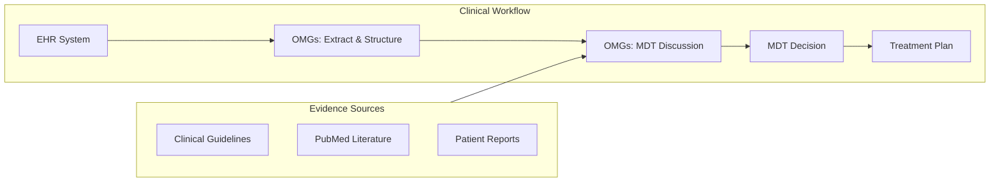
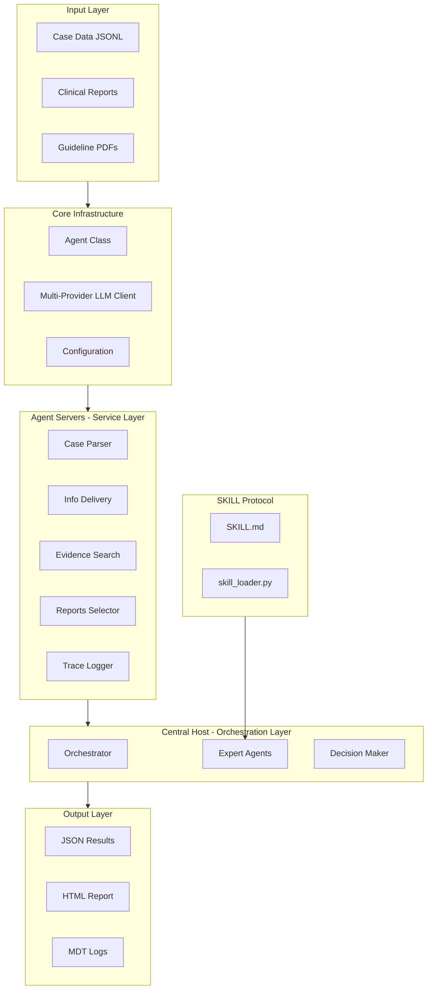
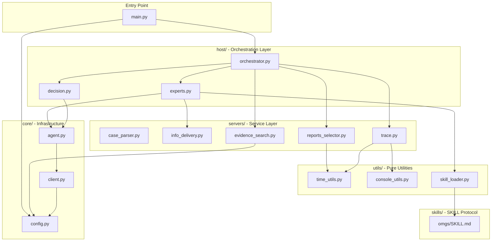
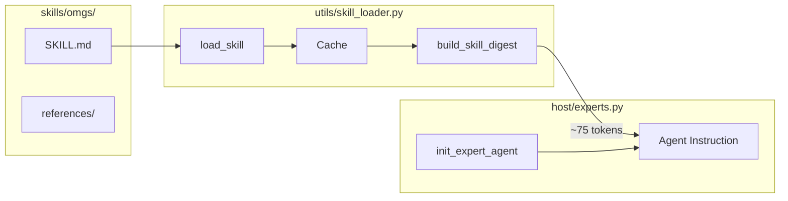
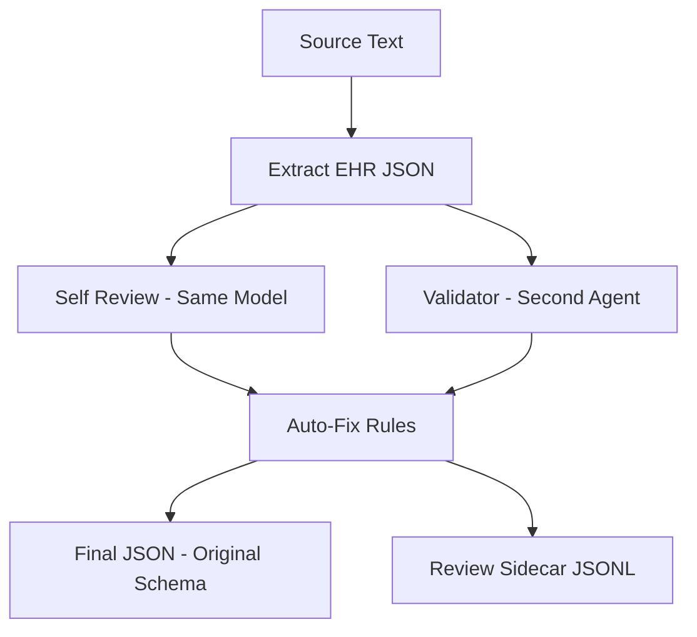

# OMGs - Ovarian-cancer Multidisciplinary intelligent aGent System

[](https://www.python.org/downloads/)
[](LICENSE)

**OMGs** (Ovarian-cancer Multidisciplinary intelligent aGent System) is a multi-agent clinical decision-support system for ovarian cancer MDT (multidisciplinary team) discussions. It simulates multiple specialist roles (Chair, Medical Oncology, Radiology, Pathology, Nuclear Medicine), runs multi-round deliberation, and produces structured MDT recommendations.

> [!NOTE]
> **Design Philosophy**: OMGs is specifically designed for ovarian cancer patients requiring **multi-line therapy** with **complex etiologies** and **multiple comorbidities**. Our goal is to provide comprehensive care throughout the **entire lifecycle** of ovarian cancer patients.
>
> **Tiered Care Recommendation**: Not all patients require full MDT discussion. For **simpler cases**, we recommend using the `--agent auto` mode, which intelligently routes cases to the appropriate processing level based on complexity assessment.
>
> **SKILL Protocol**: The `skills/omgs/` documentation is designed for future tool enhancements and IDE integration. Currently it only provides: (1) ~75-token evidence tagging prompt injection per agent, (2) Cursor IDE development context via `.cursorrules`. The SKILL docs do **not** increase runtime token consumption.

---

## Table of Contents

- [Clinical Significance](#-clinical-significance)
- [Key Features](#-key-features)
- [Recent Updates](#-recent-updates)
- [System Architecture](#-system-architecture)
- [Installation](#-installation)
- [Quick Start](#-quick-start)
- [Usage Guide](#-usage-guide)
- [Project Structure](#-project-structure)
- [Configuration](#-configuration)
- [SKILL Protocol](#-skill-protocol)
- [Open Evidence References](#-open-evidence-references)
- [Examples](#-examples)
- [Troubleshooting](#-troubleshooting)
- [Development Guide](#-development-guide)
- [License](#-license)

---

## 🏥 Clinical Significance

### Why MDT Decision Support Matters

Multidisciplinary team (MDT) meetings are the gold standard for complex cancer care, but face challenges:

- **Information overload**: Specialists must synthesize vast amounts of patient data
- **Time constraints**: Limited meeting time for thorough case review
- **Regional disparities**: Resource-limited settings lack specialist expertise
- **Documentation gaps**: Discussion rationale often poorly captured

### How OMGs Addresses These Challenges

| Challenge | OMGs Solution |
|-----------|---------------|
| **Fragmented reasoning** | MDT-ready decision support aligns multi-specialty opinions |
| **Transparency** | Evidence with patient facts side by side for transparent reasoning |
| **Auditability** | Full discussion logs and report selection enable quality review |
| **Hallucination risk** | Role permissions and report evidence constrain output |
| **Resource limitations** | Supports regional hospitals and residents with AI-assisted decisions |

### Architecture Highlights

- **Modular Multi‑Agent Collaboration**: Five specialized expert agents (Chair, Oncology, Radiology, Pathology and Nuclear Medicine) coordinate through a central orchestrator and conduct two‑round deliberations, with each agent constrained to its role.
- **Open Evidence System**: Uses a Retrieval‑Augmented Generation (RAG) model combining clinical guidelines and PubMed literature; every conclusion is accompanied by standardized citations to ensure traceability.
- **Comprehensive Logging and Observability**: Automatically produces JSONL logs, Markdown transcripts and HTML reports; the HTML report includes flowcharts, discussion matrices and reference cards, facilitating audit and debugging.
- **SKILL Protocol**: Each agent receives a ~75‑token runtime skill digest enforcing citation format and role constraints, ensuring consistent behavior across agents.
- **Scalable Best‑Practice Design**: The architecture follows multi‑agent best practices and can evolve into a hierarchical model, allowing new roles or tasks to be added as needed.

### Clinical Workflow Integration



---

## ✨ Key Features

### Multi-Agent Collaboration

- **🤖 Five Specialist Agents**: Chair, Medical Oncologist, Radiologist, Pathologist, Nuclear Medicine Physician
- **💬 Multi-Round Discussion**: Structured 2-round × 2-turn debate to resolve conflicts
- **🎯 Role-Based Permissions**: Each expert only accesses relevant report types

### Evidence Integration

- **🔍 RAG Enhancement**: ChromaDB-backed guideline and PubMed retrieval
- **📊 Smart Report Selection**: LLM-powered filtering of labs, imaging, pathology, mutations
- **🧬 Automatic Genetic Marker Extraction**: Automatically extracts HRD/BRCA status from mutation reports for accurate RAG queries
- **🧪 Clinical Trial Matching**: Optional trial recommendation module

### Observability & Traceability

- **📝 Full Logging**: JSONL logs, Markdown transcripts, HTML reports
- **📈 Interaction Matrix**: Visual representation of expert discussions
- **🔐 Evidence Tags**: All claims linked to source reports or guidelines
- **📊 Pipeline Statistics**: Automatic tracking and display of execution time, token usage, and model utilization in HTML reports

### Error Handling & Resilience

- **🛡️ Graceful Degradation**: Single agent failures don't crash the entire MDT pipeline
- **⏱️ Timeout Protection**: 10-second timeout for RAG model initialization prevents infinite retries
- **🔄 Automatic Retries**: Rate limit errors (429) are automatically retried with exponential backoff (2-3 attempts)
- **🔄 Automatic Fallbacks**: Failed operations use sensible defaults (e.g., empty RAG results, error placeholders)
- **📊 Error Tracking**: All errors logged to trace with detailed context for debugging
- **🌐 Network Resilience**: Handles HuggingFace model download failures gracefully, skips RAG if network unavailable
- **📁 Missing Directory Tolerance**: System continues operation even if `files/` or `rag_store/` directories are missing, using empty data or in-memory caches

### Open Evidence References

- **📋 Structured References**: Auto-generated reference section with 4 categories:
  - Guidelines (`[@guideline:doc_id | Page xx]`)
  - Literature (`[@pubmed | PMID]`)
  - Clinical Trials (`[@trial | id]`)
  - Clinical Reports (`[@actual_report_id | LAB/Genomics/MR/CT]`)
- **🎨 Visual HTML Report**: Color-coded reference cards with Mermaid flowchart
- **🔗 1:1 Evidence Mapping**: Each RAG result gets a dedicated digest bullet

### SKILL Protocol Integration

- **🧠 Modular Knowledge**: Self-contained skill package in `skills/omgs/` with progressive disclosure
- **⚡ Runtime Injection**: ~75 tokens per agent enforcing evidence format and role constraints
- **📖 Reference Guides**: Architecture, expert roles, extension guide, and pipeline ops documentation
- **🔧 Cursor Integration**: `.cursorrules` for automatic IDE context loading

---

## 🆕 Recent Updates

### v1.1 - Multi-Mode Support & Intelligent Routing

**New Agent Modes:**

| Mode | Description | Use Case |
|------|-------------|----------|
| `omgs` | Full multi-agent MDT discussion (default) | Complex cases requiring multi-specialty debate |
| `chair_sa` | Simplest single-agent mode | Environment/API testing |
| `chair_sa_k` | Single agent + Knowledge (Guidelines + PubMed) | Cases needing evidence reference |
| `chair_sa_kep` | Single agent + Knowledge + Evidence Pack | Complex cases with patient data |
| `auto` | **Intelligent routing** based on case complexity | Recommended for tiered care |

**Auto Mode Features:**
- Automatically assesses case complexity (treatment line, genetic testing, platinum status, comorbidities)
- Routes to appropriate processing mode (`chair_sa` → `chair_sa_k` → `chair_sa_kep` → `omgs`)
- Reduces resource usage for simpler cases while ensuring complex cases get full MDT support

**Output Enhancements:**
- `agent_mode` field recorded in `results.json` (e.g., `"auto(chair_sa_kep)"`)
- HTML report displays mode badge in Pipeline Statistics card
- **MDT Discussion Summary** section in HTML report (Key Knowledge, Controversies, Missing Info, Working Plan)
- **Print button** (🖨️) in HTML report for one-click printing
- Dark mode support (auto-detects system theme)
- Print-friendly and responsive CSS styles

**Usage:**
```bash
# Intelligent routing (recommended)
python main.py --input_path ./data.jsonl --agent auto --provider azure --model gpt-5.1

# Specific mode
python main.py --input_path ./data.jsonl --agent chair_sa_kep --provider azure --model gpt-5.1
```

---

## 🏗️ System Architecture
<!-- Added conceptual diagram of the multi-agent architecture -->

### High-Level Architecture



### Detailed Pipeline Flow


### Module Dependency Graph



### Roles and Permissions Matrix

| Role | Lab Reports | Imaging Reports | Pathology Reports | Mutation Reports | Primary Focus |
|------|:-----------:|:---------------:|:-----------------:|:----------------:|---------------|
| **Chair** | ✅ | ✅ | ❌ | ✅ | Overall synthesis & safety |
| **Oncologist** | ✅ | ❌ | ❌ | ✅ | Systemic therapy planning |
| **Radiologist** | ❌ | ✅ | ❌ | ❌ | Disease distribution & imaging |
| **Pathologist** | ❌ | ❌ | ✅ | ✅ | Histology & molecular markers |
| **Nuclear Medicine** | ❌ | ✅ | ❌ | ❌ | PET/metabolic findings |

---

## 📦 Installation

### System Requirements

| Requirement | Minimum | Recommended |
|-------------|---------|-------------|
| **Python** | 3.10 | 3.10+ |
| **RAM** | 8 GB | 16+ GB |
| **Storage** | 5 GB | 20+ GB (with RAG index) |
| **GPU** | Not required | CUDA-compatible (for faster embeddings) |
| **OS** | Linux, macOS, Windows | Linux/macOS |

### Step 1: Clone Repository

```bash
git clone https://github.com/your-org/OMGs.git
cd OMGs
```

### Step 2: Create Virtual Environment (Recommended)

```bash
# Using venv
python -m venv venv
source venv/bin/activate  # Linux/macOS
# or
venv\Scripts\activate     # Windows

# Or using conda
conda create -n omgs python=3.10
conda activate omgs
```

### Step 3: Install Dependencies

```bash
# Install all dependencies
pip install -r requirements.txt

# Or install with specific versions
pip install openai>=1.0.0 chromadb>=0.4.0 torch>=2.0.0 tiktoken>=0.5.0
```

### Step 4: Configure LLM Provider

Set up environment variables for your chosen LLM provider(s). You can configure multiple providers and switch between them using the `--provider` argument.

#### Azure OpenAI

**Linux/macOS:**
```bash
export AZURE_OPENAI_ENDPOINT="https://your-resource.openai.azure.com/"
export AZURE_OPENAI_API_KEY="your-api-key-here"

# Add to ~/.bashrc or ~/.zshrc for persistence
echo 'export AZURE_OPENAI_ENDPOINT="https://your-resource.openai.azure.com/"' >> ~/.bashrc
echo 'export AZURE_OPENAI_API_KEY="your-api-key-here"' >> ~/.bashrc
```

**Windows (PowerShell):**
```powershell
$env:AZURE_OPENAI_ENDPOINT = "https://your-resource.openai.azure.com/"
$env:AZURE_OPENAI_API_KEY = "your-api-key-here"

# For persistence, add to system environment variables
[System.Environment]::SetEnvironmentVariable("AZURE_OPENAI_ENDPOINT", "https://your-resource.openai.azure.com/", "User")
[System.Environment]::SetEnvironmentVariable("AZURE_OPENAI_API_KEY", "your-api-key-here", "User")
```

**Windows (CMD):**
```cmd
set AZURE_OPENAI_ENDPOINT=https://your-resource.openai.azure.com/
set AZURE_OPENAI_API_KEY=your-api-key-here
```

#### OpenAI Official API

**Linux/macOS:**
```bash
export OPENAI_API_KEY="your-openai-api-key"

# Add to ~/.bashrc or ~/.zshrc for persistence
echo 'export OPENAI_API_KEY="your-openai-api-key"' >> ~/.bashrc
```

**Windows (PowerShell):**
```powershell
$env:OPENAI_API_KEY = "your-openai-api-key"

# For persistence
[System.Environment]::SetEnvironmentVariable("OPENAI_API_KEY", "your-openai-api-key", "User")
```

**Windows (CMD):**
```cmd
set OPENAI_API_KEY=your-openai-api-key
```

#### OpenRouter

**Linux/macOS:**
```bash
export OPENROUTER_API_KEY="your-openrouter-api-key"

# Add to ~/.bashrc or ~/.zshrc for persistence
echo 'export OPENROUTER_API_KEY="your-openrouter-api-key"' >> ~/.bashrc
```

**Windows (PowerShell):**
```powershell
$env:OPENROUTER_API_KEY = "your-openrouter-api-key"

# For persistence
[System.Environment]::SetEnvironmentVariable("OPENROUTER_API_KEY", "your-openrouter-api-key", "User")
```

**Windows (CMD):**
```cmd
set OPENROUTER_API_KEY=your-openrouter-api-key
```

### Step 5: Verify Installation

```bash
# Check Python version
python --version

# Verify key imports
python -c "from utils import Color; print('Utils: OK')"
python -c "import torch; print(f'PyTorch: {torch.__version__}')"
python -c "import chromadb; print(f'ChromaDB: OK')"
```

### Step 6: Test LLM Provider Connections

Test your configured LLM providers:

```bash
# Test all configured providers
python -m clients.test_connection

# Test specific provider
python -m clients.test_connection --provider azure
python -m clients.test_connection --provider openai
python -m clients.test_connection --provider openrouter
```

### Dependencies Overview

| Package | Version | Purpose |
|---------|---------|---------|
| `openai` | ≥1.0.0 | Multi-provider LLM API client (supports Azure, OpenAI, OpenRouter) |
| `chromadb` | ≥0.4.0 | Vector database for RAG |
| `langchain-huggingface` | ≥0.0.1 | Embedding model integration |
| `torch` | ≥2.0.0 | Deep learning framework |
| `tiktoken` | ≥0.5.0 | Token counting for budget management |
| `tqdm` | ≥4.65.0 | Progress bars |
| `prettytable` | ≥3.8.0 | Table rendering |
| `requests` | ≥2.28.0 | HTTP requests for PubMed API |

---

## 🚀 Quick Start

### Prepare Data Files

**Note**: The system can run even if some data files or directories are missing. Missing files will result in empty data for that component, but the pipeline will continue. However, for full functionality, ensure the following files exist:

```
OMGs/
├── input_ehr/
│   └── your_cases.jsonl          # Input case data
├── files/
│   ├── lab_reports_summary.jsonl # Lab reports
│   ├── imaging_reports.jsonl     # Imaging reports
│   └── mutation_reports.jsonl    # Mutation reports
├── rag_store/
│   └── chair/
│       └── index/
│           └── chroma/           # Pre-built RAG index
└── all_trials_filtered.json      # Clinical trials (optional)
```

### Two-Step Process

**Step 1: Extract and Structure EHR (if starting from raw notes)**

```bash
# Using Azure OpenAI (default)
python ehr_structurer.py \
  --input ./input_ehr/raw_notes.jsonl \
  --output ./output_ehr/structured.jsonl \
  --deployment gpt-5-mini \
  --prompts ./config/prompts.json \
  --txt-dir ./output_ehr/txt_out \
  --provider azure

# Using OpenAI official API
python ehr_structurer.py \
  --input ./input_ehr/raw_notes.jsonl \
  --output ./output_ehr/structured.jsonl \
  --deployment gpt-4 \
  --prompts ./config/prompts.json \
  --txt-dir ./output_ehr/txt_out \
  --provider openai

# Using OpenRouter
python ehr_structurer.py \
  --input ./input_ehr/raw_notes.jsonl \
  --output ./output_ehr/structured.jsonl \
  --deployment google/gemini-2.0-flash-exp:free \
  --prompts ./config/prompts.json \
  --txt-dir ./output_ehr/txt_out \
  --provider openrouter

# Auto-detect provider (default)
python ehr_structurer.py \
  --input ./input_ehr/raw_notes.jsonl \
  --output ./output_ehr/structured.jsonl \
  --deployment gpt-5-mini \
  --prompts ./config/prompts.json \
  --txt-dir ./output_ehr/txt_out \
  --provider auto
```

**Step 2: Run MDT Pipeline**

```bash
# Using Azure OpenAI (default)
python main.py \
  --input_path ./output_ehr/structured.jsonl \
  --agent omgs \
  --model gpt-5.1 \
  --provider azure \
  --num_samples 10

# Using OpenAI official API
python main.py \
  --input_path ./output_ehr/structured.jsonl \
  --agent omgs \
  --model gpt-4 \
  --provider openai \
  --num_samples 10

# Using OpenRouter
python main.py \
  --input_path ./output_ehr/structured.jsonl \
  --agent omgs \
  --model google/gemini-3-pro-preview \
  --provider openrouter \
  --num_samples 10

# Auto-detect provider (default)
python main.py \
  --input_path ./output_ehr/structured.jsonl \
  --agent omgs \
  --model gpt-5.1 \
  --provider auto \
  --num_samples 10
```

### Single Command (Pre-structured Data)

If your data is already structured:

```bash
# Using auto-detection (default)
python main.py --input_path ./input_ehr/test_cases.jsonl --agent omgs

# Explicitly specify provider
python main.py --input_path ./input_ehr/test_cases.jsonl --agent omgs --provider openai
```

### Check Outputs

```bash
# Results
ls -la output_answer/omgs_*/

# MDT Logs
ls -la mdt_logs/

# Open HTML report
open mdt_logs/mdt_report_*.html  # macOS
# or
xdg-open mdt_logs/mdt_report_*.html  # Linux
```

---

## 📖 Usage Guide

### Multi-Provider LLM Support

OMGs supports multiple LLM providers through the `--provider` argument:

- **`azure`**: Azure OpenAI (default, backward compatible)
- **`openai`**: OpenAI official API
- **`openrouter`**: OpenRouter (supports multiple models like Gemini, Claude, etc.)
- **`auto`**: Auto-detect provider based on model name (default)

You can use different providers for different steps of the pipeline. For example, use Azure for EHR extraction and OpenAI for MDT processing.

**Gemini Reasoning Models:** For `google/gemini-3-pro-preview` and similar reasoning models via OpenRouter:
- **Reasoning is mandatory**: The model requires reasoning to be enabled and cannot be disabled. The system automatically sends an empty `extra_body` (letting the API use default reasoning settings) instead of `reasoning: {enabled: false}`.
- **Automatic token scaling**: Since reasoning tokens are counted in `max_completion_tokens`, the system automatically scales up `max_tokens` by 8x (minimum 20,000) for Gemini 3 Pro models to ensure sufficient tokens for both reasoning (~1000-2000 tokens) and actual content output.
- **Example**: An expert agent with `max_tokens=900` will automatically get `max(900*8, 20000) = 20000` tokens when using Gemini 3 Pro.

See [clients/PROVIDERS.md](clients/PROVIDERS.md) for detailed provider usage guide.

### CLI Arguments

#### main.py

```bash
python main.py [OPTIONS]
```

| Argument | Type | Default | Description |
|----------|------|---------|-------------|
| `--input_path` | str | **Required** | Path to input JSONL file |
| `--model` | str | `gpt-5.1` | Model/deployment name |
| `--provider` | str | `auto` | LLM provider: `azure`, `openai`, `openrouter`, or `auto` (auto-detect based on model name) |
| `--agent` | str | `basic_baseline` | Agent type (use `omgs`) |
| `--num_samples` | int | 999999 | Number of samples to process |

#### ehr_structurer.py

```bash
python ehr_structurer.py [OPTIONS]
```

| Argument | Type | Default | Description |
|----------|------|---------|-------------|
| `--input` | str | **Required** | Path to input JSONL file |
| `--output` | str | **Required** | Path to output JSONL file |
| `--deployment` | str | **Required** | Model/deployment name |
| `--prompts` | str | **Required** | Path to prompts configuration file |
| `--provider` | str | `auto` | LLM provider: `azure`, `openai`, `openrouter`, or `auto` (auto-detect based on model name) |
| `--field` | str | `question` | Field name to extract |
| `--max-completion-tokens` | int | 40000 | Maximum completion tokens |
| `--retries` | int | 4 | Number of retry attempts |
| `--txt-dir` | str | `""` | Directory for text output files |
| `--db_path` | str | `api_trace.db` | Path to API trace database |
| `--disable-json-repair` | flag | False | Disable automatic JSON repair |
| `--verbose` | flag | False | Enable verbose retry logs |
| `--quiet` | flag | False | Suppress retry logs |

### Input Format

Each JSONL line should contain:

```json
{
  "meta_info": "patient_identifier",
  "Time": "2024-01-15T10:00:00",
  "question": {
    "CASE_CORE": {
      "DIAGNOSIS": {
        "primary": "High-grade serous ovarian carcinoma",
        "histology": "Serous",
        "stage": "IIIC"
      },
      "LINE_OF_THERAPY": "2nd line",
      "BIOMARKERS": {
        "CA125": "156 U/mL",
        "HRD": "Positive",
        "BRCA1": "Pathogenic mutation"
      },
      "CURRENT_STATUS": "Recurrent disease"
    },
    "TIMELINE": {
      "events": [
        {"date": "2023-01-15", "event": "Initial diagnosis"},
        {"date": "2023-06-01", "event": "Completed chemotherapy"}
      ]
    },
    "MED_ONC": {},
    "RADIOLOGY": {},
    "PATHOLOGY": {},
    "NUC_MED": {},
    "LAB_TRENDS": {}
  },
  "question_raw": "Original clinical question text",
  "scene": "recurrence",
  "gold_plan": "Reference treatment plan (optional)"
}
```

### Output Files

**Directory: `output_answer/{agent}_{timestamp}/`**

| File | Description |
|------|-------------|
| `results.json` | Structured results with all metadata |
| `results.txt` | Human-readable text output |

**Directory: `mdt_logs/`**

| File | Description |
|------|-------------|
| `mdt_history_{timestamp}.jsonl` | Complete MDT log in JSONL format |
| `mdt_history_{timestamp}.md` | Markdown discussion transcript |
| `mdt_report_{timestamp}.html` | Interactive HTML report |

### Output Schema

```json
{
  "scene": "recurrence",
  "question": { "normalized case object" },
  "response": "Final Assessment:\n...\n\nCore Treatment Strategy:\n...\n\nChange Triggers:\n...",
  "gold_plan": "reference answer if provided",
  "question_raw": "original question text",
  "Time": "2024-01-15T10:00:00",
  "meta_info": "patient_identifier"
}
```

---

## 📁 Project Structure

```
OMGs/
├── main.py                     # Entry point - MDT pipeline
├── ehr_structurer.py           # EHR extraction entry script (calls servers/case_parser)
├── pdf_to_rag.py               # RAG corpus/index builder
├── requirements.txt            # Python dependencies
├── README.md                   # This documentation
├── .cursorrules                # Cursor IDE integration rules
│
├── skills/                     # SKILL Protocol Package
│   └── omgs/
│       ├── SKILL.md            # Core skill definition (~100 lines)
│       └── references/         # Detailed reference guides
│           ├── architecture.md     # Three-layer architecture details
│           ├── expert-roles.md     # Role permissions and prompts
│           ├── extension-guide.md  # Adding roles/report types
│           └── pipeline-ops.md     # CLI, config, debugging
│
├── host/                       # Central Host (Orchestration Layer)
│   ├── __init__.py             # Package exports
│   ├── orchestrator.py         # MDT discussion engine + main pipeline
│   │                           #   - run_mdt_discussion()
│   │                           #   - process_omgs_multi_expert_query()
│   ├── experts.py              # Expert agent definitions
│   │                           #   - ROLES, ROLE_PERMISSIONS, ROLE_PROMPTS
│   │                           #   - init_expert_agent()
│   └── decision.py             # Final decision-making & post-processing
│                               #   - generate_final_output()
│                               #   - append_references_to_output()
│                               #   - parse_trial_from_note()
│                               #   - assistant_trial_suggestion()
│                               #   - build_enhanced_case_for_trial()
│
├── servers/                    # Agent Servers (Service Layer)
│   ├── __init__.py             # Package exports
│   ├── case_parser.py          # EHR extraction (full implementation)
│   │                           #   - process_file(), apply_auto_fixes()
│   │                           #   - try_parse_json(), main()
│   ├── info_delivery.py        # Role-specific case views
│   │                           #   - build_role_specific_case_view()
│   │                           #   - safe_load_case_json()
│   ├── evidence_search.py      # RAG retrieval & evidence summarization
│   │                           #   - get_global_guideline_rag()
│   │                           #   - pubmed_search_pack()
│   │                           #   - build_rag_query_for_mdt() → extracts HRD/BRCA from mutation reports
│   │                           #   - summarize_rag_evidence() → 1:1 digest
│   ├── reports_selector.py     # Clinical report selection
│   │                           #   - load_patient_labs/imaging/pathology/mutations()
│   │                           #   - select_reports_for_roles()
│   │                           #   - expert_select_reports()
│   ├── trace.py                # Observability utilities
│   │                           #   - TraceLogger, VisualConfig
│   │                           #   - print_selected_reports_table(), print_rag_hits_table()
│   │                           #   - warn_missing_evidence_tags()
│   └── reporters.py            # Report generation & HTML visualization
│                               #   - save_mdt_log() → JSONL + Markdown
│                               #   - save_case_html_report() → HTML report
│                               #   - _render_pipeline_stats_html() → Statistics card
│                               #   - _render_final_output_html() → References UI
│                               #   - Mermaid.js flowchart rendering
│
├── core/                       # Core Infrastructure
│   ├── __init__.py             # Package exports
│   ├── agent.py                # Stateful LLM Agent wrapper
│   │                           #   - Agent class with chat(), run_selection()
│   ├── client.py               # Multi-provider LLM client initialization
│   │                           #   - init_client(), init_client_from_config()
│   └── config.py               # Configuration loading
│                               #   - load_paths_config(), get_paths_config()
│                               #   - load_mdt_prompts(), get_mdt_prompts()
│                               #   - load_data(), create_question(), setup_model()
│
├── clients/                    # Multi-Provider LLM Client Wrapper
│   ├── __init__.py
│   ├── wrapper.py              # OpenAIWrapper class
│   ├── logger.py               # API logging
│   ├── test_connection.py      # Provider connection tests
│   └── PROVIDERS.md            # Multi-provider usage guide
│
├── utils/                      # Pure Utility Functions
│   ├── __init__.py             # Package exports
│   ├── console_utils.py        # Console formatting
│   │                           #   - Color class
│   ├── stats_collector.py      # Pipeline statistics collection
│   │                           #   - collect_pipeline_stats() → query API trace DB
│   │                           #   - Aggregates tokens, models, execution time
│   ├── time_utils.py           # Time-related utilities
│   │                           #   - format_duration() → human-readable time
│   │                           #   - preview_text(), print_prompt_budget()
│   │                           #   - normalize_trial_compact()
│   │                           #   - safe_parse_json_block()
│   │                           #   - question_to_text()
│   ├── time_utils.py           # Date/time utilities
│   │                           #   - parse_dt(), parse_date()
│   │                           #   - make_cutoff(), filter_before()
│   │                           #   - build_lab/imaging/pathology_timeline()
│   │                           #   - format_duration() → human-readable time format
│   ├── reference_cache.py      # Reference caching & Open Evidence system
│   │                           #   - ReferenceCache, get_reference_cache()
│   │                           #   - extract_reference_tags() - 4 types supported
│   │                           #   - build_references_section() - formatted refs
│   │                           #   - store_trial(), get_trial() - trial caching
│   └── skill_loader.py         # SKILL Protocol runtime loader
│                               #   - load_skill() - parse SKILL.md with caching
│                               #   - build_skill_digest() - ~75 token digest per role
│                               #   - get_skill_info() - metadata for tracing
│
├── config/                     # Configuration Files
│   ├── paths.json              # Data and output paths
│   ├── mdt_prompts.json        # MDT discussion prompts
│   └── prompts.json            # EHR extraction prompts
│
├── files/                      # Data Files
│   ├── lab_reports_summary.jsonl
│   ├── imaging_reports.jsonl
│   └── mutation_reports.jsonl
│
├── input_ehr/                  # Input Case Files
│   └── *.jsonl
│
├── output_answer/              # Pipeline Outputs
│   └── omgs_YYYY-MM-DD_HH-MM-SS/
│       ├── results.json
│       └── results.txt
│
├── output_ehr/                 # EHR Extraction Outputs
│   └── *.jsonl
│
├── mdt_logs/                   # MDT Discussion Logs
│   ├── mdt_history_*.jsonl     # Full pipeline state (machine-readable)
│   ├── mdt_history_*.md        # Human-readable discussion transcript
│   └── mdt_report_*.html       # Visual HTML report with:
│                               #   - Mermaid pipeline flowchart
│                               #   - Color-coded References section
│                               #   - Expert debate matrix
│
└── rag_store/                  # RAG Index Storage
    ├── chair/
    │   ├── corpus/
    │   │   ├── chunks/         # Chunked guideline text
    │   │   ├── meta/           # Document metadata
    │   │   └── staging_txt/    # Raw text files
    │   └── index/
    │       └── chroma/         # ChromaDB index
    ├── oncologist/
    ├── radiologist/
    ├── pathologist/
    └── nuclear/
```

---

## ⚙️ Configuration

> **Detailed Documentation:** See [config/README.md](config/README.md) for comprehensive prompt documentation including Expert Role Prompts, Permission Matrix, Evidence Tag Rules, and Customization Guide.

### Paths Configuration (`config/paths.json`)

```json
{
  "data_files": {
    "lab_reports": "files/lab_reports_summary.jsonl",
    "imaging_reports": "files/imaging_reports.jsonl",
    "pathology_reports": null,
    "mutation_reports": "files/mutation_reports.jsonl",
    "trials": "all_trials_filtered.json"
  },
  "rag_store": {
    "base_dir": "rag_store",
    "index_dir_template": "rag_store/{role}/index/chroma",
    "collection_name_template": "{role}_chunks",
    "embedding_model": "BAAI/bge-m3",
    "use_per_role_rag": false,
    "default_role": "chair",
    "available_roles": ["chair", "oncologist", "radiologist", "pathologist", "nuclear"]
  },
  "output_dirs": {
    "output_answer": "output_answer",
    "mdt_logs": "mdt_logs",
    "api_trace_db": "api_trace.db"
  }
}
```

### MDT Prompts Configuration (`config/mdt_prompts.json`)

```json
{
  "mdt_discussion": {
    "initial_opinion": "Give INITIAL opinion using ONLY your system-provided patient facts...",
    "speak_prompt_template": "ROLE: {role}. VISIT: {visit_time}...",
    "final_plan_template": "Given MDT context: {merged}...",
    "round_summary_template": "MDT global knowledge: {merged}..."
  },
  "agents": {
    "rag_query_builder": "Construct concise English MDT guideline query.",
    "global_guideline_digester": "Digest guideline chunks into <=8 evidence bullets...",
    "assistant": "You are MDT assistant. Summarize only. Do not decide treatment.",
    "trial_selector": "You are an MDT assistant for clinical trial matching..."
  },
  "rag": {
    "query_builder": "You are preparing a single concise English query...",
    "evidence_summarizer": "Summarize into evidence bullets for MDT decision-making..."
  }
}
```

### Function-Level Override

```python
from host import process_omgs_multi_expert_query

result = process_omgs_multi_expert_query(
    question=question,
    question_raw=question_raw,
    model=model,
    args=args,
    # Override default paths
    labs_json="custom/labs.jsonl",
    imaging_json="custom/imaging.jsonl",
    pathology_json="custom/pathology.jsonl",
    mutation_json="custom/mutations.jsonl",
    trials_json_path="custom/trials.json",
    # RAG parameters
    device="cuda",
    topk=10
)
```

---

## 🧠 SKILL Protocol

### Overview

OMGs implements a **SKILL Protocol** that injects modular knowledge into Expert Agents at runtime. This ensures consistent evidence tagging, role behavior enforcement, and system awareness across all MDT discussions.

### How It Works



### Injected SKILL Digest

Each Expert Agent receives a concise digest (~75 tokens) at the start of their instruction:

```
# OMGs SKILL PROTOCOL
System: OMGs (Ovarian-cancer Multidisciplinary aGent System)
Evidence tags REQUIRED: [@guideline:doc_id | Page xx], [@pubmed | PMID], [@trial | id], [@actual_report_id | LAB/Genomics/MR/CT]
Use actual report_id from report data (e.g., [@20220407|17300673 | LAB], [@OH2203828|2022-04-18 | Genomics])
Role constraint: {role-specific constraint}
```

### Role-Specific Constraints

| Role | Constraint |
|------|------------|
| **Chair** | Integrate all specialties; no specific drug names |
| **Oncologist** | Systemic therapy categories only; no drug names |
| **Radiologist** | Imaging findings only; no treatment advice |
| **Pathologist** | Histology/molecular only; no treatment advice |
| **Nuclear** | Metabolic findings only; no treatment advice |

### Token Impact

| Component | Tokens |
|-----------|--------|
| Per agent digest | ~75 |
| 5 agents total | ~375 |
| % of typical MDT run (~50k) | <1% |

### Files Involved

| File | Purpose |
|------|---------|
| `skills/omgs/SKILL.md` | Core skill definition with architecture overview |
| `skills/omgs/references/*.md` | Detailed guides (architecture, roles, extension, ops) |
| `utils/skill_loader.py` | Runtime loader with caching |
| `host/experts.py` | Injects digest via `build_skill_digest(role)` |
| `.cursorrules` | Cursor IDE auto-context for development |

### Usage in Code

```python
from utils.skill_loader import build_skill_digest

# In init_expert_agent():
skill_digest = build_skill_digest(role)  # Returns ~75 token string

instruction = f"""
{skill_digest}

OUTPATIENT VISIT TIME: {visit_time_str}
...
"""
```

---

## 📚 Open Evidence References

### Overview

OMGs implements an **Open Evidence** system that automatically generates a structured References section at the end of each MDT output. This ensures full traceability of clinical recommendations back to their source evidence.

### Evidence Tag Formats

| Type | Format | Example |
|------|--------|---------|
| **Guidelines** | `[@guideline:doc_id \| Page xx]` | `[@guideline:nccn_ovarian_v3 \| Page 14]` |
| **Literature** | `[@pubmed \| PMID]` | `[@pubmed \| 33758607]` |
| **Clinical Trials** | `[@trial \| id]` | `[@trial \| 350]` |
| **Clinical Reports** | `[@actual_report_id \| LAB/Genomics/MR/CT]` | `[@20220407\|17300673 \| LAB]`, `[@OH2203828\|2022-04-18 \| Genomics]`, `[@2022-12-29 \| MR]`, `[@2022-12-29 \| CT]` |

### Output Example

**Natural Trial Citation:** When a clinical trial is recommended by the assistant, the Chair agent naturally integrates it into the Core Treatment Strategy or Change Triggers with proper `[@trial | id]` citation, rather than appending it at the end. The trial recommendation is passed directly in the final output prompt, allowing the Chair to judge appropriateness and cite naturally.

```
Final Assessment:
Patient with platinum-resistant recurrent ovarian clear cell carcinoma...

Core Treatment Strategy:
- Correct anemia before systemic therapy [@20220407|17300673 | LAB]
- Consider non-platinum palliative chemotherapy [@guideline:nccn_ov | Page 14]
- Pursue clinical trial enrollment if eligible [@trial | 350]

---
## References

### Guidelines
[@guideline:nccn_ov | Page 14]
  Document: nccn_ov, Page 14
  Content: For platinum-resistant disease, consider...

### Literature
[@pubmed | 33758607]
  PMID: 33758607 | J Cancer | 2021
  Title: Updates of Pathogenesis for Ovarian Clear Cell Carcinoma

### Clinical Trials
[@trial | 350]
  Trial ID: 350
  Name: Phase Ib/II study of BL-B01D1 in gynecologic malignancies
  Rationale: Patient meets eligibility for recurrent disease

### Clinical Reports
[@20220407|17300673 | LAB]
  LAB ID: 20220407|17300673 | Date: 2022-04-07
  Content: Hemoglobin 8.2 g/dL (severe anemia)

[@OH2203828|2022-04-18 | Genomics]
  Genomics ID: OH2203828|2022-04-18 | Date: 2022-04-18
  Content: ATM mutation detected...
```

### HTML Report Features

The generated HTML report (`mdt_report_*.html`) includes:

- **📊 Pipeline Execution Statistics** (displayed at the top):
  - **Total Execution Time**: Shown in both seconds and human-readable format (e.g., "45.3 seconds (45.3秒)", "1分25秒")
  - **Total Token Usage**: Breakdown of input tokens, output tokens, and total tokens with thousands separators
  - **Models Used**: Per-model statistics including:
    - Model name with provider information (e.g., "gpt-5.1 (Azure)")
    - Number of API calls
    - Total tokens consumed
    - Input/output token breakdown
  - Statistics are automatically collected from the `api_trace.db` database during pipeline execution
- **Mermaid Pipeline Flowchart**: Visual representation of the MDT workflow
- **Color-coded References**: Each category has distinct styling:
  - 📋 Guidelines (green)
  - 📚 Literature (purple)
  - 🔬 Clinical Trials (red)
  - 📄 Clinical Reports (orange)
- **Interactive Details**: Collapsible sections for evidence, RAG hits, and trace events

### Evidence Digest (Dynamic 1:1 Mapping)

The RAG evidence digest maintains a strict 1:1 correspondence with retrieved results. The system dynamically instructs the digester to produce exactly N bullets for N RAG results:

```python
# Dynamic instruction: "Digest RAG chunks into exactly {rag_count} evidence bullets"
# For 10 RAG results → exactly 10 digest bullets
# Each bullet uses the EXACT citation tag from its source

# Example: 3 RAG results → 3 digest bullets
- Platinum-based chemotherapy is standard first-line... [@guideline:nccn_ov | Page 12]
- PARP inhibitors improve PFS in BRCA-mutated... [@pubmed | 33758607]
- Anti-VEGF therapy option for platinum-sensitive... [@guideline:esmo_ov | Page 10]
```

### Mutation Report Handling (Comprehensive NGS Panel)

OMGs treats mutation reports as **comprehensive NGS panel results** (~20,000 genes) and provides consistent interpretation rules across all components (RAG queries, expert agents, trial matching):

**Interpretation Rules:**

The system injects the following interpretation rules whenever mutation reports are present:

| Chinese Term | English Meaning | Interpretation |
|--------------|-----------------|----------------|
| `未检出` | Not detected | NO pathogenic mutation found |
| `（视为阴性）` | Considered negative | NO pathogenic mutation found |
| `阴性` | Negative | Negative result |
| `NM_xxx:exon:c.xxx:p.xxx` | Variant notation | POSITIVE mutation detected |
| Gene not mentioned | - | NO pathogenic mutation (comprehensive panel) |

**Key Features:**

1. **Comprehensive Panel Assumption**: Since mutation reports come from ~20,000 gene NGS panels:
   - Any gene NOT mentioned in the report = NO pathogenic mutation found
   - The system never says "not tested" or "not reported" when a mutation report exists

2. **Universal Application**: Interpretation rules are injected into:
   - RAG query building (`servers/evidence_search.py`)
   - Expert agent context (`host/experts.py`)
   - Clinical trial matching (`host/decision.py`)

3. **Tumor-Agnostic Design**: Unlike previous HRD/BRCA-specific logic, the new approach:
   - Passes full `raw_text` to agents
   - Lets agents focus on relevant genes based on tumor type
   - Works for all cancer types, not just epithelial ovarian cancer

**Example Mutation Report:**

```
MSH6 NM_001281492:exon3:c.G2971A:p.E991K（胚系）；
BRCA1 NM_007297:exon18:c.C5110T:p.R1704X（胚系）；
BRCA2 胚系和体系未检出致病突变（视为阴性）；
TP53 胚系和体系未检出致病突变（视为阴性）；
HRD 阴性（未检出阳性结果）
```

**Interpretation:**
- MSH6: **POSITIVE** (germline mutation detected)
- BRCA1: **POSITIVE** (germline mutation detected)
- BRCA2: **NEGATIVE** (视为阴性)
- TP53: **NEGATIVE** (视为阴性)
- HRD: **NEGATIVE** (阴性)
- Other genes (e.g., PTEN, PIK3CA): **NEGATIVE** (not mentioned = no mutation)

**Why This Matters:**

- **Clinical Accuracy**: Experts correctly interpret comprehensive NGS results
- **No False Negatives**: System never incorrectly states "not tested" when reports exist
- **Tumor-Type Flexibility**: Works for ovarian, endometrial, and other cancer types with different gene focuses

---

## 💡 Examples

### Complete Workflow Examples

#### Example 1: Using Azure OpenAI (Default)

```bash
# Step 1: Set environment variables
export AZURE_OPENAI_ENDPOINT="https://your-resource.openai.azure.com/"
export AZURE_OPENAI_API_KEY="your-azure-key"

# Step 2: Extract EHR (using Azure)
python ehr_structurer.py \
  --input ./input_ehr/test_guo.jsonl \
  --output ./output_ehr/test_guo.jsonl \
  --deployment gpt-5-mini \
  --prompts ./config/prompts.json \
  --txt-dir ./output_ehr/txt_out \
  --provider azure

# Step 3: Run MDT pipeline (using Azure)
python main.py \
  --input_path ./output_ehr/test_guo.jsonl \
  --agent omgs \
  --model gpt-5.1 \
  --provider azure
```

#### Example 2: Using OpenAI Official API

```bash
# Step 1: Set environment variables
export OPENAI_API_KEY="your-openai-key"

# Step 2: Extract EHR (using OpenAI)
python ehr_structurer.py \
  --input ./input_ehr/test_guo.jsonl \
  --output ./output_ehr/test_guo.jsonl \
  --deployment gpt-4 \
  --prompts ./config/prompts.json \
  --txt-dir ./output_ehr/txt_out \
  --provider openai

# Step 3: Run MDT pipeline (using OpenAI)
python main.py \
  --input_path ./output_ehr/test_guo.jsonl \
  --agent omgs \
  --model gpt-4 \
  --provider openai
```

#### Example 3: Using OpenRouter

```bash
# Step 1: Set environment variables
export OPENROUTER_API_KEY="your-openrouter-key"

# Step 2: Extract EHR (using OpenRouter with Gemini)
python ehr_structurer.py \
  --input ./input_ehr/test_guo.jsonl \
  --output ./output_ehr/test_guo.jsonl \
  --deployment google/gemini-2.0-flash-exp:free \
  --prompts ./config/prompts.json \
  --txt-dir ./output_ehr/txt_out \
  --provider openrouter

# Step 3: Run MDT pipeline (using OpenRouter with Gemini 3 Pro)
python main.py \
  --input_path ./output_ehr/test_guo.jsonl \
  --agent omgs \
  --model google/gemini-3-pro-preview \
  --provider openrouter
```

#### Example 4: Mixed Providers (EHR extraction with Azure, MDT with OpenAI)

```bash
# Step 1: Set environment variables for both providers
export AZURE_OPENAI_ENDPOINT="https://your-resource.openai.azure.com/"
export AZURE_OPENAI_API_KEY="your-azure-key"
export OPENAI_API_KEY="your-openai-key"

# Step 2: Extract EHR (using Azure)
python ehr_structurer.py \
  --input ./input_ehr/test_guo.jsonl \
  --output ./output_ehr/test_guo.jsonl \
  --deployment gpt-5-mini \
  --prompts ./config/prompts.json \
  --txt-dir ./output_ehr/txt_out \
  --provider azure

# Step 3: Run MDT pipeline (using OpenAI)
python main.py \
  --input_path ./output_ehr/test_guo.jsonl \
  --agent omgs \
  --model gpt-4 \
  --provider openai
```

### Basic Usage

```bash
# Run with default settings (auto-detect provider)
python main.py --input_path ./input_ehr/test_cases.jsonl --agent omgs

# Specify model, provider, and sample count
python main.py \
  --input_path ./input_ehr/test_cases.jsonl \
  --agent omgs \
  --model gpt-4 \
  --provider openai \
  --num_samples 5
```

### EHR Extraction

**Using Azure OpenAI:**
```bash
python ehr_structurer.py \
  --input input_ehr/raw_notes.jsonl \
  --output output_ehr/structured.jsonl \
  --deployment gpt-5.1 \
  --prompts config/prompts.json \
  --provider azure \
  --field question \
  --max-completion-tokens 40000 \
  --retries 4 \
  --txt-dir output_ehr/txt_out
```

**Using OpenAI official API:**
```bash
python ehr_structurer.py \
  --input input_ehr/raw_notes.jsonl \
  --output output_ehr/structured.jsonl \
  --deployment gpt-4 \
  --prompts config/prompts.json \
  --provider openai \
  --field question \
  --max-completion-tokens 40000 \
  --retries 4 \
  --txt-dir output_ehr/txt_out
```

**Using OpenRouter:**
```bash
python ehr_structurer.py \
  --input input_ehr/raw_notes.jsonl \
  --output output_ehr/structured.jsonl \
  --deployment google/gemini-2.0-flash-exp:free \
  --prompts config/prompts.json \
  --provider openrouter \
  --field question \
  --max-completion-tokens 40000 \
  --retries 4 \
  --txt-dir output_ehr/txt_out
```

### Build RAG Index

```bash
# Step 1: Build chunks from PDFs
python pdf_to_rag.py build \
  --pdf_dir rag_pdf/chair \
  --out_dir rag_store/chair/corpus \
  --chunk_size 1200 \
  --chunk_overlap 200

# Step 2: Index chunks into ChromaDB
python pdf_to_rag.py index \
  --corpus_dir rag_store/chair/corpus \
  --index_dir rag_store/chair/index/chroma \
  --collection_name chair_chunks \
  --model BAAI/bge-m3 \
  --device cpu

# Step 3: Test search
python pdf_to_rag.py search \
  --index_dir rag_store/chair/index/chroma \
  --collection_name chair_chunks \
  --model BAAI/bge-m3 \
  --device cpu \
  --query "NACT in ovarian cancer"
```

### Batch Processing

```bash
#!/bin/bash
# batch_process.sh

# Step 1: Extract all EHR files (using Azure)
for file in input_ehr/*.jsonl; do
    echo "Extracting: $file"
    python ehr_structurer.py \
      --input "$file" \
      --output "output_ehr/$(basename $file)" \
      --deployment gpt-5-mini \
      --prompts ./config/prompts.json \
      --provider azure
done

# Step 2: Run MDT on all extracted files (using OpenAI)
for file in output_ehr/*.jsonl; do
    echo "Processing MDT: $file"
    python main.py \
      --input_path "$file" \
      --agent omgs \
      --provider openai
done

echo "Batch processing complete!"
```

### EHR Review & Auto-Fix Pipeline

The extractor runs two review passes and deterministic auto-fix:



**Auto-fix rules:**
- Recompute PFI days and platinum status from dates
- Align platinum history status with latest line
- Fill biochemical relapse evidence from CA125
- Sort timeline events by date

**Outputs:**
- Main: `output_ehr/<file>.jsonl` (original schema)
- Review: `output_ehr/<file>.jsonl.review.jsonl` (issues & fixes)

---

## 🐛 Troubleshooting

### Error Handling System

OMGs implements comprehensive error handling to ensure the pipeline continues even when individual components fail:

**Error Handling Layers:**
1. **Agent Level** (`core/agent.py`): Catches API errors and raises `AgentError` with context
2. **MDT Discussion Level** (`host/orchestrator.py`): Handles expert failures with fallback responses
3. **Pipeline Level** (`host/orchestrator.py`): Handles RAG, report selection, and initialization failures
4. **RAG Level** (`servers/evidence_search.py`): Prevents infinite retries with timeout and request patching
5. **Retry Layer** (`utils/error_handling.py`): Automatic retry with exponential backoff for rate limit errors (429)

**Automatic Retry for Rate Limits (429 Errors):**

The system automatically retries API calls that fail with 429 (rate limit) errors:
- **Retry Strategy**: Up to 2-3 retries (depending on operation) with exponential backoff
- **Backoff Timing**: 2^attempt seconds + random jitter (e.g., 2s, 4s, 8s)
- **Operations Covered**:
  - Assistant summary (initial and round summaries)
  - Memory updates
  - Clinical trial matching
- **Fallback**: If all retries fail, the system uses a sensible fallback response and continues the pipeline

**Fallback Strategies:**

| Failure Point | Fallback Behavior |
|---------------|-------------------|
| Expert initial opinion | Uses error placeholder, continues with other experts |
| Assistant summary | Uses JSON of initial opinions as merged context |
| Turn speaking | Skips that expert for the turn, continues discussion |
| Final plan | Uses error placeholder, included in final output |
| RAG retrieval | Returns empty results, continues without RAG evidence |
| RAG summarization | Uses first 3 RAG results as simple digest |
| Chair final output | Generates simplified output from expert plans |
| Expert initialization | Skips failed roles, uses first available as chair if needed |
| Missing `files/` directory | Returns empty lists for reports, continues with available data |
| Missing report JSONL files | Returns empty lists, prints warning, pipeline continues |
| Missing `rag_store/` directory | RAG initialization fails gracefully, continues without RAG |
| Missing `rag_store/reference_cache/` | Reference cache works in-memory only, no disk persistence |
| ChromaDB directory creation failure | Raises clear error message, RAG retrieval skipped |

**Network Issues with HuggingFace:**

If you see `Connection reset by peer` errors when downloading models:
- The system will timeout after 10 seconds and skip RAG retrieval
- Requests are patched to disable retries, preventing infinite background retries
- The pipeline continues with empty RAG results
- Check your network connection or pre-download the model locally

**Error Logging:**

All errors are logged to the trace system. Check error summary:
```python
from servers.trace import TraceLogger

trace = TraceLogger(enabled=True)
# ... run pipeline ...
error_summary = trace.get_error_summary()
print(f"Total errors: {error_summary['total_errors']}")
print(f"Errors by role: {error_summary['errors_by_role']}")
print(f"Errors by stage: {error_summary['errors_by_stage']}")
```

### Common Errors

| Error | Cause | Solution |
|-------|-------|----------|
| `RuntimeError: Missing AZURE_OPENAI_ENDPOINT` | Azure environment variables not set | Set `AZURE_OPENAI_ENDPOINT` and `AZURE_OPENAI_API_KEY`, or use `--provider openai`/`openrouter` |
| `RuntimeError: Missing OPENAI_API_KEY` | OpenAI environment variable not set | Set `OPENAI_API_KEY`, or use `--provider azure`/`openrouter` |
| `RuntimeError: Missing OPENROUTER_API_KEY` | OpenRouter environment variable not set | Set `OPENROUTER_API_KEY`, or use `--provider azure`/`openai` |
| `FileNotFoundError: files/lab_reports_summary.jsonl` | Data files missing | **System handles gracefully**: Returns empty lists, prints warning, continues. To fix: Create `files/` directory and add required JSONL files. |
| `[WARNING] Failed to load lab reports` | Report file missing or unreadable | **System handles gracefully**: Pipeline continues with empty report data. Check file permissions and paths in `config/paths.json`. |
| `Failed to load RAG index` | RAG index not built | Run `pdf_to_rag.py build` and `index` commands. System continues without RAG if index unavailable. |
| `RAG initialization failed` | Network issues or model not cached | Check network, or pre-download model. Pipeline continues without RAG. |
| `Failed to create RAG index directory` | Permission denied or disk full | Check directory permissions. System will skip RAG if directory cannot be created. |
| `[WARNING] Failed to create reference cache directory` | `rag_store/reference_cache/` cannot be created | **System handles gracefully**: Cache works in-memory only. Check parent directory permissions. |
| `AgentError: ... failed in chat` | API call failed | Check provider credentials and quota. Agent uses fallback response. |
| `Error code: 429` (Rate limit) | Model temporarily rate-limited upstream | **System automatically retries** with exponential backoff (2-3 attempts). If all retries fail, uses fallback. For persistent rate limits: wait and retry, use a different model, or add your own API key to OpenRouter for higher limits. |
| `Azure API error` | Invalid deployment name | Verify `--model` matches Azure deployment, or try `--provider openai`/`openrouter` |
| `OpenAI API error` | Invalid model name or API key | Verify `--model` is valid for OpenAI, check `OPENAI_API_KEY` |
| `OpenRouter API error` | Invalid model name or API key | Verify `--model` format (e.g., `google/gemini-*`), check `OPENROUTER_API_KEY` |
| `Provider initialization failed` | Missing environment variables for selected provider | Set required environment variables for the provider, or use `--provider auto` to auto-detect |
| `ModuleNotFoundError: No module named 'torch'` | Dependencies not installed | Run `pip install -r requirements.txt` |

### Debug Mode

Enable verbose logging:

```python
# In host/orchestrator.py
visual = VisualConfig(
    enable=True,
    show_tables=True,
    show_rag_table=True,
    show_token_budget=True,  # Enable token budget display
)
```

### Check API Trace

```python
import sqlite3

conn = sqlite3.connect('api_trace.db')
cursor = conn.cursor()
cursor.execute("SELECT * FROM api_calls ORDER BY timestamp DESC LIMIT 10")
for row in cursor.fetchall():
    print(row)
conn.close()
```

---

## 🔧 Development Guide

### Adding a New Specialist Role

1. **Define role in `host/experts.py`:**

```python
# Add to ROLES list
ROLES = ["chair", "oncologist", "radiologist", "pathologist", "nuclear", "surgeon"]

# Add permissions
ROLE_PERMISSIONS["surgeon"] = {
    "lab": True,
    "imaging": True,
    "pathology": True,
    "mutation": False,
    "guideline": "surgeon"
}

# Add role prompt
ROLE_PROMPTS["surgeon"] = """
# Context
You are the surgical oncologist. You evaluate surgical candidacy and operative findings.

# Objective
Assess resectability, surgical history, and operative recommendations.

# Style
Return up to 3 bullets. Each ≤20 words. No drug names.
""".strip()
```

2. **Update `servers/info_delivery.py`:**

```python
def build_role_specific_case_view(role: str, case_json: Dict[str, Any]) -> str:
    # ... existing code ...
    
    if role == "surgeon":
        return json.dumps({
            "SURGICAL_HISTORY": case_json.get("SURGICAL_HISTORY", {}),
            "IMAGING_FOR_RESECTABILITY": radiology.get("studies", []),
            "PATHOLOGY": pathology
        }, ensure_ascii=False, indent=2)
```

3. **Build RAG index for new role:**

```bash
python pdf_to_rag.py build --pdf_dir rag_pdf/surgeon --out_dir rag_store/surgeon/corpus
python pdf_to_rag.py index --corpus_dir rag_store/surgeon/corpus --index_dir rag_store/surgeon/index/chroma
```

### Adding a New Report Type

1. **Add loader in `servers/reports_selector.py`:**

```python
def load_patient_genetics(meta_info: str, json_path: str) -> Tuple[List, List]:
    # Similar to load_patient_labs
    ...
```

2. **Extend permissions in `host/experts.py`:**

```python
ROLE_PERMISSIONS["oncologist"]["genetics"] = True
```

3. **Update `select_reports_for_roles()` to include new type.**

### Running Tests

```bash
# Syntax check all modules
python -m py_compile main.py
python -m py_compile host/orchestrator.py
python -m py_compile host/decision.py

# Import test
python -c "from host import process_omgs_multi_expert_query; print('OK')"
```

---

## 📄 License

MIT License. See `LICENSE` file for details.

---

## 🙏 Acknowledgements

- Azure OpenAI, OpenAI, and OpenRouter for language model capabilities
- ChromaDB for vector storage
- HuggingFace for embedding models
- All contributors to the OMGs project

---

## 📧 Contact

For questions, issues, or contributions:
- Open a GitHub Issue
- Email the maintainers

---

## ⚠️ Medical Disclaimer

**This system is for research and educational purposes only.**

- It does NOT replace professional medical diagnosis or treatment
- All clinical decisions MUST be made by qualified healthcare professionals
- The system outputs are advisory and require expert validation
- Patient data must be handled according to applicable privacy regulations (HIPAA, GDPR, etc.)

---

*Last updated: January 2026*
