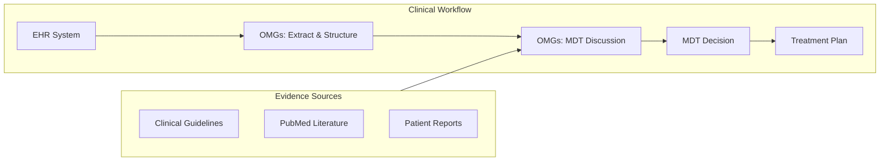
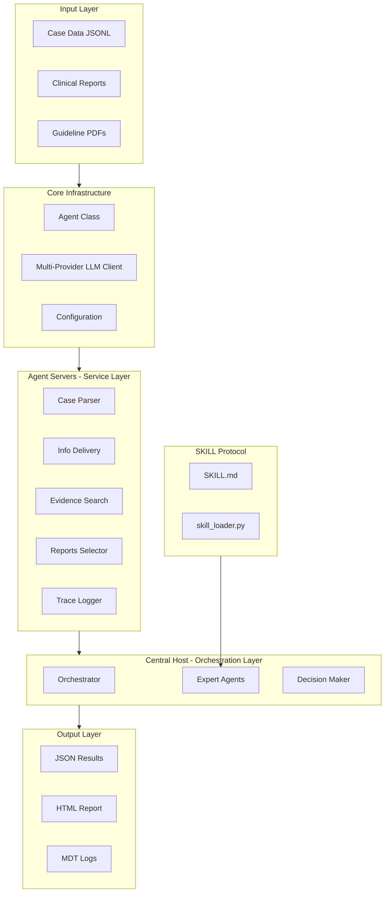
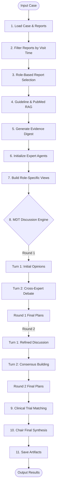

# OMGs - Ovarian-cancer Multidisciplinary intelligent aGent System

[](https://www.python.org/downloads/)
[](LICENSE)

**OMGs** (Ovarian-cancer Multidisciplinary intelligent aGent System) is a multi-agent clinical decision-support system for ovarian cancer MDT (multidisciplinary team) discussions. It simulates multiple specialist roles (Chair, Medical Oncology, Radiology, Pathology, Nuclear Medicine), runs multi-round deliberation, and produces structured MDT recommendations.

> [!NOTE]
> **Design Philosophy**: OMGs is specifically designed for ovarian cancer patients requiring **multi-line therapy** with **complex etiologies** and **multiple comorbidities**. Our goal is to provide comprehensive care throughout the **entire lifecycle** of ovarian cancer patients.
>
> **Tiered Care Recommendation**: Not all patients require full MDT discussion. For **simpler cases**, we recommend using the `--agent auto` mode, which intelligently routes cases to the appropriate processing level based on complexity assessment.
>
> **SKILL Protocol**: The `skills/omgs/` documentation is designed for future tool enhancements and IDE integration. Currently it only provides: (1) ~75-token evidence tagging prompt injection per agent, (2) Cursor IDE development context via `.cursorrules`. The SKILL docs do **not** increase runtime token consumption.

---

## Table of Contents

- [Clinical Significance](#-clinical-significance)
- [Key Features](#-key-features)
- [Recent Updates](#-recent-updates)
- [System Architecture](#-system-architecture)
- [Quick Start](#-quick-start)
- [Agent Modes](#-agent-modes)
- [Documentation](#-documentation)
- [License](#-license)

---

## 🏥 Clinical Significance

### Why MDT Decision Support Matters

Multidisciplinary team (MDT) meetings are the gold standard for complex cancer care, but face challenges:

- **Information overload**: Specialists must synthesize vast amounts of patient data
- **Time constraints**: Limited meeting time for thorough case review
- **Regional disparities**: Resource-limited settings lack specialist expertise
- **Documentation gaps**: Discussion rationale often poorly captured

### How OMGs Addresses These Challenges

| Challenge | OMGs Solution |
|-----------|---------------|
| **Fragmented reasoning** | MDT-ready decision support aligns multi-specialty opinions |
| **Transparency** | Evidence with patient facts side by side for transparent reasoning |
| **Auditability** | Full discussion logs and report selection enable quality review |
| **Hallucination risk** | Role permissions and report evidence constrain output |
| **Resource limitations** | Supports regional hospitals and residents with AI-assisted decisions |

### Architecture Highlights

- **Modular Multi‑Agent Collaboration**: Five specialized expert agents (Chair, Oncology, Radiology, Pathology and Nuclear Medicine) coordinate through a central orchestrator and conduct two‑round deliberations, with each agent constrained to its role.
- **Open Evidence System**: Uses a Retrieval‑Augmented Generation (RAG) model combining clinical guidelines and PubMed literature; every conclusion is accompanied by standardized citations to ensure traceability.
- **Comprehensive Logging and Observability**: Automatically produces JSONL logs, Markdown transcripts and HTML reports; the HTML report includes flowcharts, discussion matrices and reference cards, facilitating audit and debugging.
- **SKILL Protocol**: Each agent receives a ~75‑token runtime skill digest enforcing citation format and role constraints, ensuring consistent behavior across agents.
- **Scalable Best‑Practice Design**: The architecture follows multi‑agent best practices and can evolve into a hierarchical model, allowing new roles or tasks to be added as needed.

### Clinical Workflow Integration



---

## ✨ Key Features

### Multi-Agent Collaboration

- **🤖 Five Specialist Agents**: Chair, Medical Oncologist, Radiologist, Pathologist, Nuclear Medicine Physician
- **💬 Multi-Round Discussion**: Structured 2-round × 2-turn debate to resolve conflicts
- **🎯 Role-Based Permissions**: Each expert only accesses relevant report types

### Evidence Integration

- **🔍 RAG Enhancement**: ChromaDB-backed guideline and PubMed retrieval
- **📊 Smart Report Selection**: LLM-powered filtering of labs, imaging, pathology, mutations
- **🧬 Automatic Genetic Marker Extraction**: Automatically extracts HRD/BRCA status from mutation reports for accurate RAG queries
- **🧪 Clinical Trial Matching**: Optional trial recommendation module

### Observability & Traceability

- **📝 Full Logging**: JSONL logs, Markdown transcripts, HTML reports
- **📈 Interaction Matrix**: Visual representation of expert discussions
- **🔐 Evidence Tags**: All claims linked to source reports or guidelines
- **📊 Pipeline Statistics**: Automatic tracking and display of execution time, token usage, and model utilization in HTML reports

### Error Handling & Resilience

- **🛡️ Graceful Degradation**: Single agent failures don't crash the entire MDT pipeline
- **⏱️ Timeout Protection**: 10-second timeout for RAG model initialization prevents infinite retries
- **🔄 Automatic Retries**: Rate limit errors (429) are automatically retried with exponential backoff (2-3 attempts)
- **🔄 Automatic Fallbacks**: Failed operations use sensible defaults (e.g., empty RAG results, error placeholders)
- **📊 Error Tracking**: All errors logged to trace with detailed context for debugging
- **🌐 Network Resilience**: Handles HuggingFace model download failures gracefully, skips RAG if network unavailable
- **📁 Missing Directory Tolerance**: System continues operation even if `files/` or `rag_store/` directories are missing, using empty data or in-memory caches

### Open Evidence References

- **📋 Structured References**: Auto-generated reference section with 4 categories (Guidelines, Literature, Trials, Reports)
- **🎨 Visual HTML Report**: Color-coded reference cards with Mermaid flowchart
- **🔗 1:1 Evidence Mapping**: Each RAG result gets a dedicated digest bullet

### SKILL Protocol Integration

- **🧠 Modular Knowledge**: Self-contained skill package in `skills/omgs/` with progressive disclosure
- **⚡ Runtime Injection**: ~75 tokens per agent enforcing evidence format and role constraints
- **📖 Reference Guides**: Architecture, expert roles, extension guide, and pipeline ops documentation
- **🔧 Cursor Integration**: `.cursorrules` for automatic IDE context loading

---

## 🆕 Recent Updates

### v1.1 - Multi-Mode Support & Intelligent Routing

**New Agent Modes:**

| Mode | Description | Use Case |
|------|-------------|----------|
| `omgs` | Full multi-agent MDT discussion (default) | Complex cases requiring multi-specialty debate |
| `chair_sa` | Simplest single-agent mode | Environment/API testing |
| `chair_sa_k` | Single agent + Knowledge (Guidelines + PubMed) | Cases needing evidence reference |
| `chair_sa_kep` | Single agent + Knowledge + Evidence Pack | Complex cases with patient data |
| `auto` | **Intelligent routing** based on case complexity | Recommended for tiered care |

**Auto Mode Features:**
- Automatically assesses case complexity (treatment line, genetic testing, platinum status, comorbidities)
- Routes to appropriate processing mode (`chair_sa` → `chair_sa_k` → `chair_sa_kep` → `omgs`)
- Reduces resource usage for simpler cases while ensuring complex cases get full MDT support

**Output Enhancements:**
- `agent_mode` field recorded in `results.json` (e.g., `"auto(chair_sa_kep)"`)
- HTML report displays mode badge in Pipeline Statistics card
- **MDT Discussion Summary** section in HTML report (Key Knowledge, Controversies, Missing Info, Working Plan)
- **Print button** (🖨️) in HTML report for one-click printing
- Dark mode support (auto-detects system theme)
- Print-friendly and responsive CSS styles

**Usage:**
```bash
# Intelligent routing (recommended)
python main.py --input_path ./data.jsonl --agent auto --provider azure --model gpt-5.1

# Specific mode
python main.py --input_path ./data.jsonl --agent chair_sa_kep --provider azure --model gpt-5.1
```

---

## 🏗️ System Architecture


### High-Level Architecture



### Detailed Pipeline Flow



### Roles and Permissions Matrix

| Role | Lab Reports | Imaging Reports | Pathology Reports | Mutation Reports | Primary Focus |
|------|:-----------:|:---------------:|:-----------------:|:----------------:|---------------|
| **Chair** | ✅ | ✅ | ❌ | ✅ | Overall synthesis & safety |
| **Oncologist** | ✅ | ❌ | ❌ | ✅ | Systemic therapy planning |
| **Radiologist** | ❌ | ✅ | ❌ | ❌ | Disease distribution & imaging |
| **Pathologist** | ❌ | ❌ | ✅ | ✅ | Histology & molecular markers |
| **Nuclear Medicine** | ❌ | ✅ | ❌ | ❌ | PET/metabolic findings |

For detailed architecture documentation, see [skills/omgs/references/architecture.md](skills/omgs/references/architecture.md).

---

## 🚀 Quick Start

### System Requirements

| Requirement | Minimum | Recommended |
|-------------|---------|-------------|
| **Python** | 3.10 | 3.10+ |
| **RAM** | 8 GB | 16+ GB |
| **Storage** | 5 GB | 20+ GB (with RAG index) |
| **GPU** | Not required | CUDA-compatible (for faster embeddings) |
| **OS** | Linux, macOS, Windows | Linux/macOS |

### Installation

1. **Clone repository:**
   ```bash
   git clone https://github.com/your-org/OMGs.git
   cd OMGs
   ```

2. **Install dependencies:**
   ```bash
   pip install -r requirements.txt
   ```

3. **Configure LLM provider** (see [Installation Guide](docs/installation.md) for detailed setup):
   ```bash
   # Azure OpenAI
   export AZURE_OPENAI_ENDPOINT="https://your-resource.openai.azure.com/"
   export AZURE_OPENAI_API_KEY="your-api-key-here"
   
   # Or OpenAI
   export OPENAI_API_KEY="your-openai-api-key"
   
   # Or OpenRouter
   export OPENROUTER_API_KEY="your-openrouter-api-key"
   ```

### Run MDT Pipeline

```bash
# Basic usage (auto-detect provider)
python main.py --input_path ./input_ehr/test_cases.jsonl --agent omgs

# With specific provider and model
python main.py \
  --input_path ./input_ehr/test_cases.jsonl \
  --agent omgs \
  --model gpt-5.1 \
  --provider azure \
  --num_samples 10
```

For complete workflow examples, see [Examples](docs/examples.md).

---

## Agent Modes

OMGs supports multiple agent modes for different use cases:

| Mode | Description | Use Case |
|------|-------------|----------|
| `omgs` | Full multi-agent MDT discussion (default) | Complex cases requiring multi-specialty debate |
| `chair_sa` | Simplest single-agent mode | Environment/API testing |
| `chair_sa_k` | Single agent + Knowledge (Guidelines + PubMed) | Cases needing evidence reference |
| `chair_sa_kep` | Single agent + Knowledge + Evidence Pack | Complex cases with patient data |
| `auto` | **Intelligent routing** based on case complexity | Recommended for tiered care |

The `auto` mode automatically assesses case complexity and routes to the appropriate processing level, reducing resource usage for simpler cases while ensuring complex cases get full MDT support.

---

## Documentation

### Getting Started

- **[Installation Guide](docs/installation.md)** - Detailed installation steps, system requirements, and LLM provider configuration
- **[Usage Guide](docs/usage.md)** - CLI arguments, input/output formats, and usage instructions
- **[Examples](docs/examples.md)** - Complete workflow examples with different providers

### Core Documentation

- **[Project Structure](docs/project-structure.md)** - Complete directory structure and module descriptions
- **[Evidence System](docs/evidence-system.md)** - Open Evidence References system and mutation report handling
- **[Configuration Guide](config/README.md)** - Prompt customization, role permissions, and evidence tag rules
- **[SKILL Protocol](skills/omgs/SKILL.md)** - Runtime skill injection and agent constraints

### Advanced Topics

- **[Troubleshooting](docs/troubleshooting.md)** - Error handling, common issues, and debugging
- **[Evaluation Guide](docs/evaluation.md)** - Likert scale evaluation system for expert assessment
- **[Development Guide](CONTRIBUTING.md)** - Adding new roles, report types, and development tasks
- **[Multi-Provider Guide](clients/PROVIDERS.md)** - Detailed LLM provider usage and configuration

### Reference Documentation

- **[Architecture Details](skills/omgs/references/architecture.md)** - Three-layer architecture deep dive
- **[Expert Roles](skills/omgs/references/expert-roles.md)** - Role definitions, permissions, and prompts
- **[Extension Guide](skills/omgs/references/extension-guide.md)** - Step-by-step guide for adding roles and report types
- **[Pipeline Operations](skills/omgs/references/pipeline-ops.md)** - CLI operations, configuration, and debugging

---

## 📄 License

MIT License. See `LICENSE` file for details.

---

## 🙏 Acknowledgements

- Azure OpenAI, OpenAI, and OpenRouter for language model capabilities
- ChromaDB for vector storage
- HuggingFace for embedding models
- All contributors to the OMGs project

---

## 📧 Contact

For questions, issues, or contributions:
- Open a GitHub Issue
- Email the maintainers

---

## ⚠️ Medical Disclaimer

**This system is for research and educational purposes only.**

- It does NOT replace professional medical diagnosis or treatment
- All clinical decisions MUST be made by qualified healthcare professionals
- The system outputs are advisory and require expert validation
- Patient data must be handled according to applicable privacy regulations (HIPAA, GDPR, etc.)

---

*Last updated: January 2026*
