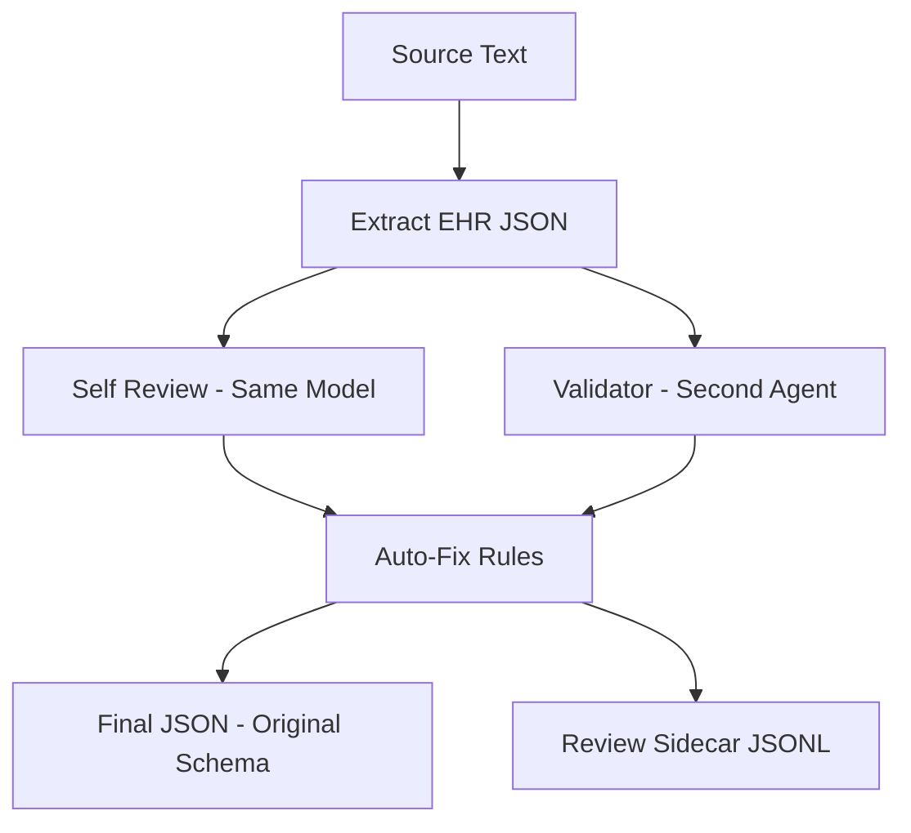

# Examples

This document provides complete workflow examples for using OMGs with different LLM providers and scenarios.

## Complete Workflow Examples

### Example 1: Using Azure OpenAI (Default)

```bash
# Step 1: Set environment variables
export AZURE_OPENAI_ENDPOINT="https://your-resource.openai.azure.com/"
export AZURE_OPENAI_API_KEY="your-azure-key"

# Step 2: Extract EHR (using Azure)
python ehr_structurer.py \
  --input ./input_ehr/test_guo.jsonl \
  --output ./output_ehr/test_guo.jsonl \
  --deployment gpt-5-mini \
  --prompts ./config/prompts.json \
  --txt-dir ./output_ehr/txt_out \
  --provider azure

# Step 3: Run MDT pipeline (using Azure)
python main.py \
  --input_path ./output_ehr/test_guo.jsonl \
  --agent omgs \
  --model gpt-5.1 \
  --provider azure
```

### Example 2: Using OpenAI Official API

```bash
# Step 1: Set environment variables
export OPENAI_API_KEY="your-openai-key"

# Step 2: Extract EHR (using OpenAI)
python ehr_structurer.py \
  --input ./input_ehr/test_guo.jsonl \
  --output ./output_ehr/test_guo.jsonl \
  --deployment gpt-4 \
  --prompts ./config/prompts.json \
  --txt-dir ./output_ehr/txt_out \
  --provider openai

# Step 3: Run MDT pipeline (using OpenAI)
python main.py \
  --input_path ./output_ehr/test_guo.jsonl \
  --agent omgs \
  --model gpt-4 \
  --provider openai
```

### Example 3: Using OpenRouter

```bash
# Step 1: Set environment variables
export OPENROUTER_API_KEY="your-openrouter-key"

# Step 2: Extract EHR (using OpenRouter with Gemini)
python ehr_structurer.py \
  --input ./input_ehr/test_guo.jsonl \
  --output ./output_ehr/test_guo.jsonl \
  --deployment google/gemini-2.0-flash-exp:free \
  --prompts ./config/prompts.json \
  --txt-dir ./output_ehr/txt_out \
  --provider openrouter

# Step 3: Run MDT pipeline (using OpenRouter with Gemini 3 Pro)
python main.py \
  --input_path ./output_ehr/test_guo.jsonl \
  --agent omgs \
  --model google/gemini-3-pro-preview \
  --provider openrouter
```

### Example 4: Mixed Providers (EHR extraction with Azure, MDT with OpenAI)

```bash
# Step 1: Set environment variables for both providers
export AZURE_OPENAI_ENDPOINT="https://your-resource.openai.azure.com/"
export AZURE_OPENAI_API_KEY="your-azure-key"
export OPENAI_API_KEY="your-openai-key"

# Step 2: Extract EHR (using Azure)
python ehr_structurer.py \
  --input ./input_ehr/test_guo.jsonl \
  --output ./output_ehr/test_guo.jsonl \
  --deployment gpt-5-mini \
  --prompts ./config/prompts.json \
  --txt-dir ./output_ehr/txt_out \
  --provider azure

# Step 3: Run MDT pipeline (using OpenAI)
python main.py \
  --input_path ./output_ehr/test_guo.jsonl \
  --agent omgs \
  --model gpt-4 \
  --provider openai
```

## Basic Usage

```bash
# Run with default settings (auto-detect provider)
python main.py --input_path ./input_ehr/test_cases.jsonl --agent omgs

# Specify model, provider, and sample count
python main.py \
  --input_path ./input_ehr/test_cases.jsonl \
  --agent omgs \
  --model gpt-4 \
  --provider openai \
  --num_samples 5
```

## EHR Extraction

**Using Azure OpenAI:**
```bash
python ehr_structurer.py \
  --input input_ehr/raw_notes.jsonl \
  --output output_ehr/structured.jsonl \
  --deployment gpt-5.1 \
  --prompts config/prompts.json \
  --provider azure \
  --field question \
  --max-completion-tokens 40000 \
  --retries 4 \
  --txt-dir output_ehr/txt_out
```

**Using OpenAI official API:**
```bash
python ehr_structurer.py \
  --input input_ehr/raw_notes.jsonl \
  --output output_ehr/structured.jsonl \
  --deployment gpt-4 \
  --prompts config/prompts.json \
  --provider openai \
  --field question \
  --max-completion-tokens 40000 \
  --retries 4 \
  --txt-dir output_ehr/txt_out
```

**Using OpenRouter:**
```bash
python ehr_structurer.py \
  --input input_ehr/raw_notes.jsonl \
  --output output_ehr/structured.jsonl \
  --deployment google/gemini-2.0-flash-exp:free \
  --prompts config/prompts.json \
  --provider openrouter \
  --field question \
  --max-completion-tokens 40000 \
  --retries 4 \
  --txt-dir output_ehr/txt_out
```

## Build RAG Index

```bash
# Step 1: Build chunks from PDFs
python pdf_to_rag.py build \
  --pdf_dir rag_pdf/chair \
  --out_dir rag_store/chair/corpus \
  --chunk_size 1200 \
  --chunk_overlap 200

# Step 2: Index chunks into ChromaDB
python pdf_to_rag.py index \
  --corpus_dir rag_store/chair/corpus \
  --index_dir rag_store/chair/index/chroma \
  --collection_name chair_chunks \
  --model BAAI/bge-m3 \
  --device cpu

# Step 3: Test search
python pdf_to_rag.py search \
  --index_dir rag_store/chair/index/chroma \
  --collection_name chair_chunks \
  --model BAAI/bge-m3 \
  --device cpu \
  --query "NACT in ovarian cancer"
```

## Batch Processing

```bash
#!/bin/bash
# batch_process.sh

# Step 1: Extract all EHR files (using Azure)
for file in input_ehr/*.jsonl; do
    echo "Extracting: $file"
    python ehr_structurer.py \
      --input "$file" \
      --output "output_ehr/$(basename $file)" \
      --deployment gpt-5-mini \
      --prompts ./config/prompts.json \
      --provider azure
done

# Step 2: Run MDT on all extracted files (using OpenAI)
for file in output_ehr/*.jsonl; do
    echo "Processing MDT: $file"
    python main.py \
      --input_path "$file" \
      --agent omgs \
      --provider openai
done

echo "Batch processing complete!"
```

## EHR Review & Auto-Fix Pipeline

The extractor runs two review passes and deterministic auto-fix:



**Auto-fix rules:**
- Recompute PFI days and platinum status from dates
- Align platinum history status with latest line
- Fill biochemical relapse evidence from CA125
- Sort timeline events by date

**Outputs:**
- Main: `output_ehr/<file>.jsonl` (original schema)
- Review: `output_ehr/<file>.jsonl.review.jsonl` (issues & fixes)

## Related Documentation

- [Usage Guide](usage.md) - CLI arguments and input/output formats
- [Installation Guide](installation.md) - Setup instructions
- [Configuration Guide](../config/README.md) - Prompt customization
