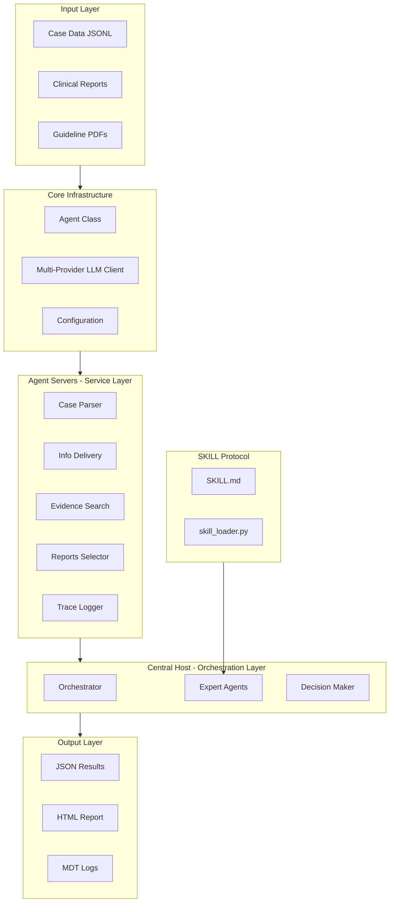
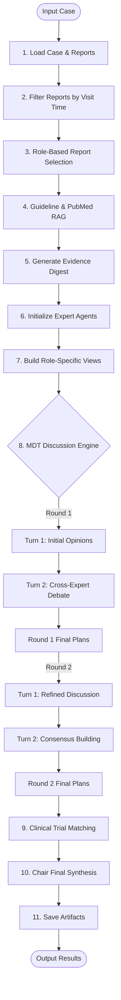
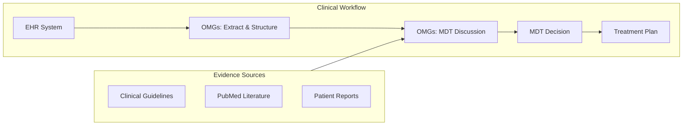
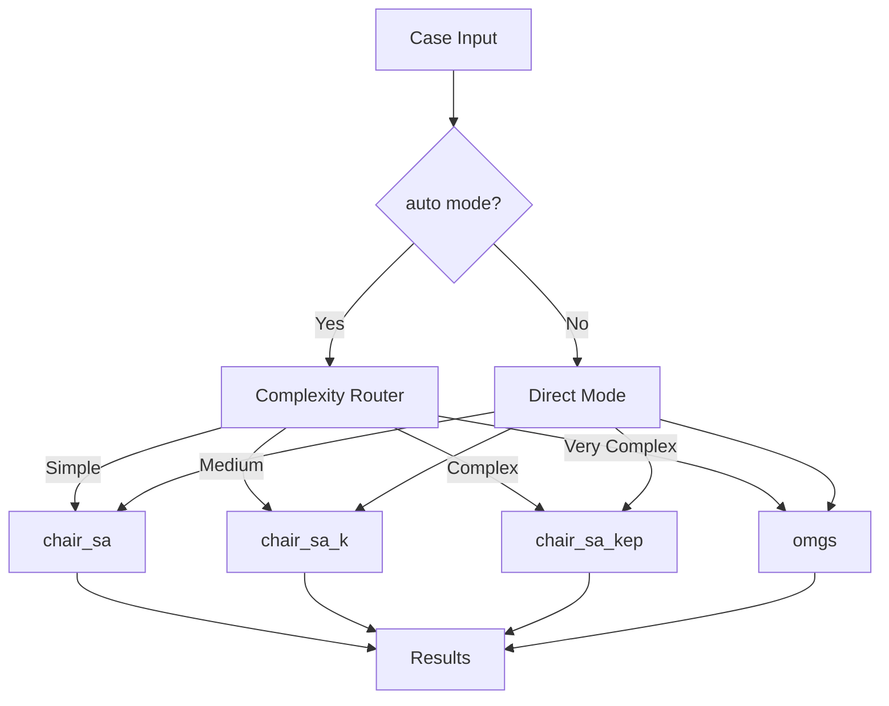

# OMGs System Architecture

## Overview

OMGs follows a three-layer architecture (host/ servers/ core/) with multi-agent collaboration for MDT decision support.


---

## High-Level Architecture



### Layer Descriptions

| Layer | Components | Responsibility |
|-------|-----------|----------------|
| **Input** | Case data, reports, guidelines | Data ingestion |
| **Core** | Agent class, LLM client, config | Foundation infrastructure |
| **Servers** | Case parser, evidence search, report selector | Service layer operations |
| **Host** | Orchestrator, experts, decision maker | Multi-agent coordination |
| **Skill** | SKILL.md, skill loader | Runtime skill injection |
| **Output** | JSON, HTML, logs | Result generation |

---

## Detailed Pipeline Flow



### Pipeline Stages

1. **Load Case & Reports**: Parse input JSONL, load clinical reports
2. **Filter Reports**: Time-based filtering for visit context
3. **Role-Based Selection**: LLM selects relevant reports per expert role
4. **RAG Retrieval**: Query guidelines and PubMed literature
5. **Evidence Digest**: Summarize RAG results into actionable bullets
6. **Initialize Agents**: Create expert agents with role-specific prompts
7. **Build Views**: Construct role-specific patient fact views
8. **MDT Discussion**: 2-round × 2-turn deliberation
9. **Trial Matching**: Optional clinical trial recommendation
10. **Final Synthesis**: Chair generates structured decision
11. **Save Artifacts**: Output JSON, HTML, logs

---

## Clinical Workflow Integration



### EHR Extraction Pipeline

```
Raw EHR Text → Extract → Self-Review → Validator-Review
                                      ↓
                              [Fixable Issues?]
                                      ↓ Yes
                              Refine → Re-Review (max 2x)
                                      ↓ No
                              Auto-Fix → Structured JSON
```

See [Prompts Reference](prompts-reference.md#ehr-extraction-prompts) for details.

---

## Roles and Permissions Matrix

| Role | Lab Reports | Imaging Reports | Pathology Reports | Mutation Reports | Primary Focus |
|------|:-----------:|:---------------:|:-----------------:|:----------------:|---------------|
| **Chair** | ✅ | ✅ | ❌ | ✅ | Overall synthesis & safety |
| **Oncologist** | ✅ | ❌ | ❌ | ✅ | Systemic therapy planning |
| **Radiologist** | ❌ | ✅ | ❌ | ❌ | Disease distribution & imaging |
| **Pathologist** | ❌ | ❌ | ✅ | ✅ | Histology & molecular markers |
| **Nuclear Medicine** | ❌ | ✅ | ❌ | ❌ | PET/metabolic findings |

### Permission Design Rationale

- **Separation of Concerns**: Each expert only sees relevant data
- **Reduced Hallucination**: Limited context prevents over-interpretation
- **MDT Simulation**: Mimics real-world MDT where specialists focus on their domain

---

## Agent Modes Architecture



### Mode Comparison

| Mode | Agents | Knowledge | Evidence Pack | Use Case |
|------|--------|-----------|---------------|----------|
| `chair_sa` | 1 | ❌ | ❌ | Testing |
| `chair_sa_k` | 1 | ✅ | ❌ | Evidence reference |
| `chair_sa_kep` | 1 | ✅ | ✅ | Complex with data |
| `omgs` | 5 | ✅ | ✅ | Full MDT |

---

## Related Documentation

- **[Architecture Details](../skills/omgs/references/architecture.md)** - Three-layer architecture deep dive
- **[Expert Roles](../skills/omgs/references/expert-roles.md)** - Role definitions and permissions
- **[Prompts Reference](prompts-reference.md)** - Prompt system documentation
- **[Extension Guide](../skills/omgs/references/extension-guide.md)** - Adding new roles and components
