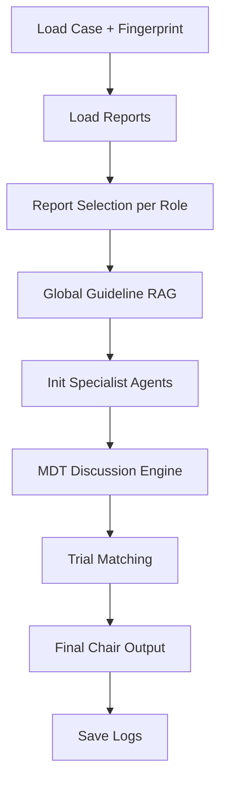

# MDT Discussion Log — 2026-01-17_20-12-16
Generated automatically by MDT Pipeline.


## CASE (structured JSON)

```
{"CASE_CORE":{"ADJUVANT_TREATMENT":{"cycles_or_courses":"6 cycles","given":"Yes","regimens":["多西+顺铂","多西+卡铂"]},"BIOMARKERS":{"AFP":"1.04 ng/ml","CA125":"651.00 U/ml","CA15-3":"156.00 U/ml","CA19-9":"23.40 U/ml","CEA":"1.13 ng/ml","HE4":"1210.00 pmol/L","HER2":"Unknown","MSI":"Unknown","PDL1_CPS":"Unknown","ROMA":"99.50% (premenopausal); 98.26% (postmenopausal)","TMB":"Unknown"},"BRCA1":"Unknown","BRCA2":"Unknown","CURRENT_STATUS":"Ovarian cancer with multiple metastases (CT 2025-04-09)","DIAGNOSIS":{"components":[],"histology":"Unknown","laterality":"Unknown","primary":"Ovarian cancer","site":"Ovary"},"HRD":"Unknown","INITIAL_TREATMENT":"Yes","LINE_OF_THERAPY":[{"cycles":"6 cycles","end_date":"2019-08","intent":"Adjuvant","line":"1L","regimen":"多西+顺铂; 多西+卡铂","start_date":"2019-03-26"},{"cycles":"3 cycles","end_date":"Unknown","intent":"Salvage","line":"Unknown","regimen":"多柔比星脂质体","start_date":"2019-11"},{"cycles":"6 cycles","end_date":"2022-06","intent":"Salvage","line":"Unknown","regimen":"白紫+贝伐","start_date":"2021-05"},{"cycles":"5 cycles","end_date":"Unknown","intent":"Salvage","line":"Unknown","regimen":"多柔比星","start_date":"2022-07"},{"cycles":"Unknown","end_date":"2024-09","intent":"Salvage","line":"Unknown","regimen":"口服安罗+尼拉","start_date":"2023-01"},{"cycles":"3 cycles","end_date":"Unknown","intent":"Palliative","line":"Unknown","regimen":"多柔比星+奈达铂","start_date":"2024-09"},{"cycles":"1","end_date":"Unknown","intent":"Palliative","line":"Unknown","regimen":"联合免疫治疗","start_date":"Unknown"}],"MAINTENANCE":"Yes","MAINTENANCE_DETAIL":{"end_date":"2022-06","given":"Yes","regimens":["贝伐维持"],"start_date":"Unknown"},"NEOADJUVANT":"No","PFI_days":"Unknown","PLATINUM_HISTORY":[{"PFI_days":"Unknown","end_date":"2019-08","evidence":"CA125 ~110 in 2019.10","evidence_type":"Biochemical","first_relapse_date":"2019-10","line":"1L","start_date":"2019-03-26","status":"Unknown"},{"PFI_days":"Unknown","end_date":"Unknown","evidence":"CT 2025-04-09: ovarian cancer multiple metastases","evidence_type":"Radiologic","first_relapse_date":"2025-04-09","line":"Unknown","start_date":"2024-09","status":"Unknown"}],"PLATINUM_PFI_CURRENT":"Unknown","PLATINUM_STATUS":"Unknown","PLATINUM_STATUS_CURRENT":"Unknown","RELAPSE":"Yes","RELAPSE_DATE":{"date":"2019-10","evidence":"CA125 ~110 in 2019.10","type":"Biochemical"},"STAGE":{"stage_basis":"Unknown","stage_system":"Unknown","stage_text":"Unknown"},"SURGERY_DONE":{"date":"2019-03-26","performed":"Yes","procedure":"Surgery at outside hospital; postoperative hyperthermic perfusion"},"VISIT_DATE":"2025-06-27","first_relapse_date":"2019-10","last_platinum_end_date":"Unknown"},"LAB_TRENDS":{"labs":[{"analyte":"CA125","history":[{"date":"2019-10","flag":"↑","value":"≈110"}],"latest":{"date":"2025-06-25","flag":"↑","value":"651.00"},"reference_range":"Unknown","unit":"U/ml"},{"analyte":"HE4","history":[],"latest":{"date":"2025-06-25","flag":"↑","value":"1210.00"},"reference_range":"Unknown","unit":"pmol/L"},{"analyte":"CA15-3","history":[],"latest":{"date":"2025-06-25","flag":"↑","value":"156.00"},"reference_range":"Unknown","unit":"U/ml"},{"analyte":"CA19-9","history":[],"latest":{"date":"2025-06-25","flag":"Unknown","value":"23.40"},"reference_range":"Unknown","unit":"U/ml"},{"analyte":"AFP","history":[],"latest":{"date":"2025-06-25","flag":"Unknown","value":"1.04"},"reference_range":"Unknown","unit":"ng/ml"},{"analyte":"CEA","history":[],"latest":{"date":"2025-06-25","flag":"Unknown","value":"1.13"},"reference_range":"Unknown","unit":"ng/ml"},{"analyte":"ALP","history":[],"latest":{"date":"2025-06-24","flag":"↑","value":"143.6"},"reference_range":"Unknown","unit":"U/L"},{"analyte":"ALB","history":[],"latest":{"date":"2025-06-24","flag":"↓","value":"39.5"},"reference_range":"Unknown","unit":"g/l"},{"analyte":"Hb","history":[],"latest":{"date":"2025-06-24","flag":"↓","value":"67"},"reference_range":"Unknown","unit":"g/l"},{"analyte":"RBC","history":[],"latest":{"date":"2025-06-24","flag":"↓","value":"2.41"},"reference_range":"Unknown","unit":"*10^12/L"},{"analyte":"WBC","history":[],"latest":{"date":"2025-06-24","flag":"Unknown","value":"7.8"},"reference_range":"Unknown","unit":"*10^9/L"}],"milestones":[{"date":"2019-03-26","description":"Initial surgery at outside hospital","type":"Surgery"},{"date":"2019-03-26","description":"Start adjuvant chemotherapy","type":"ChemoStart"},{"date":"2019-10","description":"Biochemical relapse with CA125 elevation","type":"Relapse"},{"date":"2025-04-09","description":"CT showed multiple metastases","type":"Imaging"}]},"MED_ONC":{"current_regimen":{"cycle_info":"Unknown","last_admin_date":"Unknown","name":"Unknown"},"genetic_testing":{"germline":[],"somatic":[]},"monitoring_points":[],"planned_next_regimen":"Unknown","prior_systemic_therapies":["多西+顺铂","多西+卡铂","多柔比星脂质体","白紫+贝伐","多柔比星","口服安罗+尼拉","多柔比星+奈达铂","联合免疫治疗","贝伐维持"]},"NUC_MED":{"studies":[]},"PATHOLOGY":{"specimens":[]},"RADIOLOGY":{"next_imaging_plan":{"modality":"Unknown","timing":"Unknown"},"studies":[{"anatomic_sites":["Ovary","Multiple metastases"],"date":"2025-04-09","findings":["Ovarian cancer with multiple metastases"],"impression":"Ovarian cancer with multiple metastases","modality":"CT","trend_vs_prior":"Unknown"}]},"TIMELINE":{"constraints":{"max_events":30,"min_events":3,"must_include":["first diagnostic imaging or pathology confirmation (if available)"],"ordering_rules":{"prioritize_last_event":true}},"events":[{"date":"2019-03-26","description":"Surgery at outside hospital; postoperative hyperthermic perfusion","event_type":"Surgery","key_result":"","regimen_or_test":""},{"date":"2019-08","description":"Completed adjuvant chemotherapy; PR","event_type":"Chemo","key_result":"PR","regimen_or_test":"多西+卡铂"},{"date":"2019-10","description":"CA125 increased to ~110","event_type":"Lab","key_result":"≈110 U/ml","regimen_or_test":"CA125"},{"date":"2019-11","description":"Salvage chemotherapy with 多柔比星脂质体, stopped due to pandemic","event_type":"Chemo","key_result":"3 cycles, stopped","regimen_or_test":"多柔比星脂质体"},{"date":"2021-05","description":"Tumor recurrence treated with 白紫+贝伐","event_type":"Relapse","key_result":"6 cycles; bevacizumab maintenance","regimen_or_test":"白紫+贝伐"},{"date":"2022-06","description":"Bevacizumab maintenance until 2022.06","event_type":"Other","key_result":"","regimen_or_test":"贝伐维持"},{"date":"2022-07","description":"多柔比星 monotherapy","event_type":"Chemo","key_result":"5 cycles","regimen_or_test":"多柔比星"},{"date":"2023-01","description":"Oral therapy started","event_type":"Chemo","key_result":"","regimen_or_test":"口服安罗+尼拉"},{"date":"2024-09","description":"Surgery with intestinal stoma for bowel obstruction; stopped oral therapy","event_type":"Surgery","key_result":"","regimen_or_test":"intestinal stoma"},{"date":"2024-09","description":"Chemotherapy 多柔比星+奈达铂","event_type":"Chemo","key_result":"3 cycles","regimen_or_test":"多柔比星+奈达铂"},{"date":"Unknown","description":"联合免疫治疗 once, achieved SD","event_type":"Immunotherapy","key_result":"SD","regimen_or_test":"联合免疫治疗"},{"date":"2025-04-09","description":"External CT showed ovarian cancer multiple metastases","event_type":"Imaging","key_result":"multiple metastases","regimen_or_test":"CT"},{"date":"2025-06-24","description":"Biochemistry and CBC abnormalities","event_type":"Lab","key_result":"ALP 143.6↑; ALB 39.5↓; HGB 67 g/l↓; RBC 2.41↓","regimen_or_test":"Biochemistry/CBC"},{"date":"2025-06-25","description":"Tumor markers elevated","event_type":"Lab","key_result":"CA125 651.00↑; HE4 1210.00↑; CA15-3 156.00↑; CA19-9 23.40; ROMA 99.50%/98.26%","regimen_or_test":"CA125/HE4/CA15-3/CA19-9/ROMA"}]}}
```


## FINAL MDT OUTPUT

```
Final Assessment:
Heavily pretreated recurrent metastatic ovarian cancer with severe anemia and incomplete pathology/imaging/biomarker data; prognosis guarded and decisions must follow stabilization and clarified goals.

Core Treatment Strategy:
- Urgently correct severe anemia and optimize nutrition/organ function before any further anti-tumor treatment [@20250624|14501112; @20250624|14000385].  
- After stabilization, reassess ECOG, symptoms, and patient preferences; prioritize symptom-led palliative/supportive care if performance status poor.  
- Retrieve full primary pathology and any prior molecular reports; if absent, evaluate feasibility/value of new profiling (including BRCA/HRD).  
- Obtain complete 2025-04-09 CT report (±PET/CT if justified) to define burden/complications and identify candidates for local palliation.  

Change Triggers:
- If performance status remains ≥3 or patient declines further therapy, shift fully to best supportive and hospice-oriented care.  
- If performance status ≤2 and patient desires treatment, reconsider limited systemic options versus focused local interventions at repeat MDT review.
```


## PIPELINE FLOW (Mermaid)




## TRACE EVENTS (Structured)

```json
[
  {
    "ts": "2026-01-17T20:08:58.975306",
    "event": "pipeline_start",
    "payload": {
      "visit_time": "2025-06-27 15:54:59.567000",
      "meta_info": "362201196403235065"
    }
  },
  {
    "ts": "2026-01-17T20:08:58.975549",
    "event": "case_fingerprint",
    "payload": {
      "case_fingerprint": "d9b11a1ab0f2"
    }
  },
  {
    "ts": "2026-01-17T20:08:59.231136",
    "event": "reports_loaded",
    "payload": {
      "lab_n": 16,
      "img_n": 2,
      "path_n": 0,
      "mut_n": 0,
      "cutoff_dt": "2025-06-28 15:54:59"
    }
  },
  {
    "ts": "2026-01-17T20:09:09.632085",
    "event": "reports_selected",
    "payload": {
      "lab": {
        "chair": [
          "20250624|14000385|2025-06-24",
          "20250624|14501112|2025-06-24",
          "20250625|13601595|2025-06-25"
        ],
        "oncologist": [
          "20250624|14000385|2025-06-24",
          "20250624|14501112|2025-06-24",
          "20250625|13601595|2025-06-25"
        ],
        "radiologist": [],
        "pathologist": [],
        "nuclear": []
      },
      "imaging": {
        "chair": [],
        "oncologist": [],
        "radiologist": [],
        "pathologist": [],
        "nuclear": []
      },
      "pathology": {
        "chair": [],
        "oncologist": [],
        "radiologist": [],
        "pathologist": [],
        "nuclear": []
      },
      "mutation": {
        "chair": [],
        "oncologist": [],
        "radiologist": [],
        "pathologist": [],
        "nuclear": []
      }
    }
  },
  {
    "ts": "2026-01-17T20:09:30.216977",
    "event": "rag_query",
    "payload": {
      "query": "Heavily pretreated recurrent ovarian cancer, platinum status unclear, with multiple metastases on CT; no BRCA/HRD/MSI/PD-L1 data; significant anemia (Hgb 67), low albumin, rising CA125/HE4—guidance on systemic options and supportive care?"
    }
  },
  {
    "ts": "2026-01-17T20:09:30.216981",
    "event": "rag_hits",
    "payload": {
      "topk": 5,
      "n": 0
    }
  },
  {
    "ts": "2026-01-17T20:09:32.499992",
    "event": "mdt_discussion_start",
    "payload": {
      "num_rounds": 2,
      "num_turns": 2
    }
  },
  {
    "ts": "2026-01-17T20:12:13.807415",
    "event": "mdt_discussion_end",
    "payload": {
      "merged_chars": 2924
    }
  },
  {
    "ts": "2026-01-17T20:12:13.808337",
    "event": "final_output_start",
    "payload": {}
  },
  {
    "ts": "2026-01-17T20:12:16.934295",
    "event": "final_output_end",
    "payload": {
      "final_output_chars": 1141
    }
  }
]
```


## INITIAL EXPERT OPINIONS


## chair

```
- Heavily pretreated metastatic ovarian cancer with rising markers and anemia; current systemic regimen and performance status are unknown/need update.  
- Prior extensive platinum, liposomal/standard anthracycline, anti-angiogenic, PARP, and immunotherapy exposure suggests limited further cytotoxic benefit; clarify platinum sensitivity.  
- Immediate priority: correct severe anemia (Hgb 67 g/L) and assess symptoms, nutrition, renal/hepatic function, ECOG.  
- Obtain histology subtype, BRCA1/2 and HRD status, and complete 2025 imaging reports to guide further systemic vs best supportive care.  
- Discuss goals of care with patient/family now, aligning intensity of future treatment with prognosis and quality-of-life priorities.
```


## oncologist

```
- Heavily pretreated metastatic ovarian cancer with progression after multiple cytotoxic, anti-angiogenic, oral targeted, and immunotherapy regimens; palliative intent.  

- Current disease progression: multiple metastases on CT 2025-04-09 with markedly rising CA125/HE4/CA15-3 [@20250625|13601595].  

- Profound anemia (Hb 67 g/L) with preserved liver enzymes and creatinine; requires cause assessment and correction before further systemic therapy [@20250624|14501112][@20250624|14000385].  

- No germline/somatic mutations, MSI, TMB, or PD-L1 data available; comprehensive molecular profiling status and reports need updating.  

- Missing details: exact histology/grade, staging, performance status, organ function (full labs), prior regimen toxicities, prior response durations, and sites/symptoms.
```


## radiologist

```
- CT shows ovarian malignancy with multiple metastatic sites; precise organs, sizes, and counts not specified and need updated imaging report. [@IMAGING_STUDIES|2025-04-09]

- Overall metastatic burden and distribution trend versus any earlier baseline are unknown; prior comparison imaging, if available, needs review. [@IMAGING_TRENDS|2025-04-09]

- No documentation of complications such as obstruction, ascites, or organ compromise; targeted CT/PET report needed to assess. [unknown/needs update]

- Lesion measurability for response assessment (target vs non-target lesions) cannot be determined; require full radiology report with measurements. [unknown/needs update]
```


## pathologist

```
- Markedly elevated CA125 and HE4 with high ROMA suggest strong suspicion for epithelial ovarian malignancy; histologic confirmation absent. [@MOLECULAR|unknown]  
- Normal AFP, CEA, CA19-9, CA15-3 reduce support for primary germ cell or GI-type tumor markers. [@MOLECULAR|unknown]  
- No tissue diagnosis, histologic type, or grade available; surgical pathology or biopsy report urgently needed. [@PATHOLOGY_REPORTS|unknown]  
- HER2, MSI, PD-L1 CPS, and TMB all unknown; these biomarkers require dedicated testing if clinically indicated. [@MOLECULAR|unknown]  
- Germline and somatic mutation panels show no reported variants; confirm panel type, genes covered, and report date. [@MOLECULAR|unknown]
```


## nuclear

```
- No PET/CT report available; current staging metabolic extent is unknown/needs update [@PET_CT|unknown].  
- Prior imaging shows ovarian cancer with multiple metastases, but metabolic activity pattern is unknown/needs update [@IMAGING_CONTEXT|2025-04-09].  
- Cannot assess PET impact on upstaging/downstaging or recurrence suspicion without a current PET report; acquisition status unknown/needs update.  
- Need PET/CT date, acquisition protocol, FDG-avid lesion distribution, and SUV metrics to refine metastatic burden assessment.  
- Request upload/verification of latest PET/CT report to determine any change in staging or recurrence suspicion.
```


## MERGED SUMMARY (Assistant)

```
Key Knowledge:
- Heavily pretreated metastatic epithelial ovarian cancer under palliative intent; prior platinum, anthracycline, anti-angiogenic, PARP inhibitor, and immunotherapy.
- Radiologic and marker progression (CT 2025-04-09; rising CA125/HE4/CA15-3).
- Profound anemia (Hb 67 g/L) with preserved renal/liver function; ECOG and symptom burden not documented.

Controversies:
- Clinical value of any further systemic therapy versus best supportive care in a heavily pretreated setting with unknown performance status.
- Platinum sensitivity remains undefined, limiting consideration of further platinum-based treatment.

Missing Info:
- Clinical: ECOG, detailed symptom profile, nutrition, comorbidities, anemia work-up and transfusion history, explicit goals-of-care documentation.
- Pathology: Original pathology report, histologic subtype and grade, confirmation of epithelial ovarian origin; prior molecular panel reports.
- Molecular: BRCA1/2, HRD, MSI, TMB, PD-L1, HER2, and details of any previous germline/somatic testing.
- Treatment history: Full regimen list with dates, dose intensity, toxicities, and response durations.
- Imaging: Full CT 2025-04-09 report (organs involved, lesion measurements, complications, comparison to prior); confirmation and upload of any PET/CT and findings.
- Labs: Comprehensive recent bloods (CBC with indices, iron/hemolysis work-up, LFTs, renal, coagulation).

Working Plan:
- Immediate: Stabilize anemia (including transfusion decision) and document ECOG, symptoms, nutrition, and organ function; initiate/clarify goals-of-care discussion.
- Diagnostics: Retrieve and upload full primary pathology and any molecular reports; obtain complete CT 2025-04-09 report and confirm any PET/CT; reconstruct full prior systemic treatment history and platinum sensitivity.
- MDT: Re-discuss once the above data are available to define realistic systemic options (if any) versus best supportive/palliative care, guided by updated clinical status and patient preferences.
[R2T1 DELTA] of-care, as these are critical for safely deciding between additional treatment and best supportive care. | chair->radiologist(missing): Kindly obtain and upload the full 2025-04-09 CT report (sites, measurements, complications, comparison) and confirm whether any PET/CT exists, as current imaging detail is insufficient to guide further management decisions. | chair->pathologist(missing): Please retrieve and upload the original ovarian tumor pathology, including histologic subtype/grade and any immunohistochemistry, and indicate whether prior molecular testing was performed, as current histology and biomarker status are unknown. | chair->nuclear(missing): If any prior PET/CT or relevant nuclear study has been performed externally, please help confirm and obtain the reports/images, since metastatic distribution and potential complications are incompletely characterized on current records.
```


## INTERACTION LOG (Round × Turn)

### Round 1

#### Turn 1
- **chair → oncologist:** Before proposing any further systemic therapy, please first stabilize anemia (including transfusion decision) and document ECOG, symptom burden, and goals of care; with this heavy pretreatment, we must be explicit whether additional drugs are realistically palliative versus shifting to best supportive care.
- **chair → radiologist:** Please provide the full 2025-04-09 CT report and any prior comparative imaging to clarify current disease burden, complications, and tempo, as this is critical for deciding whether further systemic therapy is appropriate.
- **chair → pathologist:** We need the original ovarian pathology report including histologic subtype, grade, and any prior biomarker testing to inform remaining systemic options versus supportive care only.
- **chair → nuclear:** At this stage, do you see any indication for further functional imaging, or would it only add burden without changing management, given heavy pretreatment and anemia?
- **oncologist → chair:** Before deciding on any further systemic therapy versus best supportive care, we urgently need ECOG status, symptom burden, anemia work-up/transfusion history, and the full 2025-04-09 CT report including trends.
- **oncologist → radiologist:** We need the detailed 2025-04-09 CT report and comparison with prior imaging, highlighting disease extent, complications (e.g., bowel obstruction, hydronephrosis), and any rapid progression.
- **oncologist → pathologist:** Please confirm histologic subtype/grade for this ovarian cancer and whether any prior molecular testing (BRCA/HRD, MSI, HER2, others) was done and can be reported.
- **radiologist → oncologist:** Full CT report from 2025-04-09 (organs involved, lesion measurements, complications, comparison to prior) is missing and essential for assessing current disease burden and potential complications.
- **pathologist → chair:** Before further systemic decisions, we need the primary pathology report and any prior molecular panel results retrieved and uploaded.
- **pathologist → oncologist:** Histologic subtype, grade, and original pathology report are completely missing; I cannot confirm epithelial ovarian origin or biomarkers yet.
- **nuclear → oncologist:** No PET/CT is available in the record; if performed, the report/images are needed to clarify current metabolic disease burden and potential recurrence pattern.
- **nuclear → radiologist:** Please confirm whether any PET/CT has been done since the 09-04-2025 CT and, if so, upload the full report and key findings.

#### Turn 2
- **chair → oncologist:** Before proposing any new systemic regimen, please urgently stabilize anemia (including transfusion decision) and document ECOG, symptoms, and goals of care, as proceeding without this risks disproportionate toxicity in a heavily pretreated patient.
- **chair → radiologist:** The full 2025-04-09 CT report (organs involved, complications, and comparison) is still missing; this is essential to judge whether further systemic therapy versus purely supportive care is appropriate.

### Round 2

#### Turn 1
- **chair → oncologist:** Before proposing further systemic therapy, please address and document anemia management (including transfusion decision), ECOG, symptom burden, nutrition, and explicit goals-of-care, as these are critical for safely deciding between additional treatment and best supportive care.
- **chair → radiologist:** Kindly obtain and upload the full 2025-04-09 CT report (sites, measurements, complications, comparison) and confirm whether any PET/CT exists, as current imaging detail is insufficient to guide further management decisions.
- **chair → pathologist:** Please retrieve and upload the original ovarian tumor pathology, including histologic subtype/grade and any immunohistochemistry, and indicate whether prior molecular testing was performed, as current histology and biomarker status are unknown.
- **chair → nuclear:** If any prior PET/CT or relevant nuclear study has been performed externally, please help confirm and obtain the reports/images, since metastatic distribution and potential complications are incompletely characterized on current records.

#### Turn 2


## FINAL REFINED PLANS (per Round)

### Round 1


## chair

```
- Prioritize stabilization: evaluate anemia cause, consider transfusion, repeat CBC/biochem, document ECOG, symptoms, nutrition, comorbidities [@20250624|14501112; @20250624|14000385].  
- Retrieve and review original pathology, including histologic subtype, grade, and any prior molecular testing; order germline/somatic profiling if absent.  
- Obtain full 2025-04-09 CT report and any subsequent imaging; assess disease distribution, complications, and trend vs prior (currently unknown).  
- Reconstruct detailed systemic treatment history (agents, dates, responses, toxicities, PFI) to clarify platinum status and realistic systemic options.  
- After stabilization and data completion, hold MDT plus goals-of-care meeting to weigh further systemic therapy versus best supportive/palliative care.
```


## oncologist

```
- Correct severe anemia urgently (transfusion and work-up), then document ECOG, symptom burden, nutrition, and comorbidities before any new regimen [@20250624|14501112].  

- Obtain and review full 2025-04-09 CT report (organs involved, complications, comparison) and any PET/CT to reassess disease burden (currently missing).  

- Retrieve original pathology to confirm epithelial subtype/grade and review any prior molecular testing; if absent, consider comprehensive profiling (currently unknown).  

- Reconstruct detailed prior systemic treatment history, including responses and toxicities, to clarify platinum sensitivity and realistic benefit of further therapy (missing).  

- After stabilization and data completion, re-discuss at MDT and with patient/family to choose between limited further systemic therapy versus best supportive care.
```


## radiologist

```
- Full CT 2025-04-09 report (organs involved, lesion measurements, complications, comparison) remains missing; must be retrieved/uploaded before MDT. [@IMAGING_STUDIES|2025-04-09]

- PET/CT since 2025-04-09 is unknown; confirm if performed and obtain report/images to define metabolic burden and complications. [unknown/needs update]

- Without full imaging, current disease extent, obstruction risk, or other complications cannot be adequately assessed for further systemic vs supportive care decisions. [@IMAGING_STUDIES|2025-04-09]

- Once prior imaging is available, perform structured radiologic staging and measurability assessment to support objective response evaluation if therapy pursued. [unknown/needs update]
```


## pathologist

```
- Retrieve and review original ovarian cancer pathology: histologic subtype, grade, stage, and biomarker profile are completely unknown/needs update.  
- Obtain details of any prior molecular testing (BRCA1/2, HRD, MSI, TMB, PD-L1, HER2); currently unknown/needs update.  
- Confirm disease origin as ovarian versus alternative primary once pathology is available; present clarification at next MDT.  
- Once tissue and molecular data are complete, update pathology summary focusing on features relevant to further systemic options (no regimens suggested).  
- Ensure all key pathology and molecular reports are uploaded and correctly dated to avoid future discrepancies in MDT decisions.
```


## nuclear

```
- No PET/CT available; current metabolic disease distribution and recurrence pattern remain unknown/needs update [@PET_CT|unknown].  
- Full CT 2025-04-09 report is still missing; without it, we cannot correlate anatomic and potential metabolic burden [@IMAGING_CONTEXT|2025-04-09].  
- If PET/CT is performed, key goals: clarify extra-abdominal spread, occult nodal disease, and complications not fully characterized on CT.  
- PET would meaningfully change staging only if it reveals unsuspected distant metastases or non-malignant explanations for some CT lesions.  
- For suspected recurrence/progression, PET could reclassify equivocal CT findings, influencing decisions about local versus purely systemic/supportive approaches.
```

### Round 2


## chair

```
- Correct severe anemia urgently, including transfusion consideration; reassess ECOG, symptoms, nutrition, and organ function afterward [@20250624|14501112; @20250624|14000385].  
- Conduct structured goals-of-care discussion post-stabilization to clarify preferences regarding further systemic therapy versus best supportive care.  
- Retrieve and review full primary pathology and any prior molecular testing; if absent, consider feasibility and value of new profiling.  
- Obtain full 2025-04-09 CT report and any PET/CT to define metastatic burden, complications, and need for local palliative interventions.  
- After data completion, re-convene MDT to weigh modest systemic options against toxicity, prioritizing symptom-led palliative/supportive care if performance status poor.
```


## oncologist

```
- Urgently correct severe anemia and complete anemia work-up; reassess ECOG, symptoms, nutrition, comorbidities, and preferences before new therapy [@20250624|14501112].  

- Obtain full CT 2025-04-09 report and confirm any PET/CT to define metastatic burden, complications, and trends (currently missing).  

- Retrieve original pathology and any prior molecular testing; if absent, consider profiling to clarify histology and actionable biomarkers (all currently unknown).  

- Reconstruct detailed prior systemic treatment history and responses to better infer platinum sensitivity and realistic benefit of further systemic therapy (missing).  

- After stabilization and data completion, re-discuss at MDT and with patient/family to decide between limited further therapy versus best supportive care.
```


## radiologist

```
- CT confirms metastatic ovarian cancer; exact metastatic sites, lesion sizes, and complications remain unspecified and require full report retrieval. [@IMAGING_STUDIES|2025-04-09]

- Comparison of 2025-04-09 CT with any earlier imaging is undocumented; prior studies must be located to assess progression trend. [@IMAGING_TRENDS|2025-04-09]

- Presence or absence of obstructive complications (bowel, ureteric, biliary) on CT is unknown; detailed abdominopelvic review is needed. [unknown/needs update]

- PET/CT history and findings are undocumented; confirm if performed and upload reports/images to better define metabolic disease extent. [unknown/needs update]

- Once complete imaging is available, provide structured staging, RECIST measurability, and description of any life-threatening complications for MDT planning. [unknown/needs update]
```


## pathologist

```
- Original ovarian tumor histology, grade, staging, and IHC remain unknown/needs update; retrieve and upload full primary pathology report.  
- Clarify whether any prior molecular testing (BRCA1/2, HRD, MSI, TMB, PD-L1, HER2) was done; currently unknown/needs update.  
- Once pathology is available, confirm epithelial ovarian origin versus alternative primary and summarize key prognostic/pathologic features for MDT.  
- If sufficient archived tissue exists, consider feasibility of additional biomarker testing, but only after full prior pathology/molecular review.  
- Ensure all pathology and molecular documents are correctly labeled and dated to avoid misinterpretation in future MDT discussions.
```


## nuclear

```
- No PET/CT or nuclear report is available; metabolic disease distribution and recurrence pattern remain unknown/needs update [@PET_CT|unknown].  
- CT shows metastatic ovarian cancer, but organ involvement, lesion size, and complications remain insufficiently characterized/needs update [@IMAGING_CONTEXT|2025-04-09].  
- Clarifying whether any prior PET/CT exists is critical to better define current metastatic spread and potential extra-abdominal disease.  
- Once available, PET/CT could help distinguish active disease from treatment-related changes or benign findings on CT, refining staging.  
- In this heavily pretreated, palliative setting, PET’s main role would be clarifying true progression versus equivocal CT findings, not surveillance.
```


## RAW AGENT LOGS

### chair
- **User:** Give INITIAL opinion (use ONLY your system-provided patient facts).
Return up to 5 bullets, each ≤20 words.
If key data missing, say exactly what needs updating.
  
  **Assistant:** - Heavily pretreated metastatic ovarian cancer with rising markers and anemia; current systemic regimen and performance status are unknown/need update.  
- Prior extensive platinum, liposomal/standard anthracycline, anti-angiogenic, PARP, and immunotherapy exposure suggests limited further cytotoxic benefit; clarify platinum sensitivity.  
- Immediate priority: correct severe anemia (Hgb 67 g/L) and assess symptoms, nutrition, renal/hepatic function, ECOG.  
- Obtain histology subtype, BRCA1/2 and HRD status, and complete 2025 imaging reports to guide further systemic vs best supportive care.  
- Discuss goals of care with patient/family now, aligning intensity of future treatment with prognosis and quality-of-life priorities.
  
  *(2026-01-17T20:09:35.647502)*

- **User:** ROLE: chair. VISIT: 2025-06-27 15:54:59.567000
Default is NOT to speak. Speak ONLY if: conflict | safety | missing-critical | new-critical.

CONTEXT (latest):
Key Knowledge:
- Heavily pretreated metastatic epithelial ovarian cancer, palliative intent; prior platinum, anthracycline, anti-angiogenic, PARP inhibitor, immunotherapy.
- Radiologic and marker progression (CT 09-04-2025; rising CA125/HE4/CA15-3).
- Profound anemia (Hb 67 g/L) with preserved renal/liver function; performance status and symptom burden unknown.

Controversies:
- Whether any further systemic therapy is meaningful versus best supportive care, given heavy pretreatment and unknown ECOG.
- Platinum sensitivity status unclear, limiting planning of any further platinum use.

Missing Info:
- Clinical: ECOG, detailed symptoms, nutrition, comorbidities, anemia work-up, transfusion history.
- Pathology: Histologic subtype and grade, full pathology report.
- Molecular: BRCA1/2, HRD, MSI, TMB, PD-L1, HER2; details of any prior panels.
- Treatment history: Complete regimen list with dates, toxicities, and response durations.
- Imaging: Full CT (09-04-2025) report with trends; any PET/CT findings.
- Labs: Comprehensive recent blood work.
- Goals of care: Documented discussion of prognosis and treatment preferences.

Working Plan:
- Stabilize anemia and assess full clinical status (ECOG, symptoms, nutrition, organ function).
- Complete pathology and molecular characterization; reconstruct detailed treatment history and platinum sensitivity.
- Obtain and review full imaging (CT ± PET/CT) for disease burden and complications.
- Re-discuss at MDT with updated data to frame realistic options versus best supportive care.
- Conduct/continue structured goals-of-care conversation with patient and family.

Allowed targets: [oncologist,radiologist,pathologist,nuclear]
Return ONE-LINE JSON only:{"speak":"yes/no","messages":[{"target":"<role>","message":"<1-2 sentences>","why":"conflict|safety|missing|new"}]}
  
  **Assistant:** {"speak":"yes","messages":[{"target":"oncologist","message":"Before proposing any further systemic therapy, please first stabilize anemia (including transfusion decision) and document ECOG, symptom burden, and goals of care; with this heavy pretreatment, we must be explicit whether additional drugs are realistically palliative versus shifting to best supportive care.","why":"safety"},{"target":"radiologist","message":"Please provide the full 2025-04-09 CT report and any prior comparative imaging to clarify current disease burden, complications, and tempo, as this is critical for deciding whether further systemic therapy is appropriate.","why":"missing"},{"target":"pathologist","message":"We need the original ovarian pathology report including histologic subtype, grade, and any prior biomarker testing to inform remaining systemic options versus supportive care only.","why":"missing"},{"target":"nuclear","message":"At this stage, do you see any indication for further functional imaging, or would it only add burden without changing management, given heavy pretreatment and anemia?","why":"safety"}]}
  
  *(2026-01-17T20:09:59.055750)*

- **User:** ROLE: chair. VISIT: 2025-06-27 15:54:59.567000
Default is NOT to speak. Speak ONLY if: conflict | safety | missing-critical | new-critical.

CONTEXT (latest):
Key Knowledge:
- Heavily pretreated metastatic epithelial ovarian cancer, palliative intent; prior platinum, anthracycline, anti-angiogenic, PARP inhibitor, immunotherapy.
- Radiologic and marker progression (CT 09-04-2025; rising CA125/HE4/CA15-3).
- Profound anemia (Hb 67 g/L) with preserved renal/liver function; performance status and symptom burden unknown.

Controversies:
- Whether any further systemic therapy is meaningful versus best supportive care, given heavy pretreatment and unknown ECOG.
- Platinum sensitivity status unclear, limiting planning of any further platinum use.

Missing Info:
- Clinical: ECOG, detailed symptoms, nutrition, comorbidities, anemia work-up, transfusion history.
- Pathology: Histologic subtype and grade, full pathology report.
- Molecular: BRCA1/2, HRD, MSI, TMB, PD-L1, HER2; details of any prior panels.
- Treatment history: Complete regimen list with dates, toxicities, and response durations.
- Imaging: Full CT (09-04-2025) report with trends; any PET/CT findings.
- Labs: Comprehensive recent blood work.
- Goals of care: Documented discussion of prognosis and treatment preferences.

Working Plan:
- Stabilize anemia and assess full clinical status (ECOG, symptoms, nutrition, organ function).
- Complete pathology and molecular characterization; reconstruct detailed treatment history and platinum sensitivity.
- Obtain and review full imaging (CT ± PET/CT) for disease burden and complications.
- Re-discuss at MDT with updated data to frame realistic options versus best supportive care.
- Conduct/continue structured goals-of-care conversation with patient and family.
[R1T1 DELTA] (missing): Full CT report from 2025-04-09 (organs involved, lesion measurements, complications, comparison to prior) is missing and essential for assessing current disease burden and potential complications. | pathologist->oncologist(missing): Histologic subtype, grade, and original pathology report are completely missing; I cannot confirm epithelial ovarian origin or biomarkers yet. | pathologist->chair(missing): Before further systemic decisions, we need the primary pathology report and any prior molecular panel results retrieved and uploaded. | nuclear->oncologist(missing): No PET/CT is available in the record; if performed, the report/images are needed to clarify current metabolic disease burden and potential recurrence pattern. | nuclear->radiologist(missing): Please confirm whether any PET/CT has been done since the 09-04-2025 CT and, if so, upload the full report and key findings.

Allowed targets: [oncologist,radiologist,pathologist,nuclear]
Return ONE-LINE JSON only:{"speak":"yes/no","messages":[{"target":"<role>","message":"<1-2 sentences>","why":"conflict|safety|missing|new"}]}
  
  **Assistant:** {"speak":"yes","messages":[{"target":"oncologist","message":"Before proposing any new systemic regimen, please urgently stabilize anemia (including transfusion decision) and document ECOG, symptoms, and goals of care, as proceeding without this risks disproportionate toxicity in a heavily pretreated patient.","why":"safety"},{"target":"radiologist","message":"The full 2025-04-09 CT report (organs involved, complications, and comparison) is still missing; this is essential to judge whether further systemic therapy versus purely supportive care is appropriate.","why":"missing"}]}
  
  *(2026-01-17T20:10:08.563983)*

- **User:** Given MDT context:
Key Knowledge:
- Heavily pretreated metastatic epithelial ovarian cancer, palliative intent; prior platinum, anthracycline, anti-angiogenic, PARP inhibitor, immunotherapy.
- Radiologic and marker progression (CT 09-04-2025; rising CA125/HE4/CA15-3).
- Profound anemia (Hb 67 g/L) with preserved renal/liver function; performance status and symptom burden unknown.

Controversies:
- Whether any further systemic therapy is meaningful versus best supportive care, given heavy pretreatment and unknown ECOG.
- Platinum sensitivity status unclear, limiting planning of any further platinum use.

Missing Info:
- Clinical: ECOG, detailed symptoms, nutrition, comorbidities, anemia work-up, transfusion history.
- Pathology: Histologic subtype and grade, full pathology report.
- Molecular: BRCA1/2, HRD, MSI, TMB, PD-L1, HER2; details of any prior panels.
- Treatment history: Complete regimen list with dates, toxicities, and response durations.
- Imaging: Full CT (09-04-2025) report with trends; any PET/CT findings.
- Labs: Comprehensive recent blood work.
- Goals of care: Documented discussion of prognosis and treatment preferences.

Working Plan:
- Stabilize anemia and assess full clinical status (ECOG, symptoms, nutrition, organ function).
- Complete pathology and molecular characterization; reconstruct detailed treatment history and platinum sensitivity.
- Obtain and review full imaging (CT ± PET/CT) for disease burden and complications.
- Re-discuss at MDT with updated data to frame realistic options versus best supportive care.
- Conduct/continue structured goals-of-care conversation with patient and family.
[R1T1 DELTA] (missing): Full CT report from 2025-04-09 (organs involved, lesion measurements, complications, comparison to prior) is missing and essential for assessing current disease burden and potential complications. | pathologist->oncologist(missing): Histologic subtype, grade, and original pathology report are completely missing; I cannot confirm epithelial ovarian origin or biomarkers yet. | pathologist->chair(missing): Before further systemic decisions, we need the primary pathology report and any prior molecular panel results retrieved and uploaded. | nuclear->oncologist(missing): No PET/CT is available in the record; if performed, the report/images are needed to clarify current metabolic disease burden and potential recurrence pattern. | nuclear->radiologist(missing): Please confirm whether any PET/CT has been done since the 09-04-2025 CT and, if so, upload the full report and key findings.
[R1T2 DELTA] chair->oncologist(safety): Before proposing any new systemic regimen, please urgently stabilize anemia (including transfusion decision) and document ECOG, symptoms, and goals of care, as proceeding without this risks disproportionate toxicity in a heavily pretreated patient. | chair->radiologist(missing): The full 2025-04-09 CT report (organs involved, complications, and comparison) is still missing; this is essential to judge whether further systemic therapy versus purely supportive care is appropriate.

Provide FINAL refined plan.
Up to 5 bullets, each ≤20 words.
Any factual claim must include [@report_id|date] or say unknown.
  
  **Assistant:** - Prioritize stabilization: evaluate anemia cause, consider transfusion, repeat CBC/biochem, document ECOG, symptoms, nutrition, comorbidities [@20250624|14501112; @20250624|14000385].  
- Retrieve and review original pathology, including histologic subtype, grade, and any prior molecular testing; order germline/somatic profiling if absent.  
- Obtain full 2025-04-09 CT report and any subsequent imaging; assess disease distribution, complications, and trend vs prior (currently unknown).  
- Reconstruct detailed systemic treatment history (agents, dates, responses, toxicities, PFI) to clarify platinum status and realistic systemic options.  
- After stabilization and data completion, hold MDT plus goals-of-care meeting to weigh further systemic therapy versus best supportive/palliative care.
  
  *(2026-01-17T20:10:16.922308)*

- **User:** ROLE: chair. VISIT: 2025-06-27 15:54:59.567000
Default is NOT to speak. Speak ONLY if: conflict | safety | missing-critical | new-critical.

CONTEXT (latest):
Key Knowledge:
- Heavily pretreated metastatic epithelial ovarian cancer under palliative intent; prior platinum, anthracycline, anti-angiogenic, PARP inhibitor, and immunotherapy.
- Radiologic and marker progression (CT 2025-04-09; rising CA125/HE4/CA15-3).
- Profound anemia (Hb 67 g/L) with preserved renal/liver function; ECOG and symptom burden not documented.

Controversies:
- Clinical value of any further systemic therapy versus best supportive care in a heavily pretreated setting with unknown performance status.
- Platinum sensitivity remains undefined, limiting consideration of further platinum-based treatment.

Missing Info:
- Clinical: ECOG, detailed symptom profile, nutrition, comorbidities, anemia work-up and transfusion history, explicit goals-of-care documentation.
- Pathology: Original pathology report, histologic subtype and grade, confirmation of epithelial ovarian origin; prior molecular panel reports.
- Molecular: BRCA1/2, HRD, MSI, TMB, PD-L1, HER2, and details of any previous germline/somatic testing.
- Treatment history: Full regimen list with dates, dose intensity, toxicities, and response durations.
- Imaging: Full CT 2025-04-09 report (organs involved, lesion measurements, complications, comparison to prior); confirmation and upload of any PET/CT and findings.
- Labs: Comprehensive recent bloods (CBC with indices, iron/hemolysis work-up, LFTs, renal, coagulation).

Working Plan:
- Immediate: Stabilize anemia (including transfusion decision) and document ECOG, symptoms, nutrition, and organ function; initiate/clarify goals-of-care discussion.
- Diagnostics: Retrieve and upload full primary pathology and any molecular reports; obtain complete CT 2025-04-09 report and confirm any PET/CT; reconstruct full prior systemic treatment history and platinum sensitivity.
- MDT: Re-discuss once the above data are available to define realistic systemic options (if any) versus best supportive/palliative care, guided by updated clinical status and patient preferences.

Allowed targets: [oncologist,radiologist,pathologist,nuclear]
Return ONE-LINE JSON only:{"speak":"yes/no","messages":[{"target":"<role>","message":"<1-2 sentences>","why":"conflict|safety|missing|new"}]}
  
  **Assistant:** {"speak":"yes","messages":[{"target":"oncologist","message":"Before proposing further systemic therapy, please address and document anemia management (including transfusion decision), ECOG, symptom burden, nutrition, and explicit goals-of-care, as these are critical for safely deciding between additional treatment and best supportive care.","why":"safety"},{"target":"radiologist","message":"Kindly obtain and upload the full 2025-04-09 CT report (sites, measurements, complications, comparison) and confirm whether any PET/CT exists, as current imaging detail is insufficient to guide further management decisions.","why":"missing"},{"target":"pathologist","message":"Please retrieve and upload the original ovarian tumor pathology, including histologic subtype/grade and any immunohistochemistry, and indicate whether prior molecular testing was performed, as current histology and biomarker status are unknown.","why":"missing"},{"target":"nuclear","message":"If any prior PET/CT or relevant nuclear study has been performed externally, please help confirm and obtain the reports/images, since metastatic distribution and potential complications are incompletely characterized on current records.","why":"missing"}]}
  
  *(2026-01-17T20:11:01.070872)*

- **User:** ROLE: chair. VISIT: 2025-06-27 15:54:59.567000
Default is NOT to speak. Speak ONLY if: conflict | safety | missing-critical | new-critical.

CONTEXT (latest):
Key Knowledge:
- Heavily pretreated metastatic epithelial ovarian cancer under palliative intent; prior platinum, anthracycline, anti-angiogenic, PARP inhibitor, and immunotherapy.
- Radiologic and marker progression (CT 2025-04-09; rising CA125/HE4/CA15-3).
- Profound anemia (Hb 67 g/L) with preserved renal/liver function; ECOG and symptom burden not documented.

Controversies:
- Clinical value of any further systemic therapy versus best supportive care in a heavily pretreated setting with unknown performance status.
- Platinum sensitivity remains undefined, limiting consideration of further platinum-based treatment.

Missing Info:
- Clinical: ECOG, detailed symptom profile, nutrition, comorbidities, anemia work-up and transfusion history, explicit goals-of-care documentation.
- Pathology: Original pathology report, histologic subtype and grade, confirmation of epithelial ovarian origin; prior molecular panel reports.
- Molecular: BRCA1/2, HRD, MSI, TMB, PD-L1, HER2, and details of any previous germline/somatic testing.
- Treatment history: Full regimen list with dates, dose intensity, toxicities, and response durations.
- Imaging: Full CT 2025-04-09 report (organs involved, lesion measurements, complications, comparison to prior); confirmation and upload of any PET/CT and findings.
- Labs: Comprehensive recent bloods (CBC with indices, iron/hemolysis work-up, LFTs, renal, coagulation).

Working Plan:
- Immediate: Stabilize anemia (including transfusion decision) and document ECOG, symptoms, nutrition, and organ function; initiate/clarify goals-of-care discussion.
- Diagnostics: Retrieve and upload full primary pathology and any molecular reports; obtain complete CT 2025-04-09 report and confirm any PET/CT; reconstruct full prior systemic treatment history and platinum sensitivity.
- MDT: Re-discuss once the above data are available to define realistic systemic options (if any) versus best supportive/palliative care, guided by updated clinical status and patient preferences.
[R2T1 DELTA] of-care, as these are critical for safely deciding between additional treatment and best supportive care. | chair->radiologist(missing): Kindly obtain and upload the full 2025-04-09 CT report (sites, measurements, complications, comparison) and confirm whether any PET/CT exists, as current imaging detail is insufficient to guide further management decisions. | chair->pathologist(missing): Please retrieve and upload the original ovarian tumor pathology, including histologic subtype/grade and any immunohistochemistry, and indicate whether prior molecular testing was performed, as current histology and biomarker status are unknown. | chair->nuclear(missing): If any prior PET/CT or relevant nuclear study has been performed externally, please help confirm and obtain the reports/images, since metastatic distribution and potential complications are incompletely characterized on current records.

Allowed targets: [oncologist,radiologist,pathologist,nuclear]
Return ONE-LINE JSON only:{"speak":"yes/no","messages":[{"target":"<role>","message":"<1-2 sentences>","why":"conflict|safety|missing|new"}]}
  
  **Assistant:** {"speak":"no","messages":[]}
  
  *(2026-01-17T20:11:13.118204)*

- **User:** Given MDT context:
Key Knowledge:
- Heavily pretreated metastatic epithelial ovarian cancer under palliative intent; prior platinum, anthracycline, anti-angiogenic, PARP inhibitor, and immunotherapy.
- Radiologic and marker progression (CT 2025-04-09; rising CA125/HE4/CA15-3).
- Profound anemia (Hb 67 g/L) with preserved renal/liver function; ECOG and symptom burden not documented.

Controversies:
- Clinical value of any further systemic therapy versus best supportive care in a heavily pretreated setting with unknown performance status.
- Platinum sensitivity remains undefined, limiting consideration of further platinum-based treatment.

Missing Info:
- Clinical: ECOG, detailed symptom profile, nutrition, comorbidities, anemia work-up and transfusion history, explicit goals-of-care documentation.
- Pathology: Original pathology report, histologic subtype and grade, confirmation of epithelial ovarian origin; prior molecular panel reports.
- Molecular: BRCA1/2, HRD, MSI, TMB, PD-L1, HER2, and details of any previous germline/somatic testing.
- Treatment history: Full regimen list with dates, dose intensity, toxicities, and response durations.
- Imaging: Full CT 2025-04-09 report (organs involved, lesion measurements, complications, comparison to prior); confirmation and upload of any PET/CT and findings.
- Labs: Comprehensive recent bloods (CBC with indices, iron/hemolysis work-up, LFTs, renal, coagulation).

Working Plan:
- Immediate: Stabilize anemia (including transfusion decision) and document ECOG, symptoms, nutrition, and organ function; initiate/clarify goals-of-care discussion.
- Diagnostics: Retrieve and upload full primary pathology and any molecular reports; obtain complete CT 2025-04-09 report and confirm any PET/CT; reconstruct full prior systemic treatment history and platinum sensitivity.
- MDT: Re-discuss once the above data are available to define realistic systemic options (if any) versus best supportive/palliative care, guided by updated clinical status and patient preferences.
[R2T1 DELTA] of-care, as these are critical for safely deciding between additional treatment and best supportive care. | chair->radiologist(missing): Kindly obtain and upload the full 2025-04-09 CT report (sites, measurements, complications, comparison) and confirm whether any PET/CT exists, as current imaging detail is insufficient to guide further management decisions. | chair->pathologist(missing): Please retrieve and upload the original ovarian tumor pathology, including histologic subtype/grade and any immunohistochemistry, and indicate whether prior molecular testing was performed, as current histology and biomarker status are unknown. | chair->nuclear(missing): If any prior PET/CT or relevant nuclear study has been performed externally, please help confirm and obtain the reports/images, since metastatic distribution and potential complications are incompletely characterized on current records.

Provide FINAL refined plan.
Up to 5 bullets, each ≤20 words.
Any factual claim must include [@report_id|date] or say unknown.
  
  **Assistant:** - Correct severe anemia urgently, including transfusion consideration; reassess ECOG, symptoms, nutrition, and organ function afterward [@20250624|14501112; @20250624|14000385].  
- Conduct structured goals-of-care discussion post-stabilization to clarify preferences regarding further systemic therapy versus best supportive care.  
- Retrieve and review full primary pathology and any prior molecular testing; if absent, consider feasibility and value of new profiling.  
- Obtain full 2025-04-09 CT report and any PET/CT to define metastatic burden, complications, and need for local palliative interventions.  
- After data completion, re-convene MDT to weigh modest systemic options against toxicity, prioritizing symptom-led palliative/supportive care if performance status poor.
  
  *(2026-01-17T20:11:53.657776)*

- **User:** 
As the MDT chair for gynecologic oncology, you are seeing the patient at OUTPATIENT TIME: 2025-06-27 15:54:59.567000.
Based on PATIENT FACTS + MDT discussion + FINAL refined plans from all experts, determine the CURRENT best management plan for this visit.

STRICT RULES:
- Any factual statement about past tests/treatments must include [@report_id|date] or say unknown.
- If experts disagree, pick the safest plan and state the key uncertainty.

# FINAL REFINED PLANS (All experts, last round)
{
  "Round 1": {
    "chair": "- Prioritize stabilization: evaluate anemia cause, consider transfusion, repeat CBC/biochem, document ECOG, symptoms, nutrition, comorbidities [@20250624|14501112; @20250624|14000385].  \n- Retrieve and review original pathology, including histologic subtype, grade, and any prior molecular testing; order germline/somatic profiling if absent.  \n- Obtain full 2025-04-09 CT report and any subsequent imaging; assess disease distribution, complications, and trend vs prior (currently unknown).  \n- Reconstruct detailed systemic treatment history (agents, dates, responses, toxicities, PFI) to clarify platinum status and realistic systemic options.  \n- After stabilization and data completion, hold MDT plus goals-of-care meeting to weigh further systemic therapy versus best supportive/palliative care.",
    "oncologist": "- Correct severe anemia urgently (transfusion and work-up), then document ECOG, symptom burden, nutrition, and comorbidities before any new regimen [@20250624|14501112].  \n\n- Obtain and review full 2025-04-09 CT report (organs involved, complications, comparison) and any PET/CT to reassess disease burden (currently missing).  \n\n- Retrieve original pathology to confirm epithelial subtype/grade and review any prior molecular testing; if absent, consider comprehensive profiling (currently unknown).  \n\n- Reconstruct detailed prior systemic treatment history, including responses and toxicities, to clarify platinum sensitivity and realistic benefit of further therapy (missing).  \n\n- After stabilization and data completion, re-discuss at MDT and with patient/family to choose between limited further systemic therapy versus best supportive care.",
    "radiologist": "- Full CT 2025-04-09 report (organs involved, lesion measurements, complications, comparison) remains missing; must be retrieved/uploaded before MDT. [@IMAGING_STUDIES|2025-04-09]\n\n- PET/CT since 2025-04-09 is unknown; confirm if performed and obtain report/images to define metabolic burden and complications. [unknown/needs update]\n\n- Without full imaging, current disease extent, obstruction risk, or other complications cannot be adequately assessed for further systemic vs supportive care decisions. [@IMAGING_STUDIES|2025-04-09]\n\n- Once prior imaging is available, perform structured radiologic staging and measurability assessment to support objective response evaluation if therapy pursued. [unknown/needs update]",
    "pathologist": "- Retrieve and review original ovarian cancer pathology: histologic subtype, grade, stage, and biomarker profile are completely unknown/needs update.  \n- Obtain details of any prior molecular testing (BRCA1/2, HRD, MSI, TMB, PD-L1, HER2); currently unknown/needs update.  \n- Confirm disease origin as ovarian versus alternative primary once pathology is available; present clarification at next MDT.  \n- Once tissue and molecular data are complete, update pathology summary focusing on features relevant to further systemic options (no regimens suggested).  \n- Ensure all key pathology and molecular reports are uploaded and correctly dated to avoid future discrepancies in MDT decisions.",
    "nuclear": "- No PET/CT available; current metabolic disease distribution and recurrence pattern remain unknown/needs update [@PET_CT|unknown].  \n- Full CT 2025-04-09 report is still missing; without it, we cannot correlate anatomic and potential metabolic burden [@IMAGING_CONTEXT|2025-04-09].  \n- If PET/CT is performed, key goals: clarify extra-abdominal spread, occult nodal disease, and complications not fully characterized on CT.  \n- PET would meaningfully change staging only if it reveals unsuspected distant metastases or non-malignant explanations for some CT lesions.  \n- For suspected recurrence/progression, PET could reclassify equivocal CT findings, influencing decisions about local versus purely systemic/supportive approaches."
  },
  "Round 2": {
    "chair": "- Correct severe anemia urgently, including transfusion consideration; reassess ECOG, symptoms, nutrition, and organ function afterward [@20250624|14501112; @20250624|14000385].  \n- Conduct structured goals-of-care discussion post-stabilization to clarify preferences regarding further systemic therapy versus best supportive care.  \n- Retrieve and review full primary pathology and any prior molecular testing; if absent, consider feasibility and value of new profiling.  \n- Obtain full 2025-04-09 CT report and any PET/CT to define metastatic burden, complications, and need for local palliative interventions.  \n- After data completion, re-convene MDT to weigh modest systemic options against toxicity, prioritizing symptom-led palliative/supportive care if performance status poor.",
    "oncologist": "- Urgently correct severe anemia and complete anemia work-up; reassess ECOG, symptoms, nutrition, comorbidities, and preferences before new therapy [@20250624|14501112].  \n\n- Obtain full CT 2025-04-09 report and confirm any PET/CT to define metastatic burden, complications, and trends (currently missing).  \n\n- Retrieve original pathology and any prior molecular testing; if absent, consider profiling to clarify histology and actionable biomarkers (all currently unknown).  \n\n- Reconstruct detailed prior systemic treatment history and responses to better infer platinum sensitivity and realistic benefit of further systemic therapy (missing).  \n\n- After stabilization and data completion, re-discuss at MDT and with patient/family to decide between limited further therapy versus best supportive care.",
    "radiologist": "- CT confirms metastatic ovarian cancer; exact metastatic sites, lesion sizes, and complications remain unspecified and require full report retrieval. [@IMAGING_STUDIES|2025-04-09]\n\n- Comparison of 2025-04-09 CT with any earlier imaging is undocumented; prior studies must be located to assess progression trend. [@IMAGING_TRENDS|2025-04-09]\n\n- Presence or absence of obstructive complications (bowel, ureteric, biliary) on CT is unknown; detailed abdominopelvic review is needed. [unknown/needs update]\n\n- PET/CT history and findings are undocumented; confirm if performed and upload reports/images to better define metabolic disease extent. [unknown/needs update]\n\n- Once complete imaging is available, provide structured staging, RECIST measurability, and description of any life-threatening complications for MDT planning. [unknown/needs update]",
    "pathologist": "- Original ovarian tumor histology, grade, staging, and IHC remain unknown/needs update; retrieve and upload full primary pathology report.  \n- Clarify whether any prior molecular testing (BRCA1/2, HRD, MSI, TMB, PD-L1, HER2) was done; currently unknown/needs update.  \n- Once pathology is available, confirm epithelial ovarian origin versus alternative primary and summarize key prognostic/pathologic features for MDT.  \n- If sufficient archived tissue exists, consider feasibility of additional biomarker testing, but only after full prior pathology/molecular review.  \n- Ensure all pathology and molecular documents are correctly labeled and dated to avoid misinterpretation in future MDT discussions.",
    "nuclear": "- No PET/CT or nuclear report is available; metabolic disease distribution and recurrence pattern remain unknown/needs update [@PET_CT|unknown].  \n- CT shows metastatic ovarian cancer, but organ involvement, lesion size, and complications remain insufficiently characterized/needs update [@IMAGING_CONTEXT|2025-04-09].  \n- Clarifying whether any prior PET/CT exists is critical to better define current metastatic spread and potential extra-abdominal disease.  \n- Once available, PET/CT could help distinguish active disease from treatment-related changes or benign findings on CT, refining staging.  \n- In this heavily pretreated, palliative setting, PET’s main role would be clarifying true progression versus equivocal CT findings, not surveillance."
  }
}

# Response Format
Final Assessment:
<1–3 sentences: summarize histology/biology, current disease status, and key uncertainties>

Core Treatment Strategy:
- < ≤20 words concrete decision >
- < ≤20 words concrete decision >
- < ≤20 words concrete decision >
- < ≤20 words concrete decision >

Change Triggers:
- < ≤20 words “if X, then adjust management from A to B” >
- < ≤20 words “if X, then adjust management from A to B” >

  
  **Assistant:** Final Assessment:
Heavily pretreated recurrent metastatic ovarian cancer with severe anemia and incomplete pathology/imaging/biomarker data; prognosis guarded and decisions must follow stabilization and clarified goals.

Core Treatment Strategy:
- Urgently correct severe anemia and optimize nutrition/organ function before any further anti-tumor treatment [@20250624|14501112; @20250624|14000385].  
- After stabilization, reassess ECOG, symptoms, and patient preferences; prioritize symptom-led palliative/supportive care if performance status poor.  
- Retrieve full primary pathology and any prior molecular reports; if absent, evaluate feasibility/value of new profiling (including BRCA/HRD).  
- Obtain complete 2025-04-09 CT report (±PET/CT if justified) to define burden/complications and identify candidates for local palliation.  

Change Triggers:
- If performance status remains ≥3 or patient declines further therapy, shift fully to best supportive and hospice-oriented care.  
- If performance status ≤2 and patient desires treatment, reconsider limited systemic options versus focused local interventions at repeat MDT review.
  
  *(2026-01-17T20:12:16.934132)*


### oncologist
- **User:** Give INITIAL opinion (use ONLY your system-provided patient facts).
Return up to 5 bullets, each ≤20 words.
If key data missing, say exactly what needs updating.
  
  **Assistant:** - Heavily pretreated metastatic ovarian cancer with progression after multiple cytotoxic, anti-angiogenic, oral targeted, and immunotherapy regimens; palliative intent.  

- Current disease progression: multiple metastases on CT 2025-04-09 with markedly rising CA125/HE4/CA15-3 [@20250625|13601595].  

- Profound anemia (Hb 67 g/L) with preserved liver enzymes and creatinine; requires cause assessment and correction before further systemic therapy [@20250624|14501112][@20250624|14000385].  

- No germline/somatic mutations, MSI, TMB, or PD-L1 data available; comprehensive molecular profiling status and reports need updating.  

- Missing details: exact histology/grade, staging, performance status, organ function (full labs), prior regimen toxicities, prior response durations, and sites/symptoms.
  
  *(2026-01-17T20:09:38.272198)*

- **User:** ROLE: oncologist. VISIT: 2025-06-27 15:54:59.567000
Default is NOT to speak. Speak ONLY if: conflict | safety | missing-critical | new-critical.

CONTEXT (latest):
Key Knowledge:
- Heavily pretreated metastatic epithelial ovarian cancer, palliative intent; prior platinum, anthracycline, anti-angiogenic, PARP inhibitor, immunotherapy.
- Radiologic and marker progression (CT 09-04-2025; rising CA125/HE4/CA15-3).
- Profound anemia (Hb 67 g/L) with preserved renal/liver function; performance status and symptom burden unknown.

Controversies:
- Whether any further systemic therapy is meaningful versus best supportive care, given heavy pretreatment and unknown ECOG.
- Platinum sensitivity status unclear, limiting planning of any further platinum use.

Missing Info:
- Clinical: ECOG, detailed symptoms, nutrition, comorbidities, anemia work-up, transfusion history.
- Pathology: Histologic subtype and grade, full pathology report.
- Molecular: BRCA1/2, HRD, MSI, TMB, PD-L1, HER2; details of any prior panels.
- Treatment history: Complete regimen list with dates, toxicities, and response durations.
- Imaging: Full CT (09-04-2025) report with trends; any PET/CT findings.
- Labs: Comprehensive recent blood work.
- Goals of care: Documented discussion of prognosis and treatment preferences.

Working Plan:
- Stabilize anemia and assess full clinical status (ECOG, symptoms, nutrition, organ function).
- Complete pathology and molecular characterization; reconstruct detailed treatment history and platinum sensitivity.
- Obtain and review full imaging (CT ± PET/CT) for disease burden and complications.
- Re-discuss at MDT with updated data to frame realistic options versus best supportive care.
- Conduct/continue structured goals-of-care conversation with patient and family.

Allowed targets: [chair,radiologist,pathologist,nuclear]
Return ONE-LINE JSON only:{"speak":"yes/no","messages":[{"target":"<role>","message":"<1-2 sentences>","why":"conflict|safety|missing|new"}]}
  
  **Assistant:** {"speak":"yes","messages":[{"target":"chair","message":"Before deciding on any further systemic therapy versus best supportive care, we urgently need ECOG status, symptom burden, anemia work-up/transfusion history, and the full 2025-04-09 CT report including trends.","why":"missing"},{"target":"pathologist","message":"Please confirm histologic subtype/grade for this ovarian cancer and whether any prior molecular testing (BRCA/HRD, MSI, HER2, others) was done and can be reported.","why":"missing"},{"target":"radiologist","message":"We need the detailed 2025-04-09 CT report and comparison with prior imaging, highlighting disease extent, complications (e.g., bowel obstruction, hydronephrosis), and any rapid progression.","why":"missing"}]}
  
  *(2026-01-17T20:10:01.481943)*

- **User:** ROLE: oncologist. VISIT: 2025-06-27 15:54:59.567000
Default is NOT to speak. Speak ONLY if: conflict | safety | missing-critical | new-critical.

CONTEXT (latest):
Key Knowledge:
- Heavily pretreated metastatic epithelial ovarian cancer, palliative intent; prior platinum, anthracycline, anti-angiogenic, PARP inhibitor, immunotherapy.
- Radiologic and marker progression (CT 09-04-2025; rising CA125/HE4/CA15-3).
- Profound anemia (Hb 67 g/L) with preserved renal/liver function; performance status and symptom burden unknown.

Controversies:
- Whether any further systemic therapy is meaningful versus best supportive care, given heavy pretreatment and unknown ECOG.
- Platinum sensitivity status unclear, limiting planning of any further platinum use.

Missing Info:
- Clinical: ECOG, detailed symptoms, nutrition, comorbidities, anemia work-up, transfusion history.
- Pathology: Histologic subtype and grade, full pathology report.
- Molecular: BRCA1/2, HRD, MSI, TMB, PD-L1, HER2; details of any prior panels.
- Treatment history: Complete regimen list with dates, toxicities, and response durations.
- Imaging: Full CT (09-04-2025) report with trends; any PET/CT findings.
- Labs: Comprehensive recent blood work.
- Goals of care: Documented discussion of prognosis and treatment preferences.

Working Plan:
- Stabilize anemia and assess full clinical status (ECOG, symptoms, nutrition, organ function).
- Complete pathology and molecular characterization; reconstruct detailed treatment history and platinum sensitivity.
- Obtain and review full imaging (CT ± PET/CT) for disease burden and complications.
- Re-discuss at MDT with updated data to frame realistic options versus best supportive care.
- Conduct/continue structured goals-of-care conversation with patient and family.
[R1T1 DELTA] (missing): Full CT report from 2025-04-09 (organs involved, lesion measurements, complications, comparison to prior) is missing and essential for assessing current disease burden and potential complications. | pathologist->oncologist(missing): Histologic subtype, grade, and original pathology report are completely missing; I cannot confirm epithelial ovarian origin or biomarkers yet. | pathologist->chair(missing): Before further systemic decisions, we need the primary pathology report and any prior molecular panel results retrieved and uploaded. | nuclear->oncologist(missing): No PET/CT is available in the record; if performed, the report/images are needed to clarify current metabolic disease burden and potential recurrence pattern. | nuclear->radiologist(missing): Please confirm whether any PET/CT has been done since the 09-04-2025 CT and, if so, upload the full report and key findings.

Allowed targets: [chair,radiologist,pathologist,nuclear]
Return ONE-LINE JSON only:{"speak":"yes/no","messages":[{"target":"<role>","message":"<1-2 sentences>","why":"conflict|safety|missing|new"}]}
  
  **Assistant:** {"speak":"no","messages":[]}
  
  *(2026-01-17T20:10:09.778589)*

- **User:** Given MDT context:
Key Knowledge:
- Heavily pretreated metastatic epithelial ovarian cancer, palliative intent; prior platinum, anthracycline, anti-angiogenic, PARP inhibitor, immunotherapy.
- Radiologic and marker progression (CT 09-04-2025; rising CA125/HE4/CA15-3).
- Profound anemia (Hb 67 g/L) with preserved renal/liver function; performance status and symptom burden unknown.

Controversies:
- Whether any further systemic therapy is meaningful versus best supportive care, given heavy pretreatment and unknown ECOG.
- Platinum sensitivity status unclear, limiting planning of any further platinum use.

Missing Info:
- Clinical: ECOG, detailed symptoms, nutrition, comorbidities, anemia work-up, transfusion history.
- Pathology: Histologic subtype and grade, full pathology report.
- Molecular: BRCA1/2, HRD, MSI, TMB, PD-L1, HER2; details of any prior panels.
- Treatment history: Complete regimen list with dates, toxicities, and response durations.
- Imaging: Full CT (09-04-2025) report with trends; any PET/CT findings.
- Labs: Comprehensive recent blood work.
- Goals of care: Documented discussion of prognosis and treatment preferences.

Working Plan:
- Stabilize anemia and assess full clinical status (ECOG, symptoms, nutrition, organ function).
- Complete pathology and molecular characterization; reconstruct detailed treatment history and platinum sensitivity.
- Obtain and review full imaging (CT ± PET/CT) for disease burden and complications.
- Re-discuss at MDT with updated data to frame realistic options versus best supportive care.
- Conduct/continue structured goals-of-care conversation with patient and family.
[R1T1 DELTA] (missing): Full CT report from 2025-04-09 (organs involved, lesion measurements, complications, comparison to prior) is missing and essential for assessing current disease burden and potential complications. | pathologist->oncologist(missing): Histologic subtype, grade, and original pathology report are completely missing; I cannot confirm epithelial ovarian origin or biomarkers yet. | pathologist->chair(missing): Before further systemic decisions, we need the primary pathology report and any prior molecular panel results retrieved and uploaded. | nuclear->oncologist(missing): No PET/CT is available in the record; if performed, the report/images are needed to clarify current metabolic disease burden and potential recurrence pattern. | nuclear->radiologist(missing): Please confirm whether any PET/CT has been done since the 09-04-2025 CT and, if so, upload the full report and key findings.
[R1T2 DELTA] chair->oncologist(safety): Before proposing any new systemic regimen, please urgently stabilize anemia (including transfusion decision) and document ECOG, symptoms, and goals of care, as proceeding without this risks disproportionate toxicity in a heavily pretreated patient. | chair->radiologist(missing): The full 2025-04-09 CT report (organs involved, complications, and comparison) is still missing; this is essential to judge whether further systemic therapy versus purely supportive care is appropriate.

Provide FINAL refined plan.
Up to 5 bullets, each ≤20 words.
Any factual claim must include [@report_id|date] or say unknown.
  
  **Assistant:** - Correct severe anemia urgently (transfusion and work-up), then document ECOG, symptom burden, nutrition, and comorbidities before any new regimen [@20250624|14501112].  

- Obtain and review full 2025-04-09 CT report (organs involved, complications, comparison) and any PET/CT to reassess disease burden (currently missing).  

- Retrieve original pathology to confirm epithelial subtype/grade and review any prior molecular testing; if absent, consider comprehensive profiling (currently unknown).  

- Reconstruct detailed prior systemic treatment history, including responses and toxicities, to clarify platinum sensitivity and realistic benefit of further therapy (missing).  

- After stabilization and data completion, re-discuss at MDT and with patient/family to choose between limited further systemic therapy versus best supportive care.
  
  *(2026-01-17T20:10:19.795820)*

- **User:** ROLE: oncologist. VISIT: 2025-06-27 15:54:59.567000
Default is NOT to speak. Speak ONLY if: conflict | safety | missing-critical | new-critical.

CONTEXT (latest):
Key Knowledge:
- Heavily pretreated metastatic epithelial ovarian cancer under palliative intent; prior platinum, anthracycline, anti-angiogenic, PARP inhibitor, and immunotherapy.
- Radiologic and marker progression (CT 2025-04-09; rising CA125/HE4/CA15-3).
- Profound anemia (Hb 67 g/L) with preserved renal/liver function; ECOG and symptom burden not documented.

Controversies:
- Clinical value of any further systemic therapy versus best supportive care in a heavily pretreated setting with unknown performance status.
- Platinum sensitivity remains undefined, limiting consideration of further platinum-based treatment.

Missing Info:
- Clinical: ECOG, detailed symptom profile, nutrition, comorbidities, anemia work-up and transfusion history, explicit goals-of-care documentation.
- Pathology: Original pathology report, histologic subtype and grade, confirmation of epithelial ovarian origin; prior molecular panel reports.
- Molecular: BRCA1/2, HRD, MSI, TMB, PD-L1, HER2, and details of any previous germline/somatic testing.
- Treatment history: Full regimen list with dates, dose intensity, toxicities, and response durations.
- Imaging: Full CT 2025-04-09 report (organs involved, lesion measurements, complications, comparison to prior); confirmation and upload of any PET/CT and findings.
- Labs: Comprehensive recent bloods (CBC with indices, iron/hemolysis work-up, LFTs, renal, coagulation).

Working Plan:
- Immediate: Stabilize anemia (including transfusion decision) and document ECOG, symptoms, nutrition, and organ function; initiate/clarify goals-of-care discussion.
- Diagnostics: Retrieve and upload full primary pathology and any molecular reports; obtain complete CT 2025-04-09 report and confirm any PET/CT; reconstruct full prior systemic treatment history and platinum sensitivity.
- MDT: Re-discuss once the above data are available to define realistic systemic options (if any) versus best supportive/palliative care, guided by updated clinical status and patient preferences.

Allowed targets: [chair,radiologist,pathologist,nuclear]
Return ONE-LINE JSON only:{"speak":"yes/no","messages":[{"target":"<role>","message":"<1-2 sentences>","why":"conflict|safety|missing|new"}]}
  
  **Assistant:** {"speak":"no","messages":[]}
  
  *(2026-01-17T20:11:03.113520)*

- **User:** ROLE: oncologist. VISIT: 2025-06-27 15:54:59.567000
Default is NOT to speak. Speak ONLY if: conflict | safety | missing-critical | new-critical.

CONTEXT (latest):
Key Knowledge:
- Heavily pretreated metastatic epithelial ovarian cancer under palliative intent; prior platinum, anthracycline, anti-angiogenic, PARP inhibitor, and immunotherapy.
- Radiologic and marker progression (CT 2025-04-09; rising CA125/HE4/CA15-3).
- Profound anemia (Hb 67 g/L) with preserved renal/liver function; ECOG and symptom burden not documented.

Controversies:
- Clinical value of any further systemic therapy versus best supportive care in a heavily pretreated setting with unknown performance status.
- Platinum sensitivity remains undefined, limiting consideration of further platinum-based treatment.

Missing Info:
- Clinical: ECOG, detailed symptom profile, nutrition, comorbidities, anemia work-up and transfusion history, explicit goals-of-care documentation.
- Pathology: Original pathology report, histologic subtype and grade, confirmation of epithelial ovarian origin; prior molecular panel reports.
- Molecular: BRCA1/2, HRD, MSI, TMB, PD-L1, HER2, and details of any previous germline/somatic testing.
- Treatment history: Full regimen list with dates, dose intensity, toxicities, and response durations.
- Imaging: Full CT 2025-04-09 report (organs involved, lesion measurements, complications, comparison to prior); confirmation and upload of any PET/CT and findings.
- Labs: Comprehensive recent bloods (CBC with indices, iron/hemolysis work-up, LFTs, renal, coagulation).

Working Plan:
- Immediate: Stabilize anemia (including transfusion decision) and document ECOG, symptoms, nutrition, and organ function; initiate/clarify goals-of-care discussion.
- Diagnostics: Retrieve and upload full primary pathology and any molecular reports; obtain complete CT 2025-04-09 report and confirm any PET/CT; reconstruct full prior systemic treatment history and platinum sensitivity.
- MDT: Re-discuss once the above data are available to define realistic systemic options (if any) versus best supportive/palliative care, guided by updated clinical status and patient preferences.
[R2T1 DELTA] of-care, as these are critical for safely deciding between additional treatment and best supportive care. | chair->radiologist(missing): Kindly obtain and upload the full 2025-04-09 CT report (sites, measurements, complications, comparison) and confirm whether any PET/CT exists, as current imaging detail is insufficient to guide further management decisions. | chair->pathologist(missing): Please retrieve and upload the original ovarian tumor pathology, including histologic subtype/grade and any immunohistochemistry, and indicate whether prior molecular testing was performed, as current histology and biomarker status are unknown. | chair->nuclear(missing): If any prior PET/CT or relevant nuclear study has been performed externally, please help confirm and obtain the reports/images, since metastatic distribution and potential complications are incompletely characterized on current records.

Allowed targets: [chair,radiologist,pathologist,nuclear]
Return ONE-LINE JSON only:{"speak":"yes/no","messages":[{"target":"<role>","message":"<1-2 sentences>","why":"conflict|safety|missing|new"}]}
  
  **Assistant:** {"speak":"no","messages":[]}
  
  *(2026-01-17T20:11:18.201133)*

- **User:** Given MDT context:
Key Knowledge:
- Heavily pretreated metastatic epithelial ovarian cancer under palliative intent; prior platinum, anthracycline, anti-angiogenic, PARP inhibitor, and immunotherapy.
- Radiologic and marker progression (CT 2025-04-09; rising CA125/HE4/CA15-3).
- Profound anemia (Hb 67 g/L) with preserved renal/liver function; ECOG and symptom burden not documented.

Controversies:
- Clinical value of any further systemic therapy versus best supportive care in a heavily pretreated setting with unknown performance status.
- Platinum sensitivity remains undefined, limiting consideration of further platinum-based treatment.

Missing Info:
- Clinical: ECOG, detailed symptom profile, nutrition, comorbidities, anemia work-up and transfusion history, explicit goals-of-care documentation.
- Pathology: Original pathology report, histologic subtype and grade, confirmation of epithelial ovarian origin; prior molecular panel reports.
- Molecular: BRCA1/2, HRD, MSI, TMB, PD-L1, HER2, and details of any previous germline/somatic testing.
- Treatment history: Full regimen list with dates, dose intensity, toxicities, and response durations.
- Imaging: Full CT 2025-04-09 report (organs involved, lesion measurements, complications, comparison to prior); confirmation and upload of any PET/CT and findings.
- Labs: Comprehensive recent bloods (CBC with indices, iron/hemolysis work-up, LFTs, renal, coagulation).

Working Plan:
- Immediate: Stabilize anemia (including transfusion decision) and document ECOG, symptoms, nutrition, and organ function; initiate/clarify goals-of-care discussion.
- Diagnostics: Retrieve and upload full primary pathology and any molecular reports; obtain complete CT 2025-04-09 report and confirm any PET/CT; reconstruct full prior systemic treatment history and platinum sensitivity.
- MDT: Re-discuss once the above data are available to define realistic systemic options (if any) versus best supportive/palliative care, guided by updated clinical status and patient preferences.
[R2T1 DELTA] of-care, as these are critical for safely deciding between additional treatment and best supportive care. | chair->radiologist(missing): Kindly obtain and upload the full 2025-04-09 CT report (sites, measurements, complications, comparison) and confirm whether any PET/CT exists, as current imaging detail is insufficient to guide further management decisions. | chair->pathologist(missing): Please retrieve and upload the original ovarian tumor pathology, including histologic subtype/grade and any immunohistochemistry, and indicate whether prior molecular testing was performed, as current histology and biomarker status are unknown. | chair->nuclear(missing): If any prior PET/CT or relevant nuclear study has been performed externally, please help confirm and obtain the reports/images, since metastatic distribution and potential complications are incompletely characterized on current records.

Provide FINAL refined plan.
Up to 5 bullets, each ≤20 words.
Any factual claim must include [@report_id|date] or say unknown.
  
  **Assistant:** - Urgently correct severe anemia and complete anemia work-up; reassess ECOG, symptoms, nutrition, comorbidities, and preferences before new therapy [@20250624|14501112].  

- Obtain full CT 2025-04-09 report and confirm any PET/CT to define metastatic burden, complications, and trends (currently missing).  

- Retrieve original pathology and any prior molecular testing; if absent, consider profiling to clarify histology and actionable biomarkers (all currently unknown).  

- Reconstruct detailed prior systemic treatment history and responses to better infer platinum sensitivity and realistic benefit of further systemic therapy (missing).  

- After stabilization and data completion, re-discuss at MDT and with patient/family to decide between limited further therapy versus best supportive care.
  
  *(2026-01-17T20:12:01.539056)*


### radiologist
- **User:** Give INITIAL opinion (use ONLY your system-provided patient facts).
Return up to 5 bullets, each ≤20 words.
If key data missing, say exactly what needs updating.
  
  **Assistant:** - CT shows ovarian malignancy with multiple metastatic sites; precise organs, sizes, and counts not specified and need updated imaging report. [@IMAGING_STUDIES|2025-04-09]

- Overall metastatic burden and distribution trend versus any earlier baseline are unknown; prior comparison imaging, if available, needs review. [@IMAGING_TRENDS|2025-04-09]

- No documentation of complications such as obstruction, ascites, or organ compromise; targeted CT/PET report needed to assess. [unknown/needs update]

- Lesion measurability for response assessment (target vs non-target lesions) cannot be determined; require full radiology report with measurements. [unknown/needs update]
  
  *(2026-01-17T20:09:40.469792)*

- **User:** ROLE: radiologist. VISIT: 2025-06-27 15:54:59.567000
Default is NOT to speak. Speak ONLY if: conflict | safety | missing-critical | new-critical.

CONTEXT (latest):
Key Knowledge:
- Heavily pretreated metastatic epithelial ovarian cancer, palliative intent; prior platinum, anthracycline, anti-angiogenic, PARP inhibitor, immunotherapy.
- Radiologic and marker progression (CT 09-04-2025; rising CA125/HE4/CA15-3).
- Profound anemia (Hb 67 g/L) with preserved renal/liver function; performance status and symptom burden unknown.

Controversies:
- Whether any further systemic therapy is meaningful versus best supportive care, given heavy pretreatment and unknown ECOG.
- Platinum sensitivity status unclear, limiting planning of any further platinum use.

Missing Info:
- Clinical: ECOG, detailed symptoms, nutrition, comorbidities, anemia work-up, transfusion history.
- Pathology: Histologic subtype and grade, full pathology report.
- Molecular: BRCA1/2, HRD, MSI, TMB, PD-L1, HER2; details of any prior panels.
- Treatment history: Complete regimen list with dates, toxicities, and response durations.
- Imaging: Full CT (09-04-2025) report with trends; any PET/CT findings.
- Labs: Comprehensive recent blood work.
- Goals of care: Documented discussion of prognosis and treatment preferences.

Working Plan:
- Stabilize anemia and assess full clinical status (ECOG, symptoms, nutrition, organ function).
- Complete pathology and molecular characterization; reconstruct detailed treatment history and platinum sensitivity.
- Obtain and review full imaging (CT ± PET/CT) for disease burden and complications.
- Re-discuss at MDT with updated data to frame realistic options versus best supportive care.
- Conduct/continue structured goals-of-care conversation with patient and family.

Allowed targets: [chair,oncologist,pathologist,nuclear]
Return ONE-LINE JSON only:{"speak":"yes/no","messages":[{"target":"<role>","message":"<1-2 sentences>","why":"conflict|safety|missing|new"}]}
  
  **Assistant:** {"speak":"yes","messages":[{"target":"oncologist","message":"Full CT report from 2025-04-09 (organs involved, lesion measurements, complications, comparison to prior) is missing and essential for assessing current disease burden and potential complications.","why":"missing"}]}
  
  *(2026-01-17T20:10:03.027138)*

- **User:** ROLE: radiologist. VISIT: 2025-06-27 15:54:59.567000
Default is NOT to speak. Speak ONLY if: conflict | safety | missing-critical | new-critical.

CONTEXT (latest):
Key Knowledge:
- Heavily pretreated metastatic epithelial ovarian cancer, palliative intent; prior platinum, anthracycline, anti-angiogenic, PARP inhibitor, immunotherapy.
- Radiologic and marker progression (CT 09-04-2025; rising CA125/HE4/CA15-3).
- Profound anemia (Hb 67 g/L) with preserved renal/liver function; performance status and symptom burden unknown.

Controversies:
- Whether any further systemic therapy is meaningful versus best supportive care, given heavy pretreatment and unknown ECOG.
- Platinum sensitivity status unclear, limiting planning of any further platinum use.

Missing Info:
- Clinical: ECOG, detailed symptoms, nutrition, comorbidities, anemia work-up, transfusion history.
- Pathology: Histologic subtype and grade, full pathology report.
- Molecular: BRCA1/2, HRD, MSI, TMB, PD-L1, HER2; details of any prior panels.
- Treatment history: Complete regimen list with dates, toxicities, and response durations.
- Imaging: Full CT (09-04-2025) report with trends; any PET/CT findings.
- Labs: Comprehensive recent blood work.
- Goals of care: Documented discussion of prognosis and treatment preferences.

Working Plan:
- Stabilize anemia and assess full clinical status (ECOG, symptoms, nutrition, organ function).
- Complete pathology and molecular characterization; reconstruct detailed treatment history and platinum sensitivity.
- Obtain and review full imaging (CT ± PET/CT) for disease burden and complications.
- Re-discuss at MDT with updated data to frame realistic options versus best supportive care.
- Conduct/continue structured goals-of-care conversation with patient and family.
[R1T1 DELTA] (missing): Full CT report from 2025-04-09 (organs involved, lesion measurements, complications, comparison to prior) is missing and essential for assessing current disease burden and potential complications. | pathologist->oncologist(missing): Histologic subtype, grade, and original pathology report are completely missing; I cannot confirm epithelial ovarian origin or biomarkers yet. | pathologist->chair(missing): Before further systemic decisions, we need the primary pathology report and any prior molecular panel results retrieved and uploaded. | nuclear->oncologist(missing): No PET/CT is available in the record; if performed, the report/images are needed to clarify current metabolic disease burden and potential recurrence pattern. | nuclear->radiologist(missing): Please confirm whether any PET/CT has been done since the 09-04-2025 CT and, if so, upload the full report and key findings.

Allowed targets: [chair,oncologist,pathologist,nuclear]
Return ONE-LINE JSON only:{"speak":"yes/no","messages":[{"target":"<role>","message":"<1-2 sentences>","why":"conflict|safety|missing|new"}]}
  
  **Assistant:** {"speak":"no","messages":[]}
  
  *(2026-01-17T20:10:10.967979)*

- **User:** Given MDT context:
Key Knowledge:
- Heavily pretreated metastatic epithelial ovarian cancer, palliative intent; prior platinum, anthracycline, anti-angiogenic, PARP inhibitor, immunotherapy.
- Radiologic and marker progression (CT 09-04-2025; rising CA125/HE4/CA15-3).
- Profound anemia (Hb 67 g/L) with preserved renal/liver function; performance status and symptom burden unknown.

Controversies:
- Whether any further systemic therapy is meaningful versus best supportive care, given heavy pretreatment and unknown ECOG.
- Platinum sensitivity status unclear, limiting planning of any further platinum use.

Missing Info:
- Clinical: ECOG, detailed symptoms, nutrition, comorbidities, anemia work-up, transfusion history.
- Pathology: Histologic subtype and grade, full pathology report.
- Molecular: BRCA1/2, HRD, MSI, TMB, PD-L1, HER2; details of any prior panels.
- Treatment history: Complete regimen list with dates, toxicities, and response durations.
- Imaging: Full CT (09-04-2025) report with trends; any PET/CT findings.
- Labs: Comprehensive recent blood work.
- Goals of care: Documented discussion of prognosis and treatment preferences.

Working Plan:
- Stabilize anemia and assess full clinical status (ECOG, symptoms, nutrition, organ function).
- Complete pathology and molecular characterization; reconstruct detailed treatment history and platinum sensitivity.
- Obtain and review full imaging (CT ± PET/CT) for disease burden and complications.
- Re-discuss at MDT with updated data to frame realistic options versus best supportive care.
- Conduct/continue structured goals-of-care conversation with patient and family.
[R1T1 DELTA] (missing): Full CT report from 2025-04-09 (organs involved, lesion measurements, complications, comparison to prior) is missing and essential for assessing current disease burden and potential complications. | pathologist->oncologist(missing): Histologic subtype, grade, and original pathology report are completely missing; I cannot confirm epithelial ovarian origin or biomarkers yet. | pathologist->chair(missing): Before further systemic decisions, we need the primary pathology report and any prior molecular panel results retrieved and uploaded. | nuclear->oncologist(missing): No PET/CT is available in the record; if performed, the report/images are needed to clarify current metabolic disease burden and potential recurrence pattern. | nuclear->radiologist(missing): Please confirm whether any PET/CT has been done since the 09-04-2025 CT and, if so, upload the full report and key findings.
[R1T2 DELTA] chair->oncologist(safety): Before proposing any new systemic regimen, please urgently stabilize anemia (including transfusion decision) and document ECOG, symptoms, and goals of care, as proceeding without this risks disproportionate toxicity in a heavily pretreated patient. | chair->radiologist(missing): The full 2025-04-09 CT report (organs involved, complications, and comparison) is still missing; this is essential to judge whether further systemic therapy versus purely supportive care is appropriate.

Provide FINAL refined plan.
Up to 5 bullets, each ≤20 words.
Any factual claim must include [@report_id|date] or say unknown.
  
  **Assistant:** - Full CT 2025-04-09 report (organs involved, lesion measurements, complications, comparison) remains missing; must be retrieved/uploaded before MDT. [@IMAGING_STUDIES|2025-04-09]

- PET/CT since 2025-04-09 is unknown; confirm if performed and obtain report/images to define metabolic burden and complications. [unknown/needs update]

- Without full imaging, current disease extent, obstruction risk, or other complications cannot be adequately assessed for further systemic vs supportive care decisions. [@IMAGING_STUDIES|2025-04-09]

- Once prior imaging is available, perform structured radiologic staging and measurability assessment to support objective response evaluation if therapy pursued. [unknown/needs update]
  
  *(2026-01-17T20:10:24.124382)*

- **User:** ROLE: radiologist. VISIT: 2025-06-27 15:54:59.567000
Default is NOT to speak. Speak ONLY if: conflict | safety | missing-critical | new-critical.

CONTEXT (latest):
Key Knowledge:
- Heavily pretreated metastatic epithelial ovarian cancer under palliative intent; prior platinum, anthracycline, anti-angiogenic, PARP inhibitor, and immunotherapy.
- Radiologic and marker progression (CT 2025-04-09; rising CA125/HE4/CA15-3).
- Profound anemia (Hb 67 g/L) with preserved renal/liver function; ECOG and symptom burden not documented.

Controversies:
- Clinical value of any further systemic therapy versus best supportive care in a heavily pretreated setting with unknown performance status.
- Platinum sensitivity remains undefined, limiting consideration of further platinum-based treatment.

Missing Info:
- Clinical: ECOG, detailed symptom profile, nutrition, comorbidities, anemia work-up and transfusion history, explicit goals-of-care documentation.
- Pathology: Original pathology report, histologic subtype and grade, confirmation of epithelial ovarian origin; prior molecular panel reports.
- Molecular: BRCA1/2, HRD, MSI, TMB, PD-L1, HER2, and details of any previous germline/somatic testing.
- Treatment history: Full regimen list with dates, dose intensity, toxicities, and response durations.
- Imaging: Full CT 2025-04-09 report (organs involved, lesion measurements, complications, comparison to prior); confirmation and upload of any PET/CT and findings.
- Labs: Comprehensive recent bloods (CBC with indices, iron/hemolysis work-up, LFTs, renal, coagulation).

Working Plan:
- Immediate: Stabilize anemia (including transfusion decision) and document ECOG, symptoms, nutrition, and organ function; initiate/clarify goals-of-care discussion.
- Diagnostics: Retrieve and upload full primary pathology and any molecular reports; obtain complete CT 2025-04-09 report and confirm any PET/CT; reconstruct full prior systemic treatment history and platinum sensitivity.
- MDT: Re-discuss once the above data are available to define realistic systemic options (if any) versus best supportive/palliative care, guided by updated clinical status and patient preferences.

Allowed targets: [chair,oncologist,pathologist,nuclear]
Return ONE-LINE JSON only:{"speak":"yes/no","messages":[{"target":"<role>","message":"<1-2 sentences>","why":"conflict|safety|missing|new"}]}
  
  **Assistant:** {"speak":"no","messages":[]}
  
  *(2026-01-17T20:11:08.282103)*

- **User:** ROLE: radiologist. VISIT: 2025-06-27 15:54:59.567000
Default is NOT to speak. Speak ONLY if: conflict | safety | missing-critical | new-critical.

CONTEXT (latest):
Key Knowledge:
- Heavily pretreated metastatic epithelial ovarian cancer under palliative intent; prior platinum, anthracycline, anti-angiogenic, PARP inhibitor, and immunotherapy.
- Radiologic and marker progression (CT 2025-04-09; rising CA125/HE4/CA15-3).
- Profound anemia (Hb 67 g/L) with preserved renal/liver function; ECOG and symptom burden not documented.

Controversies:
- Clinical value of any further systemic therapy versus best supportive care in a heavily pretreated setting with unknown performance status.
- Platinum sensitivity remains undefined, limiting consideration of further platinum-based treatment.

Missing Info:
- Clinical: ECOG, detailed symptom profile, nutrition, comorbidities, anemia work-up and transfusion history, explicit goals-of-care documentation.
- Pathology: Original pathology report, histologic subtype and grade, confirmation of epithelial ovarian origin; prior molecular panel reports.
- Molecular: BRCA1/2, HRD, MSI, TMB, PD-L1, HER2, and details of any previous germline/somatic testing.
- Treatment history: Full regimen list with dates, dose intensity, toxicities, and response durations.
- Imaging: Full CT 2025-04-09 report (organs involved, lesion measurements, complications, comparison to prior); confirmation and upload of any PET/CT and findings.
- Labs: Comprehensive recent bloods (CBC with indices, iron/hemolysis work-up, LFTs, renal, coagulation).

Working Plan:
- Immediate: Stabilize anemia (including transfusion decision) and document ECOG, symptoms, nutrition, and organ function; initiate/clarify goals-of-care discussion.
- Diagnostics: Retrieve and upload full primary pathology and any molecular reports; obtain complete CT 2025-04-09 report and confirm any PET/CT; reconstruct full prior systemic treatment history and platinum sensitivity.
- MDT: Re-discuss once the above data are available to define realistic systemic options (if any) versus best supportive/palliative care, guided by updated clinical status and patient preferences.
[R2T1 DELTA] of-care, as these are critical for safely deciding between additional treatment and best supportive care. | chair->radiologist(missing): Kindly obtain and upload the full 2025-04-09 CT report (sites, measurements, complications, comparison) and confirm whether any PET/CT exists, as current imaging detail is insufficient to guide further management decisions. | chair->pathologist(missing): Please retrieve and upload the original ovarian tumor pathology, including histologic subtype/grade and any immunohistochemistry, and indicate whether prior molecular testing was performed, as current histology and biomarker status are unknown. | chair->nuclear(missing): If any prior PET/CT or relevant nuclear study has been performed externally, please help confirm and obtain the reports/images, since metastatic distribution and potential complications are incompletely characterized on current records.

Allowed targets: [chair,oncologist,pathologist,nuclear]
Return ONE-LINE JSON only:{"speak":"yes/no","messages":[{"target":"<role>","message":"<1-2 sentences>","why":"conflict|safety|missing|new"}]}
  
  **Assistant:** {"speak":"no","messages":[]}
  
  *(2026-01-17T20:11:19.871262)*

- **User:** Given MDT context:
Key Knowledge:
- Heavily pretreated metastatic epithelial ovarian cancer under palliative intent; prior platinum, anthracycline, anti-angiogenic, PARP inhibitor, and immunotherapy.
- Radiologic and marker progression (CT 2025-04-09; rising CA125/HE4/CA15-3).
- Profound anemia (Hb 67 g/L) with preserved renal/liver function; ECOG and symptom burden not documented.

Controversies:
- Clinical value of any further systemic therapy versus best supportive care in a heavily pretreated setting with unknown performance status.
- Platinum sensitivity remains undefined, limiting consideration of further platinum-based treatment.

Missing Info:
- Clinical: ECOG, detailed symptom profile, nutrition, comorbidities, anemia work-up and transfusion history, explicit goals-of-care documentation.
- Pathology: Original pathology report, histologic subtype and grade, confirmation of epithelial ovarian origin; prior molecular panel reports.
- Molecular: BRCA1/2, HRD, MSI, TMB, PD-L1, HER2, and details of any previous germline/somatic testing.
- Treatment history: Full regimen list with dates, dose intensity, toxicities, and response durations.
- Imaging: Full CT 2025-04-09 report (organs involved, lesion measurements, complications, comparison to prior); confirmation and upload of any PET/CT and findings.
- Labs: Comprehensive recent bloods (CBC with indices, iron/hemolysis work-up, LFTs, renal, coagulation).

Working Plan:
- Immediate: Stabilize anemia (including transfusion decision) and document ECOG, symptoms, nutrition, and organ function; initiate/clarify goals-of-care discussion.
- Diagnostics: Retrieve and upload full primary pathology and any molecular reports; obtain complete CT 2025-04-09 report and confirm any PET/CT; reconstruct full prior systemic treatment history and platinum sensitivity.
- MDT: Re-discuss once the above data are available to define realistic systemic options (if any) versus best supportive/palliative care, guided by updated clinical status and patient preferences.
[R2T1 DELTA] of-care, as these are critical for safely deciding between additional treatment and best supportive care. | chair->radiologist(missing): Kindly obtain and upload the full 2025-04-09 CT report (sites, measurements, complications, comparison) and confirm whether any PET/CT exists, as current imaging detail is insufficient to guide further management decisions. | chair->pathologist(missing): Please retrieve and upload the original ovarian tumor pathology, including histologic subtype/grade and any immunohistochemistry, and indicate whether prior molecular testing was performed, as current histology and biomarker status are unknown. | chair->nuclear(missing): If any prior PET/CT or relevant nuclear study has been performed externally, please help confirm and obtain the reports/images, since metastatic distribution and potential complications are incompletely characterized on current records.

Provide FINAL refined plan.
Up to 5 bullets, each ≤20 words.
Any factual claim must include [@report_id|date] or say unknown.
  
  **Assistant:** - CT confirms metastatic ovarian cancer; exact metastatic sites, lesion sizes, and complications remain unspecified and require full report retrieval. [@IMAGING_STUDIES|2025-04-09]

- Comparison of 2025-04-09 CT with any earlier imaging is undocumented; prior studies must be located to assess progression trend. [@IMAGING_TRENDS|2025-04-09]

- Presence or absence of obstructive complications (bowel, ureteric, biliary) on CT is unknown; detailed abdominopelvic review is needed. [unknown/needs update]

- PET/CT history and findings are undocumented; confirm if performed and upload reports/images to better define metabolic disease extent. [unknown/needs update]

- Once complete imaging is available, provide structured staging, RECIST measurability, and description of any life-threatening complications for MDT planning. [unknown/needs update]
  
  *(2026-01-17T20:12:04.330318)*


### pathologist
- **User:** Give INITIAL opinion (use ONLY your system-provided patient facts).
Return up to 5 bullets, each ≤20 words.
If key data missing, say exactly what needs updating.
  
  **Assistant:** - Markedly elevated CA125 and HE4 with high ROMA suggest strong suspicion for epithelial ovarian malignancy; histologic confirmation absent. [@MOLECULAR|unknown]  
- Normal AFP, CEA, CA19-9, CA15-3 reduce support for primary germ cell or GI-type tumor markers. [@MOLECULAR|unknown]  
- No tissue diagnosis, histologic type, or grade available; surgical pathology or biopsy report urgently needed. [@PATHOLOGY_REPORTS|unknown]  
- HER2, MSI, PD-L1 CPS, and TMB all unknown; these biomarkers require dedicated testing if clinically indicated. [@MOLECULAR|unknown]  
- Germline and somatic mutation panels show no reported variants; confirm panel type, genes covered, and report date. [@MOLECULAR|unknown]
  
  *(2026-01-17T20:09:42.901283)*

- **User:** ROLE: pathologist. VISIT: 2025-06-27 15:54:59.567000
Default is NOT to speak. Speak ONLY if: conflict | safety | missing-critical | new-critical.

CONTEXT (latest):
Key Knowledge:
- Heavily pretreated metastatic epithelial ovarian cancer, palliative intent; prior platinum, anthracycline, anti-angiogenic, PARP inhibitor, immunotherapy.
- Radiologic and marker progression (CT 09-04-2025; rising CA125/HE4/CA15-3).
- Profound anemia (Hb 67 g/L) with preserved renal/liver function; performance status and symptom burden unknown.

Controversies:
- Whether any further systemic therapy is meaningful versus best supportive care, given heavy pretreatment and unknown ECOG.
- Platinum sensitivity status unclear, limiting planning of any further platinum use.

Missing Info:
- Clinical: ECOG, detailed symptoms, nutrition, comorbidities, anemia work-up, transfusion history.
- Pathology: Histologic subtype and grade, full pathology report.
- Molecular: BRCA1/2, HRD, MSI, TMB, PD-L1, HER2; details of any prior panels.
- Treatment history: Complete regimen list with dates, toxicities, and response durations.
- Imaging: Full CT (09-04-2025) report with trends; any PET/CT findings.
- Labs: Comprehensive recent blood work.
- Goals of care: Documented discussion of prognosis and treatment preferences.

Working Plan:
- Stabilize anemia and assess full clinical status (ECOG, symptoms, nutrition, organ function).
- Complete pathology and molecular characterization; reconstruct detailed treatment history and platinum sensitivity.
- Obtain and review full imaging (CT ± PET/CT) for disease burden and complications.
- Re-discuss at MDT with updated data to frame realistic options versus best supportive care.
- Conduct/continue structured goals-of-care conversation with patient and family.

Allowed targets: [chair,oncologist,radiologist,nuclear]
Return ONE-LINE JSON only:{"speak":"yes/no","messages":[{"target":"<role>","message":"<1-2 sentences>","why":"conflict|safety|missing|new"}]}
  
  **Assistant:** {"speak":"yes","messages":[{"target":"oncologist","message":"Histologic subtype, grade, and original pathology report are completely missing; I cannot confirm epithelial ovarian origin or biomarkers yet.","why":"missing"},{"target":"chair","message":"Before further systemic decisions, we need the primary pathology report and any prior molecular panel results retrieved and uploaded.","why":"missing"}]}
  
  *(2026-01-17T20:10:04.667277)*

- **User:** ROLE: pathologist. VISIT: 2025-06-27 15:54:59.567000
Default is NOT to speak. Speak ONLY if: conflict | safety | missing-critical | new-critical.

CONTEXT (latest):
Key Knowledge:
- Heavily pretreated metastatic epithelial ovarian cancer, palliative intent; prior platinum, anthracycline, anti-angiogenic, PARP inhibitor, immunotherapy.
- Radiologic and marker progression (CT 09-04-2025; rising CA125/HE4/CA15-3).
- Profound anemia (Hb 67 g/L) with preserved renal/liver function; performance status and symptom burden unknown.

Controversies:
- Whether any further systemic therapy is meaningful versus best supportive care, given heavy pretreatment and unknown ECOG.
- Platinum sensitivity status unclear, limiting planning of any further platinum use.

Missing Info:
- Clinical: ECOG, detailed symptoms, nutrition, comorbidities, anemia work-up, transfusion history.
- Pathology: Histologic subtype and grade, full pathology report.
- Molecular: BRCA1/2, HRD, MSI, TMB, PD-L1, HER2; details of any prior panels.
- Treatment history: Complete regimen list with dates, toxicities, and response durations.
- Imaging: Full CT (09-04-2025) report with trends; any PET/CT findings.
- Labs: Comprehensive recent blood work.
- Goals of care: Documented discussion of prognosis and treatment preferences.

Working Plan:
- Stabilize anemia and assess full clinical status (ECOG, symptoms, nutrition, organ function).
- Complete pathology and molecular characterization; reconstruct detailed treatment history and platinum sensitivity.
- Obtain and review full imaging (CT ± PET/CT) for disease burden and complications.
- Re-discuss at MDT with updated data to frame realistic options versus best supportive care.
- Conduct/continue structured goals-of-care conversation with patient and family.
[R1T1 DELTA] (missing): Full CT report from 2025-04-09 (organs involved, lesion measurements, complications, comparison to prior) is missing and essential for assessing current disease burden and potential complications. | pathologist->oncologist(missing): Histologic subtype, grade, and original pathology report are completely missing; I cannot confirm epithelial ovarian origin or biomarkers yet. | pathologist->chair(missing): Before further systemic decisions, we need the primary pathology report and any prior molecular panel results retrieved and uploaded. | nuclear->oncologist(missing): No PET/CT is available in the record; if performed, the report/images are needed to clarify current metabolic disease burden and potential recurrence pattern. | nuclear->radiologist(missing): Please confirm whether any PET/CT has been done since the 09-04-2025 CT and, if so, upload the full report and key findings.

Allowed targets: [chair,oncologist,radiologist,nuclear]
Return ONE-LINE JSON only:{"speak":"yes/no","messages":[{"target":"<role>","message":"<1-2 sentences>","why":"conflict|safety|missing|new"}]}
  
  **Assistant:** {"speak":"no","messages":[]}
  
  *(2026-01-17T20:10:12.911721)*

- **User:** Given MDT context:
Key Knowledge:
- Heavily pretreated metastatic epithelial ovarian cancer, palliative intent; prior platinum, anthracycline, anti-angiogenic, PARP inhibitor, immunotherapy.
- Radiologic and marker progression (CT 09-04-2025; rising CA125/HE4/CA15-3).
- Profound anemia (Hb 67 g/L) with preserved renal/liver function; performance status and symptom burden unknown.

Controversies:
- Whether any further systemic therapy is meaningful versus best supportive care, given heavy pretreatment and unknown ECOG.
- Platinum sensitivity status unclear, limiting planning of any further platinum use.

Missing Info:
- Clinical: ECOG, detailed symptoms, nutrition, comorbidities, anemia work-up, transfusion history.
- Pathology: Histologic subtype and grade, full pathology report.
- Molecular: BRCA1/2, HRD, MSI, TMB, PD-L1, HER2; details of any prior panels.
- Treatment history: Complete regimen list with dates, toxicities, and response durations.
- Imaging: Full CT (09-04-2025) report with trends; any PET/CT findings.
- Labs: Comprehensive recent blood work.
- Goals of care: Documented discussion of prognosis and treatment preferences.

Working Plan:
- Stabilize anemia and assess full clinical status (ECOG, symptoms, nutrition, organ function).
- Complete pathology and molecular characterization; reconstruct detailed treatment history and platinum sensitivity.
- Obtain and review full imaging (CT ± PET/CT) for disease burden and complications.
- Re-discuss at MDT with updated data to frame realistic options versus best supportive care.
- Conduct/continue structured goals-of-care conversation with patient and family.
[R1T1 DELTA] (missing): Full CT report from 2025-04-09 (organs involved, lesion measurements, complications, comparison to prior) is missing and essential for assessing current disease burden and potential complications. | pathologist->oncologist(missing): Histologic subtype, grade, and original pathology report are completely missing; I cannot confirm epithelial ovarian origin or biomarkers yet. | pathologist->chair(missing): Before further systemic decisions, we need the primary pathology report and any prior molecular panel results retrieved and uploaded. | nuclear->oncologist(missing): No PET/CT is available in the record; if performed, the report/images are needed to clarify current metabolic disease burden and potential recurrence pattern. | nuclear->radiologist(missing): Please confirm whether any PET/CT has been done since the 09-04-2025 CT and, if so, upload the full report and key findings.
[R1T2 DELTA] chair->oncologist(safety): Before proposing any new systemic regimen, please urgently stabilize anemia (including transfusion decision) and document ECOG, symptoms, and goals of care, as proceeding without this risks disproportionate toxicity in a heavily pretreated patient. | chair->radiologist(missing): The full 2025-04-09 CT report (organs involved, complications, and comparison) is still missing; this is essential to judge whether further systemic therapy versus purely supportive care is appropriate.

Provide FINAL refined plan.
Up to 5 bullets, each ≤20 words.
Any factual claim must include [@report_id|date] or say unknown.
  
  **Assistant:** - Retrieve and review original ovarian cancer pathology: histologic subtype, grade, stage, and biomarker profile are completely unknown/needs update.  
- Obtain details of any prior molecular testing (BRCA1/2, HRD, MSI, TMB, PD-L1, HER2); currently unknown/needs update.  
- Confirm disease origin as ovarian versus alternative primary once pathology is available; present clarification at next MDT.  
- Once tissue and molecular data are complete, update pathology summary focusing on features relevant to further systemic options (no regimens suggested).  
- Ensure all key pathology and molecular reports are uploaded and correctly dated to avoid future discrepancies in MDT decisions.
  
  *(2026-01-17T20:10:44.483995)*

- **User:** ROLE: pathologist. VISIT: 2025-06-27 15:54:59.567000
Default is NOT to speak. Speak ONLY if: conflict | safety | missing-critical | new-critical.

CONTEXT (latest):
Key Knowledge:
- Heavily pretreated metastatic epithelial ovarian cancer under palliative intent; prior platinum, anthracycline, anti-angiogenic, PARP inhibitor, and immunotherapy.
- Radiologic and marker progression (CT 2025-04-09; rising CA125/HE4/CA15-3).
- Profound anemia (Hb 67 g/L) with preserved renal/liver function; ECOG and symptom burden not documented.

Controversies:
- Clinical value of any further systemic therapy versus best supportive care in a heavily pretreated setting with unknown performance status.
- Platinum sensitivity remains undefined, limiting consideration of further platinum-based treatment.

Missing Info:
- Clinical: ECOG, detailed symptom profile, nutrition, comorbidities, anemia work-up and transfusion history, explicit goals-of-care documentation.
- Pathology: Original pathology report, histologic subtype and grade, confirmation of epithelial ovarian origin; prior molecular panel reports.
- Molecular: BRCA1/2, HRD, MSI, TMB, PD-L1, HER2, and details of any previous germline/somatic testing.
- Treatment history: Full regimen list with dates, dose intensity, toxicities, and response durations.
- Imaging: Full CT 2025-04-09 report (organs involved, lesion measurements, complications, comparison to prior); confirmation and upload of any PET/CT and findings.
- Labs: Comprehensive recent bloods (CBC with indices, iron/hemolysis work-up, LFTs, renal, coagulation).

Working Plan:
- Immediate: Stabilize anemia (including transfusion decision) and document ECOG, symptoms, nutrition, and organ function; initiate/clarify goals-of-care discussion.
- Diagnostics: Retrieve and upload full primary pathology and any molecular reports; obtain complete CT 2025-04-09 report and confirm any PET/CT; reconstruct full prior systemic treatment history and platinum sensitivity.
- MDT: Re-discuss once the above data are available to define realistic systemic options (if any) versus best supportive/palliative care, guided by updated clinical status and patient preferences.

Allowed targets: [chair,oncologist,radiologist,nuclear]
Return ONE-LINE JSON only:{"speak":"yes/no","messages":[{"target":"<role>","message":"<1-2 sentences>","why":"conflict|safety|missing|new"}]}
  
  **Assistant:** {"speak":"no","messages":[]}
  
  *(2026-01-17T20:11:09.860748)*

- **User:** ROLE: pathologist. VISIT: 2025-06-27 15:54:59.567000
Default is NOT to speak. Speak ONLY if: conflict | safety | missing-critical | new-critical.

CONTEXT (latest):
Key Knowledge:
- Heavily pretreated metastatic epithelial ovarian cancer under palliative intent; prior platinum, anthracycline, anti-angiogenic, PARP inhibitor, and immunotherapy.
- Radiologic and marker progression (CT 2025-04-09; rising CA125/HE4/CA15-3).
- Profound anemia (Hb 67 g/L) with preserved renal/liver function; ECOG and symptom burden not documented.

Controversies:
- Clinical value of any further systemic therapy versus best supportive care in a heavily pretreated setting with unknown performance status.
- Platinum sensitivity remains undefined, limiting consideration of further platinum-based treatment.

Missing Info:
- Clinical: ECOG, detailed symptom profile, nutrition, comorbidities, anemia work-up and transfusion history, explicit goals-of-care documentation.
- Pathology: Original pathology report, histologic subtype and grade, confirmation of epithelial ovarian origin; prior molecular panel reports.
- Molecular: BRCA1/2, HRD, MSI, TMB, PD-L1, HER2, and details of any previous germline/somatic testing.
- Treatment history: Full regimen list with dates, dose intensity, toxicities, and response durations.
- Imaging: Full CT 2025-04-09 report (organs involved, lesion measurements, complications, comparison to prior); confirmation and upload of any PET/CT and findings.
- Labs: Comprehensive recent bloods (CBC with indices, iron/hemolysis work-up, LFTs, renal, coagulation).

Working Plan:
- Immediate: Stabilize anemia (including transfusion decision) and document ECOG, symptoms, nutrition, and organ function; initiate/clarify goals-of-care discussion.
- Diagnostics: Retrieve and upload full primary pathology and any molecular reports; obtain complete CT 2025-04-09 report and confirm any PET/CT; reconstruct full prior systemic treatment history and platinum sensitivity.
- MDT: Re-discuss once the above data are available to define realistic systemic options (if any) versus best supportive/palliative care, guided by updated clinical status and patient preferences.
[R2T1 DELTA] of-care, as these are critical for safely deciding between additional treatment and best supportive care. | chair->radiologist(missing): Kindly obtain and upload the full 2025-04-09 CT report (sites, measurements, complications, comparison) and confirm whether any PET/CT exists, as current imaging detail is insufficient to guide further management decisions. | chair->pathologist(missing): Please retrieve and upload the original ovarian tumor pathology, including histologic subtype/grade and any immunohistochemistry, and indicate whether prior molecular testing was performed, as current histology and biomarker status are unknown. | chair->nuclear(missing): If any prior PET/CT or relevant nuclear study has been performed externally, please help confirm and obtain the reports/images, since metastatic distribution and potential complications are incompletely characterized on current records.

Allowed targets: [chair,oncologist,radiologist,nuclear]
Return ONE-LINE JSON only:{"speak":"yes/no","messages":[{"target":"<role>","message":"<1-2 sentences>","why":"conflict|safety|missing|new"}]}
  
  **Assistant:** {"speak":"no","messages":[]}
  
  *(2026-01-17T20:11:24.761354)*

- **User:** Given MDT context:
Key Knowledge:
- Heavily pretreated metastatic epithelial ovarian cancer under palliative intent; prior platinum, anthracycline, anti-angiogenic, PARP inhibitor, and immunotherapy.
- Radiologic and marker progression (CT 2025-04-09; rising CA125/HE4/CA15-3).
- Profound anemia (Hb 67 g/L) with preserved renal/liver function; ECOG and symptom burden not documented.

Controversies:
- Clinical value of any further systemic therapy versus best supportive care in a heavily pretreated setting with unknown performance status.
- Platinum sensitivity remains undefined, limiting consideration of further platinum-based treatment.

Missing Info:
- Clinical: ECOG, detailed symptom profile, nutrition, comorbidities, anemia work-up and transfusion history, explicit goals-of-care documentation.
- Pathology: Original pathology report, histologic subtype and grade, confirmation of epithelial ovarian origin; prior molecular panel reports.
- Molecular: BRCA1/2, HRD, MSI, TMB, PD-L1, HER2, and details of any previous germline/somatic testing.
- Treatment history: Full regimen list with dates, dose intensity, toxicities, and response durations.
- Imaging: Full CT 2025-04-09 report (organs involved, lesion measurements, complications, comparison to prior); confirmation and upload of any PET/CT and findings.
- Labs: Comprehensive recent bloods (CBC with indices, iron/hemolysis work-up, LFTs, renal, coagulation).

Working Plan:
- Immediate: Stabilize anemia (including transfusion decision) and document ECOG, symptoms, nutrition, and organ function; initiate/clarify goals-of-care discussion.
- Diagnostics: Retrieve and upload full primary pathology and any molecular reports; obtain complete CT 2025-04-09 report and confirm any PET/CT; reconstruct full prior systemic treatment history and platinum sensitivity.
- MDT: Re-discuss once the above data are available to define realistic systemic options (if any) versus best supportive/palliative care, guided by updated clinical status and patient preferences.
[R2T1 DELTA] of-care, as these are critical for safely deciding between additional treatment and best supportive care. | chair->radiologist(missing): Kindly obtain and upload the full 2025-04-09 CT report (sites, measurements, complications, comparison) and confirm whether any PET/CT exists, as current imaging detail is insufficient to guide further management decisions. | chair->pathologist(missing): Please retrieve and upload the original ovarian tumor pathology, including histologic subtype/grade and any immunohistochemistry, and indicate whether prior molecular testing was performed, as current histology and biomarker status are unknown. | chair->nuclear(missing): If any prior PET/CT or relevant nuclear study has been performed externally, please help confirm and obtain the reports/images, since metastatic distribution and potential complications are incompletely characterized on current records.

Provide FINAL refined plan.
Up to 5 bullets, each ≤20 words.
Any factual claim must include [@report_id|date] or say unknown.
  
  **Assistant:** - Original ovarian tumor histology, grade, staging, and IHC remain unknown/needs update; retrieve and upload full primary pathology report.  
- Clarify whether any prior molecular testing (BRCA1/2, HRD, MSI, TMB, PD-L1, HER2) was done; currently unknown/needs update.  
- Once pathology is available, confirm epithelial ovarian origin versus alternative primary and summarize key prognostic/pathologic features for MDT.  
- If sufficient archived tissue exists, consider feasibility of additional biomarker testing, but only after full prior pathology/molecular review.  
- Ensure all pathology and molecular documents are correctly labeled and dated to avoid misinterpretation in future MDT discussions.
  
  *(2026-01-17T20:12:11.323081)*


### nuclear
- **User:** Give INITIAL opinion (use ONLY your system-provided patient facts).
Return up to 5 bullets, each ≤20 words.
If key data missing, say exactly what needs updating.
  
  **Assistant:** - No PET/CT report available; current staging metabolic extent is unknown/needs update [@PET_CT|unknown].  
- Prior imaging shows ovarian cancer with multiple metastases, but metabolic activity pattern is unknown/needs update [@IMAGING_CONTEXT|2025-04-09].  
- Cannot assess PET impact on upstaging/downstaging or recurrence suspicion without a current PET report; acquisition status unknown/needs update.  
- Need PET/CT date, acquisition protocol, FDG-avid lesion distribution, and SUV metrics to refine metastatic burden assessment.  
- Request upload/verification of latest PET/CT report to determine any change in staging or recurrence suspicion.
  
  *(2026-01-17T20:09:44.920804)*

- **User:** ROLE: nuclear. VISIT: 2025-06-27 15:54:59.567000
Default is NOT to speak. Speak ONLY if: conflict | safety | missing-critical | new-critical.

CONTEXT (latest):
Key Knowledge:
- Heavily pretreated metastatic epithelial ovarian cancer, palliative intent; prior platinum, anthracycline, anti-angiogenic, PARP inhibitor, immunotherapy.
- Radiologic and marker progression (CT 09-04-2025; rising CA125/HE4/CA15-3).
- Profound anemia (Hb 67 g/L) with preserved renal/liver function; performance status and symptom burden unknown.

Controversies:
- Whether any further systemic therapy is meaningful versus best supportive care, given heavy pretreatment and unknown ECOG.
- Platinum sensitivity status unclear, limiting planning of any further platinum use.

Missing Info:
- Clinical: ECOG, detailed symptoms, nutrition, comorbidities, anemia work-up, transfusion history.
- Pathology: Histologic subtype and grade, full pathology report.
- Molecular: BRCA1/2, HRD, MSI, TMB, PD-L1, HER2; details of any prior panels.
- Treatment history: Complete regimen list with dates, toxicities, and response durations.
- Imaging: Full CT (09-04-2025) report with trends; any PET/CT findings.
- Labs: Comprehensive recent blood work.
- Goals of care: Documented discussion of prognosis and treatment preferences.

Working Plan:
- Stabilize anemia and assess full clinical status (ECOG, symptoms, nutrition, organ function).
- Complete pathology and molecular characterization; reconstruct detailed treatment history and platinum sensitivity.
- Obtain and review full imaging (CT ± PET/CT) for disease burden and complications.
- Re-discuss at MDT with updated data to frame realistic options versus best supportive care.
- Conduct/continue structured goals-of-care conversation with patient and family.

Allowed targets: [chair,oncologist,radiologist,pathologist]
Return ONE-LINE JSON only:{"speak":"yes/no","messages":[{"target":"<role>","message":"<1-2 sentences>","why":"conflict|safety|missing|new"}]}
  
  **Assistant:** {"speak":"yes","messages":[{"target":"oncologist","message":"No PET/CT is available in the record; if performed, the report/images are needed to clarify current metabolic disease burden and potential recurrence pattern.","why":"missing"},{"target":"radiologist","message":"Please confirm whether any PET/CT has been done since the 09-04-2025 CT and, if so, upload the full report and key findings.","why":"missing"}]}
  
  *(2026-01-17T20:10:06.441157)*

- **User:** ROLE: nuclear. VISIT: 2025-06-27 15:54:59.567000
Default is NOT to speak. Speak ONLY if: conflict | safety | missing-critical | new-critical.

CONTEXT (latest):
Key Knowledge:
- Heavily pretreated metastatic epithelial ovarian cancer, palliative intent; prior platinum, anthracycline, anti-angiogenic, PARP inhibitor, immunotherapy.
- Radiologic and marker progression (CT 09-04-2025; rising CA125/HE4/CA15-3).
- Profound anemia (Hb 67 g/L) with preserved renal/liver function; performance status and symptom burden unknown.

Controversies:
- Whether any further systemic therapy is meaningful versus best supportive care, given heavy pretreatment and unknown ECOG.
- Platinum sensitivity status unclear, limiting planning of any further platinum use.

Missing Info:
- Clinical: ECOG, detailed symptoms, nutrition, comorbidities, anemia work-up, transfusion history.
- Pathology: Histologic subtype and grade, full pathology report.
- Molecular: BRCA1/2, HRD, MSI, TMB, PD-L1, HER2; details of any prior panels.
- Treatment history: Complete regimen list with dates, toxicities, and response durations.
- Imaging: Full CT (09-04-2025) report with trends; any PET/CT findings.
- Labs: Comprehensive recent blood work.
- Goals of care: Documented discussion of prognosis and treatment preferences.

Working Plan:
- Stabilize anemia and assess full clinical status (ECOG, symptoms, nutrition, organ function).
- Complete pathology and molecular characterization; reconstruct detailed treatment history and platinum sensitivity.
- Obtain and review full imaging (CT ± PET/CT) for disease burden and complications.
- Re-discuss at MDT with updated data to frame realistic options versus best supportive care.
- Conduct/continue structured goals-of-care conversation with patient and family.
[R1T1 DELTA] (missing): Full CT report from 2025-04-09 (organs involved, lesion measurements, complications, comparison to prior) is missing and essential for assessing current disease burden and potential complications. | pathologist->oncologist(missing): Histologic subtype, grade, and original pathology report are completely missing; I cannot confirm epithelial ovarian origin or biomarkers yet. | pathologist->chair(missing): Before further systemic decisions, we need the primary pathology report and any prior molecular panel results retrieved and uploaded. | nuclear->oncologist(missing): No PET/CT is available in the record; if performed, the report/images are needed to clarify current metabolic disease burden and potential recurrence pattern. | nuclear->radiologist(missing): Please confirm whether any PET/CT has been done since the 09-04-2025 CT and, if so, upload the full report and key findings.

Allowed targets: [chair,oncologist,radiologist,pathologist]
Return ONE-LINE JSON only:{"speak":"yes/no","messages":[{"target":"<role>","message":"<1-2 sentences>","why":"conflict|safety|missing|new"}]}
  
  **Assistant:** {"speak":"no","messages":[]}
  
  *(2026-01-17T20:10:14.226598)*

- **User:** Given MDT context:
Key Knowledge:
- Heavily pretreated metastatic epithelial ovarian cancer, palliative intent; prior platinum, anthracycline, anti-angiogenic, PARP inhibitor, immunotherapy.
- Radiologic and marker progression (CT 09-04-2025; rising CA125/HE4/CA15-3).
- Profound anemia (Hb 67 g/L) with preserved renal/liver function; performance status and symptom burden unknown.

Controversies:
- Whether any further systemic therapy is meaningful versus best supportive care, given heavy pretreatment and unknown ECOG.
- Platinum sensitivity status unclear, limiting planning of any further platinum use.

Missing Info:
- Clinical: ECOG, detailed symptoms, nutrition, comorbidities, anemia work-up, transfusion history.
- Pathology: Histologic subtype and grade, full pathology report.
- Molecular: BRCA1/2, HRD, MSI, TMB, PD-L1, HER2; details of any prior panels.
- Treatment history: Complete regimen list with dates, toxicities, and response durations.
- Imaging: Full CT (09-04-2025) report with trends; any PET/CT findings.
- Labs: Comprehensive recent blood work.
- Goals of care: Documented discussion of prognosis and treatment preferences.

Working Plan:
- Stabilize anemia and assess full clinical status (ECOG, symptoms, nutrition, organ function).
- Complete pathology and molecular characterization; reconstruct detailed treatment history and platinum sensitivity.
- Obtain and review full imaging (CT ± PET/CT) for disease burden and complications.
- Re-discuss at MDT with updated data to frame realistic options versus best supportive care.
- Conduct/continue structured goals-of-care conversation with patient and family.
[R1T1 DELTA] (missing): Full CT report from 2025-04-09 (organs involved, lesion measurements, complications, comparison to prior) is missing and essential for assessing current disease burden and potential complications. | pathologist->oncologist(missing): Histologic subtype, grade, and original pathology report are completely missing; I cannot confirm epithelial ovarian origin or biomarkers yet. | pathologist->chair(missing): Before further systemic decisions, we need the primary pathology report and any prior molecular panel results retrieved and uploaded. | nuclear->oncologist(missing): No PET/CT is available in the record; if performed, the report/images are needed to clarify current metabolic disease burden and potential recurrence pattern. | nuclear->radiologist(missing): Please confirm whether any PET/CT has been done since the 09-04-2025 CT and, if so, upload the full report and key findings.
[R1T2 DELTA] chair->oncologist(safety): Before proposing any new systemic regimen, please urgently stabilize anemia (including transfusion decision) and document ECOG, symptoms, and goals of care, as proceeding without this risks disproportionate toxicity in a heavily pretreated patient. | chair->radiologist(missing): The full 2025-04-09 CT report (organs involved, complications, and comparison) is still missing; this is essential to judge whether further systemic therapy versus purely supportive care is appropriate.

Provide FINAL refined plan.
Up to 5 bullets, each ≤20 words.
Any factual claim must include [@report_id|date] or say unknown.
  
  **Assistant:** - No PET/CT available; current metabolic disease distribution and recurrence pattern remain unknown/needs update [@PET_CT|unknown].  
- Full CT 2025-04-09 report is still missing; without it, we cannot correlate anatomic and potential metabolic burden [@IMAGING_CONTEXT|2025-04-09].  
- If PET/CT is performed, key goals: clarify extra-abdominal spread, occult nodal disease, and complications not fully characterized on CT.  
- PET would meaningfully change staging only if it reveals unsuspected distant metastases or non-malignant explanations for some CT lesions.  
- For suspected recurrence/progression, PET could reclassify equivocal CT findings, influencing decisions about local versus purely systemic/supportive approaches.
  
  *(2026-01-17T20:10:47.233161)*

- **User:** ROLE: nuclear. VISIT: 2025-06-27 15:54:59.567000
Default is NOT to speak. Speak ONLY if: conflict | safety | missing-critical | new-critical.

CONTEXT (latest):
Key Knowledge:
- Heavily pretreated metastatic epithelial ovarian cancer under palliative intent; prior platinum, anthracycline, anti-angiogenic, PARP inhibitor, and immunotherapy.
- Radiologic and marker progression (CT 2025-04-09; rising CA125/HE4/CA15-3).
- Profound anemia (Hb 67 g/L) with preserved renal/liver function; ECOG and symptom burden not documented.

Controversies:
- Clinical value of any further systemic therapy versus best supportive care in a heavily pretreated setting with unknown performance status.
- Platinum sensitivity remains undefined, limiting consideration of further platinum-based treatment.

Missing Info:
- Clinical: ECOG, detailed symptom profile, nutrition, comorbidities, anemia work-up and transfusion history, explicit goals-of-care documentation.
- Pathology: Original pathology report, histologic subtype and grade, confirmation of epithelial ovarian origin; prior molecular panel reports.
- Molecular: BRCA1/2, HRD, MSI, TMB, PD-L1, HER2, and details of any previous germline/somatic testing.
- Treatment history: Full regimen list with dates, dose intensity, toxicities, and response durations.
- Imaging: Full CT 2025-04-09 report (organs involved, lesion measurements, complications, comparison to prior); confirmation and upload of any PET/CT and findings.
- Labs: Comprehensive recent bloods (CBC with indices, iron/hemolysis work-up, LFTs, renal, coagulation).

Working Plan:
- Immediate: Stabilize anemia (including transfusion decision) and document ECOG, symptoms, nutrition, and organ function; initiate/clarify goals-of-care discussion.
- Diagnostics: Retrieve and upload full primary pathology and any molecular reports; obtain complete CT 2025-04-09 report and confirm any PET/CT; reconstruct full prior systemic treatment history and platinum sensitivity.
- MDT: Re-discuss once the above data are available to define realistic systemic options (if any) versus best supportive/palliative care, guided by updated clinical status and patient preferences.

Allowed targets: [chair,oncologist,radiologist,pathologist]
Return ONE-LINE JSON only:{"speak":"yes/no","messages":[{"target":"<role>","message":"<1-2 sentences>","why":"conflict|safety|missing|new"}]}
  
  **Assistant:** {"speak":"no","messages":[]}
  
  *(2026-01-17T20:11:11.262619)*

- **User:** ROLE: nuclear. VISIT: 2025-06-27 15:54:59.567000
Default is NOT to speak. Speak ONLY if: conflict | safety | missing-critical | new-critical.

CONTEXT (latest):
Key Knowledge:
- Heavily pretreated metastatic epithelial ovarian cancer under palliative intent; prior platinum, anthracycline, anti-angiogenic, PARP inhibitor, and immunotherapy.
- Radiologic and marker progression (CT 2025-04-09; rising CA125/HE4/CA15-3).
- Profound anemia (Hb 67 g/L) with preserved renal/liver function; ECOG and symptom burden not documented.

Controversies:
- Clinical value of any further systemic therapy versus best supportive care in a heavily pretreated setting with unknown performance status.
- Platinum sensitivity remains undefined, limiting consideration of further platinum-based treatment.

Missing Info:
- Clinical: ECOG, detailed symptom profile, nutrition, comorbidities, anemia work-up and transfusion history, explicit goals-of-care documentation.
- Pathology: Original pathology report, histologic subtype and grade, confirmation of epithelial ovarian origin; prior molecular panel reports.
- Molecular: BRCA1/2, HRD, MSI, TMB, PD-L1, HER2, and details of any previous germline/somatic testing.
- Treatment history: Full regimen list with dates, dose intensity, toxicities, and response durations.
- Imaging: Full CT 2025-04-09 report (organs involved, lesion measurements, complications, comparison to prior); confirmation and upload of any PET/CT and findings.
- Labs: Comprehensive recent bloods (CBC with indices, iron/hemolysis work-up, LFTs, renal, coagulation).

Working Plan:
- Immediate: Stabilize anemia (including transfusion decision) and document ECOG, symptoms, nutrition, and organ function; initiate/clarify goals-of-care discussion.
- Diagnostics: Retrieve and upload full primary pathology and any molecular reports; obtain complete CT 2025-04-09 report and confirm any PET/CT; reconstruct full prior systemic treatment history and platinum sensitivity.
- MDT: Re-discuss once the above data are available to define realistic systemic options (if any) versus best supportive/palliative care, guided by updated clinical status and patient preferences.
[R2T1 DELTA] of-care, as these are critical for safely deciding between additional treatment and best supportive care. | chair->radiologist(missing): Kindly obtain and upload the full 2025-04-09 CT report (sites, measurements, complications, comparison) and confirm whether any PET/CT exists, as current imaging detail is insufficient to guide further management decisions. | chair->pathologist(missing): Please retrieve and upload the original ovarian tumor pathology, including histologic subtype/grade and any immunohistochemistry, and indicate whether prior molecular testing was performed, as current histology and biomarker status are unknown. | chair->nuclear(missing): If any prior PET/CT or relevant nuclear study has been performed externally, please help confirm and obtain the reports/images, since metastatic distribution and potential complications are incompletely characterized on current records.

Allowed targets: [chair,oncologist,radiologist,pathologist]
Return ONE-LINE JSON only:{"speak":"yes/no","messages":[{"target":"<role>","message":"<1-2 sentences>","why":"conflict|safety|missing|new"}]}
  
  **Assistant:** {"speak":"no","messages":[]}
  
  *(2026-01-17T20:11:51.039116)*

- **User:** Given MDT context:
Key Knowledge:
- Heavily pretreated metastatic epithelial ovarian cancer under palliative intent; prior platinum, anthracycline, anti-angiogenic, PARP inhibitor, and immunotherapy.
- Radiologic and marker progression (CT 2025-04-09; rising CA125/HE4/CA15-3).
- Profound anemia (Hb 67 g/L) with preserved renal/liver function; ECOG and symptom burden not documented.

Controversies:
- Clinical value of any further systemic therapy versus best supportive care in a heavily pretreated setting with unknown performance status.
- Platinum sensitivity remains undefined, limiting consideration of further platinum-based treatment.

Missing Info:
- Clinical: ECOG, detailed symptom profile, nutrition, comorbidities, anemia work-up and transfusion history, explicit goals-of-care documentation.
- Pathology: Original pathology report, histologic subtype and grade, confirmation of epithelial ovarian origin; prior molecular panel reports.
- Molecular: BRCA1/2, HRD, MSI, TMB, PD-L1, HER2, and details of any previous germline/somatic testing.
- Treatment history: Full regimen list with dates, dose intensity, toxicities, and response durations.
- Imaging: Full CT 2025-04-09 report (organs involved, lesion measurements, complications, comparison to prior); confirmation and upload of any PET/CT and findings.
- Labs: Comprehensive recent bloods (CBC with indices, iron/hemolysis work-up, LFTs, renal, coagulation).

Working Plan:
- Immediate: Stabilize anemia (including transfusion decision) and document ECOG, symptoms, nutrition, and organ function; initiate/clarify goals-of-care discussion.
- Diagnostics: Retrieve and upload full primary pathology and any molecular reports; obtain complete CT 2025-04-09 report and confirm any PET/CT; reconstruct full prior systemic treatment history and platinum sensitivity.
- MDT: Re-discuss once the above data are available to define realistic systemic options (if any) versus best supportive/palliative care, guided by updated clinical status and patient preferences.
[R2T1 DELTA] of-care, as these are critical for safely deciding between additional treatment and best supportive care. | chair->radiologist(missing): Kindly obtain and upload the full 2025-04-09 CT report (sites, measurements, complications, comparison) and confirm whether any PET/CT exists, as current imaging detail is insufficient to guide further management decisions. | chair->pathologist(missing): Please retrieve and upload the original ovarian tumor pathology, including histologic subtype/grade and any immunohistochemistry, and indicate whether prior molecular testing was performed, as current histology and biomarker status are unknown. | chair->nuclear(missing): If any prior PET/CT or relevant nuclear study has been performed externally, please help confirm and obtain the reports/images, since metastatic distribution and potential complications are incompletely characterized on current records.

Provide FINAL refined plan.
Up to 5 bullets, each ≤20 words.
Any factual claim must include [@report_id|date] or say unknown.
  
  **Assistant:** - No PET/CT or nuclear report is available; metabolic disease distribution and recurrence pattern remain unknown/needs update [@PET_CT|unknown].  
- CT shows metastatic ovarian cancer, but organ involvement, lesion size, and complications remain insufficiently characterized/needs update [@IMAGING_CONTEXT|2025-04-09].  
- Clarifying whether any prior PET/CT exists is critical to better define current metastatic spread and potential extra-abdominal disease.  
- Once available, PET/CT could help distinguish active disease from treatment-related changes or benign findings on CT, refining staging.  
- In this heavily pretreated, palliative setting, PET’s main role would be clarifying true progression versus equivocal CT findings, not surveillance.
  
  *(2026-01-17T20:12:13.807257)*


### assistant
- **User:** Summarize expert opinions concisely for MDT.
{"chair":"- Heavily pretreated metastatic ovarian cancer with rising markers and anemia; current systemic regimen and performance status are unknown/need update.  \n- Prior extensive platinum, liposomal/standard anthracycline, anti-angiogenic, PARP, and immunotherapy exposure suggests limited further cytotoxic benefit; clarify platinum sensitivity.  \n- Immediate priority: correct severe anemia (Hgb 67 g/L) and assess symptoms, nutrition, renal/hepatic function, ECOG.  \n- Obtain histology subtype, BRCA1/2 and HRD status, and complete 2025 imaging reports to guide further systemic vs best supportive care.  \n- Discuss goals of care with patient/family now, aligning intensity of future treatment with prognosis and quality-of-life priorities.","oncologist":"- Heavily pretreated metastatic ovarian cancer with progression after multiple cytotoxic, anti-angiogenic, oral targeted, and immunotherapy regimens; palliative intent.  \n\n- Current disease progression: multiple metastases on CT 2025-04-09 with markedly rising CA125/HE4/CA15-3 [@20250625|13601595].  \n\n- Profound anemia (Hb 67 g/L) with preserved liver enzymes and creatinine; requires cause assessment and correction before further systemic therapy [@20250624|14501112][@20250624|14000385].  \n\n- No germline/somatic mutations, MSI, TMB, or PD-L1 data available; comprehensive molecular profiling status and reports need updating.  \n\n- Missing details: exact histology/grade, staging, performance status, organ function (full labs), prior regimen toxicities, prior response durations, and sites/symptoms.","radiologist":"- CT shows ovarian malignancy with multiple metastatic sites; precise organs, sizes, and counts not specified and need updated imaging report. [@IMAGING_STUDIES|2025-04-09]\n\n- Overall metastatic burden and distribution trend versus any earlier baseline are unknown; prior comparison imaging, if available, needs review. [@IMAGING_TRENDS|2025-04-09]\n\n- No documentation of complications such as obstruction, ascites, or organ compromise; targeted CT/PET report needed to assess. [unknown/needs update]\n\n- Lesion measurability for response assessment (target vs non-target lesions) cannot be determined; require full radiology report with measurements. [unknown/needs update]","pathologist":"- Markedly elevated CA125 and HE4 with high ROMA suggest strong suspicion for epithelial ovarian malignancy; histologic confirmation absent. [@MOLECULAR|unknown]  \n- Normal AFP, CEA, CA19-9, CA15-3 reduce support for primary germ cell or GI-type tumor markers. [@MOLECULAR|unknown]  \n- No tissue diagnosis, histologic type, or grade available; surgical pathology or biopsy report urgently needed. [@PATHOLOGY_REPORTS|unknown]  \n- HER2, MSI, PD-L1 CPS, and TMB all unknown; these biomarkers require dedicated testing if clinically indicated. [@MOLECULAR|unknown]  \n- Germline and somatic mutation panels show no reported variants; confirm panel type, genes covered, and report date. [@MOLECULAR|unknown]","nuclear":"- No PET/CT report available; current staging metabolic extent is unknown/needs update [@PET_CT|unknown].  \n- Prior imaging shows ovarian cancer with multiple metastases, but metabolic activity pattern is unknown/needs update [@IMAGING_CONTEXT|2025-04-09].  \n- Cannot assess PET impact on upstaging/downstaging or recurrence suspicion without a current PET report; acquisition status unknown/needs update.  \n- Need PET/CT date, acquisition protocol, FDG-avid lesion distribution, and SUV metrics to refine metastatic burden assessment.  \n- Request upload/verification of latest PET/CT report to determine any change in staging or recurrence suspicion."}

Output:
Key Knowledge:
- ...
Controversies:
- ...
Missing Info:
- ...
Working Plan:
- ...
  
  **Assistant:** Key Knowledge:
- Heavily pretreated metastatic ovarian cancer, palliative intent; multiple prior lines including platinum, anthracycline, anti-angiogenic, PARP inhibitor, and immunotherapy.  
- Current progression with multiple metastases on CT (09-04-2025) and markedly rising CA125/HE4/CA15-3.  
- Profound anemia (Hb 67 g/L) with currently preserved creatinine and liver enzymes; symptom burden, nutrition, and ECOG not documented.  
- Tumor markers (CA125/HE4, ROMA) strongly support epithelial ovarian origin; other tumor markers (AFP, CEA, CA19-9, CA15-3) not suggestive of alternate primary.  

Controversies:
- Unclear whether further systemic therapy offers meaningful benefit versus best supportive care in the context of heavy pretreatment and unknown performance status.  
- Platinum sensitivity status not defined, impacting consideration of any further platinum-based therapy.  

Missing Info:
- Clinical: ECOG performance status, symptom profile (pain, ascites, obstruction, bleeding), nutritional status, detailed comorbidities, transfusion history, and anemia work-up.  
- Pathology: Confirmed histology subtype and grade, full surgical/biopsy pathology report.  
- Molecular: BRCA1/2 and HRD status, MSI, TMB, PD-L1, HER2, details of any prior germline/somatic panels (genes, dates, results).  
- Treatment history: Full list of systemic regimens, dates, doses, toxicities, and response durations.  
- Imaging: Complete CT report (09-04-2025) with lesion sites, sizes, complications (ascites, obstruction, organ compromise), and previous imaging for trend; PET/CT report including FDG distribution and SUV if available.  
- Organ function: Full recent labs (CBC with indices, iron studies, hemolysis panel, LFTs, renal function, coagulation).  
- Goals of care: Documented discussion with patient/family regarding prognosis, preferences, and acceptable treatment burden.  

Working Plan:
- Stabilize: Urgently assess and correct anemia; evaluate symptoms, nutritional status, and full organ function.  
- Clarify disease and options: Obtain full pathology and molecular profile; retrieve and review complete CT and any PET/CT reports; reconstruct full prior treatment and response history, including platinum sensitivity.  
- Multidisciplinary review: Re-discuss at MDT once above data are available to outline realistic systemic options (if any) versus best supportive/palliative care.  
- Communication: Initiate/continue goals-of-care discussion with patient and family to align future management intensity with prognosis and quality-of-life priorities.
  
  *(2026-01-17T20:09:50.392707)*

- **User:** MDT global knowledge:
Key Knowledge:
- Heavily pretreated metastatic ovarian cancer, palliative intent; multiple prior lines including platinum, anthracycline, anti-angiogenic, PARP inhibitor, and immunotherapy.  
- Current progression with multiple metastases on CT (09-04-2025) and markedly rising CA125/HE4/CA15-3.  
- Profound anemia (Hb 67 g/L) with currently preserved creatinine and liver enzymes; symptom burden, nutrition, and ECOG not documented.  
- Tumor markers (CA125/HE4, ROMA) strongly support epithelial ovarian origin; other tumor markers (AFP, CEA, CA19-9, CA15-3) not suggestive of alternate primary.  

Controversies:
- Unclear whether further systemic therapy offers meaningful benefit versus best supportive care in the context of heavy pretreatment and unknown performance status.  
- Platinum sensitivity status not defined, impacting consideration of any further platinum-based therapy.  

Missing Info:
- Clinical: ECOG performance status, symptom profile (pain, ascites, obstruction, bleeding), nutritional status, detailed comorbidities, transfusion history, and anemia work-up.  
- Pathology: Confirmed histology subtype and grade, full surgical/biopsy pathology report.  
- Molecular: BRCA1/2 and HRD status, MSI, TMB, PD-L1, HER2, details of any prior germline/somatic panels (genes, dates, results).  
- Treatment history: Full list of systemic regimens, dates, doses, toxicities, and response durations.  
- Imaging: Complete CT report (09-04-2025) with lesion sites, sizes, complications (ascites, obstruction, organ compromise), and previous imaging for trend; PET/CT report including FDG distribution and SUV if available.  
- Organ function: Full recent labs (CBC with indices, iron studies, hemolysis panel, LFTs, renal function, coagulation).  
- Goals of care: Documented discussion with patient/family regarding prognosis, preferences, and acceptable treatment burden.  

Working Plan:
- Stabilize: Urgently assess and correct anemia; evaluate symptoms, nutritional status, and full organ function.  
- Clarify disease and options: Obtain full pathology and molecular profile; retrieve and review complete CT and any PET/CT reports; reconstruct full prior treatment and response history, including platinum sensitivity.  
- Multidisciplinary review: Re-discuss at MDT once above data are available to outline realistic systemic options (if any) versus best supportive/palliative care.  
- Communication: Initiate/continue goals-of-care discussion with patient and family to align future management intensity with prognosis and quality-of-life priorities.

Re-summarize concisely. Must include:
Key Knowledge:
- ...
Controversies:
- ...
Missing Info:
- ...
Working Plan:
- ...
  
  **Assistant:** Key Knowledge:
- Heavily pretreated metastatic epithelial ovarian cancer, palliative intent; prior platinum, anthracycline, anti-angiogenic, PARP inhibitor, immunotherapy.
- Radiologic and marker progression (CT 09-04-2025; rising CA125/HE4/CA15-3).
- Profound anemia (Hb 67 g/L) with preserved renal/liver function; performance status and symptom burden unknown.

Controversies:
- Whether any further systemic therapy is meaningful versus best supportive care, given heavy pretreatment and unknown ECOG.
- Platinum sensitivity status unclear, limiting planning of any further platinum use.

Missing Info:
- Clinical: ECOG, detailed symptoms, nutrition, comorbidities, anemia work-up, transfusion history.
- Pathology: Histologic subtype and grade, full pathology report.
- Molecular: BRCA1/2, HRD, MSI, TMB, PD-L1, HER2; details of any prior panels.
- Treatment history: Complete regimen list with dates, toxicities, and response durations.
- Imaging: Full CT (09-04-2025) report with trends; any PET/CT findings.
- Labs: Comprehensive recent blood work.
- Goals of care: Documented discussion of prognosis and treatment preferences.

Working Plan:
- Stabilize anemia and assess full clinical status (ECOG, symptoms, nutrition, organ function).
- Complete pathology and molecular characterization; reconstruct detailed treatment history and platinum sensitivity.
- Obtain and review full imaging (CT ± PET/CT) for disease burden and complications.
- Re-discuss at MDT with updated data to frame realistic options versus best supportive care.
- Conduct/continue structured goals-of-care conversation with patient and family.
  
  *(2026-01-17T20:09:54.610762)*

- **User:** MDT global knowledge:
Key Knowledge:
- Heavily pretreated metastatic epithelial ovarian cancer, palliative intent; prior platinum, anthracycline, anti-angiogenic, PARP inhibitor, immunotherapy.
- Radiologic and marker progression (CT 09-04-2025; rising CA125/HE4/CA15-3).
- Profound anemia (Hb 67 g/L) with preserved renal/liver function; performance status and symptom burden unknown.

Controversies:
- Whether any further systemic therapy is meaningful versus best supportive care, given heavy pretreatment and unknown ECOG.
- Platinum sensitivity status unclear, limiting planning of any further platinum use.

Missing Info:
- Clinical: ECOG, detailed symptoms, nutrition, comorbidities, anemia work-up, transfusion history.
- Pathology: Histologic subtype and grade, full pathology report.
- Molecular: BRCA1/2, HRD, MSI, TMB, PD-L1, HER2; details of any prior panels.
- Treatment history: Complete regimen list with dates, toxicities, and response durations.
- Imaging: Full CT (09-04-2025) report with trends; any PET/CT findings.
- Labs: Comprehensive recent blood work.
- Goals of care: Documented discussion of prognosis and treatment preferences.

Working Plan:
- Stabilize anemia and assess full clinical status (ECOG, symptoms, nutrition, organ function).
- Complete pathology and molecular characterization; reconstruct detailed treatment history and platinum sensitivity.
- Obtain and review full imaging (CT ± PET/CT) for disease burden and complications.
- Re-discuss at MDT with updated data to frame realistic options versus best supportive care.
- Conduct/continue structured goals-of-care conversation with patient and family.
[R1T1 DELTA] (missing): Full CT report from 2025-04-09 (organs involved, lesion measurements, complications, comparison to prior) is missing and essential for assessing current disease burden and potential complications. | pathologist->oncologist(missing): Histologic subtype, grade, and original pathology report are completely missing; I cannot confirm epithelial ovarian origin or biomarkers yet. | pathologist->chair(missing): Before further systemic decisions, we need the primary pathology report and any prior molecular panel results retrieved and uploaded. | nuclear->oncologist(missing): No PET/CT is available in the record; if performed, the report/images are needed to clarify current metabolic disease burden and potential recurrence pattern. | nuclear->radiologist(missing): Please confirm whether any PET/CT has been done since the 09-04-2025 CT and, if so, upload the full report and key findings.
[R1T2 DELTA] chair->oncologist(safety): Before proposing any new systemic regimen, please urgently stabilize anemia (including transfusion decision) and document ECOG, symptoms, and goals of care, as proceeding without this risks disproportionate toxicity in a heavily pretreated patient. | chair->radiologist(missing): The full 2025-04-09 CT report (organs involved, complications, and comparison) is still missing; this is essential to judge whether further systemic therapy versus purely supportive care is appropriate.

Re-summarize concisely. Must include:
Key Knowledge:
- ...
Controversies:
- ...
Missing Info:
- ...
Working Plan:
- ...
  
  **Assistant:** Key Knowledge:
- Heavily pretreated metastatic epithelial ovarian cancer under palliative intent; prior platinum, anthracycline, anti-angiogenic, PARP inhibitor, and immunotherapy.
- Radiologic and marker progression (CT 2025-04-09; rising CA125/HE4/CA15-3).
- Profound anemia (Hb 67 g/L) with preserved renal/liver function; ECOG and symptom burden not documented.

Controversies:
- Clinical value of any further systemic therapy versus best supportive care in a heavily pretreated setting with unknown performance status.
- Platinum sensitivity remains undefined, limiting consideration of further platinum-based treatment.

Missing Info:
- Clinical: ECOG, detailed symptom profile, nutrition, comorbidities, anemia work-up and transfusion history, explicit goals-of-care documentation.
- Pathology: Original pathology report, histologic subtype and grade, confirmation of epithelial ovarian origin; prior molecular panel reports.
- Molecular: BRCA1/2, HRD, MSI, TMB, PD-L1, HER2, and details of any previous germline/somatic testing.
- Treatment history: Full regimen list with dates, dose intensity, toxicities, and response durations.
- Imaging: Full CT 2025-04-09 report (organs involved, lesion measurements, complications, comparison to prior); confirmation and upload of any PET/CT and findings.
- Labs: Comprehensive recent bloods (CBC with indices, iron/hemolysis work-up, LFTs, renal, coagulation).

Working Plan:
- Immediate: Stabilize anemia (including transfusion decision) and document ECOG, symptoms, nutrition, and organ function; initiate/clarify goals-of-care discussion.
- Diagnostics: Retrieve and upload full primary pathology and any molecular reports; obtain complete CT 2025-04-09 report and confirm any PET/CT; reconstruct full prior systemic treatment history and platinum sensitivity.
- MDT: Re-discuss once the above data are available to define realistic systemic options (if any) versus best supportive/palliative care, guided by updated clinical status and patient preferences.
  
  *(2026-01-17T20:10:52.081039)*

