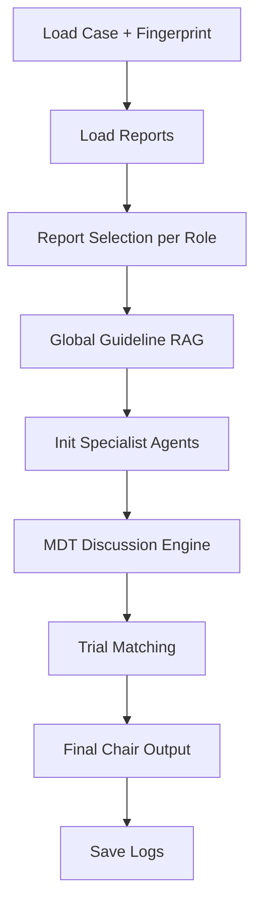

# MDT Discussion Log — 2026-01-17_20-46-05
Generated automatically by MDT Pipeline.


## CASE (structured JSON)

```
{"CASE_CORE":{"ADJUVANT_TREATMENT":{"cycles_or_courses":"6 cycles","given":"Yes","regimens":["多西+顺铂","多西+卡铂"]},"BIOMARKERS":{"AFP":"1.04 ng/ml","CA125":"651.00 U/ml","CA15-3":"156.00 U/ml","CA19-9":"23.40 U/ml","CEA":"1.13 ng/ml","HE4":"1210.00 pmol/L","HER2":"Unknown","MSI":"Unknown","PDL1_CPS":"Unknown","ROMA":"99.50% (premenopausal); 98.26% (postmenopausal)","TMB":"Unknown"},"BRCA1":"Unknown","BRCA2":"Unknown","CURRENT_STATUS":"Ovarian cancer with multiple metastases (CT 2025-04-09)","DIAGNOSIS":{"components":[],"histology":"Unknown","laterality":"Unknown","primary":"Ovarian cancer","site":"Ovary"},"HRD":"Unknown","INITIAL_TREATMENT":"Yes","LINE_OF_THERAPY":[{"cycles":"6 cycles","end_date":"2019-08","intent":"Adjuvant","line":"1L","regimen":"多西+顺铂; 多西+卡铂","start_date":"2019-03-26"},{"cycles":"3 cycles","end_date":"Unknown","intent":"Salvage","line":"Unknown","regimen":"多柔比星脂质体","start_date":"2019-11"},{"cycles":"6 cycles","end_date":"2022-06","intent":"Salvage","line":"Unknown","regimen":"白紫+贝伐","start_date":"2021-05"},{"cycles":"5 cycles","end_date":"Unknown","intent":"Salvage","line":"Unknown","regimen":"多柔比星","start_date":"2022-07"},{"cycles":"Unknown","end_date":"2024-09","intent":"Salvage","line":"Unknown","regimen":"口服安罗+尼拉","start_date":"2023-01"},{"cycles":"3 cycles","end_date":"Unknown","intent":"Palliative","line":"Unknown","regimen":"多柔比星+奈达铂","start_date":"2024-09"},{"cycles":"1","end_date":"Unknown","intent":"Palliative","line":"Unknown","regimen":"联合免疫治疗","start_date":"Unknown"}],"MAINTENANCE":"Yes","MAINTENANCE_DETAIL":{"end_date":"2022-06","given":"Yes","regimens":["贝伐维持"],"start_date":"Unknown"},"NEOADJUVANT":"No","PFI_days":"Unknown","PLATINUM_HISTORY":[{"PFI_days":"Unknown","end_date":"2019-08","evidence":"CA125 ~110 in 2019.10","evidence_type":"Biochemical","first_relapse_date":"2019-10","line":"1L","start_date":"2019-03-26","status":"Unknown"},{"PFI_days":"Unknown","end_date":"Unknown","evidence":"CT 2025-04-09: ovarian cancer multiple metastases","evidence_type":"Radiologic","first_relapse_date":"2025-04-09","line":"Unknown","start_date":"2024-09","status":"Unknown"}],"PLATINUM_PFI_CURRENT":"Unknown","PLATINUM_STATUS":"Unknown","PLATINUM_STATUS_CURRENT":"Unknown","RELAPSE":"Yes","RELAPSE_DATE":{"date":"2019-10","evidence":"CA125 ~110 in 2019.10","type":"Biochemical"},"STAGE":{"stage_basis":"Unknown","stage_system":"Unknown","stage_text":"Unknown"},"SURGERY_DONE":{"date":"2019-03-26","performed":"Yes","procedure":"Surgery at outside hospital; postoperative hyperthermic perfusion"},"VISIT_DATE":"2025-06-27","first_relapse_date":"2019-10","last_platinum_end_date":"Unknown"},"LAB_TRENDS":{"labs":[{"analyte":"CA125","history":[{"date":"2019-10","flag":"↑","value":"≈110"}],"latest":{"date":"2025-06-25","flag":"↑","value":"651.00"},"reference_range":"Unknown","unit":"U/ml"},{"analyte":"HE4","history":[],"latest":{"date":"2025-06-25","flag":"↑","value":"1210.00"},"reference_range":"Unknown","unit":"pmol/L"},{"analyte":"CA15-3","history":[],"latest":{"date":"2025-06-25","flag":"↑","value":"156.00"},"reference_range":"Unknown","unit":"U/ml"},{"analyte":"CA19-9","history":[],"latest":{"date":"2025-06-25","flag":"Unknown","value":"23.40"},"reference_range":"Unknown","unit":"U/ml"},{"analyte":"AFP","history":[],"latest":{"date":"2025-06-25","flag":"Unknown","value":"1.04"},"reference_range":"Unknown","unit":"ng/ml"},{"analyte":"CEA","history":[],"latest":{"date":"2025-06-25","flag":"Unknown","value":"1.13"},"reference_range":"Unknown","unit":"ng/ml"},{"analyte":"ALP","history":[],"latest":{"date":"2025-06-24","flag":"↑","value":"143.6"},"reference_range":"Unknown","unit":"U/L"},{"analyte":"ALB","history":[],"latest":{"date":"2025-06-24","flag":"↓","value":"39.5"},"reference_range":"Unknown","unit":"g/l"},{"analyte":"Hb","history":[],"latest":{"date":"2025-06-24","flag":"↓","value":"67"},"reference_range":"Unknown","unit":"g/l"},{"analyte":"RBC","history":[],"latest":{"date":"2025-06-24","flag":"↓","value":"2.41"},"reference_range":"Unknown","unit":"*10^12/L"},{"analyte":"WBC","history":[],"latest":{"date":"2025-06-24","flag":"Unknown","value":"7.8"},"reference_range":"Unknown","unit":"*10^9/L"}],"milestones":[{"date":"2019-03-26","description":"Initial surgery at outside hospital","type":"Surgery"},{"date":"2019-03-26","description":"Start adjuvant chemotherapy","type":"ChemoStart"},{"date":"2019-10","description":"Biochemical relapse with CA125 elevation","type":"Relapse"},{"date":"2025-04-09","description":"CT showed multiple metastases","type":"Imaging"}]},"MED_ONC":{"current_regimen":{"cycle_info":"Unknown","last_admin_date":"Unknown","name":"Unknown"},"genetic_testing":{"germline":[],"somatic":[]},"monitoring_points":[],"planned_next_regimen":"Unknown","prior_systemic_therapies":["多西+顺铂","多西+卡铂","多柔比星脂质体","白紫+贝伐","多柔比星","口服安罗+尼拉","多柔比星+奈达铂","联合免疫治疗","贝伐维持"]},"NUC_MED":{"studies":[]},"PATHOLOGY":{"specimens":[]},"RADIOLOGY":{"next_imaging_plan":{"modality":"Unknown","timing":"Unknown"},"studies":[{"anatomic_sites":["Ovary","Multiple metastases"],"date":"2025-04-09","findings":["Ovarian cancer with multiple metastases"],"impression":"Ovarian cancer with multiple metastases","modality":"CT","trend_vs_prior":"Unknown"}]},"TIMELINE":{"constraints":{"max_events":30,"min_events":3,"must_include":["first diagnostic imaging or pathology confirmation (if available)"],"ordering_rules":{"prioritize_last_event":true}},"events":[{"date":"2019-03-26","description":"Surgery at outside hospital; postoperative hyperthermic perfusion","event_type":"Surgery","key_result":"","regimen_or_test":""},{"date":"2019-08","description":"Completed adjuvant chemotherapy; PR","event_type":"Chemo","key_result":"PR","regimen_or_test":"多西+卡铂"},{"date":"2019-10","description":"CA125 increased to ~110","event_type":"Lab","key_result":"≈110 U/ml","regimen_or_test":"CA125"},{"date":"2019-11","description":"Salvage chemotherapy with 多柔比星脂质体, stopped due to pandemic","event_type":"Chemo","key_result":"3 cycles, stopped","regimen_or_test":"多柔比星脂质体"},{"date":"2021-05","description":"Tumor recurrence treated with 白紫+贝伐","event_type":"Relapse","key_result":"6 cycles; bevacizumab maintenance","regimen_or_test":"白紫+贝伐"},{"date":"2022-06","description":"Bevacizumab maintenance until 2022.06","event_type":"Other","key_result":"","regimen_or_test":"贝伐维持"},{"date":"2022-07","description":"多柔比星 monotherapy","event_type":"Chemo","key_result":"5 cycles","regimen_or_test":"多柔比星"},{"date":"2023-01","description":"Oral therapy started","event_type":"Chemo","key_result":"","regimen_or_test":"口服安罗+尼拉"},{"date":"2024-09","description":"Surgery with intestinal stoma for bowel obstruction; stopped oral therapy","event_type":"Surgery","key_result":"","regimen_or_test":"intestinal stoma"},{"date":"2024-09","description":"Chemotherapy 多柔比星+奈达铂","event_type":"Chemo","key_result":"3 cycles","regimen_or_test":"多柔比星+奈达铂"},{"date":"Unknown","description":"联合免疫治疗 once, achieved SD","event_type":"Immunotherapy","key_result":"SD","regimen_or_test":"联合免疫治疗"},{"date":"2025-04-09","description":"External CT showed ovarian cancer multiple metastases","event_type":"Imaging","key_result":"multiple metastases","regimen_or_test":"CT"},{"date":"2025-06-24","description":"Biochemistry and CBC abnormalities","event_type":"Lab","key_result":"ALP 143.6↑; ALB 39.5↓; HGB 67 g/l↓; RBC 2.41↓","regimen_or_test":"Biochemistry/CBC"},{"date":"2025-06-25","description":"Tumor markers elevated","event_type":"Lab","key_result":"CA125 651.00↑; HE4 1210.00↑; CA15-3 156.00↑; CA19-9 23.40; ROMA 99.50%/98.26%","regimen_or_test":"CA125/HE4/CA15-3/CA19-9/ROMA"}]}}
```


## FINAL MDT OUTPUT

```
Final Assessment:
Heavily pretreated metastatic ovarian cancer with severe anemia and stoma, on purely palliative trajectory; histology, biology, performance status, and exact metastatic pattern remain undefined/need urgent clarification.

Core Treatment Strategy:
- Prioritize symptom-led palliative care, including pain, nutrition, stoma support, and psychosocial/end-of-life discussions; clarify patient goals.  
- Urgently evaluate and stabilize anemia (source, transfusion need, iron/B12/folate, hemolysis) before any further systemic therapy decisions [@20250624|14501112].  
- Arrange updated contrast-enhanced CT/MRI with comparison to 2025-04-09 CT to define metastatic burden and complications; imaging currently outdated/limited.  
- Retrieve and review original pathology plus archived tissue for full histology, FIGO staging, and extended biomarkers; arrange re-biopsy only if necessary.  

Change Triggers:
- If anemia and performance status improve and patient desires, reconsider low-intensity systemic options aligned strictly with palliative intent and toxicities.  
- If imaging shows limited, complication-driving lesions (e.g., obstruction, painful metastasis), consider focused local palliation (radiation/intervention) over systemic escalation.
```


## PIPELINE FLOW (Mermaid)




## TRACE EVENTS (Structured)

```json
[
  {
    "ts": "2026-01-17T20:42:09.768813",
    "event": "pipeline_start",
    "payload": {
      "visit_time": "2025-06-27 15:54:59.567000",
      "meta_info": "362201196403235065"
    }
  },
  {
    "ts": "2026-01-17T20:42:09.769170",
    "event": "case_fingerprint",
    "payload": {
      "case_fingerprint": "d9b11a1ab0f2"
    }
  },
  {
    "ts": "2026-01-17T20:42:10.036644",
    "event": "reports_loaded",
    "payload": {
      "lab_n": 16,
      "img_n": 2,
      "path_n": 0,
      "mut_n": 0,
      "cutoff_dt": "2025-06-28 15:54:59"
    }
  },
  {
    "ts": "2026-01-17T20:42:16.897871",
    "event": "reports_selected",
    "payload": {
      "lab": {
        "chair": [
          "20250624|14000385|2025-06-24",
          "20250624|14501112|2025-06-24",
          "20250625|13601595|2025-06-25"
        ],
        "oncologist": [
          "20250624|14000385|2025-06-24",
          "20250624|14501112|2025-06-24",
          "20250625|13601595|2025-06-25"
        ],
        "radiologist": [],
        "pathologist": [],
        "nuclear": []
      },
      "imaging": {
        "chair": [],
        "oncologist": [],
        "radiologist": [],
        "pathologist": [],
        "nuclear": []
      },
      "pathology": {
        "chair": [],
        "oncologist": [],
        "radiologist": [],
        "pathologist": [],
        "nuclear": []
      },
      "mutation": {
        "chair": [],
        "oncologist": [],
        "radiologist": [],
        "pathologist": [],
        "nuclear": []
      }
    }
  },
  {
    "ts": "2026-01-17T20:42:45.504889",
    "event": "rag_query",
    "payload": {
      "query": "Heavily pretreated recurrent ovarian cancer, platinum status unclear, with multiple metastases on CT; no BRCA/HRD/MSI/PD-L1 data; significant anemia (Hgb 67), hypoalbuminemia, prior bowel obstruction with stoma—guidance on further systemic options and goals of care?"
    }
  },
  {
    "ts": "2026-01-17T20:42:45.504898",
    "event": "rag_hits",
    "payload": {
      "topk": 5,
      "n": 0
    }
  },
  {
    "ts": "2026-01-17T20:42:49.730496",
    "event": "mdt_discussion_start",
    "payload": {
      "num_rounds": 2,
      "num_turns": 2
    }
  },
  {
    "ts": "2026-01-17T20:45:38.714504",
    "event": "mdt_discussion_end",
    "payload": {
      "merged_chars": 3934
    }
  },
  {
    "ts": "2026-01-17T20:45:38.715138",
    "event": "final_output_start",
    "payload": {}
  },
  {
    "ts": "2026-01-17T20:46:05.613837",
    "event": "final_output_end",
    "payload": {
      "final_output_chars": 1267
    }
  }
]
```


## INITIAL EXPERT OPINIONS


## chair

```
- Heavily pretreated metastatic ovarian cancer with rising markers and severe anemia; intent now palliative disease control and symptom relief.  
- Hold further cytotoxic therapy until anemia evaluated/treated and overall performance status, organ function, and symptoms documented (needs ECOG, comorbidities).  
- Clarify current disease distribution and complication risk with updated contrast CT/MRI and prior imaging for comparison (sites, burden, obstruction, effusions).  
- Obtain pathology report and biomarker profile including histology subtype, BRCA1/2, HRD, MSI/TMB, PD‑L1, HER2 before systemic strategy change.  
- Early palliative care, pain/nutrition support, transfusion assessment, and stoma function review; align next steps with patient goals and QoL.
```


## oncologist

```
- Heavily pretreated platinum-exposed ovarian cancer with multiple metastases; current line palliative, progression suspected given rising CA125/HE4 [@20250625|13601595].  

- Profound anemia (Hgb 67 g/l) may limit further cytotoxic therapy until transfusion/hematology optimization [@20250624|14501112].  

- Hepatic and renal biochemistry largely acceptable; ALP mildly elevated, albumin slightly low—monitor for metastatic or nutritional impact [@20250624|14000385].  

- No germline/somatic mutation data (e.g., homologous recombination, MSI, actionable targets); comprehensive molecular profiling urgently needed.  

- Missing data: performance status, pain/symptom burden, prior toxicities, detailed CT report (sites/burden), and prior immunotherapy response to guide next-line choice.
```


## radiologist

```
- CT shows ovarian malignancy with multiple metastatic sites; exact organs, lesion sizes, and counts are not specified and need updating [@IMAGING_STUDIES|2025-04-09].  
- Overall metastatic disease burden and pattern (peritoneal vs visceral vs nodal) are undefined; require detailed current cross-sectional imaging report [unknown/needs update].  
- No documented trend versus prior imaging; need earlier and interval scans to assess progression, stability, or response [unknown/needs update].  
- Presence or absence of complications (bowel obstruction, ascites, hydronephrosis, thromboembolism) is not described; require updated imaging assessment [unknown/needs update].  
- PET/CT status is unknown; clarify if performed to better define metabolic disease extent and occult metastases [unknown/needs update].
```


## pathologist

```
- No histology, IHC, or site of disease available; definitive diagnosis, grade, and subtype are currently impossible to determine.  

- Markedly elevated CA125 and HE4 with high ROMA suggest ovarian/pelvic Müllerian malignancy but are not diagnostic alone. [@MOLECULAR|2025-06-27]  

- Tumor biomarkers HER2, MSI, PD-L1, TMB listed as unknown; these require dedicated tissue testing and report. [@MOLECULAR|2025-06-27]  

- No germline or somatic pathogenic variants reported; comprehensive germline and tumor NGS panels appear incomplete/negative. [@MOLECULAR|2025-06-27]  

- Need: surgical pathology report (primary site, histologic type, grade, FIGO stage) and IHC panel to finalize pathologic diagnosis.
```


## nuclear

```
- No PET/CT metabolic data available for review; current PET report or images are required for staging/recurrence assessment (needs update).  

- Known context: ovarian cancer with multiple metastases on prior imaging, but without metabolic characterization or current disease distribution [@IMAGING_CONTEXT|2025-04-09].  

- Cannot comment on FDG uptake pattern, target lesions, or metabolic tumor volume without a contemporaneous PET/CT report (needs update).  

- PET could meaningfully refine staging by clarifying extra-pelvic nodal/visceral involvement and detecting small-volume distant disease, once performed.  

- For recurrence suspicion, PET would help distinguish metabolically active tumor from post-treatment change if prior therapy history and PET are provided (needs update).
```


## MERGED SUMMARY (Assistant)

```
Key Knowledge:
- Heavily pretreated metastatic ovarian cancer with palliative intent and likely progression (rising CA125/HE4).
- Severe anemia (Hgb 67 g/L) is the key safety limitation; other biochemistry relatively preserved.
- Metastatic disease confirmed but current pattern, burden, and complications are not characterized on imaging.
- No full pathology report or molecular profile (histology, BRCA/HRD, MSI/TMB, PD‑L1, HER2), so subtype and targets remain undefined.

Controversies:
- Timing and appropriateness of further systemic therapy given profound anemia and unknown performance status.
- Choice and value of additional systemic lines without clear histology and biomarker guidance.
- Whether PET/CT adds meaningful management-changing information beyond updated contrast CT/MRI in this palliative, heavily pretreated setting.

Missing Info:
- Clinical: ECOG, comorbidities, symptom/pain burden, prior toxicities, nutrition, stoma function.
- Imaging: Updated, detailed contrast CT/MRI with comparison to 2025-04-09 CT, including complications; history of any prior PET/CT.
- Pathology: Full original ovarian pathology (histologic subtype, grade, FIGO stage, IHC) and completed biomarker panel (BRCA/HRD, MSI/TMB, PD‑L1, HER2).
- Molecular: Confirmation of germline/somatic findings and actionable alterations.
- Hematology: Anemia etiology and urgent stabilization plan, including transfusion.

Working Plan:
- Urgently evaluate and stabilize anemia before any further cytotoxic/intensive systemic therapy decisions.
- Obtain updated contrast-enhanced CT/MRI with a formal, comparative report defining disease distribution and complications.
- Retrieve or repeat full tissue-based pathology and complete biomarker testing (BRCA/HRD, MSI/TMB, PD‑L1, HER2).
- Consider PET/CT only after reviewing updated CT/MRI and if results are likely to alter palliative systemic or local management.
- Engage palliative care for symptom control, nutrition, anemia support, and stoma review; reassess systemic options once clinical, imaging, and molecular data are clarified and aligned with patient goals.
[R2T1 DELTA] ology workup) and document ECOG/performance and symptom burden today, as these are currently unknown but critical for treatment intensity decisions. | chair->radiologist(missing): We need an updated contrast-enhanced CT or MRI with explicit comparison to 2025-04-09, delineating current metastatic burden and complications (bowel, liver, bone, pleura, etc.) to guide palliative strategy; PET/CT can be deferred until after this review. | chair->pathologist(missing): Please help retrieve or reconstruct the original ovarian pathology (histology, grade, FIGO, key IHC) and advise on feasibility of additional biomarker testing (BRCA/HRD, MSI/TMB, PD-L1, HER2) from existing tissue or need for re-biopsy. | chair->nuclear(conflict): For now, please hold off on PET/CT recommendations; after updated CT/MRI we will ask you to comment only if PET is likely to change palliative systemic/local management.
[R2T2 DELTA] nd current symptom burden today, as these are critical to determine treatment intensity and feasibility. | chair->radiologist(missing): Please arrange an updated contrast-enhanced CT or MRI with explicit comparison to the 2025-04-09 CT, detailing current metastatic burden and any complications (e.g., bowel, liver, bone, pleural) to guide palliative planning; PET/CT can be reconsidered only after this review. | chair->pathologist(missing): Kindly help retrieve or reconstruct the original ovarian pathology (histology, grade, FIGO stage, key IHC) and advise on feasibility of extended biomarker testing (BRCA/HRD, MSI/TMB, PD-L1, HER2) on existing tissue or whether re-biopsy is required. | chair->nuclear(conflict): For now, please hold off on PET/CT; after we review the updated contrast CT/MRI, we will ask you to comment only if PET is likely to change palliative systemic or local management.
```


## INTERACTION LOG (Round × Turn)

### Round 1

#### Turn 1
- **chair → oncologist:** Given Hgb 67 g/L and unclear ECOG/symptoms, please avoid new cytotoxic/immunotherapy until anemia workup/optimization and performance status are documented; align any further systemic plan with clarified patient goals.
- **chair → radiologist:** We need a recent contrast-enhanced CT or MRI with clear description of metastatic distribution and complications, compared with prior imaging, before reconsidering systemic therapy.
- **chair → pathologist:** Please help retrieve the original surgical/biopsy pathology including histologic subtype, grade, and FIGO stage, as these are currently undocumented.
- **chair → nuclear:** PET/CT should only be proposed if you judge it likely to change management in this palliative, heavily pretreated context; otherwise, prioritize CT/MRI.
- **oncologist → chair:** Before planning any further systemic therapy, we need urgent clarification of performance status, anemia workup/management plan, and retrieval of full pathology plus molecular profile (BRCA/HRD, MSI/TMB, PD‑L1, HER2).
- **oncologist → radiologist:** Please confirm whether a recent contrast-enhanced CT with comparison is available and describe metastatic pattern/complications; advise if any additional imaging would realistically change palliative management.
- **oncologist → pathologist:** We need the original surgical/biopsy report with histologic subtype, grade, FIGO stage, and key IHC markers to contextualize systemic options.
- **oncologist → nuclear:** Only if prior imaging is inadequate or discordant, could you advise whether PET/CT is likely to alter management in this palliative, heavily pretreated setting?
- **radiologist → oncologist:** Current imaging description is too limited for response or complication assessment; a recent contrast-enhanced CT with prior comparisons is critical.
- **radiologist → nuclear:** Please clarify whether a prior PET/CT was ever performed and if a new PET/CT would change management in this palliative setting.
- **pathologist → oncologist:** Full ovarian pathology (histologic subtype/grade, FIGO stage, IHC) and biomarker panel (BRCA/HRD, MSI/TMB, PD-L1, HER2) are absent; final diagnosis and targetable markers cannot be confirmed without retrieving or repeating tissue-based workup.
- **nuclear → oncologist:** Given progressive markers and undefined current disease pattern, please clarify whether a PET/CT has ever been performed or is planned; without this, I cannot comment on whether PET would meaningfully change staging or recurrence assessment.
- **nuclear → radiologist:** Before deciding on PET/CT in this palliative setting, an updated, fully reported contrast CT/MRI with explicit documentation of disease distribution and complications is critical to judge PET’s incremental value.

#### Turn 2
- **chair → oncologist:** Given Hgb 67 g/L [@20250624|14501112], please prioritize urgent anemia workup and stabilization before any further cytotoxic or intensive systemic therapy decisions.
- **chair → radiologist:** Please arrange a detailed, contrast-enhanced CT or MRI with formal report describing disease distribution, complications, and comparison to 2025-04-09 CT to guide palliative planning and assess need for PET/CT.
- **chair → pathologist:** Full original surgical/biopsy pathology (histologic subtype/grade, FIGO stage, IHC) is missing; please retrieve or repeat tissue workup to establish definitive subtype and enable biomarker testing.
- **chair → nuclear:** PET/CT should be considered only after updated contrast CT/MRI is reviewed and if results are likely to change systemic or local palliative management; please comment once that imaging is available.

### Round 2

#### Turn 1
- **chair → oncologist:** Before any further systemic therapy, please prioritize urgent anemia stabilization (including transfusion plan and etiology workup) and document ECOG/performance and symptom burden today, as these are currently unknown but critical for treatment intensity decisions.
- **chair → radiologist:** We need an updated contrast-enhanced CT or MRI with explicit comparison to 2025-04-09, delineating current metastatic burden and complications (bowel, liver, bone, pleura, etc.) to guide palliative strategy; PET/CT can be deferred until after this review.
- **chair → pathologist:** Please help retrieve or reconstruct the original ovarian pathology (histology, grade, FIGO, key IHC) and advise on feasibility of additional biomarker testing (BRCA/HRD, MSI/TMB, PD-L1, HER2) from existing tissue or need for re-biopsy.
- **chair → nuclear:** For now, please hold off on PET/CT recommendations; after updated CT/MRI we will ask you to comment only if PET is likely to change palliative systemic/local management.

#### Turn 2
- **chair → oncologist:** Before any further systemic therapy decisions, please prioritize urgent evaluation and stabilization of the severe anemia (Hgb 67 g/L) and document ECOG and current symptom burden today, as these are critical to determine treatment intensity and feasibility.
- **chair → radiologist:** Please arrange an updated contrast-enhanced CT or MRI with explicit comparison to the 2025-04-09 CT, detailing current metastatic burden and any complications (e.g., bowel, liver, bone, pleural) to guide palliative planning; PET/CT can be reconsidered only after this review.
- **chair → pathologist:** Kindly help retrieve or reconstruct the original ovarian pathology (histology, grade, FIGO stage, key IHC) and advise on feasibility of extended biomarker testing (BRCA/HRD, MSI/TMB, PD-L1, HER2) on existing tissue or whether re-biopsy is required.
- **chair → nuclear:** For now, please hold off on PET/CT; after we review the updated contrast CT/MRI, we will ask you to comment only if PET is likely to change palliative systemic or local management.


## FINAL REFINED PLANS (per Round)

### Round 1


## chair

```
- Stabilize anemia urgently (transfusion/workup) before any further cytotoxic or intensive systemic therapy decisions [@20250624|14501112].  
- Document ECOG, comorbidities, symptom burden, nutrition, and stoma function to refine palliative intent and treatment intensity (currently unknown).  
- Obtain updated contrast CT/MRI with comparison to 2025‑04‑09 CT to define disease pattern and complications (details currently unknown).  
- Retrieve/complete full pathology and molecular profile (histology, FIGO, BRCA/HRD, MSI/TMB, PD‑L1, HER2) to reassess systemic options.  
- After anemia optimization and restaging, reconsider systemic vs best supportive care in MDT, aligned with patient goals and QoL.
```


## oncologist

```
- Urgently investigate and correct anemia (transfusion, iron/B12/folate, bleeding/hemolysis workup) before deciding on further systemic therapy [@20250624|14501112].  

- Obtain updated contrast-enhanced CT/MRI with report comparing to 2025-04-09 CT to define metastatic pattern and complications [@20250624|14000385].  

- Retrieve full original ovarian pathology (histologic subtype, grade, FIGO stage, IHC) and perform comprehensive biomarker profiling; currently unknown/needs update.  

- Defer additional cytotoxic or intensive systemic therapy until anemia, ECOG status, comorbidities, symptom burden, and prior toxicities are documented; currently unknown.  

- Engage palliative care for symptom control, nutritional support, and anemia management now; revisit systemic options after clinical, imaging, and molecular reassessment.
```


## radiologist

```
- Arrange updated contrast-enhanced CT/MRI with formal report, detailing metastatic distribution, size, and complications, compared to 2025‑04‑09 CT [@IMAGING_STUDIES|2025-04-09].  
- Reassess need for PET/CT only after updated cross-sectional imaging, focusing on whether results would alter palliative local/systemic decisions [unknown].  
- Explicitly document presence/absence of bowel obstruction, hydronephrosis, ascites, pleural effusion, and thromboembolism on new imaging for symptom-guided care [unknown].  
- Quantify measurable target lesions (longest diameter, organ, segment) to enable future objective radiologic response assessments if therapy resumes [unknown].  
- Retrieve and archive all prior imaging to establish radiologic trend (progression vs stability) against new study for prognosis and planning [@IMAGING_TRENDS|2025-04-09].
```


## pathologist

```
- Retrieve full ovarian surgical/biopsy pathology including histologic subtype, grade, FIGO stage, and IHC; currently unknown/needs update.  

- Perform comprehensive biomarker testing on available tissue: BRCA1/2, HRD, MSI/TMB, PD‑L1, HER2, and other actionable alterations; currently unknown.  

- Confirm that existing pathology matches an ovarian/Müllerian primary and exclude other primaries or mixed histology; details unknown/needs update.  

- Ensure pathology material adequacy (blocks/slides) for any planned additional molecular or IHC studies; current tissue status unknown.  

- Once reports are retrieved, summarize a unified pathologic diagnosis for MDT, explicitly documenting subtype, grade, and biomarker profile.
```


## nuclear

```
- No PET/CT available; prior metabolic imaging history and any existing PET reports remain unknown/needs update.  

- Updated contrast-enhanced CT/MRI with formal report and comparison to 2025-04-09 CT is prerequisite before considering PET/CT [@IMAGING_CONTEXT|2025-04-09].  

- After CT/MRI, PET/CT should be reserved for scenarios where clarifying extent or complications would change palliative systemic or local interventions.  

- In this palliative, heavily pretreated setting, routine PET for staging alone is not justified without a specific, management-altering question.  

- Once new CT/MRI and clinical goals are defined, re-evaluate whether PET could help distinguish active disease from treatment change or complications.
```

### Round 2


## chair

```
- Prioritize anemia stabilization and etiology workup (including transfusion as needed) before any further intensive systemic therapy [@20250624|14501112].  
- Document ECOG, comorbidities, nutrition, symptom and pain burden, and stoma function today to set realistic treatment intensity.  
- Obtain updated contrast-enhanced CT/MRI with formal comparison to 2025-04-09 CT to define metastatic pattern and complications; defer PET/CT.  
- Retrieve/clarify full ovarian pathology and pursue feasible biomarker testing (BRCA/HRD, MSI/TMB, PD‑L1, HER2) or re-biopsy if necessary.  
- Engage palliative care for symptom control, nutritional support, and anemia/stoma management; reconsider systemic options once clinical and disease status clarified.
```


## oncologist

```
- Defer additional cytotoxic/intensive systemic therapy until anemia is evaluated/treated and ECOG, comorbidities, and symptom burden are documented; currently unknown.  

- Arrange urgent anemia workup and stabilization (including transfusion consideration) before systemic decisions; Hgb 67 g/L [@20250624|14501112].  

- Obtain updated contrast-enhanced CT/MRI with formal comparison to CT 2025-04-09 to define metastatic burden, complications, and guide palliation; details unknown.  

- Retrieve/confirm original ovarian pathology (histology, grade, FIGO, IHC) and perform extended biomarker testing (BRCA/HRD, MSI/TMB, PD‑L1, HER2); all unknown.  

- Reassess systemic options after clinical stabilization, updated imaging, and pathology/molecular clarification, aligning any further treatment with palliative intent and patient goals.
```


## radiologist

```
- Arrange updated contrast-enhanced CT or MRI, explicitly compared with 2025-04-09 CT, to define metastatic burden and complications [@IMAGING_STUDIES|2025-04-09].  
- In the new report, detail organ sites (peritoneum, liver, lung/pleura, bone, nodes), lesion sizes, and measurable targets [unknown].  
- Systematically document complications: bowel obstruction, bowel wall involvement, ascites, pleural effusion, hydronephrosis, biliary obstruction, pathological fractures, venous thrombosis [unknown].  
- After reviewing updated CT/MRI, reassess whether PET/CT would add management-changing information in this palliative setting [unknown].  
- Archive and review all prior imaging to establish radiologic trend (progression vs stability) relative to 2025-04-09 baseline [@IMAGING_TRENDS|2025-04-09].
```


## pathologist

```
- Underlying histologic subtype, grade, FIGO stage, and IHC profile remain unknown; original ovarian pathology must be retrieved/reviewed.  

- Feasibility of extended biomarkers (BRCA/HRD, MSI/TMB, PD‑L1, HER2) on existing blocks vs need for re-biopsy is unknown.  

- Confirm that current metastases match the original ovarian/Müllerian primary and exclude mixed or non-gynecologic primaries once reports available.  

- Verify adequacy and preservation of archived tissue (blocks/slides) for additional IHC and molecular assays before ordering expanded testing.  

- After data retrieval, issue an integrated pathology summary for MDT, detailing subtype, grade, staging parameters, and full biomarker profile.
```


## nuclear

```
- No PET/CT studies or reports are available; prior metabolic imaging history remains unknown/needs update.  

- Ovarian cancer with multiple metastases is documented, but current distribution and complications await updated contrast CT/MRI [@IMAGING_CONTEXT|2025-04-09].  

- At this time, PET/CT should be deferred until new CT/MRI is reviewed and a management-changing question is clearly defined.  

- Once CT/MRI clarifies sites and complications, PET/CT may help in problem-solving (e.g., equivocal lesions) if it could alter palliation.  

- Without imaging and pathology updates, PET cannot currently be justified for routine restaging or recurrence assessment in this palliative setting.
```


## RAW AGENT LOGS

### chair
- **User:** Give INITIAL opinion (use ONLY your system-provided patient facts).
Return up to 5 bullets, each ≤20 words.
If key data missing, say exactly what needs updating.
  
  **Assistant:** - Heavily pretreated metastatic ovarian cancer with rising markers and severe anemia; intent now palliative disease control and symptom relief.  
- Hold further cytotoxic therapy until anemia evaluated/treated and overall performance status, organ function, and symptoms documented (needs ECOG, comorbidities).  
- Clarify current disease distribution and complication risk with updated contrast CT/MRI and prior imaging for comparison (sites, burden, obstruction, effusions).  
- Obtain pathology report and biomarker profile including histology subtype, BRCA1/2, HRD, MSI/TMB, PD‑L1, HER2 before systemic strategy change.  
- Early palliative care, pain/nutrition support, transfusion assessment, and stoma function review; align next steps with patient goals and QoL.
  
  *(2026-01-17T20:42:52.416192)*

- **User:** ROLE: chair. VISIT: 2025-06-27 15:54:59.567000
Default is NOT to speak. Speak ONLY if: conflict | safety | missing-critical | new-critical.

CONTEXT (latest):
Key Knowledge:
- Heavily pretreated metastatic ovarian cancer; current intent palliative.
- Rising CA125/HE4 with known metastases → progression likely.
- Severe anemia (Hgb 67 g/L) is the main barrier to further cytotoxic therapy; other labs relatively preserved.
- Imaging confirms metastatic disease but pattern, burden, and complications are not defined.
- No complete pathology or molecular profile (histology, BRCA/HRD, MSI/TMB, PD‑L1, HER2) available.

Controversies:
- Whether/when to pursue further systemic therapy given profound anemia and unknown performance status.
- Value and selection of additional systemic lines without defined histology/molecular targets.
- Optimal restaging approach (CT/MRI alone vs adding PET/CT) in a palliative, heavily pretreated setting.

Missing Info:
- Clinical: ECOG, comorbidities, symptom/pain burden, prior toxicities, nutrition, stoma function.
- Imaging: Recent detailed contrast CT/MRI with comparison to prior; documentation of complications; PET/CT history/status.
- Pathology: Full surgical/biopsy report (type, grade, FIGO stage) and IHC.
- Molecular: BRCA1/2, HRD, MSI/TMB, PD‑L1, HER2, other actionable alterations.
- Hematology: Etiology and management plan for anemia, including transfusion strategy.

Working Plan:
- Defer further cytotoxic therapy until anemia is assessed/optimized and performance status and symptom burden documented.
- Obtain updated contrast CT/MRI and prior imaging for comparison; consider PET/CT only if likely to alter management.
- Retrieve full pathology and complete molecular testing (BRCA/HRD, MSI/TMB, PD‑L1, HER2).
- Engage palliative care for symptom control, nutrition, anemia support, and stoma review.
- Revisit systemic treatment options once clinical status, imaging, and molecular data are available, in line with patient goals and QoL.

Allowed targets: [oncologist,radiologist,pathologist,nuclear]
Return ONE-LINE JSON only:{"speak":"yes/no","messages":[{"target":"<role>","message":"<1-2 sentences>","why":"conflict|safety|missing|new"}]}
  
  **Assistant:** {"speak":"yes","messages":[{"target":"oncologist","message":"Given Hgb 67 g/L and unclear ECOG/symptoms, please avoid new cytotoxic/immunotherapy until anemia workup/optimization and performance status are documented; align any further systemic plan with clarified patient goals.","why":"safety"},{"target":"radiologist","message":"We need a recent contrast-enhanced CT or MRI with clear description of metastatic distribution and complications, compared with prior imaging, before reconsidering systemic therapy.","why":"missing"},{"target":"pathologist","message":"Please help retrieve the original surgical/biopsy pathology including histologic subtype, grade, and FIGO stage, as these are currently undocumented.","why":"missing"},{"target":"nuclear","message":"PET/CT should only be proposed if you judge it likely to change management in this palliative, heavily pretreated context; otherwise, prioritize CT/MRI.","why":"safety"}]}
  
  *(2026-01-17T20:43:13.976237)*

- **User:** ROLE: chair. VISIT: 2025-06-27 15:54:59.567000
Default is NOT to speak. Speak ONLY if: conflict | safety | missing-critical | new-critical.

CONTEXT (latest):
Key Knowledge:
- Heavily pretreated metastatic ovarian cancer; current intent palliative.
- Rising CA125/HE4 with known metastases → progression likely.
- Severe anemia (Hgb 67 g/L) is the main barrier to further cytotoxic therapy; other labs relatively preserved.
- Imaging confirms metastatic disease but pattern, burden, and complications are not defined.
- No complete pathology or molecular profile (histology, BRCA/HRD, MSI/TMB, PD‑L1, HER2) available.

Controversies:
- Whether/when to pursue further systemic therapy given profound anemia and unknown performance status.
- Value and selection of additional systemic lines without defined histology/molecular targets.
- Optimal restaging approach (CT/MRI alone vs adding PET/CT) in a palliative, heavily pretreated setting.

Missing Info:
- Clinical: ECOG, comorbidities, symptom/pain burden, prior toxicities, nutrition, stoma function.
- Imaging: Recent detailed contrast CT/MRI with comparison to prior; documentation of complications; PET/CT history/status.
- Pathology: Full surgical/biopsy report (type, grade, FIGO stage) and IHC.
- Molecular: BRCA1/2, HRD, MSI/TMB, PD‑L1, HER2, other actionable alterations.
- Hematology: Etiology and management plan for anemia, including transfusion strategy.

Working Plan:
- Defer further cytotoxic therapy until anemia is assessed/optimized and performance status and symptom burden documented.
- Obtain updated contrast CT/MRI and prior imaging for comparison; consider PET/CT only if likely to alter management.
- Retrieve full pathology and complete molecular testing (BRCA/HRD, MSI/TMB, PD‑L1, HER2).
- Engage palliative care for symptom control, nutrition, anemia support, and stoma review.
- Revisit systemic treatment options once clinical status, imaging, and molecular data are available, in line with patient goals and QoL.
[R1T1 DELTA] or PET/CT was ever performed and if a new PET/CT would change management in this palliative setting. | pathologist->oncologist(missing): Full ovarian pathology (histologic subtype/grade, FIGO stage, IHC) and biomarker panel (BRCA/HRD, MSI/TMB, PD-L1, HER2) are absent; final diagnosis and targetable markers cannot be confirmed without retrieving or repeating tissue-based workup. | nuclear->oncologist(missing): Given progressive markers and undefined current disease pattern, please clarify whether a PET/CT has ever been performed or is planned; without this, I cannot comment on whether PET would meaningfully change staging or recurrence assessment. | nuclear->radiologist(missing): Before deciding on PET/CT in this palliative setting, an updated, fully reported contrast CT/MRI with explicit documentation of disease distribution and complications is critical to judge PET’s incremental value.

Allowed targets: [oncologist,radiologist,pathologist,nuclear]
Return ONE-LINE JSON only:{"speak":"yes/no","messages":[{"target":"<role>","message":"<1-2 sentences>","why":"conflict|safety|missing|new"}]}
  
  **Assistant:** {"speak":"yes","messages":[{"target":"oncologist","message":"Given Hgb 67 g/L [@20250624|14501112], please prioritize urgent anemia workup and stabilization before any further cytotoxic or intensive systemic therapy decisions.","why":"safety"},{"target":"radiologist","message":"Please arrange a detailed, contrast-enhanced CT or MRI with formal report describing disease distribution, complications, and comparison to 2025-04-09 CT to guide palliative planning and assess need for PET/CT.","why":"missing"},{"target":"pathologist","message":"Full original surgical/biopsy pathology (histologic subtype/grade, FIGO stage, IHC) is missing; please retrieve or repeat tissue workup to establish definitive subtype and enable biomarker testing.","why":"missing"},{"target":"nuclear","message":"PET/CT should be considered only after updated contrast CT/MRI is reviewed and if results are likely to change systemic or local palliative management; please comment once that imaging is available.","why":"missing"}]}
  
  *(2026-01-17T20:43:24.461841)*

- **User:** Given MDT context:
Key Knowledge:
- Heavily pretreated metastatic ovarian cancer; current intent palliative.
- Rising CA125/HE4 with known metastases → progression likely.
- Severe anemia (Hgb 67 g/L) is the main barrier to further cytotoxic therapy; other labs relatively preserved.
- Imaging confirms metastatic disease but pattern, burden, and complications are not defined.
- No complete pathology or molecular profile (histology, BRCA/HRD, MSI/TMB, PD‑L1, HER2) available.

Controversies:
- Whether/when to pursue further systemic therapy given profound anemia and unknown performance status.
- Value and selection of additional systemic lines without defined histology/molecular targets.
- Optimal restaging approach (CT/MRI alone vs adding PET/CT) in a palliative, heavily pretreated setting.

Missing Info:
- Clinical: ECOG, comorbidities, symptom/pain burden, prior toxicities, nutrition, stoma function.
- Imaging: Recent detailed contrast CT/MRI with comparison to prior; documentation of complications; PET/CT history/status.
- Pathology: Full surgical/biopsy report (type, grade, FIGO stage) and IHC.
- Molecular: BRCA1/2, HRD, MSI/TMB, PD‑L1, HER2, other actionable alterations.
- Hematology: Etiology and management plan for anemia, including transfusion strategy.

Working Plan:
- Defer further cytotoxic therapy until anemia is assessed/optimized and performance status and symptom burden documented.
- Obtain updated contrast CT/MRI and prior imaging for comparison; consider PET/CT only if likely to alter management.
- Retrieve full pathology and complete molecular testing (BRCA/HRD, MSI/TMB, PD‑L1, HER2).
- Engage palliative care for symptom control, nutrition, anemia support, and stoma review.
- Revisit systemic treatment options once clinical status, imaging, and molecular data are available, in line with patient goals and QoL.
[R1T1 DELTA] or PET/CT was ever performed and if a new PET/CT would change management in this palliative setting. | pathologist->oncologist(missing): Full ovarian pathology (histologic subtype/grade, FIGO stage, IHC) and biomarker panel (BRCA/HRD, MSI/TMB, PD-L1, HER2) are absent; final diagnosis and targetable markers cannot be confirmed without retrieving or repeating tissue-based workup. | nuclear->oncologist(missing): Given progressive markers and undefined current disease pattern, please clarify whether a PET/CT has ever been performed or is planned; without this, I cannot comment on whether PET would meaningfully change staging or recurrence assessment. | nuclear->radiologist(missing): Before deciding on PET/CT in this palliative setting, an updated, fully reported contrast CT/MRI with explicit documentation of disease distribution and complications is critical to judge PET’s incremental value.
[R1T2 DELTA] chair->oncologist(safety): Given Hgb 67 g/L [@20250624|14501112], please prioritize urgent anemia workup and stabilization before any further cytotoxic or intensive systemic therapy decisions. | chair->radiologist(missing): Please arrange a detailed, contrast-enhanced CT or MRI with formal report describing disease distribution, complications, and comparison to 2025-04-09 CT to guide palliative planning and assess need for PET/CT. | chair->pathologist(missing): Full original surgical/biopsy pathology (histologic subtype/grade, FIGO stage, IHC) is missing; please retrieve or repeat tissue workup to establish definitive subtype and enable biomarker testing. | chair->nuclear(missing): PET/CT should be considered only after updated contrast CT/MRI is reviewed and if results are likely to change systemic or local palliative management; please comment once that imaging is available.

Provide FINAL refined plan.
Up to 5 bullets, each ≤20 words.
Any factual claim must include [@report_id|date] or say unknown.
  
  **Assistant:** - Stabilize anemia urgently (transfusion/workup) before any further cytotoxic or intensive systemic therapy decisions [@20250624|14501112].  
- Document ECOG, comorbidities, symptom burden, nutrition, and stoma function to refine palliative intent and treatment intensity (currently unknown).  
- Obtain updated contrast CT/MRI with comparison to 2025‑04‑09 CT to define disease pattern and complications (details currently unknown).  
- Retrieve/complete full pathology and molecular profile (histology, FIGO, BRCA/HRD, MSI/TMB, PD‑L1, HER2) to reassess systemic options.  
- After anemia optimization and restaging, reconsider systemic vs best supportive care in MDT, aligned with patient goals and QoL.
  
  *(2026-01-17T20:43:31.140696)*

- **User:** ROLE: chair. VISIT: 2025-06-27 15:54:59.567000
Default is NOT to speak. Speak ONLY if: conflict | safety | missing-critical | new-critical.

CONTEXT (latest):
Key Knowledge:
- Heavily pretreated metastatic ovarian cancer with palliative intent and likely progression (rising CA125/HE4).
- Severe anemia (Hgb 67 g/L) is the key safety limitation; other biochemistry relatively preserved.
- Metastatic disease confirmed but current pattern, burden, and complications are not characterized on imaging.
- No full pathology report or molecular profile (histology, BRCA/HRD, MSI/TMB, PD‑L1, HER2), so subtype and targets remain undefined.

Controversies:
- Timing and appropriateness of further systemic therapy given profound anemia and unknown performance status.
- Choice and value of additional systemic lines without clear histology and biomarker guidance.
- Whether PET/CT adds meaningful management-changing information beyond updated contrast CT/MRI in this palliative, heavily pretreated setting.

Missing Info:
- Clinical: ECOG, comorbidities, symptom/pain burden, prior toxicities, nutrition, stoma function.
- Imaging: Updated, detailed contrast CT/MRI with comparison to 2025-04-09 CT, including complications; history of any prior PET/CT.
- Pathology: Full original ovarian pathology (histologic subtype, grade, FIGO stage, IHC) and completed biomarker panel (BRCA/HRD, MSI/TMB, PD‑L1, HER2).
- Molecular: Confirmation of germline/somatic findings and actionable alterations.
- Hematology: Anemia etiology and urgent stabilization plan, including transfusion.

Working Plan:
- Urgently evaluate and stabilize anemia before any further cytotoxic/intensive systemic therapy decisions.
- Obtain updated contrast-enhanced CT/MRI with a formal, comparative report defining disease distribution and complications.
- Retrieve or repeat full tissue-based pathology and complete biomarker testing (BRCA/HRD, MSI/TMB, PD‑L1, HER2).
- Consider PET/CT only after reviewing updated CT/MRI and if results are likely to alter palliative systemic or local management.
- Engage palliative care for symptom control, nutrition, anemia support, and stoma review; reassess systemic options once clinical, imaging, and molecular data are clarified and aligned with patient goals.

Allowed targets: [oncologist,radiologist,pathologist,nuclear]
Return ONE-LINE JSON only:{"speak":"yes/no","messages":[{"target":"<role>","message":"<1-2 sentences>","why":"conflict|safety|missing|new"}]}
  
  **Assistant:** {"speak":"yes","messages":[{"target":"oncologist","message":"Before any further systemic therapy, please prioritize urgent anemia stabilization (including transfusion plan and etiology workup) and document ECOG/performance and symptom burden today, as these are currently unknown but critical for treatment intensity decisions.","why":"safety"},{"target":"radiologist","message":"We need an updated contrast-enhanced CT or MRI with explicit comparison to 2025-04-09, delineating current metastatic burden and complications (bowel, liver, bone, pleura, etc.) to guide palliative strategy; PET/CT can be deferred until after this review.","why":"missing"},{"target":"pathologist","message":"Please help retrieve or reconstruct the original ovarian pathology (histology, grade, FIGO, key IHC) and advise on feasibility of additional biomarker testing (BRCA/HRD, MSI/TMB, PD-L1, HER2) from existing tissue or need for re-biopsy.","why":"missing"},{"target":"nuclear","message":"For now, please hold off on PET/CT recommendations; after updated CT/MRI we will ask you to comment only if PET is likely to change palliative systemic/local management.","why":"conflict"}]}
  
  *(2026-01-17T20:44:23.654611)*

- **User:** ROLE: chair. VISIT: 2025-06-27 15:54:59.567000
Default is NOT to speak. Speak ONLY if: conflict | safety | missing-critical | new-critical.

CONTEXT (latest):
Key Knowledge:
- Heavily pretreated metastatic ovarian cancer with palliative intent and likely progression (rising CA125/HE4).
- Severe anemia (Hgb 67 g/L) is the key safety limitation; other biochemistry relatively preserved.
- Metastatic disease confirmed but current pattern, burden, and complications are not characterized on imaging.
- No full pathology report or molecular profile (histology, BRCA/HRD, MSI/TMB, PD‑L1, HER2), so subtype and targets remain undefined.

Controversies:
- Timing and appropriateness of further systemic therapy given profound anemia and unknown performance status.
- Choice and value of additional systemic lines without clear histology and biomarker guidance.
- Whether PET/CT adds meaningful management-changing information beyond updated contrast CT/MRI in this palliative, heavily pretreated setting.

Missing Info:
- Clinical: ECOG, comorbidities, symptom/pain burden, prior toxicities, nutrition, stoma function.
- Imaging: Updated, detailed contrast CT/MRI with comparison to 2025-04-09 CT, including complications; history of any prior PET/CT.
- Pathology: Full original ovarian pathology (histologic subtype, grade, FIGO stage, IHC) and completed biomarker panel (BRCA/HRD, MSI/TMB, PD‑L1, HER2).
- Molecular: Confirmation of germline/somatic findings and actionable alterations.
- Hematology: Anemia etiology and urgent stabilization plan, including transfusion.

Working Plan:
- Urgently evaluate and stabilize anemia before any further cytotoxic/intensive systemic therapy decisions.
- Obtain updated contrast-enhanced CT/MRI with a formal, comparative report defining disease distribution and complications.
- Retrieve or repeat full tissue-based pathology and complete biomarker testing (BRCA/HRD, MSI/TMB, PD‑L1, HER2).
- Consider PET/CT only after reviewing updated CT/MRI and if results are likely to alter palliative systemic or local management.
- Engage palliative care for symptom control, nutrition, anemia support, and stoma review; reassess systemic options once clinical, imaging, and molecular data are clarified and aligned with patient goals.
[R2T1 DELTA] ology workup) and document ECOG/performance and symptom burden today, as these are currently unknown but critical for treatment intensity decisions. | chair->radiologist(missing): We need an updated contrast-enhanced CT or MRI with explicit comparison to 2025-04-09, delineating current metastatic burden and complications (bowel, liver, bone, pleura, etc.) to guide palliative strategy; PET/CT can be deferred until after this review. | chair->pathologist(missing): Please help retrieve or reconstruct the original ovarian pathology (histology, grade, FIGO, key IHC) and advise on feasibility of additional biomarker testing (BRCA/HRD, MSI/TMB, PD-L1, HER2) from existing tissue or need for re-biopsy. | chair->nuclear(conflict): For now, please hold off on PET/CT recommendations; after updated CT/MRI we will ask you to comment only if PET is likely to change palliative systemic/local management.

Allowed targets: [oncologist,radiologist,pathologist,nuclear]
Return ONE-LINE JSON only:{"speak":"yes/no","messages":[{"target":"<role>","message":"<1-2 sentences>","why":"conflict|safety|missing|new"}]}
  
  **Assistant:** {"speak":"yes","messages":[{"target":"oncologist","message":"Before any further systemic therapy decisions, please prioritize urgent evaluation and stabilization of the severe anemia (Hgb 67 g/L) and document ECOG and current symptom burden today, as these are critical to determine treatment intensity and feasibility.","why":"safety"},{"target":"radiologist","message":"Please arrange an updated contrast-enhanced CT or MRI with explicit comparison to the 2025-04-09 CT, detailing current metastatic burden and any complications (e.g., bowel, liver, bone, pleural) to guide palliative planning; PET/CT can be reconsidered only after this review.","why":"missing"},{"target":"pathologist","message":"Kindly help retrieve or reconstruct the original ovarian pathology (histology, grade, FIGO stage, key IHC) and advise on feasibility of extended biomarker testing (BRCA/HRD, MSI/TMB, PD-L1, HER2) on existing tissue or whether re-biopsy is required.","why":"missing"},{"target":"nuclear","message":"For now, please hold off on PET/CT; after we review the updated contrast CT/MRI, we will ask you to comment only if PET is likely to change palliative systemic or local management.","why":"conflict"}]}
  
  *(2026-01-17T20:44:32.521787)*

- **User:** Given MDT context:
Key Knowledge:
- Heavily pretreated metastatic ovarian cancer with palliative intent and likely progression (rising CA125/HE4).
- Severe anemia (Hgb 67 g/L) is the key safety limitation; other biochemistry relatively preserved.
- Metastatic disease confirmed but current pattern, burden, and complications are not characterized on imaging.
- No full pathology report or molecular profile (histology, BRCA/HRD, MSI/TMB, PD‑L1, HER2), so subtype and targets remain undefined.

Controversies:
- Timing and appropriateness of further systemic therapy given profound anemia and unknown performance status.
- Choice and value of additional systemic lines without clear histology and biomarker guidance.
- Whether PET/CT adds meaningful management-changing information beyond updated contrast CT/MRI in this palliative, heavily pretreated setting.

Missing Info:
- Clinical: ECOG, comorbidities, symptom/pain burden, prior toxicities, nutrition, stoma function.
- Imaging: Updated, detailed contrast CT/MRI with comparison to 2025-04-09 CT, including complications; history of any prior PET/CT.
- Pathology: Full original ovarian pathology (histologic subtype, grade, FIGO stage, IHC) and completed biomarker panel (BRCA/HRD, MSI/TMB, PD‑L1, HER2).
- Molecular: Confirmation of germline/somatic findings and actionable alterations.
- Hematology: Anemia etiology and urgent stabilization plan, including transfusion.

Working Plan:
- Urgently evaluate and stabilize anemia before any further cytotoxic/intensive systemic therapy decisions.
- Obtain updated contrast-enhanced CT/MRI with a formal, comparative report defining disease distribution and complications.
- Retrieve or repeat full tissue-based pathology and complete biomarker testing (BRCA/HRD, MSI/TMB, PD‑L1, HER2).
- Consider PET/CT only after reviewing updated CT/MRI and if results are likely to alter palliative systemic or local management.
- Engage palliative care for symptom control, nutrition, anemia support, and stoma review; reassess systemic options once clinical, imaging, and molecular data are clarified and aligned with patient goals.
[R2T1 DELTA] ology workup) and document ECOG/performance and symptom burden today, as these are currently unknown but critical for treatment intensity decisions. | chair->radiologist(missing): We need an updated contrast-enhanced CT or MRI with explicit comparison to 2025-04-09, delineating current metastatic burden and complications (bowel, liver, bone, pleura, etc.) to guide palliative strategy; PET/CT can be deferred until after this review. | chair->pathologist(missing): Please help retrieve or reconstruct the original ovarian pathology (histology, grade, FIGO, key IHC) and advise on feasibility of additional biomarker testing (BRCA/HRD, MSI/TMB, PD-L1, HER2) from existing tissue or need for re-biopsy. | chair->nuclear(conflict): For now, please hold off on PET/CT recommendations; after updated CT/MRI we will ask you to comment only if PET is likely to change palliative systemic/local management.
[R2T2 DELTA] nd current symptom burden today, as these are critical to determine treatment intensity and feasibility. | chair->radiologist(missing): Please arrange an updated contrast-enhanced CT or MRI with explicit comparison to the 2025-04-09 CT, detailing current metastatic burden and any complications (e.g., bowel, liver, bone, pleural) to guide palliative planning; PET/CT can be reconsidered only after this review. | chair->pathologist(missing): Kindly help retrieve or reconstruct the original ovarian pathology (histology, grade, FIGO stage, key IHC) and advise on feasibility of extended biomarker testing (BRCA/HRD, MSI/TMB, PD-L1, HER2) on existing tissue or whether re-biopsy is required. | chair->nuclear(conflict): For now, please hold off on PET/CT; after we review the updated contrast CT/MRI, we will ask you to comment only if PET is likely to change palliative systemic or local management.

Provide FINAL refined plan.
Up to 5 bullets, each ≤20 words.
Any factual claim must include [@report_id|date] or say unknown.
  
  **Assistant:** - Prioritize anemia stabilization and etiology workup (including transfusion as needed) before any further intensive systemic therapy [@20250624|14501112].  
- Document ECOG, comorbidities, nutrition, symptom and pain burden, and stoma function today to set realistic treatment intensity.  
- Obtain updated contrast-enhanced CT/MRI with formal comparison to 2025-04-09 CT to define metastatic pattern and complications; defer PET/CT.  
- Retrieve/clarify full ovarian pathology and pursue feasible biomarker testing (BRCA/HRD, MSI/TMB, PD‑L1, HER2) or re-biopsy if necessary.  
- Engage palliative care for symptom control, nutritional support, and anemia/stoma management; reconsider systemic options once clinical and disease status clarified.
  
  *(2026-01-17T20:45:24.004298)*

- **User:** 
As the MDT chair for gynecologic oncology, you are seeing the patient at OUTPATIENT TIME: 2025-06-27 15:54:59.567000.
Based on PATIENT FACTS + MDT discussion + FINAL refined plans from all experts, determine the CURRENT best management plan for this visit.

STRICT RULES:
- Any factual statement about past tests/treatments must include [@report_id|date] or say unknown.
- If experts disagree, pick the safest plan and state the key uncertainty.

# FINAL REFINED PLANS (All experts, last round)
{
  "Round 1": {
    "chair": "- Stabilize anemia urgently (transfusion/workup) before any further cytotoxic or intensive systemic therapy decisions [@20250624|14501112].  \n- Document ECOG, comorbidities, symptom burden, nutrition, and stoma function to refine palliative intent and treatment intensity (currently unknown).  \n- Obtain updated contrast CT/MRI with comparison to 2025‑04‑09 CT to define disease pattern and complications (details currently unknown).  \n- Retrieve/complete full pathology and molecular profile (histology, FIGO, BRCA/HRD, MSI/TMB, PD‑L1, HER2) to reassess systemic options.  \n- After anemia optimization and restaging, reconsider systemic vs best supportive care in MDT, aligned with patient goals and QoL.",
    "oncologist": "- Urgently investigate and correct anemia (transfusion, iron/B12/folate, bleeding/hemolysis workup) before deciding on further systemic therapy [@20250624|14501112].  \n\n- Obtain updated contrast-enhanced CT/MRI with report comparing to 2025-04-09 CT to define metastatic pattern and complications [@20250624|14000385].  \n\n- Retrieve full original ovarian pathology (histologic subtype, grade, FIGO stage, IHC) and perform comprehensive biomarker profiling; currently unknown/needs update.  \n\n- Defer additional cytotoxic or intensive systemic therapy until anemia, ECOG status, comorbidities, symptom burden, and prior toxicities are documented; currently unknown.  \n\n- Engage palliative care for symptom control, nutritional support, and anemia management now; revisit systemic options after clinical, imaging, and molecular reassessment.",
    "radiologist": "- Arrange updated contrast-enhanced CT/MRI with formal report, detailing metastatic distribution, size, and complications, compared to 2025‑04‑09 CT [@IMAGING_STUDIES|2025-04-09].  \n- Reassess need for PET/CT only after updated cross-sectional imaging, focusing on whether results would alter palliative local/systemic decisions [unknown].  \n- Explicitly document presence/absence of bowel obstruction, hydronephrosis, ascites, pleural effusion, and thromboembolism on new imaging for symptom-guided care [unknown].  \n- Quantify measurable target lesions (longest diameter, organ, segment) to enable future objective radiologic response assessments if therapy resumes [unknown].  \n- Retrieve and archive all prior imaging to establish radiologic trend (progression vs stability) against new study for prognosis and planning [@IMAGING_TRENDS|2025-04-09].",
    "pathologist": "- Retrieve full ovarian surgical/biopsy pathology including histologic subtype, grade, FIGO stage, and IHC; currently unknown/needs update.  \n\n- Perform comprehensive biomarker testing on available tissue: BRCA1/2, HRD, MSI/TMB, PD‑L1, HER2, and other actionable alterations; currently unknown.  \n\n- Confirm that existing pathology matches an ovarian/Müllerian primary and exclude other primaries or mixed histology; details unknown/needs update.  \n\n- Ensure pathology material adequacy (blocks/slides) for any planned additional molecular or IHC studies; current tissue status unknown.  \n\n- Once reports are retrieved, summarize a unified pathologic diagnosis for MDT, explicitly documenting subtype, grade, and biomarker profile.",
    "nuclear": "- No PET/CT available; prior metabolic imaging history and any existing PET reports remain unknown/needs update.  \n\n- Updated contrast-enhanced CT/MRI with formal report and comparison to 2025-04-09 CT is prerequisite before considering PET/CT [@IMAGING_CONTEXT|2025-04-09].  \n\n- After CT/MRI, PET/CT should be reserved for scenarios where clarifying extent or complications would change palliative systemic or local interventions.  \n\n- In this palliative, heavily pretreated setting, routine PET for staging alone is not justified without a specific, management-altering question.  \n\n- Once new CT/MRI and clinical goals are defined, re-evaluate whether PET could help distinguish active disease from treatment change or complications."
  },
  "Round 2": {
    "chair": "- Prioritize anemia stabilization and etiology workup (including transfusion as needed) before any further intensive systemic therapy [@20250624|14501112].  \n- Document ECOG, comorbidities, nutrition, symptom and pain burden, and stoma function today to set realistic treatment intensity.  \n- Obtain updated contrast-enhanced CT/MRI with formal comparison to 2025-04-09 CT to define metastatic pattern and complications; defer PET/CT.  \n- Retrieve/clarify full ovarian pathology and pursue feasible biomarker testing (BRCA/HRD, MSI/TMB, PD‑L1, HER2) or re-biopsy if necessary.  \n- Engage palliative care for symptom control, nutritional support, and anemia/stoma management; reconsider systemic options once clinical and disease status clarified.",
    "oncologist": "- Defer additional cytotoxic/intensive systemic therapy until anemia is evaluated/treated and ECOG, comorbidities, and symptom burden are documented; currently unknown.  \n\n- Arrange urgent anemia workup and stabilization (including transfusion consideration) before systemic decisions; Hgb 67 g/L [@20250624|14501112].  \n\n- Obtain updated contrast-enhanced CT/MRI with formal comparison to CT 2025-04-09 to define metastatic burden, complications, and guide palliation; details unknown.  \n\n- Retrieve/confirm original ovarian pathology (histology, grade, FIGO, IHC) and perform extended biomarker testing (BRCA/HRD, MSI/TMB, PD‑L1, HER2); all unknown.  \n\n- Reassess systemic options after clinical stabilization, updated imaging, and pathology/molecular clarification, aligning any further treatment with palliative intent and patient goals.",
    "radiologist": "- Arrange updated contrast-enhanced CT or MRI, explicitly compared with 2025-04-09 CT, to define metastatic burden and complications [@IMAGING_STUDIES|2025-04-09].  \n- In the new report, detail organ sites (peritoneum, liver, lung/pleura, bone, nodes), lesion sizes, and measurable targets [unknown].  \n- Systematically document complications: bowel obstruction, bowel wall involvement, ascites, pleural effusion, hydronephrosis, biliary obstruction, pathological fractures, venous thrombosis [unknown].  \n- After reviewing updated CT/MRI, reassess whether PET/CT would add management-changing information in this palliative setting [unknown].  \n- Archive and review all prior imaging to establish radiologic trend (progression vs stability) relative to 2025-04-09 baseline [@IMAGING_TRENDS|2025-04-09].",
    "pathologist": "- Underlying histologic subtype, grade, FIGO stage, and IHC profile remain unknown; original ovarian pathology must be retrieved/reviewed.  \n\n- Feasibility of extended biomarkers (BRCA/HRD, MSI/TMB, PD‑L1, HER2) on existing blocks vs need for re-biopsy is unknown.  \n\n- Confirm that current metastases match the original ovarian/Müllerian primary and exclude mixed or non-gynecologic primaries once reports available.  \n\n- Verify adequacy and preservation of archived tissue (blocks/slides) for additional IHC and molecular assays before ordering expanded testing.  \n\n- After data retrieval, issue an integrated pathology summary for MDT, detailing subtype, grade, staging parameters, and full biomarker profile.",
    "nuclear": "- No PET/CT studies or reports are available; prior metabolic imaging history remains unknown/needs update.  \n\n- Ovarian cancer with multiple metastases is documented, but current distribution and complications await updated contrast CT/MRI [@IMAGING_CONTEXT|2025-04-09].  \n\n- At this time, PET/CT should be deferred until new CT/MRI is reviewed and a management-changing question is clearly defined.  \n\n- Once CT/MRI clarifies sites and complications, PET/CT may help in problem-solving (e.g., equivocal lesions) if it could alter palliation.  \n\n- Without imaging and pathology updates, PET cannot currently be justified for routine restaging or recurrence assessment in this palliative setting."
  }
}

# Response Format
Final Assessment:
<1–3 sentences: summarize histology/biology, current disease status, and key uncertainties>

Core Treatment Strategy:
- < ≤20 words concrete decision >
- < ≤20 words concrete decision >
- < ≤20 words concrete decision >
- < ≤20 words concrete decision >

Change Triggers:
- < ≤20 words “if X, then adjust management from A to B” >
- < ≤20 words “if X, then adjust management from A to B” >

  
  **Assistant:** Final Assessment:
Heavily pretreated metastatic ovarian cancer with severe anemia and stoma, on purely palliative trajectory; histology, biology, performance status, and exact metastatic pattern remain undefined/need urgent clarification.

Core Treatment Strategy:
- Prioritize symptom-led palliative care, including pain, nutrition, stoma support, and psychosocial/end-of-life discussions; clarify patient goals.  
- Urgently evaluate and stabilize anemia (source, transfusion need, iron/B12/folate, hemolysis) before any further systemic therapy decisions [@20250624|14501112].  
- Arrange updated contrast-enhanced CT/MRI with comparison to 2025-04-09 CT to define metastatic burden and complications; imaging currently outdated/limited.  
- Retrieve and review original pathology plus archived tissue for full histology, FIGO staging, and extended biomarkers; arrange re-biopsy only if necessary.  

Change Triggers:
- If anemia and performance status improve and patient desires, reconsider low-intensity systemic options aligned strictly with palliative intent and toxicities.  
- If imaging shows limited, complication-driving lesions (e.g., obstruction, painful metastasis), consider focused local palliation (radiation/intervention) over systemic escalation.
  
  *(2026-01-17T20:46:05.613774)*


### oncologist
- **User:** Give INITIAL opinion (use ONLY your system-provided patient facts).
Return up to 5 bullets, each ≤20 words.
If key data missing, say exactly what needs updating.
  
  **Assistant:** - Heavily pretreated platinum-exposed ovarian cancer with multiple metastases; current line palliative, progression suspected given rising CA125/HE4 [@20250625|13601595].  

- Profound anemia (Hgb 67 g/l) may limit further cytotoxic therapy until transfusion/hematology optimization [@20250624|14501112].  

- Hepatic and renal biochemistry largely acceptable; ALP mildly elevated, albumin slightly low—monitor for metastatic or nutritional impact [@20250624|14000385].  

- No germline/somatic mutation data (e.g., homologous recombination, MSI, actionable targets); comprehensive molecular profiling urgently needed.  

- Missing data: performance status, pain/symptom burden, prior toxicities, detailed CT report (sites/burden), and prior immunotherapy response to guide next-line choice.
  
  *(2026-01-17T20:42:55.329698)*

- **User:** ROLE: oncologist. VISIT: 2025-06-27 15:54:59.567000
Default is NOT to speak. Speak ONLY if: conflict | safety | missing-critical | new-critical.

CONTEXT (latest):
Key Knowledge:
- Heavily pretreated metastatic ovarian cancer; current intent palliative.
- Rising CA125/HE4 with known metastases → progression likely.
- Severe anemia (Hgb 67 g/L) is the main barrier to further cytotoxic therapy; other labs relatively preserved.
- Imaging confirms metastatic disease but pattern, burden, and complications are not defined.
- No complete pathology or molecular profile (histology, BRCA/HRD, MSI/TMB, PD‑L1, HER2) available.

Controversies:
- Whether/when to pursue further systemic therapy given profound anemia and unknown performance status.
- Value and selection of additional systemic lines without defined histology/molecular targets.
- Optimal restaging approach (CT/MRI alone vs adding PET/CT) in a palliative, heavily pretreated setting.

Missing Info:
- Clinical: ECOG, comorbidities, symptom/pain burden, prior toxicities, nutrition, stoma function.
- Imaging: Recent detailed contrast CT/MRI with comparison to prior; documentation of complications; PET/CT history/status.
- Pathology: Full surgical/biopsy report (type, grade, FIGO stage) and IHC.
- Molecular: BRCA1/2, HRD, MSI/TMB, PD‑L1, HER2, other actionable alterations.
- Hematology: Etiology and management plan for anemia, including transfusion strategy.

Working Plan:
- Defer further cytotoxic therapy until anemia is assessed/optimized and performance status and symptom burden documented.
- Obtain updated contrast CT/MRI and prior imaging for comparison; consider PET/CT only if likely to alter management.
- Retrieve full pathology and complete molecular testing (BRCA/HRD, MSI/TMB, PD‑L1, HER2).
- Engage palliative care for symptom control, nutrition, anemia support, and stoma review.
- Revisit systemic treatment options once clinical status, imaging, and molecular data are available, in line with patient goals and QoL.

Allowed targets: [chair,radiologist,pathologist,nuclear]
Return ONE-LINE JSON only:{"speak":"yes/no","messages":[{"target":"<role>","message":"<1-2 sentences>","why":"conflict|safety|missing|new"}]}
  
  **Assistant:** {"speak":"yes","messages":[{"target":"chair","message":"Before planning any further systemic therapy, we need urgent clarification of performance status, anemia workup/management plan, and retrieval of full pathology plus molecular profile (BRCA/HRD, MSI/TMB, PD‑L1, HER2).","why":"missing"},{"target":"radiologist","message":"Please confirm whether a recent contrast-enhanced CT with comparison is available and describe metastatic pattern/complications; advise if any additional imaging would realistically change palliative management.","why":"missing"},{"target":"pathologist","message":"We need the original surgical/biopsy report with histologic subtype, grade, FIGO stage, and key IHC markers to contextualize systemic options.","why":"missing"},{"target":"nuclear","message":"Only if prior imaging is inadequate or discordant, could you advise whether PET/CT is likely to alter management in this palliative, heavily pretreated setting?","why":"missing"}]}
  
  *(2026-01-17T20:43:16.448012)*

- **User:** ROLE: oncologist. VISIT: 2025-06-27 15:54:59.567000
Default is NOT to speak. Speak ONLY if: conflict | safety | missing-critical | new-critical.

CONTEXT (latest):
Key Knowledge:
- Heavily pretreated metastatic ovarian cancer; current intent palliative.
- Rising CA125/HE4 with known metastases → progression likely.
- Severe anemia (Hgb 67 g/L) is the main barrier to further cytotoxic therapy; other labs relatively preserved.
- Imaging confirms metastatic disease but pattern, burden, and complications are not defined.
- No complete pathology or molecular profile (histology, BRCA/HRD, MSI/TMB, PD‑L1, HER2) available.

Controversies:
- Whether/when to pursue further systemic therapy given profound anemia and unknown performance status.
- Value and selection of additional systemic lines without defined histology/molecular targets.
- Optimal restaging approach (CT/MRI alone vs adding PET/CT) in a palliative, heavily pretreated setting.

Missing Info:
- Clinical: ECOG, comorbidities, symptom/pain burden, prior toxicities, nutrition, stoma function.
- Imaging: Recent detailed contrast CT/MRI with comparison to prior; documentation of complications; PET/CT history/status.
- Pathology: Full surgical/biopsy report (type, grade, FIGO stage) and IHC.
- Molecular: BRCA1/2, HRD, MSI/TMB, PD‑L1, HER2, other actionable alterations.
- Hematology: Etiology and management plan for anemia, including transfusion strategy.

Working Plan:
- Defer further cytotoxic therapy until anemia is assessed/optimized and performance status and symptom burden documented.
- Obtain updated contrast CT/MRI and prior imaging for comparison; consider PET/CT only if likely to alter management.
- Retrieve full pathology and complete molecular testing (BRCA/HRD, MSI/TMB, PD‑L1, HER2).
- Engage palliative care for symptom control, nutrition, anemia support, and stoma review.
- Revisit systemic treatment options once clinical status, imaging, and molecular data are available, in line with patient goals and QoL.
[R1T1 DELTA] or PET/CT was ever performed and if a new PET/CT would change management in this palliative setting. | pathologist->oncologist(missing): Full ovarian pathology (histologic subtype/grade, FIGO stage, IHC) and biomarker panel (BRCA/HRD, MSI/TMB, PD-L1, HER2) are absent; final diagnosis and targetable markers cannot be confirmed without retrieving or repeating tissue-based workup. | nuclear->oncologist(missing): Given progressive markers and undefined current disease pattern, please clarify whether a PET/CT has ever been performed or is planned; without this, I cannot comment on whether PET would meaningfully change staging or recurrence assessment. | nuclear->radiologist(missing): Before deciding on PET/CT in this palliative setting, an updated, fully reported contrast CT/MRI with explicit documentation of disease distribution and complications is critical to judge PET’s incremental value.

Allowed targets: [chair,radiologist,pathologist,nuclear]
Return ONE-LINE JSON only:{"speak":"yes/no","messages":[{"target":"<role>","message":"<1-2 sentences>","why":"conflict|safety|missing|new"}]}
  
  **Assistant:** {"speak":"no","messages":[]}
  
  *(2026-01-17T20:43:25.520660)*

- **User:** Given MDT context:
Key Knowledge:
- Heavily pretreated metastatic ovarian cancer; current intent palliative.
- Rising CA125/HE4 with known metastases → progression likely.
- Severe anemia (Hgb 67 g/L) is the main barrier to further cytotoxic therapy; other labs relatively preserved.
- Imaging confirms metastatic disease but pattern, burden, and complications are not defined.
- No complete pathology or molecular profile (histology, BRCA/HRD, MSI/TMB, PD‑L1, HER2) available.

Controversies:
- Whether/when to pursue further systemic therapy given profound anemia and unknown performance status.
- Value and selection of additional systemic lines without defined histology/molecular targets.
- Optimal restaging approach (CT/MRI alone vs adding PET/CT) in a palliative, heavily pretreated setting.

Missing Info:
- Clinical: ECOG, comorbidities, symptom/pain burden, prior toxicities, nutrition, stoma function.
- Imaging: Recent detailed contrast CT/MRI with comparison to prior; documentation of complications; PET/CT history/status.
- Pathology: Full surgical/biopsy report (type, grade, FIGO stage) and IHC.
- Molecular: BRCA1/2, HRD, MSI/TMB, PD‑L1, HER2, other actionable alterations.
- Hematology: Etiology and management plan for anemia, including transfusion strategy.

Working Plan:
- Defer further cytotoxic therapy until anemia is assessed/optimized and performance status and symptom burden documented.
- Obtain updated contrast CT/MRI and prior imaging for comparison; consider PET/CT only if likely to alter management.
- Retrieve full pathology and complete molecular testing (BRCA/HRD, MSI/TMB, PD‑L1, HER2).
- Engage palliative care for symptom control, nutrition, anemia support, and stoma review.
- Revisit systemic treatment options once clinical status, imaging, and molecular data are available, in line with patient goals and QoL.
[R1T1 DELTA] or PET/CT was ever performed and if a new PET/CT would change management in this palliative setting. | pathologist->oncologist(missing): Full ovarian pathology (histologic subtype/grade, FIGO stage, IHC) and biomarker panel (BRCA/HRD, MSI/TMB, PD-L1, HER2) are absent; final diagnosis and targetable markers cannot be confirmed without retrieving or repeating tissue-based workup. | nuclear->oncologist(missing): Given progressive markers and undefined current disease pattern, please clarify whether a PET/CT has ever been performed or is planned; without this, I cannot comment on whether PET would meaningfully change staging or recurrence assessment. | nuclear->radiologist(missing): Before deciding on PET/CT in this palliative setting, an updated, fully reported contrast CT/MRI with explicit documentation of disease distribution and complications is critical to judge PET’s incremental value.
[R1T2 DELTA] chair->oncologist(safety): Given Hgb 67 g/L [@20250624|14501112], please prioritize urgent anemia workup and stabilization before any further cytotoxic or intensive systemic therapy decisions. | chair->radiologist(missing): Please arrange a detailed, contrast-enhanced CT or MRI with formal report describing disease distribution, complications, and comparison to 2025-04-09 CT to guide palliative planning and assess need for PET/CT. | chair->pathologist(missing): Full original surgical/biopsy pathology (histologic subtype/grade, FIGO stage, IHC) is missing; please retrieve or repeat tissue workup to establish definitive subtype and enable biomarker testing. | chair->nuclear(missing): PET/CT should be considered only after updated contrast CT/MRI is reviewed and if results are likely to change systemic or local palliative management; please comment once that imaging is available.

Provide FINAL refined plan.
Up to 5 bullets, each ≤20 words.
Any factual claim must include [@report_id|date] or say unknown.
  
  **Assistant:** - Urgently investigate and correct anemia (transfusion, iron/B12/folate, bleeding/hemolysis workup) before deciding on further systemic therapy [@20250624|14501112].  

- Obtain updated contrast-enhanced CT/MRI with report comparing to 2025-04-09 CT to define metastatic pattern and complications [@20250624|14000385].  

- Retrieve full original ovarian pathology (histologic subtype, grade, FIGO stage, IHC) and perform comprehensive biomarker profiling; currently unknown/needs update.  

- Defer additional cytotoxic or intensive systemic therapy until anemia, ECOG status, comorbidities, symptom burden, and prior toxicities are documented; currently unknown.  

- Engage palliative care for symptom control, nutritional support, and anemia management now; revisit systemic options after clinical, imaging, and molecular reassessment.
  
  *(2026-01-17T20:43:54.315104)*

- **User:** ROLE: oncologist. VISIT: 2025-06-27 15:54:59.567000
Default is NOT to speak. Speak ONLY if: conflict | safety | missing-critical | new-critical.

CONTEXT (latest):
Key Knowledge:
- Heavily pretreated metastatic ovarian cancer with palliative intent and likely progression (rising CA125/HE4).
- Severe anemia (Hgb 67 g/L) is the key safety limitation; other biochemistry relatively preserved.
- Metastatic disease confirmed but current pattern, burden, and complications are not characterized on imaging.
- No full pathology report or molecular profile (histology, BRCA/HRD, MSI/TMB, PD‑L1, HER2), so subtype and targets remain undefined.

Controversies:
- Timing and appropriateness of further systemic therapy given profound anemia and unknown performance status.
- Choice and value of additional systemic lines without clear histology and biomarker guidance.
- Whether PET/CT adds meaningful management-changing information beyond updated contrast CT/MRI in this palliative, heavily pretreated setting.

Missing Info:
- Clinical: ECOG, comorbidities, symptom/pain burden, prior toxicities, nutrition, stoma function.
- Imaging: Updated, detailed contrast CT/MRI with comparison to 2025-04-09 CT, including complications; history of any prior PET/CT.
- Pathology: Full original ovarian pathology (histologic subtype, grade, FIGO stage, IHC) and completed biomarker panel (BRCA/HRD, MSI/TMB, PD‑L1, HER2).
- Molecular: Confirmation of germline/somatic findings and actionable alterations.
- Hematology: Anemia etiology and urgent stabilization plan, including transfusion.

Working Plan:
- Urgently evaluate and stabilize anemia before any further cytotoxic/intensive systemic therapy decisions.
- Obtain updated contrast-enhanced CT/MRI with a formal, comparative report defining disease distribution and complications.
- Retrieve or repeat full tissue-based pathology and complete biomarker testing (BRCA/HRD, MSI/TMB, PD‑L1, HER2).
- Consider PET/CT only after reviewing updated CT/MRI and if results are likely to alter palliative systemic or local management.
- Engage palliative care for symptom control, nutrition, anemia support, and stoma review; reassess systemic options once clinical, imaging, and molecular data are clarified and aligned with patient goals.

Allowed targets: [chair,radiologist,pathologist,nuclear]
Return ONE-LINE JSON only:{"speak":"yes/no","messages":[{"target":"<role>","message":"<1-2 sentences>","why":"conflict|safety|missing|new"}]}
  
  **Assistant:** {"speak":"no","messages":[]}
  
  *(2026-01-17T20:44:25.438279)*

- **User:** ROLE: oncologist. VISIT: 2025-06-27 15:54:59.567000
Default is NOT to speak. Speak ONLY if: conflict | safety | missing-critical | new-critical.

CONTEXT (latest):
Key Knowledge:
- Heavily pretreated metastatic ovarian cancer with palliative intent and likely progression (rising CA125/HE4).
- Severe anemia (Hgb 67 g/L) is the key safety limitation; other biochemistry relatively preserved.
- Metastatic disease confirmed but current pattern, burden, and complications are not characterized on imaging.
- No full pathology report or molecular profile (histology, BRCA/HRD, MSI/TMB, PD‑L1, HER2), so subtype and targets remain undefined.

Controversies:
- Timing and appropriateness of further systemic therapy given profound anemia and unknown performance status.
- Choice and value of additional systemic lines without clear histology and biomarker guidance.
- Whether PET/CT adds meaningful management-changing information beyond updated contrast CT/MRI in this palliative, heavily pretreated setting.

Missing Info:
- Clinical: ECOG, comorbidities, symptom/pain burden, prior toxicities, nutrition, stoma function.
- Imaging: Updated, detailed contrast CT/MRI with comparison to 2025-04-09 CT, including complications; history of any prior PET/CT.
- Pathology: Full original ovarian pathology (histologic subtype, grade, FIGO stage, IHC) and completed biomarker panel (BRCA/HRD, MSI/TMB, PD‑L1, HER2).
- Molecular: Confirmation of germline/somatic findings and actionable alterations.
- Hematology: Anemia etiology and urgent stabilization plan, including transfusion.

Working Plan:
- Urgently evaluate and stabilize anemia before any further cytotoxic/intensive systemic therapy decisions.
- Obtain updated contrast-enhanced CT/MRI with a formal, comparative report defining disease distribution and complications.
- Retrieve or repeat full tissue-based pathology and complete biomarker testing (BRCA/HRD, MSI/TMB, PD‑L1, HER2).
- Consider PET/CT only after reviewing updated CT/MRI and if results are likely to alter palliative systemic or local management.
- Engage palliative care for symptom control, nutrition, anemia support, and stoma review; reassess systemic options once clinical, imaging, and molecular data are clarified and aligned with patient goals.
[R2T1 DELTA] ology workup) and document ECOG/performance and symptom burden today, as these are currently unknown but critical for treatment intensity decisions. | chair->radiologist(missing): We need an updated contrast-enhanced CT or MRI with explicit comparison to 2025-04-09, delineating current metastatic burden and complications (bowel, liver, bone, pleura, etc.) to guide palliative strategy; PET/CT can be deferred until after this review. | chair->pathologist(missing): Please help retrieve or reconstruct the original ovarian pathology (histology, grade, FIGO, key IHC) and advise on feasibility of additional biomarker testing (BRCA/HRD, MSI/TMB, PD-L1, HER2) from existing tissue or need for re-biopsy. | chair->nuclear(conflict): For now, please hold off on PET/CT recommendations; after updated CT/MRI we will ask you to comment only if PET is likely to change palliative systemic/local management.

Allowed targets: [chair,radiologist,pathologist,nuclear]
Return ONE-LINE JSON only:{"speak":"yes/no","messages":[{"target":"<role>","message":"<1-2 sentences>","why":"conflict|safety|missing|new"}]}
  
  **Assistant:** {"speak":"no","messages":[]}
  
  *(2026-01-17T20:44:57.401583)*

- **User:** Given MDT context:
Key Knowledge:
- Heavily pretreated metastatic ovarian cancer with palliative intent and likely progression (rising CA125/HE4).
- Severe anemia (Hgb 67 g/L) is the key safety limitation; other biochemistry relatively preserved.
- Metastatic disease confirmed but current pattern, burden, and complications are not characterized on imaging.
- No full pathology report or molecular profile (histology, BRCA/HRD, MSI/TMB, PD‑L1, HER2), so subtype and targets remain undefined.

Controversies:
- Timing and appropriateness of further systemic therapy given profound anemia and unknown performance status.
- Choice and value of additional systemic lines without clear histology and biomarker guidance.
- Whether PET/CT adds meaningful management-changing information beyond updated contrast CT/MRI in this palliative, heavily pretreated setting.

Missing Info:
- Clinical: ECOG, comorbidities, symptom/pain burden, prior toxicities, nutrition, stoma function.
- Imaging: Updated, detailed contrast CT/MRI with comparison to 2025-04-09 CT, including complications; history of any prior PET/CT.
- Pathology: Full original ovarian pathology (histologic subtype, grade, FIGO stage, IHC) and completed biomarker panel (BRCA/HRD, MSI/TMB, PD‑L1, HER2).
- Molecular: Confirmation of germline/somatic findings and actionable alterations.
- Hematology: Anemia etiology and urgent stabilization plan, including transfusion.

Working Plan:
- Urgently evaluate and stabilize anemia before any further cytotoxic/intensive systemic therapy decisions.
- Obtain updated contrast-enhanced CT/MRI with a formal, comparative report defining disease distribution and complications.
- Retrieve or repeat full tissue-based pathology and complete biomarker testing (BRCA/HRD, MSI/TMB, PD‑L1, HER2).
- Consider PET/CT only after reviewing updated CT/MRI and if results are likely to alter palliative systemic or local management.
- Engage palliative care for symptom control, nutrition, anemia support, and stoma review; reassess systemic options once clinical, imaging, and molecular data are clarified and aligned with patient goals.
[R2T1 DELTA] ology workup) and document ECOG/performance and symptom burden today, as these are currently unknown but critical for treatment intensity decisions. | chair->radiologist(missing): We need an updated contrast-enhanced CT or MRI with explicit comparison to 2025-04-09, delineating current metastatic burden and complications (bowel, liver, bone, pleura, etc.) to guide palliative strategy; PET/CT can be deferred until after this review. | chair->pathologist(missing): Please help retrieve or reconstruct the original ovarian pathology (histology, grade, FIGO, key IHC) and advise on feasibility of additional biomarker testing (BRCA/HRD, MSI/TMB, PD-L1, HER2) from existing tissue or need for re-biopsy. | chair->nuclear(conflict): For now, please hold off on PET/CT recommendations; after updated CT/MRI we will ask you to comment only if PET is likely to change palliative systemic/local management.
[R2T2 DELTA] nd current symptom burden today, as these are critical to determine treatment intensity and feasibility. | chair->radiologist(missing): Please arrange an updated contrast-enhanced CT or MRI with explicit comparison to the 2025-04-09 CT, detailing current metastatic burden and any complications (e.g., bowel, liver, bone, pleural) to guide palliative planning; PET/CT can be reconsidered only after this review. | chair->pathologist(missing): Kindly help retrieve or reconstruct the original ovarian pathology (histology, grade, FIGO stage, key IHC) and advise on feasibility of extended biomarker testing (BRCA/HRD, MSI/TMB, PD-L1, HER2) on existing tissue or whether re-biopsy is required. | chair->nuclear(conflict): For now, please hold off on PET/CT; after we review the updated contrast CT/MRI, we will ask you to comment only if PET is likely to change palliative systemic or local management.

Provide FINAL refined plan.
Up to 5 bullets, each ≤20 words.
Any factual claim must include [@report_id|date] or say unknown.
  
  **Assistant:** - Defer additional cytotoxic/intensive systemic therapy until anemia is evaluated/treated and ECOG, comorbidities, and symptom burden are documented; currently unknown.  

- Arrange urgent anemia workup and stabilization (including transfusion consideration) before systemic decisions; Hgb 67 g/L [@20250624|14501112].  

- Obtain updated contrast-enhanced CT/MRI with formal comparison to CT 2025-04-09 to define metastatic burden, complications, and guide palliation; details unknown.  

- Retrieve/confirm original ovarian pathology (histology, grade, FIGO, IHC) and perform extended biomarker testing (BRCA/HRD, MSI/TMB, PD‑L1, HER2); all unknown.  

- Reassess systemic options after clinical stabilization, updated imaging, and pathology/molecular clarification, aligning any further treatment with palliative intent and patient goals.
  
  *(2026-01-17T20:45:29.363662)*


### radiologist
- **User:** Give INITIAL opinion (use ONLY your system-provided patient facts).
Return up to 5 bullets, each ≤20 words.
If key data missing, say exactly what needs updating.
  
  **Assistant:** - CT shows ovarian malignancy with multiple metastatic sites; exact organs, lesion sizes, and counts are not specified and need updating [@IMAGING_STUDIES|2025-04-09].  
- Overall metastatic disease burden and pattern (peritoneal vs visceral vs nodal) are undefined; require detailed current cross-sectional imaging report [unknown/needs update].  
- No documented trend versus prior imaging; need earlier and interval scans to assess progression, stability, or response [unknown/needs update].  
- Presence or absence of complications (bowel obstruction, ascites, hydronephrosis, thromboembolism) is not described; require updated imaging assessment [unknown/needs update].  
- PET/CT status is unknown; clarify if performed to better define metabolic disease extent and occult metastases [unknown/needs update].
  
  *(2026-01-17T20:42:57.992718)*

- **User:** ROLE: radiologist. VISIT: 2025-06-27 15:54:59.567000
Default is NOT to speak. Speak ONLY if: conflict | safety | missing-critical | new-critical.

CONTEXT (latest):
Key Knowledge:
- Heavily pretreated metastatic ovarian cancer; current intent palliative.
- Rising CA125/HE4 with known metastases → progression likely.
- Severe anemia (Hgb 67 g/L) is the main barrier to further cytotoxic therapy; other labs relatively preserved.
- Imaging confirms metastatic disease but pattern, burden, and complications are not defined.
- No complete pathology or molecular profile (histology, BRCA/HRD, MSI/TMB, PD‑L1, HER2) available.

Controversies:
- Whether/when to pursue further systemic therapy given profound anemia and unknown performance status.
- Value and selection of additional systemic lines without defined histology/molecular targets.
- Optimal restaging approach (CT/MRI alone vs adding PET/CT) in a palliative, heavily pretreated setting.

Missing Info:
- Clinical: ECOG, comorbidities, symptom/pain burden, prior toxicities, nutrition, stoma function.
- Imaging: Recent detailed contrast CT/MRI with comparison to prior; documentation of complications; PET/CT history/status.
- Pathology: Full surgical/biopsy report (type, grade, FIGO stage) and IHC.
- Molecular: BRCA1/2, HRD, MSI/TMB, PD‑L1, HER2, other actionable alterations.
- Hematology: Etiology and management plan for anemia, including transfusion strategy.

Working Plan:
- Defer further cytotoxic therapy until anemia is assessed/optimized and performance status and symptom burden documented.
- Obtain updated contrast CT/MRI and prior imaging for comparison; consider PET/CT only if likely to alter management.
- Retrieve full pathology and complete molecular testing (BRCA/HRD, MSI/TMB, PD‑L1, HER2).
- Engage palliative care for symptom control, nutrition, anemia support, and stoma review.
- Revisit systemic treatment options once clinical status, imaging, and molecular data are available, in line with patient goals and QoL.

Allowed targets: [chair,oncologist,pathologist,nuclear]
Return ONE-LINE JSON only:{"speak":"yes/no","messages":[{"target":"<role>","message":"<1-2 sentences>","why":"conflict|safety|missing|new"}]}
  
  **Assistant:** {"speak":"yes","messages":[{"target":"oncologist","message":"Current imaging description is too limited for response or complication assessment; a recent contrast-enhanced CT with prior comparisons is critical.","why":"missing"},{"target":"nuclear","message":"Please clarify whether a prior PET/CT was ever performed and if a new PET/CT would change management in this palliative setting.","why":"missing"}]}
  
  *(2026-01-17T20:43:18.168824)*

- **User:** ROLE: radiologist. VISIT: 2025-06-27 15:54:59.567000
Default is NOT to speak. Speak ONLY if: conflict | safety | missing-critical | new-critical.

CONTEXT (latest):
Key Knowledge:
- Heavily pretreated metastatic ovarian cancer; current intent palliative.
- Rising CA125/HE4 with known metastases → progression likely.
- Severe anemia (Hgb 67 g/L) is the main barrier to further cytotoxic therapy; other labs relatively preserved.
- Imaging confirms metastatic disease but pattern, burden, and complications are not defined.
- No complete pathology or molecular profile (histology, BRCA/HRD, MSI/TMB, PD‑L1, HER2) available.

Controversies:
- Whether/when to pursue further systemic therapy given profound anemia and unknown performance status.
- Value and selection of additional systemic lines without defined histology/molecular targets.
- Optimal restaging approach (CT/MRI alone vs adding PET/CT) in a palliative, heavily pretreated setting.

Missing Info:
- Clinical: ECOG, comorbidities, symptom/pain burden, prior toxicities, nutrition, stoma function.
- Imaging: Recent detailed contrast CT/MRI with comparison to prior; documentation of complications; PET/CT history/status.
- Pathology: Full surgical/biopsy report (type, grade, FIGO stage) and IHC.
- Molecular: BRCA1/2, HRD, MSI/TMB, PD‑L1, HER2, other actionable alterations.
- Hematology: Etiology and management plan for anemia, including transfusion strategy.

Working Plan:
- Defer further cytotoxic therapy until anemia is assessed/optimized and performance status and symptom burden documented.
- Obtain updated contrast CT/MRI and prior imaging for comparison; consider PET/CT only if likely to alter management.
- Retrieve full pathology and complete molecular testing (BRCA/HRD, MSI/TMB, PD‑L1, HER2).
- Engage palliative care for symptom control, nutrition, anemia support, and stoma review.
- Revisit systemic treatment options once clinical status, imaging, and molecular data are available, in line with patient goals and QoL.
[R1T1 DELTA] or PET/CT was ever performed and if a new PET/CT would change management in this palliative setting. | pathologist->oncologist(missing): Full ovarian pathology (histologic subtype/grade, FIGO stage, IHC) and biomarker panel (BRCA/HRD, MSI/TMB, PD-L1, HER2) are absent; final diagnosis and targetable markers cannot be confirmed without retrieving or repeating tissue-based workup. | nuclear->oncologist(missing): Given progressive markers and undefined current disease pattern, please clarify whether a PET/CT has ever been performed or is planned; without this, I cannot comment on whether PET would meaningfully change staging or recurrence assessment. | nuclear->radiologist(missing): Before deciding on PET/CT in this palliative setting, an updated, fully reported contrast CT/MRI with explicit documentation of disease distribution and complications is critical to judge PET’s incremental value.

Allowed targets: [chair,oncologist,pathologist,nuclear]
Return ONE-LINE JSON only:{"speak":"yes/no","messages":[{"target":"<role>","message":"<1-2 sentences>","why":"conflict|safety|missing|new"}]}
  
  **Assistant:** {"speak":"no","messages":[]}
  
  *(2026-01-17T20:43:26.696142)*

- **User:** Given MDT context:
Key Knowledge:
- Heavily pretreated metastatic ovarian cancer; current intent palliative.
- Rising CA125/HE4 with known metastases → progression likely.
- Severe anemia (Hgb 67 g/L) is the main barrier to further cytotoxic therapy; other labs relatively preserved.
- Imaging confirms metastatic disease but pattern, burden, and complications are not defined.
- No complete pathology or molecular profile (histology, BRCA/HRD, MSI/TMB, PD‑L1, HER2) available.

Controversies:
- Whether/when to pursue further systemic therapy given profound anemia and unknown performance status.
- Value and selection of additional systemic lines without defined histology/molecular targets.
- Optimal restaging approach (CT/MRI alone vs adding PET/CT) in a palliative, heavily pretreated setting.

Missing Info:
- Clinical: ECOG, comorbidities, symptom/pain burden, prior toxicities, nutrition, stoma function.
- Imaging: Recent detailed contrast CT/MRI with comparison to prior; documentation of complications; PET/CT history/status.
- Pathology: Full surgical/biopsy report (type, grade, FIGO stage) and IHC.
- Molecular: BRCA1/2, HRD, MSI/TMB, PD‑L1, HER2, other actionable alterations.
- Hematology: Etiology and management plan for anemia, including transfusion strategy.

Working Plan:
- Defer further cytotoxic therapy until anemia is assessed/optimized and performance status and symptom burden documented.
- Obtain updated contrast CT/MRI and prior imaging for comparison; consider PET/CT only if likely to alter management.
- Retrieve full pathology and complete molecular testing (BRCA/HRD, MSI/TMB, PD‑L1, HER2).
- Engage palliative care for symptom control, nutrition, anemia support, and stoma review.
- Revisit systemic treatment options once clinical status, imaging, and molecular data are available, in line with patient goals and QoL.
[R1T1 DELTA] or PET/CT was ever performed and if a new PET/CT would change management in this palliative setting. | pathologist->oncologist(missing): Full ovarian pathology (histologic subtype/grade, FIGO stage, IHC) and biomarker panel (BRCA/HRD, MSI/TMB, PD-L1, HER2) are absent; final diagnosis and targetable markers cannot be confirmed without retrieving or repeating tissue-based workup. | nuclear->oncologist(missing): Given progressive markers and undefined current disease pattern, please clarify whether a PET/CT has ever been performed or is planned; without this, I cannot comment on whether PET would meaningfully change staging or recurrence assessment. | nuclear->radiologist(missing): Before deciding on PET/CT in this palliative setting, an updated, fully reported contrast CT/MRI with explicit documentation of disease distribution and complications is critical to judge PET’s incremental value.
[R1T2 DELTA] chair->oncologist(safety): Given Hgb 67 g/L [@20250624|14501112], please prioritize urgent anemia workup and stabilization before any further cytotoxic or intensive systemic therapy decisions. | chair->radiologist(missing): Please arrange a detailed, contrast-enhanced CT or MRI with formal report describing disease distribution, complications, and comparison to 2025-04-09 CT to guide palliative planning and assess need for PET/CT. | chair->pathologist(missing): Full original surgical/biopsy pathology (histologic subtype/grade, FIGO stage, IHC) is missing; please retrieve or repeat tissue workup to establish definitive subtype and enable biomarker testing. | chair->nuclear(missing): PET/CT should be considered only after updated contrast CT/MRI is reviewed and if results are likely to change systemic or local palliative management; please comment once that imaging is available.

Provide FINAL refined plan.
Up to 5 bullets, each ≤20 words.
Any factual claim must include [@report_id|date] or say unknown.
  
  **Assistant:** - Arrange updated contrast-enhanced CT/MRI with formal report, detailing metastatic distribution, size, and complications, compared to 2025‑04‑09 CT [@IMAGING_STUDIES|2025-04-09].  
- Reassess need for PET/CT only after updated cross-sectional imaging, focusing on whether results would alter palliative local/systemic decisions [unknown].  
- Explicitly document presence/absence of bowel obstruction, hydronephrosis, ascites, pleural effusion, and thromboembolism on new imaging for symptom-guided care [unknown].  
- Quantify measurable target lesions (longest diameter, organ, segment) to enable future objective radiologic response assessments if therapy resumes [unknown].  
- Retrieve and archive all prior imaging to establish radiologic trend (progression vs stability) against new study for prognosis and planning [@IMAGING_TRENDS|2025-04-09].
  
  *(2026-01-17T20:43:59.151733)*

- **User:** ROLE: radiologist. VISIT: 2025-06-27 15:54:59.567000
Default is NOT to speak. Speak ONLY if: conflict | safety | missing-critical | new-critical.

CONTEXT (latest):
Key Knowledge:
- Heavily pretreated metastatic ovarian cancer with palliative intent and likely progression (rising CA125/HE4).
- Severe anemia (Hgb 67 g/L) is the key safety limitation; other biochemistry relatively preserved.
- Metastatic disease confirmed but current pattern, burden, and complications are not characterized on imaging.
- No full pathology report or molecular profile (histology, BRCA/HRD, MSI/TMB, PD‑L1, HER2), so subtype and targets remain undefined.

Controversies:
- Timing and appropriateness of further systemic therapy given profound anemia and unknown performance status.
- Choice and value of additional systemic lines without clear histology and biomarker guidance.
- Whether PET/CT adds meaningful management-changing information beyond updated contrast CT/MRI in this palliative, heavily pretreated setting.

Missing Info:
- Clinical: ECOG, comorbidities, symptom/pain burden, prior toxicities, nutrition, stoma function.
- Imaging: Updated, detailed contrast CT/MRI with comparison to 2025-04-09 CT, including complications; history of any prior PET/CT.
- Pathology: Full original ovarian pathology (histologic subtype, grade, FIGO stage, IHC) and completed biomarker panel (BRCA/HRD, MSI/TMB, PD‑L1, HER2).
- Molecular: Confirmation of germline/somatic findings and actionable alterations.
- Hematology: Anemia etiology and urgent stabilization plan, including transfusion.

Working Plan:
- Urgently evaluate and stabilize anemia before any further cytotoxic/intensive systemic therapy decisions.
- Obtain updated contrast-enhanced CT/MRI with a formal, comparative report defining disease distribution and complications.
- Retrieve or repeat full tissue-based pathology and complete biomarker testing (BRCA/HRD, MSI/TMB, PD‑L1, HER2).
- Consider PET/CT only after reviewing updated CT/MRI and if results are likely to alter palliative systemic or local management.
- Engage palliative care for symptom control, nutrition, anemia support, and stoma review; reassess systemic options once clinical, imaging, and molecular data are clarified and aligned with patient goals.

Allowed targets: [chair,oncologist,pathologist,nuclear]
Return ONE-LINE JSON only:{"speak":"yes/no","messages":[{"target":"<role>","message":"<1-2 sentences>","why":"conflict|safety|missing|new"}]}
  
  **Assistant:** {"speak":"no","messages":[]}
  
  *(2026-01-17T20:44:26.756591)*

- **User:** ROLE: radiologist. VISIT: 2025-06-27 15:54:59.567000
Default is NOT to speak. Speak ONLY if: conflict | safety | missing-critical | new-critical.

CONTEXT (latest):
Key Knowledge:
- Heavily pretreated metastatic ovarian cancer with palliative intent and likely progression (rising CA125/HE4).
- Severe anemia (Hgb 67 g/L) is the key safety limitation; other biochemistry relatively preserved.
- Metastatic disease confirmed but current pattern, burden, and complications are not characterized on imaging.
- No full pathology report or molecular profile (histology, BRCA/HRD, MSI/TMB, PD‑L1, HER2), so subtype and targets remain undefined.

Controversies:
- Timing and appropriateness of further systemic therapy given profound anemia and unknown performance status.
- Choice and value of additional systemic lines without clear histology and biomarker guidance.
- Whether PET/CT adds meaningful management-changing information beyond updated contrast CT/MRI in this palliative, heavily pretreated setting.

Missing Info:
- Clinical: ECOG, comorbidities, symptom/pain burden, prior toxicities, nutrition, stoma function.
- Imaging: Updated, detailed contrast CT/MRI with comparison to 2025-04-09 CT, including complications; history of any prior PET/CT.
- Pathology: Full original ovarian pathology (histologic subtype, grade, FIGO stage, IHC) and completed biomarker panel (BRCA/HRD, MSI/TMB, PD‑L1, HER2).
- Molecular: Confirmation of germline/somatic findings and actionable alterations.
- Hematology: Anemia etiology and urgent stabilization plan, including transfusion.

Working Plan:
- Urgently evaluate and stabilize anemia before any further cytotoxic/intensive systemic therapy decisions.
- Obtain updated contrast-enhanced CT/MRI with a formal, comparative report defining disease distribution and complications.
- Retrieve or repeat full tissue-based pathology and complete biomarker testing (BRCA/HRD, MSI/TMB, PD‑L1, HER2).
- Consider PET/CT only after reviewing updated CT/MRI and if results are likely to alter palliative systemic or local management.
- Engage palliative care for symptom control, nutrition, anemia support, and stoma review; reassess systemic options once clinical, imaging, and molecular data are clarified and aligned with patient goals.
[R2T1 DELTA] ology workup) and document ECOG/performance and symptom burden today, as these are currently unknown but critical for treatment intensity decisions. | chair->radiologist(missing): We need an updated contrast-enhanced CT or MRI with explicit comparison to 2025-04-09, delineating current metastatic burden and complications (bowel, liver, bone, pleura, etc.) to guide palliative strategy; PET/CT can be deferred until after this review. | chair->pathologist(missing): Please help retrieve or reconstruct the original ovarian pathology (histology, grade, FIGO, key IHC) and advise on feasibility of additional biomarker testing (BRCA/HRD, MSI/TMB, PD-L1, HER2) from existing tissue or need for re-biopsy. | chair->nuclear(conflict): For now, please hold off on PET/CT recommendations; after updated CT/MRI we will ask you to comment only if PET is likely to change palliative systemic/local management.

Allowed targets: [chair,oncologist,pathologist,nuclear]
Return ONE-LINE JSON only:{"speak":"yes/no","messages":[{"target":"<role>","message":"<1-2 sentences>","why":"conflict|safety|missing|new"}]}
  
  **Assistant:** {"speak":"no","messages":[]}
  
  *(2026-01-17T20:44:58.950136)*

- **User:** Given MDT context:
Key Knowledge:
- Heavily pretreated metastatic ovarian cancer with palliative intent and likely progression (rising CA125/HE4).
- Severe anemia (Hgb 67 g/L) is the key safety limitation; other biochemistry relatively preserved.
- Metastatic disease confirmed but current pattern, burden, and complications are not characterized on imaging.
- No full pathology report or molecular profile (histology, BRCA/HRD, MSI/TMB, PD‑L1, HER2), so subtype and targets remain undefined.

Controversies:
- Timing and appropriateness of further systemic therapy given profound anemia and unknown performance status.
- Choice and value of additional systemic lines without clear histology and biomarker guidance.
- Whether PET/CT adds meaningful management-changing information beyond updated contrast CT/MRI in this palliative, heavily pretreated setting.

Missing Info:
- Clinical: ECOG, comorbidities, symptom/pain burden, prior toxicities, nutrition, stoma function.
- Imaging: Updated, detailed contrast CT/MRI with comparison to 2025-04-09 CT, including complications; history of any prior PET/CT.
- Pathology: Full original ovarian pathology (histologic subtype, grade, FIGO stage, IHC) and completed biomarker panel (BRCA/HRD, MSI/TMB, PD‑L1, HER2).
- Molecular: Confirmation of germline/somatic findings and actionable alterations.
- Hematology: Anemia etiology and urgent stabilization plan, including transfusion.

Working Plan:
- Urgently evaluate and stabilize anemia before any further cytotoxic/intensive systemic therapy decisions.
- Obtain updated contrast-enhanced CT/MRI with a formal, comparative report defining disease distribution and complications.
- Retrieve or repeat full tissue-based pathology and complete biomarker testing (BRCA/HRD, MSI/TMB, PD‑L1, HER2).
- Consider PET/CT only after reviewing updated CT/MRI and if results are likely to alter palliative systemic or local management.
- Engage palliative care for symptom control, nutrition, anemia support, and stoma review; reassess systemic options once clinical, imaging, and molecular data are clarified and aligned with patient goals.
[R2T1 DELTA] ology workup) and document ECOG/performance and symptom burden today, as these are currently unknown but critical for treatment intensity decisions. | chair->radiologist(missing): We need an updated contrast-enhanced CT or MRI with explicit comparison to 2025-04-09, delineating current metastatic burden and complications (bowel, liver, bone, pleura, etc.) to guide palliative strategy; PET/CT can be deferred until after this review. | chair->pathologist(missing): Please help retrieve or reconstruct the original ovarian pathology (histology, grade, FIGO, key IHC) and advise on feasibility of additional biomarker testing (BRCA/HRD, MSI/TMB, PD-L1, HER2) from existing tissue or need for re-biopsy. | chair->nuclear(conflict): For now, please hold off on PET/CT recommendations; after updated CT/MRI we will ask you to comment only if PET is likely to change palliative systemic/local management.
[R2T2 DELTA] nd current symptom burden today, as these are critical to determine treatment intensity and feasibility. | chair->radiologist(missing): Please arrange an updated contrast-enhanced CT or MRI with explicit comparison to the 2025-04-09 CT, detailing current metastatic burden and any complications (e.g., bowel, liver, bone, pleural) to guide palliative planning; PET/CT can be reconsidered only after this review. | chair->pathologist(missing): Kindly help retrieve or reconstruct the original ovarian pathology (histology, grade, FIGO stage, key IHC) and advise on feasibility of extended biomarker testing (BRCA/HRD, MSI/TMB, PD-L1, HER2) on existing tissue or whether re-biopsy is required. | chair->nuclear(conflict): For now, please hold off on PET/CT; after we review the updated contrast CT/MRI, we will ask you to comment only if PET is likely to change palliative systemic or local management.

Provide FINAL refined plan.
Up to 5 bullets, each ≤20 words.
Any factual claim must include [@report_id|date] or say unknown.
  
  **Assistant:** - Arrange updated contrast-enhanced CT or MRI, explicitly compared with 2025-04-09 CT, to define metastatic burden and complications [@IMAGING_STUDIES|2025-04-09].  
- In the new report, detail organ sites (peritoneum, liver, lung/pleura, bone, nodes), lesion sizes, and measurable targets [unknown].  
- Systematically document complications: bowel obstruction, bowel wall involvement, ascites, pleural effusion, hydronephrosis, biliary obstruction, pathological fractures, venous thrombosis [unknown].  
- After reviewing updated CT/MRI, reassess whether PET/CT would add management-changing information in this palliative setting [unknown].  
- Archive and review all prior imaging to establish radiologic trend (progression vs stability) relative to 2025-04-09 baseline [@IMAGING_TRENDS|2025-04-09].
  
  *(2026-01-17T20:45:33.224155)*


### pathologist
- **User:** Give INITIAL opinion (use ONLY your system-provided patient facts).
Return up to 5 bullets, each ≤20 words.
If key data missing, say exactly what needs updating.
  
  **Assistant:** - No histology, IHC, or site of disease available; definitive diagnosis, grade, and subtype are currently impossible to determine.  

- Markedly elevated CA125 and HE4 with high ROMA suggest ovarian/pelvic Müllerian malignancy but are not diagnostic alone. [@MOLECULAR|2025-06-27]  

- Tumor biomarkers HER2, MSI, PD-L1, TMB listed as unknown; these require dedicated tissue testing and report. [@MOLECULAR|2025-06-27]  

- No germline or somatic pathogenic variants reported; comprehensive germline and tumor NGS panels appear incomplete/negative. [@MOLECULAR|2025-06-27]  

- Need: surgical pathology report (primary site, histologic type, grade, FIGO stage) and IHC panel to finalize pathologic diagnosis.
  
  *(2026-01-17T20:43:00.499944)*

- **User:** ROLE: pathologist. VISIT: 2025-06-27 15:54:59.567000
Default is NOT to speak. Speak ONLY if: conflict | safety | missing-critical | new-critical.

CONTEXT (latest):
Key Knowledge:
- Heavily pretreated metastatic ovarian cancer; current intent palliative.
- Rising CA125/HE4 with known metastases → progression likely.
- Severe anemia (Hgb 67 g/L) is the main barrier to further cytotoxic therapy; other labs relatively preserved.
- Imaging confirms metastatic disease but pattern, burden, and complications are not defined.
- No complete pathology or molecular profile (histology, BRCA/HRD, MSI/TMB, PD‑L1, HER2) available.

Controversies:
- Whether/when to pursue further systemic therapy given profound anemia and unknown performance status.
- Value and selection of additional systemic lines without defined histology/molecular targets.
- Optimal restaging approach (CT/MRI alone vs adding PET/CT) in a palliative, heavily pretreated setting.

Missing Info:
- Clinical: ECOG, comorbidities, symptom/pain burden, prior toxicities, nutrition, stoma function.
- Imaging: Recent detailed contrast CT/MRI with comparison to prior; documentation of complications; PET/CT history/status.
- Pathology: Full surgical/biopsy report (type, grade, FIGO stage) and IHC.
- Molecular: BRCA1/2, HRD, MSI/TMB, PD‑L1, HER2, other actionable alterations.
- Hematology: Etiology and management plan for anemia, including transfusion strategy.

Working Plan:
- Defer further cytotoxic therapy until anemia is assessed/optimized and performance status and symptom burden documented.
- Obtain updated contrast CT/MRI and prior imaging for comparison; consider PET/CT only if likely to alter management.
- Retrieve full pathology and complete molecular testing (BRCA/HRD, MSI/TMB, PD‑L1, HER2).
- Engage palliative care for symptom control, nutrition, anemia support, and stoma review.
- Revisit systemic treatment options once clinical status, imaging, and molecular data are available, in line with patient goals and QoL.

Allowed targets: [chair,oncologist,radiologist,nuclear]
Return ONE-LINE JSON only:{"speak":"yes/no","messages":[{"target":"<role>","message":"<1-2 sentences>","why":"conflict|safety|missing|new"}]}
  
  **Assistant:** {"speak":"yes","messages":[{"target":"oncologist","message":"Full ovarian pathology (histologic subtype/grade, FIGO stage, IHC) and biomarker panel (BRCA/HRD, MSI/TMB, PD-L1, HER2) are absent; final diagnosis and targetable markers cannot be confirmed without retrieving or repeating tissue-based workup.","why":"missing"}]}
  
  *(2026-01-17T20:43:19.668948)*

- **User:** ROLE: pathologist. VISIT: 2025-06-27 15:54:59.567000
Default is NOT to speak. Speak ONLY if: conflict | safety | missing-critical | new-critical.

CONTEXT (latest):
Key Knowledge:
- Heavily pretreated metastatic ovarian cancer; current intent palliative.
- Rising CA125/HE4 with known metastases → progression likely.
- Severe anemia (Hgb 67 g/L) is the main barrier to further cytotoxic therapy; other labs relatively preserved.
- Imaging confirms metastatic disease but pattern, burden, and complications are not defined.
- No complete pathology or molecular profile (histology, BRCA/HRD, MSI/TMB, PD‑L1, HER2) available.

Controversies:
- Whether/when to pursue further systemic therapy given profound anemia and unknown performance status.
- Value and selection of additional systemic lines without defined histology/molecular targets.
- Optimal restaging approach (CT/MRI alone vs adding PET/CT) in a palliative, heavily pretreated setting.

Missing Info:
- Clinical: ECOG, comorbidities, symptom/pain burden, prior toxicities, nutrition, stoma function.
- Imaging: Recent detailed contrast CT/MRI with comparison to prior; documentation of complications; PET/CT history/status.
- Pathology: Full surgical/biopsy report (type, grade, FIGO stage) and IHC.
- Molecular: BRCA1/2, HRD, MSI/TMB, PD‑L1, HER2, other actionable alterations.
- Hematology: Etiology and management plan for anemia, including transfusion strategy.

Working Plan:
- Defer further cytotoxic therapy until anemia is assessed/optimized and performance status and symptom burden documented.
- Obtain updated contrast CT/MRI and prior imaging for comparison; consider PET/CT only if likely to alter management.
- Retrieve full pathology and complete molecular testing (BRCA/HRD, MSI/TMB, PD‑L1, HER2).
- Engage palliative care for symptom control, nutrition, anemia support, and stoma review.
- Revisit systemic treatment options once clinical status, imaging, and molecular data are available, in line with patient goals and QoL.
[R1T1 DELTA] or PET/CT was ever performed and if a new PET/CT would change management in this palliative setting. | pathologist->oncologist(missing): Full ovarian pathology (histologic subtype/grade, FIGO stage, IHC) and biomarker panel (BRCA/HRD, MSI/TMB, PD-L1, HER2) are absent; final diagnosis and targetable markers cannot be confirmed without retrieving or repeating tissue-based workup. | nuclear->oncologist(missing): Given progressive markers and undefined current disease pattern, please clarify whether a PET/CT has ever been performed or is planned; without this, I cannot comment on whether PET would meaningfully change staging or recurrence assessment. | nuclear->radiologist(missing): Before deciding on PET/CT in this palliative setting, an updated, fully reported contrast CT/MRI with explicit documentation of disease distribution and complications is critical to judge PET’s incremental value.

Allowed targets: [chair,oncologist,radiologist,nuclear]
Return ONE-LINE JSON only:{"speak":"yes/no","messages":[{"target":"<role>","message":"<1-2 sentences>","why":"conflict|safety|missing|new"}]}
  
  **Assistant:** {"speak":"no","messages":[]}
  
  *(2026-01-17T20:43:27.875632)*

- **User:** Given MDT context:
Key Knowledge:
- Heavily pretreated metastatic ovarian cancer; current intent palliative.
- Rising CA125/HE4 with known metastases → progression likely.
- Severe anemia (Hgb 67 g/L) is the main barrier to further cytotoxic therapy; other labs relatively preserved.
- Imaging confirms metastatic disease but pattern, burden, and complications are not defined.
- No complete pathology or molecular profile (histology, BRCA/HRD, MSI/TMB, PD‑L1, HER2) available.

Controversies:
- Whether/when to pursue further systemic therapy given profound anemia and unknown performance status.
- Value and selection of additional systemic lines without defined histology/molecular targets.
- Optimal restaging approach (CT/MRI alone vs adding PET/CT) in a palliative, heavily pretreated setting.

Missing Info:
- Clinical: ECOG, comorbidities, symptom/pain burden, prior toxicities, nutrition, stoma function.
- Imaging: Recent detailed contrast CT/MRI with comparison to prior; documentation of complications; PET/CT history/status.
- Pathology: Full surgical/biopsy report (type, grade, FIGO stage) and IHC.
- Molecular: BRCA1/2, HRD, MSI/TMB, PD‑L1, HER2, other actionable alterations.
- Hematology: Etiology and management plan for anemia, including transfusion strategy.

Working Plan:
- Defer further cytotoxic therapy until anemia is assessed/optimized and performance status and symptom burden documented.
- Obtain updated contrast CT/MRI and prior imaging for comparison; consider PET/CT only if likely to alter management.
- Retrieve full pathology and complete molecular testing (BRCA/HRD, MSI/TMB, PD‑L1, HER2).
- Engage palliative care for symptom control, nutrition, anemia support, and stoma review.
- Revisit systemic treatment options once clinical status, imaging, and molecular data are available, in line with patient goals and QoL.
[R1T1 DELTA] or PET/CT was ever performed and if a new PET/CT would change management in this palliative setting. | pathologist->oncologist(missing): Full ovarian pathology (histologic subtype/grade, FIGO stage, IHC) and biomarker panel (BRCA/HRD, MSI/TMB, PD-L1, HER2) are absent; final diagnosis and targetable markers cannot be confirmed without retrieving or repeating tissue-based workup. | nuclear->oncologist(missing): Given progressive markers and undefined current disease pattern, please clarify whether a PET/CT has ever been performed or is planned; without this, I cannot comment on whether PET would meaningfully change staging or recurrence assessment. | nuclear->radiologist(missing): Before deciding on PET/CT in this palliative setting, an updated, fully reported contrast CT/MRI with explicit documentation of disease distribution and complications is critical to judge PET’s incremental value.
[R1T2 DELTA] chair->oncologist(safety): Given Hgb 67 g/L [@20250624|14501112], please prioritize urgent anemia workup and stabilization before any further cytotoxic or intensive systemic therapy decisions. | chair->radiologist(missing): Please arrange a detailed, contrast-enhanced CT or MRI with formal report describing disease distribution, complications, and comparison to 2025-04-09 CT to guide palliative planning and assess need for PET/CT. | chair->pathologist(missing): Full original surgical/biopsy pathology (histologic subtype/grade, FIGO stage, IHC) is missing; please retrieve or repeat tissue workup to establish definitive subtype and enable biomarker testing. | chair->nuclear(missing): PET/CT should be considered only after updated contrast CT/MRI is reviewed and if results are likely to change systemic or local palliative management; please comment once that imaging is available.

Provide FINAL refined plan.
Up to 5 bullets, each ≤20 words.
Any factual claim must include [@report_id|date] or say unknown.
  
  **Assistant:** - Retrieve full ovarian surgical/biopsy pathology including histologic subtype, grade, FIGO stage, and IHC; currently unknown/needs update.  

- Perform comprehensive biomarker testing on available tissue: BRCA1/2, HRD, MSI/TMB, PD‑L1, HER2, and other actionable alterations; currently unknown.  

- Confirm that existing pathology matches an ovarian/Müllerian primary and exclude other primaries or mixed histology; details unknown/needs update.  

- Ensure pathology material adequacy (blocks/slides) for any planned additional molecular or IHC studies; current tissue status unknown.  

- Once reports are retrieved, summarize a unified pathologic diagnosis for MDT, explicitly documenting subtype, grade, and biomarker profile.
  
  *(2026-01-17T20:44:12.842454)*

- **User:** ROLE: pathologist. VISIT: 2025-06-27 15:54:59.567000
Default is NOT to speak. Speak ONLY if: conflict | safety | missing-critical | new-critical.

CONTEXT (latest):
Key Knowledge:
- Heavily pretreated metastatic ovarian cancer with palliative intent and likely progression (rising CA125/HE4).
- Severe anemia (Hgb 67 g/L) is the key safety limitation; other biochemistry relatively preserved.
- Metastatic disease confirmed but current pattern, burden, and complications are not characterized on imaging.
- No full pathology report or molecular profile (histology, BRCA/HRD, MSI/TMB, PD‑L1, HER2), so subtype and targets remain undefined.

Controversies:
- Timing and appropriateness of further systemic therapy given profound anemia and unknown performance status.
- Choice and value of additional systemic lines without clear histology and biomarker guidance.
- Whether PET/CT adds meaningful management-changing information beyond updated contrast CT/MRI in this palliative, heavily pretreated setting.

Missing Info:
- Clinical: ECOG, comorbidities, symptom/pain burden, prior toxicities, nutrition, stoma function.
- Imaging: Updated, detailed contrast CT/MRI with comparison to 2025-04-09 CT, including complications; history of any prior PET/CT.
- Pathology: Full original ovarian pathology (histologic subtype, grade, FIGO stage, IHC) and completed biomarker panel (BRCA/HRD, MSI/TMB, PD‑L1, HER2).
- Molecular: Confirmation of germline/somatic findings and actionable alterations.
- Hematology: Anemia etiology and urgent stabilization plan, including transfusion.

Working Plan:
- Urgently evaluate and stabilize anemia before any further cytotoxic/intensive systemic therapy decisions.
- Obtain updated contrast-enhanced CT/MRI with a formal, comparative report defining disease distribution and complications.
- Retrieve or repeat full tissue-based pathology and complete biomarker testing (BRCA/HRD, MSI/TMB, PD‑L1, HER2).
- Consider PET/CT only after reviewing updated CT/MRI and if results are likely to alter palliative systemic or local management.
- Engage palliative care for symptom control, nutrition, anemia support, and stoma review; reassess systemic options once clinical, imaging, and molecular data are clarified and aligned with patient goals.

Allowed targets: [chair,oncologist,radiologist,nuclear]
Return ONE-LINE JSON only:{"speak":"yes/no","messages":[{"target":"<role>","message":"<1-2 sentences>","why":"conflict|safety|missing|new"}]}
  
  **Assistant:** {"speak":"no","messages":[]}
  
  *(2026-01-17T20:44:28.120222)*

- **User:** ROLE: pathologist. VISIT: 2025-06-27 15:54:59.567000
Default is NOT to speak. Speak ONLY if: conflict | safety | missing-critical | new-critical.

CONTEXT (latest):
Key Knowledge:
- Heavily pretreated metastatic ovarian cancer with palliative intent and likely progression (rising CA125/HE4).
- Severe anemia (Hgb 67 g/L) is the key safety limitation; other biochemistry relatively preserved.
- Metastatic disease confirmed but current pattern, burden, and complications are not characterized on imaging.
- No full pathology report or molecular profile (histology, BRCA/HRD, MSI/TMB, PD‑L1, HER2), so subtype and targets remain undefined.

Controversies:
- Timing and appropriateness of further systemic therapy given profound anemia and unknown performance status.
- Choice and value of additional systemic lines without clear histology and biomarker guidance.
- Whether PET/CT adds meaningful management-changing information beyond updated contrast CT/MRI in this palliative, heavily pretreated setting.

Missing Info:
- Clinical: ECOG, comorbidities, symptom/pain burden, prior toxicities, nutrition, stoma function.
- Imaging: Updated, detailed contrast CT/MRI with comparison to 2025-04-09 CT, including complications; history of any prior PET/CT.
- Pathology: Full original ovarian pathology (histologic subtype, grade, FIGO stage, IHC) and completed biomarker panel (BRCA/HRD, MSI/TMB, PD‑L1, HER2).
- Molecular: Confirmation of germline/somatic findings and actionable alterations.
- Hematology: Anemia etiology and urgent stabilization plan, including transfusion.

Working Plan:
- Urgently evaluate and stabilize anemia before any further cytotoxic/intensive systemic therapy decisions.
- Obtain updated contrast-enhanced CT/MRI with a formal, comparative report defining disease distribution and complications.
- Retrieve or repeat full tissue-based pathology and complete biomarker testing (BRCA/HRD, MSI/TMB, PD‑L1, HER2).
- Consider PET/CT only after reviewing updated CT/MRI and if results are likely to alter palliative systemic or local management.
- Engage palliative care for symptom control, nutrition, anemia support, and stoma review; reassess systemic options once clinical, imaging, and molecular data are clarified and aligned with patient goals.
[R2T1 DELTA] ology workup) and document ECOG/performance and symptom burden today, as these are currently unknown but critical for treatment intensity decisions. | chair->radiologist(missing): We need an updated contrast-enhanced CT or MRI with explicit comparison to 2025-04-09, delineating current metastatic burden and complications (bowel, liver, bone, pleura, etc.) to guide palliative strategy; PET/CT can be deferred until after this review. | chair->pathologist(missing): Please help retrieve or reconstruct the original ovarian pathology (histology, grade, FIGO, key IHC) and advise on feasibility of additional biomarker testing (BRCA/HRD, MSI/TMB, PD-L1, HER2) from existing tissue or need for re-biopsy. | chair->nuclear(conflict): For now, please hold off on PET/CT recommendations; after updated CT/MRI we will ask you to comment only if PET is likely to change palliative systemic/local management.

Allowed targets: [chair,oncologist,radiologist,nuclear]
Return ONE-LINE JSON only:{"speak":"yes/no","messages":[{"target":"<role>","message":"<1-2 sentences>","why":"conflict|safety|missing|new"}]}
  
  **Assistant:** {"speak":"no","messages":[]}
  
  *(2026-01-17T20:45:20.034604)*

- **User:** Given MDT context:
Key Knowledge:
- Heavily pretreated metastatic ovarian cancer with palliative intent and likely progression (rising CA125/HE4).
- Severe anemia (Hgb 67 g/L) is the key safety limitation; other biochemistry relatively preserved.
- Metastatic disease confirmed but current pattern, burden, and complications are not characterized on imaging.
- No full pathology report or molecular profile (histology, BRCA/HRD, MSI/TMB, PD‑L1, HER2), so subtype and targets remain undefined.

Controversies:
- Timing and appropriateness of further systemic therapy given profound anemia and unknown performance status.
- Choice and value of additional systemic lines without clear histology and biomarker guidance.
- Whether PET/CT adds meaningful management-changing information beyond updated contrast CT/MRI in this palliative, heavily pretreated setting.

Missing Info:
- Clinical: ECOG, comorbidities, symptom/pain burden, prior toxicities, nutrition, stoma function.
- Imaging: Updated, detailed contrast CT/MRI with comparison to 2025-04-09 CT, including complications; history of any prior PET/CT.
- Pathology: Full original ovarian pathology (histologic subtype, grade, FIGO stage, IHC) and completed biomarker panel (BRCA/HRD, MSI/TMB, PD‑L1, HER2).
- Molecular: Confirmation of germline/somatic findings and actionable alterations.
- Hematology: Anemia etiology and urgent stabilization plan, including transfusion.

Working Plan:
- Urgently evaluate and stabilize anemia before any further cytotoxic/intensive systemic therapy decisions.
- Obtain updated contrast-enhanced CT/MRI with a formal, comparative report defining disease distribution and complications.
- Retrieve or repeat full tissue-based pathology and complete biomarker testing (BRCA/HRD, MSI/TMB, PD‑L1, HER2).
- Consider PET/CT only after reviewing updated CT/MRI and if results are likely to alter palliative systemic or local management.
- Engage palliative care for symptom control, nutrition, anemia support, and stoma review; reassess systemic options once clinical, imaging, and molecular data are clarified and aligned with patient goals.
[R2T1 DELTA] ology workup) and document ECOG/performance and symptom burden today, as these are currently unknown but critical for treatment intensity decisions. | chair->radiologist(missing): We need an updated contrast-enhanced CT or MRI with explicit comparison to 2025-04-09, delineating current metastatic burden and complications (bowel, liver, bone, pleura, etc.) to guide palliative strategy; PET/CT can be deferred until after this review. | chair->pathologist(missing): Please help retrieve or reconstruct the original ovarian pathology (histology, grade, FIGO, key IHC) and advise on feasibility of additional biomarker testing (BRCA/HRD, MSI/TMB, PD-L1, HER2) from existing tissue or need for re-biopsy. | chair->nuclear(conflict): For now, please hold off on PET/CT recommendations; after updated CT/MRI we will ask you to comment only if PET is likely to change palliative systemic/local management.
[R2T2 DELTA] nd current symptom burden today, as these are critical to determine treatment intensity and feasibility. | chair->radiologist(missing): Please arrange an updated contrast-enhanced CT or MRI with explicit comparison to the 2025-04-09 CT, detailing current metastatic burden and any complications (e.g., bowel, liver, bone, pleural) to guide palliative planning; PET/CT can be reconsidered only after this review. | chair->pathologist(missing): Kindly help retrieve or reconstruct the original ovarian pathology (histology, grade, FIGO stage, key IHC) and advise on feasibility of extended biomarker testing (BRCA/HRD, MSI/TMB, PD-L1, HER2) on existing tissue or whether re-biopsy is required. | chair->nuclear(conflict): For now, please hold off on PET/CT; after we review the updated contrast CT/MRI, we will ask you to comment only if PET is likely to change palliative systemic or local management.

Provide FINAL refined plan.
Up to 5 bullets, each ≤20 words.
Any factual claim must include [@report_id|date] or say unknown.
  
  **Assistant:** - Underlying histologic subtype, grade, FIGO stage, and IHC profile remain unknown; original ovarian pathology must be retrieved/reviewed.  

- Feasibility of extended biomarkers (BRCA/HRD, MSI/TMB, PD‑L1, HER2) on existing blocks vs need for re-biopsy is unknown.  

- Confirm that current metastases match the original ovarian/Müllerian primary and exclude mixed or non-gynecologic primaries once reports available.  

- Verify adequacy and preservation of archived tissue (blocks/slides) for additional IHC and molecular assays before ordering expanded testing.  

- After data retrieval, issue an integrated pathology summary for MDT, detailing subtype, grade, staging parameters, and full biomarker profile.
  
  *(2026-01-17T20:45:35.895790)*


### nuclear
- **User:** Give INITIAL opinion (use ONLY your system-provided patient facts).
Return up to 5 bullets, each ≤20 words.
If key data missing, say exactly what needs updating.
  
  **Assistant:** - No PET/CT metabolic data available for review; current PET report or images are required for staging/recurrence assessment (needs update).  

- Known context: ovarian cancer with multiple metastases on prior imaging, but without metabolic characterization or current disease distribution [@IMAGING_CONTEXT|2025-04-09].  

- Cannot comment on FDG uptake pattern, target lesions, or metabolic tumor volume without a contemporaneous PET/CT report (needs update).  

- PET could meaningfully refine staging by clarifying extra-pelvic nodal/visceral involvement and detecting small-volume distant disease, once performed.  

- For recurrence suspicion, PET would help distinguish metabolically active tumor from post-treatment change if prior therapy history and PET are provided (needs update).
  
  *(2026-01-17T20:43:02.983339)*

- **User:** ROLE: nuclear. VISIT: 2025-06-27 15:54:59.567000
Default is NOT to speak. Speak ONLY if: conflict | safety | missing-critical | new-critical.

CONTEXT (latest):
Key Knowledge:
- Heavily pretreated metastatic ovarian cancer; current intent palliative.
- Rising CA125/HE4 with known metastases → progression likely.
- Severe anemia (Hgb 67 g/L) is the main barrier to further cytotoxic therapy; other labs relatively preserved.
- Imaging confirms metastatic disease but pattern, burden, and complications are not defined.
- No complete pathology or molecular profile (histology, BRCA/HRD, MSI/TMB, PD‑L1, HER2) available.

Controversies:
- Whether/when to pursue further systemic therapy given profound anemia and unknown performance status.
- Value and selection of additional systemic lines without defined histology/molecular targets.
- Optimal restaging approach (CT/MRI alone vs adding PET/CT) in a palliative, heavily pretreated setting.

Missing Info:
- Clinical: ECOG, comorbidities, symptom/pain burden, prior toxicities, nutrition, stoma function.
- Imaging: Recent detailed contrast CT/MRI with comparison to prior; documentation of complications; PET/CT history/status.
- Pathology: Full surgical/biopsy report (type, grade, FIGO stage) and IHC.
- Molecular: BRCA1/2, HRD, MSI/TMB, PD‑L1, HER2, other actionable alterations.
- Hematology: Etiology and management plan for anemia, including transfusion strategy.

Working Plan:
- Defer further cytotoxic therapy until anemia is assessed/optimized and performance status and symptom burden documented.
- Obtain updated contrast CT/MRI and prior imaging for comparison; consider PET/CT only if likely to alter management.
- Retrieve full pathology and complete molecular testing (BRCA/HRD, MSI/TMB, PD‑L1, HER2).
- Engage palliative care for symptom control, nutrition, anemia support, and stoma review.
- Revisit systemic treatment options once clinical status, imaging, and molecular data are available, in line with patient goals and QoL.

Allowed targets: [chair,oncologist,radiologist,pathologist]
Return ONE-LINE JSON only:{"speak":"yes/no","messages":[{"target":"<role>","message":"<1-2 sentences>","why":"conflict|safety|missing|new"}]}
  
  **Assistant:** {"speak":"yes","messages":[{"target":"oncologist","message":"Given progressive markers and undefined current disease pattern, please clarify whether a PET/CT has ever been performed or is planned; without this, I cannot comment on whether PET would meaningfully change staging or recurrence assessment.","why":"missing"},{"target":"radiologist","message":"Before deciding on PET/CT in this palliative setting, an updated, fully reported contrast CT/MRI with explicit documentation of disease distribution and complications is critical to judge PET’s incremental value.","why":"missing"}]}
  
  *(2026-01-17T20:43:21.590148)*

- **User:** ROLE: nuclear. VISIT: 2025-06-27 15:54:59.567000
Default is NOT to speak. Speak ONLY if: conflict | safety | missing-critical | new-critical.

CONTEXT (latest):
Key Knowledge:
- Heavily pretreated metastatic ovarian cancer; current intent palliative.
- Rising CA125/HE4 with known metastases → progression likely.
- Severe anemia (Hgb 67 g/L) is the main barrier to further cytotoxic therapy; other labs relatively preserved.
- Imaging confirms metastatic disease but pattern, burden, and complications are not defined.
- No complete pathology or molecular profile (histology, BRCA/HRD, MSI/TMB, PD‑L1, HER2) available.

Controversies:
- Whether/when to pursue further systemic therapy given profound anemia and unknown performance status.
- Value and selection of additional systemic lines without defined histology/molecular targets.
- Optimal restaging approach (CT/MRI alone vs adding PET/CT) in a palliative, heavily pretreated setting.

Missing Info:
- Clinical: ECOG, comorbidities, symptom/pain burden, prior toxicities, nutrition, stoma function.
- Imaging: Recent detailed contrast CT/MRI with comparison to prior; documentation of complications; PET/CT history/status.
- Pathology: Full surgical/biopsy report (type, grade, FIGO stage) and IHC.
- Molecular: BRCA1/2, HRD, MSI/TMB, PD‑L1, HER2, other actionable alterations.
- Hematology: Etiology and management plan for anemia, including transfusion strategy.

Working Plan:
- Defer further cytotoxic therapy until anemia is assessed/optimized and performance status and symptom burden documented.
- Obtain updated contrast CT/MRI and prior imaging for comparison; consider PET/CT only if likely to alter management.
- Retrieve full pathology and complete molecular testing (BRCA/HRD, MSI/TMB, PD‑L1, HER2).
- Engage palliative care for symptom control, nutrition, anemia support, and stoma review.
- Revisit systemic treatment options once clinical status, imaging, and molecular data are available, in line with patient goals and QoL.
[R1T1 DELTA] or PET/CT was ever performed and if a new PET/CT would change management in this palliative setting. | pathologist->oncologist(missing): Full ovarian pathology (histologic subtype/grade, FIGO stage, IHC) and biomarker panel (BRCA/HRD, MSI/TMB, PD-L1, HER2) are absent; final diagnosis and targetable markers cannot be confirmed without retrieving or repeating tissue-based workup. | nuclear->oncologist(missing): Given progressive markers and undefined current disease pattern, please clarify whether a PET/CT has ever been performed or is planned; without this, I cannot comment on whether PET would meaningfully change staging or recurrence assessment. | nuclear->radiologist(missing): Before deciding on PET/CT in this palliative setting, an updated, fully reported contrast CT/MRI with explicit documentation of disease distribution and complications is critical to judge PET’s incremental value.

Allowed targets: [chair,oncologist,radiologist,pathologist]
Return ONE-LINE JSON only:{"speak":"yes/no","messages":[{"target":"<role>","message":"<1-2 sentences>","why":"conflict|safety|missing|new"}]}
  
  **Assistant:** {"speak":"no","messages":[]}
  
  *(2026-01-17T20:43:28.899052)*

- **User:** Given MDT context:
Key Knowledge:
- Heavily pretreated metastatic ovarian cancer; current intent palliative.
- Rising CA125/HE4 with known metastases → progression likely.
- Severe anemia (Hgb 67 g/L) is the main barrier to further cytotoxic therapy; other labs relatively preserved.
- Imaging confirms metastatic disease but pattern, burden, and complications are not defined.
- No complete pathology or molecular profile (histology, BRCA/HRD, MSI/TMB, PD‑L1, HER2) available.

Controversies:
- Whether/when to pursue further systemic therapy given profound anemia and unknown performance status.
- Value and selection of additional systemic lines without defined histology/molecular targets.
- Optimal restaging approach (CT/MRI alone vs adding PET/CT) in a palliative, heavily pretreated setting.

Missing Info:
- Clinical: ECOG, comorbidities, symptom/pain burden, prior toxicities, nutrition, stoma function.
- Imaging: Recent detailed contrast CT/MRI with comparison to prior; documentation of complications; PET/CT history/status.
- Pathology: Full surgical/biopsy report (type, grade, FIGO stage) and IHC.
- Molecular: BRCA1/2, HRD, MSI/TMB, PD‑L1, HER2, other actionable alterations.
- Hematology: Etiology and management plan for anemia, including transfusion strategy.

Working Plan:
- Defer further cytotoxic therapy until anemia is assessed/optimized and performance status and symptom burden documented.
- Obtain updated contrast CT/MRI and prior imaging for comparison; consider PET/CT only if likely to alter management.
- Retrieve full pathology and complete molecular testing (BRCA/HRD, MSI/TMB, PD‑L1, HER2).
- Engage palliative care for symptom control, nutrition, anemia support, and stoma review.
- Revisit systemic treatment options once clinical status, imaging, and molecular data are available, in line with patient goals and QoL.
[R1T1 DELTA] or PET/CT was ever performed and if a new PET/CT would change management in this palliative setting. | pathologist->oncologist(missing): Full ovarian pathology (histologic subtype/grade, FIGO stage, IHC) and biomarker panel (BRCA/HRD, MSI/TMB, PD-L1, HER2) are absent; final diagnosis and targetable markers cannot be confirmed without retrieving or repeating tissue-based workup. | nuclear->oncologist(missing): Given progressive markers and undefined current disease pattern, please clarify whether a PET/CT has ever been performed or is planned; without this, I cannot comment on whether PET would meaningfully change staging or recurrence assessment. | nuclear->radiologist(missing): Before deciding on PET/CT in this palliative setting, an updated, fully reported contrast CT/MRI with explicit documentation of disease distribution and complications is critical to judge PET’s incremental value.
[R1T2 DELTA] chair->oncologist(safety): Given Hgb 67 g/L [@20250624|14501112], please prioritize urgent anemia workup and stabilization before any further cytotoxic or intensive systemic therapy decisions. | chair->radiologist(missing): Please arrange a detailed, contrast-enhanced CT or MRI with formal report describing disease distribution, complications, and comparison to 2025-04-09 CT to guide palliative planning and assess need for PET/CT. | chair->pathologist(missing): Full original surgical/biopsy pathology (histologic subtype/grade, FIGO stage, IHC) is missing; please retrieve or repeat tissue workup to establish definitive subtype and enable biomarker testing. | chair->nuclear(missing): PET/CT should be considered only after updated contrast CT/MRI is reviewed and if results are likely to change systemic or local palliative management; please comment once that imaging is available.

Provide FINAL refined plan.
Up to 5 bullets, each ≤20 words.
Any factual claim must include [@report_id|date] or say unknown.
  
  **Assistant:** - No PET/CT available; prior metabolic imaging history and any existing PET reports remain unknown/needs update.  

- Updated contrast-enhanced CT/MRI with formal report and comparison to 2025-04-09 CT is prerequisite before considering PET/CT [@IMAGING_CONTEXT|2025-04-09].  

- After CT/MRI, PET/CT should be reserved for scenarios where clarifying extent or complications would change palliative systemic or local interventions.  

- In this palliative, heavily pretreated setting, routine PET for staging alone is not justified without a specific, management-altering question.  

- Once new CT/MRI and clinical goals are defined, re-evaluate whether PET could help distinguish active disease from treatment change or complications.
  
  *(2026-01-17T20:44:15.878312)*

- **User:** ROLE: nuclear. VISIT: 2025-06-27 15:54:59.567000
Default is NOT to speak. Speak ONLY if: conflict | safety | missing-critical | new-critical.

CONTEXT (latest):
Key Knowledge:
- Heavily pretreated metastatic ovarian cancer with palliative intent and likely progression (rising CA125/HE4).
- Severe anemia (Hgb 67 g/L) is the key safety limitation; other biochemistry relatively preserved.
- Metastatic disease confirmed but current pattern, burden, and complications are not characterized on imaging.
- No full pathology report or molecular profile (histology, BRCA/HRD, MSI/TMB, PD‑L1, HER2), so subtype and targets remain undefined.

Controversies:
- Timing and appropriateness of further systemic therapy given profound anemia and unknown performance status.
- Choice and value of additional systemic lines without clear histology and biomarker guidance.
- Whether PET/CT adds meaningful management-changing information beyond updated contrast CT/MRI in this palliative, heavily pretreated setting.

Missing Info:
- Clinical: ECOG, comorbidities, symptom/pain burden, prior toxicities, nutrition, stoma function.
- Imaging: Updated, detailed contrast CT/MRI with comparison to 2025-04-09 CT, including complications; history of any prior PET/CT.
- Pathology: Full original ovarian pathology (histologic subtype, grade, FIGO stage, IHC) and completed biomarker panel (BRCA/HRD, MSI/TMB, PD‑L1, HER2).
- Molecular: Confirmation of germline/somatic findings and actionable alterations.
- Hematology: Anemia etiology and urgent stabilization plan, including transfusion.

Working Plan:
- Urgently evaluate and stabilize anemia before any further cytotoxic/intensive systemic therapy decisions.
- Obtain updated contrast-enhanced CT/MRI with a formal, comparative report defining disease distribution and complications.
- Retrieve or repeat full tissue-based pathology and complete biomarker testing (BRCA/HRD, MSI/TMB, PD‑L1, HER2).
- Consider PET/CT only after reviewing updated CT/MRI and if results are likely to alter palliative systemic or local management.
- Engage palliative care for symptom control, nutrition, anemia support, and stoma review; reassess systemic options once clinical, imaging, and molecular data are clarified and aligned with patient goals.

Allowed targets: [chair,oncologist,radiologist,pathologist]
Return ONE-LINE JSON only:{"speak":"yes/no","messages":[{"target":"<role>","message":"<1-2 sentences>","why":"conflict|safety|missing|new"}]}
  
  **Assistant:** {"speak":"no","messages":[]}
  
  *(2026-01-17T20:44:29.334525)*

- **User:** ROLE: nuclear. VISIT: 2025-06-27 15:54:59.567000
Default is NOT to speak. Speak ONLY if: conflict | safety | missing-critical | new-critical.

CONTEXT (latest):
Key Knowledge:
- Heavily pretreated metastatic ovarian cancer with palliative intent and likely progression (rising CA125/HE4).
- Severe anemia (Hgb 67 g/L) is the key safety limitation; other biochemistry relatively preserved.
- Metastatic disease confirmed but current pattern, burden, and complications are not characterized on imaging.
- No full pathology report or molecular profile (histology, BRCA/HRD, MSI/TMB, PD‑L1, HER2), so subtype and targets remain undefined.

Controversies:
- Timing and appropriateness of further systemic therapy given profound anemia and unknown performance status.
- Choice and value of additional systemic lines without clear histology and biomarker guidance.
- Whether PET/CT adds meaningful management-changing information beyond updated contrast CT/MRI in this palliative, heavily pretreated setting.

Missing Info:
- Clinical: ECOG, comorbidities, symptom/pain burden, prior toxicities, nutrition, stoma function.
- Imaging: Updated, detailed contrast CT/MRI with comparison to 2025-04-09 CT, including complications; history of any prior PET/CT.
- Pathology: Full original ovarian pathology (histologic subtype, grade, FIGO stage, IHC) and completed biomarker panel (BRCA/HRD, MSI/TMB, PD‑L1, HER2).
- Molecular: Confirmation of germline/somatic findings and actionable alterations.
- Hematology: Anemia etiology and urgent stabilization plan, including transfusion.

Working Plan:
- Urgently evaluate and stabilize anemia before any further cytotoxic/intensive systemic therapy decisions.
- Obtain updated contrast-enhanced CT/MRI with a formal, comparative report defining disease distribution and complications.
- Retrieve or repeat full tissue-based pathology and complete biomarker testing (BRCA/HRD, MSI/TMB, PD‑L1, HER2).
- Consider PET/CT only after reviewing updated CT/MRI and if results are likely to alter palliative systemic or local management.
- Engage palliative care for symptom control, nutrition, anemia support, and stoma review; reassess systemic options once clinical, imaging, and molecular data are clarified and aligned with patient goals.
[R2T1 DELTA] ology workup) and document ECOG/performance and symptom burden today, as these are currently unknown but critical for treatment intensity decisions. | chair->radiologist(missing): We need an updated contrast-enhanced CT or MRI with explicit comparison to 2025-04-09, delineating current metastatic burden and complications (bowel, liver, bone, pleura, etc.) to guide palliative strategy; PET/CT can be deferred until after this review. | chair->pathologist(missing): Please help retrieve or reconstruct the original ovarian pathology (histology, grade, FIGO, key IHC) and advise on feasibility of additional biomarker testing (BRCA/HRD, MSI/TMB, PD-L1, HER2) from existing tissue or need for re-biopsy. | chair->nuclear(conflict): For now, please hold off on PET/CT recommendations; after updated CT/MRI we will ask you to comment only if PET is likely to change palliative systemic/local management.

Allowed targets: [chair,oncologist,radiologist,pathologist]
Return ONE-LINE JSON only:{"speak":"yes/no","messages":[{"target":"<role>","message":"<1-2 sentences>","why":"conflict|safety|missing|new"}]}
  
  **Assistant:** {"speak":"no","messages":[]}
  
  *(2026-01-17T20:45:21.377976)*

- **User:** Given MDT context:
Key Knowledge:
- Heavily pretreated metastatic ovarian cancer with palliative intent and likely progression (rising CA125/HE4).
- Severe anemia (Hgb 67 g/L) is the key safety limitation; other biochemistry relatively preserved.
- Metastatic disease confirmed but current pattern, burden, and complications are not characterized on imaging.
- No full pathology report or molecular profile (histology, BRCA/HRD, MSI/TMB, PD‑L1, HER2), so subtype and targets remain undefined.

Controversies:
- Timing and appropriateness of further systemic therapy given profound anemia and unknown performance status.
- Choice and value of additional systemic lines without clear histology and biomarker guidance.
- Whether PET/CT adds meaningful management-changing information beyond updated contrast CT/MRI in this palliative, heavily pretreated setting.

Missing Info:
- Clinical: ECOG, comorbidities, symptom/pain burden, prior toxicities, nutrition, stoma function.
- Imaging: Updated, detailed contrast CT/MRI with comparison to 2025-04-09 CT, including complications; history of any prior PET/CT.
- Pathology: Full original ovarian pathology (histologic subtype, grade, FIGO stage, IHC) and completed biomarker panel (BRCA/HRD, MSI/TMB, PD‑L1, HER2).
- Molecular: Confirmation of germline/somatic findings and actionable alterations.
- Hematology: Anemia etiology and urgent stabilization plan, including transfusion.

Working Plan:
- Urgently evaluate and stabilize anemia before any further cytotoxic/intensive systemic therapy decisions.
- Obtain updated contrast-enhanced CT/MRI with a formal, comparative report defining disease distribution and complications.
- Retrieve or repeat full tissue-based pathology and complete biomarker testing (BRCA/HRD, MSI/TMB, PD‑L1, HER2).
- Consider PET/CT only after reviewing updated CT/MRI and if results are likely to alter palliative systemic or local management.
- Engage palliative care for symptom control, nutrition, anemia support, and stoma review; reassess systemic options once clinical, imaging, and molecular data are clarified and aligned with patient goals.
[R2T1 DELTA] ology workup) and document ECOG/performance and symptom burden today, as these are currently unknown but critical for treatment intensity decisions. | chair->radiologist(missing): We need an updated contrast-enhanced CT or MRI with explicit comparison to 2025-04-09, delineating current metastatic burden and complications (bowel, liver, bone, pleura, etc.) to guide palliative strategy; PET/CT can be deferred until after this review. | chair->pathologist(missing): Please help retrieve or reconstruct the original ovarian pathology (histology, grade, FIGO, key IHC) and advise on feasibility of additional biomarker testing (BRCA/HRD, MSI/TMB, PD-L1, HER2) from existing tissue or need for re-biopsy. | chair->nuclear(conflict): For now, please hold off on PET/CT recommendations; after updated CT/MRI we will ask you to comment only if PET is likely to change palliative systemic/local management.
[R2T2 DELTA] nd current symptom burden today, as these are critical to determine treatment intensity and feasibility. | chair->radiologist(missing): Please arrange an updated contrast-enhanced CT or MRI with explicit comparison to the 2025-04-09 CT, detailing current metastatic burden and any complications (e.g., bowel, liver, bone, pleural) to guide palliative planning; PET/CT can be reconsidered only after this review. | chair->pathologist(missing): Kindly help retrieve or reconstruct the original ovarian pathology (histology, grade, FIGO stage, key IHC) and advise on feasibility of extended biomarker testing (BRCA/HRD, MSI/TMB, PD-L1, HER2) on existing tissue or whether re-biopsy is required. | chair->nuclear(conflict): For now, please hold off on PET/CT; after we review the updated contrast CT/MRI, we will ask you to comment only if PET is likely to change palliative systemic or local management.

Provide FINAL refined plan.
Up to 5 bullets, each ≤20 words.
Any factual claim must include [@report_id|date] or say unknown.
  
  **Assistant:** - No PET/CT studies or reports are available; prior metabolic imaging history remains unknown/needs update.  

- Ovarian cancer with multiple metastases is documented, but current distribution and complications await updated contrast CT/MRI [@IMAGING_CONTEXT|2025-04-09].  

- At this time, PET/CT should be deferred until new CT/MRI is reviewed and a management-changing question is clearly defined.  

- Once CT/MRI clarifies sites and complications, PET/CT may help in problem-solving (e.g., equivocal lesions) if it could alter palliation.  

- Without imaging and pathology updates, PET cannot currently be justified for routine restaging or recurrence assessment in this palliative setting.
  
  *(2026-01-17T20:45:38.714359)*


### assistant
- **User:** Summarize expert opinions concisely for MDT.
{"chair":"- Heavily pretreated metastatic ovarian cancer with rising markers and severe anemia; intent now palliative disease control and symptom relief.  \n- Hold further cytotoxic therapy until anemia evaluated/treated and overall performance status, organ function, and symptoms documented (needs ECOG, comorbidities).  \n- Clarify current disease distribution and complication risk with updated contrast CT/MRI and prior imaging for comparison (sites, burden, obstruction, effusions).  \n- Obtain pathology report and biomarker profile including histology subtype, BRCA1/2, HRD, MSI/TMB, PD‑L1, HER2 before systemic strategy change.  \n- Early palliative care, pain/nutrition support, transfusion assessment, and stoma function review; align next steps with patient goals and QoL.","oncologist":"- Heavily pretreated platinum-exposed ovarian cancer with multiple metastases; current line palliative, progression suspected given rising CA125/HE4 [@20250625|13601595].  \n\n- Profound anemia (Hgb 67 g/l) may limit further cytotoxic therapy until transfusion/hematology optimization [@20250624|14501112].  \n\n- Hepatic and renal biochemistry largely acceptable; ALP mildly elevated, albumin slightly low—monitor for metastatic or nutritional impact [@20250624|14000385].  \n\n- No germline/somatic mutation data (e.g., homologous recombination, MSI, actionable targets); comprehensive molecular profiling urgently needed.  \n\n- Missing data: performance status, pain/symptom burden, prior toxicities, detailed CT report (sites/burden), and prior immunotherapy response to guide next-line choice.","radiologist":"- CT shows ovarian malignancy with multiple metastatic sites; exact organs, lesion sizes, and counts are not specified and need updating [@IMAGING_STUDIES|2025-04-09].  \n- Overall metastatic disease burden and pattern (peritoneal vs visceral vs nodal) are undefined; require detailed current cross-sectional imaging report [unknown/needs update].  \n- No documented trend versus prior imaging; need earlier and interval scans to assess progression, stability, or response [unknown/needs update].  \n- Presence or absence of complications (bowel obstruction, ascites, hydronephrosis, thromboembolism) is not described; require updated imaging assessment [unknown/needs update].  \n- PET/CT status is unknown; clarify if performed to better define metabolic disease extent and occult metastases [unknown/needs update].","pathologist":"- No histology, IHC, or site of disease available; definitive diagnosis, grade, and subtype are currently impossible to determine.  \n\n- Markedly elevated CA125 and HE4 with high ROMA suggest ovarian/pelvic Müllerian malignancy but are not diagnostic alone. [@MOLECULAR|2025-06-27]  \n\n- Tumor biomarkers HER2, MSI, PD-L1, TMB listed as unknown; these require dedicated tissue testing and report. [@MOLECULAR|2025-06-27]  \n\n- No germline or somatic pathogenic variants reported; comprehensive germline and tumor NGS panels appear incomplete/negative. [@MOLECULAR|2025-06-27]  \n\n- Need: surgical pathology report (primary site, histologic type, grade, FIGO stage) and IHC panel to finalize pathologic diagnosis.","nuclear":"- No PET/CT metabolic data available for review; current PET report or images are required for staging/recurrence assessment (needs update).  \n\n- Known context: ovarian cancer with multiple metastases on prior imaging, but without metabolic characterization or current disease distribution [@IMAGING_CONTEXT|2025-04-09].  \n\n- Cannot comment on FDG uptake pattern, target lesions, or metabolic tumor volume without a contemporaneous PET/CT report (needs update).  \n\n- PET could meaningfully refine staging by clarifying extra-pelvic nodal/visceral involvement and detecting small-volume distant disease, once performed.  \n\n- For recurrence suspicion, PET would help distinguish metabolically active tumor from post-treatment change if prior therapy history and PET are provided (needs update)."}

Output:
Key Knowledge:
- ...
Controversies:
- ...
Missing Info:
- ...
Working Plan:
- ...
  
  **Assistant:** Key Knowledge:
- Heavily pretreated metastatic ovarian cancer; current intent palliative for disease control and symptom relief.
- Tumor markers (CA125, HE4) rising; progression suspected on background of multiple metastases.
- Severe anemia (Hgb 67 g/L) currently a major limiting factor for further cytotoxic therapy; biochemistry otherwise broadly acceptable (mild ↑ALP, mild hypoalbuminemia).
- Current imaging confirms metastatic ovarian malignancy, but exact pattern/burden/complications are undefined.
- No accessible full pathology report, histologic subtype, or molecular profile (BRCA/HRD, MSI/TMB, PD‑L1, HER2); germline/somatic NGS essentially non-informative so far.

Controversies:
- Suitability and timing of additional systemic therapy in the context of profound anemia and unknown performance status.
- Choice and value of further lines of systemic therapy without clear histology and molecular targets.
- Role and timing of PET/CT versus contrast CT/MRI for current restaging in a heavily pretreated, palliative context.

Missing Info:
- Clinical: ECOG performance status, comorbidities, pain and symptom burden, prior treatment toxicities, nutritional status, stoma function.
- Imaging: Up-to-date contrast CT/MRI with detailed description of sites, size, and pattern of metastases; comparison with prior imaging; documentation of complications (obstruction, ascites, hydronephrosis, VTE). PET/CT history/status.
- Pathology: Original surgical/biopsy report (primary site, histologic type, grade, FIGO stage), IHC panel.
- Molecular: BRCA1/2 and broader HRD status, MSI/TMB, PD‑L1, HER2 and other actionable markers.
- Hematology: Workup and plan for severe anemia (cause, transfusion needs, other correctable factors).

Working Plan:
- Hold further cytotoxic therapy until anemia is evaluated and optimized and performance status/symptoms are clearly documented.
- Arrange updated cross-sectional imaging (contrast CT/MRI) and retrieve prior scans for comparison; consider PET/CT if it will change management.
- Obtain and review full pathology and complete molecular profiling (BRCA/HRD, MSI/TMB, PD‑L1, HER2).
- Initiate or strengthen early palliative care involvement, focusing on pain, nutrition, anemia management (including transfusion assessment), and stoma function.
- Reassess systemic treatment options once clinical status, imaging, and molecular data are clarified, aligning with the patient’s goals and quality-of-life priorities.
  
  *(2026-01-17T20:43:07.871417)*

- **User:** MDT global knowledge:
Key Knowledge:
- Heavily pretreated metastatic ovarian cancer; current intent palliative for disease control and symptom relief.
- Tumor markers (CA125, HE4) rising; progression suspected on background of multiple metastases.
- Severe anemia (Hgb 67 g/L) currently a major limiting factor for further cytotoxic therapy; biochemistry otherwise broadly acceptable (mild ↑ALP, mild hypoalbuminemia).
- Current imaging confirms metastatic ovarian malignancy, but exact pattern/burden/complications are undefined.
- No accessible full pathology report, histologic subtype, or molecular profile (BRCA/HRD, MSI/TMB, PD‑L1, HER2); germline/somatic NGS essentially non-informative so far.

Controversies:
- Suitability and timing of additional systemic therapy in the context of profound anemia and unknown performance status.
- Choice and value of further lines of systemic therapy without clear histology and molecular targets.
- Role and timing of PET/CT versus contrast CT/MRI for current restaging in a heavily pretreated, palliative context.

Missing Info:
- Clinical: ECOG performance status, comorbidities, pain and symptom burden, prior treatment toxicities, nutritional status, stoma function.
- Imaging: Up-to-date contrast CT/MRI with detailed description of sites, size, and pattern of metastases; comparison with prior imaging; documentation of complications (obstruction, ascites, hydronephrosis, VTE). PET/CT history/status.
- Pathology: Original surgical/biopsy report (primary site, histologic type, grade, FIGO stage), IHC panel.
- Molecular: BRCA1/2 and broader HRD status, MSI/TMB, PD‑L1, HER2 and other actionable markers.
- Hematology: Workup and plan for severe anemia (cause, transfusion needs, other correctable factors).

Working Plan:
- Hold further cytotoxic therapy until anemia is evaluated and optimized and performance status/symptoms are clearly documented.
- Arrange updated cross-sectional imaging (contrast CT/MRI) and retrieve prior scans for comparison; consider PET/CT if it will change management.
- Obtain and review full pathology and complete molecular profiling (BRCA/HRD, MSI/TMB, PD‑L1, HER2).
- Initiate or strengthen early palliative care involvement, focusing on pain, nutrition, anemia management (including transfusion assessment), and stoma function.
- Reassess systemic treatment options once clinical status, imaging, and molecular data are clarified, aligning with the patient’s goals and quality-of-life priorities.

Re-summarize concisely. Must include:
Key Knowledge:
- ...
Controversies:
- ...
Missing Info:
- ...
Working Plan:
- ...
  
  **Assistant:** Key Knowledge:
- Heavily pretreated metastatic ovarian cancer; current intent palliative.
- Rising CA125/HE4 with known metastases → progression likely.
- Severe anemia (Hgb 67 g/L) is the main barrier to further cytotoxic therapy; other labs relatively preserved.
- Imaging confirms metastatic disease but pattern, burden, and complications are not defined.
- No complete pathology or molecular profile (histology, BRCA/HRD, MSI/TMB, PD‑L1, HER2) available.

Controversies:
- Whether/when to pursue further systemic therapy given profound anemia and unknown performance status.
- Value and selection of additional systemic lines without defined histology/molecular targets.
- Optimal restaging approach (CT/MRI alone vs adding PET/CT) in a palliative, heavily pretreated setting.

Missing Info:
- Clinical: ECOG, comorbidities, symptom/pain burden, prior toxicities, nutrition, stoma function.
- Imaging: Recent detailed contrast CT/MRI with comparison to prior; documentation of complications; PET/CT history/status.
- Pathology: Full surgical/biopsy report (type, grade, FIGO stage) and IHC.
- Molecular: BRCA1/2, HRD, MSI/TMB, PD‑L1, HER2, other actionable alterations.
- Hematology: Etiology and management plan for anemia, including transfusion strategy.

Working Plan:
- Defer further cytotoxic therapy until anemia is assessed/optimized and performance status and symptom burden documented.
- Obtain updated contrast CT/MRI and prior imaging for comparison; consider PET/CT only if likely to alter management.
- Retrieve full pathology and complete molecular testing (BRCA/HRD, MSI/TMB, PD‑L1, HER2).
- Engage palliative care for symptom control, nutrition, anemia support, and stoma review.
- Revisit systemic treatment options once clinical status, imaging, and molecular data are available, in line with patient goals and QoL.
  
  *(2026-01-17T20:43:11.381059)*

- **User:** MDT global knowledge:
Key Knowledge:
- Heavily pretreated metastatic ovarian cancer; current intent palliative.
- Rising CA125/HE4 with known metastases → progression likely.
- Severe anemia (Hgb 67 g/L) is the main barrier to further cytotoxic therapy; other labs relatively preserved.
- Imaging confirms metastatic disease but pattern, burden, and complications are not defined.
- No complete pathology or molecular profile (histology, BRCA/HRD, MSI/TMB, PD‑L1, HER2) available.

Controversies:
- Whether/when to pursue further systemic therapy given profound anemia and unknown performance status.
- Value and selection of additional systemic lines without defined histology/molecular targets.
- Optimal restaging approach (CT/MRI alone vs adding PET/CT) in a palliative, heavily pretreated setting.

Missing Info:
- Clinical: ECOG, comorbidities, symptom/pain burden, prior toxicities, nutrition, stoma function.
- Imaging: Recent detailed contrast CT/MRI with comparison to prior; documentation of complications; PET/CT history/status.
- Pathology: Full surgical/biopsy report (type, grade, FIGO stage) and IHC.
- Molecular: BRCA1/2, HRD, MSI/TMB, PD‑L1, HER2, other actionable alterations.
- Hematology: Etiology and management plan for anemia, including transfusion strategy.

Working Plan:
- Defer further cytotoxic therapy until anemia is assessed/optimized and performance status and symptom burden documented.
- Obtain updated contrast CT/MRI and prior imaging for comparison; consider PET/CT only if likely to alter management.
- Retrieve full pathology and complete molecular testing (BRCA/HRD, MSI/TMB, PD‑L1, HER2).
- Engage palliative care for symptom control, nutrition, anemia support, and stoma review.
- Revisit systemic treatment options once clinical status, imaging, and molecular data are available, in line with patient goals and QoL.
[R1T1 DELTA] or PET/CT was ever performed and if a new PET/CT would change management in this palliative setting. | pathologist->oncologist(missing): Full ovarian pathology (histologic subtype/grade, FIGO stage, IHC) and biomarker panel (BRCA/HRD, MSI/TMB, PD-L1, HER2) are absent; final diagnosis and targetable markers cannot be confirmed without retrieving or repeating tissue-based workup. | nuclear->oncologist(missing): Given progressive markers and undefined current disease pattern, please clarify whether a PET/CT has ever been performed or is planned; without this, I cannot comment on whether PET would meaningfully change staging or recurrence assessment. | nuclear->radiologist(missing): Before deciding on PET/CT in this palliative setting, an updated, fully reported contrast CT/MRI with explicit documentation of disease distribution and complications is critical to judge PET’s incremental value.
[R1T2 DELTA] chair->oncologist(safety): Given Hgb 67 g/L [@20250624|14501112], please prioritize urgent anemia workup and stabilization before any further cytotoxic or intensive systemic therapy decisions. | chair->radiologist(missing): Please arrange a detailed, contrast-enhanced CT or MRI with formal report describing disease distribution, complications, and comparison to 2025-04-09 CT to guide palliative planning and assess need for PET/CT. | chair->pathologist(missing): Full original surgical/biopsy pathology (histologic subtype/grade, FIGO stage, IHC) is missing; please retrieve or repeat tissue workup to establish definitive subtype and enable biomarker testing. | chair->nuclear(missing): PET/CT should be considered only after updated contrast CT/MRI is reviewed and if results are likely to change systemic or local palliative management; please comment once that imaging is available.

Re-summarize concisely. Must include:
Key Knowledge:
- ...
Controversies:
- ...
Missing Info:
- ...
Working Plan:
- ...
  
  **Assistant:** Key Knowledge:
- Heavily pretreated metastatic ovarian cancer with palliative intent and likely progression (rising CA125/HE4).
- Severe anemia (Hgb 67 g/L) is the key safety limitation; other biochemistry relatively preserved.
- Metastatic disease confirmed but current pattern, burden, and complications are not characterized on imaging.
- No full pathology report or molecular profile (histology, BRCA/HRD, MSI/TMB, PD‑L1, HER2), so subtype and targets remain undefined.

Controversies:
- Timing and appropriateness of further systemic therapy given profound anemia and unknown performance status.
- Choice and value of additional systemic lines without clear histology and biomarker guidance.
- Whether PET/CT adds meaningful management-changing information beyond updated contrast CT/MRI in this palliative, heavily pretreated setting.

Missing Info:
- Clinical: ECOG, comorbidities, symptom/pain burden, prior toxicities, nutrition, stoma function.
- Imaging: Updated, detailed contrast CT/MRI with comparison to 2025-04-09 CT, including complications; history of any prior PET/CT.
- Pathology: Full original ovarian pathology (histologic subtype, grade, FIGO stage, IHC) and completed biomarker panel (BRCA/HRD, MSI/TMB, PD‑L1, HER2).
- Molecular: Confirmation of germline/somatic findings and actionable alterations.
- Hematology: Anemia etiology and urgent stabilization plan, including transfusion.

Working Plan:
- Urgently evaluate and stabilize anemia before any further cytotoxic/intensive systemic therapy decisions.
- Obtain updated contrast-enhanced CT/MRI with a formal, comparative report defining disease distribution and complications.
- Retrieve or repeat full tissue-based pathology and complete biomarker testing (BRCA/HRD, MSI/TMB, PD‑L1, HER2).
- Consider PET/CT only after reviewing updated CT/MRI and if results are likely to alter palliative systemic or local management.
- Engage palliative care for symptom control, nutrition, anemia support, and stoma review; reassess systemic options once clinical, imaging, and molecular data are clarified and aligned with patient goals.
  
  *(2026-01-17T20:44:20.573266)*

