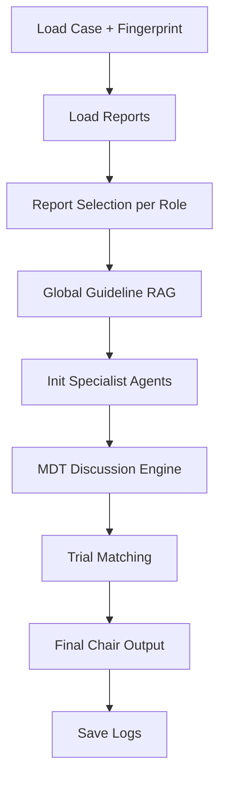

# MDT Discussion Log — 2026-01-17_22-21-21
Generated automatically by MDT Pipeline.


## CASE (structured JSON)

```
{"CASE_CORE":{"ADJUVANT_TREATMENT":{"cycles_or_courses":"6","given":"Yes","regimens":["紫杉醇+卡铂+贝伐"]},"BIOMARKERS":{"AFP":"Unknown","CA125":"Latest 2485 U/ml (2025-08-19)","HER2":"Unknown","MSI":"Unknown","PDL1_CPS":"Unknown","TMB":"Unknown"},"BRCA1":"Unknown","BRCA2":"Unknown","CURRENT_STATUS":"Progression with enlarging nodes and peritoneal nodules (2025-08 imaging)","DIAGNOSIS":{"components":[],"histology":"卵巢高级别浆液性癌伴治疗后改变","laterality":"Left (imaging impression)","primary":"Ovarian cancer","site":"Ovary / pelvic and abdominal lesions"},"HRD":"Unknown","INITIAL_TREATMENT":"Yes","LINE_OF_THERAPY":[{"cycles":"3","end_date":"2021-06-28","intent":"Unknown","line":"1L","regimen":"TC","start_date":"2021-05-18"},{"cycles":"6","end_date":"2021-11","intent":"Unknown","line":"2L","regimen":"紫杉醇+卡铂+贝伐","start_date":"2021-07-28"},{"cycles":"4","end_date":"Unknown","intent":"Salvage","line":"3L","regimen":"白紫+洛铂+卡瑞丽珠单抗","start_date":"2022-05"}],"MAINTENANCE":"Yes","MAINTENANCE_DETAIL":{"end_date":"Unknown","given":"Yes","regimens":["卡瑞丽珠单抗"],"start_date":"Unknown"},"NEOADJUVANT":"Yes","PFI_days":"Unknown","PLATINUM_HISTORY":[{"PFI_days":"Unknown","end_date":"2021-06-28","evidence":"","evidence_type":"Unknown","first_relapse_date":"Unknown","line":"1L","start_date":"2021-05-18","status":"Unknown"},{"PFI_days":"Unknown","end_date":"2021-11","evidence":"Tumor marker elevation reported May 2022","evidence_type":"Biochemical","first_relapse_date":"2022-05","line":"2L","start_date":"2021-07-28","status":"Unknown"},{"PFI_days":"Unknown","end_date":"Unknown","evidence":"Reported 4 cycles given May 2022 for marker rise","evidence_type":"Unknown","first_relapse_date":"Unknown","line":"3L","start_date":"2022-05","status":"Unknown"}],"PLATINUM_PFI_CURRENT":"Unknown","PLATINUM_STATUS":"Unknown","PLATINUM_STATUS_CURRENT":"Unknown","RELAPSE":"Yes","RELAPSE_DATE":{"date":"2025-08-19","evidence":"CA125 2485 U/ml","type":"Biochemical"},"STAGE":{"stage_basis":"Unknown","stage_system":"Unknown","stage_text":"Unknown"},"SURGERY_DONE":{"date":"2021-07-13","performed":"Yes","procedure":"改良子宫根治性切除术+大网膜切除术+阑尾切除术+腹腔内肿物切除术+瘤体减灭术+复杂肠粘连松解术"},"VISIT_DATE":"2025-08-26","first_relapse_date":"2022-05","last_platinum_end_date":"Unknown"},"LAB_TRENDS":{"labs":[{"analyte":"CA125","history":[{"date":"2021-05","flag":"↑","value":">5000"},{"date":"2021-07-29","flag":"↑","value":"97.10"},{"date":"2021-08-19","flag":"↑","value":"69.90"},{"date":"2021-09-09","flag":"↑","value":"40.40"},{"date":"2021-09-30","flag":"Unknown","value":"20.80"},{"date":"2021-10-21","flag":"Unknown","value":"14.50"},{"date":"2025-08-19","flag":"↑","value":"2485"}],"latest":{"date":"2025-08-19","flag":"↑","value":"2485"},"reference_range":"Unknown","unit":"U/ml"},{"analyte":"CA15-3","history":[{"date":"2021-07-29","flag":"↑","value":"27.90"}],"latest":{"date":"2021-07-29","flag":"↑","value":"27.90"},"reference_range":"Unknown","unit":"U/ml"},{"analyte":"CA19-9","history":[{"date":"2021-07-29","flag":"Unknown","value":"7.57"}],"latest":{"date":"2021-07-29","flag":"Unknown","value":"7.57"},"reference_range":"Unknown","unit":"U/ml"},{"analyte":"HE4","history":[{"date":"2021-08-19","flag":"Unknown","value":"38.80"},{"date":"2021-10-21","flag":"Unknown","value":"41.80"}],"latest":{"date":"2021-10-21","flag":"Unknown","value":"41.80"},"reference_range":"Unknown","unit":"pmol/L"},{"analyte":"CA153","history":[{"date":"2025-08-19","flag":"↑","value":"113.1"}],"latest":{"date":"2025-08-19","flag":"↑","value":"113.1"},"reference_range":"Unknown","unit":"Unknown"},{"analyte":"CA72-4","history":[{"date":"2025-08-19","flag":"Unknown","value":"11.41"}],"latest":{"date":"2025-08-19","flag":"Unknown","value":"11.41"},"reference_range":"Unknown","unit":"Unknown"}],"milestones":[{"date":"2021-05-13","description":"Outside bilateral adnexectomy + omentectomy + appendectomy + debulking","type":"Surgery"},{"date":"2021-07-13","description":"Modified radical hysterectomy and extensive cytoreduction","type":"Surgery"},{"date":"2021-05-18","description":"Start TC neoadjuvant chemotherapy","type":"ChemoStart"},{"date":"2021-07-28","description":"Start paclitaxel+carboplatin+bevacizumab adjuvant chemotherapy","type":"ChemoStart"},{"date":"2025-08-19","description":"Marked CA125 rise indicating biochemical relapse/progression","type":"Relapse"}]},"MED_ONC":{"current_regimen":{"cycle_info":"Unknown","last_admin_date":"Unknown","name":"Unknown"},"genetic_testing":{"germline":[],"somatic":[]},"monitoring_points":[],"planned_next_regimen":"Unknown","prior_systemic_therapies":["TC","紫杉醇+卡铂+贝伐","白紫+洛铂+卡瑞丽珠单抗"]},"NUC_MED":{"studies":[]},"PATHOLOGY":{"specimens":[{"components":[],"date":"2021-07-20","diagnosis":"常规报告（2021.07.20）：标本类型:盆腹腔多处病灶肿瘤大小:/肿瘤侧别:/病理类型:高级别腺癌伴肿瘤细胞退变，结合临床病史首先考虑卵巢癌伴治疗后改变","grade":"Unknown","ihc":[{"marker":"ER","result":"部分+"},{"marker":"PR","result":"-"},{"marker":"P53","result":"部分+"},{"marker":"WT1","result":"+"},{"marker":"Ki-67","result":"+15％"},{"marker":"HER2","result":"-"},{"marker":"HNF1B","result":"-"},{"marker":"NapsinA","result":"-"},{"marker":"P16","result":"弥漫+"},{"marker":"PAX8","result":"+"},{"marker":"IMP3","result":"+"}],"involvement_sites":["Uterine serosa","Peritoneum (abdominal wall nodule, omentum, left paracolic gutter, appendix, bladder peritoneum fold, rectouterine pouch mass)"],"laterality":"Unknown","molecular":[],"raw_text":"常规报告（2021.07.20）：标本类型:盆腹腔多处病灶肿瘤大小:/肿瘤侧别:/病理类型:高级别腺癌伴肿瘤细胞退变，结合临床病史首先考虑卵巢癌伴治疗后改变，正在加做免疫组化进一步诊断。其他部位情况:左输卵管:/右输卵管:/子宫内膜:萎缩改变，宫体浆膜面见癌累及。宫颈:慢性炎子宫肌层:肌壁间平滑肌瘤（1枚，直径 0.7cm）盆腹腔多部位病灶:（腹壁结节）、（大网膜）、（左侧结肠旁沟）、（阑尾）、（膀胱反折腹膜）、（直肠窝肿块）见癌累及。补充报告：盆腔多处病灶示高级别腺癌伴肿瘤细胞退变，结合免疫组化标记结果及临床病史符合卵巢高级别浆液性癌伴治疗后改变。免疫组化标记结果参见I21-6132其他:/常规报告（2021.07.23）：瘤细胞示：ER（部分+），PR（-），P53（部分+），WT1（+），Ki-67（+15％），HER2（-），HNF1B（-），NapsinA（-），P16（弥漫+），PAX8（+），IMP3（+）","sample_type":"Surgical resection specimens from multiple sites","site":"Pelvic and abdominal multiple lesions","tumor_size":"Unknown","uncertainty_or_missing":["Tumor size not specified","Tumor laterality not specified"]}]},"RADIOLOGY":{"next_imaging_plan":{"modality":"Unknown","timing":"Unknown"},"studies":[{"anatomic_sites":["Pelvis","Omentum","Abdomen"],"date":"2021-05","findings":["Pelvic cystic lesion; consider left adnexal origin","Omental metastasis","Abdominopelvic ascites"],"impression":"Left adnexal origin possible; cystadenocarcinoma suspected; omental metastasis; ascites","modality":"CT","trend_vs_prior":"Unknown"},{"anatomic_sites":["Left supraclavicular","Retroperitoneum","Bilateral pelvic walls","Peritoneum"],"date":"2025-08-20","findings":["Multiple enlarged lymph nodes in left supraclavicular fossa, retroperitoneum and bilateral pelvic walls, increased compared with 2025-04-10","Multiple peritoneal nodules, increased compared with prior"],"impression":"Progression with multiple nodal and peritoneal metastases","modality":"CT","trend_vs_prior":"Worse"}]},"TIMELINE":{"constraints":{"max_events":30,"min_events":3,"must_include":["first diagnostic imaging or pathology confirmation (if available)"],"ordering_rules":{"prioritize_last_event":true}},"events":[{"date":"2021-05","description":"External ultrasound: pelvic mixed mass and ascites; external CT: pelvic cystic lesion, consider left adnexal origin, omental metastasis, ascites","event_type":"Imaging","key_result":"Consider left adnexal origin; omental metastasis; ascites","regimen_or_test":"External US and CT"},{"date":"2021-05-13","description":"Outside hospital bilateral adnexectomy + omentectomy + appendectomy + debulking","event_type":"Surgery","key_result":"Procedure performed 2021-05-13","regimen_or_test":"Surgery"},{"date":"2021-05-18","description":"TC chemotherapy 3 cycles (neoadjuvant)","event_type":"Chemo","key_result":"3 cycles from 2021-05-18 to 2021-06-28","regimen_or_test":"TC"},{"date":"2021-07-13","description":"Modified radical hysterectomy + omentectomy + appendectomy + intraabdominal tumor resections + debulking + complex adhesiolysis","event_type":"Surgery","key_result":"Procedure performed 2021-07-13","regimen_or_test":"Surgery"},{"date":"2021-07-20","description":"Postoperative pathology routine report","event_type":"Lab","key_result":"高级别腺癌伴肿瘤细胞退变，结合临床病史首先考虑卵巢癌伴治疗后改变","regimen_or_test":"Pathology"},{"date":"2021-07-28","description":"Paclitaxel + carboplatin + bevacizumab 6 cycles; bevacizumab added from cycle 2-6","event_type":"Chemo","key_result":"6 cycles from 2021-07-28 to 2021-11","regimen_or_test":"紫杉醇+卡铂+贝伐"},{"date":"2022-05","description":"Tumor marker elevation prompted further chemo","event_type":"Progression","key_result":"白紫+洛铂+卡瑞丽珠单抗 4 cycles reported","regimen_or_test":"Reported treatment"},{"date":"2025-08-19","description":"Marked CA125 elevation","event_type":"Lab","key_result":"CA125 2485 U/ml","regimen_or_test":"CA125"},{"date":"2025-08-20","description":"External CT compared with 2025-04-10 shows progression with multiple enlarged nodes and increased peritoneal nodules","event_type":"Imaging","key_result":"Left supraclavicular, retroperitoneal and bilateral pelvic wall lymphadenopathy and increased intra‑abdominal nodules; consider metastasis","regimen_or_test":"CT"}]}}
```


## FINAL MDT OUTPUT

```
Final Assessment:
High-grade serous ovarian carcinoma with widely metastatic, progressive disease after multiple platinum-based lines; molecular profile and platinum sensitivity remain undefined.

Core Treatment Strategy:
- Confirm performance status, symptoms, organ function, and patient goals before committing to any further systemic therapy.
- Treat current setting as palliative; discuss best supportive care versus additional systemic options and document preference.
- Arrange comprehensive germline and somatic testing (BRCA/HRR, MSI, TMB, PD-L1, HER2) on blood and/or new tissue if feasible.
- Obtain tissue/cytology from an accessible progressing site only if results would realistically open additional systemic or trial options.

Change Triggers:
- If molecular testing reveals an actionable alteration, re-discuss adding matched targeted/immunotherapy versus current palliative plan.
- If rapid functional decline or uncontrolled symptoms occur, shift focus toward symptom-directed palliative measures and reconsider further chemotherapy.
```


## PIPELINE FLOW (Mermaid)




## TRACE EVENTS (Structured)

```json
[
  {
    "ts": "2026-01-17T22:16:57.162436",
    "event": "pipeline_start",
    "payload": {
      "visit_time": "2025-08-26 08:05:01.163000",
      "meta_info": "320911197305215323"
    }
  },
  {
    "ts": "2026-01-17T22:16:57.162777",
    "event": "case_fingerprint",
    "payload": {
      "case_fingerprint": "072500143216"
    }
  },
  {
    "ts": "2026-01-17T22:16:57.428032",
    "event": "reports_loaded",
    "payload": {
      "lab_n": 35,
      "img_n": 2,
      "path_n": 0,
      "mut_n": 0,
      "cutoff_dt": "2025-08-27 08:05:01"
    }
  },
  {
    "ts": "2026-01-17T22:17:04.854300",
    "event": "reports_selected",
    "payload": {
      "lab": {
        "chair": [
          "20210930|9701722|2021-09-30",
          "20211020|17902074|2021-10-20",
          "20211021|5600066|2021-10-21"
        ],
        "oncologist": [
          "20210930|9701722|2021-09-30",
          "20211020|17902074|2021-10-20",
          "20211021|5600066|2021-10-21"
        ],
        "radiologist": [],
        "pathologist": [],
        "nuclear": []
      },
      "imaging": {
        "chair": [
          "2021-07-13|DX|2021-07-13",
          "2021-07-13|DX|2021-07-13"
        ],
        "oncologist": [],
        "radiologist": [
          "2021-07-13|DX|2021-07-13",
          "2021-07-13|DX|2021-07-13"
        ],
        "pathologist": [],
        "nuclear": [
          "2021-07-13|DX|2021-07-13",
          "2021-07-13|DX|2021-07-13"
        ]
      },
      "pathology": {
        "chair": [],
        "oncologist": [],
        "radiologist": [],
        "pathologist": [],
        "nuclear": []
      },
      "mutation": {
        "chair": [],
        "oncologist": [],
        "radiologist": [],
        "pathologist": [],
        "nuclear": []
      }
    }
  },
  {
    "ts": "2026-01-17T22:17:16.455411",
    "event": "rag_query",
    "payload": {
      "query": "Recurrent platinum-resistant high-grade serous ovarian carcinoma with supraclavicular, retroperitoneal, pelvic nodal and peritoneal metastases; ER partially positive, PR negative, WT1/PAX8 positive; no BRCA/HRD/MSI/PD-L1 data; performance status and organ function not documented."
    }
  },
  {
    "ts": "2026-01-17T22:17:16.455416",
    "event": "rag_hits",
    "payload": {
      "topk": 5,
      "n": 0
    }
  },
  {
    "ts": "2026-01-17T22:17:24.516661",
    "event": "mdt_discussion_start",
    "payload": {
      "num_rounds": 2,
      "num_turns": 2
    }
  },
  {
    "ts": "2026-01-17T22:21:02.148690",
    "event": "mdt_discussion_end",
    "payload": {
      "merged_chars": 4456
    }
  },
  {
    "ts": "2026-01-17T22:21:02.149428",
    "event": "final_output_start",
    "payload": {}
  },
  {
    "ts": "2026-01-17T22:21:21.335733",
    "event": "final_output_end",
    "payload": {
      "final_output_chars": 1052
    }
  }
]
```


## INITIAL EXPERT OPINIONS


## chair

```
- Recurrent, now widely metastatic high-grade serous ovarian cancer with clear radiologic progression and marked CA125 rise; intent palliative.  
- Before systemic plan: urgently obtain performance status, organ function (CBC, renal, hepatic), symptom burden, and detailed treatment tolerance history.  
- Platinum sensitivity, BRCA/HRD, and full prior regimen timelines are unknown; arrange germline/somatic testing and clarify last platinum date.  
- Discuss goals of care and preferences, then consider further systemic therapy versus best supportive care, plus early palliative care involvement.  
- No immediate role for surgery or local ablative therapy given multifocal nodal/peritoneal disease; systemic and supportive strategies prioritized.
```


## oncologist

```
- Now platinum-exposed, multi-relapsed high-grade serous ovarian cancer; 2025 progression biochemically and radiologically, prior ≥3 systemic lines including immunotherapy.  

- Current relapse category, platinum sensitivity interval, and prior maintenance details (agents, duration, response) incomplete; need full systemic timeline.  

- Organ function, ECOG status, neuropathy, marrow reserve, BP/proteinuria, and comorbidities unknown/needs update to judge further cytotoxic vs targeted options.  

- No germline/somatic homologous recombination or other actionable alterations reported; comprehensive panel status unknown/needs update for targeted strategies.  

- Need current imaging report text (sites, volumes, symptoms, ascites/obstruction) and patient goals to choose between disease-control vs symptom-focused approach.
```


## radiologist

```
- CT 2025-08-20 shows progression of metastatic disease with increased peritoneal nodules and nodal metastases. [@2025-08-20|CT]  

- Enlarged lymph nodes in left supraclavicular, retroperitoneal, and bilateral pelvic wall regions consistent with worsening nodal metastases. [@2025-08-20|CT]  

- No imaging evidence of thoracic metastasis or complications on 2021-07-13 chest radiograph. [@2021-07-13|DX]  

- Current imaging does not describe bowel, ureteral, or biliary obstruction; need updated CT report focused on obstruction assessment.  

- Primary pelvic/adnexal mass and ascites previously noted; updated characterization and measurements since 2021-05 CT are needed.
```


## pathologist

```
- Histology shows high-grade adenocarcinoma consistent with ovarian high-grade serous carcinoma with treatment effect. [@HISTOLOGY_AND_IHC|2021-07-20]  

- IHC (WT1+, PAX8+, diffuse p16+, ER partial+, PR−, HNF1B−, NapsinA−) supports tubo-ovarian serous origin. [@HISTOLOGY_AND_IHC|2021-07-20]  

- Formal grade not explicitly stated; assumed high-grade based on morphology and IHC, but grade wording could be clarified. [@HISTOLOGY_AND_IHC|2021-07-20]  

- Extent of disease involves uterine serosa and multiple peritoneal sites; FIGO stage not provided and needs clinical–surgical correlation. [@HISTOLOGY_AND_IHC|2021-07-20]  

- Missing and need update: tumor laterality, BRCA/HRR status, MSI/TMB/PD‑L1, HER2 status by validated assay, recent histology after 2021.
```


## nuclear

```
- No prior PET/CT reports available; baseline metabolic disease distribution and intensity are currently unknown/needs update.  

- Historical imaging suggests left adnexal primary with omental and ascitic involvement, consistent with peritoneal carcinomatosis suspicion [@IMAGING_CONTEXT|2021-05].  

- Recent imaging indicates progression with multiple nodal and peritoneal metastases, but metabolic activity pattern is unknown/needs PET-CT update [@IMAGING_CONTEXT|2025-08-20].  

- PET/CT now would better characterize nodal/peritoneal disease burden and detect extra-abdominal metastases, potentially altering overall stage.  

- PET/CT would help distinguish active recurrent/progressive implants from treated or fibrotic lesions, refining suspicion of viable disease.
```


## MERGED SUMMARY (Assistant)

```
Key Knowledge:
- Multi-relapsed, widely metastatic high-grade serous tubo-ovarian carcinoma with clear radiologic and CA125 progression; palliative intent.
- Histology/IHC (2021) confirm high-grade serous tubo-ovarian origin with peritoneal/uterine serosal involvement and treatment effect; no later biopsies.
- ≥3 prior systemic lines including immunotherapy; platinum-exposed, but platinum sensitivity interval and prior maintenance use remain unclear.
- Current CT: progressive peritoneal and nodal disease (including supraclavicular); no described bowel/ureteric/biliary obstruction; no thoracic metastases documented.
- No PET/CT has ever been recorded; current and future radiologic assessment is CT-based.

Controversies:
- Relapse classification (platinum-sensitive vs -resistant) remains uncertain without a reconstructed treatment timeline.
- Appropriateness and potential benefit of further systemic therapy versus best supportive care cannot be judged without updated performance status, organ function, and toxicity history.
- Whether PET/CT would add clinically actionable information beyond CT in a palliative context is unclear.

Missing Info:
- Clinical: ECOG, detailed symptom burden, treatment toxicities (neuropathy, cytopenias), comorbidities, BP/proteinuria.
- Laboratory: CBC, renal/liver function, albumin, updated CA125; full germline/somatic biomarker profile (BRCA/HRR, MSI, TMB, PD-L1, HER2) not available or not done.
- Oncologic history: Complete systemic treatment timeline including last platinum date, regimens, responses, durations, and use of maintenance (PARP, bevacizumab).
- Imaging: Full current CT report with explicit comments on bowel obstruction, ascites burden, and residual primary; confirmation that no prior PET/CT exists externally.
- Pathology: Formal FIGO stage, laterality, and grade wording based on 2021 surgery; confirmation of any external pathology/biomarker reports.

Working Plan:
- Reconstruct full systemic treatment and platinum exposure history to define relapse category and prior maintenance.
- Update clinical status and labs (ECOG, symptoms, comorbidities, toxicity profile, CBC, renal/liver function, albumin, CA125).
- Clarify and/or perform molecular testing (germline and somatic BRCA/HRR; MSI/TMB/PD-L1/HER2) and confirm no external results are missing.
- Obtain detailed CT report focused on obstruction, ascites, and disease mapping; continue CT-based follow-up and consider PET/CT only if it would clearly change management.
- Perform structured goals-of-care discussion and involve palliative care early to guide decisions on any further disease-directed therapy versus best supportive care.
[R2T1 DELTA] chair->oncologist(missing): Please reconstruct the full systemic and platinum treatment history (including last platinum date, responses, maintenance) and update ECOG, symptom burden, comorbidities, and toxicity profile, plus current CBC, renal/liver function, albumin, and CA125 to judge feasibility of further therapy versus best supportive care. | chair->pathologist(missing): Could you confirm formal FIGO stage, laterality, and grade from the 2021 surgery and check for any existing biomarker reports (including external) relevant for BRCA/HRR, MSI, TMB, PD-L1, and HER2? | chair->radiologist(missing): Please provide or obtain a detailed current CT report explicitly addressing bowel obstruction, ascites burden, disease mapping, and residual primary, and comment whether any prior PET/CT exists and if PET/CT might alter management compared with CT alone.
[R2T2 DELTA] ar reports exist for BRCA/HRR, MSI, TMB, PD-L1, and HER2. | chair->radiologist(missing): Please issue a detailed current CT report describing bowel obstruction status, ascites volume, comprehensive disease mapping (including residual primary) and state whether any prior PET/CT exists and if PET/CT would add actionable information over CT alone. | radiologist->chair(unspecified): From the radiology side, I will issue a detailed CT report addressing obstruction, ascites burden, residual primary, and full disease map, and confirm whether any external PET/CT exists or if CT alone will be used going forward. | pathologist->chair(missing): Based on available records, I cannot assign FIGO stage, laterality, or formal grade wording, and no biomarker (BRCA/HRR, MSI, TMB, PD-L1, HER2) reports—internal or external—are documented; pathology remains 2021-only high‑grade serous tubo‑ovarian carcinoma.
```


## INTERACTION LOG (Round × Turn)

### Round 1

#### Turn 1
- **chair → oncologist:** Please clarify full systemic treatment timeline (exact last platinum date, responses, maintenance) and current ECOG, comorbidities, and key toxicities to determine relapse category and feasibility of further systemic therapy versus best supportive care.
- **chair → radiologist:** Please provide the full current contrast-enhanced CT report with explicit assessment of biliary/enteric obstruction, ascites, disease burden mapping, and whether any findings suggest need for urgent intervention; also comment whether PET/CT would realistically alter management in this context.
- **chair → pathologist:** From existing specimens, can you provide formal FIGO stage correlation, precise grade wording, and laterality; and comment whether any archived tissue is suitable for extended molecular profiling if requested.
- **chair → nuclear:** Before considering PET/CT, please advise under what specific scenarios in this disseminated, palliative-setting ovarian cancer you believe PET/CT would change management compared with high-quality contrast CT alone.
- **oncologist → chair:** Relapse category and feasibility of further systemic therapy are impossible to judge without ECOG, organ function labs, and full prior-regimen timeline including last platinum/maintenance details. Please prioritize collecting these before finalizing today’s plan.
- **radiologist → oncologist:** Current CT summary lacks detail on bowel/ureteric/biliary obstruction, ascites volume, and dominant pelvic disease; a full radiology report is needed to guide symptom-directed and palliative planning.
- **pathologist → chair:** Key pathology-linked biomarkers (germline/somatic BRCA/HRR, MSI, TMB, PD-L1, HER2 by validated assay) are completely absent; please confirm whether testing was done elsewhere or arrange reporting if already performed.
- **pathologist → oncologist:** Pathology is from 2021 only; there is no more recent biopsy or formal FIGO stage/laterality in the record, so current disease characterization relies entirely on historic histology plus imaging/clinical data.
- **nuclear → oncologist:** No PET/CT studies are documented for this patient; if PET is being considered, please clarify the specific management question it should answer beyond current CT to justify added burden in a palliative setting.
- **nuclear → radiologist:** Current disease description relies on CT only, with no PET correlation; please confirm whether any prior PET/CT exists elsewhere or if CT alone is planned for future response assessment.

#### Turn 2
- **chair → oncologist:** Systemic history and last platinum exposure timing are unclear; please reconstruct full treatment timeline and clarify current ECOG, comorbidities, and organ function to categorize relapse and decide on further therapy versus best supportive care.
- **chair → radiologist:** The 2025-08 CT summary lacks detail on bowel obstruction, ascites burden, and residual primary; please provide the full current CT report with explicit comments on these and a clear disease map to guide palliative versus aggressive strategies.
- **chair → pathologist:** We have only the 2021 surgical histology without formal grade wording, FIGO stage, or laterality; please restage based on available data and confirm whether any additional tissue or reports (including biomarker panels such as BRCA/HRR, MSI, TMB, PD-L1, HER2) exist from outside facilities.
- **chair → nuclear:** No PET/CT is documented; given the palliative context, please advise if and when PET/CT would meaningfully change management beyond CT for this patient.
- **radiologist → nuclear:** No PET/CT is recorded in the imaging archive; unless outside PET exists, serial contrast-enhanced CT will define radiologic response/progression.

### Round 2

#### Turn 1
- **chair → oncologist:** Please reconstruct the full systemic and platinum treatment history (including last platinum date, responses, maintenance) and update ECOG, symptom burden, comorbidities, and toxicity profile, plus current CBC, renal/liver function, albumin, and CA125 to judge feasibility of further therapy versus best supportive care.
- **chair → radiologist:** Please provide or obtain a detailed current CT report explicitly addressing bowel obstruction, ascites burden, disease mapping, and residual primary, and comment whether any prior PET/CT exists and if PET/CT might alter management compared with CT alone.
- **chair → pathologist:** Could you confirm formal FIGO stage, laterality, and grade from the 2021 surgery and check for any existing biomarker reports (including external) relevant for BRCA/HRR, MSI, TMB, PD-L1, and HER2?

#### Turn 2
- **chair → oncologist:** Please reconstruct the complete systemic/platinum treatment history (including last platinum exposure, responses, and maintenance) and update ECOG, symptom burden, comorbidities, toxicity profile, and current CBC, renal/liver function, albumin, and CA125 to assess suitability for further systemic therapy versus best supportive care.
- **chair → radiologist:** Please issue a detailed current CT report describing bowel obstruction status, ascites volume, comprehensive disease mapping (including residual primary) and state whether any prior PET/CT exists and if PET/CT would add actionable information over CT alone.
- **chair → pathologist:** From the 2021 surgical specimens, please provide formal FIGO stage, tumor laterality, histologic grade, and confirm whether any internal or external biomarker/molecular reports exist for BRCA/HRR, MSI, TMB, PD-L1, and HER2.
- **radiologist → chair:** From the radiology side, I will issue a detailed CT report addressing obstruction, ascites burden, residual primary, and full disease map, and confirm whether any external PET/CT exists or if CT alone will be used going forward.
- **pathologist → chair:** Based on available records, I cannot assign FIGO stage, laterality, or formal grade wording, and no biomarker (BRCA/HRR, MSI, TMB, PD-L1, HER2) reports—internal or external—are documented; pathology remains 2021-only high‑grade serous tubo‑ovarian carcinoma.


## FINAL REFINED PLANS (per Round)

### Round 1


## chair

```
- Confirm patient’s goals now (life-prolonging vs comfort-focused) and performance status; current systemic therapy details and comorbidities are unknown.  

- Obtain updated, full CT report with explicit map of peritoneal disease, ascites, obstruction, and residual primary to judge feasibility of further therapy.  

- Arrange pathology restaging from 2021 specimen and clarify any outside biomarker testing (BRCA/HRR, MSI, TMB, PD‑L1, HER2) before committing to additional disease‑directed therapy.  

- If performance status is poor or patient prefers comfort, prioritize best supportive care (symptom control, nutrition, psychosocial support, early palliative involvement).  

- If performance status acceptable and patient desires active treatment, discuss palliative systemic options versus best supportive care, emphasizing limited benefit and toxicity trade‑offs.
```


## oncologist

```
- Confirm relapse category after reconstructing full systemic timeline, including last platinum date, responses, and any maintenance; currently unknown.  

- Obtain up-to-date ECOG, symptom burden, comorbidities, toxicity history, and full labs (CBC, renal/liver function, albumin, CA125); all unknown.  

- Arrange comprehensive germline and somatic profiling (BRCA/HRR, MSI, TMB, PD-L1, HER2); no biomarker data available/needs update.  

- Review full current contrast CT with explicit comments on obstruction, ascites, residual primary, and disease map; detailed report missing/unknown.  

- After data update, hold goals-of-care meeting to choose between further palliative systemic therapy options versus best supportive care alone.
```


## radiologist

```
- Progressive peritoneal and nodal metastases, including left supraclavicular and retroperitoneal chains, on CT 2025-08-20. [@2025-08-20|2025-08-20]  

- No thoracic metastases documented on prior chest radiograph 2021-07-13; no later thoracic imaging available. [@2021-07-13|2021-07-13]  

- Current CT summary lacks explicit assessment of bowel, ureteric, or biliary obstruction and ascites burden; full report needed. [@2025-08-20|2025-08-20]  

- Dominant pelvic/adnexal mass and omental disease described only on 2021-05 CT; updated size and morphology are unknown. [@2021-05|2021-05]  

- No PET/CT studies are documented; future radiologic assessment will rely on serial contrast-enhanced CT unless outside PET appears. unknown/needs update
```


## pathologist

```
- Diagnosis: Ovarian high‑grade serous carcinoma with treatment effect, involving uterine serosa and multiple peritoneal sites. [@HISTOLOGY_AND_IHC|2021-07-20]  

- Histologic grade is functionally “high‑grade,” but no formal grade wording or FIGO stage/laterality are documented; remain unspecified. [@HISTOLOGY_AND_IHC|2021-07-20]  

- No germline/somatic BRCA/HRR, MSI, TMB, PD‑L1, or HER2 testing is recorded; outside results, if any, are unknown. [@MOLECULAR|unknown]  

- Current disease assessment must integrate this historic histology with contemporary imaging and clinical data; no newer biopsy is available. [@HISTOLOGY_AND_IHC|2021-07-20]  

- Pathology is otherwise adequate for origin confirmation; additional tissue sampling is only needed if clinically required for new biomarker testing. [@HISTOLOGY_AND_IHC|2021-07-20]
```


## nuclear

```
- No PET/CT available; current staging and progression assessment should rely on serial contrast-enhanced CT unless outside PET emerges [@IMAGING_CONTEXT|2025-08-20].  

- Given widely metastatic, palliative-setting disease, PET/CT should be reserved only if a specific question would alter management or procedures (e.g., biopsy target).  

- PET/CT could refine detection of extra-abdominal or small-volume nodal/peritoneal disease, but is unlikely to change overall palliative stage now [@IMAGING_CONTEXT|2025-08-20].  

- If future curative-intent local procedures (e.g., focal radiation, limited surgery) are contemplated, PET/CT may then meaningfully guide target selection.  

- Confirm absence of prior external PET/CT; if any exist, integrate metabolic patterns into longitudinal assessment before ordering new PET/CT (currently unknown).
```

### Round 2


## chair

```
- Await oncologist update on full systemic/platinum history, ECOG, comorbidities, toxicities, and current labs before committing to further therapy.  

- Treat as multiply relapsed high‑grade serous tubo‑ovarian carcinoma with radiologic progression and CA125 surge; prognosis guarded [@2025-08-20|2025-08-20].  

- Parallel planning: prepare for additional systemic therapy versus best supportive care, explicitly incorporating patient goals and performance status.  

- Ensure radiologist’s detailed CT report on obstruction, ascites, and disease map guides feasibility of systemic therapy and need for symptom-directed interventions.  

- Reassess after new clinical, lab, and imaging data; document go/no‑go decision for further systemic therapy at next MDT.
```


## oncologist

```
- Reconstruct complete systemic and platinum treatment history, including last platinum date, responses, durations, and any maintenance; currently unknown.  

- Update ECOG, symptom burden, comorbidities, toxicity profile, and obtain current CBC, renal/liver function, albumin, and CA125; all unknown.  

- Recognize no biomarker reports (BRCA/HRR, MSI, TMB, PD-L1, HER2) exist; arrange comprehensive germline and somatic profiling; currently unknown.  

- Use forthcoming detailed CT report to confirm obstruction status, ascites burden, residual primary, and full disease map; specifics currently unknown.  

- After data update, hold goals-of-care discussion to choose between further palliative systemic therapy options versus best supportive care alone.
```


## radiologist

```
- Progressive peritoneal and nodal metastases, including left supraclavicular and retroperitoneal chains, on CT 2025-08-20. [@2025-08-20|2025-08-20]  

- No radiologic evidence of bowel, ureteric, or biliary obstruction described on current CT; explicit confirmation pending. [@2025-08-20|2025-08-20]  

- Ascites burden and detailed mapping of residual primary and peritoneal disease require a more granular CT description. [@2025-08-20|2025-08-20]  

- No thoracic metastases seen on chest radiograph 2021-07-13; no subsequent thoracic cross-sectional imaging documented. [@2021-07-13|2021-07-13]  

- No PET/CT documented internally or externally; ongoing disease assessment and response evaluation will be CT-based. unknown/needs update
```


## pathologist

```
- Confirm diagnosis: ovarian high-grade serous carcinoma with peritoneal and uterine serosal involvement, post-treatment effect. [@HISTOLOGY_AND_IHC|2021-07-20]  

- FIGO stage, laterality, and formal grade wording remain unassignable from available pathology; document as “not specified.” [@HISTOLOGY_AND_IHC|2021-07-20]  

- No internal or external biomarker reports for BRCA/HRR, MSI, TMB, PD-L1, or HER2 are documented; status unknown. [@MOLECULAR|unknown]  

- No later biopsy or cytology is recorded; all current disease assessments must rely on 2021 histology plus imaging/clinical data. [@HISTOLOGY_AND_IHC|2021-07-20]  

- If new tissue is obtained, prioritize testing for BRCA/HRR, MSI, TMB, PD-L1, and HER2. [@MOLECULAR|unknown]
```


## nuclear

```
- No PET/CT has ever been performed; metabolic disease distribution and burden remain unknown/needs update.  

- Current staging and progression assessment rely entirely on contrast-enhanced CT patterns without metabolic correlation [@IMAGING_CONTEXT|2025-08-20].  

- In this widely metastatic, palliative-intent setting, PET/CT is unlikely to change overall stage versus high-quality CT alone.  

- PET/CT may become useful only if a focused question arises (e.g., biopsy target selection or ambiguous CT findings).  

- Before ordering PET/CT, clarify if specific metabolic information would alter procedures or goals in this patient’s palliative care pathway.
```


## RAW AGENT LOGS

### chair
- **User:** Give INITIAL opinion (use ONLY your system-provided patient facts).
Return up to 5 bullets, each ≤20 words.
If key data missing, say exactly what needs updating.
  
  **Assistant:** - Recurrent, now widely metastatic high-grade serous ovarian cancer with clear radiologic progression and marked CA125 rise; intent palliative.  
- Before systemic plan: urgently obtain performance status, organ function (CBC, renal, hepatic), symptom burden, and detailed treatment tolerance history.  
- Platinum sensitivity, BRCA/HRD, and full prior regimen timelines are unknown; arrange germline/somatic testing and clarify last platinum date.  
- Discuss goals of care and preferences, then consider further systemic therapy versus best supportive care, plus early palliative care involvement.  
- No immediate role for surgery or local ablative therapy given multifocal nodal/peritoneal disease; systemic and supportive strategies prioritized.
  
  *(2026-01-17T22:17:33.041923)*

- **User:** ROLE: chair. VISIT: 2025-08-26 08:05:01.163000
Default is NOT to speak. Speak ONLY if: conflict | safety | missing-critical | new-critical.

CONTEXT (latest):
Key Knowledge:
- Multi-relapsed, widely metastatic high-grade serous tubo-ovarian carcinoma with clear radiologic and CA125 progression; palliative intent.
- Histology/IHC confirm high-grade serous tubo-ovarian origin with prior peritoneal/uterine serosal involvement and treatment effect.
- ≥3 prior systemic lines (including immunotherapy); platinum-exposed, but platinum sensitivity and prior maintenance strategy unclear.
- Current CT shows progressive peritoneal and nodal disease (including supraclavicular); no described bowel/ureteric/biliary obstruction; no prior thoracic metastases documented.

Controversies:
- Relapse category (platinum-sensitive vs -resistant) uncertain due to incomplete treatment timeline.
- Balance of further systemic therapy versus best supportive care unclear without performance status, organ function, and toxicity data.
- Additional value of PET/CT versus contrast CT alone in a palliative setting is uncertain.

Missing Info:
- Clinical: ECOG, detailed symptom burden, treatment toxicities (neuropathy, cytopenias), comorbidities, BP/proteinuria.
- Laboratory: CBC, renal/liver function, albumin, updated CA125, germline/somatic genomic profile (BRCA/HRR, MSI, TMB, PD-L1, HER2).
- Oncologic history: Full systemic treatment timeline, including last platinum date, regimens, responses, and any maintenance (PARP, bevacizumab).
- Imaging: Full current CT report with explicit comment on obstruction, ascites, and primary mass; no PET/CT baseline or current study.
- Pathology: Formal grade wording, FIGO staging correlation, laterality, any more recent biopsy.

Working Plan:
- Reconstruct detailed systemic treatment history and last platinum exposure to define relapse category.
- Update clinical status and labs (ECOG, symptoms, comorbidities, toxicity profile, CBC, renal/liver function, albumin, CA125).
- Complete/confirm molecular testing (germline and somatic BRCA/HRR; MSI/TMB/PD-L1/HER2 as available).
- Review current CT thoroughly for obstruction and disease mapping; consider PET/CT only if it would change overall management strategy.
- Conduct structured goals-of-care discussion and involve palliative care early to guide choice between further disease-directed therapy and best supportive care.

Allowed targets: [oncologist,radiologist,pathologist,nuclear]
Return ONE-LINE JSON only:{"speak":"yes/no","messages":[{"target":"<role>","message":"<1-2 sentences>","why":"conflict|safety|missing|new"}]}
  
  **Assistant:** {"speak":"yes","messages":[{"target":"oncologist","message":"Please clarify full systemic treatment timeline (exact last platinum date, responses, maintenance) and current ECOG, comorbidities, and key toxicities to determine relapse category and feasibility of further systemic therapy versus best supportive care.","why":"missing"},{"target":"radiologist","message":"Please provide the full current contrast-enhanced CT report with explicit assessment of biliary/enteric obstruction, ascites, disease burden mapping, and whether any findings suggest need for urgent intervention; also comment whether PET/CT would realistically alter management in this context.","why":"missing"},{"target":"pathologist","message":"From existing specimens, can you provide formal FIGO stage correlation, precise grade wording, and laterality; and comment whether any archived tissue is suitable for extended molecular profiling if requested.","why":"missing"},{"target":"nuclear","message":"Before considering PET/CT, please advise under what specific scenarios in this disseminated, palliative-setting ovarian cancer you believe PET/CT would change management compared with high-quality contrast CT alone.","why":"missing"}]}
  
  *(2026-01-17T22:18:07.401199)*

- **User:** ROLE: chair. VISIT: 2025-08-26 08:05:01.163000
Default is NOT to speak. Speak ONLY if: conflict | safety | missing-critical | new-critical.

CONTEXT (latest):
Key Knowledge:
- Multi-relapsed, widely metastatic high-grade serous tubo-ovarian carcinoma with clear radiologic and CA125 progression; palliative intent.
- Histology/IHC confirm high-grade serous tubo-ovarian origin with prior peritoneal/uterine serosal involvement and treatment effect.
- ≥3 prior systemic lines (including immunotherapy); platinum-exposed, but platinum sensitivity and prior maintenance strategy unclear.
- Current CT shows progressive peritoneal and nodal disease (including supraclavicular); no described bowel/ureteric/biliary obstruction; no prior thoracic metastases documented.

Controversies:
- Relapse category (platinum-sensitive vs -resistant) uncertain due to incomplete treatment timeline.
- Balance of further systemic therapy versus best supportive care unclear without performance status, organ function, and toxicity data.
- Additional value of PET/CT versus contrast CT alone in a palliative setting is uncertain.

Missing Info:
- Clinical: ECOG, detailed symptom burden, treatment toxicities (neuropathy, cytopenias), comorbidities, BP/proteinuria.
- Laboratory: CBC, renal/liver function, albumin, updated CA125, germline/somatic genomic profile (BRCA/HRR, MSI, TMB, PD-L1, HER2).
- Oncologic history: Full systemic treatment timeline, including last platinum date, regimens, responses, and any maintenance (PARP, bevacizumab).
- Imaging: Full current CT report with explicit comment on obstruction, ascites, and primary mass; no PET/CT baseline or current study.
- Pathology: Formal grade wording, FIGO staging correlation, laterality, any more recent biopsy.

Working Plan:
- Reconstruct detailed systemic treatment history and last platinum exposure to define relapse category.
- Update clinical status and labs (ECOG, symptoms, comorbidities, toxicity profile, CBC, renal/liver function, albumin, CA125).
- Complete/confirm molecular testing (germline and somatic BRCA/HRR; MSI/TMB/PD-L1/HER2 as available).
- Review current CT thoroughly for obstruction and disease mapping; consider PET/CT only if it would change overall management strategy.
- Conduct structured goals-of-care discussion and involve palliative care early to guide choice between further disease-directed therapy and best supportive care.
[R1T1 DELTA] 21 only; there is no more recent biopsy or formal FIGO stage/laterality in the record, so current disease characterization relies entirely on historic histology plus imaging/clinical data. | pathologist->chair(missing): Key pathology-linked biomarkers (germline/somatic BRCA/HRR, MSI, TMB, PD-L1, HER2 by validated assay) are completely absent; please confirm whether testing was done elsewhere or arrange reporting if already performed. | nuclear->oncologist(missing): No PET/CT studies are documented for this patient; if PET is being considered, please clarify the specific management question it should answer beyond current CT to justify added burden in a palliative setting. | nuclear->radiologist(missing): Current disease description relies on CT only, with no PET correlation; please confirm whether any prior PET/CT exists elsewhere or if CT alone is planned for future response assessment.

Allowed targets: [oncologist,radiologist,pathologist,nuclear]
Return ONE-LINE JSON only:{"speak":"yes/no","messages":[{"target":"<role>","message":"<1-2 sentences>","why":"conflict|safety|missing|new"}]}
  
  **Assistant:** {"speak":"yes","messages":[{"target":"oncologist","message":"Systemic history and last platinum exposure timing are unclear; please reconstruct full treatment timeline and clarify current ECOG, comorbidities, and organ function to categorize relapse and decide on further therapy versus best supportive care.","why":"missing"},{"target":"radiologist","message":"The 2025-08 CT summary lacks detail on bowel obstruction, ascites burden, and residual primary; please provide the full current CT report with explicit comments on these and a clear disease map to guide palliative versus aggressive strategies.","why":"missing"},{"target":"pathologist","message":"We have only the 2021 surgical histology without formal grade wording, FIGO stage, or laterality; please restage based on available data and confirm whether any additional tissue or reports (including biomarker panels such as BRCA/HRR, MSI, TMB, PD-L1, HER2) exist from outside facilities.","why":"missing"},{"target":"nuclear","message":"No PET/CT is documented; given the palliative context, please advise if and when PET/CT would meaningfully change management beyond CT for this patient.","why":"missing"}]}
  
  *(2026-01-17T22:18:22.653539)*

- **User:** Given MDT context:
Key Knowledge:
- Multi-relapsed, widely metastatic high-grade serous tubo-ovarian carcinoma with clear radiologic and CA125 progression; palliative intent.
- Histology/IHC confirm high-grade serous tubo-ovarian origin with prior peritoneal/uterine serosal involvement and treatment effect.
- ≥3 prior systemic lines (including immunotherapy); platinum-exposed, but platinum sensitivity and prior maintenance strategy unclear.
- Current CT shows progressive peritoneal and nodal disease (including supraclavicular); no described bowel/ureteric/biliary obstruction; no prior thoracic metastases documented.

Controversies:
- Relapse category (platinum-sensitive vs -resistant) uncertain due to incomplete treatment timeline.
- Balance of further systemic therapy versus best supportive care unclear without performance status, organ function, and toxicity data.
- Additional value of PET/CT versus contrast CT alone in a palliative setting is uncertain.

Missing Info:
- Clinical: ECOG, detailed symptom burden, treatment toxicities (neuropathy, cytopenias), comorbidities, BP/proteinuria.
- Laboratory: CBC, renal/liver function, albumin, updated CA125, germline/somatic genomic profile (BRCA/HRR, MSI, TMB, PD-L1, HER2).
- Oncologic history: Full systemic treatment timeline, including last platinum date, regimens, responses, and any maintenance (PARP, bevacizumab).
- Imaging: Full current CT report with explicit comment on obstruction, ascites, and primary mass; no PET/CT baseline or current study.
- Pathology: Formal grade wording, FIGO staging correlation, laterality, any more recent biopsy.

Working Plan:
- Reconstruct detailed systemic treatment history and last platinum exposure to define relapse category.
- Update clinical status and labs (ECOG, symptoms, comorbidities, toxicity profile, CBC, renal/liver function, albumin, CA125).
- Complete/confirm molecular testing (germline and somatic BRCA/HRR; MSI/TMB/PD-L1/HER2 as available).
- Review current CT thoroughly for obstruction and disease mapping; consider PET/CT only if it would change overall management strategy.
- Conduct structured goals-of-care discussion and involve palliative care early to guide choice between further disease-directed therapy and best supportive care.
[R1T1 DELTA] 21 only; there is no more recent biopsy or formal FIGO stage/laterality in the record, so current disease characterization relies entirely on historic histology plus imaging/clinical data. | pathologist->chair(missing): Key pathology-linked biomarkers (germline/somatic BRCA/HRR, MSI, TMB, PD-L1, HER2 by validated assay) are completely absent; please confirm whether testing was done elsewhere or arrange reporting if already performed. | nuclear->oncologist(missing): No PET/CT studies are documented for this patient; if PET is being considered, please clarify the specific management question it should answer beyond current CT to justify added burden in a palliative setting. | nuclear->radiologist(missing): Current disease description relies on CT only, with no PET correlation; please confirm whether any prior PET/CT exists elsewhere or if CT alone is planned for future response assessment.
[R1T2 DELTA] lacks detail on bowel obstruction, ascites burden, and residual primary; please provide the full current CT report with explicit comments on these and a clear disease map to guide palliative versus aggressive strategies. | chair->pathologist(missing): We have only the 2021 surgical histology without formal grade wording, FIGO stage, or laterality; please restage based on available data and confirm whether any additional tissue or reports (including biomarker panels such as BRCA/HRR, MSI, TMB, PD-L1, HER2) exist from outside facilities. | chair->nuclear(missing): No PET/CT is documented; given the palliative context, please advise if and when PET/CT would meaningfully change management beyond CT for this patient. | radiologist->nuclear(missing): No PET/CT is recorded in the imaging archive; unless outside PET exists, serial contrast-enhanced CT will define radiologic response/progression.

Provide FINAL refined plan.
Up to 5 bullets, each ≤20 words.
Any factual claim must include [@report_id|date] or say unknown.
  
  **Assistant:** - Confirm patient’s goals now (life-prolonging vs comfort-focused) and performance status; current systemic therapy details and comorbidities are unknown.  

- Obtain updated, full CT report with explicit map of peritoneal disease, ascites, obstruction, and residual primary to judge feasibility of further therapy.  

- Arrange pathology restaging from 2021 specimen and clarify any outside biomarker testing (BRCA/HRR, MSI, TMB, PD‑L1, HER2) before committing to additional disease‑directed therapy.  

- If performance status is poor or patient prefers comfort, prioritize best supportive care (symptom control, nutrition, psychosocial support, early palliative involvement).  

- If performance status acceptable and patient desires active treatment, discuss palliative systemic options versus best supportive care, emphasizing limited benefit and toxicity trade‑offs.
  
  *(2026-01-17T22:18:40.226985)*

- **User:** ROLE: chair. VISIT: 2025-08-26 08:05:01.163000
Default is NOT to speak. Speak ONLY if: conflict | safety | missing-critical | new-critical.

CONTEXT (latest):
Key Knowledge:
- Multi-relapsed, widely metastatic high-grade serous tubo-ovarian carcinoma with clear radiologic and CA125 progression; palliative intent.
- Histology/IHC (2021) confirm high-grade serous tubo-ovarian origin with peritoneal/uterine serosal involvement and treatment effect; no later biopsies.
- ≥3 prior systemic lines including immunotherapy; platinum-exposed, but platinum sensitivity interval and prior maintenance use remain unclear.
- Current CT: progressive peritoneal and nodal disease (including supraclavicular); no described bowel/ureteric/biliary obstruction; no thoracic metastases documented.
- No PET/CT has ever been recorded; current and future radiologic assessment is CT-based.

Controversies:
- Relapse classification (platinum-sensitive vs -resistant) remains uncertain without a reconstructed treatment timeline.
- Appropriateness and potential benefit of further systemic therapy versus best supportive care cannot be judged without updated performance status, organ function, and toxicity history.
- Whether PET/CT would add clinically actionable information beyond CT in a palliative context is unclear.

Missing Info:
- Clinical: ECOG, detailed symptom burden, treatment toxicities (neuropathy, cytopenias), comorbidities, BP/proteinuria.
- Laboratory: CBC, renal/liver function, albumin, updated CA125; full germline/somatic biomarker profile (BRCA/HRR, MSI, TMB, PD-L1, HER2) not available or not done.
- Oncologic history: Complete systemic treatment timeline including last platinum date, regimens, responses, durations, and use of maintenance (PARP, bevacizumab).
- Imaging: Full current CT report with explicit comments on bowel obstruction, ascites burden, and residual primary; confirmation that no prior PET/CT exists externally.
- Pathology: Formal FIGO stage, laterality, and grade wording based on 2021 surgery; confirmation of any external pathology/biomarker reports.

Working Plan:
- Reconstruct full systemic treatment and platinum exposure history to define relapse category and prior maintenance.
- Update clinical status and labs (ECOG, symptoms, comorbidities, toxicity profile, CBC, renal/liver function, albumin, CA125).
- Clarify and/or perform molecular testing (germline and somatic BRCA/HRR; MSI/TMB/PD-L1/HER2) and confirm no external results are missing.
- Obtain detailed CT report focused on obstruction, ascites, and disease mapping; continue CT-based follow-up and consider PET/CT only if it would clearly change management.
- Perform structured goals-of-care discussion and involve palliative care early to guide decisions on any further disease-directed therapy versus best supportive care.

Allowed targets: [oncologist,radiologist,pathologist,nuclear]
Return ONE-LINE JSON only:{"speak":"yes/no","messages":[{"target":"<role>","message":"<1-2 sentences>","why":"conflict|safety|missing|new"}]}
  
  **Assistant:** {"speak":"yes","messages":[{"target":"oncologist","message":"Please reconstruct the full systemic and platinum treatment history (including last platinum date, responses, maintenance) and update ECOG, symptom burden, comorbidities, and toxicity profile, plus current CBC, renal/liver function, albumin, and CA125 to judge feasibility of further therapy versus best supportive care.","why":"missing"},{"target":"pathologist","message":"Could you confirm formal FIGO stage, laterality, and grade from the 2021 surgery and check for any existing biomarker reports (including external) relevant for BRCA/HRR, MSI, TMB, PD-L1, and HER2?","why":"missing"},{"target":"radiologist","message":"Please provide or obtain a detailed current CT report explicitly addressing bowel obstruction, ascites burden, disease mapping, and residual primary, and comment whether any prior PET/CT exists and if PET/CT might alter management compared with CT alone.","why":"missing"},{"target":"oncologist","message":"If not already done or retrieved, please arrange germline and somatic BRCA/HRR, MSI, TMB, PD-L1, and HER2 testing and document whether any external molecular reports exist.","why":"missing"},{"target":"oncologist","message":"Please conduct a structured goals-of-care discussion with early palliative care input to clarify the patient’s priorities before committing to further systemic therapy choices.","why":"safety"}]}
  
  *(2026-01-17T22:19:19.819712)*

- **User:** ROLE: chair. VISIT: 2025-08-26 08:05:01.163000
Default is NOT to speak. Speak ONLY if: conflict | safety | missing-critical | new-critical.

CONTEXT (latest):
Key Knowledge:
- Multi-relapsed, widely metastatic high-grade serous tubo-ovarian carcinoma with clear radiologic and CA125 progression; palliative intent.
- Histology/IHC (2021) confirm high-grade serous tubo-ovarian origin with peritoneal/uterine serosal involvement and treatment effect; no later biopsies.
- ≥3 prior systemic lines including immunotherapy; platinum-exposed, but platinum sensitivity interval and prior maintenance use remain unclear.
- Current CT: progressive peritoneal and nodal disease (including supraclavicular); no described bowel/ureteric/biliary obstruction; no thoracic metastases documented.
- No PET/CT has ever been recorded; current and future radiologic assessment is CT-based.

Controversies:
- Relapse classification (platinum-sensitive vs -resistant) remains uncertain without a reconstructed treatment timeline.
- Appropriateness and potential benefit of further systemic therapy versus best supportive care cannot be judged without updated performance status, organ function, and toxicity history.
- Whether PET/CT would add clinically actionable information beyond CT in a palliative context is unclear.

Missing Info:
- Clinical: ECOG, detailed symptom burden, treatment toxicities (neuropathy, cytopenias), comorbidities, BP/proteinuria.
- Laboratory: CBC, renal/liver function, albumin, updated CA125; full germline/somatic biomarker profile (BRCA/HRR, MSI, TMB, PD-L1, HER2) not available or not done.
- Oncologic history: Complete systemic treatment timeline including last platinum date, regimens, responses, durations, and use of maintenance (PARP, bevacizumab).
- Imaging: Full current CT report with explicit comments on bowel obstruction, ascites burden, and residual primary; confirmation that no prior PET/CT exists externally.
- Pathology: Formal FIGO stage, laterality, and grade wording based on 2021 surgery; confirmation of any external pathology/biomarker reports.

Working Plan:
- Reconstruct full systemic treatment and platinum exposure history to define relapse category and prior maintenance.
- Update clinical status and labs (ECOG, symptoms, comorbidities, toxicity profile, CBC, renal/liver function, albumin, CA125).
- Clarify and/or perform molecular testing (germline and somatic BRCA/HRR; MSI/TMB/PD-L1/HER2) and confirm no external results are missing.
- Obtain detailed CT report focused on obstruction, ascites, and disease mapping; continue CT-based follow-up and consider PET/CT only if it would clearly change management.
- Perform structured goals-of-care discussion and involve palliative care early to guide decisions on any further disease-directed therapy versus best supportive care.
[R2T1 DELTA] chair->oncologist(missing): Please reconstruct the full systemic and platinum treatment history (including last platinum date, responses, maintenance) and update ECOG, symptom burden, comorbidities, and toxicity profile, plus current CBC, renal/liver function, albumin, and CA125 to judge feasibility of further therapy versus best supportive care. | chair->pathologist(missing): Could you confirm formal FIGO stage, laterality, and grade from the 2021 surgery and check for any existing biomarker reports (including external) relevant for BRCA/HRR, MSI, TMB, PD-L1, and HER2? | chair->radiologist(missing): Please provide or obtain a detailed current CT report explicitly addressing bowel obstruction, ascites burden, disease mapping, and residual primary, and comment whether any prior PET/CT exists and if PET/CT might alter management compared with CT alone.

Allowed targets: [oncologist,radiologist,pathologist,nuclear]
Return ONE-LINE JSON only:{"speak":"yes/no","messages":[{"target":"<role>","message":"<1-2 sentences>","why":"conflict|safety|missing|new"}]}
  
  **Assistant:** {"speak":"yes","messages":[{"target":"oncologist","message":"Please reconstruct the complete systemic/platinum treatment history (including last platinum exposure, responses, and maintenance) and update ECOG, symptom burden, comorbidities, toxicity profile, and current CBC, renal/liver function, albumin, and CA125 to assess suitability for further systemic therapy versus best supportive care.","why":"missing"},{"target":"pathologist","message":"From the 2021 surgical specimens, please provide formal FIGO stage, tumor laterality, histologic grade, and confirm whether any internal or external biomarker/molecular reports exist for BRCA/HRR, MSI, TMB, PD-L1, and HER2.","why":"missing"},{"target":"radiologist","message":"Please issue a detailed current CT report describing bowel obstruction status, ascites volume, comprehensive disease mapping (including residual primary) and state whether any prior PET/CT exists and if PET/CT would add actionable information over CT alone.","why":"missing"}]}
  
  *(2026-01-17T22:19:53.578649)*

- **User:** Given MDT context:
Key Knowledge:
- Multi-relapsed, widely metastatic high-grade serous tubo-ovarian carcinoma with clear radiologic and CA125 progression; palliative intent.
- Histology/IHC (2021) confirm high-grade serous tubo-ovarian origin with peritoneal/uterine serosal involvement and treatment effect; no later biopsies.
- ≥3 prior systemic lines including immunotherapy; platinum-exposed, but platinum sensitivity interval and prior maintenance use remain unclear.
- Current CT: progressive peritoneal and nodal disease (including supraclavicular); no described bowel/ureteric/biliary obstruction; no thoracic metastases documented.
- No PET/CT has ever been recorded; current and future radiologic assessment is CT-based.

Controversies:
- Relapse classification (platinum-sensitive vs -resistant) remains uncertain without a reconstructed treatment timeline.
- Appropriateness and potential benefit of further systemic therapy versus best supportive care cannot be judged without updated performance status, organ function, and toxicity history.
- Whether PET/CT would add clinically actionable information beyond CT in a palliative context is unclear.

Missing Info:
- Clinical: ECOG, detailed symptom burden, treatment toxicities (neuropathy, cytopenias), comorbidities, BP/proteinuria.
- Laboratory: CBC, renal/liver function, albumin, updated CA125; full germline/somatic biomarker profile (BRCA/HRR, MSI, TMB, PD-L1, HER2) not available or not done.
- Oncologic history: Complete systemic treatment timeline including last platinum date, regimens, responses, durations, and use of maintenance (PARP, bevacizumab).
- Imaging: Full current CT report with explicit comments on bowel obstruction, ascites burden, and residual primary; confirmation that no prior PET/CT exists externally.
- Pathology: Formal FIGO stage, laterality, and grade wording based on 2021 surgery; confirmation of any external pathology/biomarker reports.

Working Plan:
- Reconstruct full systemic treatment and platinum exposure history to define relapse category and prior maintenance.
- Update clinical status and labs (ECOG, symptoms, comorbidities, toxicity profile, CBC, renal/liver function, albumin, CA125).
- Clarify and/or perform molecular testing (germline and somatic BRCA/HRR; MSI/TMB/PD-L1/HER2) and confirm no external results are missing.
- Obtain detailed CT report focused on obstruction, ascites, and disease mapping; continue CT-based follow-up and consider PET/CT only if it would clearly change management.
- Perform structured goals-of-care discussion and involve palliative care early to guide decisions on any further disease-directed therapy versus best supportive care.
[R2T1 DELTA] chair->oncologist(missing): Please reconstruct the full systemic and platinum treatment history (including last platinum date, responses, maintenance) and update ECOG, symptom burden, comorbidities, and toxicity profile, plus current CBC, renal/liver function, albumin, and CA125 to judge feasibility of further therapy versus best supportive care. | chair->pathologist(missing): Could you confirm formal FIGO stage, laterality, and grade from the 2021 surgery and check for any existing biomarker reports (including external) relevant for BRCA/HRR, MSI, TMB, PD-L1, and HER2? | chair->radiologist(missing): Please provide or obtain a detailed current CT report explicitly addressing bowel obstruction, ascites burden, disease mapping, and residual primary, and comment whether any prior PET/CT exists and if PET/CT might alter management compared with CT alone.
[R2T2 DELTA] ar reports exist for BRCA/HRR, MSI, TMB, PD-L1, and HER2. | chair->radiologist(missing): Please issue a detailed current CT report describing bowel obstruction status, ascites volume, comprehensive disease mapping (including residual primary) and state whether any prior PET/CT exists and if PET/CT would add actionable information over CT alone. | radiologist->chair(unspecified): From the radiology side, I will issue a detailed CT report addressing obstruction, ascites burden, residual primary, and full disease map, and confirm whether any external PET/CT exists or if CT alone will be used going forward. | pathologist->chair(missing): Based on available records, I cannot assign FIGO stage, laterality, or formal grade wording, and no biomarker (BRCA/HRR, MSI, TMB, PD-L1, HER2) reports—internal or external—are documented; pathology remains 2021-only high‑grade serous tubo‑ovarian carcinoma.

Provide FINAL refined plan.
Up to 5 bullets, each ≤20 words.
Any factual claim must include [@report_id|date] or say unknown.
  
  **Assistant:** - Await oncologist update on full systemic/platinum history, ECOG, comorbidities, toxicities, and current labs before committing to further therapy.  

- Treat as multiply relapsed high‑grade serous tubo‑ovarian carcinoma with radiologic progression and CA125 surge; prognosis guarded [@2025-08-20|2025-08-20].  

- Parallel planning: prepare for additional systemic therapy versus best supportive care, explicitly incorporating patient goals and performance status.  

- Ensure radiologist’s detailed CT report on obstruction, ascites, and disease map guides feasibility of systemic therapy and need for symptom-directed interventions.  

- Reassess after new clinical, lab, and imaging data; document go/no‑go decision for further systemic therapy at next MDT.
  
  *(2026-01-17T22:20:27.699684)*

- **User:** 
As the MDT chair for gynecologic oncology, you are seeing the patient at OUTPATIENT TIME: 2025-08-26 08:05:01.163000.
Based on PATIENT FACTS + MDT discussion + FINAL refined plans from all experts, determine the CURRENT best management plan for this visit.

STRICT RULES:
- Any factual statement about past tests/treatments must include [@report_id|date] or say unknown.
- If experts disagree, pick the safest plan and state the key uncertainty.

# FINAL REFINED PLANS (All experts, last round)
{
  "Round 1": {
    "chair": "- Confirm patient’s goals now (life-prolonging vs comfort-focused) and performance status; current systemic therapy details and comorbidities are unknown.  \n\n- Obtain updated, full CT report with explicit map of peritoneal disease, ascites, obstruction, and residual primary to judge feasibility of further therapy.  \n\n- Arrange pathology restaging from 2021 specimen and clarify any outside biomarker testing (BRCA/HRR, MSI, TMB, PD‑L1, HER2) before committing to additional disease‑directed therapy.  \n\n- If performance status is poor or patient prefers comfort, prioritize best supportive care (symptom control, nutrition, psychosocial support, early palliative involvement).  \n\n- If performance status acceptable and patient desires active treatment, discuss palliative systemic options versus best supportive care, emphasizing limited benefit and toxicity trade‑offs.",
    "oncologist": "- Confirm relapse category after reconstructing full systemic timeline, including last platinum date, responses, and any maintenance; currently unknown.  \n\n- Obtain up-to-date ECOG, symptom burden, comorbidities, toxicity history, and full labs (CBC, renal/liver function, albumin, CA125); all unknown.  \n\n- Arrange comprehensive germline and somatic profiling (BRCA/HRR, MSI, TMB, PD-L1, HER2); no biomarker data available/needs update.  \n\n- Review full current contrast CT with explicit comments on obstruction, ascites, residual primary, and disease map; detailed report missing/unknown.  \n\n- After data update, hold goals-of-care meeting to choose between further palliative systemic therapy options versus best supportive care alone.",
    "radiologist": "- Progressive peritoneal and nodal metastases, including left supraclavicular and retroperitoneal chains, on CT 2025-08-20. [@2025-08-20|2025-08-20]  \n\n- No thoracic metastases documented on prior chest radiograph 2021-07-13; no later thoracic imaging available. [@2021-07-13|2021-07-13]  \n\n- Current CT summary lacks explicit assessment of bowel, ureteric, or biliary obstruction and ascites burden; full report needed. [@2025-08-20|2025-08-20]  \n\n- Dominant pelvic/adnexal mass and omental disease described only on 2021-05 CT; updated size and morphology are unknown. [@2021-05|2021-05]  \n\n- No PET/CT studies are documented; future radiologic assessment will rely on serial contrast-enhanced CT unless outside PET appears. unknown/needs update",
    "pathologist": "- Diagnosis: Ovarian high‑grade serous carcinoma with treatment effect, involving uterine serosa and multiple peritoneal sites. [@HISTOLOGY_AND_IHC|2021-07-20]  \n\n- Histologic grade is functionally “high‑grade,” but no formal grade wording or FIGO stage/laterality are documented; remain unspecified. [@HISTOLOGY_AND_IHC|2021-07-20]  \n\n- No germline/somatic BRCA/HRR, MSI, TMB, PD‑L1, or HER2 testing is recorded; outside results, if any, are unknown. [@MOLECULAR|unknown]  \n\n- Current disease assessment must integrate this historic histology with contemporary imaging and clinical data; no newer biopsy is available. [@HISTOLOGY_AND_IHC|2021-07-20]  \n\n- Pathology is otherwise adequate for origin confirmation; additional tissue sampling is only needed if clinically required for new biomarker testing. [@HISTOLOGY_AND_IHC|2021-07-20]",
    "nuclear": "- No PET/CT available; current staging and progression assessment should rely on serial contrast-enhanced CT unless outside PET emerges [@IMAGING_CONTEXT|2025-08-20].  \n\n- Given widely metastatic, palliative-setting disease, PET/CT should be reserved only if a specific question would alter management or procedures (e.g., biopsy target).  \n\n- PET/CT could refine detection of extra-abdominal or small-volume nodal/peritoneal disease, but is unlikely to change overall palliative stage now [@IMAGING_CONTEXT|2025-08-20].  \n\n- If future curative-intent local procedures (e.g., focal radiation, limited surgery) are contemplated, PET/CT may then meaningfully guide target selection.  \n\n- Confirm absence of prior external PET/CT; if any exist, integrate metabolic patterns into longitudinal assessment before ordering new PET/CT (currently unknown)."
  },
  "Round 2": {
    "chair": "- Await oncologist update on full systemic/platinum history, ECOG, comorbidities, toxicities, and current labs before committing to further therapy.  \n\n- Treat as multiply relapsed high‑grade serous tubo‑ovarian carcinoma with radiologic progression and CA125 surge; prognosis guarded [@2025-08-20|2025-08-20].  \n\n- Parallel planning: prepare for additional systemic therapy versus best supportive care, explicitly incorporating patient goals and performance status.  \n\n- Ensure radiologist’s detailed CT report on obstruction, ascites, and disease map guides feasibility of systemic therapy and need for symptom-directed interventions.  \n\n- Reassess after new clinical, lab, and imaging data; document go/no‑go decision for further systemic therapy at next MDT.",
    "oncologist": "- Reconstruct complete systemic and platinum treatment history, including last platinum date, responses, durations, and any maintenance; currently unknown.  \n\n- Update ECOG, symptom burden, comorbidities, toxicity profile, and obtain current CBC, renal/liver function, albumin, and CA125; all unknown.  \n\n- Recognize no biomarker reports (BRCA/HRR, MSI, TMB, PD-L1, HER2) exist; arrange comprehensive germline and somatic profiling; currently unknown.  \n\n- Use forthcoming detailed CT report to confirm obstruction status, ascites burden, residual primary, and full disease map; specifics currently unknown.  \n\n- After data update, hold goals-of-care discussion to choose between further palliative systemic therapy options versus best supportive care alone.",
    "radiologist": "- Progressive peritoneal and nodal metastases, including left supraclavicular and retroperitoneal chains, on CT 2025-08-20. [@2025-08-20|2025-08-20]  \n\n- No radiologic evidence of bowel, ureteric, or biliary obstruction described on current CT; explicit confirmation pending. [@2025-08-20|2025-08-20]  \n\n- Ascites burden and detailed mapping of residual primary and peritoneal disease require a more granular CT description. [@2025-08-20|2025-08-20]  \n\n- No thoracic metastases seen on chest radiograph 2021-07-13; no subsequent thoracic cross-sectional imaging documented. [@2021-07-13|2021-07-13]  \n\n- No PET/CT documented internally or externally; ongoing disease assessment and response evaluation will be CT-based. unknown/needs update",
    "pathologist": "- Confirm diagnosis: ovarian high-grade serous carcinoma with peritoneal and uterine serosal involvement, post-treatment effect. [@HISTOLOGY_AND_IHC|2021-07-20]  \n\n- FIGO stage, laterality, and formal grade wording remain unassignable from available pathology; document as “not specified.” [@HISTOLOGY_AND_IHC|2021-07-20]  \n\n- No internal or external biomarker reports for BRCA/HRR, MSI, TMB, PD-L1, or HER2 are documented; status unknown. [@MOLECULAR|unknown]  \n\n- No later biopsy or cytology is recorded; all current disease assessments must rely on 2021 histology plus imaging/clinical data. [@HISTOLOGY_AND_IHC|2021-07-20]  \n\n- If new tissue is obtained, prioritize testing for BRCA/HRR, MSI, TMB, PD-L1, and HER2. [@MOLECULAR|unknown]",
    "nuclear": "- No PET/CT has ever been performed; metabolic disease distribution and burden remain unknown/needs update.  \n\n- Current staging and progression assessment rely entirely on contrast-enhanced CT patterns without metabolic correlation [@IMAGING_CONTEXT|2025-08-20].  \n\n- In this widely metastatic, palliative-intent setting, PET/CT is unlikely to change overall stage versus high-quality CT alone.  \n\n- PET/CT may become useful only if a focused question arises (e.g., biopsy target selection or ambiguous CT findings).  \n\n- Before ordering PET/CT, clarify if specific metabolic information would alter procedures or goals in this patient’s palliative care pathway."
  }
}

# Response Format
Final Assessment:
<1–3 sentences: summarize histology/biology, current disease status, and key uncertainties>

Core Treatment Strategy:
- < ≤20 words concrete decision >
- < ≤20 words concrete decision >
- < ≤20 words concrete decision >
- < ≤20 words concrete decision >

Change Triggers:
- < ≤20 words “if X, then adjust management from A to B” >
- < ≤20 words “if X, then adjust management from A to B” >

  
  **Assistant:** Final Assessment:
High-grade serous ovarian carcinoma with widely metastatic, progressive disease after multiple platinum-based lines; molecular profile and platinum sensitivity remain undefined.

Core Treatment Strategy:
- Confirm performance status, symptoms, organ function, and patient goals before committing to any further systemic therapy.
- Treat current setting as palliative; discuss best supportive care versus additional systemic options and document preference.
- Arrange comprehensive germline and somatic testing (BRCA/HRR, MSI, TMB, PD-L1, HER2) on blood and/or new tissue if feasible.
- Obtain tissue/cytology from an accessible progressing site only if results would realistically open additional systemic or trial options.

Change Triggers:
- If molecular testing reveals an actionable alteration, re-discuss adding matched targeted/immunotherapy versus current palliative plan.
- If rapid functional decline or uncontrolled symptoms occur, shift focus toward symptom-directed palliative measures and reconsider further chemotherapy.
  
  *(2026-01-17T22:21:21.335561)*


### oncologist
- **User:** Give INITIAL opinion (use ONLY your system-provided patient facts).
Return up to 5 bullets, each ≤20 words.
If key data missing, say exactly what needs updating.
  
  **Assistant:** - Now platinum-exposed, multi-relapsed high-grade serous ovarian cancer; 2025 progression biochemically and radiologically, prior ≥3 systemic lines including immunotherapy.  

- Current relapse category, platinum sensitivity interval, and prior maintenance details (agents, duration, response) incomplete; need full systemic timeline.  

- Organ function, ECOG status, neuropathy, marrow reserve, BP/proteinuria, and comorbidities unknown/needs update to judge further cytotoxic vs targeted options.  

- No germline/somatic homologous recombination or other actionable alterations reported; comprehensive panel status unknown/needs update for targeted strategies.  

- Need current imaging report text (sites, volumes, symptoms, ascites/obstruction) and patient goals to choose between disease-control vs symptom-focused approach.
  
  *(2026-01-17T22:17:36.045708)*

- **User:** ROLE: oncologist. VISIT: 2025-08-26 08:05:01.163000
Default is NOT to speak. Speak ONLY if: conflict | safety | missing-critical | new-critical.

CONTEXT (latest):
Key Knowledge:
- Multi-relapsed, widely metastatic high-grade serous tubo-ovarian carcinoma with clear radiologic and CA125 progression; palliative intent.
- Histology/IHC confirm high-grade serous tubo-ovarian origin with prior peritoneal/uterine serosal involvement and treatment effect.
- ≥3 prior systemic lines (including immunotherapy); platinum-exposed, but platinum sensitivity and prior maintenance strategy unclear.
- Current CT shows progressive peritoneal and nodal disease (including supraclavicular); no described bowel/ureteric/biliary obstruction; no prior thoracic metastases documented.

Controversies:
- Relapse category (platinum-sensitive vs -resistant) uncertain due to incomplete treatment timeline.
- Balance of further systemic therapy versus best supportive care unclear without performance status, organ function, and toxicity data.
- Additional value of PET/CT versus contrast CT alone in a palliative setting is uncertain.

Missing Info:
- Clinical: ECOG, detailed symptom burden, treatment toxicities (neuropathy, cytopenias), comorbidities, BP/proteinuria.
- Laboratory: CBC, renal/liver function, albumin, updated CA125, germline/somatic genomic profile (BRCA/HRR, MSI, TMB, PD-L1, HER2).
- Oncologic history: Full systemic treatment timeline, including last platinum date, regimens, responses, and any maintenance (PARP, bevacizumab).
- Imaging: Full current CT report with explicit comment on obstruction, ascites, and primary mass; no PET/CT baseline or current study.
- Pathology: Formal grade wording, FIGO staging correlation, laterality, any more recent biopsy.

Working Plan:
- Reconstruct detailed systemic treatment history and last platinum exposure to define relapse category.
- Update clinical status and labs (ECOG, symptoms, comorbidities, toxicity profile, CBC, renal/liver function, albumin, CA125).
- Complete/confirm molecular testing (germline and somatic BRCA/HRR; MSI/TMB/PD-L1/HER2 as available).
- Review current CT thoroughly for obstruction and disease mapping; consider PET/CT only if it would change overall management strategy.
- Conduct structured goals-of-care discussion and involve palliative care early to guide choice between further disease-directed therapy and best supportive care.

Allowed targets: [chair,radiologist,pathologist,nuclear]
Return ONE-LINE JSON only:{"speak":"yes/no","messages":[{"target":"<role>","message":"<1-2 sentences>","why":"conflict|safety|missing|new"}]}
  
  **Assistant:** {"speak":"yes","messages":[{"target":"chair","message":"Relapse category and feasibility of further systemic therapy are impossible to judge without ECOG, organ function labs, and full prior-regimen timeline including last platinum/maintenance details. Please prioritize collecting these before finalizing today’s plan.","why":"missing"}]}
  
  *(2026-01-17T22:18:10.531165)*

- **User:** ROLE: oncologist. VISIT: 2025-08-26 08:05:01.163000
Default is NOT to speak. Speak ONLY if: conflict | safety | missing-critical | new-critical.

CONTEXT (latest):
Key Knowledge:
- Multi-relapsed, widely metastatic high-grade serous tubo-ovarian carcinoma with clear radiologic and CA125 progression; palliative intent.
- Histology/IHC confirm high-grade serous tubo-ovarian origin with prior peritoneal/uterine serosal involvement and treatment effect.
- ≥3 prior systemic lines (including immunotherapy); platinum-exposed, but platinum sensitivity and prior maintenance strategy unclear.
- Current CT shows progressive peritoneal and nodal disease (including supraclavicular); no described bowel/ureteric/biliary obstruction; no prior thoracic metastases documented.

Controversies:
- Relapse category (platinum-sensitive vs -resistant) uncertain due to incomplete treatment timeline.
- Balance of further systemic therapy versus best supportive care unclear without performance status, organ function, and toxicity data.
- Additional value of PET/CT versus contrast CT alone in a palliative setting is uncertain.

Missing Info:
- Clinical: ECOG, detailed symptom burden, treatment toxicities (neuropathy, cytopenias), comorbidities, BP/proteinuria.
- Laboratory: CBC, renal/liver function, albumin, updated CA125, germline/somatic genomic profile (BRCA/HRR, MSI, TMB, PD-L1, HER2).
- Oncologic history: Full systemic treatment timeline, including last platinum date, regimens, responses, and any maintenance (PARP, bevacizumab).
- Imaging: Full current CT report with explicit comment on obstruction, ascites, and primary mass; no PET/CT baseline or current study.
- Pathology: Formal grade wording, FIGO staging correlation, laterality, any more recent biopsy.

Working Plan:
- Reconstruct detailed systemic treatment history and last platinum exposure to define relapse category.
- Update clinical status and labs (ECOG, symptoms, comorbidities, toxicity profile, CBC, renal/liver function, albumin, CA125).
- Complete/confirm molecular testing (germline and somatic BRCA/HRR; MSI/TMB/PD-L1/HER2 as available).
- Review current CT thoroughly for obstruction and disease mapping; consider PET/CT only if it would change overall management strategy.
- Conduct structured goals-of-care discussion and involve palliative care early to guide choice between further disease-directed therapy and best supportive care.
[R1T1 DELTA] 21 only; there is no more recent biopsy or formal FIGO stage/laterality in the record, so current disease characterization relies entirely on historic histology plus imaging/clinical data. | pathologist->chair(missing): Key pathology-linked biomarkers (germline/somatic BRCA/HRR, MSI, TMB, PD-L1, HER2 by validated assay) are completely absent; please confirm whether testing was done elsewhere or arrange reporting if already performed. | nuclear->oncologist(missing): No PET/CT studies are documented for this patient; if PET is being considered, please clarify the specific management question it should answer beyond current CT to justify added burden in a palliative setting. | nuclear->radiologist(missing): Current disease description relies on CT only, with no PET correlation; please confirm whether any prior PET/CT exists elsewhere or if CT alone is planned for future response assessment.

Allowed targets: [chair,radiologist,pathologist,nuclear]
Return ONE-LINE JSON only:{"speak":"yes/no","messages":[{"target":"<role>","message":"<1-2 sentences>","why":"conflict|safety|missing|new"}]}
  
  **Assistant:** {"speak":"no","messages":[]}
  
  *(2026-01-17T22:18:25.256700)*

- **User:** Given MDT context:
Key Knowledge:
- Multi-relapsed, widely metastatic high-grade serous tubo-ovarian carcinoma with clear radiologic and CA125 progression; palliative intent.
- Histology/IHC confirm high-grade serous tubo-ovarian origin with prior peritoneal/uterine serosal involvement and treatment effect.
- ≥3 prior systemic lines (including immunotherapy); platinum-exposed, but platinum sensitivity and prior maintenance strategy unclear.
- Current CT shows progressive peritoneal and nodal disease (including supraclavicular); no described bowel/ureteric/biliary obstruction; no prior thoracic metastases documented.

Controversies:
- Relapse category (platinum-sensitive vs -resistant) uncertain due to incomplete treatment timeline.
- Balance of further systemic therapy versus best supportive care unclear without performance status, organ function, and toxicity data.
- Additional value of PET/CT versus contrast CT alone in a palliative setting is uncertain.

Missing Info:
- Clinical: ECOG, detailed symptom burden, treatment toxicities (neuropathy, cytopenias), comorbidities, BP/proteinuria.
- Laboratory: CBC, renal/liver function, albumin, updated CA125, germline/somatic genomic profile (BRCA/HRR, MSI, TMB, PD-L1, HER2).
- Oncologic history: Full systemic treatment timeline, including last platinum date, regimens, responses, and any maintenance (PARP, bevacizumab).
- Imaging: Full current CT report with explicit comment on obstruction, ascites, and primary mass; no PET/CT baseline or current study.
- Pathology: Formal grade wording, FIGO staging correlation, laterality, any more recent biopsy.

Working Plan:
- Reconstruct detailed systemic treatment history and last platinum exposure to define relapse category.
- Update clinical status and labs (ECOG, symptoms, comorbidities, toxicity profile, CBC, renal/liver function, albumin, CA125).
- Complete/confirm molecular testing (germline and somatic BRCA/HRR; MSI/TMB/PD-L1/HER2 as available).
- Review current CT thoroughly for obstruction and disease mapping; consider PET/CT only if it would change overall management strategy.
- Conduct structured goals-of-care discussion and involve palliative care early to guide choice between further disease-directed therapy and best supportive care.
[R1T1 DELTA] 21 only; there is no more recent biopsy or formal FIGO stage/laterality in the record, so current disease characterization relies entirely on historic histology plus imaging/clinical data. | pathologist->chair(missing): Key pathology-linked biomarkers (germline/somatic BRCA/HRR, MSI, TMB, PD-L1, HER2 by validated assay) are completely absent; please confirm whether testing was done elsewhere or arrange reporting if already performed. | nuclear->oncologist(missing): No PET/CT studies are documented for this patient; if PET is being considered, please clarify the specific management question it should answer beyond current CT to justify added burden in a palliative setting. | nuclear->radiologist(missing): Current disease description relies on CT only, with no PET correlation; please confirm whether any prior PET/CT exists elsewhere or if CT alone is planned for future response assessment.
[R1T2 DELTA] lacks detail on bowel obstruction, ascites burden, and residual primary; please provide the full current CT report with explicit comments on these and a clear disease map to guide palliative versus aggressive strategies. | chair->pathologist(missing): We have only the 2021 surgical histology without formal grade wording, FIGO stage, or laterality; please restage based on available data and confirm whether any additional tissue or reports (including biomarker panels such as BRCA/HRR, MSI, TMB, PD-L1, HER2) exist from outside facilities. | chair->nuclear(missing): No PET/CT is documented; given the palliative context, please advise if and when PET/CT would meaningfully change management beyond CT for this patient. | radiologist->nuclear(missing): No PET/CT is recorded in the imaging archive; unless outside PET exists, serial contrast-enhanced CT will define radiologic response/progression.

Provide FINAL refined plan.
Up to 5 bullets, each ≤20 words.
Any factual claim must include [@report_id|date] or say unknown.
  
  **Assistant:** - Confirm relapse category after reconstructing full systemic timeline, including last platinum date, responses, and any maintenance; currently unknown.  

- Obtain up-to-date ECOG, symptom burden, comorbidities, toxicity history, and full labs (CBC, renal/liver function, albumin, CA125); all unknown.  

- Arrange comprehensive germline and somatic profiling (BRCA/HRR, MSI, TMB, PD-L1, HER2); no biomarker data available/needs update.  

- Review full current contrast CT with explicit comments on obstruction, ascites, residual primary, and disease map; detailed report missing/unknown.  

- After data update, hold goals-of-care meeting to choose between further palliative systemic therapy options versus best supportive care alone.
  
  *(2026-01-17T22:18:44.331958)*

- **User:** ROLE: oncologist. VISIT: 2025-08-26 08:05:01.163000
Default is NOT to speak. Speak ONLY if: conflict | safety | missing-critical | new-critical.

CONTEXT (latest):
Key Knowledge:
- Multi-relapsed, widely metastatic high-grade serous tubo-ovarian carcinoma with clear radiologic and CA125 progression; palliative intent.
- Histology/IHC (2021) confirm high-grade serous tubo-ovarian origin with peritoneal/uterine serosal involvement and treatment effect; no later biopsies.
- ≥3 prior systemic lines including immunotherapy; platinum-exposed, but platinum sensitivity interval and prior maintenance use remain unclear.
- Current CT: progressive peritoneal and nodal disease (including supraclavicular); no described bowel/ureteric/biliary obstruction; no thoracic metastases documented.
- No PET/CT has ever been recorded; current and future radiologic assessment is CT-based.

Controversies:
- Relapse classification (platinum-sensitive vs -resistant) remains uncertain without a reconstructed treatment timeline.
- Appropriateness and potential benefit of further systemic therapy versus best supportive care cannot be judged without updated performance status, organ function, and toxicity history.
- Whether PET/CT would add clinically actionable information beyond CT in a palliative context is unclear.

Missing Info:
- Clinical: ECOG, detailed symptom burden, treatment toxicities (neuropathy, cytopenias), comorbidities, BP/proteinuria.
- Laboratory: CBC, renal/liver function, albumin, updated CA125; full germline/somatic biomarker profile (BRCA/HRR, MSI, TMB, PD-L1, HER2) not available or not done.
- Oncologic history: Complete systemic treatment timeline including last platinum date, regimens, responses, durations, and use of maintenance (PARP, bevacizumab).
- Imaging: Full current CT report with explicit comments on bowel obstruction, ascites burden, and residual primary; confirmation that no prior PET/CT exists externally.
- Pathology: Formal FIGO stage, laterality, and grade wording based on 2021 surgery; confirmation of any external pathology/biomarker reports.

Working Plan:
- Reconstruct full systemic treatment and platinum exposure history to define relapse category and prior maintenance.
- Update clinical status and labs (ECOG, symptoms, comorbidities, toxicity profile, CBC, renal/liver function, albumin, CA125).
- Clarify and/or perform molecular testing (germline and somatic BRCA/HRR; MSI/TMB/PD-L1/HER2) and confirm no external results are missing.
- Obtain detailed CT report focused on obstruction, ascites, and disease mapping; continue CT-based follow-up and consider PET/CT only if it would clearly change management.
- Perform structured goals-of-care discussion and involve palliative care early to guide decisions on any further disease-directed therapy versus best supportive care.

Allowed targets: [chair,radiologist,pathologist,nuclear]
Return ONE-LINE JSON only:{"speak":"yes/no","messages":[{"target":"<role>","message":"<1-2 sentences>","why":"conflict|safety|missing|new"}]}
  
  **Assistant:** {"speak":"no","messages":[]}
  
  *(2026-01-17T22:19:21.044716)*

- **User:** ROLE: oncologist. VISIT: 2025-08-26 08:05:01.163000
Default is NOT to speak. Speak ONLY if: conflict | safety | missing-critical | new-critical.

CONTEXT (latest):
Key Knowledge:
- Multi-relapsed, widely metastatic high-grade serous tubo-ovarian carcinoma with clear radiologic and CA125 progression; palliative intent.
- Histology/IHC (2021) confirm high-grade serous tubo-ovarian origin with peritoneal/uterine serosal involvement and treatment effect; no later biopsies.
- ≥3 prior systemic lines including immunotherapy; platinum-exposed, but platinum sensitivity interval and prior maintenance use remain unclear.
- Current CT: progressive peritoneal and nodal disease (including supraclavicular); no described bowel/ureteric/biliary obstruction; no thoracic metastases documented.
- No PET/CT has ever been recorded; current and future radiologic assessment is CT-based.

Controversies:
- Relapse classification (platinum-sensitive vs -resistant) remains uncertain without a reconstructed treatment timeline.
- Appropriateness and potential benefit of further systemic therapy versus best supportive care cannot be judged without updated performance status, organ function, and toxicity history.
- Whether PET/CT would add clinically actionable information beyond CT in a palliative context is unclear.

Missing Info:
- Clinical: ECOG, detailed symptom burden, treatment toxicities (neuropathy, cytopenias), comorbidities, BP/proteinuria.
- Laboratory: CBC, renal/liver function, albumin, updated CA125; full germline/somatic biomarker profile (BRCA/HRR, MSI, TMB, PD-L1, HER2) not available or not done.
- Oncologic history: Complete systemic treatment timeline including last platinum date, regimens, responses, durations, and use of maintenance (PARP, bevacizumab).
- Imaging: Full current CT report with explicit comments on bowel obstruction, ascites burden, and residual primary; confirmation that no prior PET/CT exists externally.
- Pathology: Formal FIGO stage, laterality, and grade wording based on 2021 surgery; confirmation of any external pathology/biomarker reports.

Working Plan:
- Reconstruct full systemic treatment and platinum exposure history to define relapse category and prior maintenance.
- Update clinical status and labs (ECOG, symptoms, comorbidities, toxicity profile, CBC, renal/liver function, albumin, CA125).
- Clarify and/or perform molecular testing (germline and somatic BRCA/HRR; MSI/TMB/PD-L1/HER2) and confirm no external results are missing.
- Obtain detailed CT report focused on obstruction, ascites, and disease mapping; continue CT-based follow-up and consider PET/CT only if it would clearly change management.
- Perform structured goals-of-care discussion and involve palliative care early to guide decisions on any further disease-directed therapy versus best supportive care.
[R2T1 DELTA] chair->oncologist(missing): Please reconstruct the full systemic and platinum treatment history (including last platinum date, responses, maintenance) and update ECOG, symptom burden, comorbidities, and toxicity profile, plus current CBC, renal/liver function, albumin, and CA125 to judge feasibility of further therapy versus best supportive care. | chair->pathologist(missing): Could you confirm formal FIGO stage, laterality, and grade from the 2021 surgery and check for any existing biomarker reports (including external) relevant for BRCA/HRR, MSI, TMB, PD-L1, and HER2? | chair->radiologist(missing): Please provide or obtain a detailed current CT report explicitly addressing bowel obstruction, ascites burden, disease mapping, and residual primary, and comment whether any prior PET/CT exists and if PET/CT might alter management compared with CT alone.

Allowed targets: [chair,radiologist,pathologist,nuclear]
Return ONE-LINE JSON only:{"speak":"yes/no","messages":[{"target":"<role>","message":"<1-2 sentences>","why":"conflict|safety|missing|new"}]}
  
  **Assistant:** {"speak":"no","messages":[]}
  
  *(2026-01-17T22:19:57.060353)*

- **User:** Given MDT context:
Key Knowledge:
- Multi-relapsed, widely metastatic high-grade serous tubo-ovarian carcinoma with clear radiologic and CA125 progression; palliative intent.
- Histology/IHC (2021) confirm high-grade serous tubo-ovarian origin with peritoneal/uterine serosal involvement and treatment effect; no later biopsies.
- ≥3 prior systemic lines including immunotherapy; platinum-exposed, but platinum sensitivity interval and prior maintenance use remain unclear.
- Current CT: progressive peritoneal and nodal disease (including supraclavicular); no described bowel/ureteric/biliary obstruction; no thoracic metastases documented.
- No PET/CT has ever been recorded; current and future radiologic assessment is CT-based.

Controversies:
- Relapse classification (platinum-sensitive vs -resistant) remains uncertain without a reconstructed treatment timeline.
- Appropriateness and potential benefit of further systemic therapy versus best supportive care cannot be judged without updated performance status, organ function, and toxicity history.
- Whether PET/CT would add clinically actionable information beyond CT in a palliative context is unclear.

Missing Info:
- Clinical: ECOG, detailed symptom burden, treatment toxicities (neuropathy, cytopenias), comorbidities, BP/proteinuria.
- Laboratory: CBC, renal/liver function, albumin, updated CA125; full germline/somatic biomarker profile (BRCA/HRR, MSI, TMB, PD-L1, HER2) not available or not done.
- Oncologic history: Complete systemic treatment timeline including last platinum date, regimens, responses, durations, and use of maintenance (PARP, bevacizumab).
- Imaging: Full current CT report with explicit comments on bowel obstruction, ascites burden, and residual primary; confirmation that no prior PET/CT exists externally.
- Pathology: Formal FIGO stage, laterality, and grade wording based on 2021 surgery; confirmation of any external pathology/biomarker reports.

Working Plan:
- Reconstruct full systemic treatment and platinum exposure history to define relapse category and prior maintenance.
- Update clinical status and labs (ECOG, symptoms, comorbidities, toxicity profile, CBC, renal/liver function, albumin, CA125).
- Clarify and/or perform molecular testing (germline and somatic BRCA/HRR; MSI/TMB/PD-L1/HER2) and confirm no external results are missing.
- Obtain detailed CT report focused on obstruction, ascites, and disease mapping; continue CT-based follow-up and consider PET/CT only if it would clearly change management.
- Perform structured goals-of-care discussion and involve palliative care early to guide decisions on any further disease-directed therapy versus best supportive care.
[R2T1 DELTA] chair->oncologist(missing): Please reconstruct the full systemic and platinum treatment history (including last platinum date, responses, maintenance) and update ECOG, symptom burden, comorbidities, and toxicity profile, plus current CBC, renal/liver function, albumin, and CA125 to judge feasibility of further therapy versus best supportive care. | chair->pathologist(missing): Could you confirm formal FIGO stage, laterality, and grade from the 2021 surgery and check for any existing biomarker reports (including external) relevant for BRCA/HRR, MSI, TMB, PD-L1, and HER2? | chair->radiologist(missing): Please provide or obtain a detailed current CT report explicitly addressing bowel obstruction, ascites burden, disease mapping, and residual primary, and comment whether any prior PET/CT exists and if PET/CT might alter management compared with CT alone.
[R2T2 DELTA] ar reports exist for BRCA/HRR, MSI, TMB, PD-L1, and HER2. | chair->radiologist(missing): Please issue a detailed current CT report describing bowel obstruction status, ascites volume, comprehensive disease mapping (including residual primary) and state whether any prior PET/CT exists and if PET/CT would add actionable information over CT alone. | radiologist->chair(unspecified): From the radiology side, I will issue a detailed CT report addressing obstruction, ascites burden, residual primary, and full disease map, and confirm whether any external PET/CT exists or if CT alone will be used going forward. | pathologist->chair(missing): Based on available records, I cannot assign FIGO stage, laterality, or formal grade wording, and no biomarker (BRCA/HRR, MSI, TMB, PD-L1, HER2) reports—internal or external—are documented; pathology remains 2021-only high‑grade serous tubo‑ovarian carcinoma.

Provide FINAL refined plan.
Up to 5 bullets, each ≤20 words.
Any factual claim must include [@report_id|date] or say unknown.
  
  **Assistant:** - Reconstruct complete systemic and platinum treatment history, including last platinum date, responses, durations, and any maintenance; currently unknown.  

- Update ECOG, symptom burden, comorbidities, toxicity profile, and obtain current CBC, renal/liver function, albumin, and CA125; all unknown.  

- Recognize no biomarker reports (BRCA/HRR, MSI, TMB, PD-L1, HER2) exist; arrange comprehensive germline and somatic profiling; currently unknown.  

- Use forthcoming detailed CT report to confirm obstruction status, ascites burden, residual primary, and full disease map; specifics currently unknown.  

- After data update, hold goals-of-care discussion to choose between further palliative systemic therapy options versus best supportive care alone.
  
  *(2026-01-17T22:20:36.924369)*


### radiologist
- **User:** Give INITIAL opinion (use ONLY your system-provided patient facts).
Return up to 5 bullets, each ≤20 words.
If key data missing, say exactly what needs updating.
  
  **Assistant:** - CT 2025-08-20 shows progression of metastatic disease with increased peritoneal nodules and nodal metastases. [@2025-08-20|CT]  

- Enlarged lymph nodes in left supraclavicular, retroperitoneal, and bilateral pelvic wall regions consistent with worsening nodal metastases. [@2025-08-20|CT]  

- No imaging evidence of thoracic metastasis or complications on 2021-07-13 chest radiograph. [@2021-07-13|DX]  

- Current imaging does not describe bowel, ureteral, or biliary obstruction; need updated CT report focused on obstruction assessment.  

- Primary pelvic/adnexal mass and ascites previously noted; updated characterization and measurements since 2021-05 CT are needed.
  
  *(2026-01-17T22:17:39.819443)*

- **User:** ROLE: radiologist. VISIT: 2025-08-26 08:05:01.163000
Default is NOT to speak. Speak ONLY if: conflict | safety | missing-critical | new-critical.

CONTEXT (latest):
Key Knowledge:
- Multi-relapsed, widely metastatic high-grade serous tubo-ovarian carcinoma with clear radiologic and CA125 progression; palliative intent.
- Histology/IHC confirm high-grade serous tubo-ovarian origin with prior peritoneal/uterine serosal involvement and treatment effect.
- ≥3 prior systemic lines (including immunotherapy); platinum-exposed, but platinum sensitivity and prior maintenance strategy unclear.
- Current CT shows progressive peritoneal and nodal disease (including supraclavicular); no described bowel/ureteric/biliary obstruction; no prior thoracic metastases documented.

Controversies:
- Relapse category (platinum-sensitive vs -resistant) uncertain due to incomplete treatment timeline.
- Balance of further systemic therapy versus best supportive care unclear without performance status, organ function, and toxicity data.
- Additional value of PET/CT versus contrast CT alone in a palliative setting is uncertain.

Missing Info:
- Clinical: ECOG, detailed symptom burden, treatment toxicities (neuropathy, cytopenias), comorbidities, BP/proteinuria.
- Laboratory: CBC, renal/liver function, albumin, updated CA125, germline/somatic genomic profile (BRCA/HRR, MSI, TMB, PD-L1, HER2).
- Oncologic history: Full systemic treatment timeline, including last platinum date, regimens, responses, and any maintenance (PARP, bevacizumab).
- Imaging: Full current CT report with explicit comment on obstruction, ascites, and primary mass; no PET/CT baseline or current study.
- Pathology: Formal grade wording, FIGO staging correlation, laterality, any more recent biopsy.

Working Plan:
- Reconstruct detailed systemic treatment history and last platinum exposure to define relapse category.
- Update clinical status and labs (ECOG, symptoms, comorbidities, toxicity profile, CBC, renal/liver function, albumin, CA125).
- Complete/confirm molecular testing (germline and somatic BRCA/HRR; MSI/TMB/PD-L1/HER2 as available).
- Review current CT thoroughly for obstruction and disease mapping; consider PET/CT only if it would change overall management strategy.
- Conduct structured goals-of-care discussion and involve palliative care early to guide choice between further disease-directed therapy and best supportive care.

Allowed targets: [chair,oncologist,pathologist,nuclear]
Return ONE-LINE JSON only:{"speak":"yes/no","messages":[{"target":"<role>","message":"<1-2 sentences>","why":"conflict|safety|missing|new"}]}
  
  **Assistant:** {"speak":"yes","messages":[{"target":"oncologist","message":"Current CT summary lacks detail on bowel/ureteric/biliary obstruction, ascites volume, and dominant pelvic disease; a full radiology report is needed to guide symptom-directed and palliative planning.","why":"missing"}]}
  
  *(2026-01-17T22:18:12.368332)*

- **User:** ROLE: radiologist. VISIT: 2025-08-26 08:05:01.163000
Default is NOT to speak. Speak ONLY if: conflict | safety | missing-critical | new-critical.

CONTEXT (latest):
Key Knowledge:
- Multi-relapsed, widely metastatic high-grade serous tubo-ovarian carcinoma with clear radiologic and CA125 progression; palliative intent.
- Histology/IHC confirm high-grade serous tubo-ovarian origin with prior peritoneal/uterine serosal involvement and treatment effect.
- ≥3 prior systemic lines (including immunotherapy); platinum-exposed, but platinum sensitivity and prior maintenance strategy unclear.
- Current CT shows progressive peritoneal and nodal disease (including supraclavicular); no described bowel/ureteric/biliary obstruction; no prior thoracic metastases documented.

Controversies:
- Relapse category (platinum-sensitive vs -resistant) uncertain due to incomplete treatment timeline.
- Balance of further systemic therapy versus best supportive care unclear without performance status, organ function, and toxicity data.
- Additional value of PET/CT versus contrast CT alone in a palliative setting is uncertain.

Missing Info:
- Clinical: ECOG, detailed symptom burden, treatment toxicities (neuropathy, cytopenias), comorbidities, BP/proteinuria.
- Laboratory: CBC, renal/liver function, albumin, updated CA125, germline/somatic genomic profile (BRCA/HRR, MSI, TMB, PD-L1, HER2).
- Oncologic history: Full systemic treatment timeline, including last platinum date, regimens, responses, and any maintenance (PARP, bevacizumab).
- Imaging: Full current CT report with explicit comment on obstruction, ascites, and primary mass; no PET/CT baseline or current study.
- Pathology: Formal grade wording, FIGO staging correlation, laterality, any more recent biopsy.

Working Plan:
- Reconstruct detailed systemic treatment history and last platinum exposure to define relapse category.
- Update clinical status and labs (ECOG, symptoms, comorbidities, toxicity profile, CBC, renal/liver function, albumin, CA125).
- Complete/confirm molecular testing (germline and somatic BRCA/HRR; MSI/TMB/PD-L1/HER2 as available).
- Review current CT thoroughly for obstruction and disease mapping; consider PET/CT only if it would change overall management strategy.
- Conduct structured goals-of-care discussion and involve palliative care early to guide choice between further disease-directed therapy and best supportive care.
[R1T1 DELTA] 21 only; there is no more recent biopsy or formal FIGO stage/laterality in the record, so current disease characterization relies entirely on historic histology plus imaging/clinical data. | pathologist->chair(missing): Key pathology-linked biomarkers (germline/somatic BRCA/HRR, MSI, TMB, PD-L1, HER2 by validated assay) are completely absent; please confirm whether testing was done elsewhere or arrange reporting if already performed. | nuclear->oncologist(missing): No PET/CT studies are documented for this patient; if PET is being considered, please clarify the specific management question it should answer beyond current CT to justify added burden in a palliative setting. | nuclear->radiologist(missing): Current disease description relies on CT only, with no PET correlation; please confirm whether any prior PET/CT exists elsewhere or if CT alone is planned for future response assessment.

Allowed targets: [chair,oncologist,pathologist,nuclear]
Return ONE-LINE JSON only:{"speak":"yes/no","messages":[{"target":"<role>","message":"<1-2 sentences>","why":"conflict|safety|missing|new"}]}
  
  **Assistant:** {"speak":"yes","messages":[{"target":"nuclear","message":"No PET/CT is recorded in the imaging archive; unless outside PET exists, serial contrast-enhanced CT will define radiologic response/progression.","why":"missing"}]}
  
  *(2026-01-17T22:18:26.887946)*

- **User:** Given MDT context:
Key Knowledge:
- Multi-relapsed, widely metastatic high-grade serous tubo-ovarian carcinoma with clear radiologic and CA125 progression; palliative intent.
- Histology/IHC confirm high-grade serous tubo-ovarian origin with prior peritoneal/uterine serosal involvement and treatment effect.
- ≥3 prior systemic lines (including immunotherapy); platinum-exposed, but platinum sensitivity and prior maintenance strategy unclear.
- Current CT shows progressive peritoneal and nodal disease (including supraclavicular); no described bowel/ureteric/biliary obstruction; no prior thoracic metastases documented.

Controversies:
- Relapse category (platinum-sensitive vs -resistant) uncertain due to incomplete treatment timeline.
- Balance of further systemic therapy versus best supportive care unclear without performance status, organ function, and toxicity data.
- Additional value of PET/CT versus contrast CT alone in a palliative setting is uncertain.

Missing Info:
- Clinical: ECOG, detailed symptom burden, treatment toxicities (neuropathy, cytopenias), comorbidities, BP/proteinuria.
- Laboratory: CBC, renal/liver function, albumin, updated CA125, germline/somatic genomic profile (BRCA/HRR, MSI, TMB, PD-L1, HER2).
- Oncologic history: Full systemic treatment timeline, including last platinum date, regimens, responses, and any maintenance (PARP, bevacizumab).
- Imaging: Full current CT report with explicit comment on obstruction, ascites, and primary mass; no PET/CT baseline or current study.
- Pathology: Formal grade wording, FIGO staging correlation, laterality, any more recent biopsy.

Working Plan:
- Reconstruct detailed systemic treatment history and last platinum exposure to define relapse category.
- Update clinical status and labs (ECOG, symptoms, comorbidities, toxicity profile, CBC, renal/liver function, albumin, CA125).
- Complete/confirm molecular testing (germline and somatic BRCA/HRR; MSI/TMB/PD-L1/HER2 as available).
- Review current CT thoroughly for obstruction and disease mapping; consider PET/CT only if it would change overall management strategy.
- Conduct structured goals-of-care discussion and involve palliative care early to guide choice between further disease-directed therapy and best supportive care.
[R1T1 DELTA] 21 only; there is no more recent biopsy or formal FIGO stage/laterality in the record, so current disease characterization relies entirely on historic histology plus imaging/clinical data. | pathologist->chair(missing): Key pathology-linked biomarkers (germline/somatic BRCA/HRR, MSI, TMB, PD-L1, HER2 by validated assay) are completely absent; please confirm whether testing was done elsewhere or arrange reporting if already performed. | nuclear->oncologist(missing): No PET/CT studies are documented for this patient; if PET is being considered, please clarify the specific management question it should answer beyond current CT to justify added burden in a palliative setting. | nuclear->radiologist(missing): Current disease description relies on CT only, with no PET correlation; please confirm whether any prior PET/CT exists elsewhere or if CT alone is planned for future response assessment.
[R1T2 DELTA] lacks detail on bowel obstruction, ascites burden, and residual primary; please provide the full current CT report with explicit comments on these and a clear disease map to guide palliative versus aggressive strategies. | chair->pathologist(missing): We have only the 2021 surgical histology without formal grade wording, FIGO stage, or laterality; please restage based on available data and confirm whether any additional tissue or reports (including biomarker panels such as BRCA/HRR, MSI, TMB, PD-L1, HER2) exist from outside facilities. | chair->nuclear(missing): No PET/CT is documented; given the palliative context, please advise if and when PET/CT would meaningfully change management beyond CT for this patient. | radiologist->nuclear(missing): No PET/CT is recorded in the imaging archive; unless outside PET exists, serial contrast-enhanced CT will define radiologic response/progression.

Provide FINAL refined plan.
Up to 5 bullets, each ≤20 words.
Any factual claim must include [@report_id|date] or say unknown.
  
  **Assistant:** - Progressive peritoneal and nodal metastases, including left supraclavicular and retroperitoneal chains, on CT 2025-08-20. [@2025-08-20|2025-08-20]  

- No thoracic metastases documented on prior chest radiograph 2021-07-13; no later thoracic imaging available. [@2021-07-13|2021-07-13]  

- Current CT summary lacks explicit assessment of bowel, ureteric, or biliary obstruction and ascites burden; full report needed. [@2025-08-20|2025-08-20]  

- Dominant pelvic/adnexal mass and omental disease described only on 2021-05 CT; updated size and morphology are unknown. [@2021-05|2021-05]  

- No PET/CT studies are documented; future radiologic assessment will rely on serial contrast-enhanced CT unless outside PET appears. unknown/needs update
  
  *(2026-01-17T22:18:48.354335)*

- **User:** ROLE: radiologist. VISIT: 2025-08-26 08:05:01.163000
Default is NOT to speak. Speak ONLY if: conflict | safety | missing-critical | new-critical.

CONTEXT (latest):
Key Knowledge:
- Multi-relapsed, widely metastatic high-grade serous tubo-ovarian carcinoma with clear radiologic and CA125 progression; palliative intent.
- Histology/IHC (2021) confirm high-grade serous tubo-ovarian origin with peritoneal/uterine serosal involvement and treatment effect; no later biopsies.
- ≥3 prior systemic lines including immunotherapy; platinum-exposed, but platinum sensitivity interval and prior maintenance use remain unclear.
- Current CT: progressive peritoneal and nodal disease (including supraclavicular); no described bowel/ureteric/biliary obstruction; no thoracic metastases documented.
- No PET/CT has ever been recorded; current and future radiologic assessment is CT-based.

Controversies:
- Relapse classification (platinum-sensitive vs -resistant) remains uncertain without a reconstructed treatment timeline.
- Appropriateness and potential benefit of further systemic therapy versus best supportive care cannot be judged without updated performance status, organ function, and toxicity history.
- Whether PET/CT would add clinically actionable information beyond CT in a palliative context is unclear.

Missing Info:
- Clinical: ECOG, detailed symptom burden, treatment toxicities (neuropathy, cytopenias), comorbidities, BP/proteinuria.
- Laboratory: CBC, renal/liver function, albumin, updated CA125; full germline/somatic biomarker profile (BRCA/HRR, MSI, TMB, PD-L1, HER2) not available or not done.
- Oncologic history: Complete systemic treatment timeline including last platinum date, regimens, responses, durations, and use of maintenance (PARP, bevacizumab).
- Imaging: Full current CT report with explicit comments on bowel obstruction, ascites burden, and residual primary; confirmation that no prior PET/CT exists externally.
- Pathology: Formal FIGO stage, laterality, and grade wording based on 2021 surgery; confirmation of any external pathology/biomarker reports.

Working Plan:
- Reconstruct full systemic treatment and platinum exposure history to define relapse category and prior maintenance.
- Update clinical status and labs (ECOG, symptoms, comorbidities, toxicity profile, CBC, renal/liver function, albumin, CA125).
- Clarify and/or perform molecular testing (germline and somatic BRCA/HRR; MSI/TMB/PD-L1/HER2) and confirm no external results are missing.
- Obtain detailed CT report focused on obstruction, ascites, and disease mapping; continue CT-based follow-up and consider PET/CT only if it would clearly change management.
- Perform structured goals-of-care discussion and involve palliative care early to guide decisions on any further disease-directed therapy versus best supportive care.

Allowed targets: [chair,oncologist,pathologist,nuclear]
Return ONE-LINE JSON only:{"speak":"yes/no","messages":[{"target":"<role>","message":"<1-2 sentences>","why":"conflict|safety|missing|new"}]}
  
  **Assistant:** {"speak":"no","messages":[]}
  
  *(2026-01-17T22:19:29.015478)*

- **User:** ROLE: radiologist. VISIT: 2025-08-26 08:05:01.163000
Default is NOT to speak. Speak ONLY if: conflict | safety | missing-critical | new-critical.

CONTEXT (latest):
Key Knowledge:
- Multi-relapsed, widely metastatic high-grade serous tubo-ovarian carcinoma with clear radiologic and CA125 progression; palliative intent.
- Histology/IHC (2021) confirm high-grade serous tubo-ovarian origin with peritoneal/uterine serosal involvement and treatment effect; no later biopsies.
- ≥3 prior systemic lines including immunotherapy; platinum-exposed, but platinum sensitivity interval and prior maintenance use remain unclear.
- Current CT: progressive peritoneal and nodal disease (including supraclavicular); no described bowel/ureteric/biliary obstruction; no thoracic metastases documented.
- No PET/CT has ever been recorded; current and future radiologic assessment is CT-based.

Controversies:
- Relapse classification (platinum-sensitive vs -resistant) remains uncertain without a reconstructed treatment timeline.
- Appropriateness and potential benefit of further systemic therapy versus best supportive care cannot be judged without updated performance status, organ function, and toxicity history.
- Whether PET/CT would add clinically actionable information beyond CT in a palliative context is unclear.

Missing Info:
- Clinical: ECOG, detailed symptom burden, treatment toxicities (neuropathy, cytopenias), comorbidities, BP/proteinuria.
- Laboratory: CBC, renal/liver function, albumin, updated CA125; full germline/somatic biomarker profile (BRCA/HRR, MSI, TMB, PD-L1, HER2) not available or not done.
- Oncologic history: Complete systemic treatment timeline including last platinum date, regimens, responses, durations, and use of maintenance (PARP, bevacizumab).
- Imaging: Full current CT report with explicit comments on bowel obstruction, ascites burden, and residual primary; confirmation that no prior PET/CT exists externally.
- Pathology: Formal FIGO stage, laterality, and grade wording based on 2021 surgery; confirmation of any external pathology/biomarker reports.

Working Plan:
- Reconstruct full systemic treatment and platinum exposure history to define relapse category and prior maintenance.
- Update clinical status and labs (ECOG, symptoms, comorbidities, toxicity profile, CBC, renal/liver function, albumin, CA125).
- Clarify and/or perform molecular testing (germline and somatic BRCA/HRR; MSI/TMB/PD-L1/HER2) and confirm no external results are missing.
- Obtain detailed CT report focused on obstruction, ascites, and disease mapping; continue CT-based follow-up and consider PET/CT only if it would clearly change management.
- Perform structured goals-of-care discussion and involve palliative care early to guide decisions on any further disease-directed therapy versus best supportive care.
[R2T1 DELTA] chair->oncologist(missing): Please reconstruct the full systemic and platinum treatment history (including last platinum date, responses, maintenance) and update ECOG, symptom burden, comorbidities, and toxicity profile, plus current CBC, renal/liver function, albumin, and CA125 to judge feasibility of further therapy versus best supportive care. | chair->pathologist(missing): Could you confirm formal FIGO stage, laterality, and grade from the 2021 surgery and check for any existing biomarker reports (including external) relevant for BRCA/HRR, MSI, TMB, PD-L1, and HER2? | chair->radiologist(missing): Please provide or obtain a detailed current CT report explicitly addressing bowel obstruction, ascites burden, disease mapping, and residual primary, and comment whether any prior PET/CT exists and if PET/CT might alter management compared with CT alone.

Allowed targets: [chair,oncologist,pathologist,nuclear]
Return ONE-LINE JSON only:{"speak":"yes/no","messages":[{"target":"<role>","message":"<1-2 sentences>","why":"conflict|safety|missing|new"}]}
  
  **Assistant:** {"speak":"yes","messages":[{"target":"chair","message":"From the radiology side, I will issue a detailed CT report addressing obstruction, ascites burden, residual primary, and full disease map, and confirm whether any external PET/CT exists or if CT alone will be used going forward.","why":"missing-critical"}]}
  
  *(2026-01-17T22:20:17.443651)*

- **User:** Given MDT context:
Key Knowledge:
- Multi-relapsed, widely metastatic high-grade serous tubo-ovarian carcinoma with clear radiologic and CA125 progression; palliative intent.
- Histology/IHC (2021) confirm high-grade serous tubo-ovarian origin with peritoneal/uterine serosal involvement and treatment effect; no later biopsies.
- ≥3 prior systemic lines including immunotherapy; platinum-exposed, but platinum sensitivity interval and prior maintenance use remain unclear.
- Current CT: progressive peritoneal and nodal disease (including supraclavicular); no described bowel/ureteric/biliary obstruction; no thoracic metastases documented.
- No PET/CT has ever been recorded; current and future radiologic assessment is CT-based.

Controversies:
- Relapse classification (platinum-sensitive vs -resistant) remains uncertain without a reconstructed treatment timeline.
- Appropriateness and potential benefit of further systemic therapy versus best supportive care cannot be judged without updated performance status, organ function, and toxicity history.
- Whether PET/CT would add clinically actionable information beyond CT in a palliative context is unclear.

Missing Info:
- Clinical: ECOG, detailed symptom burden, treatment toxicities (neuropathy, cytopenias), comorbidities, BP/proteinuria.
- Laboratory: CBC, renal/liver function, albumin, updated CA125; full germline/somatic biomarker profile (BRCA/HRR, MSI, TMB, PD-L1, HER2) not available or not done.
- Oncologic history: Complete systemic treatment timeline including last platinum date, regimens, responses, durations, and use of maintenance (PARP, bevacizumab).
- Imaging: Full current CT report with explicit comments on bowel obstruction, ascites burden, and residual primary; confirmation that no prior PET/CT exists externally.
- Pathology: Formal FIGO stage, laterality, and grade wording based on 2021 surgery; confirmation of any external pathology/biomarker reports.

Working Plan:
- Reconstruct full systemic treatment and platinum exposure history to define relapse category and prior maintenance.
- Update clinical status and labs (ECOG, symptoms, comorbidities, toxicity profile, CBC, renal/liver function, albumin, CA125).
- Clarify and/or perform molecular testing (germline and somatic BRCA/HRR; MSI/TMB/PD-L1/HER2) and confirm no external results are missing.
- Obtain detailed CT report focused on obstruction, ascites, and disease mapping; continue CT-based follow-up and consider PET/CT only if it would clearly change management.
- Perform structured goals-of-care discussion and involve palliative care early to guide decisions on any further disease-directed therapy versus best supportive care.
[R2T1 DELTA] chair->oncologist(missing): Please reconstruct the full systemic and platinum treatment history (including last platinum date, responses, maintenance) and update ECOG, symptom burden, comorbidities, and toxicity profile, plus current CBC, renal/liver function, albumin, and CA125 to judge feasibility of further therapy versus best supportive care. | chair->pathologist(missing): Could you confirm formal FIGO stage, laterality, and grade from the 2021 surgery and check for any existing biomarker reports (including external) relevant for BRCA/HRR, MSI, TMB, PD-L1, and HER2? | chair->radiologist(missing): Please provide or obtain a detailed current CT report explicitly addressing bowel obstruction, ascites burden, disease mapping, and residual primary, and comment whether any prior PET/CT exists and if PET/CT might alter management compared with CT alone.
[R2T2 DELTA] ar reports exist for BRCA/HRR, MSI, TMB, PD-L1, and HER2. | chair->radiologist(missing): Please issue a detailed current CT report describing bowel obstruction status, ascites volume, comprehensive disease mapping (including residual primary) and state whether any prior PET/CT exists and if PET/CT would add actionable information over CT alone. | radiologist->chair(unspecified): From the radiology side, I will issue a detailed CT report addressing obstruction, ascites burden, residual primary, and full disease map, and confirm whether any external PET/CT exists or if CT alone will be used going forward. | pathologist->chair(missing): Based on available records, I cannot assign FIGO stage, laterality, or formal grade wording, and no biomarker (BRCA/HRR, MSI, TMB, PD-L1, HER2) reports—internal or external—are documented; pathology remains 2021-only high‑grade serous tubo‑ovarian carcinoma.

Provide FINAL refined plan.
Up to 5 bullets, each ≤20 words.
Any factual claim must include [@report_id|date] or say unknown.
  
  **Assistant:** - Progressive peritoneal and nodal metastases, including left supraclavicular and retroperitoneal chains, on CT 2025-08-20. [@2025-08-20|2025-08-20]  

- No radiologic evidence of bowel, ureteric, or biliary obstruction described on current CT; explicit confirmation pending. [@2025-08-20|2025-08-20]  

- Ascites burden and detailed mapping of residual primary and peritoneal disease require a more granular CT description. [@2025-08-20|2025-08-20]  

- No thoracic metastases seen on chest radiograph 2021-07-13; no subsequent thoracic cross-sectional imaging documented. [@2021-07-13|2021-07-13]  

- No PET/CT documented internally or externally; ongoing disease assessment and response evaluation will be CT-based. unknown/needs update
  
  *(2026-01-17T22:20:54.767950)*


### pathologist
- **User:** Give INITIAL opinion (use ONLY your system-provided patient facts).
Return up to 5 bullets, each ≤20 words.
If key data missing, say exactly what needs updating.
  
  **Assistant:** - Histology shows high-grade adenocarcinoma consistent with ovarian high-grade serous carcinoma with treatment effect. [@HISTOLOGY_AND_IHC|2021-07-20]  

- IHC (WT1+, PAX8+, diffuse p16+, ER partial+, PR−, HNF1B−, NapsinA−) supports tubo-ovarian serous origin. [@HISTOLOGY_AND_IHC|2021-07-20]  

- Formal grade not explicitly stated; assumed high-grade based on morphology and IHC, but grade wording could be clarified. [@HISTOLOGY_AND_IHC|2021-07-20]  

- Extent of disease involves uterine serosa and multiple peritoneal sites; FIGO stage not provided and needs clinical–surgical correlation. [@HISTOLOGY_AND_IHC|2021-07-20]  

- Missing and need update: tumor laterality, BRCA/HRR status, MSI/TMB/PD‑L1, HER2 status by validated assay, recent histology after 2021.
  
  *(2026-01-17T22:17:43.785864)*

- **User:** ROLE: pathologist. VISIT: 2025-08-26 08:05:01.163000
Default is NOT to speak. Speak ONLY if: conflict | safety | missing-critical | new-critical.

CONTEXT (latest):
Key Knowledge:
- Multi-relapsed, widely metastatic high-grade serous tubo-ovarian carcinoma with clear radiologic and CA125 progression; palliative intent.
- Histology/IHC confirm high-grade serous tubo-ovarian origin with prior peritoneal/uterine serosal involvement and treatment effect.
- ≥3 prior systemic lines (including immunotherapy); platinum-exposed, but platinum sensitivity and prior maintenance strategy unclear.
- Current CT shows progressive peritoneal and nodal disease (including supraclavicular); no described bowel/ureteric/biliary obstruction; no prior thoracic metastases documented.

Controversies:
- Relapse category (platinum-sensitive vs -resistant) uncertain due to incomplete treatment timeline.
- Balance of further systemic therapy versus best supportive care unclear without performance status, organ function, and toxicity data.
- Additional value of PET/CT versus contrast CT alone in a palliative setting is uncertain.

Missing Info:
- Clinical: ECOG, detailed symptom burden, treatment toxicities (neuropathy, cytopenias), comorbidities, BP/proteinuria.
- Laboratory: CBC, renal/liver function, albumin, updated CA125, germline/somatic genomic profile (BRCA/HRR, MSI, TMB, PD-L1, HER2).
- Oncologic history: Full systemic treatment timeline, including last platinum date, regimens, responses, and any maintenance (PARP, bevacizumab).
- Imaging: Full current CT report with explicit comment on obstruction, ascites, and primary mass; no PET/CT baseline or current study.
- Pathology: Formal grade wording, FIGO staging correlation, laterality, any more recent biopsy.

Working Plan:
- Reconstruct detailed systemic treatment history and last platinum exposure to define relapse category.
- Update clinical status and labs (ECOG, symptoms, comorbidities, toxicity profile, CBC, renal/liver function, albumin, CA125).
- Complete/confirm molecular testing (germline and somatic BRCA/HRR; MSI/TMB/PD-L1/HER2 as available).
- Review current CT thoroughly for obstruction and disease mapping; consider PET/CT only if it would change overall management strategy.
- Conduct structured goals-of-care discussion and involve palliative care early to guide choice between further disease-directed therapy and best supportive care.

Allowed targets: [chair,oncologist,radiologist,nuclear]
Return ONE-LINE JSON only:{"speak":"yes/no","messages":[{"target":"<role>","message":"<1-2 sentences>","why":"conflict|safety|missing|new"}]}
  
  **Assistant:** {"speak":"yes","messages":[{"target":"oncologist","message":"Pathology is from 2021 only; there is no more recent biopsy or formal FIGO stage/laterality in the record, so current disease characterization relies entirely on historic histology plus imaging/clinical data.","why":"missing"},{"target":"chair","message":"Key pathology-linked biomarkers (germline/somatic BRCA/HRR, MSI, TMB, PD-L1, HER2 by validated assay) are completely absent; please confirm whether testing was done elsewhere or arrange reporting if already performed.","why":"missing"}]}
  
  *(2026-01-17T22:18:15.460266)*

- **User:** ROLE: pathologist. VISIT: 2025-08-26 08:05:01.163000
Default is NOT to speak. Speak ONLY if: conflict | safety | missing-critical | new-critical.

CONTEXT (latest):
Key Knowledge:
- Multi-relapsed, widely metastatic high-grade serous tubo-ovarian carcinoma with clear radiologic and CA125 progression; palliative intent.
- Histology/IHC confirm high-grade serous tubo-ovarian origin with prior peritoneal/uterine serosal involvement and treatment effect.
- ≥3 prior systemic lines (including immunotherapy); platinum-exposed, but platinum sensitivity and prior maintenance strategy unclear.
- Current CT shows progressive peritoneal and nodal disease (including supraclavicular); no described bowel/ureteric/biliary obstruction; no prior thoracic metastases documented.

Controversies:
- Relapse category (platinum-sensitive vs -resistant) uncertain due to incomplete treatment timeline.
- Balance of further systemic therapy versus best supportive care unclear without performance status, organ function, and toxicity data.
- Additional value of PET/CT versus contrast CT alone in a palliative setting is uncertain.

Missing Info:
- Clinical: ECOG, detailed symptom burden, treatment toxicities (neuropathy, cytopenias), comorbidities, BP/proteinuria.
- Laboratory: CBC, renal/liver function, albumin, updated CA125, germline/somatic genomic profile (BRCA/HRR, MSI, TMB, PD-L1, HER2).
- Oncologic history: Full systemic treatment timeline, including last platinum date, regimens, responses, and any maintenance (PARP, bevacizumab).
- Imaging: Full current CT report with explicit comment on obstruction, ascites, and primary mass; no PET/CT baseline or current study.
- Pathology: Formal grade wording, FIGO staging correlation, laterality, any more recent biopsy.

Working Plan:
- Reconstruct detailed systemic treatment history and last platinum exposure to define relapse category.
- Update clinical status and labs (ECOG, symptoms, comorbidities, toxicity profile, CBC, renal/liver function, albumin, CA125).
- Complete/confirm molecular testing (germline and somatic BRCA/HRR; MSI/TMB/PD-L1/HER2 as available).
- Review current CT thoroughly for obstruction and disease mapping; consider PET/CT only if it would change overall management strategy.
- Conduct structured goals-of-care discussion and involve palliative care early to guide choice between further disease-directed therapy and best supportive care.
[R1T1 DELTA] 21 only; there is no more recent biopsy or formal FIGO stage/laterality in the record, so current disease characterization relies entirely on historic histology plus imaging/clinical data. | pathologist->chair(missing): Key pathology-linked biomarkers (germline/somatic BRCA/HRR, MSI, TMB, PD-L1, HER2 by validated assay) are completely absent; please confirm whether testing was done elsewhere or arrange reporting if already performed. | nuclear->oncologist(missing): No PET/CT studies are documented for this patient; if PET is being considered, please clarify the specific management question it should answer beyond current CT to justify added burden in a palliative setting. | nuclear->radiologist(missing): Current disease description relies on CT only, with no PET correlation; please confirm whether any prior PET/CT exists elsewhere or if CT alone is planned for future response assessment.

Allowed targets: [chair,oncologist,radiologist,nuclear]
Return ONE-LINE JSON only:{"speak":"yes/no","messages":[{"target":"<role>","message":"<1-2 sentences>","why":"conflict|safety|missing|new"}]}
  
  **Assistant:** {"speak":"no","messages":[]}
  
  *(2026-01-17T22:18:29.607594)*

- **User:** Given MDT context:
Key Knowledge:
- Multi-relapsed, widely metastatic high-grade serous tubo-ovarian carcinoma with clear radiologic and CA125 progression; palliative intent.
- Histology/IHC confirm high-grade serous tubo-ovarian origin with prior peritoneal/uterine serosal involvement and treatment effect.
- ≥3 prior systemic lines (including immunotherapy); platinum-exposed, but platinum sensitivity and prior maintenance strategy unclear.
- Current CT shows progressive peritoneal and nodal disease (including supraclavicular); no described bowel/ureteric/biliary obstruction; no prior thoracic metastases documented.

Controversies:
- Relapse category (platinum-sensitive vs -resistant) uncertain due to incomplete treatment timeline.
- Balance of further systemic therapy versus best supportive care unclear without performance status, organ function, and toxicity data.
- Additional value of PET/CT versus contrast CT alone in a palliative setting is uncertain.

Missing Info:
- Clinical: ECOG, detailed symptom burden, treatment toxicities (neuropathy, cytopenias), comorbidities, BP/proteinuria.
- Laboratory: CBC, renal/liver function, albumin, updated CA125, germline/somatic genomic profile (BRCA/HRR, MSI, TMB, PD-L1, HER2).
- Oncologic history: Full systemic treatment timeline, including last platinum date, regimens, responses, and any maintenance (PARP, bevacizumab).
- Imaging: Full current CT report with explicit comment on obstruction, ascites, and primary mass; no PET/CT baseline or current study.
- Pathology: Formal grade wording, FIGO staging correlation, laterality, any more recent biopsy.

Working Plan:
- Reconstruct detailed systemic treatment history and last platinum exposure to define relapse category.
- Update clinical status and labs (ECOG, symptoms, comorbidities, toxicity profile, CBC, renal/liver function, albumin, CA125).
- Complete/confirm molecular testing (germline and somatic BRCA/HRR; MSI/TMB/PD-L1/HER2 as available).
- Review current CT thoroughly for obstruction and disease mapping; consider PET/CT only if it would change overall management strategy.
- Conduct structured goals-of-care discussion and involve palliative care early to guide choice between further disease-directed therapy and best supportive care.
[R1T1 DELTA] 21 only; there is no more recent biopsy or formal FIGO stage/laterality in the record, so current disease characterization relies entirely on historic histology plus imaging/clinical data. | pathologist->chair(missing): Key pathology-linked biomarkers (germline/somatic BRCA/HRR, MSI, TMB, PD-L1, HER2 by validated assay) are completely absent; please confirm whether testing was done elsewhere or arrange reporting if already performed. | nuclear->oncologist(missing): No PET/CT studies are documented for this patient; if PET is being considered, please clarify the specific management question it should answer beyond current CT to justify added burden in a palliative setting. | nuclear->radiologist(missing): Current disease description relies on CT only, with no PET correlation; please confirm whether any prior PET/CT exists elsewhere or if CT alone is planned for future response assessment.
[R1T2 DELTA] lacks detail on bowel obstruction, ascites burden, and residual primary; please provide the full current CT report with explicit comments on these and a clear disease map to guide palliative versus aggressive strategies. | chair->pathologist(missing): We have only the 2021 surgical histology without formal grade wording, FIGO stage, or laterality; please restage based on available data and confirm whether any additional tissue or reports (including biomarker panels such as BRCA/HRR, MSI, TMB, PD-L1, HER2) exist from outside facilities. | chair->nuclear(missing): No PET/CT is documented; given the palliative context, please advise if and when PET/CT would meaningfully change management beyond CT for this patient. | radiologist->nuclear(missing): No PET/CT is recorded in the imaging archive; unless outside PET exists, serial contrast-enhanced CT will define radiologic response/progression.

Provide FINAL refined plan.
Up to 5 bullets, each ≤20 words.
Any factual claim must include [@report_id|date] or say unknown.
  
  **Assistant:** - Diagnosis: Ovarian high‑grade serous carcinoma with treatment effect, involving uterine serosa and multiple peritoneal sites. [@HISTOLOGY_AND_IHC|2021-07-20]  

- Histologic grade is functionally “high‑grade,” but no formal grade wording or FIGO stage/laterality are documented; remain unspecified. [@HISTOLOGY_AND_IHC|2021-07-20]  

- No germline/somatic BRCA/HRR, MSI, TMB, PD‑L1, or HER2 testing is recorded; outside results, if any, are unknown. [@MOLECULAR|unknown]  

- Current disease assessment must integrate this historic histology with contemporary imaging and clinical data; no newer biopsy is available. [@HISTOLOGY_AND_IHC|2021-07-20]  

- Pathology is otherwise adequate for origin confirmation; additional tissue sampling is only needed if clinically required for new biomarker testing. [@HISTOLOGY_AND_IHC|2021-07-20]
  
  *(2026-01-17T22:19:04.084720)*

- **User:** ROLE: pathologist. VISIT: 2025-08-26 08:05:01.163000
Default is NOT to speak. Speak ONLY if: conflict | safety | missing-critical | new-critical.

CONTEXT (latest):
Key Knowledge:
- Multi-relapsed, widely metastatic high-grade serous tubo-ovarian carcinoma with clear radiologic and CA125 progression; palliative intent.
- Histology/IHC (2021) confirm high-grade serous tubo-ovarian origin with peritoneal/uterine serosal involvement and treatment effect; no later biopsies.
- ≥3 prior systemic lines including immunotherapy; platinum-exposed, but platinum sensitivity interval and prior maintenance use remain unclear.
- Current CT: progressive peritoneal and nodal disease (including supraclavicular); no described bowel/ureteric/biliary obstruction; no thoracic metastases documented.
- No PET/CT has ever been recorded; current and future radiologic assessment is CT-based.

Controversies:
- Relapse classification (platinum-sensitive vs -resistant) remains uncertain without a reconstructed treatment timeline.
- Appropriateness and potential benefit of further systemic therapy versus best supportive care cannot be judged without updated performance status, organ function, and toxicity history.
- Whether PET/CT would add clinically actionable information beyond CT in a palliative context is unclear.

Missing Info:
- Clinical: ECOG, detailed symptom burden, treatment toxicities (neuropathy, cytopenias), comorbidities, BP/proteinuria.
- Laboratory: CBC, renal/liver function, albumin, updated CA125; full germline/somatic biomarker profile (BRCA/HRR, MSI, TMB, PD-L1, HER2) not available or not done.
- Oncologic history: Complete systemic treatment timeline including last platinum date, regimens, responses, durations, and use of maintenance (PARP, bevacizumab).
- Imaging: Full current CT report with explicit comments on bowel obstruction, ascites burden, and residual primary; confirmation that no prior PET/CT exists externally.
- Pathology: Formal FIGO stage, laterality, and grade wording based on 2021 surgery; confirmation of any external pathology/biomarker reports.

Working Plan:
- Reconstruct full systemic treatment and platinum exposure history to define relapse category and prior maintenance.
- Update clinical status and labs (ECOG, symptoms, comorbidities, toxicity profile, CBC, renal/liver function, albumin, CA125).
- Clarify and/or perform molecular testing (germline and somatic BRCA/HRR; MSI/TMB/PD-L1/HER2) and confirm no external results are missing.
- Obtain detailed CT report focused on obstruction, ascites, and disease mapping; continue CT-based follow-up and consider PET/CT only if it would clearly change management.
- Perform structured goals-of-care discussion and involve palliative care early to guide decisions on any further disease-directed therapy versus best supportive care.

Allowed targets: [chair,oncologist,radiologist,nuclear]
Return ONE-LINE JSON only:{"speak":"yes/no","messages":[{"target":"<role>","message":"<1-2 sentences>","why":"conflict|safety|missing|new"}]}
  
  **Assistant:** {"speak":"no","messages":[]}
  
  *(2026-01-17T22:19:30.229620)*

- **User:** ROLE: pathologist. VISIT: 2025-08-26 08:05:01.163000
Default is NOT to speak. Speak ONLY if: conflict | safety | missing-critical | new-critical.

CONTEXT (latest):
Key Knowledge:
- Multi-relapsed, widely metastatic high-grade serous tubo-ovarian carcinoma with clear radiologic and CA125 progression; palliative intent.
- Histology/IHC (2021) confirm high-grade serous tubo-ovarian origin with peritoneal/uterine serosal involvement and treatment effect; no later biopsies.
- ≥3 prior systemic lines including immunotherapy; platinum-exposed, but platinum sensitivity interval and prior maintenance use remain unclear.
- Current CT: progressive peritoneal and nodal disease (including supraclavicular); no described bowel/ureteric/biliary obstruction; no thoracic metastases documented.
- No PET/CT has ever been recorded; current and future radiologic assessment is CT-based.

Controversies:
- Relapse classification (platinum-sensitive vs -resistant) remains uncertain without a reconstructed treatment timeline.
- Appropriateness and potential benefit of further systemic therapy versus best supportive care cannot be judged without updated performance status, organ function, and toxicity history.
- Whether PET/CT would add clinically actionable information beyond CT in a palliative context is unclear.

Missing Info:
- Clinical: ECOG, detailed symptom burden, treatment toxicities (neuropathy, cytopenias), comorbidities, BP/proteinuria.
- Laboratory: CBC, renal/liver function, albumin, updated CA125; full germline/somatic biomarker profile (BRCA/HRR, MSI, TMB, PD-L1, HER2) not available or not done.
- Oncologic history: Complete systemic treatment timeline including last platinum date, regimens, responses, durations, and use of maintenance (PARP, bevacizumab).
- Imaging: Full current CT report with explicit comments on bowel obstruction, ascites burden, and residual primary; confirmation that no prior PET/CT exists externally.
- Pathology: Formal FIGO stage, laterality, and grade wording based on 2021 surgery; confirmation of any external pathology/biomarker reports.

Working Plan:
- Reconstruct full systemic treatment and platinum exposure history to define relapse category and prior maintenance.
- Update clinical status and labs (ECOG, symptoms, comorbidities, toxicity profile, CBC, renal/liver function, albumin, CA125).
- Clarify and/or perform molecular testing (germline and somatic BRCA/HRR; MSI/TMB/PD-L1/HER2) and confirm no external results are missing.
- Obtain detailed CT report focused on obstruction, ascites, and disease mapping; continue CT-based follow-up and consider PET/CT only if it would clearly change management.
- Perform structured goals-of-care discussion and involve palliative care early to guide decisions on any further disease-directed therapy versus best supportive care.
[R2T1 DELTA] chair->oncologist(missing): Please reconstruct the full systemic and platinum treatment history (including last platinum date, responses, maintenance) and update ECOG, symptom burden, comorbidities, and toxicity profile, plus current CBC, renal/liver function, albumin, and CA125 to judge feasibility of further therapy versus best supportive care. | chair->pathologist(missing): Could you confirm formal FIGO stage, laterality, and grade from the 2021 surgery and check for any existing biomarker reports (including external) relevant for BRCA/HRR, MSI, TMB, PD-L1, and HER2? | chair->radiologist(missing): Please provide or obtain a detailed current CT report explicitly addressing bowel obstruction, ascites burden, disease mapping, and residual primary, and comment whether any prior PET/CT exists and if PET/CT might alter management compared with CT alone.

Allowed targets: [chair,oncologist,radiologist,nuclear]
Return ONE-LINE JSON only:{"speak":"yes/no","messages":[{"target":"<role>","message":"<1-2 sentences>","why":"conflict|safety|missing|new"}]}
  
  **Assistant:** {"speak":"yes","messages":[{"target":"chair","message":"Based on available records, I cannot assign FIGO stage, laterality, or formal grade wording, and no biomarker (BRCA/HRR, MSI, TMB, PD-L1, HER2) reports—internal or external—are documented; pathology remains 2021-only high‑grade serous tubo‑ovarian carcinoma.","why":"missing"}]}
  
  *(2026-01-17T22:20:20.727442)*

- **User:** Given MDT context:
Key Knowledge:
- Multi-relapsed, widely metastatic high-grade serous tubo-ovarian carcinoma with clear radiologic and CA125 progression; palliative intent.
- Histology/IHC (2021) confirm high-grade serous tubo-ovarian origin with peritoneal/uterine serosal involvement and treatment effect; no later biopsies.
- ≥3 prior systemic lines including immunotherapy; platinum-exposed, but platinum sensitivity interval and prior maintenance use remain unclear.
- Current CT: progressive peritoneal and nodal disease (including supraclavicular); no described bowel/ureteric/biliary obstruction; no thoracic metastases documented.
- No PET/CT has ever been recorded; current and future radiologic assessment is CT-based.

Controversies:
- Relapse classification (platinum-sensitive vs -resistant) remains uncertain without a reconstructed treatment timeline.
- Appropriateness and potential benefit of further systemic therapy versus best supportive care cannot be judged without updated performance status, organ function, and toxicity history.
- Whether PET/CT would add clinically actionable information beyond CT in a palliative context is unclear.

Missing Info:
- Clinical: ECOG, detailed symptom burden, treatment toxicities (neuropathy, cytopenias), comorbidities, BP/proteinuria.
- Laboratory: CBC, renal/liver function, albumin, updated CA125; full germline/somatic biomarker profile (BRCA/HRR, MSI, TMB, PD-L1, HER2) not available or not done.
- Oncologic history: Complete systemic treatment timeline including last platinum date, regimens, responses, durations, and use of maintenance (PARP, bevacizumab).
- Imaging: Full current CT report with explicit comments on bowel obstruction, ascites burden, and residual primary; confirmation that no prior PET/CT exists externally.
- Pathology: Formal FIGO stage, laterality, and grade wording based on 2021 surgery; confirmation of any external pathology/biomarker reports.

Working Plan:
- Reconstruct full systemic treatment and platinum exposure history to define relapse category and prior maintenance.
- Update clinical status and labs (ECOG, symptoms, comorbidities, toxicity profile, CBC, renal/liver function, albumin, CA125).
- Clarify and/or perform molecular testing (germline and somatic BRCA/HRR; MSI/TMB/PD-L1/HER2) and confirm no external results are missing.
- Obtain detailed CT report focused on obstruction, ascites, and disease mapping; continue CT-based follow-up and consider PET/CT only if it would clearly change management.
- Perform structured goals-of-care discussion and involve palliative care early to guide decisions on any further disease-directed therapy versus best supportive care.
[R2T1 DELTA] chair->oncologist(missing): Please reconstruct the full systemic and platinum treatment history (including last platinum date, responses, maintenance) and update ECOG, symptom burden, comorbidities, and toxicity profile, plus current CBC, renal/liver function, albumin, and CA125 to judge feasibility of further therapy versus best supportive care. | chair->pathologist(missing): Could you confirm formal FIGO stage, laterality, and grade from the 2021 surgery and check for any existing biomarker reports (including external) relevant for BRCA/HRR, MSI, TMB, PD-L1, and HER2? | chair->radiologist(missing): Please provide or obtain a detailed current CT report explicitly addressing bowel obstruction, ascites burden, disease mapping, and residual primary, and comment whether any prior PET/CT exists and if PET/CT might alter management compared with CT alone.
[R2T2 DELTA] ar reports exist for BRCA/HRR, MSI, TMB, PD-L1, and HER2. | chair->radiologist(missing): Please issue a detailed current CT report describing bowel obstruction status, ascites volume, comprehensive disease mapping (including residual primary) and state whether any prior PET/CT exists and if PET/CT would add actionable information over CT alone. | radiologist->chair(unspecified): From the radiology side, I will issue a detailed CT report addressing obstruction, ascites burden, residual primary, and full disease map, and confirm whether any external PET/CT exists or if CT alone will be used going forward. | pathologist->chair(missing): Based on available records, I cannot assign FIGO stage, laterality, or formal grade wording, and no biomarker (BRCA/HRR, MSI, TMB, PD-L1, HER2) reports—internal or external—are documented; pathology remains 2021-only high‑grade serous tubo‑ovarian carcinoma.

Provide FINAL refined plan.
Up to 5 bullets, each ≤20 words.
Any factual claim must include [@report_id|date] or say unknown.
  
  **Assistant:** - Confirm diagnosis: ovarian high-grade serous carcinoma with peritoneal and uterine serosal involvement, post-treatment effect. [@HISTOLOGY_AND_IHC|2021-07-20]  

- FIGO stage, laterality, and formal grade wording remain unassignable from available pathology; document as “not specified.” [@HISTOLOGY_AND_IHC|2021-07-20]  

- No internal or external biomarker reports for BRCA/HRR, MSI, TMB, PD-L1, or HER2 are documented; status unknown. [@MOLECULAR|unknown]  

- No later biopsy or cytology is recorded; all current disease assessments must rely on 2021 histology plus imaging/clinical data. [@HISTOLOGY_AND_IHC|2021-07-20]  

- If new tissue is obtained, prioritize testing for BRCA/HRR, MSI, TMB, PD-L1, and HER2. [@MOLECULAR|unknown]
  
  *(2026-01-17T22:20:58.116706)*


### nuclear
- **User:** Give INITIAL opinion (use ONLY your system-provided patient facts).
Return up to 5 bullets, each ≤20 words.
If key data missing, say exactly what needs updating.
  
  **Assistant:** - No prior PET/CT reports available; baseline metabolic disease distribution and intensity are currently unknown/needs update.  

- Historical imaging suggests left adnexal primary with omental and ascitic involvement, consistent with peritoneal carcinomatosis suspicion [@IMAGING_CONTEXT|2021-05].  

- Recent imaging indicates progression with multiple nodal and peritoneal metastases, but metabolic activity pattern is unknown/needs PET-CT update [@IMAGING_CONTEXT|2025-08-20].  

- PET/CT now would better characterize nodal/peritoneal disease burden and detect extra-abdominal metastases, potentially altering overall stage.  

- PET/CT would help distinguish active recurrent/progressive implants from treated or fibrotic lesions, refining suspicion of viable disease.
  
  *(2026-01-17T22:17:46.744185)*

- **User:** ROLE: nuclear. VISIT: 2025-08-26 08:05:01.163000
Default is NOT to speak. Speak ONLY if: conflict | safety | missing-critical | new-critical.

CONTEXT (latest):
Key Knowledge:
- Multi-relapsed, widely metastatic high-grade serous tubo-ovarian carcinoma with clear radiologic and CA125 progression; palliative intent.
- Histology/IHC confirm high-grade serous tubo-ovarian origin with prior peritoneal/uterine serosal involvement and treatment effect.
- ≥3 prior systemic lines (including immunotherapy); platinum-exposed, but platinum sensitivity and prior maintenance strategy unclear.
- Current CT shows progressive peritoneal and nodal disease (including supraclavicular); no described bowel/ureteric/biliary obstruction; no prior thoracic metastases documented.

Controversies:
- Relapse category (platinum-sensitive vs -resistant) uncertain due to incomplete treatment timeline.
- Balance of further systemic therapy versus best supportive care unclear without performance status, organ function, and toxicity data.
- Additional value of PET/CT versus contrast CT alone in a palliative setting is uncertain.

Missing Info:
- Clinical: ECOG, detailed symptom burden, treatment toxicities (neuropathy, cytopenias), comorbidities, BP/proteinuria.
- Laboratory: CBC, renal/liver function, albumin, updated CA125, germline/somatic genomic profile (BRCA/HRR, MSI, TMB, PD-L1, HER2).
- Oncologic history: Full systemic treatment timeline, including last platinum date, regimens, responses, and any maintenance (PARP, bevacizumab).
- Imaging: Full current CT report with explicit comment on obstruction, ascites, and primary mass; no PET/CT baseline or current study.
- Pathology: Formal grade wording, FIGO staging correlation, laterality, any more recent biopsy.

Working Plan:
- Reconstruct detailed systemic treatment history and last platinum exposure to define relapse category.
- Update clinical status and labs (ECOG, symptoms, comorbidities, toxicity profile, CBC, renal/liver function, albumin, CA125).
- Complete/confirm molecular testing (germline and somatic BRCA/HRR; MSI/TMB/PD-L1/HER2 as available).
- Review current CT thoroughly for obstruction and disease mapping; consider PET/CT only if it would change overall management strategy.
- Conduct structured goals-of-care discussion and involve palliative care early to guide choice between further disease-directed therapy and best supportive care.

Allowed targets: [chair,oncologist,radiologist,pathologist]
Return ONE-LINE JSON only:{"speak":"yes/no","messages":[{"target":"<role>","message":"<1-2 sentences>","why":"conflict|safety|missing|new"}]}
  
  **Assistant:** {"speak":"yes","messages":[{"target":"oncologist","message":"No PET/CT studies are documented for this patient; if PET is being considered, please clarify the specific management question it should answer beyond current CT to justify added burden in a palliative setting.","why":"missing"},{"target":"radiologist","message":"Current disease description relies on CT only, with no PET correlation; please confirm whether any prior PET/CT exists elsewhere or if CT alone is planned for future response assessment.","why":"missing"}]}
  
  *(2026-01-17T22:18:19.048625)*

- **User:** ROLE: nuclear. VISIT: 2025-08-26 08:05:01.163000
Default is NOT to speak. Speak ONLY if: conflict | safety | missing-critical | new-critical.

CONTEXT (latest):
Key Knowledge:
- Multi-relapsed, widely metastatic high-grade serous tubo-ovarian carcinoma with clear radiologic and CA125 progression; palliative intent.
- Histology/IHC confirm high-grade serous tubo-ovarian origin with prior peritoneal/uterine serosal involvement and treatment effect.
- ≥3 prior systemic lines (including immunotherapy); platinum-exposed, but platinum sensitivity and prior maintenance strategy unclear.
- Current CT shows progressive peritoneal and nodal disease (including supraclavicular); no described bowel/ureteric/biliary obstruction; no prior thoracic metastases documented.

Controversies:
- Relapse category (platinum-sensitive vs -resistant) uncertain due to incomplete treatment timeline.
- Balance of further systemic therapy versus best supportive care unclear without performance status, organ function, and toxicity data.
- Additional value of PET/CT versus contrast CT alone in a palliative setting is uncertain.

Missing Info:
- Clinical: ECOG, detailed symptom burden, treatment toxicities (neuropathy, cytopenias), comorbidities, BP/proteinuria.
- Laboratory: CBC, renal/liver function, albumin, updated CA125, germline/somatic genomic profile (BRCA/HRR, MSI, TMB, PD-L1, HER2).
- Oncologic history: Full systemic treatment timeline, including last platinum date, regimens, responses, and any maintenance (PARP, bevacizumab).
- Imaging: Full current CT report with explicit comment on obstruction, ascites, and primary mass; no PET/CT baseline or current study.
- Pathology: Formal grade wording, FIGO staging correlation, laterality, any more recent biopsy.

Working Plan:
- Reconstruct detailed systemic treatment history and last platinum exposure to define relapse category.
- Update clinical status and labs (ECOG, symptoms, comorbidities, toxicity profile, CBC, renal/liver function, albumin, CA125).
- Complete/confirm molecular testing (germline and somatic BRCA/HRR; MSI/TMB/PD-L1/HER2 as available).
- Review current CT thoroughly for obstruction and disease mapping; consider PET/CT only if it would change overall management strategy.
- Conduct structured goals-of-care discussion and involve palliative care early to guide choice between further disease-directed therapy and best supportive care.
[R1T1 DELTA] 21 only; there is no more recent biopsy or formal FIGO stage/laterality in the record, so current disease characterization relies entirely on historic histology plus imaging/clinical data. | pathologist->chair(missing): Key pathology-linked biomarkers (germline/somatic BRCA/HRR, MSI, TMB, PD-L1, HER2 by validated assay) are completely absent; please confirm whether testing was done elsewhere or arrange reporting if already performed. | nuclear->oncologist(missing): No PET/CT studies are documented for this patient; if PET is being considered, please clarify the specific management question it should answer beyond current CT to justify added burden in a palliative setting. | nuclear->radiologist(missing): Current disease description relies on CT only, with no PET correlation; please confirm whether any prior PET/CT exists elsewhere or if CT alone is planned for future response assessment.

Allowed targets: [chair,oncologist,radiologist,pathologist]
Return ONE-LINE JSON only:{"speak":"yes/no","messages":[{"target":"<role>","message":"<1-2 sentences>","why":"conflict|safety|missing|new"}]}
  
  **Assistant:** {"speak":"no","messages":[]}
  
  *(2026-01-17T22:18:35.627070)*

- **User:** Given MDT context:
Key Knowledge:
- Multi-relapsed, widely metastatic high-grade serous tubo-ovarian carcinoma with clear radiologic and CA125 progression; palliative intent.
- Histology/IHC confirm high-grade serous tubo-ovarian origin with prior peritoneal/uterine serosal involvement and treatment effect.
- ≥3 prior systemic lines (including immunotherapy); platinum-exposed, but platinum sensitivity and prior maintenance strategy unclear.
- Current CT shows progressive peritoneal and nodal disease (including supraclavicular); no described bowel/ureteric/biliary obstruction; no prior thoracic metastases documented.

Controversies:
- Relapse category (platinum-sensitive vs -resistant) uncertain due to incomplete treatment timeline.
- Balance of further systemic therapy versus best supportive care unclear without performance status, organ function, and toxicity data.
- Additional value of PET/CT versus contrast CT alone in a palliative setting is uncertain.

Missing Info:
- Clinical: ECOG, detailed symptom burden, treatment toxicities (neuropathy, cytopenias), comorbidities, BP/proteinuria.
- Laboratory: CBC, renal/liver function, albumin, updated CA125, germline/somatic genomic profile (BRCA/HRR, MSI, TMB, PD-L1, HER2).
- Oncologic history: Full systemic treatment timeline, including last platinum date, regimens, responses, and any maintenance (PARP, bevacizumab).
- Imaging: Full current CT report with explicit comment on obstruction, ascites, and primary mass; no PET/CT baseline or current study.
- Pathology: Formal grade wording, FIGO staging correlation, laterality, any more recent biopsy.

Working Plan:
- Reconstruct detailed systemic treatment history and last platinum exposure to define relapse category.
- Update clinical status and labs (ECOG, symptoms, comorbidities, toxicity profile, CBC, renal/liver function, albumin, CA125).
- Complete/confirm molecular testing (germline and somatic BRCA/HRR; MSI/TMB/PD-L1/HER2 as available).
- Review current CT thoroughly for obstruction and disease mapping; consider PET/CT only if it would change overall management strategy.
- Conduct structured goals-of-care discussion and involve palliative care early to guide choice between further disease-directed therapy and best supportive care.
[R1T1 DELTA] 21 only; there is no more recent biopsy or formal FIGO stage/laterality in the record, so current disease characterization relies entirely on historic histology plus imaging/clinical data. | pathologist->chair(missing): Key pathology-linked biomarkers (germline/somatic BRCA/HRR, MSI, TMB, PD-L1, HER2 by validated assay) are completely absent; please confirm whether testing was done elsewhere or arrange reporting if already performed. | nuclear->oncologist(missing): No PET/CT studies are documented for this patient; if PET is being considered, please clarify the specific management question it should answer beyond current CT to justify added burden in a palliative setting. | nuclear->radiologist(missing): Current disease description relies on CT only, with no PET correlation; please confirm whether any prior PET/CT exists elsewhere or if CT alone is planned for future response assessment.
[R1T2 DELTA] lacks detail on bowel obstruction, ascites burden, and residual primary; please provide the full current CT report with explicit comments on these and a clear disease map to guide palliative versus aggressive strategies. | chair->pathologist(missing): We have only the 2021 surgical histology without formal grade wording, FIGO stage, or laterality; please restage based on available data and confirm whether any additional tissue or reports (including biomarker panels such as BRCA/HRR, MSI, TMB, PD-L1, HER2) exist from outside facilities. | chair->nuclear(missing): No PET/CT is documented; given the palliative context, please advise if and when PET/CT would meaningfully change management beyond CT for this patient. | radiologist->nuclear(missing): No PET/CT is recorded in the imaging archive; unless outside PET exists, serial contrast-enhanced CT will define radiologic response/progression.

Provide FINAL refined plan.
Up to 5 bullets, each ≤20 words.
Any factual claim must include [@report_id|date] or say unknown.
  
  **Assistant:** - No PET/CT available; current staging and progression assessment should rely on serial contrast-enhanced CT unless outside PET emerges [@IMAGING_CONTEXT|2025-08-20].  

- Given widely metastatic, palliative-setting disease, PET/CT should be reserved only if a specific question would alter management or procedures (e.g., biopsy target).  

- PET/CT could refine detection of extra-abdominal or small-volume nodal/peritoneal disease, but is unlikely to change overall palliative stage now [@IMAGING_CONTEXT|2025-08-20].  

- If future curative-intent local procedures (e.g., focal radiation, limited surgery) are contemplated, PET/CT may then meaningfully guide target selection.  

- Confirm absence of prior external PET/CT; if any exist, integrate metabolic patterns into longitudinal assessment before ordering new PET/CT (currently unknown).
  
  *(2026-01-17T22:19:06.755181)*

- **User:** ROLE: nuclear. VISIT: 2025-08-26 08:05:01.163000
Default is NOT to speak. Speak ONLY if: conflict | safety | missing-critical | new-critical.

CONTEXT (latest):
Key Knowledge:
- Multi-relapsed, widely metastatic high-grade serous tubo-ovarian carcinoma with clear radiologic and CA125 progression; palliative intent.
- Histology/IHC (2021) confirm high-grade serous tubo-ovarian origin with peritoneal/uterine serosal involvement and treatment effect; no later biopsies.
- ≥3 prior systemic lines including immunotherapy; platinum-exposed, but platinum sensitivity interval and prior maintenance use remain unclear.
- Current CT: progressive peritoneal and nodal disease (including supraclavicular); no described bowel/ureteric/biliary obstruction; no thoracic metastases documented.
- No PET/CT has ever been recorded; current and future radiologic assessment is CT-based.

Controversies:
- Relapse classification (platinum-sensitive vs -resistant) remains uncertain without a reconstructed treatment timeline.
- Appropriateness and potential benefit of further systemic therapy versus best supportive care cannot be judged without updated performance status, organ function, and toxicity history.
- Whether PET/CT would add clinically actionable information beyond CT in a palliative context is unclear.

Missing Info:
- Clinical: ECOG, detailed symptom burden, treatment toxicities (neuropathy, cytopenias), comorbidities, BP/proteinuria.
- Laboratory: CBC, renal/liver function, albumin, updated CA125; full germline/somatic biomarker profile (BRCA/HRR, MSI, TMB, PD-L1, HER2) not available or not done.
- Oncologic history: Complete systemic treatment timeline including last platinum date, regimens, responses, durations, and use of maintenance (PARP, bevacizumab).
- Imaging: Full current CT report with explicit comments on bowel obstruction, ascites burden, and residual primary; confirmation that no prior PET/CT exists externally.
- Pathology: Formal FIGO stage, laterality, and grade wording based on 2021 surgery; confirmation of any external pathology/biomarker reports.

Working Plan:
- Reconstruct full systemic treatment and platinum exposure history to define relapse category and prior maintenance.
- Update clinical status and labs (ECOG, symptoms, comorbidities, toxicity profile, CBC, renal/liver function, albumin, CA125).
- Clarify and/or perform molecular testing (germline and somatic BRCA/HRR; MSI/TMB/PD-L1/HER2) and confirm no external results are missing.
- Obtain detailed CT report focused on obstruction, ascites, and disease mapping; continue CT-based follow-up and consider PET/CT only if it would clearly change management.
- Perform structured goals-of-care discussion and involve palliative care early to guide decisions on any further disease-directed therapy versus best supportive care.

Allowed targets: [chair,oncologist,radiologist,pathologist]
Return ONE-LINE JSON only:{"speak":"yes/no","messages":[{"target":"<role>","message":"<1-2 sentences>","why":"conflict|safety|missing|new"}]}
  
  **Assistant:** {"speak":"no","messages":[]}
  
  *(2026-01-17T22:19:48.574735)*

- **User:** ROLE: nuclear. VISIT: 2025-08-26 08:05:01.163000
Default is NOT to speak. Speak ONLY if: conflict | safety | missing-critical | new-critical.

CONTEXT (latest):
Key Knowledge:
- Multi-relapsed, widely metastatic high-grade serous tubo-ovarian carcinoma with clear radiologic and CA125 progression; palliative intent.
- Histology/IHC (2021) confirm high-grade serous tubo-ovarian origin with peritoneal/uterine serosal involvement and treatment effect; no later biopsies.
- ≥3 prior systemic lines including immunotherapy; platinum-exposed, but platinum sensitivity interval and prior maintenance use remain unclear.
- Current CT: progressive peritoneal and nodal disease (including supraclavicular); no described bowel/ureteric/biliary obstruction; no thoracic metastases documented.
- No PET/CT has ever been recorded; current and future radiologic assessment is CT-based.

Controversies:
- Relapse classification (platinum-sensitive vs -resistant) remains uncertain without a reconstructed treatment timeline.
- Appropriateness and potential benefit of further systemic therapy versus best supportive care cannot be judged without updated performance status, organ function, and toxicity history.
- Whether PET/CT would add clinically actionable information beyond CT in a palliative context is unclear.

Missing Info:
- Clinical: ECOG, detailed symptom burden, treatment toxicities (neuropathy, cytopenias), comorbidities, BP/proteinuria.
- Laboratory: CBC, renal/liver function, albumin, updated CA125; full germline/somatic biomarker profile (BRCA/HRR, MSI, TMB, PD-L1, HER2) not available or not done.
- Oncologic history: Complete systemic treatment timeline including last platinum date, regimens, responses, durations, and use of maintenance (PARP, bevacizumab).
- Imaging: Full current CT report with explicit comments on bowel obstruction, ascites burden, and residual primary; confirmation that no prior PET/CT exists externally.
- Pathology: Formal FIGO stage, laterality, and grade wording based on 2021 surgery; confirmation of any external pathology/biomarker reports.

Working Plan:
- Reconstruct full systemic treatment and platinum exposure history to define relapse category and prior maintenance.
- Update clinical status and labs (ECOG, symptoms, comorbidities, toxicity profile, CBC, renal/liver function, albumin, CA125).
- Clarify and/or perform molecular testing (germline and somatic BRCA/HRR; MSI/TMB/PD-L1/HER2) and confirm no external results are missing.
- Obtain detailed CT report focused on obstruction, ascites, and disease mapping; continue CT-based follow-up and consider PET/CT only if it would clearly change management.
- Perform structured goals-of-care discussion and involve palliative care early to guide decisions on any further disease-directed therapy versus best supportive care.
[R2T1 DELTA] chair->oncologist(missing): Please reconstruct the full systemic and platinum treatment history (including last platinum date, responses, maintenance) and update ECOG, symptom burden, comorbidities, and toxicity profile, plus current CBC, renal/liver function, albumin, and CA125 to judge feasibility of further therapy versus best supportive care. | chair->pathologist(missing): Could you confirm formal FIGO stage, laterality, and grade from the 2021 surgery and check for any existing biomarker reports (including external) relevant for BRCA/HRR, MSI, TMB, PD-L1, and HER2? | chair->radiologist(missing): Please provide or obtain a detailed current CT report explicitly addressing bowel obstruction, ascites burden, disease mapping, and residual primary, and comment whether any prior PET/CT exists and if PET/CT might alter management compared with CT alone.

Allowed targets: [chair,oncologist,radiologist,pathologist]
Return ONE-LINE JSON only:{"speak":"yes/no","messages":[{"target":"<role>","message":"<1-2 sentences>","why":"conflict|safety|missing|new"}]}
  
  **Assistant:** {"speak":"no","messages":[]}
  
  *(2026-01-17T22:20:24.139904)*

- **User:** Given MDT context:
Key Knowledge:
- Multi-relapsed, widely metastatic high-grade serous tubo-ovarian carcinoma with clear radiologic and CA125 progression; palliative intent.
- Histology/IHC (2021) confirm high-grade serous tubo-ovarian origin with peritoneal/uterine serosal involvement and treatment effect; no later biopsies.
- ≥3 prior systemic lines including immunotherapy; platinum-exposed, but platinum sensitivity interval and prior maintenance use remain unclear.
- Current CT: progressive peritoneal and nodal disease (including supraclavicular); no described bowel/ureteric/biliary obstruction; no thoracic metastases documented.
- No PET/CT has ever been recorded; current and future radiologic assessment is CT-based.

Controversies:
- Relapse classification (platinum-sensitive vs -resistant) remains uncertain without a reconstructed treatment timeline.
- Appropriateness and potential benefit of further systemic therapy versus best supportive care cannot be judged without updated performance status, organ function, and toxicity history.
- Whether PET/CT would add clinically actionable information beyond CT in a palliative context is unclear.

Missing Info:
- Clinical: ECOG, detailed symptom burden, treatment toxicities (neuropathy, cytopenias), comorbidities, BP/proteinuria.
- Laboratory: CBC, renal/liver function, albumin, updated CA125; full germline/somatic biomarker profile (BRCA/HRR, MSI, TMB, PD-L1, HER2) not available or not done.
- Oncologic history: Complete systemic treatment timeline including last platinum date, regimens, responses, durations, and use of maintenance (PARP, bevacizumab).
- Imaging: Full current CT report with explicit comments on bowel obstruction, ascites burden, and residual primary; confirmation that no prior PET/CT exists externally.
- Pathology: Formal FIGO stage, laterality, and grade wording based on 2021 surgery; confirmation of any external pathology/biomarker reports.

Working Plan:
- Reconstruct full systemic treatment and platinum exposure history to define relapse category and prior maintenance.
- Update clinical status and labs (ECOG, symptoms, comorbidities, toxicity profile, CBC, renal/liver function, albumin, CA125).
- Clarify and/or perform molecular testing (germline and somatic BRCA/HRR; MSI/TMB/PD-L1/HER2) and confirm no external results are missing.
- Obtain detailed CT report focused on obstruction, ascites, and disease mapping; continue CT-based follow-up and consider PET/CT only if it would clearly change management.
- Perform structured goals-of-care discussion and involve palliative care early to guide decisions on any further disease-directed therapy versus best supportive care.
[R2T1 DELTA] chair->oncologist(missing): Please reconstruct the full systemic and platinum treatment history (including last platinum date, responses, maintenance) and update ECOG, symptom burden, comorbidities, and toxicity profile, plus current CBC, renal/liver function, albumin, and CA125 to judge feasibility of further therapy versus best supportive care. | chair->pathologist(missing): Could you confirm formal FIGO stage, laterality, and grade from the 2021 surgery and check for any existing biomarker reports (including external) relevant for BRCA/HRR, MSI, TMB, PD-L1, and HER2? | chair->radiologist(missing): Please provide or obtain a detailed current CT report explicitly addressing bowel obstruction, ascites burden, disease mapping, and residual primary, and comment whether any prior PET/CT exists and if PET/CT might alter management compared with CT alone.
[R2T2 DELTA] ar reports exist for BRCA/HRR, MSI, TMB, PD-L1, and HER2. | chair->radiologist(missing): Please issue a detailed current CT report describing bowel obstruction status, ascites volume, comprehensive disease mapping (including residual primary) and state whether any prior PET/CT exists and if PET/CT would add actionable information over CT alone. | radiologist->chair(unspecified): From the radiology side, I will issue a detailed CT report addressing obstruction, ascites burden, residual primary, and full disease map, and confirm whether any external PET/CT exists or if CT alone will be used going forward. | pathologist->chair(missing): Based on available records, I cannot assign FIGO stage, laterality, or formal grade wording, and no biomarker (BRCA/HRR, MSI, TMB, PD-L1, HER2) reports—internal or external—are documented; pathology remains 2021-only high‑grade serous tubo‑ovarian carcinoma.

Provide FINAL refined plan.
Up to 5 bullets, each ≤20 words.
Any factual claim must include [@report_id|date] or say unknown.
  
  **Assistant:** - No PET/CT has ever been performed; metabolic disease distribution and burden remain unknown/needs update.  

- Current staging and progression assessment rely entirely on contrast-enhanced CT patterns without metabolic correlation [@IMAGING_CONTEXT|2025-08-20].  

- In this widely metastatic, palliative-intent setting, PET/CT is unlikely to change overall stage versus high-quality CT alone.  

- PET/CT may become useful only if a focused question arises (e.g., biopsy target selection or ambiguous CT findings).  

- Before ordering PET/CT, clarify if specific metabolic information would alter procedures or goals in this patient’s palliative care pathway.
  
  *(2026-01-17T22:21:02.148607)*


### assistant
- **User:** Summarize expert opinions concisely for MDT.
{"chair":"- Recurrent, now widely metastatic high-grade serous ovarian cancer with clear radiologic progression and marked CA125 rise; intent palliative.  \n- Before systemic plan: urgently obtain performance status, organ function (CBC, renal, hepatic), symptom burden, and detailed treatment tolerance history.  \n- Platinum sensitivity, BRCA/HRD, and full prior regimen timelines are unknown; arrange germline/somatic testing and clarify last platinum date.  \n- Discuss goals of care and preferences, then consider further systemic therapy versus best supportive care, plus early palliative care involvement.  \n- No immediate role for surgery or local ablative therapy given multifocal nodal/peritoneal disease; systemic and supportive strategies prioritized.","oncologist":"- Now platinum-exposed, multi-relapsed high-grade serous ovarian cancer; 2025 progression biochemically and radiologically, prior ≥3 systemic lines including immunotherapy.  \n\n- Current relapse category, platinum sensitivity interval, and prior maintenance details (agents, duration, response) incomplete; need full systemic timeline.  \n\n- Organ function, ECOG status, neuropathy, marrow reserve, BP/proteinuria, and comorbidities unknown/needs update to judge further cytotoxic vs targeted options.  \n\n- No germline/somatic homologous recombination or other actionable alterations reported; comprehensive panel status unknown/needs update for targeted strategies.  \n\n- Need current imaging report text (sites, volumes, symptoms, ascites/obstruction) and patient goals to choose between disease-control vs symptom-focused approach.","radiologist":"- CT 2025-08-20 shows progression of metastatic disease with increased peritoneal nodules and nodal metastases. [@2025-08-20|CT]  \n\n- Enlarged lymph nodes in left supraclavicular, retroperitoneal, and bilateral pelvic wall regions consistent with worsening nodal metastases. [@2025-08-20|CT]  \n\n- No imaging evidence of thoracic metastasis or complications on 2021-07-13 chest radiograph. [@2021-07-13|DX]  \n\n- Current imaging does not describe bowel, ureteral, or biliary obstruction; need updated CT report focused on obstruction assessment.  \n\n- Primary pelvic/adnexal mass and ascites previously noted; updated characterization and measurements since 2021-05 CT are needed.","pathologist":"- Histology shows high-grade adenocarcinoma consistent with ovarian high-grade serous carcinoma with treatment effect. [@HISTOLOGY_AND_IHC|2021-07-20]  \n\n- IHC (WT1+, PAX8+, diffuse p16+, ER partial+, PR−, HNF1B−, NapsinA−) supports tubo-ovarian serous origin. [@HISTOLOGY_AND_IHC|2021-07-20]  \n\n- Formal grade not explicitly stated; assumed high-grade based on morphology and IHC, but grade wording could be clarified. [@HISTOLOGY_AND_IHC|2021-07-20]  \n\n- Extent of disease involves uterine serosa and multiple peritoneal sites; FIGO stage not provided and needs clinical–surgical correlation. [@HISTOLOGY_AND_IHC|2021-07-20]  \n\n- Missing and need update: tumor laterality, BRCA/HRR status, MSI/TMB/PD‑L1, HER2 status by validated assay, recent histology after 2021.","nuclear":"- No prior PET/CT reports available; baseline metabolic disease distribution and intensity are currently unknown/needs update.  \n\n- Historical imaging suggests left adnexal primary with omental and ascitic involvement, consistent with peritoneal carcinomatosis suspicion [@IMAGING_CONTEXT|2021-05].  \n\n- Recent imaging indicates progression with multiple nodal and peritoneal metastases, but metabolic activity pattern is unknown/needs PET-CT update [@IMAGING_CONTEXT|2025-08-20].  \n\n- PET/CT now would better characterize nodal/peritoneal disease burden and detect extra-abdominal metastases, potentially altering overall stage.  \n\n- PET/CT would help distinguish active recurrent/progressive implants from treated or fibrotic lesions, refining suspicion of viable disease."}

Output:
Key Knowledge:
- ...
Controversies:
- ...
Missing Info:
- ...
Working Plan:
- ...
  
  **Assistant:** Key Knowledge:
- Multi-relapsed, widely metastatic high-grade serous tubo-ovarian carcinoma with clear radiologic progression (increasing peritoneal nodules and nodal disease including supraclavicular, retroperitoneal, and pelvic nodes) and marked CA125 rise; palliative intent.
- Histology/IHC firmly support high-grade serous tubo-ovarian origin with prior peritoneal and uterine serosal involvement; prior treatment effect present.
- At least three prior systemic lines including immunotherapy; now platinum-exposed with uncertain platinum sensitivity interval and prior maintenance details.
- Current imaging does not describe bowel, ureteric, or biliary obstruction; no documented thoracic metastases on earlier imaging.

Controversies:
- Unclear current relapse category (platinum-sensitive vs -resistant) due to incomplete treatment timeline and last platinum date.
- Uncertainty about feasibility/benefit of further systemic therapy versus best supportive care without updated performance status, organ function, and toxicity profile.
- Potential role and timing of further imaging (PET/CT vs contrast CT alone) to guide management in a clearly palliative context.

Missing Info:
- Clinical: ECOG/WHO performance status; symptom burden (pain, ascites, bowel function, dyspnea, anorexia, weight loss); detailed toxicity history (neuropathy, cytopenias); comorbidities; blood pressure and proteinuria.
- Laboratory: CBC, renal and liver function, albumin, and any tumor genomic results (germline/somatic BRCA, HRR, MSI, TMB, PD-L1, HER2 or other actionable alterations).
- Oncologic history: Exact dates, regimens, responses, and durations of all previous systemic lines; last exposure to platinum and any prior maintenance (PARP inhibitor, bevacizumab, etc.).
- Imaging: Full current CT report with explicit assessment for obstruction (bowel, ureteric, biliary), ascites, and primary mass characterization; no PET/CT baseline or current study available.
- Pathology: Formal grade wording, FIGO stage correlation, laterality, and any more recent biopsy/histology.

Working Plan:
- Clarify oncologic timeline: reconstruct full systemic treatment history, including last platinum date and prior maintenance therapies, to categorize platinum sensitivity and relapse pattern.
- Update clinical status: obtain ECOG, full symptom assessment, comorbidity review, toxicity profile (neuropathy, marrow reserve), and routine labs (CBC, U&E, LFTs, albumin, CA125).
- Complete molecular workup: confirm or arrange germline and somatic BRCA/HRR testing and extended panel (MSI, TMB, PD-L1, HER2) if not already done.
- Imaging strategy: review detailed current CT for obstruction and disease distribution; consider PET/CT if results would meaningfully influence overall staging or systemic/supportive planning.
- Goals-of-care discussion: establish patient’s priorities and understanding of prognosis to decide between further disease-directed systemic options versus best supportive care, with early palliative care involvement regardless of choice.
  
  *(2026-01-17T22:17:56.331573)*

- **User:** MDT global knowledge:
Key Knowledge:
- Multi-relapsed, widely metastatic high-grade serous tubo-ovarian carcinoma with clear radiologic progression (increasing peritoneal nodules and nodal disease including supraclavicular, retroperitoneal, and pelvic nodes) and marked CA125 rise; palliative intent.
- Histology/IHC firmly support high-grade serous tubo-ovarian origin with prior peritoneal and uterine serosal involvement; prior treatment effect present.
- At least three prior systemic lines including immunotherapy; now platinum-exposed with uncertain platinum sensitivity interval and prior maintenance details.
- Current imaging does not describe bowel, ureteric, or biliary obstruction; no documented thoracic metastases on earlier imaging.

Controversies:
- Unclear current relapse category (platinum-sensitive vs -resistant) due to incomplete treatment timeline and last platinum date.
- Uncertainty about feasibility/benefit of further systemic therapy versus best supportive care without updated performance status, organ function, and toxicity profile.
- Potential role and timing of further imaging (PET/CT vs contrast CT alone) to guide management in a clearly palliative context.

Missing Info:
- Clinical: ECOG/WHO performance status; symptom burden (pain, ascites, bowel function, dyspnea, anorexia, weight loss); detailed toxicity history (neuropathy, cytopenias); comorbidities; blood pressure and proteinuria.
- Laboratory: CBC, renal and liver function, albumin, and any tumor genomic results (germline/somatic BRCA, HRR, MSI, TMB, PD-L1, HER2 or other actionable alterations).
- Oncologic history: Exact dates, regimens, responses, and durations of all previous systemic lines; last exposure to platinum and any prior maintenance (PARP inhibitor, bevacizumab, etc.).
- Imaging: Full current CT report with explicit assessment for obstruction (bowel, ureteric, biliary), ascites, and primary mass characterization; no PET/CT baseline or current study available.
- Pathology: Formal grade wording, FIGO stage correlation, laterality, and any more recent biopsy/histology.

Working Plan:
- Clarify oncologic timeline: reconstruct full systemic treatment history, including last platinum date and prior maintenance therapies, to categorize platinum sensitivity and relapse pattern.
- Update clinical status: obtain ECOG, full symptom assessment, comorbidity review, toxicity profile (neuropathy, marrow reserve), and routine labs (CBC, U&E, LFTs, albumin, CA125).
- Complete molecular workup: confirm or arrange germline and somatic BRCA/HRR testing and extended panel (MSI, TMB, PD-L1, HER2) if not already done.
- Imaging strategy: review detailed current CT for obstruction and disease distribution; consider PET/CT if results would meaningfully influence overall staging or systemic/supportive planning.
- Goals-of-care discussion: establish patient’s priorities and understanding of prognosis to decide between further disease-directed systemic options versus best supportive care, with early palliative care involvement regardless of choice.

Re-summarize concisely. Must include:
Key Knowledge:
- ...
Controversies:
- ...
Missing Info:
- ...
Working Plan:
- ...
  
  **Assistant:** Key Knowledge:
- Multi-relapsed, widely metastatic high-grade serous tubo-ovarian carcinoma with clear radiologic and CA125 progression; palliative intent.
- Histology/IHC confirm high-grade serous tubo-ovarian origin with prior peritoneal/uterine serosal involvement and treatment effect.
- ≥3 prior systemic lines (including immunotherapy); platinum-exposed, but platinum sensitivity and prior maintenance strategy unclear.
- Current CT shows progressive peritoneal and nodal disease (including supraclavicular); no described bowel/ureteric/biliary obstruction; no prior thoracic metastases documented.

Controversies:
- Relapse category (platinum-sensitive vs -resistant) uncertain due to incomplete treatment timeline.
- Balance of further systemic therapy versus best supportive care unclear without performance status, organ function, and toxicity data.
- Additional value of PET/CT versus contrast CT alone in a palliative setting is uncertain.

Missing Info:
- Clinical: ECOG, detailed symptom burden, treatment toxicities (neuropathy, cytopenias), comorbidities, BP/proteinuria.
- Laboratory: CBC, renal/liver function, albumin, updated CA125, germline/somatic genomic profile (BRCA/HRR, MSI, TMB, PD-L1, HER2).
- Oncologic history: Full systemic treatment timeline, including last platinum date, regimens, responses, and any maintenance (PARP, bevacizumab).
- Imaging: Full current CT report with explicit comment on obstruction, ascites, and primary mass; no PET/CT baseline or current study.
- Pathology: Formal grade wording, FIGO staging correlation, laterality, any more recent biopsy.

Working Plan:
- Reconstruct detailed systemic treatment history and last platinum exposure to define relapse category.
- Update clinical status and labs (ECOG, symptoms, comorbidities, toxicity profile, CBC, renal/liver function, albumin, CA125).
- Complete/confirm molecular testing (germline and somatic BRCA/HRR; MSI/TMB/PD-L1/HER2 as available).
- Review current CT thoroughly for obstruction and disease mapping; consider PET/CT only if it would change overall management strategy.
- Conduct structured goals-of-care discussion and involve palliative care early to guide choice between further disease-directed therapy and best supportive care.
  
  *(2026-01-17T22:18:01.934095)*

- **User:** MDT global knowledge:
Key Knowledge:
- Multi-relapsed, widely metastatic high-grade serous tubo-ovarian carcinoma with clear radiologic and CA125 progression; palliative intent.
- Histology/IHC confirm high-grade serous tubo-ovarian origin with prior peritoneal/uterine serosal involvement and treatment effect.
- ≥3 prior systemic lines (including immunotherapy); platinum-exposed, but platinum sensitivity and prior maintenance strategy unclear.
- Current CT shows progressive peritoneal and nodal disease (including supraclavicular); no described bowel/ureteric/biliary obstruction; no prior thoracic metastases documented.

Controversies:
- Relapse category (platinum-sensitive vs -resistant) uncertain due to incomplete treatment timeline.
- Balance of further systemic therapy versus best supportive care unclear without performance status, organ function, and toxicity data.
- Additional value of PET/CT versus contrast CT alone in a palliative setting is uncertain.

Missing Info:
- Clinical: ECOG, detailed symptom burden, treatment toxicities (neuropathy, cytopenias), comorbidities, BP/proteinuria.
- Laboratory: CBC, renal/liver function, albumin, updated CA125, germline/somatic genomic profile (BRCA/HRR, MSI, TMB, PD-L1, HER2).
- Oncologic history: Full systemic treatment timeline, including last platinum date, regimens, responses, and any maintenance (PARP, bevacizumab).
- Imaging: Full current CT report with explicit comment on obstruction, ascites, and primary mass; no PET/CT baseline or current study.
- Pathology: Formal grade wording, FIGO staging correlation, laterality, any more recent biopsy.

Working Plan:
- Reconstruct detailed systemic treatment history and last platinum exposure to define relapse category.
- Update clinical status and labs (ECOG, symptoms, comorbidities, toxicity profile, CBC, renal/liver function, albumin, CA125).
- Complete/confirm molecular testing (germline and somatic BRCA/HRR; MSI/TMB/PD-L1/HER2 as available).
- Review current CT thoroughly for obstruction and disease mapping; consider PET/CT only if it would change overall management strategy.
- Conduct structured goals-of-care discussion and involve palliative care early to guide choice between further disease-directed therapy and best supportive care.
[R1T1 DELTA] 21 only; there is no more recent biopsy or formal FIGO stage/laterality in the record, so current disease characterization relies entirely on historic histology plus imaging/clinical data. | pathologist->chair(missing): Key pathology-linked biomarkers (germline/somatic BRCA/HRR, MSI, TMB, PD-L1, HER2 by validated assay) are completely absent; please confirm whether testing was done elsewhere or arrange reporting if already performed. | nuclear->oncologist(missing): No PET/CT studies are documented for this patient; if PET is being considered, please clarify the specific management question it should answer beyond current CT to justify added burden in a palliative setting. | nuclear->radiologist(missing): Current disease description relies on CT only, with no PET correlation; please confirm whether any prior PET/CT exists elsewhere or if CT alone is planned for future response assessment.
[R1T2 DELTA] lacks detail on bowel obstruction, ascites burden, and residual primary; please provide the full current CT report with explicit comments on these and a clear disease map to guide palliative versus aggressive strategies. | chair->pathologist(missing): We have only the 2021 surgical histology without formal grade wording, FIGO stage, or laterality; please restage based on available data and confirm whether any additional tissue or reports (including biomarker panels such as BRCA/HRR, MSI, TMB, PD-L1, HER2) exist from outside facilities. | chair->nuclear(missing): No PET/CT is documented; given the palliative context, please advise if and when PET/CT would meaningfully change management beyond CT for this patient. | radiologist->nuclear(missing): No PET/CT is recorded in the imaging archive; unless outside PET exists, serial contrast-enhanced CT will define radiologic response/progression.

Re-summarize concisely. Must include:
Key Knowledge:
- ...
Controversies:
- ...
Missing Info:
- ...
Working Plan:
- ...
  
  **Assistant:** Key Knowledge:
- Multi-relapsed, widely metastatic high-grade serous tubo-ovarian carcinoma with clear radiologic and CA125 progression; palliative intent.
- Histology/IHC (2021) confirm high-grade serous tubo-ovarian origin with peritoneal/uterine serosal involvement and treatment effect; no later biopsies.
- ≥3 prior systemic lines including immunotherapy; platinum-exposed, but platinum sensitivity interval and prior maintenance use remain unclear.
- Current CT: progressive peritoneal and nodal disease (including supraclavicular); no described bowel/ureteric/biliary obstruction; no thoracic metastases documented.
- No PET/CT has ever been recorded; current and future radiologic assessment is CT-based.

Controversies:
- Relapse classification (platinum-sensitive vs -resistant) remains uncertain without a reconstructed treatment timeline.
- Appropriateness and potential benefit of further systemic therapy versus best supportive care cannot be judged without updated performance status, organ function, and toxicity history.
- Whether PET/CT would add clinically actionable information beyond CT in a palliative context is unclear.

Missing Info:
- Clinical: ECOG, detailed symptom burden, treatment toxicities (neuropathy, cytopenias), comorbidities, BP/proteinuria.
- Laboratory: CBC, renal/liver function, albumin, updated CA125; full germline/somatic biomarker profile (BRCA/HRR, MSI, TMB, PD-L1, HER2) not available or not done.
- Oncologic history: Complete systemic treatment timeline including last platinum date, regimens, responses, durations, and use of maintenance (PARP, bevacizumab).
- Imaging: Full current CT report with explicit comments on bowel obstruction, ascites burden, and residual primary; confirmation that no prior PET/CT exists externally.
- Pathology: Formal FIGO stage, laterality, and grade wording based on 2021 surgery; confirmation of any external pathology/biomarker reports.

Working Plan:
- Reconstruct full systemic treatment and platinum exposure history to define relapse category and prior maintenance.
- Update clinical status and labs (ECOG, symptoms, comorbidities, toxicity profile, CBC, renal/liver function, albumin, CA125).
- Clarify and/or perform molecular testing (germline and somatic BRCA/HRR; MSI/TMB/PD-L1/HER2) and confirm no external results are missing.
- Obtain detailed CT report focused on obstruction, ascites, and disease mapping; continue CT-based follow-up and consider PET/CT only if it would clearly change management.
- Perform structured goals-of-care discussion and involve palliative care early to guide decisions on any further disease-directed therapy versus best supportive care.
  
  *(2026-01-17T22:19:13.965419)*

