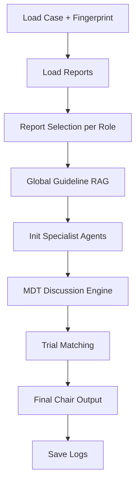

# MDT Discussion Log — 2026-01-17_22-35-42
Generated automatically by MDT Pipeline.


## CASE (structured JSON)

```
{"CASE_CORE":{"ADJUVANT_TREATMENT":{"cycles_or_courses":"Unknown","given":"Unknown","regimens":[]},"BIOMARKERS":{"AFP":"Unknown","CA125":"68 (2025-07-13)","HER2":"0 (IHC)","MSI":"MMR proteins intact (MLH1+, MSH2+, MSH6+, PMS2+)","PDL1_CPS":"Unknown","TMB":"Unknown"},"BRCA1":"Unknown","BRCA2":"Unknown","CURRENT_STATUS":"Postoperative follow-up","DIAGNOSIS":{"components":["peritoneum","omentum","left ovary","right ovary","uterus","left fallopian tube","right fallopian tube","appendix","distal stomach","hepatic ligament"],"histology":"高级别腺癌，倾向高级别内膜样腺癌","laterality":"Bilateral","primary":"Ovarian malignant tumor","site":"Pelvis / ovary"},"HRD":"Unknown","INITIAL_TREATMENT":"Yes","LINE_OF_THERAPY":[{"cycles":"2","end_date":"2025-07-17","intent":"Unknown","line":"1L","regimen":"紫杉醇+卡铂","start_date":"2025-06-24"}],"MAINTENANCE":"Unknown","MAINTENANCE_DETAIL":{"end_date":"Unknown","given":"Unknown","regimens":[],"start_date":"Unknown"},"NEOADJUVANT":"Unknown","PFI_days":"Unknown","PLATINUM_HISTORY":[{"PFI_days":"Unknown","end_date":"2025-07-17","evidence":"","evidence_type":"Unknown","first_relapse_date":"Unknown","line":"1L","start_date":"2025-06-24","status":"Unknown"}],"PLATINUM_PFI_CURRENT":"Unknown","PLATINUM_STATUS":"Unknown","PLATINUM_STATUS_CURRENT":"Unknown","RELAPSE":"Unknown","RELAPSE_DATE":{"date":"Unknown","evidence":"","type":"Unknown"},"STAGE":{"stage_basis":"Unknown","stage_system":"Unknown","stage_text":"Unknown"},"SURGERY_DONE":{"date":"2025-08-26","performed":"Yes","procedure":"Radical gastrectomy + total hysterectomy with bilateral adnexectomy + omentectomy + appendectomy + pelvic peritonectomy (abdominal)"},"VISIT_DATE":"2025-09-22","first_relapse_date":"Unknown","last_platinum_end_date":"2025-07-17"},"LAB_TRENDS":{"labs":[{"analyte":"CA125","history":[{"date":"2025-07-13","flag":"↑","value":"68"}],"latest":{"date":"2025-07-13","flag":"↑","value":"68"},"reference_range":"Unknown","unit":"U/mL"},{"analyte":"Hb","history":[{"date":"2025-07-13","flag":"↓","value":"103"},{"date":"2025-08-04","flag":"↓","value":"102"}],"latest":{"date":"2025-08-04","flag":"↓","value":"102"},"reference_range":"Unknown","unit":"g/L"},{"analyte":"Other","history":[{"date":"2025-07-13","flag":"↓","value":"WBC 3.17"},{"date":"2025-08-04","flag":"↓","value":"WBC 2.31"}],"latest":{"date":"2025-08-04","flag":"↓","value":"WBC 2.31"},"reference_range":"Unknown","unit":"10^9/L"},{"analyte":"Other","history":[{"date":"2025-07-13","flag":"Unknown","value":"Platelets 222"},{"date":"2025-08-04","flag":"↓","value":"Platelets 124"}],"latest":{"date":"2025-08-04","flag":"↓","value":"Platelets 124"},"reference_range":"Unknown","unit":"10^9/L"}],"milestones":[{"date":"2025-06-24","description":"First cycle paclitaxel + carboplatin","type":"ChemoStart"},{"date":"2025-07-17","description":"Second cycle paclitaxel + carboplatin administered (last documented)","type":"ChemoEnd"},{"date":"2025-08-26","description":"Radical gastrectomy + hysterectomy + bilateral adnexectomy + omentectomy + appendectomy + pelvic peritonectomy","type":"Surgery"}]},"MED_ONC":{"current_regimen":{"cycle_info":"Unknown","last_admin_date":"Unknown","name":"Unknown"},"genetic_testing":{"germline":[],"somatic":[]},"monitoring_points":[],"planned_next_regimen":"Unknown","prior_systemic_therapies":["紫杉醇+卡铂"]},"NUC_MED":{"studies":[{"avid_lesions":["bilateral adnexal masses","liver lesions","hepatic subcapsular lesions","cardiophrenic angle lesion","porta hepatis nodes","retroperitoneal lymph nodes","peritoneal and omental lesions"],"confidence":"Moderate","date":"2025-05-27","non_avid_notes":[],"type":"FDG-PET/CT"}]},"PATHOLOGY":{"specimens":[{"components":["gastric mucosa biopsy"],"date":"2025-06-07","diagnosis":"Low-differentiated adenocarcinoma (loss of adhesion)","grade":"Low-differentiated","ihc":[{"marker":"MLH1","result":"(+)"},{"marker":"MSH6","result":"(+)"},{"marker":"MSH2","result":"(+)"},{"marker":"PMS2","result":"(+)"},{"marker":"PAX8","result":"(-)"},{"marker":"ER","result":"(-)"},{"marker":"PR","result":"(-)"},{"marker":"WT1","result":"(-)"},{"marker":"Claudin 18 (43-14A)","result":"≥75%;2/3+"}],"involvement_sites":[],"laterality":"Unknown","molecular":[],"raw_text":"Gastric antrum biopsy pathology: low-differentiated adenocarcinoma (loss of adhesion). IHC from original unit: MLH1(ES05)(+), MSH6(+), MSH2(+), PMS2(+). Supplementary: combined IHC favors gastric primary adenocarcinoma.","sample_type":"Biopsy","site":"gastric antrum (biopsy)","tumor_size":"Unknown","uncertainty_or_missing":["Further diagnostic correlation with IHC"]},{"components":["peritoneal tumor","omental tumor"],"date":"2025-06-18","diagnosis":"Adenocarcinoma; combined IHC favors female genital tract origin, favors high-grade endometrioid adenocarcinoma","grade":"High-grade","ihc":[{"marker":"ER","result":"(+)"},{"marker":"PR","result":"(-)"},{"marker":"P53","result":"部分+"},{"marker":"WT1","result":"(+)"},{"marker":"HNF1B","result":"(-)"},{"marker":"NapsinA","result":"(-)"},{"marker":"P16","result":"强+"},{"marker":"PAX8","result":"(+)"},{"marker":"CDX-2","result":"(-)"},{"marker":"CK7","result":"(+)"},{"marker":"CK20","result":"(-)"}],"involvement_sites":["peritoneum","omentum"],"laterality":"Unknown","molecular":[],"raw_text":"Peritoneal and omental tumor pathology (2025-06-18): adenocarcinoma. Combined with IHC, consider female genital tract origin, favors high-grade endometrioid adenocarcinoma. IHC: ER(+), PR(-), P53(部分+), WT1(+), HNF1B(-), NapsinA(-), P16(强+), PAX8(+), CDX-2(-), SATB2(-), CK7(+), CK20(-).","sample_type":"Biopsy","site":"peritoneum and omentum (biopsy)","tumor_size":"Unknown","uncertainty_or_missing":["Further IHC confirmation performed"]},{"components":["uterus","bilateral adnexa","pelvic peritoneum","hepatic ligament","distal stomach","omentum","appendix"],"date":"2025-08-26","diagnosis":"High-grade adenocarcinoma involving adnexa and pelvic peritoneum; distal stomach: low-differentiated adenocarcinoma","grade":"High-grade","ihc":[{"marker":"HER2","result":"0"},{"marker":"EBER","result":"(-)"},{"marker":"MLH1(ES05)","result":"(+)"},{"marker":"MSH2","result":"(+)"},{"marker":"MSH6","result":"(+)"},{"marker":"PMS2","result":"(+)"},{"marker":"CDX-2","result":"(+)"},{"marker":"CK20","result":"(+)"},{"marker":"CK7","result":"(+)"},{"marker":"PAX8","result":"(+)"},{"marker":"ER","result":"部分+ / (+20% reported)"},{"marker":"PR","result":"个别+ / (- in some reports)"},{"marker":"P53","result":"部分+"},{"marker":"WT1","result":"(+)"},{"marker":"Ki-67","result":"+20% (report) / +60% (distal stomach)"},{"marker":"HNF1B","result":"(-)"},{"marker":"NapsinA","result":"(-)"},{"marker":"P16","result":"弥漫+"},{"marker":"IMP3","result":"(+)"},{"marker":"TTF-1","result":"(-)"},{"marker":"GATA3","result":"(-)"}],"involvement_sites":["left fallopian tube: tumor present","right fallopian tube: tumor present","uterine endometrium: atrophic","pelvic peritoneum: tumor present","omentum: tumor present","lymph nodes: metastasis 3/25"],"laterality":"Bilateral","molecular":[],"raw_text":"Surgical specimen (2025-08-26) pathology: specimens: uterus+bilateral adnexa+pelvic peritoneum+hepatic ligament+distal stomach+omentum+appendix. Bilateral adnexal tumors: left 4.8×3.5×2.5 cm; right 3.5×1.5×0.7 cm. Pathology: high-grade adenocarcinoma; distal stomach: low-differentiated adenocarcinoma 2×1.5×1.5 cm invading submucosa (SM1). Lymph nodes 3/25 positive. IHC summarized in report(s) with PAX8(+), ER(partial+), WT1(+), HER2(0), MMR proteins intact. Diagnostic comment: high-grade adenocarcinoma with therapy-related changes; need to consider high-grade endometrioid vs high-grade serous; molecular testing may be added.","sample_type":"Surgical resection","site":"whole surgical specimen: uterus + bilateral adnexa + pelvic peritoneum + hepatic ligament + distal stomach + omentum + appendix","tumor_size":"Left:4.8×3.5×2.5 cm; Right:3.5×1.5×0.7 cm; distal stomach tumor 2×1.5×1.5 cm","uncertainty_or_missing":["Distinction between high-grade endometrioid and high-grade serous not definitive; molecular testing suggested"]}]},"RADIOLOGY":{"next_imaging_plan":{"modality":"Unknown","timing":"Unknown"},"studies":[{"anatomic_sites":["bilateral adnexa","liver","hepatic subcapsular","cardiophrenic angle","porta hepatis","retroperitoneal lymph nodes","peritoneum","omentum","ascites"],"date":"2025-05-27","findings":["Bilateral adnexal masses suspicious for ovarian cancer","Metastases to liver, hepatic subcapsular area, cardiophrenic angle, porta hepatis, retroperitoneal nodes","Peritoneal and omental metastases","Abdominal and pelvic ascites"],"impression":"Bilateral adnexal masses suspicious for ovarian cancer with multifocal metastatic disease including liver, nodes, peritoneum, omentum; ascites","modality":"Other","trend_vs_prior":"Unknown"}]},"TIMELINE":{"constraints":{"max_events":30,"min_events":3,"must_include":["first diagnostic imaging or pathology confirmation (if available)"],"ordering_rules":{"prioritize_last_event":true}},"events":[{"date":"2025-05-27","description":"FDG-PET/CT showing bilateral adnexal masses and widespread metastases","event_type":"Imaging","key_result":"Bilateral adnexal masses; liver, hepatic subcapsular, cardiophrenic angle, porta hepatis, retroperitoneal nodes, peritoneal and omental metastases; ascites","regimen_or_test":"PET/CT"},{"date":"2025-06-05","description":"Laparoscopic exploration and pelvic mass biopsy and omental biopsy","event_type":"Surgery","key_result":"Biopsies obtained for pathology","regimen_or_test":"Laparoscopy with biopsies"},{"date":"2025-06-07","description":"Gastric biopsy pathology","event_type":"Other","key_result":"Low-differentiated adenocarcinoma (loss of adhesion)","regimen_or_test":"Gastroscopy biopsy"},{"date":"2025-06-18","description":"Peritoneal and omental tumor pathology","event_type":"Pathology","key_result":"Adenocarcinoma; combined IHC favors female genital tract origin, favors high-grade endometrioid adenocarcinoma","regimen_or_test":"Pathology with IHC"},{"date":"2025-06-24","description":"First cycle paclitaxel + carboplatin","event_type":"Chemo","key_result":"Cycle 1 administered","regimen_or_test":"紫杉醇+卡铂"},{"date":"2025-07-13","description":"Outside lab tests","event_type":"Lab","key_result":"WBC 3.17↓; Hb 103↓; Platelets 222; CA125 68↑","regimen_or_test":"CBC and tumor markers"},{"date":"2025-07-17","description":"Second cycle paclitaxel + carboplatin","event_type":"Chemo","key_result":"Cycle 2 administered","regimen_or_test":"紫杉醇+卡铂"},{"date":"2025-08-04","description":"Outside CBC","event_type":"Lab","key_result":"WBC 2.31↓; Hb 102↓; Platelets 124","regimen_or_test":"CBC"},{"date":"2025-08-26","description":"Radical gastrectomy + total hysterectomy with bilateral adnexectomy + omentectomy + appendectomy + pelvic peritonectomy","event_type":"Surgery","key_result":"Resection performed; multiple specimens sent","regimen_or_test":"Abdominal surgery"},{"date":"2025-09-01","description":"Surgical specimen pathology reports","event_type":"Pathology","key_result":"High-grade adenocarcinoma involving adnexa and pelvic peritoneum; distal stomach low-differentiated adenocarcinoma; lymph node metastases (3/25)","regimen_or_test":"Surgical pathology with IHC"},{"date":"2025-09-22","description":"Postoperative review visit","event_type":"Other","key_result":"Postoperative follow-up","regimen_or_test":"Clinic visit"}]}}
```


## FINAL MDT OUTPUT

```
- If post-op CT/PET shows unresectable residual disease, then adjust management from adjuvant-intent systemic therapy to primary systemic ± local palliation.  
- If germline/somatic BRCA or HRD testing returns positive, then adjust management from chemo-only strategy to chemo followed by targeted maintenance.  
- If gastric primary is confirmed dominant driver on integrated pathology/MDT, then adjust management from ovarian-primary pathway to upper-GI–oriented systemic strategy.  
- If post-op CA125 and imaging normalize and performance status is good, then adjust management from palliative expectation to aggressive consolidation plus structured surveillance.  
- If significant chemo-induced cytopenias or organ dysfunction recur, then adjust management from full-intensity systemic therapy to dose-modified or alternative-schedule systemic control.
```


## PIPELINE FLOW (Mermaid)




## TRACE EVENTS (Structured)

```json
[
  {
    "ts": "2026-01-17T22:31:04.532778",
    "event": "pipeline_start",
    "payload": {
      "visit_time": "2025-09-22 14:14:50.183000",
      "meta_info": "341621197711091961"
    }
  },
  {
    "ts": "2026-01-17T22:31:04.533134",
    "event": "case_fingerprint",
    "payload": {
      "case_fingerprint": "2cb3272105d4"
    }
  },
  {
    "ts": "2026-01-17T22:31:04.789425",
    "event": "reports_loaded",
    "payload": {
      "lab_n": 57,
      "img_n": 4,
      "path_n": 0,
      "mut_n": 0,
      "cutoff_dt": "2025-09-23 14:14:50"
    }
  },
  {
    "ts": "2026-01-17T22:31:15.993160",
    "event": "reports_selected",
    "payload": {
      "lab": {
        "chair": [
          "20250818|9701134|2025-08-18",
          "20250902|8300228|2025-09-02",
          "20250923|5601694|2025-09-23"
        ],
        "oncologist": [
          "20250818|9701134|2025-08-18",
          "20250907|10100012|2025-09-07",
          "20250923|5601694|2025-09-23"
        ],
        "radiologist": [],
        "pathologist": [],
        "nuclear": []
      },
      "imaging": {
        "chair": [
          "2025-06-04|CT|2025-06-04",
          "2025-08-15|CT|2025-08-15",
          "2025-08-15|CT|2025-08-15",
          "2025-08-19|CT|2025-08-19"
        ],
        "oncologist": [],
        "radiologist": [
          "2025-08-15|CT|2025-08-15",
          "2025-08-15|CT|2025-08-15",
          "2025-08-19|CT|2025-08-19"
        ],
        "pathologist": [],
        "nuclear": [
          "2025-08-15|CT|2025-08-15",
          "2025-08-15|CT|2025-08-15",
          "2025-08-19|CT|2025-08-19"
        ]
      },
      "pathology": {
        "chair": [],
        "oncologist": [],
        "radiologist": [],
        "pathologist": [],
        "nuclear": []
      },
      "mutation": {
        "chair": [],
        "oncologist": [],
        "radiologist": [],
        "pathologist": [],
        "nuclear": []
      }
    }
  },
  {
    "ts": "2026-01-17T22:31:27.813787",
    "event": "rag_query",
    "payload": {
      "query": "High‑grade bilateral adnexal adenocarcinoma (likely Müllerian, high‑grade endometrioid vs serous), platinum‑exposed, with peritoneal/omental/liver/lymph‑node metastases; gastric SM1 adenocarcinoma; MMR intact, HER2 0, ER partial+, WT1/PAX8+; mild cytopenias but no major organ dysfunction."
    }
  },
  {
    "ts": "2026-01-17T22:31:27.813795",
    "event": "rag_hits",
    "payload": {
      "topk": 5,
      "n": 5
    }
  },
  {
    "ts": "2026-01-17T22:31:42.148719",
    "event": "mdt_discussion_start",
    "payload": {
      "num_rounds": 2,
      "num_turns": 2
    }
  },
  {
    "ts": "2026-01-17T22:35:38.445424",
    "event": "mdt_discussion_end",
    "payload": {
      "merged_chars": 3348
    }
  },
  {
    "ts": "2026-01-17T22:35:38.446470",
    "event": "final_output_start",
    "payload": {}
  },
  {
    "ts": "2026-01-17T22:35:42.226736",
    "event": "final_output_end",
    "payload": {
      "final_output_chars": 858
    }
  }
]
```


## INITIAL EXPERT OPINIONS


## chair

```
- Clarify primary: integrate gastric vs Müllerian origin with pathology, consider additional molecular tests; this drives systemic treatment strategy.  

- Stage post-surgery with contrast CT/PET and operative notes to define residual disease burden; current postoperative imaging status unknown/needs update.  

- Plan to resume systemic therapy soon after recovery, coordinated between gastric and gynecologic oncology, given prior brief platinum exposure.  

- Arrange germline and somatic testing (including BRCA/HRD, others) to inform maintenance and future-line options; currently unknown/needs update.  

- Monitor recovery: repeat CA125, nutritional status, and anemia workup; ensure no infection or complications given postoperative leukocytosis and low Hb.
```


## oncologist

```
- High-grade endometrioid-like ovarian carcinoma with extensive peritoneal and gastric involvement → systemic therapy intent is adjuvant/primary postoperative, not surveillance.

- Only two cycles of first-line platinum-taxane documented pre-op; decision now: resume systemic chemotherapy vs switch strategy based on pathology/staging.

- Current organ function acceptable for cytotoxic therapy: normal liver/renal biochemistry [@20250907|10100012]; marrow recovered (WBC/PLT adequate, mild anemia) [@20250923|5601694].

- CA125 normalized post-chemotherapy/surgery (68→20.9 U/mL) [@20250818|9701134], but imaging status and residual disease burden are unknown/needs update.

- Missing critical data: final surgical pathology stage, residual disease description, detailed histologic report, germline/somatic HRD-BRCA testing, and current ECOG status.
```


## radiologist

```
- Bilateral adnexal cystic–solid masses ~49×48 mm with enhancing solid components, compatible with residual/recurrent ovarian malignancy [@2025-08-15|CT].

- Peritoneal/omental thickening and nodularity along hepatic capsule and abdomen, consistent with peritoneal carcinomatosis; no ascites currently seen [@2025-08-15|CT].

- Mildly enlarged lymph nodes at cardiophrenic/anterior diaphragmatic, porta hepatis, and retroperitoneal regions, suspicious for nodal metastases [@2025-08-15|CT; @2025-08-19|CT].

- Tiny right upper lobe pulmonary nodule (3 mm); indeterminate, recommend interval CT chest surveillance [@2025-08-19|CT].

- Left adrenal gland mildly thickened without discrete mass; metastatic involvement indeterminate, needs interval imaging correlation [@2025-08-15|CT].
```


## pathologist

```
- There are two primaries: gastric poorly differentiated adenocarcinoma and high‑grade Müllerian adenocarcinoma involving adnexa/peritoneum.  

- Müllerian tumor profile (PAX8+, WT1+, ER partial+, p16 diffuse, MMR intact) favors high‑grade serous over endometrioid.  

- Distal gastric tumor: poorly differentiated adenocarcinoma with CDX2+/CK20+/Claudin18+, HER2 0, MMR intact; appears separate primary.  

- FIGO stage for Müllerian carcinoma and pathologic stage for gastric cancer cannot be assigned from current reports; staging details needed.  

- Recommended updates: full synoptic surgical report, confirm primary site assignment, and add molecular panel (e.g., TP53, BRCA/HRR) for Müllerian tumor.
```


## nuclear

```
- FDG-avid bilateral adnexal masses with multifocal liver, nodal, peritoneal, omental disease indicate advanced-stage ovarian malignancy at baseline staging. [@FDG-PET/CT|2025-05-27]

- PET significantly upstaged disease by revealing hepatic, porta hepatis, cardiophrenic, and extensive peritoneal/omental involvement beyond pelvis. [@FDG-PET/CT|2025-05-27]

- Interval CT shows persistent bilateral adnexal masses and peritoneal/omental nodularity, consistent with residual/metastatic disease after surgery/chemotherapy. [@2025-08-15|CT]

- Cardiophrenic and upper-abdominal nodal disease on PET support systemic dissemination; these nodes are difficult to fully characterize on CT alone. [@FDG-PET/CT|2025-05-27; @2025-08-19|CT]

- For current restaging/recurrence assessment, updated FDG-PET/CT after August CT is needed to reassess metabolic response and residual disease.
```


## MERGED SUMMARY (Assistant)

```
Key Knowledge:
- Two distinct primaries: distal gastric poorly differentiated adenocarcinoma (CDX2+/CK20+/Claudin18+, HER2 0, MMR intact) and high‑grade Müllerian adenocarcinoma, likely high‑grade serous (PAX8+, WT1+, ER partial+, p16 diffuse, MMR intact).
- Baseline PET/CT: advanced Müllerian disease with FDG‑avid bilateral adnexal masses and extensive peritoneal/omental, hepatic capsular, porta hepatis, cardiophrenic, and upper‑abdominal nodal involvement.
- August CT: persistent bilateral adnexal masses, peritoneal/omental carcinomatosis, suspicious upper‑abdominal/retroperitoneal nodes, tiny RUL lung nodule, indeterminate left adrenal thickening; prior PET‑avid cardiophrenic/porta hepatis nodes and hepatic capsular lesions not individually characterized.
- Systemic therapy to date: only two cycles platinum‑taxane pre‑op; CA125 68→20.9 U/mL; liver/renal function adequate; bone marrow recovered with mild anemia.
- Pathology opinion: diffuse peritoneal/omental disease is more consistent with Müllerian high‑grade serous biology than gastric origin.

Controversies:
- Dominant driver of current peritoneal/upper‑abdominal disease (Müllerian vs gastric) and whether systemic therapy should be primarily Müllerian‑directed rather than gastric‑directed.
- Optimal systemic strategy after limited first‑line platinum exposure: resume standard ovarian‑type platinum‑taxane vs modify in light of dual primaries and unknown full gastric staging.
- Extent to which post‑operative FDG‑PET/CT (vs CT alone) is required to guide systemic regimen choice and clarify dominant primary and residual metabolic disease.

Missing Info:
- Complete gastric and Müllerian surgical pathology (FIGO/TNM staging, residual macroscopic disease, synoptic reports).
- Updated post‑operative imaging beyond August CT, including whether a restaging FDG‑PET/CT has been done.
- Current ECOG performance status and detailed clinical status (nutrition, anemia workup, infection/complications).
- Germline and somatic profiling (BRCA/HRD/HRR, TP53, broader panel; gastric‑specific targets beyond HER2/MMR).
- Clear documentation of gastric residual disease status post‑resection.

Working Plan:
- Obtain and review full synoptic pathology for both primaries to assign accurate FIGO/TNM stage and residual disease, and confirm that peritoneal disease is attributed primarily to Müllerian carcinoma.
- Restage with contrast CT plus post‑operative FDG‑PET/CT focused on: dominant primary attribution; cardiophrenic/porta hepatis nodes; hepatic capsular/perihepatic lesions; adrenal and lung nodules.
- Define PET/CT reporting protocol (per nuclear/oncology) to ensure results directly inform systemic regimen selection.
- Complete germline and somatic testing for Müllerian tumor and extend molecular profiling for gastric cancer as indicated.
- After staging and performance status update, coordinate gastric and gynecologic oncology to plan resumption of systemic therapy based mainly on clarified dominant biology.
- Continue monitoring CA125, nutritional status, anemia, and screen for postoperative complications or infection.
[R2T1 DELTA] pathologist->oncologist(missing): Please ensure final synoptic pathology is obtained; without FIGO/TNM staging and residual disease status, dominant primary attribution remains insufficiently documented for systemic planning.
```


## INTERACTION LOG (Round × Turn)

### Round 1

#### Turn 1
- **oncologist → chair:** Systemic regimen choice is currently guesswork because we still lack final surgical pathology (both primaries), formal staging, and post‑operative imaging to define which tumour is driving residual peritoneal disease; these must be available before agreeing on systemic strategy.
- **oncologist → radiologist:** Please confirm timing and protocol for post‑operative contrast CT (and whether PET/CT adds value) to characterize residual peritoneal, nodal, liver, adrenal, and lung disease before systemic therapy recommencement.
- **oncologist → pathologist:** We urgently need integrated final reports for gastric and Müllerian primaries, including FIGO/TNM stage, residual disease assessment, and a clear opinion on which tumour most likely accounts for the peritoneal/upper‑abdominal deposits, to guide systemic regimen selection.
- **oncologist → nuclear:** Given baseline FDG‑avid peritoneal and nodal disease, advise whether repeat PET/CT now would meaningfully refine attribution between gastric versus Müllerian primary and alter systemic treatment planning.
- **radiologist → oncologist:** No post‑operative imaging is available; updated contrast-enhanced CT (chest/abdomen/pelvis) or PET/CT is needed now to define residual metastatic burden and complications.
- **radiologist → nuclear:** If PET/CT is being considered, please plan whole-body FDG-PET/CT for restaging to clarify dominant primary source of current peritoneal/upper-abdominal disease.
- **pathologist → chair:** Final synoptic surgical pathology for both Müllerian and gastric primaries (including FIGO/TNM staging and residual disease status) is missing and essential to attribute current disease burden and guide systemic planning.
- **pathologist → oncologist:** Pathology strongly favors Müllerian high‑grade serous adenocarcinoma as the source of diffuse peritoneal/omental disease; please confirm that systemic strategy is being based primarily on the Müllerian biology rather than gastric histology alone.
- **nuclear → oncologist:** Given dual primaries and complex peritoneal involvement, a post‑operative FDG‑PET/CT would better clarify dominant primary and residual metabolic disease than CT alone for current restaging.
- **nuclear → radiologist:** Please comment whether prior FDG‑avid cardiophrenic and porta hepatis nodes and hepatic capsular lesions were fully evaluated or seen on August CT, as this impacts the value of repeat PET/CT now.

#### Turn 2
- **oncologist → chair:** Systemic planning must now prioritize the Müllerian high‑grade serous biology as the main driver of peritoneal disease, but we still lack complete gastric and Müllerian staging, residual disease description, and formal operative notes, which are critical before finalizing regimen and sequencing between the two primaries.
- **oncologist → radiologist:** In light of nuclear medicine’s view that repeat PET/CT may better define dominant primary and residual metabolic disease, please advise how this would complement or alter contrast CT‑based restaging and whether prior cardiophrenic/porta hepatis and hepatic capsular lesions were adequately characterized on the August CT.
- **oncologist → pathologist:** We accept Müllerian high‑grade serous carcinoma as the dominant source of peritoneal/omental disease; please expedite full synoptic reports with FIGO/TNM staging and explicit residual disease assessment for both primaries to finalize systemic intent and prioritization.
- **oncologist → nuclear:** Your recommendation for post‑operative PET/CT is noted; we need a concise protocol and reporting focus (dominant primary attribution, cardiophrenic/porta hepatis/hepatic capsular and adrenal assessment) to ensure it directly influences systemic regimen choice.
- **radiologist → nuclear:** August CT reports only describe upper-abdominal/perihepatic peritoneal thickening and mildly enlarged nodes; prior FDG-avid cardiophrenic and porta hepatis nodes and hepatic capsular lesions were not individually characterized, so repeat PET/CT would add value for metabolic restaging and nodal/liver assessment.

### Round 2

#### Turn 1
- **pathologist → oncologist:** Please ensure final synoptic pathology is obtained; without FIGO/TNM staging and residual disease status, dominant primary attribution remains insufficiently documented for systemic planning.

#### Turn 2


## FINAL REFINED PLANS (per Round)

### Round 1


## chair

```
- Confirm staging, residual disease status and current CA125 via updated contrast CT/PET-CT and tumor markers before adjuvant planning (currently unknown).  
- Coordinate medical oncology to resume systemic therapy with platinum-based backbone given high-grade Müllerian carcinoma and prior partial neoadjuvant exposure [@2025-08-26|2025-08-26].  
- Request germline and somatic genomic testing including BRCA/HRR, HRD and PDL1/TMB to guide maintenance and future options (currently unknown).  
- Monitor postoperative recovery, cytopenia resolution, and organ function with repeat CBC and CMP before restarting chemotherapy [@20250902|2025-09-02].  
- Establish surveillance plan: interval imaging, CA125, and symptom review; define triggers for restaging or change of systemic strategy (currently unknown).
```


## oncologist

```
- Prior systemic therapy limited to two platinum‑taxane cycles; further combination chemotherapy is feasible, pending staging and performance status confirmation (ECOG unknown).  

- Hematologic recovery and organ function currently adequate for cytotoxic therapy; anemia mild (Hgb 96 g/L [@20250923|5601694], chemistries acceptable [@20250907|10100012]).  

- Tumor burden and regimen choice should prioritize Müllerian high‑grade serous biology as dominant driver of peritoneal disease; gastric burden requires formal staging (pathology, operative notes pending).  

- Obtain comprehensive synoptic pathology for both primaries with FIGO/TNM staging and residual disease description, plus updated contrast CT and FDG‑PET/CT for post‑operative restaging.  

- Initiate germline and somatic profiling (BRCA/HRD/HRR and broader panel) for Müllerian tumor; expand gastric molecular workup beyond HER2/MMR (currently HER2 0, MMR intact—dates unknown).
```


## radiologist

```
- Obtain post‑operative contrast CT chest/abdomen/pelvis to document residual peritoneal, nodal, hepatic capsular, adrenal and pulmonary disease [@2025-08-15|CT; @2025-08-19|CT].  

- Perform whole‑body FDG‑PET/CT to reassess cardiophrenic, porta hepatis, hepatic capsular, retroperitoneal nodes and adrenal, and clarify dominant primary [@2025-05-27|FDG-PET/CT].  

- Use PET/CT plus CT to generate measurable target/non‑target lesions for ongoing response assessment (peritoneum/omentum, adnexal, nodal, hepatic capsular, lung) [@2025-08-15|CT; @2025-08-19|CT].  

- Correlate new imaging with final surgical pathology to attribute peritoneal/upper‑abdominal disease to Müllerian versus gastric origin (pathology staging currently unknown).  

- Reassess the 3 mm RUL lung nodule and left adrenal thickening on follow‑up CT/PET to distinguish metastasis from benign findings [@2025-08-19|CT; @2025-08-15|CT].
```


## pathologist

```
- Confirm final synoptic surgical pathology for Müllerian and gastric primaries, including FIGO/TNM staging and residual disease description (currently unknown).  

- Pathologically attribute diffuse peritoneal/omental disease primarily to high‑grade Müllerian carcinoma; gastric component appears a separate, localized SM1 lesion [@HISTOLOGY_AND_IHC.1|2025-06-18,@HISTOLOGY_AND_IHC.2|2025-08-26].  

- Request integrated pathology addendum explicitly stating dominant primary for peritoneal involvement and clarifying high‑grade serous vs endometrioid features (morphology, TP53 if available).  

- Recommend comprehensive molecular profiling of Müllerian tumor (including TP53, BRCA/HRR, broader panel); gastric tumor profiling beyond HER2/MMR remains unknown.  

- After imaging restaging, correlate PET/CT and CT targets with pathology-mapped sites (adnexa, peritoneum, nodes, stomach) to refine disease attribution.
```


## nuclear

```
- Perform post‑operative whole‑body FDG‑PET/CT for metabolic restaging and dominant primary attribution; compare directly with baseline PET pattern. [@FDG-PET/CT|2025-05-27]  

- Emphasize detailed assessment of cardiophrenic, porta hepatis, retroperitoneal nodes and hepatic capsular/subcapsular lesions versus August CT. [@FDG-PET/CT|2025-05-27; @2025-08-15|CT]  

- Carefully evaluate residual pelvic/adnexal, peritoneal, and omental disease burden and distribution to support Müllerian versus gastric origin attribution. [@FDG-PET/CT|2025-05-27; @2025-08-15|CT]  

- Include focused review of left adrenal morphology/metabolism and right upper‑lobe nodule uptake to refine staging. [@2025-08-15|CT; @2025-08-19|CT]  

- Report should explicitly state whether PET findings would reclassify stage, alter dominant primary assignment, or reveal new metastatic sites. [@FDG-PET/CT|2025-05-27]
```

### Round 2


## chair

```
- Confirm extent of residual disease with post-operative contrast CT/PET-CT before finalizing systemic strategy; current status unknown.  

- Obtain germline and somatic profiling including BRCA/HRD, MMR/MSI confirmation, and PD-L1/TMB if feasible; all currently unknown.  

- Plan to resume systemic therapy with platinum-based backbone for metastatic high-grade Müllerian-type adnexal carcinoma; coordinate with gastric oncology team.  

- Monitor recovery and cytopenias closely: Hb 96 g/L, WBC 16.9, PLT 212 post-op [@20250923|5601694]; trend CA125 [@20250818|9701134].  

- Clarify staging and primary site dominance integrating pathology and imaging [@2025-08-15|CT; @2025-09-01|Pathology]; document intent (palliative vs maximal disease-control).
```


## oncologist

```
- Prioritize Müllerian-directed systemic therapy after staging, given extensive Müllerian-pattern peritoneal disease and limited prior platinum exposure (two pre-op cycles).  

- Obtain final synoptic pathology for gastric and Müllerian primaries with FIGO/TNM stage and residual disease status to confirm dominant driver.  

- Restage with contrast CT and consider FDG-PET/CT to characterize cardiophrenic/porta hepatis nodes, hepatic capsular, adrenal, and lung lesions (post-op status unknown).  

- Initiate germline and somatic profiling for Müllerian and gastric tumors (BRCA/HRD/HRR and gastric-specific targets) to inform future maintenance/second-line options.  

- Before restarting systemic therapy, document ECOG, nutrition, anemia evaluation, and postoperative complications; verify current CA125 and organ function (latest CA125 20.9 U/mL [@20250818|9701134], chemistries adequate [@20250907|10100012]).
```


## radiologist

```
- Restage with contrast-enhanced CT chest/abdomen/pelvis to document current peritoneal/omental, nodal, hepatic capsular, adrenal and pulmonary disease [@2025-08-15|CT; @2025-08-19|CT].  

- Perform post‑operative FDG‑PET/CT to assess residual metabolic disease, especially cardiophrenic, porta hepatis, hepatic capsular, retroperitoneal nodes and adrenal [@2025-05-27|FDG-PET/CT].  

- Correlate CT/PET with full synoptic pathology (FIGO/TNM, residual disease) to support attribution of peritoneal/upper‑abdominal disease to Müllerian origin (pathology staging unknown).  

- On follow‑up CT/PET, re‑evaluate the tiny RUL lung nodule and left adrenal thickening to differentiate metastasis from benign findings [@2025-08-19|CT; @2025-08-15|CT].  

- Use combined CT/PET findings to define measurable target and non‑target lesions for subsequent radiologic response assessment across both primaries [@2025-08-15|CT; @2025-08-19|CT; @2025-05-27|FDG-PET/CT].
```


## pathologist

```
- Obtain full synoptic reports for gastric and Müllerian primaries with FIGO/TNM stage and residual disease status (currently unknown).  

- Issue integrated pathology addendum explicitly attributing diffuse peritoneal/upper‑abdominal disease to Müllerian carcinoma, not gastric spread [@HISTOLOGY_AND_IHC.1|2025-06-18,@HISTOLOGY_AND_IHC.2|2025-08-26].  

- Restage with contrast CT ± FDG‑PET/CT to map residual metabolically active disease to Müllerian versus gastric origin (imaging post‑August unknown).  

- Initiate comprehensive germline and somatic profiling for Müllerian tumor and extended gastric panel; BRCA/HRR/TP53 status currently unknown.  

- Maintain serial CA125 monitoring and correlate with imaging and pathology‑defined Müllerian disease burden; CA125 20.9 U/mL post‑chemotherapy [@MOLECULAR|2025-07-13].
```


## nuclear

```
- Recommend post‑operative whole‑body FDG‑PET/CT to reassess metabolic burden and clarify dominant primary pattern versus baseline. [@FDG-PET/CT|2025-05-27]  

- Specifically evaluate cardiophrenic, porta hepatis, and retroperitoneal nodes and hepatic capsular/perihepatic lesions not detailed on August CT. [@FDG-PET/CT|2025-05-27; @2025-08-15|CT]  

- Correlate pelvic/adnexal, peritoneal, and omental uptake distribution with pathology to support Müllerian versus gastric origin attribution. [@FDG-PET/CT|2025-05-27]  

- Assess left adrenal and tiny right‑upper‑lobe nodule metabolism to refine current staging and metastatic spread. [@2025-08-15|CT; @2025-08-19|CT]  

- Explicitly state in the PET report whether findings would upstage, downstage, or reassign dominant primary driving systemic planning. [@FDG-PET/CT|2025-05-27]
```


## RAW AGENT LOGS

### chair
- **User:** Give INITIAL opinion (use ONLY your system-provided patient facts).
Return up to 5 bullets, each ≤20 words.
If key data missing, say exactly what needs updating.
  
  **Assistant:** - Clarify primary: integrate gastric vs Müllerian origin with pathology, consider additional molecular tests; this drives systemic treatment strategy.  

- Stage post-surgery with contrast CT/PET and operative notes to define residual disease burden; current postoperative imaging status unknown/needs update.  

- Plan to resume systemic therapy soon after recovery, coordinated between gastric and gynecologic oncology, given prior brief platinum exposure.  

- Arrange germline and somatic testing (including BRCA/HRD, others) to inform maintenance and future-line options; currently unknown/needs update.  

- Monitor recovery: repeat CA125, nutritional status, and anemia workup; ensure no infection or complications given postoperative leukocytosis and low Hb.
  
  *(2026-01-17T22:31:45.191453)*

- **User:** ROLE: chair. VISIT: 2025-09-22 14:14:50.183000
Default is NOT to speak. Speak ONLY if: conflict | safety | missing-critical | new-critical.

CONTEXT (latest):
Key Knowledge:
- Two primaries: distal gastric poorly differentiated adenocarcinoma (CDX2+/CK20+/Claudin18+, HER2 0, MMR intact) and high‑grade Müllerian adenocarcinoma, likely high‑grade serous (PAX8+, WT1+, ER partial+, p16 diffuse, MMR intact).
- Baseline PET/CT: advanced Müllerian disease with FDG‑avid bilateral adnexal masses and extensive peritoneal/omental, hepatic, porta hepatis, cardiophrenic, and upper‑abdominal nodal involvement.
- August CT: persistent bilateral adnexal masses, peritoneal/omental carcinomatosis, suspicious upper‑abdominal/retroperitoneal nodes, tiny RUL lung nodule, indeterminate left adrenal thickening.
- Treatment to date: only two cycles platinum‑taxane pre‑op; CA125 decreased 68→20.9 U/mL; organ function adequate for further cytotoxic therapy; mild anemia.

Controversies:
- Main driver of current peritoneal/abdominal disease (Müllerian vs gastric) and corresponding choice of systemic regimen.
- Best systemic strategy after limited initial platinum exposure and surgery (standard ovarian‑type platinum‑taxane vs modified approach considering dual primaries).
- Role and timing of PET/CT vs contrast CT for restaging and response assessment.

Missing Info:
- Final surgical pathology (FIGO stage for Müllerian, pathologic stage for gastric, residual disease description).
- Updated post‑operative imaging and current ECOG performance status.
- Germline and somatic profiling (BRCA/HRD/HRR, TP53, broader panel; gastric‑specific targets beyond HER2/MMR).
- Full operative notes and up‑to‑date clinical status (nutrition, anemia workup, infection/complications).

Working Plan:
- Integrate pathology (including prior biopsies and resection) to assign primary origin of peritoneal/upper‑abdominal disease; obtain full synoptic reports and formal staging.
- Restage with updated contrast CT and consider repeat FDG‑PET/CT to define residual/metastatic burden (liver, nodes, adrenal, lung).
- Initiate comprehensive germline and somatic testing for Müllerian tumor; extend molecular profiling for gastric cancer as indicated.
- Coordinate resumption of systemic therapy between gastric and gynecologic oncology following clarification of staging, primary attribution, and performance status.
- Monitor recovery: serial CA125, nutritional status, anemia evaluation, and screening for postoperative complications or infection.

Allowed targets: [oncologist,radiologist,pathologist,nuclear]
Return ONE-LINE JSON only:{"speak":"yes/no","messages":[{"target":"<role>","message":"<1-2 sentences>","why":"conflict|safety|missing|new"}]}
  
  **Assistant:** Pathology shows both high‑grade müllerian carcinoma and separate distal gastric adenocarcinoma; primary site and staging remain unclear and need multidisciplinary reconciliation.  

Before finalizing postoperative systemic strategy, we must obtain updated cross‑sectional imaging, CA125/CEA trends, and comprehensive germline/somatic profiling including HRD/BRCA.
  
  *(2026-01-17T22:32:09.736920)*

- **User:** ROLE: chair. VISIT: 2025-09-22 14:14:50.183000
Default is NOT to speak. Speak ONLY if: conflict | safety | missing-critical | new-critical.

CONTEXT (latest):
Key Knowledge:
- Two primaries: distal gastric poorly differentiated adenocarcinoma (CDX2+/CK20+/Claudin18+, HER2 0, MMR intact) and high‑grade Müllerian adenocarcinoma, likely high‑grade serous (PAX8+, WT1+, ER partial+, p16 diffuse, MMR intact).
- Baseline PET/CT: advanced Müllerian disease with FDG‑avid bilateral adnexal masses and extensive peritoneal/omental, hepatic, porta hepatis, cardiophrenic, and upper‑abdominal nodal involvement.
- August CT: persistent bilateral adnexal masses, peritoneal/omental carcinomatosis, suspicious upper‑abdominal/retroperitoneal nodes, tiny RUL lung nodule, indeterminate left adrenal thickening.
- Treatment to date: only two cycles platinum‑taxane pre‑op; CA125 decreased 68→20.9 U/mL; organ function adequate for further cytotoxic therapy; mild anemia.

Controversies:
- Main driver of current peritoneal/abdominal disease (Müllerian vs gastric) and corresponding choice of systemic regimen.
- Best systemic strategy after limited initial platinum exposure and surgery (standard ovarian‑type platinum‑taxane vs modified approach considering dual primaries).
- Role and timing of PET/CT vs contrast CT for restaging and response assessment.

Missing Info:
- Final surgical pathology (FIGO stage for Müllerian, pathologic stage for gastric, residual disease description).
- Updated post‑operative imaging and current ECOG performance status.
- Germline and somatic profiling (BRCA/HRD/HRR, TP53, broader panel; gastric‑specific targets beyond HER2/MMR).
- Full operative notes and up‑to‑date clinical status (nutrition, anemia workup, infection/complications).

Working Plan:
- Integrate pathology (including prior biopsies and resection) to assign primary origin of peritoneal/upper‑abdominal disease; obtain full synoptic reports and formal staging.
- Restage with updated contrast CT and consider repeat FDG‑PET/CT to define residual/metastatic burden (liver, nodes, adrenal, lung).
- Initiate comprehensive germline and somatic testing for Müllerian tumor; extend molecular profiling for gastric cancer as indicated.
- Coordinate resumption of systemic therapy between gastric and gynecologic oncology following clarification of staging, primary attribution, and performance status.
- Monitor recovery: serial CA125, nutritional status, anemia evaluation, and screening for postoperative complications or infection.
[R1T1 DELTA] gastric primaries (including FIGO/TNM staging and residual disease status) is missing and essential to attribute current disease burden and guide systemic planning. | pathologist->oncologist(conflict): Pathology strongly favors Müllerian high‑grade serous adenocarcinoma as the source of diffuse peritoneal/omental disease; please confirm that systemic strategy is being based primarily on the Müllerian biology rather than gastric histology alone. | nuclear->oncologist(missing): Given dual primaries and complex peritoneal involvement, a post‑operative FDG‑PET/CT would better clarify dominant primary and residual metabolic disease than CT alone for current restaging. | nuclear->radiologist(missing): Please comment whether prior FDG‑avid cardiophrenic and porta hepatis nodes and hepatic capsular lesions were fully evaluated or seen on August CT, as this impacts the value of repeat PET/CT now.

Allowed targets: [oncologist,radiologist,pathologist,nuclear]
Return ONE-LINE JSON only:{"speak":"yes/no","messages":[{"target":"<role>","message":"<1-2 sentences>","why":"conflict|safety|missing|new"}]}
  
  **Assistant:** - Need confirmation whether multidisciplinary team sees this as single ovarian primary with gastric metastasis, or synchronous ovarian–gastric primaries.  
- Before firm adjuvant strategy, obtain postoperative staging imaging, updated CA125, and full genomic profile including HRD/BRCA and actionable gastric markers.
  
  *(2026-01-17T22:32:25.599624)*

- **User:** Given MDT context:
Key Knowledge:
- Two primaries: distal gastric poorly differentiated adenocarcinoma (CDX2+/CK20+/Claudin18+, HER2 0, MMR intact) and high‑grade Müllerian adenocarcinoma, likely high‑grade serous (PAX8+, WT1+, ER partial+, p16 diffuse, MMR intact).
- Baseline PET/CT: advanced Müllerian disease with FDG‑avid bilateral adnexal masses and extensive peritoneal/omental, hepatic, porta hepatis, cardiophrenic, and upper‑abdominal nodal involvement.
- August CT: persistent bilateral adnexal masses, peritoneal/omental carcinomatosis, suspicious upper‑abdominal/retroperitoneal nodes, tiny RUL lung nodule, indeterminate left adrenal thickening.
- Treatment to date: only two cycles platinum‑taxane pre‑op; CA125 decreased 68→20.9 U/mL; organ function adequate for further cytotoxic therapy; mild anemia.

Controversies:
- Main driver of current peritoneal/abdominal disease (Müllerian vs gastric) and corresponding choice of systemic regimen.
- Best systemic strategy after limited initial platinum exposure and surgery (standard ovarian‑type platinum‑taxane vs modified approach considering dual primaries).
- Role and timing of PET/CT vs contrast CT for restaging and response assessment.

Missing Info:
- Final surgical pathology (FIGO stage for Müllerian, pathologic stage for gastric, residual disease description).
- Updated post‑operative imaging and current ECOG performance status.
- Germline and somatic profiling (BRCA/HRD/HRR, TP53, broader panel; gastric‑specific targets beyond HER2/MMR).
- Full operative notes and up‑to‑date clinical status (nutrition, anemia workup, infection/complications).

Working Plan:
- Integrate pathology (including prior biopsies and resection) to assign primary origin of peritoneal/upper‑abdominal disease; obtain full synoptic reports and formal staging.
- Restage with updated contrast CT and consider repeat FDG‑PET/CT to define residual/metastatic burden (liver, nodes, adrenal, lung).
- Initiate comprehensive germline and somatic testing for Müllerian tumor; extend molecular profiling for gastric cancer as indicated.
- Coordinate resumption of systemic therapy between gastric and gynecologic oncology following clarification of staging, primary attribution, and performance status.
- Monitor recovery: serial CA125, nutritional status, anemia evaluation, and screening for postoperative complications or infection.
[R1T1 DELTA] gastric primaries (including FIGO/TNM staging and residual disease status) is missing and essential to attribute current disease burden and guide systemic planning. | pathologist->oncologist(conflict): Pathology strongly favors Müllerian high‑grade serous adenocarcinoma as the source of diffuse peritoneal/omental disease; please confirm that systemic strategy is being based primarily on the Müllerian biology rather than gastric histology alone. | nuclear->oncologist(missing): Given dual primaries and complex peritoneal involvement, a post‑operative FDG‑PET/CT would better clarify dominant primary and residual metabolic disease than CT alone for current restaging. | nuclear->radiologist(missing): Please comment whether prior FDG‑avid cardiophrenic and porta hepatis nodes and hepatic capsular lesions were fully evaluated or seen on August CT, as this impacts the value of repeat PET/CT now.
[R1T2 DELTA] ay better define dominant primary and residual metabolic disease, please advise how this would complement or alter contrast CT‑based restaging and whether prior cardiophrenic/porta hepatis and hepatic capsular lesions were adequately characterized on the August CT. | oncologist->nuclear(new): Your recommendation for post‑operative PET/CT is noted; we need a concise protocol and reporting focus (dominant primary attribution, cardiophrenic/porta hepatis/hepatic capsular and adrenal assessment) to ensure it directly influences systemic regimen choice. | radiologist->nuclear(missing): August CT reports only describe upper-abdominal/perihepatic peritoneal thickening and mildly enlarged nodes; prior FDG-avid cardiophrenic and porta hepatis nodes and hepatic capsular lesions were not individually characterized, so repeat PET/CT would add value for metabolic restaging and nodal/liver assessment.

Provide FINAL refined plan.
Up to 5 bullets, each ≤20 words.
Any factual claim must include [@report_id|date] or say unknown.
  
  **Assistant:** - Confirm staging, residual disease status and current CA125 via updated contrast CT/PET-CT and tumor markers before adjuvant planning (currently unknown).  
- Coordinate medical oncology to resume systemic therapy with platinum-based backbone given high-grade Müllerian carcinoma and prior partial neoadjuvant exposure [@2025-08-26|2025-08-26].  
- Request germline and somatic genomic testing including BRCA/HRR, HRD and PDL1/TMB to guide maintenance and future options (currently unknown).  
- Monitor postoperative recovery, cytopenia resolution, and organ function with repeat CBC and CMP before restarting chemotherapy [@20250902|2025-09-02].  
- Establish surveillance plan: interval imaging, CA125, and symptom review; define triggers for restaging or change of systemic strategy (currently unknown).
  
  *(2026-01-17T22:33:03.256703)*

- **User:** ROLE: chair. VISIT: 2025-09-22 14:14:50.183000
Default is NOT to speak. Speak ONLY if: conflict | safety | missing-critical | new-critical.

CONTEXT (latest):
Key Knowledge:
- Two distinct primaries: distal gastric poorly differentiated adenocarcinoma (CDX2+/CK20+/Claudin18+, HER2 0, MMR intact) and high‑grade Müllerian adenocarcinoma, likely high‑grade serous (PAX8+, WT1+, ER partial+, p16 diffuse, MMR intact).
- Baseline PET/CT: advanced Müllerian disease with FDG‑avid bilateral adnexal masses and extensive peritoneal/omental, hepatic capsular, porta hepatis, cardiophrenic, and upper‑abdominal nodal involvement.
- August CT: persistent bilateral adnexal masses, peritoneal/omental carcinomatosis, suspicious upper‑abdominal/retroperitoneal nodes, tiny RUL lung nodule, indeterminate left adrenal thickening; prior PET‑avid cardiophrenic/porta hepatis nodes and hepatic capsular lesions not individually characterized.
- Systemic therapy to date: only two cycles platinum‑taxane pre‑op; CA125 68→20.9 U/mL; liver/renal function adequate; bone marrow recovered with mild anemia.
- Pathology opinion: diffuse peritoneal/omental disease is more consistent with Müllerian high‑grade serous biology than gastric origin.

Controversies:
- Dominant driver of current peritoneal/upper‑abdominal disease (Müllerian vs gastric) and whether systemic therapy should be primarily Müllerian‑directed rather than gastric‑directed.
- Optimal systemic strategy after limited first‑line platinum exposure: resume standard ovarian‑type platinum‑taxane vs modify in light of dual primaries and unknown full gastric staging.
- Extent to which post‑operative FDG‑PET/CT (vs CT alone) is required to guide systemic regimen choice and clarify dominant primary and residual metabolic disease.

Missing Info:
- Complete gastric and Müllerian surgical pathology (FIGO/TNM staging, residual macroscopic disease, synoptic reports).
- Updated post‑operative imaging beyond August CT, including whether a restaging FDG‑PET/CT has been done.
- Current ECOG performance status and detailed clinical status (nutrition, anemia workup, infection/complications).
- Germline and somatic profiling (BRCA/HRD/HRR, TP53, broader panel; gastric‑specific targets beyond HER2/MMR).
- Clear documentation of gastric residual disease status post‑resection.

Working Plan:
- Obtain and review full synoptic pathology for both primaries to assign accurate FIGO/TNM stage and residual disease, and confirm that peritoneal disease is attributed primarily to Müllerian carcinoma.
- Restage with contrast CT plus post‑operative FDG‑PET/CT focused on: dominant primary attribution; cardiophrenic/porta hepatis nodes; hepatic capsular/perihepatic lesions; adrenal and lung nodules.
- Define PET/CT reporting protocol (per nuclear/oncology) to ensure results directly inform systemic regimen selection.
- Complete germline and somatic testing for Müllerian tumor and extend molecular profiling for gastric cancer as indicated.
- After staging and performance status update, coordinate gastric and gynecologic oncology to plan resumption of systemic therapy based mainly on clarified dominant biology.
- Continue monitoring CA125, nutritional status, anemia, and screen for postoperative complications or infection.

Allowed targets: [oncologist,radiologist,pathologist,nuclear]
Return ONE-LINE JSON only:{"speak":"yes/no","messages":[{"target":"<role>","message":"<1-2 sentences>","why":"conflict|safety|missing|new"}]}
  
  **Assistant:** Possible dual primaries (gastric and Müllerian) remain unresolved; need integrated pathology review and staging summary before systemic plan is finalized.  

Before deciding adjuvant/continuation therapy, obtain updated post‑op CT/PET, current CA125, and germline/somatic testing (including BRCA/HRD, CLDN18.2).
  
  *(2026-01-17T22:33:36.943230)*

- **User:** ROLE: chair. VISIT: 2025-09-22 14:14:50.183000
Default is NOT to speak. Speak ONLY if: conflict | safety | missing-critical | new-critical.

CONTEXT (latest):
Key Knowledge:
- Two distinct primaries: distal gastric poorly differentiated adenocarcinoma (CDX2+/CK20+/Claudin18+, HER2 0, MMR intact) and high‑grade Müllerian adenocarcinoma, likely high‑grade serous (PAX8+, WT1+, ER partial+, p16 diffuse, MMR intact).
- Baseline PET/CT: advanced Müllerian disease with FDG‑avid bilateral adnexal masses and extensive peritoneal/omental, hepatic capsular, porta hepatis, cardiophrenic, and upper‑abdominal nodal involvement.
- August CT: persistent bilateral adnexal masses, peritoneal/omental carcinomatosis, suspicious upper‑abdominal/retroperitoneal nodes, tiny RUL lung nodule, indeterminate left adrenal thickening; prior PET‑avid cardiophrenic/porta hepatis nodes and hepatic capsular lesions not individually characterized.
- Systemic therapy to date: only two cycles platinum‑taxane pre‑op; CA125 68→20.9 U/mL; liver/renal function adequate; bone marrow recovered with mild anemia.
- Pathology opinion: diffuse peritoneal/omental disease is more consistent with Müllerian high‑grade serous biology than gastric origin.

Controversies:
- Dominant driver of current peritoneal/upper‑abdominal disease (Müllerian vs gastric) and whether systemic therapy should be primarily Müllerian‑directed rather than gastric‑directed.
- Optimal systemic strategy after limited first‑line platinum exposure: resume standard ovarian‑type platinum‑taxane vs modify in light of dual primaries and unknown full gastric staging.
- Extent to which post‑operative FDG‑PET/CT (vs CT alone) is required to guide systemic regimen choice and clarify dominant primary and residual metabolic disease.

Missing Info:
- Complete gastric and Müllerian surgical pathology (FIGO/TNM staging, residual macroscopic disease, synoptic reports).
- Updated post‑operative imaging beyond August CT, including whether a restaging FDG‑PET/CT has been done.
- Current ECOG performance status and detailed clinical status (nutrition, anemia workup, infection/complications).
- Germline and somatic profiling (BRCA/HRD/HRR, TP53, broader panel; gastric‑specific targets beyond HER2/MMR).
- Clear documentation of gastric residual disease status post‑resection.

Working Plan:
- Obtain and review full synoptic pathology for both primaries to assign accurate FIGO/TNM stage and residual disease, and confirm that peritoneal disease is attributed primarily to Müllerian carcinoma.
- Restage with contrast CT plus post‑operative FDG‑PET/CT focused on: dominant primary attribution; cardiophrenic/porta hepatis nodes; hepatic capsular/perihepatic lesions; adrenal and lung nodules.
- Define PET/CT reporting protocol (per nuclear/oncology) to ensure results directly inform systemic regimen selection.
- Complete germline and somatic testing for Müllerian tumor and extend molecular profiling for gastric cancer as indicated.
- After staging and performance status update, coordinate gastric and gynecologic oncology to plan resumption of systemic therapy based mainly on clarified dominant biology.
- Continue monitoring CA125, nutritional status, anemia, and screen for postoperative complications or infection.
[R2T1 DELTA] pathologist->oncologist(missing): Please ensure final synoptic pathology is obtained; without FIGO/TNM staging and residual disease status, dominant primary attribution remains insufficiently documented for systemic planning.

Allowed targets: [oncologist,radiologist,pathologist,nuclear]
Return ONE-LINE JSON only:{"speak":"yes/no","messages":[{"target":"<role>","message":"<1-2 sentences>","why":"conflict|safety|missing|new"}]}
  
  **Assistant:** Need clarification whether multidisciplinary team regards this as dual primaries (gastric + tubo-ovarian) or metastatic disease dominating systemic strategy.  

Before defining adjuvant/systemic sequence, we must obtain full postoperative imaging and germline/somatic panel including BRCA/HRD and actionable gastric markers.
  
  *(2026-01-17T22:34:21.442884)*

- **User:** Given MDT context:
Key Knowledge:
- Two distinct primaries: distal gastric poorly differentiated adenocarcinoma (CDX2+/CK20+/Claudin18+, HER2 0, MMR intact) and high‑grade Müllerian adenocarcinoma, likely high‑grade serous (PAX8+, WT1+, ER partial+, p16 diffuse, MMR intact).
- Baseline PET/CT: advanced Müllerian disease with FDG‑avid bilateral adnexal masses and extensive peritoneal/omental, hepatic capsular, porta hepatis, cardiophrenic, and upper‑abdominal nodal involvement.
- August CT: persistent bilateral adnexal masses, peritoneal/omental carcinomatosis, suspicious upper‑abdominal/retroperitoneal nodes, tiny RUL lung nodule, indeterminate left adrenal thickening; prior PET‑avid cardiophrenic/porta hepatis nodes and hepatic capsular lesions not individually characterized.
- Systemic therapy to date: only two cycles platinum‑taxane pre‑op; CA125 68→20.9 U/mL; liver/renal function adequate; bone marrow recovered with mild anemia.
- Pathology opinion: diffuse peritoneal/omental disease is more consistent with Müllerian high‑grade serous biology than gastric origin.

Controversies:
- Dominant driver of current peritoneal/upper‑abdominal disease (Müllerian vs gastric) and whether systemic therapy should be primarily Müllerian‑directed rather than gastric‑directed.
- Optimal systemic strategy after limited first‑line platinum exposure: resume standard ovarian‑type platinum‑taxane vs modify in light of dual primaries and unknown full gastric staging.
- Extent to which post‑operative FDG‑PET/CT (vs CT alone) is required to guide systemic regimen choice and clarify dominant primary and residual metabolic disease.

Missing Info:
- Complete gastric and Müllerian surgical pathology (FIGO/TNM staging, residual macroscopic disease, synoptic reports).
- Updated post‑operative imaging beyond August CT, including whether a restaging FDG‑PET/CT has been done.
- Current ECOG performance status and detailed clinical status (nutrition, anemia workup, infection/complications).
- Germline and somatic profiling (BRCA/HRD/HRR, TP53, broader panel; gastric‑specific targets beyond HER2/MMR).
- Clear documentation of gastric residual disease status post‑resection.

Working Plan:
- Obtain and review full synoptic pathology for both primaries to assign accurate FIGO/TNM stage and residual disease, and confirm that peritoneal disease is attributed primarily to Müllerian carcinoma.
- Restage with contrast CT plus post‑operative FDG‑PET/CT focused on: dominant primary attribution; cardiophrenic/porta hepatis nodes; hepatic capsular/perihepatic lesions; adrenal and lung nodules.
- Define PET/CT reporting protocol (per nuclear/oncology) to ensure results directly inform systemic regimen selection.
- Complete germline and somatic testing for Müllerian tumor and extend molecular profiling for gastric cancer as indicated.
- After staging and performance status update, coordinate gastric and gynecologic oncology to plan resumption of systemic therapy based mainly on clarified dominant biology.
- Continue monitoring CA125, nutritional status, anemia, and screen for postoperative complications or infection.
[R2T1 DELTA] pathologist->oncologist(missing): Please ensure final synoptic pathology is obtained; without FIGO/TNM staging and residual disease status, dominant primary attribution remains insufficiently documented for systemic planning.

Provide FINAL refined plan.
Up to 5 bullets, each ≤20 words.
Any factual claim must include [@report_id|date] or say unknown.
  
  **Assistant:** - Confirm extent of residual disease with post-operative contrast CT/PET-CT before finalizing systemic strategy; current status unknown.  

- Obtain germline and somatic profiling including BRCA/HRD, MMR/MSI confirmation, and PD-L1/TMB if feasible; all currently unknown.  

- Plan to resume systemic therapy with platinum-based backbone for metastatic high-grade Müllerian-type adnexal carcinoma; coordinate with gastric oncology team.  

- Monitor recovery and cytopenias closely: Hb 96 g/L, WBC 16.9, PLT 212 post-op [@20250923|5601694]; trend CA125 [@20250818|9701134].  

- Clarify staging and primary site dominance integrating pathology and imaging [@2025-08-15|CT; @2025-09-01|Pathology]; document intent (palliative vs maximal disease-control).
  
  *(2026-01-17T22:35:05.124241)*

- **User:** 
As the MDT chair for gynecologic oncology, you are seeing the patient at OUTPATIENT TIME: 2025-09-22 14:14:50.183000.
Based on PATIENT FACTS + MDT discussion + FINAL refined plans from all experts, determine the CURRENT best management plan for this visit.

STRICT RULES:
- Any factual statement about past tests/treatments must include [@report_id|date] or say unknown.
- If experts disagree, pick the safest plan and state the key uncertainty.

# FINAL REFINED PLANS (All experts, last round)
{
  "Round 1": {
    "chair": "- Confirm staging, residual disease status and current CA125 via updated contrast CT/PET-CT and tumor markers before adjuvant planning (currently unknown).  \n- Coordinate medical oncology to resume systemic therapy with platinum-based backbone given high-grade Müllerian carcinoma and prior partial neoadjuvant exposure [@2025-08-26|2025-08-26].  \n- Request germline and somatic genomic testing including BRCA/HRR, HRD and PDL1/TMB to guide maintenance and future options (currently unknown).  \n- Monitor postoperative recovery, cytopenia resolution, and organ function with repeat CBC and CMP before restarting chemotherapy [@20250902|2025-09-02].  \n- Establish surveillance plan: interval imaging, CA125, and symptom review; define triggers for restaging or change of systemic strategy (currently unknown).",
    "oncologist": "- Prior systemic therapy limited to two platinum‑taxane cycles; further combination chemotherapy is feasible, pending staging and performance status confirmation (ECOG unknown).  \n\n- Hematologic recovery and organ function currently adequate for cytotoxic therapy; anemia mild (Hgb 96 g/L [@20250923|5601694], chemistries acceptable [@20250907|10100012]).  \n\n- Tumor burden and regimen choice should prioritize Müllerian high‑grade serous biology as dominant driver of peritoneal disease; gastric burden requires formal staging (pathology, operative notes pending).  \n\n- Obtain comprehensive synoptic pathology for both primaries with FIGO/TNM staging and residual disease description, plus updated contrast CT and FDG‑PET/CT for post‑operative restaging.  \n\n- Initiate germline and somatic profiling (BRCA/HRD/HRR and broader panel) for Müllerian tumor; expand gastric molecular workup beyond HER2/MMR (currently HER2 0, MMR intact—dates unknown).",
    "radiologist": "- Obtain post‑operative contrast CT chest/abdomen/pelvis to document residual peritoneal, nodal, hepatic capsular, adrenal and pulmonary disease [@2025-08-15|CT; @2025-08-19|CT].  \n\n- Perform whole‑body FDG‑PET/CT to reassess cardiophrenic, porta hepatis, hepatic capsular, retroperitoneal nodes and adrenal, and clarify dominant primary [@2025-05-27|FDG-PET/CT].  \n\n- Use PET/CT plus CT to generate measurable target/non‑target lesions for ongoing response assessment (peritoneum/omentum, adnexal, nodal, hepatic capsular, lung) [@2025-08-15|CT; @2025-08-19|CT].  \n\n- Correlate new imaging with final surgical pathology to attribute peritoneal/upper‑abdominal disease to Müllerian versus gastric origin (pathology staging currently unknown).  \n\n- Reassess the 3 mm RUL lung nodule and left adrenal thickening on follow‑up CT/PET to distinguish metastasis from benign findings [@2025-08-19|CT; @2025-08-15|CT].",
    "pathologist": "- Confirm final synoptic surgical pathology for Müllerian and gastric primaries, including FIGO/TNM staging and residual disease description (currently unknown).  \n\n- Pathologically attribute diffuse peritoneal/omental disease primarily to high‑grade Müllerian carcinoma; gastric component appears a separate, localized SM1 lesion [@HISTOLOGY_AND_IHC.1|2025-06-18,@HISTOLOGY_AND_IHC.2|2025-08-26].  \n\n- Request integrated pathology addendum explicitly stating dominant primary for peritoneal involvement and clarifying high‑grade serous vs endometrioid features (morphology, TP53 if available).  \n\n- Recommend comprehensive molecular profiling of Müllerian tumor (including TP53, BRCA/HRR, broader panel); gastric tumor profiling beyond HER2/MMR remains unknown.  \n\n- After imaging restaging, correlate PET/CT and CT targets with pathology-mapped sites (adnexa, peritoneum, nodes, stomach) to refine disease attribution.",
    "nuclear": "- Perform post‑operative whole‑body FDG‑PET/CT for metabolic restaging and dominant primary attribution; compare directly with baseline PET pattern. [@FDG-PET/CT|2025-05-27]  \n\n- Emphasize detailed assessment of cardiophrenic, porta hepatis, retroperitoneal nodes and hepatic capsular/subcapsular lesions versus August CT. [@FDG-PET/CT|2025-05-27; @2025-08-15|CT]  \n\n- Carefully evaluate residual pelvic/adnexal, peritoneal, and omental disease burden and distribution to support Müllerian versus gastric origin attribution. [@FDG-PET/CT|2025-05-27; @2025-08-15|CT]  \n\n- Include focused review of left adrenal morphology/metabolism and right upper‑lobe nodule uptake to refine staging. [@2025-08-15|CT; @2025-08-19|CT]  \n\n- Report should explicitly state whether PET findings would reclassify stage, alter dominant primary assignment, or reveal new metastatic sites. [@FDG-PET/CT|2025-05-27]"
  },
  "Round 2": {
    "chair": "- Confirm extent of residual disease with post-operative contrast CT/PET-CT before finalizing systemic strategy; current status unknown.  \n\n- Obtain germline and somatic profiling including BRCA/HRD, MMR/MSI confirmation, and PD-L1/TMB if feasible; all currently unknown.  \n\n- Plan to resume systemic therapy with platinum-based backbone for metastatic high-grade Müllerian-type adnexal carcinoma; coordinate with gastric oncology team.  \n\n- Monitor recovery and cytopenias closely: Hb 96 g/L, WBC 16.9, PLT 212 post-op [@20250923|5601694]; trend CA125 [@20250818|9701134].  \n\n- Clarify staging and primary site dominance integrating pathology and imaging [@2025-08-15|CT; @2025-09-01|Pathology]; document intent (palliative vs maximal disease-control).",
    "oncologist": "- Prioritize Müllerian-directed systemic therapy after staging, given extensive Müllerian-pattern peritoneal disease and limited prior platinum exposure (two pre-op cycles).  \n\n- Obtain final synoptic pathology for gastric and Müllerian primaries with FIGO/TNM stage and residual disease status to confirm dominant driver.  \n\n- Restage with contrast CT and consider FDG-PET/CT to characterize cardiophrenic/porta hepatis nodes, hepatic capsular, adrenal, and lung lesions (post-op status unknown).  \n\n- Initiate germline and somatic profiling for Müllerian and gastric tumors (BRCA/HRD/HRR and gastric-specific targets) to inform future maintenance/second-line options.  \n\n- Before restarting systemic therapy, document ECOG, nutrition, anemia evaluation, and postoperative complications; verify current CA125 and organ function (latest CA125 20.9 U/mL [@20250818|9701134], chemistries adequate [@20250907|10100012]).",
    "radiologist": "- Restage with contrast-enhanced CT chest/abdomen/pelvis to document current peritoneal/omental, nodal, hepatic capsular, adrenal and pulmonary disease [@2025-08-15|CT; @2025-08-19|CT].  \n\n- Perform post‑operative FDG‑PET/CT to assess residual metabolic disease, especially cardiophrenic, porta hepatis, hepatic capsular, retroperitoneal nodes and adrenal [@2025-05-27|FDG-PET/CT].  \n\n- Correlate CT/PET with full synoptic pathology (FIGO/TNM, residual disease) to support attribution of peritoneal/upper‑abdominal disease to Müllerian origin (pathology staging unknown).  \n\n- On follow‑up CT/PET, re‑evaluate the tiny RUL lung nodule and left adrenal thickening to differentiate metastasis from benign findings [@2025-08-19|CT; @2025-08-15|CT].  \n\n- Use combined CT/PET findings to define measurable target and non‑target lesions for subsequent radiologic response assessment across both primaries [@2025-08-15|CT; @2025-08-19|CT; @2025-05-27|FDG-PET/CT].",
    "pathologist": "- Obtain full synoptic reports for gastric and Müllerian primaries with FIGO/TNM stage and residual disease status (currently unknown).  \n\n- Issue integrated pathology addendum explicitly attributing diffuse peritoneal/upper‑abdominal disease to Müllerian carcinoma, not gastric spread [@HISTOLOGY_AND_IHC.1|2025-06-18,@HISTOLOGY_AND_IHC.2|2025-08-26].  \n\n- Restage with contrast CT ± FDG‑PET/CT to map residual metabolically active disease to Müllerian versus gastric origin (imaging post‑August unknown).  \n\n- Initiate comprehensive germline and somatic profiling for Müllerian tumor and extended gastric panel; BRCA/HRR/TP53 status currently unknown.  \n\n- Maintain serial CA125 monitoring and correlate with imaging and pathology‑defined Müllerian disease burden; CA125 20.9 U/mL post‑chemotherapy [@MOLECULAR|2025-07-13].",
    "nuclear": "- Recommend post‑operative whole‑body FDG‑PET/CT to reassess metabolic burden and clarify dominant primary pattern versus baseline. [@FDG-PET/CT|2025-05-27]  \n\n- Specifically evaluate cardiophrenic, porta hepatis, and retroperitoneal nodes and hepatic capsular/perihepatic lesions not detailed on August CT. [@FDG-PET/CT|2025-05-27; @2025-08-15|CT]  \n\n- Correlate pelvic/adnexal, peritoneal, and omental uptake distribution with pathology to support Müllerian versus gastric origin attribution. [@FDG-PET/CT|2025-05-27]  \n\n- Assess left adrenal and tiny right‑upper‑lobe nodule metabolism to refine current staging and metastatic spread. [@2025-08-15|CT; @2025-08-19|CT]  \n\n- Explicitly state in the PET report whether findings would upstage, downstage, or reassign dominant primary driving systemic planning. [@FDG-PET/CT|2025-05-27]"
  }
}

# Response Format
Final Assessment:
<1–3 sentences: summarize histology/biology, current disease status, and key uncertainties>

Core Treatment Strategy:
- < ≤20 words concrete decision >
- < ≤20 words concrete decision >
- < ≤20 words concrete decision >
- < ≤20 words concrete decision >

Change Triggers:
- < ≤20 words “if X, then adjust management from A to B” >
- < ≤20 words “if X, then adjust management from A to B” >

  
  **Assistant:** - If post-op CT/PET shows unresectable residual disease, then adjust management from adjuvant-intent systemic therapy to primary systemic ± local palliation.  
- If germline/somatic BRCA or HRD testing returns positive, then adjust management from chemo-only strategy to chemo followed by targeted maintenance.  
- If gastric primary is confirmed dominant driver on integrated pathology/MDT, then adjust management from ovarian-primary pathway to upper-GI–oriented systemic strategy.  
- If post-op CA125 and imaging normalize and performance status is good, then adjust management from palliative expectation to aggressive consolidation plus structured surveillance.  
- If significant chemo-induced cytopenias or organ dysfunction recur, then adjust management from full-intensity systemic therapy to dose-modified or alternative-schedule systemic control.
  
  *(2026-01-17T22:35:42.226677)*


### oncologist
- **User:** Give INITIAL opinion (use ONLY your system-provided patient facts).
Return up to 5 bullets, each ≤20 words.
If key data missing, say exactly what needs updating.
  
  **Assistant:** - High-grade endometrioid-like ovarian carcinoma with extensive peritoneal and gastric involvement → systemic therapy intent is adjuvant/primary postoperative, not surveillance.

- Only two cycles of first-line platinum-taxane documented pre-op; decision now: resume systemic chemotherapy vs switch strategy based on pathology/staging.

- Current organ function acceptable for cytotoxic therapy: normal liver/renal biochemistry [@20250907|10100012]; marrow recovered (WBC/PLT adequate, mild anemia) [@20250923|5601694].

- CA125 normalized post-chemotherapy/surgery (68→20.9 U/mL) [@20250818|9701134], but imaging status and residual disease burden are unknown/needs update.

- Missing critical data: final surgical pathology stage, residual disease description, detailed histologic report, germline/somatic HRD-BRCA testing, and current ECOG status.
  
  *(2026-01-17T22:31:48.133998)*

- **User:** ROLE: oncologist. VISIT: 2025-09-22 14:14:50.183000
Default is NOT to speak. Speak ONLY if: conflict | safety | missing-critical | new-critical.

CONTEXT (latest):
Key Knowledge:
- Two primaries: distal gastric poorly differentiated adenocarcinoma (CDX2+/CK20+/Claudin18+, HER2 0, MMR intact) and high‑grade Müllerian adenocarcinoma, likely high‑grade serous (PAX8+, WT1+, ER partial+, p16 diffuse, MMR intact).
- Baseline PET/CT: advanced Müllerian disease with FDG‑avid bilateral adnexal masses and extensive peritoneal/omental, hepatic, porta hepatis, cardiophrenic, and upper‑abdominal nodal involvement.
- August CT: persistent bilateral adnexal masses, peritoneal/omental carcinomatosis, suspicious upper‑abdominal/retroperitoneal nodes, tiny RUL lung nodule, indeterminate left adrenal thickening.
- Treatment to date: only two cycles platinum‑taxane pre‑op; CA125 decreased 68→20.9 U/mL; organ function adequate for further cytotoxic therapy; mild anemia.

Controversies:
- Main driver of current peritoneal/abdominal disease (Müllerian vs gastric) and corresponding choice of systemic regimen.
- Best systemic strategy after limited initial platinum exposure and surgery (standard ovarian‑type platinum‑taxane vs modified approach considering dual primaries).
- Role and timing of PET/CT vs contrast CT for restaging and response assessment.

Missing Info:
- Final surgical pathology (FIGO stage for Müllerian, pathologic stage for gastric, residual disease description).
- Updated post‑operative imaging and current ECOG performance status.
- Germline and somatic profiling (BRCA/HRD/HRR, TP53, broader panel; gastric‑specific targets beyond HER2/MMR).
- Full operative notes and up‑to‑date clinical status (nutrition, anemia workup, infection/complications).

Working Plan:
- Integrate pathology (including prior biopsies and resection) to assign primary origin of peritoneal/upper‑abdominal disease; obtain full synoptic reports and formal staging.
- Restage with updated contrast CT and consider repeat FDG‑PET/CT to define residual/metastatic burden (liver, nodes, adrenal, lung).
- Initiate comprehensive germline and somatic testing for Müllerian tumor; extend molecular profiling for gastric cancer as indicated.
- Coordinate resumption of systemic therapy between gastric and gynecologic oncology following clarification of staging, primary attribution, and performance status.
- Monitor recovery: serial CA125, nutritional status, anemia evaluation, and screening for postoperative complications or infection.

Allowed targets: [chair,radiologist,pathologist,nuclear]
Return ONE-LINE JSON only:{"speak":"yes/no","messages":[{"target":"<role>","message":"<1-2 sentences>","why":"conflict|safety|missing|new"}]}
  
  **Assistant:** {"speak":"yes","messages":[{"target":"chair","message":"Systemic regimen choice is currently guesswork because we still lack final surgical pathology (both primaries), formal staging, and post‑operative imaging to define which tumour is driving residual peritoneal disease; these must be available before agreeing on systemic strategy.","why":"missing"},{"target":"pathologist","message":"We urgently need integrated final reports for gastric and Müllerian primaries, including FIGO/TNM stage, residual disease assessment, and a clear opinion on which tumour most likely accounts for the peritoneal/upper‑abdominal deposits, to guide systemic regimen selection.","why":"missing"},{"target":"radiologist","message":"Please confirm timing and protocol for post‑operative contrast CT (and whether PET/CT adds value) to characterize residual peritoneal, nodal, liver, adrenal, and lung disease before systemic therapy recommencement.","why":"missing"},{"target":"nuclear","message":"Given baseline FDG‑avid peritoneal and nodal disease, advise whether repeat PET/CT now would meaningfully refine attribution between gastric versus Müllerian primary and alter systemic treatment planning.","why":"missing"}]}
  
  *(2026-01-17T22:32:14.147816)*

- **User:** ROLE: oncologist. VISIT: 2025-09-22 14:14:50.183000
Default is NOT to speak. Speak ONLY if: conflict | safety | missing-critical | new-critical.

CONTEXT (latest):
Key Knowledge:
- Two primaries: distal gastric poorly differentiated adenocarcinoma (CDX2+/CK20+/Claudin18+, HER2 0, MMR intact) and high‑grade Müllerian adenocarcinoma, likely high‑grade serous (PAX8+, WT1+, ER partial+, p16 diffuse, MMR intact).
- Baseline PET/CT: advanced Müllerian disease with FDG‑avid bilateral adnexal masses and extensive peritoneal/omental, hepatic, porta hepatis, cardiophrenic, and upper‑abdominal nodal involvement.
- August CT: persistent bilateral adnexal masses, peritoneal/omental carcinomatosis, suspicious upper‑abdominal/retroperitoneal nodes, tiny RUL lung nodule, indeterminate left adrenal thickening.
- Treatment to date: only two cycles platinum‑taxane pre‑op; CA125 decreased 68→20.9 U/mL; organ function adequate for further cytotoxic therapy; mild anemia.

Controversies:
- Main driver of current peritoneal/abdominal disease (Müllerian vs gastric) and corresponding choice of systemic regimen.
- Best systemic strategy after limited initial platinum exposure and surgery (standard ovarian‑type platinum‑taxane vs modified approach considering dual primaries).
- Role and timing of PET/CT vs contrast CT for restaging and response assessment.

Missing Info:
- Final surgical pathology (FIGO stage for Müllerian, pathologic stage for gastric, residual disease description).
- Updated post‑operative imaging and current ECOG performance status.
- Germline and somatic profiling (BRCA/HRD/HRR, TP53, broader panel; gastric‑specific targets beyond HER2/MMR).
- Full operative notes and up‑to‑date clinical status (nutrition, anemia workup, infection/complications).

Working Plan:
- Integrate pathology (including prior biopsies and resection) to assign primary origin of peritoneal/upper‑abdominal disease; obtain full synoptic reports and formal staging.
- Restage with updated contrast CT and consider repeat FDG‑PET/CT to define residual/metastatic burden (liver, nodes, adrenal, lung).
- Initiate comprehensive germline and somatic testing for Müllerian tumor; extend molecular profiling for gastric cancer as indicated.
- Coordinate resumption of systemic therapy between gastric and gynecologic oncology following clarification of staging, primary attribution, and performance status.
- Monitor recovery: serial CA125, nutritional status, anemia evaluation, and screening for postoperative complications or infection.
[R1T1 DELTA] gastric primaries (including FIGO/TNM staging and residual disease status) is missing and essential to attribute current disease burden and guide systemic planning. | pathologist->oncologist(conflict): Pathology strongly favors Müllerian high‑grade serous adenocarcinoma as the source of diffuse peritoneal/omental disease; please confirm that systemic strategy is being based primarily on the Müllerian biology rather than gastric histology alone. | nuclear->oncologist(missing): Given dual primaries and complex peritoneal involvement, a post‑operative FDG‑PET/CT would better clarify dominant primary and residual metabolic disease than CT alone for current restaging. | nuclear->radiologist(missing): Please comment whether prior FDG‑avid cardiophrenic and porta hepatis nodes and hepatic capsular lesions were fully evaluated or seen on August CT, as this impacts the value of repeat PET/CT now.

Allowed targets: [chair,radiologist,pathologist,nuclear]
Return ONE-LINE JSON only:{"speak":"yes/no","messages":[{"target":"<role>","message":"<1-2 sentences>","why":"conflict|safety|missing|new"}]}
  
  **Assistant:** {"speak":"yes","messages":[{"target":"chair","message":"Systemic planning must now prioritize the Müllerian high‑grade serous biology as the main driver of peritoneal disease, but we still lack complete gastric and Müllerian staging, residual disease description, and formal operative notes, which are critical before finalizing regimen and sequencing between the two primaries.","why":"conflict"},{"target":"pathologist","message":"We accept Müllerian high‑grade serous carcinoma as the dominant source of peritoneal/omental disease; please expedite full synoptic reports with FIGO/TNM staging and explicit residual disease assessment for both primaries to finalize systemic intent and prioritization.","why":"missing"},{"target":"radiologist","message":"In light of nuclear medicine’s view that repeat PET/CT may better define dominant primary and residual metabolic disease, please advise how this would complement or alter contrast CT‑based restaging and whether prior cardiophrenic/porta hepatis and hepatic capsular lesions were adequately characterized on the August CT.","why":"new"},{"target":"nuclear","message":"Your recommendation for post‑operative PET/CT is noted; we need a concise protocol and reporting focus (dominant primary attribution, cardiophrenic/porta hepatis/hepatic capsular and adrenal assessment) to ensure it directly influences systemic regimen choice.","why":"new"}]}
  
  *(2026-01-17T22:32:29.404304)*

- **User:** Given MDT context:
Key Knowledge:
- Two primaries: distal gastric poorly differentiated adenocarcinoma (CDX2+/CK20+/Claudin18+, HER2 0, MMR intact) and high‑grade Müllerian adenocarcinoma, likely high‑grade serous (PAX8+, WT1+, ER partial+, p16 diffuse, MMR intact).
- Baseline PET/CT: advanced Müllerian disease with FDG‑avid bilateral adnexal masses and extensive peritoneal/omental, hepatic, porta hepatis, cardiophrenic, and upper‑abdominal nodal involvement.
- August CT: persistent bilateral adnexal masses, peritoneal/omental carcinomatosis, suspicious upper‑abdominal/retroperitoneal nodes, tiny RUL lung nodule, indeterminate left adrenal thickening.
- Treatment to date: only two cycles platinum‑taxane pre‑op; CA125 decreased 68→20.9 U/mL; organ function adequate for further cytotoxic therapy; mild anemia.

Controversies:
- Main driver of current peritoneal/abdominal disease (Müllerian vs gastric) and corresponding choice of systemic regimen.
- Best systemic strategy after limited initial platinum exposure and surgery (standard ovarian‑type platinum‑taxane vs modified approach considering dual primaries).
- Role and timing of PET/CT vs contrast CT for restaging and response assessment.

Missing Info:
- Final surgical pathology (FIGO stage for Müllerian, pathologic stage for gastric, residual disease description).
- Updated post‑operative imaging and current ECOG performance status.
- Germline and somatic profiling (BRCA/HRD/HRR, TP53, broader panel; gastric‑specific targets beyond HER2/MMR).
- Full operative notes and up‑to‑date clinical status (nutrition, anemia workup, infection/complications).

Working Plan:
- Integrate pathology (including prior biopsies and resection) to assign primary origin of peritoneal/upper‑abdominal disease; obtain full synoptic reports and formal staging.
- Restage with updated contrast CT and consider repeat FDG‑PET/CT to define residual/metastatic burden (liver, nodes, adrenal, lung).
- Initiate comprehensive germline and somatic testing for Müllerian tumor; extend molecular profiling for gastric cancer as indicated.
- Coordinate resumption of systemic therapy between gastric and gynecologic oncology following clarification of staging, primary attribution, and performance status.
- Monitor recovery: serial CA125, nutritional status, anemia evaluation, and screening for postoperative complications or infection.
[R1T1 DELTA] gastric primaries (including FIGO/TNM staging and residual disease status) is missing and essential to attribute current disease burden and guide systemic planning. | pathologist->oncologist(conflict): Pathology strongly favors Müllerian high‑grade serous adenocarcinoma as the source of diffuse peritoneal/omental disease; please confirm that systemic strategy is being based primarily on the Müllerian biology rather than gastric histology alone. | nuclear->oncologist(missing): Given dual primaries and complex peritoneal involvement, a post‑operative FDG‑PET/CT would better clarify dominant primary and residual metabolic disease than CT alone for current restaging. | nuclear->radiologist(missing): Please comment whether prior FDG‑avid cardiophrenic and porta hepatis nodes and hepatic capsular lesions were fully evaluated or seen on August CT, as this impacts the value of repeat PET/CT now.
[R1T2 DELTA] ay better define dominant primary and residual metabolic disease, please advise how this would complement or alter contrast CT‑based restaging and whether prior cardiophrenic/porta hepatis and hepatic capsular lesions were adequately characterized on the August CT. | oncologist->nuclear(new): Your recommendation for post‑operative PET/CT is noted; we need a concise protocol and reporting focus (dominant primary attribution, cardiophrenic/porta hepatis/hepatic capsular and adrenal assessment) to ensure it directly influences systemic regimen choice. | radiologist->nuclear(missing): August CT reports only describe upper-abdominal/perihepatic peritoneal thickening and mildly enlarged nodes; prior FDG-avid cardiophrenic and porta hepatis nodes and hepatic capsular lesions were not individually characterized, so repeat PET/CT would add value for metabolic restaging and nodal/liver assessment.

Provide FINAL refined plan.
Up to 5 bullets, each ≤20 words.
Any factual claim must include [@report_id|date] or say unknown.
  
  **Assistant:** - Prior systemic therapy limited to two platinum‑taxane cycles; further combination chemotherapy is feasible, pending staging and performance status confirmation (ECOG unknown).  

- Hematologic recovery and organ function currently adequate for cytotoxic therapy; anemia mild (Hgb 96 g/L [@20250923|5601694], chemistries acceptable [@20250907|10100012]).  

- Tumor burden and regimen choice should prioritize Müllerian high‑grade serous biology as dominant driver of peritoneal disease; gastric burden requires formal staging (pathology, operative notes pending).  

- Obtain comprehensive synoptic pathology for both primaries with FIGO/TNM staging and residual disease description, plus updated contrast CT and FDG‑PET/CT for post‑operative restaging.  

- Initiate germline and somatic profiling (BRCA/HRD/HRR and broader panel) for Müllerian tumor; expand gastric molecular workup beyond HER2/MMR (currently HER2 0, MMR intact—dates unknown).
  
  *(2026-01-17T22:33:17.075927)*

- **User:** ROLE: oncologist. VISIT: 2025-09-22 14:14:50.183000
Default is NOT to speak. Speak ONLY if: conflict | safety | missing-critical | new-critical.

CONTEXT (latest):
Key Knowledge:
- Two distinct primaries: distal gastric poorly differentiated adenocarcinoma (CDX2+/CK20+/Claudin18+, HER2 0, MMR intact) and high‑grade Müllerian adenocarcinoma, likely high‑grade serous (PAX8+, WT1+, ER partial+, p16 diffuse, MMR intact).
- Baseline PET/CT: advanced Müllerian disease with FDG‑avid bilateral adnexal masses and extensive peritoneal/omental, hepatic capsular, porta hepatis, cardiophrenic, and upper‑abdominal nodal involvement.
- August CT: persistent bilateral adnexal masses, peritoneal/omental carcinomatosis, suspicious upper‑abdominal/retroperitoneal nodes, tiny RUL lung nodule, indeterminate left adrenal thickening; prior PET‑avid cardiophrenic/porta hepatis nodes and hepatic capsular lesions not individually characterized.
- Systemic therapy to date: only two cycles platinum‑taxane pre‑op; CA125 68→20.9 U/mL; liver/renal function adequate; bone marrow recovered with mild anemia.
- Pathology opinion: diffuse peritoneal/omental disease is more consistent with Müllerian high‑grade serous biology than gastric origin.

Controversies:
- Dominant driver of current peritoneal/upper‑abdominal disease (Müllerian vs gastric) and whether systemic therapy should be primarily Müllerian‑directed rather than gastric‑directed.
- Optimal systemic strategy after limited first‑line platinum exposure: resume standard ovarian‑type platinum‑taxane vs modify in light of dual primaries and unknown full gastric staging.
- Extent to which post‑operative FDG‑PET/CT (vs CT alone) is required to guide systemic regimen choice and clarify dominant primary and residual metabolic disease.

Missing Info:
- Complete gastric and Müllerian surgical pathology (FIGO/TNM staging, residual macroscopic disease, synoptic reports).
- Updated post‑operative imaging beyond August CT, including whether a restaging FDG‑PET/CT has been done.
- Current ECOG performance status and detailed clinical status (nutrition, anemia workup, infection/complications).
- Germline and somatic profiling (BRCA/HRD/HRR, TP53, broader panel; gastric‑specific targets beyond HER2/MMR).
- Clear documentation of gastric residual disease status post‑resection.

Working Plan:
- Obtain and review full synoptic pathology for both primaries to assign accurate FIGO/TNM stage and residual disease, and confirm that peritoneal disease is attributed primarily to Müllerian carcinoma.
- Restage with contrast CT plus post‑operative FDG‑PET/CT focused on: dominant primary attribution; cardiophrenic/porta hepatis nodes; hepatic capsular/perihepatic lesions; adrenal and lung nodules.
- Define PET/CT reporting protocol (per nuclear/oncology) to ensure results directly inform systemic regimen selection.
- Complete germline and somatic testing for Müllerian tumor and extend molecular profiling for gastric cancer as indicated.
- After staging and performance status update, coordinate gastric and gynecologic oncology to plan resumption of systemic therapy based mainly on clarified dominant biology.
- Continue monitoring CA125, nutritional status, anemia, and screen for postoperative complications or infection.

Allowed targets: [chair,radiologist,pathologist,nuclear]
Return ONE-LINE JSON only:{"speak":"yes/no","messages":[{"target":"<role>","message":"<1-2 sentences>","why":"conflict|safety|missing|new"}]}
  
  **Assistant:** {"speak":"no","messages":[]}
  
  *(2026-01-17T22:33:58.777296)*

- **User:** ROLE: oncologist. VISIT: 2025-09-22 14:14:50.183000
Default is NOT to speak. Speak ONLY if: conflict | safety | missing-critical | new-critical.

CONTEXT (latest):
Key Knowledge:
- Two distinct primaries: distal gastric poorly differentiated adenocarcinoma (CDX2+/CK20+/Claudin18+, HER2 0, MMR intact) and high‑grade Müllerian adenocarcinoma, likely high‑grade serous (PAX8+, WT1+, ER partial+, p16 diffuse, MMR intact).
- Baseline PET/CT: advanced Müllerian disease with FDG‑avid bilateral adnexal masses and extensive peritoneal/omental, hepatic capsular, porta hepatis, cardiophrenic, and upper‑abdominal nodal involvement.
- August CT: persistent bilateral adnexal masses, peritoneal/omental carcinomatosis, suspicious upper‑abdominal/retroperitoneal nodes, tiny RUL lung nodule, indeterminate left adrenal thickening; prior PET‑avid cardiophrenic/porta hepatis nodes and hepatic capsular lesions not individually characterized.
- Systemic therapy to date: only two cycles platinum‑taxane pre‑op; CA125 68→20.9 U/mL; liver/renal function adequate; bone marrow recovered with mild anemia.
- Pathology opinion: diffuse peritoneal/omental disease is more consistent with Müllerian high‑grade serous biology than gastric origin.

Controversies:
- Dominant driver of current peritoneal/upper‑abdominal disease (Müllerian vs gastric) and whether systemic therapy should be primarily Müllerian‑directed rather than gastric‑directed.
- Optimal systemic strategy after limited first‑line platinum exposure: resume standard ovarian‑type platinum‑taxane vs modify in light of dual primaries and unknown full gastric staging.
- Extent to which post‑operative FDG‑PET/CT (vs CT alone) is required to guide systemic regimen choice and clarify dominant primary and residual metabolic disease.

Missing Info:
- Complete gastric and Müllerian surgical pathology (FIGO/TNM staging, residual macroscopic disease, synoptic reports).
- Updated post‑operative imaging beyond August CT, including whether a restaging FDG‑PET/CT has been done.
- Current ECOG performance status and detailed clinical status (nutrition, anemia workup, infection/complications).
- Germline and somatic profiling (BRCA/HRD/HRR, TP53, broader panel; gastric‑specific targets beyond HER2/MMR).
- Clear documentation of gastric residual disease status post‑resection.

Working Plan:
- Obtain and review full synoptic pathology for both primaries to assign accurate FIGO/TNM stage and residual disease, and confirm that peritoneal disease is attributed primarily to Müllerian carcinoma.
- Restage with contrast CT plus post‑operative FDG‑PET/CT focused on: dominant primary attribution; cardiophrenic/porta hepatis nodes; hepatic capsular/perihepatic lesions; adrenal and lung nodules.
- Define PET/CT reporting protocol (per nuclear/oncology) to ensure results directly inform systemic regimen selection.
- Complete germline and somatic testing for Müllerian tumor and extend molecular profiling for gastric cancer as indicated.
- After staging and performance status update, coordinate gastric and gynecologic oncology to plan resumption of systemic therapy based mainly on clarified dominant biology.
- Continue monitoring CA125, nutritional status, anemia, and screen for postoperative complications or infection.
[R2T1 DELTA] pathologist->oncologist(missing): Please ensure final synoptic pathology is obtained; without FIGO/TNM staging and residual disease status, dominant primary attribution remains insufficiently documented for systemic planning.

Allowed targets: [chair,radiologist,pathologist,nuclear]
Return ONE-LINE JSON only:{"speak":"yes/no","messages":[{"target":"<role>","message":"<1-2 sentences>","why":"conflict|safety|missing|new"}]}
  
  **Assistant:** {"speak":"no","messages":[]}
  
  *(2026-01-17T22:34:30.431158)*

- **User:** Given MDT context:
Key Knowledge:
- Two distinct primaries: distal gastric poorly differentiated adenocarcinoma (CDX2+/CK20+/Claudin18+, HER2 0, MMR intact) and high‑grade Müllerian adenocarcinoma, likely high‑grade serous (PAX8+, WT1+, ER partial+, p16 diffuse, MMR intact).
- Baseline PET/CT: advanced Müllerian disease with FDG‑avid bilateral adnexal masses and extensive peritoneal/omental, hepatic capsular, porta hepatis, cardiophrenic, and upper‑abdominal nodal involvement.
- August CT: persistent bilateral adnexal masses, peritoneal/omental carcinomatosis, suspicious upper‑abdominal/retroperitoneal nodes, tiny RUL lung nodule, indeterminate left adrenal thickening; prior PET‑avid cardiophrenic/porta hepatis nodes and hepatic capsular lesions not individually characterized.
- Systemic therapy to date: only two cycles platinum‑taxane pre‑op; CA125 68→20.9 U/mL; liver/renal function adequate; bone marrow recovered with mild anemia.
- Pathology opinion: diffuse peritoneal/omental disease is more consistent with Müllerian high‑grade serous biology than gastric origin.

Controversies:
- Dominant driver of current peritoneal/upper‑abdominal disease (Müllerian vs gastric) and whether systemic therapy should be primarily Müllerian‑directed rather than gastric‑directed.
- Optimal systemic strategy after limited first‑line platinum exposure: resume standard ovarian‑type platinum‑taxane vs modify in light of dual primaries and unknown full gastric staging.
- Extent to which post‑operative FDG‑PET/CT (vs CT alone) is required to guide systemic regimen choice and clarify dominant primary and residual metabolic disease.

Missing Info:
- Complete gastric and Müllerian surgical pathology (FIGO/TNM staging, residual macroscopic disease, synoptic reports).
- Updated post‑operative imaging beyond August CT, including whether a restaging FDG‑PET/CT has been done.
- Current ECOG performance status and detailed clinical status (nutrition, anemia workup, infection/complications).
- Germline and somatic profiling (BRCA/HRD/HRR, TP53, broader panel; gastric‑specific targets beyond HER2/MMR).
- Clear documentation of gastric residual disease status post‑resection.

Working Plan:
- Obtain and review full synoptic pathology for both primaries to assign accurate FIGO/TNM stage and residual disease, and confirm that peritoneal disease is attributed primarily to Müllerian carcinoma.
- Restage with contrast CT plus post‑operative FDG‑PET/CT focused on: dominant primary attribution; cardiophrenic/porta hepatis nodes; hepatic capsular/perihepatic lesions; adrenal and lung nodules.
- Define PET/CT reporting protocol (per nuclear/oncology) to ensure results directly inform systemic regimen selection.
- Complete germline and somatic testing for Müllerian tumor and extend molecular profiling for gastric cancer as indicated.
- After staging and performance status update, coordinate gastric and gynecologic oncology to plan resumption of systemic therapy based mainly on clarified dominant biology.
- Continue monitoring CA125, nutritional status, anemia, and screen for postoperative complications or infection.
[R2T1 DELTA] pathologist->oncologist(missing): Please ensure final synoptic pathology is obtained; without FIGO/TNM staging and residual disease status, dominant primary attribution remains insufficiently documented for systemic planning.

Provide FINAL refined plan.
Up to 5 bullets, each ≤20 words.
Any factual claim must include [@report_id|date] or say unknown.
  
  **Assistant:** - Prioritize Müllerian-directed systemic therapy after staging, given extensive Müllerian-pattern peritoneal disease and limited prior platinum exposure (two pre-op cycles).  

- Obtain final synoptic pathology for gastric and Müllerian primaries with FIGO/TNM stage and residual disease status to confirm dominant driver.  

- Restage with contrast CT and consider FDG-PET/CT to characterize cardiophrenic/porta hepatis nodes, hepatic capsular, adrenal, and lung lesions (post-op status unknown).  

- Initiate germline and somatic profiling for Müllerian and gastric tumors (BRCA/HRD/HRR and gastric-specific targets) to inform future maintenance/second-line options.  

- Before restarting systemic therapy, document ECOG, nutrition, anemia evaluation, and postoperative complications; verify current CA125 and organ function (latest CA125 20.9 U/mL [@20250818|9701134], chemistries adequate [@20250907|10100012]).
  
  *(2026-01-17T22:35:11.821322)*


### radiologist
- **User:** Give INITIAL opinion (use ONLY your system-provided patient facts).
Return up to 5 bullets, each ≤20 words.
If key data missing, say exactly what needs updating.
  
  **Assistant:** - Bilateral adnexal cystic–solid masses ~49×48 mm with enhancing solid components, compatible with residual/recurrent ovarian malignancy [@2025-08-15|CT].

- Peritoneal/omental thickening and nodularity along hepatic capsule and abdomen, consistent with peritoneal carcinomatosis; no ascites currently seen [@2025-08-15|CT].

- Mildly enlarged lymph nodes at cardiophrenic/anterior diaphragmatic, porta hepatis, and retroperitoneal regions, suspicious for nodal metastases [@2025-08-15|CT; @2025-08-19|CT].

- Tiny right upper lobe pulmonary nodule (3 mm); indeterminate, recommend interval CT chest surveillance [@2025-08-19|CT].

- Left adrenal gland mildly thickened without discrete mass; metastatic involvement indeterminate, needs interval imaging correlation [@2025-08-15|CT].
  
  *(2026-01-17T22:31:50.749160)*

- **User:** ROLE: radiologist. VISIT: 2025-09-22 14:14:50.183000
Default is NOT to speak. Speak ONLY if: conflict | safety | missing-critical | new-critical.

CONTEXT (latest):
Key Knowledge:
- Two primaries: distal gastric poorly differentiated adenocarcinoma (CDX2+/CK20+/Claudin18+, HER2 0, MMR intact) and high‑grade Müllerian adenocarcinoma, likely high‑grade serous (PAX8+, WT1+, ER partial+, p16 diffuse, MMR intact).
- Baseline PET/CT: advanced Müllerian disease with FDG‑avid bilateral adnexal masses and extensive peritoneal/omental, hepatic, porta hepatis, cardiophrenic, and upper‑abdominal nodal involvement.
- August CT: persistent bilateral adnexal masses, peritoneal/omental carcinomatosis, suspicious upper‑abdominal/retroperitoneal nodes, tiny RUL lung nodule, indeterminate left adrenal thickening.
- Treatment to date: only two cycles platinum‑taxane pre‑op; CA125 decreased 68→20.9 U/mL; organ function adequate for further cytotoxic therapy; mild anemia.

Controversies:
- Main driver of current peritoneal/abdominal disease (Müllerian vs gastric) and corresponding choice of systemic regimen.
- Best systemic strategy after limited initial platinum exposure and surgery (standard ovarian‑type platinum‑taxane vs modified approach considering dual primaries).
- Role and timing of PET/CT vs contrast CT for restaging and response assessment.

Missing Info:
- Final surgical pathology (FIGO stage for Müllerian, pathologic stage for gastric, residual disease description).
- Updated post‑operative imaging and current ECOG performance status.
- Germline and somatic profiling (BRCA/HRD/HRR, TP53, broader panel; gastric‑specific targets beyond HER2/MMR).
- Full operative notes and up‑to‑date clinical status (nutrition, anemia workup, infection/complications).

Working Plan:
- Integrate pathology (including prior biopsies and resection) to assign primary origin of peritoneal/upper‑abdominal disease; obtain full synoptic reports and formal staging.
- Restage with updated contrast CT and consider repeat FDG‑PET/CT to define residual/metastatic burden (liver, nodes, adrenal, lung).
- Initiate comprehensive germline and somatic testing for Müllerian tumor; extend molecular profiling for gastric cancer as indicated.
- Coordinate resumption of systemic therapy between gastric and gynecologic oncology following clarification of staging, primary attribution, and performance status.
- Monitor recovery: serial CA125, nutritional status, anemia evaluation, and screening for postoperative complications or infection.

Allowed targets: [chair,oncologist,pathologist,nuclear]
Return ONE-LINE JSON only:{"speak":"yes/no","messages":[{"target":"<role>","message":"<1-2 sentences>","why":"conflict|safety|missing|new"}]}
  
  **Assistant:** {"speak":"yes","messages":[{"target":"oncologist","message":"No post‑operative imaging is available; updated contrast-enhanced CT (chest/abdomen/pelvis) or PET/CT is needed now to define residual metastatic burden and complications.","why":"missing"},{"target":"nuclear","message":"If PET/CT is being considered, please plan whole-body FDG-PET/CT for restaging to clarify dominant primary source of current peritoneal/upper-abdominal disease.","why":"missing"}]}
  
  *(2026-01-17T22:32:17.148518)*

- **User:** ROLE: radiologist. VISIT: 2025-09-22 14:14:50.183000
Default is NOT to speak. Speak ONLY if: conflict | safety | missing-critical | new-critical.

CONTEXT (latest):
Key Knowledge:
- Two primaries: distal gastric poorly differentiated adenocarcinoma (CDX2+/CK20+/Claudin18+, HER2 0, MMR intact) and high‑grade Müllerian adenocarcinoma, likely high‑grade serous (PAX8+, WT1+, ER partial+, p16 diffuse, MMR intact).
- Baseline PET/CT: advanced Müllerian disease with FDG‑avid bilateral adnexal masses and extensive peritoneal/omental, hepatic, porta hepatis, cardiophrenic, and upper‑abdominal nodal involvement.
- August CT: persistent bilateral adnexal masses, peritoneal/omental carcinomatosis, suspicious upper‑abdominal/retroperitoneal nodes, tiny RUL lung nodule, indeterminate left adrenal thickening.
- Treatment to date: only two cycles platinum‑taxane pre‑op; CA125 decreased 68→20.9 U/mL; organ function adequate for further cytotoxic therapy; mild anemia.

Controversies:
- Main driver of current peritoneal/abdominal disease (Müllerian vs gastric) and corresponding choice of systemic regimen.
- Best systemic strategy after limited initial platinum exposure and surgery (standard ovarian‑type platinum‑taxane vs modified approach considering dual primaries).
- Role and timing of PET/CT vs contrast CT for restaging and response assessment.

Missing Info:
- Final surgical pathology (FIGO stage for Müllerian, pathologic stage for gastric, residual disease description).
- Updated post‑operative imaging and current ECOG performance status.
- Germline and somatic profiling (BRCA/HRD/HRR, TP53, broader panel; gastric‑specific targets beyond HER2/MMR).
- Full operative notes and up‑to‑date clinical status (nutrition, anemia workup, infection/complications).

Working Plan:
- Integrate pathology (including prior biopsies and resection) to assign primary origin of peritoneal/upper‑abdominal disease; obtain full synoptic reports and formal staging.
- Restage with updated contrast CT and consider repeat FDG‑PET/CT to define residual/metastatic burden (liver, nodes, adrenal, lung).
- Initiate comprehensive germline and somatic testing for Müllerian tumor; extend molecular profiling for gastric cancer as indicated.
- Coordinate resumption of systemic therapy between gastric and gynecologic oncology following clarification of staging, primary attribution, and performance status.
- Monitor recovery: serial CA125, nutritional status, anemia evaluation, and screening for postoperative complications or infection.
[R1T1 DELTA] gastric primaries (including FIGO/TNM staging and residual disease status) is missing and essential to attribute current disease burden and guide systemic planning. | pathologist->oncologist(conflict): Pathology strongly favors Müllerian high‑grade serous adenocarcinoma as the source of diffuse peritoneal/omental disease; please confirm that systemic strategy is being based primarily on the Müllerian biology rather than gastric histology alone. | nuclear->oncologist(missing): Given dual primaries and complex peritoneal involvement, a post‑operative FDG‑PET/CT would better clarify dominant primary and residual metabolic disease than CT alone for current restaging. | nuclear->radiologist(missing): Please comment whether prior FDG‑avid cardiophrenic and porta hepatis nodes and hepatic capsular lesions were fully evaluated or seen on August CT, as this impacts the value of repeat PET/CT now.

Allowed targets: [chair,oncologist,pathologist,nuclear]
Return ONE-LINE JSON only:{"speak":"yes/no","messages":[{"target":"<role>","message":"<1-2 sentences>","why":"conflict|safety|missing|new"}]}
  
  **Assistant:** {"speak":"yes","messages":[{"target":"nuclear","message":"August CT reports only describe upper-abdominal/perihepatic peritoneal thickening and mildly enlarged nodes; prior FDG-avid cardiophrenic and porta hepatis nodes and hepatic capsular lesions were not individually characterized, so repeat PET/CT would add value for metabolic restaging and nodal/liver assessment.","why":"missing"}]}
  
  *(2026-01-17T22:32:45.854664)*

- **User:** Given MDT context:
Key Knowledge:
- Two primaries: distal gastric poorly differentiated adenocarcinoma (CDX2+/CK20+/Claudin18+, HER2 0, MMR intact) and high‑grade Müllerian adenocarcinoma, likely high‑grade serous (PAX8+, WT1+, ER partial+, p16 diffuse, MMR intact).
- Baseline PET/CT: advanced Müllerian disease with FDG‑avid bilateral adnexal masses and extensive peritoneal/omental, hepatic, porta hepatis, cardiophrenic, and upper‑abdominal nodal involvement.
- August CT: persistent bilateral adnexal masses, peritoneal/omental carcinomatosis, suspicious upper‑abdominal/retroperitoneal nodes, tiny RUL lung nodule, indeterminate left adrenal thickening.
- Treatment to date: only two cycles platinum‑taxane pre‑op; CA125 decreased 68→20.9 U/mL; organ function adequate for further cytotoxic therapy; mild anemia.

Controversies:
- Main driver of current peritoneal/abdominal disease (Müllerian vs gastric) and corresponding choice of systemic regimen.
- Best systemic strategy after limited initial platinum exposure and surgery (standard ovarian‑type platinum‑taxane vs modified approach considering dual primaries).
- Role and timing of PET/CT vs contrast CT for restaging and response assessment.

Missing Info:
- Final surgical pathology (FIGO stage for Müllerian, pathologic stage for gastric, residual disease description).
- Updated post‑operative imaging and current ECOG performance status.
- Germline and somatic profiling (BRCA/HRD/HRR, TP53, broader panel; gastric‑specific targets beyond HER2/MMR).
- Full operative notes and up‑to‑date clinical status (nutrition, anemia workup, infection/complications).

Working Plan:
- Integrate pathology (including prior biopsies and resection) to assign primary origin of peritoneal/upper‑abdominal disease; obtain full synoptic reports and formal staging.
- Restage with updated contrast CT and consider repeat FDG‑PET/CT to define residual/metastatic burden (liver, nodes, adrenal, lung).
- Initiate comprehensive germline and somatic testing for Müllerian tumor; extend molecular profiling for gastric cancer as indicated.
- Coordinate resumption of systemic therapy between gastric and gynecologic oncology following clarification of staging, primary attribution, and performance status.
- Monitor recovery: serial CA125, nutritional status, anemia evaluation, and screening for postoperative complications or infection.
[R1T1 DELTA] gastric primaries (including FIGO/TNM staging and residual disease status) is missing and essential to attribute current disease burden and guide systemic planning. | pathologist->oncologist(conflict): Pathology strongly favors Müllerian high‑grade serous adenocarcinoma as the source of diffuse peritoneal/omental disease; please confirm that systemic strategy is being based primarily on the Müllerian biology rather than gastric histology alone. | nuclear->oncologist(missing): Given dual primaries and complex peritoneal involvement, a post‑operative FDG‑PET/CT would better clarify dominant primary and residual metabolic disease than CT alone for current restaging. | nuclear->radiologist(missing): Please comment whether prior FDG‑avid cardiophrenic and porta hepatis nodes and hepatic capsular lesions were fully evaluated or seen on August CT, as this impacts the value of repeat PET/CT now.
[R1T2 DELTA] ay better define dominant primary and residual metabolic disease, please advise how this would complement or alter contrast CT‑based restaging and whether prior cardiophrenic/porta hepatis and hepatic capsular lesions were adequately characterized on the August CT. | oncologist->nuclear(new): Your recommendation for post‑operative PET/CT is noted; we need a concise protocol and reporting focus (dominant primary attribution, cardiophrenic/porta hepatis/hepatic capsular and adrenal assessment) to ensure it directly influences systemic regimen choice. | radiologist->nuclear(missing): August CT reports only describe upper-abdominal/perihepatic peritoneal thickening and mildly enlarged nodes; prior FDG-avid cardiophrenic and porta hepatis nodes and hepatic capsular lesions were not individually characterized, so repeat PET/CT would add value for metabolic restaging and nodal/liver assessment.

Provide FINAL refined plan.
Up to 5 bullets, each ≤20 words.
Any factual claim must include [@report_id|date] or say unknown.
  
  **Assistant:** - Obtain post‑operative contrast CT chest/abdomen/pelvis to document residual peritoneal, nodal, hepatic capsular, adrenal and pulmonary disease [@2025-08-15|CT; @2025-08-19|CT].  

- Perform whole‑body FDG‑PET/CT to reassess cardiophrenic, porta hepatis, hepatic capsular, retroperitoneal nodes and adrenal, and clarify dominant primary [@2025-05-27|FDG-PET/CT].  

- Use PET/CT plus CT to generate measurable target/non‑target lesions for ongoing response assessment (peritoneum/omentum, adnexal, nodal, hepatic capsular, lung) [@2025-08-15|CT; @2025-08-19|CT].  

- Correlate new imaging with final surgical pathology to attribute peritoneal/upper‑abdominal disease to Müllerian versus gastric origin (pathology staging currently unknown).  

- Reassess the 3 mm RUL lung nodule and left adrenal thickening on follow‑up CT/PET to distinguish metastasis from benign findings [@2025-08-19|CT; @2025-08-15|CT].
  
  *(2026-01-17T22:33:21.796150)*

- **User:** ROLE: radiologist. VISIT: 2025-09-22 14:14:50.183000
Default is NOT to speak. Speak ONLY if: conflict | safety | missing-critical | new-critical.

CONTEXT (latest):
Key Knowledge:
- Two distinct primaries: distal gastric poorly differentiated adenocarcinoma (CDX2+/CK20+/Claudin18+, HER2 0, MMR intact) and high‑grade Müllerian adenocarcinoma, likely high‑grade serous (PAX8+, WT1+, ER partial+, p16 diffuse, MMR intact).
- Baseline PET/CT: advanced Müllerian disease with FDG‑avid bilateral adnexal masses and extensive peritoneal/omental, hepatic capsular, porta hepatis, cardiophrenic, and upper‑abdominal nodal involvement.
- August CT: persistent bilateral adnexal masses, peritoneal/omental carcinomatosis, suspicious upper‑abdominal/retroperitoneal nodes, tiny RUL lung nodule, indeterminate left adrenal thickening; prior PET‑avid cardiophrenic/porta hepatis nodes and hepatic capsular lesions not individually characterized.
- Systemic therapy to date: only two cycles platinum‑taxane pre‑op; CA125 68→20.9 U/mL; liver/renal function adequate; bone marrow recovered with mild anemia.
- Pathology opinion: diffuse peritoneal/omental disease is more consistent with Müllerian high‑grade serous biology than gastric origin.

Controversies:
- Dominant driver of current peritoneal/upper‑abdominal disease (Müllerian vs gastric) and whether systemic therapy should be primarily Müllerian‑directed rather than gastric‑directed.
- Optimal systemic strategy after limited first‑line platinum exposure: resume standard ovarian‑type platinum‑taxane vs modify in light of dual primaries and unknown full gastric staging.
- Extent to which post‑operative FDG‑PET/CT (vs CT alone) is required to guide systemic regimen choice and clarify dominant primary and residual metabolic disease.

Missing Info:
- Complete gastric and Müllerian surgical pathology (FIGO/TNM staging, residual macroscopic disease, synoptic reports).
- Updated post‑operative imaging beyond August CT, including whether a restaging FDG‑PET/CT has been done.
- Current ECOG performance status and detailed clinical status (nutrition, anemia workup, infection/complications).
- Germline and somatic profiling (BRCA/HRD/HRR, TP53, broader panel; gastric‑specific targets beyond HER2/MMR).
- Clear documentation of gastric residual disease status post‑resection.

Working Plan:
- Obtain and review full synoptic pathology for both primaries to assign accurate FIGO/TNM stage and residual disease, and confirm that peritoneal disease is attributed primarily to Müllerian carcinoma.
- Restage with contrast CT plus post‑operative FDG‑PET/CT focused on: dominant primary attribution; cardiophrenic/porta hepatis nodes; hepatic capsular/perihepatic lesions; adrenal and lung nodules.
- Define PET/CT reporting protocol (per nuclear/oncology) to ensure results directly inform systemic regimen selection.
- Complete germline and somatic testing for Müllerian tumor and extend molecular profiling for gastric cancer as indicated.
- After staging and performance status update, coordinate gastric and gynecologic oncology to plan resumption of systemic therapy based mainly on clarified dominant biology.
- Continue monitoring CA125, nutritional status, anemia, and screen for postoperative complications or infection.

Allowed targets: [chair,oncologist,pathologist,nuclear]
Return ONE-LINE JSON only:{"speak":"yes/no","messages":[{"target":"<role>","message":"<1-2 sentences>","why":"conflict|safety|missing|new"}]}
  
  **Assistant:** {"speak":"no","messages":[]}
  
  *(2026-01-17T22:34:00.627782)*

- **User:** ROLE: radiologist. VISIT: 2025-09-22 14:14:50.183000
Default is NOT to speak. Speak ONLY if: conflict | safety | missing-critical | new-critical.

CONTEXT (latest):
Key Knowledge:
- Two distinct primaries: distal gastric poorly differentiated adenocarcinoma (CDX2+/CK20+/Claudin18+, HER2 0, MMR intact) and high‑grade Müllerian adenocarcinoma, likely high‑grade serous (PAX8+, WT1+, ER partial+, p16 diffuse, MMR intact).
- Baseline PET/CT: advanced Müllerian disease with FDG‑avid bilateral adnexal masses and extensive peritoneal/omental, hepatic capsular, porta hepatis, cardiophrenic, and upper‑abdominal nodal involvement.
- August CT: persistent bilateral adnexal masses, peritoneal/omental carcinomatosis, suspicious upper‑abdominal/retroperitoneal nodes, tiny RUL lung nodule, indeterminate left adrenal thickening; prior PET‑avid cardiophrenic/porta hepatis nodes and hepatic capsular lesions not individually characterized.
- Systemic therapy to date: only two cycles platinum‑taxane pre‑op; CA125 68→20.9 U/mL; liver/renal function adequate; bone marrow recovered with mild anemia.
- Pathology opinion: diffuse peritoneal/omental disease is more consistent with Müllerian high‑grade serous biology than gastric origin.

Controversies:
- Dominant driver of current peritoneal/upper‑abdominal disease (Müllerian vs gastric) and whether systemic therapy should be primarily Müllerian‑directed rather than gastric‑directed.
- Optimal systemic strategy after limited first‑line platinum exposure: resume standard ovarian‑type platinum‑taxane vs modify in light of dual primaries and unknown full gastric staging.
- Extent to which post‑operative FDG‑PET/CT (vs CT alone) is required to guide systemic regimen choice and clarify dominant primary and residual metabolic disease.

Missing Info:
- Complete gastric and Müllerian surgical pathology (FIGO/TNM staging, residual macroscopic disease, synoptic reports).
- Updated post‑operative imaging beyond August CT, including whether a restaging FDG‑PET/CT has been done.
- Current ECOG performance status and detailed clinical status (nutrition, anemia workup, infection/complications).
- Germline and somatic profiling (BRCA/HRD/HRR, TP53, broader panel; gastric‑specific targets beyond HER2/MMR).
- Clear documentation of gastric residual disease status post‑resection.

Working Plan:
- Obtain and review full synoptic pathology for both primaries to assign accurate FIGO/TNM stage and residual disease, and confirm that peritoneal disease is attributed primarily to Müllerian carcinoma.
- Restage with contrast CT plus post‑operative FDG‑PET/CT focused on: dominant primary attribution; cardiophrenic/porta hepatis nodes; hepatic capsular/perihepatic lesions; adrenal and lung nodules.
- Define PET/CT reporting protocol (per nuclear/oncology) to ensure results directly inform systemic regimen selection.
- Complete germline and somatic testing for Müllerian tumor and extend molecular profiling for gastric cancer as indicated.
- After staging and performance status update, coordinate gastric and gynecologic oncology to plan resumption of systemic therapy based mainly on clarified dominant biology.
- Continue monitoring CA125, nutritional status, anemia, and screen for postoperative complications or infection.
[R2T1 DELTA] pathologist->oncologist(missing): Please ensure final synoptic pathology is obtained; without FIGO/TNM staging and residual disease status, dominant primary attribution remains insufficiently documented for systemic planning.

Allowed targets: [chair,oncologist,pathologist,nuclear]
Return ONE-LINE JSON only:{"speak":"yes/no","messages":[{"target":"<role>","message":"<1-2 sentences>","why":"conflict|safety|missing|new"}]}
  
  **Assistant:** {"speak":"no","messages":[]}
  
  *(2026-01-17T22:34:32.878752)*

- **User:** Given MDT context:
Key Knowledge:
- Two distinct primaries: distal gastric poorly differentiated adenocarcinoma (CDX2+/CK20+/Claudin18+, HER2 0, MMR intact) and high‑grade Müllerian adenocarcinoma, likely high‑grade serous (PAX8+, WT1+, ER partial+, p16 diffuse, MMR intact).
- Baseline PET/CT: advanced Müllerian disease with FDG‑avid bilateral adnexal masses and extensive peritoneal/omental, hepatic capsular, porta hepatis, cardiophrenic, and upper‑abdominal nodal involvement.
- August CT: persistent bilateral adnexal masses, peritoneal/omental carcinomatosis, suspicious upper‑abdominal/retroperitoneal nodes, tiny RUL lung nodule, indeterminate left adrenal thickening; prior PET‑avid cardiophrenic/porta hepatis nodes and hepatic capsular lesions not individually characterized.
- Systemic therapy to date: only two cycles platinum‑taxane pre‑op; CA125 68→20.9 U/mL; liver/renal function adequate; bone marrow recovered with mild anemia.
- Pathology opinion: diffuse peritoneal/omental disease is more consistent with Müllerian high‑grade serous biology than gastric origin.

Controversies:
- Dominant driver of current peritoneal/upper‑abdominal disease (Müllerian vs gastric) and whether systemic therapy should be primarily Müllerian‑directed rather than gastric‑directed.
- Optimal systemic strategy after limited first‑line platinum exposure: resume standard ovarian‑type platinum‑taxane vs modify in light of dual primaries and unknown full gastric staging.
- Extent to which post‑operative FDG‑PET/CT (vs CT alone) is required to guide systemic regimen choice and clarify dominant primary and residual metabolic disease.

Missing Info:
- Complete gastric and Müllerian surgical pathology (FIGO/TNM staging, residual macroscopic disease, synoptic reports).
- Updated post‑operative imaging beyond August CT, including whether a restaging FDG‑PET/CT has been done.
- Current ECOG performance status and detailed clinical status (nutrition, anemia workup, infection/complications).
- Germline and somatic profiling (BRCA/HRD/HRR, TP53, broader panel; gastric‑specific targets beyond HER2/MMR).
- Clear documentation of gastric residual disease status post‑resection.

Working Plan:
- Obtain and review full synoptic pathology for both primaries to assign accurate FIGO/TNM stage and residual disease, and confirm that peritoneal disease is attributed primarily to Müllerian carcinoma.
- Restage with contrast CT plus post‑operative FDG‑PET/CT focused on: dominant primary attribution; cardiophrenic/porta hepatis nodes; hepatic capsular/perihepatic lesions; adrenal and lung nodules.
- Define PET/CT reporting protocol (per nuclear/oncology) to ensure results directly inform systemic regimen selection.
- Complete germline and somatic testing for Müllerian tumor and extend molecular profiling for gastric cancer as indicated.
- After staging and performance status update, coordinate gastric and gynecologic oncology to plan resumption of systemic therapy based mainly on clarified dominant biology.
- Continue monitoring CA125, nutritional status, anemia, and screen for postoperative complications or infection.
[R2T1 DELTA] pathologist->oncologist(missing): Please ensure final synoptic pathology is obtained; without FIGO/TNM staging and residual disease status, dominant primary attribution remains insufficiently documented for systemic planning.

Provide FINAL refined plan.
Up to 5 bullets, each ≤20 words.
Any factual claim must include [@report_id|date] or say unknown.
  
  **Assistant:** - Restage with contrast-enhanced CT chest/abdomen/pelvis to document current peritoneal/omental, nodal, hepatic capsular, adrenal and pulmonary disease [@2025-08-15|CT; @2025-08-19|CT].  

- Perform post‑operative FDG‑PET/CT to assess residual metabolic disease, especially cardiophrenic, porta hepatis, hepatic capsular, retroperitoneal nodes and adrenal [@2025-05-27|FDG-PET/CT].  

- Correlate CT/PET with full synoptic pathology (FIGO/TNM, residual disease) to support attribution of peritoneal/upper‑abdominal disease to Müllerian origin (pathology staging unknown).  

- On follow‑up CT/PET, re‑evaluate the tiny RUL lung nodule and left adrenal thickening to differentiate metastasis from benign findings [@2025-08-19|CT; @2025-08-15|CT].  

- Use combined CT/PET findings to define measurable target and non‑target lesions for subsequent radiologic response assessment across both primaries [@2025-08-15|CT; @2025-08-19|CT; @2025-05-27|FDG-PET/CT].
  
  *(2026-01-17T22:35:23.889412)*


### pathologist
- **User:** Give INITIAL opinion (use ONLY your system-provided patient facts).
Return up to 5 bullets, each ≤20 words.
If key data missing, say exactly what needs updating.
  
  **Assistant:** - There are two primaries: gastric poorly differentiated adenocarcinoma and high‑grade Müllerian adenocarcinoma involving adnexa/peritoneum.  

- Müllerian tumor profile (PAX8+, WT1+, ER partial+, p16 diffuse, MMR intact) favors high‑grade serous over endometrioid.  

- Distal gastric tumor: poorly differentiated adenocarcinoma with CDX2+/CK20+/Claudin18+, HER2 0, MMR intact; appears separate primary.  

- FIGO stage for Müllerian carcinoma and pathologic stage for gastric cancer cannot be assigned from current reports; staging details needed.  

- Recommended updates: full synoptic surgical report, confirm primary site assignment, and add molecular panel (e.g., TP53, BRCA/HRR) for Müllerian tumor.
  
  *(2026-01-17T22:31:53.634040)*

- **User:** ROLE: pathologist. VISIT: 2025-09-22 14:14:50.183000
Default is NOT to speak. Speak ONLY if: conflict | safety | missing-critical | new-critical.

CONTEXT (latest):
Key Knowledge:
- Two primaries: distal gastric poorly differentiated adenocarcinoma (CDX2+/CK20+/Claudin18+, HER2 0, MMR intact) and high‑grade Müllerian adenocarcinoma, likely high‑grade serous (PAX8+, WT1+, ER partial+, p16 diffuse, MMR intact).
- Baseline PET/CT: advanced Müllerian disease with FDG‑avid bilateral adnexal masses and extensive peritoneal/omental, hepatic, porta hepatis, cardiophrenic, and upper‑abdominal nodal involvement.
- August CT: persistent bilateral adnexal masses, peritoneal/omental carcinomatosis, suspicious upper‑abdominal/retroperitoneal nodes, tiny RUL lung nodule, indeterminate left adrenal thickening.
- Treatment to date: only two cycles platinum‑taxane pre‑op; CA125 decreased 68→20.9 U/mL; organ function adequate for further cytotoxic therapy; mild anemia.

Controversies:
- Main driver of current peritoneal/abdominal disease (Müllerian vs gastric) and corresponding choice of systemic regimen.
- Best systemic strategy after limited initial platinum exposure and surgery (standard ovarian‑type platinum‑taxane vs modified approach considering dual primaries).
- Role and timing of PET/CT vs contrast CT for restaging and response assessment.

Missing Info:
- Final surgical pathology (FIGO stage for Müllerian, pathologic stage for gastric, residual disease description).
- Updated post‑operative imaging and current ECOG performance status.
- Germline and somatic profiling (BRCA/HRD/HRR, TP53, broader panel; gastric‑specific targets beyond HER2/MMR).
- Full operative notes and up‑to‑date clinical status (nutrition, anemia workup, infection/complications).

Working Plan:
- Integrate pathology (including prior biopsies and resection) to assign primary origin of peritoneal/upper‑abdominal disease; obtain full synoptic reports and formal staging.
- Restage with updated contrast CT and consider repeat FDG‑PET/CT to define residual/metastatic burden (liver, nodes, adrenal, lung).
- Initiate comprehensive germline and somatic testing for Müllerian tumor; extend molecular profiling for gastric cancer as indicated.
- Coordinate resumption of systemic therapy between gastric and gynecologic oncology following clarification of staging, primary attribution, and performance status.
- Monitor recovery: serial CA125, nutritional status, anemia evaluation, and screening for postoperative complications or infection.

Allowed targets: [chair,oncologist,radiologist,nuclear]
Return ONE-LINE JSON only:{"speak":"yes/no","messages":[{"target":"<role>","message":"<1-2 sentences>","why":"conflict|safety|missing|new"}]}
  
  **Assistant:** {"speak":"yes","messages":[{"target":"chair","message":"Final synoptic surgical pathology for both Müllerian and gastric primaries (including FIGO/TNM staging and residual disease status) is missing and essential to attribute current disease burden and guide systemic planning.","why":"missing"},{"target":"oncologist","message":"Pathology strongly favors Müllerian high‑grade serous adenocarcinoma as the source of diffuse peritoneal/omental disease; please confirm that systemic strategy is being based primarily on the Müllerian biology rather than gastric histology alone.","why":"conflict"}]}
  
  *(2026-01-17T22:32:19.502469)*

- **User:** ROLE: pathologist. VISIT: 2025-09-22 14:14:50.183000
Default is NOT to speak. Speak ONLY if: conflict | safety | missing-critical | new-critical.

CONTEXT (latest):
Key Knowledge:
- Two primaries: distal gastric poorly differentiated adenocarcinoma (CDX2+/CK20+/Claudin18+, HER2 0, MMR intact) and high‑grade Müllerian adenocarcinoma, likely high‑grade serous (PAX8+, WT1+, ER partial+, p16 diffuse, MMR intact).
- Baseline PET/CT: advanced Müllerian disease with FDG‑avid bilateral adnexal masses and extensive peritoneal/omental, hepatic, porta hepatis, cardiophrenic, and upper‑abdominal nodal involvement.
- August CT: persistent bilateral adnexal masses, peritoneal/omental carcinomatosis, suspicious upper‑abdominal/retroperitoneal nodes, tiny RUL lung nodule, indeterminate left adrenal thickening.
- Treatment to date: only two cycles platinum‑taxane pre‑op; CA125 decreased 68→20.9 U/mL; organ function adequate for further cytotoxic therapy; mild anemia.

Controversies:
- Main driver of current peritoneal/abdominal disease (Müllerian vs gastric) and corresponding choice of systemic regimen.
- Best systemic strategy after limited initial platinum exposure and surgery (standard ovarian‑type platinum‑taxane vs modified approach considering dual primaries).
- Role and timing of PET/CT vs contrast CT for restaging and response assessment.

Missing Info:
- Final surgical pathology (FIGO stage for Müllerian, pathologic stage for gastric, residual disease description).
- Updated post‑operative imaging and current ECOG performance status.
- Germline and somatic profiling (BRCA/HRD/HRR, TP53, broader panel; gastric‑specific targets beyond HER2/MMR).
- Full operative notes and up‑to‑date clinical status (nutrition, anemia workup, infection/complications).

Working Plan:
- Integrate pathology (including prior biopsies and resection) to assign primary origin of peritoneal/upper‑abdominal disease; obtain full synoptic reports and formal staging.
- Restage with updated contrast CT and consider repeat FDG‑PET/CT to define residual/metastatic burden (liver, nodes, adrenal, lung).
- Initiate comprehensive germline and somatic testing for Müllerian tumor; extend molecular profiling for gastric cancer as indicated.
- Coordinate resumption of systemic therapy between gastric and gynecologic oncology following clarification of staging, primary attribution, and performance status.
- Monitor recovery: serial CA125, nutritional status, anemia evaluation, and screening for postoperative complications or infection.
[R1T1 DELTA] gastric primaries (including FIGO/TNM staging and residual disease status) is missing and essential to attribute current disease burden and guide systemic planning. | pathologist->oncologist(conflict): Pathology strongly favors Müllerian high‑grade serous adenocarcinoma as the source of diffuse peritoneal/omental disease; please confirm that systemic strategy is being based primarily on the Müllerian biology rather than gastric histology alone. | nuclear->oncologist(missing): Given dual primaries and complex peritoneal involvement, a post‑operative FDG‑PET/CT would better clarify dominant primary and residual metabolic disease than CT alone for current restaging. | nuclear->radiologist(missing): Please comment whether prior FDG‑avid cardiophrenic and porta hepatis nodes and hepatic capsular lesions were fully evaluated or seen on August CT, as this impacts the value of repeat PET/CT now.

Allowed targets: [chair,oncologist,radiologist,nuclear]
Return ONE-LINE JSON only:{"speak":"yes/no","messages":[{"target":"<role>","message":"<1-2 sentences>","why":"conflict|safety|missing|new"}]}
  
  **Assistant:** {"speak":"no","messages":[]}
  
  *(2026-01-17T22:32:47.082928)*

- **User:** Given MDT context:
Key Knowledge:
- Two primaries: distal gastric poorly differentiated adenocarcinoma (CDX2+/CK20+/Claudin18+, HER2 0, MMR intact) and high‑grade Müllerian adenocarcinoma, likely high‑grade serous (PAX8+, WT1+, ER partial+, p16 diffuse, MMR intact).
- Baseline PET/CT: advanced Müllerian disease with FDG‑avid bilateral adnexal masses and extensive peritoneal/omental, hepatic, porta hepatis, cardiophrenic, and upper‑abdominal nodal involvement.
- August CT: persistent bilateral adnexal masses, peritoneal/omental carcinomatosis, suspicious upper‑abdominal/retroperitoneal nodes, tiny RUL lung nodule, indeterminate left adrenal thickening.
- Treatment to date: only two cycles platinum‑taxane pre‑op; CA125 decreased 68→20.9 U/mL; organ function adequate for further cytotoxic therapy; mild anemia.

Controversies:
- Main driver of current peritoneal/abdominal disease (Müllerian vs gastric) and corresponding choice of systemic regimen.
- Best systemic strategy after limited initial platinum exposure and surgery (standard ovarian‑type platinum‑taxane vs modified approach considering dual primaries).
- Role and timing of PET/CT vs contrast CT for restaging and response assessment.

Missing Info:
- Final surgical pathology (FIGO stage for Müllerian, pathologic stage for gastric, residual disease description).
- Updated post‑operative imaging and current ECOG performance status.
- Germline and somatic profiling (BRCA/HRD/HRR, TP53, broader panel; gastric‑specific targets beyond HER2/MMR).
- Full operative notes and up‑to‑date clinical status (nutrition, anemia workup, infection/complications).

Working Plan:
- Integrate pathology (including prior biopsies and resection) to assign primary origin of peritoneal/upper‑abdominal disease; obtain full synoptic reports and formal staging.
- Restage with updated contrast CT and consider repeat FDG‑PET/CT to define residual/metastatic burden (liver, nodes, adrenal, lung).
- Initiate comprehensive germline and somatic testing for Müllerian tumor; extend molecular profiling for gastric cancer as indicated.
- Coordinate resumption of systemic therapy between gastric and gynecologic oncology following clarification of staging, primary attribution, and performance status.
- Monitor recovery: serial CA125, nutritional status, anemia evaluation, and screening for postoperative complications or infection.
[R1T1 DELTA] gastric primaries (including FIGO/TNM staging and residual disease status) is missing and essential to attribute current disease burden and guide systemic planning. | pathologist->oncologist(conflict): Pathology strongly favors Müllerian high‑grade serous adenocarcinoma as the source of diffuse peritoneal/omental disease; please confirm that systemic strategy is being based primarily on the Müllerian biology rather than gastric histology alone. | nuclear->oncologist(missing): Given dual primaries and complex peritoneal involvement, a post‑operative FDG‑PET/CT would better clarify dominant primary and residual metabolic disease than CT alone for current restaging. | nuclear->radiologist(missing): Please comment whether prior FDG‑avid cardiophrenic and porta hepatis nodes and hepatic capsular lesions were fully evaluated or seen on August CT, as this impacts the value of repeat PET/CT now.
[R1T2 DELTA] ay better define dominant primary and residual metabolic disease, please advise how this would complement or alter contrast CT‑based restaging and whether prior cardiophrenic/porta hepatis and hepatic capsular lesions were adequately characterized on the August CT. | oncologist->nuclear(new): Your recommendation for post‑operative PET/CT is noted; we need a concise protocol and reporting focus (dominant primary attribution, cardiophrenic/porta hepatis/hepatic capsular and adrenal assessment) to ensure it directly influences systemic regimen choice. | radiologist->nuclear(missing): August CT reports only describe upper-abdominal/perihepatic peritoneal thickening and mildly enlarged nodes; prior FDG-avid cardiophrenic and porta hepatis nodes and hepatic capsular lesions were not individually characterized, so repeat PET/CT would add value for metabolic restaging and nodal/liver assessment.

Provide FINAL refined plan.
Up to 5 bullets, each ≤20 words.
Any factual claim must include [@report_id|date] or say unknown.
  
  **Assistant:** - Confirm final synoptic surgical pathology for Müllerian and gastric primaries, including FIGO/TNM staging and residual disease description (currently unknown).  

- Pathologically attribute diffuse peritoneal/omental disease primarily to high‑grade Müllerian carcinoma; gastric component appears a separate, localized SM1 lesion [@HISTOLOGY_AND_IHC.1|2025-06-18,@HISTOLOGY_AND_IHC.2|2025-08-26].  

- Request integrated pathology addendum explicitly stating dominant primary for peritoneal involvement and clarifying high‑grade serous vs endometrioid features (morphology, TP53 if available).  

- Recommend comprehensive molecular profiling of Müllerian tumor (including TP53, BRCA/HRR, broader panel); gastric tumor profiling beyond HER2/MMR remains unknown.  

- After imaging restaging, correlate PET/CT and CT targets with pathology-mapped sites (adnexa, peritoneum, nodes, stomach) to refine disease attribution.
  
  *(2026-01-17T22:33:25.629952)*

- **User:** ROLE: pathologist. VISIT: 2025-09-22 14:14:50.183000
Default is NOT to speak. Speak ONLY if: conflict | safety | missing-critical | new-critical.

CONTEXT (latest):
Key Knowledge:
- Two distinct primaries: distal gastric poorly differentiated adenocarcinoma (CDX2+/CK20+/Claudin18+, HER2 0, MMR intact) and high‑grade Müllerian adenocarcinoma, likely high‑grade serous (PAX8+, WT1+, ER partial+, p16 diffuse, MMR intact).
- Baseline PET/CT: advanced Müllerian disease with FDG‑avid bilateral adnexal masses and extensive peritoneal/omental, hepatic capsular, porta hepatis, cardiophrenic, and upper‑abdominal nodal involvement.
- August CT: persistent bilateral adnexal masses, peritoneal/omental carcinomatosis, suspicious upper‑abdominal/retroperitoneal nodes, tiny RUL lung nodule, indeterminate left adrenal thickening; prior PET‑avid cardiophrenic/porta hepatis nodes and hepatic capsular lesions not individually characterized.
- Systemic therapy to date: only two cycles platinum‑taxane pre‑op; CA125 68→20.9 U/mL; liver/renal function adequate; bone marrow recovered with mild anemia.
- Pathology opinion: diffuse peritoneal/omental disease is more consistent with Müllerian high‑grade serous biology than gastric origin.

Controversies:
- Dominant driver of current peritoneal/upper‑abdominal disease (Müllerian vs gastric) and whether systemic therapy should be primarily Müllerian‑directed rather than gastric‑directed.
- Optimal systemic strategy after limited first‑line platinum exposure: resume standard ovarian‑type platinum‑taxane vs modify in light of dual primaries and unknown full gastric staging.
- Extent to which post‑operative FDG‑PET/CT (vs CT alone) is required to guide systemic regimen choice and clarify dominant primary and residual metabolic disease.

Missing Info:
- Complete gastric and Müllerian surgical pathology (FIGO/TNM staging, residual macroscopic disease, synoptic reports).
- Updated post‑operative imaging beyond August CT, including whether a restaging FDG‑PET/CT has been done.
- Current ECOG performance status and detailed clinical status (nutrition, anemia workup, infection/complications).
- Germline and somatic profiling (BRCA/HRD/HRR, TP53, broader panel; gastric‑specific targets beyond HER2/MMR).
- Clear documentation of gastric residual disease status post‑resection.

Working Plan:
- Obtain and review full synoptic pathology for both primaries to assign accurate FIGO/TNM stage and residual disease, and confirm that peritoneal disease is attributed primarily to Müllerian carcinoma.
- Restage with contrast CT plus post‑operative FDG‑PET/CT focused on: dominant primary attribution; cardiophrenic/porta hepatis nodes; hepatic capsular/perihepatic lesions; adrenal and lung nodules.
- Define PET/CT reporting protocol (per nuclear/oncology) to ensure results directly inform systemic regimen selection.
- Complete germline and somatic testing for Müllerian tumor and extend molecular profiling for gastric cancer as indicated.
- After staging and performance status update, coordinate gastric and gynecologic oncology to plan resumption of systemic therapy based mainly on clarified dominant biology.
- Continue monitoring CA125, nutritional status, anemia, and screen for postoperative complications or infection.

Allowed targets: [chair,oncologist,radiologist,nuclear]
Return ONE-LINE JSON only:{"speak":"yes/no","messages":[{"target":"<role>","message":"<1-2 sentences>","why":"conflict|safety|missing|new"}]}
  
  **Assistant:** {"speak":"yes","messages":[{"target":"oncologist","message":"Please ensure final synoptic pathology is obtained; without FIGO/TNM staging and residual disease status, dominant primary attribution remains insufficiently documented for systemic planning.","why":"missing"}]}
  
  *(2026-01-17T22:34:09.613848)*

- **User:** ROLE: pathologist. VISIT: 2025-09-22 14:14:50.183000
Default is NOT to speak. Speak ONLY if: conflict | safety | missing-critical | new-critical.

CONTEXT (latest):
Key Knowledge:
- Two distinct primaries: distal gastric poorly differentiated adenocarcinoma (CDX2+/CK20+/Claudin18+, HER2 0, MMR intact) and high‑grade Müllerian adenocarcinoma, likely high‑grade serous (PAX8+, WT1+, ER partial+, p16 diffuse, MMR intact).
- Baseline PET/CT: advanced Müllerian disease with FDG‑avid bilateral adnexal masses and extensive peritoneal/omental, hepatic capsular, porta hepatis, cardiophrenic, and upper‑abdominal nodal involvement.
- August CT: persistent bilateral adnexal masses, peritoneal/omental carcinomatosis, suspicious upper‑abdominal/retroperitoneal nodes, tiny RUL lung nodule, indeterminate left adrenal thickening; prior PET‑avid cardiophrenic/porta hepatis nodes and hepatic capsular lesions not individually characterized.
- Systemic therapy to date: only two cycles platinum‑taxane pre‑op; CA125 68→20.9 U/mL; liver/renal function adequate; bone marrow recovered with mild anemia.
- Pathology opinion: diffuse peritoneal/omental disease is more consistent with Müllerian high‑grade serous biology than gastric origin.

Controversies:
- Dominant driver of current peritoneal/upper‑abdominal disease (Müllerian vs gastric) and whether systemic therapy should be primarily Müllerian‑directed rather than gastric‑directed.
- Optimal systemic strategy after limited first‑line platinum exposure: resume standard ovarian‑type platinum‑taxane vs modify in light of dual primaries and unknown full gastric staging.
- Extent to which post‑operative FDG‑PET/CT (vs CT alone) is required to guide systemic regimen choice and clarify dominant primary and residual metabolic disease.

Missing Info:
- Complete gastric and Müllerian surgical pathology (FIGO/TNM staging, residual macroscopic disease, synoptic reports).
- Updated post‑operative imaging beyond August CT, including whether a restaging FDG‑PET/CT has been done.
- Current ECOG performance status and detailed clinical status (nutrition, anemia workup, infection/complications).
- Germline and somatic profiling (BRCA/HRD/HRR, TP53, broader panel; gastric‑specific targets beyond HER2/MMR).
- Clear documentation of gastric residual disease status post‑resection.

Working Plan:
- Obtain and review full synoptic pathology for both primaries to assign accurate FIGO/TNM stage and residual disease, and confirm that peritoneal disease is attributed primarily to Müllerian carcinoma.
- Restage with contrast CT plus post‑operative FDG‑PET/CT focused on: dominant primary attribution; cardiophrenic/porta hepatis nodes; hepatic capsular/perihepatic lesions; adrenal and lung nodules.
- Define PET/CT reporting protocol (per nuclear/oncology) to ensure results directly inform systemic regimen selection.
- Complete germline and somatic testing for Müllerian tumor and extend molecular profiling for gastric cancer as indicated.
- After staging and performance status update, coordinate gastric and gynecologic oncology to plan resumption of systemic therapy based mainly on clarified dominant biology.
- Continue monitoring CA125, nutritional status, anemia, and screen for postoperative complications or infection.
[R2T1 DELTA] pathologist->oncologist(missing): Please ensure final synoptic pathology is obtained; without FIGO/TNM staging and residual disease status, dominant primary attribution remains insufficiently documented for systemic planning.

Allowed targets: [chair,oncologist,radiologist,nuclear]
Return ONE-LINE JSON only:{"speak":"yes/no","messages":[{"target":"<role>","message":"<1-2 sentences>","why":"conflict|safety|missing|new"}]}
  
  **Assistant:** {"speak":"no","messages":[]}
  
  *(2026-01-17T22:34:39.120482)*

- **User:** Given MDT context:
Key Knowledge:
- Two distinct primaries: distal gastric poorly differentiated adenocarcinoma (CDX2+/CK20+/Claudin18+, HER2 0, MMR intact) and high‑grade Müllerian adenocarcinoma, likely high‑grade serous (PAX8+, WT1+, ER partial+, p16 diffuse, MMR intact).
- Baseline PET/CT: advanced Müllerian disease with FDG‑avid bilateral adnexal masses and extensive peritoneal/omental, hepatic capsular, porta hepatis, cardiophrenic, and upper‑abdominal nodal involvement.
- August CT: persistent bilateral adnexal masses, peritoneal/omental carcinomatosis, suspicious upper‑abdominal/retroperitoneal nodes, tiny RUL lung nodule, indeterminate left adrenal thickening; prior PET‑avid cardiophrenic/porta hepatis nodes and hepatic capsular lesions not individually characterized.
- Systemic therapy to date: only two cycles platinum‑taxane pre‑op; CA125 68→20.9 U/mL; liver/renal function adequate; bone marrow recovered with mild anemia.
- Pathology opinion: diffuse peritoneal/omental disease is more consistent with Müllerian high‑grade serous biology than gastric origin.

Controversies:
- Dominant driver of current peritoneal/upper‑abdominal disease (Müllerian vs gastric) and whether systemic therapy should be primarily Müllerian‑directed rather than gastric‑directed.
- Optimal systemic strategy after limited first‑line platinum exposure: resume standard ovarian‑type platinum‑taxane vs modify in light of dual primaries and unknown full gastric staging.
- Extent to which post‑operative FDG‑PET/CT (vs CT alone) is required to guide systemic regimen choice and clarify dominant primary and residual metabolic disease.

Missing Info:
- Complete gastric and Müllerian surgical pathology (FIGO/TNM staging, residual macroscopic disease, synoptic reports).
- Updated post‑operative imaging beyond August CT, including whether a restaging FDG‑PET/CT has been done.
- Current ECOG performance status and detailed clinical status (nutrition, anemia workup, infection/complications).
- Germline and somatic profiling (BRCA/HRD/HRR, TP53, broader panel; gastric‑specific targets beyond HER2/MMR).
- Clear documentation of gastric residual disease status post‑resection.

Working Plan:
- Obtain and review full synoptic pathology for both primaries to assign accurate FIGO/TNM stage and residual disease, and confirm that peritoneal disease is attributed primarily to Müllerian carcinoma.
- Restage with contrast CT plus post‑operative FDG‑PET/CT focused on: dominant primary attribution; cardiophrenic/porta hepatis nodes; hepatic capsular/perihepatic lesions; adrenal and lung nodules.
- Define PET/CT reporting protocol (per nuclear/oncology) to ensure results directly inform systemic regimen selection.
- Complete germline and somatic testing for Müllerian tumor and extend molecular profiling for gastric cancer as indicated.
- After staging and performance status update, coordinate gastric and gynecologic oncology to plan resumption of systemic therapy based mainly on clarified dominant biology.
- Continue monitoring CA125, nutritional status, anemia, and screen for postoperative complications or infection.
[R2T1 DELTA] pathologist->oncologist(missing): Please ensure final synoptic pathology is obtained; without FIGO/TNM staging and residual disease status, dominant primary attribution remains insufficiently documented for systemic planning.

Provide FINAL refined plan.
Up to 5 bullets, each ≤20 words.
Any factual claim must include [@report_id|date] or say unknown.
  
  **Assistant:** - Obtain full synoptic reports for gastric and Müllerian primaries with FIGO/TNM stage and residual disease status (currently unknown).  

- Issue integrated pathology addendum explicitly attributing diffuse peritoneal/upper‑abdominal disease to Müllerian carcinoma, not gastric spread [@HISTOLOGY_AND_IHC.1|2025-06-18,@HISTOLOGY_AND_IHC.2|2025-08-26].  

- Restage with contrast CT ± FDG‑PET/CT to map residual metabolically active disease to Müllerian versus gastric origin (imaging post‑August unknown).  

- Initiate comprehensive germline and somatic profiling for Müllerian tumor and extended gastric panel; BRCA/HRR/TP53 status currently unknown.  

- Maintain serial CA125 monitoring and correlate with imaging and pathology‑defined Müllerian disease burden; CA125 20.9 U/mL post‑chemotherapy [@MOLECULAR|2025-07-13].
  
  *(2026-01-17T22:35:29.011927)*


### nuclear
- **User:** Give INITIAL opinion (use ONLY your system-provided patient facts).
Return up to 5 bullets, each ≤20 words.
If key data missing, say exactly what needs updating.
  
  **Assistant:** - FDG-avid bilateral adnexal masses with multifocal liver, nodal, peritoneal, omental disease indicate advanced-stage ovarian malignancy at baseline staging. [@FDG-PET/CT|2025-05-27]

- PET significantly upstaged disease by revealing hepatic, porta hepatis, cardiophrenic, and extensive peritoneal/omental involvement beyond pelvis. [@FDG-PET/CT|2025-05-27]

- Interval CT shows persistent bilateral adnexal masses and peritoneal/omental nodularity, consistent with residual/metastatic disease after surgery/chemotherapy. [@2025-08-15|CT]

- Cardiophrenic and upper-abdominal nodal disease on PET support systemic dissemination; these nodes are difficult to fully characterize on CT alone. [@FDG-PET/CT|2025-05-27; @2025-08-19|CT]

- For current restaging/recurrence assessment, updated FDG-PET/CT after August CT is needed to reassess metabolic response and residual disease.
  
  *(2026-01-17T22:31:56.449364)*

- **User:** ROLE: nuclear. VISIT: 2025-09-22 14:14:50.183000
Default is NOT to speak. Speak ONLY if: conflict | safety | missing-critical | new-critical.

CONTEXT (latest):
Key Knowledge:
- Two primaries: distal gastric poorly differentiated adenocarcinoma (CDX2+/CK20+/Claudin18+, HER2 0, MMR intact) and high‑grade Müllerian adenocarcinoma, likely high‑grade serous (PAX8+, WT1+, ER partial+, p16 diffuse, MMR intact).
- Baseline PET/CT: advanced Müllerian disease with FDG‑avid bilateral adnexal masses and extensive peritoneal/omental, hepatic, porta hepatis, cardiophrenic, and upper‑abdominal nodal involvement.
- August CT: persistent bilateral adnexal masses, peritoneal/omental carcinomatosis, suspicious upper‑abdominal/retroperitoneal nodes, tiny RUL lung nodule, indeterminate left adrenal thickening.
- Treatment to date: only two cycles platinum‑taxane pre‑op; CA125 decreased 68→20.9 U/mL; organ function adequate for further cytotoxic therapy; mild anemia.

Controversies:
- Main driver of current peritoneal/abdominal disease (Müllerian vs gastric) and corresponding choice of systemic regimen.
- Best systemic strategy after limited initial platinum exposure and surgery (standard ovarian‑type platinum‑taxane vs modified approach considering dual primaries).
- Role and timing of PET/CT vs contrast CT for restaging and response assessment.

Missing Info:
- Final surgical pathology (FIGO stage for Müllerian, pathologic stage for gastric, residual disease description).
- Updated post‑operative imaging and current ECOG performance status.
- Germline and somatic profiling (BRCA/HRD/HRR, TP53, broader panel; gastric‑specific targets beyond HER2/MMR).
- Full operative notes and up‑to‑date clinical status (nutrition, anemia workup, infection/complications).

Working Plan:
- Integrate pathology (including prior biopsies and resection) to assign primary origin of peritoneal/upper‑abdominal disease; obtain full synoptic reports and formal staging.
- Restage with updated contrast CT and consider repeat FDG‑PET/CT to define residual/metastatic burden (liver, nodes, adrenal, lung).
- Initiate comprehensive germline and somatic testing for Müllerian tumor; extend molecular profiling for gastric cancer as indicated.
- Coordinate resumption of systemic therapy between gastric and gynecologic oncology following clarification of staging, primary attribution, and performance status.
- Monitor recovery: serial CA125, nutritional status, anemia evaluation, and screening for postoperative complications or infection.

Allowed targets: [chair,oncologist,radiologist,pathologist]
Return ONE-LINE JSON only:{"speak":"yes/no","messages":[{"target":"<role>","message":"<1-2 sentences>","why":"conflict|safety|missing|new"}]}
  
  **Assistant:** {"speak":"yes","messages":[{"target":"oncologist","message":"Given dual primaries and complex peritoneal involvement, a post‑operative FDG‑PET/CT would better clarify dominant primary and residual metabolic disease than CT alone for current restaging.","why":"missing"},{"target":"radiologist","message":"Please comment whether prior FDG‑avid cardiophrenic and porta hepatis nodes and hepatic capsular lesions were fully evaluated or seen on August CT, as this impacts the value of repeat PET/CT now.","why":"missing"}]}
  
  *(2026-01-17T22:32:22.573814)*

- **User:** ROLE: nuclear. VISIT: 2025-09-22 14:14:50.183000
Default is NOT to speak. Speak ONLY if: conflict | safety | missing-critical | new-critical.

CONTEXT (latest):
Key Knowledge:
- Two primaries: distal gastric poorly differentiated adenocarcinoma (CDX2+/CK20+/Claudin18+, HER2 0, MMR intact) and high‑grade Müllerian adenocarcinoma, likely high‑grade serous (PAX8+, WT1+, ER partial+, p16 diffuse, MMR intact).
- Baseline PET/CT: advanced Müllerian disease with FDG‑avid bilateral adnexal masses and extensive peritoneal/omental, hepatic, porta hepatis, cardiophrenic, and upper‑abdominal nodal involvement.
- August CT: persistent bilateral adnexal masses, peritoneal/omental carcinomatosis, suspicious upper‑abdominal/retroperitoneal nodes, tiny RUL lung nodule, indeterminate left adrenal thickening.
- Treatment to date: only two cycles platinum‑taxane pre‑op; CA125 decreased 68→20.9 U/mL; organ function adequate for further cytotoxic therapy; mild anemia.

Controversies:
- Main driver of current peritoneal/abdominal disease (Müllerian vs gastric) and corresponding choice of systemic regimen.
- Best systemic strategy after limited initial platinum exposure and surgery (standard ovarian‑type platinum‑taxane vs modified approach considering dual primaries).
- Role and timing of PET/CT vs contrast CT for restaging and response assessment.

Missing Info:
- Final surgical pathology (FIGO stage for Müllerian, pathologic stage for gastric, residual disease description).
- Updated post‑operative imaging and current ECOG performance status.
- Germline and somatic profiling (BRCA/HRD/HRR, TP53, broader panel; gastric‑specific targets beyond HER2/MMR).
- Full operative notes and up‑to‑date clinical status (nutrition, anemia workup, infection/complications).

Working Plan:
- Integrate pathology (including prior biopsies and resection) to assign primary origin of peritoneal/upper‑abdominal disease; obtain full synoptic reports and formal staging.
- Restage with updated contrast CT and consider repeat FDG‑PET/CT to define residual/metastatic burden (liver, nodes, adrenal, lung).
- Initiate comprehensive germline and somatic testing for Müllerian tumor; extend molecular profiling for gastric cancer as indicated.
- Coordinate resumption of systemic therapy between gastric and gynecologic oncology following clarification of staging, primary attribution, and performance status.
- Monitor recovery: serial CA125, nutritional status, anemia evaluation, and screening for postoperative complications or infection.
[R1T1 DELTA] gastric primaries (including FIGO/TNM staging and residual disease status) is missing and essential to attribute current disease burden and guide systemic planning. | pathologist->oncologist(conflict): Pathology strongly favors Müllerian high‑grade serous adenocarcinoma as the source of diffuse peritoneal/omental disease; please confirm that systemic strategy is being based primarily on the Müllerian biology rather than gastric histology alone. | nuclear->oncologist(missing): Given dual primaries and complex peritoneal involvement, a post‑operative FDG‑PET/CT would better clarify dominant primary and residual metabolic disease than CT alone for current restaging. | nuclear->radiologist(missing): Please comment whether prior FDG‑avid cardiophrenic and porta hepatis nodes and hepatic capsular lesions were fully evaluated or seen on August CT, as this impacts the value of repeat PET/CT now.

Allowed targets: [chair,oncologist,radiologist,pathologist]
Return ONE-LINE JSON only:{"speak":"yes/no","messages":[{"target":"<role>","message":"<1-2 sentences>","why":"conflict|safety|missing|new"}]}
  
  **Assistant:** {"speak":"no","messages":[]}
  
  *(2026-01-17T22:32:50.745971)*

- **User:** Given MDT context:
Key Knowledge:
- Two primaries: distal gastric poorly differentiated adenocarcinoma (CDX2+/CK20+/Claudin18+, HER2 0, MMR intact) and high‑grade Müllerian adenocarcinoma, likely high‑grade serous (PAX8+, WT1+, ER partial+, p16 diffuse, MMR intact).
- Baseline PET/CT: advanced Müllerian disease with FDG‑avid bilateral adnexal masses and extensive peritoneal/omental, hepatic, porta hepatis, cardiophrenic, and upper‑abdominal nodal involvement.
- August CT: persistent bilateral adnexal masses, peritoneal/omental carcinomatosis, suspicious upper‑abdominal/retroperitoneal nodes, tiny RUL lung nodule, indeterminate left adrenal thickening.
- Treatment to date: only two cycles platinum‑taxane pre‑op; CA125 decreased 68→20.9 U/mL; organ function adequate for further cytotoxic therapy; mild anemia.

Controversies:
- Main driver of current peritoneal/abdominal disease (Müllerian vs gastric) and corresponding choice of systemic regimen.
- Best systemic strategy after limited initial platinum exposure and surgery (standard ovarian‑type platinum‑taxane vs modified approach considering dual primaries).
- Role and timing of PET/CT vs contrast CT for restaging and response assessment.

Missing Info:
- Final surgical pathology (FIGO stage for Müllerian, pathologic stage for gastric, residual disease description).
- Updated post‑operative imaging and current ECOG performance status.
- Germline and somatic profiling (BRCA/HRD/HRR, TP53, broader panel; gastric‑specific targets beyond HER2/MMR).
- Full operative notes and up‑to‑date clinical status (nutrition, anemia workup, infection/complications).

Working Plan:
- Integrate pathology (including prior biopsies and resection) to assign primary origin of peritoneal/upper‑abdominal disease; obtain full synoptic reports and formal staging.
- Restage with updated contrast CT and consider repeat FDG‑PET/CT to define residual/metastatic burden (liver, nodes, adrenal, lung).
- Initiate comprehensive germline and somatic testing for Müllerian tumor; extend molecular profiling for gastric cancer as indicated.
- Coordinate resumption of systemic therapy between gastric and gynecologic oncology following clarification of staging, primary attribution, and performance status.
- Monitor recovery: serial CA125, nutritional status, anemia evaluation, and screening for postoperative complications or infection.
[R1T1 DELTA] gastric primaries (including FIGO/TNM staging and residual disease status) is missing and essential to attribute current disease burden and guide systemic planning. | pathologist->oncologist(conflict): Pathology strongly favors Müllerian high‑grade serous adenocarcinoma as the source of diffuse peritoneal/omental disease; please confirm that systemic strategy is being based primarily on the Müllerian biology rather than gastric histology alone. | nuclear->oncologist(missing): Given dual primaries and complex peritoneal involvement, a post‑operative FDG‑PET/CT would better clarify dominant primary and residual metabolic disease than CT alone for current restaging. | nuclear->radiologist(missing): Please comment whether prior FDG‑avid cardiophrenic and porta hepatis nodes and hepatic capsular lesions were fully evaluated or seen on August CT, as this impacts the value of repeat PET/CT now.
[R1T2 DELTA] ay better define dominant primary and residual metabolic disease, please advise how this would complement or alter contrast CT‑based restaging and whether prior cardiophrenic/porta hepatis and hepatic capsular lesions were adequately characterized on the August CT. | oncologist->nuclear(new): Your recommendation for post‑operative PET/CT is noted; we need a concise protocol and reporting focus (dominant primary attribution, cardiophrenic/porta hepatis/hepatic capsular and adrenal assessment) to ensure it directly influences systemic regimen choice. | radiologist->nuclear(missing): August CT reports only describe upper-abdominal/perihepatic peritoneal thickening and mildly enlarged nodes; prior FDG-avid cardiophrenic and porta hepatis nodes and hepatic capsular lesions were not individually characterized, so repeat PET/CT would add value for metabolic restaging and nodal/liver assessment.

Provide FINAL refined plan.
Up to 5 bullets, each ≤20 words.
Any factual claim must include [@report_id|date] or say unknown.
  
  **Assistant:** - Perform post‑operative whole‑body FDG‑PET/CT for metabolic restaging and dominant primary attribution; compare directly with baseline PET pattern. [@FDG-PET/CT|2025-05-27]  

- Emphasize detailed assessment of cardiophrenic, porta hepatis, retroperitoneal nodes and hepatic capsular/subcapsular lesions versus August CT. [@FDG-PET/CT|2025-05-27; @2025-08-15|CT]  

- Carefully evaluate residual pelvic/adnexal, peritoneal, and omental disease burden and distribution to support Müllerian versus gastric origin attribution. [@FDG-PET/CT|2025-05-27; @2025-08-15|CT]  

- Include focused review of left adrenal morphology/metabolism and right upper‑lobe nodule uptake to refine staging. [@2025-08-15|CT; @2025-08-19|CT]  

- Report should explicitly state whether PET findings would reclassify stage, alter dominant primary assignment, or reveal new metastatic sites. [@FDG-PET/CT|2025-05-27]
  
  *(2026-01-17T22:33:28.672457)*

- **User:** ROLE: nuclear. VISIT: 2025-09-22 14:14:50.183000
Default is NOT to speak. Speak ONLY if: conflict | safety | missing-critical | new-critical.

CONTEXT (latest):
Key Knowledge:
- Two distinct primaries: distal gastric poorly differentiated adenocarcinoma (CDX2+/CK20+/Claudin18+, HER2 0, MMR intact) and high‑grade Müllerian adenocarcinoma, likely high‑grade serous (PAX8+, WT1+, ER partial+, p16 diffuse, MMR intact).
- Baseline PET/CT: advanced Müllerian disease with FDG‑avid bilateral adnexal masses and extensive peritoneal/omental, hepatic capsular, porta hepatis, cardiophrenic, and upper‑abdominal nodal involvement.
- August CT: persistent bilateral adnexal masses, peritoneal/omental carcinomatosis, suspicious upper‑abdominal/retroperitoneal nodes, tiny RUL lung nodule, indeterminate left adrenal thickening; prior PET‑avid cardiophrenic/porta hepatis nodes and hepatic capsular lesions not individually characterized.
- Systemic therapy to date: only two cycles platinum‑taxane pre‑op; CA125 68→20.9 U/mL; liver/renal function adequate; bone marrow recovered with mild anemia.
- Pathology opinion: diffuse peritoneal/omental disease is more consistent with Müllerian high‑grade serous biology than gastric origin.

Controversies:
- Dominant driver of current peritoneal/upper‑abdominal disease (Müllerian vs gastric) and whether systemic therapy should be primarily Müllerian‑directed rather than gastric‑directed.
- Optimal systemic strategy after limited first‑line platinum exposure: resume standard ovarian‑type platinum‑taxane vs modify in light of dual primaries and unknown full gastric staging.
- Extent to which post‑operative FDG‑PET/CT (vs CT alone) is required to guide systemic regimen choice and clarify dominant primary and residual metabolic disease.

Missing Info:
- Complete gastric and Müllerian surgical pathology (FIGO/TNM staging, residual macroscopic disease, synoptic reports).
- Updated post‑operative imaging beyond August CT, including whether a restaging FDG‑PET/CT has been done.
- Current ECOG performance status and detailed clinical status (nutrition, anemia workup, infection/complications).
- Germline and somatic profiling (BRCA/HRD/HRR, TP53, broader panel; gastric‑specific targets beyond HER2/MMR).
- Clear documentation of gastric residual disease status post‑resection.

Working Plan:
- Obtain and review full synoptic pathology for both primaries to assign accurate FIGO/TNM stage and residual disease, and confirm that peritoneal disease is attributed primarily to Müllerian carcinoma.
- Restage with contrast CT plus post‑operative FDG‑PET/CT focused on: dominant primary attribution; cardiophrenic/porta hepatis nodes; hepatic capsular/perihepatic lesions; adrenal and lung nodules.
- Define PET/CT reporting protocol (per nuclear/oncology) to ensure results directly inform systemic regimen selection.
- Complete germline and somatic testing for Müllerian tumor and extend molecular profiling for gastric cancer as indicated.
- After staging and performance status update, coordinate gastric and gynecologic oncology to plan resumption of systemic therapy based mainly on clarified dominant biology.
- Continue monitoring CA125, nutritional status, anemia, and screen for postoperative complications or infection.

Allowed targets: [chair,oncologist,radiologist,pathologist]
Return ONE-LINE JSON only:{"speak":"yes/no","messages":[{"target":"<role>","message":"<1-2 sentences>","why":"conflict|safety|missing|new"}]}
  
  **Assistant:** {"speak":"no","messages":[]}
  
  *(2026-01-17T22:34:14.800914)*

- **User:** ROLE: nuclear. VISIT: 2025-09-22 14:14:50.183000
Default is NOT to speak. Speak ONLY if: conflict | safety | missing-critical | new-critical.

CONTEXT (latest):
Key Knowledge:
- Two distinct primaries: distal gastric poorly differentiated adenocarcinoma (CDX2+/CK20+/Claudin18+, HER2 0, MMR intact) and high‑grade Müllerian adenocarcinoma, likely high‑grade serous (PAX8+, WT1+, ER partial+, p16 diffuse, MMR intact).
- Baseline PET/CT: advanced Müllerian disease with FDG‑avid bilateral adnexal masses and extensive peritoneal/omental, hepatic capsular, porta hepatis, cardiophrenic, and upper‑abdominal nodal involvement.
- August CT: persistent bilateral adnexal masses, peritoneal/omental carcinomatosis, suspicious upper‑abdominal/retroperitoneal nodes, tiny RUL lung nodule, indeterminate left adrenal thickening; prior PET‑avid cardiophrenic/porta hepatis nodes and hepatic capsular lesions not individually characterized.
- Systemic therapy to date: only two cycles platinum‑taxane pre‑op; CA125 68→20.9 U/mL; liver/renal function adequate; bone marrow recovered with mild anemia.
- Pathology opinion: diffuse peritoneal/omental disease is more consistent with Müllerian high‑grade serous biology than gastric origin.

Controversies:
- Dominant driver of current peritoneal/upper‑abdominal disease (Müllerian vs gastric) and whether systemic therapy should be primarily Müllerian‑directed rather than gastric‑directed.
- Optimal systemic strategy after limited first‑line platinum exposure: resume standard ovarian‑type platinum‑taxane vs modify in light of dual primaries and unknown full gastric staging.
- Extent to which post‑operative FDG‑PET/CT (vs CT alone) is required to guide systemic regimen choice and clarify dominant primary and residual metabolic disease.

Missing Info:
- Complete gastric and Müllerian surgical pathology (FIGO/TNM staging, residual macroscopic disease, synoptic reports).
- Updated post‑operative imaging beyond August CT, including whether a restaging FDG‑PET/CT has been done.
- Current ECOG performance status and detailed clinical status (nutrition, anemia workup, infection/complications).
- Germline and somatic profiling (BRCA/HRD/HRR, TP53, broader panel; gastric‑specific targets beyond HER2/MMR).
- Clear documentation of gastric residual disease status post‑resection.

Working Plan:
- Obtain and review full synoptic pathology for both primaries to assign accurate FIGO/TNM stage and residual disease, and confirm that peritoneal disease is attributed primarily to Müllerian carcinoma.
- Restage with contrast CT plus post‑operative FDG‑PET/CT focused on: dominant primary attribution; cardiophrenic/porta hepatis nodes; hepatic capsular/perihepatic lesions; adrenal and lung nodules.
- Define PET/CT reporting protocol (per nuclear/oncology) to ensure results directly inform systemic regimen selection.
- Complete germline and somatic testing for Müllerian tumor and extend molecular profiling for gastric cancer as indicated.
- After staging and performance status update, coordinate gastric and gynecologic oncology to plan resumption of systemic therapy based mainly on clarified dominant biology.
- Continue monitoring CA125, nutritional status, anemia, and screen for postoperative complications or infection.
[R2T1 DELTA] pathologist->oncologist(missing): Please ensure final synoptic pathology is obtained; without FIGO/TNM staging and residual disease status, dominant primary attribution remains insufficiently documented for systemic planning.

Allowed targets: [chair,oncologist,radiologist,pathologist]
Return ONE-LINE JSON only:{"speak":"yes/no","messages":[{"target":"<role>","message":"<1-2 sentences>","why":"conflict|safety|missing|new"}]}
  
  **Assistant:** {"speak":"no","messages":[]}
  
  *(2026-01-17T22:35:01.902737)*

- **User:** Given MDT context:
Key Knowledge:
- Two distinct primaries: distal gastric poorly differentiated adenocarcinoma (CDX2+/CK20+/Claudin18+, HER2 0, MMR intact) and high‑grade Müllerian adenocarcinoma, likely high‑grade serous (PAX8+, WT1+, ER partial+, p16 diffuse, MMR intact).
- Baseline PET/CT: advanced Müllerian disease with FDG‑avid bilateral adnexal masses and extensive peritoneal/omental, hepatic capsular, porta hepatis, cardiophrenic, and upper‑abdominal nodal involvement.
- August CT: persistent bilateral adnexal masses, peritoneal/omental carcinomatosis, suspicious upper‑abdominal/retroperitoneal nodes, tiny RUL lung nodule, indeterminate left adrenal thickening; prior PET‑avid cardiophrenic/porta hepatis nodes and hepatic capsular lesions not individually characterized.
- Systemic therapy to date: only two cycles platinum‑taxane pre‑op; CA125 68→20.9 U/mL; liver/renal function adequate; bone marrow recovered with mild anemia.
- Pathology opinion: diffuse peritoneal/omental disease is more consistent with Müllerian high‑grade serous biology than gastric origin.

Controversies:
- Dominant driver of current peritoneal/upper‑abdominal disease (Müllerian vs gastric) and whether systemic therapy should be primarily Müllerian‑directed rather than gastric‑directed.
- Optimal systemic strategy after limited first‑line platinum exposure: resume standard ovarian‑type platinum‑taxane vs modify in light of dual primaries and unknown full gastric staging.
- Extent to which post‑operative FDG‑PET/CT (vs CT alone) is required to guide systemic regimen choice and clarify dominant primary and residual metabolic disease.

Missing Info:
- Complete gastric and Müllerian surgical pathology (FIGO/TNM staging, residual macroscopic disease, synoptic reports).
- Updated post‑operative imaging beyond August CT, including whether a restaging FDG‑PET/CT has been done.
- Current ECOG performance status and detailed clinical status (nutrition, anemia workup, infection/complications).
- Germline and somatic profiling (BRCA/HRD/HRR, TP53, broader panel; gastric‑specific targets beyond HER2/MMR).
- Clear documentation of gastric residual disease status post‑resection.

Working Plan:
- Obtain and review full synoptic pathology for both primaries to assign accurate FIGO/TNM stage and residual disease, and confirm that peritoneal disease is attributed primarily to Müllerian carcinoma.
- Restage with contrast CT plus post‑operative FDG‑PET/CT focused on: dominant primary attribution; cardiophrenic/porta hepatis nodes; hepatic capsular/perihepatic lesions; adrenal and lung nodules.
- Define PET/CT reporting protocol (per nuclear/oncology) to ensure results directly inform systemic regimen selection.
- Complete germline and somatic testing for Müllerian tumor and extend molecular profiling for gastric cancer as indicated.
- After staging and performance status update, coordinate gastric and gynecologic oncology to plan resumption of systemic therapy based mainly on clarified dominant biology.
- Continue monitoring CA125, nutritional status, anemia, and screen for postoperative complications or infection.
[R2T1 DELTA] pathologist->oncologist(missing): Please ensure final synoptic pathology is obtained; without FIGO/TNM staging and residual disease status, dominant primary attribution remains insufficiently documented for systemic planning.

Provide FINAL refined plan.
Up to 5 bullets, each ≤20 words.
Any factual claim must include [@report_id|date] or say unknown.
  
  **Assistant:** - Recommend post‑operative whole‑body FDG‑PET/CT to reassess metabolic burden and clarify dominant primary pattern versus baseline. [@FDG-PET/CT|2025-05-27]  

- Specifically evaluate cardiophrenic, porta hepatis, and retroperitoneal nodes and hepatic capsular/perihepatic lesions not detailed on August CT. [@FDG-PET/CT|2025-05-27; @2025-08-15|CT]  

- Correlate pelvic/adnexal, peritoneal, and omental uptake distribution with pathology to support Müllerian versus gastric origin attribution. [@FDG-PET/CT|2025-05-27]  

- Assess left adrenal and tiny right‑upper‑lobe nodule metabolism to refine current staging and metastatic spread. [@2025-08-15|CT; @2025-08-19|CT]  

- Explicitly state in the PET report whether findings would upstage, downstage, or reassign dominant primary driving systemic planning. [@FDG-PET/CT|2025-05-27]
  
  *(2026-01-17T22:35:38.445300)*


### assistant
- **User:** Summarize expert opinions concisely for MDT.
{"chair":"- Clarify primary: integrate gastric vs Müllerian origin with pathology, consider additional molecular tests; this drives systemic treatment strategy.  \n\n- Stage post-surgery with contrast CT/PET and operative notes to define residual disease burden; current postoperative imaging status unknown/needs update.  \n\n- Plan to resume systemic therapy soon after recovery, coordinated between gastric and gynecologic oncology, given prior brief platinum exposure.  \n\n- Arrange germline and somatic testing (including BRCA/HRD, others) to inform maintenance and future-line options; currently unknown/needs update.  \n\n- Monitor recovery: repeat CA125, nutritional status, and anemia workup; ensure no infection or complications given postoperative leukocytosis and low Hb.","oncologist":"- High-grade endometrioid-like ovarian carcinoma with extensive peritoneal and gastric involvement → systemic therapy intent is adjuvant/primary postoperative, not surveillance.\n\n- Only two cycles of first-line platinum-taxane documented pre-op; decision now: resume systemic chemotherapy vs switch strategy based on pathology/staging.\n\n- Current organ function acceptable for cytotoxic therapy: normal liver/renal biochemistry [@20250907|10100012]; marrow recovered (WBC/PLT adequate, mild anemia) [@20250923|5601694].\n\n- CA125 normalized post-chemotherapy/surgery (68→20.9 U/mL) [@20250818|9701134], but imaging status and residual disease burden are unknown/needs update.\n\n- Missing critical data: final surgical pathology stage, residual disease description, detailed histologic report, germline/somatic HRD-BRCA testing, and current ECOG status.","radiologist":"- Bilateral adnexal cystic–solid masses ~49×48 mm with enhancing solid components, compatible with residual/recurrent ovarian malignancy [@2025-08-15|CT].\n\n- Peritoneal/omental thickening and nodularity along hepatic capsule and abdomen, consistent with peritoneal carcinomatosis; no ascites currently seen [@2025-08-15|CT].\n\n- Mildly enlarged lymph nodes at cardiophrenic/anterior diaphragmatic, porta hepatis, and retroperitoneal regions, suspicious for nodal metastases [@2025-08-15|CT; @2025-08-19|CT].\n\n- Tiny right upper lobe pulmonary nodule (3 mm); indeterminate, recommend interval CT chest surveillance [@2025-08-19|CT].\n\n- Left adrenal gland mildly thickened without discrete mass; metastatic involvement indeterminate, needs interval imaging correlation [@2025-08-15|CT].","pathologist":"- There are two primaries: gastric poorly differentiated adenocarcinoma and high‑grade Müllerian adenocarcinoma involving adnexa/peritoneum.  \n\n- Müllerian tumor profile (PAX8+, WT1+, ER partial+, p16 diffuse, MMR intact) favors high‑grade serous over endometrioid.  \n\n- Distal gastric tumor: poorly differentiated adenocarcinoma with CDX2+/CK20+/Claudin18+, HER2 0, MMR intact; appears separate primary.  \n\n- FIGO stage for Müllerian carcinoma and pathologic stage for gastric cancer cannot be assigned from current reports; staging details needed.  \n\n- Recommended updates: full synoptic surgical report, confirm primary site assignment, and add molecular panel (e.g., TP53, BRCA/HRR) for Müllerian tumor.","nuclear":"- FDG-avid bilateral adnexal masses with multifocal liver, nodal, peritoneal, omental disease indicate advanced-stage ovarian malignancy at baseline staging. [@FDG-PET/CT|2025-05-27]\n\n- PET significantly upstaged disease by revealing hepatic, porta hepatis, cardiophrenic, and extensive peritoneal/omental involvement beyond pelvis. [@FDG-PET/CT|2025-05-27]\n\n- Interval CT shows persistent bilateral adnexal masses and peritoneal/omental nodularity, consistent with residual/metastatic disease after surgery/chemotherapy. [@2025-08-15|CT]\n\n- Cardiophrenic and upper-abdominal nodal disease on PET support systemic dissemination; these nodes are difficult to fully characterize on CT alone. [@FDG-PET/CT|2025-05-27; @2025-08-19|CT]\n\n- For current restaging/recurrence assessment, updated FDG-PET/CT after August CT is needed to reassess metabolic response and residual disease."}

Output:
Key Knowledge:
- ...
Controversies:
- ...
Missing Info:
- ...
Working Plan:
- ...
  
  **Assistant:** Key Knowledge:
- Two separate primaries: distal gastric poorly differentiated adenocarcinoma (CDX2+/CK20+/Claudin18+, HER2 0, MMR intact) and high‑grade Müllerian adenocarcinoma, immunophenotype favoring high‑grade serous (PAX8+, WT1+, ER partial+, p16 diffuse, MMR intact).
- Baseline PET/CT: FDG‑avid bilateral adnexal masses with extensive peritoneal/omental, hepatic, porta hepatis, cardiophrenic, and upper‑abdominal nodal metastases → advanced systemic Müllerian disease.
- August CT: persistent bilateral complex adnexal masses, peritoneal/omental carcinomatosis, suspicious upper abdominal and retroperitoneal nodes; tiny RUL lung nodule and indeterminate left adrenal thickening.
- Systemic treatment so far: only two cycles platinum‑taxane pre‑op; CA125 fell from 68 to 20.9 U/mL post‑therapy/surgery; liver/renal function and counts acceptable for further cytotoxic therapy, mild anemia present.
- MMR intact in both tumors; HER2 negative in gastric primary.

Controversies:
- Dominant driver of current peritoneal/abdominal disease burden: Müllerian high‑grade serous vs gastric primary involvement and how this should guide systemic regimen choice.
- Optimal systemic strategy after limited initial platinum exposure and interval surgery: continue standard ovarian-type platinum‑taxane vs modify approach in light of dual primaries and current burden of gastric disease.
- Need for and timing of PET/CT vs contrast CT alone for restaging and response assessment.

Missing Info:
- Final surgical pathology details for both primaries: FIGO stage for Müllerian carcinoma, pathologic stage for gastric cancer, and clear description of residual macroscopic disease.
- Updated post‑operative imaging (contrast CT and/or PET/CT) and current ECOG performance status.
- Germline and somatic molecular profiling (BRCA1/2, HRD/HRR panel, TP53 and broader panel for Müllerian tumor; gastric-specific actionable targets beyond HER2/MMR).
- Full operative notes (extent of cytoreduction, completeness score) and current clinical status (nutritional state, anemia workup, infection/complication screen).

Working Plan:
- Clarify primary origin of peritoneal and upper‑abdominal disease through integrated pathology review (including prior biopsies vs resection specimens) and, if needed, additional molecular testing; obtain full synoptic pathology reports and staging.
- Complete restaging with updated contrast CT (and FDG‑PET/CT if available) to define residual disease and evaluate liver, nodal, adrenal, and lung findings.
- Arrange comprehensive germline and somatic testing (BRCA/HRD and broader panel) for Müllerian tumor; consider molecular profiling for gastric cancer beyond HER2/MMR.
- Plan resumption of systemic therapy after recovery, coordinated between gastric and gynecologic oncology teams, based on clarified staging/primary attribution and performance status.
- Monitor recovery parameters: repeat CA125, nutritional assessment, anemia investigation, and surveillance for postoperative complications or infection.
  
  *(2026-01-17T22:32:03.192044)*

- **User:** MDT global knowledge:
Key Knowledge:
- Two separate primaries: distal gastric poorly differentiated adenocarcinoma (CDX2+/CK20+/Claudin18+, HER2 0, MMR intact) and high‑grade Müllerian adenocarcinoma, immunophenotype favoring high‑grade serous (PAX8+, WT1+, ER partial+, p16 diffuse, MMR intact).
- Baseline PET/CT: FDG‑avid bilateral adnexal masses with extensive peritoneal/omental, hepatic, porta hepatis, cardiophrenic, and upper‑abdominal nodal metastases → advanced systemic Müllerian disease.
- August CT: persistent bilateral complex adnexal masses, peritoneal/omental carcinomatosis, suspicious upper abdominal and retroperitoneal nodes; tiny RUL lung nodule and indeterminate left adrenal thickening.
- Systemic treatment so far: only two cycles platinum‑taxane pre‑op; CA125 fell from 68 to 20.9 U/mL post‑therapy/surgery; liver/renal function and counts acceptable for further cytotoxic therapy, mild anemia present.
- MMR intact in both tumors; HER2 negative in gastric primary.

Controversies:
- Dominant driver of current peritoneal/abdominal disease burden: Müllerian high‑grade serous vs gastric primary involvement and how this should guide systemic regimen choice.
- Optimal systemic strategy after limited initial platinum exposure and interval surgery: continue standard ovarian-type platinum‑taxane vs modify approach in light of dual primaries and current burden of gastric disease.
- Need for and timing of PET/CT vs contrast CT alone for restaging and response assessment.

Missing Info:
- Final surgical pathology details for both primaries: FIGO stage for Müllerian carcinoma, pathologic stage for gastric cancer, and clear description of residual macroscopic disease.
- Updated post‑operative imaging (contrast CT and/or PET/CT) and current ECOG performance status.
- Germline and somatic molecular profiling (BRCA1/2, HRD/HRR panel, TP53 and broader panel for Müllerian tumor; gastric-specific actionable targets beyond HER2/MMR).
- Full operative notes (extent of cytoreduction, completeness score) and current clinical status (nutritional state, anemia workup, infection/complication screen).

Working Plan:
- Clarify primary origin of peritoneal and upper‑abdominal disease through integrated pathology review (including prior biopsies vs resection specimens) and, if needed, additional molecular testing; obtain full synoptic pathology reports and staging.
- Complete restaging with updated contrast CT (and FDG‑PET/CT if available) to define residual disease and evaluate liver, nodal, adrenal, and lung findings.
- Arrange comprehensive germline and somatic testing (BRCA/HRD and broader panel) for Müllerian tumor; consider molecular profiling for gastric cancer beyond HER2/MMR.
- Plan resumption of systemic therapy after recovery, coordinated between gastric and gynecologic oncology teams, based on clarified staging/primary attribution and performance status.
- Monitor recovery parameters: repeat CA125, nutritional assessment, anemia investigation, and surveillance for postoperative complications or infection.

Re-summarize concisely. Must include:
Key Knowledge:
- ...
Controversies:
- ...
Missing Info:
- ...
Working Plan:
- ...
  
  **Assistant:** Key Knowledge:
- Two primaries: distal gastric poorly differentiated adenocarcinoma (CDX2+/CK20+/Claudin18+, HER2 0, MMR intact) and high‑grade Müllerian adenocarcinoma, likely high‑grade serous (PAX8+, WT1+, ER partial+, p16 diffuse, MMR intact).
- Baseline PET/CT: advanced Müllerian disease with FDG‑avid bilateral adnexal masses and extensive peritoneal/omental, hepatic, porta hepatis, cardiophrenic, and upper‑abdominal nodal involvement.
- August CT: persistent bilateral adnexal masses, peritoneal/omental carcinomatosis, suspicious upper‑abdominal/retroperitoneal nodes, tiny RUL lung nodule, indeterminate left adrenal thickening.
- Treatment to date: only two cycles platinum‑taxane pre‑op; CA125 decreased 68→20.9 U/mL; organ function adequate for further cytotoxic therapy; mild anemia.

Controversies:
- Main driver of current peritoneal/abdominal disease (Müllerian vs gastric) and corresponding choice of systemic regimen.
- Best systemic strategy after limited initial platinum exposure and surgery (standard ovarian‑type platinum‑taxane vs modified approach considering dual primaries).
- Role and timing of PET/CT vs contrast CT for restaging and response assessment.

Missing Info:
- Final surgical pathology (FIGO stage for Müllerian, pathologic stage for gastric, residual disease description).
- Updated post‑operative imaging and current ECOG performance status.
- Germline and somatic profiling (BRCA/HRD/HRR, TP53, broader panel; gastric‑specific targets beyond HER2/MMR).
- Full operative notes and up‑to‑date clinical status (nutrition, anemia workup, infection/complications).

Working Plan:
- Integrate pathology (including prior biopsies and resection) to assign primary origin of peritoneal/upper‑abdominal disease; obtain full synoptic reports and formal staging.
- Restage with updated contrast CT and consider repeat FDG‑PET/CT to define residual/metastatic burden (liver, nodes, adrenal, lung).
- Initiate comprehensive germline and somatic testing for Müllerian tumor; extend molecular profiling for gastric cancer as indicated.
- Coordinate resumption of systemic therapy between gastric and gynecologic oncology following clarification of staging, primary attribution, and performance status.
- Monitor recovery: serial CA125, nutritional status, anemia evaluation, and screening for postoperative complications or infection.
  
  *(2026-01-17T22:32:07.551987)*

- **User:** MDT global knowledge:
Key Knowledge:
- Two primaries: distal gastric poorly differentiated adenocarcinoma (CDX2+/CK20+/Claudin18+, HER2 0, MMR intact) and high‑grade Müllerian adenocarcinoma, likely high‑grade serous (PAX8+, WT1+, ER partial+, p16 diffuse, MMR intact).
- Baseline PET/CT: advanced Müllerian disease with FDG‑avid bilateral adnexal masses and extensive peritoneal/omental, hepatic, porta hepatis, cardiophrenic, and upper‑abdominal nodal involvement.
- August CT: persistent bilateral adnexal masses, peritoneal/omental carcinomatosis, suspicious upper‑abdominal/retroperitoneal nodes, tiny RUL lung nodule, indeterminate left adrenal thickening.
- Treatment to date: only two cycles platinum‑taxane pre‑op; CA125 decreased 68→20.9 U/mL; organ function adequate for further cytotoxic therapy; mild anemia.

Controversies:
- Main driver of current peritoneal/abdominal disease (Müllerian vs gastric) and corresponding choice of systemic regimen.
- Best systemic strategy after limited initial platinum exposure and surgery (standard ovarian‑type platinum‑taxane vs modified approach considering dual primaries).
- Role and timing of PET/CT vs contrast CT for restaging and response assessment.

Missing Info:
- Final surgical pathology (FIGO stage for Müllerian, pathologic stage for gastric, residual disease description).
- Updated post‑operative imaging and current ECOG performance status.
- Germline and somatic profiling (BRCA/HRD/HRR, TP53, broader panel; gastric‑specific targets beyond HER2/MMR).
- Full operative notes and up‑to‑date clinical status (nutrition, anemia workup, infection/complications).

Working Plan:
- Integrate pathology (including prior biopsies and resection) to assign primary origin of peritoneal/upper‑abdominal disease; obtain full synoptic reports and formal staging.
- Restage with updated contrast CT and consider repeat FDG‑PET/CT to define residual/metastatic burden (liver, nodes, adrenal, lung).
- Initiate comprehensive germline and somatic testing for Müllerian tumor; extend molecular profiling for gastric cancer as indicated.
- Coordinate resumption of systemic therapy between gastric and gynecologic oncology following clarification of staging, primary attribution, and performance status.
- Monitor recovery: serial CA125, nutritional status, anemia evaluation, and screening for postoperative complications or infection.
[R1T1 DELTA] gastric primaries (including FIGO/TNM staging and residual disease status) is missing and essential to attribute current disease burden and guide systemic planning. | pathologist->oncologist(conflict): Pathology strongly favors Müllerian high‑grade serous adenocarcinoma as the source of diffuse peritoneal/omental disease; please confirm that systemic strategy is being based primarily on the Müllerian biology rather than gastric histology alone. | nuclear->oncologist(missing): Given dual primaries and complex peritoneal involvement, a post‑operative FDG‑PET/CT would better clarify dominant primary and residual metabolic disease than CT alone for current restaging. | nuclear->radiologist(missing): Please comment whether prior FDG‑avid cardiophrenic and porta hepatis nodes and hepatic capsular lesions were fully evaluated or seen on August CT, as this impacts the value of repeat PET/CT now.
[R1T2 DELTA] ay better define dominant primary and residual metabolic disease, please advise how this would complement or alter contrast CT‑based restaging and whether prior cardiophrenic/porta hepatis and hepatic capsular lesions were adequately characterized on the August CT. | oncologist->nuclear(new): Your recommendation for post‑operative PET/CT is noted; we need a concise protocol and reporting focus (dominant primary attribution, cardiophrenic/porta hepatis/hepatic capsular and adrenal assessment) to ensure it directly influences systemic regimen choice. | radiologist->nuclear(missing): August CT reports only describe upper-abdominal/perihepatic peritoneal thickening and mildly enlarged nodes; prior FDG-avid cardiophrenic and porta hepatis nodes and hepatic capsular lesions were not individually characterized, so repeat PET/CT would add value for metabolic restaging and nodal/liver assessment.

Re-summarize concisely. Must include:
Key Knowledge:
- ...
Controversies:
- ...
Missing Info:
- ...
Working Plan:
- ...
  
  **Assistant:** Key Knowledge:
- Two distinct primaries: distal gastric poorly differentiated adenocarcinoma (CDX2+/CK20+/Claudin18+, HER2 0, MMR intact) and high‑grade Müllerian adenocarcinoma, likely high‑grade serous (PAX8+, WT1+, ER partial+, p16 diffuse, MMR intact).
- Baseline PET/CT: advanced Müllerian disease with FDG‑avid bilateral adnexal masses and extensive peritoneal/omental, hepatic capsular, porta hepatis, cardiophrenic, and upper‑abdominal nodal involvement.
- August CT: persistent bilateral adnexal masses, peritoneal/omental carcinomatosis, suspicious upper‑abdominal/retroperitoneal nodes, tiny RUL lung nodule, indeterminate left adrenal thickening; prior PET‑avid cardiophrenic/porta hepatis nodes and hepatic capsular lesions not individually characterized.
- Systemic therapy to date: only two cycles platinum‑taxane pre‑op; CA125 68→20.9 U/mL; liver/renal function adequate; bone marrow recovered with mild anemia.
- Pathology opinion: diffuse peritoneal/omental disease is more consistent with Müllerian high‑grade serous biology than gastric origin.

Controversies:
- Dominant driver of current peritoneal/upper‑abdominal disease (Müllerian vs gastric) and whether systemic therapy should be primarily Müllerian‑directed rather than gastric‑directed.
- Optimal systemic strategy after limited first‑line platinum exposure: resume standard ovarian‑type platinum‑taxane vs modify in light of dual primaries and unknown full gastric staging.
- Extent to which post‑operative FDG‑PET/CT (vs CT alone) is required to guide systemic regimen choice and clarify dominant primary and residual metabolic disease.

Missing Info:
- Complete gastric and Müllerian surgical pathology (FIGO/TNM staging, residual macroscopic disease, synoptic reports).
- Updated post‑operative imaging beyond August CT, including whether a restaging FDG‑PET/CT has been done.
- Current ECOG performance status and detailed clinical status (nutrition, anemia workup, infection/complications).
- Germline and somatic profiling (BRCA/HRD/HRR, TP53, broader panel; gastric‑specific targets beyond HER2/MMR).
- Clear documentation of gastric residual disease status post‑resection.

Working Plan:
- Obtain and review full synoptic pathology for both primaries to assign accurate FIGO/TNM stage and residual disease, and confirm that peritoneal disease is attributed primarily to Müllerian carcinoma.
- Restage with contrast CT plus post‑operative FDG‑PET/CT focused on: dominant primary attribution; cardiophrenic/porta hepatis nodes; hepatic capsular/perihepatic lesions; adrenal and lung nodules.
- Define PET/CT reporting protocol (per nuclear/oncology) to ensure results directly inform systemic regimen selection.
- Complete germline and somatic testing for Müllerian tumor and extend molecular profiling for gastric cancer as indicated.
- After staging and performance status update, coordinate gastric and gynecologic oncology to plan resumption of systemic therapy based mainly on clarified dominant biology.
- Continue monitoring CA125, nutritional status, anemia, and screen for postoperative complications or infection.
  
  *(2026-01-17T22:33:34.501010)*

