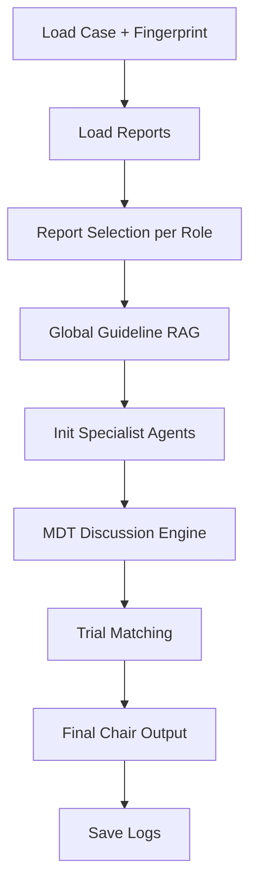

# MDT Discussion Log — 2026-01-17_23-04-34
Generated automatically by MDT Pipeline.


## CASE (structured JSON)

```
{"CASE_CORE":{"ADJUVANT_TREATMENT":{"cycles_or_courses":"Unknown","given":"Unknown","regimens":[]},"BIOMARKERS":{"AFP":"Unknown","CA125":"Unknown","HER2":"ERBB2-","MSI":"MSS","PDL1_CPS":"Unknown","TMB":"TMB-L"},"BRCA1":"Wildtype","BRCA2":"Wildtype","CURRENT_STATUS":"Condition stable","DIAGNOSIS":{"components":["Krukenberg tumor","粘液腺癌","印戒细胞癌分化"],"histology":"粘液腺癌，部分为高-中分化，相当一部分为低分化伴印戒细胞癌分化","laterality":"Left","primary":"Ovarian Krukenberg tumor","site":"Ovary"},"HRD":"Negative","INITIAL_TREATMENT":"Yes","LINE_OF_THERAPY":[],"MAINTENANCE":"Unknown","MAINTENANCE_DETAIL":{"end_date":"Unknown","given":"Unknown","regimens":[],"start_date":"Unknown"},"NEOADJUVANT":"Unknown","PFI_days":"Unknown","PLATINUM_HISTORY":[],"PLATINUM_PFI_CURRENT":"Unknown","PLATINUM_STATUS":"Unknown","PLATINUM_STATUS_CURRENT":"Unknown","RELAPSE":"Yes","RELAPSE_DATE":{"date":"2025-01-20","evidence":"Head MRI showing a metastasis in a cerebral sulcus","type":"Radiologic"},"STAGE":{"stage_basis":"Unknown","stage_system":"Unknown","stage_text":"Unknown"},"SURGERY_DONE":{"date":"2024-12-20","performed":"Yes","procedure":"Laparoscopy converted to laparotomy: uterus with bilateral adnexa resection, omentectomy, para-aortic LN dissection, diaphragm lesion resection, left ureter and peri-tumor resection, left ureteral stent, ureteroneocystostomy"},"VISIT_DATE":"2025-04-03","first_relapse_date":"2025-01-20","last_platinum_end_date":"Unknown"},"LAB_TRENDS":{"labs":[{"analyte":"Cr","history":[{"date":"2025-02-10","flag":"↑","value":"258.9"},{"date":"2025-02-12","flag":"↓","value":"170"},{"date":"Unknown","flag":"↓","value":"110"}],"latest":{"date":"Unknown","flag":"↓","value":"110"},"reference_range":"Unknown","unit":"umol/L"}],"milestones":[{"date":"2024-12-20","description":"Primary cytoreductive surgery with multiple resections","type":"Surgery"},{"date":"2025-02-12","description":"Ureteroscopy and bilateral stent placement (postop Cr decreased)","type":"Other"},{"date":"2025-02-15","description":"Left nephrostomy performed","type":"Other"}]},"MED_ONC":{"current_regimen":{"cycle_info":"Unknown","last_admin_date":"Unknown","name":"Unknown"},"genetic_testing":{"germline":["HRD: Negative","BRCA1: Wildtype","BRCA2: Wildtype"],"somatic":["HRD: Negative","BRCA1: Wildtype","BRCA2: Wildtype"]},"monitoring_points":[],"planned_next_regimen":"Unknown","prior_systemic_therapies":[]},"NUC_MED":{"studies":[]},"PATHOLOGY":{"specimens":[{"components":["粘液腺癌","印戒细胞癌分化"],"date":"2024-12-20","diagnosis":"左附件krukenberg瘤，粘液腺癌，部分为高-中分化，相当一部分为低分化伴印戒细胞癌分化。子宫肌壁全层见癌组织浸润，输尿管见癌组织浸润，膈肌转移结节阳性，送检淋巴结见癌转移。IHC:ER/PR-","grade":"Mixed high-intermediate and low differentiation","ihc":[{"marker":"ER/PR","result":"-"}],"involvement_sites":["Uterine myometrium full-thickness","Ureter","Diaphragm","Lymph nodes"],"laterality":"Left","molecular":[{"result":"TMB-L, MSS, FBXW7 R505C; KNB-, BRCA-, ERBB2-, NTRK-, FGFR2-","test":"Genomic panel"}],"raw_text":"左附件krukenberg瘤，粘液腺癌，部分为高-中分化，相当一部分为低分化伴印戒细胞癌分化。子宫肌壁全层见癌组织浸润，输尿管见癌组织浸润，膈肌转移结节阳性，送检淋巴结见癌转移。IHC:ER/PR-。外院基因检测：TMB-L,MSS，FBXW7 R505C；KNB-,BRCA-,ERBB2-,NTRK -，FGFR2-","sample_type":"Surgical resection","site":"Left adnexa","tumor_size":"Unknown","uncertainty_or_missing":["Primary site unknown; recommended GI evaluation (gastroscopy negative)"]}]},"RADIOLOGY":{"next_imaging_plan":{"modality":"Unknown","timing":"Unknown"},"studies":[{"anatomic_sites":["Abdomen","Pelvis"],"date":"Unknown","findings":["Postoperative PETCT: multiple abdominal and pelvic metastases"],"impression":"Multiple abdominal and pelvic metastases on PETCT","modality":"Other","trend_vs_prior":"Unknown"},{"anatomic_sites":["Brain (cerebral sulcus)"],"date":"2025-01-20","findings":["Lesion in cerebral sulcus consistent with metastasis"],"impression":"Metastasis in cerebral sulcus","modality":"MRI","trend_vs_prior":"Unknown"},{"anatomic_sites":["Chest","Abdomen","Pelvis"],"date":"2025-01-28","findings":["Peritoneal thickening, abdominal and pelvic ascites; small pleural and peritoneal effusions; multiple enlarged lymph nodes"],"impression":"Peritoneal disease with nodal metastases and effusions","modality":"CT","trend_vs_prior":"Unknown"},{"anatomic_sites":["Lower abdomen","Pelvis"],"date":"2025-02-10","findings":["Peritoneal thickening, omental/mesenteric haziness with small nodules, retroperitoneal and pelvic lymphadenopathy, ascites; bilateral ureteral thickening"],"impression":"Widespread peritoneal and nodal disease with ascites","modality":"CT","trend_vs_prior":"Worse"}]},"TIMELINE":{"constraints":{"max_events":30,"min_events":3,"must_include":["first diagnostic imaging or pathology confirmation (if available)"],"ordering_rules":{"prioritize_last_event":true}},"events":[{"date":"2024-12-20","description":"Laparoscopy converted to laparotomy with uterus and bilateral adnexa resection and additional procedures","event_type":"Surgery","key_result":"Specimen: left adnexal Krukenberg tumor, mucinous adenocarcinoma with signet-ring differentiation","regimen_or_test":"Surgery"},{"date":"2025-01-20","description":"Head MRI","event_type":"Imaging","key_result":"Metastasis in cerebral sulcus","regimen_or_test":"MRI"},{"date":"2025-01-28","description":"Abdominal distension, left leg edema, pleural and peritoneal small effusions on ultrasound and CT","event_type":"Other","key_result":"Peritoneal thickening, ascites, multiple enlarged lymph nodes","regimen_or_test":"Chest and abdominal CT/US"},{"date":"2025-02-10","description":"Lower abdomen CT","event_type":"Imaging","key_result":"Peritoneal thickening, omental/mesenteric haziness with nodules, retroperitoneal and pelvic lymphadenopathy, ascites","regimen_or_test":"CT"},{"date":"2025-02-10","description":"Acute kidney injury with elevated creatinine and dizziness/hypertension","event_type":"Lab","key_result":"Cr 258.9 umol/L","regimen_or_test":"Serum creatinine"},{"date":"2025-02-12","description":"Ureteroscopy with bilateral stent placement","event_type":"Other","key_result":"Postop creatinine decreased to 170 umol/L","regimen_or_test":"Ureteroscopy and stent"},{"date":"2025-02-14","description":"Admission to Shanghai hospital for further treatment; episode of oliguria","event_type":"Other","key_result":"Urine output 100 ml","regimen_or_test":"Inpatient care"},{"date":"2025-02-15","description":"Transfer to nephrology and left percutaneous nephrostomy","event_type":"Other","key_result":"Condition stable after procedure","regimen_or_test":"Left nephrostomy"},{"date":"2025-02-17","description":"External genomic testing results reported","event_type":"Other","key_result":"TMB-L, MSS, FBXW7 R505C; KNB-, BRCA-, ERBB2-, NTRK-, FGFR2-","regimen_or_test":"Genomic testing"},{"date":"2025-04-03","description":"Document time of report","event_type":"Other","key_result":"Clinical summary recorded","regimen_or_test":"Document"}]}}
```


## FINAL MDT OUTPUT

```
Final Assessment:
Metastatic Krukenberg-type mucinous/signet carcinoma with brain and extensive peritoneal/ureteral involvement is in a palliative, systemically untreated state, with primary site, fitness for further therapy, and current renal function still uncertain [@HISTOLOGY_AND_IHC|2024-12-20; @IMAGING_TRENDS|2025-02-10; @IMAGING_STUDIES|2025-01-20].

Core Treatment Strategy:
- Conduct structured goals-of-care visit documenting ECOG, symptom burden, and preferences for further active versus comfort-focused care (currently unknown).  
- Obtain updated labs including creatinine/eGFR and urine output assessment, with nephrology/urology review to define ongoing obstruction and treatment feasibility (unknown).  
- Arrange contrast-enhanced CT/MRI abdomen–pelvis and repeat brain MRI to reassess peritoneal, nodal, ureteral, and CNS disease before systemic decisions [@IMAGING_TRENDS|2025-02-10; @IMAGING_STUDIES|2025-01-20].  
- Confirm paraffin block availability and perform extended IHC only if primary-site clarification would realistically modify systemic regimen category (availability/status unknown).  

Change Triggers:
- If ECOG ≤2, renal function acceptable, and patient desires treatment, shift from evaluation-only to offering palliative systemic and CNS-directed therapy.  
- If ECOG ≥3, progressive renal failure, or patient prefers comfort-focused care, pivot from active oncologic interventions to best supportive and hospice care.
```


## PIPELINE FLOW (Mermaid)




## TRACE EVENTS (Structured)

```json
[
  {
    "ts": "2026-01-17T23:01:33.594891",
    "event": "pipeline_start",
    "payload": {
      "visit_time": "2025-04-03 15:38:50.183000",
      "meta_info": "130104196909292146"
    }
  },
  {
    "ts": "2026-01-17T23:01:33.597070",
    "event": "case_fingerprint",
    "payload": {
      "case_fingerprint": "299dd68c3006"
    }
  },
  {
    "ts": "2026-01-17T23:01:33.883607",
    "event": "reports_loaded",
    "payload": {
      "lab_n": 0,
      "img_n": 0,
      "path_n": 0,
      "mut_n": 0,
      "cutoff_dt": "2025-04-04 15:38:50"
    }
  },
  {
    "ts": "2026-01-17T23:01:33.944077",
    "event": "reports_selected",
    "payload": {
      "lab": {
        "chair": [],
        "oncologist": [],
        "radiologist": [],
        "pathologist": [],
        "nuclear": []
      },
      "imaging": {
        "chair": [],
        "oncologist": [],
        "radiologist": [],
        "pathologist": [],
        "nuclear": []
      },
      "pathology": {
        "chair": [],
        "oncologist": [],
        "radiologist": [],
        "pathologist": [],
        "nuclear": []
      },
      "mutation": {
        "chair": [],
        "oncologist": [],
        "radiologist": [],
        "pathologist": [],
        "nuclear": []
      }
    }
  },
  {
    "ts": "2026-01-17T23:01:51.904876",
    "event": "rag_query",
    "payload": {
      "query": "Metastatic mucinous adenocarcinoma with signet-ring (Krukenberg) of unknown GI primary, platinum‑naïve/unknown; peritoneal, nodal, diaphragm, ureter, and brain metastases; BRCA/HRD‑negative, MSS/TMB‑low; significant obstructive nephropathy with AKI and nephrostomy/stents."
    }
  },
  {
    "ts": "2026-01-17T23:01:51.904883",
    "event": "rag_hits",
    "payload": {
      "topk": 5,
      "n": 5
    }
  },
  {
    "ts": "2026-01-17T23:01:56.490675",
    "event": "mdt_discussion_start",
    "payload": {
      "num_rounds": 2,
      "num_turns": 2
    }
  },
  {
    "ts": "2026-01-17T23:04:30.894094",
    "event": "mdt_discussion_end",
    "payload": {
      "merged_chars": 2466
    }
  },
  {
    "ts": "2026-01-17T23:04:30.894923",
    "event": "final_output_start",
    "payload": {}
  },
  {
    "ts": "2026-01-17T23:04:34.816802",
    "event": "final_output_end",
    "payload": {
      "final_output_chars": 1459
    }
  }
]
```


## INITIAL EXPERT OPINIONS


## chair

```
- Widely metastatic Krukenberg-type mucinous/signet tumor with brain and extensive peritoneal disease; prognosis poor, intent palliative systemic and local control.  
- Urgent clarification of prior systemic therapy and platinum exposure (agents, cycles, dates, responses) is essential before choosing next-line regimen.  
- Given brain metastasis, prioritize multidisciplinary neuro-oncology/rad-onc review for local treatment plus CNS-penetrant systemic strategy, if feasible.  
- Renal function remains impaired (Cr ~110–170 µmol/L); nephrology input to optimize drainage, stents/nephrostomy, and chemotherapy dosing constraints.  
- Confirm updated staging imaging, performance status, symptoms, and patient goals/preferences to balance active treatment versus early palliative-focused pathway.
```


## oncologist

```
- Metastatic Krukenberg tumor with brain involvement; systemic therapy now palliative/relapse setting rather than curative.  

- Renal function significantly impaired but improving; precise current creatinine, eGFR, and trend needed to choose/regimen-dose systemic therapy.  

- No prior systemic therapy lines documented; must confirm any previous chemotherapy, dates, toxicities, and response.  

- Biomarkers: HER2-, MSS, low TMB, HRD/BRCA wildtype—targeted/maintenance options limited; PD-L1, CA125, AFP levels unknown/need update.  

- Need up-to-date brain and systemic imaging, performance status, and current medications to judge fitness for combination vs less intensive therapy.
```


## radiologist

```
- Progressive diffuse peritoneal carcinomatosis with omental/mesenteric nodularity and increasing ascites, indicating worsening intra-abdominal disease burden [@IMAGING_STUDIES|2025-02-10].  

- Retroperitoneal and pelvic lymphadenopathy consistent with nodal metastases; appears increased compared with earlier CT description [@IMAGING_STUDIES|2025-02-10].  

- Bilateral ureteral thickening concerning for potential evolving ureteral obstruction; renal collecting system status unknown/needs update [@IMAGING_STUDIES|2025-02-10].  

- Small pleural and peritoneal effusions persist, suggesting ongoing serosal involvement; no large pleural masses described [@IMAGING_STUDIES|2025-01-28].  

- Solitary or limited cerebral sulcal metastasis on brain MRI; no trend or hemorrhage information available/needs update [@IMAGING_STUDIES|2025-01-20].
```


## pathologist

```
- Morphology favors metastatic Krukenberg tumor with mixed mucinous and signet-ring cell features; primary gastrointestinal origin still unconfirmed.  

- Extensive involvement of uterine wall, ureter, diaphragm, and lymph nodes indicates widely metastatic disease burden [@HISTOLOGY_AND_IHC|2024-12-20].  

- ER/PR negative; no HER2 (ERBB2) amplification, MSS, low TMB, HRD/BRCA wildtype limit certain targeted biomarker options [@HISTOLOGY_AND_IHC|2024-12-20].  

- Somatic FBXW7 R505C mutation present; clinical significance here uncertain and should be correlated with GI versus ovarian primary [@HISTOLOGY_AND_IHC|2024-12-20].  

- Missing/needs update: detailed primary-site workup reports (upper/lower endoscopy, breast imaging), CA125/AFP, PD-L1 CPS, full panel IHC profile.
```


## nuclear

```
- Prior PET/CT showed multiple abdominal and pelvic metastases, consistent with disseminated peritoneal and nodal involvement (advanced stage pattern). [@IMAGING_CONTEXT|Unknown]  

- Subsequent imaging demonstrates cerebral sulcal metastasis, indicating distant metastatic spread beyond peritoneal cavity. [@IMAGING_CONTEXT|2025-01-20]  

- Progressive widespread peritoneal and nodal disease with ascites suggests high whole-abdomen tumor burden. [@IMAGING_CONTEXT|2025-01-28] [@IMAGING_CONTEXT|2025-02-10]  

- No current PET/CT report available for this visit; updated whole-body PET/CT report is needed to reassess metabolic disease extent.  

- PET would meaningfully refine staging/recurrence suspicion by clarifying active peritoneal, nodal, and distant (e.g., brain) metabolic disease distribution.
```


## MERGED SUMMARY (Assistant)

```
Key Knowledge:
- Widely metastatic Krukenberg-type mucinous/signet tumor with extensive peritoneal, nodal, and brain disease; prognosis poor, management palliative.
- Pattern favors metastatic GI primary; ER/PR-, HER2-, MSS, low TMB, HRD/BRCA WT → limited targeted/maintenance options.
- Imaging shows progressive peritoneal carcinomatosis, nodal progression, ascites, small serosal effusions, and cerebral sulcal metastasis.
- Renal function impaired with probable obstructive component (bilateral ureteral thickening), constraining systemic therapy dosing/choice.

Controversies:
- Primary site (GI vs other) remains unproven; extended IHC may refine origin and influence systemic strategy.
- Benefit of PET/CT in a clearly palliative, widely metastatic setting versus CT/MRI alone, and whether results would change management.
- Optimal CNS approach (local vs combined with CNS-penetrant systemic therapy) pending updated imaging and specialist review.

Missing Info:
- Full prior systemic therapy details (agents, cycles, dates, response, toxicities, platinum exposure).
- Current renal function (creatinine, eGFR, trend), degree of obstruction, and urology/nephrology assessment.
- Updated brain MRI and systemic imaging (including contrast CT/MRI for ureteral/obstruction assessment), ECOG PS, symptoms, and medications.
- Primary-site workup: availability of tissue/blocks for extended IHC (CDX2, SATB2, CK7/20, PAX8, MUC), plus endoscopy/breast imaging, CA125, AFP, PD-L1 CPS.
- Decision on and, if chosen, results of any whole-body PET/CT with full head coverage and MRI coregistration.

Working Plan:
- Verify prior systemic therapy history and update labs (especially renal) and performance status to frame feasible palliative systemic options.
- Confirm tissue/block availability and request extended IHC to better define primary site if results would influence systemic decision-making.
- Arrange neuro-oncology/radiation MDT review for brain metastasis and consider CNS-penetrant systemic strategy where appropriate.
- Obtain nephrology/urology input on obstructive uropathy, drainage optimization, and chemotherapy dosing limits; repeat contrast-enhanced CT/MRI to reassess obstruction.
- Decide if PET/CT would meaningfully alter management before ordering; if done, ensure full head coverage and fusion with latest brain MRI.
- Proceed with structured goals-of-care and palliative planning discussions aligned with prognosis and patient preferences.
```


## INTERACTION LOG (Round × Turn)

### Round 1

#### Turn 1
- **chair → oncologist:** Before committing to any systemic regimen, we must first document exact prior chemotherapy exposure, current ECOG, and up-to-date renal function/eGFR, given recent obstructive AKI and nephrostomy/stents.
- **chair → radiologist:** Please propose an imaging plan (timing and modalities) to reassess brain metastasis and systemic disease, considering prior CT/MRI and potential PET/CT utility.
- **chair → pathologist:** Can you clarify, based on existing histology/IHC and genomics, how strongly a GI primary is supported and what additional stains/tests would most efficiently refine the primary-site diagnosis?
- **chair → nuclear:** From your perspective, would a whole-body PET/CT meaningfully change management in this patient with known widespread peritoneal and brain metastases, or should we prioritize conventional CT/MRI only?
- **oncologist → chair:** Systemic regimen choice is currently unsafe to finalize because prior systemic therapies, detailed renal function, and ECOG status are all undocumented and critical for dosing/feasibility.
- **radiologist → chair:** Key staging images are over 7 weeks old; updated cross-sectional and brain imaging are needed to guide current palliative planning.
- **radiologist → oncologist:** Before further systemic decisions, updated CT/MRI (chest/abdomen/pelvis and brain) is critical to reassess obstruction, peritoneal burden, and CNS disease extent.
- **pathologist → chair:** Pathology workup for primary site is incomplete; please confirm whether additional tissue or outside blocks are available for extended IHC to refine primary assignment.
- **pathologist → oncologist:** Primary remains unproven (GI vs other); extended IHC panel (CDX2, SATB2, CK7/20, PAX8, MUC markers) on available tissue would better define origin and may influence systemic choices.
- **nuclear → oncologist:** No recent PET/CT is available; if prognosis and goals permit, a single whole-body PET/CT could clarify current metabolic burden versus CT alone, especially extra-abdominal disease and brain involvement correlation.
- **nuclear → radiologist:** If PET/CT is pursued, please ensure brain-included acquisition and tight coregistration with latest MRI to assess metabolic activity of sulcal lesions and any additional CNS foci.

#### Turn 2
- **chair → oncologist:** Before ordering PET/CT, we should clarify how its results would practically alter systemic or CNS management in a patient already deemed palliative with extensive disease.
- **chair → pathologist:** Please confirm availability of existing tissue/blocks and feasibility of extended IHC now, as primary-site assignment may materially affect systemic strategy discussions.
- **radiologist → oncologist:** Given prior CT evidence of bilateral ureteral thickening and worsening peritoneal disease, updated contrast-enhanced CT (or MRI) is important to reassess obstruction risk and guide palliative interventions.
- **radiologist → nuclear:** If PET/CT is obtained, please include full head coverage and ensure fusion with the most recent brain MRI for accurate CNS assessment.

### Round 2

#### Turn 1

#### Turn 2


## FINAL REFINED PLANS (per Round)

### Round 1


## chair

```
- Maintain palliative intent, contingent on updated ECOG, symptom burden, and patient goals (active treatment vs comfort-focused pathway; details unknown).  
- Clarify prior systemic therapy and platinum exposure (agents, cycles, dates, responses, toxicities all unknown) before proposing further systemic options.  
- Obtain updated renal function (current creatinine, eGFR, obstruction status, urology/nephrology assessment unknown) to define feasibility and dosing of systemic therapy.  
- Coordinate extended IHC on available tissue (block availability and panel completion unknown) to better assign primary site and inform regimen choice.  
- Re-stage with updated brain MRI and contrast CT/MRI abdomen–pelvis (±PET/CT only if clearly management-changing), then review in MDT.
```


## oncologist

```
- Confirm prior systemic therapies, toxicities, and responses; without this, selecting appropriate palliative systemic options remains unsafe (unknown/needs update).  

- Obtain current creatinine, eGFR, and updated cross‑sectional imaging of abdomen/pelvis to reassess obstruction and systemic dosing feasibility (unknown/needs update).  

- Arrange updated brain MRI and neuro-oncology/radiation review to determine local versus combined CNS-directed and systemic palliative strategy (unknown/needs update).  

- Proceed with extended IHC on available tissue, if blocks accessible, to better define primary site and guide regimen category (unknown/needs update).  

- Clarify ECOG PS, symptom burden, goals of care, and whether PET/CT would change management before ordering further staging (unknown/needs update).
```


## radiologist

```
- Obtain updated contrast-enhanced CT or MRI abdomen/pelvis to reassess peritoneal burden, nodal disease, ascites, and ureteral obstruction risk [@IMAGING_STUDIES|2025-02-10].  

- Repeat brain MRI to evaluate current cerebral sulcal metastasis extent, edema, and hemorrhage status for CNS-directed planning [@IMAGING_STUDIES|2025-01-20].  

- If PET/CT is pursued, ensure whole-body coverage including brain and co-register with latest MRI to assess CNS/metabolic burden [@IMAGING_STUDIES|Unknown].  

- Correlate new imaging with updated renal function and urology/nephrology input to guide palliative decompression and imaging contrast use (labs unknown).  

- Reassess overall disease trend on new imaging to inform prognosis discussions and scope of palliative local versus systemic interventions [@IMAGING_TRENDS|2025-02-10].
```


## pathologist

```
- Confirm if existing paraffin blocks/slides are available and suitable for extended IHC to refine GI vs ovarian primary (unknown/needs update).  

- If tissue available, perform targeted IHC panel (CK7/CK20, CDX2, SATB2, PAX8, MUCs) to better assign primary (unknown/needs update).  

- Maintain current diagnosis of metastatic Krukenberg-type mucinous/signet carcinoma with extensive peritoneal, nodal, uterine, ureteral, and diaphragmatic involvement [@HISTOLOGY_AND_IHC|2024-12-20].  

- Note biomarker profile: ER/PR negative, HER2-/ERBB2-, MSS, low TMB, BRCA/HRD wildtype, FBXW7 R505C mutation [@HISTOLOGY_AND_IHC|2024-12-20].  

- No pathology role regarding PET/CT or CNS imaging; defer imaging decisions to radiology/nuclear medicine and oncology teams.
```


## nuclear

```
- No recent PET/CT is available; its value should be weighed against limited likelihood of management change in this palliative setting.  

- If pursued, a single whole-body PET/CT with full head coverage could better map active extra-abdominal and CNS disease; current extent otherwise unknown/needs update.  

- PET/CT may help distinguish metabolically active peritoneal/nodal deposits from treated or non-malignant changes, but impact on systemic choices remains uncertain.  

- PET/CT would not define the primary site; that depends on extended IHC and GI/breast workup (status unknown/needs update).  

- Coordination with updated brain MRI and contrast-enhanced CT/MRI abdomen–pelvis is essential for accurate fusion and obstruction/CNS risk assessment; timing unknown.
```

### Round 2


## chair

```
- Maintain palliative intent and conduct goals-of-care discussion, aligning active treatment aggressiveness with prognosis and patient preferences (current symptoms/ECOG unknown).  
- Clarify prior systemic therapies and platinum exposure (all details unknown) and update labs, especially renal function and eGFR (current values unknown).  
- Confirm block availability and perform extended IHC to better define primary site, but only if results will alter systemic strategy (status unknown).  
- Obtain updated brain MRI and contrast-enhanced CT/MRI abdomen–pelvis to reassess CNS disease and obstruction, then review with neuro-oncology/urology.  
- Consider PET/CT only if MDT agrees results could meaningfully change palliative systemic or local interventions; otherwise rely on targeted CT/MRI restaging.
```


## oncologist

```
- Clarify prior systemic therapies, responses, and toxicities; without this, it is unsafe to select further palliative regimens (unknown/needs update).  

- Obtain current creatinine, eGFR, and contrast-enhanced abdominal/pelvic imaging to reassess obstruction and systemic dosing constraints (unknown/needs update).  

- Confirm tissue/block availability and perform extended IHC if feasible, only if primary-site clarification would alter systemic strategy (unknown/needs update).  

- Arrange updated brain MRI and neuro-oncology/radiation review to define local versus combined CNS‑directed and systemic approach (unknown/needs update).  

- Document ECOG PS, symptom burden, goals of care, and decide if PET/CT would change management before ordering further staging (unknown/needs update).
```


## radiologist

```
- Repeat contrast-enhanced CT or MRI abdomen/pelvis to reassess peritoneal disease, nodal burden, ascites, and ureteral obstruction risk [@IMAGING_STUDIES|2025-02-10].  

- Obtain updated brain MRI to define current extent of cerebral sulcal metastasis, edema, and hemorrhage risk [@IMAGING_STUDIES|2025-01-20].  

- Consider PET/CT only if results would alter management; if done, include whole head and coregister with MRI [@IMAGING_STUDIES|Unknown].  

- Integrate new imaging with current renal function and urology/nephrology input to guide contrast use and local decompressive interventions (labs unknown).  

- Use updated imaging trends to support prognosis communication and selection of symptom-directed palliative procedures versus further systemic therapy [@IMAGING_TRENDS|2025-02-10].
```


## pathologist

```
- Maintain diagnosis: metastatic Krukenberg-type mucinous carcinoma with signet-ring features involving adnexa, uterus, ureter, diaphragm, nodes [@HISTOLOGY_AND_IHC|2024-12-20].  

- Biomarkers: ER/PR-, HER2-/ERBB2-, MSS, TMB-L, BRCA/HRD wildtype, FBXW7 R505C mutation [@HISTOLOGY_AND_IHC|2024-12-20].  

- Primary site remains unassigned (GI vs other); morphology alone insufficient for definitive origin [@HISTOLOGY_AND_IHC|2024-12-20].  

- Clarify availability of existing blocks/slides for extended IHC (CK7/20, CDX2, SATB2, PAX8, MUC panel) to refine origin (unknown/needs update).  

- No pathology-specific input on PET/CT or CNS imaging; defer to radiology/nuclear and oncology for those decisions.
```


## nuclear

```
- No recent PET/CT available; current metabolic disease extent and activity remain unknown/needs update.  

- In this extensively metastatic, palliative setting, PET/CT should be ordered only if results are expected to change management.  

- If performed, whole-body PET/CT with full head coverage and MRI fusion could better delineate active CNS and extra-abdominal disease.  

- PET/CT may help differentiate active peritoneal/nodal disease from treated or non-malignant changes, but staging is already clearly metastatic.  

- PET/CT will not clarify primary origin; this depends on extended IHC and other site-directed investigations (status unknown/needs update).
```


## RAW AGENT LOGS

### chair
- **User:** Give INITIAL opinion (use ONLY your system-provided patient facts).
Return up to 5 bullets, each ≤20 words.
If key data missing, say exactly what needs updating.
  
  **Assistant:** - Widely metastatic Krukenberg-type mucinous/signet tumor with brain and extensive peritoneal disease; prognosis poor, intent palliative systemic and local control.  
- Urgent clarification of prior systemic therapy and platinum exposure (agents, cycles, dates, responses) is essential before choosing next-line regimen.  
- Given brain metastasis, prioritize multidisciplinary neuro-oncology/rad-onc review for local treatment plus CNS-penetrant systemic strategy, if feasible.  
- Renal function remains impaired (Cr ~110–170 µmol/L); nephrology input to optimize drainage, stents/nephrostomy, and chemotherapy dosing constraints.  
- Confirm updated staging imaging, performance status, symptoms, and patient goals/preferences to balance active treatment versus early palliative-focused pathway.
  
  *(2026-01-17T23:01:59.069182)*

- **User:** ROLE: chair. VISIT: 2025-04-03 15:38:50.183000
Default is NOT to speak. Speak ONLY if: conflict | safety | missing-critical | new-critical.

CONTEXT (latest):
Key Knowledge:
- Widely metastatic Krukenberg-type mucinous/signet tumor with peritoneal, nodal, and brain involvement; prognosis poor, intent palliative.
- Pattern supports metastatic GI primary; ER/PR-, HER2-, MSS, low TMB, HRD/BRCA WT → limited targeted options.
- Imaging shows progressive peritoneal carcinomatosis, nodal disease, ascites, small serosal effusions, and cerebral sulcal metastasis.
- Renal function impaired with probable obstructive component (bilateral ureteral thickening), impacting systemic therapy feasibility/dosing.

Controversies:
- Primary site not definitively proven (GI vs other) due to incomplete workup.
- Systemic regimen choice uncertain without full prior treatment history, renal status, and performance status.
- Added value/timing of PET/CT versus current CT/MRI.
- Optimal CNS approach (local vs combination with CNS-penetrant systemic therapy) pending specialist input and updated imaging.

Missing Info:
- Detailed prior systemic therapy (agents, cycles, dates, response, toxicities, platinum exposure).
- Current renal function (creatinine, eGFR, trend), degree of obstruction, and urology/nephrology assessment.
- Updated brain MRI, systemic staging, ECOG PS, symptom burden, and medication list.
- Full primary-site workup (endoscopy, breast imaging), CA125, AFP, PD-L1 CPS, and complete IHC profile.
- Recent whole-body PET/CT (if deemed clinically useful).

Working Plan:
- Confirm prior systemic therapy and update labs (especially renal) and performance status to define palliative systemic options.
- Arrange neuro-oncology/radiation oncology MDT review for brain metastasis and consider CNS-penetrant systemic strategy.
- Obtain nephrology/urology input on obstructive uropathy, drainage optimization, and chemotherapy dosing constraints.
- Complete missing diagnostic workup (primary-site evaluation, biomarkers, updated imaging ± PET/CT).
- Conduct goals-of-care discussion to align further active treatment versus earlier palliative-focused pathway with patient preferences.

Allowed targets: [oncologist,radiologist,pathologist,nuclear]
Return ONE-LINE JSON only:{"speak":"yes/no","messages":[{"target":"<role>","message":"<1-2 sentences>","why":"conflict|safety|missing|new"}]}
  
  **Assistant:** {"speak":"yes","messages":[{"target":"oncologist","message":"Before committing to any systemic regimen, we must first document exact prior chemotherapy exposure, current ECOG, and up-to-date renal function/eGFR, given recent obstructive AKI and nephrostomy/stents.","why":"missing"},{"target":"radiologist","message":"Please propose an imaging plan (timing and modalities) to reassess brain metastasis and systemic disease, considering prior CT/MRI and potential PET/CT utility.","why":"missing"},{"target":"pathologist","message":"Can you clarify, based on existing histology/IHC and genomics, how strongly a GI primary is supported and what additional stains/tests would most efficiently refine the primary-site diagnosis?","why":"missing"},{"target":"nuclear","message":"From your perspective, would a whole-body PET/CT meaningfully change management in this patient with known widespread peritoneal and brain metastases, or should we prioritize conventional CT/MRI only?","why":"missing"}]}
  
  *(2026-01-17T23:02:20.970698)*

- **User:** ROLE: chair. VISIT: 2025-04-03 15:38:50.183000
Default is NOT to speak. Speak ONLY if: conflict | safety | missing-critical | new-critical.

CONTEXT (latest):
Key Knowledge:
- Widely metastatic Krukenberg-type mucinous/signet tumor with peritoneal, nodal, and brain involvement; prognosis poor, intent palliative.
- Pattern supports metastatic GI primary; ER/PR-, HER2-, MSS, low TMB, HRD/BRCA WT → limited targeted options.
- Imaging shows progressive peritoneal carcinomatosis, nodal disease, ascites, small serosal effusions, and cerebral sulcal metastasis.
- Renal function impaired with probable obstructive component (bilateral ureteral thickening), impacting systemic therapy feasibility/dosing.

Controversies:
- Primary site not definitively proven (GI vs other) due to incomplete workup.
- Systemic regimen choice uncertain without full prior treatment history, renal status, and performance status.
- Added value/timing of PET/CT versus current CT/MRI.
- Optimal CNS approach (local vs combination with CNS-penetrant systemic therapy) pending specialist input and updated imaging.

Missing Info:
- Detailed prior systemic therapy (agents, cycles, dates, response, toxicities, platinum exposure).
- Current renal function (creatinine, eGFR, trend), degree of obstruction, and urology/nephrology assessment.
- Updated brain MRI, systemic staging, ECOG PS, symptom burden, and medication list.
- Full primary-site workup (endoscopy, breast imaging), CA125, AFP, PD-L1 CPS, and complete IHC profile.
- Recent whole-body PET/CT (if deemed clinically useful).

Working Plan:
- Confirm prior systemic therapy and update labs (especially renal) and performance status to define palliative systemic options.
- Arrange neuro-oncology/radiation oncology MDT review for brain metastasis and consider CNS-penetrant systemic strategy.
- Obtain nephrology/urology input on obstructive uropathy, drainage optimization, and chemotherapy dosing constraints.
- Complete missing diagnostic workup (primary-site evaluation, biomarkers, updated imaging ± PET/CT).
- Conduct goals-of-care discussion to align further active treatment versus earlier palliative-focused pathway with patient preferences.
[R1T1 DELTA]  palliative planning. | pathologist->oncologist(missing): Primary remains unproven (GI vs other); extended IHC panel (CDX2, SATB2, CK7/20, PAX8, MUC markers) on available tissue would better define origin and may influence systemic choices. | pathologist->chair(missing): Pathology workup for primary site is incomplete; please confirm whether additional tissue or outside blocks are available for extended IHC to refine primary assignment. | nuclear->oncologist(missing): No recent PET/CT is available; if prognosis and goals permit, a single whole-body PET/CT could clarify current metabolic burden versus CT alone, especially extra-abdominal disease and brain involvement correlation. | nuclear->radiologist(missing): If PET/CT is pursued, please ensure brain-included acquisition and tight coregistration with latest MRI to assess metabolic activity of sulcal lesions and any additional CNS foci.

Allowed targets: [oncologist,radiologist,pathologist,nuclear]
Return ONE-LINE JSON only:{"speak":"yes/no","messages":[{"target":"<role>","message":"<1-2 sentences>","why":"conflict|safety|missing|new"}]}
  
  **Assistant:** {"speak":"yes","messages":[{"target":"pathologist","message":"Please confirm availability of existing tissue/blocks and feasibility of extended IHC now, as primary-site assignment may materially affect systemic strategy discussions.","why":"missing"},{"target":"oncologist","message":"Before ordering PET/CT, we should clarify how its results would practically alter systemic or CNS management in a patient already deemed palliative with extensive disease.","why":"safety"}]}
  
  *(2026-01-17T23:02:29.475120)*

- **User:** Given MDT context:
Key Knowledge:
- Widely metastatic Krukenberg-type mucinous/signet tumor with peritoneal, nodal, and brain involvement; prognosis poor, intent palliative.
- Pattern supports metastatic GI primary; ER/PR-, HER2-, MSS, low TMB, HRD/BRCA WT → limited targeted options.
- Imaging shows progressive peritoneal carcinomatosis, nodal disease, ascites, small serosal effusions, and cerebral sulcal metastasis.
- Renal function impaired with probable obstructive component (bilateral ureteral thickening), impacting systemic therapy feasibility/dosing.

Controversies:
- Primary site not definitively proven (GI vs other) due to incomplete workup.
- Systemic regimen choice uncertain without full prior treatment history, renal status, and performance status.
- Added value/timing of PET/CT versus current CT/MRI.
- Optimal CNS approach (local vs combination with CNS-penetrant systemic therapy) pending specialist input and updated imaging.

Missing Info:
- Detailed prior systemic therapy (agents, cycles, dates, response, toxicities, platinum exposure).
- Current renal function (creatinine, eGFR, trend), degree of obstruction, and urology/nephrology assessment.
- Updated brain MRI, systemic staging, ECOG PS, symptom burden, and medication list.
- Full primary-site workup (endoscopy, breast imaging), CA125, AFP, PD-L1 CPS, and complete IHC profile.
- Recent whole-body PET/CT (if deemed clinically useful).

Working Plan:
- Confirm prior systemic therapy and update labs (especially renal) and performance status to define palliative systemic options.
- Arrange neuro-oncology/radiation oncology MDT review for brain metastasis and consider CNS-penetrant systemic strategy.
- Obtain nephrology/urology input on obstructive uropathy, drainage optimization, and chemotherapy dosing constraints.
- Complete missing diagnostic workup (primary-site evaluation, biomarkers, updated imaging ± PET/CT).
- Conduct goals-of-care discussion to align further active treatment versus earlier palliative-focused pathway with patient preferences.
[R1T1 DELTA]  palliative planning. | pathologist->oncologist(missing): Primary remains unproven (GI vs other); extended IHC panel (CDX2, SATB2, CK7/20, PAX8, MUC markers) on available tissue would better define origin and may influence systemic choices. | pathologist->chair(missing): Pathology workup for primary site is incomplete; please confirm whether additional tissue or outside blocks are available for extended IHC to refine primary assignment. | nuclear->oncologist(missing): No recent PET/CT is available; if prognosis and goals permit, a single whole-body PET/CT could clarify current metabolic burden versus CT alone, especially extra-abdominal disease and brain involvement correlation. | nuclear->radiologist(missing): If PET/CT is pursued, please ensure brain-included acquisition and tight coregistration with latest MRI to assess metabolic activity of sulcal lesions and any additional CNS foci.
[R1T2 DELTA] chair->pathologist(missing): Please confirm availability of existing tissue/blocks and feasibility of extended IHC now, as primary-site assignment may materially affect systemic strategy discussions. | chair->oncologist(safety): Before ordering PET/CT, we should clarify how its results would practically alter systemic or CNS management in a patient already deemed palliative with extensive disease. | radiologist->nuclear(missing): If PET/CT is obtained, please include full head coverage and ensure fusion with the most recent brain MRI for accurate CNS assessment. | radiologist->oncologist(missing): Given prior CT evidence of bilateral ureteral thickening and worsening peritoneal disease, updated contrast-enhanced CT (or MRI) is important to reassess obstruction risk and guide palliative interventions.

Provide FINAL refined plan.
Up to 5 bullets, each ≤20 words.
Any factual claim must include [@report_id|date] or say unknown.
  
  **Assistant:** - Maintain palliative intent, contingent on updated ECOG, symptom burden, and patient goals (active treatment vs comfort-focused pathway; details unknown).  
- Clarify prior systemic therapy and platinum exposure (agents, cycles, dates, responses, toxicities all unknown) before proposing further systemic options.  
- Obtain updated renal function (current creatinine, eGFR, obstruction status, urology/nephrology assessment unknown) to define feasibility and dosing of systemic therapy.  
- Coordinate extended IHC on available tissue (block availability and panel completion unknown) to better assign primary site and inform regimen choice.  
- Re-stage with updated brain MRI and contrast CT/MRI abdomen–pelvis (±PET/CT only if clearly management-changing), then review in MDT.
  
  *(2026-01-17T23:02:37.197322)*

- **User:** ROLE: chair. VISIT: 2025-04-03 15:38:50.183000
Default is NOT to speak. Speak ONLY if: conflict | safety | missing-critical | new-critical.

CONTEXT (latest):
Key Knowledge:
- Widely metastatic Krukenberg-type mucinous/signet tumor with extensive peritoneal, nodal, and brain disease; prognosis poor, management palliative.
- Pattern favors metastatic GI primary; ER/PR-, HER2-, MSS, low TMB, HRD/BRCA WT → limited targeted/maintenance options.
- Imaging shows progressive peritoneal carcinomatosis, nodal progression, ascites, small serosal effusions, and cerebral sulcal metastasis.
- Renal function impaired with probable obstructive component (bilateral ureteral thickening), constraining systemic therapy dosing/choice.

Controversies:
- Primary site (GI vs other) remains unproven; extended IHC may refine origin and influence systemic strategy.
- Benefit of PET/CT in a clearly palliative, widely metastatic setting versus CT/MRI alone, and whether results would change management.
- Optimal CNS approach (local vs combined with CNS-penetrant systemic therapy) pending updated imaging and specialist review.

Missing Info:
- Full prior systemic therapy details (agents, cycles, dates, response, toxicities, platinum exposure).
- Current renal function (creatinine, eGFR, trend), degree of obstruction, and urology/nephrology assessment.
- Updated brain MRI and systemic imaging (including contrast CT/MRI for ureteral/obstruction assessment), ECOG PS, symptoms, and medications.
- Primary-site workup: availability of tissue/blocks for extended IHC (CDX2, SATB2, CK7/20, PAX8, MUC), plus endoscopy/breast imaging, CA125, AFP, PD-L1 CPS.
- Decision on and, if chosen, results of any whole-body PET/CT with full head coverage and MRI coregistration.

Working Plan:
- Verify prior systemic therapy history and update labs (especially renal) and performance status to frame feasible palliative systemic options.
- Confirm tissue/block availability and request extended IHC to better define primary site if results would influence systemic decision-making.
- Arrange neuro-oncology/radiation MDT review for brain metastasis and consider CNS-penetrant systemic strategy where appropriate.
- Obtain nephrology/urology input on obstructive uropathy, drainage optimization, and chemotherapy dosing limits; repeat contrast-enhanced CT/MRI to reassess obstruction.
- Decide if PET/CT would meaningfully alter management before ordering; if done, ensure full head coverage and fusion with latest brain MRI.
- Proceed with structured goals-of-care and palliative planning discussions aligned with prognosis and patient preferences.

Allowed targets: [oncologist,radiologist,pathologist,nuclear]
Return ONE-LINE JSON only:{"speak":"yes/no","messages":[{"target":"<role>","message":"<1-2 sentences>","why":"conflict|safety|missing|new"}]}
  
  **Assistant:** {"speak":"no","messages":[]}
  
  *(2026-01-17T23:03:27.727909)*

- **User:** Given MDT context:
Key Knowledge:
- Widely metastatic Krukenberg-type mucinous/signet tumor with extensive peritoneal, nodal, and brain disease; prognosis poor, management palliative.
- Pattern favors metastatic GI primary; ER/PR-, HER2-, MSS, low TMB, HRD/BRCA WT → limited targeted/maintenance options.
- Imaging shows progressive peritoneal carcinomatosis, nodal progression, ascites, small serosal effusions, and cerebral sulcal metastasis.
- Renal function impaired with probable obstructive component (bilateral ureteral thickening), constraining systemic therapy dosing/choice.

Controversies:
- Primary site (GI vs other) remains unproven; extended IHC may refine origin and influence systemic strategy.
- Benefit of PET/CT in a clearly palliative, widely metastatic setting versus CT/MRI alone, and whether results would change management.
- Optimal CNS approach (local vs combined with CNS-penetrant systemic therapy) pending updated imaging and specialist review.

Missing Info:
- Full prior systemic therapy details (agents, cycles, dates, response, toxicities, platinum exposure).
- Current renal function (creatinine, eGFR, trend), degree of obstruction, and urology/nephrology assessment.
- Updated brain MRI and systemic imaging (including contrast CT/MRI for ureteral/obstruction assessment), ECOG PS, symptoms, and medications.
- Primary-site workup: availability of tissue/blocks for extended IHC (CDX2, SATB2, CK7/20, PAX8, MUC), plus endoscopy/breast imaging, CA125, AFP, PD-L1 CPS.
- Decision on and, if chosen, results of any whole-body PET/CT with full head coverage and MRI coregistration.

Working Plan:
- Verify prior systemic therapy history and update labs (especially renal) and performance status to frame feasible palliative systemic options.
- Confirm tissue/block availability and request extended IHC to better define primary site if results would influence systemic decision-making.
- Arrange neuro-oncology/radiation MDT review for brain metastasis and consider CNS-penetrant systemic strategy where appropriate.
- Obtain nephrology/urology input on obstructive uropathy, drainage optimization, and chemotherapy dosing limits; repeat contrast-enhanced CT/MRI to reassess obstruction.
- Decide if PET/CT would meaningfully alter management before ordering; if done, ensure full head coverage and fusion with latest brain MRI.
- Proceed with structured goals-of-care and palliative planning discussions aligned with prognosis and patient preferences.

Provide FINAL refined plan.
Up to 5 bullets, each ≤20 words.
Any factual claim must include [@report_id|date] or say unknown.
  
  **Assistant:** - Maintain palliative intent and conduct goals-of-care discussion, aligning active treatment aggressiveness with prognosis and patient preferences (current symptoms/ECOG unknown).  
- Clarify prior systemic therapies and platinum exposure (all details unknown) and update labs, especially renal function and eGFR (current values unknown).  
- Confirm block availability and perform extended IHC to better define primary site, but only if results will alter systemic strategy (status unknown).  
- Obtain updated brain MRI and contrast-enhanced CT/MRI abdomen–pelvis to reassess CNS disease and obstruction, then review with neuro-oncology/urology.  
- Consider PET/CT only if MDT agrees results could meaningfully change palliative systemic or local interventions; otherwise rely on targeted CT/MRI restaging.
  
  *(2026-01-17T23:04:08.708839)*

- **User:** 
As the MDT chair for gynecologic oncology, you are seeing the patient at OUTPATIENT TIME: 2025-04-03 15:38:50.183000.
Based on PATIENT FACTS + MDT discussion + FINAL refined plans from all experts, determine the CURRENT best management plan for this visit.

STRICT RULES:
- Any factual statement about past tests/treatments must include [@report_id|date] or say unknown.
- If experts disagree, pick the safest plan and state the key uncertainty.

# FINAL REFINED PLANS (All experts, last round)
{
  "Round 1": {
    "chair": "- Maintain palliative intent, contingent on updated ECOG, symptom burden, and patient goals (active treatment vs comfort-focused pathway; details unknown).  \n- Clarify prior systemic therapy and platinum exposure (agents, cycles, dates, responses, toxicities all unknown) before proposing further systemic options.  \n- Obtain updated renal function (current creatinine, eGFR, obstruction status, urology/nephrology assessment unknown) to define feasibility and dosing of systemic therapy.  \n- Coordinate extended IHC on available tissue (block availability and panel completion unknown) to better assign primary site and inform regimen choice.  \n- Re-stage with updated brain MRI and contrast CT/MRI abdomen–pelvis (±PET/CT only if clearly management-changing), then review in MDT.",
    "oncologist": "- Confirm prior systemic therapies, toxicities, and responses; without this, selecting appropriate palliative systemic options remains unsafe (unknown/needs update).  \n\n- Obtain current creatinine, eGFR, and updated cross‑sectional imaging of abdomen/pelvis to reassess obstruction and systemic dosing feasibility (unknown/needs update).  \n\n- Arrange updated brain MRI and neuro-oncology/radiation review to determine local versus combined CNS-directed and systemic palliative strategy (unknown/needs update).  \n\n- Proceed with extended IHC on available tissue, if blocks accessible, to better define primary site and guide regimen category (unknown/needs update).  \n\n- Clarify ECOG PS, symptom burden, goals of care, and whether PET/CT would change management before ordering further staging (unknown/needs update).",
    "radiologist": "- Obtain updated contrast-enhanced CT or MRI abdomen/pelvis to reassess peritoneal burden, nodal disease, ascites, and ureteral obstruction risk [@IMAGING_STUDIES|2025-02-10].  \n\n- Repeat brain MRI to evaluate current cerebral sulcal metastasis extent, edema, and hemorrhage status for CNS-directed planning [@IMAGING_STUDIES|2025-01-20].  \n\n- If PET/CT is pursued, ensure whole-body coverage including brain and co-register with latest MRI to assess CNS/metabolic burden [@IMAGING_STUDIES|Unknown].  \n\n- Correlate new imaging with updated renal function and urology/nephrology input to guide palliative decompression and imaging contrast use (labs unknown).  \n\n- Reassess overall disease trend on new imaging to inform prognosis discussions and scope of palliative local versus systemic interventions [@IMAGING_TRENDS|2025-02-10].",
    "pathologist": "- Confirm if existing paraffin blocks/slides are available and suitable for extended IHC to refine GI vs ovarian primary (unknown/needs update).  \n\n- If tissue available, perform targeted IHC panel (CK7/CK20, CDX2, SATB2, PAX8, MUCs) to better assign primary (unknown/needs update).  \n\n- Maintain current diagnosis of metastatic Krukenberg-type mucinous/signet carcinoma with extensive peritoneal, nodal, uterine, ureteral, and diaphragmatic involvement [@HISTOLOGY_AND_IHC|2024-12-20].  \n\n- Note biomarker profile: ER/PR negative, HER2-/ERBB2-, MSS, low TMB, BRCA/HRD wildtype, FBXW7 R505C mutation [@HISTOLOGY_AND_IHC|2024-12-20].  \n\n- No pathology role regarding PET/CT or CNS imaging; defer imaging decisions to radiology/nuclear medicine and oncology teams.",
    "nuclear": "- No recent PET/CT is available; its value should be weighed against limited likelihood of management change in this palliative setting.  \n\n- If pursued, a single whole-body PET/CT with full head coverage could better map active extra-abdominal and CNS disease; current extent otherwise unknown/needs update.  \n\n- PET/CT may help distinguish metabolically active peritoneal/nodal deposits from treated or non-malignant changes, but impact on systemic choices remains uncertain.  \n\n- PET/CT would not define the primary site; that depends on extended IHC and GI/breast workup (status unknown/needs update).  \n\n- Coordination with updated brain MRI and contrast-enhanced CT/MRI abdomen–pelvis is essential for accurate fusion and obstruction/CNS risk assessment; timing unknown."
  },
  "Round 2": {
    "chair": "- Maintain palliative intent and conduct goals-of-care discussion, aligning active treatment aggressiveness with prognosis and patient preferences (current symptoms/ECOG unknown).  \n- Clarify prior systemic therapies and platinum exposure (all details unknown) and update labs, especially renal function and eGFR (current values unknown).  \n- Confirm block availability and perform extended IHC to better define primary site, but only if results will alter systemic strategy (status unknown).  \n- Obtain updated brain MRI and contrast-enhanced CT/MRI abdomen–pelvis to reassess CNS disease and obstruction, then review with neuro-oncology/urology.  \n- Consider PET/CT only if MDT agrees results could meaningfully change palliative systemic or local interventions; otherwise rely on targeted CT/MRI restaging.",
    "oncologist": "- Clarify prior systemic therapies, responses, and toxicities; without this, it is unsafe to select further palliative regimens (unknown/needs update).  \n\n- Obtain current creatinine, eGFR, and contrast-enhanced abdominal/pelvic imaging to reassess obstruction and systemic dosing constraints (unknown/needs update).  \n\n- Confirm tissue/block availability and perform extended IHC if feasible, only if primary-site clarification would alter systemic strategy (unknown/needs update).  \n\n- Arrange updated brain MRI and neuro-oncology/radiation review to define local versus combined CNS‑directed and systemic approach (unknown/needs update).  \n\n- Document ECOG PS, symptom burden, goals of care, and decide if PET/CT would change management before ordering further staging (unknown/needs update).",
    "radiologist": "- Repeat contrast-enhanced CT or MRI abdomen/pelvis to reassess peritoneal disease, nodal burden, ascites, and ureteral obstruction risk [@IMAGING_STUDIES|2025-02-10].  \n\n- Obtain updated brain MRI to define current extent of cerebral sulcal metastasis, edema, and hemorrhage risk [@IMAGING_STUDIES|2025-01-20].  \n\n- Consider PET/CT only if results would alter management; if done, include whole head and coregister with MRI [@IMAGING_STUDIES|Unknown].  \n\n- Integrate new imaging with current renal function and urology/nephrology input to guide contrast use and local decompressive interventions (labs unknown).  \n\n- Use updated imaging trends to support prognosis communication and selection of symptom-directed palliative procedures versus further systemic therapy [@IMAGING_TRENDS|2025-02-10].",
    "pathologist": "- Maintain diagnosis: metastatic Krukenberg-type mucinous carcinoma with signet-ring features involving adnexa, uterus, ureter, diaphragm, nodes [@HISTOLOGY_AND_IHC|2024-12-20].  \n\n- Biomarkers: ER/PR-, HER2-/ERBB2-, MSS, TMB-L, BRCA/HRD wildtype, FBXW7 R505C mutation [@HISTOLOGY_AND_IHC|2024-12-20].  \n\n- Primary site remains unassigned (GI vs other); morphology alone insufficient for definitive origin [@HISTOLOGY_AND_IHC|2024-12-20].  \n\n- Clarify availability of existing blocks/slides for extended IHC (CK7/20, CDX2, SATB2, PAX8, MUC panel) to refine origin (unknown/needs update).  \n\n- No pathology-specific input on PET/CT or CNS imaging; defer to radiology/nuclear and oncology for those decisions.",
    "nuclear": "- No recent PET/CT available; current metabolic disease extent and activity remain unknown/needs update.  \n\n- In this extensively metastatic, palliative setting, PET/CT should be ordered only if results are expected to change management.  \n\n- If performed, whole-body PET/CT with full head coverage and MRI fusion could better delineate active CNS and extra-abdominal disease.  \n\n- PET/CT may help differentiate active peritoneal/nodal disease from treated or non-malignant changes, but staging is already clearly metastatic.  \n\n- PET/CT will not clarify primary origin; this depends on extended IHC and other site-directed investigations (status unknown/needs update)."
  }
}

# Response Format
Final Assessment:
<1–3 sentences: summarize histology/biology, current disease status, and key uncertainties>

Core Treatment Strategy:
- < ≤20 words concrete decision >
- < ≤20 words concrete decision >
- < ≤20 words concrete decision >
- < ≤20 words concrete decision >

Change Triggers:
- < ≤20 words “if X, then adjust management from A to B” >
- < ≤20 words “if X, then adjust management from A to B” >

  
  **Assistant:** Final Assessment:
Metastatic Krukenberg-type mucinous/signet carcinoma with brain and extensive peritoneal/ureteral involvement is in a palliative, systemically untreated state, with primary site, fitness for further therapy, and current renal function still uncertain [@HISTOLOGY_AND_IHC|2024-12-20; @IMAGING_TRENDS|2025-02-10; @IMAGING_STUDIES|2025-01-20].

Core Treatment Strategy:
- Conduct structured goals-of-care visit documenting ECOG, symptom burden, and preferences for further active versus comfort-focused care (currently unknown).  
- Obtain updated labs including creatinine/eGFR and urine output assessment, with nephrology/urology review to define ongoing obstruction and treatment feasibility (unknown).  
- Arrange contrast-enhanced CT/MRI abdomen–pelvis and repeat brain MRI to reassess peritoneal, nodal, ureteral, and CNS disease before systemic decisions [@IMAGING_TRENDS|2025-02-10; @IMAGING_STUDIES|2025-01-20].  
- Confirm paraffin block availability and perform extended IHC only if primary-site clarification would realistically modify systemic regimen category (availability/status unknown).  

Change Triggers:
- If ECOG ≤2, renal function acceptable, and patient desires treatment, shift from evaluation-only to offering palliative systemic and CNS-directed therapy.  
- If ECOG ≥3, progressive renal failure, or patient prefers comfort-focused care, pivot from active oncologic interventions to best supportive and hospice care.
  
  *(2026-01-17T23:04:34.816633)*


### oncologist
- **User:** Give INITIAL opinion (use ONLY your system-provided patient facts).
Return up to 5 bullets, each ≤20 words.
If key data missing, say exactly what needs updating.
  
  **Assistant:** - Metastatic Krukenberg tumor with brain involvement; systemic therapy now palliative/relapse setting rather than curative.  

- Renal function significantly impaired but improving; precise current creatinine, eGFR, and trend needed to choose/regimen-dose systemic therapy.  

- No prior systemic therapy lines documented; must confirm any previous chemotherapy, dates, toxicities, and response.  

- Biomarkers: HER2-, MSS, low TMB, HRD/BRCA wildtype—targeted/maintenance options limited; PD-L1, CA125, AFP levels unknown/need update.  

- Need up-to-date brain and systemic imaging, performance status, and current medications to judge fitness for combination vs less intensive therapy.
  
  *(2026-01-17T23:02:01.688790)*

- **User:** ROLE: oncologist. VISIT: 2025-04-03 15:38:50.183000
Default is NOT to speak. Speak ONLY if: conflict | safety | missing-critical | new-critical.

CONTEXT (latest):
Key Knowledge:
- Widely metastatic Krukenberg-type mucinous/signet tumor with peritoneal, nodal, and brain involvement; prognosis poor, intent palliative.
- Pattern supports metastatic GI primary; ER/PR-, HER2-, MSS, low TMB, HRD/BRCA WT → limited targeted options.
- Imaging shows progressive peritoneal carcinomatosis, nodal disease, ascites, small serosal effusions, and cerebral sulcal metastasis.
- Renal function impaired with probable obstructive component (bilateral ureteral thickening), impacting systemic therapy feasibility/dosing.

Controversies:
- Primary site not definitively proven (GI vs other) due to incomplete workup.
- Systemic regimen choice uncertain without full prior treatment history, renal status, and performance status.
- Added value/timing of PET/CT versus current CT/MRI.
- Optimal CNS approach (local vs combination with CNS-penetrant systemic therapy) pending specialist input and updated imaging.

Missing Info:
- Detailed prior systemic therapy (agents, cycles, dates, response, toxicities, platinum exposure).
- Current renal function (creatinine, eGFR, trend), degree of obstruction, and urology/nephrology assessment.
- Updated brain MRI, systemic staging, ECOG PS, symptom burden, and medication list.
- Full primary-site workup (endoscopy, breast imaging), CA125, AFP, PD-L1 CPS, and complete IHC profile.
- Recent whole-body PET/CT (if deemed clinically useful).

Working Plan:
- Confirm prior systemic therapy and update labs (especially renal) and performance status to define palliative systemic options.
- Arrange neuro-oncology/radiation oncology MDT review for brain metastasis and consider CNS-penetrant systemic strategy.
- Obtain nephrology/urology input on obstructive uropathy, drainage optimization, and chemotherapy dosing constraints.
- Complete missing diagnostic workup (primary-site evaluation, biomarkers, updated imaging ± PET/CT).
- Conduct goals-of-care discussion to align further active treatment versus earlier palliative-focused pathway with patient preferences.

Allowed targets: [chair,radiologist,pathologist,nuclear]
Return ONE-LINE JSON only:{"speak":"yes/no","messages":[{"target":"<role>","message":"<1-2 sentences>","why":"conflict|safety|missing|new"}]}
  
  **Assistant:** {"speak":"yes","messages":[{"target":"chair","message":"Systemic regimen choice is currently unsafe to finalize because prior systemic therapies, detailed renal function, and ECOG status are all undocumented and critical for dosing/feasibility.","why":"missing"}]}
  
  *(2026-01-17T23:02:22.439182)*

- **User:** ROLE: oncologist. VISIT: 2025-04-03 15:38:50.183000
Default is NOT to speak. Speak ONLY if: conflict | safety | missing-critical | new-critical.

CONTEXT (latest):
Key Knowledge:
- Widely metastatic Krukenberg-type mucinous/signet tumor with peritoneal, nodal, and brain involvement; prognosis poor, intent palliative.
- Pattern supports metastatic GI primary; ER/PR-, HER2-, MSS, low TMB, HRD/BRCA WT → limited targeted options.
- Imaging shows progressive peritoneal carcinomatosis, nodal disease, ascites, small serosal effusions, and cerebral sulcal metastasis.
- Renal function impaired with probable obstructive component (bilateral ureteral thickening), impacting systemic therapy feasibility/dosing.

Controversies:
- Primary site not definitively proven (GI vs other) due to incomplete workup.
- Systemic regimen choice uncertain without full prior treatment history, renal status, and performance status.
- Added value/timing of PET/CT versus current CT/MRI.
- Optimal CNS approach (local vs combination with CNS-penetrant systemic therapy) pending specialist input and updated imaging.

Missing Info:
- Detailed prior systemic therapy (agents, cycles, dates, response, toxicities, platinum exposure).
- Current renal function (creatinine, eGFR, trend), degree of obstruction, and urology/nephrology assessment.
- Updated brain MRI, systemic staging, ECOG PS, symptom burden, and medication list.
- Full primary-site workup (endoscopy, breast imaging), CA125, AFP, PD-L1 CPS, and complete IHC profile.
- Recent whole-body PET/CT (if deemed clinically useful).

Working Plan:
- Confirm prior systemic therapy and update labs (especially renal) and performance status to define palliative systemic options.
- Arrange neuro-oncology/radiation oncology MDT review for brain metastasis and consider CNS-penetrant systemic strategy.
- Obtain nephrology/urology input on obstructive uropathy, drainage optimization, and chemotherapy dosing constraints.
- Complete missing diagnostic workup (primary-site evaluation, biomarkers, updated imaging ± PET/CT).
- Conduct goals-of-care discussion to align further active treatment versus earlier palliative-focused pathway with patient preferences.
[R1T1 DELTA]  palliative planning. | pathologist->oncologist(missing): Primary remains unproven (GI vs other); extended IHC panel (CDX2, SATB2, CK7/20, PAX8, MUC markers) on available tissue would better define origin and may influence systemic choices. | pathologist->chair(missing): Pathology workup for primary site is incomplete; please confirm whether additional tissue or outside blocks are available for extended IHC to refine primary assignment. | nuclear->oncologist(missing): No recent PET/CT is available; if prognosis and goals permit, a single whole-body PET/CT could clarify current metabolic burden versus CT alone, especially extra-abdominal disease and brain involvement correlation. | nuclear->radiologist(missing): If PET/CT is pursued, please ensure brain-included acquisition and tight coregistration with latest MRI to assess metabolic activity of sulcal lesions and any additional CNS foci.

Allowed targets: [chair,radiologist,pathologist,nuclear]
Return ONE-LINE JSON only:{"speak":"yes/no","messages":[{"target":"<role>","message":"<1-2 sentences>","why":"conflict|safety|missing|new"}]}
  
  **Assistant:** {"speak":"no","messages":[]}
  
  *(2026-01-17T23:02:30.566258)*

- **User:** Given MDT context:
Key Knowledge:
- Widely metastatic Krukenberg-type mucinous/signet tumor with peritoneal, nodal, and brain involvement; prognosis poor, intent palliative.
- Pattern supports metastatic GI primary; ER/PR-, HER2-, MSS, low TMB, HRD/BRCA WT → limited targeted options.
- Imaging shows progressive peritoneal carcinomatosis, nodal disease, ascites, small serosal effusions, and cerebral sulcal metastasis.
- Renal function impaired with probable obstructive component (bilateral ureteral thickening), impacting systemic therapy feasibility/dosing.

Controversies:
- Primary site not definitively proven (GI vs other) due to incomplete workup.
- Systemic regimen choice uncertain without full prior treatment history, renal status, and performance status.
- Added value/timing of PET/CT versus current CT/MRI.
- Optimal CNS approach (local vs combination with CNS-penetrant systemic therapy) pending specialist input and updated imaging.

Missing Info:
- Detailed prior systemic therapy (agents, cycles, dates, response, toxicities, platinum exposure).
- Current renal function (creatinine, eGFR, trend), degree of obstruction, and urology/nephrology assessment.
- Updated brain MRI, systemic staging, ECOG PS, symptom burden, and medication list.
- Full primary-site workup (endoscopy, breast imaging), CA125, AFP, PD-L1 CPS, and complete IHC profile.
- Recent whole-body PET/CT (if deemed clinically useful).

Working Plan:
- Confirm prior systemic therapy and update labs (especially renal) and performance status to define palliative systemic options.
- Arrange neuro-oncology/radiation oncology MDT review for brain metastasis and consider CNS-penetrant systemic strategy.
- Obtain nephrology/urology input on obstructive uropathy, drainage optimization, and chemotherapy dosing constraints.
- Complete missing diagnostic workup (primary-site evaluation, biomarkers, updated imaging ± PET/CT).
- Conduct goals-of-care discussion to align further active treatment versus earlier palliative-focused pathway with patient preferences.
[R1T1 DELTA]  palliative planning. | pathologist->oncologist(missing): Primary remains unproven (GI vs other); extended IHC panel (CDX2, SATB2, CK7/20, PAX8, MUC markers) on available tissue would better define origin and may influence systemic choices. | pathologist->chair(missing): Pathology workup for primary site is incomplete; please confirm whether additional tissue or outside blocks are available for extended IHC to refine primary assignment. | nuclear->oncologist(missing): No recent PET/CT is available; if prognosis and goals permit, a single whole-body PET/CT could clarify current metabolic burden versus CT alone, especially extra-abdominal disease and brain involvement correlation. | nuclear->radiologist(missing): If PET/CT is pursued, please ensure brain-included acquisition and tight coregistration with latest MRI to assess metabolic activity of sulcal lesions and any additional CNS foci.
[R1T2 DELTA] chair->pathologist(missing): Please confirm availability of existing tissue/blocks and feasibility of extended IHC now, as primary-site assignment may materially affect systemic strategy discussions. | chair->oncologist(safety): Before ordering PET/CT, we should clarify how its results would practically alter systemic or CNS management in a patient already deemed palliative with extensive disease. | radiologist->nuclear(missing): If PET/CT is obtained, please include full head coverage and ensure fusion with the most recent brain MRI for accurate CNS assessment. | radiologist->oncologist(missing): Given prior CT evidence of bilateral ureteral thickening and worsening peritoneal disease, updated contrast-enhanced CT (or MRI) is important to reassess obstruction risk and guide palliative interventions.

Provide FINAL refined plan.
Up to 5 bullets, each ≤20 words.
Any factual claim must include [@report_id|date] or say unknown.
  
  **Assistant:** - Confirm prior systemic therapies, toxicities, and responses; without this, selecting appropriate palliative systemic options remains unsafe (unknown/needs update).  

- Obtain current creatinine, eGFR, and updated cross‑sectional imaging of abdomen/pelvis to reassess obstruction and systemic dosing feasibility (unknown/needs update).  

- Arrange updated brain MRI and neuro-oncology/radiation review to determine local versus combined CNS-directed and systemic palliative strategy (unknown/needs update).  

- Proceed with extended IHC on available tissue, if blocks accessible, to better define primary site and guide regimen category (unknown/needs update).  

- Clarify ECOG PS, symptom burden, goals of care, and whether PET/CT would change management before ordering further staging (unknown/needs update).
  
  *(2026-01-17T23:03:06.811076)*

- **User:** ROLE: oncologist. VISIT: 2025-04-03 15:38:50.183000
Default is NOT to speak. Speak ONLY if: conflict | safety | missing-critical | new-critical.

CONTEXT (latest):
Key Knowledge:
- Widely metastatic Krukenberg-type mucinous/signet tumor with extensive peritoneal, nodal, and brain disease; prognosis poor, management palliative.
- Pattern favors metastatic GI primary; ER/PR-, HER2-, MSS, low TMB, HRD/BRCA WT → limited targeted/maintenance options.
- Imaging shows progressive peritoneal carcinomatosis, nodal progression, ascites, small serosal effusions, and cerebral sulcal metastasis.
- Renal function impaired with probable obstructive component (bilateral ureteral thickening), constraining systemic therapy dosing/choice.

Controversies:
- Primary site (GI vs other) remains unproven; extended IHC may refine origin and influence systemic strategy.
- Benefit of PET/CT in a clearly palliative, widely metastatic setting versus CT/MRI alone, and whether results would change management.
- Optimal CNS approach (local vs combined with CNS-penetrant systemic therapy) pending updated imaging and specialist review.

Missing Info:
- Full prior systemic therapy details (agents, cycles, dates, response, toxicities, platinum exposure).
- Current renal function (creatinine, eGFR, trend), degree of obstruction, and urology/nephrology assessment.
- Updated brain MRI and systemic imaging (including contrast CT/MRI for ureteral/obstruction assessment), ECOG PS, symptoms, and medications.
- Primary-site workup: availability of tissue/blocks for extended IHC (CDX2, SATB2, CK7/20, PAX8, MUC), plus endoscopy/breast imaging, CA125, AFP, PD-L1 CPS.
- Decision on and, if chosen, results of any whole-body PET/CT with full head coverage and MRI coregistration.

Working Plan:
- Verify prior systemic therapy history and update labs (especially renal) and performance status to frame feasible palliative systemic options.
- Confirm tissue/block availability and request extended IHC to better define primary site if results would influence systemic decision-making.
- Arrange neuro-oncology/radiation MDT review for brain metastasis and consider CNS-penetrant systemic strategy where appropriate.
- Obtain nephrology/urology input on obstructive uropathy, drainage optimization, and chemotherapy dosing limits; repeat contrast-enhanced CT/MRI to reassess obstruction.
- Decide if PET/CT would meaningfully alter management before ordering; if done, ensure full head coverage and fusion with latest brain MRI.
- Proceed with structured goals-of-care and palliative planning discussions aligned with prognosis and patient preferences.

Allowed targets: [chair,radiologist,pathologist,nuclear]
Return ONE-LINE JSON only:{"speak":"yes/no","messages":[{"target":"<role>","message":"<1-2 sentences>","why":"conflict|safety|missing|new"}]}
  
  **Assistant:** {"speak":"no","messages":[]}
  
  *(2026-01-17T23:03:30.346436)*

- **User:** Given MDT context:
Key Knowledge:
- Widely metastatic Krukenberg-type mucinous/signet tumor with extensive peritoneal, nodal, and brain disease; prognosis poor, management palliative.
- Pattern favors metastatic GI primary; ER/PR-, HER2-, MSS, low TMB, HRD/BRCA WT → limited targeted/maintenance options.
- Imaging shows progressive peritoneal carcinomatosis, nodal progression, ascites, small serosal effusions, and cerebral sulcal metastasis.
- Renal function impaired with probable obstructive component (bilateral ureteral thickening), constraining systemic therapy dosing/choice.

Controversies:
- Primary site (GI vs other) remains unproven; extended IHC may refine origin and influence systemic strategy.
- Benefit of PET/CT in a clearly palliative, widely metastatic setting versus CT/MRI alone, and whether results would change management.
- Optimal CNS approach (local vs combined with CNS-penetrant systemic therapy) pending updated imaging and specialist review.

Missing Info:
- Full prior systemic therapy details (agents, cycles, dates, response, toxicities, platinum exposure).
- Current renal function (creatinine, eGFR, trend), degree of obstruction, and urology/nephrology assessment.
- Updated brain MRI and systemic imaging (including contrast CT/MRI for ureteral/obstruction assessment), ECOG PS, symptoms, and medications.
- Primary-site workup: availability of tissue/blocks for extended IHC (CDX2, SATB2, CK7/20, PAX8, MUC), plus endoscopy/breast imaging, CA125, AFP, PD-L1 CPS.
- Decision on and, if chosen, results of any whole-body PET/CT with full head coverage and MRI coregistration.

Working Plan:
- Verify prior systemic therapy history and update labs (especially renal) and performance status to frame feasible palliative systemic options.
- Confirm tissue/block availability and request extended IHC to better define primary site if results would influence systemic decision-making.
- Arrange neuro-oncology/radiation MDT review for brain metastasis and consider CNS-penetrant systemic strategy where appropriate.
- Obtain nephrology/urology input on obstructive uropathy, drainage optimization, and chemotherapy dosing limits; repeat contrast-enhanced CT/MRI to reassess obstruction.
- Decide if PET/CT would meaningfully alter management before ordering; if done, ensure full head coverage and fusion with latest brain MRI.
- Proceed with structured goals-of-care and palliative planning discussions aligned with prognosis and patient preferences.

Provide FINAL refined plan.
Up to 5 bullets, each ≤20 words.
Any factual claim must include [@report_id|date] or say unknown.
  
  **Assistant:** - Clarify prior systemic therapies, responses, and toxicities; without this, it is unsafe to select further palliative regimens (unknown/needs update).  

- Obtain current creatinine, eGFR, and contrast-enhanced abdominal/pelvic imaging to reassess obstruction and systemic dosing constraints (unknown/needs update).  

- Confirm tissue/block availability and perform extended IHC if feasible, only if primary-site clarification would alter systemic strategy (unknown/needs update).  

- Arrange updated brain MRI and neuro-oncology/radiation review to define local versus combined CNS‑directed and systemic approach (unknown/needs update).  

- Document ECOG PS, symptom burden, goals of care, and decide if PET/CT would change management before ordering further staging (unknown/needs update).
  
  *(2026-01-17T23:04:11.187286)*


### radiologist
- **User:** Give INITIAL opinion (use ONLY your system-provided patient facts).
Return up to 5 bullets, each ≤20 words.
If key data missing, say exactly what needs updating.
  
  **Assistant:** - Progressive diffuse peritoneal carcinomatosis with omental/mesenteric nodularity and increasing ascites, indicating worsening intra-abdominal disease burden [@IMAGING_STUDIES|2025-02-10].  

- Retroperitoneal and pelvic lymphadenopathy consistent with nodal metastases; appears increased compared with earlier CT description [@IMAGING_STUDIES|2025-02-10].  

- Bilateral ureteral thickening concerning for potential evolving ureteral obstruction; renal collecting system status unknown/needs update [@IMAGING_STUDIES|2025-02-10].  

- Small pleural and peritoneal effusions persist, suggesting ongoing serosal involvement; no large pleural masses described [@IMAGING_STUDIES|2025-01-28].  

- Solitary or limited cerebral sulcal metastasis on brain MRI; no trend or hemorrhage information available/needs update [@IMAGING_STUDIES|2025-01-20].
  
  *(2026-01-17T23:02:04.192306)*

- **User:** ROLE: radiologist. VISIT: 2025-04-03 15:38:50.183000
Default is NOT to speak. Speak ONLY if: conflict | safety | missing-critical | new-critical.

CONTEXT (latest):
Key Knowledge:
- Widely metastatic Krukenberg-type mucinous/signet tumor with peritoneal, nodal, and brain involvement; prognosis poor, intent palliative.
- Pattern supports metastatic GI primary; ER/PR-, HER2-, MSS, low TMB, HRD/BRCA WT → limited targeted options.
- Imaging shows progressive peritoneal carcinomatosis, nodal disease, ascites, small serosal effusions, and cerebral sulcal metastasis.
- Renal function impaired with probable obstructive component (bilateral ureteral thickening), impacting systemic therapy feasibility/dosing.

Controversies:
- Primary site not definitively proven (GI vs other) due to incomplete workup.
- Systemic regimen choice uncertain without full prior treatment history, renal status, and performance status.
- Added value/timing of PET/CT versus current CT/MRI.
- Optimal CNS approach (local vs combination with CNS-penetrant systemic therapy) pending specialist input and updated imaging.

Missing Info:
- Detailed prior systemic therapy (agents, cycles, dates, response, toxicities, platinum exposure).
- Current renal function (creatinine, eGFR, trend), degree of obstruction, and urology/nephrology assessment.
- Updated brain MRI, systemic staging, ECOG PS, symptom burden, and medication list.
- Full primary-site workup (endoscopy, breast imaging), CA125, AFP, PD-L1 CPS, and complete IHC profile.
- Recent whole-body PET/CT (if deemed clinically useful).

Working Plan:
- Confirm prior systemic therapy and update labs (especially renal) and performance status to define palliative systemic options.
- Arrange neuro-oncology/radiation oncology MDT review for brain metastasis and consider CNS-penetrant systemic strategy.
- Obtain nephrology/urology input on obstructive uropathy, drainage optimization, and chemotherapy dosing constraints.
- Complete missing diagnostic workup (primary-site evaluation, biomarkers, updated imaging ± PET/CT).
- Conduct goals-of-care discussion to align further active treatment versus earlier palliative-focused pathway with patient preferences.

Allowed targets: [chair,oncologist,pathologist,nuclear]
Return ONE-LINE JSON only:{"speak":"yes/no","messages":[{"target":"<role>","message":"<1-2 sentences>","why":"conflict|safety|missing|new"}]}
  
  **Assistant:** {"speak":"yes","messages":[{"target":"oncologist","message":"Before further systemic decisions, updated CT/MRI (chest/abdomen/pelvis and brain) is critical to reassess obstruction, peritoneal burden, and CNS disease extent.","why":"missing"},{"target":"chair","message":"Key staging images are over 7 weeks old; updated cross-sectional and brain imaging are needed to guide current palliative planning.","why":"missing"}]}
  
  *(2026-01-17T23:02:24.023372)*

- **User:** ROLE: radiologist. VISIT: 2025-04-03 15:38:50.183000
Default is NOT to speak. Speak ONLY if: conflict | safety | missing-critical | new-critical.

CONTEXT (latest):
Key Knowledge:
- Widely metastatic Krukenberg-type mucinous/signet tumor with peritoneal, nodal, and brain involvement; prognosis poor, intent palliative.
- Pattern supports metastatic GI primary; ER/PR-, HER2-, MSS, low TMB, HRD/BRCA WT → limited targeted options.
- Imaging shows progressive peritoneal carcinomatosis, nodal disease, ascites, small serosal effusions, and cerebral sulcal metastasis.
- Renal function impaired with probable obstructive component (bilateral ureteral thickening), impacting systemic therapy feasibility/dosing.

Controversies:
- Primary site not definitively proven (GI vs other) due to incomplete workup.
- Systemic regimen choice uncertain without full prior treatment history, renal status, and performance status.
- Added value/timing of PET/CT versus current CT/MRI.
- Optimal CNS approach (local vs combination with CNS-penetrant systemic therapy) pending specialist input and updated imaging.

Missing Info:
- Detailed prior systemic therapy (agents, cycles, dates, response, toxicities, platinum exposure).
- Current renal function (creatinine, eGFR, trend), degree of obstruction, and urology/nephrology assessment.
- Updated brain MRI, systemic staging, ECOG PS, symptom burden, and medication list.
- Full primary-site workup (endoscopy, breast imaging), CA125, AFP, PD-L1 CPS, and complete IHC profile.
- Recent whole-body PET/CT (if deemed clinically useful).

Working Plan:
- Confirm prior systemic therapy and update labs (especially renal) and performance status to define palliative systemic options.
- Arrange neuro-oncology/radiation oncology MDT review for brain metastasis and consider CNS-penetrant systemic strategy.
- Obtain nephrology/urology input on obstructive uropathy, drainage optimization, and chemotherapy dosing constraints.
- Complete missing diagnostic workup (primary-site evaluation, biomarkers, updated imaging ± PET/CT).
- Conduct goals-of-care discussion to align further active treatment versus earlier palliative-focused pathway with patient preferences.
[R1T1 DELTA]  palliative planning. | pathologist->oncologist(missing): Primary remains unproven (GI vs other); extended IHC panel (CDX2, SATB2, CK7/20, PAX8, MUC markers) on available tissue would better define origin and may influence systemic choices. | pathologist->chair(missing): Pathology workup for primary site is incomplete; please confirm whether additional tissue or outside blocks are available for extended IHC to refine primary assignment. | nuclear->oncologist(missing): No recent PET/CT is available; if prognosis and goals permit, a single whole-body PET/CT could clarify current metabolic burden versus CT alone, especially extra-abdominal disease and brain involvement correlation. | nuclear->radiologist(missing): If PET/CT is pursued, please ensure brain-included acquisition and tight coregistration with latest MRI to assess metabolic activity of sulcal lesions and any additional CNS foci.

Allowed targets: [chair,oncologist,pathologist,nuclear]
Return ONE-LINE JSON only:{"speak":"yes/no","messages":[{"target":"<role>","message":"<1-2 sentences>","why":"conflict|safety|missing|new"}]}
  
  **Assistant:** {"speak":"yes","messages":[{"target":"nuclear","message":"If PET/CT is obtained, please include full head coverage and ensure fusion with the most recent brain MRI for accurate CNS assessment.","why":"missing"},{"target":"oncologist","message":"Given prior CT evidence of bilateral ureteral thickening and worsening peritoneal disease, updated contrast-enhanced CT (or MRI) is important to reassess obstruction risk and guide palliative interventions.","why":"missing"}]}
  
  *(2026-01-17T23:02:32.382142)*

- **User:** Given MDT context:
Key Knowledge:
- Widely metastatic Krukenberg-type mucinous/signet tumor with peritoneal, nodal, and brain involvement; prognosis poor, intent palliative.
- Pattern supports metastatic GI primary; ER/PR-, HER2-, MSS, low TMB, HRD/BRCA WT → limited targeted options.
- Imaging shows progressive peritoneal carcinomatosis, nodal disease, ascites, small serosal effusions, and cerebral sulcal metastasis.
- Renal function impaired with probable obstructive component (bilateral ureteral thickening), impacting systemic therapy feasibility/dosing.

Controversies:
- Primary site not definitively proven (GI vs other) due to incomplete workup.
- Systemic regimen choice uncertain without full prior treatment history, renal status, and performance status.
- Added value/timing of PET/CT versus current CT/MRI.
- Optimal CNS approach (local vs combination with CNS-penetrant systemic therapy) pending specialist input and updated imaging.

Missing Info:
- Detailed prior systemic therapy (agents, cycles, dates, response, toxicities, platinum exposure).
- Current renal function (creatinine, eGFR, trend), degree of obstruction, and urology/nephrology assessment.
- Updated brain MRI, systemic staging, ECOG PS, symptom burden, and medication list.
- Full primary-site workup (endoscopy, breast imaging), CA125, AFP, PD-L1 CPS, and complete IHC profile.
- Recent whole-body PET/CT (if deemed clinically useful).

Working Plan:
- Confirm prior systemic therapy and update labs (especially renal) and performance status to define palliative systemic options.
- Arrange neuro-oncology/radiation oncology MDT review for brain metastasis and consider CNS-penetrant systemic strategy.
- Obtain nephrology/urology input on obstructive uropathy, drainage optimization, and chemotherapy dosing constraints.
- Complete missing diagnostic workup (primary-site evaluation, biomarkers, updated imaging ± PET/CT).
- Conduct goals-of-care discussion to align further active treatment versus earlier palliative-focused pathway with patient preferences.
[R1T1 DELTA]  palliative planning. | pathologist->oncologist(missing): Primary remains unproven (GI vs other); extended IHC panel (CDX2, SATB2, CK7/20, PAX8, MUC markers) on available tissue would better define origin and may influence systemic choices. | pathologist->chair(missing): Pathology workup for primary site is incomplete; please confirm whether additional tissue or outside blocks are available for extended IHC to refine primary assignment. | nuclear->oncologist(missing): No recent PET/CT is available; if prognosis and goals permit, a single whole-body PET/CT could clarify current metabolic burden versus CT alone, especially extra-abdominal disease and brain involvement correlation. | nuclear->radiologist(missing): If PET/CT is pursued, please ensure brain-included acquisition and tight coregistration with latest MRI to assess metabolic activity of sulcal lesions and any additional CNS foci.
[R1T2 DELTA] chair->pathologist(missing): Please confirm availability of existing tissue/blocks and feasibility of extended IHC now, as primary-site assignment may materially affect systemic strategy discussions. | chair->oncologist(safety): Before ordering PET/CT, we should clarify how its results would practically alter systemic or CNS management in a patient already deemed palliative with extensive disease. | radiologist->nuclear(missing): If PET/CT is obtained, please include full head coverage and ensure fusion with the most recent brain MRI for accurate CNS assessment. | radiologist->oncologist(missing): Given prior CT evidence of bilateral ureteral thickening and worsening peritoneal disease, updated contrast-enhanced CT (or MRI) is important to reassess obstruction risk and guide palliative interventions.

Provide FINAL refined plan.
Up to 5 bullets, each ≤20 words.
Any factual claim must include [@report_id|date] or say unknown.
  
  **Assistant:** - Obtain updated contrast-enhanced CT or MRI abdomen/pelvis to reassess peritoneal burden, nodal disease, ascites, and ureteral obstruction risk [@IMAGING_STUDIES|2025-02-10].  

- Repeat brain MRI to evaluate current cerebral sulcal metastasis extent, edema, and hemorrhage status for CNS-directed planning [@IMAGING_STUDIES|2025-01-20].  

- If PET/CT is pursued, ensure whole-body coverage including brain and co-register with latest MRI to assess CNS/metabolic burden [@IMAGING_STUDIES|Unknown].  

- Correlate new imaging with updated renal function and urology/nephrology input to guide palliative decompression and imaging contrast use (labs unknown).  

- Reassess overall disease trend on new imaging to inform prognosis discussions and scope of palliative local versus systemic interventions [@IMAGING_TRENDS|2025-02-10].
  
  *(2026-01-17T23:03:09.407993)*

- **User:** ROLE: radiologist. VISIT: 2025-04-03 15:38:50.183000
Default is NOT to speak. Speak ONLY if: conflict | safety | missing-critical | new-critical.

CONTEXT (latest):
Key Knowledge:
- Widely metastatic Krukenberg-type mucinous/signet tumor with extensive peritoneal, nodal, and brain disease; prognosis poor, management palliative.
- Pattern favors metastatic GI primary; ER/PR-, HER2-, MSS, low TMB, HRD/BRCA WT → limited targeted/maintenance options.
- Imaging shows progressive peritoneal carcinomatosis, nodal progression, ascites, small serosal effusions, and cerebral sulcal metastasis.
- Renal function impaired with probable obstructive component (bilateral ureteral thickening), constraining systemic therapy dosing/choice.

Controversies:
- Primary site (GI vs other) remains unproven; extended IHC may refine origin and influence systemic strategy.
- Benefit of PET/CT in a clearly palliative, widely metastatic setting versus CT/MRI alone, and whether results would change management.
- Optimal CNS approach (local vs combined with CNS-penetrant systemic therapy) pending updated imaging and specialist review.

Missing Info:
- Full prior systemic therapy details (agents, cycles, dates, response, toxicities, platinum exposure).
- Current renal function (creatinine, eGFR, trend), degree of obstruction, and urology/nephrology assessment.
- Updated brain MRI and systemic imaging (including contrast CT/MRI for ureteral/obstruction assessment), ECOG PS, symptoms, and medications.
- Primary-site workup: availability of tissue/blocks for extended IHC (CDX2, SATB2, CK7/20, PAX8, MUC), plus endoscopy/breast imaging, CA125, AFP, PD-L1 CPS.
- Decision on and, if chosen, results of any whole-body PET/CT with full head coverage and MRI coregistration.

Working Plan:
- Verify prior systemic therapy history and update labs (especially renal) and performance status to frame feasible palliative systemic options.
- Confirm tissue/block availability and request extended IHC to better define primary site if results would influence systemic decision-making.
- Arrange neuro-oncology/radiation MDT review for brain metastasis and consider CNS-penetrant systemic strategy where appropriate.
- Obtain nephrology/urology input on obstructive uropathy, drainage optimization, and chemotherapy dosing limits; repeat contrast-enhanced CT/MRI to reassess obstruction.
- Decide if PET/CT would meaningfully alter management before ordering; if done, ensure full head coverage and fusion with latest brain MRI.
- Proceed with structured goals-of-care and palliative planning discussions aligned with prognosis and patient preferences.

Allowed targets: [chair,oncologist,pathologist,nuclear]
Return ONE-LINE JSON only:{"speak":"yes/no","messages":[{"target":"<role>","message":"<1-2 sentences>","why":"conflict|safety|missing|new"}]}
  
  **Assistant:** {"speak":"no","messages":[]}
  
  *(2026-01-17T23:03:32.992884)*

- **User:** Given MDT context:
Key Knowledge:
- Widely metastatic Krukenberg-type mucinous/signet tumor with extensive peritoneal, nodal, and brain disease; prognosis poor, management palliative.
- Pattern favors metastatic GI primary; ER/PR-, HER2-, MSS, low TMB, HRD/BRCA WT → limited targeted/maintenance options.
- Imaging shows progressive peritoneal carcinomatosis, nodal progression, ascites, small serosal effusions, and cerebral sulcal metastasis.
- Renal function impaired with probable obstructive component (bilateral ureteral thickening), constraining systemic therapy dosing/choice.

Controversies:
- Primary site (GI vs other) remains unproven; extended IHC may refine origin and influence systemic strategy.
- Benefit of PET/CT in a clearly palliative, widely metastatic setting versus CT/MRI alone, and whether results would change management.
- Optimal CNS approach (local vs combined with CNS-penetrant systemic therapy) pending updated imaging and specialist review.

Missing Info:
- Full prior systemic therapy details (agents, cycles, dates, response, toxicities, platinum exposure).
- Current renal function (creatinine, eGFR, trend), degree of obstruction, and urology/nephrology assessment.
- Updated brain MRI and systemic imaging (including contrast CT/MRI for ureteral/obstruction assessment), ECOG PS, symptoms, and medications.
- Primary-site workup: availability of tissue/blocks for extended IHC (CDX2, SATB2, CK7/20, PAX8, MUC), plus endoscopy/breast imaging, CA125, AFP, PD-L1 CPS.
- Decision on and, if chosen, results of any whole-body PET/CT with full head coverage and MRI coregistration.

Working Plan:
- Verify prior systemic therapy history and update labs (especially renal) and performance status to frame feasible palliative systemic options.
- Confirm tissue/block availability and request extended IHC to better define primary site if results would influence systemic decision-making.
- Arrange neuro-oncology/radiation MDT review for brain metastasis and consider CNS-penetrant systemic strategy where appropriate.
- Obtain nephrology/urology input on obstructive uropathy, drainage optimization, and chemotherapy dosing limits; repeat contrast-enhanced CT/MRI to reassess obstruction.
- Decide if PET/CT would meaningfully alter management before ordering; if done, ensure full head coverage and fusion with latest brain MRI.
- Proceed with structured goals-of-care and palliative planning discussions aligned with prognosis and patient preferences.

Provide FINAL refined plan.
Up to 5 bullets, each ≤20 words.
Any factual claim must include [@report_id|date] or say unknown.
  
  **Assistant:** - Repeat contrast-enhanced CT or MRI abdomen/pelvis to reassess peritoneal disease, nodal burden, ascites, and ureteral obstruction risk [@IMAGING_STUDIES|2025-02-10].  

- Obtain updated brain MRI to define current extent of cerebral sulcal metastasis, edema, and hemorrhage risk [@IMAGING_STUDIES|2025-01-20].  

- Consider PET/CT only if results would alter management; if done, include whole head and coregister with MRI [@IMAGING_STUDIES|Unknown].  

- Integrate new imaging with current renal function and urology/nephrology input to guide contrast use and local decompressive interventions (labs unknown).  

- Use updated imaging trends to support prognosis communication and selection of symptom-directed palliative procedures versus further systemic therapy [@IMAGING_TRENDS|2025-02-10].
  
  *(2026-01-17T23:04:26.250060)*


### pathologist
- **User:** Give INITIAL opinion (use ONLY your system-provided patient facts).
Return up to 5 bullets, each ≤20 words.
If key data missing, say exactly what needs updating.
  
  **Assistant:** - Morphology favors metastatic Krukenberg tumor with mixed mucinous and signet-ring cell features; primary gastrointestinal origin still unconfirmed.  

- Extensive involvement of uterine wall, ureter, diaphragm, and lymph nodes indicates widely metastatic disease burden [@HISTOLOGY_AND_IHC|2024-12-20].  

- ER/PR negative; no HER2 (ERBB2) amplification, MSS, low TMB, HRD/BRCA wildtype limit certain targeted biomarker options [@HISTOLOGY_AND_IHC|2024-12-20].  

- Somatic FBXW7 R505C mutation present; clinical significance here uncertain and should be correlated with GI versus ovarian primary [@HISTOLOGY_AND_IHC|2024-12-20].  

- Missing/needs update: detailed primary-site workup reports (upper/lower endoscopy, breast imaging), CA125/AFP, PD-L1 CPS, full panel IHC profile.
  
  *(2026-01-17T23:02:06.932553)*

- **User:** ROLE: pathologist. VISIT: 2025-04-03 15:38:50.183000
Default is NOT to speak. Speak ONLY if: conflict | safety | missing-critical | new-critical.

CONTEXT (latest):
Key Knowledge:
- Widely metastatic Krukenberg-type mucinous/signet tumor with peritoneal, nodal, and brain involvement; prognosis poor, intent palliative.
- Pattern supports metastatic GI primary; ER/PR-, HER2-, MSS, low TMB, HRD/BRCA WT → limited targeted options.
- Imaging shows progressive peritoneal carcinomatosis, nodal disease, ascites, small serosal effusions, and cerebral sulcal metastasis.
- Renal function impaired with probable obstructive component (bilateral ureteral thickening), impacting systemic therapy feasibility/dosing.

Controversies:
- Primary site not definitively proven (GI vs other) due to incomplete workup.
- Systemic regimen choice uncertain without full prior treatment history, renal status, and performance status.
- Added value/timing of PET/CT versus current CT/MRI.
- Optimal CNS approach (local vs combination with CNS-penetrant systemic therapy) pending specialist input and updated imaging.

Missing Info:
- Detailed prior systemic therapy (agents, cycles, dates, response, toxicities, platinum exposure).
- Current renal function (creatinine, eGFR, trend), degree of obstruction, and urology/nephrology assessment.
- Updated brain MRI, systemic staging, ECOG PS, symptom burden, and medication list.
- Full primary-site workup (endoscopy, breast imaging), CA125, AFP, PD-L1 CPS, and complete IHC profile.
- Recent whole-body PET/CT (if deemed clinically useful).

Working Plan:
- Confirm prior systemic therapy and update labs (especially renal) and performance status to define palliative systemic options.
- Arrange neuro-oncology/radiation oncology MDT review for brain metastasis and consider CNS-penetrant systemic strategy.
- Obtain nephrology/urology input on obstructive uropathy, drainage optimization, and chemotherapy dosing constraints.
- Complete missing diagnostic workup (primary-site evaluation, biomarkers, updated imaging ± PET/CT).
- Conduct goals-of-care discussion to align further active treatment versus earlier palliative-focused pathway with patient preferences.

Allowed targets: [chair,oncologist,radiologist,nuclear]
Return ONE-LINE JSON only:{"speak":"yes/no","messages":[{"target":"<role>","message":"<1-2 sentences>","why":"conflict|safety|missing|new"}]}
  
  **Assistant:** {"speak":"yes","messages":[{"target":"oncologist","message":"Primary remains unproven (GI vs other); extended IHC panel (CDX2, SATB2, CK7/20, PAX8, MUC markers) on available tissue would better define origin and may influence systemic choices.","why":"missing"},{"target":"chair","message":"Pathology workup for primary site is incomplete; please confirm whether additional tissue or outside blocks are available for extended IHC to refine primary assignment.","why":"missing"}]}
  
  *(2026-01-17T23:02:25.648211)*

- **User:** ROLE: pathologist. VISIT: 2025-04-03 15:38:50.183000
Default is NOT to speak. Speak ONLY if: conflict | safety | missing-critical | new-critical.

CONTEXT (latest):
Key Knowledge:
- Widely metastatic Krukenberg-type mucinous/signet tumor with peritoneal, nodal, and brain involvement; prognosis poor, intent palliative.
- Pattern supports metastatic GI primary; ER/PR-, HER2-, MSS, low TMB, HRD/BRCA WT → limited targeted options.
- Imaging shows progressive peritoneal carcinomatosis, nodal disease, ascites, small serosal effusions, and cerebral sulcal metastasis.
- Renal function impaired with probable obstructive component (bilateral ureteral thickening), impacting systemic therapy feasibility/dosing.

Controversies:
- Primary site not definitively proven (GI vs other) due to incomplete workup.
- Systemic regimen choice uncertain without full prior treatment history, renal status, and performance status.
- Added value/timing of PET/CT versus current CT/MRI.
- Optimal CNS approach (local vs combination with CNS-penetrant systemic therapy) pending specialist input and updated imaging.

Missing Info:
- Detailed prior systemic therapy (agents, cycles, dates, response, toxicities, platinum exposure).
- Current renal function (creatinine, eGFR, trend), degree of obstruction, and urology/nephrology assessment.
- Updated brain MRI, systemic staging, ECOG PS, symptom burden, and medication list.
- Full primary-site workup (endoscopy, breast imaging), CA125, AFP, PD-L1 CPS, and complete IHC profile.
- Recent whole-body PET/CT (if deemed clinically useful).

Working Plan:
- Confirm prior systemic therapy and update labs (especially renal) and performance status to define palliative systemic options.
- Arrange neuro-oncology/radiation oncology MDT review for brain metastasis and consider CNS-penetrant systemic strategy.
- Obtain nephrology/urology input on obstructive uropathy, drainage optimization, and chemotherapy dosing constraints.
- Complete missing diagnostic workup (primary-site evaluation, biomarkers, updated imaging ± PET/CT).
- Conduct goals-of-care discussion to align further active treatment versus earlier palliative-focused pathway with patient preferences.
[R1T1 DELTA]  palliative planning. | pathologist->oncologist(missing): Primary remains unproven (GI vs other); extended IHC panel (CDX2, SATB2, CK7/20, PAX8, MUC markers) on available tissue would better define origin and may influence systemic choices. | pathologist->chair(missing): Pathology workup for primary site is incomplete; please confirm whether additional tissue or outside blocks are available for extended IHC to refine primary assignment. | nuclear->oncologist(missing): No recent PET/CT is available; if prognosis and goals permit, a single whole-body PET/CT could clarify current metabolic burden versus CT alone, especially extra-abdominal disease and brain involvement correlation. | nuclear->radiologist(missing): If PET/CT is pursued, please ensure brain-included acquisition and tight coregistration with latest MRI to assess metabolic activity of sulcal lesions and any additional CNS foci.

Allowed targets: [chair,oncologist,radiologist,nuclear]
Return ONE-LINE JSON only:{"speak":"yes/no","messages":[{"target":"<role>","message":"<1-2 sentences>","why":"conflict|safety|missing|new"}]}
  
  **Assistant:** {"speak":"no","messages":[]}
  
  *(2026-01-17T23:02:33.510911)*

- **User:** Given MDT context:
Key Knowledge:
- Widely metastatic Krukenberg-type mucinous/signet tumor with peritoneal, nodal, and brain involvement; prognosis poor, intent palliative.
- Pattern supports metastatic GI primary; ER/PR-, HER2-, MSS, low TMB, HRD/BRCA WT → limited targeted options.
- Imaging shows progressive peritoneal carcinomatosis, nodal disease, ascites, small serosal effusions, and cerebral sulcal metastasis.
- Renal function impaired with probable obstructive component (bilateral ureteral thickening), impacting systemic therapy feasibility/dosing.

Controversies:
- Primary site not definitively proven (GI vs other) due to incomplete workup.
- Systemic regimen choice uncertain without full prior treatment history, renal status, and performance status.
- Added value/timing of PET/CT versus current CT/MRI.
- Optimal CNS approach (local vs combination with CNS-penetrant systemic therapy) pending specialist input and updated imaging.

Missing Info:
- Detailed prior systemic therapy (agents, cycles, dates, response, toxicities, platinum exposure).
- Current renal function (creatinine, eGFR, trend), degree of obstruction, and urology/nephrology assessment.
- Updated brain MRI, systemic staging, ECOG PS, symptom burden, and medication list.
- Full primary-site workup (endoscopy, breast imaging), CA125, AFP, PD-L1 CPS, and complete IHC profile.
- Recent whole-body PET/CT (if deemed clinically useful).

Working Plan:
- Confirm prior systemic therapy and update labs (especially renal) and performance status to define palliative systemic options.
- Arrange neuro-oncology/radiation oncology MDT review for brain metastasis and consider CNS-penetrant systemic strategy.
- Obtain nephrology/urology input on obstructive uropathy, drainage optimization, and chemotherapy dosing constraints.
- Complete missing diagnostic workup (primary-site evaluation, biomarkers, updated imaging ± PET/CT).
- Conduct goals-of-care discussion to align further active treatment versus earlier palliative-focused pathway with patient preferences.
[R1T1 DELTA]  palliative planning. | pathologist->oncologist(missing): Primary remains unproven (GI vs other); extended IHC panel (CDX2, SATB2, CK7/20, PAX8, MUC markers) on available tissue would better define origin and may influence systemic choices. | pathologist->chair(missing): Pathology workup for primary site is incomplete; please confirm whether additional tissue or outside blocks are available for extended IHC to refine primary assignment. | nuclear->oncologist(missing): No recent PET/CT is available; if prognosis and goals permit, a single whole-body PET/CT could clarify current metabolic burden versus CT alone, especially extra-abdominal disease and brain involvement correlation. | nuclear->radiologist(missing): If PET/CT is pursued, please ensure brain-included acquisition and tight coregistration with latest MRI to assess metabolic activity of sulcal lesions and any additional CNS foci.
[R1T2 DELTA] chair->pathologist(missing): Please confirm availability of existing tissue/blocks and feasibility of extended IHC now, as primary-site assignment may materially affect systemic strategy discussions. | chair->oncologist(safety): Before ordering PET/CT, we should clarify how its results would practically alter systemic or CNS management in a patient already deemed palliative with extensive disease. | radiologist->nuclear(missing): If PET/CT is obtained, please include full head coverage and ensure fusion with the most recent brain MRI for accurate CNS assessment. | radiologist->oncologist(missing): Given prior CT evidence of bilateral ureteral thickening and worsening peritoneal disease, updated contrast-enhanced CT (or MRI) is important to reassess obstruction risk and guide palliative interventions.

Provide FINAL refined plan.
Up to 5 bullets, each ≤20 words.
Any factual claim must include [@report_id|date] or say unknown.
  
  **Assistant:** - Confirm if existing paraffin blocks/slides are available and suitable for extended IHC to refine GI vs ovarian primary (unknown/needs update).  

- If tissue available, perform targeted IHC panel (CK7/CK20, CDX2, SATB2, PAX8, MUCs) to better assign primary (unknown/needs update).  

- Maintain current diagnosis of metastatic Krukenberg-type mucinous/signet carcinoma with extensive peritoneal, nodal, uterine, ureteral, and diaphragmatic involvement [@HISTOLOGY_AND_IHC|2024-12-20].  

- Note biomarker profile: ER/PR negative, HER2-/ERBB2-, MSS, low TMB, BRCA/HRD wildtype, FBXW7 R505C mutation [@HISTOLOGY_AND_IHC|2024-12-20].  

- No pathology role regarding PET/CT or CNS imaging; defer imaging decisions to radiology/nuclear medicine and oncology teams.
  
  *(2026-01-17T23:03:19.280209)*

- **User:** ROLE: pathologist. VISIT: 2025-04-03 15:38:50.183000
Default is NOT to speak. Speak ONLY if: conflict | safety | missing-critical | new-critical.

CONTEXT (latest):
Key Knowledge:
- Widely metastatic Krukenberg-type mucinous/signet tumor with extensive peritoneal, nodal, and brain disease; prognosis poor, management palliative.
- Pattern favors metastatic GI primary; ER/PR-, HER2-, MSS, low TMB, HRD/BRCA WT → limited targeted/maintenance options.
- Imaging shows progressive peritoneal carcinomatosis, nodal progression, ascites, small serosal effusions, and cerebral sulcal metastasis.
- Renal function impaired with probable obstructive component (bilateral ureteral thickening), constraining systemic therapy dosing/choice.

Controversies:
- Primary site (GI vs other) remains unproven; extended IHC may refine origin and influence systemic strategy.
- Benefit of PET/CT in a clearly palliative, widely metastatic setting versus CT/MRI alone, and whether results would change management.
- Optimal CNS approach (local vs combined with CNS-penetrant systemic therapy) pending updated imaging and specialist review.

Missing Info:
- Full prior systemic therapy details (agents, cycles, dates, response, toxicities, platinum exposure).
- Current renal function (creatinine, eGFR, trend), degree of obstruction, and urology/nephrology assessment.
- Updated brain MRI and systemic imaging (including contrast CT/MRI for ureteral/obstruction assessment), ECOG PS, symptoms, and medications.
- Primary-site workup: availability of tissue/blocks for extended IHC (CDX2, SATB2, CK7/20, PAX8, MUC), plus endoscopy/breast imaging, CA125, AFP, PD-L1 CPS.
- Decision on and, if chosen, results of any whole-body PET/CT with full head coverage and MRI coregistration.

Working Plan:
- Verify prior systemic therapy history and update labs (especially renal) and performance status to frame feasible palliative systemic options.
- Confirm tissue/block availability and request extended IHC to better define primary site if results would influence systemic decision-making.
- Arrange neuro-oncology/radiation MDT review for brain metastasis and consider CNS-penetrant systemic strategy where appropriate.
- Obtain nephrology/urology input on obstructive uropathy, drainage optimization, and chemotherapy dosing limits; repeat contrast-enhanced CT/MRI to reassess obstruction.
- Decide if PET/CT would meaningfully alter management before ordering; if done, ensure full head coverage and fusion with latest brain MRI.
- Proceed with structured goals-of-care and palliative planning discussions aligned with prognosis and patient preferences.

Allowed targets: [chair,oncologist,radiologist,nuclear]
Return ONE-LINE JSON only:{"speak":"yes/no","messages":[{"target":"<role>","message":"<1-2 sentences>","why":"conflict|safety|missing|new"}]}
  
  **Assistant:** {"speak":"no","messages":[]}
  
  *(2026-01-17T23:03:34.107264)*

- **User:** Given MDT context:
Key Knowledge:
- Widely metastatic Krukenberg-type mucinous/signet tumor with extensive peritoneal, nodal, and brain disease; prognosis poor, management palliative.
- Pattern favors metastatic GI primary; ER/PR-, HER2-, MSS, low TMB, HRD/BRCA WT → limited targeted/maintenance options.
- Imaging shows progressive peritoneal carcinomatosis, nodal progression, ascites, small serosal effusions, and cerebral sulcal metastasis.
- Renal function impaired with probable obstructive component (bilateral ureteral thickening), constraining systemic therapy dosing/choice.

Controversies:
- Primary site (GI vs other) remains unproven; extended IHC may refine origin and influence systemic strategy.
- Benefit of PET/CT in a clearly palliative, widely metastatic setting versus CT/MRI alone, and whether results would change management.
- Optimal CNS approach (local vs combined with CNS-penetrant systemic therapy) pending updated imaging and specialist review.

Missing Info:
- Full prior systemic therapy details (agents, cycles, dates, response, toxicities, platinum exposure).
- Current renal function (creatinine, eGFR, trend), degree of obstruction, and urology/nephrology assessment.
- Updated brain MRI and systemic imaging (including contrast CT/MRI for ureteral/obstruction assessment), ECOG PS, symptoms, and medications.
- Primary-site workup: availability of tissue/blocks for extended IHC (CDX2, SATB2, CK7/20, PAX8, MUC), plus endoscopy/breast imaging, CA125, AFP, PD-L1 CPS.
- Decision on and, if chosen, results of any whole-body PET/CT with full head coverage and MRI coregistration.

Working Plan:
- Verify prior systemic therapy history and update labs (especially renal) and performance status to frame feasible palliative systemic options.
- Confirm tissue/block availability and request extended IHC to better define primary site if results would influence systemic decision-making.
- Arrange neuro-oncology/radiation MDT review for brain metastasis and consider CNS-penetrant systemic strategy where appropriate.
- Obtain nephrology/urology input on obstructive uropathy, drainage optimization, and chemotherapy dosing limits; repeat contrast-enhanced CT/MRI to reassess obstruction.
- Decide if PET/CT would meaningfully alter management before ordering; if done, ensure full head coverage and fusion with latest brain MRI.
- Proceed with structured goals-of-care and palliative planning discussions aligned with prognosis and patient preferences.

Provide FINAL refined plan.
Up to 5 bullets, each ≤20 words.
Any factual claim must include [@report_id|date] or say unknown.
  
  **Assistant:** - Maintain diagnosis: metastatic Krukenberg-type mucinous carcinoma with signet-ring features involving adnexa, uterus, ureter, diaphragm, nodes [@HISTOLOGY_AND_IHC|2024-12-20].  

- Biomarkers: ER/PR-, HER2-/ERBB2-, MSS, TMB-L, BRCA/HRD wildtype, FBXW7 R505C mutation [@HISTOLOGY_AND_IHC|2024-12-20].  

- Primary site remains unassigned (GI vs other); morphology alone insufficient for definitive origin [@HISTOLOGY_AND_IHC|2024-12-20].  

- Clarify availability of existing blocks/slides for extended IHC (CK7/20, CDX2, SATB2, PAX8, MUC panel) to refine origin (unknown/needs update).  

- No pathology-specific input on PET/CT or CNS imaging; defer to radiology/nuclear and oncology for those decisions.
  
  *(2026-01-17T23:04:28.759482)*


### nuclear
- **User:** Give INITIAL opinion (use ONLY your system-provided patient facts).
Return up to 5 bullets, each ≤20 words.
If key data missing, say exactly what needs updating.
  
  **Assistant:** - Prior PET/CT showed multiple abdominal and pelvic metastases, consistent with disseminated peritoneal and nodal involvement (advanced stage pattern). [@IMAGING_CONTEXT|Unknown]  

- Subsequent imaging demonstrates cerebral sulcal metastasis, indicating distant metastatic spread beyond peritoneal cavity. [@IMAGING_CONTEXT|2025-01-20]  

- Progressive widespread peritoneal and nodal disease with ascites suggests high whole-abdomen tumor burden. [@IMAGING_CONTEXT|2025-01-28] [@IMAGING_CONTEXT|2025-02-10]  

- No current PET/CT report available for this visit; updated whole-body PET/CT report is needed to reassess metabolic disease extent.  

- PET would meaningfully refine staging/recurrence suspicion by clarifying active peritoneal, nodal, and distant (e.g., brain) metabolic disease distribution.
  
  *(2026-01-17T23:02:09.660225)*

- **User:** ROLE: nuclear. VISIT: 2025-04-03 15:38:50.183000
Default is NOT to speak. Speak ONLY if: conflict | safety | missing-critical | new-critical.

CONTEXT (latest):
Key Knowledge:
- Widely metastatic Krukenberg-type mucinous/signet tumor with peritoneal, nodal, and brain involvement; prognosis poor, intent palliative.
- Pattern supports metastatic GI primary; ER/PR-, HER2-, MSS, low TMB, HRD/BRCA WT → limited targeted options.
- Imaging shows progressive peritoneal carcinomatosis, nodal disease, ascites, small serosal effusions, and cerebral sulcal metastasis.
- Renal function impaired with probable obstructive component (bilateral ureteral thickening), impacting systemic therapy feasibility/dosing.

Controversies:
- Primary site not definitively proven (GI vs other) due to incomplete workup.
- Systemic regimen choice uncertain without full prior treatment history, renal status, and performance status.
- Added value/timing of PET/CT versus current CT/MRI.
- Optimal CNS approach (local vs combination with CNS-penetrant systemic therapy) pending specialist input and updated imaging.

Missing Info:
- Detailed prior systemic therapy (agents, cycles, dates, response, toxicities, platinum exposure).
- Current renal function (creatinine, eGFR, trend), degree of obstruction, and urology/nephrology assessment.
- Updated brain MRI, systemic staging, ECOG PS, symptom burden, and medication list.
- Full primary-site workup (endoscopy, breast imaging), CA125, AFP, PD-L1 CPS, and complete IHC profile.
- Recent whole-body PET/CT (if deemed clinically useful).

Working Plan:
- Confirm prior systemic therapy and update labs (especially renal) and performance status to define palliative systemic options.
- Arrange neuro-oncology/radiation oncology MDT review for brain metastasis and consider CNS-penetrant systemic strategy.
- Obtain nephrology/urology input on obstructive uropathy, drainage optimization, and chemotherapy dosing constraints.
- Complete missing diagnostic workup (primary-site evaluation, biomarkers, updated imaging ± PET/CT).
- Conduct goals-of-care discussion to align further active treatment versus earlier palliative-focused pathway with patient preferences.

Allowed targets: [chair,oncologist,radiologist,pathologist]
Return ONE-LINE JSON only:{"speak":"yes/no","messages":[{"target":"<role>","message":"<1-2 sentences>","why":"conflict|safety|missing|new"}]}
  
  **Assistant:** {"speak":"yes","messages":[{"target":"oncologist","message":"No recent PET/CT is available; if prognosis and goals permit, a single whole-body PET/CT could clarify current metabolic burden versus CT alone, especially extra-abdominal disease and brain involvement correlation.","why":"missing"},{"target":"radiologist","message":"If PET/CT is pursued, please ensure brain-included acquisition and tight coregistration with latest MRI to assess metabolic activity of sulcal lesions and any additional CNS foci.","why":"missing"}]}
  
  *(2026-01-17T23:02:27.684102)*

- **User:** ROLE: nuclear. VISIT: 2025-04-03 15:38:50.183000
Default is NOT to speak. Speak ONLY if: conflict | safety | missing-critical | new-critical.

CONTEXT (latest):
Key Knowledge:
- Widely metastatic Krukenberg-type mucinous/signet tumor with peritoneal, nodal, and brain involvement; prognosis poor, intent palliative.
- Pattern supports metastatic GI primary; ER/PR-, HER2-, MSS, low TMB, HRD/BRCA WT → limited targeted options.
- Imaging shows progressive peritoneal carcinomatosis, nodal disease, ascites, small serosal effusions, and cerebral sulcal metastasis.
- Renal function impaired with probable obstructive component (bilateral ureteral thickening), impacting systemic therapy feasibility/dosing.

Controversies:
- Primary site not definitively proven (GI vs other) due to incomplete workup.
- Systemic regimen choice uncertain without full prior treatment history, renal status, and performance status.
- Added value/timing of PET/CT versus current CT/MRI.
- Optimal CNS approach (local vs combination with CNS-penetrant systemic therapy) pending specialist input and updated imaging.

Missing Info:
- Detailed prior systemic therapy (agents, cycles, dates, response, toxicities, platinum exposure).
- Current renal function (creatinine, eGFR, trend), degree of obstruction, and urology/nephrology assessment.
- Updated brain MRI, systemic staging, ECOG PS, symptom burden, and medication list.
- Full primary-site workup (endoscopy, breast imaging), CA125, AFP, PD-L1 CPS, and complete IHC profile.
- Recent whole-body PET/CT (if deemed clinically useful).

Working Plan:
- Confirm prior systemic therapy and update labs (especially renal) and performance status to define palliative systemic options.
- Arrange neuro-oncology/radiation oncology MDT review for brain metastasis and consider CNS-penetrant systemic strategy.
- Obtain nephrology/urology input on obstructive uropathy, drainage optimization, and chemotherapy dosing constraints.
- Complete missing diagnostic workup (primary-site evaluation, biomarkers, updated imaging ± PET/CT).
- Conduct goals-of-care discussion to align further active treatment versus earlier palliative-focused pathway with patient preferences.
[R1T1 DELTA]  palliative planning. | pathologist->oncologist(missing): Primary remains unproven (GI vs other); extended IHC panel (CDX2, SATB2, CK7/20, PAX8, MUC markers) on available tissue would better define origin and may influence systemic choices. | pathologist->chair(missing): Pathology workup for primary site is incomplete; please confirm whether additional tissue or outside blocks are available for extended IHC to refine primary assignment. | nuclear->oncologist(missing): No recent PET/CT is available; if prognosis and goals permit, a single whole-body PET/CT could clarify current metabolic burden versus CT alone, especially extra-abdominal disease and brain involvement correlation. | nuclear->radiologist(missing): If PET/CT is pursued, please ensure brain-included acquisition and tight coregistration with latest MRI to assess metabolic activity of sulcal lesions and any additional CNS foci.

Allowed targets: [chair,oncologist,radiologist,pathologist]
Return ONE-LINE JSON only:{"speak":"yes/no","messages":[{"target":"<role>","message":"<1-2 sentences>","why":"conflict|safety|missing|new"}]}
  
  **Assistant:** {"speak":"no","messages":[]}
  
  *(2026-01-17T23:02:34.792766)*

- **User:** Given MDT context:
Key Knowledge:
- Widely metastatic Krukenberg-type mucinous/signet tumor with peritoneal, nodal, and brain involvement; prognosis poor, intent palliative.
- Pattern supports metastatic GI primary; ER/PR-, HER2-, MSS, low TMB, HRD/BRCA WT → limited targeted options.
- Imaging shows progressive peritoneal carcinomatosis, nodal disease, ascites, small serosal effusions, and cerebral sulcal metastasis.
- Renal function impaired with probable obstructive component (bilateral ureteral thickening), impacting systemic therapy feasibility/dosing.

Controversies:
- Primary site not definitively proven (GI vs other) due to incomplete workup.
- Systemic regimen choice uncertain without full prior treatment history, renal status, and performance status.
- Added value/timing of PET/CT versus current CT/MRI.
- Optimal CNS approach (local vs combination with CNS-penetrant systemic therapy) pending specialist input and updated imaging.

Missing Info:
- Detailed prior systemic therapy (agents, cycles, dates, response, toxicities, platinum exposure).
- Current renal function (creatinine, eGFR, trend), degree of obstruction, and urology/nephrology assessment.
- Updated brain MRI, systemic staging, ECOG PS, symptom burden, and medication list.
- Full primary-site workup (endoscopy, breast imaging), CA125, AFP, PD-L1 CPS, and complete IHC profile.
- Recent whole-body PET/CT (if deemed clinically useful).

Working Plan:
- Confirm prior systemic therapy and update labs (especially renal) and performance status to define palliative systemic options.
- Arrange neuro-oncology/radiation oncology MDT review for brain metastasis and consider CNS-penetrant systemic strategy.
- Obtain nephrology/urology input on obstructive uropathy, drainage optimization, and chemotherapy dosing constraints.
- Complete missing diagnostic workup (primary-site evaluation, biomarkers, updated imaging ± PET/CT).
- Conduct goals-of-care discussion to align further active treatment versus earlier palliative-focused pathway with patient preferences.
[R1T1 DELTA]  palliative planning. | pathologist->oncologist(missing): Primary remains unproven (GI vs other); extended IHC panel (CDX2, SATB2, CK7/20, PAX8, MUC markers) on available tissue would better define origin and may influence systemic choices. | pathologist->chair(missing): Pathology workup for primary site is incomplete; please confirm whether additional tissue or outside blocks are available for extended IHC to refine primary assignment. | nuclear->oncologist(missing): No recent PET/CT is available; if prognosis and goals permit, a single whole-body PET/CT could clarify current metabolic burden versus CT alone, especially extra-abdominal disease and brain involvement correlation. | nuclear->radiologist(missing): If PET/CT is pursued, please ensure brain-included acquisition and tight coregistration with latest MRI to assess metabolic activity of sulcal lesions and any additional CNS foci.
[R1T2 DELTA] chair->pathologist(missing): Please confirm availability of existing tissue/blocks and feasibility of extended IHC now, as primary-site assignment may materially affect systemic strategy discussions. | chair->oncologist(safety): Before ordering PET/CT, we should clarify how its results would practically alter systemic or CNS management in a patient already deemed palliative with extensive disease. | radiologist->nuclear(missing): If PET/CT is obtained, please include full head coverage and ensure fusion with the most recent brain MRI for accurate CNS assessment. | radiologist->oncologist(missing): Given prior CT evidence of bilateral ureteral thickening and worsening peritoneal disease, updated contrast-enhanced CT (or MRI) is important to reassess obstruction risk and guide palliative interventions.

Provide FINAL refined plan.
Up to 5 bullets, each ≤20 words.
Any factual claim must include [@report_id|date] or say unknown.
  
  **Assistant:** - No recent PET/CT is available; its value should be weighed against limited likelihood of management change in this palliative setting.  

- If pursued, a single whole-body PET/CT with full head coverage could better map active extra-abdominal and CNS disease; current extent otherwise unknown/needs update.  

- PET/CT may help distinguish metabolically active peritoneal/nodal deposits from treated or non-malignant changes, but impact on systemic choices remains uncertain.  

- PET/CT would not define the primary site; that depends on extended IHC and GI/breast workup (status unknown/needs update).  

- Coordination with updated brain MRI and contrast-enhanced CT/MRI abdomen–pelvis is essential for accurate fusion and obstruction/CNS risk assessment; timing unknown.
  
  *(2026-01-17T23:03:21.905067)*

- **User:** ROLE: nuclear. VISIT: 2025-04-03 15:38:50.183000
Default is NOT to speak. Speak ONLY if: conflict | safety | missing-critical | new-critical.

CONTEXT (latest):
Key Knowledge:
- Widely metastatic Krukenberg-type mucinous/signet tumor with extensive peritoneal, nodal, and brain disease; prognosis poor, management palliative.
- Pattern favors metastatic GI primary; ER/PR-, HER2-, MSS, low TMB, HRD/BRCA WT → limited targeted/maintenance options.
- Imaging shows progressive peritoneal carcinomatosis, nodal progression, ascites, small serosal effusions, and cerebral sulcal metastasis.
- Renal function impaired with probable obstructive component (bilateral ureteral thickening), constraining systemic therapy dosing/choice.

Controversies:
- Primary site (GI vs other) remains unproven; extended IHC may refine origin and influence systemic strategy.
- Benefit of PET/CT in a clearly palliative, widely metastatic setting versus CT/MRI alone, and whether results would change management.
- Optimal CNS approach (local vs combined with CNS-penetrant systemic therapy) pending updated imaging and specialist review.

Missing Info:
- Full prior systemic therapy details (agents, cycles, dates, response, toxicities, platinum exposure).
- Current renal function (creatinine, eGFR, trend), degree of obstruction, and urology/nephrology assessment.
- Updated brain MRI and systemic imaging (including contrast CT/MRI for ureteral/obstruction assessment), ECOG PS, symptoms, and medications.
- Primary-site workup: availability of tissue/blocks for extended IHC (CDX2, SATB2, CK7/20, PAX8, MUC), plus endoscopy/breast imaging, CA125, AFP, PD-L1 CPS.
- Decision on and, if chosen, results of any whole-body PET/CT with full head coverage and MRI coregistration.

Working Plan:
- Verify prior systemic therapy history and update labs (especially renal) and performance status to frame feasible palliative systemic options.
- Confirm tissue/block availability and request extended IHC to better define primary site if results would influence systemic decision-making.
- Arrange neuro-oncology/radiation MDT review for brain metastasis and consider CNS-penetrant systemic strategy where appropriate.
- Obtain nephrology/urology input on obstructive uropathy, drainage optimization, and chemotherapy dosing limits; repeat contrast-enhanced CT/MRI to reassess obstruction.
- Decide if PET/CT would meaningfully alter management before ordering; if done, ensure full head coverage and fusion with latest brain MRI.
- Proceed with structured goals-of-care and palliative planning discussions aligned with prognosis and patient preferences.

Allowed targets: [chair,oncologist,radiologist,pathologist]
Return ONE-LINE JSON only:{"speak":"yes/no","messages":[{"target":"<role>","message":"<1-2 sentences>","why":"conflict|safety|missing|new"}]}
  
  **Assistant:** {"speak":"no","messages":[]}
  
  *(2026-01-17T23:03:36.602937)*

- **User:** Given MDT context:
Key Knowledge:
- Widely metastatic Krukenberg-type mucinous/signet tumor with extensive peritoneal, nodal, and brain disease; prognosis poor, management palliative.
- Pattern favors metastatic GI primary; ER/PR-, HER2-, MSS, low TMB, HRD/BRCA WT → limited targeted/maintenance options.
- Imaging shows progressive peritoneal carcinomatosis, nodal progression, ascites, small serosal effusions, and cerebral sulcal metastasis.
- Renal function impaired with probable obstructive component (bilateral ureteral thickening), constraining systemic therapy dosing/choice.

Controversies:
- Primary site (GI vs other) remains unproven; extended IHC may refine origin and influence systemic strategy.
- Benefit of PET/CT in a clearly palliative, widely metastatic setting versus CT/MRI alone, and whether results would change management.
- Optimal CNS approach (local vs combined with CNS-penetrant systemic therapy) pending updated imaging and specialist review.

Missing Info:
- Full prior systemic therapy details (agents, cycles, dates, response, toxicities, platinum exposure).
- Current renal function (creatinine, eGFR, trend), degree of obstruction, and urology/nephrology assessment.
- Updated brain MRI and systemic imaging (including contrast CT/MRI for ureteral/obstruction assessment), ECOG PS, symptoms, and medications.
- Primary-site workup: availability of tissue/blocks for extended IHC (CDX2, SATB2, CK7/20, PAX8, MUC), plus endoscopy/breast imaging, CA125, AFP, PD-L1 CPS.
- Decision on and, if chosen, results of any whole-body PET/CT with full head coverage and MRI coregistration.

Working Plan:
- Verify prior systemic therapy history and update labs (especially renal) and performance status to frame feasible palliative systemic options.
- Confirm tissue/block availability and request extended IHC to better define primary site if results would influence systemic decision-making.
- Arrange neuro-oncology/radiation MDT review for brain metastasis and consider CNS-penetrant systemic strategy where appropriate.
- Obtain nephrology/urology input on obstructive uropathy, drainage optimization, and chemotherapy dosing limits; repeat contrast-enhanced CT/MRI to reassess obstruction.
- Decide if PET/CT would meaningfully alter management before ordering; if done, ensure full head coverage and fusion with latest brain MRI.
- Proceed with structured goals-of-care and palliative planning discussions aligned with prognosis and patient preferences.

Provide FINAL refined plan.
Up to 5 bullets, each ≤20 words.
Any factual claim must include [@report_id|date] or say unknown.
  
  **Assistant:** - No recent PET/CT available; current metabolic disease extent and activity remain unknown/needs update.  

- In this extensively metastatic, palliative setting, PET/CT should be ordered only if results are expected to change management.  

- If performed, whole-body PET/CT with full head coverage and MRI fusion could better delineate active CNS and extra-abdominal disease.  

- PET/CT may help differentiate active peritoneal/nodal disease from treated or non-malignant changes, but staging is already clearly metastatic.  

- PET/CT will not clarify primary origin; this depends on extended IHC and other site-directed investigations (status unknown/needs update).
  
  *(2026-01-17T23:04:30.893970)*


### assistant
- **User:** Summarize expert opinions concisely for MDT.
{"chair":"- Widely metastatic Krukenberg-type mucinous/signet tumor with brain and extensive peritoneal disease; prognosis poor, intent palliative systemic and local control.  \n- Urgent clarification of prior systemic therapy and platinum exposure (agents, cycles, dates, responses) is essential before choosing next-line regimen.  \n- Given brain metastasis, prioritize multidisciplinary neuro-oncology/rad-onc review for local treatment plus CNS-penetrant systemic strategy, if feasible.  \n- Renal function remains impaired (Cr ~110–170 µmol/L); nephrology input to optimize drainage, stents/nephrostomy, and chemotherapy dosing constraints.  \n- Confirm updated staging imaging, performance status, symptoms, and patient goals/preferences to balance active treatment versus early palliative-focused pathway.","oncologist":"- Metastatic Krukenberg tumor with brain involvement; systemic therapy now palliative/relapse setting rather than curative.  \n\n- Renal function significantly impaired but improving; precise current creatinine, eGFR, and trend needed to choose/regimen-dose systemic therapy.  \n\n- No prior systemic therapy lines documented; must confirm any previous chemotherapy, dates, toxicities, and response.  \n\n- Biomarkers: HER2-, MSS, low TMB, HRD/BRCA wildtype—targeted/maintenance options limited; PD-L1, CA125, AFP levels unknown/need update.  \n\n- Need up-to-date brain and systemic imaging, performance status, and current medications to judge fitness for combination vs less intensive therapy.","radiologist":"- Progressive diffuse peritoneal carcinomatosis with omental/mesenteric nodularity and increasing ascites, indicating worsening intra-abdominal disease burden [@IMAGING_STUDIES|2025-02-10].  \n\n- Retroperitoneal and pelvic lymphadenopathy consistent with nodal metastases; appears increased compared with earlier CT description [@IMAGING_STUDIES|2025-02-10].  \n\n- Bilateral ureteral thickening concerning for potential evolving ureteral obstruction; renal collecting system status unknown/needs update [@IMAGING_STUDIES|2025-02-10].  \n\n- Small pleural and peritoneal effusions persist, suggesting ongoing serosal involvement; no large pleural masses described [@IMAGING_STUDIES|2025-01-28].  \n\n- Solitary or limited cerebral sulcal metastasis on brain MRI; no trend or hemorrhage information available/needs update [@IMAGING_STUDIES|2025-01-20].","pathologist":"- Morphology favors metastatic Krukenberg tumor with mixed mucinous and signet-ring cell features; primary gastrointestinal origin still unconfirmed.  \n\n- Extensive involvement of uterine wall, ureter, diaphragm, and lymph nodes indicates widely metastatic disease burden [@HISTOLOGY_AND_IHC|2024-12-20].  \n\n- ER/PR negative; no HER2 (ERBB2) amplification, MSS, low TMB, HRD/BRCA wildtype limit certain targeted biomarker options [@HISTOLOGY_AND_IHC|2024-12-20].  \n\n- Somatic FBXW7 R505C mutation present; clinical significance here uncertain and should be correlated with GI versus ovarian primary [@HISTOLOGY_AND_IHC|2024-12-20].  \n\n- Missing/needs update: detailed primary-site workup reports (upper/lower endoscopy, breast imaging), CA125/AFP, PD-L1 CPS, full panel IHC profile.","nuclear":"- Prior PET/CT showed multiple abdominal and pelvic metastases, consistent with disseminated peritoneal and nodal involvement (advanced stage pattern). [@IMAGING_CONTEXT|Unknown]  \n\n- Subsequent imaging demonstrates cerebral sulcal metastasis, indicating distant metastatic spread beyond peritoneal cavity. [@IMAGING_CONTEXT|2025-01-20]  \n\n- Progressive widespread peritoneal and nodal disease with ascites suggests high whole-abdomen tumor burden. [@IMAGING_CONTEXT|2025-01-28] [@IMAGING_CONTEXT|2025-02-10]  \n\n- No current PET/CT report available for this visit; updated whole-body PET/CT report is needed to reassess metabolic disease extent.  \n\n- PET would meaningfully refine staging/recurrence suspicion by clarifying active peritoneal, nodal, and distant (e.g., brain) metabolic disease distribution."}

Output:
Key Knowledge:
- ...
Controversies:
- ...
Missing Info:
- ...
Working Plan:
- ...
  
  **Assistant:** Key Knowledge:
- Widely metastatic Krukenberg-type mucinous/signet tumor with extensive peritoneal, nodal, and brain involvement; prognosis poor and management palliative.
- Morphology and pattern strongly favor metastatic GI primary; ER/PR-, HER2-, MSS, low TMB, HRD/BRCA WT, limiting standard targeted/maintenance options.
- Imaging shows progressive peritoneal carcinomatosis, increasing nodal disease, ascites, and small serosal effusions; cerebral sulcal metastasis present.
- Renal function impaired but evolving; bilateral ureteral thickening raises concern for obstructive component impacting systemic therapy choices.

Controversies:
- Primary site not yet definitively established (GI vs other), with incomplete primary-site workup documentation.
- Optimal systemic approach unclear without confirmed prior chemotherapy exposure, current kidney function, and performance status.
- Role and timing of whole-body PET/CT versus reliance on existing CT/MRI for decision-making.
- Best CNS strategy (local brain-directed vs systemic with CNS-penetrant regimen) dependent on updated neuroimaging and MDT neuro-oncology/radiation assessment.

Missing Info:
- Full prior systemic therapy history (regimens, cycles, dates, response, toxicities, platinum exposure).
- Current renal profile (creatinine, eGFR, trend), degree of obstruction, and urological/nephrology assessment (stents/nephrostomy status).
- Up-to-date brain MRI and systemic staging, plus ECOG/PS, symptom burden, and current medications.
- Complete primary-site workup (endoscopy, breast imaging reports), CA125, AFP, PD-L1 CPS, and detailed IHC panel.
- Recent whole-body PET/CT to reassess metabolic disease extent (if considered useful).

Working Plan:
- Clarify prior systemic therapy and obtain updated labs (renal function) and performance status to frame feasible systemic options.
- Arrange multidisciplinary neuro-oncology/radiation oncology review for brain metastasis management and coordinate with CNS-penetrant systemic strategy, if appropriate.
- Seek nephrology/urology input on obstructive uropathy, optimization of drainage, and implications for systemic therapy dosing.
- Complete/obtain missing diagnostic workup (primary-site investigations, biomarkers, updated imaging, possibly PET/CT if available and impactful).
- Revisit overall goals of care with the patient, integrating prognosis, treatment tolerance, and preferences to balance further active therapy against early palliative-focused care.
  
  *(2026-01-17T23:02:14.681903)*

- **User:** MDT global knowledge:
Key Knowledge:
- Widely metastatic Krukenberg-type mucinous/signet tumor with extensive peritoneal, nodal, and brain involvement; prognosis poor and management palliative.
- Morphology and pattern strongly favor metastatic GI primary; ER/PR-, HER2-, MSS, low TMB, HRD/BRCA WT, limiting standard targeted/maintenance options.
- Imaging shows progressive peritoneal carcinomatosis, increasing nodal disease, ascites, and small serosal effusions; cerebral sulcal metastasis present.
- Renal function impaired but evolving; bilateral ureteral thickening raises concern for obstructive component impacting systemic therapy choices.

Controversies:
- Primary site not yet definitively established (GI vs other), with incomplete primary-site workup documentation.
- Optimal systemic approach unclear without confirmed prior chemotherapy exposure, current kidney function, and performance status.
- Role and timing of whole-body PET/CT versus reliance on existing CT/MRI for decision-making.
- Best CNS strategy (local brain-directed vs systemic with CNS-penetrant regimen) dependent on updated neuroimaging and MDT neuro-oncology/radiation assessment.

Missing Info:
- Full prior systemic therapy history (regimens, cycles, dates, response, toxicities, platinum exposure).
- Current renal profile (creatinine, eGFR, trend), degree of obstruction, and urological/nephrology assessment (stents/nephrostomy status).
- Up-to-date brain MRI and systemic staging, plus ECOG/PS, symptom burden, and current medications.
- Complete primary-site workup (endoscopy, breast imaging reports), CA125, AFP, PD-L1 CPS, and detailed IHC panel.
- Recent whole-body PET/CT to reassess metabolic disease extent (if considered useful).

Working Plan:
- Clarify prior systemic therapy and obtain updated labs (renal function) and performance status to frame feasible systemic options.
- Arrange multidisciplinary neuro-oncology/radiation oncology review for brain metastasis management and coordinate with CNS-penetrant systemic strategy, if appropriate.
- Seek nephrology/urology input on obstructive uropathy, optimization of drainage, and implications for systemic therapy dosing.
- Complete/obtain missing diagnostic workup (primary-site investigations, biomarkers, updated imaging, possibly PET/CT if available and impactful).
- Revisit overall goals of care with the patient, integrating prognosis, treatment tolerance, and preferences to balance further active therapy against early palliative-focused care.

Re-summarize concisely. Must include:
Key Knowledge:
- ...
Controversies:
- ...
Missing Info:
- ...
Working Plan:
- ...
  
  **Assistant:** Key Knowledge:
- Widely metastatic Krukenberg-type mucinous/signet tumor with peritoneal, nodal, and brain involvement; prognosis poor, intent palliative.
- Pattern supports metastatic GI primary; ER/PR-, HER2-, MSS, low TMB, HRD/BRCA WT → limited targeted options.
- Imaging shows progressive peritoneal carcinomatosis, nodal disease, ascites, small serosal effusions, and cerebral sulcal metastasis.
- Renal function impaired with probable obstructive component (bilateral ureteral thickening), impacting systemic therapy feasibility/dosing.

Controversies:
- Primary site not definitively proven (GI vs other) due to incomplete workup.
- Systemic regimen choice uncertain without full prior treatment history, renal status, and performance status.
- Added value/timing of PET/CT versus current CT/MRI.
- Optimal CNS approach (local vs combination with CNS-penetrant systemic therapy) pending specialist input and updated imaging.

Missing Info:
- Detailed prior systemic therapy (agents, cycles, dates, response, toxicities, platinum exposure).
- Current renal function (creatinine, eGFR, trend), degree of obstruction, and urology/nephrology assessment.
- Updated brain MRI, systemic staging, ECOG PS, symptom burden, and medication list.
- Full primary-site workup (endoscopy, breast imaging), CA125, AFP, PD-L1 CPS, and complete IHC profile.
- Recent whole-body PET/CT (if deemed clinically useful).

Working Plan:
- Confirm prior systemic therapy and update labs (especially renal) and performance status to define palliative systemic options.
- Arrange neuro-oncology/radiation oncology MDT review for brain metastasis and consider CNS-penetrant systemic strategy.
- Obtain nephrology/urology input on obstructive uropathy, drainage optimization, and chemotherapy dosing constraints.
- Complete missing diagnostic workup (primary-site evaluation, biomarkers, updated imaging ± PET/CT).
- Conduct goals-of-care discussion to align further active treatment versus earlier palliative-focused pathway with patient preferences.
  
  *(2026-01-17T23:02:18.276423)*

- **User:** MDT global knowledge:
Key Knowledge:
- Widely metastatic Krukenberg-type mucinous/signet tumor with peritoneal, nodal, and brain involvement; prognosis poor, intent palliative.
- Pattern supports metastatic GI primary; ER/PR-, HER2-, MSS, low TMB, HRD/BRCA WT → limited targeted options.
- Imaging shows progressive peritoneal carcinomatosis, nodal disease, ascites, small serosal effusions, and cerebral sulcal metastasis.
- Renal function impaired with probable obstructive component (bilateral ureteral thickening), impacting systemic therapy feasibility/dosing.

Controversies:
- Primary site not definitively proven (GI vs other) due to incomplete workup.
- Systemic regimen choice uncertain without full prior treatment history, renal status, and performance status.
- Added value/timing of PET/CT versus current CT/MRI.
- Optimal CNS approach (local vs combination with CNS-penetrant systemic therapy) pending specialist input and updated imaging.

Missing Info:
- Detailed prior systemic therapy (agents, cycles, dates, response, toxicities, platinum exposure).
- Current renal function (creatinine, eGFR, trend), degree of obstruction, and urology/nephrology assessment.
- Updated brain MRI, systemic staging, ECOG PS, symptom burden, and medication list.
- Full primary-site workup (endoscopy, breast imaging), CA125, AFP, PD-L1 CPS, and complete IHC profile.
- Recent whole-body PET/CT (if deemed clinically useful).

Working Plan:
- Confirm prior systemic therapy and update labs (especially renal) and performance status to define palliative systemic options.
- Arrange neuro-oncology/radiation oncology MDT review for brain metastasis and consider CNS-penetrant systemic strategy.
- Obtain nephrology/urology input on obstructive uropathy, drainage optimization, and chemotherapy dosing constraints.
- Complete missing diagnostic workup (primary-site evaluation, biomarkers, updated imaging ± PET/CT).
- Conduct goals-of-care discussion to align further active treatment versus earlier palliative-focused pathway with patient preferences.
[R1T1 DELTA]  palliative planning. | pathologist->oncologist(missing): Primary remains unproven (GI vs other); extended IHC panel (CDX2, SATB2, CK7/20, PAX8, MUC markers) on available tissue would better define origin and may influence systemic choices. | pathologist->chair(missing): Pathology workup for primary site is incomplete; please confirm whether additional tissue or outside blocks are available for extended IHC to refine primary assignment. | nuclear->oncologist(missing): No recent PET/CT is available; if prognosis and goals permit, a single whole-body PET/CT could clarify current metabolic burden versus CT alone, especially extra-abdominal disease and brain involvement correlation. | nuclear->radiologist(missing): If PET/CT is pursued, please ensure brain-included acquisition and tight coregistration with latest MRI to assess metabolic activity of sulcal lesions and any additional CNS foci.
[R1T2 DELTA] chair->pathologist(missing): Please confirm availability of existing tissue/blocks and feasibility of extended IHC now, as primary-site assignment may materially affect systemic strategy discussions. | chair->oncologist(safety): Before ordering PET/CT, we should clarify how its results would practically alter systemic or CNS management in a patient already deemed palliative with extensive disease. | radiologist->nuclear(missing): If PET/CT is obtained, please include full head coverage and ensure fusion with the most recent brain MRI for accurate CNS assessment. | radiologist->oncologist(missing): Given prior CT evidence of bilateral ureteral thickening and worsening peritoneal disease, updated contrast-enhanced CT (or MRI) is important to reassess obstruction risk and guide palliative interventions.

Re-summarize concisely. Must include:
Key Knowledge:
- ...
Controversies:
- ...
Missing Info:
- ...
Working Plan:
- ...
  
  **Assistant:** Key Knowledge:
- Widely metastatic Krukenberg-type mucinous/signet tumor with extensive peritoneal, nodal, and brain disease; prognosis poor, management palliative.
- Pattern favors metastatic GI primary; ER/PR-, HER2-, MSS, low TMB, HRD/BRCA WT → limited targeted/maintenance options.
- Imaging shows progressive peritoneal carcinomatosis, nodal progression, ascites, small serosal effusions, and cerebral sulcal metastasis.
- Renal function impaired with probable obstructive component (bilateral ureteral thickening), constraining systemic therapy dosing/choice.

Controversies:
- Primary site (GI vs other) remains unproven; extended IHC may refine origin and influence systemic strategy.
- Benefit of PET/CT in a clearly palliative, widely metastatic setting versus CT/MRI alone, and whether results would change management.
- Optimal CNS approach (local vs combined with CNS-penetrant systemic therapy) pending updated imaging and specialist review.

Missing Info:
- Full prior systemic therapy details (agents, cycles, dates, response, toxicities, platinum exposure).
- Current renal function (creatinine, eGFR, trend), degree of obstruction, and urology/nephrology assessment.
- Updated brain MRI and systemic imaging (including contrast CT/MRI for ureteral/obstruction assessment), ECOG PS, symptoms, and medications.
- Primary-site workup: availability of tissue/blocks for extended IHC (CDX2, SATB2, CK7/20, PAX8, MUC), plus endoscopy/breast imaging, CA125, AFP, PD-L1 CPS.
- Decision on and, if chosen, results of any whole-body PET/CT with full head coverage and MRI coregistration.

Working Plan:
- Verify prior systemic therapy history and update labs (especially renal) and performance status to frame feasible palliative systemic options.
- Confirm tissue/block availability and request extended IHC to better define primary site if results would influence systemic decision-making.
- Arrange neuro-oncology/radiation MDT review for brain metastasis and consider CNS-penetrant systemic strategy where appropriate.
- Obtain nephrology/urology input on obstructive uropathy, drainage optimization, and chemotherapy dosing limits; repeat contrast-enhanced CT/MRI to reassess obstruction.
- Decide if PET/CT would meaningfully alter management before ordering; if done, ensure full head coverage and fusion with latest brain MRI.
- Proceed with structured goals-of-care and palliative planning discussions aligned with prognosis and patient preferences.
  
  *(2026-01-17T23:03:26.337028)*

