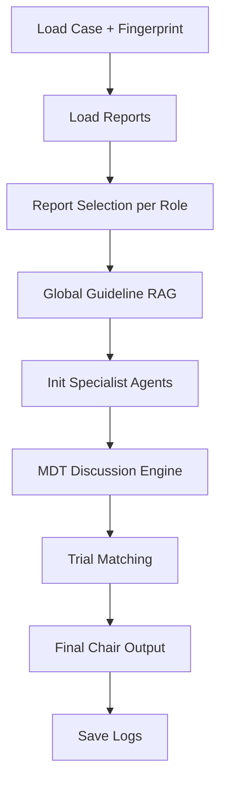

# MDT Discussion Log — 2026-01-17_23-23-32
Generated automatically by MDT Pipeline.


## CASE (structured JSON)

```
{"CASE_CORE":{"ADJUVANT_TREATMENT":{"cycles_or_courses":"Multiple cycles across regimens as documented (see timeline)","given":"Yes","regimens":["依托泊苷0.16g d1-3+顺铂 40mg d1-3 ivgtt，q3w（EP）","贝伐珠单抗400mg+奥沙利铂200mg d1+白蛋白结合型紫杉醇400mg d1，q3w","贝伐珠单抗400mg+奥沙利铂160mg d1+白蛋白结合型紫杉醇320mg d1，q3w","BEV+AK-104","德曲+奥铂+贝伐","德曲+帕博利珠单抗+奥沙利铂","德曲+帕博利珠单抗"]},"BIOMARKERS":{"AFP":"Unknown","CA125":"7.14 U/ml (2024-10-11)","HE4":"267 pmol/L (2025-06-07)","HER2":"1+ (2024-05-10)","MSI":"Unknown","PDL1_CPS":"Unknown","TMB":"Unknown"},"BRCA1":"Unknown","BRCA2":"Unknown","CURRENT_STATUS":"Postoperative ovarian small cell carcinoma (hypercalcemic type); receiving systemic therapy with recent radiologic progression (2025-06-06).","DIAGNOSIS":{"components":["小圆细胞恶性肿瘤"],"histology":"高钙血症型小细胞癌","laterality":"Left","primary":"Ovarian cancer","site":"Ovary/pelvis"},"HRD":"Unknown","INITIAL_TREATMENT":"Yes","LINE_OF_THERAPY":[{"cycles":"C1-C3","end_date":"2024-08-09","intent":"Adjuvant","line":"1L","regimen":"依托泊苷0.16g d1-3+顺铂 40mg d1-3 ivgtt，q3w（EP）；C3开始加用贝伐珠单抗400mg d1","start_date":"2024-06-27"},{"cycles":"Multiple (documented through 2024-10-11)","end_date":"2024-10-11","intent":"Salvage","line":"2L","regimen":"贝伐珠单抗400mg+奥沙利铂200mg d1+白蛋白结合型紫杉醇400mg d1，q3w (dose modifications later to 160mg/320mg)","start_date":"2024-08-29"},{"cycles":"4 (dates approximate as documented)","end_date":"2024-12-15","intent":"Salvage","line":"3L","regimen":"BEV+AK-104 (外院加用AK-104 2 cycles; BEV+AK104 x4 documented)","start_date":"2024-12-03"},{"cycles":"Multiple (documented through 2025-06-07)","end_date":"2025-06-07","intent":"Palliative","line":"4L+","regimen":"德曲+奥铂+贝伐 (2025.02.06 start; third cycle omitted oxaliplatin); later 德曲+奥沙利铂+贝伐; 德曲+帕博利珠单抗+奥沙利铂; 德曲+帕博利珠单抗","start_date":"2025-02-06"}],"MAINTENANCE":"Unknown","MAINTENANCE_DETAIL":{"end_date":"Unknown","given":"Unknown","regimens":[],"start_date":"Unknown"},"NEOADJUVANT":"No","PFI_days":"23","PLATINUM_HISTORY":[{"PFI_days":"4","end_date":"2024-08-09","evidence":"2024-08-13 pelvic MRI: mesenteric and peritoneal nodules, consider metastases","evidence_type":"Radiologic","first_relapse_date":"2024-08-13","line":"1L","start_date":"2024-06-27","status":"Refractory"},{"PFI_days":"113","end_date":"2024-10-11","evidence":"2025-02-01 CT/scan: multiple retroperitoneal metastatic lesions; left ureter/left kidney involvement possible","evidence_type":"Radiologic","first_relapse_date":"2025-02-01","line":"2L","start_date":"2024-08-29","status":"Resistant"},{"PFI_days":"23","end_date":"2025-05-14","evidence":"2025-06-06 CT enhanced: retroperitoneal mass increased vs 2025-05; lesion 7.3cm, involving left renal vein/ureter, encasing aorta","evidence_type":"Radiologic","first_relapse_date":"2025-06-06","line":"4L+","start_date":"2025-02-06","status":"Refractory"}],"PLATINUM_PFI_CURRENT":"23","PLATINUM_STATUS":"Refractory","PLATINUM_STATUS_CURRENT":"Refractory","RELAPSE":"Yes","RELAPSE_DATE":{"date":"2025-06-06","evidence":"2025-06-06 CT enhanced: retroperitoneal mass increased vs 2025-05; lesion 7.3cm, involving left renal vein/ureter, encasing aorta","type":"Radiologic"},"STAGE":{"stage_basis":"Pathology","stage_system":"Unknown","stage_text":"Unknown"},"SURGERY_DONE":{"date":"2024-05-22","performed":"Yes","procedure":"Total abdominal hysterectomy with bilateral salpingo-oophorectomy + omentectomy + appendectomy + para-aortic lymph node dissection + pelvic mass resection + adhesiolysis + cytoreductive surgery"},"VISIT_DATE":"2025-06-10","first_relapse_date":"2024-08-13","last_platinum_end_date":"2025-05-14"},"LAB_TRENDS":{"labs":[{"analyte":"HE4","history":[{"date":"2024-10-11","flag":"↑","value":"71.80"},{"date":"2024-12-15","flag":"↑","value":"93"},{"date":"2025-03-28","flag":"↑","value":"117"},{"date":"2025-04-14","flag":"↑","value":"304"},{"date":"2025-05-06","flag":"↑","value":"250"},{"date":"2025-06-07","flag":"↑","value":"267"}],"latest":{"date":"2025-06-07","flag":"↑","value":"267"},"reference_range":"Unknown","unit":"pmol/L"},{"analyte":"CA125","history":[{"date":"2024-10-11","flag":"Unknown","value":"7.14"}],"latest":{"date":"2024-10-11","flag":"Unknown","value":"7.14"},"reference_range":"Unknown","unit":"U/ml"},{"analyte":"CA19-9","history":[{"date":"2025-06-06","flag":"↓","value":"56"}],"latest":{"date":"2025-06-06","flag":"↓","value":"56"},"reference_range":"Unknown","unit":"U/ml"},{"analyte":"Other","history":[{"date":"2024-10-11","flag":"Unknown","value":"PROGRP 60.20 pg/mL; CYFRA21-1 2.26 ng/ml; NSE 12.80 ng/ml"}],"latest":{"date":"2024-10-11","flag":"Unknown","value":"PROGRP 60.20 pg/mL; CYFRA21-1 2.26 ng/ml; NSE 12.80 ng/ml"},"reference_range":"Unknown","unit":"ng/ml"}],"milestones":[{"date":"2024-05-22","description":"Extensive cytoreductive surgery performed","type":"Surgery"},{"date":"2024-06-27","description":"Start EP chemotherapy (etoposide + cisplatin)","type":"ChemoStart"},{"date":"2025-02-06","description":"Start docetaxel + oxaliplatin + bevacizumab","type":"ChemoStart"},{"date":"2025-06-06","description":"Radiologic progression with enlarged retroperitoneal mass","type":"Progression"}]},"MED_ONC":{"current_regimen":{"cycle_info":"Recent cycle given without oxaliplatin","last_admin_date":"2025-06-07","name":"德曲+帕博利珠单抗"},"genetic_testing":{"germline":[],"somatic":[]},"monitoring_points":[],"planned_next_regimen":"Unknown","prior_systemic_therapies":["依托泊苷0.16g d1-3+顺铂 40mg d1-3 ivgtt，q3w（EP）","贝伐珠单抗400mg+奥沙利铂200mg d1+白蛋白结合型紫杉醇400mg d1，q3w","贝伐珠单抗400mg+奥沙利铂160mg d1+白蛋白结合型紫杉醇320mg d1，q3w","BEV+AK-104","德曲+奥铂+贝伐","德曲+帕博利珠单抗+奥沙利铂","德曲+帕博利珠单抗"]},"NUC_MED":{"studies":[]},"PATHOLOGY":{"specimens":[{"components":["小圆细胞恶性肿瘤"],"date":"2024-05-22","diagnosis":"符合高钙血症型小细胞癌","grade":"Ki-67 80%","ihc":[{"marker":"AE1/AE3","result":"少+"},{"marker":"CK","result":"少+"},{"marker":"CD20","result":"-"},{"marker":"CD3","result":"-"},{"marker":"CD99","result":"+"},{"marker":"SMARCA4 BRG1","result":"-"},{"marker":"SMARCA2(BRM)","result":"-"},{"marker":"SMARCB1(INI-1)","result":"+"},{"marker":"CD10","result":"少+"},{"marker":"Desmin","result":"-"},{"marker":"MyoD1","result":"-"},{"marker":"Myogenin","result":"-"},{"marker":"P53","result":"少+"},{"marker":"PAX8","result":"-"},{"marker":"Ki-67","result":"+80%"},{"marker":"WT1","result":"+"},{"marker":"ER","result":"-"},{"marker":"PR","result":"-"},{"marker":"Syn","result":"少+"},{"marker":"CgA","result":"-"},{"marker":"INSM1","result":"-"},{"marker":"LCA","result":"-"}],"involvement_sites":["Para-aortic lymph nodes 0/14 negative","Left common iliac lymph nodes 0/6 negative","Right adnexa: no special abnormality"],"laterality":"Left","molecular":[],"raw_text":"卵巢恶性肿瘤：（左附件及盆腔巨大肿块）小圆细胞恶性肿瘤，正在行免疫组化检查辅助诊断。补充诊断1：初步报告: （左附件及盆腔巨大肿块）小圆细胞恶性肿瘤，结合免疫组化结果，符合高钙血症型小细胞癌，大小16.5*13.5*8 cm。免疫组化结果（HI24-22759）：AE1/AE3（少+），CK（少+），CD20（-），CD3（-），CD99（+），SMARCA4 BRG1（-），SMARCA2(BRM)（-），SMARCB1(INI-1)（+），CD10（少+），Desmin（-），MyoD1（-），Myogenin（-），P53（少+），PAX8（-），Ki-67（+80%），WT1（+），ER（-），PR（-），Syn（少+），CgA（-），INSM1（-），LCA（-） ;（全子宫）内膜呈分泌改变；宫颈慢性炎。（右附件）未见特殊异常。（左卵巢血管）纤维血管组织。（阑尾）慢性炎。（腹主动脉旁）淋巴结（0/14）未见肿瘤转移。（左髂总）淋巴结（0/6）未见肿瘤转移。","sample_type":"Surgical specimen","site":"Left adnexa and pelvic mass; uterus; right adnexa; appendix; para-aortic and left common iliac lymph nodes","tumor_size":"16.5*13.5*8 cm","uncertainty_or_missing":["No molecular/genetic testing results reported in pathology","Staging not provided"]}]},"RADIOLOGY":{"next_imaging_plan":{"modality":"Unknown","timing":"Unknown"},"studies":[{"anatomic_sites":["Pelvis"],"date":"2024-05-10","findings":["Large irregular solid pelvic mass 101*95*140mm with central multicystic area; mass abutting anterior uterine wall; heterogeneous enhancement"],"impression":"Pelvic mass, sarcoma possible","modality":"MRI","trend_vs_prior":"Unknown"},{"anatomic_sites":["Pelvis"],"date":"2024-08-13","findings":["Postoperative changes; mesenteric and peritoneal scattered nodules"],"impression":"Consider metastatic disease","modality":"MRI","trend_vs_prior":"Worse"},{"anatomic_sites":["Abdomen/retroperitoneum"],"date":"2024-09-02","findings":["New multiple enlarged retroperitoneal lymph nodes"],"impression":"Possible metastases","modality":"CT","trend_vs_prior":"Unknown"},{"anatomic_sites":["Abdomen/retroperitoneum"],"date":"2024-12-09","findings":["Multiple enlarged retroperitoneal lymph nodes, some slightly smaller than before; possible involvement of left ureter upper segment with left hydronephrosis; small ascites"],"impression":"Retroperitoneal lymphadenopathy; consider clinical correlation","modality":"CT","trend_vs_prior":"Mixed"},{"anatomic_sites":["Retroperitoneum, pelvis, inguinal regions"],"date":"2025-02-01","findings":["Multiple retroperitoneal metastatic lesions, some may involve left ureter and kidney; multiple pelvic and bilateral inguinal lymph nodes"],"impression":"Metastatic disease in retroperitoneum and pelvis","modality":"CT","trend_vs_prior":"Worse"},{"anatomic_sites":["Retroperitoneum"],"date":"2025-05-06","findings":["Lesion measured 4.6*4.2 cm"],"impression":"Residual/metastatic lesion","modality":"CT","trend_vs_prior":"Unknown"},{"anatomic_sites":["Retroperitoneum, left kidney region"],"date":"2025-06-06","findings":["Retroperitoneal mass larger vs 2025-05; lesion 7.3 cm, involving left renal vein and ureter, psoas muscle, encasing abdominal aorta; hepatic left lobe hemangioma"],"impression":"Progression of retroperitoneal metastatic disease","modality":"CT","trend_vs_prior":"Worse"}]},"TIMELINE":{"constraints":{"max_events":30,"min_events":3,"must_include":["first diagnostic imaging or pathology confirmation (if available)"],"ordering_rules":{"prioritize_last_event":true}},"events":[{"date":"2024-05-10","description":"Pelvic MRI showed large irregular solid mass 101*95*140mm with central multicystic change; pelvic mass, sarcoma possible","event_type":"Imaging","key_result":"101*95*140mm mass, central multicystic, heterogeneous enhancement","regimen_or_test":"Pelvic MRI"},{"date":"2024-05-22","description":"Extensive cytoreductive surgery including total hysterectomy, bilateral salpingo-oophorectomy, omentectomy, appendectomy, para-aortic lymph node dissection, pelvic mass resection","event_type":"Surgery","key_result":"Specimens: left adnexa and pelvic mass; nodes negative (0/14 para-aortic, 0/6 left common iliac)","regimen_or_test":"Surgery"},{"date":"2024-05-22","description":"Pathology preliminary: small round cell malignant tumor; with IHC consistent with high‑calcemia small cell carcinoma; tumor size 16.5*13.5*8 cm","event_type":"Other","key_result":"Diagnosis: 符合高钙血症型小细胞癌; Ki-67 80%; WT1+, ER-, PR-","regimen_or_test":"Pathology/IHC"},{"date":"2024-06-27","description":"Started EP regimen (etoposide + cisplatin); consented to clinical trial","event_type":"Chemo","key_result":"C1 start","regimen_or_test":"依托泊苷0.16g d1-3+顺铂 40mg d1-3 ivgtt，q3w"},{"date":"2024-08-13","description":"Pelvic MRI after surgery/chemo: mesenteric and peritoneal nodules, consider metastases","event_type":"Imaging","key_result":"Mesenteric/peritoneal nodules suggesting metastases","regimen_or_test":"Pelvic MRI"},{"date":"2024-08-29","description":"Started regimen with bevacizumab + oxaliplatin + nab‑paclitaxel","event_type":"Chemo","key_result":"C1 started","regimen_or_test":"贝伐珠单抗400mg+奥沙利铂200mg d1+白蛋白结合型紫杉醇400mg d1，q3w"},{"date":"2024-10-11","description":"Post-chemo labs","event_type":"Lab","key_result":"CA125 7.14 U/ml; HE4 71.80 pmol/L ↑; ROMA premenopausal 15.38% ↑","regimen_or_test":"CA125, HE4, ROMA and tumor markers"},{"date":"2024-12-09","description":"CT: multiple enlarged retroperitoneal lymph nodes, some slightly smaller; left ureter upper involvement possible with hydronephrosis; small ascites","event_type":"Imaging","key_result":"Retroperitoneal nodes; possible left ureter involvement","regimen_or_test":"CT abdomen"},{"date":"2025-02-01","description":"Report: multiple retroperitoneal metastatic lesions, some involving left ureter, left kidney perirenal change; multiple pelvic/inguinal nodes","event_type":"Imaging","key_result":"Progression with retroperitoneal metastases","regimen_or_test":"CT/assessment"},{"date":"2025-02-06","description":"Started docetaxel + oxaliplatin + bevacizumab (third cycle omitted oxaliplatin)","event_type":"Chemo","key_result":"Platinum-containing regimen restarted","regimen_or_test":"德曲+奥铂+贝伐"},{"date":"2025-04-14","description":"Docetaxel + oxaliplatin + bevacizumab given; HE4 increased","event_type":"Chemo","key_result":"HE4 304","regimen_or_test":"德曲+奥沙利铂+贝伐"},{"date":"2025-05-06","description":"CT: lesion measured 4.6*4.2 cm; HE4 250","event_type":"Imaging","key_result":"Lesion 4.6*4.2 cm","regimen_or_test":"CT"},{"date":"2025-05-14","description":"Regimen changed to include pembrolizumab with docetaxel and oxaliplatin","event_type":"Chemo","key_result":"Treatment modification","regimen_or_test":"德曲+帕博利珠单抗+奥沙利铂"},{"date":"2025-06-06","description":"CT enhancement: retroperitoneal mass larger vs 2025-05; lesion 7.3 cm, increased; involvement of left renal vein, ureter, psoas, encasing aorta","event_type":"Imaging","key_result":"Radiologic progression","regimen_or_test":"CT enhanced"},{"date":"2025-06-07","description":"Most recent documented systemic therapy: docetaxel + pembrolizumab (no oxaliplatin documented on this date)","event_type":"Chemo","key_result":"Last documented administration 2025-06-07","regimen_or_test":"德曲+帕博利珠单抗"}]}}
```


## FINAL MDT OUTPUT

```
- If pathologic confirmation of progression is absent, then prioritize multidisciplinary review before escalating beyond current systemic therapy.  
- If comprehensive germline/somatic testing (including SMARCA4, BRCA, HRD, MSI, TMB, PD-L1) is pending/unknown, then obtain urgently before choosing next-line strategy.  
- If renal function or hydronephrosis worsens from tumor encasing ureter/renal vein, then shift focus from disease control to decompression and organ preservation.  
- If performance status declines or toxicities from multi-agent therapy accumulate, then de-escalate to less intensive systemic or purely supportive care.  
- If any actionable alteration or clinical trial option is identified, then transition from empiric multi-agent regimens to biomarker- or trial-directed therapy.
```


## PIPELINE FLOW (Mermaid)




## TRACE EVENTS (Structured)

```json
[
  {
    "ts": "2026-01-17T23:18:43.341344",
    "event": "pipeline_start",
    "payload": {
      "visit_time": "2025-06-10 15:38:50.183000",
      "meta_info": "220422198808154721"
    }
  },
  {
    "ts": "2026-01-17T23:18:43.341803",
    "event": "case_fingerprint",
    "payload": {
      "case_fingerprint": "655cb07a94de"
    }
  },
  {
    "ts": "2026-01-17T23:18:43.611934",
    "event": "reports_loaded",
    "payload": {
      "lab_n": 0,
      "img_n": 0,
      "path_n": 0,
      "mut_n": 0,
      "cutoff_dt": "2025-06-11 15:38:50"
    }
  },
  {
    "ts": "2026-01-17T23:18:43.666016",
    "event": "reports_selected",
    "payload": {
      "lab": {
        "chair": [],
        "oncologist": [],
        "radiologist": [],
        "pathologist": [],
        "nuclear": []
      },
      "imaging": {
        "chair": [],
        "oncologist": [],
        "radiologist": [],
        "pathologist": [],
        "nuclear": []
      },
      "pathology": {
        "chair": [],
        "oncologist": [],
        "radiologist": [],
        "pathologist": [],
        "nuclear": []
      },
      "mutation": {
        "chair": [],
        "oncologist": [],
        "radiologist": [],
        "pathologist": [],
        "nuclear": []
      }
    }
  },
  {
    "ts": "2026-01-17T23:19:22.741471",
    "event": "rag_query",
    "payload": {
      "query": "High‑calcemia small cell carcinoma (gynecologic origin), platinum‑refractory with progressive bulky retroperitoneal mass encasing aorta/left renal vein/ureter and pelvic/inguinal nodes; Ki‑67 80%, WT1+, ER/PR–; no molecular testing; left hydronephrosis, renal/ureteral involvement, needs organ‑function–sparing options."
    }
  },
  {
    "ts": "2026-01-17T23:19:22.741477",
    "event": "rag_hits",
    "payload": {
      "topk": 5,
      "n": 5
    }
  },
  {
    "ts": "2026-01-17T23:19:29.392502",
    "event": "mdt_discussion_start",
    "payload": {
      "num_rounds": 2,
      "num_turns": 2
    }
  },
  {
    "ts": "2026-01-17T23:23:07.680269",
    "event": "mdt_discussion_end",
    "payload": {
      "merged_chars": 3102
    }
  },
  {
    "ts": "2026-01-17T23:23:07.681073",
    "event": "final_output_start",
    "payload": {}
  },
  {
    "ts": "2026-01-17T23:23:32.767199",
    "event": "final_output_end",
    "payload": {
      "final_output_chars": 804
    }
  }
]
```


## INITIAL EXPERT OPINIONS


## chair

```
- Confirm current performance status, symptoms, serum calcium/renal function, and clarify goals of care given rapid platinum‑refractory progression.  
- Stop ineffective current systemic regimen; discuss focus on best supportive care versus further experimental/clinical‑trial‑based options.  
- Obtain comprehensive molecular profiling (including SMARCA4 status confirmation, germline/somatic BRCA1/2, HRD, MSI/TMB, PD‑L1) to explore targeted/novel approaches.  
- Urgently involve urology/interventional radiology to assess left ureter/renal vein obstruction and options for decompression or palliative intervention [@RADIOLOGY|2025-06-06].  
- Establish schedule for close imaging and HE4 monitoring, and define clear triggers for transitioning fully to comfort‑focused care.
```


## oncologist

```
- Now multi-relapsed, radiologic progression on ≥4 prior systemic regimens; current regimen ineffective and should be reconsidered [@CASE_VIEW|2025-06-06].  

- Histology is rare small cell hypercalcemic ovarian carcinoma; no germline/somatic profiling available—broad NGS and germline panel needed.  

- Organ function, ECOG, pain level, and serum calcium, renal function, and marrow reserve are unknown/needs update for further systemic therapy.  

- Prior exposure includes multiple cytotoxics, anti‑angiogenic agents, and immunotherapy; cumulative toxicity profile (neuropathy, cytopenias, GI) unknown/needs update.  

- Given bulky retroperitoneal mass encasing vessels, need radiation/surgery consult for local control and palliative-symptom assessment.
```


## radiologist

```
- Marked progression of left retroperitoneal mass from 4.6×4.2 cm (05-06) to 7.3 cm, indicating worsening disease. [@IMAGING_STUDIES|2025-06-06]

- Current mass invades/encases left renal vein, ureter, psoas muscle, and abdominal aorta, suggesting complex surgical resectability. [@IMAGING_STUDIES|2025-06-06]

- Likely left ureteral obstruction from tumor involvement; need correlation with renal function and hydronephrosis severity. [@IMAGING_STUDIES|2025-06-06]

- Overall pattern: progressive metastatic retroperitoneal and pelvic disease since 2024, with nodal and soft-tissue involvement. [@IMAGING_TRENDS|2025-06-06]

- Update needed: most recent dedicated imaging of chest and liver (beyond known left-lobe hemangioma) to complete staging.
```


## pathologist

```
- Histology and IHC support diagnosis of ovarian small cell carcinoma, hypercalcemic type, high proliferative index (Ki‑67 80%). [@HISTOLOGY_AND_IHC|2024-05-22]

- SMARCA4 and SMARCA2 loss with retained INI1 is typical for SCCOHT; neuroendocrine markers largely negative. [@HISTOLOGY_AND_IHC|2024-05-22]

- Lymph nodes sampled (para‑aortic, left common iliac) reported negative for metastasis. [@HISTOLOGY_AND_IHC|2024-05-22]

- Pathologic stage is not documented; FIGO/TNM staging needs to be assigned or confirmed. [@HISTOLOGY_AND_IHC|2024-05-22]

- No germline/somatic molecular data (including SMARCA4 mutation, MSI, TMB, PD‑L1) available; comprehensive molecular profiling and germline testing needed.
```


## nuclear

```
- No PET/CT reports available for review; current metabolic disease extent is unknown/needs update.  

- Prior imaging suggests progressive retroperitoneal and pelvic metastatic disease, but without PET correlation for metabolic activity or viability.  

- PET could clarify whether retroperitoneal lymphadenopathy and pelvic lesions are metabolically active, refining staging vs treated/scar tissue.  

- PET may detect additional distant metastases (e.g., supradiaphragmatic nodes, bone) not characterized on prior anatomic imaging, potentially upstaging.  

- Need updated PET/CT report (date, target lesions, SUV, comparison to 2025-06-06 imaging) to assess progression or recurrence.
```


## MERGED SUMMARY (Assistant)

```
Key Knowledge:
- Aggressive, multi‑relapsed SCCOHT with SMARCA4/2 loss, high Ki‑67, and rapid platinum‑refractory progression on ≥4 lines; current regimen ineffective.
- Large enlarging left retroperitoneal mass encasing ureter and major vessels (renal vein, aorta, psoas), with likely ureteric obstruction and nodal/soft‑tissue metastases.
- No molecular profiling (SMARCA4 mutation status, BRCA1/2/HRD, MSI/TMB, PD‑L1), no formal FIGO/TNM stage, and no updated chest/liver/PET imaging.
- Updated renal function and chest imaging are critical for staging and urgent obstruction management.

Controversies:
- Appropriateness of further experimental/clinical‑trial therapy versus transition to best supportive/comfort‑focused care.
- Feasibility and value of local interventions (surgery, RT, urologic/IR decompression) given vascular/ureteral encasement and prognosis.
- Whether PET/CT would meaningfully alter management or trial eligibility in a palliative context with clear CT‑documented progression.

Missing Info:
- ECOG status, symptom burden (pain, function), and patient goals/values.
- Current labs: calcium, renal function (incl. impact of hydronephrosis), CBC, LFTs.
- Explicit grading of hydronephrosis and renal vein compromise on latest CT.
- Cumulative toxicity from prior therapies.
- Formal FIGO/TNM stage and feasibility of broad NGS plus germline testing from existing tissue.
- Up‑to‑date chest/liver imaging and any PET/CT; clear statement on PET’s necessity for trials/RT planning.

Working Plan:
- Urgently reassess ECOG, symptoms, and labs (renal function, calcium) to guide obstruction management and the safety/utility of any ongoing systemic therapy.
- Expedite chest imaging and detailed radiology report (hydronephrosis grade, renal vein compromise) to inform urology/IR urgency.
- Involve urology/IR promptly to evaluate and, if appropriate, relieve ureteric obstruction and address vascular involvement for symptom/renal preservation.
- Have pathology assign FIGO/TNM stage and arrange comprehensive molecular profiling plus germline testing using available tissue.
- Use PET/CT selectively only if required for specific trial eligibility or RT planning; otherwise regard as optional in this palliative setting.
- Clarify goals of care with patient/family and establish a follow‑up/monitoring plan (imaging, HE4) with clear triggers for transition to fully comfort‑focused care.
[R2T1 DELTA] radiologist->oncologist(missing): On latest CT, please ensure the report explicitly grades left hydronephrosis and details renal vein/aortic encasement to guide urgency of decompression and systemic therapy safety. | pathologist->oncologist(missing): From the pathology side we still lack a formal FIGO/TNM stage and any molecular profile; please confirm if archival tissue can be sent now for broad NGS plus germline testing to support trial options.
[R2T2 DELTA] oncologist->chair(safety): Given likely obstructive uropathy and ineffective current regimen, today we must prioritize updated renal function, ECOG, and goals-of-care before any further systemic therapy decisions.
```


## INTERACTION LOG (Round × Turn)

### Round 1

#### Turn 1
- **oncologist → chair:** Before deciding on further systemic or local therapy, we need ECOG, symptom burden, updated labs (including calcium/renal), and clear goals-of-care documented today.
- **oncologist → radiologist:** Please comment on degree of left hydronephrosis/renal vein compromise and feasibility/urgency of urologic or IR decompression based on latest CT.
- **oncologist → pathologist:** Can you confirm SMARCA4/SMARCA2 IHC status and provide any existing molecular data; if none, is tissue adequate for NGS?
- **oncologist → nuclear:** From your perspective, would PET/CT add information relevant to trial eligibility or focal palliation planning despite clear CT-documented progression?
- **radiologist → oncologist:** Recent CT shows rapid retroperitoneal mass enlargement with ureteric and major vascular encasement; updated chest imaging and renal function are critical for staging and urgent obstruction management decisions.
- **radiologist → nuclear:** Given clear CT-documented progression and palliative context, clarify whether PET/CT would practically change management or trial eligibility before ordering.
- **pathologist → chair:** Pathology confirms SCCOHT with SMARCA4/2 loss, but there is still no documented FIGO/TNM stage or any molecular profile (including SMARCA4 mutation status, HRD/BRCA, MSI/TMB, PD-L1); please obtain/assign these as they are critical for accurate characterization and potential trial eligibility.
- **nuclear → oncologist:** Given clear anatomic progression and palliative intent, PET/CT is optional unless needed for trial eligibility or precise RT planning; current PET status is unknown/needs update.

#### Turn 2
- **oncologist → chair:** Today’s priority is reassessing ECOG, symptoms, and updated labs (especially renal function/calcium) to guide obstruction management and whether to continue any systemic therapy.
- **oncologist → radiologist:** Please explicitly grade hydronephrosis and comment on renal vein compromise on the latest CT to inform urgency of urologic/IR decompression.
- **oncologist → pathologist:** We still lack FIGO/TNM staging and any molecular profile; please clarify stage and whether existing tissue can undergo broad NGS and germline testing support.
- **oncologist → nuclear:** I agree PET/CT is optional; please note in your report that its main role would be for specific trial eligibility or RT planning if pursued.

### Round 2

#### Turn 1
- **radiologist → oncologist:** On latest CT, please ensure the report explicitly grades left hydronephrosis and details renal vein/aortic encasement to guide urgency of decompression and systemic therapy safety.
- **pathologist → oncologist:** From the pathology side we still lack a formal FIGO/TNM stage and any molecular profile; please confirm if archival tissue can be sent now for broad NGS plus germline testing to support trial options.

#### Turn 2
- **oncologist → chair:** Given likely obstructive uropathy and ineffective current regimen, today we must prioritize updated renal function, ECOG, and goals-of-care before any further systemic therapy decisions.


## FINAL REFINED PLANS (per Round)

### Round 1


## chair

```
- Stop current regimen given clear radiologic progression and platinum‑refractory status; prioritize goals‑of‑care and symptom‑directed strategy [@TIMELINE|2025-06-06].  
- Urgently assess renal function, hydronephrosis severity, and performance status to guide feasibility of further systemic or local therapies [@RADIOLOGY|2025-06-06].  
- Refer to radiation and urologic surgery for palliative options addressing retroperitoneal mass encasing aorta, ureter, renal vein [@RADIOLOGY|2025-06-06].  
- Arrange comprehensive molecular profiling (including SMARCA4, BRCA1/2, MSI/TMB, PD‑L1) to identify targeted/clinical‑trial options; currently unknown.  
- Initiate early palliative care involvement for pain, renal symptom management, and to revisit patient preferences and treatment intensity.
```


## oncologist

```
- Hold further systemic therapy decisions until ECOG, symptom burden, calcium, renal function, CBC, and LFTs are updated (all currently unknown).  

- Request radiology add explicit grading of hydronephrosis and renal vein involvement on latest CT to triage urgent urology/IR decompression.  

- Ask pathology to assign FIGO/TNM stage and confirm tissue adequacy for broad somatic NGS and germline testing (all unknown).  

- Defer PET/CT; consider only if required for a specific clinical trial or for detailed RT planning (current PET status unknown).  

- After reassessment, discuss with patient goals-of-care and balance trial/experimental options versus transition toward primarily comfort-focused, symptom-directed management.
```


## radiologist

```
- Left retroperitoneal mass has rapidly enlarged to 7.3 cm, encasing ureter, renal vein, psoas, and aorta. [@IMAGING_STUDIES|2025-06-06]

- Hydronephrosis and degree of renal impairment remain unknown; need imaging-based hydronephrosis grading and updated renal function tests. [@IMAGING_STUDIES|2024-12-09]

- No recent chest or liver staging beyond known hemangioma; updated thoracoabdominal imaging is required. [@IMAGING_STUDIES|2025-06-06]

- PET/CT remains optional; utility mainly for trial eligibility or RT planning rather than confirming progression. [@IMAGING_TRENDS|2025-06-06]

- Overall radiologic picture: progressive metastatic retroperitoneal/pelvic disease with complex local anatomy, favoring palliative, symptom-directed local interventions. [@IMAGING_TRENDS|2025-06-06]
```


## pathologist

```
- Confirm pathologic FIGO/TNM stage from original resection; staging currently undocumented and required for complete characterization. [@HISTOLOGY_AND_IHC|2024-05-22]

- Verify remaining tumor tissue adequacy and submit for broad NGS panel plus SMARCA4 mutation, MSI/TMB, HRD/BRCA, PD‑L1. [@MOLECULAR|unknown]

- Coordinate germline testing (including SMARCA4 and BRCA1/2) given SCCOHT diagnosis and young age typical for this entity. [@HISTOLOGY_AND_IHC|2024-05-22]

- Communicate high‑grade SCCOHT with SMARCA4/2 loss and Ki‑67 80% clearly in reports to support clinical‑trial matching. [@HISTOLOGY_AND_IHC|2024-05-22]

- No current evidence of molecular results in record; ensure all new profiles are uploaded and cross‑referenced in pathology addendum. [@MOLECULAR|unknown]
```


## nuclear

```
- No PET/CT available; current metabolic disease distribution and intensity remain unknown/needs update.  

- Given clear CT-documented progression and palliative context, PET/CT is optional unless required for specific trial eligibility or RT planning.  

- If performed, PET/CT could better delineate metabolically active retroperitoneal vs nodal/soft-tissue disease, aiding focused palliative RT targeting.  

- PET/CT may identify unsuspected distant metastases, but is unlikely to substantially alter overall staging or prognosis at this time.  

- Decision to proceed with PET/CT should follow clarification of goals of care and potential trial/RT pathways; otherwise it can be deferred.
```

### Round 2


## chair

```
- Stop current systemic regimen given clear radiologic progression and platinum-refractory status [@CASE_CORE|2025-06-06].  
- Obtain full-body staging (CT/MRI ± PET) and updated labs including renal function, calcium, and performance status; currently unknown.  
- Request comprehensive germline and somatic profiling including BRCA1/2, HRD, MSI, TMB, and SMARCA4-targetable alterations; currently unknown.  
- Convene radiation, urology, and vascular surgery to evaluate local control/palliation for mass encasing aorta and ureter [@CASE_CORE|2025-06-06].  
- Prioritize early palliative care involvement, symptom control, and discussion of goals, including clinical trial eligibility; details currently unknown.
```


## oncologist

```
- Defer any new systemic regimen until ECOG, symptom burden, renal function, calcium, CBC, and LFTs are updated (all unknown).  

- Obtain urgent chest imaging and CT addendum explicitly grading left hydronephrosis and vascular encasement to guide urology/IR intervention urgency.  

- Engage urology/IR promptly to assess and, if feasible, relieve ureteric obstruction for renal preservation and symptom control (labs/imaging details unknown).  

- Ask pathology to assign FIGO/TNM stage and send archival tissue for broad somatic profiling plus germline testing; current status unknown.  

- Clarify patient goals-of-care and discuss realistic benefit of further trial/experimental therapy versus transition toward primarily comfort-focused, symptom-directed management.
```


## radiologist

```
- Large progressive left retroperitoneal mass encases ureter, renal vein, psoas, and aorta, suggesting obstructive uropathy risk. [@IMAGING_STUDIES|2025-06-06]

- Explicit grading of left hydronephrosis and detailed assessment of renal vein/aortic encasement on latest CT are still required. [@IMAGING_STUDIES|2024-12-09]

- Multiple retroperitoneal and pelvic metastatic lesions with bilateral inguinal nodes indicate widespread abdominopelvic disease. [@IMAGING_STUDIES|2025-02-01]

- Small-volume ascites is present; no thoracic or updated liver imaging is available for current staging. [@IMAGING_STUDIES|2024-12-09]

- PET/CT status is unknown; given clear CT progression, further functional imaging is optional and trial/RT-planning driven. [@IMAGING_TRENDS|2025-06-06]
```


## pathologist

```
- Confirm SCCOHT diagnosis with SMARCA4/2 loss and Ki‑67 80% in final integrated report to support staging. [@HISTOLOGY_AND_IHC|2024-05-22]

- Assign and document pathologic FIGO/TNM stage for the primary ovarian tumor; currently not recorded. [@HISTOLOGY_AND_IHC|2024-05-22]

- Verify archival tissue adequacy (blocks/unstained slides) and coordinate broad NGS for SMARCA4 mutation, HRD/BRCA, MSI/TMB, PD‑L1. [@MOLECULAR|unknown]

- Recommend germline testing (including SMARCA4, BRCA1/2) based on SCCOHT and typical hereditary associations; genetics to manage workflow. [@HISTOLOGY_AND_IHC|2024-05-22]

- Issue an addendum summarizing histology, IHC profile, and any new molecular results to facilitate clinical‑trial eligibility review. [@HISTOLOGY_AND_IHC|2024-05-22]
```


## nuclear

```
- No PET/CT performed; metabolic tumour burden, distant disease distribution, and treatment response remain unknown/needs update.  

- Given unequivocal CT progression and palliative intent, PET/CT should be reserved for specific trial eligibility or precise RT planning, if pursued.  

- If obtained, PET/CT could distinguish metabolically active retroperitoneal mass vs surrounding nodes/soft tissue to refine palliative RT target volumes.  

- PET/CT may reveal additional thoracic/osseous metastases, but is unlikely to meaningfully change overall staging or prognosis in this setting.  

- Before ordering PET/CT, clarify trial options and RT feasibility; otherwise prioritise CT-based evaluation of obstruction and systemic safety.
```


## RAW AGENT LOGS

### chair
- **User:** Give INITIAL opinion (use ONLY your system-provided patient facts).
Return up to 5 bullets, each ≤20 words.
If key data missing, say exactly what needs updating.
  
  **Assistant:** - Confirm current performance status, symptoms, serum calcium/renal function, and clarify goals of care given rapid platinum‑refractory progression.  
- Stop ineffective current systemic regimen; discuss focus on best supportive care versus further experimental/clinical‑trial‑based options.  
- Obtain comprehensive molecular profiling (including SMARCA4 status confirmation, germline/somatic BRCA1/2, HRD, MSI/TMB, PD‑L1) to explore targeted/novel approaches.  
- Urgently involve urology/interventional radiology to assess left ureter/renal vein obstruction and options for decompression or palliative intervention [@RADIOLOGY|2025-06-06].  
- Establish schedule for close imaging and HE4 monitoring, and define clear triggers for transitioning fully to comfort‑focused care.
  
  *(2026-01-17T23:19:33.183031)*

- **User:** ROLE: chair. VISIT: 2025-06-10 15:38:50.183000
Default is NOT to speak. Speak ONLY if: conflict | safety | missing-critical | new-critical.

CONTEXT (latest):
Key Knowledge:
- Aggressive, multi‑relapsed SCCOHT with SMARCA4/2 loss, high Ki‑67, rapid platinum‑refractory progression on ≥4 lines; current regimen ineffective.
- Large progressive left retroperitoneal mass encasing renal vein, ureter, psoas, and aorta with probable ureteric obstruction and nodal/soft‑tissue metastases.
- No molecular profiling (SMARCA4 mutation, BRCA1/2/HRD, MSI/TMB, PD‑L1) or updated chest/liver/PET imaging; key labs and performance status unknown.

Controversies:
- Appropriateness of further experimental/clinical‑trial therapy versus transition to best supportive/comfort‑focused care.
- Value and feasibility of local interventions (surgery, RT, urologic/IR procedures) given vascular/ureteral encasement and prognosis.
- Added benefit of PET/CT in the context of clear anatomic progression and largely palliative intent.

Missing Info:
- ECOG status, symptom burden (pain, function), and patient goals/values.
- Current labs: calcium, renal function, CBC, LFTs; degree of hydronephrosis/renal impairment.
- Cumulative toxicity from prior therapies.
- Formal FIGO/TNM stage and full germline/somatic molecular profile.
- Up‑to‑date chest/liver imaging and any PET/CT.

Working Plan:
- Urgently reassess performance status, organ function, symptoms, and clarify goals of care; reconsider continuation of current systemic therapy.
- Initiate comprehensive molecular and germline profiling to guide any trial/targeted options.
- Involve urology/IR quickly to evaluate and potentially relieve ureteric/renal vein obstruction.
- Obtain surgical and radiation opinions for symptom‑directed local control only.
- Update staging with chest/liver imaging ± PET/CT if it may impact trial eligibility or local palliation strategy.
- Set follow‑up schedule (imaging, HE4) and predefined triggers for transition to fully comfort‑focused care.

Allowed targets: [oncologist,radiologist,pathologist,nuclear]
Return ONE-LINE JSON only:{"speak":"yes/no","messages":[{"target":"<role>","message":"<1-2 sentences>","why":"conflict|safety|missing|new"}]}
  
  **Assistant:** /no","messages":[{"target":"MED_ONC","message":"Stop current docetaxel+pembrolizumab immediately and reassess; imaging 2025-06-06 shows clear progression on this regimen.","why":"conflict"},{"target":"GENETICS","message":"Arrange urgent germline and somatic panel (including SMARCA4, BRCA1/2, MSI/TMB) to open targeted/clinical‑trial options.","why":"missing"},{"target":"RADIATION_ONC","message":"Evaluate feasibility of palliative RT to retroperitoneal mass encasing aorta/left renal vein/ureter for pain and local control.","why":"safety"},{"target":"UROLOGY","message":"Assess left ureter/renal vein involvement and hydronephrosis risk; plan stenting or decompression if obstruction or renal impairment emerges.","why":"safety"},{"target":"PALLIATIVE","message":"Initiate early palliative care for symptom control and goals‑of‑care discussion given rapidly progressive, platinum‑refractory disease.","why":"safety"}]}
  
  *(2026-01-17T23:20:02.787713)*

- **User:** ROLE: chair. VISIT: 2025-06-10 15:38:50.183000
Default is NOT to speak. Speak ONLY if: conflict | safety | missing-critical | new-critical.

CONTEXT (latest):
Key Knowledge:
- Aggressive, multi‑relapsed SCCOHT with SMARCA4/2 loss, high Ki‑67, rapid platinum‑refractory progression on ≥4 lines; current regimen ineffective.
- Large progressive left retroperitoneal mass encasing renal vein, ureter, psoas, and aorta with probable ureteric obstruction and nodal/soft‑tissue metastases.
- No molecular profiling (SMARCA4 mutation, BRCA1/2/HRD, MSI/TMB, PD‑L1) or updated chest/liver/PET imaging; key labs and performance status unknown.

Controversies:
- Appropriateness of further experimental/clinical‑trial therapy versus transition to best supportive/comfort‑focused care.
- Value and feasibility of local interventions (surgery, RT, urologic/IR procedures) given vascular/ureteral encasement and prognosis.
- Added benefit of PET/CT in the context of clear anatomic progression and largely palliative intent.

Missing Info:
- ECOG status, symptom burden (pain, function), and patient goals/values.
- Current labs: calcium, renal function, CBC, LFTs; degree of hydronephrosis/renal impairment.
- Cumulative toxicity from prior therapies.
- Formal FIGO/TNM stage and full germline/somatic molecular profile.
- Up‑to‑date chest/liver imaging and any PET/CT.

Working Plan:
- Urgently reassess performance status, organ function, symptoms, and clarify goals of care; reconsider continuation of current systemic therapy.
- Initiate comprehensive molecular and germline profiling to guide any trial/targeted options.
- Involve urology/IR quickly to evaluate and potentially relieve ureteric/renal vein obstruction.
- Obtain surgical and radiation opinions for symptom‑directed local control only.
- Update staging with chest/liver imaging ± PET/CT if it may impact trial eligibility or local palliation strategy.
- Set follow‑up schedule (imaging, HE4) and predefined triggers for transition to fully comfort‑focused care.
[R1T1 DELTA] mass enlargement with ureteric and major vascular encasement; updated chest imaging and renal function are critical for staging and urgent obstruction management decisions. | radiologist->nuclear(missing): Given clear CT-documented progression and palliative context, clarify whether PET/CT would practically change management or trial eligibility before ordering. | pathologist->chair(missing): Pathology confirms SCCOHT with SMARCA4/2 loss, but there is still no documented FIGO/TNM stage or any molecular profile (including SMARCA4 mutation status, HRD/BRCA, MSI/TMB, PD-L1); please obtain/assign these as they are critical for accurate characterization and potential trial eligibility. | nuclear->oncologist(missing): Given clear anatomic progression and palliative intent, PET/CT is optional unless needed for trial eligibility or precise RT planning; current PET status is unknown/needs update.

Allowed targets: [oncologist,radiologist,pathologist,nuclear]
Return ONE-LINE JSON only:{"speak":"yes/no","messages":[{"target":"<role>","message":"<1-2 sentences>","why":"conflict|safety|missing|new"}]}
  
  **Assistant:** Need complete performance status, pain control, renal function and serum calcium before committing to further systemic or local therapy.  

Given rapid multi‑line progression and vascular/ureteral involvement, prioritize goals‑of‑care discussion and early palliative/supportive care integration.
  
  *(2026-01-17T23:20:15.634214)*

- **User:** Given MDT context:
Key Knowledge:
- Aggressive, multi‑relapsed SCCOHT with SMARCA4/2 loss, high Ki‑67, rapid platinum‑refractory progression on ≥4 lines; current regimen ineffective.
- Large progressive left retroperitoneal mass encasing renal vein, ureter, psoas, and aorta with probable ureteric obstruction and nodal/soft‑tissue metastases.
- No molecular profiling (SMARCA4 mutation, BRCA1/2/HRD, MSI/TMB, PD‑L1) or updated chest/liver/PET imaging; key labs and performance status unknown.

Controversies:
- Appropriateness of further experimental/clinical‑trial therapy versus transition to best supportive/comfort‑focused care.
- Value and feasibility of local interventions (surgery, RT, urologic/IR procedures) given vascular/ureteral encasement and prognosis.
- Added benefit of PET/CT in the context of clear anatomic progression and largely palliative intent.

Missing Info:
- ECOG status, symptom burden (pain, function), and patient goals/values.
- Current labs: calcium, renal function, CBC, LFTs; degree of hydronephrosis/renal impairment.
- Cumulative toxicity from prior therapies.
- Formal FIGO/TNM stage and full germline/somatic molecular profile.
- Up‑to‑date chest/liver imaging and any PET/CT.

Working Plan:
- Urgently reassess performance status, organ function, symptoms, and clarify goals of care; reconsider continuation of current systemic therapy.
- Initiate comprehensive molecular and germline profiling to guide any trial/targeted options.
- Involve urology/IR quickly to evaluate and potentially relieve ureteric/renal vein obstruction.
- Obtain surgical and radiation opinions for symptom‑directed local control only.
- Update staging with chest/liver imaging ± PET/CT if it may impact trial eligibility or local palliation strategy.
- Set follow‑up schedule (imaging, HE4) and predefined triggers for transition to fully comfort‑focused care.
[R1T1 DELTA] mass enlargement with ureteric and major vascular encasement; updated chest imaging and renal function are critical for staging and urgent obstruction management decisions. | radiologist->nuclear(missing): Given clear CT-documented progression and palliative context, clarify whether PET/CT would practically change management or trial eligibility before ordering. | pathologist->chair(missing): Pathology confirms SCCOHT with SMARCA4/2 loss, but there is still no documented FIGO/TNM stage or any molecular profile (including SMARCA4 mutation status, HRD/BRCA, MSI/TMB, PD-L1); please obtain/assign these as they are critical for accurate characterization and potential trial eligibility. | nuclear->oncologist(missing): Given clear anatomic progression and palliative intent, PET/CT is optional unless needed for trial eligibility or precise RT planning; current PET status is unknown/needs update.
[R1T2 DELTA] oncologist->chair(safety): Today’s priority is reassessing ECOG, symptoms, and updated labs (especially renal function/calcium) to guide obstruction management and whether to continue any systemic therapy. | oncologist->radiologist(missing): Please explicitly grade hydronephrosis and comment on renal vein compromise on the latest CT to inform urgency of urologic/IR decompression. | oncologist->pathologist(missing): We still lack FIGO/TNM staging and any molecular profile; please clarify stage and whether existing tissue can undergo broad NGS and germline testing support. | oncologist->nuclear(new): I agree PET/CT is optional; please note in your report that its main role would be for specific trial eligibility or RT planning if pursued.

Provide FINAL refined plan.
Up to 5 bullets, each ≤20 words.
Any factual claim must include [@report_id|date] or say unknown.
  
  **Assistant:** - Stop current regimen given clear radiologic progression and platinum‑refractory status; prioritize goals‑of‑care and symptom‑directed strategy [@TIMELINE|2025-06-06].  
- Urgently assess renal function, hydronephrosis severity, and performance status to guide feasibility of further systemic or local therapies [@RADIOLOGY|2025-06-06].  
- Refer to radiation and urologic surgery for palliative options addressing retroperitoneal mass encasing aorta, ureter, renal vein [@RADIOLOGY|2025-06-06].  
- Arrange comprehensive molecular profiling (including SMARCA4, BRCA1/2, MSI/TMB, PD‑L1) to identify targeted/clinical‑trial options; currently unknown.  
- Initiate early palliative care involvement for pain, renal symptom management, and to revisit patient preferences and treatment intensity.
  
  *(2026-01-17T23:20:44.910534)*

- **User:** ROLE: chair. VISIT: 2025-06-10 15:38:50.183000
Default is NOT to speak. Speak ONLY if: conflict | safety | missing-critical | new-critical.

CONTEXT (latest):
Key Knowledge:
- Aggressive, multi‑relapsed SCCOHT with SMARCA4/2 loss, high Ki‑67, and rapid platinum‑refractory progression on ≥4 lines; current regimen ineffective.
- Large enlarging left retroperitoneal mass encasing ureter and major vessels (renal vein, aorta, psoas), with likely ureteric obstruction and nodal/soft‑tissue metastases.
- No molecular profiling (SMARCA4 mutation status, BRCA1/2/HRD, MSI/TMB, PD‑L1), no formal FIGO/TNM stage, and no updated chest/liver/PET imaging.
- Updated renal function and chest imaging are critical for staging and urgent obstruction management.

Controversies:
- Appropriateness of further experimental/clinical‑trial therapy versus transition to best supportive/comfort‑focused care.
- Feasibility and value of local interventions (surgery, RT, urologic/IR decompression) given vascular/ureteral encasement and prognosis.
- Whether PET/CT would meaningfully alter management or trial eligibility in a palliative context with clear CT‑documented progression.

Missing Info:
- ECOG status, symptom burden (pain, function), and patient goals/values.
- Current labs: calcium, renal function (incl. impact of hydronephrosis), CBC, LFTs.
- Explicit grading of hydronephrosis and renal vein compromise on latest CT.
- Cumulative toxicity from prior therapies.
- Formal FIGO/TNM stage and feasibility of broad NGS plus germline testing from existing tissue.
- Up‑to‑date chest/liver imaging and any PET/CT; clear statement on PET’s necessity for trials/RT planning.

Working Plan:
- Urgently reassess ECOG, symptoms, and labs (renal function, calcium) to guide obstruction management and the safety/utility of any ongoing systemic therapy.
- Expedite chest imaging and detailed radiology report (hydronephrosis grade, renal vein compromise) to inform urology/IR urgency.
- Involve urology/IR promptly to evaluate and, if appropriate, relieve ureteric obstruction and address vascular involvement for symptom/renal preservation.
- Have pathology assign FIGO/TNM stage and arrange comprehensive molecular profiling plus germline testing using available tissue.
- Use PET/CT selectively only if required for specific trial eligibility or RT planning; otherwise regard as optional in this palliative setting.
- Clarify goals of care with patient/family and establish a follow‑up/monitoring plan (imaging, HE4) with clear triggers for transition to fully comfort‑focused care.

Allowed targets: [oncologist,radiologist,pathologist,nuclear]
Return ONE-LINE JSON only:{"speak":"yes/no","messages":[{"target":"<role>","message":"<1-2 sentences>","why":"conflict|safety|missing|new"}]}
  
  **Assistant:** 1) Current pattern = multi‑line, platinum‑refractory SMARCA4‑deficient SCCOHT with rapid retroperitoneal progression and major vascular/ureteral involvement; prognosis guarded.

2) Immediate priority: stop ineffective systemic regimen, urgently stage symptoms (pain, performance, renal function, calcium, electrolytes, coagulation) and clarify goals of care.

3) Before new disease‑directed plan: obtain full-body staging (CT/PET‑CT + brain if symptomatic), comprehensive NGS (tumor ± germline), and PD‑L1/MSI/TMB.

4) Convene joint gyn‑onc, vascular, urology, radiation, pain, and palliative teams to decide feasibility of local control (surgery vs radiotherapy) vs purely systemic/palliative focus.

5) Until data available, emphasize aggressive symptom management (pain, nausea, anxiety), monitor for obstruction/thrombosis, and discuss early clinical‑trial referral.
  
  *(2026-01-17T23:21:18.286682)*

- **User:** ROLE: chair. VISIT: 2025-06-10 15:38:50.183000
Default is NOT to speak. Speak ONLY if: conflict | safety | missing-critical | new-critical.

CONTEXT (latest):
Key Knowledge:
- Aggressive, multi‑relapsed SCCOHT with SMARCA4/2 loss, high Ki‑67, and rapid platinum‑refractory progression on ≥4 lines; current regimen ineffective.
- Large enlarging left retroperitoneal mass encasing ureter and major vessels (renal vein, aorta, psoas), with likely ureteric obstruction and nodal/soft‑tissue metastases.
- No molecular profiling (SMARCA4 mutation status, BRCA1/2/HRD, MSI/TMB, PD‑L1), no formal FIGO/TNM stage, and no updated chest/liver/PET imaging.
- Updated renal function and chest imaging are critical for staging and urgent obstruction management.

Controversies:
- Appropriateness of further experimental/clinical‑trial therapy versus transition to best supportive/comfort‑focused care.
- Feasibility and value of local interventions (surgery, RT, urologic/IR decompression) given vascular/ureteral encasement and prognosis.
- Whether PET/CT would meaningfully alter management or trial eligibility in a palliative context with clear CT‑documented progression.

Missing Info:
- ECOG status, symptom burden (pain, function), and patient goals/values.
- Current labs: calcium, renal function (incl. impact of hydronephrosis), CBC, LFTs.
- Explicit grading of hydronephrosis and renal vein compromise on latest CT.
- Cumulative toxicity from prior therapies.
- Formal FIGO/TNM stage and feasibility of broad NGS plus germline testing from existing tissue.
- Up‑to‑date chest/liver imaging and any PET/CT; clear statement on PET’s necessity for trials/RT planning.

Working Plan:
- Urgently reassess ECOG, symptoms, and labs (renal function, calcium) to guide obstruction management and the safety/utility of any ongoing systemic therapy.
- Expedite chest imaging and detailed radiology report (hydronephrosis grade, renal vein compromise) to inform urology/IR urgency.
- Involve urology/IR promptly to evaluate and, if appropriate, relieve ureteric obstruction and address vascular involvement for symptom/renal preservation.
- Have pathology assign FIGO/TNM stage and arrange comprehensive molecular profiling plus germline testing using available tissue.
- Use PET/CT selectively only if required for specific trial eligibility or RT planning; otherwise regard as optional in this palliative setting.
- Clarify goals of care with patient/family and establish a follow‑up/monitoring plan (imaging, HE4) with clear triggers for transition to fully comfort‑focused care.
[R2T1 DELTA] radiologist->oncologist(missing): On latest CT, please ensure the report explicitly grades left hydronephrosis and details renal vein/aortic encasement to guide urgency of decompression and systemic therapy safety. | pathologist->oncologist(missing): From the pathology side we still lack a formal FIGO/TNM stage and any molecular profile; please confirm if archival tissue can be sent now for broad NGS plus germline testing to support trial options.

Allowed targets: [oncologist,radiologist,pathologist,nuclear]
Return ONE-LINE JSON only:{"speak":"yes/no","messages":[{"target":"<role>","message":"<1-2 sentences>","why":"conflict|safety|missing|new"}]}
  
  **Assistant:** Chemo‑refractory disease with rapid radiologic progression encasing major vessels/ureter; current regimen is ineffective and should be stopped now.  

Before deciding next steps, we urgently need full performance status, symptoms (pain, obstruction, neuropathy), renal function, and calcium level.  

Given vascular/ureteral involvement, prioritize rapid MDT review with urology/interventional radiology to assess need for nephrostomy/stenting and bleeding‑risk mitigation.  

Systemic strategy should shift from further empiric cytotoxics to either clinical trial enrollment or best‑supportive‑care‑focused low‑intensity systemic options, aligned with patient goals.  

Arrange comprehensive molecular profiling (including SMARCA4, germline/somatic panel, MSI/TMB, PD‑L1) on stored tissue/blood to uncover any targetable options.
  
  *(2026-01-17T23:21:58.744624)*

- **User:** Given MDT context:
Key Knowledge:
- Aggressive, multi‑relapsed SCCOHT with SMARCA4/2 loss, high Ki‑67, and rapid platinum‑refractory progression on ≥4 lines; current regimen ineffective.
- Large enlarging left retroperitoneal mass encasing ureter and major vessels (renal vein, aorta, psoas), with likely ureteric obstruction and nodal/soft‑tissue metastases.
- No molecular profiling (SMARCA4 mutation status, BRCA1/2/HRD, MSI/TMB, PD‑L1), no formal FIGO/TNM stage, and no updated chest/liver/PET imaging.
- Updated renal function and chest imaging are critical for staging and urgent obstruction management.

Controversies:
- Appropriateness of further experimental/clinical‑trial therapy versus transition to best supportive/comfort‑focused care.
- Feasibility and value of local interventions (surgery, RT, urologic/IR decompression) given vascular/ureteral encasement and prognosis.
- Whether PET/CT would meaningfully alter management or trial eligibility in a palliative context with clear CT‑documented progression.

Missing Info:
- ECOG status, symptom burden (pain, function), and patient goals/values.
- Current labs: calcium, renal function (incl. impact of hydronephrosis), CBC, LFTs.
- Explicit grading of hydronephrosis and renal vein compromise on latest CT.
- Cumulative toxicity from prior therapies.
- Formal FIGO/TNM stage and feasibility of broad NGS plus germline testing from existing tissue.
- Up‑to‑date chest/liver imaging and any PET/CT; clear statement on PET’s necessity for trials/RT planning.

Working Plan:
- Urgently reassess ECOG, symptoms, and labs (renal function, calcium) to guide obstruction management and the safety/utility of any ongoing systemic therapy.
- Expedite chest imaging and detailed radiology report (hydronephrosis grade, renal vein compromise) to inform urology/IR urgency.
- Involve urology/IR promptly to evaluate and, if appropriate, relieve ureteric obstruction and address vascular involvement for symptom/renal preservation.
- Have pathology assign FIGO/TNM stage and arrange comprehensive molecular profiling plus germline testing using available tissue.
- Use PET/CT selectively only if required for specific trial eligibility or RT planning; otherwise regard as optional in this palliative setting.
- Clarify goals of care with patient/family and establish a follow‑up/monitoring plan (imaging, HE4) with clear triggers for transition to fully comfort‑focused care.
[R2T1 DELTA] radiologist->oncologist(missing): On latest CT, please ensure the report explicitly grades left hydronephrosis and details renal vein/aortic encasement to guide urgency of decompression and systemic therapy safety. | pathologist->oncologist(missing): From the pathology side we still lack a formal FIGO/TNM stage and any molecular profile; please confirm if archival tissue can be sent now for broad NGS plus germline testing to support trial options.
[R2T2 DELTA] oncologist->chair(safety): Given likely obstructive uropathy and ineffective current regimen, today we must prioritize updated renal function, ECOG, and goals-of-care before any further systemic therapy decisions.

Provide FINAL refined plan.
Up to 5 bullets, each ≤20 words.
Any factual claim must include [@report_id|date] or say unknown.
  
  **Assistant:** - Stop current systemic regimen given clear radiologic progression and platinum-refractory status [@CASE_CORE|2025-06-06].  
- Obtain full-body staging (CT/MRI ± PET) and updated labs including renal function, calcium, and performance status; currently unknown.  
- Request comprehensive germline and somatic profiling including BRCA1/2, HRD, MSI, TMB, and SMARCA4-targetable alterations; currently unknown.  
- Convene radiation, urology, and vascular surgery to evaluate local control/palliation for mass encasing aorta and ureter [@CASE_CORE|2025-06-06].  
- Prioritize early palliative care involvement, symptom control, and discussion of goals, including clinical trial eligibility; details currently unknown.
  
  *(2026-01-17T23:22:31.167374)*

- **User:** 
As the MDT chair for gynecologic oncology, you are seeing the patient at OUTPATIENT TIME: 2025-06-10 15:38:50.183000.
Based on PATIENT FACTS + MDT discussion + FINAL refined plans from all experts, determine the CURRENT best management plan for this visit.

STRICT RULES:
- Any factual statement about past tests/treatments must include [@report_id|date] or say unknown.
- If experts disagree, pick the safest plan and state the key uncertainty.

# FINAL REFINED PLANS (All experts, last round)
{
  "Round 1": {
    "chair": "- Stop current regimen given clear radiologic progression and platinum‑refractory status; prioritize goals‑of‑care and symptom‑directed strategy [@TIMELINE|2025-06-06].  \n- Urgently assess renal function, hydronephrosis severity, and performance status to guide feasibility of further systemic or local therapies [@RADIOLOGY|2025-06-06].  \n- Refer to radiation and urologic surgery for palliative options addressing retroperitoneal mass encasing aorta, ureter, renal vein [@RADIOLOGY|2025-06-06].  \n- Arrange comprehensive molecular profiling (including SMARCA4, BRCA1/2, MSI/TMB, PD‑L1) to identify targeted/clinical‑trial options; currently unknown.  \n- Initiate early palliative care involvement for pain, renal symptom management, and to revisit patient preferences and treatment intensity.",
    "oncologist": "- Hold further systemic therapy decisions until ECOG, symptom burden, calcium, renal function, CBC, and LFTs are updated (all currently unknown).  \n\n- Request radiology add explicit grading of hydronephrosis and renal vein involvement on latest CT to triage urgent urology/IR decompression.  \n\n- Ask pathology to assign FIGO/TNM stage and confirm tissue adequacy for broad somatic NGS and germline testing (all unknown).  \n\n- Defer PET/CT; consider only if required for a specific clinical trial or for detailed RT planning (current PET status unknown).  \n\n- After reassessment, discuss with patient goals-of-care and balance trial/experimental options versus transition toward primarily comfort-focused, symptom-directed management.",
    "radiologist": "- Left retroperitoneal mass has rapidly enlarged to 7.3 cm, encasing ureter, renal vein, psoas, and aorta. [@IMAGING_STUDIES|2025-06-06]\n\n- Hydronephrosis and degree of renal impairment remain unknown; need imaging-based hydronephrosis grading and updated renal function tests. [@IMAGING_STUDIES|2024-12-09]\n\n- No recent chest or liver staging beyond known hemangioma; updated thoracoabdominal imaging is required. [@IMAGING_STUDIES|2025-06-06]\n\n- PET/CT remains optional; utility mainly for trial eligibility or RT planning rather than confirming progression. [@IMAGING_TRENDS|2025-06-06]\n\n- Overall radiologic picture: progressive metastatic retroperitoneal/pelvic disease with complex local anatomy, favoring palliative, symptom-directed local interventions. [@IMAGING_TRENDS|2025-06-06]",
    "pathologist": "- Confirm pathologic FIGO/TNM stage from original resection; staging currently undocumented and required for complete characterization. [@HISTOLOGY_AND_IHC|2024-05-22]\n\n- Verify remaining tumor tissue adequacy and submit for broad NGS panel plus SMARCA4 mutation, MSI/TMB, HRD/BRCA, PD‑L1. [@MOLECULAR|unknown]\n\n- Coordinate germline testing (including SMARCA4 and BRCA1/2) given SCCOHT diagnosis and young age typical for this entity. [@HISTOLOGY_AND_IHC|2024-05-22]\n\n- Communicate high‑grade SCCOHT with SMARCA4/2 loss and Ki‑67 80% clearly in reports to support clinical‑trial matching. [@HISTOLOGY_AND_IHC|2024-05-22]\n\n- No current evidence of molecular results in record; ensure all new profiles are uploaded and cross‑referenced in pathology addendum. [@MOLECULAR|unknown]",
    "nuclear": "- No PET/CT available; current metabolic disease distribution and intensity remain unknown/needs update.  \n\n- Given clear CT-documented progression and palliative context, PET/CT is optional unless required for specific trial eligibility or RT planning.  \n\n- If performed, PET/CT could better delineate metabolically active retroperitoneal vs nodal/soft-tissue disease, aiding focused palliative RT targeting.  \n\n- PET/CT may identify unsuspected distant metastases, but is unlikely to substantially alter overall staging or prognosis at this time.  \n\n- Decision to proceed with PET/CT should follow clarification of goals of care and potential trial/RT pathways; otherwise it can be deferred."
  },
  "Round 2": {
    "chair": "- Stop current systemic regimen given clear radiologic progression and platinum-refractory status [@CASE_CORE|2025-06-06].  \n- Obtain full-body staging (CT/MRI ± PET) and updated labs including renal function, calcium, and performance status; currently unknown.  \n- Request comprehensive germline and somatic profiling including BRCA1/2, HRD, MSI, TMB, and SMARCA4-targetable alterations; currently unknown.  \n- Convene radiation, urology, and vascular surgery to evaluate local control/palliation for mass encasing aorta and ureter [@CASE_CORE|2025-06-06].  \n- Prioritize early palliative care involvement, symptom control, and discussion of goals, including clinical trial eligibility; details currently unknown.",
    "oncologist": "- Defer any new systemic regimen until ECOG, symptom burden, renal function, calcium, CBC, and LFTs are updated (all unknown).  \n\n- Obtain urgent chest imaging and CT addendum explicitly grading left hydronephrosis and vascular encasement to guide urology/IR intervention urgency.  \n\n- Engage urology/IR promptly to assess and, if feasible, relieve ureteric obstruction for renal preservation and symptom control (labs/imaging details unknown).  \n\n- Ask pathology to assign FIGO/TNM stage and send archival tissue for broad somatic profiling plus germline testing; current status unknown.  \n\n- Clarify patient goals-of-care and discuss realistic benefit of further trial/experimental therapy versus transition toward primarily comfort-focused, symptom-directed management.",
    "radiologist": "- Large progressive left retroperitoneal mass encases ureter, renal vein, psoas, and aorta, suggesting obstructive uropathy risk. [@IMAGING_STUDIES|2025-06-06]\n\n- Explicit grading of left hydronephrosis and detailed assessment of renal vein/aortic encasement on latest CT are still required. [@IMAGING_STUDIES|2024-12-09]\n\n- Multiple retroperitoneal and pelvic metastatic lesions with bilateral inguinal nodes indicate widespread abdominopelvic disease. [@IMAGING_STUDIES|2025-02-01]\n\n- Small-volume ascites is present; no thoracic or updated liver imaging is available for current staging. [@IMAGING_STUDIES|2024-12-09]\n\n- PET/CT status is unknown; given clear CT progression, further functional imaging is optional and trial/RT-planning driven. [@IMAGING_TRENDS|2025-06-06]",
    "pathologist": "- Confirm SCCOHT diagnosis with SMARCA4/2 loss and Ki‑67 80% in final integrated report to support staging. [@HISTOLOGY_AND_IHC|2024-05-22]\n\n- Assign and document pathologic FIGO/TNM stage for the primary ovarian tumor; currently not recorded. [@HISTOLOGY_AND_IHC|2024-05-22]\n\n- Verify archival tissue adequacy (blocks/unstained slides) and coordinate broad NGS for SMARCA4 mutation, HRD/BRCA, MSI/TMB, PD‑L1. [@MOLECULAR|unknown]\n\n- Recommend germline testing (including SMARCA4, BRCA1/2) based on SCCOHT and typical hereditary associations; genetics to manage workflow. [@HISTOLOGY_AND_IHC|2024-05-22]\n\n- Issue an addendum summarizing histology, IHC profile, and any new molecular results to facilitate clinical‑trial eligibility review. [@HISTOLOGY_AND_IHC|2024-05-22]",
    "nuclear": "- No PET/CT performed; metabolic tumour burden, distant disease distribution, and treatment response remain unknown/needs update.  \n\n- Given unequivocal CT progression and palliative intent, PET/CT should be reserved for specific trial eligibility or precise RT planning, if pursued.  \n\n- If obtained, PET/CT could distinguish metabolically active retroperitoneal mass vs surrounding nodes/soft tissue to refine palliative RT target volumes.  \n\n- PET/CT may reveal additional thoracic/osseous metastases, but is unlikely to meaningfully change overall staging or prognosis in this setting.  \n\n- Before ordering PET/CT, clarify trial options and RT feasibility; otherwise prioritise CT-based evaluation of obstruction and systemic safety."
  }
}

# Response Format
Final Assessment:
<1–3 sentences: summarize histology/biology, current disease status, and key uncertainties>

Core Treatment Strategy:
- < ≤20 words concrete decision >
- < ≤20 words concrete decision >
- < ≤20 words concrete decision >
- < ≤20 words concrete decision >

Change Triggers:
- < ≤20 words “if X, then adjust management from A to B” >
- < ≤20 words “if X, then adjust management from A to B” >

  
  **Assistant:** - If pathologic confirmation of progression is absent, then prioritize multidisciplinary review before escalating beyond current systemic therapy.  
- If comprehensive germline/somatic testing (including SMARCA4, BRCA, HRD, MSI, TMB, PD-L1) is pending/unknown, then obtain urgently before choosing next-line strategy.  
- If renal function or hydronephrosis worsens from tumor encasing ureter/renal vein, then shift focus from disease control to decompression and organ preservation.  
- If performance status declines or toxicities from multi-agent therapy accumulate, then de-escalate to less intensive systemic or purely supportive care.  
- If any actionable alteration or clinical trial option is identified, then transition from empiric multi-agent regimens to biomarker- or trial-directed therapy.
  
  *(2026-01-17T23:23:32.767143)*


### oncologist
- **User:** Give INITIAL opinion (use ONLY your system-provided patient facts).
Return up to 5 bullets, each ≤20 words.
If key data missing, say exactly what needs updating.
  
  **Assistant:** - Now multi-relapsed, radiologic progression on ≥4 prior systemic regimens; current regimen ineffective and should be reconsidered [@CASE_VIEW|2025-06-06].  

- Histology is rare small cell hypercalcemic ovarian carcinoma; no germline/somatic profiling available—broad NGS and germline panel needed.  

- Organ function, ECOG, pain level, and serum calcium, renal function, and marrow reserve are unknown/needs update for further systemic therapy.  

- Prior exposure includes multiple cytotoxics, anti‑angiogenic agents, and immunotherapy; cumulative toxicity profile (neuropathy, cytopenias, GI) unknown/needs update.  

- Given bulky retroperitoneal mass encasing vessels, need radiation/surgery consult for local control and palliative-symptom assessment.
  
  *(2026-01-17T23:19:36.174890)*

- **User:** ROLE: oncologist. VISIT: 2025-06-10 15:38:50.183000
Default is NOT to speak. Speak ONLY if: conflict | safety | missing-critical | new-critical.

CONTEXT (latest):
Key Knowledge:
- Aggressive, multi‑relapsed SCCOHT with SMARCA4/2 loss, high Ki‑67, rapid platinum‑refractory progression on ≥4 lines; current regimen ineffective.
- Large progressive left retroperitoneal mass encasing renal vein, ureter, psoas, and aorta with probable ureteric obstruction and nodal/soft‑tissue metastases.
- No molecular profiling (SMARCA4 mutation, BRCA1/2/HRD, MSI/TMB, PD‑L1) or updated chest/liver/PET imaging; key labs and performance status unknown.

Controversies:
- Appropriateness of further experimental/clinical‑trial therapy versus transition to best supportive/comfort‑focused care.
- Value and feasibility of local interventions (surgery, RT, urologic/IR procedures) given vascular/ureteral encasement and prognosis.
- Added benefit of PET/CT in the context of clear anatomic progression and largely palliative intent.

Missing Info:
- ECOG status, symptom burden (pain, function), and patient goals/values.
- Current labs: calcium, renal function, CBC, LFTs; degree of hydronephrosis/renal impairment.
- Cumulative toxicity from prior therapies.
- Formal FIGO/TNM stage and full germline/somatic molecular profile.
- Up‑to‑date chest/liver imaging and any PET/CT.

Working Plan:
- Urgently reassess performance status, organ function, symptoms, and clarify goals of care; reconsider continuation of current systemic therapy.
- Initiate comprehensive molecular and germline profiling to guide any trial/targeted options.
- Involve urology/IR quickly to evaluate and potentially relieve ureteric/renal vein obstruction.
- Obtain surgical and radiation opinions for symptom‑directed local control only.
- Update staging with chest/liver imaging ± PET/CT if it may impact trial eligibility or local palliation strategy.
- Set follow‑up schedule (imaging, HE4) and predefined triggers for transition to fully comfort‑focused care.

Allowed targets: [chair,radiologist,pathologist,nuclear]
Return ONE-LINE JSON only:{"speak":"yes/no","messages":[{"target":"<role>","message":"<1-2 sentences>","why":"conflict|safety|missing|new"}]}
  
  **Assistant:** {"speak":"yes","messages":[{"target":"chair","message":"Before deciding on further systemic or local therapy, we need ECOG, symptom burden, updated labs (including calcium/renal), and clear goals-of-care documented today.","why":"missing"},{"target":"radiologist","message":"Please comment on degree of left hydronephrosis/renal vein compromise and feasibility/urgency of urologic or IR decompression based on latest CT.","why":"missing"},{"target":"pathologist","message":"Can you confirm SMARCA4/SMARCA2 IHC status and provide any existing molecular data; if none, is tissue adequate for NGS?","why":"missing"},{"target":"nuclear","message":"From your perspective, would PET/CT add information relevant to trial eligibility or focal palliation planning despite clear CT-documented progression?","why":"missing"}]}
  
  *(2026-01-17T23:20:06.153831)*

- **User:** ROLE: oncologist. VISIT: 2025-06-10 15:38:50.183000
Default is NOT to speak. Speak ONLY if: conflict | safety | missing-critical | new-critical.

CONTEXT (latest):
Key Knowledge:
- Aggressive, multi‑relapsed SCCOHT with SMARCA4/2 loss, high Ki‑67, rapid platinum‑refractory progression on ≥4 lines; current regimen ineffective.
- Large progressive left retroperitoneal mass encasing renal vein, ureter, psoas, and aorta with probable ureteric obstruction and nodal/soft‑tissue metastases.
- No molecular profiling (SMARCA4 mutation, BRCA1/2/HRD, MSI/TMB, PD‑L1) or updated chest/liver/PET imaging; key labs and performance status unknown.

Controversies:
- Appropriateness of further experimental/clinical‑trial therapy versus transition to best supportive/comfort‑focused care.
- Value and feasibility of local interventions (surgery, RT, urologic/IR procedures) given vascular/ureteral encasement and prognosis.
- Added benefit of PET/CT in the context of clear anatomic progression and largely palliative intent.

Missing Info:
- ECOG status, symptom burden (pain, function), and patient goals/values.
- Current labs: calcium, renal function, CBC, LFTs; degree of hydronephrosis/renal impairment.
- Cumulative toxicity from prior therapies.
- Formal FIGO/TNM stage and full germline/somatic molecular profile.
- Up‑to‑date chest/liver imaging and any PET/CT.

Working Plan:
- Urgently reassess performance status, organ function, symptoms, and clarify goals of care; reconsider continuation of current systemic therapy.
- Initiate comprehensive molecular and germline profiling to guide any trial/targeted options.
- Involve urology/IR quickly to evaluate and potentially relieve ureteric/renal vein obstruction.
- Obtain surgical and radiation opinions for symptom‑directed local control only.
- Update staging with chest/liver imaging ± PET/CT if it may impact trial eligibility or local palliation strategy.
- Set follow‑up schedule (imaging, HE4) and predefined triggers for transition to fully comfort‑focused care.
[R1T1 DELTA] mass enlargement with ureteric and major vascular encasement; updated chest imaging and renal function are critical for staging and urgent obstruction management decisions. | radiologist->nuclear(missing): Given clear CT-documented progression and palliative context, clarify whether PET/CT would practically change management or trial eligibility before ordering. | pathologist->chair(missing): Pathology confirms SCCOHT with SMARCA4/2 loss, but there is still no documented FIGO/TNM stage or any molecular profile (including SMARCA4 mutation status, HRD/BRCA, MSI/TMB, PD-L1); please obtain/assign these as they are critical for accurate characterization and potential trial eligibility. | nuclear->oncologist(missing): Given clear anatomic progression and palliative intent, PET/CT is optional unless needed for trial eligibility or precise RT planning; current PET status is unknown/needs update.

Allowed targets: [chair,radiologist,pathologist,nuclear]
Return ONE-LINE JSON only:{"speak":"yes/no","messages":[{"target":"<role>","message":"<1-2 sentences>","why":"conflict|safety|missing|new"}]}
  
  **Assistant:** {"speak":"yes","messages":[{"target":"chair","message":"Today’s priority is reassessing ECOG, symptoms, and updated labs (especially renal function/calcium) to guide obstruction management and whether to continue any systemic therapy.","why":"safety"},{"target":"radiologist","message":"Please explicitly grade hydronephrosis and comment on renal vein compromise on the latest CT to inform urgency of urologic/IR decompression.","why":"missing"},{"target":"pathologist","message":"We still lack FIGO/TNM staging and any molecular profile; please clarify stage and whether existing tissue can undergo broad NGS and germline testing support.","why":"missing"},{"target":"nuclear","message":"I agree PET/CT is optional; please note in your report that its main role would be for specific trial eligibility or RT planning if pursued.","why":"new"}]}
  
  *(2026-01-17T23:20:18.284424)*

- **User:** Given MDT context:
Key Knowledge:
- Aggressive, multi‑relapsed SCCOHT with SMARCA4/2 loss, high Ki‑67, rapid platinum‑refractory progression on ≥4 lines; current regimen ineffective.
- Large progressive left retroperitoneal mass encasing renal vein, ureter, psoas, and aorta with probable ureteric obstruction and nodal/soft‑tissue metastases.
- No molecular profiling (SMARCA4 mutation, BRCA1/2/HRD, MSI/TMB, PD‑L1) or updated chest/liver/PET imaging; key labs and performance status unknown.

Controversies:
- Appropriateness of further experimental/clinical‑trial therapy versus transition to best supportive/comfort‑focused care.
- Value and feasibility of local interventions (surgery, RT, urologic/IR procedures) given vascular/ureteral encasement and prognosis.
- Added benefit of PET/CT in the context of clear anatomic progression and largely palliative intent.

Missing Info:
- ECOG status, symptom burden (pain, function), and patient goals/values.
- Current labs: calcium, renal function, CBC, LFTs; degree of hydronephrosis/renal impairment.
- Cumulative toxicity from prior therapies.
- Formal FIGO/TNM stage and full germline/somatic molecular profile.
- Up‑to‑date chest/liver imaging and any PET/CT.

Working Plan:
- Urgently reassess performance status, organ function, symptoms, and clarify goals of care; reconsider continuation of current systemic therapy.
- Initiate comprehensive molecular and germline profiling to guide any trial/targeted options.
- Involve urology/IR quickly to evaluate and potentially relieve ureteric/renal vein obstruction.
- Obtain surgical and radiation opinions for symptom‑directed local control only.
- Update staging with chest/liver imaging ± PET/CT if it may impact trial eligibility or local palliation strategy.
- Set follow‑up schedule (imaging, HE4) and predefined triggers for transition to fully comfort‑focused care.
[R1T1 DELTA] mass enlargement with ureteric and major vascular encasement; updated chest imaging and renal function are critical for staging and urgent obstruction management decisions. | radiologist->nuclear(missing): Given clear CT-documented progression and palliative context, clarify whether PET/CT would practically change management or trial eligibility before ordering. | pathologist->chair(missing): Pathology confirms SCCOHT with SMARCA4/2 loss, but there is still no documented FIGO/TNM stage or any molecular profile (including SMARCA4 mutation status, HRD/BRCA, MSI/TMB, PD-L1); please obtain/assign these as they are critical for accurate characterization and potential trial eligibility. | nuclear->oncologist(missing): Given clear anatomic progression and palliative intent, PET/CT is optional unless needed for trial eligibility or precise RT planning; current PET status is unknown/needs update.
[R1T2 DELTA] oncologist->chair(safety): Today’s priority is reassessing ECOG, symptoms, and updated labs (especially renal function/calcium) to guide obstruction management and whether to continue any systemic therapy. | oncologist->radiologist(missing): Please explicitly grade hydronephrosis and comment on renal vein compromise on the latest CT to inform urgency of urologic/IR decompression. | oncologist->pathologist(missing): We still lack FIGO/TNM staging and any molecular profile; please clarify stage and whether existing tissue can undergo broad NGS and germline testing support. | oncologist->nuclear(new): I agree PET/CT is optional; please note in your report that its main role would be for specific trial eligibility or RT planning if pursued.

Provide FINAL refined plan.
Up to 5 bullets, each ≤20 words.
Any factual claim must include [@report_id|date] or say unknown.
  
  **Assistant:** - Hold further systemic therapy decisions until ECOG, symptom burden, calcium, renal function, CBC, and LFTs are updated (all currently unknown).  

- Request radiology add explicit grading of hydronephrosis and renal vein involvement on latest CT to triage urgent urology/IR decompression.  

- Ask pathology to assign FIGO/TNM stage and confirm tissue adequacy for broad somatic NGS and germline testing (all unknown).  

- Defer PET/CT; consider only if required for a specific clinical trial or for detailed RT planning (current PET status unknown).  

- After reassessment, discuss with patient goals-of-care and balance trial/experimental options versus transition toward primarily comfort-focused, symptom-directed management.
  
  *(2026-01-17T23:20:48.654240)*

- **User:** ROLE: oncologist. VISIT: 2025-06-10 15:38:50.183000
Default is NOT to speak. Speak ONLY if: conflict | safety | missing-critical | new-critical.

CONTEXT (latest):
Key Knowledge:
- Aggressive, multi‑relapsed SCCOHT with SMARCA4/2 loss, high Ki‑67, and rapid platinum‑refractory progression on ≥4 lines; current regimen ineffective.
- Large enlarging left retroperitoneal mass encasing ureter and major vessels (renal vein, aorta, psoas), with likely ureteric obstruction and nodal/soft‑tissue metastases.
- No molecular profiling (SMARCA4 mutation status, BRCA1/2/HRD, MSI/TMB, PD‑L1), no formal FIGO/TNM stage, and no updated chest/liver/PET imaging.
- Updated renal function and chest imaging are critical for staging and urgent obstruction management.

Controversies:
- Appropriateness of further experimental/clinical‑trial therapy versus transition to best supportive/comfort‑focused care.
- Feasibility and value of local interventions (surgery, RT, urologic/IR decompression) given vascular/ureteral encasement and prognosis.
- Whether PET/CT would meaningfully alter management or trial eligibility in a palliative context with clear CT‑documented progression.

Missing Info:
- ECOG status, symptom burden (pain, function), and patient goals/values.
- Current labs: calcium, renal function (incl. impact of hydronephrosis), CBC, LFTs.
- Explicit grading of hydronephrosis and renal vein compromise on latest CT.
- Cumulative toxicity from prior therapies.
- Formal FIGO/TNM stage and feasibility of broad NGS plus germline testing from existing tissue.
- Up‑to‑date chest/liver imaging and any PET/CT; clear statement on PET’s necessity for trials/RT planning.

Working Plan:
- Urgently reassess ECOG, symptoms, and labs (renal function, calcium) to guide obstruction management and the safety/utility of any ongoing systemic therapy.
- Expedite chest imaging and detailed radiology report (hydronephrosis grade, renal vein compromise) to inform urology/IR urgency.
- Involve urology/IR promptly to evaluate and, if appropriate, relieve ureteric obstruction and address vascular involvement for symptom/renal preservation.
- Have pathology assign FIGO/TNM stage and arrange comprehensive molecular profiling plus germline testing using available tissue.
- Use PET/CT selectively only if required for specific trial eligibility or RT planning; otherwise regard as optional in this palliative setting.
- Clarify goals of care with patient/family and establish a follow‑up/monitoring plan (imaging, HE4) with clear triggers for transition to fully comfort‑focused care.

Allowed targets: [chair,radiologist,pathologist,nuclear]
Return ONE-LINE JSON only:{"speak":"yes/no","messages":[{"target":"<role>","message":"<1-2 sentences>","why":"conflict|safety|missing|new"}]}
  
  **Assistant:** {"speak":"no","messages":[]}
  
  *(2026-01-17T23:21:20.047916)*

- **User:** ROLE: oncologist. VISIT: 2025-06-10 15:38:50.183000
Default is NOT to speak. Speak ONLY if: conflict | safety | missing-critical | new-critical.

CONTEXT (latest):
Key Knowledge:
- Aggressive, multi‑relapsed SCCOHT with SMARCA4/2 loss, high Ki‑67, and rapid platinum‑refractory progression on ≥4 lines; current regimen ineffective.
- Large enlarging left retroperitoneal mass encasing ureter and major vessels (renal vein, aorta, psoas), with likely ureteric obstruction and nodal/soft‑tissue metastases.
- No molecular profiling (SMARCA4 mutation status, BRCA1/2/HRD, MSI/TMB, PD‑L1), no formal FIGO/TNM stage, and no updated chest/liver/PET imaging.
- Updated renal function and chest imaging are critical for staging and urgent obstruction management.

Controversies:
- Appropriateness of further experimental/clinical‑trial therapy versus transition to best supportive/comfort‑focused care.
- Feasibility and value of local interventions (surgery, RT, urologic/IR decompression) given vascular/ureteral encasement and prognosis.
- Whether PET/CT would meaningfully alter management or trial eligibility in a palliative context with clear CT‑documented progression.

Missing Info:
- ECOG status, symptom burden (pain, function), and patient goals/values.
- Current labs: calcium, renal function (incl. impact of hydronephrosis), CBC, LFTs.
- Explicit grading of hydronephrosis and renal vein compromise on latest CT.
- Cumulative toxicity from prior therapies.
- Formal FIGO/TNM stage and feasibility of broad NGS plus germline testing from existing tissue.
- Up‑to‑date chest/liver imaging and any PET/CT; clear statement on PET’s necessity for trials/RT planning.

Working Plan:
- Urgently reassess ECOG, symptoms, and labs (renal function, calcium) to guide obstruction management and the safety/utility of any ongoing systemic therapy.
- Expedite chest imaging and detailed radiology report (hydronephrosis grade, renal vein compromise) to inform urology/IR urgency.
- Involve urology/IR promptly to evaluate and, if appropriate, relieve ureteric obstruction and address vascular involvement for symptom/renal preservation.
- Have pathology assign FIGO/TNM stage and arrange comprehensive molecular profiling plus germline testing using available tissue.
- Use PET/CT selectively only if required for specific trial eligibility or RT planning; otherwise regard as optional in this palliative setting.
- Clarify goals of care with patient/family and establish a follow‑up/monitoring plan (imaging, HE4) with clear triggers for transition to fully comfort‑focused care.
[R2T1 DELTA] radiologist->oncologist(missing): On latest CT, please ensure the report explicitly grades left hydronephrosis and details renal vein/aortic encasement to guide urgency of decompression and systemic therapy safety. | pathologist->oncologist(missing): From the pathology side we still lack a formal FIGO/TNM stage and any molecular profile; please confirm if archival tissue can be sent now for broad NGS plus germline testing to support trial options.

Allowed targets: [chair,radiologist,pathologist,nuclear]
Return ONE-LINE JSON only:{"speak":"yes/no","messages":[{"target":"<role>","message":"<1-2 sentences>","why":"conflict|safety|missing|new"}]}
  
  **Assistant:** {"speak":"yes","messages":[{"target":"chair","message":"Given likely obstructive uropathy and ineffective current regimen, today we must prioritize updated renal function, ECOG, and goals-of-care before any further systemic therapy decisions.","why":"safety"}]}
  
  *(2026-01-17T23:22:00.921093)*

- **User:** Given MDT context:
Key Knowledge:
- Aggressive, multi‑relapsed SCCOHT with SMARCA4/2 loss, high Ki‑67, and rapid platinum‑refractory progression on ≥4 lines; current regimen ineffective.
- Large enlarging left retroperitoneal mass encasing ureter and major vessels (renal vein, aorta, psoas), with likely ureteric obstruction and nodal/soft‑tissue metastases.
- No molecular profiling (SMARCA4 mutation status, BRCA1/2/HRD, MSI/TMB, PD‑L1), no formal FIGO/TNM stage, and no updated chest/liver/PET imaging.
- Updated renal function and chest imaging are critical for staging and urgent obstruction management.

Controversies:
- Appropriateness of further experimental/clinical‑trial therapy versus transition to best supportive/comfort‑focused care.
- Feasibility and value of local interventions (surgery, RT, urologic/IR decompression) given vascular/ureteral encasement and prognosis.
- Whether PET/CT would meaningfully alter management or trial eligibility in a palliative context with clear CT‑documented progression.

Missing Info:
- ECOG status, symptom burden (pain, function), and patient goals/values.
- Current labs: calcium, renal function (incl. impact of hydronephrosis), CBC, LFTs.
- Explicit grading of hydronephrosis and renal vein compromise on latest CT.
- Cumulative toxicity from prior therapies.
- Formal FIGO/TNM stage and feasibility of broad NGS plus germline testing from existing tissue.
- Up‑to‑date chest/liver imaging and any PET/CT; clear statement on PET’s necessity for trials/RT planning.

Working Plan:
- Urgently reassess ECOG, symptoms, and labs (renal function, calcium) to guide obstruction management and the safety/utility of any ongoing systemic therapy.
- Expedite chest imaging and detailed radiology report (hydronephrosis grade, renal vein compromise) to inform urology/IR urgency.
- Involve urology/IR promptly to evaluate and, if appropriate, relieve ureteric obstruction and address vascular involvement for symptom/renal preservation.
- Have pathology assign FIGO/TNM stage and arrange comprehensive molecular profiling plus germline testing using available tissue.
- Use PET/CT selectively only if required for specific trial eligibility or RT planning; otherwise regard as optional in this palliative setting.
- Clarify goals of care with patient/family and establish a follow‑up/monitoring plan (imaging, HE4) with clear triggers for transition to fully comfort‑focused care.
[R2T1 DELTA] radiologist->oncologist(missing): On latest CT, please ensure the report explicitly grades left hydronephrosis and details renal vein/aortic encasement to guide urgency of decompression and systemic therapy safety. | pathologist->oncologist(missing): From the pathology side we still lack a formal FIGO/TNM stage and any molecular profile; please confirm if archival tissue can be sent now for broad NGS plus germline testing to support trial options.
[R2T2 DELTA] oncologist->chair(safety): Given likely obstructive uropathy and ineffective current regimen, today we must prioritize updated renal function, ECOG, and goals-of-care before any further systemic therapy decisions.

Provide FINAL refined plan.
Up to 5 bullets, each ≤20 words.
Any factual claim must include [@report_id|date] or say unknown.
  
  **Assistant:** - Defer any new systemic regimen until ECOG, symptom burden, renal function, calcium, CBC, and LFTs are updated (all unknown).  

- Obtain urgent chest imaging and CT addendum explicitly grading left hydronephrosis and vascular encasement to guide urology/IR intervention urgency.  

- Engage urology/IR promptly to assess and, if feasible, relieve ureteric obstruction for renal preservation and symptom control (labs/imaging details unknown).  

- Ask pathology to assign FIGO/TNM stage and send archival tissue for broad somatic profiling plus germline testing; current status unknown.  

- Clarify patient goals-of-care and discuss realistic benefit of further trial/experimental therapy versus transition toward primarily comfort-focused, symptom-directed management.
  
  *(2026-01-17T23:22:58.742680)*


### radiologist
- **User:** Give INITIAL opinion (use ONLY your system-provided patient facts).
Return up to 5 bullets, each ≤20 words.
If key data missing, say exactly what needs updating.
  
  **Assistant:** - Marked progression of left retroperitoneal mass from 4.6×4.2 cm (05-06) to 7.3 cm, indicating worsening disease. [@IMAGING_STUDIES|2025-06-06]

- Current mass invades/encases left renal vein, ureter, psoas muscle, and abdominal aorta, suggesting complex surgical resectability. [@IMAGING_STUDIES|2025-06-06]

- Likely left ureteral obstruction from tumor involvement; need correlation with renal function and hydronephrosis severity. [@IMAGING_STUDIES|2025-06-06]

- Overall pattern: progressive metastatic retroperitoneal and pelvic disease since 2024, with nodal and soft-tissue involvement. [@IMAGING_TRENDS|2025-06-06]

- Update needed: most recent dedicated imaging of chest and liver (beyond known left-lobe hemangioma) to complete staging.
  
  *(2026-01-17T23:19:39.009687)*

- **User:** ROLE: radiologist. VISIT: 2025-06-10 15:38:50.183000
Default is NOT to speak. Speak ONLY if: conflict | safety | missing-critical | new-critical.

CONTEXT (latest):
Key Knowledge:
- Aggressive, multi‑relapsed SCCOHT with SMARCA4/2 loss, high Ki‑67, rapid platinum‑refractory progression on ≥4 lines; current regimen ineffective.
- Large progressive left retroperitoneal mass encasing renal vein, ureter, psoas, and aorta with probable ureteric obstruction and nodal/soft‑tissue metastases.
- No molecular profiling (SMARCA4 mutation, BRCA1/2/HRD, MSI/TMB, PD‑L1) or updated chest/liver/PET imaging; key labs and performance status unknown.

Controversies:
- Appropriateness of further experimental/clinical‑trial therapy versus transition to best supportive/comfort‑focused care.
- Value and feasibility of local interventions (surgery, RT, urologic/IR procedures) given vascular/ureteral encasement and prognosis.
- Added benefit of PET/CT in the context of clear anatomic progression and largely palliative intent.

Missing Info:
- ECOG status, symptom burden (pain, function), and patient goals/values.
- Current labs: calcium, renal function, CBC, LFTs; degree of hydronephrosis/renal impairment.
- Cumulative toxicity from prior therapies.
- Formal FIGO/TNM stage and full germline/somatic molecular profile.
- Up‑to‑date chest/liver imaging and any PET/CT.

Working Plan:
- Urgently reassess performance status, organ function, symptoms, and clarify goals of care; reconsider continuation of current systemic therapy.
- Initiate comprehensive molecular and germline profiling to guide any trial/targeted options.
- Involve urology/IR quickly to evaluate and potentially relieve ureteric/renal vein obstruction.
- Obtain surgical and radiation opinions for symptom‑directed local control only.
- Update staging with chest/liver imaging ± PET/CT if it may impact trial eligibility or local palliation strategy.
- Set follow‑up schedule (imaging, HE4) and predefined triggers for transition to fully comfort‑focused care.

Allowed targets: [chair,oncologist,pathologist,nuclear]
Return ONE-LINE JSON only:{"speak":"yes/no","messages":[{"target":"<role>","message":"<1-2 sentences>","why":"conflict|safety|missing|new"}]}
  
  **Assistant:** {"speak":"yes","messages":[{"target":"oncologist","message":"Recent CT shows rapid retroperitoneal mass enlargement with ureteric and major vascular encasement; updated chest imaging and renal function are critical for staging and urgent obstruction management decisions.","why":"missing"},{"target":"nuclear","message":"Given clear CT-documented progression and palliative context, clarify whether PET/CT would practically change management or trial eligibility before ordering.","why":"missing"}]}
  
  *(2026-01-17T23:20:08.277581)*

- **User:** ROLE: radiologist. VISIT: 2025-06-10 15:38:50.183000
Default is NOT to speak. Speak ONLY if: conflict | safety | missing-critical | new-critical.

CONTEXT (latest):
Key Knowledge:
- Aggressive, multi‑relapsed SCCOHT with SMARCA4/2 loss, high Ki‑67, rapid platinum‑refractory progression on ≥4 lines; current regimen ineffective.
- Large progressive left retroperitoneal mass encasing renal vein, ureter, psoas, and aorta with probable ureteric obstruction and nodal/soft‑tissue metastases.
- No molecular profiling (SMARCA4 mutation, BRCA1/2/HRD, MSI/TMB, PD‑L1) or updated chest/liver/PET imaging; key labs and performance status unknown.

Controversies:
- Appropriateness of further experimental/clinical‑trial therapy versus transition to best supportive/comfort‑focused care.
- Value and feasibility of local interventions (surgery, RT, urologic/IR procedures) given vascular/ureteral encasement and prognosis.
- Added benefit of PET/CT in the context of clear anatomic progression and largely palliative intent.

Missing Info:
- ECOG status, symptom burden (pain, function), and patient goals/values.
- Current labs: calcium, renal function, CBC, LFTs; degree of hydronephrosis/renal impairment.
- Cumulative toxicity from prior therapies.
- Formal FIGO/TNM stage and full germline/somatic molecular profile.
- Up‑to‑date chest/liver imaging and any PET/CT.

Working Plan:
- Urgently reassess performance status, organ function, symptoms, and clarify goals of care; reconsider continuation of current systemic therapy.
- Initiate comprehensive molecular and germline profiling to guide any trial/targeted options.
- Involve urology/IR quickly to evaluate and potentially relieve ureteric/renal vein obstruction.
- Obtain surgical and radiation opinions for symptom‑directed local control only.
- Update staging with chest/liver imaging ± PET/CT if it may impact trial eligibility or local palliation strategy.
- Set follow‑up schedule (imaging, HE4) and predefined triggers for transition to fully comfort‑focused care.
[R1T1 DELTA] mass enlargement with ureteric and major vascular encasement; updated chest imaging and renal function are critical for staging and urgent obstruction management decisions. | radiologist->nuclear(missing): Given clear CT-documented progression and palliative context, clarify whether PET/CT would practically change management or trial eligibility before ordering. | pathologist->chair(missing): Pathology confirms SCCOHT with SMARCA4/2 loss, but there is still no documented FIGO/TNM stage or any molecular profile (including SMARCA4 mutation status, HRD/BRCA, MSI/TMB, PD-L1); please obtain/assign these as they are critical for accurate characterization and potential trial eligibility. | nuclear->oncologist(missing): Given clear anatomic progression and palliative intent, PET/CT is optional unless needed for trial eligibility or precise RT planning; current PET status is unknown/needs update.

Allowed targets: [chair,oncologist,pathologist,nuclear]
Return ONE-LINE JSON only:{"speak":"yes/no","messages":[{"target":"<role>","message":"<1-2 sentences>","why":"conflict|safety|missing|new"}]}
  
  **Assistant:** {"speak":"no","messages":[]}
  
  *(2026-01-17T23:20:19.819913)*

- **User:** Given MDT context:
Key Knowledge:
- Aggressive, multi‑relapsed SCCOHT with SMARCA4/2 loss, high Ki‑67, rapid platinum‑refractory progression on ≥4 lines; current regimen ineffective.
- Large progressive left retroperitoneal mass encasing renal vein, ureter, psoas, and aorta with probable ureteric obstruction and nodal/soft‑tissue metastases.
- No molecular profiling (SMARCA4 mutation, BRCA1/2/HRD, MSI/TMB, PD‑L1) or updated chest/liver/PET imaging; key labs and performance status unknown.

Controversies:
- Appropriateness of further experimental/clinical‑trial therapy versus transition to best supportive/comfort‑focused care.
- Value and feasibility of local interventions (surgery, RT, urologic/IR procedures) given vascular/ureteral encasement and prognosis.
- Added benefit of PET/CT in the context of clear anatomic progression and largely palliative intent.

Missing Info:
- ECOG status, symptom burden (pain, function), and patient goals/values.
- Current labs: calcium, renal function, CBC, LFTs; degree of hydronephrosis/renal impairment.
- Cumulative toxicity from prior therapies.
- Formal FIGO/TNM stage and full germline/somatic molecular profile.
- Up‑to‑date chest/liver imaging and any PET/CT.

Working Plan:
- Urgently reassess performance status, organ function, symptoms, and clarify goals of care; reconsider continuation of current systemic therapy.
- Initiate comprehensive molecular and germline profiling to guide any trial/targeted options.
- Involve urology/IR quickly to evaluate and potentially relieve ureteric/renal vein obstruction.
- Obtain surgical and radiation opinions for symptom‑directed local control only.
- Update staging with chest/liver imaging ± PET/CT if it may impact trial eligibility or local palliation strategy.
- Set follow‑up schedule (imaging, HE4) and predefined triggers for transition to fully comfort‑focused care.
[R1T1 DELTA] mass enlargement with ureteric and major vascular encasement; updated chest imaging and renal function are critical for staging and urgent obstruction management decisions. | radiologist->nuclear(missing): Given clear CT-documented progression and palliative context, clarify whether PET/CT would practically change management or trial eligibility before ordering. | pathologist->chair(missing): Pathology confirms SCCOHT with SMARCA4/2 loss, but there is still no documented FIGO/TNM stage or any molecular profile (including SMARCA4 mutation status, HRD/BRCA, MSI/TMB, PD-L1); please obtain/assign these as they are critical for accurate characterization and potential trial eligibility. | nuclear->oncologist(missing): Given clear anatomic progression and palliative intent, PET/CT is optional unless needed for trial eligibility or precise RT planning; current PET status is unknown/needs update.
[R1T2 DELTA] oncologist->chair(safety): Today’s priority is reassessing ECOG, symptoms, and updated labs (especially renal function/calcium) to guide obstruction management and whether to continue any systemic therapy. | oncologist->radiologist(missing): Please explicitly grade hydronephrosis and comment on renal vein compromise on the latest CT to inform urgency of urologic/IR decompression. | oncologist->pathologist(missing): We still lack FIGO/TNM staging and any molecular profile; please clarify stage and whether existing tissue can undergo broad NGS and germline testing support. | oncologist->nuclear(new): I agree PET/CT is optional; please note in your report that its main role would be for specific trial eligibility or RT planning if pursued.

Provide FINAL refined plan.
Up to 5 bullets, each ≤20 words.
Any factual claim must include [@report_id|date] or say unknown.
  
  **Assistant:** - Left retroperitoneal mass has rapidly enlarged to 7.3 cm, encasing ureter, renal vein, psoas, and aorta. [@IMAGING_STUDIES|2025-06-06]

- Hydronephrosis and degree of renal impairment remain unknown; need imaging-based hydronephrosis grading and updated renal function tests. [@IMAGING_STUDIES|2024-12-09]

- No recent chest or liver staging beyond known hemangioma; updated thoracoabdominal imaging is required. [@IMAGING_STUDIES|2025-06-06]

- PET/CT remains optional; utility mainly for trial eligibility or RT planning rather than confirming progression. [@IMAGING_TRENDS|2025-06-06]

- Overall radiologic picture: progressive metastatic retroperitoneal/pelvic disease with complex local anatomy, favoring palliative, symptom-directed local interventions. [@IMAGING_TRENDS|2025-06-06]
  
  *(2026-01-17T23:21:01.881732)*

- **User:** ROLE: radiologist. VISIT: 2025-06-10 15:38:50.183000
Default is NOT to speak. Speak ONLY if: conflict | safety | missing-critical | new-critical.

CONTEXT (latest):
Key Knowledge:
- Aggressive, multi‑relapsed SCCOHT with SMARCA4/2 loss, high Ki‑67, and rapid platinum‑refractory progression on ≥4 lines; current regimen ineffective.
- Large enlarging left retroperitoneal mass encasing ureter and major vessels (renal vein, aorta, psoas), with likely ureteric obstruction and nodal/soft‑tissue metastases.
- No molecular profiling (SMARCA4 mutation status, BRCA1/2/HRD, MSI/TMB, PD‑L1), no formal FIGO/TNM stage, and no updated chest/liver/PET imaging.
- Updated renal function and chest imaging are critical for staging and urgent obstruction management.

Controversies:
- Appropriateness of further experimental/clinical‑trial therapy versus transition to best supportive/comfort‑focused care.
- Feasibility and value of local interventions (surgery, RT, urologic/IR decompression) given vascular/ureteral encasement and prognosis.
- Whether PET/CT would meaningfully alter management or trial eligibility in a palliative context with clear CT‑documented progression.

Missing Info:
- ECOG status, symptom burden (pain, function), and patient goals/values.
- Current labs: calcium, renal function (incl. impact of hydronephrosis), CBC, LFTs.
- Explicit grading of hydronephrosis and renal vein compromise on latest CT.
- Cumulative toxicity from prior therapies.
- Formal FIGO/TNM stage and feasibility of broad NGS plus germline testing from existing tissue.
- Up‑to‑date chest/liver imaging and any PET/CT; clear statement on PET’s necessity for trials/RT planning.

Working Plan:
- Urgently reassess ECOG, symptoms, and labs (renal function, calcium) to guide obstruction management and the safety/utility of any ongoing systemic therapy.
- Expedite chest imaging and detailed radiology report (hydronephrosis grade, renal vein compromise) to inform urology/IR urgency.
- Involve urology/IR promptly to evaluate and, if appropriate, relieve ureteric obstruction and address vascular involvement for symptom/renal preservation.
- Have pathology assign FIGO/TNM stage and arrange comprehensive molecular profiling plus germline testing using available tissue.
- Use PET/CT selectively only if required for specific trial eligibility or RT planning; otherwise regard as optional in this palliative setting.
- Clarify goals of care with patient/family and establish a follow‑up/monitoring plan (imaging, HE4) with clear triggers for transition to fully comfort‑focused care.

Allowed targets: [chair,oncologist,pathologist,nuclear]
Return ONE-LINE JSON only:{"speak":"yes/no","messages":[{"target":"<role>","message":"<1-2 sentences>","why":"conflict|safety|missing|new"}]}
  
  **Assistant:** {"speak":"yes","messages":[{"target":"oncologist","message":"On latest CT, please ensure the report explicitly grades left hydronephrosis and details renal vein/aortic encasement to guide urgency of decompression and systemic therapy safety.","why":"missing"}]}
  
  *(2026-01-17T23:21:21.867240)*

- **User:** ROLE: radiologist. VISIT: 2025-06-10 15:38:50.183000
Default is NOT to speak. Speak ONLY if: conflict | safety | missing-critical | new-critical.

CONTEXT (latest):
Key Knowledge:
- Aggressive, multi‑relapsed SCCOHT with SMARCA4/2 loss, high Ki‑67, and rapid platinum‑refractory progression on ≥4 lines; current regimen ineffective.
- Large enlarging left retroperitoneal mass encasing ureter and major vessels (renal vein, aorta, psoas), with likely ureteric obstruction and nodal/soft‑tissue metastases.
- No molecular profiling (SMARCA4 mutation status, BRCA1/2/HRD, MSI/TMB, PD‑L1), no formal FIGO/TNM stage, and no updated chest/liver/PET imaging.
- Updated renal function and chest imaging are critical for staging and urgent obstruction management.

Controversies:
- Appropriateness of further experimental/clinical‑trial therapy versus transition to best supportive/comfort‑focused care.
- Feasibility and value of local interventions (surgery, RT, urologic/IR decompression) given vascular/ureteral encasement and prognosis.
- Whether PET/CT would meaningfully alter management or trial eligibility in a palliative context with clear CT‑documented progression.

Missing Info:
- ECOG status, symptom burden (pain, function), and patient goals/values.
- Current labs: calcium, renal function (incl. impact of hydronephrosis), CBC, LFTs.
- Explicit grading of hydronephrosis and renal vein compromise on latest CT.
- Cumulative toxicity from prior therapies.
- Formal FIGO/TNM stage and feasibility of broad NGS plus germline testing from existing tissue.
- Up‑to‑date chest/liver imaging and any PET/CT; clear statement on PET’s necessity for trials/RT planning.

Working Plan:
- Urgently reassess ECOG, symptoms, and labs (renal function, calcium) to guide obstruction management and the safety/utility of any ongoing systemic therapy.
- Expedite chest imaging and detailed radiology report (hydronephrosis grade, renal vein compromise) to inform urology/IR urgency.
- Involve urology/IR promptly to evaluate and, if appropriate, relieve ureteric obstruction and address vascular involvement for symptom/renal preservation.
- Have pathology assign FIGO/TNM stage and arrange comprehensive molecular profiling plus germline testing using available tissue.
- Use PET/CT selectively only if required for specific trial eligibility or RT planning; otherwise regard as optional in this palliative setting.
- Clarify goals of care with patient/family and establish a follow‑up/monitoring plan (imaging, HE4) with clear triggers for transition to fully comfort‑focused care.
[R2T1 DELTA] radiologist->oncologist(missing): On latest CT, please ensure the report explicitly grades left hydronephrosis and details renal vein/aortic encasement to guide urgency of decompression and systemic therapy safety. | pathologist->oncologist(missing): From the pathology side we still lack a formal FIGO/TNM stage and any molecular profile; please confirm if archival tissue can be sent now for broad NGS plus germline testing to support trial options.

Allowed targets: [chair,oncologist,pathologist,nuclear]
Return ONE-LINE JSON only:{"speak":"yes/no","messages":[{"target":"<role>","message":"<1-2 sentences>","why":"conflict|safety|missing|new"}]}
  
  **Assistant:** {"speak":"no","messages":[]}
  
  *(2026-01-17T23:22:20.154013)*

- **User:** Given MDT context:
Key Knowledge:
- Aggressive, multi‑relapsed SCCOHT with SMARCA4/2 loss, high Ki‑67, and rapid platinum‑refractory progression on ≥4 lines; current regimen ineffective.
- Large enlarging left retroperitoneal mass encasing ureter and major vessels (renal vein, aorta, psoas), with likely ureteric obstruction and nodal/soft‑tissue metastases.
- No molecular profiling (SMARCA4 mutation status, BRCA1/2/HRD, MSI/TMB, PD‑L1), no formal FIGO/TNM stage, and no updated chest/liver/PET imaging.
- Updated renal function and chest imaging are critical for staging and urgent obstruction management.

Controversies:
- Appropriateness of further experimental/clinical‑trial therapy versus transition to best supportive/comfort‑focused care.
- Feasibility and value of local interventions (surgery, RT, urologic/IR decompression) given vascular/ureteral encasement and prognosis.
- Whether PET/CT would meaningfully alter management or trial eligibility in a palliative context with clear CT‑documented progression.

Missing Info:
- ECOG status, symptom burden (pain, function), and patient goals/values.
- Current labs: calcium, renal function (incl. impact of hydronephrosis), CBC, LFTs.
- Explicit grading of hydronephrosis and renal vein compromise on latest CT.
- Cumulative toxicity from prior therapies.
- Formal FIGO/TNM stage and feasibility of broad NGS plus germline testing from existing tissue.
- Up‑to‑date chest/liver imaging and any PET/CT; clear statement on PET’s necessity for trials/RT planning.

Working Plan:
- Urgently reassess ECOG, symptoms, and labs (renal function, calcium) to guide obstruction management and the safety/utility of any ongoing systemic therapy.
- Expedite chest imaging and detailed radiology report (hydronephrosis grade, renal vein compromise) to inform urology/IR urgency.
- Involve urology/IR promptly to evaluate and, if appropriate, relieve ureteric obstruction and address vascular involvement for symptom/renal preservation.
- Have pathology assign FIGO/TNM stage and arrange comprehensive molecular profiling plus germline testing using available tissue.
- Use PET/CT selectively only if required for specific trial eligibility or RT planning; otherwise regard as optional in this palliative setting.
- Clarify goals of care with patient/family and establish a follow‑up/monitoring plan (imaging, HE4) with clear triggers for transition to fully comfort‑focused care.
[R2T1 DELTA] radiologist->oncologist(missing): On latest CT, please ensure the report explicitly grades left hydronephrosis and details renal vein/aortic encasement to guide urgency of decompression and systemic therapy safety. | pathologist->oncologist(missing): From the pathology side we still lack a formal FIGO/TNM stage and any molecular profile; please confirm if archival tissue can be sent now for broad NGS plus germline testing to support trial options.
[R2T2 DELTA] oncologist->chair(safety): Given likely obstructive uropathy and ineffective current regimen, today we must prioritize updated renal function, ECOG, and goals-of-care before any further systemic therapy decisions.

Provide FINAL refined plan.
Up to 5 bullets, each ≤20 words.
Any factual claim must include [@report_id|date] or say unknown.
  
  **Assistant:** - Large progressive left retroperitoneal mass encases ureter, renal vein, psoas, and aorta, suggesting obstructive uropathy risk. [@IMAGING_STUDIES|2025-06-06]

- Explicit grading of left hydronephrosis and detailed assessment of renal vein/aortic encasement on latest CT are still required. [@IMAGING_STUDIES|2024-12-09]

- Multiple retroperitoneal and pelvic metastatic lesions with bilateral inguinal nodes indicate widespread abdominopelvic disease. [@IMAGING_STUDIES|2025-02-01]

- Small-volume ascites is present; no thoracic or updated liver imaging is available for current staging. [@IMAGING_STUDIES|2024-12-09]

- PET/CT status is unknown; given clear CT progression, further functional imaging is optional and trial/RT-planning driven. [@IMAGING_TRENDS|2025-06-06]
  
  *(2026-01-17T23:23:01.378527)*


### pathologist
- **User:** Give INITIAL opinion (use ONLY your system-provided patient facts).
Return up to 5 bullets, each ≤20 words.
If key data missing, say exactly what needs updating.
  
  **Assistant:** - Histology and IHC support diagnosis of ovarian small cell carcinoma, hypercalcemic type, high proliferative index (Ki‑67 80%). [@HISTOLOGY_AND_IHC|2024-05-22]

- SMARCA4 and SMARCA2 loss with retained INI1 is typical for SCCOHT; neuroendocrine markers largely negative. [@HISTOLOGY_AND_IHC|2024-05-22]

- Lymph nodes sampled (para‑aortic, left common iliac) reported negative for metastasis. [@HISTOLOGY_AND_IHC|2024-05-22]

- Pathologic stage is not documented; FIGO/TNM staging needs to be assigned or confirmed. [@HISTOLOGY_AND_IHC|2024-05-22]

- No germline/somatic molecular data (including SMARCA4 mutation, MSI, TMB, PD‑L1) available; comprehensive molecular profiling and germline testing needed.
  
  *(2026-01-17T23:19:42.577776)*

- **User:** ROLE: pathologist. VISIT: 2025-06-10 15:38:50.183000
Default is NOT to speak. Speak ONLY if: conflict | safety | missing-critical | new-critical.

CONTEXT (latest):
Key Knowledge:
- Aggressive, multi‑relapsed SCCOHT with SMARCA4/2 loss, high Ki‑67, rapid platinum‑refractory progression on ≥4 lines; current regimen ineffective.
- Large progressive left retroperitoneal mass encasing renal vein, ureter, psoas, and aorta with probable ureteric obstruction and nodal/soft‑tissue metastases.
- No molecular profiling (SMARCA4 mutation, BRCA1/2/HRD, MSI/TMB, PD‑L1) or updated chest/liver/PET imaging; key labs and performance status unknown.

Controversies:
- Appropriateness of further experimental/clinical‑trial therapy versus transition to best supportive/comfort‑focused care.
- Value and feasibility of local interventions (surgery, RT, urologic/IR procedures) given vascular/ureteral encasement and prognosis.
- Added benefit of PET/CT in the context of clear anatomic progression and largely palliative intent.

Missing Info:
- ECOG status, symptom burden (pain, function), and patient goals/values.
- Current labs: calcium, renal function, CBC, LFTs; degree of hydronephrosis/renal impairment.
- Cumulative toxicity from prior therapies.
- Formal FIGO/TNM stage and full germline/somatic molecular profile.
- Up‑to‑date chest/liver imaging and any PET/CT.

Working Plan:
- Urgently reassess performance status, organ function, symptoms, and clarify goals of care; reconsider continuation of current systemic therapy.
- Initiate comprehensive molecular and germline profiling to guide any trial/targeted options.
- Involve urology/IR quickly to evaluate and potentially relieve ureteric/renal vein obstruction.
- Obtain surgical and radiation opinions for symptom‑directed local control only.
- Update staging with chest/liver imaging ± PET/CT if it may impact trial eligibility or local palliation strategy.
- Set follow‑up schedule (imaging, HE4) and predefined triggers for transition to fully comfort‑focused care.

Allowed targets: [chair,oncologist,radiologist,nuclear]
Return ONE-LINE JSON only:{"speak":"yes/no","messages":[{"target":"<role>","message":"<1-2 sentences>","why":"conflict|safety|missing|new"}]}
  
  **Assistant:** {"speak":"yes","messages":[{"target":"chair","message":"Pathology confirms SCCOHT with SMARCA4/2 loss, but there is still no documented FIGO/TNM stage or any molecular profile (including SMARCA4 mutation status, HRD/BRCA, MSI/TMB, PD-L1); please obtain/assign these as they are critical for accurate characterization and potential trial eligibility.","why":"missing"}]}
  
  *(2026-01-17T23:20:11.436688)*

- **User:** ROLE: pathologist. VISIT: 2025-06-10 15:38:50.183000
Default is NOT to speak. Speak ONLY if: conflict | safety | missing-critical | new-critical.

CONTEXT (latest):
Key Knowledge:
- Aggressive, multi‑relapsed SCCOHT with SMARCA4/2 loss, high Ki‑67, rapid platinum‑refractory progression on ≥4 lines; current regimen ineffective.
- Large progressive left retroperitoneal mass encasing renal vein, ureter, psoas, and aorta with probable ureteric obstruction and nodal/soft‑tissue metastases.
- No molecular profiling (SMARCA4 mutation, BRCA1/2/HRD, MSI/TMB, PD‑L1) or updated chest/liver/PET imaging; key labs and performance status unknown.

Controversies:
- Appropriateness of further experimental/clinical‑trial therapy versus transition to best supportive/comfort‑focused care.
- Value and feasibility of local interventions (surgery, RT, urologic/IR procedures) given vascular/ureteral encasement and prognosis.
- Added benefit of PET/CT in the context of clear anatomic progression and largely palliative intent.

Missing Info:
- ECOG status, symptom burden (pain, function), and patient goals/values.
- Current labs: calcium, renal function, CBC, LFTs; degree of hydronephrosis/renal impairment.
- Cumulative toxicity from prior therapies.
- Formal FIGO/TNM stage and full germline/somatic molecular profile.
- Up‑to‑date chest/liver imaging and any PET/CT.

Working Plan:
- Urgently reassess performance status, organ function, symptoms, and clarify goals of care; reconsider continuation of current systemic therapy.
- Initiate comprehensive molecular and germline profiling to guide any trial/targeted options.
- Involve urology/IR quickly to evaluate and potentially relieve ureteric/renal vein obstruction.
- Obtain surgical and radiation opinions for symptom‑directed local control only.
- Update staging with chest/liver imaging ± PET/CT if it may impact trial eligibility or local palliation strategy.
- Set follow‑up schedule (imaging, HE4) and predefined triggers for transition to fully comfort‑focused care.
[R1T1 DELTA] mass enlargement with ureteric and major vascular encasement; updated chest imaging and renal function are critical for staging and urgent obstruction management decisions. | radiologist->nuclear(missing): Given clear CT-documented progression and palliative context, clarify whether PET/CT would practically change management or trial eligibility before ordering. | pathologist->chair(missing): Pathology confirms SCCOHT with SMARCA4/2 loss, but there is still no documented FIGO/TNM stage or any molecular profile (including SMARCA4 mutation status, HRD/BRCA, MSI/TMB, PD-L1); please obtain/assign these as they are critical for accurate characterization and potential trial eligibility. | nuclear->oncologist(missing): Given clear anatomic progression and palliative intent, PET/CT is optional unless needed for trial eligibility or precise RT planning; current PET status is unknown/needs update.

Allowed targets: [chair,oncologist,radiologist,nuclear]
Return ONE-LINE JSON only:{"speak":"yes/no","messages":[{"target":"<role>","message":"<1-2 sentences>","why":"conflict|safety|missing|new"}]}
  
  **Assistant:** {"speak":"no","messages":[]}
  
  *(2026-01-17T23:20:21.143170)*

- **User:** Given MDT context:
Key Knowledge:
- Aggressive, multi‑relapsed SCCOHT with SMARCA4/2 loss, high Ki‑67, rapid platinum‑refractory progression on ≥4 lines; current regimen ineffective.
- Large progressive left retroperitoneal mass encasing renal vein, ureter, psoas, and aorta with probable ureteric obstruction and nodal/soft‑tissue metastases.
- No molecular profiling (SMARCA4 mutation, BRCA1/2/HRD, MSI/TMB, PD‑L1) or updated chest/liver/PET imaging; key labs and performance status unknown.

Controversies:
- Appropriateness of further experimental/clinical‑trial therapy versus transition to best supportive/comfort‑focused care.
- Value and feasibility of local interventions (surgery, RT, urologic/IR procedures) given vascular/ureteral encasement and prognosis.
- Added benefit of PET/CT in the context of clear anatomic progression and largely palliative intent.

Missing Info:
- ECOG status, symptom burden (pain, function), and patient goals/values.
- Current labs: calcium, renal function, CBC, LFTs; degree of hydronephrosis/renal impairment.
- Cumulative toxicity from prior therapies.
- Formal FIGO/TNM stage and full germline/somatic molecular profile.
- Up‑to‑date chest/liver imaging and any PET/CT.

Working Plan:
- Urgently reassess performance status, organ function, symptoms, and clarify goals of care; reconsider continuation of current systemic therapy.
- Initiate comprehensive molecular and germline profiling to guide any trial/targeted options.
- Involve urology/IR quickly to evaluate and potentially relieve ureteric/renal vein obstruction.
- Obtain surgical and radiation opinions for symptom‑directed local control only.
- Update staging with chest/liver imaging ± PET/CT if it may impact trial eligibility or local palliation strategy.
- Set follow‑up schedule (imaging, HE4) and predefined triggers for transition to fully comfort‑focused care.
[R1T1 DELTA] mass enlargement with ureteric and major vascular encasement; updated chest imaging and renal function are critical for staging and urgent obstruction management decisions. | radiologist->nuclear(missing): Given clear CT-documented progression and palliative context, clarify whether PET/CT would practically change management or trial eligibility before ordering. | pathologist->chair(missing): Pathology confirms SCCOHT with SMARCA4/2 loss, but there is still no documented FIGO/TNM stage or any molecular profile (including SMARCA4 mutation status, HRD/BRCA, MSI/TMB, PD-L1); please obtain/assign these as they are critical for accurate characterization and potential trial eligibility. | nuclear->oncologist(missing): Given clear anatomic progression and palliative intent, PET/CT is optional unless needed for trial eligibility or precise RT planning; current PET status is unknown/needs update.
[R1T2 DELTA] oncologist->chair(safety): Today’s priority is reassessing ECOG, symptoms, and updated labs (especially renal function/calcium) to guide obstruction management and whether to continue any systemic therapy. | oncologist->radiologist(missing): Please explicitly grade hydronephrosis and comment on renal vein compromise on the latest CT to inform urgency of urologic/IR decompression. | oncologist->pathologist(missing): We still lack FIGO/TNM staging and any molecular profile; please clarify stage and whether existing tissue can undergo broad NGS and germline testing support. | oncologist->nuclear(new): I agree PET/CT is optional; please note in your report that its main role would be for specific trial eligibility or RT planning if pursued.

Provide FINAL refined plan.
Up to 5 bullets, each ≤20 words.
Any factual claim must include [@report_id|date] or say unknown.
  
  **Assistant:** - Confirm pathologic FIGO/TNM stage from original resection; staging currently undocumented and required for complete characterization. [@HISTOLOGY_AND_IHC|2024-05-22]

- Verify remaining tumor tissue adequacy and submit for broad NGS panel plus SMARCA4 mutation, MSI/TMB, HRD/BRCA, PD‑L1. [@MOLECULAR|unknown]

- Coordinate germline testing (including SMARCA4 and BRCA1/2) given SCCOHT diagnosis and young age typical for this entity. [@HISTOLOGY_AND_IHC|2024-05-22]

- Communicate high‑grade SCCOHT with SMARCA4/2 loss and Ki‑67 80% clearly in reports to support clinical‑trial matching. [@HISTOLOGY_AND_IHC|2024-05-22]

- No current evidence of molecular results in record; ensure all new profiles are uploaded and cross‑referenced in pathology addendum. [@MOLECULAR|unknown]
  
  *(2026-01-17T23:21:06.329656)*

- **User:** ROLE: pathologist. VISIT: 2025-06-10 15:38:50.183000
Default is NOT to speak. Speak ONLY if: conflict | safety | missing-critical | new-critical.

CONTEXT (latest):
Key Knowledge:
- Aggressive, multi‑relapsed SCCOHT with SMARCA4/2 loss, high Ki‑67, and rapid platinum‑refractory progression on ≥4 lines; current regimen ineffective.
- Large enlarging left retroperitoneal mass encasing ureter and major vessels (renal vein, aorta, psoas), with likely ureteric obstruction and nodal/soft‑tissue metastases.
- No molecular profiling (SMARCA4 mutation status, BRCA1/2/HRD, MSI/TMB, PD‑L1), no formal FIGO/TNM stage, and no updated chest/liver/PET imaging.
- Updated renal function and chest imaging are critical for staging and urgent obstruction management.

Controversies:
- Appropriateness of further experimental/clinical‑trial therapy versus transition to best supportive/comfort‑focused care.
- Feasibility and value of local interventions (surgery, RT, urologic/IR decompression) given vascular/ureteral encasement and prognosis.
- Whether PET/CT would meaningfully alter management or trial eligibility in a palliative context with clear CT‑documented progression.

Missing Info:
- ECOG status, symptom burden (pain, function), and patient goals/values.
- Current labs: calcium, renal function (incl. impact of hydronephrosis), CBC, LFTs.
- Explicit grading of hydronephrosis and renal vein compromise on latest CT.
- Cumulative toxicity from prior therapies.
- Formal FIGO/TNM stage and feasibility of broad NGS plus germline testing from existing tissue.
- Up‑to‑date chest/liver imaging and any PET/CT; clear statement on PET’s necessity for trials/RT planning.

Working Plan:
- Urgently reassess ECOG, symptoms, and labs (renal function, calcium) to guide obstruction management and the safety/utility of any ongoing systemic therapy.
- Expedite chest imaging and detailed radiology report (hydronephrosis grade, renal vein compromise) to inform urology/IR urgency.
- Involve urology/IR promptly to evaluate and, if appropriate, relieve ureteric obstruction and address vascular involvement for symptom/renal preservation.
- Have pathology assign FIGO/TNM stage and arrange comprehensive molecular profiling plus germline testing using available tissue.
- Use PET/CT selectively only if required for specific trial eligibility or RT planning; otherwise regard as optional in this palliative setting.
- Clarify goals of care with patient/family and establish a follow‑up/monitoring plan (imaging, HE4) with clear triggers for transition to fully comfort‑focused care.

Allowed targets: [chair,oncologist,radiologist,nuclear]
Return ONE-LINE JSON only:{"speak":"yes/no","messages":[{"target":"<role>","message":"<1-2 sentences>","why":"conflict|safety|missing|new"}]}
  
  **Assistant:** {"speak":"yes","messages":[{"target":"oncologist","message":"From the pathology side we still lack a formal FIGO/TNM stage and any molecular profile; please confirm if archival tissue can be sent now for broad NGS plus germline testing to support trial options.","why":"missing"}]}
  
  *(2026-01-17T23:21:54.186825)*

- **User:** ROLE: pathologist. VISIT: 2025-06-10 15:38:50.183000
Default is NOT to speak. Speak ONLY if: conflict | safety | missing-critical | new-critical.

CONTEXT (latest):
Key Knowledge:
- Aggressive, multi‑relapsed SCCOHT with SMARCA4/2 loss, high Ki‑67, and rapid platinum‑refractory progression on ≥4 lines; current regimen ineffective.
- Large enlarging left retroperitoneal mass encasing ureter and major vessels (renal vein, aorta, psoas), with likely ureteric obstruction and nodal/soft‑tissue metastases.
- No molecular profiling (SMARCA4 mutation status, BRCA1/2/HRD, MSI/TMB, PD‑L1), no formal FIGO/TNM stage, and no updated chest/liver/PET imaging.
- Updated renal function and chest imaging are critical for staging and urgent obstruction management.

Controversies:
- Appropriateness of further experimental/clinical‑trial therapy versus transition to best supportive/comfort‑focused care.
- Feasibility and value of local interventions (surgery, RT, urologic/IR decompression) given vascular/ureteral encasement and prognosis.
- Whether PET/CT would meaningfully alter management or trial eligibility in a palliative context with clear CT‑documented progression.

Missing Info:
- ECOG status, symptom burden (pain, function), and patient goals/values.
- Current labs: calcium, renal function (incl. impact of hydronephrosis), CBC, LFTs.
- Explicit grading of hydronephrosis and renal vein compromise on latest CT.
- Cumulative toxicity from prior therapies.
- Formal FIGO/TNM stage and feasibility of broad NGS plus germline testing from existing tissue.
- Up‑to‑date chest/liver imaging and any PET/CT; clear statement on PET’s necessity for trials/RT planning.

Working Plan:
- Urgently reassess ECOG, symptoms, and labs (renal function, calcium) to guide obstruction management and the safety/utility of any ongoing systemic therapy.
- Expedite chest imaging and detailed radiology report (hydronephrosis grade, renal vein compromise) to inform urology/IR urgency.
- Involve urology/IR promptly to evaluate and, if appropriate, relieve ureteric obstruction and address vascular involvement for symptom/renal preservation.
- Have pathology assign FIGO/TNM stage and arrange comprehensive molecular profiling plus germline testing using available tissue.
- Use PET/CT selectively only if required for specific trial eligibility or RT planning; otherwise regard as optional in this palliative setting.
- Clarify goals of care with patient/family and establish a follow‑up/monitoring plan (imaging, HE4) with clear triggers for transition to fully comfort‑focused care.
[R2T1 DELTA] radiologist->oncologist(missing): On latest CT, please ensure the report explicitly grades left hydronephrosis and details renal vein/aortic encasement to guide urgency of decompression and systemic therapy safety. | pathologist->oncologist(missing): From the pathology side we still lack a formal FIGO/TNM stage and any molecular profile; please confirm if archival tissue can be sent now for broad NGS plus germline testing to support trial options.

Allowed targets: [chair,oncologist,radiologist,nuclear]
Return ONE-LINE JSON only:{"speak":"yes/no","messages":[{"target":"<role>","message":"<1-2 sentences>","why":"conflict|safety|missing|new"}]}
  
  **Assistant:** {"speak":"no","messages":[]}
  
  *(2026-01-17T23:22:22.777753)*

- **User:** Given MDT context:
Key Knowledge:
- Aggressive, multi‑relapsed SCCOHT with SMARCA4/2 loss, high Ki‑67, and rapid platinum‑refractory progression on ≥4 lines; current regimen ineffective.
- Large enlarging left retroperitoneal mass encasing ureter and major vessels (renal vein, aorta, psoas), with likely ureteric obstruction and nodal/soft‑tissue metastases.
- No molecular profiling (SMARCA4 mutation status, BRCA1/2/HRD, MSI/TMB, PD‑L1), no formal FIGO/TNM stage, and no updated chest/liver/PET imaging.
- Updated renal function and chest imaging are critical for staging and urgent obstruction management.

Controversies:
- Appropriateness of further experimental/clinical‑trial therapy versus transition to best supportive/comfort‑focused care.
- Feasibility and value of local interventions (surgery, RT, urologic/IR decompression) given vascular/ureteral encasement and prognosis.
- Whether PET/CT would meaningfully alter management or trial eligibility in a palliative context with clear CT‑documented progression.

Missing Info:
- ECOG status, symptom burden (pain, function), and patient goals/values.
- Current labs: calcium, renal function (incl. impact of hydronephrosis), CBC, LFTs.
- Explicit grading of hydronephrosis and renal vein compromise on latest CT.
- Cumulative toxicity from prior therapies.
- Formal FIGO/TNM stage and feasibility of broad NGS plus germline testing from existing tissue.
- Up‑to‑date chest/liver imaging and any PET/CT; clear statement on PET’s necessity for trials/RT planning.

Working Plan:
- Urgently reassess ECOG, symptoms, and labs (renal function, calcium) to guide obstruction management and the safety/utility of any ongoing systemic therapy.
- Expedite chest imaging and detailed radiology report (hydronephrosis grade, renal vein compromise) to inform urology/IR urgency.
- Involve urology/IR promptly to evaluate and, if appropriate, relieve ureteric obstruction and address vascular involvement for symptom/renal preservation.
- Have pathology assign FIGO/TNM stage and arrange comprehensive molecular profiling plus germline testing using available tissue.
- Use PET/CT selectively only if required for specific trial eligibility or RT planning; otherwise regard as optional in this palliative setting.
- Clarify goals of care with patient/family and establish a follow‑up/monitoring plan (imaging, HE4) with clear triggers for transition to fully comfort‑focused care.
[R2T1 DELTA] radiologist->oncologist(missing): On latest CT, please ensure the report explicitly grades left hydronephrosis and details renal vein/aortic encasement to guide urgency of decompression and systemic therapy safety. | pathologist->oncologist(missing): From the pathology side we still lack a formal FIGO/TNM stage and any molecular profile; please confirm if archival tissue can be sent now for broad NGS plus germline testing to support trial options.
[R2T2 DELTA] oncologist->chair(safety): Given likely obstructive uropathy and ineffective current regimen, today we must prioritize updated renal function, ECOG, and goals-of-care before any further systemic therapy decisions.

Provide FINAL refined plan.
Up to 5 bullets, each ≤20 words.
Any factual claim must include [@report_id|date] or say unknown.
  
  **Assistant:** - Confirm SCCOHT diagnosis with SMARCA4/2 loss and Ki‑67 80% in final integrated report to support staging. [@HISTOLOGY_AND_IHC|2024-05-22]

- Assign and document pathologic FIGO/TNM stage for the primary ovarian tumor; currently not recorded. [@HISTOLOGY_AND_IHC|2024-05-22]

- Verify archival tissue adequacy (blocks/unstained slides) and coordinate broad NGS for SMARCA4 mutation, HRD/BRCA, MSI/TMB, PD‑L1. [@MOLECULAR|unknown]

- Recommend germline testing (including SMARCA4, BRCA1/2) based on SCCOHT and typical hereditary associations; genetics to manage workflow. [@HISTOLOGY_AND_IHC|2024-05-22]

- Issue an addendum summarizing histology, IHC profile, and any new molecular results to facilitate clinical‑trial eligibility review. [@HISTOLOGY_AND_IHC|2024-05-22]
  
  *(2026-01-17T23:23:04.916598)*


### nuclear
- **User:** Give INITIAL opinion (use ONLY your system-provided patient facts).
Return up to 5 bullets, each ≤20 words.
If key data missing, say exactly what needs updating.
  
  **Assistant:** - No PET/CT reports available for review; current metabolic disease extent is unknown/needs update.  

- Prior imaging suggests progressive retroperitoneal and pelvic metastatic disease, but without PET correlation for metabolic activity or viability.  

- PET could clarify whether retroperitoneal lymphadenopathy and pelvic lesions are metabolically active, refining staging vs treated/scar tissue.  

- PET may detect additional distant metastases (e.g., supradiaphragmatic nodes, bone) not characterized on prior anatomic imaging, potentially upstaging.  

- Need updated PET/CT report (date, target lesions, SUV, comparison to 2025-06-06 imaging) to assess progression or recurrence.
  
  *(2026-01-17T23:19:46.015076)*

- **User:** ROLE: nuclear. VISIT: 2025-06-10 15:38:50.183000
Default is NOT to speak. Speak ONLY if: conflict | safety | missing-critical | new-critical.

CONTEXT (latest):
Key Knowledge:
- Aggressive, multi‑relapsed SCCOHT with SMARCA4/2 loss, high Ki‑67, rapid platinum‑refractory progression on ≥4 lines; current regimen ineffective.
- Large progressive left retroperitoneal mass encasing renal vein, ureter, psoas, and aorta with probable ureteric obstruction and nodal/soft‑tissue metastases.
- No molecular profiling (SMARCA4 mutation, BRCA1/2/HRD, MSI/TMB, PD‑L1) or updated chest/liver/PET imaging; key labs and performance status unknown.

Controversies:
- Appropriateness of further experimental/clinical‑trial therapy versus transition to best supportive/comfort‑focused care.
- Value and feasibility of local interventions (surgery, RT, urologic/IR procedures) given vascular/ureteral encasement and prognosis.
- Added benefit of PET/CT in the context of clear anatomic progression and largely palliative intent.

Missing Info:
- ECOG status, symptom burden (pain, function), and patient goals/values.
- Current labs: calcium, renal function, CBC, LFTs; degree of hydronephrosis/renal impairment.
- Cumulative toxicity from prior therapies.
- Formal FIGO/TNM stage and full germline/somatic molecular profile.
- Up‑to‑date chest/liver imaging and any PET/CT.

Working Plan:
- Urgently reassess performance status, organ function, symptoms, and clarify goals of care; reconsider continuation of current systemic therapy.
- Initiate comprehensive molecular and germline profiling to guide any trial/targeted options.
- Involve urology/IR quickly to evaluate and potentially relieve ureteric/renal vein obstruction.
- Obtain surgical and radiation opinions for symptom‑directed local control only.
- Update staging with chest/liver imaging ± PET/CT if it may impact trial eligibility or local palliation strategy.
- Set follow‑up schedule (imaging, HE4) and predefined triggers for transition to fully comfort‑focused care.

Allowed targets: [chair,oncologist,radiologist,pathologist]
Return ONE-LINE JSON only:{"speak":"yes/no","messages":[{"target":"<role>","message":"<1-2 sentences>","why":"conflict|safety|missing|new"}]}
  
  **Assistant:** {"speak":"yes","messages":[{"target":"oncologist","message":"Given clear anatomic progression and palliative intent, PET/CT is optional unless needed for trial eligibility or precise RT planning; current PET status is unknown/needs update.","why":"missing"}]}
  
  *(2026-01-17T23:20:13.122401)*

- **User:** ROLE: nuclear. VISIT: 2025-06-10 15:38:50.183000
Default is NOT to speak. Speak ONLY if: conflict | safety | missing-critical | new-critical.

CONTEXT (latest):
Key Knowledge:
- Aggressive, multi‑relapsed SCCOHT with SMARCA4/2 loss, high Ki‑67, rapid platinum‑refractory progression on ≥4 lines; current regimen ineffective.
- Large progressive left retroperitoneal mass encasing renal vein, ureter, psoas, and aorta with probable ureteric obstruction and nodal/soft‑tissue metastases.
- No molecular profiling (SMARCA4 mutation, BRCA1/2/HRD, MSI/TMB, PD‑L1) or updated chest/liver/PET imaging; key labs and performance status unknown.

Controversies:
- Appropriateness of further experimental/clinical‑trial therapy versus transition to best supportive/comfort‑focused care.
- Value and feasibility of local interventions (surgery, RT, urologic/IR procedures) given vascular/ureteral encasement and prognosis.
- Added benefit of PET/CT in the context of clear anatomic progression and largely palliative intent.

Missing Info:
- ECOG status, symptom burden (pain, function), and patient goals/values.
- Current labs: calcium, renal function, CBC, LFTs; degree of hydronephrosis/renal impairment.
- Cumulative toxicity from prior therapies.
- Formal FIGO/TNM stage and full germline/somatic molecular profile.
- Up‑to‑date chest/liver imaging and any PET/CT.

Working Plan:
- Urgently reassess performance status, organ function, symptoms, and clarify goals of care; reconsider continuation of current systemic therapy.
- Initiate comprehensive molecular and germline profiling to guide any trial/targeted options.
- Involve urology/IR quickly to evaluate and potentially relieve ureteric/renal vein obstruction.
- Obtain surgical and radiation opinions for symptom‑directed local control only.
- Update staging with chest/liver imaging ± PET/CT if it may impact trial eligibility or local palliation strategy.
- Set follow‑up schedule (imaging, HE4) and predefined triggers for transition to fully comfort‑focused care.
[R1T1 DELTA] mass enlargement with ureteric and major vascular encasement; updated chest imaging and renal function are critical for staging and urgent obstruction management decisions. | radiologist->nuclear(missing): Given clear CT-documented progression and palliative context, clarify whether PET/CT would practically change management or trial eligibility before ordering. | pathologist->chair(missing): Pathology confirms SCCOHT with SMARCA4/2 loss, but there is still no documented FIGO/TNM stage or any molecular profile (including SMARCA4 mutation status, HRD/BRCA, MSI/TMB, PD-L1); please obtain/assign these as they are critical for accurate characterization and potential trial eligibility. | nuclear->oncologist(missing): Given clear anatomic progression and palliative intent, PET/CT is optional unless needed for trial eligibility or precise RT planning; current PET status is unknown/needs update.

Allowed targets: [chair,oncologist,radiologist,pathologist]
Return ONE-LINE JSON only:{"speak":"yes/no","messages":[{"target":"<role>","message":"<1-2 sentences>","why":"conflict|safety|missing|new"}]}
  
  **Assistant:** {"speak":"no","messages":[]}
  
  *(2026-01-17T23:20:42.158251)*

- **User:** Given MDT context:
Key Knowledge:
- Aggressive, multi‑relapsed SCCOHT with SMARCA4/2 loss, high Ki‑67, rapid platinum‑refractory progression on ≥4 lines; current regimen ineffective.
- Large progressive left retroperitoneal mass encasing renal vein, ureter, psoas, and aorta with probable ureteric obstruction and nodal/soft‑tissue metastases.
- No molecular profiling (SMARCA4 mutation, BRCA1/2/HRD, MSI/TMB, PD‑L1) or updated chest/liver/PET imaging; key labs and performance status unknown.

Controversies:
- Appropriateness of further experimental/clinical‑trial therapy versus transition to best supportive/comfort‑focused care.
- Value and feasibility of local interventions (surgery, RT, urologic/IR procedures) given vascular/ureteral encasement and prognosis.
- Added benefit of PET/CT in the context of clear anatomic progression and largely palliative intent.

Missing Info:
- ECOG status, symptom burden (pain, function), and patient goals/values.
- Current labs: calcium, renal function, CBC, LFTs; degree of hydronephrosis/renal impairment.
- Cumulative toxicity from prior therapies.
- Formal FIGO/TNM stage and full germline/somatic molecular profile.
- Up‑to‑date chest/liver imaging and any PET/CT.

Working Plan:
- Urgently reassess performance status, organ function, symptoms, and clarify goals of care; reconsider continuation of current systemic therapy.
- Initiate comprehensive molecular and germline profiling to guide any trial/targeted options.
- Involve urology/IR quickly to evaluate and potentially relieve ureteric/renal vein obstruction.
- Obtain surgical and radiation opinions for symptom‑directed local control only.
- Update staging with chest/liver imaging ± PET/CT if it may impact trial eligibility or local palliation strategy.
- Set follow‑up schedule (imaging, HE4) and predefined triggers for transition to fully comfort‑focused care.
[R1T1 DELTA] mass enlargement with ureteric and major vascular encasement; updated chest imaging and renal function are critical for staging and urgent obstruction management decisions. | radiologist->nuclear(missing): Given clear CT-documented progression and palliative context, clarify whether PET/CT would practically change management or trial eligibility before ordering. | pathologist->chair(missing): Pathology confirms SCCOHT with SMARCA4/2 loss, but there is still no documented FIGO/TNM stage or any molecular profile (including SMARCA4 mutation status, HRD/BRCA, MSI/TMB, PD-L1); please obtain/assign these as they are critical for accurate characterization and potential trial eligibility. | nuclear->oncologist(missing): Given clear anatomic progression and palliative intent, PET/CT is optional unless needed for trial eligibility or precise RT planning; current PET status is unknown/needs update.
[R1T2 DELTA] oncologist->chair(safety): Today’s priority is reassessing ECOG, symptoms, and updated labs (especially renal function/calcium) to guide obstruction management and whether to continue any systemic therapy. | oncologist->radiologist(missing): Please explicitly grade hydronephrosis and comment on renal vein compromise on the latest CT to inform urgency of urologic/IR decompression. | oncologist->pathologist(missing): We still lack FIGO/TNM staging and any molecular profile; please clarify stage and whether existing tissue can undergo broad NGS and germline testing support. | oncologist->nuclear(new): I agree PET/CT is optional; please note in your report that its main role would be for specific trial eligibility or RT planning if pursued.

Provide FINAL refined plan.
Up to 5 bullets, each ≤20 words.
Any factual claim must include [@report_id|date] or say unknown.
  
  **Assistant:** - No PET/CT available; current metabolic disease distribution and intensity remain unknown/needs update.  

- Given clear CT-documented progression and palliative context, PET/CT is optional unless required for specific trial eligibility or RT planning.  

- If performed, PET/CT could better delineate metabolically active retroperitoneal vs nodal/soft-tissue disease, aiding focused palliative RT targeting.  

- PET/CT may identify unsuspected distant metastases, but is unlikely to substantially alter overall staging or prognosis at this time.  

- Decision to proceed with PET/CT should follow clarification of goals of care and potential trial/RT pathways; otherwise it can be deferred.
  
  *(2026-01-17T23:21:09.471394)*

- **User:** ROLE: nuclear. VISIT: 2025-06-10 15:38:50.183000
Default is NOT to speak. Speak ONLY if: conflict | safety | missing-critical | new-critical.

CONTEXT (latest):
Key Knowledge:
- Aggressive, multi‑relapsed SCCOHT with SMARCA4/2 loss, high Ki‑67, and rapid platinum‑refractory progression on ≥4 lines; current regimen ineffective.
- Large enlarging left retroperitoneal mass encasing ureter and major vessels (renal vein, aorta, psoas), with likely ureteric obstruction and nodal/soft‑tissue metastases.
- No molecular profiling (SMARCA4 mutation status, BRCA1/2/HRD, MSI/TMB, PD‑L1), no formal FIGO/TNM stage, and no updated chest/liver/PET imaging.
- Updated renal function and chest imaging are critical for staging and urgent obstruction management.

Controversies:
- Appropriateness of further experimental/clinical‑trial therapy versus transition to best supportive/comfort‑focused care.
- Feasibility and value of local interventions (surgery, RT, urologic/IR decompression) given vascular/ureteral encasement and prognosis.
- Whether PET/CT would meaningfully alter management or trial eligibility in a palliative context with clear CT‑documented progression.

Missing Info:
- ECOG status, symptom burden (pain, function), and patient goals/values.
- Current labs: calcium, renal function (incl. impact of hydronephrosis), CBC, LFTs.
- Explicit grading of hydronephrosis and renal vein compromise on latest CT.
- Cumulative toxicity from prior therapies.
- Formal FIGO/TNM stage and feasibility of broad NGS plus germline testing from existing tissue.
- Up‑to‑date chest/liver imaging and any PET/CT; clear statement on PET’s necessity for trials/RT planning.

Working Plan:
- Urgently reassess ECOG, symptoms, and labs (renal function, calcium) to guide obstruction management and the safety/utility of any ongoing systemic therapy.
- Expedite chest imaging and detailed radiology report (hydronephrosis grade, renal vein compromise) to inform urology/IR urgency.
- Involve urology/IR promptly to evaluate and, if appropriate, relieve ureteric obstruction and address vascular involvement for symptom/renal preservation.
- Have pathology assign FIGO/TNM stage and arrange comprehensive molecular profiling plus germline testing using available tissue.
- Use PET/CT selectively only if required for specific trial eligibility or RT planning; otherwise regard as optional in this palliative setting.
- Clarify goals of care with patient/family and establish a follow‑up/monitoring plan (imaging, HE4) with clear triggers for transition to fully comfort‑focused care.

Allowed targets: [chair,oncologist,radiologist,pathologist]
Return ONE-LINE JSON only:{"speak":"yes/no","messages":[{"target":"<role>","message":"<1-2 sentences>","why":"conflict|safety|missing|new"}]}
  
  **Assistant:** {"speak":"no","messages":[]}
  
  *(2026-01-17T23:21:55.549589)*

- **User:** ROLE: nuclear. VISIT: 2025-06-10 15:38:50.183000
Default is NOT to speak. Speak ONLY if: conflict | safety | missing-critical | new-critical.

CONTEXT (latest):
Key Knowledge:
- Aggressive, multi‑relapsed SCCOHT with SMARCA4/2 loss, high Ki‑67, and rapid platinum‑refractory progression on ≥4 lines; current regimen ineffective.
- Large enlarging left retroperitoneal mass encasing ureter and major vessels (renal vein, aorta, psoas), with likely ureteric obstruction and nodal/soft‑tissue metastases.
- No molecular profiling (SMARCA4 mutation status, BRCA1/2/HRD, MSI/TMB, PD‑L1), no formal FIGO/TNM stage, and no updated chest/liver/PET imaging.
- Updated renal function and chest imaging are critical for staging and urgent obstruction management.

Controversies:
- Appropriateness of further experimental/clinical‑trial therapy versus transition to best supportive/comfort‑focused care.
- Feasibility and value of local interventions (surgery, RT, urologic/IR decompression) given vascular/ureteral encasement and prognosis.
- Whether PET/CT would meaningfully alter management or trial eligibility in a palliative context with clear CT‑documented progression.

Missing Info:
- ECOG status, symptom burden (pain, function), and patient goals/values.
- Current labs: calcium, renal function (incl. impact of hydronephrosis), CBC, LFTs.
- Explicit grading of hydronephrosis and renal vein compromise on latest CT.
- Cumulative toxicity from prior therapies.
- Formal FIGO/TNM stage and feasibility of broad NGS plus germline testing from existing tissue.
- Up‑to‑date chest/liver imaging and any PET/CT; clear statement on PET’s necessity for trials/RT planning.

Working Plan:
- Urgently reassess ECOG, symptoms, and labs (renal function, calcium) to guide obstruction management and the safety/utility of any ongoing systemic therapy.
- Expedite chest imaging and detailed radiology report (hydronephrosis grade, renal vein compromise) to inform urology/IR urgency.
- Involve urology/IR promptly to evaluate and, if appropriate, relieve ureteric obstruction and address vascular involvement for symptom/renal preservation.
- Have pathology assign FIGO/TNM stage and arrange comprehensive molecular profiling plus germline testing using available tissue.
- Use PET/CT selectively only if required for specific trial eligibility or RT planning; otherwise regard as optional in this palliative setting.
- Clarify goals of care with patient/family and establish a follow‑up/monitoring plan (imaging, HE4) with clear triggers for transition to fully comfort‑focused care.
[R2T1 DELTA] radiologist->oncologist(missing): On latest CT, please ensure the report explicitly grades left hydronephrosis and details renal vein/aortic encasement to guide urgency of decompression and systemic therapy safety. | pathologist->oncologist(missing): From the pathology side we still lack a formal FIGO/TNM stage and any molecular profile; please confirm if archival tissue can be sent now for broad NGS plus germline testing to support trial options.

Allowed targets: [chair,oncologist,radiologist,pathologist]
Return ONE-LINE JSON only:{"speak":"yes/no","messages":[{"target":"<role>","message":"<1-2 sentences>","why":"conflict|safety|missing|new"}]}
  
  **Assistant:** {"speak":"no","messages":[]}
  
  *(2026-01-17T23:22:24.127245)*

- **User:** Given MDT context:
Key Knowledge:
- Aggressive, multi‑relapsed SCCOHT with SMARCA4/2 loss, high Ki‑67, and rapid platinum‑refractory progression on ≥4 lines; current regimen ineffective.
- Large enlarging left retroperitoneal mass encasing ureter and major vessels (renal vein, aorta, psoas), with likely ureteric obstruction and nodal/soft‑tissue metastases.
- No molecular profiling (SMARCA4 mutation status, BRCA1/2/HRD, MSI/TMB, PD‑L1), no formal FIGO/TNM stage, and no updated chest/liver/PET imaging.
- Updated renal function and chest imaging are critical for staging and urgent obstruction management.

Controversies:
- Appropriateness of further experimental/clinical‑trial therapy versus transition to best supportive/comfort‑focused care.
- Feasibility and value of local interventions (surgery, RT, urologic/IR decompression) given vascular/ureteral encasement and prognosis.
- Whether PET/CT would meaningfully alter management or trial eligibility in a palliative context with clear CT‑documented progression.

Missing Info:
- ECOG status, symptom burden (pain, function), and patient goals/values.
- Current labs: calcium, renal function (incl. impact of hydronephrosis), CBC, LFTs.
- Explicit grading of hydronephrosis and renal vein compromise on latest CT.
- Cumulative toxicity from prior therapies.
- Formal FIGO/TNM stage and feasibility of broad NGS plus germline testing from existing tissue.
- Up‑to‑date chest/liver imaging and any PET/CT; clear statement on PET’s necessity for trials/RT planning.

Working Plan:
- Urgently reassess ECOG, symptoms, and labs (renal function, calcium) to guide obstruction management and the safety/utility of any ongoing systemic therapy.
- Expedite chest imaging and detailed radiology report (hydronephrosis grade, renal vein compromise) to inform urology/IR urgency.
- Involve urology/IR promptly to evaluate and, if appropriate, relieve ureteric obstruction and address vascular involvement for symptom/renal preservation.
- Have pathology assign FIGO/TNM stage and arrange comprehensive molecular profiling plus germline testing using available tissue.
- Use PET/CT selectively only if required for specific trial eligibility or RT planning; otherwise regard as optional in this palliative setting.
- Clarify goals of care with patient/family and establish a follow‑up/monitoring plan (imaging, HE4) with clear triggers for transition to fully comfort‑focused care.
[R2T1 DELTA] radiologist->oncologist(missing): On latest CT, please ensure the report explicitly grades left hydronephrosis and details renal vein/aortic encasement to guide urgency of decompression and systemic therapy safety. | pathologist->oncologist(missing): From the pathology side we still lack a formal FIGO/TNM stage and any molecular profile; please confirm if archival tissue can be sent now for broad NGS plus germline testing to support trial options.
[R2T2 DELTA] oncologist->chair(safety): Given likely obstructive uropathy and ineffective current regimen, today we must prioritize updated renal function, ECOG, and goals-of-care before any further systemic therapy decisions.

Provide FINAL refined plan.
Up to 5 bullets, each ≤20 words.
Any factual claim must include [@report_id|date] or say unknown.
  
  **Assistant:** - No PET/CT performed; metabolic tumour burden, distant disease distribution, and treatment response remain unknown/needs update.  

- Given unequivocal CT progression and palliative intent, PET/CT should be reserved for specific trial eligibility or precise RT planning, if pursued.  

- If obtained, PET/CT could distinguish metabolically active retroperitoneal mass vs surrounding nodes/soft tissue to refine palliative RT target volumes.  

- PET/CT may reveal additional thoracic/osseous metastases, but is unlikely to meaningfully change overall staging or prognosis in this setting.  

- Before ordering PET/CT, clarify trial options and RT feasibility; otherwise prioritise CT-based evaluation of obstruction and systemic safety.
  
  *(2026-01-17T23:23:07.680173)*


### assistant
- **User:** Summarize expert opinions concisely for MDT.
{"chair":"- Confirm current performance status, symptoms, serum calcium/renal function, and clarify goals of care given rapid platinum‑refractory progression.  \n- Stop ineffective current systemic regimen; discuss focus on best supportive care versus further experimental/clinical‑trial‑based options.  \n- Obtain comprehensive molecular profiling (including SMARCA4 status confirmation, germline/somatic BRCA1/2, HRD, MSI/TMB, PD‑L1) to explore targeted/novel approaches.  \n- Urgently involve urology/interventional radiology to assess left ureter/renal vein obstruction and options for decompression or palliative intervention [@RADIOLOGY|2025-06-06].  \n- Establish schedule for close imaging and HE4 monitoring, and define clear triggers for transitioning fully to comfort‑focused care.","oncologist":"- Now multi-relapsed, radiologic progression on ≥4 prior systemic regimens; current regimen ineffective and should be reconsidered [@CASE_VIEW|2025-06-06].  \n\n- Histology is rare small cell hypercalcemic ovarian carcinoma; no germline/somatic profiling available—broad NGS and germline panel needed.  \n\n- Organ function, ECOG, pain level, and serum calcium, renal function, and marrow reserve are unknown/needs update for further systemic therapy.  \n\n- Prior exposure includes multiple cytotoxics, anti‑angiogenic agents, and immunotherapy; cumulative toxicity profile (neuropathy, cytopenias, GI) unknown/needs update.  \n\n- Given bulky retroperitoneal mass encasing vessels, need radiation/surgery consult for local control and palliative-symptom assessment.","radiologist":"- Marked progression of left retroperitoneal mass from 4.6×4.2 cm (05-06) to 7.3 cm, indicating worsening disease. [@IMAGING_STUDIES|2025-06-06]\n\n- Current mass invades/encases left renal vein, ureter, psoas muscle, and abdominal aorta, suggesting complex surgical resectability. [@IMAGING_STUDIES|2025-06-06]\n\n- Likely left ureteral obstruction from tumor involvement; need correlation with renal function and hydronephrosis severity. [@IMAGING_STUDIES|2025-06-06]\n\n- Overall pattern: progressive metastatic retroperitoneal and pelvic disease since 2024, with nodal and soft-tissue involvement. [@IMAGING_TRENDS|2025-06-06]\n\n- Update needed: most recent dedicated imaging of chest and liver (beyond known left-lobe hemangioma) to complete staging.","pathologist":"- Histology and IHC support diagnosis of ovarian small cell carcinoma, hypercalcemic type, high proliferative index (Ki‑67 80%). [@HISTOLOGY_AND_IHC|2024-05-22]\n\n- SMARCA4 and SMARCA2 loss with retained INI1 is typical for SCCOHT; neuroendocrine markers largely negative. [@HISTOLOGY_AND_IHC|2024-05-22]\n\n- Lymph nodes sampled (para‑aortic, left common iliac) reported negative for metastasis. [@HISTOLOGY_AND_IHC|2024-05-22]\n\n- Pathologic stage is not documented; FIGO/TNM staging needs to be assigned or confirmed. [@HISTOLOGY_AND_IHC|2024-05-22]\n\n- No germline/somatic molecular data (including SMARCA4 mutation, MSI, TMB, PD‑L1) available; comprehensive molecular profiling and germline testing needed.","nuclear":"- No PET/CT reports available for review; current metabolic disease extent is unknown/needs update.  \n\n- Prior imaging suggests progressive retroperitoneal and pelvic metastatic disease, but without PET correlation for metabolic activity or viability.  \n\n- PET could clarify whether retroperitoneal lymphadenopathy and pelvic lesions are metabolically active, refining staging vs treated/scar tissue.  \n\n- PET may detect additional distant metastases (e.g., supradiaphragmatic nodes, bone) not characterized on prior anatomic imaging, potentially upstaging.  \n\n- Need updated PET/CT report (date, target lesions, SUV, comparison to 2025-06-06 imaging) to assess progression or recurrence."}

Output:
Key Knowledge:
- ...
Controversies:
- ...
Missing Info:
- ...
Working Plan:
- ...
  
  **Assistant:** Key Knowledge:
- Aggressive, multi-relapsed SCCOHT with SMARCA4/2 loss, high Ki‑67, and rapid radiologic progression on ≥4 prior systemic regimens; current treatment ineffective.
- Marked growth of left retroperitoneal mass now encasing renal vein, ureter, psoas, and aorta, with likely left ureteral obstruction and progressive nodal/soft-tissue disease.
- No germline/somatic molecular profiling done to date (including SMARCA4 mutation, BRCA1/2/HRD, MSI/TMB, PD‑L1); PET/CT and full chest/liver staging not updated.
- Current performance status, symptom burden (pain), serum calcium, renal function, and marrow reserve are unknown and critical for further decisions.

Controversies:
- Extent to which further experimental/clinical‑trial systemic options are appropriate versus transition to purely best supportive/comfort-focused care in context of rapid platinum‑refractory progression.
- Role and feasibility of local interventions (surgery, RT, urologic procedures) for bulky retroperitoneal disease given vascular/ureteral encasement and overall prognosis.
- Utility and timing of PET/CT in a setting of obvious anatomic progression, particularly if management may be primarily palliative.

Missing Info:
- ECOG performance status, current symptoms (pain, functional capacity), and patient’s goals/values.
- Updated labs: serum calcium, creatinine/eGFR, electrolytes, CBC, liver tests; degree of hydronephrosis and renal impairment.
- Detailed toxicity history from prior therapies (neuropathy, cytopenias, GI, others).
- Formal FIGO/TNM stage assignment and comprehensive molecular profiling (SMARCA4 mutation status, BRCA1/2, HRD, MSI, TMB, PD‑L1; germline vs somatic).
- Recent chest and liver imaging and any PET/CT to complete staging and define extent of metastatic disease.

Working Plan:
- Clarify goals of care with patient/family urgently, incorporating updated performance status, organ function, symptoms, and prognosis; consider de-escalation from current ineffective regimen.
- Arrange comprehensive molecular profiling plus germline testing to identify any targetable/novel or trial-eligible alterations.
- Engage urology and/or interventional radiology rapidly to assess and, if appropriate, relieve left ureteral/renal vein obstruction for symptom and renal function preservation.
- Obtain radiation and surgical opinions for local control/palliation of retroperitoneal mass (pain, obstruction) recognizing complex encasement and likely limited resectability.
- Update staging with chest/liver imaging and consider PET/CT if results would influence trial eligibility or local/palliative strategies.
- Define follow-up strategy (imaging cadence, HE4 monitoring) and explicit clinical triggers for transitioning to fully comfort-focused care.
  
  *(2026-01-17T23:19:54.185008)*

- **User:** MDT global knowledge:
Key Knowledge:
- Aggressive, multi-relapsed SCCOHT with SMARCA4/2 loss, high Ki‑67, and rapid radiologic progression on ≥4 prior systemic regimens; current treatment ineffective.
- Marked growth of left retroperitoneal mass now encasing renal vein, ureter, psoas, and aorta, with likely left ureteral obstruction and progressive nodal/soft-tissue disease.
- No germline/somatic molecular profiling done to date (including SMARCA4 mutation, BRCA1/2/HRD, MSI/TMB, PD‑L1); PET/CT and full chest/liver staging not updated.
- Current performance status, symptom burden (pain), serum calcium, renal function, and marrow reserve are unknown and critical for further decisions.

Controversies:
- Extent to which further experimental/clinical‑trial systemic options are appropriate versus transition to purely best supportive/comfort-focused care in context of rapid platinum‑refractory progression.
- Role and feasibility of local interventions (surgery, RT, urologic procedures) for bulky retroperitoneal disease given vascular/ureteral encasement and overall prognosis.
- Utility and timing of PET/CT in a setting of obvious anatomic progression, particularly if management may be primarily palliative.

Missing Info:
- ECOG performance status, current symptoms (pain, functional capacity), and patient’s goals/values.
- Updated labs: serum calcium, creatinine/eGFR, electrolytes, CBC, liver tests; degree of hydronephrosis and renal impairment.
- Detailed toxicity history from prior therapies (neuropathy, cytopenias, GI, others).
- Formal FIGO/TNM stage assignment and comprehensive molecular profiling (SMARCA4 mutation status, BRCA1/2, HRD, MSI, TMB, PD‑L1; germline vs somatic).
- Recent chest and liver imaging and any PET/CT to complete staging and define extent of metastatic disease.

Working Plan:
- Clarify goals of care with patient/family urgently, incorporating updated performance status, organ function, symptoms, and prognosis; consider de-escalation from current ineffective regimen.
- Arrange comprehensive molecular profiling plus germline testing to identify any targetable/novel or trial-eligible alterations.
- Engage urology and/or interventional radiology rapidly to assess and, if appropriate, relieve left ureteral/renal vein obstruction for symptom and renal function preservation.
- Obtain radiation and surgical opinions for local control/palliation of retroperitoneal mass (pain, obstruction) recognizing complex encasement and likely limited resectability.
- Update staging with chest/liver imaging and consider PET/CT if results would influence trial eligibility or local/palliative strategies.
- Define follow-up strategy (imaging cadence, HE4 monitoring) and explicit clinical triggers for transitioning to fully comfort-focused care.

Re-summarize concisely. Must include:
Key Knowledge:
- ...
Controversies:
- ...
Missing Info:
- ...
Working Plan:
- ...
  
  **Assistant:** Key Knowledge:
- Aggressive, multi‑relapsed SCCOHT with SMARCA4/2 loss, high Ki‑67, rapid platinum‑refractory progression on ≥4 lines; current regimen ineffective.
- Large progressive left retroperitoneal mass encasing renal vein, ureter, psoas, and aorta with probable ureteric obstruction and nodal/soft‑tissue metastases.
- No molecular profiling (SMARCA4 mutation, BRCA1/2/HRD, MSI/TMB, PD‑L1) or updated chest/liver/PET imaging; key labs and performance status unknown.

Controversies:
- Appropriateness of further experimental/clinical‑trial therapy versus transition to best supportive/comfort‑focused care.
- Value and feasibility of local interventions (surgery, RT, urologic/IR procedures) given vascular/ureteral encasement and prognosis.
- Added benefit of PET/CT in the context of clear anatomic progression and largely palliative intent.

Missing Info:
- ECOG status, symptom burden (pain, function), and patient goals/values.
- Current labs: calcium, renal function, CBC, LFTs; degree of hydronephrosis/renal impairment.
- Cumulative toxicity from prior therapies.
- Formal FIGO/TNM stage and full germline/somatic molecular profile.
- Up‑to‑date chest/liver imaging and any PET/CT.

Working Plan:
- Urgently reassess performance status, organ function, symptoms, and clarify goals of care; reconsider continuation of current systemic therapy.
- Initiate comprehensive molecular and germline profiling to guide any trial/targeted options.
- Involve urology/IR quickly to evaluate and potentially relieve ureteric/renal vein obstruction.
- Obtain surgical and radiation opinions for symptom‑directed local control only.
- Update staging with chest/liver imaging ± PET/CT if it may impact trial eligibility or local palliation strategy.
- Set follow‑up schedule (imaging, HE4) and predefined triggers for transition to fully comfort‑focused care.
  
  *(2026-01-17T23:19:59.529291)*

- **User:** MDT global knowledge:
Key Knowledge:
- Aggressive, multi‑relapsed SCCOHT with SMARCA4/2 loss, high Ki‑67, rapid platinum‑refractory progression on ≥4 lines; current regimen ineffective.
- Large progressive left retroperitoneal mass encasing renal vein, ureter, psoas, and aorta with probable ureteric obstruction and nodal/soft‑tissue metastases.
- No molecular profiling (SMARCA4 mutation, BRCA1/2/HRD, MSI/TMB, PD‑L1) or updated chest/liver/PET imaging; key labs and performance status unknown.

Controversies:
- Appropriateness of further experimental/clinical‑trial therapy versus transition to best supportive/comfort‑focused care.
- Value and feasibility of local interventions (surgery, RT, urologic/IR procedures) given vascular/ureteral encasement and prognosis.
- Added benefit of PET/CT in the context of clear anatomic progression and largely palliative intent.

Missing Info:
- ECOG status, symptom burden (pain, function), and patient goals/values.
- Current labs: calcium, renal function, CBC, LFTs; degree of hydronephrosis/renal impairment.
- Cumulative toxicity from prior therapies.
- Formal FIGO/TNM stage and full germline/somatic molecular profile.
- Up‑to‑date chest/liver imaging and any PET/CT.

Working Plan:
- Urgently reassess performance status, organ function, symptoms, and clarify goals of care; reconsider continuation of current systemic therapy.
- Initiate comprehensive molecular and germline profiling to guide any trial/targeted options.
- Involve urology/IR quickly to evaluate and potentially relieve ureteric/renal vein obstruction.
- Obtain surgical and radiation opinions for symptom‑directed local control only.
- Update staging with chest/liver imaging ± PET/CT if it may impact trial eligibility or local palliation strategy.
- Set follow‑up schedule (imaging, HE4) and predefined triggers for transition to fully comfort‑focused care.
[R1T1 DELTA] mass enlargement with ureteric and major vascular encasement; updated chest imaging and renal function are critical for staging and urgent obstruction management decisions. | radiologist->nuclear(missing): Given clear CT-documented progression and palliative context, clarify whether PET/CT would practically change management or trial eligibility before ordering. | pathologist->chair(missing): Pathology confirms SCCOHT with SMARCA4/2 loss, but there is still no documented FIGO/TNM stage or any molecular profile (including SMARCA4 mutation status, HRD/BRCA, MSI/TMB, PD-L1); please obtain/assign these as they are critical for accurate characterization and potential trial eligibility. | nuclear->oncologist(missing): Given clear anatomic progression and palliative intent, PET/CT is optional unless needed for trial eligibility or precise RT planning; current PET status is unknown/needs update.
[R1T2 DELTA] oncologist->chair(safety): Today’s priority is reassessing ECOG, symptoms, and updated labs (especially renal function/calcium) to guide obstruction management and whether to continue any systemic therapy. | oncologist->radiologist(missing): Please explicitly grade hydronephrosis and comment on renal vein compromise on the latest CT to inform urgency of urologic/IR decompression. | oncologist->pathologist(missing): We still lack FIGO/TNM staging and any molecular profile; please clarify stage and whether existing tissue can undergo broad NGS and germline testing support. | oncologist->nuclear(new): I agree PET/CT is optional; please note in your report that its main role would be for specific trial eligibility or RT planning if pursued.

Re-summarize concisely. Must include:
Key Knowledge:
- ...
Controversies:
- ...
Missing Info:
- ...
Working Plan:
- ...
  
  **Assistant:** Key Knowledge:
- Aggressive, multi‑relapsed SCCOHT with SMARCA4/2 loss, high Ki‑67, and rapid platinum‑refractory progression on ≥4 lines; current regimen ineffective.
- Large enlarging left retroperitoneal mass encasing ureter and major vessels (renal vein, aorta, psoas), with likely ureteric obstruction and nodal/soft‑tissue metastases.
- No molecular profiling (SMARCA4 mutation status, BRCA1/2/HRD, MSI/TMB, PD‑L1), no formal FIGO/TNM stage, and no updated chest/liver/PET imaging.
- Updated renal function and chest imaging are critical for staging and urgent obstruction management.

Controversies:
- Appropriateness of further experimental/clinical‑trial therapy versus transition to best supportive/comfort‑focused care.
- Feasibility and value of local interventions (surgery, RT, urologic/IR decompression) given vascular/ureteral encasement and prognosis.
- Whether PET/CT would meaningfully alter management or trial eligibility in a palliative context with clear CT‑documented progression.

Missing Info:
- ECOG status, symptom burden (pain, function), and patient goals/values.
- Current labs: calcium, renal function (incl. impact of hydronephrosis), CBC, LFTs.
- Explicit grading of hydronephrosis and renal vein compromise on latest CT.
- Cumulative toxicity from prior therapies.
- Formal FIGO/TNM stage and feasibility of broad NGS plus germline testing from existing tissue.
- Up‑to‑date chest/liver imaging and any PET/CT; clear statement on PET’s necessity for trials/RT planning.

Working Plan:
- Urgently reassess ECOG, symptoms, and labs (renal function, calcium) to guide obstruction management and the safety/utility of any ongoing systemic therapy.
- Expedite chest imaging and detailed radiology report (hydronephrosis grade, renal vein compromise) to inform urology/IR urgency.
- Involve urology/IR promptly to evaluate and, if appropriate, relieve ureteric obstruction and address vascular involvement for symptom/renal preservation.
- Have pathology assign FIGO/TNM stage and arrange comprehensive molecular profiling plus germline testing using available tissue.
- Use PET/CT selectively only if required for specific trial eligibility or RT planning; otherwise regard as optional in this palliative setting.
- Clarify goals of care with patient/family and establish a follow‑up/monitoring plan (imaging, HE4) with clear triggers for transition to fully comfort‑focused care.
  
  *(2026-01-17T23:21:14.674527)*

