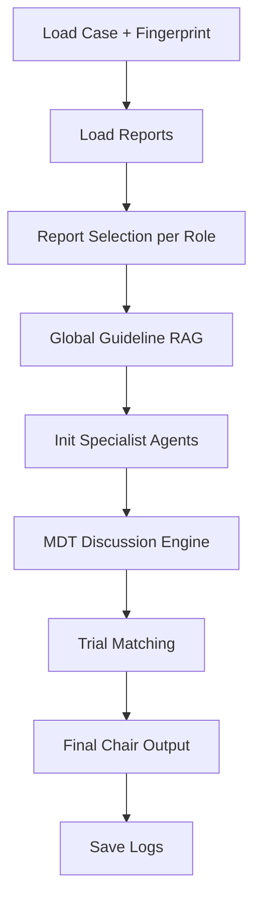

# MDT Discussion Log — 2026-01-17_23-40-44
Generated automatically by MDT Pipeline.


## CASE (structured JSON)

```
{"CASE_CORE":{"ADJUVANT_TREATMENT":{"cycles_or_courses":"Unknown","given":"Unknown","regimens":[]},"BIOMARKERS":{"AFP":"2.53 ng/ml (latest 2025-06-30)","CA125":"75.00 U/ml (latest 2025-06-30)","HER2":"Unknown","MSI":"Unknown","PDL1_CPS":"Unknown","TMB":"Unknown"},"BRCA1":"Unknown","BRCA2":"Unknown","CURRENT_STATUS":"Consulted for surgery","DIAGNOSIS":{"components":["Peritoneal seeding","Ascites","Lymph node metastases","Pelvic mass"],"histology":"分化差的癌","laterality":"Bilateral","primary":"Ovarian malignant tumor","site":"Pelvis / adnexa"},"HRD":"Unknown","INITIAL_TREATMENT":"Unknown","LINE_OF_THERAPY":[{"cycles":"2","end_date":"2025-06-09","intent":"Unknown","line":"Unknown","regimen":"紫杉醇+卡铂","start_date":"2025-05-09"}],"MAINTENANCE":"Unknown","MAINTENANCE_DETAIL":{"end_date":"Unknown","given":"Unknown","regimens":[],"start_date":"Unknown"},"NEOADJUVANT":"Yes","PFI_days":"Unknown","PLATINUM_HISTORY":[{"PFI_days":"Unknown","end_date":"2025-06-09","evidence":"","evidence_type":"Unknown","first_relapse_date":"Unknown","line":"Unknown","start_date":"2025-05-09","status":"Unknown"}],"PLATINUM_PFI_CURRENT":"Unknown","PLATINUM_STATUS":"Unknown","PLATINUM_STATUS_CURRENT":"Unknown","RELAPSE":"Unknown","RELAPSE_DATE":{"date":"Unknown","evidence":"","type":"Unknown"},"STAGE":{"stage_basis":"Unknown","stage_system":"Unknown","stage_text":"Unknown"},"SURGERY_DONE":{"date":"Unknown","performed":"Unknown","procedure":"Unknown"},"VISIT_DATE":"2025-07-01","first_relapse_date":"Unknown","last_platinum_end_date":"2025-06-09"},"LAB_TRENDS":{"labs":[{"analyte":"CA125","history":[{"date":"2025-04-27","flag":"Unknown","value":"823"},{"date":"2025-06-30","flag":"↑","value":"75.00"}],"latest":{"date":"2025-06-30","flag":"↑","value":"75.00"},"reference_range":"Unknown","unit":"U/ml"},{"analyte":"HE4","history":[{"date":"2025-04-27","flag":"Unknown","value":"480"},{"date":"2025-06-30","flag":"↑","value":"126.00"}],"latest":{"date":"2025-06-30","flag":"↑","value":"126.00"},"reference_range":"Unknown","unit":"pmol/L"},{"analyte":"CA19-9","history":[{"date":"2025-04-27","flag":"Unknown","value":"10.6"},{"date":"2025-06-30","flag":"Unknown","value":"17.50"}],"latest":{"date":"2025-06-30","flag":"Unknown","value":"17.50"},"reference_range":"Unknown","unit":"U/ml"},{"analyte":"CA153","history":[{"date":"2025-04-27","flag":"Unknown","value":"294"}],"latest":{"date":"2025-04-27","flag":"Unknown","value":"294"},"reference_range":"Unknown","unit":"Unknown"},{"analyte":"CA724","history":[{"date":"2025-04-27","flag":"Unknown","value":"62.7"}],"latest":{"date":"2025-04-27","flag":"Unknown","value":"62.7"},"reference_range":"Unknown","unit":"Unknown"},{"analyte":"CEA","history":[{"date":"2025-04-27","flag":"Unknown","value":"0.8"},{"date":"2025-06-30","flag":"Unknown","value":"1.64"}],"latest":{"date":"2025-06-30","flag":"Unknown","value":"1.64"},"reference_range":"Unknown","unit":"ng/ml"},{"analyte":"NSE","history":[{"date":"2025-04-27","flag":"Unknown","value":"19.7"}],"latest":{"date":"2025-04-27","flag":"Unknown","value":"19.7"},"reference_range":"Unknown","unit":"Unknown"},{"analyte":"AFP","history":[{"date":"2025-04-27","flag":"Unknown","value":"2.43"},{"date":"2025-06-30","flag":"Unknown","value":"2.53"}],"latest":{"date":"2025-06-30","flag":"Unknown","value":"2.53"},"reference_range":"Unknown","unit":"ng/ml"},{"analyte":"SCCA","history":[{"date":"2025-04-27","flag":"Unknown","value":"0.92"}],"latest":{"date":"2025-04-27","flag":"Unknown","value":"0.92"},"reference_range":"Unknown","unit":"Unknown"},{"analyte":"ROMA","history":[{"date":"2025-06-30","flag":"↑","value":"44.54 (premenopausal)"},{"date":"2025-06-30","flag":"↑","value":"52.50 (postmenopausal)"}],"latest":{"date":"2025-06-30","flag":"↑","value":"52.50 (postmenopausal) / 44.54 (premenopausal)"},"reference_range":"Unknown","unit":"%"}],"milestones":[{"date":"2025-04-28","description":"Biopsy with malignant morphology","type":"Other"},{"date":"2025-05-09","description":"Start 紫杉醇+卡铂 (neoadjuvant)","type":"ChemoStart"},{"date":"2025-06-09","description":"Completed 2 cycles 紫杉醇+卡铂","type":"ChemoEnd"},{"date":"2025-04-29","description":"FDG-PET/CT showing widespread avid disease","type":"Imaging"}]},"MED_ONC":{"current_regimen":{"cycle_info":"Completed 2 cycles of 紫杉醇+卡铂 (2025-05-09 to 2025-06-09)","last_admin_date":"2025-06-09","name":"Unknown"},"genetic_testing":{"germline":[],"somatic":[]},"monitoring_points":[],"planned_next_regimen":"Unknown","prior_systemic_therapies":["紫杉醇+卡铂 (2025-05-09-2025-06-09)"]},"NUC_MED":{"studies":[{"avid_lesions":["Bilateral adnexal lesions","Left supraclavicular and bilateral internal mammary nodes","Bilateral costophrenic angle nodes","Abdominal, retroperitoneal, left iliac vessel nodes","Multiple peritoneal and pelvic implants"],"confidence":"High","date":"2025-04-29","non_avid_notes":[],"type":"FDG-PET/CT"}]},"PATHOLOGY":{"specimens":[{"components":["Malignant cells","Poorly differentiated carcinoma (considered)"],"date":"2025-04-28","diagnosis":"镜下形态符合恶性，考虑为分化差的癌，不排除高浆病理切片未带","grade":"Unknown","ihc":[],"involvement_sites":["Pelvic mass"],"laterality":"Unknown","molecular":[],"raw_text":"镜下形态符合恶性，考虑为分化差的癌，不排除高浆病理切片未带","sample_type":"Core biopsy","site":"Pelvic mass (adnexal)","tumor_size":"Unknown","uncertainty_or_missing":["IHC not yet reported"]},{"components":["Tumor cells in ascites favor adenocarcinoma"],"date":"2025-05-07","diagnosis":"倾向腺癌","grade":"Unknown","ihc":[],"involvement_sites":["Peritoneal cavity"],"laterality":"Unknown","molecular":[],"raw_text":"腹水冲洗液见肿瘤细胞， 倾向腺癌。建议行细胞块及免疫酶标检查帮助诊断。","sample_type":"Cytology (ascites)","site":"Ascites","tumor_size":"Unknown","uncertainty_or_missing":["Cell block and IHC recommended"]},{"components":["Malignant tumor cells, favors adenocarcinoma"],"date":"2025-05-08","diagnosis":"腹水细胞块切片内见恶性肿瘤细胞，倾向腺癌","grade":"Unknown","ihc":[],"involvement_sites":["Peritoneal cavity"],"laterality":"Unknown","molecular":[],"raw_text":"常规报告（2025.05.08）：腹水细胞块切片内见恶性肿瘤细胞，倾向腺癌。建议行免疫酶标检查帮助诊断。","sample_type":"Cell block","site":"Ascites cell block","tumor_size":"Unknown","uncertainty_or_missing":["IHC recommended"]}]},"RADIOLOGY":{"next_imaging_plan":{"modality":"Unknown","timing":"Unknown"},"studies":[{"anatomic_sites":["Bilateral adnexa","Peritoneum","Uterus","Pelvis"],"date":"2025-04-26","findings":["Bilateral adnexal masses (left 59x74x92 mm)","Extensive peritoneal implants","Moderate ascites","Multiple enlarged lymph nodes (left iliac vessel, retroperitoneal, cardiophrenic)"],"impression":"Bilateral adnexal lesions suspicious for malignancy with peritoneal metastases and ascites","modality":"CT","trend_vs_prior":"Unknown"},{"anatomic_sites":["Peritoneum","Mesentery","Liver-gastric space","Retroperitoneum"],"date":"2025-07-01","findings":["Multiple small enhancing peritoneal and mesenteric nodules","Peritoneal/mesenteric slight hazy thickening","Scattered small retroperitoneal lymph nodes","Liver cysts","Cholelithiasis"],"impression":"Peritoneal and mesenteric enhancing nodules consistent with peritoneal disease; retroperitoneal nodes; correlate clinically","modality":"CT","trend_vs_prior":"Unknown"}]},"TIMELINE":{"constraints":{"max_events":30,"min_events":3,"must_include":["first diagnostic imaging or pathology confirmation (if available)"],"ordering_rules":{"prioritize_last_event":true}},"events":[{"date":"2025-04-26","description":"External CT: bilateral adnexal masses (left 59x74x92 mm), extensive peritoneal implants, moderate ascites, multiple enlarged nodes suspicious for metastasis","event_type":"Imaging","key_result":"Bilateral adnexal masses; peritoneal metastases suspected","regimen_or_test":"CT"},{"date":"2025-04-27","description":"Tumor markers drawn","event_type":"Lab","key_result":"CA125 823; CA153 294; CA724 62.7; CEA 0.8; NSE 19.7; CA199 10.6; HE4 480; AFP 2.43; SCCA 0.92","regimen_or_test":"CA125, CA153, CA724, CEA, NSE, CA199, HE4, AFP, SCCA"},{"date":"2025-04-28","description":"Ultrasound-guided paracentesis with drain and pelvic mass core biopsy","event_type":"Other","key_result":"Biopsy: morphology consistent with malignancy; considered poorly differentiated carcinoma","regimen_or_test":"Paracentesis and biopsy"},{"date":"2025-04-29","description":"External PET/CT showed FDG-avid bilateral adnexal lesions, multiple FDG-avid lymph nodes and peritoneal implants","event_type":"Imaging","key_result":"Metastatic disease suspected","regimen_or_test":"PET/CT"},{"date":"2025-05-07","description":"Ascites cytology: tumor cells present, favor adenocarcinoma; recommended cell block and IHC","event_type":"Lab","key_result":"Tumor cells present; favors adenocarcinoma","regimen_or_test":"Ascites cytology"},{"date":"2025-05-09","description":"Start chemotherapy: 紫杉醇+卡铂 neoadjuvant","event_type":"Chemo","key_result":"Planned 2 cycles (neoadjuvant)","regimen_or_test":"紫杉醇+卡铂"},{"date":"2025-06-09","description":"Completed 2 cycles of 紫杉醇+卡铂","event_type":"Chemo","key_result":"End of listed chemotherapy course","regimen_or_test":"紫杉醇+卡铂"},{"date":"2025-06-30","description":"Repeat tumor markers","event_type":"Lab","key_result":"CA19-9 17.50 U/ml; CA125 75.00 U/ml↑; AFP 2.53 ng/ml; CEA 1.64 ng/ml; HE4 126.00 pmol/L↑; ROMA 44.54% (premenopausal)↑; ROMA 52.50% (postmenopausal)↑","regimen_or_test":"CA19-9, CA125, AFP, CEA, HE4, ROMA"},{"date":"2025-07-01","description":"CT: multiple small enhancing peritoneal and mesenteric nodules, scanty peritoneal thickening, scattered small retroperitoneal nodes","event_type":"Imaging","key_result":"Peritoneal/mesenteric nodules; follow clinical correlation","regimen_or_test":"CT"}]}}
```


## FINAL MDT OUTPUT

```
Final Assessment:
Advanced epithelial adnexal malignancy with peritoneal and nodal disease on neoadjuvant platinum–taxane, but histologic subtype, response, and operability remain insufficiently characterized for definitive surgical versus systemic sequencing decisions.

Core Treatment Strategy:
- Do not commit today to interval debulking; await structured radiology response and resectability assessment integrating CT and PET findings (requested, pending).  
- Obtain urgent comprehensive preoperative assessment (ECOG, comorbidities, nutrition, anesthetic risk, chemo tolerance) to determine surgical fitness and perioperative risk.  
- Complete IHC and finalize histology (subtype, grade, primary site), then proceed with germline and somatic profiling to plan maintenance.  
- Maintain platinum-taxane–based systemic strategy in principle, but adjust intensity and timing only after imaging, pathology, molecular, and fitness data are integrated.  

Change Triggers:
- If imaging shows substantial response and disease judged resectable with acceptable risk, shift toward interval debulking followed by systemic/maintenance therapy.  
- If imaging or fitness assessment indicates unresectable disease or prohibitive surgical risk, prioritize continued systemic therapy and defer debulking, reassessing periodically.
```


## PIPELINE FLOW (Mermaid)




## TRACE EVENTS (Structured)

```json
[
  {
    "ts": "2026-01-17T23:37:13.162219",
    "event": "pipeline_start",
    "payload": {
      "visit_time": "2025-07-01 15:38:50.183000",
      "meta_info": "63212719700818194X"
    }
  },
  {
    "ts": "2026-01-17T23:37:13.162622",
    "event": "case_fingerprint",
    "payload": {
      "case_fingerprint": "5394a9a70135"
    }
  },
  {
    "ts": "2026-01-17T23:37:13.405760",
    "event": "reports_loaded",
    "payload": {
      "lab_n": 0,
      "img_n": 0,
      "path_n": 0,
      "mut_n": 1,
      "cutoff_dt": "2025-07-02 15:38:50"
    }
  },
  {
    "ts": "2026-01-17T23:37:13.460489",
    "event": "reports_selected",
    "payload": {
      "lab": {
        "chair": [],
        "oncologist": [],
        "radiologist": [],
        "pathologist": [],
        "nuclear": []
      },
      "imaging": {
        "chair": [],
        "oncologist": [],
        "radiologist": [],
        "pathologist": [],
        "nuclear": []
      },
      "pathology": {
        "chair": [],
        "oncologist": [],
        "radiologist": [],
        "pathologist": [],
        "nuclear": []
      },
      "mutation": {
        "chair": [],
        "oncologist": [],
        "radiologist": [],
        "pathologist": [],
        "nuclear": []
      }
    }
  },
  {
    "ts": "2026-01-17T23:37:41.148370",
    "event": "rag_query",
    "payload": {
      "query": "Presumed high-grade Müllerian adenocarcinoma, platinum-NA, with bilateral adnexal masses, diffuse peritoneal and nodal metastases; no BRCA/HRD/MSI/PD-L1 data; good response in CA125/HE4; no reported organ dysfunction or performance constraints—guidance on systemic therapy and surgery?"
    }
  },
  {
    "ts": "2026-01-17T23:37:41.148376",
    "event": "rag_hits",
    "payload": {
      "topk": 5,
      "n": 5
    }
  },
  {
    "ts": "2026-01-17T23:37:52.471259",
    "event": "mdt_discussion_start",
    "payload": {
      "num_rounds": 2,
      "num_turns": 2
    }
  },
  {
    "ts": "2026-01-17T23:40:40.318828",
    "event": "mdt_discussion_end",
    "payload": {
      "merged_chars": 1846
    }
  },
  {
    "ts": "2026-01-17T23:40:40.319615",
    "event": "final_output_start",
    "payload": {}
  },
  {
    "ts": "2026-01-17T23:40:44.854955",
    "event": "final_output_end",
    "payload": {
      "final_output_chars": 1322
    }
  }
]
```


## INITIAL EXPERT OPINIONS


## chair

```
- Advanced ovarian malignancy with peritoneal and nodal spread; partial biochemical response to two neoadjuvant platinum–taxane cycles.  
- Before surgery decision, urgently need updated performance status, comorbidities, nutritional status, and anesthetic risk assessment.  
- Require standardized radiology comparison (baseline vs 2025-07-01 CT and prior PET/CT) to quantify response and resectability.  
- Pathology incomplete: need IHC, definitive histologic subtype, grade, and tumor origin confirmation; then order germline and somatic profiling (BRCA/HRD).  
- MDT to decide: interval debulking feasibility vs further neoadjuvant therapy once operability, pathology, and genetics are clarified.
```


## oncologist

```
- Advanced bilateral ovarian carcinoma with peritoneal, nodal, ascitic disease; currently post‑2 cycles neoadjuvant platinum‑taxane, evaluated for interval debulking.  

- Tumor markers (CA125, HE4, ROMA) substantially decreased but still elevated, suggesting partial response; detailed radiologic response assessment missing, needs updated CT/MRI.  

- Organ function, performance status, neuropathy, marrow and renal reserves are unknown/needs update to judge feasibility of continued platinum‑taxane and perioperative risk.  

- Germline and somatic mutation status (BRCA, HRR genes, MSI, others) unknown/needs update to plan postoperative maintenance and future systemic options.  

- Surgical team’s assessment of resectability and planned timing/extent of cytoreduction is unknown/needs update to coordinate systemic therapy sequencing.
```


## radiologist

```
- CT shows multiple small enhancing peritoneal and mesenteric nodules, consistent with disseminated peritoneal disease.[@IMAGING_STUDIES|2025-07-01]

- Scattered small retroperitoneal lymph nodes; size and progression versus prior unclear, recommend comparison with earlier imaging.[@IMAGING_STUDIES|2025-07-01]

- Prior CT demonstrated large bilateral adnexal masses with extensive peritoneal implants, ascites, and nodal disease, suggesting advanced pelvic malignancy.[@IMAGING_STUDIES|2025-04-26]

- PET/CT previously showed widespread FDG-avid pelvic, peritoneal, and nodal disease including supradiaphragmatic nodes, confirming systemic metastatic involvement.[@PET_IF_AVAILABLE|2025-04-29]

- Trend of adnexal masses, ascites volume, and nodal size between April and July CTs is unknown; need formal side-by-side comparison.
```


## pathologist

```
- Current material supports malignant epithelial tumor, favor adenocarcinoma, from pelvic/adnexal mass with malignant ascites cytology [@HISTOLOGY_AND_IHC|2025-04-28;2025-05-07;2025-05-08].  
- Tumor grade, exact subtype (e.g., high‑grade serous vs others), and primary site remain undetermined/uncertain [@HISTOLOGY_AND_IHC|2025-04-28].  
- No immunohistochemistry yet on core biopsy or ascites cell block; IHC panel urgently needed for definitive classification [@HISTOLOGY_AND_IHC|2025-05-08].  
- No molecular testing (HRD/BRCA, MSI, TMB, HER2, PD‑L1) reported; comprehensive predictive panel status unknown/needs update.  
- Staging information (imaging, surgical findings, peritoneal/organ involvement extent) missing; pathologic stage cannot be assigned, needs radiology/surgical reports.
```


## nuclear

```
- FDG-avid bilateral adnexal lesions with extensive peritoneal and pelvic implants indicate metabolically active adnexal primary with peritoneal carcinomatosis [@PET_CT|2025-04-29].  
- FDG-avid retroperitoneal, left iliac, costophrenic, internal mammary, and left supraclavicular nodes suggest disseminated nodal metastases, upstaging beyond locoregional disease [@PET_CT|2025-04-29].  
- PET/CT extends CT findings by confirming metabolic activity of peritoneal and nodal disease, strengthening suspicion for advanced-stage ovarian malignancy [@PET_CT|2025-04-29; @IMAGING_CONTEXT|2025-04-26].  
- PET meaningfully changes staging by demonstrating extra-abdominal nodal involvement (internal mammary, supraclavicular), implying at least distant metastatic spread [@PET_CT|2025-04-29].  
- For current visit, need histology, CA-125, prior treatments, and interval imaging to assess for recurrence vs. untreated advanced presentation (unknown/needs update).
```


## MERGED SUMMARY (Assistant)

```
Key Knowledge:
- Advanced epithelial ovarian malignancy with bilateral adnexal masses, peritoneal carcinomatosis, ascites, and widespread nodal metastases including supraclavicular nodes.
- Partial biochemical response after 2 cycles of neoadjuvant platinum–taxane (markers down but still elevated).
- PET/CT confirms metabolically active peritoneal and nodal disease intra‑ and extra‑abdominally.
- Pathology confirms malignant epithelial (likely adnexal adenocarcinoma), but subtype, grade, and primary site remain undefined.

Controversies:
- Interval debulking now versus further/modified neoadjuvant chemotherapy.
- Extent/goal of cytoreductive surgery in the context of extra‑abdominal nodal disease.
- Future systemic and maintenance approach pending BRCA/HRD and broader molecular profile.

Missing Info:
- Updated performance status, comorbidities, nutritional state, and anesthetic risk.
- Formal, structured side‑by‑side comparison of baseline vs 01‑07‑2025 CT with PET correlation, including quantified response and detailed assessment of peritoneal and nodal resectability.
- Final histology with IHC (subtype, grade, primary site).
- Germline and somatic profiling (BRCA/HRR, HRD, MSI, TMB, HER2, PD‑L1, etc.).
- Current organ function, neuropathy, and overall chemotherapy tolerance.

Working Plan:
- Perform urgent comprehensive preoperative and anesthetic assessment.
- Request a standardized CT/PET response and resectability report (baseline vs 01‑07‑2025), focusing on peritoneal and nodal operability.
- Complete IHC and finalize histologic classification, then proceed with germline and somatic genomic profiling.
- Reconvene MDT once operability, pathology, and molecular data are available to decide timing of interval debulking versus further neoadjuvant therapy and to define postoperative/maintenance systemic strategy.
```


## INTERACTION LOG (Round × Turn)

### Round 1

#### Turn 1
- **chair → oncologist:** Before deciding on interval debulking after only two neoadjuvant cycles, we need documented ECOG, comorbidities, organ function, and chemo tolerance, plus a clear statement of surgical fitness from anesthesia.
- **chair → radiologist:** Please provide a formal side‑by‑side response assessment comparing baseline CT/PET with 2025‑07‑01 CT, explicitly commenting on peritoneal disease burden, nodal status (including supraclavicular), and likelihood of achieving no gross residual disease.
- **chair → pathologist:** We urgently need IHC and a finalized report specifying histologic subtype, grade, and likely primary site from existing biopsy/ascites material to guide systemic and maintenance planning.
- **chair → nuclear:** If available, please comment on whether prior PET/CT suggests any sites that would predict unresectable residual disease despite aggressive cytoreduction, to inform timing and extent of surgery.
- **oncologist → radiologist:** Please provide a formal comparative report of baseline vs latest CT/PET, explicitly grading response and commenting on likelihood of complete/optimal cytoreduction, including extra-abdominal nodes.
- **oncologist → pathologist:** We need finalized histologic subtype, grade, and confirmed primary site with IHC as soon as possible to guide systemic and maintenance planning.
- **radiologist → chair:** A dedicated side‑by‑side review of baseline vs 2025-07-01 CT (and prior PET/CT) to quantify response and resectability is still pending and is critical before any surgical decision.
- **pathologist → oncologist:** Histology still lacks IHC, grade, and defined primary site; urgent immunophenotyping of core and cell‑block material is critical before final staging/strategy decisions.
- **pathologist → radiologist:** Please provide a structured baseline-versus-latest CT/PET comparison focused on peritoneal versus nodal disease resectability to align with pending definitive pathology.
- **nuclear → radiologist:** We lack a structured side‑by‑side comparison of baseline versus 01‑07‑2025 imaging, including PET correlation, specifically addressing operability/resectability of peritoneal and nodal disease; could you provide a standardized response and resectability report?

#### Turn 2
- **radiologist → chair:** From imaging alone, we still have no formal baseline-versus-2025-07-01 response/resectability report integrating CT and PET; this remains critical before interval debulking decisions.
- **radiologist → nuclear:** Agree a standardized side‑by‑side CT/PET response and resectability assessment is missing; once requested, I can structure it around peritoneal and nodal operability.

### Round 2

#### Turn 1

#### Turn 2


## FINAL REFINED PLANS (per Round)

### Round 1


## chair

```
- Defer interval debulking decision until standardized CT/PET response and resectability assessment is completed; request urgent integrated report (baseline vs 2025‑07‑01).  
- Obtain full preoperative evaluation (performance, comorbidities, nutrition, organ function, neuropathy, anesthetic risk); surgery contingent on acceptable overall risk.  
- Prioritize pathology work‑up: IHC, grade, and primary site assignment on core and cell‑block material; escalate if delayed.  
- Initiate comprehensive germline and somatic profiling (BRCA/HRR, HRD, MSI, TMB, PD‑L1, HER2, others) once histologic subtype finalized.  
- Reconvene MDT promptly with imaging, pathology, and risk data to choose between interval debulking versus additional/modified neoadjuvant and outline postoperative/maintenance strategy.
```


## oncologist

```
- Defer decision on interval debulking versus further neoadjuvant therapy until standardized CT/PET response and resectability report is available (requested, pending).  

- Urgently complete IHC on existing tissue to define subtype, grade, and primary site; initiate comprehensive germline and somatic profiling afterward.  

- Arrange full preoperative assessment: performance status, comorbidities, nutritional/anesthetic risk, and detailed documentation of chemotherapy tolerance and neuropathy (currently unknown).  

- Obtain up-to-date labs for marrow, renal, and hepatic function to confirm suitability for continued platinum-based therapy and potential surgery (unknown).  

- Reconvene MDT once imaging, pathology, molecular, and clinical fitness data are available to finalize timing of surgery and systemic/maintenance strategy.
```


## radiologist

```
- Arrange formal side‑by‑side review of baseline vs 2025-07-01 CT, with PET correlation, to quantify disease burden and resectability.[@IMAGING_STUDIES|2025-04-26][@IMAGING_STUDIES|2025-07-01][@PET_IF_AVAILABLE|2025-04-29]

- In the comparative report, separately characterize peritoneal/mesenteric implants (size, distribution, bowel/mesenteric involvement) relevant to optimal cytoreduction.[@IMAGING_STUDIES|2025-07-01]

- Systematically assess nodal disease (pelvic, para‑aortic, cardiophrenic, supraclavicular) for size, conglomeration, and relationship to major vessels/structures.[@IMAGING_STUDIES|2025-04-26][@PET_IF_AVAILABLE|2025-04-29]

- Comment explicitly on imaging features predicting unresectable disease (e.g., root-of-mesentery, porta hepatis, diffuse small‑bowel serosal involvement) if present/absent.[@IMAGING_STUDIES|2025-07-01]

- Deliver structured radiology response/resectability report before MDT reconvening to inform timing and extent of interval debulking.[@IMAGING_STUDIES|2025-07-01]
```


## pathologist

```
- Maintain working diagnosis: advanced malignant epithelial adnexal tumor with peritoneal carcinomatosis and nodal metastases; precise subtype/grade unknown [@HISTOLOGY_AND_IHC|2025-04-28;2025-05-07;2025-05-08].  
- Expedite IHC on pelvic mass biopsy and ascites cell block to define subtype, grade, and likely primary site [@HISTOLOGY_AND_IHC|2025-05-08].  
- Once histotype/grade established, initiate comprehensive germline and somatic profiling (BRCA/HRR, HRD, MSI, TMB, HER2, PD‑L1); currently unknown.  
- Request finalized, structured CT±PET baseline-versus-2025-07-01 response and resectability report to align surgical planning with pathology; pending/unknown.  
- Reconvene MDT after IHC, molecular profiling, and imaging response report are available to integrate definitive pathology into staging and future management discussions.
```


## nuclear

```
- Maintain current plan to delay surgical decisions until formal CT/PET side‑by‑side response and resectability report is completed (requested, pending).  
- Prioritize urgent IHC and full histologic characterization to define subtype, grade, and primary site (currently unknown, needs update).  
- Complete germline and somatic profiling after histology finalization to inform future systemic and maintenance strategy (currently unknown, needs update).  
- Obtain comprehensive preoperative, anesthetic, and organ‑function assessments to clarify surgical fitness and perioperative risk (currently unknown, needs update).  
- Reconvene MDT once imaging response/resectability, finalized pathology, and clinical fitness data are available to reassess interval debulking timing and goals.
```

### Round 2


## chair

```
- Defer interval debulking decision until updated performance status, comorbidities, organ function, and chemo tolerance are documented (all currently unknown).  
- Obtain standardized baseline vs 2025-07-01 CT comparison with PET correlation, explicitly grading peritoneal and nodal resectability (currently unknown).  
- Expedite IHC on pelvic mass and ascites cell block to define epithelial subtype, grade, and likely primary site (unknown).  
- Initiate germline and somatic profiling (BRCA/HRR, HRD, MSI, TMB, HER2, PD‑L1) once histology finalized; results will guide maintenance.  
- Reconvene MDT promptly after imaging, pathology, and molecular updates to choose between interval debulking versus further neoadjuvant and to sequence subsequent systemic/maintenance therapy.
```


## oncologist

```
- Defer decision on interval debulking versus further neoadjuvant therapy until structured CT/PET response and resectability report is available (currently unknown).  

- Urgently obtain full preoperative assessment: ECOG status, comorbidities, nutrition, anesthetic risk, and detailed chemo tolerance/neuropathy documentation (unknown).  

- Complete IHC and finalize histology (subtype, grade, primary site), then proceed with comprehensive germline and somatic profiling (all unknown).  

- Update labs for marrow, renal, and hepatic function to confirm suitability for ongoing platinum-based therapy and major surgery (values unknown).  

- Reconvene MDT once imaging, pathology, molecular, and clinical fitness data are available to finalize surgical timing and systemic/maintenance strategy.
```


## radiologist

```
- Generate standardized side‑by‑side report comparing baseline 2025-04-26 CT and 2025-07-01 CT, quantifying measurable disease and response.[@IMAGING_STUDIES|2025-04-26][@IMAGING_STUDIES|2025-07-01]

- Integrate 2025-04-29 PET/CT to map FDG‑avid peritoneal and nodal disease onto latest CT for operability assessment.[@PET_IF_AVAILABLE|2025-04-29][@IMAGING_STUDIES|2025-07-01]

- Detail peritoneal carcinomatosis distribution, bowel/mesenteric involvement, and any imaging signs of likely unresectable disease on latest CT.[@IMAGING_STUDIES|2025-07-01]

- Characterize nodal disease burden (pelvic, para‑aortic, cardiophrenic, supraclavicular) with size, conglomeration, and relation to major vessels.[@IMAGING_STUDIES|2025-04-26][@PET_IF_AVAILABLE|2025-04-29]

- Deliver structured response/resectability report before MDT reconvening to guide interval debulking decisions versus further neoadjuvant therapy.[@IMAGING_STUDIES|2025-07-01]
```


## pathologist

```
- Maintain working diagnosis: advanced malignant epithelial adnexal tumor with peritoneal carcinomatosis and nodal metastases; precise subtype/grade still unknown [@HISTOLOGY_AND_IHC|2025-04-28;2025-05-07;2025-05-08].  
- Urgently perform IHC on pelvic core biopsy and ascites cell block to define histologic subtype, grade, and likely primary [@HISTOLOGY_AND_IHC|2025-05-08].  
- After histotype/grade clarification, initiate comprehensive germline and somatic profiling (BRCA/HRR, HRD, MSI, TMB, HER2, PD‑L1); all currently unknown.  
- Ensure radiology delivers structured baseline-versus-2025-07-01 CT with PET correlation, including quantified response and detailed resectability assessment; currently missing/unknown.  
- Reconvene MDT when IHC, molecular profile, and standardized imaging response/resectability report are available to integrate definitive pathology into staging decisions.
```


## nuclear

```
- Maintain plan for urgent comprehensive preoperative and anesthetic assessment; performance status and operative risk remain unknown/needs update.  
- Proceed with a structured baseline-versus-01‑07‑2025 CT report with PET correlation to quantify response and resectability (requested, unknown/needs update).  
- Finalize histology with IHC to define subtype, grade, and primary site before definitive staging (currently unknown/needs update).  
- After histology, complete germline and somatic profiling to inform future systemic and maintenance strategies (currently unknown/needs update).  
- Reconvene MDT once imaging response/resectability, finalized pathology, and clinical fitness data are available to reassess interval debulking versus further neoadjuvant therapy.
```


## RAW AGENT LOGS

### chair
- **User:** Give INITIAL opinion (use ONLY your system-provided patient facts).
Return up to 5 bullets, each ≤20 words.
If key data missing, say exactly what needs updating.
  
  **Assistant:** - Advanced ovarian malignancy with peritoneal and nodal spread; partial biochemical response to two neoadjuvant platinum–taxane cycles.  
- Before surgery decision, urgently need updated performance status, comorbidities, nutritional status, and anesthetic risk assessment.  
- Require standardized radiology comparison (baseline vs 2025-07-01 CT and prior PET/CT) to quantify response and resectability.  
- Pathology incomplete: need IHC, definitive histologic subtype, grade, and tumor origin confirmation; then order germline and somatic profiling (BRCA/HRD).  
- MDT to decide: interval debulking feasibility vs further neoadjuvant therapy once operability, pathology, and genetics are clarified.
  
  *(2026-01-17T23:37:55.521121)*

- **User:** ROLE: chair. VISIT: 2025-07-01 15:38:50.183000
Default is NOT to speak. Speak ONLY if: conflict | safety | missing-critical | new-critical.

CONTEXT (latest):
Key Knowledge:
- Advanced epithelial ovarian malignancy with bilateral adnexal masses, peritoneal carcinomatosis, ascites, and widespread (including supraclavicular) nodal metastases.
- Partial biochemical response after 2 cycles neoadjuvant platinum–taxane; markers improved but remain elevated.
- PET/CT confirms metabolically active peritoneal and nodal disease (abdominal and extra‑abdominal).
- Pathology confirms malignant epithelial tumor, likely adnexal adenocarcinoma, but subtype, grade, and primary site are not yet defined.

Controversies:
- Whether to proceed to interval debulking now versus continue/modify neoadjuvant chemotherapy.
- Appropriate extent and objective of cytoreductive surgery in the setting of extra‑abdominal nodal disease.
- Future systemic and maintenance strategy pending BRCA/HRD and broader molecular results.

Missing Info:
- Updated performance status, comorbidities, nutritional and anesthetic risk.
- Formal radiologic response assessment with side‑by‑side comparison of baseline vs 01‑07‑2025 CT and PET/CT, including resectability.
- Finalized histology with IHC (subtype, grade, primary site).
- Germline and somatic profiling (BRCA/HRR, HRD, MSI, TMB, HER2, PD‑L1, etc.).
- Current organ function, neuropathy status, and chemotherapy tolerance.

Working Plan:
- Perform urgent comprehensive preoperative and anesthetic assessment.
- Obtain standardized comparative radiology report to quantify response and assess resectability.
- Complete IHC and finalize histologic classification; then proceed with germline and somatic genomic profiling.
- Reconvene MDT once operability, pathology, and molecular data are available to determine timing of interval debulking versus further neoadjuvant therapy and to plan postoperative/maintenance systemic strategy.

Allowed targets: [oncologist,radiologist,pathologist,nuclear]
Return ONE-LINE JSON only:{"speak":"yes/no","messages":[{"target":"<role>","message":"<1-2 sentences>","why":"conflict|safety|missing|new"}]}
  
  **Assistant:** {"speak":"yes","messages":[{"target":"oncologist","message":"Before deciding on interval debulking after only two neoadjuvant cycles, we need documented ECOG, comorbidities, organ function, and chemo tolerance, plus a clear statement of surgical fitness from anesthesia.","why":"missing"},{"target":"radiologist","message":"Please provide a formal side‑by‑side response assessment comparing baseline CT/PET with 2025‑07‑01 CT, explicitly commenting on peritoneal disease burden, nodal status (including supraclavicular), and likelihood of achieving no gross residual disease.","why":"missing"},{"target":"pathologist","message":"We urgently need IHC and a finalized report specifying histologic subtype, grade, and likely primary site from existing biopsy/ascites material to guide systemic and maintenance planning.","why":"missing"},{"target":"nuclear","message":"If available, please comment on whether prior PET/CT suggests any sites that would predict unresectable residual disease despite aggressive cytoreduction, to inform timing and extent of surgery.","why":"missing"}]}
  
  *(2026-01-17T23:38:21.485028)*

- **User:** ROLE: chair. VISIT: 2025-07-01 15:38:50.183000
Default is NOT to speak. Speak ONLY if: conflict | safety | missing-critical | new-critical.

CONTEXT (latest):
Key Knowledge:
- Advanced epithelial ovarian malignancy with bilateral adnexal masses, peritoneal carcinomatosis, ascites, and widespread (including supraclavicular) nodal metastases.
- Partial biochemical response after 2 cycles neoadjuvant platinum–taxane; markers improved but remain elevated.
- PET/CT confirms metabolically active peritoneal and nodal disease (abdominal and extra‑abdominal).
- Pathology confirms malignant epithelial tumor, likely adnexal adenocarcinoma, but subtype, grade, and primary site are not yet defined.

Controversies:
- Whether to proceed to interval debulking now versus continue/modify neoadjuvant chemotherapy.
- Appropriate extent and objective of cytoreductive surgery in the setting of extra‑abdominal nodal disease.
- Future systemic and maintenance strategy pending BRCA/HRD and broader molecular results.

Missing Info:
- Updated performance status, comorbidities, nutritional and anesthetic risk.
- Formal radiologic response assessment with side‑by‑side comparison of baseline vs 01‑07‑2025 CT and PET/CT, including resectability.
- Finalized histology with IHC (subtype, grade, primary site).
- Germline and somatic profiling (BRCA/HRR, HRD, MSI, TMB, HER2, PD‑L1, etc.).
- Current organ function, neuropathy status, and chemotherapy tolerance.

Working Plan:
- Perform urgent comprehensive preoperative and anesthetic assessment.
- Obtain standardized comparative radiology report to quantify response and assess resectability.
- Complete IHC and finalize histologic classification; then proceed with germline and somatic genomic profiling.
- Reconvene MDT once operability, pathology, and molecular data are available to determine timing of interval debulking versus further neoadjuvant therapy and to plan postoperative/maintenance systemic strategy.
[R1T1 DELTA] (missing): A dedicated side‑by‑side review of baseline vs 2025-07-01 CT (and prior PET/CT) to quantify response and resectability is still pending and is critical before any surgical decision. | pathologist->oncologist(missing): Histology still lacks IHC, grade, and defined primary site; urgent immunophenotyping of core and cell‑block material is critical before final staging/strategy decisions. | pathologist->radiologist(missing): Please provide a structured baseline-versus-latest CT/PET comparison focused on peritoneal versus nodal disease resectability to align with pending definitive pathology. | nuclear->radiologist(missing): We lack a structured side‑by‑side comparison of baseline versus 01‑07‑2025 imaging, including PET correlation, specifically addressing operability/resectability of peritoneal and nodal disease; could you provide a standardized response and resectability report?

Allowed targets: [oncologist,radiologist,pathologist,nuclear]
Return ONE-LINE JSON only:{"speak":"yes/no","messages":[{"target":"<role>","message":"<1-2 sentences>","why":"conflict|safety|missing|new"}]}
  
  **Assistant:** {"speak":"no","messages":[]}
  
  *(2026-01-17T23:38:33.128628)*

- **User:** Given MDT context:
Key Knowledge:
- Advanced epithelial ovarian malignancy with bilateral adnexal masses, peritoneal carcinomatosis, ascites, and widespread (including supraclavicular) nodal metastases.
- Partial biochemical response after 2 cycles neoadjuvant platinum–taxane; markers improved but remain elevated.
- PET/CT confirms metabolically active peritoneal and nodal disease (abdominal and extra‑abdominal).
- Pathology confirms malignant epithelial tumor, likely adnexal adenocarcinoma, but subtype, grade, and primary site are not yet defined.

Controversies:
- Whether to proceed to interval debulking now versus continue/modify neoadjuvant chemotherapy.
- Appropriate extent and objective of cytoreductive surgery in the setting of extra‑abdominal nodal disease.
- Future systemic and maintenance strategy pending BRCA/HRD and broader molecular results.

Missing Info:
- Updated performance status, comorbidities, nutritional and anesthetic risk.
- Formal radiologic response assessment with side‑by‑side comparison of baseline vs 01‑07‑2025 CT and PET/CT, including resectability.
- Finalized histology with IHC (subtype, grade, primary site).
- Germline and somatic profiling (BRCA/HRR, HRD, MSI, TMB, HER2, PD‑L1, etc.).
- Current organ function, neuropathy status, and chemotherapy tolerance.

Working Plan:
- Perform urgent comprehensive preoperative and anesthetic assessment.
- Obtain standardized comparative radiology report to quantify response and assess resectability.
- Complete IHC and finalize histologic classification; then proceed with germline and somatic genomic profiling.
- Reconvene MDT once operability, pathology, and molecular data are available to determine timing of interval debulking versus further neoadjuvant therapy and to plan postoperative/maintenance systemic strategy.
[R1T1 DELTA] (missing): A dedicated side‑by‑side review of baseline vs 2025-07-01 CT (and prior PET/CT) to quantify response and resectability is still pending and is critical before any surgical decision. | pathologist->oncologist(missing): Histology still lacks IHC, grade, and defined primary site; urgent immunophenotyping of core and cell‑block material is critical before final staging/strategy decisions. | pathologist->radiologist(missing): Please provide a structured baseline-versus-latest CT/PET comparison focused on peritoneal versus nodal disease resectability to align with pending definitive pathology. | nuclear->radiologist(missing): We lack a structured side‑by‑side comparison of baseline versus 01‑07‑2025 imaging, including PET correlation, specifically addressing operability/resectability of peritoneal and nodal disease; could you provide a standardized response and resectability report?
[R1T2 DELTA] radiologist->chair(unspecified): From imaging alone, we still have no formal baseline-versus-2025-07-01 response/resectability report integrating CT and PET; this remains critical before interval debulking decisions. | radiologist->nuclear(unspecified): Agree a standardized side‑by‑side CT/PET response and resectability assessment is missing; once requested, I can structure it around peritoneal and nodal operability.

Provide FINAL refined plan.
Up to 5 bullets, each ≤20 words.
Any factual claim must include [@report_id|date] or say unknown.
  
  **Assistant:** - Defer interval debulking decision until standardized CT/PET response and resectability assessment is completed; request urgent integrated report (baseline vs 2025‑07‑01).  
- Obtain full preoperative evaluation (performance, comorbidities, nutrition, organ function, neuropathy, anesthetic risk); surgery contingent on acceptable overall risk.  
- Prioritize pathology work‑up: IHC, grade, and primary site assignment on core and cell‑block material; escalate if delayed.  
- Initiate comprehensive germline and somatic profiling (BRCA/HRR, HRD, MSI, TMB, PD‑L1, HER2, others) once histologic subtype finalized.  
- Reconvene MDT promptly with imaging, pathology, and risk data to choose between interval debulking versus additional/modified neoadjuvant and outline postoperative/maintenance strategy.
  
  *(2026-01-17T23:39:02.213523)*

- **User:** ROLE: chair. VISIT: 2025-07-01 15:38:50.183000
Default is NOT to speak. Speak ONLY if: conflict | safety | missing-critical | new-critical.

CONTEXT (latest):
Key Knowledge:
- Advanced epithelial ovarian malignancy with bilateral adnexal masses, peritoneal carcinomatosis, ascites, and widespread nodal metastases including supraclavicular nodes.
- Partial biochemical response after 2 cycles of neoadjuvant platinum–taxane (markers down but still elevated).
- PET/CT confirms metabolically active peritoneal and nodal disease intra‑ and extra‑abdominally.
- Pathology confirms malignant epithelial (likely adnexal adenocarcinoma), but subtype, grade, and primary site remain undefined.

Controversies:
- Interval debulking now versus further/modified neoadjuvant chemotherapy.
- Extent/goal of cytoreductive surgery in the context of extra‑abdominal nodal disease.
- Future systemic and maintenance approach pending BRCA/HRD and broader molecular profile.

Missing Info:
- Updated performance status, comorbidities, nutritional state, and anesthetic risk.
- Formal, structured side‑by‑side comparison of baseline vs 01‑07‑2025 CT with PET correlation, including quantified response and detailed assessment of peritoneal and nodal resectability.
- Final histology with IHC (subtype, grade, primary site).
- Germline and somatic profiling (BRCA/HRR, HRD, MSI, TMB, HER2, PD‑L1, etc.).
- Current organ function, neuropathy, and overall chemotherapy tolerance.

Working Plan:
- Perform urgent comprehensive preoperative and anesthetic assessment.
- Request a standardized CT/PET response and resectability report (baseline vs 01‑07‑2025), focusing on peritoneal and nodal operability.
- Complete IHC and finalize histologic classification, then proceed with germline and somatic genomic profiling.
- Reconvene MDT once operability, pathology, and molecular data are available to decide timing of interval debulking versus further neoadjuvant therapy and to define postoperative/maintenance systemic strategy.

Allowed targets: [oncologist,radiologist,pathologist,nuclear]
Return ONE-LINE JSON only:{"speak":"yes/no","messages":[{"target":"<role>","message":"<1-2 sentences>","why":"conflict|safety|missing|new"}]}
  
  **Assistant:** {"speak":"no","messages":[]}
  
  *(2026-01-17T23:39:38.542651)*

- **User:** Given MDT context:
Key Knowledge:
- Advanced epithelial ovarian malignancy with bilateral adnexal masses, peritoneal carcinomatosis, ascites, and widespread nodal metastases including supraclavicular nodes.
- Partial biochemical response after 2 cycles of neoadjuvant platinum–taxane (markers down but still elevated).
- PET/CT confirms metabolically active peritoneal and nodal disease intra‑ and extra‑abdominally.
- Pathology confirms malignant epithelial (likely adnexal adenocarcinoma), but subtype, grade, and primary site remain undefined.

Controversies:
- Interval debulking now versus further/modified neoadjuvant chemotherapy.
- Extent/goal of cytoreductive surgery in the context of extra‑abdominal nodal disease.
- Future systemic and maintenance approach pending BRCA/HRD and broader molecular profile.

Missing Info:
- Updated performance status, comorbidities, nutritional state, and anesthetic risk.
- Formal, structured side‑by‑side comparison of baseline vs 01‑07‑2025 CT with PET correlation, including quantified response and detailed assessment of peritoneal and nodal resectability.
- Final histology with IHC (subtype, grade, primary site).
- Germline and somatic profiling (BRCA/HRR, HRD, MSI, TMB, HER2, PD‑L1, etc.).
- Current organ function, neuropathy, and overall chemotherapy tolerance.

Working Plan:
- Perform urgent comprehensive preoperative and anesthetic assessment.
- Request a standardized CT/PET response and resectability report (baseline vs 01‑07‑2025), focusing on peritoneal and nodal operability.
- Complete IHC and finalize histologic classification, then proceed with germline and somatic genomic profiling.
- Reconvene MDT once operability, pathology, and molecular data are available to decide timing of interval debulking versus further neoadjuvant therapy and to define postoperative/maintenance systemic strategy.

Provide FINAL refined plan.
Up to 5 bullets, each ≤20 words.
Any factual claim must include [@report_id|date] or say unknown.
  
  **Assistant:** - Defer interval debulking decision until updated performance status, comorbidities, organ function, and chemo tolerance are documented (all currently unknown).  
- Obtain standardized baseline vs 2025-07-01 CT comparison with PET correlation, explicitly grading peritoneal and nodal resectability (currently unknown).  
- Expedite IHC on pelvic mass and ascites cell block to define epithelial subtype, grade, and likely primary site (unknown).  
- Initiate germline and somatic profiling (BRCA/HRR, HRD, MSI, TMB, HER2, PD‑L1) once histology finalized; results will guide maintenance.  
- Reconvene MDT promptly after imaging, pathology, and molecular updates to choose between interval debulking versus further neoadjuvant and to sequence subsequent systemic/maintenance therapy.
  
  *(2026-01-17T23:40:07.632900)*

- **User:** 
As the MDT chair for gynecologic oncology, you are seeing the patient at OUTPATIENT TIME: 2025-07-01 15:38:50.183000.
Based on PATIENT FACTS + MDT discussion + FINAL refined plans from all experts, determine the CURRENT best management plan for this visit.

STRICT RULES:
- Any factual statement about past tests/treatments must include [@report_id|date] or say unknown.
- If experts disagree, pick the safest plan and state the key uncertainty.

# FINAL REFINED PLANS (All experts, last round)
{
  "Round 1": {
    "chair": "- Defer interval debulking decision until standardized CT/PET response and resectability assessment is completed; request urgent integrated report (baseline vs 2025‑07‑01).  \n- Obtain full preoperative evaluation (performance, comorbidities, nutrition, organ function, neuropathy, anesthetic risk); surgery contingent on acceptable overall risk.  \n- Prioritize pathology work‑up: IHC, grade, and primary site assignment on core and cell‑block material; escalate if delayed.  \n- Initiate comprehensive germline and somatic profiling (BRCA/HRR, HRD, MSI, TMB, PD‑L1, HER2, others) once histologic subtype finalized.  \n- Reconvene MDT promptly with imaging, pathology, and risk data to choose between interval debulking versus additional/modified neoadjuvant and outline postoperative/maintenance strategy.",
    "oncologist": "- Defer decision on interval debulking versus further neoadjuvant therapy until standardized CT/PET response and resectability report is available (requested, pending).  \n\n- Urgently complete IHC on existing tissue to define subtype, grade, and primary site; initiate comprehensive germline and somatic profiling afterward.  \n\n- Arrange full preoperative assessment: performance status, comorbidities, nutritional/anesthetic risk, and detailed documentation of chemotherapy tolerance and neuropathy (currently unknown).  \n\n- Obtain up-to-date labs for marrow, renal, and hepatic function to confirm suitability for continued platinum-based therapy and potential surgery (unknown).  \n\n- Reconvene MDT once imaging, pathology, molecular, and clinical fitness data are available to finalize timing of surgery and systemic/maintenance strategy.",
    "radiologist": "- Arrange formal side‑by‑side review of baseline vs 2025-07-01 CT, with PET correlation, to quantify disease burden and resectability.[@IMAGING_STUDIES|2025-04-26][@IMAGING_STUDIES|2025-07-01][@PET_IF_AVAILABLE|2025-04-29]\n\n- In the comparative report, separately characterize peritoneal/mesenteric implants (size, distribution, bowel/mesenteric involvement) relevant to optimal cytoreduction.[@IMAGING_STUDIES|2025-07-01]\n\n- Systematically assess nodal disease (pelvic, para‑aortic, cardiophrenic, supraclavicular) for size, conglomeration, and relationship to major vessels/structures.[@IMAGING_STUDIES|2025-04-26][@PET_IF_AVAILABLE|2025-04-29]\n\n- Comment explicitly on imaging features predicting unresectable disease (e.g., root-of-mesentery, porta hepatis, diffuse small‑bowel serosal involvement) if present/absent.[@IMAGING_STUDIES|2025-07-01]\n\n- Deliver structured radiology response/resectability report before MDT reconvening to inform timing and extent of interval debulking.[@IMAGING_STUDIES|2025-07-01]",
    "pathologist": "- Maintain working diagnosis: advanced malignant epithelial adnexal tumor with peritoneal carcinomatosis and nodal metastases; precise subtype/grade unknown [@HISTOLOGY_AND_IHC|2025-04-28;2025-05-07;2025-05-08].  \n- Expedite IHC on pelvic mass biopsy and ascites cell block to define subtype, grade, and likely primary site [@HISTOLOGY_AND_IHC|2025-05-08].  \n- Once histotype/grade established, initiate comprehensive germline and somatic profiling (BRCA/HRR, HRD, MSI, TMB, HER2, PD‑L1); currently unknown.  \n- Request finalized, structured CT±PET baseline-versus-2025-07-01 response and resectability report to align surgical planning with pathology; pending/unknown.  \n- Reconvene MDT after IHC, molecular profiling, and imaging response report are available to integrate definitive pathology into staging and future management discussions.",
    "nuclear": "- Maintain current plan to delay surgical decisions until formal CT/PET side‑by‑side response and resectability report is completed (requested, pending).  \n- Prioritize urgent IHC and full histologic characterization to define subtype, grade, and primary site (currently unknown, needs update).  \n- Complete germline and somatic profiling after histology finalization to inform future systemic and maintenance strategy (currently unknown, needs update).  \n- Obtain comprehensive preoperative, anesthetic, and organ‑function assessments to clarify surgical fitness and perioperative risk (currently unknown, needs update).  \n- Reconvene MDT once imaging response/resectability, finalized pathology, and clinical fitness data are available to reassess interval debulking timing and goals."
  },
  "Round 2": {
    "chair": "- Defer interval debulking decision until updated performance status, comorbidities, organ function, and chemo tolerance are documented (all currently unknown).  \n- Obtain standardized baseline vs 2025-07-01 CT comparison with PET correlation, explicitly grading peritoneal and nodal resectability (currently unknown).  \n- Expedite IHC on pelvic mass and ascites cell block to define epithelial subtype, grade, and likely primary site (unknown).  \n- Initiate germline and somatic profiling (BRCA/HRR, HRD, MSI, TMB, HER2, PD‑L1) once histology finalized; results will guide maintenance.  \n- Reconvene MDT promptly after imaging, pathology, and molecular updates to choose between interval debulking versus further neoadjuvant and to sequence subsequent systemic/maintenance therapy.",
    "oncologist": "- Defer decision on interval debulking versus further neoadjuvant therapy until structured CT/PET response and resectability report is available (currently unknown).  \n\n- Urgently obtain full preoperative assessment: ECOG status, comorbidities, nutrition, anesthetic risk, and detailed chemo tolerance/neuropathy documentation (unknown).  \n\n- Complete IHC and finalize histology (subtype, grade, primary site), then proceed with comprehensive germline and somatic profiling (all unknown).  \n\n- Update labs for marrow, renal, and hepatic function to confirm suitability for ongoing platinum-based therapy and major surgery (values unknown).  \n\n- Reconvene MDT once imaging, pathology, molecular, and clinical fitness data are available to finalize surgical timing and systemic/maintenance strategy.",
    "radiologist": "- Generate standardized side‑by‑side report comparing baseline 2025-04-26 CT and 2025-07-01 CT, quantifying measurable disease and response.[@IMAGING_STUDIES|2025-04-26][@IMAGING_STUDIES|2025-07-01]\n\n- Integrate 2025-04-29 PET/CT to map FDG‑avid peritoneal and nodal disease onto latest CT for operability assessment.[@PET_IF_AVAILABLE|2025-04-29][@IMAGING_STUDIES|2025-07-01]\n\n- Detail peritoneal carcinomatosis distribution, bowel/mesenteric involvement, and any imaging signs of likely unresectable disease on latest CT.[@IMAGING_STUDIES|2025-07-01]\n\n- Characterize nodal disease burden (pelvic, para‑aortic, cardiophrenic, supraclavicular) with size, conglomeration, and relation to major vessels.[@IMAGING_STUDIES|2025-04-26][@PET_IF_AVAILABLE|2025-04-29]\n\n- Deliver structured response/resectability report before MDT reconvening to guide interval debulking decisions versus further neoadjuvant therapy.[@IMAGING_STUDIES|2025-07-01]",
    "pathologist": "- Maintain working diagnosis: advanced malignant epithelial adnexal tumor with peritoneal carcinomatosis and nodal metastases; precise subtype/grade still unknown [@HISTOLOGY_AND_IHC|2025-04-28;2025-05-07;2025-05-08].  \n- Urgently perform IHC on pelvic core biopsy and ascites cell block to define histologic subtype, grade, and likely primary [@HISTOLOGY_AND_IHC|2025-05-08].  \n- After histotype/grade clarification, initiate comprehensive germline and somatic profiling (BRCA/HRR, HRD, MSI, TMB, HER2, PD‑L1); all currently unknown.  \n- Ensure radiology delivers structured baseline-versus-2025-07-01 CT with PET correlation, including quantified response and detailed resectability assessment; currently missing/unknown.  \n- Reconvene MDT when IHC, molecular profile, and standardized imaging response/resectability report are available to integrate definitive pathology into staging decisions.",
    "nuclear": "- Maintain plan for urgent comprehensive preoperative and anesthetic assessment; performance status and operative risk remain unknown/needs update.  \n- Proceed with a structured baseline-versus-01‑07‑2025 CT report with PET correlation to quantify response and resectability (requested, unknown/needs update).  \n- Finalize histology with IHC to define subtype, grade, and primary site before definitive staging (currently unknown/needs update).  \n- After histology, complete germline and somatic profiling to inform future systemic and maintenance strategies (currently unknown/needs update).  \n- Reconvene MDT once imaging response/resectability, finalized pathology, and clinical fitness data are available to reassess interval debulking versus further neoadjuvant therapy."
  }
}

# Response Format
Final Assessment:
<1–3 sentences: summarize histology/biology, current disease status, and key uncertainties>

Core Treatment Strategy:
- < ≤20 words concrete decision >
- < ≤20 words concrete decision >
- < ≤20 words concrete decision >
- < ≤20 words concrete decision >

Change Triggers:
- < ≤20 words “if X, then adjust management from A to B” >
- < ≤20 words “if X, then adjust management from A to B” >

  
  **Assistant:** Final Assessment:
Advanced epithelial adnexal malignancy with peritoneal and nodal disease on neoadjuvant platinum–taxane, but histologic subtype, response, and operability remain insufficiently characterized for definitive surgical versus systemic sequencing decisions.

Core Treatment Strategy:
- Do not commit today to interval debulking; await structured radiology response and resectability assessment integrating CT and PET findings (requested, pending).  
- Obtain urgent comprehensive preoperative assessment (ECOG, comorbidities, nutrition, anesthetic risk, chemo tolerance) to determine surgical fitness and perioperative risk.  
- Complete IHC and finalize histology (subtype, grade, primary site), then proceed with germline and somatic profiling to plan maintenance.  
- Maintain platinum-taxane–based systemic strategy in principle, but adjust intensity and timing only after imaging, pathology, molecular, and fitness data are integrated.  

Change Triggers:
- If imaging shows substantial response and disease judged resectable with acceptable risk, shift toward interval debulking followed by systemic/maintenance therapy.  
- If imaging or fitness assessment indicates unresectable disease or prohibitive surgical risk, prioritize continued systemic therapy and defer debulking, reassessing periodically.
  
  *(2026-01-17T23:40:44.854842)*


### oncologist
- **User:** Give INITIAL opinion (use ONLY your system-provided patient facts).
Return up to 5 bullets, each ≤20 words.
If key data missing, say exactly what needs updating.
  
  **Assistant:** - Advanced bilateral ovarian carcinoma with peritoneal, nodal, ascitic disease; currently post‑2 cycles neoadjuvant platinum‑taxane, evaluated for interval debulking.  

- Tumor markers (CA125, HE4, ROMA) substantially decreased but still elevated, suggesting partial response; detailed radiologic response assessment missing, needs updated CT/MRI.  

- Organ function, performance status, neuropathy, marrow and renal reserves are unknown/needs update to judge feasibility of continued platinum‑taxane and perioperative risk.  

- Germline and somatic mutation status (BRCA, HRR genes, MSI, others) unknown/needs update to plan postoperative maintenance and future systemic options.  

- Surgical team’s assessment of resectability and planned timing/extent of cytoreduction is unknown/needs update to coordinate systemic therapy sequencing.
  
  *(2026-01-17T23:37:58.180203)*

- **User:** ROLE: oncologist. VISIT: 2025-07-01 15:38:50.183000
Default is NOT to speak. Speak ONLY if: conflict | safety | missing-critical | new-critical.

CONTEXT (latest):
Key Knowledge:
- Advanced epithelial ovarian malignancy with bilateral adnexal masses, peritoneal carcinomatosis, ascites, and widespread (including supraclavicular) nodal metastases.
- Partial biochemical response after 2 cycles neoadjuvant platinum–taxane; markers improved but remain elevated.
- PET/CT confirms metabolically active peritoneal and nodal disease (abdominal and extra‑abdominal).
- Pathology confirms malignant epithelial tumor, likely adnexal adenocarcinoma, but subtype, grade, and primary site are not yet defined.

Controversies:
- Whether to proceed to interval debulking now versus continue/modify neoadjuvant chemotherapy.
- Appropriate extent and objective of cytoreductive surgery in the setting of extra‑abdominal nodal disease.
- Future systemic and maintenance strategy pending BRCA/HRD and broader molecular results.

Missing Info:
- Updated performance status, comorbidities, nutritional and anesthetic risk.
- Formal radiologic response assessment with side‑by‑side comparison of baseline vs 01‑07‑2025 CT and PET/CT, including resectability.
- Finalized histology with IHC (subtype, grade, primary site).
- Germline and somatic profiling (BRCA/HRR, HRD, MSI, TMB, HER2, PD‑L1, etc.).
- Current organ function, neuropathy status, and chemotherapy tolerance.

Working Plan:
- Perform urgent comprehensive preoperative and anesthetic assessment.
- Obtain standardized comparative radiology report to quantify response and assess resectability.
- Complete IHC and finalize histologic classification; then proceed with germline and somatic genomic profiling.
- Reconvene MDT once operability, pathology, and molecular data are available to determine timing of interval debulking versus further neoadjuvant therapy and to plan postoperative/maintenance systemic strategy.

Allowed targets: [chair,radiologist,pathologist,nuclear]
Return ONE-LINE JSON only:{"speak":"yes/no","messages":[{"target":"<role>","message":"<1-2 sentences>","why":"conflict|safety|missing|new"}]}
  
  **Assistant:** {"speak":"yes","messages":[{"target":"radiologist","message":"Please provide a formal comparative report of baseline vs latest CT/PET, explicitly grading response and commenting on likelihood of complete/optimal cytoreduction, including extra-abdominal nodes.","why":"missing"},{"target":"pathologist","message":"We need finalized histologic subtype, grade, and confirmed primary site with IHC as soon as possible to guide systemic and maintenance planning.","why":"missing"}]}
  
  *(2026-01-17T23:38:24.869701)*

- **User:** ROLE: oncologist. VISIT: 2025-07-01 15:38:50.183000
Default is NOT to speak. Speak ONLY if: conflict | safety | missing-critical | new-critical.

CONTEXT (latest):
Key Knowledge:
- Advanced epithelial ovarian malignancy with bilateral adnexal masses, peritoneal carcinomatosis, ascites, and widespread (including supraclavicular) nodal metastases.
- Partial biochemical response after 2 cycles neoadjuvant platinum–taxane; markers improved but remain elevated.
- PET/CT confirms metabolically active peritoneal and nodal disease (abdominal and extra‑abdominal).
- Pathology confirms malignant epithelial tumor, likely adnexal adenocarcinoma, but subtype, grade, and primary site are not yet defined.

Controversies:
- Whether to proceed to interval debulking now versus continue/modify neoadjuvant chemotherapy.
- Appropriate extent and objective of cytoreductive surgery in the setting of extra‑abdominal nodal disease.
- Future systemic and maintenance strategy pending BRCA/HRD and broader molecular results.

Missing Info:
- Updated performance status, comorbidities, nutritional and anesthetic risk.
- Formal radiologic response assessment with side‑by‑side comparison of baseline vs 01‑07‑2025 CT and PET/CT, including resectability.
- Finalized histology with IHC (subtype, grade, primary site).
- Germline and somatic profiling (BRCA/HRR, HRD, MSI, TMB, HER2, PD‑L1, etc.).
- Current organ function, neuropathy status, and chemotherapy tolerance.

Working Plan:
- Perform urgent comprehensive preoperative and anesthetic assessment.
- Obtain standardized comparative radiology report to quantify response and assess resectability.
- Complete IHC and finalize histologic classification; then proceed with germline and somatic genomic profiling.
- Reconvene MDT once operability, pathology, and molecular data are available to determine timing of interval debulking versus further neoadjuvant therapy and to plan postoperative/maintenance systemic strategy.
[R1T1 DELTA] (missing): A dedicated side‑by‑side review of baseline vs 2025-07-01 CT (and prior PET/CT) to quantify response and resectability is still pending and is critical before any surgical decision. | pathologist->oncologist(missing): Histology still lacks IHC, grade, and defined primary site; urgent immunophenotyping of core and cell‑block material is critical before final staging/strategy decisions. | pathologist->radiologist(missing): Please provide a structured baseline-versus-latest CT/PET comparison focused on peritoneal versus nodal disease resectability to align with pending definitive pathology. | nuclear->radiologist(missing): We lack a structured side‑by‑side comparison of baseline versus 01‑07‑2025 imaging, including PET correlation, specifically addressing operability/resectability of peritoneal and nodal disease; could you provide a standardized response and resectability report?

Allowed targets: [chair,radiologist,pathologist,nuclear]
Return ONE-LINE JSON only:{"speak":"yes/no","messages":[{"target":"<role>","message":"<1-2 sentences>","why":"conflict|safety|missing|new"}]}
  
  **Assistant:** {"speak":"no","messages":[]}
  
  *(2026-01-17T23:38:34.828881)*

- **User:** Given MDT context:
Key Knowledge:
- Advanced epithelial ovarian malignancy with bilateral adnexal masses, peritoneal carcinomatosis, ascites, and widespread (including supraclavicular) nodal metastases.
- Partial biochemical response after 2 cycles neoadjuvant platinum–taxane; markers improved but remain elevated.
- PET/CT confirms metabolically active peritoneal and nodal disease (abdominal and extra‑abdominal).
- Pathology confirms malignant epithelial tumor, likely adnexal adenocarcinoma, but subtype, grade, and primary site are not yet defined.

Controversies:
- Whether to proceed to interval debulking now versus continue/modify neoadjuvant chemotherapy.
- Appropriate extent and objective of cytoreductive surgery in the setting of extra‑abdominal nodal disease.
- Future systemic and maintenance strategy pending BRCA/HRD and broader molecular results.

Missing Info:
- Updated performance status, comorbidities, nutritional and anesthetic risk.
- Formal radiologic response assessment with side‑by‑side comparison of baseline vs 01‑07‑2025 CT and PET/CT, including resectability.
- Finalized histology with IHC (subtype, grade, primary site).
- Germline and somatic profiling (BRCA/HRR, HRD, MSI, TMB, HER2, PD‑L1, etc.).
- Current organ function, neuropathy status, and chemotherapy tolerance.

Working Plan:
- Perform urgent comprehensive preoperative and anesthetic assessment.
- Obtain standardized comparative radiology report to quantify response and assess resectability.
- Complete IHC and finalize histologic classification; then proceed with germline and somatic genomic profiling.
- Reconvene MDT once operability, pathology, and molecular data are available to determine timing of interval debulking versus further neoadjuvant therapy and to plan postoperative/maintenance systemic strategy.
[R1T1 DELTA] (missing): A dedicated side‑by‑side review of baseline vs 2025-07-01 CT (and prior PET/CT) to quantify response and resectability is still pending and is critical before any surgical decision. | pathologist->oncologist(missing): Histology still lacks IHC, grade, and defined primary site; urgent immunophenotyping of core and cell‑block material is critical before final staging/strategy decisions. | pathologist->radiologist(missing): Please provide a structured baseline-versus-latest CT/PET comparison focused on peritoneal versus nodal disease resectability to align with pending definitive pathology. | nuclear->radiologist(missing): We lack a structured side‑by‑side comparison of baseline versus 01‑07‑2025 imaging, including PET correlation, specifically addressing operability/resectability of peritoneal and nodal disease; could you provide a standardized response and resectability report?
[R1T2 DELTA] radiologist->chair(unspecified): From imaging alone, we still have no formal baseline-versus-2025-07-01 response/resectability report integrating CT and PET; this remains critical before interval debulking decisions. | radiologist->nuclear(unspecified): Agree a standardized side‑by‑side CT/PET response and resectability assessment is missing; once requested, I can structure it around peritoneal and nodal operability.

Provide FINAL refined plan.
Up to 5 bullets, each ≤20 words.
Any factual claim must include [@report_id|date] or say unknown.
  
  **Assistant:** - Defer decision on interval debulking versus further neoadjuvant therapy until standardized CT/PET response and resectability report is available (requested, pending).  

- Urgently complete IHC on existing tissue to define subtype, grade, and primary site; initiate comprehensive germline and somatic profiling afterward.  

- Arrange full preoperative assessment: performance status, comorbidities, nutritional/anesthetic risk, and detailed documentation of chemotherapy tolerance and neuropathy (currently unknown).  

- Obtain up-to-date labs for marrow, renal, and hepatic function to confirm suitability for continued platinum-based therapy and potential surgery (unknown).  

- Reconvene MDT once imaging, pathology, molecular, and clinical fitness data are available to finalize timing of surgery and systemic/maintenance strategy.
  
  *(2026-01-17T23:39:06.279001)*

- **User:** ROLE: oncologist. VISIT: 2025-07-01 15:38:50.183000
Default is NOT to speak. Speak ONLY if: conflict | safety | missing-critical | new-critical.

CONTEXT (latest):
Key Knowledge:
- Advanced epithelial ovarian malignancy with bilateral adnexal masses, peritoneal carcinomatosis, ascites, and widespread nodal metastases including supraclavicular nodes.
- Partial biochemical response after 2 cycles of neoadjuvant platinum–taxane (markers down but still elevated).
- PET/CT confirms metabolically active peritoneal and nodal disease intra‑ and extra‑abdominally.
- Pathology confirms malignant epithelial (likely adnexal adenocarcinoma), but subtype, grade, and primary site remain undefined.

Controversies:
- Interval debulking now versus further/modified neoadjuvant chemotherapy.
- Extent/goal of cytoreductive surgery in the context of extra‑abdominal nodal disease.
- Future systemic and maintenance approach pending BRCA/HRD and broader molecular profile.

Missing Info:
- Updated performance status, comorbidities, nutritional state, and anesthetic risk.
- Formal, structured side‑by‑side comparison of baseline vs 01‑07‑2025 CT with PET correlation, including quantified response and detailed assessment of peritoneal and nodal resectability.
- Final histology with IHC (subtype, grade, primary site).
- Germline and somatic profiling (BRCA/HRR, HRD, MSI, TMB, HER2, PD‑L1, etc.).
- Current organ function, neuropathy, and overall chemotherapy tolerance.

Working Plan:
- Perform urgent comprehensive preoperative and anesthetic assessment.
- Request a standardized CT/PET response and resectability report (baseline vs 01‑07‑2025), focusing on peritoneal and nodal operability.
- Complete IHC and finalize histologic classification, then proceed with germline and somatic genomic profiling.
- Reconvene MDT once operability, pathology, and molecular data are available to decide timing of interval debulking versus further neoadjuvant therapy and to define postoperative/maintenance systemic strategy.

Allowed targets: [chair,radiologist,pathologist,nuclear]
Return ONE-LINE JSON only:{"speak":"yes/no","messages":[{"target":"<role>","message":"<1-2 sentences>","why":"conflict|safety|missing|new"}]}
  
  **Assistant:** {"speak":"no","messages":[]}
  
  *(2026-01-17T23:39:40.071690)*

- **User:** Given MDT context:
Key Knowledge:
- Advanced epithelial ovarian malignancy with bilateral adnexal masses, peritoneal carcinomatosis, ascites, and widespread nodal metastases including supraclavicular nodes.
- Partial biochemical response after 2 cycles of neoadjuvant platinum–taxane (markers down but still elevated).
- PET/CT confirms metabolically active peritoneal and nodal disease intra‑ and extra‑abdominally.
- Pathology confirms malignant epithelial (likely adnexal adenocarcinoma), but subtype, grade, and primary site remain undefined.

Controversies:
- Interval debulking now versus further/modified neoadjuvant chemotherapy.
- Extent/goal of cytoreductive surgery in the context of extra‑abdominal nodal disease.
- Future systemic and maintenance approach pending BRCA/HRD and broader molecular profile.

Missing Info:
- Updated performance status, comorbidities, nutritional state, and anesthetic risk.
- Formal, structured side‑by‑side comparison of baseline vs 01‑07‑2025 CT with PET correlation, including quantified response and detailed assessment of peritoneal and nodal resectability.
- Final histology with IHC (subtype, grade, primary site).
- Germline and somatic profiling (BRCA/HRR, HRD, MSI, TMB, HER2, PD‑L1, etc.).
- Current organ function, neuropathy, and overall chemotherapy tolerance.

Working Plan:
- Perform urgent comprehensive preoperative and anesthetic assessment.
- Request a standardized CT/PET response and resectability report (baseline vs 01‑07‑2025), focusing on peritoneal and nodal operability.
- Complete IHC and finalize histologic classification, then proceed with germline and somatic genomic profiling.
- Reconvene MDT once operability, pathology, and molecular data are available to decide timing of interval debulking versus further neoadjuvant therapy and to define postoperative/maintenance systemic strategy.

Provide FINAL refined plan.
Up to 5 bullets, each ≤20 words.
Any factual claim must include [@report_id|date] or say unknown.
  
  **Assistant:** - Defer decision on interval debulking versus further neoadjuvant therapy until structured CT/PET response and resectability report is available (currently unknown).  

- Urgently obtain full preoperative assessment: ECOG status, comorbidities, nutrition, anesthetic risk, and detailed chemo tolerance/neuropathy documentation (unknown).  

- Complete IHC and finalize histology (subtype, grade, primary site), then proceed with comprehensive germline and somatic profiling (all unknown).  

- Update labs for marrow, renal, and hepatic function to confirm suitability for ongoing platinum-based therapy and major surgery (values unknown).  

- Reconvene MDT once imaging, pathology, molecular, and clinical fitness data are available to finalize surgical timing and systemic/maintenance strategy.
  
  *(2026-01-17T23:40:25.408669)*


### radiologist
- **User:** Give INITIAL opinion (use ONLY your system-provided patient facts).
Return up to 5 bullets, each ≤20 words.
If key data missing, say exactly what needs updating.
  
  **Assistant:** - CT shows multiple small enhancing peritoneal and mesenteric nodules, consistent with disseminated peritoneal disease.[@IMAGING_STUDIES|2025-07-01]

- Scattered small retroperitoneal lymph nodes; size and progression versus prior unclear, recommend comparison with earlier imaging.[@IMAGING_STUDIES|2025-07-01]

- Prior CT demonstrated large bilateral adnexal masses with extensive peritoneal implants, ascites, and nodal disease, suggesting advanced pelvic malignancy.[@IMAGING_STUDIES|2025-04-26]

- PET/CT previously showed widespread FDG-avid pelvic, peritoneal, and nodal disease including supradiaphragmatic nodes, confirming systemic metastatic involvement.[@PET_IF_AVAILABLE|2025-04-29]

- Trend of adnexal masses, ascites volume, and nodal size between April and July CTs is unknown; need formal side-by-side comparison.
  
  *(2026-01-17T23:38:01.069562)*

- **User:** ROLE: radiologist. VISIT: 2025-07-01 15:38:50.183000
Default is NOT to speak. Speak ONLY if: conflict | safety | missing-critical | new-critical.

CONTEXT (latest):
Key Knowledge:
- Advanced epithelial ovarian malignancy with bilateral adnexal masses, peritoneal carcinomatosis, ascites, and widespread (including supraclavicular) nodal metastases.
- Partial biochemical response after 2 cycles neoadjuvant platinum–taxane; markers improved but remain elevated.
- PET/CT confirms metabolically active peritoneal and nodal disease (abdominal and extra‑abdominal).
- Pathology confirms malignant epithelial tumor, likely adnexal adenocarcinoma, but subtype, grade, and primary site are not yet defined.

Controversies:
- Whether to proceed to interval debulking now versus continue/modify neoadjuvant chemotherapy.
- Appropriate extent and objective of cytoreductive surgery in the setting of extra‑abdominal nodal disease.
- Future systemic and maintenance strategy pending BRCA/HRD and broader molecular results.

Missing Info:
- Updated performance status, comorbidities, nutritional and anesthetic risk.
- Formal radiologic response assessment with side‑by‑side comparison of baseline vs 01‑07‑2025 CT and PET/CT, including resectability.
- Finalized histology with IHC (subtype, grade, primary site).
- Germline and somatic profiling (BRCA/HRR, HRD, MSI, TMB, HER2, PD‑L1, etc.).
- Current organ function, neuropathy status, and chemotherapy tolerance.

Working Plan:
- Perform urgent comprehensive preoperative and anesthetic assessment.
- Obtain standardized comparative radiology report to quantify response and assess resectability.
- Complete IHC and finalize histologic classification; then proceed with germline and somatic genomic profiling.
- Reconvene MDT once operability, pathology, and molecular data are available to determine timing of interval debulking versus further neoadjuvant therapy and to plan postoperative/maintenance systemic strategy.

Allowed targets: [chair,oncologist,pathologist,nuclear]
Return ONE-LINE JSON only:{"speak":"yes/no","messages":[{"target":"<role>","message":"<1-2 sentences>","why":"conflict|safety|missing|new"}]}
  
  **Assistant:** {"speak":"yes","messages":[{"target":"chair","message":"A dedicated side‑by‑side review of baseline vs 2025-07-01 CT (and prior PET/CT) to quantify response and resectability is still pending and is critical before any surgical decision.","why":"missing"}]}
  
  *(2026-01-17T23:38:26.289895)*

- **User:** ROLE: radiologist. VISIT: 2025-07-01 15:38:50.183000
Default is NOT to speak. Speak ONLY if: conflict | safety | missing-critical | new-critical.

CONTEXT (latest):
Key Knowledge:
- Advanced epithelial ovarian malignancy with bilateral adnexal masses, peritoneal carcinomatosis, ascites, and widespread (including supraclavicular) nodal metastases.
- Partial biochemical response after 2 cycles neoadjuvant platinum–taxane; markers improved but remain elevated.
- PET/CT confirms metabolically active peritoneal and nodal disease (abdominal and extra‑abdominal).
- Pathology confirms malignant epithelial tumor, likely adnexal adenocarcinoma, but subtype, grade, and primary site are not yet defined.

Controversies:
- Whether to proceed to interval debulking now versus continue/modify neoadjuvant chemotherapy.
- Appropriate extent and objective of cytoreductive surgery in the setting of extra‑abdominal nodal disease.
- Future systemic and maintenance strategy pending BRCA/HRD and broader molecular results.

Missing Info:
- Updated performance status, comorbidities, nutritional and anesthetic risk.
- Formal radiologic response assessment with side‑by‑side comparison of baseline vs 01‑07‑2025 CT and PET/CT, including resectability.
- Finalized histology with IHC (subtype, grade, primary site).
- Germline and somatic profiling (BRCA/HRR, HRD, MSI, TMB, HER2, PD‑L1, etc.).
- Current organ function, neuropathy status, and chemotherapy tolerance.

Working Plan:
- Perform urgent comprehensive preoperative and anesthetic assessment.
- Obtain standardized comparative radiology report to quantify response and assess resectability.
- Complete IHC and finalize histologic classification; then proceed with germline and somatic genomic profiling.
- Reconvene MDT once operability, pathology, and molecular data are available to determine timing of interval debulking versus further neoadjuvant therapy and to plan postoperative/maintenance systemic strategy.
[R1T1 DELTA] (missing): A dedicated side‑by‑side review of baseline vs 2025-07-01 CT (and prior PET/CT) to quantify response and resectability is still pending and is critical before any surgical decision. | pathologist->oncologist(missing): Histology still lacks IHC, grade, and defined primary site; urgent immunophenotyping of core and cell‑block material is critical before final staging/strategy decisions. | pathologist->radiologist(missing): Please provide a structured baseline-versus-latest CT/PET comparison focused on peritoneal versus nodal disease resectability to align with pending definitive pathology. | nuclear->radiologist(missing): We lack a structured side‑by‑side comparison of baseline versus 01‑07‑2025 imaging, including PET correlation, specifically addressing operability/resectability of peritoneal and nodal disease; could you provide a standardized response and resectability report?

Allowed targets: [chair,oncologist,pathologist,nuclear]
Return ONE-LINE JSON only:{"speak":"yes/no","messages":[{"target":"<role>","message":"<1-2 sentences>","why":"conflict|safety|missing|new"}]}
  
  **Assistant:** {"speak":"yes","messages":[{"target":"chair","message":"From imaging alone, we still have no formal baseline-versus-2025-07-01 response/resectability report integrating CT and PET; this remains critical before interval debulking decisions.","why":"missing-critical"},{"target":"nuclear","message":"Agree a standardized side‑by‑side CT/PET response and resectability assessment is missing; once requested, I can structure it around peritoneal and nodal operability.","why":"missing-critical"}]}
  
  *(2026-01-17T23:38:37.470873)*

- **User:** Given MDT context:
Key Knowledge:
- Advanced epithelial ovarian malignancy with bilateral adnexal masses, peritoneal carcinomatosis, ascites, and widespread (including supraclavicular) nodal metastases.
- Partial biochemical response after 2 cycles neoadjuvant platinum–taxane; markers improved but remain elevated.
- PET/CT confirms metabolically active peritoneal and nodal disease (abdominal and extra‑abdominal).
- Pathology confirms malignant epithelial tumor, likely adnexal adenocarcinoma, but subtype, grade, and primary site are not yet defined.

Controversies:
- Whether to proceed to interval debulking now versus continue/modify neoadjuvant chemotherapy.
- Appropriate extent and objective of cytoreductive surgery in the setting of extra‑abdominal nodal disease.
- Future systemic and maintenance strategy pending BRCA/HRD and broader molecular results.

Missing Info:
- Updated performance status, comorbidities, nutritional and anesthetic risk.
- Formal radiologic response assessment with side‑by‑side comparison of baseline vs 01‑07‑2025 CT and PET/CT, including resectability.
- Finalized histology with IHC (subtype, grade, primary site).
- Germline and somatic profiling (BRCA/HRR, HRD, MSI, TMB, HER2, PD‑L1, etc.).
- Current organ function, neuropathy status, and chemotherapy tolerance.

Working Plan:
- Perform urgent comprehensive preoperative and anesthetic assessment.
- Obtain standardized comparative radiology report to quantify response and assess resectability.
- Complete IHC and finalize histologic classification; then proceed with germline and somatic genomic profiling.
- Reconvene MDT once operability, pathology, and molecular data are available to determine timing of interval debulking versus further neoadjuvant therapy and to plan postoperative/maintenance systemic strategy.
[R1T1 DELTA] (missing): A dedicated side‑by‑side review of baseline vs 2025-07-01 CT (and prior PET/CT) to quantify response and resectability is still pending and is critical before any surgical decision. | pathologist->oncologist(missing): Histology still lacks IHC, grade, and defined primary site; urgent immunophenotyping of core and cell‑block material is critical before final staging/strategy decisions. | pathologist->radiologist(missing): Please provide a structured baseline-versus-latest CT/PET comparison focused on peritoneal versus nodal disease resectability to align with pending definitive pathology. | nuclear->radiologist(missing): We lack a structured side‑by‑side comparison of baseline versus 01‑07‑2025 imaging, including PET correlation, specifically addressing operability/resectability of peritoneal and nodal disease; could you provide a standardized response and resectability report?
[R1T2 DELTA] radiologist->chair(unspecified): From imaging alone, we still have no formal baseline-versus-2025-07-01 response/resectability report integrating CT and PET; this remains critical before interval debulking decisions. | radiologist->nuclear(unspecified): Agree a standardized side‑by‑side CT/PET response and resectability assessment is missing; once requested, I can structure it around peritoneal and nodal operability.

Provide FINAL refined plan.
Up to 5 bullets, each ≤20 words.
Any factual claim must include [@report_id|date] or say unknown.
  
  **Assistant:** - Arrange formal side‑by‑side review of baseline vs 2025-07-01 CT, with PET correlation, to quantify disease burden and resectability.[@IMAGING_STUDIES|2025-04-26][@IMAGING_STUDIES|2025-07-01][@PET_IF_AVAILABLE|2025-04-29]

- In the comparative report, separately characterize peritoneal/mesenteric implants (size, distribution, bowel/mesenteric involvement) relevant to optimal cytoreduction.[@IMAGING_STUDIES|2025-07-01]

- Systematically assess nodal disease (pelvic, para‑aortic, cardiophrenic, supraclavicular) for size, conglomeration, and relationship to major vessels/structures.[@IMAGING_STUDIES|2025-04-26][@PET_IF_AVAILABLE|2025-04-29]

- Comment explicitly on imaging features predicting unresectable disease (e.g., root-of-mesentery, porta hepatis, diffuse small‑bowel serosal involvement) if present/absent.[@IMAGING_STUDIES|2025-07-01]

- Deliver structured radiology response/resectability report before MDT reconvening to inform timing and extent of interval debulking.[@IMAGING_STUDIES|2025-07-01]
  
  *(2026-01-17T23:39:23.701547)*

- **User:** ROLE: radiologist. VISIT: 2025-07-01 15:38:50.183000
Default is NOT to speak. Speak ONLY if: conflict | safety | missing-critical | new-critical.

CONTEXT (latest):
Key Knowledge:
- Advanced epithelial ovarian malignancy with bilateral adnexal masses, peritoneal carcinomatosis, ascites, and widespread nodal metastases including supraclavicular nodes.
- Partial biochemical response after 2 cycles of neoadjuvant platinum–taxane (markers down but still elevated).
- PET/CT confirms metabolically active peritoneal and nodal disease intra‑ and extra‑abdominally.
- Pathology confirms malignant epithelial (likely adnexal adenocarcinoma), but subtype, grade, and primary site remain undefined.

Controversies:
- Interval debulking now versus further/modified neoadjuvant chemotherapy.
- Extent/goal of cytoreductive surgery in the context of extra‑abdominal nodal disease.
- Future systemic and maintenance approach pending BRCA/HRD and broader molecular profile.

Missing Info:
- Updated performance status, comorbidities, nutritional state, and anesthetic risk.
- Formal, structured side‑by‑side comparison of baseline vs 01‑07‑2025 CT with PET correlation, including quantified response and detailed assessment of peritoneal and nodal resectability.
- Final histology with IHC (subtype, grade, primary site).
- Germline and somatic profiling (BRCA/HRR, HRD, MSI, TMB, HER2, PD‑L1, etc.).
- Current organ function, neuropathy, and overall chemotherapy tolerance.

Working Plan:
- Perform urgent comprehensive preoperative and anesthetic assessment.
- Request a standardized CT/PET response and resectability report (baseline vs 01‑07‑2025), focusing on peritoneal and nodal operability.
- Complete IHC and finalize histologic classification, then proceed with germline and somatic genomic profiling.
- Reconvene MDT once operability, pathology, and molecular data are available to decide timing of interval debulking versus further neoadjuvant therapy and to define postoperative/maintenance systemic strategy.

Allowed targets: [chair,oncologist,pathologist,nuclear]
Return ONE-LINE JSON only:{"speak":"yes/no","messages":[{"target":"<role>","message":"<1-2 sentences>","why":"conflict|safety|missing|new"}]}
  
  **Assistant:** {"speak":"no","messages":[]}
  
  *(2026-01-17T23:39:41.588333)*

- **User:** Given MDT context:
Key Knowledge:
- Advanced epithelial ovarian malignancy with bilateral adnexal masses, peritoneal carcinomatosis, ascites, and widespread nodal metastases including supraclavicular nodes.
- Partial biochemical response after 2 cycles of neoadjuvant platinum–taxane (markers down but still elevated).
- PET/CT confirms metabolically active peritoneal and nodal disease intra‑ and extra‑abdominally.
- Pathology confirms malignant epithelial (likely adnexal adenocarcinoma), but subtype, grade, and primary site remain undefined.

Controversies:
- Interval debulking now versus further/modified neoadjuvant chemotherapy.
- Extent/goal of cytoreductive surgery in the context of extra‑abdominal nodal disease.
- Future systemic and maintenance approach pending BRCA/HRD and broader molecular profile.

Missing Info:
- Updated performance status, comorbidities, nutritional state, and anesthetic risk.
- Formal, structured side‑by‑side comparison of baseline vs 01‑07‑2025 CT with PET correlation, including quantified response and detailed assessment of peritoneal and nodal resectability.
- Final histology with IHC (subtype, grade, primary site).
- Germline and somatic profiling (BRCA/HRR, HRD, MSI, TMB, HER2, PD‑L1, etc.).
- Current organ function, neuropathy, and overall chemotherapy tolerance.

Working Plan:
- Perform urgent comprehensive preoperative and anesthetic assessment.
- Request a standardized CT/PET response and resectability report (baseline vs 01‑07‑2025), focusing on peritoneal and nodal operability.
- Complete IHC and finalize histologic classification, then proceed with germline and somatic genomic profiling.
- Reconvene MDT once operability, pathology, and molecular data are available to decide timing of interval debulking versus further neoadjuvant therapy and to define postoperative/maintenance systemic strategy.

Provide FINAL refined plan.
Up to 5 bullets, each ≤20 words.
Any factual claim must include [@report_id|date] or say unknown.
  
  **Assistant:** - Generate standardized side‑by‑side report comparing baseline 2025-04-26 CT and 2025-07-01 CT, quantifying measurable disease and response.[@IMAGING_STUDIES|2025-04-26][@IMAGING_STUDIES|2025-07-01]

- Integrate 2025-04-29 PET/CT to map FDG‑avid peritoneal and nodal disease onto latest CT for operability assessment.[@PET_IF_AVAILABLE|2025-04-29][@IMAGING_STUDIES|2025-07-01]

- Detail peritoneal carcinomatosis distribution, bowel/mesenteric involvement, and any imaging signs of likely unresectable disease on latest CT.[@IMAGING_STUDIES|2025-07-01]

- Characterize nodal disease burden (pelvic, para‑aortic, cardiophrenic, supraclavicular) with size, conglomeration, and relation to major vessels.[@IMAGING_STUDIES|2025-04-26][@PET_IF_AVAILABLE|2025-04-29]

- Deliver structured response/resectability report before MDT reconvening to guide interval debulking decisions versus further neoadjuvant therapy.[@IMAGING_STUDIES|2025-07-01]
  
  *(2026-01-17T23:40:28.671252)*


### pathologist
- **User:** Give INITIAL opinion (use ONLY your system-provided patient facts).
Return up to 5 bullets, each ≤20 words.
If key data missing, say exactly what needs updating.
  
  **Assistant:** - Current material supports malignant epithelial tumor, favor adenocarcinoma, from pelvic/adnexal mass with malignant ascites cytology [@HISTOLOGY_AND_IHC|2025-04-28;2025-05-07;2025-05-08].  
- Tumor grade, exact subtype (e.g., high‑grade serous vs others), and primary site remain undetermined/uncertain [@HISTOLOGY_AND_IHC|2025-04-28].  
- No immunohistochemistry yet on core biopsy or ascites cell block; IHC panel urgently needed for definitive classification [@HISTOLOGY_AND_IHC|2025-05-08].  
- No molecular testing (HRD/BRCA, MSI, TMB, HER2, PD‑L1) reported; comprehensive predictive panel status unknown/needs update.  
- Staging information (imaging, surgical findings, peritoneal/organ involvement extent) missing; pathologic stage cannot be assigned, needs radiology/surgical reports.
  
  *(2026-01-17T23:38:04.021702)*

- **User:** ROLE: pathologist. VISIT: 2025-07-01 15:38:50.183000
Default is NOT to speak. Speak ONLY if: conflict | safety | missing-critical | new-critical.

CONTEXT (latest):
Key Knowledge:
- Advanced epithelial ovarian malignancy with bilateral adnexal masses, peritoneal carcinomatosis, ascites, and widespread (including supraclavicular) nodal metastases.
- Partial biochemical response after 2 cycles neoadjuvant platinum–taxane; markers improved but remain elevated.
- PET/CT confirms metabolically active peritoneal and nodal disease (abdominal and extra‑abdominal).
- Pathology confirms malignant epithelial tumor, likely adnexal adenocarcinoma, but subtype, grade, and primary site are not yet defined.

Controversies:
- Whether to proceed to interval debulking now versus continue/modify neoadjuvant chemotherapy.
- Appropriate extent and objective of cytoreductive surgery in the setting of extra‑abdominal nodal disease.
- Future systemic and maintenance strategy pending BRCA/HRD and broader molecular results.

Missing Info:
- Updated performance status, comorbidities, nutritional and anesthetic risk.
- Formal radiologic response assessment with side‑by‑side comparison of baseline vs 01‑07‑2025 CT and PET/CT, including resectability.
- Finalized histology with IHC (subtype, grade, primary site).
- Germline and somatic profiling (BRCA/HRR, HRD, MSI, TMB, HER2, PD‑L1, etc.).
- Current organ function, neuropathy status, and chemotherapy tolerance.

Working Plan:
- Perform urgent comprehensive preoperative and anesthetic assessment.
- Obtain standardized comparative radiology report to quantify response and assess resectability.
- Complete IHC and finalize histologic classification; then proceed with germline and somatic genomic profiling.
- Reconvene MDT once operability, pathology, and molecular data are available to determine timing of interval debulking versus further neoadjuvant therapy and to plan postoperative/maintenance systemic strategy.

Allowed targets: [chair,oncologist,radiologist,nuclear]
Return ONE-LINE JSON only:{"speak":"yes/no","messages":[{"target":"<role>","message":"<1-2 sentences>","why":"conflict|safety|missing|new"}]}
  
  **Assistant:** {"speak":"yes","messages":[{"target":"oncologist","message":"Histology still lacks IHC, grade, and defined primary site; urgent immunophenotyping of core and cell‑block material is critical before final staging/strategy decisions.","why":"missing"},{"target":"radiologist","message":"Please provide a structured baseline-versus-latest CT/PET comparison focused on peritoneal versus nodal disease resectability to align with pending definitive pathology.","why":"missing"}]}
  
  *(2026-01-17T23:38:28.552559)*

- **User:** ROLE: pathologist. VISIT: 2025-07-01 15:38:50.183000
Default is NOT to speak. Speak ONLY if: conflict | safety | missing-critical | new-critical.

CONTEXT (latest):
Key Knowledge:
- Advanced epithelial ovarian malignancy with bilateral adnexal masses, peritoneal carcinomatosis, ascites, and widespread (including supraclavicular) nodal metastases.
- Partial biochemical response after 2 cycles neoadjuvant platinum–taxane; markers improved but remain elevated.
- PET/CT confirms metabolically active peritoneal and nodal disease (abdominal and extra‑abdominal).
- Pathology confirms malignant epithelial tumor, likely adnexal adenocarcinoma, but subtype, grade, and primary site are not yet defined.

Controversies:
- Whether to proceed to interval debulking now versus continue/modify neoadjuvant chemotherapy.
- Appropriate extent and objective of cytoreductive surgery in the setting of extra‑abdominal nodal disease.
- Future systemic and maintenance strategy pending BRCA/HRD and broader molecular results.

Missing Info:
- Updated performance status, comorbidities, nutritional and anesthetic risk.
- Formal radiologic response assessment with side‑by‑side comparison of baseline vs 01‑07‑2025 CT and PET/CT, including resectability.
- Finalized histology with IHC (subtype, grade, primary site).
- Germline and somatic profiling (BRCA/HRR, HRD, MSI, TMB, HER2, PD‑L1, etc.).
- Current organ function, neuropathy status, and chemotherapy tolerance.

Working Plan:
- Perform urgent comprehensive preoperative and anesthetic assessment.
- Obtain standardized comparative radiology report to quantify response and assess resectability.
- Complete IHC and finalize histologic classification; then proceed with germline and somatic genomic profiling.
- Reconvene MDT once operability, pathology, and molecular data are available to determine timing of interval debulking versus further neoadjuvant therapy and to plan postoperative/maintenance systemic strategy.
[R1T1 DELTA] (missing): A dedicated side‑by‑side review of baseline vs 2025-07-01 CT (and prior PET/CT) to quantify response and resectability is still pending and is critical before any surgical decision. | pathologist->oncologist(missing): Histology still lacks IHC, grade, and defined primary site; urgent immunophenotyping of core and cell‑block material is critical before final staging/strategy decisions. | pathologist->radiologist(missing): Please provide a structured baseline-versus-latest CT/PET comparison focused on peritoneal versus nodal disease resectability to align with pending definitive pathology. | nuclear->radiologist(missing): We lack a structured side‑by‑side comparison of baseline versus 01‑07‑2025 imaging, including PET correlation, specifically addressing operability/resectability of peritoneal and nodal disease; could you provide a standardized response and resectability report?

Allowed targets: [chair,oncologist,radiologist,nuclear]
Return ONE-LINE JSON only:{"speak":"yes/no","messages":[{"target":"<role>","message":"<1-2 sentences>","why":"conflict|safety|missing|new"}]}
  
  **Assistant:** {"speak":"no","messages":[]}
  
  *(2026-01-17T23:38:39.975220)*

- **User:** Given MDT context:
Key Knowledge:
- Advanced epithelial ovarian malignancy with bilateral adnexal masses, peritoneal carcinomatosis, ascites, and widespread (including supraclavicular) nodal metastases.
- Partial biochemical response after 2 cycles neoadjuvant platinum–taxane; markers improved but remain elevated.
- PET/CT confirms metabolically active peritoneal and nodal disease (abdominal and extra‑abdominal).
- Pathology confirms malignant epithelial tumor, likely adnexal adenocarcinoma, but subtype, grade, and primary site are not yet defined.

Controversies:
- Whether to proceed to interval debulking now versus continue/modify neoadjuvant chemotherapy.
- Appropriate extent and objective of cytoreductive surgery in the setting of extra‑abdominal nodal disease.
- Future systemic and maintenance strategy pending BRCA/HRD and broader molecular results.

Missing Info:
- Updated performance status, comorbidities, nutritional and anesthetic risk.
- Formal radiologic response assessment with side‑by‑side comparison of baseline vs 01‑07‑2025 CT and PET/CT, including resectability.
- Finalized histology with IHC (subtype, grade, primary site).
- Germline and somatic profiling (BRCA/HRR, HRD, MSI, TMB, HER2, PD‑L1, etc.).
- Current organ function, neuropathy status, and chemotherapy tolerance.

Working Plan:
- Perform urgent comprehensive preoperative and anesthetic assessment.
- Obtain standardized comparative radiology report to quantify response and assess resectability.
- Complete IHC and finalize histologic classification; then proceed with germline and somatic genomic profiling.
- Reconvene MDT once operability, pathology, and molecular data are available to determine timing of interval debulking versus further neoadjuvant therapy and to plan postoperative/maintenance systemic strategy.
[R1T1 DELTA] (missing): A dedicated side‑by‑side review of baseline vs 2025-07-01 CT (and prior PET/CT) to quantify response and resectability is still pending and is critical before any surgical decision. | pathologist->oncologist(missing): Histology still lacks IHC, grade, and defined primary site; urgent immunophenotyping of core and cell‑block material is critical before final staging/strategy decisions. | pathologist->radiologist(missing): Please provide a structured baseline-versus-latest CT/PET comparison focused on peritoneal versus nodal disease resectability to align with pending definitive pathology. | nuclear->radiologist(missing): We lack a structured side‑by‑side comparison of baseline versus 01‑07‑2025 imaging, including PET correlation, specifically addressing operability/resectability of peritoneal and nodal disease; could you provide a standardized response and resectability report?
[R1T2 DELTA] radiologist->chair(unspecified): From imaging alone, we still have no formal baseline-versus-2025-07-01 response/resectability report integrating CT and PET; this remains critical before interval debulking decisions. | radiologist->nuclear(unspecified): Agree a standardized side‑by‑side CT/PET response and resectability assessment is missing; once requested, I can structure it around peritoneal and nodal operability.

Provide FINAL refined plan.
Up to 5 bullets, each ≤20 words.
Any factual claim must include [@report_id|date] or say unknown.
  
  **Assistant:** - Maintain working diagnosis: advanced malignant epithelial adnexal tumor with peritoneal carcinomatosis and nodal metastases; precise subtype/grade unknown [@HISTOLOGY_AND_IHC|2025-04-28;2025-05-07;2025-05-08].  
- Expedite IHC on pelvic mass biopsy and ascites cell block to define subtype, grade, and likely primary site [@HISTOLOGY_AND_IHC|2025-05-08].  
- Once histotype/grade established, initiate comprehensive germline and somatic profiling (BRCA/HRR, HRD, MSI, TMB, HER2, PD‑L1); currently unknown.  
- Request finalized, structured CT±PET baseline-versus-2025-07-01 response and resectability report to align surgical planning with pathology; pending/unknown.  
- Reconvene MDT after IHC, molecular profiling, and imaging response report are available to integrate definitive pathology into staging and future management discussions.
  
  *(2026-01-17T23:39:27.314680)*

- **User:** ROLE: pathologist. VISIT: 2025-07-01 15:38:50.183000
Default is NOT to speak. Speak ONLY if: conflict | safety | missing-critical | new-critical.

CONTEXT (latest):
Key Knowledge:
- Advanced epithelial ovarian malignancy with bilateral adnexal masses, peritoneal carcinomatosis, ascites, and widespread nodal metastases including supraclavicular nodes.
- Partial biochemical response after 2 cycles of neoadjuvant platinum–taxane (markers down but still elevated).
- PET/CT confirms metabolically active peritoneal and nodal disease intra‑ and extra‑abdominally.
- Pathology confirms malignant epithelial (likely adnexal adenocarcinoma), but subtype, grade, and primary site remain undefined.

Controversies:
- Interval debulking now versus further/modified neoadjuvant chemotherapy.
- Extent/goal of cytoreductive surgery in the context of extra‑abdominal nodal disease.
- Future systemic and maintenance approach pending BRCA/HRD and broader molecular profile.

Missing Info:
- Updated performance status, comorbidities, nutritional state, and anesthetic risk.
- Formal, structured side‑by‑side comparison of baseline vs 01‑07‑2025 CT with PET correlation, including quantified response and detailed assessment of peritoneal and nodal resectability.
- Final histology with IHC (subtype, grade, primary site).
- Germline and somatic profiling (BRCA/HRR, HRD, MSI, TMB, HER2, PD‑L1, etc.).
- Current organ function, neuropathy, and overall chemotherapy tolerance.

Working Plan:
- Perform urgent comprehensive preoperative and anesthetic assessment.
- Request a standardized CT/PET response and resectability report (baseline vs 01‑07‑2025), focusing on peritoneal and nodal operability.
- Complete IHC and finalize histologic classification, then proceed with germline and somatic genomic profiling.
- Reconvene MDT once operability, pathology, and molecular data are available to decide timing of interval debulking versus further neoadjuvant therapy and to define postoperative/maintenance systemic strategy.

Allowed targets: [chair,oncologist,radiologist,nuclear]
Return ONE-LINE JSON only:{"speak":"yes/no","messages":[{"target":"<role>","message":"<1-2 sentences>","why":"conflict|safety|missing|new"}]}
  
  **Assistant:** {"speak":"no","messages":[]}
  
  *(2026-01-17T23:39:43.124604)*

- **User:** Given MDT context:
Key Knowledge:
- Advanced epithelial ovarian malignancy with bilateral adnexal masses, peritoneal carcinomatosis, ascites, and widespread nodal metastases including supraclavicular nodes.
- Partial biochemical response after 2 cycles of neoadjuvant platinum–taxane (markers down but still elevated).
- PET/CT confirms metabolically active peritoneal and nodal disease intra‑ and extra‑abdominally.
- Pathology confirms malignant epithelial (likely adnexal adenocarcinoma), but subtype, grade, and primary site remain undefined.

Controversies:
- Interval debulking now versus further/modified neoadjuvant chemotherapy.
- Extent/goal of cytoreductive surgery in the context of extra‑abdominal nodal disease.
- Future systemic and maintenance approach pending BRCA/HRD and broader molecular profile.

Missing Info:
- Updated performance status, comorbidities, nutritional state, and anesthetic risk.
- Formal, structured side‑by‑side comparison of baseline vs 01‑07‑2025 CT with PET correlation, including quantified response and detailed assessment of peritoneal and nodal resectability.
- Final histology with IHC (subtype, grade, primary site).
- Germline and somatic profiling (BRCA/HRR, HRD, MSI, TMB, HER2, PD‑L1, etc.).
- Current organ function, neuropathy, and overall chemotherapy tolerance.

Working Plan:
- Perform urgent comprehensive preoperative and anesthetic assessment.
- Request a standardized CT/PET response and resectability report (baseline vs 01‑07‑2025), focusing on peritoneal and nodal operability.
- Complete IHC and finalize histologic classification, then proceed with germline and somatic genomic profiling.
- Reconvene MDT once operability, pathology, and molecular data are available to decide timing of interval debulking versus further neoadjuvant therapy and to define postoperative/maintenance systemic strategy.

Provide FINAL refined plan.
Up to 5 bullets, each ≤20 words.
Any factual claim must include [@report_id|date] or say unknown.
  
  **Assistant:** - Maintain working diagnosis: advanced malignant epithelial adnexal tumor with peritoneal carcinomatosis and nodal metastases; precise subtype/grade still unknown [@HISTOLOGY_AND_IHC|2025-04-28;2025-05-07;2025-05-08].  
- Urgently perform IHC on pelvic core biopsy and ascites cell block to define histologic subtype, grade, and likely primary [@HISTOLOGY_AND_IHC|2025-05-08].  
- After histotype/grade clarification, initiate comprehensive germline and somatic profiling (BRCA/HRR, HRD, MSI, TMB, HER2, PD‑L1); all currently unknown.  
- Ensure radiology delivers structured baseline-versus-2025-07-01 CT with PET correlation, including quantified response and detailed resectability assessment; currently missing/unknown.  
- Reconvene MDT when IHC, molecular profile, and standardized imaging response/resectability report are available to integrate definitive pathology into staging decisions.
  
  *(2026-01-17T23:40:35.897343)*


### nuclear
- **User:** Give INITIAL opinion (use ONLY your system-provided patient facts).
Return up to 5 bullets, each ≤20 words.
If key data missing, say exactly what needs updating.
  
  **Assistant:** - FDG-avid bilateral adnexal lesions with extensive peritoneal and pelvic implants indicate metabolically active adnexal primary with peritoneal carcinomatosis [@PET_CT|2025-04-29].  
- FDG-avid retroperitoneal, left iliac, costophrenic, internal mammary, and left supraclavicular nodes suggest disseminated nodal metastases, upstaging beyond locoregional disease [@PET_CT|2025-04-29].  
- PET/CT extends CT findings by confirming metabolic activity of peritoneal and nodal disease, strengthening suspicion for advanced-stage ovarian malignancy [@PET_CT|2025-04-29; @IMAGING_CONTEXT|2025-04-26].  
- PET meaningfully changes staging by demonstrating extra-abdominal nodal involvement (internal mammary, supraclavicular), implying at least distant metastatic spread [@PET_CT|2025-04-29].  
- For current visit, need histology, CA-125, prior treatments, and interval imaging to assess for recurrence vs. untreated advanced presentation (unknown/needs update).
  
  *(2026-01-17T23:38:07.366867)*

- **User:** ROLE: nuclear. VISIT: 2025-07-01 15:38:50.183000
Default is NOT to speak. Speak ONLY if: conflict | safety | missing-critical | new-critical.

CONTEXT (latest):
Key Knowledge:
- Advanced epithelial ovarian malignancy with bilateral adnexal masses, peritoneal carcinomatosis, ascites, and widespread (including supraclavicular) nodal metastases.
- Partial biochemical response after 2 cycles neoadjuvant platinum–taxane; markers improved but remain elevated.
- PET/CT confirms metabolically active peritoneal and nodal disease (abdominal and extra‑abdominal).
- Pathology confirms malignant epithelial tumor, likely adnexal adenocarcinoma, but subtype, grade, and primary site are not yet defined.

Controversies:
- Whether to proceed to interval debulking now versus continue/modify neoadjuvant chemotherapy.
- Appropriate extent and objective of cytoreductive surgery in the setting of extra‑abdominal nodal disease.
- Future systemic and maintenance strategy pending BRCA/HRD and broader molecular results.

Missing Info:
- Updated performance status, comorbidities, nutritional and anesthetic risk.
- Formal radiologic response assessment with side‑by‑side comparison of baseline vs 01‑07‑2025 CT and PET/CT, including resectability.
- Finalized histology with IHC (subtype, grade, primary site).
- Germline and somatic profiling (BRCA/HRR, HRD, MSI, TMB, HER2, PD‑L1, etc.).
- Current organ function, neuropathy status, and chemotherapy tolerance.

Working Plan:
- Perform urgent comprehensive preoperative and anesthetic assessment.
- Obtain standardized comparative radiology report to quantify response and assess resectability.
- Complete IHC and finalize histologic classification; then proceed with germline and somatic genomic profiling.
- Reconvene MDT once operability, pathology, and molecular data are available to determine timing of interval debulking versus further neoadjuvant therapy and to plan postoperative/maintenance systemic strategy.

Allowed targets: [chair,oncologist,radiologist,pathologist]
Return ONE-LINE JSON only:{"speak":"yes/no","messages":[{"target":"<role>","message":"<1-2 sentences>","why":"conflict|safety|missing|new"}]}
  
  **Assistant:** {"speak":"yes","messages":[{"target":"radiologist","message":"We lack a structured side‑by‑side comparison of baseline versus 01‑07‑2025 imaging, including PET correlation, specifically addressing operability/resectability of peritoneal and nodal disease; could you provide a standardized response and resectability report?","why":"missing"}]}
  
  *(2026-01-17T23:38:31.542451)*

- **User:** ROLE: nuclear. VISIT: 2025-07-01 15:38:50.183000
Default is NOT to speak. Speak ONLY if: conflict | safety | missing-critical | new-critical.

CONTEXT (latest):
Key Knowledge:
- Advanced epithelial ovarian malignancy with bilateral adnexal masses, peritoneal carcinomatosis, ascites, and widespread (including supraclavicular) nodal metastases.
- Partial biochemical response after 2 cycles neoadjuvant platinum–taxane; markers improved but remain elevated.
- PET/CT confirms metabolically active peritoneal and nodal disease (abdominal and extra‑abdominal).
- Pathology confirms malignant epithelial tumor, likely adnexal adenocarcinoma, but subtype, grade, and primary site are not yet defined.

Controversies:
- Whether to proceed to interval debulking now versus continue/modify neoadjuvant chemotherapy.
- Appropriate extent and objective of cytoreductive surgery in the setting of extra‑abdominal nodal disease.
- Future systemic and maintenance strategy pending BRCA/HRD and broader molecular results.

Missing Info:
- Updated performance status, comorbidities, nutritional and anesthetic risk.
- Formal radiologic response assessment with side‑by‑side comparison of baseline vs 01‑07‑2025 CT and PET/CT, including resectability.
- Finalized histology with IHC (subtype, grade, primary site).
- Germline and somatic profiling (BRCA/HRR, HRD, MSI, TMB, HER2, PD‑L1, etc.).
- Current organ function, neuropathy status, and chemotherapy tolerance.

Working Plan:
- Perform urgent comprehensive preoperative and anesthetic assessment.
- Obtain standardized comparative radiology report to quantify response and assess resectability.
- Complete IHC and finalize histologic classification; then proceed with germline and somatic genomic profiling.
- Reconvene MDT once operability, pathology, and molecular data are available to determine timing of interval debulking versus further neoadjuvant therapy and to plan postoperative/maintenance systemic strategy.
[R1T1 DELTA] (missing): A dedicated side‑by‑side review of baseline vs 2025-07-01 CT (and prior PET/CT) to quantify response and resectability is still pending and is critical before any surgical decision. | pathologist->oncologist(missing): Histology still lacks IHC, grade, and defined primary site; urgent immunophenotyping of core and cell‑block material is critical before final staging/strategy decisions. | pathologist->radiologist(missing): Please provide a structured baseline-versus-latest CT/PET comparison focused on peritoneal versus nodal disease resectability to align with pending definitive pathology. | nuclear->radiologist(missing): We lack a structured side‑by‑side comparison of baseline versus 01‑07‑2025 imaging, including PET correlation, specifically addressing operability/resectability of peritoneal and nodal disease; could you provide a standardized response and resectability report?

Allowed targets: [chair,oncologist,radiologist,pathologist]
Return ONE-LINE JSON only:{"speak":"yes/no","messages":[{"target":"<role>","message":"<1-2 sentences>","why":"conflict|safety|missing|new"}]}
  
  **Assistant:** {"speak":"no","messages":[]}
  
  *(2026-01-17T23:38:43.211920)*

- **User:** Given MDT context:
Key Knowledge:
- Advanced epithelial ovarian malignancy with bilateral adnexal masses, peritoneal carcinomatosis, ascites, and widespread (including supraclavicular) nodal metastases.
- Partial biochemical response after 2 cycles neoadjuvant platinum–taxane; markers improved but remain elevated.
- PET/CT confirms metabolically active peritoneal and nodal disease (abdominal and extra‑abdominal).
- Pathology confirms malignant epithelial tumor, likely adnexal adenocarcinoma, but subtype, grade, and primary site are not yet defined.

Controversies:
- Whether to proceed to interval debulking now versus continue/modify neoadjuvant chemotherapy.
- Appropriate extent and objective of cytoreductive surgery in the setting of extra‑abdominal nodal disease.
- Future systemic and maintenance strategy pending BRCA/HRD and broader molecular results.

Missing Info:
- Updated performance status, comorbidities, nutritional and anesthetic risk.
- Formal radiologic response assessment with side‑by‑side comparison of baseline vs 01‑07‑2025 CT and PET/CT, including resectability.
- Finalized histology with IHC (subtype, grade, primary site).
- Germline and somatic profiling (BRCA/HRR, HRD, MSI, TMB, HER2, PD‑L1, etc.).
- Current organ function, neuropathy status, and chemotherapy tolerance.

Working Plan:
- Perform urgent comprehensive preoperative and anesthetic assessment.
- Obtain standardized comparative radiology report to quantify response and assess resectability.
- Complete IHC and finalize histologic classification; then proceed with germline and somatic genomic profiling.
- Reconvene MDT once operability, pathology, and molecular data are available to determine timing of interval debulking versus further neoadjuvant therapy and to plan postoperative/maintenance systemic strategy.
[R1T1 DELTA] (missing): A dedicated side‑by‑side review of baseline vs 2025-07-01 CT (and prior PET/CT) to quantify response and resectability is still pending and is critical before any surgical decision. | pathologist->oncologist(missing): Histology still lacks IHC, grade, and defined primary site; urgent immunophenotyping of core and cell‑block material is critical before final staging/strategy decisions. | pathologist->radiologist(missing): Please provide a structured baseline-versus-latest CT/PET comparison focused on peritoneal versus nodal disease resectability to align with pending definitive pathology. | nuclear->radiologist(missing): We lack a structured side‑by‑side comparison of baseline versus 01‑07‑2025 imaging, including PET correlation, specifically addressing operability/resectability of peritoneal and nodal disease; could you provide a standardized response and resectability report?
[R1T2 DELTA] radiologist->chair(unspecified): From imaging alone, we still have no formal baseline-versus-2025-07-01 response/resectability report integrating CT and PET; this remains critical before interval debulking decisions. | radiologist->nuclear(unspecified): Agree a standardized side‑by‑side CT/PET response and resectability assessment is missing; once requested, I can structure it around peritoneal and nodal operability.

Provide FINAL refined plan.
Up to 5 bullets, each ≤20 words.
Any factual claim must include [@report_id|date] or say unknown.
  
  **Assistant:** - Maintain current plan to delay surgical decisions until formal CT/PET side‑by‑side response and resectability report is completed (requested, pending).  
- Prioritize urgent IHC and full histologic characterization to define subtype, grade, and primary site (currently unknown, needs update).  
- Complete germline and somatic profiling after histology finalization to inform future systemic and maintenance strategy (currently unknown, needs update).  
- Obtain comprehensive preoperative, anesthetic, and organ‑function assessments to clarify surgical fitness and perioperative risk (currently unknown, needs update).  
- Reconvene MDT once imaging response/resectability, finalized pathology, and clinical fitness data are available to reassess interval debulking timing and goals.
  
  *(2026-01-17T23:39:31.138381)*

- **User:** ROLE: nuclear. VISIT: 2025-07-01 15:38:50.183000
Default is NOT to speak. Speak ONLY if: conflict | safety | missing-critical | new-critical.

CONTEXT (latest):
Key Knowledge:
- Advanced epithelial ovarian malignancy with bilateral adnexal masses, peritoneal carcinomatosis, ascites, and widespread nodal metastases including supraclavicular nodes.
- Partial biochemical response after 2 cycles of neoadjuvant platinum–taxane (markers down but still elevated).
- PET/CT confirms metabolically active peritoneal and nodal disease intra‑ and extra‑abdominally.
- Pathology confirms malignant epithelial (likely adnexal adenocarcinoma), but subtype, grade, and primary site remain undefined.

Controversies:
- Interval debulking now versus further/modified neoadjuvant chemotherapy.
- Extent/goal of cytoreductive surgery in the context of extra‑abdominal nodal disease.
- Future systemic and maintenance approach pending BRCA/HRD and broader molecular profile.

Missing Info:
- Updated performance status, comorbidities, nutritional state, and anesthetic risk.
- Formal, structured side‑by‑side comparison of baseline vs 01‑07‑2025 CT with PET correlation, including quantified response and detailed assessment of peritoneal and nodal resectability.
- Final histology with IHC (subtype, grade, primary site).
- Germline and somatic profiling (BRCA/HRR, HRD, MSI, TMB, HER2, PD‑L1, etc.).
- Current organ function, neuropathy, and overall chemotherapy tolerance.

Working Plan:
- Perform urgent comprehensive preoperative and anesthetic assessment.
- Request a standardized CT/PET response and resectability report (baseline vs 01‑07‑2025), focusing on peritoneal and nodal operability.
- Complete IHC and finalize histologic classification, then proceed with germline and somatic genomic profiling.
- Reconvene MDT once operability, pathology, and molecular data are available to decide timing of interval debulking versus further neoadjuvant therapy and to define postoperative/maintenance systemic strategy.

Allowed targets: [chair,oncologist,radiologist,pathologist]
Return ONE-LINE JSON only:{"speak":"yes/no","messages":[{"target":"<role>","message":"<1-2 sentences>","why":"conflict|safety|missing|new"}]}
  
  **Assistant:** {"speak":"no","messages":[]}
  
  *(2026-01-17T23:40:03.783866)*

- **User:** Given MDT context:
Key Knowledge:
- Advanced epithelial ovarian malignancy with bilateral adnexal masses, peritoneal carcinomatosis, ascites, and widespread nodal metastases including supraclavicular nodes.
- Partial biochemical response after 2 cycles of neoadjuvant platinum–taxane (markers down but still elevated).
- PET/CT confirms metabolically active peritoneal and nodal disease intra‑ and extra‑abdominally.
- Pathology confirms malignant epithelial (likely adnexal adenocarcinoma), but subtype, grade, and primary site remain undefined.

Controversies:
- Interval debulking now versus further/modified neoadjuvant chemotherapy.
- Extent/goal of cytoreductive surgery in the context of extra‑abdominal nodal disease.
- Future systemic and maintenance approach pending BRCA/HRD and broader molecular profile.

Missing Info:
- Updated performance status, comorbidities, nutritional state, and anesthetic risk.
- Formal, structured side‑by‑side comparison of baseline vs 01‑07‑2025 CT with PET correlation, including quantified response and detailed assessment of peritoneal and nodal resectability.
- Final histology with IHC (subtype, grade, primary site).
- Germline and somatic profiling (BRCA/HRR, HRD, MSI, TMB, HER2, PD‑L1, etc.).
- Current organ function, neuropathy, and overall chemotherapy tolerance.

Working Plan:
- Perform urgent comprehensive preoperative and anesthetic assessment.
- Request a standardized CT/PET response and resectability report (baseline vs 01‑07‑2025), focusing on peritoneal and nodal operability.
- Complete IHC and finalize histologic classification, then proceed with germline and somatic genomic profiling.
- Reconvene MDT once operability, pathology, and molecular data are available to decide timing of interval debulking versus further neoadjuvant therapy and to define postoperative/maintenance systemic strategy.

Provide FINAL refined plan.
Up to 5 bullets, each ≤20 words.
Any factual claim must include [@report_id|date] or say unknown.
  
  **Assistant:** - Maintain plan for urgent comprehensive preoperative and anesthetic assessment; performance status and operative risk remain unknown/needs update.  
- Proceed with a structured baseline-versus-01‑07‑2025 CT report with PET correlation to quantify response and resectability (requested, unknown/needs update).  
- Finalize histology with IHC to define subtype, grade, and primary site before definitive staging (currently unknown/needs update).  
- After histology, complete germline and somatic profiling to inform future systemic and maintenance strategies (currently unknown/needs update).  
- Reconvene MDT once imaging response/resectability, finalized pathology, and clinical fitness data are available to reassess interval debulking versus further neoadjuvant therapy.
  
  *(2026-01-17T23:40:40.318742)*


### assistant
- **User:** Summarize expert opinions concisely for MDT.
{"chair":"- Advanced ovarian malignancy with peritoneal and nodal spread; partial biochemical response to two neoadjuvant platinum–taxane cycles.  \n- Before surgery decision, urgently need updated performance status, comorbidities, nutritional status, and anesthetic risk assessment.  \n- Require standardized radiology comparison (baseline vs 2025-07-01 CT and prior PET/CT) to quantify response and resectability.  \n- Pathology incomplete: need IHC, definitive histologic subtype, grade, and tumor origin confirmation; then order germline and somatic profiling (BRCA/HRD).  \n- MDT to decide: interval debulking feasibility vs further neoadjuvant therapy once operability, pathology, and genetics are clarified.","oncologist":"- Advanced bilateral ovarian carcinoma with peritoneal, nodal, ascitic disease; currently post‑2 cycles neoadjuvant platinum‑taxane, evaluated for interval debulking.  \n\n- Tumor markers (CA125, HE4, ROMA) substantially decreased but still elevated, suggesting partial response; detailed radiologic response assessment missing, needs updated CT/MRI.  \n\n- Organ function, performance status, neuropathy, marrow and renal reserves are unknown/needs update to judge feasibility of continued platinum‑taxane and perioperative risk.  \n\n- Germline and somatic mutation status (BRCA, HRR genes, MSI, others) unknown/needs update to plan postoperative maintenance and future systemic options.  \n\n- Surgical team’s assessment of resectability and planned timing/extent of cytoreduction is unknown/needs update to coordinate systemic therapy sequencing.","radiologist":"- CT shows multiple small enhancing peritoneal and mesenteric nodules, consistent with disseminated peritoneal disease.[@IMAGING_STUDIES|2025-07-01]\n\n- Scattered small retroperitoneal lymph nodes; size and progression versus prior unclear, recommend comparison with earlier imaging.[@IMAGING_STUDIES|2025-07-01]\n\n- Prior CT demonstrated large bilateral adnexal masses with extensive peritoneal implants, ascites, and nodal disease, suggesting advanced pelvic malignancy.[@IMAGING_STUDIES|2025-04-26]\n\n- PET/CT previously showed widespread FDG-avid pelvic, peritoneal, and nodal disease including supradiaphragmatic nodes, confirming systemic metastatic involvement.[@PET_IF_AVAILABLE|2025-04-29]\n\n- Trend of adnexal masses, ascites volume, and nodal size between April and July CTs is unknown; need formal side-by-side comparison.","pathologist":"- Current material supports malignant epithelial tumor, favor adenocarcinoma, from pelvic/adnexal mass with malignant ascites cytology [@HISTOLOGY_AND_IHC|2025-04-28;2025-05-07;2025-05-08].  \n- Tumor grade, exact subtype (e.g., high‑grade serous vs others), and primary site remain undetermined/uncertain [@HISTOLOGY_AND_IHC|2025-04-28].  \n- No immunohistochemistry yet on core biopsy or ascites cell block; IHC panel urgently needed for definitive classification [@HISTOLOGY_AND_IHC|2025-05-08].  \n- No molecular testing (HRD/BRCA, MSI, TMB, HER2, PD‑L1) reported; comprehensive predictive panel status unknown/needs update.  \n- Staging information (imaging, surgical findings, peritoneal/organ involvement extent) missing; pathologic stage cannot be assigned, needs radiology/surgical reports.","nuclear":"- FDG-avid bilateral adnexal lesions with extensive peritoneal and pelvic implants indicate metabolically active adnexal primary with peritoneal carcinomatosis [@PET_CT|2025-04-29].  \n- FDG-avid retroperitoneal, left iliac, costophrenic, internal mammary, and left supraclavicular nodes suggest disseminated nodal metastases, upstaging beyond locoregional disease [@PET_CT|2025-04-29].  \n- PET/CT extends CT findings by confirming metabolic activity of peritoneal and nodal disease, strengthening suspicion for advanced-stage ovarian malignancy [@PET_CT|2025-04-29; @IMAGING_CONTEXT|2025-04-26].  \n- PET meaningfully changes staging by demonstrating extra-abdominal nodal involvement (internal mammary, supraclavicular), implying at least distant metastatic spread [@PET_CT|2025-04-29].  \n- For current visit, need histology, CA-125, prior treatments, and interval imaging to assess for recurrence vs. untreated advanced presentation (unknown/needs update)."}

Output:
Key Knowledge:
- ...
Controversies:
- ...
Missing Info:
- ...
Working Plan:
- ...
  
  **Assistant:** Key Knowledge:
- Advanced epithelial ovarian malignancy with bilateral adnexal masses, peritoneal carcinomatosis, ascites, and widespread nodal metastases including supradiaphragmatic/supraclavicular nodes (metastatic disease).
- Partial biochemical response after 2 cycles neoadjuvant platinum–taxane (CA125/HE4/ROMA decreased but still above normal).
- Imaging confirms disseminated peritoneal and nodal disease; PET/CT shows metabolically active abdominal and extra‑abdominal nodal involvement.
- Current pathology: malignant epithelial tumor, likely adenocarcinoma from pelvic/adnexal origin, but subtype, grade, and primary site not yet defined.

Controversies:
- Timing and feasibility of interval debulking surgery versus continuation/intensification of neoadjuvant chemotherapy, given unknown operability and systemic tolerability.
- Extent and goal of cytoreductive surgery in the context of extra‑abdominal nodal disease.
- Optimal future systemic strategy and maintenance approach pending BRCA/HRD and broader molecular profile.

Missing Info:
- Updated performance status, comorbidities, nutritional status, and anesthetic/surgical risk.
- Formal radiology response assessment (side‑by‑side comparison of baseline vs 2025‑07‑01 CT and PET/CT) including adnexal mass size, ascites volume, peritoneal and nodal burden, and assessment of resectability.
- Completed histopathology: definitive histologic subtype, grade, primary site; IHC panel results.
- Germline and somatic testing: BRCA/HRR, HRD status, MSI, TMB, HER2, PD‑L1, and other predictive markers.
- Current organ function (renal, hepatic, marrow), neuropathy, and overall chemotherapy tolerance.

Working Plan:
- Obtain urgent comprehensive preoperative assessment (PS, comorbidities, nutrition, anesthetic review).
- Request standardized radiology report with direct comparison of all imaging to quantify treatment response and assess resectability.
- Complete IHC and finalize histologic subtype/grade/primary site; then order germline and somatic genomic profiling (including BRCA/HRD).
- Reconvene MDT once operability, pathology, and molecular results are available to decide between interval debulking now vs further neoadjuvant chemotherapy and to outline postoperative/maintenance systemic strategy.
  
  *(2026-01-17T23:38:12.471422)*

- **User:** MDT global knowledge:
Key Knowledge:
- Advanced epithelial ovarian malignancy with bilateral adnexal masses, peritoneal carcinomatosis, ascites, and widespread nodal metastases including supradiaphragmatic/supraclavicular nodes (metastatic disease).
- Partial biochemical response after 2 cycles neoadjuvant platinum–taxane (CA125/HE4/ROMA decreased but still above normal).
- Imaging confirms disseminated peritoneal and nodal disease; PET/CT shows metabolically active abdominal and extra‑abdominal nodal involvement.
- Current pathology: malignant epithelial tumor, likely adenocarcinoma from pelvic/adnexal origin, but subtype, grade, and primary site not yet defined.

Controversies:
- Timing and feasibility of interval debulking surgery versus continuation/intensification of neoadjuvant chemotherapy, given unknown operability and systemic tolerability.
- Extent and goal of cytoreductive surgery in the context of extra‑abdominal nodal disease.
- Optimal future systemic strategy and maintenance approach pending BRCA/HRD and broader molecular profile.

Missing Info:
- Updated performance status, comorbidities, nutritional status, and anesthetic/surgical risk.
- Formal radiology response assessment (side‑by‑side comparison of baseline vs 2025‑07‑01 CT and PET/CT) including adnexal mass size, ascites volume, peritoneal and nodal burden, and assessment of resectability.
- Completed histopathology: definitive histologic subtype, grade, primary site; IHC panel results.
- Germline and somatic testing: BRCA/HRR, HRD status, MSI, TMB, HER2, PD‑L1, and other predictive markers.
- Current organ function (renal, hepatic, marrow), neuropathy, and overall chemotherapy tolerance.

Working Plan:
- Obtain urgent comprehensive preoperative assessment (PS, comorbidities, nutrition, anesthetic review).
- Request standardized radiology report with direct comparison of all imaging to quantify treatment response and assess resectability.
- Complete IHC and finalize histologic subtype/grade/primary site; then order germline and somatic genomic profiling (including BRCA/HRD).
- Reconvene MDT once operability, pathology, and molecular results are available to decide between interval debulking now vs further neoadjuvant chemotherapy and to outline postoperative/maintenance systemic strategy.

Re-summarize concisely. Must include:
Key Knowledge:
- ...
Controversies:
- ...
Missing Info:
- ...
Working Plan:
- ...
  
  **Assistant:** Key Knowledge:
- Advanced epithelial ovarian malignancy with bilateral adnexal masses, peritoneal carcinomatosis, ascites, and widespread (including supraclavicular) nodal metastases.
- Partial biochemical response after 2 cycles neoadjuvant platinum–taxane; markers improved but remain elevated.
- PET/CT confirms metabolically active peritoneal and nodal disease (abdominal and extra‑abdominal).
- Pathology confirms malignant epithelial tumor, likely adnexal adenocarcinoma, but subtype, grade, and primary site are not yet defined.

Controversies:
- Whether to proceed to interval debulking now versus continue/modify neoadjuvant chemotherapy.
- Appropriate extent and objective of cytoreductive surgery in the setting of extra‑abdominal nodal disease.
- Future systemic and maintenance strategy pending BRCA/HRD and broader molecular results.

Missing Info:
- Updated performance status, comorbidities, nutritional and anesthetic risk.
- Formal radiologic response assessment with side‑by‑side comparison of baseline vs 01‑07‑2025 CT and PET/CT, including resectability.
- Finalized histology with IHC (subtype, grade, primary site).
- Germline and somatic profiling (BRCA/HRR, HRD, MSI, TMB, HER2, PD‑L1, etc.).
- Current organ function, neuropathy status, and chemotherapy tolerance.

Working Plan:
- Perform urgent comprehensive preoperative and anesthetic assessment.
- Obtain standardized comparative radiology report to quantify response and assess resectability.
- Complete IHC and finalize histologic classification; then proceed with germline and somatic genomic profiling.
- Reconvene MDT once operability, pathology, and molecular data are available to determine timing of interval debulking versus further neoadjuvant therapy and to plan postoperative/maintenance systemic strategy.
  
  *(2026-01-17T23:38:17.853400)*

- **User:** MDT global knowledge:
Key Knowledge:
- Advanced epithelial ovarian malignancy with bilateral adnexal masses, peritoneal carcinomatosis, ascites, and widespread (including supraclavicular) nodal metastases.
- Partial biochemical response after 2 cycles neoadjuvant platinum–taxane; markers improved but remain elevated.
- PET/CT confirms metabolically active peritoneal and nodal disease (abdominal and extra‑abdominal).
- Pathology confirms malignant epithelial tumor, likely adnexal adenocarcinoma, but subtype, grade, and primary site are not yet defined.

Controversies:
- Whether to proceed to interval debulking now versus continue/modify neoadjuvant chemotherapy.
- Appropriate extent and objective of cytoreductive surgery in the setting of extra‑abdominal nodal disease.
- Future systemic and maintenance strategy pending BRCA/HRD and broader molecular results.

Missing Info:
- Updated performance status, comorbidities, nutritional and anesthetic risk.
- Formal radiologic response assessment with side‑by‑side comparison of baseline vs 01‑07‑2025 CT and PET/CT, including resectability.
- Finalized histology with IHC (subtype, grade, primary site).
- Germline and somatic profiling (BRCA/HRR, HRD, MSI, TMB, HER2, PD‑L1, etc.).
- Current organ function, neuropathy status, and chemotherapy tolerance.

Working Plan:
- Perform urgent comprehensive preoperative and anesthetic assessment.
- Obtain standardized comparative radiology report to quantify response and assess resectability.
- Complete IHC and finalize histologic classification; then proceed with germline and somatic genomic profiling.
- Reconvene MDT once operability, pathology, and molecular data are available to determine timing of interval debulking versus further neoadjuvant therapy and to plan postoperative/maintenance systemic strategy.
[R1T1 DELTA] (missing): A dedicated side‑by‑side review of baseline vs 2025-07-01 CT (and prior PET/CT) to quantify response and resectability is still pending and is critical before any surgical decision. | pathologist->oncologist(missing): Histology still lacks IHC, grade, and defined primary site; urgent immunophenotyping of core and cell‑block material is critical before final staging/strategy decisions. | pathologist->radiologist(missing): Please provide a structured baseline-versus-latest CT/PET comparison focused on peritoneal versus nodal disease resectability to align with pending definitive pathology. | nuclear->radiologist(missing): We lack a structured side‑by‑side comparison of baseline versus 01‑07‑2025 imaging, including PET correlation, specifically addressing operability/resectability of peritoneal and nodal disease; could you provide a standardized response and resectability report?
[R1T2 DELTA] radiologist->chair(unspecified): From imaging alone, we still have no formal baseline-versus-2025-07-01 response/resectability report integrating CT and PET; this remains critical before interval debulking decisions. | radiologist->nuclear(unspecified): Agree a standardized side‑by‑side CT/PET response and resectability assessment is missing; once requested, I can structure it around peritoneal and nodal operability.

Re-summarize concisely. Must include:
Key Knowledge:
- ...
Controversies:
- ...
Missing Info:
- ...
Working Plan:
- ...
  
  **Assistant:** Key Knowledge:
- Advanced epithelial ovarian malignancy with bilateral adnexal masses, peritoneal carcinomatosis, ascites, and widespread nodal metastases including supraclavicular nodes.
- Partial biochemical response after 2 cycles of neoadjuvant platinum–taxane (markers down but still elevated).
- PET/CT confirms metabolically active peritoneal and nodal disease intra‑ and extra‑abdominally.
- Pathology confirms malignant epithelial (likely adnexal adenocarcinoma), but subtype, grade, and primary site remain undefined.

Controversies:
- Interval debulking now versus further/modified neoadjuvant chemotherapy.
- Extent/goal of cytoreductive surgery in the context of extra‑abdominal nodal disease.
- Future systemic and maintenance approach pending BRCA/HRD and broader molecular profile.

Missing Info:
- Updated performance status, comorbidities, nutritional state, and anesthetic risk.
- Formal, structured side‑by‑side comparison of baseline vs 01‑07‑2025 CT with PET correlation, including quantified response and detailed assessment of peritoneal and nodal resectability.
- Final histology with IHC (subtype, grade, primary site).
- Germline and somatic profiling (BRCA/HRR, HRD, MSI, TMB, HER2, PD‑L1, etc.).
- Current organ function, neuropathy, and overall chemotherapy tolerance.

Working Plan:
- Perform urgent comprehensive preoperative and anesthetic assessment.
- Request a standardized CT/PET response and resectability report (baseline vs 01‑07‑2025), focusing on peritoneal and nodal operability.
- Complete IHC and finalize histologic classification, then proceed with germline and somatic genomic profiling.
- Reconvene MDT once operability, pathology, and molecular data are available to decide timing of interval debulking versus further neoadjuvant therapy and to define postoperative/maintenance systemic strategy.
  
  *(2026-01-17T23:39:34.765367)*

