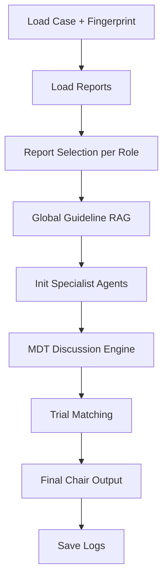

# MDT Discussion Log — 2026-01-17_23-54-14
Generated automatically by MDT Pipeline.


## CASE (structured JSON)

```
{"CASE_CORE":{"ADJUVANT_TREATMENT":{"cycles_or_courses":"Unknown","given":"Unknown","regimens":[]},"BIOMARKERS":{"AFP":"Unknown","CA125":"81.5","HE4":"73.59","HER2":"Unknown","MSI":"Unknown","PDL1_CPS":"Unknown","TMB":"Unknown"},"BRCA1":"Wildtype","BRCA2":"Wildtype","CURRENT_STATUS":"Unknown","DIAGNOSIS":{"components":["少量低分化癌","大量砂粒体","多核巨细胞反应"],"histology":"少量低分化癌，伴大量砂粒体、多量多核巨细胞反应，符合高级别浆液性癌伴治疗后改变。","laterality":"Bilateral","primary":"Ovarian cancer","site":"Ovary"},"HRD":"Negative","INITIAL_TREATMENT":"Unknown","LINE_OF_THERAPY":[{"cycles":"1","end_date":"Unknown","intent":"Unknown","line":"1L","regimen":"紫杉醇+卡铂","start_date":"2023-04-29"},{"cycles":"1","end_date":"Unknown","intent":"Unknown","line":"1L","regimen":"TC","start_date":"2023-07-05"}],"MAINTENANCE":"Unknown","MAINTENANCE_DETAIL":{"end_date":"Unknown","given":"Unknown","regimens":[],"start_date":"Unknown"},"NEOADJUVANT":"Unknown","PFI_days":"Unknown","PLATINUM_HISTORY":[{"PFI_days":"Unknown","end_date":"Unknown","evidence":"","evidence_type":"Unknown","first_relapse_date":"Unknown","line":"1L","start_date":"2023-04-29","status":"Unknown"},{"PFI_days":"Unknown","end_date":"Unknown","evidence":"","evidence_type":"Unknown","first_relapse_date":"Unknown","line":"1L","start_date":"2023-07-05","status":"Unknown"}],"PLATINUM_PFI_CURRENT":"Unknown","PLATINUM_STATUS":"Unknown","PLATINUM_STATUS_CURRENT":"Unknown","RELAPSE":"Unknown","RELAPSE_DATE":{"date":"Unknown","evidence":"","type":"Unknown"},"STAGE":{"stage_basis":"Unknown","stage_system":"Unknown","stage_text":"Unknown"},"SURGERY_DONE":{"date":"2023-06-21","performed":"Yes","procedure":"次广泛子宫+双附件+盆底腹膜+盆腹腔多处病灶"},"VISIT_DATE":"2023-07-25","first_relapse_date":"Unknown","last_platinum_end_date":"Unknown"},"LAB_TRENDS":{"labs":[{"analyte":"CA125","history":[{"date":"Unknown","flag":"↑","value":">1000"}],"latest":{"date":"2023-07-20","flag":"Unknown","value":"81.5"},"reference_range":"Unknown","unit":"Unknown"},{"analyte":"HE4","history":[],"latest":{"date":"2023-07-20","flag":"Unknown","value":"73.59"},"reference_range":"Unknown","unit":"Unknown"}],"milestones":[{"date":"2023-04-29","description":"First cycle paclitaxel + carboplatin","type":"ChemoStart"},{"date":"2023-06-21","description":"Surgical resection","type":"Surgery"},{"date":"2023-07-05","description":"External TC regimen chemotherapy","type":"ChemoStart"}]},"MED_ONC":{"current_regimen":{"cycle_info":"Unknown","last_admin_date":"Unknown","name":"Unknown"},"genetic_testing":{"germline":["HRD: Negative","BRCA1: Wildtype","BRCA2: Wildtype"],"somatic":["HRD: Negative","BRCA1: Wildtype","BRCA2: Wildtype"]},"monitoring_points":[],"planned_next_regimen":"Unknown","prior_systemic_therapies":["紫杉醇+卡铂","TC"]},"NUC_MED":{"studies":[]},"PATHOLOGY":{"specimens":[{"components":[],"date":"2023-04-25","diagnosis":"高浆","grade":"Unknown","ihc":[],"involvement_sites":[],"laterality":"Unknown","molecular":[],"raw_text":"腹腔镜活检：高浆","sample_type":"Biopsy","site":"Unknown","tumor_size":"Unknown","uncertainty_or_missing":[]},{"components":["Left ovary tumor 2.8*1.5*1.3cm","Right ovary tumor 3*1.6*1.3cm","Left fallopian tube: 大量砂粒体","Right fallopian tube: 癌累及","Endometrium: 萎缩改变","Cervix: 慢性炎","Myometrium: 平滑肌瘤 0.5cm; 腺肌症; 局灶浆膜面及肌壁见癌累及","Multiple peritoneal lesions (transverse colon wall nodule, omentum, right diaphragm tumor) all cancer involvement","Sigmoid mesentery nodule and pelvic floor peritoneum: small cancer involvement","Appendix: chronic inflammation, serosa cancer involvement"],"date":"2023-06-21","diagnosis":"少量低分化癌，伴大量砂粒体、多量多核巨细胞反应，符合高级别浆液性癌伴治疗后改变。","grade":"Unknown","ihc":[],"involvement_sites":["Left fallopian tube","Right fallopian tube","Endometrium","Cervix","Myometrium","Transverse colon wall","Omentum","Right diaphragm","Sigmoid mesentery","Pelvic floor peritoneum","Appendix serosa"],"laterality":"Bilateral","molecular":[{"result":"BRCA1,2; HRD(-); TP53; PIK3A(+)","test":"Genetic testing"}],"raw_text":"标本类型:次广泛子宫+双附件+盆底腹膜+盆腹腔多处病灶 肿瘤大小:左侧：2.8*1.5*1.3cm；右侧：3*1.6*1.3cm 肿瘤侧别:双侧卵巢 病理类型:少量低分化癌，伴大量砂粒体、多量多核巨细胞反应，符合高级别浆液性癌伴治疗后改变。 其他部位情况:左输卵管:见大量砂粒体 右输卵管:见癌累及 子宫内膜:萎缩改变 宫颈:慢性炎 子宫肌层:肌壁间平滑肌瘤（1枚，直径0.5cm）；腺肌症；局灶浆膜面及肌壁见癌累及。 盆腹腔多部位病灶:（横结肠壁结节、大网膜、右侧膈肌肿瘤）均见癌累及；（乙结肠系膜结节、盆底腹膜)少量癌累及；（阑尾）慢性炎，浆膜面见癌累及。","sample_type":"Surgical resection specimens","site":"Uterus, bilateral adnexa, pelvic peritoneum, multiple intraabdominal lesions","tumor_size":"Left 2.8x1.5x1.3 cm; Right 3x1.6x1.3 cm","uncertainty_or_missing":[]}]},"RADIOLOGY":{"next_imaging_plan":{"modality":"Unknown","timing":"Unknown"},"studies":[{"anatomic_sites":["Adnexa","Omentum","Mesentery","Sigmoid colon","Retroperitoneal lymph nodes"],"date":"2023-04-21","findings":["Adnexal mass","Omental and mesenteric nodules","Multiple metastases","Sigmoid colon thickening","Increased retroperitoneal lymph nodes"],"impression":"Adnexal mass with omental and mesenteric nodules, multiple metastases; sigmoid colon thickening; recommend colonoscopy","modality":"CT","trend_vs_prior":"Unknown"},{"anatomic_sites":["Abdominopelvic peritoneum","Left ovarian vein"],"date":"Unknown","findings":["Peritoneal haziness with effusion","Left ovarian vein thrombus"],"impression":"Postoperative abdominopelvic peritoneal haziness with effusion; left ovarian vein thrombosis","modality":"Other","trend_vs_prior":"Unknown"}]},"TIMELINE":{"constraints":{"max_events":30,"min_events":3,"must_include":["first diagnostic imaging or pathology confirmation (if available)"],"ordering_rules":{"prioritize_last_event":true}},"events":[{"date":"2023-04-21","description":"External abdominopelvic CT showing adnexal mass, omentum and mesenteric nodules, multiple metastases; sigmoid colon thickening; increased retroperitoneal lymph nodes.","event_type":"Imaging","key_result":"Adnexal mass, omental and mesenteric nodules, multiple metastases","regimen_or_test":"CT"},{"date":"2023-04-25","description":"Laparoscopic biopsy: 高浆","event_type":"Pathology","key_result":"高浆","regimen_or_test":"Laparoscopic biopsy"},{"date":"2023-04-29","description":"First cycle paclitaxel + carboplatin","event_type":"Chemo","key_result":"1 cycle administered","regimen_or_test":"紫杉醇+卡铂"},{"date":"2023-06-21","description":"Surgery with specimens: subextensive hysterectomy + bilateral adnexa + pelvic floor peritoneum + multiple intraabdominal lesions; postoperative pathology consistent with treated high-grade serous carcinoma.","event_type":"Surgery","key_result":"Postop pathology: 高级别浆液性癌伴治疗后改变","regimen_or_test":"Surgery"},{"date":"2023-07-05","description":"External hospital TC regimen chemotherapy given once","event_type":"Chemo","key_result":"1 cycle administered","regimen_or_test":"TC"},{"date":"2023-07-20","description":"Tumor markers: CA125 81.5; HE4 73.59","event_type":"Lab","key_result":"CA125 81.5; HE4 73.59","regimen_or_test":"CA125, HE4"},{"date":"Unknown","description":"Genetic testing reported: BRCA1,2; HRD(-); TP53; PIK3A(+)","event_type":"Other","key_result":"BRCA1/2; HRD negative; PIK3A positive","regimen_or_test":"Genetic testing"},{"date":"Unknown","description":"Postoperative re-evaluation: abdominopelvic peritoneal haziness with effusion; left ovarian vein thrombosis noted.","event_type":"Imaging","key_result":"Peritoneal haziness with effusion; left ovarian vein thrombosis","regimen_or_test":"Follow-up imaging"}]}}
```


## FINAL MDT OUTPUT

```
Final Assessment:
High-grade serous tubo-ovarian carcinoma with peritoneal spread post-interval debulking and early adjuvant platinum–taxane, responding biochemically but with staging, residual disease, and thrombosis status still insufficiently defined for maintenance decisions.

Core Treatment Strategy:
- Maintain current systemic-therapy trajectory today; do not change regimen until full chemo record, ECOG, and labs are reviewed (all unknown).  
- Urgently obtain operative note and full pathology/IHC/molecular reports to define FIGO stage, primary site, and R0/R1/R2 status (unknown).  
- Arrange contrast-enhanced abdominopelvic CT or PET/CT with RECIST to assess residual disease and re-evaluate left ovarian vein thrombosis (current imaging date unknown).  
- Clarify anticoagulation use and VTE/bleeding risks; formalize a thrombosis management and imaging follow‑up plan once data are available (unknown).  

Change Triggers:
- If updated imaging or clinical data show progression or intolerance, reassess systemic therapy intent and consider modifying or pausing active treatment.  
- If chemotherapy course, response, and residual burden confirm standard 1L completion and good status, formally discuss and choose maintenance versus surveillance strategy.
```


## PIPELINE FLOW (Mermaid)




## TRACE EVENTS (Structured)

```json
[
  {
    "ts": "2026-01-17T23:51:37.707289",
    "event": "pipeline_start",
    "payload": {
      "visit_time": "2023-07-25 15:38:50.183000",
      "meta_info": "422801196102010048"
    }
  },
  {
    "ts": "2026-01-17T23:51:37.707717",
    "event": "case_fingerprint",
    "payload": {
      "case_fingerprint": "925c44de16cb"
    }
  },
  {
    "ts": "2026-01-17T23:51:37.966222",
    "event": "reports_loaded",
    "payload": {
      "lab_n": 0,
      "img_n": 0,
      "path_n": 0,
      "mut_n": 0,
      "cutoff_dt": "2023-07-26 15:38:50"
    }
  },
  {
    "ts": "2026-01-17T23:51:38.022000",
    "event": "reports_selected",
    "payload": {
      "lab": {
        "chair": [],
        "oncologist": [],
        "radiologist": [],
        "pathologist": [],
        "nuclear": []
      },
      "imaging": {
        "chair": [],
        "oncologist": [],
        "radiologist": [],
        "pathologist": [],
        "nuclear": []
      },
      "pathology": {
        "chair": [],
        "oncologist": [],
        "radiologist": [],
        "pathologist": [],
        "nuclear": []
      },
      "mutation": {
        "chair": [],
        "oncologist": [],
        "radiologist": [],
        "pathologist": [],
        "nuclear": []
      }
    }
  },
  {
    "ts": "2026-01-17T23:52:35.965975",
    "event": "rag_query",
    "payload": {
      "query": "High‑grade serous ovarian carcinoma, platinum exposure limited (2 cycles); extensive peritoneal/omental/colon wall/diaphragmatic involvement; BRCA1/2 and HRD negative, PIK3CA positive, TP53 mutated; postoperative left ovarian vein thrombosis—guideline‑based systemic therapy and maintenance options?"
    }
  },
  {
    "ts": "2026-01-17T23:52:35.965985",
    "event": "rag_hits",
    "payload": {
      "topk": 5,
      "n": 5
    }
  },
  {
    "ts": "2026-01-17T23:52:41.388442",
    "event": "mdt_discussion_start",
    "payload": {
      "num_rounds": 2,
      "num_turns": 2
    }
  },
  {
    "ts": "2026-01-17T23:54:10.800029",
    "event": "mdt_discussion_end",
    "payload": {
      "merged_chars": 3018
    }
  },
  {
    "ts": "2026-01-17T23:54:10.800786",
    "event": "final_output_start",
    "payload": {}
  },
  {
    "ts": "2026-01-17T23:54:14.918538",
    "event": "final_output_end",
    "payload": {
      "final_output_chars": 1271
    }
  }
]
```


## INITIAL EXPERT OPINIONS


## chair

```
- Post-NACT interval surgery for high-grade serous ovarian carcinoma; continue adjuvant platinum-taxane to complete standard first-line course if tolerable.  
- Clarify FIGO stage, residual disease status, and completeness of cytoreduction from op note/path report before finalizing adjuvant strategy.  
- Consider maintenance approach post-chemotherapy completion, tailored to BRCA/HRD-negative status and response depth (CA125, imaging).  
- Urgently confirm and manage left ovarian vein thrombosis (anticoagulation plan, duration) and assess bleeding/VTE risk.  
- Update ECOG performance status, current symptoms, full labs (CBC, renal, hepatic) and latest post-op imaging before firm treatment decisions.
```


## oncologist

```
- High-grade serous ovarian cancer, bilateral, post-surgery on 2023-06-21 with adjuvant first-line platinum/taxane ongoing; completion status unclear.  
- CA125 markedly decreased from >1000 to 81.5 by 2023-07-20, suggesting response, but imaging correlation is unknown/needs update.  
- HRD- and BRCA-wildtype germline and somatic; impacts maintenance options and expected benefit from targeted agents.  
- Organ function, ECOG performance, residual disease status (R0/R1/R2), and detailed imaging after surgery are unknown/need update.  
- Clarify chemotherapy plan: intended total cycles, tolerance/toxicities, and whether any maintenance strategy has been started or planned.
```


## radiologist

```
- CT shows adnexal mass with omental/mesenteric nodules and retroperitoneal lymphadenopathy, compatible with peritoneal metastatic disease [@IMAGING_STUDIES|2023-04-21].  

- Sigmoid colon wall thickening; direct visualization (endoscopy) needed to assess for primary or secondary involvement [@IMAGING_STUDIES|2023-04-21].  

- Postoperative abdominopelvic peritoneal haziness with effusion; differentiate evolving postsurgical change from residual peritoneal disease on follow-up imaging [@IMAGING_STUDIES|Unknown].  

- Left ovarian vein thrombosis present; requires correlation for anticoagulation management and interval imaging to document stability/resolution [@IMAGING_STUDIES|Unknown].  

- No interval or RECIST-style trend data; updated contrast-enhanced CT or MRI needed to assess current disease burden and treatment response.
```


## pathologist

```
- Histology consistent with high-grade serous carcinoma involving bilateral ovaries and multiple peritoneal/serosal sites, post-treatment changes noted [@HISTOLOGY_AND_IHC|2023-06-21].  
- Exact primary site (fimbrial tube vs ovarian vs peritoneal) not explicitly assigned; clarification from original full report needed.  
- No formal FIGO stage documented; based on described spread, stage IIIC–IV likely but needs explicit staging confirmation.  
- BRCA1/2 wildtype and HRD-negative status documented; TP53 and PIK3CA mutations reported, but detailed molecular report/date are missing [@HISTOLOGY_AND_IHC|2023-06-21].  
- IHC panel (WT1, p53 pattern, ER/PR, PAX8, Ki-67, MMR proteins) not provided; full IHC report needed.
```


## nuclear

```
- No PET/CT imaging is available; metabolic disease distribution and intensity are currently unknown/needs update.  

- Prior CT shows adnexal mass with omental/mesenteric nodules and sigmoid thickening, suspicious for peritoneal carcinomatosis and possible bowel involvement [@IMAGING_CONTEXT|2023-04-21].  

- Postoperative abdominopelvic haziness and effusion may represent postoperative change versus residual peritoneal disease; distinction needs PET/CT correlation [@IMAGING_CONTEXT|Unknown].  

- PET/CT would help differentiate postoperative inflammation from viable tumor and refine staging or recurrence suspicion, especially in peritoneum and bowel.  

- For further opinion, upload most recent PET/CT report and images, plus operative/pathology details and current tumor markers.
```


## MERGED SUMMARY (Assistant)

```
Key Knowledge:
- Bilateral high-grade serous ovarian carcinoma with peritoneal/omental/serosal spread; likely FIGO IIIC–IV.
- Interval debulking on 21/06/2023; completeness of cytoreduction unclear.
- Post-op platinum–taxane started; total cycles/completion and tolerance not documented.
- CA125 dropped from >1000 to 81.5 by 20/07/2023, indicating response; no formal imaging response assessment.
- BRCA1/2 wildtype, HRD-negative; TP53 and PIK3CA mutations reported.
- Imaging shows peritoneal carcinomatosis, retroperitoneal nodes, sigmoid thickening, and postoperative haziness/effusion.
- Left ovarian vein thrombosis present radiologically.

Controversies:
- Uncertain exact FIGO stage and primary site (tube vs ovary vs peritoneum).
- Unknown R0/R1/R2 status and residual disease burden, limiting adjuvant/maintenance planning.
- Unclear current disease extent vs postsurgical change on imaging.
- Best maintenance approach in BRCA/HRD-negative setting (agent vs observation) given efficacy/toxicity balance.

Missing Info:
- Full op note, explicit FIGO stage, and cytoreduction status.
- Recent contrast CT/MRI or PET/CT with RECIST, and follow-up on ovarian vein thrombosis.
- Current ECOG, symptoms, CBC/renal/hepatic/coagulation.
- Detailed chemotherapy record (cycles, dates, dosing, toxicities, completion).
- Full pathology/IHC panel and full molecular report.
- Anticoagulation regimen and VTE/bleeding risk assessment.
- Results of any endoscopic assessment of sigmoid thickening.

Working Plan:
- Obtain and review op/path reports for staging and R0/R1/R2 status.
- Clarify and, if feasible, complete standard first-line platinum–taxane course.
- Arrange updated cross-sectional imaging (± PET/CT) for response and residual disease assessment.
- Confirm and manage left ovarian vein thrombosis with defined anticoagulation strategy and imaging follow-up.
- After chemotherapy and response assessment, discuss maintenance vs surveillance appropriate for BRCA/HRD-negative disease.
- Reassess ECOG, labs, and toxicity profile to guide further systemic therapy and anticoagulation decisions.
[R1T1 DELTA] low-up. | radiologist->chair(missing): Current imaging timeline and modality details are incomplete/undated (e.g., postoperative study marked 'Unknown'), which limits reliable interpretation of trends and response. | pathologist->oncologist(missing): Primary site (tubal vs ovarian vs peritoneal), explicit FIGO stage, and R0/R1/R2 status remain undefined; I also lack the full histology/IHC and detailed molecular report, which are critical for accurate staging documentation and biomarker confirmation. | nuclear->oncologist(missing): No PET/CT is available; updated PET/CT or contrast CT is critical now to distinguish residual disease from postoperative change and better define current stage/burden. | nuclear->radiologist(missing): Please prioritize updated cross-sectional imaging (CT or PET/CT) with clear description of peritoneal vs postoperative changes and ovarian vein thrombosis status.
```


## INTERACTION LOG (Round × Turn)

### Round 1

#### Turn 1
- **chair → oncologist:** Before confirming chemo/maintenance, we need exact R0/R1/R2 status, full chemo details, ECOG, and updated imaging including thrombus reassessment.
- **chair → radiologist:** Please arrange and report contrast-enhanced abdominopelvic imaging with RECIST assessment and explicit comment on left ovarian vein thrombosis evolution.
- **oncologist → chair:** Before finalizing systemic and maintenance plans, we urgently need the operative report with explicit FIGO stage and R0/R1/R2 status, plus a detailed chemo summary (cycles, doses, toxicities, completion).
- **oncologist → radiologist:** Please clarify on latest contrast imaging the extent of residual peritoneal disease versus postsurgical change, assess retroperitoneal nodes and sigmoid thickening, and comment on evolution of the left ovarian vein thrombosis.
- **radiologist → chair:** Current imaging timeline and modality details are incomplete/undated (e.g., postoperative study marked 'Unknown'), which limits reliable interpretation of trends and response.
- **radiologist → oncologist:** No post-chemotherapy or post-debulking contrast-enhanced CT/MRI/PET is available to quantify residual disease or thrombus status; updated imaging is essential for current disease assessment and ovarian vein thrombosis follow-up.
- **pathologist → oncologist:** Primary site (tubal vs ovarian vs peritoneal), explicit FIGO stage, and R0/R1/R2 status remain undefined; I also lack the full histology/IHC and detailed molecular report, which are critical for accurate staging documentation and biomarker confirmation.
- **nuclear → oncologist:** No PET/CT is available; updated PET/CT or contrast CT is critical now to distinguish residual disease from postoperative change and better define current stage/burden.
- **nuclear → radiologist:** Please prioritize updated cross-sectional imaging (CT or PET/CT) with clear description of peritoneal vs postoperative changes and ovarian vein thrombosis status.

#### Turn 2

### Round 2

#### Turn 1

#### Turn 2


## FINAL REFINED PLANS (per Round)

### Round 1


## chair

```
- Do not alter current systemic therapy until full chemotherapy record, ECOG, and labs are obtained; status currently unknown/needs update.  
- Urgently obtain and review operative note and complete pathology/IHC/molecular reports to define FIGO stage and R0/R1/R2 status; currently unknown/needs update.  
- Arrange contrast-enhanced abdominopelvic CT or PET/CT with RECIST, explicitly assessing peritoneal disease and left ovarian vein thrombosis; current postoperative imaging date unknown/needs update.  
- Confirm presence and timing of left ovarian vein thrombosis and current anticoagulation/VTE risk assessment; details unknown/needs update.  
- After completing first-line platinum–taxane (cycles and tolerance unknown/needs update) and imaging response assessment, revisit maintenance versus surveillance in BRCA/HRD‑negative context.
```


## oncologist

```
- Continue and, if feasible, complete first-line platinum–taxane; document total cycles, dates, doses, and toxicities (currently unknown).  
- Obtain operative and full pathology reports to define primary site, FIGO stage, and R0/R1/R2 status (currently unknown).  
- Arrange updated contrast CT or PET/CT with RECIST to distinguish residual disease from postoperative change and reassess ovarian vein thrombosis.  
- Check ECOG, symptoms, CBC, renal/hepatic function, and coagulation profile to confirm systemic-therapy fitness and guide anticoagulation (all unknown).  
- After chemotherapy completion and imaging response assessment, decide between active maintenance versus surveillance, considering BRCA/HRD-negative and toxicity/quality-of-life balance.
```


## radiologist

```
- Obtain complete operative and pathology reports to define primary site, FIGO stage, and R0/R1/R2 status (currently unknown).  

- Arrange updated contrast-enhanced CT or PET/CT to assess peritoneal/omental disease, retroperitoneal nodes, and distinguish postoperative change vs residual disease (none available; unknown).  

- On the same imaging, specifically re-evaluate left ovarian vein thrombosis burden and any new thrombosis or embolic complications (current status unknown).  

- Ensure any prior or planned endoscopic evaluation of sigmoid thickening is documented and correlated with cross-sectional imaging findings (results unknown).  

- After updated imaging, formalize RECIST-style measurements to support response assessment and future surveillance comparisons (no RECIST baseline currently documented; unknown).
```


## pathologist

```
- Confirm primary site (tube/ovary/peritoneum) and assign explicit FIGO stage after full op note and complete pathology review [@HISTOLOGY_AND_IHC|2023-06-21].  
- Document cytoreduction status (R0/R1/R2) and residual disease map using operative findings plus updated contrast CT or PET/CT (currently missing).  
- Obtain and integrate full IHC panel and detailed molecular report to solidify high-grade serous classification and biomarker profile [@HISTOLOGY_AND_IHC|2023-06-21].  
- Correlate pathology with new imaging to distinguish residual tumor from postoperative change, especially peritoneal lesions and sigmoid thickening (endoscopy results unknown).  
- After staging and residual disease are clarified, update MDT record to support systemic/maintenance decisions tailored to BRCA/HRD-negative status [@MOLECULAR|Unknown].
```


## nuclear

```
- Obtain and review full operative and pathology reports to assign definitive FIGO stage and R0/R1/R2 status (unknown/needs update).  

- Arrange updated contrast-enhanced CT or PET/CT to assess peritoneal disease, retroperitoneal nodes, and postoperative changes, with RECIST if possible (unknown/needs update).  

- Specifically evaluate sigmoid colon thickening with imaging ± endoscopy to clarify primary involvement versus secondary serosal disease (unknown/needs update).  

- Reassess left ovarian vein thrombosis with targeted imaging and document anticoagulation strategy and follow-up plan (unknown/needs update).  

- After imaging and completion of first-line chemotherapy are clarified, reassess disease burden and performance status to guide maintenance versus surveillance (unknown/needs update).
```


## RAW AGENT LOGS

### chair
- **User:** Give INITIAL opinion (use ONLY your system-provided patient facts).
Return up to 5 bullets, each ≤20 words.
If key data missing, say exactly what needs updating.
  
  **Assistant:** - Post-NACT interval surgery for high-grade serous ovarian carcinoma; continue adjuvant platinum-taxane to complete standard first-line course if tolerable.  
- Clarify FIGO stage, residual disease status, and completeness of cytoreduction from op note/path report before finalizing adjuvant strategy.  
- Consider maintenance approach post-chemotherapy completion, tailored to BRCA/HRD-negative status and response depth (CA125, imaging).  
- Urgently confirm and manage left ovarian vein thrombosis (anticoagulation plan, duration) and assess bleeding/VTE risk.  
- Update ECOG performance status, current symptoms, full labs (CBC, renal, hepatic) and latest post-op imaging before firm treatment decisions.
  
  *(2026-01-17T23:52:44.092158)*

- **User:** ROLE: chair. VISIT: 2023-07-25 15:38:50.183000
Default is NOT to speak. Speak ONLY if: conflict | safety | missing-critical | new-critical.

CONTEXT (latest):
Key Knowledge:
- Bilateral high-grade serous ovarian carcinoma with peritoneal/omental/serosal spread; likely FIGO IIIC–IV.
- Interval debulking on 21/06/2023; completeness of cytoreduction unclear.
- Post-op platinum–taxane started; total cycles/completion and tolerance not documented.
- CA125 dropped from >1000 to 81.5 by 20/07/2023, indicating response; no formal imaging response assessment.
- BRCA1/2 wildtype, HRD-negative; TP53 and PIK3CA mutations reported.
- Imaging shows peritoneal carcinomatosis, retroperitoneal nodes, sigmoid thickening, and postoperative haziness/effusion.
- Left ovarian vein thrombosis present radiologically.

Controversies:
- Uncertain exact FIGO stage and primary site (tube vs ovary vs peritoneum).
- Unknown R0/R1/R2 status and residual disease burden, limiting adjuvant/maintenance planning.
- Unclear current disease extent vs postsurgical change on imaging.
- Best maintenance approach in BRCA/HRD-negative setting (agent vs observation) given efficacy/toxicity balance.

Missing Info:
- Full op note, explicit FIGO stage, and cytoreduction status.
- Recent contrast CT/MRI or PET/CT with RECIST, and follow-up on ovarian vein thrombosis.
- Current ECOG, symptoms, CBC/renal/hepatic/coagulation.
- Detailed chemotherapy record (cycles, dates, dosing, toxicities, completion).
- Full pathology/IHC panel and full molecular report.
- Anticoagulation regimen and VTE/bleeding risk assessment.
- Results of any endoscopic assessment of sigmoid thickening.

Working Plan:
- Obtain and review op/path reports for staging and R0/R1/R2 status.
- Clarify and, if feasible, complete standard first-line platinum–taxane course.
- Arrange updated cross-sectional imaging (± PET/CT) for response and residual disease assessment.
- Confirm and manage left ovarian vein thrombosis with defined anticoagulation strategy and imaging follow-up.
- After chemotherapy and response assessment, discuss maintenance vs surveillance appropriate for BRCA/HRD-negative disease.
- Reassess ECOG, labs, and toxicity profile to guide further systemic therapy and anticoagulation decisions.

Allowed targets: [oncologist,radiologist,pathologist,nuclear]
Return ONE-LINE JSON only:{"speak":"yes/no","messages":[{"target":"<role>","message":"<1-2 sentences>","why":"conflict|safety|missing|new"}]}
  
  **Assistant:** {"speak":"yes","messages":[{"target":"oncologist","message":"Before confirming chemo/maintenance, we need exact R0/R1/R2 status, full chemo details, ECOG, and updated imaging including thrombus reassessment.","why":"missing"},{"target":"radiologist","message":"Please arrange and report contrast-enhanced abdominopelvic imaging with RECIST assessment and explicit comment on left ovarian vein thrombosis evolution.","why":"missing"}]}
  
  *(2026-01-17T23:53:10.076024)*

- **User:** ROLE: chair. VISIT: 2023-07-25 15:38:50.183000
Default is NOT to speak. Speak ONLY if: conflict | safety | missing-critical | new-critical.

CONTEXT (latest):
Key Knowledge:
- Bilateral high-grade serous ovarian carcinoma with peritoneal/omental/serosal spread; likely FIGO IIIC–IV.
- Interval debulking on 21/06/2023; completeness of cytoreduction unclear.
- Post-op platinum–taxane started; total cycles/completion and tolerance not documented.
- CA125 dropped from >1000 to 81.5 by 20/07/2023, indicating response; no formal imaging response assessment.
- BRCA1/2 wildtype, HRD-negative; TP53 and PIK3CA mutations reported.
- Imaging shows peritoneal carcinomatosis, retroperitoneal nodes, sigmoid thickening, and postoperative haziness/effusion.
- Left ovarian vein thrombosis present radiologically.

Controversies:
- Uncertain exact FIGO stage and primary site (tube vs ovary vs peritoneum).
- Unknown R0/R1/R2 status and residual disease burden, limiting adjuvant/maintenance planning.
- Unclear current disease extent vs postsurgical change on imaging.
- Best maintenance approach in BRCA/HRD-negative setting (agent vs observation) given efficacy/toxicity balance.

Missing Info:
- Full op note, explicit FIGO stage, and cytoreduction status.
- Recent contrast CT/MRI or PET/CT with RECIST, and follow-up on ovarian vein thrombosis.
- Current ECOG, symptoms, CBC/renal/hepatic/coagulation.
- Detailed chemotherapy record (cycles, dates, dosing, toxicities, completion).
- Full pathology/IHC panel and full molecular report.
- Anticoagulation regimen and VTE/bleeding risk assessment.
- Results of any endoscopic assessment of sigmoid thickening.

Working Plan:
- Obtain and review op/path reports for staging and R0/R1/R2 status.
- Clarify and, if feasible, complete standard first-line platinum–taxane course.
- Arrange updated cross-sectional imaging (± PET/CT) for response and residual disease assessment.
- Confirm and manage left ovarian vein thrombosis with defined anticoagulation strategy and imaging follow-up.
- After chemotherapy and response assessment, discuss maintenance vs surveillance appropriate for BRCA/HRD-negative disease.
- Reassess ECOG, labs, and toxicity profile to guide further systemic therapy and anticoagulation decisions.
[R1T1 DELTA] low-up. | radiologist->chair(missing): Current imaging timeline and modality details are incomplete/undated (e.g., postoperative study marked 'Unknown'), which limits reliable interpretation of trends and response. | pathologist->oncologist(missing): Primary site (tubal vs ovarian vs peritoneal), explicit FIGO stage, and R0/R1/R2 status remain undefined; I also lack the full histology/IHC and detailed molecular report, which are critical for accurate staging documentation and biomarker confirmation. | nuclear->oncologist(missing): No PET/CT is available; updated PET/CT or contrast CT is critical now to distinguish residual disease from postoperative change and better define current stage/burden. | nuclear->radiologist(missing): Please prioritize updated cross-sectional imaging (CT or PET/CT) with clear description of peritoneal vs postoperative changes and ovarian vein thrombosis status.

Allowed targets: [oncologist,radiologist,pathologist,nuclear]
Return ONE-LINE JSON only:{"speak":"yes/no","messages":[{"target":"<role>","message":"<1-2 sentences>","why":"conflict|safety|missing|new"}]}
  
  **Assistant:** {"speak":"no","messages":[]}
  
  *(2026-01-17T23:53:23.131919)*

- **User:** Given MDT context:
Key Knowledge:
- Bilateral high-grade serous ovarian carcinoma with peritoneal/omental/serosal spread; likely FIGO IIIC–IV.
- Interval debulking on 21/06/2023; completeness of cytoreduction unclear.
- Post-op platinum–taxane started; total cycles/completion and tolerance not documented.
- CA125 dropped from >1000 to 81.5 by 20/07/2023, indicating response; no formal imaging response assessment.
- BRCA1/2 wildtype, HRD-negative; TP53 and PIK3CA mutations reported.
- Imaging shows peritoneal carcinomatosis, retroperitoneal nodes, sigmoid thickening, and postoperative haziness/effusion.
- Left ovarian vein thrombosis present radiologically.

Controversies:
- Uncertain exact FIGO stage and primary site (tube vs ovary vs peritoneum).
- Unknown R0/R1/R2 status and residual disease burden, limiting adjuvant/maintenance planning.
- Unclear current disease extent vs postsurgical change on imaging.
- Best maintenance approach in BRCA/HRD-negative setting (agent vs observation) given efficacy/toxicity balance.

Missing Info:
- Full op note, explicit FIGO stage, and cytoreduction status.
- Recent contrast CT/MRI or PET/CT with RECIST, and follow-up on ovarian vein thrombosis.
- Current ECOG, symptoms, CBC/renal/hepatic/coagulation.
- Detailed chemotherapy record (cycles, dates, dosing, toxicities, completion).
- Full pathology/IHC panel and full molecular report.
- Anticoagulation regimen and VTE/bleeding risk assessment.
- Results of any endoscopic assessment of sigmoid thickening.

Working Plan:
- Obtain and review op/path reports for staging and R0/R1/R2 status.
- Clarify and, if feasible, complete standard first-line platinum–taxane course.
- Arrange updated cross-sectional imaging (± PET/CT) for response and residual disease assessment.
- Confirm and manage left ovarian vein thrombosis with defined anticoagulation strategy and imaging follow-up.
- After chemotherapy and response assessment, discuss maintenance vs surveillance appropriate for BRCA/HRD-negative disease.
- Reassess ECOG, labs, and toxicity profile to guide further systemic therapy and anticoagulation decisions.
[R1T1 DELTA] low-up. | radiologist->chair(missing): Current imaging timeline and modality details are incomplete/undated (e.g., postoperative study marked 'Unknown'), which limits reliable interpretation of trends and response. | pathologist->oncologist(missing): Primary site (tubal vs ovarian vs peritoneal), explicit FIGO stage, and R0/R1/R2 status remain undefined; I also lack the full histology/IHC and detailed molecular report, which are critical for accurate staging documentation and biomarker confirmation. | nuclear->oncologist(missing): No PET/CT is available; updated PET/CT or contrast CT is critical now to distinguish residual disease from postoperative change and better define current stage/burden. | nuclear->radiologist(missing): Please prioritize updated cross-sectional imaging (CT or PET/CT) with clear description of peritoneal vs postoperative changes and ovarian vein thrombosis status.

Provide FINAL refined plan.
Up to 5 bullets, each ≤20 words.
Any factual claim must include [@report_id|date] or say unknown.
  
  **Assistant:** - Do not alter current systemic therapy until full chemotherapy record, ECOG, and labs are obtained; status currently unknown/needs update.  
- Urgently obtain and review operative note and complete pathology/IHC/molecular reports to define FIGO stage and R0/R1/R2 status; currently unknown/needs update.  
- Arrange contrast-enhanced abdominopelvic CT or PET/CT with RECIST, explicitly assessing peritoneal disease and left ovarian vein thrombosis; current postoperative imaging date unknown/needs update.  
- Confirm presence and timing of left ovarian vein thrombosis and current anticoagulation/VTE risk assessment; details unknown/needs update.  
- After completing first-line platinum–taxane (cycles and tolerance unknown/needs update) and imaging response assessment, revisit maintenance versus surveillance in BRCA/HRD‑negative context.
  
  *(2026-01-17T23:53:34.017970)*

- **User:** 
As the MDT chair for gynecologic oncology, you are seeing the patient at OUTPATIENT TIME: 2023-07-25 15:38:50.183000.
Based on PATIENT FACTS + MDT discussion + FINAL refined plans from all experts, determine the CURRENT best management plan for this visit.

STRICT RULES:
- Any factual statement about past tests/treatments must include [@report_id|date] or say unknown.
- If experts disagree, pick the safest plan and state the key uncertainty.

# FINAL REFINED PLANS (All experts, last round)
{
  "Round 1": {
    "chair": "- Do not alter current systemic therapy until full chemotherapy record, ECOG, and labs are obtained; status currently unknown/needs update.  \n- Urgently obtain and review operative note and complete pathology/IHC/molecular reports to define FIGO stage and R0/R1/R2 status; currently unknown/needs update.  \n- Arrange contrast-enhanced abdominopelvic CT or PET/CT with RECIST, explicitly assessing peritoneal disease and left ovarian vein thrombosis; current postoperative imaging date unknown/needs update.  \n- Confirm presence and timing of left ovarian vein thrombosis and current anticoagulation/VTE risk assessment; details unknown/needs update.  \n- After completing first-line platinum–taxane (cycles and tolerance unknown/needs update) and imaging response assessment, revisit maintenance versus surveillance in BRCA/HRD‑negative context.",
    "oncologist": "- Continue and, if feasible, complete first-line platinum–taxane; document total cycles, dates, doses, and toxicities (currently unknown).  \n- Obtain operative and full pathology reports to define primary site, FIGO stage, and R0/R1/R2 status (currently unknown).  \n- Arrange updated contrast CT or PET/CT with RECIST to distinguish residual disease from postoperative change and reassess ovarian vein thrombosis.  \n- Check ECOG, symptoms, CBC, renal/hepatic function, and coagulation profile to confirm systemic-therapy fitness and guide anticoagulation (all unknown).  \n- After chemotherapy completion and imaging response assessment, decide between active maintenance versus surveillance, considering BRCA/HRD-negative and toxicity/quality-of-life balance.",
    "radiologist": "- Obtain complete operative and pathology reports to define primary site, FIGO stage, and R0/R1/R2 status (currently unknown).  \n\n- Arrange updated contrast-enhanced CT or PET/CT to assess peritoneal/omental disease, retroperitoneal nodes, and distinguish postoperative change vs residual disease (none available; unknown).  \n\n- On the same imaging, specifically re-evaluate left ovarian vein thrombosis burden and any new thrombosis or embolic complications (current status unknown).  \n\n- Ensure any prior or planned endoscopic evaluation of sigmoid thickening is documented and correlated with cross-sectional imaging findings (results unknown).  \n\n- After updated imaging, formalize RECIST-style measurements to support response assessment and future surveillance comparisons (no RECIST baseline currently documented; unknown).",
    "pathologist": "- Confirm primary site (tube/ovary/peritoneum) and assign explicit FIGO stage after full op note and complete pathology review [@HISTOLOGY_AND_IHC|2023-06-21].  \n- Document cytoreduction status (R0/R1/R2) and residual disease map using operative findings plus updated contrast CT or PET/CT (currently missing).  \n- Obtain and integrate full IHC panel and detailed molecular report to solidify high-grade serous classification and biomarker profile [@HISTOLOGY_AND_IHC|2023-06-21].  \n- Correlate pathology with new imaging to distinguish residual tumor from postoperative change, especially peritoneal lesions and sigmoid thickening (endoscopy results unknown).  \n- After staging and residual disease are clarified, update MDT record to support systemic/maintenance decisions tailored to BRCA/HRD-negative status [@MOLECULAR|Unknown].",
    "nuclear": "- Obtain and review full operative and pathology reports to assign definitive FIGO stage and R0/R1/R2 status (unknown/needs update).  \n\n- Arrange updated contrast-enhanced CT or PET/CT to assess peritoneal disease, retroperitoneal nodes, and postoperative changes, with RECIST if possible (unknown/needs update).  \n\n- Specifically evaluate sigmoid colon thickening with imaging ± endoscopy to clarify primary involvement versus secondary serosal disease (unknown/needs update).  \n\n- Reassess left ovarian vein thrombosis with targeted imaging and document anticoagulation strategy and follow-up plan (unknown/needs update).  \n\n- After imaging and completion of first-line chemotherapy are clarified, reassess disease burden and performance status to guide maintenance versus surveillance (unknown/needs update)."
  }
}

# Response Format
Final Assessment:
<1–3 sentences: summarize histology/biology, current disease status, and key uncertainties>

Core Treatment Strategy:
- < ≤20 words concrete decision >
- < ≤20 words concrete decision >
- < ≤20 words concrete decision >
- < ≤20 words concrete decision >

Change Triggers:
- < ≤20 words “if X, then adjust management from A to B” >
- < ≤20 words “if X, then adjust management from A to B” >

  
  **Assistant:** Final Assessment:
High-grade serous tubo-ovarian carcinoma with peritoneal spread post-interval debulking and early adjuvant platinum–taxane, responding biochemically but with staging, residual disease, and thrombosis status still insufficiently defined for maintenance decisions.

Core Treatment Strategy:
- Maintain current systemic-therapy trajectory today; do not change regimen until full chemo record, ECOG, and labs are reviewed (all unknown).  
- Urgently obtain operative note and full pathology/IHC/molecular reports to define FIGO stage, primary site, and R0/R1/R2 status (unknown).  
- Arrange contrast-enhanced abdominopelvic CT or PET/CT with RECIST to assess residual disease and re-evaluate left ovarian vein thrombosis (current imaging date unknown).  
- Clarify anticoagulation use and VTE/bleeding risks; formalize a thrombosis management and imaging follow‑up plan once data are available (unknown).  

Change Triggers:
- If updated imaging or clinical data show progression or intolerance, reassess systemic therapy intent and consider modifying or pausing active treatment.  
- If chemotherapy course, response, and residual burden confirm standard 1L completion and good status, formally discuss and choose maintenance versus surveillance strategy.
  
  *(2026-01-17T23:54:14.918392)*


### oncologist
- **User:** Give INITIAL opinion (use ONLY your system-provided patient facts).
Return up to 5 bullets, each ≤20 words.
If key data missing, say exactly what needs updating.
  
  **Assistant:** - High-grade serous ovarian cancer, bilateral, post-surgery on 2023-06-21 with adjuvant first-line platinum/taxane ongoing; completion status unclear.  
- CA125 markedly decreased from >1000 to 81.5 by 2023-07-20, suggesting response, but imaging correlation is unknown/needs update.  
- HRD- and BRCA-wildtype germline and somatic; impacts maintenance options and expected benefit from targeted agents.  
- Organ function, ECOG performance, residual disease status (R0/R1/R2), and detailed imaging after surgery are unknown/need update.  
- Clarify chemotherapy plan: intended total cycles, tolerance/toxicities, and whether any maintenance strategy has been started or planned.
  
  *(2026-01-17T23:52:46.559908)*

- **User:** ROLE: oncologist. VISIT: 2023-07-25 15:38:50.183000
Default is NOT to speak. Speak ONLY if: conflict | safety | missing-critical | new-critical.

CONTEXT (latest):
Key Knowledge:
- Bilateral high-grade serous ovarian carcinoma with peritoneal/omental/serosal spread; likely FIGO IIIC–IV.
- Interval debulking on 21/06/2023; completeness of cytoreduction unclear.
- Post-op platinum–taxane started; total cycles/completion and tolerance not documented.
- CA125 dropped from >1000 to 81.5 by 20/07/2023, indicating response; no formal imaging response assessment.
- BRCA1/2 wildtype, HRD-negative; TP53 and PIK3CA mutations reported.
- Imaging shows peritoneal carcinomatosis, retroperitoneal nodes, sigmoid thickening, and postoperative haziness/effusion.
- Left ovarian vein thrombosis present radiologically.

Controversies:
- Uncertain exact FIGO stage and primary site (tube vs ovary vs peritoneum).
- Unknown R0/R1/R2 status and residual disease burden, limiting adjuvant/maintenance planning.
- Unclear current disease extent vs postsurgical change on imaging.
- Best maintenance approach in BRCA/HRD-negative setting (agent vs observation) given efficacy/toxicity balance.

Missing Info:
- Full op note, explicit FIGO stage, and cytoreduction status.
- Recent contrast CT/MRI or PET/CT with RECIST, and follow-up on ovarian vein thrombosis.
- Current ECOG, symptoms, CBC/renal/hepatic/coagulation.
- Detailed chemotherapy record (cycles, dates, dosing, toxicities, completion).
- Full pathology/IHC panel and full molecular report.
- Anticoagulation regimen and VTE/bleeding risk assessment.
- Results of any endoscopic assessment of sigmoid thickening.

Working Plan:
- Obtain and review op/path reports for staging and R0/R1/R2 status.
- Clarify and, if feasible, complete standard first-line platinum–taxane course.
- Arrange updated cross-sectional imaging (± PET/CT) for response and residual disease assessment.
- Confirm and manage left ovarian vein thrombosis with defined anticoagulation strategy and imaging follow-up.
- After chemotherapy and response assessment, discuss maintenance vs surveillance appropriate for BRCA/HRD-negative disease.
- Reassess ECOG, labs, and toxicity profile to guide further systemic therapy and anticoagulation decisions.

Allowed targets: [chair,radiologist,pathologist,nuclear]
Return ONE-LINE JSON only:{"speak":"yes/no","messages":[{"target":"<role>","message":"<1-2 sentences>","why":"conflict|safety|missing|new"}]}
  
  **Assistant:** {"speak":"yes","messages":[{"target":"chair","message":"Before finalizing systemic and maintenance plans, we urgently need the operative report with explicit FIGO stage and R0/R1/R2 status, plus a detailed chemo summary (cycles, doses, toxicities, completion).","why":"missing"},{"target":"radiologist","message":"Please clarify on latest contrast imaging the extent of residual peritoneal disease versus postsurgical change, assess retroperitoneal nodes and sigmoid thickening, and comment on evolution of the left ovarian vein thrombosis.","why":"missing"}]}
  
  *(2026-01-17T23:53:12.706813)*

- **User:** ROLE: oncologist. VISIT: 2023-07-25 15:38:50.183000
Default is NOT to speak. Speak ONLY if: conflict | safety | missing-critical | new-critical.

CONTEXT (latest):
Key Knowledge:
- Bilateral high-grade serous ovarian carcinoma with peritoneal/omental/serosal spread; likely FIGO IIIC–IV.
- Interval debulking on 21/06/2023; completeness of cytoreduction unclear.
- Post-op platinum–taxane started; total cycles/completion and tolerance not documented.
- CA125 dropped from >1000 to 81.5 by 20/07/2023, indicating response; no formal imaging response assessment.
- BRCA1/2 wildtype, HRD-negative; TP53 and PIK3CA mutations reported.
- Imaging shows peritoneal carcinomatosis, retroperitoneal nodes, sigmoid thickening, and postoperative haziness/effusion.
- Left ovarian vein thrombosis present radiologically.

Controversies:
- Uncertain exact FIGO stage and primary site (tube vs ovary vs peritoneum).
- Unknown R0/R1/R2 status and residual disease burden, limiting adjuvant/maintenance planning.
- Unclear current disease extent vs postsurgical change on imaging.
- Best maintenance approach in BRCA/HRD-negative setting (agent vs observation) given efficacy/toxicity balance.

Missing Info:
- Full op note, explicit FIGO stage, and cytoreduction status.
- Recent contrast CT/MRI or PET/CT with RECIST, and follow-up on ovarian vein thrombosis.
- Current ECOG, symptoms, CBC/renal/hepatic/coagulation.
- Detailed chemotherapy record (cycles, dates, dosing, toxicities, completion).
- Full pathology/IHC panel and full molecular report.
- Anticoagulation regimen and VTE/bleeding risk assessment.
- Results of any endoscopic assessment of sigmoid thickening.

Working Plan:
- Obtain and review op/path reports for staging and R0/R1/R2 status.
- Clarify and, if feasible, complete standard first-line platinum–taxane course.
- Arrange updated cross-sectional imaging (± PET/CT) for response and residual disease assessment.
- Confirm and manage left ovarian vein thrombosis with defined anticoagulation strategy and imaging follow-up.
- After chemotherapy and response assessment, discuss maintenance vs surveillance appropriate for BRCA/HRD-negative disease.
- Reassess ECOG, labs, and toxicity profile to guide further systemic therapy and anticoagulation decisions.
[R1T1 DELTA] low-up. | radiologist->chair(missing): Current imaging timeline and modality details are incomplete/undated (e.g., postoperative study marked 'Unknown'), which limits reliable interpretation of trends and response. | pathologist->oncologist(missing): Primary site (tubal vs ovarian vs peritoneal), explicit FIGO stage, and R0/R1/R2 status remain undefined; I also lack the full histology/IHC and detailed molecular report, which are critical for accurate staging documentation and biomarker confirmation. | nuclear->oncologist(missing): No PET/CT is available; updated PET/CT or contrast CT is critical now to distinguish residual disease from postoperative change and better define current stage/burden. | nuclear->radiologist(missing): Please prioritize updated cross-sectional imaging (CT or PET/CT) with clear description of peritoneal vs postoperative changes and ovarian vein thrombosis status.

Allowed targets: [chair,radiologist,pathologist,nuclear]
Return ONE-LINE JSON only:{"speak":"yes/no","messages":[{"target":"<role>","message":"<1-2 sentences>","why":"conflict|safety|missing|new"}]}
  
  **Assistant:** {"speak":"no","messages":[]}
  
  *(2026-01-17T23:53:24.583778)*

- **User:** Given MDT context:
Key Knowledge:
- Bilateral high-grade serous ovarian carcinoma with peritoneal/omental/serosal spread; likely FIGO IIIC–IV.
- Interval debulking on 21/06/2023; completeness of cytoreduction unclear.
- Post-op platinum–taxane started; total cycles/completion and tolerance not documented.
- CA125 dropped from >1000 to 81.5 by 20/07/2023, indicating response; no formal imaging response assessment.
- BRCA1/2 wildtype, HRD-negative; TP53 and PIK3CA mutations reported.
- Imaging shows peritoneal carcinomatosis, retroperitoneal nodes, sigmoid thickening, and postoperative haziness/effusion.
- Left ovarian vein thrombosis present radiologically.

Controversies:
- Uncertain exact FIGO stage and primary site (tube vs ovary vs peritoneum).
- Unknown R0/R1/R2 status and residual disease burden, limiting adjuvant/maintenance planning.
- Unclear current disease extent vs postsurgical change on imaging.
- Best maintenance approach in BRCA/HRD-negative setting (agent vs observation) given efficacy/toxicity balance.

Missing Info:
- Full op note, explicit FIGO stage, and cytoreduction status.
- Recent contrast CT/MRI or PET/CT with RECIST, and follow-up on ovarian vein thrombosis.
- Current ECOG, symptoms, CBC/renal/hepatic/coagulation.
- Detailed chemotherapy record (cycles, dates, dosing, toxicities, completion).
- Full pathology/IHC panel and full molecular report.
- Anticoagulation regimen and VTE/bleeding risk assessment.
- Results of any endoscopic assessment of sigmoid thickening.

Working Plan:
- Obtain and review op/path reports for staging and R0/R1/R2 status.
- Clarify and, if feasible, complete standard first-line platinum–taxane course.
- Arrange updated cross-sectional imaging (± PET/CT) for response and residual disease assessment.
- Confirm and manage left ovarian vein thrombosis with defined anticoagulation strategy and imaging follow-up.
- After chemotherapy and response assessment, discuss maintenance vs surveillance appropriate for BRCA/HRD-negative disease.
- Reassess ECOG, labs, and toxicity profile to guide further systemic therapy and anticoagulation decisions.
[R1T1 DELTA] low-up. | radiologist->chair(missing): Current imaging timeline and modality details are incomplete/undated (e.g., postoperative study marked 'Unknown'), which limits reliable interpretation of trends and response. | pathologist->oncologist(missing): Primary site (tubal vs ovarian vs peritoneal), explicit FIGO stage, and R0/R1/R2 status remain undefined; I also lack the full histology/IHC and detailed molecular report, which are critical for accurate staging documentation and biomarker confirmation. | nuclear->oncologist(missing): No PET/CT is available; updated PET/CT or contrast CT is critical now to distinguish residual disease from postoperative change and better define current stage/burden. | nuclear->radiologist(missing): Please prioritize updated cross-sectional imaging (CT or PET/CT) with clear description of peritoneal vs postoperative changes and ovarian vein thrombosis status.

Provide FINAL refined plan.
Up to 5 bullets, each ≤20 words.
Any factual claim must include [@report_id|date] or say unknown.
  
  **Assistant:** - Continue and, if feasible, complete first-line platinum–taxane; document total cycles, dates, doses, and toxicities (currently unknown).  
- Obtain operative and full pathology reports to define primary site, FIGO stage, and R0/R1/R2 status (currently unknown).  
- Arrange updated contrast CT or PET/CT with RECIST to distinguish residual disease from postoperative change and reassess ovarian vein thrombosis.  
- Check ECOG, symptoms, CBC, renal/hepatic function, and coagulation profile to confirm systemic-therapy fitness and guide anticoagulation (all unknown).  
- After chemotherapy completion and imaging response assessment, decide between active maintenance versus surveillance, considering BRCA/HRD-negative and toxicity/quality-of-life balance.
  
  *(2026-01-17T23:53:48.208104)*


### radiologist
- **User:** Give INITIAL opinion (use ONLY your system-provided patient facts).
Return up to 5 bullets, each ≤20 words.
If key data missing, say exactly what needs updating.
  
  **Assistant:** - CT shows adnexal mass with omental/mesenteric nodules and retroperitoneal lymphadenopathy, compatible with peritoneal metastatic disease [@IMAGING_STUDIES|2023-04-21].  

- Sigmoid colon wall thickening; direct visualization (endoscopy) needed to assess for primary or secondary involvement [@IMAGING_STUDIES|2023-04-21].  

- Postoperative abdominopelvic peritoneal haziness with effusion; differentiate evolving postsurgical change from residual peritoneal disease on follow-up imaging [@IMAGING_STUDIES|Unknown].  

- Left ovarian vein thrombosis present; requires correlation for anticoagulation management and interval imaging to document stability/resolution [@IMAGING_STUDIES|Unknown].  

- No interval or RECIST-style trend data; updated contrast-enhanced CT or MRI needed to assess current disease burden and treatment response.
  
  *(2026-01-17T23:52:49.693094)*

- **User:** ROLE: radiologist. VISIT: 2023-07-25 15:38:50.183000
Default is NOT to speak. Speak ONLY if: conflict | safety | missing-critical | new-critical.

CONTEXT (latest):
Key Knowledge:
- Bilateral high-grade serous ovarian carcinoma with peritoneal/omental/serosal spread; likely FIGO IIIC–IV.
- Interval debulking on 21/06/2023; completeness of cytoreduction unclear.
- Post-op platinum–taxane started; total cycles/completion and tolerance not documented.
- CA125 dropped from >1000 to 81.5 by 20/07/2023, indicating response; no formal imaging response assessment.
- BRCA1/2 wildtype, HRD-negative; TP53 and PIK3CA mutations reported.
- Imaging shows peritoneal carcinomatosis, retroperitoneal nodes, sigmoid thickening, and postoperative haziness/effusion.
- Left ovarian vein thrombosis present radiologically.

Controversies:
- Uncertain exact FIGO stage and primary site (tube vs ovary vs peritoneum).
- Unknown R0/R1/R2 status and residual disease burden, limiting adjuvant/maintenance planning.
- Unclear current disease extent vs postsurgical change on imaging.
- Best maintenance approach in BRCA/HRD-negative setting (agent vs observation) given efficacy/toxicity balance.

Missing Info:
- Full op note, explicit FIGO stage, and cytoreduction status.
- Recent contrast CT/MRI or PET/CT with RECIST, and follow-up on ovarian vein thrombosis.
- Current ECOG, symptoms, CBC/renal/hepatic/coagulation.
- Detailed chemotherapy record (cycles, dates, dosing, toxicities, completion).
- Full pathology/IHC panel and full molecular report.
- Anticoagulation regimen and VTE/bleeding risk assessment.
- Results of any endoscopic assessment of sigmoid thickening.

Working Plan:
- Obtain and review op/path reports for staging and R0/R1/R2 status.
- Clarify and, if feasible, complete standard first-line platinum–taxane course.
- Arrange updated cross-sectional imaging (± PET/CT) for response and residual disease assessment.
- Confirm and manage left ovarian vein thrombosis with defined anticoagulation strategy and imaging follow-up.
- After chemotherapy and response assessment, discuss maintenance vs surveillance appropriate for BRCA/HRD-negative disease.
- Reassess ECOG, labs, and toxicity profile to guide further systemic therapy and anticoagulation decisions.

Allowed targets: [chair,oncologist,pathologist,nuclear]
Return ONE-LINE JSON only:{"speak":"yes/no","messages":[{"target":"<role>","message":"<1-2 sentences>","why":"conflict|safety|missing|new"}]}
  
  **Assistant:** {"speak":"yes","messages":[{"target":"oncologist","message":"No post-chemotherapy or post-debulking contrast-enhanced CT/MRI/PET is available to quantify residual disease or thrombus status; updated imaging is essential for current disease assessment and ovarian vein thrombosis follow-up.","why":"missing"},{"target":"chair","message":"Current imaging timeline and modality details are incomplete/undated (e.g., postoperative study marked 'Unknown'), which limits reliable interpretation of trends and response.","why":"missing"}]}
  
  *(2026-01-17T23:53:16.211136)*

- **User:** ROLE: radiologist. VISIT: 2023-07-25 15:38:50.183000
Default is NOT to speak. Speak ONLY if: conflict | safety | missing-critical | new-critical.

CONTEXT (latest):
Key Knowledge:
- Bilateral high-grade serous ovarian carcinoma with peritoneal/omental/serosal spread; likely FIGO IIIC–IV.
- Interval debulking on 21/06/2023; completeness of cytoreduction unclear.
- Post-op platinum–taxane started; total cycles/completion and tolerance not documented.
- CA125 dropped from >1000 to 81.5 by 20/07/2023, indicating response; no formal imaging response assessment.
- BRCA1/2 wildtype, HRD-negative; TP53 and PIK3CA mutations reported.
- Imaging shows peritoneal carcinomatosis, retroperitoneal nodes, sigmoid thickening, and postoperative haziness/effusion.
- Left ovarian vein thrombosis present radiologically.

Controversies:
- Uncertain exact FIGO stage and primary site (tube vs ovary vs peritoneum).
- Unknown R0/R1/R2 status and residual disease burden, limiting adjuvant/maintenance planning.
- Unclear current disease extent vs postsurgical change on imaging.
- Best maintenance approach in BRCA/HRD-negative setting (agent vs observation) given efficacy/toxicity balance.

Missing Info:
- Full op note, explicit FIGO stage, and cytoreduction status.
- Recent contrast CT/MRI or PET/CT with RECIST, and follow-up on ovarian vein thrombosis.
- Current ECOG, symptoms, CBC/renal/hepatic/coagulation.
- Detailed chemotherapy record (cycles, dates, dosing, toxicities, completion).
- Full pathology/IHC panel and full molecular report.
- Anticoagulation regimen and VTE/bleeding risk assessment.
- Results of any endoscopic assessment of sigmoid thickening.

Working Plan:
- Obtain and review op/path reports for staging and R0/R1/R2 status.
- Clarify and, if feasible, complete standard first-line platinum–taxane course.
- Arrange updated cross-sectional imaging (± PET/CT) for response and residual disease assessment.
- Confirm and manage left ovarian vein thrombosis with defined anticoagulation strategy and imaging follow-up.
- After chemotherapy and response assessment, discuss maintenance vs surveillance appropriate for BRCA/HRD-negative disease.
- Reassess ECOG, labs, and toxicity profile to guide further systemic therapy and anticoagulation decisions.
[R1T1 DELTA] low-up. | radiologist->chair(missing): Current imaging timeline and modality details are incomplete/undated (e.g., postoperative study marked 'Unknown'), which limits reliable interpretation of trends and response. | pathologist->oncologist(missing): Primary site (tubal vs ovarian vs peritoneal), explicit FIGO stage, and R0/R1/R2 status remain undefined; I also lack the full histology/IHC and detailed molecular report, which are critical for accurate staging documentation and biomarker confirmation. | nuclear->oncologist(missing): No PET/CT is available; updated PET/CT or contrast CT is critical now to distinguish residual disease from postoperative change and better define current stage/burden. | nuclear->radiologist(missing): Please prioritize updated cross-sectional imaging (CT or PET/CT) with clear description of peritoneal vs postoperative changes and ovarian vein thrombosis status.

Allowed targets: [chair,oncologist,pathologist,nuclear]
Return ONE-LINE JSON only:{"speak":"yes/no","messages":[{"target":"<role>","message":"<1-2 sentences>","why":"conflict|safety|missing|new"}]}
  
  **Assistant:** {"speak":"no","messages":[]}
  
  *(2026-01-17T23:53:25.908541)*

- **User:** Given MDT context:
Key Knowledge:
- Bilateral high-grade serous ovarian carcinoma with peritoneal/omental/serosal spread; likely FIGO IIIC–IV.
- Interval debulking on 21/06/2023; completeness of cytoreduction unclear.
- Post-op platinum–taxane started; total cycles/completion and tolerance not documented.
- CA125 dropped from >1000 to 81.5 by 20/07/2023, indicating response; no formal imaging response assessment.
- BRCA1/2 wildtype, HRD-negative; TP53 and PIK3CA mutations reported.
- Imaging shows peritoneal carcinomatosis, retroperitoneal nodes, sigmoid thickening, and postoperative haziness/effusion.
- Left ovarian vein thrombosis present radiologically.

Controversies:
- Uncertain exact FIGO stage and primary site (tube vs ovary vs peritoneum).
- Unknown R0/R1/R2 status and residual disease burden, limiting adjuvant/maintenance planning.
- Unclear current disease extent vs postsurgical change on imaging.
- Best maintenance approach in BRCA/HRD-negative setting (agent vs observation) given efficacy/toxicity balance.

Missing Info:
- Full op note, explicit FIGO stage, and cytoreduction status.
- Recent contrast CT/MRI or PET/CT with RECIST, and follow-up on ovarian vein thrombosis.
- Current ECOG, symptoms, CBC/renal/hepatic/coagulation.
- Detailed chemotherapy record (cycles, dates, dosing, toxicities, completion).
- Full pathology/IHC panel and full molecular report.
- Anticoagulation regimen and VTE/bleeding risk assessment.
- Results of any endoscopic assessment of sigmoid thickening.

Working Plan:
- Obtain and review op/path reports for staging and R0/R1/R2 status.
- Clarify and, if feasible, complete standard first-line platinum–taxane course.
- Arrange updated cross-sectional imaging (± PET/CT) for response and residual disease assessment.
- Confirm and manage left ovarian vein thrombosis with defined anticoagulation strategy and imaging follow-up.
- After chemotherapy and response assessment, discuss maintenance vs surveillance appropriate for BRCA/HRD-negative disease.
- Reassess ECOG, labs, and toxicity profile to guide further systemic therapy and anticoagulation decisions.
[R1T1 DELTA] low-up. | radiologist->chair(missing): Current imaging timeline and modality details are incomplete/undated (e.g., postoperative study marked 'Unknown'), which limits reliable interpretation of trends and response. | pathologist->oncologist(missing): Primary site (tubal vs ovarian vs peritoneal), explicit FIGO stage, and R0/R1/R2 status remain undefined; I also lack the full histology/IHC and detailed molecular report, which are critical for accurate staging documentation and biomarker confirmation. | nuclear->oncologist(missing): No PET/CT is available; updated PET/CT or contrast CT is critical now to distinguish residual disease from postoperative change and better define current stage/burden. | nuclear->radiologist(missing): Please prioritize updated cross-sectional imaging (CT or PET/CT) with clear description of peritoneal vs postoperative changes and ovarian vein thrombosis status.

Provide FINAL refined plan.
Up to 5 bullets, each ≤20 words.
Any factual claim must include [@report_id|date] or say unknown.
  
  **Assistant:** - Obtain complete operative and pathology reports to define primary site, FIGO stage, and R0/R1/R2 status (currently unknown).  

- Arrange updated contrast-enhanced CT or PET/CT to assess peritoneal/omental disease, retroperitoneal nodes, and distinguish postoperative change vs residual disease (none available; unknown).  

- On the same imaging, specifically re-evaluate left ovarian vein thrombosis burden and any new thrombosis or embolic complications (current status unknown).  

- Ensure any prior or planned endoscopic evaluation of sigmoid thickening is documented and correlated with cross-sectional imaging findings (results unknown).  

- After updated imaging, formalize RECIST-style measurements to support response assessment and future surveillance comparisons (no RECIST baseline currently documented; unknown).
  
  *(2026-01-17T23:53:51.208615)*


### pathologist
- **User:** Give INITIAL opinion (use ONLY your system-provided patient facts).
Return up to 5 bullets, each ≤20 words.
If key data missing, say exactly what needs updating.
  
  **Assistant:** - Histology consistent with high-grade serous carcinoma involving bilateral ovaries and multiple peritoneal/serosal sites, post-treatment changes noted [@HISTOLOGY_AND_IHC|2023-06-21].  
- Exact primary site (fimbrial tube vs ovarian vs peritoneal) not explicitly assigned; clarification from original full report needed.  
- No formal FIGO stage documented; based on described spread, stage IIIC–IV likely but needs explicit staging confirmation.  
- BRCA1/2 wildtype and HRD-negative status documented; TP53 and PIK3CA mutations reported, but detailed molecular report/date are missing [@HISTOLOGY_AND_IHC|2023-06-21].  
- IHC panel (WT1, p53 pattern, ER/PR, PAX8, Ki-67, MMR proteins) not provided; full IHC report needed.
  
  *(2026-01-17T23:52:52.642548)*

- **User:** ROLE: pathologist. VISIT: 2023-07-25 15:38:50.183000
Default is NOT to speak. Speak ONLY if: conflict | safety | missing-critical | new-critical.

CONTEXT (latest):
Key Knowledge:
- Bilateral high-grade serous ovarian carcinoma with peritoneal/omental/serosal spread; likely FIGO IIIC–IV.
- Interval debulking on 21/06/2023; completeness of cytoreduction unclear.
- Post-op platinum–taxane started; total cycles/completion and tolerance not documented.
- CA125 dropped from >1000 to 81.5 by 20/07/2023, indicating response; no formal imaging response assessment.
- BRCA1/2 wildtype, HRD-negative; TP53 and PIK3CA mutations reported.
- Imaging shows peritoneal carcinomatosis, retroperitoneal nodes, sigmoid thickening, and postoperative haziness/effusion.
- Left ovarian vein thrombosis present radiologically.

Controversies:
- Uncertain exact FIGO stage and primary site (tube vs ovary vs peritoneum).
- Unknown R0/R1/R2 status and residual disease burden, limiting adjuvant/maintenance planning.
- Unclear current disease extent vs postsurgical change on imaging.
- Best maintenance approach in BRCA/HRD-negative setting (agent vs observation) given efficacy/toxicity balance.

Missing Info:
- Full op note, explicit FIGO stage, and cytoreduction status.
- Recent contrast CT/MRI or PET/CT with RECIST, and follow-up on ovarian vein thrombosis.
- Current ECOG, symptoms, CBC/renal/hepatic/coagulation.
- Detailed chemotherapy record (cycles, dates, dosing, toxicities, completion).
- Full pathology/IHC panel and full molecular report.
- Anticoagulation regimen and VTE/bleeding risk assessment.
- Results of any endoscopic assessment of sigmoid thickening.

Working Plan:
- Obtain and review op/path reports for staging and R0/R1/R2 status.
- Clarify and, if feasible, complete standard first-line platinum–taxane course.
- Arrange updated cross-sectional imaging (± PET/CT) for response and residual disease assessment.
- Confirm and manage left ovarian vein thrombosis with defined anticoagulation strategy and imaging follow-up.
- After chemotherapy and response assessment, discuss maintenance vs surveillance appropriate for BRCA/HRD-negative disease.
- Reassess ECOG, labs, and toxicity profile to guide further systemic therapy and anticoagulation decisions.

Allowed targets: [chair,oncologist,radiologist,nuclear]
Return ONE-LINE JSON only:{"speak":"yes/no","messages":[{"target":"<role>","message":"<1-2 sentences>","why":"conflict|safety|missing|new"}]}
  
  **Assistant:** {"speak":"yes","messages":[{"target":"oncologist","message":"Primary site (tubal vs ovarian vs peritoneal), explicit FIGO stage, and R0/R1/R2 status remain undefined; I also lack the full histology/IHC and detailed molecular report, which are critical for accurate staging documentation and biomarker confirmation.","why":"missing"}]}
  
  *(2026-01-17T23:53:18.482697)*

- **User:** ROLE: pathologist. VISIT: 2023-07-25 15:38:50.183000
Default is NOT to speak. Speak ONLY if: conflict | safety | missing-critical | new-critical.

CONTEXT (latest):
Key Knowledge:
- Bilateral high-grade serous ovarian carcinoma with peritoneal/omental/serosal spread; likely FIGO IIIC–IV.
- Interval debulking on 21/06/2023; completeness of cytoreduction unclear.
- Post-op platinum–taxane started; total cycles/completion and tolerance not documented.
- CA125 dropped from >1000 to 81.5 by 20/07/2023, indicating response; no formal imaging response assessment.
- BRCA1/2 wildtype, HRD-negative; TP53 and PIK3CA mutations reported.
- Imaging shows peritoneal carcinomatosis, retroperitoneal nodes, sigmoid thickening, and postoperative haziness/effusion.
- Left ovarian vein thrombosis present radiologically.

Controversies:
- Uncertain exact FIGO stage and primary site (tube vs ovary vs peritoneum).
- Unknown R0/R1/R2 status and residual disease burden, limiting adjuvant/maintenance planning.
- Unclear current disease extent vs postsurgical change on imaging.
- Best maintenance approach in BRCA/HRD-negative setting (agent vs observation) given efficacy/toxicity balance.

Missing Info:
- Full op note, explicit FIGO stage, and cytoreduction status.
- Recent contrast CT/MRI or PET/CT with RECIST, and follow-up on ovarian vein thrombosis.
- Current ECOG, symptoms, CBC/renal/hepatic/coagulation.
- Detailed chemotherapy record (cycles, dates, dosing, toxicities, completion).
- Full pathology/IHC panel and full molecular report.
- Anticoagulation regimen and VTE/bleeding risk assessment.
- Results of any endoscopic assessment of sigmoid thickening.

Working Plan:
- Obtain and review op/path reports for staging and R0/R1/R2 status.
- Clarify and, if feasible, complete standard first-line platinum–taxane course.
- Arrange updated cross-sectional imaging (± PET/CT) for response and residual disease assessment.
- Confirm and manage left ovarian vein thrombosis with defined anticoagulation strategy and imaging follow-up.
- After chemotherapy and response assessment, discuss maintenance vs surveillance appropriate for BRCA/HRD-negative disease.
- Reassess ECOG, labs, and toxicity profile to guide further systemic therapy and anticoagulation decisions.
[R1T1 DELTA] low-up. | radiologist->chair(missing): Current imaging timeline and modality details are incomplete/undated (e.g., postoperative study marked 'Unknown'), which limits reliable interpretation of trends and response. | pathologist->oncologist(missing): Primary site (tubal vs ovarian vs peritoneal), explicit FIGO stage, and R0/R1/R2 status remain undefined; I also lack the full histology/IHC and detailed molecular report, which are critical for accurate staging documentation and biomarker confirmation. | nuclear->oncologist(missing): No PET/CT is available; updated PET/CT or contrast CT is critical now to distinguish residual disease from postoperative change and better define current stage/burden. | nuclear->radiologist(missing): Please prioritize updated cross-sectional imaging (CT or PET/CT) with clear description of peritoneal vs postoperative changes and ovarian vein thrombosis status.

Allowed targets: [chair,oncologist,radiologist,nuclear]
Return ONE-LINE JSON only:{"speak":"yes/no","messages":[{"target":"<role>","message":"<1-2 sentences>","why":"conflict|safety|missing|new"}]}
  
  **Assistant:** {"speak":"no","messages":[]}
  
  *(2026-01-17T23:53:27.402173)*

- **User:** Given MDT context:
Key Knowledge:
- Bilateral high-grade serous ovarian carcinoma with peritoneal/omental/serosal spread; likely FIGO IIIC–IV.
- Interval debulking on 21/06/2023; completeness of cytoreduction unclear.
- Post-op platinum–taxane started; total cycles/completion and tolerance not documented.
- CA125 dropped from >1000 to 81.5 by 20/07/2023, indicating response; no formal imaging response assessment.
- BRCA1/2 wildtype, HRD-negative; TP53 and PIK3CA mutations reported.
- Imaging shows peritoneal carcinomatosis, retroperitoneal nodes, sigmoid thickening, and postoperative haziness/effusion.
- Left ovarian vein thrombosis present radiologically.

Controversies:
- Uncertain exact FIGO stage and primary site (tube vs ovary vs peritoneum).
- Unknown R0/R1/R2 status and residual disease burden, limiting adjuvant/maintenance planning.
- Unclear current disease extent vs postsurgical change on imaging.
- Best maintenance approach in BRCA/HRD-negative setting (agent vs observation) given efficacy/toxicity balance.

Missing Info:
- Full op note, explicit FIGO stage, and cytoreduction status.
- Recent contrast CT/MRI or PET/CT with RECIST, and follow-up on ovarian vein thrombosis.
- Current ECOG, symptoms, CBC/renal/hepatic/coagulation.
- Detailed chemotherapy record (cycles, dates, dosing, toxicities, completion).
- Full pathology/IHC panel and full molecular report.
- Anticoagulation regimen and VTE/bleeding risk assessment.
- Results of any endoscopic assessment of sigmoid thickening.

Working Plan:
- Obtain and review op/path reports for staging and R0/R1/R2 status.
- Clarify and, if feasible, complete standard first-line platinum–taxane course.
- Arrange updated cross-sectional imaging (± PET/CT) for response and residual disease assessment.
- Confirm and manage left ovarian vein thrombosis with defined anticoagulation strategy and imaging follow-up.
- After chemotherapy and response assessment, discuss maintenance vs surveillance appropriate for BRCA/HRD-negative disease.
- Reassess ECOG, labs, and toxicity profile to guide further systemic therapy and anticoagulation decisions.
[R1T1 DELTA] low-up. | radiologist->chair(missing): Current imaging timeline and modality details are incomplete/undated (e.g., postoperative study marked 'Unknown'), which limits reliable interpretation of trends and response. | pathologist->oncologist(missing): Primary site (tubal vs ovarian vs peritoneal), explicit FIGO stage, and R0/R1/R2 status remain undefined; I also lack the full histology/IHC and detailed molecular report, which are critical for accurate staging documentation and biomarker confirmation. | nuclear->oncologist(missing): No PET/CT is available; updated PET/CT or contrast CT is critical now to distinguish residual disease from postoperative change and better define current stage/burden. | nuclear->radiologist(missing): Please prioritize updated cross-sectional imaging (CT or PET/CT) with clear description of peritoneal vs postoperative changes and ovarian vein thrombosis status.

Provide FINAL refined plan.
Up to 5 bullets, each ≤20 words.
Any factual claim must include [@report_id|date] or say unknown.
  
  **Assistant:** - Confirm primary site (tube/ovary/peritoneum) and assign explicit FIGO stage after full op note and complete pathology review [@HISTOLOGY_AND_IHC|2023-06-21].  
- Document cytoreduction status (R0/R1/R2) and residual disease map using operative findings plus updated contrast CT or PET/CT (currently missing).  
- Obtain and integrate full IHC panel and detailed molecular report to solidify high-grade serous classification and biomarker profile [@HISTOLOGY_AND_IHC|2023-06-21].  
- Correlate pathology with new imaging to distinguish residual tumor from postoperative change, especially peritoneal lesions and sigmoid thickening (endoscopy results unknown).  
- After staging and residual disease are clarified, update MDT record to support systemic/maintenance decisions tailored to BRCA/HRD-negative status [@MOLECULAR|Unknown].
  
  *(2026-01-17T23:53:57.764329)*


### nuclear
- **User:** Give INITIAL opinion (use ONLY your system-provided patient facts).
Return up to 5 bullets, each ≤20 words.
If key data missing, say exactly what needs updating.
  
  **Assistant:** - No PET/CT imaging is available; metabolic disease distribution and intensity are currently unknown/needs update.  

- Prior CT shows adnexal mass with omental/mesenteric nodules and sigmoid thickening, suspicious for peritoneal carcinomatosis and possible bowel involvement [@IMAGING_CONTEXT|2023-04-21].  

- Postoperative abdominopelvic haziness and effusion may represent postoperative change versus residual peritoneal disease; distinction needs PET/CT correlation [@IMAGING_CONTEXT|Unknown].  

- PET/CT would help differentiate postoperative inflammation from viable tumor and refine staging or recurrence suspicion, especially in peritoneum and bowel.  

- For further opinion, upload most recent PET/CT report and images, plus operative/pathology details and current tumor markers.
  
  *(2026-01-17T23:52:56.091512)*

- **User:** ROLE: nuclear. VISIT: 2023-07-25 15:38:50.183000
Default is NOT to speak. Speak ONLY if: conflict | safety | missing-critical | new-critical.

CONTEXT (latest):
Key Knowledge:
- Bilateral high-grade serous ovarian carcinoma with peritoneal/omental/serosal spread; likely FIGO IIIC–IV.
- Interval debulking on 21/06/2023; completeness of cytoreduction unclear.
- Post-op platinum–taxane started; total cycles/completion and tolerance not documented.
- CA125 dropped from >1000 to 81.5 by 20/07/2023, indicating response; no formal imaging response assessment.
- BRCA1/2 wildtype, HRD-negative; TP53 and PIK3CA mutations reported.
- Imaging shows peritoneal carcinomatosis, retroperitoneal nodes, sigmoid thickening, and postoperative haziness/effusion.
- Left ovarian vein thrombosis present radiologically.

Controversies:
- Uncertain exact FIGO stage and primary site (tube vs ovary vs peritoneum).
- Unknown R0/R1/R2 status and residual disease burden, limiting adjuvant/maintenance planning.
- Unclear current disease extent vs postsurgical change on imaging.
- Best maintenance approach in BRCA/HRD-negative setting (agent vs observation) given efficacy/toxicity balance.

Missing Info:
- Full op note, explicit FIGO stage, and cytoreduction status.
- Recent contrast CT/MRI or PET/CT with RECIST, and follow-up on ovarian vein thrombosis.
- Current ECOG, symptoms, CBC/renal/hepatic/coagulation.
- Detailed chemotherapy record (cycles, dates, dosing, toxicities, completion).
- Full pathology/IHC panel and full molecular report.
- Anticoagulation regimen and VTE/bleeding risk assessment.
- Results of any endoscopic assessment of sigmoid thickening.

Working Plan:
- Obtain and review op/path reports for staging and R0/R1/R2 status.
- Clarify and, if feasible, complete standard first-line platinum–taxane course.
- Arrange updated cross-sectional imaging (± PET/CT) for response and residual disease assessment.
- Confirm and manage left ovarian vein thrombosis with defined anticoagulation strategy and imaging follow-up.
- After chemotherapy and response assessment, discuss maintenance vs surveillance appropriate for BRCA/HRD-negative disease.
- Reassess ECOG, labs, and toxicity profile to guide further systemic therapy and anticoagulation decisions.

Allowed targets: [chair,oncologist,radiologist,pathologist]
Return ONE-LINE JSON only:{"speak":"yes/no","messages":[{"target":"<role>","message":"<1-2 sentences>","why":"conflict|safety|missing|new"}]}
  
  **Assistant:** {"speak":"yes","messages":[{"target":"oncologist","message":"No PET/CT is available; updated PET/CT or contrast CT is critical now to distinguish residual disease from postoperative change and better define current stage/burden.","why":"missing"},{"target":"radiologist","message":"Please prioritize updated cross-sectional imaging (CT or PET/CT) with clear description of peritoneal vs postoperative changes and ovarian vein thrombosis status.","why":"missing"}]}
  
  *(2026-01-17T23:53:20.500307)*

- **User:** ROLE: nuclear. VISIT: 2023-07-25 15:38:50.183000
Default is NOT to speak. Speak ONLY if: conflict | safety | missing-critical | new-critical.

CONTEXT (latest):
Key Knowledge:
- Bilateral high-grade serous ovarian carcinoma with peritoneal/omental/serosal spread; likely FIGO IIIC–IV.
- Interval debulking on 21/06/2023; completeness of cytoreduction unclear.
- Post-op platinum–taxane started; total cycles/completion and tolerance not documented.
- CA125 dropped from >1000 to 81.5 by 20/07/2023, indicating response; no formal imaging response assessment.
- BRCA1/2 wildtype, HRD-negative; TP53 and PIK3CA mutations reported.
- Imaging shows peritoneal carcinomatosis, retroperitoneal nodes, sigmoid thickening, and postoperative haziness/effusion.
- Left ovarian vein thrombosis present radiologically.

Controversies:
- Uncertain exact FIGO stage and primary site (tube vs ovary vs peritoneum).
- Unknown R0/R1/R2 status and residual disease burden, limiting adjuvant/maintenance planning.
- Unclear current disease extent vs postsurgical change on imaging.
- Best maintenance approach in BRCA/HRD-negative setting (agent vs observation) given efficacy/toxicity balance.

Missing Info:
- Full op note, explicit FIGO stage, and cytoreduction status.
- Recent contrast CT/MRI or PET/CT with RECIST, and follow-up on ovarian vein thrombosis.
- Current ECOG, symptoms, CBC/renal/hepatic/coagulation.
- Detailed chemotherapy record (cycles, dates, dosing, toxicities, completion).
- Full pathology/IHC panel and full molecular report.
- Anticoagulation regimen and VTE/bleeding risk assessment.
- Results of any endoscopic assessment of sigmoid thickening.

Working Plan:
- Obtain and review op/path reports for staging and R0/R1/R2 status.
- Clarify and, if feasible, complete standard first-line platinum–taxane course.
- Arrange updated cross-sectional imaging (± PET/CT) for response and residual disease assessment.
- Confirm and manage left ovarian vein thrombosis with defined anticoagulation strategy and imaging follow-up.
- After chemotherapy and response assessment, discuss maintenance vs surveillance appropriate for BRCA/HRD-negative disease.
- Reassess ECOG, labs, and toxicity profile to guide further systemic therapy and anticoagulation decisions.
[R1T1 DELTA] low-up. | radiologist->chair(missing): Current imaging timeline and modality details are incomplete/undated (e.g., postoperative study marked 'Unknown'), which limits reliable interpretation of trends and response. | pathologist->oncologist(missing): Primary site (tubal vs ovarian vs peritoneal), explicit FIGO stage, and R0/R1/R2 status remain undefined; I also lack the full histology/IHC and detailed molecular report, which are critical for accurate staging documentation and biomarker confirmation. | nuclear->oncologist(missing): No PET/CT is available; updated PET/CT or contrast CT is critical now to distinguish residual disease from postoperative change and better define current stage/burden. | nuclear->radiologist(missing): Please prioritize updated cross-sectional imaging (CT or PET/CT) with clear description of peritoneal vs postoperative changes and ovarian vein thrombosis status.

Allowed targets: [chair,oncologist,radiologist,pathologist]
Return ONE-LINE JSON only:{"speak":"yes/no","messages":[{"target":"<role>","message":"<1-2 sentences>","why":"conflict|safety|missing|new"}]}
  
  **Assistant:** {"speak":"no","messages":[]}
  
  *(2026-01-17T23:53:28.666261)*

- **User:** Given MDT context:
Key Knowledge:
- Bilateral high-grade serous ovarian carcinoma with peritoneal/omental/serosal spread; likely FIGO IIIC–IV.
- Interval debulking on 21/06/2023; completeness of cytoreduction unclear.
- Post-op platinum–taxane started; total cycles/completion and tolerance not documented.
- CA125 dropped from >1000 to 81.5 by 20/07/2023, indicating response; no formal imaging response assessment.
- BRCA1/2 wildtype, HRD-negative; TP53 and PIK3CA mutations reported.
- Imaging shows peritoneal carcinomatosis, retroperitoneal nodes, sigmoid thickening, and postoperative haziness/effusion.
- Left ovarian vein thrombosis present radiologically.

Controversies:
- Uncertain exact FIGO stage and primary site (tube vs ovary vs peritoneum).
- Unknown R0/R1/R2 status and residual disease burden, limiting adjuvant/maintenance planning.
- Unclear current disease extent vs postsurgical change on imaging.
- Best maintenance approach in BRCA/HRD-negative setting (agent vs observation) given efficacy/toxicity balance.

Missing Info:
- Full op note, explicit FIGO stage, and cytoreduction status.
- Recent contrast CT/MRI or PET/CT with RECIST, and follow-up on ovarian vein thrombosis.
- Current ECOG, symptoms, CBC/renal/hepatic/coagulation.
- Detailed chemotherapy record (cycles, dates, dosing, toxicities, completion).
- Full pathology/IHC panel and full molecular report.
- Anticoagulation regimen and VTE/bleeding risk assessment.
- Results of any endoscopic assessment of sigmoid thickening.

Working Plan:
- Obtain and review op/path reports for staging and R0/R1/R2 status.
- Clarify and, if feasible, complete standard first-line platinum–taxane course.
- Arrange updated cross-sectional imaging (± PET/CT) for response and residual disease assessment.
- Confirm and manage left ovarian vein thrombosis with defined anticoagulation strategy and imaging follow-up.
- After chemotherapy and response assessment, discuss maintenance vs surveillance appropriate for BRCA/HRD-negative disease.
- Reassess ECOG, labs, and toxicity profile to guide further systemic therapy and anticoagulation decisions.
[R1T1 DELTA] low-up. | radiologist->chair(missing): Current imaging timeline and modality details are incomplete/undated (e.g., postoperative study marked 'Unknown'), which limits reliable interpretation of trends and response. | pathologist->oncologist(missing): Primary site (tubal vs ovarian vs peritoneal), explicit FIGO stage, and R0/R1/R2 status remain undefined; I also lack the full histology/IHC and detailed molecular report, which are critical for accurate staging documentation and biomarker confirmation. | nuclear->oncologist(missing): No PET/CT is available; updated PET/CT or contrast CT is critical now to distinguish residual disease from postoperative change and better define current stage/burden. | nuclear->radiologist(missing): Please prioritize updated cross-sectional imaging (CT or PET/CT) with clear description of peritoneal vs postoperative changes and ovarian vein thrombosis status.

Provide FINAL refined plan.
Up to 5 bullets, each ≤20 words.
Any factual claim must include [@report_id|date] or say unknown.
  
  **Assistant:** - Obtain and review full operative and pathology reports to assign definitive FIGO stage and R0/R1/R2 status (unknown/needs update).  

- Arrange updated contrast-enhanced CT or PET/CT to assess peritoneal disease, retroperitoneal nodes, and postoperative changes, with RECIST if possible (unknown/needs update).  

- Specifically evaluate sigmoid colon thickening with imaging ± endoscopy to clarify primary involvement versus secondary serosal disease (unknown/needs update).  

- Reassess left ovarian vein thrombosis with targeted imaging and document anticoagulation strategy and follow-up plan (unknown/needs update).  

- After imaging and completion of first-line chemotherapy are clarified, reassess disease burden and performance status to guide maintenance versus surveillance (unknown/needs update).
  
  *(2026-01-17T23:54:10.799957)*


### assistant
- **User:** Summarize expert opinions concisely for MDT.
{"chair":"- Post-NACT interval surgery for high-grade serous ovarian carcinoma; continue adjuvant platinum-taxane to complete standard first-line course if tolerable.  \n- Clarify FIGO stage, residual disease status, and completeness of cytoreduction from op note/path report before finalizing adjuvant strategy.  \n- Consider maintenance approach post-chemotherapy completion, tailored to BRCA/HRD-negative status and response depth (CA125, imaging).  \n- Urgently confirm and manage left ovarian vein thrombosis (anticoagulation plan, duration) and assess bleeding/VTE risk.  \n- Update ECOG performance status, current symptoms, full labs (CBC, renal, hepatic) and latest post-op imaging before firm treatment decisions.","oncologist":"- High-grade serous ovarian cancer, bilateral, post-surgery on 2023-06-21 with adjuvant first-line platinum/taxane ongoing; completion status unclear.  \n- CA125 markedly decreased from >1000 to 81.5 by 2023-07-20, suggesting response, but imaging correlation is unknown/needs update.  \n- HRD- and BRCA-wildtype germline and somatic; impacts maintenance options and expected benefit from targeted agents.  \n- Organ function, ECOG performance, residual disease status (R0/R1/R2), and detailed imaging after surgery are unknown/need update.  \n- Clarify chemotherapy plan: intended total cycles, tolerance/toxicities, and whether any maintenance strategy has been started or planned.","radiologist":"- CT shows adnexal mass with omental/mesenteric nodules and retroperitoneal lymphadenopathy, compatible with peritoneal metastatic disease [@IMAGING_STUDIES|2023-04-21].  \n\n- Sigmoid colon wall thickening; direct visualization (endoscopy) needed to assess for primary or secondary involvement [@IMAGING_STUDIES|2023-04-21].  \n\n- Postoperative abdominopelvic peritoneal haziness with effusion; differentiate evolving postsurgical change from residual peritoneal disease on follow-up imaging [@IMAGING_STUDIES|Unknown].  \n\n- Left ovarian vein thrombosis present; requires correlation for anticoagulation management and interval imaging to document stability/resolution [@IMAGING_STUDIES|Unknown].  \n\n- No interval or RECIST-style trend data; updated contrast-enhanced CT or MRI needed to assess current disease burden and treatment response.","pathologist":"- Histology consistent with high-grade serous carcinoma involving bilateral ovaries and multiple peritoneal/serosal sites, post-treatment changes noted [@HISTOLOGY_AND_IHC|2023-06-21].  \n- Exact primary site (fimbrial tube vs ovarian vs peritoneal) not explicitly assigned; clarification from original full report needed.  \n- No formal FIGO stage documented; based on described spread, stage IIIC–IV likely but needs explicit staging confirmation.  \n- BRCA1/2 wildtype and HRD-negative status documented; TP53 and PIK3CA mutations reported, but detailed molecular report/date are missing [@HISTOLOGY_AND_IHC|2023-06-21].  \n- IHC panel (WT1, p53 pattern, ER/PR, PAX8, Ki-67, MMR proteins) not provided; full IHC report needed.","nuclear":"- No PET/CT imaging is available; metabolic disease distribution and intensity are currently unknown/needs update.  \n\n- Prior CT shows adnexal mass with omental/mesenteric nodules and sigmoid thickening, suspicious for peritoneal carcinomatosis and possible bowel involvement [@IMAGING_CONTEXT|2023-04-21].  \n\n- Postoperative abdominopelvic haziness and effusion may represent postoperative change versus residual peritoneal disease; distinction needs PET/CT correlation [@IMAGING_CONTEXT|Unknown].  \n\n- PET/CT would help differentiate postoperative inflammation from viable tumor and refine staging or recurrence suspicion, especially in peritoneum and bowel.  \n\n- For further opinion, upload most recent PET/CT report and images, plus operative/pathology details and current tumor markers."}

Output:
Key Knowledge:
- ...
Controversies:
- ...
Missing Info:
- ...
Working Plan:
- ...
  
  **Assistant:** Key Knowledge:
- High-grade serous ovarian carcinoma, bilateral, with peritoneal/omental/serosal involvement; likely FIGO IIIC–IV but not formally documented.
- Interval debulking surgery 21/06/2023; degree of cytoreduction (R0/R1/R2) not clearly stated.
- First-line platinum–taxane chemotherapy given post-op; total planned and completed cycles, tolerance, and current status unclear.
- CA125 fell from >1000 to 81.5 by 20/07/2023, suggesting treatment response, but no correlated RECIST/imaging assessment.
- BRCA1/2 wildtype and HRD-negative; TP53 and PIK3CA mutations reported; germline and somatic BRCA/HRD status impact maintenance options.
- Imaging shows peritoneal carcinomatosis with retroperitoneal nodes; sigmoid thickening possibly secondary involvement; postoperative haziness/effusion may be residual disease vs postsurgical change.
- Left ovarian vein thrombosis documented radiologically.

Controversies:
- Exact FIGO stage and primary designation (fimbrial tube vs ovarian vs peritoneal) not finalized.
- Completeness of cytoreduction and residual disease burden uncertain, which affects adjuvant and maintenance decisions.
- True extent of residual/post-treatment disease vs postoperative change not yet clarified on interval imaging.
- Optimal maintenance strategy in BRCA/HRD-negative disease (PARP vs bevacizumab vs observation) in context of response depth and toxicity risk is not determined.

Missing Info:
- Full operative note, explicit FIGO stage, and R0/R1/R2 status.
- Up-to-date contrast-enhanced CT/MRI or PET/CT with RECIST assessment and documentation of left ovarian vein thrombosis evolution.
- Current ECOG performance status, symptom burden, and full labs (CBC, renal, hepatic, coagulation).
- Detailed chemotherapy history: number of cycles, dates, dosing, toxicities, and whether treatment has been completed or interrupted.
- Complete pathology/IHC panel (WT1, p53 pattern, ER/PR, PAX8, Ki-67, MMR) and full molecular report.
- Anticoagulation status and VTE/bleeding risk assessment for ovarian vein thrombosis.
- Endoscopic evaluation/outcome for sigmoid colon thickening, if performed.

Working Plan:
- Clarify staging and surgical outcome from operative and pathology reports before finalizing systemic and maintenance strategies.
- If tolerated and not yet completed, proceed to complete standard first-line platinum–taxane course.
- Obtain updated imaging (CT with contrast; consider PET/CT) to differentiate residual disease from postoperative change and to assess treatment response.
- Confirm and actively manage left ovarian vein thrombosis with a defined anticoagulation plan and follow-up imaging.
- After chemotherapy completion and response assessment (CA125 + imaging), discuss maintenance options appropriate for BRCA/HRD-negative status versus surveillance.
- Ensure ECOG status, labs, and toxicity profile are reviewed to guide intensity of further systemic therapy and anticoagulation.
  
  *(2026-01-17T23:53:02.974261)*

- **User:** MDT global knowledge:
Key Knowledge:
- High-grade serous ovarian carcinoma, bilateral, with peritoneal/omental/serosal involvement; likely FIGO IIIC–IV but not formally documented.
- Interval debulking surgery 21/06/2023; degree of cytoreduction (R0/R1/R2) not clearly stated.
- First-line platinum–taxane chemotherapy given post-op; total planned and completed cycles, tolerance, and current status unclear.
- CA125 fell from >1000 to 81.5 by 20/07/2023, suggesting treatment response, but no correlated RECIST/imaging assessment.
- BRCA1/2 wildtype and HRD-negative; TP53 and PIK3CA mutations reported; germline and somatic BRCA/HRD status impact maintenance options.
- Imaging shows peritoneal carcinomatosis with retroperitoneal nodes; sigmoid thickening possibly secondary involvement; postoperative haziness/effusion may be residual disease vs postsurgical change.
- Left ovarian vein thrombosis documented radiologically.

Controversies:
- Exact FIGO stage and primary designation (fimbrial tube vs ovarian vs peritoneal) not finalized.
- Completeness of cytoreduction and residual disease burden uncertain, which affects adjuvant and maintenance decisions.
- True extent of residual/post-treatment disease vs postoperative change not yet clarified on interval imaging.
- Optimal maintenance strategy in BRCA/HRD-negative disease (PARP vs bevacizumab vs observation) in context of response depth and toxicity risk is not determined.

Missing Info:
- Full operative note, explicit FIGO stage, and R0/R1/R2 status.
- Up-to-date contrast-enhanced CT/MRI or PET/CT with RECIST assessment and documentation of left ovarian vein thrombosis evolution.
- Current ECOG performance status, symptom burden, and full labs (CBC, renal, hepatic, coagulation).
- Detailed chemotherapy history: number of cycles, dates, dosing, toxicities, and whether treatment has been completed or interrupted.
- Complete pathology/IHC panel (WT1, p53 pattern, ER/PR, PAX8, Ki-67, MMR) and full molecular report.
- Anticoagulation status and VTE/bleeding risk assessment for ovarian vein thrombosis.
- Endoscopic evaluation/outcome for sigmoid colon thickening, if performed.

Working Plan:
- Clarify staging and surgical outcome from operative and pathology reports before finalizing systemic and maintenance strategies.
- If tolerated and not yet completed, proceed to complete standard first-line platinum–taxane course.
- Obtain updated imaging (CT with contrast; consider PET/CT) to differentiate residual disease from postoperative change and to assess treatment response.
- Confirm and actively manage left ovarian vein thrombosis with a defined anticoagulation plan and follow-up imaging.
- After chemotherapy completion and response assessment (CA125 + imaging), discuss maintenance options appropriate for BRCA/HRD-negative status versus surveillance.
- Ensure ECOG status, labs, and toxicity profile are reviewed to guide intensity of further systemic therapy and anticoagulation.

Re-summarize concisely. Must include:
Key Knowledge:
- ...
Controversies:
- ...
Missing Info:
- ...
Working Plan:
- ...
  
  **Assistant:** Key Knowledge:
- Bilateral high-grade serous ovarian carcinoma with peritoneal/omental/serosal spread; likely FIGO IIIC–IV.
- Interval debulking on 21/06/2023; completeness of cytoreduction unclear.
- Post-op platinum–taxane started; total cycles/completion and tolerance not documented.
- CA125 dropped from >1000 to 81.5 by 20/07/2023, indicating response; no formal imaging response assessment.
- BRCA1/2 wildtype, HRD-negative; TP53 and PIK3CA mutations reported.
- Imaging shows peritoneal carcinomatosis, retroperitoneal nodes, sigmoid thickening, and postoperative haziness/effusion.
- Left ovarian vein thrombosis present radiologically.

Controversies:
- Uncertain exact FIGO stage and primary site (tube vs ovary vs peritoneum).
- Unknown R0/R1/R2 status and residual disease burden, limiting adjuvant/maintenance planning.
- Unclear current disease extent vs postsurgical change on imaging.
- Best maintenance approach in BRCA/HRD-negative setting (agent vs observation) given efficacy/toxicity balance.

Missing Info:
- Full op note, explicit FIGO stage, and cytoreduction status.
- Recent contrast CT/MRI or PET/CT with RECIST, and follow-up on ovarian vein thrombosis.
- Current ECOG, symptoms, CBC/renal/hepatic/coagulation.
- Detailed chemotherapy record (cycles, dates, dosing, toxicities, completion).
- Full pathology/IHC panel and full molecular report.
- Anticoagulation regimen and VTE/bleeding risk assessment.
- Results of any endoscopic assessment of sigmoid thickening.

Working Plan:
- Obtain and review op/path reports for staging and R0/R1/R2 status.
- Clarify and, if feasible, complete standard first-line platinum–taxane course.
- Arrange updated cross-sectional imaging (± PET/CT) for response and residual disease assessment.
- Confirm and manage left ovarian vein thrombosis with defined anticoagulation strategy and imaging follow-up.
- After chemotherapy and response assessment, discuss maintenance vs surveillance appropriate for BRCA/HRD-negative disease.
- Reassess ECOG, labs, and toxicity profile to guide further systemic therapy and anticoagulation decisions.
  
  *(2026-01-17T23:53:07.691893)*

