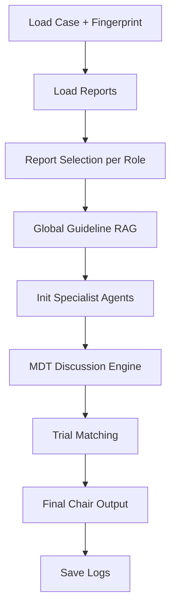

# MDT Discussion Log — 2026-01-18_00-49-41
Generated automatically by MDT Pipeline.


## CASE (structured JSON)

```
{"CASE_CORE":{"ADJUVANT_TREATMENT":{"cycles_or_courses":"2 cycles","given":"Unknown","regimens":["BEP方案化疗2程:BLM 15mg d1-3 +DDP 30mg d1-3+ VP-16 0.1g d1-3，q21d"]},"BIOMARKERS":{"AFP":"<2 (2024-10-22)","CA125":"36.10 (2024-09-27)","HER2":"Unknown","MSI":"Unknown","PDL1_CPS":"Unknown","TMB":"Unknown"},"BRCA1":"Unknown","BRCA2":"Unknown","CURRENT_STATUS":"Post right oophorectomy; received 2 cycles BEP; left ovarian surface nodule noted, under imaging evaluation","DIAGNOSIS":{"components":["畸胎瘤成分"],"histology":"无性细胞瘤合并畸胎瘤成分","laterality":"Right","primary":"Ovarian mixed germ cell tumor","site":"Ovary"},"HRD":"Unknown","INITIAL_TREATMENT":"Yes","LINE_OF_THERAPY":[{"cycles":"2","end_date":"2024-10-23","intent":"Unknown","line":"1L","regimen":"BLM 15mg d1-3 +DDP 30mg d1-3+ VP-16 0.1g d1-3, q21d","start_date":"2024-08-23"}],"MAINTENANCE":"Unknown","MAINTENANCE_DETAIL":{"end_date":"Unknown","given":"Unknown","regimens":[],"start_date":"Unknown"},"NEOADJUVANT":"Yes","PFI_days":"Unknown","PLATINUM_HISTORY":[{"PFI_days":"Unknown","end_date":"2024-10-23","evidence":"BEP方案化疗2程:BLM 15mg d1-3 +DDP 30mg d1-3+ VP-16 0.1g d1-3，q21d，末次2024.10.23","evidence_type":"Clinical","first_relapse_date":"Unknown","line":"1L","start_date":"2024-08-23","status":"Unknown"}],"PLATINUM_PFI_CURRENT":"Unknown","PLATINUM_STATUS":"Unknown","PLATINUM_STATUS_CURRENT":"Unknown","RELAPSE":"Unknown","RELAPSE_DATE":{"date":"Unknown","evidence":"","type":"Unknown"},"SCENE":"Frontline_PDS_or_NACT_IDS","STAGE":{"stage_basis":"Unknown","stage_system":"Unknown","stage_text":"Unknown"},"SURGERY_DONE":{"date":"2024-09-02","performed":"Yes","procedure":"Laparoscopic right ovary + salpingectomy"},"TIMELINE":{"constraints":{"max_events":30,"min_events":3,"must_include":["first diagnostic imaging or pathology confirmation (if available)"],"ordering_rules":{"prioritize_last_event":true}},"events":[{"date":"2024-08-23","description":"Start BEP chemotherapy (2 cycles)","event_type":"Chemo","key_result":"AFP 15.84; CA125 44.1","regimen_or_test":"BEP方案化疗: BLM 15mg d1-3 +DDP 30mg d1-3+ VP-16 0.1g d1-3, q21d"},{"date":"2024-09-02","description":"Laparoscopic right ovary + salpingectomy","event_type":"Surgery","key_result":"Pathology: 卵巢恶性肿瘤, 无性细胞瘤合并畸胎瘤成分","regimen_or_test":"Pathology performed"},{"date":"2024-09-27","description":"MRI: post-right oophorectomy, left adnexal/posterior to left ovary mass; small pelvic effusion","event_type":"Imaging","key_result":"Left ovarian extra-surface mass noted","regimen_or_test":"MRI pelvis"},{"date":"2024-09-28","description":"CT pelvis post-op showing pelvic mass","event_type":"Imaging","key_result":"Postoperative pelvic mass","regimen_or_test":"CT"},{"date":"2024-09","description":"亮丙瑞林 1 time (subcutaneous injection)","event_type":"Other","key_result":"","regimen_or_test":"亮丙瑞林"},{"date":"2024-10-22","description":"AFP measurement","event_type":"Lab","key_result":"AFP <2","regimen_or_test":"AFP"},{"date":"2024-10-23","description":"Last BEP administration (documented last dose)","event_type":"Chemo","key_result":"Last administration 2024-10-23","regimen_or_test":"BEP"}]},"VISIT_DATE":"2024-10-29","first_relapse_date":"Unknown","last_platinum_end_date":"2024-10-23"},"LAB_TRENDS":{"labs":[{"analyte":"AFP","history":[{"date":"2024-08-23","flag":"Unknown","value":"15.84"},{"date":"2024-10-22","flag":"↓","value":"<2"}],"latest":{"date":"2024-10-22","flag":"↓","value":"<2"},"reference_range":"Unknown","unit":"ng/mL"},{"analyte":"CA125","history":[{"date":"2024-08-23","flag":"Unknown","value":"44.1"},{"date":"2024-09-27","flag":"↑","value":"36.10"}],"latest":{"date":"2024-09-27","flag":"↑","value":"36.10"},"reference_range":"Unknown","unit":"U/ml"},{"analyte":"NSE","history":[{"date":"2024-09-27","flag":"↑","value":"19.60"}],"latest":{"date":"2024-09-27","flag":"↑","value":"19.60"},"reference_range":"Unknown","unit":"ng/ml"}],"milestones":[{"date":"2024-08-23","description":"Start BEP chemotherapy","type":"ChemoStart"},{"date":"2024-09-02","description":"Laparoscopic right ovary + salpingectomy","type":"Surgery"},{"date":"2024-10-23","description":"Last documented BEP administration","type":"ChemoEnd"},{"date":"2024-09-27","description":"MRI showing left ovarian mass","type":"Imaging"}]},"MED_ONC":{"current_regimen":{"cycle_info":"2 cycles completed","last_admin_date":"2024-10-23","name":"Unknown"},"genetic_testing":{"germline":[],"somatic":[]},"monitoring_points":[],"planned_next_regimen":"Unknown","prior_systemic_therapies":["BLM 15mg d1-3 +DDP 30mg d1-3+ VP-16 0.1g d1-3, q21d"]},"NUC_MED":{"studies":[]},"PATHOLOGY":{"specimens":[{"components":["无性细胞瘤成分","畸胎瘤成分"],"date":"2024-09-02","diagnosis":"卵巢恶性肿瘤，结合免疫组化诊断为：无性细胞瘤合并畸胎瘤成分（占比约10%），伴局部坏死及血管增生。病理会诊：卵巢混合性生殖细胞肿瘤，以无性细胞瘤成分为主，合并少量成熟性畸胎瘤成分；输卵管慢性炎。","grade":"Unknown","ihc":[{"marker":"SALL4","result":"(+)"},{"marker":"Oct4","result":"(+)"},{"marker":"PLAP","result":"(+)"},{"marker":"D2-40","result":"(+)"},{"marker":"GPC-3","result":"(-)"},{"marker":"AFP","result":"(-)"},{"marker":"ZBTB16","result":"(-)"},{"marker":"EMA","result":"(-)"},{"marker":"CD30","result":"(-)"},{"marker":"CD117","result":"(+)"},{"marker":"Ki-67","result":"(+约80％)"}],"involvement_sites":[],"laterality":"Right","molecular":[],"raw_text":"术后病理：卵巢恶性肿瘤，结合免疫组化诊断为：无性细胞瘤合并畸胎瘤成分（占比约10%），伴局部坏死及血管增生。病理会诊（右附件）：卵巢混合性生殖细胞肿瘤，以无性细胞瘤成分为主，合并少量成熟性畸胎瘤成分；输卵管慢性炎。免疫组化：SALL4（+），Oct4（+），PLAP（+），D2-40（+），GPC-3（-），AFP（-），ZBTB16（-），EMA（-），CD30（-），CD117（+），Ki-67（+约80％）","sample_type":"Resection","site":"Right adnexa","tumor_size":"Unknown","uncertainty_or_missing":["Stage not provided"]}]},"RADIOLOGY":{"next_imaging_plan":{"modality":"FAPI","timing":"Unknown"},"studies":[{"anatomic_sites":["Left ovary","Pelvis"],"date":"2024-09-27","findings":["Post-right oophorectomy; left adnexal/posterior to left ovary mass","Small pelvic effusion"],"impression":"Left-sided adnexal extra-surface mass; consider implantation","modality":"MRI","trend_vs_prior":"Unknown"},{"anatomic_sites":["Pelvis"],"date":"2024-09-28","findings":["Postoperative pelvic mass"],"impression":"Pelvic postoperative change with residual mass","modality":"CT","trend_vs_prior":"Unknown"},{"anatomic_sites":["Left ovary"],"date":"Unknown","findings":["Left ovarian surface solid nodule 1.8cm, decreased in size compared with prior"],"impression":"Left ovarian surface solid nodule 1.8cm; decreased; suspect implantation; recommend FAPI","modality":"MRI","trend_vs_prior":"Improved"}]},"TIMELINE":{"constraints":{"max_events":30,"min_events":3,"must_include":["first diagnostic imaging or pathology confirmation (if available)"],"ordering_rules":{"prioritize_last_event":true}},"events":[{"date":"2024-08-23","description":"Start BEP chemotherapy (2 cycles)","event_type":"Chemo","key_result":"AFP 15.84; CA125 44.1","regimen_or_test":"BEP方案化疗: BLM 15mg d1-3 +DDP 30mg d1-3+ VP-16 0.1g d1-3, q21d"},{"date":"2024-09-02","description":"Laparoscopic right ovary + salpingectomy","event_type":"Surgery","key_result":"Pathology: 卵巢恶性肿瘤, 无性细胞瘤合并畸胎瘤成分","regimen_or_test":"Pathology performed"},{"date":"2024-09-27","description":"MRI: post-right oophorectomy, left adnexal/posterior to left ovary mass; small pelvic effusion","event_type":"Imaging","key_result":"Left ovarian extra-surface mass noted","regimen_or_test":"MRI pelvis"},{"date":"2024-09-28","description":"CT pelvis post-op showing pelvic mass","event_type":"Imaging","key_result":"Postoperative pelvic mass","regimen_or_test":"CT"},{"date":"2024-09","description":"亮丙瑞林 1 time (subcutaneous injection)","event_type":"Other","key_result":"","regimen_or_test":"亮丙瑞林"},{"date":"2024-10-22","description":"AFP measurement","event_type":"Lab","key_result":"AFP <2","regimen_or_test":"AFP"},{"date":"2024-10-23","description":"Last BEP administration (documented last dose)","event_type":"Chemo","key_result":"Last administration 2024-10-23","regimen_or_test":"BEP"}]}}
```


## FINAL MDT OUTPUT

```
Final Assessment:
Mixed ovarian germ cell tumour (dysgerminoma‑predominant) post right adnexectomy and 2 BEP cycles, with a shrinking but indeterminate 1.8 cm left ovarian surface nodule and incomplete staging, organ-function, and fertility information.

Core Treatment Strategy:
- Do not modify systemic‑therapy plan or schedule further cycles until FIGO stage, staging completeness, and organ function are clarified.
- Arrange unified post‑BEP restaging: contrast CT/MRI abdomen–pelvis ± chest plus whole‑body PET/FAPI to assess left nodule and extrapelvic disease.
- Request pathology addendum to provide full staging details (tumour size, capsule/surface, washings, extraovarian disease, FIGO stage, teratoma maturity).
- Implement standardized serial tumour markers (AFP, β‑hCG, LDH, CA125, NSE) and document renal, pulmonary, marrow status and fertility goals to guide chemo vs fertility‑sparing surgery.

Change Triggers:
- If imaging/PET shows active left implant or additional disease, prioritize completion/optimization of systemic therapy and consider non‑fertility‑sparing surgery.
- If imaging/PET shows no active disease and markers normalize, consider limited fertility‑sparing surgery or surveillance rather than intensifying chemotherapy.
- If organ‑function assessment reveals significant BEP toxicity, de‑escalate or switch systemic approach and increase reliance on surgical/local control.
```


## PIPELINE FLOW (Mermaid)




## TRACE EVENTS (Structured)

```json
[
  {
    "ts": "2026-01-18T00:44:58.941281",
    "event": "pipeline_start",
    "payload": {
      "visit_time": "2024-10-29 15:38:50.183000",
      "meta_info": "361127200904290341"
    }
  },
  {
    "ts": "2026-01-18T00:44:58.941564",
    "event": "case_fingerprint",
    "payload": {
      "case_fingerprint": "1a87e77867d4"
    }
  },
  {
    "ts": "2026-01-18T00:44:59.241286",
    "event": "reports_loaded",
    "payload": {
      "lab_n": 0,
      "img_n": 0,
      "path_n": 0,
      "mut_n": 0,
      "cutoff_dt": "2024-10-30 15:38:50"
    }
  },
  {
    "ts": "2026-01-18T00:44:59.300134",
    "event": "reports_selected",
    "payload": {
      "lab": {
        "chair": [],
        "oncologist": [],
        "radiologist": [],
        "pathologist": [],
        "nuclear": []
      },
      "imaging": {
        "chair": [],
        "oncologist": [],
        "radiologist": [],
        "pathologist": [],
        "nuclear": []
      },
      "pathology": {
        "chair": [],
        "oncologist": [],
        "radiologist": [],
        "pathologist": [],
        "nuclear": []
      },
      "mutation": {
        "chair": [],
        "oncologist": [],
        "radiologist": [],
        "pathologist": [],
        "nuclear": []
      }
    }
  },
  {
    "ts": "2026-01-18T00:45:32.893410",
    "event": "rag_query",
    "payload": {
      "query": "Ovarian mixed germ cell tumor (dysgerminoma + mature teratoma), post-first-line BEP, platinum-sensitive with residual left adnexal/pelvic implant-suspected mass; high Ki-67 (~80%); no reported metastases, molecular markers, or major organ/functional constraints."
    }
  },
  {
    "ts": "2026-01-18T00:45:32.893418",
    "event": "rag_hits",
    "payload": {
      "topk": 5,
      "n": 5
    }
  },
  {
    "ts": "2026-01-18T00:45:39.437726",
    "event": "mdt_discussion_start",
    "payload": {
      "num_rounds": 2,
      "num_turns": 2
    }
  },
  {
    "ts": "2026-01-18T00:49:37.966829",
    "event": "mdt_discussion_end",
    "payload": {
      "merged_chars": 4151
    }
  },
  {
    "ts": "2026-01-18T00:49:37.968371",
    "event": "final_output_start",
    "payload": {}
  },
  {
    "ts": "2026-01-18T00:49:41.492405",
    "event": "final_output_end",
    "payload": {
      "final_output_chars": 1409
    }
  }
]
```


## INITIAL EXPERT OPINIONS


## chair

```
- Mixed ovarian germ cell tumour post-right adnexectomy and 2 BEP cycles; left ovarian surface nodule now decreasing on MRI.  
- Clarify intent/completeness of initial staging surgery (omentectomy, peritoneal biopsies, lymph nodes, washings) and final FIGO stage – currently unknown.  
- Obtain full current pelvic/abdominal imaging report (including latest MRI with 1.8 cm nodule) and any FAPI schedule/results.  
- Continue systemic therapy planning as first‑line adjuvant/continued treatment, coordinating with fertility-sparing goals and potential delayed conservative surgery.  
- Monitor AFP, LDH, β‑hCG, CA125, NSE trends; β‑hCG, LDH, full tumour marker panel currently undocumented and need updating.
```


## oncologist

```
- Post-op mixed germ cell tumour with teratomatous component; fertility-sparing approach with residual left ovary requires careful staging confirmation (imaging/pathology).  

- Two cycles of first-line cisplatin-based combination completed; current treatment phase likely still primary/adjuvant rather than relapse therapy.  

- AFP normalized after chemotherapy, suggesting good marker response; CA125 and NSE roles as disease markers remain uncertain and need correlation.  

- Key missing: detailed pathology report (stage, margins, risk factors, teratoma maturity) and full imaging description of left ovarian nodule.  

- Also needed: current organ function (renal, pulmonary, marrow), toxicity history, and MDT fertility goals before deciding further cycles vs surveillance/surgery.
```


## radiologist

```
- Left ovarian surface solid nodule 1.8 cm, extra-surface location, suspicious for implantation deposit. [@Role-Specific-Case-View|Unknown]  

- Nodule has decreased in size compared with prior imaging, suggesting partial interval response/improvement. [@Role-Specific-Case-View|Unknown]  

- Postoperative pelvic changes with residual mass; precise size, margins, and composition not fully characterized. Needs updated cross-sectional imaging. [@Role-Specific-Case-View|2024-09-28]  

- Small pelvic effusion present; clinical significance and evolution uncertain without follow-up imaging. [@Role-Specific-Case-View|2024-09-27]  

- No PET/FAPI or contemporaneous whole-abdomen imaging available; staging and extra-pelvic disease assessment need updated CT/MRI ± PET.
```


## pathologist

```
- Diagnosis: Right ovarian mixed germ cell tumour, predominantly dysgerminoma with ~10% mature teratoma; necrosis and vascular proliferation present [@HISTOLOGY_AND_IHC|2024-09-02].  
- IHC profile (SALL4, Oct4, PLAP, D2-40, CD117 positive; AFP, GPC3, CD30 negative) strongly supports dysgerminoma; no yolk sac component [@HISTOLOGY_AND_IHC|2024-09-02].  
- Proliferation index high (Ki-67 ~80%), consistent with biologically active dysgerminoma component [@HISTOLOGY_AND_IHC|2024-09-02].  
- Current biomarkers: serum AFP <2; CA125 mildly elevated; no HER2, MSI, PD-L1, or TMB data [@MOLECULAR|2024-10-22].  
- Missing for complete pathology staging: tumour size, capsule status, surface involvement, nodal/extraovarian sampling, FIGO stage, margin status—needs surgical/pathology update.
```


## nuclear

```
- No PET-CT reports available; metabolic status of the left adnexal/ovarian surface lesion is unknown/needs update.  

- Prior imaging suggests left adnexal/ovarian surface solid nodule, possibly implantation, but without metabolic characterization. [@IMAGING_CONTEXT|Unknown]  

- PET (FDG or FAPI per protocol) could help distinguish post-operative change from metabolically active residual or recurrent disease.  

- PET findings could upstage disease if additional hypermetabolic peritoneal/implantation sites or nodal involvement are identified beyond current CT impressions.  

- Request updated PET-CT (or FAPI-PET if available) report to refine staging and recurrence suspicion at/after this visit date.
```


## MERGED SUMMARY (Assistant)

```
Key Knowledge:
- Mixed ovarian germ cell tumour, predominantly dysgerminoma with ~10% mature teratoma; high Ki‑67; no yolk sac component on IHC.
- Fertility-sparing right adnexectomy; patient currently in first‑line/adjuvant setting after 2 cycles of cisplatin-based chemotherapy.
- AFP has normalized (<2); CA125 mildly elevated; β‑hCG and LDH not yet reported.
- MRI: 1.8 cm solid nodule on the surface of the left ovary, suspicious for implantation but decreasing in size; small pelvic effusion.
- No PET/FAPI or full whole‑abdomen/chest staging imaging; extra‑pelvic disease status unknown.

Controversies:
- Extent and intent of initial surgery (full staging vs limited fertility-sparing) unclear; FIGO stage remains uncertain.
- Biological nature of the left ovarian surface nodule (implant vs residual teratoma vs postoperative/inflammatory change) unresolved.
- Appropriate balance and sequencing of further chemotherapy versus timing/extent of conservative/delayed surgery under fertility-sparing goals.
- Utility of CA125 and NSE as reliable disease markers in this case remains uncertain.

Missing Info:
- Full operative and pathology staging details (tumour size, capsule/surface involvement, omentum/peritoneal biopsies, nodal sampling, washings, margins, FIGO stage).
- Detailed histopathology including teratoma maturity and any extraovarian disease in original specimens.
- Updated cross-sectional imaging (CT/MRI pelvis–abdomen ± chest) with full characterization of the 1.8 cm nodule (trend, enhancement, diffusion, relationship to cortex/peritoneum) and any peritoneal/omental implants.
- PET‑CT/FAPI‑PET status: whether planned, timing relative to chemotherapy, and optimal integration with CT/MRI for single staging timepoint.
- Serial tumour marker trends (AFP, β‑hCG, LDH, CA125, NSE) with dates.
- Current organ function/toxicity after BEP (renal, pulmonary, marrow, ototoxicity) and clearly documented fertility-preservation priorities.

Working Plan:
- Obtain and review complete operative and pathology reports to define FIGO stage and staging completeness, including potential for implantation to the left ovary.
- Request detailed re-evaluation/report of current imaging focusing on the left ovarian surface nodule and any peritoneal/omental disease; arrange updated CT/MRI abdomen–pelvis ± chest.
- Coordinate with nuclear medicine and radiology to schedule PET/FAPI at the same time as next contrast-enhanced CT/MRI (post-current chemo cycle or pre-major surgery) for metabolic characterization and global staging.
- Clarify systemic-therapy strategy within a first-line/adjuvant framework once staging, toxicity profile, and fertility goals are available.
- Implement standardized serial tumour marker monitoring (AFP, β‑hCG, LDH, CA125, NSE) and integrate with imaging for response and surveillance planning.
[R2T1 DELTA] emotherapy cycles, we need full staging details, updated cross-sectional imaging, and a clear statement of the patient’s fertility priorities to balance systemic therapy versus delayed conservative surgery. | chair->radiologist(missing): Please provide a detailed re-evaluation of the left ovarian surface nodule and peritoneum on updated contrast CT/MRI, and confirm feasibility/timing of combined CT/MRI plus PET/FAPI as a single staging timepoint post‑BEP. | chair->pathologist(missing): Kindly issue an addendum clarifying tumour size, capsule/surface involvement, washings, any extraovarian disease, teratoma maturity, and an assigned FIGO stage if possible. | chair->nuclear(missing): We need your plan for PET/FAPI: optimal timing relative to recent BEP, protocol details, and how best to integrate it with same‑day CT/MRI for comprehensive staging of the left ovarian lesion and any implants.
[R2T2 DELTA] nuclear->chair(missing): I propose whole‑body FDG‑PET (or FAPI if available) scheduled with the next contrast CT/MRI after completion of the current BEP cycle, using a standard oncologic protocol (vertex–mid‑thigh, low‑dose CT for attenuation) to metabolically characterize the left ovarian surface nodule and detect any peritoneal/extra‑pelvic implants in a single staging session.
```


## INTERACTION LOG (Round × Turn)

### Round 1

#### Turn 1
- **chair → oncologist:** Before deciding on further chemotherapy versus interval conservative surgery, we must first obtain complete staging details, updated cross‑sectional imaging, and full tumour marker panel including β‑hCG and LDH with toxicity assessment post‑BEP.
- **chair → radiologist:** Please arrange and report comprehensive contrast-enhanced CT/MRI of abdomen–pelvis (±chest) to fully characterize the left ovarian surface nodule and search for peritoneal/extra‑pelvic disease; clarify timing/feasibility of planned FAPI/PET study.
- **chair → pathologist:** We need a detailed summary of the initial specimen: tumor size, capsule/surface status, teratoma maturity, margins, and any extraovarian involvement to support accurate FIGO staging.
- **chair → nuclear:** Confirm indication, protocol, and timing for FAPI/PET (or alternative PET) to assess metabolic activity of the left ovarian lesion and detect occult implants; results will directly influence systemic versus surgical strategy.
- **oncologist → chair:** Systemic therapy decisions are limited by unclear FIGO stage and uncertain nature of the left ovarian lesion; prioritizing completion of staging information and updated imaging is critical before committing to more cycles or additional surgery in this fertility-sparing case.
- **oncologist → radiologist:** We need updated contrast-enhanced CT/MRI of abdomen–pelvis (±chest) with detailed characterization of the left ovarian surface nodule and any peritoneal/implant disease to determine if current therapy remains appropriate or if surgery should be escalated.
- **oncologist → pathologist:** Please provide full staging pathology details (FIGO stage, capsule/surface involvement, washings, omentum/biopsies, nodes, teratoma maturity, margins) to clarify risk and guide adjuvant intensity vs surgery timing.
- **oncologist → nuclear:** Confirm feasibility and timing of PET or FAPI-PET to assess metabolic activity of the left ovarian lesion and exclude occult extra-pelvic disease, which will influence further systemic therapy and fertility-sparing strategy.
- **radiologist → oncologist:** Current imaging shows a 1.8 cm left ovarian surface nodule decreasing in size, but there is no up‑to‑date whole‑abdomen/chest imaging or PET/FAPI to confirm extent of disease or fully characterize this lesion; updated cross‑sectional and, if available, metabolic imaging are needed before making further surgical or systemic decisions.
- **radiologist → nuclear:** A decreasing 1.8 cm solid nodule on the left ovarian surface remains suspicious for implantation; no PET/FAPI or whole‑body metabolic study is documented, so feasibility and timing of FAPI‑PET (or equivalent) should be clarified for disease characterization and staging.
- **pathologist → oncologist:** Pathology and IHC confirm pure dysgerminoma plus mature teratoma without yolk sac elements; please update full staging details (capsule/surface, peritoneal/omentectomy, nodes, washings, margins, FIGO stage) so we can judge whether the left ovarian nodule represents possible implantation versus benign/secondary change.
- **pathologist → radiologist:** Given mixed germ cell histology with normalized AFP but uncertain stage, we need detailed re-evaluation of the left ovarian surface nodule (size trend, enhancement, diffusion, relation to cortex and peritoneum) and any peritoneal/omental implants on current cross-sectional imaging.
- **nuclear → oncologist:** Metabolic characterization of the left ovarian surface nodule is still completely absent; please confirm if PET/FAPI is planned and timing relative to ongoing chemotherapy.
- **nuclear → radiologist:** Given the unresolved 1.8 cm left ovarian surface lesion and unknown extra‑pelvic status, please advise on optimal timing and modality for PET/FAPI integration with planned cross‑sectional imaging.

#### Turn 2
- **oncologist → chair:** Systemic-therapy planning remains constrained by uncertain FIGO stage, uncharacterized left ovarian surface lesion, and absent organ-function/toxicity data; further chemotherapy beyond two cycles should be deferred until pathology, imaging, and fertility goals are clarified.
- **radiologist → nuclear:** From an imaging workflow perspective, pairing PET/FAPI with the next contrast-enhanced CT or MRI abdomen–pelvis once the current chemotherapy cycle is completed (or just before major surgical decisions) would best characterize the 1.8 cm left ovarian surface lesion and detect extra‑pelvic disease in a single staging timepoint.

### Round 2

#### Turn 1
- **chair → oncologist:** Before committing to further chemotherapy cycles, we need full staging details, updated cross-sectional imaging, and a clear statement of the patient’s fertility priorities to balance systemic therapy versus delayed conservative surgery.
- **chair → radiologist:** Please provide a detailed re-evaluation of the left ovarian surface nodule and peritoneum on updated contrast CT/MRI, and confirm feasibility/timing of combined CT/MRI plus PET/FAPI as a single staging timepoint post‑BEP.
- **chair → pathologist:** Kindly issue an addendum clarifying tumour size, capsule/surface involvement, washings, any extraovarian disease, teratoma maturity, and an assigned FIGO stage if possible.
- **chair → nuclear:** We need your plan for PET/FAPI: optimal timing relative to recent BEP, protocol details, and how best to integrate it with same‑day CT/MRI for comprehensive staging of the left ovarian lesion and any implants.

#### Turn 2
- **nuclear → chair:** I propose whole‑body FDG‑PET (or FAPI if available) scheduled with the next contrast CT/MRI after completion of the current BEP cycle, using a standard oncologic protocol (vertex–mid‑thigh, low‑dose CT for attenuation) to metabolically characterize the left ovarian surface nodule and detect any peritoneal/extra‑pelvic implants in a single staging session.


## FINAL REFINED PLANS (per Round)

### Round 1


## chair

```
- Defer additional chemotherapy until FIGO stage, left ovarian lesion characterization, organ function, and fertility goals are clarified (all currently unknown).  
- Obtain full operative/pathology reports to define tumour size, capsule/surface, washings, omentum, nodes, margins, final stage (all unknown).  
- Arrange updated contrast-enhanced CT/MRI abdomen–pelvis ± chest plus PET/FAPI at a single staging timepoint to assess lesion and spread.  
- Standardize serial markers (AFP, β‑hCG, LDH, CA125, NSE) with dates and integrate with imaging for response assessment (current series incomplete/unknown).  
- Re-discuss in MDT after pathology/imaging/marker update to decide between continued first‑line systemic therapy and fertility-sparing delayed surgery sequencing.
```


## oncologist

```
- Defer additional systemic therapy decisions until full operative/pathology staging details and FIGO stage are obtained (currently unknown).  

- Arrange updated contrast-enhanced CT/MRI abdomen–pelvis ± chest to reassess left ovarian nodule and search for extra‑pelvic disease (none documented).  

- Coordinate PET/FAPI with next cross‑sectional imaging after current chemotherapy cycle or pre-surgery to characterize the left ovarian lesion and staging.  

- Implement serial tumour marker panel (AFP, β‑hCG, LDH, CA125, NSE) with dates; β‑hCG and LDH currently unknown.  

- Document renal, pulmonary, marrow function and prior toxicities post-BEP (all currently unknown), and clarify patient fertility goals before finalizing regimen.
```


## radiologist

```
- Obtain updated contrast-enhanced CT or MRI abdomen–pelvis ± chest to restage and fully characterize the 1.8 cm left ovarian nodule. [@Role-Specific-Case-View|Unknown]  

- Schedule PET/FAPI (if available) coordinated with this cross-sectional study to assess metabolic activity and detect extra-pelvic disease. [@Role-Specific-Case-View|Unknown]  

- On new imaging, document precise nodule size trend, enhancement, diffusion, and relation to ovarian cortex/peritoneal surface for implantation assessment. [@Role-Specific-Case-View|Unknown]  

- Systematically evaluate for additional peritoneal/omental implants and quantify pelvic effusion volume and characteristics on updated imaging. [@Role-Specific-Case-View|2024-09-27]  

- Reconcile new imaging with operative/pathology staging once available to support definitive FIGO stage assignment and surgical planning. [@Role-Specific-Case-View|Unknown]
```


## pathologist

```
- Confirm full surgical and pathology staging details, including capsule/surface status, peritoneal/omental biopsies, nodes, washings, margins, FIGO stage [@HISTOLOGY_AND_IHC|2024-09-02].  
- Re-review original slides to document teratoma maturity, any extraovarian tumour, and precise dysgerminoma/teratoma proportions [@HISTOLOGY_AND_IHC|2024-09-02].  
- Correlate serial AFP, β‑hCG, LDH, CA125, NSE trends with imaging once complete marker timeline is available (currently incomplete; needs update).  
- After updated CT/MRI and PET/FAPI, jointly reassess left ovarian surface nodule as active implant vs teratoma vs benign change (imaging reports pending).  
- Defer pathology-based advice on further systemic therapy or delayed surgery until staging and lesion characterization are finalized (data currently insufficient).
```


## nuclear

```
- No prior PET or FAPI imaging; metabolic activity of the left ovarian surface nodule remains unknown/needs update.  

- Decreasing 1.8 cm left ovarian surface nodule suggests possible treatment response but etiology (implant vs teratoma vs reactive) remains indeterminate. [@IMAGING_CONTEXT|Unknown]  

- Whole-body PET (FDG or FAPI per protocol) combined with next CT/MRI could newly define extra‑pelvic disease and refine FIGO staging.  

- PET at a unified post-chemotherapy staging timepoint may distinguish active implantation from benign/postoperative change, directly impacting recurrence suspicion.  

- Recommend scheduling PET/FAPI alongside the next contrast-enhanced abdomen–pelvis study once current chemotherapy cycle is completed or before major surgery.
```

### Round 2


## chair

```
- Before changing therapy, obtain full operative/pathology staging details and FIGO stage assignment; current extent of disease is unknown.  
- Arrange updated contrast-enhanced CT/MRI abdomen–pelvis ± chest with focused characterization of the left ovarian nodule and peritoneum.  
- Coordinate same-session whole‑body PET/FAPI with CT/MRI after current BEP course to stage globally and assess the left nodule.  
- Clarify patient’s fertility goals and current BEP toxicities (renal, pulmonary, marrow, otologic) to guide intensity of further chemo vs surgery.  
- Implement standardized serial markers (AFP, β‑hCG, LDH, CA125, NSE) with dates, interpreted jointly with imaging for response/surveillance.
```


## oncologist

```
- Systemic therapy remains first-line/adjuvant; further cycles should await clarified FIGO stage and staging completeness (operative/pathology details currently unknown).  

- Arrange updated contrast-enhanced CT/MRI abdomen–pelvis ± chest plus whole‑body PET/FAPI in a single post‑BEP staging session (extra‑pelvic status unknown).  

- Request pathology addendum detailing tumour size, capsule/surface involvement, washings, extraovarian disease, teratoma maturity, and FIGO stage (all currently unknown).  

- Implement standardized serial tumour markers (AFP, β‑hCG, LDH, CA125, NSE) with dates; β‑hCG and LDH values are unknown.  

- Document renal, pulmonary, marrow function, ototoxicity after BEP and patient fertility priorities before finalizing systemic‑therapy versus delayed conservative surgery strategy.
```


## radiologist

```
- Restage with contrast-enhanced CT or MRI abdomen–pelvis ± chest to characterize the 1.8 cm left ovarian surface nodule. [@Role-Specific-Case-View|Unknown]  

- Coordinate same-session whole-body FDG-PET or FAPI-PET with this CT/MRI after current BEP cycle for global metabolic staging. [@Role-Specific-Case-View|Unknown]  

- On new imaging, document nodule size trend, enhancement, diffusion, and cortex/peritoneal relationship to distinguish implantation from benign/postoperative change. [@Role-Specific-Case-View|Unknown]  

- Systematically assess peritoneum/omentum for additional implants and better quantify/characterize pelvic effusion on updated imaging. [@Role-Specific-Case-View|2024-09-27]  

- Integrate new imaging findings with forthcoming operative/pathology details to support FIGO staging and fertility-sparing surgical planning. [@Role-Specific-Case-View|Unknown]
```


## pathologist

```
- Confirm and document tumour size, capsule/surface status, washings, margins, nodal/peritoneal/omental sampling, and FIGO stage in an addendum [@HISTOLOGY_AND_IHC|2024-09-02].  
- Review all blocks to re-verify absence of yolk sac/other malignant germ cell elements and to grade teratoma maturity [@HISTOLOGY_AND_IHC|2024-09-02].  
- State explicitly whether any extraovarian tumour was present in the right adnexa specimen or associated tissues (currently unknown) [@HISTOLOGY_AND_IHC|2024-09-02].  
- Correlate pathology with updated imaging of the left ovarian surface lesion to suggest most likely nature (implant vs teratoma vs benign).  
- Refrain from further pathology-based recommendations on chemotherapy or surgery until staging addendum and new imaging/markers are available (data incomplete).
```


## nuclear

```
- No prior PET/FAPI; metabolic status of the 1.8 cm left ovarian surface nodule remains unknown/needs update.  

- MRI shows a decreasing 1.8 cm left ovarian surface nodule with small pelvic effusion; etiology remains indeterminate (implant vs benign). [@IMAGING_CONTEXT|Unknown]  

- Plan whole‑body FDG‑PET (or FAPI if available) combined with next contrast CT/MRI after current BEP cycle for unified staging.  

- PET can clarify extra‑pelvic disease burden and refine FIGO staging by detecting occult peritoneal/omental implants not yet characterized.  

- Metabolic activity pattern in the left ovarian lesion will help distinguish viable implantation from postoperative/inflammatory or teratomatous change, informing recurrence risk.
```


## RAW AGENT LOGS

### chair
- **User:** Give INITIAL opinion (use ONLY your system-provided patient facts).
Return up to 5 bullets, each ≤20 words.
If key data missing, say exactly what needs updating.
  
  **Assistant:** - Mixed ovarian germ cell tumour post-right adnexectomy and 2 BEP cycles; left ovarian surface nodule now decreasing on MRI.  
- Clarify intent/completeness of initial staging surgery (omentectomy, peritoneal biopsies, lymph nodes, washings) and final FIGO stage – currently unknown.  
- Obtain full current pelvic/abdominal imaging report (including latest MRI with 1.8 cm nodule) and any FAPI schedule/results.  
- Continue systemic therapy planning as first‑line adjuvant/continued treatment, coordinating with fertility-sparing goals and potential delayed conservative surgery.  
- Monitor AFP, LDH, β‑hCG, CA125, NSE trends; β‑hCG, LDH, full tumour marker panel currently undocumented and need updating.
  
  *(2026-01-18T00:45:44.640186)*

- **User:** ROLE: chair. VISIT: 2024-10-29 15:38:50.183000
Default is NOT to speak. Speak ONLY if: conflict | safety | missing-critical | new-critical.

CONTEXT (latest):
Key Knowledge:
- Mixed ovarian germ cell tumour, predominantly dysgerminoma with ~10% mature teratoma; high Ki‑67 and classic dysgerminoma IHC; no yolk sac component.
- Fertility-sparing right adnexectomy performed; current treatment is first‑line/adjuvant post-surgery with 2 cycles of cisplatin-based chemotherapy.
- AFP has normalized (<2); CA125 mildly elevated; β‑hCG and LDH not yet documented.
- MRI shows a 1.8 cm solid nodule on the surface of the left ovary, suspicious for implantation but decreasing in size; small pelvic effusion present.
- No PET/FAPI or full whole‑abdomen staging imaging available; extra‑pelvic disease status unknown.

Controversies:
- Unclear whether the original operation was a full staging procedure, so FIGO stage is uncertain.
- Nature of the left ovarian surface lesion (regressing active disease vs residual teratoma vs postoperative/inflammatory change) remains unresolved.
- Best balance between further systemic therapy and timing/extent of conservative/delayed surgery in the context of fertility preservation is undetermined.
- Clinical utility of CA125 and NSE as markers in this case needs correlation with imaging and course.

Missing Info:
- Complete operative and pathology staging details (tumour size, capsule/surface involvement, omentum/peritoneal biopsies, nodes, washings, margins, final FIGO stage).
- Full histopathology including teratoma maturity and any extraovarian disease in original specimens.
- Up‑to‑date cross‑sectional imaging (pelvis/abdomen ± chest) fully characterizing the 1.8 cm nodule and any peritoneal/implant sites.
- PET‑CT/FAPI‑PET results or confirmation if/when planned.
- Serial tumour marker panel (AFP, β‑hCG, LDH, CA125, NSE) with dates.
- Current organ function and toxicity profile post‑BEP (renal, pulmonary, marrow, ototoxicity) plus clearly documented fertility goals.

Working Plan:
- Obtain and review full operative and pathology reports to define FIGO stage and completeness of staging.
- Arrange comprehensive updated imaging (CT/MRI pelvis–abdomen ± chest) and metabolic imaging (PET/FAPI) if available, to reassess the left ovarian lesion and rule out further disease.
- Plan ongoing systemic therapy within a first‑line/adjuvant context, aligned with fertility-sparing intent and potential timing of delayed conservative surgery.
- Implement standardized, scheduled tumour marker monitoring (AFP, β‑hCG, LDH, CA125, NSE) and integrate with imaging for response and follow‑up assessment.

Allowed targets: [oncologist,radiologist,pathologist,nuclear]
Return ONE-LINE JSON only:{"speak":"yes/no","messages":[{"target":"<role>","message":"<1-2 sentences>","why":"conflict|safety|missing|new"}]}
  
  **Assistant:** {"speak":"yes","messages":[{"target":"oncologist","message":"Before deciding on further chemotherapy versus interval conservative surgery, we must first obtain complete staging details, updated cross‑sectional imaging, and full tumour marker panel including β‑hCG and LDH with toxicity assessment post‑BEP.","why":"missing"},{"target":"radiologist","message":"Please arrange and report comprehensive contrast-enhanced CT/MRI of abdomen–pelvis (±chest) to fully characterize the left ovarian surface nodule and search for peritoneal/extra‑pelvic disease; clarify timing/feasibility of planned FAPI/PET study.","why":"missing"},{"target":"pathologist","message":"We need a detailed summary of the initial specimen: tumor size, capsule/surface status, teratoma maturity, margins, and any extraovarian involvement to support accurate FIGO staging.","why":"missing"},{"target":"nuclear","message":"Confirm indication, protocol, and timing for FAPI/PET (or alternative PET) to assess metabolic activity of the left ovarian lesion and detect occult implants; results will directly influence systemic versus surgical strategy.","why":"missing"}]}
  
  *(2026-01-18T00:46:22.535407)*

- **User:** ROLE: chair. VISIT: 2024-10-29 15:38:50.183000
Default is NOT to speak. Speak ONLY if: conflict | safety | missing-critical | new-critical.

CONTEXT (latest):
Key Knowledge:
- Mixed ovarian germ cell tumour, predominantly dysgerminoma with ~10% mature teratoma; high Ki‑67 and classic dysgerminoma IHC; no yolk sac component.
- Fertility-sparing right adnexectomy performed; current treatment is first‑line/adjuvant post-surgery with 2 cycles of cisplatin-based chemotherapy.
- AFP has normalized (<2); CA125 mildly elevated; β‑hCG and LDH not yet documented.
- MRI shows a 1.8 cm solid nodule on the surface of the left ovary, suspicious for implantation but decreasing in size; small pelvic effusion present.
- No PET/FAPI or full whole‑abdomen staging imaging available; extra‑pelvic disease status unknown.

Controversies:
- Unclear whether the original operation was a full staging procedure, so FIGO stage is uncertain.
- Nature of the left ovarian surface lesion (regressing active disease vs residual teratoma vs postoperative/inflammatory change) remains unresolved.
- Best balance between further systemic therapy and timing/extent of conservative/delayed surgery in the context of fertility preservation is undetermined.
- Clinical utility of CA125 and NSE as markers in this case needs correlation with imaging and course.

Missing Info:
- Complete operative and pathology staging details (tumour size, capsule/surface involvement, omentum/peritoneal biopsies, nodes, washings, margins, final FIGO stage).
- Full histopathology including teratoma maturity and any extraovarian disease in original specimens.
- Up‑to‑date cross‑sectional imaging (pelvis/abdomen ± chest) fully characterizing the 1.8 cm nodule and any peritoneal/implant sites.
- PET‑CT/FAPI‑PET results or confirmation if/when planned.
- Serial tumour marker panel (AFP, β‑hCG, LDH, CA125, NSE) with dates.
- Current organ function and toxicity profile post‑BEP (renal, pulmonary, marrow, ototoxicity) plus clearly documented fertility goals.

Working Plan:
- Obtain and review full operative and pathology reports to define FIGO stage and completeness of staging.
- Arrange comprehensive updated imaging (CT/MRI pelvis–abdomen ± chest) and metabolic imaging (PET/FAPI) if available, to reassess the left ovarian lesion and rule out further disease.
- Plan ongoing systemic therapy within a first‑line/adjuvant context, aligned with fertility-sparing intent and potential timing of delayed conservative surgery.
- Implement standardized, scheduled tumour marker monitoring (AFP, β‑hCG, LDH, CA125, NSE) and integrate with imaging for response and follow‑up assessment.
[R1T1 DELTA] , washings, margins, FIGO stage) so we can judge whether the left ovarian nodule represents possible implantation versus benign/secondary change. | pathologist->radiologist(missing): Given mixed germ cell histology with normalized AFP but uncertain stage, we need detailed re-evaluation of the left ovarian surface nodule (size trend, enhancement, diffusion, relation to cortex and peritoneum) and any peritoneal/omental implants on current cross-sectional imaging. | nuclear->oncologist(missing): Metabolic characterization of the left ovarian surface nodule is still completely absent; please confirm if PET/FAPI is planned and timing relative to ongoing chemotherapy. | nuclear->radiologist(missing): Given the unresolved 1.8 cm left ovarian surface lesion and unknown extra‑pelvic status, please advise on optimal timing and modality for PET/FAPI integration with planned cross‑sectional imaging.

Allowed targets: [oncologist,radiologist,pathologist,nuclear]
Return ONE-LINE JSON only:{"speak":"yes/no","messages":[{"target":"<role>","message":"<1-2 sentences>","why":"conflict|safety|missing|new"}]}
  
  **Assistant:** {"speak":"no","messages":[]}
  
  *(2026-01-18T00:46:34.740112)*

- **User:** Given MDT context:
Key Knowledge:
- Mixed ovarian germ cell tumour, predominantly dysgerminoma with ~10% mature teratoma; high Ki‑67 and classic dysgerminoma IHC; no yolk sac component.
- Fertility-sparing right adnexectomy performed; current treatment is first‑line/adjuvant post-surgery with 2 cycles of cisplatin-based chemotherapy.
- AFP has normalized (<2); CA125 mildly elevated; β‑hCG and LDH not yet documented.
- MRI shows a 1.8 cm solid nodule on the surface of the left ovary, suspicious for implantation but decreasing in size; small pelvic effusion present.
- No PET/FAPI or full whole‑abdomen staging imaging available; extra‑pelvic disease status unknown.

Controversies:
- Unclear whether the original operation was a full staging procedure, so FIGO stage is uncertain.
- Nature of the left ovarian surface lesion (regressing active disease vs residual teratoma vs postoperative/inflammatory change) remains unresolved.
- Best balance between further systemic therapy and timing/extent of conservative/delayed surgery in the context of fertility preservation is undetermined.
- Clinical utility of CA125 and NSE as markers in this case needs correlation with imaging and course.

Missing Info:
- Complete operative and pathology staging details (tumour size, capsule/surface involvement, omentum/peritoneal biopsies, nodes, washings, margins, final FIGO stage).
- Full histopathology including teratoma maturity and any extraovarian disease in original specimens.
- Up‑to‑date cross‑sectional imaging (pelvis/abdomen ± chest) fully characterizing the 1.8 cm nodule and any peritoneal/implant sites.
- PET‑CT/FAPI‑PET results or confirmation if/when planned.
- Serial tumour marker panel (AFP, β‑hCG, LDH, CA125, NSE) with dates.
- Current organ function and toxicity profile post‑BEP (renal, pulmonary, marrow, ototoxicity) plus clearly documented fertility goals.

Working Plan:
- Obtain and review full operative and pathology reports to define FIGO stage and completeness of staging.
- Arrange comprehensive updated imaging (CT/MRI pelvis–abdomen ± chest) and metabolic imaging (PET/FAPI) if available, to reassess the left ovarian lesion and rule out further disease.
- Plan ongoing systemic therapy within a first‑line/adjuvant context, aligned with fertility-sparing intent and potential timing of delayed conservative surgery.
- Implement standardized, scheduled tumour marker monitoring (AFP, β‑hCG, LDH, CA125, NSE) and integrate with imaging for response and follow‑up assessment.
[R1T1 DELTA] , washings, margins, FIGO stage) so we can judge whether the left ovarian nodule represents possible implantation versus benign/secondary change. | pathologist->radiologist(missing): Given mixed germ cell histology with normalized AFP but uncertain stage, we need detailed re-evaluation of the left ovarian surface nodule (size trend, enhancement, diffusion, relation to cortex and peritoneum) and any peritoneal/omental implants on current cross-sectional imaging. | nuclear->oncologist(missing): Metabolic characterization of the left ovarian surface nodule is still completely absent; please confirm if PET/FAPI is planned and timing relative to ongoing chemotherapy. | nuclear->radiologist(missing): Given the unresolved 1.8 cm left ovarian surface lesion and unknown extra‑pelvic status, please advise on optimal timing and modality for PET/FAPI integration with planned cross‑sectional imaging.
[R1T2 DELTA] oncologist->chair(safety): Systemic-therapy planning remains constrained by uncertain FIGO stage, uncharacterized left ovarian surface lesion, and absent organ-function/toxicity data; further chemotherapy beyond two cycles should be deferred until pathology, imaging, and fertility goals are clarified. | radiologist->nuclear(missing): From an imaging workflow perspective, pairing PET/FAPI with the next contrast-enhanced CT or MRI abdomen–pelvis once the current chemotherapy cycle is completed (or just before major surgical decisions) would best characterize the 1.8 cm left ovarian surface lesion and detect extra‑pelvic disease in a single staging timepoint.

Provide FINAL refined plan.
Up to 5 bullets, each ≤20 words.
Any factual claim must include [@report_id|date] or say unknown.
  
  **Assistant:** - Defer additional chemotherapy until FIGO stage, left ovarian lesion characterization, organ function, and fertility goals are clarified (all currently unknown).  
- Obtain full operative/pathology reports to define tumour size, capsule/surface, washings, omentum, nodes, margins, final stage (all unknown).  
- Arrange updated contrast-enhanced CT/MRI abdomen–pelvis ± chest plus PET/FAPI at a single staging timepoint to assess lesion and spread.  
- Standardize serial markers (AFP, β‑hCG, LDH, CA125, NSE) with dates and integrate with imaging for response assessment (current series incomplete/unknown).  
- Re-discuss in MDT after pathology/imaging/marker update to decide between continued first‑line systemic therapy and fertility-sparing delayed surgery sequencing.
  
  *(2026-01-18T00:46:46.007883)*

- **User:** ROLE: chair. VISIT: 2024-10-29 15:38:50.183000
Default is NOT to speak. Speak ONLY if: conflict | safety | missing-critical | new-critical.

CONTEXT (latest):
Key Knowledge:
- Mixed ovarian germ cell tumour, predominantly dysgerminoma with ~10% mature teratoma; high Ki‑67; no yolk sac component on IHC.
- Fertility-sparing right adnexectomy; patient currently in first‑line/adjuvant setting after 2 cycles of cisplatin-based chemotherapy.
- AFP has normalized (<2); CA125 mildly elevated; β‑hCG and LDH not yet reported.
- MRI: 1.8 cm solid nodule on the surface of the left ovary, suspicious for implantation but decreasing in size; small pelvic effusion.
- No PET/FAPI or full whole‑abdomen/chest staging imaging; extra‑pelvic disease status unknown.

Controversies:
- Extent and intent of initial surgery (full staging vs limited fertility-sparing) unclear; FIGO stage remains uncertain.
- Biological nature of the left ovarian surface nodule (implant vs residual teratoma vs postoperative/inflammatory change) unresolved.
- Appropriate balance and sequencing of further chemotherapy versus timing/extent of conservative/delayed surgery under fertility-sparing goals.
- Utility of CA125 and NSE as reliable disease markers in this case remains uncertain.

Missing Info:
- Full operative and pathology staging details (tumour size, capsule/surface involvement, omentum/peritoneal biopsies, nodal sampling, washings, margins, FIGO stage).
- Detailed histopathology including teratoma maturity and any extraovarian disease in original specimens.
- Updated cross-sectional imaging (CT/MRI pelvis–abdomen ± chest) with full characterization of the 1.8 cm nodule (trend, enhancement, diffusion, relationship to cortex/peritoneum) and any peritoneal/omental implants.
- PET‑CT/FAPI‑PET status: whether planned, timing relative to chemotherapy, and optimal integration with CT/MRI for single staging timepoint.
- Serial tumour marker trends (AFP, β‑hCG, LDH, CA125, NSE) with dates.
- Current organ function/toxicity after BEP (renal, pulmonary, marrow, ototoxicity) and clearly documented fertility-preservation priorities.

Working Plan:
- Obtain and review complete operative and pathology reports to define FIGO stage and staging completeness, including potential for implantation to the left ovary.
- Request detailed re-evaluation/report of current imaging focusing on the left ovarian surface nodule and any peritoneal/omental disease; arrange updated CT/MRI abdomen–pelvis ± chest.
- Coordinate with nuclear medicine and radiology to schedule PET/FAPI at the same time as next contrast-enhanced CT/MRI (post-current chemo cycle or pre-major surgery) for metabolic characterization and global staging.
- Clarify systemic-therapy strategy within a first-line/adjuvant framework once staging, toxicity profile, and fertility goals are available.
- Implement standardized serial tumour marker monitoring (AFP, β‑hCG, LDH, CA125, NSE) and integrate with imaging for response and surveillance planning.

Allowed targets: [oncologist,radiologist,pathologist,nuclear]
Return ONE-LINE JSON only:{"speak":"yes/no","messages":[{"target":"<role>","message":"<1-2 sentences>","why":"conflict|safety|missing|new"}]}
  
  **Assistant:** {"speak":"yes","messages":[{"target":"oncologist","message":"Before committing to further chemotherapy cycles, we need full staging details, updated cross-sectional imaging, and a clear statement of the patient’s fertility priorities to balance systemic therapy versus delayed conservative surgery.","why":"missing"},{"target":"radiologist","message":"Please provide a detailed re-evaluation of the left ovarian surface nodule and peritoneum on updated contrast CT/MRI, and confirm feasibility/timing of combined CT/MRI plus PET/FAPI as a single staging timepoint post‑BEP.","why":"missing"},{"target":"pathologist","message":"Kindly issue an addendum clarifying tumour size, capsule/surface involvement, washings, any extraovarian disease, teratoma maturity, and an assigned FIGO stage if possible.","why":"missing"},{"target":"nuclear","message":"We need your plan for PET/FAPI: optimal timing relative to recent BEP, protocol details, and how best to integrate it with same‑day CT/MRI for comprehensive staging of the left ovarian lesion and any implants.","why":"missing"}]}
  
  *(2026-01-18T00:47:40.701673)*

- **User:** ROLE: chair. VISIT: 2024-10-29 15:38:50.183000
Default is NOT to speak. Speak ONLY if: conflict | safety | missing-critical | new-critical.

CONTEXT (latest):
Key Knowledge:
- Mixed ovarian germ cell tumour, predominantly dysgerminoma with ~10% mature teratoma; high Ki‑67; no yolk sac component on IHC.
- Fertility-sparing right adnexectomy; patient currently in first‑line/adjuvant setting after 2 cycles of cisplatin-based chemotherapy.
- AFP has normalized (<2); CA125 mildly elevated; β‑hCG and LDH not yet reported.
- MRI: 1.8 cm solid nodule on the surface of the left ovary, suspicious for implantation but decreasing in size; small pelvic effusion.
- No PET/FAPI or full whole‑abdomen/chest staging imaging; extra‑pelvic disease status unknown.

Controversies:
- Extent and intent of initial surgery (full staging vs limited fertility-sparing) unclear; FIGO stage remains uncertain.
- Biological nature of the left ovarian surface nodule (implant vs residual teratoma vs postoperative/inflammatory change) unresolved.
- Appropriate balance and sequencing of further chemotherapy versus timing/extent of conservative/delayed surgery under fertility-sparing goals.
- Utility of CA125 and NSE as reliable disease markers in this case remains uncertain.

Missing Info:
- Full operative and pathology staging details (tumour size, capsule/surface involvement, omentum/peritoneal biopsies, nodal sampling, washings, margins, FIGO stage).
- Detailed histopathology including teratoma maturity and any extraovarian disease in original specimens.
- Updated cross-sectional imaging (CT/MRI pelvis–abdomen ± chest) with full characterization of the 1.8 cm nodule (trend, enhancement, diffusion, relationship to cortex/peritoneum) and any peritoneal/omental implants.
- PET‑CT/FAPI‑PET status: whether planned, timing relative to chemotherapy, and optimal integration with CT/MRI for single staging timepoint.
- Serial tumour marker trends (AFP, β‑hCG, LDH, CA125, NSE) with dates.
- Current organ function/toxicity after BEP (renal, pulmonary, marrow, ototoxicity) and clearly documented fertility-preservation priorities.

Working Plan:
- Obtain and review complete operative and pathology reports to define FIGO stage and staging completeness, including potential for implantation to the left ovary.
- Request detailed re-evaluation/report of current imaging focusing on the left ovarian surface nodule and any peritoneal/omental disease; arrange updated CT/MRI abdomen–pelvis ± chest.
- Coordinate with nuclear medicine and radiology to schedule PET/FAPI at the same time as next contrast-enhanced CT/MRI (post-current chemo cycle or pre-major surgery) for metabolic characterization and global staging.
- Clarify systemic-therapy strategy within a first-line/adjuvant framework once staging, toxicity profile, and fertility goals are available.
- Implement standardized serial tumour marker monitoring (AFP, β‑hCG, LDH, CA125, NSE) and integrate with imaging for response and surveillance planning.
[R2T1 DELTA] emotherapy cycles, we need full staging details, updated cross-sectional imaging, and a clear statement of the patient’s fertility priorities to balance systemic therapy versus delayed conservative surgery. | chair->radiologist(missing): Please provide a detailed re-evaluation of the left ovarian surface nodule and peritoneum on updated contrast CT/MRI, and confirm feasibility/timing of combined CT/MRI plus PET/FAPI as a single staging timepoint post‑BEP. | chair->pathologist(missing): Kindly issue an addendum clarifying tumour size, capsule/surface involvement, washings, any extraovarian disease, teratoma maturity, and an assigned FIGO stage if possible. | chair->nuclear(missing): We need your plan for PET/FAPI: optimal timing relative to recent BEP, protocol details, and how best to integrate it with same‑day CT/MRI for comprehensive staging of the left ovarian lesion and any implants.

Allowed targets: [oncologist,radiologist,pathologist,nuclear]
Return ONE-LINE JSON only:{"speak":"yes/no","messages":[{"target":"<role>","message":"<1-2 sentences>","why":"conflict|safety|missing|new"}]}
  
  **Assistant:** {"speak":"no","messages":[]}
  
  *(2026-01-18T00:47:51.928681)*

- **User:** Given MDT context:
Key Knowledge:
- Mixed ovarian germ cell tumour, predominantly dysgerminoma with ~10% mature teratoma; high Ki‑67; no yolk sac component on IHC.
- Fertility-sparing right adnexectomy; patient currently in first‑line/adjuvant setting after 2 cycles of cisplatin-based chemotherapy.
- AFP has normalized (<2); CA125 mildly elevated; β‑hCG and LDH not yet reported.
- MRI: 1.8 cm solid nodule on the surface of the left ovary, suspicious for implantation but decreasing in size; small pelvic effusion.
- No PET/FAPI or full whole‑abdomen/chest staging imaging; extra‑pelvic disease status unknown.

Controversies:
- Extent and intent of initial surgery (full staging vs limited fertility-sparing) unclear; FIGO stage remains uncertain.
- Biological nature of the left ovarian surface nodule (implant vs residual teratoma vs postoperative/inflammatory change) unresolved.
- Appropriate balance and sequencing of further chemotherapy versus timing/extent of conservative/delayed surgery under fertility-sparing goals.
- Utility of CA125 and NSE as reliable disease markers in this case remains uncertain.

Missing Info:
- Full operative and pathology staging details (tumour size, capsule/surface involvement, omentum/peritoneal biopsies, nodal sampling, washings, margins, FIGO stage).
- Detailed histopathology including teratoma maturity and any extraovarian disease in original specimens.
- Updated cross-sectional imaging (CT/MRI pelvis–abdomen ± chest) with full characterization of the 1.8 cm nodule (trend, enhancement, diffusion, relationship to cortex/peritoneum) and any peritoneal/omental implants.
- PET‑CT/FAPI‑PET status: whether planned, timing relative to chemotherapy, and optimal integration with CT/MRI for single staging timepoint.
- Serial tumour marker trends (AFP, β‑hCG, LDH, CA125, NSE) with dates.
- Current organ function/toxicity after BEP (renal, pulmonary, marrow, ototoxicity) and clearly documented fertility-preservation priorities.

Working Plan:
- Obtain and review complete operative and pathology reports to define FIGO stage and staging completeness, including potential for implantation to the left ovary.
- Request detailed re-evaluation/report of current imaging focusing on the left ovarian surface nodule and any peritoneal/omental disease; arrange updated CT/MRI abdomen–pelvis ± chest.
- Coordinate with nuclear medicine and radiology to schedule PET/FAPI at the same time as next contrast-enhanced CT/MRI (post-current chemo cycle or pre-major surgery) for metabolic characterization and global staging.
- Clarify systemic-therapy strategy within a first-line/adjuvant framework once staging, toxicity profile, and fertility goals are available.
- Implement standardized serial tumour marker monitoring (AFP, β‑hCG, LDH, CA125, NSE) and integrate with imaging for response and surveillance planning.
[R2T1 DELTA] emotherapy cycles, we need full staging details, updated cross-sectional imaging, and a clear statement of the patient’s fertility priorities to balance systemic therapy versus delayed conservative surgery. | chair->radiologist(missing): Please provide a detailed re-evaluation of the left ovarian surface nodule and peritoneum on updated contrast CT/MRI, and confirm feasibility/timing of combined CT/MRI plus PET/FAPI as a single staging timepoint post‑BEP. | chair->pathologist(missing): Kindly issue an addendum clarifying tumour size, capsule/surface involvement, washings, any extraovarian disease, teratoma maturity, and an assigned FIGO stage if possible. | chair->nuclear(missing): We need your plan for PET/FAPI: optimal timing relative to recent BEP, protocol details, and how best to integrate it with same‑day CT/MRI for comprehensive staging of the left ovarian lesion and any implants.
[R2T2 DELTA] nuclear->chair(missing): I propose whole‑body FDG‑PET (or FAPI if available) scheduled with the next contrast CT/MRI after completion of the current BEP cycle, using a standard oncologic protocol (vertex–mid‑thigh, low‑dose CT for attenuation) to metabolically characterize the left ovarian surface nodule and detect any peritoneal/extra‑pelvic implants in a single staging session.

Provide FINAL refined plan.
Up to 5 bullets, each ≤20 words.
Any factual claim must include [@report_id|date] or say unknown.
  
  **Assistant:** - Before changing therapy, obtain full operative/pathology staging details and FIGO stage assignment; current extent of disease is unknown.  
- Arrange updated contrast-enhanced CT/MRI abdomen–pelvis ± chest with focused characterization of the left ovarian nodule and peritoneum.  
- Coordinate same-session whole‑body PET/FAPI with CT/MRI after current BEP course to stage globally and assess the left nodule.  
- Clarify patient’s fertility goals and current BEP toxicities (renal, pulmonary, marrow, otologic) to guide intensity of further chemo vs surgery.  
- Implement standardized serial markers (AFP, β‑hCG, LDH, CA125, NSE) with dates, interpreted jointly with imaging for response/surveillance.
  
  *(2026-01-18T00:48:48.079558)*

- **User:** 
As the MDT chair for gynecologic oncology, you are seeing the patient at OUTPATIENT TIME: 2024-10-29 15:38:50.183000.
Based on PATIENT FACTS + MDT discussion + FINAL refined plans from all experts, determine the CURRENT best management plan for this visit.

STRICT RULES:
- Any factual statement about past tests/treatments must include [@report_id|date] or say unknown.
- If experts disagree, pick the safest plan and state the key uncertainty.

# FINAL REFINED PLANS (All experts, last round)
{
  "Round 1": {
    "chair": "- Defer additional chemotherapy until FIGO stage, left ovarian lesion characterization, organ function, and fertility goals are clarified (all currently unknown).  \n- Obtain full operative/pathology reports to define tumour size, capsule/surface, washings, omentum, nodes, margins, final stage (all unknown).  \n- Arrange updated contrast-enhanced CT/MRI abdomen–pelvis ± chest plus PET/FAPI at a single staging timepoint to assess lesion and spread.  \n- Standardize serial markers (AFP, β‑hCG, LDH, CA125, NSE) with dates and integrate with imaging for response assessment (current series incomplete/unknown).  \n- Re-discuss in MDT after pathology/imaging/marker update to decide between continued first‑line systemic therapy and fertility-sparing delayed surgery sequencing.",
    "oncologist": "- Defer additional systemic therapy decisions until full operative/pathology staging details and FIGO stage are obtained (currently unknown).  \n\n- Arrange updated contrast-enhanced CT/MRI abdomen–pelvis ± chest to reassess left ovarian nodule and search for extra‑pelvic disease (none documented).  \n\n- Coordinate PET/FAPI with next cross‑sectional imaging after current chemotherapy cycle or pre-surgery to characterize the left ovarian lesion and staging.  \n\n- Implement serial tumour marker panel (AFP, β‑hCG, LDH, CA125, NSE) with dates; β‑hCG and LDH currently unknown.  \n\n- Document renal, pulmonary, marrow function and prior toxicities post-BEP (all currently unknown), and clarify patient fertility goals before finalizing regimen.",
    "radiologist": "- Obtain updated contrast-enhanced CT or MRI abdomen–pelvis ± chest to restage and fully characterize the 1.8 cm left ovarian nodule. [@Role-Specific-Case-View|Unknown]  \n\n- Schedule PET/FAPI (if available) coordinated with this cross-sectional study to assess metabolic activity and detect extra-pelvic disease. [@Role-Specific-Case-View|Unknown]  \n\n- On new imaging, document precise nodule size trend, enhancement, diffusion, and relation to ovarian cortex/peritoneal surface for implantation assessment. [@Role-Specific-Case-View|Unknown]  \n\n- Systematically evaluate for additional peritoneal/omental implants and quantify pelvic effusion volume and characteristics on updated imaging. [@Role-Specific-Case-View|2024-09-27]  \n\n- Reconcile new imaging with operative/pathology staging once available to support definitive FIGO stage assignment and surgical planning. [@Role-Specific-Case-View|Unknown]",
    "pathologist": "- Confirm full surgical and pathology staging details, including capsule/surface status, peritoneal/omental biopsies, nodes, washings, margins, FIGO stage [@HISTOLOGY_AND_IHC|2024-09-02].  \n- Re-review original slides to document teratoma maturity, any extraovarian tumour, and precise dysgerminoma/teratoma proportions [@HISTOLOGY_AND_IHC|2024-09-02].  \n- Correlate serial AFP, β‑hCG, LDH, CA125, NSE trends with imaging once complete marker timeline is available (currently incomplete; needs update).  \n- After updated CT/MRI and PET/FAPI, jointly reassess left ovarian surface nodule as active implant vs teratoma vs benign change (imaging reports pending).  \n- Defer pathology-based advice on further systemic therapy or delayed surgery until staging and lesion characterization are finalized (data currently insufficient).",
    "nuclear": "- No prior PET or FAPI imaging; metabolic activity of the left ovarian surface nodule remains unknown/needs update.  \n\n- Decreasing 1.8 cm left ovarian surface nodule suggests possible treatment response but etiology (implant vs teratoma vs reactive) remains indeterminate. [@IMAGING_CONTEXT|Unknown]  \n\n- Whole-body PET (FDG or FAPI per protocol) combined with next CT/MRI could newly define extra‑pelvic disease and refine FIGO staging.  \n\n- PET at a unified post-chemotherapy staging timepoint may distinguish active implantation from benign/postoperative change, directly impacting recurrence suspicion.  \n\n- Recommend scheduling PET/FAPI alongside the next contrast-enhanced abdomen–pelvis study once current chemotherapy cycle is completed or before major surgery."
  },
  "Round 2": {
    "chair": "- Before changing therapy, obtain full operative/pathology staging details and FIGO stage assignment; current extent of disease is unknown.  \n- Arrange updated contrast-enhanced CT/MRI abdomen–pelvis ± chest with focused characterization of the left ovarian nodule and peritoneum.  \n- Coordinate same-session whole‑body PET/FAPI with CT/MRI after current BEP course to stage globally and assess the left nodule.  \n- Clarify patient’s fertility goals and current BEP toxicities (renal, pulmonary, marrow, otologic) to guide intensity of further chemo vs surgery.  \n- Implement standardized serial markers (AFP, β‑hCG, LDH, CA125, NSE) with dates, interpreted jointly with imaging for response/surveillance.",
    "oncologist": "- Systemic therapy remains first-line/adjuvant; further cycles should await clarified FIGO stage and staging completeness (operative/pathology details currently unknown).  \n\n- Arrange updated contrast-enhanced CT/MRI abdomen–pelvis ± chest plus whole‑body PET/FAPI in a single post‑BEP staging session (extra‑pelvic status unknown).  \n\n- Request pathology addendum detailing tumour size, capsule/surface involvement, washings, extraovarian disease, teratoma maturity, and FIGO stage (all currently unknown).  \n\n- Implement standardized serial tumour markers (AFP, β‑hCG, LDH, CA125, NSE) with dates; β‑hCG and LDH values are unknown.  \n\n- Document renal, pulmonary, marrow function, ototoxicity after BEP and patient fertility priorities before finalizing systemic‑therapy versus delayed conservative surgery strategy.",
    "radiologist": "- Restage with contrast-enhanced CT or MRI abdomen–pelvis ± chest to characterize the 1.8 cm left ovarian surface nodule. [@Role-Specific-Case-View|Unknown]  \n\n- Coordinate same-session whole-body FDG-PET or FAPI-PET with this CT/MRI after current BEP cycle for global metabolic staging. [@Role-Specific-Case-View|Unknown]  \n\n- On new imaging, document nodule size trend, enhancement, diffusion, and cortex/peritoneal relationship to distinguish implantation from benign/postoperative change. [@Role-Specific-Case-View|Unknown]  \n\n- Systematically assess peritoneum/omentum for additional implants and better quantify/characterize pelvic effusion on updated imaging. [@Role-Specific-Case-View|2024-09-27]  \n\n- Integrate new imaging findings with forthcoming operative/pathology details to support FIGO staging and fertility-sparing surgical planning. [@Role-Specific-Case-View|Unknown]",
    "pathologist": "- Confirm and document tumour size, capsule/surface status, washings, margins, nodal/peritoneal/omental sampling, and FIGO stage in an addendum [@HISTOLOGY_AND_IHC|2024-09-02].  \n- Review all blocks to re-verify absence of yolk sac/other malignant germ cell elements and to grade teratoma maturity [@HISTOLOGY_AND_IHC|2024-09-02].  \n- State explicitly whether any extraovarian tumour was present in the right adnexa specimen or associated tissues (currently unknown) [@HISTOLOGY_AND_IHC|2024-09-02].  \n- Correlate pathology with updated imaging of the left ovarian surface lesion to suggest most likely nature (implant vs teratoma vs benign).  \n- Refrain from further pathology-based recommendations on chemotherapy or surgery until staging addendum and new imaging/markers are available (data incomplete).",
    "nuclear": "- No prior PET/FAPI; metabolic status of the 1.8 cm left ovarian surface nodule remains unknown/needs update.  \n\n- MRI shows a decreasing 1.8 cm left ovarian surface nodule with small pelvic effusion; etiology remains indeterminate (implant vs benign). [@IMAGING_CONTEXT|Unknown]  \n\n- Plan whole‑body FDG‑PET (or FAPI if available) combined with next contrast CT/MRI after current BEP cycle for unified staging.  \n\n- PET can clarify extra‑pelvic disease burden and refine FIGO staging by detecting occult peritoneal/omental implants not yet characterized.  \n\n- Metabolic activity pattern in the left ovarian lesion will help distinguish viable implantation from postoperative/inflammatory or teratomatous change, informing recurrence risk."
  }
}

# Response Format
Final Assessment:
<1–3 sentences: summarize histology/biology, current disease status, and key uncertainties>

Core Treatment Strategy:
- < ≤20 words concrete decision >
- < ≤20 words concrete decision >
- < ≤20 words concrete decision >
- < ≤20 words concrete decision >

Change Triggers:
- < ≤20 words “if X, then adjust management from A to B” >
- < ≤20 words “if X, then adjust management from A to B” >

  
  **Assistant:** Final Assessment:
Mixed ovarian germ cell tumour (dysgerminoma‑predominant) post right adnexectomy and 2 BEP cycles, with a shrinking but indeterminate 1.8 cm left ovarian surface nodule and incomplete staging, organ-function, and fertility information.

Core Treatment Strategy:
- Do not modify systemic‑therapy plan or schedule further cycles until FIGO stage, staging completeness, and organ function are clarified.
- Arrange unified post‑BEP restaging: contrast CT/MRI abdomen–pelvis ± chest plus whole‑body PET/FAPI to assess left nodule and extrapelvic disease.
- Request pathology addendum to provide full staging details (tumour size, capsule/surface, washings, extraovarian disease, FIGO stage, teratoma maturity).
- Implement standardized serial tumour markers (AFP, β‑hCG, LDH, CA125, NSE) and document renal, pulmonary, marrow status and fertility goals to guide chemo vs fertility‑sparing surgery.

Change Triggers:
- If imaging/PET shows active left implant or additional disease, prioritize completion/optimization of systemic therapy and consider non‑fertility‑sparing surgery.
- If imaging/PET shows no active disease and markers normalize, consider limited fertility‑sparing surgery or surveillance rather than intensifying chemotherapy.
- If organ‑function assessment reveals significant BEP toxicity, de‑escalate or switch systemic approach and increase reliance on surgical/local control.
  
  *(2026-01-18T00:49:41.492278)*


### oncologist
- **User:** Give INITIAL opinion (use ONLY your system-provided patient facts).
Return up to 5 bullets, each ≤20 words.
If key data missing, say exactly what needs updating.
  
  **Assistant:** - Post-op mixed germ cell tumour with teratomatous component; fertility-sparing approach with residual left ovary requires careful staging confirmation (imaging/pathology).  

- Two cycles of first-line cisplatin-based combination completed; current treatment phase likely still primary/adjuvant rather than relapse therapy.  

- AFP normalized after chemotherapy, suggesting good marker response; CA125 and NSE roles as disease markers remain uncertain and need correlation.  

- Key missing: detailed pathology report (stage, margins, risk factors, teratoma maturity) and full imaging description of left ovarian nodule.  

- Also needed: current organ function (renal, pulmonary, marrow), toxicity history, and MDT fertility goals before deciding further cycles vs surveillance/surgery.
  
  *(2026-01-18T00:45:47.383140)*

- **User:** ROLE: oncologist. VISIT: 2024-10-29 15:38:50.183000
Default is NOT to speak. Speak ONLY if: conflict | safety | missing-critical | new-critical.

CONTEXT (latest):
Key Knowledge:
- Mixed ovarian germ cell tumour, predominantly dysgerminoma with ~10% mature teratoma; high Ki‑67 and classic dysgerminoma IHC; no yolk sac component.
- Fertility-sparing right adnexectomy performed; current treatment is first‑line/adjuvant post-surgery with 2 cycles of cisplatin-based chemotherapy.
- AFP has normalized (<2); CA125 mildly elevated; β‑hCG and LDH not yet documented.
- MRI shows a 1.8 cm solid nodule on the surface of the left ovary, suspicious for implantation but decreasing in size; small pelvic effusion present.
- No PET/FAPI or full whole‑abdomen staging imaging available; extra‑pelvic disease status unknown.

Controversies:
- Unclear whether the original operation was a full staging procedure, so FIGO stage is uncertain.
- Nature of the left ovarian surface lesion (regressing active disease vs residual teratoma vs postoperative/inflammatory change) remains unresolved.
- Best balance between further systemic therapy and timing/extent of conservative/delayed surgery in the context of fertility preservation is undetermined.
- Clinical utility of CA125 and NSE as markers in this case needs correlation with imaging and course.

Missing Info:
- Complete operative and pathology staging details (tumour size, capsule/surface involvement, omentum/peritoneal biopsies, nodes, washings, margins, final FIGO stage).
- Full histopathology including teratoma maturity and any extraovarian disease in original specimens.
- Up‑to‑date cross‑sectional imaging (pelvis/abdomen ± chest) fully characterizing the 1.8 cm nodule and any peritoneal/implant sites.
- PET‑CT/FAPI‑PET results or confirmation if/when planned.
- Serial tumour marker panel (AFP, β‑hCG, LDH, CA125, NSE) with dates.
- Current organ function and toxicity profile post‑BEP (renal, pulmonary, marrow, ototoxicity) plus clearly documented fertility goals.

Working Plan:
- Obtain and review full operative and pathology reports to define FIGO stage and completeness of staging.
- Arrange comprehensive updated imaging (CT/MRI pelvis–abdomen ± chest) and metabolic imaging (PET/FAPI) if available, to reassess the left ovarian lesion and rule out further disease.
- Plan ongoing systemic therapy within a first‑line/adjuvant context, aligned with fertility-sparing intent and potential timing of delayed conservative surgery.
- Implement standardized, scheduled tumour marker monitoring (AFP, β‑hCG, LDH, CA125, NSE) and integrate with imaging for response and follow‑up assessment.

Allowed targets: [chair,radiologist,pathologist,nuclear]
Return ONE-LINE JSON only:{"speak":"yes/no","messages":[{"target":"<role>","message":"<1-2 sentences>","why":"conflict|safety|missing|new"}]}
  
  **Assistant:** {"speak":"yes","messages":[{"target":"pathologist","message":"Please provide full staging pathology details (FIGO stage, capsule/surface involvement, washings, omentum/biopsies, nodes, teratoma maturity, margins) to clarify risk and guide adjuvant intensity vs surgery timing.","why":"missing"},{"target":"radiologist","message":"We need updated contrast-enhanced CT/MRI of abdomen–pelvis (±chest) with detailed characterization of the left ovarian surface nodule and any peritoneal/implant disease to determine if current therapy remains appropriate or if surgery should be escalated.","why":"missing"},{"target":"nuclear","message":"Confirm feasibility and timing of PET or FAPI-PET to assess metabolic activity of the left ovarian lesion and exclude occult extra-pelvic disease, which will influence further systemic therapy and fertility-sparing strategy.","why":"missing"},{"target":"chair","message":"Systemic therapy decisions are limited by unclear FIGO stage and uncertain nature of the left ovarian lesion; prioritizing completion of staging information and updated imaging is critical before committing to more cycles or additional surgery in this fertility-sparing case.","why":"missing"}]}
  
  *(2026-01-18T00:46:25.736971)*

- **User:** ROLE: oncologist. VISIT: 2024-10-29 15:38:50.183000
Default is NOT to speak. Speak ONLY if: conflict | safety | missing-critical | new-critical.

CONTEXT (latest):
Key Knowledge:
- Mixed ovarian germ cell tumour, predominantly dysgerminoma with ~10% mature teratoma; high Ki‑67 and classic dysgerminoma IHC; no yolk sac component.
- Fertility-sparing right adnexectomy performed; current treatment is first‑line/adjuvant post-surgery with 2 cycles of cisplatin-based chemotherapy.
- AFP has normalized (<2); CA125 mildly elevated; β‑hCG and LDH not yet documented.
- MRI shows a 1.8 cm solid nodule on the surface of the left ovary, suspicious for implantation but decreasing in size; small pelvic effusion present.
- No PET/FAPI or full whole‑abdomen staging imaging available; extra‑pelvic disease status unknown.

Controversies:
- Unclear whether the original operation was a full staging procedure, so FIGO stage is uncertain.
- Nature of the left ovarian surface lesion (regressing active disease vs residual teratoma vs postoperative/inflammatory change) remains unresolved.
- Best balance between further systemic therapy and timing/extent of conservative/delayed surgery in the context of fertility preservation is undetermined.
- Clinical utility of CA125 and NSE as markers in this case needs correlation with imaging and course.

Missing Info:
- Complete operative and pathology staging details (tumour size, capsule/surface involvement, omentum/peritoneal biopsies, nodes, washings, margins, final FIGO stage).
- Full histopathology including teratoma maturity and any extraovarian disease in original specimens.
- Up‑to‑date cross‑sectional imaging (pelvis/abdomen ± chest) fully characterizing the 1.8 cm nodule and any peritoneal/implant sites.
- PET‑CT/FAPI‑PET results or confirmation if/when planned.
- Serial tumour marker panel (AFP, β‑hCG, LDH, CA125, NSE) with dates.
- Current organ function and toxicity profile post‑BEP (renal, pulmonary, marrow, ototoxicity) plus clearly documented fertility goals.

Working Plan:
- Obtain and review full operative and pathology reports to define FIGO stage and completeness of staging.
- Arrange comprehensive updated imaging (CT/MRI pelvis–abdomen ± chest) and metabolic imaging (PET/FAPI) if available, to reassess the left ovarian lesion and rule out further disease.
- Plan ongoing systemic therapy within a first‑line/adjuvant context, aligned with fertility-sparing intent and potential timing of delayed conservative surgery.
- Implement standardized, scheduled tumour marker monitoring (AFP, β‑hCG, LDH, CA125, NSE) and integrate with imaging for response and follow‑up assessment.
[R1T1 DELTA] , washings, margins, FIGO stage) so we can judge whether the left ovarian nodule represents possible implantation versus benign/secondary change. | pathologist->radiologist(missing): Given mixed germ cell histology with normalized AFP but uncertain stage, we need detailed re-evaluation of the left ovarian surface nodule (size trend, enhancement, diffusion, relation to cortex and peritoneum) and any peritoneal/omental implants on current cross-sectional imaging. | nuclear->oncologist(missing): Metabolic characterization of the left ovarian surface nodule is still completely absent; please confirm if PET/FAPI is planned and timing relative to ongoing chemotherapy. | nuclear->radiologist(missing): Given the unresolved 1.8 cm left ovarian surface lesion and unknown extra‑pelvic status, please advise on optimal timing and modality for PET/FAPI integration with planned cross‑sectional imaging.

Allowed targets: [chair,radiologist,pathologist,nuclear]
Return ONE-LINE JSON only:{"speak":"yes/no","messages":[{"target":"<role>","message":"<1-2 sentences>","why":"conflict|safety|missing|new"}]}
  
  **Assistant:** {"speak":"yes","messages":[{"target":"chair","message":"Systemic-therapy planning remains constrained by uncertain FIGO stage, uncharacterized left ovarian surface lesion, and absent organ-function/toxicity data; further chemotherapy beyond two cycles should be deferred until pathology, imaging, and fertility goals are clarified.","why":"safety"}]}
  
  *(2026-01-18T00:46:37.198236)*

- **User:** Given MDT context:
Key Knowledge:
- Mixed ovarian germ cell tumour, predominantly dysgerminoma with ~10% mature teratoma; high Ki‑67 and classic dysgerminoma IHC; no yolk sac component.
- Fertility-sparing right adnexectomy performed; current treatment is first‑line/adjuvant post-surgery with 2 cycles of cisplatin-based chemotherapy.
- AFP has normalized (<2); CA125 mildly elevated; β‑hCG and LDH not yet documented.
- MRI shows a 1.8 cm solid nodule on the surface of the left ovary, suspicious for implantation but decreasing in size; small pelvic effusion present.
- No PET/FAPI or full whole‑abdomen staging imaging available; extra‑pelvic disease status unknown.

Controversies:
- Unclear whether the original operation was a full staging procedure, so FIGO stage is uncertain.
- Nature of the left ovarian surface lesion (regressing active disease vs residual teratoma vs postoperative/inflammatory change) remains unresolved.
- Best balance between further systemic therapy and timing/extent of conservative/delayed surgery in the context of fertility preservation is undetermined.
- Clinical utility of CA125 and NSE as markers in this case needs correlation with imaging and course.

Missing Info:
- Complete operative and pathology staging details (tumour size, capsule/surface involvement, omentum/peritoneal biopsies, nodes, washings, margins, final FIGO stage).
- Full histopathology including teratoma maturity and any extraovarian disease in original specimens.
- Up‑to‑date cross‑sectional imaging (pelvis/abdomen ± chest) fully characterizing the 1.8 cm nodule and any peritoneal/implant sites.
- PET‑CT/FAPI‑PET results or confirmation if/when planned.
- Serial tumour marker panel (AFP, β‑hCG, LDH, CA125, NSE) with dates.
- Current organ function and toxicity profile post‑BEP (renal, pulmonary, marrow, ototoxicity) plus clearly documented fertility goals.

Working Plan:
- Obtain and review full operative and pathology reports to define FIGO stage and completeness of staging.
- Arrange comprehensive updated imaging (CT/MRI pelvis–abdomen ± chest) and metabolic imaging (PET/FAPI) if available, to reassess the left ovarian lesion and rule out further disease.
- Plan ongoing systemic therapy within a first‑line/adjuvant context, aligned with fertility-sparing intent and potential timing of delayed conservative surgery.
- Implement standardized, scheduled tumour marker monitoring (AFP, β‑hCG, LDH, CA125, NSE) and integrate with imaging for response and follow‑up assessment.
[R1T1 DELTA] , washings, margins, FIGO stage) so we can judge whether the left ovarian nodule represents possible implantation versus benign/secondary change. | pathologist->radiologist(missing): Given mixed germ cell histology with normalized AFP but uncertain stage, we need detailed re-evaluation of the left ovarian surface nodule (size trend, enhancement, diffusion, relation to cortex and peritoneum) and any peritoneal/omental implants on current cross-sectional imaging. | nuclear->oncologist(missing): Metabolic characterization of the left ovarian surface nodule is still completely absent; please confirm if PET/FAPI is planned and timing relative to ongoing chemotherapy. | nuclear->radiologist(missing): Given the unresolved 1.8 cm left ovarian surface lesion and unknown extra‑pelvic status, please advise on optimal timing and modality for PET/FAPI integration with planned cross‑sectional imaging.
[R1T2 DELTA] oncologist->chair(safety): Systemic-therapy planning remains constrained by uncertain FIGO stage, uncharacterized left ovarian surface lesion, and absent organ-function/toxicity data; further chemotherapy beyond two cycles should be deferred until pathology, imaging, and fertility goals are clarified. | radiologist->nuclear(missing): From an imaging workflow perspective, pairing PET/FAPI with the next contrast-enhanced CT or MRI abdomen–pelvis once the current chemotherapy cycle is completed (or just before major surgical decisions) would best characterize the 1.8 cm left ovarian surface lesion and detect extra‑pelvic disease in a single staging timepoint.

Provide FINAL refined plan.
Up to 5 bullets, each ≤20 words.
Any factual claim must include [@report_id|date] or say unknown.
  
  **Assistant:** - Defer additional systemic therapy decisions until full operative/pathology staging details and FIGO stage are obtained (currently unknown).  

- Arrange updated contrast-enhanced CT/MRI abdomen–pelvis ± chest to reassess left ovarian nodule and search for extra‑pelvic disease (none documented).  

- Coordinate PET/FAPI with next cross‑sectional imaging after current chemotherapy cycle or pre-surgery to characterize the left ovarian lesion and staging.  

- Implement serial tumour marker panel (AFP, β‑hCG, LDH, CA125, NSE) with dates; β‑hCG and LDH currently unknown.  

- Document renal, pulmonary, marrow function and prior toxicities post-BEP (all currently unknown), and clarify patient fertility goals before finalizing regimen.
  
  *(2026-01-18T00:46:51.120385)*

- **User:** ROLE: oncologist. VISIT: 2024-10-29 15:38:50.183000
Default is NOT to speak. Speak ONLY if: conflict | safety | missing-critical | new-critical.

CONTEXT (latest):
Key Knowledge:
- Mixed ovarian germ cell tumour, predominantly dysgerminoma with ~10% mature teratoma; high Ki‑67; no yolk sac component on IHC.
- Fertility-sparing right adnexectomy; patient currently in first‑line/adjuvant setting after 2 cycles of cisplatin-based chemotherapy.
- AFP has normalized (<2); CA125 mildly elevated; β‑hCG and LDH not yet reported.
- MRI: 1.8 cm solid nodule on the surface of the left ovary, suspicious for implantation but decreasing in size; small pelvic effusion.
- No PET/FAPI or full whole‑abdomen/chest staging imaging; extra‑pelvic disease status unknown.

Controversies:
- Extent and intent of initial surgery (full staging vs limited fertility-sparing) unclear; FIGO stage remains uncertain.
- Biological nature of the left ovarian surface nodule (implant vs residual teratoma vs postoperative/inflammatory change) unresolved.
- Appropriate balance and sequencing of further chemotherapy versus timing/extent of conservative/delayed surgery under fertility-sparing goals.
- Utility of CA125 and NSE as reliable disease markers in this case remains uncertain.

Missing Info:
- Full operative and pathology staging details (tumour size, capsule/surface involvement, omentum/peritoneal biopsies, nodal sampling, washings, margins, FIGO stage).
- Detailed histopathology including teratoma maturity and any extraovarian disease in original specimens.
- Updated cross-sectional imaging (CT/MRI pelvis–abdomen ± chest) with full characterization of the 1.8 cm nodule (trend, enhancement, diffusion, relationship to cortex/peritoneum) and any peritoneal/omental implants.
- PET‑CT/FAPI‑PET status: whether planned, timing relative to chemotherapy, and optimal integration with CT/MRI for single staging timepoint.
- Serial tumour marker trends (AFP, β‑hCG, LDH, CA125, NSE) with dates.
- Current organ function/toxicity after BEP (renal, pulmonary, marrow, ototoxicity) and clearly documented fertility-preservation priorities.

Working Plan:
- Obtain and review complete operative and pathology reports to define FIGO stage and staging completeness, including potential for implantation to the left ovary.
- Request detailed re-evaluation/report of current imaging focusing on the left ovarian surface nodule and any peritoneal/omental disease; arrange updated CT/MRI abdomen–pelvis ± chest.
- Coordinate with nuclear medicine and radiology to schedule PET/FAPI at the same time as next contrast-enhanced CT/MRI (post-current chemo cycle or pre-major surgery) for metabolic characterization and global staging.
- Clarify systemic-therapy strategy within a first-line/adjuvant framework once staging, toxicity profile, and fertility goals are available.
- Implement standardized serial tumour marker monitoring (AFP, β‑hCG, LDH, CA125, NSE) and integrate with imaging for response and surveillance planning.

Allowed targets: [chair,radiologist,pathologist,nuclear]
Return ONE-LINE JSON only:{"speak":"yes/no","messages":[{"target":"<role>","message":"<1-2 sentences>","why":"conflict|safety|missing|new"}]}
  
  **Assistant:** {"speak":"no","messages":[]}
  
  *(2026-01-18T00:47:42.127642)*

- **User:** ROLE: oncologist. VISIT: 2024-10-29 15:38:50.183000
Default is NOT to speak. Speak ONLY if: conflict | safety | missing-critical | new-critical.

CONTEXT (latest):
Key Knowledge:
- Mixed ovarian germ cell tumour, predominantly dysgerminoma with ~10% mature teratoma; high Ki‑67; no yolk sac component on IHC.
- Fertility-sparing right adnexectomy; patient currently in first‑line/adjuvant setting after 2 cycles of cisplatin-based chemotherapy.
- AFP has normalized (<2); CA125 mildly elevated; β‑hCG and LDH not yet reported.
- MRI: 1.8 cm solid nodule on the surface of the left ovary, suspicious for implantation but decreasing in size; small pelvic effusion.
- No PET/FAPI or full whole‑abdomen/chest staging imaging; extra‑pelvic disease status unknown.

Controversies:
- Extent and intent of initial surgery (full staging vs limited fertility-sparing) unclear; FIGO stage remains uncertain.
- Biological nature of the left ovarian surface nodule (implant vs residual teratoma vs postoperative/inflammatory change) unresolved.
- Appropriate balance and sequencing of further chemotherapy versus timing/extent of conservative/delayed surgery under fertility-sparing goals.
- Utility of CA125 and NSE as reliable disease markers in this case remains uncertain.

Missing Info:
- Full operative and pathology staging details (tumour size, capsule/surface involvement, omentum/peritoneal biopsies, nodal sampling, washings, margins, FIGO stage).
- Detailed histopathology including teratoma maturity and any extraovarian disease in original specimens.
- Updated cross-sectional imaging (CT/MRI pelvis–abdomen ± chest) with full characterization of the 1.8 cm nodule (trend, enhancement, diffusion, relationship to cortex/peritoneum) and any peritoneal/omental implants.
- PET‑CT/FAPI‑PET status: whether planned, timing relative to chemotherapy, and optimal integration with CT/MRI for single staging timepoint.
- Serial tumour marker trends (AFP, β‑hCG, LDH, CA125, NSE) with dates.
- Current organ function/toxicity after BEP (renal, pulmonary, marrow, ototoxicity) and clearly documented fertility-preservation priorities.

Working Plan:
- Obtain and review complete operative and pathology reports to define FIGO stage and staging completeness, including potential for implantation to the left ovary.
- Request detailed re-evaluation/report of current imaging focusing on the left ovarian surface nodule and any peritoneal/omental disease; arrange updated CT/MRI abdomen–pelvis ± chest.
- Coordinate with nuclear medicine and radiology to schedule PET/FAPI at the same time as next contrast-enhanced CT/MRI (post-current chemo cycle or pre-major surgery) for metabolic characterization and global staging.
- Clarify systemic-therapy strategy within a first-line/adjuvant framework once staging, toxicity profile, and fertility goals are available.
- Implement standardized serial tumour marker monitoring (AFP, β‑hCG, LDH, CA125, NSE) and integrate with imaging for response and surveillance planning.
[R2T1 DELTA] emotherapy cycles, we need full staging details, updated cross-sectional imaging, and a clear statement of the patient’s fertility priorities to balance systemic therapy versus delayed conservative surgery. | chair->radiologist(missing): Please provide a detailed re-evaluation of the left ovarian surface nodule and peritoneum on updated contrast CT/MRI, and confirm feasibility/timing of combined CT/MRI plus PET/FAPI as a single staging timepoint post‑BEP. | chair->pathologist(missing): Kindly issue an addendum clarifying tumour size, capsule/surface involvement, washings, any extraovarian disease, teratoma maturity, and an assigned FIGO stage if possible. | chair->nuclear(missing): We need your plan for PET/FAPI: optimal timing relative to recent BEP, protocol details, and how best to integrate it with same‑day CT/MRI for comprehensive staging of the left ovarian lesion and any implants.

Allowed targets: [chair,radiologist,pathologist,nuclear]
Return ONE-LINE JSON only:{"speak":"yes/no","messages":[{"target":"<role>","message":"<1-2 sentences>","why":"conflict|safety|missing|new"}]}
  
  **Assistant:** {"speak":"no","messages":[]}
  
  *(2026-01-18T00:48:30.955308)*

- **User:** Given MDT context:
Key Knowledge:
- Mixed ovarian germ cell tumour, predominantly dysgerminoma with ~10% mature teratoma; high Ki‑67; no yolk sac component on IHC.
- Fertility-sparing right adnexectomy; patient currently in first‑line/adjuvant setting after 2 cycles of cisplatin-based chemotherapy.
- AFP has normalized (<2); CA125 mildly elevated; β‑hCG and LDH not yet reported.
- MRI: 1.8 cm solid nodule on the surface of the left ovary, suspicious for implantation but decreasing in size; small pelvic effusion.
- No PET/FAPI or full whole‑abdomen/chest staging imaging; extra‑pelvic disease status unknown.

Controversies:
- Extent and intent of initial surgery (full staging vs limited fertility-sparing) unclear; FIGO stage remains uncertain.
- Biological nature of the left ovarian surface nodule (implant vs residual teratoma vs postoperative/inflammatory change) unresolved.
- Appropriate balance and sequencing of further chemotherapy versus timing/extent of conservative/delayed surgery under fertility-sparing goals.
- Utility of CA125 and NSE as reliable disease markers in this case remains uncertain.

Missing Info:
- Full operative and pathology staging details (tumour size, capsule/surface involvement, omentum/peritoneal biopsies, nodal sampling, washings, margins, FIGO stage).
- Detailed histopathology including teratoma maturity and any extraovarian disease in original specimens.
- Updated cross-sectional imaging (CT/MRI pelvis–abdomen ± chest) with full characterization of the 1.8 cm nodule (trend, enhancement, diffusion, relationship to cortex/peritoneum) and any peritoneal/omental implants.
- PET‑CT/FAPI‑PET status: whether planned, timing relative to chemotherapy, and optimal integration with CT/MRI for single staging timepoint.
- Serial tumour marker trends (AFP, β‑hCG, LDH, CA125, NSE) with dates.
- Current organ function/toxicity after BEP (renal, pulmonary, marrow, ototoxicity) and clearly documented fertility-preservation priorities.

Working Plan:
- Obtain and review complete operative and pathology reports to define FIGO stage and staging completeness, including potential for implantation to the left ovary.
- Request detailed re-evaluation/report of current imaging focusing on the left ovarian surface nodule and any peritoneal/omental disease; arrange updated CT/MRI abdomen–pelvis ± chest.
- Coordinate with nuclear medicine and radiology to schedule PET/FAPI at the same time as next contrast-enhanced CT/MRI (post-current chemo cycle or pre-major surgery) for metabolic characterization and global staging.
- Clarify systemic-therapy strategy within a first-line/adjuvant framework once staging, toxicity profile, and fertility goals are available.
- Implement standardized serial tumour marker monitoring (AFP, β‑hCG, LDH, CA125, NSE) and integrate with imaging for response and surveillance planning.
[R2T1 DELTA] emotherapy cycles, we need full staging details, updated cross-sectional imaging, and a clear statement of the patient’s fertility priorities to balance systemic therapy versus delayed conservative surgery. | chair->radiologist(missing): Please provide a detailed re-evaluation of the left ovarian surface nodule and peritoneum on updated contrast CT/MRI, and confirm feasibility/timing of combined CT/MRI plus PET/FAPI as a single staging timepoint post‑BEP. | chair->pathologist(missing): Kindly issue an addendum clarifying tumour size, capsule/surface involvement, washings, any extraovarian disease, teratoma maturity, and an assigned FIGO stage if possible. | chair->nuclear(missing): We need your plan for PET/FAPI: optimal timing relative to recent BEP, protocol details, and how best to integrate it with same‑day CT/MRI for comprehensive staging of the left ovarian lesion and any implants.
[R2T2 DELTA] nuclear->chair(missing): I propose whole‑body FDG‑PET (or FAPI if available) scheduled with the next contrast CT/MRI after completion of the current BEP cycle, using a standard oncologic protocol (vertex–mid‑thigh, low‑dose CT for attenuation) to metabolically characterize the left ovarian surface nodule and detect any peritoneal/extra‑pelvic implants in a single staging session.

Provide FINAL refined plan.
Up to 5 bullets, each ≤20 words.
Any factual claim must include [@report_id|date] or say unknown.
  
  **Assistant:** - Systemic therapy remains first-line/adjuvant; further cycles should await clarified FIGO stage and staging completeness (operative/pathology details currently unknown).  

- Arrange updated contrast-enhanced CT/MRI abdomen–pelvis ± chest plus whole‑body PET/FAPI in a single post‑BEP staging session (extra‑pelvic status unknown).  

- Request pathology addendum detailing tumour size, capsule/surface involvement, washings, extraovarian disease, teratoma maturity, and FIGO stage (all currently unknown).  

- Implement standardized serial tumour markers (AFP, β‑hCG, LDH, CA125, NSE) with dates; β‑hCG and LDH values are unknown.  

- Document renal, pulmonary, marrow function, ototoxicity after BEP and patient fertility priorities before finalizing systemic‑therapy versus delayed conservative surgery strategy.
  
  *(2026-01-18T00:48:51.017491)*


### radiologist
- **User:** Give INITIAL opinion (use ONLY your system-provided patient facts).
Return up to 5 bullets, each ≤20 words.
If key data missing, say exactly what needs updating.
  
  **Assistant:** - Left ovarian surface solid nodule 1.8 cm, extra-surface location, suspicious for implantation deposit. [@Role-Specific-Case-View|Unknown]  

- Nodule has decreased in size compared with prior imaging, suggesting partial interval response/improvement. [@Role-Specific-Case-View|Unknown]  

- Postoperative pelvic changes with residual mass; precise size, margins, and composition not fully characterized. Needs updated cross-sectional imaging. [@Role-Specific-Case-View|2024-09-28]  

- Small pelvic effusion present; clinical significance and evolution uncertain without follow-up imaging. [@Role-Specific-Case-View|2024-09-27]  

- No PET/FAPI or contemporaneous whole-abdomen imaging available; staging and extra-pelvic disease assessment need updated CT/MRI ± PET.
  
  *(2026-01-18T00:45:50.419048)*

- **User:** ROLE: radiologist. VISIT: 2024-10-29 15:38:50.183000
Default is NOT to speak. Speak ONLY if: conflict | safety | missing-critical | new-critical.

CONTEXT (latest):
Key Knowledge:
- Mixed ovarian germ cell tumour, predominantly dysgerminoma with ~10% mature teratoma; high Ki‑67 and classic dysgerminoma IHC; no yolk sac component.
- Fertility-sparing right adnexectomy performed; current treatment is first‑line/adjuvant post-surgery with 2 cycles of cisplatin-based chemotherapy.
- AFP has normalized (<2); CA125 mildly elevated; β‑hCG and LDH not yet documented.
- MRI shows a 1.8 cm solid nodule on the surface of the left ovary, suspicious for implantation but decreasing in size; small pelvic effusion present.
- No PET/FAPI or full whole‑abdomen staging imaging available; extra‑pelvic disease status unknown.

Controversies:
- Unclear whether the original operation was a full staging procedure, so FIGO stage is uncertain.
- Nature of the left ovarian surface lesion (regressing active disease vs residual teratoma vs postoperative/inflammatory change) remains unresolved.
- Best balance between further systemic therapy and timing/extent of conservative/delayed surgery in the context of fertility preservation is undetermined.
- Clinical utility of CA125 and NSE as markers in this case needs correlation with imaging and course.

Missing Info:
- Complete operative and pathology staging details (tumour size, capsule/surface involvement, omentum/peritoneal biopsies, nodes, washings, margins, final FIGO stage).
- Full histopathology including teratoma maturity and any extraovarian disease in original specimens.
- Up‑to‑date cross‑sectional imaging (pelvis/abdomen ± chest) fully characterizing the 1.8 cm nodule and any peritoneal/implant sites.
- PET‑CT/FAPI‑PET results or confirmation if/when planned.
- Serial tumour marker panel (AFP, β‑hCG, LDH, CA125, NSE) with dates.
- Current organ function and toxicity profile post‑BEP (renal, pulmonary, marrow, ototoxicity) plus clearly documented fertility goals.

Working Plan:
- Obtain and review full operative and pathology reports to define FIGO stage and completeness of staging.
- Arrange comprehensive updated imaging (CT/MRI pelvis–abdomen ± chest) and metabolic imaging (PET/FAPI) if available, to reassess the left ovarian lesion and rule out further disease.
- Plan ongoing systemic therapy within a first‑line/adjuvant context, aligned with fertility-sparing intent and potential timing of delayed conservative surgery.
- Implement standardized, scheduled tumour marker monitoring (AFP, β‑hCG, LDH, CA125, NSE) and integrate with imaging for response and follow‑up assessment.

Allowed targets: [chair,oncologist,pathologist,nuclear]
Return ONE-LINE JSON only:{"speak":"yes/no","messages":[{"target":"<role>","message":"<1-2 sentences>","why":"conflict|safety|missing|new"}]}
  
  **Assistant:** {"speak":"yes","messages":[{"target":"oncologist","message":"Current imaging shows a 1.8 cm left ovarian surface nodule decreasing in size, but there is no up‑to‑date whole‑abdomen/chest imaging or PET/FAPI to confirm extent of disease or fully characterize this lesion; updated cross‑sectional and, if available, metabolic imaging are needed before making further surgical or systemic decisions.","why":"missing"},{"target":"nuclear","message":"A decreasing 1.8 cm solid nodule on the left ovarian surface remains suspicious for implantation; no PET/FAPI or whole‑body metabolic study is documented, so feasibility and timing of FAPI‑PET (or equivalent) should be clarified for disease characterization and staging.","why":"missing"}]}
  
  *(2026-01-18T00:46:28.303131)*

- **User:** ROLE: radiologist. VISIT: 2024-10-29 15:38:50.183000
Default is NOT to speak. Speak ONLY if: conflict | safety | missing-critical | new-critical.

CONTEXT (latest):
Key Knowledge:
- Mixed ovarian germ cell tumour, predominantly dysgerminoma with ~10% mature teratoma; high Ki‑67 and classic dysgerminoma IHC; no yolk sac component.
- Fertility-sparing right adnexectomy performed; current treatment is first‑line/adjuvant post-surgery with 2 cycles of cisplatin-based chemotherapy.
- AFP has normalized (<2); CA125 mildly elevated; β‑hCG and LDH not yet documented.
- MRI shows a 1.8 cm solid nodule on the surface of the left ovary, suspicious for implantation but decreasing in size; small pelvic effusion present.
- No PET/FAPI or full whole‑abdomen staging imaging available; extra‑pelvic disease status unknown.

Controversies:
- Unclear whether the original operation was a full staging procedure, so FIGO stage is uncertain.
- Nature of the left ovarian surface lesion (regressing active disease vs residual teratoma vs postoperative/inflammatory change) remains unresolved.
- Best balance between further systemic therapy and timing/extent of conservative/delayed surgery in the context of fertility preservation is undetermined.
- Clinical utility of CA125 and NSE as markers in this case needs correlation with imaging and course.

Missing Info:
- Complete operative and pathology staging details (tumour size, capsule/surface involvement, omentum/peritoneal biopsies, nodes, washings, margins, final FIGO stage).
- Full histopathology including teratoma maturity and any extraovarian disease in original specimens.
- Up‑to‑date cross‑sectional imaging (pelvis/abdomen ± chest) fully characterizing the 1.8 cm nodule and any peritoneal/implant sites.
- PET‑CT/FAPI‑PET results or confirmation if/when planned.
- Serial tumour marker panel (AFP, β‑hCG, LDH, CA125, NSE) with dates.
- Current organ function and toxicity profile post‑BEP (renal, pulmonary, marrow, ototoxicity) plus clearly documented fertility goals.

Working Plan:
- Obtain and review full operative and pathology reports to define FIGO stage and completeness of staging.
- Arrange comprehensive updated imaging (CT/MRI pelvis–abdomen ± chest) and metabolic imaging (PET/FAPI) if available, to reassess the left ovarian lesion and rule out further disease.
- Plan ongoing systemic therapy within a first‑line/adjuvant context, aligned with fertility-sparing intent and potential timing of delayed conservative surgery.
- Implement standardized, scheduled tumour marker monitoring (AFP, β‑hCG, LDH, CA125, NSE) and integrate with imaging for response and follow‑up assessment.
[R1T1 DELTA] , washings, margins, FIGO stage) so we can judge whether the left ovarian nodule represents possible implantation versus benign/secondary change. | pathologist->radiologist(missing): Given mixed germ cell histology with normalized AFP but uncertain stage, we need detailed re-evaluation of the left ovarian surface nodule (size trend, enhancement, diffusion, relation to cortex and peritoneum) and any peritoneal/omental implants on current cross-sectional imaging. | nuclear->oncologist(missing): Metabolic characterization of the left ovarian surface nodule is still completely absent; please confirm if PET/FAPI is planned and timing relative to ongoing chemotherapy. | nuclear->radiologist(missing): Given the unresolved 1.8 cm left ovarian surface lesion and unknown extra‑pelvic status, please advise on optimal timing and modality for PET/FAPI integration with planned cross‑sectional imaging.

Allowed targets: [chair,oncologist,pathologist,nuclear]
Return ONE-LINE JSON only:{"speak":"yes/no","messages":[{"target":"<role>","message":"<1-2 sentences>","why":"conflict|safety|missing|new"}]}
  
  **Assistant:** {"speak":"yes","messages":[{"target":"nuclear","message":"From an imaging workflow perspective, pairing PET/FAPI with the next contrast-enhanced CT or MRI abdomen–pelvis once the current chemotherapy cycle is completed (or just before major surgical decisions) would best characterize the 1.8 cm left ovarian surface lesion and detect extra‑pelvic disease in a single staging timepoint.","why":"missing"}]}
  
  *(2026-01-18T00:46:39.235661)*

- **User:** Given MDT context:
Key Knowledge:
- Mixed ovarian germ cell tumour, predominantly dysgerminoma with ~10% mature teratoma; high Ki‑67 and classic dysgerminoma IHC; no yolk sac component.
- Fertility-sparing right adnexectomy performed; current treatment is first‑line/adjuvant post-surgery with 2 cycles of cisplatin-based chemotherapy.
- AFP has normalized (<2); CA125 mildly elevated; β‑hCG and LDH not yet documented.
- MRI shows a 1.8 cm solid nodule on the surface of the left ovary, suspicious for implantation but decreasing in size; small pelvic effusion present.
- No PET/FAPI or full whole‑abdomen staging imaging available; extra‑pelvic disease status unknown.

Controversies:
- Unclear whether the original operation was a full staging procedure, so FIGO stage is uncertain.
- Nature of the left ovarian surface lesion (regressing active disease vs residual teratoma vs postoperative/inflammatory change) remains unresolved.
- Best balance between further systemic therapy and timing/extent of conservative/delayed surgery in the context of fertility preservation is undetermined.
- Clinical utility of CA125 and NSE as markers in this case needs correlation with imaging and course.

Missing Info:
- Complete operative and pathology staging details (tumour size, capsule/surface involvement, omentum/peritoneal biopsies, nodes, washings, margins, final FIGO stage).
- Full histopathology including teratoma maturity and any extraovarian disease in original specimens.
- Up‑to‑date cross‑sectional imaging (pelvis/abdomen ± chest) fully characterizing the 1.8 cm nodule and any peritoneal/implant sites.
- PET‑CT/FAPI‑PET results or confirmation if/when planned.
- Serial tumour marker panel (AFP, β‑hCG, LDH, CA125, NSE) with dates.
- Current organ function and toxicity profile post‑BEP (renal, pulmonary, marrow, ototoxicity) plus clearly documented fertility goals.

Working Plan:
- Obtain and review full operative and pathology reports to define FIGO stage and completeness of staging.
- Arrange comprehensive updated imaging (CT/MRI pelvis–abdomen ± chest) and metabolic imaging (PET/FAPI) if available, to reassess the left ovarian lesion and rule out further disease.
- Plan ongoing systemic therapy within a first‑line/adjuvant context, aligned with fertility-sparing intent and potential timing of delayed conservative surgery.
- Implement standardized, scheduled tumour marker monitoring (AFP, β‑hCG, LDH, CA125, NSE) and integrate with imaging for response and follow‑up assessment.
[R1T1 DELTA] , washings, margins, FIGO stage) so we can judge whether the left ovarian nodule represents possible implantation versus benign/secondary change. | pathologist->radiologist(missing): Given mixed germ cell histology with normalized AFP but uncertain stage, we need detailed re-evaluation of the left ovarian surface nodule (size trend, enhancement, diffusion, relation to cortex and peritoneum) and any peritoneal/omental implants on current cross-sectional imaging. | nuclear->oncologist(missing): Metabolic characterization of the left ovarian surface nodule is still completely absent; please confirm if PET/FAPI is planned and timing relative to ongoing chemotherapy. | nuclear->radiologist(missing): Given the unresolved 1.8 cm left ovarian surface lesion and unknown extra‑pelvic status, please advise on optimal timing and modality for PET/FAPI integration with planned cross‑sectional imaging.
[R1T2 DELTA] oncologist->chair(safety): Systemic-therapy planning remains constrained by uncertain FIGO stage, uncharacterized left ovarian surface lesion, and absent organ-function/toxicity data; further chemotherapy beyond two cycles should be deferred until pathology, imaging, and fertility goals are clarified. | radiologist->nuclear(missing): From an imaging workflow perspective, pairing PET/FAPI with the next contrast-enhanced CT or MRI abdomen–pelvis once the current chemotherapy cycle is completed (or just before major surgical decisions) would best characterize the 1.8 cm left ovarian surface lesion and detect extra‑pelvic disease in a single staging timepoint.

Provide FINAL refined plan.
Up to 5 bullets, each ≤20 words.
Any factual claim must include [@report_id|date] or say unknown.
  
  **Assistant:** - Obtain updated contrast-enhanced CT or MRI abdomen–pelvis ± chest to restage and fully characterize the 1.8 cm left ovarian nodule. [@Role-Specific-Case-View|Unknown]  

- Schedule PET/FAPI (if available) coordinated with this cross-sectional study to assess metabolic activity and detect extra-pelvic disease. [@Role-Specific-Case-View|Unknown]  

- On new imaging, document precise nodule size trend, enhancement, diffusion, and relation to ovarian cortex/peritoneal surface for implantation assessment. [@Role-Specific-Case-View|Unknown]  

- Systematically evaluate for additional peritoneal/omental implants and quantify pelvic effusion volume and characteristics on updated imaging. [@Role-Specific-Case-View|2024-09-27]  

- Reconcile new imaging with operative/pathology staging once available to support definitive FIGO stage assignment and surgical planning. [@Role-Specific-Case-View|Unknown]
  
  *(2026-01-18T00:47:22.383210)*

- **User:** ROLE: radiologist. VISIT: 2024-10-29 15:38:50.183000
Default is NOT to speak. Speak ONLY if: conflict | safety | missing-critical | new-critical.

CONTEXT (latest):
Key Knowledge:
- Mixed ovarian germ cell tumour, predominantly dysgerminoma with ~10% mature teratoma; high Ki‑67; no yolk sac component on IHC.
- Fertility-sparing right adnexectomy; patient currently in first‑line/adjuvant setting after 2 cycles of cisplatin-based chemotherapy.
- AFP has normalized (<2); CA125 mildly elevated; β‑hCG and LDH not yet reported.
- MRI: 1.8 cm solid nodule on the surface of the left ovary, suspicious for implantation but decreasing in size; small pelvic effusion.
- No PET/FAPI or full whole‑abdomen/chest staging imaging; extra‑pelvic disease status unknown.

Controversies:
- Extent and intent of initial surgery (full staging vs limited fertility-sparing) unclear; FIGO stage remains uncertain.
- Biological nature of the left ovarian surface nodule (implant vs residual teratoma vs postoperative/inflammatory change) unresolved.
- Appropriate balance and sequencing of further chemotherapy versus timing/extent of conservative/delayed surgery under fertility-sparing goals.
- Utility of CA125 and NSE as reliable disease markers in this case remains uncertain.

Missing Info:
- Full operative and pathology staging details (tumour size, capsule/surface involvement, omentum/peritoneal biopsies, nodal sampling, washings, margins, FIGO stage).
- Detailed histopathology including teratoma maturity and any extraovarian disease in original specimens.
- Updated cross-sectional imaging (CT/MRI pelvis–abdomen ± chest) with full characterization of the 1.8 cm nodule (trend, enhancement, diffusion, relationship to cortex/peritoneum) and any peritoneal/omental implants.
- PET‑CT/FAPI‑PET status: whether planned, timing relative to chemotherapy, and optimal integration with CT/MRI for single staging timepoint.
- Serial tumour marker trends (AFP, β‑hCG, LDH, CA125, NSE) with dates.
- Current organ function/toxicity after BEP (renal, pulmonary, marrow, ototoxicity) and clearly documented fertility-preservation priorities.

Working Plan:
- Obtain and review complete operative and pathology reports to define FIGO stage and staging completeness, including potential for implantation to the left ovary.
- Request detailed re-evaluation/report of current imaging focusing on the left ovarian surface nodule and any peritoneal/omental disease; arrange updated CT/MRI abdomen–pelvis ± chest.
- Coordinate with nuclear medicine and radiology to schedule PET/FAPI at the same time as next contrast-enhanced CT/MRI (post-current chemo cycle or pre-major surgery) for metabolic characterization and global staging.
- Clarify systemic-therapy strategy within a first-line/adjuvant framework once staging, toxicity profile, and fertility goals are available.
- Implement standardized serial tumour marker monitoring (AFP, β‑hCG, LDH, CA125, NSE) and integrate with imaging for response and surveillance planning.

Allowed targets: [chair,oncologist,pathologist,nuclear]
Return ONE-LINE JSON only:{"speak":"yes/no","messages":[{"target":"<role>","message":"<1-2 sentences>","why":"conflict|safety|missing|new"}]}
  
  **Assistant:** {"speak":"no","messages":[]}
  
  *(2026-01-18T00:47:44.056604)*

- **User:** ROLE: radiologist. VISIT: 2024-10-29 15:38:50.183000
Default is NOT to speak. Speak ONLY if: conflict | safety | missing-critical | new-critical.

CONTEXT (latest):
Key Knowledge:
- Mixed ovarian germ cell tumour, predominantly dysgerminoma with ~10% mature teratoma; high Ki‑67; no yolk sac component on IHC.
- Fertility-sparing right adnexectomy; patient currently in first‑line/adjuvant setting after 2 cycles of cisplatin-based chemotherapy.
- AFP has normalized (<2); CA125 mildly elevated; β‑hCG and LDH not yet reported.
- MRI: 1.8 cm solid nodule on the surface of the left ovary, suspicious for implantation but decreasing in size; small pelvic effusion.
- No PET/FAPI or full whole‑abdomen/chest staging imaging; extra‑pelvic disease status unknown.

Controversies:
- Extent and intent of initial surgery (full staging vs limited fertility-sparing) unclear; FIGO stage remains uncertain.
- Biological nature of the left ovarian surface nodule (implant vs residual teratoma vs postoperative/inflammatory change) unresolved.
- Appropriate balance and sequencing of further chemotherapy versus timing/extent of conservative/delayed surgery under fertility-sparing goals.
- Utility of CA125 and NSE as reliable disease markers in this case remains uncertain.

Missing Info:
- Full operative and pathology staging details (tumour size, capsule/surface involvement, omentum/peritoneal biopsies, nodal sampling, washings, margins, FIGO stage).
- Detailed histopathology including teratoma maturity and any extraovarian disease in original specimens.
- Updated cross-sectional imaging (CT/MRI pelvis–abdomen ± chest) with full characterization of the 1.8 cm nodule (trend, enhancement, diffusion, relationship to cortex/peritoneum) and any peritoneal/omental implants.
- PET‑CT/FAPI‑PET status: whether planned, timing relative to chemotherapy, and optimal integration with CT/MRI for single staging timepoint.
- Serial tumour marker trends (AFP, β‑hCG, LDH, CA125, NSE) with dates.
- Current organ function/toxicity after BEP (renal, pulmonary, marrow, ototoxicity) and clearly documented fertility-preservation priorities.

Working Plan:
- Obtain and review complete operative and pathology reports to define FIGO stage and staging completeness, including potential for implantation to the left ovary.
- Request detailed re-evaluation/report of current imaging focusing on the left ovarian surface nodule and any peritoneal/omental disease; arrange updated CT/MRI abdomen–pelvis ± chest.
- Coordinate with nuclear medicine and radiology to schedule PET/FAPI at the same time as next contrast-enhanced CT/MRI (post-current chemo cycle or pre-major surgery) for metabolic characterization and global staging.
- Clarify systemic-therapy strategy within a first-line/adjuvant framework once staging, toxicity profile, and fertility goals are available.
- Implement standardized serial tumour marker monitoring (AFP, β‑hCG, LDH, CA125, NSE) and integrate with imaging for response and surveillance planning.
[R2T1 DELTA] emotherapy cycles, we need full staging details, updated cross-sectional imaging, and a clear statement of the patient’s fertility priorities to balance systemic therapy versus delayed conservative surgery. | chair->radiologist(missing): Please provide a detailed re-evaluation of the left ovarian surface nodule and peritoneum on updated contrast CT/MRI, and confirm feasibility/timing of combined CT/MRI plus PET/FAPI as a single staging timepoint post‑BEP. | chair->pathologist(missing): Kindly issue an addendum clarifying tumour size, capsule/surface involvement, washings, any extraovarian disease, teratoma maturity, and an assigned FIGO stage if possible. | chair->nuclear(missing): We need your plan for PET/FAPI: optimal timing relative to recent BEP, protocol details, and how best to integrate it with same‑day CT/MRI for comprehensive staging of the left ovarian lesion and any implants.

Allowed targets: [chair,oncologist,pathologist,nuclear]
Return ONE-LINE JSON only:{"speak":"yes/no","messages":[{"target":"<role>","message":"<1-2 sentences>","why":"conflict|safety|missing|new"}]}
  
  **Assistant:** {"speak":"no","messages":[]}
  
  *(2026-01-18T00:48:34.371827)*

- **User:** Given MDT context:
Key Knowledge:
- Mixed ovarian germ cell tumour, predominantly dysgerminoma with ~10% mature teratoma; high Ki‑67; no yolk sac component on IHC.
- Fertility-sparing right adnexectomy; patient currently in first‑line/adjuvant setting after 2 cycles of cisplatin-based chemotherapy.
- AFP has normalized (<2); CA125 mildly elevated; β‑hCG and LDH not yet reported.
- MRI: 1.8 cm solid nodule on the surface of the left ovary, suspicious for implantation but decreasing in size; small pelvic effusion.
- No PET/FAPI or full whole‑abdomen/chest staging imaging; extra‑pelvic disease status unknown.

Controversies:
- Extent and intent of initial surgery (full staging vs limited fertility-sparing) unclear; FIGO stage remains uncertain.
- Biological nature of the left ovarian surface nodule (implant vs residual teratoma vs postoperative/inflammatory change) unresolved.
- Appropriate balance and sequencing of further chemotherapy versus timing/extent of conservative/delayed surgery under fertility-sparing goals.
- Utility of CA125 and NSE as reliable disease markers in this case remains uncertain.

Missing Info:
- Full operative and pathology staging details (tumour size, capsule/surface involvement, omentum/peritoneal biopsies, nodal sampling, washings, margins, FIGO stage).
- Detailed histopathology including teratoma maturity and any extraovarian disease in original specimens.
- Updated cross-sectional imaging (CT/MRI pelvis–abdomen ± chest) with full characterization of the 1.8 cm nodule (trend, enhancement, diffusion, relationship to cortex/peritoneum) and any peritoneal/omental implants.
- PET‑CT/FAPI‑PET status: whether planned, timing relative to chemotherapy, and optimal integration with CT/MRI for single staging timepoint.
- Serial tumour marker trends (AFP, β‑hCG, LDH, CA125, NSE) with dates.
- Current organ function/toxicity after BEP (renal, pulmonary, marrow, ototoxicity) and clearly documented fertility-preservation priorities.

Working Plan:
- Obtain and review complete operative and pathology reports to define FIGO stage and staging completeness, including potential for implantation to the left ovary.
- Request detailed re-evaluation/report of current imaging focusing on the left ovarian surface nodule and any peritoneal/omental disease; arrange updated CT/MRI abdomen–pelvis ± chest.
- Coordinate with nuclear medicine and radiology to schedule PET/FAPI at the same time as next contrast-enhanced CT/MRI (post-current chemo cycle or pre-major surgery) for metabolic characterization and global staging.
- Clarify systemic-therapy strategy within a first-line/adjuvant framework once staging, toxicity profile, and fertility goals are available.
- Implement standardized serial tumour marker monitoring (AFP, β‑hCG, LDH, CA125, NSE) and integrate with imaging for response and surveillance planning.
[R2T1 DELTA] emotherapy cycles, we need full staging details, updated cross-sectional imaging, and a clear statement of the patient’s fertility priorities to balance systemic therapy versus delayed conservative surgery. | chair->radiologist(missing): Please provide a detailed re-evaluation of the left ovarian surface nodule and peritoneum on updated contrast CT/MRI, and confirm feasibility/timing of combined CT/MRI plus PET/FAPI as a single staging timepoint post‑BEP. | chair->pathologist(missing): Kindly issue an addendum clarifying tumour size, capsule/surface involvement, washings, any extraovarian disease, teratoma maturity, and an assigned FIGO stage if possible. | chair->nuclear(missing): We need your plan for PET/FAPI: optimal timing relative to recent BEP, protocol details, and how best to integrate it with same‑day CT/MRI for comprehensive staging of the left ovarian lesion and any implants.
[R2T2 DELTA] nuclear->chair(missing): I propose whole‑body FDG‑PET (or FAPI if available) scheduled with the next contrast CT/MRI after completion of the current BEP cycle, using a standard oncologic protocol (vertex–mid‑thigh, low‑dose CT for attenuation) to metabolically characterize the left ovarian surface nodule and detect any peritoneal/extra‑pelvic implants in a single staging session.

Provide FINAL refined plan.
Up to 5 bullets, each ≤20 words.
Any factual claim must include [@report_id|date] or say unknown.
  
  **Assistant:** - Restage with contrast-enhanced CT or MRI abdomen–pelvis ± chest to characterize the 1.8 cm left ovarian surface nodule. [@Role-Specific-Case-View|Unknown]  

- Coordinate same-session whole-body FDG-PET or FAPI-PET with this CT/MRI after current BEP cycle for global metabolic staging. [@Role-Specific-Case-View|Unknown]  

- On new imaging, document nodule size trend, enhancement, diffusion, and cortex/peritoneal relationship to distinguish implantation from benign/postoperative change. [@Role-Specific-Case-View|Unknown]  

- Systematically assess peritoneum/omentum for additional implants and better quantify/characterize pelvic effusion on updated imaging. [@Role-Specific-Case-View|2024-09-27]  

- Integrate new imaging findings with forthcoming operative/pathology details to support FIGO staging and fertility-sparing surgical planning. [@Role-Specific-Case-View|Unknown]
  
  *(2026-01-18T00:48:55.947895)*


### pathologist
- **User:** Give INITIAL opinion (use ONLY your system-provided patient facts).
Return up to 5 bullets, each ≤20 words.
If key data missing, say exactly what needs updating.
  
  **Assistant:** - Diagnosis: Right ovarian mixed germ cell tumour, predominantly dysgerminoma with ~10% mature teratoma; necrosis and vascular proliferation present [@HISTOLOGY_AND_IHC|2024-09-02].  
- IHC profile (SALL4, Oct4, PLAP, D2-40, CD117 positive; AFP, GPC3, CD30 negative) strongly supports dysgerminoma; no yolk sac component [@HISTOLOGY_AND_IHC|2024-09-02].  
- Proliferation index high (Ki-67 ~80%), consistent with biologically active dysgerminoma component [@HISTOLOGY_AND_IHC|2024-09-02].  
- Current biomarkers: serum AFP <2; CA125 mildly elevated; no HER2, MSI, PD-L1, or TMB data [@MOLECULAR|2024-10-22].  
- Missing for complete pathology staging: tumour size, capsule status, surface involvement, nodal/extraovarian sampling, FIGO stage, margin status—needs surgical/pathology update.
  
  *(2026-01-18T00:45:53.740628)*

- **User:** ROLE: pathologist. VISIT: 2024-10-29 15:38:50.183000
Default is NOT to speak. Speak ONLY if: conflict | safety | missing-critical | new-critical.

CONTEXT (latest):
Key Knowledge:
- Mixed ovarian germ cell tumour, predominantly dysgerminoma with ~10% mature teratoma; high Ki‑67 and classic dysgerminoma IHC; no yolk sac component.
- Fertility-sparing right adnexectomy performed; current treatment is first‑line/adjuvant post-surgery with 2 cycles of cisplatin-based chemotherapy.
- AFP has normalized (<2); CA125 mildly elevated; β‑hCG and LDH not yet documented.
- MRI shows a 1.8 cm solid nodule on the surface of the left ovary, suspicious for implantation but decreasing in size; small pelvic effusion present.
- No PET/FAPI or full whole‑abdomen staging imaging available; extra‑pelvic disease status unknown.

Controversies:
- Unclear whether the original operation was a full staging procedure, so FIGO stage is uncertain.
- Nature of the left ovarian surface lesion (regressing active disease vs residual teratoma vs postoperative/inflammatory change) remains unresolved.
- Best balance between further systemic therapy and timing/extent of conservative/delayed surgery in the context of fertility preservation is undetermined.
- Clinical utility of CA125 and NSE as markers in this case needs correlation with imaging and course.

Missing Info:
- Complete operative and pathology staging details (tumour size, capsule/surface involvement, omentum/peritoneal biopsies, nodes, washings, margins, final FIGO stage).
- Full histopathology including teratoma maturity and any extraovarian disease in original specimens.
- Up‑to‑date cross‑sectional imaging (pelvis/abdomen ± chest) fully characterizing the 1.8 cm nodule and any peritoneal/implant sites.
- PET‑CT/FAPI‑PET results or confirmation if/when planned.
- Serial tumour marker panel (AFP, β‑hCG, LDH, CA125, NSE) with dates.
- Current organ function and toxicity profile post‑BEP (renal, pulmonary, marrow, ototoxicity) plus clearly documented fertility goals.

Working Plan:
- Obtain and review full operative and pathology reports to define FIGO stage and completeness of staging.
- Arrange comprehensive updated imaging (CT/MRI pelvis–abdomen ± chest) and metabolic imaging (PET/FAPI) if available, to reassess the left ovarian lesion and rule out further disease.
- Plan ongoing systemic therapy within a first‑line/adjuvant context, aligned with fertility-sparing intent and potential timing of delayed conservative surgery.
- Implement standardized, scheduled tumour marker monitoring (AFP, β‑hCG, LDH, CA125, NSE) and integrate with imaging for response and follow‑up assessment.

Allowed targets: [chair,oncologist,radiologist,nuclear]
Return ONE-LINE JSON only:{"speak":"yes/no","messages":[{"target":"<role>","message":"<1-2 sentences>","why":"conflict|safety|missing|new"}]}
  
  **Assistant:** {"speak":"yes","messages":[{"target":"oncologist","message":"Pathology and IHC confirm pure dysgerminoma plus mature teratoma without yolk sac elements; please update full staging details (capsule/surface, peritoneal/omentectomy, nodes, washings, margins, FIGO stage) so we can judge whether the left ovarian nodule represents possible implantation versus benign/secondary change.","why":"missing"},{"target":"radiologist","message":"Given mixed germ cell histology with normalized AFP but uncertain stage, we need detailed re-evaluation of the left ovarian surface nodule (size trend, enhancement, diffusion, relation to cortex and peritoneum) and any peritoneal/omental implants on current cross-sectional imaging.","why":"missing"}]}
  
  *(2026-01-18T00:46:31.424820)*

- **User:** ROLE: pathologist. VISIT: 2024-10-29 15:38:50.183000
Default is NOT to speak. Speak ONLY if: conflict | safety | missing-critical | new-critical.

CONTEXT (latest):
Key Knowledge:
- Mixed ovarian germ cell tumour, predominantly dysgerminoma with ~10% mature teratoma; high Ki‑67 and classic dysgerminoma IHC; no yolk sac component.
- Fertility-sparing right adnexectomy performed; current treatment is first‑line/adjuvant post-surgery with 2 cycles of cisplatin-based chemotherapy.
- AFP has normalized (<2); CA125 mildly elevated; β‑hCG and LDH not yet documented.
- MRI shows a 1.8 cm solid nodule on the surface of the left ovary, suspicious for implantation but decreasing in size; small pelvic effusion present.
- No PET/FAPI or full whole‑abdomen staging imaging available; extra‑pelvic disease status unknown.

Controversies:
- Unclear whether the original operation was a full staging procedure, so FIGO stage is uncertain.
- Nature of the left ovarian surface lesion (regressing active disease vs residual teratoma vs postoperative/inflammatory change) remains unresolved.
- Best balance between further systemic therapy and timing/extent of conservative/delayed surgery in the context of fertility preservation is undetermined.
- Clinical utility of CA125 and NSE as markers in this case needs correlation with imaging and course.

Missing Info:
- Complete operative and pathology staging details (tumour size, capsule/surface involvement, omentum/peritoneal biopsies, nodes, washings, margins, final FIGO stage).
- Full histopathology including teratoma maturity and any extraovarian disease in original specimens.
- Up‑to‑date cross‑sectional imaging (pelvis/abdomen ± chest) fully characterizing the 1.8 cm nodule and any peritoneal/implant sites.
- PET‑CT/FAPI‑PET results or confirmation if/when planned.
- Serial tumour marker panel (AFP, β‑hCG, LDH, CA125, NSE) with dates.
- Current organ function and toxicity profile post‑BEP (renal, pulmonary, marrow, ototoxicity) plus clearly documented fertility goals.

Working Plan:
- Obtain and review full operative and pathology reports to define FIGO stage and completeness of staging.
- Arrange comprehensive updated imaging (CT/MRI pelvis–abdomen ± chest) and metabolic imaging (PET/FAPI) if available, to reassess the left ovarian lesion and rule out further disease.
- Plan ongoing systemic therapy within a first‑line/adjuvant context, aligned with fertility-sparing intent and potential timing of delayed conservative surgery.
- Implement standardized, scheduled tumour marker monitoring (AFP, β‑hCG, LDH, CA125, NSE) and integrate with imaging for response and follow‑up assessment.
[R1T1 DELTA] , washings, margins, FIGO stage) so we can judge whether the left ovarian nodule represents possible implantation versus benign/secondary change. | pathologist->radiologist(missing): Given mixed germ cell histology with normalized AFP but uncertain stage, we need detailed re-evaluation of the left ovarian surface nodule (size trend, enhancement, diffusion, relation to cortex and peritoneum) and any peritoneal/omental implants on current cross-sectional imaging. | nuclear->oncologist(missing): Metabolic characterization of the left ovarian surface nodule is still completely absent; please confirm if PET/FAPI is planned and timing relative to ongoing chemotherapy. | nuclear->radiologist(missing): Given the unresolved 1.8 cm left ovarian surface lesion and unknown extra‑pelvic status, please advise on optimal timing and modality for PET/FAPI integration with planned cross‑sectional imaging.

Allowed targets: [chair,oncologist,radiologist,nuclear]
Return ONE-LINE JSON only:{"speak":"yes/no","messages":[{"target":"<role>","message":"<1-2 sentences>","why":"conflict|safety|missing|new"}]}
  
  **Assistant:** {"speak":"no","messages":[]}
  
  *(2026-01-18T00:46:41.082611)*

- **User:** Given MDT context:
Key Knowledge:
- Mixed ovarian germ cell tumour, predominantly dysgerminoma with ~10% mature teratoma; high Ki‑67 and classic dysgerminoma IHC; no yolk sac component.
- Fertility-sparing right adnexectomy performed; current treatment is first‑line/adjuvant post-surgery with 2 cycles of cisplatin-based chemotherapy.
- AFP has normalized (<2); CA125 mildly elevated; β‑hCG and LDH not yet documented.
- MRI shows a 1.8 cm solid nodule on the surface of the left ovary, suspicious for implantation but decreasing in size; small pelvic effusion present.
- No PET/FAPI or full whole‑abdomen staging imaging available; extra‑pelvic disease status unknown.

Controversies:
- Unclear whether the original operation was a full staging procedure, so FIGO stage is uncertain.
- Nature of the left ovarian surface lesion (regressing active disease vs residual teratoma vs postoperative/inflammatory change) remains unresolved.
- Best balance between further systemic therapy and timing/extent of conservative/delayed surgery in the context of fertility preservation is undetermined.
- Clinical utility of CA125 and NSE as markers in this case needs correlation with imaging and course.

Missing Info:
- Complete operative and pathology staging details (tumour size, capsule/surface involvement, omentum/peritoneal biopsies, nodes, washings, margins, final FIGO stage).
- Full histopathology including teratoma maturity and any extraovarian disease in original specimens.
- Up‑to‑date cross‑sectional imaging (pelvis/abdomen ± chest) fully characterizing the 1.8 cm nodule and any peritoneal/implant sites.
- PET‑CT/FAPI‑PET results or confirmation if/when planned.
- Serial tumour marker panel (AFP, β‑hCG, LDH, CA125, NSE) with dates.
- Current organ function and toxicity profile post‑BEP (renal, pulmonary, marrow, ototoxicity) plus clearly documented fertility goals.

Working Plan:
- Obtain and review full operative and pathology reports to define FIGO stage and completeness of staging.
- Arrange comprehensive updated imaging (CT/MRI pelvis–abdomen ± chest) and metabolic imaging (PET/FAPI) if available, to reassess the left ovarian lesion and rule out further disease.
- Plan ongoing systemic therapy within a first‑line/adjuvant context, aligned with fertility-sparing intent and potential timing of delayed conservative surgery.
- Implement standardized, scheduled tumour marker monitoring (AFP, β‑hCG, LDH, CA125, NSE) and integrate with imaging for response and follow‑up assessment.
[R1T1 DELTA] , washings, margins, FIGO stage) so we can judge whether the left ovarian nodule represents possible implantation versus benign/secondary change. | pathologist->radiologist(missing): Given mixed germ cell histology with normalized AFP but uncertain stage, we need detailed re-evaluation of the left ovarian surface nodule (size trend, enhancement, diffusion, relation to cortex and peritoneum) and any peritoneal/omental implants on current cross-sectional imaging. | nuclear->oncologist(missing): Metabolic characterization of the left ovarian surface nodule is still completely absent; please confirm if PET/FAPI is planned and timing relative to ongoing chemotherapy. | nuclear->radiologist(missing): Given the unresolved 1.8 cm left ovarian surface lesion and unknown extra‑pelvic status, please advise on optimal timing and modality for PET/FAPI integration with planned cross‑sectional imaging.
[R1T2 DELTA] oncologist->chair(safety): Systemic-therapy planning remains constrained by uncertain FIGO stage, uncharacterized left ovarian surface lesion, and absent organ-function/toxicity data; further chemotherapy beyond two cycles should be deferred until pathology, imaging, and fertility goals are clarified. | radiologist->nuclear(missing): From an imaging workflow perspective, pairing PET/FAPI with the next contrast-enhanced CT or MRI abdomen–pelvis once the current chemotherapy cycle is completed (or just before major surgical decisions) would best characterize the 1.8 cm left ovarian surface lesion and detect extra‑pelvic disease in a single staging timepoint.

Provide FINAL refined plan.
Up to 5 bullets, each ≤20 words.
Any factual claim must include [@report_id|date] or say unknown.
  
  **Assistant:** - Confirm full surgical and pathology staging details, including capsule/surface status, peritoneal/omental biopsies, nodes, washings, margins, FIGO stage [@HISTOLOGY_AND_IHC|2024-09-02].  
- Re-review original slides to document teratoma maturity, any extraovarian tumour, and precise dysgerminoma/teratoma proportions [@HISTOLOGY_AND_IHC|2024-09-02].  
- Correlate serial AFP, β‑hCG, LDH, CA125, NSE trends with imaging once complete marker timeline is available (currently incomplete; needs update).  
- After updated CT/MRI and PET/FAPI, jointly reassess left ovarian surface nodule as active implant vs teratoma vs benign change (imaging reports pending).  
- Defer pathology-based advice on further systemic therapy or delayed surgery until staging and lesion characterization are finalized (data currently insufficient).
  
  *(2026-01-18T00:47:25.115094)*

- **User:** ROLE: pathologist. VISIT: 2024-10-29 15:38:50.183000
Default is NOT to speak. Speak ONLY if: conflict | safety | missing-critical | new-critical.

CONTEXT (latest):
Key Knowledge:
- Mixed ovarian germ cell tumour, predominantly dysgerminoma with ~10% mature teratoma; high Ki‑67; no yolk sac component on IHC.
- Fertility-sparing right adnexectomy; patient currently in first‑line/adjuvant setting after 2 cycles of cisplatin-based chemotherapy.
- AFP has normalized (<2); CA125 mildly elevated; β‑hCG and LDH not yet reported.
- MRI: 1.8 cm solid nodule on the surface of the left ovary, suspicious for implantation but decreasing in size; small pelvic effusion.
- No PET/FAPI or full whole‑abdomen/chest staging imaging; extra‑pelvic disease status unknown.

Controversies:
- Extent and intent of initial surgery (full staging vs limited fertility-sparing) unclear; FIGO stage remains uncertain.
- Biological nature of the left ovarian surface nodule (implant vs residual teratoma vs postoperative/inflammatory change) unresolved.
- Appropriate balance and sequencing of further chemotherapy versus timing/extent of conservative/delayed surgery under fertility-sparing goals.
- Utility of CA125 and NSE as reliable disease markers in this case remains uncertain.

Missing Info:
- Full operative and pathology staging details (tumour size, capsule/surface involvement, omentum/peritoneal biopsies, nodal sampling, washings, margins, FIGO stage).
- Detailed histopathology including teratoma maturity and any extraovarian disease in original specimens.
- Updated cross-sectional imaging (CT/MRI pelvis–abdomen ± chest) with full characterization of the 1.8 cm nodule (trend, enhancement, diffusion, relationship to cortex/peritoneum) and any peritoneal/omental implants.
- PET‑CT/FAPI‑PET status: whether planned, timing relative to chemotherapy, and optimal integration with CT/MRI for single staging timepoint.
- Serial tumour marker trends (AFP, β‑hCG, LDH, CA125, NSE) with dates.
- Current organ function/toxicity after BEP (renal, pulmonary, marrow, ototoxicity) and clearly documented fertility-preservation priorities.

Working Plan:
- Obtain and review complete operative and pathology reports to define FIGO stage and staging completeness, including potential for implantation to the left ovary.
- Request detailed re-evaluation/report of current imaging focusing on the left ovarian surface nodule and any peritoneal/omental disease; arrange updated CT/MRI abdomen–pelvis ± chest.
- Coordinate with nuclear medicine and radiology to schedule PET/FAPI at the same time as next contrast-enhanced CT/MRI (post-current chemo cycle or pre-major surgery) for metabolic characterization and global staging.
- Clarify systemic-therapy strategy within a first-line/adjuvant framework once staging, toxicity profile, and fertility goals are available.
- Implement standardized serial tumour marker monitoring (AFP, β‑hCG, LDH, CA125, NSE) and integrate with imaging for response and surveillance planning.

Allowed targets: [chair,oncologist,radiologist,nuclear]
Return ONE-LINE JSON only:{"speak":"yes/no","messages":[{"target":"<role>","message":"<1-2 sentences>","why":"conflict|safety|missing|new"}]}
  
  **Assistant:** {"speak":"no","messages":[]}
  
  *(2026-01-18T00:47:45.334724)*

- **User:** ROLE: pathologist. VISIT: 2024-10-29 15:38:50.183000
Default is NOT to speak. Speak ONLY if: conflict | safety | missing-critical | new-critical.

CONTEXT (latest):
Key Knowledge:
- Mixed ovarian germ cell tumour, predominantly dysgerminoma with ~10% mature teratoma; high Ki‑67; no yolk sac component on IHC.
- Fertility-sparing right adnexectomy; patient currently in first‑line/adjuvant setting after 2 cycles of cisplatin-based chemotherapy.
- AFP has normalized (<2); CA125 mildly elevated; β‑hCG and LDH not yet reported.
- MRI: 1.8 cm solid nodule on the surface of the left ovary, suspicious for implantation but decreasing in size; small pelvic effusion.
- No PET/FAPI or full whole‑abdomen/chest staging imaging; extra‑pelvic disease status unknown.

Controversies:
- Extent and intent of initial surgery (full staging vs limited fertility-sparing) unclear; FIGO stage remains uncertain.
- Biological nature of the left ovarian surface nodule (implant vs residual teratoma vs postoperative/inflammatory change) unresolved.
- Appropriate balance and sequencing of further chemotherapy versus timing/extent of conservative/delayed surgery under fertility-sparing goals.
- Utility of CA125 and NSE as reliable disease markers in this case remains uncertain.

Missing Info:
- Full operative and pathology staging details (tumour size, capsule/surface involvement, omentum/peritoneal biopsies, nodal sampling, washings, margins, FIGO stage).
- Detailed histopathology including teratoma maturity and any extraovarian disease in original specimens.
- Updated cross-sectional imaging (CT/MRI pelvis–abdomen ± chest) with full characterization of the 1.8 cm nodule (trend, enhancement, diffusion, relationship to cortex/peritoneum) and any peritoneal/omental implants.
- PET‑CT/FAPI‑PET status: whether planned, timing relative to chemotherapy, and optimal integration with CT/MRI for single staging timepoint.
- Serial tumour marker trends (AFP, β‑hCG, LDH, CA125, NSE) with dates.
- Current organ function/toxicity after BEP (renal, pulmonary, marrow, ototoxicity) and clearly documented fertility-preservation priorities.

Working Plan:
- Obtain and review complete operative and pathology reports to define FIGO stage and staging completeness, including potential for implantation to the left ovary.
- Request detailed re-evaluation/report of current imaging focusing on the left ovarian surface nodule and any peritoneal/omental disease; arrange updated CT/MRI abdomen–pelvis ± chest.
- Coordinate with nuclear medicine and radiology to schedule PET/FAPI at the same time as next contrast-enhanced CT/MRI (post-current chemo cycle or pre-major surgery) for metabolic characterization and global staging.
- Clarify systemic-therapy strategy within a first-line/adjuvant framework once staging, toxicity profile, and fertility goals are available.
- Implement standardized serial tumour marker monitoring (AFP, β‑hCG, LDH, CA125, NSE) and integrate with imaging for response and surveillance planning.
[R2T1 DELTA] emotherapy cycles, we need full staging details, updated cross-sectional imaging, and a clear statement of the patient’s fertility priorities to balance systemic therapy versus delayed conservative surgery. | chair->radiologist(missing): Please provide a detailed re-evaluation of the left ovarian surface nodule and peritoneum on updated contrast CT/MRI, and confirm feasibility/timing of combined CT/MRI plus PET/FAPI as a single staging timepoint post‑BEP. | chair->pathologist(missing): Kindly issue an addendum clarifying tumour size, capsule/surface involvement, washings, any extraovarian disease, teratoma maturity, and an assigned FIGO stage if possible. | chair->nuclear(missing): We need your plan for PET/FAPI: optimal timing relative to recent BEP, protocol details, and how best to integrate it with same‑day CT/MRI for comprehensive staging of the left ovarian lesion and any implants.

Allowed targets: [chair,oncologist,radiologist,nuclear]
Return ONE-LINE JSON only:{"speak":"yes/no","messages":[{"target":"<role>","message":"<1-2 sentences>","why":"conflict|safety|missing|new"}]}
  
  **Assistant:** {"speak":"no","messages":[]}
  
  *(2026-01-18T00:48:38.038949)*

- **User:** Given MDT context:
Key Knowledge:
- Mixed ovarian germ cell tumour, predominantly dysgerminoma with ~10% mature teratoma; high Ki‑67; no yolk sac component on IHC.
- Fertility-sparing right adnexectomy; patient currently in first‑line/adjuvant setting after 2 cycles of cisplatin-based chemotherapy.
- AFP has normalized (<2); CA125 mildly elevated; β‑hCG and LDH not yet reported.
- MRI: 1.8 cm solid nodule on the surface of the left ovary, suspicious for implantation but decreasing in size; small pelvic effusion.
- No PET/FAPI or full whole‑abdomen/chest staging imaging; extra‑pelvic disease status unknown.

Controversies:
- Extent and intent of initial surgery (full staging vs limited fertility-sparing) unclear; FIGO stage remains uncertain.
- Biological nature of the left ovarian surface nodule (implant vs residual teratoma vs postoperative/inflammatory change) unresolved.
- Appropriate balance and sequencing of further chemotherapy versus timing/extent of conservative/delayed surgery under fertility-sparing goals.
- Utility of CA125 and NSE as reliable disease markers in this case remains uncertain.

Missing Info:
- Full operative and pathology staging details (tumour size, capsule/surface involvement, omentum/peritoneal biopsies, nodal sampling, washings, margins, FIGO stage).
- Detailed histopathology including teratoma maturity and any extraovarian disease in original specimens.
- Updated cross-sectional imaging (CT/MRI pelvis–abdomen ± chest) with full characterization of the 1.8 cm nodule (trend, enhancement, diffusion, relationship to cortex/peritoneum) and any peritoneal/omental implants.
- PET‑CT/FAPI‑PET status: whether planned, timing relative to chemotherapy, and optimal integration with CT/MRI for single staging timepoint.
- Serial tumour marker trends (AFP, β‑hCG, LDH, CA125, NSE) with dates.
- Current organ function/toxicity after BEP (renal, pulmonary, marrow, ototoxicity) and clearly documented fertility-preservation priorities.

Working Plan:
- Obtain and review complete operative and pathology reports to define FIGO stage and staging completeness, including potential for implantation to the left ovary.
- Request detailed re-evaluation/report of current imaging focusing on the left ovarian surface nodule and any peritoneal/omental disease; arrange updated CT/MRI abdomen–pelvis ± chest.
- Coordinate with nuclear medicine and radiology to schedule PET/FAPI at the same time as next contrast-enhanced CT/MRI (post-current chemo cycle or pre-major surgery) for metabolic characterization and global staging.
- Clarify systemic-therapy strategy within a first-line/adjuvant framework once staging, toxicity profile, and fertility goals are available.
- Implement standardized serial tumour marker monitoring (AFP, β‑hCG, LDH, CA125, NSE) and integrate with imaging for response and surveillance planning.
[R2T1 DELTA] emotherapy cycles, we need full staging details, updated cross-sectional imaging, and a clear statement of the patient’s fertility priorities to balance systemic therapy versus delayed conservative surgery. | chair->radiologist(missing): Please provide a detailed re-evaluation of the left ovarian surface nodule and peritoneum on updated contrast CT/MRI, and confirm feasibility/timing of combined CT/MRI plus PET/FAPI as a single staging timepoint post‑BEP. | chair->pathologist(missing): Kindly issue an addendum clarifying tumour size, capsule/surface involvement, washings, any extraovarian disease, teratoma maturity, and an assigned FIGO stage if possible. | chair->nuclear(missing): We need your plan for PET/FAPI: optimal timing relative to recent BEP, protocol details, and how best to integrate it with same‑day CT/MRI for comprehensive staging of the left ovarian lesion and any implants.
[R2T2 DELTA] nuclear->chair(missing): I propose whole‑body FDG‑PET (or FAPI if available) scheduled with the next contrast CT/MRI after completion of the current BEP cycle, using a standard oncologic protocol (vertex–mid‑thigh, low‑dose CT for attenuation) to metabolically characterize the left ovarian surface nodule and detect any peritoneal/extra‑pelvic implants in a single staging session.

Provide FINAL refined plan.
Up to 5 bullets, each ≤20 words.
Any factual claim must include [@report_id|date] or say unknown.
  
  **Assistant:** - Confirm and document tumour size, capsule/surface status, washings, margins, nodal/peritoneal/omental sampling, and FIGO stage in an addendum [@HISTOLOGY_AND_IHC|2024-09-02].  
- Review all blocks to re-verify absence of yolk sac/other malignant germ cell elements and to grade teratoma maturity [@HISTOLOGY_AND_IHC|2024-09-02].  
- State explicitly whether any extraovarian tumour was present in the right adnexa specimen or associated tissues (currently unknown) [@HISTOLOGY_AND_IHC|2024-09-02].  
- Correlate pathology with updated imaging of the left ovarian surface lesion to suggest most likely nature (implant vs teratoma vs benign).  
- Refrain from further pathology-based recommendations on chemotherapy or surgery until staging addendum and new imaging/markers are available (data incomplete).
  
  *(2026-01-18T00:49:35.293478)*


### nuclear
- **User:** Give INITIAL opinion (use ONLY your system-provided patient facts).
Return up to 5 bullets, each ≤20 words.
If key data missing, say exactly what needs updating.
  
  **Assistant:** - No PET-CT reports available; metabolic status of the left adnexal/ovarian surface lesion is unknown/needs update.  

- Prior imaging suggests left adnexal/ovarian surface solid nodule, possibly implantation, but without metabolic characterization. [@IMAGING_CONTEXT|Unknown]  

- PET (FDG or FAPI per protocol) could help distinguish post-operative change from metabolically active residual or recurrent disease.  

- PET findings could upstage disease if additional hypermetabolic peritoneal/implantation sites or nodal involvement are identified beyond current CT impressions.  

- Request updated PET-CT (or FAPI-PET if available) report to refine staging and recurrence suspicion at/after this visit date.
  
  *(2026-01-18T00:45:56.428157)*

- **User:** ROLE: nuclear. VISIT: 2024-10-29 15:38:50.183000
Default is NOT to speak. Speak ONLY if: conflict | safety | missing-critical | new-critical.

CONTEXT (latest):
Key Knowledge:
- Mixed ovarian germ cell tumour, predominantly dysgerminoma with ~10% mature teratoma; high Ki‑67 and classic dysgerminoma IHC; no yolk sac component.
- Fertility-sparing right adnexectomy performed; current treatment is first‑line/adjuvant post-surgery with 2 cycles of cisplatin-based chemotherapy.
- AFP has normalized (<2); CA125 mildly elevated; β‑hCG and LDH not yet documented.
- MRI shows a 1.8 cm solid nodule on the surface of the left ovary, suspicious for implantation but decreasing in size; small pelvic effusion present.
- No PET/FAPI or full whole‑abdomen staging imaging available; extra‑pelvic disease status unknown.

Controversies:
- Unclear whether the original operation was a full staging procedure, so FIGO stage is uncertain.
- Nature of the left ovarian surface lesion (regressing active disease vs residual teratoma vs postoperative/inflammatory change) remains unresolved.
- Best balance between further systemic therapy and timing/extent of conservative/delayed surgery in the context of fertility preservation is undetermined.
- Clinical utility of CA125 and NSE as markers in this case needs correlation with imaging and course.

Missing Info:
- Complete operative and pathology staging details (tumour size, capsule/surface involvement, omentum/peritoneal biopsies, nodes, washings, margins, final FIGO stage).
- Full histopathology including teratoma maturity and any extraovarian disease in original specimens.
- Up‑to‑date cross‑sectional imaging (pelvis/abdomen ± chest) fully characterizing the 1.8 cm nodule and any peritoneal/implant sites.
- PET‑CT/FAPI‑PET results or confirmation if/when planned.
- Serial tumour marker panel (AFP, β‑hCG, LDH, CA125, NSE) with dates.
- Current organ function and toxicity profile post‑BEP (renal, pulmonary, marrow, ototoxicity) plus clearly documented fertility goals.

Working Plan:
- Obtain and review full operative and pathology reports to define FIGO stage and completeness of staging.
- Arrange comprehensive updated imaging (CT/MRI pelvis–abdomen ± chest) and metabolic imaging (PET/FAPI) if available, to reassess the left ovarian lesion and rule out further disease.
- Plan ongoing systemic therapy within a first‑line/adjuvant context, aligned with fertility-sparing intent and potential timing of delayed conservative surgery.
- Implement standardized, scheduled tumour marker monitoring (AFP, β‑hCG, LDH, CA125, NSE) and integrate with imaging for response and follow‑up assessment.

Allowed targets: [chair,oncologist,radiologist,pathologist]
Return ONE-LINE JSON only:{"speak":"yes/no","messages":[{"target":"<role>","message":"<1-2 sentences>","why":"conflict|safety|missing|new"}]}
  
  **Assistant:** {"speak":"yes","messages":[{"target":"oncologist","message":"Metabolic characterization of the left ovarian surface nodule is still completely absent; please confirm if PET/FAPI is planned and timing relative to ongoing chemotherapy.","why":"missing"},{"target":"radiologist","message":"Given the unresolved 1.8 cm left ovarian surface lesion and unknown extra‑pelvic status, please advise on optimal timing and modality for PET/FAPI integration with planned cross‑sectional imaging.","why":"missing"}]}
  
  *(2026-01-18T00:46:33.319614)*

- **User:** ROLE: nuclear. VISIT: 2024-10-29 15:38:50.183000
Default is NOT to speak. Speak ONLY if: conflict | safety | missing-critical | new-critical.

CONTEXT (latest):
Key Knowledge:
- Mixed ovarian germ cell tumour, predominantly dysgerminoma with ~10% mature teratoma; high Ki‑67 and classic dysgerminoma IHC; no yolk sac component.
- Fertility-sparing right adnexectomy performed; current treatment is first‑line/adjuvant post-surgery with 2 cycles of cisplatin-based chemotherapy.
- AFP has normalized (<2); CA125 mildly elevated; β‑hCG and LDH not yet documented.
- MRI shows a 1.8 cm solid nodule on the surface of the left ovary, suspicious for implantation but decreasing in size; small pelvic effusion present.
- No PET/FAPI or full whole‑abdomen staging imaging available; extra‑pelvic disease status unknown.

Controversies:
- Unclear whether the original operation was a full staging procedure, so FIGO stage is uncertain.
- Nature of the left ovarian surface lesion (regressing active disease vs residual teratoma vs postoperative/inflammatory change) remains unresolved.
- Best balance between further systemic therapy and timing/extent of conservative/delayed surgery in the context of fertility preservation is undetermined.
- Clinical utility of CA125 and NSE as markers in this case needs correlation with imaging and course.

Missing Info:
- Complete operative and pathology staging details (tumour size, capsule/surface involvement, omentum/peritoneal biopsies, nodes, washings, margins, final FIGO stage).
- Full histopathology including teratoma maturity and any extraovarian disease in original specimens.
- Up‑to‑date cross‑sectional imaging (pelvis/abdomen ± chest) fully characterizing the 1.8 cm nodule and any peritoneal/implant sites.
- PET‑CT/FAPI‑PET results or confirmation if/when planned.
- Serial tumour marker panel (AFP, β‑hCG, LDH, CA125, NSE) with dates.
- Current organ function and toxicity profile post‑BEP (renal, pulmonary, marrow, ototoxicity) plus clearly documented fertility goals.

Working Plan:
- Obtain and review full operative and pathology reports to define FIGO stage and completeness of staging.
- Arrange comprehensive updated imaging (CT/MRI pelvis–abdomen ± chest) and metabolic imaging (PET/FAPI) if available, to reassess the left ovarian lesion and rule out further disease.
- Plan ongoing systemic therapy within a first‑line/adjuvant context, aligned with fertility-sparing intent and potential timing of delayed conservative surgery.
- Implement standardized, scheduled tumour marker monitoring (AFP, β‑hCG, LDH, CA125, NSE) and integrate with imaging for response and follow‑up assessment.
[R1T1 DELTA] , washings, margins, FIGO stage) so we can judge whether the left ovarian nodule represents possible implantation versus benign/secondary change. | pathologist->radiologist(missing): Given mixed germ cell histology with normalized AFP but uncertain stage, we need detailed re-evaluation of the left ovarian surface nodule (size trend, enhancement, diffusion, relation to cortex and peritoneum) and any peritoneal/omental implants on current cross-sectional imaging. | nuclear->oncologist(missing): Metabolic characterization of the left ovarian surface nodule is still completely absent; please confirm if PET/FAPI is planned and timing relative to ongoing chemotherapy. | nuclear->radiologist(missing): Given the unresolved 1.8 cm left ovarian surface lesion and unknown extra‑pelvic status, please advise on optimal timing and modality for PET/FAPI integration with planned cross‑sectional imaging.

Allowed targets: [chair,oncologist,radiologist,pathologist]
Return ONE-LINE JSON only:{"speak":"yes/no","messages":[{"target":"<role>","message":"<1-2 sentences>","why":"conflict|safety|missing|new"}]}
  
  **Assistant:** {"speak":"no","messages":[]}
  
  *(2026-01-18T00:46:43.413437)*

- **User:** Given MDT context:
Key Knowledge:
- Mixed ovarian germ cell tumour, predominantly dysgerminoma with ~10% mature teratoma; high Ki‑67 and classic dysgerminoma IHC; no yolk sac component.
- Fertility-sparing right adnexectomy performed; current treatment is first‑line/adjuvant post-surgery with 2 cycles of cisplatin-based chemotherapy.
- AFP has normalized (<2); CA125 mildly elevated; β‑hCG and LDH not yet documented.
- MRI shows a 1.8 cm solid nodule on the surface of the left ovary, suspicious for implantation but decreasing in size; small pelvic effusion present.
- No PET/FAPI or full whole‑abdomen staging imaging available; extra‑pelvic disease status unknown.

Controversies:
- Unclear whether the original operation was a full staging procedure, so FIGO stage is uncertain.
- Nature of the left ovarian surface lesion (regressing active disease vs residual teratoma vs postoperative/inflammatory change) remains unresolved.
- Best balance between further systemic therapy and timing/extent of conservative/delayed surgery in the context of fertility preservation is undetermined.
- Clinical utility of CA125 and NSE as markers in this case needs correlation with imaging and course.

Missing Info:
- Complete operative and pathology staging details (tumour size, capsule/surface involvement, omentum/peritoneal biopsies, nodes, washings, margins, final FIGO stage).
- Full histopathology including teratoma maturity and any extraovarian disease in original specimens.
- Up‑to‑date cross‑sectional imaging (pelvis/abdomen ± chest) fully characterizing the 1.8 cm nodule and any peritoneal/implant sites.
- PET‑CT/FAPI‑PET results or confirmation if/when planned.
- Serial tumour marker panel (AFP, β‑hCG, LDH, CA125, NSE) with dates.
- Current organ function and toxicity profile post‑BEP (renal, pulmonary, marrow, ototoxicity) plus clearly documented fertility goals.

Working Plan:
- Obtain and review full operative and pathology reports to define FIGO stage and completeness of staging.
- Arrange comprehensive updated imaging (CT/MRI pelvis–abdomen ± chest) and metabolic imaging (PET/FAPI) if available, to reassess the left ovarian lesion and rule out further disease.
- Plan ongoing systemic therapy within a first‑line/adjuvant context, aligned with fertility-sparing intent and potential timing of delayed conservative surgery.
- Implement standardized, scheduled tumour marker monitoring (AFP, β‑hCG, LDH, CA125, NSE) and integrate with imaging for response and follow‑up assessment.
[R1T1 DELTA] , washings, margins, FIGO stage) so we can judge whether the left ovarian nodule represents possible implantation versus benign/secondary change. | pathologist->radiologist(missing): Given mixed germ cell histology with normalized AFP but uncertain stage, we need detailed re-evaluation of the left ovarian surface nodule (size trend, enhancement, diffusion, relation to cortex and peritoneum) and any peritoneal/omental implants on current cross-sectional imaging. | nuclear->oncologist(missing): Metabolic characterization of the left ovarian surface nodule is still completely absent; please confirm if PET/FAPI is planned and timing relative to ongoing chemotherapy. | nuclear->radiologist(missing): Given the unresolved 1.8 cm left ovarian surface lesion and unknown extra‑pelvic status, please advise on optimal timing and modality for PET/FAPI integration with planned cross‑sectional imaging.
[R1T2 DELTA] oncologist->chair(safety): Systemic-therapy planning remains constrained by uncertain FIGO stage, uncharacterized left ovarian surface lesion, and absent organ-function/toxicity data; further chemotherapy beyond two cycles should be deferred until pathology, imaging, and fertility goals are clarified. | radiologist->nuclear(missing): From an imaging workflow perspective, pairing PET/FAPI with the next contrast-enhanced CT or MRI abdomen–pelvis once the current chemotherapy cycle is completed (or just before major surgical decisions) would best characterize the 1.8 cm left ovarian surface lesion and detect extra‑pelvic disease in a single staging timepoint.

Provide FINAL refined plan.
Up to 5 bullets, each ≤20 words.
Any factual claim must include [@report_id|date] or say unknown.
  
  **Assistant:** - No prior PET or FAPI imaging; metabolic activity of the left ovarian surface nodule remains unknown/needs update.  

- Decreasing 1.8 cm left ovarian surface nodule suggests possible treatment response but etiology (implant vs teratoma vs reactive) remains indeterminate. [@IMAGING_CONTEXT|Unknown]  

- Whole-body PET (FDG or FAPI per protocol) combined with next CT/MRI could newly define extra‑pelvic disease and refine FIGO staging.  

- PET at a unified post-chemotherapy staging timepoint may distinguish active implantation from benign/postoperative change, directly impacting recurrence suspicion.  

- Recommend scheduling PET/FAPI alongside the next contrast-enhanced abdomen–pelvis study once current chemotherapy cycle is completed or before major surgery.
  
  *(2026-01-18T00:47:27.920351)*

- **User:** ROLE: nuclear. VISIT: 2024-10-29 15:38:50.183000
Default is NOT to speak. Speak ONLY if: conflict | safety | missing-critical | new-critical.

CONTEXT (latest):
Key Knowledge:
- Mixed ovarian germ cell tumour, predominantly dysgerminoma with ~10% mature teratoma; high Ki‑67; no yolk sac component on IHC.
- Fertility-sparing right adnexectomy; patient currently in first‑line/adjuvant setting after 2 cycles of cisplatin-based chemotherapy.
- AFP has normalized (<2); CA125 mildly elevated; β‑hCG and LDH not yet reported.
- MRI: 1.8 cm solid nodule on the surface of the left ovary, suspicious for implantation but decreasing in size; small pelvic effusion.
- No PET/FAPI or full whole‑abdomen/chest staging imaging; extra‑pelvic disease status unknown.

Controversies:
- Extent and intent of initial surgery (full staging vs limited fertility-sparing) unclear; FIGO stage remains uncertain.
- Biological nature of the left ovarian surface nodule (implant vs residual teratoma vs postoperative/inflammatory change) unresolved.
- Appropriate balance and sequencing of further chemotherapy versus timing/extent of conservative/delayed surgery under fertility-sparing goals.
- Utility of CA125 and NSE as reliable disease markers in this case remains uncertain.

Missing Info:
- Full operative and pathology staging details (tumour size, capsule/surface involvement, omentum/peritoneal biopsies, nodal sampling, washings, margins, FIGO stage).
- Detailed histopathology including teratoma maturity and any extraovarian disease in original specimens.
- Updated cross-sectional imaging (CT/MRI pelvis–abdomen ± chest) with full characterization of the 1.8 cm nodule (trend, enhancement, diffusion, relationship to cortex/peritoneum) and any peritoneal/omental implants.
- PET‑CT/FAPI‑PET status: whether planned, timing relative to chemotherapy, and optimal integration with CT/MRI for single staging timepoint.
- Serial tumour marker trends (AFP, β‑hCG, LDH, CA125, NSE) with dates.
- Current organ function/toxicity after BEP (renal, pulmonary, marrow, ototoxicity) and clearly documented fertility-preservation priorities.

Working Plan:
- Obtain and review complete operative and pathology reports to define FIGO stage and staging completeness, including potential for implantation to the left ovary.
- Request detailed re-evaluation/report of current imaging focusing on the left ovarian surface nodule and any peritoneal/omental disease; arrange updated CT/MRI abdomen–pelvis ± chest.
- Coordinate with nuclear medicine and radiology to schedule PET/FAPI at the same time as next contrast-enhanced CT/MRI (post-current chemo cycle or pre-major surgery) for metabolic characterization and global staging.
- Clarify systemic-therapy strategy within a first-line/adjuvant framework once staging, toxicity profile, and fertility goals are available.
- Implement standardized serial tumour marker monitoring (AFP, β‑hCG, LDH, CA125, NSE) and integrate with imaging for response and surveillance planning.

Allowed targets: [chair,oncologist,radiologist,pathologist]
Return ONE-LINE JSON only:{"speak":"yes/no","messages":[{"target":"<role>","message":"<1-2 sentences>","why":"conflict|safety|missing|new"}]}
  
  **Assistant:** {"speak":"no","messages":[]}
  
  *(2026-01-18T00:47:46.721714)*

- **User:** ROLE: nuclear. VISIT: 2024-10-29 15:38:50.183000
Default is NOT to speak. Speak ONLY if: conflict | safety | missing-critical | new-critical.

CONTEXT (latest):
Key Knowledge:
- Mixed ovarian germ cell tumour, predominantly dysgerminoma with ~10% mature teratoma; high Ki‑67; no yolk sac component on IHC.
- Fertility-sparing right adnexectomy; patient currently in first‑line/adjuvant setting after 2 cycles of cisplatin-based chemotherapy.
- AFP has normalized (<2); CA125 mildly elevated; β‑hCG and LDH not yet reported.
- MRI: 1.8 cm solid nodule on the surface of the left ovary, suspicious for implantation but decreasing in size; small pelvic effusion.
- No PET/FAPI or full whole‑abdomen/chest staging imaging; extra‑pelvic disease status unknown.

Controversies:
- Extent and intent of initial surgery (full staging vs limited fertility-sparing) unclear; FIGO stage remains uncertain.
- Biological nature of the left ovarian surface nodule (implant vs residual teratoma vs postoperative/inflammatory change) unresolved.
- Appropriate balance and sequencing of further chemotherapy versus timing/extent of conservative/delayed surgery under fertility-sparing goals.
- Utility of CA125 and NSE as reliable disease markers in this case remains uncertain.

Missing Info:
- Full operative and pathology staging details (tumour size, capsule/surface involvement, omentum/peritoneal biopsies, nodal sampling, washings, margins, FIGO stage).
- Detailed histopathology including teratoma maturity and any extraovarian disease in original specimens.
- Updated cross-sectional imaging (CT/MRI pelvis–abdomen ± chest) with full characterization of the 1.8 cm nodule (trend, enhancement, diffusion, relationship to cortex/peritoneum) and any peritoneal/omental implants.
- PET‑CT/FAPI‑PET status: whether planned, timing relative to chemotherapy, and optimal integration with CT/MRI for single staging timepoint.
- Serial tumour marker trends (AFP, β‑hCG, LDH, CA125, NSE) with dates.
- Current organ function/toxicity after BEP (renal, pulmonary, marrow, ototoxicity) and clearly documented fertility-preservation priorities.

Working Plan:
- Obtain and review complete operative and pathology reports to define FIGO stage and staging completeness, including potential for implantation to the left ovary.
- Request detailed re-evaluation/report of current imaging focusing on the left ovarian surface nodule and any peritoneal/omental disease; arrange updated CT/MRI abdomen–pelvis ± chest.
- Coordinate with nuclear medicine and radiology to schedule PET/FAPI at the same time as next contrast-enhanced CT/MRI (post-current chemo cycle or pre-major surgery) for metabolic characterization and global staging.
- Clarify systemic-therapy strategy within a first-line/adjuvant framework once staging, toxicity profile, and fertility goals are available.
- Implement standardized serial tumour marker monitoring (AFP, β‑hCG, LDH, CA125, NSE) and integrate with imaging for response and surveillance planning.
[R2T1 DELTA] emotherapy cycles, we need full staging details, updated cross-sectional imaging, and a clear statement of the patient’s fertility priorities to balance systemic therapy versus delayed conservative surgery. | chair->radiologist(missing): Please provide a detailed re-evaluation of the left ovarian surface nodule and peritoneum on updated contrast CT/MRI, and confirm feasibility/timing of combined CT/MRI plus PET/FAPI as a single staging timepoint post‑BEP. | chair->pathologist(missing): Kindly issue an addendum clarifying tumour size, capsule/surface involvement, washings, any extraovarian disease, teratoma maturity, and an assigned FIGO stage if possible. | chair->nuclear(missing): We need your plan for PET/FAPI: optimal timing relative to recent BEP, protocol details, and how best to integrate it with same‑day CT/MRI for comprehensive staging of the left ovarian lesion and any implants.

Allowed targets: [chair,oncologist,radiologist,pathologist]
Return ONE-LINE JSON only:{"speak":"yes/no","messages":[{"target":"<role>","message":"<1-2 sentences>","why":"conflict|safety|missing|new"}]}
  
  **Assistant:** {"speak":"yes","messages":[{"target":"chair","message":"I propose whole‑body FDG‑PET (or FAPI if available) scheduled with the next contrast CT/MRI after completion of the current BEP cycle, using a standard oncologic protocol (vertex–mid‑thigh, low‑dose CT for attenuation) to metabolically characterize the left ovarian surface nodule and detect any peritoneal/extra‑pelvic implants in a single staging session.","why":"missing"}]}
  
  *(2026-01-18T00:48:44.711775)*

- **User:** Given MDT context:
Key Knowledge:
- Mixed ovarian germ cell tumour, predominantly dysgerminoma with ~10% mature teratoma; high Ki‑67; no yolk sac component on IHC.
- Fertility-sparing right adnexectomy; patient currently in first‑line/adjuvant setting after 2 cycles of cisplatin-based chemotherapy.
- AFP has normalized (<2); CA125 mildly elevated; β‑hCG and LDH not yet reported.
- MRI: 1.8 cm solid nodule on the surface of the left ovary, suspicious for implantation but decreasing in size; small pelvic effusion.
- No PET/FAPI or full whole‑abdomen/chest staging imaging; extra‑pelvic disease status unknown.

Controversies:
- Extent and intent of initial surgery (full staging vs limited fertility-sparing) unclear; FIGO stage remains uncertain.
- Biological nature of the left ovarian surface nodule (implant vs residual teratoma vs postoperative/inflammatory change) unresolved.
- Appropriate balance and sequencing of further chemotherapy versus timing/extent of conservative/delayed surgery under fertility-sparing goals.
- Utility of CA125 and NSE as reliable disease markers in this case remains uncertain.

Missing Info:
- Full operative and pathology staging details (tumour size, capsule/surface involvement, omentum/peritoneal biopsies, nodal sampling, washings, margins, FIGO stage).
- Detailed histopathology including teratoma maturity and any extraovarian disease in original specimens.
- Updated cross-sectional imaging (CT/MRI pelvis–abdomen ± chest) with full characterization of the 1.8 cm nodule (trend, enhancement, diffusion, relationship to cortex/peritoneum) and any peritoneal/omental implants.
- PET‑CT/FAPI‑PET status: whether planned, timing relative to chemotherapy, and optimal integration with CT/MRI for single staging timepoint.
- Serial tumour marker trends (AFP, β‑hCG, LDH, CA125, NSE) with dates.
- Current organ function/toxicity after BEP (renal, pulmonary, marrow, ototoxicity) and clearly documented fertility-preservation priorities.

Working Plan:
- Obtain and review complete operative and pathology reports to define FIGO stage and staging completeness, including potential for implantation to the left ovary.
- Request detailed re-evaluation/report of current imaging focusing on the left ovarian surface nodule and any peritoneal/omental disease; arrange updated CT/MRI abdomen–pelvis ± chest.
- Coordinate with nuclear medicine and radiology to schedule PET/FAPI at the same time as next contrast-enhanced CT/MRI (post-current chemo cycle or pre-major surgery) for metabolic characterization and global staging.
- Clarify systemic-therapy strategy within a first-line/adjuvant framework once staging, toxicity profile, and fertility goals are available.
- Implement standardized serial tumour marker monitoring (AFP, β‑hCG, LDH, CA125, NSE) and integrate with imaging for response and surveillance planning.
[R2T1 DELTA] emotherapy cycles, we need full staging details, updated cross-sectional imaging, and a clear statement of the patient’s fertility priorities to balance systemic therapy versus delayed conservative surgery. | chair->radiologist(missing): Please provide a detailed re-evaluation of the left ovarian surface nodule and peritoneum on updated contrast CT/MRI, and confirm feasibility/timing of combined CT/MRI plus PET/FAPI as a single staging timepoint post‑BEP. | chair->pathologist(missing): Kindly issue an addendum clarifying tumour size, capsule/surface involvement, washings, any extraovarian disease, teratoma maturity, and an assigned FIGO stage if possible. | chair->nuclear(missing): We need your plan for PET/FAPI: optimal timing relative to recent BEP, protocol details, and how best to integrate it with same‑day CT/MRI for comprehensive staging of the left ovarian lesion and any implants.
[R2T2 DELTA] nuclear->chair(missing): I propose whole‑body FDG‑PET (or FAPI if available) scheduled with the next contrast CT/MRI after completion of the current BEP cycle, using a standard oncologic protocol (vertex–mid‑thigh, low‑dose CT for attenuation) to metabolically characterize the left ovarian surface nodule and detect any peritoneal/extra‑pelvic implants in a single staging session.

Provide FINAL refined plan.
Up to 5 bullets, each ≤20 words.
Any factual claim must include [@report_id|date] or say unknown.
  
  **Assistant:** - No prior PET/FAPI; metabolic status of the 1.8 cm left ovarian surface nodule remains unknown/needs update.  

- MRI shows a decreasing 1.8 cm left ovarian surface nodule with small pelvic effusion; etiology remains indeterminate (implant vs benign). [@IMAGING_CONTEXT|Unknown]  

- Plan whole‑body FDG‑PET (or FAPI if available) combined with next contrast CT/MRI after current BEP cycle for unified staging.  

- PET can clarify extra‑pelvic disease burden and refine FIGO staging by detecting occult peritoneal/omental implants not yet characterized.  

- Metabolic activity pattern in the left ovarian lesion will help distinguish viable implantation from postoperative/inflammatory or teratomatous change, informing recurrence risk.
  
  *(2026-01-18T00:49:37.966629)*


### assistant
- **User:** Summarize expert opinions concisely for MDT.
{"chair":"- Mixed ovarian germ cell tumour post-right adnexectomy and 2 BEP cycles; left ovarian surface nodule now decreasing on MRI.  \n- Clarify intent/completeness of initial staging surgery (omentectomy, peritoneal biopsies, lymph nodes, washings) and final FIGO stage – currently unknown.  \n- Obtain full current pelvic/abdominal imaging report (including latest MRI with 1.8 cm nodule) and any FAPI schedule/results.  \n- Continue systemic therapy planning as first‑line adjuvant/continued treatment, coordinating with fertility-sparing goals and potential delayed conservative surgery.  \n- Monitor AFP, LDH, β‑hCG, CA125, NSE trends; β‑hCG, LDH, full tumour marker panel currently undocumented and need updating.","oncologist":"- Post-op mixed germ cell tumour with teratomatous component; fertility-sparing approach with residual left ovary requires careful staging confirmation (imaging/pathology).  \n\n- Two cycles of first-line cisplatin-based combination completed; current treatment phase likely still primary/adjuvant rather than relapse therapy.  \n\n- AFP normalized after chemotherapy, suggesting good marker response; CA125 and NSE roles as disease markers remain uncertain and need correlation.  \n\n- Key missing: detailed pathology report (stage, margins, risk factors, teratoma maturity) and full imaging description of left ovarian nodule.  \n\n- Also needed: current organ function (renal, pulmonary, marrow), toxicity history, and MDT fertility goals before deciding further cycles vs surveillance/surgery.","radiologist":"- Left ovarian surface solid nodule 1.8 cm, extra-surface location, suspicious for implantation deposit. [@Role-Specific-Case-View|Unknown]  \n\n- Nodule has decreased in size compared with prior imaging, suggesting partial interval response/improvement. [@Role-Specific-Case-View|Unknown]  \n\n- Postoperative pelvic changes with residual mass; precise size, margins, and composition not fully characterized. Needs updated cross-sectional imaging. [@Role-Specific-Case-View|2024-09-28]  \n\n- Small pelvic effusion present; clinical significance and evolution uncertain without follow-up imaging. [@Role-Specific-Case-View|2024-09-27]  \n\n- No PET/FAPI or contemporaneous whole-abdomen imaging available; staging and extra-pelvic disease assessment need updated CT/MRI ± PET.","pathologist":"- Diagnosis: Right ovarian mixed germ cell tumour, predominantly dysgerminoma with ~10% mature teratoma; necrosis and vascular proliferation present [@HISTOLOGY_AND_IHC|2024-09-02].  \n- IHC profile (SALL4, Oct4, PLAP, D2-40, CD117 positive; AFP, GPC3, CD30 negative) strongly supports dysgerminoma; no yolk sac component [@HISTOLOGY_AND_IHC|2024-09-02].  \n- Proliferation index high (Ki-67 ~80%), consistent with biologically active dysgerminoma component [@HISTOLOGY_AND_IHC|2024-09-02].  \n- Current biomarkers: serum AFP <2; CA125 mildly elevated; no HER2, MSI, PD-L1, or TMB data [@MOLECULAR|2024-10-22].  \n- Missing for complete pathology staging: tumour size, capsule status, surface involvement, nodal/extraovarian sampling, FIGO stage, margin status—needs surgical/pathology update.","nuclear":"- No PET-CT reports available; metabolic status of the left adnexal/ovarian surface lesion is unknown/needs update.  \n\n- Prior imaging suggests left adnexal/ovarian surface solid nodule, possibly implantation, but without metabolic characterization. [@IMAGING_CONTEXT|Unknown]  \n\n- PET (FDG or FAPI per protocol) could help distinguish post-operative change from metabolically active residual or recurrent disease.  \n\n- PET findings could upstage disease if additional hypermetabolic peritoneal/implantation sites or nodal involvement are identified beyond current CT impressions.  \n\n- Request updated PET-CT (or FAPI-PET if available) report to refine staging and recurrence suspicion at/after this visit date."}

Output:
Key Knowledge:
- ...
Controversies:
- ...
Missing Info:
- ...
Working Plan:
- ...
  
  **Assistant:** Key Knowledge:
- Mixed ovarian germ cell tumour: predominantly dysgerminoma with ~10% mature teratoma; high Ki‑67 (~80%) and classic dysgerminoma IHC; no yolk sac component identified.
- Fertility-sparing surgery already performed (right adnexectomy) with residual left ovary; current treatment context appears to be first‑line/adjuvant after initial surgery.
- Tumour markers: AFP now <2 (normalized after chemotherapy); CA125 mildly elevated, NSE role unclear; β‑hCG and LDH not documented but important for monitoring.
- Imaging: 1.8 cm solid nodule on the surface of the left ovary, extrinsic/surface location and suspicious for implantation deposit but decreasing in size on recent MRI, implying partial response/improvement; small pelvic effusion present.
- No PET/FAPI imaging or complete whole‑abdomen staging scan currently available; metabolic activity of the left ovarian lesion and possible extra‑pelvic disease unknown.

Controversies:
- Extent/intent of the original operation (whether it was complete staging versus limited fertility‑sparing surgery) is unclear, making accurate FIGO staging uncertain.
- Whether the left ovarian surface lesion represents regressing active disease, residual teratoma, or postoperative/inflammatory change remains unresolved without full imaging and metabolic data.
- Optimal balance between continuing systemic therapy versus early conservative/delayed surgery is uncertain without clear staging, toxicity profile, and explicit fertility goals.
- Value and reliability of CA125 and NSE as disease markers in this case remain unclear and need correlation with imaging and clinical course.

Missing Info:
- Full operative and pathology staging details: tumor size, capsule/surface involvement, omentum/peritoneal biopsies, nodal sampling, washings, margins, and final FIGO stage.
- Complete pathology report on risk factors and teratoma maturity; confirmation of any extraovarian disease in original specimen(s).
- Detailed, up‑to‑date cross‑sectional imaging report (pelvis and whole abdomen ± chest) including precise characterization of the 1.8 cm nodule and any other peritoneal/implant sites.
- PET‑CT/FAPI‑PET results if performed; if not, confirmation of planned metabolic imaging.
- Current full tumour marker panel (AFP, β‑hCG, LDH, CA125, NSE) trends with dates.
- Organ function and toxicity profile after 2 BEP cycles (renal, pulmonary, marrow, ototoxicity), plus explicit fertility-preservation priorities as agreed with patient.

Working Plan:
- Clarify and document initial surgical procedure and full pathology to establish formal FIGO stage and completeness of staging.
- Obtain updated comprehensive imaging (pelvic/abdominal ± chest CT/MRI) and, if available, PET‑CT/FAPI‑PET to better characterize the left ovarian surface nodule and exclude additional peritoneal or nodal disease.
- Continue systemic therapy planning within a first‑line/adjuvant framework, coordinated with fertility‑sparing objectives and consideration of timing/extent of any delayed conservative surgery.
- Standardize tumour marker monitoring (AFP, β‑hCG, LDH, CA125, NSE) and correlate with imaging to refine response assessment and follow‑up strategy.
  
  *(2026-01-18T00:46:13.605355)*

- **User:** MDT global knowledge:
Key Knowledge:
- Mixed ovarian germ cell tumour: predominantly dysgerminoma with ~10% mature teratoma; high Ki‑67 (~80%) and classic dysgerminoma IHC; no yolk sac component identified.
- Fertility-sparing surgery already performed (right adnexectomy) with residual left ovary; current treatment context appears to be first‑line/adjuvant after initial surgery.
- Tumour markers: AFP now <2 (normalized after chemotherapy); CA125 mildly elevated, NSE role unclear; β‑hCG and LDH not documented but important for monitoring.
- Imaging: 1.8 cm solid nodule on the surface of the left ovary, extrinsic/surface location and suspicious for implantation deposit but decreasing in size on recent MRI, implying partial response/improvement; small pelvic effusion present.
- No PET/FAPI imaging or complete whole‑abdomen staging scan currently available; metabolic activity of the left ovarian lesion and possible extra‑pelvic disease unknown.

Controversies:
- Extent/intent of the original operation (whether it was complete staging versus limited fertility‑sparing surgery) is unclear, making accurate FIGO staging uncertain.
- Whether the left ovarian surface lesion represents regressing active disease, residual teratoma, or postoperative/inflammatory change remains unresolved without full imaging and metabolic data.
- Optimal balance between continuing systemic therapy versus early conservative/delayed surgery is uncertain without clear staging, toxicity profile, and explicit fertility goals.
- Value and reliability of CA125 and NSE as disease markers in this case remain unclear and need correlation with imaging and clinical course.

Missing Info:
- Full operative and pathology staging details: tumor size, capsule/surface involvement, omentum/peritoneal biopsies, nodal sampling, washings, margins, and final FIGO stage.
- Complete pathology report on risk factors and teratoma maturity; confirmation of any extraovarian disease in original specimen(s).
- Detailed, up‑to‑date cross‑sectional imaging report (pelvis and whole abdomen ± chest) including precise characterization of the 1.8 cm nodule and any other peritoneal/implant sites.
- PET‑CT/FAPI‑PET results if performed; if not, confirmation of planned metabolic imaging.
- Current full tumour marker panel (AFP, β‑hCG, LDH, CA125, NSE) trends with dates.
- Organ function and toxicity profile after 2 BEP cycles (renal, pulmonary, marrow, ototoxicity), plus explicit fertility-preservation priorities as agreed with patient.

Working Plan:
- Clarify and document initial surgical procedure and full pathology to establish formal FIGO stage and completeness of staging.
- Obtain updated comprehensive imaging (pelvic/abdominal ± chest CT/MRI) and, if available, PET‑CT/FAPI‑PET to better characterize the left ovarian surface nodule and exclude additional peritoneal or nodal disease.
- Continue systemic therapy planning within a first‑line/adjuvant framework, coordinated with fertility‑sparing objectives and consideration of timing/extent of any delayed conservative surgery.
- Standardize tumour marker monitoring (AFP, β‑hCG, LDH, CA125, NSE) and correlate with imaging to refine response assessment and follow‑up strategy.

Re-summarize concisely. Must include:
Key Knowledge:
- ...
Controversies:
- ...
Missing Info:
- ...
Working Plan:
- ...
  
  **Assistant:** Key Knowledge:
- Mixed ovarian germ cell tumour, predominantly dysgerminoma with ~10% mature teratoma; high Ki‑67 and classic dysgerminoma IHC; no yolk sac component.
- Fertility-sparing right adnexectomy performed; current treatment is first‑line/adjuvant post-surgery with 2 cycles of cisplatin-based chemotherapy.
- AFP has normalized (<2); CA125 mildly elevated; β‑hCG and LDH not yet documented.
- MRI shows a 1.8 cm solid nodule on the surface of the left ovary, suspicious for implantation but decreasing in size; small pelvic effusion present.
- No PET/FAPI or full whole‑abdomen staging imaging available; extra‑pelvic disease status unknown.

Controversies:
- Unclear whether the original operation was a full staging procedure, so FIGO stage is uncertain.
- Nature of the left ovarian surface lesion (regressing active disease vs residual teratoma vs postoperative/inflammatory change) remains unresolved.
- Best balance between further systemic therapy and timing/extent of conservative/delayed surgery in the context of fertility preservation is undetermined.
- Clinical utility of CA125 and NSE as markers in this case needs correlation with imaging and course.

Missing Info:
- Complete operative and pathology staging details (tumour size, capsule/surface involvement, omentum/peritoneal biopsies, nodes, washings, margins, final FIGO stage).
- Full histopathology including teratoma maturity and any extraovarian disease in original specimens.
- Up‑to‑date cross‑sectional imaging (pelvis/abdomen ± chest) fully characterizing the 1.8 cm nodule and any peritoneal/implant sites.
- PET‑CT/FAPI‑PET results or confirmation if/when planned.
- Serial tumour marker panel (AFP, β‑hCG, LDH, CA125, NSE) with dates.
- Current organ function and toxicity profile post‑BEP (renal, pulmonary, marrow, ototoxicity) plus clearly documented fertility goals.

Working Plan:
- Obtain and review full operative and pathology reports to define FIGO stage and completeness of staging.
- Arrange comprehensive updated imaging (CT/MRI pelvis–abdomen ± chest) and metabolic imaging (PET/FAPI) if available, to reassess the left ovarian lesion and rule out further disease.
- Plan ongoing systemic therapy within a first‑line/adjuvant context, aligned with fertility-sparing intent and potential timing of delayed conservative surgery.
- Implement standardized, scheduled tumour marker monitoring (AFP, β‑hCG, LDH, CA125, NSE) and integrate with imaging for response and follow‑up assessment.
  
  *(2026-01-18T00:46:18.845992)*

- **User:** MDT global knowledge:
Key Knowledge:
- Mixed ovarian germ cell tumour, predominantly dysgerminoma with ~10% mature teratoma; high Ki‑67 and classic dysgerminoma IHC; no yolk sac component.
- Fertility-sparing right adnexectomy performed; current treatment is first‑line/adjuvant post-surgery with 2 cycles of cisplatin-based chemotherapy.
- AFP has normalized (<2); CA125 mildly elevated; β‑hCG and LDH not yet documented.
- MRI shows a 1.8 cm solid nodule on the surface of the left ovary, suspicious for implantation but decreasing in size; small pelvic effusion present.
- No PET/FAPI or full whole‑abdomen staging imaging available; extra‑pelvic disease status unknown.

Controversies:
- Unclear whether the original operation was a full staging procedure, so FIGO stage is uncertain.
- Nature of the left ovarian surface lesion (regressing active disease vs residual teratoma vs postoperative/inflammatory change) remains unresolved.
- Best balance between further systemic therapy and timing/extent of conservative/delayed surgery in the context of fertility preservation is undetermined.
- Clinical utility of CA125 and NSE as markers in this case needs correlation with imaging and course.

Missing Info:
- Complete operative and pathology staging details (tumour size, capsule/surface involvement, omentum/peritoneal biopsies, nodes, washings, margins, final FIGO stage).
- Full histopathology including teratoma maturity and any extraovarian disease in original specimens.
- Up‑to‑date cross‑sectional imaging (pelvis/abdomen ± chest) fully characterizing the 1.8 cm nodule and any peritoneal/implant sites.
- PET‑CT/FAPI‑PET results or confirmation if/when planned.
- Serial tumour marker panel (AFP, β‑hCG, LDH, CA125, NSE) with dates.
- Current organ function and toxicity profile post‑BEP (renal, pulmonary, marrow, ototoxicity) plus clearly documented fertility goals.

Working Plan:
- Obtain and review full operative and pathology reports to define FIGO stage and completeness of staging.
- Arrange comprehensive updated imaging (CT/MRI pelvis–abdomen ± chest) and metabolic imaging (PET/FAPI) if available, to reassess the left ovarian lesion and rule out further disease.
- Plan ongoing systemic therapy within a first‑line/adjuvant context, aligned with fertility-sparing intent and potential timing of delayed conservative surgery.
- Implement standardized, scheduled tumour marker monitoring (AFP, β‑hCG, LDH, CA125, NSE) and integrate with imaging for response and follow‑up assessment.
[R1T1 DELTA] , washings, margins, FIGO stage) so we can judge whether the left ovarian nodule represents possible implantation versus benign/secondary change. | pathologist->radiologist(missing): Given mixed germ cell histology with normalized AFP but uncertain stage, we need detailed re-evaluation of the left ovarian surface nodule (size trend, enhancement, diffusion, relation to cortex and peritoneum) and any peritoneal/omental implants on current cross-sectional imaging. | nuclear->oncologist(missing): Metabolic characterization of the left ovarian surface nodule is still completely absent; please confirm if PET/FAPI is planned and timing relative to ongoing chemotherapy. | nuclear->radiologist(missing): Given the unresolved 1.8 cm left ovarian surface lesion and unknown extra‑pelvic status, please advise on optimal timing and modality for PET/FAPI integration with planned cross‑sectional imaging.
[R1T2 DELTA] oncologist->chair(safety): Systemic-therapy planning remains constrained by uncertain FIGO stage, uncharacterized left ovarian surface lesion, and absent organ-function/toxicity data; further chemotherapy beyond two cycles should be deferred until pathology, imaging, and fertility goals are clarified. | radiologist->nuclear(missing): From an imaging workflow perspective, pairing PET/FAPI with the next contrast-enhanced CT or MRI abdomen–pelvis once the current chemotherapy cycle is completed (or just before major surgical decisions) would best characterize the 1.8 cm left ovarian surface lesion and detect extra‑pelvic disease in a single staging timepoint.

Re-summarize concisely. Must include:
Key Knowledge:
- ...
Controversies:
- ...
Missing Info:
- ...
Working Plan:
- ...
  
  **Assistant:** Key Knowledge:
- Mixed ovarian germ cell tumour, predominantly dysgerminoma with ~10% mature teratoma; high Ki‑67; no yolk sac component on IHC.
- Fertility-sparing right adnexectomy; patient currently in first‑line/adjuvant setting after 2 cycles of cisplatin-based chemotherapy.
- AFP has normalized (<2); CA125 mildly elevated; β‑hCG and LDH not yet reported.
- MRI: 1.8 cm solid nodule on the surface of the left ovary, suspicious for implantation but decreasing in size; small pelvic effusion.
- No PET/FAPI or full whole‑abdomen/chest staging imaging; extra‑pelvic disease status unknown.

Controversies:
- Extent and intent of initial surgery (full staging vs limited fertility-sparing) unclear; FIGO stage remains uncertain.
- Biological nature of the left ovarian surface nodule (implant vs residual teratoma vs postoperative/inflammatory change) unresolved.
- Appropriate balance and sequencing of further chemotherapy versus timing/extent of conservative/delayed surgery under fertility-sparing goals.
- Utility of CA125 and NSE as reliable disease markers in this case remains uncertain.

Missing Info:
- Full operative and pathology staging details (tumour size, capsule/surface involvement, omentum/peritoneal biopsies, nodal sampling, washings, margins, FIGO stage).
- Detailed histopathology including teratoma maturity and any extraovarian disease in original specimens.
- Updated cross-sectional imaging (CT/MRI pelvis–abdomen ± chest) with full characterization of the 1.8 cm nodule (trend, enhancement, diffusion, relationship to cortex/peritoneum) and any peritoneal/omental implants.
- PET‑CT/FAPI‑PET status: whether planned, timing relative to chemotherapy, and optimal integration with CT/MRI for single staging timepoint.
- Serial tumour marker trends (AFP, β‑hCG, LDH, CA125, NSE) with dates.
- Current organ function/toxicity after BEP (renal, pulmonary, marrow, ototoxicity) and clearly documented fertility-preservation priorities.

Working Plan:
- Obtain and review complete operative and pathology reports to define FIGO stage and staging completeness, including potential for implantation to the left ovary.
- Request detailed re-evaluation/report of current imaging focusing on the left ovarian surface nodule and any peritoneal/omental disease; arrange updated CT/MRI abdomen–pelvis ± chest.
- Coordinate with nuclear medicine and radiology to schedule PET/FAPI at the same time as next contrast-enhanced CT/MRI (post-current chemo cycle or pre-major surgery) for metabolic characterization and global staging.
- Clarify systemic-therapy strategy within a first-line/adjuvant framework once staging, toxicity profile, and fertility goals are available.
- Implement standardized serial tumour marker monitoring (AFP, β‑hCG, LDH, CA125, NSE) and integrate with imaging for response and surveillance planning.
  
  *(2026-01-18T00:47:34.564253)*

