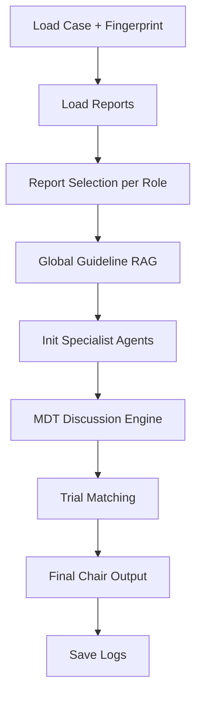

# MDT Discussion Log — 2026-01-18_01-06-20
Generated automatically by MDT Pipeline.


## CASE (structured JSON)

```
{"CASE_CORE":{"ADJUVANT_TREATMENT":{"cycles_or_courses":"Unknown","given":"Unknown","regimens":[]},"BIOMARKERS":{"AFP":"Unknown","CA125":"Unknown","HER2":"0","MSI":"Unknown","PDL1_CPS":"Unknown","TMB":"Unknown"},"BRCA1":"Unknown","BRCA2":"Unknown","CURRENT_STATUS":"Postoperative; ureter not removed at postoperative follow-up","DIAGNOSIS":{"components":["ovary","fallopian tube","pelvic peritoneum","omentum","right paracolic gutter tumor"],"histology":"高级别浆液性癌","laterality":"Bilateral","primary":"卵巢恶性肿瘤","site":"Pelvis/ovary"},"HRD":"Unknown","INITIAL_TREATMENT":"Yes","LINE_OF_THERAPY":[],"MAINTENANCE":"Unknown","MAINTENANCE_DETAIL":{"end_date":"Unknown","given":"Unknown","regimens":[],"start_date":"Unknown"},"NEOADJUVANT":"Unknown","PFI_days":"Unknown","PLATINUM_HISTORY":[],"PLATINUM_PFI_CURRENT":"Unknown","PLATINUM_STATUS":"Unknown","PLATINUM_STATUS_CURRENT":"Unknown","RELAPSE":"No","RELAPSE_DATE":{"date":"Unknown","evidence":"","type":"Unknown"},"SCENE":"Frontline_PDS_or_NACT_IDS","STAGE":{"stage_basis":"Unknown","stage_system":"Unknown","stage_text":"Unknown"},"SURGERY_DONE":{"date":"2024-06-06","performed":"Yes","procedure":"Pelvic mass resection; bilateral salpingo-oophorectomy; pelvic peritoneum resection; omentectomy; appendectomy; tumor debulking; complex adhesiolysis"},"TIMELINE":{"constraints":{"max_events":30,"min_events":3,"must_include":["first diagnostic imaging or pathology confirmation (if available)"],"ordering_rules":{"prioritize_last_event":true}},"events":[{"date":"2024-06-05","description":"Ultrasound: right breast outer-lower solid nodule with calcification (BI-RADS 4B); left breast solid nodule BI-RADS 3; bilateral axilla no obvious mass; lower limb veins no abnormality","event_type":"Imaging","key_result":"Right breast nodule BI-RADS 4B","regimen_or_test":"Ultrasound"},{"date":"Unknown","description":"FDG-PET/CT: pelvic cystic-solid mass with FDG-avid solid component; possible malignancy and peritoneal metastasis; small pelvic effusion; FDG-avid right breast outer-lower density, recommend biopsy; other findings","event_type":"Imaging","key_result":"Pelvic mass FDG-avid; right breast FDG-avid","regimen_or_test":"FDG-PET/CT"},{"date":"2024-06-06","description":"Pelvic mass resection + bilateral adnexectomy + pelvic peritoneum resection + omentectomy + appendectomy + debulking + complex adhesiolysis","event_type":"Surgery","key_result":"Operative resection of pelvic mass and multiple specimens obtained","regimen_or_test":"Surgery"},{"date":"2024-06-06","description":"Pelvic mass pathology initial: low-differentiation carcinoma, tending to high-grade serous carcinoma, size 5*3*2 cm; awaiting IHC","event_type":"Pathology","key_result":"Low-differentiation carcinoma, favor high-grade serous","regimen_or_test":"Histopathology"},{"date":"2024-06-17","description":"Supplementary pathology: high-grade serous carcinoma of pelvic mass, size 5*3*2 cm; immunohistochemistry provided","event_type":"Pathology","key_result":"Diagnosis: 高级别浆液性癌; IHC results documented","regimen_or_test":"Supplementary pathology and IHC"},{"date":"Unknown","description":"Right breast core biopsy: invasive carcinoma with ductal carcinoma in situ component","event_type":"Pathology","key_result":"Right breast invasive carcinoma with DCIS","regimen_or_test":"Core needle biopsy"},{"date":"Unknown","description":"Right breast simple mastectomy specimen: invasive carcinoma, NST, with DCIS, tumor 2*2*1.5 cm, pT1cN0Mx; IHC results documented","event_type":"Pathology","key_result":"pT1cN0Mx; ER/PR positive; HER2 1+","regimen_or_test":"Mastectomy pathology"}]},"VISIT_DATE":"2024-07-17","first_relapse_date":"Unknown","last_platinum_end_date":"Unknown"},"LAB_TRENDS":{"labs":[],"milestones":[{"date":"2024-06-06","description":"Pelvic mass resection and multiple procedures","title":"Surgery","type":"Surgery"}]},"MED_ONC":{"current_regimen":{"cycle_info":"Unknown","last_admin_date":"Unknown","name":"Unknown"},"genetic_testing":{"germline":[],"somatic":[]},"monitoring_points":[],"planned_next_regimen":"Unknown","prior_systemic_therapies":[]},"NUC_MED":{"studies":[]},"PATHOLOGY":{"specimens":[{"components":["pelvic mass"],"date":"2024-06-06","diagnosis":"低分化癌，倾向高级别浆液性癌","grade":"Low differentiated","ihc":[{"marker":"ER","result":"部分+"},{"marker":"PR","result":"-"},{"marker":"P53","result":"-，突变型"},{"marker":"WT1","result":"+"},{"marker":"Ki-67","result":"+60%"},{"marker":"HER2","result":"0"},{"marker":"HNF1B","result":"-"},{"marker":"NapsinA","result":"-"},{"marker":"P16","result":"部分+"},{"marker":"IMP3","result":"+"},{"marker":"PAX8","result":"+"}],"involvement_sites":["bilateral ovaries","fallopian tubes","pelvic peritoneum","omentum"],"laterality":"Unknown","molecular":[],"raw_text":"2024.06.06行盆腔肿块切除术...（盆腔肿块）低分化癌，倾向高级别浆液性癌，大小5*3*2cm，请待免疫组化辅助诊断。","sample_type":"Resection","site":"Pelvic mass","tumor_size":"5*3*2cm","uncertainty_or_missing":["Initial report: awaiting IHC"]},{"components":["pelvic mass"],"date":"2024-06-17","diagnosis":"高级别浆液性癌","grade":"Unknown","ihc":[{"marker":"ER","result":"部分+"},{"marker":"PR","result":"-"},{"marker":"P53","result":"-，突变型"},{"marker":"WT1","result":"+"},{"marker":"Ki-67","result":"+60%"},{"marker":"HER2","result":"0"},{"marker":"HNF1B","result":"-"},{"marker":"NapsinA","result":"-"},{"marker":"P16","result":"部分+"},{"marker":"IMP3","result":"+"},{"marker":"PAX8","result":"+"}],"involvement_sites":["bilateral ovaries","fallopian tubes","pelvic peritoneum","omentum"],"laterality":"Unknown","molecular":[],"raw_text":"补充报告日期：2024-06-17；（盆腔肿块）高级别浆液性癌，大小5*3*2cm。【补充免疫组化结果】瘤细胞示：ER（部分+），PR（-），P53（-，突变型），WT1（+），Ki-67（+60%），HER2（0），HNF1B（-），NapsinA（-），P16（部分+），IMP3（+），PAX8（+）。","sample_type":"Supplementary pathology with IHC","site":"Pelvic mass (supplement)","tumor_size":"5*3*2cm","uncertainty_or_missing":[]},{"components":["巨大盆块","omentum"],"date":"Unknown","diagnosis":"低分化癌","grade":"Low differentiated","ihc":[],"involvement_sites":["bilateral ovaries","fallopian tubes","pelvic peritoneum","omentum","right paracolic gutter tumor"],"laterality":"Unknown","molecular":[],"raw_text":"（巨大盆块+双附件+全盆底腹膜+大网膜肿块）低分化癌，大小10×6×5.5cm。双侧卵巢及输卵管及盆底腹膜及大网膜均见癌累及。（大网膜）见癌累及。（右结肠旁沟肿瘤）见癌累及。（阑尾）慢性炎。","sample_type":"Resection","site":"Large pelvic mass / omental mass","tumor_size":"10×6×5.5cm","uncertainty_or_missing":[]},{"components":["breast core biopsy"],"date":"Unknown","diagnosis":"浸润性癌，伴部分导管原位癌","grade":"Unknown","ihc":[],"involvement_sites":[],"laterality":"Right","molecular":[],"raw_text":"右乳空心针穿刺;（右乳）浸润性癌，伴部分导管原位癌。","sample_type":"Core needle biopsy","site":"Right breast core biopsy","tumor_size":"Unknown","uncertainty_or_missing":[]},{"components":["breast"],"date":"Unknown","diagnosis":"Invasive carcinoma, non-special type, with DCIS component","grade":"Ⅱ级","ihc":[{"marker":"ER","result":"+>80％，强"},{"marker":"PR","result":"+>80％，中-强"},{"marker":"HER2","result":"1+"},{"marker":"Ki-67","result":"+<10％"},{"marker":"AR","result":"+>80％，强"},{"marker":"CD8","result":"+<10％"},{"marker":"FOXC1","result":"-"},{"marker":"E-Cad","result":"+"},{"marker":"P120","result":"膜+"},{"marker":"CK5/6","result":"-"},{"marker":"P63","result":"-"},{"marker":"GATA3","result":"+"},{"marker":"TRPS1","result":"+"},{"marker":"GCDFP15","result":"-"}],"involvement_sites":["axillary lymph nodes (0/3)"],"laterality":"Right","molecular":[],"raw_text":"右乳腺单纯切除术...组织学类型:浸润性癌，非特殊类型，伴导管原位成分。组织学分级:Ⅱ级...腋窝淋巴结(0/3)...PTNM分期:pT1cN0Mx。瘤细胞示：ER（+>80％，强），PR（+>80％，中-强），HER2（1+），Ki-67（+<10％），AR（+>80％，强）等。","sample_type":"Mastectomy","site":"Right breast mastectomy","tumor_size":"2*2*1.5 cm","uncertainty_or_missing":[]}]},"RADIOLOGY":{"next_imaging_plan":{"modality":"Unknown","timing":"Unknown"},"studies":[{"anatomic_sites":["breasts"],"date":"2024-06-05","findings":["Right outer-lower breast solid nodule with calcification (BI-RADS 4B)","Bilateral lobular hyperplasia","Left breast solid nodule (BI-RADS 3)","No obvious axillary masses bilaterally","Lower limb veins unremarkable"],"impression":"Right breast outer-lower solid nodule with calcification (BI-RADS 4B); left breast nodule BI-RADS 3","modality":"US","trend_vs_prior":"Unknown"},{"anatomic_sites":["pelvis","breasts","neck lymph nodes","lungs","gallbladder"],"date":"Unknown","findings":["Pelvic cystic-solid mass closely related to uterus and adnexa; solid component FDG-avid","Possible malignant tumor in pelvis; peritoneal metastasis; small pelvic effusion","Right breast outer-lower dense shadow FDG-avid, recommend biopsy","Bilateral neck lymph nodes inflammatory hyperplasia","Right lower lung nodule without FDG uptake (follow-up)","Left upper lung chronic focus","Possible cholecystitis"],"impression":"FDG-avid pelvic mass suggesting malignancy with peritoneal involvement; FDG-avid right breast lesion, biopsy recommended","modality":"Other","trend_vs_prior":"Unknown"}]},"TIMELINE":{"constraints":{"max_events":30,"min_events":3,"must_include":["first diagnostic imaging or pathology confirmation (if available)"],"ordering_rules":{"prioritize_last_event":true}},"events":[{"date":"2024-06-05","description":"Ultrasound: right breast outer-lower solid nodule with calcification (BI-RADS 4B); left breast solid nodule BI-RADS 3; bilateral axilla no obvious mass; lower limb veins no abnormality","event_type":"Imaging","key_result":"Right breast nodule BI-RADS 4B","regimen_or_test":"Ultrasound"},{"date":"Unknown","description":"FDG-PET/CT: pelvic cystic-solid mass with FDG-avid solid component; possible malignancy and peritoneal metastasis; small pelvic effusion; FDG-avid right breast outer-lower density, recommend biopsy; other findings","event_type":"Imaging","key_result":"Pelvic mass FDG-avid; right breast FDG-avid","regimen_or_test":"FDG-PET/CT"},{"date":"2024-06-06","description":"Pelvic mass resection + bilateral adnexectomy + pelvic peritoneum resection + omentectomy + appendectomy + debulking + complex adhesiolysis","event_type":"Surgery","key_result":"Operative resection of pelvic mass and multiple specimens obtained","regimen_or_test":"Surgery"},{"date":"2024-06-06","description":"Pelvic mass pathology initial: low-differentiation carcinoma, tending to high-grade serous carcinoma, size 5*3*2 cm; awaiting IHC","event_type":"Pathology","key_result":"Low-differentiation carcinoma, favor high-grade serous","regimen_or_test":"Histopathology"},{"date":"2024-06-17","description":"Supplementary pathology: high-grade serous carcinoma of pelvic mass, size 5*3*2 cm; immunohistochemistry provided","event_type":"Pathology","key_result":"Diagnosis: 高级别浆液性癌; IHC results documented","regimen_or_test":"Supplementary pathology and IHC"},{"date":"Unknown","description":"Right breast core biopsy: invasive carcinoma with ductal carcinoma in situ component","event_type":"Pathology","key_result":"Right breast invasive carcinoma with DCIS","regimen_or_test":"Core needle biopsy"},{"date":"Unknown","description":"Right breast simple mastectomy specimen: invasive carcinoma, NST, with DCIS, tumor 2*2*1.5 cm, pT1cN0Mx; IHC results documented","event_type":"Pathology","key_result":"pT1cN0Mx; ER/PR positive; HER2 1+","regimen_or_test":"Mastectomy pathology"}]}}
```


## FINAL MDT OUTPUT

```
Final Assessment:
Postoperative bilateral tubo‑ovarian high‑grade serous carcinoma with peritoneal involvement and synchronous early-stage ER+/HER2‑ breast cancer; staging, BRCA/HRD status, labs, and imaging remain incomplete.

Core Treatment Strategy:
- Prioritize completion of integrated gyn-onc pathology report and formal FIGO staging, including documentation of residual disease and margins.
- Obtain baseline CBC, renal/hepatic function, performance status, and venous access assessment before starting any systemic therapy.
- Arrange dedicated postoperative pelvic CT/MRI, serial chest CT, and full PET/CT report review to define residual disease and lung nodule significance.
- Initiate standard adjuvant systemic therapy for advanced HGSC once workup complete; later coordinate appropriate maintenance based on BRCA/HRD.
- Coordinate breast MDT to finalize endocrine ± radiation sequencing around ovarian chemotherapy, ensuring margins/nodes confirmed on synoptic report.

Change Triggers:
- If imaging/pathology reveal unresected bulky disease or higher FIGO stage, escalate systemic intensity and consider multidisciplinary review of local options.
- If germline/somatic BRCA or HRD positive, prioritize PARP-inclusive maintenance approach once ovarian first-line chemotherapy completed.
- If chest CT shows progressive lung nodules or metastatic pattern, re-stage as systemic disease and adjust ovarian regimen and goals.
- If baseline labs or performance status are poor, delay/intensify supportive care and de-escalate or modify systemic treatment plan.
- If breast pathology reveals unexpected high-risk features (e.g., positive margins/nodes), re-balance timing/intensity of breast radiation/systemic therapy versus ovarian treatment.
```


## PIPELINE FLOW (Mermaid)




## TRACE EVENTS (Structured)

```json
[
  {
    "ts": "2026-01-18T01:01:39.177788",
    "event": "pipeline_start",
    "payload": {
      "visit_time": "2024-07-17 15:38:50.183000",
      "meta_info": "23080319700310062X"
    }
  },
  {
    "ts": "2026-01-18T01:01:39.178793",
    "event": "case_fingerprint",
    "payload": {
      "case_fingerprint": "3e5e8991197e"
    }
  },
  {
    "ts": "2026-01-18T01:01:39.475946",
    "event": "reports_loaded",
    "payload": {
      "lab_n": 0,
      "img_n": 0,
      "path_n": 0,
      "mut_n": 0,
      "cutoff_dt": "2024-07-18 15:38:50"
    }
  },
  {
    "ts": "2026-01-18T01:01:39.540101",
    "event": "reports_selected",
    "payload": {
      "lab": {
        "chair": [],
        "oncologist": [],
        "radiologist": [],
        "pathologist": [],
        "nuclear": []
      },
      "imaging": {
        "chair": [],
        "oncologist": [],
        "radiologist": [],
        "pathologist": [],
        "nuclear": []
      },
      "pathology": {
        "chair": [],
        "oncologist": [],
        "radiologist": [],
        "pathologist": [],
        "nuclear": []
      },
      "mutation": {
        "chair": [],
        "oncologist": [],
        "radiologist": [],
        "pathologist": [],
        "nuclear": []
      }
    }
  },
  {
    "ts": "2026-01-18T01:02:05.567893",
    "event": "rag_query",
    "payload": {
      "query": "High-grade serous carcinoma involving ovaries, tubes, pelvic peritoneum, omentum; platinum status unknown; no BRCA/HRD/MSI/PD-L1 data; concurrent ER/PR+ HER2- right breast cancer pT1cN0; need info on performance status, organ function, anemia, renal reserve."
    }
  },
  {
    "ts": "2026-01-18T01:02:05.567902",
    "event": "rag_hits",
    "payload": {
      "topk": 5,
      "n": 5
    }
  },
  {
    "ts": "2026-01-18T01:02:14.294100",
    "event": "mdt_discussion_start",
    "payload": {
      "num_rounds": 2,
      "num_turns": 2
    }
  },
  {
    "ts": "2026-01-18T01:06:16.182672",
    "event": "mdt_discussion_end",
    "payload": {
      "merged_chars": 4506
    }
  },
  {
    "ts": "2026-01-18T01:06:16.183310",
    "event": "final_output_start",
    "payload": {}
  },
  {
    "ts": "2026-01-18T01:06:20.262233",
    "event": "final_output_end",
    "payload": {
      "final_output_chars": 1751
    }
  }
]
```


## INITIAL EXPERT OPINIONS


## chair

```
- Postoperative high-grade serous ovarian carcinoma with peritoneal involvement: likely advanced stage; assume need for adjuvant systemic therapy unless contraindicated.  
- Clarify staging and residual disease: operative note, final stage assignment, residual tumor status, postoperative imaging, and CA125 trend are urgently needed.  
- Germline and somatic testing (BRCA1/2, HRD panel) should be sent now to guide future maintenance and family counseling.  
- Right breast ER/PR+ early cancer is resected; coordinate adjuvant breast plan with ovarian therapy to avoid overlapping toxicities.  
- Confirm current performance status, comorbidities, venous access, and patient preferences before finalizing systemic therapy intensity and sequencing.
```


## oncologist

```
- High‑grade serous carcinoma involving ovary/fallopian tube/peritoneum post extensive cytoreductive surgery; adjuvant systemic therapy is indicated, intent curative.  

- FIGO stage, residual disease status, and operative/pathology details are unknown/need update for adjuvant regimen intensity decision.  

- No prior systemic therapy recorded; first‑line postoperative systemic treatment planning required, maintenance strategy currently unknown/needs definition.  

- BRCA1/2 and homologous‑recombination status germline/somatic unknown/needs testing to guide future maintenance and relapse strategies.  

- Current organ function, CA‑125 trend, performance status, and postoperative recovery/toxicities are unknown/need updated labs and clinical assessment.
```


## radiologist

```
- FDG-avid pelvic cystic-solid mass with peritoneal nodularity and small effusion, imaging pattern suspicious for pelvic malignancy with peritoneal spread [@IMAGING_STUDIES|Unknown].  

- Right outer-lower breast solid nodule with calcification, BI-RADS 4B on ultrasound, correlates with FDG-avid lesion; biopsy correlation needed [@IMAGING_STUDIES|2024-06-05; @IMAGING_STUDIES|Unknown].  

- Left breast solid nodule categorized BI-RADS 3 on ultrasound; short-interval imaging follow-up recommended, no FDG data provided [@IMAGING_STUDIES|2024-06-05].  

- Right lower lung non–FDG-avid nodule and left upper lung chronic focus; require CT chest measurements and interval comparison for characterization [@IMAGING_STUDIES|Unknown].  

- Missing: dedicated pelvic MRI/CT for local staging and measurability; prior imaging for trend; pathology correlation for pelvic and breast lesions.
```


## pathologist

```
- Pelvic tumor: high‑grade serous carcinoma involving ovaries, tubes, pelvic peritoneum, omentum, right paracolic gutter [@HISTOLOGY_AND_IHC.2|2024-06-17].  
- Morphology/IHC (WT1+, PAX8+, aberrant p53, high Ki‑67) are typical for tubo‑ovarian high‑grade serous carcinoma.  
- Pelvic/omental specimen labeled “poorly differentiated carcinoma” should be unified under high‑grade serous carcinoma; same disease assumed [@HISTOLOGY_AND_IHC.3|unknown].  
- Separate right breast carcinoma: ER/PR/AR‑positive, HER2‑negative, low Ki‑67, pT1cN0, distinct primary [@HISTOLOGY_AND_IHC.5|unknown].  
- Missing/needs update: FIGO stage; detailed fallopian tube examination (STIC?); germline/somatic BRCA/HRR status; CA125 and MSI/TMB/PD‑L1.
```


## nuclear

```
- Prior PET suggests FDG-avid pelvic mass with peritoneal involvement, raising suspicion for advanced intra-abdominal malignancy and possible upstaging [@IMAGING_CONTEXT|Unknown].  
- FDG-avid right breast lesion concerning for primary or metastatic focus; tissue diagnosis is essential for clarification [@IMAGING_CONTEXT|Unknown].  
- Left breast BI-RADS 3 lesion appears low suspicion, but lacks metabolic characterization on PET/CT [@IMAGING_CONTEXT|2024-06-05].  
- No formal PET/CT report is available for detailed lesion SUV, distribution, or nodal status—full report upload needed.  
- Current staging and recurrence assessment remain uncertain; require updated whole-body PET/CT report dated for this visit or later.
```


## MERGED SUMMARY (Assistant)

```
Key Knowledge:
- High‑grade serous tubo‑ovarian carcinoma involving ovaries, tubes, pelvic peritoneum, omentum, right paracolic gutter; post‑cytoreductive surgery with adjuvant systemic therapy likely indicated with curative intent.
- Separate early right breast carcinoma (ER/PR/AR+, HER2–, low Ki‑67, pT1cN0) resected; requires coordinated adjuvant breast plan alongside ovarian treatment.
- PET: FDG‑avid pelvic mass with peritoneal disease and FDG‑avid right breast lesion (primary); left breast BI‑RADS 3 lesion for short‑interval follow‑up; small lung nodules indeterminate.
- BRCA1/2 and broader HRD/HRR status unknown; needed for maintenance strategy and family counseling.

Controversies:
- Intensity and sequencing of adjuvant systemic therapy for ovarian cancer in the absence of confirmed FIGO stage, residual disease status, and fitness.
- Optimal timing and components of adjuvant breast therapy (endocrine ± radiation/systemic) relative to ovarian chemotherapy.
- Clinical significance and staging impact of indeterminate lung nodules.

Missing Info:
- Ovarian: FIGO stage, operative note, residual disease (R0 vs residual), postoperative imaging, CA125 baseline/trend, labs/organ function, performance status, postoperative complications.
- Imaging: Dedicated postoperative pelvic CT/MRI; serial chest CT; full PET/CT report with SUVs, nodal/distant disease, detailed pelvic/peritoneal mapping, and lung nodule characterization.
- Pathology: Final integrated report confirming all pelvic/peritoneal lesions as single high‑grade serous primary, FIGO stage assignment, and STIC assessment.
- Molecular: Germline and somatic BRCA1/2, HRD/HRR; MSI/TMB/PD‑L1 if needed later.
- Breast: Final multidisciplinary adjuvant breast plan and follow‑up strategy for the left breast lesion.

Working Plan:
- Clarify staging: Obtain operative notes, integrated final pathology (including FIGO stage, STIC, single‑primary confirmation), dedicated pelvic CT/MRI, baseline postoperative CA125, and full PET/CT report.
- Prepare systemic therapy: Update performance status, comorbidities, labs, organ function, and venous access to define first‑line adjuvant ovarian regimen and sequencing (curative intent).
- Molecular work‑up: Expedite germline and somatic BRCA1/2 and HRD/HRR testing; plan integration into maintenance and family counseling.
- Coordinate breast care: Finalize adjuvant breast treatment plan (especially endocrine ± radiation) and align timing with ovarian chemotherapy.
- Imaging follow‑up: Arrange serial chest CT for lung nodules and short‑interval follow‑up for the left breast BI‑RADS 3 lesion; ensure complete PET/CT reporting is available for MDT review.
[R2T1 DELTA] licit description of residual peritoneal disease and characterization/follow‑up plan for lung nodules and the left breast lesion. | chair->pathologist(missing): We need an integrated gyn-onc pathology summary assigning FIGO stage, confirming a single high-grade serous tubo-ovarian primary with documentation of all involved sites and STIC assessment, plus a synoptic breast report confirming margins and nodal status. | chair->nuclear(missing): Kindly provide/clarify the full preoperative PET/CT report with SUVs, nodal/distant disease mapping, and any recommendation on follow-up imaging to help us interpret lung and extra-pelvic findings in current staging. | pathologist->chair(missing): The ovarian pathology remains non‑integrated across multiple specimens; we still lack a single report assigning FIGO stage and STIC status, which is critical to finalize staging and systemic planning today.
[R2T2 DELTA]  chair->radiologist(missing): We need a dedicated postoperative pelvic CT/MRI and serial chest CT protocol (timing and technique) to document residual peritoneal disease and characterize the small lung nodules for accurate staging and follow-up planning. | chair->pathologist(missing): Please prioritize an integrated gyn-onc report that merges all pelvic/peritoneal specimens into a single FIGO stage assignment with confirmation of primary site and STIC assessment, plus a synoptic breast report confirming final margins and nodes, as this directly drives both ovarian and breast adjuvant decisions. | chair->nuclear(missing): We still require the full preoperative PET/CT with SUVs and a clear map of nodal and distant findings, including interpretation of lung nodules and any suggested follow-up schedule, to reconcile metabolic disease extent with planned anatomic imaging and systemic therapy.
```


## INTERACTION LOG (Round × Turn)

### Round 1

#### Turn 1
- **chair → oncologist:** Before fixing the frontline ovarian regimen and breast adjuvant sequencing, we must know FIGO stage, residual disease status, CA125 baseline/trend, performance status, and current organ function; please confirm whether these can be obtained and whether ovarian chemotherapy start will precede or overlap with breast endocrine/radiation plans.
- **chair → radiologist:** Key imaging gaps remain: dedicated postoperative pelvic CT/MRI, full PET/CT report with distant disease assessment, and a plan for short‑interval follow‑up of the left BI‑RADS 3 breast lesion and indeterminate lung nodules; can you outline the needed studies and suggested timing?
- **chair → pathologist:** To finalize staging and maintenance strategy, we need an integrated report confirming all peritoneal/omental/right paracolic lesions as high‑grade serous carcinoma, FIGO stage assignment, and detailed fallopian tube examination including any STIC; can you provide or update this?
- **chair → nuclear:** The timeline references a PET/CT but we lack the formal report with SUVs and whole‑body staging details; please confirm whether any extra‑pelvic metastatic disease was identified that could upstage the ovarian cancer or alter systemic therapy intent.
- **oncologist → chair:** Before finalizing adjuvant systemic therapy, we urgently need operative note, FIGO stage, residual disease status, baseline CA125, and organ-function labs to safely plan intensity and sequencing with breast treatment.
- **radiologist → oncologist:** No dedicated postoperative pelvic CT/MRI or formal PET/CT report with measurable lesions and distant staging are available; updated cross‑sectional imaging is needed now for accurate FIGO staging, baseline disease documentation, and lung nodule assessment.
- **pathologist → chair:** Final integrated pathology for the pelvic ‘poorly differentiated carcinoma’ vs ‘high‑grade serous carcinoma’ (single primary, FIGO stage, STIC assessment) is still missing and is critical for accurate staging and systemic planning.
- **nuclear → oncologist:** Full PET/CT report (SUVs, nodal/distant disease, lung nodules characterization) is missing and essential to confirm current staging and recurrence suspicion.
- **nuclear → radiologist:** Please provide the complete PET/CT report including detailed pelvic/peritoneal disease mapping, breast findings, and description of indeterminate lung nodules.

#### Turn 2
- **chair → oncologist:** Before confirming adjuvant sequencing, we need operative notes, residual disease status, baseline CA125, and updated labs/performance status for systemic planning.
- **chair → radiologist:** Please arrange a dedicated postoperative pelvic CT/MRI and serial chest CT to clarify FIGO stage, document residual disease, and characterize lung nodules.
- **chair → pathologist:** We need an integrated final report clarifying whether all pelvic/peritoneal lesions represent a single high‑grade serous primary, with FIGO stage and STIC assessment.
- **chair → nuclear:** Kindly provide the complete PET/CT report (SUVs, nodal/distant disease, detailed pelvic mapping, lung nodules) to finalize staging and baseline disease documentation.

### Round 2

#### Turn 1
- **chair → oncologist:** Before finalizing adjuvant sequencing, we must obtain FIGO stage, residual status, baseline CA125, performance status, and organ-function labs; also please initiate/confirm germline and somatic BRCA/HRD testing and propose a coordinated timetable with breast endocrine/radiation plans.
- **chair → radiologist:** Please arrange and formally report a dedicated postoperative pelvic CT/MRI and a staging chest CT (or PET/CT addendum) with explicit description of residual peritoneal disease and characterization/follow‑up plan for lung nodules and the left breast lesion.
- **chair → pathologist:** We need an integrated gyn-onc pathology summary assigning FIGO stage, confirming a single high-grade serous tubo-ovarian primary with documentation of all involved sites and STIC assessment, plus a synoptic breast report confirming margins and nodal status.
- **chair → nuclear:** Kindly provide/clarify the full preoperative PET/CT report with SUVs, nodal/distant disease mapping, and any recommendation on follow-up imaging to help us interpret lung and extra-pelvic findings in current staging.
- **pathologist → chair:** The ovarian pathology remains non‑integrated across multiple specimens; we still lack a single report assigning FIGO stage and STIC status, which is critical to finalize staging and systemic planning today.

#### Turn 2
- **chair → oncologist:** We cannot safely finalize systemic intensity or maintenance without integrated FIGO staging, residual status, CA125 baseline, organ function, and BRCA/HRD results—please outline a provisional adjuvant framework and timing assumptions contingent on these pending data.
- **chair → radiologist:** We need a dedicated postoperative pelvic CT/MRI and serial chest CT protocol (timing and technique) to document residual peritoneal disease and characterize the small lung nodules for accurate staging and follow-up planning.
- **chair → pathologist:** Please prioritize an integrated gyn-onc report that merges all pelvic/peritoneal specimens into a single FIGO stage assignment with confirmation of primary site and STIC assessment, plus a synoptic breast report confirming final margins and nodes, as this directly drives both ovarian and breast adjuvant decisions.
- **chair → nuclear:** We still require the full preoperative PET/CT with SUVs and a clear map of nodal and distant findings, including interpretation of lung nodules and any suggested follow-up schedule, to reconcile metabolic disease extent with planned anatomic imaging and systemic therapy.


## FINAL REFINED PLANS (per Round)

### Round 1


## chair

```
- Complete staging: obtain operative note, integrated pathology with FIGO stage/STIC, residual status, and full PET/CT plus pelvic CT/MRI and chest CT (all currently unknown).  
- Establish systemic readiness: document CA125 baseline/trend, organ function labs, ECOG status, postoperative complications, and venous access to plan curative‑intent adjuvant ovarian chemotherapy (all unknown).  
- Molecular/family: expedite germline and somatic BRCA1/2 and HRD/HRR testing; arrange genetic counseling for patient and at‑risk relatives once results available.  
- Breast coordination: confirm final adjuvant breast plan (endocrine ± radiation/systemic), then sequence to avoid overlapping toxicities while not delaying ovarian chemotherapy.  
- Surveillance strategy: clarify lung nodule significance with serial chest CT, and ensure planned imaging follow‑up of left breast BI‑RADS 3 lesion.
```


## oncologist

```
- Proceed with first‑line adjuvant systemic therapy for high‑grade serous tubo‑ovarian carcinoma, intent curative; regimen choice pending staging/fitness details (unknown/needs update).  

- Obtain operative note, integrated pathology with FIGO stage/STIC, and residual disease status to calibrate adjuvant intensity and maintenance strategy (unknown/needs update).  

- Update baseline CA125, CBC, renal/hepatic function, and performance status to confirm treatment eligibility and dosing (unknown/needs update).  

- Coordinate with breast team to initiate adjuvant endocrine ± local breast therapy, sequencing around ovarian chemotherapy once systemic plan defined (unknown/needs update).  

- Expedite germline and somatic BRCA/HRD testing and complete postoperative pelvic and chest imaging plus full PET/CT report for staging and surveillance (unknown/needs update).
```


## radiologist

```
- Await dedicated postoperative pelvic CT/MRI and serial chest CT to define FIGO stage, residual disease, and lung nodules; currently unknown/needs update.  

- Obtain full PET/CT report with SUVs, detailed pelvic/peritoneal mapping, nodal/distant disease, and lung nodule description; currently unknown/needs update.  

- Integrate final pathology clarifying single high‑grade serous primary vs multiple sites, FIGO stage, and STIC status; currently unknown/needs update.  

- Use updated cross‑sectional and PET/CT imaging to establish measurable postoperative baseline for ovarian cancer surveillance; currently unknown/needs update.  

- Maintain short‑interval imaging follow‑up plan for left breast BI‑RADS 3 lesion and chest nodules once prior reports available; currently unknown/needs update.
```


## pathologist

```
- Integrate pelvic/peritoneal specimens into one report confirming single high‑grade serous tubo‑ovarian carcinoma and FIGO stage [@HISTOLOGY_AND_IHC.2|2024-06-17].  
- Explicitly document all involved sites (bilateral ovaries/tubes, pelvic peritoneum, omentum, right paracolic gutter) and margin/residual disease status [@HISTOLOGY_AND_IHC.3|unknown].  
- Perform detailed fallopian tube examination (SEE‑FIM) to assess for STIC and define primary site; currently unknown/needs update.  
- Clearly distinguish ovarian carcinoma from separate right breast NST carcinoma with DCIS; cross‑reference both primaries in final summary [@HISTOLOGY_AND_IHC.5|unknown].  
- Recommend germline/somatic BRCA1/2 and HRD/HRR testing on tubo‑ovarian carcinoma tissue; current molecular status unknown/needs update.
```


## nuclear

```
- PET shows FDG‑avid pelvic mass with peritoneal disease, supporting advanced tubo‑ovarian carcinoma staging and baseline disease mapping [@IMAGING_CONTEXT|Unknown].  
- FDG‑avid right breast lesion corresponds to known early breast primary; no additional hypermetabolic breast focus described [@IMAGING_CONTEXT|Unknown].  
- Left breast BI‑RADS 3 lesion remains low suspicion; no PET-based upstaging, short-interval imaging follow-up appropriate [@IMAGING_CONTEXT|2024-06-05].  
- Small lung nodules are indeterminate and non-dec definitive for metastasis on PET; require serial chest CT characterization [@IMAGING_CONTEXT|Unknown].  
- Complete formal PET/CT report with SUVs, nodal/distant status, and postoperative imaging correlation is still needed to finalize FIGO stage (unknown/needs update).
```

### Round 2


## chair

```
- Finalize staging: obtain integrated gyn-onc pathology with FIGO stage, STIC status, primary confirmation, and operative note including residual disease description (R0 vs residual) – all currently unknown.  
- Complete baseline workup: postoperative pelvic CT/MRI, full PET/CT with SUVs and mapping, CA125 baseline/trend, labs, performance status, venous access – all unknown/needs update.  
- Plan first-line ovarian systemic therapy with curative intent once staging and organ function are defined; preplan transition into biomarker‑guided maintenance.  
- Expedite germline and somatic BRCA1/2 and HRD/HRR testing (MSI/TMB/PD‑L1 later if needed) for maintenance strategy and family counseling – all unknown.  
- Coordinate breast and lung management: confirm final breast adjuvant plan and margins/nodes; arrange serial chest CT and left breast follow‑up imaging protocol – all unknown/needs update.
```


## oncologist

```
- Plan first‑line adjuvant systemic therapy for high‑grade serous tubo‑ovarian carcinoma with curative intent; exact regimen pending staging/fitness (unknown/needs update).  

- Obtain operative note, integrated gyn‑onc pathology assigning FIGO stage/STIC, and residual disease description to calibrate adjuvant intensity and maintenance (unknown/needs update).  

- Update baseline CA125, CBC, renal/hepatic function, performance status, and venous access before initiating systemic treatment (unknown/needs update).  

- Coordinate final adjuvant breast plan (endocrine ± radiation) and schedule around ovarian chemotherapy; confirm margins/nodes on synoptic report (unknown/needs update).  

- Complete postoperative pelvic CT/MRI, serial chest CT, full PET/CT, and germline/somatic BRCA/HRD testing to refine staging and maintenance options (unknown/needs update).
```


## radiologist

```
- Postoperative pelvic disease burden, residual peritoneal implants, and FIGO stage remain indeterminate on imaging; dedicated pelvic CT/MRI needed, currently unknown/needs update.  

- Character, number, and growth of small lung nodules are not defined; serial chest CT with standardized protocol required, currently unknown/needs update.  

- Extent and distribution of preoperative FDG-avid pelvic/peritoneal disease and nodal/distant involvement remain unclear without full PET/CT report, currently unknown/needs update.  

- Right breast postoperative imaging baseline and correlation with prior FDG-avid lesion not documented; current status and surveillance plan unknown/needs update.  

- Left breast BI-RADS 3 lesion requires protocolled short-interval ultrasound/mammographic follow-up; current interval imaging schedule unknown/needs update.
```


## pathologist

```
- Issue integrated gyn-onc report consolidating all pelvic/peritoneal specimens, confirming single HGSC, primary site, and FIGO stage [@HISTOLOGY_AND_IHC.2|2024-06-17].  
- Document all involved sites (bilateral ovaries/tubes, pelvic peritoneum, omentum, right paracolic gutter) and any macroscopic residual disease; margins currently unknown.  
- Perform SEE-FIM on fallopian tubes; explicitly report STIC presence/absence to support tubo-ovarian primary assignment; status currently unknown.  
- Provide synoptic right-breast report confirming tumor size, grade II, margins, and axillary nodes 0/3 pN0 [@HISTOLOGY_AND_IHC.5|unknown].  
- Recommend germline and somatic BRCA1/2 and broader HRD/HRR testing for tubo-ovarian carcinoma; molecular status currently unknown.
```


## nuclear

```
- PET shows FDG‑avid pelvic mass with peritoneal involvement, supporting advanced tubo‑ovarian carcinoma and guiding baseline disease mapping [@IMAGING_CONTEXT|Unknown].  
- FDG‑avid right breast focus corresponds to known primary; no additional hypermetabolic breast lesions reported [@IMAGING_CONTEXT|Unknown].  
- Left breast BI‑RADS 3 lesion remains low‑suspicion; PET does not upstage, needs short‑interval mammographic follow‑up [@IMAGING_CONTEXT|2024-06-05].  
- Small lung nodules are PET‑indeterminate; they do not currently upstage but require serial chest CT characterization [@IMAGING_CONTEXT|Unknown].  
- Full preoperative PET/CT report with SUVs and nodal/distant mapping remains outstanding and is critical to finalize staging (unknown/needs update).
```


## RAW AGENT LOGS

### chair
- **User:** Give INITIAL opinion (use ONLY your system-provided patient facts).
Return up to 5 bullets, each ≤20 words.
If key data missing, say exactly what needs updating.
  
  **Assistant:** - Postoperative high-grade serous ovarian carcinoma with peritoneal involvement: likely advanced stage; assume need for adjuvant systemic therapy unless contraindicated.  
- Clarify staging and residual disease: operative note, final stage assignment, residual tumor status, postoperative imaging, and CA125 trend are urgently needed.  
- Germline and somatic testing (BRCA1/2, HRD panel) should be sent now to guide future maintenance and family counseling.  
- Right breast ER/PR+ early cancer is resected; coordinate adjuvant breast plan with ovarian therapy to avoid overlapping toxicities.  
- Confirm current performance status, comorbidities, venous access, and patient preferences before finalizing systemic therapy intensity and sequencing.
  
  *(2026-01-18T01:02:17.458770)*

- **User:** ROLE: chair. VISIT: 2024-07-17 15:38:50.183000
Default is NOT to speak. Speak ONLY if: conflict | safety | missing-critical | new-critical.

CONTEXT (latest):
Key Knowledge:
- High‑grade serous tubo‑ovarian carcinoma involving ovaries, tubes, pelvic peritoneum, omentum, right paracolic gutter; post‑cytoreductive surgery, adjuvant systemic therapy likely indicated with curative intent.
- Separate early right breast carcinoma (ER/PR/AR+, HER2–, low Ki‑67, pT1cN0) resected; requires coordinated adjuvant breast plan with ovarian treatment.
- PET: FDG‑avid pelvic mass with peritoneal disease; FDG‑avid right breast lesion corresponding to primary; left breast BI‑RADS 3 lesion for short‑interval follow‑up; small lung nodules indeterminate.
- BRCA1/2 and broader HRD/HRR status unknown; needed for maintenance strategy and family counseling.

Controversies:
- Intensity and sequencing of adjuvant systemic therapy for ovarian cancer without confirmed FIGO stage, residual disease, and fitness.
- Optimal timing and components of adjuvant breast therapy relative to ovarian chemotherapy.
- Clinical significance of lung nodules in staging and surveillance.

Missing Info:
- Ovarian: FIGO stage, operative note, residual disease status, postoperative imaging, CA125 baseline/trend, labs/organ function, performance status, postoperative complications.
- Imaging: Dedicated pelvic CT/MRI, full PET/CT report (SUVs, nodal/distant disease), serial chest CT for lung nodules.
- Pathology: Final integrated staging report, detailed fallopian tube exam (STIC), confirmation all “poorly differentiated carcinoma” sites = HGSC.
- Molecular: Germline and somatic BRCA1/2, HRD/HRR; MSI/TMB/PD‑L1 if needed later.
- Breast: Final adjuvant breast plan (endocrine ± radiation/systemic), and follow‑up plan for left breast lesion.

Working Plan:
- Clarify staging: Obtain operative report, final pathology with FIGO stage and residual disease; arrange dedicated pelvic CT/MRI and baseline postoperative CA125.
- Prepare systemic therapy: Update performance status, comorbidities, labs, organ function, venous access, and preferences to define first‑line adjuvant regimen (curative intent).
- Molecular work‑up: Expedite germline and somatic BRCA1/2 and HRD/HRR testing and integrate results into maintenance and family counseling.
- Coordinate breast care: Finalize adjuvant breast treatment (especially endocrine therapy and any radiation) and align timing with ovarian chemotherapy.
- Imaging follow‑up: Schedule short‑interval imaging for left breast BI‑RADS 3 lesion, serial chest CT for lung nodules, and ensure complete PET/CT report is available for MDT.

Allowed targets: [oncologist,radiologist,pathologist,nuclear]
Return ONE-LINE JSON only:{"speak":"yes/no","messages":[{"target":"<role>","message":"<1-2 sentences>","why":"conflict|safety|missing|new"}]}
  
  **Assistant:** {"speak":"yes","messages":[{"target":"oncologist","message":"Before fixing the frontline ovarian regimen and breast adjuvant sequencing, we must know FIGO stage, residual disease status, CA125 baseline/trend, performance status, and current organ function; please confirm whether these can be obtained and whether ovarian chemotherapy start will precede or overlap with breast endocrine/radiation plans.","why":"missing"},{"target":"pathologist","message":"To finalize staging and maintenance strategy, we need an integrated report confirming all peritoneal/omental/right paracolic lesions as high‑grade serous carcinoma, FIGO stage assignment, and detailed fallopian tube examination including any STIC; can you provide or update this?","why":"missing"},{"target":"radiologist","message":"Key imaging gaps remain: dedicated postoperative pelvic CT/MRI, full PET/CT report with distant disease assessment, and a plan for short‑interval follow‑up of the left BI‑RADS 3 breast lesion and indeterminate lung nodules; can you outline the needed studies and suggested timing?","why":"missing"},{"target":"nuclear","message":"The timeline references a PET/CT but we lack the formal report with SUVs and whole‑body staging details; please confirm whether any extra‑pelvic metastatic disease was identified that could upstage the ovarian cancer or alter systemic therapy intent.","why":"missing"}]}
  
  *(2026-01-18T01:02:52.713812)*

- **User:** ROLE: chair. VISIT: 2024-07-17 15:38:50.183000
Default is NOT to speak. Speak ONLY if: conflict | safety | missing-critical | new-critical.

CONTEXT (latest):
Key Knowledge:
- High‑grade serous tubo‑ovarian carcinoma involving ovaries, tubes, pelvic peritoneum, omentum, right paracolic gutter; post‑cytoreductive surgery, adjuvant systemic therapy likely indicated with curative intent.
- Separate early right breast carcinoma (ER/PR/AR+, HER2–, low Ki‑67, pT1cN0) resected; requires coordinated adjuvant breast plan with ovarian treatment.
- PET: FDG‑avid pelvic mass with peritoneal disease; FDG‑avid right breast lesion corresponding to primary; left breast BI‑RADS 3 lesion for short‑interval follow‑up; small lung nodules indeterminate.
- BRCA1/2 and broader HRD/HRR status unknown; needed for maintenance strategy and family counseling.

Controversies:
- Intensity and sequencing of adjuvant systemic therapy for ovarian cancer without confirmed FIGO stage, residual disease, and fitness.
- Optimal timing and components of adjuvant breast therapy relative to ovarian chemotherapy.
- Clinical significance of lung nodules in staging and surveillance.

Missing Info:
- Ovarian: FIGO stage, operative note, residual disease status, postoperative imaging, CA125 baseline/trend, labs/organ function, performance status, postoperative complications.
- Imaging: Dedicated pelvic CT/MRI, full PET/CT report (SUVs, nodal/distant disease), serial chest CT for lung nodules.
- Pathology: Final integrated staging report, detailed fallopian tube exam (STIC), confirmation all “poorly differentiated carcinoma” sites = HGSC.
- Molecular: Germline and somatic BRCA1/2, HRD/HRR; MSI/TMB/PD‑L1 if needed later.
- Breast: Final adjuvant breast plan (endocrine ± radiation/systemic), and follow‑up plan for left breast lesion.

Working Plan:
- Clarify staging: Obtain operative report, final pathology with FIGO stage and residual disease; arrange dedicated pelvic CT/MRI and baseline postoperative CA125.
- Prepare systemic therapy: Update performance status, comorbidities, labs, organ function, venous access, and preferences to define first‑line adjuvant regimen (curative intent).
- Molecular work‑up: Expedite germline and somatic BRCA1/2 and HRD/HRR testing and integrate results into maintenance and family counseling.
- Coordinate breast care: Finalize adjuvant breast treatment (especially endocrine therapy and any radiation) and align timing with ovarian chemotherapy.
- Imaging follow‑up: Schedule short‑interval imaging for left breast BI‑RADS 3 lesion, serial chest CT for lung nodules, and ensure complete PET/CT report is available for MDT.
[R1T1 DELTA]  dedicated postoperative pelvic CT/MRI or formal PET/CT report with measurable lesions and distant staging are available; updated cross‑sectional imaging is needed now for accurate FIGO staging, baseline disease documentation, and lung nodule assessment. | pathologist->chair(missing): Final integrated pathology for the pelvic ‘poorly differentiated carcinoma’ vs ‘high‑grade serous carcinoma’ (single primary, FIGO stage, STIC assessment) is still missing and is critical for accurate staging and systemic planning. | nuclear->oncologist(missing): Full PET/CT report (SUVs, nodal/distant disease, lung nodules characterization) is missing and essential to confirm current staging and recurrence suspicion. | nuclear->radiologist(missing): Please provide the complete PET/CT report including detailed pelvic/peritoneal disease mapping, breast findings, and description of indeterminate lung nodules.

Allowed targets: [oncologist,radiologist,pathologist,nuclear]
Return ONE-LINE JSON only:{"speak":"yes/no","messages":[{"target":"<role>","message":"<1-2 sentences>","why":"conflict|safety|missing|new"}]}
  
  **Assistant:** {"speak":"yes","messages":[{"target":"oncologist","message":"Before confirming adjuvant sequencing, we need operative notes, residual disease status, baseline CA125, and updated labs/performance status for systemic planning.","why":"missing"},{"target":"radiologist","message":"Please arrange a dedicated postoperative pelvic CT/MRI and serial chest CT to clarify FIGO stage, document residual disease, and characterize lung nodules.","why":"missing"},{"target":"pathologist","message":"We need an integrated final report clarifying whether all pelvic/peritoneal lesions represent a single high‑grade serous primary, with FIGO stage and STIC assessment.","why":"missing"},{"target":"nuclear","message":"Kindly provide the complete PET/CT report (SUVs, nodal/distant disease, detailed pelvic mapping, lung nodules) to finalize staging and baseline disease documentation.","why":"missing"}]}
  
  *(2026-01-18T01:03:09.433724)*

- **User:** Given MDT context:
Key Knowledge:
- High‑grade serous tubo‑ovarian carcinoma involving ovaries, tubes, pelvic peritoneum, omentum, right paracolic gutter; post‑cytoreductive surgery, adjuvant systemic therapy likely indicated with curative intent.
- Separate early right breast carcinoma (ER/PR/AR+, HER2–, low Ki‑67, pT1cN0) resected; requires coordinated adjuvant breast plan with ovarian treatment.
- PET: FDG‑avid pelvic mass with peritoneal disease; FDG‑avid right breast lesion corresponding to primary; left breast BI‑RADS 3 lesion for short‑interval follow‑up; small lung nodules indeterminate.
- BRCA1/2 and broader HRD/HRR status unknown; needed for maintenance strategy and family counseling.

Controversies:
- Intensity and sequencing of adjuvant systemic therapy for ovarian cancer without confirmed FIGO stage, residual disease, and fitness.
- Optimal timing and components of adjuvant breast therapy relative to ovarian chemotherapy.
- Clinical significance of lung nodules in staging and surveillance.

Missing Info:
- Ovarian: FIGO stage, operative note, residual disease status, postoperative imaging, CA125 baseline/trend, labs/organ function, performance status, postoperative complications.
- Imaging: Dedicated pelvic CT/MRI, full PET/CT report (SUVs, nodal/distant disease), serial chest CT for lung nodules.
- Pathology: Final integrated staging report, detailed fallopian tube exam (STIC), confirmation all “poorly differentiated carcinoma” sites = HGSC.
- Molecular: Germline and somatic BRCA1/2, HRD/HRR; MSI/TMB/PD‑L1 if needed later.
- Breast: Final adjuvant breast plan (endocrine ± radiation/systemic), and follow‑up plan for left breast lesion.

Working Plan:
- Clarify staging: Obtain operative report, final pathology with FIGO stage and residual disease; arrange dedicated pelvic CT/MRI and baseline postoperative CA125.
- Prepare systemic therapy: Update performance status, comorbidities, labs, organ function, venous access, and preferences to define first‑line adjuvant regimen (curative intent).
- Molecular work‑up: Expedite germline and somatic BRCA1/2 and HRD/HRR testing and integrate results into maintenance and family counseling.
- Coordinate breast care: Finalize adjuvant breast treatment (especially endocrine therapy and any radiation) and align timing with ovarian chemotherapy.
- Imaging follow‑up: Schedule short‑interval imaging for left breast BI‑RADS 3 lesion, serial chest CT for lung nodules, and ensure complete PET/CT report is available for MDT.
[R1T1 DELTA]  dedicated postoperative pelvic CT/MRI or formal PET/CT report with measurable lesions and distant staging are available; updated cross‑sectional imaging is needed now for accurate FIGO staging, baseline disease documentation, and lung nodule assessment. | pathologist->chair(missing): Final integrated pathology for the pelvic ‘poorly differentiated carcinoma’ vs ‘high‑grade serous carcinoma’ (single primary, FIGO stage, STIC assessment) is still missing and is critical for accurate staging and systemic planning. | nuclear->oncologist(missing): Full PET/CT report (SUVs, nodal/distant disease, lung nodules characterization) is missing and essential to confirm current staging and recurrence suspicion. | nuclear->radiologist(missing): Please provide the complete PET/CT report including detailed pelvic/peritoneal disease mapping, breast findings, and description of indeterminate lung nodules.
[R1T2 DELTA] chair->oncologist(missing): Before confirming adjuvant sequencing, we need operative notes, residual disease status, baseline CA125, and updated labs/performance status for systemic planning. | chair->radiologist(missing): Please arrange a dedicated postoperative pelvic CT/MRI and serial chest CT to clarify FIGO stage, document residual disease, and characterize lung nodules. | chair->pathologist(missing): We need an integrated final report clarifying whether all pelvic/peritoneal lesions represent a single high‑grade serous primary, with FIGO stage and STIC assessment. | chair->nuclear(missing): Kindly provide the complete PET/CT report (SUVs, nodal/distant disease, detailed pelvic mapping, lung nodules) to finalize staging and baseline disease documentation.

Provide FINAL refined plan.
Up to 5 bullets, each ≤20 words.
Any factual claim must include [@report_id|date] or say unknown.
  
  **Assistant:** - Complete staging: obtain operative note, integrated pathology with FIGO stage/STIC, residual status, and full PET/CT plus pelvic CT/MRI and chest CT (all currently unknown).  
- Establish systemic readiness: document CA125 baseline/trend, organ function labs, ECOG status, postoperative complications, and venous access to plan curative‑intent adjuvant ovarian chemotherapy (all unknown).  
- Molecular/family: expedite germline and somatic BRCA1/2 and HRD/HRR testing; arrange genetic counseling for patient and at‑risk relatives once results available.  
- Breast coordination: confirm final adjuvant breast plan (endocrine ± radiation/systemic), then sequence to avoid overlapping toxicities while not delaying ovarian chemotherapy.  
- Surveillance strategy: clarify lung nodule significance with serial chest CT, and ensure planned imaging follow‑up of left breast BI‑RADS 3 lesion.
  
  *(2026-01-18T01:03:22.801428)*

- **User:** ROLE: chair. VISIT: 2024-07-17 15:38:50.183000
Default is NOT to speak. Speak ONLY if: conflict | safety | missing-critical | new-critical.

CONTEXT (latest):
Key Knowledge:
- High‑grade serous tubo‑ovarian carcinoma involving ovaries, tubes, pelvic peritoneum, omentum, right paracolic gutter; post‑cytoreductive surgery with adjuvant systemic therapy likely indicated with curative intent.
- Separate early right breast carcinoma (ER/PR/AR+, HER2–, low Ki‑67, pT1cN0) resected; requires coordinated adjuvant breast plan alongside ovarian treatment.
- PET: FDG‑avid pelvic mass with peritoneal disease and FDG‑avid right breast lesion (primary); left breast BI‑RADS 3 lesion for short‑interval follow‑up; small lung nodules indeterminate.
- BRCA1/2 and broader HRD/HRR status unknown; needed for maintenance strategy and family counseling.

Controversies:
- Intensity and sequencing of adjuvant systemic therapy for ovarian cancer in the absence of confirmed FIGO stage, residual disease status, and fitness.
- Optimal timing and components of adjuvant breast therapy (endocrine ± radiation/systemic) relative to ovarian chemotherapy.
- Clinical significance and staging impact of indeterminate lung nodules.

Missing Info:
- Ovarian: FIGO stage, operative note, residual disease (R0 vs residual), postoperative imaging, CA125 baseline/trend, labs/organ function, performance status, postoperative complications.
- Imaging: Dedicated postoperative pelvic CT/MRI; serial chest CT; full PET/CT report with SUVs, nodal/distant disease, detailed pelvic/peritoneal mapping, and lung nodule characterization.
- Pathology: Final integrated report confirming all pelvic/peritoneal lesions as single high‑grade serous primary, FIGO stage assignment, and STIC assessment.
- Molecular: Germline and somatic BRCA1/2, HRD/HRR; MSI/TMB/PD‑L1 if needed later.
- Breast: Final multidisciplinary adjuvant breast plan and follow‑up strategy for the left breast lesion.

Working Plan:
- Clarify staging: Obtain operative notes, integrated final pathology (including FIGO stage, STIC, single‑primary confirmation), dedicated pelvic CT/MRI, baseline postoperative CA125, and full PET/CT report.
- Prepare systemic therapy: Update performance status, comorbidities, labs, organ function, and venous access to define first‑line adjuvant ovarian regimen and sequencing (curative intent).
- Molecular work‑up: Expedite germline and somatic BRCA1/2 and HRD/HRR testing; plan integration into maintenance and family counseling.
- Coordinate breast care: Finalize adjuvant breast treatment plan (especially endocrine ± radiation) and align timing with ovarian chemotherapy.
- Imaging follow‑up: Arrange serial chest CT for lung nodules and short‑interval follow‑up for the left breast BI‑RADS 3 lesion; ensure complete PET/CT reporting is available for MDT review.

Allowed targets: [oncologist,radiologist,pathologist,nuclear]
Return ONE-LINE JSON only:{"speak":"yes/no","messages":[{"target":"<role>","message":"<1-2 sentences>","why":"conflict|safety|missing|new"}]}
  
  **Assistant:** {"speak":"yes","messages":[{"target":"oncologist","message":"Before finalizing adjuvant sequencing, we must obtain FIGO stage, residual status, baseline CA125, performance status, and organ-function labs; also please initiate/confirm germline and somatic BRCA/HRD testing and propose a coordinated timetable with breast endocrine/radiation plans.","why":"missing"},{"target":"radiologist","message":"Please arrange and formally report a dedicated postoperative pelvic CT/MRI and a staging chest CT (or PET/CT addendum) with explicit description of residual peritoneal disease and characterization/follow‑up plan for lung nodules and the left breast lesion.","why":"missing"},{"target":"pathologist","message":"We need an integrated gyn-onc pathology summary assigning FIGO stage, confirming a single high-grade serous tubo-ovarian primary with documentation of all involved sites and STIC assessment, plus a synoptic breast report confirming margins and nodal status.","why":"missing"},{"target":"nuclear","message":"Kindly provide/clarify the full preoperative PET/CT report with SUVs, nodal/distant disease mapping, and any recommendation on follow-up imaging to help us interpret lung and extra-pelvic findings in current staging.","why":"missing"}]}
  
  *(2026-01-18T01:04:11.913285)*

- **User:** ROLE: chair. VISIT: 2024-07-17 15:38:50.183000
Default is NOT to speak. Speak ONLY if: conflict | safety | missing-critical | new-critical.

CONTEXT (latest):
Key Knowledge:
- High‑grade serous tubo‑ovarian carcinoma involving ovaries, tubes, pelvic peritoneum, omentum, right paracolic gutter; post‑cytoreductive surgery with adjuvant systemic therapy likely indicated with curative intent.
- Separate early right breast carcinoma (ER/PR/AR+, HER2–, low Ki‑67, pT1cN0) resected; requires coordinated adjuvant breast plan alongside ovarian treatment.
- PET: FDG‑avid pelvic mass with peritoneal disease and FDG‑avid right breast lesion (primary); left breast BI‑RADS 3 lesion for short‑interval follow‑up; small lung nodules indeterminate.
- BRCA1/2 and broader HRD/HRR status unknown; needed for maintenance strategy and family counseling.

Controversies:
- Intensity and sequencing of adjuvant systemic therapy for ovarian cancer in the absence of confirmed FIGO stage, residual disease status, and fitness.
- Optimal timing and components of adjuvant breast therapy (endocrine ± radiation/systemic) relative to ovarian chemotherapy.
- Clinical significance and staging impact of indeterminate lung nodules.

Missing Info:
- Ovarian: FIGO stage, operative note, residual disease (R0 vs residual), postoperative imaging, CA125 baseline/trend, labs/organ function, performance status, postoperative complications.
- Imaging: Dedicated postoperative pelvic CT/MRI; serial chest CT; full PET/CT report with SUVs, nodal/distant disease, detailed pelvic/peritoneal mapping, and lung nodule characterization.
- Pathology: Final integrated report confirming all pelvic/peritoneal lesions as single high‑grade serous primary, FIGO stage assignment, and STIC assessment.
- Molecular: Germline and somatic BRCA1/2, HRD/HRR; MSI/TMB/PD‑L1 if needed later.
- Breast: Final multidisciplinary adjuvant breast plan and follow‑up strategy for the left breast lesion.

Working Plan:
- Clarify staging: Obtain operative notes, integrated final pathology (including FIGO stage, STIC, single‑primary confirmation), dedicated pelvic CT/MRI, baseline postoperative CA125, and full PET/CT report.
- Prepare systemic therapy: Update performance status, comorbidities, labs, organ function, and venous access to define first‑line adjuvant ovarian regimen and sequencing (curative intent).
- Molecular work‑up: Expedite germline and somatic BRCA1/2 and HRD/HRR testing; plan integration into maintenance and family counseling.
- Coordinate breast care: Finalize adjuvant breast treatment plan (especially endocrine ± radiation) and align timing with ovarian chemotherapy.
- Imaging follow‑up: Arrange serial chest CT for lung nodules and short‑interval follow‑up for the left breast BI‑RADS 3 lesion; ensure complete PET/CT reporting is available for MDT review.
[R2T1 DELTA] licit description of residual peritoneal disease and characterization/follow‑up plan for lung nodules and the left breast lesion. | chair->pathologist(missing): We need an integrated gyn-onc pathology summary assigning FIGO stage, confirming a single high-grade serous tubo-ovarian primary with documentation of all involved sites and STIC assessment, plus a synoptic breast report confirming margins and nodal status. | chair->nuclear(missing): Kindly provide/clarify the full preoperative PET/CT report with SUVs, nodal/distant disease mapping, and any recommendation on follow-up imaging to help us interpret lung and extra-pelvic findings in current staging. | pathologist->chair(missing): The ovarian pathology remains non‑integrated across multiple specimens; we still lack a single report assigning FIGO stage and STIC status, which is critical to finalize staging and systemic planning today.

Allowed targets: [oncologist,radiologist,pathologist,nuclear]
Return ONE-LINE JSON only:{"speak":"yes/no","messages":[{"target":"<role>","message":"<1-2 sentences>","why":"conflict|safety|missing|new"}]}
  
  **Assistant:** {"speak":"yes","messages":[{"target":"oncologist","message":"We cannot safely finalize systemic intensity or maintenance without integrated FIGO staging, residual status, CA125 baseline, organ function, and BRCA/HRD results—please outline a provisional adjuvant framework and timing assumptions contingent on these pending data.","why":"safety"},{"target":"radiologist","message":"We need a dedicated postoperative pelvic CT/MRI and serial chest CT protocol (timing and technique) to document residual peritoneal disease and characterize the small lung nodules for accurate staging and follow-up planning.","why":"missing"},{"target":"pathologist","message":"Please prioritize an integrated gyn-onc report that merges all pelvic/peritoneal specimens into a single FIGO stage assignment with confirmation of primary site and STIC assessment, plus a synoptic breast report confirming final margins and nodes, as this directly drives both ovarian and breast adjuvant decisions.","why":"missing"},{"target":"nuclear","message":"We still require the full preoperative PET/CT with SUVs and a clear map of nodal and distant findings, including interpretation of lung nodules and any suggested follow-up schedule, to reconcile metabolic disease extent with planned anatomic imaging and systemic therapy.","why":"missing"}]}
  
  *(2026-01-18T01:05:06.552561)*

- **User:** Given MDT context:
Key Knowledge:
- High‑grade serous tubo‑ovarian carcinoma involving ovaries, tubes, pelvic peritoneum, omentum, right paracolic gutter; post‑cytoreductive surgery with adjuvant systemic therapy likely indicated with curative intent.
- Separate early right breast carcinoma (ER/PR/AR+, HER2–, low Ki‑67, pT1cN0) resected; requires coordinated adjuvant breast plan alongside ovarian treatment.
- PET: FDG‑avid pelvic mass with peritoneal disease and FDG‑avid right breast lesion (primary); left breast BI‑RADS 3 lesion for short‑interval follow‑up; small lung nodules indeterminate.
- BRCA1/2 and broader HRD/HRR status unknown; needed for maintenance strategy and family counseling.

Controversies:
- Intensity and sequencing of adjuvant systemic therapy for ovarian cancer in the absence of confirmed FIGO stage, residual disease status, and fitness.
- Optimal timing and components of adjuvant breast therapy (endocrine ± radiation/systemic) relative to ovarian chemotherapy.
- Clinical significance and staging impact of indeterminate lung nodules.

Missing Info:
- Ovarian: FIGO stage, operative note, residual disease (R0 vs residual), postoperative imaging, CA125 baseline/trend, labs/organ function, performance status, postoperative complications.
- Imaging: Dedicated postoperative pelvic CT/MRI; serial chest CT; full PET/CT report with SUVs, nodal/distant disease, detailed pelvic/peritoneal mapping, and lung nodule characterization.
- Pathology: Final integrated report confirming all pelvic/peritoneal lesions as single high‑grade serous primary, FIGO stage assignment, and STIC assessment.
- Molecular: Germline and somatic BRCA1/2, HRD/HRR; MSI/TMB/PD‑L1 if needed later.
- Breast: Final multidisciplinary adjuvant breast plan and follow‑up strategy for the left breast lesion.

Working Plan:
- Clarify staging: Obtain operative notes, integrated final pathology (including FIGO stage, STIC, single‑primary confirmation), dedicated pelvic CT/MRI, baseline postoperative CA125, and full PET/CT report.
- Prepare systemic therapy: Update performance status, comorbidities, labs, organ function, and venous access to define first‑line adjuvant ovarian regimen and sequencing (curative intent).
- Molecular work‑up: Expedite germline and somatic BRCA1/2 and HRD/HRR testing; plan integration into maintenance and family counseling.
- Coordinate breast care: Finalize adjuvant breast treatment plan (especially endocrine ± radiation) and align timing with ovarian chemotherapy.
- Imaging follow‑up: Arrange serial chest CT for lung nodules and short‑interval follow‑up for the left breast BI‑RADS 3 lesion; ensure complete PET/CT reporting is available for MDT review.
[R2T1 DELTA] licit description of residual peritoneal disease and characterization/follow‑up plan for lung nodules and the left breast lesion. | chair->pathologist(missing): We need an integrated gyn-onc pathology summary assigning FIGO stage, confirming a single high-grade serous tubo-ovarian primary with documentation of all involved sites and STIC assessment, plus a synoptic breast report confirming margins and nodal status. | chair->nuclear(missing): Kindly provide/clarify the full preoperative PET/CT report with SUVs, nodal/distant disease mapping, and any recommendation on follow-up imaging to help us interpret lung and extra-pelvic findings in current staging. | pathologist->chair(missing): The ovarian pathology remains non‑integrated across multiple specimens; we still lack a single report assigning FIGO stage and STIC status, which is critical to finalize staging and systemic planning today.
[R2T2 DELTA]  chair->radiologist(missing): We need a dedicated postoperative pelvic CT/MRI and serial chest CT protocol (timing and technique) to document residual peritoneal disease and characterize the small lung nodules for accurate staging and follow-up planning. | chair->pathologist(missing): Please prioritize an integrated gyn-onc report that merges all pelvic/peritoneal specimens into a single FIGO stage assignment with confirmation of primary site and STIC assessment, plus a synoptic breast report confirming final margins and nodes, as this directly drives both ovarian and breast adjuvant decisions. | chair->nuclear(missing): We still require the full preoperative PET/CT with SUVs and a clear map of nodal and distant findings, including interpretation of lung nodules and any suggested follow-up schedule, to reconcile metabolic disease extent with planned anatomic imaging and systemic therapy.

Provide FINAL refined plan.
Up to 5 bullets, each ≤20 words.
Any factual claim must include [@report_id|date] or say unknown.
  
  **Assistant:** - Finalize staging: obtain integrated gyn-onc pathology with FIGO stage, STIC status, primary confirmation, and operative note including residual disease description (R0 vs residual) – all currently unknown.  
- Complete baseline workup: postoperative pelvic CT/MRI, full PET/CT with SUVs and mapping, CA125 baseline/trend, labs, performance status, venous access – all unknown/needs update.  
- Plan first-line ovarian systemic therapy with curative intent once staging and organ function are defined; preplan transition into biomarker‑guided maintenance.  
- Expedite germline and somatic BRCA1/2 and HRD/HRR testing (MSI/TMB/PD‑L1 later if needed) for maintenance strategy and family counseling – all unknown.  
- Coordinate breast and lung management: confirm final breast adjuvant plan and margins/nodes; arrange serial chest CT and left breast follow‑up imaging protocol – all unknown/needs update.
  
  *(2026-01-18T01:05:27.424882)*

- **User:** 
As the MDT chair for gynecologic oncology, you are seeing the patient at OUTPATIENT TIME: 2024-07-17 15:38:50.183000.
Based on PATIENT FACTS + MDT discussion + FINAL refined plans from all experts, determine the CURRENT best management plan for this visit.

STRICT RULES:
- Any factual statement about past tests/treatments must include [@report_id|date] or say unknown.
- If experts disagree, pick the safest plan and state the key uncertainty.

# FINAL REFINED PLANS (All experts, last round)
{
  "Round 1": {
    "chair": "- Complete staging: obtain operative note, integrated pathology with FIGO stage/STIC, residual status, and full PET/CT plus pelvic CT/MRI and chest CT (all currently unknown).  \n- Establish systemic readiness: document CA125 baseline/trend, organ function labs, ECOG status, postoperative complications, and venous access to plan curative‑intent adjuvant ovarian chemotherapy (all unknown).  \n- Molecular/family: expedite germline and somatic BRCA1/2 and HRD/HRR testing; arrange genetic counseling for patient and at‑risk relatives once results available.  \n- Breast coordination: confirm final adjuvant breast plan (endocrine ± radiation/systemic), then sequence to avoid overlapping toxicities while not delaying ovarian chemotherapy.  \n- Surveillance strategy: clarify lung nodule significance with serial chest CT, and ensure planned imaging follow‑up of left breast BI‑RADS 3 lesion.",
    "oncologist": "- Proceed with first‑line adjuvant systemic therapy for high‑grade serous tubo‑ovarian carcinoma, intent curative; regimen choice pending staging/fitness details (unknown/needs update).  \n\n- Obtain operative note, integrated pathology with FIGO stage/STIC, and residual disease status to calibrate adjuvant intensity and maintenance strategy (unknown/needs update).  \n\n- Update baseline CA125, CBC, renal/hepatic function, and performance status to confirm treatment eligibility and dosing (unknown/needs update).  \n\n- Coordinate with breast team to initiate adjuvant endocrine ± local breast therapy, sequencing around ovarian chemotherapy once systemic plan defined (unknown/needs update).  \n\n- Expedite germline and somatic BRCA/HRD testing and complete postoperative pelvic and chest imaging plus full PET/CT report for staging and surveillance (unknown/needs update).",
    "radiologist": "- Await dedicated postoperative pelvic CT/MRI and serial chest CT to define FIGO stage, residual disease, and lung nodules; currently unknown/needs update.  \n\n- Obtain full PET/CT report with SUVs, detailed pelvic/peritoneal mapping, nodal/distant disease, and lung nodule description; currently unknown/needs update.  \n\n- Integrate final pathology clarifying single high‑grade serous primary vs multiple sites, FIGO stage, and STIC status; currently unknown/needs update.  \n\n- Use updated cross‑sectional and PET/CT imaging to establish measurable postoperative baseline for ovarian cancer surveillance; currently unknown/needs update.  \n\n- Maintain short‑interval imaging follow‑up plan for left breast BI‑RADS 3 lesion and chest nodules once prior reports available; currently unknown/needs update.",
    "pathologist": "- Integrate pelvic/peritoneal specimens into one report confirming single high‑grade serous tubo‑ovarian carcinoma and FIGO stage [@HISTOLOGY_AND_IHC.2|2024-06-17].  \n- Explicitly document all involved sites (bilateral ovaries/tubes, pelvic peritoneum, omentum, right paracolic gutter) and margin/residual disease status [@HISTOLOGY_AND_IHC.3|unknown].  \n- Perform detailed fallopian tube examination (SEE‑FIM) to assess for STIC and define primary site; currently unknown/needs update.  \n- Clearly distinguish ovarian carcinoma from separate right breast NST carcinoma with DCIS; cross‑reference both primaries in final summary [@HISTOLOGY_AND_IHC.5|unknown].  \n- Recommend germline/somatic BRCA1/2 and HRD/HRR testing on tubo‑ovarian carcinoma tissue; current molecular status unknown/needs update.",
    "nuclear": "- PET shows FDG‑avid pelvic mass with peritoneal disease, supporting advanced tubo‑ovarian carcinoma staging and baseline disease mapping [@IMAGING_CONTEXT|Unknown].  \n- FDG‑avid right breast lesion corresponds to known early breast primary; no additional hypermetabolic breast focus described [@IMAGING_CONTEXT|Unknown].  \n- Left breast BI‑RADS 3 lesion remains low suspicion; no PET-based upstaging, short-interval imaging follow-up appropriate [@IMAGING_CONTEXT|2024-06-05].  \n- Small lung nodules are indeterminate and non-dec definitive for metastasis on PET; require serial chest CT characterization [@IMAGING_CONTEXT|Unknown].  \n- Complete formal PET/CT report with SUVs, nodal/distant status, and postoperative imaging correlation is still needed to finalize FIGO stage (unknown/needs update)."
  },
  "Round 2": {
    "chair": "- Finalize staging: obtain integrated gyn-onc pathology with FIGO stage, STIC status, primary confirmation, and operative note including residual disease description (R0 vs residual) – all currently unknown.  \n- Complete baseline workup: postoperative pelvic CT/MRI, full PET/CT with SUVs and mapping, CA125 baseline/trend, labs, performance status, venous access – all unknown/needs update.  \n- Plan first-line ovarian systemic therapy with curative intent once staging and organ function are defined; preplan transition into biomarker‑guided maintenance.  \n- Expedite germline and somatic BRCA1/2 and HRD/HRR testing (MSI/TMB/PD‑L1 later if needed) for maintenance strategy and family counseling – all unknown.  \n- Coordinate breast and lung management: confirm final breast adjuvant plan and margins/nodes; arrange serial chest CT and left breast follow‑up imaging protocol – all unknown/needs update.",
    "oncologist": "- Plan first‑line adjuvant systemic therapy for high‑grade serous tubo‑ovarian carcinoma with curative intent; exact regimen pending staging/fitness (unknown/needs update).  \n\n- Obtain operative note, integrated gyn‑onc pathology assigning FIGO stage/STIC, and residual disease description to calibrate adjuvant intensity and maintenance (unknown/needs update).  \n\n- Update baseline CA125, CBC, renal/hepatic function, performance status, and venous access before initiating systemic treatment (unknown/needs update).  \n\n- Coordinate final adjuvant breast plan (endocrine ± radiation) and schedule around ovarian chemotherapy; confirm margins/nodes on synoptic report (unknown/needs update).  \n\n- Complete postoperative pelvic CT/MRI, serial chest CT, full PET/CT, and germline/somatic BRCA/HRD testing to refine staging and maintenance options (unknown/needs update).",
    "radiologist": "- Postoperative pelvic disease burden, residual peritoneal implants, and FIGO stage remain indeterminate on imaging; dedicated pelvic CT/MRI needed, currently unknown/needs update.  \n\n- Character, number, and growth of small lung nodules are not defined; serial chest CT with standardized protocol required, currently unknown/needs update.  \n\n- Extent and distribution of preoperative FDG-avid pelvic/peritoneal disease and nodal/distant involvement remain unclear without full PET/CT report, currently unknown/needs update.  \n\n- Right breast postoperative imaging baseline and correlation with prior FDG-avid lesion not documented; current status and surveillance plan unknown/needs update.  \n\n- Left breast BI-RADS 3 lesion requires protocolled short-interval ultrasound/mammographic follow-up; current interval imaging schedule unknown/needs update.",
    "pathologist": "- Issue integrated gyn-onc report consolidating all pelvic/peritoneal specimens, confirming single HGSC, primary site, and FIGO stage [@HISTOLOGY_AND_IHC.2|2024-06-17].  \n- Document all involved sites (bilateral ovaries/tubes, pelvic peritoneum, omentum, right paracolic gutter) and any macroscopic residual disease; margins currently unknown.  \n- Perform SEE-FIM on fallopian tubes; explicitly report STIC presence/absence to support tubo-ovarian primary assignment; status currently unknown.  \n- Provide synoptic right-breast report confirming tumor size, grade II, margins, and axillary nodes 0/3 pN0 [@HISTOLOGY_AND_IHC.5|unknown].  \n- Recommend germline and somatic BRCA1/2 and broader HRD/HRR testing for tubo-ovarian carcinoma; molecular status currently unknown.",
    "nuclear": "- PET shows FDG‑avid pelvic mass with peritoneal involvement, supporting advanced tubo‑ovarian carcinoma and guiding baseline disease mapping [@IMAGING_CONTEXT|Unknown].  \n- FDG‑avid right breast focus corresponds to known primary; no additional hypermetabolic breast lesions reported [@IMAGING_CONTEXT|Unknown].  \n- Left breast BI‑RADS 3 lesion remains low‑suspicion; PET does not upstage, needs short‑interval mammographic follow‑up [@IMAGING_CONTEXT|2024-06-05].  \n- Small lung nodules are PET‑indeterminate; they do not currently upstage but require serial chest CT characterization [@IMAGING_CONTEXT|Unknown].  \n- Full preoperative PET/CT report with SUVs and nodal/distant mapping remains outstanding and is critical to finalize staging (unknown/needs update)."
  }
}

# Response Format
Final Assessment:
<1–3 sentences: summarize histology/biology, current disease status, and key uncertainties>

Core Treatment Strategy:
- < ≤20 words concrete decision >
- < ≤20 words concrete decision >
- < ≤20 words concrete decision >
- < ≤20 words concrete decision >

Change Triggers:
- < ≤20 words “if X, then adjust management from A to B” >
- < ≤20 words “if X, then adjust management from A to B” >

  
  **Assistant:** Final Assessment:
Postoperative bilateral tubo‑ovarian high‑grade serous carcinoma with peritoneal involvement and synchronous early-stage ER+/HER2‑ breast cancer; staging, BRCA/HRD status, labs, and imaging remain incomplete.

Core Treatment Strategy:
- Prioritize completion of integrated gyn-onc pathology report and formal FIGO staging, including documentation of residual disease and margins.
- Obtain baseline CBC, renal/hepatic function, performance status, and venous access assessment before starting any systemic therapy.
- Arrange dedicated postoperative pelvic CT/MRI, serial chest CT, and full PET/CT report review to define residual disease and lung nodule significance.
- Initiate standard adjuvant systemic therapy for advanced HGSC once workup complete; later coordinate appropriate maintenance based on BRCA/HRD.
- Coordinate breast MDT to finalize endocrine ± radiation sequencing around ovarian chemotherapy, ensuring margins/nodes confirmed on synoptic report.

Change Triggers:
- If imaging/pathology reveal unresected bulky disease or higher FIGO stage, escalate systemic intensity and consider multidisciplinary review of local options.
- If germline/somatic BRCA or HRD positive, prioritize PARP-inclusive maintenance approach once ovarian first-line chemotherapy completed.
- If chest CT shows progressive lung nodules or metastatic pattern, re-stage as systemic disease and adjust ovarian regimen and goals.
- If baseline labs or performance status are poor, delay/intensify supportive care and de-escalate or modify systemic treatment plan.
- If breast pathology reveals unexpected high-risk features (e.g., positive margins/nodes), re-balance timing/intensity of breast radiation/systemic therapy versus ovarian treatment.
  
  *(2026-01-18T01:06:20.262059)*


### oncologist
- **User:** Give INITIAL opinion (use ONLY your system-provided patient facts).
Return up to 5 bullets, each ≤20 words.
If key data missing, say exactly what needs updating.
  
  **Assistant:** - High‑grade serous carcinoma involving ovary/fallopian tube/peritoneum post extensive cytoreductive surgery; adjuvant systemic therapy is indicated, intent curative.  

- FIGO stage, residual disease status, and operative/pathology details are unknown/need update for adjuvant regimen intensity decision.  

- No prior systemic therapy recorded; first‑line postoperative systemic treatment planning required, maintenance strategy currently unknown/needs definition.  

- BRCA1/2 and homologous‑recombination status germline/somatic unknown/needs testing to guide future maintenance and relapse strategies.  

- Current organ function, CA‑125 trend, performance status, and postoperative recovery/toxicities are unknown/need updated labs and clinical assessment.
  
  *(2026-01-18T01:02:19.822955)*

- **User:** ROLE: oncologist. VISIT: 2024-07-17 15:38:50.183000
Default is NOT to speak. Speak ONLY if: conflict | safety | missing-critical | new-critical.

CONTEXT (latest):
Key Knowledge:
- High‑grade serous tubo‑ovarian carcinoma involving ovaries, tubes, pelvic peritoneum, omentum, right paracolic gutter; post‑cytoreductive surgery, adjuvant systemic therapy likely indicated with curative intent.
- Separate early right breast carcinoma (ER/PR/AR+, HER2–, low Ki‑67, pT1cN0) resected; requires coordinated adjuvant breast plan with ovarian treatment.
- PET: FDG‑avid pelvic mass with peritoneal disease; FDG‑avid right breast lesion corresponding to primary; left breast BI‑RADS 3 lesion for short‑interval follow‑up; small lung nodules indeterminate.
- BRCA1/2 and broader HRD/HRR status unknown; needed for maintenance strategy and family counseling.

Controversies:
- Intensity and sequencing of adjuvant systemic therapy for ovarian cancer without confirmed FIGO stage, residual disease, and fitness.
- Optimal timing and components of adjuvant breast therapy relative to ovarian chemotherapy.
- Clinical significance of lung nodules in staging and surveillance.

Missing Info:
- Ovarian: FIGO stage, operative note, residual disease status, postoperative imaging, CA125 baseline/trend, labs/organ function, performance status, postoperative complications.
- Imaging: Dedicated pelvic CT/MRI, full PET/CT report (SUVs, nodal/distant disease), serial chest CT for lung nodules.
- Pathology: Final integrated staging report, detailed fallopian tube exam (STIC), confirmation all “poorly differentiated carcinoma” sites = HGSC.
- Molecular: Germline and somatic BRCA1/2, HRD/HRR; MSI/TMB/PD‑L1 if needed later.
- Breast: Final adjuvant breast plan (endocrine ± radiation/systemic), and follow‑up plan for left breast lesion.

Working Plan:
- Clarify staging: Obtain operative report, final pathology with FIGO stage and residual disease; arrange dedicated pelvic CT/MRI and baseline postoperative CA125.
- Prepare systemic therapy: Update performance status, comorbidities, labs, organ function, venous access, and preferences to define first‑line adjuvant regimen (curative intent).
- Molecular work‑up: Expedite germline and somatic BRCA1/2 and HRD/HRR testing and integrate results into maintenance and family counseling.
- Coordinate breast care: Finalize adjuvant breast treatment (especially endocrine therapy and any radiation) and align timing with ovarian chemotherapy.
- Imaging follow‑up: Schedule short‑interval imaging for left breast BI‑RADS 3 lesion, serial chest CT for lung nodules, and ensure complete PET/CT report is available for MDT.

Allowed targets: [chair,radiologist,pathologist,nuclear]
Return ONE-LINE JSON only:{"speak":"yes/no","messages":[{"target":"<role>","message":"<1-2 sentences>","why":"conflict|safety|missing|new"}]}
  
  **Assistant:** {"speak":"yes","messages":[{"target":"chair","message":"Before finalizing adjuvant systemic therapy, we urgently need operative note, FIGO stage, residual disease status, baseline CA125, and organ-function labs to safely plan intensity and sequencing with breast treatment.","why":"missing"}]}
  
  *(2026-01-18T01:02:54.934743)*

- **User:** ROLE: oncologist. VISIT: 2024-07-17 15:38:50.183000
Default is NOT to speak. Speak ONLY if: conflict | safety | missing-critical | new-critical.

CONTEXT (latest):
Key Knowledge:
- High‑grade serous tubo‑ovarian carcinoma involving ovaries, tubes, pelvic peritoneum, omentum, right paracolic gutter; post‑cytoreductive surgery, adjuvant systemic therapy likely indicated with curative intent.
- Separate early right breast carcinoma (ER/PR/AR+, HER2–, low Ki‑67, pT1cN0) resected; requires coordinated adjuvant breast plan with ovarian treatment.
- PET: FDG‑avid pelvic mass with peritoneal disease; FDG‑avid right breast lesion corresponding to primary; left breast BI‑RADS 3 lesion for short‑interval follow‑up; small lung nodules indeterminate.
- BRCA1/2 and broader HRD/HRR status unknown; needed for maintenance strategy and family counseling.

Controversies:
- Intensity and sequencing of adjuvant systemic therapy for ovarian cancer without confirmed FIGO stage, residual disease, and fitness.
- Optimal timing and components of adjuvant breast therapy relative to ovarian chemotherapy.
- Clinical significance of lung nodules in staging and surveillance.

Missing Info:
- Ovarian: FIGO stage, operative note, residual disease status, postoperative imaging, CA125 baseline/trend, labs/organ function, performance status, postoperative complications.
- Imaging: Dedicated pelvic CT/MRI, full PET/CT report (SUVs, nodal/distant disease), serial chest CT for lung nodules.
- Pathology: Final integrated staging report, detailed fallopian tube exam (STIC), confirmation all “poorly differentiated carcinoma” sites = HGSC.
- Molecular: Germline and somatic BRCA1/2, HRD/HRR; MSI/TMB/PD‑L1 if needed later.
- Breast: Final adjuvant breast plan (endocrine ± radiation/systemic), and follow‑up plan for left breast lesion.

Working Plan:
- Clarify staging: Obtain operative report, final pathology with FIGO stage and residual disease; arrange dedicated pelvic CT/MRI and baseline postoperative CA125.
- Prepare systemic therapy: Update performance status, comorbidities, labs, organ function, venous access, and preferences to define first‑line adjuvant regimen (curative intent).
- Molecular work‑up: Expedite germline and somatic BRCA1/2 and HRD/HRR testing and integrate results into maintenance and family counseling.
- Coordinate breast care: Finalize adjuvant breast treatment (especially endocrine therapy and any radiation) and align timing with ovarian chemotherapy.
- Imaging follow‑up: Schedule short‑interval imaging for left breast BI‑RADS 3 lesion, serial chest CT for lung nodules, and ensure complete PET/CT report is available for MDT.
[R1T1 DELTA]  dedicated postoperative pelvic CT/MRI or formal PET/CT report with measurable lesions and distant staging are available; updated cross‑sectional imaging is needed now for accurate FIGO staging, baseline disease documentation, and lung nodule assessment. | pathologist->chair(missing): Final integrated pathology for the pelvic ‘poorly differentiated carcinoma’ vs ‘high‑grade serous carcinoma’ (single primary, FIGO stage, STIC assessment) is still missing and is critical for accurate staging and systemic planning. | nuclear->oncologist(missing): Full PET/CT report (SUVs, nodal/distant disease, lung nodules characterization) is missing and essential to confirm current staging and recurrence suspicion. | nuclear->radiologist(missing): Please provide the complete PET/CT report including detailed pelvic/peritoneal disease mapping, breast findings, and description of indeterminate lung nodules.

Allowed targets: [chair,radiologist,pathologist,nuclear]
Return ONE-LINE JSON only:{"speak":"yes/no","messages":[{"target":"<role>","message":"<1-2 sentences>","why":"conflict|safety|missing|new"}]}
  
  **Assistant:** {"speak":"no","messages":[]}
  
  *(2026-01-18T01:03:10.976139)*

- **User:** Given MDT context:
Key Knowledge:
- High‑grade serous tubo‑ovarian carcinoma involving ovaries, tubes, pelvic peritoneum, omentum, right paracolic gutter; post‑cytoreductive surgery, adjuvant systemic therapy likely indicated with curative intent.
- Separate early right breast carcinoma (ER/PR/AR+, HER2–, low Ki‑67, pT1cN0) resected; requires coordinated adjuvant breast plan with ovarian treatment.
- PET: FDG‑avid pelvic mass with peritoneal disease; FDG‑avid right breast lesion corresponding to primary; left breast BI‑RADS 3 lesion for short‑interval follow‑up; small lung nodules indeterminate.
- BRCA1/2 and broader HRD/HRR status unknown; needed for maintenance strategy and family counseling.

Controversies:
- Intensity and sequencing of adjuvant systemic therapy for ovarian cancer without confirmed FIGO stage, residual disease, and fitness.
- Optimal timing and components of adjuvant breast therapy relative to ovarian chemotherapy.
- Clinical significance of lung nodules in staging and surveillance.

Missing Info:
- Ovarian: FIGO stage, operative note, residual disease status, postoperative imaging, CA125 baseline/trend, labs/organ function, performance status, postoperative complications.
- Imaging: Dedicated pelvic CT/MRI, full PET/CT report (SUVs, nodal/distant disease), serial chest CT for lung nodules.
- Pathology: Final integrated staging report, detailed fallopian tube exam (STIC), confirmation all “poorly differentiated carcinoma” sites = HGSC.
- Molecular: Germline and somatic BRCA1/2, HRD/HRR; MSI/TMB/PD‑L1 if needed later.
- Breast: Final adjuvant breast plan (endocrine ± radiation/systemic), and follow‑up plan for left breast lesion.

Working Plan:
- Clarify staging: Obtain operative report, final pathology with FIGO stage and residual disease; arrange dedicated pelvic CT/MRI and baseline postoperative CA125.
- Prepare systemic therapy: Update performance status, comorbidities, labs, organ function, venous access, and preferences to define first‑line adjuvant regimen (curative intent).
- Molecular work‑up: Expedite germline and somatic BRCA1/2 and HRD/HRR testing and integrate results into maintenance and family counseling.
- Coordinate breast care: Finalize adjuvant breast treatment (especially endocrine therapy and any radiation) and align timing with ovarian chemotherapy.
- Imaging follow‑up: Schedule short‑interval imaging for left breast BI‑RADS 3 lesion, serial chest CT for lung nodules, and ensure complete PET/CT report is available for MDT.
[R1T1 DELTA]  dedicated postoperative pelvic CT/MRI or formal PET/CT report with measurable lesions and distant staging are available; updated cross‑sectional imaging is needed now for accurate FIGO staging, baseline disease documentation, and lung nodule assessment. | pathologist->chair(missing): Final integrated pathology for the pelvic ‘poorly differentiated carcinoma’ vs ‘high‑grade serous carcinoma’ (single primary, FIGO stage, STIC assessment) is still missing and is critical for accurate staging and systemic planning. | nuclear->oncologist(missing): Full PET/CT report (SUVs, nodal/distant disease, lung nodules characterization) is missing and essential to confirm current staging and recurrence suspicion. | nuclear->radiologist(missing): Please provide the complete PET/CT report including detailed pelvic/peritoneal disease mapping, breast findings, and description of indeterminate lung nodules.
[R1T2 DELTA] chair->oncologist(missing): Before confirming adjuvant sequencing, we need operative notes, residual disease status, baseline CA125, and updated labs/performance status for systemic planning. | chair->radiologist(missing): Please arrange a dedicated postoperative pelvic CT/MRI and serial chest CT to clarify FIGO stage, document residual disease, and characterize lung nodules. | chair->pathologist(missing): We need an integrated final report clarifying whether all pelvic/peritoneal lesions represent a single high‑grade serous primary, with FIGO stage and STIC assessment. | chair->nuclear(missing): Kindly provide the complete PET/CT report (SUVs, nodal/distant disease, detailed pelvic mapping, lung nodules) to finalize staging and baseline disease documentation.

Provide FINAL refined plan.
Up to 5 bullets, each ≤20 words.
Any factual claim must include [@report_id|date] or say unknown.
  
  **Assistant:** - Proceed with first‑line adjuvant systemic therapy for high‑grade serous tubo‑ovarian carcinoma, intent curative; regimen choice pending staging/fitness details (unknown/needs update).  

- Obtain operative note, integrated pathology with FIGO stage/STIC, and residual disease status to calibrate adjuvant intensity and maintenance strategy (unknown/needs update).  

- Update baseline CA125, CBC, renal/hepatic function, and performance status to confirm treatment eligibility and dosing (unknown/needs update).  

- Coordinate with breast team to initiate adjuvant endocrine ± local breast therapy, sequencing around ovarian chemotherapy once systemic plan defined (unknown/needs update).  

- Expedite germline and somatic BRCA/HRD testing and complete postoperative pelvic and chest imaging plus full PET/CT report for staging and surveillance (unknown/needs update).
  
  *(2026-01-18T01:03:44.131319)*

- **User:** ROLE: oncologist. VISIT: 2024-07-17 15:38:50.183000
Default is NOT to speak. Speak ONLY if: conflict | safety | missing-critical | new-critical.

CONTEXT (latest):
Key Knowledge:
- High‑grade serous tubo‑ovarian carcinoma involving ovaries, tubes, pelvic peritoneum, omentum, right paracolic gutter; post‑cytoreductive surgery with adjuvant systemic therapy likely indicated with curative intent.
- Separate early right breast carcinoma (ER/PR/AR+, HER2–, low Ki‑67, pT1cN0) resected; requires coordinated adjuvant breast plan alongside ovarian treatment.
- PET: FDG‑avid pelvic mass with peritoneal disease and FDG‑avid right breast lesion (primary); left breast BI‑RADS 3 lesion for short‑interval follow‑up; small lung nodules indeterminate.
- BRCA1/2 and broader HRD/HRR status unknown; needed for maintenance strategy and family counseling.

Controversies:
- Intensity and sequencing of adjuvant systemic therapy for ovarian cancer in the absence of confirmed FIGO stage, residual disease status, and fitness.
- Optimal timing and components of adjuvant breast therapy (endocrine ± radiation/systemic) relative to ovarian chemotherapy.
- Clinical significance and staging impact of indeterminate lung nodules.

Missing Info:
- Ovarian: FIGO stage, operative note, residual disease (R0 vs residual), postoperative imaging, CA125 baseline/trend, labs/organ function, performance status, postoperative complications.
- Imaging: Dedicated postoperative pelvic CT/MRI; serial chest CT; full PET/CT report with SUVs, nodal/distant disease, detailed pelvic/peritoneal mapping, and lung nodule characterization.
- Pathology: Final integrated report confirming all pelvic/peritoneal lesions as single high‑grade serous primary, FIGO stage assignment, and STIC assessment.
- Molecular: Germline and somatic BRCA1/2, HRD/HRR; MSI/TMB/PD‑L1 if needed later.
- Breast: Final multidisciplinary adjuvant breast plan and follow‑up strategy for the left breast lesion.

Working Plan:
- Clarify staging: Obtain operative notes, integrated final pathology (including FIGO stage, STIC, single‑primary confirmation), dedicated pelvic CT/MRI, baseline postoperative CA125, and full PET/CT report.
- Prepare systemic therapy: Update performance status, comorbidities, labs, organ function, and venous access to define first‑line adjuvant ovarian regimen and sequencing (curative intent).
- Molecular work‑up: Expedite germline and somatic BRCA1/2 and HRD/HRR testing; plan integration into maintenance and family counseling.
- Coordinate breast care: Finalize adjuvant breast treatment plan (especially endocrine ± radiation) and align timing with ovarian chemotherapy.
- Imaging follow‑up: Arrange serial chest CT for lung nodules and short‑interval follow‑up for the left breast BI‑RADS 3 lesion; ensure complete PET/CT reporting is available for MDT review.

Allowed targets: [chair,radiologist,pathologist,nuclear]
Return ONE-LINE JSON only:{"speak":"yes/no","messages":[{"target":"<role>","message":"<1-2 sentences>","why":"conflict|safety|missing|new"}]}
  
  **Assistant:** {"speak":"no","messages":[]}
  
  *(2026-01-18T01:04:14.494013)*

- **User:** ROLE: oncologist. VISIT: 2024-07-17 15:38:50.183000
Default is NOT to speak. Speak ONLY if: conflict | safety | missing-critical | new-critical.

CONTEXT (latest):
Key Knowledge:
- High‑grade serous tubo‑ovarian carcinoma involving ovaries, tubes, pelvic peritoneum, omentum, right paracolic gutter; post‑cytoreductive surgery with adjuvant systemic therapy likely indicated with curative intent.
- Separate early right breast carcinoma (ER/PR/AR+, HER2–, low Ki‑67, pT1cN0) resected; requires coordinated adjuvant breast plan alongside ovarian treatment.
- PET: FDG‑avid pelvic mass with peritoneal disease and FDG‑avid right breast lesion (primary); left breast BI‑RADS 3 lesion for short‑interval follow‑up; small lung nodules indeterminate.
- BRCA1/2 and broader HRD/HRR status unknown; needed for maintenance strategy and family counseling.

Controversies:
- Intensity and sequencing of adjuvant systemic therapy for ovarian cancer in the absence of confirmed FIGO stage, residual disease status, and fitness.
- Optimal timing and components of adjuvant breast therapy (endocrine ± radiation/systemic) relative to ovarian chemotherapy.
- Clinical significance and staging impact of indeterminate lung nodules.

Missing Info:
- Ovarian: FIGO stage, operative note, residual disease (R0 vs residual), postoperative imaging, CA125 baseline/trend, labs/organ function, performance status, postoperative complications.
- Imaging: Dedicated postoperative pelvic CT/MRI; serial chest CT; full PET/CT report with SUVs, nodal/distant disease, detailed pelvic/peritoneal mapping, and lung nodule characterization.
- Pathology: Final integrated report confirming all pelvic/peritoneal lesions as single high‑grade serous primary, FIGO stage assignment, and STIC assessment.
- Molecular: Germline and somatic BRCA1/2, HRD/HRR; MSI/TMB/PD‑L1 if needed later.
- Breast: Final multidisciplinary adjuvant breast plan and follow‑up strategy for the left breast lesion.

Working Plan:
- Clarify staging: Obtain operative notes, integrated final pathology (including FIGO stage, STIC, single‑primary confirmation), dedicated pelvic CT/MRI, baseline postoperative CA125, and full PET/CT report.
- Prepare systemic therapy: Update performance status, comorbidities, labs, organ function, and venous access to define first‑line adjuvant ovarian regimen and sequencing (curative intent).
- Molecular work‑up: Expedite germline and somatic BRCA1/2 and HRD/HRR testing; plan integration into maintenance and family counseling.
- Coordinate breast care: Finalize adjuvant breast treatment plan (especially endocrine ± radiation) and align timing with ovarian chemotherapy.
- Imaging follow‑up: Arrange serial chest CT for lung nodules and short‑interval follow‑up for the left breast BI‑RADS 3 lesion; ensure complete PET/CT reporting is available for MDT review.
[R2T1 DELTA] licit description of residual peritoneal disease and characterization/follow‑up plan for lung nodules and the left breast lesion. | chair->pathologist(missing): We need an integrated gyn-onc pathology summary assigning FIGO stage, confirming a single high-grade serous tubo-ovarian primary with documentation of all involved sites and STIC assessment, plus a synoptic breast report confirming margins and nodal status. | chair->nuclear(missing): Kindly provide/clarify the full preoperative PET/CT report with SUVs, nodal/distant disease mapping, and any recommendation on follow-up imaging to help us interpret lung and extra-pelvic findings in current staging. | pathologist->chair(missing): The ovarian pathology remains non‑integrated across multiple specimens; we still lack a single report assigning FIGO stage and STIC status, which is critical to finalize staging and systemic planning today.

Allowed targets: [chair,radiologist,pathologist,nuclear]
Return ONE-LINE JSON only:{"speak":"yes/no","messages":[{"target":"<role>","message":"<1-2 sentences>","why":"conflict|safety|missing|new"}]}
  
  **Assistant:** {"speak":"no","messages":[]}
  
  *(2026-01-18T01:05:07.919954)*

- **User:** Given MDT context:
Key Knowledge:
- High‑grade serous tubo‑ovarian carcinoma involving ovaries, tubes, pelvic peritoneum, omentum, right paracolic gutter; post‑cytoreductive surgery with adjuvant systemic therapy likely indicated with curative intent.
- Separate early right breast carcinoma (ER/PR/AR+, HER2–, low Ki‑67, pT1cN0) resected; requires coordinated adjuvant breast plan alongside ovarian treatment.
- PET: FDG‑avid pelvic mass with peritoneal disease and FDG‑avid right breast lesion (primary); left breast BI‑RADS 3 lesion for short‑interval follow‑up; small lung nodules indeterminate.
- BRCA1/2 and broader HRD/HRR status unknown; needed for maintenance strategy and family counseling.

Controversies:
- Intensity and sequencing of adjuvant systemic therapy for ovarian cancer in the absence of confirmed FIGO stage, residual disease status, and fitness.
- Optimal timing and components of adjuvant breast therapy (endocrine ± radiation/systemic) relative to ovarian chemotherapy.
- Clinical significance and staging impact of indeterminate lung nodules.

Missing Info:
- Ovarian: FIGO stage, operative note, residual disease (R0 vs residual), postoperative imaging, CA125 baseline/trend, labs/organ function, performance status, postoperative complications.
- Imaging: Dedicated postoperative pelvic CT/MRI; serial chest CT; full PET/CT report with SUVs, nodal/distant disease, detailed pelvic/peritoneal mapping, and lung nodule characterization.
- Pathology: Final integrated report confirming all pelvic/peritoneal lesions as single high‑grade serous primary, FIGO stage assignment, and STIC assessment.
- Molecular: Germline and somatic BRCA1/2, HRD/HRR; MSI/TMB/PD‑L1 if needed later.
- Breast: Final multidisciplinary adjuvant breast plan and follow‑up strategy for the left breast lesion.

Working Plan:
- Clarify staging: Obtain operative notes, integrated final pathology (including FIGO stage, STIC, single‑primary confirmation), dedicated pelvic CT/MRI, baseline postoperative CA125, and full PET/CT report.
- Prepare systemic therapy: Update performance status, comorbidities, labs, organ function, and venous access to define first‑line adjuvant ovarian regimen and sequencing (curative intent).
- Molecular work‑up: Expedite germline and somatic BRCA1/2 and HRD/HRR testing; plan integration into maintenance and family counseling.
- Coordinate breast care: Finalize adjuvant breast treatment plan (especially endocrine ± radiation) and align timing with ovarian chemotherapy.
- Imaging follow‑up: Arrange serial chest CT for lung nodules and short‑interval follow‑up for the left breast BI‑RADS 3 lesion; ensure complete PET/CT reporting is available for MDT review.
[R2T1 DELTA] licit description of residual peritoneal disease and characterization/follow‑up plan for lung nodules and the left breast lesion. | chair->pathologist(missing): We need an integrated gyn-onc pathology summary assigning FIGO stage, confirming a single high-grade serous tubo-ovarian primary with documentation of all involved sites and STIC assessment, plus a synoptic breast report confirming margins and nodal status. | chair->nuclear(missing): Kindly provide/clarify the full preoperative PET/CT report with SUVs, nodal/distant disease mapping, and any recommendation on follow-up imaging to help us interpret lung and extra-pelvic findings in current staging. | pathologist->chair(missing): The ovarian pathology remains non‑integrated across multiple specimens; we still lack a single report assigning FIGO stage and STIC status, which is critical to finalize staging and systemic planning today.
[R2T2 DELTA]  chair->radiologist(missing): We need a dedicated postoperative pelvic CT/MRI and serial chest CT protocol (timing and technique) to document residual peritoneal disease and characterize the small lung nodules for accurate staging and follow-up planning. | chair->pathologist(missing): Please prioritize an integrated gyn-onc report that merges all pelvic/peritoneal specimens into a single FIGO stage assignment with confirmation of primary site and STIC assessment, plus a synoptic breast report confirming final margins and nodes, as this directly drives both ovarian and breast adjuvant decisions. | chair->nuclear(missing): We still require the full preoperative PET/CT with SUVs and a clear map of nodal and distant findings, including interpretation of lung nodules and any suggested follow-up schedule, to reconcile metabolic disease extent with planned anatomic imaging and systemic therapy.

Provide FINAL refined plan.
Up to 5 bullets, each ≤20 words.
Any factual claim must include [@report_id|date] or say unknown.
  
  **Assistant:** - Plan first‑line adjuvant systemic therapy for high‑grade serous tubo‑ovarian carcinoma with curative intent; exact regimen pending staging/fitness (unknown/needs update).  

- Obtain operative note, integrated gyn‑onc pathology assigning FIGO stage/STIC, and residual disease description to calibrate adjuvant intensity and maintenance (unknown/needs update).  

- Update baseline CA125, CBC, renal/hepatic function, performance status, and venous access before initiating systemic treatment (unknown/needs update).  

- Coordinate final adjuvant breast plan (endocrine ± radiation) and schedule around ovarian chemotherapy; confirm margins/nodes on synoptic report (unknown/needs update).  

- Complete postoperative pelvic CT/MRI, serial chest CT, full PET/CT, and germline/somatic BRCA/HRD testing to refine staging and maintenance options (unknown/needs update).
  
  *(2026-01-18T01:05:33.963070)*


### radiologist
- **User:** Give INITIAL opinion (use ONLY your system-provided patient facts).
Return up to 5 bullets, each ≤20 words.
If key data missing, say exactly what needs updating.
  
  **Assistant:** - FDG-avid pelvic cystic-solid mass with peritoneal nodularity and small effusion, imaging pattern suspicious for pelvic malignancy with peritoneal spread [@IMAGING_STUDIES|Unknown].  

- Right outer-lower breast solid nodule with calcification, BI-RADS 4B on ultrasound, correlates with FDG-avid lesion; biopsy correlation needed [@IMAGING_STUDIES|2024-06-05; @IMAGING_STUDIES|Unknown].  

- Left breast solid nodule categorized BI-RADS 3 on ultrasound; short-interval imaging follow-up recommended, no FDG data provided [@IMAGING_STUDIES|2024-06-05].  

- Right lower lung non–FDG-avid nodule and left upper lung chronic focus; require CT chest measurements and interval comparison for characterization [@IMAGING_STUDIES|Unknown].  

- Missing: dedicated pelvic MRI/CT for local staging and measurability; prior imaging for trend; pathology correlation for pelvic and breast lesions.
  
  *(2026-01-18T01:02:23.807155)*

- **User:** ROLE: radiologist. VISIT: 2024-07-17 15:38:50.183000
Default is NOT to speak. Speak ONLY if: conflict | safety | missing-critical | new-critical.

CONTEXT (latest):
Key Knowledge:
- High‑grade serous tubo‑ovarian carcinoma involving ovaries, tubes, pelvic peritoneum, omentum, right paracolic gutter; post‑cytoreductive surgery, adjuvant systemic therapy likely indicated with curative intent.
- Separate early right breast carcinoma (ER/PR/AR+, HER2–, low Ki‑67, pT1cN0) resected; requires coordinated adjuvant breast plan with ovarian treatment.
- PET: FDG‑avid pelvic mass with peritoneal disease; FDG‑avid right breast lesion corresponding to primary; left breast BI‑RADS 3 lesion for short‑interval follow‑up; small lung nodules indeterminate.
- BRCA1/2 and broader HRD/HRR status unknown; needed for maintenance strategy and family counseling.

Controversies:
- Intensity and sequencing of adjuvant systemic therapy for ovarian cancer without confirmed FIGO stage, residual disease, and fitness.
- Optimal timing and components of adjuvant breast therapy relative to ovarian chemotherapy.
- Clinical significance of lung nodules in staging and surveillance.

Missing Info:
- Ovarian: FIGO stage, operative note, residual disease status, postoperative imaging, CA125 baseline/trend, labs/organ function, performance status, postoperative complications.
- Imaging: Dedicated pelvic CT/MRI, full PET/CT report (SUVs, nodal/distant disease), serial chest CT for lung nodules.
- Pathology: Final integrated staging report, detailed fallopian tube exam (STIC), confirmation all “poorly differentiated carcinoma” sites = HGSC.
- Molecular: Germline and somatic BRCA1/2, HRD/HRR; MSI/TMB/PD‑L1 if needed later.
- Breast: Final adjuvant breast plan (endocrine ± radiation/systemic), and follow‑up plan for left breast lesion.

Working Plan:
- Clarify staging: Obtain operative report, final pathology with FIGO stage and residual disease; arrange dedicated pelvic CT/MRI and baseline postoperative CA125.
- Prepare systemic therapy: Update performance status, comorbidities, labs, organ function, venous access, and preferences to define first‑line adjuvant regimen (curative intent).
- Molecular work‑up: Expedite germline and somatic BRCA1/2 and HRD/HRR testing and integrate results into maintenance and family counseling.
- Coordinate breast care: Finalize adjuvant breast treatment (especially endocrine therapy and any radiation) and align timing with ovarian chemotherapy.
- Imaging follow‑up: Schedule short‑interval imaging for left breast BI‑RADS 3 lesion, serial chest CT for lung nodules, and ensure complete PET/CT report is available for MDT.

Allowed targets: [chair,oncologist,pathologist,nuclear]
Return ONE-LINE JSON only:{"speak":"yes/no","messages":[{"target":"<role>","message":"<1-2 sentences>","why":"conflict|safety|missing|new"}]}
  
  **Assistant:** {"speak":"yes","messages":[{"target":"oncologist","message":"No dedicated postoperative pelvic CT/MRI or formal PET/CT report with measurable lesions and distant staging are available; updated cross‑sectional imaging is needed now for accurate FIGO staging, baseline disease documentation, and lung nodule assessment.","why":"missing-critical"}]}
  
  *(2026-01-18T01:02:57.365799)*

- **User:** ROLE: radiologist. VISIT: 2024-07-17 15:38:50.183000
Default is NOT to speak. Speak ONLY if: conflict | safety | missing-critical | new-critical.

CONTEXT (latest):
Key Knowledge:
- High‑grade serous tubo‑ovarian carcinoma involving ovaries, tubes, pelvic peritoneum, omentum, right paracolic gutter; post‑cytoreductive surgery, adjuvant systemic therapy likely indicated with curative intent.
- Separate early right breast carcinoma (ER/PR/AR+, HER2–, low Ki‑67, pT1cN0) resected; requires coordinated adjuvant breast plan with ovarian treatment.
- PET: FDG‑avid pelvic mass with peritoneal disease; FDG‑avid right breast lesion corresponding to primary; left breast BI‑RADS 3 lesion for short‑interval follow‑up; small lung nodules indeterminate.
- BRCA1/2 and broader HRD/HRR status unknown; needed for maintenance strategy and family counseling.

Controversies:
- Intensity and sequencing of adjuvant systemic therapy for ovarian cancer without confirmed FIGO stage, residual disease, and fitness.
- Optimal timing and components of adjuvant breast therapy relative to ovarian chemotherapy.
- Clinical significance of lung nodules in staging and surveillance.

Missing Info:
- Ovarian: FIGO stage, operative note, residual disease status, postoperative imaging, CA125 baseline/trend, labs/organ function, performance status, postoperative complications.
- Imaging: Dedicated pelvic CT/MRI, full PET/CT report (SUVs, nodal/distant disease), serial chest CT for lung nodules.
- Pathology: Final integrated staging report, detailed fallopian tube exam (STIC), confirmation all “poorly differentiated carcinoma” sites = HGSC.
- Molecular: Germline and somatic BRCA1/2, HRD/HRR; MSI/TMB/PD‑L1 if needed later.
- Breast: Final adjuvant breast plan (endocrine ± radiation/systemic), and follow‑up plan for left breast lesion.

Working Plan:
- Clarify staging: Obtain operative report, final pathology with FIGO stage and residual disease; arrange dedicated pelvic CT/MRI and baseline postoperative CA125.
- Prepare systemic therapy: Update performance status, comorbidities, labs, organ function, venous access, and preferences to define first‑line adjuvant regimen (curative intent).
- Molecular work‑up: Expedite germline and somatic BRCA1/2 and HRD/HRR testing and integrate results into maintenance and family counseling.
- Coordinate breast care: Finalize adjuvant breast treatment (especially endocrine therapy and any radiation) and align timing with ovarian chemotherapy.
- Imaging follow‑up: Schedule short‑interval imaging for left breast BI‑RADS 3 lesion, serial chest CT for lung nodules, and ensure complete PET/CT report is available for MDT.
[R1T1 DELTA]  dedicated postoperative pelvic CT/MRI or formal PET/CT report with measurable lesions and distant staging are available; updated cross‑sectional imaging is needed now for accurate FIGO staging, baseline disease documentation, and lung nodule assessment. | pathologist->chair(missing): Final integrated pathology for the pelvic ‘poorly differentiated carcinoma’ vs ‘high‑grade serous carcinoma’ (single primary, FIGO stage, STIC assessment) is still missing and is critical for accurate staging and systemic planning. | nuclear->oncologist(missing): Full PET/CT report (SUVs, nodal/distant disease, lung nodules characterization) is missing and essential to confirm current staging and recurrence suspicion. | nuclear->radiologist(missing): Please provide the complete PET/CT report including detailed pelvic/peritoneal disease mapping, breast findings, and description of indeterminate lung nodules.

Allowed targets: [chair,oncologist,pathologist,nuclear]
Return ONE-LINE JSON only:{"speak":"yes/no","messages":[{"target":"<role>","message":"<1-2 sentences>","why":"conflict|safety|missing|new"}]}
  
  **Assistant:** {"speak":"no","messages":[]}
  
  *(2026-01-18T01:03:16.185001)*

- **User:** Given MDT context:
Key Knowledge:
- High‑grade serous tubo‑ovarian carcinoma involving ovaries, tubes, pelvic peritoneum, omentum, right paracolic gutter; post‑cytoreductive surgery, adjuvant systemic therapy likely indicated with curative intent.
- Separate early right breast carcinoma (ER/PR/AR+, HER2–, low Ki‑67, pT1cN0) resected; requires coordinated adjuvant breast plan with ovarian treatment.
- PET: FDG‑avid pelvic mass with peritoneal disease; FDG‑avid right breast lesion corresponding to primary; left breast BI‑RADS 3 lesion for short‑interval follow‑up; small lung nodules indeterminate.
- BRCA1/2 and broader HRD/HRR status unknown; needed for maintenance strategy and family counseling.

Controversies:
- Intensity and sequencing of adjuvant systemic therapy for ovarian cancer without confirmed FIGO stage, residual disease, and fitness.
- Optimal timing and components of adjuvant breast therapy relative to ovarian chemotherapy.
- Clinical significance of lung nodules in staging and surveillance.

Missing Info:
- Ovarian: FIGO stage, operative note, residual disease status, postoperative imaging, CA125 baseline/trend, labs/organ function, performance status, postoperative complications.
- Imaging: Dedicated pelvic CT/MRI, full PET/CT report (SUVs, nodal/distant disease), serial chest CT for lung nodules.
- Pathology: Final integrated staging report, detailed fallopian tube exam (STIC), confirmation all “poorly differentiated carcinoma” sites = HGSC.
- Molecular: Germline and somatic BRCA1/2, HRD/HRR; MSI/TMB/PD‑L1 if needed later.
- Breast: Final adjuvant breast plan (endocrine ± radiation/systemic), and follow‑up plan for left breast lesion.

Working Plan:
- Clarify staging: Obtain operative report, final pathology with FIGO stage and residual disease; arrange dedicated pelvic CT/MRI and baseline postoperative CA125.
- Prepare systemic therapy: Update performance status, comorbidities, labs, organ function, venous access, and preferences to define first‑line adjuvant regimen (curative intent).
- Molecular work‑up: Expedite germline and somatic BRCA1/2 and HRD/HRR testing and integrate results into maintenance and family counseling.
- Coordinate breast care: Finalize adjuvant breast treatment (especially endocrine therapy and any radiation) and align timing with ovarian chemotherapy.
- Imaging follow‑up: Schedule short‑interval imaging for left breast BI‑RADS 3 lesion, serial chest CT for lung nodules, and ensure complete PET/CT report is available for MDT.
[R1T1 DELTA]  dedicated postoperative pelvic CT/MRI or formal PET/CT report with measurable lesions and distant staging are available; updated cross‑sectional imaging is needed now for accurate FIGO staging, baseline disease documentation, and lung nodule assessment. | pathologist->chair(missing): Final integrated pathology for the pelvic ‘poorly differentiated carcinoma’ vs ‘high‑grade serous carcinoma’ (single primary, FIGO stage, STIC assessment) is still missing and is critical for accurate staging and systemic planning. | nuclear->oncologist(missing): Full PET/CT report (SUVs, nodal/distant disease, lung nodules characterization) is missing and essential to confirm current staging and recurrence suspicion. | nuclear->radiologist(missing): Please provide the complete PET/CT report including detailed pelvic/peritoneal disease mapping, breast findings, and description of indeterminate lung nodules.
[R1T2 DELTA] chair->oncologist(missing): Before confirming adjuvant sequencing, we need operative notes, residual disease status, baseline CA125, and updated labs/performance status for systemic planning. | chair->radiologist(missing): Please arrange a dedicated postoperative pelvic CT/MRI and serial chest CT to clarify FIGO stage, document residual disease, and characterize lung nodules. | chair->pathologist(missing): We need an integrated final report clarifying whether all pelvic/peritoneal lesions represent a single high‑grade serous primary, with FIGO stage and STIC assessment. | chair->nuclear(missing): Kindly provide the complete PET/CT report (SUVs, nodal/distant disease, detailed pelvic mapping, lung nodules) to finalize staging and baseline disease documentation.

Provide FINAL refined plan.
Up to 5 bullets, each ≤20 words.
Any factual claim must include [@report_id|date] or say unknown.
  
  **Assistant:** - Await dedicated postoperative pelvic CT/MRI and serial chest CT to define FIGO stage, residual disease, and lung nodules; currently unknown/needs update.  

- Obtain full PET/CT report with SUVs, detailed pelvic/peritoneal mapping, nodal/distant disease, and lung nodule description; currently unknown/needs update.  

- Integrate final pathology clarifying single high‑grade serous primary vs multiple sites, FIGO stage, and STIC status; currently unknown/needs update.  

- Use updated cross‑sectional and PET/CT imaging to establish measurable postoperative baseline for ovarian cancer surveillance; currently unknown/needs update.  

- Maintain short‑interval imaging follow‑up plan for left breast BI‑RADS 3 lesion and chest nodules once prior reports available; currently unknown/needs update.
  
  *(2026-01-18T01:03:56.466317)*

- **User:** ROLE: radiologist. VISIT: 2024-07-17 15:38:50.183000
Default is NOT to speak. Speak ONLY if: conflict | safety | missing-critical | new-critical.

CONTEXT (latest):
Key Knowledge:
- High‑grade serous tubo‑ovarian carcinoma involving ovaries, tubes, pelvic peritoneum, omentum, right paracolic gutter; post‑cytoreductive surgery with adjuvant systemic therapy likely indicated with curative intent.
- Separate early right breast carcinoma (ER/PR/AR+, HER2–, low Ki‑67, pT1cN0) resected; requires coordinated adjuvant breast plan alongside ovarian treatment.
- PET: FDG‑avid pelvic mass with peritoneal disease and FDG‑avid right breast lesion (primary); left breast BI‑RADS 3 lesion for short‑interval follow‑up; small lung nodules indeterminate.
- BRCA1/2 and broader HRD/HRR status unknown; needed for maintenance strategy and family counseling.

Controversies:
- Intensity and sequencing of adjuvant systemic therapy for ovarian cancer in the absence of confirmed FIGO stage, residual disease status, and fitness.
- Optimal timing and components of adjuvant breast therapy (endocrine ± radiation/systemic) relative to ovarian chemotherapy.
- Clinical significance and staging impact of indeterminate lung nodules.

Missing Info:
- Ovarian: FIGO stage, operative note, residual disease (R0 vs residual), postoperative imaging, CA125 baseline/trend, labs/organ function, performance status, postoperative complications.
- Imaging: Dedicated postoperative pelvic CT/MRI; serial chest CT; full PET/CT report with SUVs, nodal/distant disease, detailed pelvic/peritoneal mapping, and lung nodule characterization.
- Pathology: Final integrated report confirming all pelvic/peritoneal lesions as single high‑grade serous primary, FIGO stage assignment, and STIC assessment.
- Molecular: Germline and somatic BRCA1/2, HRD/HRR; MSI/TMB/PD‑L1 if needed later.
- Breast: Final multidisciplinary adjuvant breast plan and follow‑up strategy for the left breast lesion.

Working Plan:
- Clarify staging: Obtain operative notes, integrated final pathology (including FIGO stage, STIC, single‑primary confirmation), dedicated pelvic CT/MRI, baseline postoperative CA125, and full PET/CT report.
- Prepare systemic therapy: Update performance status, comorbidities, labs, organ function, and venous access to define first‑line adjuvant ovarian regimen and sequencing (curative intent).
- Molecular work‑up: Expedite germline and somatic BRCA1/2 and HRD/HRR testing; plan integration into maintenance and family counseling.
- Coordinate breast care: Finalize adjuvant breast treatment plan (especially endocrine ± radiation) and align timing with ovarian chemotherapy.
- Imaging follow‑up: Arrange serial chest CT for lung nodules and short‑interval follow‑up for the left breast BI‑RADS 3 lesion; ensure complete PET/CT reporting is available for MDT review.

Allowed targets: [chair,oncologist,pathologist,nuclear]
Return ONE-LINE JSON only:{"speak":"yes/no","messages":[{"target":"<role>","message":"<1-2 sentences>","why":"conflict|safety|missing|new"}]}
  
  **Assistant:** {"speak":"no","messages":[]}
  
  *(2026-01-18T01:04:20.152737)*

- **User:** ROLE: radiologist. VISIT: 2024-07-17 15:38:50.183000
Default is NOT to speak. Speak ONLY if: conflict | safety | missing-critical | new-critical.

CONTEXT (latest):
Key Knowledge:
- High‑grade serous tubo‑ovarian carcinoma involving ovaries, tubes, pelvic peritoneum, omentum, right paracolic gutter; post‑cytoreductive surgery with adjuvant systemic therapy likely indicated with curative intent.
- Separate early right breast carcinoma (ER/PR/AR+, HER2–, low Ki‑67, pT1cN0) resected; requires coordinated adjuvant breast plan alongside ovarian treatment.
- PET: FDG‑avid pelvic mass with peritoneal disease and FDG‑avid right breast lesion (primary); left breast BI‑RADS 3 lesion for short‑interval follow‑up; small lung nodules indeterminate.
- BRCA1/2 and broader HRD/HRR status unknown; needed for maintenance strategy and family counseling.

Controversies:
- Intensity and sequencing of adjuvant systemic therapy for ovarian cancer in the absence of confirmed FIGO stage, residual disease status, and fitness.
- Optimal timing and components of adjuvant breast therapy (endocrine ± radiation/systemic) relative to ovarian chemotherapy.
- Clinical significance and staging impact of indeterminate lung nodules.

Missing Info:
- Ovarian: FIGO stage, operative note, residual disease (R0 vs residual), postoperative imaging, CA125 baseline/trend, labs/organ function, performance status, postoperative complications.
- Imaging: Dedicated postoperative pelvic CT/MRI; serial chest CT; full PET/CT report with SUVs, nodal/distant disease, detailed pelvic/peritoneal mapping, and lung nodule characterization.
- Pathology: Final integrated report confirming all pelvic/peritoneal lesions as single high‑grade serous primary, FIGO stage assignment, and STIC assessment.
- Molecular: Germline and somatic BRCA1/2, HRD/HRR; MSI/TMB/PD‑L1 if needed later.
- Breast: Final multidisciplinary adjuvant breast plan and follow‑up strategy for the left breast lesion.

Working Plan:
- Clarify staging: Obtain operative notes, integrated final pathology (including FIGO stage, STIC, single‑primary confirmation), dedicated pelvic CT/MRI, baseline postoperative CA125, and full PET/CT report.
- Prepare systemic therapy: Update performance status, comorbidities, labs, organ function, and venous access to define first‑line adjuvant ovarian regimen and sequencing (curative intent).
- Molecular work‑up: Expedite germline and somatic BRCA1/2 and HRD/HRR testing; plan integration into maintenance and family counseling.
- Coordinate breast care: Finalize adjuvant breast treatment plan (especially endocrine ± radiation) and align timing with ovarian chemotherapy.
- Imaging follow‑up: Arrange serial chest CT for lung nodules and short‑interval follow‑up for the left breast BI‑RADS 3 lesion; ensure complete PET/CT reporting is available for MDT review.
[R2T1 DELTA] licit description of residual peritoneal disease and characterization/follow‑up plan for lung nodules and the left breast lesion. | chair->pathologist(missing): We need an integrated gyn-onc pathology summary assigning FIGO stage, confirming a single high-grade serous tubo-ovarian primary with documentation of all involved sites and STIC assessment, plus a synoptic breast report confirming margins and nodal status. | chair->nuclear(missing): Kindly provide/clarify the full preoperative PET/CT report with SUVs, nodal/distant disease mapping, and any recommendation on follow-up imaging to help us interpret lung and extra-pelvic findings in current staging. | pathologist->chair(missing): The ovarian pathology remains non‑integrated across multiple specimens; we still lack a single report assigning FIGO stage and STIC status, which is critical to finalize staging and systemic planning today.

Allowed targets: [chair,oncologist,pathologist,nuclear]
Return ONE-LINE JSON only:{"speak":"yes/no","messages":[{"target":"<role>","message":"<1-2 sentences>","why":"conflict|safety|missing|new"}]}
  
  **Assistant:** {"speak":"no","messages":[]}
  
  *(2026-01-18T01:05:10.537938)*

- **User:** Given MDT context:
Key Knowledge:
- High‑grade serous tubo‑ovarian carcinoma involving ovaries, tubes, pelvic peritoneum, omentum, right paracolic gutter; post‑cytoreductive surgery with adjuvant systemic therapy likely indicated with curative intent.
- Separate early right breast carcinoma (ER/PR/AR+, HER2–, low Ki‑67, pT1cN0) resected; requires coordinated adjuvant breast plan alongside ovarian treatment.
- PET: FDG‑avid pelvic mass with peritoneal disease and FDG‑avid right breast lesion (primary); left breast BI‑RADS 3 lesion for short‑interval follow‑up; small lung nodules indeterminate.
- BRCA1/2 and broader HRD/HRR status unknown; needed for maintenance strategy and family counseling.

Controversies:
- Intensity and sequencing of adjuvant systemic therapy for ovarian cancer in the absence of confirmed FIGO stage, residual disease status, and fitness.
- Optimal timing and components of adjuvant breast therapy (endocrine ± radiation/systemic) relative to ovarian chemotherapy.
- Clinical significance and staging impact of indeterminate lung nodules.

Missing Info:
- Ovarian: FIGO stage, operative note, residual disease (R0 vs residual), postoperative imaging, CA125 baseline/trend, labs/organ function, performance status, postoperative complications.
- Imaging: Dedicated postoperative pelvic CT/MRI; serial chest CT; full PET/CT report with SUVs, nodal/distant disease, detailed pelvic/peritoneal mapping, and lung nodule characterization.
- Pathology: Final integrated report confirming all pelvic/peritoneal lesions as single high‑grade serous primary, FIGO stage assignment, and STIC assessment.
- Molecular: Germline and somatic BRCA1/2, HRD/HRR; MSI/TMB/PD‑L1 if needed later.
- Breast: Final multidisciplinary adjuvant breast plan and follow‑up strategy for the left breast lesion.

Working Plan:
- Clarify staging: Obtain operative notes, integrated final pathology (including FIGO stage, STIC, single‑primary confirmation), dedicated pelvic CT/MRI, baseline postoperative CA125, and full PET/CT report.
- Prepare systemic therapy: Update performance status, comorbidities, labs, organ function, and venous access to define first‑line adjuvant ovarian regimen and sequencing (curative intent).
- Molecular work‑up: Expedite germline and somatic BRCA1/2 and HRD/HRR testing; plan integration into maintenance and family counseling.
- Coordinate breast care: Finalize adjuvant breast treatment plan (especially endocrine ± radiation) and align timing with ovarian chemotherapy.
- Imaging follow‑up: Arrange serial chest CT for lung nodules and short‑interval follow‑up for the left breast BI‑RADS 3 lesion; ensure complete PET/CT reporting is available for MDT review.
[R2T1 DELTA] licit description of residual peritoneal disease and characterization/follow‑up plan for lung nodules and the left breast lesion. | chair->pathologist(missing): We need an integrated gyn-onc pathology summary assigning FIGO stage, confirming a single high-grade serous tubo-ovarian primary with documentation of all involved sites and STIC assessment, plus a synoptic breast report confirming margins and nodal status. | chair->nuclear(missing): Kindly provide/clarify the full preoperative PET/CT report with SUVs, nodal/distant disease mapping, and any recommendation on follow-up imaging to help us interpret lung and extra-pelvic findings in current staging. | pathologist->chair(missing): The ovarian pathology remains non‑integrated across multiple specimens; we still lack a single report assigning FIGO stage and STIC status, which is critical to finalize staging and systemic planning today.
[R2T2 DELTA]  chair->radiologist(missing): We need a dedicated postoperative pelvic CT/MRI and serial chest CT protocol (timing and technique) to document residual peritoneal disease and characterize the small lung nodules for accurate staging and follow-up planning. | chair->pathologist(missing): Please prioritize an integrated gyn-onc report that merges all pelvic/peritoneal specimens into a single FIGO stage assignment with confirmation of primary site and STIC assessment, plus a synoptic breast report confirming final margins and nodes, as this directly drives both ovarian and breast adjuvant decisions. | chair->nuclear(missing): We still require the full preoperative PET/CT with SUVs and a clear map of nodal and distant findings, including interpretation of lung nodules and any suggested follow-up schedule, to reconcile metabolic disease extent with planned anatomic imaging and systemic therapy.

Provide FINAL refined plan.
Up to 5 bullets, each ≤20 words.
Any factual claim must include [@report_id|date] or say unknown.
  
  **Assistant:** - Postoperative pelvic disease burden, residual peritoneal implants, and FIGO stage remain indeterminate on imaging; dedicated pelvic CT/MRI needed, currently unknown/needs update.  

- Character, number, and growth of small lung nodules are not defined; serial chest CT with standardized protocol required, currently unknown/needs update.  

- Extent and distribution of preoperative FDG-avid pelvic/peritoneal disease and nodal/distant involvement remain unclear without full PET/CT report, currently unknown/needs update.  

- Right breast postoperative imaging baseline and correlation with prior FDG-avid lesion not documented; current status and surveillance plan unknown/needs update.  

- Left breast BI-RADS 3 lesion requires protocolled short-interval ultrasound/mammographic follow-up; current interval imaging schedule unknown/needs update.
  
  *(2026-01-18T01:05:54.280121)*


### pathologist
- **User:** Give INITIAL opinion (use ONLY your system-provided patient facts).
Return up to 5 bullets, each ≤20 words.
If key data missing, say exactly what needs updating.
  
  **Assistant:** - Pelvic tumor: high‑grade serous carcinoma involving ovaries, tubes, pelvic peritoneum, omentum, right paracolic gutter [@HISTOLOGY_AND_IHC.2|2024-06-17].  
- Morphology/IHC (WT1+, PAX8+, aberrant p53, high Ki‑67) are typical for tubo‑ovarian high‑grade serous carcinoma.  
- Pelvic/omental specimen labeled “poorly differentiated carcinoma” should be unified under high‑grade serous carcinoma; same disease assumed [@HISTOLOGY_AND_IHC.3|unknown].  
- Separate right breast carcinoma: ER/PR/AR‑positive, HER2‑negative, low Ki‑67, pT1cN0, distinct primary [@HISTOLOGY_AND_IHC.5|unknown].  
- Missing/needs update: FIGO stage; detailed fallopian tube examination (STIC?); germline/somatic BRCA/HRR status; CA125 and MSI/TMB/PD‑L1.
  
  *(2026-01-18T01:02:32.590167)*

- **User:** ROLE: pathologist. VISIT: 2024-07-17 15:38:50.183000
Default is NOT to speak. Speak ONLY if: conflict | safety | missing-critical | new-critical.

CONTEXT (latest):
Key Knowledge:
- High‑grade serous tubo‑ovarian carcinoma involving ovaries, tubes, pelvic peritoneum, omentum, right paracolic gutter; post‑cytoreductive surgery, adjuvant systemic therapy likely indicated with curative intent.
- Separate early right breast carcinoma (ER/PR/AR+, HER2–, low Ki‑67, pT1cN0) resected; requires coordinated adjuvant breast plan with ovarian treatment.
- PET: FDG‑avid pelvic mass with peritoneal disease; FDG‑avid right breast lesion corresponding to primary; left breast BI‑RADS 3 lesion for short‑interval follow‑up; small lung nodules indeterminate.
- BRCA1/2 and broader HRD/HRR status unknown; needed for maintenance strategy and family counseling.

Controversies:
- Intensity and sequencing of adjuvant systemic therapy for ovarian cancer without confirmed FIGO stage, residual disease, and fitness.
- Optimal timing and components of adjuvant breast therapy relative to ovarian chemotherapy.
- Clinical significance of lung nodules in staging and surveillance.

Missing Info:
- Ovarian: FIGO stage, operative note, residual disease status, postoperative imaging, CA125 baseline/trend, labs/organ function, performance status, postoperative complications.
- Imaging: Dedicated pelvic CT/MRI, full PET/CT report (SUVs, nodal/distant disease), serial chest CT for lung nodules.
- Pathology: Final integrated staging report, detailed fallopian tube exam (STIC), confirmation all “poorly differentiated carcinoma” sites = HGSC.
- Molecular: Germline and somatic BRCA1/2, HRD/HRR; MSI/TMB/PD‑L1 if needed later.
- Breast: Final adjuvant breast plan (endocrine ± radiation/systemic), and follow‑up plan for left breast lesion.

Working Plan:
- Clarify staging: Obtain operative report, final pathology with FIGO stage and residual disease; arrange dedicated pelvic CT/MRI and baseline postoperative CA125.
- Prepare systemic therapy: Update performance status, comorbidities, labs, organ function, venous access, and preferences to define first‑line adjuvant regimen (curative intent).
- Molecular work‑up: Expedite germline and somatic BRCA1/2 and HRD/HRR testing and integrate results into maintenance and family counseling.
- Coordinate breast care: Finalize adjuvant breast treatment (especially endocrine therapy and any radiation) and align timing with ovarian chemotherapy.
- Imaging follow‑up: Schedule short‑interval imaging for left breast BI‑RADS 3 lesion, serial chest CT for lung nodules, and ensure complete PET/CT report is available for MDT.

Allowed targets: [chair,oncologist,radiologist,nuclear]
Return ONE-LINE JSON only:{"speak":"yes/no","messages":[{"target":"<role>","message":"<1-2 sentences>","why":"conflict|safety|missing|new"}]}
  
  **Assistant:** {"speak":"yes","messages":[{"target":"chair","message":"Final integrated pathology for the pelvic ‘poorly differentiated carcinoma’ vs ‘high‑grade serous carcinoma’ (single primary, FIGO stage, STIC assessment) is still missing and is critical for accurate staging and systemic planning.","why":"missing"}]}
  
  *(2026-01-18T01:02:59.989587)*

- **User:** ROLE: pathologist. VISIT: 2024-07-17 15:38:50.183000
Default is NOT to speak. Speak ONLY if: conflict | safety | missing-critical | new-critical.

CONTEXT (latest):
Key Knowledge:
- High‑grade serous tubo‑ovarian carcinoma involving ovaries, tubes, pelvic peritoneum, omentum, right paracolic gutter; post‑cytoreductive surgery, adjuvant systemic therapy likely indicated with curative intent.
- Separate early right breast carcinoma (ER/PR/AR+, HER2–, low Ki‑67, pT1cN0) resected; requires coordinated adjuvant breast plan with ovarian treatment.
- PET: FDG‑avid pelvic mass with peritoneal disease; FDG‑avid right breast lesion corresponding to primary; left breast BI‑RADS 3 lesion for short‑interval follow‑up; small lung nodules indeterminate.
- BRCA1/2 and broader HRD/HRR status unknown; needed for maintenance strategy and family counseling.

Controversies:
- Intensity and sequencing of adjuvant systemic therapy for ovarian cancer without confirmed FIGO stage, residual disease, and fitness.
- Optimal timing and components of adjuvant breast therapy relative to ovarian chemotherapy.
- Clinical significance of lung nodules in staging and surveillance.

Missing Info:
- Ovarian: FIGO stage, operative note, residual disease status, postoperative imaging, CA125 baseline/trend, labs/organ function, performance status, postoperative complications.
- Imaging: Dedicated pelvic CT/MRI, full PET/CT report (SUVs, nodal/distant disease), serial chest CT for lung nodules.
- Pathology: Final integrated staging report, detailed fallopian tube exam (STIC), confirmation all “poorly differentiated carcinoma” sites = HGSC.
- Molecular: Germline and somatic BRCA1/2, HRD/HRR; MSI/TMB/PD‑L1 if needed later.
- Breast: Final adjuvant breast plan (endocrine ± radiation/systemic), and follow‑up plan for left breast lesion.

Working Plan:
- Clarify staging: Obtain operative report, final pathology with FIGO stage and residual disease; arrange dedicated pelvic CT/MRI and baseline postoperative CA125.
- Prepare systemic therapy: Update performance status, comorbidities, labs, organ function, venous access, and preferences to define first‑line adjuvant regimen (curative intent).
- Molecular work‑up: Expedite germline and somatic BRCA1/2 and HRD/HRR testing and integrate results into maintenance and family counseling.
- Coordinate breast care: Finalize adjuvant breast treatment (especially endocrine therapy and any radiation) and align timing with ovarian chemotherapy.
- Imaging follow‑up: Schedule short‑interval imaging for left breast BI‑RADS 3 lesion, serial chest CT for lung nodules, and ensure complete PET/CT report is available for MDT.
[R1T1 DELTA]  dedicated postoperative pelvic CT/MRI or formal PET/CT report with measurable lesions and distant staging are available; updated cross‑sectional imaging is needed now for accurate FIGO staging, baseline disease documentation, and lung nodule assessment. | pathologist->chair(missing): Final integrated pathology for the pelvic ‘poorly differentiated carcinoma’ vs ‘high‑grade serous carcinoma’ (single primary, FIGO stage, STIC assessment) is still missing and is critical for accurate staging and systemic planning. | nuclear->oncologist(missing): Full PET/CT report (SUVs, nodal/distant disease, lung nodules characterization) is missing and essential to confirm current staging and recurrence suspicion. | nuclear->radiologist(missing): Please provide the complete PET/CT report including detailed pelvic/peritoneal disease mapping, breast findings, and description of indeterminate lung nodules.

Allowed targets: [chair,oncologist,radiologist,nuclear]
Return ONE-LINE JSON only:{"speak":"yes/no","messages":[{"target":"<role>","message":"<1-2 sentences>","why":"conflict|safety|missing|new"}]}
  
  **Assistant:** {"speak":"no","messages":[]}
  
  *(2026-01-18T01:03:18.134451)*

- **User:** Given MDT context:
Key Knowledge:
- High‑grade serous tubo‑ovarian carcinoma involving ovaries, tubes, pelvic peritoneum, omentum, right paracolic gutter; post‑cytoreductive surgery, adjuvant systemic therapy likely indicated with curative intent.
- Separate early right breast carcinoma (ER/PR/AR+, HER2–, low Ki‑67, pT1cN0) resected; requires coordinated adjuvant breast plan with ovarian treatment.
- PET: FDG‑avid pelvic mass with peritoneal disease; FDG‑avid right breast lesion corresponding to primary; left breast BI‑RADS 3 lesion for short‑interval follow‑up; small lung nodules indeterminate.
- BRCA1/2 and broader HRD/HRR status unknown; needed for maintenance strategy and family counseling.

Controversies:
- Intensity and sequencing of adjuvant systemic therapy for ovarian cancer without confirmed FIGO stage, residual disease, and fitness.
- Optimal timing and components of adjuvant breast therapy relative to ovarian chemotherapy.
- Clinical significance of lung nodules in staging and surveillance.

Missing Info:
- Ovarian: FIGO stage, operative note, residual disease status, postoperative imaging, CA125 baseline/trend, labs/organ function, performance status, postoperative complications.
- Imaging: Dedicated pelvic CT/MRI, full PET/CT report (SUVs, nodal/distant disease), serial chest CT for lung nodules.
- Pathology: Final integrated staging report, detailed fallopian tube exam (STIC), confirmation all “poorly differentiated carcinoma” sites = HGSC.
- Molecular: Germline and somatic BRCA1/2, HRD/HRR; MSI/TMB/PD‑L1 if needed later.
- Breast: Final adjuvant breast plan (endocrine ± radiation/systemic), and follow‑up plan for left breast lesion.

Working Plan:
- Clarify staging: Obtain operative report, final pathology with FIGO stage and residual disease; arrange dedicated pelvic CT/MRI and baseline postoperative CA125.
- Prepare systemic therapy: Update performance status, comorbidities, labs, organ function, venous access, and preferences to define first‑line adjuvant regimen (curative intent).
- Molecular work‑up: Expedite germline and somatic BRCA1/2 and HRD/HRR testing and integrate results into maintenance and family counseling.
- Coordinate breast care: Finalize adjuvant breast treatment (especially endocrine therapy and any radiation) and align timing with ovarian chemotherapy.
- Imaging follow‑up: Schedule short‑interval imaging for left breast BI‑RADS 3 lesion, serial chest CT for lung nodules, and ensure complete PET/CT report is available for MDT.
[R1T1 DELTA]  dedicated postoperative pelvic CT/MRI or formal PET/CT report with measurable lesions and distant staging are available; updated cross‑sectional imaging is needed now for accurate FIGO staging, baseline disease documentation, and lung nodule assessment. | pathologist->chair(missing): Final integrated pathology for the pelvic ‘poorly differentiated carcinoma’ vs ‘high‑grade serous carcinoma’ (single primary, FIGO stage, STIC assessment) is still missing and is critical for accurate staging and systemic planning. | nuclear->oncologist(missing): Full PET/CT report (SUVs, nodal/distant disease, lung nodules characterization) is missing and essential to confirm current staging and recurrence suspicion. | nuclear->radiologist(missing): Please provide the complete PET/CT report including detailed pelvic/peritoneal disease mapping, breast findings, and description of indeterminate lung nodules.
[R1T2 DELTA] chair->oncologist(missing): Before confirming adjuvant sequencing, we need operative notes, residual disease status, baseline CA125, and updated labs/performance status for systemic planning. | chair->radiologist(missing): Please arrange a dedicated postoperative pelvic CT/MRI and serial chest CT to clarify FIGO stage, document residual disease, and characterize lung nodules. | chair->pathologist(missing): We need an integrated final report clarifying whether all pelvic/peritoneal lesions represent a single high‑grade serous primary, with FIGO stage and STIC assessment. | chair->nuclear(missing): Kindly provide the complete PET/CT report (SUVs, nodal/distant disease, detailed pelvic mapping, lung nodules) to finalize staging and baseline disease documentation.

Provide FINAL refined plan.
Up to 5 bullets, each ≤20 words.
Any factual claim must include [@report_id|date] or say unknown.
  
  **Assistant:** - Integrate pelvic/peritoneal specimens into one report confirming single high‑grade serous tubo‑ovarian carcinoma and FIGO stage [@HISTOLOGY_AND_IHC.2|2024-06-17].  
- Explicitly document all involved sites (bilateral ovaries/tubes, pelvic peritoneum, omentum, right paracolic gutter) and margin/residual disease status [@HISTOLOGY_AND_IHC.3|unknown].  
- Perform detailed fallopian tube examination (SEE‑FIM) to assess for STIC and define primary site; currently unknown/needs update.  
- Clearly distinguish ovarian carcinoma from separate right breast NST carcinoma with DCIS; cross‑reference both primaries in final summary [@HISTOLOGY_AND_IHC.5|unknown].  
- Recommend germline/somatic BRCA1/2 and HRD/HRR testing on tubo‑ovarian carcinoma tissue; current molecular status unknown/needs update.
  
  *(2026-01-18T01:04:00.446300)*

- **User:** ROLE: pathologist. VISIT: 2024-07-17 15:38:50.183000
Default is NOT to speak. Speak ONLY if: conflict | safety | missing-critical | new-critical.

CONTEXT (latest):
Key Knowledge:
- High‑grade serous tubo‑ovarian carcinoma involving ovaries, tubes, pelvic peritoneum, omentum, right paracolic gutter; post‑cytoreductive surgery with adjuvant systemic therapy likely indicated with curative intent.
- Separate early right breast carcinoma (ER/PR/AR+, HER2–, low Ki‑67, pT1cN0) resected; requires coordinated adjuvant breast plan alongside ovarian treatment.
- PET: FDG‑avid pelvic mass with peritoneal disease and FDG‑avid right breast lesion (primary); left breast BI‑RADS 3 lesion for short‑interval follow‑up; small lung nodules indeterminate.
- BRCA1/2 and broader HRD/HRR status unknown; needed for maintenance strategy and family counseling.

Controversies:
- Intensity and sequencing of adjuvant systemic therapy for ovarian cancer in the absence of confirmed FIGO stage, residual disease status, and fitness.
- Optimal timing and components of adjuvant breast therapy (endocrine ± radiation/systemic) relative to ovarian chemotherapy.
- Clinical significance and staging impact of indeterminate lung nodules.

Missing Info:
- Ovarian: FIGO stage, operative note, residual disease (R0 vs residual), postoperative imaging, CA125 baseline/trend, labs/organ function, performance status, postoperative complications.
- Imaging: Dedicated postoperative pelvic CT/MRI; serial chest CT; full PET/CT report with SUVs, nodal/distant disease, detailed pelvic/peritoneal mapping, and lung nodule characterization.
- Pathology: Final integrated report confirming all pelvic/peritoneal lesions as single high‑grade serous primary, FIGO stage assignment, and STIC assessment.
- Molecular: Germline and somatic BRCA1/2, HRD/HRR; MSI/TMB/PD‑L1 if needed later.
- Breast: Final multidisciplinary adjuvant breast plan and follow‑up strategy for the left breast lesion.

Working Plan:
- Clarify staging: Obtain operative notes, integrated final pathology (including FIGO stage, STIC, single‑primary confirmation), dedicated pelvic CT/MRI, baseline postoperative CA125, and full PET/CT report.
- Prepare systemic therapy: Update performance status, comorbidities, labs, organ function, and venous access to define first‑line adjuvant ovarian regimen and sequencing (curative intent).
- Molecular work‑up: Expedite germline and somatic BRCA1/2 and HRD/HRR testing; plan integration into maintenance and family counseling.
- Coordinate breast care: Finalize adjuvant breast treatment plan (especially endocrine ± radiation) and align timing with ovarian chemotherapy.
- Imaging follow‑up: Arrange serial chest CT for lung nodules and short‑interval follow‑up for the left breast BI‑RADS 3 lesion; ensure complete PET/CT reporting is available for MDT review.

Allowed targets: [chair,oncologist,radiologist,nuclear]
Return ONE-LINE JSON only:{"speak":"yes/no","messages":[{"target":"<role>","message":"<1-2 sentences>","why":"conflict|safety|missing|new"}]}
  
  **Assistant:** {"speak":"yes","messages":[{"target":"chair","message":"The ovarian pathology remains non‑integrated across multiple specimens; we still lack a single report assigning FIGO stage and STIC status, which is critical to finalize staging and systemic planning today.","why":"missing"}]}
  
  *(2026-01-18T01:04:22.130894)*

- **User:** ROLE: pathologist. VISIT: 2024-07-17 15:38:50.183000
Default is NOT to speak. Speak ONLY if: conflict | safety | missing-critical | new-critical.

CONTEXT (latest):
Key Knowledge:
- High‑grade serous tubo‑ovarian carcinoma involving ovaries, tubes, pelvic peritoneum, omentum, right paracolic gutter; post‑cytoreductive surgery with adjuvant systemic therapy likely indicated with curative intent.
- Separate early right breast carcinoma (ER/PR/AR+, HER2–, low Ki‑67, pT1cN0) resected; requires coordinated adjuvant breast plan alongside ovarian treatment.
- PET: FDG‑avid pelvic mass with peritoneal disease and FDG‑avid right breast lesion (primary); left breast BI‑RADS 3 lesion for short‑interval follow‑up; small lung nodules indeterminate.
- BRCA1/2 and broader HRD/HRR status unknown; needed for maintenance strategy and family counseling.

Controversies:
- Intensity and sequencing of adjuvant systemic therapy for ovarian cancer in the absence of confirmed FIGO stage, residual disease status, and fitness.
- Optimal timing and components of adjuvant breast therapy (endocrine ± radiation/systemic) relative to ovarian chemotherapy.
- Clinical significance and staging impact of indeterminate lung nodules.

Missing Info:
- Ovarian: FIGO stage, operative note, residual disease (R0 vs residual), postoperative imaging, CA125 baseline/trend, labs/organ function, performance status, postoperative complications.
- Imaging: Dedicated postoperative pelvic CT/MRI; serial chest CT; full PET/CT report with SUVs, nodal/distant disease, detailed pelvic/peritoneal mapping, and lung nodule characterization.
- Pathology: Final integrated report confirming all pelvic/peritoneal lesions as single high‑grade serous primary, FIGO stage assignment, and STIC assessment.
- Molecular: Germline and somatic BRCA1/2, HRD/HRR; MSI/TMB/PD‑L1 if needed later.
- Breast: Final multidisciplinary adjuvant breast plan and follow‑up strategy for the left breast lesion.

Working Plan:
- Clarify staging: Obtain operative notes, integrated final pathology (including FIGO stage, STIC, single‑primary confirmation), dedicated pelvic CT/MRI, baseline postoperative CA125, and full PET/CT report.
- Prepare systemic therapy: Update performance status, comorbidities, labs, organ function, and venous access to define first‑line adjuvant ovarian regimen and sequencing (curative intent).
- Molecular work‑up: Expedite germline and somatic BRCA1/2 and HRD/HRR testing; plan integration into maintenance and family counseling.
- Coordinate breast care: Finalize adjuvant breast treatment plan (especially endocrine ± radiation) and align timing with ovarian chemotherapy.
- Imaging follow‑up: Arrange serial chest CT for lung nodules and short‑interval follow‑up for the left breast BI‑RADS 3 lesion; ensure complete PET/CT reporting is available for MDT review.
[R2T1 DELTA] licit description of residual peritoneal disease and characterization/follow‑up plan for lung nodules and the left breast lesion. | chair->pathologist(missing): We need an integrated gyn-onc pathology summary assigning FIGO stage, confirming a single high-grade serous tubo-ovarian primary with documentation of all involved sites and STIC assessment, plus a synoptic breast report confirming margins and nodal status. | chair->nuclear(missing): Kindly provide/clarify the full preoperative PET/CT report with SUVs, nodal/distant disease mapping, and any recommendation on follow-up imaging to help us interpret lung and extra-pelvic findings in current staging. | pathologist->chair(missing): The ovarian pathology remains non‑integrated across multiple specimens; we still lack a single report assigning FIGO stage and STIC status, which is critical to finalize staging and systemic planning today.

Allowed targets: [chair,oncologist,radiologist,nuclear]
Return ONE-LINE JSON only:{"speak":"yes/no","messages":[{"target":"<role>","message":"<1-2 sentences>","why":"conflict|safety|missing|new"}]}
  
  **Assistant:** {"speak":"no","messages":[]}
  
  *(2026-01-18T01:05:12.199325)*

- **User:** Given MDT context:
Key Knowledge:
- High‑grade serous tubo‑ovarian carcinoma involving ovaries, tubes, pelvic peritoneum, omentum, right paracolic gutter; post‑cytoreductive surgery with adjuvant systemic therapy likely indicated with curative intent.
- Separate early right breast carcinoma (ER/PR/AR+, HER2–, low Ki‑67, pT1cN0) resected; requires coordinated adjuvant breast plan alongside ovarian treatment.
- PET: FDG‑avid pelvic mass with peritoneal disease and FDG‑avid right breast lesion (primary); left breast BI‑RADS 3 lesion for short‑interval follow‑up; small lung nodules indeterminate.
- BRCA1/2 and broader HRD/HRR status unknown; needed for maintenance strategy and family counseling.

Controversies:
- Intensity and sequencing of adjuvant systemic therapy for ovarian cancer in the absence of confirmed FIGO stage, residual disease status, and fitness.
- Optimal timing and components of adjuvant breast therapy (endocrine ± radiation/systemic) relative to ovarian chemotherapy.
- Clinical significance and staging impact of indeterminate lung nodules.

Missing Info:
- Ovarian: FIGO stage, operative note, residual disease (R0 vs residual), postoperative imaging, CA125 baseline/trend, labs/organ function, performance status, postoperative complications.
- Imaging: Dedicated postoperative pelvic CT/MRI; serial chest CT; full PET/CT report with SUVs, nodal/distant disease, detailed pelvic/peritoneal mapping, and lung nodule characterization.
- Pathology: Final integrated report confirming all pelvic/peritoneal lesions as single high‑grade serous primary, FIGO stage assignment, and STIC assessment.
- Molecular: Germline and somatic BRCA1/2, HRD/HRR; MSI/TMB/PD‑L1 if needed later.
- Breast: Final multidisciplinary adjuvant breast plan and follow‑up strategy for the left breast lesion.

Working Plan:
- Clarify staging: Obtain operative notes, integrated final pathology (including FIGO stage, STIC, single‑primary confirmation), dedicated pelvic CT/MRI, baseline postoperative CA125, and full PET/CT report.
- Prepare systemic therapy: Update performance status, comorbidities, labs, organ function, and venous access to define first‑line adjuvant ovarian regimen and sequencing (curative intent).
- Molecular work‑up: Expedite germline and somatic BRCA1/2 and HRD/HRR testing; plan integration into maintenance and family counseling.
- Coordinate breast care: Finalize adjuvant breast treatment plan (especially endocrine ± radiation) and align timing with ovarian chemotherapy.
- Imaging follow‑up: Arrange serial chest CT for lung nodules and short‑interval follow‑up for the left breast BI‑RADS 3 lesion; ensure complete PET/CT reporting is available for MDT review.
[R2T1 DELTA] licit description of residual peritoneal disease and characterization/follow‑up plan for lung nodules and the left breast lesion. | chair->pathologist(missing): We need an integrated gyn-onc pathology summary assigning FIGO stage, confirming a single high-grade serous tubo-ovarian primary with documentation of all involved sites and STIC assessment, plus a synoptic breast report confirming margins and nodal status. | chair->nuclear(missing): Kindly provide/clarify the full preoperative PET/CT report with SUVs, nodal/distant disease mapping, and any recommendation on follow-up imaging to help us interpret lung and extra-pelvic findings in current staging. | pathologist->chair(missing): The ovarian pathology remains non‑integrated across multiple specimens; we still lack a single report assigning FIGO stage and STIC status, which is critical to finalize staging and systemic planning today.
[R2T2 DELTA]  chair->radiologist(missing): We need a dedicated postoperative pelvic CT/MRI and serial chest CT protocol (timing and technique) to document residual peritoneal disease and characterize the small lung nodules for accurate staging and follow-up planning. | chair->pathologist(missing): Please prioritize an integrated gyn-onc report that merges all pelvic/peritoneal specimens into a single FIGO stage assignment with confirmation of primary site and STIC assessment, plus a synoptic breast report confirming final margins and nodes, as this directly drives both ovarian and breast adjuvant decisions. | chair->nuclear(missing): We still require the full preoperative PET/CT with SUVs and a clear map of nodal and distant findings, including interpretation of lung nodules and any suggested follow-up schedule, to reconcile metabolic disease extent with planned anatomic imaging and systemic therapy.

Provide FINAL refined plan.
Up to 5 bullets, each ≤20 words.
Any factual claim must include [@report_id|date] or say unknown.
  
  **Assistant:** - Issue integrated gyn-onc report consolidating all pelvic/peritoneal specimens, confirming single HGSC, primary site, and FIGO stage [@HISTOLOGY_AND_IHC.2|2024-06-17].  
- Document all involved sites (bilateral ovaries/tubes, pelvic peritoneum, omentum, right paracolic gutter) and any macroscopic residual disease; margins currently unknown.  
- Perform SEE-FIM on fallopian tubes; explicitly report STIC presence/absence to support tubo-ovarian primary assignment; status currently unknown.  
- Provide synoptic right-breast report confirming tumor size, grade II, margins, and axillary nodes 0/3 pN0 [@HISTOLOGY_AND_IHC.5|unknown].  
- Recommend germline and somatic BRCA1/2 and broader HRD/HRR testing for tubo-ovarian carcinoma; molecular status currently unknown.
  
  *(2026-01-18T01:06:13.240483)*


### nuclear
- **User:** Give INITIAL opinion (use ONLY your system-provided patient facts).
Return up to 5 bullets, each ≤20 words.
If key data missing, say exactly what needs updating.
  
  **Assistant:** - Prior PET suggests FDG-avid pelvic mass with peritoneal involvement, raising suspicion for advanced intra-abdominal malignancy and possible upstaging [@IMAGING_CONTEXT|Unknown].  
- FDG-avid right breast lesion concerning for primary or metastatic focus; tissue diagnosis is essential for clarification [@IMAGING_CONTEXT|Unknown].  
- Left breast BI-RADS 3 lesion appears low suspicion, but lacks metabolic characterization on PET/CT [@IMAGING_CONTEXT|2024-06-05].  
- No formal PET/CT report is available for detailed lesion SUV, distribution, or nodal status—full report upload needed.  
- Current staging and recurrence assessment remain uncertain; require updated whole-body PET/CT report dated for this visit or later.
  
  *(2026-01-18T01:02:35.007078)*

- **User:** ROLE: nuclear. VISIT: 2024-07-17 15:38:50.183000
Default is NOT to speak. Speak ONLY if: conflict | safety | missing-critical | new-critical.

CONTEXT (latest):
Key Knowledge:
- High‑grade serous tubo‑ovarian carcinoma involving ovaries, tubes, pelvic peritoneum, omentum, right paracolic gutter; post‑cytoreductive surgery, adjuvant systemic therapy likely indicated with curative intent.
- Separate early right breast carcinoma (ER/PR/AR+, HER2–, low Ki‑67, pT1cN0) resected; requires coordinated adjuvant breast plan with ovarian treatment.
- PET: FDG‑avid pelvic mass with peritoneal disease; FDG‑avid right breast lesion corresponding to primary; left breast BI‑RADS 3 lesion for short‑interval follow‑up; small lung nodules indeterminate.
- BRCA1/2 and broader HRD/HRR status unknown; needed for maintenance strategy and family counseling.

Controversies:
- Intensity and sequencing of adjuvant systemic therapy for ovarian cancer without confirmed FIGO stage, residual disease, and fitness.
- Optimal timing and components of adjuvant breast therapy relative to ovarian chemotherapy.
- Clinical significance of lung nodules in staging and surveillance.

Missing Info:
- Ovarian: FIGO stage, operative note, residual disease status, postoperative imaging, CA125 baseline/trend, labs/organ function, performance status, postoperative complications.
- Imaging: Dedicated pelvic CT/MRI, full PET/CT report (SUVs, nodal/distant disease), serial chest CT for lung nodules.
- Pathology: Final integrated staging report, detailed fallopian tube exam (STIC), confirmation all “poorly differentiated carcinoma” sites = HGSC.
- Molecular: Germline and somatic BRCA1/2, HRD/HRR; MSI/TMB/PD‑L1 if needed later.
- Breast: Final adjuvant breast plan (endocrine ± radiation/systemic), and follow‑up plan for left breast lesion.

Working Plan:
- Clarify staging: Obtain operative report, final pathology with FIGO stage and residual disease; arrange dedicated pelvic CT/MRI and baseline postoperative CA125.
- Prepare systemic therapy: Update performance status, comorbidities, labs, organ function, venous access, and preferences to define first‑line adjuvant regimen (curative intent).
- Molecular work‑up: Expedite germline and somatic BRCA1/2 and HRD/HRR testing and integrate results into maintenance and family counseling.
- Coordinate breast care: Finalize adjuvant breast treatment (especially endocrine therapy and any radiation) and align timing with ovarian chemotherapy.
- Imaging follow‑up: Schedule short‑interval imaging for left breast BI‑RADS 3 lesion, serial chest CT for lung nodules, and ensure complete PET/CT report is available for MDT.

Allowed targets: [chair,oncologist,radiologist,pathologist]
Return ONE-LINE JSON only:{"speak":"yes/no","messages":[{"target":"<role>","message":"<1-2 sentences>","why":"conflict|safety|missing|new"}]}
  
  **Assistant:** {"speak":"yes","messages":[{"target":"oncologist","message":"Full PET/CT report (SUVs, nodal/distant disease, lung nodules characterization) is missing and essential to confirm current staging and recurrence suspicion.","why":"missing"},{"target":"radiologist","message":"Please provide the complete PET/CT report including detailed pelvic/peritoneal disease mapping, breast findings, and description of indeterminate lung nodules.","why":"missing"}]}
  
  *(2026-01-18T01:03:06.120003)*

- **User:** ROLE: nuclear. VISIT: 2024-07-17 15:38:50.183000
Default is NOT to speak. Speak ONLY if: conflict | safety | missing-critical | new-critical.

CONTEXT (latest):
Key Knowledge:
- High‑grade serous tubo‑ovarian carcinoma involving ovaries, tubes, pelvic peritoneum, omentum, right paracolic gutter; post‑cytoreductive surgery, adjuvant systemic therapy likely indicated with curative intent.
- Separate early right breast carcinoma (ER/PR/AR+, HER2–, low Ki‑67, pT1cN0) resected; requires coordinated adjuvant breast plan with ovarian treatment.
- PET: FDG‑avid pelvic mass with peritoneal disease; FDG‑avid right breast lesion corresponding to primary; left breast BI‑RADS 3 lesion for short‑interval follow‑up; small lung nodules indeterminate.
- BRCA1/2 and broader HRD/HRR status unknown; needed for maintenance strategy and family counseling.

Controversies:
- Intensity and sequencing of adjuvant systemic therapy for ovarian cancer without confirmed FIGO stage, residual disease, and fitness.
- Optimal timing and components of adjuvant breast therapy relative to ovarian chemotherapy.
- Clinical significance of lung nodules in staging and surveillance.

Missing Info:
- Ovarian: FIGO stage, operative note, residual disease status, postoperative imaging, CA125 baseline/trend, labs/organ function, performance status, postoperative complications.
- Imaging: Dedicated pelvic CT/MRI, full PET/CT report (SUVs, nodal/distant disease), serial chest CT for lung nodules.
- Pathology: Final integrated staging report, detailed fallopian tube exam (STIC), confirmation all “poorly differentiated carcinoma” sites = HGSC.
- Molecular: Germline and somatic BRCA1/2, HRD/HRR; MSI/TMB/PD‑L1 if needed later.
- Breast: Final adjuvant breast plan (endocrine ± radiation/systemic), and follow‑up plan for left breast lesion.

Working Plan:
- Clarify staging: Obtain operative report, final pathology with FIGO stage and residual disease; arrange dedicated pelvic CT/MRI and baseline postoperative CA125.
- Prepare systemic therapy: Update performance status, comorbidities, labs, organ function, venous access, and preferences to define first‑line adjuvant regimen (curative intent).
- Molecular work‑up: Expedite germline and somatic BRCA1/2 and HRD/HRR testing and integrate results into maintenance and family counseling.
- Coordinate breast care: Finalize adjuvant breast treatment (especially endocrine therapy and any radiation) and align timing with ovarian chemotherapy.
- Imaging follow‑up: Schedule short‑interval imaging for left breast BI‑RADS 3 lesion, serial chest CT for lung nodules, and ensure complete PET/CT report is available for MDT.
[R1T1 DELTA]  dedicated postoperative pelvic CT/MRI or formal PET/CT report with measurable lesions and distant staging are available; updated cross‑sectional imaging is needed now for accurate FIGO staging, baseline disease documentation, and lung nodule assessment. | pathologist->chair(missing): Final integrated pathology for the pelvic ‘poorly differentiated carcinoma’ vs ‘high‑grade serous carcinoma’ (single primary, FIGO stage, STIC assessment) is still missing and is critical for accurate staging and systemic planning. | nuclear->oncologist(missing): Full PET/CT report (SUVs, nodal/distant disease, lung nodules characterization) is missing and essential to confirm current staging and recurrence suspicion. | nuclear->radiologist(missing): Please provide the complete PET/CT report including detailed pelvic/peritoneal disease mapping, breast findings, and description of indeterminate lung nodules.

Allowed targets: [chair,oncologist,radiologist,pathologist]
Return ONE-LINE JSON only:{"speak":"yes/no","messages":[{"target":"<role>","message":"<1-2 sentences>","why":"conflict|safety|missing|new"}]}
  
  **Assistant:** {"speak":"no","messages":[]}
  
  *(2026-01-18T01:03:19.568951)*

- **User:** Given MDT context:
Key Knowledge:
- High‑grade serous tubo‑ovarian carcinoma involving ovaries, tubes, pelvic peritoneum, omentum, right paracolic gutter; post‑cytoreductive surgery, adjuvant systemic therapy likely indicated with curative intent.
- Separate early right breast carcinoma (ER/PR/AR+, HER2–, low Ki‑67, pT1cN0) resected; requires coordinated adjuvant breast plan with ovarian treatment.
- PET: FDG‑avid pelvic mass with peritoneal disease; FDG‑avid right breast lesion corresponding to primary; left breast BI‑RADS 3 lesion for short‑interval follow‑up; small lung nodules indeterminate.
- BRCA1/2 and broader HRD/HRR status unknown; needed for maintenance strategy and family counseling.

Controversies:
- Intensity and sequencing of adjuvant systemic therapy for ovarian cancer without confirmed FIGO stage, residual disease, and fitness.
- Optimal timing and components of adjuvant breast therapy relative to ovarian chemotherapy.
- Clinical significance of lung nodules in staging and surveillance.

Missing Info:
- Ovarian: FIGO stage, operative note, residual disease status, postoperative imaging, CA125 baseline/trend, labs/organ function, performance status, postoperative complications.
- Imaging: Dedicated pelvic CT/MRI, full PET/CT report (SUVs, nodal/distant disease), serial chest CT for lung nodules.
- Pathology: Final integrated staging report, detailed fallopian tube exam (STIC), confirmation all “poorly differentiated carcinoma” sites = HGSC.
- Molecular: Germline and somatic BRCA1/2, HRD/HRR; MSI/TMB/PD‑L1 if needed later.
- Breast: Final adjuvant breast plan (endocrine ± radiation/systemic), and follow‑up plan for left breast lesion.

Working Plan:
- Clarify staging: Obtain operative report, final pathology with FIGO stage and residual disease; arrange dedicated pelvic CT/MRI and baseline postoperative CA125.
- Prepare systemic therapy: Update performance status, comorbidities, labs, organ function, venous access, and preferences to define first‑line adjuvant regimen (curative intent).
- Molecular work‑up: Expedite germline and somatic BRCA1/2 and HRD/HRR testing and integrate results into maintenance and family counseling.
- Coordinate breast care: Finalize adjuvant breast treatment (especially endocrine therapy and any radiation) and align timing with ovarian chemotherapy.
- Imaging follow‑up: Schedule short‑interval imaging for left breast BI‑RADS 3 lesion, serial chest CT for lung nodules, and ensure complete PET/CT report is available for MDT.
[R1T1 DELTA]  dedicated postoperative pelvic CT/MRI or formal PET/CT report with measurable lesions and distant staging are available; updated cross‑sectional imaging is needed now for accurate FIGO staging, baseline disease documentation, and lung nodule assessment. | pathologist->chair(missing): Final integrated pathology for the pelvic ‘poorly differentiated carcinoma’ vs ‘high‑grade serous carcinoma’ (single primary, FIGO stage, STIC assessment) is still missing and is critical for accurate staging and systemic planning. | nuclear->oncologist(missing): Full PET/CT report (SUVs, nodal/distant disease, lung nodules characterization) is missing and essential to confirm current staging and recurrence suspicion. | nuclear->radiologist(missing): Please provide the complete PET/CT report including detailed pelvic/peritoneal disease mapping, breast findings, and description of indeterminate lung nodules.
[R1T2 DELTA] chair->oncologist(missing): Before confirming adjuvant sequencing, we need operative notes, residual disease status, baseline CA125, and updated labs/performance status for systemic planning. | chair->radiologist(missing): Please arrange a dedicated postoperative pelvic CT/MRI and serial chest CT to clarify FIGO stage, document residual disease, and characterize lung nodules. | chair->pathologist(missing): We need an integrated final report clarifying whether all pelvic/peritoneal lesions represent a single high‑grade serous primary, with FIGO stage and STIC assessment. | chair->nuclear(missing): Kindly provide the complete PET/CT report (SUVs, nodal/distant disease, detailed pelvic mapping, lung nodules) to finalize staging and baseline disease documentation.

Provide FINAL refined plan.
Up to 5 bullets, each ≤20 words.
Any factual claim must include [@report_id|date] or say unknown.
  
  **Assistant:** - PET shows FDG‑avid pelvic mass with peritoneal disease, supporting advanced tubo‑ovarian carcinoma staging and baseline disease mapping [@IMAGING_CONTEXT|Unknown].  
- FDG‑avid right breast lesion corresponds to known early breast primary; no additional hypermetabolic breast focus described [@IMAGING_CONTEXT|Unknown].  
- Left breast BI‑RADS 3 lesion remains low suspicion; no PET-based upstaging, short-interval imaging follow-up appropriate [@IMAGING_CONTEXT|2024-06-05].  
- Small lung nodules are indeterminate and non-dec definitive for metastasis on PET; require serial chest CT characterization [@IMAGING_CONTEXT|Unknown].  
- Complete formal PET/CT report with SUVs, nodal/distant status, and postoperative imaging correlation is still needed to finalize FIGO stage (unknown/needs update).
  
  *(2026-01-18T01:04:03.937486)*

- **User:** ROLE: nuclear. VISIT: 2024-07-17 15:38:50.183000
Default is NOT to speak. Speak ONLY if: conflict | safety | missing-critical | new-critical.

CONTEXT (latest):
Key Knowledge:
- High‑grade serous tubo‑ovarian carcinoma involving ovaries, tubes, pelvic peritoneum, omentum, right paracolic gutter; post‑cytoreductive surgery with adjuvant systemic therapy likely indicated with curative intent.
- Separate early right breast carcinoma (ER/PR/AR+, HER2–, low Ki‑67, pT1cN0) resected; requires coordinated adjuvant breast plan alongside ovarian treatment.
- PET: FDG‑avid pelvic mass with peritoneal disease and FDG‑avid right breast lesion (primary); left breast BI‑RADS 3 lesion for short‑interval follow‑up; small lung nodules indeterminate.
- BRCA1/2 and broader HRD/HRR status unknown; needed for maintenance strategy and family counseling.

Controversies:
- Intensity and sequencing of adjuvant systemic therapy for ovarian cancer in the absence of confirmed FIGO stage, residual disease status, and fitness.
- Optimal timing and components of adjuvant breast therapy (endocrine ± radiation/systemic) relative to ovarian chemotherapy.
- Clinical significance and staging impact of indeterminate lung nodules.

Missing Info:
- Ovarian: FIGO stage, operative note, residual disease (R0 vs residual), postoperative imaging, CA125 baseline/trend, labs/organ function, performance status, postoperative complications.
- Imaging: Dedicated postoperative pelvic CT/MRI; serial chest CT; full PET/CT report with SUVs, nodal/distant disease, detailed pelvic/peritoneal mapping, and lung nodule characterization.
- Pathology: Final integrated report confirming all pelvic/peritoneal lesions as single high‑grade serous primary, FIGO stage assignment, and STIC assessment.
- Molecular: Germline and somatic BRCA1/2, HRD/HRR; MSI/TMB/PD‑L1 if needed later.
- Breast: Final multidisciplinary adjuvant breast plan and follow‑up strategy for the left breast lesion.

Working Plan:
- Clarify staging: Obtain operative notes, integrated final pathology (including FIGO stage, STIC, single‑primary confirmation), dedicated pelvic CT/MRI, baseline postoperative CA125, and full PET/CT report.
- Prepare systemic therapy: Update performance status, comorbidities, labs, organ function, and venous access to define first‑line adjuvant ovarian regimen and sequencing (curative intent).
- Molecular work‑up: Expedite germline and somatic BRCA1/2 and HRD/HRR testing; plan integration into maintenance and family counseling.
- Coordinate breast care: Finalize adjuvant breast treatment plan (especially endocrine ± radiation) and align timing with ovarian chemotherapy.
- Imaging follow‑up: Arrange serial chest CT for lung nodules and short‑interval follow‑up for the left breast BI‑RADS 3 lesion; ensure complete PET/CT reporting is available for MDT review.

Allowed targets: [chair,oncologist,radiologist,pathologist]
Return ONE-LINE JSON only:{"speak":"yes/no","messages":[{"target":"<role>","message":"<1-2 sentences>","why":"conflict|safety|missing|new"}]}
  
  **Assistant:** {"speak":"no","messages":[]}
  
  *(2026-01-18T01:04:45.575437)*

- **User:** ROLE: nuclear. VISIT: 2024-07-17 15:38:50.183000
Default is NOT to speak. Speak ONLY if: conflict | safety | missing-critical | new-critical.

CONTEXT (latest):
Key Knowledge:
- High‑grade serous tubo‑ovarian carcinoma involving ovaries, tubes, pelvic peritoneum, omentum, right paracolic gutter; post‑cytoreductive surgery with adjuvant systemic therapy likely indicated with curative intent.
- Separate early right breast carcinoma (ER/PR/AR+, HER2–, low Ki‑67, pT1cN0) resected; requires coordinated adjuvant breast plan alongside ovarian treatment.
- PET: FDG‑avid pelvic mass with peritoneal disease and FDG‑avid right breast lesion (primary); left breast BI‑RADS 3 lesion for short‑interval follow‑up; small lung nodules indeterminate.
- BRCA1/2 and broader HRD/HRR status unknown; needed for maintenance strategy and family counseling.

Controversies:
- Intensity and sequencing of adjuvant systemic therapy for ovarian cancer in the absence of confirmed FIGO stage, residual disease status, and fitness.
- Optimal timing and components of adjuvant breast therapy (endocrine ± radiation/systemic) relative to ovarian chemotherapy.
- Clinical significance and staging impact of indeterminate lung nodules.

Missing Info:
- Ovarian: FIGO stage, operative note, residual disease (R0 vs residual), postoperative imaging, CA125 baseline/trend, labs/organ function, performance status, postoperative complications.
- Imaging: Dedicated postoperative pelvic CT/MRI; serial chest CT; full PET/CT report with SUVs, nodal/distant disease, detailed pelvic/peritoneal mapping, and lung nodule characterization.
- Pathology: Final integrated report confirming all pelvic/peritoneal lesions as single high‑grade serous primary, FIGO stage assignment, and STIC assessment.
- Molecular: Germline and somatic BRCA1/2, HRD/HRR; MSI/TMB/PD‑L1 if needed later.
- Breast: Final multidisciplinary adjuvant breast plan and follow‑up strategy for the left breast lesion.

Working Plan:
- Clarify staging: Obtain operative notes, integrated final pathology (including FIGO stage, STIC, single‑primary confirmation), dedicated pelvic CT/MRI, baseline postoperative CA125, and full PET/CT report.
- Prepare systemic therapy: Update performance status, comorbidities, labs, organ function, and venous access to define first‑line adjuvant ovarian regimen and sequencing (curative intent).
- Molecular work‑up: Expedite germline and somatic BRCA1/2 and HRD/HRR testing; plan integration into maintenance and family counseling.
- Coordinate breast care: Finalize adjuvant breast treatment plan (especially endocrine ± radiation) and align timing with ovarian chemotherapy.
- Imaging follow‑up: Arrange serial chest CT for lung nodules and short‑interval follow‑up for the left breast BI‑RADS 3 lesion; ensure complete PET/CT reporting is available for MDT review.
[R2T1 DELTA] licit description of residual peritoneal disease and characterization/follow‑up plan for lung nodules and the left breast lesion. | chair->pathologist(missing): We need an integrated gyn-onc pathology summary assigning FIGO stage, confirming a single high-grade serous tubo-ovarian primary with documentation of all involved sites and STIC assessment, plus a synoptic breast report confirming margins and nodal status. | chair->nuclear(missing): Kindly provide/clarify the full preoperative PET/CT report with SUVs, nodal/distant disease mapping, and any recommendation on follow-up imaging to help us interpret lung and extra-pelvic findings in current staging. | pathologist->chair(missing): The ovarian pathology remains non‑integrated across multiple specimens; we still lack a single report assigning FIGO stage and STIC status, which is critical to finalize staging and systemic planning today.

Allowed targets: [chair,oncologist,radiologist,pathologist]
Return ONE-LINE JSON only:{"speak":"yes/no","messages":[{"target":"<role>","message":"<1-2 sentences>","why":"conflict|safety|missing|new"}]}
  
  **Assistant:** {"speak":"no","messages":[]}
  
  *(2026-01-18T01:05:13.750676)*

- **User:** Given MDT context:
Key Knowledge:
- High‑grade serous tubo‑ovarian carcinoma involving ovaries, tubes, pelvic peritoneum, omentum, right paracolic gutter; post‑cytoreductive surgery with adjuvant systemic therapy likely indicated with curative intent.
- Separate early right breast carcinoma (ER/PR/AR+, HER2–, low Ki‑67, pT1cN0) resected; requires coordinated adjuvant breast plan alongside ovarian treatment.
- PET: FDG‑avid pelvic mass with peritoneal disease and FDG‑avid right breast lesion (primary); left breast BI‑RADS 3 lesion for short‑interval follow‑up; small lung nodules indeterminate.
- BRCA1/2 and broader HRD/HRR status unknown; needed for maintenance strategy and family counseling.

Controversies:
- Intensity and sequencing of adjuvant systemic therapy for ovarian cancer in the absence of confirmed FIGO stage, residual disease status, and fitness.
- Optimal timing and components of adjuvant breast therapy (endocrine ± radiation/systemic) relative to ovarian chemotherapy.
- Clinical significance and staging impact of indeterminate lung nodules.

Missing Info:
- Ovarian: FIGO stage, operative note, residual disease (R0 vs residual), postoperative imaging, CA125 baseline/trend, labs/organ function, performance status, postoperative complications.
- Imaging: Dedicated postoperative pelvic CT/MRI; serial chest CT; full PET/CT report with SUVs, nodal/distant disease, detailed pelvic/peritoneal mapping, and lung nodule characterization.
- Pathology: Final integrated report confirming all pelvic/peritoneal lesions as single high‑grade serous primary, FIGO stage assignment, and STIC assessment.
- Molecular: Germline and somatic BRCA1/2, HRD/HRR; MSI/TMB/PD‑L1 if needed later.
- Breast: Final multidisciplinary adjuvant breast plan and follow‑up strategy for the left breast lesion.

Working Plan:
- Clarify staging: Obtain operative notes, integrated final pathology (including FIGO stage, STIC, single‑primary confirmation), dedicated pelvic CT/MRI, baseline postoperative CA125, and full PET/CT report.
- Prepare systemic therapy: Update performance status, comorbidities, labs, organ function, and venous access to define first‑line adjuvant ovarian regimen and sequencing (curative intent).
- Molecular work‑up: Expedite germline and somatic BRCA1/2 and HRD/HRR testing; plan integration into maintenance and family counseling.
- Coordinate breast care: Finalize adjuvant breast treatment plan (especially endocrine ± radiation) and align timing with ovarian chemotherapy.
- Imaging follow‑up: Arrange serial chest CT for lung nodules and short‑interval follow‑up for the left breast BI‑RADS 3 lesion; ensure complete PET/CT reporting is available for MDT review.
[R2T1 DELTA] licit description of residual peritoneal disease and characterization/follow‑up plan for lung nodules and the left breast lesion. | chair->pathologist(missing): We need an integrated gyn-onc pathology summary assigning FIGO stage, confirming a single high-grade serous tubo-ovarian primary with documentation of all involved sites and STIC assessment, plus a synoptic breast report confirming margins and nodal status. | chair->nuclear(missing): Kindly provide/clarify the full preoperative PET/CT report with SUVs, nodal/distant disease mapping, and any recommendation on follow-up imaging to help us interpret lung and extra-pelvic findings in current staging. | pathologist->chair(missing): The ovarian pathology remains non‑integrated across multiple specimens; we still lack a single report assigning FIGO stage and STIC status, which is critical to finalize staging and systemic planning today.
[R2T2 DELTA]  chair->radiologist(missing): We need a dedicated postoperative pelvic CT/MRI and serial chest CT protocol (timing and technique) to document residual peritoneal disease and characterize the small lung nodules for accurate staging and follow-up planning. | chair->pathologist(missing): Please prioritize an integrated gyn-onc report that merges all pelvic/peritoneal specimens into a single FIGO stage assignment with confirmation of primary site and STIC assessment, plus a synoptic breast report confirming final margins and nodes, as this directly drives both ovarian and breast adjuvant decisions. | chair->nuclear(missing): We still require the full preoperative PET/CT with SUVs and a clear map of nodal and distant findings, including interpretation of lung nodules and any suggested follow-up schedule, to reconcile metabolic disease extent with planned anatomic imaging and systemic therapy.

Provide FINAL refined plan.
Up to 5 bullets, each ≤20 words.
Any factual claim must include [@report_id|date] or say unknown.
  
  **Assistant:** - PET shows FDG‑avid pelvic mass with peritoneal involvement, supporting advanced tubo‑ovarian carcinoma and guiding baseline disease mapping [@IMAGING_CONTEXT|Unknown].  
- FDG‑avid right breast focus corresponds to known primary; no additional hypermetabolic breast lesions reported [@IMAGING_CONTEXT|Unknown].  
- Left breast BI‑RADS 3 lesion remains low‑suspicion; PET does not upstage, needs short‑interval mammographic follow‑up [@IMAGING_CONTEXT|2024-06-05].  
- Small lung nodules are PET‑indeterminate; they do not currently upstage but require serial chest CT characterization [@IMAGING_CONTEXT|Unknown].  
- Full preoperative PET/CT report with SUVs and nodal/distant mapping remains outstanding and is critical to finalize staging (unknown/needs update).
  
  *(2026-01-18T01:06:16.182609)*


### assistant
- **User:** Summarize expert opinions concisely for MDT.
{"chair":"- Postoperative high-grade serous ovarian carcinoma with peritoneal involvement: likely advanced stage; assume need for adjuvant systemic therapy unless contraindicated.  \n- Clarify staging and residual disease: operative note, final stage assignment, residual tumor status, postoperative imaging, and CA125 trend are urgently needed.  \n- Germline and somatic testing (BRCA1/2, HRD panel) should be sent now to guide future maintenance and family counseling.  \n- Right breast ER/PR+ early cancer is resected; coordinate adjuvant breast plan with ovarian therapy to avoid overlapping toxicities.  \n- Confirm current performance status, comorbidities, venous access, and patient preferences before finalizing systemic therapy intensity and sequencing.","oncologist":"- High‑grade serous carcinoma involving ovary/fallopian tube/peritoneum post extensive cytoreductive surgery; adjuvant systemic therapy is indicated, intent curative.  \n\n- FIGO stage, residual disease status, and operative/pathology details are unknown/need update for adjuvant regimen intensity decision.  \n\n- No prior systemic therapy recorded; first‑line postoperative systemic treatment planning required, maintenance strategy currently unknown/needs definition.  \n\n- BRCA1/2 and homologous‑recombination status germline/somatic unknown/needs testing to guide future maintenance and relapse strategies.  \n\n- Current organ function, CA‑125 trend, performance status, and postoperative recovery/toxicities are unknown/need updated labs and clinical assessment.","radiologist":"- FDG-avid pelvic cystic-solid mass with peritoneal nodularity and small effusion, imaging pattern suspicious for pelvic malignancy with peritoneal spread [@IMAGING_STUDIES|Unknown].  \n\n- Right outer-lower breast solid nodule with calcification, BI-RADS 4B on ultrasound, correlates with FDG-avid lesion; biopsy correlation needed [@IMAGING_STUDIES|2024-06-05; @IMAGING_STUDIES|Unknown].  \n\n- Left breast solid nodule categorized BI-RADS 3 on ultrasound; short-interval imaging follow-up recommended, no FDG data provided [@IMAGING_STUDIES|2024-06-05].  \n\n- Right lower lung non–FDG-avid nodule and left upper lung chronic focus; require CT chest measurements and interval comparison for characterization [@IMAGING_STUDIES|Unknown].  \n\n- Missing: dedicated pelvic MRI/CT for local staging and measurability; prior imaging for trend; pathology correlation for pelvic and breast lesions.","pathologist":"- Pelvic tumor: high‑grade serous carcinoma involving ovaries, tubes, pelvic peritoneum, omentum, right paracolic gutter [@HISTOLOGY_AND_IHC.2|2024-06-17].  \n- Morphology/IHC (WT1+, PAX8+, aberrant p53, high Ki‑67) are typical for tubo‑ovarian high‑grade serous carcinoma.  \n- Pelvic/omental specimen labeled “poorly differentiated carcinoma” should be unified under high‑grade serous carcinoma; same disease assumed [@HISTOLOGY_AND_IHC.3|unknown].  \n- Separate right breast carcinoma: ER/PR/AR‑positive, HER2‑negative, low Ki‑67, pT1cN0, distinct primary [@HISTOLOGY_AND_IHC.5|unknown].  \n- Missing/needs update: FIGO stage; detailed fallopian tube examination (STIC?); germline/somatic BRCA/HRR status; CA125 and MSI/TMB/PD‑L1.","nuclear":"- Prior PET suggests FDG-avid pelvic mass with peritoneal involvement, raising suspicion for advanced intra-abdominal malignancy and possible upstaging [@IMAGING_CONTEXT|Unknown].  \n- FDG-avid right breast lesion concerning for primary or metastatic focus; tissue diagnosis is essential for clarification [@IMAGING_CONTEXT|Unknown].  \n- Left breast BI-RADS 3 lesion appears low suspicion, but lacks metabolic characterization on PET/CT [@IMAGING_CONTEXT|2024-06-05].  \n- No formal PET/CT report is available for detailed lesion SUV, distribution, or nodal status—full report upload needed.  \n- Current staging and recurrence assessment remain uncertain; require updated whole-body PET/CT report dated for this visit or later."}

Output:
Key Knowledge:
- ...
Controversies:
- ...
Missing Info:
- ...
Working Plan:
- ...
  
  **Assistant:** Key Knowledge:
- Pathology: High‑grade serous tubo‑ovarian carcinoma involving ovaries, tubes, pelvic peritoneum, omentum, right paracolic gutter; consistent morphology/IHC (WT1+, PAX8+, aberrant p53, high Ki‑67). Likely advanced FIGO stage with peritoneal spread; adjuvant systemic therapy indicated with curative intent post‑cytoreduction.
- Breast: Separate right breast primary (ER/PR/AR+, HER2‑, low Ki‑67, pT1cN0) already resected; early hormone‑receptor–positive disease requiring coordinated adjuvant breast plan alongside ovarian therapy.
- Imaging: Prior PET shows FDG‑avid pelvic mass and peritoneal disease; right breast FDG‑avid nodule (now confirmed primary). Left breast BI‑RADS 3 lesion (US) recommended for short‑interval follow‑up. Small lung nodules currently indeterminate.
- Genetics/biology: BRCA1/2 and broader HRD/HRR status not yet known; needed for maintenance planning and family counseling.

Controversies:
- Optimal intensity and sequencing of adjuvant systemic therapy for ovarian cancer without confirmed FIGO stage, residual disease status, and current performance/organ function.
- Timing and nature of adjuvant breast cancer treatments (endocrine ± other) relative to ovarian systemic therapy to minimize overlapping toxicity and logistics.
- Significance of lung nodules (likely incidental vs metastatic) in staging and follow‑up strategy.

Missing Info:
- Ovarian cancer details: FIGO stage, operative note, residual disease status (R0 vs macroscopic), postoperative imaging, CA125 baseline and trend, current labs and organ function, performance status, postoperative complications.
- Comprehensive imaging: Dedicated pelvic CT/MRI for local staging/measurable disease; full PET/CT report (SUVs, nodal status, distant disease); serial chest CT to characterize lung nodules.
- Pathology refinements: Final integrated staging report, detailed tube exam (STIC), confirmation that all “poorly differentiated carcinoma” sites are unified as HGSC.
- Molecular: Germline and somatic BRCA1/2, HRD/HRR panel; MSI/TMB/PD‑L1 if relevant later.
- Breast: Final multidisciplinary adjuvant breast plan, including endocrine therapy start/timing and follow‑up imaging for the left breast lesion.

Working Plan:
- Clarify staging: Obtain full operative report, final pathology with FIGO stage and residual disease; arrange dedicated pelvic CT/MRI and baseline postoperative CA125.
- Systemic therapy planning: Assess performance status, comorbidities, organ function, venous access, and patient preferences to define first‑line adjuvant regimen and schedule; intent curative.
- Molecular testing: Expedite germline and somatic BRCA1/2 and HRD/HRR testing; plan to integrate results into maintenance strategy and family counseling once available.
- Breast coordination: Confirm adjuvant breast treatment plan (endocrine therapy, need for any radiation or additional systemic therapy) and coordinate timing with ovarian chemotherapy.
- Imaging follow‑up: Arrange short‑interval imaging for left breast BI‑RADS 3 lesion and serial chest CT for lung nodules; upload complete PET/CT report for MDT review.
  
  *(2026-01-18T01:02:42.026057)*

- **User:** MDT global knowledge:
Key Knowledge:
- Pathology: High‑grade serous tubo‑ovarian carcinoma involving ovaries, tubes, pelvic peritoneum, omentum, right paracolic gutter; consistent morphology/IHC (WT1+, PAX8+, aberrant p53, high Ki‑67). Likely advanced FIGO stage with peritoneal spread; adjuvant systemic therapy indicated with curative intent post‑cytoreduction.
- Breast: Separate right breast primary (ER/PR/AR+, HER2‑, low Ki‑67, pT1cN0) already resected; early hormone‑receptor–positive disease requiring coordinated adjuvant breast plan alongside ovarian therapy.
- Imaging: Prior PET shows FDG‑avid pelvic mass and peritoneal disease; right breast FDG‑avid nodule (now confirmed primary). Left breast BI‑RADS 3 lesion (US) recommended for short‑interval follow‑up. Small lung nodules currently indeterminate.
- Genetics/biology: BRCA1/2 and broader HRD/HRR status not yet known; needed for maintenance planning and family counseling.

Controversies:
- Optimal intensity and sequencing of adjuvant systemic therapy for ovarian cancer without confirmed FIGO stage, residual disease status, and current performance/organ function.
- Timing and nature of adjuvant breast cancer treatments (endocrine ± other) relative to ovarian systemic therapy to minimize overlapping toxicity and logistics.
- Significance of lung nodules (likely incidental vs metastatic) in staging and follow‑up strategy.

Missing Info:
- Ovarian cancer details: FIGO stage, operative note, residual disease status (R0 vs macroscopic), postoperative imaging, CA125 baseline and trend, current labs and organ function, performance status, postoperative complications.
- Comprehensive imaging: Dedicated pelvic CT/MRI for local staging/measurable disease; full PET/CT report (SUVs, nodal status, distant disease); serial chest CT to characterize lung nodules.
- Pathology refinements: Final integrated staging report, detailed tube exam (STIC), confirmation that all “poorly differentiated carcinoma” sites are unified as HGSC.
- Molecular: Germline and somatic BRCA1/2, HRD/HRR panel; MSI/TMB/PD‑L1 if relevant later.
- Breast: Final multidisciplinary adjuvant breast plan, including endocrine therapy start/timing and follow‑up imaging for the left breast lesion.

Working Plan:
- Clarify staging: Obtain full operative report, final pathology with FIGO stage and residual disease; arrange dedicated pelvic CT/MRI and baseline postoperative CA125.
- Systemic therapy planning: Assess performance status, comorbidities, organ function, venous access, and patient preferences to define first‑line adjuvant regimen and schedule; intent curative.
- Molecular testing: Expedite germline and somatic BRCA1/2 and HRD/HRR testing; plan to integrate results into maintenance strategy and family counseling once available.
- Breast coordination: Confirm adjuvant breast treatment plan (endocrine therapy, need for any radiation or additional systemic therapy) and coordinate timing with ovarian chemotherapy.
- Imaging follow‑up: Arrange short‑interval imaging for left breast BI‑RADS 3 lesion and serial chest CT for lung nodules; upload complete PET/CT report for MDT review.

Re-summarize concisely. Must include:
Key Knowledge:
- ...
Controversies:
- ...
Missing Info:
- ...
Working Plan:
- ...
  
  **Assistant:** Key Knowledge:
- High‑grade serous tubo‑ovarian carcinoma involving ovaries, tubes, pelvic peritoneum, omentum, right paracolic gutter; post‑cytoreductive surgery, adjuvant systemic therapy likely indicated with curative intent.
- Separate early right breast carcinoma (ER/PR/AR+, HER2–, low Ki‑67, pT1cN0) resected; requires coordinated adjuvant breast plan with ovarian treatment.
- PET: FDG‑avid pelvic mass with peritoneal disease; FDG‑avid right breast lesion corresponding to primary; left breast BI‑RADS 3 lesion for short‑interval follow‑up; small lung nodules indeterminate.
- BRCA1/2 and broader HRD/HRR status unknown; needed for maintenance strategy and family counseling.

Controversies:
- Intensity and sequencing of adjuvant systemic therapy for ovarian cancer without confirmed FIGO stage, residual disease, and fitness.
- Optimal timing and components of adjuvant breast therapy relative to ovarian chemotherapy.
- Clinical significance of lung nodules in staging and surveillance.

Missing Info:
- Ovarian: FIGO stage, operative note, residual disease status, postoperative imaging, CA125 baseline/trend, labs/organ function, performance status, postoperative complications.
- Imaging: Dedicated pelvic CT/MRI, full PET/CT report (SUVs, nodal/distant disease), serial chest CT for lung nodules.
- Pathology: Final integrated staging report, detailed fallopian tube exam (STIC), confirmation all “poorly differentiated carcinoma” sites = HGSC.
- Molecular: Germline and somatic BRCA1/2, HRD/HRR; MSI/TMB/PD‑L1 if needed later.
- Breast: Final adjuvant breast plan (endocrine ± radiation/systemic), and follow‑up plan for left breast lesion.

Working Plan:
- Clarify staging: Obtain operative report, final pathology with FIGO stage and residual disease; arrange dedicated pelvic CT/MRI and baseline postoperative CA125.
- Prepare systemic therapy: Update performance status, comorbidities, labs, organ function, venous access, and preferences to define first‑line adjuvant regimen (curative intent).
- Molecular work‑up: Expedite germline and somatic BRCA1/2 and HRD/HRR testing and integrate results into maintenance and family counseling.
- Coordinate breast care: Finalize adjuvant breast treatment (especially endocrine therapy and any radiation) and align timing with ovarian chemotherapy.
- Imaging follow‑up: Schedule short‑interval imaging for left breast BI‑RADS 3 lesion, serial chest CT for lung nodules, and ensure complete PET/CT report is available for MDT.
  
  *(2026-01-18T01:02:46.911166)*

- **User:** MDT global knowledge:
Key Knowledge:
- High‑grade serous tubo‑ovarian carcinoma involving ovaries, tubes, pelvic peritoneum, omentum, right paracolic gutter; post‑cytoreductive surgery, adjuvant systemic therapy likely indicated with curative intent.
- Separate early right breast carcinoma (ER/PR/AR+, HER2–, low Ki‑67, pT1cN0) resected; requires coordinated adjuvant breast plan with ovarian treatment.
- PET: FDG‑avid pelvic mass with peritoneal disease; FDG‑avid right breast lesion corresponding to primary; left breast BI‑RADS 3 lesion for short‑interval follow‑up; small lung nodules indeterminate.
- BRCA1/2 and broader HRD/HRR status unknown; needed for maintenance strategy and family counseling.

Controversies:
- Intensity and sequencing of adjuvant systemic therapy for ovarian cancer without confirmed FIGO stage, residual disease, and fitness.
- Optimal timing and components of adjuvant breast therapy relative to ovarian chemotherapy.
- Clinical significance of lung nodules in staging and surveillance.

Missing Info:
- Ovarian: FIGO stage, operative note, residual disease status, postoperative imaging, CA125 baseline/trend, labs/organ function, performance status, postoperative complications.
- Imaging: Dedicated pelvic CT/MRI, full PET/CT report (SUVs, nodal/distant disease), serial chest CT for lung nodules.
- Pathology: Final integrated staging report, detailed fallopian tube exam (STIC), confirmation all “poorly differentiated carcinoma” sites = HGSC.
- Molecular: Germline and somatic BRCA1/2, HRD/HRR; MSI/TMB/PD‑L1 if needed later.
- Breast: Final adjuvant breast plan (endocrine ± radiation/systemic), and follow‑up plan for left breast lesion.

Working Plan:
- Clarify staging: Obtain operative report, final pathology with FIGO stage and residual disease; arrange dedicated pelvic CT/MRI and baseline postoperative CA125.
- Prepare systemic therapy: Update performance status, comorbidities, labs, organ function, venous access, and preferences to define first‑line adjuvant regimen (curative intent).
- Molecular work‑up: Expedite germline and somatic BRCA1/2 and HRD/HRR testing and integrate results into maintenance and family counseling.
- Coordinate breast care: Finalize adjuvant breast treatment (especially endocrine therapy and any radiation) and align timing with ovarian chemotherapy.
- Imaging follow‑up: Schedule short‑interval imaging for left breast BI‑RADS 3 lesion, serial chest CT for lung nodules, and ensure complete PET/CT report is available for MDT.
[R1T1 DELTA]  dedicated postoperative pelvic CT/MRI or formal PET/CT report with measurable lesions and distant staging are available; updated cross‑sectional imaging is needed now for accurate FIGO staging, baseline disease documentation, and lung nodule assessment. | pathologist->chair(missing): Final integrated pathology for the pelvic ‘poorly differentiated carcinoma’ vs ‘high‑grade serous carcinoma’ (single primary, FIGO stage, STIC assessment) is still missing and is critical for accurate staging and systemic planning. | nuclear->oncologist(missing): Full PET/CT report (SUVs, nodal/distant disease, lung nodules characterization) is missing and essential to confirm current staging and recurrence suspicion. | nuclear->radiologist(missing): Please provide the complete PET/CT report including detailed pelvic/peritoneal disease mapping, breast findings, and description of indeterminate lung nodules.
[R1T2 DELTA] chair->oncologist(missing): Before confirming adjuvant sequencing, we need operative notes, residual disease status, baseline CA125, and updated labs/performance status for systemic planning. | chair->radiologist(missing): Please arrange a dedicated postoperative pelvic CT/MRI and serial chest CT to clarify FIGO stage, document residual disease, and characterize lung nodules. | chair->pathologist(missing): We need an integrated final report clarifying whether all pelvic/peritoneal lesions represent a single high‑grade serous primary, with FIGO stage and STIC assessment. | chair->nuclear(missing): Kindly provide the complete PET/CT report (SUVs, nodal/distant disease, detailed pelvic mapping, lung nodules) to finalize staging and baseline disease documentation.

Re-summarize concisely. Must include:
Key Knowledge:
- ...
Controversies:
- ...
Missing Info:
- ...
Working Plan:
- ...
  
  **Assistant:** Key Knowledge:
- High‑grade serous tubo‑ovarian carcinoma involving ovaries, tubes, pelvic peritoneum, omentum, right paracolic gutter; post‑cytoreductive surgery with adjuvant systemic therapy likely indicated with curative intent.
- Separate early right breast carcinoma (ER/PR/AR+, HER2–, low Ki‑67, pT1cN0) resected; requires coordinated adjuvant breast plan alongside ovarian treatment.
- PET: FDG‑avid pelvic mass with peritoneal disease and FDG‑avid right breast lesion (primary); left breast BI‑RADS 3 lesion for short‑interval follow‑up; small lung nodules indeterminate.
- BRCA1/2 and broader HRD/HRR status unknown; needed for maintenance strategy and family counseling.

Controversies:
- Intensity and sequencing of adjuvant systemic therapy for ovarian cancer in the absence of confirmed FIGO stage, residual disease status, and fitness.
- Optimal timing and components of adjuvant breast therapy (endocrine ± radiation/systemic) relative to ovarian chemotherapy.
- Clinical significance and staging impact of indeterminate lung nodules.

Missing Info:
- Ovarian: FIGO stage, operative note, residual disease (R0 vs residual), postoperative imaging, CA125 baseline/trend, labs/organ function, performance status, postoperative complications.
- Imaging: Dedicated postoperative pelvic CT/MRI; serial chest CT; full PET/CT report with SUVs, nodal/distant disease, detailed pelvic/peritoneal mapping, and lung nodule characterization.
- Pathology: Final integrated report confirming all pelvic/peritoneal lesions as single high‑grade serous primary, FIGO stage assignment, and STIC assessment.
- Molecular: Germline and somatic BRCA1/2, HRD/HRR; MSI/TMB/PD‑L1 if needed later.
- Breast: Final multidisciplinary adjuvant breast plan and follow‑up strategy for the left breast lesion.

Working Plan:
- Clarify staging: Obtain operative notes, integrated final pathology (including FIGO stage, STIC, single‑primary confirmation), dedicated pelvic CT/MRI, baseline postoperative CA125, and full PET/CT report.
- Prepare systemic therapy: Update performance status, comorbidities, labs, organ function, and venous access to define first‑line adjuvant ovarian regimen and sequencing (curative intent).
- Molecular work‑up: Expedite germline and somatic BRCA1/2 and HRD/HRR testing; plan integration into maintenance and family counseling.
- Coordinate breast care: Finalize adjuvant breast treatment plan (especially endocrine ± radiation) and align timing with ovarian chemotherapy.
- Imaging follow‑up: Arrange serial chest CT for lung nodules and short‑interval follow‑up for the left breast BI‑RADS 3 lesion; ensure complete PET/CT reporting is available for MDT review.
  
  *(2026-01-18T01:04:08.279239)*

