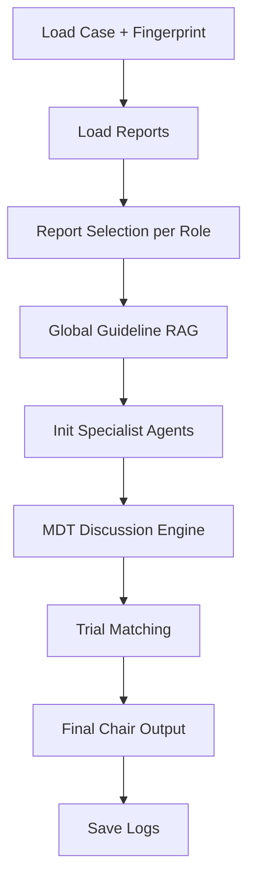

# MDT Discussion Log — 2026-01-18_03-43-24
Generated automatically by MDT Pipeline.


## CASE (structured JSON)

```
{"CASE_CORE":{"ADJUVANT_TREATMENT":{"cycles_or_courses":"6","given":"Yes","regimens":["白紫+卡铂化疗"]},"BIOMARKERS":{"AFP":"<0.91 ng/ml (2022-10-12)","CA125":"933.00 U/ml (2022-12-29)","HER2":"Unknown","MSI":"Unknown","PDL1_CPS":"Unknown","TMB":"Unknown"},"BRCA1":"Unknown","BRCA2":"Unknown","CURRENT_STATUS":"Recurrent ovarian cancer with pelvic presacral mass and hepatic metastases (imaging 2022-12-30)","DIAGNOSIS":{"components":[],"histology":"透明细胞癌","laterality":"Unknown","primary":"Recurrent ovarian cancer","site":"Ovary"},"HRD":"Unknown","INITIAL_TREATMENT":"Unknown","LINE_OF_THERAPY":[{"cycles":"6","end_date":"2022-08-17","intent":"Adjuvant","line":"Unknown","regimen":"白紫+卡铂化疗","start_date":"Unknown"}],"MAINTENANCE":"Unknown","MAINTENANCE_DETAIL":{"end_date":"Unknown","given":"Unknown","regimens":[],"start_date":"Unknown"},"NEOADJUVANT":"Unknown","PFI_days":"56","PLATINUM_HISTORY":[{"PFI_days":"56","end_date":"2022-08-17","evidence":"CA125 increased to 89.60 U/ml on 2022-10-12 after last carboplatin-containing chemo ended 2022-08-17","evidence_type":"Biochemical","first_relapse_date":"2022-10-12","line":"Unknown","start_date":"Unknown","status":"Resistant"}],"PLATINUM_PFI_CURRENT":"56","PLATINUM_STATUS":"Resistant","PLATINUM_STATUS_CURRENT":"Resistant","RELAPSE":"Yes","RELAPSE_DATE":{"date":"2022-10-12","evidence":"CA125 increased to 89.60 U/ml on 2022-10-12; subsequent imaging 2022-10-24/25 suggested pelvic recurrence and liver metastases","type":"Biochemical"},"SCENE":"Platinum_resistant_relapse","STAGE":{"stage_basis":"Unknown","stage_system":"Unknown","stage_text":"Unknown"},"SURGERY_DONE":{"date":"2022-03-28","performed":"Yes","procedure":"Cytoreductive surgery including partial rectosigmoid colectomy, partial vaginectomy, retroperitoneal lesion resection, complex lysis of intestinal adhesions, left ureteral stent placement, bladder repair"},"TIMELINE":{"constraints":{"max_events":30,"min_events":3,"must_include":["first diagnostic imaging or pathology confirmation (if available)"],"ordering_rules":{"prioritize_last_event":true}},"events":[{"date":"2022-03-28","description":"Cytoreductive surgery for recurrent ovarian cancer; specimens from partial rectosigmoid, left retroperitoneal tumor, partial vagina","event_type":"Surgery","key_result":"Pathology: intestinal wall full-thickness high-grade adenocarcinoma; considered consistent with ovarian clear cell carcinoma","regimen_or_test":"Surgery"},{"date":"2022-08-17","description":"Completed 6 cycles of 白紫+卡铂 chemotherapy; last administration recorded","event_type":"Chemo","key_result":"Last chemo date 2022-08-17","regimen_or_test":"白紫+卡铂化疗"},{"date":"2022-10-12","description":"Biochemical evidence of relapse with rising tumor markers","event_type":"Lab","key_result":"CA125 89.60 U/ml; CA19-9 77.20 U/ml; HE4 59.70 pmol/L","regimen_or_test":"Tumor markers"},{"date":"2022-10-24","description":"Pelvic MR: postoperative presacral mass increased, possible recurrence with adjacent sacral involvement; pelvic mesenteric nodules suspicious for metastasis","event_type":"Imaging","key_result":"Right iliac bone new enhancing nodule; presacral mass increased","regimen_or_test":"MR pelvis"},{"date":"2022-10-25","description":"CT: multiple hepatic nodules, some new compared with prior, suggesting metastases","event_type":"Imaging","key_result":"Multiple liver metastatic nodules","regimen_or_test":"CT abdomen"},{"date":"2022-12-30","description":"MR/CT: pelvic presacral mass larger and more heterogeneously enhancing; increased number and size of hepatic metastases","event_type":"Imaging","key_result":"Progression of pelvic and liver disease","regimen_or_test":"MR pelvis and CT abdomen"}]},"VISIT_DATE":"2023-01-03","first_relapse_date":"2022-10-12","last_platinum_end_date":"2022-08-17"},"LAB_TRENDS":{"labs":[{"analyte":"CA125","history":[{"date":"2022-03-28","flag":"Unknown","value":"45.7"},{"date":"2022-08-15","flag":"Unknown","value":"14.90"},{"date":"2022-10-12","flag":"↑","value":"89.60"},{"date":"2022-11-17","flag":"↑","value":"403"},{"date":"2022-12-29","flag":"↑","value":"933.00"}],"latest":{"date":"2022-12-29","flag":"↑","value":"933.00"},"reference_range":"Unknown","unit":"U/ml"},{"analyte":"HE4","history":[{"date":"2022-03-28","flag":"Unknown","value":"562"},{"date":"2022-08-15","flag":"↑","value":"87.90"},{"date":"2022-10-12","flag":"Unknown","value":"59.70"},{"date":"2022-12-29","flag":"↑","value":"111.00"}],"latest":{"date":"2022-12-29","flag":"↑","value":"111.00"},"reference_range":"Unknown","unit":"pmol/L"},{"analyte":"CA19-9","history":[{"date":"2022-03-28","flag":"Unknown","value":"161"},{"date":"2022-08-15","flag":"Unknown","value":"7.16"},{"date":"2022-10-12","flag":"↑","value":"77.20"},{"date":"2022-12-29","flag":"↑","value":"229.00"}],"latest":{"date":"2022-12-29","flag":"↑","value":"229.00"},"reference_range":"Unknown","unit":"U/ml"},{"analyte":"AFP","history":[{"date":"2022-10-12","flag":"Unknown","value":"<0.91"}],"latest":{"date":"2022-10-12","flag":"Unknown","value":"<0.91"},"reference_range":"Unknown","unit":"ng/ml"}],"milestones":[{"date":"2022-03-28","description":"Cytoreductive surgery performed","type":"Surgery"},{"date":"2022-08-17","description":"Last dose of 白紫+卡铂 chemotherapy (cycle 6)","type":"ChemoEnd"},{"date":"2022-10-12","description":"Biochemical relapse with CA125 rise","type":"Relapse"}]},"MED_ONC":{"current_regimen":{"cycle_info":"6 cycles completed (last on 2022-08-17)","last_admin_date":"2022-08-17","name":"Unknown"},"genetic_testing":{"germline":[],"somatic":[]},"monitoring_points":[],"planned_next_regimen":"Unknown","prior_systemic_therapies":["白紫+卡铂化疗6程"]},"NUC_MED":{"studies":[]},"PATHOLOGY":{"specimens":[{"components":["部分直乙结肠","左侧腹膜后肿瘤","部分阴道"],"date":"2022-03-28","diagnosis":"卵巢透明细胞癌累及","grade":"高级别腺癌","ihc":[{"marker":"MLH1(ES05)","result":"(+)"},{"marker":"MSH6","result":"(+)"},{"marker":"MSH2","result":"(+)"},{"marker":"PMS2","result":"(+)"},{"marker":"ER","result":"（部分+）"},{"marker":"PR","result":"（少弱+）"},{"marker":"P53","result":"（+/-）"},{"marker":"WT1","result":"（-）"},{"marker":"Ki-67","result":"（60%+）"},{"marker":"HNF1B","result":"（+）"},{"marker":"NapsinA","result":"（灶+）"},{"marker":"P16","result":"（+）"},{"marker":"PAX8","result":"（+）"},{"marker":"SALL4","result":"（-）"},{"marker":"ZBTB16","result":"（-）"}],"involvement_sites":["intestinal wall full-thickness","left retroperitoneal tumor","vaginal tissue"],"laterality":"Unknown","molecular":[],"raw_text":"卵巢恶性肿瘤：卵巢癌复发：术前CA125 45.7 CA199 161 HE4 562\n2022.03.28在全麻下行“瘤体减灭术+直肠乙状结肠部分切除术+阴道部分切除术+腹膜后病损切除术+复杂肠粘连松解术+左输尿管支架置管术+膀胱修补术。（部分直乙结肠+左侧腹膜后肿瘤+部分阴道）肠壁全层见高级别腺癌，结合T2022-04771首先考虑为透明细胞癌，正在加做免疫组化进一步明确。肿块大小约7*4*2.5cm。双侧切缘阴性，肠周淋巴结（4/15）见癌转移，伴癌结节1枚。（膀胱后壁肿瘤）纤维脂肪组织，局灶纤维组织增生、含铁血黄素沉积、泡沫样组织反应，未见癌累及。补充诊断1：【补充报告】（部分直乙结肠+左侧腹膜后肿瘤+部分阴道）可符合卵巢透明细胞癌累及。免疫组化（HI22-06789）瘤细胞：MLH1(ES05)（+），MSH6（+），MSH2（+），PMS2（+），ER（部分+），PR（少弱+），P53（+/-），WT1（-），Ki-67（60%+），HNF1B（+），NapsinA（灶+），P16（+），PAX8（+），SALL4（-），ZBTB16（-）","sample_type":"Surgical specimen","site":"部分直乙结肠; 左侧腹膜后肿瘤; 部分阴道","tumor_size":"7*4*2.5cm","uncertainty_or_missing":[]}]},"RADIOLOGY":{"next_imaging_plan":{"modality":"Unknown","timing":"Unknown"},"studies":[{"anatomic_sites":["Pelvis"],"date":"2022-10-24","findings":["Postoperative presacral mass increased in size and heterogenous enhancement","Pelvic mesenteric multiple enhancing small nodules, suspicious for metastasis","Right iliac bone new enhancing nodule"],"impression":"Consider recurrence with adjacent sacral involvement and pelvic/peritoneal metastases","modality":"MRI","trend_vs_prior":"Worse"},{"anatomic_sites":["Liver"],"date":"2022-10-25","findings":["Multiple hepatic nodules, some new compared with prior, suggest metastases","Hepatic cysts unchanged"],"impression":"Multiple liver metastases","modality":"CT","trend_vs_prior":"Worse"},{"anatomic_sites":["Pelvis"],"date":"2022-12-30","findings":["Postoperative presacral mass larger, more heterogeneous enhancement","Pelvic mesenteric enhancing nodules increased or similar"],"impression":"Enlarged presacral recurrent mass with possible adjacent peritoneal and sacral involvement","modality":"MRI","trend_vs_prior":"Worse"},{"anatomic_sites":["Liver","Spleen"],"date":"2022-12-30","findings":["Multiple intrahepatic metastatic nodules increased in number and size","Focal splenic abnormality described (possible infarct)"],"impression":"Progression of hepatic metastases","modality":"CT","trend_vs_prior":"Worse"}]},"TIMELINE":{"constraints":{"max_events":30,"min_events":3,"must_include":["first diagnostic imaging or pathology confirmation (if available)"],"ordering_rules":{"prioritize_last_event":true}},"events":[{"date":"2022-03-28","description":"Cytoreductive surgery for recurrent ovarian cancer; specimens from partial rectosigmoid, left retroperitoneal tumor, partial vagina","event_type":"Surgery","key_result":"Pathology: intestinal wall full-thickness high-grade adenocarcinoma; considered consistent with ovarian clear cell carcinoma","regimen_or_test":"Surgery"},{"date":"2022-08-17","description":"Completed 6 cycles of 白紫+卡铂 chemotherapy; last administration recorded","event_type":"Chemo","key_result":"Last chemo date 2022-08-17","regimen_or_test":"白紫+卡铂化疗"},{"date":"2022-10-12","description":"Biochemical evidence of relapse with rising tumor markers","event_type":"Lab","key_result":"CA125 89.60 U/ml; CA19-9 77.20 U/ml; HE4 59.70 pmol/L","regimen_or_test":"Tumor markers"},{"date":"2022-10-24","description":"Pelvic MR: postoperative presacral mass increased, possible recurrence with adjacent sacral involvement; pelvic mesenteric nodules suspicious for metastasis","event_type":"Imaging","key_result":"Right iliac bone new enhancing nodule; presacral mass increased","regimen_or_test":"MR pelvis"},{"date":"2022-10-25","description":"CT: multiple hepatic nodules, some new compared with prior, suggesting metastases","event_type":"Imaging","key_result":"Multiple liver metastatic nodules","regimen_or_test":"CT abdomen"},{"date":"2022-12-30","description":"MR/CT: pelvic presacral mass larger and more heterogeneously enhancing; increased number and size of hepatic metastases","event_type":"Imaging","key_result":"Progression of pelvic and liver disease","regimen_or_test":"MR pelvis and CT abdomen"}]}}
```


## FINAL MDT OUTPUT

```
- If intolerable toxicity or ECOG ≥3, then adjust management from active systemic therapy to symptom‑focused best supportive care.  
- If clear radiologic progression or CA125 doubling, then adjust management from current regimen to next‑line systemic or trial strategy.  
- If significant response (tumor shrinkage, CA125 fall, symptoms improved), then adjust management from induction intensity to maintenance‑intensity systemic therapy.  
- If new organ dysfunction from metastases (e.g., liver failure, bowel obstruction), then adjust management from standard dosing to modified, palliative‑priority strategy.  
- If actionable biomarker emerges on repeat profiling, then adjust management from empiric chemotherapy to targeted/biomarker‑guided systemic approach.
```


## PIPELINE FLOW (Mermaid)




## TRACE EVENTS (Structured)

```json
[
  {
    "ts": "2026-01-18T03:38:14.290767",
    "event": "pipeline_start",
    "payload": {
      "visit_time": "2023-01-03 08:53:29.260000",
      "meta_info": "340123197709263626"
    }
  },
  {
    "ts": "2026-01-18T03:38:14.291117",
    "event": "case_fingerprint",
    "payload": {
      "case_fingerprint": "adcf9c7fb435"
    }
  },
  {
    "ts": "2026-01-18T03:38:14.637572",
    "event": "reports_loaded",
    "payload": {
      "lab_n": 92,
      "img_n": 10,
      "path_n": 0,
      "mut_n": 1,
      "cutoff_dt": "2023-01-04 08:53:29"
    }
  },
  {
    "ts": "2026-01-18T03:38:53.914997",
    "event": "reports_selected",
    "payload": {
      "lab": {
        "chair": [
          "20221229|8300002|2022-12-29",
          "20221229|9703212|2022-12-29",
          "20230103|5600862|2023-01-03"
        ],
        "oncologist": [
          "20221229|8300002|2022-12-29",
          "20221229|9703212|2022-12-29",
          "20230103|5600862|2023-01-03"
        ],
        "radiologist": [],
        "pathologist": [],
        "nuclear": []
      },
      "imaging": {
        "chair": [
          "2022-10-24|MR|2022-10-24",
          "2022-12-29|MR|2022-12-29",
          "2022-12-29|CT|2022-12-29"
        ],
        "oncologist": [],
        "radiologist": [
          "2022-10-24|MR|2022-10-24",
          "2022-12-29|MR|2022-12-29",
          "2022-12-29|CT|2022-12-29"
        ],
        "pathologist": [],
        "nuclear": [
          "2022-10-24|MR|2022-10-24",
          "2022-12-29|MR|2022-12-29",
          "2022-12-29|CT|2022-12-29"
        ]
      },
      "pathology": {
        "chair": [],
        "oncologist": [],
        "radiologist": [],
        "pathologist": [],
        "nuclear": []
      },
      "mutation": {
        "chair": [
          "OH2203828|2022-04-18"
        ],
        "oncologist": [
          "OH2203828|2022-04-18"
        ],
        "radiologist": [],
        "pathologist": [
          "OH2203828|2022-04-18"
        ],
        "nuclear": []
      }
    }
  },
  {
    "ts": "2026-01-18T03:39:18.253008",
    "event": "rag_query",
    "payload": {
      "query": "Recurrent platinum-sensitive ovarian clear cell carcinoma post-cytoreduction and carbo-based chemo, now with enlarging presacral mass plus liver and possible bone/peritoneal metastases; MMR-proficient, ER/PR low-positive; organ function and performance status for further systemic therapy?"
    }
  },
  {
    "ts": "2026-01-18T03:39:18.253018",
    "event": "rag_hits",
    "payload": {
      "topk": 5,
      "n": 5
    }
  },
  {
    "ts": "2026-01-18T03:39:30.306595",
    "event": "mdt_discussion_start",
    "payload": {
      "num_rounds": 2,
      "num_turns": 2
    }
  },
  {
    "ts": "2026-01-18T03:43:20.879607",
    "event": "mdt_discussion_end",
    "payload": {
      "merged_chars": 3915
    }
  },
  {
    "ts": "2026-01-18T03:43:20.880751",
    "event": "final_output_start",
    "payload": {}
  },
  {
    "ts": "2026-01-18T03:43:24.208808",
    "event": "final_output_end",
    "payload": {
      "final_output_chars": 767
    }
  }
]
```


## INITIAL EXPERT OPINIONS


## chair

```
- Confirm performance status, symptoms, patient goals; discuss palliative vs disease-directed intent given progressive presacral and liver metastases [@2022-12-29|MR;2022-12-29|CT].  
- Treat as platinum‑resistant recurrent clear cell ovarian cancer; plan non‑platinum systemic therapy and consider clinical trial enrollment.  
- Address severe anemia urgently (Hgb 74 g/L) with cause evaluation and correction before or during further systemic therapy [@20230103|5600862].  
- No actionable HRD/BRCA found; consider broader molecular profiling of recurrent tissue if feasible to identify additional targets [@OH2203828].  
- Clarify current performance status, comorbidities, pain control, prior toxicities, and any maintenance therapies given, before finalizing regimen and sequencing.
```


## oncologist

```
- Biochemical and radiologic relapse within ~2 months of completing platinum suggests platinum-resistant recurrent clear cell ovarian carcinoma.  

- Current disease is metastatic (pelvis, liver); systemic therapy now palliative/relapse setting rather than adjuvant. [@20221229|9703212; 2022-12-30 imaging per case view]  

- Organ function appears adequate for systemic therapy; hepatic and renal parameters acceptable. [@20221229|8300002]  

- Significant anemia (HGB 74 g/L) requires evaluation and correction before or during next-line systemic treatment. [@20230103|5600862]  

- Missing/needs update today: ECOG performance status, current symptoms, full staging scan reports, prior regimen tolerability, and patient treatment goals/preferences.
```


## radiologist

```
- Enlarging 5.3×4.4 cm presacral postoperative mass with heterogeneous enhancement, suspicious for local pelvic recurrence and sacral involvement [@2022-12-29|MR].  

- Multiple enhancing pelvic mesenteric nodules, overall similar/slightly increased, consistent with peritoneal/mesenteric metastases [@2022-12-29|MR].  

- New enhancing nodule in right iliac bone, suspicious for osseous metastasis [@2022-12-29|MR].  

- Multiple hepatic metastatic nodules increased in number and size versus October, indicating progressive liver metastases [@2022-12-29|CT].  

- New focal splenic low-density area possibly infarct; recommend clinical correlation and imaging follow-up [@2022-12-29|CT].
```


## pathologist

```
- Current diagnosis: recurrent ovarian clear cell carcinoma involving rectosigmoid, left retroperitoneum, and vagina; high‑grade adenocarcinoma morphology [@HISTOLOGY_AND_IHC|2022-03-28].  

- IHC supports MMR proficiency (MLH1/MSH2/MSH6/PMS2 all retained), excluding overt MMR-deficient phenotype [@HISTOLOGY_AND_IHC|2022-03-28].  

- Clear cell phenotype corroborated by HNF1B+, focal Napsin A+, PAX8+, WT1–, ER/PR low, Ki‑67 ~60% [@HISTOLOGY_AND_IHC|2022-03-28].  

- Germline ATM p.Y316C detected; HRD negative; no pathogenic BRCA1/2, TP53, ARID1A, PTEN, PIK3CA variants [@OH2203828|2022-04-18].  

- Missing: updated stage at recurrence, contemporary imaging, MSI/TMB/PD‑L1 results on recurrent tumor, and any newer molecular profiling.
```


## nuclear

```
- No PET/CT available; metabolic pattern, current stage by PET, and PET evidence of recurrence are unknown/need update.  

- Prior MR shows enlarging presacral mass with sacral and peritoneal involvement, highly suspicious for local recurrent pelvic disease [@2022-12-29|MR].  

- Pelvic mesenteric nodules and right iliac bone nodule suggest additional metastatic sites beyond local presacral recurrence [@2022-12-29|MR].  

- CT demonstrates multiple progressive liver metastases, confirming distant metastatic spread and at least M1 disease [@2022-12-29|CT].  

- A new whole-body FDG PET/CT is needed now to clarify full metastatic burden and guide current staging.
```


## MERGED SUMMARY (Assistant)

```
Key Knowledge:
- Platinum‑resistant recurrent high‑grade ovarian clear cell carcinoma with rapid post‑platinum relapse and widespread metastases (presacral with probable sacral involvement, peritoneal/mesenteric, liver, possible bone).  
- Pathology: clear cell phenotype; MMR‑proficient, HRD‑negative, no BRCA1/2 or clear targetable alterations; germline ATM p.Y316C (VUS).  
- Management intent is palliative; current organ function seems adequate for further systemic therapy.  
- Severe anemia (Hgb 74 g/L) requires urgent investigation and correction.  

Controversies:
- Optimal choice and sequencing of non‑platinum systemic therapy in platinum‑resistant clear cell disease under palliative intent.  
- Whether additional molecular profiling on recent recurrent tissue (MSI/TMB/PD‑L1, expanded NGS) will meaningfully expand systemic or trial options.  
- Whether PET/CT (vs optimized CT/MRI) would materially change management or trial eligibility in this context.  

Missing Info:
- ECOG performance status, symptom burden, pain control, comorbidities, and patient goals/preferences.  
- Detailed history of prior systemic and maintenance therapies, responses, and toxicities.  
- Up‑to‑date comprehensive imaging (including chest and spine) and formal restaging; confirmation that no interim PET/CT exists.  
- Full anemia work‑up and broader labs (iron/B12/folate, hemolysis, coagulation, nutrition).  
- MSI/TMB/PD‑L1 status and any NGS performed on the most recent recurrent tumor sample; feasibility and turnaround for new testing.  

Working Plan:
- First clarify ECOG, symptom burden, and patient priorities to guide the balance between disease‑directed therapy and supportive care.  
- Evaluate and treat severe anemia in parallel with planning, including diagnostic work‑up for cause.  
- Define a non‑platinum systemic approach appropriate for platinum‑resistant clear cell carcinoma and assess clinical trial eligibility once PS and goals are known.  
- Determine feasibility and utility of updated molecular profiling (MSI/TMB/PD‑L1 and NGS on recurrent tissue) to broaden options.  
- From imaging side, confirm availability/quality of recent chest/spine CT/MRI; consider whole‑body PET/CT or comprehensive CT restaging only if findings are likely to alter systemic or trial decisions.
[R2T1 DELTA] oncologist->chair(safety): Before committing to further systemic therapy or PET/CT, we must urgently clarify ECOG, symptom burden, goals, and correct the severe anemia. | oncologist->pathologist(unspecified): Given platinum-resistant, biomarker-negative clear cell disease, please confirm if recurrent-tissue MSI/TMB/PD-L1 and expanded NGS are feasible with acceptable turnaround. | oncologist->radiologist(unspecified): Please confirm whether any recent chest/spine imaging exists; if absent, advise whether comprehensive CT versus PET/CT would better support treatment/trial decisions. | oncologist->nuclear(unspecified): In this widely metastatic, palliative setting, would PET/CT provide management-changing information beyond optimized CT/MRI for systemic or trial planning?
[R2T2 DELTA] radiologist->oncologist(missing): No chest or spine imaging is documented after 2022-12 CT/MR abdomen/pelvis; a contrast-enhanced chest/abdomen/pelvis CT with targeted spine evaluation should suffice for restaging unless a specific trial mandates PET/CT. | pathologist->oncologist(unspecified): From pathology side, MSI/MMR proteins are intact; MSI/TMB/PD-L1 and expanded NGS on recurrent tissue are not yet documented and feasibility/turnaround will depend on confirming an adequate recent block (tumor content, fixation) with the originating lab. | nuclear->oncologist(missing): In this widely metastatic, palliative setting, PET/CT is most useful if it would alter trial eligibility or focal radiotherapy plans; otherwise optimized contrast CT/MRI is usually sufficient for systemic decision-making.
```


## INTERACTION LOG (Round × Turn)

### Round 1

#### Turn 1
- **oncologist → chair:** Severe anemia (Hgb 74 g/L) needs urgent work‑up and correction before or alongside any new systemic regimen planning.
- **oncologist → radiologist:** Please confirm extent of presacral/sacral, hepatic, peritoneal, and possible bone involvement and whether additional chest or spine imaging is recommended now.
- **oncologist → pathologist:** Do we have any MSI/MMR, TMB, or PD‑L1 results from recurrent tissue, or is new biopsy/molecular profiling feasible?
- **oncologist → nuclear:** Would PET/CT materially refine staging or trial eligibility in this widely metastatic, platinum‑resistant setting, or add little beyond CT/MRI?
- **radiologist → oncologist:** Latest available imaging is from 2022-12-29/30 and already shows clear systemic progression; updated whole-body restaging (incl. chest and bone assessment) is needed to guide current palliative planning and pain risk assessment.
- **pathologist → chair:** Key pathology-based biomarkers (MMR, HRD, BRCA1/2) are already available, but absence of MSI/TMB/PD-L1 and recurrent-tissue NGS may limit systemic and trial planning; confirming whether additional sampling/testing is practical in this platinum-resistant, palliative context is important for MDT decisions.
- **pathologist → oncologist:** MMR proficiency and HRD-negative status are established, but MSI/TMB/PD-L1 and any NGS on recurrent tissue remain undocumented; if further systemic options or trial eligibility are being considered, updated molecular profiling on the most recent tumor should be obtained if feasible.
- **nuclear → oncologist:** No PET/CT has been performed yet; if trial eligibility or precise metastatic mapping is relevant, a whole-body FDG PET/CT is still needed.
- **nuclear → radiologist:** From nuclear perspective, current staging relies only on MR/CT; please confirm if any interim PET/CT or chest imaging exists or is scheduled.

#### Turn 2
- **oncologist → chair:** Given platinum-resistant clear cell histology and palliative intent, we should prioritize clarifying ECOG, symptoms, and goals before committing to further systemic therapy or PET/CT.
- **oncologist → radiologist:** Before considering PET/CT, can you confirm availability and adequacy of recent chest and spine imaging to document pulmonary and bone status?
- **oncologist → pathologist:** Agree MMR/HRD/BRCA are done; please advise on feasibility and expected turnaround for MSI/TMB/PD-L1 and updated NGS on the most recent tumor sample.
- **oncologist → nuclear:** If adequate CT/MRI chest/abdomen/pelvis and spine can be obtained, would PET/CT meaningfully alter systemic or trial decisions in this case?
- **radiologist → nuclear:** No PET/CT or recent dedicated chest imaging is documented; from radiology side, updated whole-body CT or PET/CT restaging is advisable if management may change.

### Round 2

#### Turn 1
- **oncologist → chair:** Before committing to further systemic therapy or PET/CT, we must urgently clarify ECOG, symptom burden, goals, and correct the severe anemia.
- **oncologist → radiologist:** Please confirm whether any recent chest/spine imaging exists; if absent, advise whether comprehensive CT versus PET/CT would better support treatment/trial decisions.
- **oncologist → pathologist:** Given platinum-resistant, biomarker-negative clear cell disease, please confirm if recurrent-tissue MSI/TMB/PD-L1 and expanded NGS are feasible with acceptable turnaround.
- **oncologist → nuclear:** In this widely metastatic, palliative setting, would PET/CT provide management-changing information beyond optimized CT/MRI for systemic or trial planning?

#### Turn 2
- **radiologist → oncologist:** No chest or spine imaging is documented after 2022-12 CT/MR abdomen/pelvis; a contrast-enhanced chest/abdomen/pelvis CT with targeted spine evaluation should suffice for restaging unless a specific trial mandates PET/CT.
- **pathologist → oncologist:** From pathology side, MSI/MMR proteins are intact; MSI/TMB/PD-L1 and expanded NGS on recurrent tissue are not yet documented and feasibility/turnaround will depend on confirming an adequate recent block (tumor content, fixation) with the originating lab.
- **nuclear → oncologist:** In this widely metastatic, palliative setting, PET/CT is most useful if it would alter trial eligibility or focal radiotherapy plans; otherwise optimized contrast CT/MRI is usually sufficient for systemic decision-making.


## FINAL REFINED PLANS (per Round)

### Round 1


## chair

```
- Prioritize non-platinum systemic therapy for platinum-resistant clear cell ovarian cancer with pelvic and liver progression [@2022-12-29|MR; @2022-12-29|CT].  
- Correct significant anemia before/early during treatment; evaluate iron, B12/folate, bleeding, hemolysis causes [HGB 74 g/L, @20230103|5600862].  
- Obtain updated performance status, symptoms, and patient goals to balance treatment intensity vs quality-of-life; current status unknown.  
- Reconfirm molecular profile on recent tumor if feasible; current HRD–, BRCA1/2–, ATM Y316C germline noted [@OH2203828|2022-04-18].  
- Plan close monitoring with serial CA125 and imaging to assess response; latest CA125 933 U/ml [@20221229|9703212].
```


## oncologist

```
- Confirm ECOG status, symptom burden, comorbidities, and patient goals to guide palliative versus disease‑directed systemic therapy (details currently unknown).  

- Urgently evaluate and treat severe anemia (HGB 74 g/L) with iron, nutritional, hemolysis, and bleeding work‑up. [@20230103|5600862]  

- Obtain updated whole‑body imaging (CT or PET/CT including chest and spine) for formal restaging if results will influence therapy or trial options (no recent staging documented).  

- Request feasibility and turnaround for MSI/TMB/PD‑L1 and broader NGS on most recent/recurrent tissue to expand systemic and trial options (currently undocumented). [@OH2203828|2022-04-18]  

- Plan non‑platinum systemic regimen appropriate for platinum‑resistant clear cell disease once performance status, anemia management, and updated staging/biomarkers are clarified.
```


## radiologist

```
- Disease shows clear progression with enlarging presacral mass, mesenteric/peritoneal nodules, liver and possible bone metastases [@2022-12-29|MR; @2022-12-29|CT].  

- No PET/CT or recent dedicated chest imaging documented; whole-body CT or PET/CT should be considered for up-to-date staging [unknown].  

- Sacral and right iliac bone involvement risk skeletal events and pain; spine/pelvic imaging refinement is advisable for symptom-focused planning [@2022-12-29|MR].  

- Splenic low-density area may represent infarct; correlate with symptoms and consider follow-up imaging if clinically relevant [@2022-12-29|CT].  

- Future systemic or trial decisions require updated imaging baseline before starting additional palliative therapy or local interventions [@2022-12-29|MR; @2022-12-29|CT].
```


## pathologist

```
- Diagnosis: platinum‑resistant recurrent high‑grade ovarian clear cell carcinoma, MMR‑proficient, HRD‑negative, BRCA1/2 wild type [@HISTOLOGY_AND_IHC|2022-03-28][@OH2203828|2022-04-18].  

- No MSI/TMB/PD‑L1 or recurrent‑tissue NGS documented; clarify tissue availability and arrange extended profiling if aligned with goals [@MOLECULAR|unknown].  

- Ensure pathology confirms which block represents latest recurrence and suitability (tumor content, fixation) for additional molecular tests [@HISTOLOGY_AND_IHC|2022-03-28].  

- Coordinate with oncology on urgency: balance turnaround times for MSI/TMB/PD‑L1/NGS against patient status and palliative intent [@OH2203828|2022-04-18].  

- Germline ATM p.Y316C is reported without clear pathogenic classification; consider genetics input regarding its significance [@OH2203828|2022-04-18].
```


## nuclear

```
- No PET/CT is available; metabolic staging and PET confirmation of recurrence remain unknown/need update [@2022-12-29|MR][@2022-12-29|CT].  

- MR shows enlarging presacral mass with sacral/peritoneal involvement, strongly suggesting metabolically active local recurrence [@2022-12-29|MR].  

- MR suggests pelvic mesenteric and right iliac bone metastases, where PET/CT could better define true extent [@2022-12-29|MR].  

- CT confirms progressive multifocal liver metastases; PET/CT would refine lesion burden but may not change systemic intent [@2022-12-29|CT].  

- If trial eligibility or radiotherapy targeting is considered, whole-body FDG PET/CT is recommended for comprehensive metabolic mapping.
```

### Round 2


## chair

```
- Classify as platinum-resistant recurrent ovarian clear cell carcinoma with progressive pelvic and hepatic metastases [@2022-12-29|MR; @2022-12-29|CT].  
- Before final regimen: document ECOG, symptoms, prior toxicities, fertility goals, and discuss palliative intent and trial interest (all unknown).  
- Initiate non-platinum systemic therapy ± targeted agent, considering liver function preserved and severe anemia requiring correction [@20221229|8300002; @20230103|5600862].  
- Refer to radiation/surgical teams only for symptom-focused local control (pain, bleeding, obstruction) based on current presacral/osseous disease [@2022-12-29|MR].  
- Arrange close follow-up with CA125/HE4, CBC, LFTs and symptom review to judge benefit vs toxicity and stop if futile [@20221229|9703212; @20221229|8300002; @20230103|5600862].
```


## oncologist

```
- Confirm ECOG status, symptom burden, comorbidities, and goals to choose between further systemic therapy versus best‑supportive‑care‑focused approach (currently unknown).  

- Urgently investigate and correct severe anemia (Hgb 74 g/L) before starting new systemic therapy; assess iron/B12/folate, hemolysis, bleeding. [@20230103|5600862]  

- Arrange contrast CT chest/abdomen/pelvis with targeted spine evaluation for restaging; reserve PET/CT only if required for trial/radiotherapy. [@20221229|8300002]  

- Verify availability/adequacy of recurrent-tissue block and proceed with MSI/TMB/PD‑L1 and expanded NGS if feasible to broaden options. [@OH2203828|2022-04-18]  

- After PS, anemia, and imaging clarified, select non‑platinum palliative systemic regimen or clinical trial, reassessing benefit versus toxicity continuously.
```


## radiologist

```
- Imaging shows progressive presacral recurrence with sacral, pelvic mesenteric/peritoneal and hepatic metastases; possible bone and splenic involvement [@2022-12-29|MR; @2022-12-29|CT].  

- No chest or spine imaging or PET/CT documented after 2022-12; comprehensive contrast CT chest/abdomen/pelvis with spine assessment is needed for restaging [unknown].  

- PET/CT may be reserved for situations where additional metabolic mapping would change trial eligibility or focal radiotherapy planning [unknown].  

- Sacral and right iliac bone involvement risk skeletal complications; targeted spine/pelvic imaging will support pain and stability management [@2022-12-29|MR].  

- Splenic low-density area may represent infarct; repeat imaging can clarify evolution if clinically indicated [@2022-12-29|CT].
```


## pathologist

```
- Confirm ECOG, symptom burden, comorbidities, and patient goals before further systemic therapy or PET/CT [@MOLECULAR|unknown].  

- Investigate and urgently correct severe anemia (Hgb 74 g/L) in parallel with oncologic planning [@MOLECULAR|unknown].  

- Restage with contrast-enhanced CT chest/abdomen/pelvis including targeted spine evaluation; reserve PET/CT for trial or radiotherapy decisions [@MOLECULAR|unknown].  

- Plan non‑platinum systemic therapy for platinum‑resistant ovarian clear cell carcinoma, contingent on performance status and patient priorities [@HISTOLOGY_AND_IHC|2022-03-28].  

- Verify availability of adequate recent tumor block and, if feasible, perform MSI/TMB/PD‑L1 and expanded NGS to broaden options [@OH2203828|2022-04-18].
```


## nuclear

```
- No PET/CT has been performed; metabolic staging and PET assessment of recurrence remain unknown/need update [@2022-12-29|MR][@2022-12-29|CT].  

- MR shows enlarging presacral mass with adjacent sacral and peritoneal involvement, consistent with metabolically active local recurrence [@2022-12-29|MR].  

- MR suggests pelvic mesenteric and right iliac bone metastases, where PET/CT could better delineate true extent and activity [@2022-12-29|MR].  

- CT demonstrates progressive multifocal liver metastases; PET/CT would refine lesion burden but is unlikely to change systemic palliative intent [@2022-12-29|CT].  

- Reserve whole-body FDG PET/CT for situations where results would directly impact trial eligibility or focal radiotherapy planning.
```


## RAW AGENT LOGS

### chair
- **User:** Give INITIAL opinion (use ONLY your system-provided patient facts).
Return up to 5 bullets, each ≤20 words.
If key data missing, say exactly what needs updating.
  
  **Assistant:** - Confirm performance status, symptoms, patient goals; discuss palliative vs disease-directed intent given progressive presacral and liver metastases [@2022-12-29|MR;2022-12-29|CT].  
- Treat as platinum‑resistant recurrent clear cell ovarian cancer; plan non‑platinum systemic therapy and consider clinical trial enrollment.  
- Address severe anemia urgently (Hgb 74 g/L) with cause evaluation and correction before or during further systemic therapy [@20230103|5600862].  
- No actionable HRD/BRCA found; consider broader molecular profiling of recurrent tissue if feasible to identify additional targets [@OH2203828].  
- Clarify current performance status, comorbidities, pain control, prior toxicities, and any maintenance therapies given, before finalizing regimen and sequencing.
  
  *(2026-01-18T03:39:35.764821)*

- **User:** ROLE: chair. VISIT: 2023-01-03 08:53:29.260000
Default is NOT to speak. Speak ONLY if: conflict | safety | missing-critical | new-critical.

CONTEXT (latest):
Key Knowledge:
- Platinum‑resistant recurrent high‑grade ovarian clear cell carcinoma with rapid relapse and metastatic spread (presacral with probable sacral involvement, peritoneal/mesenteric, liver, and possible bone).  
- MMR‑proficient, HRD‑negative, no BRCA1/2 or clear targetable alterations; germline ATM p.Y316C (VUS).  
- Systemic therapy intent is palliative; organ function appears adequate.  
- Severe anemia (Hgb 74 g/L) needs urgent correction.

Controversies:
- Choice and sequencing of non‑platinum systemic therapy in clear cell platinum‑resistant disease.  
- Yield and timing of further molecular profiling (MSI/TMB/PD‑L1, expanded NGS) for additional options or trial access.  
- Added value of PET/CT for staging versus limited impact on immediate management.

Missing Info:
- ECOG performance status, symptom burden, pain control, comorbidities, and treatment goals.  
- Detailed prior systemic/maintenance therapy and tolerability.  
- Complete, recent imaging (including chest) and formal restaging.  
- Full lab work‑up of anemia and broader labs (coagulation, nutritional and hemolysis parameters).  
- Any existing MSI/TMB/PD‑L1 or newer molecular data on recurrent tissue.

Working Plan:
- Clarify current clinical status and patient goals to frame palliative vs disease‑directed focus.  
- Investigate and treat severe anemia in parallel with oncologic planning.  
- Plan non‑platinum systemic therapy suitable for platinum‑resistant clear cell disease and assess clinical trial eligibility.  
- If feasible and clinically meaningful, obtain broader molecular profiling (including MSI/TMB/PD‑L1) and consider PET/CT to refine staging and trial suitability.

Allowed targets: [oncologist,radiologist,pathologist,nuclear]
Return ONE-LINE JSON only:{"speak":"yes/no","messages":[{"target":"<role>","message":"<1-2 sentences>","why":"conflict|safety|missing|new"}]}
  
  **Assistant:** Performance status, symptom burden, and patient goals are undocumented; these must be clarified before committing to further systemic therapy.  

Severe anemia today (Hgb 74 g/L) [@20230103|5600862] requires urgent correction and bleeding workup before starting any new treatment.
  
  *(2026-01-18T03:40:05.931816)*

- **User:** ROLE: chair. VISIT: 2023-01-03 08:53:29.260000
Default is NOT to speak. Speak ONLY if: conflict | safety | missing-critical | new-critical.

CONTEXT (latest):
Key Knowledge:
- Platinum‑resistant recurrent high‑grade ovarian clear cell carcinoma with rapid relapse and metastatic spread (presacral with probable sacral involvement, peritoneal/mesenteric, liver, and possible bone).  
- MMR‑proficient, HRD‑negative, no BRCA1/2 or clear targetable alterations; germline ATM p.Y316C (VUS).  
- Systemic therapy intent is palliative; organ function appears adequate.  
- Severe anemia (Hgb 74 g/L) needs urgent correction.

Controversies:
- Choice and sequencing of non‑platinum systemic therapy in clear cell platinum‑resistant disease.  
- Yield and timing of further molecular profiling (MSI/TMB/PD‑L1, expanded NGS) for additional options or trial access.  
- Added value of PET/CT for staging versus limited impact on immediate management.

Missing Info:
- ECOG performance status, symptom burden, pain control, comorbidities, and treatment goals.  
- Detailed prior systemic/maintenance therapy and tolerability.  
- Complete, recent imaging (including chest) and formal restaging.  
- Full lab work‑up of anemia and broader labs (coagulation, nutritional and hemolysis parameters).  
- Any existing MSI/TMB/PD‑L1 or newer molecular data on recurrent tissue.

Working Plan:
- Clarify current clinical status and patient goals to frame palliative vs disease‑directed focus.  
- Investigate and treat severe anemia in parallel with oncologic planning.  
- Plan non‑platinum systemic therapy suitable for platinum‑resistant clear cell disease and assess clinical trial eligibility.  
- If feasible and clinically meaningful, obtain broader molecular profiling (including MSI/TMB/PD‑L1) and consider PET/CT to refine staging and trial suitability.
[R1T1 DELTA] MB/PD-L1 and any NGS on recurrent tissue remain undocumented; if further systemic options or trial eligibility are being considered, updated molecular profiling on the most recent tumor should be obtained if feasible. | pathologist->chair(missing): Key pathology-based biomarkers (MMR, HRD, BRCA1/2) are already available, but absence of MSI/TMB/PD-L1 and recurrent-tissue NGS may limit systemic and trial planning; confirming whether additional sampling/testing is practical in this platinum-resistant, palliative context is important for MDT decisions. | nuclear->oncologist(missing): No PET/CT has been performed yet; if trial eligibility or precise metastatic mapping is relevant, a whole-body FDG PET/CT is still needed. | nuclear->radiologist(missing): From nuclear perspective, current staging relies only on MR/CT; please confirm if any interim PET/CT or chest imaging exists or is scheduled.

Allowed targets: [oncologist,radiologist,pathologist,nuclear]
Return ONE-LINE JSON only:{"speak":"yes/no","messages":[{"target":"<role>","message":"<1-2 sentences>","why":"conflict|safety|missing|new"}]}
  
  **Assistant:** Need clarification of the request format; current prompt string appears truncated/corrupted and does not specify a clinical question.
  
  *(2026-01-18T03:40:18.019034)*

- **User:** Given MDT context:
Key Knowledge:
- Platinum‑resistant recurrent high‑grade ovarian clear cell carcinoma with rapid relapse and metastatic spread (presacral with probable sacral involvement, peritoneal/mesenteric, liver, and possible bone).  
- MMR‑proficient, HRD‑negative, no BRCA1/2 or clear targetable alterations; germline ATM p.Y316C (VUS).  
- Systemic therapy intent is palliative; organ function appears adequate.  
- Severe anemia (Hgb 74 g/L) needs urgent correction.

Controversies:
- Choice and sequencing of non‑platinum systemic therapy in clear cell platinum‑resistant disease.  
- Yield and timing of further molecular profiling (MSI/TMB/PD‑L1, expanded NGS) for additional options or trial access.  
- Added value of PET/CT for staging versus limited impact on immediate management.

Missing Info:
- ECOG performance status, symptom burden, pain control, comorbidities, and treatment goals.  
- Detailed prior systemic/maintenance therapy and tolerability.  
- Complete, recent imaging (including chest) and formal restaging.  
- Full lab work‑up of anemia and broader labs (coagulation, nutritional and hemolysis parameters).  
- Any existing MSI/TMB/PD‑L1 or newer molecular data on recurrent tissue.

Working Plan:
- Clarify current clinical status and patient goals to frame palliative vs disease‑directed focus.  
- Investigate and treat severe anemia in parallel with oncologic planning.  
- Plan non‑platinum systemic therapy suitable for platinum‑resistant clear cell disease and assess clinical trial eligibility.  
- If feasible and clinically meaningful, obtain broader molecular profiling (including MSI/TMB/PD‑L1) and consider PET/CT to refine staging and trial suitability.
[R1T1 DELTA] MB/PD-L1 and any NGS on recurrent tissue remain undocumented; if further systemic options or trial eligibility are being considered, updated molecular profiling on the most recent tumor should be obtained if feasible. | pathologist->chair(missing): Key pathology-based biomarkers (MMR, HRD, BRCA1/2) are already available, but absence of MSI/TMB/PD-L1 and recurrent-tissue NGS may limit systemic and trial planning; confirming whether additional sampling/testing is practical in this platinum-resistant, palliative context is important for MDT decisions. | nuclear->oncologist(missing): No PET/CT has been performed yet; if trial eligibility or precise metastatic mapping is relevant, a whole-body FDG PET/CT is still needed. | nuclear->radiologist(missing): From nuclear perspective, current staging relies only on MR/CT; please confirm if any interim PET/CT or chest imaging exists or is scheduled.
[R1T2 DELTA] clear cell histology and palliative intent, we should prioritize clarifying ECOG, symptoms, and goals before committing to further systemic therapy or PET/CT. | oncologist->pathologist(unspecified): Agree MMR/HRD/BRCA are done; please advise on feasibility and expected turnaround for MSI/TMB/PD-L1 and updated NGS on the most recent tumor sample. | oncologist->radiologist(unspecified): Before considering PET/CT, can you confirm availability and adequacy of recent chest and spine imaging to document pulmonary and bone status? | oncologist->nuclear(unspecified): If adequate CT/MRI chest/abdomen/pelvis and spine can be obtained, would PET/CT meaningfully alter systemic or trial decisions in this case? | radiologist->nuclear(missing): No PET/CT or recent dedicated chest imaging is documented; from radiology side, updated whole-body CT or PET/CT restaging is advisable if management may change.

Provide FINAL refined plan.
Up to 5 bullets, each ≤20 words.
Any factual claim must include [@report_id|date] or say unknown.
  
  **Assistant:** - Prioritize non-platinum systemic therapy for platinum-resistant clear cell ovarian cancer with pelvic and liver progression [@2022-12-29|MR; @2022-12-29|CT].  
- Correct significant anemia before/early during treatment; evaluate iron, B12/folate, bleeding, hemolysis causes [HGB 74 g/L, @20230103|5600862].  
- Obtain updated performance status, symptoms, and patient goals to balance treatment intensity vs quality-of-life; current status unknown.  
- Reconfirm molecular profile on recent tumor if feasible; current HRD–, BRCA1/2–, ATM Y316C germline noted [@OH2203828|2022-04-18].  
- Plan close monitoring with serial CA125 and imaging to assess response; latest CA125 933 U/ml [@20221229|9703212].
  
  *(2026-01-18T03:40:40.157140)*

- **User:** ROLE: chair. VISIT: 2023-01-03 08:53:29.260000
Default is NOT to speak. Speak ONLY if: conflict | safety | missing-critical | new-critical.

CONTEXT (latest):
Key Knowledge:
- Platinum‑resistant recurrent high‑grade ovarian clear cell carcinoma with rapid post‑platinum relapse and widespread metastases (presacral with probable sacral involvement, peritoneal/mesenteric, liver, possible bone).  
- Pathology: clear cell phenotype; MMR‑proficient, HRD‑negative, no BRCA1/2 or clear targetable alterations; germline ATM p.Y316C (VUS).  
- Management intent is palliative; current organ function seems adequate for further systemic therapy.  
- Severe anemia (Hgb 74 g/L) requires urgent investigation and correction.  

Controversies:
- Optimal choice and sequencing of non‑platinum systemic therapy in platinum‑resistant clear cell disease under palliative intent.  
- Whether additional molecular profiling on recent recurrent tissue (MSI/TMB/PD‑L1, expanded NGS) will meaningfully expand systemic or trial options.  
- Whether PET/CT (vs optimized CT/MRI) would materially change management or trial eligibility in this context.  

Missing Info:
- ECOG performance status, symptom burden, pain control, comorbidities, and patient goals/preferences.  
- Detailed history of prior systemic and maintenance therapies, responses, and toxicities.  
- Up‑to‑date comprehensive imaging (including chest and spine) and formal restaging; confirmation that no interim PET/CT exists.  
- Full anemia work‑up and broader labs (iron/B12/folate, hemolysis, coagulation, nutrition).  
- MSI/TMB/PD‑L1 status and any NGS performed on the most recent recurrent tumor sample; feasibility and turnaround for new testing.  

Working Plan:
- First clarify ECOG, symptom burden, and patient priorities to guide the balance between disease‑directed therapy and supportive care.  
- Evaluate and treat severe anemia in parallel with planning, including diagnostic work‑up for cause.  
- Define a non‑platinum systemic approach appropriate for platinum‑resistant clear cell carcinoma and assess clinical trial eligibility once PS and goals are known.  
- Determine feasibility and utility of updated molecular profiling (MSI/TMB/PD‑L1 and NGS on recurrent tissue) to broaden options.  
- From imaging side, confirm availability/quality of recent chest/spine CT/MRI; consider whole‑body PET/CT or comprehensive CT restaging only if findings are likely to alter systemic or trial decisions.

Allowed targets: [oncologist,radiologist,pathologist,nuclear]
Return ONE-LINE JSON only:{"speak":"yes/no","messages":[{"target":"<role>","message":"<1-2 sentences>","why":"conflict|safety|missing|new"}]}
  
  **Assistant:** - Need clarification of your request format; current text appears truncated and does not state a clinical question (safety: avoid misinterpretation).  
- Once the question is clear, we must factor in platinum-resistant status with progressing pelvic/liver disease and significant anemia [@2022-12-29|CT; @2022-12-29|MR; @20230103|5600862].
  
  *(2026-01-18T03:41:23.766501)*

- **User:** ROLE: chair. VISIT: 2023-01-03 08:53:29.260000
Default is NOT to speak. Speak ONLY if: conflict | safety | missing-critical | new-critical.

CONTEXT (latest):
Key Knowledge:
- Platinum‑resistant recurrent high‑grade ovarian clear cell carcinoma with rapid post‑platinum relapse and widespread metastases (presacral with probable sacral involvement, peritoneal/mesenteric, liver, possible bone).  
- Pathology: clear cell phenotype; MMR‑proficient, HRD‑negative, no BRCA1/2 or clear targetable alterations; germline ATM p.Y316C (VUS).  
- Management intent is palliative; current organ function seems adequate for further systemic therapy.  
- Severe anemia (Hgb 74 g/L) requires urgent investigation and correction.  

Controversies:
- Optimal choice and sequencing of non‑platinum systemic therapy in platinum‑resistant clear cell disease under palliative intent.  
- Whether additional molecular profiling on recent recurrent tissue (MSI/TMB/PD‑L1, expanded NGS) will meaningfully expand systemic or trial options.  
- Whether PET/CT (vs optimized CT/MRI) would materially change management or trial eligibility in this context.  

Missing Info:
- ECOG performance status, symptom burden, pain control, comorbidities, and patient goals/preferences.  
- Detailed history of prior systemic and maintenance therapies, responses, and toxicities.  
- Up‑to‑date comprehensive imaging (including chest and spine) and formal restaging; confirmation that no interim PET/CT exists.  
- Full anemia work‑up and broader labs (iron/B12/folate, hemolysis, coagulation, nutrition).  
- MSI/TMB/PD‑L1 status and any NGS performed on the most recent recurrent tumor sample; feasibility and turnaround for new testing.  

Working Plan:
- First clarify ECOG, symptom burden, and patient priorities to guide the balance between disease‑directed therapy and supportive care.  
- Evaluate and treat severe anemia in parallel with planning, including diagnostic work‑up for cause.  
- Define a non‑platinum systemic approach appropriate for platinum‑resistant clear cell carcinoma and assess clinical trial eligibility once PS and goals are known.  
- Determine feasibility and utility of updated molecular profiling (MSI/TMB/PD‑L1 and NGS on recurrent tissue) to broaden options.  
- From imaging side, confirm availability/quality of recent chest/spine CT/MRI; consider whole‑body PET/CT or comprehensive CT restaging only if findings are likely to alter systemic or trial decisions.
[R2T1 DELTA] oncologist->chair(safety): Before committing to further systemic therapy or PET/CT, we must urgently clarify ECOG, symptom burden, goals, and correct the severe anemia. | oncologist->pathologist(unspecified): Given platinum-resistant, biomarker-negative clear cell disease, please confirm if recurrent-tissue MSI/TMB/PD-L1 and expanded NGS are feasible with acceptable turnaround. | oncologist->radiologist(unspecified): Please confirm whether any recent chest/spine imaging exists; if absent, advise whether comprehensive CT versus PET/CT would better support treatment/trial decisions. | oncologist->nuclear(unspecified): In this widely metastatic, palliative setting, would PET/CT provide management-changing information beyond optimized CT/MRI for systemic or trial planning?

Allowed targets: [oncologist,radiologist,pathologist,nuclear]
Return ONE-LINE JSON only:{"speak":"yes/no","messages":[{"target":"<role>","message":"<1-2 sentences>","why":"conflict|safety|missing|new"}]}
  
  **Assistant:** Performance status, symptom burden, and patient goals are not documented; these must be clarified before committing to further systemic therapy.  

Given rapidly progressive, platinum‑resistant clear cell carcinoma with liver and bone involvement, prioritize non‑platinum systemic options and early palliative‑care integration.
  
  *(2026-01-18T03:41:58.234915)*

- **User:** Given MDT context:
Key Knowledge:
- Platinum‑resistant recurrent high‑grade ovarian clear cell carcinoma with rapid post‑platinum relapse and widespread metastases (presacral with probable sacral involvement, peritoneal/mesenteric, liver, possible bone).  
- Pathology: clear cell phenotype; MMR‑proficient, HRD‑negative, no BRCA1/2 or clear targetable alterations; germline ATM p.Y316C (VUS).  
- Management intent is palliative; current organ function seems adequate for further systemic therapy.  
- Severe anemia (Hgb 74 g/L) requires urgent investigation and correction.  

Controversies:
- Optimal choice and sequencing of non‑platinum systemic therapy in platinum‑resistant clear cell disease under palliative intent.  
- Whether additional molecular profiling on recent recurrent tissue (MSI/TMB/PD‑L1, expanded NGS) will meaningfully expand systemic or trial options.  
- Whether PET/CT (vs optimized CT/MRI) would materially change management or trial eligibility in this context.  

Missing Info:
- ECOG performance status, symptom burden, pain control, comorbidities, and patient goals/preferences.  
- Detailed history of prior systemic and maintenance therapies, responses, and toxicities.  
- Up‑to‑date comprehensive imaging (including chest and spine) and formal restaging; confirmation that no interim PET/CT exists.  
- Full anemia work‑up and broader labs (iron/B12/folate, hemolysis, coagulation, nutrition).  
- MSI/TMB/PD‑L1 status and any NGS performed on the most recent recurrent tumor sample; feasibility and turnaround for new testing.  

Working Plan:
- First clarify ECOG, symptom burden, and patient priorities to guide the balance between disease‑directed therapy and supportive care.  
- Evaluate and treat severe anemia in parallel with planning, including diagnostic work‑up for cause.  
- Define a non‑platinum systemic approach appropriate for platinum‑resistant clear cell carcinoma and assess clinical trial eligibility once PS and goals are known.  
- Determine feasibility and utility of updated molecular profiling (MSI/TMB/PD‑L1 and NGS on recurrent tissue) to broaden options.  
- From imaging side, confirm availability/quality of recent chest/spine CT/MRI; consider whole‑body PET/CT or comprehensive CT restaging only if findings are likely to alter systemic or trial decisions.
[R2T1 DELTA] oncologist->chair(safety): Before committing to further systemic therapy or PET/CT, we must urgently clarify ECOG, symptom burden, goals, and correct the severe anemia. | oncologist->pathologist(unspecified): Given platinum-resistant, biomarker-negative clear cell disease, please confirm if recurrent-tissue MSI/TMB/PD-L1 and expanded NGS are feasible with acceptable turnaround. | oncologist->radiologist(unspecified): Please confirm whether any recent chest/spine imaging exists; if absent, advise whether comprehensive CT versus PET/CT would better support treatment/trial decisions. | oncologist->nuclear(unspecified): In this widely metastatic, palliative setting, would PET/CT provide management-changing information beyond optimized CT/MRI for systemic or trial planning?
[R2T2 DELTA] radiologist->oncologist(missing): No chest or spine imaging is documented after 2022-12 CT/MR abdomen/pelvis; a contrast-enhanced chest/abdomen/pelvis CT with targeted spine evaluation should suffice for restaging unless a specific trial mandates PET/CT. | pathologist->oncologist(unspecified): From pathology side, MSI/MMR proteins are intact; MSI/TMB/PD-L1 and expanded NGS on recurrent tissue are not yet documented and feasibility/turnaround will depend on confirming an adequate recent block (tumor content, fixation) with the originating lab. | nuclear->oncologist(missing): In this widely metastatic, palliative setting, PET/CT is most useful if it would alter trial eligibility or focal radiotherapy plans; otherwise optimized contrast CT/MRI is usually sufficient for systemic decision-making.

Provide FINAL refined plan.
Up to 5 bullets, each ≤20 words.
Any factual claim must include [@report_id|date] or say unknown.
  
  **Assistant:** - Classify as platinum-resistant recurrent ovarian clear cell carcinoma with progressive pelvic and hepatic metastases [@2022-12-29|MR; @2022-12-29|CT].  
- Before final regimen: document ECOG, symptoms, prior toxicities, fertility goals, and discuss palliative intent and trial interest (all unknown).  
- Initiate non-platinum systemic therapy ± targeted agent, considering liver function preserved and severe anemia requiring correction [@20221229|8300002; @20230103|5600862].  
- Refer to radiation/surgical teams only for symptom-focused local control (pain, bleeding, obstruction) based on current presacral/osseous disease [@2022-12-29|MR].  
- Arrange close follow-up with CA125/HE4, CBC, LFTs and symptom review to judge benefit vs toxicity and stop if futile [@20221229|9703212; @20221229|8300002; @20230103|5600862].
  
  *(2026-01-18T03:42:30.863338)*

- **User:** 
As the MDT chair for gynecologic oncology, you are seeing the patient at OUTPATIENT TIME: 2023-01-03 08:53:29.260000.
Based on PATIENT FACTS + MDT discussion + FINAL refined plans from all experts, determine the CURRENT best management plan for this visit.

STRICT RULES:
- Any factual statement about past tests/treatments must include [@report_id|date] or say unknown.
- If experts disagree, pick the safest plan and state the key uncertainty.

# FINAL REFINED PLANS (All experts, last round)
{
  "Round 1": {
    "chair": "- Prioritize non-platinum systemic therapy for platinum-resistant clear cell ovarian cancer with pelvic and liver progression [@2022-12-29|MR; @2022-12-29|CT].  \n- Correct significant anemia before/early during treatment; evaluate iron, B12/folate, bleeding, hemolysis causes [HGB 74 g/L, @20230103|5600862].  \n- Obtain updated performance status, symptoms, and patient goals to balance treatment intensity vs quality-of-life; current status unknown.  \n- Reconfirm molecular profile on recent tumor if feasible; current HRD–, BRCA1/2–, ATM Y316C germline noted [@OH2203828|2022-04-18].  \n- Plan close monitoring with serial CA125 and imaging to assess response; latest CA125 933 U/ml [@20221229|9703212].",
    "oncologist": "- Confirm ECOG status, symptom burden, comorbidities, and patient goals to guide palliative versus disease‑directed systemic therapy (details currently unknown).  \n\n- Urgently evaluate and treat severe anemia (HGB 74 g/L) with iron, nutritional, hemolysis, and bleeding work‑up. [@20230103|5600862]  \n\n- Obtain updated whole‑body imaging (CT or PET/CT including chest and spine) for formal restaging if results will influence therapy or trial options (no recent staging documented).  \n\n- Request feasibility and turnaround for MSI/TMB/PD‑L1 and broader NGS on most recent/recurrent tissue to expand systemic and trial options (currently undocumented). [@OH2203828|2022-04-18]  \n\n- Plan non‑platinum systemic regimen appropriate for platinum‑resistant clear cell disease once performance status, anemia management, and updated staging/biomarkers are clarified.",
    "radiologist": "- Disease shows clear progression with enlarging presacral mass, mesenteric/peritoneal nodules, liver and possible bone metastases [@2022-12-29|MR; @2022-12-29|CT].  \n\n- No PET/CT or recent dedicated chest imaging documented; whole-body CT or PET/CT should be considered for up-to-date staging [unknown].  \n\n- Sacral and right iliac bone involvement risk skeletal events and pain; spine/pelvic imaging refinement is advisable for symptom-focused planning [@2022-12-29|MR].  \n\n- Splenic low-density area may represent infarct; correlate with symptoms and consider follow-up imaging if clinically relevant [@2022-12-29|CT].  \n\n- Future systemic or trial decisions require updated imaging baseline before starting additional palliative therapy or local interventions [@2022-12-29|MR; @2022-12-29|CT].",
    "pathologist": "- Diagnosis: platinum‑resistant recurrent high‑grade ovarian clear cell carcinoma, MMR‑proficient, HRD‑negative, BRCA1/2 wild type [@HISTOLOGY_AND_IHC|2022-03-28][@OH2203828|2022-04-18].  \n\n- No MSI/TMB/PD‑L1 or recurrent‑tissue NGS documented; clarify tissue availability and arrange extended profiling if aligned with goals [@MOLECULAR|unknown].  \n\n- Ensure pathology confirms which block represents latest recurrence and suitability (tumor content, fixation) for additional molecular tests [@HISTOLOGY_AND_IHC|2022-03-28].  \n\n- Coordinate with oncology on urgency: balance turnaround times for MSI/TMB/PD‑L1/NGS against patient status and palliative intent [@OH2203828|2022-04-18].  \n\n- Germline ATM p.Y316C is reported without clear pathogenic classification; consider genetics input regarding its significance [@OH2203828|2022-04-18].",
    "nuclear": "- No PET/CT is available; metabolic staging and PET confirmation of recurrence remain unknown/need update [@2022-12-29|MR][@2022-12-29|CT].  \n\n- MR shows enlarging presacral mass with sacral/peritoneal involvement, strongly suggesting metabolically active local recurrence [@2022-12-29|MR].  \n\n- MR suggests pelvic mesenteric and right iliac bone metastases, where PET/CT could better define true extent [@2022-12-29|MR].  \n\n- CT confirms progressive multifocal liver metastases; PET/CT would refine lesion burden but may not change systemic intent [@2022-12-29|CT].  \n\n- If trial eligibility or radiotherapy targeting is considered, whole-body FDG PET/CT is recommended for comprehensive metabolic mapping."
  },
  "Round 2": {
    "chair": "- Classify as platinum-resistant recurrent ovarian clear cell carcinoma with progressive pelvic and hepatic metastases [@2022-12-29|MR; @2022-12-29|CT].  \n- Before final regimen: document ECOG, symptoms, prior toxicities, fertility goals, and discuss palliative intent and trial interest (all unknown).  \n- Initiate non-platinum systemic therapy ± targeted agent, considering liver function preserved and severe anemia requiring correction [@20221229|8300002; @20230103|5600862].  \n- Refer to radiation/surgical teams only for symptom-focused local control (pain, bleeding, obstruction) based on current presacral/osseous disease [@2022-12-29|MR].  \n- Arrange close follow-up with CA125/HE4, CBC, LFTs and symptom review to judge benefit vs toxicity and stop if futile [@20221229|9703212; @20221229|8300002; @20230103|5600862].",
    "oncologist": "- Confirm ECOG status, symptom burden, comorbidities, and goals to choose between further systemic therapy versus best‑supportive‑care‑focused approach (currently unknown).  \n\n- Urgently investigate and correct severe anemia (Hgb 74 g/L) before starting new systemic therapy; assess iron/B12/folate, hemolysis, bleeding. [@20230103|5600862]  \n\n- Arrange contrast CT chest/abdomen/pelvis with targeted spine evaluation for restaging; reserve PET/CT only if required for trial/radiotherapy. [@20221229|8300002]  \n\n- Verify availability/adequacy of recurrent-tissue block and proceed with MSI/TMB/PD‑L1 and expanded NGS if feasible to broaden options. [@OH2203828|2022-04-18]  \n\n- After PS, anemia, and imaging clarified, select non‑platinum palliative systemic regimen or clinical trial, reassessing benefit versus toxicity continuously.",
    "radiologist": "- Imaging shows progressive presacral recurrence with sacral, pelvic mesenteric/peritoneal and hepatic metastases; possible bone and splenic involvement [@2022-12-29|MR; @2022-12-29|CT].  \n\n- No chest or spine imaging or PET/CT documented after 2022-12; comprehensive contrast CT chest/abdomen/pelvis with spine assessment is needed for restaging [unknown].  \n\n- PET/CT may be reserved for situations where additional metabolic mapping would change trial eligibility or focal radiotherapy planning [unknown].  \n\n- Sacral and right iliac bone involvement risk skeletal complications; targeted spine/pelvic imaging will support pain and stability management [@2022-12-29|MR].  \n\n- Splenic low-density area may represent infarct; repeat imaging can clarify evolution if clinically indicated [@2022-12-29|CT].",
    "pathologist": "- Confirm ECOG, symptom burden, comorbidities, and patient goals before further systemic therapy or PET/CT [@MOLECULAR|unknown].  \n\n- Investigate and urgently correct severe anemia (Hgb 74 g/L) in parallel with oncologic planning [@MOLECULAR|unknown].  \n\n- Restage with contrast-enhanced CT chest/abdomen/pelvis including targeted spine evaluation; reserve PET/CT for trial or radiotherapy decisions [@MOLECULAR|unknown].  \n\n- Plan non‑platinum systemic therapy for platinum‑resistant ovarian clear cell carcinoma, contingent on performance status and patient priorities [@HISTOLOGY_AND_IHC|2022-03-28].  \n\n- Verify availability of adequate recent tumor block and, if feasible, perform MSI/TMB/PD‑L1 and expanded NGS to broaden options [@OH2203828|2022-04-18].",
    "nuclear": "- No PET/CT has been performed; metabolic staging and PET assessment of recurrence remain unknown/need update [@2022-12-29|MR][@2022-12-29|CT].  \n\n- MR shows enlarging presacral mass with adjacent sacral and peritoneal involvement, consistent with metabolically active local recurrence [@2022-12-29|MR].  \n\n- MR suggests pelvic mesenteric and right iliac bone metastases, where PET/CT could better delineate true extent and activity [@2022-12-29|MR].  \n\n- CT demonstrates progressive multifocal liver metastases; PET/CT would refine lesion burden but is unlikely to change systemic palliative intent [@2022-12-29|CT].  \n\n- Reserve whole-body FDG PET/CT for situations where results would directly impact trial eligibility or focal radiotherapy planning."
  }
}

# Response Format
Final Assessment:
<1–3 sentences: summarize histology/biology, current disease status, and key uncertainties>

Core Treatment Strategy:
- < ≤20 words concrete decision >
- < ≤20 words concrete decision >
- < ≤20 words concrete decision >
- < ≤20 words concrete decision >

Change Triggers:
- < ≤20 words “if X, then adjust management from A to B” >
- < ≤20 words “if X, then adjust management from A to B” >

  
  **Assistant:** - If intolerable toxicity or ECOG ≥3, then adjust management from active systemic therapy to symptom‑focused best supportive care.  
- If clear radiologic progression or CA125 doubling, then adjust management from current regimen to next‑line systemic or trial strategy.  
- If significant response (tumor shrinkage, CA125 fall, symptoms improved), then adjust management from induction intensity to maintenance‑intensity systemic therapy.  
- If new organ dysfunction from metastases (e.g., liver failure, bowel obstruction), then adjust management from standard dosing to modified, palliative‑priority strategy.  
- If actionable biomarker emerges on repeat profiling, then adjust management from empiric chemotherapy to targeted/biomarker‑guided systemic approach.
  
  *(2026-01-18T03:43:24.208749)*


### oncologist
- **User:** Give INITIAL opinion (use ONLY your system-provided patient facts).
Return up to 5 bullets, each ≤20 words.
If key data missing, say exactly what needs updating.
  
  **Assistant:** - Biochemical and radiologic relapse within ~2 months of completing platinum suggests platinum-resistant recurrent clear cell ovarian carcinoma.  

- Current disease is metastatic (pelvis, liver); systemic therapy now palliative/relapse setting rather than adjuvant. [@20221229|9703212; 2022-12-30 imaging per case view]  

- Organ function appears adequate for systemic therapy; hepatic and renal parameters acceptable. [@20221229|8300002]  

- Significant anemia (HGB 74 g/L) requires evaluation and correction before or during next-line systemic treatment. [@20230103|5600862]  

- Missing/needs update today: ECOG performance status, current symptoms, full staging scan reports, prior regimen tolerability, and patient treatment goals/preferences.
  
  *(2026-01-18T03:39:38.980152)*

- **User:** ROLE: oncologist. VISIT: 2023-01-03 08:53:29.260000
Default is NOT to speak. Speak ONLY if: conflict | safety | missing-critical | new-critical.

CONTEXT (latest):
Key Knowledge:
- Platinum‑resistant recurrent high‑grade ovarian clear cell carcinoma with rapid relapse and metastatic spread (presacral with probable sacral involvement, peritoneal/mesenteric, liver, and possible bone).  
- MMR‑proficient, HRD‑negative, no BRCA1/2 or clear targetable alterations; germline ATM p.Y316C (VUS).  
- Systemic therapy intent is palliative; organ function appears adequate.  
- Severe anemia (Hgb 74 g/L) needs urgent correction.

Controversies:
- Choice and sequencing of non‑platinum systemic therapy in clear cell platinum‑resistant disease.  
- Yield and timing of further molecular profiling (MSI/TMB/PD‑L1, expanded NGS) for additional options or trial access.  
- Added value of PET/CT for staging versus limited impact on immediate management.

Missing Info:
- ECOG performance status, symptom burden, pain control, comorbidities, and treatment goals.  
- Detailed prior systemic/maintenance therapy and tolerability.  
- Complete, recent imaging (including chest) and formal restaging.  
- Full lab work‑up of anemia and broader labs (coagulation, nutritional and hemolysis parameters).  
- Any existing MSI/TMB/PD‑L1 or newer molecular data on recurrent tissue.

Working Plan:
- Clarify current clinical status and patient goals to frame palliative vs disease‑directed focus.  
- Investigate and treat severe anemia in parallel with oncologic planning.  
- Plan non‑platinum systemic therapy suitable for platinum‑resistant clear cell disease and assess clinical trial eligibility.  
- If feasible and clinically meaningful, obtain broader molecular profiling (including MSI/TMB/PD‑L1) and consider PET/CT to refine staging and trial suitability.

Allowed targets: [chair,radiologist,pathologist,nuclear]
Return ONE-LINE JSON only:{"speak":"yes/no","messages":[{"target":"<role>","message":"<1-2 sentences>","why":"conflict|safety|missing|new"}]}
  
  **Assistant:** {"speak":"yes","messages":[{"target":"chair","message":"Severe anemia (Hgb 74 g/L) needs urgent work‑up and correction before or alongside any new systemic regimen planning.","why":"safety"},{"target":"pathologist","message":"Do we have any MSI/MMR, TMB, or PD‑L1 results from recurrent tissue, or is new biopsy/molecular profiling feasible?","why":"missing"},{"target":"radiologist","message":"Please confirm extent of presacral/sacral, hepatic, peritoneal, and possible bone involvement and whether additional chest or spine imaging is recommended now.","why":"missing"},{"target":"nuclear","message":"Would PET/CT materially refine staging or trial eligibility in this widely metastatic, platinum‑resistant setting, or add little beyond CT/MRI?","why":"missing"}]}
  
  *(2026-01-18T03:40:08.971723)*

- **User:** ROLE: oncologist. VISIT: 2023-01-03 08:53:29.260000
Default is NOT to speak. Speak ONLY if: conflict | safety | missing-critical | new-critical.

CONTEXT (latest):
Key Knowledge:
- Platinum‑resistant recurrent high‑grade ovarian clear cell carcinoma with rapid relapse and metastatic spread (presacral with probable sacral involvement, peritoneal/mesenteric, liver, and possible bone).  
- MMR‑proficient, HRD‑negative, no BRCA1/2 or clear targetable alterations; germline ATM p.Y316C (VUS).  
- Systemic therapy intent is palliative; organ function appears adequate.  
- Severe anemia (Hgb 74 g/L) needs urgent correction.

Controversies:
- Choice and sequencing of non‑platinum systemic therapy in clear cell platinum‑resistant disease.  
- Yield and timing of further molecular profiling (MSI/TMB/PD‑L1, expanded NGS) for additional options or trial access.  
- Added value of PET/CT for staging versus limited impact on immediate management.

Missing Info:
- ECOG performance status, symptom burden, pain control, comorbidities, and treatment goals.  
- Detailed prior systemic/maintenance therapy and tolerability.  
- Complete, recent imaging (including chest) and formal restaging.  
- Full lab work‑up of anemia and broader labs (coagulation, nutritional and hemolysis parameters).  
- Any existing MSI/TMB/PD‑L1 or newer molecular data on recurrent tissue.

Working Plan:
- Clarify current clinical status and patient goals to frame palliative vs disease‑directed focus.  
- Investigate and treat severe anemia in parallel with oncologic planning.  
- Plan non‑platinum systemic therapy suitable for platinum‑resistant clear cell disease and assess clinical trial eligibility.  
- If feasible and clinically meaningful, obtain broader molecular profiling (including MSI/TMB/PD‑L1) and consider PET/CT to refine staging and trial suitability.
[R1T1 DELTA] MB/PD-L1 and any NGS on recurrent tissue remain undocumented; if further systemic options or trial eligibility are being considered, updated molecular profiling on the most recent tumor should be obtained if feasible. | pathologist->chair(missing): Key pathology-based biomarkers (MMR, HRD, BRCA1/2) are already available, but absence of MSI/TMB/PD-L1 and recurrent-tissue NGS may limit systemic and trial planning; confirming whether additional sampling/testing is practical in this platinum-resistant, palliative context is important for MDT decisions. | nuclear->oncologist(missing): No PET/CT has been performed yet; if trial eligibility or precise metastatic mapping is relevant, a whole-body FDG PET/CT is still needed. | nuclear->radiologist(missing): From nuclear perspective, current staging relies only on MR/CT; please confirm if any interim PET/CT or chest imaging exists or is scheduled.

Allowed targets: [chair,radiologist,pathologist,nuclear]
Return ONE-LINE JSON only:{"speak":"yes/no","messages":[{"target":"<role>","message":"<1-2 sentences>","why":"conflict|safety|missing|new"}]}
  
  **Assistant:** {"speak":"yes","messages":[{"target":"chair","message":"Given platinum-resistant clear cell histology and palliative intent, we should prioritize clarifying ECOG, symptoms, and goals before committing to further systemic therapy or PET/CT.","why":"missing-critical"},{"target":"pathologist","message":"Agree MMR/HRD/BRCA are done; please advise on feasibility and expected turnaround for MSI/TMB/PD-L1 and updated NGS on the most recent tumor sample.","why":"missing-critical"},{"target":"radiologist","message":"Before considering PET/CT, can you confirm availability and adequacy of recent chest and spine imaging to document pulmonary and bone status?","why":"missing-critical"},{"target":"nuclear","message":"If adequate CT/MRI chest/abdomen/pelvis and spine can be obtained, would PET/CT meaningfully alter systemic or trial decisions in this case?","why":"missing-critical"}]}
  
  *(2026-01-18T03:40:22.966477)*

- **User:** Given MDT context:
Key Knowledge:
- Platinum‑resistant recurrent high‑grade ovarian clear cell carcinoma with rapid relapse and metastatic spread (presacral with probable sacral involvement, peritoneal/mesenteric, liver, and possible bone).  
- MMR‑proficient, HRD‑negative, no BRCA1/2 or clear targetable alterations; germline ATM p.Y316C (VUS).  
- Systemic therapy intent is palliative; organ function appears adequate.  
- Severe anemia (Hgb 74 g/L) needs urgent correction.

Controversies:
- Choice and sequencing of non‑platinum systemic therapy in clear cell platinum‑resistant disease.  
- Yield and timing of further molecular profiling (MSI/TMB/PD‑L1, expanded NGS) for additional options or trial access.  
- Added value of PET/CT for staging versus limited impact on immediate management.

Missing Info:
- ECOG performance status, symptom burden, pain control, comorbidities, and treatment goals.  
- Detailed prior systemic/maintenance therapy and tolerability.  
- Complete, recent imaging (including chest) and formal restaging.  
- Full lab work‑up of anemia and broader labs (coagulation, nutritional and hemolysis parameters).  
- Any existing MSI/TMB/PD‑L1 or newer molecular data on recurrent tissue.

Working Plan:
- Clarify current clinical status and patient goals to frame palliative vs disease‑directed focus.  
- Investigate and treat severe anemia in parallel with oncologic planning.  
- Plan non‑platinum systemic therapy suitable for platinum‑resistant clear cell disease and assess clinical trial eligibility.  
- If feasible and clinically meaningful, obtain broader molecular profiling (including MSI/TMB/PD‑L1) and consider PET/CT to refine staging and trial suitability.
[R1T1 DELTA] MB/PD-L1 and any NGS on recurrent tissue remain undocumented; if further systemic options or trial eligibility are being considered, updated molecular profiling on the most recent tumor should be obtained if feasible. | pathologist->chair(missing): Key pathology-based biomarkers (MMR, HRD, BRCA1/2) are already available, but absence of MSI/TMB/PD-L1 and recurrent-tissue NGS may limit systemic and trial planning; confirming whether additional sampling/testing is practical in this platinum-resistant, palliative context is important for MDT decisions. | nuclear->oncologist(missing): No PET/CT has been performed yet; if trial eligibility or precise metastatic mapping is relevant, a whole-body FDG PET/CT is still needed. | nuclear->radiologist(missing): From nuclear perspective, current staging relies only on MR/CT; please confirm if any interim PET/CT or chest imaging exists or is scheduled.
[R1T2 DELTA] clear cell histology and palliative intent, we should prioritize clarifying ECOG, symptoms, and goals before committing to further systemic therapy or PET/CT. | oncologist->pathologist(unspecified): Agree MMR/HRD/BRCA are done; please advise on feasibility and expected turnaround for MSI/TMB/PD-L1 and updated NGS on the most recent tumor sample. | oncologist->radiologist(unspecified): Before considering PET/CT, can you confirm availability and adequacy of recent chest and spine imaging to document pulmonary and bone status? | oncologist->nuclear(unspecified): If adequate CT/MRI chest/abdomen/pelvis and spine can be obtained, would PET/CT meaningfully alter systemic or trial decisions in this case? | radiologist->nuclear(missing): No PET/CT or recent dedicated chest imaging is documented; from radiology side, updated whole-body CT or PET/CT restaging is advisable if management may change.

Provide FINAL refined plan.
Up to 5 bullets, each ≤20 words.
Any factual claim must include [@report_id|date] or say unknown.
  
  **Assistant:** - Confirm ECOG status, symptom burden, comorbidities, and patient goals to guide palliative versus disease‑directed systemic therapy (details currently unknown).  

- Urgently evaluate and treat severe anemia (HGB 74 g/L) with iron, nutritional, hemolysis, and bleeding work‑up. [@20230103|5600862]  

- Obtain updated whole‑body imaging (CT or PET/CT including chest and spine) for formal restaging if results will influence therapy or trial options (no recent staging documented).  

- Request feasibility and turnaround for MSI/TMB/PD‑L1 and broader NGS on most recent/recurrent tissue to expand systemic and trial options (currently undocumented). [@OH2203828|2022-04-18]  

- Plan non‑platinum systemic regimen appropriate for platinum‑resistant clear cell disease once performance status, anemia management, and updated staging/biomarkers are clarified.
  
  *(2026-01-18T03:40:55.058622)*

- **User:** ROLE: oncologist. VISIT: 2023-01-03 08:53:29.260000
Default is NOT to speak. Speak ONLY if: conflict | safety | missing-critical | new-critical.

CONTEXT (latest):
Key Knowledge:
- Platinum‑resistant recurrent high‑grade ovarian clear cell carcinoma with rapid post‑platinum relapse and widespread metastases (presacral with probable sacral involvement, peritoneal/mesenteric, liver, possible bone).  
- Pathology: clear cell phenotype; MMR‑proficient, HRD‑negative, no BRCA1/2 or clear targetable alterations; germline ATM p.Y316C (VUS).  
- Management intent is palliative; current organ function seems adequate for further systemic therapy.  
- Severe anemia (Hgb 74 g/L) requires urgent investigation and correction.  

Controversies:
- Optimal choice and sequencing of non‑platinum systemic therapy in platinum‑resistant clear cell disease under palliative intent.  
- Whether additional molecular profiling on recent recurrent tissue (MSI/TMB/PD‑L1, expanded NGS) will meaningfully expand systemic or trial options.  
- Whether PET/CT (vs optimized CT/MRI) would materially change management or trial eligibility in this context.  

Missing Info:
- ECOG performance status, symptom burden, pain control, comorbidities, and patient goals/preferences.  
- Detailed history of prior systemic and maintenance therapies, responses, and toxicities.  
- Up‑to‑date comprehensive imaging (including chest and spine) and formal restaging; confirmation that no interim PET/CT exists.  
- Full anemia work‑up and broader labs (iron/B12/folate, hemolysis, coagulation, nutrition).  
- MSI/TMB/PD‑L1 status and any NGS performed on the most recent recurrent tumor sample; feasibility and turnaround for new testing.  

Working Plan:
- First clarify ECOG, symptom burden, and patient priorities to guide the balance between disease‑directed therapy and supportive care.  
- Evaluate and treat severe anemia in parallel with planning, including diagnostic work‑up for cause.  
- Define a non‑platinum systemic approach appropriate for platinum‑resistant clear cell carcinoma and assess clinical trial eligibility once PS and goals are known.  
- Determine feasibility and utility of updated molecular profiling (MSI/TMB/PD‑L1 and NGS on recurrent tissue) to broaden options.  
- From imaging side, confirm availability/quality of recent chest/spine CT/MRI; consider whole‑body PET/CT or comprehensive CT restaging only if findings are likely to alter systemic or trial decisions.

Allowed targets: [chair,radiologist,pathologist,nuclear]
Return ONE-LINE JSON only:{"speak":"yes/no","messages":[{"target":"<role>","message":"<1-2 sentences>","why":"conflict|safety|missing|new"}]}
  
  **Assistant:** {"speak":"yes","messages":[{"target":"chair","message":"Before committing to further systemic therapy or PET/CT, we must urgently clarify ECOG, symptom burden, goals, and correct the severe anemia.","why":"safety"},{"target":"pathologist","message":"Given platinum-resistant, biomarker-negative clear cell disease, please confirm if recurrent-tissue MSI/TMB/PD-L1 and expanded NGS are feasible with acceptable turnaround.","why":"missing-critical"},{"target":"radiologist","message":"Please confirm whether any recent chest/spine imaging exists; if absent, advise whether comprehensive CT versus PET/CT would better support treatment/trial decisions.","why":"missing-critical"},{"target":"nuclear","message":"In this widely metastatic, palliative setting, would PET/CT provide management-changing information beyond optimized CT/MRI for systemic or trial planning?","why":"missing-critical"}]}
  
  *(2026-01-18T03:41:27.643347)*

- **User:** ROLE: oncologist. VISIT: 2023-01-03 08:53:29.260000
Default is NOT to speak. Speak ONLY if: conflict | safety | missing-critical | new-critical.

CONTEXT (latest):
Key Knowledge:
- Platinum‑resistant recurrent high‑grade ovarian clear cell carcinoma with rapid post‑platinum relapse and widespread metastases (presacral with probable sacral involvement, peritoneal/mesenteric, liver, possible bone).  
- Pathology: clear cell phenotype; MMR‑proficient, HRD‑negative, no BRCA1/2 or clear targetable alterations; germline ATM p.Y316C (VUS).  
- Management intent is palliative; current organ function seems adequate for further systemic therapy.  
- Severe anemia (Hgb 74 g/L) requires urgent investigation and correction.  

Controversies:
- Optimal choice and sequencing of non‑platinum systemic therapy in platinum‑resistant clear cell disease under palliative intent.  
- Whether additional molecular profiling on recent recurrent tissue (MSI/TMB/PD‑L1, expanded NGS) will meaningfully expand systemic or trial options.  
- Whether PET/CT (vs optimized CT/MRI) would materially change management or trial eligibility in this context.  

Missing Info:
- ECOG performance status, symptom burden, pain control, comorbidities, and patient goals/preferences.  
- Detailed history of prior systemic and maintenance therapies, responses, and toxicities.  
- Up‑to‑date comprehensive imaging (including chest and spine) and formal restaging; confirmation that no interim PET/CT exists.  
- Full anemia work‑up and broader labs (iron/B12/folate, hemolysis, coagulation, nutrition).  
- MSI/TMB/PD‑L1 status and any NGS performed on the most recent recurrent tumor sample; feasibility and turnaround for new testing.  

Working Plan:
- First clarify ECOG, symptom burden, and patient priorities to guide the balance between disease‑directed therapy and supportive care.  
- Evaluate and treat severe anemia in parallel with planning, including diagnostic work‑up for cause.  
- Define a non‑platinum systemic approach appropriate for platinum‑resistant clear cell carcinoma and assess clinical trial eligibility once PS and goals are known.  
- Determine feasibility and utility of updated molecular profiling (MSI/TMB/PD‑L1 and NGS on recurrent tissue) to broaden options.  
- From imaging side, confirm availability/quality of recent chest/spine CT/MRI; consider whole‑body PET/CT or comprehensive CT restaging only if findings are likely to alter systemic or trial decisions.
[R2T1 DELTA] oncologist->chair(safety): Before committing to further systemic therapy or PET/CT, we must urgently clarify ECOG, symptom burden, goals, and correct the severe anemia. | oncologist->pathologist(unspecified): Given platinum-resistant, biomarker-negative clear cell disease, please confirm if recurrent-tissue MSI/TMB/PD-L1 and expanded NGS are feasible with acceptable turnaround. | oncologist->radiologist(unspecified): Please confirm whether any recent chest/spine imaging exists; if absent, advise whether comprehensive CT versus PET/CT would better support treatment/trial decisions. | oncologist->nuclear(unspecified): In this widely metastatic, palliative setting, would PET/CT provide management-changing information beyond optimized CT/MRI for systemic or trial planning?

Allowed targets: [chair,radiologist,pathologist,nuclear]
Return ONE-LINE JSON only:{"speak":"yes/no","messages":[{"target":"<role>","message":"<1-2 sentences>","why":"conflict|safety|missing|new"}]}
  
  **Assistant:** {"speak":"no","messages":[]}
  
  *(2026-01-18T03:42:17.830792)*

- **User:** Given MDT context:
Key Knowledge:
- Platinum‑resistant recurrent high‑grade ovarian clear cell carcinoma with rapid post‑platinum relapse and widespread metastases (presacral with probable sacral involvement, peritoneal/mesenteric, liver, possible bone).  
- Pathology: clear cell phenotype; MMR‑proficient, HRD‑negative, no BRCA1/2 or clear targetable alterations; germline ATM p.Y316C (VUS).  
- Management intent is palliative; current organ function seems adequate for further systemic therapy.  
- Severe anemia (Hgb 74 g/L) requires urgent investigation and correction.  

Controversies:
- Optimal choice and sequencing of non‑platinum systemic therapy in platinum‑resistant clear cell disease under palliative intent.  
- Whether additional molecular profiling on recent recurrent tissue (MSI/TMB/PD‑L1, expanded NGS) will meaningfully expand systemic or trial options.  
- Whether PET/CT (vs optimized CT/MRI) would materially change management or trial eligibility in this context.  

Missing Info:
- ECOG performance status, symptom burden, pain control, comorbidities, and patient goals/preferences.  
- Detailed history of prior systemic and maintenance therapies, responses, and toxicities.  
- Up‑to‑date comprehensive imaging (including chest and spine) and formal restaging; confirmation that no interim PET/CT exists.  
- Full anemia work‑up and broader labs (iron/B12/folate, hemolysis, coagulation, nutrition).  
- MSI/TMB/PD‑L1 status and any NGS performed on the most recent recurrent tumor sample; feasibility and turnaround for new testing.  

Working Plan:
- First clarify ECOG, symptom burden, and patient priorities to guide the balance between disease‑directed therapy and supportive care.  
- Evaluate and treat severe anemia in parallel with planning, including diagnostic work‑up for cause.  
- Define a non‑platinum systemic approach appropriate for platinum‑resistant clear cell carcinoma and assess clinical trial eligibility once PS and goals are known.  
- Determine feasibility and utility of updated molecular profiling (MSI/TMB/PD‑L1 and NGS on recurrent tissue) to broaden options.  
- From imaging side, confirm availability/quality of recent chest/spine CT/MRI; consider whole‑body PET/CT or comprehensive CT restaging only if findings are likely to alter systemic or trial decisions.
[R2T1 DELTA] oncologist->chair(safety): Before committing to further systemic therapy or PET/CT, we must urgently clarify ECOG, symptom burden, goals, and correct the severe anemia. | oncologist->pathologist(unspecified): Given platinum-resistant, biomarker-negative clear cell disease, please confirm if recurrent-tissue MSI/TMB/PD-L1 and expanded NGS are feasible with acceptable turnaround. | oncologist->radiologist(unspecified): Please confirm whether any recent chest/spine imaging exists; if absent, advise whether comprehensive CT versus PET/CT would better support treatment/trial decisions. | oncologist->nuclear(unspecified): In this widely metastatic, palliative setting, would PET/CT provide management-changing information beyond optimized CT/MRI for systemic or trial planning?
[R2T2 DELTA] radiologist->oncologist(missing): No chest or spine imaging is documented after 2022-12 CT/MR abdomen/pelvis; a contrast-enhanced chest/abdomen/pelvis CT with targeted spine evaluation should suffice for restaging unless a specific trial mandates PET/CT. | pathologist->oncologist(unspecified): From pathology side, MSI/MMR proteins are intact; MSI/TMB/PD-L1 and expanded NGS on recurrent tissue are not yet documented and feasibility/turnaround will depend on confirming an adequate recent block (tumor content, fixation) with the originating lab. | nuclear->oncologist(missing): In this widely metastatic, palliative setting, PET/CT is most useful if it would alter trial eligibility or focal radiotherapy plans; otherwise optimized contrast CT/MRI is usually sufficient for systemic decision-making.

Provide FINAL refined plan.
Up to 5 bullets, each ≤20 words.
Any factual claim must include [@report_id|date] or say unknown.
  
  **Assistant:** - Confirm ECOG status, symptom burden, comorbidities, and goals to choose between further systemic therapy versus best‑supportive‑care‑focused approach (currently unknown).  

- Urgently investigate and correct severe anemia (Hgb 74 g/L) before starting new systemic therapy; assess iron/B12/folate, hemolysis, bleeding. [@20230103|5600862]  

- Arrange contrast CT chest/abdomen/pelvis with targeted spine evaluation for restaging; reserve PET/CT only if required for trial/radiotherapy. [@20221229|8300002]  

- Verify availability/adequacy of recurrent-tissue block and proceed with MSI/TMB/PD‑L1 and expanded NGS if feasible to broaden options. [@OH2203828|2022-04-18]  

- After PS, anemia, and imaging clarified, select non‑platinum palliative systemic regimen or clinical trial, reassessing benefit versus toxicity continuously.
  
  *(2026-01-18T03:42:35.956019)*


### radiologist
- **User:** Give INITIAL opinion (use ONLY your system-provided patient facts).
Return up to 5 bullets, each ≤20 words.
If key data missing, say exactly what needs updating.
  
  **Assistant:** - Enlarging 5.3×4.4 cm presacral postoperative mass with heterogeneous enhancement, suspicious for local pelvic recurrence and sacral involvement [@2022-12-29|MR].  

- Multiple enhancing pelvic mesenteric nodules, overall similar/slightly increased, consistent with peritoneal/mesenteric metastases [@2022-12-29|MR].  

- New enhancing nodule in right iliac bone, suspicious for osseous metastasis [@2022-12-29|MR].  

- Multiple hepatic metastatic nodules increased in number and size versus October, indicating progressive liver metastases [@2022-12-29|CT].  

- New focal splenic low-density area possibly infarct; recommend clinical correlation and imaging follow-up [@2022-12-29|CT].
  
  *(2026-01-18T03:39:42.123796)*

- **User:** ROLE: radiologist. VISIT: 2023-01-03 08:53:29.260000
Default is NOT to speak. Speak ONLY if: conflict | safety | missing-critical | new-critical.

CONTEXT (latest):
Key Knowledge:
- Platinum‑resistant recurrent high‑grade ovarian clear cell carcinoma with rapid relapse and metastatic spread (presacral with probable sacral involvement, peritoneal/mesenteric, liver, and possible bone).  
- MMR‑proficient, HRD‑negative, no BRCA1/2 or clear targetable alterations; germline ATM p.Y316C (VUS).  
- Systemic therapy intent is palliative; organ function appears adequate.  
- Severe anemia (Hgb 74 g/L) needs urgent correction.

Controversies:
- Choice and sequencing of non‑platinum systemic therapy in clear cell platinum‑resistant disease.  
- Yield and timing of further molecular profiling (MSI/TMB/PD‑L1, expanded NGS) for additional options or trial access.  
- Added value of PET/CT for staging versus limited impact on immediate management.

Missing Info:
- ECOG performance status, symptom burden, pain control, comorbidities, and treatment goals.  
- Detailed prior systemic/maintenance therapy and tolerability.  
- Complete, recent imaging (including chest) and formal restaging.  
- Full lab work‑up of anemia and broader labs (coagulation, nutritional and hemolysis parameters).  
- Any existing MSI/TMB/PD‑L1 or newer molecular data on recurrent tissue.

Working Plan:
- Clarify current clinical status and patient goals to frame palliative vs disease‑directed focus.  
- Investigate and treat severe anemia in parallel with oncologic planning.  
- Plan non‑platinum systemic therapy suitable for platinum‑resistant clear cell disease and assess clinical trial eligibility.  
- If feasible and clinically meaningful, obtain broader molecular profiling (including MSI/TMB/PD‑L1) and consider PET/CT to refine staging and trial suitability.

Allowed targets: [chair,oncologist,pathologist,nuclear]
Return ONE-LINE JSON only:{"speak":"yes/no","messages":[{"target":"<role>","message":"<1-2 sentences>","why":"conflict|safety|missing|new"}]}
  
  **Assistant:** {"speak":"yes","messages":[{"target":"oncologist","message":"Latest available imaging is from 2022-12-29/30 and already shows clear systemic progression; updated whole-body restaging (incl. chest and bone assessment) is needed to guide current palliative planning and pain risk assessment.","why":"missing"}]}
  
  *(2026-01-18T03:40:10.850908)*

- **User:** ROLE: radiologist. VISIT: 2023-01-03 08:53:29.260000
Default is NOT to speak. Speak ONLY if: conflict | safety | missing-critical | new-critical.

CONTEXT (latest):
Key Knowledge:
- Platinum‑resistant recurrent high‑grade ovarian clear cell carcinoma with rapid relapse and metastatic spread (presacral with probable sacral involvement, peritoneal/mesenteric, liver, and possible bone).  
- MMR‑proficient, HRD‑negative, no BRCA1/2 or clear targetable alterations; germline ATM p.Y316C (VUS).  
- Systemic therapy intent is palliative; organ function appears adequate.  
- Severe anemia (Hgb 74 g/L) needs urgent correction.

Controversies:
- Choice and sequencing of non‑platinum systemic therapy in clear cell platinum‑resistant disease.  
- Yield and timing of further molecular profiling (MSI/TMB/PD‑L1, expanded NGS) for additional options or trial access.  
- Added value of PET/CT for staging versus limited impact on immediate management.

Missing Info:
- ECOG performance status, symptom burden, pain control, comorbidities, and treatment goals.  
- Detailed prior systemic/maintenance therapy and tolerability.  
- Complete, recent imaging (including chest) and formal restaging.  
- Full lab work‑up of anemia and broader labs (coagulation, nutritional and hemolysis parameters).  
- Any existing MSI/TMB/PD‑L1 or newer molecular data on recurrent tissue.

Working Plan:
- Clarify current clinical status and patient goals to frame palliative vs disease‑directed focus.  
- Investigate and treat severe anemia in parallel with oncologic planning.  
- Plan non‑platinum systemic therapy suitable for platinum‑resistant clear cell disease and assess clinical trial eligibility.  
- If feasible and clinically meaningful, obtain broader molecular profiling (including MSI/TMB/PD‑L1) and consider PET/CT to refine staging and trial suitability.
[R1T1 DELTA] MB/PD-L1 and any NGS on recurrent tissue remain undocumented; if further systemic options or trial eligibility are being considered, updated molecular profiling on the most recent tumor should be obtained if feasible. | pathologist->chair(missing): Key pathology-based biomarkers (MMR, HRD, BRCA1/2) are already available, but absence of MSI/TMB/PD-L1 and recurrent-tissue NGS may limit systemic and trial planning; confirming whether additional sampling/testing is practical in this platinum-resistant, palliative context is important for MDT decisions. | nuclear->oncologist(missing): No PET/CT has been performed yet; if trial eligibility or precise metastatic mapping is relevant, a whole-body FDG PET/CT is still needed. | nuclear->radiologist(missing): From nuclear perspective, current staging relies only on MR/CT; please confirm if any interim PET/CT or chest imaging exists or is scheduled.

Allowed targets: [chair,oncologist,pathologist,nuclear]
Return ONE-LINE JSON only:{"speak":"yes/no","messages":[{"target":"<role>","message":"<1-2 sentences>","why":"conflict|safety|missing|new"}]}
  
  **Assistant:** {"speak":"yes","messages":[{"target":"nuclear","message":"No PET/CT or recent dedicated chest imaging is documented; from radiology side, updated whole-body CT or PET/CT restaging is advisable if management may change.","why":"missing"}]}
  
  *(2026-01-18T03:40:25.630054)*

- **User:** Given MDT context:
Key Knowledge:
- Platinum‑resistant recurrent high‑grade ovarian clear cell carcinoma with rapid relapse and metastatic spread (presacral with probable sacral involvement, peritoneal/mesenteric, liver, and possible bone).  
- MMR‑proficient, HRD‑negative, no BRCA1/2 or clear targetable alterations; germline ATM p.Y316C (VUS).  
- Systemic therapy intent is palliative; organ function appears adequate.  
- Severe anemia (Hgb 74 g/L) needs urgent correction.

Controversies:
- Choice and sequencing of non‑platinum systemic therapy in clear cell platinum‑resistant disease.  
- Yield and timing of further molecular profiling (MSI/TMB/PD‑L1, expanded NGS) for additional options or trial access.  
- Added value of PET/CT for staging versus limited impact on immediate management.

Missing Info:
- ECOG performance status, symptom burden, pain control, comorbidities, and treatment goals.  
- Detailed prior systemic/maintenance therapy and tolerability.  
- Complete, recent imaging (including chest) and formal restaging.  
- Full lab work‑up of anemia and broader labs (coagulation, nutritional and hemolysis parameters).  
- Any existing MSI/TMB/PD‑L1 or newer molecular data on recurrent tissue.

Working Plan:
- Clarify current clinical status and patient goals to frame palliative vs disease‑directed focus.  
- Investigate and treat severe anemia in parallel with oncologic planning.  
- Plan non‑platinum systemic therapy suitable for platinum‑resistant clear cell disease and assess clinical trial eligibility.  
- If feasible and clinically meaningful, obtain broader molecular profiling (including MSI/TMB/PD‑L1) and consider PET/CT to refine staging and trial suitability.
[R1T1 DELTA] MB/PD-L1 and any NGS on recurrent tissue remain undocumented; if further systemic options or trial eligibility are being considered, updated molecular profiling on the most recent tumor should be obtained if feasible. | pathologist->chair(missing): Key pathology-based biomarkers (MMR, HRD, BRCA1/2) are already available, but absence of MSI/TMB/PD-L1 and recurrent-tissue NGS may limit systemic and trial planning; confirming whether additional sampling/testing is practical in this platinum-resistant, palliative context is important for MDT decisions. | nuclear->oncologist(missing): No PET/CT has been performed yet; if trial eligibility or precise metastatic mapping is relevant, a whole-body FDG PET/CT is still needed. | nuclear->radiologist(missing): From nuclear perspective, current staging relies only on MR/CT; please confirm if any interim PET/CT or chest imaging exists or is scheduled.
[R1T2 DELTA] clear cell histology and palliative intent, we should prioritize clarifying ECOG, symptoms, and goals before committing to further systemic therapy or PET/CT. | oncologist->pathologist(unspecified): Agree MMR/HRD/BRCA are done; please advise on feasibility and expected turnaround for MSI/TMB/PD-L1 and updated NGS on the most recent tumor sample. | oncologist->radiologist(unspecified): Before considering PET/CT, can you confirm availability and adequacy of recent chest and spine imaging to document pulmonary and bone status? | oncologist->nuclear(unspecified): If adequate CT/MRI chest/abdomen/pelvis and spine can be obtained, would PET/CT meaningfully alter systemic or trial decisions in this case? | radiologist->nuclear(missing): No PET/CT or recent dedicated chest imaging is documented; from radiology side, updated whole-body CT or PET/CT restaging is advisable if management may change.

Provide FINAL refined plan.
Up to 5 bullets, each ≤20 words.
Any factual claim must include [@report_id|date] or say unknown.
  
  **Assistant:** - Disease shows clear progression with enlarging presacral mass, mesenteric/peritoneal nodules, liver and possible bone metastases [@2022-12-29|MR; @2022-12-29|CT].  

- No PET/CT or recent dedicated chest imaging documented; whole-body CT or PET/CT should be considered for up-to-date staging [unknown].  

- Sacral and right iliac bone involvement risk skeletal events and pain; spine/pelvic imaging refinement is advisable for symptom-focused planning [@2022-12-29|MR].  

- Splenic low-density area may represent infarct; correlate with symptoms and consider follow-up imaging if clinically relevant [@2022-12-29|CT].  

- Future systemic or trial decisions require updated imaging baseline before starting additional palliative therapy or local interventions [@2022-12-29|MR; @2022-12-29|CT].
  
  *(2026-01-18T03:41:10.877318)*

- **User:** ROLE: radiologist. VISIT: 2023-01-03 08:53:29.260000
Default is NOT to speak. Speak ONLY if: conflict | safety | missing-critical | new-critical.

CONTEXT (latest):
Key Knowledge:
- Platinum‑resistant recurrent high‑grade ovarian clear cell carcinoma with rapid post‑platinum relapse and widespread metastases (presacral with probable sacral involvement, peritoneal/mesenteric, liver, possible bone).  
- Pathology: clear cell phenotype; MMR‑proficient, HRD‑negative, no BRCA1/2 or clear targetable alterations; germline ATM p.Y316C (VUS).  
- Management intent is palliative; current organ function seems adequate for further systemic therapy.  
- Severe anemia (Hgb 74 g/L) requires urgent investigation and correction.  

Controversies:
- Optimal choice and sequencing of non‑platinum systemic therapy in platinum‑resistant clear cell disease under palliative intent.  
- Whether additional molecular profiling on recent recurrent tissue (MSI/TMB/PD‑L1, expanded NGS) will meaningfully expand systemic or trial options.  
- Whether PET/CT (vs optimized CT/MRI) would materially change management or trial eligibility in this context.  

Missing Info:
- ECOG performance status, symptom burden, pain control, comorbidities, and patient goals/preferences.  
- Detailed history of prior systemic and maintenance therapies, responses, and toxicities.  
- Up‑to‑date comprehensive imaging (including chest and spine) and formal restaging; confirmation that no interim PET/CT exists.  
- Full anemia work‑up and broader labs (iron/B12/folate, hemolysis, coagulation, nutrition).  
- MSI/TMB/PD‑L1 status and any NGS performed on the most recent recurrent tumor sample; feasibility and turnaround for new testing.  

Working Plan:
- First clarify ECOG, symptom burden, and patient priorities to guide the balance between disease‑directed therapy and supportive care.  
- Evaluate and treat severe anemia in parallel with planning, including diagnostic work‑up for cause.  
- Define a non‑platinum systemic approach appropriate for platinum‑resistant clear cell carcinoma and assess clinical trial eligibility once PS and goals are known.  
- Determine feasibility and utility of updated molecular profiling (MSI/TMB/PD‑L1 and NGS on recurrent tissue) to broaden options.  
- From imaging side, confirm availability/quality of recent chest/spine CT/MRI; consider whole‑body PET/CT or comprehensive CT restaging only if findings are likely to alter systemic or trial decisions.

Allowed targets: [chair,oncologist,pathologist,nuclear]
Return ONE-LINE JSON only:{"speak":"yes/no","messages":[{"target":"<role>","message":"<1-2 sentences>","why":"conflict|safety|missing|new"}]}
  
  **Assistant:** {"speak":"no","messages":[]}
  
  *(2026-01-18T03:41:29.019402)*

- **User:** ROLE: radiologist. VISIT: 2023-01-03 08:53:29.260000
Default is NOT to speak. Speak ONLY if: conflict | safety | missing-critical | new-critical.

CONTEXT (latest):
Key Knowledge:
- Platinum‑resistant recurrent high‑grade ovarian clear cell carcinoma with rapid post‑platinum relapse and widespread metastases (presacral with probable sacral involvement, peritoneal/mesenteric, liver, possible bone).  
- Pathology: clear cell phenotype; MMR‑proficient, HRD‑negative, no BRCA1/2 or clear targetable alterations; germline ATM p.Y316C (VUS).  
- Management intent is palliative; current organ function seems adequate for further systemic therapy.  
- Severe anemia (Hgb 74 g/L) requires urgent investigation and correction.  

Controversies:
- Optimal choice and sequencing of non‑platinum systemic therapy in platinum‑resistant clear cell disease under palliative intent.  
- Whether additional molecular profiling on recent recurrent tissue (MSI/TMB/PD‑L1, expanded NGS) will meaningfully expand systemic or trial options.  
- Whether PET/CT (vs optimized CT/MRI) would materially change management or trial eligibility in this context.  

Missing Info:
- ECOG performance status, symptom burden, pain control, comorbidities, and patient goals/preferences.  
- Detailed history of prior systemic and maintenance therapies, responses, and toxicities.  
- Up‑to‑date comprehensive imaging (including chest and spine) and formal restaging; confirmation that no interim PET/CT exists.  
- Full anemia work‑up and broader labs (iron/B12/folate, hemolysis, coagulation, nutrition).  
- MSI/TMB/PD‑L1 status and any NGS performed on the most recent recurrent tumor sample; feasibility and turnaround for new testing.  

Working Plan:
- First clarify ECOG, symptom burden, and patient priorities to guide the balance between disease‑directed therapy and supportive care.  
- Evaluate and treat severe anemia in parallel with planning, including diagnostic work‑up for cause.  
- Define a non‑platinum systemic approach appropriate for platinum‑resistant clear cell carcinoma and assess clinical trial eligibility once PS and goals are known.  
- Determine feasibility and utility of updated molecular profiling (MSI/TMB/PD‑L1 and NGS on recurrent tissue) to broaden options.  
- From imaging side, confirm availability/quality of recent chest/spine CT/MRI; consider whole‑body PET/CT or comprehensive CT restaging only if findings are likely to alter systemic or trial decisions.
[R2T1 DELTA] oncologist->chair(safety): Before committing to further systemic therapy or PET/CT, we must urgently clarify ECOG, symptom burden, goals, and correct the severe anemia. | oncologist->pathologist(unspecified): Given platinum-resistant, biomarker-negative clear cell disease, please confirm if recurrent-tissue MSI/TMB/PD-L1 and expanded NGS are feasible with acceptable turnaround. | oncologist->radiologist(unspecified): Please confirm whether any recent chest/spine imaging exists; if absent, advise whether comprehensive CT versus PET/CT would better support treatment/trial decisions. | oncologist->nuclear(unspecified): In this widely metastatic, palliative setting, would PET/CT provide management-changing information beyond optimized CT/MRI for systemic or trial planning?

Allowed targets: [chair,oncologist,pathologist,nuclear]
Return ONE-LINE JSON only:{"speak":"yes/no","messages":[{"target":"<role>","message":"<1-2 sentences>","why":"conflict|safety|missing|new"}]}
  
  **Assistant:** {"speak":"yes","messages":[{"target":"oncologist","message":"No chest or spine imaging is documented after 2022-12 CT/MR abdomen/pelvis; a contrast-enhanced chest/abdomen/pelvis CT with targeted spine evaluation should suffice for restaging unless a specific trial mandates PET/CT.","why":"missing"}]}
  
  *(2026-01-18T03:42:22.020396)*

- **User:** Given MDT context:
Key Knowledge:
- Platinum‑resistant recurrent high‑grade ovarian clear cell carcinoma with rapid post‑platinum relapse and widespread metastases (presacral with probable sacral involvement, peritoneal/mesenteric, liver, possible bone).  
- Pathology: clear cell phenotype; MMR‑proficient, HRD‑negative, no BRCA1/2 or clear targetable alterations; germline ATM p.Y316C (VUS).  
- Management intent is palliative; current organ function seems adequate for further systemic therapy.  
- Severe anemia (Hgb 74 g/L) requires urgent investigation and correction.  

Controversies:
- Optimal choice and sequencing of non‑platinum systemic therapy in platinum‑resistant clear cell disease under palliative intent.  
- Whether additional molecular profiling on recent recurrent tissue (MSI/TMB/PD‑L1, expanded NGS) will meaningfully expand systemic or trial options.  
- Whether PET/CT (vs optimized CT/MRI) would materially change management or trial eligibility in this context.  

Missing Info:
- ECOG performance status, symptom burden, pain control, comorbidities, and patient goals/preferences.  
- Detailed history of prior systemic and maintenance therapies, responses, and toxicities.  
- Up‑to‑date comprehensive imaging (including chest and spine) and formal restaging; confirmation that no interim PET/CT exists.  
- Full anemia work‑up and broader labs (iron/B12/folate, hemolysis, coagulation, nutrition).  
- MSI/TMB/PD‑L1 status and any NGS performed on the most recent recurrent tumor sample; feasibility and turnaround for new testing.  

Working Plan:
- First clarify ECOG, symptom burden, and patient priorities to guide the balance between disease‑directed therapy and supportive care.  
- Evaluate and treat severe anemia in parallel with planning, including diagnostic work‑up for cause.  
- Define a non‑platinum systemic approach appropriate for platinum‑resistant clear cell carcinoma and assess clinical trial eligibility once PS and goals are known.  
- Determine feasibility and utility of updated molecular profiling (MSI/TMB/PD‑L1 and NGS on recurrent tissue) to broaden options.  
- From imaging side, confirm availability/quality of recent chest/spine CT/MRI; consider whole‑body PET/CT or comprehensive CT restaging only if findings are likely to alter systemic or trial decisions.
[R2T1 DELTA] oncologist->chair(safety): Before committing to further systemic therapy or PET/CT, we must urgently clarify ECOG, symptom burden, goals, and correct the severe anemia. | oncologist->pathologist(unspecified): Given platinum-resistant, biomarker-negative clear cell disease, please confirm if recurrent-tissue MSI/TMB/PD-L1 and expanded NGS are feasible with acceptable turnaround. | oncologist->radiologist(unspecified): Please confirm whether any recent chest/spine imaging exists; if absent, advise whether comprehensive CT versus PET/CT would better support treatment/trial decisions. | oncologist->nuclear(unspecified): In this widely metastatic, palliative setting, would PET/CT provide management-changing information beyond optimized CT/MRI for systemic or trial planning?
[R2T2 DELTA] radiologist->oncologist(missing): No chest or spine imaging is documented after 2022-12 CT/MR abdomen/pelvis; a contrast-enhanced chest/abdomen/pelvis CT with targeted spine evaluation should suffice for restaging unless a specific trial mandates PET/CT. | pathologist->oncologist(unspecified): From pathology side, MSI/MMR proteins are intact; MSI/TMB/PD-L1 and expanded NGS on recurrent tissue are not yet documented and feasibility/turnaround will depend on confirming an adequate recent block (tumor content, fixation) with the originating lab. | nuclear->oncologist(missing): In this widely metastatic, palliative setting, PET/CT is most useful if it would alter trial eligibility or focal radiotherapy plans; otherwise optimized contrast CT/MRI is usually sufficient for systemic decision-making.

Provide FINAL refined plan.
Up to 5 bullets, each ≤20 words.
Any factual claim must include [@report_id|date] or say unknown.
  
  **Assistant:** - Imaging shows progressive presacral recurrence with sacral, pelvic mesenteric/peritoneal and hepatic metastases; possible bone and splenic involvement [@2022-12-29|MR; @2022-12-29|CT].  

- No chest or spine imaging or PET/CT documented after 2022-12; comprehensive contrast CT chest/abdomen/pelvis with spine assessment is needed for restaging [unknown].  

- PET/CT may be reserved for situations where additional metabolic mapping would change trial eligibility or focal radiotherapy planning [unknown].  

- Sacral and right iliac bone involvement risk skeletal complications; targeted spine/pelvic imaging will support pain and stability management [@2022-12-29|MR].  

- Splenic low-density area may represent infarct; repeat imaging can clarify evolution if clinically indicated [@2022-12-29|CT].
  
  *(2026-01-18T03:42:41.087412)*


### pathologist
- **User:** Give INITIAL opinion (use ONLY your system-provided patient facts).
Return up to 5 bullets, each ≤20 words.
If key data missing, say exactly what needs updating.
  
  **Assistant:** - Current diagnosis: recurrent ovarian clear cell carcinoma involving rectosigmoid, left retroperitoneum, and vagina; high‑grade adenocarcinoma morphology [@HISTOLOGY_AND_IHC|2022-03-28].  

- IHC supports MMR proficiency (MLH1/MSH2/MSH6/PMS2 all retained), excluding overt MMR-deficient phenotype [@HISTOLOGY_AND_IHC|2022-03-28].  

- Clear cell phenotype corroborated by HNF1B+, focal Napsin A+, PAX8+, WT1–, ER/PR low, Ki‑67 ~60% [@HISTOLOGY_AND_IHC|2022-03-28].  

- Germline ATM p.Y316C detected; HRD negative; no pathogenic BRCA1/2, TP53, ARID1A, PTEN, PIK3CA variants [@OH2203828|2022-04-18].  

- Missing: updated stage at recurrence, contemporary imaging, MSI/TMB/PD‑L1 results on recurrent tumor, and any newer molecular profiling.
  
  *(2026-01-18T03:39:47.570277)*

- **User:** ROLE: pathologist. VISIT: 2023-01-03 08:53:29.260000
Default is NOT to speak. Speak ONLY if: conflict | safety | missing-critical | new-critical.

CONTEXT (latest):
Key Knowledge:
- Platinum‑resistant recurrent high‑grade ovarian clear cell carcinoma with rapid relapse and metastatic spread (presacral with probable sacral involvement, peritoneal/mesenteric, liver, and possible bone).  
- MMR‑proficient, HRD‑negative, no BRCA1/2 or clear targetable alterations; germline ATM p.Y316C (VUS).  
- Systemic therapy intent is palliative; organ function appears adequate.  
- Severe anemia (Hgb 74 g/L) needs urgent correction.

Controversies:
- Choice and sequencing of non‑platinum systemic therapy in clear cell platinum‑resistant disease.  
- Yield and timing of further molecular profiling (MSI/TMB/PD‑L1, expanded NGS) for additional options or trial access.  
- Added value of PET/CT for staging versus limited impact on immediate management.

Missing Info:
- ECOG performance status, symptom burden, pain control, comorbidities, and treatment goals.  
- Detailed prior systemic/maintenance therapy and tolerability.  
- Complete, recent imaging (including chest) and formal restaging.  
- Full lab work‑up of anemia and broader labs (coagulation, nutritional and hemolysis parameters).  
- Any existing MSI/TMB/PD‑L1 or newer molecular data on recurrent tissue.

Working Plan:
- Clarify current clinical status and patient goals to frame palliative vs disease‑directed focus.  
- Investigate and treat severe anemia in parallel with oncologic planning.  
- Plan non‑platinum systemic therapy suitable for platinum‑resistant clear cell disease and assess clinical trial eligibility.  
- If feasible and clinically meaningful, obtain broader molecular profiling (including MSI/TMB/PD‑L1) and consider PET/CT to refine staging and trial suitability.

Allowed targets: [chair,oncologist,radiologist,nuclear]
Return ONE-LINE JSON only:{"speak":"yes/no","messages":[{"target":"<role>","message":"<1-2 sentences>","why":"conflict|safety|missing|new"}]}
  
  **Assistant:** {"speak":"yes","messages":[{"target":"oncologist","message":"MMR proficiency and HRD-negative status are established, but MSI/TMB/PD-L1 and any NGS on recurrent tissue remain undocumented; if further systemic options or trial eligibility are being considered, updated molecular profiling on the most recent tumor should be obtained if feasible.","why":"missing"},{"target":"chair","message":"Key pathology-based biomarkers (MMR, HRD, BRCA1/2) are already available, but absence of MSI/TMB/PD-L1 and recurrent-tissue NGS may limit systemic and trial planning; confirming whether additional sampling/testing is practical in this platinum-resistant, palliative context is important for MDT decisions.","why":"missing"}]}
  
  *(2026-01-18T03:40:14.271160)*

- **User:** ROLE: pathologist. VISIT: 2023-01-03 08:53:29.260000
Default is NOT to speak. Speak ONLY if: conflict | safety | missing-critical | new-critical.

CONTEXT (latest):
Key Knowledge:
- Platinum‑resistant recurrent high‑grade ovarian clear cell carcinoma with rapid relapse and metastatic spread (presacral with probable sacral involvement, peritoneal/mesenteric, liver, and possible bone).  
- MMR‑proficient, HRD‑negative, no BRCA1/2 or clear targetable alterations; germline ATM p.Y316C (VUS).  
- Systemic therapy intent is palliative; organ function appears adequate.  
- Severe anemia (Hgb 74 g/L) needs urgent correction.

Controversies:
- Choice and sequencing of non‑platinum systemic therapy in clear cell platinum‑resistant disease.  
- Yield and timing of further molecular profiling (MSI/TMB/PD‑L1, expanded NGS) for additional options or trial access.  
- Added value of PET/CT for staging versus limited impact on immediate management.

Missing Info:
- ECOG performance status, symptom burden, pain control, comorbidities, and treatment goals.  
- Detailed prior systemic/maintenance therapy and tolerability.  
- Complete, recent imaging (including chest) and formal restaging.  
- Full lab work‑up of anemia and broader labs (coagulation, nutritional and hemolysis parameters).  
- Any existing MSI/TMB/PD‑L1 or newer molecular data on recurrent tissue.

Working Plan:
- Clarify current clinical status and patient goals to frame palliative vs disease‑directed focus.  
- Investigate and treat severe anemia in parallel with oncologic planning.  
- Plan non‑platinum systemic therapy suitable for platinum‑resistant clear cell disease and assess clinical trial eligibility.  
- If feasible and clinically meaningful, obtain broader molecular profiling (including MSI/TMB/PD‑L1) and consider PET/CT to refine staging and trial suitability.
[R1T1 DELTA] MB/PD-L1 and any NGS on recurrent tissue remain undocumented; if further systemic options or trial eligibility are being considered, updated molecular profiling on the most recent tumor should be obtained if feasible. | pathologist->chair(missing): Key pathology-based biomarkers (MMR, HRD, BRCA1/2) are already available, but absence of MSI/TMB/PD-L1 and recurrent-tissue NGS may limit systemic and trial planning; confirming whether additional sampling/testing is practical in this platinum-resistant, palliative context is important for MDT decisions. | nuclear->oncologist(missing): No PET/CT has been performed yet; if trial eligibility or precise metastatic mapping is relevant, a whole-body FDG PET/CT is still needed. | nuclear->radiologist(missing): From nuclear perspective, current staging relies only on MR/CT; please confirm if any interim PET/CT or chest imaging exists or is scheduled.

Allowed targets: [chair,oncologist,radiologist,nuclear]
Return ONE-LINE JSON only:{"speak":"yes/no","messages":[{"target":"<role>","message":"<1-2 sentences>","why":"conflict|safety|missing|new"}]}
  
  **Assistant:** {"speak":"no","messages":[]}
  
  *(2026-01-18T03:40:29.476517)*

- **User:** Given MDT context:
Key Knowledge:
- Platinum‑resistant recurrent high‑grade ovarian clear cell carcinoma with rapid relapse and metastatic spread (presacral with probable sacral involvement, peritoneal/mesenteric, liver, and possible bone).  
- MMR‑proficient, HRD‑negative, no BRCA1/2 or clear targetable alterations; germline ATM p.Y316C (VUS).  
- Systemic therapy intent is palliative; organ function appears adequate.  
- Severe anemia (Hgb 74 g/L) needs urgent correction.

Controversies:
- Choice and sequencing of non‑platinum systemic therapy in clear cell platinum‑resistant disease.  
- Yield and timing of further molecular profiling (MSI/TMB/PD‑L1, expanded NGS) for additional options or trial access.  
- Added value of PET/CT for staging versus limited impact on immediate management.

Missing Info:
- ECOG performance status, symptom burden, pain control, comorbidities, and treatment goals.  
- Detailed prior systemic/maintenance therapy and tolerability.  
- Complete, recent imaging (including chest) and formal restaging.  
- Full lab work‑up of anemia and broader labs (coagulation, nutritional and hemolysis parameters).  
- Any existing MSI/TMB/PD‑L1 or newer molecular data on recurrent tissue.

Working Plan:
- Clarify current clinical status and patient goals to frame palliative vs disease‑directed focus.  
- Investigate and treat severe anemia in parallel with oncologic planning.  
- Plan non‑platinum systemic therapy suitable for platinum‑resistant clear cell disease and assess clinical trial eligibility.  
- If feasible and clinically meaningful, obtain broader molecular profiling (including MSI/TMB/PD‑L1) and consider PET/CT to refine staging and trial suitability.
[R1T1 DELTA] MB/PD-L1 and any NGS on recurrent tissue remain undocumented; if further systemic options or trial eligibility are being considered, updated molecular profiling on the most recent tumor should be obtained if feasible. | pathologist->chair(missing): Key pathology-based biomarkers (MMR, HRD, BRCA1/2) are already available, but absence of MSI/TMB/PD-L1 and recurrent-tissue NGS may limit systemic and trial planning; confirming whether additional sampling/testing is practical in this platinum-resistant, palliative context is important for MDT decisions. | nuclear->oncologist(missing): No PET/CT has been performed yet; if trial eligibility or precise metastatic mapping is relevant, a whole-body FDG PET/CT is still needed. | nuclear->radiologist(missing): From nuclear perspective, current staging relies only on MR/CT; please confirm if any interim PET/CT or chest imaging exists or is scheduled.
[R1T2 DELTA] clear cell histology and palliative intent, we should prioritize clarifying ECOG, symptoms, and goals before committing to further systemic therapy or PET/CT. | oncologist->pathologist(unspecified): Agree MMR/HRD/BRCA are done; please advise on feasibility and expected turnaround for MSI/TMB/PD-L1 and updated NGS on the most recent tumor sample. | oncologist->radiologist(unspecified): Before considering PET/CT, can you confirm availability and adequacy of recent chest and spine imaging to document pulmonary and bone status? | oncologist->nuclear(unspecified): If adequate CT/MRI chest/abdomen/pelvis and spine can be obtained, would PET/CT meaningfully alter systemic or trial decisions in this case? | radiologist->nuclear(missing): No PET/CT or recent dedicated chest imaging is documented; from radiology side, updated whole-body CT or PET/CT restaging is advisable if management may change.

Provide FINAL refined plan.
Up to 5 bullets, each ≤20 words.
Any factual claim must include [@report_id|date] or say unknown.
  
  **Assistant:** - Diagnosis: platinum‑resistant recurrent high‑grade ovarian clear cell carcinoma, MMR‑proficient, HRD‑negative, BRCA1/2 wild type [@HISTOLOGY_AND_IHC|2022-03-28][@OH2203828|2022-04-18].  

- No MSI/TMB/PD‑L1 or recurrent‑tissue NGS documented; clarify tissue availability and arrange extended profiling if aligned with goals [@MOLECULAR|unknown].  

- Ensure pathology confirms which block represents latest recurrence and suitability (tumor content, fixation) for additional molecular tests [@HISTOLOGY_AND_IHC|2022-03-28].  

- Coordinate with oncology on urgency: balance turnaround times for MSI/TMB/PD‑L1/NGS against patient status and palliative intent [@OH2203828|2022-04-18].  

- Germline ATM p.Y316C is reported without clear pathogenic classification; consider genetics input regarding its significance [@OH2203828|2022-04-18].
  
  *(2026-01-18T03:41:14.143048)*

- **User:** ROLE: pathologist. VISIT: 2023-01-03 08:53:29.260000
Default is NOT to speak. Speak ONLY if: conflict | safety | missing-critical | new-critical.

CONTEXT (latest):
Key Knowledge:
- Platinum‑resistant recurrent high‑grade ovarian clear cell carcinoma with rapid post‑platinum relapse and widespread metastases (presacral with probable sacral involvement, peritoneal/mesenteric, liver, possible bone).  
- Pathology: clear cell phenotype; MMR‑proficient, HRD‑negative, no BRCA1/2 or clear targetable alterations; germline ATM p.Y316C (VUS).  
- Management intent is palliative; current organ function seems adequate for further systemic therapy.  
- Severe anemia (Hgb 74 g/L) requires urgent investigation and correction.  

Controversies:
- Optimal choice and sequencing of non‑platinum systemic therapy in platinum‑resistant clear cell disease under palliative intent.  
- Whether additional molecular profiling on recent recurrent tissue (MSI/TMB/PD‑L1, expanded NGS) will meaningfully expand systemic or trial options.  
- Whether PET/CT (vs optimized CT/MRI) would materially change management or trial eligibility in this context.  

Missing Info:
- ECOG performance status, symptom burden, pain control, comorbidities, and patient goals/preferences.  
- Detailed history of prior systemic and maintenance therapies, responses, and toxicities.  
- Up‑to‑date comprehensive imaging (including chest and spine) and formal restaging; confirmation that no interim PET/CT exists.  
- Full anemia work‑up and broader labs (iron/B12/folate, hemolysis, coagulation, nutrition).  
- MSI/TMB/PD‑L1 status and any NGS performed on the most recent recurrent tumor sample; feasibility and turnaround for new testing.  

Working Plan:
- First clarify ECOG, symptom burden, and patient priorities to guide the balance between disease‑directed therapy and supportive care.  
- Evaluate and treat severe anemia in parallel with planning, including diagnostic work‑up for cause.  
- Define a non‑platinum systemic approach appropriate for platinum‑resistant clear cell carcinoma and assess clinical trial eligibility once PS and goals are known.  
- Determine feasibility and utility of updated molecular profiling (MSI/TMB/PD‑L1 and NGS on recurrent tissue) to broaden options.  
- From imaging side, confirm availability/quality of recent chest/spine CT/MRI; consider whole‑body PET/CT or comprehensive CT restaging only if findings are likely to alter systemic or trial decisions.

Allowed targets: [chair,oncologist,radiologist,nuclear]
Return ONE-LINE JSON only:{"speak":"yes/no","messages":[{"target":"<role>","message":"<1-2 sentences>","why":"conflict|safety|missing|new"}]}
  
  **Assistant:** {"speak":"no","messages":[]}
  
  *(2026-01-18T03:41:35.390309)*

- **User:** ROLE: pathologist. VISIT: 2023-01-03 08:53:29.260000
Default is NOT to speak. Speak ONLY if: conflict | safety | missing-critical | new-critical.

CONTEXT (latest):
Key Knowledge:
- Platinum‑resistant recurrent high‑grade ovarian clear cell carcinoma with rapid post‑platinum relapse and widespread metastases (presacral with probable sacral involvement, peritoneal/mesenteric, liver, possible bone).  
- Pathology: clear cell phenotype; MMR‑proficient, HRD‑negative, no BRCA1/2 or clear targetable alterations; germline ATM p.Y316C (VUS).  
- Management intent is palliative; current organ function seems adequate for further systemic therapy.  
- Severe anemia (Hgb 74 g/L) requires urgent investigation and correction.  

Controversies:
- Optimal choice and sequencing of non‑platinum systemic therapy in platinum‑resistant clear cell disease under palliative intent.  
- Whether additional molecular profiling on recent recurrent tissue (MSI/TMB/PD‑L1, expanded NGS) will meaningfully expand systemic or trial options.  
- Whether PET/CT (vs optimized CT/MRI) would materially change management or trial eligibility in this context.  

Missing Info:
- ECOG performance status, symptom burden, pain control, comorbidities, and patient goals/preferences.  
- Detailed history of prior systemic and maintenance therapies, responses, and toxicities.  
- Up‑to‑date comprehensive imaging (including chest and spine) and formal restaging; confirmation that no interim PET/CT exists.  
- Full anemia work‑up and broader labs (iron/B12/folate, hemolysis, coagulation, nutrition).  
- MSI/TMB/PD‑L1 status and any NGS performed on the most recent recurrent tumor sample; feasibility and turnaround for new testing.  

Working Plan:
- First clarify ECOG, symptom burden, and patient priorities to guide the balance between disease‑directed therapy and supportive care.  
- Evaluate and treat severe anemia in parallel with planning, including diagnostic work‑up for cause.  
- Define a non‑platinum systemic approach appropriate for platinum‑resistant clear cell carcinoma and assess clinical trial eligibility once PS and goals are known.  
- Determine feasibility and utility of updated molecular profiling (MSI/TMB/PD‑L1 and NGS on recurrent tissue) to broaden options.  
- From imaging side, confirm availability/quality of recent chest/spine CT/MRI; consider whole‑body PET/CT or comprehensive CT restaging only if findings are likely to alter systemic or trial decisions.
[R2T1 DELTA] oncologist->chair(safety): Before committing to further systemic therapy or PET/CT, we must urgently clarify ECOG, symptom burden, goals, and correct the severe anemia. | oncologist->pathologist(unspecified): Given platinum-resistant, biomarker-negative clear cell disease, please confirm if recurrent-tissue MSI/TMB/PD-L1 and expanded NGS are feasible with acceptable turnaround. | oncologist->radiologist(unspecified): Please confirm whether any recent chest/spine imaging exists; if absent, advise whether comprehensive CT versus PET/CT would better support treatment/trial decisions. | oncologist->nuclear(unspecified): In this widely metastatic, palliative setting, would PET/CT provide management-changing information beyond optimized CT/MRI for systemic or trial planning?

Allowed targets: [chair,oncologist,radiologist,nuclear]
Return ONE-LINE JSON only:{"speak":"yes/no","messages":[{"target":"<role>","message":"<1-2 sentences>","why":"conflict|safety|missing|new"}]}
  
  **Assistant:** {"speak":"yes","messages":[{"target":"oncologist","message":"From pathology side, MSI/MMR proteins are intact; MSI/TMB/PD-L1 and expanded NGS on recurrent tissue are not yet documented and feasibility/turnaround will depend on confirming an adequate recent block (tumor content, fixation) with the originating lab.","why":"missing-critical"}]}
  
  *(2026-01-18T03:42:25.767833)*

- **User:** Given MDT context:
Key Knowledge:
- Platinum‑resistant recurrent high‑grade ovarian clear cell carcinoma with rapid post‑platinum relapse and widespread metastases (presacral with probable sacral involvement, peritoneal/mesenteric, liver, possible bone).  
- Pathology: clear cell phenotype; MMR‑proficient, HRD‑negative, no BRCA1/2 or clear targetable alterations; germline ATM p.Y316C (VUS).  
- Management intent is palliative; current organ function seems adequate for further systemic therapy.  
- Severe anemia (Hgb 74 g/L) requires urgent investigation and correction.  

Controversies:
- Optimal choice and sequencing of non‑platinum systemic therapy in platinum‑resistant clear cell disease under palliative intent.  
- Whether additional molecular profiling on recent recurrent tissue (MSI/TMB/PD‑L1, expanded NGS) will meaningfully expand systemic or trial options.  
- Whether PET/CT (vs optimized CT/MRI) would materially change management or trial eligibility in this context.  

Missing Info:
- ECOG performance status, symptom burden, pain control, comorbidities, and patient goals/preferences.  
- Detailed history of prior systemic and maintenance therapies, responses, and toxicities.  
- Up‑to‑date comprehensive imaging (including chest and spine) and formal restaging; confirmation that no interim PET/CT exists.  
- Full anemia work‑up and broader labs (iron/B12/folate, hemolysis, coagulation, nutrition).  
- MSI/TMB/PD‑L1 status and any NGS performed on the most recent recurrent tumor sample; feasibility and turnaround for new testing.  

Working Plan:
- First clarify ECOG, symptom burden, and patient priorities to guide the balance between disease‑directed therapy and supportive care.  
- Evaluate and treat severe anemia in parallel with planning, including diagnostic work‑up for cause.  
- Define a non‑platinum systemic approach appropriate for platinum‑resistant clear cell carcinoma and assess clinical trial eligibility once PS and goals are known.  
- Determine feasibility and utility of updated molecular profiling (MSI/TMB/PD‑L1 and NGS on recurrent tissue) to broaden options.  
- From imaging side, confirm availability/quality of recent chest/spine CT/MRI; consider whole‑body PET/CT or comprehensive CT restaging only if findings are likely to alter systemic or trial decisions.
[R2T1 DELTA] oncologist->chair(safety): Before committing to further systemic therapy or PET/CT, we must urgently clarify ECOG, symptom burden, goals, and correct the severe anemia. | oncologist->pathologist(unspecified): Given platinum-resistant, biomarker-negative clear cell disease, please confirm if recurrent-tissue MSI/TMB/PD-L1 and expanded NGS are feasible with acceptable turnaround. | oncologist->radiologist(unspecified): Please confirm whether any recent chest/spine imaging exists; if absent, advise whether comprehensive CT versus PET/CT would better support treatment/trial decisions. | oncologist->nuclear(unspecified): In this widely metastatic, palliative setting, would PET/CT provide management-changing information beyond optimized CT/MRI for systemic or trial planning?
[R2T2 DELTA] radiologist->oncologist(missing): No chest or spine imaging is documented after 2022-12 CT/MR abdomen/pelvis; a contrast-enhanced chest/abdomen/pelvis CT with targeted spine evaluation should suffice for restaging unless a specific trial mandates PET/CT. | pathologist->oncologist(unspecified): From pathology side, MSI/MMR proteins are intact; MSI/TMB/PD-L1 and expanded NGS on recurrent tissue are not yet documented and feasibility/turnaround will depend on confirming an adequate recent block (tumor content, fixation) with the originating lab. | nuclear->oncologist(missing): In this widely metastatic, palliative setting, PET/CT is most useful if it would alter trial eligibility or focal radiotherapy plans; otherwise optimized contrast CT/MRI is usually sufficient for systemic decision-making.

Provide FINAL refined plan.
Up to 5 bullets, each ≤20 words.
Any factual claim must include [@report_id|date] or say unknown.
  
  **Assistant:** - Confirm ECOG, symptom burden, comorbidities, and patient goals before further systemic therapy or PET/CT [@MOLECULAR|unknown].  

- Investigate and urgently correct severe anemia (Hgb 74 g/L) in parallel with oncologic planning [@MOLECULAR|unknown].  

- Restage with contrast-enhanced CT chest/abdomen/pelvis including targeted spine evaluation; reserve PET/CT for trial or radiotherapy decisions [@MOLECULAR|unknown].  

- Plan non‑platinum systemic therapy for platinum‑resistant ovarian clear cell carcinoma, contingent on performance status and patient priorities [@HISTOLOGY_AND_IHC|2022-03-28].  

- Verify availability of adequate recent tumor block and, if feasible, perform MSI/TMB/PD‑L1 and expanded NGS to broaden options [@OH2203828|2022-04-18].
  
  *(2026-01-18T03:43:03.406526)*


### nuclear
- **User:** Give INITIAL opinion (use ONLY your system-provided patient facts).
Return up to 5 bullets, each ≤20 words.
If key data missing, say exactly what needs updating.
  
  **Assistant:** - No PET/CT available; metabolic pattern, current stage by PET, and PET evidence of recurrence are unknown/need update.  

- Prior MR shows enlarging presacral mass with sacral and peritoneal involvement, highly suspicious for local recurrent pelvic disease [@2022-12-29|MR].  

- Pelvic mesenteric nodules and right iliac bone nodule suggest additional metastatic sites beyond local presacral recurrence [@2022-12-29|MR].  

- CT demonstrates multiple progressive liver metastases, confirming distant metastatic spread and at least M1 disease [@2022-12-29|CT].  

- A new whole-body FDG PET/CT is needed now to clarify full metastatic burden and guide current staging.
  
  *(2026-01-18T03:39:51.911402)*

- **User:** ROLE: nuclear. VISIT: 2023-01-03 08:53:29.260000
Default is NOT to speak. Speak ONLY if: conflict | safety | missing-critical | new-critical.

CONTEXT (latest):
Key Knowledge:
- Platinum‑resistant recurrent high‑grade ovarian clear cell carcinoma with rapid relapse and metastatic spread (presacral with probable sacral involvement, peritoneal/mesenteric, liver, and possible bone).  
- MMR‑proficient, HRD‑negative, no BRCA1/2 or clear targetable alterations; germline ATM p.Y316C (VUS).  
- Systemic therapy intent is palliative; organ function appears adequate.  
- Severe anemia (Hgb 74 g/L) needs urgent correction.

Controversies:
- Choice and sequencing of non‑platinum systemic therapy in clear cell platinum‑resistant disease.  
- Yield and timing of further molecular profiling (MSI/TMB/PD‑L1, expanded NGS) for additional options or trial access.  
- Added value of PET/CT for staging versus limited impact on immediate management.

Missing Info:
- ECOG performance status, symptom burden, pain control, comorbidities, and treatment goals.  
- Detailed prior systemic/maintenance therapy and tolerability.  
- Complete, recent imaging (including chest) and formal restaging.  
- Full lab work‑up of anemia and broader labs (coagulation, nutritional and hemolysis parameters).  
- Any existing MSI/TMB/PD‑L1 or newer molecular data on recurrent tissue.

Working Plan:
- Clarify current clinical status and patient goals to frame palliative vs disease‑directed focus.  
- Investigate and treat severe anemia in parallel with oncologic planning.  
- Plan non‑platinum systemic therapy suitable for platinum‑resistant clear cell disease and assess clinical trial eligibility.  
- If feasible and clinically meaningful, obtain broader molecular profiling (including MSI/TMB/PD‑L1) and consider PET/CT to refine staging and trial suitability.

Allowed targets: [chair,oncologist,radiologist,pathologist]
Return ONE-LINE JSON only:{"speak":"yes/no","messages":[{"target":"<role>","message":"<1-2 sentences>","why":"conflict|safety|missing|new"}]}
  
  **Assistant:** {"speak":"yes","messages":[{"target":"oncologist","message":"No PET/CT has been performed yet; if trial eligibility or precise metastatic mapping is relevant, a whole-body FDG PET/CT is still needed.","why":"missing"},{"target":"radiologist","message":"From nuclear perspective, current staging relies only on MR/CT; please confirm if any interim PET/CT or chest imaging exists or is scheduled.","why":"missing"}]}
  
  *(2026-01-18T03:40:16.354983)*

- **User:** ROLE: nuclear. VISIT: 2023-01-03 08:53:29.260000
Default is NOT to speak. Speak ONLY if: conflict | safety | missing-critical | new-critical.

CONTEXT (latest):
Key Knowledge:
- Platinum‑resistant recurrent high‑grade ovarian clear cell carcinoma with rapid relapse and metastatic spread (presacral with probable sacral involvement, peritoneal/mesenteric, liver, and possible bone).  
- MMR‑proficient, HRD‑negative, no BRCA1/2 or clear targetable alterations; germline ATM p.Y316C (VUS).  
- Systemic therapy intent is palliative; organ function appears adequate.  
- Severe anemia (Hgb 74 g/L) needs urgent correction.

Controversies:
- Choice and sequencing of non‑platinum systemic therapy in clear cell platinum‑resistant disease.  
- Yield and timing of further molecular profiling (MSI/TMB/PD‑L1, expanded NGS) for additional options or trial access.  
- Added value of PET/CT for staging versus limited impact on immediate management.

Missing Info:
- ECOG performance status, symptom burden, pain control, comorbidities, and treatment goals.  
- Detailed prior systemic/maintenance therapy and tolerability.  
- Complete, recent imaging (including chest) and formal restaging.  
- Full lab work‑up of anemia and broader labs (coagulation, nutritional and hemolysis parameters).  
- Any existing MSI/TMB/PD‑L1 or newer molecular data on recurrent tissue.

Working Plan:
- Clarify current clinical status and patient goals to frame palliative vs disease‑directed focus.  
- Investigate and treat severe anemia in parallel with oncologic planning.  
- Plan non‑platinum systemic therapy suitable for platinum‑resistant clear cell disease and assess clinical trial eligibility.  
- If feasible and clinically meaningful, obtain broader molecular profiling (including MSI/TMB/PD‑L1) and consider PET/CT to refine staging and trial suitability.
[R1T1 DELTA] MB/PD-L1 and any NGS on recurrent tissue remain undocumented; if further systemic options or trial eligibility are being considered, updated molecular profiling on the most recent tumor should be obtained if feasible. | pathologist->chair(missing): Key pathology-based biomarkers (MMR, HRD, BRCA1/2) are already available, but absence of MSI/TMB/PD-L1 and recurrent-tissue NGS may limit systemic and trial planning; confirming whether additional sampling/testing is practical in this platinum-resistant, palliative context is important for MDT decisions. | nuclear->oncologist(missing): No PET/CT has been performed yet; if trial eligibility or precise metastatic mapping is relevant, a whole-body FDG PET/CT is still needed. | nuclear->radiologist(missing): From nuclear perspective, current staging relies only on MR/CT; please confirm if any interim PET/CT or chest imaging exists or is scheduled.

Allowed targets: [chair,oncologist,radiologist,pathologist]
Return ONE-LINE JSON only:{"speak":"yes/no","messages":[{"target":"<role>","message":"<1-2 sentences>","why":"conflict|safety|missing|new"}]}
  
  **Assistant:** {"speak":"no","messages":[]}
  
  *(2026-01-18T03:40:34.715341)*

- **User:** Given MDT context:
Key Knowledge:
- Platinum‑resistant recurrent high‑grade ovarian clear cell carcinoma with rapid relapse and metastatic spread (presacral with probable sacral involvement, peritoneal/mesenteric, liver, and possible bone).  
- MMR‑proficient, HRD‑negative, no BRCA1/2 or clear targetable alterations; germline ATM p.Y316C (VUS).  
- Systemic therapy intent is palliative; organ function appears adequate.  
- Severe anemia (Hgb 74 g/L) needs urgent correction.

Controversies:
- Choice and sequencing of non‑platinum systemic therapy in clear cell platinum‑resistant disease.  
- Yield and timing of further molecular profiling (MSI/TMB/PD‑L1, expanded NGS) for additional options or trial access.  
- Added value of PET/CT for staging versus limited impact on immediate management.

Missing Info:
- ECOG performance status, symptom burden, pain control, comorbidities, and treatment goals.  
- Detailed prior systemic/maintenance therapy and tolerability.  
- Complete, recent imaging (including chest) and formal restaging.  
- Full lab work‑up of anemia and broader labs (coagulation, nutritional and hemolysis parameters).  
- Any existing MSI/TMB/PD‑L1 or newer molecular data on recurrent tissue.

Working Plan:
- Clarify current clinical status and patient goals to frame palliative vs disease‑directed focus.  
- Investigate and treat severe anemia in parallel with oncologic planning.  
- Plan non‑platinum systemic therapy suitable for platinum‑resistant clear cell disease and assess clinical trial eligibility.  
- If feasible and clinically meaningful, obtain broader molecular profiling (including MSI/TMB/PD‑L1) and consider PET/CT to refine staging and trial suitability.
[R1T1 DELTA] MB/PD-L1 and any NGS on recurrent tissue remain undocumented; if further systemic options or trial eligibility are being considered, updated molecular profiling on the most recent tumor should be obtained if feasible. | pathologist->chair(missing): Key pathology-based biomarkers (MMR, HRD, BRCA1/2) are already available, but absence of MSI/TMB/PD-L1 and recurrent-tissue NGS may limit systemic and trial planning; confirming whether additional sampling/testing is practical in this platinum-resistant, palliative context is important for MDT decisions. | nuclear->oncologist(missing): No PET/CT has been performed yet; if trial eligibility or precise metastatic mapping is relevant, a whole-body FDG PET/CT is still needed. | nuclear->radiologist(missing): From nuclear perspective, current staging relies only on MR/CT; please confirm if any interim PET/CT or chest imaging exists or is scheduled.
[R1T2 DELTA] clear cell histology and palliative intent, we should prioritize clarifying ECOG, symptoms, and goals before committing to further systemic therapy or PET/CT. | oncologist->pathologist(unspecified): Agree MMR/HRD/BRCA are done; please advise on feasibility and expected turnaround for MSI/TMB/PD-L1 and updated NGS on the most recent tumor sample. | oncologist->radiologist(unspecified): Before considering PET/CT, can you confirm availability and adequacy of recent chest and spine imaging to document pulmonary and bone status? | oncologist->nuclear(unspecified): If adequate CT/MRI chest/abdomen/pelvis and spine can be obtained, would PET/CT meaningfully alter systemic or trial decisions in this case? | radiologist->nuclear(missing): No PET/CT or recent dedicated chest imaging is documented; from radiology side, updated whole-body CT or PET/CT restaging is advisable if management may change.

Provide FINAL refined plan.
Up to 5 bullets, each ≤20 words.
Any factual claim must include [@report_id|date] or say unknown.
  
  **Assistant:** - No PET/CT is available; metabolic staging and PET confirmation of recurrence remain unknown/need update [@2022-12-29|MR][@2022-12-29|CT].  

- MR shows enlarging presacral mass with sacral/peritoneal involvement, strongly suggesting metabolically active local recurrence [@2022-12-29|MR].  

- MR suggests pelvic mesenteric and right iliac bone metastases, where PET/CT could better define true extent [@2022-12-29|MR].  

- CT confirms progressive multifocal liver metastases; PET/CT would refine lesion burden but may not change systemic intent [@2022-12-29|CT].  

- If trial eligibility or radiotherapy targeting is considered, whole-body FDG PET/CT is recommended for comprehensive metabolic mapping.
  
  *(2026-01-18T03:41:17.012697)*

- **User:** ROLE: nuclear. VISIT: 2023-01-03 08:53:29.260000
Default is NOT to speak. Speak ONLY if: conflict | safety | missing-critical | new-critical.

CONTEXT (latest):
Key Knowledge:
- Platinum‑resistant recurrent high‑grade ovarian clear cell carcinoma with rapid post‑platinum relapse and widespread metastases (presacral with probable sacral involvement, peritoneal/mesenteric, liver, possible bone).  
- Pathology: clear cell phenotype; MMR‑proficient, HRD‑negative, no BRCA1/2 or clear targetable alterations; germline ATM p.Y316C (VUS).  
- Management intent is palliative; current organ function seems adequate for further systemic therapy.  
- Severe anemia (Hgb 74 g/L) requires urgent investigation and correction.  

Controversies:
- Optimal choice and sequencing of non‑platinum systemic therapy in platinum‑resistant clear cell disease under palliative intent.  
- Whether additional molecular profiling on recent recurrent tissue (MSI/TMB/PD‑L1, expanded NGS) will meaningfully expand systemic or trial options.  
- Whether PET/CT (vs optimized CT/MRI) would materially change management or trial eligibility in this context.  

Missing Info:
- ECOG performance status, symptom burden, pain control, comorbidities, and patient goals/preferences.  
- Detailed history of prior systemic and maintenance therapies, responses, and toxicities.  
- Up‑to‑date comprehensive imaging (including chest and spine) and formal restaging; confirmation that no interim PET/CT exists.  
- Full anemia work‑up and broader labs (iron/B12/folate, hemolysis, coagulation, nutrition).  
- MSI/TMB/PD‑L1 status and any NGS performed on the most recent recurrent tumor sample; feasibility and turnaround for new testing.  

Working Plan:
- First clarify ECOG, symptom burden, and patient priorities to guide the balance between disease‑directed therapy and supportive care.  
- Evaluate and treat severe anemia in parallel with planning, including diagnostic work‑up for cause.  
- Define a non‑platinum systemic approach appropriate for platinum‑resistant clear cell carcinoma and assess clinical trial eligibility once PS and goals are known.  
- Determine feasibility and utility of updated molecular profiling (MSI/TMB/PD‑L1 and NGS on recurrent tissue) to broaden options.  
- From imaging side, confirm availability/quality of recent chest/spine CT/MRI; consider whole‑body PET/CT or comprehensive CT restaging only if findings are likely to alter systemic or trial decisions.

Allowed targets: [chair,oncologist,radiologist,pathologist]
Return ONE-LINE JSON only:{"speak":"yes/no","messages":[{"target":"<role>","message":"<1-2 sentences>","why":"conflict|safety|missing|new"}]}
  
  **Assistant:** {"speak":"no","messages":[]}
  
  *(2026-01-18T03:41:39.552916)*

- **User:** ROLE: nuclear. VISIT: 2023-01-03 08:53:29.260000
Default is NOT to speak. Speak ONLY if: conflict | safety | missing-critical | new-critical.

CONTEXT (latest):
Key Knowledge:
- Platinum‑resistant recurrent high‑grade ovarian clear cell carcinoma with rapid post‑platinum relapse and widespread metastases (presacral with probable sacral involvement, peritoneal/mesenteric, liver, possible bone).  
- Pathology: clear cell phenotype; MMR‑proficient, HRD‑negative, no BRCA1/2 or clear targetable alterations; germline ATM p.Y316C (VUS).  
- Management intent is palliative; current organ function seems adequate for further systemic therapy.  
- Severe anemia (Hgb 74 g/L) requires urgent investigation and correction.  

Controversies:
- Optimal choice and sequencing of non‑platinum systemic therapy in platinum‑resistant clear cell disease under palliative intent.  
- Whether additional molecular profiling on recent recurrent tissue (MSI/TMB/PD‑L1, expanded NGS) will meaningfully expand systemic or trial options.  
- Whether PET/CT (vs optimized CT/MRI) would materially change management or trial eligibility in this context.  

Missing Info:
- ECOG performance status, symptom burden, pain control, comorbidities, and patient goals/preferences.  
- Detailed history of prior systemic and maintenance therapies, responses, and toxicities.  
- Up‑to‑date comprehensive imaging (including chest and spine) and formal restaging; confirmation that no interim PET/CT exists.  
- Full anemia work‑up and broader labs (iron/B12/folate, hemolysis, coagulation, nutrition).  
- MSI/TMB/PD‑L1 status and any NGS performed on the most recent recurrent tumor sample; feasibility and turnaround for new testing.  

Working Plan:
- First clarify ECOG, symptom burden, and patient priorities to guide the balance between disease‑directed therapy and supportive care.  
- Evaluate and treat severe anemia in parallel with planning, including diagnostic work‑up for cause.  
- Define a non‑platinum systemic approach appropriate for platinum‑resistant clear cell carcinoma and assess clinical trial eligibility once PS and goals are known.  
- Determine feasibility and utility of updated molecular profiling (MSI/TMB/PD‑L1 and NGS on recurrent tissue) to broaden options.  
- From imaging side, confirm availability/quality of recent chest/spine CT/MRI; consider whole‑body PET/CT or comprehensive CT restaging only if findings are likely to alter systemic or trial decisions.
[R2T1 DELTA] oncologist->chair(safety): Before committing to further systemic therapy or PET/CT, we must urgently clarify ECOG, symptom burden, goals, and correct the severe anemia. | oncologist->pathologist(unspecified): Given platinum-resistant, biomarker-negative clear cell disease, please confirm if recurrent-tissue MSI/TMB/PD-L1 and expanded NGS are feasible with acceptable turnaround. | oncologist->radiologist(unspecified): Please confirm whether any recent chest/spine imaging exists; if absent, advise whether comprehensive CT versus PET/CT would better support treatment/trial decisions. | oncologist->nuclear(unspecified): In this widely metastatic, palliative setting, would PET/CT provide management-changing information beyond optimized CT/MRI for systemic or trial planning?

Allowed targets: [chair,oncologist,radiologist,pathologist]
Return ONE-LINE JSON only:{"speak":"yes/no","messages":[{"target":"<role>","message":"<1-2 sentences>","why":"conflict|safety|missing|new"}]}
  
  **Assistant:** {"speak":"yes","messages":[{"target":"oncologist","message":"In this widely metastatic, palliative setting, PET/CT is most useful if it would alter trial eligibility or focal radiotherapy plans; otherwise optimized contrast CT/MRI is usually sufficient for systemic decision-making.","why":"missing"}]}
  
  *(2026-01-18T03:42:27.807463)*

- **User:** Given MDT context:
Key Knowledge:
- Platinum‑resistant recurrent high‑grade ovarian clear cell carcinoma with rapid post‑platinum relapse and widespread metastases (presacral with probable sacral involvement, peritoneal/mesenteric, liver, possible bone).  
- Pathology: clear cell phenotype; MMR‑proficient, HRD‑negative, no BRCA1/2 or clear targetable alterations; germline ATM p.Y316C (VUS).  
- Management intent is palliative; current organ function seems adequate for further systemic therapy.  
- Severe anemia (Hgb 74 g/L) requires urgent investigation and correction.  

Controversies:
- Optimal choice and sequencing of non‑platinum systemic therapy in platinum‑resistant clear cell disease under palliative intent.  
- Whether additional molecular profiling on recent recurrent tissue (MSI/TMB/PD‑L1, expanded NGS) will meaningfully expand systemic or trial options.  
- Whether PET/CT (vs optimized CT/MRI) would materially change management or trial eligibility in this context.  

Missing Info:
- ECOG performance status, symptom burden, pain control, comorbidities, and patient goals/preferences.  
- Detailed history of prior systemic and maintenance therapies, responses, and toxicities.  
- Up‑to‑date comprehensive imaging (including chest and spine) and formal restaging; confirmation that no interim PET/CT exists.  
- Full anemia work‑up and broader labs (iron/B12/folate, hemolysis, coagulation, nutrition).  
- MSI/TMB/PD‑L1 status and any NGS performed on the most recent recurrent tumor sample; feasibility and turnaround for new testing.  

Working Plan:
- First clarify ECOG, symptom burden, and patient priorities to guide the balance between disease‑directed therapy and supportive care.  
- Evaluate and treat severe anemia in parallel with planning, including diagnostic work‑up for cause.  
- Define a non‑platinum systemic approach appropriate for platinum‑resistant clear cell carcinoma and assess clinical trial eligibility once PS and goals are known.  
- Determine feasibility and utility of updated molecular profiling (MSI/TMB/PD‑L1 and NGS on recurrent tissue) to broaden options.  
- From imaging side, confirm availability/quality of recent chest/spine CT/MRI; consider whole‑body PET/CT or comprehensive CT restaging only if findings are likely to alter systemic or trial decisions.
[R2T1 DELTA] oncologist->chair(safety): Before committing to further systemic therapy or PET/CT, we must urgently clarify ECOG, symptom burden, goals, and correct the severe anemia. | oncologist->pathologist(unspecified): Given platinum-resistant, biomarker-negative clear cell disease, please confirm if recurrent-tissue MSI/TMB/PD-L1 and expanded NGS are feasible with acceptable turnaround. | oncologist->radiologist(unspecified): Please confirm whether any recent chest/spine imaging exists; if absent, advise whether comprehensive CT versus PET/CT would better support treatment/trial decisions. | oncologist->nuclear(unspecified): In this widely metastatic, palliative setting, would PET/CT provide management-changing information beyond optimized CT/MRI for systemic or trial planning?
[R2T2 DELTA] radiologist->oncologist(missing): No chest or spine imaging is documented after 2022-12 CT/MR abdomen/pelvis; a contrast-enhanced chest/abdomen/pelvis CT with targeted spine evaluation should suffice for restaging unless a specific trial mandates PET/CT. | pathologist->oncologist(unspecified): From pathology side, MSI/MMR proteins are intact; MSI/TMB/PD-L1 and expanded NGS on recurrent tissue are not yet documented and feasibility/turnaround will depend on confirming an adequate recent block (tumor content, fixation) with the originating lab. | nuclear->oncologist(missing): In this widely metastatic, palliative setting, PET/CT is most useful if it would alter trial eligibility or focal radiotherapy plans; otherwise optimized contrast CT/MRI is usually sufficient for systemic decision-making.

Provide FINAL refined plan.
Up to 5 bullets, each ≤20 words.
Any factual claim must include [@report_id|date] or say unknown.
  
  **Assistant:** - No PET/CT has been performed; metabolic staging and PET assessment of recurrence remain unknown/need update [@2022-12-29|MR][@2022-12-29|CT].  

- MR shows enlarging presacral mass with adjacent sacral and peritoneal involvement, consistent with metabolically active local recurrence [@2022-12-29|MR].  

- MR suggests pelvic mesenteric and right iliac bone metastases, where PET/CT could better delineate true extent and activity [@2022-12-29|MR].  

- CT demonstrates progressive multifocal liver metastases; PET/CT would refine lesion burden but is unlikely to change systemic palliative intent [@2022-12-29|CT].  

- Reserve whole-body FDG PET/CT for situations where results would directly impact trial eligibility or focal radiotherapy planning.
  
  *(2026-01-18T03:43:20.879457)*


### assistant
- **User:** Summarize expert opinions concisely for MDT.
{"chair":"- Confirm performance status, symptoms, patient goals; discuss palliative vs disease-directed intent given progressive presacral and liver metastases [@2022-12-29|MR;2022-12-29|CT].  \n- Treat as platinum‑resistant recurrent clear cell ovarian cancer; plan non‑platinum systemic therapy and consider clinical trial enrollment.  \n- Address severe anemia urgently (Hgb 74 g/L) with cause evaluation and correction before or during further systemic therapy [@20230103|5600862].  \n- No actionable HRD/BRCA found; consider broader molecular profiling of recurrent tissue if feasible to identify additional targets [@OH2203828].  \n- Clarify current performance status, comorbidities, pain control, prior toxicities, and any maintenance therapies given, before finalizing regimen and sequencing.","oncologist":"- Biochemical and radiologic relapse within ~2 months of completing platinum suggests platinum-resistant recurrent clear cell ovarian carcinoma.  \n\n- Current disease is metastatic (pelvis, liver); systemic therapy now palliative/relapse setting rather than adjuvant. [@20221229|9703212; 2022-12-30 imaging per case view]  \n\n- Organ function appears adequate for systemic therapy; hepatic and renal parameters acceptable. [@20221229|8300002]  \n\n- Significant anemia (HGB 74 g/L) requires evaluation and correction before or during next-line systemic treatment. [@20230103|5600862]  \n\n- Missing/needs update today: ECOG performance status, current symptoms, full staging scan reports, prior regimen tolerability, and patient treatment goals/preferences.","radiologist":"- Enlarging 5.3×4.4 cm presacral postoperative mass with heterogeneous enhancement, suspicious for local pelvic recurrence and sacral involvement [@2022-12-29|MR].  \n\n- Multiple enhancing pelvic mesenteric nodules, overall similar/slightly increased, consistent with peritoneal/mesenteric metastases [@2022-12-29|MR].  \n\n- New enhancing nodule in right iliac bone, suspicious for osseous metastasis [@2022-12-29|MR].  \n\n- Multiple hepatic metastatic nodules increased in number and size versus October, indicating progressive liver metastases [@2022-12-29|CT].  \n\n- New focal splenic low-density area possibly infarct; recommend clinical correlation and imaging follow-up [@2022-12-29|CT].","pathologist":"- Current diagnosis: recurrent ovarian clear cell carcinoma involving rectosigmoid, left retroperitoneum, and vagina; high‑grade adenocarcinoma morphology [@HISTOLOGY_AND_IHC|2022-03-28].  \n\n- IHC supports MMR proficiency (MLH1/MSH2/MSH6/PMS2 all retained), excluding overt MMR-deficient phenotype [@HISTOLOGY_AND_IHC|2022-03-28].  \n\n- Clear cell phenotype corroborated by HNF1B+, focal Napsin A+, PAX8+, WT1–, ER/PR low, Ki‑67 ~60% [@HISTOLOGY_AND_IHC|2022-03-28].  \n\n- Germline ATM p.Y316C detected; HRD negative; no pathogenic BRCA1/2, TP53, ARID1A, PTEN, PIK3CA variants [@OH2203828|2022-04-18].  \n\n- Missing: updated stage at recurrence, contemporary imaging, MSI/TMB/PD‑L1 results on recurrent tumor, and any newer molecular profiling.","nuclear":"- No PET/CT available; metabolic pattern, current stage by PET, and PET evidence of recurrence are unknown/need update.  \n\n- Prior MR shows enlarging presacral mass with sacral and peritoneal involvement, highly suspicious for local recurrent pelvic disease [@2022-12-29|MR].  \n\n- Pelvic mesenteric nodules and right iliac bone nodule suggest additional metastatic sites beyond local presacral recurrence [@2022-12-29|MR].  \n\n- CT demonstrates multiple progressive liver metastases, confirming distant metastatic spread and at least M1 disease [@2022-12-29|CT].  \n\n- A new whole-body FDG PET/CT is needed now to clarify full metastatic burden and guide current staging."}

Output:
Key Knowledge:
- ...
Controversies:
- ...
Missing Info:
- ...
Working Plan:
- ...
  
  **Assistant:** Key Knowledge:
- Biochemical and radiologic progression within ~2 months of platinum → platinum‑resistant recurrent clear cell ovarian carcinoma.  
- Metastatic disease with progressive presacral mass (suspected sacral involvement), peritoneal/mesenteric nodules, new iliac bone lesion, and increasing liver metastases; at least M1 disease.  
- Histology: high‑grade ovarian clear cell carcinoma; MMR‑proficient; HRD‑negative; no BRCA1/2 or common targetable alterations identified; germline ATM VUS (p.Y316C).  
- Systemic therapy is now palliative/relapse setting; organ function appears sufficient for further treatment.  
- Marked anemia (Hgb 74 g/L) requires urgent evaluation and correction.

Controversies:
- Optimal non‑platinum regimen and sequencing in platinum‑resistant clear cell histology, given limited standard options and no clearly actionable targets.  
- Role, timing, and utility of additional molecular profiling (including MSI/TMB/PD‑L1, broader NGS) in guiding systemic or trial options.  
- Extent of disease burden without PET/CT and whether further staging will change management at this point.

Missing Info:
- Current ECOG performance status, symptoms, pain control, and patient goals/preferences.  
- Detailed prior treatment history and tolerability, including any maintenance therapy.  
- Full, up‑to‑date imaging reports (including chest) and formal staging at recurrence.  
- Current laboratory profile beyond anemia (coagulation, nutritional status, iron/B12/folate, hemolysis markers).  
- Any existing MSI/TMB/PD‑L1 results or more recent molecular profiling of recurrent tissue.

Working Plan:
- Confirm clinical status (PS, symptoms, comorbidities) and clarify patient priorities (disease‑directed vs comfort‑focused care).  
- Manage severe anemia promptly and investigate etiology in parallel with oncologic planning.  
- Proceed with non‑platinum systemic therapy appropriate for platinum‑resistant clear cell ovarian cancer; evaluate eligibility and availability for clinical trials.  
- Consider broader molecular profiling of recurrent tissue (including MSI/TMB/PD‑L1) if feasible to identify additional therapeutic options.  
- Consider whole‑body FDG PET/CT to better define metastatic burden and inform prognosis/clinical trial suitability, if results would alter management.
  
  *(2026-01-18T03:39:58.707812)*

- **User:** MDT global knowledge:
Key Knowledge:
- Biochemical and radiologic progression within ~2 months of platinum → platinum‑resistant recurrent clear cell ovarian carcinoma.  
- Metastatic disease with progressive presacral mass (suspected sacral involvement), peritoneal/mesenteric nodules, new iliac bone lesion, and increasing liver metastases; at least M1 disease.  
- Histology: high‑grade ovarian clear cell carcinoma; MMR‑proficient; HRD‑negative; no BRCA1/2 or common targetable alterations identified; germline ATM VUS (p.Y316C).  
- Systemic therapy is now palliative/relapse setting; organ function appears sufficient for further treatment.  
- Marked anemia (Hgb 74 g/L) requires urgent evaluation and correction.

Controversies:
- Optimal non‑platinum regimen and sequencing in platinum‑resistant clear cell histology, given limited standard options and no clearly actionable targets.  
- Role, timing, and utility of additional molecular profiling (including MSI/TMB/PD‑L1, broader NGS) in guiding systemic or trial options.  
- Extent of disease burden without PET/CT and whether further staging will change management at this point.

Missing Info:
- Current ECOG performance status, symptoms, pain control, and patient goals/preferences.  
- Detailed prior treatment history and tolerability, including any maintenance therapy.  
- Full, up‑to‑date imaging reports (including chest) and formal staging at recurrence.  
- Current laboratory profile beyond anemia (coagulation, nutritional status, iron/B12/folate, hemolysis markers).  
- Any existing MSI/TMB/PD‑L1 results or more recent molecular profiling of recurrent tissue.

Working Plan:
- Confirm clinical status (PS, symptoms, comorbidities) and clarify patient priorities (disease‑directed vs comfort‑focused care).  
- Manage severe anemia promptly and investigate etiology in parallel with oncologic planning.  
- Proceed with non‑platinum systemic therapy appropriate for platinum‑resistant clear cell ovarian cancer; evaluate eligibility and availability for clinical trials.  
- Consider broader molecular profiling of recurrent tissue (including MSI/TMB/PD‑L1) if feasible to identify additional therapeutic options.  
- Consider whole‑body FDG PET/CT to better define metastatic burden and inform prognosis/clinical trial suitability, if results would alter management.

Re-summarize concisely. Must include:
Key Knowledge:
- ...
Controversies:
- ...
Missing Info:
- ...
Working Plan:
- ...
  
  **Assistant:** Key Knowledge:
- Platinum‑resistant recurrent high‑grade ovarian clear cell carcinoma with rapid relapse and metastatic spread (presacral with probable sacral involvement, peritoneal/mesenteric, liver, and possible bone).  
- MMR‑proficient, HRD‑negative, no BRCA1/2 or clear targetable alterations; germline ATM p.Y316C (VUS).  
- Systemic therapy intent is palliative; organ function appears adequate.  
- Severe anemia (Hgb 74 g/L) needs urgent correction.

Controversies:
- Choice and sequencing of non‑platinum systemic therapy in clear cell platinum‑resistant disease.  
- Yield and timing of further molecular profiling (MSI/TMB/PD‑L1, expanded NGS) for additional options or trial access.  
- Added value of PET/CT for staging versus limited impact on immediate management.

Missing Info:
- ECOG performance status, symptom burden, pain control, comorbidities, and treatment goals.  
- Detailed prior systemic/maintenance therapy and tolerability.  
- Complete, recent imaging (including chest) and formal restaging.  
- Full lab work‑up of anemia and broader labs (coagulation, nutritional and hemolysis parameters).  
- Any existing MSI/TMB/PD‑L1 or newer molecular data on recurrent tissue.

Working Plan:
- Clarify current clinical status and patient goals to frame palliative vs disease‑directed focus.  
- Investigate and treat severe anemia in parallel with oncologic planning.  
- Plan non‑platinum systemic therapy suitable for platinum‑resistant clear cell disease and assess clinical trial eligibility.  
- If feasible and clinically meaningful, obtain broader molecular profiling (including MSI/TMB/PD‑L1) and consider PET/CT to refine staging and trial suitability.
  
  *(2026-01-18T03:40:03.507136)*

- **User:** MDT global knowledge:
Key Knowledge:
- Platinum‑resistant recurrent high‑grade ovarian clear cell carcinoma with rapid relapse and metastatic spread (presacral with probable sacral involvement, peritoneal/mesenteric, liver, and possible bone).  
- MMR‑proficient, HRD‑negative, no BRCA1/2 or clear targetable alterations; germline ATM p.Y316C (VUS).  
- Systemic therapy intent is palliative; organ function appears adequate.  
- Severe anemia (Hgb 74 g/L) needs urgent correction.

Controversies:
- Choice and sequencing of non‑platinum systemic therapy in clear cell platinum‑resistant disease.  
- Yield and timing of further molecular profiling (MSI/TMB/PD‑L1, expanded NGS) for additional options or trial access.  
- Added value of PET/CT for staging versus limited impact on immediate management.

Missing Info:
- ECOG performance status, symptom burden, pain control, comorbidities, and treatment goals.  
- Detailed prior systemic/maintenance therapy and tolerability.  
- Complete, recent imaging (including chest) and formal restaging.  
- Full lab work‑up of anemia and broader labs (coagulation, nutritional and hemolysis parameters).  
- Any existing MSI/TMB/PD‑L1 or newer molecular data on recurrent tissue.

Working Plan:
- Clarify current clinical status and patient goals to frame palliative vs disease‑directed focus.  
- Investigate and treat severe anemia in parallel with oncologic planning.  
- Plan non‑platinum systemic therapy suitable for platinum‑resistant clear cell disease and assess clinical trial eligibility.  
- If feasible and clinically meaningful, obtain broader molecular profiling (including MSI/TMB/PD‑L1) and consider PET/CT to refine staging and trial suitability.
[R1T1 DELTA] MB/PD-L1 and any NGS on recurrent tissue remain undocumented; if further systemic options or trial eligibility are being considered, updated molecular profiling on the most recent tumor should be obtained if feasible. | pathologist->chair(missing): Key pathology-based biomarkers (MMR, HRD, BRCA1/2) are already available, but absence of MSI/TMB/PD-L1 and recurrent-tissue NGS may limit systemic and trial planning; confirming whether additional sampling/testing is practical in this platinum-resistant, palliative context is important for MDT decisions. | nuclear->oncologist(missing): No PET/CT has been performed yet; if trial eligibility or precise metastatic mapping is relevant, a whole-body FDG PET/CT is still needed. | nuclear->radiologist(missing): From nuclear perspective, current staging relies only on MR/CT; please confirm if any interim PET/CT or chest imaging exists or is scheduled.
[R1T2 DELTA] clear cell histology and palliative intent, we should prioritize clarifying ECOG, symptoms, and goals before committing to further systemic therapy or PET/CT. | oncologist->pathologist(unspecified): Agree MMR/HRD/BRCA are done; please advise on feasibility and expected turnaround for MSI/TMB/PD-L1 and updated NGS on the most recent tumor sample. | oncologist->radiologist(unspecified): Before considering PET/CT, can you confirm availability and adequacy of recent chest and spine imaging to document pulmonary and bone status? | oncologist->nuclear(unspecified): If adequate CT/MRI chest/abdomen/pelvis and spine can be obtained, would PET/CT meaningfully alter systemic or trial decisions in this case? | radiologist->nuclear(missing): No PET/CT or recent dedicated chest imaging is documented; from radiology side, updated whole-body CT or PET/CT restaging is advisable if management may change.

Re-summarize concisely. Must include:
Key Knowledge:
- ...
Controversies:
- ...
Missing Info:
- ...
Working Plan:
- ...
  
  **Assistant:** Key Knowledge:
- Platinum‑resistant recurrent high‑grade ovarian clear cell carcinoma with rapid post‑platinum relapse and widespread metastases (presacral with probable sacral involvement, peritoneal/mesenteric, liver, possible bone).  
- Pathology: clear cell phenotype; MMR‑proficient, HRD‑negative, no BRCA1/2 or clear targetable alterations; germline ATM p.Y316C (VUS).  
- Management intent is palliative; current organ function seems adequate for further systemic therapy.  
- Severe anemia (Hgb 74 g/L) requires urgent investigation and correction.  

Controversies:
- Optimal choice and sequencing of non‑platinum systemic therapy in platinum‑resistant clear cell disease under palliative intent.  
- Whether additional molecular profiling on recent recurrent tissue (MSI/TMB/PD‑L1, expanded NGS) will meaningfully expand systemic or trial options.  
- Whether PET/CT (vs optimized CT/MRI) would materially change management or trial eligibility in this context.  

Missing Info:
- ECOG performance status, symptom burden, pain control, comorbidities, and patient goals/preferences.  
- Detailed history of prior systemic and maintenance therapies, responses, and toxicities.  
- Up‑to‑date comprehensive imaging (including chest and spine) and formal restaging; confirmation that no interim PET/CT exists.  
- Full anemia work‑up and broader labs (iron/B12/folate, hemolysis, coagulation, nutrition).  
- MSI/TMB/PD‑L1 status and any NGS performed on the most recent recurrent tumor sample; feasibility and turnaround for new testing.  

Working Plan:
- First clarify ECOG, symptom burden, and patient priorities to guide the balance between disease‑directed therapy and supportive care.  
- Evaluate and treat severe anemia in parallel with planning, including diagnostic work‑up for cause.  
- Define a non‑platinum systemic approach appropriate for platinum‑resistant clear cell carcinoma and assess clinical trial eligibility once PS and goals are known.  
- Determine feasibility and utility of updated molecular profiling (MSI/TMB/PD‑L1 and NGS on recurrent tissue) to broaden options.  
- From imaging side, confirm availability/quality of recent chest/spine CT/MRI; consider whole‑body PET/CT or comprehensive CT restaging only if findings are likely to alter systemic or trial decisions.
  
  *(2026-01-18T03:41:21.815646)*

