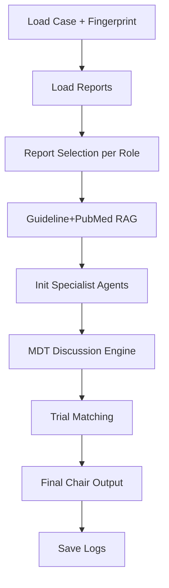

# MDT Discussion Log — 2026-01-18_18-35-06
Generated automatically by MDT Pipeline.


## CASE (structured JSON)

```
{}
```


## FINAL MDT OUTPUT

```
Final Assessment:
Disseminated metastatic pelvic malignancy with liver, presacral/sacral, mesenteric, rectal, and right iliac bone involvement [@2022-12-29|CT; @2022-12-29|MR], severe anemia [@20230103|5600862], but histologic type, primary site, prior treatments, and performance status remain unknown and prevent evidence-based systemic regimen selection.

Core Treatment Strategy:
- Urgently obtain and review all surgical/biopsy pathology with IHC; pathologist to issue integrated working diagnosis and origin (currently unknown).  
- Collect complete treatment history, ECOG, symptom burden, and anemia/bleeding workup; arrange transfusion/supportive care to correct Hgb before therapy [@20230103|5600862].  
- Request somatic tumor NGS including MSI/TMB and formal clarification of ATM p.Y316C classification with genetics lab [@OH2203828|2022-04-18].  
- Consider whole-body FDG PET/CT to refine bone/peritoneal mapping and biopsy targeting, without delaying palliative systemic planning justified by CT/MR [@2022-12-29|CT; @2022-12-29|MR].  

Change Triggers:
- If pathology and history define primary site and prior lines, then finalize palliative systemic regimen and any symptom-directed local therapies.  
- If ECOG poor, uncontrolled anemia/bleeding, or patient prefers comfort-focused care, then prioritize best supportive care over aggressive systemic treatment.
```


## PIPELINE FLOW (Mermaid)




## TRACE EVENTS (Structured)

```json
[
  {
    "ts": "2026-01-18T18:31:48.092101",
    "event": "pipeline_start",
    "payload": {
      "visit_time": "2023-01-03 08:53:29.260000",
      "meta_info": "340123197709263626"
    }
  },
  {
    "ts": "2026-01-18T18:31:48.092269",
    "event": "case_fingerprint",
    "payload": {
      "case_fingerprint": "bf21a9e8fbc5"
    }
  },
  {
    "ts": "2026-01-18T18:31:48.385473",
    "event": "reports_loaded",
    "payload": {
      "lab_n": 92,
      "img_n": 10,
      "path_n": 0,
      "mut_n": 1,
      "cutoff_dt": "2023-01-04 08:53:29"
    }
  },
  {
    "ts": "2026-01-18T18:32:00.308211",
    "event": "reports_selected",
    "payload": {
      "lab": {
        "chair": [
          "20221229|8300002|2022-12-29",
          "20221229|9703212|2022-12-29",
          "20230103|5600862|2023-01-03"
        ],
        "oncologist": [
          "20221229|8300002|2022-12-29",
          "20221229|9703212|2022-12-29",
          "20230103|5600862|2023-01-03"
        ],
        "radiologist": [],
        "pathologist": [],
        "nuclear": []
      },
      "imaging": {
        "chair": [
          "2022-10-24|MR|2022-10-24",
          "2022-12-29|MR|2022-12-29",
          "2022-12-29|CT|2022-12-29"
        ],
        "oncologist": [],
        "radiologist": [
          "2022-10-24|CT|2022-10-24",
          "2022-12-29|MR|2022-12-29",
          "2022-12-29|CT|2022-12-29"
        ],
        "pathologist": [],
        "nuclear": [
          "2022-10-24|CT|2022-10-24",
          "2022-12-29|MR|2022-12-29",
          "2022-12-29|CT|2022-12-29"
        ]
      },
      "pathology": {
        "chair": [],
        "oncologist": [],
        "radiologist": [],
        "pathologist": [],
        "nuclear": []
      },
      "mutation": {
        "chair": [
          "OH2203828|2022-04-18"
        ],
        "oncologist": [
          "OH2203828|2022-04-18"
        ],
        "radiologist": [],
        "pathologist": [
          "OH2203828|2022-04-18"
        ],
        "nuclear": []
      }
    }
  },
  {
    "ts": "2026-01-18T18:32:16.475134",
    "event": "rag_query",
    "payload": {
      "query": "Guidelines for management of platinum-unknown ovarian cancer (histology not specified) with unspecified metastatic extent and no reported molecular markers or major comorbidities/organ dysfunction, including recommended systemic therapy options and indications for targeted or maintenance treatments."
    }
  },
  {
    "ts": "2026-01-18T18:32:16.475149",
    "event": "rag_hits",
    "payload": {
      "source": "guideline",
      "topk": 5,
      "n": 5
    }
  },
  {
    "ts": "2026-01-18T18:32:16.475152",
    "event": "rag_hits",
    "payload": {
      "source": "pubmed",
      "topk": 5,
      "n": 5
    }
  },
  {
    "ts": "2026-01-18T18:32:16.475155",
    "event": "rag_hits_merged",
    "payload": {
      "n": 10
    }
  },
  {
    "ts": "2026-01-18T18:32:24.288473",
    "event": "mdt_discussion_start",
    "payload": {
      "num_rounds": 2,
      "num_turns": 2
    }
  },
  {
    "ts": "2026-01-18T18:32:27.127028",
    "event": "evidence_tag_warning",
    "payload": {
      "role": "chair/initial",
      "preview": "- Advanced recurrent pelvic malignancy with progressive presacral mass, pelvic peritoneal disease and new multiple liver metastases by Dec 2022 [@2022-12-29|MR;…"
    }
  },
  {
    "ts": "2026-01-18T18:35:00.783121",
    "event": "mdt_discussion_end",
    "payload": {
      "merged_chars": 2567
    }
  },
  {
    "ts": "2026-01-18T18:35:00.784015",
    "event": "final_output_start",
    "payload": {}
  },
  {
    "ts": "2026-01-18T18:35:06.269706",
    "event": "evidence_tag_warning",
    "payload": {
      "role": "chair/final_output",
      "preview": "Final Assessment: Disseminated metastatic pelvic malignancy with liver, presacral/sacral, mesenteric, rectal, and right iliac bone involvement [@2022-12-29|CT; …"
    }
  },
  {
    "ts": "2026-01-18T18:35:06.269712",
    "event": "final_output_end",
    "payload": {
      "final_output_chars": 1377
    }
  }
]
```


## INITIAL EXPERT OPINIONS


## chair

```
- Advanced recurrent pelvic malignancy with progressive presacral mass, pelvic peritoneal disease and new multiple liver metastases by Dec 2022 [@2022-12-29|MR; @2022-12-29|CT].  
- Marked anemia (Hgb 74 g/L) and lymphopenia; performance status, symptoms, and bleeding source must be clarified before systemic therapy [@20230103|5600862].  
- Tumor markers (very high CA125, CA19-9, CA15-3) support active disease; histologic subtype and prior treatments are unknown [@20221229|9703212].  
- HRD-negative, BRCA-wild type; only germline ATM variant known, limiting standard maintenance options [@OH2203828|2022-04-18].  
- Must obtain: pathology report (histology, stage), prior systemic/surgical treatments, ECOG status, current symptoms, renal function trend, and patient goals.
```


## oncologist

```
- Diagnosis, disease stage, prior systemic therapy line, and treatment intent are all unknown/needs update before regimen decision.  

- Current labs show significant anemia (Hgb 74 g/L) with otherwise adequate neutrophils and platelets for most systemic therapies [@20230103|5600862].  

- Renal and hepatic function appear adequate for standard dosing; mild AST/ALT elevation and normal bilirubin, creatinine, albumin acceptable [@20221229|8300002].  

- Tumor markers (CA125, CA19-9, CA15-3, HE4, ROMA) markedly elevated, but primary tumor type and radiologic disease status unknown/needs update [@20221229|9703212].  

- Germline ATM variant with HRD negative and BRCA1/2 wild-type may limit some targeted options; broader somatic profiling and MSI/TMB unknown/needs update [@OH2203828|2022-04-18].
```


## radiologist

```
- Liver: multiple low-density metastases, increased number and size vs 2022-10-21; largest ~17×14 mm. [@2022-12-29|CT]  

- Liver: multiple non-enhancing cystic lesions, stable, consistent with hepatic cysts. [@2022-12-29|CT]  

- Pelvis: presacral mass 53×44 mm, enlarged, invading adjacent peritoneum and sacrum, post-surgical recurrence pattern. [@2022-12-29|MR]  

- Pelvis: multiple enhancing mesenteric nodules and new right iliac bone lesion, consistent with metastatic spread. [@2022-12-29|MR]  

- Rectum: focal wall thickening with enhancement; needs clinical correlation for obstruction symptoms and endoscopic evaluation. [@2022-12-29|MR]
```


## pathologist

```
- No histology, grade, or IHC available; primary diagnosis and tumor type cannot be confirmed. Update surgical pathology reports.  

- Germline ATM p.Y316C variant reported; clinical significance (pathogenic vs VUS) not specified. Clarify classification and lab interpretation [@OH2203828|2022-04-18].  

- HRD reported negative; BRCA1/2 and other listed genes show no pathogenic germline variants [@OH2203828|2022-04-18].  

- Somatic/tumor sequencing, MSI/TMB status, and actionable fusions or amplifications are unknown. Obtain comprehensive tumor molecular report if done.  

- Current pathology staging, margins, and involved sites (ovary vs other origin) are undocumented. Upload all prior and latest pathology reports.
```


## nuclear

```
- No PET/CT is available; whole-body FDG PET/CT is needed to assess metabolic activity of hepatic, pelvic, and bone lesions.  

- Prior CT/MR show multifocal liver lesions and pelvic mass with sacral and iliac bone involvement, highly suspicious for metastases/recurrence [@2022-12-29|CT; @2022-12-29|MR; @2022-10-24|CT].  

- PET/CT could upstage disease by confirming extra-pelvic metastases (liver, bone, peritoneal nodules) and defining systemic versus localized recurrence.  

- PET/CT may better delineate sacral, right iliac bone, and rectal involvement for radiotherapy or surgical planning.  

- Need updated PET/CT, current clinical staging, and original pathology/histology report to refine recurrence pattern and staging assessment.
```


## MERGED SUMMARY (Assistant)

```
Key Knowledge:
- Advanced recurrent pelvic malignancy with presacral mass invading sacrum/peritoneum, mesenteric nodules, rectal involvement, right iliac bone lesion, and multiple progressive liver metastases (disseminated, not oligometastatic).
- Marked anemia (Hgb 74 g/L) with preserved neutrophils/platelets; renal/hepatic function acceptable for systemic therapy.
- Very high CA125, CA19-9, CA15-3, HE4 indicating active disease; primary site and histology (gynecologic vs colorectal vs other pelvic) remain unconfirmed.
- Germline BRCA1/2 negative, HRD negative; ATM p.Y316C variant present but currently without clear actionable implication.
- No FDG PET/CT performed or scheduled; CT/MR already demonstrate widespread metastatic disease.

Controversies:
- Unclear primary site and histologic subtype, so systemic regimen choice is not evidence-based yet.
- Uncertain pathogenicity and therapeutic relevance of the germline ATM variant.
- Added value of PET/CT: it would refine extent and bone/peritoneal characterization but is unlikely to change overall metastatic staging or shift from systemic/palliative intent.
- Timing and intent of systemic treatment (palliative) cannot be finalized without pathology, prior treatment history, ECOG, and patient goals.

Missing Info:
- All pathology/IHC reports: primary diagnosis, histology/grade, stage, margins, and site of origin.
- Detailed prior treatment history: surgeries, systemic therapy lines (agents, responses, toxicities), radiotherapy.
- Current ECOG, symptom burden (pain, bleeding, obstruction), anemia/bleeding source; lab trends and transfusion history.
- Tumor molecular profiling: somatic NGS, MSI, TMB, and any actionable alterations/fusions.
- Any planned imaging updates; PET/CT not yet arranged.
- Patient preferences and goals of care.

Working Plan:
- Chair to obtain and upload full surgical/biopsy pathology (including IHC) and complete treatment history; pathologist to review and report working diagnosis and origin.
- Clarify ECOG, clinical symptoms, and evaluate anemia/bleeding (including GI/rectal workup as indicated); stabilize anemia.
- Request comprehensive somatic NGS with MSI/TMB; genetics lab to clarify ATM variant classification.
- Consider whole-body FDG PET/CT to refine mapping of bone/peritoneal disease, but do not allow PET/CT to delay necessary systemic palliation once diagnosis and goals are defined.
- Reconvene MDT after data collection to define intent (palliative), and plan systemic therapy and any symptom-directed local measures in line with patient goals.
```


## INTERACTION LOG (Round × Turn)

### Round 1

#### Turn 1
- **chair → oncologist:** Before choosing any regimen, we must clarify primary site/histology and full prior treatment, and correct Hgb 74 g/L with source evaluation; current data are insufficient for intent or regimen selection.
- **chair → nuclear:** Please advise whether FDG PET/CT will materially change management given already multifocal liver, pelvic, and bone disease on CT/MR.
- **oncologist → pathologist:** We still lack a definitive primary site and histology; please prioritize integrated pathology/IHC review and report a working diagnosis.
- **oncologist → nuclear:** Given multifocal metastases and unclear primary, please comment whether PET/CT would materially change staging/management beyond current CT/MR.
- **radiologist → oncologist:** Current CT/MR already document widespread progressive liver, presacral, mesenteric, rectal, and right iliac bone involvement; additional PET/CT will refine but not likely convert this to oligometastatic disease.
- **radiologist → nuclear:** Please confirm if any FDG PET/CT is already done or scheduled; if not, whole-body PET/CT would refine metastatic extent and bone involvement beyond current CT/MR.
- **pathologist → chair:** Primary site and histology remain undefined; no pathology/IHC reports are in the record. Please obtain and upload all surgical/biopsy pathology for review, as current systemic decisions lack diagnostic confirmation.

#### Turn 2
- **chair → oncologist:** Given clearly multifocal progressive disease, focus first on clarifying primary/histology and stabilizing anemia; PET/CT should not delay necessary systemic palliation once diagnosis and goals are defined.
- **oncologist → chair:** Systemic regimen choice is impossible today without pathology, prior treatment history, ECOG, and goals of care; please prioritize collecting these before further MDT decisions.
- **nuclear → oncologist:** No PET/CT is in the record. Given clear multifocal liver, pelvic, and bone metastases on CT/MR, PET/CT would refine extent but is unlikely to change overall metastatic staging or convert management from systemic/palliative to oligometastatic intent.
- **nuclear → radiologist:** No prior or scheduled PET/CT is documented. I agree that whole-body FDG PET/CT would better characterize bone and peritoneal disease, but current CT/MR already establish disseminated metastases.

### Round 2

#### Turn 1

#### Turn 2


## FINAL REFINED PLANS (per Round)

### Round 1


## chair

```
- Confirm histology, primary site, and staging by urgently obtaining all prior surgical/biopsy pathology and IHC reports (currently absent, unknown).  
- Clarify prior surgeries, systemic therapies, radiotherapy, responses, and toxicities to guide next-line systemic options (full history unknown).  
- Assess ECOG, symptom burden, and investigate anemia/bleeding source; arrange transfusion/supportive care to raise Hgb before systemic treatment [@20230103|5600862].  
- Request somatic NGS including MSI/TMB and updated labs; ATM variant classification to be clarified with genetics lab [@OH2203828|2022-04-18].  
- Consider PET/CT only as an adjunct for mapping disease; do not let it delay necessary palliative systemic planning once data complete [@2022-12-29|CT; @2022-12-29|MR].
```


## oncologist

```
- Defer systemic regimen selection until pathology, IHC, and primary site are clarified; obtain and review all biopsy/surgical reports (unknown).  

- Collect full prior treatment history, ECOG, symptoms, anemia/bleeding workup, and transfusion record to define fitness and urgency (unknown).  

- Proceed with comprehensive somatic profiling including MSI/TMB and actionable alterations to broaden later-line options (unknown).  

- Order whole-body FDG PET/CT to refine distribution (especially bone/peritoneum), but do not delay palliation once diagnosis/goals set (unknown).  

- After data completion, reconvene MDT to set palliative intent and choose systemic vs local measures compatible with anemia and organ function [@20230103|5600862; @20221229|8300002].
```


## radiologist

```
- Current CT/MR already document disseminated metastatic disease in liver, pelvis, mesentery, rectum, and right iliac bone. [@2022-12-29|CT; @2022-12-29|MR]  

- Obtain and upload all pathology/IHC and prior operative/biopsy reports to define primary site and histology; currently unknown.  

- Do not delay necessary palliative systemic management for PET/CT once pathology, performance status, and goals of care are clarified.  

- Consider FDG PET/CT to better map bone and peritoneal involvement, recognizing it will not change overall metastatic stage. [@2022-12-29|CT; @2022-12-29|MR]  

- Correlate rectal wall thickening with GI evaluation to assess for primary colorectal origin and bleeding source. [@2022-12-29|MR]
```


## pathologist

```
- Obtain and review all surgical/biopsy pathology with IHC to define primary site, histologic subtype, and grade (currently unknown).  

- Request comprehensive somatic tumor profiling (NGS with MSI/TMB) to identify actionable alterations; only germline ATM variant known [@OH2203828|2022-04-18].  

- Clarify ATM p.Y316C classification with reporting lab/genetics to determine if pathogenic or VUS and document formal interpretation [@OH2203828|2022-04-18].  

- After pathology and molecular clarification, reconvene MDT to agree on a working diagnosis and staging for this recurrent pelvic malignancy.  

- Address severe anemia with clinical workup for bleeding source and lab trends; current etiology and transfusion history are unknown.
```


## nuclear

```
- No PET/CT is available; whole-body FDG PET/CT may refine hepatic, presacral, peritoneal, and osseous disease assessment [@2022-12-29|CT; @2022-12-29|MR].  

- Current CT/MR already demonstrate disseminated metastatic disease (liver, presacral/sacral, mesenteric, right iliac bone, possible rectal) [@2022-12-29|CT; @2022-12-29|MR].  

- PET/CT is unlikely to change overall metastatic staging, but could better delineate bone/peritoneal involvement for local palliation planning [@2022-12-29|CT; @2022-12-29|MR].  

- PET/CT might help clarify dominant disease compartments and guide biopsy targeting if pathology/primary site remain uncertain (pathology currently unknown).  

- PET/CT should be adjunctive; systemic palliative intent would still be expected given multifocal progressive liver and pelvic metastases [@2022-12-29|CT; @2022-12-29|MR].
```

### Round 2


## chair

```
- Urgently retrieve and review all surgical/biopsy pathology with IHC to establish primary site, histology, and stage (currently unknown).  
- Compile complete prior treatment history (surgery, systemic lines, radiotherapy, responses, toxicities) before selecting further systemic therapy (currently unknown).  
- Assess ECOG and symptom burden; investigate anemia/bleeding source and provide transfusion/supportive care to raise Hgb [@20230103|5600862].  
- Order somatic NGS including MSI/TMB; seek genetics input on ATM p.Y316C significance [@OH2203828|2022-04-18].  
- Consider whole-body FDG PET/CT to refine mapping, but do not delay palliative systemic planning already justified by CT/MR [@2022-12-29|CT; @2022-12-29|MR].
```


## oncologist

```
- Confirm diagnosis and primary site by obtaining all pathology/IHC and prior reports; pathologist to issue integrated working diagnosis (unknown).  

- Collect full prior treatment history, ECOG, symptom burden, and transfusion/anemia workup to assess fitness and urgency (unknown).  

- Order comprehensive somatic profiling with MSI/TMB and clarify ATM p.Y316C classification to guide later-line options ([@OH2203828|2022-04-18]).  

- Consider whole-body FDG PET/CT to refine bone/peritoneal mapping, without delaying necessary palliative systemic treatment once diagnosis/goals set (unknown).  

- After data completion, reconvene MDT to confirm palliative intent and select systemic plus symptom-directed local measures compatible with organ function [@20230103|2023-01-03; @20221229|2022-12-29].
```


## radiologist

```
- CT/MR confirm disseminated metastases: liver, presacral/sacral/peritoneal, mesenteric, rectal, and right iliac bone involvement. [@2022-12-29|CT; @2022-12-29|MR]  

- Obtain and review all surgical/biopsy pathology with IHC to define primary site, histology, and stage; currently unknown.  

- Collect full prior treatment history and current ECOG/symptom profile, including evaluation of anemia/bleeding source; data currently missing.  

- Request somatic NGS with MSI/TMB and clarify ATM p.Y316C classification; no tumor molecular profiling available yet.  

- Consider whole-body FDG PET/CT to refine bone/peritoneal mapping, but avoid delaying needed palliative systemic care once diagnosis/goals set.
```


## pathologist

```
- Retrieve and review all surgical/biopsy pathology with IHC to define primary site, histologic subtype, grade, and stage (currently unknown).  

- Only germline testing shows ATM p.Y316C, BRCA1/2 and HRD negative; clarify ATM classification with reporting lab [@OH2203828|2022-04-18].  

- Arrange somatic tumor profiling (NGS with MSI/TMB) to identify actionable alterations; current tumor molecular data are unknown.  

- After pathology and molecular clarification, issue a working pathologic diagnosis and origin to guide systemic regimen selection.  

- Correlate pathology with tumor marker pattern (CA125, CA19-9, CA15-3, HE4; exact values and reports currently unknown).
```


## nuclear

```
- No FDG PET/CT is available; current staging relies on CT/MR showing disseminated metastases [@2022-12-29|CT; @2022-12-29|MR].  

- CT/MR document progressive multifocal liver, presacral/sacral, mesenteric, rectal, and right iliac bone involvement, confirming non-oligometastatic disease [@2022-12-29|CT; @2022-12-29|MR].  

- Whole-body FDG PET/CT can refine bone and peritoneal disease mapping and help select optimal biopsy targets if origin remains unclear.  

- PET/CT is unlikely to alter overall metastatic staging or change systemic palliative intent given existing widespread disease [@2022-12-29|CT; @2022-12-29|MR].  

- PET/CT, if obtained, should support symptom-directed local planning (e.g., sacrum/rectum), without delaying needed systemic palliation once diagnosis clarified.
```


## RAW AGENT LOGS

### chair
- **User:** Give INITIAL opinion (use ONLY your system-provided patient facts).
Return up to 5 bullets, each ≤20 words.
If key data missing, say exactly what needs updating.
  
  **Assistant:** - Advanced recurrent pelvic malignancy with progressive presacral mass, pelvic peritoneal disease and new multiple liver metastases by Dec 2022 [@2022-12-29|MR; @2022-12-29|CT].  
- Marked anemia (Hgb 74 g/L) and lymphopenia; performance status, symptoms, and bleeding source must be clarified before systemic therapy [@20230103|5600862].  
- Tumor markers (very high CA125, CA19-9, CA15-3) support active disease; histologic subtype and prior treatments are unknown [@20221229|9703212].  
- HRD-negative, BRCA-wild type; only germline ATM variant known, limiting standard maintenance options [@OH2203828|2022-04-18].  
- Must obtain: pathology report (histology, stage), prior systemic/surgical treatments, ECOG status, current symptoms, renal function trend, and patient goals.
  
  *(2026-01-18T18:32:27.126901)*

- **User:** ROLE: chair. VISIT: 2023-01-03 08:53:29.260000
Default is NOT to speak. Speak ONLY if: conflict | safety | missing-critical | new-critical.

CONTEXT (latest):
Key Knowledge:
- Advanced recurrent pelvic malignancy with presacral mass invading sacrum/peritoneum, mesenteric nodules, right iliac bone lesion, and multiple progressive liver metastases (Dec 2022).
- Significant anemia (Hgb 74 g/L) but adequate neutrophils/platelets; renal and hepatic function acceptable for systemic therapy.
- Very high CA125, CA19-9, CA15-3, HE4 indicating active disease; primary (gynecologic vs colorectal vs other pelvic) unconfirmed.
- Germline BRCA1/2 negative, HRD negative; ATM p.Y316C variant reported, no clearly actionable germline target.
- No PET/CT; CT/MR already show multifocal metastatic involvement.

Controversies:
- Uncertain primary site and histologic subtype, limiting evidence-based systemic therapy choice.
- Unclear pathogenicity and therapeutic relevance of germline ATM variant.
- True extent of metastatic burden (systemic vs any potentially limited sites) unclear without PET/CT.
- Treatment intent (palliative vs any local control) undetermined pending staging, performance status, and patient goals.

Missing Info:
- Full pathology (diagnosis, histology/grade, IHC, staging, margins, origin).
- Complete prior treatment history (surgery, systemic lines, radiotherapy, responses).
- Current ECOG, symptom profile (pain, bleeding, obstruction), and anemia/bleeding source; recent lab trends and transfusion history.
- Tumor molecular profiling (somatic NGS, MSI, TMB, actionable alterations).
- Updated staging imaging including FDG PET/CT.
- Patient preferences and goals of care.

Working Plan:
- Obtain and review all pathology and detailed treatment history.
- Assess ECOG, symptoms, and investigate anemia/bleeding (including GI/rectal evaluation as indicated).
- Request comprehensive somatic NGS with MSI/TMB; clarify ATM variant classification with genetics lab.
- Arrange whole-body FDG PET/CT to refine staging and delineate pelvic, hepatic, bone, and rectal disease.
- Reconvene MDT after data completion to define intent and plan systemic vs local management aligned with patient goals.

Allowed targets: [oncologist,radiologist,pathologist,nuclear]
Return ONE-LINE JSON only:{"speak":"yes/no","messages":[{"target":"<role>","message":"<1-2 sentences>","why":"conflict|safety|missing|new"}]}
  
  **Assistant:** {"speak":"yes","messages":[{"target":"oncologist","message":"Before choosing any regimen, we must clarify primary site/histology and full prior treatment, and correct Hgb 74 g/L with source evaluation; current data are insufficient for intent or regimen selection.","why":"safety"},{"target":"nuclear","message":"Please advise whether FDG PET/CT will materially change management given already multifocal liver, pelvic, and bone disease on CT/MR.","why":"missing"}]}
  
  *(2026-01-18T18:32:52.192509)*

- **User:** ROLE: chair. VISIT: 2023-01-03 08:53:29.260000
Default is NOT to speak. Speak ONLY if: conflict | safety | missing-critical | new-critical.

CONTEXT (latest):
Key Knowledge:
- Advanced recurrent pelvic malignancy with presacral mass invading sacrum/peritoneum, mesenteric nodules, right iliac bone lesion, and multiple progressive liver metastases (Dec 2022).
- Significant anemia (Hgb 74 g/L) but adequate neutrophils/platelets; renal and hepatic function acceptable for systemic therapy.
- Very high CA125, CA19-9, CA15-3, HE4 indicating active disease; primary (gynecologic vs colorectal vs other pelvic) unconfirmed.
- Germline BRCA1/2 negative, HRD negative; ATM p.Y316C variant reported, no clearly actionable germline target.
- No PET/CT; CT/MR already show multifocal metastatic involvement.

Controversies:
- Uncertain primary site and histologic subtype, limiting evidence-based systemic therapy choice.
- Unclear pathogenicity and therapeutic relevance of germline ATM variant.
- True extent of metastatic burden (systemic vs any potentially limited sites) unclear without PET/CT.
- Treatment intent (palliative vs any local control) undetermined pending staging, performance status, and patient goals.

Missing Info:
- Full pathology (diagnosis, histology/grade, IHC, staging, margins, origin).
- Complete prior treatment history (surgery, systemic lines, radiotherapy, responses).
- Current ECOG, symptom profile (pain, bleeding, obstruction), and anemia/bleeding source; recent lab trends and transfusion history.
- Tumor molecular profiling (somatic NGS, MSI, TMB, actionable alterations).
- Updated staging imaging including FDG PET/CT.
- Patient preferences and goals of care.

Working Plan:
- Obtain and review all pathology and detailed treatment history.
- Assess ECOG, symptoms, and investigate anemia/bleeding (including GI/rectal evaluation as indicated).
- Request comprehensive somatic NGS with MSI/TMB; clarify ATM variant classification with genetics lab.
- Arrange whole-body FDG PET/CT to refine staging and delineate pelvic, hepatic, bone, and rectal disease.
- Reconvene MDT after data completion to define intent and plan systemic vs local management aligned with patient goals.
[R1T1 DELTA] ew and report a working diagnosis. | oncologist->nuclear(missing): Given multifocal metastases and unclear primary, please comment whether PET/CT would materially change staging/management beyond current CT/MR. | radiologist->nuclear(missing): Please confirm if any FDG PET/CT is already done or scheduled; if not, whole-body PET/CT would refine metastatic extent and bone involvement beyond current CT/MR. | radiologist->oncologist(safety): Current CT/MR already document widespread progressive liver, presacral, mesenteric, rectal, and right iliac bone involvement; additional PET/CT will refine but not likely convert this to oligometastatic disease. | pathologist->chair(missing): Primary site and histology remain undefined; no pathology/IHC reports are in the record. Please obtain and upload all surgical/biopsy pathology for review, as current systemic decisions lack diagnostic confirmation.

Allowed targets: [oncologist,radiologist,pathologist,nuclear]
Return ONE-LINE JSON only:{"speak":"yes/no","messages":[{"target":"<role>","message":"<1-2 sentences>","why":"conflict|safety|missing|new"}]}
  
  **Assistant:** {"speak":"yes","messages":[{"target":"oncologist","message":"Given clearly multifocal progressive disease, focus first on clarifying primary/histology and stabilizing anemia; PET/CT should not delay necessary systemic palliation once diagnosis and goals are defined.","why":"safety"}]}
  
  *(2026-01-18T18:33:01.879936)*

- **User:** Given MDT context:
Key Knowledge:
- Advanced recurrent pelvic malignancy with presacral mass invading sacrum/peritoneum, mesenteric nodules, right iliac bone lesion, and multiple progressive liver metastases (Dec 2022).
- Significant anemia (Hgb 74 g/L) but adequate neutrophils/platelets; renal and hepatic function acceptable for systemic therapy.
- Very high CA125, CA19-9, CA15-3, HE4 indicating active disease; primary (gynecologic vs colorectal vs other pelvic) unconfirmed.
- Germline BRCA1/2 negative, HRD negative; ATM p.Y316C variant reported, no clearly actionable germline target.
- No PET/CT; CT/MR already show multifocal metastatic involvement.

Controversies:
- Uncertain primary site and histologic subtype, limiting evidence-based systemic therapy choice.
- Unclear pathogenicity and therapeutic relevance of germline ATM variant.
- True extent of metastatic burden (systemic vs any potentially limited sites) unclear without PET/CT.
- Treatment intent (palliative vs any local control) undetermined pending staging, performance status, and patient goals.

Missing Info:
- Full pathology (diagnosis, histology/grade, IHC, staging, margins, origin).
- Complete prior treatment history (surgery, systemic lines, radiotherapy, responses).
- Current ECOG, symptom profile (pain, bleeding, obstruction), and anemia/bleeding source; recent lab trends and transfusion history.
- Tumor molecular profiling (somatic NGS, MSI, TMB, actionable alterations).
- Updated staging imaging including FDG PET/CT.
- Patient preferences and goals of care.

Working Plan:
- Obtain and review all pathology and detailed treatment history.
- Assess ECOG, symptoms, and investigate anemia/bleeding (including GI/rectal evaluation as indicated).
- Request comprehensive somatic NGS with MSI/TMB; clarify ATM variant classification with genetics lab.
- Arrange whole-body FDG PET/CT to refine staging and delineate pelvic, hepatic, bone, and rectal disease.
- Reconvene MDT after data completion to define intent and plan systemic vs local management aligned with patient goals.
[R1T1 DELTA] ew and report a working diagnosis. | oncologist->nuclear(missing): Given multifocal metastases and unclear primary, please comment whether PET/CT would materially change staging/management beyond current CT/MR. | radiologist->nuclear(missing): Please confirm if any FDG PET/CT is already done or scheduled; if not, whole-body PET/CT would refine metastatic extent and bone involvement beyond current CT/MR. | radiologist->oncologist(safety): Current CT/MR already document widespread progressive liver, presacral, mesenteric, rectal, and right iliac bone involvement; additional PET/CT will refine but not likely convert this to oligometastatic disease. | pathologist->chair(missing): Primary site and histology remain undefined; no pathology/IHC reports are in the record. Please obtain and upload all surgical/biopsy pathology for review, as current systemic decisions lack diagnostic confirmation.
[R1T2 DELTA] l progressive disease, focus first on clarifying primary/histology and stabilizing anemia; PET/CT should not delay necessary systemic palliation once diagnosis and goals are defined. | oncologist->chair(missing): Systemic regimen choice is impossible today without pathology, prior treatment history, ECOG, and goals of care; please prioritize collecting these before further MDT decisions. | nuclear->oncologist(missing): No PET/CT is in the record. Given clear multifocal liver, pelvic, and bone metastases on CT/MR, PET/CT would refine extent but is unlikely to change overall metastatic staging or convert management from systemic/palliative to oligometastatic intent. | nuclear->radiologist(missing): No prior or scheduled PET/CT is documented. I agree that whole-body FDG PET/CT would better characterize bone and peritoneal disease, but current CT/MR already establish disseminated metastases.

Provide FINAL refined plan.
Up to 5 bullets, each ≤20 words.
Any factual claim must include [@report_id|date] or say unknown.
  
  **Assistant:** - Confirm histology, primary site, and staging by urgently obtaining all prior surgical/biopsy pathology and IHC reports (currently absent, unknown).  
- Clarify prior surgeries, systemic therapies, radiotherapy, responses, and toxicities to guide next-line systemic options (full history unknown).  
- Assess ECOG, symptom burden, and investigate anemia/bleeding source; arrange transfusion/supportive care to raise Hgb before systemic treatment [@20230103|5600862].  
- Request somatic NGS including MSI/TMB and updated labs; ATM variant classification to be clarified with genetics lab [@OH2203828|2022-04-18].  
- Consider PET/CT only as an adjunct for mapping disease; do not let it delay necessary palliative systemic planning once data complete [@2022-12-29|CT; @2022-12-29|MR].
  
  *(2026-01-18T18:33:11.922571)*

- **User:** ROLE: chair. VISIT: 2023-01-03 08:53:29.260000
Default is NOT to speak. Speak ONLY if: conflict | safety | missing-critical | new-critical.

CONTEXT (latest):
Key Knowledge:
- Advanced recurrent pelvic malignancy with presacral mass invading sacrum/peritoneum, mesenteric nodules, rectal involvement, right iliac bone lesion, and multiple progressive liver metastases (disseminated, not oligometastatic).
- Marked anemia (Hgb 74 g/L) with preserved neutrophils/platelets; renal/hepatic function acceptable for systemic therapy.
- Very high CA125, CA19-9, CA15-3, HE4 indicating active disease; primary site and histology (gynecologic vs colorectal vs other pelvic) remain unconfirmed.
- Germline BRCA1/2 negative, HRD negative; ATM p.Y316C variant present but currently without clear actionable implication.
- No FDG PET/CT performed or scheduled; CT/MR already demonstrate widespread metastatic disease.

Controversies:
- Unclear primary site and histologic subtype, so systemic regimen choice is not evidence-based yet.
- Uncertain pathogenicity and therapeutic relevance of the germline ATM variant.
- Added value of PET/CT: it would refine extent and bone/peritoneal characterization but is unlikely to change overall metastatic staging or shift from systemic/palliative intent.
- Timing and intent of systemic treatment (palliative) cannot be finalized without pathology, prior treatment history, ECOG, and patient goals.

Missing Info:
- All pathology/IHC reports: primary diagnosis, histology/grade, stage, margins, and site of origin.
- Detailed prior treatment history: surgeries, systemic therapy lines (agents, responses, toxicities), radiotherapy.
- Current ECOG, symptom burden (pain, bleeding, obstruction), anemia/bleeding source; lab trends and transfusion history.
- Tumor molecular profiling: somatic NGS, MSI, TMB, and any actionable alterations/fusions.
- Any planned imaging updates; PET/CT not yet arranged.
- Patient preferences and goals of care.

Working Plan:
- Chair to obtain and upload full surgical/biopsy pathology (including IHC) and complete treatment history; pathologist to review and report working diagnosis and origin.
- Clarify ECOG, clinical symptoms, and evaluate anemia/bleeding (including GI/rectal workup as indicated); stabilize anemia.
- Request comprehensive somatic NGS with MSI/TMB; genetics lab to clarify ATM variant classification.
- Consider whole-body FDG PET/CT to refine mapping of bone/peritoneal disease, but do not allow PET/CT to delay necessary systemic palliation once diagnosis and goals are defined.
- Reconvene MDT after data collection to define intent (palliative), and plan systemic therapy and any symptom-directed local measures in line with patient goals.

Allowed targets: [oncologist,radiologist,pathologist,nuclear]
Return ONE-LINE JSON only:{"speak":"yes/no","messages":[{"target":"<role>","message":"<1-2 sentences>","why":"conflict|safety|missing|new"}]}
  
  **Assistant:** {"speak":"no","messages":[]}
  
  *(2026-01-18T18:33:57.891436)*

- **User:** Given MDT context:
Key Knowledge:
- Advanced recurrent pelvic malignancy with presacral mass invading sacrum/peritoneum, mesenteric nodules, rectal involvement, right iliac bone lesion, and multiple progressive liver metastases (disseminated, not oligometastatic).
- Marked anemia (Hgb 74 g/L) with preserved neutrophils/platelets; renal/hepatic function acceptable for systemic therapy.
- Very high CA125, CA19-9, CA15-3, HE4 indicating active disease; primary site and histology (gynecologic vs colorectal vs other pelvic) remain unconfirmed.
- Germline BRCA1/2 negative, HRD negative; ATM p.Y316C variant present but currently without clear actionable implication.
- No FDG PET/CT performed or scheduled; CT/MR already demonstrate widespread metastatic disease.

Controversies:
- Unclear primary site and histologic subtype, so systemic regimen choice is not evidence-based yet.
- Uncertain pathogenicity and therapeutic relevance of the germline ATM variant.
- Added value of PET/CT: it would refine extent and bone/peritoneal characterization but is unlikely to change overall metastatic staging or shift from systemic/palliative intent.
- Timing and intent of systemic treatment (palliative) cannot be finalized without pathology, prior treatment history, ECOG, and patient goals.

Missing Info:
- All pathology/IHC reports: primary diagnosis, histology/grade, stage, margins, and site of origin.
- Detailed prior treatment history: surgeries, systemic therapy lines (agents, responses, toxicities), radiotherapy.
- Current ECOG, symptom burden (pain, bleeding, obstruction), anemia/bleeding source; lab trends and transfusion history.
- Tumor molecular profiling: somatic NGS, MSI, TMB, and any actionable alterations/fusions.
- Any planned imaging updates; PET/CT not yet arranged.
- Patient preferences and goals of care.

Working Plan:
- Chair to obtain and upload full surgical/biopsy pathology (including IHC) and complete treatment history; pathologist to review and report working diagnosis and origin.
- Clarify ECOG, clinical symptoms, and evaluate anemia/bleeding (including GI/rectal workup as indicated); stabilize anemia.
- Request comprehensive somatic NGS with MSI/TMB; genetics lab to clarify ATM variant classification.
- Consider whole-body FDG PET/CT to refine mapping of bone/peritoneal disease, but do not allow PET/CT to delay necessary systemic palliation once diagnosis and goals are defined.
- Reconvene MDT after data collection to define intent (palliative), and plan systemic therapy and any symptom-directed local measures in line with patient goals.

Provide FINAL refined plan.
Up to 5 bullets, each ≤20 words.
Any factual claim must include [@report_id|date] or say unknown.
  
  **Assistant:** - Urgently retrieve and review all surgical/biopsy pathology with IHC to establish primary site, histology, and stage (currently unknown).  
- Compile complete prior treatment history (surgery, systemic lines, radiotherapy, responses, toxicities) before selecting further systemic therapy (currently unknown).  
- Assess ECOG and symptom burden; investigate anemia/bleeding source and provide transfusion/supportive care to raise Hgb [@20230103|5600862].  
- Order somatic NGS including MSI/TMB; seek genetics input on ATM p.Y316C significance [@OH2203828|2022-04-18].  
- Consider whole-body FDG PET/CT to refine mapping, but do not delay palliative systemic planning already justified by CT/MR [@2022-12-29|CT; @2022-12-29|MR].
  
  *(2026-01-18T18:34:11.915510)*

- **User:** 
As the MDT chair for gynecologic oncology, you are seeing the patient at OUTPATIENT TIME: 2023-01-03 08:53:29.260000.
Based on PATIENT FACTS + MDT discussion + FINAL refined plans from all experts, determine the CURRENT best management plan for this visit.

STRICT RULES:
- Any factual statement about past tests/treatments must include [@report_id|date] or say unknown.
- Any statement derived from guideline or PubMed literature must include [@guideline:doc_id|page] or [@pubmed:PMID].
- If experts disagree, pick the safest plan and state the key uncertainty.

# FINAL REFINED PLANS (All experts, last round)
{
  "Round 1": {
    "chair": "- Confirm histology, primary site, and staging by urgently obtaining all prior surgical/biopsy pathology and IHC reports (currently absent, unknown).  \n- Clarify prior surgeries, systemic therapies, radiotherapy, responses, and toxicities to guide next-line systemic options (full history unknown).  \n- Assess ECOG, symptom burden, and investigate anemia/bleeding source; arrange transfusion/supportive care to raise Hgb before systemic treatment [@20230103|5600862].  \n- Request somatic NGS including MSI/TMB and updated labs; ATM variant classification to be clarified with genetics lab [@OH2203828|2022-04-18].  \n- Consider PET/CT only as an adjunct for mapping disease; do not let it delay necessary palliative systemic planning once data complete [@2022-12-29|CT; @2022-12-29|MR].",
    "oncologist": "- Defer systemic regimen selection until pathology, IHC, and primary site are clarified; obtain and review all biopsy/surgical reports (unknown).  \n\n- Collect full prior treatment history, ECOG, symptoms, anemia/bleeding workup, and transfusion record to define fitness and urgency (unknown).  \n\n- Proceed with comprehensive somatic profiling including MSI/TMB and actionable alterations to broaden later-line options (unknown).  \n\n- Order whole-body FDG PET/CT to refine distribution (especially bone/peritoneum), but do not delay palliation once diagnosis/goals set (unknown).  \n\n- After data completion, reconvene MDT to set palliative intent and choose systemic vs local measures compatible with anemia and organ function [@20230103|5600862; @20221229|8300002].",
    "radiologist": "- Current CT/MR already document disseminated metastatic disease in liver, pelvis, mesentery, rectum, and right iliac bone. [@2022-12-29|CT; @2022-12-29|MR]  \n\n- Obtain and upload all pathology/IHC and prior operative/biopsy reports to define primary site and histology; currently unknown.  \n\n- Do not delay necessary palliative systemic management for PET/CT once pathology, performance status, and goals of care are clarified.  \n\n- Consider FDG PET/CT to better map bone and peritoneal involvement, recognizing it will not change overall metastatic stage. [@2022-12-29|CT; @2022-12-29|MR]  \n\n- Correlate rectal wall thickening with GI evaluation to assess for primary colorectal origin and bleeding source. [@2022-12-29|MR]",
    "pathologist": "- Obtain and review all surgical/biopsy pathology with IHC to define primary site, histologic subtype, and grade (currently unknown).  \n\n- Request comprehensive somatic tumor profiling (NGS with MSI/TMB) to identify actionable alterations; only germline ATM variant known [@OH2203828|2022-04-18].  \n\n- Clarify ATM p.Y316C classification with reporting lab/genetics to determine if pathogenic or VUS and document formal interpretation [@OH2203828|2022-04-18].  \n\n- After pathology and molecular clarification, reconvene MDT to agree on a working diagnosis and staging for this recurrent pelvic malignancy.  \n\n- Address severe anemia with clinical workup for bleeding source and lab trends; current etiology and transfusion history are unknown.",
    "nuclear": "- No PET/CT is available; whole-body FDG PET/CT may refine hepatic, presacral, peritoneal, and osseous disease assessment [@2022-12-29|CT; @2022-12-29|MR].  \n\n- Current CT/MR already demonstrate disseminated metastatic disease (liver, presacral/sacral, mesenteric, right iliac bone, possible rectal) [@2022-12-29|CT; @2022-12-29|MR].  \n\n- PET/CT is unlikely to change overall metastatic staging, but could better delineate bone/peritoneal involvement for local palliation planning [@2022-12-29|CT; @2022-12-29|MR].  \n\n- PET/CT might help clarify dominant disease compartments and guide biopsy targeting if pathology/primary site remain uncertain (pathology currently unknown).  \n\n- PET/CT should be adjunctive; systemic palliative intent would still be expected given multifocal progressive liver and pelvic metastases [@2022-12-29|CT; @2022-12-29|MR]."
  },
  "Round 2": {
    "chair": "- Urgently retrieve and review all surgical/biopsy pathology with IHC to establish primary site, histology, and stage (currently unknown).  \n- Compile complete prior treatment history (surgery, systemic lines, radiotherapy, responses, toxicities) before selecting further systemic therapy (currently unknown).  \n- Assess ECOG and symptom burden; investigate anemia/bleeding source and provide transfusion/supportive care to raise Hgb [@20230103|5600862].  \n- Order somatic NGS including MSI/TMB; seek genetics input on ATM p.Y316C significance [@OH2203828|2022-04-18].  \n- Consider whole-body FDG PET/CT to refine mapping, but do not delay palliative systemic planning already justified by CT/MR [@2022-12-29|CT; @2022-12-29|MR].",
    "oncologist": "- Confirm diagnosis and primary site by obtaining all pathology/IHC and prior reports; pathologist to issue integrated working diagnosis (unknown).  \n\n- Collect full prior treatment history, ECOG, symptom burden, and transfusion/anemia workup to assess fitness and urgency (unknown).  \n\n- Order comprehensive somatic profiling with MSI/TMB and clarify ATM p.Y316C classification to guide later-line options ([@OH2203828|2022-04-18]).  \n\n- Consider whole-body FDG PET/CT to refine bone/peritoneal mapping, without delaying necessary palliative systemic treatment once diagnosis/goals set (unknown).  \n\n- After data completion, reconvene MDT to confirm palliative intent and select systemic plus symptom-directed local measures compatible with organ function [@20230103|2023-01-03; @20221229|2022-12-29].",
    "radiologist": "- CT/MR confirm disseminated metastases: liver, presacral/sacral/peritoneal, mesenteric, rectal, and right iliac bone involvement. [@2022-12-29|CT; @2022-12-29|MR]  \n\n- Obtain and review all surgical/biopsy pathology with IHC to define primary site, histology, and stage; currently unknown.  \n\n- Collect full prior treatment history and current ECOG/symptom profile, including evaluation of anemia/bleeding source; data currently missing.  \n\n- Request somatic NGS with MSI/TMB and clarify ATM p.Y316C classification; no tumor molecular profiling available yet.  \n\n- Consider whole-body FDG PET/CT to refine bone/peritoneal mapping, but avoid delaying needed palliative systemic care once diagnosis/goals set.",
    "pathologist": "- Retrieve and review all surgical/biopsy pathology with IHC to define primary site, histologic subtype, grade, and stage (currently unknown).  \n\n- Only germline testing shows ATM p.Y316C, BRCA1/2 and HRD negative; clarify ATM classification with reporting lab [@OH2203828|2022-04-18].  \n\n- Arrange somatic tumor profiling (NGS with MSI/TMB) to identify actionable alterations; current tumor molecular data are unknown.  \n\n- After pathology and molecular clarification, issue a working pathologic diagnosis and origin to guide systemic regimen selection.  \n\n- Correlate pathology with tumor marker pattern (CA125, CA19-9, CA15-3, HE4; exact values and reports currently unknown).",
    "nuclear": "- No FDG PET/CT is available; current staging relies on CT/MR showing disseminated metastases [@2022-12-29|CT; @2022-12-29|MR].  \n\n- CT/MR document progressive multifocal liver, presacral/sacral, mesenteric, rectal, and right iliac bone involvement, confirming non-oligometastatic disease [@2022-12-29|CT; @2022-12-29|MR].  \n\n- Whole-body FDG PET/CT can refine bone and peritoneal disease mapping and help select optimal biopsy targets if origin remains unclear.  \n\n- PET/CT is unlikely to alter overall metastatic staging or change systemic palliative intent given existing widespread disease [@2022-12-29|CT; @2022-12-29|MR].  \n\n- PET/CT, if obtained, should support symptom-directed local planning (e.g., sacrum/rectum), without delaying needed systemic palliation once diagnosis clarified."
  }
}

# Response Format
Final Assessment:
<1–3 sentences: summarize histology/biology, current disease status, and key uncertainties>

Core Treatment Strategy:
- < ≤20 words concrete decision >
- < ≤20 words concrete decision >
- < ≤20 words concrete decision >
- < ≤20 words concrete decision >

Change Triggers:
- < ≤20 words “if X, then adjust management from A to B” >
- < ≤20 words “if X, then adjust management from A to B” >

  
  **Assistant:** Final Assessment:
Disseminated metastatic pelvic malignancy with liver, presacral/sacral, mesenteric, rectal, and right iliac bone involvement [@2022-12-29|CT; @2022-12-29|MR], severe anemia [@20230103|5600862], but histologic type, primary site, prior treatments, and performance status remain unknown and prevent evidence-based systemic regimen selection.

Core Treatment Strategy:
- Urgently obtain and review all surgical/biopsy pathology with IHC; pathologist to issue integrated working diagnosis and origin (currently unknown).  
- Collect complete treatment history, ECOG, symptom burden, and anemia/bleeding workup; arrange transfusion/supportive care to correct Hgb before therapy [@20230103|5600862].  
- Request somatic tumor NGS including MSI/TMB and formal clarification of ATM p.Y316C classification with genetics lab [@OH2203828|2022-04-18].  
- Consider whole-body FDG PET/CT to refine bone/peritoneal mapping and biopsy targeting, without delaying palliative systemic planning justified by CT/MR [@2022-12-29|CT; @2022-12-29|MR].  

Change Triggers:
- If pathology and history define primary site and prior lines, then finalize palliative systemic regimen and any symptom-directed local therapies.  
- If ECOG poor, uncontrolled anemia/bleeding, or patient prefers comfort-focused care, then prioritize best supportive care over aggressive systemic treatment.
  
  *(2026-01-18T18:35:06.269519)*


### oncologist
- **User:** Give INITIAL opinion (use ONLY your system-provided patient facts).
Return up to 5 bullets, each ≤20 words.
If key data missing, say exactly what needs updating.
  
  **Assistant:** - Diagnosis, disease stage, prior systemic therapy line, and treatment intent are all unknown/needs update before regimen decision.  

- Current labs show significant anemia (Hgb 74 g/L) with otherwise adequate neutrophils and platelets for most systemic therapies [@20230103|5600862].  

- Renal and hepatic function appear adequate for standard dosing; mild AST/ALT elevation and normal bilirubin, creatinine, albumin acceptable [@20221229|8300002].  

- Tumor markers (CA125, CA19-9, CA15-3, HE4, ROMA) markedly elevated, but primary tumor type and radiologic disease status unknown/needs update [@20221229|9703212].  

- Germline ATM variant with HRD negative and BRCA1/2 wild-type may limit some targeted options; broader somatic profiling and MSI/TMB unknown/needs update [@OH2203828|2022-04-18].
  
  *(2026-01-18T18:32:30.038370)*

- **User:** ROLE: oncologist. VISIT: 2023-01-03 08:53:29.260000
Default is NOT to speak. Speak ONLY if: conflict | safety | missing-critical | new-critical.

CONTEXT (latest):
Key Knowledge:
- Advanced recurrent pelvic malignancy with presacral mass invading sacrum/peritoneum, mesenteric nodules, right iliac bone lesion, and multiple progressive liver metastases (Dec 2022).
- Significant anemia (Hgb 74 g/L) but adequate neutrophils/platelets; renal and hepatic function acceptable for systemic therapy.
- Very high CA125, CA19-9, CA15-3, HE4 indicating active disease; primary (gynecologic vs colorectal vs other pelvic) unconfirmed.
- Germline BRCA1/2 negative, HRD negative; ATM p.Y316C variant reported, no clearly actionable germline target.
- No PET/CT; CT/MR already show multifocal metastatic involvement.

Controversies:
- Uncertain primary site and histologic subtype, limiting evidence-based systemic therapy choice.
- Unclear pathogenicity and therapeutic relevance of germline ATM variant.
- True extent of metastatic burden (systemic vs any potentially limited sites) unclear without PET/CT.
- Treatment intent (palliative vs any local control) undetermined pending staging, performance status, and patient goals.

Missing Info:
- Full pathology (diagnosis, histology/grade, IHC, staging, margins, origin).
- Complete prior treatment history (surgery, systemic lines, radiotherapy, responses).
- Current ECOG, symptom profile (pain, bleeding, obstruction), and anemia/bleeding source; recent lab trends and transfusion history.
- Tumor molecular profiling (somatic NGS, MSI, TMB, actionable alterations).
- Updated staging imaging including FDG PET/CT.
- Patient preferences and goals of care.

Working Plan:
- Obtain and review all pathology and detailed treatment history.
- Assess ECOG, symptoms, and investigate anemia/bleeding (including GI/rectal evaluation as indicated).
- Request comprehensive somatic NGS with MSI/TMB; clarify ATM variant classification with genetics lab.
- Arrange whole-body FDG PET/CT to refine staging and delineate pelvic, hepatic, bone, and rectal disease.
- Reconvene MDT after data completion to define intent and plan systemic vs local management aligned with patient goals.

Allowed targets: [chair,radiologist,pathologist,nuclear]
Return ONE-LINE JSON only:{"speak":"yes/no","messages":[{"target":"<role>","message":"<1-2 sentences>","why":"conflict|safety|missing|new"}]}
  
  **Assistant:** {"speak":"yes","messages":[{"target":"pathologist","message":"We still lack a definitive primary site and histology; please prioritize integrated pathology/IHC review and report a working diagnosis.","why":"missing"},{"target":"nuclear","message":"Given multifocal metastases and unclear primary, please comment whether PET/CT would materially change staging/management beyond current CT/MR.","why":"missing"}]}
  
  *(2026-01-18T18:32:54.433352)*

- **User:** ROLE: oncologist. VISIT: 2023-01-03 08:53:29.260000
Default is NOT to speak. Speak ONLY if: conflict | safety | missing-critical | new-critical.

CONTEXT (latest):
Key Knowledge:
- Advanced recurrent pelvic malignancy with presacral mass invading sacrum/peritoneum, mesenteric nodules, right iliac bone lesion, and multiple progressive liver metastases (Dec 2022).
- Significant anemia (Hgb 74 g/L) but adequate neutrophils/platelets; renal and hepatic function acceptable for systemic therapy.
- Very high CA125, CA19-9, CA15-3, HE4 indicating active disease; primary (gynecologic vs colorectal vs other pelvic) unconfirmed.
- Germline BRCA1/2 negative, HRD negative; ATM p.Y316C variant reported, no clearly actionable germline target.
- No PET/CT; CT/MR already show multifocal metastatic involvement.

Controversies:
- Uncertain primary site and histologic subtype, limiting evidence-based systemic therapy choice.
- Unclear pathogenicity and therapeutic relevance of germline ATM variant.
- True extent of metastatic burden (systemic vs any potentially limited sites) unclear without PET/CT.
- Treatment intent (palliative vs any local control) undetermined pending staging, performance status, and patient goals.

Missing Info:
- Full pathology (diagnosis, histology/grade, IHC, staging, margins, origin).
- Complete prior treatment history (surgery, systemic lines, radiotherapy, responses).
- Current ECOG, symptom profile (pain, bleeding, obstruction), and anemia/bleeding source; recent lab trends and transfusion history.
- Tumor molecular profiling (somatic NGS, MSI, TMB, actionable alterations).
- Updated staging imaging including FDG PET/CT.
- Patient preferences and goals of care.

Working Plan:
- Obtain and review all pathology and detailed treatment history.
- Assess ECOG, symptoms, and investigate anemia/bleeding (including GI/rectal evaluation as indicated).
- Request comprehensive somatic NGS with MSI/TMB; clarify ATM variant classification with genetics lab.
- Arrange whole-body FDG PET/CT to refine staging and delineate pelvic, hepatic, bone, and rectal disease.
- Reconvene MDT after data completion to define intent and plan systemic vs local management aligned with patient goals.
[R1T1 DELTA] ew and report a working diagnosis. | oncologist->nuclear(missing): Given multifocal metastases and unclear primary, please comment whether PET/CT would materially change staging/management beyond current CT/MR. | radiologist->nuclear(missing): Please confirm if any FDG PET/CT is already done or scheduled; if not, whole-body PET/CT would refine metastatic extent and bone involvement beyond current CT/MR. | radiologist->oncologist(safety): Current CT/MR already document widespread progressive liver, presacral, mesenteric, rectal, and right iliac bone involvement; additional PET/CT will refine but not likely convert this to oligometastatic disease. | pathologist->chair(missing): Primary site and histology remain undefined; no pathology/IHC reports are in the record. Please obtain and upload all surgical/biopsy pathology for review, as current systemic decisions lack diagnostic confirmation.

Allowed targets: [chair,radiologist,pathologist,nuclear]
Return ONE-LINE JSON only:{"speak":"yes/no","messages":[{"target":"<role>","message":"<1-2 sentences>","why":"conflict|safety|missing|new"}]}
  
  **Assistant:** {"speak":"yes","messages":[{"target":"chair","message":"Systemic regimen choice is impossible today without pathology, prior treatment history, ECOG, and goals of care; please prioritize collecting these before further MDT decisions.","why":"missing"}]}
  
  *(2026-01-18T18:33:03.594286)*

- **User:** Given MDT context:
Key Knowledge:
- Advanced recurrent pelvic malignancy with presacral mass invading sacrum/peritoneum, mesenteric nodules, right iliac bone lesion, and multiple progressive liver metastases (Dec 2022).
- Significant anemia (Hgb 74 g/L) but adequate neutrophils/platelets; renal and hepatic function acceptable for systemic therapy.
- Very high CA125, CA19-9, CA15-3, HE4 indicating active disease; primary (gynecologic vs colorectal vs other pelvic) unconfirmed.
- Germline BRCA1/2 negative, HRD negative; ATM p.Y316C variant reported, no clearly actionable germline target.
- No PET/CT; CT/MR already show multifocal metastatic involvement.

Controversies:
- Uncertain primary site and histologic subtype, limiting evidence-based systemic therapy choice.
- Unclear pathogenicity and therapeutic relevance of germline ATM variant.
- True extent of metastatic burden (systemic vs any potentially limited sites) unclear without PET/CT.
- Treatment intent (palliative vs any local control) undetermined pending staging, performance status, and patient goals.

Missing Info:
- Full pathology (diagnosis, histology/grade, IHC, staging, margins, origin).
- Complete prior treatment history (surgery, systemic lines, radiotherapy, responses).
- Current ECOG, symptom profile (pain, bleeding, obstruction), and anemia/bleeding source; recent lab trends and transfusion history.
- Tumor molecular profiling (somatic NGS, MSI, TMB, actionable alterations).
- Updated staging imaging including FDG PET/CT.
- Patient preferences and goals of care.

Working Plan:
- Obtain and review all pathology and detailed treatment history.
- Assess ECOG, symptoms, and investigate anemia/bleeding (including GI/rectal evaluation as indicated).
- Request comprehensive somatic NGS with MSI/TMB; clarify ATM variant classification with genetics lab.
- Arrange whole-body FDG PET/CT to refine staging and delineate pelvic, hepatic, bone, and rectal disease.
- Reconvene MDT after data completion to define intent and plan systemic vs local management aligned with patient goals.
[R1T1 DELTA] ew and report a working diagnosis. | oncologist->nuclear(missing): Given multifocal metastases and unclear primary, please comment whether PET/CT would materially change staging/management beyond current CT/MR. | radiologist->nuclear(missing): Please confirm if any FDG PET/CT is already done or scheduled; if not, whole-body PET/CT would refine metastatic extent and bone involvement beyond current CT/MR. | radiologist->oncologist(safety): Current CT/MR already document widespread progressive liver, presacral, mesenteric, rectal, and right iliac bone involvement; additional PET/CT will refine but not likely convert this to oligometastatic disease. | pathologist->chair(missing): Primary site and histology remain undefined; no pathology/IHC reports are in the record. Please obtain and upload all surgical/biopsy pathology for review, as current systemic decisions lack diagnostic confirmation.
[R1T2 DELTA] l progressive disease, focus first on clarifying primary/histology and stabilizing anemia; PET/CT should not delay necessary systemic palliation once diagnosis and goals are defined. | oncologist->chair(missing): Systemic regimen choice is impossible today without pathology, prior treatment history, ECOG, and goals of care; please prioritize collecting these before further MDT decisions. | nuclear->oncologist(missing): No PET/CT is in the record. Given clear multifocal liver, pelvic, and bone metastases on CT/MR, PET/CT would refine extent but is unlikely to change overall metastatic staging or convert management from systemic/palliative to oligometastatic intent. | nuclear->radiologist(missing): No prior or scheduled PET/CT is documented. I agree that whole-body FDG PET/CT would better characterize bone and peritoneal disease, but current CT/MR already establish disseminated metastases.

Provide FINAL refined plan.
Up to 5 bullets, each ≤20 words.
Any factual claim must include [@report_id|date] or say unknown.
  
  **Assistant:** - Defer systemic regimen selection until pathology, IHC, and primary site are clarified; obtain and review all biopsy/surgical reports (unknown).  

- Collect full prior treatment history, ECOG, symptoms, anemia/bleeding workup, and transfusion record to define fitness and urgency (unknown).  

- Proceed with comprehensive somatic profiling including MSI/TMB and actionable alterations to broaden later-line options (unknown).  

- Order whole-body FDG PET/CT to refine distribution (especially bone/peritoneum), but do not delay palliation once diagnosis/goals set (unknown).  

- After data completion, reconvene MDT to set palliative intent and choose systemic vs local measures compatible with anemia and organ function [@20230103|5600862; @20221229|8300002].
  
  *(2026-01-18T18:33:14.554895)*

- **User:** ROLE: oncologist. VISIT: 2023-01-03 08:53:29.260000
Default is NOT to speak. Speak ONLY if: conflict | safety | missing-critical | new-critical.

CONTEXT (latest):
Key Knowledge:
- Advanced recurrent pelvic malignancy with presacral mass invading sacrum/peritoneum, mesenteric nodules, rectal involvement, right iliac bone lesion, and multiple progressive liver metastases (disseminated, not oligometastatic).
- Marked anemia (Hgb 74 g/L) with preserved neutrophils/platelets; renal/hepatic function acceptable for systemic therapy.
- Very high CA125, CA19-9, CA15-3, HE4 indicating active disease; primary site and histology (gynecologic vs colorectal vs other pelvic) remain unconfirmed.
- Germline BRCA1/2 negative, HRD negative; ATM p.Y316C variant present but currently without clear actionable implication.
- No FDG PET/CT performed or scheduled; CT/MR already demonstrate widespread metastatic disease.

Controversies:
- Unclear primary site and histologic subtype, so systemic regimen choice is not evidence-based yet.
- Uncertain pathogenicity and therapeutic relevance of the germline ATM variant.
- Added value of PET/CT: it would refine extent and bone/peritoneal characterization but is unlikely to change overall metastatic staging or shift from systemic/palliative intent.
- Timing and intent of systemic treatment (palliative) cannot be finalized without pathology, prior treatment history, ECOG, and patient goals.

Missing Info:
- All pathology/IHC reports: primary diagnosis, histology/grade, stage, margins, and site of origin.
- Detailed prior treatment history: surgeries, systemic therapy lines (agents, responses, toxicities), radiotherapy.
- Current ECOG, symptom burden (pain, bleeding, obstruction), anemia/bleeding source; lab trends and transfusion history.
- Tumor molecular profiling: somatic NGS, MSI, TMB, and any actionable alterations/fusions.
- Any planned imaging updates; PET/CT not yet arranged.
- Patient preferences and goals of care.

Working Plan:
- Chair to obtain and upload full surgical/biopsy pathology (including IHC) and complete treatment history; pathologist to review and report working diagnosis and origin.
- Clarify ECOG, clinical symptoms, and evaluate anemia/bleeding (including GI/rectal workup as indicated); stabilize anemia.
- Request comprehensive somatic NGS with MSI/TMB; genetics lab to clarify ATM variant classification.
- Consider whole-body FDG PET/CT to refine mapping of bone/peritoneal disease, but do not allow PET/CT to delay necessary systemic palliation once diagnosis and goals are defined.
- Reconvene MDT after data collection to define intent (palliative), and plan systemic therapy and any symptom-directed local measures in line with patient goals.

Allowed targets: [chair,radiologist,pathologist,nuclear]
Return ONE-LINE JSON only:{"speak":"yes/no","messages":[{"target":"<role>","message":"<1-2 sentences>","why":"conflict|safety|missing|new"}]}
  
  **Assistant:** {"speak":"no","messages":[]}
  
  *(2026-01-18T18:34:03.078222)*

- **User:** Given MDT context:
Key Knowledge:
- Advanced recurrent pelvic malignancy with presacral mass invading sacrum/peritoneum, mesenteric nodules, rectal involvement, right iliac bone lesion, and multiple progressive liver metastases (disseminated, not oligometastatic).
- Marked anemia (Hgb 74 g/L) with preserved neutrophils/platelets; renal/hepatic function acceptable for systemic therapy.
- Very high CA125, CA19-9, CA15-3, HE4 indicating active disease; primary site and histology (gynecologic vs colorectal vs other pelvic) remain unconfirmed.
- Germline BRCA1/2 negative, HRD negative; ATM p.Y316C variant present but currently without clear actionable implication.
- No FDG PET/CT performed or scheduled; CT/MR already demonstrate widespread metastatic disease.

Controversies:
- Unclear primary site and histologic subtype, so systemic regimen choice is not evidence-based yet.
- Uncertain pathogenicity and therapeutic relevance of the germline ATM variant.
- Added value of PET/CT: it would refine extent and bone/peritoneal characterization but is unlikely to change overall metastatic staging or shift from systemic/palliative intent.
- Timing and intent of systemic treatment (palliative) cannot be finalized without pathology, prior treatment history, ECOG, and patient goals.

Missing Info:
- All pathology/IHC reports: primary diagnosis, histology/grade, stage, margins, and site of origin.
- Detailed prior treatment history: surgeries, systemic therapy lines (agents, responses, toxicities), radiotherapy.
- Current ECOG, symptom burden (pain, bleeding, obstruction), anemia/bleeding source; lab trends and transfusion history.
- Tumor molecular profiling: somatic NGS, MSI, TMB, and any actionable alterations/fusions.
- Any planned imaging updates; PET/CT not yet arranged.
- Patient preferences and goals of care.

Working Plan:
- Chair to obtain and upload full surgical/biopsy pathology (including IHC) and complete treatment history; pathologist to review and report working diagnosis and origin.
- Clarify ECOG, clinical symptoms, and evaluate anemia/bleeding (including GI/rectal workup as indicated); stabilize anemia.
- Request comprehensive somatic NGS with MSI/TMB; genetics lab to clarify ATM variant classification.
- Consider whole-body FDG PET/CT to refine mapping of bone/peritoneal disease, but do not allow PET/CT to delay necessary systemic palliation once diagnosis and goals are defined.
- Reconvene MDT after data collection to define intent (palliative), and plan systemic therapy and any symptom-directed local measures in line with patient goals.

Provide FINAL refined plan.
Up to 5 bullets, each ≤20 words.
Any factual claim must include [@report_id|date] or say unknown.
  
  **Assistant:** - Confirm diagnosis and primary site by obtaining all pathology/IHC and prior reports; pathologist to issue integrated working diagnosis (unknown).  

- Collect full prior treatment history, ECOG, symptom burden, and transfusion/anemia workup to assess fitness and urgency (unknown).  

- Order comprehensive somatic profiling with MSI/TMB and clarify ATM p.Y316C classification to guide later-line options ([@OH2203828|2022-04-18]).  

- Consider whole-body FDG PET/CT to refine bone/peritoneal mapping, without delaying necessary palliative systemic treatment once diagnosis/goals set (unknown).  

- After data completion, reconvene MDT to confirm palliative intent and select systemic plus symptom-directed local measures compatible with organ function [@20230103|2023-01-03; @20221229|2022-12-29].
  
  *(2026-01-18T18:34:34.298531)*


### radiologist
- **User:** Give INITIAL opinion (use ONLY your system-provided patient facts).
Return up to 5 bullets, each ≤20 words.
If key data missing, say exactly what needs updating.
  
  **Assistant:** - Liver: multiple low-density metastases, increased number and size vs 2022-10-21; largest ~17×14 mm. [@2022-12-29|CT]  

- Liver: multiple non-enhancing cystic lesions, stable, consistent with hepatic cysts. [@2022-12-29|CT]  

- Pelvis: presacral mass 53×44 mm, enlarged, invading adjacent peritoneum and sacrum, post-surgical recurrence pattern. [@2022-12-29|MR]  

- Pelvis: multiple enhancing mesenteric nodules and new right iliac bone lesion, consistent with metastatic spread. [@2022-12-29|MR]  

- Rectum: focal wall thickening with enhancement; needs clinical correlation for obstruction symptoms and endoscopic evaluation. [@2022-12-29|MR]
  
  *(2026-01-18T18:32:32.631181)*

- **User:** ROLE: radiologist. VISIT: 2023-01-03 08:53:29.260000
Default is NOT to speak. Speak ONLY if: conflict | safety | missing-critical | new-critical.

CONTEXT (latest):
Key Knowledge:
- Advanced recurrent pelvic malignancy with presacral mass invading sacrum/peritoneum, mesenteric nodules, right iliac bone lesion, and multiple progressive liver metastases (Dec 2022).
- Significant anemia (Hgb 74 g/L) but adequate neutrophils/platelets; renal and hepatic function acceptable for systemic therapy.
- Very high CA125, CA19-9, CA15-3, HE4 indicating active disease; primary (gynecologic vs colorectal vs other pelvic) unconfirmed.
- Germline BRCA1/2 negative, HRD negative; ATM p.Y316C variant reported, no clearly actionable germline target.
- No PET/CT; CT/MR already show multifocal metastatic involvement.

Controversies:
- Uncertain primary site and histologic subtype, limiting evidence-based systemic therapy choice.
- Unclear pathogenicity and therapeutic relevance of germline ATM variant.
- True extent of metastatic burden (systemic vs any potentially limited sites) unclear without PET/CT.
- Treatment intent (palliative vs any local control) undetermined pending staging, performance status, and patient goals.

Missing Info:
- Full pathology (diagnosis, histology/grade, IHC, staging, margins, origin).
- Complete prior treatment history (surgery, systemic lines, radiotherapy, responses).
- Current ECOG, symptom profile (pain, bleeding, obstruction), and anemia/bleeding source; recent lab trends and transfusion history.
- Tumor molecular profiling (somatic NGS, MSI, TMB, actionable alterations).
- Updated staging imaging including FDG PET/CT.
- Patient preferences and goals of care.

Working Plan:
- Obtain and review all pathology and detailed treatment history.
- Assess ECOG, symptoms, and investigate anemia/bleeding (including GI/rectal evaluation as indicated).
- Request comprehensive somatic NGS with MSI/TMB; clarify ATM variant classification with genetics lab.
- Arrange whole-body FDG PET/CT to refine staging and delineate pelvic, hepatic, bone, and rectal disease.
- Reconvene MDT after data completion to define intent and plan systemic vs local management aligned with patient goals.

Allowed targets: [chair,oncologist,pathologist,nuclear]
Return ONE-LINE JSON only:{"speak":"yes/no","messages":[{"target":"<role>","message":"<1-2 sentences>","why":"conflict|safety|missing|new"}]}
  
  **Assistant:** {"speak":"yes","messages":[{"target":"nuclear","message":"Please confirm if any FDG PET/CT is already done or scheduled; if not, whole-body PET/CT would refine metastatic extent and bone involvement beyond current CT/MR.","why":"missing"},{"target":"oncologist","message":"Current CT/MR already document widespread progressive liver, presacral, mesenteric, rectal, and right iliac bone involvement; additional PET/CT will refine but not likely convert this to oligometastatic disease.","why":"safety"}]}
  
  *(2026-01-18T18:32:56.817537)*

- **User:** ROLE: radiologist. VISIT: 2023-01-03 08:53:29.260000
Default is NOT to speak. Speak ONLY if: conflict | safety | missing-critical | new-critical.

CONTEXT (latest):
Key Knowledge:
- Advanced recurrent pelvic malignancy with presacral mass invading sacrum/peritoneum, mesenteric nodules, right iliac bone lesion, and multiple progressive liver metastases (Dec 2022).
- Significant anemia (Hgb 74 g/L) but adequate neutrophils/platelets; renal and hepatic function acceptable for systemic therapy.
- Very high CA125, CA19-9, CA15-3, HE4 indicating active disease; primary (gynecologic vs colorectal vs other pelvic) unconfirmed.
- Germline BRCA1/2 negative, HRD negative; ATM p.Y316C variant reported, no clearly actionable germline target.
- No PET/CT; CT/MR already show multifocal metastatic involvement.

Controversies:
- Uncertain primary site and histologic subtype, limiting evidence-based systemic therapy choice.
- Unclear pathogenicity and therapeutic relevance of germline ATM variant.
- True extent of metastatic burden (systemic vs any potentially limited sites) unclear without PET/CT.
- Treatment intent (palliative vs any local control) undetermined pending staging, performance status, and patient goals.

Missing Info:
- Full pathology (diagnosis, histology/grade, IHC, staging, margins, origin).
- Complete prior treatment history (surgery, systemic lines, radiotherapy, responses).
- Current ECOG, symptom profile (pain, bleeding, obstruction), and anemia/bleeding source; recent lab trends and transfusion history.
- Tumor molecular profiling (somatic NGS, MSI, TMB, actionable alterations).
- Updated staging imaging including FDG PET/CT.
- Patient preferences and goals of care.

Working Plan:
- Obtain and review all pathology and detailed treatment history.
- Assess ECOG, symptoms, and investigate anemia/bleeding (including GI/rectal evaluation as indicated).
- Request comprehensive somatic NGS with MSI/TMB; clarify ATM variant classification with genetics lab.
- Arrange whole-body FDG PET/CT to refine staging and delineate pelvic, hepatic, bone, and rectal disease.
- Reconvene MDT after data completion to define intent and plan systemic vs local management aligned with patient goals.
[R1T1 DELTA] ew and report a working diagnosis. | oncologist->nuclear(missing): Given multifocal metastases and unclear primary, please comment whether PET/CT would materially change staging/management beyond current CT/MR. | radiologist->nuclear(missing): Please confirm if any FDG PET/CT is already done or scheduled; if not, whole-body PET/CT would refine metastatic extent and bone involvement beyond current CT/MR. | radiologist->oncologist(safety): Current CT/MR already document widespread progressive liver, presacral, mesenteric, rectal, and right iliac bone involvement; additional PET/CT will refine but not likely convert this to oligometastatic disease. | pathologist->chair(missing): Primary site and histology remain undefined; no pathology/IHC reports are in the record. Please obtain and upload all surgical/biopsy pathology for review, as current systemic decisions lack diagnostic confirmation.

Allowed targets: [chair,oncologist,pathologist,nuclear]
Return ONE-LINE JSON only:{"speak":"yes/no","messages":[{"target":"<role>","message":"<1-2 sentences>","why":"conflict|safety|missing|new"}]}
  
  **Assistant:** {"speak":"no","messages":[]}
  
  *(2026-01-18T18:33:04.940535)*

- **User:** Given MDT context:
Key Knowledge:
- Advanced recurrent pelvic malignancy with presacral mass invading sacrum/peritoneum, mesenteric nodules, right iliac bone lesion, and multiple progressive liver metastases (Dec 2022).
- Significant anemia (Hgb 74 g/L) but adequate neutrophils/platelets; renal and hepatic function acceptable for systemic therapy.
- Very high CA125, CA19-9, CA15-3, HE4 indicating active disease; primary (gynecologic vs colorectal vs other pelvic) unconfirmed.
- Germline BRCA1/2 negative, HRD negative; ATM p.Y316C variant reported, no clearly actionable germline target.
- No PET/CT; CT/MR already show multifocal metastatic involvement.

Controversies:
- Uncertain primary site and histologic subtype, limiting evidence-based systemic therapy choice.
- Unclear pathogenicity and therapeutic relevance of germline ATM variant.
- True extent of metastatic burden (systemic vs any potentially limited sites) unclear without PET/CT.
- Treatment intent (palliative vs any local control) undetermined pending staging, performance status, and patient goals.

Missing Info:
- Full pathology (diagnosis, histology/grade, IHC, staging, margins, origin).
- Complete prior treatment history (surgery, systemic lines, radiotherapy, responses).
- Current ECOG, symptom profile (pain, bleeding, obstruction), and anemia/bleeding source; recent lab trends and transfusion history.
- Tumor molecular profiling (somatic NGS, MSI, TMB, actionable alterations).
- Updated staging imaging including FDG PET/CT.
- Patient preferences and goals of care.

Working Plan:
- Obtain and review all pathology and detailed treatment history.
- Assess ECOG, symptoms, and investigate anemia/bleeding (including GI/rectal evaluation as indicated).
- Request comprehensive somatic NGS with MSI/TMB; clarify ATM variant classification with genetics lab.
- Arrange whole-body FDG PET/CT to refine staging and delineate pelvic, hepatic, bone, and rectal disease.
- Reconvene MDT after data completion to define intent and plan systemic vs local management aligned with patient goals.
[R1T1 DELTA] ew and report a working diagnosis. | oncologist->nuclear(missing): Given multifocal metastases and unclear primary, please comment whether PET/CT would materially change staging/management beyond current CT/MR. | radiologist->nuclear(missing): Please confirm if any FDG PET/CT is already done or scheduled; if not, whole-body PET/CT would refine metastatic extent and bone involvement beyond current CT/MR. | radiologist->oncologist(safety): Current CT/MR already document widespread progressive liver, presacral, mesenteric, rectal, and right iliac bone involvement; additional PET/CT will refine but not likely convert this to oligometastatic disease. | pathologist->chair(missing): Primary site and histology remain undefined; no pathology/IHC reports are in the record. Please obtain and upload all surgical/biopsy pathology for review, as current systemic decisions lack diagnostic confirmation.
[R1T2 DELTA] l progressive disease, focus first on clarifying primary/histology and stabilizing anemia; PET/CT should not delay necessary systemic palliation once diagnosis and goals are defined. | oncologist->chair(missing): Systemic regimen choice is impossible today without pathology, prior treatment history, ECOG, and goals of care; please prioritize collecting these before further MDT decisions. | nuclear->oncologist(missing): No PET/CT is in the record. Given clear multifocal liver, pelvic, and bone metastases on CT/MR, PET/CT would refine extent but is unlikely to change overall metastatic staging or convert management from systemic/palliative to oligometastatic intent. | nuclear->radiologist(missing): No prior or scheduled PET/CT is documented. I agree that whole-body FDG PET/CT would better characterize bone and peritoneal disease, but current CT/MR already establish disseminated metastases.

Provide FINAL refined plan.
Up to 5 bullets, each ≤20 words.
Any factual claim must include [@report_id|date] or say unknown.
  
  **Assistant:** - Current CT/MR already document disseminated metastatic disease in liver, pelvis, mesentery, rectum, and right iliac bone. [@2022-12-29|CT; @2022-12-29|MR]  

- Obtain and upload all pathology/IHC and prior operative/biopsy reports to define primary site and histology; currently unknown.  

- Do not delay necessary palliative systemic management for PET/CT once pathology, performance status, and goals of care are clarified.  

- Consider FDG PET/CT to better map bone and peritoneal involvement, recognizing it will not change overall metastatic stage. [@2022-12-29|CT; @2022-12-29|MR]  

- Correlate rectal wall thickening with GI evaluation to assess for primary colorectal origin and bleeding source. [@2022-12-29|MR]
  
  *(2026-01-18T18:33:30.891430)*

- **User:** ROLE: radiologist. VISIT: 2023-01-03 08:53:29.260000
Default is NOT to speak. Speak ONLY if: conflict | safety | missing-critical | new-critical.

CONTEXT (latest):
Key Knowledge:
- Advanced recurrent pelvic malignancy with presacral mass invading sacrum/peritoneum, mesenteric nodules, rectal involvement, right iliac bone lesion, and multiple progressive liver metastases (disseminated, not oligometastatic).
- Marked anemia (Hgb 74 g/L) with preserved neutrophils/platelets; renal/hepatic function acceptable for systemic therapy.
- Very high CA125, CA19-9, CA15-3, HE4 indicating active disease; primary site and histology (gynecologic vs colorectal vs other pelvic) remain unconfirmed.
- Germline BRCA1/2 negative, HRD negative; ATM p.Y316C variant present but currently without clear actionable implication.
- No FDG PET/CT performed or scheduled; CT/MR already demonstrate widespread metastatic disease.

Controversies:
- Unclear primary site and histologic subtype, so systemic regimen choice is not evidence-based yet.
- Uncertain pathogenicity and therapeutic relevance of the germline ATM variant.
- Added value of PET/CT: it would refine extent and bone/peritoneal characterization but is unlikely to change overall metastatic staging or shift from systemic/palliative intent.
- Timing and intent of systemic treatment (palliative) cannot be finalized without pathology, prior treatment history, ECOG, and patient goals.

Missing Info:
- All pathology/IHC reports: primary diagnosis, histology/grade, stage, margins, and site of origin.
- Detailed prior treatment history: surgeries, systemic therapy lines (agents, responses, toxicities), radiotherapy.
- Current ECOG, symptom burden (pain, bleeding, obstruction), anemia/bleeding source; lab trends and transfusion history.
- Tumor molecular profiling: somatic NGS, MSI, TMB, and any actionable alterations/fusions.
- Any planned imaging updates; PET/CT not yet arranged.
- Patient preferences and goals of care.

Working Plan:
- Chair to obtain and upload full surgical/biopsy pathology (including IHC) and complete treatment history; pathologist to review and report working diagnosis and origin.
- Clarify ECOG, clinical symptoms, and evaluate anemia/bleeding (including GI/rectal workup as indicated); stabilize anemia.
- Request comprehensive somatic NGS with MSI/TMB; genetics lab to clarify ATM variant classification.
- Consider whole-body FDG PET/CT to refine mapping of bone/peritoneal disease, but do not allow PET/CT to delay necessary systemic palliation once diagnosis and goals are defined.
- Reconvene MDT after data collection to define intent (palliative), and plan systemic therapy and any symptom-directed local measures in line with patient goals.

Allowed targets: [chair,oncologist,pathologist,nuclear]
Return ONE-LINE JSON only:{"speak":"yes/no","messages":[{"target":"<role>","message":"<1-2 sentences>","why":"conflict|safety|missing|new"}]}
  
  **Assistant:** {"speak":"no","messages":[]}
  
  *(2026-01-18T18:34:04.490570)*

- **User:** Given MDT context:
Key Knowledge:
- Advanced recurrent pelvic malignancy with presacral mass invading sacrum/peritoneum, mesenteric nodules, rectal involvement, right iliac bone lesion, and multiple progressive liver metastases (disseminated, not oligometastatic).
- Marked anemia (Hgb 74 g/L) with preserved neutrophils/platelets; renal/hepatic function acceptable for systemic therapy.
- Very high CA125, CA19-9, CA15-3, HE4 indicating active disease; primary site and histology (gynecologic vs colorectal vs other pelvic) remain unconfirmed.
- Germline BRCA1/2 negative, HRD negative; ATM p.Y316C variant present but currently without clear actionable implication.
- No FDG PET/CT performed or scheduled; CT/MR already demonstrate widespread metastatic disease.

Controversies:
- Unclear primary site and histologic subtype, so systemic regimen choice is not evidence-based yet.
- Uncertain pathogenicity and therapeutic relevance of the germline ATM variant.
- Added value of PET/CT: it would refine extent and bone/peritoneal characterization but is unlikely to change overall metastatic staging or shift from systemic/palliative intent.
- Timing and intent of systemic treatment (palliative) cannot be finalized without pathology, prior treatment history, ECOG, and patient goals.

Missing Info:
- All pathology/IHC reports: primary diagnosis, histology/grade, stage, margins, and site of origin.
- Detailed prior treatment history: surgeries, systemic therapy lines (agents, responses, toxicities), radiotherapy.
- Current ECOG, symptom burden (pain, bleeding, obstruction), anemia/bleeding source; lab trends and transfusion history.
- Tumor molecular profiling: somatic NGS, MSI, TMB, and any actionable alterations/fusions.
- Any planned imaging updates; PET/CT not yet arranged.
- Patient preferences and goals of care.

Working Plan:
- Chair to obtain and upload full surgical/biopsy pathology (including IHC) and complete treatment history; pathologist to review and report working diagnosis and origin.
- Clarify ECOG, clinical symptoms, and evaluate anemia/bleeding (including GI/rectal workup as indicated); stabilize anemia.
- Request comprehensive somatic NGS with MSI/TMB; genetics lab to clarify ATM variant classification.
- Consider whole-body FDG PET/CT to refine mapping of bone/peritoneal disease, but do not allow PET/CT to delay necessary systemic palliation once diagnosis and goals are defined.
- Reconvene MDT after data collection to define intent (palliative), and plan systemic therapy and any symptom-directed local measures in line with patient goals.

Provide FINAL refined plan.
Up to 5 bullets, each ≤20 words.
Any factual claim must include [@report_id|date] or say unknown.
  
  **Assistant:** - CT/MR confirm disseminated metastases: liver, presacral/sacral/peritoneal, mesenteric, rectal, and right iliac bone involvement. [@2022-12-29|CT; @2022-12-29|MR]  

- Obtain and review all surgical/biopsy pathology with IHC to define primary site, histology, and stage; currently unknown.  

- Collect full prior treatment history and current ECOG/symptom profile, including evaluation of anemia/bleeding source; data currently missing.  

- Request somatic NGS with MSI/TMB and clarify ATM p.Y316C classification; no tumor molecular profiling available yet.  

- Consider whole-body FDG PET/CT to refine bone/peritoneal mapping, but avoid delaying needed palliative systemic care once diagnosis/goals set.
  
  *(2026-01-18T18:34:36.973316)*


### pathologist
- **User:** Give INITIAL opinion (use ONLY your system-provided patient facts).
Return up to 5 bullets, each ≤20 words.
If key data missing, say exactly what needs updating.
  
  **Assistant:** - No histology, grade, or IHC available; primary diagnosis and tumor type cannot be confirmed. Update surgical pathology reports.  

- Germline ATM p.Y316C variant reported; clinical significance (pathogenic vs VUS) not specified. Clarify classification and lab interpretation [@OH2203828|2022-04-18].  

- HRD reported negative; BRCA1/2 and other listed genes show no pathogenic germline variants [@OH2203828|2022-04-18].  

- Somatic/tumor sequencing, MSI/TMB status, and actionable fusions or amplifications are unknown. Obtain comprehensive tumor molecular report if done.  

- Current pathology staging, margins, and involved sites (ovary vs other origin) are undocumented. Upload all prior and latest pathology reports.
  
  *(2026-01-18T18:32:35.461283)*

- **User:** ROLE: pathologist. VISIT: 2023-01-03 08:53:29.260000
Default is NOT to speak. Speak ONLY if: conflict | safety | missing-critical | new-critical.

CONTEXT (latest):
Key Knowledge:
- Advanced recurrent pelvic malignancy with presacral mass invading sacrum/peritoneum, mesenteric nodules, right iliac bone lesion, and multiple progressive liver metastases (Dec 2022).
- Significant anemia (Hgb 74 g/L) but adequate neutrophils/platelets; renal and hepatic function acceptable for systemic therapy.
- Very high CA125, CA19-9, CA15-3, HE4 indicating active disease; primary (gynecologic vs colorectal vs other pelvic) unconfirmed.
- Germline BRCA1/2 negative, HRD negative; ATM p.Y316C variant reported, no clearly actionable germline target.
- No PET/CT; CT/MR already show multifocal metastatic involvement.

Controversies:
- Uncertain primary site and histologic subtype, limiting evidence-based systemic therapy choice.
- Unclear pathogenicity and therapeutic relevance of germline ATM variant.
- True extent of metastatic burden (systemic vs any potentially limited sites) unclear without PET/CT.
- Treatment intent (palliative vs any local control) undetermined pending staging, performance status, and patient goals.

Missing Info:
- Full pathology (diagnosis, histology/grade, IHC, staging, margins, origin).
- Complete prior treatment history (surgery, systemic lines, radiotherapy, responses).
- Current ECOG, symptom profile (pain, bleeding, obstruction), and anemia/bleeding source; recent lab trends and transfusion history.
- Tumor molecular profiling (somatic NGS, MSI, TMB, actionable alterations).
- Updated staging imaging including FDG PET/CT.
- Patient preferences and goals of care.

Working Plan:
- Obtain and review all pathology and detailed treatment history.
- Assess ECOG, symptoms, and investigate anemia/bleeding (including GI/rectal evaluation as indicated).
- Request comprehensive somatic NGS with MSI/TMB; clarify ATM variant classification with genetics lab.
- Arrange whole-body FDG PET/CT to refine staging and delineate pelvic, hepatic, bone, and rectal disease.
- Reconvene MDT after data completion to define intent and plan systemic vs local management aligned with patient goals.

Allowed targets: [chair,oncologist,radiologist,nuclear]
Return ONE-LINE JSON only:{"speak":"yes/no","messages":[{"target":"<role>","message":"<1-2 sentences>","why":"conflict|safety|missing|new"}]}
  
  **Assistant:** {"speak":"yes","messages":[{"target":"chair","message":"Primary site and histology remain undefined; no pathology/IHC reports are in the record. Please obtain and upload all surgical/biopsy pathology for review, as current systemic decisions lack diagnostic confirmation.","why":"missing"}]}
  
  *(2026-01-18T18:32:58.668126)*

- **User:** ROLE: pathologist. VISIT: 2023-01-03 08:53:29.260000
Default is NOT to speak. Speak ONLY if: conflict | safety | missing-critical | new-critical.

CONTEXT (latest):
Key Knowledge:
- Advanced recurrent pelvic malignancy with presacral mass invading sacrum/peritoneum, mesenteric nodules, right iliac bone lesion, and multiple progressive liver metastases (Dec 2022).
- Significant anemia (Hgb 74 g/L) but adequate neutrophils/platelets; renal and hepatic function acceptable for systemic therapy.
- Very high CA125, CA19-9, CA15-3, HE4 indicating active disease; primary (gynecologic vs colorectal vs other pelvic) unconfirmed.
- Germline BRCA1/2 negative, HRD negative; ATM p.Y316C variant reported, no clearly actionable germline target.
- No PET/CT; CT/MR already show multifocal metastatic involvement.

Controversies:
- Uncertain primary site and histologic subtype, limiting evidence-based systemic therapy choice.
- Unclear pathogenicity and therapeutic relevance of germline ATM variant.
- True extent of metastatic burden (systemic vs any potentially limited sites) unclear without PET/CT.
- Treatment intent (palliative vs any local control) undetermined pending staging, performance status, and patient goals.

Missing Info:
- Full pathology (diagnosis, histology/grade, IHC, staging, margins, origin).
- Complete prior treatment history (surgery, systemic lines, radiotherapy, responses).
- Current ECOG, symptom profile (pain, bleeding, obstruction), and anemia/bleeding source; recent lab trends and transfusion history.
- Tumor molecular profiling (somatic NGS, MSI, TMB, actionable alterations).
- Updated staging imaging including FDG PET/CT.
- Patient preferences and goals of care.

Working Plan:
- Obtain and review all pathology and detailed treatment history.
- Assess ECOG, symptoms, and investigate anemia/bleeding (including GI/rectal evaluation as indicated).
- Request comprehensive somatic NGS with MSI/TMB; clarify ATM variant classification with genetics lab.
- Arrange whole-body FDG PET/CT to refine staging and delineate pelvic, hepatic, bone, and rectal disease.
- Reconvene MDT after data completion to define intent and plan systemic vs local management aligned with patient goals.
[R1T1 DELTA] ew and report a working diagnosis. | oncologist->nuclear(missing): Given multifocal metastases and unclear primary, please comment whether PET/CT would materially change staging/management beyond current CT/MR. | radiologist->nuclear(missing): Please confirm if any FDG PET/CT is already done or scheduled; if not, whole-body PET/CT would refine metastatic extent and bone involvement beyond current CT/MR. | radiologist->oncologist(safety): Current CT/MR already document widespread progressive liver, presacral, mesenteric, rectal, and right iliac bone involvement; additional PET/CT will refine but not likely convert this to oligometastatic disease. | pathologist->chair(missing): Primary site and histology remain undefined; no pathology/IHC reports are in the record. Please obtain and upload all surgical/biopsy pathology for review, as current systemic decisions lack diagnostic confirmation.

Allowed targets: [chair,oncologist,radiologist,nuclear]
Return ONE-LINE JSON only:{"speak":"yes/no","messages":[{"target":"<role>","message":"<1-2 sentences>","why":"conflict|safety|missing|new"}]}
  
  **Assistant:** {"speak":"no","messages":[]}
  
  *(2026-01-18T18:33:06.438051)*

- **User:** Given MDT context:
Key Knowledge:
- Advanced recurrent pelvic malignancy with presacral mass invading sacrum/peritoneum, mesenteric nodules, right iliac bone lesion, and multiple progressive liver metastases (Dec 2022).
- Significant anemia (Hgb 74 g/L) but adequate neutrophils/platelets; renal and hepatic function acceptable for systemic therapy.
- Very high CA125, CA19-9, CA15-3, HE4 indicating active disease; primary (gynecologic vs colorectal vs other pelvic) unconfirmed.
- Germline BRCA1/2 negative, HRD negative; ATM p.Y316C variant reported, no clearly actionable germline target.
- No PET/CT; CT/MR already show multifocal metastatic involvement.

Controversies:
- Uncertain primary site and histologic subtype, limiting evidence-based systemic therapy choice.
- Unclear pathogenicity and therapeutic relevance of germline ATM variant.
- True extent of metastatic burden (systemic vs any potentially limited sites) unclear without PET/CT.
- Treatment intent (palliative vs any local control) undetermined pending staging, performance status, and patient goals.

Missing Info:
- Full pathology (diagnosis, histology/grade, IHC, staging, margins, origin).
- Complete prior treatment history (surgery, systemic lines, radiotherapy, responses).
- Current ECOG, symptom profile (pain, bleeding, obstruction), and anemia/bleeding source; recent lab trends and transfusion history.
- Tumor molecular profiling (somatic NGS, MSI, TMB, actionable alterations).
- Updated staging imaging including FDG PET/CT.
- Patient preferences and goals of care.

Working Plan:
- Obtain and review all pathology and detailed treatment history.
- Assess ECOG, symptoms, and investigate anemia/bleeding (including GI/rectal evaluation as indicated).
- Request comprehensive somatic NGS with MSI/TMB; clarify ATM variant classification with genetics lab.
- Arrange whole-body FDG PET/CT to refine staging and delineate pelvic, hepatic, bone, and rectal disease.
- Reconvene MDT after data completion to define intent and plan systemic vs local management aligned with patient goals.
[R1T1 DELTA] ew and report a working diagnosis. | oncologist->nuclear(missing): Given multifocal metastases and unclear primary, please comment whether PET/CT would materially change staging/management beyond current CT/MR. | radiologist->nuclear(missing): Please confirm if any FDG PET/CT is already done or scheduled; if not, whole-body PET/CT would refine metastatic extent and bone involvement beyond current CT/MR. | radiologist->oncologist(safety): Current CT/MR already document widespread progressive liver, presacral, mesenteric, rectal, and right iliac bone involvement; additional PET/CT will refine but not likely convert this to oligometastatic disease. | pathologist->chair(missing): Primary site and histology remain undefined; no pathology/IHC reports are in the record. Please obtain and upload all surgical/biopsy pathology for review, as current systemic decisions lack diagnostic confirmation.
[R1T2 DELTA] l progressive disease, focus first on clarifying primary/histology and stabilizing anemia; PET/CT should not delay necessary systemic palliation once diagnosis and goals are defined. | oncologist->chair(missing): Systemic regimen choice is impossible today without pathology, prior treatment history, ECOG, and goals of care; please prioritize collecting these before further MDT decisions. | nuclear->oncologist(missing): No PET/CT is in the record. Given clear multifocal liver, pelvic, and bone metastases on CT/MR, PET/CT would refine extent but is unlikely to change overall metastatic staging or convert management from systemic/palliative to oligometastatic intent. | nuclear->radiologist(missing): No prior or scheduled PET/CT is documented. I agree that whole-body FDG PET/CT would better characterize bone and peritoneal disease, but current CT/MR already establish disseminated metastases.

Provide FINAL refined plan.
Up to 5 bullets, each ≤20 words.
Any factual claim must include [@report_id|date] or say unknown.
  
  **Assistant:** - Obtain and review all surgical/biopsy pathology with IHC to define primary site, histologic subtype, and grade (currently unknown).  

- Request comprehensive somatic tumor profiling (NGS with MSI/TMB) to identify actionable alterations; only germline ATM variant known [@OH2203828|2022-04-18].  

- Clarify ATM p.Y316C classification with reporting lab/genetics to determine if pathogenic or VUS and document formal interpretation [@OH2203828|2022-04-18].  

- After pathology and molecular clarification, reconvene MDT to agree on a working diagnosis and staging for this recurrent pelvic malignancy.  

- Address severe anemia with clinical workup for bleeding source and lab trends; current etiology and transfusion history are unknown.
  
  *(2026-01-18T18:33:33.628548)*

- **User:** ROLE: pathologist. VISIT: 2023-01-03 08:53:29.260000
Default is NOT to speak. Speak ONLY if: conflict | safety | missing-critical | new-critical.

CONTEXT (latest):
Key Knowledge:
- Advanced recurrent pelvic malignancy with presacral mass invading sacrum/peritoneum, mesenteric nodules, rectal involvement, right iliac bone lesion, and multiple progressive liver metastases (disseminated, not oligometastatic).
- Marked anemia (Hgb 74 g/L) with preserved neutrophils/platelets; renal/hepatic function acceptable for systemic therapy.
- Very high CA125, CA19-9, CA15-3, HE4 indicating active disease; primary site and histology (gynecologic vs colorectal vs other pelvic) remain unconfirmed.
- Germline BRCA1/2 negative, HRD negative; ATM p.Y316C variant present but currently without clear actionable implication.
- No FDG PET/CT performed or scheduled; CT/MR already demonstrate widespread metastatic disease.

Controversies:
- Unclear primary site and histologic subtype, so systemic regimen choice is not evidence-based yet.
- Uncertain pathogenicity and therapeutic relevance of the germline ATM variant.
- Added value of PET/CT: it would refine extent and bone/peritoneal characterization but is unlikely to change overall metastatic staging or shift from systemic/palliative intent.
- Timing and intent of systemic treatment (palliative) cannot be finalized without pathology, prior treatment history, ECOG, and patient goals.

Missing Info:
- All pathology/IHC reports: primary diagnosis, histology/grade, stage, margins, and site of origin.
- Detailed prior treatment history: surgeries, systemic therapy lines (agents, responses, toxicities), radiotherapy.
- Current ECOG, symptom burden (pain, bleeding, obstruction), anemia/bleeding source; lab trends and transfusion history.
- Tumor molecular profiling: somatic NGS, MSI, TMB, and any actionable alterations/fusions.
- Any planned imaging updates; PET/CT not yet arranged.
- Patient preferences and goals of care.

Working Plan:
- Chair to obtain and upload full surgical/biopsy pathology (including IHC) and complete treatment history; pathologist to review and report working diagnosis and origin.
- Clarify ECOG, clinical symptoms, and evaluate anemia/bleeding (including GI/rectal workup as indicated); stabilize anemia.
- Request comprehensive somatic NGS with MSI/TMB; genetics lab to clarify ATM variant classification.
- Consider whole-body FDG PET/CT to refine mapping of bone/peritoneal disease, but do not allow PET/CT to delay necessary systemic palliation once diagnosis and goals are defined.
- Reconvene MDT after data collection to define intent (palliative), and plan systemic therapy and any symptom-directed local measures in line with patient goals.

Allowed targets: [chair,oncologist,radiologist,nuclear]
Return ONE-LINE JSON only:{"speak":"yes/no","messages":[{"target":"<role>","message":"<1-2 sentences>","why":"conflict|safety|missing|new"}]}
  
  **Assistant:** {"speak":"no","messages":[]}
  
  *(2026-01-18T18:34:07.644019)*

- **User:** Given MDT context:
Key Knowledge:
- Advanced recurrent pelvic malignancy with presacral mass invading sacrum/peritoneum, mesenteric nodules, rectal involvement, right iliac bone lesion, and multiple progressive liver metastases (disseminated, not oligometastatic).
- Marked anemia (Hgb 74 g/L) with preserved neutrophils/platelets; renal/hepatic function acceptable for systemic therapy.
- Very high CA125, CA19-9, CA15-3, HE4 indicating active disease; primary site and histology (gynecologic vs colorectal vs other pelvic) remain unconfirmed.
- Germline BRCA1/2 negative, HRD negative; ATM p.Y316C variant present but currently without clear actionable implication.
- No FDG PET/CT performed or scheduled; CT/MR already demonstrate widespread metastatic disease.

Controversies:
- Unclear primary site and histologic subtype, so systemic regimen choice is not evidence-based yet.
- Uncertain pathogenicity and therapeutic relevance of the germline ATM variant.
- Added value of PET/CT: it would refine extent and bone/peritoneal characterization but is unlikely to change overall metastatic staging or shift from systemic/palliative intent.
- Timing and intent of systemic treatment (palliative) cannot be finalized without pathology, prior treatment history, ECOG, and patient goals.

Missing Info:
- All pathology/IHC reports: primary diagnosis, histology/grade, stage, margins, and site of origin.
- Detailed prior treatment history: surgeries, systemic therapy lines (agents, responses, toxicities), radiotherapy.
- Current ECOG, symptom burden (pain, bleeding, obstruction), anemia/bleeding source; lab trends and transfusion history.
- Tumor molecular profiling: somatic NGS, MSI, TMB, and any actionable alterations/fusions.
- Any planned imaging updates; PET/CT not yet arranged.
- Patient preferences and goals of care.

Working Plan:
- Chair to obtain and upload full surgical/biopsy pathology (including IHC) and complete treatment history; pathologist to review and report working diagnosis and origin.
- Clarify ECOG, clinical symptoms, and evaluate anemia/bleeding (including GI/rectal workup as indicated); stabilize anemia.
- Request comprehensive somatic NGS with MSI/TMB; genetics lab to clarify ATM variant classification.
- Consider whole-body FDG PET/CT to refine mapping of bone/peritoneal disease, but do not allow PET/CT to delay necessary systemic palliation once diagnosis and goals are defined.
- Reconvene MDT after data collection to define intent (palliative), and plan systemic therapy and any symptom-directed local measures in line with patient goals.

Provide FINAL refined plan.
Up to 5 bullets, each ≤20 words.
Any factual claim must include [@report_id|date] or say unknown.
  
  **Assistant:** - Retrieve and review all surgical/biopsy pathology with IHC to define primary site, histologic subtype, grade, and stage (currently unknown).  

- Only germline testing shows ATM p.Y316C, BRCA1/2 and HRD negative; clarify ATM classification with reporting lab [@OH2203828|2022-04-18].  

- Arrange somatic tumor profiling (NGS with MSI/TMB) to identify actionable alterations; current tumor molecular data are unknown.  

- After pathology and molecular clarification, issue a working pathologic diagnosis and origin to guide systemic regimen selection.  

- Correlate pathology with tumor marker pattern (CA125, CA19-9, CA15-3, HE4; exact values and reports currently unknown).
  
  *(2026-01-18T18:34:57.634641)*


### nuclear
- **User:** Give INITIAL opinion (use ONLY your system-provided patient facts).
Return up to 5 bullets, each ≤20 words.
If key data missing, say exactly what needs updating.
  
  **Assistant:** - No PET/CT is available; whole-body FDG PET/CT is needed to assess metabolic activity of hepatic, pelvic, and bone lesions.  

- Prior CT/MR show multifocal liver lesions and pelvic mass with sacral and iliac bone involvement, highly suspicious for metastases/recurrence [@2022-12-29|CT; @2022-12-29|MR; @2022-10-24|CT].  

- PET/CT could upstage disease by confirming extra-pelvic metastases (liver, bone, peritoneal nodules) and defining systemic versus localized recurrence.  

- PET/CT may better delineate sacral, right iliac bone, and rectal involvement for radiotherapy or surgical planning.  

- Need updated PET/CT, current clinical staging, and original pathology/histology report to refine recurrence pattern and staging assessment.
  
  *(2026-01-18T18:32:38.232023)*

- **User:** ROLE: nuclear. VISIT: 2023-01-03 08:53:29.260000
Default is NOT to speak. Speak ONLY if: conflict | safety | missing-critical | new-critical.

CONTEXT (latest):
Key Knowledge:
- Advanced recurrent pelvic malignancy with presacral mass invading sacrum/peritoneum, mesenteric nodules, right iliac bone lesion, and multiple progressive liver metastases (Dec 2022).
- Significant anemia (Hgb 74 g/L) but adequate neutrophils/platelets; renal and hepatic function acceptable for systemic therapy.
- Very high CA125, CA19-9, CA15-3, HE4 indicating active disease; primary (gynecologic vs colorectal vs other pelvic) unconfirmed.
- Germline BRCA1/2 negative, HRD negative; ATM p.Y316C variant reported, no clearly actionable germline target.
- No PET/CT; CT/MR already show multifocal metastatic involvement.

Controversies:
- Uncertain primary site and histologic subtype, limiting evidence-based systemic therapy choice.
- Unclear pathogenicity and therapeutic relevance of germline ATM variant.
- True extent of metastatic burden (systemic vs any potentially limited sites) unclear without PET/CT.
- Treatment intent (palliative vs any local control) undetermined pending staging, performance status, and patient goals.

Missing Info:
- Full pathology (diagnosis, histology/grade, IHC, staging, margins, origin).
- Complete prior treatment history (surgery, systemic lines, radiotherapy, responses).
- Current ECOG, symptom profile (pain, bleeding, obstruction), and anemia/bleeding source; recent lab trends and transfusion history.
- Tumor molecular profiling (somatic NGS, MSI, TMB, actionable alterations).
- Updated staging imaging including FDG PET/CT.
- Patient preferences and goals of care.

Working Plan:
- Obtain and review all pathology and detailed treatment history.
- Assess ECOG, symptoms, and investigate anemia/bleeding (including GI/rectal evaluation as indicated).
- Request comprehensive somatic NGS with MSI/TMB; clarify ATM variant classification with genetics lab.
- Arrange whole-body FDG PET/CT to refine staging and delineate pelvic, hepatic, bone, and rectal disease.
- Reconvene MDT after data completion to define intent and plan systemic vs local management aligned with patient goals.

Allowed targets: [chair,oncologist,radiologist,pathologist]
Return ONE-LINE JSON only:{"speak":"yes/no","messages":[{"target":"<role>","message":"<1-2 sentences>","why":"conflict|safety|missing|new"}]}
  
  **Assistant:** {"speak":"no","messages":[]}
  
  *(2026-01-18T18:33:00.002761)*

- **User:** ROLE: nuclear. VISIT: 2023-01-03 08:53:29.260000
Default is NOT to speak. Speak ONLY if: conflict | safety | missing-critical | new-critical.

CONTEXT (latest):
Key Knowledge:
- Advanced recurrent pelvic malignancy with presacral mass invading sacrum/peritoneum, mesenteric nodules, right iliac bone lesion, and multiple progressive liver metastases (Dec 2022).
- Significant anemia (Hgb 74 g/L) but adequate neutrophils/platelets; renal and hepatic function acceptable for systemic therapy.
- Very high CA125, CA19-9, CA15-3, HE4 indicating active disease; primary (gynecologic vs colorectal vs other pelvic) unconfirmed.
- Germline BRCA1/2 negative, HRD negative; ATM p.Y316C variant reported, no clearly actionable germline target.
- No PET/CT; CT/MR already show multifocal metastatic involvement.

Controversies:
- Uncertain primary site and histologic subtype, limiting evidence-based systemic therapy choice.
- Unclear pathogenicity and therapeutic relevance of germline ATM variant.
- True extent of metastatic burden (systemic vs any potentially limited sites) unclear without PET/CT.
- Treatment intent (palliative vs any local control) undetermined pending staging, performance status, and patient goals.

Missing Info:
- Full pathology (diagnosis, histology/grade, IHC, staging, margins, origin).
- Complete prior treatment history (surgery, systemic lines, radiotherapy, responses).
- Current ECOG, symptom profile (pain, bleeding, obstruction), and anemia/bleeding source; recent lab trends and transfusion history.
- Tumor molecular profiling (somatic NGS, MSI, TMB, actionable alterations).
- Updated staging imaging including FDG PET/CT.
- Patient preferences and goals of care.

Working Plan:
- Obtain and review all pathology and detailed treatment history.
- Assess ECOG, symptoms, and investigate anemia/bleeding (including GI/rectal evaluation as indicated).
- Request comprehensive somatic NGS with MSI/TMB; clarify ATM variant classification with genetics lab.
- Arrange whole-body FDG PET/CT to refine staging and delineate pelvic, hepatic, bone, and rectal disease.
- Reconvene MDT after data completion to define intent and plan systemic vs local management aligned with patient goals.
[R1T1 DELTA] ew and report a working diagnosis. | oncologist->nuclear(missing): Given multifocal metastases and unclear primary, please comment whether PET/CT would materially change staging/management beyond current CT/MR. | radiologist->nuclear(missing): Please confirm if any FDG PET/CT is already done or scheduled; if not, whole-body PET/CT would refine metastatic extent and bone involvement beyond current CT/MR. | radiologist->oncologist(safety): Current CT/MR already document widespread progressive liver, presacral, mesenteric, rectal, and right iliac bone involvement; additional PET/CT will refine but not likely convert this to oligometastatic disease. | pathologist->chair(missing): Primary site and histology remain undefined; no pathology/IHC reports are in the record. Please obtain and upload all surgical/biopsy pathology for review, as current systemic decisions lack diagnostic confirmation.

Allowed targets: [chair,oncologist,radiologist,pathologist]
Return ONE-LINE JSON only:{"speak":"yes/no","messages":[{"target":"<role>","message":"<1-2 sentences>","why":"conflict|safety|missing|new"}]}
  
  **Assistant:** {"speak":"yes","messages":[{"target":"oncologist","message":"No PET/CT is in the record. Given clear multifocal liver, pelvic, and bone metastases on CT/MR, PET/CT would refine extent but is unlikely to change overall metastatic staging or convert management from systemic/palliative to oligometastatic intent.","why":"missing"},{"target":"radiologist","message":"No prior or scheduled PET/CT is documented. I agree that whole-body FDG PET/CT would better characterize bone and peritoneal disease, but current CT/MR already establish disseminated metastases.","why":"missing"}]}
  
  *(2026-01-18T18:33:08.914024)*

- **User:** Given MDT context:
Key Knowledge:
- Advanced recurrent pelvic malignancy with presacral mass invading sacrum/peritoneum, mesenteric nodules, right iliac bone lesion, and multiple progressive liver metastases (Dec 2022).
- Significant anemia (Hgb 74 g/L) but adequate neutrophils/platelets; renal and hepatic function acceptable for systemic therapy.
- Very high CA125, CA19-9, CA15-3, HE4 indicating active disease; primary (gynecologic vs colorectal vs other pelvic) unconfirmed.
- Germline BRCA1/2 negative, HRD negative; ATM p.Y316C variant reported, no clearly actionable germline target.
- No PET/CT; CT/MR already show multifocal metastatic involvement.

Controversies:
- Uncertain primary site and histologic subtype, limiting evidence-based systemic therapy choice.
- Unclear pathogenicity and therapeutic relevance of germline ATM variant.
- True extent of metastatic burden (systemic vs any potentially limited sites) unclear without PET/CT.
- Treatment intent (palliative vs any local control) undetermined pending staging, performance status, and patient goals.

Missing Info:
- Full pathology (diagnosis, histology/grade, IHC, staging, margins, origin).
- Complete prior treatment history (surgery, systemic lines, radiotherapy, responses).
- Current ECOG, symptom profile (pain, bleeding, obstruction), and anemia/bleeding source; recent lab trends and transfusion history.
- Tumor molecular profiling (somatic NGS, MSI, TMB, actionable alterations).
- Updated staging imaging including FDG PET/CT.
- Patient preferences and goals of care.

Working Plan:
- Obtain and review all pathology and detailed treatment history.
- Assess ECOG, symptoms, and investigate anemia/bleeding (including GI/rectal evaluation as indicated).
- Request comprehensive somatic NGS with MSI/TMB; clarify ATM variant classification with genetics lab.
- Arrange whole-body FDG PET/CT to refine staging and delineate pelvic, hepatic, bone, and rectal disease.
- Reconvene MDT after data completion to define intent and plan systemic vs local management aligned with patient goals.
[R1T1 DELTA] ew and report a working diagnosis. | oncologist->nuclear(missing): Given multifocal metastases and unclear primary, please comment whether PET/CT would materially change staging/management beyond current CT/MR. | radiologist->nuclear(missing): Please confirm if any FDG PET/CT is already done or scheduled; if not, whole-body PET/CT would refine metastatic extent and bone involvement beyond current CT/MR. | radiologist->oncologist(safety): Current CT/MR already document widespread progressive liver, presacral, mesenteric, rectal, and right iliac bone involvement; additional PET/CT will refine but not likely convert this to oligometastatic disease. | pathologist->chair(missing): Primary site and histology remain undefined; no pathology/IHC reports are in the record. Please obtain and upload all surgical/biopsy pathology for review, as current systemic decisions lack diagnostic confirmation.
[R1T2 DELTA] l progressive disease, focus first on clarifying primary/histology and stabilizing anemia; PET/CT should not delay necessary systemic palliation once diagnosis and goals are defined. | oncologist->chair(missing): Systemic regimen choice is impossible today without pathology, prior treatment history, ECOG, and goals of care; please prioritize collecting these before further MDT decisions. | nuclear->oncologist(missing): No PET/CT is in the record. Given clear multifocal liver, pelvic, and bone metastases on CT/MR, PET/CT would refine extent but is unlikely to change overall metastatic staging or convert management from systemic/palliative to oligometastatic intent. | nuclear->radiologist(missing): No prior or scheduled PET/CT is documented. I agree that whole-body FDG PET/CT would better characterize bone and peritoneal disease, but current CT/MR already establish disseminated metastases.

Provide FINAL refined plan.
Up to 5 bullets, each ≤20 words.
Any factual claim must include [@report_id|date] or say unknown.
  
  **Assistant:** - No PET/CT is available; whole-body FDG PET/CT may refine hepatic, presacral, peritoneal, and osseous disease assessment [@2022-12-29|CT; @2022-12-29|MR].  

- Current CT/MR already demonstrate disseminated metastatic disease (liver, presacral/sacral, mesenteric, right iliac bone, possible rectal) [@2022-12-29|CT; @2022-12-29|MR].  

- PET/CT is unlikely to change overall metastatic staging, but could better delineate bone/peritoneal involvement for local palliation planning [@2022-12-29|CT; @2022-12-29|MR].  

- PET/CT might help clarify dominant disease compartments and guide biopsy targeting if pathology/primary site remain uncertain (pathology currently unknown).  

- PET/CT should be adjunctive; systemic palliative intent would still be expected given multifocal progressive liver and pelvic metastases [@2022-12-29|CT; @2022-12-29|MR].
  
  *(2026-01-18T18:33:50.921517)*

- **User:** ROLE: nuclear. VISIT: 2023-01-03 08:53:29.260000
Default is NOT to speak. Speak ONLY if: conflict | safety | missing-critical | new-critical.

CONTEXT (latest):
Key Knowledge:
- Advanced recurrent pelvic malignancy with presacral mass invading sacrum/peritoneum, mesenteric nodules, rectal involvement, right iliac bone lesion, and multiple progressive liver metastases (disseminated, not oligometastatic).
- Marked anemia (Hgb 74 g/L) with preserved neutrophils/platelets; renal/hepatic function acceptable for systemic therapy.
- Very high CA125, CA19-9, CA15-3, HE4 indicating active disease; primary site and histology (gynecologic vs colorectal vs other pelvic) remain unconfirmed.
- Germline BRCA1/2 negative, HRD negative; ATM p.Y316C variant present but currently without clear actionable implication.
- No FDG PET/CT performed or scheduled; CT/MR already demonstrate widespread metastatic disease.

Controversies:
- Unclear primary site and histologic subtype, so systemic regimen choice is not evidence-based yet.
- Uncertain pathogenicity and therapeutic relevance of the germline ATM variant.
- Added value of PET/CT: it would refine extent and bone/peritoneal characterization but is unlikely to change overall metastatic staging or shift from systemic/palliative intent.
- Timing and intent of systemic treatment (palliative) cannot be finalized without pathology, prior treatment history, ECOG, and patient goals.

Missing Info:
- All pathology/IHC reports: primary diagnosis, histology/grade, stage, margins, and site of origin.
- Detailed prior treatment history: surgeries, systemic therapy lines (agents, responses, toxicities), radiotherapy.
- Current ECOG, symptom burden (pain, bleeding, obstruction), anemia/bleeding source; lab trends and transfusion history.
- Tumor molecular profiling: somatic NGS, MSI, TMB, and any actionable alterations/fusions.
- Any planned imaging updates; PET/CT not yet arranged.
- Patient preferences and goals of care.

Working Plan:
- Chair to obtain and upload full surgical/biopsy pathology (including IHC) and complete treatment history; pathologist to review and report working diagnosis and origin.
- Clarify ECOG, clinical symptoms, and evaluate anemia/bleeding (including GI/rectal workup as indicated); stabilize anemia.
- Request comprehensive somatic NGS with MSI/TMB; genetics lab to clarify ATM variant classification.
- Consider whole-body FDG PET/CT to refine mapping of bone/peritoneal disease, but do not allow PET/CT to delay necessary systemic palliation once diagnosis and goals are defined.
- Reconvene MDT after data collection to define intent (palliative), and plan systemic therapy and any symptom-directed local measures in line with patient goals.

Allowed targets: [chair,oncologist,radiologist,pathologist]
Return ONE-LINE JSON only:{"speak":"yes/no","messages":[{"target":"<role>","message":"<1-2 sentences>","why":"conflict|safety|missing|new"}]}
  
  **Assistant:** {"speak":"no","messages":[]}
  
  *(2026-01-18T18:34:09.154306)*

- **User:** Given MDT context:
Key Knowledge:
- Advanced recurrent pelvic malignancy with presacral mass invading sacrum/peritoneum, mesenteric nodules, rectal involvement, right iliac bone lesion, and multiple progressive liver metastases (disseminated, not oligometastatic).
- Marked anemia (Hgb 74 g/L) with preserved neutrophils/platelets; renal/hepatic function acceptable for systemic therapy.
- Very high CA125, CA19-9, CA15-3, HE4 indicating active disease; primary site and histology (gynecologic vs colorectal vs other pelvic) remain unconfirmed.
- Germline BRCA1/2 negative, HRD negative; ATM p.Y316C variant present but currently without clear actionable implication.
- No FDG PET/CT performed or scheduled; CT/MR already demonstrate widespread metastatic disease.

Controversies:
- Unclear primary site and histologic subtype, so systemic regimen choice is not evidence-based yet.
- Uncertain pathogenicity and therapeutic relevance of the germline ATM variant.
- Added value of PET/CT: it would refine extent and bone/peritoneal characterization but is unlikely to change overall metastatic staging or shift from systemic/palliative intent.
- Timing and intent of systemic treatment (palliative) cannot be finalized without pathology, prior treatment history, ECOG, and patient goals.

Missing Info:
- All pathology/IHC reports: primary diagnosis, histology/grade, stage, margins, and site of origin.
- Detailed prior treatment history: surgeries, systemic therapy lines (agents, responses, toxicities), radiotherapy.
- Current ECOG, symptom burden (pain, bleeding, obstruction), anemia/bleeding source; lab trends and transfusion history.
- Tumor molecular profiling: somatic NGS, MSI, TMB, and any actionable alterations/fusions.
- Any planned imaging updates; PET/CT not yet arranged.
- Patient preferences and goals of care.

Working Plan:
- Chair to obtain and upload full surgical/biopsy pathology (including IHC) and complete treatment history; pathologist to review and report working diagnosis and origin.
- Clarify ECOG, clinical symptoms, and evaluate anemia/bleeding (including GI/rectal workup as indicated); stabilize anemia.
- Request comprehensive somatic NGS with MSI/TMB; genetics lab to clarify ATM variant classification.
- Consider whole-body FDG PET/CT to refine mapping of bone/peritoneal disease, but do not allow PET/CT to delay necessary systemic palliation once diagnosis and goals are defined.
- Reconvene MDT after data collection to define intent (palliative), and plan systemic therapy and any symptom-directed local measures in line with patient goals.

Provide FINAL refined plan.
Up to 5 bullets, each ≤20 words.
Any factual claim must include [@report_id|date] or say unknown.
  
  **Assistant:** - No FDG PET/CT is available; current staging relies on CT/MR showing disseminated metastases [@2022-12-29|CT; @2022-12-29|MR].  

- CT/MR document progressive multifocal liver, presacral/sacral, mesenteric, rectal, and right iliac bone involvement, confirming non-oligometastatic disease [@2022-12-29|CT; @2022-12-29|MR].  

- Whole-body FDG PET/CT can refine bone and peritoneal disease mapping and help select optimal biopsy targets if origin remains unclear.  

- PET/CT is unlikely to alter overall metastatic staging or change systemic palliative intent given existing widespread disease [@2022-12-29|CT; @2022-12-29|MR].  

- PET/CT, if obtained, should support symptom-directed local planning (e.g., sacrum/rectum), without delaying needed systemic palliation once diagnosis clarified.
  
  *(2026-01-18T18:35:00.782956)*


### assistant
- **User:** Summarize expert opinions concisely for MDT.
{"chair":"- Advanced recurrent pelvic malignancy with progressive presacral mass, pelvic peritoneal disease and new multiple liver metastases by Dec 2022 [@2022-12-29|MR; @2022-12-29|CT].  \n- Marked anemia (Hgb 74 g/L) and lymphopenia; performance status, symptoms, and bleeding source must be clarified before systemic therapy [@20230103|5600862].  \n- Tumor markers (very high CA125, CA19-9, CA15-3) support active disease; histologic subtype and prior treatments are unknown [@20221229|9703212].  \n- HRD-negative, BRCA-wild type; only germline ATM variant known, limiting standard maintenance options [@OH2203828|2022-04-18].  \n- Must obtain: pathology report (histology, stage), prior systemic/surgical treatments, ECOG status, current symptoms, renal function trend, and patient goals.","oncologist":"- Diagnosis, disease stage, prior systemic therapy line, and treatment intent are all unknown/needs update before regimen decision.  \n\n- Current labs show significant anemia (Hgb 74 g/L) with otherwise adequate neutrophils and platelets for most systemic therapies [@20230103|5600862].  \n\n- Renal and hepatic function appear adequate for standard dosing; mild AST/ALT elevation and normal bilirubin, creatinine, albumin acceptable [@20221229|8300002].  \n\n- Tumor markers (CA125, CA19-9, CA15-3, HE4, ROMA) markedly elevated, but primary tumor type and radiologic disease status unknown/needs update [@20221229|9703212].  \n\n- Germline ATM variant with HRD negative and BRCA1/2 wild-type may limit some targeted options; broader somatic profiling and MSI/TMB unknown/needs update [@OH2203828|2022-04-18].","radiologist":"- Liver: multiple low-density metastases, increased number and size vs 2022-10-21; largest ~17×14 mm. [@2022-12-29|CT]  \n\n- Liver: multiple non-enhancing cystic lesions, stable, consistent with hepatic cysts. [@2022-12-29|CT]  \n\n- Pelvis: presacral mass 53×44 mm, enlarged, invading adjacent peritoneum and sacrum, post-surgical recurrence pattern. [@2022-12-29|MR]  \n\n- Pelvis: multiple enhancing mesenteric nodules and new right iliac bone lesion, consistent with metastatic spread. [@2022-12-29|MR]  \n\n- Rectum: focal wall thickening with enhancement; needs clinical correlation for obstruction symptoms and endoscopic evaluation. [@2022-12-29|MR]","pathologist":"- No histology, grade, or IHC available; primary diagnosis and tumor type cannot be confirmed. Update surgical pathology reports.  \n\n- Germline ATM p.Y316C variant reported; clinical significance (pathogenic vs VUS) not specified. Clarify classification and lab interpretation [@OH2203828|2022-04-18].  \n\n- HRD reported negative; BRCA1/2 and other listed genes show no pathogenic germline variants [@OH2203828|2022-04-18].  \n\n- Somatic/tumor sequencing, MSI/TMB status, and actionable fusions or amplifications are unknown. Obtain comprehensive tumor molecular report if done.  \n\n- Current pathology staging, margins, and involved sites (ovary vs other origin) are undocumented. Upload all prior and latest pathology reports.","nuclear":"- No PET/CT is available; whole-body FDG PET/CT is needed to assess metabolic activity of hepatic, pelvic, and bone lesions.  \n\n- Prior CT/MR show multifocal liver lesions and pelvic mass with sacral and iliac bone involvement, highly suspicious for metastases/recurrence [@2022-12-29|CT; @2022-12-29|MR; @2022-10-24|CT].  \n\n- PET/CT could upstage disease by confirming extra-pelvic metastases (liver, bone, peritoneal nodules) and defining systemic versus localized recurrence.  \n\n- PET/CT may better delineate sacral, right iliac bone, and rectal involvement for radiotherapy or surgical planning.  \n\n- Need updated PET/CT, current clinical staging, and original pathology/histology report to refine recurrence pattern and staging assessment."}

Output:
Key Knowledge:
- ...
Controversies:
- ...
Missing Info:
- ...
Working Plan:
- ...
  
  **Assistant:** Key Knowledge:
- Advanced recurrent pelvic malignancy with enlarging presacral mass invading sacrum/peritoneum, mesenteric nodules, new right iliac bone lesion, and multiple progressive liver metastases (Dec 2022 imaging).
- Marked anemia (Hgb 74 g/L) with preserved neutrophils/platelets; renal and hepatic function currently adequate for systemic therapy dosing.
- Tumor markers (CA125, CA19-9, CA15-3, HE4) very high, indicating active disease; primary site suspected pelvic/gynecologic vs colorectal but unconfirmed.
- Germline: BRCA1/2 negative, HRD negative, ATM p.Y316C variant reported; no known actionable germline target at present.
- No PET/CT yet; CT/MR already suggest multifocal metastatic disease (liver, bone, peritoneal/pelvic).

Controversies:
- Primary tumor origin (ovarian/gynecologic vs colorectal vs other pelvic primary) and histologic subtype unknown, limiting systemic therapy selection.
- Clinical significance of germline ATM variant (pathogenic vs VUS) unclear; uncertain relevance for targeted approaches or trial eligibility.
- Extent of systemic disease vs potentially oligometastatic components (pelvis/bone) not fully defined without PET/CT.
- Treatment intent (purely palliative vs any local consolidative role) cannot be determined without stage, performance status, and patient goals.

Missing Info:
- Full pathology reports: primary diagnosis, histology/grade, IHC, staging, margins, and site of origin.
- Complete treatment history: prior surgeries, lines of systemic therapy (agents, responses, toxicities), radiotherapy.
- Current clinical status: ECOG performance, symptom burden (pain, bleeding, bowel obstruction), source of anemia/bleeding.
- Trend in renal/hepatic function and current labs; transfusion history and anemia workup.
- Tumor molecular profiling: any prior somatic NGS, MSI/TMB status, actionable alterations, fusions, amplifications.
- Updated imaging including FDG PET/CT to confirm extent of liver, bone, peritoneal, and rectal involvement.
- Patient preferences and goals of care.

Working Plan:
- Retrieve and review all prior pathology (including IHC, stage, margins) and complete systemic/surgical treatment history.
- Clarify ECOG status, current symptoms, anemia cause; consider urgent anemia management and GI/rectal evaluation for bleeding/obstruction.
- Obtain comprehensive somatic tumor profiling (NGS, MSI, TMB) if not already done; clarify ATM variant classification from genetics lab.
- Arrange whole-body FDG PET/CT to refine staging, confirm liver/bone/peritoneal disease, and better delineate pelvic/sacral/rectal involvement.
- After above data are available, reconvene MDT (oncology, surgery, radiation, palliative care) to define intent and outline systemic vs local treatment strategy aligned with patient goals.
  
  *(2026-01-18T18:32:44.649464)*

- **User:** MDT global knowledge:
Key Knowledge:
- Advanced recurrent pelvic malignancy with enlarging presacral mass invading sacrum/peritoneum, mesenteric nodules, new right iliac bone lesion, and multiple progressive liver metastases (Dec 2022 imaging).
- Marked anemia (Hgb 74 g/L) with preserved neutrophils/platelets; renal and hepatic function currently adequate for systemic therapy dosing.
- Tumor markers (CA125, CA19-9, CA15-3, HE4) very high, indicating active disease; primary site suspected pelvic/gynecologic vs colorectal but unconfirmed.
- Germline: BRCA1/2 negative, HRD negative, ATM p.Y316C variant reported; no known actionable germline target at present.
- No PET/CT yet; CT/MR already suggest multifocal metastatic disease (liver, bone, peritoneal/pelvic).

Controversies:
- Primary tumor origin (ovarian/gynecologic vs colorectal vs other pelvic primary) and histologic subtype unknown, limiting systemic therapy selection.
- Clinical significance of germline ATM variant (pathogenic vs VUS) unclear; uncertain relevance for targeted approaches or trial eligibility.
- Extent of systemic disease vs potentially oligometastatic components (pelvis/bone) not fully defined without PET/CT.
- Treatment intent (purely palliative vs any local consolidative role) cannot be determined without stage, performance status, and patient goals.

Missing Info:
- Full pathology reports: primary diagnosis, histology/grade, IHC, staging, margins, and site of origin.
- Complete treatment history: prior surgeries, lines of systemic therapy (agents, responses, toxicities), radiotherapy.
- Current clinical status: ECOG performance, symptom burden (pain, bleeding, bowel obstruction), source of anemia/bleeding.
- Trend in renal/hepatic function and current labs; transfusion history and anemia workup.
- Tumor molecular profiling: any prior somatic NGS, MSI/TMB status, actionable alterations, fusions, amplifications.
- Updated imaging including FDG PET/CT to confirm extent of liver, bone, peritoneal, and rectal involvement.
- Patient preferences and goals of care.

Working Plan:
- Retrieve and review all prior pathology (including IHC, stage, margins) and complete systemic/surgical treatment history.
- Clarify ECOG status, current symptoms, anemia cause; consider urgent anemia management and GI/rectal evaluation for bleeding/obstruction.
- Obtain comprehensive somatic tumor profiling (NGS, MSI, TMB) if not already done; clarify ATM variant classification from genetics lab.
- Arrange whole-body FDG PET/CT to refine staging, confirm liver/bone/peritoneal disease, and better delineate pelvic/sacral/rectal involvement.
- After above data are available, reconvene MDT (oncology, surgery, radiation, palliative care) to define intent and outline systemic vs local treatment strategy aligned with patient goals.

Re-summarize concisely. Must include:
Key Knowledge:
- ...
Controversies:
- ...
Missing Info:
- ...
Working Plan:
- ...
  
  **Assistant:** Key Knowledge:
- Advanced recurrent pelvic malignancy with presacral mass invading sacrum/peritoneum, mesenteric nodules, right iliac bone lesion, and multiple progressive liver metastases (Dec 2022).
- Significant anemia (Hgb 74 g/L) but adequate neutrophils/platelets; renal and hepatic function acceptable for systemic therapy.
- Very high CA125, CA19-9, CA15-3, HE4 indicating active disease; primary (gynecologic vs colorectal vs other pelvic) unconfirmed.
- Germline BRCA1/2 negative, HRD negative; ATM p.Y316C variant reported, no clearly actionable germline target.
- No PET/CT; CT/MR already show multifocal metastatic involvement.

Controversies:
- Uncertain primary site and histologic subtype, limiting evidence-based systemic therapy choice.
- Unclear pathogenicity and therapeutic relevance of germline ATM variant.
- True extent of metastatic burden (systemic vs any potentially limited sites) unclear without PET/CT.
- Treatment intent (palliative vs any local control) undetermined pending staging, performance status, and patient goals.

Missing Info:
- Full pathology (diagnosis, histology/grade, IHC, staging, margins, origin).
- Complete prior treatment history (surgery, systemic lines, radiotherapy, responses).
- Current ECOG, symptom profile (pain, bleeding, obstruction), and anemia/bleeding source; recent lab trends and transfusion history.
- Tumor molecular profiling (somatic NGS, MSI, TMB, actionable alterations).
- Updated staging imaging including FDG PET/CT.
- Patient preferences and goals of care.

Working Plan:
- Obtain and review all pathology and detailed treatment history.
- Assess ECOG, symptoms, and investigate anemia/bleeding (including GI/rectal evaluation as indicated).
- Request comprehensive somatic NGS with MSI/TMB; clarify ATM variant classification with genetics lab.
- Arrange whole-body FDG PET/CT to refine staging and delineate pelvic, hepatic, bone, and rectal disease.
- Reconvene MDT after data completion to define intent and plan systemic vs local management aligned with patient goals.
  
  *(2026-01-18T18:32:49.495868)*

- **User:** MDT global knowledge:
Key Knowledge:
- Advanced recurrent pelvic malignancy with presacral mass invading sacrum/peritoneum, mesenteric nodules, right iliac bone lesion, and multiple progressive liver metastases (Dec 2022).
- Significant anemia (Hgb 74 g/L) but adequate neutrophils/platelets; renal and hepatic function acceptable for systemic therapy.
- Very high CA125, CA19-9, CA15-3, HE4 indicating active disease; primary (gynecologic vs colorectal vs other pelvic) unconfirmed.
- Germline BRCA1/2 negative, HRD negative; ATM p.Y316C variant reported, no clearly actionable germline target.
- No PET/CT; CT/MR already show multifocal metastatic involvement.

Controversies:
- Uncertain primary site and histologic subtype, limiting evidence-based systemic therapy choice.
- Unclear pathogenicity and therapeutic relevance of germline ATM variant.
- True extent of metastatic burden (systemic vs any potentially limited sites) unclear without PET/CT.
- Treatment intent (palliative vs any local control) undetermined pending staging, performance status, and patient goals.

Missing Info:
- Full pathology (diagnosis, histology/grade, IHC, staging, margins, origin).
- Complete prior treatment history (surgery, systemic lines, radiotherapy, responses).
- Current ECOG, symptom profile (pain, bleeding, obstruction), and anemia/bleeding source; recent lab trends and transfusion history.
- Tumor molecular profiling (somatic NGS, MSI, TMB, actionable alterations).
- Updated staging imaging including FDG PET/CT.
- Patient preferences and goals of care.

Working Plan:
- Obtain and review all pathology and detailed treatment history.
- Assess ECOG, symptoms, and investigate anemia/bleeding (including GI/rectal evaluation as indicated).
- Request comprehensive somatic NGS with MSI/TMB; clarify ATM variant classification with genetics lab.
- Arrange whole-body FDG PET/CT to refine staging and delineate pelvic, hepatic, bone, and rectal disease.
- Reconvene MDT after data completion to define intent and plan systemic vs local management aligned with patient goals.
[R1T1 DELTA] ew and report a working diagnosis. | oncologist->nuclear(missing): Given multifocal metastases and unclear primary, please comment whether PET/CT would materially change staging/management beyond current CT/MR. | radiologist->nuclear(missing): Please confirm if any FDG PET/CT is already done or scheduled; if not, whole-body PET/CT would refine metastatic extent and bone involvement beyond current CT/MR. | radiologist->oncologist(safety): Current CT/MR already document widespread progressive liver, presacral, mesenteric, rectal, and right iliac bone involvement; additional PET/CT will refine but not likely convert this to oligometastatic disease. | pathologist->chair(missing): Primary site and histology remain undefined; no pathology/IHC reports are in the record. Please obtain and upload all surgical/biopsy pathology for review, as current systemic decisions lack diagnostic confirmation.
[R1T2 DELTA] l progressive disease, focus first on clarifying primary/histology and stabilizing anemia; PET/CT should not delay necessary systemic palliation once diagnosis and goals are defined. | oncologist->chair(missing): Systemic regimen choice is impossible today without pathology, prior treatment history, ECOG, and goals of care; please prioritize collecting these before further MDT decisions. | nuclear->oncologist(missing): No PET/CT is in the record. Given clear multifocal liver, pelvic, and bone metastases on CT/MR, PET/CT would refine extent but is unlikely to change overall metastatic staging or convert management from systemic/palliative to oligometastatic intent. | nuclear->radiologist(missing): No prior or scheduled PET/CT is documented. I agree that whole-body FDG PET/CT would better characterize bone and peritoneal disease, but current CT/MR already establish disseminated metastases.

Re-summarize concisely. Must include:
Key Knowledge:
- ...
Controversies:
- ...
Missing Info:
- ...
Working Plan:
- ...
  
  **Assistant:** Key Knowledge:
- Advanced recurrent pelvic malignancy with presacral mass invading sacrum/peritoneum, mesenteric nodules, rectal involvement, right iliac bone lesion, and multiple progressive liver metastases (disseminated, not oligometastatic).
- Marked anemia (Hgb 74 g/L) with preserved neutrophils/platelets; renal/hepatic function acceptable for systemic therapy.
- Very high CA125, CA19-9, CA15-3, HE4 indicating active disease; primary site and histology (gynecologic vs colorectal vs other pelvic) remain unconfirmed.
- Germline BRCA1/2 negative, HRD negative; ATM p.Y316C variant present but currently without clear actionable implication.
- No FDG PET/CT performed or scheduled; CT/MR already demonstrate widespread metastatic disease.

Controversies:
- Unclear primary site and histologic subtype, so systemic regimen choice is not evidence-based yet.
- Uncertain pathogenicity and therapeutic relevance of the germline ATM variant.
- Added value of PET/CT: it would refine extent and bone/peritoneal characterization but is unlikely to change overall metastatic staging or shift from systemic/palliative intent.
- Timing and intent of systemic treatment (palliative) cannot be finalized without pathology, prior treatment history, ECOG, and patient goals.

Missing Info:
- All pathology/IHC reports: primary diagnosis, histology/grade, stage, margins, and site of origin.
- Detailed prior treatment history: surgeries, systemic therapy lines (agents, responses, toxicities), radiotherapy.
- Current ECOG, symptom burden (pain, bleeding, obstruction), anemia/bleeding source; lab trends and transfusion history.
- Tumor molecular profiling: somatic NGS, MSI, TMB, and any actionable alterations/fusions.
- Any planned imaging updates; PET/CT not yet arranged.
- Patient preferences and goals of care.

Working Plan:
- Chair to obtain and upload full surgical/biopsy pathology (including IHC) and complete treatment history; pathologist to review and report working diagnosis and origin.
- Clarify ECOG, clinical symptoms, and evaluate anemia/bleeding (including GI/rectal workup as indicated); stabilize anemia.
- Request comprehensive somatic NGS with MSI/TMB; genetics lab to clarify ATM variant classification.
- Consider whole-body FDG PET/CT to refine mapping of bone/peritoneal disease, but do not allow PET/CT to delay necessary systemic palliation once diagnosis and goals are defined.
- Reconvene MDT after data collection to define intent (palliative), and plan systemic therapy and any symptom-directed local measures in line with patient goals.
  
  *(2026-01-18T18:33:56.313776)*

