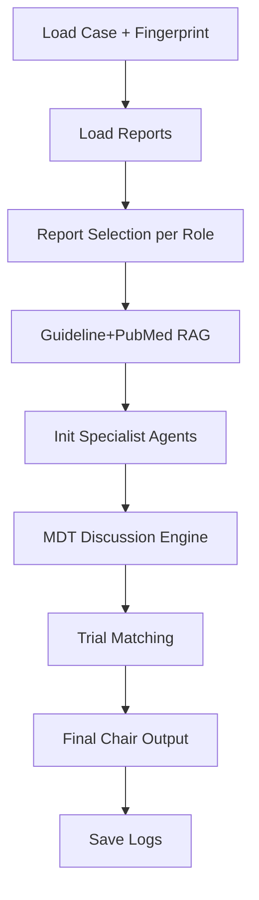

# MDT Discussion Log — 2026-01-18_18-40-21
Generated automatically by MDT Pipeline.


## CASE (structured JSON)

```
{}
```


## FINAL MDT OUTPUT

```
Final Assessment:
Widely metastatic presumed gynecologic malignancy with liver, presacral, bone, and peritoneal disease and severe anemia; primary histology, prior treatments, and current stage/line remain uncertain, so only diagnostic and supportive steps are appropriate today [@2022-12-29|MR; @2022-12-29|CT; @20230103|5600862].

Core Treatment Strategy:
- Urgently retrieve all prior surgical/biopsy pathology and reports to establish primary site, histologic subtype, grade, and stage; currently unknown.  
- If prior pathology unobtainable, plan image‑guided biopsy of an accessible metastatic lesion after restaging to secure diagnosis and IHC.  
- Arrange updated whole‑body staging (contrast CT/MR ± FDG PET/CT) to reassess liver, presacral, bone, peritoneal, and rectal involvement before therapy [@2022-12-29|MR; @2022-12-29|CT; @guideline:nccn_ovariancancer_v3_2025__v00000000|11].  
- Optimize severe anemia with full work‑up and supportive treatment to ensure future systemic‑therapy fitness; repeat CBC and chemistries for baseline [@20230103|5600862].  

Change Triggers:
- If pathology confirms epithelial ovarian primary and imaging shows widespread metastatic disease, MDT to define systemic treatment intent and palliative focus [@guideline:nccn_ovariancancer_v3_2025__v00000000|14].  
- If restaging reveals complications (obstruction, impending fracture, spinal/pelvic instability), prioritize urgent surgical/radiation/palliative interventions before systemic therapy planning.
```


## PIPELINE FLOW (Mermaid)




## TRACE EVENTS (Structured)

```json
[
  {
    "ts": "2026-01-18T18:36:45.962501",
    "event": "pipeline_start",
    "payload": {
      "visit_time": "2023-01-03 08:53:29.260000",
      "meta_info": "340123197709263626"
    }
  },
  {
    "ts": "2026-01-18T18:36:45.962785",
    "event": "case_fingerprint",
    "payload": {
      "case_fingerprint": "bf21a9e8fbc5"
    }
  },
  {
    "ts": "2026-01-18T18:36:46.218777",
    "event": "reports_loaded",
    "payload": {
      "lab_n": 92,
      "img_n": 10,
      "path_n": 0,
      "mut_n": 1,
      "cutoff_dt": "2023-01-04 08:53:29"
    }
  },
  {
    "ts": "2026-01-18T18:36:56.242652",
    "event": "reports_selected",
    "payload": {
      "lab": {
        "chair": [
          "20221229|8300002|2022-12-29",
          "20221229|9703212|2022-12-29",
          "20230103|5600862|2023-01-03"
        ],
        "oncologist": [
          "20221229|8300002|2022-12-29",
          "20221229|9703212|2022-12-29",
          "20230103|5600862|2023-01-03"
        ],
        "radiologist": [],
        "pathologist": [],
        "nuclear": []
      },
      "imaging": {
        "chair": [
          "2022-12-29|MR|2022-12-29",
          "2022-12-29|CT|2022-12-29"
        ],
        "oncologist": [],
        "radiologist": [
          "2022-12-29|MR|2022-12-29",
          "2022-12-29|CT|2022-12-29"
        ],
        "pathologist": [],
        "nuclear": [
          "2022-10-24|MR|2022-10-24",
          "2022-12-29|MR|2022-12-29",
          "2022-12-29|CT|2022-12-29"
        ]
      },
      "pathology": {
        "chair": [],
        "oncologist": [],
        "radiologist": [],
        "pathologist": [],
        "nuclear": []
      },
      "mutation": {
        "chair": [
          "OH2203828|2022-04-18"
        ],
        "oncologist": [
          "OH2203828|2022-04-18"
        ],
        "radiologist": [],
        "pathologist": [
          "OH2203828|2022-04-18"
        ],
        "nuclear": []
      }
    }
  },
  {
    "ts": "2026-01-18T18:37:14.417671",
    "event": "rag_query",
    "payload": {
      "query": "Guidelines for management of ovarian cancer by histology and platinum sensitivity, considering typical metastatic spread and extent of disease, relevant biomarkers (BRCA/HRD/MSI/PD-L1/ATM), and treatment selection with constraints such as anemia, organ dysfunction, and performance status."
    }
  },
  {
    "ts": "2026-01-18T18:37:14.417701",
    "event": "rag_hits",
    "payload": {
      "source": "guideline",
      "topk": 5,
      "n": 5
    }
  },
  {
    "ts": "2026-01-18T18:37:14.417708",
    "event": "rag_hits",
    "payload": {
      "source": "pubmed",
      "topk": 5,
      "n": 5
    }
  },
  {
    "ts": "2026-01-18T18:37:14.417713",
    "event": "rag_hits_merged",
    "payload": {
      "n": 10
    }
  },
  {
    "ts": "2026-01-18T18:37:22.351520",
    "event": "mdt_discussion_start",
    "payload": {
      "num_rounds": 2,
      "num_turns": 2
    }
  },
  {
    "ts": "2026-01-18T18:37:25.366171",
    "event": "evidence_tag_warning",
    "payload": {
      "role": "chair/initial",
      "preview": "- Advanced recurrent ovarian malignancy with progressive pelvic mass, pelvic bone lesion, and liver metastases on recent imaging [@2022-12-29|MR; @2022-12-29|CT…"
    }
  },
  {
    "ts": "2026-01-18T18:37:28.215965",
    "event": "evidence_tag_warning",
    "payload": {
      "role": "oncologist/initial",
      "preview": "- Tumor type, stage, prior surgery/chemotherapy, and current disease status are unknown/needs update to define treatment line and intent.    - Markedly elevated…"
    }
  },
  {
    "ts": "2026-01-18T18:38:09.860625",
    "event": "evidence_tag_warning",
    "payload": {
      "role": "chair/final_round_1",
      "preview": "- Defer definitive systemic/locoregional plan until original pathology (subtype, grade, IHC) is obtained and reviewed [@OH2203828].   - Arrange whole-body FDG P…"
    }
  },
  {
    "ts": "2026-01-18T18:38:13.051924",
    "event": "evidence_tag_warning",
    "payload": {
      "role": "oncologist/final_round_1",
      "preview": "- Defer systemic treatment choice until updated post-12/2022 imaging (CT/MR and/or PET/CT) confirms current disease extent; prior reports unknown/needs update. …"
    }
  },
  {
    "ts": "2026-01-18T18:40:06.811325",
    "event": "evidence_tag_warning",
    "payload": {
      "role": "chair/final_round_2",
      "preview": "- Urgently retrieve prior pathology or arrange new biopsy to establish primary site, histologic subtype, and grade (currently unknown).   - Obtain all post‑12/2…"
    }
  },
  {
    "ts": "2026-01-18T18:40:18.080117",
    "event": "mdt_discussion_end",
    "payload": {
      "merged_chars": 3260
    }
  },
  {
    "ts": "2026-01-18T18:40:18.080956",
    "event": "final_output_start",
    "payload": {}
  },
  {
    "ts": "2026-01-18T18:40:21.879150",
    "event": "final_output_end",
    "payload": {
      "final_output_chars": 1500
    }
  }
]
```


## INITIAL EXPERT OPINIONS


## chair

```
- Advanced recurrent ovarian malignancy with progressive pelvic mass, pelvic bone lesion, and liver metastases on recent imaging [@2022-12-29|MR; @2022-12-29|CT].  
- HRD-/BRCA‑wildtype; systemic therapy plan should not assume PARP benefit outside trial; consider standard chemotherapy-based approach [@OH2203828].  
- Profound anemia (HGB 74 g/L) likely requires optimization and transfusion planning before intensive systemic therapy [@20230103|2023-01-03].  
- Tumor markers very elevated (CA125, CA19-9, CA15-3); can be used for response monitoring, not for standalone decisions [@20221229|9703212].  
- Missing: current histology/grade, prior surgery/chemo details, performance status, symptoms, patient goals—must be updated before definitive systemic/locoregional plan.
```


## oncologist

```
- Tumor type, stage, prior surgery/chemotherapy, and current disease status are unknown/needs update to define treatment line and intent.  

- Markedly elevated CA125, CA19-9, CA15-3 and ROMA suggest ovarian malignancy, but histology/pathology report is unknown/needs update [@20221229|9703212].  

- HRD negative and no BRCA1/2 pathogenic variants; this limits certain maintenance options after platinum response [@OH2203828|2022-04-18; @guideline:nccn_ovariancancer_v3_2025__v00000000|18].  

- Significant anemia (Hgb 74 g/L) requires evaluation of cause and correction before or during systemic therapy [@20230103|5600862].  

- Renal and hepatic function appear adequate for most systemic options, but full current labs and trends are unknown/needs update [@20221229|8300002].
```


## radiologist

```
- Presacral pelvic mass enlarged to 53×44 mm with heterogeneous signal and involvement of adjacent peritoneum and sacrum, suspicious recurrence.[@2022-12-29|MR]

- New enhancing nodule in right ilium, concerning for osseous metastasis.[@2022-12-29|MR]

- Multiple enhancing mesenteric/pelvic nodules unchanged, compatible with peritoneal metastases.[@2022-12-29|MR]

- Focal rectal wall thickening with enhancement; needs correlation for invasion versus inflammatory change.[@2022-12-29|MR]

- Liver with multiple new/enlarging hypodense lesions, consistent with progressive hepatic metastases; additional stable hepatic cysts and possible splenic infarct.[@2022-12-29|CT]
```


## pathologist

```
- Only confirmed finding: germline ATM exon8 c.A947G:p.Y316C variant; clinical significance not specified in report [@OH2203828|2022-04-18].  
- HRD reported negative; no pathogenic germline/somatic BRCA1/2, TP53, ARID1A, PTEN, PIK3CA, PALB2, RAD51D, BRIP1, BARD1 detected [@OH2203828|2022-04-18].  
- Underlying tumor type, primary site, histologic subtype, grade, and stage are completely unknown/need update.  
- No tumor tissue NGS, MSI/MMR, TMB, or other somatic profiling data available/needs update for integrated pathology assessment.  
- Need full surgical pathology report(s) and any IHC panels to clarify diagnosis and guide biomarker interpretation.
```


## nuclear

```
- No PET/CT or other nuclear imaging available for this visit; metabolic status of pelvic, hepatic, bone lesions unknown/needs update.  

- Prior MR pelvis shows enlarging presacral mass with sacrum, peritoneum, right ilium involvement; recurrence/metastasis structurally suspected [@2022-12-29|MR].  

- Prior CT abdomen shows multiple enlarging hepatic lesions consistent with metastases; PET would better characterize whole-body disease burden [@2022-12-29|CT].  

- For current decision-making, a whole-body FDG PET/CT is needed to assess metabolic activity and refine staging/recurrence mapping.  

- Cannot yet determine if PET would upstage or downstage compared with prior MR/CT; requires new PET/CT acquisition and report.
```


## MERGED SUMMARY (Assistant)

```
Key Knowledge:
- Progressive advanced ovarian malignancy with enlarging presacral mass (sacrum/peritoneum), new right iliac bone lesion, peritoneal disease, and liver metastases on 12/2022 MR/CT.
- HRD negative, BRCA-wildtype; ATM variant of uncertain significance; no known actionable HRR mutation.
- Marked anemia (Hgb ~74 g/L) requiring optimization; renal/hepatic function likely adequate for chemotherapy.
- Tumor markers (CA125, CA19-9, CA15-3) markedly elevated and suitable for monitoring.
- Newer imaging than 12/29/2022 is referenced but not available; current decisions need truly up‑to‑date staging.

Controversies:
- Line of therapy and overall intent (palliative vs disease-controlling) cannot be safely defined without prior treatment history, performance status, and updated imaging.
- Histologic subtype/grade unknown, limiting precision of systemic strategy and trial eligibility.
- Clinical significance of rectal wall changes (true invasion vs inflammation; need for local palliation) remains uncertain.
- Extent to which PET/CT vs additional CT/MR should guide restaging and planning.

Missing Info:
- Original and any subsequent pathology: primary site confirmation, histologic subtype, grade, stage, IHC, full surgical/biopsy reports.
- Detailed oncologic history: surgeries, systemic regimens, responses, toxicities, timing/pattern of relapse.
- Current clinical status: ECOG, symptom burden (pain, bowel/bladder, bleeding), weight, comorbidities, patient goals.
- Updated labs: CBC trends, renal/hepatic function, coagulation, and anemia work-up/plan.
- All imaging after 12/29/2022, including any CT/MR and any PET/CT if already performed.
- Tumor somatic profiling (NGS, MSI/MMR, TMB, PD-L1), if ever done.

Working Plan:
- Prioritize retrieval and summary of original surgical/biopsy pathology (including subtype and grade).
- Confirm and collect all post‑12/2022 imaging; if not done, arrange comprehensive restaging with whole‑body FDG PET/CT and radiology review (including bone and rectal involvement).
- Clarify full oncologic history, current ECOG status, symptom burden, comorbidities, and patient preferences/goals.
- Evaluate and correct anemia; optimize medical status in parallel with staging.
- Obtain or repeat tumor tissue profiling (MSI/MMR, TMB ± extended NGS) if feasible.
- Defer systemic/locoregional treatment planning until updated imaging and pathology are available, then reconvene MDT to define intent, line of therapy, and any required local palliation.
[R2T1 DELTA] pathologist->chair(safety): Pathology remains completely unavailable; without confirmed primary site, histologic subtype, and grade, it is unsafe to finalize systemic strategy or trial eligibility discussions.
[R2T2 DELTA] chair->oncologist(safety): Do not commit to a specific systemic regimen or line-of-therapy labelling until original/surgical pathology is retrieved and reviewed. | chair->pathologist(missing): Please urgently trace outside surgical/biopsy blocks/reports or arrange a new biopsy if prior pathology truly cannot be obtained. | oncologist->chair(safety): Agree it is unsafe to finalize systemic options without pathology; treatment discussion with patient should be framed as provisional pending histologic confirmation.
```


## INTERACTION LOG (Round × Turn)

### Round 1

#### Turn 1
- **chair → oncologist:** Before committing to a new regimen, we must clarify prior systemic lines, ECOG status, and urgent anemia optimization/plan; otherwise treatment intensity and intent are unsafe to define.
- **chair → nuclear:** Given new bone and progressive liver disease, please comment whether PET/CT would materially change management versus proceeding on current MR/CT.
- **oncologist → chair:** Systemic regimen choice is impossible today without prior treatment history, performance status, and pathology details; these must be collected before committing to next-line therapy.
- **oncologist → nuclear:** Given new bone and progressive visceral disease, please advise whether PET/CT adds actionable value over recent MR/CT for systemic-planning and potential local palliation decisions.
- **radiologist → oncologist:** No imaging newer than 12/29/2022 is available; updated cross‑sectional imaging or PET/CT is needed before current treatment decisions.
- **radiologist → nuclear:** If clinically appropriate, a whole‑body FDG PET/CT would better define current disease extent, especially bone and rectal involvement.
- **pathologist → chair:** Pathology for this ovarian malignancy is entirely absent in the record; we need original surgical/biopsy reports and IHC to confirm primary, subtype, and grade.
- **nuclear → oncologist:** Given suspected pelvic, hepatic, peritoneal, and new bone involvement, a whole-body FDG PET/CT would refine staging and recurrence mapping before finalizing systemic or local palliation plans.
- **nuclear → radiologist:** Please consider PET/CT to clarify metabolic activity and true extent of presacral mass, right iliac lesion, liver metastases, and possible rectal involvement.

#### Turn 2
- **chair → oncologist:** Management planning should wait for updated imaging and retrieval of original pathology; without these, defining intent and line of therapy is unsafe.
- **chair → radiologist:** Please confirm if any post-12/29/2022 imaging exists and whether additional CT/MR is still needed alongside planned PET/CT.
- **chair → pathologist:** Kindly prioritize obtaining and summarizing the original surgical/biopsy pathology with subtype and grade so systemic strategy is appropriately tailored.

### Round 2

#### Turn 1
- **pathologist → chair:** Pathology remains completely unavailable; without confirmed primary site, histologic subtype, and grade, it is unsafe to finalize systemic strategy or trial eligibility discussions.

#### Turn 2
- **chair → oncologist:** Do not commit to a specific systemic regimen or line-of-therapy labelling until original/surgical pathology is retrieved and reviewed.
- **chair → pathologist:** Please urgently trace outside surgical/biopsy blocks/reports or arrange a new biopsy if prior pathology truly cannot be obtained.
- **oncologist → chair:** Agree it is unsafe to finalize systemic options without pathology; treatment discussion with patient should be framed as provisional pending histologic confirmation.


## FINAL REFINED PLANS (per Round)

### Round 1


## chair

```
- Defer definitive systemic/locoregional plan until original pathology (subtype, grade, IHC) is obtained and reviewed [@OH2203828].  
- Arrange whole-body FDG PET/CT or updated cross-sectional imaging to restage liver, presacral, bone, and possible rectal disease before decisions [@2022-12-29|CT; @2022-12-29|MR].  
- Optimize marked anemia (Hgb 74 g/L) and repeat full labs to ensure fitness for future systemic therapy [@20230103|2023-01-03].  
- Collect complete oncologic history, ECOG, symptom burden, comorbidities, and goals of care to define treatment intent and intensity (palliation vs disease control) — currently unknown.  
- After data completion, reconvene MDT to select appropriate systemic approach and consider targeted trials based on updated imaging and molecular profiling (MSI/MMR/TMB/NGS) — currently unknown.
```


## oncologist

```
- Defer systemic treatment choice until updated post-12/2022 imaging (CT/MR and/or PET/CT) confirms current disease extent; prior reports unknown/needs update.  

- Urgently retrieve and review original surgical/biopsy pathology with histology, grade, stage, and IHC to guide regimen selection; currently unknown.  

- Compile full oncologic history (all prior surgeries, regimens, responses, toxicities, timing of relapse) and current ECOG, symptoms, and goals of care; unknown.  

- Evaluate and manage severe anemia (Hgb 74 g/L) before/during any chemotherapy; complete iron/B12/folate/hemolysis/bleeding work-up and transfusion plan [@20230103|5600862].  

- After data completion, define intent (palliation vs disease control) and choose appropriate next-line systemic category plus targeted/trial eligibility based on biomarkers [@OH2203828|2022-04-18].
```


## radiologist

```
- No imaging newer than 2022-12-29 MR/CT is available; updated whole-body FDG PET/CT restaging is required before planning.[@2022-12-29|MR][@2022-12-29|CT]

- If PET/CT cannot fully characterize local anatomy, consider complementary pelvic MR or contrast CT to assess rectal and sacral involvement.[@2022-12-29|MR]

- Radiology to confirm absence/presence of any post-12/2022 imaging and flag if interval complications (obstruction, fracture, thrombosis) are seen; currently unknown.

- After new imaging, radiology will re-document measurable disease (presacral mass, liver, peritoneum, bone) to support response assessment and palliation planning.[@2022-12-29|MR][@2022-12-29|CT]

- Until restaging completed, avoid definitive local procedures based solely on 12/2022 scans, given possible interval progression or new sites.[@2022-12-29|MR][@2022-12-29|CT]
```


## pathologist

```
- Retrieve and summarize original surgical/biopsy pathology, including primary site, histologic subtype, grade, and key IHC; currently unknown.  
- Confirm and review any imaging after 12/2022; if absent, obtain whole‑body FDG PET/CT for up‑to‑date staging (bone, rectum, liver).  
- Defer decisions on treatment line and intent until updated imaging and full pathology are available, per chair safety concern.  
- Arrange tumor tissue profiling (MSI/MMR, TMB ± extended NGS) on available blocks once primary and subtype are confirmed; currently unknown.  
- Reconvene MDT after completing pathology retrieval, updated staging, and basic lab/clinical status review (anemia work‑up, organ function, ECOG).
```


## nuclear

```
- Confirm and review any imaging newer than 12/29/2022; if absent, obtain updated contrast CT/MR plus whole-body FDG PET/CT [@2022-12-29|MR; @2022-12-29|CT].  
- Use PET/CT to define metabolic extent of presacral mass, sacrum/ilium, peritoneum, liver, and possible rectal invasion [@2022-12-29|MR; @2022-12-29|CT].  
- Retrieve complete original pathology (site, subtype, grade, IHC) to confirm primary ovarian origin and refine prognosis; currently unknown.  
- Optimize anemia and overall medical status in parallel, ensuring patient is fit for subsequent systemic and/or locoregional interventions; lab details beyond Hgb unknown.  
- Reconvene MDT after updated imaging and pathology to finalize staging, recurrence assessment, and integrate PET findings into overall management intent.
```

### Round 2


## chair

```
- Urgently retrieve prior pathology or arrange new biopsy to establish primary site, histologic subtype, and grade (currently unknown).  
- Obtain all post‑12/29/2022 imaging or perform comprehensive restaging (CT/MR ± PET/CT) to reassess liver, bone, presacral, rectal disease [@2022-12-29|CT; @2022-12-29|MR].  
- Optimize severe anemia (Hgb 74 g/L) and repeat full labs to ensure systemic‑therapy fitness [@20230103|2023-01-03].  
- Collect detailed treatment history, ECOG, symptoms, comorbidities, and goals to define intent (palliation vs disease control) — currently unknown.  
- Until pathology and restaging are available, discuss only provisional systemic/locoregional options and avoid committing to specific regimens or trial pathways.
```


## oncologist

```
- Defer commitment to specific regimen or line-of-therapy labelling until original/surgical pathology is retrieved and reviewed; histology currently unknown.  

- Urgently obtain full pathology (primary site, subtype, grade, IHC) or arrange new biopsy if records unobtainable; currently missing.  

- Acquire all post‑12/2022 imaging or arrange whole‑body PET/CT plus targeted CT/MR to restage disease and clarify rectal involvement; missing.  

- Optimize severe anemia (Hgb 74 g/L) with full work‑up and transfusion/other support before systemic therapy decisions [@20230103|2023-01-03].  

- In parallel, document prior treatments, ECOG, symptoms, comorbidities, and goals to define intent (disease control vs palliation) once data complete.
```


## radiologist

```
- 12/29/2022 MR: Presacral mass ~53×44 mm, invading adjacent peritoneum and sacrum; rectal wall thickening/enhancement suggests possible invasion.[@2022-12-29|MR]

- 12/29/2022 MR: New enhancing nodule in right iliac bone, suspicious for osseous metastasis.[@2022-12-29|MR]

- 12/29/2022 MR: Multiple enhancing pelvic mesenteric nodules compatible with peritoneal metastases.[@2022-12-29|MR]

- 12/29/2022 CT: Multiple liver metastases, increased in number and size; largest ~17×14 mm.[@2022-12-29|CT]

- No post-12/29/2022 imaging available; updated whole-body staging (PET/CT ± targeted MR/CT) is needed to guide current decisions.[@2022-12-29|MR][@2022-12-29|CT]
```


## pathologist

```
- Urgently obtain original surgical/biopsy pathology (reports and blocks) to confirm primary site, histologic subtype, grade, and stage; currently unknown.  
- If outside pathology truly unobtainable, arrange new image‑guided biopsy of accessible lesion for full histology and IHC; currently unknown.  
- With confirmed subtype, consider tumor profiling (MSI/MMR, TMB ± extended NGS) on available tissue for future options; currently unknown.  
- Correlate pathology with updated cross‑sectional imaging or PET/CT to clarify rectal involvement and dominant disease sites; post‑12/2022 imaging unknown.  
- Defer labeling line of therapy or specific systemic strategy until histology/subtype are established and MDT re‑reviews integrated findings.
```


## nuclear

```
- Arrange whole-body FDG PET/CT to update staging beyond 12/2022 CT/MR, including bone and rectal involvement assessment [@2022-12-29|MR; @2022-12-29|CT].  
- Use PET/CT to confirm metabolic activity of presacral mass, sacral/iliac lesions, peritoneal nodules, and liver metastases [@2022-12-29|MR; @2022-12-29|CT].  
- Correlate PET/CT with pelvic MR to better distinguish rectal invasion from inflammatory thickening before considering local interventions [@2022-12-29|MR].  
- Integrate PET findings with tumor marker trends and future imaging for monitoring disease burden and response; current post-12/2022 imaging unknown.  
- Re-discuss at MDT once PET/CT and pathology are available to align metabolic staging with final intent and palliation planning.
```


## RAW AGENT LOGS

### chair
- **User:** Give INITIAL opinion (use ONLY your system-provided patient facts).
Return up to 5 bullets, each ≤20 words.
If key data missing, say exactly what needs updating.
If you reference guideline/PubMed evidence, include tags [@guideline:doc_id|page] or [@pubmed:PMID].
  
  **Assistant:** - Advanced recurrent ovarian malignancy with progressive pelvic mass, pelvic bone lesion, and liver metastases on recent imaging [@2022-12-29|MR; @2022-12-29|CT].  
- HRD-/BRCA‑wildtype; systemic therapy plan should not assume PARP benefit outside trial; consider standard chemotherapy-based approach [@OH2203828].  
- Profound anemia (HGB 74 g/L) likely requires optimization and transfusion planning before intensive systemic therapy [@20230103|2023-01-03].  
- Tumor markers very elevated (CA125, CA19-9, CA15-3); can be used for response monitoring, not for standalone decisions [@20221229|9703212].  
- Missing: current histology/grade, prior surgery/chemo details, performance status, symptoms, patient goals—must be updated before definitive systemic/locoregional plan.
  
  *(2026-01-18T18:37:25.365973)*

- **User:** ROLE: chair. VISIT: 2023-01-03 08:53:29.260000
Default is NOT to speak. Speak ONLY if: conflict | safety | missing-critical | new-critical.

CONTEXT (latest):
Key Knowledge:
- Progressive advanced ovarian malignancy with enlarging presacral mass (sacrum/peritoneum), new right iliac bone lesion, peritoneal nodules, and progressive liver metastases (12/2022 MR/CT).
- HRD negative, BRCA-wildtype; ATM variant of uncertain significance; no known actionable HRR mutation.
- Marked anemia (Hgb ~74 g/L) needing optimization; renal/hepatic function likely adequate for chemotherapy.
- Tumor markers (CA125, CA19-9, CA15-3) very elevated; suitable for monitoring only.

Controversies:
- Line of therapy and intent (palliative vs disease-controlling) unclear without prior treatment history and PS.
- Histologic subtype/grade unknown, limiting targeted/trial options.
- Significance of rectal wall involvement (true invasion vs inflammation; need for local palliation) uncertain.
- Whether to proceed on current MR/CT vs obtain PET/CT for restaging first.

Missing Info:
- Full pathology: primary site confirmation, histology, grade, stage, IHC, prior surgical pathology.
- Detailed oncologic history: surgeries, systemic regimens, responses, toxicities, timing of relapse.
- Current clinical status: ECOG, symptom burden (pain, bowel/bladder, bleeding), weight, comorbidities, patient goals.
- Updated labs (CBC trends, renal/hepatic, coagulation) and anemia work-up/plan.
- Any prior somatic profiling (NGS, MSI/MMR, TMB, PD-L1) and imaging after 12/2022.

Working Plan:
- Obtain/clarify pathology, oncologic history, current performance status, and patient goals to define intent and line of therapy.
- Investigate and correct anemia; optimize overall medical status.
- Perform comprehensive restaging, ideally whole-body FDG PET/CT, to map full disease burden (including bone and rectal involvement).
- Arrange tumor tissue profiling (MSI/MMR, TMB ± extended NGS) if feasible for future options/trials.
- Reconvene MDT after data completion to define systemic strategy and any locoregional palliation needs (pelvic mass, bone, rectal involvement).

Allowed targets: [oncologist,radiologist,pathologist,nuclear]
Return ONE-LINE JSON only:{"speak":"yes/no","messages":[{"target":"<role>","message":"<1-2 sentences>","why":"conflict|safety|missing|new"}]}
  
  **Assistant:** {"speak":"yes","messages":[{"target":"oncologist","message":"Before committing to a new regimen, we must clarify prior systemic lines, ECOG status, and urgent anemia optimization/plan; otherwise treatment intensity and intent are unsafe to define.","why":"missing"},{"target":"nuclear","message":"Given new bone and progressive liver disease, please comment whether PET/CT would materially change management versus proceeding on current MR/CT.","why":"missing"}]}
  
  *(2026-01-18T18:37:50.267326)*

- **User:** ROLE: chair. VISIT: 2023-01-03 08:53:29.260000
Default is NOT to speak. Speak ONLY if: conflict | safety | missing-critical | new-critical.

CONTEXT (latest):
Key Knowledge:
- Progressive advanced ovarian malignancy with enlarging presacral mass (sacrum/peritoneum), new right iliac bone lesion, peritoneal nodules, and progressive liver metastases (12/2022 MR/CT).
- HRD negative, BRCA-wildtype; ATM variant of uncertain significance; no known actionable HRR mutation.
- Marked anemia (Hgb ~74 g/L) needing optimization; renal/hepatic function likely adequate for chemotherapy.
- Tumor markers (CA125, CA19-9, CA15-3) very elevated; suitable for monitoring only.

Controversies:
- Line of therapy and intent (palliative vs disease-controlling) unclear without prior treatment history and PS.
- Histologic subtype/grade unknown, limiting targeted/trial options.
- Significance of rectal wall involvement (true invasion vs inflammation; need for local palliation) uncertain.
- Whether to proceed on current MR/CT vs obtain PET/CT for restaging first.

Missing Info:
- Full pathology: primary site confirmation, histology, grade, stage, IHC, prior surgical pathology.
- Detailed oncologic history: surgeries, systemic regimens, responses, toxicities, timing of relapse.
- Current clinical status: ECOG, symptom burden (pain, bowel/bladder, bleeding), weight, comorbidities, patient goals.
- Updated labs (CBC trends, renal/hepatic, coagulation) and anemia work-up/plan.
- Any prior somatic profiling (NGS, MSI/MMR, TMB, PD-L1) and imaging after 12/2022.

Working Plan:
- Obtain/clarify pathology, oncologic history, current performance status, and patient goals to define intent and line of therapy.
- Investigate and correct anemia; optimize overall medical status.
- Perform comprehensive restaging, ideally whole-body FDG PET/CT, to map full disease burden (including bone and rectal involvement).
- Arrange tumor tissue profiling (MSI/MMR, TMB ± extended NGS) if feasible for future options/trials.
- Reconvene MDT after data completion to define systemic strategy and any locoregional palliation needs (pelvic mass, bone, rectal involvement).
[R1T1 DELTA] newer than 12/29/2022 is available; updated cross‑sectional imaging or PET/CT is needed before current treatment decisions. | radiologist->nuclear(missing): If clinically appropriate, a whole‑body FDG PET/CT would better define current disease extent, especially bone and rectal involvement. | pathologist->chair(missing): Pathology for this ovarian malignancy is entirely absent in the record; we need original surgical/biopsy reports and IHC to confirm primary, subtype, and grade. | nuclear->oncologist(missing): Given suspected pelvic, hepatic, peritoneal, and new bone involvement, a whole-body FDG PET/CT would refine staging and recurrence mapping before finalizing systemic or local palliation plans. | nuclear->radiologist(missing): Please consider PET/CT to clarify metabolic activity and true extent of presacral mass, right iliac lesion, liver metastases, and possible rectal involvement.

Allowed targets: [oncologist,radiologist,pathologist,nuclear]
Return ONE-LINE JSON only:{"speak":"yes/no","messages":[{"target":"<role>","message":"<1-2 sentences>","why":"conflict|safety|missing|new"}]}
  
  **Assistant:** {"speak":"yes","messages":[{"target":"oncologist","message":"Management planning should wait for updated imaging and retrieval of original pathology; without these, defining intent and line of therapy is unsafe.","why":"safety"},{"target":"radiologist","message":"Please confirm if any post-12/29/2022 imaging exists and whether additional CT/MR is still needed alongside planned PET/CT.","why":"missing"},{"target":"pathologist","message":"Kindly prioritize obtaining and summarizing the original surgical/biopsy pathology with subtype and grade so systemic strategy is appropriately tailored.","why":"missing"}]}
  
  *(2026-01-18T18:38:00.907899)*

- **User:** Given MDT context:
Key Knowledge:
- Progressive advanced ovarian malignancy with enlarging presacral mass (sacrum/peritoneum), new right iliac bone lesion, peritoneal nodules, and progressive liver metastases (12/2022 MR/CT).
- HRD negative, BRCA-wildtype; ATM variant of uncertain significance; no known actionable HRR mutation.
- Marked anemia (Hgb ~74 g/L) needing optimization; renal/hepatic function likely adequate for chemotherapy.
- Tumor markers (CA125, CA19-9, CA15-3) very elevated; suitable for monitoring only.

Controversies:
- Line of therapy and intent (palliative vs disease-controlling) unclear without prior treatment history and PS.
- Histologic subtype/grade unknown, limiting targeted/trial options.
- Significance of rectal wall involvement (true invasion vs inflammation; need for local palliation) uncertain.
- Whether to proceed on current MR/CT vs obtain PET/CT for restaging first.

Missing Info:
- Full pathology: primary site confirmation, histology, grade, stage, IHC, prior surgical pathology.
- Detailed oncologic history: surgeries, systemic regimens, responses, toxicities, timing of relapse.
- Current clinical status: ECOG, symptom burden (pain, bowel/bladder, bleeding), weight, comorbidities, patient goals.
- Updated labs (CBC trends, renal/hepatic, coagulation) and anemia work-up/plan.
- Any prior somatic profiling (NGS, MSI/MMR, TMB, PD-L1) and imaging after 12/2022.

Working Plan:
- Obtain/clarify pathology, oncologic history, current performance status, and patient goals to define intent and line of therapy.
- Investigate and correct anemia; optimize overall medical status.
- Perform comprehensive restaging, ideally whole-body FDG PET/CT, to map full disease burden (including bone and rectal involvement).
- Arrange tumor tissue profiling (MSI/MMR, TMB ± extended NGS) if feasible for future options/trials.
- Reconvene MDT after data completion to define systemic strategy and any locoregional palliation needs (pelvic mass, bone, rectal involvement).
[R1T1 DELTA] newer than 12/29/2022 is available; updated cross‑sectional imaging or PET/CT is needed before current treatment decisions. | radiologist->nuclear(missing): If clinically appropriate, a whole‑body FDG PET/CT would better define current disease extent, especially bone and rectal involvement. | pathologist->chair(missing): Pathology for this ovarian malignancy is entirely absent in the record; we need original surgical/biopsy reports and IHC to confirm primary, subtype, and grade. | nuclear->oncologist(missing): Given suspected pelvic, hepatic, peritoneal, and new bone involvement, a whole-body FDG PET/CT would refine staging and recurrence mapping before finalizing systemic or local palliation plans. | nuclear->radiologist(missing): Please consider PET/CT to clarify metabolic activity and true extent of presacral mass, right iliac lesion, liver metastases, and possible rectal involvement.
[R1T2 DELTA] chair->oncologist(safety): Management planning should wait for updated imaging and retrieval of original pathology; without these, defining intent and line of therapy is unsafe. | chair->radiologist(missing): Please confirm if any post-12/29/2022 imaging exists and whether additional CT/MR is still needed alongside planned PET/CT. | chair->pathologist(missing): Kindly prioritize obtaining and summarizing the original surgical/biopsy pathology with subtype and grade so systemic strategy is appropriately tailored.

Provide FINAL refined plan.
Up to 5 bullets, each ≤20 words.
Any factual claim must include [@report_id|date] or say unknown.
If you reference guideline/PubMed evidence, include tags [@guideline:doc_id|page] or [@pubmed:PMID].
  
  **Assistant:** - Defer definitive systemic/locoregional plan until original pathology (subtype, grade, IHC) is obtained and reviewed [@OH2203828].  
- Arrange whole-body FDG PET/CT or updated cross-sectional imaging to restage liver, presacral, bone, and possible rectal disease before decisions [@2022-12-29|CT; @2022-12-29|MR].  
- Optimize marked anemia (Hgb 74 g/L) and repeat full labs to ensure fitness for future systemic therapy [@20230103|2023-01-03].  
- Collect complete oncologic history, ECOG, symptom burden, comorbidities, and goals of care to define treatment intent and intensity (palliation vs disease control) — currently unknown.  
- After data completion, reconvene MDT to select appropriate systemic approach and consider targeted trials based on updated imaging and molecular profiling (MSI/MMR/TMB/NGS) — currently unknown.
  
  *(2026-01-18T18:38:09.860517)*

- **User:** ROLE: chair. VISIT: 2023-01-03 08:53:29.260000
Default is NOT to speak. Speak ONLY if: conflict | safety | missing-critical | new-critical.

CONTEXT (latest):
Key Knowledge:
- Progressive advanced ovarian malignancy with enlarging presacral mass (sacrum/peritoneum), new right iliac bone lesion, peritoneal disease, and liver metastases on 12/2022 MR/CT.
- HRD negative, BRCA-wildtype; ATM variant of uncertain significance; no known actionable HRR mutation.
- Marked anemia (Hgb ~74 g/L) requiring optimization; renal/hepatic function likely adequate for chemotherapy.
- Tumor markers (CA125, CA19-9, CA15-3) markedly elevated and suitable for monitoring.
- Newer imaging than 12/29/2022 is referenced but not available; current decisions need truly up‑to‑date staging.

Controversies:
- Line of therapy and overall intent (palliative vs disease-controlling) cannot be safely defined without prior treatment history, performance status, and updated imaging.
- Histologic subtype/grade unknown, limiting precision of systemic strategy and trial eligibility.
- Clinical significance of rectal wall changes (true invasion vs inflammation; need for local palliation) remains uncertain.
- Extent to which PET/CT vs additional CT/MR should guide restaging and planning.

Missing Info:
- Original and any subsequent pathology: primary site confirmation, histologic subtype, grade, stage, IHC, full surgical/biopsy reports.
- Detailed oncologic history: surgeries, systemic regimens, responses, toxicities, timing/pattern of relapse.
- Current clinical status: ECOG, symptom burden (pain, bowel/bladder, bleeding), weight, comorbidities, patient goals.
- Updated labs: CBC trends, renal/hepatic function, coagulation, and anemia work-up/plan.
- All imaging after 12/29/2022, including any CT/MR and any PET/CT if already performed.
- Tumor somatic profiling (NGS, MSI/MMR, TMB, PD-L1), if ever done.

Working Plan:
- Prioritize retrieval and summary of original surgical/biopsy pathology (including subtype and grade).
- Confirm and collect all post‑12/2022 imaging; if not done, arrange comprehensive restaging with whole‑body FDG PET/CT and radiology review (including bone and rectal involvement).
- Clarify full oncologic history, current ECOG status, symptom burden, comorbidities, and patient preferences/goals.
- Evaluate and correct anemia; optimize medical status in parallel with staging.
- Obtain or repeat tumor tissue profiling (MSI/MMR, TMB ± extended NGS) if feasible.
- Defer systemic/locoregional treatment planning until updated imaging and pathology are available, then reconvene MDT to define intent, line of therapy, and any required local palliation.

Allowed targets: [oncologist,radiologist,pathologist,nuclear]
Return ONE-LINE JSON only:{"speak":"yes/no","messages":[{"target":"<role>","message":"<1-2 sentences>","why":"conflict|safety|missing|new"}]}
  
  **Assistant:** {"speak":"no","messages":[]}
  
  *(2026-01-18T18:39:00.302377)*

- **User:** ROLE: chair. VISIT: 2023-01-03 08:53:29.260000
Default is NOT to speak. Speak ONLY if: conflict | safety | missing-critical | new-critical.

CONTEXT (latest):
Key Knowledge:
- Progressive advanced ovarian malignancy with enlarging presacral mass (sacrum/peritoneum), new right iliac bone lesion, peritoneal disease, and liver metastases on 12/2022 MR/CT.
- HRD negative, BRCA-wildtype; ATM variant of uncertain significance; no known actionable HRR mutation.
- Marked anemia (Hgb ~74 g/L) requiring optimization; renal/hepatic function likely adequate for chemotherapy.
- Tumor markers (CA125, CA19-9, CA15-3) markedly elevated and suitable for monitoring.
- Newer imaging than 12/29/2022 is referenced but not available; current decisions need truly up‑to‑date staging.

Controversies:
- Line of therapy and overall intent (palliative vs disease-controlling) cannot be safely defined without prior treatment history, performance status, and updated imaging.
- Histologic subtype/grade unknown, limiting precision of systemic strategy and trial eligibility.
- Clinical significance of rectal wall changes (true invasion vs inflammation; need for local palliation) remains uncertain.
- Extent to which PET/CT vs additional CT/MR should guide restaging and planning.

Missing Info:
- Original and any subsequent pathology: primary site confirmation, histologic subtype, grade, stage, IHC, full surgical/biopsy reports.
- Detailed oncologic history: surgeries, systemic regimens, responses, toxicities, timing/pattern of relapse.
- Current clinical status: ECOG, symptom burden (pain, bowel/bladder, bleeding), weight, comorbidities, patient goals.
- Updated labs: CBC trends, renal/hepatic function, coagulation, and anemia work-up/plan.
- All imaging after 12/29/2022, including any CT/MR and any PET/CT if already performed.
- Tumor somatic profiling (NGS, MSI/MMR, TMB, PD-L1), if ever done.

Working Plan:
- Prioritize retrieval and summary of original surgical/biopsy pathology (including subtype and grade).
- Confirm and collect all post‑12/2022 imaging; if not done, arrange comprehensive restaging with whole‑body FDG PET/CT and radiology review (including bone and rectal involvement).
- Clarify full oncologic history, current ECOG status, symptom burden, comorbidities, and patient preferences/goals.
- Evaluate and correct anemia; optimize medical status in parallel with staging.
- Obtain or repeat tumor tissue profiling (MSI/MMR, TMB ± extended NGS) if feasible.
- Defer systemic/locoregional treatment planning until updated imaging and pathology are available, then reconvene MDT to define intent, line of therapy, and any required local palliation.
[R2T1 DELTA] pathologist->chair(safety): Pathology remains completely unavailable; without confirmed primary site, histologic subtype, and grade, it is unsafe to finalize systemic strategy or trial eligibility discussions.

Allowed targets: [oncologist,radiologist,pathologist,nuclear]
Return ONE-LINE JSON only:{"speak":"yes/no","messages":[{"target":"<role>","message":"<1-2 sentences>","why":"conflict|safety|missing|new"}]}
  
  **Assistant:** {"speak":"yes","messages":[{"target":"oncologist","message":"Do not commit to a specific systemic regimen or line-of-therapy labelling until original/surgical pathology is retrieved and reviewed.","why":"safety"},{"target":"pathologist","message":"Please urgently trace outside surgical/biopsy blocks/reports or arrange a new biopsy if prior pathology truly cannot be obtained.","why":"missing"}]}
  
  *(2026-01-18T18:39:08.984376)*

- **User:** Given MDT context:
Key Knowledge:
- Progressive advanced ovarian malignancy with enlarging presacral mass (sacrum/peritoneum), new right iliac bone lesion, peritoneal disease, and liver metastases on 12/2022 MR/CT.
- HRD negative, BRCA-wildtype; ATM variant of uncertain significance; no known actionable HRR mutation.
- Marked anemia (Hgb ~74 g/L) requiring optimization; renal/hepatic function likely adequate for chemotherapy.
- Tumor markers (CA125, CA19-9, CA15-3) markedly elevated and suitable for monitoring.
- Newer imaging than 12/29/2022 is referenced but not available; current decisions need truly up‑to‑date staging.

Controversies:
- Line of therapy and overall intent (palliative vs disease-controlling) cannot be safely defined without prior treatment history, performance status, and updated imaging.
- Histologic subtype/grade unknown, limiting precision of systemic strategy and trial eligibility.
- Clinical significance of rectal wall changes (true invasion vs inflammation; need for local palliation) remains uncertain.
- Extent to which PET/CT vs additional CT/MR should guide restaging and planning.

Missing Info:
- Original and any subsequent pathology: primary site confirmation, histologic subtype, grade, stage, IHC, full surgical/biopsy reports.
- Detailed oncologic history: surgeries, systemic regimens, responses, toxicities, timing/pattern of relapse.
- Current clinical status: ECOG, symptom burden (pain, bowel/bladder, bleeding), weight, comorbidities, patient goals.
- Updated labs: CBC trends, renal/hepatic function, coagulation, and anemia work-up/plan.
- All imaging after 12/29/2022, including any CT/MR and any PET/CT if already performed.
- Tumor somatic profiling (NGS, MSI/MMR, TMB, PD-L1), if ever done.

Working Plan:
- Prioritize retrieval and summary of original surgical/biopsy pathology (including subtype and grade).
- Confirm and collect all post‑12/2022 imaging; if not done, arrange comprehensive restaging with whole‑body FDG PET/CT and radiology review (including bone and rectal involvement).
- Clarify full oncologic history, current ECOG status, symptom burden, comorbidities, and patient preferences/goals.
- Evaluate and correct anemia; optimize medical status in parallel with staging.
- Obtain or repeat tumor tissue profiling (MSI/MMR, TMB ± extended NGS) if feasible.
- Defer systemic/locoregional treatment planning until updated imaging and pathology are available, then reconvene MDT to define intent, line of therapy, and any required local palliation.
[R2T1 DELTA] pathologist->chair(safety): Pathology remains completely unavailable; without confirmed primary site, histologic subtype, and grade, it is unsafe to finalize systemic strategy or trial eligibility discussions.
[R2T2 DELTA] chair->oncologist(safety): Do not commit to a specific systemic regimen or line-of-therapy labelling until original/surgical pathology is retrieved and reviewed. | chair->pathologist(missing): Please urgently trace outside surgical/biopsy blocks/reports or arrange a new biopsy if prior pathology truly cannot be obtained. | oncologist->chair(safety): Agree it is unsafe to finalize systemic options without pathology; treatment discussion with patient should be framed as provisional pending histologic confirmation.

Provide FINAL refined plan.
Up to 5 bullets, each ≤20 words.
Any factual claim must include [@report_id|date] or say unknown.
If you reference guideline/PubMed evidence, include tags [@guideline:doc_id|page] or [@pubmed:PMID].
  
  **Assistant:** - Urgently retrieve prior pathology or arrange new biopsy to establish primary site, histologic subtype, and grade (currently unknown).  
- Obtain all post‑12/29/2022 imaging or perform comprehensive restaging (CT/MR ± PET/CT) to reassess liver, bone, presacral, rectal disease [@2022-12-29|CT; @2022-12-29|MR].  
- Optimize severe anemia (Hgb 74 g/L) and repeat full labs to ensure systemic‑therapy fitness [@20230103|2023-01-03].  
- Collect detailed treatment history, ECOG, symptoms, comorbidities, and goals to define intent (palliation vs disease control) — currently unknown.  
- Until pathology and restaging are available, discuss only provisional systemic/locoregional options and avoid committing to specific regimens or trial pathways.
  
  *(2026-01-18T18:40:06.811198)*

- **User:** 
As the MDT chair for gynecologic oncology, you are seeing the patient at OUTPATIENT TIME: 2023-01-03 08:53:29.260000.
Based on PATIENT FACTS + MDT discussion + FINAL refined plans from all experts, determine the CURRENT best management plan for this visit.

STRICT RULES:
- Any factual statement about past tests/treatments must include [@report_id|date] or say unknown.
- Any statement derived from guideline or PubMed literature must include [@guideline:doc_id|page] or [@pubmed:PMID].
- If you cite guideline/PubMed evidence in Core Treatment Strategy or Change Triggers, include at least one tag in that bullet.
- If experts disagree, pick the safest plan and state the key uncertainty.

# FINAL REFINED PLANS (All experts, last round)
{
  "Round 1": {
    "chair": "- Defer definitive systemic/locoregional plan until original pathology (subtype, grade, IHC) is obtained and reviewed [@OH2203828].  \n- Arrange whole-body FDG PET/CT or updated cross-sectional imaging to restage liver, presacral, bone, and possible rectal disease before decisions [@2022-12-29|CT; @2022-12-29|MR].  \n- Optimize marked anemia (Hgb 74 g/L) and repeat full labs to ensure fitness for future systemic therapy [@20230103|2023-01-03].  \n- Collect complete oncologic history, ECOG, symptom burden, comorbidities, and goals of care to define treatment intent and intensity (palliation vs disease control) — currently unknown.  \n- After data completion, reconvene MDT to select appropriate systemic approach and consider targeted trials based on updated imaging and molecular profiling (MSI/MMR/TMB/NGS) — currently unknown.",
    "oncologist": "- Defer systemic treatment choice until updated post-12/2022 imaging (CT/MR and/or PET/CT) confirms current disease extent; prior reports unknown/needs update.  \n\n- Urgently retrieve and review original surgical/biopsy pathology with histology, grade, stage, and IHC to guide regimen selection; currently unknown.  \n\n- Compile full oncologic history (all prior surgeries, regimens, responses, toxicities, timing of relapse) and current ECOG, symptoms, and goals of care; unknown.  \n\n- Evaluate and manage severe anemia (Hgb 74 g/L) before/during any chemotherapy; complete iron/B12/folate/hemolysis/bleeding work-up and transfusion plan [@20230103|5600862].  \n\n- After data completion, define intent (palliation vs disease control) and choose appropriate next-line systemic category plus targeted/trial eligibility based on biomarkers [@OH2203828|2022-04-18].",
    "radiologist": "- No imaging newer than 2022-12-29 MR/CT is available; updated whole-body FDG PET/CT restaging is required before planning.[@2022-12-29|MR][@2022-12-29|CT]\n\n- If PET/CT cannot fully characterize local anatomy, consider complementary pelvic MR or contrast CT to assess rectal and sacral involvement.[@2022-12-29|MR]\n\n- Radiology to confirm absence/presence of any post-12/2022 imaging and flag if interval complications (obstruction, fracture, thrombosis) are seen; currently unknown.\n\n- After new imaging, radiology will re-document measurable disease (presacral mass, liver, peritoneum, bone) to support response assessment and palliation planning.[@2022-12-29|MR][@2022-12-29|CT]\n\n- Until restaging completed, avoid definitive local procedures based solely on 12/2022 scans, given possible interval progression or new sites.[@2022-12-29|MR][@2022-12-29|CT]",
    "pathologist": "- Retrieve and summarize original surgical/biopsy pathology, including primary site, histologic subtype, grade, and key IHC; currently unknown.  \n- Confirm and review any imaging after 12/2022; if absent, obtain whole‑body FDG PET/CT for up‑to‑date staging (bone, rectum, liver).  \n- Defer decisions on treatment line and intent until updated imaging and full pathology are available, per chair safety concern.  \n- Arrange tumor tissue profiling (MSI/MMR, TMB ± extended NGS) on available blocks once primary and subtype are confirmed; currently unknown.  \n- Reconvene MDT after completing pathology retrieval, updated staging, and basic lab/clinical status review (anemia work‑up, organ function, ECOG).",
    "nuclear": "- Confirm and review any imaging newer than 12/29/2022; if absent, obtain updated contrast CT/MR plus whole-body FDG PET/CT [@2022-12-29|MR; @2022-12-29|CT].  \n- Use PET/CT to define metabolic extent of presacral mass, sacrum/ilium, peritoneum, liver, and possible rectal invasion [@2022-12-29|MR; @2022-12-29|CT].  \n- Retrieve complete original pathology (site, subtype, grade, IHC) to confirm primary ovarian origin and refine prognosis; currently unknown.  \n- Optimize anemia and overall medical status in parallel, ensuring patient is fit for subsequent systemic and/or locoregional interventions; lab details beyond Hgb unknown.  \n- Reconvene MDT after updated imaging and pathology to finalize staging, recurrence assessment, and integrate PET findings into overall management intent."
  },
  "Round 2": {
    "chair": "- Urgently retrieve prior pathology or arrange new biopsy to establish primary site, histologic subtype, and grade (currently unknown).  \n- Obtain all post‑12/29/2022 imaging or perform comprehensive restaging (CT/MR ± PET/CT) to reassess liver, bone, presacral, rectal disease [@2022-12-29|CT; @2022-12-29|MR].  \n- Optimize severe anemia (Hgb 74 g/L) and repeat full labs to ensure systemic‑therapy fitness [@20230103|2023-01-03].  \n- Collect detailed treatment history, ECOG, symptoms, comorbidities, and goals to define intent (palliation vs disease control) — currently unknown.  \n- Until pathology and restaging are available, discuss only provisional systemic/locoregional options and avoid committing to specific regimens or trial pathways.",
    "oncologist": "- Defer commitment to specific regimen or line-of-therapy labelling until original/surgical pathology is retrieved and reviewed; histology currently unknown.  \n\n- Urgently obtain full pathology (primary site, subtype, grade, IHC) or arrange new biopsy if records unobtainable; currently missing.  \n\n- Acquire all post‑12/2022 imaging or arrange whole‑body PET/CT plus targeted CT/MR to restage disease and clarify rectal involvement; missing.  \n\n- Optimize severe anemia (Hgb 74 g/L) with full work‑up and transfusion/other support before systemic therapy decisions [@20230103|2023-01-03].  \n\n- In parallel, document prior treatments, ECOG, symptoms, comorbidities, and goals to define intent (disease control vs palliation) once data complete.",
    "radiologist": "- 12/29/2022 MR: Presacral mass ~53×44 mm, invading adjacent peritoneum and sacrum; rectal wall thickening/enhancement suggests possible invasion.[@2022-12-29|MR]\n\n- 12/29/2022 MR: New enhancing nodule in right iliac bone, suspicious for osseous metastasis.[@2022-12-29|MR]\n\n- 12/29/2022 MR: Multiple enhancing pelvic mesenteric nodules compatible with peritoneal metastases.[@2022-12-29|MR]\n\n- 12/29/2022 CT: Multiple liver metastases, increased in number and size; largest ~17×14 mm.[@2022-12-29|CT]\n\n- No post-12/29/2022 imaging available; updated whole-body staging (PET/CT ± targeted MR/CT) is needed to guide current decisions.[@2022-12-29|MR][@2022-12-29|CT]",
    "pathologist": "- Urgently obtain original surgical/biopsy pathology (reports and blocks) to confirm primary site, histologic subtype, grade, and stage; currently unknown.  \n- If outside pathology truly unobtainable, arrange new image‑guided biopsy of accessible lesion for full histology and IHC; currently unknown.  \n- With confirmed subtype, consider tumor profiling (MSI/MMR, TMB ± extended NGS) on available tissue for future options; currently unknown.  \n- Correlate pathology with updated cross‑sectional imaging or PET/CT to clarify rectal involvement and dominant disease sites; post‑12/2022 imaging unknown.  \n- Defer labeling line of therapy or specific systemic strategy until histology/subtype are established and MDT re‑reviews integrated findings.",
    "nuclear": "- Arrange whole-body FDG PET/CT to update staging beyond 12/2022 CT/MR, including bone and rectal involvement assessment [@2022-12-29|MR; @2022-12-29|CT].  \n- Use PET/CT to confirm metabolic activity of presacral mass, sacral/iliac lesions, peritoneal nodules, and liver metastases [@2022-12-29|MR; @2022-12-29|CT].  \n- Correlate PET/CT with pelvic MR to better distinguish rectal invasion from inflammatory thickening before considering local interventions [@2022-12-29|MR].  \n- Integrate PET findings with tumor marker trends and future imaging for monitoring disease burden and response; current post-12/2022 imaging unknown.  \n- Re-discuss at MDT once PET/CT and pathology are available to align metabolic staging with final intent and palliation planning."
  }
}

# Response Format
Final Assessment:
<1–3 sentences: summarize histology/biology, current disease status, and key uncertainties>

Core Treatment Strategy:
- < ≤20 words concrete decision >
- < ≤20 words concrete decision >
- < ≤20 words concrete decision >
- < ≤20 words concrete decision >

Change Triggers:
- < ≤20 words “if X, then adjust management from A to B” >
- < ≤20 words “if X, then adjust management from A to B” >

  
  **Assistant:** Final Assessment:
Widely metastatic presumed gynecologic malignancy with liver, presacral, bone, and peritoneal disease and severe anemia; primary histology, prior treatments, and current stage/line remain uncertain, so only diagnostic and supportive steps are appropriate today [@2022-12-29|MR; @2022-12-29|CT; @20230103|5600862].

Core Treatment Strategy:
- Urgently retrieve all prior surgical/biopsy pathology and reports to establish primary site, histologic subtype, grade, and stage; currently unknown.  
- If prior pathology unobtainable, plan image‑guided biopsy of an accessible metastatic lesion after restaging to secure diagnosis and IHC.  
- Arrange updated whole‑body staging (contrast CT/MR ± FDG PET/CT) to reassess liver, presacral, bone, peritoneal, and rectal involvement before therapy [@2022-12-29|MR; @2022-12-29|CT; @guideline:nccn_ovariancancer_v3_2025__v00000000|11].  
- Optimize severe anemia with full work‑up and supportive treatment to ensure future systemic‑therapy fitness; repeat CBC and chemistries for baseline [@20230103|5600862].  

Change Triggers:
- If pathology confirms epithelial ovarian primary and imaging shows widespread metastatic disease, MDT to define systemic treatment intent and palliative focus [@guideline:nccn_ovariancancer_v3_2025__v00000000|14].  
- If restaging reveals complications (obstruction, impending fracture, spinal/pelvic instability), prioritize urgent surgical/radiation/palliative interventions before systemic therapy planning.
  
  *(2026-01-18T18:40:21.878964)*


### oncologist
- **User:** Give INITIAL opinion (use ONLY your system-provided patient facts).
Return up to 5 bullets, each ≤20 words.
If key data missing, say exactly what needs updating.
If you reference guideline/PubMed evidence, include tags [@guideline:doc_id|page] or [@pubmed:PMID].
  
  **Assistant:** - Tumor type, stage, prior surgery/chemotherapy, and current disease status are unknown/needs update to define treatment line and intent.  

- Markedly elevated CA125, CA19-9, CA15-3 and ROMA suggest ovarian malignancy, but histology/pathology report is unknown/needs update [@20221229|9703212].  

- HRD negative and no BRCA1/2 pathogenic variants; this limits certain maintenance options after platinum response [@OH2203828|2022-04-18; @guideline:nccn_ovariancancer_v3_2025__v00000000|18].  

- Significant anemia (Hgb 74 g/L) requires evaluation of cause and correction before or during systemic therapy [@20230103|5600862].  

- Renal and hepatic function appear adequate for most systemic options, but full current labs and trends are unknown/needs update [@20221229|8300002].
  
  *(2026-01-18T18:37:28.215794)*

- **User:** ROLE: oncologist. VISIT: 2023-01-03 08:53:29.260000
Default is NOT to speak. Speak ONLY if: conflict | safety | missing-critical | new-critical.

CONTEXT (latest):
Key Knowledge:
- Progressive advanced ovarian malignancy with enlarging presacral mass (sacrum/peritoneum), new right iliac bone lesion, peritoneal nodules, and progressive liver metastases (12/2022 MR/CT).
- HRD negative, BRCA-wildtype; ATM variant of uncertain significance; no known actionable HRR mutation.
- Marked anemia (Hgb ~74 g/L) needing optimization; renal/hepatic function likely adequate for chemotherapy.
- Tumor markers (CA125, CA19-9, CA15-3) very elevated; suitable for monitoring only.

Controversies:
- Line of therapy and intent (palliative vs disease-controlling) unclear without prior treatment history and PS.
- Histologic subtype/grade unknown, limiting targeted/trial options.
- Significance of rectal wall involvement (true invasion vs inflammation; need for local palliation) uncertain.
- Whether to proceed on current MR/CT vs obtain PET/CT for restaging first.

Missing Info:
- Full pathology: primary site confirmation, histology, grade, stage, IHC, prior surgical pathology.
- Detailed oncologic history: surgeries, systemic regimens, responses, toxicities, timing of relapse.
- Current clinical status: ECOG, symptom burden (pain, bowel/bladder, bleeding), weight, comorbidities, patient goals.
- Updated labs (CBC trends, renal/hepatic, coagulation) and anemia work-up/plan.
- Any prior somatic profiling (NGS, MSI/MMR, TMB, PD-L1) and imaging after 12/2022.

Working Plan:
- Obtain/clarify pathology, oncologic history, current performance status, and patient goals to define intent and line of therapy.
- Investigate and correct anemia; optimize overall medical status.
- Perform comprehensive restaging, ideally whole-body FDG PET/CT, to map full disease burden (including bone and rectal involvement).
- Arrange tumor tissue profiling (MSI/MMR, TMB ± extended NGS) if feasible for future options/trials.
- Reconvene MDT after data completion to define systemic strategy and any locoregional palliation needs (pelvic mass, bone, rectal involvement).

Allowed targets: [chair,radiologist,pathologist,nuclear]
Return ONE-LINE JSON only:{"speak":"yes/no","messages":[{"target":"<role>","message":"<1-2 sentences>","why":"conflict|safety|missing|new"}]}
  
  **Assistant:** {"speak":"yes","messages":[{"target":"chair","message":"Systemic regimen choice is impossible today without prior treatment history, performance status, and pathology details; these must be collected before committing to next-line therapy.","why":"missing"},{"target":"nuclear","message":"Given new bone and progressive visceral disease, please advise whether PET/CT adds actionable value over recent MR/CT for systemic-planning and potential local palliation decisions.","why":"missing"}]}
  
  *(2026-01-18T18:37:52.582871)*

- **User:** ROLE: oncologist. VISIT: 2023-01-03 08:53:29.260000
Default is NOT to speak. Speak ONLY if: conflict | safety | missing-critical | new-critical.

CONTEXT (latest):
Key Knowledge:
- Progressive advanced ovarian malignancy with enlarging presacral mass (sacrum/peritoneum), new right iliac bone lesion, peritoneal nodules, and progressive liver metastases (12/2022 MR/CT).
- HRD negative, BRCA-wildtype; ATM variant of uncertain significance; no known actionable HRR mutation.
- Marked anemia (Hgb ~74 g/L) needing optimization; renal/hepatic function likely adequate for chemotherapy.
- Tumor markers (CA125, CA19-9, CA15-3) very elevated; suitable for monitoring only.

Controversies:
- Line of therapy and intent (palliative vs disease-controlling) unclear without prior treatment history and PS.
- Histologic subtype/grade unknown, limiting targeted/trial options.
- Significance of rectal wall involvement (true invasion vs inflammation; need for local palliation) uncertain.
- Whether to proceed on current MR/CT vs obtain PET/CT for restaging first.

Missing Info:
- Full pathology: primary site confirmation, histology, grade, stage, IHC, prior surgical pathology.
- Detailed oncologic history: surgeries, systemic regimens, responses, toxicities, timing of relapse.
- Current clinical status: ECOG, symptom burden (pain, bowel/bladder, bleeding), weight, comorbidities, patient goals.
- Updated labs (CBC trends, renal/hepatic, coagulation) and anemia work-up/plan.
- Any prior somatic profiling (NGS, MSI/MMR, TMB, PD-L1) and imaging after 12/2022.

Working Plan:
- Obtain/clarify pathology, oncologic history, current performance status, and patient goals to define intent and line of therapy.
- Investigate and correct anemia; optimize overall medical status.
- Perform comprehensive restaging, ideally whole-body FDG PET/CT, to map full disease burden (including bone and rectal involvement).
- Arrange tumor tissue profiling (MSI/MMR, TMB ± extended NGS) if feasible for future options/trials.
- Reconvene MDT after data completion to define systemic strategy and any locoregional palliation needs (pelvic mass, bone, rectal involvement).
[R1T1 DELTA] newer than 12/29/2022 is available; updated cross‑sectional imaging or PET/CT is needed before current treatment decisions. | radiologist->nuclear(missing): If clinically appropriate, a whole‑body FDG PET/CT would better define current disease extent, especially bone and rectal involvement. | pathologist->chair(missing): Pathology for this ovarian malignancy is entirely absent in the record; we need original surgical/biopsy reports and IHC to confirm primary, subtype, and grade. | nuclear->oncologist(missing): Given suspected pelvic, hepatic, peritoneal, and new bone involvement, a whole-body FDG PET/CT would refine staging and recurrence mapping before finalizing systemic or local palliation plans. | nuclear->radiologist(missing): Please consider PET/CT to clarify metabolic activity and true extent of presacral mass, right iliac lesion, liver metastases, and possible rectal involvement.

Allowed targets: [chair,radiologist,pathologist,nuclear]
Return ONE-LINE JSON only:{"speak":"yes/no","messages":[{"target":"<role>","message":"<1-2 sentences>","why":"conflict|safety|missing|new"}]}
  
  **Assistant:** {"speak":"no","messages":[]}
  
  *(2026-01-18T18:38:02.334479)*

- **User:** Given MDT context:
Key Knowledge:
- Progressive advanced ovarian malignancy with enlarging presacral mass (sacrum/peritoneum), new right iliac bone lesion, peritoneal nodules, and progressive liver metastases (12/2022 MR/CT).
- HRD negative, BRCA-wildtype; ATM variant of uncertain significance; no known actionable HRR mutation.
- Marked anemia (Hgb ~74 g/L) needing optimization; renal/hepatic function likely adequate for chemotherapy.
- Tumor markers (CA125, CA19-9, CA15-3) very elevated; suitable for monitoring only.

Controversies:
- Line of therapy and intent (palliative vs disease-controlling) unclear without prior treatment history and PS.
- Histologic subtype/grade unknown, limiting targeted/trial options.
- Significance of rectal wall involvement (true invasion vs inflammation; need for local palliation) uncertain.
- Whether to proceed on current MR/CT vs obtain PET/CT for restaging first.

Missing Info:
- Full pathology: primary site confirmation, histology, grade, stage, IHC, prior surgical pathology.
- Detailed oncologic history: surgeries, systemic regimens, responses, toxicities, timing of relapse.
- Current clinical status: ECOG, symptom burden (pain, bowel/bladder, bleeding), weight, comorbidities, patient goals.
- Updated labs (CBC trends, renal/hepatic, coagulation) and anemia work-up/plan.
- Any prior somatic profiling (NGS, MSI/MMR, TMB, PD-L1) and imaging after 12/2022.

Working Plan:
- Obtain/clarify pathology, oncologic history, current performance status, and patient goals to define intent and line of therapy.
- Investigate and correct anemia; optimize overall medical status.
- Perform comprehensive restaging, ideally whole-body FDG PET/CT, to map full disease burden (including bone and rectal involvement).
- Arrange tumor tissue profiling (MSI/MMR, TMB ± extended NGS) if feasible for future options/trials.
- Reconvene MDT after data completion to define systemic strategy and any locoregional palliation needs (pelvic mass, bone, rectal involvement).
[R1T1 DELTA] newer than 12/29/2022 is available; updated cross‑sectional imaging or PET/CT is needed before current treatment decisions. | radiologist->nuclear(missing): If clinically appropriate, a whole‑body FDG PET/CT would better define current disease extent, especially bone and rectal involvement. | pathologist->chair(missing): Pathology for this ovarian malignancy is entirely absent in the record; we need original surgical/biopsy reports and IHC to confirm primary, subtype, and grade. | nuclear->oncologist(missing): Given suspected pelvic, hepatic, peritoneal, and new bone involvement, a whole-body FDG PET/CT would refine staging and recurrence mapping before finalizing systemic or local palliation plans. | nuclear->radiologist(missing): Please consider PET/CT to clarify metabolic activity and true extent of presacral mass, right iliac lesion, liver metastases, and possible rectal involvement.
[R1T2 DELTA] chair->oncologist(safety): Management planning should wait for updated imaging and retrieval of original pathology; without these, defining intent and line of therapy is unsafe. | chair->radiologist(missing): Please confirm if any post-12/29/2022 imaging exists and whether additional CT/MR is still needed alongside planned PET/CT. | chair->pathologist(missing): Kindly prioritize obtaining and summarizing the original surgical/biopsy pathology with subtype and grade so systemic strategy is appropriately tailored.

Provide FINAL refined plan.
Up to 5 bullets, each ≤20 words.
Any factual claim must include [@report_id|date] or say unknown.
If you reference guideline/PubMed evidence, include tags [@guideline:doc_id|page] or [@pubmed:PMID].
  
  **Assistant:** - Defer systemic treatment choice until updated post-12/2022 imaging (CT/MR and/or PET/CT) confirms current disease extent; prior reports unknown/needs update.  

- Urgently retrieve and review original surgical/biopsy pathology with histology, grade, stage, and IHC to guide regimen selection; currently unknown.  

- Compile full oncologic history (all prior surgeries, regimens, responses, toxicities, timing of relapse) and current ECOG, symptoms, and goals of care; unknown.  

- Evaluate and manage severe anemia (Hgb 74 g/L) before/during any chemotherapy; complete iron/B12/folate/hemolysis/bleeding work-up and transfusion plan [@20230103|5600862].  

- After data completion, define intent (palliation vs disease control) and choose appropriate next-line systemic category plus targeted/trial eligibility based on biomarkers [@OH2203828|2022-04-18].
  
  *(2026-01-18T18:38:13.051855)*

- **User:** ROLE: oncologist. VISIT: 2023-01-03 08:53:29.260000
Default is NOT to speak. Speak ONLY if: conflict | safety | missing-critical | new-critical.

CONTEXT (latest):
Key Knowledge:
- Progressive advanced ovarian malignancy with enlarging presacral mass (sacrum/peritoneum), new right iliac bone lesion, peritoneal disease, and liver metastases on 12/2022 MR/CT.
- HRD negative, BRCA-wildtype; ATM variant of uncertain significance; no known actionable HRR mutation.
- Marked anemia (Hgb ~74 g/L) requiring optimization; renal/hepatic function likely adequate for chemotherapy.
- Tumor markers (CA125, CA19-9, CA15-3) markedly elevated and suitable for monitoring.
- Newer imaging than 12/29/2022 is referenced but not available; current decisions need truly up‑to‑date staging.

Controversies:
- Line of therapy and overall intent (palliative vs disease-controlling) cannot be safely defined without prior treatment history, performance status, and updated imaging.
- Histologic subtype/grade unknown, limiting precision of systemic strategy and trial eligibility.
- Clinical significance of rectal wall changes (true invasion vs inflammation; need for local palliation) remains uncertain.
- Extent to which PET/CT vs additional CT/MR should guide restaging and planning.

Missing Info:
- Original and any subsequent pathology: primary site confirmation, histologic subtype, grade, stage, IHC, full surgical/biopsy reports.
- Detailed oncologic history: surgeries, systemic regimens, responses, toxicities, timing/pattern of relapse.
- Current clinical status: ECOG, symptom burden (pain, bowel/bladder, bleeding), weight, comorbidities, patient goals.
- Updated labs: CBC trends, renal/hepatic function, coagulation, and anemia work-up/plan.
- All imaging after 12/29/2022, including any CT/MR and any PET/CT if already performed.
- Tumor somatic profiling (NGS, MSI/MMR, TMB, PD-L1), if ever done.

Working Plan:
- Prioritize retrieval and summary of original surgical/biopsy pathology (including subtype and grade).
- Confirm and collect all post‑12/2022 imaging; if not done, arrange comprehensive restaging with whole‑body FDG PET/CT and radiology review (including bone and rectal involvement).
- Clarify full oncologic history, current ECOG status, symptom burden, comorbidities, and patient preferences/goals.
- Evaluate and correct anemia; optimize medical status in parallel with staging.
- Obtain or repeat tumor tissue profiling (MSI/MMR, TMB ± extended NGS) if feasible.
- Defer systemic/locoregional treatment planning until updated imaging and pathology are available, then reconvene MDT to define intent, line of therapy, and any required local palliation.

Allowed targets: [chair,radiologist,pathologist,nuclear]
Return ONE-LINE JSON only:{"speak":"yes/no","messages":[{"target":"<role>","message":"<1-2 sentences>","why":"conflict|safety|missing|new"}]}
  
  **Assistant:** {"speak":"no","messages":[]}
  
  *(2026-01-18T18:39:01.906554)*

- **User:** ROLE: oncologist. VISIT: 2023-01-03 08:53:29.260000
Default is NOT to speak. Speak ONLY if: conflict | safety | missing-critical | new-critical.

CONTEXT (latest):
Key Knowledge:
- Progressive advanced ovarian malignancy with enlarging presacral mass (sacrum/peritoneum), new right iliac bone lesion, peritoneal disease, and liver metastases on 12/2022 MR/CT.
- HRD negative, BRCA-wildtype; ATM variant of uncertain significance; no known actionable HRR mutation.
- Marked anemia (Hgb ~74 g/L) requiring optimization; renal/hepatic function likely adequate for chemotherapy.
- Tumor markers (CA125, CA19-9, CA15-3) markedly elevated and suitable for monitoring.
- Newer imaging than 12/29/2022 is referenced but not available; current decisions need truly up‑to‑date staging.

Controversies:
- Line of therapy and overall intent (palliative vs disease-controlling) cannot be safely defined without prior treatment history, performance status, and updated imaging.
- Histologic subtype/grade unknown, limiting precision of systemic strategy and trial eligibility.
- Clinical significance of rectal wall changes (true invasion vs inflammation; need for local palliation) remains uncertain.
- Extent to which PET/CT vs additional CT/MR should guide restaging and planning.

Missing Info:
- Original and any subsequent pathology: primary site confirmation, histologic subtype, grade, stage, IHC, full surgical/biopsy reports.
- Detailed oncologic history: surgeries, systemic regimens, responses, toxicities, timing/pattern of relapse.
- Current clinical status: ECOG, symptom burden (pain, bowel/bladder, bleeding), weight, comorbidities, patient goals.
- Updated labs: CBC trends, renal/hepatic function, coagulation, and anemia work-up/plan.
- All imaging after 12/29/2022, including any CT/MR and any PET/CT if already performed.
- Tumor somatic profiling (NGS, MSI/MMR, TMB, PD-L1), if ever done.

Working Plan:
- Prioritize retrieval and summary of original surgical/biopsy pathology (including subtype and grade).
- Confirm and collect all post‑12/2022 imaging; if not done, arrange comprehensive restaging with whole‑body FDG PET/CT and radiology review (including bone and rectal involvement).
- Clarify full oncologic history, current ECOG status, symptom burden, comorbidities, and patient preferences/goals.
- Evaluate and correct anemia; optimize medical status in parallel with staging.
- Obtain or repeat tumor tissue profiling (MSI/MMR, TMB ± extended NGS) if feasible.
- Defer systemic/locoregional treatment planning until updated imaging and pathology are available, then reconvene MDT to define intent, line of therapy, and any required local palliation.
[R2T1 DELTA] pathologist->chair(safety): Pathology remains completely unavailable; without confirmed primary site, histologic subtype, and grade, it is unsafe to finalize systemic strategy or trial eligibility discussions.

Allowed targets: [chair,radiologist,pathologist,nuclear]
Return ONE-LINE JSON only:{"speak":"yes/no","messages":[{"target":"<role>","message":"<1-2 sentences>","why":"conflict|safety|missing|new"}]}
  
  **Assistant:** {"speak":"yes","messages":[{"target":"chair","message":"Agree it is unsafe to finalize systemic options without pathology; treatment discussion with patient should be framed as provisional pending histologic confirmation.","why":"safety"}]}
  
  *(2026-01-18T18:39:12.472301)*

- **User:** Given MDT context:
Key Knowledge:
- Progressive advanced ovarian malignancy with enlarging presacral mass (sacrum/peritoneum), new right iliac bone lesion, peritoneal disease, and liver metastases on 12/2022 MR/CT.
- HRD negative, BRCA-wildtype; ATM variant of uncertain significance; no known actionable HRR mutation.
- Marked anemia (Hgb ~74 g/L) requiring optimization; renal/hepatic function likely adequate for chemotherapy.
- Tumor markers (CA125, CA19-9, CA15-3) markedly elevated and suitable for monitoring.
- Newer imaging than 12/29/2022 is referenced but not available; current decisions need truly up‑to‑date staging.

Controversies:
- Line of therapy and overall intent (palliative vs disease-controlling) cannot be safely defined without prior treatment history, performance status, and updated imaging.
- Histologic subtype/grade unknown, limiting precision of systemic strategy and trial eligibility.
- Clinical significance of rectal wall changes (true invasion vs inflammation; need for local palliation) remains uncertain.
- Extent to which PET/CT vs additional CT/MR should guide restaging and planning.

Missing Info:
- Original and any subsequent pathology: primary site confirmation, histologic subtype, grade, stage, IHC, full surgical/biopsy reports.
- Detailed oncologic history: surgeries, systemic regimens, responses, toxicities, timing/pattern of relapse.
- Current clinical status: ECOG, symptom burden (pain, bowel/bladder, bleeding), weight, comorbidities, patient goals.
- Updated labs: CBC trends, renal/hepatic function, coagulation, and anemia work-up/plan.
- All imaging after 12/29/2022, including any CT/MR and any PET/CT if already performed.
- Tumor somatic profiling (NGS, MSI/MMR, TMB, PD-L1), if ever done.

Working Plan:
- Prioritize retrieval and summary of original surgical/biopsy pathology (including subtype and grade).
- Confirm and collect all post‑12/2022 imaging; if not done, arrange comprehensive restaging with whole‑body FDG PET/CT and radiology review (including bone and rectal involvement).
- Clarify full oncologic history, current ECOG status, symptom burden, comorbidities, and patient preferences/goals.
- Evaluate and correct anemia; optimize medical status in parallel with staging.
- Obtain or repeat tumor tissue profiling (MSI/MMR, TMB ± extended NGS) if feasible.
- Defer systemic/locoregional treatment planning until updated imaging and pathology are available, then reconvene MDT to define intent, line of therapy, and any required local palliation.
[R2T1 DELTA] pathologist->chair(safety): Pathology remains completely unavailable; without confirmed primary site, histologic subtype, and grade, it is unsafe to finalize systemic strategy or trial eligibility discussions.
[R2T2 DELTA] chair->oncologist(safety): Do not commit to a specific systemic regimen or line-of-therapy labelling until original/surgical pathology is retrieved and reviewed. | chair->pathologist(missing): Please urgently trace outside surgical/biopsy blocks/reports or arrange a new biopsy if prior pathology truly cannot be obtained. | oncologist->chair(safety): Agree it is unsafe to finalize systemic options without pathology; treatment discussion with patient should be framed as provisional pending histologic confirmation.

Provide FINAL refined plan.
Up to 5 bullets, each ≤20 words.
Any factual claim must include [@report_id|date] or say unknown.
If you reference guideline/PubMed evidence, include tags [@guideline:doc_id|page] or [@pubmed:PMID].
  
  **Assistant:** - Defer commitment to specific regimen or line-of-therapy labelling until original/surgical pathology is retrieved and reviewed; histology currently unknown.  

- Urgently obtain full pathology (primary site, subtype, grade, IHC) or arrange new biopsy if records unobtainable; currently missing.  

- Acquire all post‑12/2022 imaging or arrange whole‑body PET/CT plus targeted CT/MR to restage disease and clarify rectal involvement; missing.  

- Optimize severe anemia (Hgb 74 g/L) with full work‑up and transfusion/other support before systemic therapy decisions [@20230103|2023-01-03].  

- In parallel, document prior treatments, ECOG, symptoms, comorbidities, and goals to define intent (disease control vs palliation) once data complete.
  
  *(2026-01-18T18:40:09.650041)*


### radiologist
- **User:** Give INITIAL opinion (use ONLY your system-provided patient facts).
Return up to 5 bullets, each ≤20 words.
If key data missing, say exactly what needs updating.
If you reference guideline/PubMed evidence, include tags [@guideline:doc_id|page] or [@pubmed:PMID].
  
  **Assistant:** - Presacral pelvic mass enlarged to 53×44 mm with heterogeneous signal and involvement of adjacent peritoneum and sacrum, suspicious recurrence.[@2022-12-29|MR]

- New enhancing nodule in right ilium, concerning for osseous metastasis.[@2022-12-29|MR]

- Multiple enhancing mesenteric/pelvic nodules unchanged, compatible with peritoneal metastases.[@2022-12-29|MR]

- Focal rectal wall thickening with enhancement; needs correlation for invasion versus inflammatory change.[@2022-12-29|MR]

- Liver with multiple new/enlarging hypodense lesions, consistent with progressive hepatic metastases; additional stable hepatic cysts and possible splenic infarct.[@2022-12-29|CT]
  
  *(2026-01-18T18:37:30.664958)*

- **User:** ROLE: radiologist. VISIT: 2023-01-03 08:53:29.260000
Default is NOT to speak. Speak ONLY if: conflict | safety | missing-critical | new-critical.

CONTEXT (latest):
Key Knowledge:
- Progressive advanced ovarian malignancy with enlarging presacral mass (sacrum/peritoneum), new right iliac bone lesion, peritoneal nodules, and progressive liver metastases (12/2022 MR/CT).
- HRD negative, BRCA-wildtype; ATM variant of uncertain significance; no known actionable HRR mutation.
- Marked anemia (Hgb ~74 g/L) needing optimization; renal/hepatic function likely adequate for chemotherapy.
- Tumor markers (CA125, CA19-9, CA15-3) very elevated; suitable for monitoring only.

Controversies:
- Line of therapy and intent (palliative vs disease-controlling) unclear without prior treatment history and PS.
- Histologic subtype/grade unknown, limiting targeted/trial options.
- Significance of rectal wall involvement (true invasion vs inflammation; need for local palliation) uncertain.
- Whether to proceed on current MR/CT vs obtain PET/CT for restaging first.

Missing Info:
- Full pathology: primary site confirmation, histology, grade, stage, IHC, prior surgical pathology.
- Detailed oncologic history: surgeries, systemic regimens, responses, toxicities, timing of relapse.
- Current clinical status: ECOG, symptom burden (pain, bowel/bladder, bleeding), weight, comorbidities, patient goals.
- Updated labs (CBC trends, renal/hepatic, coagulation) and anemia work-up/plan.
- Any prior somatic profiling (NGS, MSI/MMR, TMB, PD-L1) and imaging after 12/2022.

Working Plan:
- Obtain/clarify pathology, oncologic history, current performance status, and patient goals to define intent and line of therapy.
- Investigate and correct anemia; optimize overall medical status.
- Perform comprehensive restaging, ideally whole-body FDG PET/CT, to map full disease burden (including bone and rectal involvement).
- Arrange tumor tissue profiling (MSI/MMR, TMB ± extended NGS) if feasible for future options/trials.
- Reconvene MDT after data completion to define systemic strategy and any locoregional palliation needs (pelvic mass, bone, rectal involvement).

Allowed targets: [chair,oncologist,pathologist,nuclear]
Return ONE-LINE JSON only:{"speak":"yes/no","messages":[{"target":"<role>","message":"<1-2 sentences>","why":"conflict|safety|missing|new"}]}
  
  **Assistant:** {"speak":"yes","messages":[{"target":"oncologist","message":"No imaging newer than 12/29/2022 is available; updated cross‑sectional imaging or PET/CT is needed before current treatment decisions.","why":"missing"},{"target":"nuclear","message":"If clinically appropriate, a whole‑body FDG PET/CT would better define current disease extent, especially bone and rectal involvement.","why":"missing"}]}
  
  *(2026-01-18T18:37:54.557247)*

- **User:** ROLE: radiologist. VISIT: 2023-01-03 08:53:29.260000
Default is NOT to speak. Speak ONLY if: conflict | safety | missing-critical | new-critical.

CONTEXT (latest):
Key Knowledge:
- Progressive advanced ovarian malignancy with enlarging presacral mass (sacrum/peritoneum), new right iliac bone lesion, peritoneal nodules, and progressive liver metastases (12/2022 MR/CT).
- HRD negative, BRCA-wildtype; ATM variant of uncertain significance; no known actionable HRR mutation.
- Marked anemia (Hgb ~74 g/L) needing optimization; renal/hepatic function likely adequate for chemotherapy.
- Tumor markers (CA125, CA19-9, CA15-3) very elevated; suitable for monitoring only.

Controversies:
- Line of therapy and intent (palliative vs disease-controlling) unclear without prior treatment history and PS.
- Histologic subtype/grade unknown, limiting targeted/trial options.
- Significance of rectal wall involvement (true invasion vs inflammation; need for local palliation) uncertain.
- Whether to proceed on current MR/CT vs obtain PET/CT for restaging first.

Missing Info:
- Full pathology: primary site confirmation, histology, grade, stage, IHC, prior surgical pathology.
- Detailed oncologic history: surgeries, systemic regimens, responses, toxicities, timing of relapse.
- Current clinical status: ECOG, symptom burden (pain, bowel/bladder, bleeding), weight, comorbidities, patient goals.
- Updated labs (CBC trends, renal/hepatic, coagulation) and anemia work-up/plan.
- Any prior somatic profiling (NGS, MSI/MMR, TMB, PD-L1) and imaging after 12/2022.

Working Plan:
- Obtain/clarify pathology, oncologic history, current performance status, and patient goals to define intent and line of therapy.
- Investigate and correct anemia; optimize overall medical status.
- Perform comprehensive restaging, ideally whole-body FDG PET/CT, to map full disease burden (including bone and rectal involvement).
- Arrange tumor tissue profiling (MSI/MMR, TMB ± extended NGS) if feasible for future options/trials.
- Reconvene MDT after data completion to define systemic strategy and any locoregional palliation needs (pelvic mass, bone, rectal involvement).
[R1T1 DELTA] newer than 12/29/2022 is available; updated cross‑sectional imaging or PET/CT is needed before current treatment decisions. | radiologist->nuclear(missing): If clinically appropriate, a whole‑body FDG PET/CT would better define current disease extent, especially bone and rectal involvement. | pathologist->chair(missing): Pathology for this ovarian malignancy is entirely absent in the record; we need original surgical/biopsy reports and IHC to confirm primary, subtype, and grade. | nuclear->oncologist(missing): Given suspected pelvic, hepatic, peritoneal, and new bone involvement, a whole-body FDG PET/CT would refine staging and recurrence mapping before finalizing systemic or local palliation plans. | nuclear->radiologist(missing): Please consider PET/CT to clarify metabolic activity and true extent of presacral mass, right iliac lesion, liver metastases, and possible rectal involvement.

Allowed targets: [chair,oncologist,pathologist,nuclear]
Return ONE-LINE JSON only:{"speak":"yes/no","messages":[{"target":"<role>","message":"<1-2 sentences>","why":"conflict|safety|missing|new"}]}
  
  **Assistant:** {"speak":"no","messages":[]}
  
  *(2026-01-18T18:38:03.804400)*

- **User:** Given MDT context:
Key Knowledge:
- Progressive advanced ovarian malignancy with enlarging presacral mass (sacrum/peritoneum), new right iliac bone lesion, peritoneal nodules, and progressive liver metastases (12/2022 MR/CT).
- HRD negative, BRCA-wildtype; ATM variant of uncertain significance; no known actionable HRR mutation.
- Marked anemia (Hgb ~74 g/L) needing optimization; renal/hepatic function likely adequate for chemotherapy.
- Tumor markers (CA125, CA19-9, CA15-3) very elevated; suitable for monitoring only.

Controversies:
- Line of therapy and intent (palliative vs disease-controlling) unclear without prior treatment history and PS.
- Histologic subtype/grade unknown, limiting targeted/trial options.
- Significance of rectal wall involvement (true invasion vs inflammation; need for local palliation) uncertain.
- Whether to proceed on current MR/CT vs obtain PET/CT for restaging first.

Missing Info:
- Full pathology: primary site confirmation, histology, grade, stage, IHC, prior surgical pathology.
- Detailed oncologic history: surgeries, systemic regimens, responses, toxicities, timing of relapse.
- Current clinical status: ECOG, symptom burden (pain, bowel/bladder, bleeding), weight, comorbidities, patient goals.
- Updated labs (CBC trends, renal/hepatic, coagulation) and anemia work-up/plan.
- Any prior somatic profiling (NGS, MSI/MMR, TMB, PD-L1) and imaging after 12/2022.

Working Plan:
- Obtain/clarify pathology, oncologic history, current performance status, and patient goals to define intent and line of therapy.
- Investigate and correct anemia; optimize overall medical status.
- Perform comprehensive restaging, ideally whole-body FDG PET/CT, to map full disease burden (including bone and rectal involvement).
- Arrange tumor tissue profiling (MSI/MMR, TMB ± extended NGS) if feasible for future options/trials.
- Reconvene MDT after data completion to define systemic strategy and any locoregional palliation needs (pelvic mass, bone, rectal involvement).
[R1T1 DELTA] newer than 12/29/2022 is available; updated cross‑sectional imaging or PET/CT is needed before current treatment decisions. | radiologist->nuclear(missing): If clinically appropriate, a whole‑body FDG PET/CT would better define current disease extent, especially bone and rectal involvement. | pathologist->chair(missing): Pathology for this ovarian malignancy is entirely absent in the record; we need original surgical/biopsy reports and IHC to confirm primary, subtype, and grade. | nuclear->oncologist(missing): Given suspected pelvic, hepatic, peritoneal, and new bone involvement, a whole-body FDG PET/CT would refine staging and recurrence mapping before finalizing systemic or local palliation plans. | nuclear->radiologist(missing): Please consider PET/CT to clarify metabolic activity and true extent of presacral mass, right iliac lesion, liver metastases, and possible rectal involvement.
[R1T2 DELTA] chair->oncologist(safety): Management planning should wait for updated imaging and retrieval of original pathology; without these, defining intent and line of therapy is unsafe. | chair->radiologist(missing): Please confirm if any post-12/29/2022 imaging exists and whether additional CT/MR is still needed alongside planned PET/CT. | chair->pathologist(missing): Kindly prioritize obtaining and summarizing the original surgical/biopsy pathology with subtype and grade so systemic strategy is appropriately tailored.

Provide FINAL refined plan.
Up to 5 bullets, each ≤20 words.
Any factual claim must include [@report_id|date] or say unknown.
If you reference guideline/PubMed evidence, include tags [@guideline:doc_id|page] or [@pubmed:PMID].
  
  **Assistant:** - No imaging newer than 2022-12-29 MR/CT is available; updated whole-body FDG PET/CT restaging is required before planning.[@2022-12-29|MR][@2022-12-29|CT]

- If PET/CT cannot fully characterize local anatomy, consider complementary pelvic MR or contrast CT to assess rectal and sacral involvement.[@2022-12-29|MR]

- Radiology to confirm absence/presence of any post-12/2022 imaging and flag if interval complications (obstruction, fracture, thrombosis) are seen; currently unknown.

- After new imaging, radiology will re-document measurable disease (presacral mass, liver, peritoneum, bone) to support response assessment and palliation planning.[@2022-12-29|MR][@2022-12-29|CT]

- Until restaging completed, avoid definitive local procedures based solely on 12/2022 scans, given possible interval progression or new sites.[@2022-12-29|MR][@2022-12-29|CT]
  
  *(2026-01-18T18:38:20.980254)*

- **User:** ROLE: radiologist. VISIT: 2023-01-03 08:53:29.260000
Default is NOT to speak. Speak ONLY if: conflict | safety | missing-critical | new-critical.

CONTEXT (latest):
Key Knowledge:
- Progressive advanced ovarian malignancy with enlarging presacral mass (sacrum/peritoneum), new right iliac bone lesion, peritoneal disease, and liver metastases on 12/2022 MR/CT.
- HRD negative, BRCA-wildtype; ATM variant of uncertain significance; no known actionable HRR mutation.
- Marked anemia (Hgb ~74 g/L) requiring optimization; renal/hepatic function likely adequate for chemotherapy.
- Tumor markers (CA125, CA19-9, CA15-3) markedly elevated and suitable for monitoring.
- Newer imaging than 12/29/2022 is referenced but not available; current decisions need truly up‑to‑date staging.

Controversies:
- Line of therapy and overall intent (palliative vs disease-controlling) cannot be safely defined without prior treatment history, performance status, and updated imaging.
- Histologic subtype/grade unknown, limiting precision of systemic strategy and trial eligibility.
- Clinical significance of rectal wall changes (true invasion vs inflammation; need for local palliation) remains uncertain.
- Extent to which PET/CT vs additional CT/MR should guide restaging and planning.

Missing Info:
- Original and any subsequent pathology: primary site confirmation, histologic subtype, grade, stage, IHC, full surgical/biopsy reports.
- Detailed oncologic history: surgeries, systemic regimens, responses, toxicities, timing/pattern of relapse.
- Current clinical status: ECOG, symptom burden (pain, bowel/bladder, bleeding), weight, comorbidities, patient goals.
- Updated labs: CBC trends, renal/hepatic function, coagulation, and anemia work-up/plan.
- All imaging after 12/29/2022, including any CT/MR and any PET/CT if already performed.
- Tumor somatic profiling (NGS, MSI/MMR, TMB, PD-L1), if ever done.

Working Plan:
- Prioritize retrieval and summary of original surgical/biopsy pathology (including subtype and grade).
- Confirm and collect all post‑12/2022 imaging; if not done, arrange comprehensive restaging with whole‑body FDG PET/CT and radiology review (including bone and rectal involvement).
- Clarify full oncologic history, current ECOG status, symptom burden, comorbidities, and patient preferences/goals.
- Evaluate and correct anemia; optimize medical status in parallel with staging.
- Obtain or repeat tumor tissue profiling (MSI/MMR, TMB ± extended NGS) if feasible.
- Defer systemic/locoregional treatment planning until updated imaging and pathology are available, then reconvene MDT to define intent, line of therapy, and any required local palliation.

Allowed targets: [chair,oncologist,pathologist,nuclear]
Return ONE-LINE JSON only:{"speak":"yes/no","messages":[{"target":"<role>","message":"<1-2 sentences>","why":"conflict|safety|missing|new"}]}
  
  **Assistant:** {"speak":"no","messages":[]}
  
  *(2026-01-18T18:39:03.406174)*

- **User:** ROLE: radiologist. VISIT: 2023-01-03 08:53:29.260000
Default is NOT to speak. Speak ONLY if: conflict | safety | missing-critical | new-critical.

CONTEXT (latest):
Key Knowledge:
- Progressive advanced ovarian malignancy with enlarging presacral mass (sacrum/peritoneum), new right iliac bone lesion, peritoneal disease, and liver metastases on 12/2022 MR/CT.
- HRD negative, BRCA-wildtype; ATM variant of uncertain significance; no known actionable HRR mutation.
- Marked anemia (Hgb ~74 g/L) requiring optimization; renal/hepatic function likely adequate for chemotherapy.
- Tumor markers (CA125, CA19-9, CA15-3) markedly elevated and suitable for monitoring.
- Newer imaging than 12/29/2022 is referenced but not available; current decisions need truly up‑to‑date staging.

Controversies:
- Line of therapy and overall intent (palliative vs disease-controlling) cannot be safely defined without prior treatment history, performance status, and updated imaging.
- Histologic subtype/grade unknown, limiting precision of systemic strategy and trial eligibility.
- Clinical significance of rectal wall changes (true invasion vs inflammation; need for local palliation) remains uncertain.
- Extent to which PET/CT vs additional CT/MR should guide restaging and planning.

Missing Info:
- Original and any subsequent pathology: primary site confirmation, histologic subtype, grade, stage, IHC, full surgical/biopsy reports.
- Detailed oncologic history: surgeries, systemic regimens, responses, toxicities, timing/pattern of relapse.
- Current clinical status: ECOG, symptom burden (pain, bowel/bladder, bleeding), weight, comorbidities, patient goals.
- Updated labs: CBC trends, renal/hepatic function, coagulation, and anemia work-up/plan.
- All imaging after 12/29/2022, including any CT/MR and any PET/CT if already performed.
- Tumor somatic profiling (NGS, MSI/MMR, TMB, PD-L1), if ever done.

Working Plan:
- Prioritize retrieval and summary of original surgical/biopsy pathology (including subtype and grade).
- Confirm and collect all post‑12/2022 imaging; if not done, arrange comprehensive restaging with whole‑body FDG PET/CT and radiology review (including bone and rectal involvement).
- Clarify full oncologic history, current ECOG status, symptom burden, comorbidities, and patient preferences/goals.
- Evaluate and correct anemia; optimize medical status in parallel with staging.
- Obtain or repeat tumor tissue profiling (MSI/MMR, TMB ± extended NGS) if feasible.
- Defer systemic/locoregional treatment planning until updated imaging and pathology are available, then reconvene MDT to define intent, line of therapy, and any required local palliation.
[R2T1 DELTA] pathologist->chair(safety): Pathology remains completely unavailable; without confirmed primary site, histologic subtype, and grade, it is unsafe to finalize systemic strategy or trial eligibility discussions.

Allowed targets: [chair,oncologist,pathologist,nuclear]
Return ONE-LINE JSON only:{"speak":"yes/no","messages":[{"target":"<role>","message":"<1-2 sentences>","why":"conflict|safety|missing|new"}]}
  
  **Assistant:** {"speak":"no","messages":[]}
  
  *(2026-01-18T18:39:36.934250)*

- **User:** Given MDT context:
Key Knowledge:
- Progressive advanced ovarian malignancy with enlarging presacral mass (sacrum/peritoneum), new right iliac bone lesion, peritoneal disease, and liver metastases on 12/2022 MR/CT.
- HRD negative, BRCA-wildtype; ATM variant of uncertain significance; no known actionable HRR mutation.
- Marked anemia (Hgb ~74 g/L) requiring optimization; renal/hepatic function likely adequate for chemotherapy.
- Tumor markers (CA125, CA19-9, CA15-3) markedly elevated and suitable for monitoring.
- Newer imaging than 12/29/2022 is referenced but not available; current decisions need truly up‑to‑date staging.

Controversies:
- Line of therapy and overall intent (palliative vs disease-controlling) cannot be safely defined without prior treatment history, performance status, and updated imaging.
- Histologic subtype/grade unknown, limiting precision of systemic strategy and trial eligibility.
- Clinical significance of rectal wall changes (true invasion vs inflammation; need for local palliation) remains uncertain.
- Extent to which PET/CT vs additional CT/MR should guide restaging and planning.

Missing Info:
- Original and any subsequent pathology: primary site confirmation, histologic subtype, grade, stage, IHC, full surgical/biopsy reports.
- Detailed oncologic history: surgeries, systemic regimens, responses, toxicities, timing/pattern of relapse.
- Current clinical status: ECOG, symptom burden (pain, bowel/bladder, bleeding), weight, comorbidities, patient goals.
- Updated labs: CBC trends, renal/hepatic function, coagulation, and anemia work-up/plan.
- All imaging after 12/29/2022, including any CT/MR and any PET/CT if already performed.
- Tumor somatic profiling (NGS, MSI/MMR, TMB, PD-L1), if ever done.

Working Plan:
- Prioritize retrieval and summary of original surgical/biopsy pathology (including subtype and grade).
- Confirm and collect all post‑12/2022 imaging; if not done, arrange comprehensive restaging with whole‑body FDG PET/CT and radiology review (including bone and rectal involvement).
- Clarify full oncologic history, current ECOG status, symptom burden, comorbidities, and patient preferences/goals.
- Evaluate and correct anemia; optimize medical status in parallel with staging.
- Obtain or repeat tumor tissue profiling (MSI/MMR, TMB ± extended NGS) if feasible.
- Defer systemic/locoregional treatment planning until updated imaging and pathology are available, then reconvene MDT to define intent, line of therapy, and any required local palliation.
[R2T1 DELTA] pathologist->chair(safety): Pathology remains completely unavailable; without confirmed primary site, histologic subtype, and grade, it is unsafe to finalize systemic strategy or trial eligibility discussions.
[R2T2 DELTA] chair->oncologist(safety): Do not commit to a specific systemic regimen or line-of-therapy labelling until original/surgical pathology is retrieved and reviewed. | chair->pathologist(missing): Please urgently trace outside surgical/biopsy blocks/reports or arrange a new biopsy if prior pathology truly cannot be obtained. | oncologist->chair(safety): Agree it is unsafe to finalize systemic options without pathology; treatment discussion with patient should be framed as provisional pending histologic confirmation.

Provide FINAL refined plan.
Up to 5 bullets, each ≤20 words.
Any factual claim must include [@report_id|date] or say unknown.
If you reference guideline/PubMed evidence, include tags [@guideline:doc_id|page] or [@pubmed:PMID].
  
  **Assistant:** - 12/29/2022 MR: Presacral mass ~53×44 mm, invading adjacent peritoneum and sacrum; rectal wall thickening/enhancement suggests possible invasion.[@2022-12-29|MR]

- 12/29/2022 MR: New enhancing nodule in right iliac bone, suspicious for osseous metastasis.[@2022-12-29|MR]

- 12/29/2022 MR: Multiple enhancing pelvic mesenteric nodules compatible with peritoneal metastases.[@2022-12-29|MR]

- 12/29/2022 CT: Multiple liver metastases, increased in number and size; largest ~17×14 mm.[@2022-12-29|CT]

- No post-12/29/2022 imaging available; updated whole-body staging (PET/CT ± targeted MR/CT) is needed to guide current decisions.[@2022-12-29|MR][@2022-12-29|CT]
  
  *(2026-01-18T18:40:12.412043)*


### pathologist
- **User:** Give INITIAL opinion (use ONLY your system-provided patient facts).
Return up to 5 bullets, each ≤20 words.
If key data missing, say exactly what needs updating.
If you reference guideline/PubMed evidence, include tags [@guideline:doc_id|page] or [@pubmed:PMID].
  
  **Assistant:** - Only confirmed finding: germline ATM exon8 c.A947G:p.Y316C variant; clinical significance not specified in report [@OH2203828|2022-04-18].  
- HRD reported negative; no pathogenic germline/somatic BRCA1/2, TP53, ARID1A, PTEN, PIK3CA, PALB2, RAD51D, BRIP1, BARD1 detected [@OH2203828|2022-04-18].  
- Underlying tumor type, primary site, histologic subtype, grade, and stage are completely unknown/need update.  
- No tumor tissue NGS, MSI/MMR, TMB, or other somatic profiling data available/needs update for integrated pathology assessment.  
- Need full surgical pathology report(s) and any IHC panels to clarify diagnosis and guide biomarker interpretation.
  
  *(2026-01-18T18:37:33.424806)*

- **User:** ROLE: pathologist. VISIT: 2023-01-03 08:53:29.260000
Default is NOT to speak. Speak ONLY if: conflict | safety | missing-critical | new-critical.

CONTEXT (latest):
Key Knowledge:
- Progressive advanced ovarian malignancy with enlarging presacral mass (sacrum/peritoneum), new right iliac bone lesion, peritoneal nodules, and progressive liver metastases (12/2022 MR/CT).
- HRD negative, BRCA-wildtype; ATM variant of uncertain significance; no known actionable HRR mutation.
- Marked anemia (Hgb ~74 g/L) needing optimization; renal/hepatic function likely adequate for chemotherapy.
- Tumor markers (CA125, CA19-9, CA15-3) very elevated; suitable for monitoring only.

Controversies:
- Line of therapy and intent (palliative vs disease-controlling) unclear without prior treatment history and PS.
- Histologic subtype/grade unknown, limiting targeted/trial options.
- Significance of rectal wall involvement (true invasion vs inflammation; need for local palliation) uncertain.
- Whether to proceed on current MR/CT vs obtain PET/CT for restaging first.

Missing Info:
- Full pathology: primary site confirmation, histology, grade, stage, IHC, prior surgical pathology.
- Detailed oncologic history: surgeries, systemic regimens, responses, toxicities, timing of relapse.
- Current clinical status: ECOG, symptom burden (pain, bowel/bladder, bleeding), weight, comorbidities, patient goals.
- Updated labs (CBC trends, renal/hepatic, coagulation) and anemia work-up/plan.
- Any prior somatic profiling (NGS, MSI/MMR, TMB, PD-L1) and imaging after 12/2022.

Working Plan:
- Obtain/clarify pathology, oncologic history, current performance status, and patient goals to define intent and line of therapy.
- Investigate and correct anemia; optimize overall medical status.
- Perform comprehensive restaging, ideally whole-body FDG PET/CT, to map full disease burden (including bone and rectal involvement).
- Arrange tumor tissue profiling (MSI/MMR, TMB ± extended NGS) if feasible for future options/trials.
- Reconvene MDT after data completion to define systemic strategy and any locoregional palliation needs (pelvic mass, bone, rectal involvement).

Allowed targets: [chair,oncologist,radiologist,nuclear]
Return ONE-LINE JSON only:{"speak":"yes/no","messages":[{"target":"<role>","message":"<1-2 sentences>","why":"conflict|safety|missing|new"}]}
  
  **Assistant:** {"speak":"yes","messages":[{"target":"chair","message":"Pathology for this ovarian malignancy is entirely absent in the record; we need original surgical/biopsy reports and IHC to confirm primary, subtype, and grade.","why":"missing"}]}
  
  *(2026-01-18T18:37:56.200349)*

- **User:** ROLE: pathologist. VISIT: 2023-01-03 08:53:29.260000
Default is NOT to speak. Speak ONLY if: conflict | safety | missing-critical | new-critical.

CONTEXT (latest):
Key Knowledge:
- Progressive advanced ovarian malignancy with enlarging presacral mass (sacrum/peritoneum), new right iliac bone lesion, peritoneal nodules, and progressive liver metastases (12/2022 MR/CT).
- HRD negative, BRCA-wildtype; ATM variant of uncertain significance; no known actionable HRR mutation.
- Marked anemia (Hgb ~74 g/L) needing optimization; renal/hepatic function likely adequate for chemotherapy.
- Tumor markers (CA125, CA19-9, CA15-3) very elevated; suitable for monitoring only.

Controversies:
- Line of therapy and intent (palliative vs disease-controlling) unclear without prior treatment history and PS.
- Histologic subtype/grade unknown, limiting targeted/trial options.
- Significance of rectal wall involvement (true invasion vs inflammation; need for local palliation) uncertain.
- Whether to proceed on current MR/CT vs obtain PET/CT for restaging first.

Missing Info:
- Full pathology: primary site confirmation, histology, grade, stage, IHC, prior surgical pathology.
- Detailed oncologic history: surgeries, systemic regimens, responses, toxicities, timing of relapse.
- Current clinical status: ECOG, symptom burden (pain, bowel/bladder, bleeding), weight, comorbidities, patient goals.
- Updated labs (CBC trends, renal/hepatic, coagulation) and anemia work-up/plan.
- Any prior somatic profiling (NGS, MSI/MMR, TMB, PD-L1) and imaging after 12/2022.

Working Plan:
- Obtain/clarify pathology, oncologic history, current performance status, and patient goals to define intent and line of therapy.
- Investigate and correct anemia; optimize overall medical status.
- Perform comprehensive restaging, ideally whole-body FDG PET/CT, to map full disease burden (including bone and rectal involvement).
- Arrange tumor tissue profiling (MSI/MMR, TMB ± extended NGS) if feasible for future options/trials.
- Reconvene MDT after data completion to define systemic strategy and any locoregional palliation needs (pelvic mass, bone, rectal involvement).
[R1T1 DELTA] newer than 12/29/2022 is available; updated cross‑sectional imaging or PET/CT is needed before current treatment decisions. | radiologist->nuclear(missing): If clinically appropriate, a whole‑body FDG PET/CT would better define current disease extent, especially bone and rectal involvement. | pathologist->chair(missing): Pathology for this ovarian malignancy is entirely absent in the record; we need original surgical/biopsy reports and IHC to confirm primary, subtype, and grade. | nuclear->oncologist(missing): Given suspected pelvic, hepatic, peritoneal, and new bone involvement, a whole-body FDG PET/CT would refine staging and recurrence mapping before finalizing systemic or local palliation plans. | nuclear->radiologist(missing): Please consider PET/CT to clarify metabolic activity and true extent of presacral mass, right iliac lesion, liver metastases, and possible rectal involvement.

Allowed targets: [chair,oncologist,radiologist,nuclear]
Return ONE-LINE JSON only:{"speak":"yes/no","messages":[{"target":"<role>","message":"<1-2 sentences>","why":"conflict|safety|missing|new"}]}
  
  **Assistant:** {"speak":"no","messages":[]}
  
  *(2026-01-18T18:38:05.125771)*

- **User:** Given MDT context:
Key Knowledge:
- Progressive advanced ovarian malignancy with enlarging presacral mass (sacrum/peritoneum), new right iliac bone lesion, peritoneal nodules, and progressive liver metastases (12/2022 MR/CT).
- HRD negative, BRCA-wildtype; ATM variant of uncertain significance; no known actionable HRR mutation.
- Marked anemia (Hgb ~74 g/L) needing optimization; renal/hepatic function likely adequate for chemotherapy.
- Tumor markers (CA125, CA19-9, CA15-3) very elevated; suitable for monitoring only.

Controversies:
- Line of therapy and intent (palliative vs disease-controlling) unclear without prior treatment history and PS.
- Histologic subtype/grade unknown, limiting targeted/trial options.
- Significance of rectal wall involvement (true invasion vs inflammation; need for local palliation) uncertain.
- Whether to proceed on current MR/CT vs obtain PET/CT for restaging first.

Missing Info:
- Full pathology: primary site confirmation, histology, grade, stage, IHC, prior surgical pathology.
- Detailed oncologic history: surgeries, systemic regimens, responses, toxicities, timing of relapse.
- Current clinical status: ECOG, symptom burden (pain, bowel/bladder, bleeding), weight, comorbidities, patient goals.
- Updated labs (CBC trends, renal/hepatic, coagulation) and anemia work-up/plan.
- Any prior somatic profiling (NGS, MSI/MMR, TMB, PD-L1) and imaging after 12/2022.

Working Plan:
- Obtain/clarify pathology, oncologic history, current performance status, and patient goals to define intent and line of therapy.
- Investigate and correct anemia; optimize overall medical status.
- Perform comprehensive restaging, ideally whole-body FDG PET/CT, to map full disease burden (including bone and rectal involvement).
- Arrange tumor tissue profiling (MSI/MMR, TMB ± extended NGS) if feasible for future options/trials.
- Reconvene MDT after data completion to define systemic strategy and any locoregional palliation needs (pelvic mass, bone, rectal involvement).
[R1T1 DELTA] newer than 12/29/2022 is available; updated cross‑sectional imaging or PET/CT is needed before current treatment decisions. | radiologist->nuclear(missing): If clinically appropriate, a whole‑body FDG PET/CT would better define current disease extent, especially bone and rectal involvement. | pathologist->chair(missing): Pathology for this ovarian malignancy is entirely absent in the record; we need original surgical/biopsy reports and IHC to confirm primary, subtype, and grade. | nuclear->oncologist(missing): Given suspected pelvic, hepatic, peritoneal, and new bone involvement, a whole-body FDG PET/CT would refine staging and recurrence mapping before finalizing systemic or local palliation plans. | nuclear->radiologist(missing): Please consider PET/CT to clarify metabolic activity and true extent of presacral mass, right iliac lesion, liver metastases, and possible rectal involvement.
[R1T2 DELTA] chair->oncologist(safety): Management planning should wait for updated imaging and retrieval of original pathology; without these, defining intent and line of therapy is unsafe. | chair->radiologist(missing): Please confirm if any post-12/29/2022 imaging exists and whether additional CT/MR is still needed alongside planned PET/CT. | chair->pathologist(missing): Kindly prioritize obtaining and summarizing the original surgical/biopsy pathology with subtype and grade so systemic strategy is appropriately tailored.

Provide FINAL refined plan.
Up to 5 bullets, each ≤20 words.
Any factual claim must include [@report_id|date] or say unknown.
If you reference guideline/PubMed evidence, include tags [@guideline:doc_id|page] or [@pubmed:PMID].
  
  **Assistant:** - Retrieve and summarize original surgical/biopsy pathology, including primary site, histologic subtype, grade, and key IHC; currently unknown.  
- Confirm and review any imaging after 12/2022; if absent, obtain whole‑body FDG PET/CT for up‑to‑date staging (bone, rectum, liver).  
- Defer decisions on treatment line and intent until updated imaging and full pathology are available, per chair safety concern.  
- Arrange tumor tissue profiling (MSI/MMR, TMB ± extended NGS) on available blocks once primary and subtype are confirmed; currently unknown.  
- Reconvene MDT after completing pathology retrieval, updated staging, and basic lab/clinical status review (anemia work‑up, organ function, ECOG).
  
  *(2026-01-18T18:38:34.685815)*

- **User:** ROLE: pathologist. VISIT: 2023-01-03 08:53:29.260000
Default is NOT to speak. Speak ONLY if: conflict | safety | missing-critical | new-critical.

CONTEXT (latest):
Key Knowledge:
- Progressive advanced ovarian malignancy with enlarging presacral mass (sacrum/peritoneum), new right iliac bone lesion, peritoneal disease, and liver metastases on 12/2022 MR/CT.
- HRD negative, BRCA-wildtype; ATM variant of uncertain significance; no known actionable HRR mutation.
- Marked anemia (Hgb ~74 g/L) requiring optimization; renal/hepatic function likely adequate for chemotherapy.
- Tumor markers (CA125, CA19-9, CA15-3) markedly elevated and suitable for monitoring.
- Newer imaging than 12/29/2022 is referenced but not available; current decisions need truly up‑to‑date staging.

Controversies:
- Line of therapy and overall intent (palliative vs disease-controlling) cannot be safely defined without prior treatment history, performance status, and updated imaging.
- Histologic subtype/grade unknown, limiting precision of systemic strategy and trial eligibility.
- Clinical significance of rectal wall changes (true invasion vs inflammation; need for local palliation) remains uncertain.
- Extent to which PET/CT vs additional CT/MR should guide restaging and planning.

Missing Info:
- Original and any subsequent pathology: primary site confirmation, histologic subtype, grade, stage, IHC, full surgical/biopsy reports.
- Detailed oncologic history: surgeries, systemic regimens, responses, toxicities, timing/pattern of relapse.
- Current clinical status: ECOG, symptom burden (pain, bowel/bladder, bleeding), weight, comorbidities, patient goals.
- Updated labs: CBC trends, renal/hepatic function, coagulation, and anemia work-up/plan.
- All imaging after 12/29/2022, including any CT/MR and any PET/CT if already performed.
- Tumor somatic profiling (NGS, MSI/MMR, TMB, PD-L1), if ever done.

Working Plan:
- Prioritize retrieval and summary of original surgical/biopsy pathology (including subtype and grade).
- Confirm and collect all post‑12/2022 imaging; if not done, arrange comprehensive restaging with whole‑body FDG PET/CT and radiology review (including bone and rectal involvement).
- Clarify full oncologic history, current ECOG status, symptom burden, comorbidities, and patient preferences/goals.
- Evaluate and correct anemia; optimize medical status in parallel with staging.
- Obtain or repeat tumor tissue profiling (MSI/MMR, TMB ± extended NGS) if feasible.
- Defer systemic/locoregional treatment planning until updated imaging and pathology are available, then reconvene MDT to define intent, line of therapy, and any required local palliation.

Allowed targets: [chair,oncologist,radiologist,nuclear]
Return ONE-LINE JSON only:{"speak":"yes/no","messages":[{"target":"<role>","message":"<1-2 sentences>","why":"conflict|safety|missing|new"}]}
  
  **Assistant:** {"speak":"yes","messages":[{"target":"chair","message":"Pathology remains completely unavailable; without confirmed primary site, histologic subtype, and grade, it is unsafe to finalize systemic strategy or trial eligibility discussions.","why":"safety"}]}
  
  *(2026-01-18T18:39:05.387189)*

- **User:** ROLE: pathologist. VISIT: 2023-01-03 08:53:29.260000
Default is NOT to speak. Speak ONLY if: conflict | safety | missing-critical | new-critical.

CONTEXT (latest):
Key Knowledge:
- Progressive advanced ovarian malignancy with enlarging presacral mass (sacrum/peritoneum), new right iliac bone lesion, peritoneal disease, and liver metastases on 12/2022 MR/CT.
- HRD negative, BRCA-wildtype; ATM variant of uncertain significance; no known actionable HRR mutation.
- Marked anemia (Hgb ~74 g/L) requiring optimization; renal/hepatic function likely adequate for chemotherapy.
- Tumor markers (CA125, CA19-9, CA15-3) markedly elevated and suitable for monitoring.
- Newer imaging than 12/29/2022 is referenced but not available; current decisions need truly up‑to‑date staging.

Controversies:
- Line of therapy and overall intent (palliative vs disease-controlling) cannot be safely defined without prior treatment history, performance status, and updated imaging.
- Histologic subtype/grade unknown, limiting precision of systemic strategy and trial eligibility.
- Clinical significance of rectal wall changes (true invasion vs inflammation; need for local palliation) remains uncertain.
- Extent to which PET/CT vs additional CT/MR should guide restaging and planning.

Missing Info:
- Original and any subsequent pathology: primary site confirmation, histologic subtype, grade, stage, IHC, full surgical/biopsy reports.
- Detailed oncologic history: surgeries, systemic regimens, responses, toxicities, timing/pattern of relapse.
- Current clinical status: ECOG, symptom burden (pain, bowel/bladder, bleeding), weight, comorbidities, patient goals.
- Updated labs: CBC trends, renal/hepatic function, coagulation, and anemia work-up/plan.
- All imaging after 12/29/2022, including any CT/MR and any PET/CT if already performed.
- Tumor somatic profiling (NGS, MSI/MMR, TMB, PD-L1), if ever done.

Working Plan:
- Prioritize retrieval and summary of original surgical/biopsy pathology (including subtype and grade).
- Confirm and collect all post‑12/2022 imaging; if not done, arrange comprehensive restaging with whole‑body FDG PET/CT and radiology review (including bone and rectal involvement).
- Clarify full oncologic history, current ECOG status, symptom burden, comorbidities, and patient preferences/goals.
- Evaluate and correct anemia; optimize medical status in parallel with staging.
- Obtain or repeat tumor tissue profiling (MSI/MMR, TMB ± extended NGS) if feasible.
- Defer systemic/locoregional treatment planning until updated imaging and pathology are available, then reconvene MDT to define intent, line of therapy, and any required local palliation.
[R2T1 DELTA] pathologist->chair(safety): Pathology remains completely unavailable; without confirmed primary site, histologic subtype, and grade, it is unsafe to finalize systemic strategy or trial eligibility discussions.

Allowed targets: [chair,oncologist,radiologist,nuclear]
Return ONE-LINE JSON only:{"speak":"yes/no","messages":[{"target":"<role>","message":"<1-2 sentences>","why":"conflict|safety|missing|new"}]}
  
  **Assistant:** {"speak":"no","messages":[]}
  
  *(2026-01-18T18:39:41.076754)*

- **User:** Given MDT context:
Key Knowledge:
- Progressive advanced ovarian malignancy with enlarging presacral mass (sacrum/peritoneum), new right iliac bone lesion, peritoneal disease, and liver metastases on 12/2022 MR/CT.
- HRD negative, BRCA-wildtype; ATM variant of uncertain significance; no known actionable HRR mutation.
- Marked anemia (Hgb ~74 g/L) requiring optimization; renal/hepatic function likely adequate for chemotherapy.
- Tumor markers (CA125, CA19-9, CA15-3) markedly elevated and suitable for monitoring.
- Newer imaging than 12/29/2022 is referenced but not available; current decisions need truly up‑to‑date staging.

Controversies:
- Line of therapy and overall intent (palliative vs disease-controlling) cannot be safely defined without prior treatment history, performance status, and updated imaging.
- Histologic subtype/grade unknown, limiting precision of systemic strategy and trial eligibility.
- Clinical significance of rectal wall changes (true invasion vs inflammation; need for local palliation) remains uncertain.
- Extent to which PET/CT vs additional CT/MR should guide restaging and planning.

Missing Info:
- Original and any subsequent pathology: primary site confirmation, histologic subtype, grade, stage, IHC, full surgical/biopsy reports.
- Detailed oncologic history: surgeries, systemic regimens, responses, toxicities, timing/pattern of relapse.
- Current clinical status: ECOG, symptom burden (pain, bowel/bladder, bleeding), weight, comorbidities, patient goals.
- Updated labs: CBC trends, renal/hepatic function, coagulation, and anemia work-up/plan.
- All imaging after 12/29/2022, including any CT/MR and any PET/CT if already performed.
- Tumor somatic profiling (NGS, MSI/MMR, TMB, PD-L1), if ever done.

Working Plan:
- Prioritize retrieval and summary of original surgical/biopsy pathology (including subtype and grade).
- Confirm and collect all post‑12/2022 imaging; if not done, arrange comprehensive restaging with whole‑body FDG PET/CT and radiology review (including bone and rectal involvement).
- Clarify full oncologic history, current ECOG status, symptom burden, comorbidities, and patient preferences/goals.
- Evaluate and correct anemia; optimize medical status in parallel with staging.
- Obtain or repeat tumor tissue profiling (MSI/MMR, TMB ± extended NGS) if feasible.
- Defer systemic/locoregional treatment planning until updated imaging and pathology are available, then reconvene MDT to define intent, line of therapy, and any required local palliation.
[R2T1 DELTA] pathologist->chair(safety): Pathology remains completely unavailable; without confirmed primary site, histologic subtype, and grade, it is unsafe to finalize systemic strategy or trial eligibility discussions.
[R2T2 DELTA] chair->oncologist(safety): Do not commit to a specific systemic regimen or line-of-therapy labelling until original/surgical pathology is retrieved and reviewed. | chair->pathologist(missing): Please urgently trace outside surgical/biopsy blocks/reports or arrange a new biopsy if prior pathology truly cannot be obtained. | oncologist->chair(safety): Agree it is unsafe to finalize systemic options without pathology; treatment discussion with patient should be framed as provisional pending histologic confirmation.

Provide FINAL refined plan.
Up to 5 bullets, each ≤20 words.
Any factual claim must include [@report_id|date] or say unknown.
If you reference guideline/PubMed evidence, include tags [@guideline:doc_id|page] or [@pubmed:PMID].
  
  **Assistant:** - Urgently obtain original surgical/biopsy pathology (reports and blocks) to confirm primary site, histologic subtype, grade, and stage; currently unknown.  
- If outside pathology truly unobtainable, arrange new image‑guided biopsy of accessible lesion for full histology and IHC; currently unknown.  
- With confirmed subtype, consider tumor profiling (MSI/MMR, TMB ± extended NGS) on available tissue for future options; currently unknown.  
- Correlate pathology with updated cross‑sectional imaging or PET/CT to clarify rectal involvement and dominant disease sites; post‑12/2022 imaging unknown.  
- Defer labeling line of therapy or specific systemic strategy until histology/subtype are established and MDT re‑reviews integrated findings.
  
  *(2026-01-18T18:40:15.345794)*


### nuclear
- **User:** Give INITIAL opinion (use ONLY your system-provided patient facts).
Return up to 5 bullets, each ≤20 words.
If key data missing, say exactly what needs updating.
If you reference guideline/PubMed evidence, include tags [@guideline:doc_id|page] or [@pubmed:PMID].
  
  **Assistant:** - No PET/CT or other nuclear imaging available for this visit; metabolic status of pelvic, hepatic, bone lesions unknown/needs update.  

- Prior MR pelvis shows enlarging presacral mass with sacrum, peritoneum, right ilium involvement; recurrence/metastasis structurally suspected [@2022-12-29|MR].  

- Prior CT abdomen shows multiple enlarging hepatic lesions consistent with metastases; PET would better characterize whole-body disease burden [@2022-12-29|CT].  

- For current decision-making, a whole-body FDG PET/CT is needed to assess metabolic activity and refine staging/recurrence mapping.  

- Cannot yet determine if PET would upstage or downstage compared with prior MR/CT; requires new PET/CT acquisition and report.
  
  *(2026-01-18T18:37:36.750926)*

- **User:** ROLE: nuclear. VISIT: 2023-01-03 08:53:29.260000
Default is NOT to speak. Speak ONLY if: conflict | safety | missing-critical | new-critical.

CONTEXT (latest):
Key Knowledge:
- Progressive advanced ovarian malignancy with enlarging presacral mass (sacrum/peritoneum), new right iliac bone lesion, peritoneal nodules, and progressive liver metastases (12/2022 MR/CT).
- HRD negative, BRCA-wildtype; ATM variant of uncertain significance; no known actionable HRR mutation.
- Marked anemia (Hgb ~74 g/L) needing optimization; renal/hepatic function likely adequate for chemotherapy.
- Tumor markers (CA125, CA19-9, CA15-3) very elevated; suitable for monitoring only.

Controversies:
- Line of therapy and intent (palliative vs disease-controlling) unclear without prior treatment history and PS.
- Histologic subtype/grade unknown, limiting targeted/trial options.
- Significance of rectal wall involvement (true invasion vs inflammation; need for local palliation) uncertain.
- Whether to proceed on current MR/CT vs obtain PET/CT for restaging first.

Missing Info:
- Full pathology: primary site confirmation, histology, grade, stage, IHC, prior surgical pathology.
- Detailed oncologic history: surgeries, systemic regimens, responses, toxicities, timing of relapse.
- Current clinical status: ECOG, symptom burden (pain, bowel/bladder, bleeding), weight, comorbidities, patient goals.
- Updated labs (CBC trends, renal/hepatic, coagulation) and anemia work-up/plan.
- Any prior somatic profiling (NGS, MSI/MMR, TMB, PD-L1) and imaging after 12/2022.

Working Plan:
- Obtain/clarify pathology, oncologic history, current performance status, and patient goals to define intent and line of therapy.
- Investigate and correct anemia; optimize overall medical status.
- Perform comprehensive restaging, ideally whole-body FDG PET/CT, to map full disease burden (including bone and rectal involvement).
- Arrange tumor tissue profiling (MSI/MMR, TMB ± extended NGS) if feasible for future options/trials.
- Reconvene MDT after data completion to define systemic strategy and any locoregional palliation needs (pelvic mass, bone, rectal involvement).

Allowed targets: [chair,oncologist,radiologist,pathologist]
Return ONE-LINE JSON only:{"speak":"yes/no","messages":[{"target":"<role>","message":"<1-2 sentences>","why":"conflict|safety|missing|new"}]}
  
  **Assistant:** {"speak":"yes","messages":[{"target":"oncologist","message":"Given suspected pelvic, hepatic, peritoneal, and new bone involvement, a whole-body FDG PET/CT would refine staging and recurrence mapping before finalizing systemic or local palliation plans.","why":"missing"},{"target":"radiologist","message":"Please consider PET/CT to clarify metabolic activity and true extent of presacral mass, right iliac lesion, liver metastases, and possible rectal involvement.","why":"missing"}]}
  
  *(2026-01-18T18:37:58.362356)*

- **User:** ROLE: nuclear. VISIT: 2023-01-03 08:53:29.260000
Default is NOT to speak. Speak ONLY if: conflict | safety | missing-critical | new-critical.

CONTEXT (latest):
Key Knowledge:
- Progressive advanced ovarian malignancy with enlarging presacral mass (sacrum/peritoneum), new right iliac bone lesion, peritoneal nodules, and progressive liver metastases (12/2022 MR/CT).
- HRD negative, BRCA-wildtype; ATM variant of uncertain significance; no known actionable HRR mutation.
- Marked anemia (Hgb ~74 g/L) needing optimization; renal/hepatic function likely adequate for chemotherapy.
- Tumor markers (CA125, CA19-9, CA15-3) very elevated; suitable for monitoring only.

Controversies:
- Line of therapy and intent (palliative vs disease-controlling) unclear without prior treatment history and PS.
- Histologic subtype/grade unknown, limiting targeted/trial options.
- Significance of rectal wall involvement (true invasion vs inflammation; need for local palliation) uncertain.
- Whether to proceed on current MR/CT vs obtain PET/CT for restaging first.

Missing Info:
- Full pathology: primary site confirmation, histology, grade, stage, IHC, prior surgical pathology.
- Detailed oncologic history: surgeries, systemic regimens, responses, toxicities, timing of relapse.
- Current clinical status: ECOG, symptom burden (pain, bowel/bladder, bleeding), weight, comorbidities, patient goals.
- Updated labs (CBC trends, renal/hepatic, coagulation) and anemia work-up/plan.
- Any prior somatic profiling (NGS, MSI/MMR, TMB, PD-L1) and imaging after 12/2022.

Working Plan:
- Obtain/clarify pathology, oncologic history, current performance status, and patient goals to define intent and line of therapy.
- Investigate and correct anemia; optimize overall medical status.
- Perform comprehensive restaging, ideally whole-body FDG PET/CT, to map full disease burden (including bone and rectal involvement).
- Arrange tumor tissue profiling (MSI/MMR, TMB ± extended NGS) if feasible for future options/trials.
- Reconvene MDT after data completion to define systemic strategy and any locoregional palliation needs (pelvic mass, bone, rectal involvement).
[R1T1 DELTA] newer than 12/29/2022 is available; updated cross‑sectional imaging or PET/CT is needed before current treatment decisions. | radiologist->nuclear(missing): If clinically appropriate, a whole‑body FDG PET/CT would better define current disease extent, especially bone and rectal involvement. | pathologist->chair(missing): Pathology for this ovarian malignancy is entirely absent in the record; we need original surgical/biopsy reports and IHC to confirm primary, subtype, and grade. | nuclear->oncologist(missing): Given suspected pelvic, hepatic, peritoneal, and new bone involvement, a whole-body FDG PET/CT would refine staging and recurrence mapping before finalizing systemic or local palliation plans. | nuclear->radiologist(missing): Please consider PET/CT to clarify metabolic activity and true extent of presacral mass, right iliac lesion, liver metastases, and possible rectal involvement.

Allowed targets: [chair,oncologist,radiologist,pathologist]
Return ONE-LINE JSON only:{"speak":"yes/no","messages":[{"target":"<role>","message":"<1-2 sentences>","why":"conflict|safety|missing|new"}]}
  
  **Assistant:** {"speak":"no","messages":[]}
  
  *(2026-01-18T18:38:06.642048)*

- **User:** Given MDT context:
Key Knowledge:
- Progressive advanced ovarian malignancy with enlarging presacral mass (sacrum/peritoneum), new right iliac bone lesion, peritoneal nodules, and progressive liver metastases (12/2022 MR/CT).
- HRD negative, BRCA-wildtype; ATM variant of uncertain significance; no known actionable HRR mutation.
- Marked anemia (Hgb ~74 g/L) needing optimization; renal/hepatic function likely adequate for chemotherapy.
- Tumor markers (CA125, CA19-9, CA15-3) very elevated; suitable for monitoring only.

Controversies:
- Line of therapy and intent (palliative vs disease-controlling) unclear without prior treatment history and PS.
- Histologic subtype/grade unknown, limiting targeted/trial options.
- Significance of rectal wall involvement (true invasion vs inflammation; need for local palliation) uncertain.
- Whether to proceed on current MR/CT vs obtain PET/CT for restaging first.

Missing Info:
- Full pathology: primary site confirmation, histology, grade, stage, IHC, prior surgical pathology.
- Detailed oncologic history: surgeries, systemic regimens, responses, toxicities, timing of relapse.
- Current clinical status: ECOG, symptom burden (pain, bowel/bladder, bleeding), weight, comorbidities, patient goals.
- Updated labs (CBC trends, renal/hepatic, coagulation) and anemia work-up/plan.
- Any prior somatic profiling (NGS, MSI/MMR, TMB, PD-L1) and imaging after 12/2022.

Working Plan:
- Obtain/clarify pathology, oncologic history, current performance status, and patient goals to define intent and line of therapy.
- Investigate and correct anemia; optimize overall medical status.
- Perform comprehensive restaging, ideally whole-body FDG PET/CT, to map full disease burden (including bone and rectal involvement).
- Arrange tumor tissue profiling (MSI/MMR, TMB ± extended NGS) if feasible for future options/trials.
- Reconvene MDT after data completion to define systemic strategy and any locoregional palliation needs (pelvic mass, bone, rectal involvement).
[R1T1 DELTA] newer than 12/29/2022 is available; updated cross‑sectional imaging or PET/CT is needed before current treatment decisions. | radiologist->nuclear(missing): If clinically appropriate, a whole‑body FDG PET/CT would better define current disease extent, especially bone and rectal involvement. | pathologist->chair(missing): Pathology for this ovarian malignancy is entirely absent in the record; we need original surgical/biopsy reports and IHC to confirm primary, subtype, and grade. | nuclear->oncologist(missing): Given suspected pelvic, hepatic, peritoneal, and new bone involvement, a whole-body FDG PET/CT would refine staging and recurrence mapping before finalizing systemic or local palliation plans. | nuclear->radiologist(missing): Please consider PET/CT to clarify metabolic activity and true extent of presacral mass, right iliac lesion, liver metastases, and possible rectal involvement.
[R1T2 DELTA] chair->oncologist(safety): Management planning should wait for updated imaging and retrieval of original pathology; without these, defining intent and line of therapy is unsafe. | chair->radiologist(missing): Please confirm if any post-12/29/2022 imaging exists and whether additional CT/MR is still needed alongside planned PET/CT. | chair->pathologist(missing): Kindly prioritize obtaining and summarizing the original surgical/biopsy pathology with subtype and grade so systemic strategy is appropriately tailored.

Provide FINAL refined plan.
Up to 5 bullets, each ≤20 words.
Any factual claim must include [@report_id|date] or say unknown.
If you reference guideline/PubMed evidence, include tags [@guideline:doc_id|page] or [@pubmed:PMID].
  
  **Assistant:** - Confirm and review any imaging newer than 12/29/2022; if absent, obtain updated contrast CT/MR plus whole-body FDG PET/CT [@2022-12-29|MR; @2022-12-29|CT].  
- Use PET/CT to define metabolic extent of presacral mass, sacrum/ilium, peritoneum, liver, and possible rectal invasion [@2022-12-29|MR; @2022-12-29|CT].  
- Retrieve complete original pathology (site, subtype, grade, IHC) to confirm primary ovarian origin and refine prognosis; currently unknown.  
- Optimize anemia and overall medical status in parallel, ensuring patient is fit for subsequent systemic and/or locoregional interventions; lab details beyond Hgb unknown.  
- Reconvene MDT after updated imaging and pathology to finalize staging, recurrence assessment, and integrate PET findings into overall management intent.
  
  *(2026-01-18T18:38:41.032868)*

- **User:** ROLE: nuclear. VISIT: 2023-01-03 08:53:29.260000
Default is NOT to speak. Speak ONLY if: conflict | safety | missing-critical | new-critical.

CONTEXT (latest):
Key Knowledge:
- Progressive advanced ovarian malignancy with enlarging presacral mass (sacrum/peritoneum), new right iliac bone lesion, peritoneal disease, and liver metastases on 12/2022 MR/CT.
- HRD negative, BRCA-wildtype; ATM variant of uncertain significance; no known actionable HRR mutation.
- Marked anemia (Hgb ~74 g/L) requiring optimization; renal/hepatic function likely adequate for chemotherapy.
- Tumor markers (CA125, CA19-9, CA15-3) markedly elevated and suitable for monitoring.
- Newer imaging than 12/29/2022 is referenced but not available; current decisions need truly up‑to‑date staging.

Controversies:
- Line of therapy and overall intent (palliative vs disease-controlling) cannot be safely defined without prior treatment history, performance status, and updated imaging.
- Histologic subtype/grade unknown, limiting precision of systemic strategy and trial eligibility.
- Clinical significance of rectal wall changes (true invasion vs inflammation; need for local palliation) remains uncertain.
- Extent to which PET/CT vs additional CT/MR should guide restaging and planning.

Missing Info:
- Original and any subsequent pathology: primary site confirmation, histologic subtype, grade, stage, IHC, full surgical/biopsy reports.
- Detailed oncologic history: surgeries, systemic regimens, responses, toxicities, timing/pattern of relapse.
- Current clinical status: ECOG, symptom burden (pain, bowel/bladder, bleeding), weight, comorbidities, patient goals.
- Updated labs: CBC trends, renal/hepatic function, coagulation, and anemia work-up/plan.
- All imaging after 12/29/2022, including any CT/MR and any PET/CT if already performed.
- Tumor somatic profiling (NGS, MSI/MMR, TMB, PD-L1), if ever done.

Working Plan:
- Prioritize retrieval and summary of original surgical/biopsy pathology (including subtype and grade).
- Confirm and collect all post‑12/2022 imaging; if not done, arrange comprehensive restaging with whole‑body FDG PET/CT and radiology review (including bone and rectal involvement).
- Clarify full oncologic history, current ECOG status, symptom burden, comorbidities, and patient preferences/goals.
- Evaluate and correct anemia; optimize medical status in parallel with staging.
- Obtain or repeat tumor tissue profiling (MSI/MMR, TMB ± extended NGS) if feasible.
- Defer systemic/locoregional treatment planning until updated imaging and pathology are available, then reconvene MDT to define intent, line of therapy, and any required local palliation.

Allowed targets: [chair,oncologist,radiologist,pathologist]
Return ONE-LINE JSON only:{"speak":"yes/no","messages":[{"target":"<role>","message":"<1-2 sentences>","why":"conflict|safety|missing|new"}]}
  
  **Assistant:** {"speak":"no","messages":[]}
  
  *(2026-01-18T18:39:06.809994)*

- **User:** ROLE: nuclear. VISIT: 2023-01-03 08:53:29.260000
Default is NOT to speak. Speak ONLY if: conflict | safety | missing-critical | new-critical.

CONTEXT (latest):
Key Knowledge:
- Progressive advanced ovarian malignancy with enlarging presacral mass (sacrum/peritoneum), new right iliac bone lesion, peritoneal disease, and liver metastases on 12/2022 MR/CT.
- HRD negative, BRCA-wildtype; ATM variant of uncertain significance; no known actionable HRR mutation.
- Marked anemia (Hgb ~74 g/L) requiring optimization; renal/hepatic function likely adequate for chemotherapy.
- Tumor markers (CA125, CA19-9, CA15-3) markedly elevated and suitable for monitoring.
- Newer imaging than 12/29/2022 is referenced but not available; current decisions need truly up‑to‑date staging.

Controversies:
- Line of therapy and overall intent (palliative vs disease-controlling) cannot be safely defined without prior treatment history, performance status, and updated imaging.
- Histologic subtype/grade unknown, limiting precision of systemic strategy and trial eligibility.
- Clinical significance of rectal wall changes (true invasion vs inflammation; need for local palliation) remains uncertain.
- Extent to which PET/CT vs additional CT/MR should guide restaging and planning.

Missing Info:
- Original and any subsequent pathology: primary site confirmation, histologic subtype, grade, stage, IHC, full surgical/biopsy reports.
- Detailed oncologic history: surgeries, systemic regimens, responses, toxicities, timing/pattern of relapse.
- Current clinical status: ECOG, symptom burden (pain, bowel/bladder, bleeding), weight, comorbidities, patient goals.
- Updated labs: CBC trends, renal/hepatic function, coagulation, and anemia work-up/plan.
- All imaging after 12/29/2022, including any CT/MR and any PET/CT if already performed.
- Tumor somatic profiling (NGS, MSI/MMR, TMB, PD-L1), if ever done.

Working Plan:
- Prioritize retrieval and summary of original surgical/biopsy pathology (including subtype and grade).
- Confirm and collect all post‑12/2022 imaging; if not done, arrange comprehensive restaging with whole‑body FDG PET/CT and radiology review (including bone and rectal involvement).
- Clarify full oncologic history, current ECOG status, symptom burden, comorbidities, and patient preferences/goals.
- Evaluate and correct anemia; optimize medical status in parallel with staging.
- Obtain or repeat tumor tissue profiling (MSI/MMR, TMB ± extended NGS) if feasible.
- Defer systemic/locoregional treatment planning until updated imaging and pathology are available, then reconvene MDT to define intent, line of therapy, and any required local palliation.
[R2T1 DELTA] pathologist->chair(safety): Pathology remains completely unavailable; without confirmed primary site, histologic subtype, and grade, it is unsafe to finalize systemic strategy or trial eligibility discussions.

Allowed targets: [chair,oncologist,radiologist,pathologist]
Return ONE-LINE JSON only:{"speak":"yes/no","messages":[{"target":"<role>","message":"<1-2 sentences>","why":"conflict|safety|missing|new"}]}
  
  **Assistant:** {"speak":"no","messages":[]}
  
  *(2026-01-18T18:40:04.019101)*

- **User:** Given MDT context:
Key Knowledge:
- Progressive advanced ovarian malignancy with enlarging presacral mass (sacrum/peritoneum), new right iliac bone lesion, peritoneal disease, and liver metastases on 12/2022 MR/CT.
- HRD negative, BRCA-wildtype; ATM variant of uncertain significance; no known actionable HRR mutation.
- Marked anemia (Hgb ~74 g/L) requiring optimization; renal/hepatic function likely adequate for chemotherapy.
- Tumor markers (CA125, CA19-9, CA15-3) markedly elevated and suitable for monitoring.
- Newer imaging than 12/29/2022 is referenced but not available; current decisions need truly up‑to‑date staging.

Controversies:
- Line of therapy and overall intent (palliative vs disease-controlling) cannot be safely defined without prior treatment history, performance status, and updated imaging.
- Histologic subtype/grade unknown, limiting precision of systemic strategy and trial eligibility.
- Clinical significance of rectal wall changes (true invasion vs inflammation; need for local palliation) remains uncertain.
- Extent to which PET/CT vs additional CT/MR should guide restaging and planning.

Missing Info:
- Original and any subsequent pathology: primary site confirmation, histologic subtype, grade, stage, IHC, full surgical/biopsy reports.
- Detailed oncologic history: surgeries, systemic regimens, responses, toxicities, timing/pattern of relapse.
- Current clinical status: ECOG, symptom burden (pain, bowel/bladder, bleeding), weight, comorbidities, patient goals.
- Updated labs: CBC trends, renal/hepatic function, coagulation, and anemia work-up/plan.
- All imaging after 12/29/2022, including any CT/MR and any PET/CT if already performed.
- Tumor somatic profiling (NGS, MSI/MMR, TMB, PD-L1), if ever done.

Working Plan:
- Prioritize retrieval and summary of original surgical/biopsy pathology (including subtype and grade).
- Confirm and collect all post‑12/2022 imaging; if not done, arrange comprehensive restaging with whole‑body FDG PET/CT and radiology review (including bone and rectal involvement).
- Clarify full oncologic history, current ECOG status, symptom burden, comorbidities, and patient preferences/goals.
- Evaluate and correct anemia; optimize medical status in parallel with staging.
- Obtain or repeat tumor tissue profiling (MSI/MMR, TMB ± extended NGS) if feasible.
- Defer systemic/locoregional treatment planning until updated imaging and pathology are available, then reconvene MDT to define intent, line of therapy, and any required local palliation.
[R2T1 DELTA] pathologist->chair(safety): Pathology remains completely unavailable; without confirmed primary site, histologic subtype, and grade, it is unsafe to finalize systemic strategy or trial eligibility discussions.
[R2T2 DELTA] chair->oncologist(safety): Do not commit to a specific systemic regimen or line-of-therapy labelling until original/surgical pathology is retrieved and reviewed. | chair->pathologist(missing): Please urgently trace outside surgical/biopsy blocks/reports or arrange a new biopsy if prior pathology truly cannot be obtained. | oncologist->chair(safety): Agree it is unsafe to finalize systemic options without pathology; treatment discussion with patient should be framed as provisional pending histologic confirmation.

Provide FINAL refined plan.
Up to 5 bullets, each ≤20 words.
Any factual claim must include [@report_id|date] or say unknown.
If you reference guideline/PubMed evidence, include tags [@guideline:doc_id|page] or [@pubmed:PMID].
  
  **Assistant:** - Arrange whole-body FDG PET/CT to update staging beyond 12/2022 CT/MR, including bone and rectal involvement assessment [@2022-12-29|MR; @2022-12-29|CT].  
- Use PET/CT to confirm metabolic activity of presacral mass, sacral/iliac lesions, peritoneal nodules, and liver metastases [@2022-12-29|MR; @2022-12-29|CT].  
- Correlate PET/CT with pelvic MR to better distinguish rectal invasion from inflammatory thickening before considering local interventions [@2022-12-29|MR].  
- Integrate PET findings with tumor marker trends and future imaging for monitoring disease burden and response; current post-12/2022 imaging unknown.  
- Re-discuss at MDT once PET/CT and pathology are available to align metabolic staging with final intent and palliation planning.
  
  *(2026-01-18T18:40:18.080007)*


### assistant
- **User:** Summarize expert opinions concisely for MDT.
{"chair":"- Advanced recurrent ovarian malignancy with progressive pelvic mass, pelvic bone lesion, and liver metastases on recent imaging [@2022-12-29|MR; @2022-12-29|CT].  \n- HRD-/BRCA‑wildtype; systemic therapy plan should not assume PARP benefit outside trial; consider standard chemotherapy-based approach [@OH2203828].  \n- Profound anemia (HGB 74 g/L) likely requires optimization and transfusion planning before intensive systemic therapy [@20230103|2023-01-03].  \n- Tumor markers very elevated (CA125, CA19-9, CA15-3); can be used for response monitoring, not for standalone decisions [@20221229|9703212].  \n- Missing: current histology/grade, prior surgery/chemo details, performance status, symptoms, patient goals—must be updated before definitive systemic/locoregional plan.","oncologist":"- Tumor type, stage, prior surgery/chemotherapy, and current disease status are unknown/needs update to define treatment line and intent.  \n\n- Markedly elevated CA125, CA19-9, CA15-3 and ROMA suggest ovarian malignancy, but histology/pathology report is unknown/needs update [@20221229|9703212].  \n\n- HRD negative and no BRCA1/2 pathogenic variants; this limits certain maintenance options after platinum response [@OH2203828|2022-04-18; @guideline:nccn_ovariancancer_v3_2025__v00000000|18].  \n\n- Significant anemia (Hgb 74 g/L) requires evaluation of cause and correction before or during systemic therapy [@20230103|5600862].  \n\n- Renal and hepatic function appear adequate for most systemic options, but full current labs and trends are unknown/needs update [@20221229|8300002].","radiologist":"- Presacral pelvic mass enlarged to 53×44 mm with heterogeneous signal and involvement of adjacent peritoneum and sacrum, suspicious recurrence.[@2022-12-29|MR]\n\n- New enhancing nodule in right ilium, concerning for osseous metastasis.[@2022-12-29|MR]\n\n- Multiple enhancing mesenteric/pelvic nodules unchanged, compatible with peritoneal metastases.[@2022-12-29|MR]\n\n- Focal rectal wall thickening with enhancement; needs correlation for invasion versus inflammatory change.[@2022-12-29|MR]\n\n- Liver with multiple new/enlarging hypodense lesions, consistent with progressive hepatic metastases; additional stable hepatic cysts and possible splenic infarct.[@2022-12-29|CT]","pathologist":"- Only confirmed finding: germline ATM exon8 c.A947G:p.Y316C variant; clinical significance not specified in report [@OH2203828|2022-04-18].  \n- HRD reported negative; no pathogenic germline/somatic BRCA1/2, TP53, ARID1A, PTEN, PIK3CA, PALB2, RAD51D, BRIP1, BARD1 detected [@OH2203828|2022-04-18].  \n- Underlying tumor type, primary site, histologic subtype, grade, and stage are completely unknown/need update.  \n- No tumor tissue NGS, MSI/MMR, TMB, or other somatic profiling data available/needs update for integrated pathology assessment.  \n- Need full surgical pathology report(s) and any IHC panels to clarify diagnosis and guide biomarker interpretation.","nuclear":"- No PET/CT or other nuclear imaging available for this visit; metabolic status of pelvic, hepatic, bone lesions unknown/needs update.  \n\n- Prior MR pelvis shows enlarging presacral mass with sacrum, peritoneum, right ilium involvement; recurrence/metastasis structurally suspected [@2022-12-29|MR].  \n\n- Prior CT abdomen shows multiple enlarging hepatic lesions consistent with metastases; PET would better characterize whole-body disease burden [@2022-12-29|CT].  \n\n- For current decision-making, a whole-body FDG PET/CT is needed to assess metabolic activity and refine staging/recurrence mapping.  \n\n- Cannot yet determine if PET would upstage or downstage compared with prior MR/CT; requires new PET/CT acquisition and report."}

Output:
Key Knowledge:
- ...
Controversies:
- ...
Missing Info:
- ...
Working Plan:
- ...
  
  **Assistant:** Key Knowledge:
- Progressive advanced ovarian malignancy with enlarging presacral pelvic mass (sacral/peritoneal involvement), new right iliac bone lesion, multiple peritoneal nodules, and progressive liver metastases on MR/CT (12/2022).
- HRD negative, BRCA-wildtype; no actionable germline BRCA/HRR alterations identified. ATM variant of uncertain/unspecified significance.
- Profound anemia (Hgb ~74 g/L) requiring optimization before or during systemic therapy.
- Renal/hepatic function currently appear adequate for standard chemotherapy; tumor markers (CA125, CA19-9, CA15-3) markedly elevated and suitable for monitoring only.

Controversies:
- Exact line of therapy and intent (palliative vs disease-controlling) unclear without prior treatment history and performance status.
- Histologic subtype and grade unknown, limiting precision of systemic/targeted options and trial matching.
- Extent of rectal wall involvement and clinical relevance (local symptoms, need for local palliation) uncertain.
- Role/timing of PET/CT for restaging versus proceeding based on current MR/CT alone.

Missing Info:
- Definitive pathology: primary site confirmation, histologic subtype, grade, staging; any IHC; prior surgical pathology reports.
- Full oncologic history: prior surgeries, chemotherapy regimens, responses, toxicities, maintenance treatments, and timing of relapse.
- Current clinical status: ECOG performance status, symptom burden (pain, bleeding, bowel/bladder function), weight, comorbidities, and patient goals/preferences.
- Updated labs: current CBC (trend of anemia), renal/hepatic function, coagulation, and cause/management plan for anemia.
- Any prior somatic tumor profiling (NGS, MSI/MMR, TMB, PD-L1) and prior imaging after 12/2022 if available.

Working Plan:
- Clarify oncologic history, current pathology, performance status, and patient goals before defining treatment line and intent.
- Correct/evaluate anemia and optimize medical status in parallel with staging work-up.
- Consider comprehensive restaging, including whole-body FDG PET/CT, to refine disease burden (bone, liver, pelvic/rectal involvement).
- Obtain or repeat tumor tissue profiling (including MSI/MMR, TMB +/- extended NGS) if feasible for future systemic and trial options.
- After above information is available, MDT to reconvene to outline systemic therapy strategy (likely chemotherapy-based), and assess need for any locoregional palliation (pelvic mass, bone lesion, rectal involvement).
  
  *(2026-01-18T18:37:43.297292)*

- **User:** MDT global knowledge:
Key Knowledge:
- Progressive advanced ovarian malignancy with enlarging presacral pelvic mass (sacral/peritoneal involvement), new right iliac bone lesion, multiple peritoneal nodules, and progressive liver metastases on MR/CT (12/2022).
- HRD negative, BRCA-wildtype; no actionable germline BRCA/HRR alterations identified. ATM variant of uncertain/unspecified significance.
- Profound anemia (Hgb ~74 g/L) requiring optimization before or during systemic therapy.
- Renal/hepatic function currently appear adequate for standard chemotherapy; tumor markers (CA125, CA19-9, CA15-3) markedly elevated and suitable for monitoring only.

Controversies:
- Exact line of therapy and intent (palliative vs disease-controlling) unclear without prior treatment history and performance status.
- Histologic subtype and grade unknown, limiting precision of systemic/targeted options and trial matching.
- Extent of rectal wall involvement and clinical relevance (local symptoms, need for local palliation) uncertain.
- Role/timing of PET/CT for restaging versus proceeding based on current MR/CT alone.

Missing Info:
- Definitive pathology: primary site confirmation, histologic subtype, grade, staging; any IHC; prior surgical pathology reports.
- Full oncologic history: prior surgeries, chemotherapy regimens, responses, toxicities, maintenance treatments, and timing of relapse.
- Current clinical status: ECOG performance status, symptom burden (pain, bleeding, bowel/bladder function), weight, comorbidities, and patient goals/preferences.
- Updated labs: current CBC (trend of anemia), renal/hepatic function, coagulation, and cause/management plan for anemia.
- Any prior somatic tumor profiling (NGS, MSI/MMR, TMB, PD-L1) and prior imaging after 12/2022 if available.

Working Plan:
- Clarify oncologic history, current pathology, performance status, and patient goals before defining treatment line and intent.
- Correct/evaluate anemia and optimize medical status in parallel with staging work-up.
- Consider comprehensive restaging, including whole-body FDG PET/CT, to refine disease burden (bone, liver, pelvic/rectal involvement).
- Obtain or repeat tumor tissue profiling (including MSI/MMR, TMB +/- extended NGS) if feasible for future systemic and trial options.
- After above information is available, MDT to reconvene to outline systemic therapy strategy (likely chemotherapy-based), and assess need for any locoregional palliation (pelvic mass, bone lesion, rectal involvement).

Re-summarize concisely. Must include:
Key Knowledge:
- ...
Controversies:
- ...
Missing Info:
- ...
Working Plan:
- ...
  
  **Assistant:** Key Knowledge:
- Progressive advanced ovarian malignancy with enlarging presacral mass (sacrum/peritoneum), new right iliac bone lesion, peritoneal nodules, and progressive liver metastases (12/2022 MR/CT).
- HRD negative, BRCA-wildtype; ATM variant of uncertain significance; no known actionable HRR mutation.
- Marked anemia (Hgb ~74 g/L) needing optimization; renal/hepatic function likely adequate for chemotherapy.
- Tumor markers (CA125, CA19-9, CA15-3) very elevated; suitable for monitoring only.

Controversies:
- Line of therapy and intent (palliative vs disease-controlling) unclear without prior treatment history and PS.
- Histologic subtype/grade unknown, limiting targeted/trial options.
- Significance of rectal wall involvement (true invasion vs inflammation; need for local palliation) uncertain.
- Whether to proceed on current MR/CT vs obtain PET/CT for restaging first.

Missing Info:
- Full pathology: primary site confirmation, histology, grade, stage, IHC, prior surgical pathology.
- Detailed oncologic history: surgeries, systemic regimens, responses, toxicities, timing of relapse.
- Current clinical status: ECOG, symptom burden (pain, bowel/bladder, bleeding), weight, comorbidities, patient goals.
- Updated labs (CBC trends, renal/hepatic, coagulation) and anemia work-up/plan.
- Any prior somatic profiling (NGS, MSI/MMR, TMB, PD-L1) and imaging after 12/2022.

Working Plan:
- Obtain/clarify pathology, oncologic history, current performance status, and patient goals to define intent and line of therapy.
- Investigate and correct anemia; optimize overall medical status.
- Perform comprehensive restaging, ideally whole-body FDG PET/CT, to map full disease burden (including bone and rectal involvement).
- Arrange tumor tissue profiling (MSI/MMR, TMB ± extended NGS) if feasible for future options/trials.
- Reconvene MDT after data completion to define systemic strategy and any locoregional palliation needs (pelvic mass, bone, rectal involvement).
  
  *(2026-01-18T18:37:47.930654)*

- **User:** MDT global knowledge:
Key Knowledge:
- Progressive advanced ovarian malignancy with enlarging presacral mass (sacrum/peritoneum), new right iliac bone lesion, peritoneal nodules, and progressive liver metastases (12/2022 MR/CT).
- HRD negative, BRCA-wildtype; ATM variant of uncertain significance; no known actionable HRR mutation.
- Marked anemia (Hgb ~74 g/L) needing optimization; renal/hepatic function likely adequate for chemotherapy.
- Tumor markers (CA125, CA19-9, CA15-3) very elevated; suitable for monitoring only.

Controversies:
- Line of therapy and intent (palliative vs disease-controlling) unclear without prior treatment history and PS.
- Histologic subtype/grade unknown, limiting targeted/trial options.
- Significance of rectal wall involvement (true invasion vs inflammation; need for local palliation) uncertain.
- Whether to proceed on current MR/CT vs obtain PET/CT for restaging first.

Missing Info:
- Full pathology: primary site confirmation, histology, grade, stage, IHC, prior surgical pathology.
- Detailed oncologic history: surgeries, systemic regimens, responses, toxicities, timing of relapse.
- Current clinical status: ECOG, symptom burden (pain, bowel/bladder, bleeding), weight, comorbidities, patient goals.
- Updated labs (CBC trends, renal/hepatic, coagulation) and anemia work-up/plan.
- Any prior somatic profiling (NGS, MSI/MMR, TMB, PD-L1) and imaging after 12/2022.

Working Plan:
- Obtain/clarify pathology, oncologic history, current performance status, and patient goals to define intent and line of therapy.
- Investigate and correct anemia; optimize overall medical status.
- Perform comprehensive restaging, ideally whole-body FDG PET/CT, to map full disease burden (including bone and rectal involvement).
- Arrange tumor tissue profiling (MSI/MMR, TMB ± extended NGS) if feasible for future options/trials.
- Reconvene MDT after data completion to define systemic strategy and any locoregional palliation needs (pelvic mass, bone, rectal involvement).
[R1T1 DELTA] newer than 12/29/2022 is available; updated cross‑sectional imaging or PET/CT is needed before current treatment decisions. | radiologist->nuclear(missing): If clinically appropriate, a whole‑body FDG PET/CT would better define current disease extent, especially bone and rectal involvement. | pathologist->chair(missing): Pathology for this ovarian malignancy is entirely absent in the record; we need original surgical/biopsy reports and IHC to confirm primary, subtype, and grade. | nuclear->oncologist(missing): Given suspected pelvic, hepatic, peritoneal, and new bone involvement, a whole-body FDG PET/CT would refine staging and recurrence mapping before finalizing systemic or local palliation plans. | nuclear->radiologist(missing): Please consider PET/CT to clarify metabolic activity and true extent of presacral mass, right iliac lesion, liver metastases, and possible rectal involvement.
[R1T2 DELTA] chair->oncologist(safety): Management planning should wait for updated imaging and retrieval of original pathology; without these, defining intent and line of therapy is unsafe. | chair->radiologist(missing): Please confirm if any post-12/29/2022 imaging exists and whether additional CT/MR is still needed alongside planned PET/CT. | chair->pathologist(missing): Kindly prioritize obtaining and summarizing the original surgical/biopsy pathology with subtype and grade so systemic strategy is appropriately tailored.

Re-summarize concisely. Must include:
Key Knowledge:
- ...
Controversies:
- ...
Missing Info:
- ...
Working Plan:
- ...
  
  **Assistant:** Key Knowledge:
- Progressive advanced ovarian malignancy with enlarging presacral mass (sacrum/peritoneum), new right iliac bone lesion, peritoneal disease, and liver metastases on 12/2022 MR/CT.
- HRD negative, BRCA-wildtype; ATM variant of uncertain significance; no known actionable HRR mutation.
- Marked anemia (Hgb ~74 g/L) requiring optimization; renal/hepatic function likely adequate for chemotherapy.
- Tumor markers (CA125, CA19-9, CA15-3) markedly elevated and suitable for monitoring.
- Newer imaging than 12/29/2022 is referenced but not available; current decisions need truly up‑to‑date staging.

Controversies:
- Line of therapy and overall intent (palliative vs disease-controlling) cannot be safely defined without prior treatment history, performance status, and updated imaging.
- Histologic subtype/grade unknown, limiting precision of systemic strategy and trial eligibility.
- Clinical significance of rectal wall changes (true invasion vs inflammation; need for local palliation) remains uncertain.
- Extent to which PET/CT vs additional CT/MR should guide restaging and planning.

Missing Info:
- Original and any subsequent pathology: primary site confirmation, histologic subtype, grade, stage, IHC, full surgical/biopsy reports.
- Detailed oncologic history: surgeries, systemic regimens, responses, toxicities, timing/pattern of relapse.
- Current clinical status: ECOG, symptom burden (pain, bowel/bladder, bleeding), weight, comorbidities, patient goals.
- Updated labs: CBC trends, renal/hepatic function, coagulation, and anemia work-up/plan.
- All imaging after 12/29/2022, including any CT/MR and any PET/CT if already performed.
- Tumor somatic profiling (NGS, MSI/MMR, TMB, PD-L1), if ever done.

Working Plan:
- Prioritize retrieval and summary of original surgical/biopsy pathology (including subtype and grade).
- Confirm and collect all post‑12/2022 imaging; if not done, arrange comprehensive restaging with whole‑body FDG PET/CT and radiology review (including bone and rectal involvement).
- Clarify full oncologic history, current ECOG status, symptom burden, comorbidities, and patient preferences/goals.
- Evaluate and correct anemia; optimize medical status in parallel with staging.
- Obtain or repeat tumor tissue profiling (MSI/MMR, TMB ± extended NGS) if feasible.
- Defer systemic/locoregional treatment planning until updated imaging and pathology are available, then reconvene MDT to define intent, line of therapy, and any required local palliation.
  
  *(2026-01-18T18:38:58.733196)*

