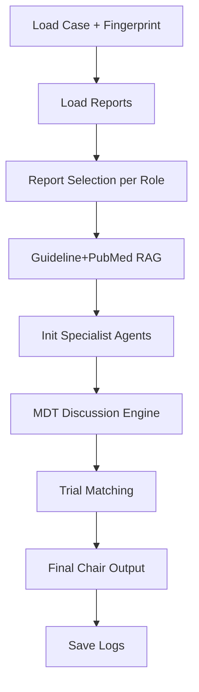

# MDT Discussion Log — 2026-01-18_18-48-27
Generated automatically by MDT Pipeline.


## CASE (structured JSON)

```
{}
```


## FINAL MDT OUTPUT

```
Final Assessment:
Metastatic recurrent malignancy with progressive liver, presacral, bone, and peritoneal disease and severe anemia; primary site, histology, stage, prior treatments, and current performance status remain undefined [@2022-12-29|CT][@2022-12-29|MR][@20230103|5600862].

Core Treatment Strategy:
- Urgently repeat CBC, full anemia workup, and assess for transfusion/bleeding to stabilize before biopsy/systemic therapy [@20230103|5600862].  
- Retrieve all prior pathology/IHC and full oncologic treatment records to define primary site, histology, and treatment line (currently unknown).  
- Arrange whole-body FDG PET/CT coordinated with image-guided biopsy of safest liver lesion for updated pathology and molecular profiling [@2022-12-29|CT].  
- After pathology and staging clarification, reconvene MDT to choose non‑HRD‑oriented systemic category and symptom‑directed local palliation [@OH2203828|2022-04-18][@guideline:nccn_ovariancancer_v3_2025__v00000000|14].  

Change Triggers:
- If anemia remains unstable or symptomatic despite optimization, defer invasive biopsy/systemic therapy and prioritize stabilization and supportive care.  
- If new tissue/IHC shows non‑gynecologic or unexpected primary, shift from gynecologic pathway to site‑specific systemic and palliative strategy.
```


## PIPELINE FLOW (Mermaid)




## TRACE EVENTS (Structured)

```json
[
  {
    "ts": "2026-01-18T18:44:36.515567",
    "event": "pipeline_start",
    "payload": {
      "visit_time": "2023-01-03 08:53:29.260000",
      "meta_info": "340123197709263626"
    }
  },
  {
    "ts": "2026-01-18T18:44:36.515717",
    "event": "case_fingerprint",
    "payload": {
      "case_fingerprint": "bf21a9e8fbc5"
    }
  },
  {
    "ts": "2026-01-18T18:44:36.773658",
    "event": "reports_loaded",
    "payload": {
      "lab_n": 92,
      "img_n": 10,
      "path_n": 0,
      "mut_n": 1,
      "cutoff_dt": "2023-01-04 08:53:29"
    }
  },
  {
    "ts": "2026-01-18T18:44:47.560609",
    "event": "reports_selected",
    "payload": {
      "lab": {
        "chair": [
          "20221229|8300002|2022-12-29",
          "20221229|9703212|2022-12-29",
          "20230103|5600862|2023-01-03"
        ],
        "oncologist": [
          "20221229|8300002|2022-12-29",
          "20221229|9703212|2022-12-29",
          "20230103|5600862|2023-01-03"
        ],
        "radiologist": [],
        "pathologist": [],
        "nuclear": []
      },
      "imaging": {
        "chair": [
          "2022-10-24|CT|2022-10-24",
          "2022-12-29|MR|2022-12-29",
          "2022-12-29|CT|2022-12-29"
        ],
        "oncologist": [],
        "radiologist": [
          "2022-10-24|MR|2022-10-24",
          "2022-12-29|MR|2022-12-29",
          "2022-12-29|CT|2022-12-29"
        ],
        "pathologist": [],
        "nuclear": [
          "2022-10-24|CT|2022-10-24",
          "2022-12-29|MR|2022-12-29",
          "2022-12-29|CT|2022-12-29"
        ]
      },
      "pathology": {
        "chair": [],
        "oncologist": [],
        "radiologist": [],
        "pathologist": [],
        "nuclear": []
      },
      "mutation": {
        "chair": [
          "OH2203828|2022-04-18"
        ],
        "oncologist": [
          "OH2203828|2022-04-18"
        ],
        "radiologist": [],
        "pathologist": [
          "OH2203828|2022-04-18"
        ],
        "nuclear": []
      }
    }
  },
  {
    "ts": "2026-01-18T18:45:03.156438",
    "event": "rag_query",
    "payload": {
      "query": "Guidelines for management of ovarian cancer by histology and platinum sensitivity, considering extent of metastatic disease (sites unspecified) and any relevant molecular markers (e.g., BRCA/HRD/MSI/PD-L1/ATM), including options based on performance status and organ function constraints."
    }
  },
  {
    "ts": "2026-01-18T18:45:03.156456",
    "event": "rag_hits",
    "payload": {
      "source": "guideline",
      "topk": 5,
      "n": 5
    }
  },
  {
    "ts": "2026-01-18T18:45:03.156458",
    "event": "rag_hits",
    "payload": {
      "source": "pubmed",
      "topk": 5,
      "n": 5
    }
  },
  {
    "ts": "2026-01-18T18:45:03.156460",
    "event": "rag_hits_merged",
    "payload": {
      "n": 10
    }
  },
  {
    "ts": "2026-01-18T18:45:10.225683",
    "event": "mdt_discussion_start",
    "payload": {
      "num_rounds": 2,
      "num_turns": 2
    }
  },
  {
    "ts": "2026-01-18T18:45:16.644777",
    "event": "evidence_tag_warning",
    "payload": {
      "role": "oncologist/initial",
      "preview": "- Diagnosis, disease stage, prior systemic treatments, and current disease status are unknown/needs update to define treatment intent and line.    - HRD-negativ…"
    }
  },
  {
    "ts": "2026-01-18T18:48:24.321017",
    "event": "mdt_discussion_end",
    "payload": {
      "merged_chars": 3486
    }
  },
  {
    "ts": "2026-01-18T18:48:24.321858",
    "event": "final_output_start",
    "payload": {}
  },
  {
    "ts": "2026-01-18T18:48:27.983425",
    "event": "final_output_end",
    "payload": {
      "final_output_chars": 1306
    }
  }
]
```


## INITIAL EXPERT OPINIONS


## chair

```
- Advanced recurrent pelvic malignancy with progressive presacral mass, bone and liver metastases; high CA125, CA19‑9 elevation [@2022-12-29|MR][@2022-12-29|CT][@20221229|9703212].  
- Significant anemia (Hgb 74 g/L) likely multifactorial; urgently clarify symptoms, hemodynamics, and need for transfusion before systemic therapy [@20230103|5600862].  
- Liver and renal function currently acceptable for systemic treatment; continue to monitor closely during any therapy [@20221229|8300002].  
- HRD/BRCA negative; consider non‑HRD–focused systemic strategies and clinical trials rather than PARP‑driven approaches [@OH2203828][@guideline:nccn_ovariancancer_v3_2025__v00000000|15].  
- Missing: current histology/stage, prior treatments, performance status, pain/neurologic status, patient goals; obtain before definitive systemic vs local palliation plan.
```


## oncologist

```
- Diagnosis, disease stage, prior systemic treatments, and current disease status are unknown/needs update to define treatment intent and line.  

- HRD-negative, BRCA1/2 wild-type; germline ATM variant; implications for PARP/DDR-targeted strategies limited [@report_id:OH2203828|2022-04-18].  

- Anemia (Hgb 74 g/L, RBC 2.84×10¹²/L) may constrain myelosuppressive regimens; etiology and transfusion/iron status need update [@20230103|2023-01-03].  

- Renal and hepatic function appear adequate for most systemic therapies; confirm current values and trend before new regimen [@20221229|2022-12-29].  

- Tumor markers markedly elevated (CA125, CA19-9, CA15-3); need imaging and pathology update to correlate with disease burden [@20221229|2022-12-29].
```


## radiologist

```
- Presacral pelvic mass at vaginal stump, now 53×44 mm with heterogeneous enhancement, invading adjacent peritoneum and sacrum, consistent with local recurrence. [@2022-12-29|MR]

- Multiple enhancing nodules in pelvic mesentery unchanged from prior, suspicious for peritoneal metastatic disease. [@2022-12-29|MR]

- New enhancing nodule in right iliac bone, suspicious for osseous metastasis. [@2022-12-29|MR]

- Liver with multiple metastatic nodules, increased number and size versus October 2022; coexisting stable hepatic cysts. [@2022-12-29|CT]

- Splenic patchy low-density area possibly infarct; recommend correlation with symptoms and follow-up imaging. [@2022-12-29|CT]
```


## pathologist

```
- No histology or IHC reports are available; tumor type, primary site, and grade remain completely undefined (needs surgical pathology report).  
- Germline ATM exon8 c.A947G p.Y316C variant reported; clinical significance for this case not specified [@OH2203828|2022-04-18].  
- HRD testing reported negative; BRCA1/2, TP53, ARID1A, PTEN, PIK3CA, PALB2, RAD51D, BRIP1, BARD1 show no pathogenic variants detected [@OH2203828|2022-04-18].  
- Somatic tumor sequencing results are not documented; updated tumor NGS/HRR panel from most recent tissue, if done, is needed.  
- Correlation of this germline panel with a specific malignancy is impossible without updated pathology diagnosis and staging information.
```


## nuclear

```
- No PET/CT available; metabolic characterization of liver, pelvic, and bone lesions currently impossible—FDG PET/CT needed for staging update.  

- CT shows multiple enlarging liver low-density nodules, radiologically consistent with progressive hepatic metastases, not yet metabolically confirmed [@2022-12-29|CT].  

- Pelvic MRI indicates enlarging presacral mass with peritoneal and sacral involvement, suspicious for local recurrence and invasion [@2022-12-29|MR].  

- MRI also shows new enhancing right iliac bone lesion and mesenteric nodules, suspicious for osseous and peritoneal metastases [@2022-12-29|MR].  

- Need current whole-body FDG PET/CT to assess metabolic activity, confirm recurrence extent, and potentially upstage with additional distant lesions.
```


## MERGED SUMMARY (Assistant)

```
Key Knowledge:
- Advanced recurrent pelvic malignancy with presacral mass invading sacrum/peritoneum, pelvic mesenteric nodules, new right iliac bone lesion, and progressive liver metastases; markedly elevated CA125/CA19‑9/CA15‑3.
- HRD negative, BRCA1/2 wild-type; germline ATM variant of unclear therapeutic relevance; no clear actionable DDR alterations.
- Significant anemia (Hgb ~74 g/L) likely multifactorial; renal and hepatic function currently adequate for systemic therapy.
- Overall picture of disseminated disease; possible splenic infarct on CT.
- Non‑gynecologic primary remains possible given lack of definitive pathology.

Controversies:
- Systemic therapy choice, line of treatment, and even primary tumor site cannot be defined without prior pathology, IHC, and treatment history.
- Priority and sequencing of systemic therapy versus local palliative measures (e.g., RT to sacrum/iliac bone) in the context of severe anemia.
- Clinical utility of the germline ATM variant for targeted therapy remains uncertain.
- Extent to which whole-body FDG PET/CT will change management versus adding diagnostic load in a patient with urgent anemia issues.

Missing Info:
- All historical surgical/biopsy pathology and IHC reports to define primary site, histology, and grade.
- Full oncologic history: diagnosis date, stages, systemic regimens, surgeries, radiotherapy, responses, and toxicities.
- Current clinical status: ECOG/PS, pain and neurologic symptoms (sacral/bone involvement), bleeding, constitutional symptoms, and patient goals/preferences.
- Updated labs: CBC, iron studies, hemolysis markers, renal/hepatic function, coagulation, and transfusion history.
- Any prior tumor NGS/somatic profiling and prior PET/CT, if performed.

Working Plan:
- Urgently retrieve and upload all historical pathology/IHC and oncology treatment records to define diagnosis, primary site, stage, and line of therapy.
- Perform updated clinical assessment (ECOG, symptom burden, neurologic exam, bleeding, goals of care).
- Repeat labs and urgently evaluate and manage anemia (including need for transfusion) before systemic treatment decisions.
- Coordinate a baseline whole-body FDG PET/CT to refine staging and metabolic burden, provided it does not delay anemia optimization or necessary urgent palliation.
- Radiology and nuclear medicine to coordinate PET/CT timing with any planned image‑guided biopsy to efficiently obtain tissue and staging information.
- Re-discuss in MDT once pathology, staging, and clinical status are clarified to define appropriate non‑HRD systemic options (including trials) and symptom‑directed local therapies (e.g., RT).
[R2T1 DELTA] radiologist->oncologist(missing): From imaging, liver lesions appear suitable for ultrasound/CT-guided biopsy; please indicate preferred target so we can plan alongside PET/CT. | radiologist->nuclear(missing): When scheduling PET/CT, please coordinate with us to allow same-day or sequential image-guided biopsy of a chosen lesion.
[R2T2 DELTA] chair->oncologist(unspecified): Please specify whether liver versus pelvic lesion biopsy is preferred, balancing diagnostic yield and procedural risk in this anemic patient, so radiology/nuclear can plan with PET/CT efficiently. | oncologist->radiologist(missing): Given the need for broad molecular profiling, I’d favor a liver lesion as the primary biopsy target; please select the safest, most accessible site and coordinate with nuclear for PET/CT‑linked scheduling.
```


## INTERACTION LOG (Round × Turn)

### Round 1

#### Turn 1
- **chair → oncologist:** Before proposing any regimen, anemia (Hb 74 g/L) and performance status must be urgently clarified and stabilized, and prior systemic/locoregional treatments retrieved to define true line of therapy and intent.
- **chair → radiologist:** Given sacral invasion, iliac bone lesion, and progressive liver disease, please comment on imminent fracture/neurologic risk and whether targeted palliative RT fields are technically feasible now versus after systemic therapy.
- **chair → pathologist:** We need definitive pathology (primary site, histologic subtype/grade, IHC panel) from prior surgery/biopsies; if inconclusive or inaccessible, advise on the safest current biopsy site for confirmation.
- **chair → nuclear:** Please advise whether FDG PET/CT would meaningfully refine staging and guide selection/priority of systemic versus local palliative approaches in this disseminated setting.
- **oncologist → chair:** Before deciding on systemic therapy, we still lack definitive primary histology, full prior treatment history, and current ECOG; could we prioritize retrieving outside oncology/pathology records and documenting performance status today?
- **oncologist → radiologist:** Given the enlarging presacral mass with sacral invasion and new right iliac bone lesion, can you comment on feasibility and urgency of image‑guided biopsy targets and whether any features suggest a non‑gynecologic primary?
- **oncologist → pathologist:** Do we have any prior pathology blocks or reports (including IHC) that clarify primary site and subtype of this pelvic malignancy, or should we plan a new biopsy of the presacral or liver lesion?
- **oncologist → nuclear:** Would a whole-body FDG PET/CT meaningfully refine staging or identify an unknown primary and additional symptomatic sites to guide systemic vs palliative local therapy planning?
- **pathologist → chair:** No surgical pathology or IHC are available to define primary site, histologic type, or grade; please obtain and upload all prior biopsy/resection reports for accurate diagnosis correlation with current imaging.
- **nuclear → oncologist:** Before systemic decisions, a whole-body FDG PET/CT would clarify metabolic activity and full extent of liver, presacral, bone, and peritoneal lesions for accurate current staging.
- **nuclear → radiologist:** Given progressive CT/MR lesions without prior PET, please consider scheduling a baseline whole-body FDG PET/CT to assess metabolic burden and detect additional occult metastases.

#### Turn 2
- **chair → oncologist:** Systemic therapy planning should be deferred until we obtain prior pathology/oncology records and stabilize the severe anemia with updated labs and transfusion assessment.
- **chair → radiologist:** Please coordinate with nuclear medicine to sequence baseline whole-body FDG PET/CT alongside any planned future MRI/CT, avoiding redundant imaging and excessive contrast load.
- **chair → pathologist:** Kindly prioritize retrieval and upload of all historical pathology/IHC reports; without a defined primary and histology, current treatment stratification remains unsafe.
- **chair → nuclear:** Agree PET/CT is valuable, but please confirm it will not delay urgent anemia workup/optimization or symptomatic local measures if needed.
- **oncologist → chair:** Given disseminated disease with severe anemia and unclear primary or line of therapy, could we prioritize obtaining prior pathology/systemic treatment records and arranging urgent labs/transfusion assessment before committing to a new systemic regimen?
- **oncologist → radiologist:** In light of nuclear’s recommendation for baseline whole-body PET/CT, can you help coordinate PET timing with potential image-guided biopsy so both staging and tissue diagnosis needs are efficiently addressed?

### Round 2

#### Turn 1
- **radiologist → oncologist:** From imaging, liver lesions appear suitable for ultrasound/CT-guided biopsy; please indicate preferred target so we can plan alongside PET/CT.
- **radiologist → nuclear:** When scheduling PET/CT, please coordinate with us to allow same-day or sequential image-guided biopsy of a chosen lesion.

#### Turn 2
- **chair → oncologist:** Please specify whether liver versus pelvic lesion biopsy is preferred, balancing diagnostic yield and procedural risk in this anemic patient, so radiology/nuclear can plan with PET/CT efficiently.
- **oncologist → radiologist:** Given the need for broad molecular profiling, I’d favor a liver lesion as the primary biopsy target; please select the safest, most accessible site and coordinate with nuclear for PET/CT‑linked scheduling.


## FINAL REFINED PLANS (per Round)

### Round 1


## chair

```
- Urgently repeat labs and assess for transfusion/bleeding causes to stabilize severe anemia before any systemic therapy [@20230103|5600862].  
- Retrieve and review all prior pathology/IHC and oncology treatment records to define primary site, histology, stage, and treatment line (currently unknown).  
- Perform comprehensive clinical assessment (ECOG, pain, neurologic deficits, other symptoms, goals/preferences) to guide intent and balance systemic versus local palliation (currently unknown).  
- Arrange whole-body FDG PET/CT, coordinated with radiology for possible image-guided biopsy, ensuring it does not delay anemia management (prior PET unknown).  
- After data updated, re-discuss in MDT to select appropriate non‑HRD systemic strategy and prioritize palliative RT or other local measures [@OH2203828][@guideline:nccn_ovariancancer_v3_2025__v00000000|14].
```


## oncologist

```
- Urgently repeat CBC, iron studies, hemolysis markers, coagulation; arrange transfusion/optimization for severe anemia before systemic therapy [@20230103|2023-01-03].  

- Retrieve and review all prior pathology/IHC and systemic treatment records to define primary site, histology, stage, and treatment line (currently unknown).  

- Obtain updated ECOG performance status, detailed symptom assessment (pain, neurologic deficits, bleeding), and goals of care to guide intensity of systemic vs palliative strategies (unknown).  

- Coordinate whole-body FDG PET/CT with image-guided biopsy of a safe lesion (e.g., liver or presacral) to refine staging and secure tissue diagnosis (no PET or recent biopsy available).  

- After above, re-discuss in MDT to select appropriate non‑HRD systemic treatment category and prioritize local palliative measures (e.g., sacral/bone RT) as needed [@report_id:OH2203828|2022-04-18].
```


## radiologist

```
- Urgently retrieve and upload all prior surgical/biopsy pathology and IHC to define primary site and histology (currently unknown).  

- Obtain updated labs (CBC, iron studies, hemolysis, renal, hepatic, coagulation) and assess need for transfusion; last Hgb 74 g/L [@lab|unknown].  

- Arrange whole-body FDG PET/CT to refine current staging and metabolic burden; no prior PET/CT available [@2022-12-29|CT][@2022-12-29|MR].  

- Coordinate PET/CT timing with potential image-guided biopsy of a safe, accessible lesion (e.g., liver or presacral mass) for diagnosis.  

- Re-discuss in MDT after pathology retrieval, PET/CT, and anemia optimization to balance systemic options versus symptom-directed local palliation.
```


## pathologist

```
- Primary site, histologic type, grade, and staging remain unknown; urgently retrieve all prior surgical/biopsy and IHC reports (unknown/needs update).  
- No tumor histology/IHC from current lesions is available; consider image-guided biopsy of a representative site after records review (unknown/needs update).  
- Only documented molecular data: germline ATM p.Y316C, HRD‑negative, BRCA1/2 wild-type; somatic NGS on tumor unknown [@OH2203828|2022-04-18].  
- Recommend deferring any pathology-based treatment stratification labels (e.g., “ovarian,” “GI,” “gynecologic”) until full pathology and IHC are obtained (unknown/needs update).  
- Once prior and/or new tissue is available, perform integrated histology, IHC, and, if feasible, tumor NGS to clarify primary and lineage (unknown/needs update).
```


## nuclear

```
- Arrange whole-body FDG PET/CT to define metabolic burden, detect occult metastases, and better stage liver, presacral, bone, peritoneal disease [@2022-12-29|CT][@2022-12-29|MR].  
- Coordinate PET/CT timing with any planned image-guided biopsy so staging and tissue acquisition occur in a single diagnostic pathway.  
- Ensure PET/CT scheduling does not delay urgent anemia evaluation/optimization and symptom-directed local measures (e.g., sacral/bone palliation) as determined by other teams.  
- Use PET/CT to help distinguish dominant pelvic versus hepatic/bone disease compartments, informing prioritization of systemic versus local palliative strategies.  
- Confirm whether any prior PET/CT exists; if so, compare with new PET to assess metabolic progression and treatment response potential (if available).
```

### Round 2


## chair

```
- Stabilize anemia urgently with repeat CBC and workup before invasive biopsy or systemic therapy decisions [@20230103|5600862].  
- Retrieve and review all prior pathology/IHC and treatment records to define primary site, histology, and treatment line (currently unknown).  
- Proceed with whole-body FDG PET/CT, coordinated so a safe, accessible liver lesion can be biopsied in the same care episode [@2022-12-29|CT].  
- After new pathology and staging, re‑convene MDT to choose appropriate non‑HRD systemic strategy and local palliation options [@OH2203828][@guideline:nccn_ovariancancer_v3_2025__v00000000|14].  
- Assess current performance status, pain/neurologic symptoms, bleeding, and patient goals to prioritize timing of RT versus systemic therapy (all currently unknown).
```


## oncologist

```
- Repeat CBC, iron studies, hemolysis markers, renal/hepatic function, and coagulation; urgently assess transfusion/bleeding risk for Hgb 74 g/L [@20230103|2023-01-03].  

- Retrieve all prior pathology/IHC and complete oncologic treatment history to define primary site, histology, stage, and systemic line (currently unknown).  

- Perform focused clinical assessment (ECOG, pain/neurologic deficits, bleeding, constitutional symptoms, goals) to balance systemic versus palliative‑local treatment intensity (unknown).  

- Coordinate whole-body FDG PET/CT with image‑guided liver lesion biopsy as preferred target, provided this does not delay anemia optimization (prior PET/biopsy details unknown).  

- After diagnostic clarification, re-discuss in MDT to choose appropriate non‑HRD systemic treatment category and prioritize symptom‑directed local measures (e.g., sacral/iliac RT) [@OH2203828|2022-04-18][@guideline:nccn_ovariancancer_v3_2025__v00000000|14].
```


## radiologist

```
- Presacral pelvic mass invading sacrum/peritoneum with stable-to-progressive appearance on serial MR, suggesting locally advanced recurrent disease [@2022-10-24|MR][@2022-12-29|MR].  

- Progressive liver metastases: multiple low-density hepatic nodules increased in number/size, largest ~17×14 mm [@2022-12-29|CT].  

- New enhancing right iliac bone lesion and multiple pelvic mesenteric nodules, consistent with osseous and peritoneal metastases [@2022-12-29|MR].  

- Possible splenic infarct manifested as patchy low-density splenic area, requiring clinical correlation and follow-up imaging [@2022-12-29|CT].  

- No biliary obstruction or ascites; hepatic vasculature and bile ducts remain patent despite metastatic burden [@2022-12-29|CT].
```


## pathologist

```
- Primary site, histology, grade, and stage remain undefined; urgently obtain and upload all historical pathology and IHC reports (unknown/needs update).  
- No tissue diagnosis from current metastatic sites is available; plan image‑guided liver lesion biopsy coordinated with PET/CT for staging (unknown/needs update).  
- Only confirmed molecular data: germline ATM p.Y316C, HRD‑negative, BRCA1/2 wild-type; tumor somatic NGS unknown [@OH2203828|2022-04-18].  
- Do not assign organ‑specific labels (gynecologic vs non‑gynecologic) or subtype‑specific treatment pathways until integrated histology/IHC and molecular results are available (unknown/needs update).  
- Once tissue obtained, perform comprehensive morphology, IHC panel, and, if feasible, broad NGS to clarify lineage and potential biomarkers (unknown/needs update).
```


## nuclear

```
- Schedule whole-body FDG PET/CT to characterize metabolic activity and full extent of liver, presacral, bone, and peritoneal disease [@2022-12-29|CT][@2022-12-29|MR].  
- Coordinate PET/CT with planned image-guided biopsy of the safest, metabolically active liver lesion to maximize diagnostic and molecular yield [@2022-12-29|CT].  
- Ensure PET/CT and biopsy timing do not delay urgent anemia evaluation, optimization, or necessary rapid palliative interventions (e.g., for sacral/iliac pain).  
- Use PET/CT to assess for additional symptomatic or impending-complication sites (e.g., spine, weight-bearing bone, bowel/ureter involvement) to inform local palliation.  
- Compare upcoming PET/CT with any future imaging to monitor metabolic response or progression once a treatment strategy is defined (if pursued).
```


## RAW AGENT LOGS

### chair
- **User:** Give INITIAL opinion (use ONLY your system-provided patient facts).
Return up to 5 bullets, each ≤20 words.
If key data missing, say exactly what needs updating.
If you reference treatment strategy categories, guidelines, trials, or literature evidence, include tags [@guideline:doc_id|page] or [@pubmed:PMID].
  
  **Assistant:** - Advanced recurrent pelvic malignancy with progressive presacral mass, bone and liver metastases; high CA125, CA19‑9 elevation [@2022-12-29|MR][@2022-12-29|CT][@20221229|9703212].  
- Significant anemia (Hgb 74 g/L) likely multifactorial; urgently clarify symptoms, hemodynamics, and need for transfusion before systemic therapy [@20230103|5600862].  
- Liver and renal function currently acceptable for systemic treatment; continue to monitor closely during any therapy [@20221229|8300002].  
- HRD/BRCA negative; consider non‑HRD–focused systemic strategies and clinical trials rather than PARP‑driven approaches [@OH2203828][@guideline:nccn_ovariancancer_v3_2025__v00000000|15].  
- Missing: current histology/stage, prior treatments, performance status, pain/neurologic status, patient goals; obtain before definitive systemic vs local palliation plan.
  
  *(2026-01-18T18:45:13.491249)*

- **User:** ROLE: chair. VISIT: 2023-01-03 08:53:29.260000
Default is NOT to speak. Speak ONLY if: conflict | safety | missing-critical | new-critical.

CONTEXT (latest):
Key Knowledge:
- Advanced recurrent pelvic malignancy with enlarging presacral mass invading sacrum/peritoneum, pelvic mesenteric nodules, new right iliac bone lesion, and progressive liver metastases; markedly elevated CA125/CA19‑9/CA15‑3.
- HRD negative, BRCA1/2 wild-type; germline ATM variant with unclear therapeutic relevance; no clear actionable DDR alterations.
- Significant anemia (Hgb ~74 g/L) likely multifactorial; renal/hepatic function currently adequate for systemic therapy.
- Overall picture of disseminated disease; possible splenic infarct on CT.

Controversies:
- Systemic therapy choice and line cannot be defined without clear primary site, histology, stage, prior treatments, and performance status.
- Unclear priority between systemic therapy and local palliative approaches (e.g., RT to sacrum/bone).
- Uncertain clinical utility of the germline ATM variant for targeted therapies.

Missing Info:
- Definitive pathology (tumor type, grade, IHC, stage) and full prior oncology history (systemic treatments, surgery, RT, responses, toxicities).
- Current ECOG/PS, symptom burden (pain, neurologic deficits, bleeding, systemic symptoms), and patient goals/preferences.
- Updated labs: CBC, iron studies, hemolysis markers, renal/hepatic function, coagulation, transfusion history.
- Any tumor NGS/somatic profiling and prior PET/CT, if performed.

Working Plan:
- Retrieve and review full pathology and historical oncology records to define diagnosis, stage, and treatment line/intent.
- Perform updated clinical assessment (ECOG, detailed symptom review, goals of care).
- Repeat labs and urgently address anemia (including transfusion need) before systemic treatment decisions.
- Consider whole-body FDG PET/CT to refine staging and assess metabolic activity.
- Re-discuss in MDT once above data available to define feasible non‑HRD systemic options (including trials) and symptom-directed local palliation (e.g., RT).

Allowed targets: [oncologist,radiologist,pathologist,nuclear]
Return ONE-LINE JSON only:{"speak":"yes/no","messages":[{"target":"<role>","message":"<1-2 sentences>","why":"conflict|safety|missing|new"}]}
  
  **Assistant:** {"speak":"yes","messages":[{"target":"oncologist","message":"Before proposing any regimen, anemia (Hb 74 g/L) and performance status must be urgently clarified and stabilized, and prior systemic/locoregional treatments retrieved to define true line of therapy and intent.","why":"safety"},{"target":"radiologist","message":"Given sacral invasion, iliac bone lesion, and progressive liver disease, please comment on imminent fracture/neurologic risk and whether targeted palliative RT fields are technically feasible now versus after systemic therapy.","why":"missing"},{"target":"pathologist","message":"We need definitive pathology (primary site, histologic subtype/grade, IHC panel) from prior surgery/biopsies; if inconclusive or inaccessible, advise on the safest current biopsy site for confirmation.","why":"missing"},{"target":"nuclear","message":"Please advise whether FDG PET/CT would meaningfully refine staging and guide selection/priority of systemic versus local palliative approaches in this disseminated setting.","why":"missing"}]}
  
  *(2026-01-18T18:45:38.255934)*

- **User:** ROLE: chair. VISIT: 2023-01-03 08:53:29.260000
Default is NOT to speak. Speak ONLY if: conflict | safety | missing-critical | new-critical.

CONTEXT (latest):
Key Knowledge:
- Advanced recurrent pelvic malignancy with enlarging presacral mass invading sacrum/peritoneum, pelvic mesenteric nodules, new right iliac bone lesion, and progressive liver metastases; markedly elevated CA125/CA19‑9/CA15‑3.
- HRD negative, BRCA1/2 wild-type; germline ATM variant with unclear therapeutic relevance; no clear actionable DDR alterations.
- Significant anemia (Hgb ~74 g/L) likely multifactorial; renal/hepatic function currently adequate for systemic therapy.
- Overall picture of disseminated disease; possible splenic infarct on CT.

Controversies:
- Systemic therapy choice and line cannot be defined without clear primary site, histology, stage, prior treatments, and performance status.
- Unclear priority between systemic therapy and local palliative approaches (e.g., RT to sacrum/bone).
- Uncertain clinical utility of the germline ATM variant for targeted therapies.

Missing Info:
- Definitive pathology (tumor type, grade, IHC, stage) and full prior oncology history (systemic treatments, surgery, RT, responses, toxicities).
- Current ECOG/PS, symptom burden (pain, neurologic deficits, bleeding, systemic symptoms), and patient goals/preferences.
- Updated labs: CBC, iron studies, hemolysis markers, renal/hepatic function, coagulation, transfusion history.
- Any tumor NGS/somatic profiling and prior PET/CT, if performed.

Working Plan:
- Retrieve and review full pathology and historical oncology records to define diagnosis, stage, and treatment line/intent.
- Perform updated clinical assessment (ECOG, detailed symptom review, goals of care).
- Repeat labs and urgently address anemia (including transfusion need) before systemic treatment decisions.
- Consider whole-body FDG PET/CT to refine staging and assess metabolic activity.
- Re-discuss in MDT once above data available to define feasible non‑HRD systemic options (including trials) and symptom-directed local palliation (e.g., RT).
[R1T1 DELTA] non‑gynecologic primary? | oncologist->nuclear(missing): Would a whole-body FDG PET/CT meaningfully refine staging or identify an unknown primary and additional symptomatic sites to guide systemic vs palliative local therapy planning? | pathologist->chair(missing): No surgical pathology or IHC are available to define primary site, histologic type, or grade; please obtain and upload all prior biopsy/resection reports for accurate diagnosis correlation with current imaging. | nuclear->oncologist(missing): Before systemic decisions, a whole-body FDG PET/CT would clarify metabolic activity and full extent of liver, presacral, bone, and peritoneal lesions for accurate current staging. | nuclear->radiologist(missing): Given progressive CT/MR lesions without prior PET, please consider scheduling a baseline whole-body FDG PET/CT to assess metabolic burden and detect additional occult metastases.

Allowed targets: [oncologist,radiologist,pathologist,nuclear]
Return ONE-LINE JSON only:{"speak":"yes/no","messages":[{"target":"<role>","message":"<1-2 sentences>","why":"conflict|safety|missing|new"}]}
  
  **Assistant:** {"speak":"yes","messages":[{"target":"oncologist","message":"Systemic therapy planning should be deferred until we obtain prior pathology/oncology records and stabilize the severe anemia with updated labs and transfusion assessment.","why":"safety"},{"target":"radiologist","message":"Please coordinate with nuclear medicine to sequence baseline whole-body FDG PET/CT alongside any planned future MRI/CT, avoiding redundant imaging and excessive contrast load.","why":"missing"},{"target":"pathologist","message":"Kindly prioritize retrieval and upload of all historical pathology/IHC reports; without a defined primary and histology, current treatment stratification remains unsafe.","why":"missing"},{"target":"nuclear","message":"Agree PET/CT is valuable, but please confirm it will not delay urgent anemia workup/optimization or symptomatic local measures if needed.","why":"safety"}]}
  
  *(2026-01-18T18:45:49.269628)*

- **User:** Given MDT context:
Key Knowledge:
- Advanced recurrent pelvic malignancy with enlarging presacral mass invading sacrum/peritoneum, pelvic mesenteric nodules, new right iliac bone lesion, and progressive liver metastases; markedly elevated CA125/CA19‑9/CA15‑3.
- HRD negative, BRCA1/2 wild-type; germline ATM variant with unclear therapeutic relevance; no clear actionable DDR alterations.
- Significant anemia (Hgb ~74 g/L) likely multifactorial; renal/hepatic function currently adequate for systemic therapy.
- Overall picture of disseminated disease; possible splenic infarct on CT.

Controversies:
- Systemic therapy choice and line cannot be defined without clear primary site, histology, stage, prior treatments, and performance status.
- Unclear priority between systemic therapy and local palliative approaches (e.g., RT to sacrum/bone).
- Uncertain clinical utility of the germline ATM variant for targeted therapies.

Missing Info:
- Definitive pathology (tumor type, grade, IHC, stage) and full prior oncology history (systemic treatments, surgery, RT, responses, toxicities).
- Current ECOG/PS, symptom burden (pain, neurologic deficits, bleeding, systemic symptoms), and patient goals/preferences.
- Updated labs: CBC, iron studies, hemolysis markers, renal/hepatic function, coagulation, transfusion history.
- Any tumor NGS/somatic profiling and prior PET/CT, if performed.

Working Plan:
- Retrieve and review full pathology and historical oncology records to define diagnosis, stage, and treatment line/intent.
- Perform updated clinical assessment (ECOG, detailed symptom review, goals of care).
- Repeat labs and urgently address anemia (including transfusion need) before systemic treatment decisions.
- Consider whole-body FDG PET/CT to refine staging and assess metabolic activity.
- Re-discuss in MDT once above data available to define feasible non‑HRD systemic options (including trials) and symptom-directed local palliation (e.g., RT).
[R1T1 DELTA] non‑gynecologic primary? | oncologist->nuclear(missing): Would a whole-body FDG PET/CT meaningfully refine staging or identify an unknown primary and additional symptomatic sites to guide systemic vs palliative local therapy planning? | pathologist->chair(missing): No surgical pathology or IHC are available to define primary site, histologic type, or grade; please obtain and upload all prior biopsy/resection reports for accurate diagnosis correlation with current imaging. | nuclear->oncologist(missing): Before systemic decisions, a whole-body FDG PET/CT would clarify metabolic activity and full extent of liver, presacral, bone, and peritoneal lesions for accurate current staging. | nuclear->radiologist(missing): Given progressive CT/MR lesions without prior PET, please consider scheduling a baseline whole-body FDG PET/CT to assess metabolic burden and detect additional occult metastases.
[R1T2 DELTA] t load. | chair->pathologist(missing): Kindly prioritize retrieval and upload of all historical pathology/IHC reports; without a defined primary and histology, current treatment stratification remains unsafe. | chair->nuclear(safety): Agree PET/CT is valuable, but please confirm it will not delay urgent anemia workup/optimization or symptomatic local measures if needed. | oncologist->chair(missing): Given disseminated disease with severe anemia and unclear primary or line of therapy, could we prioritize obtaining prior pathology/systemic treatment records and arranging urgent labs/transfusion assessment before committing to a new systemic regimen? | oncologist->radiologist(missing): In light of nuclear’s recommendation for baseline whole-body PET/CT, can you help coordinate PET timing with potential image-guided biopsy so both staging and tissue diagnosis needs are efficiently addressed?

Provide FINAL refined plan.
Up to 5 bullets, each ≤20 words.
Any factual claim must include [@report_id|date] or say unknown.
If you reference treatment strategy categories, guidelines, trials, or literature evidence, include tags [@guideline:doc_id|page] or [@pubmed:PMID].
  
  **Assistant:** - Urgently repeat labs and assess for transfusion/bleeding causes to stabilize severe anemia before any systemic therapy [@20230103|5600862].  
- Retrieve and review all prior pathology/IHC and oncology treatment records to define primary site, histology, stage, and treatment line (currently unknown).  
- Perform comprehensive clinical assessment (ECOG, pain, neurologic deficits, other symptoms, goals/preferences) to guide intent and balance systemic versus local palliation (currently unknown).  
- Arrange whole-body FDG PET/CT, coordinated with radiology for possible image-guided biopsy, ensuring it does not delay anemia management (prior PET unknown).  
- After data updated, re-discuss in MDT to select appropriate non‑HRD systemic strategy and prioritize palliative RT or other local measures [@OH2203828][@guideline:nccn_ovariancancer_v3_2025__v00000000|14].
  
  *(2026-01-18T18:45:58.541972)*

- **User:** ROLE: chair. VISIT: 2023-01-03 08:53:29.260000
Default is NOT to speak. Speak ONLY if: conflict | safety | missing-critical | new-critical.

CONTEXT (latest):
Key Knowledge:
- Advanced recurrent pelvic malignancy with presacral mass invading sacrum/peritoneum, pelvic mesenteric nodules, new right iliac bone lesion, and progressive liver metastases; markedly elevated CA125/CA19‑9/CA15‑3.
- HRD negative, BRCA1/2 wild-type; germline ATM variant of unclear therapeutic relevance; no clear actionable DDR alterations.
- Significant anemia (Hgb ~74 g/L) likely multifactorial; renal and hepatic function currently adequate for systemic therapy.
- Overall picture of disseminated disease; possible splenic infarct on CT.
- Non‑gynecologic primary remains possible given lack of definitive pathology.

Controversies:
- Systemic therapy choice, line of treatment, and even primary tumor site cannot be defined without prior pathology, IHC, and treatment history.
- Priority and sequencing of systemic therapy versus local palliative measures (e.g., RT to sacrum/iliac bone) in the context of severe anemia.
- Clinical utility of the germline ATM variant for targeted therapy remains uncertain.
- Extent to which whole-body FDG PET/CT will change management versus adding diagnostic load in a patient with urgent anemia issues.

Missing Info:
- All historical surgical/biopsy pathology and IHC reports to define primary site, histology, and grade.
- Full oncologic history: diagnosis date, stages, systemic regimens, surgeries, radiotherapy, responses, and toxicities.
- Current clinical status: ECOG/PS, pain and neurologic symptoms (sacral/bone involvement), bleeding, constitutional symptoms, and patient goals/preferences.
- Updated labs: CBC, iron studies, hemolysis markers, renal/hepatic function, coagulation, and transfusion history.
- Any prior tumor NGS/somatic profiling and prior PET/CT, if performed.

Working Plan:
- Urgently retrieve and upload all historical pathology/IHC and oncology treatment records to define diagnosis, primary site, stage, and line of therapy.
- Perform updated clinical assessment (ECOG, symptom burden, neurologic exam, bleeding, goals of care).
- Repeat labs and urgently evaluate and manage anemia (including need for transfusion) before systemic treatment decisions.
- Coordinate a baseline whole-body FDG PET/CT to refine staging and metabolic burden, provided it does not delay anemia optimization or necessary urgent palliation.
- Radiology and nuclear medicine to coordinate PET/CT timing with any planned image‑guided biopsy to efficiently obtain tissue and staging information.
- Re-discuss in MDT once pathology, staging, and clinical status are clarified to define appropriate non‑HRD systemic options (including trials) and symptom‑directed local therapies (e.g., RT).

Allowed targets: [oncologist,radiologist,pathologist,nuclear]
Return ONE-LINE JSON only:{"speak":"yes/no","messages":[{"target":"<role>","message":"<1-2 sentences>","why":"conflict|safety|missing|new"}]}
  
  **Assistant:** {"speak":"no","messages":[]}
  
  *(2026-01-18T18:46:44.327659)*

- **User:** ROLE: chair. VISIT: 2023-01-03 08:53:29.260000
Default is NOT to speak. Speak ONLY if: conflict | safety | missing-critical | new-critical.

CONTEXT (latest):
Key Knowledge:
- Advanced recurrent pelvic malignancy with presacral mass invading sacrum/peritoneum, pelvic mesenteric nodules, new right iliac bone lesion, and progressive liver metastases; markedly elevated CA125/CA19‑9/CA15‑3.
- HRD negative, BRCA1/2 wild-type; germline ATM variant of unclear therapeutic relevance; no clear actionable DDR alterations.
- Significant anemia (Hgb ~74 g/L) likely multifactorial; renal and hepatic function currently adequate for systemic therapy.
- Overall picture of disseminated disease; possible splenic infarct on CT.
- Non‑gynecologic primary remains possible given lack of definitive pathology.

Controversies:
- Systemic therapy choice, line of treatment, and even primary tumor site cannot be defined without prior pathology, IHC, and treatment history.
- Priority and sequencing of systemic therapy versus local palliative measures (e.g., RT to sacrum/iliac bone) in the context of severe anemia.
- Clinical utility of the germline ATM variant for targeted therapy remains uncertain.
- Extent to which whole-body FDG PET/CT will change management versus adding diagnostic load in a patient with urgent anemia issues.

Missing Info:
- All historical surgical/biopsy pathology and IHC reports to define primary site, histology, and grade.
- Full oncologic history: diagnosis date, stages, systemic regimens, surgeries, radiotherapy, responses, and toxicities.
- Current clinical status: ECOG/PS, pain and neurologic symptoms (sacral/bone involvement), bleeding, constitutional symptoms, and patient goals/preferences.
- Updated labs: CBC, iron studies, hemolysis markers, renal/hepatic function, coagulation, and transfusion history.
- Any prior tumor NGS/somatic profiling and prior PET/CT, if performed.

Working Plan:
- Urgently retrieve and upload all historical pathology/IHC and oncology treatment records to define diagnosis, primary site, stage, and line of therapy.
- Perform updated clinical assessment (ECOG, symptom burden, neurologic exam, bleeding, goals of care).
- Repeat labs and urgently evaluate and manage anemia (including need for transfusion) before systemic treatment decisions.
- Coordinate a baseline whole-body FDG PET/CT to refine staging and metabolic burden, provided it does not delay anemia optimization or necessary urgent palliation.
- Radiology and nuclear medicine to coordinate PET/CT timing with any planned image‑guided biopsy to efficiently obtain tissue and staging information.
- Re-discuss in MDT once pathology, staging, and clinical status are clarified to define appropriate non‑HRD systemic options (including trials) and symptom‑directed local therapies (e.g., RT).
[R2T1 DELTA] radiologist->oncologist(missing): From imaging, liver lesions appear suitable for ultrasound/CT-guided biopsy; please indicate preferred target so we can plan alongside PET/CT. | radiologist->nuclear(missing): When scheduling PET/CT, please coordinate with us to allow same-day or sequential image-guided biopsy of a chosen lesion.

Allowed targets: [oncologist,radiologist,pathologist,nuclear]
Return ONE-LINE JSON only:{"speak":"yes/no","messages":[{"target":"<role>","message":"<1-2 sentences>","why":"conflict|safety|missing|new"}]}
  
  **Assistant:** {"speak":"yes","messages":[{"target":"oncologist","message":"Please specify whether liver versus pelvic lesion biopsy is preferred, balancing diagnostic yield and procedural risk in this anemic patient, so radiology/nuclear can plan with PET/CT efficiently.","why":"missing-critical"}]}
  
  *(2026-01-18T18:47:01.860596)*

- **User:** Given MDT context:
Key Knowledge:
- Advanced recurrent pelvic malignancy with presacral mass invading sacrum/peritoneum, pelvic mesenteric nodules, new right iliac bone lesion, and progressive liver metastases; markedly elevated CA125/CA19‑9/CA15‑3.
- HRD negative, BRCA1/2 wild-type; germline ATM variant of unclear therapeutic relevance; no clear actionable DDR alterations.
- Significant anemia (Hgb ~74 g/L) likely multifactorial; renal and hepatic function currently adequate for systemic therapy.
- Overall picture of disseminated disease; possible splenic infarct on CT.
- Non‑gynecologic primary remains possible given lack of definitive pathology.

Controversies:
- Systemic therapy choice, line of treatment, and even primary tumor site cannot be defined without prior pathology, IHC, and treatment history.
- Priority and sequencing of systemic therapy versus local palliative measures (e.g., RT to sacrum/iliac bone) in the context of severe anemia.
- Clinical utility of the germline ATM variant for targeted therapy remains uncertain.
- Extent to which whole-body FDG PET/CT will change management versus adding diagnostic load in a patient with urgent anemia issues.

Missing Info:
- All historical surgical/biopsy pathology and IHC reports to define primary site, histology, and grade.
- Full oncologic history: diagnosis date, stages, systemic regimens, surgeries, radiotherapy, responses, and toxicities.
- Current clinical status: ECOG/PS, pain and neurologic symptoms (sacral/bone involvement), bleeding, constitutional symptoms, and patient goals/preferences.
- Updated labs: CBC, iron studies, hemolysis markers, renal/hepatic function, coagulation, and transfusion history.
- Any prior tumor NGS/somatic profiling and prior PET/CT, if performed.

Working Plan:
- Urgently retrieve and upload all historical pathology/IHC and oncology treatment records to define diagnosis, primary site, stage, and line of therapy.
- Perform updated clinical assessment (ECOG, symptom burden, neurologic exam, bleeding, goals of care).
- Repeat labs and urgently evaluate and manage anemia (including need for transfusion) before systemic treatment decisions.
- Coordinate a baseline whole-body FDG PET/CT to refine staging and metabolic burden, provided it does not delay anemia optimization or necessary urgent palliation.
- Radiology and nuclear medicine to coordinate PET/CT timing with any planned image‑guided biopsy to efficiently obtain tissue and staging information.
- Re-discuss in MDT once pathology, staging, and clinical status are clarified to define appropriate non‑HRD systemic options (including trials) and symptom‑directed local therapies (e.g., RT).
[R2T1 DELTA] radiologist->oncologist(missing): From imaging, liver lesions appear suitable for ultrasound/CT-guided biopsy; please indicate preferred target so we can plan alongside PET/CT. | radiologist->nuclear(missing): When scheduling PET/CT, please coordinate with us to allow same-day or sequential image-guided biopsy of a chosen lesion.
[R2T2 DELTA] chair->oncologist(unspecified): Please specify whether liver versus pelvic lesion biopsy is preferred, balancing diagnostic yield and procedural risk in this anemic patient, so radiology/nuclear can plan with PET/CT efficiently. | oncologist->radiologist(missing): Given the need for broad molecular profiling, I’d favor a liver lesion as the primary biopsy target; please select the safest, most accessible site and coordinate with nuclear for PET/CT‑linked scheduling.

Provide FINAL refined plan.
Up to 5 bullets, each ≤20 words.
Any factual claim must include [@report_id|date] or say unknown.
If you reference treatment strategy categories, guidelines, trials, or literature evidence, include tags [@guideline:doc_id|page] or [@pubmed:PMID].
  
  **Assistant:** - Stabilize anemia urgently with repeat CBC and workup before invasive biopsy or systemic therapy decisions [@20230103|5600862].  
- Retrieve and review all prior pathology/IHC and treatment records to define primary site, histology, and treatment line (currently unknown).  
- Proceed with whole-body FDG PET/CT, coordinated so a safe, accessible liver lesion can be biopsied in the same care episode [@2022-12-29|CT].  
- After new pathology and staging, re‑convene MDT to choose appropriate non‑HRD systemic strategy and local palliation options [@OH2203828][@guideline:nccn_ovariancancer_v3_2025__v00000000|14].  
- Assess current performance status, pain/neurologic symptoms, bleeding, and patient goals to prioritize timing of RT versus systemic therapy (all currently unknown).
  
  *(2026-01-18T18:47:51.851852)*

- **User:** 
As the MDT chair for gynecologic oncology, you are seeing the patient at OUTPATIENT TIME: 2023-01-03 08:53:29.260000.
Based on PATIENT FACTS + MDT discussion + FINAL refined plans from all experts, determine the CURRENT best management plan for this visit.

STRICT RULES:
- Any factual statement about past tests/treatments must include [@report_id|date] or say unknown.
- Any statement derived from guideline or PubMed literature must include [@guideline:doc_id|page] or [@pubmed:PMID].
- If you cite guideline/PubMed evidence in Core Treatment Strategy or Change Triggers, include at least one tag in that bullet.
- If experts disagree, pick the safest plan and state the key uncertainty.

# FINAL REFINED PLANS (All experts, last round)
{
  "Round 1": {
    "chair": "- Urgently repeat labs and assess for transfusion/bleeding causes to stabilize severe anemia before any systemic therapy [@20230103|5600862].  \n- Retrieve and review all prior pathology/IHC and oncology treatment records to define primary site, histology, stage, and treatment line (currently unknown).  \n- Perform comprehensive clinical assessment (ECOG, pain, neurologic deficits, other symptoms, goals/preferences) to guide intent and balance systemic versus local palliation (currently unknown).  \n- Arrange whole-body FDG PET/CT, coordinated with radiology for possible image-guided biopsy, ensuring it does not delay anemia management (prior PET unknown).  \n- After data updated, re-discuss in MDT to select appropriate non‑HRD systemic strategy and prioritize palliative RT or other local measures [@OH2203828][@guideline:nccn_ovariancancer_v3_2025__v00000000|14].",
    "oncologist": "- Urgently repeat CBC, iron studies, hemolysis markers, coagulation; arrange transfusion/optimization for severe anemia before systemic therapy [@20230103|2023-01-03].  \n\n- Retrieve and review all prior pathology/IHC and systemic treatment records to define primary site, histology, stage, and treatment line (currently unknown).  \n\n- Obtain updated ECOG performance status, detailed symptom assessment (pain, neurologic deficits, bleeding), and goals of care to guide intensity of systemic vs palliative strategies (unknown).  \n\n- Coordinate whole-body FDG PET/CT with image-guided biopsy of a safe lesion (e.g., liver or presacral) to refine staging and secure tissue diagnosis (no PET or recent biopsy available).  \n\n- After above, re-discuss in MDT to select appropriate non‑HRD systemic treatment category and prioritize local palliative measures (e.g., sacral/bone RT) as needed [@report_id:OH2203828|2022-04-18].",
    "radiologist": "- Urgently retrieve and upload all prior surgical/biopsy pathology and IHC to define primary site and histology (currently unknown).  \n\n- Obtain updated labs (CBC, iron studies, hemolysis, renal, hepatic, coagulation) and assess need for transfusion; last Hgb 74 g/L [@lab|unknown].  \n\n- Arrange whole-body FDG PET/CT to refine current staging and metabolic burden; no prior PET/CT available [@2022-12-29|CT][@2022-12-29|MR].  \n\n- Coordinate PET/CT timing with potential image-guided biopsy of a safe, accessible lesion (e.g., liver or presacral mass) for diagnosis.  \n\n- Re-discuss in MDT after pathology retrieval, PET/CT, and anemia optimization to balance systemic options versus symptom-directed local palliation.",
    "pathologist": "- Primary site, histologic type, grade, and staging remain unknown; urgently retrieve all prior surgical/biopsy and IHC reports (unknown/needs update).  \n- No tumor histology/IHC from current lesions is available; consider image-guided biopsy of a representative site after records review (unknown/needs update).  \n- Only documented molecular data: germline ATM p.Y316C, HRD‑negative, BRCA1/2 wild-type; somatic NGS on tumor unknown [@OH2203828|2022-04-18].  \n- Recommend deferring any pathology-based treatment stratification labels (e.g., “ovarian,” “GI,” “gynecologic”) until full pathology and IHC are obtained (unknown/needs update).  \n- Once prior and/or new tissue is available, perform integrated histology, IHC, and, if feasible, tumor NGS to clarify primary and lineage (unknown/needs update).",
    "nuclear": "- Arrange whole-body FDG PET/CT to define metabolic burden, detect occult metastases, and better stage liver, presacral, bone, peritoneal disease [@2022-12-29|CT][@2022-12-29|MR].  \n- Coordinate PET/CT timing with any planned image-guided biopsy so staging and tissue acquisition occur in a single diagnostic pathway.  \n- Ensure PET/CT scheduling does not delay urgent anemia evaluation/optimization and symptom-directed local measures (e.g., sacral/bone palliation) as determined by other teams.  \n- Use PET/CT to help distinguish dominant pelvic versus hepatic/bone disease compartments, informing prioritization of systemic versus local palliative strategies.  \n- Confirm whether any prior PET/CT exists; if so, compare with new PET to assess metabolic progression and treatment response potential (if available)."
  },
  "Round 2": {
    "chair": "- Stabilize anemia urgently with repeat CBC and workup before invasive biopsy or systemic therapy decisions [@20230103|5600862].  \n- Retrieve and review all prior pathology/IHC and treatment records to define primary site, histology, and treatment line (currently unknown).  \n- Proceed with whole-body FDG PET/CT, coordinated so a safe, accessible liver lesion can be biopsied in the same care episode [@2022-12-29|CT].  \n- After new pathology and staging, re‑convene MDT to choose appropriate non‑HRD systemic strategy and local palliation options [@OH2203828][@guideline:nccn_ovariancancer_v3_2025__v00000000|14].  \n- Assess current performance status, pain/neurologic symptoms, bleeding, and patient goals to prioritize timing of RT versus systemic therapy (all currently unknown).",
    "oncologist": "- Repeat CBC, iron studies, hemolysis markers, renal/hepatic function, and coagulation; urgently assess transfusion/bleeding risk for Hgb 74 g/L [@20230103|2023-01-03].  \n\n- Retrieve all prior pathology/IHC and complete oncologic treatment history to define primary site, histology, stage, and systemic line (currently unknown).  \n\n- Perform focused clinical assessment (ECOG, pain/neurologic deficits, bleeding, constitutional symptoms, goals) to balance systemic versus palliative‑local treatment intensity (unknown).  \n\n- Coordinate whole-body FDG PET/CT with image‑guided liver lesion biopsy as preferred target, provided this does not delay anemia optimization (prior PET/biopsy details unknown).  \n\n- After diagnostic clarification, re-discuss in MDT to choose appropriate non‑HRD systemic treatment category and prioritize symptom‑directed local measures (e.g., sacral/iliac RT) [@OH2203828|2022-04-18][@guideline:nccn_ovariancancer_v3_2025__v00000000|14].",
    "radiologist": "- Presacral pelvic mass invading sacrum/peritoneum with stable-to-progressive appearance on serial MR, suggesting locally advanced recurrent disease [@2022-10-24|MR][@2022-12-29|MR].  \n\n- Progressive liver metastases: multiple low-density hepatic nodules increased in number/size, largest ~17×14 mm [@2022-12-29|CT].  \n\n- New enhancing right iliac bone lesion and multiple pelvic mesenteric nodules, consistent with osseous and peritoneal metastases [@2022-12-29|MR].  \n\n- Possible splenic infarct manifested as patchy low-density splenic area, requiring clinical correlation and follow-up imaging [@2022-12-29|CT].  \n\n- No biliary obstruction or ascites; hepatic vasculature and bile ducts remain patent despite metastatic burden [@2022-12-29|CT].",
    "pathologist": "- Primary site, histology, grade, and stage remain undefined; urgently obtain and upload all historical pathology and IHC reports (unknown/needs update).  \n- No tissue diagnosis from current metastatic sites is available; plan image‑guided liver lesion biopsy coordinated with PET/CT for staging (unknown/needs update).  \n- Only confirmed molecular data: germline ATM p.Y316C, HRD‑negative, BRCA1/2 wild-type; tumor somatic NGS unknown [@OH2203828|2022-04-18].  \n- Do not assign organ‑specific labels (gynecologic vs non‑gynecologic) or subtype‑specific treatment pathways until integrated histology/IHC and molecular results are available (unknown/needs update).  \n- Once tissue obtained, perform comprehensive morphology, IHC panel, and, if feasible, broad NGS to clarify lineage and potential biomarkers (unknown/needs update).",
    "nuclear": "- Schedule whole-body FDG PET/CT to characterize metabolic activity and full extent of liver, presacral, bone, and peritoneal disease [@2022-12-29|CT][@2022-12-29|MR].  \n- Coordinate PET/CT with planned image-guided biopsy of the safest, metabolically active liver lesion to maximize diagnostic and molecular yield [@2022-12-29|CT].  \n- Ensure PET/CT and biopsy timing do not delay urgent anemia evaluation, optimization, or necessary rapid palliative interventions (e.g., for sacral/iliac pain).  \n- Use PET/CT to assess for additional symptomatic or impending-complication sites (e.g., spine, weight-bearing bone, bowel/ureter involvement) to inform local palliation.  \n- Compare upcoming PET/CT with any future imaging to monitor metabolic response or progression once a treatment strategy is defined (if pursued)."
  }
}

# Response Format
Final Assessment:
<1–3 sentences: summarize histology/biology, current disease status, and key uncertainties>

Core Treatment Strategy:
- < ≤20 words concrete decision >
- < ≤20 words concrete decision >
- < ≤20 words concrete decision >
- < ≤20 words concrete decision >

Change Triggers:
- < ≤20 words “if X, then adjust management from A to B” >
- < ≤20 words “if X, then adjust management from A to B” >

  
  **Assistant:** Final Assessment:
Metastatic recurrent malignancy with progressive liver, presacral, bone, and peritoneal disease and severe anemia; primary site, histology, stage, prior treatments, and current performance status remain undefined [@2022-12-29|CT][@2022-12-29|MR][@20230103|5600862].

Core Treatment Strategy:
- Urgently repeat CBC, full anemia workup, and assess for transfusion/bleeding to stabilize before biopsy/systemic therapy [@20230103|5600862].  
- Retrieve all prior pathology/IHC and full oncologic treatment records to define primary site, histology, and treatment line (currently unknown).  
- Arrange whole-body FDG PET/CT coordinated with image-guided biopsy of safest liver lesion for updated pathology and molecular profiling [@2022-12-29|CT].  
- After pathology and staging clarification, reconvene MDT to choose non‑HRD‑oriented systemic category and symptom‑directed local palliation [@OH2203828|2022-04-18][@guideline:nccn_ovariancancer_v3_2025__v00000000|14].  

Change Triggers:
- If anemia remains unstable or symptomatic despite optimization, defer invasive biopsy/systemic therapy and prioritize stabilization and supportive care.  
- If new tissue/IHC shows non‑gynecologic or unexpected primary, shift from gynecologic pathway to site‑specific systemic and palliative strategy.
  
  *(2026-01-18T18:48:27.983291)*


### oncologist
- **User:** Give INITIAL opinion (use ONLY your system-provided patient facts).
Return up to 5 bullets, each ≤20 words.
If key data missing, say exactly what needs updating.
If you reference treatment strategy categories, guidelines, trials, or literature evidence, include tags [@guideline:doc_id|page] or [@pubmed:PMID].
  
  **Assistant:** - Diagnosis, disease stage, prior systemic treatments, and current disease status are unknown/needs update to define treatment intent and line.  

- HRD-negative, BRCA1/2 wild-type; germline ATM variant; implications for PARP/DDR-targeted strategies limited [@report_id:OH2203828|2022-04-18].  

- Anemia (Hgb 74 g/L, RBC 2.84×10¹²/L) may constrain myelosuppressive regimens; etiology and transfusion/iron status need update [@20230103|2023-01-03].  

- Renal and hepatic function appear adequate for most systemic therapies; confirm current values and trend before new regimen [@20221229|2022-12-29].  

- Tumor markers markedly elevated (CA125, CA19-9, CA15-3); need imaging and pathology update to correlate with disease burden [@20221229|2022-12-29].
  
  *(2026-01-18T18:45:16.644671)*

- **User:** ROLE: oncologist. VISIT: 2023-01-03 08:53:29.260000
Default is NOT to speak. Speak ONLY if: conflict | safety | missing-critical | new-critical.

CONTEXT (latest):
Key Knowledge:
- Advanced recurrent pelvic malignancy with enlarging presacral mass invading sacrum/peritoneum, pelvic mesenteric nodules, new right iliac bone lesion, and progressive liver metastases; markedly elevated CA125/CA19‑9/CA15‑3.
- HRD negative, BRCA1/2 wild-type; germline ATM variant with unclear therapeutic relevance; no clear actionable DDR alterations.
- Significant anemia (Hgb ~74 g/L) likely multifactorial; renal/hepatic function currently adequate for systemic therapy.
- Overall picture of disseminated disease; possible splenic infarct on CT.

Controversies:
- Systemic therapy choice and line cannot be defined without clear primary site, histology, stage, prior treatments, and performance status.
- Unclear priority between systemic therapy and local palliative approaches (e.g., RT to sacrum/bone).
- Uncertain clinical utility of the germline ATM variant for targeted therapies.

Missing Info:
- Definitive pathology (tumor type, grade, IHC, stage) and full prior oncology history (systemic treatments, surgery, RT, responses, toxicities).
- Current ECOG/PS, symptom burden (pain, neurologic deficits, bleeding, systemic symptoms), and patient goals/preferences.
- Updated labs: CBC, iron studies, hemolysis markers, renal/hepatic function, coagulation, transfusion history.
- Any tumor NGS/somatic profiling and prior PET/CT, if performed.

Working Plan:
- Retrieve and review full pathology and historical oncology records to define diagnosis, stage, and treatment line/intent.
- Perform updated clinical assessment (ECOG, detailed symptom review, goals of care).
- Repeat labs and urgently address anemia (including transfusion need) before systemic treatment decisions.
- Consider whole-body FDG PET/CT to refine staging and assess metabolic activity.
- Re-discuss in MDT once above data available to define feasible non‑HRD systemic options (including trials) and symptom-directed local palliation (e.g., RT).

Allowed targets: [chair,radiologist,pathologist,nuclear]
Return ONE-LINE JSON only:{"speak":"yes/no","messages":[{"target":"<role>","message":"<1-2 sentences>","why":"conflict|safety|missing|new"}]}
  
  **Assistant:** {"speak":"yes","messages":[{"target":"chair","message":"Before deciding on systemic therapy, we still lack definitive primary histology, full prior treatment history, and current ECOG; could we prioritize retrieving outside oncology/pathology records and documenting performance status today?","why":"missing"},{"target":"pathologist","message":"Do we have any prior pathology blocks or reports (including IHC) that clarify primary site and subtype of this pelvic malignancy, or should we plan a new biopsy of the presacral or liver lesion?","why":"missing"},{"target":"radiologist","message":"Given the enlarging presacral mass with sacral invasion and new right iliac bone lesion, can you comment on feasibility and urgency of image‑guided biopsy targets and whether any features suggest a non‑gynecologic primary?","why":"missing"},{"target":"nuclear","message":"Would a whole-body FDG PET/CT meaningfully refine staging or identify an unknown primary and additional symptomatic sites to guide systemic vs palliative local therapy planning?","why":"missing"}]}
  
  *(2026-01-18T18:45:41.372748)*

- **User:** ROLE: oncologist. VISIT: 2023-01-03 08:53:29.260000
Default is NOT to speak. Speak ONLY if: conflict | safety | missing-critical | new-critical.

CONTEXT (latest):
Key Knowledge:
- Advanced recurrent pelvic malignancy with enlarging presacral mass invading sacrum/peritoneum, pelvic mesenteric nodules, new right iliac bone lesion, and progressive liver metastases; markedly elevated CA125/CA19‑9/CA15‑3.
- HRD negative, BRCA1/2 wild-type; germline ATM variant with unclear therapeutic relevance; no clear actionable DDR alterations.
- Significant anemia (Hgb ~74 g/L) likely multifactorial; renal/hepatic function currently adequate for systemic therapy.
- Overall picture of disseminated disease; possible splenic infarct on CT.

Controversies:
- Systemic therapy choice and line cannot be defined without clear primary site, histology, stage, prior treatments, and performance status.
- Unclear priority between systemic therapy and local palliative approaches (e.g., RT to sacrum/bone).
- Uncertain clinical utility of the germline ATM variant for targeted therapies.

Missing Info:
- Definitive pathology (tumor type, grade, IHC, stage) and full prior oncology history (systemic treatments, surgery, RT, responses, toxicities).
- Current ECOG/PS, symptom burden (pain, neurologic deficits, bleeding, systemic symptoms), and patient goals/preferences.
- Updated labs: CBC, iron studies, hemolysis markers, renal/hepatic function, coagulation, transfusion history.
- Any tumor NGS/somatic profiling and prior PET/CT, if performed.

Working Plan:
- Retrieve and review full pathology and historical oncology records to define diagnosis, stage, and treatment line/intent.
- Perform updated clinical assessment (ECOG, detailed symptom review, goals of care).
- Repeat labs and urgently address anemia (including transfusion need) before systemic treatment decisions.
- Consider whole-body FDG PET/CT to refine staging and assess metabolic activity.
- Re-discuss in MDT once above data available to define feasible non‑HRD systemic options (including trials) and symptom-directed local palliation (e.g., RT).
[R1T1 DELTA] non‑gynecologic primary? | oncologist->nuclear(missing): Would a whole-body FDG PET/CT meaningfully refine staging or identify an unknown primary and additional symptomatic sites to guide systemic vs palliative local therapy planning? | pathologist->chair(missing): No surgical pathology or IHC are available to define primary site, histologic type, or grade; please obtain and upload all prior biopsy/resection reports for accurate diagnosis correlation with current imaging. | nuclear->oncologist(missing): Before systemic decisions, a whole-body FDG PET/CT would clarify metabolic activity and full extent of liver, presacral, bone, and peritoneal lesions for accurate current staging. | nuclear->radiologist(missing): Given progressive CT/MR lesions without prior PET, please consider scheduling a baseline whole-body FDG PET/CT to assess metabolic burden and detect additional occult metastases.

Allowed targets: [chair,radiologist,pathologist,nuclear]
Return ONE-LINE JSON only:{"speak":"yes/no","messages":[{"target":"<role>","message":"<1-2 sentences>","why":"conflict|safety|missing|new"}]}
  
  **Assistant:** {"speak":"yes","messages":[{"target":"chair","message":"Given disseminated disease with severe anemia and unclear primary or line of therapy, could we prioritize obtaining prior pathology/systemic treatment records and arranging urgent labs/transfusion assessment before committing to a new systemic regimen?","why":"missing"},{"target":"radiologist","message":"In light of nuclear’s recommendation for baseline whole-body PET/CT, can you help coordinate PET timing with potential image-guided biopsy so both staging and tissue diagnosis needs are efficiently addressed?","why":"missing"}]}
  
  *(2026-01-18T18:45:51.537748)*

- **User:** Given MDT context:
Key Knowledge:
- Advanced recurrent pelvic malignancy with enlarging presacral mass invading sacrum/peritoneum, pelvic mesenteric nodules, new right iliac bone lesion, and progressive liver metastases; markedly elevated CA125/CA19‑9/CA15‑3.
- HRD negative, BRCA1/2 wild-type; germline ATM variant with unclear therapeutic relevance; no clear actionable DDR alterations.
- Significant anemia (Hgb ~74 g/L) likely multifactorial; renal/hepatic function currently adequate for systemic therapy.
- Overall picture of disseminated disease; possible splenic infarct on CT.

Controversies:
- Systemic therapy choice and line cannot be defined without clear primary site, histology, stage, prior treatments, and performance status.
- Unclear priority between systemic therapy and local palliative approaches (e.g., RT to sacrum/bone).
- Uncertain clinical utility of the germline ATM variant for targeted therapies.

Missing Info:
- Definitive pathology (tumor type, grade, IHC, stage) and full prior oncology history (systemic treatments, surgery, RT, responses, toxicities).
- Current ECOG/PS, symptom burden (pain, neurologic deficits, bleeding, systemic symptoms), and patient goals/preferences.
- Updated labs: CBC, iron studies, hemolysis markers, renal/hepatic function, coagulation, transfusion history.
- Any tumor NGS/somatic profiling and prior PET/CT, if performed.

Working Plan:
- Retrieve and review full pathology and historical oncology records to define diagnosis, stage, and treatment line/intent.
- Perform updated clinical assessment (ECOG, detailed symptom review, goals of care).
- Repeat labs and urgently address anemia (including transfusion need) before systemic treatment decisions.
- Consider whole-body FDG PET/CT to refine staging and assess metabolic activity.
- Re-discuss in MDT once above data available to define feasible non‑HRD systemic options (including trials) and symptom-directed local palliation (e.g., RT).
[R1T1 DELTA] non‑gynecologic primary? | oncologist->nuclear(missing): Would a whole-body FDG PET/CT meaningfully refine staging or identify an unknown primary and additional symptomatic sites to guide systemic vs palliative local therapy planning? | pathologist->chair(missing): No surgical pathology or IHC are available to define primary site, histologic type, or grade; please obtain and upload all prior biopsy/resection reports for accurate diagnosis correlation with current imaging. | nuclear->oncologist(missing): Before systemic decisions, a whole-body FDG PET/CT would clarify metabolic activity and full extent of liver, presacral, bone, and peritoneal lesions for accurate current staging. | nuclear->radiologist(missing): Given progressive CT/MR lesions without prior PET, please consider scheduling a baseline whole-body FDG PET/CT to assess metabolic burden and detect additional occult metastases.
[R1T2 DELTA] t load. | chair->pathologist(missing): Kindly prioritize retrieval and upload of all historical pathology/IHC reports; without a defined primary and histology, current treatment stratification remains unsafe. | chair->nuclear(safety): Agree PET/CT is valuable, but please confirm it will not delay urgent anemia workup/optimization or symptomatic local measures if needed. | oncologist->chair(missing): Given disseminated disease with severe anemia and unclear primary or line of therapy, could we prioritize obtaining prior pathology/systemic treatment records and arranging urgent labs/transfusion assessment before committing to a new systemic regimen? | oncologist->radiologist(missing): In light of nuclear’s recommendation for baseline whole-body PET/CT, can you help coordinate PET timing with potential image-guided biopsy so both staging and tissue diagnosis needs are efficiently addressed?

Provide FINAL refined plan.
Up to 5 bullets, each ≤20 words.
Any factual claim must include [@report_id|date] or say unknown.
If you reference treatment strategy categories, guidelines, trials, or literature evidence, include tags [@guideline:doc_id|page] or [@pubmed:PMID].
  
  **Assistant:** - Urgently repeat CBC, iron studies, hemolysis markers, coagulation; arrange transfusion/optimization for severe anemia before systemic therapy [@20230103|2023-01-03].  

- Retrieve and review all prior pathology/IHC and systemic treatment records to define primary site, histology, stage, and treatment line (currently unknown).  

- Obtain updated ECOG performance status, detailed symptom assessment (pain, neurologic deficits, bleeding), and goals of care to guide intensity of systemic vs palliative strategies (unknown).  

- Coordinate whole-body FDG PET/CT with image-guided biopsy of a safe lesion (e.g., liver or presacral) to refine staging and secure tissue diagnosis (no PET or recent biopsy available).  

- After above, re-discuss in MDT to select appropriate non‑HRD systemic treatment category and prioritize local palliative measures (e.g., sacral/bone RT) as needed [@report_id:OH2203828|2022-04-18].
  
  *(2026-01-18T18:46:01.516706)*

- **User:** ROLE: oncologist. VISIT: 2023-01-03 08:53:29.260000
Default is NOT to speak. Speak ONLY if: conflict | safety | missing-critical | new-critical.

CONTEXT (latest):
Key Knowledge:
- Advanced recurrent pelvic malignancy with presacral mass invading sacrum/peritoneum, pelvic mesenteric nodules, new right iliac bone lesion, and progressive liver metastases; markedly elevated CA125/CA19‑9/CA15‑3.
- HRD negative, BRCA1/2 wild-type; germline ATM variant of unclear therapeutic relevance; no clear actionable DDR alterations.
- Significant anemia (Hgb ~74 g/L) likely multifactorial; renal and hepatic function currently adequate for systemic therapy.
- Overall picture of disseminated disease; possible splenic infarct on CT.
- Non‑gynecologic primary remains possible given lack of definitive pathology.

Controversies:
- Systemic therapy choice, line of treatment, and even primary tumor site cannot be defined without prior pathology, IHC, and treatment history.
- Priority and sequencing of systemic therapy versus local palliative measures (e.g., RT to sacrum/iliac bone) in the context of severe anemia.
- Clinical utility of the germline ATM variant for targeted therapy remains uncertain.
- Extent to which whole-body FDG PET/CT will change management versus adding diagnostic load in a patient with urgent anemia issues.

Missing Info:
- All historical surgical/biopsy pathology and IHC reports to define primary site, histology, and grade.
- Full oncologic history: diagnosis date, stages, systemic regimens, surgeries, radiotherapy, responses, and toxicities.
- Current clinical status: ECOG/PS, pain and neurologic symptoms (sacral/bone involvement), bleeding, constitutional symptoms, and patient goals/preferences.
- Updated labs: CBC, iron studies, hemolysis markers, renal/hepatic function, coagulation, and transfusion history.
- Any prior tumor NGS/somatic profiling and prior PET/CT, if performed.

Working Plan:
- Urgently retrieve and upload all historical pathology/IHC and oncology treatment records to define diagnosis, primary site, stage, and line of therapy.
- Perform updated clinical assessment (ECOG, symptom burden, neurologic exam, bleeding, goals of care).
- Repeat labs and urgently evaluate and manage anemia (including need for transfusion) before systemic treatment decisions.
- Coordinate a baseline whole-body FDG PET/CT to refine staging and metabolic burden, provided it does not delay anemia optimization or necessary urgent palliation.
- Radiology and nuclear medicine to coordinate PET/CT timing with any planned image‑guided biopsy to efficiently obtain tissue and staging information.
- Re-discuss in MDT once pathology, staging, and clinical status are clarified to define appropriate non‑HRD systemic options (including trials) and symptom‑directed local therapies (e.g., RT).

Allowed targets: [chair,radiologist,pathologist,nuclear]
Return ONE-LINE JSON only:{"speak":"yes/no","messages":[{"target":"<role>","message":"<1-2 sentences>","why":"conflict|safety|missing|new"}]}
  
  **Assistant:** {"speak":"no","messages":[]}
  
  *(2026-01-18T18:46:49.296316)*

- **User:** ROLE: oncologist. VISIT: 2023-01-03 08:53:29.260000
Default is NOT to speak. Speak ONLY if: conflict | safety | missing-critical | new-critical.

CONTEXT (latest):
Key Knowledge:
- Advanced recurrent pelvic malignancy with presacral mass invading sacrum/peritoneum, pelvic mesenteric nodules, new right iliac bone lesion, and progressive liver metastases; markedly elevated CA125/CA19‑9/CA15‑3.
- HRD negative, BRCA1/2 wild-type; germline ATM variant of unclear therapeutic relevance; no clear actionable DDR alterations.
- Significant anemia (Hgb ~74 g/L) likely multifactorial; renal and hepatic function currently adequate for systemic therapy.
- Overall picture of disseminated disease; possible splenic infarct on CT.
- Non‑gynecologic primary remains possible given lack of definitive pathology.

Controversies:
- Systemic therapy choice, line of treatment, and even primary tumor site cannot be defined without prior pathology, IHC, and treatment history.
- Priority and sequencing of systemic therapy versus local palliative measures (e.g., RT to sacrum/iliac bone) in the context of severe anemia.
- Clinical utility of the germline ATM variant for targeted therapy remains uncertain.
- Extent to which whole-body FDG PET/CT will change management versus adding diagnostic load in a patient with urgent anemia issues.

Missing Info:
- All historical surgical/biopsy pathology and IHC reports to define primary site, histology, and grade.
- Full oncologic history: diagnosis date, stages, systemic regimens, surgeries, radiotherapy, responses, and toxicities.
- Current clinical status: ECOG/PS, pain and neurologic symptoms (sacral/bone involvement), bleeding, constitutional symptoms, and patient goals/preferences.
- Updated labs: CBC, iron studies, hemolysis markers, renal/hepatic function, coagulation, and transfusion history.
- Any prior tumor NGS/somatic profiling and prior PET/CT, if performed.

Working Plan:
- Urgently retrieve and upload all historical pathology/IHC and oncology treatment records to define diagnosis, primary site, stage, and line of therapy.
- Perform updated clinical assessment (ECOG, symptom burden, neurologic exam, bleeding, goals of care).
- Repeat labs and urgently evaluate and manage anemia (including need for transfusion) before systemic treatment decisions.
- Coordinate a baseline whole-body FDG PET/CT to refine staging and metabolic burden, provided it does not delay anemia optimization or necessary urgent palliation.
- Radiology and nuclear medicine to coordinate PET/CT timing with any planned image‑guided biopsy to efficiently obtain tissue and staging information.
- Re-discuss in MDT once pathology, staging, and clinical status are clarified to define appropriate non‑HRD systemic options (including trials) and symptom‑directed local therapies (e.g., RT).
[R2T1 DELTA] radiologist->oncologist(missing): From imaging, liver lesions appear suitable for ultrasound/CT-guided biopsy; please indicate preferred target so we can plan alongside PET/CT. | radiologist->nuclear(missing): When scheduling PET/CT, please coordinate with us to allow same-day or sequential image-guided biopsy of a chosen lesion.

Allowed targets: [chair,radiologist,pathologist,nuclear]
Return ONE-LINE JSON only:{"speak":"yes/no","messages":[{"target":"<role>","message":"<1-2 sentences>","why":"conflict|safety|missing|new"}]}
  
  **Assistant:** {"speak":"yes","messages":[{"target":"radiologist","message":"Given the need for broad molecular profiling, I’d favor a liver lesion as the primary biopsy target; please select the safest, most accessible site and coordinate with nuclear for PET/CT‑linked scheduling.","why":"missing"}]}
  
  *(2026-01-18T18:47:19.807311)*

- **User:** Given MDT context:
Key Knowledge:
- Advanced recurrent pelvic malignancy with presacral mass invading sacrum/peritoneum, pelvic mesenteric nodules, new right iliac bone lesion, and progressive liver metastases; markedly elevated CA125/CA19‑9/CA15‑3.
- HRD negative, BRCA1/2 wild-type; germline ATM variant of unclear therapeutic relevance; no clear actionable DDR alterations.
- Significant anemia (Hgb ~74 g/L) likely multifactorial; renal and hepatic function currently adequate for systemic therapy.
- Overall picture of disseminated disease; possible splenic infarct on CT.
- Non‑gynecologic primary remains possible given lack of definitive pathology.

Controversies:
- Systemic therapy choice, line of treatment, and even primary tumor site cannot be defined without prior pathology, IHC, and treatment history.
- Priority and sequencing of systemic therapy versus local palliative measures (e.g., RT to sacrum/iliac bone) in the context of severe anemia.
- Clinical utility of the germline ATM variant for targeted therapy remains uncertain.
- Extent to which whole-body FDG PET/CT will change management versus adding diagnostic load in a patient with urgent anemia issues.

Missing Info:
- All historical surgical/biopsy pathology and IHC reports to define primary site, histology, and grade.
- Full oncologic history: diagnosis date, stages, systemic regimens, surgeries, radiotherapy, responses, and toxicities.
- Current clinical status: ECOG/PS, pain and neurologic symptoms (sacral/bone involvement), bleeding, constitutional symptoms, and patient goals/preferences.
- Updated labs: CBC, iron studies, hemolysis markers, renal/hepatic function, coagulation, and transfusion history.
- Any prior tumor NGS/somatic profiling and prior PET/CT, if performed.

Working Plan:
- Urgently retrieve and upload all historical pathology/IHC and oncology treatment records to define diagnosis, primary site, stage, and line of therapy.
- Perform updated clinical assessment (ECOG, symptom burden, neurologic exam, bleeding, goals of care).
- Repeat labs and urgently evaluate and manage anemia (including need for transfusion) before systemic treatment decisions.
- Coordinate a baseline whole-body FDG PET/CT to refine staging and metabolic burden, provided it does not delay anemia optimization or necessary urgent palliation.
- Radiology and nuclear medicine to coordinate PET/CT timing with any planned image‑guided biopsy to efficiently obtain tissue and staging information.
- Re-discuss in MDT once pathology, staging, and clinical status are clarified to define appropriate non‑HRD systemic options (including trials) and symptom‑directed local therapies (e.g., RT).
[R2T1 DELTA] radiologist->oncologist(missing): From imaging, liver lesions appear suitable for ultrasound/CT-guided biopsy; please indicate preferred target so we can plan alongside PET/CT. | radiologist->nuclear(missing): When scheduling PET/CT, please coordinate with us to allow same-day or sequential image-guided biopsy of a chosen lesion.
[R2T2 DELTA] chair->oncologist(unspecified): Please specify whether liver versus pelvic lesion biopsy is preferred, balancing diagnostic yield and procedural risk in this anemic patient, so radiology/nuclear can plan with PET/CT efficiently. | oncologist->radiologist(missing): Given the need for broad molecular profiling, I’d favor a liver lesion as the primary biopsy target; please select the safest, most accessible site and coordinate with nuclear for PET/CT‑linked scheduling.

Provide FINAL refined plan.
Up to 5 bullets, each ≤20 words.
Any factual claim must include [@report_id|date] or say unknown.
If you reference treatment strategy categories, guidelines, trials, or literature evidence, include tags [@guideline:doc_id|page] or [@pubmed:PMID].
  
  **Assistant:** - Repeat CBC, iron studies, hemolysis markers, renal/hepatic function, and coagulation; urgently assess transfusion/bleeding risk for Hgb 74 g/L [@20230103|2023-01-03].  

- Retrieve all prior pathology/IHC and complete oncologic treatment history to define primary site, histology, stage, and systemic line (currently unknown).  

- Perform focused clinical assessment (ECOG, pain/neurologic deficits, bleeding, constitutional symptoms, goals) to balance systemic versus palliative‑local treatment intensity (unknown).  

- Coordinate whole-body FDG PET/CT with image‑guided liver lesion biopsy as preferred target, provided this does not delay anemia optimization (prior PET/biopsy details unknown).  

- After diagnostic clarification, re-discuss in MDT to choose appropriate non‑HRD systemic treatment category and prioritize symptom‑directed local measures (e.g., sacral/iliac RT) [@OH2203828|2022-04-18][@guideline:nccn_ovariancancer_v3_2025__v00000000|14].
  
  *(2026-01-18T18:47:54.858437)*


### radiologist
- **User:** Give INITIAL opinion (use ONLY your system-provided patient facts).
Return up to 5 bullets, each ≤20 words.
If key data missing, say exactly what needs updating.
If you reference treatment strategy categories, guidelines, trials, or literature evidence, include tags [@guideline:doc_id|page] or [@pubmed:PMID].
  
  **Assistant:** - Presacral pelvic mass at vaginal stump, now 53×44 mm with heterogeneous enhancement, invading adjacent peritoneum and sacrum, consistent with local recurrence. [@2022-12-29|MR]

- Multiple enhancing nodules in pelvic mesentery unchanged from prior, suspicious for peritoneal metastatic disease. [@2022-12-29|MR]

- New enhancing nodule in right iliac bone, suspicious for osseous metastasis. [@2022-12-29|MR]

- Liver with multiple metastatic nodules, increased number and size versus October 2022; coexisting stable hepatic cysts. [@2022-12-29|CT]

- Splenic patchy low-density area possibly infarct; recommend correlation with symptoms and follow-up imaging. [@2022-12-29|CT]
  
  *(2026-01-18T18:45:19.383138)*

- **User:** ROLE: radiologist. VISIT: 2023-01-03 08:53:29.260000
Default is NOT to speak. Speak ONLY if: conflict | safety | missing-critical | new-critical.

CONTEXT (latest):
Key Knowledge:
- Advanced recurrent pelvic malignancy with enlarging presacral mass invading sacrum/peritoneum, pelvic mesenteric nodules, new right iliac bone lesion, and progressive liver metastases; markedly elevated CA125/CA19‑9/CA15‑3.
- HRD negative, BRCA1/2 wild-type; germline ATM variant with unclear therapeutic relevance; no clear actionable DDR alterations.
- Significant anemia (Hgb ~74 g/L) likely multifactorial; renal/hepatic function currently adequate for systemic therapy.
- Overall picture of disseminated disease; possible splenic infarct on CT.

Controversies:
- Systemic therapy choice and line cannot be defined without clear primary site, histology, stage, prior treatments, and performance status.
- Unclear priority between systemic therapy and local palliative approaches (e.g., RT to sacrum/bone).
- Uncertain clinical utility of the germline ATM variant for targeted therapies.

Missing Info:
- Definitive pathology (tumor type, grade, IHC, stage) and full prior oncology history (systemic treatments, surgery, RT, responses, toxicities).
- Current ECOG/PS, symptom burden (pain, neurologic deficits, bleeding, systemic symptoms), and patient goals/preferences.
- Updated labs: CBC, iron studies, hemolysis markers, renal/hepatic function, coagulation, transfusion history.
- Any tumor NGS/somatic profiling and prior PET/CT, if performed.

Working Plan:
- Retrieve and review full pathology and historical oncology records to define diagnosis, stage, and treatment line/intent.
- Perform updated clinical assessment (ECOG, detailed symptom review, goals of care).
- Repeat labs and urgently address anemia (including transfusion need) before systemic treatment decisions.
- Consider whole-body FDG PET/CT to refine staging and assess metabolic activity.
- Re-discuss in MDT once above data available to define feasible non‑HRD systemic options (including trials) and symptom-directed local palliation (e.g., RT).

Allowed targets: [chair,oncologist,pathologist,nuclear]
Return ONE-LINE JSON only:{"speak":"yes/no","messages":[{"target":"<role>","message":"<1-2 sentences>","why":"conflict|safety|missing|new"}]}
  
  **Assistant:** {"speak":"no","messages":[]}
  
  *(2026-01-18T18:45:42.719192)*

- **User:** ROLE: radiologist. VISIT: 2023-01-03 08:53:29.260000
Default is NOT to speak. Speak ONLY if: conflict | safety | missing-critical | new-critical.

CONTEXT (latest):
Key Knowledge:
- Advanced recurrent pelvic malignancy with enlarging presacral mass invading sacrum/peritoneum, pelvic mesenteric nodules, new right iliac bone lesion, and progressive liver metastases; markedly elevated CA125/CA19‑9/CA15‑3.
- HRD negative, BRCA1/2 wild-type; germline ATM variant with unclear therapeutic relevance; no clear actionable DDR alterations.
- Significant anemia (Hgb ~74 g/L) likely multifactorial; renal/hepatic function currently adequate for systemic therapy.
- Overall picture of disseminated disease; possible splenic infarct on CT.

Controversies:
- Systemic therapy choice and line cannot be defined without clear primary site, histology, stage, prior treatments, and performance status.
- Unclear priority between systemic therapy and local palliative approaches (e.g., RT to sacrum/bone).
- Uncertain clinical utility of the germline ATM variant for targeted therapies.

Missing Info:
- Definitive pathology (tumor type, grade, IHC, stage) and full prior oncology history (systemic treatments, surgery, RT, responses, toxicities).
- Current ECOG/PS, symptom burden (pain, neurologic deficits, bleeding, systemic symptoms), and patient goals/preferences.
- Updated labs: CBC, iron studies, hemolysis markers, renal/hepatic function, coagulation, transfusion history.
- Any tumor NGS/somatic profiling and prior PET/CT, if performed.

Working Plan:
- Retrieve and review full pathology and historical oncology records to define diagnosis, stage, and treatment line/intent.
- Perform updated clinical assessment (ECOG, detailed symptom review, goals of care).
- Repeat labs and urgently address anemia (including transfusion need) before systemic treatment decisions.
- Consider whole-body FDG PET/CT to refine staging and assess metabolic activity.
- Re-discuss in MDT once above data available to define feasible non‑HRD systemic options (including trials) and symptom-directed local palliation (e.g., RT).
[R1T1 DELTA] non‑gynecologic primary? | oncologist->nuclear(missing): Would a whole-body FDG PET/CT meaningfully refine staging or identify an unknown primary and additional symptomatic sites to guide systemic vs palliative local therapy planning? | pathologist->chair(missing): No surgical pathology or IHC are available to define primary site, histologic type, or grade; please obtain and upload all prior biopsy/resection reports for accurate diagnosis correlation with current imaging. | nuclear->oncologist(missing): Before systemic decisions, a whole-body FDG PET/CT would clarify metabolic activity and full extent of liver, presacral, bone, and peritoneal lesions for accurate current staging. | nuclear->radiologist(missing): Given progressive CT/MR lesions without prior PET, please consider scheduling a baseline whole-body FDG PET/CT to assess metabolic burden and detect additional occult metastases.

Allowed targets: [chair,oncologist,pathologist,nuclear]
Return ONE-LINE JSON only:{"speak":"yes/no","messages":[{"target":"<role>","message":"<1-2 sentences>","why":"conflict|safety|missing|new"}]}
  
  **Assistant:** {"speak":"no","messages":[]}
  
  *(2026-01-18T18:45:52.935517)*

- **User:** Given MDT context:
Key Knowledge:
- Advanced recurrent pelvic malignancy with enlarging presacral mass invading sacrum/peritoneum, pelvic mesenteric nodules, new right iliac bone lesion, and progressive liver metastases; markedly elevated CA125/CA19‑9/CA15‑3.
- HRD negative, BRCA1/2 wild-type; germline ATM variant with unclear therapeutic relevance; no clear actionable DDR alterations.
- Significant anemia (Hgb ~74 g/L) likely multifactorial; renal/hepatic function currently adequate for systemic therapy.
- Overall picture of disseminated disease; possible splenic infarct on CT.

Controversies:
- Systemic therapy choice and line cannot be defined without clear primary site, histology, stage, prior treatments, and performance status.
- Unclear priority between systemic therapy and local palliative approaches (e.g., RT to sacrum/bone).
- Uncertain clinical utility of the germline ATM variant for targeted therapies.

Missing Info:
- Definitive pathology (tumor type, grade, IHC, stage) and full prior oncology history (systemic treatments, surgery, RT, responses, toxicities).
- Current ECOG/PS, symptom burden (pain, neurologic deficits, bleeding, systemic symptoms), and patient goals/preferences.
- Updated labs: CBC, iron studies, hemolysis markers, renal/hepatic function, coagulation, transfusion history.
- Any tumor NGS/somatic profiling and prior PET/CT, if performed.

Working Plan:
- Retrieve and review full pathology and historical oncology records to define diagnosis, stage, and treatment line/intent.
- Perform updated clinical assessment (ECOG, detailed symptom review, goals of care).
- Repeat labs and urgently address anemia (including transfusion need) before systemic treatment decisions.
- Consider whole-body FDG PET/CT to refine staging and assess metabolic activity.
- Re-discuss in MDT once above data available to define feasible non‑HRD systemic options (including trials) and symptom-directed local palliation (e.g., RT).
[R1T1 DELTA] non‑gynecologic primary? | oncologist->nuclear(missing): Would a whole-body FDG PET/CT meaningfully refine staging or identify an unknown primary and additional symptomatic sites to guide systemic vs palliative local therapy planning? | pathologist->chair(missing): No surgical pathology or IHC are available to define primary site, histologic type, or grade; please obtain and upload all prior biopsy/resection reports for accurate diagnosis correlation with current imaging. | nuclear->oncologist(missing): Before systemic decisions, a whole-body FDG PET/CT would clarify metabolic activity and full extent of liver, presacral, bone, and peritoneal lesions for accurate current staging. | nuclear->radiologist(missing): Given progressive CT/MR lesions without prior PET, please consider scheduling a baseline whole-body FDG PET/CT to assess metabolic burden and detect additional occult metastases.
[R1T2 DELTA] t load. | chair->pathologist(missing): Kindly prioritize retrieval and upload of all historical pathology/IHC reports; without a defined primary and histology, current treatment stratification remains unsafe. | chair->nuclear(safety): Agree PET/CT is valuable, but please confirm it will not delay urgent anemia workup/optimization or symptomatic local measures if needed. | oncologist->chair(missing): Given disseminated disease with severe anemia and unclear primary or line of therapy, could we prioritize obtaining prior pathology/systemic treatment records and arranging urgent labs/transfusion assessment before committing to a new systemic regimen? | oncologist->radiologist(missing): In light of nuclear’s recommendation for baseline whole-body PET/CT, can you help coordinate PET timing with potential image-guided biopsy so both staging and tissue diagnosis needs are efficiently addressed?

Provide FINAL refined plan.
Up to 5 bullets, each ≤20 words.
Any factual claim must include [@report_id|date] or say unknown.
If you reference treatment strategy categories, guidelines, trials, or literature evidence, include tags [@guideline:doc_id|page] or [@pubmed:PMID].
  
  **Assistant:** - Urgently retrieve and upload all prior surgical/biopsy pathology and IHC to define primary site and histology (currently unknown).  

- Obtain updated labs (CBC, iron studies, hemolysis, renal, hepatic, coagulation) and assess need for transfusion; last Hgb 74 g/L [@lab|unknown].  

- Arrange whole-body FDG PET/CT to refine current staging and metabolic burden; no prior PET/CT available [@2022-12-29|CT][@2022-12-29|MR].  

- Coordinate PET/CT timing with potential image-guided biopsy of a safe, accessible lesion (e.g., liver or presacral mass) for diagnosis.  

- Re-discuss in MDT after pathology retrieval, PET/CT, and anemia optimization to balance systemic options versus symptom-directed local palliation.
  
  *(2026-01-18T18:46:16.802544)*

- **User:** ROLE: radiologist. VISIT: 2023-01-03 08:53:29.260000
Default is NOT to speak. Speak ONLY if: conflict | safety | missing-critical | new-critical.

CONTEXT (latest):
Key Knowledge:
- Advanced recurrent pelvic malignancy with presacral mass invading sacrum/peritoneum, pelvic mesenteric nodules, new right iliac bone lesion, and progressive liver metastases; markedly elevated CA125/CA19‑9/CA15‑3.
- HRD negative, BRCA1/2 wild-type; germline ATM variant of unclear therapeutic relevance; no clear actionable DDR alterations.
- Significant anemia (Hgb ~74 g/L) likely multifactorial; renal and hepatic function currently adequate for systemic therapy.
- Overall picture of disseminated disease; possible splenic infarct on CT.
- Non‑gynecologic primary remains possible given lack of definitive pathology.

Controversies:
- Systemic therapy choice, line of treatment, and even primary tumor site cannot be defined without prior pathology, IHC, and treatment history.
- Priority and sequencing of systemic therapy versus local palliative measures (e.g., RT to sacrum/iliac bone) in the context of severe anemia.
- Clinical utility of the germline ATM variant for targeted therapy remains uncertain.
- Extent to which whole-body FDG PET/CT will change management versus adding diagnostic load in a patient with urgent anemia issues.

Missing Info:
- All historical surgical/biopsy pathology and IHC reports to define primary site, histology, and grade.
- Full oncologic history: diagnosis date, stages, systemic regimens, surgeries, radiotherapy, responses, and toxicities.
- Current clinical status: ECOG/PS, pain and neurologic symptoms (sacral/bone involvement), bleeding, constitutional symptoms, and patient goals/preferences.
- Updated labs: CBC, iron studies, hemolysis markers, renal/hepatic function, coagulation, and transfusion history.
- Any prior tumor NGS/somatic profiling and prior PET/CT, if performed.

Working Plan:
- Urgently retrieve and upload all historical pathology/IHC and oncology treatment records to define diagnosis, primary site, stage, and line of therapy.
- Perform updated clinical assessment (ECOG, symptom burden, neurologic exam, bleeding, goals of care).
- Repeat labs and urgently evaluate and manage anemia (including need for transfusion) before systemic treatment decisions.
- Coordinate a baseline whole-body FDG PET/CT to refine staging and metabolic burden, provided it does not delay anemia optimization or necessary urgent palliation.
- Radiology and nuclear medicine to coordinate PET/CT timing with any planned image‑guided biopsy to efficiently obtain tissue and staging information.
- Re-discuss in MDT once pathology, staging, and clinical status are clarified to define appropriate non‑HRD systemic options (including trials) and symptom‑directed local therapies (e.g., RT).

Allowed targets: [chair,oncologist,pathologist,nuclear]
Return ONE-LINE JSON only:{"speak":"yes/no","messages":[{"target":"<role>","message":"<1-2 sentences>","why":"conflict|safety|missing|new"}]}
  
  **Assistant:** {"speak":"yes","messages":[{"target":"oncologist","message":"From imaging, liver lesions appear suitable for ultrasound/CT-guided biopsy; please indicate preferred target so we can plan alongside PET/CT.","why":"missing"},{"target":"nuclear","message":"When scheduling PET/CT, please coordinate with us to allow same-day or sequential image-guided biopsy of a chosen lesion.","why":"missing"}]}
  
  *(2026-01-18T18:46:53.090842)*

- **User:** ROLE: radiologist. VISIT: 2023-01-03 08:53:29.260000
Default is NOT to speak. Speak ONLY if: conflict | safety | missing-critical | new-critical.

CONTEXT (latest):
Key Knowledge:
- Advanced recurrent pelvic malignancy with presacral mass invading sacrum/peritoneum, pelvic mesenteric nodules, new right iliac bone lesion, and progressive liver metastases; markedly elevated CA125/CA19‑9/CA15‑3.
- HRD negative, BRCA1/2 wild-type; germline ATM variant of unclear therapeutic relevance; no clear actionable DDR alterations.
- Significant anemia (Hgb ~74 g/L) likely multifactorial; renal and hepatic function currently adequate for systemic therapy.
- Overall picture of disseminated disease; possible splenic infarct on CT.
- Non‑gynecologic primary remains possible given lack of definitive pathology.

Controversies:
- Systemic therapy choice, line of treatment, and even primary tumor site cannot be defined without prior pathology, IHC, and treatment history.
- Priority and sequencing of systemic therapy versus local palliative measures (e.g., RT to sacrum/iliac bone) in the context of severe anemia.
- Clinical utility of the germline ATM variant for targeted therapy remains uncertain.
- Extent to which whole-body FDG PET/CT will change management versus adding diagnostic load in a patient with urgent anemia issues.

Missing Info:
- All historical surgical/biopsy pathology and IHC reports to define primary site, histology, and grade.
- Full oncologic history: diagnosis date, stages, systemic regimens, surgeries, radiotherapy, responses, and toxicities.
- Current clinical status: ECOG/PS, pain and neurologic symptoms (sacral/bone involvement), bleeding, constitutional symptoms, and patient goals/preferences.
- Updated labs: CBC, iron studies, hemolysis markers, renal/hepatic function, coagulation, and transfusion history.
- Any prior tumor NGS/somatic profiling and prior PET/CT, if performed.

Working Plan:
- Urgently retrieve and upload all historical pathology/IHC and oncology treatment records to define diagnosis, primary site, stage, and line of therapy.
- Perform updated clinical assessment (ECOG, symptom burden, neurologic exam, bleeding, goals of care).
- Repeat labs and urgently evaluate and manage anemia (including need for transfusion) before systemic treatment decisions.
- Coordinate a baseline whole-body FDG PET/CT to refine staging and metabolic burden, provided it does not delay anemia optimization or necessary urgent palliation.
- Radiology and nuclear medicine to coordinate PET/CT timing with any planned image‑guided biopsy to efficiently obtain tissue and staging information.
- Re-discuss in MDT once pathology, staging, and clinical status are clarified to define appropriate non‑HRD systemic options (including trials) and symptom‑directed local therapies (e.g., RT).
[R2T1 DELTA] radiologist->oncologist(missing): From imaging, liver lesions appear suitable for ultrasound/CT-guided biopsy; please indicate preferred target so we can plan alongside PET/CT. | radiologist->nuclear(missing): When scheduling PET/CT, please coordinate with us to allow same-day or sequential image-guided biopsy of a chosen lesion.

Allowed targets: [chair,oncologist,pathologist,nuclear]
Return ONE-LINE JSON only:{"speak":"yes/no","messages":[{"target":"<role>","message":"<1-2 sentences>","why":"conflict|safety|missing|new"}]}
  
  **Assistant:** {"speak":"no","messages":[]}
  
  *(2026-01-18T18:47:22.802685)*

- **User:** Given MDT context:
Key Knowledge:
- Advanced recurrent pelvic malignancy with presacral mass invading sacrum/peritoneum, pelvic mesenteric nodules, new right iliac bone lesion, and progressive liver metastases; markedly elevated CA125/CA19‑9/CA15‑3.
- HRD negative, BRCA1/2 wild-type; germline ATM variant of unclear therapeutic relevance; no clear actionable DDR alterations.
- Significant anemia (Hgb ~74 g/L) likely multifactorial; renal and hepatic function currently adequate for systemic therapy.
- Overall picture of disseminated disease; possible splenic infarct on CT.
- Non‑gynecologic primary remains possible given lack of definitive pathology.

Controversies:
- Systemic therapy choice, line of treatment, and even primary tumor site cannot be defined without prior pathology, IHC, and treatment history.
- Priority and sequencing of systemic therapy versus local palliative measures (e.g., RT to sacrum/iliac bone) in the context of severe anemia.
- Clinical utility of the germline ATM variant for targeted therapy remains uncertain.
- Extent to which whole-body FDG PET/CT will change management versus adding diagnostic load in a patient with urgent anemia issues.

Missing Info:
- All historical surgical/biopsy pathology and IHC reports to define primary site, histology, and grade.
- Full oncologic history: diagnosis date, stages, systemic regimens, surgeries, radiotherapy, responses, and toxicities.
- Current clinical status: ECOG/PS, pain and neurologic symptoms (sacral/bone involvement), bleeding, constitutional symptoms, and patient goals/preferences.
- Updated labs: CBC, iron studies, hemolysis markers, renal/hepatic function, coagulation, and transfusion history.
- Any prior tumor NGS/somatic profiling and prior PET/CT, if performed.

Working Plan:
- Urgently retrieve and upload all historical pathology/IHC and oncology treatment records to define diagnosis, primary site, stage, and line of therapy.
- Perform updated clinical assessment (ECOG, symptom burden, neurologic exam, bleeding, goals of care).
- Repeat labs and urgently evaluate and manage anemia (including need for transfusion) before systemic treatment decisions.
- Coordinate a baseline whole-body FDG PET/CT to refine staging and metabolic burden, provided it does not delay anemia optimization or necessary urgent palliation.
- Radiology and nuclear medicine to coordinate PET/CT timing with any planned image‑guided biopsy to efficiently obtain tissue and staging information.
- Re-discuss in MDT once pathology, staging, and clinical status are clarified to define appropriate non‑HRD systemic options (including trials) and symptom‑directed local therapies (e.g., RT).
[R2T1 DELTA] radiologist->oncologist(missing): From imaging, liver lesions appear suitable for ultrasound/CT-guided biopsy; please indicate preferred target so we can plan alongside PET/CT. | radiologist->nuclear(missing): When scheduling PET/CT, please coordinate with us to allow same-day or sequential image-guided biopsy of a chosen lesion.
[R2T2 DELTA] chair->oncologist(unspecified): Please specify whether liver versus pelvic lesion biopsy is preferred, balancing diagnostic yield and procedural risk in this anemic patient, so radiology/nuclear can plan with PET/CT efficiently. | oncologist->radiologist(missing): Given the need for broad molecular profiling, I’d favor a liver lesion as the primary biopsy target; please select the safest, most accessible site and coordinate with nuclear for PET/CT‑linked scheduling.

Provide FINAL refined plan.
Up to 5 bullets, each ≤20 words.
Any factual claim must include [@report_id|date] or say unknown.
If you reference treatment strategy categories, guidelines, trials, or literature evidence, include tags [@guideline:doc_id|page] or [@pubmed:PMID].
  
  **Assistant:** - Presacral pelvic mass invading sacrum/peritoneum with stable-to-progressive appearance on serial MR, suggesting locally advanced recurrent disease [@2022-10-24|MR][@2022-12-29|MR].  

- Progressive liver metastases: multiple low-density hepatic nodules increased in number/size, largest ~17×14 mm [@2022-12-29|CT].  

- New enhancing right iliac bone lesion and multiple pelvic mesenteric nodules, consistent with osseous and peritoneal metastases [@2022-12-29|MR].  

- Possible splenic infarct manifested as patchy low-density splenic area, requiring clinical correlation and follow-up imaging [@2022-12-29|CT].  

- No biliary obstruction or ascites; hepatic vasculature and bile ducts remain patent despite metastatic burden [@2022-12-29|CT].
  
  *(2026-01-18T18:47:58.138642)*


### pathologist
- **User:** Give INITIAL opinion (use ONLY your system-provided patient facts).
Return up to 5 bullets, each ≤20 words.
If key data missing, say exactly what needs updating.
If you reference treatment strategy categories, guidelines, trials, or literature evidence, include tags [@guideline:doc_id|page] or [@pubmed:PMID].
  
  **Assistant:** - No histology or IHC reports are available; tumor type, primary site, and grade remain completely undefined (needs surgical pathology report).  
- Germline ATM exon8 c.A947G p.Y316C variant reported; clinical significance for this case not specified [@OH2203828|2022-04-18].  
- HRD testing reported negative; BRCA1/2, TP53, ARID1A, PTEN, PIK3CA, PALB2, RAD51D, BRIP1, BARD1 show no pathogenic variants detected [@OH2203828|2022-04-18].  
- Somatic tumor sequencing results are not documented; updated tumor NGS/HRR panel from most recent tissue, if done, is needed.  
- Correlation of this germline panel with a specific malignancy is impossible without updated pathology diagnosis and staging information.
  
  *(2026-01-18T18:45:21.993604)*

- **User:** ROLE: pathologist. VISIT: 2023-01-03 08:53:29.260000
Default is NOT to speak. Speak ONLY if: conflict | safety | missing-critical | new-critical.

CONTEXT (latest):
Key Knowledge:
- Advanced recurrent pelvic malignancy with enlarging presacral mass invading sacrum/peritoneum, pelvic mesenteric nodules, new right iliac bone lesion, and progressive liver metastases; markedly elevated CA125/CA19‑9/CA15‑3.
- HRD negative, BRCA1/2 wild-type; germline ATM variant with unclear therapeutic relevance; no clear actionable DDR alterations.
- Significant anemia (Hgb ~74 g/L) likely multifactorial; renal/hepatic function currently adequate for systemic therapy.
- Overall picture of disseminated disease; possible splenic infarct on CT.

Controversies:
- Systemic therapy choice and line cannot be defined without clear primary site, histology, stage, prior treatments, and performance status.
- Unclear priority between systemic therapy and local palliative approaches (e.g., RT to sacrum/bone).
- Uncertain clinical utility of the germline ATM variant for targeted therapies.

Missing Info:
- Definitive pathology (tumor type, grade, IHC, stage) and full prior oncology history (systemic treatments, surgery, RT, responses, toxicities).
- Current ECOG/PS, symptom burden (pain, neurologic deficits, bleeding, systemic symptoms), and patient goals/preferences.
- Updated labs: CBC, iron studies, hemolysis markers, renal/hepatic function, coagulation, transfusion history.
- Any tumor NGS/somatic profiling and prior PET/CT, if performed.

Working Plan:
- Retrieve and review full pathology and historical oncology records to define diagnosis, stage, and treatment line/intent.
- Perform updated clinical assessment (ECOG, detailed symptom review, goals of care).
- Repeat labs and urgently address anemia (including transfusion need) before systemic treatment decisions.
- Consider whole-body FDG PET/CT to refine staging and assess metabolic activity.
- Re-discuss in MDT once above data available to define feasible non‑HRD systemic options (including trials) and symptom-directed local palliation (e.g., RT).

Allowed targets: [chair,oncologist,radiologist,nuclear]
Return ONE-LINE JSON only:{"speak":"yes/no","messages":[{"target":"<role>","message":"<1-2 sentences>","why":"conflict|safety|missing|new"}]}
  
  **Assistant:** {"speak":"yes","messages":[{"target":"chair","message":"No surgical pathology or IHC are available to define primary site, histologic type, or grade; please obtain and upload all prior biopsy/resection reports for accurate diagnosis correlation with current imaging.","why":"missing"}]}
  
  *(2026-01-18T18:45:44.496702)*

- **User:** ROLE: pathologist. VISIT: 2023-01-03 08:53:29.260000
Default is NOT to speak. Speak ONLY if: conflict | safety | missing-critical | new-critical.

CONTEXT (latest):
Key Knowledge:
- Advanced recurrent pelvic malignancy with enlarging presacral mass invading sacrum/peritoneum, pelvic mesenteric nodules, new right iliac bone lesion, and progressive liver metastases; markedly elevated CA125/CA19‑9/CA15‑3.
- HRD negative, BRCA1/2 wild-type; germline ATM variant with unclear therapeutic relevance; no clear actionable DDR alterations.
- Significant anemia (Hgb ~74 g/L) likely multifactorial; renal/hepatic function currently adequate for systemic therapy.
- Overall picture of disseminated disease; possible splenic infarct on CT.

Controversies:
- Systemic therapy choice and line cannot be defined without clear primary site, histology, stage, prior treatments, and performance status.
- Unclear priority between systemic therapy and local palliative approaches (e.g., RT to sacrum/bone).
- Uncertain clinical utility of the germline ATM variant for targeted therapies.

Missing Info:
- Definitive pathology (tumor type, grade, IHC, stage) and full prior oncology history (systemic treatments, surgery, RT, responses, toxicities).
- Current ECOG/PS, symptom burden (pain, neurologic deficits, bleeding, systemic symptoms), and patient goals/preferences.
- Updated labs: CBC, iron studies, hemolysis markers, renal/hepatic function, coagulation, transfusion history.
- Any tumor NGS/somatic profiling and prior PET/CT, if performed.

Working Plan:
- Retrieve and review full pathology and historical oncology records to define diagnosis, stage, and treatment line/intent.
- Perform updated clinical assessment (ECOG, detailed symptom review, goals of care).
- Repeat labs and urgently address anemia (including transfusion need) before systemic treatment decisions.
- Consider whole-body FDG PET/CT to refine staging and assess metabolic activity.
- Re-discuss in MDT once above data available to define feasible non‑HRD systemic options (including trials) and symptom-directed local palliation (e.g., RT).
[R1T1 DELTA] non‑gynecologic primary? | oncologist->nuclear(missing): Would a whole-body FDG PET/CT meaningfully refine staging or identify an unknown primary and additional symptomatic sites to guide systemic vs palliative local therapy planning? | pathologist->chair(missing): No surgical pathology or IHC are available to define primary site, histologic type, or grade; please obtain and upload all prior biopsy/resection reports for accurate diagnosis correlation with current imaging. | nuclear->oncologist(missing): Before systemic decisions, a whole-body FDG PET/CT would clarify metabolic activity and full extent of liver, presacral, bone, and peritoneal lesions for accurate current staging. | nuclear->radiologist(missing): Given progressive CT/MR lesions without prior PET, please consider scheduling a baseline whole-body FDG PET/CT to assess metabolic burden and detect additional occult metastases.

Allowed targets: [chair,oncologist,radiologist,nuclear]
Return ONE-LINE JSON only:{"speak":"yes/no","messages":[{"target":"<role>","message":"<1-2 sentences>","why":"conflict|safety|missing|new"}]}
  
  **Assistant:** {"speak":"no","messages":[]}
  
  *(2026-01-18T18:45:54.206973)*

- **User:** Given MDT context:
Key Knowledge:
- Advanced recurrent pelvic malignancy with enlarging presacral mass invading sacrum/peritoneum, pelvic mesenteric nodules, new right iliac bone lesion, and progressive liver metastases; markedly elevated CA125/CA19‑9/CA15‑3.
- HRD negative, BRCA1/2 wild-type; germline ATM variant with unclear therapeutic relevance; no clear actionable DDR alterations.
- Significant anemia (Hgb ~74 g/L) likely multifactorial; renal/hepatic function currently adequate for systemic therapy.
- Overall picture of disseminated disease; possible splenic infarct on CT.

Controversies:
- Systemic therapy choice and line cannot be defined without clear primary site, histology, stage, prior treatments, and performance status.
- Unclear priority between systemic therapy and local palliative approaches (e.g., RT to sacrum/bone).
- Uncertain clinical utility of the germline ATM variant for targeted therapies.

Missing Info:
- Definitive pathology (tumor type, grade, IHC, stage) and full prior oncology history (systemic treatments, surgery, RT, responses, toxicities).
- Current ECOG/PS, symptom burden (pain, neurologic deficits, bleeding, systemic symptoms), and patient goals/preferences.
- Updated labs: CBC, iron studies, hemolysis markers, renal/hepatic function, coagulation, transfusion history.
- Any tumor NGS/somatic profiling and prior PET/CT, if performed.

Working Plan:
- Retrieve and review full pathology and historical oncology records to define diagnosis, stage, and treatment line/intent.
- Perform updated clinical assessment (ECOG, detailed symptom review, goals of care).
- Repeat labs and urgently address anemia (including transfusion need) before systemic treatment decisions.
- Consider whole-body FDG PET/CT to refine staging and assess metabolic activity.
- Re-discuss in MDT once above data available to define feasible non‑HRD systemic options (including trials) and symptom-directed local palliation (e.g., RT).
[R1T1 DELTA] non‑gynecologic primary? | oncologist->nuclear(missing): Would a whole-body FDG PET/CT meaningfully refine staging or identify an unknown primary and additional symptomatic sites to guide systemic vs palliative local therapy planning? | pathologist->chair(missing): No surgical pathology or IHC are available to define primary site, histologic type, or grade; please obtain and upload all prior biopsy/resection reports for accurate diagnosis correlation with current imaging. | nuclear->oncologist(missing): Before systemic decisions, a whole-body FDG PET/CT would clarify metabolic activity and full extent of liver, presacral, bone, and peritoneal lesions for accurate current staging. | nuclear->radiologist(missing): Given progressive CT/MR lesions without prior PET, please consider scheduling a baseline whole-body FDG PET/CT to assess metabolic burden and detect additional occult metastases.
[R1T2 DELTA] t load. | chair->pathologist(missing): Kindly prioritize retrieval and upload of all historical pathology/IHC reports; without a defined primary and histology, current treatment stratification remains unsafe. | chair->nuclear(safety): Agree PET/CT is valuable, but please confirm it will not delay urgent anemia workup/optimization or symptomatic local measures if needed. | oncologist->chair(missing): Given disseminated disease with severe anemia and unclear primary or line of therapy, could we prioritize obtaining prior pathology/systemic treatment records and arranging urgent labs/transfusion assessment before committing to a new systemic regimen? | oncologist->radiologist(missing): In light of nuclear’s recommendation for baseline whole-body PET/CT, can you help coordinate PET timing with potential image-guided biopsy so both staging and tissue diagnosis needs are efficiently addressed?

Provide FINAL refined plan.
Up to 5 bullets, each ≤20 words.
Any factual claim must include [@report_id|date] or say unknown.
If you reference treatment strategy categories, guidelines, trials, or literature evidence, include tags [@guideline:doc_id|page] or [@pubmed:PMID].
  
  **Assistant:** - Primary site, histologic type, grade, and staging remain unknown; urgently retrieve all prior surgical/biopsy and IHC reports (unknown/needs update).  
- No tumor histology/IHC from current lesions is available; consider image-guided biopsy of a representative site after records review (unknown/needs update).  
- Only documented molecular data: germline ATM p.Y316C, HRD‑negative, BRCA1/2 wild-type; somatic NGS on tumor unknown [@OH2203828|2022-04-18].  
- Recommend deferring any pathology-based treatment stratification labels (e.g., “ovarian,” “GI,” “gynecologic”) until full pathology and IHC are obtained (unknown/needs update).  
- Once prior and/or new tissue is available, perform integrated histology, IHC, and, if feasible, tumor NGS to clarify primary and lineage (unknown/needs update).
  
  *(2026-01-18T18:46:23.460705)*

- **User:** ROLE: pathologist. VISIT: 2023-01-03 08:53:29.260000
Default is NOT to speak. Speak ONLY if: conflict | safety | missing-critical | new-critical.

CONTEXT (latest):
Key Knowledge:
- Advanced recurrent pelvic malignancy with presacral mass invading sacrum/peritoneum, pelvic mesenteric nodules, new right iliac bone lesion, and progressive liver metastases; markedly elevated CA125/CA19‑9/CA15‑3.
- HRD negative, BRCA1/2 wild-type; germline ATM variant of unclear therapeutic relevance; no clear actionable DDR alterations.
- Significant anemia (Hgb ~74 g/L) likely multifactorial; renal and hepatic function currently adequate for systemic therapy.
- Overall picture of disseminated disease; possible splenic infarct on CT.
- Non‑gynecologic primary remains possible given lack of definitive pathology.

Controversies:
- Systemic therapy choice, line of treatment, and even primary tumor site cannot be defined without prior pathology, IHC, and treatment history.
- Priority and sequencing of systemic therapy versus local palliative measures (e.g., RT to sacrum/iliac bone) in the context of severe anemia.
- Clinical utility of the germline ATM variant for targeted therapy remains uncertain.
- Extent to which whole-body FDG PET/CT will change management versus adding diagnostic load in a patient with urgent anemia issues.

Missing Info:
- All historical surgical/biopsy pathology and IHC reports to define primary site, histology, and grade.
- Full oncologic history: diagnosis date, stages, systemic regimens, surgeries, radiotherapy, responses, and toxicities.
- Current clinical status: ECOG/PS, pain and neurologic symptoms (sacral/bone involvement), bleeding, constitutional symptoms, and patient goals/preferences.
- Updated labs: CBC, iron studies, hemolysis markers, renal/hepatic function, coagulation, and transfusion history.
- Any prior tumor NGS/somatic profiling and prior PET/CT, if performed.

Working Plan:
- Urgently retrieve and upload all historical pathology/IHC and oncology treatment records to define diagnosis, primary site, stage, and line of therapy.
- Perform updated clinical assessment (ECOG, symptom burden, neurologic exam, bleeding, goals of care).
- Repeat labs and urgently evaluate and manage anemia (including need for transfusion) before systemic treatment decisions.
- Coordinate a baseline whole-body FDG PET/CT to refine staging and metabolic burden, provided it does not delay anemia optimization or necessary urgent palliation.
- Radiology and nuclear medicine to coordinate PET/CT timing with any planned image‑guided biopsy to efficiently obtain tissue and staging information.
- Re-discuss in MDT once pathology, staging, and clinical status are clarified to define appropriate non‑HRD systemic options (including trials) and symptom‑directed local therapies (e.g., RT).

Allowed targets: [chair,oncologist,radiologist,nuclear]
Return ONE-LINE JSON only:{"speak":"yes/no","messages":[{"target":"<role>","message":"<1-2 sentences>","why":"conflict|safety|missing|new"}]}
  
  **Assistant:** {"speak":"no","messages":[]}
  
  *(2026-01-18T18:46:54.562919)*

- **User:** ROLE: pathologist. VISIT: 2023-01-03 08:53:29.260000
Default is NOT to speak. Speak ONLY if: conflict | safety | missing-critical | new-critical.

CONTEXT (latest):
Key Knowledge:
- Advanced recurrent pelvic malignancy with presacral mass invading sacrum/peritoneum, pelvic mesenteric nodules, new right iliac bone lesion, and progressive liver metastases; markedly elevated CA125/CA19‑9/CA15‑3.
- HRD negative, BRCA1/2 wild-type; germline ATM variant of unclear therapeutic relevance; no clear actionable DDR alterations.
- Significant anemia (Hgb ~74 g/L) likely multifactorial; renal and hepatic function currently adequate for systemic therapy.
- Overall picture of disseminated disease; possible splenic infarct on CT.
- Non‑gynecologic primary remains possible given lack of definitive pathology.

Controversies:
- Systemic therapy choice, line of treatment, and even primary tumor site cannot be defined without prior pathology, IHC, and treatment history.
- Priority and sequencing of systemic therapy versus local palliative measures (e.g., RT to sacrum/iliac bone) in the context of severe anemia.
- Clinical utility of the germline ATM variant for targeted therapy remains uncertain.
- Extent to which whole-body FDG PET/CT will change management versus adding diagnostic load in a patient with urgent anemia issues.

Missing Info:
- All historical surgical/biopsy pathology and IHC reports to define primary site, histology, and grade.
- Full oncologic history: diagnosis date, stages, systemic regimens, surgeries, radiotherapy, responses, and toxicities.
- Current clinical status: ECOG/PS, pain and neurologic symptoms (sacral/bone involvement), bleeding, constitutional symptoms, and patient goals/preferences.
- Updated labs: CBC, iron studies, hemolysis markers, renal/hepatic function, coagulation, and transfusion history.
- Any prior tumor NGS/somatic profiling and prior PET/CT, if performed.

Working Plan:
- Urgently retrieve and upload all historical pathology/IHC and oncology treatment records to define diagnosis, primary site, stage, and line of therapy.
- Perform updated clinical assessment (ECOG, symptom burden, neurologic exam, bleeding, goals of care).
- Repeat labs and urgently evaluate and manage anemia (including need for transfusion) before systemic treatment decisions.
- Coordinate a baseline whole-body FDG PET/CT to refine staging and metabolic burden, provided it does not delay anemia optimization or necessary urgent palliation.
- Radiology and nuclear medicine to coordinate PET/CT timing with any planned image‑guided biopsy to efficiently obtain tissue and staging information.
- Re-discuss in MDT once pathology, staging, and clinical status are clarified to define appropriate non‑HRD systemic options (including trials) and symptom‑directed local therapies (e.g., RT).
[R2T1 DELTA] radiologist->oncologist(missing): From imaging, liver lesions appear suitable for ultrasound/CT-guided biopsy; please indicate preferred target so we can plan alongside PET/CT. | radiologist->nuclear(missing): When scheduling PET/CT, please coordinate with us to allow same-day or sequential image-guided biopsy of a chosen lesion.

Allowed targets: [chair,oncologist,radiologist,nuclear]
Return ONE-LINE JSON only:{"speak":"yes/no","messages":[{"target":"<role>","message":"<1-2 sentences>","why":"conflict|safety|missing|new"}]}
  
  **Assistant:** {"speak":"no","messages":[]}
  
  *(2026-01-18T18:47:42.082451)*

- **User:** Given MDT context:
Key Knowledge:
- Advanced recurrent pelvic malignancy with presacral mass invading sacrum/peritoneum, pelvic mesenteric nodules, new right iliac bone lesion, and progressive liver metastases; markedly elevated CA125/CA19‑9/CA15‑3.
- HRD negative, BRCA1/2 wild-type; germline ATM variant of unclear therapeutic relevance; no clear actionable DDR alterations.
- Significant anemia (Hgb ~74 g/L) likely multifactorial; renal and hepatic function currently adequate for systemic therapy.
- Overall picture of disseminated disease; possible splenic infarct on CT.
- Non‑gynecologic primary remains possible given lack of definitive pathology.

Controversies:
- Systemic therapy choice, line of treatment, and even primary tumor site cannot be defined without prior pathology, IHC, and treatment history.
- Priority and sequencing of systemic therapy versus local palliative measures (e.g., RT to sacrum/iliac bone) in the context of severe anemia.
- Clinical utility of the germline ATM variant for targeted therapy remains uncertain.
- Extent to which whole-body FDG PET/CT will change management versus adding diagnostic load in a patient with urgent anemia issues.

Missing Info:
- All historical surgical/biopsy pathology and IHC reports to define primary site, histology, and grade.
- Full oncologic history: diagnosis date, stages, systemic regimens, surgeries, radiotherapy, responses, and toxicities.
- Current clinical status: ECOG/PS, pain and neurologic symptoms (sacral/bone involvement), bleeding, constitutional symptoms, and patient goals/preferences.
- Updated labs: CBC, iron studies, hemolysis markers, renal/hepatic function, coagulation, and transfusion history.
- Any prior tumor NGS/somatic profiling and prior PET/CT, if performed.

Working Plan:
- Urgently retrieve and upload all historical pathology/IHC and oncology treatment records to define diagnosis, primary site, stage, and line of therapy.
- Perform updated clinical assessment (ECOG, symptom burden, neurologic exam, bleeding, goals of care).
- Repeat labs and urgently evaluate and manage anemia (including need for transfusion) before systemic treatment decisions.
- Coordinate a baseline whole-body FDG PET/CT to refine staging and metabolic burden, provided it does not delay anemia optimization or necessary urgent palliation.
- Radiology and nuclear medicine to coordinate PET/CT timing with any planned image‑guided biopsy to efficiently obtain tissue and staging information.
- Re-discuss in MDT once pathology, staging, and clinical status are clarified to define appropriate non‑HRD systemic options (including trials) and symptom‑directed local therapies (e.g., RT).
[R2T1 DELTA] radiologist->oncologist(missing): From imaging, liver lesions appear suitable for ultrasound/CT-guided biopsy; please indicate preferred target so we can plan alongside PET/CT. | radiologist->nuclear(missing): When scheduling PET/CT, please coordinate with us to allow same-day or sequential image-guided biopsy of a chosen lesion.
[R2T2 DELTA] chair->oncologist(unspecified): Please specify whether liver versus pelvic lesion biopsy is preferred, balancing diagnostic yield and procedural risk in this anemic patient, so radiology/nuclear can plan with PET/CT efficiently. | oncologist->radiologist(missing): Given the need for broad molecular profiling, I’d favor a liver lesion as the primary biopsy target; please select the safest, most accessible site and coordinate with nuclear for PET/CT‑linked scheduling.

Provide FINAL refined plan.
Up to 5 bullets, each ≤20 words.
Any factual claim must include [@report_id|date] or say unknown.
If you reference treatment strategy categories, guidelines, trials, or literature evidence, include tags [@guideline:doc_id|page] or [@pubmed:PMID].
  
  **Assistant:** - Primary site, histology, grade, and stage remain undefined; urgently obtain and upload all historical pathology and IHC reports (unknown/needs update).  
- No tissue diagnosis from current metastatic sites is available; plan image‑guided liver lesion biopsy coordinated with PET/CT for staging (unknown/needs update).  
- Only confirmed molecular data: germline ATM p.Y316C, HRD‑negative, BRCA1/2 wild-type; tumor somatic NGS unknown [@OH2203828|2022-04-18].  
- Do not assign organ‑specific labels (gynecologic vs non‑gynecologic) or subtype‑specific treatment pathways until integrated histology/IHC and molecular results are available (unknown/needs update).  
- Once tissue obtained, perform comprehensive morphology, IHC panel, and, if feasible, broad NGS to clarify lineage and potential biomarkers (unknown/needs update).
  
  *(2026-01-18T18:48:03.474400)*


### nuclear
- **User:** Give INITIAL opinion (use ONLY your system-provided patient facts).
Return up to 5 bullets, each ≤20 words.
If key data missing, say exactly what needs updating.
If you reference treatment strategy categories, guidelines, trials, or literature evidence, include tags [@guideline:doc_id|page] or [@pubmed:PMID].
  
  **Assistant:** - No PET/CT available; metabolic characterization of liver, pelvic, and bone lesions currently impossible—FDG PET/CT needed for staging update.  

- CT shows multiple enlarging liver low-density nodules, radiologically consistent with progressive hepatic metastases, not yet metabolically confirmed [@2022-12-29|CT].  

- Pelvic MRI indicates enlarging presacral mass with peritoneal and sacral involvement, suspicious for local recurrence and invasion [@2022-12-29|MR].  

- MRI also shows new enhancing right iliac bone lesion and mesenteric nodules, suspicious for osseous and peritoneal metastases [@2022-12-29|MR].  

- Need current whole-body FDG PET/CT to assess metabolic activity, confirm recurrence extent, and potentially upstage with additional distant lesions.
  
  *(2026-01-18T18:45:24.834317)*

- **User:** ROLE: nuclear. VISIT: 2023-01-03 08:53:29.260000
Default is NOT to speak. Speak ONLY if: conflict | safety | missing-critical | new-critical.

CONTEXT (latest):
Key Knowledge:
- Advanced recurrent pelvic malignancy with enlarging presacral mass invading sacrum/peritoneum, pelvic mesenteric nodules, new right iliac bone lesion, and progressive liver metastases; markedly elevated CA125/CA19‑9/CA15‑3.
- HRD negative, BRCA1/2 wild-type; germline ATM variant with unclear therapeutic relevance; no clear actionable DDR alterations.
- Significant anemia (Hgb ~74 g/L) likely multifactorial; renal/hepatic function currently adequate for systemic therapy.
- Overall picture of disseminated disease; possible splenic infarct on CT.

Controversies:
- Systemic therapy choice and line cannot be defined without clear primary site, histology, stage, prior treatments, and performance status.
- Unclear priority between systemic therapy and local palliative approaches (e.g., RT to sacrum/bone).
- Uncertain clinical utility of the germline ATM variant for targeted therapies.

Missing Info:
- Definitive pathology (tumor type, grade, IHC, stage) and full prior oncology history (systemic treatments, surgery, RT, responses, toxicities).
- Current ECOG/PS, symptom burden (pain, neurologic deficits, bleeding, systemic symptoms), and patient goals/preferences.
- Updated labs: CBC, iron studies, hemolysis markers, renal/hepatic function, coagulation, transfusion history.
- Any tumor NGS/somatic profiling and prior PET/CT, if performed.

Working Plan:
- Retrieve and review full pathology and historical oncology records to define diagnosis, stage, and treatment line/intent.
- Perform updated clinical assessment (ECOG, detailed symptom review, goals of care).
- Repeat labs and urgently address anemia (including transfusion need) before systemic treatment decisions.
- Consider whole-body FDG PET/CT to refine staging and assess metabolic activity.
- Re-discuss in MDT once above data available to define feasible non‑HRD systemic options (including trials) and symptom-directed local palliation (e.g., RT).

Allowed targets: [chair,oncologist,radiologist,pathologist]
Return ONE-LINE JSON only:{"speak":"yes/no","messages":[{"target":"<role>","message":"<1-2 sentences>","why":"conflict|safety|missing|new"}]}
  
  **Assistant:** {"speak":"yes","messages":[{"target":"oncologist","message":"Before systemic decisions, a whole-body FDG PET/CT would clarify metabolic activity and full extent of liver, presacral, bone, and peritoneal lesions for accurate current staging.","why":"missing"},{"target":"radiologist","message":"Given progressive CT/MR lesions without prior PET, please consider scheduling a baseline whole-body FDG PET/CT to assess metabolic burden and detect additional occult metastases.","why":"missing"}]}
  
  *(2026-01-18T18:45:46.635331)*

- **User:** ROLE: nuclear. VISIT: 2023-01-03 08:53:29.260000
Default is NOT to speak. Speak ONLY if: conflict | safety | missing-critical | new-critical.

CONTEXT (latest):
Key Knowledge:
- Advanced recurrent pelvic malignancy with enlarging presacral mass invading sacrum/peritoneum, pelvic mesenteric nodules, new right iliac bone lesion, and progressive liver metastases; markedly elevated CA125/CA19‑9/CA15‑3.
- HRD negative, BRCA1/2 wild-type; germline ATM variant with unclear therapeutic relevance; no clear actionable DDR alterations.
- Significant anemia (Hgb ~74 g/L) likely multifactorial; renal/hepatic function currently adequate for systemic therapy.
- Overall picture of disseminated disease; possible splenic infarct on CT.

Controversies:
- Systemic therapy choice and line cannot be defined without clear primary site, histology, stage, prior treatments, and performance status.
- Unclear priority between systemic therapy and local palliative approaches (e.g., RT to sacrum/bone).
- Uncertain clinical utility of the germline ATM variant for targeted therapies.

Missing Info:
- Definitive pathology (tumor type, grade, IHC, stage) and full prior oncology history (systemic treatments, surgery, RT, responses, toxicities).
- Current ECOG/PS, symptom burden (pain, neurologic deficits, bleeding, systemic symptoms), and patient goals/preferences.
- Updated labs: CBC, iron studies, hemolysis markers, renal/hepatic function, coagulation, transfusion history.
- Any tumor NGS/somatic profiling and prior PET/CT, if performed.

Working Plan:
- Retrieve and review full pathology and historical oncology records to define diagnosis, stage, and treatment line/intent.
- Perform updated clinical assessment (ECOG, detailed symptom review, goals of care).
- Repeat labs and urgently address anemia (including transfusion need) before systemic treatment decisions.
- Consider whole-body FDG PET/CT to refine staging and assess metabolic activity.
- Re-discuss in MDT once above data available to define feasible non‑HRD systemic options (including trials) and symptom-directed local palliation (e.g., RT).
[R1T1 DELTA] non‑gynecologic primary? | oncologist->nuclear(missing): Would a whole-body FDG PET/CT meaningfully refine staging or identify an unknown primary and additional symptomatic sites to guide systemic vs palliative local therapy planning? | pathologist->chair(missing): No surgical pathology or IHC are available to define primary site, histologic type, or grade; please obtain and upload all prior biopsy/resection reports for accurate diagnosis correlation with current imaging. | nuclear->oncologist(missing): Before systemic decisions, a whole-body FDG PET/CT would clarify metabolic activity and full extent of liver, presacral, bone, and peritoneal lesions for accurate current staging. | nuclear->radiologist(missing): Given progressive CT/MR lesions without prior PET, please consider scheduling a baseline whole-body FDG PET/CT to assess metabolic burden and detect additional occult metastases.

Allowed targets: [chair,oncologist,radiologist,pathologist]
Return ONE-LINE JSON only:{"speak":"yes/no","messages":[{"target":"<role>","message":"<1-2 sentences>","why":"conflict|safety|missing|new"}]}
  
  **Assistant:** {"speak":"no","messages":[]}
  
  *(2026-01-18T18:45:55.548548)*

- **User:** Given MDT context:
Key Knowledge:
- Advanced recurrent pelvic malignancy with enlarging presacral mass invading sacrum/peritoneum, pelvic mesenteric nodules, new right iliac bone lesion, and progressive liver metastases; markedly elevated CA125/CA19‑9/CA15‑3.
- HRD negative, BRCA1/2 wild-type; germline ATM variant with unclear therapeutic relevance; no clear actionable DDR alterations.
- Significant anemia (Hgb ~74 g/L) likely multifactorial; renal/hepatic function currently adequate for systemic therapy.
- Overall picture of disseminated disease; possible splenic infarct on CT.

Controversies:
- Systemic therapy choice and line cannot be defined without clear primary site, histology, stage, prior treatments, and performance status.
- Unclear priority between systemic therapy and local palliative approaches (e.g., RT to sacrum/bone).
- Uncertain clinical utility of the germline ATM variant for targeted therapies.

Missing Info:
- Definitive pathology (tumor type, grade, IHC, stage) and full prior oncology history (systemic treatments, surgery, RT, responses, toxicities).
- Current ECOG/PS, symptom burden (pain, neurologic deficits, bleeding, systemic symptoms), and patient goals/preferences.
- Updated labs: CBC, iron studies, hemolysis markers, renal/hepatic function, coagulation, transfusion history.
- Any tumor NGS/somatic profiling and prior PET/CT, if performed.

Working Plan:
- Retrieve and review full pathology and historical oncology records to define diagnosis, stage, and treatment line/intent.
- Perform updated clinical assessment (ECOG, detailed symptom review, goals of care).
- Repeat labs and urgently address anemia (including transfusion need) before systemic treatment decisions.
- Consider whole-body FDG PET/CT to refine staging and assess metabolic activity.
- Re-discuss in MDT once above data available to define feasible non‑HRD systemic options (including trials) and symptom-directed local palliation (e.g., RT).
[R1T1 DELTA] non‑gynecologic primary? | oncologist->nuclear(missing): Would a whole-body FDG PET/CT meaningfully refine staging or identify an unknown primary and additional symptomatic sites to guide systemic vs palliative local therapy planning? | pathologist->chair(missing): No surgical pathology or IHC are available to define primary site, histologic type, or grade; please obtain and upload all prior biopsy/resection reports for accurate diagnosis correlation with current imaging. | nuclear->oncologist(missing): Before systemic decisions, a whole-body FDG PET/CT would clarify metabolic activity and full extent of liver, presacral, bone, and peritoneal lesions for accurate current staging. | nuclear->radiologist(missing): Given progressive CT/MR lesions without prior PET, please consider scheduling a baseline whole-body FDG PET/CT to assess metabolic burden and detect additional occult metastases.
[R1T2 DELTA] t load. | chair->pathologist(missing): Kindly prioritize retrieval and upload of all historical pathology/IHC reports; without a defined primary and histology, current treatment stratification remains unsafe. | chair->nuclear(safety): Agree PET/CT is valuable, but please confirm it will not delay urgent anemia workup/optimization or symptomatic local measures if needed. | oncologist->chair(missing): Given disseminated disease with severe anemia and unclear primary or line of therapy, could we prioritize obtaining prior pathology/systemic treatment records and arranging urgent labs/transfusion assessment before committing to a new systemic regimen? | oncologist->radiologist(missing): In light of nuclear’s recommendation for baseline whole-body PET/CT, can you help coordinate PET timing with potential image-guided biopsy so both staging and tissue diagnosis needs are efficiently addressed?

Provide FINAL refined plan.
Up to 5 bullets, each ≤20 words.
Any factual claim must include [@report_id|date] or say unknown.
If you reference treatment strategy categories, guidelines, trials, or literature evidence, include tags [@guideline:doc_id|page] or [@pubmed:PMID].
  
  **Assistant:** - Arrange whole-body FDG PET/CT to define metabolic burden, detect occult metastases, and better stage liver, presacral, bone, peritoneal disease [@2022-12-29|CT][@2022-12-29|MR].  
- Coordinate PET/CT timing with any planned image-guided biopsy so staging and tissue acquisition occur in a single diagnostic pathway.  
- Ensure PET/CT scheduling does not delay urgent anemia evaluation/optimization and symptom-directed local measures (e.g., sacral/bone palliation) as determined by other teams.  
- Use PET/CT to help distinguish dominant pelvic versus hepatic/bone disease compartments, informing prioritization of systemic versus local palliative strategies.  
- Confirm whether any prior PET/CT exists; if so, compare with new PET to assess metabolic progression and treatment response potential (if available).
  
  *(2026-01-18T18:46:37.613516)*

- **User:** ROLE: nuclear. VISIT: 2023-01-03 08:53:29.260000
Default is NOT to speak. Speak ONLY if: conflict | safety | missing-critical | new-critical.

CONTEXT (latest):
Key Knowledge:
- Advanced recurrent pelvic malignancy with presacral mass invading sacrum/peritoneum, pelvic mesenteric nodules, new right iliac bone lesion, and progressive liver metastases; markedly elevated CA125/CA19‑9/CA15‑3.
- HRD negative, BRCA1/2 wild-type; germline ATM variant of unclear therapeutic relevance; no clear actionable DDR alterations.
- Significant anemia (Hgb ~74 g/L) likely multifactorial; renal and hepatic function currently adequate for systemic therapy.
- Overall picture of disseminated disease; possible splenic infarct on CT.
- Non‑gynecologic primary remains possible given lack of definitive pathology.

Controversies:
- Systemic therapy choice, line of treatment, and even primary tumor site cannot be defined without prior pathology, IHC, and treatment history.
- Priority and sequencing of systemic therapy versus local palliative measures (e.g., RT to sacrum/iliac bone) in the context of severe anemia.
- Clinical utility of the germline ATM variant for targeted therapy remains uncertain.
- Extent to which whole-body FDG PET/CT will change management versus adding diagnostic load in a patient with urgent anemia issues.

Missing Info:
- All historical surgical/biopsy pathology and IHC reports to define primary site, histology, and grade.
- Full oncologic history: diagnosis date, stages, systemic regimens, surgeries, radiotherapy, responses, and toxicities.
- Current clinical status: ECOG/PS, pain and neurologic symptoms (sacral/bone involvement), bleeding, constitutional symptoms, and patient goals/preferences.
- Updated labs: CBC, iron studies, hemolysis markers, renal/hepatic function, coagulation, and transfusion history.
- Any prior tumor NGS/somatic profiling and prior PET/CT, if performed.

Working Plan:
- Urgently retrieve and upload all historical pathology/IHC and oncology treatment records to define diagnosis, primary site, stage, and line of therapy.
- Perform updated clinical assessment (ECOG, symptom burden, neurologic exam, bleeding, goals of care).
- Repeat labs and urgently evaluate and manage anemia (including need for transfusion) before systemic treatment decisions.
- Coordinate a baseline whole-body FDG PET/CT to refine staging and metabolic burden, provided it does not delay anemia optimization or necessary urgent palliation.
- Radiology and nuclear medicine to coordinate PET/CT timing with any planned image‑guided biopsy to efficiently obtain tissue and staging information.
- Re-discuss in MDT once pathology, staging, and clinical status are clarified to define appropriate non‑HRD systemic options (including trials) and symptom‑directed local therapies (e.g., RT).

Allowed targets: [chair,oncologist,radiologist,pathologist]
Return ONE-LINE JSON only:{"speak":"yes/no","messages":[{"target":"<role>","message":"<1-2 sentences>","why":"conflict|safety|missing|new"}]}
  
  **Assistant:** {"speak":"no","messages":[]}
  
  *(2026-01-18T18:46:58.535213)*

- **User:** ROLE: nuclear. VISIT: 2023-01-03 08:53:29.260000
Default is NOT to speak. Speak ONLY if: conflict | safety | missing-critical | new-critical.

CONTEXT (latest):
Key Knowledge:
- Advanced recurrent pelvic malignancy with presacral mass invading sacrum/peritoneum, pelvic mesenteric nodules, new right iliac bone lesion, and progressive liver metastases; markedly elevated CA125/CA19‑9/CA15‑3.
- HRD negative, BRCA1/2 wild-type; germline ATM variant of unclear therapeutic relevance; no clear actionable DDR alterations.
- Significant anemia (Hgb ~74 g/L) likely multifactorial; renal and hepatic function currently adequate for systemic therapy.
- Overall picture of disseminated disease; possible splenic infarct on CT.
- Non‑gynecologic primary remains possible given lack of definitive pathology.

Controversies:
- Systemic therapy choice, line of treatment, and even primary tumor site cannot be defined without prior pathology, IHC, and treatment history.
- Priority and sequencing of systemic therapy versus local palliative measures (e.g., RT to sacrum/iliac bone) in the context of severe anemia.
- Clinical utility of the germline ATM variant for targeted therapy remains uncertain.
- Extent to which whole-body FDG PET/CT will change management versus adding diagnostic load in a patient with urgent anemia issues.

Missing Info:
- All historical surgical/biopsy pathology and IHC reports to define primary site, histology, and grade.
- Full oncologic history: diagnosis date, stages, systemic regimens, surgeries, radiotherapy, responses, and toxicities.
- Current clinical status: ECOG/PS, pain and neurologic symptoms (sacral/bone involvement), bleeding, constitutional symptoms, and patient goals/preferences.
- Updated labs: CBC, iron studies, hemolysis markers, renal/hepatic function, coagulation, and transfusion history.
- Any prior tumor NGS/somatic profiling and prior PET/CT, if performed.

Working Plan:
- Urgently retrieve and upload all historical pathology/IHC and oncology treatment records to define diagnosis, primary site, stage, and line of therapy.
- Perform updated clinical assessment (ECOG, symptom burden, neurologic exam, bleeding, goals of care).
- Repeat labs and urgently evaluate and manage anemia (including need for transfusion) before systemic treatment decisions.
- Coordinate a baseline whole-body FDG PET/CT to refine staging and metabolic burden, provided it does not delay anemia optimization or necessary urgent palliation.
- Radiology and nuclear medicine to coordinate PET/CT timing with any planned image‑guided biopsy to efficiently obtain tissue and staging information.
- Re-discuss in MDT once pathology, staging, and clinical status are clarified to define appropriate non‑HRD systemic options (including trials) and symptom‑directed local therapies (e.g., RT).
[R2T1 DELTA] radiologist->oncologist(missing): From imaging, liver lesions appear suitable for ultrasound/CT-guided biopsy; please indicate preferred target so we can plan alongside PET/CT. | radiologist->nuclear(missing): When scheduling PET/CT, please coordinate with us to allow same-day or sequential image-guided biopsy of a chosen lesion.

Allowed targets: [chair,oncologist,radiologist,pathologist]
Return ONE-LINE JSON only:{"speak":"yes/no","messages":[{"target":"<role>","message":"<1-2 sentences>","why":"conflict|safety|missing|new"}]}
  
  **Assistant:** {"speak":"no","messages":[]}
  
  *(2026-01-18T18:47:45.096538)*

- **User:** Given MDT context:
Key Knowledge:
- Advanced recurrent pelvic malignancy with presacral mass invading sacrum/peritoneum, pelvic mesenteric nodules, new right iliac bone lesion, and progressive liver metastases; markedly elevated CA125/CA19‑9/CA15‑3.
- HRD negative, BRCA1/2 wild-type; germline ATM variant of unclear therapeutic relevance; no clear actionable DDR alterations.
- Significant anemia (Hgb ~74 g/L) likely multifactorial; renal and hepatic function currently adequate for systemic therapy.
- Overall picture of disseminated disease; possible splenic infarct on CT.
- Non‑gynecologic primary remains possible given lack of definitive pathology.

Controversies:
- Systemic therapy choice, line of treatment, and even primary tumor site cannot be defined without prior pathology, IHC, and treatment history.
- Priority and sequencing of systemic therapy versus local palliative measures (e.g., RT to sacrum/iliac bone) in the context of severe anemia.
- Clinical utility of the germline ATM variant for targeted therapy remains uncertain.
- Extent to which whole-body FDG PET/CT will change management versus adding diagnostic load in a patient with urgent anemia issues.

Missing Info:
- All historical surgical/biopsy pathology and IHC reports to define primary site, histology, and grade.
- Full oncologic history: diagnosis date, stages, systemic regimens, surgeries, radiotherapy, responses, and toxicities.
- Current clinical status: ECOG/PS, pain and neurologic symptoms (sacral/bone involvement), bleeding, constitutional symptoms, and patient goals/preferences.
- Updated labs: CBC, iron studies, hemolysis markers, renal/hepatic function, coagulation, and transfusion history.
- Any prior tumor NGS/somatic profiling and prior PET/CT, if performed.

Working Plan:
- Urgently retrieve and upload all historical pathology/IHC and oncology treatment records to define diagnosis, primary site, stage, and line of therapy.
- Perform updated clinical assessment (ECOG, symptom burden, neurologic exam, bleeding, goals of care).
- Repeat labs and urgently evaluate and manage anemia (including need for transfusion) before systemic treatment decisions.
- Coordinate a baseline whole-body FDG PET/CT to refine staging and metabolic burden, provided it does not delay anemia optimization or necessary urgent palliation.
- Radiology and nuclear medicine to coordinate PET/CT timing with any planned image‑guided biopsy to efficiently obtain tissue and staging information.
- Re-discuss in MDT once pathology, staging, and clinical status are clarified to define appropriate non‑HRD systemic options (including trials) and symptom‑directed local therapies (e.g., RT).
[R2T1 DELTA] radiologist->oncologist(missing): From imaging, liver lesions appear suitable for ultrasound/CT-guided biopsy; please indicate preferred target so we can plan alongside PET/CT. | radiologist->nuclear(missing): When scheduling PET/CT, please coordinate with us to allow same-day or sequential image-guided biopsy of a chosen lesion.
[R2T2 DELTA] chair->oncologist(unspecified): Please specify whether liver versus pelvic lesion biopsy is preferred, balancing diagnostic yield and procedural risk in this anemic patient, so radiology/nuclear can plan with PET/CT efficiently. | oncologist->radiologist(missing): Given the need for broad molecular profiling, I’d favor a liver lesion as the primary biopsy target; please select the safest, most accessible site and coordinate with nuclear for PET/CT‑linked scheduling.

Provide FINAL refined plan.
Up to 5 bullets, each ≤20 words.
Any factual claim must include [@report_id|date] or say unknown.
If you reference treatment strategy categories, guidelines, trials, or literature evidence, include tags [@guideline:doc_id|page] or [@pubmed:PMID].
  
  **Assistant:** - Schedule whole-body FDG PET/CT to characterize metabolic activity and full extent of liver, presacral, bone, and peritoneal disease [@2022-12-29|CT][@2022-12-29|MR].  
- Coordinate PET/CT with planned image-guided biopsy of the safest, metabolically active liver lesion to maximize diagnostic and molecular yield [@2022-12-29|CT].  
- Ensure PET/CT and biopsy timing do not delay urgent anemia evaluation, optimization, or necessary rapid palliative interventions (e.g., for sacral/iliac pain).  
- Use PET/CT to assess for additional symptomatic or impending-complication sites (e.g., spine, weight-bearing bone, bowel/ureter involvement) to inform local palliation.  
- Compare upcoming PET/CT with any future imaging to monitor metabolic response or progression once a treatment strategy is defined (if pursued).
  
  *(2026-01-18T18:48:24.320909)*


### assistant
- **User:** Summarize expert opinions concisely for MDT.
{"chair":"- Advanced recurrent pelvic malignancy with progressive presacral mass, bone and liver metastases; high CA125, CA19‑9 elevation [@2022-12-29|MR][@2022-12-29|CT][@20221229|9703212].  \n- Significant anemia (Hgb 74 g/L) likely multifactorial; urgently clarify symptoms, hemodynamics, and need for transfusion before systemic therapy [@20230103|5600862].  \n- Liver and renal function currently acceptable for systemic treatment; continue to monitor closely during any therapy [@20221229|8300002].  \n- HRD/BRCA negative; consider non‑HRD–focused systemic strategies and clinical trials rather than PARP‑driven approaches [@OH2203828][@guideline:nccn_ovariancancer_v3_2025__v00000000|15].  \n- Missing: current histology/stage, prior treatments, performance status, pain/neurologic status, patient goals; obtain before definitive systemic vs local palliation plan.","oncologist":"- Diagnosis, disease stage, prior systemic treatments, and current disease status are unknown/needs update to define treatment intent and line.  \n\n- HRD-negative, BRCA1/2 wild-type; germline ATM variant; implications for PARP/DDR-targeted strategies limited [@report_id:OH2203828|2022-04-18].  \n\n- Anemia (Hgb 74 g/L, RBC 2.84×10¹²/L) may constrain myelosuppressive regimens; etiology and transfusion/iron status need update [@20230103|2023-01-03].  \n\n- Renal and hepatic function appear adequate for most systemic therapies; confirm current values and trend before new regimen [@20221229|2022-12-29].  \n\n- Tumor markers markedly elevated (CA125, CA19-9, CA15-3); need imaging and pathology update to correlate with disease burden [@20221229|2022-12-29].","radiologist":"- Presacral pelvic mass at vaginal stump, now 53×44 mm with heterogeneous enhancement, invading adjacent peritoneum and sacrum, consistent with local recurrence. [@2022-12-29|MR]\n\n- Multiple enhancing nodules in pelvic mesentery unchanged from prior, suspicious for peritoneal metastatic disease. [@2022-12-29|MR]\n\n- New enhancing nodule in right iliac bone, suspicious for osseous metastasis. [@2022-12-29|MR]\n\n- Liver with multiple metastatic nodules, increased number and size versus October 2022; coexisting stable hepatic cysts. [@2022-12-29|CT]\n\n- Splenic patchy low-density area possibly infarct; recommend correlation with symptoms and follow-up imaging. [@2022-12-29|CT]","pathologist":"- No histology or IHC reports are available; tumor type, primary site, and grade remain completely undefined (needs surgical pathology report).  \n- Germline ATM exon8 c.A947G p.Y316C variant reported; clinical significance for this case not specified [@OH2203828|2022-04-18].  \n- HRD testing reported negative; BRCA1/2, TP53, ARID1A, PTEN, PIK3CA, PALB2, RAD51D, BRIP1, BARD1 show no pathogenic variants detected [@OH2203828|2022-04-18].  \n- Somatic tumor sequencing results are not documented; updated tumor NGS/HRR panel from most recent tissue, if done, is needed.  \n- Correlation of this germline panel with a specific malignancy is impossible without updated pathology diagnosis and staging information.","nuclear":"- No PET/CT available; metabolic characterization of liver, pelvic, and bone lesions currently impossible—FDG PET/CT needed for staging update.  \n\n- CT shows multiple enlarging liver low-density nodules, radiologically consistent with progressive hepatic metastases, not yet metabolically confirmed [@2022-12-29|CT].  \n\n- Pelvic MRI indicates enlarging presacral mass with peritoneal and sacral involvement, suspicious for local recurrence and invasion [@2022-12-29|MR].  \n\n- MRI also shows new enhancing right iliac bone lesion and mesenteric nodules, suspicious for osseous and peritoneal metastases [@2022-12-29|MR].  \n\n- Need current whole-body FDG PET/CT to assess metabolic activity, confirm recurrence extent, and potentially upstage with additional distant lesions."}

Output:
Key Knowledge:
- ...
Controversies:
- ...
Missing Info:
- ...
Working Plan:
- ...
  
  **Assistant:** Key Knowledge:
- Advanced recurrent pelvic malignancy with enlarging presacral mass invading sacrum/peritoneum, plus pelvic mesenteric nodules, new right iliac bone lesion, and progressive liver metastases; tumor markers (CA125, CA19-9, CA15-3) markedly elevated.
- HRD negative, BRCA1/2 wild-type; germline ATM variant of limited/currently unclear therapeutic significance; no actionable DDR alterations documented.
- Significant anemia (Hgb ~74 g/L) likely multifactorial and may limit myelosuppressive therapy; renal and hepatic function currently adequate for systemic treatment.
- Imaging suggests disseminated disease (local recurrence + peritoneal, hepatic, and osseous metastases); possible splenic infarct on CT.

Controversies:
- Systemic therapy options and line of treatment cannot be defined without confirmed primary site, histology, stage, prior treatment history, and performance status.
- Role and timing of further local therapies (e.g., palliative RT to sacrum/presacral mass or bone lesion) vs systemic therapy-first approach are unclear.
- Uncertain clinical significance of germline ATM variant for targeted therapies in this setting.

Missing Info:
- Definitive pathology: primary tumor type, grade, IHC, staging; any prior surgical pathology reports.
- Full oncologic history: diagnosis date, prior systemic regimens, surgeries, radiotherapy, responses, and toxicities.
- Current clinical status: ECOG/PS, pain and neurologic symptoms (sacral involvement), bleeding, constitutional symptoms, and patient goals/preferences.
- Updated labs: repeat CBC, iron studies, hemolysis markers, renal/hepatic function, coagulation; transfusion history.
- Any prior or recent tumor NGS/somatic profiling; prior PET/CT results, if any.

Working Plan:
- Obtain and review complete pathology and historical oncology records to define diagnosis, stage, and treatment line/intent.
- Update clinical assessment: detailed symptom review (including sacral/bone pain, neurologic deficits), ECOG, and patient goals of care.
- Repeat labs (CBC, iron studies, renal/hepatic function) and urgently address anemia (including need for transfusion) before starting/adjusting systemic therapy.
- Consider whole-body FDG PET/CT for comprehensive staging and metabolic assessment of pelvic, liver, bone, and peritoneal disease.
- After clarifying diagnosis, stage, prior treatments, and performance status, re-discuss in MDT to outline:  
  - feasible systemic options (non-HRD–directed; consider clinical trials), and  
  - palliative local measures (e.g., RT to sacrum/iliac lesion) tailored to symptoms and patient preferences.
  
  *(2026-01-18T18:45:30.895518)*

- **User:** MDT global knowledge:
Key Knowledge:
- Advanced recurrent pelvic malignancy with enlarging presacral mass invading sacrum/peritoneum, plus pelvic mesenteric nodules, new right iliac bone lesion, and progressive liver metastases; tumor markers (CA125, CA19-9, CA15-3) markedly elevated.
- HRD negative, BRCA1/2 wild-type; germline ATM variant of limited/currently unclear therapeutic significance; no actionable DDR alterations documented.
- Significant anemia (Hgb ~74 g/L) likely multifactorial and may limit myelosuppressive therapy; renal and hepatic function currently adequate for systemic treatment.
- Imaging suggests disseminated disease (local recurrence + peritoneal, hepatic, and osseous metastases); possible splenic infarct on CT.

Controversies:
- Systemic therapy options and line of treatment cannot be defined without confirmed primary site, histology, stage, prior treatment history, and performance status.
- Role and timing of further local therapies (e.g., palliative RT to sacrum/presacral mass or bone lesion) vs systemic therapy-first approach are unclear.
- Uncertain clinical significance of germline ATM variant for targeted therapies in this setting.

Missing Info:
- Definitive pathology: primary tumor type, grade, IHC, staging; any prior surgical pathology reports.
- Full oncologic history: diagnosis date, prior systemic regimens, surgeries, radiotherapy, responses, and toxicities.
- Current clinical status: ECOG/PS, pain and neurologic symptoms (sacral involvement), bleeding, constitutional symptoms, and patient goals/preferences.
- Updated labs: repeat CBC, iron studies, hemolysis markers, renal/hepatic function, coagulation; transfusion history.
- Any prior or recent tumor NGS/somatic profiling; prior PET/CT results, if any.

Working Plan:
- Obtain and review complete pathology and historical oncology records to define diagnosis, stage, and treatment line/intent.
- Update clinical assessment: detailed symptom review (including sacral/bone pain, neurologic deficits), ECOG, and patient goals of care.
- Repeat labs (CBC, iron studies, renal/hepatic function) and urgently address anemia (including need for transfusion) before starting/adjusting systemic therapy.
- Consider whole-body FDG PET/CT for comprehensive staging and metabolic assessment of pelvic, liver, bone, and peritoneal disease.
- After clarifying diagnosis, stage, prior treatments, and performance status, re-discuss in MDT to outline:  
  - feasible systemic options (non-HRD–directed; consider clinical trials), and  
  - palliative local measures (e.g., RT to sacrum/iliac lesion) tailored to symptoms and patient preferences.

Re-summarize concisely. Must include:
Key Knowledge:
- ...
Controversies:
- ...
Missing Info:
- ...
Working Plan:
- ...
  
  **Assistant:** Key Knowledge:
- Advanced recurrent pelvic malignancy with enlarging presacral mass invading sacrum/peritoneum, pelvic mesenteric nodules, new right iliac bone lesion, and progressive liver metastases; markedly elevated CA125/CA19‑9/CA15‑3.
- HRD negative, BRCA1/2 wild-type; germline ATM variant with unclear therapeutic relevance; no clear actionable DDR alterations.
- Significant anemia (Hgb ~74 g/L) likely multifactorial; renal/hepatic function currently adequate for systemic therapy.
- Overall picture of disseminated disease; possible splenic infarct on CT.

Controversies:
- Systemic therapy choice and line cannot be defined without clear primary site, histology, stage, prior treatments, and performance status.
- Unclear priority between systemic therapy and local palliative approaches (e.g., RT to sacrum/bone).
- Uncertain clinical utility of the germline ATM variant for targeted therapies.

Missing Info:
- Definitive pathology (tumor type, grade, IHC, stage) and full prior oncology history (systemic treatments, surgery, RT, responses, toxicities).
- Current ECOG/PS, symptom burden (pain, neurologic deficits, bleeding, systemic symptoms), and patient goals/preferences.
- Updated labs: CBC, iron studies, hemolysis markers, renal/hepatic function, coagulation, transfusion history.
- Any tumor NGS/somatic profiling and prior PET/CT, if performed.

Working Plan:
- Retrieve and review full pathology and historical oncology records to define diagnosis, stage, and treatment line/intent.
- Perform updated clinical assessment (ECOG, detailed symptom review, goals of care).
- Repeat labs and urgently address anemia (including transfusion need) before systemic treatment decisions.
- Consider whole-body FDG PET/CT to refine staging and assess metabolic activity.
- Re-discuss in MDT once above data available to define feasible non‑HRD systemic options (including trials) and symptom-directed local palliation (e.g., RT).
  
  *(2026-01-18T18:45:35.094072)*

- **User:** MDT global knowledge:
Key Knowledge:
- Advanced recurrent pelvic malignancy with enlarging presacral mass invading sacrum/peritoneum, pelvic mesenteric nodules, new right iliac bone lesion, and progressive liver metastases; markedly elevated CA125/CA19‑9/CA15‑3.
- HRD negative, BRCA1/2 wild-type; germline ATM variant with unclear therapeutic relevance; no clear actionable DDR alterations.
- Significant anemia (Hgb ~74 g/L) likely multifactorial; renal/hepatic function currently adequate for systemic therapy.
- Overall picture of disseminated disease; possible splenic infarct on CT.

Controversies:
- Systemic therapy choice and line cannot be defined without clear primary site, histology, stage, prior treatments, and performance status.
- Unclear priority between systemic therapy and local palliative approaches (e.g., RT to sacrum/bone).
- Uncertain clinical utility of the germline ATM variant for targeted therapies.

Missing Info:
- Definitive pathology (tumor type, grade, IHC, stage) and full prior oncology history (systemic treatments, surgery, RT, responses, toxicities).
- Current ECOG/PS, symptom burden (pain, neurologic deficits, bleeding, systemic symptoms), and patient goals/preferences.
- Updated labs: CBC, iron studies, hemolysis markers, renal/hepatic function, coagulation, transfusion history.
- Any tumor NGS/somatic profiling and prior PET/CT, if performed.

Working Plan:
- Retrieve and review full pathology and historical oncology records to define diagnosis, stage, and treatment line/intent.
- Perform updated clinical assessment (ECOG, detailed symptom review, goals of care).
- Repeat labs and urgently address anemia (including transfusion need) before systemic treatment decisions.
- Consider whole-body FDG PET/CT to refine staging and assess metabolic activity.
- Re-discuss in MDT once above data available to define feasible non‑HRD systemic options (including trials) and symptom-directed local palliation (e.g., RT).
[R1T1 DELTA] non‑gynecologic primary? | oncologist->nuclear(missing): Would a whole-body FDG PET/CT meaningfully refine staging or identify an unknown primary and additional symptomatic sites to guide systemic vs palliative local therapy planning? | pathologist->chair(missing): No surgical pathology or IHC are available to define primary site, histologic type, or grade; please obtain and upload all prior biopsy/resection reports for accurate diagnosis correlation with current imaging. | nuclear->oncologist(missing): Before systemic decisions, a whole-body FDG PET/CT would clarify metabolic activity and full extent of liver, presacral, bone, and peritoneal lesions for accurate current staging. | nuclear->radiologist(missing): Given progressive CT/MR lesions without prior PET, please consider scheduling a baseline whole-body FDG PET/CT to assess metabolic burden and detect additional occult metastases.
[R1T2 DELTA] t load. | chair->pathologist(missing): Kindly prioritize retrieval and upload of all historical pathology/IHC reports; without a defined primary and histology, current treatment stratification remains unsafe. | chair->nuclear(safety): Agree PET/CT is valuable, but please confirm it will not delay urgent anemia workup/optimization or symptomatic local measures if needed. | oncologist->chair(missing): Given disseminated disease with severe anemia and unclear primary or line of therapy, could we prioritize obtaining prior pathology/systemic treatment records and arranging urgent labs/transfusion assessment before committing to a new systemic regimen? | oncologist->radiologist(missing): In light of nuclear’s recommendation for baseline whole-body PET/CT, can you help coordinate PET timing with potential image-guided biopsy so both staging and tissue diagnosis needs are efficiently addressed?

Re-summarize concisely. Must include:
Key Knowledge:
- ...
Controversies:
- ...
Missing Info:
- ...
Working Plan:
- ...
  
  **Assistant:** Key Knowledge:
- Advanced recurrent pelvic malignancy with presacral mass invading sacrum/peritoneum, pelvic mesenteric nodules, new right iliac bone lesion, and progressive liver metastases; markedly elevated CA125/CA19‑9/CA15‑3.
- HRD negative, BRCA1/2 wild-type; germline ATM variant of unclear therapeutic relevance; no clear actionable DDR alterations.
- Significant anemia (Hgb ~74 g/L) likely multifactorial; renal and hepatic function currently adequate for systemic therapy.
- Overall picture of disseminated disease; possible splenic infarct on CT.
- Non‑gynecologic primary remains possible given lack of definitive pathology.

Controversies:
- Systemic therapy choice, line of treatment, and even primary tumor site cannot be defined without prior pathology, IHC, and treatment history.
- Priority and sequencing of systemic therapy versus local palliative measures (e.g., RT to sacrum/iliac bone) in the context of severe anemia.
- Clinical utility of the germline ATM variant for targeted therapy remains uncertain.
- Extent to which whole-body FDG PET/CT will change management versus adding diagnostic load in a patient with urgent anemia issues.

Missing Info:
- All historical surgical/biopsy pathology and IHC reports to define primary site, histology, and grade.
- Full oncologic history: diagnosis date, stages, systemic regimens, surgeries, radiotherapy, responses, and toxicities.
- Current clinical status: ECOG/PS, pain and neurologic symptoms (sacral/bone involvement), bleeding, constitutional symptoms, and patient goals/preferences.
- Updated labs: CBC, iron studies, hemolysis markers, renal/hepatic function, coagulation, and transfusion history.
- Any prior tumor NGS/somatic profiling and prior PET/CT, if performed.

Working Plan:
- Urgently retrieve and upload all historical pathology/IHC and oncology treatment records to define diagnosis, primary site, stage, and line of therapy.
- Perform updated clinical assessment (ECOG, symptom burden, neurologic exam, bleeding, goals of care).
- Repeat labs and urgently evaluate and manage anemia (including need for transfusion) before systemic treatment decisions.
- Coordinate a baseline whole-body FDG PET/CT to refine staging and metabolic burden, provided it does not delay anemia optimization or necessary urgent palliation.
- Radiology and nuclear medicine to coordinate PET/CT timing with any planned image‑guided biopsy to efficiently obtain tissue and staging information.
- Re-discuss in MDT once pathology, staging, and clinical status are clarified to define appropriate non‑HRD systemic options (including trials) and symptom‑directed local therapies (e.g., RT).
  
  *(2026-01-18T18:46:42.866112)*

