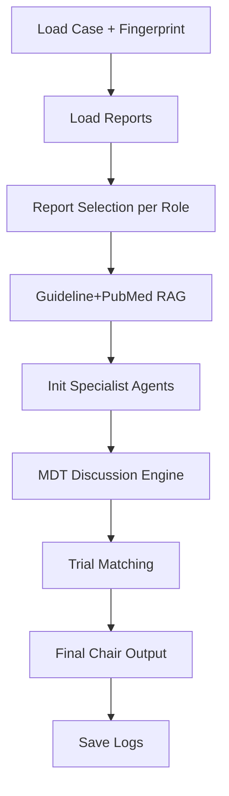

# MDT Discussion Log — 2026-01-18_19-44-40
Generated automatically by MDT Pipeline.


## CASE (structured JSON)

```
{}
```


## FINAL MDT OUTPUT

```
Final Assessment:
Advanced recurrent pelvic malignancy with progressive pelvic, hepatic, and iliac bone disease and significant cytopenias; primary histology, prior treatments, and goals of care remain undefined, so only diagnostic and supportive steps are appropriate today. [@2022-12-29|MR][@2022-12-29|CT][@20230103|5600862]

Core Treatment Strategy:
- Urgently retrieve all pathology, operative notes, and full oncology records to define diagnosis, prior lines, and treatment intent (unknown/needs update).  
- Arrange focused workup and management of anemia/lymphopenia, including transfusion needs, before any cytotoxic or intensive therapy. [@20230103|5600862]  
- Document detailed performance status and symptom burden to guide feasibility of systemic, radiotherapy, or best-supportive-care–dominant strategies. (unknown/needs update)  
- Consider updated cross-sectional imaging and PET/FDG only if, after diagnosis/intent clarification, results would change systemic vs palliative/RT planning. [@2022-12-29|MR][@2022-12-29|CT][@guideline:nccn_ovariancancer_v3_2025__v00000000|14]

Change Triggers:
- If pathology and prior treatment history confirm a specific gynecologic primary and line of therapy, reconvene MDT to select systemic/RT approach.  
- If performance status or cytopenias prove poor or non-correctable, shift emphasis toward symptom-directed palliative care over disease-directed intensification.
```


## PIPELINE FLOW (Mermaid)




## TRACE EVENTS (Structured)

```json
[
  {
    "ts": "2026-01-18T19:41:36.539507",
    "event": "pipeline_start",
    "payload": {
      "visit_time": "2023-01-03 08:53:29.260000",
      "meta_info": "340123197709263626"
    }
  },
  {
    "ts": "2026-01-18T19:41:36.539758",
    "event": "case_fingerprint",
    "payload": {
      "case_fingerprint": "bf21a9e8fbc5"
    }
  },
  {
    "ts": "2026-01-18T19:41:37.100561",
    "event": "reports_loaded",
    "payload": {
      "lab_n": 92,
      "img_n": 10,
      "path_n": 0,
      "mut_n": 1,
      "cutoff_dt": "2023-01-04 08:53:29"
    }
  },
  {
    "ts": "2026-01-18T19:41:47.773534",
    "event": "reports_selected",
    "payload": {
      "lab": {
        "chair": [
          "20221229|8300002|2022-12-29",
          "20221229|9703212|2022-12-29",
          "20230103|5600862|2023-01-03"
        ],
        "oncologist": [
          "20221229|8300002|2022-12-29",
          "20221229|9703212|2022-12-29",
          "20230103|5600862|2023-01-03"
        ],
        "radiologist": [],
        "pathologist": [],
        "nuclear": []
      },
      "imaging": {
        "chair": [
          "2022-10-24|CT|2022-10-24",
          "2022-12-29|MR|2022-12-29",
          "2022-12-29|CT|2022-12-29"
        ],
        "oncologist": [],
        "radiologist": [
          "2022-10-24|CT|2022-10-24",
          "2022-12-29|MR|2022-12-29",
          "2022-12-29|CT|2022-12-29"
        ],
        "pathologist": [],
        "nuclear": [
          "2022-10-24|CT|2022-10-24",
          "2022-12-29|MR|2022-12-29",
          "2022-12-29|CT|2022-12-29"
        ]
      },
      "pathology": {
        "chair": [],
        "oncologist": [],
        "radiologist": [],
        "pathologist": [],
        "nuclear": []
      },
      "mutation": {
        "chair": [
          "OH2203828|2022-04-18"
        ],
        "oncologist": [
          "OH2203828|2022-04-18"
        ],
        "radiologist": [],
        "pathologist": [
          "OH2203828|2022-04-18"
        ],
        "nuclear": []
      }
    }
  },
  {
    "ts": "2026-01-18T19:42:06.465499",
    "event": "rag_query",
    "payload": {
      "query": "Guidelines for treatment of ovarian cancer by histology and platinum sensitivity, considering disease stage/metastatic spread, BRCA/HRD/MSI/PD-L1/ATM status if available, and management in the context of performance status, anemia, and organ function limitations."
    }
  },
  {
    "ts": "2026-01-18T19:42:06.465527",
    "event": "rag_hits",
    "payload": {
      "source": "guideline",
      "topk": 5,
      "n": 5
    }
  },
  {
    "ts": "2026-01-18T19:42:06.465531",
    "event": "rag_hits",
    "payload": {
      "source": "pubmed",
      "topk": 5,
      "n": 5
    }
  },
  {
    "ts": "2026-01-18T19:42:06.465534",
    "event": "rag_hits_merged",
    "payload": {
      "n": 10
    }
  },
  {
    "ts": "2026-01-18T19:42:11.481091",
    "event": "mdt_discussion_start",
    "payload": {
      "num_rounds": 2,
      "num_turns": 2
    }
  },
  {
    "ts": "2026-01-18T19:42:13.754365",
    "event": "evidence_tag_warning",
    "payload": {
      "role": "chair/initial",
      "preview": "- Advanced recurrent pelvic malignancy with progressive liver and bone metastases; clarify primary site, histology, and prior treatments before systemic strateg…"
    }
  },
  {
    "ts": "2026-01-18T19:42:16.070242",
    "event": "evidence_tag_warning",
    "payload": {
      "role": "oncologist/initial",
      "preview": "- Diagnosis, stage, prior systemic therapy line, and treatment intent are all unknown/needs update before any regimen choice.    - Current labs show significant…"
    }
  },
  {
    "ts": "2026-01-18T19:42:22.895718",
    "event": "evidence_tag_warning",
    "payload": {
      "role": "nuclear/initial",
      "preview": "- No PET/FDG study available; metabolic pattern, staging impact, and recurrence assessment are currently unknown/needs update.  - Cross‑sectional imaging shows …"
    }
  },
  {
    "ts": "2026-01-18T19:44:21.708075",
    "event": "mdt_discussion_end",
    "payload": {
      "merged_chars": 2229
    }
  },
  {
    "ts": "2026-01-18T19:44:21.709286",
    "event": "final_output_start",
    "payload": {}
  },
  {
    "ts": "2026-01-18T19:44:40.410825",
    "event": "final_output_end",
    "payload": {
      "final_output_chars": 1422
    }
  }
]
```


## INITIAL EXPERT OPINIONS


## chair

```
- Advanced recurrent pelvic malignancy with progressive liver and bone metastases; clarify primary site, histology, and prior treatments before systemic strategy.  

- Marked anemia and lymphopenia; urgently evaluate etiology, bleeding, iron/B12/folate, hemolysis, and performance status before intensive therapy. [@20230103|2023-01-03]  

- HRD negative, BRCA wild-type; consider non‑PARP systemic/locoregional options once pathology, stage, symptoms, and goals of care are updated. [@OH2203828|2022-04-18]
```


## oncologist

```
- Diagnosis, stage, prior systemic therapy line, and treatment intent are all unknown/needs update before any regimen choice.  

- Current labs show significant anemia with preserved platelets and renal/liver function, affecting intensity and timing of systemic therapy [@20221229|8300002][@20230103|5600862].  

- Germline testing: HRD negative, no pathogenic BRCA1/2 or other listed DNA-repair mutations; influences maintenance/targeted strategy selection [@OH2203828|2022-04-18].
```


## radiologist

```
- Liver: multiple low-density metastases, increased number and size versus 2022-10-24; largest ~17×14 mm. [@2022-10-24|CT][@2022-12-29|CT]

- Pelvis: presacral mass ~53×44 mm with heterogeneous enhancement, involving adjacent peritoneum and sacrum; pelvic mesenteric nodules. [@2022-12-29|MR]

- New right iliac bone enhancing lesion suggesting osseous metastasis; rectal wall thickening/enhancement may indicate local invasion. [@2022-12-29|MR]
```


## pathologist

```
- No histology, grade, or IHC available; need primary pathology report and any subsequent biopsies for definitive diagnosis/grading (unknown/needs update).

- Molecular: germline ATM exon8 c.A947G:p.Y316C variant; HRD, BRCA1/2, TP53, ARID1A, PTEN, PIK3CA, PALB2, RAD51D, BRIP1, BARD1 all negative [@OH2203828|2022-04-18].

- Somatic tumor sequencing, HRD status on tumor tissue, and current stage/site of disease not documented; require updated tumor NGS/IHC reports (unknown/needs update).
```


## nuclear

```
- No PET/FDG study available; metabolic pattern, staging impact, and recurrence assessment are currently unknown/needs update.

- Cross‑sectional imaging shows progressive multifocal hepatic lesions, highly suspicious for metastases, but without metabolic characterization [@2022-10-24|CT][@2022-12-29|CT].

- Pelvic MR shows enlarging presacral mass with adjacent bone/peritoneal involvement, compatible with local recurrence and metastasis, pending PET correlation [@2022-12-29|MR].
```


## MERGED SUMMARY (Assistant)

```
Key Knowledge:
- Advanced recurrent pelvic malignancy with enlarging presacral mass invading sacrum/peritoneum and likely rectal wall.
- Progressive metastases: increasing liver lesions and new right iliac bone lesion.
- Marked anemia and lymphopenia; platelets and renal/hepatic function relatively preserved.
- HRD negative, BRCA wild-type; germline ATM variant of uncertain significance; no HRD/BRCA-based options.
- Staging based on CT/MR only; no PET/FDG performed.
- Key management decisions are currently being considered without a confirmed tissue diagnosis.

Controversies:
- Primary site, histologic subtype, and grade remain undefined; true origin of pelvic malignancy unclear.
- Treatment intent and prior systemic therapy lines unknown, limiting systemic and local strategy planning.
- Appropriateness and timing of systemic vs palliative/locoregional interventions in context of cytopenias and metastatic burden remain uncertain.
- Whether PET/FDG would meaningfully alter management or radiotherapy planning is not yet established.

Missing Info:
- Pathology: original and metastatic biopsy reports, full IHC panel, and tumor grade.
- Oncologic history: initial stage, prior surgery/radiation/systemic therapies, responses, toxicities, and current symptoms/performance status.
- Hematologic workup for anemia/lymphopenia.
- Tumor-level molecular profiling (somatic NGS, tumor HRD, predictive markers).
- PET/FDG or equivalent whole-body functional imaging for comprehensive staging.

Working Plan:
- Prioritize retrieval and review of all pathology (primary and metastatic), operative notes, and oncology treatment records before further MDT decision-making.
- Defer selection of a specific systemic regimen and any local/ablative procedures until diagnosis, primary tumor type, and treatment intent are clarified.
- Complete workup of anemia and lymphopenia and document current performance status and symptom burden.
- Consider whole-body PET/FDG, with dedicated pelvic and hepatic assessment, if results are expected to change systemic strategy or radiotherapy planning.
- Reconvene MDT to reassess systemic and locoregional/palliative options once diagnosis, staging, biomarkers, and goals of care are defined.
```


## INTERACTION LOG (Round × Turn)

### Round 1

#### Turn 1
- **chair → oncologist:** Before proposing any new systemic plan today, please first clarify prior systemic lines, responses, and current performance status given marked anemia/lymphopenia and progressive metastases.
- **chair → pathologist:** We urgently need full pathology (primary and any recurrent/metastatic biopsies with IHC/grade) to define tumor type before further treatment decisions.
- **oncologist → chair:** Systemic regimen choice today is unsafe without knowing primary histology, prior systemic lines, and current performance status; these must be clarified before committing to further cytotoxic or targeted therapy in the setting of marked anemia and progressive metastatic disease.
- **radiologist → oncologist:** Imaging demonstrates progressive multifocal liver metastases and enlarging presacral mass with probable sacral and rectal involvement; this suggests advancing systemic and locoregional disease burden needing correlation with current symptoms and performance status.
- **radiologist → nuclear:** CT/MR show progressive liver, presacral, and new right iliac bone lesions; PET/FDG could refine whole-body staging and detect additional metastases if consistent with goals of care.
- **pathologist → chair:** Key management decisions are being discussed without any confirmed tissue diagnosis; MDT planning should be deferred until pathology reports are obtained and reviewed.
- **pathologist → oncologist:** Primary histology, IHC panel, and grade remain completely undocumented; please prioritize retrieving original and metastatic biopsy pathology for diagnostic clarification.
- **nuclear → oncologist:** No PET/FDG has been done; given multifocal liver, pelvic, and bone disease, whole‑body PET could refine current staging and recurrence assessment if results would change management or radiotherapy planning.
- **nuclear → radiologist:** If PET/FDG is obtained, please ensure dedicated pelvic and hepatic assessment to better characterize presacral, hepatic, and iliac bone lesions and detect additional disease.

#### Turn 2
- **chair → oncologist:** Given the absence of any documented tissue diagnosis or prior systemic history, please avoid committing to a specific systemic regimen today and focus on organizing pathology retrieval and anemia/lymphopenia workup.
- **chair → radiologist:** Further local or ablative procedures should not be planned until pathology and oncologic history clarify primary tumor type and intent of care.

### Round 2

#### Turn 1

#### Turn 2


## FINAL REFINED PLANS (per Round)

### Round 1


## chair

```
- Defer new systemic or local oncologic treatments until pathology, prior oncologic history, and performance status are retrieved and reviewed (currently unknown).  

- Urgently investigate anemia and lymphopenia (bleeding, nutritional, marrow, hemolysis) and document ECOG/functional status before planning intensive therapy. [@20230103|2023-01-03]  

- Consider PET/FDG only after diagnosis/intent clarification, if results would alter staging, radiotherapy planning, or systemic vs palliative strategy. [@2022-12-29|2022-12-29]
```


## oncologist

```
- Defer systemic regimen choice; urgently retrieve full pathology, IHC, and prior oncologic treatment history to define diagnosis and line of therapy (unknown/needs update).  

- Investigate anemia and lymphopenia, including causes and transfusion needs, and document performance status before considering further cytotoxic or targeted therapy [@20230103|5600862].  

- Consider PET/FDG for full staging and radiotherapy planning only after pathology confirmation and goals-of-care discussion (unknown/needs update).
```


## radiologist

```
- No new imaging since 2022-12-29; obtain current CT/MR (±PET/FDG) for up-to-date staging and trend. [@2022-12-29|CT][@2022-12-29|MR]  

- Defer planning local/ablative radiologic procedures until pathology, primary tumor type, and treatment intent are clarified. (pathology and history unknown)  

- If PET/FDG performed, ensure whole-body protocol with focused pelvic, hepatic, and right iliac bone assessment for comprehensive disease mapping. (PET/FDG unknown)
```


## pathologist

```
- Retrieve and review all prior pathology (primary and metastatic), IHC, and grading to establish definitive diagnosis (currently unknown/needs update).  

- After diagnosis confirmation, obtain tumor-level molecular testing (somatic NGS, tumor HRD, other markers) if tissue and performance status allow (unknown/needs update).  

- Defer commitment to specific systemic strategies until pathology, oncologic history, and cytopenia workup are clarified and formally documented (unknown/needs update).
```


## nuclear

```
- Recommend whole‑body FDG PET/CT to clarify metabolic burden, confirm recurrence, and assess liver, presacral, and iliac bone lesions [@2022-10-24|CT][@2022-12-29|MR][@2022-12-29|CT].  

- If PET/CT performed, ensure high‑resolution pelvic and hepatic imaging to guide potential radiotherapy fields and avoid missing additional metastases [@2022-12-29|MR][@2022-12-29|CT].  

- PET findings should be integrated with pending pathology and clinical status before altering staging or committing to further locoregional interventions (pathology/PS currently unknown).
```

### Round 2


## chair

```
- Urgently retrieve and review all pathology, operative notes, and oncology records before committing to systemic or local oncologic treatment (currently unknown).  

- Perform targeted workup of anemia/lymphopenia and document ECOG/symptom burden to judge fitness for systemic or radiotherapy approaches. [@20230103|2023-01-03]  

- Consider whole‑body PET/FDG with focused pelvic/hepatic assessment only if clarified goals suggest results would change systemic or radiotherapy planning. [@2022-12-29|2022-12-29]
```


## oncologist

```
- Defer systemic and local/ablative treatment decisions until full pathology (including IHC, grade) and prior oncologic history are obtained (unknown/needs update).  

- Urgently evaluate anemia and lymphopenia, transfusion needs, and document performance status before reconsidering any cytotoxic or targeted systemic strategy [@20230103|2023-01-03].  

- Consider whole-body PET/FDG with focused pelvic/hepatic views only if pathology and goals-of-care review indicate results would change management (unknown/needs update).
```


## radiologist

```
- No imaging newer than 2022-12-29; obtain updated CT/MR (±PET/FDG) for current staging before local procedures. [@2022-12-29|CT][@2022-12-29|MR]  

- Presacral mass with sacral/peritoneal and likely rectal involvement plus progressive liver and iliac bone lesions indicates widespread disease; prioritize palliative intent clarification. [@2022-12-29|MR][@2022-12-29|CT]  

- If PET/FDG pursued, use whole-body protocol with focused pelvic, hepatic, and right iliac bone evaluation to guide radiotherapy/systemic planning. (PET/FDG unknown)
```


## pathologist

```
- Retrieve and review all primary/metastatic pathology reports, IHC, and grading to establish definitive diagnosis (currently unknown/needs update).  

- After diagnosis confirmation, perform tumor-level molecular profiling (somatic NGS, tumor HRD, predictive markers) if tissue available (unknown/needs update).  

- Reconvene MDT to align staging and biomarker data with clarified goals of care before systemic or locoregional decisions (unknown/needs update).
```


## nuclear

```
- No PET/FDG has been performed; metabolic tumor burden, recurrence confirmation, and PET-based staging remain unknown/needs update (CT/MR only) [@2022-12-29|MR][@2022-12-29|CT].  

- If obtained, whole‑body FDG PET/CT could better define liver, presacral, and right iliac bone involvement and detect occult disease [@2022-10-24|CT][@2022-12-29|MR][@2022-12-29|CT].  

- PET findings should be interpreted jointly with pending pathology and performance status before changing radiotherapy fields or overall staging (pathology/PS currently unknown).
```


## RAW AGENT LOGS

### chair
- **User:** Give INITIAL opinion (use ONLY your system-provided patient facts).
Return up to 3 bullets, each ≤20 words.
If key data missing, say exactly what needs updating.
If you reference treatment strategy categories, guidelines, trials, or literature evidence, include tags [@guideline:doc_id|page] or [@pubmed:PMID].
  
  **Assistant:** - Advanced recurrent pelvic malignancy with progressive liver and bone metastases; clarify primary site, histology, and prior treatments before systemic strategy.  

- Marked anemia and lymphopenia; urgently evaluate etiology, bleeding, iron/B12/folate, hemolysis, and performance status before intensive therapy. [@20230103|2023-01-03]  

- HRD negative, BRCA wild-type; consider non‑PARP systemic/locoregional options once pathology, stage, symptoms, and goals of care are updated. [@OH2203828|2022-04-18]
  
  *(2026-01-18T19:42:13.754219)*

- **User:** ROLE: chair. VISIT: 2023-01-03 08:53:29.260000
Default is NOT to speak. Speak ONLY if: conflict | safety | missing-critical | new-critical.

CONTEXT (latest):
Key Knowledge:
- Advanced recurrent pelvic malignancy with enlarging presacral mass invading sacrum/peritoneum and probable rectal wall involvement.
- Progressive metastases: increasing liver lesions and new right iliac bone lesion.
- Marked anemia and lymphopenia; platelets and renal/hepatic function relatively preserved.
- HRD negative, BRCA wild-type; germline ATM variant of uncertain significance; no current HRD/BRCA-based options.
- Staging based only on CT/MR; no PET/FDG performed.

Controversies:
- Primary site, histologic subtype, and grade of the pelvic malignancy remain undefined.
- Treatment intent and prior systemic therapy lines are unknown, limiting systemic planning.
- Optimal balance/timing of systemic vs purely palliative/locoregional approaches in the context of cytopenias and metastatic burden is unclear.

Missing Info:
- Full pathology: primary and recurrent/metastatic biopsy reports, IHC, and grading.
- Oncologic history: initial stage, prior surgery/radiation/systemic therapies, responses, and toxicities.
- Detailed anemia/lymphopenia workup and current performance status.
- Tumor-level molecular data (somatic NGS, tumor HRD, other predictive markers).
- PET/FDG or equivalent functional imaging for complete staging.

Working Plan:
- Obtain and review complete pathology, operative notes, and oncology treatment history to define diagnosis, stage, and treatment line.
- Perform targeted evaluation of anemia and lymphopenia and document performance status.
- Consider PET/FDG for full staging if compatible with goals of care.
- After clarification of diagnosis, stage, biomarkers, and patient goals, re-discuss systemic and locoregional/palliative options (non‑PARP focused given HRD/BRCA-negative status).

Allowed targets: [oncologist,radiologist,pathologist,nuclear]
Return ONE-LINE JSON only:{"speak":"yes/no","messages":[{"target":"<role>","message":"<1-2 sentences>","why":"conflict|safety|missing|new"}]}
  
  **Assistant:** {"speak":"yes","messages":[{"target":"oncologist","message":"Before proposing any new systemic plan today, please first clarify prior systemic lines, responses, and current performance status given marked anemia/lymphopenia and progressive metastases.","why":"safety"},{"target":"pathologist","message":"We urgently need full pathology (primary and any recurrent/metastatic biopsies with IHC/grade) to define tumor type before further treatment decisions.","why":"missing"}]}
  
  *(2026-01-18T19:42:36.225876)*

- **User:** ROLE: chair. VISIT: 2023-01-03 08:53:29.260000
Default is NOT to speak. Speak ONLY if: conflict | safety | missing-critical | new-critical.

CONTEXT (latest):
Key Knowledge:
- Advanced recurrent pelvic malignancy with enlarging presacral mass invading sacrum/peritoneum and probable rectal wall involvement.
- Progressive metastases: increasing liver lesions and new right iliac bone lesion.
- Marked anemia and lymphopenia; platelets and renal/hepatic function relatively preserved.
- HRD negative, BRCA wild-type; germline ATM variant of uncertain significance; no current HRD/BRCA-based options.
- Staging based only on CT/MR; no PET/FDG performed.

Controversies:
- Primary site, histologic subtype, and grade of the pelvic malignancy remain undefined.
- Treatment intent and prior systemic therapy lines are unknown, limiting systemic planning.
- Optimal balance/timing of systemic vs purely palliative/locoregional approaches in the context of cytopenias and metastatic burden is unclear.

Missing Info:
- Full pathology: primary and recurrent/metastatic biopsy reports, IHC, and grading.
- Oncologic history: initial stage, prior surgery/radiation/systemic therapies, responses, and toxicities.
- Detailed anemia/lymphopenia workup and current performance status.
- Tumor-level molecular data (somatic NGS, tumor HRD, other predictive markers).
- PET/FDG or equivalent functional imaging for complete staging.

Working Plan:
- Obtain and review complete pathology, operative notes, and oncology treatment history to define diagnosis, stage, and treatment line.
- Perform targeted evaluation of anemia and lymphopenia and document performance status.
- Consider PET/FDG for full staging if compatible with goals of care.
- After clarification of diagnosis, stage, biomarkers, and patient goals, re-discuss systemic and locoregional/palliative options (non‑PARP focused given HRD/BRCA-negative status).
[R1T1 DELTA] n with current symptoms and performance status. | pathologist->oncologist(missing): Primary histology, IHC panel, and grade remain completely undocumented; please prioritize retrieving original and metastatic biopsy pathology for diagnostic clarification. | pathologist->chair(safety): Key management decisions are being discussed without any confirmed tissue diagnosis; MDT planning should be deferred until pathology reports are obtained and reviewed. | nuclear->oncologist(missing): No PET/FDG has been done; given multifocal liver, pelvic, and bone disease, whole‑body PET could refine current staging and recurrence assessment if results would change management or radiotherapy planning. | nuclear->radiologist(missing): If PET/FDG is obtained, please ensure dedicated pelvic and hepatic assessment to better characterize presacral, hepatic, and iliac bone lesions and detect additional disease.

Allowed targets: [oncologist,radiologist,pathologist,nuclear]
Return ONE-LINE JSON only:{"speak":"yes/no","messages":[{"target":"<role>","message":"<1-2 sentences>","why":"conflict|safety|missing|new"}]}
  
  **Assistant:** {"speak":"yes","messages":[{"target":"oncologist","message":"Given the absence of any documented tissue diagnosis or prior systemic history, please avoid committing to a specific systemic regimen today and focus on organizing pathology retrieval and anemia/lymphopenia workup.","why":"safety"},{"target":"radiologist","message":"Further local or ablative procedures should not be planned until pathology and oncologic history clarify primary tumor type and intent of care.","why":"safety"}]}
  
  *(2026-01-18T19:42:46.614932)*

- **User:** Given MDT context:
Key Knowledge:
- Advanced recurrent pelvic malignancy with enlarging presacral mass invading sacrum/peritoneum and probable rectal wall involvement.
- Progressive metastases: increasing liver lesions and new right iliac bone lesion.
- Marked anemia and lymphopenia; platelets and renal/hepatic function relatively preserved.
- HRD negative, BRCA wild-type; germline ATM variant of uncertain significance; no current HRD/BRCA-based options.
- Staging based only on CT/MR; no PET/FDG performed.

Controversies:
- Primary site, histologic subtype, and grade of the pelvic malignancy remain undefined.
- Treatment intent and prior systemic therapy lines are unknown, limiting systemic planning.
- Optimal balance/timing of systemic vs purely palliative/locoregional approaches in the context of cytopenias and metastatic burden is unclear.

Missing Info:
- Full pathology: primary and recurrent/metastatic biopsy reports, IHC, and grading.
- Oncologic history: initial stage, prior surgery/radiation/systemic therapies, responses, and toxicities.
- Detailed anemia/lymphopenia workup and current performance status.
- Tumor-level molecular data (somatic NGS, tumor HRD, other predictive markers).
- PET/FDG or equivalent functional imaging for complete staging.

Working Plan:
- Obtain and review complete pathology, operative notes, and oncology treatment history to define diagnosis, stage, and treatment line.
- Perform targeted evaluation of anemia and lymphopenia and document performance status.
- Consider PET/FDG for full staging if compatible with goals of care.
- After clarification of diagnosis, stage, biomarkers, and patient goals, re-discuss systemic and locoregional/palliative options (non‑PARP focused given HRD/BRCA-negative status).
[R1T1 DELTA] n with current symptoms and performance status. | pathologist->oncologist(missing): Primary histology, IHC panel, and grade remain completely undocumented; please prioritize retrieving original and metastatic biopsy pathology for diagnostic clarification. | pathologist->chair(safety): Key management decisions are being discussed without any confirmed tissue diagnosis; MDT planning should be deferred until pathology reports are obtained and reviewed. | nuclear->oncologist(missing): No PET/FDG has been done; given multifocal liver, pelvic, and bone disease, whole‑body PET could refine current staging and recurrence assessment if results would change management or radiotherapy planning. | nuclear->radiologist(missing): If PET/FDG is obtained, please ensure dedicated pelvic and hepatic assessment to better characterize presacral, hepatic, and iliac bone lesions and detect additional disease.
[R1T2 DELTA] chair->oncologist(safety): Given the absence of any documented tissue diagnosis or prior systemic history, please avoid committing to a specific systemic regimen today and focus on organizing pathology retrieval and anemia/lymphopenia workup. | chair->radiologist(safety): Further local or ablative procedures should not be planned until pathology and oncologic history clarify primary tumor type and intent of care.

Provide FINAL refined plan.
Up to 3 bullets, each ≤20 words.
Any factual claim must include [@report_id|date] or say unknown.
If you reference treatment strategy categories, guidelines, trials, or literature evidence, include tags [@guideline:doc_id|page] or [@pubmed:PMID].
  
  **Assistant:** - Defer new systemic or local oncologic treatments until pathology, prior oncologic history, and performance status are retrieved and reviewed (currently unknown).  

- Urgently investigate anemia and lymphopenia (bleeding, nutritional, marrow, hemolysis) and document ECOG/functional status before planning intensive therapy. [@20230103|2023-01-03]  

- Consider PET/FDG only after diagnosis/intent clarification, if results would alter staging, radiotherapy planning, or systemic vs palliative strategy. [@2022-12-29|2022-12-29]
  
  *(2026-01-18T19:42:54.598816)*

- **User:** ROLE: chair. VISIT: 2023-01-03 08:53:29.260000
Default is NOT to speak. Speak ONLY if: conflict | safety | missing-critical | new-critical.

CONTEXT (latest):
Key Knowledge:
- Advanced recurrent pelvic malignancy with enlarging presacral mass invading sacrum/peritoneum and likely rectal wall.
- Progressive metastases: increasing liver lesions and new right iliac bone lesion.
- Marked anemia and lymphopenia; platelets and renal/hepatic function relatively preserved.
- HRD negative, BRCA wild-type; germline ATM variant of uncertain significance; no HRD/BRCA-based options.
- Staging based on CT/MR only; no PET/FDG performed.
- Key management decisions are currently being considered without a confirmed tissue diagnosis.

Controversies:
- Primary site, histologic subtype, and grade remain undefined; true origin of pelvic malignancy unclear.
- Treatment intent and prior systemic therapy lines unknown, limiting systemic and local strategy planning.
- Appropriateness and timing of systemic vs palliative/locoregional interventions in context of cytopenias and metastatic burden remain uncertain.
- Whether PET/FDG would meaningfully alter management or radiotherapy planning is not yet established.

Missing Info:
- Pathology: original and metastatic biopsy reports, full IHC panel, and tumor grade.
- Oncologic history: initial stage, prior surgery/radiation/systemic therapies, responses, toxicities, and current symptoms/performance status.
- Hematologic workup for anemia/lymphopenia.
- Tumor-level molecular profiling (somatic NGS, tumor HRD, predictive markers).
- PET/FDG or equivalent whole-body functional imaging for comprehensive staging.

Working Plan:
- Prioritize retrieval and review of all pathology (primary and metastatic), operative notes, and oncology treatment records before further MDT decision-making.
- Defer selection of a specific systemic regimen and any local/ablative procedures until diagnosis, primary tumor type, and treatment intent are clarified.
- Complete workup of anemia and lymphopenia and document current performance status and symptom burden.
- Consider whole-body PET/FDG, with dedicated pelvic and hepatic assessment, if results are expected to change systemic strategy or radiotherapy planning.
- Reconvene MDT to reassess systemic and locoregional/palliative options once diagnosis, staging, biomarkers, and goals of care are defined.

Allowed targets: [oncologist,radiologist,pathologist,nuclear]
Return ONE-LINE JSON only:{"speak":"yes/no","messages":[{"target":"<role>","message":"<1-2 sentences>","why":"conflict|safety|missing|new"}]}
  
  **Assistant:** {"speak":"no","messages":[]}
  
  *(2026-01-18T19:43:34.672996)*

- **User:** Given MDT context:
Key Knowledge:
- Advanced recurrent pelvic malignancy with enlarging presacral mass invading sacrum/peritoneum and likely rectal wall.
- Progressive metastases: increasing liver lesions and new right iliac bone lesion.
- Marked anemia and lymphopenia; platelets and renal/hepatic function relatively preserved.
- HRD negative, BRCA wild-type; germline ATM variant of uncertain significance; no HRD/BRCA-based options.
- Staging based on CT/MR only; no PET/FDG performed.
- Key management decisions are currently being considered without a confirmed tissue diagnosis.

Controversies:
- Primary site, histologic subtype, and grade remain undefined; true origin of pelvic malignancy unclear.
- Treatment intent and prior systemic therapy lines unknown, limiting systemic and local strategy planning.
- Appropriateness and timing of systemic vs palliative/locoregional interventions in context of cytopenias and metastatic burden remain uncertain.
- Whether PET/FDG would meaningfully alter management or radiotherapy planning is not yet established.

Missing Info:
- Pathology: original and metastatic biopsy reports, full IHC panel, and tumor grade.
- Oncologic history: initial stage, prior surgery/radiation/systemic therapies, responses, toxicities, and current symptoms/performance status.
- Hematologic workup for anemia/lymphopenia.
- Tumor-level molecular profiling (somatic NGS, tumor HRD, predictive markers).
- PET/FDG or equivalent whole-body functional imaging for comprehensive staging.

Working Plan:
- Prioritize retrieval and review of all pathology (primary and metastatic), operative notes, and oncology treatment records before further MDT decision-making.
- Defer selection of a specific systemic regimen and any local/ablative procedures until diagnosis, primary tumor type, and treatment intent are clarified.
- Complete workup of anemia and lymphopenia and document current performance status and symptom burden.
- Consider whole-body PET/FDG, with dedicated pelvic and hepatic assessment, if results are expected to change systemic strategy or radiotherapy planning.
- Reconvene MDT to reassess systemic and locoregional/palliative options once diagnosis, staging, biomarkers, and goals of care are defined.

Provide FINAL refined plan.
Up to 3 bullets, each ≤20 words.
Any factual claim must include [@report_id|date] or say unknown.
If you reference treatment strategy categories, guidelines, trials, or literature evidence, include tags [@guideline:doc_id|page] or [@pubmed:PMID].
  
  **Assistant:** - Urgently retrieve and review all pathology, operative notes, and oncology records before committing to systemic or local oncologic treatment (currently unknown).  

- Perform targeted workup of anemia/lymphopenia and document ECOG/symptom burden to judge fitness for systemic or radiotherapy approaches. [@20230103|2023-01-03]  

- Consider whole‑body PET/FDG with focused pelvic/hepatic assessment only if clarified goals suggest results would change systemic or radiotherapy planning. [@2022-12-29|2022-12-29]
  
  *(2026-01-18T19:43:54.921744)*

- **User:** 
As the MDT chair for gynecologic oncology, you are seeing the patient at OUTPATIENT TIME: 2023-01-03 08:53:29.260000.
Based on PATIENT FACTS + MDT discussion + FINAL refined plans from all experts, determine the CURRENT best management plan for this visit.

STRICT RULES:
- Any factual statement about past tests/treatments must include [@report_id|date] or say unknown.
- Any statement derived from guideline or PubMed literature must include [@guideline:doc_id|page] or [@pubmed:PMID].
- If you cite guideline/PubMed evidence in Core Treatment Strategy or Change Triggers, include at least one tag in that bullet.
- If experts disagree, pick the safest plan and state the key uncertainty.

# FINAL REFINED PLANS (All experts, last round)
{
  "Round 1": {
    "chair": "- Defer new systemic or local oncologic treatments until pathology, prior oncologic history, and performance status are retrieved and reviewed (currently unknown).  \n\n- Urgently investigate anemia and lymphopenia (bleeding, nutritional, marrow, hemolysis) and document ECOG/functional status before planning intensive therapy. [@20230103|2023-01-03]  \n\n- Consider PET/FDG only after diagnosis/intent clarification, if results would alter staging, radiotherapy planning, or systemic vs palliative strategy. [@2022-12-29|2022-12-29]",
    "oncologist": "- Defer systemic regimen choice; urgently retrieve full pathology, IHC, and prior oncologic treatment history to define diagnosis and line of therapy (unknown/needs update).  \n\n- Investigate anemia and lymphopenia, including causes and transfusion needs, and document performance status before considering further cytotoxic or targeted therapy [@20230103|5600862].  \n\n- Consider PET/FDG for full staging and radiotherapy planning only after pathology confirmation and goals-of-care discussion (unknown/needs update).",
    "radiologist": "- No new imaging since 2022-12-29; obtain current CT/MR (±PET/FDG) for up-to-date staging and trend. [@2022-12-29|CT][@2022-12-29|MR]  \n\n- Defer planning local/ablative radiologic procedures until pathology, primary tumor type, and treatment intent are clarified. (pathology and history unknown)  \n\n- If PET/FDG performed, ensure whole-body protocol with focused pelvic, hepatic, and right iliac bone assessment for comprehensive disease mapping. (PET/FDG unknown)",
    "pathologist": "- Retrieve and review all prior pathology (primary and metastatic), IHC, and grading to establish definitive diagnosis (currently unknown/needs update).  \n\n- After diagnosis confirmation, obtain tumor-level molecular testing (somatic NGS, tumor HRD, other markers) if tissue and performance status allow (unknown/needs update).  \n\n- Defer commitment to specific systemic strategies until pathology, oncologic history, and cytopenia workup are clarified and formally documented (unknown/needs update).",
    "nuclear": "- Recommend whole‑body FDG PET/CT to clarify metabolic burden, confirm recurrence, and assess liver, presacral, and iliac bone lesions [@2022-10-24|CT][@2022-12-29|MR][@2022-12-29|CT].  \n\n- If PET/CT performed, ensure high‑resolution pelvic and hepatic imaging to guide potential radiotherapy fields and avoid missing additional metastases [@2022-12-29|MR][@2022-12-29|CT].  \n\n- PET findings should be integrated with pending pathology and clinical status before altering staging or committing to further locoregional interventions (pathology/PS currently unknown)."
  },
  "Round 2": {
    "chair": "- Urgently retrieve and review all pathology, operative notes, and oncology records before committing to systemic or local oncologic treatment (currently unknown).  \n\n- Perform targeted workup of anemia/lymphopenia and document ECOG/symptom burden to judge fitness for systemic or radiotherapy approaches. [@20230103|2023-01-03]  \n\n- Consider whole‑body PET/FDG with focused pelvic/hepatic assessment only if clarified goals suggest results would change systemic or radiotherapy planning. [@2022-12-29|2022-12-29]",
    "oncologist": "- Defer systemic and local/ablative treatment decisions until full pathology (including IHC, grade) and prior oncologic history are obtained (unknown/needs update).  \n\n- Urgently evaluate anemia and lymphopenia, transfusion needs, and document performance status before reconsidering any cytotoxic or targeted systemic strategy [@20230103|2023-01-03].  \n\n- Consider whole-body PET/FDG with focused pelvic/hepatic views only if pathology and goals-of-care review indicate results would change management (unknown/needs update).",
    "radiologist": "- No imaging newer than 2022-12-29; obtain updated CT/MR (±PET/FDG) for current staging before local procedures. [@2022-12-29|CT][@2022-12-29|MR]  \n\n- Presacral mass with sacral/peritoneal and likely rectal involvement plus progressive liver and iliac bone lesions indicates widespread disease; prioritize palliative intent clarification. [@2022-12-29|MR][@2022-12-29|CT]  \n\n- If PET/FDG pursued, use whole-body protocol with focused pelvic, hepatic, and right iliac bone evaluation to guide radiotherapy/systemic planning. (PET/FDG unknown)",
    "pathologist": "- Retrieve and review all primary/metastatic pathology reports, IHC, and grading to establish definitive diagnosis (currently unknown/needs update).  \n\n- After diagnosis confirmation, perform tumor-level molecular profiling (somatic NGS, tumor HRD, predictive markers) if tissue available (unknown/needs update).  \n\n- Reconvene MDT to align staging and biomarker data with clarified goals of care before systemic or locoregional decisions (unknown/needs update).",
    "nuclear": "- No PET/FDG has been performed; metabolic tumor burden, recurrence confirmation, and PET-based staging remain unknown/needs update (CT/MR only) [@2022-12-29|MR][@2022-12-29|CT].  \n\n- If obtained, whole‑body FDG PET/CT could better define liver, presacral, and right iliac bone involvement and detect occult disease [@2022-10-24|CT][@2022-12-29|MR][@2022-12-29|CT].  \n\n- PET findings should be interpreted jointly with pending pathology and performance status before changing radiotherapy fields or overall staging (pathology/PS currently unknown)."
  }
}

# Response Format
Final Assessment:
<1–3 sentences: summarize histology/biology, current disease status, and key uncertainties>

Core Treatment Strategy:
- < ≤20 words concrete decision >
- < ≤20 words concrete decision >
- < ≤20 words concrete decision >
- < ≤20 words concrete decision >

Change Triggers:
- < ≤20 words “if X, then adjust management from A to B” >
- < ≤20 words “if X, then adjust management from A to B” >

  
  **Assistant:** Final Assessment:
Advanced recurrent pelvic malignancy with progressive pelvic, hepatic, and iliac bone disease and significant cytopenias; primary histology, prior treatments, and goals of care remain undefined, so only diagnostic and supportive steps are appropriate today. [@2022-12-29|MR][@2022-12-29|CT][@20230103|5600862]

Core Treatment Strategy:
- Urgently retrieve all pathology, operative notes, and full oncology records to define diagnosis, prior lines, and treatment intent (unknown/needs update).  
- Arrange focused workup and management of anemia/lymphopenia, including transfusion needs, before any cytotoxic or intensive therapy. [@20230103|5600862]  
- Document detailed performance status and symptom burden to guide feasibility of systemic, radiotherapy, or best-supportive-care–dominant strategies. (unknown/needs update)  
- Consider updated cross-sectional imaging and PET/FDG only if, after diagnosis/intent clarification, results would change systemic vs palliative/RT planning. [@2022-12-29|MR][@2022-12-29|CT][@guideline:nccn_ovariancancer_v3_2025__v00000000|14]

Change Triggers:
- If pathology and prior treatment history confirm a specific gynecologic primary and line of therapy, reconvene MDT to select systemic/RT approach.  
- If performance status or cytopenias prove poor or non-correctable, shift emphasis toward symptom-directed palliative care over disease-directed intensification.
  
  *(2026-01-18T19:44:40.410644)*


### oncologist
- **User:** Give INITIAL opinion (use ONLY your system-provided patient facts).
Return up to 3 bullets, each ≤20 words.
If key data missing, say exactly what needs updating.
If you reference treatment strategy categories, guidelines, trials, or literature evidence, include tags [@guideline:doc_id|page] or [@pubmed:PMID].
  
  **Assistant:** - Diagnosis, stage, prior systemic therapy line, and treatment intent are all unknown/needs update before any regimen choice.  

- Current labs show significant anemia with preserved platelets and renal/liver function, affecting intensity and timing of systemic therapy [@20221229|8300002][@20230103|5600862].  

- Germline testing: HRD negative, no pathogenic BRCA1/2 or other listed DNA-repair mutations; influences maintenance/targeted strategy selection [@OH2203828|2022-04-18].
  
  *(2026-01-18T19:42:16.069986)*

- **User:** ROLE: oncologist. VISIT: 2023-01-03 08:53:29.260000
Default is NOT to speak. Speak ONLY if: conflict | safety | missing-critical | new-critical.

CONTEXT (latest):
Key Knowledge:
- Advanced recurrent pelvic malignancy with enlarging presacral mass invading sacrum/peritoneum and probable rectal wall involvement.
- Progressive metastases: increasing liver lesions and new right iliac bone lesion.
- Marked anemia and lymphopenia; platelets and renal/hepatic function relatively preserved.
- HRD negative, BRCA wild-type; germline ATM variant of uncertain significance; no current HRD/BRCA-based options.
- Staging based only on CT/MR; no PET/FDG performed.

Controversies:
- Primary site, histologic subtype, and grade of the pelvic malignancy remain undefined.
- Treatment intent and prior systemic therapy lines are unknown, limiting systemic planning.
- Optimal balance/timing of systemic vs purely palliative/locoregional approaches in the context of cytopenias and metastatic burden is unclear.

Missing Info:
- Full pathology: primary and recurrent/metastatic biopsy reports, IHC, and grading.
- Oncologic history: initial stage, prior surgery/radiation/systemic therapies, responses, and toxicities.
- Detailed anemia/lymphopenia workup and current performance status.
- Tumor-level molecular data (somatic NGS, tumor HRD, other predictive markers).
- PET/FDG or equivalent functional imaging for complete staging.

Working Plan:
- Obtain and review complete pathology, operative notes, and oncology treatment history to define diagnosis, stage, and treatment line.
- Perform targeted evaluation of anemia and lymphopenia and document performance status.
- Consider PET/FDG for full staging if compatible with goals of care.
- After clarification of diagnosis, stage, biomarkers, and patient goals, re-discuss systemic and locoregional/palliative options (non‑PARP focused given HRD/BRCA-negative status).

Allowed targets: [chair,radiologist,pathologist,nuclear]
Return ONE-LINE JSON only:{"speak":"yes/no","messages":[{"target":"<role>","message":"<1-2 sentences>","why":"conflict|safety|missing|new"}]}
  
  **Assistant:** {"speak":"yes","messages":[{"target":"chair","message":"Systemic regimen choice today is unsafe without knowing primary histology, prior systemic lines, and current performance status; these must be clarified before committing to further cytotoxic or targeted therapy in the setting of marked anemia and progressive metastatic disease.","why":"missing"}]}
  
  *(2026-01-18T19:42:38.080754)*

- **User:** ROLE: oncologist. VISIT: 2023-01-03 08:53:29.260000
Default is NOT to speak. Speak ONLY if: conflict | safety | missing-critical | new-critical.

CONTEXT (latest):
Key Knowledge:
- Advanced recurrent pelvic malignancy with enlarging presacral mass invading sacrum/peritoneum and probable rectal wall involvement.
- Progressive metastases: increasing liver lesions and new right iliac bone lesion.
- Marked anemia and lymphopenia; platelets and renal/hepatic function relatively preserved.
- HRD negative, BRCA wild-type; germline ATM variant of uncertain significance; no current HRD/BRCA-based options.
- Staging based only on CT/MR; no PET/FDG performed.

Controversies:
- Primary site, histologic subtype, and grade of the pelvic malignancy remain undefined.
- Treatment intent and prior systemic therapy lines are unknown, limiting systemic planning.
- Optimal balance/timing of systemic vs purely palliative/locoregional approaches in the context of cytopenias and metastatic burden is unclear.

Missing Info:
- Full pathology: primary and recurrent/metastatic biopsy reports, IHC, and grading.
- Oncologic history: initial stage, prior surgery/radiation/systemic therapies, responses, and toxicities.
- Detailed anemia/lymphopenia workup and current performance status.
- Tumor-level molecular data (somatic NGS, tumor HRD, other predictive markers).
- PET/FDG or equivalent functional imaging for complete staging.

Working Plan:
- Obtain and review complete pathology, operative notes, and oncology treatment history to define diagnosis, stage, and treatment line.
- Perform targeted evaluation of anemia and lymphopenia and document performance status.
- Consider PET/FDG for full staging if compatible with goals of care.
- After clarification of diagnosis, stage, biomarkers, and patient goals, re-discuss systemic and locoregional/palliative options (non‑PARP focused given HRD/BRCA-negative status).
[R1T1 DELTA] n with current symptoms and performance status. | pathologist->oncologist(missing): Primary histology, IHC panel, and grade remain completely undocumented; please prioritize retrieving original and metastatic biopsy pathology for diagnostic clarification. | pathologist->chair(safety): Key management decisions are being discussed without any confirmed tissue diagnosis; MDT planning should be deferred until pathology reports are obtained and reviewed. | nuclear->oncologist(missing): No PET/FDG has been done; given multifocal liver, pelvic, and bone disease, whole‑body PET could refine current staging and recurrence assessment if results would change management or radiotherapy planning. | nuclear->radiologist(missing): If PET/FDG is obtained, please ensure dedicated pelvic and hepatic assessment to better characterize presacral, hepatic, and iliac bone lesions and detect additional disease.

Allowed targets: [chair,radiologist,pathologist,nuclear]
Return ONE-LINE JSON only:{"speak":"yes/no","messages":[{"target":"<role>","message":"<1-2 sentences>","why":"conflict|safety|missing|new"}]}
  
  **Assistant:** {"speak":"no","messages":[]}
  
  *(2026-01-18T19:42:48.223297)*

- **User:** Given MDT context:
Key Knowledge:
- Advanced recurrent pelvic malignancy with enlarging presacral mass invading sacrum/peritoneum and probable rectal wall involvement.
- Progressive metastases: increasing liver lesions and new right iliac bone lesion.
- Marked anemia and lymphopenia; platelets and renal/hepatic function relatively preserved.
- HRD negative, BRCA wild-type; germline ATM variant of uncertain significance; no current HRD/BRCA-based options.
- Staging based only on CT/MR; no PET/FDG performed.

Controversies:
- Primary site, histologic subtype, and grade of the pelvic malignancy remain undefined.
- Treatment intent and prior systemic therapy lines are unknown, limiting systemic planning.
- Optimal balance/timing of systemic vs purely palliative/locoregional approaches in the context of cytopenias and metastatic burden is unclear.

Missing Info:
- Full pathology: primary and recurrent/metastatic biopsy reports, IHC, and grading.
- Oncologic history: initial stage, prior surgery/radiation/systemic therapies, responses, and toxicities.
- Detailed anemia/lymphopenia workup and current performance status.
- Tumor-level molecular data (somatic NGS, tumor HRD, other predictive markers).
- PET/FDG or equivalent functional imaging for complete staging.

Working Plan:
- Obtain and review complete pathology, operative notes, and oncology treatment history to define diagnosis, stage, and treatment line.
- Perform targeted evaluation of anemia and lymphopenia and document performance status.
- Consider PET/FDG for full staging if compatible with goals of care.
- After clarification of diagnosis, stage, biomarkers, and patient goals, re-discuss systemic and locoregional/palliative options (non‑PARP focused given HRD/BRCA-negative status).
[R1T1 DELTA] n with current symptoms and performance status. | pathologist->oncologist(missing): Primary histology, IHC panel, and grade remain completely undocumented; please prioritize retrieving original and metastatic biopsy pathology for diagnostic clarification. | pathologist->chair(safety): Key management decisions are being discussed without any confirmed tissue diagnosis; MDT planning should be deferred until pathology reports are obtained and reviewed. | nuclear->oncologist(missing): No PET/FDG has been done; given multifocal liver, pelvic, and bone disease, whole‑body PET could refine current staging and recurrence assessment if results would change management or radiotherapy planning. | nuclear->radiologist(missing): If PET/FDG is obtained, please ensure dedicated pelvic and hepatic assessment to better characterize presacral, hepatic, and iliac bone lesions and detect additional disease.
[R1T2 DELTA] chair->oncologist(safety): Given the absence of any documented tissue diagnosis or prior systemic history, please avoid committing to a specific systemic regimen today and focus on organizing pathology retrieval and anemia/lymphopenia workup. | chair->radiologist(safety): Further local or ablative procedures should not be planned until pathology and oncologic history clarify primary tumor type and intent of care.

Provide FINAL refined plan.
Up to 3 bullets, each ≤20 words.
Any factual claim must include [@report_id|date] or say unknown.
If you reference treatment strategy categories, guidelines, trials, or literature evidence, include tags [@guideline:doc_id|page] or [@pubmed:PMID].
  
  **Assistant:** - Defer systemic regimen choice; urgently retrieve full pathology, IHC, and prior oncologic treatment history to define diagnosis and line of therapy (unknown/needs update).  

- Investigate anemia and lymphopenia, including causes and transfusion needs, and document performance status before considering further cytotoxic or targeted therapy [@20230103|5600862].  

- Consider PET/FDG for full staging and radiotherapy planning only after pathology confirmation and goals-of-care discussion (unknown/needs update).
  
  *(2026-01-18T19:42:56.806398)*

- **User:** ROLE: oncologist. VISIT: 2023-01-03 08:53:29.260000
Default is NOT to speak. Speak ONLY if: conflict | safety | missing-critical | new-critical.

CONTEXT (latest):
Key Knowledge:
- Advanced recurrent pelvic malignancy with enlarging presacral mass invading sacrum/peritoneum and likely rectal wall.
- Progressive metastases: increasing liver lesions and new right iliac bone lesion.
- Marked anemia and lymphopenia; platelets and renal/hepatic function relatively preserved.
- HRD negative, BRCA wild-type; germline ATM variant of uncertain significance; no HRD/BRCA-based options.
- Staging based on CT/MR only; no PET/FDG performed.
- Key management decisions are currently being considered without a confirmed tissue diagnosis.

Controversies:
- Primary site, histologic subtype, and grade remain undefined; true origin of pelvic malignancy unclear.
- Treatment intent and prior systemic therapy lines unknown, limiting systemic and local strategy planning.
- Appropriateness and timing of systemic vs palliative/locoregional interventions in context of cytopenias and metastatic burden remain uncertain.
- Whether PET/FDG would meaningfully alter management or radiotherapy planning is not yet established.

Missing Info:
- Pathology: original and metastatic biopsy reports, full IHC panel, and tumor grade.
- Oncologic history: initial stage, prior surgery/radiation/systemic therapies, responses, toxicities, and current symptoms/performance status.
- Hematologic workup for anemia/lymphopenia.
- Tumor-level molecular profiling (somatic NGS, tumor HRD, predictive markers).
- PET/FDG or equivalent whole-body functional imaging for comprehensive staging.

Working Plan:
- Prioritize retrieval and review of all pathology (primary and metastatic), operative notes, and oncology treatment records before further MDT decision-making.
- Defer selection of a specific systemic regimen and any local/ablative procedures until diagnosis, primary tumor type, and treatment intent are clarified.
- Complete workup of anemia and lymphopenia and document current performance status and symptom burden.
- Consider whole-body PET/FDG, with dedicated pelvic and hepatic assessment, if results are expected to change systemic strategy or radiotherapy planning.
- Reconvene MDT to reassess systemic and locoregional/palliative options once diagnosis, staging, biomarkers, and goals of care are defined.

Allowed targets: [chair,radiologist,pathologist,nuclear]
Return ONE-LINE JSON only:{"speak":"yes/no","messages":[{"target":"<role>","message":"<1-2 sentences>","why":"conflict|safety|missing|new"}]}
  
  **Assistant:** {"speak":"no","messages":[]}
  
  *(2026-01-18T19:43:38.664009)*

- **User:** Given MDT context:
Key Knowledge:
- Advanced recurrent pelvic malignancy with enlarging presacral mass invading sacrum/peritoneum and likely rectal wall.
- Progressive metastases: increasing liver lesions and new right iliac bone lesion.
- Marked anemia and lymphopenia; platelets and renal/hepatic function relatively preserved.
- HRD negative, BRCA wild-type; germline ATM variant of uncertain significance; no HRD/BRCA-based options.
- Staging based on CT/MR only; no PET/FDG performed.
- Key management decisions are currently being considered without a confirmed tissue diagnosis.

Controversies:
- Primary site, histologic subtype, and grade remain undefined; true origin of pelvic malignancy unclear.
- Treatment intent and prior systemic therapy lines unknown, limiting systemic and local strategy planning.
- Appropriateness and timing of systemic vs palliative/locoregional interventions in context of cytopenias and metastatic burden remain uncertain.
- Whether PET/FDG would meaningfully alter management or radiotherapy planning is not yet established.

Missing Info:
- Pathology: original and metastatic biopsy reports, full IHC panel, and tumor grade.
- Oncologic history: initial stage, prior surgery/radiation/systemic therapies, responses, toxicities, and current symptoms/performance status.
- Hematologic workup for anemia/lymphopenia.
- Tumor-level molecular profiling (somatic NGS, tumor HRD, predictive markers).
- PET/FDG or equivalent whole-body functional imaging for comprehensive staging.

Working Plan:
- Prioritize retrieval and review of all pathology (primary and metastatic), operative notes, and oncology treatment records before further MDT decision-making.
- Defer selection of a specific systemic regimen and any local/ablative procedures until diagnosis, primary tumor type, and treatment intent are clarified.
- Complete workup of anemia and lymphopenia and document current performance status and symptom burden.
- Consider whole-body PET/FDG, with dedicated pelvic and hepatic assessment, if results are expected to change systemic strategy or radiotherapy planning.
- Reconvene MDT to reassess systemic and locoregional/palliative options once diagnosis, staging, biomarkers, and goals of care are defined.

Provide FINAL refined plan.
Up to 3 bullets, each ≤20 words.
Any factual claim must include [@report_id|date] or say unknown.
If you reference treatment strategy categories, guidelines, trials, or literature evidence, include tags [@guideline:doc_id|page] or [@pubmed:PMID].
  
  **Assistant:** - Defer systemic and local/ablative treatment decisions until full pathology (including IHC, grade) and prior oncologic history are obtained (unknown/needs update).  

- Urgently evaluate anemia and lymphopenia, transfusion needs, and document performance status before reconsidering any cytotoxic or targeted systemic strategy [@20230103|2023-01-03].  

- Consider whole-body PET/FDG with focused pelvic/hepatic views only if pathology and goals-of-care review indicate results would change management (unknown/needs update).
  
  *(2026-01-18T19:43:57.410528)*


### radiologist
- **User:** Give INITIAL opinion (use ONLY your system-provided patient facts).
Return up to 3 bullets, each ≤20 words.
If key data missing, say exactly what needs updating.
If you reference treatment strategy categories, guidelines, trials, or literature evidence, include tags [@guideline:doc_id|page] or [@pubmed:PMID].
  
  **Assistant:** - Liver: multiple low-density metastases, increased number and size versus 2022-10-24; largest ~17×14 mm. [@2022-10-24|CT][@2022-12-29|CT]

- Pelvis: presacral mass ~53×44 mm with heterogeneous enhancement, involving adjacent peritoneum and sacrum; pelvic mesenteric nodules. [@2022-12-29|MR]

- New right iliac bone enhancing lesion suggesting osseous metastasis; rectal wall thickening/enhancement may indicate local invasion. [@2022-12-29|MR]
  
  *(2026-01-18T19:42:18.253718)*

- **User:** ROLE: radiologist. VISIT: 2023-01-03 08:53:29.260000
Default is NOT to speak. Speak ONLY if: conflict | safety | missing-critical | new-critical.

CONTEXT (latest):
Key Knowledge:
- Advanced recurrent pelvic malignancy with enlarging presacral mass invading sacrum/peritoneum and probable rectal wall involvement.
- Progressive metastases: increasing liver lesions and new right iliac bone lesion.
- Marked anemia and lymphopenia; platelets and renal/hepatic function relatively preserved.
- HRD negative, BRCA wild-type; germline ATM variant of uncertain significance; no current HRD/BRCA-based options.
- Staging based only on CT/MR; no PET/FDG performed.

Controversies:
- Primary site, histologic subtype, and grade of the pelvic malignancy remain undefined.
- Treatment intent and prior systemic therapy lines are unknown, limiting systemic planning.
- Optimal balance/timing of systemic vs purely palliative/locoregional approaches in the context of cytopenias and metastatic burden is unclear.

Missing Info:
- Full pathology: primary and recurrent/metastatic biopsy reports, IHC, and grading.
- Oncologic history: initial stage, prior surgery/radiation/systemic therapies, responses, and toxicities.
- Detailed anemia/lymphopenia workup and current performance status.
- Tumor-level molecular data (somatic NGS, tumor HRD, other predictive markers).
- PET/FDG or equivalent functional imaging for complete staging.

Working Plan:
- Obtain and review complete pathology, operative notes, and oncology treatment history to define diagnosis, stage, and treatment line.
- Perform targeted evaluation of anemia and lymphopenia and document performance status.
- Consider PET/FDG for full staging if compatible with goals of care.
- After clarification of diagnosis, stage, biomarkers, and patient goals, re-discuss systemic and locoregional/palliative options (non‑PARP focused given HRD/BRCA-negative status).

Allowed targets: [chair,oncologist,pathologist,nuclear]
Return ONE-LINE JSON only:{"speak":"yes/no","messages":[{"target":"<role>","message":"<1-2 sentences>","why":"conflict|safety|missing|new"}]}
  
  **Assistant:** {"speak":"yes","messages":[{"target":"nuclear","message":"CT/MR show progressive liver, presacral, and new right iliac bone lesions; PET/FDG could refine whole-body staging and detect additional metastases if consistent with goals of care.","why":"missing"},{"target":"oncologist","message":"Imaging demonstrates progressive multifocal liver metastases and enlarging presacral mass with probable sacral and rectal involvement; this suggests advancing systemic and locoregional disease burden needing correlation with current symptoms and performance status.","why":"new"}]}
  
  *(2026-01-18T19:42:40.381274)*

- **User:** ROLE: radiologist. VISIT: 2023-01-03 08:53:29.260000
Default is NOT to speak. Speak ONLY if: conflict | safety | missing-critical | new-critical.

CONTEXT (latest):
Key Knowledge:
- Advanced recurrent pelvic malignancy with enlarging presacral mass invading sacrum/peritoneum and probable rectal wall involvement.
- Progressive metastases: increasing liver lesions and new right iliac bone lesion.
- Marked anemia and lymphopenia; platelets and renal/hepatic function relatively preserved.
- HRD negative, BRCA wild-type; germline ATM variant of uncertain significance; no current HRD/BRCA-based options.
- Staging based only on CT/MR; no PET/FDG performed.

Controversies:
- Primary site, histologic subtype, and grade of the pelvic malignancy remain undefined.
- Treatment intent and prior systemic therapy lines are unknown, limiting systemic planning.
- Optimal balance/timing of systemic vs purely palliative/locoregional approaches in the context of cytopenias and metastatic burden is unclear.

Missing Info:
- Full pathology: primary and recurrent/metastatic biopsy reports, IHC, and grading.
- Oncologic history: initial stage, prior surgery/radiation/systemic therapies, responses, and toxicities.
- Detailed anemia/lymphopenia workup and current performance status.
- Tumor-level molecular data (somatic NGS, tumor HRD, other predictive markers).
- PET/FDG or equivalent functional imaging for complete staging.

Working Plan:
- Obtain and review complete pathology, operative notes, and oncology treatment history to define diagnosis, stage, and treatment line.
- Perform targeted evaluation of anemia and lymphopenia and document performance status.
- Consider PET/FDG for full staging if compatible with goals of care.
- After clarification of diagnosis, stage, biomarkers, and patient goals, re-discuss systemic and locoregional/palliative options (non‑PARP focused given HRD/BRCA-negative status).
[R1T1 DELTA] n with current symptoms and performance status. | pathologist->oncologist(missing): Primary histology, IHC panel, and grade remain completely undocumented; please prioritize retrieving original and metastatic biopsy pathology for diagnostic clarification. | pathologist->chair(safety): Key management decisions are being discussed without any confirmed tissue diagnosis; MDT planning should be deferred until pathology reports are obtained and reviewed. | nuclear->oncologist(missing): No PET/FDG has been done; given multifocal liver, pelvic, and bone disease, whole‑body PET could refine current staging and recurrence assessment if results would change management or radiotherapy planning. | nuclear->radiologist(missing): If PET/FDG is obtained, please ensure dedicated pelvic and hepatic assessment to better characterize presacral, hepatic, and iliac bone lesions and detect additional disease.

Allowed targets: [chair,oncologist,pathologist,nuclear]
Return ONE-LINE JSON only:{"speak":"yes/no","messages":[{"target":"<role>","message":"<1-2 sentences>","why":"conflict|safety|missing|new"}]}
  
  **Assistant:** {"speak":"no","messages":[]}
  
  *(2026-01-18T19:42:49.595785)*

- **User:** Given MDT context:
Key Knowledge:
- Advanced recurrent pelvic malignancy with enlarging presacral mass invading sacrum/peritoneum and probable rectal wall involvement.
- Progressive metastases: increasing liver lesions and new right iliac bone lesion.
- Marked anemia and lymphopenia; platelets and renal/hepatic function relatively preserved.
- HRD negative, BRCA wild-type; germline ATM variant of uncertain significance; no current HRD/BRCA-based options.
- Staging based only on CT/MR; no PET/FDG performed.

Controversies:
- Primary site, histologic subtype, and grade of the pelvic malignancy remain undefined.
- Treatment intent and prior systemic therapy lines are unknown, limiting systemic planning.
- Optimal balance/timing of systemic vs purely palliative/locoregional approaches in the context of cytopenias and metastatic burden is unclear.

Missing Info:
- Full pathology: primary and recurrent/metastatic biopsy reports, IHC, and grading.
- Oncologic history: initial stage, prior surgery/radiation/systemic therapies, responses, and toxicities.
- Detailed anemia/lymphopenia workup and current performance status.
- Tumor-level molecular data (somatic NGS, tumor HRD, other predictive markers).
- PET/FDG or equivalent functional imaging for complete staging.

Working Plan:
- Obtain and review complete pathology, operative notes, and oncology treatment history to define diagnosis, stage, and treatment line.
- Perform targeted evaluation of anemia and lymphopenia and document performance status.
- Consider PET/FDG for full staging if compatible with goals of care.
- After clarification of diagnosis, stage, biomarkers, and patient goals, re-discuss systemic and locoregional/palliative options (non‑PARP focused given HRD/BRCA-negative status).
[R1T1 DELTA] n with current symptoms and performance status. | pathologist->oncologist(missing): Primary histology, IHC panel, and grade remain completely undocumented; please prioritize retrieving original and metastatic biopsy pathology for diagnostic clarification. | pathologist->chair(safety): Key management decisions are being discussed without any confirmed tissue diagnosis; MDT planning should be deferred until pathology reports are obtained and reviewed. | nuclear->oncologist(missing): No PET/FDG has been done; given multifocal liver, pelvic, and bone disease, whole‑body PET could refine current staging and recurrence assessment if results would change management or radiotherapy planning. | nuclear->radiologist(missing): If PET/FDG is obtained, please ensure dedicated pelvic and hepatic assessment to better characterize presacral, hepatic, and iliac bone lesions and detect additional disease.
[R1T2 DELTA] chair->oncologist(safety): Given the absence of any documented tissue diagnosis or prior systemic history, please avoid committing to a specific systemic regimen today and focus on organizing pathology retrieval and anemia/lymphopenia workup. | chair->radiologist(safety): Further local or ablative procedures should not be planned until pathology and oncologic history clarify primary tumor type and intent of care.

Provide FINAL refined plan.
Up to 3 bullets, each ≤20 words.
Any factual claim must include [@report_id|date] or say unknown.
If you reference treatment strategy categories, guidelines, trials, or literature evidence, include tags [@guideline:doc_id|page] or [@pubmed:PMID].
  
  **Assistant:** - No new imaging since 2022-12-29; obtain current CT/MR (±PET/FDG) for up-to-date staging and trend. [@2022-12-29|CT][@2022-12-29|MR]  

- Defer planning local/ablative radiologic procedures until pathology, primary tumor type, and treatment intent are clarified. (pathology and history unknown)  

- If PET/FDG performed, ensure whole-body protocol with focused pelvic, hepatic, and right iliac bone assessment for comprehensive disease mapping. (PET/FDG unknown)
  
  *(2026-01-18T19:42:59.048101)*

- **User:** ROLE: radiologist. VISIT: 2023-01-03 08:53:29.260000
Default is NOT to speak. Speak ONLY if: conflict | safety | missing-critical | new-critical.

CONTEXT (latest):
Key Knowledge:
- Advanced recurrent pelvic malignancy with enlarging presacral mass invading sacrum/peritoneum and likely rectal wall.
- Progressive metastases: increasing liver lesions and new right iliac bone lesion.
- Marked anemia and lymphopenia; platelets and renal/hepatic function relatively preserved.
- HRD negative, BRCA wild-type; germline ATM variant of uncertain significance; no HRD/BRCA-based options.
- Staging based on CT/MR only; no PET/FDG performed.
- Key management decisions are currently being considered without a confirmed tissue diagnosis.

Controversies:
- Primary site, histologic subtype, and grade remain undefined; true origin of pelvic malignancy unclear.
- Treatment intent and prior systemic therapy lines unknown, limiting systemic and local strategy planning.
- Appropriateness and timing of systemic vs palliative/locoregional interventions in context of cytopenias and metastatic burden remain uncertain.
- Whether PET/FDG would meaningfully alter management or radiotherapy planning is not yet established.

Missing Info:
- Pathology: original and metastatic biopsy reports, full IHC panel, and tumor grade.
- Oncologic history: initial stage, prior surgery/radiation/systemic therapies, responses, toxicities, and current symptoms/performance status.
- Hematologic workup for anemia/lymphopenia.
- Tumor-level molecular profiling (somatic NGS, tumor HRD, predictive markers).
- PET/FDG or equivalent whole-body functional imaging for comprehensive staging.

Working Plan:
- Prioritize retrieval and review of all pathology (primary and metastatic), operative notes, and oncology treatment records before further MDT decision-making.
- Defer selection of a specific systemic regimen and any local/ablative procedures until diagnosis, primary tumor type, and treatment intent are clarified.
- Complete workup of anemia and lymphopenia and document current performance status and symptom burden.
- Consider whole-body PET/FDG, with dedicated pelvic and hepatic assessment, if results are expected to change systemic strategy or radiotherapy planning.
- Reconvene MDT to reassess systemic and locoregional/palliative options once diagnosis, staging, biomarkers, and goals of care are defined.

Allowed targets: [chair,oncologist,pathologist,nuclear]
Return ONE-LINE JSON only:{"speak":"yes/no","messages":[{"target":"<role>","message":"<1-2 sentences>","why":"conflict|safety|missing|new"}]}
  
  **Assistant:** {"speak":"no","messages":[]}
  
  *(2026-01-18T19:43:44.672533)*

- **User:** Given MDT context:
Key Knowledge:
- Advanced recurrent pelvic malignancy with enlarging presacral mass invading sacrum/peritoneum and likely rectal wall.
- Progressive metastases: increasing liver lesions and new right iliac bone lesion.
- Marked anemia and lymphopenia; platelets and renal/hepatic function relatively preserved.
- HRD negative, BRCA wild-type; germline ATM variant of uncertain significance; no HRD/BRCA-based options.
- Staging based on CT/MR only; no PET/FDG performed.
- Key management decisions are currently being considered without a confirmed tissue diagnosis.

Controversies:
- Primary site, histologic subtype, and grade remain undefined; true origin of pelvic malignancy unclear.
- Treatment intent and prior systemic therapy lines unknown, limiting systemic and local strategy planning.
- Appropriateness and timing of systemic vs palliative/locoregional interventions in context of cytopenias and metastatic burden remain uncertain.
- Whether PET/FDG would meaningfully alter management or radiotherapy planning is not yet established.

Missing Info:
- Pathology: original and metastatic biopsy reports, full IHC panel, and tumor grade.
- Oncologic history: initial stage, prior surgery/radiation/systemic therapies, responses, toxicities, and current symptoms/performance status.
- Hematologic workup for anemia/lymphopenia.
- Tumor-level molecular profiling (somatic NGS, tumor HRD, predictive markers).
- PET/FDG or equivalent whole-body functional imaging for comprehensive staging.

Working Plan:
- Prioritize retrieval and review of all pathology (primary and metastatic), operative notes, and oncology treatment records before further MDT decision-making.
- Defer selection of a specific systemic regimen and any local/ablative procedures until diagnosis, primary tumor type, and treatment intent are clarified.
- Complete workup of anemia and lymphopenia and document current performance status and symptom burden.
- Consider whole-body PET/FDG, with dedicated pelvic and hepatic assessment, if results are expected to change systemic strategy or radiotherapy planning.
- Reconvene MDT to reassess systemic and locoregional/palliative options once diagnosis, staging, biomarkers, and goals of care are defined.

Provide FINAL refined plan.
Up to 3 bullets, each ≤20 words.
Any factual claim must include [@report_id|date] or say unknown.
If you reference treatment strategy categories, guidelines, trials, or literature evidence, include tags [@guideline:doc_id|page] or [@pubmed:PMID].
  
  **Assistant:** - No imaging newer than 2022-12-29; obtain updated CT/MR (±PET/FDG) for current staging before local procedures. [@2022-12-29|CT][@2022-12-29|MR]  

- Presacral mass with sacral/peritoneal and likely rectal involvement plus progressive liver and iliac bone lesions indicates widespread disease; prioritize palliative intent clarification. [@2022-12-29|MR][@2022-12-29|CT]  

- If PET/FDG pursued, use whole-body protocol with focused pelvic, hepatic, and right iliac bone evaluation to guide radiotherapy/systemic planning. (PET/FDG unknown)
  
  *(2026-01-18T19:43:59.775129)*


### pathologist
- **User:** Give INITIAL opinion (use ONLY your system-provided patient facts).
Return up to 3 bullets, each ≤20 words.
If key data missing, say exactly what needs updating.
If you reference treatment strategy categories, guidelines, trials, or literature evidence, include tags [@guideline:doc_id|page] or [@pubmed:PMID].
  
  **Assistant:** - No histology, grade, or IHC available; need primary pathology report and any subsequent biopsies for definitive diagnosis/grading (unknown/needs update).

- Molecular: germline ATM exon8 c.A947G:p.Y316C variant; HRD, BRCA1/2, TP53, ARID1A, PTEN, PIK3CA, PALB2, RAD51D, BRIP1, BARD1 all negative [@OH2203828|2022-04-18].

- Somatic tumor sequencing, HRD status on tumor tissue, and current stage/site of disease not documented; require updated tumor NGS/IHC reports (unknown/needs update).
  
  *(2026-01-18T19:42:20.745479)*

- **User:** ROLE: pathologist. VISIT: 2023-01-03 08:53:29.260000
Default is NOT to speak. Speak ONLY if: conflict | safety | missing-critical | new-critical.

CONTEXT (latest):
Key Knowledge:
- Advanced recurrent pelvic malignancy with enlarging presacral mass invading sacrum/peritoneum and probable rectal wall involvement.
- Progressive metastases: increasing liver lesions and new right iliac bone lesion.
- Marked anemia and lymphopenia; platelets and renal/hepatic function relatively preserved.
- HRD negative, BRCA wild-type; germline ATM variant of uncertain significance; no current HRD/BRCA-based options.
- Staging based only on CT/MR; no PET/FDG performed.

Controversies:
- Primary site, histologic subtype, and grade of the pelvic malignancy remain undefined.
- Treatment intent and prior systemic therapy lines are unknown, limiting systemic planning.
- Optimal balance/timing of systemic vs purely palliative/locoregional approaches in the context of cytopenias and metastatic burden is unclear.

Missing Info:
- Full pathology: primary and recurrent/metastatic biopsy reports, IHC, and grading.
- Oncologic history: initial stage, prior surgery/radiation/systemic therapies, responses, and toxicities.
- Detailed anemia/lymphopenia workup and current performance status.
- Tumor-level molecular data (somatic NGS, tumor HRD, other predictive markers).
- PET/FDG or equivalent functional imaging for complete staging.

Working Plan:
- Obtain and review complete pathology, operative notes, and oncology treatment history to define diagnosis, stage, and treatment line.
- Perform targeted evaluation of anemia and lymphopenia and document performance status.
- Consider PET/FDG for full staging if compatible with goals of care.
- After clarification of diagnosis, stage, biomarkers, and patient goals, re-discuss systemic and locoregional/palliative options (non‑PARP focused given HRD/BRCA-negative status).

Allowed targets: [chair,oncologist,radiologist,nuclear]
Return ONE-LINE JSON only:{"speak":"yes/no","messages":[{"target":"<role>","message":"<1-2 sentences>","why":"conflict|safety|missing|new"}]}
  
  **Assistant:** {"speak":"yes","messages":[{"target":"oncologist","message":"Primary histology, IHC panel, and grade remain completely undocumented; please prioritize retrieving original and metastatic biopsy pathology for diagnostic clarification.","why":"missing"},{"target":"chair","message":"Key management decisions are being discussed without any confirmed tissue diagnosis; MDT planning should be deferred until pathology reports are obtained and reviewed.","why":"safety"}]}
  
  *(2026-01-18T19:42:42.295864)*

- **User:** ROLE: pathologist. VISIT: 2023-01-03 08:53:29.260000
Default is NOT to speak. Speak ONLY if: conflict | safety | missing-critical | new-critical.

CONTEXT (latest):
Key Knowledge:
- Advanced recurrent pelvic malignancy with enlarging presacral mass invading sacrum/peritoneum and probable rectal wall involvement.
- Progressive metastases: increasing liver lesions and new right iliac bone lesion.
- Marked anemia and lymphopenia; platelets and renal/hepatic function relatively preserved.
- HRD negative, BRCA wild-type; germline ATM variant of uncertain significance; no current HRD/BRCA-based options.
- Staging based only on CT/MR; no PET/FDG performed.

Controversies:
- Primary site, histologic subtype, and grade of the pelvic malignancy remain undefined.
- Treatment intent and prior systemic therapy lines are unknown, limiting systemic planning.
- Optimal balance/timing of systemic vs purely palliative/locoregional approaches in the context of cytopenias and metastatic burden is unclear.

Missing Info:
- Full pathology: primary and recurrent/metastatic biopsy reports, IHC, and grading.
- Oncologic history: initial stage, prior surgery/radiation/systemic therapies, responses, and toxicities.
- Detailed anemia/lymphopenia workup and current performance status.
- Tumor-level molecular data (somatic NGS, tumor HRD, other predictive markers).
- PET/FDG or equivalent functional imaging for complete staging.

Working Plan:
- Obtain and review complete pathology, operative notes, and oncology treatment history to define diagnosis, stage, and treatment line.
- Perform targeted evaluation of anemia and lymphopenia and document performance status.
- Consider PET/FDG for full staging if compatible with goals of care.
- After clarification of diagnosis, stage, biomarkers, and patient goals, re-discuss systemic and locoregional/palliative options (non‑PARP focused given HRD/BRCA-negative status).
[R1T1 DELTA] n with current symptoms and performance status. | pathologist->oncologist(missing): Primary histology, IHC panel, and grade remain completely undocumented; please prioritize retrieving original and metastatic biopsy pathology for diagnostic clarification. | pathologist->chair(safety): Key management decisions are being discussed without any confirmed tissue diagnosis; MDT planning should be deferred until pathology reports are obtained and reviewed. | nuclear->oncologist(missing): No PET/FDG has been done; given multifocal liver, pelvic, and bone disease, whole‑body PET could refine current staging and recurrence assessment if results would change management or radiotherapy planning. | nuclear->radiologist(missing): If PET/FDG is obtained, please ensure dedicated pelvic and hepatic assessment to better characterize presacral, hepatic, and iliac bone lesions and detect additional disease.

Allowed targets: [chair,oncologist,radiologist,nuclear]
Return ONE-LINE JSON only:{"speak":"yes/no","messages":[{"target":"<role>","message":"<1-2 sentences>","why":"conflict|safety|missing|new"}]}
  
  **Assistant:** {"speak":"no","messages":[]}
  
  *(2026-01-18T19:42:50.965778)*

- **User:** Given MDT context:
Key Knowledge:
- Advanced recurrent pelvic malignancy with enlarging presacral mass invading sacrum/peritoneum and probable rectal wall involvement.
- Progressive metastases: increasing liver lesions and new right iliac bone lesion.
- Marked anemia and lymphopenia; platelets and renal/hepatic function relatively preserved.
- HRD negative, BRCA wild-type; germline ATM variant of uncertain significance; no current HRD/BRCA-based options.
- Staging based only on CT/MR; no PET/FDG performed.

Controversies:
- Primary site, histologic subtype, and grade of the pelvic malignancy remain undefined.
- Treatment intent and prior systemic therapy lines are unknown, limiting systemic planning.
- Optimal balance/timing of systemic vs purely palliative/locoregional approaches in the context of cytopenias and metastatic burden is unclear.

Missing Info:
- Full pathology: primary and recurrent/metastatic biopsy reports, IHC, and grading.
- Oncologic history: initial stage, prior surgery/radiation/systemic therapies, responses, and toxicities.
- Detailed anemia/lymphopenia workup and current performance status.
- Tumor-level molecular data (somatic NGS, tumor HRD, other predictive markers).
- PET/FDG or equivalent functional imaging for complete staging.

Working Plan:
- Obtain and review complete pathology, operative notes, and oncology treatment history to define diagnosis, stage, and treatment line.
- Perform targeted evaluation of anemia and lymphopenia and document performance status.
- Consider PET/FDG for full staging if compatible with goals of care.
- After clarification of diagnosis, stage, biomarkers, and patient goals, re-discuss systemic and locoregional/palliative options (non‑PARP focused given HRD/BRCA-negative status).
[R1T1 DELTA] n with current symptoms and performance status. | pathologist->oncologist(missing): Primary histology, IHC panel, and grade remain completely undocumented; please prioritize retrieving original and metastatic biopsy pathology for diagnostic clarification. | pathologist->chair(safety): Key management decisions are being discussed without any confirmed tissue diagnosis; MDT planning should be deferred until pathology reports are obtained and reviewed. | nuclear->oncologist(missing): No PET/FDG has been done; given multifocal liver, pelvic, and bone disease, whole‑body PET could refine current staging and recurrence assessment if results would change management or radiotherapy planning. | nuclear->radiologist(missing): If PET/FDG is obtained, please ensure dedicated pelvic and hepatic assessment to better characterize presacral, hepatic, and iliac bone lesions and detect additional disease.
[R1T2 DELTA] chair->oncologist(safety): Given the absence of any documented tissue diagnosis or prior systemic history, please avoid committing to a specific systemic regimen today and focus on organizing pathology retrieval and anemia/lymphopenia workup. | chair->radiologist(safety): Further local or ablative procedures should not be planned until pathology and oncologic history clarify primary tumor type and intent of care.

Provide FINAL refined plan.
Up to 3 bullets, each ≤20 words.
Any factual claim must include [@report_id|date] or say unknown.
If you reference treatment strategy categories, guidelines, trials, or literature evidence, include tags [@guideline:doc_id|page] or [@pubmed:PMID].
  
  **Assistant:** - Retrieve and review all prior pathology (primary and metastatic), IHC, and grading to establish definitive diagnosis (currently unknown/needs update).  

- After diagnosis confirmation, obtain tumor-level molecular testing (somatic NGS, tumor HRD, other markers) if tissue and performance status allow (unknown/needs update).  

- Defer commitment to specific systemic strategies until pathology, oncologic history, and cytopenia workup are clarified and formally documented (unknown/needs update).
  
  *(2026-01-18T19:43:01.232354)*

- **User:** ROLE: pathologist. VISIT: 2023-01-03 08:53:29.260000
Default is NOT to speak. Speak ONLY if: conflict | safety | missing-critical | new-critical.

CONTEXT (latest):
Key Knowledge:
- Advanced recurrent pelvic malignancy with enlarging presacral mass invading sacrum/peritoneum and likely rectal wall.
- Progressive metastases: increasing liver lesions and new right iliac bone lesion.
- Marked anemia and lymphopenia; platelets and renal/hepatic function relatively preserved.
- HRD negative, BRCA wild-type; germline ATM variant of uncertain significance; no HRD/BRCA-based options.
- Staging based on CT/MR only; no PET/FDG performed.
- Key management decisions are currently being considered without a confirmed tissue diagnosis.

Controversies:
- Primary site, histologic subtype, and grade remain undefined; true origin of pelvic malignancy unclear.
- Treatment intent and prior systemic therapy lines unknown, limiting systemic and local strategy planning.
- Appropriateness and timing of systemic vs palliative/locoregional interventions in context of cytopenias and metastatic burden remain uncertain.
- Whether PET/FDG would meaningfully alter management or radiotherapy planning is not yet established.

Missing Info:
- Pathology: original and metastatic biopsy reports, full IHC panel, and tumor grade.
- Oncologic history: initial stage, prior surgery/radiation/systemic therapies, responses, toxicities, and current symptoms/performance status.
- Hematologic workup for anemia/lymphopenia.
- Tumor-level molecular profiling (somatic NGS, tumor HRD, predictive markers).
- PET/FDG or equivalent whole-body functional imaging for comprehensive staging.

Working Plan:
- Prioritize retrieval and review of all pathology (primary and metastatic), operative notes, and oncology treatment records before further MDT decision-making.
- Defer selection of a specific systemic regimen and any local/ablative procedures until diagnosis, primary tumor type, and treatment intent are clarified.
- Complete workup of anemia and lymphopenia and document current performance status and symptom burden.
- Consider whole-body PET/FDG, with dedicated pelvic and hepatic assessment, if results are expected to change systemic strategy or radiotherapy planning.
- Reconvene MDT to reassess systemic and locoregional/palliative options once diagnosis, staging, biomarkers, and goals of care are defined.

Allowed targets: [chair,oncologist,radiologist,nuclear]
Return ONE-LINE JSON only:{"speak":"yes/no","messages":[{"target":"<role>","message":"<1-2 sentences>","why":"conflict|safety|missing|new"}]}
  
  **Assistant:** {"speak":"no","messages":[]}
  
  *(2026-01-18T19:43:46.081986)*

- **User:** Given MDT context:
Key Knowledge:
- Advanced recurrent pelvic malignancy with enlarging presacral mass invading sacrum/peritoneum and likely rectal wall.
- Progressive metastases: increasing liver lesions and new right iliac bone lesion.
- Marked anemia and lymphopenia; platelets and renal/hepatic function relatively preserved.
- HRD negative, BRCA wild-type; germline ATM variant of uncertain significance; no HRD/BRCA-based options.
- Staging based on CT/MR only; no PET/FDG performed.
- Key management decisions are currently being considered without a confirmed tissue diagnosis.

Controversies:
- Primary site, histologic subtype, and grade remain undefined; true origin of pelvic malignancy unclear.
- Treatment intent and prior systemic therapy lines unknown, limiting systemic and local strategy planning.
- Appropriateness and timing of systemic vs palliative/locoregional interventions in context of cytopenias and metastatic burden remain uncertain.
- Whether PET/FDG would meaningfully alter management or radiotherapy planning is not yet established.

Missing Info:
- Pathology: original and metastatic biopsy reports, full IHC panel, and tumor grade.
- Oncologic history: initial stage, prior surgery/radiation/systemic therapies, responses, toxicities, and current symptoms/performance status.
- Hematologic workup for anemia/lymphopenia.
- Tumor-level molecular profiling (somatic NGS, tumor HRD, predictive markers).
- PET/FDG or equivalent whole-body functional imaging for comprehensive staging.

Working Plan:
- Prioritize retrieval and review of all pathology (primary and metastatic), operative notes, and oncology treatment records before further MDT decision-making.
- Defer selection of a specific systemic regimen and any local/ablative procedures until diagnosis, primary tumor type, and treatment intent are clarified.
- Complete workup of anemia and lymphopenia and document current performance status and symptom burden.
- Consider whole-body PET/FDG, with dedicated pelvic and hepatic assessment, if results are expected to change systemic strategy or radiotherapy planning.
- Reconvene MDT to reassess systemic and locoregional/palliative options once diagnosis, staging, biomarkers, and goals of care are defined.

Provide FINAL refined plan.
Up to 3 bullets, each ≤20 words.
Any factual claim must include [@report_id|date] or say unknown.
If you reference treatment strategy categories, guidelines, trials, or literature evidence, include tags [@guideline:doc_id|page] or [@pubmed:PMID].
  
  **Assistant:** - Retrieve and review all primary/metastatic pathology reports, IHC, and grading to establish definitive diagnosis (currently unknown/needs update).  

- After diagnosis confirmation, perform tumor-level molecular profiling (somatic NGS, tumor HRD, predictive markers) if tissue available (unknown/needs update).  

- Reconvene MDT to align staging and biomarker data with clarified goals of care before systemic or locoregional decisions (unknown/needs update).
  
  *(2026-01-18T19:44:02.015682)*


### nuclear
- **User:** Give INITIAL opinion (use ONLY your system-provided patient facts).
Return up to 3 bullets, each ≤20 words.
If key data missing, say exactly what needs updating.
If you reference treatment strategy categories, guidelines, trials, or literature evidence, include tags [@guideline:doc_id|page] or [@pubmed:PMID].
  
  **Assistant:** - No PET/FDG study available; metabolic pattern, staging impact, and recurrence assessment are currently unknown/needs update.

- Cross‑sectional imaging shows progressive multifocal hepatic lesions, highly suspicious for metastases, but without metabolic characterization [@2022-10-24|CT][@2022-12-29|CT].

- Pelvic MR shows enlarging presacral mass with adjacent bone/peritoneal involvement, compatible with local recurrence and metastasis, pending PET correlation [@2022-12-29|MR].
  
  *(2026-01-18T19:42:22.895600)*

- **User:** ROLE: nuclear. VISIT: 2023-01-03 08:53:29.260000
Default is NOT to speak. Speak ONLY if: conflict | safety | missing-critical | new-critical.

CONTEXT (latest):
Key Knowledge:
- Advanced recurrent pelvic malignancy with enlarging presacral mass invading sacrum/peritoneum and probable rectal wall involvement.
- Progressive metastases: increasing liver lesions and new right iliac bone lesion.
- Marked anemia and lymphopenia; platelets and renal/hepatic function relatively preserved.
- HRD negative, BRCA wild-type; germline ATM variant of uncertain significance; no current HRD/BRCA-based options.
- Staging based only on CT/MR; no PET/FDG performed.

Controversies:
- Primary site, histologic subtype, and grade of the pelvic malignancy remain undefined.
- Treatment intent and prior systemic therapy lines are unknown, limiting systemic planning.
- Optimal balance/timing of systemic vs purely palliative/locoregional approaches in the context of cytopenias and metastatic burden is unclear.

Missing Info:
- Full pathology: primary and recurrent/metastatic biopsy reports, IHC, and grading.
- Oncologic history: initial stage, prior surgery/radiation/systemic therapies, responses, and toxicities.
- Detailed anemia/lymphopenia workup and current performance status.
- Tumor-level molecular data (somatic NGS, tumor HRD, other predictive markers).
- PET/FDG or equivalent functional imaging for complete staging.

Working Plan:
- Obtain and review complete pathology, operative notes, and oncology treatment history to define diagnosis, stage, and treatment line.
- Perform targeted evaluation of anemia and lymphopenia and document performance status.
- Consider PET/FDG for full staging if compatible with goals of care.
- After clarification of diagnosis, stage, biomarkers, and patient goals, re-discuss systemic and locoregional/palliative options (non‑PARP focused given HRD/BRCA-negative status).

Allowed targets: [chair,oncologist,radiologist,pathologist]
Return ONE-LINE JSON only:{"speak":"yes/no","messages":[{"target":"<role>","message":"<1-2 sentences>","why":"conflict|safety|missing|new"}]}
  
  **Assistant:** {"speak":"yes","messages":[{"target":"oncologist","message":"No PET/FDG has been done; given multifocal liver, pelvic, and bone disease, whole‑body PET could refine current staging and recurrence assessment if results would change management or radiotherapy planning.","why":"missing"},{"target":"radiologist","message":"If PET/FDG is obtained, please ensure dedicated pelvic and hepatic assessment to better characterize presacral, hepatic, and iliac bone lesions and detect additional disease.","why":"missing"}]}
  
  *(2026-01-18T19:42:44.436161)*

- **User:** ROLE: nuclear. VISIT: 2023-01-03 08:53:29.260000
Default is NOT to speak. Speak ONLY if: conflict | safety | missing-critical | new-critical.

CONTEXT (latest):
Key Knowledge:
- Advanced recurrent pelvic malignancy with enlarging presacral mass invading sacrum/peritoneum and probable rectal wall involvement.
- Progressive metastases: increasing liver lesions and new right iliac bone lesion.
- Marked anemia and lymphopenia; platelets and renal/hepatic function relatively preserved.
- HRD negative, BRCA wild-type; germline ATM variant of uncertain significance; no current HRD/BRCA-based options.
- Staging based only on CT/MR; no PET/FDG performed.

Controversies:
- Primary site, histologic subtype, and grade of the pelvic malignancy remain undefined.
- Treatment intent and prior systemic therapy lines are unknown, limiting systemic planning.
- Optimal balance/timing of systemic vs purely palliative/locoregional approaches in the context of cytopenias and metastatic burden is unclear.

Missing Info:
- Full pathology: primary and recurrent/metastatic biopsy reports, IHC, and grading.
- Oncologic history: initial stage, prior surgery/radiation/systemic therapies, responses, and toxicities.
- Detailed anemia/lymphopenia workup and current performance status.
- Tumor-level molecular data (somatic NGS, tumor HRD, other predictive markers).
- PET/FDG or equivalent functional imaging for complete staging.

Working Plan:
- Obtain and review complete pathology, operative notes, and oncology treatment history to define diagnosis, stage, and treatment line.
- Perform targeted evaluation of anemia and lymphopenia and document performance status.
- Consider PET/FDG for full staging if compatible with goals of care.
- After clarification of diagnosis, stage, biomarkers, and patient goals, re-discuss systemic and locoregional/palliative options (non‑PARP focused given HRD/BRCA-negative status).
[R1T1 DELTA] n with current symptoms and performance status. | pathologist->oncologist(missing): Primary histology, IHC panel, and grade remain completely undocumented; please prioritize retrieving original and metastatic biopsy pathology for diagnostic clarification. | pathologist->chair(safety): Key management decisions are being discussed without any confirmed tissue diagnosis; MDT planning should be deferred until pathology reports are obtained and reviewed. | nuclear->oncologist(missing): No PET/FDG has been done; given multifocal liver, pelvic, and bone disease, whole‑body PET could refine current staging and recurrence assessment if results would change management or radiotherapy planning. | nuclear->radiologist(missing): If PET/FDG is obtained, please ensure dedicated pelvic and hepatic assessment to better characterize presacral, hepatic, and iliac bone lesions and detect additional disease.

Allowed targets: [chair,oncologist,radiologist,pathologist]
Return ONE-LINE JSON only:{"speak":"yes/no","messages":[{"target":"<role>","message":"<1-2 sentences>","why":"conflict|safety|missing|new"}]}
  
  **Assistant:** {"speak":"no","messages":[]}
  
  *(2026-01-18T19:42:52.306390)*

- **User:** Given MDT context:
Key Knowledge:
- Advanced recurrent pelvic malignancy with enlarging presacral mass invading sacrum/peritoneum and probable rectal wall involvement.
- Progressive metastases: increasing liver lesions and new right iliac bone lesion.
- Marked anemia and lymphopenia; platelets and renal/hepatic function relatively preserved.
- HRD negative, BRCA wild-type; germline ATM variant of uncertain significance; no current HRD/BRCA-based options.
- Staging based only on CT/MR; no PET/FDG performed.

Controversies:
- Primary site, histologic subtype, and grade of the pelvic malignancy remain undefined.
- Treatment intent and prior systemic therapy lines are unknown, limiting systemic planning.
- Optimal balance/timing of systemic vs purely palliative/locoregional approaches in the context of cytopenias and metastatic burden is unclear.

Missing Info:
- Full pathology: primary and recurrent/metastatic biopsy reports, IHC, and grading.
- Oncologic history: initial stage, prior surgery/radiation/systemic therapies, responses, and toxicities.
- Detailed anemia/lymphopenia workup and current performance status.
- Tumor-level molecular data (somatic NGS, tumor HRD, other predictive markers).
- PET/FDG or equivalent functional imaging for complete staging.

Working Plan:
- Obtain and review complete pathology, operative notes, and oncology treatment history to define diagnosis, stage, and treatment line.
- Perform targeted evaluation of anemia and lymphopenia and document performance status.
- Consider PET/FDG for full staging if compatible with goals of care.
- After clarification of diagnosis, stage, biomarkers, and patient goals, re-discuss systemic and locoregional/palliative options (non‑PARP focused given HRD/BRCA-negative status).
[R1T1 DELTA] n with current symptoms and performance status. | pathologist->oncologist(missing): Primary histology, IHC panel, and grade remain completely undocumented; please prioritize retrieving original and metastatic biopsy pathology for diagnostic clarification. | pathologist->chair(safety): Key management decisions are being discussed without any confirmed tissue diagnosis; MDT planning should be deferred until pathology reports are obtained and reviewed. | nuclear->oncologist(missing): No PET/FDG has been done; given multifocal liver, pelvic, and bone disease, whole‑body PET could refine current staging and recurrence assessment if results would change management or radiotherapy planning. | nuclear->radiologist(missing): If PET/FDG is obtained, please ensure dedicated pelvic and hepatic assessment to better characterize presacral, hepatic, and iliac bone lesions and detect additional disease.
[R1T2 DELTA] chair->oncologist(safety): Given the absence of any documented tissue diagnosis or prior systemic history, please avoid committing to a specific systemic regimen today and focus on organizing pathology retrieval and anemia/lymphopenia workup. | chair->radiologist(safety): Further local or ablative procedures should not be planned until pathology and oncologic history clarify primary tumor type and intent of care.

Provide FINAL refined plan.
Up to 3 bullets, each ≤20 words.
Any factual claim must include [@report_id|date] or say unknown.
If you reference treatment strategy categories, guidelines, trials, or literature evidence, include tags [@guideline:doc_id|page] or [@pubmed:PMID].
  
  **Assistant:** - Recommend whole‑body FDG PET/CT to clarify metabolic burden, confirm recurrence, and assess liver, presacral, and iliac bone lesions [@2022-10-24|CT][@2022-12-29|MR][@2022-12-29|CT].  

- If PET/CT performed, ensure high‑resolution pelvic and hepatic imaging to guide potential radiotherapy fields and avoid missing additional metastases [@2022-12-29|MR][@2022-12-29|CT].  

- PET findings should be integrated with pending pathology and clinical status before altering staging or committing to further locoregional interventions (pathology/PS currently unknown).
  
  *(2026-01-18T19:43:17.559282)*

- **User:** ROLE: nuclear. VISIT: 2023-01-03 08:53:29.260000
Default is NOT to speak. Speak ONLY if: conflict | safety | missing-critical | new-critical.

CONTEXT (latest):
Key Knowledge:
- Advanced recurrent pelvic malignancy with enlarging presacral mass invading sacrum/peritoneum and likely rectal wall.
- Progressive metastases: increasing liver lesions and new right iliac bone lesion.
- Marked anemia and lymphopenia; platelets and renal/hepatic function relatively preserved.
- HRD negative, BRCA wild-type; germline ATM variant of uncertain significance; no HRD/BRCA-based options.
- Staging based on CT/MR only; no PET/FDG performed.
- Key management decisions are currently being considered without a confirmed tissue diagnosis.

Controversies:
- Primary site, histologic subtype, and grade remain undefined; true origin of pelvic malignancy unclear.
- Treatment intent and prior systemic therapy lines unknown, limiting systemic and local strategy planning.
- Appropriateness and timing of systemic vs palliative/locoregional interventions in context of cytopenias and metastatic burden remain uncertain.
- Whether PET/FDG would meaningfully alter management or radiotherapy planning is not yet established.

Missing Info:
- Pathology: original and metastatic biopsy reports, full IHC panel, and tumor grade.
- Oncologic history: initial stage, prior surgery/radiation/systemic therapies, responses, toxicities, and current symptoms/performance status.
- Hematologic workup for anemia/lymphopenia.
- Tumor-level molecular profiling (somatic NGS, tumor HRD, predictive markers).
- PET/FDG or equivalent whole-body functional imaging for comprehensive staging.

Working Plan:
- Prioritize retrieval and review of all pathology (primary and metastatic), operative notes, and oncology treatment records before further MDT decision-making.
- Defer selection of a specific systemic regimen and any local/ablative procedures until diagnosis, primary tumor type, and treatment intent are clarified.
- Complete workup of anemia and lymphopenia and document current performance status and symptom burden.
- Consider whole-body PET/FDG, with dedicated pelvic and hepatic assessment, if results are expected to change systemic strategy or radiotherapy planning.
- Reconvene MDT to reassess systemic and locoregional/palliative options once diagnosis, staging, biomarkers, and goals of care are defined.

Allowed targets: [chair,oncologist,radiologist,pathologist]
Return ONE-LINE JSON only:{"speak":"yes/no","messages":[{"target":"<role>","message":"<1-2 sentences>","why":"conflict|safety|missing|new"}]}
  
  **Assistant:** {"speak":"no","messages":[]}
  
  *(2026-01-18T19:43:51.008223)*

- **User:** Given MDT context:
Key Knowledge:
- Advanced recurrent pelvic malignancy with enlarging presacral mass invading sacrum/peritoneum and likely rectal wall.
- Progressive metastases: increasing liver lesions and new right iliac bone lesion.
- Marked anemia and lymphopenia; platelets and renal/hepatic function relatively preserved.
- HRD negative, BRCA wild-type; germline ATM variant of uncertain significance; no HRD/BRCA-based options.
- Staging based on CT/MR only; no PET/FDG performed.
- Key management decisions are currently being considered without a confirmed tissue diagnosis.

Controversies:
- Primary site, histologic subtype, and grade remain undefined; true origin of pelvic malignancy unclear.
- Treatment intent and prior systemic therapy lines unknown, limiting systemic and local strategy planning.
- Appropriateness and timing of systemic vs palliative/locoregional interventions in context of cytopenias and metastatic burden remain uncertain.
- Whether PET/FDG would meaningfully alter management or radiotherapy planning is not yet established.

Missing Info:
- Pathology: original and metastatic biopsy reports, full IHC panel, and tumor grade.
- Oncologic history: initial stage, prior surgery/radiation/systemic therapies, responses, toxicities, and current symptoms/performance status.
- Hematologic workup for anemia/lymphopenia.
- Tumor-level molecular profiling (somatic NGS, tumor HRD, predictive markers).
- PET/FDG or equivalent whole-body functional imaging for comprehensive staging.

Working Plan:
- Prioritize retrieval and review of all pathology (primary and metastatic), operative notes, and oncology treatment records before further MDT decision-making.
- Defer selection of a specific systemic regimen and any local/ablative procedures until diagnosis, primary tumor type, and treatment intent are clarified.
- Complete workup of anemia and lymphopenia and document current performance status and symptom burden.
- Consider whole-body PET/FDG, with dedicated pelvic and hepatic assessment, if results are expected to change systemic strategy or radiotherapy planning.
- Reconvene MDT to reassess systemic and locoregional/palliative options once diagnosis, staging, biomarkers, and goals of care are defined.

Provide FINAL refined plan.
Up to 3 bullets, each ≤20 words.
Any factual claim must include [@report_id|date] or say unknown.
If you reference treatment strategy categories, guidelines, trials, or literature evidence, include tags [@guideline:doc_id|page] or [@pubmed:PMID].
  
  **Assistant:** - No PET/FDG has been performed; metabolic tumor burden, recurrence confirmation, and PET-based staging remain unknown/needs update (CT/MR only) [@2022-12-29|MR][@2022-12-29|CT].  

- If obtained, whole‑body FDG PET/CT could better define liver, presacral, and right iliac bone involvement and detect occult disease [@2022-10-24|CT][@2022-12-29|MR][@2022-12-29|CT].  

- PET findings should be interpreted jointly with pending pathology and performance status before changing radiotherapy fields or overall staging (pathology/PS currently unknown).
  
  *(2026-01-18T19:44:21.707929)*


### assistant
- **User:** Summarize expert opinions concisely for MDT.
{"chair":"- Advanced recurrent pelvic malignancy with progressive liver and bone metastases; clarify primary site, histology, and prior treatments before systemic strategy.  \n\n- Marked anemia and lymphopenia; urgently evaluate etiology, bleeding, iron/B12/folate, hemolysis, and performance status before intensive therapy. [@20230103|2023-01-03]  \n\n- HRD negative, BRCA wild-type; consider non‑PARP systemic/locoregional options once pathology, stage, symptoms, and goals of care are updated. [@OH2203828|2022-04-18]","oncologist":"- Diagnosis, stage, prior systemic therapy line, and treatment intent are all unknown/needs update before any regimen choice.  \n\n- Current labs show significant anemia with preserved platelets and renal/liver function, affecting intensity and timing of systemic therapy [@20221229|8300002][@20230103|5600862].  \n\n- Germline testing: HRD negative, no pathogenic BRCA1/2 or other listed DNA-repair mutations; influences maintenance/targeted strategy selection [@OH2203828|2022-04-18].","radiologist":"- Liver: multiple low-density metastases, increased number and size versus 2022-10-24; largest ~17×14 mm. [@2022-10-24|CT][@2022-12-29|CT]\n\n- Pelvis: presacral mass ~53×44 mm with heterogeneous enhancement, involving adjacent peritoneum and sacrum; pelvic mesenteric nodules. [@2022-12-29|MR]\n\n- New right iliac bone enhancing lesion suggesting osseous metastasis; rectal wall thickening/enhancement may indicate local invasion. [@2022-12-29|MR]","pathologist":"- No histology, grade, or IHC available; need primary pathology report and any subsequent biopsies for definitive diagnosis/grading (unknown/needs update).\n\n- Molecular: germline ATM exon8 c.A947G:p.Y316C variant; HRD, BRCA1/2, TP53, ARID1A, PTEN, PIK3CA, PALB2, RAD51D, BRIP1, BARD1 all negative [@OH2203828|2022-04-18].\n\n- Somatic tumor sequencing, HRD status on tumor tissue, and current stage/site of disease not documented; require updated tumor NGS/IHC reports (unknown/needs update).","nuclear":"- No PET/FDG study available; metabolic pattern, staging impact, and recurrence assessment are currently unknown/needs update.\n\n- Cross‑sectional imaging shows progressive multifocal hepatic lesions, highly suspicious for metastases, but without metabolic characterization [@2022-10-24|CT][@2022-12-29|CT].\n\n- Pelvic MR shows enlarging presacral mass with adjacent bone/peritoneal involvement, compatible with local recurrence and metastasis, pending PET correlation [@2022-12-29|MR]."}

Output:
Key Knowledge:
- ...
Controversies:
- ...
Missing Info:
- ...
Working Plan:
- ...
  
  **Assistant:** Key Knowledge:
- Advanced recurrent pelvic malignancy with enlarging presacral mass involving sacrum/peritoneum and pelvic mesentery; rectal wall thickening suggests local invasion.
- Progressive metastatic disease: multiple increasing liver metastases and new right iliac bone lesion.
- Significant anemia and lymphopenia with otherwise preserved platelets and organ function.
- HRD negative, BRCA wild-type; germline ATM variant of unclear significance; no actionable HRD/BRCA mutations identified.
- No PET/FDG imaging performed; current staging based on CT/MR only.

Controversies:
- Primary site, histologic subtype, and tumor grade are not documented; true origin of “pelvic malignancy” unclear.
- Treatment intent (curative vs palliative) and line of prior systemic therapy not specified, limiting systemic strategy selection.
- Role and timing of systemic therapy vs locoregional/palliative approaches in the context of anemia, lymphopenia, and metastatic burden remain undefined.

Missing Info:
- Definitive pathology: primary report, histology, grade, full IHC, and any biopsy from recurrent/metastatic sites.
- Complete oncologic history: initial stage, previous surgery/radiotherapy/systemic regimens and responses, current performance status, and goals of care.
- Full anemia/lymphopenia workup: bleeding source, iron/B12/folate status, hemolysis, bone marrow involvement, or other causes.
- Tumor-based molecular data: somatic NGS, tumor HRD status, and any predictive biomarkers.
- Functional imaging: PET/FDG for metabolic staging and assessment of disease extent.

Working Plan:
- Retrieve and review all prior pathology, operative, and oncology treatment records to define primary site, histology, grade, stage, and treatment line.
- Complete hematologic evaluation of anemia and lymphopenia and assess performance status before considering intensive systemic therapy.
- Consider PET/FDG for comprehensive staging and to clarify extent of local recurrence and systemic disease, if aligned with goals of care.
- Reassess systemic and locoregional options in the context of HRD/BRCA-negative status once diagnosis, staging, symptoms, and patient preferences are updated.
  
  *(2026-01-18T19:42:27.559771)*

- **User:** MDT global knowledge:
Key Knowledge:
- Advanced recurrent pelvic malignancy with enlarging presacral mass involving sacrum/peritoneum and pelvic mesentery; rectal wall thickening suggests local invasion.
- Progressive metastatic disease: multiple increasing liver metastases and new right iliac bone lesion.
- Significant anemia and lymphopenia with otherwise preserved platelets and organ function.
- HRD negative, BRCA wild-type; germline ATM variant of unclear significance; no actionable HRD/BRCA mutations identified.
- No PET/FDG imaging performed; current staging based on CT/MR only.

Controversies:
- Primary site, histologic subtype, and tumor grade are not documented; true origin of “pelvic malignancy” unclear.
- Treatment intent (curative vs palliative) and line of prior systemic therapy not specified, limiting systemic strategy selection.
- Role and timing of systemic therapy vs locoregional/palliative approaches in the context of anemia, lymphopenia, and metastatic burden remain undefined.

Missing Info:
- Definitive pathology: primary report, histology, grade, full IHC, and any biopsy from recurrent/metastatic sites.
- Complete oncologic history: initial stage, previous surgery/radiotherapy/systemic regimens and responses, current performance status, and goals of care.
- Full anemia/lymphopenia workup: bleeding source, iron/B12/folate status, hemolysis, bone marrow involvement, or other causes.
- Tumor-based molecular data: somatic NGS, tumor HRD status, and any predictive biomarkers.
- Functional imaging: PET/FDG for metabolic staging and assessment of disease extent.

Working Plan:
- Retrieve and review all prior pathology, operative, and oncology treatment records to define primary site, histology, grade, stage, and treatment line.
- Complete hematologic evaluation of anemia and lymphopenia and assess performance status before considering intensive systemic therapy.
- Consider PET/FDG for comprehensive staging and to clarify extent of local recurrence and systemic disease, if aligned with goals of care.
- Reassess systemic and locoregional options in the context of HRD/BRCA-negative status once diagnosis, staging, symptoms, and patient preferences are updated.

Re-summarize concisely. Must include:
Key Knowledge:
- ...
Controversies:
- ...
Missing Info:
- ...
Working Plan:
- ...
  
  **Assistant:** Key Knowledge:
- Advanced recurrent pelvic malignancy with enlarging presacral mass invading sacrum/peritoneum and probable rectal wall involvement.
- Progressive metastases: increasing liver lesions and new right iliac bone lesion.
- Marked anemia and lymphopenia; platelets and renal/hepatic function relatively preserved.
- HRD negative, BRCA wild-type; germline ATM variant of uncertain significance; no current HRD/BRCA-based options.
- Staging based only on CT/MR; no PET/FDG performed.

Controversies:
- Primary site, histologic subtype, and grade of the pelvic malignancy remain undefined.
- Treatment intent and prior systemic therapy lines are unknown, limiting systemic planning.
- Optimal balance/timing of systemic vs purely palliative/locoregional approaches in the context of cytopenias and metastatic burden is unclear.

Missing Info:
- Full pathology: primary and recurrent/metastatic biopsy reports, IHC, and grading.
- Oncologic history: initial stage, prior surgery/radiation/systemic therapies, responses, and toxicities.
- Detailed anemia/lymphopenia workup and current performance status.
- Tumor-level molecular data (somatic NGS, tumor HRD, other predictive markers).
- PET/FDG or equivalent functional imaging for complete staging.

Working Plan:
- Obtain and review complete pathology, operative notes, and oncology treatment history to define diagnosis, stage, and treatment line.
- Perform targeted evaluation of anemia and lymphopenia and document performance status.
- Consider PET/FDG for full staging if compatible with goals of care.
- After clarification of diagnosis, stage, biomarkers, and patient goals, re-discuss systemic and locoregional/palliative options (non‑PARP focused given HRD/BRCA-negative status).
  
  *(2026-01-18T19:42:33.614117)*

- **User:** MDT global knowledge:
Key Knowledge:
- Advanced recurrent pelvic malignancy with enlarging presacral mass invading sacrum/peritoneum and probable rectal wall involvement.
- Progressive metastases: increasing liver lesions and new right iliac bone lesion.
- Marked anemia and lymphopenia; platelets and renal/hepatic function relatively preserved.
- HRD negative, BRCA wild-type; germline ATM variant of uncertain significance; no current HRD/BRCA-based options.
- Staging based only on CT/MR; no PET/FDG performed.

Controversies:
- Primary site, histologic subtype, and grade of the pelvic malignancy remain undefined.
- Treatment intent and prior systemic therapy lines are unknown, limiting systemic planning.
- Optimal balance/timing of systemic vs purely palliative/locoregional approaches in the context of cytopenias and metastatic burden is unclear.

Missing Info:
- Full pathology: primary and recurrent/metastatic biopsy reports, IHC, and grading.
- Oncologic history: initial stage, prior surgery/radiation/systemic therapies, responses, and toxicities.
- Detailed anemia/lymphopenia workup and current performance status.
- Tumor-level molecular data (somatic NGS, tumor HRD, other predictive markers).
- PET/FDG or equivalent functional imaging for complete staging.

Working Plan:
- Obtain and review complete pathology, operative notes, and oncology treatment history to define diagnosis, stage, and treatment line.
- Perform targeted evaluation of anemia and lymphopenia and document performance status.
- Consider PET/FDG for full staging if compatible with goals of care.
- After clarification of diagnosis, stage, biomarkers, and patient goals, re-discuss systemic and locoregional/palliative options (non‑PARP focused given HRD/BRCA-negative status).
[R1T1 DELTA] n with current symptoms and performance status. | pathologist->oncologist(missing): Primary histology, IHC panel, and grade remain completely undocumented; please prioritize retrieving original and metastatic biopsy pathology for diagnostic clarification. | pathologist->chair(safety): Key management decisions are being discussed without any confirmed tissue diagnosis; MDT planning should be deferred until pathology reports are obtained and reviewed. | nuclear->oncologist(missing): No PET/FDG has been done; given multifocal liver, pelvic, and bone disease, whole‑body PET could refine current staging and recurrence assessment if results would change management or radiotherapy planning. | nuclear->radiologist(missing): If PET/FDG is obtained, please ensure dedicated pelvic and hepatic assessment to better characterize presacral, hepatic, and iliac bone lesions and detect additional disease.
[R1T2 DELTA] chair->oncologist(safety): Given the absence of any documented tissue diagnosis or prior systemic history, please avoid committing to a specific systemic regimen today and focus on organizing pathology retrieval and anemia/lymphopenia workup. | chair->radiologist(safety): Further local or ablative procedures should not be planned until pathology and oncologic history clarify primary tumor type and intent of care.

Re-summarize concisely. Must include:
Key Knowledge:
- ...
Controversies:
- ...
Missing Info:
- ...
Working Plan:
- ...
  
  **Assistant:** Key Knowledge:
- Advanced recurrent pelvic malignancy with enlarging presacral mass invading sacrum/peritoneum and likely rectal wall.
- Progressive metastases: increasing liver lesions and new right iliac bone lesion.
- Marked anemia and lymphopenia; platelets and renal/hepatic function relatively preserved.
- HRD negative, BRCA wild-type; germline ATM variant of uncertain significance; no HRD/BRCA-based options.
- Staging based on CT/MR only; no PET/FDG performed.
- Key management decisions are currently being considered without a confirmed tissue diagnosis.

Controversies:
- Primary site, histologic subtype, and grade remain undefined; true origin of pelvic malignancy unclear.
- Treatment intent and prior systemic therapy lines unknown, limiting systemic and local strategy planning.
- Appropriateness and timing of systemic vs palliative/locoregional interventions in context of cytopenias and metastatic burden remain uncertain.
- Whether PET/FDG would meaningfully alter management or radiotherapy planning is not yet established.

Missing Info:
- Pathology: original and metastatic biopsy reports, full IHC panel, and tumor grade.
- Oncologic history: initial stage, prior surgery/radiation/systemic therapies, responses, toxicities, and current symptoms/performance status.
- Hematologic workup for anemia/lymphopenia.
- Tumor-level molecular profiling (somatic NGS, tumor HRD, predictive markers).
- PET/FDG or equivalent whole-body functional imaging for comprehensive staging.

Working Plan:
- Prioritize retrieval and review of all pathology (primary and metastatic), operative notes, and oncology treatment records before further MDT decision-making.
- Defer selection of a specific systemic regimen and any local/ablative procedures until diagnosis, primary tumor type, and treatment intent are clarified.
- Complete workup of anemia and lymphopenia and document current performance status and symptom burden.
- Consider whole-body PET/FDG, with dedicated pelvic and hepatic assessment, if results are expected to change systemic strategy or radiotherapy planning.
- Reconvene MDT to reassess systemic and locoregional/palliative options once diagnosis, staging, biomarkers, and goals of care are defined.
  
  *(2026-01-18T19:43:22.287463)*

