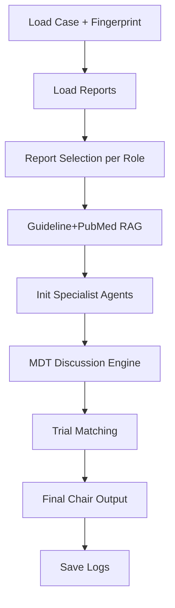

# MDT Discussion Log — 2026-01-18_21-22-05
Generated automatically by MDT Pipeline.


## CASE (structured JSON)

```
{}
```


## FINAL MDT OUTPUT

```
Final Assessment:
Systemic recurrent pelvic malignancy with hepatic and osseous metastases and severe anemia, but tumor origin, prior therapy, and current extent remain insufficiently defined for safe systemic treatment decisions. [@2022-12-29|MR] [@2022-12-29|CT] [@20230103|5600862]

Core Treatment Strategy:
- Defer new systemic regimen and trial enrollment until full pathology, prior oncologic treatments, and performance status are clarified. [@guideline:nccn_ovariancancer_v3_2025__v00000000|11]  
- Obtain and review complete pathology (primary and any metastases, including IHC, grade, stage) to define tumor origin and subtype. unknown/needs update  
- Arrange updated CT/MR and consider PET/CT to restage, assess obstruction/neurologic risk, and confirm current metastatic burden. [@2022-12-29|MR] [@2022-12-29|CT] [@pubmed:35296733]  
- Urgently evaluate and manage anemia/lymphopenia (workup, transfusion as indicated) before any myelosuppressive therapy. [@20230103|5600862]

Change Triggers:
- If pathology confirms epithelial ovarian origin, align with epithelial ovarian systemic pathways, considering limited PARP role in HRD-/BRCA‑wt disease. [@guideline:nccn_ovariancancer_v3_2025__v00000000|11] [@OH2203828|2022-04-18]  
- If updated imaging or symptoms reveal obstruction, neurologic compromise, or fracture risk, prioritize urgent local/palliative interventions before systemic therapy. [@2022-12-29|MR] [@2022-12-29|CT]
```


## PIPELINE FLOW (Mermaid)




## TRACE EVENTS (Structured)

```json
[
  {
    "ts": "2026-01-18T21:18:06.838331",
    "event": "pipeline_start",
    "payload": {
      "visit_time": "2023-01-03 08:53:29.260000",
      "meta_info": "340123197709263626"
    }
  },
  {
    "ts": "2026-01-18T21:18:06.838517",
    "event": "case_fingerprint",
    "payload": {
      "case_fingerprint": "bf21a9e8fbc5"
    }
  },
  {
    "ts": "2026-01-18T21:18:07.113403",
    "event": "reports_loaded",
    "payload": {
      "lab_n": 92,
      "img_n": 10,
      "path_n": 0,
      "mut_n": 1,
      "cutoff_dt": "2023-01-04 08:53:29"
    }
  },
  {
    "ts": "2026-01-18T21:18:20.136440",
    "event": "reports_selected",
    "payload": {
      "lab": {
        "chair": [
          "20221229|8300002|2022-12-29",
          "20221229|9703212|2022-12-29",
          "20230103|5600862|2023-01-03"
        ],
        "oncologist": [
          "20221229|8300002|2022-12-29",
          "20221229|9703212|2022-12-29",
          "20230103|5600862|2023-01-03"
        ],
        "radiologist": [],
        "pathologist": [],
        "nuclear": []
      },
      "imaging": {
        "chair": [
          "2022-10-24|MR|2022-10-24",
          "2022-12-29|MR|2022-12-29",
          "2022-12-29|CT|2022-12-29"
        ],
        "oncologist": [],
        "radiologist": [
          "2022-10-24|MR|2022-10-24",
          "2022-12-29|MR|2022-12-29",
          "2022-12-29|CT|2022-12-29"
        ],
        "pathologist": [],
        "nuclear": [
          "2022-10-24|CT|2022-10-24",
          "2022-12-29|MR|2022-12-29",
          "2022-12-29|CT|2022-12-29"
        ]
      },
      "pathology": {
        "chair": [],
        "oncologist": [],
        "radiologist": [],
        "pathologist": [],
        "nuclear": []
      },
      "mutation": {
        "chair": [
          "OH2203828|2022-04-18"
        ],
        "oncologist": [
          "OH2203828|2022-04-18"
        ],
        "radiologist": [],
        "pathologist": [
          "OH2203828|2022-04-18"
        ],
        "nuclear": []
      }
    }
  },
  {
    "ts": "2026-01-18T21:18:40.659899",
    "event": "rag_query",
    "payload": {
      "query": "Guidelines for management of platinum-unknown ovarian cancer with unspecified histology and metastatic extent, with no reported BRCA/HRD/MSI/PD-L1 status or major comorbid constraints, including recommendations for systemic therapy and follow‑up."
    }
  },
  {
    "ts": "2026-01-18T21:18:40.659927",
    "event": "rag_hits",
    "payload": {
      "source": "guideline",
      "topk": 5,
      "n": 5
    }
  },
  {
    "ts": "2026-01-18T21:18:40.659932",
    "event": "rag_hits",
    "payload": {
      "source": "pubmed",
      "topk": 5,
      "n": 5
    }
  },
  {
    "ts": "2026-01-18T21:18:40.659936",
    "event": "rag_hits_merged",
    "payload": {
      "n": 10
    }
  },
  {
    "ts": "2026-01-18T21:18:48.225667",
    "event": "mdt_discussion_start",
    "payload": {
      "num_rounds": 2,
      "num_turns": 2
    }
  },
  {
    "ts": "2026-01-18T21:21:59.127164",
    "event": "mdt_discussion_end",
    "payload": {
      "merged_chars": 2830
    }
  },
  {
    "ts": "2026-01-18T21:21:59.128095",
    "event": "final_output_start",
    "payload": {}
  },
  {
    "ts": "2026-01-18T21:22:05.686145",
    "event": "final_output_end",
    "payload": {
      "final_output_chars": 1443
    }
  }
]
```


## INITIAL EXPERT OPINIONS


## chair

```
- Advanced recurrent pelvic malignancy with liver and bone metastases; urgent MDT to clarify histology, prior treatments, performance status, and goals. [@2022-12-29|MR] [@2022-12-29|CT]  

- Severe anemia and relative lymphopenia require immediate evaluation (reticulocytes, iron/B12/folate, stool/bleeding review) and optimization before systemic therapy. [@20230103|5600862]  

- HRD-negative, BRCA-wildtype status suggests limited PARP benefit; consider standard systemic and trial options per epithelial ovarian cancer paradigms. [@guideline:nccn_ovariancancer_v3_2025__v00000000|11] [@2022-04-18|OH2203828]
```


## oncologist

```
- Primary cancer diagnosis, staging, prior systemic therapy, and treatment intent are unknown/needs update to define line and goals of care.

- Germline ATM variant with HRD-, BRCA1/2-, and other tested genes negative; implications for PARP-based maintenance limited [@OH2203828|2022-04-18] [@guideline:nccn_ovariancancer_v3_2025__v00000000|11].

- Significant anemia (Hgb 74 g/L) with preserved renal and near-normal liver function; optimize counts before myelosuppressive regimens [@20230103|2023-01-03] [@20221229|2022-12-29].
```


## radiologist

```
- Pelvic MRI: enlarging 53×44 mm presacral mass involving adjacent peritoneum, sacrum, plus pelvic mesenteric nodules—progressive recurrence/metastases. [@2022-12-29|MR]

- Pelvic MRI: right iliac bone enhancing nodule suggests new osseous metastasis; rectal wall thickening may indicate local invasion or inflammation. [@2022-12-29|MR]

- CT: multiple hepatic metastases increasing in number/size, with stable hepatic cysts; splenic low-density focus possibly infarct—requires imaging follow‑up. [@2022-12-29|CT]
```


## pathologist

```
- Only molecular finding: germline ATM p.Y316C with HRD negative; BRCA1/2, TP53, others tested negative [@OH2203828|2022-04-18].  

- Histologic diagnosis, grade, FIGO stage, and IHC profile are completely missing; primary pathology report and addenda need upload/update.  

- For epithelial ovarian cancer, early HRD/BRCA testing is standard; here HRD negative and BRCA1/2 wild-type [@guideline:nccn_ovariancancer_v3_2025__v00000000|11].
```


## nuclear

```
- No PET/CT or FDG-PET reports available; metabolic characterization of pelvic, hepatic, and bony lesions is unknown/needs update.  

- CT/MR show progressive pelvic mass with possible sacral, peritoneal, hepatic, and iliac bone metastases, concerning for systemic recurrence [@2022-12-29|MR] [@2022-12-29|CT].  

- FDG-PET could refine staging, detect additional metastases, and better assess recurrence extent in ovarian/pelvic malignancy workup [@guideline:nccn_ovariancancer_v3_2025__v00000000|11].
```


## MERGED SUMMARY (Assistant)

```
Key Knowledge:
- Advanced, recurrent pelvic malignancy with presacral, peritoneal, sacral, hepatic, and probable right iliac bone metastases (osseous disease documented by 2022‑12) → systemic disease.
- Marked anemia (Hgb 74 g/L) with relative lymphopenia; renal and hepatic function largely preserved.
- Molecular profile: germline ATM p.Y316C; HRD- and BRCA‑wildtype → limited expected benefit from PARP inhibitors; epithelial ovarian cancer pathway only provisional.
- No PET/CT performed; metabolic characterization and full disease extent remain undefined.

Controversies:
- Primary site and histologic subtype (ovarian vs other pelvic origin) not pathologically confirmed; current working label of epithelial ovarian cancer is unsupported by documented histology/IHC.
- Line of therapy and prior systemic treatment history unclear, limiting safe regimen selection and trial eligibility assessment.
- Clinical actionability of isolated germline ATM variant in HRD-/BRCA‑wt disease remains uncertain for current systemic strategy.

Missing Info:
- Full pathology for primary and any recurrent/metastatic sites: histology, grade, FIGO stage, IHC profile, and complete reports/addenda.
- Comprehensive oncologic treatment history: surgeries, chemo regimens, radiotherapy, maintenance (including PARP), timelines, responses.
- Updated imaging since 2022‑12 (CT/MR/PET), including assessment of liver, bone, and possible splenic lesion; any signs of obstruction, nerve/spinal compromise, or fracture risk.
- Detailed anemia workup and transfusion/bleeding history.
- Current performance status, symptom burden (incl. pain, bowel/bladder function), comorbidities, medications (esp. anticoagulants), and patient goals/intent.

Working Plan:
- Obtain and review full pathology (primary and metastatic, with IHC) and clarify the diagnostic basis for any presumed epithelial ovarian origin before defining systemic strategy.
- Retrieve complete prior treatment record and establish the current line of therapy and treatment intent.
- Urgently investigate and manage anemia and lymphopenia before considering myelosuppressive systemic therapy.
- Arrange updated cross‑sectional imaging and consider PET/CT to refine staging and identify complications (obstruction, neurologic compromise, fracture risk).
- Defer systemic regimen choice and trial consideration until pathology, staging, and prior treatment history are clarified; then align options with performance status and patient‑stated goals, including palliative‑focused care if appropriate.
[R2T1 DELTA] radiologist->oncologist(safety): Last MR/CT (2022-12) already showed progressive presacral, hepatic, and bone metastases; without updated imaging, current risks of obstruction or neurologic compromise remain undefined and should be re-imaged before finalizing systemic plans.
```


## INTERACTION LOG (Round × Turn)

### Round 1

#### Turn 1
- **chair → oncologist:** Before choosing further systemic therapy, we must clarify full prior treatment history, performance status, and correct the marked anemia (including transfusion need) to avoid unsafe myelosuppressive plans.
- **chair → pathologist:** Please urgently provide complete pathology (primary site, histologic subtype, grade, IHC, stage) to resolve current uncertainty over tumor origin and guide systemic strategy.
- **oncologist → pathologist:** Primary site and histologic subtype remain unclear; please prioritize review of all available tissue, including IHC and any addenda, to definitively classify origin and grade to guide systemic strategy.
- **oncologist → nuclear:** Given multifocal metastases without PET/CT, please advise on urgency and utility of whole-body PET/CT now to better stage disease and assess bone/splenic involvement before systemic regimen decisions.
- **radiologist → oncologist:** Imaging shows progressive presacral, hepatic, and probable osseous metastases as of 2022-12; any new scans or symptoms suggesting complications (bowel/bladder obstruction, pathologic fracture, severe pain) since then should be documented.
- **radiologist → nuclear:** Last cross-sectional imaging is from 2022-12; given progressive multi-organ metastases, please clarify if a PET/CT has since been done or is planned for updated staging and treatment planning.
- **pathologist → chair:** Current MDT plan assumes epithelial ovarian cancer, but no pathology report or IHC confirmation is available; diagnostic basis for this working diagnosis needs explicit clarification and documentation.
- **pathologist → oncologist:** Primary histology, grade, FIGO stage, and IHC profile remain entirely undocumented; please obtain and upload full pathology (including any biopsies of recurrent/metastatic sites) before refining diagnosis or systemic strategy.
- **nuclear → oncologist:** No PET/CT has been performed; metabolic assessment of suspected hepatic, bone, and peritoneal metastases is missing and could meaningfully refine current staging and recurrence evaluation.

#### Turn 2
- **chair → oncologist:** Please avoid locking in an epithelial ovarian cancer label until original and metastatic pathology (including IHC) are reviewed and documented; parallelly, address severe anemia and consider PET/CT to refine current staging before committing to a new systemic line.
- **chair → radiologist:** Given progressive pelvic, hepatic, and bone disease on prior MR/CT, please flag any imaging or clinical signs of impending obstruction, spinal/nerve compromise, or fracture risk that would change urgency or sequence of local versus systemic measures.
- **oncologist → chair:** Systemic regimen choice and trial eligibility are being considered without any pathology report or staging documented; decision-making should be deferred until full histology/IHC, prior treatment history, and updated imaging are available.

### Round 2

#### Turn 1
- **radiologist → oncologist:** Last MR/CT (2022-12) already showed progressive presacral, hepatic, and bone metastases; without updated imaging, current risks of obstruction or neurologic compromise remain undefined and should be re-imaged before finalizing systemic plans.

#### Turn 2


## FINAL REFINED PLANS (per Round)

### Round 1


## chair

```
- Defer systemic-regimen decisions until complete pathology, prior treatment history, performance status, and updated staging (including PET/CT if feasible) are obtained. [@2022-12-29|MR] [@2022-12-29|CT]  

- Urgently investigate and correct severe anemia and lymphopenia before any myelosuppressive therapy; evaluate for bleeding, deficiency, and transfusion need. [@20230103|5600862]  

- If epithelial ovarian origin is confirmed, follow standard systemic and trial pathways, recognizing limited PARP role in HRD-/BRCA‑wt disease. [@guideline:nccn_ovariancancer_v3_2025__v00000000|11] [@2022-04-18|OH2203828]
```


## oncologist

```
- Defer new systemic regimen until full pathology (primary and metastatic, including IHC) and complete prior treatment history are obtained; diagnosis remains uncertain (ovarian vs other pelvic origin) [@guideline:nccn_ovariancancer_v3_2025__v00000000|11].  

- Urgently investigate and correct severe anemia (Hgb 74 g/L) and lymphopenia before any myelosuppressive therapy [@20230103|2023-01-03].  

- Arrange updated cross‑sectional imaging and consider PET/CT to define current metastatic burden and complications (obstruction, fracture risk, nerve compromise) before selecting systemic versus local priorities [@20221229|2022-12-29].
```


## radiologist

```
- Imaging shows progressive presacral, pelvic peritoneal, hepatic, and right iliac bone metastases consistent with systemic recurrent disease; no PET/CT yet. [@2022-12-29|MR] [@2022-12-29|CT]

- No available imaging since 2022-12; updated CT/MRI (and PET/CT if done) are required to reassess extent and complications. unknown/needs update [@pubmed:35296733]

- Current images do not detail bowel/bladder obstruction, spinal canal compromise, or impending fracture; targeted imaging review is needed if symptoms arise. [@2022-12-29|MR]
```


## pathologist

```
- Obtain and review all primary and metastatic pathology (histology, grade, FIGO, full IHC) to confirm tumor origin; currently unknown.  

- Integrate existing germline findings (ATM p.Y316C, HRD-/BRCA‑wt) into classification once histology is established [@OH2203828|2022-04-18].  

- Definitive treatment-pathway decisions should await confirmed epithelial ovarian versus alternate pelvic primary, per guideline emphasis on accurate histologic diagnosis [@guideline:nccn_ovariancancer_v3_2025__v00000000|11].
```


## nuclear

```
- PET/CT remains indicated to define metabolic extent of pelvic, hepatic, peritoneal, and osseous disease before further staging decisions [@guideline:nccn_ovariancancer_v3_2025__v00000000|11].  

- Pending PET/CT, current staging relies on CT/MR evidence of systemic recurrence with liver, presacral, peritoneal, and right iliac bone involvement [@2022-12-29|CT] [@2022-12-29|MR].  

- If performed, PET/CT should specifically evaluate spinal/sacral involvement for nerve compromise and clarify viability of hepatic and splenic lesions [@2022-12-29|CT] [@2022-12-29|MR].
```

### Round 2


## chair

```
- Defer systemic-regimen and trial decisions until full pathology, prior treatments, and updated imaging (including PET/CT if feasible) are obtained. [@2022-12-29|MR] [@2022-12-29|CT]  

- Urgently investigate and correct anemia/lymphopenia before any myelosuppressive therapy; assess bleeding, deficiencies, marrow status, and transfusion need. [@20230103|5600862]  

- If epithelial ovarian origin is confirmed, follow standard systemic pathways, recognizing limited PARP benefit in HRD-/BRCA‑wt disease. [@guideline:nccn_ovariancancer_v3_2025__v00000000|11] [@2022-04-18|OH2203828]
```


## oncologist

```
- Defer systemic regimen choice and trial planning until full pathology, prior treatment history, and updated staging imaging (including obstruction/neurologic risk) are clarified [@guideline:nccn_ovariancancer_v3_2025__v00000000|11].  

- Urgently evaluate and treat severe anemia and lymphopenia before any myelosuppressive therapy (Hgb 74 g/L, low lymphocytes) [@20230103|2023-01-03].  

- Arrange updated CT/MR and consider PET/CT to define current metastatic burden and complications beyond 2022‑12 imaging [@20221229|2022-12-29].
```


## radiologist

```
- Progressive presacral mass with sacral involvement, pelvic mesenteric nodules, and new right iliac bone lesion indicate advancing loco-regional and osseous metastases. [@2022-12-29|MR]

- CT shows increasing number/size of hepatic metastases and possible splenic infarct; no follow-up imaging available, requiring updated staging. [@2022-12-29|CT]

- For systemic recurrent pelvic malignancy, updated cross-sectional imaging (±PET/CT) is recommended to reassess metastatic burden before major treatment decisions. [@pubmed:35296733]
```


## pathologist

```
- Primary and metastatic pathology (histology, grade, FIGO, IHC) remain undocumented; obtain and review full reports before confirming tumor origin (currently unknown).  

- Integrate germline ATM p.Y316C, HRD-/BRCA‑wt status into diagnostic framework once histology and primary site are defined [@OH2203828|2022-04-18].  

- Definitive assignment to epithelial ovarian cancer pathways should await confirmed histologic subtype and origin, per guideline emphasis on accurate diagnosis [@guideline:nccn_ovariancancer_v3_2025__v00000000|11].
```


## nuclear

```
- PET/CT is still warranted to define current metabolic disease burden and detect complications before finalizing staging and management plans [@guideline:nccn_ovariancancer_v3_2025__v00000000|11].  

- Until PET/CT and updated imaging are available, systemic spread remains inferred from 2022-12 CT/MR only [@2022-12-29|CT] [@2022-12-29|MR].  

- PET/CT should pay particular attention to sacral/iliac bone, liver, and presacral mass to assess neurologic compromise or obstruction risk [@2022-12-29|CT] [@2022-12-29|MR].
```


## RAW AGENT LOGS

### chair
- **User:** Give INITIAL opinion (use ONLY your system-provided patient facts).
Return up to 3 bullets, each ≤20 words.
If key data missing, say exactly what needs updating.
At least ONE bullet must be evidence-based and include [@guideline:doc_id|page] or [@pubmed:PMID].
If you reference treatment strategy categories, guidelines, trials, or literature evidence, include tags [@guideline:doc_id|page] or [@pubmed:PMID].
  
  **Assistant:** - Advanced recurrent pelvic malignancy with liver and bone metastases; urgent MDT to clarify histology, prior treatments, performance status, and goals. [@2022-12-29|MR] [@2022-12-29|CT]  

- Severe anemia and relative lymphopenia require immediate evaluation (reticulocytes, iron/B12/folate, stool/bleeding review) and optimization before systemic therapy. [@20230103|5600862]  

- HRD-negative, BRCA-wildtype status suggests limited PARP benefit; consider standard systemic and trial options per epithelial ovarian cancer paradigms. [@guideline:nccn_ovariancancer_v3_2025__v00000000|11] [@2022-04-18|OH2203828]
  
  *(2026-01-18T21:18:50.985688)*

- **User:** ROLE: chair. VISIT: 2023-01-03 08:53:29.260000
Default is NOT to speak. Speak ONLY if: conflict | safety | missing-critical | new-critical.

CONTEXT (latest):
Key Knowledge:
- Advanced recurrent pelvic malignancy with presacral, peritoneal, sacral, hepatic, and probable right iliac bone metastases → systemic disease.
- Marked anemia (Hgb 74 g/L) with relative lymphopenia; kidney and liver function largely preserved.
- Germline ATM p.Y316C; HRD- and BRCA‑wildtype, suggesting limited benefit from PARP inhibitors and likely use of standard epithelial ovarian cancer paradigms if that primary is confirmed.
- No PET/CT performed; metabolic extent of disease not defined.

Controversies:
- Primary site and histologic subtype (ovarian vs other pelvic origin) remain uncertain.
- Line of therapy and prior systemic treatments not clearly established, complicating treatment selection and trial eligibility.
- Clinical relevance of isolated germline ATM variant in HRD-/BRCA‑wt setting for current management is unclear.

Missing Info:
- Complete pathology (histology, grade, FIGO stage, IHC, original and addenda reports).
- Full oncologic treatment history (surgery, chemo, radiotherapy, maintenance, PARP exposure, timelines, responses).
- Current performance status, symptom burden, and patient goals/intent.
- Detailed anemia workup (reticulocytes, iron/B12/folate, hemolysis, bleeding/stool review, transfusion history).
- Updated staging imaging including PET/CT (if obtained) and follow-up on possible splenic infarct.
- Comorbidities, current medications (including anticoagulants), and supportive care needs.

Working Plan:
- Retrieve and review original pathology and full oncology records to confirm diagnosis, staging, and treatment line/intent.
- Urgently investigate and treat anemia and optimize counts before any myelosuppressive systemic therapy.
- Consider PET/CT to better define overall metastatic burden (pelvis, liver, bone, spleen).
- Re‑evaluate systemic options using epithelial ovarian cancer pathways if confirmed, noting limited PARP role in HRD-/BRCA‑wt disease.
- Align any further treatment with performance status and patient preferences, including discussion of palliative-focused approaches if appropriate.

Allowed targets: [oncologist,radiologist,pathologist,nuclear]
Return ONE-LINE JSON only:{"speak":"yes/no","messages":[{"target":"<role>","message":"<1-2 sentences>","why":"conflict|safety|missing|new"}]}
  
  **Assistant:** {"speak":"yes","messages":[{"target":"oncologist","message":"Before choosing further systemic therapy, we must clarify full prior treatment history, performance status, and correct the marked anemia (including transfusion need) to avoid unsafe myelosuppressive plans.","why":"safety"},{"target":"pathologist","message":"Please urgently provide complete pathology (primary site, histologic subtype, grade, IHC, stage) to resolve current uncertainty over tumor origin and guide systemic strategy.","why":"missing"}]}
  
  *(2026-01-18T21:19:15.956338)*

- **User:** ROLE: chair. VISIT: 2023-01-03 08:53:29.260000
Default is NOT to speak. Speak ONLY if: conflict | safety | missing-critical | new-critical.

CONTEXT (latest):
Key Knowledge:
- Advanced recurrent pelvic malignancy with presacral, peritoneal, sacral, hepatic, and probable right iliac bone metastases → systemic disease.
- Marked anemia (Hgb 74 g/L) with relative lymphopenia; kidney and liver function largely preserved.
- Germline ATM p.Y316C; HRD- and BRCA‑wildtype, suggesting limited benefit from PARP inhibitors and likely use of standard epithelial ovarian cancer paradigms if that primary is confirmed.
- No PET/CT performed; metabolic extent of disease not defined.

Controversies:
- Primary site and histologic subtype (ovarian vs other pelvic origin) remain uncertain.
- Line of therapy and prior systemic treatments not clearly established, complicating treatment selection and trial eligibility.
- Clinical relevance of isolated germline ATM variant in HRD-/BRCA‑wt setting for current management is unclear.

Missing Info:
- Complete pathology (histology, grade, FIGO stage, IHC, original and addenda reports).
- Full oncologic treatment history (surgery, chemo, radiotherapy, maintenance, PARP exposure, timelines, responses).
- Current performance status, symptom burden, and patient goals/intent.
- Detailed anemia workup (reticulocytes, iron/B12/folate, hemolysis, bleeding/stool review, transfusion history).
- Updated staging imaging including PET/CT (if obtained) and follow-up on possible splenic infarct.
- Comorbidities, current medications (including anticoagulants), and supportive care needs.

Working Plan:
- Retrieve and review original pathology and full oncology records to confirm diagnosis, staging, and treatment line/intent.
- Urgently investigate and treat anemia and optimize counts before any myelosuppressive systemic therapy.
- Consider PET/CT to better define overall metastatic burden (pelvis, liver, bone, spleen).
- Re‑evaluate systemic options using epithelial ovarian cancer pathways if confirmed, noting limited PARP role in HRD-/BRCA‑wt disease.
- Align any further treatment with performance status and patient preferences, including discussion of palliative-focused approaches if appropriate.
[R1T1 DELTA] le osseous metastases as of 2022-12; any new scans or symptoms suggesting complications (bowel/bladder obstruction, pathologic fracture, severe pain) since then should be documented. | pathologist->oncologist(missing): Primary histology, grade, FIGO stage, and IHC profile remain entirely undocumented; please obtain and upload full pathology (including any biopsies of recurrent/metastatic sites) before refining diagnosis or systemic strategy. | pathologist->chair(conflict): Current MDT plan assumes epithelial ovarian cancer, but no pathology report or IHC confirmation is available; diagnostic basis for this working diagnosis needs explicit clarification and documentation. | nuclear->oncologist(missing): No PET/CT has been performed; metabolic assessment of suspected hepatic, bone, and peritoneal metastases is missing and could meaningfully refine current staging and recurrence evaluation.

Allowed targets: [oncologist,radiologist,pathologist,nuclear]
Return ONE-LINE JSON only:{"speak":"yes/no","messages":[{"target":"<role>","message":"<1-2 sentences>","why":"conflict|safety|missing|new"}]}
  
  **Assistant:** {"speak":"yes","messages":[{"target":"oncologist","message":"Please avoid locking in an epithelial ovarian cancer label until original and metastatic pathology (including IHC) are reviewed and documented; parallelly, address severe anemia and consider PET/CT to refine current staging before committing to a new systemic line.","why":"conflict"},{"target":"radiologist","message":"Given progressive pelvic, hepatic, and bone disease on prior MR/CT, please flag any imaging or clinical signs of impending obstruction, spinal/nerve compromise, or fracture risk that would change urgency or sequence of local versus systemic measures.","why":"safety"}]}
  
  *(2026-01-18T21:19:31.307454)*

- **User:** Given MDT context:
Key Knowledge:
- Advanced recurrent pelvic malignancy with presacral, peritoneal, sacral, hepatic, and probable right iliac bone metastases → systemic disease.
- Marked anemia (Hgb 74 g/L) with relative lymphopenia; kidney and liver function largely preserved.
- Germline ATM p.Y316C; HRD- and BRCA‑wildtype, suggesting limited benefit from PARP inhibitors and likely use of standard epithelial ovarian cancer paradigms if that primary is confirmed.
- No PET/CT performed; metabolic extent of disease not defined.

Controversies:
- Primary site and histologic subtype (ovarian vs other pelvic origin) remain uncertain.
- Line of therapy and prior systemic treatments not clearly established, complicating treatment selection and trial eligibility.
- Clinical relevance of isolated germline ATM variant in HRD-/BRCA‑wt setting for current management is unclear.

Missing Info:
- Complete pathology (histology, grade, FIGO stage, IHC, original and addenda reports).
- Full oncologic treatment history (surgery, chemo, radiotherapy, maintenance, PARP exposure, timelines, responses).
- Current performance status, symptom burden, and patient goals/intent.
- Detailed anemia workup (reticulocytes, iron/B12/folate, hemolysis, bleeding/stool review, transfusion history).
- Updated staging imaging including PET/CT (if obtained) and follow-up on possible splenic infarct.
- Comorbidities, current medications (including anticoagulants), and supportive care needs.

Working Plan:
- Retrieve and review original pathology and full oncology records to confirm diagnosis, staging, and treatment line/intent.
- Urgently investigate and treat anemia and optimize counts before any myelosuppressive systemic therapy.
- Consider PET/CT to better define overall metastatic burden (pelvis, liver, bone, spleen).
- Re‑evaluate systemic options using epithelial ovarian cancer pathways if confirmed, noting limited PARP role in HRD-/BRCA‑wt disease.
- Align any further treatment with performance status and patient preferences, including discussion of palliative-focused approaches if appropriate.
[R1T1 DELTA] le osseous metastases as of 2022-12; any new scans or symptoms suggesting complications (bowel/bladder obstruction, pathologic fracture, severe pain) since then should be documented. | pathologist->oncologist(missing): Primary histology, grade, FIGO stage, and IHC profile remain entirely undocumented; please obtain and upload full pathology (including any biopsies of recurrent/metastatic sites) before refining diagnosis or systemic strategy. | pathologist->chair(conflict): Current MDT plan assumes epithelial ovarian cancer, but no pathology report or IHC confirmation is available; diagnostic basis for this working diagnosis needs explicit clarification and documentation. | nuclear->oncologist(missing): No PET/CT has been performed; metabolic assessment of suspected hepatic, bone, and peritoneal metastases is missing and could meaningfully refine current staging and recurrence evaluation.
[R1T2 DELTA] chair->oncologist(conflict): Please avoid locking in an epithelial ovarian cancer label until original and metastatic pathology (including IHC) are reviewed and documented; parallelly, address severe anemia and consider PET/CT to refine current staging before committing to a new systemic line. | chair->radiologist(safety): Given progressive pelvic, hepatic, and bone disease on prior MR/CT, please flag any imaging or clinical signs of impending obstruction, spinal/nerve compromise, or fracture risk that would change urgency or sequence of local versus systemic measures. | oncologist->chair(safety): Systemic regimen choice and trial eligibility are being considered without any pathology report or staging documented; decision-making should be deferred until full histology/IHC, prior treatment history, and updated imaging are available.

Provide FINAL refined plan.
Up to 3 bullets, each ≤20 words.
Any factual claim must include [@report_id|date] or say unknown.
At least ONE bullet must be evidence-based and include [@guideline:doc_id|page] or [@pubmed:PMID].
If you reference treatment strategy categories, guidelines, trials, or literature evidence, include tags [@guideline:doc_id|page] or [@pubmed:PMID].
  
  **Assistant:** - Defer systemic-regimen decisions until complete pathology, prior treatment history, performance status, and updated staging (including PET/CT if feasible) are obtained. [@2022-12-29|MR] [@2022-12-29|CT]  

- Urgently investigate and correct severe anemia and lymphopenia before any myelosuppressive therapy; evaluate for bleeding, deficiency, and transfusion need. [@20230103|5600862]  

- If epithelial ovarian origin is confirmed, follow standard systemic and trial pathways, recognizing limited PARP role in HRD-/BRCA‑wt disease. [@guideline:nccn_ovariancancer_v3_2025__v00000000|11] [@2022-04-18|OH2203828]
  
  *(2026-01-18T21:19:41.048513)*

- **User:** ROLE: chair. VISIT: 2023-01-03 08:53:29.260000
Default is NOT to speak. Speak ONLY if: conflict | safety | missing-critical | new-critical.

CONTEXT (latest):
Key Knowledge:
- Advanced, recurrent pelvic malignancy with presacral, peritoneal, sacral, hepatic, and probable right iliac bone metastases (osseous disease documented by 2022‑12) → systemic disease.
- Marked anemia (Hgb 74 g/L) with relative lymphopenia; renal and hepatic function largely preserved.
- Molecular profile: germline ATM p.Y316C; HRD- and BRCA‑wildtype → limited expected benefit from PARP inhibitors; epithelial ovarian cancer pathway only provisional.
- No PET/CT performed; metabolic characterization and full disease extent remain undefined.

Controversies:
- Primary site and histologic subtype (ovarian vs other pelvic origin) not pathologically confirmed; current working label of epithelial ovarian cancer is unsupported by documented histology/IHC.
- Line of therapy and prior systemic treatment history unclear, limiting safe regimen selection and trial eligibility assessment.
- Clinical actionability of isolated germline ATM variant in HRD-/BRCA‑wt disease remains uncertain for current systemic strategy.

Missing Info:
- Full pathology for primary and any recurrent/metastatic sites: histology, grade, FIGO stage, IHC profile, and complete reports/addenda.
- Comprehensive oncologic treatment history: surgeries, chemo regimens, radiotherapy, maintenance (including PARP), timelines, responses.
- Updated imaging since 2022‑12 (CT/MR/PET), including assessment of liver, bone, and possible splenic lesion; any signs of obstruction, nerve/spinal compromise, or fracture risk.
- Detailed anemia workup and transfusion/bleeding history.
- Current performance status, symptom burden (incl. pain, bowel/bladder function), comorbidities, medications (esp. anticoagulants), and patient goals/intent.

Working Plan:
- Obtain and review full pathology (primary and metastatic, with IHC) and clarify the diagnostic basis for any presumed epithelial ovarian origin before defining systemic strategy.
- Retrieve complete prior treatment record and establish the current line of therapy and treatment intent.
- Urgently investigate and manage anemia and lymphopenia before considering myelosuppressive systemic therapy.
- Arrange updated cross‑sectional imaging and consider PET/CT to refine staging and identify complications (obstruction, neurologic compromise, fracture risk).
- Defer systemic regimen choice and trial consideration until pathology, staging, and prior treatment history are clarified; then align options with performance status and patient‑stated goals, including palliative‑focused care if appropriate.

Allowed targets: [oncologist,radiologist,pathologist,nuclear]
Return ONE-LINE JSON only:{"speak":"yes/no","messages":[{"target":"<role>","message":"<1-2 sentences>","why":"conflict|safety|missing|new"}]}
  
  **Assistant:** {"speak":"no","messages":[]}
  
  *(2026-01-18T21:20:23.304792)*

- **User:** ROLE: chair. VISIT: 2023-01-03 08:53:29.260000
Default is NOT to speak. Speak ONLY if: conflict | safety | missing-critical | new-critical.

CONTEXT (latest):
Key Knowledge:
- Advanced, recurrent pelvic malignancy with presacral, peritoneal, sacral, hepatic, and probable right iliac bone metastases (osseous disease documented by 2022‑12) → systemic disease.
- Marked anemia (Hgb 74 g/L) with relative lymphopenia; renal and hepatic function largely preserved.
- Molecular profile: germline ATM p.Y316C; HRD- and BRCA‑wildtype → limited expected benefit from PARP inhibitors; epithelial ovarian cancer pathway only provisional.
- No PET/CT performed; metabolic characterization and full disease extent remain undefined.

Controversies:
- Primary site and histologic subtype (ovarian vs other pelvic origin) not pathologically confirmed; current working label of epithelial ovarian cancer is unsupported by documented histology/IHC.
- Line of therapy and prior systemic treatment history unclear, limiting safe regimen selection and trial eligibility assessment.
- Clinical actionability of isolated germline ATM variant in HRD-/BRCA‑wt disease remains uncertain for current systemic strategy.

Missing Info:
- Full pathology for primary and any recurrent/metastatic sites: histology, grade, FIGO stage, IHC profile, and complete reports/addenda.
- Comprehensive oncologic treatment history: surgeries, chemo regimens, radiotherapy, maintenance (including PARP), timelines, responses.
- Updated imaging since 2022‑12 (CT/MR/PET), including assessment of liver, bone, and possible splenic lesion; any signs of obstruction, nerve/spinal compromise, or fracture risk.
- Detailed anemia workup and transfusion/bleeding history.
- Current performance status, symptom burden (incl. pain, bowel/bladder function), comorbidities, medications (esp. anticoagulants), and patient goals/intent.

Working Plan:
- Obtain and review full pathology (primary and metastatic, with IHC) and clarify the diagnostic basis for any presumed epithelial ovarian origin before defining systemic strategy.
- Retrieve complete prior treatment record and establish the current line of therapy and treatment intent.
- Urgently investigate and manage anemia and lymphopenia before considering myelosuppressive systemic therapy.
- Arrange updated cross‑sectional imaging and consider PET/CT to refine staging and identify complications (obstruction, neurologic compromise, fracture risk).
- Defer systemic regimen choice and trial consideration until pathology, staging, and prior treatment history are clarified; then align options with performance status and patient‑stated goals, including palliative‑focused care if appropriate.
[R2T1 DELTA] radiologist->oncologist(safety): Last MR/CT (2022-12) already showed progressive presacral, hepatic, and bone metastases; without updated imaging, current risks of obstruction or neurologic compromise remain undefined and should be re-imaged before finalizing systemic plans.

Allowed targets: [oncologist,radiologist,pathologist,nuclear]
Return ONE-LINE JSON only:{"speak":"yes/no","messages":[{"target":"<role>","message":"<1-2 sentences>","why":"conflict|safety|missing|new"}]}
  
  **Assistant:** {"speak":"no","messages":[]}
  
  *(2026-01-18T21:20:40.704735)*

- **User:** Given MDT context:
Key Knowledge:
- Advanced, recurrent pelvic malignancy with presacral, peritoneal, sacral, hepatic, and probable right iliac bone metastases (osseous disease documented by 2022‑12) → systemic disease.
- Marked anemia (Hgb 74 g/L) with relative lymphopenia; renal and hepatic function largely preserved.
- Molecular profile: germline ATM p.Y316C; HRD- and BRCA‑wildtype → limited expected benefit from PARP inhibitors; epithelial ovarian cancer pathway only provisional.
- No PET/CT performed; metabolic characterization and full disease extent remain undefined.

Controversies:
- Primary site and histologic subtype (ovarian vs other pelvic origin) not pathologically confirmed; current working label of epithelial ovarian cancer is unsupported by documented histology/IHC.
- Line of therapy and prior systemic treatment history unclear, limiting safe regimen selection and trial eligibility assessment.
- Clinical actionability of isolated germline ATM variant in HRD-/BRCA‑wt disease remains uncertain for current systemic strategy.

Missing Info:
- Full pathology for primary and any recurrent/metastatic sites: histology, grade, FIGO stage, IHC profile, and complete reports/addenda.
- Comprehensive oncologic treatment history: surgeries, chemo regimens, radiotherapy, maintenance (including PARP), timelines, responses.
- Updated imaging since 2022‑12 (CT/MR/PET), including assessment of liver, bone, and possible splenic lesion; any signs of obstruction, nerve/spinal compromise, or fracture risk.
- Detailed anemia workup and transfusion/bleeding history.
- Current performance status, symptom burden (incl. pain, bowel/bladder function), comorbidities, medications (esp. anticoagulants), and patient goals/intent.

Working Plan:
- Obtain and review full pathology (primary and metastatic, with IHC) and clarify the diagnostic basis for any presumed epithelial ovarian origin before defining systemic strategy.
- Retrieve complete prior treatment record and establish the current line of therapy and treatment intent.
- Urgently investigate and manage anemia and lymphopenia before considering myelosuppressive systemic therapy.
- Arrange updated cross‑sectional imaging and consider PET/CT to refine staging and identify complications (obstruction, neurologic compromise, fracture risk).
- Defer systemic regimen choice and trial consideration until pathology, staging, and prior treatment history are clarified; then align options with performance status and patient‑stated goals, including palliative‑focused care if appropriate.
[R2T1 DELTA] radiologist->oncologist(safety): Last MR/CT (2022-12) already showed progressive presacral, hepatic, and bone metastases; without updated imaging, current risks of obstruction or neurologic compromise remain undefined and should be re-imaged before finalizing systemic plans.

Provide FINAL refined plan.
Up to 3 bullets, each ≤20 words.
Any factual claim must include [@report_id|date] or say unknown.
At least ONE bullet must be evidence-based and include [@guideline:doc_id|page] or [@pubmed:PMID].
If you reference treatment strategy categories, guidelines, trials, or literature evidence, include tags [@guideline:doc_id|page] or [@pubmed:PMID].
  
  **Assistant:** - Defer systemic-regimen and trial decisions until full pathology, prior treatments, and updated imaging (including PET/CT if feasible) are obtained. [@2022-12-29|MR] [@2022-12-29|CT]  

- Urgently investigate and correct anemia/lymphopenia before any myelosuppressive therapy; assess bleeding, deficiencies, marrow status, and transfusion need. [@20230103|5600862]  

- If epithelial ovarian origin is confirmed, follow standard systemic pathways, recognizing limited PARP benefit in HRD-/BRCA‑wt disease. [@guideline:nccn_ovariancancer_v3_2025__v00000000|11] [@2022-04-18|OH2203828]
  
  *(2026-01-18T21:21:29.224602)*

- **User:** 
As the MDT chair for gynecologic oncology, you are seeing the patient at OUTPATIENT TIME: 2023-01-03 08:53:29.260000.
Based on PATIENT FACTS + MDT discussion + FINAL refined plans from all experts, determine the CURRENT best management plan for this visit.

STRICT RULES:
- Any factual statement about past tests/treatments must include [@report_id|date] or say unknown.
- Any statement derived from guideline or PubMed literature must include [@guideline:doc_id|page] or [@pubmed:PMID].
- If you cite guideline/PubMed evidence in Core Treatment Strategy or Change Triggers, include at least one tag in that bullet.
- If experts disagree, pick the safest plan and state the key uncertainty.

# FINAL REFINED PLANS (All experts, last round)
{
  "Round 1": {
    "chair": "- Defer systemic-regimen decisions until complete pathology, prior treatment history, performance status, and updated staging (including PET/CT if feasible) are obtained. [@2022-12-29|MR] [@2022-12-29|CT]  \n\n- Urgently investigate and correct severe anemia and lymphopenia before any myelosuppressive therapy; evaluate for bleeding, deficiency, and transfusion need. [@20230103|5600862]  \n\n- If epithelial ovarian origin is confirmed, follow standard systemic and trial pathways, recognizing limited PARP role in HRD-/BRCA‑wt disease. [@guideline:nccn_ovariancancer_v3_2025__v00000000|11] [@2022-04-18|OH2203828]",
    "oncologist": "- Defer new systemic regimen until full pathology (primary and metastatic, including IHC) and complete prior treatment history are obtained; diagnosis remains uncertain (ovarian vs other pelvic origin) [@guideline:nccn_ovariancancer_v3_2025__v00000000|11].  \n\n- Urgently investigate and correct severe anemia (Hgb 74 g/L) and lymphopenia before any myelosuppressive therapy [@20230103|2023-01-03].  \n\n- Arrange updated cross‑sectional imaging and consider PET/CT to define current metastatic burden and complications (obstruction, fracture risk, nerve compromise) before selecting systemic versus local priorities [@20221229|2022-12-29].",
    "radiologist": "- Imaging shows progressive presacral, pelvic peritoneal, hepatic, and right iliac bone metastases consistent with systemic recurrent disease; no PET/CT yet. [@2022-12-29|MR] [@2022-12-29|CT]\n\n- No available imaging since 2022-12; updated CT/MRI (and PET/CT if done) are required to reassess extent and complications. unknown/needs update [@pubmed:35296733]\n\n- Current images do not detail bowel/bladder obstruction, spinal canal compromise, or impending fracture; targeted imaging review is needed if symptoms arise. [@2022-12-29|MR]",
    "pathologist": "- Obtain and review all primary and metastatic pathology (histology, grade, FIGO, full IHC) to confirm tumor origin; currently unknown.  \n\n- Integrate existing germline findings (ATM p.Y316C, HRD-/BRCA‑wt) into classification once histology is established [@OH2203828|2022-04-18].  \n\n- Definitive treatment-pathway decisions should await confirmed epithelial ovarian versus alternate pelvic primary, per guideline emphasis on accurate histologic diagnosis [@guideline:nccn_ovariancancer_v3_2025__v00000000|11].",
    "nuclear": "- PET/CT remains indicated to define metabolic extent of pelvic, hepatic, peritoneal, and osseous disease before further staging decisions [@guideline:nccn_ovariancancer_v3_2025__v00000000|11].  \n\n- Pending PET/CT, current staging relies on CT/MR evidence of systemic recurrence with liver, presacral, peritoneal, and right iliac bone involvement [@2022-12-29|CT] [@2022-12-29|MR].  \n\n- If performed, PET/CT should specifically evaluate spinal/sacral involvement for nerve compromise and clarify viability of hepatic and splenic lesions [@2022-12-29|CT] [@2022-12-29|MR]."
  },
  "Round 2": {
    "chair": "- Defer systemic-regimen and trial decisions until full pathology, prior treatments, and updated imaging (including PET/CT if feasible) are obtained. [@2022-12-29|MR] [@2022-12-29|CT]  \n\n- Urgently investigate and correct anemia/lymphopenia before any myelosuppressive therapy; assess bleeding, deficiencies, marrow status, and transfusion need. [@20230103|5600862]  \n\n- If epithelial ovarian origin is confirmed, follow standard systemic pathways, recognizing limited PARP benefit in HRD-/BRCA‑wt disease. [@guideline:nccn_ovariancancer_v3_2025__v00000000|11] [@2022-04-18|OH2203828]",
    "oncologist": "- Defer systemic regimen choice and trial planning until full pathology, prior treatment history, and updated staging imaging (including obstruction/neurologic risk) are clarified [@guideline:nccn_ovariancancer_v3_2025__v00000000|11].  \n\n- Urgently evaluate and treat severe anemia and lymphopenia before any myelosuppressive therapy (Hgb 74 g/L, low lymphocytes) [@20230103|2023-01-03].  \n\n- Arrange updated CT/MR and consider PET/CT to define current metastatic burden and complications beyond 2022‑12 imaging [@20221229|2022-12-29].",
    "radiologist": "- Progressive presacral mass with sacral involvement, pelvic mesenteric nodules, and new right iliac bone lesion indicate advancing loco-regional and osseous metastases. [@2022-12-29|MR]\n\n- CT shows increasing number/size of hepatic metastases and possible splenic infarct; no follow-up imaging available, requiring updated staging. [@2022-12-29|CT]\n\n- For systemic recurrent pelvic malignancy, updated cross-sectional imaging (±PET/CT) is recommended to reassess metastatic burden before major treatment decisions. [@pubmed:35296733]",
    "pathologist": "- Primary and metastatic pathology (histology, grade, FIGO, IHC) remain undocumented; obtain and review full reports before confirming tumor origin (currently unknown).  \n\n- Integrate germline ATM p.Y316C, HRD-/BRCA‑wt status into diagnostic framework once histology and primary site are defined [@OH2203828|2022-04-18].  \n\n- Definitive assignment to epithelial ovarian cancer pathways should await confirmed histologic subtype and origin, per guideline emphasis on accurate diagnosis [@guideline:nccn_ovariancancer_v3_2025__v00000000|11].",
    "nuclear": "- PET/CT is still warranted to define current metabolic disease burden and detect complications before finalizing staging and management plans [@guideline:nccn_ovariancancer_v3_2025__v00000000|11].  \n\n- Until PET/CT and updated imaging are available, systemic spread remains inferred from 2022-12 CT/MR only [@2022-12-29|CT] [@2022-12-29|MR].  \n\n- PET/CT should pay particular attention to sacral/iliac bone, liver, and presacral mass to assess neurologic compromise or obstruction risk [@2022-12-29|CT] [@2022-12-29|MR]."
  }
}

# Response Format
Final Assessment:
<1–3 sentences: summarize histology/biology, current disease status, and key uncertainties>

Core Treatment Strategy:
- < ≤20 words concrete decision >
- < ≤20 words concrete decision >
- < ≤20 words concrete decision >
- < ≤20 words concrete decision >

Change Triggers:
- < ≤20 words “if X, then adjust management from A to B” >
- < ≤20 words “if X, then adjust management from A to B” >

  
  **Assistant:** Final Assessment:
Systemic recurrent pelvic malignancy with hepatic and osseous metastases and severe anemia, but tumor origin, prior therapy, and current extent remain insufficiently defined for safe systemic treatment decisions. [@2022-12-29|MR] [@2022-12-29|CT] [@20230103|5600862]

Core Treatment Strategy:
- Defer new systemic regimen and trial enrollment until full pathology, prior oncologic treatments, and performance status are clarified. [@guideline:nccn_ovariancancer_v3_2025__v00000000|11]  
- Obtain and review complete pathology (primary and any metastases, including IHC, grade, stage) to define tumor origin and subtype. unknown/needs update  
- Arrange updated CT/MR and consider PET/CT to restage, assess obstruction/neurologic risk, and confirm current metastatic burden. [@2022-12-29|MR] [@2022-12-29|CT] [@pubmed:35296733]  
- Urgently evaluate and manage anemia/lymphopenia (workup, transfusion as indicated) before any myelosuppressive therapy. [@20230103|5600862]

Change Triggers:
- If pathology confirms epithelial ovarian origin, align with epithelial ovarian systemic pathways, considering limited PARP role in HRD-/BRCA‑wt disease. [@guideline:nccn_ovariancancer_v3_2025__v00000000|11] [@OH2203828|2022-04-18]  
- If updated imaging or symptoms reveal obstruction, neurologic compromise, or fracture risk, prioritize urgent local/palliative interventions before systemic therapy. [@2022-12-29|MR] [@2022-12-29|CT]
  
  *(2026-01-18T21:22:05.686005)*


### oncologist
- **User:** Give INITIAL opinion (use ONLY your system-provided patient facts).
Return up to 3 bullets, each ≤20 words.
If key data missing, say exactly what needs updating.
At least ONE bullet must be evidence-based and include [@guideline:doc_id|page] or [@pubmed:PMID].
If you reference treatment strategy categories, guidelines, trials, or literature evidence, include tags [@guideline:doc_id|page] or [@pubmed:PMID].
  
  **Assistant:** - Primary cancer diagnosis, staging, prior systemic therapy, and treatment intent are unknown/needs update to define line and goals of care.

- Germline ATM variant with HRD-, BRCA1/2-, and other tested genes negative; implications for PARP-based maintenance limited [@OH2203828|2022-04-18] [@guideline:nccn_ovariancancer_v3_2025__v00000000|11].

- Significant anemia (Hgb 74 g/L) with preserved renal and near-normal liver function; optimize counts before myelosuppressive regimens [@20230103|2023-01-03] [@20221229|2022-12-29].
  
  *(2026-01-18T21:18:53.620917)*

- **User:** ROLE: oncologist. VISIT: 2023-01-03 08:53:29.260000
Default is NOT to speak. Speak ONLY if: conflict | safety | missing-critical | new-critical.

CONTEXT (latest):
Key Knowledge:
- Advanced recurrent pelvic malignancy with presacral, peritoneal, sacral, hepatic, and probable right iliac bone metastases → systemic disease.
- Marked anemia (Hgb 74 g/L) with relative lymphopenia; kidney and liver function largely preserved.
- Germline ATM p.Y316C; HRD- and BRCA‑wildtype, suggesting limited benefit from PARP inhibitors and likely use of standard epithelial ovarian cancer paradigms if that primary is confirmed.
- No PET/CT performed; metabolic extent of disease not defined.

Controversies:
- Primary site and histologic subtype (ovarian vs other pelvic origin) remain uncertain.
- Line of therapy and prior systemic treatments not clearly established, complicating treatment selection and trial eligibility.
- Clinical relevance of isolated germline ATM variant in HRD-/BRCA‑wt setting for current management is unclear.

Missing Info:
- Complete pathology (histology, grade, FIGO stage, IHC, original and addenda reports).
- Full oncologic treatment history (surgery, chemo, radiotherapy, maintenance, PARP exposure, timelines, responses).
- Current performance status, symptom burden, and patient goals/intent.
- Detailed anemia workup (reticulocytes, iron/B12/folate, hemolysis, bleeding/stool review, transfusion history).
- Updated staging imaging including PET/CT (if obtained) and follow-up on possible splenic infarct.
- Comorbidities, current medications (including anticoagulants), and supportive care needs.

Working Plan:
- Retrieve and review original pathology and full oncology records to confirm diagnosis, staging, and treatment line/intent.
- Urgently investigate and treat anemia and optimize counts before any myelosuppressive systemic therapy.
- Consider PET/CT to better define overall metastatic burden (pelvis, liver, bone, spleen).
- Re‑evaluate systemic options using epithelial ovarian cancer pathways if confirmed, noting limited PARP role in HRD-/BRCA‑wt disease.
- Align any further treatment with performance status and patient preferences, including discussion of palliative-focused approaches if appropriate.

Allowed targets: [chair,radiologist,pathologist,nuclear]
Return ONE-LINE JSON only:{"speak":"yes/no","messages":[{"target":"<role>","message":"<1-2 sentences>","why":"conflict|safety|missing|new"}]}
  
  **Assistant:** {"speak":"yes","messages":[{"target":"pathologist","message":"Primary site and histologic subtype remain unclear; please prioritize review of all available tissue, including IHC and any addenda, to definitively classify origin and grade to guide systemic strategy.","why":"missing"},{"target":"nuclear","message":"Given multifocal metastases without PET/CT, please advise on urgency and utility of whole-body PET/CT now to better stage disease and assess bone/splenic involvement before systemic regimen decisions.","why":"missing"}]}
  
  *(2026-01-18T21:19:19.189070)*

- **User:** ROLE: oncologist. VISIT: 2023-01-03 08:53:29.260000
Default is NOT to speak. Speak ONLY if: conflict | safety | missing-critical | new-critical.

CONTEXT (latest):
Key Knowledge:
- Advanced recurrent pelvic malignancy with presacral, peritoneal, sacral, hepatic, and probable right iliac bone metastases → systemic disease.
- Marked anemia (Hgb 74 g/L) with relative lymphopenia; kidney and liver function largely preserved.
- Germline ATM p.Y316C; HRD- and BRCA‑wildtype, suggesting limited benefit from PARP inhibitors and likely use of standard epithelial ovarian cancer paradigms if that primary is confirmed.
- No PET/CT performed; metabolic extent of disease not defined.

Controversies:
- Primary site and histologic subtype (ovarian vs other pelvic origin) remain uncertain.
- Line of therapy and prior systemic treatments not clearly established, complicating treatment selection and trial eligibility.
- Clinical relevance of isolated germline ATM variant in HRD-/BRCA‑wt setting for current management is unclear.

Missing Info:
- Complete pathology (histology, grade, FIGO stage, IHC, original and addenda reports).
- Full oncologic treatment history (surgery, chemo, radiotherapy, maintenance, PARP exposure, timelines, responses).
- Current performance status, symptom burden, and patient goals/intent.
- Detailed anemia workup (reticulocytes, iron/B12/folate, hemolysis, bleeding/stool review, transfusion history).
- Updated staging imaging including PET/CT (if obtained) and follow-up on possible splenic infarct.
- Comorbidities, current medications (including anticoagulants), and supportive care needs.

Working Plan:
- Retrieve and review original pathology and full oncology records to confirm diagnosis, staging, and treatment line/intent.
- Urgently investigate and treat anemia and optimize counts before any myelosuppressive systemic therapy.
- Consider PET/CT to better define overall metastatic burden (pelvis, liver, bone, spleen).
- Re‑evaluate systemic options using epithelial ovarian cancer pathways if confirmed, noting limited PARP role in HRD-/BRCA‑wt disease.
- Align any further treatment with performance status and patient preferences, including discussion of palliative-focused approaches if appropriate.
[R1T1 DELTA] le osseous metastases as of 2022-12; any new scans or symptoms suggesting complications (bowel/bladder obstruction, pathologic fracture, severe pain) since then should be documented. | pathologist->oncologist(missing): Primary histology, grade, FIGO stage, and IHC profile remain entirely undocumented; please obtain and upload full pathology (including any biopsies of recurrent/metastatic sites) before refining diagnosis or systemic strategy. | pathologist->chair(conflict): Current MDT plan assumes epithelial ovarian cancer, but no pathology report or IHC confirmation is available; diagnostic basis for this working diagnosis needs explicit clarification and documentation. | nuclear->oncologist(missing): No PET/CT has been performed; metabolic assessment of suspected hepatic, bone, and peritoneal metastases is missing and could meaningfully refine current staging and recurrence evaluation.

Allowed targets: [chair,radiologist,pathologist,nuclear]
Return ONE-LINE JSON only:{"speak":"yes/no","messages":[{"target":"<role>","message":"<1-2 sentences>","why":"conflict|safety|missing|new"}]}
  
  **Assistant:** {"speak":"yes","messages":[{"target":"chair","message":"Systemic regimen choice and trial eligibility are being considered without any pathology report or staging documented; decision-making should be deferred until full histology/IHC, prior treatment history, and updated imaging are available.","why":"safety"}]}
  
  *(2026-01-18T21:19:34.356175)*

- **User:** Given MDT context:
Key Knowledge:
- Advanced recurrent pelvic malignancy with presacral, peritoneal, sacral, hepatic, and probable right iliac bone metastases → systemic disease.
- Marked anemia (Hgb 74 g/L) with relative lymphopenia; kidney and liver function largely preserved.
- Germline ATM p.Y316C; HRD- and BRCA‑wildtype, suggesting limited benefit from PARP inhibitors and likely use of standard epithelial ovarian cancer paradigms if that primary is confirmed.
- No PET/CT performed; metabolic extent of disease not defined.

Controversies:
- Primary site and histologic subtype (ovarian vs other pelvic origin) remain uncertain.
- Line of therapy and prior systemic treatments not clearly established, complicating treatment selection and trial eligibility.
- Clinical relevance of isolated germline ATM variant in HRD-/BRCA‑wt setting for current management is unclear.

Missing Info:
- Complete pathology (histology, grade, FIGO stage, IHC, original and addenda reports).
- Full oncologic treatment history (surgery, chemo, radiotherapy, maintenance, PARP exposure, timelines, responses).
- Current performance status, symptom burden, and patient goals/intent.
- Detailed anemia workup (reticulocytes, iron/B12/folate, hemolysis, bleeding/stool review, transfusion history).
- Updated staging imaging including PET/CT (if obtained) and follow-up on possible splenic infarct.
- Comorbidities, current medications (including anticoagulants), and supportive care needs.

Working Plan:
- Retrieve and review original pathology and full oncology records to confirm diagnosis, staging, and treatment line/intent.
- Urgently investigate and treat anemia and optimize counts before any myelosuppressive systemic therapy.
- Consider PET/CT to better define overall metastatic burden (pelvis, liver, bone, spleen).
- Re‑evaluate systemic options using epithelial ovarian cancer pathways if confirmed, noting limited PARP role in HRD-/BRCA‑wt disease.
- Align any further treatment with performance status and patient preferences, including discussion of palliative-focused approaches if appropriate.
[R1T1 DELTA] le osseous metastases as of 2022-12; any new scans or symptoms suggesting complications (bowel/bladder obstruction, pathologic fracture, severe pain) since then should be documented. | pathologist->oncologist(missing): Primary histology, grade, FIGO stage, and IHC profile remain entirely undocumented; please obtain and upload full pathology (including any biopsies of recurrent/metastatic sites) before refining diagnosis or systemic strategy. | pathologist->chair(conflict): Current MDT plan assumes epithelial ovarian cancer, but no pathology report or IHC confirmation is available; diagnostic basis for this working diagnosis needs explicit clarification and documentation. | nuclear->oncologist(missing): No PET/CT has been performed; metabolic assessment of suspected hepatic, bone, and peritoneal metastases is missing and could meaningfully refine current staging and recurrence evaluation.
[R1T2 DELTA] chair->oncologist(conflict): Please avoid locking in an epithelial ovarian cancer label until original and metastatic pathology (including IHC) are reviewed and documented; parallelly, address severe anemia and consider PET/CT to refine current staging before committing to a new systemic line. | chair->radiologist(safety): Given progressive pelvic, hepatic, and bone disease on prior MR/CT, please flag any imaging or clinical signs of impending obstruction, spinal/nerve compromise, or fracture risk that would change urgency or sequence of local versus systemic measures. | oncologist->chair(safety): Systemic regimen choice and trial eligibility are being considered without any pathology report or staging documented; decision-making should be deferred until full histology/IHC, prior treatment history, and updated imaging are available.

Provide FINAL refined plan.
Up to 3 bullets, each ≤20 words.
Any factual claim must include [@report_id|date] or say unknown.
At least ONE bullet must be evidence-based and include [@guideline:doc_id|page] or [@pubmed:PMID].
If you reference treatment strategy categories, guidelines, trials, or literature evidence, include tags [@guideline:doc_id|page] or [@pubmed:PMID].
  
  **Assistant:** - Defer new systemic regimen until full pathology (primary and metastatic, including IHC) and complete prior treatment history are obtained; diagnosis remains uncertain (ovarian vs other pelvic origin) [@guideline:nccn_ovariancancer_v3_2025__v00000000|11].  

- Urgently investigate and correct severe anemia (Hgb 74 g/L) and lymphopenia before any myelosuppressive therapy [@20230103|2023-01-03].  

- Arrange updated cross‑sectional imaging and consider PET/CT to define current metastatic burden and complications (obstruction, fracture risk, nerve compromise) before selecting systemic versus local priorities [@20221229|2022-12-29].
  
  *(2026-01-18T21:19:44.076025)*

- **User:** ROLE: oncologist. VISIT: 2023-01-03 08:53:29.260000
Default is NOT to speak. Speak ONLY if: conflict | safety | missing-critical | new-critical.

CONTEXT (latest):
Key Knowledge:
- Advanced, recurrent pelvic malignancy with presacral, peritoneal, sacral, hepatic, and probable right iliac bone metastases (osseous disease documented by 2022‑12) → systemic disease.
- Marked anemia (Hgb 74 g/L) with relative lymphopenia; renal and hepatic function largely preserved.
- Molecular profile: germline ATM p.Y316C; HRD- and BRCA‑wildtype → limited expected benefit from PARP inhibitors; epithelial ovarian cancer pathway only provisional.
- No PET/CT performed; metabolic characterization and full disease extent remain undefined.

Controversies:
- Primary site and histologic subtype (ovarian vs other pelvic origin) not pathologically confirmed; current working label of epithelial ovarian cancer is unsupported by documented histology/IHC.
- Line of therapy and prior systemic treatment history unclear, limiting safe regimen selection and trial eligibility assessment.
- Clinical actionability of isolated germline ATM variant in HRD-/BRCA‑wt disease remains uncertain for current systemic strategy.

Missing Info:
- Full pathology for primary and any recurrent/metastatic sites: histology, grade, FIGO stage, IHC profile, and complete reports/addenda.
- Comprehensive oncologic treatment history: surgeries, chemo regimens, radiotherapy, maintenance (including PARP), timelines, responses.
- Updated imaging since 2022‑12 (CT/MR/PET), including assessment of liver, bone, and possible splenic lesion; any signs of obstruction, nerve/spinal compromise, or fracture risk.
- Detailed anemia workup and transfusion/bleeding history.
- Current performance status, symptom burden (incl. pain, bowel/bladder function), comorbidities, medications (esp. anticoagulants), and patient goals/intent.

Working Plan:
- Obtain and review full pathology (primary and metastatic, with IHC) and clarify the diagnostic basis for any presumed epithelial ovarian origin before defining systemic strategy.
- Retrieve complete prior treatment record and establish the current line of therapy and treatment intent.
- Urgently investigate and manage anemia and lymphopenia before considering myelosuppressive systemic therapy.
- Arrange updated cross‑sectional imaging and consider PET/CT to refine staging and identify complications (obstruction, neurologic compromise, fracture risk).
- Defer systemic regimen choice and trial consideration until pathology, staging, and prior treatment history are clarified; then align options with performance status and patient‑stated goals, including palliative‑focused care if appropriate.

Allowed targets: [chair,radiologist,pathologist,nuclear]
Return ONE-LINE JSON only:{"speak":"yes/no","messages":[{"target":"<role>","message":"<1-2 sentences>","why":"conflict|safety|missing|new"}]}
  
  **Assistant:** {"speak":"no","messages":[]}
  
  *(2026-01-18T21:20:28.123300)*

- **User:** ROLE: oncologist. VISIT: 2023-01-03 08:53:29.260000
Default is NOT to speak. Speak ONLY if: conflict | safety | missing-critical | new-critical.

CONTEXT (latest):
Key Knowledge:
- Advanced, recurrent pelvic malignancy with presacral, peritoneal, sacral, hepatic, and probable right iliac bone metastases (osseous disease documented by 2022‑12) → systemic disease.
- Marked anemia (Hgb 74 g/L) with relative lymphopenia; renal and hepatic function largely preserved.
- Molecular profile: germline ATM p.Y316C; HRD- and BRCA‑wildtype → limited expected benefit from PARP inhibitors; epithelial ovarian cancer pathway only provisional.
- No PET/CT performed; metabolic characterization and full disease extent remain undefined.

Controversies:
- Primary site and histologic subtype (ovarian vs other pelvic origin) not pathologically confirmed; current working label of epithelial ovarian cancer is unsupported by documented histology/IHC.
- Line of therapy and prior systemic treatment history unclear, limiting safe regimen selection and trial eligibility assessment.
- Clinical actionability of isolated germline ATM variant in HRD-/BRCA‑wt disease remains uncertain for current systemic strategy.

Missing Info:
- Full pathology for primary and any recurrent/metastatic sites: histology, grade, FIGO stage, IHC profile, and complete reports/addenda.
- Comprehensive oncologic treatment history: surgeries, chemo regimens, radiotherapy, maintenance (including PARP), timelines, responses.
- Updated imaging since 2022‑12 (CT/MR/PET), including assessment of liver, bone, and possible splenic lesion; any signs of obstruction, nerve/spinal compromise, or fracture risk.
- Detailed anemia workup and transfusion/bleeding history.
- Current performance status, symptom burden (incl. pain, bowel/bladder function), comorbidities, medications (esp. anticoagulants), and patient goals/intent.

Working Plan:
- Obtain and review full pathology (primary and metastatic, with IHC) and clarify the diagnostic basis for any presumed epithelial ovarian origin before defining systemic strategy.
- Retrieve complete prior treatment record and establish the current line of therapy and treatment intent.
- Urgently investigate and manage anemia and lymphopenia before considering myelosuppressive systemic therapy.
- Arrange updated cross‑sectional imaging and consider PET/CT to refine staging and identify complications (obstruction, neurologic compromise, fracture risk).
- Defer systemic regimen choice and trial consideration until pathology, staging, and prior treatment history are clarified; then align options with performance status and patient‑stated goals, including palliative‑focused care if appropriate.
[R2T1 DELTA] radiologist->oncologist(safety): Last MR/CT (2022-12) already showed progressive presacral, hepatic, and bone metastases; without updated imaging, current risks of obstruction or neurologic compromise remain undefined and should be re-imaged before finalizing systemic plans.

Allowed targets: [chair,radiologist,pathologist,nuclear]
Return ONE-LINE JSON only:{"speak":"yes/no","messages":[{"target":"<role>","message":"<1-2 sentences>","why":"conflict|safety|missing|new"}]}
  
  **Assistant:** {"speak":"no","messages":[]}
  
  *(2026-01-18T21:20:52.793632)*

- **User:** Given MDT context:
Key Knowledge:
- Advanced, recurrent pelvic malignancy with presacral, peritoneal, sacral, hepatic, and probable right iliac bone metastases (osseous disease documented by 2022‑12) → systemic disease.
- Marked anemia (Hgb 74 g/L) with relative lymphopenia; renal and hepatic function largely preserved.
- Molecular profile: germline ATM p.Y316C; HRD- and BRCA‑wildtype → limited expected benefit from PARP inhibitors; epithelial ovarian cancer pathway only provisional.
- No PET/CT performed; metabolic characterization and full disease extent remain undefined.

Controversies:
- Primary site and histologic subtype (ovarian vs other pelvic origin) not pathologically confirmed; current working label of epithelial ovarian cancer is unsupported by documented histology/IHC.
- Line of therapy and prior systemic treatment history unclear, limiting safe regimen selection and trial eligibility assessment.
- Clinical actionability of isolated germline ATM variant in HRD-/BRCA‑wt disease remains uncertain for current systemic strategy.

Missing Info:
- Full pathology for primary and any recurrent/metastatic sites: histology, grade, FIGO stage, IHC profile, and complete reports/addenda.
- Comprehensive oncologic treatment history: surgeries, chemo regimens, radiotherapy, maintenance (including PARP), timelines, responses.
- Updated imaging since 2022‑12 (CT/MR/PET), including assessment of liver, bone, and possible splenic lesion; any signs of obstruction, nerve/spinal compromise, or fracture risk.
- Detailed anemia workup and transfusion/bleeding history.
- Current performance status, symptom burden (incl. pain, bowel/bladder function), comorbidities, medications (esp. anticoagulants), and patient goals/intent.

Working Plan:
- Obtain and review full pathology (primary and metastatic, with IHC) and clarify the diagnostic basis for any presumed epithelial ovarian origin before defining systemic strategy.
- Retrieve complete prior treatment record and establish the current line of therapy and treatment intent.
- Urgently investigate and manage anemia and lymphopenia before considering myelosuppressive systemic therapy.
- Arrange updated cross‑sectional imaging and consider PET/CT to refine staging and identify complications (obstruction, neurologic compromise, fracture risk).
- Defer systemic regimen choice and trial consideration until pathology, staging, and prior treatment history are clarified; then align options with performance status and patient‑stated goals, including palliative‑focused care if appropriate.
[R2T1 DELTA] radiologist->oncologist(safety): Last MR/CT (2022-12) already showed progressive presacral, hepatic, and bone metastases; without updated imaging, current risks of obstruction or neurologic compromise remain undefined and should be re-imaged before finalizing systemic plans.

Provide FINAL refined plan.
Up to 3 bullets, each ≤20 words.
Any factual claim must include [@report_id|date] or say unknown.
At least ONE bullet must be evidence-based and include [@guideline:doc_id|page] or [@pubmed:PMID].
If you reference treatment strategy categories, guidelines, trials, or literature evidence, include tags [@guideline:doc_id|page] or [@pubmed:PMID].
  
  **Assistant:** - Defer systemic regimen choice and trial planning until full pathology, prior treatment history, and updated staging imaging (including obstruction/neurologic risk) are clarified [@guideline:nccn_ovariancancer_v3_2025__v00000000|11].  

- Urgently evaluate and treat severe anemia and lymphopenia before any myelosuppressive therapy (Hgb 74 g/L, low lymphocytes) [@20230103|2023-01-03].  

- Arrange updated CT/MR and consider PET/CT to define current metastatic burden and complications beyond 2022‑12 imaging [@20221229|2022-12-29].
  
  *(2026-01-18T21:21:36.046221)*


### radiologist
- **User:** Give INITIAL opinion (use ONLY your system-provided patient facts).
Return up to 3 bullets, each ≤20 words.
If key data missing, say exactly what needs updating.
At least ONE bullet must be evidence-based and include [@guideline:doc_id|page] or [@pubmed:PMID].
If you reference treatment strategy categories, guidelines, trials, or literature evidence, include tags [@guideline:doc_id|page] or [@pubmed:PMID].
  
  **Assistant:** - Pelvic MRI: enlarging 53×44 mm presacral mass involving adjacent peritoneum, sacrum, plus pelvic mesenteric nodules—progressive recurrence/metastases. [@2022-12-29|MR]

- Pelvic MRI: right iliac bone enhancing nodule suggests new osseous metastasis; rectal wall thickening may indicate local invasion or inflammation. [@2022-12-29|MR]

- CT: multiple hepatic metastases increasing in number/size, with stable hepatic cysts; splenic low-density focus possibly infarct—requires imaging follow‑up. [@2022-12-29|CT]
  
  *(2026-01-18T21:18:56.221159)*

- **User:** ROLE: radiologist. VISIT: 2023-01-03 08:53:29.260000
Default is NOT to speak. Speak ONLY if: conflict | safety | missing-critical | new-critical.

CONTEXT (latest):
Key Knowledge:
- Advanced recurrent pelvic malignancy with presacral, peritoneal, sacral, hepatic, and probable right iliac bone metastases → systemic disease.
- Marked anemia (Hgb 74 g/L) with relative lymphopenia; kidney and liver function largely preserved.
- Germline ATM p.Y316C; HRD- and BRCA‑wildtype, suggesting limited benefit from PARP inhibitors and likely use of standard epithelial ovarian cancer paradigms if that primary is confirmed.
- No PET/CT performed; metabolic extent of disease not defined.

Controversies:
- Primary site and histologic subtype (ovarian vs other pelvic origin) remain uncertain.
- Line of therapy and prior systemic treatments not clearly established, complicating treatment selection and trial eligibility.
- Clinical relevance of isolated germline ATM variant in HRD-/BRCA‑wt setting for current management is unclear.

Missing Info:
- Complete pathology (histology, grade, FIGO stage, IHC, original and addenda reports).
- Full oncologic treatment history (surgery, chemo, radiotherapy, maintenance, PARP exposure, timelines, responses).
- Current performance status, symptom burden, and patient goals/intent.
- Detailed anemia workup (reticulocytes, iron/B12/folate, hemolysis, bleeding/stool review, transfusion history).
- Updated staging imaging including PET/CT (if obtained) and follow-up on possible splenic infarct.
- Comorbidities, current medications (including anticoagulants), and supportive care needs.

Working Plan:
- Retrieve and review original pathology and full oncology records to confirm diagnosis, staging, and treatment line/intent.
- Urgently investigate and treat anemia and optimize counts before any myelosuppressive systemic therapy.
- Consider PET/CT to better define overall metastatic burden (pelvis, liver, bone, spleen).
- Re‑evaluate systemic options using epithelial ovarian cancer pathways if confirmed, noting limited PARP role in HRD-/BRCA‑wt disease.
- Align any further treatment with performance status and patient preferences, including discussion of palliative-focused approaches if appropriate.

Allowed targets: [chair,oncologist,pathologist,nuclear]
Return ONE-LINE JSON only:{"speak":"yes/no","messages":[{"target":"<role>","message":"<1-2 sentences>","why":"conflict|safety|missing|new"}]}
  
  **Assistant:** {"speak":"yes","messages":[{"target":"nuclear","message":"Last cross-sectional imaging is from 2022-12; given progressive multi-organ metastases, please clarify if a PET/CT has since been done or is planned for updated staging and treatment planning.","why":"missing"},{"target":"oncologist","message":"Imaging shows progressive presacral, hepatic, and probable osseous metastases as of 2022-12; any new scans or symptoms suggesting complications (bowel/bladder obstruction, pathologic fracture, severe pain) since then should be documented.","why":"missing"}]}
  
  *(2026-01-18T21:19:23.220075)*

- **User:** ROLE: radiologist. VISIT: 2023-01-03 08:53:29.260000
Default is NOT to speak. Speak ONLY if: conflict | safety | missing-critical | new-critical.

CONTEXT (latest):
Key Knowledge:
- Advanced recurrent pelvic malignancy with presacral, peritoneal, sacral, hepatic, and probable right iliac bone metastases → systemic disease.
- Marked anemia (Hgb 74 g/L) with relative lymphopenia; kidney and liver function largely preserved.
- Germline ATM p.Y316C; HRD- and BRCA‑wildtype, suggesting limited benefit from PARP inhibitors and likely use of standard epithelial ovarian cancer paradigms if that primary is confirmed.
- No PET/CT performed; metabolic extent of disease not defined.

Controversies:
- Primary site and histologic subtype (ovarian vs other pelvic origin) remain uncertain.
- Line of therapy and prior systemic treatments not clearly established, complicating treatment selection and trial eligibility.
- Clinical relevance of isolated germline ATM variant in HRD-/BRCA‑wt setting for current management is unclear.

Missing Info:
- Complete pathology (histology, grade, FIGO stage, IHC, original and addenda reports).
- Full oncologic treatment history (surgery, chemo, radiotherapy, maintenance, PARP exposure, timelines, responses).
- Current performance status, symptom burden, and patient goals/intent.
- Detailed anemia workup (reticulocytes, iron/B12/folate, hemolysis, bleeding/stool review, transfusion history).
- Updated staging imaging including PET/CT (if obtained) and follow-up on possible splenic infarct.
- Comorbidities, current medications (including anticoagulants), and supportive care needs.

Working Plan:
- Retrieve and review original pathology and full oncology records to confirm diagnosis, staging, and treatment line/intent.
- Urgently investigate and treat anemia and optimize counts before any myelosuppressive systemic therapy.
- Consider PET/CT to better define overall metastatic burden (pelvis, liver, bone, spleen).
- Re‑evaluate systemic options using epithelial ovarian cancer pathways if confirmed, noting limited PARP role in HRD-/BRCA‑wt disease.
- Align any further treatment with performance status and patient preferences, including discussion of palliative-focused approaches if appropriate.
[R1T1 DELTA] le osseous metastases as of 2022-12; any new scans or symptoms suggesting complications (bowel/bladder obstruction, pathologic fracture, severe pain) since then should be documented. | pathologist->oncologist(missing): Primary histology, grade, FIGO stage, and IHC profile remain entirely undocumented; please obtain and upload full pathology (including any biopsies of recurrent/metastatic sites) before refining diagnosis or systemic strategy. | pathologist->chair(conflict): Current MDT plan assumes epithelial ovarian cancer, but no pathology report or IHC confirmation is available; diagnostic basis for this working diagnosis needs explicit clarification and documentation. | nuclear->oncologist(missing): No PET/CT has been performed; metabolic assessment of suspected hepatic, bone, and peritoneal metastases is missing and could meaningfully refine current staging and recurrence evaluation.

Allowed targets: [chair,oncologist,pathologist,nuclear]
Return ONE-LINE JSON only:{"speak":"yes/no","messages":[{"target":"<role>","message":"<1-2 sentences>","why":"conflict|safety|missing|new"}]}
  
  **Assistant:** {"speak":"no","messages":[]}
  
  *(2026-01-18T21:19:35.587482)*

- **User:** Given MDT context:
Key Knowledge:
- Advanced recurrent pelvic malignancy with presacral, peritoneal, sacral, hepatic, and probable right iliac bone metastases → systemic disease.
- Marked anemia (Hgb 74 g/L) with relative lymphopenia; kidney and liver function largely preserved.
- Germline ATM p.Y316C; HRD- and BRCA‑wildtype, suggesting limited benefit from PARP inhibitors and likely use of standard epithelial ovarian cancer paradigms if that primary is confirmed.
- No PET/CT performed; metabolic extent of disease not defined.

Controversies:
- Primary site and histologic subtype (ovarian vs other pelvic origin) remain uncertain.
- Line of therapy and prior systemic treatments not clearly established, complicating treatment selection and trial eligibility.
- Clinical relevance of isolated germline ATM variant in HRD-/BRCA‑wt setting for current management is unclear.

Missing Info:
- Complete pathology (histology, grade, FIGO stage, IHC, original and addenda reports).
- Full oncologic treatment history (surgery, chemo, radiotherapy, maintenance, PARP exposure, timelines, responses).
- Current performance status, symptom burden, and patient goals/intent.
- Detailed anemia workup (reticulocytes, iron/B12/folate, hemolysis, bleeding/stool review, transfusion history).
- Updated staging imaging including PET/CT (if obtained) and follow-up on possible splenic infarct.
- Comorbidities, current medications (including anticoagulants), and supportive care needs.

Working Plan:
- Retrieve and review original pathology and full oncology records to confirm diagnosis, staging, and treatment line/intent.
- Urgently investigate and treat anemia and optimize counts before any myelosuppressive systemic therapy.
- Consider PET/CT to better define overall metastatic burden (pelvis, liver, bone, spleen).
- Re‑evaluate systemic options using epithelial ovarian cancer pathways if confirmed, noting limited PARP role in HRD-/BRCA‑wt disease.
- Align any further treatment with performance status and patient preferences, including discussion of palliative-focused approaches if appropriate.
[R1T1 DELTA] le osseous metastases as of 2022-12; any new scans or symptoms suggesting complications (bowel/bladder obstruction, pathologic fracture, severe pain) since then should be documented. | pathologist->oncologist(missing): Primary histology, grade, FIGO stage, and IHC profile remain entirely undocumented; please obtain and upload full pathology (including any biopsies of recurrent/metastatic sites) before refining diagnosis or systemic strategy. | pathologist->chair(conflict): Current MDT plan assumes epithelial ovarian cancer, but no pathology report or IHC confirmation is available; diagnostic basis for this working diagnosis needs explicit clarification and documentation. | nuclear->oncologist(missing): No PET/CT has been performed; metabolic assessment of suspected hepatic, bone, and peritoneal metastases is missing and could meaningfully refine current staging and recurrence evaluation.
[R1T2 DELTA] chair->oncologist(conflict): Please avoid locking in an epithelial ovarian cancer label until original and metastatic pathology (including IHC) are reviewed and documented; parallelly, address severe anemia and consider PET/CT to refine current staging before committing to a new systemic line. | chair->radiologist(safety): Given progressive pelvic, hepatic, and bone disease on prior MR/CT, please flag any imaging or clinical signs of impending obstruction, spinal/nerve compromise, or fracture risk that would change urgency or sequence of local versus systemic measures. | oncologist->chair(safety): Systemic regimen choice and trial eligibility are being considered without any pathology report or staging documented; decision-making should be deferred until full histology/IHC, prior treatment history, and updated imaging are available.

Provide FINAL refined plan.
Up to 3 bullets, each ≤20 words.
Any factual claim must include [@report_id|date] or say unknown.
At least ONE bullet must be evidence-based and include [@guideline:doc_id|page] or [@pubmed:PMID].
If you reference treatment strategy categories, guidelines, trials, or literature evidence, include tags [@guideline:doc_id|page] or [@pubmed:PMID].
  
  **Assistant:** - Imaging shows progressive presacral, pelvic peritoneal, hepatic, and right iliac bone metastases consistent with systemic recurrent disease; no PET/CT yet. [@2022-12-29|MR] [@2022-12-29|CT]

- No available imaging since 2022-12; updated CT/MRI (and PET/CT if done) are required to reassess extent and complications. unknown/needs update [@pubmed:35296733]

- Current images do not detail bowel/bladder obstruction, spinal canal compromise, or impending fracture; targeted imaging review is needed if symptoms arise. [@2022-12-29|MR]
  
  *(2026-01-18T21:19:50.941203)*

- **User:** ROLE: radiologist. VISIT: 2023-01-03 08:53:29.260000
Default is NOT to speak. Speak ONLY if: conflict | safety | missing-critical | new-critical.

CONTEXT (latest):
Key Knowledge:
- Advanced, recurrent pelvic malignancy with presacral, peritoneal, sacral, hepatic, and probable right iliac bone metastases (osseous disease documented by 2022‑12) → systemic disease.
- Marked anemia (Hgb 74 g/L) with relative lymphopenia; renal and hepatic function largely preserved.
- Molecular profile: germline ATM p.Y316C; HRD- and BRCA‑wildtype → limited expected benefit from PARP inhibitors; epithelial ovarian cancer pathway only provisional.
- No PET/CT performed; metabolic characterization and full disease extent remain undefined.

Controversies:
- Primary site and histologic subtype (ovarian vs other pelvic origin) not pathologically confirmed; current working label of epithelial ovarian cancer is unsupported by documented histology/IHC.
- Line of therapy and prior systemic treatment history unclear, limiting safe regimen selection and trial eligibility assessment.
- Clinical actionability of isolated germline ATM variant in HRD-/BRCA‑wt disease remains uncertain for current systemic strategy.

Missing Info:
- Full pathology for primary and any recurrent/metastatic sites: histology, grade, FIGO stage, IHC profile, and complete reports/addenda.
- Comprehensive oncologic treatment history: surgeries, chemo regimens, radiotherapy, maintenance (including PARP), timelines, responses.
- Updated imaging since 2022‑12 (CT/MR/PET), including assessment of liver, bone, and possible splenic lesion; any signs of obstruction, nerve/spinal compromise, or fracture risk.
- Detailed anemia workup and transfusion/bleeding history.
- Current performance status, symptom burden (incl. pain, bowel/bladder function), comorbidities, medications (esp. anticoagulants), and patient goals/intent.

Working Plan:
- Obtain and review full pathology (primary and metastatic, with IHC) and clarify the diagnostic basis for any presumed epithelial ovarian origin before defining systemic strategy.
- Retrieve complete prior treatment record and establish the current line of therapy and treatment intent.
- Urgently investigate and manage anemia and lymphopenia before considering myelosuppressive systemic therapy.
- Arrange updated cross‑sectional imaging and consider PET/CT to refine staging and identify complications (obstruction, neurologic compromise, fracture risk).
- Defer systemic regimen choice and trial consideration until pathology, staging, and prior treatment history are clarified; then align options with performance status and patient‑stated goals, including palliative‑focused care if appropriate.

Allowed targets: [chair,oncologist,pathologist,nuclear]
Return ONE-LINE JSON only:{"speak":"yes/no","messages":[{"target":"<role>","message":"<1-2 sentences>","why":"conflict|safety|missing|new"}]}
  
  **Assistant:** {"speak":"yes","messages":[{"target":"oncologist","message":"Last MR/CT (2022-12) already showed progressive presacral, hepatic, and bone metastases; without updated imaging, current risks of obstruction or neurologic compromise remain undefined and should be re-imaged before finalizing systemic plans.","why":"safety"}]}
  
  *(2026-01-18T21:20:34.834694)*

- **User:** ROLE: radiologist. VISIT: 2023-01-03 08:53:29.260000
Default is NOT to speak. Speak ONLY if: conflict | safety | missing-critical | new-critical.

CONTEXT (latest):
Key Knowledge:
- Advanced, recurrent pelvic malignancy with presacral, peritoneal, sacral, hepatic, and probable right iliac bone metastases (osseous disease documented by 2022‑12) → systemic disease.
- Marked anemia (Hgb 74 g/L) with relative lymphopenia; renal and hepatic function largely preserved.
- Molecular profile: germline ATM p.Y316C; HRD- and BRCA‑wildtype → limited expected benefit from PARP inhibitors; epithelial ovarian cancer pathway only provisional.
- No PET/CT performed; metabolic characterization and full disease extent remain undefined.

Controversies:
- Primary site and histologic subtype (ovarian vs other pelvic origin) not pathologically confirmed; current working label of epithelial ovarian cancer is unsupported by documented histology/IHC.
- Line of therapy and prior systemic treatment history unclear, limiting safe regimen selection and trial eligibility assessment.
- Clinical actionability of isolated germline ATM variant in HRD-/BRCA‑wt disease remains uncertain for current systemic strategy.

Missing Info:
- Full pathology for primary and any recurrent/metastatic sites: histology, grade, FIGO stage, IHC profile, and complete reports/addenda.
- Comprehensive oncologic treatment history: surgeries, chemo regimens, radiotherapy, maintenance (including PARP), timelines, responses.
- Updated imaging since 2022‑12 (CT/MR/PET), including assessment of liver, bone, and possible splenic lesion; any signs of obstruction, nerve/spinal compromise, or fracture risk.
- Detailed anemia workup and transfusion/bleeding history.
- Current performance status, symptom burden (incl. pain, bowel/bladder function), comorbidities, medications (esp. anticoagulants), and patient goals/intent.

Working Plan:
- Obtain and review full pathology (primary and metastatic, with IHC) and clarify the diagnostic basis for any presumed epithelial ovarian origin before defining systemic strategy.
- Retrieve complete prior treatment record and establish the current line of therapy and treatment intent.
- Urgently investigate and manage anemia and lymphopenia before considering myelosuppressive systemic therapy.
- Arrange updated cross‑sectional imaging and consider PET/CT to refine staging and identify complications (obstruction, neurologic compromise, fracture risk).
- Defer systemic regimen choice and trial consideration until pathology, staging, and prior treatment history are clarified; then align options with performance status and patient‑stated goals, including palliative‑focused care if appropriate.
[R2T1 DELTA] radiologist->oncologist(safety): Last MR/CT (2022-12) already showed progressive presacral, hepatic, and bone metastases; without updated imaging, current risks of obstruction or neurologic compromise remain undefined and should be re-imaged before finalizing systemic plans.

Allowed targets: [chair,oncologist,pathologist,nuclear]
Return ONE-LINE JSON only:{"speak":"yes/no","messages":[{"target":"<role>","message":"<1-2 sentences>","why":"conflict|safety|missing|new"}]}
  
  **Assistant:** {"speak":"no","messages":[]}
  
  *(2026-01-18T21:20:55.561134)*

- **User:** Given MDT context:
Key Knowledge:
- Advanced, recurrent pelvic malignancy with presacral, peritoneal, sacral, hepatic, and probable right iliac bone metastases (osseous disease documented by 2022‑12) → systemic disease.
- Marked anemia (Hgb 74 g/L) with relative lymphopenia; renal and hepatic function largely preserved.
- Molecular profile: germline ATM p.Y316C; HRD- and BRCA‑wildtype → limited expected benefit from PARP inhibitors; epithelial ovarian cancer pathway only provisional.
- No PET/CT performed; metabolic characterization and full disease extent remain undefined.

Controversies:
- Primary site and histologic subtype (ovarian vs other pelvic origin) not pathologically confirmed; current working label of epithelial ovarian cancer is unsupported by documented histology/IHC.
- Line of therapy and prior systemic treatment history unclear, limiting safe regimen selection and trial eligibility assessment.
- Clinical actionability of isolated germline ATM variant in HRD-/BRCA‑wt disease remains uncertain for current systemic strategy.

Missing Info:
- Full pathology for primary and any recurrent/metastatic sites: histology, grade, FIGO stage, IHC profile, and complete reports/addenda.
- Comprehensive oncologic treatment history: surgeries, chemo regimens, radiotherapy, maintenance (including PARP), timelines, responses.
- Updated imaging since 2022‑12 (CT/MR/PET), including assessment of liver, bone, and possible splenic lesion; any signs of obstruction, nerve/spinal compromise, or fracture risk.
- Detailed anemia workup and transfusion/bleeding history.
- Current performance status, symptom burden (incl. pain, bowel/bladder function), comorbidities, medications (esp. anticoagulants), and patient goals/intent.

Working Plan:
- Obtain and review full pathology (primary and metastatic, with IHC) and clarify the diagnostic basis for any presumed epithelial ovarian origin before defining systemic strategy.
- Retrieve complete prior treatment record and establish the current line of therapy and treatment intent.
- Urgently investigate and manage anemia and lymphopenia before considering myelosuppressive systemic therapy.
- Arrange updated cross‑sectional imaging and consider PET/CT to refine staging and identify complications (obstruction, neurologic compromise, fracture risk).
- Defer systemic regimen choice and trial consideration until pathology, staging, and prior treatment history are clarified; then align options with performance status and patient‑stated goals, including palliative‑focused care if appropriate.
[R2T1 DELTA] radiologist->oncologist(safety): Last MR/CT (2022-12) already showed progressive presacral, hepatic, and bone metastases; without updated imaging, current risks of obstruction or neurologic compromise remain undefined and should be re-imaged before finalizing systemic plans.

Provide FINAL refined plan.
Up to 3 bullets, each ≤20 words.
Any factual claim must include [@report_id|date] or say unknown.
At least ONE bullet must be evidence-based and include [@guideline:doc_id|page] or [@pubmed:PMID].
If you reference treatment strategy categories, guidelines, trials, or literature evidence, include tags [@guideline:doc_id|page] or [@pubmed:PMID].
  
  **Assistant:** - Progressive presacral mass with sacral involvement, pelvic mesenteric nodules, and new right iliac bone lesion indicate advancing loco-regional and osseous metastases. [@2022-12-29|MR]

- CT shows increasing number/size of hepatic metastases and possible splenic infarct; no follow-up imaging available, requiring updated staging. [@2022-12-29|CT]

- For systemic recurrent pelvic malignancy, updated cross-sectional imaging (±PET/CT) is recommended to reassess metastatic burden before major treatment decisions. [@pubmed:35296733]
  
  *(2026-01-18T21:21:38.537608)*


### pathologist
- **User:** Give INITIAL opinion (use ONLY your system-provided patient facts).
Return up to 3 bullets, each ≤20 words.
If key data missing, say exactly what needs updating.
At least ONE bullet must be evidence-based and include [@guideline:doc_id|page] or [@pubmed:PMID].
If you reference treatment strategy categories, guidelines, trials, or literature evidence, include tags [@guideline:doc_id|page] or [@pubmed:PMID].
  
  **Assistant:** - Only molecular finding: germline ATM p.Y316C with HRD negative; BRCA1/2, TP53, others tested negative [@OH2203828|2022-04-18].  

- Histologic diagnosis, grade, FIGO stage, and IHC profile are completely missing; primary pathology report and addenda need upload/update.  

- For epithelial ovarian cancer, early HRD/BRCA testing is standard; here HRD negative and BRCA1/2 wild-type [@guideline:nccn_ovariancancer_v3_2025__v00000000|11].
  
  *(2026-01-18T21:18:58.708971)*

- **User:** ROLE: pathologist. VISIT: 2023-01-03 08:53:29.260000
Default is NOT to speak. Speak ONLY if: conflict | safety | missing-critical | new-critical.

CONTEXT (latest):
Key Knowledge:
- Advanced recurrent pelvic malignancy with presacral, peritoneal, sacral, hepatic, and probable right iliac bone metastases → systemic disease.
- Marked anemia (Hgb 74 g/L) with relative lymphopenia; kidney and liver function largely preserved.
- Germline ATM p.Y316C; HRD- and BRCA‑wildtype, suggesting limited benefit from PARP inhibitors and likely use of standard epithelial ovarian cancer paradigms if that primary is confirmed.
- No PET/CT performed; metabolic extent of disease not defined.

Controversies:
- Primary site and histologic subtype (ovarian vs other pelvic origin) remain uncertain.
- Line of therapy and prior systemic treatments not clearly established, complicating treatment selection and trial eligibility.
- Clinical relevance of isolated germline ATM variant in HRD-/BRCA‑wt setting for current management is unclear.

Missing Info:
- Complete pathology (histology, grade, FIGO stage, IHC, original and addenda reports).
- Full oncologic treatment history (surgery, chemo, radiotherapy, maintenance, PARP exposure, timelines, responses).
- Current performance status, symptom burden, and patient goals/intent.
- Detailed anemia workup (reticulocytes, iron/B12/folate, hemolysis, bleeding/stool review, transfusion history).
- Updated staging imaging including PET/CT (if obtained) and follow-up on possible splenic infarct.
- Comorbidities, current medications (including anticoagulants), and supportive care needs.

Working Plan:
- Retrieve and review original pathology and full oncology records to confirm diagnosis, staging, and treatment line/intent.
- Urgently investigate and treat anemia and optimize counts before any myelosuppressive systemic therapy.
- Consider PET/CT to better define overall metastatic burden (pelvis, liver, bone, spleen).
- Re‑evaluate systemic options using epithelial ovarian cancer pathways if confirmed, noting limited PARP role in HRD-/BRCA‑wt disease.
- Align any further treatment with performance status and patient preferences, including discussion of palliative-focused approaches if appropriate.

Allowed targets: [chair,oncologist,radiologist,nuclear]
Return ONE-LINE JSON only:{"speak":"yes/no","messages":[{"target":"<role>","message":"<1-2 sentences>","why":"conflict|safety|missing|new"}]}
  
  **Assistant:** {"speak":"yes","messages":[{"target":"oncologist","message":"Primary histology, grade, FIGO stage, and IHC profile remain entirely undocumented; please obtain and upload full pathology (including any biopsies of recurrent/metastatic sites) before refining diagnosis or systemic strategy.","why":"missing"},{"target":"chair","message":"Current MDT plan assumes epithelial ovarian cancer, but no pathology report or IHC confirmation is available; diagnostic basis for this working diagnosis needs explicit clarification and documentation.","why":"conflict"}]}
  
  *(2026-01-18T21:19:26.121484)*

- **User:** ROLE: pathologist. VISIT: 2023-01-03 08:53:29.260000
Default is NOT to speak. Speak ONLY if: conflict | safety | missing-critical | new-critical.

CONTEXT (latest):
Key Knowledge:
- Advanced recurrent pelvic malignancy with presacral, peritoneal, sacral, hepatic, and probable right iliac bone metastases → systemic disease.
- Marked anemia (Hgb 74 g/L) with relative lymphopenia; kidney and liver function largely preserved.
- Germline ATM p.Y316C; HRD- and BRCA‑wildtype, suggesting limited benefit from PARP inhibitors and likely use of standard epithelial ovarian cancer paradigms if that primary is confirmed.
- No PET/CT performed; metabolic extent of disease not defined.

Controversies:
- Primary site and histologic subtype (ovarian vs other pelvic origin) remain uncertain.
- Line of therapy and prior systemic treatments not clearly established, complicating treatment selection and trial eligibility.
- Clinical relevance of isolated germline ATM variant in HRD-/BRCA‑wt setting for current management is unclear.

Missing Info:
- Complete pathology (histology, grade, FIGO stage, IHC, original and addenda reports).
- Full oncologic treatment history (surgery, chemo, radiotherapy, maintenance, PARP exposure, timelines, responses).
- Current performance status, symptom burden, and patient goals/intent.
- Detailed anemia workup (reticulocytes, iron/B12/folate, hemolysis, bleeding/stool review, transfusion history).
- Updated staging imaging including PET/CT (if obtained) and follow-up on possible splenic infarct.
- Comorbidities, current medications (including anticoagulants), and supportive care needs.

Working Plan:
- Retrieve and review original pathology and full oncology records to confirm diagnosis, staging, and treatment line/intent.
- Urgently investigate and treat anemia and optimize counts before any myelosuppressive systemic therapy.
- Consider PET/CT to better define overall metastatic burden (pelvis, liver, bone, spleen).
- Re‑evaluate systemic options using epithelial ovarian cancer pathways if confirmed, noting limited PARP role in HRD-/BRCA‑wt disease.
- Align any further treatment with performance status and patient preferences, including discussion of palliative-focused approaches if appropriate.
[R1T1 DELTA] le osseous metastases as of 2022-12; any new scans or symptoms suggesting complications (bowel/bladder obstruction, pathologic fracture, severe pain) since then should be documented. | pathologist->oncologist(missing): Primary histology, grade, FIGO stage, and IHC profile remain entirely undocumented; please obtain and upload full pathology (including any biopsies of recurrent/metastatic sites) before refining diagnosis or systemic strategy. | pathologist->chair(conflict): Current MDT plan assumes epithelial ovarian cancer, but no pathology report or IHC confirmation is available; diagnostic basis for this working diagnosis needs explicit clarification and documentation. | nuclear->oncologist(missing): No PET/CT has been performed; metabolic assessment of suspected hepatic, bone, and peritoneal metastases is missing and could meaningfully refine current staging and recurrence evaluation.

Allowed targets: [chair,oncologist,radiologist,nuclear]
Return ONE-LINE JSON only:{"speak":"yes/no","messages":[{"target":"<role>","message":"<1-2 sentences>","why":"conflict|safety|missing|new"}]}
  
  **Assistant:** {"speak":"no","messages":[]}
  
  *(2026-01-18T21:19:36.857140)*

- **User:** Given MDT context:
Key Knowledge:
- Advanced recurrent pelvic malignancy with presacral, peritoneal, sacral, hepatic, and probable right iliac bone metastases → systemic disease.
- Marked anemia (Hgb 74 g/L) with relative lymphopenia; kidney and liver function largely preserved.
- Germline ATM p.Y316C; HRD- and BRCA‑wildtype, suggesting limited benefit from PARP inhibitors and likely use of standard epithelial ovarian cancer paradigms if that primary is confirmed.
- No PET/CT performed; metabolic extent of disease not defined.

Controversies:
- Primary site and histologic subtype (ovarian vs other pelvic origin) remain uncertain.
- Line of therapy and prior systemic treatments not clearly established, complicating treatment selection and trial eligibility.
- Clinical relevance of isolated germline ATM variant in HRD-/BRCA‑wt setting for current management is unclear.

Missing Info:
- Complete pathology (histology, grade, FIGO stage, IHC, original and addenda reports).
- Full oncologic treatment history (surgery, chemo, radiotherapy, maintenance, PARP exposure, timelines, responses).
- Current performance status, symptom burden, and patient goals/intent.
- Detailed anemia workup (reticulocytes, iron/B12/folate, hemolysis, bleeding/stool review, transfusion history).
- Updated staging imaging including PET/CT (if obtained) and follow-up on possible splenic infarct.
- Comorbidities, current medications (including anticoagulants), and supportive care needs.

Working Plan:
- Retrieve and review original pathology and full oncology records to confirm diagnosis, staging, and treatment line/intent.
- Urgently investigate and treat anemia and optimize counts before any myelosuppressive systemic therapy.
- Consider PET/CT to better define overall metastatic burden (pelvis, liver, bone, spleen).
- Re‑evaluate systemic options using epithelial ovarian cancer pathways if confirmed, noting limited PARP role in HRD-/BRCA‑wt disease.
- Align any further treatment with performance status and patient preferences, including discussion of palliative-focused approaches if appropriate.
[R1T1 DELTA] le osseous metastases as of 2022-12; any new scans or symptoms suggesting complications (bowel/bladder obstruction, pathologic fracture, severe pain) since then should be documented. | pathologist->oncologist(missing): Primary histology, grade, FIGO stage, and IHC profile remain entirely undocumented; please obtain and upload full pathology (including any biopsies of recurrent/metastatic sites) before refining diagnosis or systemic strategy. | pathologist->chair(conflict): Current MDT plan assumes epithelial ovarian cancer, but no pathology report or IHC confirmation is available; diagnostic basis for this working diagnosis needs explicit clarification and documentation. | nuclear->oncologist(missing): No PET/CT has been performed; metabolic assessment of suspected hepatic, bone, and peritoneal metastases is missing and could meaningfully refine current staging and recurrence evaluation.
[R1T2 DELTA] chair->oncologist(conflict): Please avoid locking in an epithelial ovarian cancer label until original and metastatic pathology (including IHC) are reviewed and documented; parallelly, address severe anemia and consider PET/CT to refine current staging before committing to a new systemic line. | chair->radiologist(safety): Given progressive pelvic, hepatic, and bone disease on prior MR/CT, please flag any imaging or clinical signs of impending obstruction, spinal/nerve compromise, or fracture risk that would change urgency or sequence of local versus systemic measures. | oncologist->chair(safety): Systemic regimen choice and trial eligibility are being considered without any pathology report or staging documented; decision-making should be deferred until full histology/IHC, prior treatment history, and updated imaging are available.

Provide FINAL refined plan.
Up to 3 bullets, each ≤20 words.
Any factual claim must include [@report_id|date] or say unknown.
At least ONE bullet must be evidence-based and include [@guideline:doc_id|page] or [@pubmed:PMID].
If you reference treatment strategy categories, guidelines, trials, or literature evidence, include tags [@guideline:doc_id|page] or [@pubmed:PMID].
  
  **Assistant:** - Obtain and review all primary and metastatic pathology (histology, grade, FIGO, full IHC) to confirm tumor origin; currently unknown.  

- Integrate existing germline findings (ATM p.Y316C, HRD-/BRCA‑wt) into classification once histology is established [@OH2203828|2022-04-18].  

- Definitive treatment-pathway decisions should await confirmed epithelial ovarian versus alternate pelvic primary, per guideline emphasis on accurate histologic diagnosis [@guideline:nccn_ovariancancer_v3_2025__v00000000|11].
  
  *(2026-01-18T21:19:53.786056)*

- **User:** ROLE: pathologist. VISIT: 2023-01-03 08:53:29.260000
Default is NOT to speak. Speak ONLY if: conflict | safety | missing-critical | new-critical.

CONTEXT (latest):
Key Knowledge:
- Advanced, recurrent pelvic malignancy with presacral, peritoneal, sacral, hepatic, and probable right iliac bone metastases (osseous disease documented by 2022‑12) → systemic disease.
- Marked anemia (Hgb 74 g/L) with relative lymphopenia; renal and hepatic function largely preserved.
- Molecular profile: germline ATM p.Y316C; HRD- and BRCA‑wildtype → limited expected benefit from PARP inhibitors; epithelial ovarian cancer pathway only provisional.
- No PET/CT performed; metabolic characterization and full disease extent remain undefined.

Controversies:
- Primary site and histologic subtype (ovarian vs other pelvic origin) not pathologically confirmed; current working label of epithelial ovarian cancer is unsupported by documented histology/IHC.
- Line of therapy and prior systemic treatment history unclear, limiting safe regimen selection and trial eligibility assessment.
- Clinical actionability of isolated germline ATM variant in HRD-/BRCA‑wt disease remains uncertain for current systemic strategy.

Missing Info:
- Full pathology for primary and any recurrent/metastatic sites: histology, grade, FIGO stage, IHC profile, and complete reports/addenda.
- Comprehensive oncologic treatment history: surgeries, chemo regimens, radiotherapy, maintenance (including PARP), timelines, responses.
- Updated imaging since 2022‑12 (CT/MR/PET), including assessment of liver, bone, and possible splenic lesion; any signs of obstruction, nerve/spinal compromise, or fracture risk.
- Detailed anemia workup and transfusion/bleeding history.
- Current performance status, symptom burden (incl. pain, bowel/bladder function), comorbidities, medications (esp. anticoagulants), and patient goals/intent.

Working Plan:
- Obtain and review full pathology (primary and metastatic, with IHC) and clarify the diagnostic basis for any presumed epithelial ovarian origin before defining systemic strategy.
- Retrieve complete prior treatment record and establish the current line of therapy and treatment intent.
- Urgently investigate and manage anemia and lymphopenia before considering myelosuppressive systemic therapy.
- Arrange updated cross‑sectional imaging and consider PET/CT to refine staging and identify complications (obstruction, neurologic compromise, fracture risk).
- Defer systemic regimen choice and trial consideration until pathology, staging, and prior treatment history are clarified; then align options with performance status and patient‑stated goals, including palliative‑focused care if appropriate.

Allowed targets: [chair,oncologist,radiologist,nuclear]
Return ONE-LINE JSON only:{"speak":"yes/no","messages":[{"target":"<role>","message":"<1-2 sentences>","why":"conflict|safety|missing|new"}]}
  
  **Assistant:** {"speak":"no","messages":[]}
  
  *(2026-01-18T21:20:36.053649)*

- **User:** ROLE: pathologist. VISIT: 2023-01-03 08:53:29.260000
Default is NOT to speak. Speak ONLY if: conflict | safety | missing-critical | new-critical.

CONTEXT (latest):
Key Knowledge:
- Advanced, recurrent pelvic malignancy with presacral, peritoneal, sacral, hepatic, and probable right iliac bone metastases (osseous disease documented by 2022‑12) → systemic disease.
- Marked anemia (Hgb 74 g/L) with relative lymphopenia; renal and hepatic function largely preserved.
- Molecular profile: germline ATM p.Y316C; HRD- and BRCA‑wildtype → limited expected benefit from PARP inhibitors; epithelial ovarian cancer pathway only provisional.
- No PET/CT performed; metabolic characterization and full disease extent remain undefined.

Controversies:
- Primary site and histologic subtype (ovarian vs other pelvic origin) not pathologically confirmed; current working label of epithelial ovarian cancer is unsupported by documented histology/IHC.
- Line of therapy and prior systemic treatment history unclear, limiting safe regimen selection and trial eligibility assessment.
- Clinical actionability of isolated germline ATM variant in HRD-/BRCA‑wt disease remains uncertain for current systemic strategy.

Missing Info:
- Full pathology for primary and any recurrent/metastatic sites: histology, grade, FIGO stage, IHC profile, and complete reports/addenda.
- Comprehensive oncologic treatment history: surgeries, chemo regimens, radiotherapy, maintenance (including PARP), timelines, responses.
- Updated imaging since 2022‑12 (CT/MR/PET), including assessment of liver, bone, and possible splenic lesion; any signs of obstruction, nerve/spinal compromise, or fracture risk.
- Detailed anemia workup and transfusion/bleeding history.
- Current performance status, symptom burden (incl. pain, bowel/bladder function), comorbidities, medications (esp. anticoagulants), and patient goals/intent.

Working Plan:
- Obtain and review full pathology (primary and metastatic, with IHC) and clarify the diagnostic basis for any presumed epithelial ovarian origin before defining systemic strategy.
- Retrieve complete prior treatment record and establish the current line of therapy and treatment intent.
- Urgently investigate and manage anemia and lymphopenia before considering myelosuppressive systemic therapy.
- Arrange updated cross‑sectional imaging and consider PET/CT to refine staging and identify complications (obstruction, neurologic compromise, fracture risk).
- Defer systemic regimen choice and trial consideration until pathology, staging, and prior treatment history are clarified; then align options with performance status and patient‑stated goals, including palliative‑focused care if appropriate.
[R2T1 DELTA] radiologist->oncologist(safety): Last MR/CT (2022-12) already showed progressive presacral, hepatic, and bone metastases; without updated imaging, current risks of obstruction or neurologic compromise remain undefined and should be re-imaged before finalizing systemic plans.

Allowed targets: [chair,oncologist,radiologist,nuclear]
Return ONE-LINE JSON only:{"speak":"yes/no","messages":[{"target":"<role>","message":"<1-2 sentences>","why":"conflict|safety|missing|new"}]}
  
  **Assistant:** {"speak":"no","messages":[]}
  
  *(2026-01-18T21:21:01.042152)*

- **User:** Given MDT context:
Key Knowledge:
- Advanced, recurrent pelvic malignancy with presacral, peritoneal, sacral, hepatic, and probable right iliac bone metastases (osseous disease documented by 2022‑12) → systemic disease.
- Marked anemia (Hgb 74 g/L) with relative lymphopenia; renal and hepatic function largely preserved.
- Molecular profile: germline ATM p.Y316C; HRD- and BRCA‑wildtype → limited expected benefit from PARP inhibitors; epithelial ovarian cancer pathway only provisional.
- No PET/CT performed; metabolic characterization and full disease extent remain undefined.

Controversies:
- Primary site and histologic subtype (ovarian vs other pelvic origin) not pathologically confirmed; current working label of epithelial ovarian cancer is unsupported by documented histology/IHC.
- Line of therapy and prior systemic treatment history unclear, limiting safe regimen selection and trial eligibility assessment.
- Clinical actionability of isolated germline ATM variant in HRD-/BRCA‑wt disease remains uncertain for current systemic strategy.

Missing Info:
- Full pathology for primary and any recurrent/metastatic sites: histology, grade, FIGO stage, IHC profile, and complete reports/addenda.
- Comprehensive oncologic treatment history: surgeries, chemo regimens, radiotherapy, maintenance (including PARP), timelines, responses.
- Updated imaging since 2022‑12 (CT/MR/PET), including assessment of liver, bone, and possible splenic lesion; any signs of obstruction, nerve/spinal compromise, or fracture risk.
- Detailed anemia workup and transfusion/bleeding history.
- Current performance status, symptom burden (incl. pain, bowel/bladder function), comorbidities, medications (esp. anticoagulants), and patient goals/intent.

Working Plan:
- Obtain and review full pathology (primary and metastatic, with IHC) and clarify the diagnostic basis for any presumed epithelial ovarian origin before defining systemic strategy.
- Retrieve complete prior treatment record and establish the current line of therapy and treatment intent.
- Urgently investigate and manage anemia and lymphopenia before considering myelosuppressive systemic therapy.
- Arrange updated cross‑sectional imaging and consider PET/CT to refine staging and identify complications (obstruction, neurologic compromise, fracture risk).
- Defer systemic regimen choice and trial consideration until pathology, staging, and prior treatment history are clarified; then align options with performance status and patient‑stated goals, including palliative‑focused care if appropriate.
[R2T1 DELTA] radiologist->oncologist(safety): Last MR/CT (2022-12) already showed progressive presacral, hepatic, and bone metastases; without updated imaging, current risks of obstruction or neurologic compromise remain undefined and should be re-imaged before finalizing systemic plans.

Provide FINAL refined plan.
Up to 3 bullets, each ≤20 words.
Any factual claim must include [@report_id|date] or say unknown.
At least ONE bullet must be evidence-based and include [@guideline:doc_id|page] or [@pubmed:PMID].
If you reference treatment strategy categories, guidelines, trials, or literature evidence, include tags [@guideline:doc_id|page] or [@pubmed:PMID].
  
  **Assistant:** - Primary and metastatic pathology (histology, grade, FIGO, IHC) remain undocumented; obtain and review full reports before confirming tumor origin (currently unknown).  

- Integrate germline ATM p.Y316C, HRD-/BRCA‑wt status into diagnostic framework once histology and primary site are defined [@OH2203828|2022-04-18].  

- Definitive assignment to epithelial ovarian cancer pathways should await confirmed histologic subtype and origin, per guideline emphasis on accurate diagnosis [@guideline:nccn_ovariancancer_v3_2025__v00000000|11].
  
  *(2026-01-18T21:21:42.766415)*


### nuclear
- **User:** Give INITIAL opinion (use ONLY your system-provided patient facts).
Return up to 3 bullets, each ≤20 words.
If key data missing, say exactly what needs updating.
At least ONE bullet must be evidence-based and include [@guideline:doc_id|page] or [@pubmed:PMID].
If you reference treatment strategy categories, guidelines, trials, or literature evidence, include tags [@guideline:doc_id|page] or [@pubmed:PMID].
  
  **Assistant:** - No PET/CT or FDG-PET reports available; metabolic characterization of pelvic, hepatic, and bony lesions is unknown/needs update.  

- CT/MR show progressive pelvic mass with possible sacral, peritoneal, hepatic, and iliac bone metastases, concerning for systemic recurrence [@2022-12-29|MR] [@2022-12-29|CT].  

- FDG-PET could refine staging, detect additional metastases, and better assess recurrence extent in ovarian/pelvic malignancy workup [@guideline:nccn_ovariancancer_v3_2025__v00000000|11].
  
  *(2026-01-18T21:19:00.933705)*

- **User:** ROLE: nuclear. VISIT: 2023-01-03 08:53:29.260000
Default is NOT to speak. Speak ONLY if: conflict | safety | missing-critical | new-critical.

CONTEXT (latest):
Key Knowledge:
- Advanced recurrent pelvic malignancy with presacral, peritoneal, sacral, hepatic, and probable right iliac bone metastases → systemic disease.
- Marked anemia (Hgb 74 g/L) with relative lymphopenia; kidney and liver function largely preserved.
- Germline ATM p.Y316C; HRD- and BRCA‑wildtype, suggesting limited benefit from PARP inhibitors and likely use of standard epithelial ovarian cancer paradigms if that primary is confirmed.
- No PET/CT performed; metabolic extent of disease not defined.

Controversies:
- Primary site and histologic subtype (ovarian vs other pelvic origin) remain uncertain.
- Line of therapy and prior systemic treatments not clearly established, complicating treatment selection and trial eligibility.
- Clinical relevance of isolated germline ATM variant in HRD-/BRCA‑wt setting for current management is unclear.

Missing Info:
- Complete pathology (histology, grade, FIGO stage, IHC, original and addenda reports).
- Full oncologic treatment history (surgery, chemo, radiotherapy, maintenance, PARP exposure, timelines, responses).
- Current performance status, symptom burden, and patient goals/intent.
- Detailed anemia workup (reticulocytes, iron/B12/folate, hemolysis, bleeding/stool review, transfusion history).
- Updated staging imaging including PET/CT (if obtained) and follow-up on possible splenic infarct.
- Comorbidities, current medications (including anticoagulants), and supportive care needs.

Working Plan:
- Retrieve and review original pathology and full oncology records to confirm diagnosis, staging, and treatment line/intent.
- Urgently investigate and treat anemia and optimize counts before any myelosuppressive systemic therapy.
- Consider PET/CT to better define overall metastatic burden (pelvis, liver, bone, spleen).
- Re‑evaluate systemic options using epithelial ovarian cancer pathways if confirmed, noting limited PARP role in HRD-/BRCA‑wt disease.
- Align any further treatment with performance status and patient preferences, including discussion of palliative-focused approaches if appropriate.

Allowed targets: [chair,oncologist,radiologist,pathologist]
Return ONE-LINE JSON only:{"speak":"yes/no","messages":[{"target":"<role>","message":"<1-2 sentences>","why":"conflict|safety|missing|new"}]}
  
  **Assistant:** {"speak":"yes","messages":[{"target":"oncologist","message":"No PET/CT has been performed; metabolic assessment of suspected hepatic, bone, and peritoneal metastases is missing and could meaningfully refine current staging and recurrence evaluation.","why":"missing"}]}
  
  *(2026-01-18T21:19:27.699851)*

- **User:** ROLE: nuclear. VISIT: 2023-01-03 08:53:29.260000
Default is NOT to speak. Speak ONLY if: conflict | safety | missing-critical | new-critical.

CONTEXT (latest):
Key Knowledge:
- Advanced recurrent pelvic malignancy with presacral, peritoneal, sacral, hepatic, and probable right iliac bone metastases → systemic disease.
- Marked anemia (Hgb 74 g/L) with relative lymphopenia; kidney and liver function largely preserved.
- Germline ATM p.Y316C; HRD- and BRCA‑wildtype, suggesting limited benefit from PARP inhibitors and likely use of standard epithelial ovarian cancer paradigms if that primary is confirmed.
- No PET/CT performed; metabolic extent of disease not defined.

Controversies:
- Primary site and histologic subtype (ovarian vs other pelvic origin) remain uncertain.
- Line of therapy and prior systemic treatments not clearly established, complicating treatment selection and trial eligibility.
- Clinical relevance of isolated germline ATM variant in HRD-/BRCA‑wt setting for current management is unclear.

Missing Info:
- Complete pathology (histology, grade, FIGO stage, IHC, original and addenda reports).
- Full oncologic treatment history (surgery, chemo, radiotherapy, maintenance, PARP exposure, timelines, responses).
- Current performance status, symptom burden, and patient goals/intent.
- Detailed anemia workup (reticulocytes, iron/B12/folate, hemolysis, bleeding/stool review, transfusion history).
- Updated staging imaging including PET/CT (if obtained) and follow-up on possible splenic infarct.
- Comorbidities, current medications (including anticoagulants), and supportive care needs.

Working Plan:
- Retrieve and review original pathology and full oncology records to confirm diagnosis, staging, and treatment line/intent.
- Urgently investigate and treat anemia and optimize counts before any myelosuppressive systemic therapy.
- Consider PET/CT to better define overall metastatic burden (pelvis, liver, bone, spleen).
- Re‑evaluate systemic options using epithelial ovarian cancer pathways if confirmed, noting limited PARP role in HRD-/BRCA‑wt disease.
- Align any further treatment with performance status and patient preferences, including discussion of palliative-focused approaches if appropriate.
[R1T1 DELTA] le osseous metastases as of 2022-12; any new scans or symptoms suggesting complications (bowel/bladder obstruction, pathologic fracture, severe pain) since then should be documented. | pathologist->oncologist(missing): Primary histology, grade, FIGO stage, and IHC profile remain entirely undocumented; please obtain and upload full pathology (including any biopsies of recurrent/metastatic sites) before refining diagnosis or systemic strategy. | pathologist->chair(conflict): Current MDT plan assumes epithelial ovarian cancer, but no pathology report or IHC confirmation is available; diagnostic basis for this working diagnosis needs explicit clarification and documentation. | nuclear->oncologist(missing): No PET/CT has been performed; metabolic assessment of suspected hepatic, bone, and peritoneal metastases is missing and could meaningfully refine current staging and recurrence evaluation.

Allowed targets: [chair,oncologist,radiologist,pathologist]
Return ONE-LINE JSON only:{"speak":"yes/no","messages":[{"target":"<role>","message":"<1-2 sentences>","why":"conflict|safety|missing|new"}]}
  
  **Assistant:** {"speak":"no","messages":[]}
  
  *(2026-01-18T21:19:38.071089)*

- **User:** Given MDT context:
Key Knowledge:
- Advanced recurrent pelvic malignancy with presacral, peritoneal, sacral, hepatic, and probable right iliac bone metastases → systemic disease.
- Marked anemia (Hgb 74 g/L) with relative lymphopenia; kidney and liver function largely preserved.
- Germline ATM p.Y316C; HRD- and BRCA‑wildtype, suggesting limited benefit from PARP inhibitors and likely use of standard epithelial ovarian cancer paradigms if that primary is confirmed.
- No PET/CT performed; metabolic extent of disease not defined.

Controversies:
- Primary site and histologic subtype (ovarian vs other pelvic origin) remain uncertain.
- Line of therapy and prior systemic treatments not clearly established, complicating treatment selection and trial eligibility.
- Clinical relevance of isolated germline ATM variant in HRD-/BRCA‑wt setting for current management is unclear.

Missing Info:
- Complete pathology (histology, grade, FIGO stage, IHC, original and addenda reports).
- Full oncologic treatment history (surgery, chemo, radiotherapy, maintenance, PARP exposure, timelines, responses).
- Current performance status, symptom burden, and patient goals/intent.
- Detailed anemia workup (reticulocytes, iron/B12/folate, hemolysis, bleeding/stool review, transfusion history).
- Updated staging imaging including PET/CT (if obtained) and follow-up on possible splenic infarct.
- Comorbidities, current medications (including anticoagulants), and supportive care needs.

Working Plan:
- Retrieve and review original pathology and full oncology records to confirm diagnosis, staging, and treatment line/intent.
- Urgently investigate and treat anemia and optimize counts before any myelosuppressive systemic therapy.
- Consider PET/CT to better define overall metastatic burden (pelvis, liver, bone, spleen).
- Re‑evaluate systemic options using epithelial ovarian cancer pathways if confirmed, noting limited PARP role in HRD-/BRCA‑wt disease.
- Align any further treatment with performance status and patient preferences, including discussion of palliative-focused approaches if appropriate.
[R1T1 DELTA] le osseous metastases as of 2022-12; any new scans or symptoms suggesting complications (bowel/bladder obstruction, pathologic fracture, severe pain) since then should be documented. | pathologist->oncologist(missing): Primary histology, grade, FIGO stage, and IHC profile remain entirely undocumented; please obtain and upload full pathology (including any biopsies of recurrent/metastatic sites) before refining diagnosis or systemic strategy. | pathologist->chair(conflict): Current MDT plan assumes epithelial ovarian cancer, but no pathology report or IHC confirmation is available; diagnostic basis for this working diagnosis needs explicit clarification and documentation. | nuclear->oncologist(missing): No PET/CT has been performed; metabolic assessment of suspected hepatic, bone, and peritoneal metastases is missing and could meaningfully refine current staging and recurrence evaluation.
[R1T2 DELTA] chair->oncologist(conflict): Please avoid locking in an epithelial ovarian cancer label until original and metastatic pathology (including IHC) are reviewed and documented; parallelly, address severe anemia and consider PET/CT to refine current staging before committing to a new systemic line. | chair->radiologist(safety): Given progressive pelvic, hepatic, and bone disease on prior MR/CT, please flag any imaging or clinical signs of impending obstruction, spinal/nerve compromise, or fracture risk that would change urgency or sequence of local versus systemic measures. | oncologist->chair(safety): Systemic regimen choice and trial eligibility are being considered without any pathology report or staging documented; decision-making should be deferred until full histology/IHC, prior treatment history, and updated imaging are available.

Provide FINAL refined plan.
Up to 3 bullets, each ≤20 words.
Any factual claim must include [@report_id|date] or say unknown.
At least ONE bullet must be evidence-based and include [@guideline:doc_id|page] or [@pubmed:PMID].
If you reference treatment strategy categories, guidelines, trials, or literature evidence, include tags [@guideline:doc_id|page] or [@pubmed:PMID].
  
  **Assistant:** - PET/CT remains indicated to define metabolic extent of pelvic, hepatic, peritoneal, and osseous disease before further staging decisions [@guideline:nccn_ovariancancer_v3_2025__v00000000|11].  

- Pending PET/CT, current staging relies on CT/MR evidence of systemic recurrence with liver, presacral, peritoneal, and right iliac bone involvement [@2022-12-29|CT] [@2022-12-29|MR].  

- If performed, PET/CT should specifically evaluate spinal/sacral involvement for nerve compromise and clarify viability of hepatic and splenic lesions [@2022-12-29|CT] [@2022-12-29|MR].
  
  *(2026-01-18T21:20:00.751486)*

- **User:** ROLE: nuclear. VISIT: 2023-01-03 08:53:29.260000
Default is NOT to speak. Speak ONLY if: conflict | safety | missing-critical | new-critical.

CONTEXT (latest):
Key Knowledge:
- Advanced, recurrent pelvic malignancy with presacral, peritoneal, sacral, hepatic, and probable right iliac bone metastases (osseous disease documented by 2022‑12) → systemic disease.
- Marked anemia (Hgb 74 g/L) with relative lymphopenia; renal and hepatic function largely preserved.
- Molecular profile: germline ATM p.Y316C; HRD- and BRCA‑wildtype → limited expected benefit from PARP inhibitors; epithelial ovarian cancer pathway only provisional.
- No PET/CT performed; metabolic characterization and full disease extent remain undefined.

Controversies:
- Primary site and histologic subtype (ovarian vs other pelvic origin) not pathologically confirmed; current working label of epithelial ovarian cancer is unsupported by documented histology/IHC.
- Line of therapy and prior systemic treatment history unclear, limiting safe regimen selection and trial eligibility assessment.
- Clinical actionability of isolated germline ATM variant in HRD-/BRCA‑wt disease remains uncertain for current systemic strategy.

Missing Info:
- Full pathology for primary and any recurrent/metastatic sites: histology, grade, FIGO stage, IHC profile, and complete reports/addenda.
- Comprehensive oncologic treatment history: surgeries, chemo regimens, radiotherapy, maintenance (including PARP), timelines, responses.
- Updated imaging since 2022‑12 (CT/MR/PET), including assessment of liver, bone, and possible splenic lesion; any signs of obstruction, nerve/spinal compromise, or fracture risk.
- Detailed anemia workup and transfusion/bleeding history.
- Current performance status, symptom burden (incl. pain, bowel/bladder function), comorbidities, medications (esp. anticoagulants), and patient goals/intent.

Working Plan:
- Obtain and review full pathology (primary and metastatic, with IHC) and clarify the diagnostic basis for any presumed epithelial ovarian origin before defining systemic strategy.
- Retrieve complete prior treatment record and establish the current line of therapy and treatment intent.
- Urgently investigate and manage anemia and lymphopenia before considering myelosuppressive systemic therapy.
- Arrange updated cross‑sectional imaging and consider PET/CT to refine staging and identify complications (obstruction, neurologic compromise, fracture risk).
- Defer systemic regimen choice and trial consideration until pathology, staging, and prior treatment history are clarified; then align options with performance status and patient‑stated goals, including palliative‑focused care if appropriate.

Allowed targets: [chair,oncologist,radiologist,pathologist]
Return ONE-LINE JSON only:{"speak":"yes/no","messages":[{"target":"<role>","message":"<1-2 sentences>","why":"conflict|safety|missing|new"}]}
  
  **Assistant:** {"speak":"no","messages":[]}
  
  *(2026-01-18T21:20:38.694301)*

- **User:** ROLE: nuclear. VISIT: 2023-01-03 08:53:29.260000
Default is NOT to speak. Speak ONLY if: conflict | safety | missing-critical | new-critical.

CONTEXT (latest):
Key Knowledge:
- Advanced, recurrent pelvic malignancy with presacral, peritoneal, sacral, hepatic, and probable right iliac bone metastases (osseous disease documented by 2022‑12) → systemic disease.
- Marked anemia (Hgb 74 g/L) with relative lymphopenia; renal and hepatic function largely preserved.
- Molecular profile: germline ATM p.Y316C; HRD- and BRCA‑wildtype → limited expected benefit from PARP inhibitors; epithelial ovarian cancer pathway only provisional.
- No PET/CT performed; metabolic characterization and full disease extent remain undefined.

Controversies:
- Primary site and histologic subtype (ovarian vs other pelvic origin) not pathologically confirmed; current working label of epithelial ovarian cancer is unsupported by documented histology/IHC.
- Line of therapy and prior systemic treatment history unclear, limiting safe regimen selection and trial eligibility assessment.
- Clinical actionability of isolated germline ATM variant in HRD-/BRCA‑wt disease remains uncertain for current systemic strategy.

Missing Info:
- Full pathology for primary and any recurrent/metastatic sites: histology, grade, FIGO stage, IHC profile, and complete reports/addenda.
- Comprehensive oncologic treatment history: surgeries, chemo regimens, radiotherapy, maintenance (including PARP), timelines, responses.
- Updated imaging since 2022‑12 (CT/MR/PET), including assessment of liver, bone, and possible splenic lesion; any signs of obstruction, nerve/spinal compromise, or fracture risk.
- Detailed anemia workup and transfusion/bleeding history.
- Current performance status, symptom burden (incl. pain, bowel/bladder function), comorbidities, medications (esp. anticoagulants), and patient goals/intent.

Working Plan:
- Obtain and review full pathology (primary and metastatic, with IHC) and clarify the diagnostic basis for any presumed epithelial ovarian origin before defining systemic strategy.
- Retrieve complete prior treatment record and establish the current line of therapy and treatment intent.
- Urgently investigate and manage anemia and lymphopenia before considering myelosuppressive systemic therapy.
- Arrange updated cross‑sectional imaging and consider PET/CT to refine staging and identify complications (obstruction, neurologic compromise, fracture risk).
- Defer systemic regimen choice and trial consideration until pathology, staging, and prior treatment history are clarified; then align options with performance status and patient‑stated goals, including palliative‑focused care if appropriate.
[R2T1 DELTA] radiologist->oncologist(safety): Last MR/CT (2022-12) already showed progressive presacral, hepatic, and bone metastases; without updated imaging, current risks of obstruction or neurologic compromise remain undefined and should be re-imaged before finalizing systemic plans.

Allowed targets: [chair,oncologist,radiologist,pathologist]
Return ONE-LINE JSON only:{"speak":"yes/no","messages":[{"target":"<role>","message":"<1-2 sentences>","why":"conflict|safety|missing|new"}]}
  
  **Assistant:** {"speak":"no","messages":[]}
  
  *(2026-01-18T21:21:26.694204)*

- **User:** Given MDT context:
Key Knowledge:
- Advanced, recurrent pelvic malignancy with presacral, peritoneal, sacral, hepatic, and probable right iliac bone metastases (osseous disease documented by 2022‑12) → systemic disease.
- Marked anemia (Hgb 74 g/L) with relative lymphopenia; renal and hepatic function largely preserved.
- Molecular profile: germline ATM p.Y316C; HRD- and BRCA‑wildtype → limited expected benefit from PARP inhibitors; epithelial ovarian cancer pathway only provisional.
- No PET/CT performed; metabolic characterization and full disease extent remain undefined.

Controversies:
- Primary site and histologic subtype (ovarian vs other pelvic origin) not pathologically confirmed; current working label of epithelial ovarian cancer is unsupported by documented histology/IHC.
- Line of therapy and prior systemic treatment history unclear, limiting safe regimen selection and trial eligibility assessment.
- Clinical actionability of isolated germline ATM variant in HRD-/BRCA‑wt disease remains uncertain for current systemic strategy.

Missing Info:
- Full pathology for primary and any recurrent/metastatic sites: histology, grade, FIGO stage, IHC profile, and complete reports/addenda.
- Comprehensive oncologic treatment history: surgeries, chemo regimens, radiotherapy, maintenance (including PARP), timelines, responses.
- Updated imaging since 2022‑12 (CT/MR/PET), including assessment of liver, bone, and possible splenic lesion; any signs of obstruction, nerve/spinal compromise, or fracture risk.
- Detailed anemia workup and transfusion/bleeding history.
- Current performance status, symptom burden (incl. pain, bowel/bladder function), comorbidities, medications (esp. anticoagulants), and patient goals/intent.

Working Plan:
- Obtain and review full pathology (primary and metastatic, with IHC) and clarify the diagnostic basis for any presumed epithelial ovarian origin before defining systemic strategy.
- Retrieve complete prior treatment record and establish the current line of therapy and treatment intent.
- Urgently investigate and manage anemia and lymphopenia before considering myelosuppressive systemic therapy.
- Arrange updated cross‑sectional imaging and consider PET/CT to refine staging and identify complications (obstruction, neurologic compromise, fracture risk).
- Defer systemic regimen choice and trial consideration until pathology, staging, and prior treatment history are clarified; then align options with performance status and patient‑stated goals, including palliative‑focused care if appropriate.
[R2T1 DELTA] radiologist->oncologist(safety): Last MR/CT (2022-12) already showed progressive presacral, hepatic, and bone metastases; without updated imaging, current risks of obstruction or neurologic compromise remain undefined and should be re-imaged before finalizing systemic plans.

Provide FINAL refined plan.
Up to 3 bullets, each ≤20 words.
Any factual claim must include [@report_id|date] or say unknown.
At least ONE bullet must be evidence-based and include [@guideline:doc_id|page] or [@pubmed:PMID].
If you reference treatment strategy categories, guidelines, trials, or literature evidence, include tags [@guideline:doc_id|page] or [@pubmed:PMID].
  
  **Assistant:** - PET/CT is still warranted to define current metabolic disease burden and detect complications before finalizing staging and management plans [@guideline:nccn_ovariancancer_v3_2025__v00000000|11].  

- Until PET/CT and updated imaging are available, systemic spread remains inferred from 2022-12 CT/MR only [@2022-12-29|CT] [@2022-12-29|MR].  

- PET/CT should pay particular attention to sacral/iliac bone, liver, and presacral mass to assess neurologic compromise or obstruction risk [@2022-12-29|CT] [@2022-12-29|MR].
  
  *(2026-01-18T21:21:59.127031)*


### assistant
- **User:** Summarize expert opinions concisely for MDT.
{"chair":"- Advanced recurrent pelvic malignancy with liver and bone metastases; urgent MDT to clarify histology, prior treatments, performance status, and goals. [@2022-12-29|MR] [@2022-12-29|CT]  \n\n- Severe anemia and relative lymphopenia require immediate evaluation (reticulocytes, iron/B12/folate, stool/bleeding review) and optimization before systemic therapy. [@20230103|5600862]  \n\n- HRD-negative, BRCA-wildtype status suggests limited PARP benefit; consider standard systemic and trial options per epithelial ovarian cancer paradigms. [@guideline:nccn_ovariancancer_v3_2025__v00000000|11] [@2022-04-18|OH2203828]","oncologist":"- Primary cancer diagnosis, staging, prior systemic therapy, and treatment intent are unknown/needs update to define line and goals of care.\n\n- Germline ATM variant with HRD-, BRCA1/2-, and other tested genes negative; implications for PARP-based maintenance limited [@OH2203828|2022-04-18] [@guideline:nccn_ovariancancer_v3_2025__v00000000|11].\n\n- Significant anemia (Hgb 74 g/L) with preserved renal and near-normal liver function; optimize counts before myelosuppressive regimens [@20230103|2023-01-03] [@20221229|2022-12-29].","radiologist":"- Pelvic MRI: enlarging 53×44 mm presacral mass involving adjacent peritoneum, sacrum, plus pelvic mesenteric nodules—progressive recurrence/metastases. [@2022-12-29|MR]\n\n- Pelvic MRI: right iliac bone enhancing nodule suggests new osseous metastasis; rectal wall thickening may indicate local invasion or inflammation. [@2022-12-29|MR]\n\n- CT: multiple hepatic metastases increasing in number/size, with stable hepatic cysts; splenic low-density focus possibly infarct—requires imaging follow‑up. [@2022-12-29|CT]","pathologist":"- Only molecular finding: germline ATM p.Y316C with HRD negative; BRCA1/2, TP53, others tested negative [@OH2203828|2022-04-18].  \n\n- Histologic diagnosis, grade, FIGO stage, and IHC profile are completely missing; primary pathology report and addenda need upload/update.  \n\n- For epithelial ovarian cancer, early HRD/BRCA testing is standard; here HRD negative and BRCA1/2 wild-type [@guideline:nccn_ovariancancer_v3_2025__v00000000|11].","nuclear":"- No PET/CT or FDG-PET reports available; metabolic characterization of pelvic, hepatic, and bony lesions is unknown/needs update.  \n\n- CT/MR show progressive pelvic mass with possible sacral, peritoneal, hepatic, and iliac bone metastases, concerning for systemic recurrence [@2022-12-29|MR] [@2022-12-29|CT].  \n\n- FDG-PET could refine staging, detect additional metastases, and better assess recurrence extent in ovarian/pelvic malignancy workup [@guideline:nccn_ovariancancer_v3_2025__v00000000|11]."}

Output:
Key Knowledge:
- ...
Controversies:
- ...
Missing Info:
- ...
Working Plan:
- ...
  
  **Assistant:** Key Knowledge:
- Progressive recurrent pelvic malignancy with presacral mass, peritoneal and sacral involvement, liver and probable bone metastases (right iliac), consistent with systemic disease.
- Severe anemia (Hgb 74 g/L) with relative lymphopenia; renal and liver function largely preserved.
- Molecular profile: germline ATM p.Y316C; HRD negative; BRCA1/2 and other key genes negative → limited expected benefit from PARP inhibitors; management likely follows standard epithelial ovarian cancer paradigms if that is confirmed primary.
- No PET/CT yet; metabolic extent of disease not characterized.

Controversies:
- Primary site and histologic subtype not clearly documented (ovarian vs other pelvic origin), making systemic treatment framework uncertain.
- Unclear line of therapy and prior systemic treatments, so eligibility for further standard/clinical trial options and expectations of benefit are not well defined.
- Significance and actionability of germline ATM variant in context of HRD-/BRCA‑wildtype disease remains uncertain for current decision-making.

Missing Info:
- Original pathology report: histology, grade, FIGO stage, IHC profile, and any addenda.
- Full treatment history: surgeries, prior chemo (agents, cycles, responses), radiotherapy, prior maintenance (including any PARP), and dates.
- Current performance status, symptoms, and patient’s goals/intent (curative vs palliative).
- Workup of anemia: reticulocytes, iron studies, B12/folate, hemolysis markers, stool/bleeding assessment, transfusion history.
- Updated imaging including PET/CT (if pursued) and follow‑up of possible splenic infarct.
- Current medications (including anticoagulation), comorbidities, and supportive care needs.

Working Plan:
- Clarify diagnosis, staging, and prior treatments from original pathology and oncology records; define current line of therapy and treatment intent.
- Complete anemia workup urgently and optimize blood counts (including transfusion/deficiency correction as appropriate) before any myelosuppressive therapy.
- Consider PET/CT to refine staging and fully characterize pelvic, hepatic, and osseous disease burden.
- Reassess systemic treatment options within epithelial ovarian cancer framework if confirmed (standard regimens vs clinical trials), acknowledging limited role for PARP given HRD-/BRCA‑wildtype status.
- Integrate performance status and patient preferences into decisions on further systemic therapy vs symptom-directed/palliative approaches.
  
  *(2026-01-18T21:19:07.631622)*

- **User:** MDT global knowledge:
Key Knowledge:
- Progressive recurrent pelvic malignancy with presacral mass, peritoneal and sacral involvement, liver and probable bone metastases (right iliac), consistent with systemic disease.
- Severe anemia (Hgb 74 g/L) with relative lymphopenia; renal and liver function largely preserved.
- Molecular profile: germline ATM p.Y316C; HRD negative; BRCA1/2 and other key genes negative → limited expected benefit from PARP inhibitors; management likely follows standard epithelial ovarian cancer paradigms if that is confirmed primary.
- No PET/CT yet; metabolic extent of disease not characterized.

Controversies:
- Primary site and histologic subtype not clearly documented (ovarian vs other pelvic origin), making systemic treatment framework uncertain.
- Unclear line of therapy and prior systemic treatments, so eligibility for further standard/clinical trial options and expectations of benefit are not well defined.
- Significance and actionability of germline ATM variant in context of HRD-/BRCA‑wildtype disease remains uncertain for current decision-making.

Missing Info:
- Original pathology report: histology, grade, FIGO stage, IHC profile, and any addenda.
- Full treatment history: surgeries, prior chemo (agents, cycles, responses), radiotherapy, prior maintenance (including any PARP), and dates.
- Current performance status, symptoms, and patient’s goals/intent (curative vs palliative).
- Workup of anemia: reticulocytes, iron studies, B12/folate, hemolysis markers, stool/bleeding assessment, transfusion history.
- Updated imaging including PET/CT (if pursued) and follow‑up of possible splenic infarct.
- Current medications (including anticoagulation), comorbidities, and supportive care needs.

Working Plan:
- Clarify diagnosis, staging, and prior treatments from original pathology and oncology records; define current line of therapy and treatment intent.
- Complete anemia workup urgently and optimize blood counts (including transfusion/deficiency correction as appropriate) before any myelosuppressive therapy.
- Consider PET/CT to refine staging and fully characterize pelvic, hepatic, and osseous disease burden.
- Reassess systemic treatment options within epithelial ovarian cancer framework if confirmed (standard regimens vs clinical trials), acknowledging limited role for PARP given HRD-/BRCA‑wildtype status.
- Integrate performance status and patient preferences into decisions on further systemic therapy vs symptom-directed/palliative approaches.

Re-summarize concisely. Must include:
Key Knowledge:
- ...
Controversies:
- ...
Missing Info:
- ...
Working Plan:
- ...
  
  **Assistant:** Key Knowledge:
- Advanced recurrent pelvic malignancy with presacral, peritoneal, sacral, hepatic, and probable right iliac bone metastases → systemic disease.
- Marked anemia (Hgb 74 g/L) with relative lymphopenia; kidney and liver function largely preserved.
- Germline ATM p.Y316C; HRD- and BRCA‑wildtype, suggesting limited benefit from PARP inhibitors and likely use of standard epithelial ovarian cancer paradigms if that primary is confirmed.
- No PET/CT performed; metabolic extent of disease not defined.

Controversies:
- Primary site and histologic subtype (ovarian vs other pelvic origin) remain uncertain.
- Line of therapy and prior systemic treatments not clearly established, complicating treatment selection and trial eligibility.
- Clinical relevance of isolated germline ATM variant in HRD-/BRCA‑wt setting for current management is unclear.

Missing Info:
- Complete pathology (histology, grade, FIGO stage, IHC, original and addenda reports).
- Full oncologic treatment history (surgery, chemo, radiotherapy, maintenance, PARP exposure, timelines, responses).
- Current performance status, symptom burden, and patient goals/intent.
- Detailed anemia workup (reticulocytes, iron/B12/folate, hemolysis, bleeding/stool review, transfusion history).
- Updated staging imaging including PET/CT (if obtained) and follow-up on possible splenic infarct.
- Comorbidities, current medications (including anticoagulants), and supportive care needs.

Working Plan:
- Retrieve and review original pathology and full oncology records to confirm diagnosis, staging, and treatment line/intent.
- Urgently investigate and treat anemia and optimize counts before any myelosuppressive systemic therapy.
- Consider PET/CT to better define overall metastatic burden (pelvis, liver, bone, spleen).
- Re‑evaluate systemic options using epithelial ovarian cancer pathways if confirmed, noting limited PARP role in HRD-/BRCA‑wt disease.
- Align any further treatment with performance status and patient preferences, including discussion of palliative-focused approaches if appropriate.
  
  *(2026-01-18T21:19:13.621082)*

- **User:** MDT global knowledge:
Key Knowledge:
- Advanced recurrent pelvic malignancy with presacral, peritoneal, sacral, hepatic, and probable right iliac bone metastases → systemic disease.
- Marked anemia (Hgb 74 g/L) with relative lymphopenia; kidney and liver function largely preserved.
- Germline ATM p.Y316C; HRD- and BRCA‑wildtype, suggesting limited benefit from PARP inhibitors and likely use of standard epithelial ovarian cancer paradigms if that primary is confirmed.
- No PET/CT performed; metabolic extent of disease not defined.

Controversies:
- Primary site and histologic subtype (ovarian vs other pelvic origin) remain uncertain.
- Line of therapy and prior systemic treatments not clearly established, complicating treatment selection and trial eligibility.
- Clinical relevance of isolated germline ATM variant in HRD-/BRCA‑wt setting for current management is unclear.

Missing Info:
- Complete pathology (histology, grade, FIGO stage, IHC, original and addenda reports).
- Full oncologic treatment history (surgery, chemo, radiotherapy, maintenance, PARP exposure, timelines, responses).
- Current performance status, symptom burden, and patient goals/intent.
- Detailed anemia workup (reticulocytes, iron/B12/folate, hemolysis, bleeding/stool review, transfusion history).
- Updated staging imaging including PET/CT (if obtained) and follow-up on possible splenic infarct.
- Comorbidities, current medications (including anticoagulants), and supportive care needs.

Working Plan:
- Retrieve and review original pathology and full oncology records to confirm diagnosis, staging, and treatment line/intent.
- Urgently investigate and treat anemia and optimize counts before any myelosuppressive systemic therapy.
- Consider PET/CT to better define overall metastatic burden (pelvis, liver, bone, spleen).
- Re‑evaluate systemic options using epithelial ovarian cancer pathways if confirmed, noting limited PARP role in HRD-/BRCA‑wt disease.
- Align any further treatment with performance status and patient preferences, including discussion of palliative-focused approaches if appropriate.
[R1T1 DELTA] le osseous metastases as of 2022-12; any new scans or symptoms suggesting complications (bowel/bladder obstruction, pathologic fracture, severe pain) since then should be documented. | pathologist->oncologist(missing): Primary histology, grade, FIGO stage, and IHC profile remain entirely undocumented; please obtain and upload full pathology (including any biopsies of recurrent/metastatic sites) before refining diagnosis or systemic strategy. | pathologist->chair(conflict): Current MDT plan assumes epithelial ovarian cancer, but no pathology report or IHC confirmation is available; diagnostic basis for this working diagnosis needs explicit clarification and documentation. | nuclear->oncologist(missing): No PET/CT has been performed; metabolic assessment of suspected hepatic, bone, and peritoneal metastases is missing and could meaningfully refine current staging and recurrence evaluation.
[R1T2 DELTA] chair->oncologist(conflict): Please avoid locking in an epithelial ovarian cancer label until original and metastatic pathology (including IHC) are reviewed and documented; parallelly, address severe anemia and consider PET/CT to refine current staging before committing to a new systemic line. | chair->radiologist(safety): Given progressive pelvic, hepatic, and bone disease on prior MR/CT, please flag any imaging or clinical signs of impending obstruction, spinal/nerve compromise, or fracture risk that would change urgency or sequence of local versus systemic measures. | oncologist->chair(safety): Systemic regimen choice and trial eligibility are being considered without any pathology report or staging documented; decision-making should be deferred until full histology/IHC, prior treatment history, and updated imaging are available.

Re-summarize concisely. Must include:
Key Knowledge:
- ...
Controversies:
- ...
Missing Info:
- ...
Working Plan:
- ...
  
  **Assistant:** Key Knowledge:
- Advanced, recurrent pelvic malignancy with presacral, peritoneal, sacral, hepatic, and probable right iliac bone metastases (osseous disease documented by 2022‑12) → systemic disease.
- Marked anemia (Hgb 74 g/L) with relative lymphopenia; renal and hepatic function largely preserved.
- Molecular profile: germline ATM p.Y316C; HRD- and BRCA‑wildtype → limited expected benefit from PARP inhibitors; epithelial ovarian cancer pathway only provisional.
- No PET/CT performed; metabolic characterization and full disease extent remain undefined.

Controversies:
- Primary site and histologic subtype (ovarian vs other pelvic origin) not pathologically confirmed; current working label of epithelial ovarian cancer is unsupported by documented histology/IHC.
- Line of therapy and prior systemic treatment history unclear, limiting safe regimen selection and trial eligibility assessment.
- Clinical actionability of isolated germline ATM variant in HRD-/BRCA‑wt disease remains uncertain for current systemic strategy.

Missing Info:
- Full pathology for primary and any recurrent/metastatic sites: histology, grade, FIGO stage, IHC profile, and complete reports/addenda.
- Comprehensive oncologic treatment history: surgeries, chemo regimens, radiotherapy, maintenance (including PARP), timelines, responses.
- Updated imaging since 2022‑12 (CT/MR/PET), including assessment of liver, bone, and possible splenic lesion; any signs of obstruction, nerve/spinal compromise, or fracture risk.
- Detailed anemia workup and transfusion/bleeding history.
- Current performance status, symptom burden (incl. pain, bowel/bladder function), comorbidities, medications (esp. anticoagulants), and patient goals/intent.

Working Plan:
- Obtain and review full pathology (primary and metastatic, with IHC) and clarify the diagnostic basis for any presumed epithelial ovarian origin before defining systemic strategy.
- Retrieve complete prior treatment record and establish the current line of therapy and treatment intent.
- Urgently investigate and manage anemia and lymphopenia before considering myelosuppressive systemic therapy.
- Arrange updated cross‑sectional imaging and consider PET/CT to refine staging and identify complications (obstruction, neurologic compromise, fracture risk).
- Defer systemic regimen choice and trial consideration until pathology, staging, and prior treatment history are clarified; then align options with performance status and patient‑stated goals, including palliative‑focused care if appropriate.
  
  *(2026-01-18T21:20:22.021299)*

