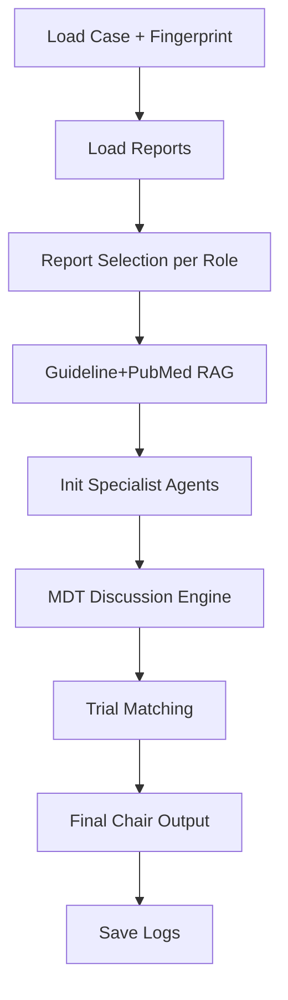

# MDT Discussion Log — 2026-01-19_08-18-02
Generated automatically by MDT Pipeline.


## CASE (structured JSON)

```
{"CASE_CORE":{"ADJUVANT_TREATMENT":{"cycles_or_courses":"6 cycles","given":"Yes","regimens":["白紫+卡铂"]},"BIOMARKERS":{"AFP":"<0.91 ng/ml (2022-10-12)","CA125":"933.00 U/ml (2022-12-29)","HER2":"Unknown","MSI":"Unknown","PDL1_CPS":"Unknown","TMB":"Unknown"},"BRCA1":"Unknown","BRCA2":"Unknown","CURRENT_STATUS":"Recurrent ovarian carcinoma with hepatic and pelvic metastatic disease","DIAGNOSIS":{"components":["高级别腺癌"],"histology":"首先考虑为透明细胞癌","laterality":"Unknown","primary":"卵巢癌复发","site":"卵巢"},"HRD":"Unknown","INITIAL_TREATMENT":"Yes","LINE_OF_THERAPY":[{"cycles":"6","end_date":"2022-08-17","intent":"Adjuvant","line":"1L","regimen":"白紫+卡铂","start_date":"Unknown"}],"MAINTENANCE":"Unknown","MAINTENANCE_DETAIL":{"end_date":"Unknown","given":"Unknown","regimens":[],"start_date":"Unknown"},"NEOADJUVANT":"Unknown","PFI_days":"56","PLATINUM_HISTORY":[{"PFI_days":"56","end_date":"2022-08-17","evidence":"CA125:89.60U/ml (2022-10-12)","evidence_type":"Biochemical","first_relapse_date":"2022-10-12","line":"1L","start_date":"Unknown","status":"Resistant"}],"PLATINUM_PFI_CURRENT":"56","PLATINUM_STATUS":"Resistant","PLATINUM_STATUS_CURRENT":"Resistant","RELAPSE":"Yes","RELAPSE_DATE":{"date":"2022-10-12","evidence":"CA125:89.60U/ml","type":"Biochemical"},"SCENE":"Platinum_resistant_relapse","STAGE":{"stage_basis":"Unknown","stage_system":"Unknown","stage_text":"Unknown"},"SURGERY_DONE":{"date":"2022-03-28","performed":"Yes","procedure":"Debulking surgery + partial rectosigmoid resection + partial vaginectomy + retroperitoneal lesion resection + complex adhesiolysis + left ureteral stent placement + bladder repair"},"TIMELINE":{"constraints":{"max_events":30,"min_events":3,"must_include":["first diagnostic imaging or pathology confirmation (if available)"],"ordering_rules":{"prioritize_last_event":true}},"events":[{"date":"2022-03-28","description":"Debulking surgery with multiple procedures (partial rectosigmoid resection, partial vaginectomy, retroperitoneal lesion resection, left ureteral stent, bladder repair)","event_type":"Surgery","key_result":"Tumor ~7*4*2.5cm; full-thickness intestinal wall high-grade adenocarcinoma; consider clear cell carcinoma","regimen_or_test":"Surgery"},{"date":"2022-08-17","description":"Postoperative chemotherapy completed: 白紫+卡铂, 6 cycles","event_type":"Chemo","key_result":"Last administration recorded 2022-08-17","regimen_or_test":"白紫+卡铂"},{"date":"2022-10-12","description":"Tumor markers rising after chemotherapy","event_type":"Lab","key_result":"CA19-9:77.20U/ml; CA125:89.60U/ml; AFP:<0.91ng/ml","regimen_or_test":"CA125, CA19-9, HE4, AFP"},{"date":"2022-10-24","description":"MRI: pelvic post-op, presacral mass increased; pelvic mesenteric enhancing nodules","event_type":"Imaging","key_result":"Consider recurrence with adjacent sacral involvement; pelvic mesenteric nodules suggest metastases","regimen_or_test":"MRI pelvis"},{"date":"2022-10-25","description":"CT: multiple hepatic nodules, some new, likely metastases","event_type":"Imaging","key_result":"Multiple liver lesions, consider metastases","regimen_or_test":"CT abdomen"},{"date":"2022-12-29","description":"Tumor markers markedly elevated","event_type":"Lab","key_result":"CA19-9:229.00U/ml; CA125:933.00U/ml; HE4:111.00pmol/L","regimen_or_test":"CA125, CA19-9, HE4, CA15-3"},{"date":"2022-12-30","description":"MRI and CT show progression: increased presacral mass, new right iliac bone lesion, more hepatic metastases","event_type":"Imaging","key_result":"Pelvic presacral mass increased; right iliac bone enhancing nodule; hepatic metastases increased","regimen_or_test":"MRI pelvis, CT abdomen"}]},"VISIT_DATE":"2023-01-03","first_relapse_date":"2022-10-12","last_platinum_end_date":"2022-08-17"},"LAB_TRENDS":{"labs":[{"analyte":"CA125","history":[{"date":"Unknown","flag":"Unknown","value":"45.7"},{"date":"2022-08-15","flag":"Unknown","value":"14.90"},{"date":"2022-10-12","flag":"↑","value":"89.60"},{"date":"2022-11-17","flag":"Unknown","value":"403"},{"date":"2022-12-29","flag":"↑","value":"933.00"}],"latest":{"date":"2022-12-29","flag":"↑","value":"933.00"},"reference_range":"Unknown","unit":"U/ml"},{"analyte":"CA19-9","history":[{"date":"Unknown","flag":"Unknown","value":"161"},{"date":"2022-08-15","flag":"Unknown","value":"7.16"},{"date":"2022-10-12","flag":"↑","value":"77.20"},{"date":"2022-12-29","flag":"↑","value":"229.00"}],"latest":{"date":"2022-12-29","flag":"↑","value":"229.00"},"reference_range":"Unknown","unit":"U/ml"},{"analyte":"HE4","history":[{"date":"Unknown","flag":"Unknown","value":"562"},{"date":"2022-08-15","flag":"↑","value":"87.90"},{"date":"2022-10-12","flag":"Unknown","value":"59.70"},{"date":"2022-12-29","flag":"↑","value":"111.00"}],"latest":{"date":"2022-12-29","flag":"↑","value":"111.00"},"reference_range":"Unknown","unit":"pmol/L"},{"analyte":"AFP","history":[{"date":"2022-10-12","flag":"Unknown","value":"<0.91"}],"latest":{"date":"2022-10-12","flag":"Unknown","value":"<0.91"},"reference_range":"Unknown","unit":"ng/ml"},{"analyte":"Hb","history":[{"date":"2022-11-10","flag":"Unknown","value":"97"},{"date":"2022-11-30","flag":"Unknown","value":"94"}],"latest":{"date":"2022-11-30","flag":"Unknown","value":"94"},"reference_range":"Unknown","unit":"g/L"}],"milestones":[{"date":"2022-03-28","description":"Primary debulking surgery","type":"Surgery"},{"date":"2022-08-17","description":"Completed 6 cycles of 白紫+卡铂","type":"ChemoEnd"},{"date":"2022-10-12","description":"Biochemical relapse with rising CA125","type":"Relapse"}]},"MED_ONC":{"current_regimen":{"cycle_info":"Unknown","last_admin_date":"Unknown","name":"Unknown"},"genetic_testing":{"germline":[],"somatic":[]},"monitoring_points":[],"planned_next_regimen":"Unknown","prior_systemic_therapies":["白紫+卡铂 (6 cycles)"]},"NUC_MED":{"studies":[]},"PATHOLOGY":{"specimens":[{"components":["高级别腺癌"],"date":"2022-03-28","diagnosis":"部分直乙结肠+左侧腹膜后肿瘤+部分阴道: 肠壁全层见高级别腺癌，结合T2022-04771首先考虑为透明细胞癌；可符合卵巢透明细胞癌累及。","grade":"Unknown","ihc":[{"marker":"MLH1","result":"(+)"},{"marker":"MSH6","result":"(+)"},{"marker":"MSH2","result":"(+)"},{"marker":"PMS2","result":"(+)"},{"marker":"ER","result":"(部分+)"},{"marker":"PR","result":"(少弱+)"},{"marker":"P53","result":"(+/-)"},{"marker":"WT1","result":"(-)"},{"marker":"Ki-67","result":"(60%+)"},{"marker":"HNF1B","result":"(+)"},{"marker":"NapsinA","result":"(灶+)"},{"marker":"P16","result":"(+)"},{"marker":"PAX8","result":"(+)"},{"marker":"SALL4","result":"(-)"},{"marker":"ZBTB16","result":"(-)"}],"involvement_sites":["intestinal wall full thickness","peritoneum (left retroperitoneal tumor)","vagina (partial)"],"laterality":"Unknown","molecular":[],"raw_text":"2022.03.28在全麻下行“瘤体减灭术+直肠乙状结肠部分切除术+阴道部分切除术+腹膜后病损切除术+复杂肠粘连松解术+左输尿管支架置管术+膀胱修补术。（部分直乙结肠+左侧腹膜后肿瘤+部分阴道）肠壁全层见高级别腺癌，结合T2022-04771首先考虑为透明细胞癌，正在加做免疫组化进一步明确。肿块大小约7*4*2.5cm。双侧切缘阴性，肠周淋巴结（4/15）见癌转移，伴癌结节1枚。（膀胱后壁肿瘤）纤维脂肪组织，局灶纤维组织增生、含铁血黄素沉积、泡沫样组织反应，未见癌累及。补充诊断1：【补充报告】（部分直乙结肠+左侧腹膜后肿瘤+部分阴道）可符合卵巢透明细胞癌累及。免疫组化（HI22-06789）瘤细胞：MLH1(ES05)（+），MSH6（+），MSH2（+），PMS2（+），ER（部分+），PR（少弱+），P53（+/-），WT1（-），Ki-67（60%+），HNF1B（+），NapsinA（灶+），P16（+），PAX8（+），SALL4（-），ZBTB16（-）","sample_type":"Surgical resection","site":"partial rectosigmoid + left retroperitoneal tumor + partial vagina","tumor_size":"7*4*2.5cm","uncertainty_or_missing":["Molecular/genetic testing not reported","Definitive origin laterality not specified"]}]},"RADIOLOGY":{"next_imaging_plan":{"modality":"Unknown","timing":"Unknown"},"studies":[{"anatomic_sites":["pelvis","sacrum"],"date":"2022-10-24","findings":["Pelvis post-op changes","presacral mass, consider recurrence with adjacent sacral involvement","multiple enhancing small mesenteric nodules in pelvis, suggest metastases"],"impression":"Recurrence with possible sacral involvement and pelvic mesenteric metastases","modality":"MRI","trend_vs_prior":"Worse"},{"anatomic_sites":["liver"],"date":"2022-10-25","findings":["Multiple hepatic nodules, some new compared to prior","hepatic cysts unchanged"],"impression":"Multiple liver lesions, consider metastases","modality":"CT","trend_vs_prior":"Worse"},{"anatomic_sites":["pelvis","right iliac bone","sacrum","rectum"],"date":"2022-12-30","findings":["Presacral mass increased in range with heterogeneous enhancement","new enhancing nodule in right iliac bone","multiple pelvic mesenteric enhancing nodules","rectal local bowel wall thickening with enhancement"],"impression":"Progressive pelvic recurrence with possible peritoneal and sacral involvement; new right iliac bone lesion","modality":"MRI","trend_vs_prior":"Worse"},{"anatomic_sites":["liver","spleen"],"date":"2022-12-30","findings":["Multiple hepatic metastatic nodules increased in number and size","patchy splenic shadow, possible splenic infarct"],"impression":"Progressive hepatic metastases; splenic abnormality noted, follow-up suggested","modality":"CT","trend_vs_prior":"Worse"}]},"TIMELINE":{"constraints":{"max_events":30,"min_events":3,"must_include":["first diagnostic imaging or pathology confirmation (if available)"],"ordering_rules":{"prioritize_last_event":true}},"events":[{"date":"2022-03-28","description":"Debulking surgery with multiple procedures (partial rectosigmoid resection, partial vaginectomy, retroperitoneal lesion resection, left ureteral stent, bladder repair)","event_type":"Surgery","key_result":"Tumor ~7*4*2.5cm; full-thickness intestinal wall high-grade adenocarcinoma; consider clear cell carcinoma","regimen_or_test":"Surgery"},{"date":"2022-08-17","description":"Postoperative chemotherapy completed: 白紫+卡铂, 6 cycles","event_type":"Chemo","key_result":"Last administration recorded 2022-08-17","regimen_or_test":"白紫+卡铂"},{"date":"2022-10-12","description":"Tumor markers rising after chemotherapy","event_type":"Lab","key_result":"CA19-9:77.20U/ml; CA125:89.60U/ml; AFP:<0.91ng/ml","regimen_or_test":"CA125, CA19-9, HE4, AFP"},{"date":"2022-10-24","description":"MRI: pelvic post-op, presacral mass increased; pelvic mesenteric enhancing nodules","event_type":"Imaging","key_result":"Consider recurrence with adjacent sacral involvement; pelvic mesenteric nodules suggest metastases","regimen_or_test":"MRI pelvis"},{"date":"2022-10-25","description":"CT: multiple hepatic nodules, some new, likely metastases","event_type":"Imaging","key_result":"Multiple liver lesions, consider metastases","regimen_or_test":"CT abdomen"},{"date":"2022-12-29","description":"Tumor markers markedly elevated","event_type":"Lab","key_result":"CA19-9:229.00U/ml; CA125:933.00U/ml; HE4:111.00pmol/L","regimen_or_test":"CA125, CA19-9, HE4, CA15-3"},{"date":"2022-12-30","description":"MRI and CT show progression: increased presacral mass, new right iliac bone lesion, more hepatic metastases","event_type":"Imaging","key_result":"Pelvic presacral mass increased; right iliac bone enhancing nodule; hepatic metastases increased","regimen_or_test":"MRI pelvis, CT abdomen"}]}}
```


## FINAL MDT OUTPUT

```
Final Assessment:
Platinum-resistant recurrent ovarian clear cell carcinoma with multifocal metastases and severe anemia requires palliative, symptom-focused care, with systemic intensity guided by ECOG/frailty and pending MSI status. Key uncertainties are performance status, anemia etiology, and how aggressively to pursue non-platinum systemic therapy versus local RT.

Core Treatment Strategy:
- Immediately optimize anemia with transfusion and basic workup; reassess ECOG and frailty before any systemic therapy or RT. [@20230103|2023-01-03]  
- Manage as platinum-resistant clear cell carcinoma; plan dose-attenuated non-platinum systemic therapy after stabilization, including clinical-trial evaluation. [@guideline:nccn_ovariancancer_v3_2025__v00000000|14]  
- Use current CT/MRI to plan palliative RT to presacral/rectal and sacral/right iliac lesions, coordinated with pain/supportive care. [@2022-12-29|MR][@2022-12-29|CT]  
- Proceed with formal MSI testing and schedule interval imaging for hepatic/pelvic disease and splenic lesion evolution. [@report_id:OH2203828|2022-04-18]  

Change Triggers:
- If ECOG is poor or anemia remains severe despite optimization, de-escalate to best supportive care with minimal or no systemic therapy. [@guideline:nccn_ovariancancer_v3_2025__v00000000|18]  
- If new symptoms or imaging raise uncertainty about additional targets, reconsider PET-CT only if results will change RT fields or systemic-versus-local strategy. [@2022-12-29|CT][@guideline:nccn_ovariancancer_v3_2025__v00000000|18]
```


## PIPELINE FLOW (Mermaid)




## TRACE EVENTS (Structured)

```json
[
  {
    "ts": "2026-01-19T08:09:44.496727",
    "event": "pipeline_start",
    "payload": {
      "visit_time": "2023-01-03 08:53:29.260000",
      "meta_info": "340123197709263626"
    }
  },
  {
    "ts": "2026-01-19T08:09:44.497083",
    "event": "case_fingerprint",
    "payload": {
      "case_fingerprint": "efe856c0897d"
    }
  },
  {
    "ts": "2026-01-19T08:09:44.784030",
    "event": "reports_loaded",
    "payload": {
      "lab_n": 92,
      "img_n": 10,
      "path_n": 0,
      "mut_n": 1,
      "cutoff_dt": "2023-01-04 08:53:29"
    }
  },
  {
    "ts": "2026-01-19T08:10:01.541598",
    "event": "reports_selected",
    "payload": {
      "lab": {
        "chair": [
          "20221229|8300002|2022-12-29",
          "20221229|9703212|2022-12-29",
          "20230103|5600862|2023-01-03"
        ],
        "oncologist": [
          "20221229|8300002|2022-12-29",
          "20221229|9703212|2022-12-29",
          "20230103|5600862|2023-01-03"
        ],
        "radiologist": [],
        "pathologist": [],
        "nuclear": []
      },
      "imaging": {
        "chair": [
          "2022-10-24|CT|2022-10-24",
          "2022-12-29|MR|2022-12-29",
          "2022-12-29|CT|2022-12-29"
        ],
        "oncologist": [],
        "radiologist": [
          "2022-10-24|CT|2022-10-24",
          "2022-12-29|MR|2022-12-29",
          "2022-12-29|CT|2022-12-29"
        ],
        "pathologist": [],
        "nuclear": [
          "2022-10-24|CT|2022-10-24",
          "2022-12-29|MR|2022-12-29",
          "2022-12-29|CT|2022-12-29"
        ]
      },
      "pathology": {
        "chair": [],
        "oncologist": [],
        "radiologist": [],
        "pathologist": [],
        "nuclear": []
      },
      "mutation": {
        "chair": [
          "OH2203828|2022-04-18"
        ],
        "oncologist": [
          "OH2203828|2022-04-18"
        ],
        "radiologist": [],
        "pathologist": [
          "OH2203828|2022-04-18"
        ],
        "nuclear": []
      }
    }
  },
  {
    "ts": "2026-01-19T08:10:01.548052",
    "event": "rag_key_facts",
    "payload": {
      "facts": "DIAGNOSIS: primary=卵巢癌复发; histology=首先考虑为透明细胞癌; components=高级别腺癌\nPATHOLOGY: 部分直乙结肠+左侧腹膜后肿瘤+部分阴道: 肠壁全层见高级别腺癌，结合T2022-04771首先考虑为透明细胞癌；可符合卵巢透明细胞癌累及。\nPLATINUM: status=Resistant; pfi_days=56\nGENETICS: HRD=Unknown; BRCA1=Unknown; BRCA2=Unknown\nBIOMARKERS: CA125=933.00 U/ml (2022-12-29); AFP=<0.91 ng/ml (2022-10-12); TMB=Unknown; MSI=Unknown; PDL1_CPS=Unknown\nMUTATION_REPORT: id=OH2203828; date=2022-04-18; note=ATM NM_000051:exon8:c.A947G:p.Y316C（胚系）；HRD 阴性；BRCA1 胚系和体系未检出致病突变（视为阴性）；BRCA2 胚系和体系未检出致病突变（视为阴性）；TP53 胚系和体系未检出致病突变（视为阴性）；ARID1A 胚系和体系未检出致病突变（视为阴性）；PTEN 胚系和体系未检出致病突变（视为阴性）；PIK3CA 胚系和体系未检出致病突变（视为阴性）；PAL…"
    }
  },
  {
    "ts": "2026-01-19T08:10:38.053731",
    "event": "rag_query",
    "payload": {
      "query": "Ovarian clear cell carcinoma, platinum-refractory after 6 cycles carboplatin; metastases to liver, pelvis/presacral area, mesentery, possible sacrum/right iliac bone; MMR intact (MLH1/MSH2/MSH6/PMS2+); need systemic options and trial eligibility given progression shortly post-platinum; histology: clear cell carcinoma"
    }
  },
  {
    "ts": "2026-01-19T08:10:38.053747",
    "event": "rag_hits",
    "payload": {
      "source": "guideline",
      "topk": 5,
      "n": 5
    }
  },
  {
    "ts": "2026-01-19T08:10:38.053749",
    "event": "rag_hits",
    "payload": {
      "source": "pubmed",
      "topk": 5,
      "n": 5
    }
  },
  {
    "ts": "2026-01-19T08:10:38.053751",
    "event": "rag_hits_merged",
    "payload": {
      "n": 10
    }
  },
  {
    "ts": "2026-01-19T08:10:53.358781",
    "event": "mdt_discussion_start",
    "payload": {
      "num_rounds": 2,
      "num_turns": 2
    }
  },
  {
    "ts": "2026-01-19T08:10:53.358851",
    "event": "mdt_initial_opinion_role_start",
    "payload": {
      "role": "chair",
      "order": 1
    }
  },
  {
    "ts": "2026-01-19T08:10:57.809094",
    "event": "mdt_initial_opinion_role_end",
    "payload": {
      "role": "chair",
      "chars": 595
    }
  },
  {
    "ts": "2026-01-19T08:10:57.809180",
    "event": "mdt_initial_opinion_role_start",
    "payload": {
      "role": "oncologist",
      "order": 2
    }
  },
  {
    "ts": "2026-01-19T08:11:01.452443",
    "event": "mdt_initial_opinion_role_end",
    "payload": {
      "role": "oncologist",
      "chars": 551
    }
  },
  {
    "ts": "2026-01-19T08:11:01.452519",
    "event": "mdt_initial_opinion_role_start",
    "payload": {
      "role": "radiologist",
      "order": 3
    }
  },
  {
    "ts": "2026-01-19T08:11:05.381117",
    "event": "mdt_initial_opinion_role_end",
    "payload": {
      "role": "radiologist",
      "chars": 477
    }
  },
  {
    "ts": "2026-01-19T08:11:05.381176",
    "event": "mdt_initial_opinion_role_start",
    "payload": {
      "role": "pathologist",
      "order": 4
    }
  },
  {
    "ts": "2026-01-19T08:11:09.020490",
    "event": "mdt_initial_opinion_role_end",
    "payload": {
      "role": "pathologist",
      "chars": 455
    }
  },
  {
    "ts": "2026-01-19T08:11:09.020531",
    "event": "mdt_initial_opinion_role_start",
    "payload": {
      "role": "nuclear",
      "order": 5
    }
  },
  {
    "ts": "2026-01-19T08:11:11.475947",
    "event": "mdt_initial_opinion_role_end",
    "payload": {
      "role": "nuclear",
      "chars": 520
    }
  },
  {
    "ts": "2026-01-19T08:15:03.119425",
    "event": "mdt_discussion_end",
    "payload": {
      "merged_chars": 2903
    }
  },
  {
    "ts": "2026-01-19T08:15:03.120431",
    "event": "trial_matching_start",
    "payload": {
      "trials_json_path": "files/all_trials_filtered.json"
    }
  },
  {
    "ts": "2026-01-19T08:15:25.921099",
    "event": "trial_matching_end",
    "payload": {
      "recommended": true
    }
  },
  {
    "ts": "2026-01-19T08:15:25.921139",
    "event": "final_output_start",
    "payload": {}
  },
  {
    "ts": "2026-01-19T08:18:02.280016",
    "event": "final_output_end",
    "payload": {
      "final_output_chars": 1538
    }
  }
]
```


## INITIAL EXPERT OPINIONS


## chair

```
- Treat as platinum-resistant recurrent clear cell ovarian carcinoma with liver, pelvic, bone metastases; prioritize palliative-intent systemic therapy plus symptom control. [@guideline:nccn_ovariancancer_v3_2025__v00000000|18; @pubmed:33758607]  

- Obtain ECOG status, detailed symptoms (pain, bowel/bladder, bleeding), updated renal function, coagulation, and discuss clinical-trial eligibility before selecting regimen.  

- Coordinate with radiation and pain teams for potential local treatment of sacral/iliac lesions and rectal involvement to prevent neurologic/obstructive complications.
```


## oncologist

```
- Rapid biochemical and radiologic relapse ~2 months after adjuvant platinum suggests platinum-resistant clear cell ovarian carcinoma; consider non-platinum relapse therapy. [@guideline:nccn_ovariancancer_v3_2025__v00000000|18]

- Current severe anemia (Hgb 74 g/L) may limit intensive systemic therapy; optimize transfusion/iron workup before starting next regimen. [@20230103|2023-01-03]

- Missing: ECOG status, current symptoms, detailed imaging of hepatic/pelvic disease burden, prior maintenance use, and full renal/hematologic toxicity profile.
```


## radiologist

```
- Progressive pelvic recurrence with enlarging presacral mass, rectal wall thickening, mesenteric nodules, and new right iliac bone lesion. [@2022-12-29|MR]

- Worsening multifocal liver metastases with increased number/size; stable hepatic cysts. [@2022-10-24|CT][@2022-12-29|CT]

- New patchy splenic low-density area suspicious for infarct; recommend imaging follow-up to confirm evolution/complications. [@2022-12-29|CT][@guideline:nccn_ovariancancer_v3_2025__v00000000|18]
```


## pathologist

```
- Histology and IHC support metastatic ovarian clear cell carcinoma involving rectosigmoid, retroperitoneum, and vagina; grade not specified [@report_id|2022-03-28].  

- MMR proteins intact on IHC (MLH1/MSH2/MSH6/PMS2 positive); MSI status by molecular assay not reported and should be updated [@report_id|2022-03-28].  

- HRD negative; germline ATM p.Y316C VUS, BRCA1/2 and common HR genes without pathogenic variants [@report_id:OH2203828|2022-04-18].
```


## nuclear

```
- No PET-CT available; cannot assess whole-body metabolic disease or confirm hepatic, pelvic, sacral, iliac, splenic involvement—PET-CT needed.  

- Cross-sectional imaging shows progressive pelvic recurrence with suspected peritoneal, sacral, right iliac bone and hepatic metastases; PET would refine staging. [@2022-12-29|MR][@2022-12-29|CT]  

- PET-CT is valuable to detect extra-pelvic and osseous metastases and guide management in recurrent pelvic malignancy. [@guideline:nccn_ovariancancer_v3_2025__v00000000|18]
```


## MERGED SUMMARY (Assistant)

```
Key Knowledge:
- Platinum-resistant recurrent clear cell ovarian carcinoma with multifocal metastases (liver, pelvic/presacral with rectal involvement, mesenteric, sacral/right iliac bone; probable peritoneal disease).
- Pathology: metastatic clear cell carcinoma, MMR proficient, HRD negative, no actionable BRCA/HR mutations; MSI testing still required.
- Rapid post-adjuvant relapse with severe anemia (Hgb 74 g/L) and possible frailty limits systemic therapy intensity; palliative, symptom-focused management is the overarching strategy.
- Current CT/MRI are adequate for palliative RT planning, particularly to presacral/rectal and sacral/right iliac lesions.
- Probable splenic infarct needs imaging follow-up; hepatic and pelvic disease also require interval reassessment.
- PET-CT is guideline-supported but should be used selectively, only when results are likely to alter RT fields or systemic-versus-local strategy.

Controversies:
- Selection and dosing of non-platinum systemic therapy in the context of severe anemia and uncertain ECOG/frailty.
- Exact threshold for adding PET-CT beyond CT/MRI when planning palliative RT and systemic therapy.
- Optimal sequencing and extent of palliative RT relative to initiation and intensity of systemic therapy.

Missing Info:
- ECOG performance status and detailed symptom profile (pelvic pain, bowel/bladder function, bleeding, neurologic complaints).
- Updated labs: CBC, renal function, coagulation, and complete anemia workup (iron studies, B12/folate, hemolysis, marrow assessment as indicated).
- Detailed prior treatment history (regimens, maintenance, toxicities) and current comorbidities/frailty assessment.
- More granular assessment of hepatic/pelvic burden and imminence of obstruction or neurologic compromise.
- Formal MSI status by molecular testing.

Working Plan:
- Manage as platinum-resistant recurrent clear cell ovarian carcinoma with palliative intent; plan dose-adjusted non-platinum systemic therapy after anemia optimization and frailty/ECOG assessment, with clinical-trial consideration.
- Optimize severe anemia with transfusion and basic workup, and reassess overall frailty before finalizing systemic and RT plans.
- Document ECOG and comprehensive pelvic/neurologic/bowel symptoms; update labs and use this to guide therapy intensity and trial eligibility.
- Use existing CT/MRI to design palliative RT to presacral/rectal and sacral/right iliac lesions to prevent or relieve obstruction and neurologic compromise; coordinate with radiation and pain teams.
- Defer PET-CT for now; reconsider only if new questions arise that could change RT targets or systemic-versus-local strategy.
- Proceed with formal MSI testing to refine trial/strategy options.
- Arrange interval imaging to reassess hepatic and pelvic disease and specific follow-up of the splenic lesion to confirm infarct evolution and detect complications.
```


## INTERACTION LOG (Round × Turn)

### Round 1

#### Turn 1
- **chair → oncologist:** Before committing to any non-platinum regimen, please clarify ECOG status, symptom burden, and plan to correct severe anemia (Hgb 74 g/L) including transfusion and basic workup, as current marrow reserve may not safely support standard-intensity therapy.
- **chair → radiologist:** Given progressive pelvic, hepatic, and new bone lesions, please state whether you believe PET-CT would practically alter local vs systemic treatment planning now, or if current MRI/CT are sufficient for RT and systemic decisions.
- **oncologist → chair:** Before finalizing a non-platinum palliative regimen, we urgently need ECOG status, detailed symptoms, and full anemia workup/optimization given Hgb 74 g/L, as current toxicity may preclude standard systemic dosing.
- **oncologist → nuclear:** Please advise whether PET-CT is likely to change management in this multifocal metastatic clear cell ovarian carcinoma (including bone) versus relying on existing imaging for palliative systemic/local planning.
- **radiologist → oncologist:** Latest MRI/CT show progressive presacral mass with rectal wall thickening and new right iliac bone lesion; please clarify if there are current pelvic/neurologic or bowel obstruction symptoms to prioritize local RT or decompression planning.
- **radiologist → nuclear:** Given multifocal liver, pelvic, and new osseous metastases, a PET-CT could better delineate whole-body and bone disease burden if results would modify RT fields or systemic vs local strategy.
- **pathologist → chair:** Current pathology indicates clear cell ovarian origin with MMR proficiency and HRD negativity; please ensure all future management uses this histotype assumption.
- **pathologist → oncologist:** MSI status is still unknown; if considering immunotherapy or trials, please request formal MSI/MMR molecular testing beyond IHC alone.

#### Turn 2
- **chair → oncologist:** Please prioritize documentation of ECOG and pelvic/neurologic/bowel symptoms and initiate evaluation and correction of severe anemia before confirming systemic regimen and RT sequencing.
- **chair → nuclear:** If PET-CT is pursued, please focus the report on whether findings would expand, reduce, or redefine potential RT fields and systemic vs local priorities.
- **oncologist → chair:** Systemic therapy choice and timing depend critically on ECOG status, pelvic/neurologic and bowel obstruction symptoms, and anemia workup; these should be clarified before committing to a specific non-platinum palliative regimen or RT sequence.
- **oncologist → pathologist:** Please proceed with formal MSI testing as suggested; MSI result will materially influence consideration of immunotherapy or relevant clinical trials in this platinum-resistant clear cell setting.
- **nuclear → oncologist:** From a nuclear perspective, PET-CT is most valuable here if its findings would alter RT fields or shift systemic-versus-local priorities; please clarify intended use before ordering.

### Round 2

#### Turn 1

#### Turn 2


## FINAL REFINED PLANS (per Round)

### Round 1


## chair

```
- Confirm ECOG, pelvic/neurologic/bowel symptoms, and complete anemia workup/correction (Hgb 74 g/L) before systemic or RT decisions. [@20230103|2023-01-03]  

- Plan palliative, non-platinum systemic approach for platinum-resistant clear cell ovarian carcinoma after stabilization, with clinical-trial consideration. [@guideline:nccn_ovariancancer_v3_2025__v00000000|18; @pubmed:33758607]  

- Use current MRI/CT to triage sacral/iliac/rectal RT for symptom prevention; reserve PET-CT only if results would change fields/strategy. [@2022-12-29|2022-12-29]
```


## oncologist

```
- Optimize anemia with transfusion and basic workup, then document ECOG and detailed pelvic/neurologic/bowel symptoms before systemic therapy choice. [@20230103|2023-01-03; @guideline:nccn_ovariancancer_v3_2025__v00000000|18]

- Treat as platinum‑resistant recurrent clear cell ovarian carcinoma with palliative‑intent non‑platinum systemic therapy, considering dose reduction for frailty. [@guideline:nccn_ovariancancer_v3_2025__v00000000|14]

- Coordinate with radiation and nuclear medicine: consider PET-CT only if it will modify RT fields or systemic‑versus‑local strategy.
```


## radiologist

```
- Current MRI/CT sufficiently define pelvic, hepatic, and osseous disease for RT planning; PET-CT reserved for unclear fields. [@2022-12-29|MR][@2022-12-29|CT][@guideline:nccn_ovariancancer_v3_2025__v00000000|18]

- Highlight progressive presacral mass with rectal wall thickening and sacral/right iliac involvement for consideration of palliative RT to prevent obstruction/neurologic compromise. [@2022-12-29|MR]

- Recommend follow-up imaging of splenic low-density lesion to confirm infarct evolution and exclude further complications. [@2022-12-29|CT]
```


## pathologist

```
- Confirm ECOG, detailed pelvic/neurologic/bowel symptoms, and complete anemia workup/optimization before finalizing non-platinum palliative regimen and RT sequence [@guideline:nccn_ovariancancer_v3_2025__v00000000|18].  

- Proceed with formal MSI testing to complement intact MMR IHC, as MSI result may affect trial/strategy considerations [@report_id|2022-03-28].  

- Request radiology/nuclear input on whether PET-CT will materially redefine RT fields or systemic-vs-local priorities before ordering imaging (date unknown).
```


## nuclear

```
- Proceed with PET-CT only if results could change systemic-versus-local priorities or modify planned RT fields, given existing CT/MR detail. [@2022-12-29|MR][@2022-12-29|CT]  

- When PET-CT is done, report should explicitly state whether findings warrant expansion, reduction, or redefinition of candidate RT volumes. [@2022-12-29|MR]  

- PET-CT is guideline-supported to refine extra-pelvic and osseous staging in recurrent ovarian cancer, potentially impacting palliative RT planning. [@guideline:nccn_ovariancancer_v3_2025__v00000000|18]
```

### Round 2


## chair

```
- Optimize anemia and frailty assessment (CBC shows Hgb 74 g/L) and document ECOG/symptoms before systemic or RT decisions. [@20230103|2023-01-03]  

- Plan palliative, non-platinum systemic therapy for platinum-resistant clear cell ovarian carcinoma, considering dose attenuation and clinical-trial options. [@guideline:nccn_ovariancancer_v3_2025__v00000000|18; @pubmed:33758607]  

- Use current CT/MRI to design palliative RT to presacral/rectal and sacral/right iliac lesions; reserve PET-CT for strategy-changing scenarios. [@2022-12-29|2022-12-29]
```


## oncologist

```
- Optimize severe anemia (Hgb 74 g/L) with transfusion and workup, then document ECOG and symptoms to guide therapy intensity. [@20230103|2023-01-03; @guideline:nccn_ovariancancer_v3_2025__v00000000|18]

- Manage as platinum-resistant recurrent clear cell ovarian carcinoma with palliative-intent, dose-adjusted non-platinum systemic therapy after anemia correction and frailty assessment. [@guideline:nccn_ovariancancer_v3_2025__v00000000|14]

- Use current CT/MRI to plan palliative RT to presacral/rectal and sacral/right iliac lesions; reserve PET-CT for management-changing scenarios.
```


## radiologist

```
- Use existing CT/MRI to plan palliative RT to presacral/rectal and sacral/right iliac lesions; PET-CT only if field-changing. [@2022-12-29|MR][@2022-12-29|CT][@guideline:nccn_ovariancancer_v3_2025__v00000000|18]

- Arrange interval imaging to reassess hepatic metastatic burden and pelvic disease progression for ongoing palliative planning. [@2022-12-29|CT][@2022-12-29|MR]

- Schedule follow-up imaging of splenic low-density lesion to confirm infarct evolution and detect possible complications. [@2022-12-29|CT]
```


## pathologist

```
- Confirm ECOG, detailed pelvic/neurologic/bowel symptoms, and complete anemia workup/optimization before finalizing non-platinum palliative systemic regimen and RT sequence [@guideline:nccn_ovariancancer_v3_2025__v00000000|18].  

- Proceed with formal MSI testing in this MMR-proficient, HRD-negative clear cell carcinoma to refine eligibility for trials/strategies [@report_id:HI22-06789|2022-03-28].  

- Use current CT/MRI to plan palliative RT to presacral/rectal and sacral/right iliac lesions; reserve PET-CT for management-changing scenarios (date unknown).
```


## nuclear

```
- Defer PET-CT for now; current CT/MRI adequately support palliative RT planning to pelvic and right iliac lesions. [@2022-12-29|MR][@2022-12-29|CT]  

- Reconsider PET-CT only if new questions arise about additional RT targets or systemic-versus-local strategy that CT/MRI cannot resolve. [@2022-12-29|MR]  

- Selective PET-CT use in recurrent ovarian cancer is guideline-consistent when results are expected to alter management. [@guideline:nccn_ovariancancer_v3_2025__v00000000|18]
```


## RAW AGENT LOGS

### chair
- **User:** Give INITIAL opinion (use ONLY your system-provided patient facts).
Return up to 3 bullets, each ≤20 words.
If key data missing, say exactly what needs updating.
At least ONE bullet must be evidence-based and include [@guideline:doc_id|page] or [@pubmed:PMID].
If you reference treatment strategy categories, guidelines, trials, or literature evidence, include tags [@guideline:doc_id|page] or [@pubmed:PMID].
  
  **Assistant:** - Treat as platinum-resistant recurrent clear cell ovarian carcinoma with liver, pelvic, bone metastases; prioritize palliative-intent systemic therapy plus symptom control. [@guideline:nccn_ovariancancer_v3_2025__v00000000|18; @pubmed:33758607]  

- Obtain ECOG status, detailed symptoms (pain, bowel/bladder, bleeding), updated renal function, coagulation, and discuss clinical-trial eligibility before selecting regimen.  

- Coordinate with radiation and pain teams for potential local treatment of sacral/iliac lesions and rectal involvement to prevent neurologic/obstructive complications.
  
  *(2026-01-19T08:10:57.809061)*

- **User:** ROLE: chair. VISIT: 2023-01-03 08:53:29.260000
Default is NOT to speak. Speak ONLY if: conflict | safety | missing-critical | new-critical.

CONTEXT (latest):
[MDT_GLOBAL_KNOWLEDGE]
Key Knowledge:
- Platinum-resistant recurrent clear cell ovarian carcinoma with multifocal metastases (liver, pelvic/presacral with rectal involvement, mesenteric, sacral/right iliac bone; probable peritoneal disease).
- Pathology: metastatic clear cell ovarian carcinoma, MMR proficient, HRD negative, no actionable BRCA/HR mutations (ATM VUS only).
- Rapid post-adjuvant relapse and severe anemia (Hgb 74 g/L) constrain systemic therapy intensity; palliative intent and symptom control prioritized.
- Imaging shows clear radiologic progression and probable splenic infarct requiring follow-up.
- PET-CT could better define whole-body and osseous disease.

Controversies:
- Choice and intensity of non-platinum systemic therapy in the setting of severe anemia and unknown ECOG.
- Whether PET-CT will meaningfully change management versus proceeding on current imaging.
- Optimal timing and scope of local therapies (e.g., RT to pelvic/sacral/iliac lesions) relative to systemic treatment.

Missing Info:
- ECOG performance status; detailed symptom profile (pain, bowel/bladder, bleeding, neurologic symptoms).
- Updated labs: full blood count, renal function, coagulation; anemia etiology/workup.
- Detailed prior treatment history (regimens, maintenance, toxicities).
- More precise description of hepatic/pelvic burden and any impending obstruction/neurologic compromise.
- MSI status by molecular testing.

Working Plan:
- Treat as platinum-resistant recurrent clear cell ovarian carcinoma with palliative intent; consider non-platinum systemic options after anemia optimization and performance status assessment.
- Investigate and correct anemia (transfusion and deficiency workup) before systemic therapy decision.
- Obtain ECOG, comprehensive symptom assessment, and updated labs; evaluate clinical trial options.
- Coordinate with radiation/pain teams for potential local treatment of sacral/right iliac and rectal/pelvic disease to prevent or relieve obstruction/neurologic complications.
- Consider PET-CT if results are likely to alter systemic vs local treatment strategy.

Allowed targets: [oncologist,radiologist,pathologist,nuclear]
Return ONE-LINE JSON only:{"speak":"yes/no","messages":[{"target":"<role>","message":"<1-2 sentences>","why":"conflict|safety|missing|new"}]}
  
  **Assistant:** {"speak":"yes","messages":[{"target":"oncologist","message":"Before committing to any non-platinum regimen, please clarify ECOG status, symptom burden, and plan to correct severe anemia (Hgb 74 g/L) including transfusion and basic workup, as current marrow reserve may not safely support standard-intensity therapy.","why":"safety"},{"target":"radiologist","message":"Given progressive pelvic, hepatic, and new bone lesions, please state whether you believe PET-CT would practically alter local vs systemic treatment planning now, or if current MRI/CT are sufficient for RT and systemic decisions.","why":"missing"}]}
  
  *(2026-01-19T08:11:26.384494)*

- **User:** ROLE: chair. VISIT: 2023-01-03 08:53:29.260000
Default is NOT to speak. Speak ONLY if: conflict | safety | missing-critical | new-critical.

CONTEXT (latest):
[MDT_GLOBAL_KNOWLEDGE]
Key Knowledge:
- Platinum-resistant recurrent clear cell ovarian carcinoma with multifocal metastases (liver, pelvic/presacral with rectal involvement, mesenteric, sacral/right iliac bone; probable peritoneal disease).
- Pathology: metastatic clear cell ovarian carcinoma, MMR proficient, HRD negative, no actionable BRCA/HR mutations (ATM VUS only).
- Rapid post-adjuvant relapse and severe anemia (Hgb 74 g/L) constrain systemic therapy intensity; palliative intent and symptom control prioritized.
- Imaging shows clear radiologic progression and probable splenic infarct requiring follow-up.
- PET-CT could better define whole-body and osseous disease.

Controversies:
- Choice and intensity of non-platinum systemic therapy in the setting of severe anemia and unknown ECOG.
- Whether PET-CT will meaningfully change management versus proceeding on current imaging.
- Optimal timing and scope of local therapies (e.g., RT to pelvic/sacral/iliac lesions) relative to systemic treatment.

Missing Info:
- ECOG performance status; detailed symptom profile (pain, bowel/bladder, bleeding, neurologic symptoms).
- Updated labs: full blood count, renal function, coagulation; anemia etiology/workup.
- Detailed prior treatment history (regimens, maintenance, toxicities).
- More precise description of hepatic/pelvic burden and any impending obstruction/neurologic compromise.
- MSI status by molecular testing.

Working Plan:
- Treat as platinum-resistant recurrent clear cell ovarian carcinoma with palliative intent; consider non-platinum systemic options after anemia optimization and performance status assessment.
- Investigate and correct anemia (transfusion and deficiency workup) before systemic therapy decision.
- Obtain ECOG, comprehensive symptom assessment, and updated labs; evaluate clinical trial options.
- Coordinate with radiation/pain teams for potential local treatment of sacral/right iliac and rectal/pelvic disease to prevent or relieve obstruction/neurologic complications.
- Consider PET-CT if results are likely to alter systemic vs local treatment strategy.

[RECENT_DELTAS]
[R1T1 DELTA] r palliative systemic/local planning. | radiologist->oncologist(missing): Latest MRI/CT show progressive presacral mass with rectal wall thickening and new right iliac bone lesion; please clarify if there are current pelvic/neurologic or bowel obstruction symptoms to prioritize local RT or decompression planning. | radiologist->nuclear(missing): Given multifocal liver, pelvic, and new osseous metastases, a PET-CT could better delineate whole-body and bone disease burden if results would modify RT fields or systemic vs local strategy. | pathologist->oncologist(missing): MSI status is still unknown; if considering immunotherapy or trials, please request formal MSI/MMR molecular testing beyond IHC alone. | pathologist->chair(new): Current pathology indicates clear cell ovarian origin with MMR proficiency and HRD negativity; please ensure all future management uses this histotype assumption.

Allowed targets: [oncologist,radiologist,pathologist,nuclear]
Return ONE-LINE JSON only:{"speak":"yes/no","messages":[{"target":"<role>","message":"<1-2 sentences>","why":"conflict|safety|missing|new"}]}
  
  **Assistant:** {"speak":"yes","messages":[{"target":"oncologist","message":"Please prioritize documentation of ECOG and pelvic/neurologic/bowel symptoms and initiate evaluation and correction of severe anemia before confirming systemic regimen and RT sequencing.","why":"safety"},{"target":"nuclear","message":"If PET-CT is pursued, please focus the report on whether findings would expand, reduce, or redefine potential RT fields and systemic vs local priorities.","why":"missing"}]}
  
  *(2026-01-19T08:11:39.099597)*

- **User:** Given MDT context:
[MDT_GLOBAL_KNOWLEDGE]
Key Knowledge:
- Platinum-resistant recurrent clear cell ovarian carcinoma with multifocal metastases (liver, pelvic/presacral with rectal involvement, mesenteric, sacral/right iliac bone; probable peritoneal disease).
- Pathology: metastatic clear cell ovarian carcinoma, MMR proficient, HRD negative, no actionable BRCA/HR mutations (ATM VUS only).
- Rapid post-adjuvant relapse and severe anemia (Hgb 74 g/L) constrain systemic therapy intensity; palliative intent and symptom control prioritized.
- Imaging shows clear radiologic progression and probable splenic infarct requiring follow-up.
- PET-CT could better define whole-body and osseous disease.

Controversies:
- Choice and intensity of non-platinum systemic therapy in the setting of severe anemia and unknown ECOG.
- Whether PET-CT will meaningfully change management versus proceeding on current imaging.
- Optimal timing and scope of local therapies (e.g., RT to pelvic/sacral/iliac lesions) relative to systemic treatment.

Missing Info:
- ECOG performance status; detailed symptom profile (pain, bowel/bladder, bleeding, neurologic symptoms).
- Updated labs: full blood count, renal function, coagulation; anemia etiology/workup.
- Detailed prior treatment history (regimens, maintenance, toxicities).
- More precise description of hepatic/pelvic burden and any impending obstruction/neurologic compromise.
- MSI status by molecular testing.

Working Plan:
- Treat as platinum-resistant recurrent clear cell ovarian carcinoma with palliative intent; consider non-platinum systemic options after anemia optimization and performance status assessment.
- Investigate and correct anemia (transfusion and deficiency workup) before systemic therapy decision.
- Obtain ECOG, comprehensive symptom assessment, and updated labs; evaluate clinical trial options.
- Coordinate with radiation/pain teams for potential local treatment of sacral/right iliac and rectal/pelvic disease to prevent or relieve obstruction/neurologic complications.
- Consider PET-CT if results are likely to alter systemic vs local treatment strategy.

[RECENT_DELTAS]
[R1T1 DELTA] r palliative systemic/local planning. | radiologist->oncologist(missing): Latest MRI/CT show progressive presacral mass with rectal wall thickening and new right iliac bone lesion; please clarify if there are current pelvic/neurologic or bowel obstruction symptoms to prioritize local RT or decompression planning. | radiologist->nuclear(missing): Given multifocal liver, pelvic, and new osseous metastases, a PET-CT could better delineate whole-body and bone disease burden if results would modify RT fields or systemic vs local strategy. | pathologist->oncologist(missing): MSI status is still unknown; if considering immunotherapy or trials, please request formal MSI/MMR molecular testing beyond IHC alone. | pathologist->chair(new): Current pathology indicates clear cell ovarian origin with MMR proficiency and HRD negativity; please ensure all future management uses this histotype assumption.
[R1T2 DELTA] ir->nuclear(missing): If PET-CT is pursued, please focus the report on whether findings would expand, reduce, or redefine potential RT fields and systemic vs local priorities. | oncologist->chair(missing): Systemic therapy choice and timing depend critically on ECOG status, pelvic/neurologic and bowel obstruction symptoms, and anemia workup; these should be clarified before committing to a specific non-platinum palliative regimen or RT sequence. | oncologist->pathologist(missing): Please proceed with formal MSI testing as suggested; MSI result will materially influence consideration of immunotherapy or relevant clinical trials in this platinum-resistant clear cell setting. | nuclear->oncologist(unspecified): From a nuclear perspective, PET-CT is most valuable here if its findings would alter RT fields or shift systemic-versus-local priorities; please clarify intended use before ordering.

DISCUSSION HISTORY (this round):
Turn 1: chair→oncologist: Before committing to any non-platinum regimen, please clarify ECOG status, symptom burden, and plan to correct severe anemia (Hgb 74 g/L) including transfusion and basic workup, as current marrow reserve may not safely support standard-intensity therapy. | chair→radiologist: Given progressive pelvic, hepatic, and new bone lesions, please state whether you believe PET-CT would practically alter local vs systemic treatment planning now, or if current MRI/CT are sufficient for RT and systemic decisions. | oncologist→chair: Before finalizing a non-platinum palliative regimen, we urgently need ECOG status, detailed symptoms, and full anemia workup/optimization given Hgb 74 g/L, as current toxicity may preclude standard systemic dosing.
Turn 2: chair→oncologist: Please prioritize documentation of ECOG and pelvic/neurologic/bowel symptoms and initiate evaluation and correction of severe anemia before confirming systemic regimen and RT sequencing. | chair→nuclear: If PET-CT is pursued, please focus the report on whether findings would expand, reduce, or redefine potential RT fields and systemic vs local priorities. | oncologist→chair: Systemic therapy choice and timing depend critically on ECOG status, pelvic/neurologic and bowel obstruction symptoms, and anemia workup; these should be clarified before committing to a specific non-platinum palliative regimen or RT sequence.

Provide FINAL refined plan based on the above context and discussions.
Up to 3 bullets, each ≤20 words.
Any factual claim must include [@report_id|date] or say unknown.
At least ONE bullet must be evidence-based and include [@guideline:doc_id|page] or [@pubmed:PMID].
If you reference treatment strategy categories, guidelines, trials, or literature evidence, include tags [@guideline:doc_id|page] or [@pubmed:PMID].
If discussions mentioned specific evidence, you may reference it with appropriate tags.
  
  **Assistant:** - Confirm ECOG, pelvic/neurologic/bowel symptoms, and complete anemia workup/correction (Hgb 74 g/L) before systemic or RT decisions. [@20230103|2023-01-03]  

- Plan palliative, non-platinum systemic approach for platinum-resistant clear cell ovarian carcinoma after stabilization, with clinical-trial consideration. [@guideline:nccn_ovariancancer_v3_2025__v00000000|18; @pubmed:33758607]  

- Use current MRI/CT to triage sacral/iliac/rectal RT for symptom prevention; reserve PET-CT only if results would change fields/strategy. [@2022-12-29|2022-12-29]
  
  *(2026-01-19T08:12:28.527829)*

- **User:** ROLE: chair. VISIT: 2023-01-03 08:53:29.260000
Default is NOT to speak. Speak ONLY if: conflict | safety | missing-critical | new-critical.

CONTEXT (latest):
[MDT_GLOBAL_KNOWLEDGE]
Key Knowledge:
- Platinum-resistant recurrent clear cell ovarian carcinoma with multifocal metastases (liver, pelvic/presacral with rectal involvement, mesenteric, sacral/right iliac bone; probable peritoneal disease).
- Pathology: metastatic clear cell carcinoma, MMR proficient, HRD negative, no actionable BRCA/HR mutations; MSI pending.
- Rapid post-adjuvant relapse and severe anemia (Hgb 74 g/L) limit systemic therapy intensity; palliative, symptom-focused approach.
- CT/MRI adequately define pelvic/hepatic/osseous disease for palliative RT; presacral/rectal and sacral/right iliac lesions are key targets.
- Probable splenic infarct requires imaging follow-up.
- PET-CT guideline-supported but to be used selectively if it will change RT fields or systemic-versus-local strategy.

Controversies:
- Choice and dosing intensity of non-platinum systemic therapy in the context of severe anemia and uncertain performance/frailty.
- When PET-CT is truly needed beyond current CT/MR for decision-making.
- Optimal sequencing and extent of palliative RT versus systemic therapy.

Missing Info:
- ECOG status and detailed symptom profile (pelvic pain, bowel/bladder, bleeding, neurologic).
- Updated labs (CBC, renal, coagulation) and full anemia workup.
- Detailed prior treatment history and comorbidities/frailty assessment.
- Finer assessment of hepatic/pelvic burden and imminent obstruction/neurologic risk.
- MSI status by molecular testing.

Working Plan:
- Treat as platinum-resistant recurrent clear cell ovarian carcinoma with palliative intent; plan non-platinum systemic therapy with dosing guided by ECOG/frailty after anemia optimization.
- Complete anemia workup and correction (including transfusion as needed) before finalizing systemic and RT plans.
- Document ECOG and comprehensive pelvic/neurologic/bowel symptoms; update labs; assess clinical-trial eligibility.
- Use current CT/MRI to plan palliative RT to presacral/rectal and sacral/right iliac lesions; coordinate with radiation and pain teams.
- Reserve PET-CT for cases where results are expected to alter RT fields or systemic-versus-local strategy.
- Proceed with MSI testing and arrange follow-up imaging of the splenic lesion.

Allowed targets: [oncologist,radiologist,pathologist,nuclear]
Return ONE-LINE JSON only:{"speak":"yes/no","messages":[{"target":"<role>","message":"<1-2 sentences>","why":"conflict|safety|missing|new"}]}
  
  **Assistant:** {"speak":"no","messages":[]}
  
  *(2026-01-19T08:13:29.947087)*

- **User:** Given MDT context:
[MDT_GLOBAL_KNOWLEDGE]
Key Knowledge:
- Platinum-resistant recurrent clear cell ovarian carcinoma with multifocal metastases (liver, pelvic/presacral with rectal involvement, mesenteric, sacral/right iliac bone; probable peritoneal disease).
- Pathology: metastatic clear cell carcinoma, MMR proficient, HRD negative, no actionable BRCA/HR mutations; MSI pending.
- Rapid post-adjuvant relapse and severe anemia (Hgb 74 g/L) limit systemic therapy intensity; palliative, symptom-focused approach.
- CT/MRI adequately define pelvic/hepatic/osseous disease for palliative RT; presacral/rectal and sacral/right iliac lesions are key targets.
- Probable splenic infarct requires imaging follow-up.
- PET-CT guideline-supported but to be used selectively if it will change RT fields or systemic-versus-local strategy.

Controversies:
- Choice and dosing intensity of non-platinum systemic therapy in the context of severe anemia and uncertain performance/frailty.
- When PET-CT is truly needed beyond current CT/MR for decision-making.
- Optimal sequencing and extent of palliative RT versus systemic therapy.

Missing Info:
- ECOG status and detailed symptom profile (pelvic pain, bowel/bladder, bleeding, neurologic).
- Updated labs (CBC, renal, coagulation) and full anemia workup.
- Detailed prior treatment history and comorbidities/frailty assessment.
- Finer assessment of hepatic/pelvic burden and imminent obstruction/neurologic risk.
- MSI status by molecular testing.

Working Plan:
- Treat as platinum-resistant recurrent clear cell ovarian carcinoma with palliative intent; plan non-platinum systemic therapy with dosing guided by ECOG/frailty after anemia optimization.
- Complete anemia workup and correction (including transfusion as needed) before finalizing systemic and RT plans.
- Document ECOG and comprehensive pelvic/neurologic/bowel symptoms; update labs; assess clinical-trial eligibility.
- Use current CT/MRI to plan palliative RT to presacral/rectal and sacral/right iliac lesions; coordinate with radiation and pain teams.
- Reserve PET-CT for cases where results are expected to alter RT fields or systemic-versus-local strategy.
- Proceed with MSI testing and arrange follow-up imaging of the splenic lesion.

DISCUSSION HISTORY (this round):
No direct discussions in this round.

Provide FINAL refined plan based on the above context and discussions.
Up to 3 bullets, each ≤20 words.
Any factual claim must include [@report_id|date] or say unknown.
At least ONE bullet must be evidence-based and include [@guideline:doc_id|page] or [@pubmed:PMID].
If you reference treatment strategy categories, guidelines, trials, or literature evidence, include tags [@guideline:doc_id|page] or [@pubmed:PMID].
If discussions mentioned specific evidence, you may reference it with appropriate tags.
  
  **Assistant:** - Optimize anemia and frailty assessment (CBC shows Hgb 74 g/L) and document ECOG/symptoms before systemic or RT decisions. [@20230103|2023-01-03]  

- Plan palliative, non-platinum systemic therapy for platinum-resistant clear cell ovarian carcinoma, considering dose attenuation and clinical-trial options. [@guideline:nccn_ovariancancer_v3_2025__v00000000|18; @pubmed:33758607]  

- Use current CT/MRI to design palliative RT to presacral/rectal and sacral/right iliac lesions; reserve PET-CT for strategy-changing scenarios. [@2022-12-29|2022-12-29]
  
  *(2026-01-19T08:14:22.817622)*

- **User:** 
As the MDT chair for gynecologic oncology, you are seeing the patient at OUTPATIENT TIME: 2023-01-03 08:53:29.260000.
Based on PATIENT FACTS + MDT discussion + FINAL refined plans from all experts, determine the CURRENT best management plan for this visit.

# MDT DISCUSSION SUMMARY
Key Knowledge:
- Platinum-resistant recurrent clear cell ovarian carcinoma with multifocal metastases (liver, pelvic/presacral with rectal involvement, mesenteric, sacral/right iliac bone; probable peritoneal disease).
- Pathology: metastatic clear cell carcinoma, MMR proficient, HRD negative, no actionable BRCA/HR mutations; MSI testing still required.
- Rapid post-adjuvant relapse with severe anemia (Hgb 74 g/L) and possible frailty limits systemic therapy intensity; palliative, symptom-focused management is the overarching strategy.
- Current CT/MRI are adequate for palliative RT planning, particularly to presacral/rectal and sacral/right iliac lesions.
- Probable splenic infarct needs imaging follow-up; hepatic and pelvic disease also require interval reassessment.
- PET-CT is guideline-supported but should be used selectively, only when results are likely to alter RT fields or systemic-versus-local strategy.

Controversies:
- Selection and dosing of non-platinum systemic therapy in the context of severe anemia and uncertain ECOG/frailty.
- Exact threshold for adding PET-CT beyond CT/MRI when planning palliative RT and systemic therapy.
- Optimal sequencing and extent of palliative RT relative to initiation and intensity of systemic therapy.

Missing Info:
- ECOG performance status and detailed symptom profile (pelvic pain, bowel/bladder function, bleeding, neurologic complaints).
- Updated labs: CBC, renal function, coagulation, and complete anemia workup (iron studies, B12/folate, hemolysis, marrow assessment as indicated).
- Detailed prior treatment history (regimens, maintenance, toxicities) and current comorbidities/frailty assessment.
- More granular assessment of hepatic/pelvic burden and imminence of obstruction or neurologic compromise.
- Formal MSI status by molecular testing.

Working Plan:
- Manage as platinum-resistant recurrent clear cell ovarian carcinoma with palliative intent; plan dose-adjusted non-platinum systemic therapy after anemia optimization and frailty/ECOG assessment, with clinical-trial consideration.
- Optimize severe anemia with transfusion and basic workup, and reassess overall frailty before finalizing systemic and RT plans.
- Document ECOG and comprehensive pelvic/neurologic/bowel symptoms; update labs and use this to guide therapy intensity and trial eligibility.
- Use existing CT/MRI to design palliative RT to presacral/rectal and sacral/right iliac lesions to prevent or relieve obstruction and neurologic compromise; coordinate with radiation and pain teams.
- Defer PET-CT for now; reconsider only if new questions arise that could change RT targets or systemic-versus-local strategy.
- Proceed with formal MSI testing to refine trial/strategy options.
- Arrange interval imaging to reassess hepatic and pelvic disease and specific follow-up of the splenic lesion to confirm infarct evolution and detect complications.

# INITIAL EXPERT OPINIONS
- chair: - Treat as platinum-resistant recurrent clear cell ovarian carcinoma with liver, pelvic, bone metastases; prioritize palliative-intent systemic therapy plus symptom control. [@guideline:nccn_ovarianca
- oncologist: - Rapid biochemical and radiologic relapse ~2 months after adjuvant platinum suggests platinum-resistant clear cell ovarian carcinoma; consider non-platinum relapse therapy. [@guideline:nccn_ovarianca
- radiologist: - Progressive pelvic recurrence with enlarging presacral mass, rectal wall thickening, mesenteric nodules, and new right iliac bone lesion. [@2022-12-29|MR]

- Worsening multifocal liver metastases wi
- pathologist: - Histology and IHC support metastatic ovarian clear cell carcinoma involving rectosigmoid, retroperitoneum, and vagina; grade not specified [@report_id|2022-03-28].  

- MMR proteins intact on IHC (M
- nuclear: - No PET-CT available; cannot assess whole-body metabolic disease or confirm hepatic, pelvic, sacral, iliac, splenic involvement—PET-CT needed.  

- Cross-sectional imaging shows progressive pelvic re

# DISCUSSION INTERACTIONS
Round 1: R1T1: chair→oncologist: Before committing to any non-platinum regimen, please clarify ECOG status, symptom burden, and plan  | R1T1: chair→radiologist: Given progressive pelvic, hepatic, and new bone lesions, please state whether you believe PET-CT wou | R1T1: oncologist→chair: Before finalizing a non-platinum palliative regimen, we urgently need ECOG status, detailed symptoms | R1T1: oncologist→nuclear: Please advise whether PET-CT is likely to change management in this multifocal metastatic clear cell | R1T1: radiologist→oncologist: Latest MRI/CT show progressive presacral mass with rectal wall thickening and new right iliac bone l


# FINAL REFINED PLANS (All experts, all rounds)
{
  "Round 1": {
    "chair": "- Confirm ECOG, pelvic/neurologic/bowel symptoms, and complete anemia workup/correction (Hgb 74 g/L) before systemic or RT decisions. [@20230103|2023-01-03]  \n\n- Plan palliative, non-platinum systemic approach for platinum-resistant clear cell ovarian carcinoma after stabilization, with clinical-trial consideration. [@guideline:nccn_ovariancancer_v3_2025__v00000000|18; @pubmed:33758607]  \n\n- Use current MRI/CT to triage sacral/iliac/rectal RT for symptom prevention; reserve PET-CT only if results would change fields/strategy. [@2022-12-29|2022-12-29]",
    "oncologist": "- Optimize anemia with transfusion and basic workup, then document ECOG and detailed pelvic/neurologic/bowel symptoms before systemic therapy choice. [@20230103|2023-01-03; @guideline:nccn_ovariancancer_v3_2025__v00000000|18]\n\n- Treat as platinum‑resistant recurrent clear cell ovarian carcinoma with palliative‑intent non‑platinum systemic therapy, considering dose reduction for frailty. [@guideline:nccn_ovariancancer_v3_2025__v00000000|14]\n\n- Coordinate with radiation and nuclear medicine: consider PET-CT only if it will modify RT fields or systemic‑versus‑local strategy.",
    "radiologist": "- Current MRI/CT sufficiently define pelvic, hepatic, and osseous disease for RT planning; PET-CT reserved for unclear fields. [@2022-12-29|MR][@2022-12-29|CT][@guideline:nccn_ovariancancer_v3_2025__v00000000|18]\n\n- Highlight progressive presacral mass with rectal wall thickening and sacral/right iliac involvement for consideration of palliative RT to prevent obstruction/neurologic compromise. [@2022-12-29|MR]\n\n- Recommend follow-up imaging of splenic low-density lesion to confirm infarct evolution and exclude further complications. [@2022-12-29|CT]",
    "pathologist": "- Confirm ECOG, detailed pelvic/neurologic/bowel symptoms, and complete anemia workup/optimization before finalizing non-platinum palliative regimen and RT sequence [@guideline:nccn_ovariancancer_v3_2025__v00000000|18].  \n\n- Proceed with formal MSI testing to complement intact MMR IHC, as MSI result may affect trial/strategy considerations [@report_id|2022-03-28].  \n\n- Request radiology/nuclear input on whether PET-CT will materially redefine RT fields or systemic-vs-local priorities before ordering imaging (date unknown).",
    "nuclear": "- Proceed with PET-CT only if results could change systemic-versus-local priorities or modify planned RT fields, given existing CT/MR detail. [@2022-12-29|MR][@2022-12-29|CT]  \n\n- When PET-CT is done, report should explicitly state whether findings warrant expansion, reduction, or redefinition of candidate RT volumes. [@2022-12-29|MR]  \n\n- PET-CT is guideline-supported to refine extra-pelvic and osseous staging in recurrent ovarian cancer, potentially impacting palliative RT planning. [@guideline:nccn_ovariancancer_v3_2025__v00000000|18]"
  },
  "Round 2": {
    "chair": "- Optimize anemia and frailty assessment (CBC shows Hgb 74 g/L) and document ECOG/symptoms before systemic or RT decisions. [@20230103|2023-01-03]  \n\n- Plan palliative, non-platinum systemic therapy for platinum-resistant clear cell ovarian carcinoma, considering dose attenuation and clinical-trial options. [@guideline:nccn_ovariancancer_v3_2025__v00000000|18; @pubmed:33758607]  \n\n- Use current CT/MRI to design palliative RT to presacral/rectal and sacral/right iliac lesions; reserve PET-CT for strategy-changing scenarios. [@2022-12-29|2022-12-29]",
    "oncologist": "- Optimize severe anemia (Hgb 74 g/L) with transfusion and workup, then document ECOG and symptoms to guide therapy intensity. [@20230103|2023-01-03; @guideline:nccn_ovariancancer_v3_2025__v00000000|18]\n\n- Manage as platinum-resistant recurrent clear cell ovarian carcinoma with palliative-intent, dose-adjusted non-platinum systemic therapy after anemia correction and frailty assessment. [@guideline:nccn_ovariancancer_v3_2025__v00000000|14]\n\n- Use current CT/MRI to plan palliative RT to presacral/rectal and sacral/right iliac lesions; reserve PET-CT for management-changing scenarios.",
    "radiologist": "- Use existing CT/MRI to plan palliative RT to presacral/rectal and sacral/right iliac lesions; PET-CT only if field-changing. [@2022-12-29|MR][@2022-12-29|CT][@guideline:nccn_ovariancancer_v3_2025__v00000000|18]\n\n- Arrange interval imaging to reassess hepatic metastatic burden and pelvic disease progression for ongoing palliative planning. [@2022-12-29|CT][@2022-12-29|MR]\n\n- Schedule follow-up imaging of splenic low-density lesion to confirm infarct evolution and detect possible complications. [@2022-12-29|CT]",
    "pathologist": "- Confirm ECOG, detailed pelvic/neurologic/bowel symptoms, and complete anemia workup/optimization before finalizing non-platinum palliative systemic regimen and RT sequence [@guideline:nccn_ovariancancer_v3_2025__v00000000|18].  \n\n- Proceed with formal MSI testing in this MMR-proficient, HRD-negative clear cell carcinoma to refine eligibility for trials/strategies [@report_id:HI22-06789|2022-03-28].  \n\n- Use current CT/MRI to plan palliative RT to presacral/rectal and sacral/right iliac lesions; reserve PET-CT for management-changing scenarios (date unknown).",
    "nuclear": "- Defer PET-CT for now; current CT/MRI adequately support palliative RT planning to pelvic and right iliac lesions. [@2022-12-29|MR][@2022-12-29|CT]  \n\n- Reconsider PET-CT only if new questions arise about additional RT targets or systemic-versus-local strategy that CT/MRI cannot resolve. [@2022-12-29|MR]  \n\n- Selective PET-CT use in recurrent ovarian cancer is guideline-consistent when results are expected to alter management. [@guideline:nccn_ovariancancer_v3_2025__v00000000|18]"
  }
}

STRICT RULES:
- Any factual statement about past tests/treatments must include [@report_id|date] or say unknown.
- Any statement derived from guideline or PubMed literature must include [@guideline:doc_id|page] or [@pubmed:PMID].
- If you cite guideline/PubMed evidence in Core Treatment Strategy or Change Triggers, include at least one tag in that bullet.
- If experts disagree, pick the safest plan and state the key uncertainty.
- You MUST consider the MDT discussion summary and interactions above when making your decision.

# Response Format
Final Assessment:
<1–3 sentences: summarize histology/biology, current disease status, and key uncertainties>

Core Treatment Strategy:
- < ≤20 words concrete decision >
- < ≤20 words concrete decision >
- < ≤20 words concrete decision >
- < ≤20 words concrete decision >

Change Triggers:
- < ≤20 words "if X, then adjust management from A to B" >
- < ≤20 words "if X, then adjust management from A to B" >

  
  **Assistant:** Final Assessment:
Platinum-resistant recurrent ovarian clear cell carcinoma with multifocal metastases and severe anemia requires palliative, symptom-focused care, with systemic intensity guided by ECOG/frailty and pending MSI status. Key uncertainties are performance status, anemia etiology, and how aggressively to pursue non-platinum systemic therapy versus local RT.

Core Treatment Strategy:
- Immediately optimize anemia with transfusion and basic workup; reassess ECOG and frailty before any systemic therapy or RT. [@20230103|2023-01-03]  
- Manage as platinum-resistant clear cell carcinoma; plan dose-attenuated non-platinum systemic therapy after stabilization, including clinical-trial evaluation. [@guideline:nccn_ovariancancer_v3_2025__v00000000|14]  
- Use current CT/MRI to plan palliative RT to presacral/rectal and sacral/right iliac lesions, coordinated with pain/supportive care. [@2022-12-29|MR][@2022-12-29|CT]  
- Proceed with formal MSI testing and schedule interval imaging for hepatic/pelvic disease and splenic lesion evolution. [@report_id:OH2203828|2022-04-18]  

Change Triggers:
- If ECOG is poor or anemia remains severe despite optimization, de-escalate to best supportive care with minimal or no systemic therapy. [@guideline:nccn_ovariancancer_v3_2025__v00000000|18]  
- If new symptoms or imaging raise uncertainty about additional targets, reconsider PET-CT only if results will change RT fields or systemic-versus-local strategy. [@2022-12-29|CT][@guideline:nccn_ovariancancer_v3_2025__v00000000|18]
  
  *(2026-01-19T08:18:02.279870)*


### oncologist
- **User:** Give INITIAL opinion (use ONLY your system-provided patient facts).
Return up to 3 bullets, each ≤20 words.
If key data missing, say exactly what needs updating.
At least ONE bullet must be evidence-based and include [@guideline:doc_id|page] or [@pubmed:PMID].
If you reference treatment strategy categories, guidelines, trials, or literature evidence, include tags [@guideline:doc_id|page] or [@pubmed:PMID].
  
  **Assistant:** - Rapid biochemical and radiologic relapse ~2 months after adjuvant platinum suggests platinum-resistant clear cell ovarian carcinoma; consider non-platinum relapse therapy. [@guideline:nccn_ovariancancer_v3_2025__v00000000|18]

- Current severe anemia (Hgb 74 g/L) may limit intensive systemic therapy; optimize transfusion/iron workup before starting next regimen. [@20230103|2023-01-03]

- Missing: ECOG status, current symptoms, detailed imaging of hepatic/pelvic disease burden, prior maintenance use, and full renal/hematologic toxicity profile.
  
  *(2026-01-19T08:11:01.452414)*

- **User:** ROLE: oncologist. VISIT: 2023-01-03 08:53:29.260000
Default is NOT to speak. Speak ONLY if: conflict | safety | missing-critical | new-critical.

CONTEXT (latest):
[MDT_GLOBAL_KNOWLEDGE]
Key Knowledge:
- Platinum-resistant recurrent clear cell ovarian carcinoma with multifocal metastases (liver, pelvic/presacral with rectal involvement, mesenteric, sacral/right iliac bone; probable peritoneal disease).
- Pathology: metastatic clear cell ovarian carcinoma, MMR proficient, HRD negative, no actionable BRCA/HR mutations (ATM VUS only).
- Rapid post-adjuvant relapse and severe anemia (Hgb 74 g/L) constrain systemic therapy intensity; palliative intent and symptom control prioritized.
- Imaging shows clear radiologic progression and probable splenic infarct requiring follow-up.
- PET-CT could better define whole-body and osseous disease.

Controversies:
- Choice and intensity of non-platinum systemic therapy in the setting of severe anemia and unknown ECOG.
- Whether PET-CT will meaningfully change management versus proceeding on current imaging.
- Optimal timing and scope of local therapies (e.g., RT to pelvic/sacral/iliac lesions) relative to systemic treatment.

Missing Info:
- ECOG performance status; detailed symptom profile (pain, bowel/bladder, bleeding, neurologic symptoms).
- Updated labs: full blood count, renal function, coagulation; anemia etiology/workup.
- Detailed prior treatment history (regimens, maintenance, toxicities).
- More precise description of hepatic/pelvic burden and any impending obstruction/neurologic compromise.
- MSI status by molecular testing.

Working Plan:
- Treat as platinum-resistant recurrent clear cell ovarian carcinoma with palliative intent; consider non-platinum systemic options after anemia optimization and performance status assessment.
- Investigate and correct anemia (transfusion and deficiency workup) before systemic therapy decision.
- Obtain ECOG, comprehensive symptom assessment, and updated labs; evaluate clinical trial options.
- Coordinate with radiation/pain teams for potential local treatment of sacral/right iliac and rectal/pelvic disease to prevent or relieve obstruction/neurologic complications.
- Consider PET-CT if results are likely to alter systemic vs local treatment strategy.

Allowed targets: [chair,radiologist,pathologist,nuclear]
Return ONE-LINE JSON only:{"speak":"yes/no","messages":[{"target":"<role>","message":"<1-2 sentences>","why":"conflict|safety|missing|new"}]}
  
  **Assistant:** {"speak":"yes","messages":[{"target":"chair","message":"Before finalizing a non-platinum palliative regimen, we urgently need ECOG status, detailed symptoms, and full anemia workup/optimization given Hgb 74 g/L, as current toxicity may preclude standard systemic dosing.","why":"missing"},{"target":"nuclear","message":"Please advise whether PET-CT is likely to change management in this multifocal metastatic clear cell ovarian carcinoma (including bone) versus relying on existing imaging for palliative systemic/local planning.","why":"missing"}]}
  
  *(2026-01-19T08:11:30.353098)*

- **User:** ROLE: oncologist. VISIT: 2023-01-03 08:53:29.260000
Default is NOT to speak. Speak ONLY if: conflict | safety | missing-critical | new-critical.

CONTEXT (latest):
[MDT_GLOBAL_KNOWLEDGE]
Key Knowledge:
- Platinum-resistant recurrent clear cell ovarian carcinoma with multifocal metastases (liver, pelvic/presacral with rectal involvement, mesenteric, sacral/right iliac bone; probable peritoneal disease).
- Pathology: metastatic clear cell ovarian carcinoma, MMR proficient, HRD negative, no actionable BRCA/HR mutations (ATM VUS only).
- Rapid post-adjuvant relapse and severe anemia (Hgb 74 g/L) constrain systemic therapy intensity; palliative intent and symptom control prioritized.
- Imaging shows clear radiologic progression and probable splenic infarct requiring follow-up.
- PET-CT could better define whole-body and osseous disease.

Controversies:
- Choice and intensity of non-platinum systemic therapy in the setting of severe anemia and unknown ECOG.
- Whether PET-CT will meaningfully change management versus proceeding on current imaging.
- Optimal timing and scope of local therapies (e.g., RT to pelvic/sacral/iliac lesions) relative to systemic treatment.

Missing Info:
- ECOG performance status; detailed symptom profile (pain, bowel/bladder, bleeding, neurologic symptoms).
- Updated labs: full blood count, renal function, coagulation; anemia etiology/workup.
- Detailed prior treatment history (regimens, maintenance, toxicities).
- More precise description of hepatic/pelvic burden and any impending obstruction/neurologic compromise.
- MSI status by molecular testing.

Working Plan:
- Treat as platinum-resistant recurrent clear cell ovarian carcinoma with palliative intent; consider non-platinum systemic options after anemia optimization and performance status assessment.
- Investigate and correct anemia (transfusion and deficiency workup) before systemic therapy decision.
- Obtain ECOG, comprehensive symptom assessment, and updated labs; evaluate clinical trial options.
- Coordinate with radiation/pain teams for potential local treatment of sacral/right iliac and rectal/pelvic disease to prevent or relieve obstruction/neurologic complications.
- Consider PET-CT if results are likely to alter systemic vs local treatment strategy.

[RECENT_DELTAS]
[R1T1 DELTA] r palliative systemic/local planning. | radiologist->oncologist(missing): Latest MRI/CT show progressive presacral mass with rectal wall thickening and new right iliac bone lesion; please clarify if there are current pelvic/neurologic or bowel obstruction symptoms to prioritize local RT or decompression planning. | radiologist->nuclear(missing): Given multifocal liver, pelvic, and new osseous metastases, a PET-CT could better delineate whole-body and bone disease burden if results would modify RT fields or systemic vs local strategy. | pathologist->oncologist(missing): MSI status is still unknown; if considering immunotherapy or trials, please request formal MSI/MMR molecular testing beyond IHC alone. | pathologist->chair(new): Current pathology indicates clear cell ovarian origin with MMR proficiency and HRD negativity; please ensure all future management uses this histotype assumption.

Allowed targets: [chair,radiologist,pathologist,nuclear]
Return ONE-LINE JSON only:{"speak":"yes/no","messages":[{"target":"<role>","message":"<1-2 sentences>","why":"conflict|safety|missing|new"}]}
  
  **Assistant:** {"speak":"yes","messages":[{"target":"chair","message":"Systemic therapy choice and timing depend critically on ECOG status, pelvic/neurologic and bowel obstruction symptoms, and anemia workup; these should be clarified before committing to a specific non-platinum palliative regimen or RT sequence.","why":"missing"},{"target":"pathologist","message":"Please proceed with formal MSI testing as suggested; MSI result will materially influence consideration of immunotherapy or relevant clinical trials in this platinum-resistant clear cell setting.","why":"missing"}]}
  
  *(2026-01-19T08:12:01.608064)*

- **User:** Given MDT context:
[MDT_GLOBAL_KNOWLEDGE]
Key Knowledge:
- Platinum-resistant recurrent clear cell ovarian carcinoma with multifocal metastases (liver, pelvic/presacral with rectal involvement, mesenteric, sacral/right iliac bone; probable peritoneal disease).
- Pathology: metastatic clear cell ovarian carcinoma, MMR proficient, HRD negative, no actionable BRCA/HR mutations (ATM VUS only).
- Rapid post-adjuvant relapse and severe anemia (Hgb 74 g/L) constrain systemic therapy intensity; palliative intent and symptom control prioritized.
- Imaging shows clear radiologic progression and probable splenic infarct requiring follow-up.
- PET-CT could better define whole-body and osseous disease.

Controversies:
- Choice and intensity of non-platinum systemic therapy in the setting of severe anemia and unknown ECOG.
- Whether PET-CT will meaningfully change management versus proceeding on current imaging.
- Optimal timing and scope of local therapies (e.g., RT to pelvic/sacral/iliac lesions) relative to systemic treatment.

Missing Info:
- ECOG performance status; detailed symptom profile (pain, bowel/bladder, bleeding, neurologic symptoms).
- Updated labs: full blood count, renal function, coagulation; anemia etiology/workup.
- Detailed prior treatment history (regimens, maintenance, toxicities).
- More precise description of hepatic/pelvic burden and any impending obstruction/neurologic compromise.
- MSI status by molecular testing.

Working Plan:
- Treat as platinum-resistant recurrent clear cell ovarian carcinoma with palliative intent; consider non-platinum systemic options after anemia optimization and performance status assessment.
- Investigate and correct anemia (transfusion and deficiency workup) before systemic therapy decision.
- Obtain ECOG, comprehensive symptom assessment, and updated labs; evaluate clinical trial options.
- Coordinate with radiation/pain teams for potential local treatment of sacral/right iliac and rectal/pelvic disease to prevent or relieve obstruction/neurologic complications.
- Consider PET-CT if results are likely to alter systemic vs local treatment strategy.

[RECENT_DELTAS]
[R1T1 DELTA] r palliative systemic/local planning. | radiologist->oncologist(missing): Latest MRI/CT show progressive presacral mass with rectal wall thickening and new right iliac bone lesion; please clarify if there are current pelvic/neurologic or bowel obstruction symptoms to prioritize local RT or decompression planning. | radiologist->nuclear(missing): Given multifocal liver, pelvic, and new osseous metastases, a PET-CT could better delineate whole-body and bone disease burden if results would modify RT fields or systemic vs local strategy. | pathologist->oncologist(missing): MSI status is still unknown; if considering immunotherapy or trials, please request formal MSI/MMR molecular testing beyond IHC alone. | pathologist->chair(new): Current pathology indicates clear cell ovarian origin with MMR proficiency and HRD negativity; please ensure all future management uses this histotype assumption.
[R1T2 DELTA] ir->nuclear(missing): If PET-CT is pursued, please focus the report on whether findings would expand, reduce, or redefine potential RT fields and systemic vs local priorities. | oncologist->chair(missing): Systemic therapy choice and timing depend critically on ECOG status, pelvic/neurologic and bowel obstruction symptoms, and anemia workup; these should be clarified before committing to a specific non-platinum palliative regimen or RT sequence. | oncologist->pathologist(missing): Please proceed with formal MSI testing as suggested; MSI result will materially influence consideration of immunotherapy or relevant clinical trials in this platinum-resistant clear cell setting. | nuclear->oncologist(unspecified): From a nuclear perspective, PET-CT is most valuable here if its findings would alter RT fields or shift systemic-versus-local priorities; please clarify intended use before ordering.

DISCUSSION HISTORY (this round):
Turn 1: chair→oncologist: Before committing to any non-platinum regimen, please clarify ECOG status, symptom burden, and plan to correct severe anemia (Hgb 74 g/L) including transfusion and basic workup, as current marrow reserve may not safely support standard-intensity therapy. | chair→radiologist: Given progressive pelvic, hepatic, and new bone lesions, please state whether you believe PET-CT would practically alter local vs systemic treatment planning now, or if current MRI/CT are sufficient for RT and systemic decisions. | oncologist→chair: Before finalizing a non-platinum palliative regimen, we urgently need ECOG status, detailed symptoms, and full anemia workup/optimization given Hgb 74 g/L, as current toxicity may preclude standard systemic dosing.
Turn 2: chair→oncologist: Please prioritize documentation of ECOG and pelvic/neurologic/bowel symptoms and initiate evaluation and correction of severe anemia before confirming systemic regimen and RT sequencing. | chair→nuclear: If PET-CT is pursued, please focus the report on whether findings would expand, reduce, or redefine potential RT fields and systemic vs local priorities. | oncologist→chair: Systemic therapy choice and timing depend critically on ECOG status, pelvic/neurologic and bowel obstruction symptoms, and anemia workup; these should be clarified before committing to a specific non-platinum palliative regimen or RT sequence.

Provide FINAL refined plan based on the above context and discussions.
Up to 3 bullets, each ≤20 words.
Any factual claim must include [@report_id|date] or say unknown.
At least ONE bullet must be evidence-based and include [@guideline:doc_id|page] or [@pubmed:PMID].
If you reference treatment strategy categories, guidelines, trials, or literature evidence, include tags [@guideline:doc_id|page] or [@pubmed:PMID].
If discussions mentioned specific evidence, you may reference it with appropriate tags.
  
  **Assistant:** - Optimize anemia with transfusion and basic workup, then document ECOG and detailed pelvic/neurologic/bowel symptoms before systemic therapy choice. [@20230103|2023-01-03; @guideline:nccn_ovariancancer_v3_2025__v00000000|18]

- Treat as platinum‑resistant recurrent clear cell ovarian carcinoma with palliative‑intent non‑platinum systemic therapy, considering dose reduction for frailty. [@guideline:nccn_ovariancancer_v3_2025__v00000000|14]

- Coordinate with radiation and nuclear medicine: consider PET-CT only if it will modify RT fields or systemic‑versus‑local strategy.
  
  *(2026-01-19T08:12:31.105054)*

- **User:** ROLE: oncologist. VISIT: 2023-01-03 08:53:29.260000
Default is NOT to speak. Speak ONLY if: conflict | safety | missing-critical | new-critical.

CONTEXT (latest):
[MDT_GLOBAL_KNOWLEDGE]
Key Knowledge:
- Platinum-resistant recurrent clear cell ovarian carcinoma with multifocal metastases (liver, pelvic/presacral with rectal involvement, mesenteric, sacral/right iliac bone; probable peritoneal disease).
- Pathology: metastatic clear cell carcinoma, MMR proficient, HRD negative, no actionable BRCA/HR mutations; MSI pending.
- Rapid post-adjuvant relapse and severe anemia (Hgb 74 g/L) limit systemic therapy intensity; palliative, symptom-focused approach.
- CT/MRI adequately define pelvic/hepatic/osseous disease for palliative RT; presacral/rectal and sacral/right iliac lesions are key targets.
- Probable splenic infarct requires imaging follow-up.
- PET-CT guideline-supported but to be used selectively if it will change RT fields or systemic-versus-local strategy.

Controversies:
- Choice and dosing intensity of non-platinum systemic therapy in the context of severe anemia and uncertain performance/frailty.
- When PET-CT is truly needed beyond current CT/MR for decision-making.
- Optimal sequencing and extent of palliative RT versus systemic therapy.

Missing Info:
- ECOG status and detailed symptom profile (pelvic pain, bowel/bladder, bleeding, neurologic).
- Updated labs (CBC, renal, coagulation) and full anemia workup.
- Detailed prior treatment history and comorbidities/frailty assessment.
- Finer assessment of hepatic/pelvic burden and imminent obstruction/neurologic risk.
- MSI status by molecular testing.

Working Plan:
- Treat as platinum-resistant recurrent clear cell ovarian carcinoma with palliative intent; plan non-platinum systemic therapy with dosing guided by ECOG/frailty after anemia optimization.
- Complete anemia workup and correction (including transfusion as needed) before finalizing systemic and RT plans.
- Document ECOG and comprehensive pelvic/neurologic/bowel symptoms; update labs; assess clinical-trial eligibility.
- Use current CT/MRI to plan palliative RT to presacral/rectal and sacral/right iliac lesions; coordinate with radiation and pain teams.
- Reserve PET-CT for cases where results are expected to alter RT fields or systemic-versus-local strategy.
- Proceed with MSI testing and arrange follow-up imaging of the splenic lesion.

Allowed targets: [chair,radiologist,pathologist,nuclear]
Return ONE-LINE JSON only:{"speak":"yes/no","messages":[{"target":"<role>","message":"<1-2 sentences>","why":"conflict|safety|missing|new"}]}
  
  **Assistant:** {"speak":"no","messages":[]}
  
  *(2026-01-19T08:13:31.829161)*

- **User:** Given MDT context:
[MDT_GLOBAL_KNOWLEDGE]
Key Knowledge:
- Platinum-resistant recurrent clear cell ovarian carcinoma with multifocal metastases (liver, pelvic/presacral with rectal involvement, mesenteric, sacral/right iliac bone; probable peritoneal disease).
- Pathology: metastatic clear cell carcinoma, MMR proficient, HRD negative, no actionable BRCA/HR mutations; MSI pending.
- Rapid post-adjuvant relapse and severe anemia (Hgb 74 g/L) limit systemic therapy intensity; palliative, symptom-focused approach.
- CT/MRI adequately define pelvic/hepatic/osseous disease for palliative RT; presacral/rectal and sacral/right iliac lesions are key targets.
- Probable splenic infarct requires imaging follow-up.
- PET-CT guideline-supported but to be used selectively if it will change RT fields or systemic-versus-local strategy.

Controversies:
- Choice and dosing intensity of non-platinum systemic therapy in the context of severe anemia and uncertain performance/frailty.
- When PET-CT is truly needed beyond current CT/MR for decision-making.
- Optimal sequencing and extent of palliative RT versus systemic therapy.

Missing Info:
- ECOG status and detailed symptom profile (pelvic pain, bowel/bladder, bleeding, neurologic).
- Updated labs (CBC, renal, coagulation) and full anemia workup.
- Detailed prior treatment history and comorbidities/frailty assessment.
- Finer assessment of hepatic/pelvic burden and imminent obstruction/neurologic risk.
- MSI status by molecular testing.

Working Plan:
- Treat as platinum-resistant recurrent clear cell ovarian carcinoma with palliative intent; plan non-platinum systemic therapy with dosing guided by ECOG/frailty after anemia optimization.
- Complete anemia workup and correction (including transfusion as needed) before finalizing systemic and RT plans.
- Document ECOG and comprehensive pelvic/neurologic/bowel symptoms; update labs; assess clinical-trial eligibility.
- Use current CT/MRI to plan palliative RT to presacral/rectal and sacral/right iliac lesions; coordinate with radiation and pain teams.
- Reserve PET-CT for cases where results are expected to alter RT fields or systemic-versus-local strategy.
- Proceed with MSI testing and arrange follow-up imaging of the splenic lesion.

DISCUSSION HISTORY (this round):
No direct discussions in this round.

Provide FINAL refined plan based on the above context and discussions.
Up to 3 bullets, each ≤20 words.
Any factual claim must include [@report_id|date] or say unknown.
At least ONE bullet must be evidence-based and include [@guideline:doc_id|page] or [@pubmed:PMID].
If you reference treatment strategy categories, guidelines, trials, or literature evidence, include tags [@guideline:doc_id|page] or [@pubmed:PMID].
If discussions mentioned specific evidence, you may reference it with appropriate tags.
  
  **Assistant:** - Optimize severe anemia (Hgb 74 g/L) with transfusion and workup, then document ECOG and symptoms to guide therapy intensity. [@20230103|2023-01-03; @guideline:nccn_ovariancancer_v3_2025__v00000000|18]

- Manage as platinum-resistant recurrent clear cell ovarian carcinoma with palliative-intent, dose-adjusted non-platinum systemic therapy after anemia correction and frailty assessment. [@guideline:nccn_ovariancancer_v3_2025__v00000000|14]

- Use current CT/MRI to plan palliative RT to presacral/rectal and sacral/right iliac lesions; reserve PET-CT for management-changing scenarios.
  
  *(2026-01-19T08:14:39.083180)*


### radiologist
- **User:** Give INITIAL opinion (use ONLY your system-provided patient facts).
Return up to 3 bullets, each ≤20 words.
If key data missing, say exactly what needs updating.
At least ONE bullet must be evidence-based and include [@guideline:doc_id|page] or [@pubmed:PMID].
If you reference treatment strategy categories, guidelines, trials, or literature evidence, include tags [@guideline:doc_id|page] or [@pubmed:PMID].
  
  **Assistant:** - Progressive pelvic recurrence with enlarging presacral mass, rectal wall thickening, mesenteric nodules, and new right iliac bone lesion. [@2022-12-29|MR]

- Worsening multifocal liver metastases with increased number/size; stable hepatic cysts. [@2022-10-24|CT][@2022-12-29|CT]

- New patchy splenic low-density area suspicious for infarct; recommend imaging follow-up to confirm evolution/complications. [@2022-12-29|CT][@guideline:nccn_ovariancancer_v3_2025__v00000000|18]
  
  *(2026-01-19T08:11:05.381090)*

- **User:** ROLE: radiologist. VISIT: 2023-01-03 08:53:29.260000
Default is NOT to speak. Speak ONLY if: conflict | safety | missing-critical | new-critical.

CONTEXT (latest):
[MDT_GLOBAL_KNOWLEDGE]
Key Knowledge:
- Platinum-resistant recurrent clear cell ovarian carcinoma with multifocal metastases (liver, pelvic/presacral with rectal involvement, mesenteric, sacral/right iliac bone; probable peritoneal disease).
- Pathology: metastatic clear cell ovarian carcinoma, MMR proficient, HRD negative, no actionable BRCA/HR mutations (ATM VUS only).
- Rapid post-adjuvant relapse and severe anemia (Hgb 74 g/L) constrain systemic therapy intensity; palliative intent and symptom control prioritized.
- Imaging shows clear radiologic progression and probable splenic infarct requiring follow-up.
- PET-CT could better define whole-body and osseous disease.

Controversies:
- Choice and intensity of non-platinum systemic therapy in the setting of severe anemia and unknown ECOG.
- Whether PET-CT will meaningfully change management versus proceeding on current imaging.
- Optimal timing and scope of local therapies (e.g., RT to pelvic/sacral/iliac lesions) relative to systemic treatment.

Missing Info:
- ECOG performance status; detailed symptom profile (pain, bowel/bladder, bleeding, neurologic symptoms).
- Updated labs: full blood count, renal function, coagulation; anemia etiology/workup.
- Detailed prior treatment history (regimens, maintenance, toxicities).
- More precise description of hepatic/pelvic burden and any impending obstruction/neurologic compromise.
- MSI status by molecular testing.

Working Plan:
- Treat as platinum-resistant recurrent clear cell ovarian carcinoma with palliative intent; consider non-platinum systemic options after anemia optimization and performance status assessment.
- Investigate and correct anemia (transfusion and deficiency workup) before systemic therapy decision.
- Obtain ECOG, comprehensive symptom assessment, and updated labs; evaluate clinical trial options.
- Coordinate with radiation/pain teams for potential local treatment of sacral/right iliac and rectal/pelvic disease to prevent or relieve obstruction/neurologic complications.
- Consider PET-CT if results are likely to alter systemic vs local treatment strategy.

Allowed targets: [chair,oncologist,pathologist,nuclear]
Return ONE-LINE JSON only:{"speak":"yes/no","messages":[{"target":"<role>","message":"<1-2 sentences>","why":"conflict|safety|missing|new"}]}
  
  **Assistant:** {"speak":"yes","messages":[{"target":"oncologist","message":"Latest MRI/CT show progressive presacral mass with rectal wall thickening and new right iliac bone lesion; please clarify if there are current pelvic/neurologic or bowel obstruction symptoms to prioritize local RT or decompression planning.","why":"missing"},{"target":"nuclear","message":"Given multifocal liver, pelvic, and new osseous metastases, a PET-CT could better delineate whole-body and bone disease burden if results would modify RT fields or systemic vs local strategy.","why":"missing"}]}
  
  *(2026-01-19T08:11:32.805459)*

- **User:** ROLE: radiologist. VISIT: 2023-01-03 08:53:29.260000
Default is NOT to speak. Speak ONLY if: conflict | safety | missing-critical | new-critical.

CONTEXT (latest):
[MDT_GLOBAL_KNOWLEDGE]
Key Knowledge:
- Platinum-resistant recurrent clear cell ovarian carcinoma with multifocal metastases (liver, pelvic/presacral with rectal involvement, mesenteric, sacral/right iliac bone; probable peritoneal disease).
- Pathology: metastatic clear cell ovarian carcinoma, MMR proficient, HRD negative, no actionable BRCA/HR mutations (ATM VUS only).
- Rapid post-adjuvant relapse and severe anemia (Hgb 74 g/L) constrain systemic therapy intensity; palliative intent and symptom control prioritized.
- Imaging shows clear radiologic progression and probable splenic infarct requiring follow-up.
- PET-CT could better define whole-body and osseous disease.

Controversies:
- Choice and intensity of non-platinum systemic therapy in the setting of severe anemia and unknown ECOG.
- Whether PET-CT will meaningfully change management versus proceeding on current imaging.
- Optimal timing and scope of local therapies (e.g., RT to pelvic/sacral/iliac lesions) relative to systemic treatment.

Missing Info:
- ECOG performance status; detailed symptom profile (pain, bowel/bladder, bleeding, neurologic symptoms).
- Updated labs: full blood count, renal function, coagulation; anemia etiology/workup.
- Detailed prior treatment history (regimens, maintenance, toxicities).
- More precise description of hepatic/pelvic burden and any impending obstruction/neurologic compromise.
- MSI status by molecular testing.

Working Plan:
- Treat as platinum-resistant recurrent clear cell ovarian carcinoma with palliative intent; consider non-platinum systemic options after anemia optimization and performance status assessment.
- Investigate and correct anemia (transfusion and deficiency workup) before systemic therapy decision.
- Obtain ECOG, comprehensive symptom assessment, and updated labs; evaluate clinical trial options.
- Coordinate with radiation/pain teams for potential local treatment of sacral/right iliac and rectal/pelvic disease to prevent or relieve obstruction/neurologic complications.
- Consider PET-CT if results are likely to alter systemic vs local treatment strategy.

[RECENT_DELTAS]
[R1T1 DELTA] r palliative systemic/local planning. | radiologist->oncologist(missing): Latest MRI/CT show progressive presacral mass with rectal wall thickening and new right iliac bone lesion; please clarify if there are current pelvic/neurologic or bowel obstruction symptoms to prioritize local RT or decompression planning. | radiologist->nuclear(missing): Given multifocal liver, pelvic, and new osseous metastases, a PET-CT could better delineate whole-body and bone disease burden if results would modify RT fields or systemic vs local strategy. | pathologist->oncologist(missing): MSI status is still unknown; if considering immunotherapy or trials, please request formal MSI/MMR molecular testing beyond IHC alone. | pathologist->chair(new): Current pathology indicates clear cell ovarian origin with MMR proficiency and HRD negativity; please ensure all future management uses this histotype assumption.

Allowed targets: [chair,oncologist,pathologist,nuclear]
Return ONE-LINE JSON only:{"speak":"yes/no","messages":[{"target":"<role>","message":"<1-2 sentences>","why":"conflict|safety|missing|new"}]}
  
  **Assistant:** {"speak":"no","messages":[]}
  
  *(2026-01-19T08:12:03.479685)*

- **User:** Given MDT context:
[MDT_GLOBAL_KNOWLEDGE]
Key Knowledge:
- Platinum-resistant recurrent clear cell ovarian carcinoma with multifocal metastases (liver, pelvic/presacral with rectal involvement, mesenteric, sacral/right iliac bone; probable peritoneal disease).
- Pathology: metastatic clear cell ovarian carcinoma, MMR proficient, HRD negative, no actionable BRCA/HR mutations (ATM VUS only).
- Rapid post-adjuvant relapse and severe anemia (Hgb 74 g/L) constrain systemic therapy intensity; palliative intent and symptom control prioritized.
- Imaging shows clear radiologic progression and probable splenic infarct requiring follow-up.
- PET-CT could better define whole-body and osseous disease.

Controversies:
- Choice and intensity of non-platinum systemic therapy in the setting of severe anemia and unknown ECOG.
- Whether PET-CT will meaningfully change management versus proceeding on current imaging.
- Optimal timing and scope of local therapies (e.g., RT to pelvic/sacral/iliac lesions) relative to systemic treatment.

Missing Info:
- ECOG performance status; detailed symptom profile (pain, bowel/bladder, bleeding, neurologic symptoms).
- Updated labs: full blood count, renal function, coagulation; anemia etiology/workup.
- Detailed prior treatment history (regimens, maintenance, toxicities).
- More precise description of hepatic/pelvic burden and any impending obstruction/neurologic compromise.
- MSI status by molecular testing.

Working Plan:
- Treat as platinum-resistant recurrent clear cell ovarian carcinoma with palliative intent; consider non-platinum systemic options after anemia optimization and performance status assessment.
- Investigate and correct anemia (transfusion and deficiency workup) before systemic therapy decision.
- Obtain ECOG, comprehensive symptom assessment, and updated labs; evaluate clinical trial options.
- Coordinate with radiation/pain teams for potential local treatment of sacral/right iliac and rectal/pelvic disease to prevent or relieve obstruction/neurologic complications.
- Consider PET-CT if results are likely to alter systemic vs local treatment strategy.

[RECENT_DELTAS]
[R1T1 DELTA] r palliative systemic/local planning. | radiologist->oncologist(missing): Latest MRI/CT show progressive presacral mass with rectal wall thickening and new right iliac bone lesion; please clarify if there are current pelvic/neurologic or bowel obstruction symptoms to prioritize local RT or decompression planning. | radiologist->nuclear(missing): Given multifocal liver, pelvic, and new osseous metastases, a PET-CT could better delineate whole-body and bone disease burden if results would modify RT fields or systemic vs local strategy. | pathologist->oncologist(missing): MSI status is still unknown; if considering immunotherapy or trials, please request formal MSI/MMR molecular testing beyond IHC alone. | pathologist->chair(new): Current pathology indicates clear cell ovarian origin with MMR proficiency and HRD negativity; please ensure all future management uses this histotype assumption.
[R1T2 DELTA] ir->nuclear(missing): If PET-CT is pursued, please focus the report on whether findings would expand, reduce, or redefine potential RT fields and systemic vs local priorities. | oncologist->chair(missing): Systemic therapy choice and timing depend critically on ECOG status, pelvic/neurologic and bowel obstruction symptoms, and anemia workup; these should be clarified before committing to a specific non-platinum palliative regimen or RT sequence. | oncologist->pathologist(missing): Please proceed with formal MSI testing as suggested; MSI result will materially influence consideration of immunotherapy or relevant clinical trials in this platinum-resistant clear cell setting. | nuclear->oncologist(unspecified): From a nuclear perspective, PET-CT is most valuable here if its findings would alter RT fields or shift systemic-versus-local priorities; please clarify intended use before ordering.

DISCUSSION HISTORY (this round):
Turn 1: chair→oncologist: Before committing to any non-platinum regimen, please clarify ECOG status, symptom burden, and plan to correct severe anemia (Hgb 74 g/L) including transfusion and basic workup, as current marrow reserve may not safely support standard-intensity therapy. | chair→radiologist: Given progressive pelvic, hepatic, and new bone lesions, please state whether you believe PET-CT would practically alter local vs systemic treatment planning now, or if current MRI/CT are sufficient for RT and systemic decisions. | oncologist→chair: Before finalizing a non-platinum palliative regimen, we urgently need ECOG status, detailed symptoms, and full anemia workup/optimization given Hgb 74 g/L, as current toxicity may preclude standard systemic dosing.
Turn 2: chair→oncologist: Please prioritize documentation of ECOG and pelvic/neurologic/bowel symptoms and initiate evaluation and correction of severe anemia before confirming systemic regimen and RT sequencing. | chair→nuclear: If PET-CT is pursued, please focus the report on whether findings would expand, reduce, or redefine potential RT fields and systemic vs local priorities. | oncologist→chair: Systemic therapy choice and timing depend critically on ECOG status, pelvic/neurologic and bowel obstruction symptoms, and anemia workup; these should be clarified before committing to a specific non-platinum palliative regimen or RT sequence.

Provide FINAL refined plan based on the above context and discussions.
Up to 3 bullets, each ≤20 words.
Any factual claim must include [@report_id|date] or say unknown.
At least ONE bullet must be evidence-based and include [@guideline:doc_id|page] or [@pubmed:PMID].
If you reference treatment strategy categories, guidelines, trials, or literature evidence, include tags [@guideline:doc_id|page] or [@pubmed:PMID].
If discussions mentioned specific evidence, you may reference it with appropriate tags.
  
  **Assistant:** - Current MRI/CT sufficiently define pelvic, hepatic, and osseous disease for RT planning; PET-CT reserved for unclear fields. [@2022-12-29|MR][@2022-12-29|CT][@guideline:nccn_ovariancancer_v3_2025__v00000000|18]

- Highlight progressive presacral mass with rectal wall thickening and sacral/right iliac involvement for consideration of palliative RT to prevent obstruction/neurologic compromise. [@2022-12-29|MR]

- Recommend follow-up imaging of splenic low-density lesion to confirm infarct evolution and exclude further complications. [@2022-12-29|CT]
  
  *(2026-01-19T08:12:35.968546)*

- **User:** ROLE: radiologist. VISIT: 2023-01-03 08:53:29.260000
Default is NOT to speak. Speak ONLY if: conflict | safety | missing-critical | new-critical.

CONTEXT (latest):
[MDT_GLOBAL_KNOWLEDGE]
Key Knowledge:
- Platinum-resistant recurrent clear cell ovarian carcinoma with multifocal metastases (liver, pelvic/presacral with rectal involvement, mesenteric, sacral/right iliac bone; probable peritoneal disease).
- Pathology: metastatic clear cell carcinoma, MMR proficient, HRD negative, no actionable BRCA/HR mutations; MSI pending.
- Rapid post-adjuvant relapse and severe anemia (Hgb 74 g/L) limit systemic therapy intensity; palliative, symptom-focused approach.
- CT/MRI adequately define pelvic/hepatic/osseous disease for palliative RT; presacral/rectal and sacral/right iliac lesions are key targets.
- Probable splenic infarct requires imaging follow-up.
- PET-CT guideline-supported but to be used selectively if it will change RT fields or systemic-versus-local strategy.

Controversies:
- Choice and dosing intensity of non-platinum systemic therapy in the context of severe anemia and uncertain performance/frailty.
- When PET-CT is truly needed beyond current CT/MR for decision-making.
- Optimal sequencing and extent of palliative RT versus systemic therapy.

Missing Info:
- ECOG status and detailed symptom profile (pelvic pain, bowel/bladder, bleeding, neurologic).
- Updated labs (CBC, renal, coagulation) and full anemia workup.
- Detailed prior treatment history and comorbidities/frailty assessment.
- Finer assessment of hepatic/pelvic burden and imminent obstruction/neurologic risk.
- MSI status by molecular testing.

Working Plan:
- Treat as platinum-resistant recurrent clear cell ovarian carcinoma with palliative intent; plan non-platinum systemic therapy with dosing guided by ECOG/frailty after anemia optimization.
- Complete anemia workup and correction (including transfusion as needed) before finalizing systemic and RT plans.
- Document ECOG and comprehensive pelvic/neurologic/bowel symptoms; update labs; assess clinical-trial eligibility.
- Use current CT/MRI to plan palliative RT to presacral/rectal and sacral/right iliac lesions; coordinate with radiation and pain teams.
- Reserve PET-CT for cases where results are expected to alter RT fields or systemic-versus-local strategy.
- Proceed with MSI testing and arrange follow-up imaging of the splenic lesion.

Allowed targets: [chair,oncologist,pathologist,nuclear]
Return ONE-LINE JSON only:{"speak":"yes/no","messages":[{"target":"<role>","message":"<1-2 sentences>","why":"conflict|safety|missing|new"}]}
  
  **Assistant:** {"speak":"no","messages":[]}
  
  *(2026-01-19T08:13:33.682391)*

- **User:** Given MDT context:
[MDT_GLOBAL_KNOWLEDGE]
Key Knowledge:
- Platinum-resistant recurrent clear cell ovarian carcinoma with multifocal metastases (liver, pelvic/presacral with rectal involvement, mesenteric, sacral/right iliac bone; probable peritoneal disease).
- Pathology: metastatic clear cell carcinoma, MMR proficient, HRD negative, no actionable BRCA/HR mutations; MSI pending.
- Rapid post-adjuvant relapse and severe anemia (Hgb 74 g/L) limit systemic therapy intensity; palliative, symptom-focused approach.
- CT/MRI adequately define pelvic/hepatic/osseous disease for palliative RT; presacral/rectal and sacral/right iliac lesions are key targets.
- Probable splenic infarct requires imaging follow-up.
- PET-CT guideline-supported but to be used selectively if it will change RT fields or systemic-versus-local strategy.

Controversies:
- Choice and dosing intensity of non-platinum systemic therapy in the context of severe anemia and uncertain performance/frailty.
- When PET-CT is truly needed beyond current CT/MR for decision-making.
- Optimal sequencing and extent of palliative RT versus systemic therapy.

Missing Info:
- ECOG status and detailed symptom profile (pelvic pain, bowel/bladder, bleeding, neurologic).
- Updated labs (CBC, renal, coagulation) and full anemia workup.
- Detailed prior treatment history and comorbidities/frailty assessment.
- Finer assessment of hepatic/pelvic burden and imminent obstruction/neurologic risk.
- MSI status by molecular testing.

Working Plan:
- Treat as platinum-resistant recurrent clear cell ovarian carcinoma with palliative intent; plan non-platinum systemic therapy with dosing guided by ECOG/frailty after anemia optimization.
- Complete anemia workup and correction (including transfusion as needed) before finalizing systemic and RT plans.
- Document ECOG and comprehensive pelvic/neurologic/bowel symptoms; update labs; assess clinical-trial eligibility.
- Use current CT/MRI to plan palliative RT to presacral/rectal and sacral/right iliac lesions; coordinate with radiation and pain teams.
- Reserve PET-CT for cases where results are expected to alter RT fields or systemic-versus-local strategy.
- Proceed with MSI testing and arrange follow-up imaging of the splenic lesion.

DISCUSSION HISTORY (this round):
No direct discussions in this round.

Provide FINAL refined plan based on the above context and discussions.
Up to 3 bullets, each ≤20 words.
Any factual claim must include [@report_id|date] or say unknown.
At least ONE bullet must be evidence-based and include [@guideline:doc_id|page] or [@pubmed:PMID].
If you reference treatment strategy categories, guidelines, trials, or literature evidence, include tags [@guideline:doc_id|page] or [@pubmed:PMID].
If discussions mentioned specific evidence, you may reference it with appropriate tags.
  
  **Assistant:** - Use existing CT/MRI to plan palliative RT to presacral/rectal and sacral/right iliac lesions; PET-CT only if field-changing. [@2022-12-29|MR][@2022-12-29|CT][@guideline:nccn_ovariancancer_v3_2025__v00000000|18]

- Arrange interval imaging to reassess hepatic metastatic burden and pelvic disease progression for ongoing palliative planning. [@2022-12-29|CT][@2022-12-29|MR]

- Schedule follow-up imaging of splenic low-density lesion to confirm infarct evolution and detect possible complications. [@2022-12-29|CT]
  
  *(2026-01-19T08:14:43.742783)*


### pathologist
- **User:** Give INITIAL opinion (use ONLY your system-provided patient facts).
Return up to 3 bullets, each ≤20 words.
If key data missing, say exactly what needs updating.
At least ONE bullet must be evidence-based and include [@guideline:doc_id|page] or [@pubmed:PMID].
If you reference treatment strategy categories, guidelines, trials, or literature evidence, include tags [@guideline:doc_id|page] or [@pubmed:PMID].
  
  **Assistant:** - Histology and IHC support metastatic ovarian clear cell carcinoma involving rectosigmoid, retroperitoneum, and vagina; grade not specified [@report_id|2022-03-28].  

- MMR proteins intact on IHC (MLH1/MSH2/MSH6/PMS2 positive); MSI status by molecular assay not reported and should be updated [@report_id|2022-03-28].  

- HRD negative; germline ATM p.Y316C VUS, BRCA1/2 and common HR genes without pathogenic variants [@report_id:OH2203828|2022-04-18].
  
  *(2026-01-19T08:11:09.020481)*

- **User:** ROLE: pathologist. VISIT: 2023-01-03 08:53:29.260000
Default is NOT to speak. Speak ONLY if: conflict | safety | missing-critical | new-critical.

CONTEXT (latest):
[MDT_GLOBAL_KNOWLEDGE]
Key Knowledge:
- Platinum-resistant recurrent clear cell ovarian carcinoma with multifocal metastases (liver, pelvic/presacral with rectal involvement, mesenteric, sacral/right iliac bone; probable peritoneal disease).
- Pathology: metastatic clear cell ovarian carcinoma, MMR proficient, HRD negative, no actionable BRCA/HR mutations (ATM VUS only).
- Rapid post-adjuvant relapse and severe anemia (Hgb 74 g/L) constrain systemic therapy intensity; palliative intent and symptom control prioritized.
- Imaging shows clear radiologic progression and probable splenic infarct requiring follow-up.
- PET-CT could better define whole-body and osseous disease.

Controversies:
- Choice and intensity of non-platinum systemic therapy in the setting of severe anemia and unknown ECOG.
- Whether PET-CT will meaningfully change management versus proceeding on current imaging.
- Optimal timing and scope of local therapies (e.g., RT to pelvic/sacral/iliac lesions) relative to systemic treatment.

Missing Info:
- ECOG performance status; detailed symptom profile (pain, bowel/bladder, bleeding, neurologic symptoms).
- Updated labs: full blood count, renal function, coagulation; anemia etiology/workup.
- Detailed prior treatment history (regimens, maintenance, toxicities).
- More precise description of hepatic/pelvic burden and any impending obstruction/neurologic compromise.
- MSI status by molecular testing.

Working Plan:
- Treat as platinum-resistant recurrent clear cell ovarian carcinoma with palliative intent; consider non-platinum systemic options after anemia optimization and performance status assessment.
- Investigate and correct anemia (transfusion and deficiency workup) before systemic therapy decision.
- Obtain ECOG, comprehensive symptom assessment, and updated labs; evaluate clinical trial options.
- Coordinate with radiation/pain teams for potential local treatment of sacral/right iliac and rectal/pelvic disease to prevent or relieve obstruction/neurologic complications.
- Consider PET-CT if results are likely to alter systemic vs local treatment strategy.

Allowed targets: [chair,oncologist,radiologist,nuclear]
Return ONE-LINE JSON only:{"speak":"yes/no","messages":[{"target":"<role>","message":"<1-2 sentences>","why":"conflict|safety|missing|new"}]}
  
  **Assistant:** {"speak":"yes","messages":[{"target":"oncologist","message":"MSI status is still unknown; if considering immunotherapy or trials, please request formal MSI/MMR molecular testing beyond IHC alone.","why":"missing"},{"target":"chair","message":"Current pathology indicates clear cell ovarian origin with MMR proficiency and HRD negativity; please ensure all future management uses this histotype assumption.","why":"new"}]}
  
  *(2026-01-19T08:11:34.927349)*

- **User:** ROLE: pathologist. VISIT: 2023-01-03 08:53:29.260000
Default is NOT to speak. Speak ONLY if: conflict | safety | missing-critical | new-critical.

CONTEXT (latest):
[MDT_GLOBAL_KNOWLEDGE]
Key Knowledge:
- Platinum-resistant recurrent clear cell ovarian carcinoma with multifocal metastases (liver, pelvic/presacral with rectal involvement, mesenteric, sacral/right iliac bone; probable peritoneal disease).
- Pathology: metastatic clear cell ovarian carcinoma, MMR proficient, HRD negative, no actionable BRCA/HR mutations (ATM VUS only).
- Rapid post-adjuvant relapse and severe anemia (Hgb 74 g/L) constrain systemic therapy intensity; palliative intent and symptom control prioritized.
- Imaging shows clear radiologic progression and probable splenic infarct requiring follow-up.
- PET-CT could better define whole-body and osseous disease.

Controversies:
- Choice and intensity of non-platinum systemic therapy in the setting of severe anemia and unknown ECOG.
- Whether PET-CT will meaningfully change management versus proceeding on current imaging.
- Optimal timing and scope of local therapies (e.g., RT to pelvic/sacral/iliac lesions) relative to systemic treatment.

Missing Info:
- ECOG performance status; detailed symptom profile (pain, bowel/bladder, bleeding, neurologic symptoms).
- Updated labs: full blood count, renal function, coagulation; anemia etiology/workup.
- Detailed prior treatment history (regimens, maintenance, toxicities).
- More precise description of hepatic/pelvic burden and any impending obstruction/neurologic compromise.
- MSI status by molecular testing.

Working Plan:
- Treat as platinum-resistant recurrent clear cell ovarian carcinoma with palliative intent; consider non-platinum systemic options after anemia optimization and performance status assessment.
- Investigate and correct anemia (transfusion and deficiency workup) before systemic therapy decision.
- Obtain ECOG, comprehensive symptom assessment, and updated labs; evaluate clinical trial options.
- Coordinate with radiation/pain teams for potential local treatment of sacral/right iliac and rectal/pelvic disease to prevent or relieve obstruction/neurologic complications.
- Consider PET-CT if results are likely to alter systemic vs local treatment strategy.

[RECENT_DELTAS]
[R1T1 DELTA] r palliative systemic/local planning. | radiologist->oncologist(missing): Latest MRI/CT show progressive presacral mass with rectal wall thickening and new right iliac bone lesion; please clarify if there are current pelvic/neurologic or bowel obstruction symptoms to prioritize local RT or decompression planning. | radiologist->nuclear(missing): Given multifocal liver, pelvic, and new osseous metastases, a PET-CT could better delineate whole-body and bone disease burden if results would modify RT fields or systemic vs local strategy. | pathologist->oncologist(missing): MSI status is still unknown; if considering immunotherapy or trials, please request formal MSI/MMR molecular testing beyond IHC alone. | pathologist->chair(new): Current pathology indicates clear cell ovarian origin with MMR proficiency and HRD negativity; please ensure all future management uses this histotype assumption.

Allowed targets: [chair,oncologist,radiologist,nuclear]
Return ONE-LINE JSON only:{"speak":"yes/no","messages":[{"target":"<role>","message":"<1-2 sentences>","why":"conflict|safety|missing|new"}]}
  
  **Assistant:** {"speak":"no","messages":[]}
  
  *(2026-01-19T08:12:05.038242)*

- **User:** Given MDT context:
[MDT_GLOBAL_KNOWLEDGE]
Key Knowledge:
- Platinum-resistant recurrent clear cell ovarian carcinoma with multifocal metastases (liver, pelvic/presacral with rectal involvement, mesenteric, sacral/right iliac bone; probable peritoneal disease).
- Pathology: metastatic clear cell ovarian carcinoma, MMR proficient, HRD negative, no actionable BRCA/HR mutations (ATM VUS only).
- Rapid post-adjuvant relapse and severe anemia (Hgb 74 g/L) constrain systemic therapy intensity; palliative intent and symptom control prioritized.
- Imaging shows clear radiologic progression and probable splenic infarct requiring follow-up.
- PET-CT could better define whole-body and osseous disease.

Controversies:
- Choice and intensity of non-platinum systemic therapy in the setting of severe anemia and unknown ECOG.
- Whether PET-CT will meaningfully change management versus proceeding on current imaging.
- Optimal timing and scope of local therapies (e.g., RT to pelvic/sacral/iliac lesions) relative to systemic treatment.

Missing Info:
- ECOG performance status; detailed symptom profile (pain, bowel/bladder, bleeding, neurologic symptoms).
- Updated labs: full blood count, renal function, coagulation; anemia etiology/workup.
- Detailed prior treatment history (regimens, maintenance, toxicities).
- More precise description of hepatic/pelvic burden and any impending obstruction/neurologic compromise.
- MSI status by molecular testing.

Working Plan:
- Treat as platinum-resistant recurrent clear cell ovarian carcinoma with palliative intent; consider non-platinum systemic options after anemia optimization and performance status assessment.
- Investigate and correct anemia (transfusion and deficiency workup) before systemic therapy decision.
- Obtain ECOG, comprehensive symptom assessment, and updated labs; evaluate clinical trial options.
- Coordinate with radiation/pain teams for potential local treatment of sacral/right iliac and rectal/pelvic disease to prevent or relieve obstruction/neurologic complications.
- Consider PET-CT if results are likely to alter systemic vs local treatment strategy.

[RECENT_DELTAS]
[R1T1 DELTA] r palliative systemic/local planning. | radiologist->oncologist(missing): Latest MRI/CT show progressive presacral mass with rectal wall thickening and new right iliac bone lesion; please clarify if there are current pelvic/neurologic or bowel obstruction symptoms to prioritize local RT or decompression planning. | radiologist->nuclear(missing): Given multifocal liver, pelvic, and new osseous metastases, a PET-CT could better delineate whole-body and bone disease burden if results would modify RT fields or systemic vs local strategy. | pathologist->oncologist(missing): MSI status is still unknown; if considering immunotherapy or trials, please request formal MSI/MMR molecular testing beyond IHC alone. | pathologist->chair(new): Current pathology indicates clear cell ovarian origin with MMR proficiency and HRD negativity; please ensure all future management uses this histotype assumption.
[R1T2 DELTA] ir->nuclear(missing): If PET-CT is pursued, please focus the report on whether findings would expand, reduce, or redefine potential RT fields and systemic vs local priorities. | oncologist->chair(missing): Systemic therapy choice and timing depend critically on ECOG status, pelvic/neurologic and bowel obstruction symptoms, and anemia workup; these should be clarified before committing to a specific non-platinum palliative regimen or RT sequence. | oncologist->pathologist(missing): Please proceed with formal MSI testing as suggested; MSI result will materially influence consideration of immunotherapy or relevant clinical trials in this platinum-resistant clear cell setting. | nuclear->oncologist(unspecified): From a nuclear perspective, PET-CT is most valuable here if its findings would alter RT fields or shift systemic-versus-local priorities; please clarify intended use before ordering.

DISCUSSION HISTORY (this round):
Turn 1: chair→oncologist: Before committing to any non-platinum regimen, please clarify ECOG status, symptom burden, and plan to correct severe anemia (Hgb 74 g/L) including transfusion and basic workup, as current marrow reserve may not safely support standard-intensity therapy. | chair→radiologist: Given progressive pelvic, hepatic, and new bone lesions, please state whether you believe PET-CT would practically alter local vs systemic treatment planning now, or if current MRI/CT are sufficient for RT and systemic decisions. | oncologist→chair: Before finalizing a non-platinum palliative regimen, we urgently need ECOG status, detailed symptoms, and full anemia workup/optimization given Hgb 74 g/L, as current toxicity may preclude standard systemic dosing.
Turn 2: chair→oncologist: Please prioritize documentation of ECOG and pelvic/neurologic/bowel symptoms and initiate evaluation and correction of severe anemia before confirming systemic regimen and RT sequencing. | chair→nuclear: If PET-CT is pursued, please focus the report on whether findings would expand, reduce, or redefine potential RT fields and systemic vs local priorities. | oncologist→chair: Systemic therapy choice and timing depend critically on ECOG status, pelvic/neurologic and bowel obstruction symptoms, and anemia workup; these should be clarified before committing to a specific non-platinum palliative regimen or RT sequence.

Provide FINAL refined plan based on the above context and discussions.
Up to 3 bullets, each ≤20 words.
Any factual claim must include [@report_id|date] or say unknown.
At least ONE bullet must be evidence-based and include [@guideline:doc_id|page] or [@pubmed:PMID].
If you reference treatment strategy categories, guidelines, trials, or literature evidence, include tags [@guideline:doc_id|page] or [@pubmed:PMID].
If discussions mentioned specific evidence, you may reference it with appropriate tags.
  
  **Assistant:** - Confirm ECOG, detailed pelvic/neurologic/bowel symptoms, and complete anemia workup/optimization before finalizing non-platinum palliative regimen and RT sequence [@guideline:nccn_ovariancancer_v3_2025__v00000000|18].  

- Proceed with formal MSI testing to complement intact MMR IHC, as MSI result may affect trial/strategy considerations [@report_id|2022-03-28].  

- Request radiology/nuclear input on whether PET-CT will materially redefine RT fields or systemic-vs-local priorities before ordering imaging (date unknown).
  
  *(2026-01-19T08:12:39.923640)*

- **User:** ROLE: pathologist. VISIT: 2023-01-03 08:53:29.260000
Default is NOT to speak. Speak ONLY if: conflict | safety | missing-critical | new-critical.

CONTEXT (latest):
[MDT_GLOBAL_KNOWLEDGE]
Key Knowledge:
- Platinum-resistant recurrent clear cell ovarian carcinoma with multifocal metastases (liver, pelvic/presacral with rectal involvement, mesenteric, sacral/right iliac bone; probable peritoneal disease).
- Pathology: metastatic clear cell carcinoma, MMR proficient, HRD negative, no actionable BRCA/HR mutations; MSI pending.
- Rapid post-adjuvant relapse and severe anemia (Hgb 74 g/L) limit systemic therapy intensity; palliative, symptom-focused approach.
- CT/MRI adequately define pelvic/hepatic/osseous disease for palliative RT; presacral/rectal and sacral/right iliac lesions are key targets.
- Probable splenic infarct requires imaging follow-up.
- PET-CT guideline-supported but to be used selectively if it will change RT fields or systemic-versus-local strategy.

Controversies:
- Choice and dosing intensity of non-platinum systemic therapy in the context of severe anemia and uncertain performance/frailty.
- When PET-CT is truly needed beyond current CT/MR for decision-making.
- Optimal sequencing and extent of palliative RT versus systemic therapy.

Missing Info:
- ECOG status and detailed symptom profile (pelvic pain, bowel/bladder, bleeding, neurologic).
- Updated labs (CBC, renal, coagulation) and full anemia workup.
- Detailed prior treatment history and comorbidities/frailty assessment.
- Finer assessment of hepatic/pelvic burden and imminent obstruction/neurologic risk.
- MSI status by molecular testing.

Working Plan:
- Treat as platinum-resistant recurrent clear cell ovarian carcinoma with palliative intent; plan non-platinum systemic therapy with dosing guided by ECOG/frailty after anemia optimization.
- Complete anemia workup and correction (including transfusion as needed) before finalizing systemic and RT plans.
- Document ECOG and comprehensive pelvic/neurologic/bowel symptoms; update labs; assess clinical-trial eligibility.
- Use current CT/MRI to plan palliative RT to presacral/rectal and sacral/right iliac lesions; coordinate with radiation and pain teams.
- Reserve PET-CT for cases where results are expected to alter RT fields or systemic-versus-local strategy.
- Proceed with MSI testing and arrange follow-up imaging of the splenic lesion.

Allowed targets: [chair,oncologist,radiologist,nuclear]
Return ONE-LINE JSON only:{"speak":"yes/no","messages":[{"target":"<role>","message":"<1-2 sentences>","why":"conflict|safety|missing|new"}]}
  
  **Assistant:** {"speak":"no","messages":[]}
  
  *(2026-01-19T08:13:35.390748)*

- **User:** Given MDT context:
[MDT_GLOBAL_KNOWLEDGE]
Key Knowledge:
- Platinum-resistant recurrent clear cell ovarian carcinoma with multifocal metastases (liver, pelvic/presacral with rectal involvement, mesenteric, sacral/right iliac bone; probable peritoneal disease).
- Pathology: metastatic clear cell carcinoma, MMR proficient, HRD negative, no actionable BRCA/HR mutations; MSI pending.
- Rapid post-adjuvant relapse and severe anemia (Hgb 74 g/L) limit systemic therapy intensity; palliative, symptom-focused approach.
- CT/MRI adequately define pelvic/hepatic/osseous disease for palliative RT; presacral/rectal and sacral/right iliac lesions are key targets.
- Probable splenic infarct requires imaging follow-up.
- PET-CT guideline-supported but to be used selectively if it will change RT fields or systemic-versus-local strategy.

Controversies:
- Choice and dosing intensity of non-platinum systemic therapy in the context of severe anemia and uncertain performance/frailty.
- When PET-CT is truly needed beyond current CT/MR for decision-making.
- Optimal sequencing and extent of palliative RT versus systemic therapy.

Missing Info:
- ECOG status and detailed symptom profile (pelvic pain, bowel/bladder, bleeding, neurologic).
- Updated labs (CBC, renal, coagulation) and full anemia workup.
- Detailed prior treatment history and comorbidities/frailty assessment.
- Finer assessment of hepatic/pelvic burden and imminent obstruction/neurologic risk.
- MSI status by molecular testing.

Working Plan:
- Treat as platinum-resistant recurrent clear cell ovarian carcinoma with palliative intent; plan non-platinum systemic therapy with dosing guided by ECOG/frailty after anemia optimization.
- Complete anemia workup and correction (including transfusion as needed) before finalizing systemic and RT plans.
- Document ECOG and comprehensive pelvic/neurologic/bowel symptoms; update labs; assess clinical-trial eligibility.
- Use current CT/MRI to plan palliative RT to presacral/rectal and sacral/right iliac lesions; coordinate with radiation and pain teams.
- Reserve PET-CT for cases where results are expected to alter RT fields or systemic-versus-local strategy.
- Proceed with MSI testing and arrange follow-up imaging of the splenic lesion.

DISCUSSION HISTORY (this round):
No direct discussions in this round.

Provide FINAL refined plan based on the above context and discussions.
Up to 3 bullets, each ≤20 words.
Any factual claim must include [@report_id|date] or say unknown.
At least ONE bullet must be evidence-based and include [@guideline:doc_id|page] or [@pubmed:PMID].
If you reference treatment strategy categories, guidelines, trials, or literature evidence, include tags [@guideline:doc_id|page] or [@pubmed:PMID].
If discussions mentioned specific evidence, you may reference it with appropriate tags.
  
  **Assistant:** - Confirm ECOG, detailed pelvic/neurologic/bowel symptoms, and complete anemia workup/optimization before finalizing non-platinum palliative systemic regimen and RT sequence [@guideline:nccn_ovariancancer_v3_2025__v00000000|18].  

- Proceed with formal MSI testing in this MMR-proficient, HRD-negative clear cell carcinoma to refine eligibility for trials/strategies [@report_id:HI22-06789|2022-03-28].  

- Use current CT/MRI to plan palliative RT to presacral/rectal and sacral/right iliac lesions; reserve PET-CT for management-changing scenarios (date unknown).
  
  *(2026-01-19T08:14:50.892609)*


### nuclear
- **User:** Give INITIAL opinion (use ONLY your system-provided patient facts).
Return up to 3 bullets, each ≤20 words.
If key data missing, say exactly what needs updating.
At least ONE bullet must be evidence-based and include [@guideline:doc_id|page] or [@pubmed:PMID].
If you reference treatment strategy categories, guidelines, trials, or literature evidence, include tags [@guideline:doc_id|page] or [@pubmed:PMID].
  
  **Assistant:** - No PET-CT available; cannot assess whole-body metabolic disease or confirm hepatic, pelvic, sacral, iliac, splenic involvement—PET-CT needed.  

- Cross-sectional imaging shows progressive pelvic recurrence with suspected peritoneal, sacral, right iliac bone and hepatic metastases; PET would refine staging. [@2022-12-29|MR][@2022-12-29|CT]  

- PET-CT is valuable to detect extra-pelvic and osseous metastases and guide management in recurrent pelvic malignancy. [@guideline:nccn_ovariancancer_v3_2025__v00000000|18]
  
  *(2026-01-19T08:11:11.475937)*

- **User:** ROLE: nuclear. VISIT: 2023-01-03 08:53:29.260000
Default is NOT to speak. Speak ONLY if: conflict | safety | missing-critical | new-critical.

CONTEXT (latest):
[MDT_GLOBAL_KNOWLEDGE]
Key Knowledge:
- Platinum-resistant recurrent clear cell ovarian carcinoma with multifocal metastases (liver, pelvic/presacral with rectal involvement, mesenteric, sacral/right iliac bone; probable peritoneal disease).
- Pathology: metastatic clear cell ovarian carcinoma, MMR proficient, HRD negative, no actionable BRCA/HR mutations (ATM VUS only).
- Rapid post-adjuvant relapse and severe anemia (Hgb 74 g/L) constrain systemic therapy intensity; palliative intent and symptom control prioritized.
- Imaging shows clear radiologic progression and probable splenic infarct requiring follow-up.
- PET-CT could better define whole-body and osseous disease.

Controversies:
- Choice and intensity of non-platinum systemic therapy in the setting of severe anemia and unknown ECOG.
- Whether PET-CT will meaningfully change management versus proceeding on current imaging.
- Optimal timing and scope of local therapies (e.g., RT to pelvic/sacral/iliac lesions) relative to systemic treatment.

Missing Info:
- ECOG performance status; detailed symptom profile (pain, bowel/bladder, bleeding, neurologic symptoms).
- Updated labs: full blood count, renal function, coagulation; anemia etiology/workup.
- Detailed prior treatment history (regimens, maintenance, toxicities).
- More precise description of hepatic/pelvic burden and any impending obstruction/neurologic compromise.
- MSI status by molecular testing.

Working Plan:
- Treat as platinum-resistant recurrent clear cell ovarian carcinoma with palliative intent; consider non-platinum systemic options after anemia optimization and performance status assessment.
- Investigate and correct anemia (transfusion and deficiency workup) before systemic therapy decision.
- Obtain ECOG, comprehensive symptom assessment, and updated labs; evaluate clinical trial options.
- Coordinate with radiation/pain teams for potential local treatment of sacral/right iliac and rectal/pelvic disease to prevent or relieve obstruction/neurologic complications.
- Consider PET-CT if results are likely to alter systemic vs local treatment strategy.

Allowed targets: [chair,oncologist,radiologist,pathologist]
Return ONE-LINE JSON only:{"speak":"yes/no","messages":[{"target":"<role>","message":"<1-2 sentences>","why":"conflict|safety|missing|new"}]}
  
  **Assistant:** {"speak":"no","messages":[]}
  
  *(2026-01-19T08:11:36.352971)*

- **User:** ROLE: nuclear. VISIT: 2023-01-03 08:53:29.260000
Default is NOT to speak. Speak ONLY if: conflict | safety | missing-critical | new-critical.

CONTEXT (latest):
[MDT_GLOBAL_KNOWLEDGE]
Key Knowledge:
- Platinum-resistant recurrent clear cell ovarian carcinoma with multifocal metastases (liver, pelvic/presacral with rectal involvement, mesenteric, sacral/right iliac bone; probable peritoneal disease).
- Pathology: metastatic clear cell ovarian carcinoma, MMR proficient, HRD negative, no actionable BRCA/HR mutations (ATM VUS only).
- Rapid post-adjuvant relapse and severe anemia (Hgb 74 g/L) constrain systemic therapy intensity; palliative intent and symptom control prioritized.
- Imaging shows clear radiologic progression and probable splenic infarct requiring follow-up.
- PET-CT could better define whole-body and osseous disease.

Controversies:
- Choice and intensity of non-platinum systemic therapy in the setting of severe anemia and unknown ECOG.
- Whether PET-CT will meaningfully change management versus proceeding on current imaging.
- Optimal timing and scope of local therapies (e.g., RT to pelvic/sacral/iliac lesions) relative to systemic treatment.

Missing Info:
- ECOG performance status; detailed symptom profile (pain, bowel/bladder, bleeding, neurologic symptoms).
- Updated labs: full blood count, renal function, coagulation; anemia etiology/workup.
- Detailed prior treatment history (regimens, maintenance, toxicities).
- More precise description of hepatic/pelvic burden and any impending obstruction/neurologic compromise.
- MSI status by molecular testing.

Working Plan:
- Treat as platinum-resistant recurrent clear cell ovarian carcinoma with palliative intent; consider non-platinum systemic options after anemia optimization and performance status assessment.
- Investigate and correct anemia (transfusion and deficiency workup) before systemic therapy decision.
- Obtain ECOG, comprehensive symptom assessment, and updated labs; evaluate clinical trial options.
- Coordinate with radiation/pain teams for potential local treatment of sacral/right iliac and rectal/pelvic disease to prevent or relieve obstruction/neurologic complications.
- Consider PET-CT if results are likely to alter systemic vs local treatment strategy.

[RECENT_DELTAS]
[R1T1 DELTA] r palliative systemic/local planning. | radiologist->oncologist(missing): Latest MRI/CT show progressive presacral mass with rectal wall thickening and new right iliac bone lesion; please clarify if there are current pelvic/neurologic or bowel obstruction symptoms to prioritize local RT or decompression planning. | radiologist->nuclear(missing): Given multifocal liver, pelvic, and new osseous metastases, a PET-CT could better delineate whole-body and bone disease burden if results would modify RT fields or systemic vs local strategy. | pathologist->oncologist(missing): MSI status is still unknown; if considering immunotherapy or trials, please request formal MSI/MMR molecular testing beyond IHC alone. | pathologist->chair(new): Current pathology indicates clear cell ovarian origin with MMR proficiency and HRD negativity; please ensure all future management uses this histotype assumption.

Allowed targets: [chair,oncologist,radiologist,pathologist]
Return ONE-LINE JSON only:{"speak":"yes/no","messages":[{"target":"<role>","message":"<1-2 sentences>","why":"conflict|safety|missing|new"}]}
  
  **Assistant:** {"speak":"yes","messages":[{"target":"oncologist","message":"From a nuclear perspective, PET-CT is most valuable here if its findings would alter RT fields or shift systemic-versus-local priorities; please clarify intended use before ordering.","why":"missing-critical"}]}
  
  *(2026-01-19T08:12:10.628983)*

- **User:** Given MDT context:
[MDT_GLOBAL_KNOWLEDGE]
Key Knowledge:
- Platinum-resistant recurrent clear cell ovarian carcinoma with multifocal metastases (liver, pelvic/presacral with rectal involvement, mesenteric, sacral/right iliac bone; probable peritoneal disease).
- Pathology: metastatic clear cell ovarian carcinoma, MMR proficient, HRD negative, no actionable BRCA/HR mutations (ATM VUS only).
- Rapid post-adjuvant relapse and severe anemia (Hgb 74 g/L) constrain systemic therapy intensity; palliative intent and symptom control prioritized.
- Imaging shows clear radiologic progression and probable splenic infarct requiring follow-up.
- PET-CT could better define whole-body and osseous disease.

Controversies:
- Choice and intensity of non-platinum systemic therapy in the setting of severe anemia and unknown ECOG.
- Whether PET-CT will meaningfully change management versus proceeding on current imaging.
- Optimal timing and scope of local therapies (e.g., RT to pelvic/sacral/iliac lesions) relative to systemic treatment.

Missing Info:
- ECOG performance status; detailed symptom profile (pain, bowel/bladder, bleeding, neurologic symptoms).
- Updated labs: full blood count, renal function, coagulation; anemia etiology/workup.
- Detailed prior treatment history (regimens, maintenance, toxicities).
- More precise description of hepatic/pelvic burden and any impending obstruction/neurologic compromise.
- MSI status by molecular testing.

Working Plan:
- Treat as platinum-resistant recurrent clear cell ovarian carcinoma with palliative intent; consider non-platinum systemic options after anemia optimization and performance status assessment.
- Investigate and correct anemia (transfusion and deficiency workup) before systemic therapy decision.
- Obtain ECOG, comprehensive symptom assessment, and updated labs; evaluate clinical trial options.
- Coordinate with radiation/pain teams for potential local treatment of sacral/right iliac and rectal/pelvic disease to prevent or relieve obstruction/neurologic complications.
- Consider PET-CT if results are likely to alter systemic vs local treatment strategy.

[RECENT_DELTAS]
[R1T1 DELTA] r palliative systemic/local planning. | radiologist->oncologist(missing): Latest MRI/CT show progressive presacral mass with rectal wall thickening and new right iliac bone lesion; please clarify if there are current pelvic/neurologic or bowel obstruction symptoms to prioritize local RT or decompression planning. | radiologist->nuclear(missing): Given multifocal liver, pelvic, and new osseous metastases, a PET-CT could better delineate whole-body and bone disease burden if results would modify RT fields or systemic vs local strategy. | pathologist->oncologist(missing): MSI status is still unknown; if considering immunotherapy or trials, please request formal MSI/MMR molecular testing beyond IHC alone. | pathologist->chair(new): Current pathology indicates clear cell ovarian origin with MMR proficiency and HRD negativity; please ensure all future management uses this histotype assumption.
[R1T2 DELTA] ir->nuclear(missing): If PET-CT is pursued, please focus the report on whether findings would expand, reduce, or redefine potential RT fields and systemic vs local priorities. | oncologist->chair(missing): Systemic therapy choice and timing depend critically on ECOG status, pelvic/neurologic and bowel obstruction symptoms, and anemia workup; these should be clarified before committing to a specific non-platinum palliative regimen or RT sequence. | oncologist->pathologist(missing): Please proceed with formal MSI testing as suggested; MSI result will materially influence consideration of immunotherapy or relevant clinical trials in this platinum-resistant clear cell setting. | nuclear->oncologist(unspecified): From a nuclear perspective, PET-CT is most valuable here if its findings would alter RT fields or shift systemic-versus-local priorities; please clarify intended use before ordering.

DISCUSSION HISTORY (this round):
Turn 1: chair→oncologist: Before committing to any non-platinum regimen, please clarify ECOG status, symptom burden, and plan to correct severe anemia (Hgb 74 g/L) including transfusion and basic workup, as current marrow reserve may not safely support standard-intensity therapy. | chair→radiologist: Given progressive pelvic, hepatic, and new bone lesions, please state whether you believe PET-CT would practically alter local vs systemic treatment planning now, or if current MRI/CT are sufficient for RT and systemic decisions. | oncologist→chair: Before finalizing a non-platinum palliative regimen, we urgently need ECOG status, detailed symptoms, and full anemia workup/optimization given Hgb 74 g/L, as current toxicity may preclude standard systemic dosing.
Turn 2: chair→oncologist: Please prioritize documentation of ECOG and pelvic/neurologic/bowel symptoms and initiate evaluation and correction of severe anemia before confirming systemic regimen and RT sequencing. | chair→nuclear: If PET-CT is pursued, please focus the report on whether findings would expand, reduce, or redefine potential RT fields and systemic vs local priorities. | oncologist→chair: Systemic therapy choice and timing depend critically on ECOG status, pelvic/neurologic and bowel obstruction symptoms, and anemia workup; these should be clarified before committing to a specific non-platinum palliative regimen or RT sequence.

Provide FINAL refined plan based on the above context and discussions.
Up to 3 bullets, each ≤20 words.
Any factual claim must include [@report_id|date] or say unknown.
At least ONE bullet must be evidence-based and include [@guideline:doc_id|page] or [@pubmed:PMID].
If you reference treatment strategy categories, guidelines, trials, or literature evidence, include tags [@guideline:doc_id|page] or [@pubmed:PMID].
If discussions mentioned specific evidence, you may reference it with appropriate tags.
  
  **Assistant:** - Proceed with PET-CT only if results could change systemic-versus-local priorities or modify planned RT fields, given existing CT/MR detail. [@2022-12-29|MR][@2022-12-29|CT]  

- When PET-CT is done, report should explicitly state whether findings warrant expansion, reduction, or redefinition of candidate RT volumes. [@2022-12-29|MR]  

- PET-CT is guideline-supported to refine extra-pelvic and osseous staging in recurrent ovarian cancer, potentially impacting palliative RT planning. [@guideline:nccn_ovariancancer_v3_2025__v00000000|18]
  
  *(2026-01-19T08:12:42.431145)*

- **User:** ROLE: nuclear. VISIT: 2023-01-03 08:53:29.260000
Default is NOT to speak. Speak ONLY if: conflict | safety | missing-critical | new-critical.

CONTEXT (latest):
[MDT_GLOBAL_KNOWLEDGE]
Key Knowledge:
- Platinum-resistant recurrent clear cell ovarian carcinoma with multifocal metastases (liver, pelvic/presacral with rectal involvement, mesenteric, sacral/right iliac bone; probable peritoneal disease).
- Pathology: metastatic clear cell carcinoma, MMR proficient, HRD negative, no actionable BRCA/HR mutations; MSI pending.
- Rapid post-adjuvant relapse and severe anemia (Hgb 74 g/L) limit systemic therapy intensity; palliative, symptom-focused approach.
- CT/MRI adequately define pelvic/hepatic/osseous disease for palliative RT; presacral/rectal and sacral/right iliac lesions are key targets.
- Probable splenic infarct requires imaging follow-up.
- PET-CT guideline-supported but to be used selectively if it will change RT fields or systemic-versus-local strategy.

Controversies:
- Choice and dosing intensity of non-platinum systemic therapy in the context of severe anemia and uncertain performance/frailty.
- When PET-CT is truly needed beyond current CT/MR for decision-making.
- Optimal sequencing and extent of palliative RT versus systemic therapy.

Missing Info:
- ECOG status and detailed symptom profile (pelvic pain, bowel/bladder, bleeding, neurologic).
- Updated labs (CBC, renal, coagulation) and full anemia workup.
- Detailed prior treatment history and comorbidities/frailty assessment.
- Finer assessment of hepatic/pelvic burden and imminent obstruction/neurologic risk.
- MSI status by molecular testing.

Working Plan:
- Treat as platinum-resistant recurrent clear cell ovarian carcinoma with palliative intent; plan non-platinum systemic therapy with dosing guided by ECOG/frailty after anemia optimization.
- Complete anemia workup and correction (including transfusion as needed) before finalizing systemic and RT plans.
- Document ECOG and comprehensive pelvic/neurologic/bowel symptoms; update labs; assess clinical-trial eligibility.
- Use current CT/MRI to plan palliative RT to presacral/rectal and sacral/right iliac lesions; coordinate with radiation and pain teams.
- Reserve PET-CT for cases where results are expected to alter RT fields or systemic-versus-local strategy.
- Proceed with MSI testing and arrange follow-up imaging of the splenic lesion.

Allowed targets: [chair,oncologist,radiologist,pathologist]
Return ONE-LINE JSON only:{"speak":"yes/no","messages":[{"target":"<role>","message":"<1-2 sentences>","why":"conflict|safety|missing|new"}]}
  
  **Assistant:** {"speak":"no","messages":[]}
  
  *(2026-01-19T08:13:44.517626)*

- **User:** Given MDT context:
[MDT_GLOBAL_KNOWLEDGE]
Key Knowledge:
- Platinum-resistant recurrent clear cell ovarian carcinoma with multifocal metastases (liver, pelvic/presacral with rectal involvement, mesenteric, sacral/right iliac bone; probable peritoneal disease).
- Pathology: metastatic clear cell carcinoma, MMR proficient, HRD negative, no actionable BRCA/HR mutations; MSI pending.
- Rapid post-adjuvant relapse and severe anemia (Hgb 74 g/L) limit systemic therapy intensity; palliative, symptom-focused approach.
- CT/MRI adequately define pelvic/hepatic/osseous disease for palliative RT; presacral/rectal and sacral/right iliac lesions are key targets.
- Probable splenic infarct requires imaging follow-up.
- PET-CT guideline-supported but to be used selectively if it will change RT fields or systemic-versus-local strategy.

Controversies:
- Choice and dosing intensity of non-platinum systemic therapy in the context of severe anemia and uncertain performance/frailty.
- When PET-CT is truly needed beyond current CT/MR for decision-making.
- Optimal sequencing and extent of palliative RT versus systemic therapy.

Missing Info:
- ECOG status and detailed symptom profile (pelvic pain, bowel/bladder, bleeding, neurologic).
- Updated labs (CBC, renal, coagulation) and full anemia workup.
- Detailed prior treatment history and comorbidities/frailty assessment.
- Finer assessment of hepatic/pelvic burden and imminent obstruction/neurologic risk.
- MSI status by molecular testing.

Working Plan:
- Treat as platinum-resistant recurrent clear cell ovarian carcinoma with palliative intent; plan non-platinum systemic therapy with dosing guided by ECOG/frailty after anemia optimization.
- Complete anemia workup and correction (including transfusion as needed) before finalizing systemic and RT plans.
- Document ECOG and comprehensive pelvic/neurologic/bowel symptoms; update labs; assess clinical-trial eligibility.
- Use current CT/MRI to plan palliative RT to presacral/rectal and sacral/right iliac lesions; coordinate with radiation and pain teams.
- Reserve PET-CT for cases where results are expected to alter RT fields or systemic-versus-local strategy.
- Proceed with MSI testing and arrange follow-up imaging of the splenic lesion.

DISCUSSION HISTORY (this round):
No direct discussions in this round.

Provide FINAL refined plan based on the above context and discussions.
Up to 3 bullets, each ≤20 words.
Any factual claim must include [@report_id|date] or say unknown.
At least ONE bullet must be evidence-based and include [@guideline:doc_id|page] or [@pubmed:PMID].
If you reference treatment strategy categories, guidelines, trials, or literature evidence, include tags [@guideline:doc_id|page] or [@pubmed:PMID].
If discussions mentioned specific evidence, you may reference it with appropriate tags.
  
  **Assistant:** - Defer PET-CT for now; current CT/MRI adequately support palliative RT planning to pelvic and right iliac lesions. [@2022-12-29|MR][@2022-12-29|CT]  

- Reconsider PET-CT only if new questions arise about additional RT targets or systemic-versus-local strategy that CT/MRI cannot resolve. [@2022-12-29|MR]  

- Selective PET-CT use in recurrent ovarian cancer is guideline-consistent when results are expected to alter management. [@guideline:nccn_ovariancancer_v3_2025__v00000000|18]
  
  *(2026-01-19T08:14:55.696654)*


### assistant
- **User:** Summarize expert opinions concisely for MDT.
{"chair":"- Treat as platinum-resistant recurrent clear cell ovarian carcinoma with liver, pelvic, bone metastases; prioritize palliative-intent systemic therapy plus symptom control. [@guideline:nccn_ovariancancer_v3_2025__v00000000|18; @pubmed:33758607]  \n\n- Obtain ECOG status, detailed symptoms (pain, bowel/bladder, bleeding), updated renal function, coagulation, and discuss clinical-trial eligibility before selecting regimen.  \n\n- Coordinate with radiation and pain teams for potential local treatment of sacral/iliac lesions and rectal involvement to prevent neurologic/obstructive complications.","oncologist":"- Rapid biochemical and radiologic relapse ~2 months after adjuvant platinum suggests platinum-resistant clear cell ovarian carcinoma; consider non-platinum relapse therapy. [@guideline:nccn_ovariancancer_v3_2025__v00000000|18]\n\n- Current severe anemia (Hgb 74 g/L) may limit intensive systemic therapy; optimize transfusion/iron workup before starting next regimen. [@20230103|2023-01-03]\n\n- Missing: ECOG status, current symptoms, detailed imaging of hepatic/pelvic disease burden, prior maintenance use, and full renal/hematologic toxicity profile.","radiologist":"- Progressive pelvic recurrence with enlarging presacral mass, rectal wall thickening, mesenteric nodules, and new right iliac bone lesion. [@2022-12-29|MR]\n\n- Worsening multifocal liver metastases with increased number/size; stable hepatic cysts. [@2022-10-24|CT][@2022-12-29|CT]\n\n- New patchy splenic low-density area suspicious for infarct; recommend imaging follow-up to confirm evolution/complications. [@2022-12-29|CT][@guideline:nccn_ovariancancer_v3_2025__v00000000|18]","pathologist":"- Histology and IHC support metastatic ovarian clear cell carcinoma involving rectosigmoid, retroperitoneum, and vagina; grade not specified [@report_id|2022-03-28].  \n\n- MMR proteins intact on IHC (MLH1/MSH2/MSH6/PMS2 positive); MSI status by molecular assay not reported and should be updated [@report_id|2022-03-28].  \n\n- HRD negative; germline ATM p.Y316C VUS, BRCA1/2 and common HR genes without pathogenic variants [@report_id:OH2203828|2022-04-18].","nuclear":"- No PET-CT available; cannot assess whole-body metabolic disease or confirm hepatic, pelvic, sacral, iliac, splenic involvement—PET-CT needed.  \n\n- Cross-sectional imaging shows progressive pelvic recurrence with suspected peritoneal, sacral, right iliac bone and hepatic metastases; PET would refine staging. [@2022-12-29|MR][@2022-12-29|CT]  \n\n- PET-CT is valuable to detect extra-pelvic and osseous metastases and guide management in recurrent pelvic malignancy. [@guideline:nccn_ovariancancer_v3_2025__v00000000|18]"}

Output:
Key Knowledge:
- ...
Controversies:
- ...
Missing Info:
- ...
Working Plan:
- ...
  
  **Assistant:** Key Knowledge:
- Disease course consistent with platinum-resistant recurrent clear cell ovarian carcinoma with multifocal metastases (liver, pelvic/presacral, mesenteric, bone: sacral/right iliac; probable peritoneal involvement).
- Pathology confirms metastatic ovarian clear cell carcinoma; MMR proficient, HRD negative, no actionable BRCA/HR mutations (one ATM VUS).
- Rapid post-adjuvant relapse and current severe anemia (Hgb 74 g/L) limit intensive therapy options; palliative intent systemic therapy and symptom control emphasized.
- Imaging shows progressive pelvic mass with rectal involvement and worsening liver disease; new probable splenic infarct warrants follow-up.
- PET-CT could refine whole-body staging, especially osseous and extra-pelvic disease.

Controversies:
- Optimal choice and intensity of non-platinum systemic therapy in the context of severe anemia and unknown ECOG.
- Timing and added value of PET-CT given already clear radiologic progression versus proceeding directly to systemic/palliative interventions.
- Extent and timing of local therapies (RT, other focal treatments) to pelvic/sacral/iliac lesions in relation to systemic treatment.

Missing Info:
- ECOG performance status, detailed symptom burden (pain, bowel/bladder function, bleeding, neuropathic symptoms).
- Up-to-date labs: renal function, coagulation profile, full hematologic panel and cause/workup of anemia.
- Details of prior therapies (exact adjuvant regimen, any maintenance, prior toxicities).
- More granular description of current hepatic and pelvic disease burden and any impending obstruction or neurologic compromise.
- MSI status by molecular assay (only MMR IHC available).

Working Plan:
- Manage as platinum-resistant recurrent clear cell ovarian carcinoma with palliative intent: consider non-platinum systemic options after anemia optimization and performance status assessment.
- Correct/assess severe anemia (transfusion +/- iron/B12/folate evaluation) and reassess fitness for systemic therapy.
- Obtain ECOG, detailed symptom assessment, and updated labs; review for clinical trial eligibility.
- Multidisciplinary coordination with radiation and pain teams for potential local treatment of sacral/right iliac lesions and rectal involvement to prevent or relieve neurologic/obstructive complications.
- Consider PET-CT to clarify full metastatic extent and bone involvement if results would influence systemic vs local treatment strategy.
  
  *(2026-01-19T08:11:17.509961)*

- **User:** MDT global knowledge:
Key Knowledge:
- Disease course consistent with platinum-resistant recurrent clear cell ovarian carcinoma with multifocal metastases (liver, pelvic/presacral, mesenteric, bone: sacral/right iliac; probable peritoneal involvement).
- Pathology confirms metastatic ovarian clear cell carcinoma; MMR proficient, HRD negative, no actionable BRCA/HR mutations (one ATM VUS).
- Rapid post-adjuvant relapse and current severe anemia (Hgb 74 g/L) limit intensive therapy options; palliative intent systemic therapy and symptom control emphasized.
- Imaging shows progressive pelvic mass with rectal involvement and worsening liver disease; new probable splenic infarct warrants follow-up.
- PET-CT could refine whole-body staging, especially osseous and extra-pelvic disease.

Controversies:
- Optimal choice and intensity of non-platinum systemic therapy in the context of severe anemia and unknown ECOG.
- Timing and added value of PET-CT given already clear radiologic progression versus proceeding directly to systemic/palliative interventions.
- Extent and timing of local therapies (RT, other focal treatments) to pelvic/sacral/iliac lesions in relation to systemic treatment.

Missing Info:
- ECOG performance status, detailed symptom burden (pain, bowel/bladder function, bleeding, neuropathic symptoms).
- Up-to-date labs: renal function, coagulation profile, full hematologic panel and cause/workup of anemia.
- Details of prior therapies (exact adjuvant regimen, any maintenance, prior toxicities).
- More granular description of current hepatic and pelvic disease burden and any impending obstruction or neurologic compromise.
- MSI status by molecular assay (only MMR IHC available).

Working Plan:
- Manage as platinum-resistant recurrent clear cell ovarian carcinoma with palliative intent: consider non-platinum systemic options after anemia optimization and performance status assessment.
- Correct/assess severe anemia (transfusion +/- iron/B12/folate evaluation) and reassess fitness for systemic therapy.
- Obtain ECOG, detailed symptom assessment, and updated labs; review for clinical trial eligibility.
- Multidisciplinary coordination with radiation and pain teams for potential local treatment of sacral/right iliac lesions and rectal involvement to prevent or relieve neurologic/obstructive complications.
- Consider PET-CT to clarify full metastatic extent and bone involvement if results would influence systemic vs local treatment strategy.

Re-summarize concisely. Must include:
Key Knowledge:
- ...
Controversies:
- ...
Missing Info:
- ...
Working Plan:
- ...
  
  **Assistant:** Key Knowledge:
- Platinum-resistant recurrent clear cell ovarian carcinoma with multifocal metastases (liver, pelvic/presacral with rectal involvement, mesenteric, sacral/right iliac bone; probable peritoneal disease).
- Pathology: metastatic clear cell ovarian carcinoma, MMR proficient, HRD negative, no actionable BRCA/HR mutations (ATM VUS only).
- Rapid post-adjuvant relapse and severe anemia (Hgb 74 g/L) constrain systemic therapy intensity; palliative intent and symptom control prioritized.
- Imaging shows clear radiologic progression and probable splenic infarct requiring follow-up.
- PET-CT could better define whole-body and osseous disease.

Controversies:
- Choice and intensity of non-platinum systemic therapy in the setting of severe anemia and unknown ECOG.
- Whether PET-CT will meaningfully change management versus proceeding on current imaging.
- Optimal timing and scope of local therapies (e.g., RT to pelvic/sacral/iliac lesions) relative to systemic treatment.

Missing Info:
- ECOG performance status; detailed symptom profile (pain, bowel/bladder, bleeding, neurologic symptoms).
- Updated labs: full blood count, renal function, coagulation; anemia etiology/workup.
- Detailed prior treatment history (regimens, maintenance, toxicities).
- More precise description of hepatic/pelvic burden and any impending obstruction/neurologic compromise.
- MSI status by molecular testing.

Working Plan:
- Treat as platinum-resistant recurrent clear cell ovarian carcinoma with palliative intent; consider non-platinum systemic options after anemia optimization and performance status assessment.
- Investigate and correct anemia (transfusion and deficiency workup) before systemic therapy decision.
- Obtain ECOG, comprehensive symptom assessment, and updated labs; evaluate clinical trial options.
- Coordinate with radiation/pain teams for potential local treatment of sacral/right iliac and rectal/pelvic disease to prevent or relieve obstruction/neurologic complications.
- Consider PET-CT if results are likely to alter systemic vs local treatment strategy.
  
  *(2026-01-19T08:11:22.645853)*

- **User:** You are MDT assistant. Update MDT GLOBAL structured memory by integrating ROUND FINAL plans. Keep the same output format with: Key Knowledge / Controversies / Missing Info / Working Plan.

CURRENT_MDT_GLOBAL_KNOWLEDGE:
[MDT_GLOBAL_KNOWLEDGE]
Key Knowledge:
- Platinum-resistant recurrent clear cell ovarian carcinoma with multifocal metastases (liver, pelvic/presacral with rectal involvement, mesenteric, sacral/right iliac bone; probable peritoneal disease).
- Pathology: metastatic clear cell ovarian carcinoma, MMR proficient, HRD negative, no actionable BRCA/HR mutations (ATM VUS only).
- Rapid post-adjuvant relapse and severe anemia (Hgb 74 g/L) constrain systemic therapy intensity; palliative intent and symptom control prioritized.
- Imaging shows clear radiologic progression and probable splenic infarct requiring follow-up.
- PET-CT could better define whole-body and osseous disease.

Controversies:
- Choice and intensity of non-platinum systemic therapy in the setting of severe anemia and unknown ECOG.
- Whether PET-CT will meaningfully change management versus proceeding on current imaging.
- Optimal timing and scope of local therapies (e.g., RT to pelvic/sacral/iliac lesions) relative to systemic treatment.

Missing Info:
- ECOG performance status; detailed symptom profile (pain, bowel/bladder, bleeding, neurologic symptoms).
- Updated labs: full blood count, renal function, coagulation; anemia etiology/workup.
- Detailed prior treatment history (regimens, maintenance, toxicities).
- More precise description of hepatic/pelvic burden and any impending obstruction/neurologic compromise.
- MSI status by molecular testing.

Working Plan:
- Treat as platinum-resistant recurrent clear cell ovarian carcinoma with palliative intent; consider non-platinum systemic options after anemia optimization and performance status assessment.
- Investigate and correct anemia (transfusion and deficiency workup) before systemic therapy decision.
- Obtain ECOG, comprehensive symptom assessment, and updated labs; evaluate clinical trial options.
- Coordinate with radiation/pain teams for potential local treatment of sacral/right iliac and rectal/pelvic disease to prevent or relieve obstruction/neurologic complications.
- Consider PET-CT if results are likely to alter systemic vs local treatment strategy.

ROUND_1_FINAL_PLANS_JSON:
{"chair":"- Confirm ECOG, pelvic/neurologic/bowel symptoms, and complete anemia workup/correction (Hgb 74 g/L) before systemic or RT decisions. [@20230103|2023-01-03]  \n\n- Plan palliative, non-platinum systemic approach for platinum-resistant clear cell ovarian carcinoma after stabilization, with clinical-trial consideration. [@guideline:nccn_ovariancancer_v3_2025__v00000000|18; @pubmed:33758607]  \n\n- Use current MRI/CT to triage sacral/iliac/rectal RT for symptom prevention; reserve PET-CT only if results would change fields/strategy. [@2022-12-29|2022-12-29]","oncologist":"- Optimize anemia with transfusion and basic workup, then document ECOG and detailed pelvic/neurologic/bowel symptoms before systemic therapy choice. [@20230103|2023-01-03; @guideline:nccn_ovariancancer_v3_2025__v00000000|18]\n\n- Treat as platinum‑resistant recurrent clear cell ovarian carcinoma with palliative‑intent non‑platinum systemic therapy, considering dose reduction for frailty. [@guideline:nccn_ovariancancer_v3_2025__v00000000|14]\n\n- Coordinate with radiation and nuclear medicine: consider PET-CT only if it will modify RT fields or systemic‑versus‑local strategy.","radiologist":"- Current MRI/CT sufficiently define pelvic, hepatic, and osseous disease for RT planning; PET-CT reserved for unclear fields. [@2022-12-29|MR][@2022-12-29|CT][@guideline:nccn_ovariancancer_v3_2025__v00000000|18]\n\n- Highlight progressive presacral mass with rectal wall thickening and sacral/right iliac involvement for consideration of palliative RT to prevent obstruction/neurologic compromise. [@2022-12-29|MR]\n\n- Recommend follow-up imaging of splenic low-density lesion to confirm infarct evolution and exclude further complications. [@2022-12-29|CT]","pathologist":"- Confirm ECOG, detailed pelvic/neurologic/bowel symptoms, and complete anemia workup/optimization before finalizing non-platinum palliative regimen and RT sequence [@guideline:nccn_ovariancancer_v3_2025__v00000000|18].  \n\n- Proceed with formal MSI testing to complement intact MMR IHC, as MSI result may affect trial/strategy considerations [@report_id|2022-03-28].  \n\n- Request radiology/nuclear input on whether PET-CT will materially redefine RT fields or systemic-vs-local priorities before ordering imaging (date unknown).","nuclear":"- Proceed with PET-CT only if results could change systemic-versus-local priorities or modify planned RT fields, given existing CT/MR detail. [@2022-12-29|MR][@2022-12-29|CT]  \n\n- When PET-CT is done, report should explicitly state whether findings warrant expansion, reduction, or redefinition of candidate RT volumes. [@2022-12-29|MR]  \n\n- PET-CT is guideline-supported to refine extra-pelvic and osseous staging in recurrent ovarian cancer, potentially impacting palliative RT planning. [@guideline:nccn_ovariancancer_v3_2025__v00000000|18]"}
  
  **Assistant:** Key Knowledge:
- Platinum-resistant recurrent clear cell ovarian carcinoma with multifocal metastases (liver, pelvic/presacral with rectal involvement, mesenteric, sacral/right iliac bone; probable peritoneal disease).
- Pathology: metastatic clear cell ovarian carcinoma, MMR proficient, HRD negative, no actionable BRCA/HR mutations (ATM VUS only); MSI status still pending.
- Rapid post-adjuvant relapse and severe anemia (Hgb 74 g/L) constrain systemic therapy intensity; overall approach is palliative with focus on symptom control.
- Current CT/MRI adequately define pelvic, hepatic and osseous disease for palliative RT planning; presacral/rectal and sacral/right iliac lesions are key targets to prevent obstruction/neurologic compromise.
- Probable splenic infarct on imaging requires follow-up to confirm evolution and rule out complications.
- PET-CT is guideline-supported to refine extra-pelvic and osseous staging but should be used selectively only if it will change RT fields or systemic-versus-local strategy.

Controversies:
- Optimal non-platinum systemic regimen and dosing intensity in the context of severe anemia and uncertain performance status/frailty.
- Threshold for ordering PET-CT given adequate CT/MR characterization versus its potential to modify RT planning or overall strategy.
- Sequencing and extent of palliative RT to pelvic/sacral/iliac disease relative to initiation and type of systemic therapy.

Missing Info:
- ECOG performance status and detailed symptom profile (pelvic pain, bowel/bladder function, bleeding, neurologic symptoms).
- Updated labs: full blood count, renal function, coagulation profile; full anemia workup (iron studies, B12/folate, hemolysis, marrow suppression).
- Detailed prior treatment history (exact adjuvant regimen, any maintenance, prior toxicities) and current comorbidities/frailty assessment.
- More precise assessment of hepatic/pelvic disease burden and any imminent obstruction or neurologic compromise.
- Formal MSI status by molecular testing.

Working Plan:
- Continue to manage as platinum-resistant recurrent clear cell ovarian carcinoma with palliative intent; plan non-platinum systemic therapy, with dose adjustment based on ECOG and frailty once anemia is optimized.
- Complete anemia workup and correction (including transfusion as needed and basic deficiency evaluation) before finalizing systemic therapy and RT sequencing.
- Document ECOG and comprehensive pelvic/neurologic/bowel symptom assessment; update labs and reassess overall fitness; screen for relevant clinical trials.
- Use current CT/MRI to plan palliative RT to presacral/rectal and sacral/right iliac lesions to prevent or relieve obstruction and neurologic compromise; coordinate closely with radiation and pain teams.
- Reserve PET-CT for situations where results are expected to alter RT fields or the balance between systemic and local treatment; nuclear medicine to report explicitly on any changes to candidate RT volumes.
- Proceed with formal MSI testing to complement MMR IHC and inform trial eligibility and broader strategy.
- Arrange follow-up imaging of the splenic lesion to confirm infarct evolution and assess for complications.
  
  *(2026-01-19T08:13:14.131662)*

- **User:** MDT global knowledge:
Key Knowledge:
- Platinum-resistant recurrent clear cell ovarian carcinoma with multifocal metastases (liver, pelvic/presacral with rectal involvement, mesenteric, sacral/right iliac bone; probable peritoneal disease).
- Pathology: metastatic clear cell ovarian carcinoma, MMR proficient, HRD negative, no actionable BRCA/HR mutations (ATM VUS only); MSI status still pending.
- Rapid post-adjuvant relapse and severe anemia (Hgb 74 g/L) constrain systemic therapy intensity; overall approach is palliative with focus on symptom control.
- Current CT/MRI adequately define pelvic, hepatic and osseous disease for palliative RT planning; presacral/rectal and sacral/right iliac lesions are key targets to prevent obstruction/neurologic compromise.
- Probable splenic infarct on imaging requires follow-up to confirm evolution and rule out complications.
- PET-CT is guideline-supported to refine extra-pelvic and osseous staging but should be used selectively only if it will change RT fields or systemic-versus-local strategy.

Controversies:
- Optimal non-platinum systemic regimen and dosing intensity in the context of severe anemia and uncertain performance status/frailty.
- Threshold for ordering PET-CT given adequate CT/MR characterization versus its potential to modify RT planning or overall strategy.
- Sequencing and extent of palliative RT to pelvic/sacral/iliac disease relative to initiation and type of systemic therapy.

Missing Info:
- ECOG performance status and detailed symptom profile (pelvic pain, bowel/bladder function, bleeding, neurologic symptoms).
- Updated labs: full blood count, renal function, coagulation profile; full anemia workup (iron studies, B12/folate, hemolysis, marrow suppression).
- Detailed prior treatment history (exact adjuvant regimen, any maintenance, prior toxicities) and current comorbidities/frailty assessment.
- More precise assessment of hepatic/pelvic disease burden and any imminent obstruction or neurologic compromise.
- Formal MSI status by molecular testing.

Working Plan:
- Continue to manage as platinum-resistant recurrent clear cell ovarian carcinoma with palliative intent; plan non-platinum systemic therapy, with dose adjustment based on ECOG and frailty once anemia is optimized.
- Complete anemia workup and correction (including transfusion as needed and basic deficiency evaluation) before finalizing systemic therapy and RT sequencing.
- Document ECOG and comprehensive pelvic/neurologic/bowel symptom assessment; update labs and reassess overall fitness; screen for relevant clinical trials.
- Use current CT/MRI to plan palliative RT to presacral/rectal and sacral/right iliac lesions to prevent or relieve obstruction and neurologic compromise; coordinate closely with radiation and pain teams.
- Reserve PET-CT for situations where results are expected to alter RT fields or the balance between systemic and local treatment; nuclear medicine to report explicitly on any changes to candidate RT volumes.
- Proceed with formal MSI testing to complement MMR IHC and inform trial eligibility and broader strategy.
- Arrange follow-up imaging of the splenic lesion to confirm infarct evolution and assess for complications.

Re-summarize concisely. Must include:
Key Knowledge:
- ...
Controversies:
- ...
Missing Info:
- ...
Working Plan:
- ...
  
  **Assistant:** Key Knowledge:
- Platinum-resistant recurrent clear cell ovarian carcinoma with multifocal metastases (liver, pelvic/presacral with rectal involvement, mesenteric, sacral/right iliac bone; probable peritoneal disease).
- Pathology: metastatic clear cell carcinoma, MMR proficient, HRD negative, no actionable BRCA/HR mutations; MSI pending.
- Rapid post-adjuvant relapse and severe anemia (Hgb 74 g/L) limit systemic therapy intensity; palliative, symptom-focused approach.
- CT/MRI adequately define pelvic/hepatic/osseous disease for palliative RT; presacral/rectal and sacral/right iliac lesions are key targets.
- Probable splenic infarct requires imaging follow-up.
- PET-CT guideline-supported but to be used selectively if it will change RT fields or systemic-versus-local strategy.

Controversies:
- Choice and dosing intensity of non-platinum systemic therapy in the context of severe anemia and uncertain performance/frailty.
- When PET-CT is truly needed beyond current CT/MR for decision-making.
- Optimal sequencing and extent of palliative RT versus systemic therapy.

Missing Info:
- ECOG status and detailed symptom profile (pelvic pain, bowel/bladder, bleeding, neurologic).
- Updated labs (CBC, renal, coagulation) and full anemia workup.
- Detailed prior treatment history and comorbidities/frailty assessment.
- Finer assessment of hepatic/pelvic burden and imminent obstruction/neurologic risk.
- MSI status by molecular testing.

Working Plan:
- Treat as platinum-resistant recurrent clear cell ovarian carcinoma with palliative intent; plan non-platinum systemic therapy with dosing guided by ECOG/frailty after anemia optimization.
- Complete anemia workup and correction (including transfusion as needed) before finalizing systemic and RT plans.
- Document ECOG and comprehensive pelvic/neurologic/bowel symptoms; update labs; assess clinical-trial eligibility.
- Use current CT/MRI to plan palliative RT to presacral/rectal and sacral/right iliac lesions; coordinate with radiation and pain teams.
- Reserve PET-CT for cases where results are expected to alter RT fields or systemic-versus-local strategy.
- Proceed with MSI testing and arrange follow-up imaging of the splenic lesion.
  
  *(2026-01-19T08:13:19.286394)*

- **User:** You are MDT assistant. Update MDT GLOBAL structured memory by integrating ROUND FINAL plans. Keep the same output format with: Key Knowledge / Controversies / Missing Info / Working Plan.

CURRENT_MDT_GLOBAL_KNOWLEDGE:
[MDT_GLOBAL_KNOWLEDGE]
Key Knowledge:
- Platinum-resistant recurrent clear cell ovarian carcinoma with multifocal metastases (liver, pelvic/presacral with rectal involvement, mesenteric, sacral/right iliac bone; probable peritoneal disease).
- Pathology: metastatic clear cell carcinoma, MMR proficient, HRD negative, no actionable BRCA/HR mutations; MSI pending.
- Rapid post-adjuvant relapse and severe anemia (Hgb 74 g/L) limit systemic therapy intensity; palliative, symptom-focused approach.
- CT/MRI adequately define pelvic/hepatic/osseous disease for palliative RT; presacral/rectal and sacral/right iliac lesions are key targets.
- Probable splenic infarct requires imaging follow-up.
- PET-CT guideline-supported but to be used selectively if it will change RT fields or systemic-versus-local strategy.

Controversies:
- Choice and dosing intensity of non-platinum systemic therapy in the context of severe anemia and uncertain performance/frailty.
- When PET-CT is truly needed beyond current CT/MR for decision-making.
- Optimal sequencing and extent of palliative RT versus systemic therapy.

Missing Info:
- ECOG status and detailed symptom profile (pelvic pain, bowel/bladder, bleeding, neurologic).
- Updated labs (CBC, renal, coagulation) and full anemia workup.
- Detailed prior treatment history and comorbidities/frailty assessment.
- Finer assessment of hepatic/pelvic burden and imminent obstruction/neurologic risk.
- MSI status by molecular testing.

Working Plan:
- Treat as platinum-resistant recurrent clear cell ovarian carcinoma with palliative intent; plan non-platinum systemic therapy with dosing guided by ECOG/frailty after anemia optimization.
- Complete anemia workup and correction (including transfusion as needed) before finalizing systemic and RT plans.
- Document ECOG and comprehensive pelvic/neurologic/bowel symptoms; update labs; assess clinical-trial eligibility.
- Use current CT/MRI to plan palliative RT to presacral/rectal and sacral/right iliac lesions; coordinate with radiation and pain teams.
- Reserve PET-CT for cases where results are expected to alter RT fields or systemic-versus-local strategy.
- Proceed with MSI testing and arrange follow-up imaging of the splenic lesion.

ROUND_2_FINAL_PLANS_JSON:
{"chair":"- Optimize anemia and frailty assessment (CBC shows Hgb 74 g/L) and document ECOG/symptoms before systemic or RT decisions. [@20230103|2023-01-03]  \n\n- Plan palliative, non-platinum systemic therapy for platinum-resistant clear cell ovarian carcinoma, considering dose attenuation and clinical-trial options. [@guideline:nccn_ovariancancer_v3_2025__v00000000|18; @pubmed:33758607]  \n\n- Use current CT/MRI to design palliative RT to presacral/rectal and sacral/right iliac lesions; reserve PET-CT for strategy-changing scenarios. [@2022-12-29|2022-12-29]","oncologist":"- Optimize severe anemia (Hgb 74 g/L) with transfusion and workup, then document ECOG and symptoms to guide therapy intensity. [@20230103|2023-01-03; @guideline:nccn_ovariancancer_v3_2025__v00000000|18]\n\n- Manage as platinum-resistant recurrent clear cell ovarian carcinoma with palliative-intent, dose-adjusted non-platinum systemic therapy after anemia correction and frailty assessment. [@guideline:nccn_ovariancancer_v3_2025__v00000000|14]\n\n- Use current CT/MRI to plan palliative RT to presacral/rectal and sacral/right iliac lesions; reserve PET-CT for management-changing scenarios.","radiologist":"- Use existing CT/MRI to plan palliative RT to presacral/rectal and sacral/right iliac lesions; PET-CT only if field-changing. [@2022-12-29|MR][@2022-12-29|CT][@guideline:nccn_ovariancancer_v3_2025__v00000000|18]\n\n- Arrange interval imaging to reassess hepatic metastatic burden and pelvic disease progression for ongoing palliative planning. [@2022-12-29|CT][@2022-12-29|MR]\n\n- Schedule follow-up imaging of splenic low-density lesion to confirm infarct evolution and detect possible complications. [@2022-12-29|CT]","pathologist":"- Confirm ECOG, detailed pelvic/neurologic/bowel symptoms, and complete anemia workup/optimization before finalizing non-platinum palliative systemic regimen and RT sequence [@guideline:nccn_ovariancancer_v3_2025__v00000000|18].  \n\n- Proceed with formal MSI testing in this MMR-proficient, HRD-negative clear cell carcinoma to refine eligibility for trials/strategies [@report_id:HI22-06789|2022-03-28].  \n\n- Use current CT/MRI to plan palliative RT to presacral/rectal and sacral/right iliac lesions; reserve PET-CT for management-changing scenarios (date unknown).","nuclear":"- Defer PET-CT for now; current CT/MRI adequately support palliative RT planning to pelvic and right iliac lesions. [@2022-12-29|MR][@2022-12-29|CT]  \n\n- Reconsider PET-CT only if new questions arise about additional RT targets or systemic-versus-local strategy that CT/MRI cannot resolve. [@2022-12-29|MR]  \n\n- Selective PET-CT use in recurrent ovarian cancer is guideline-consistent when results are expected to alter management. [@guideline:nccn_ovariancancer_v3_2025__v00000000|18]"}
  
  **Assistant:** Key Knowledge:
- Platinum-resistant recurrent clear cell ovarian carcinoma with multifocal metastases (liver, pelvic/presacral with rectal involvement, mesenteric, sacral/right iliac bone; probable peritoneal disease).
- Pathology: metastatic clear cell carcinoma, MMR proficient, HRD negative, no actionable BRCA/HR mutations; MSI testing still required.
- Rapid post-adjuvant relapse with severe anemia (Hgb 74 g/L) and possible frailty limits systemic therapy intensity; palliative, symptom-focused management is the overarching strategy.
- Current CT/MRI are adequate for palliative RT planning, particularly to presacral/rectal and sacral/right iliac lesions.
- Probable splenic infarct needs imaging follow-up; hepatic and pelvic disease also require interval reassessment.
- PET-CT is guideline-supported but should be used selectively, only when results are likely to alter RT fields or systemic-versus-local strategy.

Controversies:
- Selection and dosing of non-platinum systemic therapy in the context of severe anemia and uncertain ECOG/frailty.
- Exact threshold for adding PET-CT beyond CT/MRI when planning palliative RT and systemic therapy.
- Optimal sequencing and extent of palliative RT relative to initiation and intensity of systemic therapy.

Missing Info:
- ECOG performance status and detailed symptom profile (pelvic pain, bowel/bladder function, bleeding, neurologic complaints).
- Updated labs: CBC, renal function, coagulation, and complete anemia workup (iron studies, B12/folate, hemolysis, marrow assessment as indicated).
- Detailed prior treatment history (regimens, maintenance, toxicities) and current comorbidities/frailty assessment.
- More granular assessment of hepatic/pelvic burden and imminence of obstruction or neurologic compromise.
- Formal MSI status by molecular testing.

Working Plan:
- Manage as platinum-resistant recurrent clear cell ovarian carcinoma with palliative intent; plan dose-adjusted non-platinum systemic therapy after anemia optimization and frailty/ECOG assessment, with clinical-trial consideration.
- Optimize severe anemia with transfusion and basic workup, and reassess overall frailty before finalizing systemic and RT plans.
- Document ECOG and comprehensive pelvic/neurologic/bowel symptoms; update labs and use this to guide therapy intensity and trial eligibility.
- Use existing CT/MRI to design palliative RT to presacral/rectal and sacral/right iliac lesions to prevent or relieve obstruction and neurologic compromise; coordinate with radiation and pain teams.
- Defer PET-CT for now; reconsider only if new questions arise that could change RT targets or systemic-versus-local strategy.
- Proceed with formal MSI testing to refine trial/strategy options.
- Arrange interval imaging to reassess hepatic and pelvic disease and specific follow-up of the splenic lesion to confirm infarct evolution and detect complications.
  
  *(2026-01-19T08:15:03.119362)*


### trial_selector
- **User:** You are an MDT assistant for gynecologic oncology clinical trial matching.

CRITICAL BEHAVIOR:
- You MUST NOT ask the user any questions.
- You MUST NOT request additional information.
- You MUST NOT output anything except the required template.
- Use ONLY the provided PATIENT CASE text and AVAILABLE TRIALS list.
- If eligibility is unclear due to missing key facts, you MUST output None.

PATIENT CASE (facts only; do not infer):
# ORIGINAL CASE JSON
{"CASE_CORE":{"ADJUVANT_TREATMENT":{"cycles_or_courses":"6 cycles","given":"Yes","regimens":["白紫+卡铂"]},"BIOMARKERS":{"AFP":"<0.91 ng/ml (2022-10-12)","CA125":"933.00 U/ml (2022-12-29)","HER2":"Unknown","MSI":"Unknown","PDL1_CPS":"Unknown","TMB":"Unknown"},"BRCA1":"Unknown","BRCA2":"Unknown","CURRENT_STATUS":"Recurrent ovarian carcinoma with hepatic and pelvic metastatic disease","DIAGNOSIS":{"components":["高级别腺癌"],"histology":"首先考虑为透明细胞癌","laterality":"Unknown","primary":"卵巢癌复发","site":"卵巢"},"HRD":"Unknown","INITIAL_TREATMENT":"Yes","LINE_OF_THERAPY":[{"cycles":"6","end_date":"2022-08-17","intent":"Adjuvant","line":"1L","regimen":"白紫+卡铂","start_date":"Unknown"}],"MAINTENANCE":"Unknown","MAINTENANCE_DETAIL":{"end_date":"Unknown","given":"Unknown","regimens":[],"start_date":"Unknown"},"NEOADJUVANT":"Unknown","PFI_days":"56","PLATINUM_HISTORY":[{"PFI_days":"56","end_date":"2022-08-17","evidence":"CA125:89.60U/ml (2022-10-12)","evidence_type":"Biochemical","first_relapse_date":"2022-10-12","line":"1L","start_date":"Unknown","status":"Resistant"}],"PLATINUM_PFI_CURRENT":"56","PLATINUM_STATUS":"Resistant","PLATINUM_STATUS_CURRENT":"Resistant","RELAPSE":"Yes","RELAPSE_DATE":{"date":"2022-10-12","evidence":"CA125:89.60U/ml","type":"Biochemical"},"SCENE":"Platinum_resistant_relapse","STAGE":{"stage_basis":"Unknown","stage_system":"Unknown","stage_text":"Unknown"},"SURGERY_DONE":{"date":"2022-03-28","performed":"Yes","procedure":"Debulking surgery + partial rectosigmoid resection + partial vaginectomy + retroperitoneal lesion resection + complex adhesiolysis + left ureteral stent placement + bladder repair"},"TIMELINE":{"constraints":{"max_events":30,"min_events":3,"must_include":["first diagnostic imaging or pathology confirmation (if available)"],"ordering_rules":{"prioritize_last_event":true}},"events":[{"date":"2022-03-28","description":"Debulking surgery with multiple procedures (partial rectosigmoid resection, partial vaginectomy, retroperitoneal lesion resection, left ureteral stent, bladder repair)","event_type":"Surgery","key_result":"Tumor ~7*4*2.5cm; full-thickness intestinal wall high-grade adenocarcinoma; consider clear cell carcinoma","regimen_or_test":"Surgery"},{"date":"2022-08-17","description":"Postoperative chemotherapy completed: 白紫+卡铂, 6 cycles","event_type":"Chemo","key_result":"Last administration recorded 2022-08-17","regimen_or_test":"白紫+卡铂"},{"date":"2022-10-12","description":"Tumor markers rising after chemotherapy","event_type":"Lab","key_result":"CA19-9:77.20U/ml; CA125:89.60U/ml; AFP:<0.91ng/ml","regimen_or_test":"CA125, CA19-9, HE4, AFP"},{"date":"2022-10-24","description":"MRI: pelvic post-op, presacral mass increased; pelvic mesenteric enhancing nodules","event_type":"Imaging","key_result":"Consider recurrence with adjacent sacral involvement; pelvic mesenteric nodules suggest metastases","regimen_or_test":"MRI pelvis"},{"date":"2022-10-25","description":"CT: multiple hepatic nodules, some new, likely metastases","event_type":"Imaging","key_result":"Multiple liver lesions, consider metastases","regimen_or_test":"CT abdomen"},{"date":"2022-12-29","description":"Tumor markers markedly elevated","event_type":"Lab","key_result":"CA19-9:229.00U/ml; CA125:933.00U/ml; HE4:111.00pmol/L","regimen_or_test":"CA125, CA19-9, HE4, CA15-3"},{"date":"2022-12-30","description":"MRI and CT show progression: increased presacral mass, new right iliac bone lesion, more hepatic metastases","event_type":"Imaging","key_result":"Pelvic presacral mass increased; right iliac bone enhancing nodule; hepatic metastases increased","regimen_or_test":"MRI pelvis, CT abdomen"}]},"VISIT_DATE":"2023-01-03","first_relapse_date":"2022-10-12","last_platinum_end_date":"2022-08-17"},"LAB_TRENDS":{"labs":[{"analyte":"CA125","history":[{"date":"Unknown","flag":"Unknown","value":"45.7"},{"date":"2022-08-15","flag":"Unknown","value":"14.90"},{"date":"2022-10-12","flag":"↑","value":"89.60"},{"date":"2022-11-17","flag":"Unknown","value":"403"},{"date":"2022-12-29","flag":"↑","value":"933.00"}],"latest":{"date":"2022-12-29","flag":"↑","value":"933.00"},"reference_range":"Unknown","unit":"U/ml"},{"analyte":"CA19-9","history":[{"date":"Unknown","flag":"Unknown","value":"161"},{"date":"2022-08-15","flag":"Unknown","value":"7.16"},{"date":"2022-10-12","flag":"↑","value":"77.20"},{"date":"2022-12-29","flag":"↑","value":"229.00"}],"latest":{"date":"2022-12-29","flag":"↑","value":"229.00"},"reference_range":"Unknown","unit":"U/ml"},{"analyte":"HE4","history":[{"date":"Unknown","flag":"Unknown","value":"562"},{"date":"2022-08-15","flag":"↑","value":"87.90"},{"date":"2022-10-12","flag":"Unknown","value":"59.70"},{"date":"2022-12-29","flag":"↑","value":"111.00"}],"latest":{"date":"2022-12-29","flag":"↑","value":"111.00"},"reference_range":"Unknown","unit":"pmol/L"},{"analyte":"AFP","history":[{"date":"2022-10-12","flag":"Unknown","value":"<0.91"}],"latest":{"date":"2022-10-12","flag":"Unknown","value":"<0.91"},"reference_range":"Unknown","unit":"ng/ml"},{"analyte":"Hb","history":[{"date":"2022-11-10","flag":"Unknown","value":"97"},{"date":"2022-11-30","flag":"Unknown","value":"94"}],"latest":{"date":"2022-11-30","flag":"Unknown","value":"94"},"reference_range":"Unknown","unit":"g/L"}],"milestones":[{"date":"2022-03-28","description":"Primary debulking surgery","type":"Surgery"},{"date":"2022-08-17","description":"Completed 6 cycles of 白紫+卡铂","type":"ChemoEnd"},{"date":"2022-10-12","description":"Biochemical relapse with rising CA125","type":"Relapse"}]},"MED_ONC":{"current_regimen":{"cycle_info":"Unknown","last_admin_date":"Unknown","name":"Unknown"},"genetic_testing":{"germline":[],"somatic":[]},"monitoring_points":[],"planned_next_regimen":"Unknown","prior_systemic_therapies":["白紫+卡铂 (6 cycles)"]},"NUC_MED":{"studies":[]},"PATHOLOGY":{"specimens":[{"components":["高级别腺癌"],"date":"2022-03-28","diagnosis":"部分直乙结肠+左侧腹膜后肿瘤+部分阴道: 肠壁全层见高级别腺癌，结合T2022-04771首先考虑为透明细胞癌；可符合卵巢透明细胞癌累及。","grade":"Unknown","ihc":[{"marker":"MLH1","result":"(+)"},{"marker":"MSH6","result":"(+)"},{"marker":"MSH2","result":"(+)"},{"marker":"PMS2","result":"(+)"},{"marker":"ER","result":"(部分+)"},{"marker":"PR","result":"(少弱+)"},{"marker":"P53","result":"(+/-)"},{"marker":"WT1","result":"(-)"},{"marker":"Ki-67","result":"(60%+)"},{"marker":"HNF1B","result":"(+)"},{"marker":"NapsinA","result":"(灶+)"},{"marker":"P16","result":"(+)"},{"marker":"PAX8","result":"(+)"},{"marker":"SALL4","result":"(-)"},{"marker":"ZBTB16","result":"(-)"}],"involvement_sites":["intestinal wall full thickness","peritoneum (left retroperitoneal tumor)","vagina (partial)"],"laterality":"Unknown","molecular":[],"raw_text":"2022.03.28在全麻下行“瘤体减灭术+直肠乙状结肠部分切除术+阴道部分切除术+腹膜后病损切除术+复杂肠粘连松解术+左输尿管支架置管术+膀胱修补术。（部分直乙结肠+左侧腹膜后肿瘤+部分阴道）肠壁全层见高级别腺癌，结合T2022-04771首先考虑为透明细胞癌，正在加做免疫组化进一步明确。肿块大小约7*4*2.5cm。双侧切缘阴性，肠周淋巴结（4/15）见癌转移，伴癌结节1枚。（膀胱后壁肿瘤）纤维脂肪组织，局灶纤维组织增生、含铁血黄素沉积、泡沫样组织反应，未见癌累及。补充诊断1：【补充报告】（部分直乙结肠+左侧腹膜后肿瘤+部分阴道）可符合卵巢透明细胞癌累及。免疫组化（HI22-06789）瘤细胞：MLH1(ES05)（+），MSH6（+），MSH2（+），PMS2（+），ER（部分+），PR（少弱+），P53（+/-），WT1（-），Ki-67（60%+），HNF1B（+），NapsinA（灶+），P16（+），PAX8（+），SALL4（-），ZBTB16（-）","sample_type":"Surgical resection","site":"partial rectosigmoid + left retroperitoneal tumor + partial vagina","tumor_size":"7*4*2.5cm","uncertainty_or_missing":["Molecular/genetic testing not reported","Definitive origin laterality not specified"]}]},"RADIOLOGY":{"next_imaging_plan":{"modality":"Unknown","timing":"Unknown"},"studies":[{"anatomic_sites":["pelvis","sacrum"],"date":"2022-10-24","findings":["Pelvis post-op changes","presacral mass, consider recurrence with adjacent sacral involvement","multiple enhancing small mesenteric nodules in pelvis, suggest metastases"],"impression":"Recurrence with possible sacral involvement and pelvic mesenteric metastases","modality":"MRI","trend_vs_prior":"Worse"},{"anatomic_sites":["liver"],"date":"2022-10-25","findings":["Multiple hepatic nodules, some new compared to prior","hepatic cysts unchanged"],"impression":"Multiple liver lesions, consider metastases","modality":"CT","trend_vs_prior":"Worse"},{"anatomic_sites":["pelvis","right iliac bone","sacrum","rectum"],"date":"2022-12-30","findings":["Presacral mass increased in range with heterogeneous enhancement","new enhancing nodule in right iliac bone","multiple pelvic mesenteric enhancing nodules","rectal local bowel wall thickening with enhancement"],"impression":"Progressive pelvic recurrence with possible peritoneal and sacral involvement; new right iliac bone lesion","modality":"MRI","trend_vs_prior":"Worse"},{"anatomic_sites":["liver","spleen"],"date":"2022-12-30","findings":["Multiple hepatic metastatic nodules increased in number and size","patchy splenic shadow, possible splenic infarct"],"impression":"Progressive hepatic metastases; splenic abnormality noted, follow-up suggested","modality":"CT","trend_vs_prior":"Worse"}]},"TIMELINE":{"constraints":{"max_events":30,"min_events":3,"must_include":["first diagnostic imaging or pathology confirmation (if available)"],"ordering_rules":{"prioritize_last_event":true}},"events":[{"date":"2022-03-28","description":"Debulking surgery with multiple procedures (partial rectosigmoid resection, partial vaginectomy, retroperitoneal lesion resection, left ureteral stent, bladder repair)","event_type":"Surgery","key_result":"Tumor ~7*4*2.5cm; full-thickness intestinal wall high-grade adenocarcinoma; consider clear cell carcinoma","regimen_or_test":"Surgery"},{"date":"2022-08-17","description":"Postoperative chemotherapy completed: 白紫+卡铂, 6 cycles","event_type":"Chemo","key_result":"Last administration recorded 2022-08-17","regimen_or_test":"白紫+卡铂"},{"date":"2022-10-12","description":"Tumor markers rising after chemotherapy","event_type":"Lab","key_result":"CA19-9:77.20U/ml; CA125:89.60U/ml; AFP:<0.91ng/ml","regimen_or_test":"CA125, CA19-9, HE4, AFP"},{"date":"2022-10-24","description":"MRI: pelvic post-op, presacral mass increased; pelvic mesenteric enhancing nodules","event_type":"Imaging","key_result":"Consider recurrence with adjacent sacral involvement; pelvic mesenteric nodules suggest metastases","regimen_or_test":"MRI pelvis"},{"date":"2022-10-25","description":"CT: multiple hepatic nodules, some new, likely metastases","event_type":"Imaging","key_result":"Multiple liver lesions, consider metastases","regimen_or_test":"CT abdomen"},{"date":"2022-12-29","description":"Tumor markers markedly elevated","event_type":"Lab","key_result":"CA19-9:229.00U/ml; CA125:933.00U/ml; HE4:111.00pmol/L","regimen_or_test":"CA125, CA19-9, HE4, CA15-3"},{"date":"2022-12-30","description":"MRI and CT show progression: increased presacral mass, new right iliac bone lesion, more hepatic metastases","event_type":"Imaging","key_result":"Pelvic presacral mass increased; right iliac bone enhancing nodule; hepatic metastases increased","regimen_or_test":"MRI pelvis, CT abdomen"}]}}

# MUTATION / GENETIC REPORTS (Full Text for Trial Matching)
## Mutation Report 1 (ID: OH2203828, Date: 2022-04-18)
ATM NM_000051:exon8:c.A947G:p.Y316C（胚系）；HRD 阴性；BRCA1 胚系和体系未检出致病突变（视为阴性）；BRCA2 胚系和体系未检出致病突变（视为阴性）；TP53 胚系和体系未检出致病突变（视为阴性）；ARID1A 胚系和体系未检出致病突变（视为阴性）；PTEN 胚系和体系未检出致病突变（视为阴性）；PIK3CA 胚系和体系未检出致病突变（视为阴性）；PALB2 胚系和体系未检出致病突变（视为阴性）；RAD51D 胚系和体系未检出致病突变（视为阴性）；BRIP1 胚系和体系未检出致病突变（视为阴性）；BARD1 胚系和体系未检出致病突变（视为阴性）


AVAILABLE TRIALS (compact; use id/name exactly as shown):
[
  {
    "id": "345",
    "name": " 评估JSKN003在中国晚期恶性实体瘤受试者中的安全性、耐受性、药代动力学/药效学以及抗肿瘤活性的I/II期临床研究",
    "phase": "II期",
    "conditions": null,
    "line_of_therapy": "2、3、4L",
    "biomarker": null,
    "doctor": "李佳佳",
    "sponsor": "江苏康宁杰瑞生物制药有限公司",
    "lead_or_participation": "牵头",
    "treatment": "JSKN003-102（ADC，靶向HER2，毒性分子：拓扑异构酶I 抑制剂）",
    "key_inclusion": "1、HER2 表达（IHC≥1+）\n\n2、经标准治疗失败、不能耐受标准治疗\n\n或缺乏有效治疗手段的受试者；",
    "key_exclusion": "",
    "contacts": [
      "王 涛"
    ],
    "phones": [
      "18721569326"
    ],
    "_raw": {
      "id": "345",
      "项目名称": " 评估JSKN003在中国晚期恶性实体瘤受试者中的安全性、耐受性、药代动力学/药效学以及抗肿瘤活性的I/II期临床研究",
      "医生": "李佳佳",
      "试验治疗/用药": "JSKN003-102（ADC，靶向HER2，毒性分子：拓扑异构酶I 抑制剂）",
      "期别": "II期",
      "申请单位": "江苏康宁杰瑞生物制药有限公司",
      "牵头/参与": "牵头",
      "目标受试者治疗线数": "2、3、4L",
      "入组排除标准": "1、HER2 表达（IHC≥1+）<br />\r\n2、经标准治疗失败、不能耐受标准治疗<br />\r\n或缺乏有效治疗手段的受试者；<br />",
      "联系人": [
        "王 涛"
      ],
      "联系电话": [
        "18721569326"
      ]
    }
  },
  {
    "id": "346",
    "name": "一项评价Trastuzumab Deruxtecan (T-DXd DS-8201a）治疗选定 HER2过表达肿瘤患者的有效性和安全性的多中心、开放性 II期研究（ DESTINY-PanTumor03)",
    "phase": "II期",
    "conditions": null,
    "line_of_therapy": "＞1线",
    "biomarker": null,
    "doctor": "朱 俊",
    "sponsor": "阿斯利康投资（中国）有限公司",
    "lead_or_participation": "牵头",
    "treatment": "Trastuzumab Deruxtecan（ADC，靶向HER2，毒性分子：拓扑异构酶I 抑制剂）",
    "key_inclusion": "1、可预筛检测HER2 要求HER2 过表达（IHC≥1+）\n\n2、经标准治疗失败、不能耐受标准治疗\n\n或缺乏有效治疗手段的受试者；",
    "key_exclusion": "",
    "contacts": [
      "江文燕"
    ],
    "phones": [
      "15664735519"
    ],
    "_raw": {
      "id": "346",
      "项目名称": "一项评价Trastuzumab Deruxtecan (T-DXd DS-8201a）治疗选定 HER2过表达肿瘤患者的有效性和安全性的多中心、开放性 II期研究（ DESTINY-PanTumor03)",
      "医生": "朱 俊",
      "试验治疗/用药": "Trastuzumab Deruxtecan（ADC，靶向HER2，毒性分子：拓扑异构酶I 抑制剂）",
      "期别": "II期",
      "申请单位": "阿斯利康投资（中国）有限公司",
      "牵头/参与": "牵头",
      "目标受试者治疗线数": "＞1线",
      "入组排除标准": "1、可预筛检测HER2 要求HER2 过表达（IHC≥1+）<br />\r\n2、经标准治疗失败、不能耐受标准治疗<br />\r\n或缺乏有效治疗手段的受试者；<br />",
      "联系人": [
        "江文燕"
      ],
      "联系电话": [
        "15664735519"
      ]
    }
  },
  {
    "id": "348",
    "name": "一项评估MRG004A在组织因子阳性的晚期或转移性实体瘤患者中的安全性、耐受性、有效性和药代动力学的开放、多中心、I/II期剂量递增和扩展临床研究",
    "phase": "I期",
    "conditions": null,
    "line_of_therapy": "2L、3L",
    "biomarker": null,
    "doctor": "郭勤浩、 Ⅰ期： 刘汝娇、 高水平、 陈 阳",
    "sponsor": " 上海美雅珂生物技术有限责任公司",
    "lead_or_participation": "牵头",
    "treatment": "MRG004A（ADC，靶向组织因子（tissue factor，TF））",
    "key_inclusion": "1、必须有组织学或细胞学证实的不切除或转移性肿瘤，标准治疗期间进展或经治后复发、进展。",
    "key_exclusion": "",
    "contacts": [
      "杨 珂"
    ],
    "phones": [
      "17774582517"
    ],
    "_raw": {
      "id": "348",
      "项目名称": "一项评估MRG004A在组织因子阳性的晚期或转移性实体瘤患者中的安全性、耐受性、有效性和药代动力学的开放、多中心、I/II期剂量递增和扩展临床研究",
      "医生": "郭勤浩、 Ⅰ期： 刘汝娇、 高水平、 陈 阳",
      "试验治疗/用药": "MRG004A（ADC，靶向组织因子（tissue factor，TF））",
      "期别": "I期",
      "申请单位": " 上海美雅珂生物技术有限责任公司",
      "牵头/参与": "牵头",
      "目标受试者治疗线数": "2L、3L",
      "入组排除标准": "1、必须有组织学或细胞学证实的不切除或转移性肿瘤，标准治疗期间进展或经治后复发、进展。",
      "联系人": [
        "杨 珂"
      ],
      "联系电话": [
        "17774582517"
      ]
    }
  },
  {
    "id": "350",
    "name": "评价注射用BL-B01D1在复发或转移性妇科恶性肿瘤等多种实体瘤患者中的安全性、耐受性、药代动力学及有效性的Ib/II期临床研究",
    "phase": "Ⅰb/Ⅱ 期",
    "conditions": null,
    "line_of_therapy": "2L、3L",
    "biomarker": null,
    "doctor": "吴 勇、刘汝娇 、高水平",
    "sponsor": "成都百利多特生物药业有限责任公司",
    "lead_or_participation": "牵头",
    "treatment": "单臂研究\n\n注射用BL-B01D1（ADC，靶向靶向 EGFR 和 HER3 靶点，毒性分子：拓扑异构酶I 抑制剂）",
    "key_inclusion": "1、经病理组织学和/或细胞学确诊的标准治疗失败或不耐受或目前尚无标准治疗的复发或转移性妇科恶性肿瘤",
    "key_exclusion": "",
    "contacts": [
      "李 想"
    ],
    "phones": [
      "17703993082"
    ],
    "_raw": {
      "id": "350",
      "项目名称": "评价注射用BL-B01D1在复发或转移性妇科恶性肿瘤等多种实体瘤患者中的安全性、耐受性、药代动力学及有效性的Ib/II期临床研究",
      "医生": "吴 勇、刘汝娇 、高水平",
      "试验治疗/用药": "单臂研究<br />\r\n注射用BL-B01D1（ADC，靶向靶向 EGFR 和 HER3 靶点，毒性分子：拓扑异构酶I 抑制剂）<br />",
      "期别": "Ⅰb/Ⅱ 期",
      "申请单位": "成都百利多特生物药业有限责任公司",
      "牵头/参与": "牵头",
      "目标受试者治疗线数": "2L、3L",
      "入组排除标准": "1、经病理组织学和/或细胞学确诊的标准治疗失败或不耐受或目前尚无标准治疗的复发或转移性妇科恶性肿瘤",
      "联系人": [
        "李 想"
      ],
      "联系电话": [
        "17703993082"
      ]
    }
  },
  {
    "id": "351",
    "name": " 一项评价HSK39775片单药用于晚期实体恶性肿瘤患者中的安全性、耐受性、PK/PD特征及初步有效性的Ⅰ/Ⅱ期临床研究",
    "phase": "Ⅰ期",
    "conditions": null,
    "line_of_therapy": "＞1线",
    "biomarker": null,
    "doctor": "李佳佳、刘汝娇",
    "sponsor": "西藏海思科制药有限公司",
    "lead_or_participation": "牵头",
    "treatment": "HSK39775片（泛素特异性蛋白酶1抑制剂，USP1i）",
    "key_inclusion": "既往接受过标准治疗或标准治疗不耐受或无标准治疗或无法获得标准治疗；",
    "key_exclusion": "",
    "contacts": [
      "张倩野"
    ],
    "phones": [
      "18627004197"
    ],
    "_raw": {
      "id": "351",
      "项目名称": " 一项评价HSK39775片单药用于晚期实体恶性肿瘤患者中的安全性、耐受性、PK/PD特征及初步有效性的Ⅰ/Ⅱ期临床研究",
      "医生": "李佳佳、刘汝娇",
      "试验治疗/用药": "HSK39775片（泛素特异性蛋白酶1抑制剂，USP1i）",
      "期别": "Ⅰ期",
      "申请单位": "西藏海思科制药有限公司",
      "牵头/参与": "牵头",
      "目标受试者治疗线数": "＞1线",
      "入组排除标准": "既往接受过标准治疗或标准治疗不耐受或无标准治疗或无法获得标准治疗；",
      "联系人": [
        "张倩野"
      ],
      "联系电话": [
        "18627004197"
      ]
    }
  },
  {
    "id": "353",
    "name": "在晚期恶性实体瘤患者中评价注射用西罗莫司（白蛋白结合型）的安全性、耐受性、药代动力学特征以及初步疗效的I期临床研究",
    "phase": "Ⅰ期",
    "conditions": null,
    "line_of_therapy": "＞1线",
    "biomarker": null,
    "doctor": "刘汝娇",
    "sponsor": " 石药集团中奇制药技术（石家庄）有限公司",
    "lead_or_participation": "参与（天津市肿瘤医院 郝继辉）",
    "treatment": "注射用西罗莫司（白蛋白结合型）",
    "key_inclusion": "1、标准治疗失败或无标准治疗患者",
    "key_exclusion": "",
    "contacts": [
      "刘 涵"
    ],
    "phones": [
      "19109628595"
    ],
    "_raw": {
      "id": "353",
      "项目名称": "在晚期恶性实体瘤患者中评价注射用西罗莫司（白蛋白结合型）的安全性、耐受性、药代动力学特征以及初步疗效的I期临床研究",
      "医生": "刘汝娇",
      "试验治疗/用药": "注射用西罗莫司（白蛋白结合型）",
      "期别": "Ⅰ期",
      "申请单位": " 石药集团中奇制药技术（石家庄）有限公司",
      "牵头/参与": "参与（天津市肿瘤医院 郝继辉）",
      "目标受试者治疗线数": "＞1线",
      "入组排除标准": "1、标准治疗失败或无标准治疗患者",
      "联系人": [
        "刘 涵"
      ],
      "联系电话": [
        "19109628595"
      ]
    }
  },
  {
    "id": "354",
    "name": "一项评价注射用DR30206治疗晚期实体瘤患者的安全性、耐受性和药代动力学特征的多中心、开放性I期临床研究",
    "phase": "Ⅰ期",
    "conditions": null,
    "line_of_therapy": "＞1线",
    "biomarker": null,
    "doctor": "吴 勇",
    "sponsor": " 浙江道尔生物科技有限公司",
    "lead_or_participation": "参与（组长单位：上海市肺科医院）",
    "treatment": "注射用DR30206（靶向 PD-L1、VEGF 和 TGFβ 的抗体融合蛋白）",
    "key_inclusion": "1、充分标准治疗失败或不耐受标准治疗或无有效标准治疗\n\n2、HPV 16+",
    "key_exclusion": "",
    "contacts": [
      "浦东/郭 伟 、徐汇/江文艳"
    ],
    "phones": [
      "13156793722、15664735519"
    ],
    "_raw": {
      "id": "354",
      "项目名称": "一项评价注射用DR30206治疗晚期实体瘤患者的安全性、耐受性和药代动力学特征的多中心、开放性I期临床研究",
      "医生": "吴 勇",
      "试验治疗/用药": "注射用DR30206（靶向 PD-L1、VEGF 和 TGFβ 的抗体融合蛋白）",
      "期别": "Ⅰ期",
      "申请单位": " 浙江道尔生物科技有限公司",
      "牵头/参与": "参与（组长单位：上海市肺科医院）",
      "目标受试者治疗线数": "＞1线",
      "入组排除标准": "1、充分标准治疗失败或不耐受标准治疗或无有效标准治疗<br />\r\n2、HPV 16+<br />",
      "联系人": [
        "浦东/郭 伟 、徐汇/江文艳"
      ],
      "联系电话": [
        "13156793722、15664735519"
      ]
    }
  },
  {
    "id": "358",
    "name": "评估JSKN033在中国晚期恶性实体瘤受试者中的安全性、耐受性、药代动力学/药效学以及抗肿瘤活性的I/II期临床研究",
    "phase": "Ⅰ期",
    "conditions": null,
    "line_of_therapy": "2-3线",
    "biomarker": null,
    "doctor": "张 剑 、李佳佳",
    "sponsor": "江苏康宁杰瑞生物制药有限公司",
    "lead_or_participation": "牵头",
    "treatment": "JSKN033注射液（HER2 双特异性抗体偶联药物（ADC，毒性分子：拓扑异构酶I 抑制剂）与 PD-L1 抑制剂的高浓度皮下注射复方制剂）",
    "key_inclusion": "1、标准治疗失败或无标准治疗患者",
    "key_exclusion": "",
    "contacts": [
      "徐汇/牛紫嫣 浦东/刘雅琦"
    ],
    "phones": [
      "15638299516 18636833967 "
    ],
    "_raw": {
      "id": "358",
      "项目名称": "评估JSKN033在中国晚期恶性实体瘤受试者中的安全性、耐受性、药代动力学/药效学以及抗肿瘤活性的I/II期临床研究",
      "医生": "张 剑 、李佳佳",
      "试验治疗/用药": "JSKN033注射液（HER2 双特异性抗体偶联药物（ADC，毒性分子：拓扑异构酶I 抑制剂）与 PD-L1 抑制剂的高浓度皮下注射复方制剂）",
      "期别": "Ⅰ期",
      "申请单位": "江苏康宁杰瑞生物制药有限公司",
      "牵头/参与": "牵头",
      "目标受试者治疗线数": "2-3线",
      "入组排除标准": "1、标准治疗失败或无标准治疗患者",
      "联系人": [
        "徐汇/牛紫嫣 浦东/刘雅琦"
      ],
      "联系电话": [
        "15638299516 18636833967 "
      ]
    }
  },
  {
    "id": "359",
    "name": "SHR-4375注射液在晚期实体瘤患者中的安全性、耐受性、药代动力学及疗效的开放、单臂、多中心的I/II期临床研究",
    "phase": "Ⅰ期",
    "conditions": null,
    "line_of_therapy": ">2L",
    "biomarker": null,
    "doctor": "张 剑 、李佳佳 、刘汝娇、 高水平",
    "sponsor": "苏州盛迪亚生物医药有限公司",
    "lead_or_participation": "牵头",
    "treatment": "SHR-4375（ADC ，靶向TF，毒性分子：拓扑异构酶I 抑制剂）",
    "key_inclusion": "1、组织学确诊的子宫颈癌；\n\n2、标准治疗失败或无标准治疗患者",
    "key_exclusion": "",
    "contacts": [
      "黄洋洋"
    ],
    "phones": [
      "13226861415"
    ],
    "_raw": {
      "id": "359",
      "项目名称": "SHR-4375注射液在晚期实体瘤患者中的安全性、耐受性、药代动力学及疗效的开放、单臂、多中心的I/II期临床研究",
      "医生": "张 剑 、李佳佳 、刘汝娇、 高水平",
      "试验治疗/用药": "SHR-4375（ADC ，靶向TF，毒性分子：拓扑异构酶I 抑制剂）",
      "期别": "Ⅰ期",
      "申请单位": "苏州盛迪亚生物医药有限公司",
      "牵头/参与": "牵头",
      "目标受试者治疗线数": ">2L",
      "入组排除标准": "1、组织学确诊的子宫颈癌；<br />\r\n2、标准治疗失败或无标准治疗患者<br />",
      "联系人": [
        "黄洋洋"
      ],
      "联系电话": [
        "13226861415"
      ]
    }
  },
  {
    "id": "361",
    "name": "一项旨在携带HER2激活突变的转移性或不可切除实体瘤参与者中评价口服可逆性酪氨酸激酶抑制剂BAY 2927088的有效性和安全性的II期、开放性、篮式研究",
    "phase": "II期",
    "conditions": null,
    "line_of_therapy": "＞1线",
    "biomarker": null,
    "doctor": "李佳佳",
    "sponsor": "Bayer Consumer Care AG",
    "lead_or_participation": "参与",
    "treatment": "单臂研究\n\nBAY 2927088（TKI，靶向HER2）",
    "key_inclusion": "1、标准治疗失败或无标准治疗患者；\n\n2、HER2激活突变（本院或认证的机构）；\n\n3、需提供肿瘤组织切片。",
    "key_exclusion": "",
    "contacts": [
      "李金山"
    ],
    "phones": [
      "18893190113 "
    ],
    "_raw": {
      "id": "361",
      "项目名称": "一项旨在携带HER2激活突变的转移性或不可切除实体瘤参与者中评价口服可逆性酪氨酸激酶抑制剂BAY 2927088的有效性和安全性的II期、开放性、篮式研究",
      "医生": "李佳佳",
      "试验治疗/用药": "单臂研究<br />\r\nBAY 2927088（TKI，靶向HER2）<br />",
      "期别": "II期",
      "申请单位": "Bayer Consumer Care AG",
      "牵头/参与": "参与",
      "目标受试者治疗线数": "＞1线",
      "入组排除标准": "1、标准治疗失败或无标准治疗患者；<br />\r\n2、HER2激活突变（本院或认证的机构）；<br />\r\n3、需提供肿瘤组织切片。<br />",
      "联系人": [
        "李金山"
      ],
      "联系电话": [
        "18893190113 "
      ]
    }
  }
]

DECISION RULE (be conservative):
Recommend ONE trial ONLY IF ALL are true:
1) Cancer type / primary site clearly matches.
2) Disease setting clearly matches (e.g., recurrent/advanced/metastatic and line is not fundamentally unclear).
3) Required biomarker/subtype is explicitly present in case text (if trial requires it).
4) No more than 2 critical eligibility confirmations remain.

If ANY of the above is not satisfied -> output None.

OUTPUT TEMPLATE (EXACT; no extra text):

Trial Recommendation:
- id: <trial id or None>
- name: <trial name or None>
- Reason: <1 short sentence>
- Missing eligibility confirmations (0-2 items):
  - item1 (or "None")
  - item2
  
  **Assistant:** Trial Recommendation:
- id: 350
- name: 评价注射用BL-B01D1在复发或转移性妇科恶性肿瘤等多种实体瘤患者中的安全性、耐受性、药代动力学及有效性的Ib/II期临床研究
- Reason: 复发转移性卵巢透明细胞癌、已接受含铂一线化疗且进展，符合妇科恶性肿瘤晚期且标准治疗失败后＞1线的入组设定。
- Missing eligibility confirmations (0-2 items):
  - 受试者一般情况及重要脏器功能是否符合I期试验要求
  - 是否存在其他未披露的排除性合并症或活动性感染
  
  *(2026-01-19T08:15:25.921017)*

