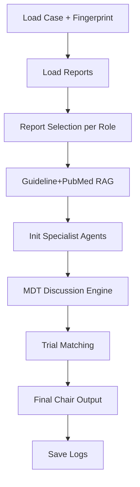

# MDT Discussion Log — 2026-01-19_08-31-33
Generated automatically by MDT Pipeline.


## CASE (structured JSON)

```
{"CASE_CORE":{"ADJUVANT_TREATMENT":{"cycles_or_courses":"6 cycles","given":"Yes","regimens":["白紫+卡铂"]},"BIOMARKERS":{"AFP":"<0.91 ng/ml (2022-10-12)","CA125":"933.00 U/ml (2022-12-29)","HER2":"Unknown","MSI":"Unknown","PDL1_CPS":"Unknown","TMB":"Unknown"},"BRCA1":"Unknown","BRCA2":"Unknown","CURRENT_STATUS":"Recurrent ovarian carcinoma with hepatic and pelvic metastatic disease","DIAGNOSIS":{"components":["高级别腺癌"],"histology":"首先考虑为透明细胞癌","laterality":"Unknown","primary":"卵巢癌复发","site":"卵巢"},"HRD":"Unknown","INITIAL_TREATMENT":"Yes","LINE_OF_THERAPY":[{"cycles":"6","end_date":"2022-08-17","intent":"Adjuvant","line":"1L","regimen":"白紫+卡铂","start_date":"Unknown"}],"MAINTENANCE":"Unknown","MAINTENANCE_DETAIL":{"end_date":"Unknown","given":"Unknown","regimens":[],"start_date":"Unknown"},"NEOADJUVANT":"Unknown","PFI_days":"56","PLATINUM_HISTORY":[{"PFI_days":"56","end_date":"2022-08-17","evidence":"CA125:89.60U/ml (2022-10-12)","evidence_type":"Biochemical","first_relapse_date":"2022-10-12","line":"1L","start_date":"Unknown","status":"Resistant"}],"PLATINUM_PFI_CURRENT":"56","PLATINUM_STATUS":"Resistant","PLATINUM_STATUS_CURRENT":"Resistant","RELAPSE":"Yes","RELAPSE_DATE":{"date":"2022-10-12","evidence":"CA125:89.60U/ml","type":"Biochemical"},"SCENE":"Platinum_resistant_relapse","STAGE":{"stage_basis":"Unknown","stage_system":"Unknown","stage_text":"Unknown"},"SURGERY_DONE":{"date":"2022-03-28","performed":"Yes","procedure":"Debulking surgery + partial rectosigmoid resection + partial vaginectomy + retroperitoneal lesion resection + complex adhesiolysis + left ureteral stent placement + bladder repair"},"TIMELINE":{"constraints":{"max_events":30,"min_events":3,"must_include":["first diagnostic imaging or pathology confirmation (if available)"],"ordering_rules":{"prioritize_last_event":true}},"events":[{"date":"2022-03-28","description":"Debulking surgery with multiple procedures (partial rectosigmoid resection, partial vaginectomy, retroperitoneal lesion resection, left ureteral stent, bladder repair)","event_type":"Surgery","key_result":"Tumor ~7*4*2.5cm; full-thickness intestinal wall high-grade adenocarcinoma; consider clear cell carcinoma","regimen_or_test":"Surgery"},{"date":"2022-08-17","description":"Postoperative chemotherapy completed: 白紫+卡铂, 6 cycles","event_type":"Chemo","key_result":"Last administration recorded 2022-08-17","regimen_or_test":"白紫+卡铂"},{"date":"2022-10-12","description":"Tumor markers rising after chemotherapy","event_type":"Lab","key_result":"CA19-9:77.20U/ml; CA125:89.60U/ml; AFP:<0.91ng/ml","regimen_or_test":"CA125, CA19-9, HE4, AFP"},{"date":"2022-10-24","description":"MRI: pelvic post-op, presacral mass increased; pelvic mesenteric enhancing nodules","event_type":"Imaging","key_result":"Consider recurrence with adjacent sacral involvement; pelvic mesenteric nodules suggest metastases","regimen_or_test":"MRI pelvis"},{"date":"2022-10-25","description":"CT: multiple hepatic nodules, some new, likely metastases","event_type":"Imaging","key_result":"Multiple liver lesions, consider metastases","regimen_or_test":"CT abdomen"},{"date":"2022-12-29","description":"Tumor markers markedly elevated","event_type":"Lab","key_result":"CA19-9:229.00U/ml; CA125:933.00U/ml; HE4:111.00pmol/L","regimen_or_test":"CA125, CA19-9, HE4, CA15-3"},{"date":"2022-12-30","description":"MRI and CT show progression: increased presacral mass, new right iliac bone lesion, more hepatic metastases","event_type":"Imaging","key_result":"Pelvic presacral mass increased; right iliac bone enhancing nodule; hepatic metastases increased","regimen_or_test":"MRI pelvis, CT abdomen"}]},"VISIT_DATE":"2023-01-03","first_relapse_date":"2022-10-12","last_platinum_end_date":"2022-08-17"},"LAB_TRENDS":{"labs":[{"analyte":"CA125","history":[{"date":"Unknown","flag":"Unknown","value":"45.7"},{"date":"2022-08-15","flag":"Unknown","value":"14.90"},{"date":"2022-10-12","flag":"↑","value":"89.60"},{"date":"2022-11-17","flag":"Unknown","value":"403"},{"date":"2022-12-29","flag":"↑","value":"933.00"}],"latest":{"date":"2022-12-29","flag":"↑","value":"933.00"},"reference_range":"Unknown","unit":"U/ml"},{"analyte":"CA19-9","history":[{"date":"Unknown","flag":"Unknown","value":"161"},{"date":"2022-08-15","flag":"Unknown","value":"7.16"},{"date":"2022-10-12","flag":"↑","value":"77.20"},{"date":"2022-12-29","flag":"↑","value":"229.00"}],"latest":{"date":"2022-12-29","flag":"↑","value":"229.00"},"reference_range":"Unknown","unit":"U/ml"},{"analyte":"HE4","history":[{"date":"Unknown","flag":"Unknown","value":"562"},{"date":"2022-08-15","flag":"↑","value":"87.90"},{"date":"2022-10-12","flag":"Unknown","value":"59.70"},{"date":"2022-12-29","flag":"↑","value":"111.00"}],"latest":{"date":"2022-12-29","flag":"↑","value":"111.00"},"reference_range":"Unknown","unit":"pmol/L"},{"analyte":"AFP","history":[{"date":"2022-10-12","flag":"Unknown","value":"<0.91"}],"latest":{"date":"2022-10-12","flag":"Unknown","value":"<0.91"},"reference_range":"Unknown","unit":"ng/ml"},{"analyte":"Hb","history":[{"date":"2022-11-10","flag":"Unknown","value":"97"},{"date":"2022-11-30","flag":"Unknown","value":"94"}],"latest":{"date":"2022-11-30","flag":"Unknown","value":"94"},"reference_range":"Unknown","unit":"g/L"}],"milestones":[{"date":"2022-03-28","description":"Primary debulking surgery","type":"Surgery"},{"date":"2022-08-17","description":"Completed 6 cycles of 白紫+卡铂","type":"ChemoEnd"},{"date":"2022-10-12","description":"Biochemical relapse with rising CA125","type":"Relapse"}]},"MED_ONC":{"current_regimen":{"cycle_info":"Unknown","last_admin_date":"Unknown","name":"Unknown"},"genetic_testing":{"germline":[],"somatic":[]},"monitoring_points":[],"planned_next_regimen":"Unknown","prior_systemic_therapies":["白紫+卡铂 (6 cycles)"]},"NUC_MED":{"studies":[]},"PATHOLOGY":{"specimens":[{"components":["高级别腺癌"],"date":"2022-03-28","diagnosis":"部分直乙结肠+左侧腹膜后肿瘤+部分阴道: 肠壁全层见高级别腺癌，结合T2022-04771首先考虑为透明细胞癌；可符合卵巢透明细胞癌累及。","grade":"Unknown","ihc":[{"marker":"MLH1","result":"(+)"},{"marker":"MSH6","result":"(+)"},{"marker":"MSH2","result":"(+)"},{"marker":"PMS2","result":"(+)"},{"marker":"ER","result":"(部分+)"},{"marker":"PR","result":"(少弱+)"},{"marker":"P53","result":"(+/-)"},{"marker":"WT1","result":"(-)"},{"marker":"Ki-67","result":"(60%+)"},{"marker":"HNF1B","result":"(+)"},{"marker":"NapsinA","result":"(灶+)"},{"marker":"P16","result":"(+)"},{"marker":"PAX8","result":"(+)"},{"marker":"SALL4","result":"(-)"},{"marker":"ZBTB16","result":"(-)"}],"involvement_sites":["intestinal wall full thickness","peritoneum (left retroperitoneal tumor)","vagina (partial)"],"laterality":"Unknown","molecular":[],"raw_text":"2022.03.28在全麻下行“瘤体减灭术+直肠乙状结肠部分切除术+阴道部分切除术+腹膜后病损切除术+复杂肠粘连松解术+左输尿管支架置管术+膀胱修补术。（部分直乙结肠+左侧腹膜后肿瘤+部分阴道）肠壁全层见高级别腺癌，结合T2022-04771首先考虑为透明细胞癌，正在加做免疫组化进一步明确。肿块大小约7*4*2.5cm。双侧切缘阴性，肠周淋巴结（4/15）见癌转移，伴癌结节1枚。（膀胱后壁肿瘤）纤维脂肪组织，局灶纤维组织增生、含铁血黄素沉积、泡沫样组织反应，未见癌累及。补充诊断1：【补充报告】（部分直乙结肠+左侧腹膜后肿瘤+部分阴道）可符合卵巢透明细胞癌累及。免疫组化（HI22-06789）瘤细胞：MLH1(ES05)（+），MSH6（+），MSH2（+），PMS2（+），ER（部分+），PR（少弱+），P53（+/-），WT1（-），Ki-67（60%+），HNF1B（+），NapsinA（灶+），P16（+），PAX8（+），SALL4（-），ZBTB16（-）","sample_type":"Surgical resection","site":"partial rectosigmoid + left retroperitoneal tumor + partial vagina","tumor_size":"7*4*2.5cm","uncertainty_or_missing":["Molecular/genetic testing not reported","Definitive origin laterality not specified"]}]},"RADIOLOGY":{"next_imaging_plan":{"modality":"Unknown","timing":"Unknown"},"studies":[{"anatomic_sites":["pelvis","sacrum"],"date":"2022-10-24","findings":["Pelvis post-op changes","presacral mass, consider recurrence with adjacent sacral involvement","multiple enhancing small mesenteric nodules in pelvis, suggest metastases"],"impression":"Recurrence with possible sacral involvement and pelvic mesenteric metastases","modality":"MRI","trend_vs_prior":"Worse"},{"anatomic_sites":["liver"],"date":"2022-10-25","findings":["Multiple hepatic nodules, some new compared to prior","hepatic cysts unchanged"],"impression":"Multiple liver lesions, consider metastases","modality":"CT","trend_vs_prior":"Worse"},{"anatomic_sites":["pelvis","right iliac bone","sacrum","rectum"],"date":"2022-12-30","findings":["Presacral mass increased in range with heterogeneous enhancement","new enhancing nodule in right iliac bone","multiple pelvic mesenteric enhancing nodules","rectal local bowel wall thickening with enhancement"],"impression":"Progressive pelvic recurrence with possible peritoneal and sacral involvement; new right iliac bone lesion","modality":"MRI","trend_vs_prior":"Worse"},{"anatomic_sites":["liver","spleen"],"date":"2022-12-30","findings":["Multiple hepatic metastatic nodules increased in number and size","patchy splenic shadow, possible splenic infarct"],"impression":"Progressive hepatic metastases; splenic abnormality noted, follow-up suggested","modality":"CT","trend_vs_prior":"Worse"}]},"TIMELINE":{"constraints":{"max_events":30,"min_events":3,"must_include":["first diagnostic imaging or pathology confirmation (if available)"],"ordering_rules":{"prioritize_last_event":true}},"events":[{"date":"2022-03-28","description":"Debulking surgery with multiple procedures (partial rectosigmoid resection, partial vaginectomy, retroperitoneal lesion resection, left ureteral stent, bladder repair)","event_type":"Surgery","key_result":"Tumor ~7*4*2.5cm; full-thickness intestinal wall high-grade adenocarcinoma; consider clear cell carcinoma","regimen_or_test":"Surgery"},{"date":"2022-08-17","description":"Postoperative chemotherapy completed: 白紫+卡铂, 6 cycles","event_type":"Chemo","key_result":"Last administration recorded 2022-08-17","regimen_or_test":"白紫+卡铂"},{"date":"2022-10-12","description":"Tumor markers rising after chemotherapy","event_type":"Lab","key_result":"CA19-9:77.20U/ml; CA125:89.60U/ml; AFP:<0.91ng/ml","regimen_or_test":"CA125, CA19-9, HE4, AFP"},{"date":"2022-10-24","description":"MRI: pelvic post-op, presacral mass increased; pelvic mesenteric enhancing nodules","event_type":"Imaging","key_result":"Consider recurrence with adjacent sacral involvement; pelvic mesenteric nodules suggest metastases","regimen_or_test":"MRI pelvis"},{"date":"2022-10-25","description":"CT: multiple hepatic nodules, some new, likely metastases","event_type":"Imaging","key_result":"Multiple liver lesions, consider metastases","regimen_or_test":"CT abdomen"},{"date":"2022-12-29","description":"Tumor markers markedly elevated","event_type":"Lab","key_result":"CA19-9:229.00U/ml; CA125:933.00U/ml; HE4:111.00pmol/L","regimen_or_test":"CA125, CA19-9, HE4, CA15-3"},{"date":"2022-12-30","description":"MRI and CT show progression: increased presacral mass, new right iliac bone lesion, more hepatic metastases","event_type":"Imaging","key_result":"Pelvic presacral mass increased; right iliac bone enhancing nodule; hepatic metastases increased","regimen_or_test":"MRI pelvis, CT abdomen"}]}}
```


## FINAL MDT OUTPUT

```
Final Assessment:
Platinum‑resistant recurrent ovarian clear cell carcinoma with multifocal progression and severe anemia; current visit must focus on stabilization, goals of care, and deferring new oncologic interventions until status clarified.

Core Treatment Strategy:
- Immediately assess ECOG, detailed symptoms, and explicit goals/preferences during this visit before any new cancer therapy decisions.  
- Urgently work up and correct severe anemia with full CBC/indices, iron studies, CMP, and coagulation profile [@20230103|2023-01-03].  
- Defer new CT/MR/PET‑CT and extended biomarkers (MSI, PD‑L1, TMB, HER2) unless clearly management‑changing [@guideline:nccn_ovariancancer_v3_2025__v00000000|14].  
- After stabilization, revisit with patient whether to pursue non‑platinum palliative systemic therapy versus best supportive care alone in this relapse setting [@guideline:nccn_ovariancancer_v3_2025__v00000000|15].  

Change Triggers:
- If anemia corrected and ECOG ≤2 with patient desiring active treatment, shift toward selecting a non‑platinum palliative systemic regimen.  
- If ECOG poor, symptoms high, or patient prefers comfort‑focused care, pivot fully to best supportive and hospice‑oriented management.
```


## PIPELINE FLOW (Mermaid)




## TRACE EVENTS (Structured)

```json
[
  {
    "ts": "2026-01-19T08:26:17.761260",
    "event": "pipeline_start",
    "payload": {
      "visit_time": "2023-01-03 08:53:29.260000",
      "meta_info": "340123197709263626"
    }
  },
  {
    "ts": "2026-01-19T08:26:17.761689",
    "event": "case_fingerprint",
    "payload": {
      "case_fingerprint": "efe856c0897d"
    }
  },
  {
    "ts": "2026-01-19T08:26:18.070450",
    "event": "reports_loaded",
    "payload": {
      "lab_n": 92,
      "img_n": 10,
      "path_n": 0,
      "mut_n": 1,
      "cutoff_dt": "2023-01-04 08:53:29"
    }
  },
  {
    "ts": "2026-01-19T08:26:26.035914",
    "event": "reports_selected",
    "payload": {
      "lab": {
        "chair": [
          "20221229|8300002|2022-12-29",
          "20221229|9703212|2022-12-29",
          "20230103|5600862|2023-01-03"
        ],
        "oncologist": [
          "20221229|8300002|2022-12-29",
          "20221229|9703212|2022-12-29",
          "20230103|5600862|2023-01-03"
        ],
        "radiologist": [],
        "pathologist": [],
        "nuclear": []
      },
      "imaging": {
        "chair": [
          "2022-10-24|CT|2022-10-24",
          "2022-12-29|MR|2022-12-29",
          "2022-12-29|CT|2022-12-29"
        ],
        "oncologist": [],
        "radiologist": [
          "2022-10-24|CT|2022-10-24",
          "2022-12-29|MR|2022-12-29",
          "2022-12-29|CT|2022-12-29"
        ],
        "pathologist": [],
        "nuclear": [
          "2022-10-24|CT|2022-10-24",
          "2022-12-29|MR|2022-12-29",
          "2022-12-29|CT|2022-12-29"
        ]
      },
      "pathology": {
        "chair": [],
        "oncologist": [],
        "radiologist": [],
        "pathologist": [],
        "nuclear": []
      },
      "mutation": {
        "chair": [
          "OH2203828|2022-04-18"
        ],
        "oncologist": [
          "OH2203828|2022-04-18"
        ],
        "radiologist": [],
        "pathologist": [
          "OH2203828|2022-04-18"
        ],
        "nuclear": []
      }
    }
  },
  {
    "ts": "2026-01-19T08:26:26.042939",
    "event": "rag_key_facts",
    "payload": {
      "facts": "DIAGNOSIS: primary=卵巢癌复发; histology=首先考虑为透明细胞癌; components=高级别腺癌\nPATHOLOGY: 部分直乙结肠+左侧腹膜后肿瘤+部分阴道: 肠壁全层见高级别腺癌，结合T2022-04771首先考虑为透明细胞癌；可符合卵巢透明细胞癌累及。\nPLATINUM: status=Resistant; pfi_days=56\nGENETICS: HRD=Unknown; BRCA1=Unknown; BRCA2=Unknown\nBIOMARKERS: CA125=933.00 U/ml (2022-12-29); AFP=<0.91 ng/ml (2022-10-12); TMB=Unknown; MSI=Unknown; PDL1_CPS=Unknown\nMUTATION_REPORT: id=OH2203828; date=2022-04-18; note=ATM NM_000051:exon8:c.A947G:p.Y316C（胚系）；HRD 阴性；BRCA1 胚系和体系未检出致病突变（视为阴性）；BRCA2 胚系和体系未检出致病突变（视为阴性）；TP53 胚系和体系未检出致病突变（视为阴性）；ARID1A 胚系和体系未检出致病突变（视为阴性）；PTEN 胚系和体系未检出致病突变（视为阴性）；PIK3CA 胚系和体系未检出致病突变（视为阴性）；PAL…"
    }
  },
  {
    "ts": "2026-01-19T08:27:01.058607",
    "event": "rag_query",
    "payload": {
      "query": "Recurrent platinum-resistant ovarian clear cell carcinoma post debulking and paclitaxel/carboplatin, with liver, pelvic/peritoneal, sacral and right iliac bone metastases; MMR-proficient; ER/PR low positive; performance/organ function constraints not documented; histology: clear cell carcinoma"
    }
  },
  {
    "ts": "2026-01-19T08:27:01.058625",
    "event": "rag_hits",
    "payload": {
      "source": "guideline",
      "topk": 5,
      "n": 5
    }
  },
  {
    "ts": "2026-01-19T08:27:01.058627",
    "event": "rag_hits",
    "payload": {
      "source": "pubmed",
      "topk": 5,
      "n": 5
    }
  },
  {
    "ts": "2026-01-19T08:27:01.058629",
    "event": "rag_hits_merged",
    "payload": {
      "n": 10
    }
  },
  {
    "ts": "2026-01-19T08:27:12.657342",
    "event": "mdt_discussion_start",
    "payload": {
      "num_rounds": 2,
      "num_turns": 2
    }
  },
  {
    "ts": "2026-01-19T08:27:12.657403",
    "event": "mdt_initial_opinion_role_start",
    "payload": {
      "role": "chair",
      "order": 1
    }
  },
  {
    "ts": "2026-01-19T08:27:15.856422",
    "event": "mdt_initial_opinion_role_end",
    "payload": {
      "role": "chair",
      "chars": 553
    }
  },
  {
    "ts": "2026-01-19T08:27:15.856508",
    "event": "mdt_initial_opinion_role_start",
    "payload": {
      "role": "oncologist",
      "order": 2
    }
  },
  {
    "ts": "2026-01-19T08:27:18.903307",
    "event": "mdt_initial_opinion_role_end",
    "payload": {
      "role": "oncologist",
      "chars": 554
    }
  },
  {
    "ts": "2026-01-19T08:27:18.903335",
    "event": "mdt_initial_opinion_role_start",
    "payload": {
      "role": "radiologist",
      "order": 3
    }
  },
  {
    "ts": "2026-01-19T08:27:23.071373",
    "event": "mdt_initial_opinion_role_end",
    "payload": {
      "role": "radiologist",
      "chars": 566
    }
  },
  {
    "ts": "2026-01-19T08:27:23.071443",
    "event": "mdt_initial_opinion_role_start",
    "payload": {
      "role": "pathologist",
      "order": 4
    }
  },
  {
    "ts": "2026-01-19T08:27:26.459680",
    "event": "mdt_initial_opinion_role_end",
    "payload": {
      "role": "pathologist",
      "chars": 401
    }
  },
  {
    "ts": "2026-01-19T08:27:26.459757",
    "event": "mdt_initial_opinion_role_start",
    "payload": {
      "role": "nuclear",
      "order": 5
    }
  },
  {
    "ts": "2026-01-19T08:27:31.648161",
    "event": "mdt_initial_opinion_role_end",
    "payload": {
      "role": "nuclear",
      "chars": 543
    }
  },
  {
    "ts": "2026-01-19T08:31:17.255901",
    "event": "mdt_discussion_end",
    "payload": {
      "merged_chars": 2260
    }
  },
  {
    "ts": "2026-01-19T08:31:17.258694",
    "event": "trial_matching_start",
    "payload": {
      "trials_json_path": "files/all_trials_filtered.json"
    }
  },
  {
    "ts": "2026-01-19T08:31:20.673565",
    "event": "trial_matching_end",
    "payload": {
      "recommended": true
    }
  },
  {
    "ts": "2026-01-19T08:31:20.673582",
    "event": "final_output_start",
    "payload": {}
  },
  {
    "ts": "2026-01-19T08:31:33.714145",
    "event": "final_output_end",
    "payload": {
      "final_output_chars": 1227
    }
  }
]
```


## INITIAL EXPERT OPINIONS


## chair

```
- Advanced, rapidly progressive platinum‑resistant clear cell ovarian carcinoma with liver, pelvic, bone metastases; intent now palliative disease control and symptom relief.  

- Before firm systemic and local therapy planning, update ECOG/organ function (full CMP, coagulation), pain status, GI/urinary function, and patient preferences.  

- Given platinum‑resistant relapse and clear cell histology, prioritize non‑platinum systemic options, trial consideration, and supportive care integration [@guideline:nccn_ovariancancer_v3_2025__v00000000|14].
```


## oncologist

```
- Early biochemical and radiologic relapse (<6 months) after adjuvant platinum suggests platinum-resistant clear cell ovarian carcinoma; favor non‑platinum relapse strategy. [@guideline:nccn_ovariancancer_v3_2025__v00000000|14]

- HRD- and BRCA-wildtype status plus clear cell histology reduces expected benefit from PARP-based maintenance or relapse strategies. [@OH2203828|2022-04-18]

- Before regimen choice, need updated performance status, symptoms, full renal/hepatic profile, anemia workup/management plan, and detailed imaging for resectability.
```


## radiologist

```
- Interval progression of presacral pelvic recurrence with suspected sacral and right iliac bone involvement; multiple stable pelvic mesenteric nodules. [@2022-12-29|MR]  

- Hepatic metastatic disease has increased in number and size; splenic low-density area suspicious for infarct, needs imaging follow-up. [@2022-12-29|CT]  

- Overall imaging shows worsening multifocal metastatic disease (pelvis, liver, bone), consistent with progressive recurrent gynecologic malignancy. [@2022-12-29|MR] [@2022-12-29|CT] [@guideline:nccn_ovariancancer_v3_2025__v00000000|15]
```


## pathologist

```
- Histology and IHC support diagnosis of ovarian clear cell carcinoma involving rectosigmoid wall, retroperitoneum, and vagina. [@case_view|2022-03-28]

- MMR proteins intact; MSI, PD-L1, TMB, and HER2 status remain unknown/needs update. [@case_view|2022-03-28]

- Germline ATM p.Y316C detected; HRD negative; no pathogenic BRCA1/2 or ARID1A/PTEN/PIK3CA alterations identified. [@OH2203828|2022-04-18]
```


## nuclear

```
- No PET-CT available; PET status of pelvic, hepatic, splenic, and bone lesions is unknown/needs update before metabolic staging.  

- Cross-sectional imaging shows progressive pelvic recurrence with sacral, peritoneal, right iliac bone involvement and hepatic metastases, implying advanced metastatic stage [@2022-12-29|MR][@2022-12-29|CT].  

- In recurrent ovarian cancer, PET-CT can upstage disease by detecting additional nodal/peritoneal metastases, influencing surgical/RT planning [@guideline:nccn_ovariancancer_v3_2025__v00000000|15].
```


## MERGED SUMMARY (Assistant)

```
Key Knowledge:
- Platinum‑resistant recurrent clear cell ovarian carcinoma with early post‑platinum relapse; BRCA/HRD‑negative, no actionable mutations.
- Progressive multifocal metastases (pelvis with sacral/right iliac bone involvement, mesenteric nodules, increasing liver metastases); possible splenic infarct.
- MMR intact; MSI, PD‑L1, TMB, HER2 not yet assessed.
- Palliative intent focused on symptom relief; non‑platinum systemic options and supportive care favored.
- Severe anemia (HGB ~74 g/L) is a critical issue requiring urgent workup and correction before any further oncologic treatment.

Controversies:
- Extent and timing of further systemic therapy versus best supportive care alone, particularly in the setting of severe anemia and unknown ECOG/symptom burden.
- Whether additional imaging (CT/MR/PET‑CT) is currently justified in a palliative context given recent scans, and only if clearly management‑changing (e.g., for RT planning).
- Real-world benefit of extended molecular profiling (MSI, PD‑L1, TMB, HER2) at this stage, given uncertain impact on treatment options.

Missing Info:
- Updated ECOG, detailed symptom profile (pain, GI/urinary), and explicit goals of care/preferences.
- Full current labs: CBC with indices and iron studies, CMP (renal/hepatic), coagulation profile.
- Anemia etiology and correction plan (transfusion/iron, etc.) and overall organ function status.
- PET‑CT scheduling status and clarified need for any updated imaging and biomarker panel, contingent on likely impact on management.

Working Plan:
- Immediately clarify ECOG, symptom burden, and goals of care, and urgently investigate and correct severe anemia with full labs including iron studies.
- After stabilization, jointly reassess candidacy for non‑platinum palliative systemic therapy versus best supportive care alone, guided by performance status and patient wishes.
- Defer new CT/MR/PET‑CT and extended biomarkers (MSI, PD‑L1, TMB, HER2) unless results are clearly expected to change management; avoid duplicate PET‑CT.
- If, after stabilization, RT or other local interventions (e.g., pelvic/sacral/bone lesions) are reconsidered for symptom control, obtain updated contrast CT/MR and consider targeted PET‑CT for precise field planning.
```


## INTERACTION LOG (Round × Turn)

### Round 1

#### Turn 1
- **chair → oncologist:** Profound anemia (HGB 74 g/L) and unknown ECOG/organ function make immediate intensive systemic therapy decisions unsafe; prioritize urgent correction/workup of anemia and full status assessment before committing to next‑line regimen.
- **chair → radiologist:** Given progressive multifocal disease and possible splenic infarct, clarify whether any further cross‑sectional imaging (including PET‑CT) would realistically change RT/local or systemic planning before ordering.
- **oncologist → chair:** From a systemic perspective I need ECOG, symptom burden, current full labs, and updated cross‑sectional imaging before judging suitability for further non‑platinum therapy versus best supportive care; without these, treatment risk–benefit is impossible to assess.
- **radiologist → oncologist:** Last CT/MR (2022-12-29/30) show clear progression and possible splenic infarct; updated cross‑sectional imaging is critical before further RT/systemic decisions.
- **pathologist → oncologist:** MMR is intact but MSI, PD-L1, TMB, and HER2 remain untested; if further systemic therapy hinges on immunotherapy/targeted options, these biomarkers need clarification or explicit decision to forego testing. [@case_view|2022-03-28]
- **nuclear → oncologist:** No PET-CT is documented; please clarify if PET-CT is planned, as it may refine RT/surgical fields or prove redundant in this palliative context.
- **nuclear → radiologist:** Given progressive pelvic, hepatic, and possible splenic involvement, please confirm whether any more recent cross-sectional imaging or PET-CT is available to avoid duplicating studies.

#### Turn 2
- **chair → oncologist:** We now have conflicting views on imaging urgency versus systemic-planning readiness; please explicitly prioritize immediate correction/workup of severe anemia and ECOG/symptom assessment before committing to additional imaging or next-line systemic therapy.
- **oncologist → chair:** Given clear radiologic progression, profound anemia (HGB 74 g/L), and unknown ECOG/symptoms, I cannot safely recommend further systemic therapy until performance status, anemia workup/optimization, and goals of care are clarified; best supportive care alone must be explicitly considered.
- **radiologist → nuclear:** No imaging newer than the 2022-12-29/30 CT/MR is available in the record; any already-scheduled PET-CT should be checked to prevent duplicate staging.

### Round 2

#### Turn 1

#### Turn 2


## FINAL REFINED PLANS (per Round)

### Round 1


## chair

```
- First, urgently assess ECOG, symptoms, and anemia etiology/need for transfusion or iron therapy before any further oncologic intervention [@20230103|2023-01-03].  

- In parallel, repeat full labs (CBC with indices, CMP, coagulation) and clarify goals of care, explicitly including best supportive care option.  

- Once status optimized, consider non‑platinum palliative systemic strategy versus best supportive care, and order PET‑CT/biomarkers only if management‑changing [@guideline:nccn_ovariancancer_v3_2025__v00000000|14].
```


## oncologist

```
- Urgently evaluate and treat severe anemia (HGB 74 g/L) and obtain ECOG, symptom profile, goals of care before systemic decisions. [@20230103|2023-01-03]

- After stabilization and status review, reassess candidacy for non‑platinum palliative systemic therapy versus best supportive care only. [@guideline:nccn_ovariancancer_v3_2025__v00000000|15]

- Defer new imaging, PET‑CT, and extended biomarkers (MSI, PD‑L1, TMB, HER2) until above assessment clarifies that results would alter management.
```


## radiologist

```
- Defer new imaging (CT/MR/PET‑CT) until ECOG, symptom burden, and anemia workup/optimization are clarified and goals of care defined. [@2022-12-29|CT] [@2022-12-29|MR] [@guideline:nccn_ovariancancer_v3_2025__v00000000|15]  

- If patient deemed candidate for further RT/local intervention, then obtain updated contrast CT/MR to reassess pelvic, hepatic, and splenic status. [@2022-12-29|CT] [@2022-12-29|MR]  

- PET‑CT to be considered only if its results would clearly alter RT fields or local procedures; currently not mandatory. Unknown if scheduled.
```


## pathologist

```
- Urgently assess ECOG, symptom burden, and fully evaluate/correct profound anemia (HGB 74 g/L) before any new therapy decisions. [@guideline:nccn_ovariancancer_v3_2025__v00000000|15; @report_unknown|2022-12-29]

- Defer new systemic therapy choices until anemia workup, organ function labs, and patient goals/preferences are clarified. [@guideline:esmo_cpg_epithelialovarian_2023__v00000000|10]

- Reconsider need and timing of further imaging (CT/PET-CT) only after clinical stabilization and if results would alter RT/local/systemic strategy. [@guideline:nccn_ovariancancer_v3_2025__v00000000|14]
```


## nuclear

```
- Verify whether a PET-CT has already been scheduled; avoid duplicate staging given recent progressive CT/MR findings [@2022-12-29|CT][@2022-12-29|MR].  

- Defer new PET-CT ordering until ECOG, anemia workup, and goals-of-care review clarify whether PET would change RT/local planning [@guideline:nccn_ovariancancer_v3_2025__v00000000|15].  

- If curative-intent RT or focused palliation (e.g., sacrum/right iliac bone) becomes realistic, reconsider targeted PET-CT for precise field delineation.
```

### Round 2


## chair

```
- Immediately clarify ECOG, symptom burden, goals of care, and fully evaluate/treat severe anemia with full labs including iron studies [@20230103|2023-01-03].  

- After stabilization, jointly decide between non‑platinum palliative systemic therapy versus best supportive care alone, based on performance status and wishes [@guideline:nccn_ovariancancer_v3_2025__v00000000|14].  

- Defer new CT/MR/PET‑CT and extended biomarkers (MSI, PD‑L1, TMB, HER2) unless results are clearly expected to change management (e.g., RT planning).
```


## oncologist

```
- Urgently investigate and correct severe anemia and assess ECOG, symptoms, and goals of care before systemic decisions. [@20230103|2023-01-03]

- After stabilization, reassess candidacy for non‑platinum palliative systemic therapy versus best supportive care alone in this platinum‑resistant relapse. [@guideline:nccn_ovariancancer_v3_2025__v00000000|15]

- Defer new CT/MR/PET‑CT and extended biomarkers (MSI, PD‑L1, TMB, HER2) until clearly likely to change management; avoid duplicate PET‑CT.
```


## radiologist

```
- With recent CT/MR already confirming progressive multifocal disease and suspected splenic infarct, defer new imaging until anemia/ECOG clarified. [@2022-12-29|CT] [@2022-12-29|MR] [@guideline:nccn_ovariancancer_v3_2025__v00000000|15]  

- If, after stabilization, RT/local intervention is reconsidered for symptom control, then obtain updated contrast-enhanced CT/MR for pelvic, hepatic, splenic reassessment. [@2022-12-29|CT] [@2022-12-29|MR]  

- Reserve PET‑CT for scenarios where findings would concretely alter RT fields or procedures; current PET‑CT scheduling status unknown.
```


## pathologist

```
- Prioritize urgent workup and correction of severe anemia and full assessment of ECOG, symptoms, and organ function before oncologic decisions. [@guideline:nccn_ovariancancer_v3_2025__v00000000|15; @report_unknown|2022-12-29]

- After stabilization, reassess with patient the balance between non‑platinum palliative systemic therapy and best supportive care alone. [@guideline:esmo_cpg_epithelialovarian_2023__v00000000|10]

- Defer additional CT/MR/PET‑CT and extended biomarkers (MSI, PD‑L1, TMB, HER2) until clearly expected to change management; avoid duplication. [@guideline:nccn_ovariancancer_v3_2025__v00000000|14]
```


## nuclear

```
- Defer new PET-CT until ECOG, anemia workup, and goals-of-care clarify whether added staging would change management; avoid duplication [@guideline:nccn_ovariancancer_v3_2025__v00000000|15].  

- If future RT to sacrum/right iliac bone is considered, a targeted PET-CT could refine metabolically active target volumes [@2022-12-29|MR].  

- For now, rely on recent CT/MR for distribution of pelvic, hepatic, and possible splenic disease; PET contribution remains uncertain [@2022-12-29|CT][@2022-12-29|MR].
```


## RAW AGENT LOGS

### chair
- **User:** Give INITIAL opinion (use ONLY your system-provided patient facts).
Return up to 3 bullets, each ≤20 words.
If key data missing, say exactly what needs updating.
At least ONE bullet must be evidence-based and include [@guideline:doc_id|page] or [@pubmed:PMID].
If you reference treatment strategy categories, guidelines, trials, or literature evidence, include tags [@guideline:doc_id|page] or [@pubmed:PMID].
  
  **Assistant:** - Advanced, rapidly progressive platinum‑resistant clear cell ovarian carcinoma with liver, pelvic, bone metastases; intent now palliative disease control and symptom relief.  

- Before firm systemic and local therapy planning, update ECOG/organ function (full CMP, coagulation), pain status, GI/urinary function, and patient preferences.  

- Given platinum‑resistant relapse and clear cell histology, prioritize non‑platinum systemic options, trial consideration, and supportive care integration [@guideline:nccn_ovariancancer_v3_2025__v00000000|14].
  
  *(2026-01-19T08:27:15.856361)*

- **User:** ROLE: chair. VISIT: 2023-01-03 08:53:29.260000
Default is NOT to speak. Speak ONLY if: conflict | safety | missing-critical | new-critical.

CONTEXT (latest):
[MDT_GLOBAL_KNOWLEDGE]
Key Knowledge:
- Platinum‑resistant recurrent clear cell ovarian carcinoma with early post‑platinum relapse, BRCA/HRD‑negative, no clear actionable mutations.
- Progressive multifocal metastases (pelvic recurrence with sacral/right iliac bone involvement, mesenteric nodules, increasing liver metastases); possible splenic infarct.
- MMR intact; MSI, PD‑L1, TMB, HER2 not yet assessed.
- Management intent is palliative disease control and symptom relief; non‑platinum systemic approaches and supportive care prioritized.

Controversies:
- Extent of further systemic therapy versus best supportive care given unknown ECOG and symptom burden.
- Utility of PET‑CT for additional staging in the palliative setting, particularly regarding RT/surgical planning.
- Impact of further molecular profiling (MSI, PD‑L1, TMB, HER2) on management at this stage.

Missing Info:
- Current ECOG, pain status, GI/urinary function, and patient goals/preferences.
- Up‑to‑date labs (CBC, CMP including renal/hepatic, coagulation) and anemia assessment.
- Updated imaging for disease extent/resectability and splenic lesion characterization.
- PET‑CT results and extended biomarker panel (MSI, PD‑L1, TMB, HER2).

Working Plan:
- Reassess performance status, symptom burden, organ function, and patient priorities.
- Evaluate non‑platinum systemic options and clinical trial suitability, contingent on ECOG/organ function.
- Embed palliative/supportive care for pain and GI/urinary symptoms and overall QoL.
- Decide on PET‑CT and extended biomarker testing only if likely to change RT/local or systemic strategy.

Allowed targets: [oncologist,radiologist,pathologist,nuclear]
Return ONE-LINE JSON only:{"speak":"yes/no","messages":[{"target":"<role>","message":"<1-2 sentences>","why":"conflict|safety|missing|new"}]}
  
  **Assistant:** {"speak":"yes","messages":[{"target":"oncologist","message":"Profound anemia (HGB 74 g/L) and unknown ECOG/organ function make immediate intensive systemic therapy decisions unsafe; prioritize urgent correction/workup of anemia and full status assessment before committing to next‑line regimen.","why":"safety"},{"target":"radiologist","message":"Given progressive multifocal disease and possible splenic infarct, clarify whether any further cross‑sectional imaging (including PET‑CT) would realistically change RT/local or systemic planning before ordering.","why":"missing"}]}
  
  *(2026-01-19T08:27:57.740097)*

- **User:** ROLE: chair. VISIT: 2023-01-03 08:53:29.260000
Default is NOT to speak. Speak ONLY if: conflict | safety | missing-critical | new-critical.

CONTEXT (latest):
[MDT_GLOBAL_KNOWLEDGE]
Key Knowledge:
- Platinum‑resistant recurrent clear cell ovarian carcinoma with early post‑platinum relapse, BRCA/HRD‑negative, no clear actionable mutations.
- Progressive multifocal metastases (pelvic recurrence with sacral/right iliac bone involvement, mesenteric nodules, increasing liver metastases); possible splenic infarct.
- MMR intact; MSI, PD‑L1, TMB, HER2 not yet assessed.
- Management intent is palliative disease control and symptom relief; non‑platinum systemic approaches and supportive care prioritized.

Controversies:
- Extent of further systemic therapy versus best supportive care given unknown ECOG and symptom burden.
- Utility of PET‑CT for additional staging in the palliative setting, particularly regarding RT/surgical planning.
- Impact of further molecular profiling (MSI, PD‑L1, TMB, HER2) on management at this stage.

Missing Info:
- Current ECOG, pain status, GI/urinary function, and patient goals/preferences.
- Up‑to‑date labs (CBC, CMP including renal/hepatic, coagulation) and anemia assessment.
- Updated imaging for disease extent/resectability and splenic lesion characterization.
- PET‑CT results and extended biomarker panel (MSI, PD‑L1, TMB, HER2).

Working Plan:
- Reassess performance status, symptom burden, organ function, and patient priorities.
- Evaluate non‑platinum systemic options and clinical trial suitability, contingent on ECOG/organ function.
- Embed palliative/supportive care for pain and GI/urinary symptoms and overall QoL.
- Decide on PET‑CT and extended biomarker testing only if likely to change RT/local or systemic strategy.

[RECENT_DELTAS]
[R1T1 DELTA] nt risk–benefit is impossible to assess. | radiologist->oncologist(missing): Last CT/MR (2022-12-29/30) show clear progression and possible splenic infarct; updated cross‑sectional imaging is critical before further RT/systemic decisions. | pathologist->oncologist(missing): MMR is intact but MSI, PD-L1, TMB, and HER2 remain untested; if further systemic therapy hinges on immunotherapy/targeted options, these biomarkers need clarification or explicit decision to forego testing. [@case_view|2022-03-28] | nuclear->oncologist(missing): No PET-CT is documented; please clarify if PET-CT is planned, as it may refine RT/surgical fields or prove redundant in this palliative context. | nuclear->radiologist(missing): Given progressive pelvic, hepatic, and possible splenic involvement, please confirm whether any more recent cross-sectional imaging or PET-CT is available to avoid duplicating studies.

Allowed targets: [oncologist,radiologist,pathologist,nuclear]
Return ONE-LINE JSON only:{"speak":"yes/no","messages":[{"target":"<role>","message":"<1-2 sentences>","why":"conflict|safety|missing|new"}]}
  
  **Assistant:** {"speak":"yes","messages":[{"target":"oncologist","message":"We now have conflicting views on imaging urgency versus systemic-planning readiness; please explicitly prioritize immediate correction/workup of severe anemia and ECOG/symptom assessment before committing to additional imaging or next-line systemic therapy.","why":"conflict"}]}
  
  *(2026-01-19T08:28:13.080194)*

- **User:** Given MDT context:
[MDT_GLOBAL_KNOWLEDGE]
Key Knowledge:
- Platinum‑resistant recurrent clear cell ovarian carcinoma with early post‑platinum relapse, BRCA/HRD‑negative, no clear actionable mutations.
- Progressive multifocal metastases (pelvic recurrence with sacral/right iliac bone involvement, mesenteric nodules, increasing liver metastases); possible splenic infarct.
- MMR intact; MSI, PD‑L1, TMB, HER2 not yet assessed.
- Management intent is palliative disease control and symptom relief; non‑platinum systemic approaches and supportive care prioritized.

Controversies:
- Extent of further systemic therapy versus best supportive care given unknown ECOG and symptom burden.
- Utility of PET‑CT for additional staging in the palliative setting, particularly regarding RT/surgical planning.
- Impact of further molecular profiling (MSI, PD‑L1, TMB, HER2) on management at this stage.

Missing Info:
- Current ECOG, pain status, GI/urinary function, and patient goals/preferences.
- Up‑to‑date labs (CBC, CMP including renal/hepatic, coagulation) and anemia assessment.
- Updated imaging for disease extent/resectability and splenic lesion characterization.
- PET‑CT results and extended biomarker panel (MSI, PD‑L1, TMB, HER2).

Working Plan:
- Reassess performance status, symptom burden, organ function, and patient priorities.
- Evaluate non‑platinum systemic options and clinical trial suitability, contingent on ECOG/organ function.
- Embed palliative/supportive care for pain and GI/urinary symptoms and overall QoL.
- Decide on PET‑CT and extended biomarker testing only if likely to change RT/local or systemic strategy.

[RECENT_DELTAS]
[R1T1 DELTA] nt risk–benefit is impossible to assess. | radiologist->oncologist(missing): Last CT/MR (2022-12-29/30) show clear progression and possible splenic infarct; updated cross‑sectional imaging is critical before further RT/systemic decisions. | pathologist->oncologist(missing): MMR is intact but MSI, PD-L1, TMB, and HER2 remain untested; if further systemic therapy hinges on immunotherapy/targeted options, these biomarkers need clarification or explicit decision to forego testing. [@case_view|2022-03-28] | nuclear->oncologist(missing): No PET-CT is documented; please clarify if PET-CT is planned, as it may refine RT/surgical fields or prove redundant in this palliative context. | nuclear->radiologist(missing): Given progressive pelvic, hepatic, and possible splenic involvement, please confirm whether any more recent cross-sectional imaging or PET-CT is available to avoid duplicating studies.
[R1T2 DELTA] chair->oncologist(conflict): We now have conflicting views on imaging urgency versus systemic-planning readiness; please explicitly prioritize immediate correction/workup of severe anemia and ECOG/symptom assessment before committing to additional imaging or next-line systemic therapy. | oncologist->chair(safety): Given clear radiologic progression, profound anemia (HGB 74 g/L), and unknown ECOG/symptoms, I cannot safely recommend further systemic therapy until performance status, anemia workup/optimization, and goals of care are clarified; best supportive care alone must be explicitly considered. | radiologist->nuclear(missing): No imaging newer than the 2022-12-29/30 CT/MR is available in the record; any already-scheduled PET-CT should be checked to prevent duplicate staging.

DISCUSSION HISTORY (this round):
Turn 1: chair→oncologist: Profound anemia (HGB 74 g/L) and unknown ECOG/organ function make immediate intensive systemic therapy decisions unsafe; prioritize urgent correction/workup of anemia and full status assessment before committing to next‑line regimen. | chair→radiologist: Given progressive multifocal disease and possible splenic infarct, clarify whether any further cross‑sectional imaging (including PET‑CT) would realistically change RT/local or systemic planning before ordering. | oncologist→chair: From a systemic perspective I need ECOG, symptom burden, current full labs, and updated cross‑sectional imaging before judging suitability for further non‑platinum therapy versus best supportive care; without these, treatment risk–benefit is impossible to assess.
Turn 2: chair→oncologist: We now have conflicting views on imaging urgency versus systemic-planning readiness; please explicitly prioritize immediate correction/workup of severe anemia and ECOG/symptom assessment before committing to additional imaging or next-line systemic therapy. | oncologist→chair: Given clear radiologic progression, profound anemia (HGB 74 g/L), and unknown ECOG/symptoms, I cannot safely recommend further systemic therapy until performance status, anemia workup/optimization, and goals of care are clarified; best supportive care alone must be explicitly considered. | radiologist→nuclear: No imaging newer than the 2022-12-29/30 CT/MR is available in the record; any already-scheduled PET-CT should be checked to prevent duplicate staging.

Provide FINAL refined plan based on the above context and discussions.
Up to 3 bullets, each ≤20 words.
Any factual claim must include [@report_id|date] or say unknown.
At least ONE bullet must be evidence-based and include [@guideline:doc_id|page] or [@pubmed:PMID].
If you reference treatment strategy categories, guidelines, trials, or literature evidence, include tags [@guideline:doc_id|page] or [@pubmed:PMID].
If discussions mentioned specific evidence, you may reference it with appropriate tags.
  
  **Assistant:** - First, urgently assess ECOG, symptoms, and anemia etiology/need for transfusion or iron therapy before any further oncologic intervention [@20230103|2023-01-03].  

- In parallel, repeat full labs (CBC with indices, CMP, coagulation) and clarify goals of care, explicitly including best supportive care option.  

- Once status optimized, consider non‑platinum palliative systemic strategy versus best supportive care, and order PET‑CT/biomarkers only if management‑changing [@guideline:nccn_ovariancancer_v3_2025__v00000000|14].
  
  *(2026-01-19T08:28:59.548830)*

- **User:** ROLE: chair. VISIT: 2023-01-03 08:53:29.260000
Default is NOT to speak. Speak ONLY if: conflict | safety | missing-critical | new-critical.

CONTEXT (latest):
[MDT_GLOBAL_KNOWLEDGE]
Key Knowledge:
- Platinum‑resistant recurrent clear cell ovarian carcinoma with early post‑platinum relapse; BRCA/HRD‑negative, no actionable mutations.
- Progressive multifocal metastases (pelvis with sacral/right iliac bone involvement, mesenteric nodules, increasing liver metastases); possible splenic infarct.
- MMR intact; MSI, PD‑L1, TMB, HER2 not assessed.
- Palliative intent with focus on symptom relief; non‑platinum systemic options and supportive care favored.
- Severe anemia (HGB ~74 g/L) is a critical, urgent issue before any further oncologic treatment.

Controversies:
- Extent and timing of further systemic therapy versus best supportive care, given severe anemia and unknown ECOG/symptom burden.
- Whether additional imaging (CT/MR/PET‑CT) is warranted now in a palliative context, given recent scans and need for management‑changing impact.
- Actual benefit of extended molecular profiling (MSI, PD‑L1, TMB, HER2) at this stage.

Missing Info:
- Updated ECOG, detailed symptom profile (pain, GI/urinary), and explicit patient goals/preferences.
- Full current labs: CBC with indices and iron studies, CMP, coagulation.
- Anemia etiology and correction plan; overall organ function status.
- Status of any PET‑CT scheduling and decision on need for updated imaging and biomarker panel.

Working Plan:
- Urgently assess ECOG, symptoms, goals of care, and fully work up/treat severe anemia and organ function.
- After stabilization, reassess suitability for non‑platinum palliative systemic therapy versus best supportive care alone.
- Defer new CT/MR/PET‑CT and extended biomarkers until clearly management‑changing; avoid duplicate PET‑CT.
- If later considered for RT/local interventions, obtain updated contrast CT/MR and consider targeted PET‑CT for field planning.

Allowed targets: [oncologist,radiologist,pathologist,nuclear]
Return ONE-LINE JSON only:{"speak":"yes/no","messages":[{"target":"<role>","message":"<1-2 sentences>","why":"conflict|safety|missing|new"}]}
  
  **Assistant:** {"speak":"no","messages":[]}
  
  *(2026-01-19T08:29:26.323619)*

- **User:** Given MDT context:
[MDT_GLOBAL_KNOWLEDGE]
Key Knowledge:
- Platinum‑resistant recurrent clear cell ovarian carcinoma with early post‑platinum relapse; BRCA/HRD‑negative, no actionable mutations.
- Progressive multifocal metastases (pelvis with sacral/right iliac bone involvement, mesenteric nodules, increasing liver metastases); possible splenic infarct.
- MMR intact; MSI, PD‑L1, TMB, HER2 not assessed.
- Palliative intent with focus on symptom relief; non‑platinum systemic options and supportive care favored.
- Severe anemia (HGB ~74 g/L) is a critical, urgent issue before any further oncologic treatment.

Controversies:
- Extent and timing of further systemic therapy versus best supportive care, given severe anemia and unknown ECOG/symptom burden.
- Whether additional imaging (CT/MR/PET‑CT) is warranted now in a palliative context, given recent scans and need for management‑changing impact.
- Actual benefit of extended molecular profiling (MSI, PD‑L1, TMB, HER2) at this stage.

Missing Info:
- Updated ECOG, detailed symptom profile (pain, GI/urinary), and explicit patient goals/preferences.
- Full current labs: CBC with indices and iron studies, CMP, coagulation.
- Anemia etiology and correction plan; overall organ function status.
- Status of any PET‑CT scheduling and decision on need for updated imaging and biomarker panel.

Working Plan:
- Urgently assess ECOG, symptoms, goals of care, and fully work up/treat severe anemia and organ function.
- After stabilization, reassess suitability for non‑platinum palliative systemic therapy versus best supportive care alone.
- Defer new CT/MR/PET‑CT and extended biomarkers until clearly management‑changing; avoid duplicate PET‑CT.
- If later considered for RT/local interventions, obtain updated contrast CT/MR and consider targeted PET‑CT for field planning.

DISCUSSION HISTORY (this round):
No direct discussions in this round.

Provide FINAL refined plan based on the above context and discussions.
Up to 3 bullets, each ≤20 words.
Any factual claim must include [@report_id|date] or say unknown.
At least ONE bullet must be evidence-based and include [@guideline:doc_id|page] or [@pubmed:PMID].
If you reference treatment strategy categories, guidelines, trials, or literature evidence, include tags [@guideline:doc_id|page] or [@pubmed:PMID].
If discussions mentioned specific evidence, you may reference it with appropriate tags.
  
  **Assistant:** - Immediately clarify ECOG, symptom burden, goals of care, and fully evaluate/treat severe anemia with full labs including iron studies [@20230103|2023-01-03].  

- After stabilization, jointly decide between non‑platinum palliative systemic therapy versus best supportive care alone, based on performance status and wishes [@guideline:nccn_ovariancancer_v3_2025__v00000000|14].  

- Defer new CT/MR/PET‑CT and extended biomarkers (MSI, PD‑L1, TMB, HER2) unless results are clearly expected to change management (e.g., RT planning).
  
  *(2026-01-19T08:30:19.903546)*

- **User:** 
As the MDT chair for gynecologic oncology, you are seeing the patient at OUTPATIENT TIME: 2023-01-03 08:53:29.260000.
Based on PATIENT FACTS + MDT discussion + FINAL refined plans from all experts, determine the CURRENT best management plan for this visit.

# MDT DISCUSSION SUMMARY
Key Knowledge:
- Platinum‑resistant recurrent clear cell ovarian carcinoma with early post‑platinum relapse; BRCA/HRD‑negative, no actionable mutations.
- Progressive multifocal metastases (pelvis with sacral/right iliac bone involvement, mesenteric nodules, increasing liver metastases); possible splenic infarct.
- MMR intact; MSI, PD‑L1, TMB, HER2 not yet assessed.
- Palliative intent focused on symptom relief; non‑platinum systemic options and supportive care favored.
- Severe anemia (HGB ~74 g/L) is a critical issue requiring urgent workup and correction before any further oncologic treatment.

Controversies:
- Extent and timing of further systemic therapy versus best supportive care alone, particularly in the setting of severe anemia and unknown ECOG/symptom burden.
- Whether additional imaging (CT/MR/PET‑CT) is currently justified in a palliative context given recent scans, and only if clearly management‑changing (e.g., for RT planning).
- Real-world benefit of extended molecular profiling (MSI, PD‑L1, TMB, HER2) at this stage, given uncertain impact on treatment options.

Missing Info:
- Updated ECOG, detailed symptom profile (pain, GI/urinary), and explicit goals of care/preferences.
- Full current labs: CBC with indices and iron studies, CMP (renal/hepatic), coagulation profile.
- Anemia etiology and correction plan (transfusion/iron, etc.) and overall organ function status.
- PET‑CT scheduling status and clarified need for any updated imaging and biomarker panel, contingent on likely impact on management.

Working Plan:
- Immediately clarify ECOG, symptom burden, and goals of care, and urgently investigate and correct severe anemia with full labs including iron studies.
- After stabilization, jointly reassess candidacy for non‑platinum palliative systemic therapy versus best supportive care alone, guided by performance status and patient wishes.
- Defer new CT/MR/PET‑CT and extended biomarkers (MSI, PD‑L1, TMB, HER2) unless results are clearly expected to change management; avoid duplicate PET‑CT.
- If, after stabilization, RT or other local interventions (e.g., pelvic/sacral/bone lesions) are reconsidered for symptom control, obtain updated contrast CT/MR and consider targeted PET‑CT for precise field planning.

# INITIAL EXPERT OPINIONS
- chair: - Advanced, rapidly progressive platinum‑resistant clear cell ovarian carcinoma with liver, pelvic, bone metastases; intent now palliative disease control and symptom relief.  

- Before firm systemic
- oncologist: - Early biochemical and radiologic relapse (<6 months) after adjuvant platinum suggests platinum-resistant clear cell ovarian carcinoma; favor non‑platinum relapse strategy. [@guideline:nccn_ovarianca
- radiologist: - Interval progression of presacral pelvic recurrence with suspected sacral and right iliac bone involvement; multiple stable pelvic mesenteric nodules. [@2022-12-29|MR]  

- Hepatic metastatic diseas
- pathologist: - Histology and IHC support diagnosis of ovarian clear cell carcinoma involving rectosigmoid wall, retroperitoneum, and vagina. [@case_view|2022-03-28]

- MMR proteins intact; MSI, PD-L1, TMB, and HER
- nuclear: - No PET-CT available; PET status of pelvic, hepatic, splenic, and bone lesions is unknown/needs update before metabolic staging.  

- Cross-sectional imaging shows progressive pelvic recurrence with 

# DISCUSSION INTERACTIONS
Round 1: R1T1: chair→oncologist: Profound anemia (HGB 74 g/L) and unknown ECOG/organ function make immediate intensive systemic thera | R1T1: chair→radiologist: Given progressive multifocal disease and possible splenic infarct, clarify whether any further cross | R1T1: oncologist→chair: From a systemic perspective I need ECOG, symptom burden, current full labs, and updated cross‑sectio | R1T1: radiologist→oncologist: Last CT/MR (2022-12-29/30) show clear progression and possible splenic infarct; updated cross‑sectio | R1T1: pathologist→oncologist: MMR is intact but MSI, PD-L1, TMB, and HER2 remain untested; if further systemic therapy hinges on i


# FINAL REFINED PLANS (All experts, all rounds)
{
  "Round 1": {
    "chair": "- First, urgently assess ECOG, symptoms, and anemia etiology/need for transfusion or iron therapy before any further oncologic intervention [@20230103|2023-01-03].  \n\n- In parallel, repeat full labs (CBC with indices, CMP, coagulation) and clarify goals of care, explicitly including best supportive care option.  \n\n- Once status optimized, consider non‑platinum palliative systemic strategy versus best supportive care, and order PET‑CT/biomarkers only if management‑changing [@guideline:nccn_ovariancancer_v3_2025__v00000000|14].",
    "oncologist": "- Urgently evaluate and treat severe anemia (HGB 74 g/L) and obtain ECOG, symptom profile, goals of care before systemic decisions. [@20230103|2023-01-03]\n\n- After stabilization and status review, reassess candidacy for non‑platinum palliative systemic therapy versus best supportive care only. [@guideline:nccn_ovariancancer_v3_2025__v00000000|15]\n\n- Defer new imaging, PET‑CT, and extended biomarkers (MSI, PD‑L1, TMB, HER2) until above assessment clarifies that results would alter management.",
    "radiologist": "- Defer new imaging (CT/MR/PET‑CT) until ECOG, symptom burden, and anemia workup/optimization are clarified and goals of care defined. [@2022-12-29|CT] [@2022-12-29|MR] [@guideline:nccn_ovariancancer_v3_2025__v00000000|15]  \n\n- If patient deemed candidate for further RT/local intervention, then obtain updated contrast CT/MR to reassess pelvic, hepatic, and splenic status. [@2022-12-29|CT] [@2022-12-29|MR]  \n\n- PET‑CT to be considered only if its results would clearly alter RT fields or local procedures; currently not mandatory. Unknown if scheduled.",
    "pathologist": "- Urgently assess ECOG, symptom burden, and fully evaluate/correct profound anemia (HGB 74 g/L) before any new therapy decisions. [@guideline:nccn_ovariancancer_v3_2025__v00000000|15; @report_unknown|2022-12-29]\n\n- Defer new systemic therapy choices until anemia workup, organ function labs, and patient goals/preferences are clarified. [@guideline:esmo_cpg_epithelialovarian_2023__v00000000|10]\n\n- Reconsider need and timing of further imaging (CT/PET-CT) only after clinical stabilization and if results would alter RT/local/systemic strategy. [@guideline:nccn_ovariancancer_v3_2025__v00000000|14]",
    "nuclear": "- Verify whether a PET-CT has already been scheduled; avoid duplicate staging given recent progressive CT/MR findings [@2022-12-29|CT][@2022-12-29|MR].  \n\n- Defer new PET-CT ordering until ECOG, anemia workup, and goals-of-care review clarify whether PET would change RT/local planning [@guideline:nccn_ovariancancer_v3_2025__v00000000|15].  \n\n- If curative-intent RT or focused palliation (e.g., sacrum/right iliac bone) becomes realistic, reconsider targeted PET-CT for precise field delineation."
  },
  "Round 2": {
    "chair": "- Immediately clarify ECOG, symptom burden, goals of care, and fully evaluate/treat severe anemia with full labs including iron studies [@20230103|2023-01-03].  \n\n- After stabilization, jointly decide between non‑platinum palliative systemic therapy versus best supportive care alone, based on performance status and wishes [@guideline:nccn_ovariancancer_v3_2025__v00000000|14].  \n\n- Defer new CT/MR/PET‑CT and extended biomarkers (MSI, PD‑L1, TMB, HER2) unless results are clearly expected to change management (e.g., RT planning).",
    "oncologist": "- Urgently investigate and correct severe anemia and assess ECOG, symptoms, and goals of care before systemic decisions. [@20230103|2023-01-03]\n\n- After stabilization, reassess candidacy for non‑platinum palliative systemic therapy versus best supportive care alone in this platinum‑resistant relapse. [@guideline:nccn_ovariancancer_v3_2025__v00000000|15]\n\n- Defer new CT/MR/PET‑CT and extended biomarkers (MSI, PD‑L1, TMB, HER2) until clearly likely to change management; avoid duplicate PET‑CT.",
    "radiologist": "- With recent CT/MR already confirming progressive multifocal disease and suspected splenic infarct, defer new imaging until anemia/ECOG clarified. [@2022-12-29|CT] [@2022-12-29|MR] [@guideline:nccn_ovariancancer_v3_2025__v00000000|15]  \n\n- If, after stabilization, RT/local intervention is reconsidered for symptom control, then obtain updated contrast-enhanced CT/MR for pelvic, hepatic, splenic reassessment. [@2022-12-29|CT] [@2022-12-29|MR]  \n\n- Reserve PET‑CT for scenarios where findings would concretely alter RT fields or procedures; current PET‑CT scheduling status unknown.",
    "pathologist": "- Prioritize urgent workup and correction of severe anemia and full assessment of ECOG, symptoms, and organ function before oncologic decisions. [@guideline:nccn_ovariancancer_v3_2025__v00000000|15; @report_unknown|2022-12-29]\n\n- After stabilization, reassess with patient the balance between non‑platinum palliative systemic therapy and best supportive care alone. [@guideline:esmo_cpg_epithelialovarian_2023__v00000000|10]\n\n- Defer additional CT/MR/PET‑CT and extended biomarkers (MSI, PD‑L1, TMB, HER2) until clearly expected to change management; avoid duplication. [@guideline:nccn_ovariancancer_v3_2025__v00000000|14]",
    "nuclear": "- Defer new PET-CT until ECOG, anemia workup, and goals-of-care clarify whether added staging would change management; avoid duplication [@guideline:nccn_ovariancancer_v3_2025__v00000000|15].  \n\n- If future RT to sacrum/right iliac bone is considered, a targeted PET-CT could refine metabolically active target volumes [@2022-12-29|MR].  \n\n- For now, rely on recent CT/MR for distribution of pelvic, hepatic, and possible splenic disease; PET contribution remains uncertain [@2022-12-29|CT][@2022-12-29|MR]."
  }
}

STRICT RULES:
- Any factual statement about past tests/treatments must include [@report_id|date] or say unknown.
- Any statement derived from guideline or PubMed literature must include [@guideline:doc_id|page] or [@pubmed:PMID].
- If you cite guideline/PubMed evidence in Core Treatment Strategy or Change Triggers, include at least one tag in that bullet.
- If experts disagree, pick the safest plan and state the key uncertainty.
- You MUST consider the MDT discussion summary and interactions above when making your decision.

# Response Format
Final Assessment:
<1–3 sentences: summarize histology/biology, current disease status, and key uncertainties>

Core Treatment Strategy:
- < ≤20 words concrete decision >
- < ≤20 words concrete decision >
- < ≤20 words concrete decision >
- < ≤20 words concrete decision >

Change Triggers:
- < ≤20 words "if X, then adjust management from A to B" >
- < ≤20 words "if X, then adjust management from A to B" >

  
  **Assistant:** Final Assessment:
Platinum‑resistant recurrent ovarian clear cell carcinoma with multifocal progression and severe anemia; current visit must focus on stabilization, goals of care, and deferring new oncologic interventions until status clarified.

Core Treatment Strategy:
- Immediately assess ECOG, detailed symptoms, and explicit goals/preferences during this visit before any new cancer therapy decisions.  
- Urgently work up and correct severe anemia with full CBC/indices, iron studies, CMP, and coagulation profile [@20230103|2023-01-03].  
- Defer new CT/MR/PET‑CT and extended biomarkers (MSI, PD‑L1, TMB, HER2) unless clearly management‑changing [@guideline:nccn_ovariancancer_v3_2025__v00000000|14].  
- After stabilization, revisit with patient whether to pursue non‑platinum palliative systemic therapy versus best supportive care alone in this relapse setting [@guideline:nccn_ovariancancer_v3_2025__v00000000|15].  

Change Triggers:
- If anemia corrected and ECOG ≤2 with patient desiring active treatment, shift toward selecting a non‑platinum palliative systemic regimen.  
- If ECOG poor, symptoms high, or patient prefers comfort‑focused care, pivot fully to best supportive and hospice‑oriented management.
  
  *(2026-01-19T08:31:33.713923)*


### oncologist
- **User:** Give INITIAL opinion (use ONLY your system-provided patient facts).
Return up to 3 bullets, each ≤20 words.
If key data missing, say exactly what needs updating.
At least ONE bullet must be evidence-based and include [@guideline:doc_id|page] or [@pubmed:PMID].
If you reference treatment strategy categories, guidelines, trials, or literature evidence, include tags [@guideline:doc_id|page] or [@pubmed:PMID].
  
  **Assistant:** - Early biochemical and radiologic relapse (<6 months) after adjuvant platinum suggests platinum-resistant clear cell ovarian carcinoma; favor non‑platinum relapse strategy. [@guideline:nccn_ovariancancer_v3_2025__v00000000|14]

- HRD- and BRCA-wildtype status plus clear cell histology reduces expected benefit from PARP-based maintenance or relapse strategies. [@OH2203828|2022-04-18]

- Before regimen choice, need updated performance status, symptoms, full renal/hepatic profile, anemia workup/management plan, and detailed imaging for resectability.
  
  *(2026-01-19T08:27:18.903299)*

- **User:** ROLE: oncologist. VISIT: 2023-01-03 08:53:29.260000
Default is NOT to speak. Speak ONLY if: conflict | safety | missing-critical | new-critical.

CONTEXT (latest):
[MDT_GLOBAL_KNOWLEDGE]
Key Knowledge:
- Platinum‑resistant recurrent clear cell ovarian carcinoma with early post‑platinum relapse, BRCA/HRD‑negative, no clear actionable mutations.
- Progressive multifocal metastases (pelvic recurrence with sacral/right iliac bone involvement, mesenteric nodules, increasing liver metastases); possible splenic infarct.
- MMR intact; MSI, PD‑L1, TMB, HER2 not yet assessed.
- Management intent is palliative disease control and symptom relief; non‑platinum systemic approaches and supportive care prioritized.

Controversies:
- Extent of further systemic therapy versus best supportive care given unknown ECOG and symptom burden.
- Utility of PET‑CT for additional staging in the palliative setting, particularly regarding RT/surgical planning.
- Impact of further molecular profiling (MSI, PD‑L1, TMB, HER2) on management at this stage.

Missing Info:
- Current ECOG, pain status, GI/urinary function, and patient goals/preferences.
- Up‑to‑date labs (CBC, CMP including renal/hepatic, coagulation) and anemia assessment.
- Updated imaging for disease extent/resectability and splenic lesion characterization.
- PET‑CT results and extended biomarker panel (MSI, PD‑L1, TMB, HER2).

Working Plan:
- Reassess performance status, symptom burden, organ function, and patient priorities.
- Evaluate non‑platinum systemic options and clinical trial suitability, contingent on ECOG/organ function.
- Embed palliative/supportive care for pain and GI/urinary symptoms and overall QoL.
- Decide on PET‑CT and extended biomarker testing only if likely to change RT/local or systemic strategy.

Allowed targets: [chair,radiologist,pathologist,nuclear]
Return ONE-LINE JSON only:{"speak":"yes/no","messages":[{"target":"<role>","message":"<1-2 sentences>","why":"conflict|safety|missing|new"}]}
  
  **Assistant:** {"speak":"yes","messages":[{"target":"chair","message":"From a systemic perspective I need ECOG, symptom burden, current full labs, and updated cross‑sectional imaging before judging suitability for further non‑platinum therapy versus best supportive care; without these, treatment risk–benefit is impossible to assess.","why":"missing"}]}
  
  *(2026-01-19T08:28:01.811019)*

- **User:** ROLE: oncologist. VISIT: 2023-01-03 08:53:29.260000
Default is NOT to speak. Speak ONLY if: conflict | safety | missing-critical | new-critical.

CONTEXT (latest):
[MDT_GLOBAL_KNOWLEDGE]
Key Knowledge:
- Platinum‑resistant recurrent clear cell ovarian carcinoma with early post‑platinum relapse, BRCA/HRD‑negative, no clear actionable mutations.
- Progressive multifocal metastases (pelvic recurrence with sacral/right iliac bone involvement, mesenteric nodules, increasing liver metastases); possible splenic infarct.
- MMR intact; MSI, PD‑L1, TMB, HER2 not yet assessed.
- Management intent is palliative disease control and symptom relief; non‑platinum systemic approaches and supportive care prioritized.

Controversies:
- Extent of further systemic therapy versus best supportive care given unknown ECOG and symptom burden.
- Utility of PET‑CT for additional staging in the palliative setting, particularly regarding RT/surgical planning.
- Impact of further molecular profiling (MSI, PD‑L1, TMB, HER2) on management at this stage.

Missing Info:
- Current ECOG, pain status, GI/urinary function, and patient goals/preferences.
- Up‑to‑date labs (CBC, CMP including renal/hepatic, coagulation) and anemia assessment.
- Updated imaging for disease extent/resectability and splenic lesion characterization.
- PET‑CT results and extended biomarker panel (MSI, PD‑L1, TMB, HER2).

Working Plan:
- Reassess performance status, symptom burden, organ function, and patient priorities.
- Evaluate non‑platinum systemic options and clinical trial suitability, contingent on ECOG/organ function.
- Embed palliative/supportive care for pain and GI/urinary symptoms and overall QoL.
- Decide on PET‑CT and extended biomarker testing only if likely to change RT/local or systemic strategy.

[RECENT_DELTAS]
[R1T1 DELTA] nt risk–benefit is impossible to assess. | radiologist->oncologist(missing): Last CT/MR (2022-12-29/30) show clear progression and possible splenic infarct; updated cross‑sectional imaging is critical before further RT/systemic decisions. | pathologist->oncologist(missing): MMR is intact but MSI, PD-L1, TMB, and HER2 remain untested; if further systemic therapy hinges on immunotherapy/targeted options, these biomarkers need clarification or explicit decision to forego testing. [@case_view|2022-03-28] | nuclear->oncologist(missing): No PET-CT is documented; please clarify if PET-CT is planned, as it may refine RT/surgical fields or prove redundant in this palliative context. | nuclear->radiologist(missing): Given progressive pelvic, hepatic, and possible splenic involvement, please confirm whether any more recent cross-sectional imaging or PET-CT is available to avoid duplicating studies.

Allowed targets: [chair,radiologist,pathologist,nuclear]
Return ONE-LINE JSON only:{"speak":"yes/no","messages":[{"target":"<role>","message":"<1-2 sentences>","why":"conflict|safety|missing|new"}]}
  
  **Assistant:** {"speak":"yes","messages":[{"target":"chair","message":"Given clear radiologic progression, profound anemia (HGB 74 g/L), and unknown ECOG/symptoms, I cannot safely recommend further systemic therapy until performance status, anemia workup/optimization, and goals of care are clarified; best supportive care alone must be explicitly considered.","why":"safety"}]}
  
  *(2026-01-19T08:28:15.125725)*

- **User:** Given MDT context:
[MDT_GLOBAL_KNOWLEDGE]
Key Knowledge:
- Platinum‑resistant recurrent clear cell ovarian carcinoma with early post‑platinum relapse, BRCA/HRD‑negative, no clear actionable mutations.
- Progressive multifocal metastases (pelvic recurrence with sacral/right iliac bone involvement, mesenteric nodules, increasing liver metastases); possible splenic infarct.
- MMR intact; MSI, PD‑L1, TMB, HER2 not yet assessed.
- Management intent is palliative disease control and symptom relief; non‑platinum systemic approaches and supportive care prioritized.

Controversies:
- Extent of further systemic therapy versus best supportive care given unknown ECOG and symptom burden.
- Utility of PET‑CT for additional staging in the palliative setting, particularly regarding RT/surgical planning.
- Impact of further molecular profiling (MSI, PD‑L1, TMB, HER2) on management at this stage.

Missing Info:
- Current ECOG, pain status, GI/urinary function, and patient goals/preferences.
- Up‑to‑date labs (CBC, CMP including renal/hepatic, coagulation) and anemia assessment.
- Updated imaging for disease extent/resectability and splenic lesion characterization.
- PET‑CT results and extended biomarker panel (MSI, PD‑L1, TMB, HER2).

Working Plan:
- Reassess performance status, symptom burden, organ function, and patient priorities.
- Evaluate non‑platinum systemic options and clinical trial suitability, contingent on ECOG/organ function.
- Embed palliative/supportive care for pain and GI/urinary symptoms and overall QoL.
- Decide on PET‑CT and extended biomarker testing only if likely to change RT/local or systemic strategy.

[RECENT_DELTAS]
[R1T1 DELTA] nt risk–benefit is impossible to assess. | radiologist->oncologist(missing): Last CT/MR (2022-12-29/30) show clear progression and possible splenic infarct; updated cross‑sectional imaging is critical before further RT/systemic decisions. | pathologist->oncologist(missing): MMR is intact but MSI, PD-L1, TMB, and HER2 remain untested; if further systemic therapy hinges on immunotherapy/targeted options, these biomarkers need clarification or explicit decision to forego testing. [@case_view|2022-03-28] | nuclear->oncologist(missing): No PET-CT is documented; please clarify if PET-CT is planned, as it may refine RT/surgical fields or prove redundant in this palliative context. | nuclear->radiologist(missing): Given progressive pelvic, hepatic, and possible splenic involvement, please confirm whether any more recent cross-sectional imaging or PET-CT is available to avoid duplicating studies.
[R1T2 DELTA] chair->oncologist(conflict): We now have conflicting views on imaging urgency versus systemic-planning readiness; please explicitly prioritize immediate correction/workup of severe anemia and ECOG/symptom assessment before committing to additional imaging or next-line systemic therapy. | oncologist->chair(safety): Given clear radiologic progression, profound anemia (HGB 74 g/L), and unknown ECOG/symptoms, I cannot safely recommend further systemic therapy until performance status, anemia workup/optimization, and goals of care are clarified; best supportive care alone must be explicitly considered. | radiologist->nuclear(missing): No imaging newer than the 2022-12-29/30 CT/MR is available in the record; any already-scheduled PET-CT should be checked to prevent duplicate staging.

DISCUSSION HISTORY (this round):
Turn 1: chair→oncologist: Profound anemia (HGB 74 g/L) and unknown ECOG/organ function make immediate intensive systemic therapy decisions unsafe; prioritize urgent correction/workup of anemia and full status assessment before committing to next‑line regimen. | chair→radiologist: Given progressive multifocal disease and possible splenic infarct, clarify whether any further cross‑sectional imaging (including PET‑CT) would realistically change RT/local or systemic planning before ordering. | oncologist→chair: From a systemic perspective I need ECOG, symptom burden, current full labs, and updated cross‑sectional imaging before judging suitability for further non‑platinum therapy versus best supportive care; without these, treatment risk–benefit is impossible to assess.
Turn 2: chair→oncologist: We now have conflicting views on imaging urgency versus systemic-planning readiness; please explicitly prioritize immediate correction/workup of severe anemia and ECOG/symptom assessment before committing to additional imaging or next-line systemic therapy. | oncologist→chair: Given clear radiologic progression, profound anemia (HGB 74 g/L), and unknown ECOG/symptoms, I cannot safely recommend further systemic therapy until performance status, anemia workup/optimization, and goals of care are clarified; best supportive care alone must be explicitly considered. | radiologist→nuclear: No imaging newer than the 2022-12-29/30 CT/MR is available in the record; any already-scheduled PET-CT should be checked to prevent duplicate staging.

Provide FINAL refined plan based on the above context and discussions.
Up to 3 bullets, each ≤20 words.
Any factual claim must include [@report_id|date] or say unknown.
At least ONE bullet must be evidence-based and include [@guideline:doc_id|page] or [@pubmed:PMID].
If you reference treatment strategy categories, guidelines, trials, or literature evidence, include tags [@guideline:doc_id|page] or [@pubmed:PMID].
If discussions mentioned specific evidence, you may reference it with appropriate tags.
  
  **Assistant:** - Urgently evaluate and treat severe anemia (HGB 74 g/L) and obtain ECOG, symptom profile, goals of care before systemic decisions. [@20230103|2023-01-03]

- After stabilization and status review, reassess candidacy for non‑platinum palliative systemic therapy versus best supportive care only. [@guideline:nccn_ovariancancer_v3_2025__v00000000|15]

- Defer new imaging, PET‑CT, and extended biomarkers (MSI, PD‑L1, TMB, HER2) until above assessment clarifies that results would alter management.
  
  *(2026-01-19T08:29:02.031203)*

- **User:** ROLE: oncologist. VISIT: 2023-01-03 08:53:29.260000
Default is NOT to speak. Speak ONLY if: conflict | safety | missing-critical | new-critical.

CONTEXT (latest):
[MDT_GLOBAL_KNOWLEDGE]
Key Knowledge:
- Platinum‑resistant recurrent clear cell ovarian carcinoma with early post‑platinum relapse; BRCA/HRD‑negative, no actionable mutations.
- Progressive multifocal metastases (pelvis with sacral/right iliac bone involvement, mesenteric nodules, increasing liver metastases); possible splenic infarct.
- MMR intact; MSI, PD‑L1, TMB, HER2 not assessed.
- Palliative intent with focus on symptom relief; non‑platinum systemic options and supportive care favored.
- Severe anemia (HGB ~74 g/L) is a critical, urgent issue before any further oncologic treatment.

Controversies:
- Extent and timing of further systemic therapy versus best supportive care, given severe anemia and unknown ECOG/symptom burden.
- Whether additional imaging (CT/MR/PET‑CT) is warranted now in a palliative context, given recent scans and need for management‑changing impact.
- Actual benefit of extended molecular profiling (MSI, PD‑L1, TMB, HER2) at this stage.

Missing Info:
- Updated ECOG, detailed symptom profile (pain, GI/urinary), and explicit patient goals/preferences.
- Full current labs: CBC with indices and iron studies, CMP, coagulation.
- Anemia etiology and correction plan; overall organ function status.
- Status of any PET‑CT scheduling and decision on need for updated imaging and biomarker panel.

Working Plan:
- Urgently assess ECOG, symptoms, goals of care, and fully work up/treat severe anemia and organ function.
- After stabilization, reassess suitability for non‑platinum palliative systemic therapy versus best supportive care alone.
- Defer new CT/MR/PET‑CT and extended biomarkers until clearly management‑changing; avoid duplicate PET‑CT.
- If later considered for RT/local interventions, obtain updated contrast CT/MR and consider targeted PET‑CT for field planning.

Allowed targets: [chair,radiologist,pathologist,nuclear]
Return ONE-LINE JSON only:{"speak":"yes/no","messages":[{"target":"<role>","message":"<1-2 sentences>","why":"conflict|safety|missing|new"}]}
  
  **Assistant:** {"speak":"no","messages":[]}
  
  *(2026-01-19T08:30:02.747215)*

- **User:** Given MDT context:
[MDT_GLOBAL_KNOWLEDGE]
Key Knowledge:
- Platinum‑resistant recurrent clear cell ovarian carcinoma with early post‑platinum relapse; BRCA/HRD‑negative, no actionable mutations.
- Progressive multifocal metastases (pelvis with sacral/right iliac bone involvement, mesenteric nodules, increasing liver metastases); possible splenic infarct.
- MMR intact; MSI, PD‑L1, TMB, HER2 not assessed.
- Palliative intent with focus on symptom relief; non‑platinum systemic options and supportive care favored.
- Severe anemia (HGB ~74 g/L) is a critical, urgent issue before any further oncologic treatment.

Controversies:
- Extent and timing of further systemic therapy versus best supportive care, given severe anemia and unknown ECOG/symptom burden.
- Whether additional imaging (CT/MR/PET‑CT) is warranted now in a palliative context, given recent scans and need for management‑changing impact.
- Actual benefit of extended molecular profiling (MSI, PD‑L1, TMB, HER2) at this stage.

Missing Info:
- Updated ECOG, detailed symptom profile (pain, GI/urinary), and explicit patient goals/preferences.
- Full current labs: CBC with indices and iron studies, CMP, coagulation.
- Anemia etiology and correction plan; overall organ function status.
- Status of any PET‑CT scheduling and decision on need for updated imaging and biomarker panel.

Working Plan:
- Urgently assess ECOG, symptoms, goals of care, and fully work up/treat severe anemia and organ function.
- After stabilization, reassess suitability for non‑platinum palliative systemic therapy versus best supportive care alone.
- Defer new CT/MR/PET‑CT and extended biomarkers until clearly management‑changing; avoid duplicate PET‑CT.
- If later considered for RT/local interventions, obtain updated contrast CT/MR and consider targeted PET‑CT for field planning.

DISCUSSION HISTORY (this round):
No direct discussions in this round.

Provide FINAL refined plan based on the above context and discussions.
Up to 3 bullets, each ≤20 words.
Any factual claim must include [@report_id|date] or say unknown.
At least ONE bullet must be evidence-based and include [@guideline:doc_id|page] or [@pubmed:PMID].
If you reference treatment strategy categories, guidelines, trials, or literature evidence, include tags [@guideline:doc_id|page] or [@pubmed:PMID].
If discussions mentioned specific evidence, you may reference it with appropriate tags.
  
  **Assistant:** - Urgently investigate and correct severe anemia and assess ECOG, symptoms, and goals of care before systemic decisions. [@20230103|2023-01-03]

- After stabilization, reassess candidacy for non‑platinum palliative systemic therapy versus best supportive care alone in this platinum‑resistant relapse. [@guideline:nccn_ovariancancer_v3_2025__v00000000|15]

- Defer new CT/MR/PET‑CT and extended biomarkers (MSI, PD‑L1, TMB, HER2) until clearly likely to change management; avoid duplicate PET‑CT.
  
  *(2026-01-19T08:30:28.820147)*


### radiologist
- **User:** Give INITIAL opinion (use ONLY your system-provided patient facts).
Return up to 3 bullets, each ≤20 words.
If key data missing, say exactly what needs updating.
At least ONE bullet must be evidence-based and include [@guideline:doc_id|page] or [@pubmed:PMID].
If you reference treatment strategy categories, guidelines, trials, or literature evidence, include tags [@guideline:doc_id|page] or [@pubmed:PMID].
  
  **Assistant:** - Interval progression of presacral pelvic recurrence with suspected sacral and right iliac bone involvement; multiple stable pelvic mesenteric nodules. [@2022-12-29|MR]  

- Hepatic metastatic disease has increased in number and size; splenic low-density area suspicious for infarct, needs imaging follow-up. [@2022-12-29|CT]  

- Overall imaging shows worsening multifocal metastatic disease (pelvis, liver, bone), consistent with progressive recurrent gynecologic malignancy. [@2022-12-29|MR] [@2022-12-29|CT] [@guideline:nccn_ovariancancer_v3_2025__v00000000|15]
  
  *(2026-01-19T08:27:23.071344)*

- **User:** ROLE: radiologist. VISIT: 2023-01-03 08:53:29.260000
Default is NOT to speak. Speak ONLY if: conflict | safety | missing-critical | new-critical.

CONTEXT (latest):
[MDT_GLOBAL_KNOWLEDGE]
Key Knowledge:
- Platinum‑resistant recurrent clear cell ovarian carcinoma with early post‑platinum relapse, BRCA/HRD‑negative, no clear actionable mutations.
- Progressive multifocal metastases (pelvic recurrence with sacral/right iliac bone involvement, mesenteric nodules, increasing liver metastases); possible splenic infarct.
- MMR intact; MSI, PD‑L1, TMB, HER2 not yet assessed.
- Management intent is palliative disease control and symptom relief; non‑platinum systemic approaches and supportive care prioritized.

Controversies:
- Extent of further systemic therapy versus best supportive care given unknown ECOG and symptom burden.
- Utility of PET‑CT for additional staging in the palliative setting, particularly regarding RT/surgical planning.
- Impact of further molecular profiling (MSI, PD‑L1, TMB, HER2) on management at this stage.

Missing Info:
- Current ECOG, pain status, GI/urinary function, and patient goals/preferences.
- Up‑to‑date labs (CBC, CMP including renal/hepatic, coagulation) and anemia assessment.
- Updated imaging for disease extent/resectability and splenic lesion characterization.
- PET‑CT results and extended biomarker panel (MSI, PD‑L1, TMB, HER2).

Working Plan:
- Reassess performance status, symptom burden, organ function, and patient priorities.
- Evaluate non‑platinum systemic options and clinical trial suitability, contingent on ECOG/organ function.
- Embed palliative/supportive care for pain and GI/urinary symptoms and overall QoL.
- Decide on PET‑CT and extended biomarker testing only if likely to change RT/local or systemic strategy.

Allowed targets: [chair,oncologist,pathologist,nuclear]
Return ONE-LINE JSON only:{"speak":"yes/no","messages":[{"target":"<role>","message":"<1-2 sentences>","why":"conflict|safety|missing|new"}]}
  
  **Assistant:** {"speak":"yes","messages":[{"target":"oncologist","message":"Last CT/MR (2022-12-29/30) show clear progression and possible splenic infarct; updated cross‑sectional imaging is critical before further RT/systemic decisions.","why":"missing"}]}
  
  *(2026-01-19T08:28:04.920915)*

- **User:** ROLE: radiologist. VISIT: 2023-01-03 08:53:29.260000
Default is NOT to speak. Speak ONLY if: conflict | safety | missing-critical | new-critical.

CONTEXT (latest):
[MDT_GLOBAL_KNOWLEDGE]
Key Knowledge:
- Platinum‑resistant recurrent clear cell ovarian carcinoma with early post‑platinum relapse, BRCA/HRD‑negative, no clear actionable mutations.
- Progressive multifocal metastases (pelvic recurrence with sacral/right iliac bone involvement, mesenteric nodules, increasing liver metastases); possible splenic infarct.
- MMR intact; MSI, PD‑L1, TMB, HER2 not yet assessed.
- Management intent is palliative disease control and symptom relief; non‑platinum systemic approaches and supportive care prioritized.

Controversies:
- Extent of further systemic therapy versus best supportive care given unknown ECOG and symptom burden.
- Utility of PET‑CT for additional staging in the palliative setting, particularly regarding RT/surgical planning.
- Impact of further molecular profiling (MSI, PD‑L1, TMB, HER2) on management at this stage.

Missing Info:
- Current ECOG, pain status, GI/urinary function, and patient goals/preferences.
- Up‑to‑date labs (CBC, CMP including renal/hepatic, coagulation) and anemia assessment.
- Updated imaging for disease extent/resectability and splenic lesion characterization.
- PET‑CT results and extended biomarker panel (MSI, PD‑L1, TMB, HER2).

Working Plan:
- Reassess performance status, symptom burden, organ function, and patient priorities.
- Evaluate non‑platinum systemic options and clinical trial suitability, contingent on ECOG/organ function.
- Embed palliative/supportive care for pain and GI/urinary symptoms and overall QoL.
- Decide on PET‑CT and extended biomarker testing only if likely to change RT/local or systemic strategy.

[RECENT_DELTAS]
[R1T1 DELTA] nt risk–benefit is impossible to assess. | radiologist->oncologist(missing): Last CT/MR (2022-12-29/30) show clear progression and possible splenic infarct; updated cross‑sectional imaging is critical before further RT/systemic decisions. | pathologist->oncologist(missing): MMR is intact but MSI, PD-L1, TMB, and HER2 remain untested; if further systemic therapy hinges on immunotherapy/targeted options, these biomarkers need clarification or explicit decision to forego testing. [@case_view|2022-03-28] | nuclear->oncologist(missing): No PET-CT is documented; please clarify if PET-CT is planned, as it may refine RT/surgical fields or prove redundant in this palliative context. | nuclear->radiologist(missing): Given progressive pelvic, hepatic, and possible splenic involvement, please confirm whether any more recent cross-sectional imaging or PET-CT is available to avoid duplicating studies.

Allowed targets: [chair,oncologist,pathologist,nuclear]
Return ONE-LINE JSON only:{"speak":"yes/no","messages":[{"target":"<role>","message":"<1-2 sentences>","why":"conflict|safety|missing|new"}]}
  
  **Assistant:** {"speak":"yes","messages":[{"target":"nuclear","message":"No imaging newer than the 2022-12-29/30 CT/MR is available in the record; any already-scheduled PET-CT should be checked to prevent duplicate staging.","why":"missing"}]}
  
  *(2026-01-19T08:28:17.099596)*

- **User:** Given MDT context:
[MDT_GLOBAL_KNOWLEDGE]
Key Knowledge:
- Platinum‑resistant recurrent clear cell ovarian carcinoma with early post‑platinum relapse, BRCA/HRD‑negative, no clear actionable mutations.
- Progressive multifocal metastases (pelvic recurrence with sacral/right iliac bone involvement, mesenteric nodules, increasing liver metastases); possible splenic infarct.
- MMR intact; MSI, PD‑L1, TMB, HER2 not yet assessed.
- Management intent is palliative disease control and symptom relief; non‑platinum systemic approaches and supportive care prioritized.

Controversies:
- Extent of further systemic therapy versus best supportive care given unknown ECOG and symptom burden.
- Utility of PET‑CT for additional staging in the palliative setting, particularly regarding RT/surgical planning.
- Impact of further molecular profiling (MSI, PD‑L1, TMB, HER2) on management at this stage.

Missing Info:
- Current ECOG, pain status, GI/urinary function, and patient goals/preferences.
- Up‑to‑date labs (CBC, CMP including renal/hepatic, coagulation) and anemia assessment.
- Updated imaging for disease extent/resectability and splenic lesion characterization.
- PET‑CT results and extended biomarker panel (MSI, PD‑L1, TMB, HER2).

Working Plan:
- Reassess performance status, symptom burden, organ function, and patient priorities.
- Evaluate non‑platinum systemic options and clinical trial suitability, contingent on ECOG/organ function.
- Embed palliative/supportive care for pain and GI/urinary symptoms and overall QoL.
- Decide on PET‑CT and extended biomarker testing only if likely to change RT/local or systemic strategy.

[RECENT_DELTAS]
[R1T1 DELTA] nt risk–benefit is impossible to assess. | radiologist->oncologist(missing): Last CT/MR (2022-12-29/30) show clear progression and possible splenic infarct; updated cross‑sectional imaging is critical before further RT/systemic decisions. | pathologist->oncologist(missing): MMR is intact but MSI, PD-L1, TMB, and HER2 remain untested; if further systemic therapy hinges on immunotherapy/targeted options, these biomarkers need clarification or explicit decision to forego testing. [@case_view|2022-03-28] | nuclear->oncologist(missing): No PET-CT is documented; please clarify if PET-CT is planned, as it may refine RT/surgical fields or prove redundant in this palliative context. | nuclear->radiologist(missing): Given progressive pelvic, hepatic, and possible splenic involvement, please confirm whether any more recent cross-sectional imaging or PET-CT is available to avoid duplicating studies.
[R1T2 DELTA] chair->oncologist(conflict): We now have conflicting views on imaging urgency versus systemic-planning readiness; please explicitly prioritize immediate correction/workup of severe anemia and ECOG/symptom assessment before committing to additional imaging or next-line systemic therapy. | oncologist->chair(safety): Given clear radiologic progression, profound anemia (HGB 74 g/L), and unknown ECOG/symptoms, I cannot safely recommend further systemic therapy until performance status, anemia workup/optimization, and goals of care are clarified; best supportive care alone must be explicitly considered. | radiologist->nuclear(missing): No imaging newer than the 2022-12-29/30 CT/MR is available in the record; any already-scheduled PET-CT should be checked to prevent duplicate staging.

DISCUSSION HISTORY (this round):
Turn 1: chair→oncologist: Profound anemia (HGB 74 g/L) and unknown ECOG/organ function make immediate intensive systemic therapy decisions unsafe; prioritize urgent correction/workup of anemia and full status assessment before committing to next‑line regimen. | chair→radiologist: Given progressive multifocal disease and possible splenic infarct, clarify whether any further cross‑sectional imaging (including PET‑CT) would realistically change RT/local or systemic planning before ordering. | oncologist→chair: From a systemic perspective I need ECOG, symptom burden, current full labs, and updated cross‑sectional imaging before judging suitability for further non‑platinum therapy versus best supportive care; without these, treatment risk–benefit is impossible to assess.
Turn 2: chair→oncologist: We now have conflicting views on imaging urgency versus systemic-planning readiness; please explicitly prioritize immediate correction/workup of severe anemia and ECOG/symptom assessment before committing to additional imaging or next-line systemic therapy. | oncologist→chair: Given clear radiologic progression, profound anemia (HGB 74 g/L), and unknown ECOG/symptoms, I cannot safely recommend further systemic therapy until performance status, anemia workup/optimization, and goals of care are clarified; best supportive care alone must be explicitly considered. | radiologist→nuclear: No imaging newer than the 2022-12-29/30 CT/MR is available in the record; any already-scheduled PET-CT should be checked to prevent duplicate staging.

Provide FINAL refined plan based on the above context and discussions.
Up to 3 bullets, each ≤20 words.
Any factual claim must include [@report_id|date] or say unknown.
At least ONE bullet must be evidence-based and include [@guideline:doc_id|page] or [@pubmed:PMID].
If you reference treatment strategy categories, guidelines, trials, or literature evidence, include tags [@guideline:doc_id|page] or [@pubmed:PMID].
If discussions mentioned specific evidence, you may reference it with appropriate tags.
  
  **Assistant:** - Defer new imaging (CT/MR/PET‑CT) until ECOG, symptom burden, and anemia workup/optimization are clarified and goals of care defined. [@2022-12-29|CT] [@2022-12-29|MR] [@guideline:nccn_ovariancancer_v3_2025__v00000000|15]  

- If patient deemed candidate for further RT/local intervention, then obtain updated contrast CT/MR to reassess pelvic, hepatic, and splenic status. [@2022-12-29|CT] [@2022-12-29|MR]  

- PET‑CT to be considered only if its results would clearly alter RT fields or local procedures; currently not mandatory. Unknown if scheduled.
  
  *(2026-01-19T08:29:07.018726)*

- **User:** ROLE: radiologist. VISIT: 2023-01-03 08:53:29.260000
Default is NOT to speak. Speak ONLY if: conflict | safety | missing-critical | new-critical.

CONTEXT (latest):
[MDT_GLOBAL_KNOWLEDGE]
Key Knowledge:
- Platinum‑resistant recurrent clear cell ovarian carcinoma with early post‑platinum relapse; BRCA/HRD‑negative, no actionable mutations.
- Progressive multifocal metastases (pelvis with sacral/right iliac bone involvement, mesenteric nodules, increasing liver metastases); possible splenic infarct.
- MMR intact; MSI, PD‑L1, TMB, HER2 not assessed.
- Palliative intent with focus on symptom relief; non‑platinum systemic options and supportive care favored.
- Severe anemia (HGB ~74 g/L) is a critical, urgent issue before any further oncologic treatment.

Controversies:
- Extent and timing of further systemic therapy versus best supportive care, given severe anemia and unknown ECOG/symptom burden.
- Whether additional imaging (CT/MR/PET‑CT) is warranted now in a palliative context, given recent scans and need for management‑changing impact.
- Actual benefit of extended molecular profiling (MSI, PD‑L1, TMB, HER2) at this stage.

Missing Info:
- Updated ECOG, detailed symptom profile (pain, GI/urinary), and explicit patient goals/preferences.
- Full current labs: CBC with indices and iron studies, CMP, coagulation.
- Anemia etiology and correction plan; overall organ function status.
- Status of any PET‑CT scheduling and decision on need for updated imaging and biomarker panel.

Working Plan:
- Urgently assess ECOG, symptoms, goals of care, and fully work up/treat severe anemia and organ function.
- After stabilization, reassess suitability for non‑platinum palliative systemic therapy versus best supportive care alone.
- Defer new CT/MR/PET‑CT and extended biomarkers until clearly management‑changing; avoid duplicate PET‑CT.
- If later considered for RT/local interventions, obtain updated contrast CT/MR and consider targeted PET‑CT for field planning.

Allowed targets: [chair,oncologist,pathologist,nuclear]
Return ONE-LINE JSON only:{"speak":"yes/no","messages":[{"target":"<role>","message":"<1-2 sentences>","why":"conflict|safety|missing|new"}]}
  
  **Assistant:** {"speak":"no","messages":[]}
  
  *(2026-01-19T08:30:04.279049)*

- **User:** Given MDT context:
[MDT_GLOBAL_KNOWLEDGE]
Key Knowledge:
- Platinum‑resistant recurrent clear cell ovarian carcinoma with early post‑platinum relapse; BRCA/HRD‑negative, no actionable mutations.
- Progressive multifocal metastases (pelvis with sacral/right iliac bone involvement, mesenteric nodules, increasing liver metastases); possible splenic infarct.
- MMR intact; MSI, PD‑L1, TMB, HER2 not assessed.
- Palliative intent with focus on symptom relief; non‑platinum systemic options and supportive care favored.
- Severe anemia (HGB ~74 g/L) is a critical, urgent issue before any further oncologic treatment.

Controversies:
- Extent and timing of further systemic therapy versus best supportive care, given severe anemia and unknown ECOG/symptom burden.
- Whether additional imaging (CT/MR/PET‑CT) is warranted now in a palliative context, given recent scans and need for management‑changing impact.
- Actual benefit of extended molecular profiling (MSI, PD‑L1, TMB, HER2) at this stage.

Missing Info:
- Updated ECOG, detailed symptom profile (pain, GI/urinary), and explicit patient goals/preferences.
- Full current labs: CBC with indices and iron studies, CMP, coagulation.
- Anemia etiology and correction plan; overall organ function status.
- Status of any PET‑CT scheduling and decision on need for updated imaging and biomarker panel.

Working Plan:
- Urgently assess ECOG, symptoms, goals of care, and fully work up/treat severe anemia and organ function.
- After stabilization, reassess suitability for non‑platinum palliative systemic therapy versus best supportive care alone.
- Defer new CT/MR/PET‑CT and extended biomarkers until clearly management‑changing; avoid duplicate PET‑CT.
- If later considered for RT/local interventions, obtain updated contrast CT/MR and consider targeted PET‑CT for field planning.

DISCUSSION HISTORY (this round):
No direct discussions in this round.

Provide FINAL refined plan based on the above context and discussions.
Up to 3 bullets, each ≤20 words.
Any factual claim must include [@report_id|date] or say unknown.
At least ONE bullet must be evidence-based and include [@guideline:doc_id|page] or [@pubmed:PMID].
If you reference treatment strategy categories, guidelines, trials, or literature evidence, include tags [@guideline:doc_id|page] or [@pubmed:PMID].
If discussions mentioned specific evidence, you may reference it with appropriate tags.
  
  **Assistant:** - With recent CT/MR already confirming progressive multifocal disease and suspected splenic infarct, defer new imaging until anemia/ECOG clarified. [@2022-12-29|CT] [@2022-12-29|MR] [@guideline:nccn_ovariancancer_v3_2025__v00000000|15]  

- If, after stabilization, RT/local intervention is reconsidered for symptom control, then obtain updated contrast-enhanced CT/MR for pelvic, hepatic, splenic reassessment. [@2022-12-29|CT] [@2022-12-29|MR]  

- Reserve PET‑CT for scenarios where findings would concretely alter RT fields or procedures; current PET‑CT scheduling status unknown.
  
  *(2026-01-19T08:30:31.607733)*


### pathologist
- **User:** Give INITIAL opinion (use ONLY your system-provided patient facts).
Return up to 3 bullets, each ≤20 words.
If key data missing, say exactly what needs updating.
At least ONE bullet must be evidence-based and include [@guideline:doc_id|page] or [@pubmed:PMID].
If you reference treatment strategy categories, guidelines, trials, or literature evidence, include tags [@guideline:doc_id|page] or [@pubmed:PMID].
  
  **Assistant:** - Histology and IHC support diagnosis of ovarian clear cell carcinoma involving rectosigmoid wall, retroperitoneum, and vagina. [@case_view|2022-03-28]

- MMR proteins intact; MSI, PD-L1, TMB, and HER2 status remain unknown/needs update. [@case_view|2022-03-28]

- Germline ATM p.Y316C detected; HRD negative; no pathogenic BRCA1/2 or ARID1A/PTEN/PIK3CA alterations identified. [@OH2203828|2022-04-18]
  
  *(2026-01-19T08:27:26.459656)*

- **User:** ROLE: pathologist. VISIT: 2023-01-03 08:53:29.260000
Default is NOT to speak. Speak ONLY if: conflict | safety | missing-critical | new-critical.

CONTEXT (latest):
[MDT_GLOBAL_KNOWLEDGE]
Key Knowledge:
- Platinum‑resistant recurrent clear cell ovarian carcinoma with early post‑platinum relapse, BRCA/HRD‑negative, no clear actionable mutations.
- Progressive multifocal metastases (pelvic recurrence with sacral/right iliac bone involvement, mesenteric nodules, increasing liver metastases); possible splenic infarct.
- MMR intact; MSI, PD‑L1, TMB, HER2 not yet assessed.
- Management intent is palliative disease control and symptom relief; non‑platinum systemic approaches and supportive care prioritized.

Controversies:
- Extent of further systemic therapy versus best supportive care given unknown ECOG and symptom burden.
- Utility of PET‑CT for additional staging in the palliative setting, particularly regarding RT/surgical planning.
- Impact of further molecular profiling (MSI, PD‑L1, TMB, HER2) on management at this stage.

Missing Info:
- Current ECOG, pain status, GI/urinary function, and patient goals/preferences.
- Up‑to‑date labs (CBC, CMP including renal/hepatic, coagulation) and anemia assessment.
- Updated imaging for disease extent/resectability and splenic lesion characterization.
- PET‑CT results and extended biomarker panel (MSI, PD‑L1, TMB, HER2).

Working Plan:
- Reassess performance status, symptom burden, organ function, and patient priorities.
- Evaluate non‑platinum systemic options and clinical trial suitability, contingent on ECOG/organ function.
- Embed palliative/supportive care for pain and GI/urinary symptoms and overall QoL.
- Decide on PET‑CT and extended biomarker testing only if likely to change RT/local or systemic strategy.

Allowed targets: [chair,oncologist,radiologist,nuclear]
Return ONE-LINE JSON only:{"speak":"yes/no","messages":[{"target":"<role>","message":"<1-2 sentences>","why":"conflict|safety|missing|new"}]}
  
  **Assistant:** {"speak":"yes","messages":[{"target":"oncologist","message":"MMR is intact but MSI, PD-L1, TMB, and HER2 remain untested; if further systemic therapy hinges on immunotherapy/targeted options, these biomarkers need clarification or explicit decision to forego testing. [@case_view|2022-03-28]","why":"missing"}]}
  
  *(2026-01-19T08:28:07.739301)*

- **User:** ROLE: pathologist. VISIT: 2023-01-03 08:53:29.260000
Default is NOT to speak. Speak ONLY if: conflict | safety | missing-critical | new-critical.

CONTEXT (latest):
[MDT_GLOBAL_KNOWLEDGE]
Key Knowledge:
- Platinum‑resistant recurrent clear cell ovarian carcinoma with early post‑platinum relapse, BRCA/HRD‑negative, no clear actionable mutations.
- Progressive multifocal metastases (pelvic recurrence with sacral/right iliac bone involvement, mesenteric nodules, increasing liver metastases); possible splenic infarct.
- MMR intact; MSI, PD‑L1, TMB, HER2 not yet assessed.
- Management intent is palliative disease control and symptom relief; non‑platinum systemic approaches and supportive care prioritized.

Controversies:
- Extent of further systemic therapy versus best supportive care given unknown ECOG and symptom burden.
- Utility of PET‑CT for additional staging in the palliative setting, particularly regarding RT/surgical planning.
- Impact of further molecular profiling (MSI, PD‑L1, TMB, HER2) on management at this stage.

Missing Info:
- Current ECOG, pain status, GI/urinary function, and patient goals/preferences.
- Up‑to‑date labs (CBC, CMP including renal/hepatic, coagulation) and anemia assessment.
- Updated imaging for disease extent/resectability and splenic lesion characterization.
- PET‑CT results and extended biomarker panel (MSI, PD‑L1, TMB, HER2).

Working Plan:
- Reassess performance status, symptom burden, organ function, and patient priorities.
- Evaluate non‑platinum systemic options and clinical trial suitability, contingent on ECOG/organ function.
- Embed palliative/supportive care for pain and GI/urinary symptoms and overall QoL.
- Decide on PET‑CT and extended biomarker testing only if likely to change RT/local or systemic strategy.

[RECENT_DELTAS]
[R1T1 DELTA] nt risk–benefit is impossible to assess. | radiologist->oncologist(missing): Last CT/MR (2022-12-29/30) show clear progression and possible splenic infarct; updated cross‑sectional imaging is critical before further RT/systemic decisions. | pathologist->oncologist(missing): MMR is intact but MSI, PD-L1, TMB, and HER2 remain untested; if further systemic therapy hinges on immunotherapy/targeted options, these biomarkers need clarification or explicit decision to forego testing. [@case_view|2022-03-28] | nuclear->oncologist(missing): No PET-CT is documented; please clarify if PET-CT is planned, as it may refine RT/surgical fields or prove redundant in this palliative context. | nuclear->radiologist(missing): Given progressive pelvic, hepatic, and possible splenic involvement, please confirm whether any more recent cross-sectional imaging or PET-CT is available to avoid duplicating studies.

Allowed targets: [chair,oncologist,radiologist,nuclear]
Return ONE-LINE JSON only:{"speak":"yes/no","messages":[{"target":"<role>","message":"<1-2 sentences>","why":"conflict|safety|missing|new"}]}
  
  **Assistant:** {"speak":"no","messages":[]}
  
  *(2026-01-19T08:28:19.372346)*

- **User:** Given MDT context:
[MDT_GLOBAL_KNOWLEDGE]
Key Knowledge:
- Platinum‑resistant recurrent clear cell ovarian carcinoma with early post‑platinum relapse, BRCA/HRD‑negative, no clear actionable mutations.
- Progressive multifocal metastases (pelvic recurrence with sacral/right iliac bone involvement, mesenteric nodules, increasing liver metastases); possible splenic infarct.
- MMR intact; MSI, PD‑L1, TMB, HER2 not yet assessed.
- Management intent is palliative disease control and symptom relief; non‑platinum systemic approaches and supportive care prioritized.

Controversies:
- Extent of further systemic therapy versus best supportive care given unknown ECOG and symptom burden.
- Utility of PET‑CT for additional staging in the palliative setting, particularly regarding RT/surgical planning.
- Impact of further molecular profiling (MSI, PD‑L1, TMB, HER2) on management at this stage.

Missing Info:
- Current ECOG, pain status, GI/urinary function, and patient goals/preferences.
- Up‑to‑date labs (CBC, CMP including renal/hepatic, coagulation) and anemia assessment.
- Updated imaging for disease extent/resectability and splenic lesion characterization.
- PET‑CT results and extended biomarker panel (MSI, PD‑L1, TMB, HER2).

Working Plan:
- Reassess performance status, symptom burden, organ function, and patient priorities.
- Evaluate non‑platinum systemic options and clinical trial suitability, contingent on ECOG/organ function.
- Embed palliative/supportive care for pain and GI/urinary symptoms and overall QoL.
- Decide on PET‑CT and extended biomarker testing only if likely to change RT/local or systemic strategy.

[RECENT_DELTAS]
[R1T1 DELTA] nt risk–benefit is impossible to assess. | radiologist->oncologist(missing): Last CT/MR (2022-12-29/30) show clear progression and possible splenic infarct; updated cross‑sectional imaging is critical before further RT/systemic decisions. | pathologist->oncologist(missing): MMR is intact but MSI, PD-L1, TMB, and HER2 remain untested; if further systemic therapy hinges on immunotherapy/targeted options, these biomarkers need clarification or explicit decision to forego testing. [@case_view|2022-03-28] | nuclear->oncologist(missing): No PET-CT is documented; please clarify if PET-CT is planned, as it may refine RT/surgical fields or prove redundant in this palliative context. | nuclear->radiologist(missing): Given progressive pelvic, hepatic, and possible splenic involvement, please confirm whether any more recent cross-sectional imaging or PET-CT is available to avoid duplicating studies.
[R1T2 DELTA] chair->oncologist(conflict): We now have conflicting views on imaging urgency versus systemic-planning readiness; please explicitly prioritize immediate correction/workup of severe anemia and ECOG/symptom assessment before committing to additional imaging or next-line systemic therapy. | oncologist->chair(safety): Given clear radiologic progression, profound anemia (HGB 74 g/L), and unknown ECOG/symptoms, I cannot safely recommend further systemic therapy until performance status, anemia workup/optimization, and goals of care are clarified; best supportive care alone must be explicitly considered. | radiologist->nuclear(missing): No imaging newer than the 2022-12-29/30 CT/MR is available in the record; any already-scheduled PET-CT should be checked to prevent duplicate staging.

DISCUSSION HISTORY (this round):
Turn 1: chair→oncologist: Profound anemia (HGB 74 g/L) and unknown ECOG/organ function make immediate intensive systemic therapy decisions unsafe; prioritize urgent correction/workup of anemia and full status assessment before committing to next‑line regimen. | chair→radiologist: Given progressive multifocal disease and possible splenic infarct, clarify whether any further cross‑sectional imaging (including PET‑CT) would realistically change RT/local or systemic planning before ordering. | oncologist→chair: From a systemic perspective I need ECOG, symptom burden, current full labs, and updated cross‑sectional imaging before judging suitability for further non‑platinum therapy versus best supportive care; without these, treatment risk–benefit is impossible to assess.
Turn 2: chair→oncologist: We now have conflicting views on imaging urgency versus systemic-planning readiness; please explicitly prioritize immediate correction/workup of severe anemia and ECOG/symptom assessment before committing to additional imaging or next-line systemic therapy. | oncologist→chair: Given clear radiologic progression, profound anemia (HGB 74 g/L), and unknown ECOG/symptoms, I cannot safely recommend further systemic therapy until performance status, anemia workup/optimization, and goals of care are clarified; best supportive care alone must be explicitly considered. | radiologist→nuclear: No imaging newer than the 2022-12-29/30 CT/MR is available in the record; any already-scheduled PET-CT should be checked to prevent duplicate staging.

Provide FINAL refined plan based on the above context and discussions.
Up to 3 bullets, each ≤20 words.
Any factual claim must include [@report_id|date] or say unknown.
At least ONE bullet must be evidence-based and include [@guideline:doc_id|page] or [@pubmed:PMID].
If you reference treatment strategy categories, guidelines, trials, or literature evidence, include tags [@guideline:doc_id|page] or [@pubmed:PMID].
If discussions mentioned specific evidence, you may reference it with appropriate tags.
  
  **Assistant:** - Urgently assess ECOG, symptom burden, and fully evaluate/correct profound anemia (HGB 74 g/L) before any new therapy decisions. [@guideline:nccn_ovariancancer_v3_2025__v00000000|15; @report_unknown|2022-12-29]

- Defer new systemic therapy choices until anemia workup, organ function labs, and patient goals/preferences are clarified. [@guideline:esmo_cpg_epithelialovarian_2023__v00000000|10]

- Reconsider need and timing of further imaging (CT/PET-CT) only after clinical stabilization and if results would alter RT/local/systemic strategy. [@guideline:nccn_ovariancancer_v3_2025__v00000000|14]
  
  *(2026-01-19T08:29:12.756105)*

- **User:** ROLE: pathologist. VISIT: 2023-01-03 08:53:29.260000
Default is NOT to speak. Speak ONLY if: conflict | safety | missing-critical | new-critical.

CONTEXT (latest):
[MDT_GLOBAL_KNOWLEDGE]
Key Knowledge:
- Platinum‑resistant recurrent clear cell ovarian carcinoma with early post‑platinum relapse; BRCA/HRD‑negative, no actionable mutations.
- Progressive multifocal metastases (pelvis with sacral/right iliac bone involvement, mesenteric nodules, increasing liver metastases); possible splenic infarct.
- MMR intact; MSI, PD‑L1, TMB, HER2 not assessed.
- Palliative intent with focus on symptom relief; non‑platinum systemic options and supportive care favored.
- Severe anemia (HGB ~74 g/L) is a critical, urgent issue before any further oncologic treatment.

Controversies:
- Extent and timing of further systemic therapy versus best supportive care, given severe anemia and unknown ECOG/symptom burden.
- Whether additional imaging (CT/MR/PET‑CT) is warranted now in a palliative context, given recent scans and need for management‑changing impact.
- Actual benefit of extended molecular profiling (MSI, PD‑L1, TMB, HER2) at this stage.

Missing Info:
- Updated ECOG, detailed symptom profile (pain, GI/urinary), and explicit patient goals/preferences.
- Full current labs: CBC with indices and iron studies, CMP, coagulation.
- Anemia etiology and correction plan; overall organ function status.
- Status of any PET‑CT scheduling and decision on need for updated imaging and biomarker panel.

Working Plan:
- Urgently assess ECOG, symptoms, goals of care, and fully work up/treat severe anemia and organ function.
- After stabilization, reassess suitability for non‑platinum palliative systemic therapy versus best supportive care alone.
- Defer new CT/MR/PET‑CT and extended biomarkers until clearly management‑changing; avoid duplicate PET‑CT.
- If later considered for RT/local interventions, obtain updated contrast CT/MR and consider targeted PET‑CT for field planning.

Allowed targets: [chair,oncologist,radiologist,nuclear]
Return ONE-LINE JSON only:{"speak":"yes/no","messages":[{"target":"<role>","message":"<1-2 sentences>","why":"conflict|safety|missing|new"}]}
  
  **Assistant:** {"speak":"no","messages":[]}
  
  *(2026-01-19T08:30:06.351083)*

- **User:** Given MDT context:
[MDT_GLOBAL_KNOWLEDGE]
Key Knowledge:
- Platinum‑resistant recurrent clear cell ovarian carcinoma with early post‑platinum relapse; BRCA/HRD‑negative, no actionable mutations.
- Progressive multifocal metastases (pelvis with sacral/right iliac bone involvement, mesenteric nodules, increasing liver metastases); possible splenic infarct.
- MMR intact; MSI, PD‑L1, TMB, HER2 not assessed.
- Palliative intent with focus on symptom relief; non‑platinum systemic options and supportive care favored.
- Severe anemia (HGB ~74 g/L) is a critical, urgent issue before any further oncologic treatment.

Controversies:
- Extent and timing of further systemic therapy versus best supportive care, given severe anemia and unknown ECOG/symptom burden.
- Whether additional imaging (CT/MR/PET‑CT) is warranted now in a palliative context, given recent scans and need for management‑changing impact.
- Actual benefit of extended molecular profiling (MSI, PD‑L1, TMB, HER2) at this stage.

Missing Info:
- Updated ECOG, detailed symptom profile (pain, GI/urinary), and explicit patient goals/preferences.
- Full current labs: CBC with indices and iron studies, CMP, coagulation.
- Anemia etiology and correction plan; overall organ function status.
- Status of any PET‑CT scheduling and decision on need for updated imaging and biomarker panel.

Working Plan:
- Urgently assess ECOG, symptoms, goals of care, and fully work up/treat severe anemia and organ function.
- After stabilization, reassess suitability for non‑platinum palliative systemic therapy versus best supportive care alone.
- Defer new CT/MR/PET‑CT and extended biomarkers until clearly management‑changing; avoid duplicate PET‑CT.
- If later considered for RT/local interventions, obtain updated contrast CT/MR and consider targeted PET‑CT for field planning.

DISCUSSION HISTORY (this round):
No direct discussions in this round.

Provide FINAL refined plan based on the above context and discussions.
Up to 3 bullets, each ≤20 words.
Any factual claim must include [@report_id|date] or say unknown.
At least ONE bullet must be evidence-based and include [@guideline:doc_id|page] or [@pubmed:PMID].
If you reference treatment strategy categories, guidelines, trials, or literature evidence, include tags [@guideline:doc_id|page] or [@pubmed:PMID].
If discussions mentioned specific evidence, you may reference it with appropriate tags.
  
  **Assistant:** - Prioritize urgent workup and correction of severe anemia and full assessment of ECOG, symptoms, and organ function before oncologic decisions. [@guideline:nccn_ovariancancer_v3_2025__v00000000|15; @report_unknown|2022-12-29]

- After stabilization, reassess with patient the balance between non‑platinum palliative systemic therapy and best supportive care alone. [@guideline:esmo_cpg_epithelialovarian_2023__v00000000|10]

- Defer additional CT/MR/PET‑CT and extended biomarkers (MSI, PD‑L1, TMB, HER2) until clearly expected to change management; avoid duplication. [@guideline:nccn_ovariancancer_v3_2025__v00000000|14]
  
  *(2026-01-19T08:31:06.917676)*


### nuclear
- **User:** Give INITIAL opinion (use ONLY your system-provided patient facts).
Return up to 3 bullets, each ≤20 words.
If key data missing, say exactly what needs updating.
At least ONE bullet must be evidence-based and include [@guideline:doc_id|page] or [@pubmed:PMID].
If you reference treatment strategy categories, guidelines, trials, or literature evidence, include tags [@guideline:doc_id|page] or [@pubmed:PMID].
  
  **Assistant:** - No PET-CT available; PET status of pelvic, hepatic, splenic, and bone lesions is unknown/needs update before metabolic staging.  

- Cross-sectional imaging shows progressive pelvic recurrence with sacral, peritoneal, right iliac bone involvement and hepatic metastases, implying advanced metastatic stage [@2022-12-29|MR][@2022-12-29|CT].  

- In recurrent ovarian cancer, PET-CT can upstage disease by detecting additional nodal/peritoneal metastases, influencing surgical/RT planning [@guideline:nccn_ovariancancer_v3_2025__v00000000|15].
  
  *(2026-01-19T08:27:31.648130)*

- **User:** ROLE: nuclear. VISIT: 2023-01-03 08:53:29.260000
Default is NOT to speak. Speak ONLY if: conflict | safety | missing-critical | new-critical.

CONTEXT (latest):
[MDT_GLOBAL_KNOWLEDGE]
Key Knowledge:
- Platinum‑resistant recurrent clear cell ovarian carcinoma with early post‑platinum relapse, BRCA/HRD‑negative, no clear actionable mutations.
- Progressive multifocal metastases (pelvic recurrence with sacral/right iliac bone involvement, mesenteric nodules, increasing liver metastases); possible splenic infarct.
- MMR intact; MSI, PD‑L1, TMB, HER2 not yet assessed.
- Management intent is palliative disease control and symptom relief; non‑platinum systemic approaches and supportive care prioritized.

Controversies:
- Extent of further systemic therapy versus best supportive care given unknown ECOG and symptom burden.
- Utility of PET‑CT for additional staging in the palliative setting, particularly regarding RT/surgical planning.
- Impact of further molecular profiling (MSI, PD‑L1, TMB, HER2) on management at this stage.

Missing Info:
- Current ECOG, pain status, GI/urinary function, and patient goals/preferences.
- Up‑to‑date labs (CBC, CMP including renal/hepatic, coagulation) and anemia assessment.
- Updated imaging for disease extent/resectability and splenic lesion characterization.
- PET‑CT results and extended biomarker panel (MSI, PD‑L1, TMB, HER2).

Working Plan:
- Reassess performance status, symptom burden, organ function, and patient priorities.
- Evaluate non‑platinum systemic options and clinical trial suitability, contingent on ECOG/organ function.
- Embed palliative/supportive care for pain and GI/urinary symptoms and overall QoL.
- Decide on PET‑CT and extended biomarker testing only if likely to change RT/local or systemic strategy.

Allowed targets: [chair,oncologist,radiologist,pathologist]
Return ONE-LINE JSON only:{"speak":"yes/no","messages":[{"target":"<role>","message":"<1-2 sentences>","why":"conflict|safety|missing|new"}]}
  
  **Assistant:** {"speak":"yes","messages":[{"target":"oncologist","message":"No PET-CT is documented; please clarify if PET-CT is planned, as it may refine RT/surgical fields or prove redundant in this palliative context.","why":"missing"},{"target":"radiologist","message":"Given progressive pelvic, hepatic, and possible splenic involvement, please confirm whether any more recent cross-sectional imaging or PET-CT is available to avoid duplicating studies.","why":"missing"}]}
  
  *(2026-01-19T08:28:10.184887)*

- **User:** ROLE: nuclear. VISIT: 2023-01-03 08:53:29.260000
Default is NOT to speak. Speak ONLY if: conflict | safety | missing-critical | new-critical.

CONTEXT (latest):
[MDT_GLOBAL_KNOWLEDGE]
Key Knowledge:
- Platinum‑resistant recurrent clear cell ovarian carcinoma with early post‑platinum relapse, BRCA/HRD‑negative, no clear actionable mutations.
- Progressive multifocal metastases (pelvic recurrence with sacral/right iliac bone involvement, mesenteric nodules, increasing liver metastases); possible splenic infarct.
- MMR intact; MSI, PD‑L1, TMB, HER2 not yet assessed.
- Management intent is palliative disease control and symptom relief; non‑platinum systemic approaches and supportive care prioritized.

Controversies:
- Extent of further systemic therapy versus best supportive care given unknown ECOG and symptom burden.
- Utility of PET‑CT for additional staging in the palliative setting, particularly regarding RT/surgical planning.
- Impact of further molecular profiling (MSI, PD‑L1, TMB, HER2) on management at this stage.

Missing Info:
- Current ECOG, pain status, GI/urinary function, and patient goals/preferences.
- Up‑to‑date labs (CBC, CMP including renal/hepatic, coagulation) and anemia assessment.
- Updated imaging for disease extent/resectability and splenic lesion characterization.
- PET‑CT results and extended biomarker panel (MSI, PD‑L1, TMB, HER2).

Working Plan:
- Reassess performance status, symptom burden, organ function, and patient priorities.
- Evaluate non‑platinum systemic options and clinical trial suitability, contingent on ECOG/organ function.
- Embed palliative/supportive care for pain and GI/urinary symptoms and overall QoL.
- Decide on PET‑CT and extended biomarker testing only if likely to change RT/local or systemic strategy.

[RECENT_DELTAS]
[R1T1 DELTA] nt risk–benefit is impossible to assess. | radiologist->oncologist(missing): Last CT/MR (2022-12-29/30) show clear progression and possible splenic infarct; updated cross‑sectional imaging is critical before further RT/systemic decisions. | pathologist->oncologist(missing): MMR is intact but MSI, PD-L1, TMB, and HER2 remain untested; if further systemic therapy hinges on immunotherapy/targeted options, these biomarkers need clarification or explicit decision to forego testing. [@case_view|2022-03-28] | nuclear->oncologist(missing): No PET-CT is documented; please clarify if PET-CT is planned, as it may refine RT/surgical fields or prove redundant in this palliative context. | nuclear->radiologist(missing): Given progressive pelvic, hepatic, and possible splenic involvement, please confirm whether any more recent cross-sectional imaging or PET-CT is available to avoid duplicating studies.

Allowed targets: [chair,oncologist,radiologist,pathologist]
Return ONE-LINE JSON only:{"speak":"yes/no","messages":[{"target":"<role>","message":"<1-2 sentences>","why":"conflict|safety|missing|new"}]}
  
  **Assistant:** {"speak":"no","messages":[]}
  
  *(2026-01-19T08:28:23.675290)*

- **User:** Given MDT context:
[MDT_GLOBAL_KNOWLEDGE]
Key Knowledge:
- Platinum‑resistant recurrent clear cell ovarian carcinoma with early post‑platinum relapse, BRCA/HRD‑negative, no clear actionable mutations.
- Progressive multifocal metastases (pelvic recurrence with sacral/right iliac bone involvement, mesenteric nodules, increasing liver metastases); possible splenic infarct.
- MMR intact; MSI, PD‑L1, TMB, HER2 not yet assessed.
- Management intent is palliative disease control and symptom relief; non‑platinum systemic approaches and supportive care prioritized.

Controversies:
- Extent of further systemic therapy versus best supportive care given unknown ECOG and symptom burden.
- Utility of PET‑CT for additional staging in the palliative setting, particularly regarding RT/surgical planning.
- Impact of further molecular profiling (MSI, PD‑L1, TMB, HER2) on management at this stage.

Missing Info:
- Current ECOG, pain status, GI/urinary function, and patient goals/preferences.
- Up‑to‑date labs (CBC, CMP including renal/hepatic, coagulation) and anemia assessment.
- Updated imaging for disease extent/resectability and splenic lesion characterization.
- PET‑CT results and extended biomarker panel (MSI, PD‑L1, TMB, HER2).

Working Plan:
- Reassess performance status, symptom burden, organ function, and patient priorities.
- Evaluate non‑platinum systemic options and clinical trial suitability, contingent on ECOG/organ function.
- Embed palliative/supportive care for pain and GI/urinary symptoms and overall QoL.
- Decide on PET‑CT and extended biomarker testing only if likely to change RT/local or systemic strategy.

[RECENT_DELTAS]
[R1T1 DELTA] nt risk–benefit is impossible to assess. | radiologist->oncologist(missing): Last CT/MR (2022-12-29/30) show clear progression and possible splenic infarct; updated cross‑sectional imaging is critical before further RT/systemic decisions. | pathologist->oncologist(missing): MMR is intact but MSI, PD-L1, TMB, and HER2 remain untested; if further systemic therapy hinges on immunotherapy/targeted options, these biomarkers need clarification or explicit decision to forego testing. [@case_view|2022-03-28] | nuclear->oncologist(missing): No PET-CT is documented; please clarify if PET-CT is planned, as it may refine RT/surgical fields or prove redundant in this palliative context. | nuclear->radiologist(missing): Given progressive pelvic, hepatic, and possible splenic involvement, please confirm whether any more recent cross-sectional imaging or PET-CT is available to avoid duplicating studies.
[R1T2 DELTA] chair->oncologist(conflict): We now have conflicting views on imaging urgency versus systemic-planning readiness; please explicitly prioritize immediate correction/workup of severe anemia and ECOG/symptom assessment before committing to additional imaging or next-line systemic therapy. | oncologist->chair(safety): Given clear radiologic progression, profound anemia (HGB 74 g/L), and unknown ECOG/symptoms, I cannot safely recommend further systemic therapy until performance status, anemia workup/optimization, and goals of care are clarified; best supportive care alone must be explicitly considered. | radiologist->nuclear(missing): No imaging newer than the 2022-12-29/30 CT/MR is available in the record; any already-scheduled PET-CT should be checked to prevent duplicate staging.

DISCUSSION HISTORY (this round):
Turn 1: chair→oncologist: Profound anemia (HGB 74 g/L) and unknown ECOG/organ function make immediate intensive systemic therapy decisions unsafe; prioritize urgent correction/workup of anemia and full status assessment before committing to next‑line regimen. | chair→radiologist: Given progressive multifocal disease and possible splenic infarct, clarify whether any further cross‑sectional imaging (including PET‑CT) would realistically change RT/local or systemic planning before ordering. | oncologist→chair: From a systemic perspective I need ECOG, symptom burden, current full labs, and updated cross‑sectional imaging before judging suitability for further non‑platinum therapy versus best supportive care; without these, treatment risk–benefit is impossible to assess.
Turn 2: chair→oncologist: We now have conflicting views on imaging urgency versus systemic-planning readiness; please explicitly prioritize immediate correction/workup of severe anemia and ECOG/symptom assessment before committing to additional imaging or next-line systemic therapy. | oncologist→chair: Given clear radiologic progression, profound anemia (HGB 74 g/L), and unknown ECOG/symptoms, I cannot safely recommend further systemic therapy until performance status, anemia workup/optimization, and goals of care are clarified; best supportive care alone must be explicitly considered. | radiologist→nuclear: No imaging newer than the 2022-12-29/30 CT/MR is available in the record; any already-scheduled PET-CT should be checked to prevent duplicate staging.

Provide FINAL refined plan based on the above context and discussions.
Up to 3 bullets, each ≤20 words.
Any factual claim must include [@report_id|date] or say unknown.
At least ONE bullet must be evidence-based and include [@guideline:doc_id|page] or [@pubmed:PMID].
If you reference treatment strategy categories, guidelines, trials, or literature evidence, include tags [@guideline:doc_id|page] or [@pubmed:PMID].
If discussions mentioned specific evidence, you may reference it with appropriate tags.
  
  **Assistant:** - Verify whether a PET-CT has already been scheduled; avoid duplicate staging given recent progressive CT/MR findings [@2022-12-29|CT][@2022-12-29|MR].  

- Defer new PET-CT ordering until ECOG, anemia workup, and goals-of-care review clarify whether PET would change RT/local planning [@guideline:nccn_ovariancancer_v3_2025__v00000000|15].  

- If curative-intent RT or focused palliation (e.g., sacrum/right iliac bone) becomes realistic, reconsider targeted PET-CT for precise field delineation.
  
  *(2026-01-19T08:29:15.364874)*

- **User:** ROLE: nuclear. VISIT: 2023-01-03 08:53:29.260000
Default is NOT to speak. Speak ONLY if: conflict | safety | missing-critical | new-critical.

CONTEXT (latest):
[MDT_GLOBAL_KNOWLEDGE]
Key Knowledge:
- Platinum‑resistant recurrent clear cell ovarian carcinoma with early post‑platinum relapse; BRCA/HRD‑negative, no actionable mutations.
- Progressive multifocal metastases (pelvis with sacral/right iliac bone involvement, mesenteric nodules, increasing liver metastases); possible splenic infarct.
- MMR intact; MSI, PD‑L1, TMB, HER2 not assessed.
- Palliative intent with focus on symptom relief; non‑platinum systemic options and supportive care favored.
- Severe anemia (HGB ~74 g/L) is a critical, urgent issue before any further oncologic treatment.

Controversies:
- Extent and timing of further systemic therapy versus best supportive care, given severe anemia and unknown ECOG/symptom burden.
- Whether additional imaging (CT/MR/PET‑CT) is warranted now in a palliative context, given recent scans and need for management‑changing impact.
- Actual benefit of extended molecular profiling (MSI, PD‑L1, TMB, HER2) at this stage.

Missing Info:
- Updated ECOG, detailed symptom profile (pain, GI/urinary), and explicit patient goals/preferences.
- Full current labs: CBC with indices and iron studies, CMP, coagulation.
- Anemia etiology and correction plan; overall organ function status.
- Status of any PET‑CT scheduling and decision on need for updated imaging and biomarker panel.

Working Plan:
- Urgently assess ECOG, symptoms, goals of care, and fully work up/treat severe anemia and organ function.
- After stabilization, reassess suitability for non‑platinum palliative systemic therapy versus best supportive care alone.
- Defer new CT/MR/PET‑CT and extended biomarkers until clearly management‑changing; avoid duplicate PET‑CT.
- If later considered for RT/local interventions, obtain updated contrast CT/MR and consider targeted PET‑CT for field planning.

Allowed targets: [chair,oncologist,radiologist,pathologist]
Return ONE-LINE JSON only:{"speak":"yes/no","messages":[{"target":"<role>","message":"<1-2 sentences>","why":"conflict|safety|missing|new"}]}
  
  **Assistant:** {"speak":"no","messages":[]}
  
  *(2026-01-19T08:30:13.111215)*

- **User:** Given MDT context:
[MDT_GLOBAL_KNOWLEDGE]
Key Knowledge:
- Platinum‑resistant recurrent clear cell ovarian carcinoma with early post‑platinum relapse; BRCA/HRD‑negative, no actionable mutations.
- Progressive multifocal metastases (pelvis with sacral/right iliac bone involvement, mesenteric nodules, increasing liver metastases); possible splenic infarct.
- MMR intact; MSI, PD‑L1, TMB, HER2 not assessed.
- Palliative intent with focus on symptom relief; non‑platinum systemic options and supportive care favored.
- Severe anemia (HGB ~74 g/L) is a critical, urgent issue before any further oncologic treatment.

Controversies:
- Extent and timing of further systemic therapy versus best supportive care, given severe anemia and unknown ECOG/symptom burden.
- Whether additional imaging (CT/MR/PET‑CT) is warranted now in a palliative context, given recent scans and need for management‑changing impact.
- Actual benefit of extended molecular profiling (MSI, PD‑L1, TMB, HER2) at this stage.

Missing Info:
- Updated ECOG, detailed symptom profile (pain, GI/urinary), and explicit patient goals/preferences.
- Full current labs: CBC with indices and iron studies, CMP, coagulation.
- Anemia etiology and correction plan; overall organ function status.
- Status of any PET‑CT scheduling and decision on need for updated imaging and biomarker panel.

Working Plan:
- Urgently assess ECOG, symptoms, goals of care, and fully work up/treat severe anemia and organ function.
- After stabilization, reassess suitability for non‑platinum palliative systemic therapy versus best supportive care alone.
- Defer new CT/MR/PET‑CT and extended biomarkers until clearly management‑changing; avoid duplicate PET‑CT.
- If later considered for RT/local interventions, obtain updated contrast CT/MR and consider targeted PET‑CT for field planning.

DISCUSSION HISTORY (this round):
No direct discussions in this round.

Provide FINAL refined plan based on the above context and discussions.
Up to 3 bullets, each ≤20 words.
Any factual claim must include [@report_id|date] or say unknown.
At least ONE bullet must be evidence-based and include [@guideline:doc_id|page] or [@pubmed:PMID].
If you reference treatment strategy categories, guidelines, trials, or literature evidence, include tags [@guideline:doc_id|page] or [@pubmed:PMID].
If discussions mentioned specific evidence, you may reference it with appropriate tags.
  
  **Assistant:** - Defer new PET-CT until ECOG, anemia workup, and goals-of-care clarify whether added staging would change management; avoid duplication [@guideline:nccn_ovariancancer_v3_2025__v00000000|15].  

- If future RT to sacrum/right iliac bone is considered, a targeted PET-CT could refine metabolically active target volumes [@2022-12-29|MR].  

- For now, rely on recent CT/MR for distribution of pelvic, hepatic, and possible splenic disease; PET contribution remains uncertain [@2022-12-29|CT][@2022-12-29|MR].
  
  *(2026-01-19T08:31:10.916145)*


### assistant
- **User:** Summarize expert opinions concisely for MDT.
{"chair":"- Advanced, rapidly progressive platinum‑resistant clear cell ovarian carcinoma with liver, pelvic, bone metastases; intent now palliative disease control and symptom relief.  \n\n- Before firm systemic and local therapy planning, update ECOG/organ function (full CMP, coagulation), pain status, GI/urinary function, and patient preferences.  \n\n- Given platinum‑resistant relapse and clear cell histology, prioritize non‑platinum systemic options, trial consideration, and supportive care integration [@guideline:nccn_ovariancancer_v3_2025__v00000000|14].","oncologist":"- Early biochemical and radiologic relapse (<6 months) after adjuvant platinum suggests platinum-resistant clear cell ovarian carcinoma; favor non‑platinum relapse strategy. [@guideline:nccn_ovariancancer_v3_2025__v00000000|14]\n\n- HRD- and BRCA-wildtype status plus clear cell histology reduces expected benefit from PARP-based maintenance or relapse strategies. [@OH2203828|2022-04-18]\n\n- Before regimen choice, need updated performance status, symptoms, full renal/hepatic profile, anemia workup/management plan, and detailed imaging for resectability.","radiologist":"- Interval progression of presacral pelvic recurrence with suspected sacral and right iliac bone involvement; multiple stable pelvic mesenteric nodules. [@2022-12-29|MR]  \n\n- Hepatic metastatic disease has increased in number and size; splenic low-density area suspicious for infarct, needs imaging follow-up. [@2022-12-29|CT]  \n\n- Overall imaging shows worsening multifocal metastatic disease (pelvis, liver, bone), consistent with progressive recurrent gynecologic malignancy. [@2022-12-29|MR] [@2022-12-29|CT] [@guideline:nccn_ovariancancer_v3_2025__v00000000|15]","pathologist":"- Histology and IHC support diagnosis of ovarian clear cell carcinoma involving rectosigmoid wall, retroperitoneum, and vagina. [@case_view|2022-03-28]\n\n- MMR proteins intact; MSI, PD-L1, TMB, and HER2 status remain unknown/needs update. [@case_view|2022-03-28]\n\n- Germline ATM p.Y316C detected; HRD negative; no pathogenic BRCA1/2 or ARID1A/PTEN/PIK3CA alterations identified. [@OH2203828|2022-04-18]","nuclear":"- No PET-CT available; PET status of pelvic, hepatic, splenic, and bone lesions is unknown/needs update before metabolic staging.  \n\n- Cross-sectional imaging shows progressive pelvic recurrence with sacral, peritoneal, right iliac bone involvement and hepatic metastases, implying advanced metastatic stage [@2022-12-29|MR][@2022-12-29|CT].  \n\n- In recurrent ovarian cancer, PET-CT can upstage disease by detecting additional nodal/peritoneal metastases, influencing surgical/RT planning [@guideline:nccn_ovariancancer_v3_2025__v00000000|15]."}

Output:
Key Knowledge:
- ...
Controversies:
- ...
Missing Info:
- ...
Working Plan:
- ...
  
  **Assistant:** Key Knowledge:
- Clear cell ovarian carcinoma, now platinum‑resistant with early relapse post‑adjuvant platinum; BRCA/HRD‑negative and no actionable common clear cell alterations identified.
- Imaging shows progressive multifocal metastatic disease: enlarging pelvic presacral recurrence with sacral/right iliac bone involvement, multiple mesenteric nodules, increasing hepatic metastases; possible splenic infarct.
- MMR intact; MSI, PD‑L1, TMB, HER2 status not yet assessed; germline ATM VUS present.
- Current intent is palliative disease control and symptom relief; systemic approach should prioritize non‑platinum options and strong supportive care.

Controversies:
- Role and timing of further systemic therapy vs best supportive care alone in context of current (unknown) ECOG and symptom burden.
- Value of obtaining PET‑CT for further staging given clearly disseminated disease and palliative intent, particularly regarding impact on RT/surgical planning.
- Whether additional molecular profiling (MSI, PD‑L1, TMB, HER2) would materially change management at this stage.

Missing Info:
- Updated ECOG performance status, pain control, GI/urinary function, and patient goals/preferences.
- Current CMP (renal, hepatic, coagulation), full blood count, and anemia workup/plan.
- Recent detailed imaging to confirm extent/resectability and characterize suspected splenic infarct.
- PET‑CT status and comprehensive biomarker panel (MSI, PD‑L1, TMB, HER2).

Working Plan:
- Clarify performance status, symptom profile, organ function, and patient priorities to guide intensity of further treatment.
- Consider non‑platinum systemic options and clinical trial eligibility appropriate to clear cell, platinum‑resistant disease, contingent on ECOG/organ function.
- Integrate early palliative/supportive care for pain, GI/urinary symptoms, and overall quality of life.
- Decide on need for PET‑CT and extended biomarker testing (MSI/PD‑L1/TMB/HER2) based on whether results would alter RT/local intervention or systemic strategy.
  
  *(2026-01-19T08:27:38.109638)*

- **User:** MDT global knowledge:
Key Knowledge:
- Clear cell ovarian carcinoma, now platinum‑resistant with early relapse post‑adjuvant platinum; BRCA/HRD‑negative and no actionable common clear cell alterations identified.
- Imaging shows progressive multifocal metastatic disease: enlarging pelvic presacral recurrence with sacral/right iliac bone involvement, multiple mesenteric nodules, increasing hepatic metastases; possible splenic infarct.
- MMR intact; MSI, PD‑L1, TMB, HER2 status not yet assessed; germline ATM VUS present.
- Current intent is palliative disease control and symptom relief; systemic approach should prioritize non‑platinum options and strong supportive care.

Controversies:
- Role and timing of further systemic therapy vs best supportive care alone in context of current (unknown) ECOG and symptom burden.
- Value of obtaining PET‑CT for further staging given clearly disseminated disease and palliative intent, particularly regarding impact on RT/surgical planning.
- Whether additional molecular profiling (MSI, PD‑L1, TMB, HER2) would materially change management at this stage.

Missing Info:
- Updated ECOG performance status, pain control, GI/urinary function, and patient goals/preferences.
- Current CMP (renal, hepatic, coagulation), full blood count, and anemia workup/plan.
- Recent detailed imaging to confirm extent/resectability and characterize suspected splenic infarct.
- PET‑CT status and comprehensive biomarker panel (MSI, PD‑L1, TMB, HER2).

Working Plan:
- Clarify performance status, symptom profile, organ function, and patient priorities to guide intensity of further treatment.
- Consider non‑platinum systemic options and clinical trial eligibility appropriate to clear cell, platinum‑resistant disease, contingent on ECOG/organ function.
- Integrate early palliative/supportive care for pain, GI/urinary symptoms, and overall quality of life.
- Decide on need for PET‑CT and extended biomarker testing (MSI/PD‑L1/TMB/HER2) based on whether results would alter RT/local intervention or systemic strategy.

Re-summarize concisely. Must include:
Key Knowledge:
- ...
Controversies:
- ...
Missing Info:
- ...
Working Plan:
- ...
  
  **Assistant:** Key Knowledge:
- Platinum‑resistant recurrent clear cell ovarian carcinoma with early post‑platinum relapse, BRCA/HRD‑negative, no clear actionable mutations.
- Progressive multifocal metastases (pelvic recurrence with sacral/right iliac bone involvement, mesenteric nodules, increasing liver metastases); possible splenic infarct.
- MMR intact; MSI, PD‑L1, TMB, HER2 not yet assessed.
- Management intent is palliative disease control and symptom relief; non‑platinum systemic approaches and supportive care prioritized.

Controversies:
- Extent of further systemic therapy versus best supportive care given unknown ECOG and symptom burden.
- Utility of PET‑CT for additional staging in the palliative setting, particularly regarding RT/surgical planning.
- Impact of further molecular profiling (MSI, PD‑L1, TMB, HER2) on management at this stage.

Missing Info:
- Current ECOG, pain status, GI/urinary function, and patient goals/preferences.
- Up‑to‑date labs (CBC, CMP including renal/hepatic, coagulation) and anemia assessment.
- Updated imaging for disease extent/resectability and splenic lesion characterization.
- PET‑CT results and extended biomarker panel (MSI, PD‑L1, TMB, HER2).

Working Plan:
- Reassess performance status, symptom burden, organ function, and patient priorities.
- Evaluate non‑platinum systemic options and clinical trial suitability, contingent on ECOG/organ function.
- Embed palliative/supportive care for pain and GI/urinary symptoms and overall QoL.
- Decide on PET‑CT and extended biomarker testing only if likely to change RT/local or systemic strategy.
  
  *(2026-01-19T08:27:43.548256)*

- **User:** You are MDT assistant. Update MDT GLOBAL structured memory by integrating ROUND FINAL plans. Keep the same output format with: Key Knowledge / Controversies / Missing Info / Working Plan.

CURRENT_MDT_GLOBAL_KNOWLEDGE:
[MDT_GLOBAL_KNOWLEDGE]
Key Knowledge:
- Platinum‑resistant recurrent clear cell ovarian carcinoma with early post‑platinum relapse, BRCA/HRD‑negative, no clear actionable mutations.
- Progressive multifocal metastases (pelvic recurrence with sacral/right iliac bone involvement, mesenteric nodules, increasing liver metastases); possible splenic infarct.
- MMR intact; MSI, PD‑L1, TMB, HER2 not yet assessed.
- Management intent is palliative disease control and symptom relief; non‑platinum systemic approaches and supportive care prioritized.

Controversies:
- Extent of further systemic therapy versus best supportive care given unknown ECOG and symptom burden.
- Utility of PET‑CT for additional staging in the palliative setting, particularly regarding RT/surgical planning.
- Impact of further molecular profiling (MSI, PD‑L1, TMB, HER2) on management at this stage.

Missing Info:
- Current ECOG, pain status, GI/urinary function, and patient goals/preferences.
- Up‑to‑date labs (CBC, CMP including renal/hepatic, coagulation) and anemia assessment.
- Updated imaging for disease extent/resectability and splenic lesion characterization.
- PET‑CT results and extended biomarker panel (MSI, PD‑L1, TMB, HER2).

Working Plan:
- Reassess performance status, symptom burden, organ function, and patient priorities.
- Evaluate non‑platinum systemic options and clinical trial suitability, contingent on ECOG/organ function.
- Embed palliative/supportive care for pain and GI/urinary symptoms and overall QoL.
- Decide on PET‑CT and extended biomarker testing only if likely to change RT/local or systemic strategy.

ROUND_1_FINAL_PLANS_JSON:
{"chair":"- First, urgently assess ECOG, symptoms, and anemia etiology/need for transfusion or iron therapy before any further oncologic intervention [@20230103|2023-01-03].  \n\n- In parallel, repeat full labs (CBC with indices, CMP, coagulation) and clarify goals of care, explicitly including best supportive care option.  \n\n- Once status optimized, consider non‑platinum palliative systemic strategy versus best supportive care, and order PET‑CT/biomarkers only if management‑changing [@guideline:nccn_ovariancancer_v3_2025__v00000000|14].","oncologist":"- Urgently evaluate and treat severe anemia (HGB 74 g/L) and obtain ECOG, symptom profile, goals of care before systemic decisions. [@20230103|2023-01-03]\n\n- After stabilization and status review, reassess candidacy for non‑platinum palliative systemic therapy versus best supportive care only. [@guideline:nccn_ovariancancer_v3_2025__v00000000|15]\n\n- Defer new imaging, PET‑CT, and extended biomarkers (MSI, PD‑L1, TMB, HER2) until above assessment clarifies that results would alter management.","radiologist":"- Defer new imaging (CT/MR/PET‑CT) until ECOG, symptom burden, and anemia workup/optimization are clarified and goals of care defined. [@2022-12-29|CT] [@2022-12-29|MR] [@guideline:nccn_ovariancancer_v3_2025__v00000000|15]  \n\n- If patient deemed candidate for further RT/local intervention, then obtain updated contrast CT/MR to reassess pelvic, hepatic, and splenic status. [@2022-12-29|CT] [@2022-12-29|MR]  \n\n- PET‑CT to be considered only if its results would clearly alter RT fields or local procedures; currently not mandatory. Unknown if scheduled.","pathologist":"- Urgently assess ECOG, symptom burden, and fully evaluate/correct profound anemia (HGB 74 g/L) before any new therapy decisions. [@guideline:nccn_ovariancancer_v3_2025__v00000000|15; @report_unknown|2022-12-29]\n\n- Defer new systemic therapy choices until anemia workup, organ function labs, and patient goals/preferences are clarified. [@guideline:esmo_cpg_epithelialovarian_2023__v00000000|10]\n\n- Reconsider need and timing of further imaging (CT/PET-CT) only after clinical stabilization and if results would alter RT/local/systemic strategy. [@guideline:nccn_ovariancancer_v3_2025__v00000000|14]","nuclear":"- Verify whether a PET-CT has already been scheduled; avoid duplicate staging given recent progressive CT/MR findings [@2022-12-29|CT][@2022-12-29|MR].  \n\n- Defer new PET-CT ordering until ECOG, anemia workup, and goals-of-care review clarify whether PET would change RT/local planning [@guideline:nccn_ovariancancer_v3_2025__v00000000|15].  \n\n- If curative-intent RT or focused palliation (e.g., sacrum/right iliac bone) becomes realistic, reconsider targeted PET-CT for precise field delineation."}
  
  **Assistant:** Key Knowledge:
- Platinum‑resistant recurrent clear cell ovarian carcinoma with early post‑platinum relapse; BRCA/HRD‑negative, no clear actionable mutations.
- Progressive multifocal metastases (pelvic recurrence with sacral/right iliac bone involvement, mesenteric nodules, increasing liver metastases); possible splenic infarct.
- MMR intact; MSI, PD‑L1, TMB, HER2 not yet assessed.
- Current intent is palliative disease control and symptom relief; non‑platinum systemic approaches and strong supportive care prioritized.
- Severe anemia (HGB ~74 g/L) now a critical issue requiring urgent evaluation and optimization before further oncologic decisions.

Controversies:
- Degree and timing of further systemic therapy versus best supportive care alone, especially in the context of severe anemia and unknown ECOG/symptom burden.
- Utility and timing of PET‑CT or other new imaging in a palliative setting, given recent CT/MR and the principle that further staging should only be done if management‑changing.
- Added value of extended molecular profiling (MSI, PD‑L1, TMB, HER2) at this stage, given uncertain impact on treatment choices.

Missing Info:
- Updated ECOG performance status, detailed symptom profile (including pain, GI/urinary function), and explicit patient goals/preferences.
- Full current labs: CBC with indices and anemia workup (iron studies, etc.), CMP (renal/hepatic), and coagulation profile.
- Clarification of anemia etiology and plan for correction (e.g., transfusion/iron) and overall organ function status.
- Confirmation of any scheduled PET‑CT and need for updated imaging, as well as extended biomarker panel (MSI, PD‑L1, TMB, HER2), contingent on likely impact on management.

Working Plan:
- Urgently assess ECOG, symptom burden, and goals of care, and fully evaluate/treat severe anemia and organ function before any new oncologic interventions.
- After stabilization and clarification of goals, reassess candidacy for non‑platinum palliative systemic therapy versus best supportive care only.
- Defer new CT/MR/PET‑CT and extended biomarker testing until it is clear that results would alter RT/local or systemic management; avoid duplicate PET‑CT if already scheduled.
- If patient is later considered for RT or other local interventions (e.g., pelvic/sacral/bone lesions), obtain updated contrast CT/MR and consider targeted PET‑CT for field planning.
  
  *(2026-01-19T08:29:20.643212)*

- **User:** MDT global knowledge:
Key Knowledge:
- Platinum‑resistant recurrent clear cell ovarian carcinoma with early post‑platinum relapse; BRCA/HRD‑negative, no clear actionable mutations.
- Progressive multifocal metastases (pelvic recurrence with sacral/right iliac bone involvement, mesenteric nodules, increasing liver metastases); possible splenic infarct.
- MMR intact; MSI, PD‑L1, TMB, HER2 not yet assessed.
- Current intent is palliative disease control and symptom relief; non‑platinum systemic approaches and strong supportive care prioritized.
- Severe anemia (HGB ~74 g/L) now a critical issue requiring urgent evaluation and optimization before further oncologic decisions.

Controversies:
- Degree and timing of further systemic therapy versus best supportive care alone, especially in the context of severe anemia and unknown ECOG/symptom burden.
- Utility and timing of PET‑CT or other new imaging in a palliative setting, given recent CT/MR and the principle that further staging should only be done if management‑changing.
- Added value of extended molecular profiling (MSI, PD‑L1, TMB, HER2) at this stage, given uncertain impact on treatment choices.

Missing Info:
- Updated ECOG performance status, detailed symptom profile (including pain, GI/urinary function), and explicit patient goals/preferences.
- Full current labs: CBC with indices and anemia workup (iron studies, etc.), CMP (renal/hepatic), and coagulation profile.
- Clarification of anemia etiology and plan for correction (e.g., transfusion/iron) and overall organ function status.
- Confirmation of any scheduled PET‑CT and need for updated imaging, as well as extended biomarker panel (MSI, PD‑L1, TMB, HER2), contingent on likely impact on management.

Working Plan:
- Urgently assess ECOG, symptom burden, and goals of care, and fully evaluate/treat severe anemia and organ function before any new oncologic interventions.
- After stabilization and clarification of goals, reassess candidacy for non‑platinum palliative systemic therapy versus best supportive care only.
- Defer new CT/MR/PET‑CT and extended biomarker testing until it is clear that results would alter RT/local or systemic management; avoid duplicate PET‑CT if already scheduled.
- If patient is later considered for RT or other local interventions (e.g., pelvic/sacral/bone lesions), obtain updated contrast CT/MR and consider targeted PET‑CT for field planning.

Re-summarize concisely. Must include:
Key Knowledge:
- ...
Controversies:
- ...
Missing Info:
- ...
Working Plan:
- ...
  
  **Assistant:** Key Knowledge:
- Platinum‑resistant recurrent clear cell ovarian carcinoma with early post‑platinum relapse; BRCA/HRD‑negative, no actionable mutations.
- Progressive multifocal metastases (pelvis with sacral/right iliac bone involvement, mesenteric nodules, increasing liver metastases); possible splenic infarct.
- MMR intact; MSI, PD‑L1, TMB, HER2 not assessed.
- Palliative intent with focus on symptom relief; non‑platinum systemic options and supportive care favored.
- Severe anemia (HGB ~74 g/L) is a critical, urgent issue before any further oncologic treatment.

Controversies:
- Extent and timing of further systemic therapy versus best supportive care, given severe anemia and unknown ECOG/symptom burden.
- Whether additional imaging (CT/MR/PET‑CT) is warranted now in a palliative context, given recent scans and need for management‑changing impact.
- Actual benefit of extended molecular profiling (MSI, PD‑L1, TMB, HER2) at this stage.

Missing Info:
- Updated ECOG, detailed symptom profile (pain, GI/urinary), and explicit patient goals/preferences.
- Full current labs: CBC with indices and iron studies, CMP, coagulation.
- Anemia etiology and correction plan; overall organ function status.
- Status of any PET‑CT scheduling and decision on need for updated imaging and biomarker panel.

Working Plan:
- Urgently assess ECOG, symptoms, goals of care, and fully work up/treat severe anemia and organ function.
- After stabilization, reassess suitability for non‑platinum palliative systemic therapy versus best supportive care alone.
- Defer new CT/MR/PET‑CT and extended biomarkers until clearly management‑changing; avoid duplicate PET‑CT.
- If later considered for RT/local interventions, obtain updated contrast CT/MR and consider targeted PET‑CT for field planning.
  
  *(2026-01-19T08:29:24.752536)*

- **User:** You are MDT assistant. Update MDT GLOBAL structured memory by integrating ROUND FINAL plans. Keep the same output format with: Key Knowledge / Controversies / Missing Info / Working Plan.

CURRENT_MDT_GLOBAL_KNOWLEDGE:
[MDT_GLOBAL_KNOWLEDGE]
Key Knowledge:
- Platinum‑resistant recurrent clear cell ovarian carcinoma with early post‑platinum relapse; BRCA/HRD‑negative, no actionable mutations.
- Progressive multifocal metastases (pelvis with sacral/right iliac bone involvement, mesenteric nodules, increasing liver metastases); possible splenic infarct.
- MMR intact; MSI, PD‑L1, TMB, HER2 not assessed.
- Palliative intent with focus on symptom relief; non‑platinum systemic options and supportive care favored.
- Severe anemia (HGB ~74 g/L) is a critical, urgent issue before any further oncologic treatment.

Controversies:
- Extent and timing of further systemic therapy versus best supportive care, given severe anemia and unknown ECOG/symptom burden.
- Whether additional imaging (CT/MR/PET‑CT) is warranted now in a palliative context, given recent scans and need for management‑changing impact.
- Actual benefit of extended molecular profiling (MSI, PD‑L1, TMB, HER2) at this stage.

Missing Info:
- Updated ECOG, detailed symptom profile (pain, GI/urinary), and explicit patient goals/preferences.
- Full current labs: CBC with indices and iron studies, CMP, coagulation.
- Anemia etiology and correction plan; overall organ function status.
- Status of any PET‑CT scheduling and decision on need for updated imaging and biomarker panel.

Working Plan:
- Urgently assess ECOG, symptoms, goals of care, and fully work up/treat severe anemia and organ function.
- After stabilization, reassess suitability for non‑platinum palliative systemic therapy versus best supportive care alone.
- Defer new CT/MR/PET‑CT and extended biomarkers until clearly management‑changing; avoid duplicate PET‑CT.
- If later considered for RT/local interventions, obtain updated contrast CT/MR and consider targeted PET‑CT for field planning.

ROUND_2_FINAL_PLANS_JSON:
{"chair":"- Immediately clarify ECOG, symptom burden, goals of care, and fully evaluate/treat severe anemia with full labs including iron studies [@20230103|2023-01-03].  \n\n- After stabilization, jointly decide between non‑platinum palliative systemic therapy versus best supportive care alone, based on performance status and wishes [@guideline:nccn_ovariancancer_v3_2025__v00000000|14].  \n\n- Defer new CT/MR/PET‑CT and extended biomarkers (MSI, PD‑L1, TMB, HER2) unless results are clearly expected to change management (e.g., RT planning).","oncologist":"- Urgently investigate and correct severe anemia and assess ECOG, symptoms, and goals of care before systemic decisions. [@20230103|2023-01-03]\n\n- After stabilization, reassess candidacy for non‑platinum palliative systemic therapy versus best supportive care alone in this platinum‑resistant relapse. [@guideline:nccn_ovariancancer_v3_2025__v00000000|15]\n\n- Defer new CT/MR/PET‑CT and extended biomarkers (MSI, PD‑L1, TMB, HER2) until clearly likely to change management; avoid duplicate PET‑CT.","radiologist":"- With recent CT/MR already confirming progressive multifocal disease and suspected splenic infarct, defer new imaging until anemia/ECOG clarified. [@2022-12-29|CT] [@2022-12-29|MR] [@guideline:nccn_ovariancancer_v3_2025__v00000000|15]  \n\n- If, after stabilization, RT/local intervention is reconsidered for symptom control, then obtain updated contrast-enhanced CT/MR for pelvic, hepatic, splenic reassessment. [@2022-12-29|CT] [@2022-12-29|MR]  \n\n- Reserve PET‑CT for scenarios where findings would concretely alter RT fields or procedures; current PET‑CT scheduling status unknown.","pathologist":"- Prioritize urgent workup and correction of severe anemia and full assessment of ECOG, symptoms, and organ function before oncologic decisions. [@guideline:nccn_ovariancancer_v3_2025__v00000000|15; @report_unknown|2022-12-29]\n\n- After stabilization, reassess with patient the balance between non‑platinum palliative systemic therapy and best supportive care alone. [@guideline:esmo_cpg_epithelialovarian_2023__v00000000|10]\n\n- Defer additional CT/MR/PET‑CT and extended biomarkers (MSI, PD‑L1, TMB, HER2) until clearly expected to change management; avoid duplication. [@guideline:nccn_ovariancancer_v3_2025__v00000000|14]","nuclear":"- Defer new PET-CT until ECOG, anemia workup, and goals-of-care clarify whether added staging would change management; avoid duplication [@guideline:nccn_ovariancancer_v3_2025__v00000000|15].  \n\n- If future RT to sacrum/right iliac bone is considered, a targeted PET-CT could refine metabolically active target volumes [@2022-12-29|MR].  \n\n- For now, rely on recent CT/MR for distribution of pelvic, hepatic, and possible splenic disease; PET contribution remains uncertain [@2022-12-29|CT][@2022-12-29|MR]."}
  
  **Assistant:** Key Knowledge:
- Platinum‑resistant recurrent clear cell ovarian carcinoma with early post‑platinum relapse; BRCA/HRD‑negative, no actionable mutations.
- Progressive multifocal metastases (pelvis with sacral/right iliac bone involvement, mesenteric nodules, increasing liver metastases); possible splenic infarct.
- MMR intact; MSI, PD‑L1, TMB, HER2 not yet assessed.
- Palliative intent focused on symptom relief; non‑platinum systemic options and supportive care favored.
- Severe anemia (HGB ~74 g/L) is a critical issue requiring urgent workup and correction before any further oncologic treatment.

Controversies:
- Extent and timing of further systemic therapy versus best supportive care alone, particularly in the setting of severe anemia and unknown ECOG/symptom burden.
- Whether additional imaging (CT/MR/PET‑CT) is currently justified in a palliative context given recent scans, and only if clearly management‑changing (e.g., for RT planning).
- Real-world benefit of extended molecular profiling (MSI, PD‑L1, TMB, HER2) at this stage, given uncertain impact on treatment options.

Missing Info:
- Updated ECOG, detailed symptom profile (pain, GI/urinary), and explicit goals of care/preferences.
- Full current labs: CBC with indices and iron studies, CMP (renal/hepatic), coagulation profile.
- Anemia etiology and correction plan (transfusion/iron, etc.) and overall organ function status.
- PET‑CT scheduling status and clarified need for any updated imaging and biomarker panel, contingent on likely impact on management.

Working Plan:
- Immediately clarify ECOG, symptom burden, and goals of care, and urgently investigate and correct severe anemia with full labs including iron studies.
- After stabilization, jointly reassess candidacy for non‑platinum palliative systemic therapy versus best supportive care alone, guided by performance status and patient wishes.
- Defer new CT/MR/PET‑CT and extended biomarkers (MSI, PD‑L1, TMB, HER2) unless results are clearly expected to change management; avoid duplicate PET‑CT.
- If, after stabilization, RT or other local interventions (e.g., pelvic/sacral/bone lesions) are reconsidered for symptom control, obtain updated contrast CT/MR and consider targeted PET‑CT for precise field planning.
  
  *(2026-01-19T08:31:17.255750)*


### trial_selector
- **User:** You are an MDT assistant for gynecologic oncology clinical trial matching.

CRITICAL BEHAVIOR:
- You MUST NOT ask the user any questions.
- You MUST NOT request additional information.
- You MUST NOT output anything except the required template.
- Use ONLY the provided PATIENT CASE text and AVAILABLE TRIALS list.
- If eligibility is unclear due to missing key facts, you MUST output None.

PATIENT CASE (facts only; do not infer):
# ORIGINAL CASE JSON
{"CASE_CORE":{"ADJUVANT_TREATMENT":{"cycles_or_courses":"6 cycles","given":"Yes","regimens":["白紫+卡铂"]},"BIOMARKERS":{"AFP":"<0.91 ng/ml (2022-10-12)","CA125":"933.00 U/ml (2022-12-29)","HER2":"Unknown","MSI":"Unknown","PDL1_CPS":"Unknown","TMB":"Unknown"},"BRCA1":"Unknown","BRCA2":"Unknown","CURRENT_STATUS":"Recurrent ovarian carcinoma with hepatic and pelvic metastatic disease","DIAGNOSIS":{"components":["高级别腺癌"],"histology":"首先考虑为透明细胞癌","laterality":"Unknown","primary":"卵巢癌复发","site":"卵巢"},"HRD":"Unknown","INITIAL_TREATMENT":"Yes","LINE_OF_THERAPY":[{"cycles":"6","end_date":"2022-08-17","intent":"Adjuvant","line":"1L","regimen":"白紫+卡铂","start_date":"Unknown"}],"MAINTENANCE":"Unknown","MAINTENANCE_DETAIL":{"end_date":"Unknown","given":"Unknown","regimens":[],"start_date":"Unknown"},"NEOADJUVANT":"Unknown","PFI_days":"56","PLATINUM_HISTORY":[{"PFI_days":"56","end_date":"2022-08-17","evidence":"CA125:89.60U/ml (2022-10-12)","evidence_type":"Biochemical","first_relapse_date":"2022-10-12","line":"1L","start_date":"Unknown","status":"Resistant"}],"PLATINUM_PFI_CURRENT":"56","PLATINUM_STATUS":"Resistant","PLATINUM_STATUS_CURRENT":"Resistant","RELAPSE":"Yes","RELAPSE_DATE":{"date":"2022-10-12","evidence":"CA125:89.60U/ml","type":"Biochemical"},"SCENE":"Platinum_resistant_relapse","STAGE":{"stage_basis":"Unknown","stage_system":"Unknown","stage_text":"Unknown"},"SURGERY_DONE":{"date":"2022-03-28","performed":"Yes","procedure":"Debulking surgery + partial rectosigmoid resection + partial vaginectomy + retroperitoneal lesion resection + complex adhesiolysis + left ureteral stent placement + bladder repair"},"TIMELINE":{"constraints":{"max_events":30,"min_events":3,"must_include":["first diagnostic imaging or pathology confirmation (if available)"],"ordering_rules":{"prioritize_last_event":true}},"events":[{"date":"2022-03-28","description":"Debulking surgery with multiple procedures (partial rectosigmoid resection, partial vaginectomy, retroperitoneal lesion resection, left ureteral stent, bladder repair)","event_type":"Surgery","key_result":"Tumor ~7*4*2.5cm; full-thickness intestinal wall high-grade adenocarcinoma; consider clear cell carcinoma","regimen_or_test":"Surgery"},{"date":"2022-08-17","description":"Postoperative chemotherapy completed: 白紫+卡铂, 6 cycles","event_type":"Chemo","key_result":"Last administration recorded 2022-08-17","regimen_or_test":"白紫+卡铂"},{"date":"2022-10-12","description":"Tumor markers rising after chemotherapy","event_type":"Lab","key_result":"CA19-9:77.20U/ml; CA125:89.60U/ml; AFP:<0.91ng/ml","regimen_or_test":"CA125, CA19-9, HE4, AFP"},{"date":"2022-10-24","description":"MRI: pelvic post-op, presacral mass increased; pelvic mesenteric enhancing nodules","event_type":"Imaging","key_result":"Consider recurrence with adjacent sacral involvement; pelvic mesenteric nodules suggest metastases","regimen_or_test":"MRI pelvis"},{"date":"2022-10-25","description":"CT: multiple hepatic nodules, some new, likely metastases","event_type":"Imaging","key_result":"Multiple liver lesions, consider metastases","regimen_or_test":"CT abdomen"},{"date":"2022-12-29","description":"Tumor markers markedly elevated","event_type":"Lab","key_result":"CA19-9:229.00U/ml; CA125:933.00U/ml; HE4:111.00pmol/L","regimen_or_test":"CA125, CA19-9, HE4, CA15-3"},{"date":"2022-12-30","description":"MRI and CT show progression: increased presacral mass, new right iliac bone lesion, more hepatic metastases","event_type":"Imaging","key_result":"Pelvic presacral mass increased; right iliac bone enhancing nodule; hepatic metastases increased","regimen_or_test":"MRI pelvis, CT abdomen"}]},"VISIT_DATE":"2023-01-03","first_relapse_date":"2022-10-12","last_platinum_end_date":"2022-08-17"},"LAB_TRENDS":{"labs":[{"analyte":"CA125","history":[{"date":"Unknown","flag":"Unknown","value":"45.7"},{"date":"2022-08-15","flag":"Unknown","value":"14.90"},{"date":"2022-10-12","flag":"↑","value":"89.60"},{"date":"2022-11-17","flag":"Unknown","value":"403"},{"date":"2022-12-29","flag":"↑","value":"933.00"}],"latest":{"date":"2022-12-29","flag":"↑","value":"933.00"},"reference_range":"Unknown","unit":"U/ml"},{"analyte":"CA19-9","history":[{"date":"Unknown","flag":"Unknown","value":"161"},{"date":"2022-08-15","flag":"Unknown","value":"7.16"},{"date":"2022-10-12","flag":"↑","value":"77.20"},{"date":"2022-12-29","flag":"↑","value":"229.00"}],"latest":{"date":"2022-12-29","flag":"↑","value":"229.00"},"reference_range":"Unknown","unit":"U/ml"},{"analyte":"HE4","history":[{"date":"Unknown","flag":"Unknown","value":"562"},{"date":"2022-08-15","flag":"↑","value":"87.90"},{"date":"2022-10-12","flag":"Unknown","value":"59.70"},{"date":"2022-12-29","flag":"↑","value":"111.00"}],"latest":{"date":"2022-12-29","flag":"↑","value":"111.00"},"reference_range":"Unknown","unit":"pmol/L"},{"analyte":"AFP","history":[{"date":"2022-10-12","flag":"Unknown","value":"<0.91"}],"latest":{"date":"2022-10-12","flag":"Unknown","value":"<0.91"},"reference_range":"Unknown","unit":"ng/ml"},{"analyte":"Hb","history":[{"date":"2022-11-10","flag":"Unknown","value":"97"},{"date":"2022-11-30","flag":"Unknown","value":"94"}],"latest":{"date":"2022-11-30","flag":"Unknown","value":"94"},"reference_range":"Unknown","unit":"g/L"}],"milestones":[{"date":"2022-03-28","description":"Primary debulking surgery","type":"Surgery"},{"date":"2022-08-17","description":"Completed 6 cycles of 白紫+卡铂","type":"ChemoEnd"},{"date":"2022-10-12","description":"Biochemical relapse with rising CA125","type":"Relapse"}]},"MED_ONC":{"current_regimen":{"cycle_info":"Unknown","last_admin_date":"Unknown","name":"Unknown"},"genetic_testing":{"germline":[],"somatic":[]},"monitoring_points":[],"planned_next_regimen":"Unknown","prior_systemic_therapies":["白紫+卡铂 (6 cycles)"]},"NUC_MED":{"studies":[]},"PATHOLOGY":{"specimens":[{"components":["高级别腺癌"],"date":"2022-03-28","diagnosis":"部分直乙结肠+左侧腹膜后肿瘤+部分阴道: 肠壁全层见高级别腺癌，结合T2022-04771首先考虑为透明细胞癌；可符合卵巢透明细胞癌累及。","grade":"Unknown","ihc":[{"marker":"MLH1","result":"(+)"},{"marker":"MSH6","result":"(+)"},{"marker":"MSH2","result":"(+)"},{"marker":"PMS2","result":"(+)"},{"marker":"ER","result":"(部分+)"},{"marker":"PR","result":"(少弱+)"},{"marker":"P53","result":"(+/-)"},{"marker":"WT1","result":"(-)"},{"marker":"Ki-67","result":"(60%+)"},{"marker":"HNF1B","result":"(+)"},{"marker":"NapsinA","result":"(灶+)"},{"marker":"P16","result":"(+)"},{"marker":"PAX8","result":"(+)"},{"marker":"SALL4","result":"(-)"},{"marker":"ZBTB16","result":"(-)"}],"involvement_sites":["intestinal wall full thickness","peritoneum (left retroperitoneal tumor)","vagina (partial)"],"laterality":"Unknown","molecular":[],"raw_text":"2022.03.28在全麻下行“瘤体减灭术+直肠乙状结肠部分切除术+阴道部分切除术+腹膜后病损切除术+复杂肠粘连松解术+左输尿管支架置管术+膀胱修补术。（部分直乙结肠+左侧腹膜后肿瘤+部分阴道）肠壁全层见高级别腺癌，结合T2022-04771首先考虑为透明细胞癌，正在加做免疫组化进一步明确。肿块大小约7*4*2.5cm。双侧切缘阴性，肠周淋巴结（4/15）见癌转移，伴癌结节1枚。（膀胱后壁肿瘤）纤维脂肪组织，局灶纤维组织增生、含铁血黄素沉积、泡沫样组织反应，未见癌累及。补充诊断1：【补充报告】（部分直乙结肠+左侧腹膜后肿瘤+部分阴道）可符合卵巢透明细胞癌累及。免疫组化（HI22-06789）瘤细胞：MLH1(ES05)（+），MSH6（+），MSH2（+），PMS2（+），ER（部分+），PR（少弱+），P53（+/-），WT1（-），Ki-67（60%+），HNF1B（+），NapsinA（灶+），P16（+），PAX8（+），SALL4（-），ZBTB16（-）","sample_type":"Surgical resection","site":"partial rectosigmoid + left retroperitoneal tumor + partial vagina","tumor_size":"7*4*2.5cm","uncertainty_or_missing":["Molecular/genetic testing not reported","Definitive origin laterality not specified"]}]},"RADIOLOGY":{"next_imaging_plan":{"modality":"Unknown","timing":"Unknown"},"studies":[{"anatomic_sites":["pelvis","sacrum"],"date":"2022-10-24","findings":["Pelvis post-op changes","presacral mass, consider recurrence with adjacent sacral involvement","multiple enhancing small mesenteric nodules in pelvis, suggest metastases"],"impression":"Recurrence with possible sacral involvement and pelvic mesenteric metastases","modality":"MRI","trend_vs_prior":"Worse"},{"anatomic_sites":["liver"],"date":"2022-10-25","findings":["Multiple hepatic nodules, some new compared to prior","hepatic cysts unchanged"],"impression":"Multiple liver lesions, consider metastases","modality":"CT","trend_vs_prior":"Worse"},{"anatomic_sites":["pelvis","right iliac bone","sacrum","rectum"],"date":"2022-12-30","findings":["Presacral mass increased in range with heterogeneous enhancement","new enhancing nodule in right iliac bone","multiple pelvic mesenteric enhancing nodules","rectal local bowel wall thickening with enhancement"],"impression":"Progressive pelvic recurrence with possible peritoneal and sacral involvement; new right iliac bone lesion","modality":"MRI","trend_vs_prior":"Worse"},{"anatomic_sites":["liver","spleen"],"date":"2022-12-30","findings":["Multiple hepatic metastatic nodules increased in number and size","patchy splenic shadow, possible splenic infarct"],"impression":"Progressive hepatic metastases; splenic abnormality noted, follow-up suggested","modality":"CT","trend_vs_prior":"Worse"}]},"TIMELINE":{"constraints":{"max_events":30,"min_events":3,"must_include":["first diagnostic imaging or pathology confirmation (if available)"],"ordering_rules":{"prioritize_last_event":true}},"events":[{"date":"2022-03-28","description":"Debulking surgery with multiple procedures (partial rectosigmoid resection, partial vaginectomy, retroperitoneal lesion resection, left ureteral stent, bladder repair)","event_type":"Surgery","key_result":"Tumor ~7*4*2.5cm; full-thickness intestinal wall high-grade adenocarcinoma; consider clear cell carcinoma","regimen_or_test":"Surgery"},{"date":"2022-08-17","description":"Postoperative chemotherapy completed: 白紫+卡铂, 6 cycles","event_type":"Chemo","key_result":"Last administration recorded 2022-08-17","regimen_or_test":"白紫+卡铂"},{"date":"2022-10-12","description":"Tumor markers rising after chemotherapy","event_type":"Lab","key_result":"CA19-9:77.20U/ml; CA125:89.60U/ml; AFP:<0.91ng/ml","regimen_or_test":"CA125, CA19-9, HE4, AFP"},{"date":"2022-10-24","description":"MRI: pelvic post-op, presacral mass increased; pelvic mesenteric enhancing nodules","event_type":"Imaging","key_result":"Consider recurrence with adjacent sacral involvement; pelvic mesenteric nodules suggest metastases","regimen_or_test":"MRI pelvis"},{"date":"2022-10-25","description":"CT: multiple hepatic nodules, some new, likely metastases","event_type":"Imaging","key_result":"Multiple liver lesions, consider metastases","regimen_or_test":"CT abdomen"},{"date":"2022-12-29","description":"Tumor markers markedly elevated","event_type":"Lab","key_result":"CA19-9:229.00U/ml; CA125:933.00U/ml; HE4:111.00pmol/L","regimen_or_test":"CA125, CA19-9, HE4, CA15-3"},{"date":"2022-12-30","description":"MRI and CT show progression: increased presacral mass, new right iliac bone lesion, more hepatic metastases","event_type":"Imaging","key_result":"Pelvic presacral mass increased; right iliac bone enhancing nodule; hepatic metastases increased","regimen_or_test":"MRI pelvis, CT abdomen"}]}}

# MUTATION / GENETIC REPORTS (Full Text for Trial Matching)
## Mutation Report 1 (ID: OH2203828, Date: 2022-04-18)
ATM NM_000051:exon8:c.A947G:p.Y316C（胚系）；HRD 阴性；BRCA1 胚系和体系未检出致病突变（视为阴性）；BRCA2 胚系和体系未检出致病突变（视为阴性）；TP53 胚系和体系未检出致病突变（视为阴性）；ARID1A 胚系和体系未检出致病突变（视为阴性）；PTEN 胚系和体系未检出致病突变（视为阴性）；PIK3CA 胚系和体系未检出致病突变（视为阴性）；PALB2 胚系和体系未检出致病突变（视为阴性）；RAD51D 胚系和体系未检出致病突变（视为阴性）；BRIP1 胚系和体系未检出致病突变（视为阴性）；BARD1 胚系和体系未检出致病突变（视为阴性）


AVAILABLE TRIALS (compact; use id/name exactly as shown):
[
  {
    "id": "345",
    "name": " 评估JSKN003在中国晚期恶性实体瘤受试者中的安全性、耐受性、药代动力学/药效学以及抗肿瘤活性的I/II期临床研究",
    "phase": "II期",
    "conditions": null,
    "line_of_therapy": "2、3、4L",
    "biomarker": null,
    "doctor": "李佳佳",
    "sponsor": "江苏康宁杰瑞生物制药有限公司",
    "lead_or_participation": "牵头",
    "treatment": "JSKN003-102（ADC，靶向HER2，毒性分子：拓扑异构酶I 抑制剂）",
    "key_inclusion": "1、HER2 表达（IHC≥1+）\n\n2、经标准治疗失败、不能耐受标准治疗\n\n或缺乏有效治疗手段的受试者；",
    "key_exclusion": "",
    "contacts": [
      "王 涛"
    ],
    "phones": [
      "18721569326"
    ],
    "_raw": {
      "id": "345",
      "项目名称": " 评估JSKN003在中国晚期恶性实体瘤受试者中的安全性、耐受性、药代动力学/药效学以及抗肿瘤活性的I/II期临床研究",
      "医生": "李佳佳",
      "试验治疗/用药": "JSKN003-102（ADC，靶向HER2，毒性分子：拓扑异构酶I 抑制剂）",
      "期别": "II期",
      "申请单位": "江苏康宁杰瑞生物制药有限公司",
      "牵头/参与": "牵头",
      "目标受试者治疗线数": "2、3、4L",
      "入组排除标准": "1、HER2 表达（IHC≥1+）<br />\r\n2、经标准治疗失败、不能耐受标准治疗<br />\r\n或缺乏有效治疗手段的受试者；<br />",
      "联系人": [
        "王 涛"
      ],
      "联系电话": [
        "18721569326"
      ]
    }
  },
  {
    "id": "346",
    "name": "一项评价Trastuzumab Deruxtecan (T-DXd DS-8201a）治疗选定 HER2过表达肿瘤患者的有效性和安全性的多中心、开放性 II期研究（ DESTINY-PanTumor03)",
    "phase": "II期",
    "conditions": null,
    "line_of_therapy": "＞1线",
    "biomarker": null,
    "doctor": "朱 俊",
    "sponsor": "阿斯利康投资（中国）有限公司",
    "lead_or_participation": "牵头",
    "treatment": "Trastuzumab Deruxtecan（ADC，靶向HER2，毒性分子：拓扑异构酶I 抑制剂）",
    "key_inclusion": "1、可预筛检测HER2 要求HER2 过表达（IHC≥1+）\n\n2、经标准治疗失败、不能耐受标准治疗\n\n或缺乏有效治疗手段的受试者；",
    "key_exclusion": "",
    "contacts": [
      "江文燕"
    ],
    "phones": [
      "15664735519"
    ],
    "_raw": {
      "id": "346",
      "项目名称": "一项评价Trastuzumab Deruxtecan (T-DXd DS-8201a）治疗选定 HER2过表达肿瘤患者的有效性和安全性的多中心、开放性 II期研究（ DESTINY-PanTumor03)",
      "医生": "朱 俊",
      "试验治疗/用药": "Trastuzumab Deruxtecan（ADC，靶向HER2，毒性分子：拓扑异构酶I 抑制剂）",
      "期别": "II期",
      "申请单位": "阿斯利康投资（中国）有限公司",
      "牵头/参与": "牵头",
      "目标受试者治疗线数": "＞1线",
      "入组排除标准": "1、可预筛检测HER2 要求HER2 过表达（IHC≥1+）<br />\r\n2、经标准治疗失败、不能耐受标准治疗<br />\r\n或缺乏有效治疗手段的受试者；<br />",
      "联系人": [
        "江文燕"
      ],
      "联系电话": [
        "15664735519"
      ]
    }
  },
  {
    "id": "348",
    "name": "一项评估MRG004A在组织因子阳性的晚期或转移性实体瘤患者中的安全性、耐受性、有效性和药代动力学的开放、多中心、I/II期剂量递增和扩展临床研究",
    "phase": "I期",
    "conditions": null,
    "line_of_therapy": "2L、3L",
    "biomarker": null,
    "doctor": "郭勤浩、 Ⅰ期： 刘汝娇、 高水平、 陈 阳",
    "sponsor": " 上海美雅珂生物技术有限责任公司",
    "lead_or_participation": "牵头",
    "treatment": "MRG004A（ADC，靶向组织因子（tissue factor，TF））",
    "key_inclusion": "1、必须有组织学或细胞学证实的不切除或转移性肿瘤，标准治疗期间进展或经治后复发、进展。",
    "key_exclusion": "",
    "contacts": [
      "杨 珂"
    ],
    "phones": [
      "17774582517"
    ],
    "_raw": {
      "id": "348",
      "项目名称": "一项评估MRG004A在组织因子阳性的晚期或转移性实体瘤患者中的安全性、耐受性、有效性和药代动力学的开放、多中心、I/II期剂量递增和扩展临床研究",
      "医生": "郭勤浩、 Ⅰ期： 刘汝娇、 高水平、 陈 阳",
      "试验治疗/用药": "MRG004A（ADC，靶向组织因子（tissue factor，TF））",
      "期别": "I期",
      "申请单位": " 上海美雅珂生物技术有限责任公司",
      "牵头/参与": "牵头",
      "目标受试者治疗线数": "2L、3L",
      "入组排除标准": "1、必须有组织学或细胞学证实的不切除或转移性肿瘤，标准治疗期间进展或经治后复发、进展。",
      "联系人": [
        "杨 珂"
      ],
      "联系电话": [
        "17774582517"
      ]
    }
  },
  {
    "id": "350",
    "name": "评价注射用BL-B01D1在复发或转移性妇科恶性肿瘤等多种实体瘤患者中的安全性、耐受性、药代动力学及有效性的Ib/II期临床研究",
    "phase": "Ⅰb/Ⅱ 期",
    "conditions": null,
    "line_of_therapy": "2L、3L",
    "biomarker": null,
    "doctor": "吴 勇、刘汝娇 、高水平",
    "sponsor": "成都百利多特生物药业有限责任公司",
    "lead_or_participation": "牵头",
    "treatment": "单臂研究\n\n注射用BL-B01D1（ADC，靶向靶向 EGFR 和 HER3 靶点，毒性分子：拓扑异构酶I 抑制剂）",
    "key_inclusion": "1、经病理组织学和/或细胞学确诊的标准治疗失败或不耐受或目前尚无标准治疗的复发或转移性妇科恶性肿瘤",
    "key_exclusion": "",
    "contacts": [
      "李 想"
    ],
    "phones": [
      "17703993082"
    ],
    "_raw": {
      "id": "350",
      "项目名称": "评价注射用BL-B01D1在复发或转移性妇科恶性肿瘤等多种实体瘤患者中的安全性、耐受性、药代动力学及有效性的Ib/II期临床研究",
      "医生": "吴 勇、刘汝娇 、高水平",
      "试验治疗/用药": "单臂研究<br />\r\n注射用BL-B01D1（ADC，靶向靶向 EGFR 和 HER3 靶点，毒性分子：拓扑异构酶I 抑制剂）<br />",
      "期别": "Ⅰb/Ⅱ 期",
      "申请单位": "成都百利多特生物药业有限责任公司",
      "牵头/参与": "牵头",
      "目标受试者治疗线数": "2L、3L",
      "入组排除标准": "1、经病理组织学和/或细胞学确诊的标准治疗失败或不耐受或目前尚无标准治疗的复发或转移性妇科恶性肿瘤",
      "联系人": [
        "李 想"
      ],
      "联系电话": [
        "17703993082"
      ]
    }
  },
  {
    "id": "351",
    "name": " 一项评价HSK39775片单药用于晚期实体恶性肿瘤患者中的安全性、耐受性、PK/PD特征及初步有效性的Ⅰ/Ⅱ期临床研究",
    "phase": "Ⅰ期",
    "conditions": null,
    "line_of_therapy": "＞1线",
    "biomarker": null,
    "doctor": "李佳佳、刘汝娇",
    "sponsor": "西藏海思科制药有限公司",
    "lead_or_participation": "牵头",
    "treatment": "HSK39775片（泛素特异性蛋白酶1抑制剂，USP1i）",
    "key_inclusion": "既往接受过标准治疗或标准治疗不耐受或无标准治疗或无法获得标准治疗；",
    "key_exclusion": "",
    "contacts": [
      "张倩野"
    ],
    "phones": [
      "18627004197"
    ],
    "_raw": {
      "id": "351",
      "项目名称": " 一项评价HSK39775片单药用于晚期实体恶性肿瘤患者中的安全性、耐受性、PK/PD特征及初步有效性的Ⅰ/Ⅱ期临床研究",
      "医生": "李佳佳、刘汝娇",
      "试验治疗/用药": "HSK39775片（泛素特异性蛋白酶1抑制剂，USP1i）",
      "期别": "Ⅰ期",
      "申请单位": "西藏海思科制药有限公司",
      "牵头/参与": "牵头",
      "目标受试者治疗线数": "＞1线",
      "入组排除标准": "既往接受过标准治疗或标准治疗不耐受或无标准治疗或无法获得标准治疗；",
      "联系人": [
        "张倩野"
      ],
      "联系电话": [
        "18627004197"
      ]
    }
  },
  {
    "id": "353",
    "name": "在晚期恶性实体瘤患者中评价注射用西罗莫司（白蛋白结合型）的安全性、耐受性、药代动力学特征以及初步疗效的I期临床研究",
    "phase": "Ⅰ期",
    "conditions": null,
    "line_of_therapy": "＞1线",
    "biomarker": null,
    "doctor": "刘汝娇",
    "sponsor": " 石药集团中奇制药技术（石家庄）有限公司",
    "lead_or_participation": "参与（天津市肿瘤医院 郝继辉）",
    "treatment": "注射用西罗莫司（白蛋白结合型）",
    "key_inclusion": "1、标准治疗失败或无标准治疗患者",
    "key_exclusion": "",
    "contacts": [
      "刘 涵"
    ],
    "phones": [
      "19109628595"
    ],
    "_raw": {
      "id": "353",
      "项目名称": "在晚期恶性实体瘤患者中评价注射用西罗莫司（白蛋白结合型）的安全性、耐受性、药代动力学特征以及初步疗效的I期临床研究",
      "医生": "刘汝娇",
      "试验治疗/用药": "注射用西罗莫司（白蛋白结合型）",
      "期别": "Ⅰ期",
      "申请单位": " 石药集团中奇制药技术（石家庄）有限公司",
      "牵头/参与": "参与（天津市肿瘤医院 郝继辉）",
      "目标受试者治疗线数": "＞1线",
      "入组排除标准": "1、标准治疗失败或无标准治疗患者",
      "联系人": [
        "刘 涵"
      ],
      "联系电话": [
        "19109628595"
      ]
    }
  },
  {
    "id": "354",
    "name": "一项评价注射用DR30206治疗晚期实体瘤患者的安全性、耐受性和药代动力学特征的多中心、开放性I期临床研究",
    "phase": "Ⅰ期",
    "conditions": null,
    "line_of_therapy": "＞1线",
    "biomarker": null,
    "doctor": "吴 勇",
    "sponsor": " 浙江道尔生物科技有限公司",
    "lead_or_participation": "参与（组长单位：上海市肺科医院）",
    "treatment": "注射用DR30206（靶向 PD-L1、VEGF 和 TGFβ 的抗体融合蛋白）",
    "key_inclusion": "1、充分标准治疗失败或不耐受标准治疗或无有效标准治疗\n\n2、HPV 16+",
    "key_exclusion": "",
    "contacts": [
      "浦东/郭 伟 、徐汇/江文艳"
    ],
    "phones": [
      "13156793722、15664735519"
    ],
    "_raw": {
      "id": "354",
      "项目名称": "一项评价注射用DR30206治疗晚期实体瘤患者的安全性、耐受性和药代动力学特征的多中心、开放性I期临床研究",
      "医生": "吴 勇",
      "试验治疗/用药": "注射用DR30206（靶向 PD-L1、VEGF 和 TGFβ 的抗体融合蛋白）",
      "期别": "Ⅰ期",
      "申请单位": " 浙江道尔生物科技有限公司",
      "牵头/参与": "参与（组长单位：上海市肺科医院）",
      "目标受试者治疗线数": "＞1线",
      "入组排除标准": "1、充分标准治疗失败或不耐受标准治疗或无有效标准治疗<br />\r\n2、HPV 16+<br />",
      "联系人": [
        "浦东/郭 伟 、徐汇/江文艳"
      ],
      "联系电话": [
        "13156793722、15664735519"
      ]
    }
  },
  {
    "id": "358",
    "name": "评估JSKN033在中国晚期恶性实体瘤受试者中的安全性、耐受性、药代动力学/药效学以及抗肿瘤活性的I/II期临床研究",
    "phase": "Ⅰ期",
    "conditions": null,
    "line_of_therapy": "2-3线",
    "biomarker": null,
    "doctor": "张 剑 、李佳佳",
    "sponsor": "江苏康宁杰瑞生物制药有限公司",
    "lead_or_participation": "牵头",
    "treatment": "JSKN033注射液（HER2 双特异性抗体偶联药物（ADC，毒性分子：拓扑异构酶I 抑制剂）与 PD-L1 抑制剂的高浓度皮下注射复方制剂）",
    "key_inclusion": "1、标准治疗失败或无标准治疗患者",
    "key_exclusion": "",
    "contacts": [
      "徐汇/牛紫嫣 浦东/刘雅琦"
    ],
    "phones": [
      "15638299516 18636833967 "
    ],
    "_raw": {
      "id": "358",
      "项目名称": "评估JSKN033在中国晚期恶性实体瘤受试者中的安全性、耐受性、药代动力学/药效学以及抗肿瘤活性的I/II期临床研究",
      "医生": "张 剑 、李佳佳",
      "试验治疗/用药": "JSKN033注射液（HER2 双特异性抗体偶联药物（ADC，毒性分子：拓扑异构酶I 抑制剂）与 PD-L1 抑制剂的高浓度皮下注射复方制剂）",
      "期别": "Ⅰ期",
      "申请单位": "江苏康宁杰瑞生物制药有限公司",
      "牵头/参与": "牵头",
      "目标受试者治疗线数": "2-3线",
      "入组排除标准": "1、标准治疗失败或无标准治疗患者",
      "联系人": [
        "徐汇/牛紫嫣 浦东/刘雅琦"
      ],
      "联系电话": [
        "15638299516 18636833967 "
      ]
    }
  },
  {
    "id": "359",
    "name": "SHR-4375注射液在晚期实体瘤患者中的安全性、耐受性、药代动力学及疗效的开放、单臂、多中心的I/II期临床研究",
    "phase": "Ⅰ期",
    "conditions": null,
    "line_of_therapy": ">2L",
    "biomarker": null,
    "doctor": "张 剑 、李佳佳 、刘汝娇、 高水平",
    "sponsor": "苏州盛迪亚生物医药有限公司",
    "lead_or_participation": "牵头",
    "treatment": "SHR-4375（ADC ，靶向TF，毒性分子：拓扑异构酶I 抑制剂）",
    "key_inclusion": "1、组织学确诊的子宫颈癌；\n\n2、标准治疗失败或无标准治疗患者",
    "key_exclusion": "",
    "contacts": [
      "黄洋洋"
    ],
    "phones": [
      "13226861415"
    ],
    "_raw": {
      "id": "359",
      "项目名称": "SHR-4375注射液在晚期实体瘤患者中的安全性、耐受性、药代动力学及疗效的开放、单臂、多中心的I/II期临床研究",
      "医生": "张 剑 、李佳佳 、刘汝娇、 高水平",
      "试验治疗/用药": "SHR-4375（ADC ，靶向TF，毒性分子：拓扑异构酶I 抑制剂）",
      "期别": "Ⅰ期",
      "申请单位": "苏州盛迪亚生物医药有限公司",
      "牵头/参与": "牵头",
      "目标受试者治疗线数": ">2L",
      "入组排除标准": "1、组织学确诊的子宫颈癌；<br />\r\n2、标准治疗失败或无标准治疗患者<br />",
      "联系人": [
        "黄洋洋"
      ],
      "联系电话": [
        "13226861415"
      ]
    }
  },
  {
    "id": "361",
    "name": "一项旨在携带HER2激活突变的转移性或不可切除实体瘤参与者中评价口服可逆性酪氨酸激酶抑制剂BAY 2927088的有效性和安全性的II期、开放性、篮式研究",
    "phase": "II期",
    "conditions": null,
    "line_of_therapy": "＞1线",
    "biomarker": null,
    "doctor": "李佳佳",
    "sponsor": "Bayer Consumer Care AG",
    "lead_or_participation": "参与",
    "treatment": "单臂研究\n\nBAY 2927088（TKI，靶向HER2）",
    "key_inclusion": "1、标准治疗失败或无标准治疗患者；\n\n2、HER2激活突变（本院或认证的机构）；\n\n3、需提供肿瘤组织切片。",
    "key_exclusion": "",
    "contacts": [
      "李金山"
    ],
    "phones": [
      "18893190113 "
    ],
    "_raw": {
      "id": "361",
      "项目名称": "一项旨在携带HER2激活突变的转移性或不可切除实体瘤参与者中评价口服可逆性酪氨酸激酶抑制剂BAY 2927088的有效性和安全性的II期、开放性、篮式研究",
      "医生": "李佳佳",
      "试验治疗/用药": "单臂研究<br />\r\nBAY 2927088（TKI，靶向HER2）<br />",
      "期别": "II期",
      "申请单位": "Bayer Consumer Care AG",
      "牵头/参与": "参与",
      "目标受试者治疗线数": "＞1线",
      "入组排除标准": "1、标准治疗失败或无标准治疗患者；<br />\r\n2、HER2激活突变（本院或认证的机构）；<br />\r\n3、需提供肿瘤组织切片。<br />",
      "联系人": [
        "李金山"
      ],
      "联系电话": [
        "18893190113 "
      ]
    }
  }
]

DECISION RULE (be conservative):
Recommend ONE trial ONLY IF ALL are true:
1) Cancer type / primary site clearly matches.
2) Disease setting clearly matches (e.g., recurrent/advanced/metastatic and line is not fundamentally unclear).
3) Required biomarker/subtype is explicitly present in case text (if trial requires it).
4) No more than 2 critical eligibility confirmations remain.

If ANY of the above is not satisfied -> output None.

OUTPUT TEMPLATE (EXACT; no extra text):

Trial Recommendation:
- id: <trial id or None>
- name: <trial name or None>
- Reason: <1 short sentence>
- Missing eligibility confirmations (0-2 items):
  - item1 (or "None")
  - item2
  
  **Assistant:** Trial Recommendation:
- id: 350
- name: 评价注射用BL-B01D1在复发或转移性妇科恶性肿瘤等多种实体瘤患者中的安全性、耐受性、药代动力学及有效性的Ib/II期临床研究
- Reason: 复发转移性卵巢透明细胞癌、标准治疗失败且为妇科恶性肿瘤，符合该晚期实体瘤篮式试验的疾病类型与治疗线要求。
- Missing eligibility confirmations (0-2 items):
  - 是否符合该试验对全身状况及器官功能的具体要求
  - 是否存在任何未披露的试验排除性合并症或既往用药史
  
  *(2026-01-19T08:31:20.673510)*

