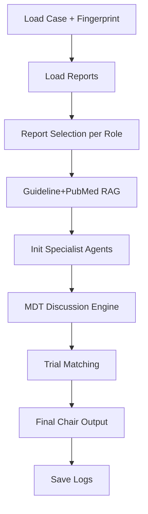

# MDT Discussion Log — 2026-01-19_08-39-39
Generated automatically by MDT Pipeline.


## CASE (structured JSON)

```
{"CASE_CORE":{"ADJUVANT_TREATMENT":{"cycles_or_courses":"6 cycles","given":"Yes","regimens":["白紫+卡铂"]},"BIOMARKERS":{"AFP":"<0.91 ng/ml (2022-10-12)","CA125":"933.00 U/ml (2022-12-29)","HER2":"Unknown","MSI":"Unknown","PDL1_CPS":"Unknown","TMB":"Unknown"},"BRCA1":"Unknown","BRCA2":"Unknown","CURRENT_STATUS":"Recurrent ovarian carcinoma with hepatic and pelvic metastatic disease","DIAGNOSIS":{"components":["高级别腺癌"],"histology":"首先考虑为透明细胞癌","laterality":"Unknown","primary":"卵巢癌复发","site":"卵巢"},"HRD":"Unknown","INITIAL_TREATMENT":"Yes","LINE_OF_THERAPY":[{"cycles":"6","end_date":"2022-08-17","intent":"Adjuvant","line":"1L","regimen":"白紫+卡铂","start_date":"Unknown"}],"MAINTENANCE":"Unknown","MAINTENANCE_DETAIL":{"end_date":"Unknown","given":"Unknown","regimens":[],"start_date":"Unknown"},"NEOADJUVANT":"Unknown","PFI_days":"56","PLATINUM_HISTORY":[{"PFI_days":"56","end_date":"2022-08-17","evidence":"CA125:89.60U/ml (2022-10-12)","evidence_type":"Biochemical","first_relapse_date":"2022-10-12","line":"1L","start_date":"Unknown","status":"Resistant"}],"PLATINUM_PFI_CURRENT":"56","PLATINUM_STATUS":"Resistant","PLATINUM_STATUS_CURRENT":"Resistant","RELAPSE":"Yes","RELAPSE_DATE":{"date":"2022-10-12","evidence":"CA125:89.60U/ml","type":"Biochemical"},"SCENE":"Platinum_resistant_relapse","STAGE":{"stage_basis":"Unknown","stage_system":"Unknown","stage_text":"Unknown"},"SURGERY_DONE":{"date":"2022-03-28","performed":"Yes","procedure":"Debulking surgery + partial rectosigmoid resection + partial vaginectomy + retroperitoneal lesion resection + complex adhesiolysis + left ureteral stent placement + bladder repair"},"TIMELINE":{"constraints":{"max_events":30,"min_events":3,"must_include":["first diagnostic imaging or pathology confirmation (if available)"],"ordering_rules":{"prioritize_last_event":true}},"events":[{"date":"2022-03-28","description":"Debulking surgery with multiple procedures (partial rectosigmoid resection, partial vaginectomy, retroperitoneal lesion resection, left ureteral stent, bladder repair)","event_type":"Surgery","key_result":"Tumor ~7*4*2.5cm; full-thickness intestinal wall high-grade adenocarcinoma; consider clear cell carcinoma","regimen_or_test":"Surgery"},{"date":"2022-08-17","description":"Postoperative chemotherapy completed: 白紫+卡铂, 6 cycles","event_type":"Chemo","key_result":"Last administration recorded 2022-08-17","regimen_or_test":"白紫+卡铂"},{"date":"2022-10-12","description":"Tumor markers rising after chemotherapy","event_type":"Lab","key_result":"CA19-9:77.20U/ml; CA125:89.60U/ml; AFP:<0.91ng/ml","regimen_or_test":"CA125, CA19-9, HE4, AFP"},{"date":"2022-10-24","description":"MRI: pelvic post-op, presacral mass increased; pelvic mesenteric enhancing nodules","event_type":"Imaging","key_result":"Consider recurrence with adjacent sacral involvement; pelvic mesenteric nodules suggest metastases","regimen_or_test":"MRI pelvis"},{"date":"2022-10-25","description":"CT: multiple hepatic nodules, some new, likely metastases","event_type":"Imaging","key_result":"Multiple liver lesions, consider metastases","regimen_or_test":"CT abdomen"},{"date":"2022-12-29","description":"Tumor markers markedly elevated","event_type":"Lab","key_result":"CA19-9:229.00U/ml; CA125:933.00U/ml; HE4:111.00pmol/L","regimen_or_test":"CA125, CA19-9, HE4, CA15-3"},{"date":"2022-12-30","description":"MRI and CT show progression: increased presacral mass, new right iliac bone lesion, more hepatic metastases","event_type":"Imaging","key_result":"Pelvic presacral mass increased; right iliac bone enhancing nodule; hepatic metastases increased","regimen_or_test":"MRI pelvis, CT abdomen"}]},"VISIT_DATE":"2023-01-03","first_relapse_date":"2022-10-12","last_platinum_end_date":"2022-08-17"},"LAB_TRENDS":{"labs":[{"analyte":"CA125","history":[{"date":"Unknown","flag":"Unknown","value":"45.7"},{"date":"2022-08-15","flag":"Unknown","value":"14.90"},{"date":"2022-10-12","flag":"↑","value":"89.60"},{"date":"2022-11-17","flag":"Unknown","value":"403"},{"date":"2022-12-29","flag":"↑","value":"933.00"}],"latest":{"date":"2022-12-29","flag":"↑","value":"933.00"},"reference_range":"Unknown","unit":"U/ml"},{"analyte":"CA19-9","history":[{"date":"Unknown","flag":"Unknown","value":"161"},{"date":"2022-08-15","flag":"Unknown","value":"7.16"},{"date":"2022-10-12","flag":"↑","value":"77.20"},{"date":"2022-12-29","flag":"↑","value":"229.00"}],"latest":{"date":"2022-12-29","flag":"↑","value":"229.00"},"reference_range":"Unknown","unit":"U/ml"},{"analyte":"HE4","history":[{"date":"Unknown","flag":"Unknown","value":"562"},{"date":"2022-08-15","flag":"↑","value":"87.90"},{"date":"2022-10-12","flag":"Unknown","value":"59.70"},{"date":"2022-12-29","flag":"↑","value":"111.00"}],"latest":{"date":"2022-12-29","flag":"↑","value":"111.00"},"reference_range":"Unknown","unit":"pmol/L"},{"analyte":"AFP","history":[{"date":"2022-10-12","flag":"Unknown","value":"<0.91"}],"latest":{"date":"2022-10-12","flag":"Unknown","value":"<0.91"},"reference_range":"Unknown","unit":"ng/ml"},{"analyte":"Hb","history":[{"date":"2022-11-10","flag":"Unknown","value":"97"},{"date":"2022-11-30","flag":"Unknown","value":"94"}],"latest":{"date":"2022-11-30","flag":"Unknown","value":"94"},"reference_range":"Unknown","unit":"g/L"}],"milestones":[{"date":"2022-03-28","description":"Primary debulking surgery","type":"Surgery"},{"date":"2022-08-17","description":"Completed 6 cycles of 白紫+卡铂","type":"ChemoEnd"},{"date":"2022-10-12","description":"Biochemical relapse with rising CA125","type":"Relapse"}]},"MED_ONC":{"current_regimen":{"cycle_info":"Unknown","last_admin_date":"Unknown","name":"Unknown"},"genetic_testing":{"germline":[],"somatic":[]},"monitoring_points":[],"planned_next_regimen":"Unknown","prior_systemic_therapies":["白紫+卡铂 (6 cycles)"]},"NUC_MED":{"studies":[]},"PATHOLOGY":{"specimens":[{"components":["高级别腺癌"],"date":"2022-03-28","diagnosis":"部分直乙结肠+左侧腹膜后肿瘤+部分阴道: 肠壁全层见高级别腺癌，结合T2022-04771首先考虑为透明细胞癌；可符合卵巢透明细胞癌累及。","grade":"Unknown","ihc":[{"marker":"MLH1","result":"(+)"},{"marker":"MSH6","result":"(+)"},{"marker":"MSH2","result":"(+)"},{"marker":"PMS2","result":"(+)"},{"marker":"ER","result":"(部分+)"},{"marker":"PR","result":"(少弱+)"},{"marker":"P53","result":"(+/-)"},{"marker":"WT1","result":"(-)"},{"marker":"Ki-67","result":"(60%+)"},{"marker":"HNF1B","result":"(+)"},{"marker":"NapsinA","result":"(灶+)"},{"marker":"P16","result":"(+)"},{"marker":"PAX8","result":"(+)"},{"marker":"SALL4","result":"(-)"},{"marker":"ZBTB16","result":"(-)"}],"involvement_sites":["intestinal wall full thickness","peritoneum (left retroperitoneal tumor)","vagina (partial)"],"laterality":"Unknown","molecular":[],"raw_text":"2022.03.28在全麻下行“瘤体减灭术+直肠乙状结肠部分切除术+阴道部分切除术+腹膜后病损切除术+复杂肠粘连松解术+左输尿管支架置管术+膀胱修补术。（部分直乙结肠+左侧腹膜后肿瘤+部分阴道）肠壁全层见高级别腺癌，结合T2022-04771首先考虑为透明细胞癌，正在加做免疫组化进一步明确。肿块大小约7*4*2.5cm。双侧切缘阴性，肠周淋巴结（4/15）见癌转移，伴癌结节1枚。（膀胱后壁肿瘤）纤维脂肪组织，局灶纤维组织增生、含铁血黄素沉积、泡沫样组织反应，未见癌累及。补充诊断1：【补充报告】（部分直乙结肠+左侧腹膜后肿瘤+部分阴道）可符合卵巢透明细胞癌累及。免疫组化（HI22-06789）瘤细胞：MLH1(ES05)（+），MSH6（+），MSH2（+），PMS2（+），ER（部分+），PR（少弱+），P53（+/-），WT1（-），Ki-67（60%+），HNF1B（+），NapsinA（灶+），P16（+），PAX8（+），SALL4（-），ZBTB16（-）","sample_type":"Surgical resection","site":"partial rectosigmoid + left retroperitoneal tumor + partial vagina","tumor_size":"7*4*2.5cm","uncertainty_or_missing":["Molecular/genetic testing not reported","Definitive origin laterality not specified"]}]},"RADIOLOGY":{"next_imaging_plan":{"modality":"Unknown","timing":"Unknown"},"studies":[{"anatomic_sites":["pelvis","sacrum"],"date":"2022-10-24","findings":["Pelvis post-op changes","presacral mass, consider recurrence with adjacent sacral involvement","multiple enhancing small mesenteric nodules in pelvis, suggest metastases"],"impression":"Recurrence with possible sacral involvement and pelvic mesenteric metastases","modality":"MRI","trend_vs_prior":"Worse"},{"anatomic_sites":["liver"],"date":"2022-10-25","findings":["Multiple hepatic nodules, some new compared to prior","hepatic cysts unchanged"],"impression":"Multiple liver lesions, consider metastases","modality":"CT","trend_vs_prior":"Worse"},{"anatomic_sites":["pelvis","right iliac bone","sacrum","rectum"],"date":"2022-12-30","findings":["Presacral mass increased in range with heterogeneous enhancement","new enhancing nodule in right iliac bone","multiple pelvic mesenteric enhancing nodules","rectal local bowel wall thickening with enhancement"],"impression":"Progressive pelvic recurrence with possible peritoneal and sacral involvement; new right iliac bone lesion","modality":"MRI","trend_vs_prior":"Worse"},{"anatomic_sites":["liver","spleen"],"date":"2022-12-30","findings":["Multiple hepatic metastatic nodules increased in number and size","patchy splenic shadow, possible splenic infarct"],"impression":"Progressive hepatic metastases; splenic abnormality noted, follow-up suggested","modality":"CT","trend_vs_prior":"Worse"}]},"TIMELINE":{"constraints":{"max_events":30,"min_events":3,"must_include":["first diagnostic imaging or pathology confirmation (if available)"],"ordering_rules":{"prioritize_last_event":true}},"events":[{"date":"2022-03-28","description":"Debulking surgery with multiple procedures (partial rectosigmoid resection, partial vaginectomy, retroperitoneal lesion resection, left ureteral stent, bladder repair)","event_type":"Surgery","key_result":"Tumor ~7*4*2.5cm; full-thickness intestinal wall high-grade adenocarcinoma; consider clear cell carcinoma","regimen_or_test":"Surgery"},{"date":"2022-08-17","description":"Postoperative chemotherapy completed: 白紫+卡铂, 6 cycles","event_type":"Chemo","key_result":"Last administration recorded 2022-08-17","regimen_or_test":"白紫+卡铂"},{"date":"2022-10-12","description":"Tumor markers rising after chemotherapy","event_type":"Lab","key_result":"CA19-9:77.20U/ml; CA125:89.60U/ml; AFP:<0.91ng/ml","regimen_or_test":"CA125, CA19-9, HE4, AFP"},{"date":"2022-10-24","description":"MRI: pelvic post-op, presacral mass increased; pelvic mesenteric enhancing nodules","event_type":"Imaging","key_result":"Consider recurrence with adjacent sacral involvement; pelvic mesenteric nodules suggest metastases","regimen_or_test":"MRI pelvis"},{"date":"2022-10-25","description":"CT: multiple hepatic nodules, some new, likely metastases","event_type":"Imaging","key_result":"Multiple liver lesions, consider metastases","regimen_or_test":"CT abdomen"},{"date":"2022-12-29","description":"Tumor markers markedly elevated","event_type":"Lab","key_result":"CA19-9:229.00U/ml; CA125:933.00U/ml; HE4:111.00pmol/L","regimen_or_test":"CA125, CA19-9, HE4, CA15-3"},{"date":"2022-12-30","description":"MRI and CT show progression: increased presacral mass, new right iliac bone lesion, more hepatic metastases","event_type":"Imaging","key_result":"Pelvic presacral mass increased; right iliac bone enhancing nodule; hepatic metastases increased","regimen_or_test":"MRI pelvis, CT abdomen"}]}}
```


## FINAL MDT OUTPUT

```
Final Assessment:
Clear cell ovarian carcinoma, platinum-refractory with multifocal progression (pelvis, liver, bone) and severe anemia; immediate priorities are stabilizing organ function, clarifying performance status, and completing biomarker work-up to choose between limited-intensity non‑platinum therapy and best supportive care. [@2022-12-29|MR; @2022-12-29|CT; @20230103|2023-01-03; @pubmed:33758607]

Core Treatment Strategy:
- Urgently correct anemia and repeat full labs (CBC/diff, coagulation, renal, full liver panel) to reassess treatment fitness. [@20230103|2023-01-03]
- Document ECOG, pain, neurologic, GI/urinary symptoms, and prior toxicity to decide systemic therapy versus best supportive care. [@guideline:nccn_ovariancancer_v3_2025__v00000000|14]
- Complete MSI, PD‑L1, TMB, updated tumor NGS including somatic ATM, then screen early for appropriate clinical trials. [@OH2203828|2022-04-18; @guideline:nccn_ovariancancer_v3_2025__v00000000|15]
- If PS and organs permit, plan individualized non‑platinum systemic approach with concurrent early palliative care; otherwise prioritize best supportive care. [@guideline:nccn_ovariancancer_v3_2025__v00000000|14]

Change Triggers:
- If ECOG ≥3 or organ dysfunction worsens, shift intent from systemic therapy consideration to symptom‑focused best supportive care only.
- If biomarkers or trials reveal actionable target/eligibility, pivot from empiric non‑platinum approach to biomarker‑driven/clinical‑trial strategy.
```


## PIPELINE FLOW (Mermaid)




## TRACE EVENTS (Structured)

```json
[
  {
    "ts": "2026-01-19T08:36:31.278474",
    "event": "pipeline_start",
    "payload": {
      "visit_time": "2023-01-03 08:53:29.260000",
      "meta_info": "340123197709263626"
    }
  },
  {
    "ts": "2026-01-19T08:36:31.278813",
    "event": "case_fingerprint",
    "payload": {
      "case_fingerprint": "efe856c0897d"
    }
  },
  {
    "ts": "2026-01-19T08:36:31.592684",
    "event": "reports_loaded",
    "payload": {
      "lab_n": 92,
      "img_n": 10,
      "path_n": 0,
      "mut_n": 1,
      "cutoff_dt": "2023-01-04 08:53:29"
    }
  },
  {
    "ts": "2026-01-19T08:36:40.150427",
    "event": "reports_selected",
    "payload": {
      "lab": {
        "chair": [
          "20221229|8300002|2022-12-29",
          "20221229|9703212|2022-12-29",
          "20230103|5600862|2023-01-03"
        ],
        "oncologist": [
          "20221229|8300002|2022-12-29",
          "20221229|9703212|2022-12-29",
          "20230103|5600862|2023-01-03"
        ],
        "radiologist": [],
        "pathologist": [],
        "nuclear": []
      },
      "imaging": {
        "chair": [
          "2022-12-29|MR|2022-12-29",
          "2022-12-29|CT|2022-12-29"
        ],
        "oncologist": [],
        "radiologist": [
          "2022-12-29|MR|2022-12-29",
          "2022-12-29|CT|2022-12-29"
        ],
        "pathologist": [],
        "nuclear": [
          "2022-12-29|MR|2022-12-29",
          "2022-12-29|CT|2022-12-29"
        ]
      },
      "pathology": {
        "chair": [],
        "oncologist": [],
        "radiologist": [],
        "pathologist": [],
        "nuclear": []
      },
      "mutation": {
        "chair": [
          "OH2203828|2022-04-18"
        ],
        "oncologist": [
          "OH2203828|2022-04-18"
        ],
        "radiologist": [],
        "pathologist": [
          "OH2203828|2022-04-18"
        ],
        "nuclear": []
      }
    }
  },
  {
    "ts": "2026-01-19T08:36:40.157675",
    "event": "rag_key_facts",
    "payload": {
      "facts": "DIAGNOSIS: primary=卵巢癌复发; histology=首先考虑为透明细胞癌; components=高级别腺癌\nPATHOLOGY: 部分直乙结肠+左侧腹膜后肿瘤+部分阴道: 肠壁全层见高级别腺癌，结合T2022-04771首先考虑为透明细胞癌；可符合卵巢透明细胞癌累及。\nPLATINUM: status=Resistant; pfi_days=56\nGENETICS: HRD=Unknown; BRCA1=Unknown; BRCA2=Unknown\nBIOMARKERS: CA125=933.00 U/ml (2022-12-29); AFP=<0.91 ng/ml (2022-10-12); TMB=Unknown; MSI=Unknown; PDL1_CPS=Unknown\nMUTATION_REPORT: id=OH2203828; date=2022-04-18; note=ATM NM_000051:exon8:c.A947G:p.Y316C（胚系）；HRD 阴性；BRCA1 胚系和体系未检出致病突变（视为阴性）；BRCA2 胚系和体系未检出致病突变（视为阴性）；TP53 胚系和体系未检出致病突变（视为阴性）；ARID1A 胚系和体系未检出致病突变（视为阴性）；PTEN 胚系和体系未检出致病突变（视为阴性）；PIK3CA 胚系和体系未检出致病突变（视为阴性）；PAL…"
    }
  },
  {
    "ts": "2026-01-19T08:37:13.539633",
    "event": "rag_query",
    "payload": {
      "query": "Metastatic ovarian clear cell carcinoma with prior platinum-based chemo ending <6 months (platinum-resistant); liver, pelvic/peritoneal, bone, rectal involvement; MMR-proficient (MLH1/MSH2/MSH6/PMS2+); ER/PR low-positive; need guidance on systemic options and local control; histology: clear cell carcinoma"
    }
  },
  {
    "ts": "2026-01-19T08:37:13.539657",
    "event": "rag_hits",
    "payload": {
      "source": "guideline",
      "topk": 5,
      "n": 5
    }
  },
  {
    "ts": "2026-01-19T08:37:13.539659",
    "event": "rag_hits",
    "payload": {
      "source": "pubmed",
      "topk": 5,
      "n": 5
    }
  },
  {
    "ts": "2026-01-19T08:37:13.539661",
    "event": "rag_hits_merged",
    "payload": {
      "n": 10
    }
  },
  {
    "ts": "2026-01-19T08:37:22.143523",
    "event": "mdt_discussion_start",
    "payload": {
      "num_rounds": 2,
      "num_turns": 2
    }
  },
  {
    "ts": "2026-01-19T08:37:22.143586",
    "event": "mdt_initial_opinion_role_start",
    "payload": {
      "role": "chair",
      "order": 1
    }
  },
  {
    "ts": "2026-01-19T08:37:25.097513",
    "event": "mdt_initial_opinion_role_end",
    "payload": {
      "role": "chair",
      "chars": 567
    }
  },
  {
    "ts": "2026-01-19T08:37:25.097636",
    "event": "mdt_initial_opinion_role_start",
    "payload": {
      "role": "oncologist",
      "order": 2
    }
  },
  {
    "ts": "2026-01-19T08:37:27.758507",
    "event": "mdt_initial_opinion_role_end",
    "payload": {
      "role": "oncologist",
      "chars": 551
    }
  },
  {
    "ts": "2026-01-19T08:37:27.758576",
    "event": "mdt_initial_opinion_role_start",
    "payload": {
      "role": "radiologist",
      "order": 3
    }
  },
  {
    "ts": "2026-01-19T08:37:29.999527",
    "event": "mdt_initial_opinion_role_end",
    "payload": {
      "role": "radiologist",
      "chars": 492
    }
  },
  {
    "ts": "2026-01-19T08:37:29.999646",
    "event": "mdt_initial_opinion_role_start",
    "payload": {
      "role": "pathologist",
      "order": 4
    }
  },
  {
    "ts": "2026-01-19T08:37:32.305176",
    "event": "mdt_initial_opinion_role_end",
    "payload": {
      "role": "pathologist",
      "chars": 526
    }
  },
  {
    "ts": "2026-01-19T08:37:32.305244",
    "event": "mdt_initial_opinion_role_start",
    "payload": {
      "role": "nuclear",
      "order": 5
    }
  },
  {
    "ts": "2026-01-19T08:37:34.667463",
    "event": "mdt_initial_opinion_role_end",
    "payload": {
      "role": "nuclear",
      "chars": 535
    }
  },
  {
    "ts": "2026-01-19T08:39:05.242394",
    "event": "mdt_discussion_end",
    "payload": {
      "merged_chars": 2531
    }
  },
  {
    "ts": "2026-01-19T08:39:05.244953",
    "event": "trial_matching_start",
    "payload": {
      "trials_json_path": "files/all_trials_filtered.json"
    }
  },
  {
    "ts": "2026-01-19T08:39:08.074233",
    "event": "trial_matching_end",
    "payload": {
      "recommended": false
    }
  },
  {
    "ts": "2026-01-19T08:39:08.074256",
    "event": "final_output_start",
    "payload": {}
  },
  {
    "ts": "2026-01-19T08:39:39.581949",
    "event": "final_output_end",
    "payload": {
      "final_output_chars": 1487
    }
  }
]
```


## INITIAL EXPERT OPINIONS


## chair

```
- Rapidly progressive, platinum‑resistant clear cell ovarian carcinoma with liver/bone metastases; prioritize non‑platinum systemic strategy and symptom‑directed palliation. [@guideline:nccn_ovariancancer_v3_2025__v00000000|14; @pubmed:33758607]

- Before firm regimen choice, urgently document ECOG status, pain/bleeding, GI/urinary function, and detailed organ function (full CBC, coagulation, renal).

- Arrange comprehensive biomarker review/confirmation (MMR/MSI, PD‑L1, TMB if available; clarify ATM variant significance) and discuss clinical‑trial eligibility.
```


## oncologist

```
- Early biochemical and radiologic recurrence ~2 months post-adjuvant suggests platinum-refractory clear cell ovarian carcinoma; consider non-platinum systemic strategy. [@pubmed:33758607]

- Significant anemia (HGB 74 g/L) and hepatic metastases require assessment of performance status and organ function before intensive combination therapy. [@20230103|2023-01-03; @20221229|2022-12-29]

- Missing: updated staging imaging report, ECOG status, detailed prior regimen toxicities, and confirmation of any prior/ongoing maintenance or local therapies.
```


## radiologist

```
- Progressive pelvic presacral mass with sacral and possible peritoneal involvement; new right iliac bone lesion, suspicious for metastasis. [@2022-12-29|MR]

- Hepatic metastases increased in number and size; stable hepatic cysts; new patchy splenic lesion concerning for infarct, needs follow‑up. [@2022-12-29|CT]

- Disease demonstrates multifocal progression (pelvis, liver, bone), indicating systemic metastatic pattern requiring multidisciplinary management planning. [@pubmed:37901720]
```


## pathologist

```
- Histology and IHC support ovarian clear cell carcinoma involving rectosigmoid, retroperitoneum, and vagina; grade not explicitly assigned.[@report_id|2022-03-28]

- MMR proteins intact (MLH1/MSH2/MSH6/PMS2 positive); MSI status by molecular testing still unknown/needs update.[@report_id|2022-03-28]

- Germline ATM p.Y316C reported with HRD negative; somatic panel otherwise non-actionable. Full tumor NGS (MSI/TMB, others) needs update.[@report_id:OH2203828|2022-04-18][@guideline:nccn_ovariancancer_v3_2025__v00000000|15]
```


## nuclear

```
- No PET-CT available; metabolic assessment of pelvic, hepatic, splenic, sacral, and iliac lesions is unknown/needs update.  

- Current staging and recurrence assessment rely on MR/CT showing progressive pelvic, hepatic, and bone metastases, but metabolic burden remains undefined [@2022-12-29|MR; @2022-12-29|CT].  

- PET-CT could better distinguish active recurrence versus post-treatment change and clarify systemic metastatic extent, potentially altering stage and prognosis [@guideline:nccn_ovariancancer_v3_2025__v00000000|14].
```


## MERGED SUMMARY (Assistant)

```
Key Knowledge:
- Rapidly progressive, platinum‑refractory clear cell ovarian carcinoma with multifocal metastases (pelvis/presacral with sacral involvement, pelvic nodules, liver, right iliac bone; possible peritoneal).
- Marked anemia and hepatic involvement; ECOG performance status and organ function are pivotal for any further systemic therapy versus best supportive care.
- Clear cell histology, MMR‑proficient, HRD‑negative; germline ATM p.Y316C VUS with unclear current actionability; full biomarker profile (MSI, PD‑L1, TMB, updated NGS) still pending.
- CT/MR confirm systemic progression; PET‑CT not done and unlikely to change staging, but may be useful for focal local therapy planning or trial eligibility.

Controversies:
- Choice and intensity of non‑platinum systemic therapy versus best supportive care in the context of frailty, anemia, and liver involvement.
- Whether PET‑CT adds meaningful value beyond CT/MR, outside of specific needs for focal radiotherapy/surgery planning or protocol‑driven trial entry.
- Clinical utility of the ATM variant in a MMR‑proficient, HRD‑negative clear cell tumor once updated NGS is available.

Missing Info:
- ECOG status, comprehensive symptom burden (pain, bleeding, neurologic symptoms), GI/urinary function, and detailed prior treatment tolerability.
- Updated full labs including corrected anemia status (post‑intervention), CBC/diff, coagulation, renal and full liver panel.
- Formal updated imaging reports with staging and risk assessment for sacral/iliac structural instability or neural compromise.
- Final MSI status, PD‑L1 expression, TMB, and updated tumor NGS including somatic ATM characterization.
- PET‑CT or targeted MRI/PET‑MR findings if performed for local therapy planning or neurologic concerns.

Working Plan:
- Urgently reassess ECOG, symptom burden, and repeat full labs; correct anemia to better define treatment fitness.
- Complete comprehensive biomarker work‑up (MSI, PD‑L1, TMB, updated NGS with ATM clarification) and screen for suitable clinical trials.
- Based on PS and organ function, decide between individualized non‑platinum systemic strategy and best supportive care, with early, integrated palliative/symptom‑directed management.
- Defer PET‑CT unless specifically needed for local radiotherapy/surgical planning or trial eligibility; use targeted MRI/PET‑MR if new neurologic or sacral canal compromise concerns arise.
- Arrange interval imaging follow‑up of sacrum/iliac bone to monitor for impending fracture or neural compromise.
```


## INTERACTION LOG (Round × Turn)

### Round 1

#### Turn 1
- **chair → oncologist:** Please urgently reassess ECOG, symptoms, and repeat full labs including iron studies/transfusion threshold, as Hb 74 g/L may limit systemic options and requires immediate management. Also clarify if any prior maintenance or non-platinum therapy was given post-1L to avoid inadvertent retreatment.
- **chair → radiologist:** Given already evident multifocal progression on CT/MR, please advise whether PET-CT would realistically alter systemic versus purely palliative strategy, or can be deferred. Also confirm any suggestion of spinal canal/sacral neural compromise that would change urgency of local intervention.
- **oncologist → chair:** Before committing to non‑platinum systemic therapy, we need ECOG, full labs, and detailed prior toxicity to judge feasibility versus best supportive care only.
- **oncologist → pathologist:** Please confirm MSI/MMR, PD‑L1 and, if possible, expand NGS to clarify the ATM variant and identify any actionable alterations for systemic options or trials.
- **radiologist → oncologist:** Most recent CT/MR already document clear systemic progression (pelvis, liver, bone); additional PET‑CT is unlikely to change staging but may help if you’re considering focal local therapy or trial eligibility requiring metabolic documentation.
- **pathologist → chair:** From a pathology standpoint, current histology/IHC/molecular data are internally consistent; key missing elements are MSI, PD-L1, TMB, and updated NGS results to complete the biomarker profile for future decision-making.
- **pathologist → oncologist:** Pathology confirms clear cell ovarian carcinoma with intact MMR and HRD-negative status; MSI, PD-L1, TMB, and updated tumor NGS (including somatic ATM characterization) remain outstanding and could refine biomarker-directed options.

#### Turn 2

### Round 2

#### Turn 1

#### Turn 2


## FINAL REFINED PLANS (per Round)

### Round 1


## chair

```
- First, urgently reassess ECOG, symptom burden, and repeat full labs (CBC, coagulation, renal, liver) to define treatment fitness. [@20230103|2023-01-03]

- Proceed with comprehensive biomarker work‑up (MSI, PD‑L1, TMB, updated NGS including ATM clarification) to refine non‑platinum/clinical‑trial options. [@guideline:nccn_ovariancancer_v3_2025__v00000000|15; @OH2203828|2022-04-18]

- Plan non‑platinum systemic strategy versus best supportive care based on PS/organ function, integrating early palliative care; reserve PET‑CT for trial/local‑therapy decisions. [@guideline:nccn_ovariancancer_v3_2025__v00000000|14; @2022-12-29|CT; @2022-12-29|MR]
```


## oncologist

```
- Urgently correct anemia (HGB 74 g/L) and repeat full labs, documenting ECOG and symptom burden to define fitness. [@20230103|2023-01-03]  

- Once status clarified, select individualized non‑platinum systemic versus best supportive approach, considering clear cell, platinum‑refractory recurrence. [@guideline:nccn_ovariancancer_v3_2025__v00000000|14; @pubmed:33758607]  

- Complete biomarker profile (MSI, PD‑L1, TMB, updated NGS/ATM) and reserve PET‑CT for potential local therapy or trial eligibility.
```


## radiologist

```
- Imaging shows progressive multifocal metastases (presacral with sacral involvement, pelvic nodules, liver, right iliac bone); no spinal canal compromise documented. [@2022-12-29|MR; @2022-12-29|CT]

- Given clear anatomic progression on CT/MR, PET‑CT may be deferred unless needed for focal local therapy or trial eligibility. [@guideline:nccn_ovariancancer_v3_2025__v00000000|14]

- Recommend interval imaging follow‑up focusing on sacrum/iliac bone for impending fracture or neural compromise risk assessment. [@2022-12-29|MR]
```


## pathologist

```
- Confirm ECOG, full labs, and symptom burden to judge feasibility of further systemic therapy versus purely supportive care.[@guideline:nccn_ovariancancer_v3_2025__v00000000|14]

- Complete biomarker panel: MSI (to confirm MMR proficiency), PD‑L1, TMB, and updated tumor NGS including somatic ATM status.[@report_id|2022-03-28][@report_id:OH2203828|2022-04-18]

- Consider PET‑CT only if results would influence focal local therapy or trial eligibility, not for basic staging clarification.[@guideline:nccn_ovariancancer_v3_2025__v00000000|15]
```


## nuclear

```
- Current MR/CT already confirm multifocal progression (pelvis/presacral, liver, bone); PET-CT not yet performed so metabolic extent remains unknown/needs update [@2022-12-29|MR; @2022-12-29|CT].  

- PET-CT is unlikely to change overall staging but may assist if considering focal radiotherapy/surgery or trial eligibility requiring metabolic documentation [@guideline:nccn_ovariancancer_v3_2025__v00000000|14].  

- If new neurologic symptoms or concern for sacral canal compromise arise, targeted MRI or PET-MR rather than whole-body PET-CT should be prioritized [@2022-12-29|MR].
```


## RAW AGENT LOGS

### chair
- **User:** Give INITIAL opinion (use ONLY your system-provided patient facts).
Return up to 3 bullets, each ≤20 words.
If key data missing, say exactly what needs updating.
At least ONE bullet must be evidence-based and include [@guideline:doc_id|page] or [@pubmed:PMID].
If you reference treatment strategy categories, guidelines, trials, or literature evidence, include tags [@guideline:doc_id|page] or [@pubmed:PMID].
  
  **Assistant:** - Rapidly progressive, platinum‑resistant clear cell ovarian carcinoma with liver/bone metastases; prioritize non‑platinum systemic strategy and symptom‑directed palliation. [@guideline:nccn_ovariancancer_v3_2025__v00000000|14; @pubmed:33758607]

- Before firm regimen choice, urgently document ECOG status, pain/bleeding, GI/urinary function, and detailed organ function (full CBC, coagulation, renal).

- Arrange comprehensive biomarker review/confirmation (MMR/MSI, PD‑L1, TMB if available; clarify ATM variant significance) and discuss clinical‑trial eligibility.
  
  *(2026-01-19T08:37:25.097440)*

- **User:** ROLE: chair. VISIT: 2023-01-03 08:53:29.260000
Default is NOT to speak. Speak ONLY if: conflict | safety | missing-critical | new-critical.

CONTEXT (latest):
[MDT_GLOBAL_KNOWLEDGE]
Key Knowledge:
- Rapidly progressive, platinum‑refractory clear cell ovarian carcinoma with multifocal metastases (pelvis/presacral, liver, bone; possible peritoneal).
- Marked anemia and hepatic involvement; performance status and organ function will determine feasibility of further systemic therapy.
- Clear cell histology, MMR‑proficient, HRD‑negative; germline ATM p.Y316C VUS without current clear actionability.
- CT/MR confirm systemic progression; PET‑CT not yet done, so metabolic extent remains uncertain.

Controversies:
- Choice and intensity of non‑platinum systemic therapy in a frail, rapidly progressing setting.
- Added value of PET‑CT given already clear radiologic progression versus moving directly to systemic/palliative strategies.
- Practical relevance of the ATM variant in an HRD‑negative, MMR‑proficient tumor.

Missing Info:
- ECOG status, detailed symptom burden (pain, bleeding), GI/urinary function, and prior treatment tolerability.
- Current full labs (CBC/diff, coagulation, renal and detailed liver tests).
- Updated imaging reports with formal staging and any history of maintenance or local therapies.
- Final MSI status, PD‑L1, TMB, and updated tumor NGS.
- PET‑CT findings if performed.

Working Plan:
- Promptly document ECOG, symptoms, and comprehensive labs to define treatment fitness.
- Complete biomarker work‑up (MSI/MMR confirmation, PD‑L1, TMB, NGS including ATM clarification) and assess trial options.
- Plan a non‑platinum systemic approach matched to organ function and PS, with early integrated palliative/symptom‑focused care.
- Decide on PET‑CT only if results are likely to change systemic or local management.

Allowed targets: [oncologist,radiologist,pathologist,nuclear]
Return ONE-LINE JSON only:{"speak":"yes/no","messages":[{"target":"<role>","message":"<1-2 sentences>","why":"conflict|safety|missing|new"}]}
  
  **Assistant:** {"speak":"yes","messages":[{"target":"oncologist","message":"Please urgently reassess ECOG, symptoms, and repeat full labs including iron studies/transfusion threshold, as Hb 74 g/L may limit systemic options and requires immediate management. Also clarify if any prior maintenance or non-platinum therapy was given post-1L to avoid inadvertent retreatment.","why":"safety"},{"target":"radiologist","message":"Given already evident multifocal progression on CT/MR, please advise whether PET-CT would realistically alter systemic versus purely palliative strategy, or can be deferred. Also confirm any suggestion of spinal canal/sacral neural compromise that would change urgency of local intervention.","why":"missing"}]}
  
  *(2026-01-19T08:37:46.907795)*

- **User:** ROLE: chair. VISIT: 2023-01-03 08:53:29.260000
Default is NOT to speak. Speak ONLY if: conflict | safety | missing-critical | new-critical.

CONTEXT (latest):
[MDT_GLOBAL_KNOWLEDGE]
Key Knowledge:
- Rapidly progressive, platinum‑refractory clear cell ovarian carcinoma with multifocal metastases (pelvis/presacral, liver, bone; possible peritoneal).
- Marked anemia and hepatic involvement; performance status and organ function will determine feasibility of further systemic therapy.
- Clear cell histology, MMR‑proficient, HRD‑negative; germline ATM p.Y316C VUS without current clear actionability.
- CT/MR confirm systemic progression; PET‑CT not yet done, so metabolic extent remains uncertain.

Controversies:
- Choice and intensity of non‑platinum systemic therapy in a frail, rapidly progressing setting.
- Added value of PET‑CT given already clear radiologic progression versus moving directly to systemic/palliative strategies.
- Practical relevance of the ATM variant in an HRD‑negative, MMR‑proficient tumor.

Missing Info:
- ECOG status, detailed symptom burden (pain, bleeding), GI/urinary function, and prior treatment tolerability.
- Current full labs (CBC/diff, coagulation, renal and detailed liver tests).
- Updated imaging reports with formal staging and any history of maintenance or local therapies.
- Final MSI status, PD‑L1, TMB, and updated tumor NGS.
- PET‑CT findings if performed.

Working Plan:
- Promptly document ECOG, symptoms, and comprehensive labs to define treatment fitness.
- Complete biomarker work‑up (MSI/MMR confirmation, PD‑L1, TMB, NGS including ATM clarification) and assess trial options.
- Plan a non‑platinum systemic approach matched to organ function and PS, with early integrated palliative/symptom‑focused care.
- Decide on PET‑CT only if results are likely to change systemic or local management.

[RECENT_DELTAS]
[R1T1 DELTA]  to clarify the ATM variant and identify any actionable alterations for systemic options or trials. | radiologist->oncologist(missing): Most recent CT/MR already document clear systemic progression (pelvis, liver, bone); additional PET‑CT is unlikely to change staging but may help if you’re considering focal local therapy or trial eligibility requiring metabolic documentation. | pathologist->oncologist(missing): Pathology confirms clear cell ovarian carcinoma with intact MMR and HRD-negative status; MSI, PD-L1, TMB, and updated tumor NGS (including somatic ATM characterization) remain outstanding and could refine biomarker-directed options. | pathologist->chair(missing): From a pathology standpoint, current histology/IHC/molecular data are internally consistent; key missing elements are MSI, PD-L1, TMB, and updated NGS results to complete the biomarker profile for future decision-making.

Allowed targets: [oncologist,radiologist,pathologist,nuclear]
Return ONE-LINE JSON only:{"speak":"yes/no","messages":[{"target":"<role>","message":"<1-2 sentences>","why":"conflict|safety|missing|new"}]}
  
  **Assistant:** {"speak":"no","messages":[]}
  
  *(2026-01-19T08:37:56.256007)*

- **User:** Given MDT context:
[MDT_GLOBAL_KNOWLEDGE]
Key Knowledge:
- Rapidly progressive, platinum‑refractory clear cell ovarian carcinoma with multifocal metastases (pelvis/presacral, liver, bone; possible peritoneal).
- Marked anemia and hepatic involvement; performance status and organ function will determine feasibility of further systemic therapy.
- Clear cell histology, MMR‑proficient, HRD‑negative; germline ATM p.Y316C VUS without current clear actionability.
- CT/MR confirm systemic progression; PET‑CT not yet done, so metabolic extent remains uncertain.

Controversies:
- Choice and intensity of non‑platinum systemic therapy in a frail, rapidly progressing setting.
- Added value of PET‑CT given already clear radiologic progression versus moving directly to systemic/palliative strategies.
- Practical relevance of the ATM variant in an HRD‑negative, MMR‑proficient tumor.

Missing Info:
- ECOG status, detailed symptom burden (pain, bleeding), GI/urinary function, and prior treatment tolerability.
- Current full labs (CBC/diff, coagulation, renal and detailed liver tests).
- Updated imaging reports with formal staging and any history of maintenance or local therapies.
- Final MSI status, PD‑L1, TMB, and updated tumor NGS.
- PET‑CT findings if performed.

Working Plan:
- Promptly document ECOG, symptoms, and comprehensive labs to define treatment fitness.
- Complete biomarker work‑up (MSI/MMR confirmation, PD‑L1, TMB, NGS including ATM clarification) and assess trial options.
- Plan a non‑platinum systemic approach matched to organ function and PS, with early integrated palliative/symptom‑focused care.
- Decide on PET‑CT only if results are likely to change systemic or local management.

[RECENT_DELTAS]
[R1T1 DELTA]  to clarify the ATM variant and identify any actionable alterations for systemic options or trials. | radiologist->oncologist(missing): Most recent CT/MR already document clear systemic progression (pelvis, liver, bone); additional PET‑CT is unlikely to change staging but may help if you’re considering focal local therapy or trial eligibility requiring metabolic documentation. | pathologist->oncologist(missing): Pathology confirms clear cell ovarian carcinoma with intact MMR and HRD-negative status; MSI, PD-L1, TMB, and updated tumor NGS (including somatic ATM characterization) remain outstanding and could refine biomarker-directed options. | pathologist->chair(missing): From a pathology standpoint, current histology/IHC/molecular data are internally consistent; key missing elements are MSI, PD-L1, TMB, and updated NGS results to complete the biomarker profile for future decision-making.

DISCUSSION HISTORY (this round):
Turn 1: chair→oncologist: Please urgently reassess ECOG, symptoms, and repeat full labs including iron studies/transfusion threshold, as Hb 74 g/L may limit systemic options and requires immediate management. Also clarify if any prior maintenance or non-platinum therapy was given post-1L to avoid inadvertent retreatment. | chair→radiologist: Given already evident multifocal progression on CT/MR, please advise whether PET-CT would realistically alter systemic versus purely palliative strategy, or can be deferred. Also confirm any suggestion of spinal canal/sacral neural compromise that would change urgency of local intervention. | oncologist→chair: Before committing to non‑platinum systemic therapy, we need ECOG, full labs, and detailed prior toxicity to judge feasibility versus best supportive care only.

Provide FINAL refined plan based on the above context and discussions.
Up to 3 bullets, each ≤20 words.
Any factual claim must include [@report_id|date] or say unknown.
At least ONE bullet must be evidence-based and include [@guideline:doc_id|page] or [@pubmed:PMID].
If you reference treatment strategy categories, guidelines, trials, or literature evidence, include tags [@guideline:doc_id|page] or [@pubmed:PMID].
If discussions mentioned specific evidence, you may reference it with appropriate tags.
  
  **Assistant:** - First, urgently reassess ECOG, symptom burden, and repeat full labs (CBC, coagulation, renal, liver) to define treatment fitness. [@20230103|2023-01-03]

- Proceed with comprehensive biomarker work‑up (MSI, PD‑L1, TMB, updated NGS including ATM clarification) to refine non‑platinum/clinical‑trial options. [@guideline:nccn_ovariancancer_v3_2025__v00000000|15; @OH2203828|2022-04-18]

- Plan non‑platinum systemic strategy versus best supportive care based on PS/organ function, integrating early palliative care; reserve PET‑CT for trial/local‑therapy decisions. [@guideline:nccn_ovariancancer_v3_2025__v00000000|14; @2022-12-29|CT; @2022-12-29|MR]
  
  *(2026-01-19T08:38:45.405757)*

- **User:** 
As the MDT chair for gynecologic oncology, you are seeing the patient at OUTPATIENT TIME: 2023-01-03 08:53:29.260000.
Based on PATIENT FACTS + MDT discussion + FINAL refined plans from all experts, determine the CURRENT best management plan for this visit.

# MDT DISCUSSION SUMMARY
Key Knowledge:
- Rapidly progressive, platinum‑refractory clear cell ovarian carcinoma with multifocal metastases (pelvis/presacral with sacral involvement, pelvic nodules, liver, right iliac bone; possible peritoneal).
- Marked anemia and hepatic involvement; ECOG performance status and organ function are pivotal for any further systemic therapy versus best supportive care.
- Clear cell histology, MMR‑proficient, HRD‑negative; germline ATM p.Y316C VUS with unclear current actionability; full biomarker profile (MSI, PD‑L1, TMB, updated NGS) still pending.
- CT/MR confirm systemic progression; PET‑CT not done and unlikely to change staging, but may be useful for focal local therapy planning or trial eligibility.

Controversies:
- Choice and intensity of non‑platinum systemic therapy versus best supportive care in the context of frailty, anemia, and liver involvement.
- Whether PET‑CT adds meaningful value beyond CT/MR, outside of specific needs for focal radiotherapy/surgery planning or protocol‑driven trial entry.
- Clinical utility of the ATM variant in a MMR‑proficient, HRD‑negative clear cell tumor once updated NGS is available.

Missing Info:
- ECOG status, comprehensive symptom burden (pain, bleeding, neurologic symptoms), GI/urinary function, and detailed prior treatment tolerability.
- Updated full labs including corrected anemia status (post‑intervention), CBC/diff, coagulation, renal and full liver panel.
- Formal updated imaging reports with staging and risk assessment for sacral/iliac structural instability or neural compromise.
- Final MSI status, PD‑L1 expression, TMB, and updated tumor NGS including somatic ATM characterization.
- PET‑CT or targeted MRI/PET‑MR findings if performed for local therapy planning or neurologic concerns.

Working Plan:
- Urgently reassess ECOG, symptom burden, and repeat full labs; correct anemia to better define treatment fitness.
- Complete comprehensive biomarker work‑up (MSI, PD‑L1, TMB, updated NGS with ATM clarification) and screen for suitable clinical trials.
- Based on PS and organ function, decide between individualized non‑platinum systemic strategy and best supportive care, with early, integrated palliative/symptom‑directed management.
- Defer PET‑CT unless specifically needed for local radiotherapy/surgical planning or trial eligibility; use targeted MRI/PET‑MR if new neurologic or sacral canal compromise concerns arise.
- Arrange interval imaging follow‑up of sacrum/iliac bone to monitor for impending fracture or neural compromise.

# INITIAL EXPERT OPINIONS
- chair: - Rapidly progressive, platinum‑resistant clear cell ovarian carcinoma with liver/bone metastases; prioritize non‑platinum systemic strategy and symptom‑directed palliation. [@guideline:nccn_ovarianca
- oncologist: - Early biochemical and radiologic recurrence ~2 months post-adjuvant suggests platinum-refractory clear cell ovarian carcinoma; consider non-platinum systemic strategy. [@pubmed:33758607]

- Signific
- radiologist: - Progressive pelvic presacral mass with sacral and possible peritoneal involvement; new right iliac bone lesion, suspicious for metastasis. [@2022-12-29|MR]

- Hepatic metastases increased in number 
- pathologist: - Histology and IHC support ovarian clear cell carcinoma involving rectosigmoid, retroperitoneum, and vagina; grade not explicitly assigned.[@report_id|2022-03-28]

- MMR proteins intact (MLH1/MSH2/MS
- nuclear: - No PET-CT available; metabolic assessment of pelvic, hepatic, splenic, sacral, and iliac lesions is unknown/needs update.  

- Current staging and recurrence assessment rely on MR/CT showing progres

# DISCUSSION INTERACTIONS
Round 1: R1T1: chair→oncologist: Please urgently reassess ECOG, symptoms, and repeat full labs including iron studies/transfusion thr | R1T1: chair→radiologist: Given already evident multifocal progression on CT/MR, please advise whether PET-CT would realistica | R1T1: oncologist→chair: Before committing to non‑platinum systemic therapy, we need ECOG, full labs, and detailed prior toxi | R1T1: oncologist→pathologist: Please confirm MSI/MMR, PD‑L1 and, if possible, expand NGS to clarify the ATM variant and identify a | R1T1: radiologist→oncologist: Most recent CT/MR already document clear systemic progression (pelvis, liver, bone); additional PET‑


# FINAL REFINED PLANS (All experts, all rounds)
{
  "Round 1": {
    "chair": "- First, urgently reassess ECOG, symptom burden, and repeat full labs (CBC, coagulation, renal, liver) to define treatment fitness. [@20230103|2023-01-03]\n\n- Proceed with comprehensive biomarker work‑up (MSI, PD‑L1, TMB, updated NGS including ATM clarification) to refine non‑platinum/clinical‑trial options. [@guideline:nccn_ovariancancer_v3_2025__v00000000|15; @OH2203828|2022-04-18]\n\n- Plan non‑platinum systemic strategy versus best supportive care based on PS/organ function, integrating early palliative care; reserve PET‑CT for trial/local‑therapy decisions. [@guideline:nccn_ovariancancer_v3_2025__v00000000|14; @2022-12-29|CT; @2022-12-29|MR]",
    "oncologist": "- Urgently correct anemia (HGB 74 g/L) and repeat full labs, documenting ECOG and symptom burden to define fitness. [@20230103|2023-01-03]  \n\n- Once status clarified, select individualized non‑platinum systemic versus best supportive approach, considering clear cell, platinum‑refractory recurrence. [@guideline:nccn_ovariancancer_v3_2025__v00000000|14; @pubmed:33758607]  \n\n- Complete biomarker profile (MSI, PD‑L1, TMB, updated NGS/ATM) and reserve PET‑CT for potential local therapy or trial eligibility.",
    "radiologist": "- Imaging shows progressive multifocal metastases (presacral with sacral involvement, pelvic nodules, liver, right iliac bone); no spinal canal compromise documented. [@2022-12-29|MR; @2022-12-29|CT]\n\n- Given clear anatomic progression on CT/MR, PET‑CT may be deferred unless needed for focal local therapy or trial eligibility. [@guideline:nccn_ovariancancer_v3_2025__v00000000|14]\n\n- Recommend interval imaging follow‑up focusing on sacrum/iliac bone for impending fracture or neural compromise risk assessment. [@2022-12-29|MR]",
    "pathologist": "- Confirm ECOG, full labs, and symptom burden to judge feasibility of further systemic therapy versus purely supportive care.[@guideline:nccn_ovariancancer_v3_2025__v00000000|14]\n\n- Complete biomarker panel: MSI (to confirm MMR proficiency), PD‑L1, TMB, and updated tumor NGS including somatic ATM status.[@report_id|2022-03-28][@report_id:OH2203828|2022-04-18]\n\n- Consider PET‑CT only if results would influence focal local therapy or trial eligibility, not for basic staging clarification.[@guideline:nccn_ovariancancer_v3_2025__v00000000|15]",
    "nuclear": "- Current MR/CT already confirm multifocal progression (pelvis/presacral, liver, bone); PET-CT not yet performed so metabolic extent remains unknown/needs update [@2022-12-29|MR; @2022-12-29|CT].  \n\n- PET-CT is unlikely to change overall staging but may assist if considering focal radiotherapy/surgery or trial eligibility requiring metabolic documentation [@guideline:nccn_ovariancancer_v3_2025__v00000000|14].  \n\n- If new neurologic symptoms or concern for sacral canal compromise arise, targeted MRI or PET-MR rather than whole-body PET-CT should be prioritized [@2022-12-29|MR]."
  }
}

STRICT RULES:
- Any factual statement about past tests/treatments must include [@report_id|date] or say unknown.
- Any statement derived from guideline or PubMed literature must include [@guideline:doc_id|page] or [@pubmed:PMID].
- If you cite guideline/PubMed evidence in Core Treatment Strategy or Change Triggers, include at least one tag in that bullet.
- If experts disagree, pick the safest plan and state the key uncertainty.
- You MUST consider the MDT discussion summary and interactions above when making your decision.

# Response Format
Final Assessment:
<1–3 sentences: summarize histology/biology, current disease status, and key uncertainties>

Core Treatment Strategy:
- < ≤20 words concrete decision >
- < ≤20 words concrete decision >
- < ≤20 words concrete decision >
- < ≤20 words concrete decision >

Change Triggers:
- < ≤20 words "if X, then adjust management from A to B" >
- < ≤20 words "if X, then adjust management from A to B" >

  
  **Assistant:** Final Assessment:
Clear cell ovarian carcinoma, platinum-refractory with multifocal progression (pelvis, liver, bone) and severe anemia; immediate priorities are stabilizing organ function, clarifying performance status, and completing biomarker work-up to choose between limited-intensity non‑platinum therapy and best supportive care. [@2022-12-29|MR; @2022-12-29|CT; @20230103|2023-01-03; @pubmed:33758607]

Core Treatment Strategy:
- Urgently correct anemia and repeat full labs (CBC/diff, coagulation, renal, full liver panel) to reassess treatment fitness. [@20230103|2023-01-03]
- Document ECOG, pain, neurologic, GI/urinary symptoms, and prior toxicity to decide systemic therapy versus best supportive care. [@guideline:nccn_ovariancancer_v3_2025__v00000000|14]
- Complete MSI, PD‑L1, TMB, updated tumor NGS including somatic ATM, then screen early for appropriate clinical trials. [@OH2203828|2022-04-18; @guideline:nccn_ovariancancer_v3_2025__v00000000|15]
- If PS and organs permit, plan individualized non‑platinum systemic approach with concurrent early palliative care; otherwise prioritize best supportive care. [@guideline:nccn_ovariancancer_v3_2025__v00000000|14]

Change Triggers:
- If ECOG ≥3 or organ dysfunction worsens, shift intent from systemic therapy consideration to symptom‑focused best supportive care only.
- If biomarkers or trials reveal actionable target/eligibility, pivot from empiric non‑platinum approach to biomarker‑driven/clinical‑trial strategy.
  
  *(2026-01-19T08:39:39.581773)*


### oncologist
- **User:** Give INITIAL opinion (use ONLY your system-provided patient facts).
Return up to 3 bullets, each ≤20 words.
If key data missing, say exactly what needs updating.
At least ONE bullet must be evidence-based and include [@guideline:doc_id|page] or [@pubmed:PMID].
If you reference treatment strategy categories, guidelines, trials, or literature evidence, include tags [@guideline:doc_id|page] or [@pubmed:PMID].
  
  **Assistant:** - Early biochemical and radiologic recurrence ~2 months post-adjuvant suggests platinum-refractory clear cell ovarian carcinoma; consider non-platinum systemic strategy. [@pubmed:33758607]

- Significant anemia (HGB 74 g/L) and hepatic metastases require assessment of performance status and organ function before intensive combination therapy. [@20230103|2023-01-03; @20221229|2022-12-29]

- Missing: updated staging imaging report, ECOG status, detailed prior regimen toxicities, and confirmation of any prior/ongoing maintenance or local therapies.
  
  *(2026-01-19T08:37:27.758478)*

- **User:** ROLE: oncologist. VISIT: 2023-01-03 08:53:29.260000
Default is NOT to speak. Speak ONLY if: conflict | safety | missing-critical | new-critical.

CONTEXT (latest):
[MDT_GLOBAL_KNOWLEDGE]
Key Knowledge:
- Rapidly progressive, platinum‑refractory clear cell ovarian carcinoma with multifocal metastases (pelvis/presacral, liver, bone; possible peritoneal).
- Marked anemia and hepatic involvement; performance status and organ function will determine feasibility of further systemic therapy.
- Clear cell histology, MMR‑proficient, HRD‑negative; germline ATM p.Y316C VUS without current clear actionability.
- CT/MR confirm systemic progression; PET‑CT not yet done, so metabolic extent remains uncertain.

Controversies:
- Choice and intensity of non‑platinum systemic therapy in a frail, rapidly progressing setting.
- Added value of PET‑CT given already clear radiologic progression versus moving directly to systemic/palliative strategies.
- Practical relevance of the ATM variant in an HRD‑negative, MMR‑proficient tumor.

Missing Info:
- ECOG status, detailed symptom burden (pain, bleeding), GI/urinary function, and prior treatment tolerability.
- Current full labs (CBC/diff, coagulation, renal and detailed liver tests).
- Updated imaging reports with formal staging and any history of maintenance or local therapies.
- Final MSI status, PD‑L1, TMB, and updated tumor NGS.
- PET‑CT findings if performed.

Working Plan:
- Promptly document ECOG, symptoms, and comprehensive labs to define treatment fitness.
- Complete biomarker work‑up (MSI/MMR confirmation, PD‑L1, TMB, NGS including ATM clarification) and assess trial options.
- Plan a non‑platinum systemic approach matched to organ function and PS, with early integrated palliative/symptom‑focused care.
- Decide on PET‑CT only if results are likely to change systemic or local management.

Allowed targets: [chair,radiologist,pathologist,nuclear]
Return ONE-LINE JSON only:{"speak":"yes/no","messages":[{"target":"<role>","message":"<1-2 sentences>","why":"conflict|safety|missing|new"}]}
  
  **Assistant:** {"speak":"yes","messages":[{"target":"chair","message":"Before committing to non‑platinum systemic therapy, we need ECOG, full labs, and detailed prior toxicity to judge feasibility versus best supportive care only.","why":"missing"},{"target":"pathologist","message":"Please confirm MSI/MMR, PD‑L1 and, if possible, expand NGS to clarify the ATM variant and identify any actionable alterations for systemic options or trials.","why":"missing"}]}
  
  *(2026-01-19T08:37:48.916865)*

- **User:** ROLE: oncologist. VISIT: 2023-01-03 08:53:29.260000
Default is NOT to speak. Speak ONLY if: conflict | safety | missing-critical | new-critical.

CONTEXT (latest):
[MDT_GLOBAL_KNOWLEDGE]
Key Knowledge:
- Rapidly progressive, platinum‑refractory clear cell ovarian carcinoma with multifocal metastases (pelvis/presacral, liver, bone; possible peritoneal).
- Marked anemia and hepatic involvement; performance status and organ function will determine feasibility of further systemic therapy.
- Clear cell histology, MMR‑proficient, HRD‑negative; germline ATM p.Y316C VUS without current clear actionability.
- CT/MR confirm systemic progression; PET‑CT not yet done, so metabolic extent remains uncertain.

Controversies:
- Choice and intensity of non‑platinum systemic therapy in a frail, rapidly progressing setting.
- Added value of PET‑CT given already clear radiologic progression versus moving directly to systemic/palliative strategies.
- Practical relevance of the ATM variant in an HRD‑negative, MMR‑proficient tumor.

Missing Info:
- ECOG status, detailed symptom burden (pain, bleeding), GI/urinary function, and prior treatment tolerability.
- Current full labs (CBC/diff, coagulation, renal and detailed liver tests).
- Updated imaging reports with formal staging and any history of maintenance or local therapies.
- Final MSI status, PD‑L1, TMB, and updated tumor NGS.
- PET‑CT findings if performed.

Working Plan:
- Promptly document ECOG, symptoms, and comprehensive labs to define treatment fitness.
- Complete biomarker work‑up (MSI/MMR confirmation, PD‑L1, TMB, NGS including ATM clarification) and assess trial options.
- Plan a non‑platinum systemic approach matched to organ function and PS, with early integrated palliative/symptom‑focused care.
- Decide on PET‑CT only if results are likely to change systemic or local management.

[RECENT_DELTAS]
[R1T1 DELTA]  to clarify the ATM variant and identify any actionable alterations for systemic options or trials. | radiologist->oncologist(missing): Most recent CT/MR already document clear systemic progression (pelvis, liver, bone); additional PET‑CT is unlikely to change staging but may help if you’re considering focal local therapy or trial eligibility requiring metabolic documentation. | pathologist->oncologist(missing): Pathology confirms clear cell ovarian carcinoma with intact MMR and HRD-negative status; MSI, PD-L1, TMB, and updated tumor NGS (including somatic ATM characterization) remain outstanding and could refine biomarker-directed options. | pathologist->chair(missing): From a pathology standpoint, current histology/IHC/molecular data are internally consistent; key missing elements are MSI, PD-L1, TMB, and updated NGS results to complete the biomarker profile for future decision-making.

Allowed targets: [chair,radiologist,pathologist,nuclear]
Return ONE-LINE JSON only:{"speak":"yes/no","messages":[{"target":"<role>","message":"<1-2 sentences>","why":"conflict|safety|missing|new"}]}
  
  **Assistant:** {"speak":"no","messages":[]}
  
  *(2026-01-19T08:37:57.540944)*

- **User:** Given MDT context:
[MDT_GLOBAL_KNOWLEDGE]
Key Knowledge:
- Rapidly progressive, platinum‑refractory clear cell ovarian carcinoma with multifocal metastases (pelvis/presacral, liver, bone; possible peritoneal).
- Marked anemia and hepatic involvement; performance status and organ function will determine feasibility of further systemic therapy.
- Clear cell histology, MMR‑proficient, HRD‑negative; germline ATM p.Y316C VUS without current clear actionability.
- CT/MR confirm systemic progression; PET‑CT not yet done, so metabolic extent remains uncertain.

Controversies:
- Choice and intensity of non‑platinum systemic therapy in a frail, rapidly progressing setting.
- Added value of PET‑CT given already clear radiologic progression versus moving directly to systemic/palliative strategies.
- Practical relevance of the ATM variant in an HRD‑negative, MMR‑proficient tumor.

Missing Info:
- ECOG status, detailed symptom burden (pain, bleeding), GI/urinary function, and prior treatment tolerability.
- Current full labs (CBC/diff, coagulation, renal and detailed liver tests).
- Updated imaging reports with formal staging and any history of maintenance or local therapies.
- Final MSI status, PD‑L1, TMB, and updated tumor NGS.
- PET‑CT findings if performed.

Working Plan:
- Promptly document ECOG, symptoms, and comprehensive labs to define treatment fitness.
- Complete biomarker work‑up (MSI/MMR confirmation, PD‑L1, TMB, NGS including ATM clarification) and assess trial options.
- Plan a non‑platinum systemic approach matched to organ function and PS, with early integrated palliative/symptom‑focused care.
- Decide on PET‑CT only if results are likely to change systemic or local management.

[RECENT_DELTAS]
[R1T1 DELTA]  to clarify the ATM variant and identify any actionable alterations for systemic options or trials. | radiologist->oncologist(missing): Most recent CT/MR already document clear systemic progression (pelvis, liver, bone); additional PET‑CT is unlikely to change staging but may help if you’re considering focal local therapy or trial eligibility requiring metabolic documentation. | pathologist->oncologist(missing): Pathology confirms clear cell ovarian carcinoma with intact MMR and HRD-negative status; MSI, PD-L1, TMB, and updated tumor NGS (including somatic ATM characterization) remain outstanding and could refine biomarker-directed options. | pathologist->chair(missing): From a pathology standpoint, current histology/IHC/molecular data are internally consistent; key missing elements are MSI, PD-L1, TMB, and updated NGS results to complete the biomarker profile for future decision-making.

DISCUSSION HISTORY (this round):
Turn 1: chair→oncologist: Please urgently reassess ECOG, symptoms, and repeat full labs including iron studies/transfusion threshold, as Hb 74 g/L may limit systemic options and requires immediate management. Also clarify if any prior maintenance or non-platinum therapy was given post-1L to avoid inadvertent retreatment. | chair→radiologist: Given already evident multifocal progression on CT/MR, please advise whether PET-CT would realistically alter systemic versus purely palliative strategy, or can be deferred. Also confirm any suggestion of spinal canal/sacral neural compromise that would change urgency of local intervention. | oncologist→chair: Before committing to non‑platinum systemic therapy, we need ECOG, full labs, and detailed prior toxicity to judge feasibility versus best supportive care only.

Provide FINAL refined plan based on the above context and discussions.
Up to 3 bullets, each ≤20 words.
Any factual claim must include [@report_id|date] or say unknown.
At least ONE bullet must be evidence-based and include [@guideline:doc_id|page] or [@pubmed:PMID].
If you reference treatment strategy categories, guidelines, trials, or literature evidence, include tags [@guideline:doc_id|page] or [@pubmed:PMID].
If discussions mentioned specific evidence, you may reference it with appropriate tags.
  
  **Assistant:** - Urgently correct anemia (HGB 74 g/L) and repeat full labs, documenting ECOG and symptom burden to define fitness. [@20230103|2023-01-03]  

- Once status clarified, select individualized non‑platinum systemic versus best supportive approach, considering clear cell, platinum‑refractory recurrence. [@guideline:nccn_ovariancancer_v3_2025__v00000000|14; @pubmed:33758607]  

- Complete biomarker profile (MSI, PD‑L1, TMB, updated NGS/ATM) and reserve PET‑CT for potential local therapy or trial eligibility.
  
  *(2026-01-19T08:38:47.659633)*


### radiologist
- **User:** Give INITIAL opinion (use ONLY your system-provided patient facts).
Return up to 3 bullets, each ≤20 words.
If key data missing, say exactly what needs updating.
At least ONE bullet must be evidence-based and include [@guideline:doc_id|page] or [@pubmed:PMID].
If you reference treatment strategy categories, guidelines, trials, or literature evidence, include tags [@guideline:doc_id|page] or [@pubmed:PMID].
  
  **Assistant:** - Progressive pelvic presacral mass with sacral and possible peritoneal involvement; new right iliac bone lesion, suspicious for metastasis. [@2022-12-29|MR]

- Hepatic metastases increased in number and size; stable hepatic cysts; new patchy splenic lesion concerning for infarct, needs follow‑up. [@2022-12-29|CT]

- Disease demonstrates multifocal progression (pelvis, liver, bone), indicating systemic metastatic pattern requiring multidisciplinary management planning. [@pubmed:37901720]
  
  *(2026-01-19T08:37:29.999508)*

- **User:** ROLE: radiologist. VISIT: 2023-01-03 08:53:29.260000
Default is NOT to speak. Speak ONLY if: conflict | safety | missing-critical | new-critical.

CONTEXT (latest):
[MDT_GLOBAL_KNOWLEDGE]
Key Knowledge:
- Rapidly progressive, platinum‑refractory clear cell ovarian carcinoma with multifocal metastases (pelvis/presacral, liver, bone; possible peritoneal).
- Marked anemia and hepatic involvement; performance status and organ function will determine feasibility of further systemic therapy.
- Clear cell histology, MMR‑proficient, HRD‑negative; germline ATM p.Y316C VUS without current clear actionability.
- CT/MR confirm systemic progression; PET‑CT not yet done, so metabolic extent remains uncertain.

Controversies:
- Choice and intensity of non‑platinum systemic therapy in a frail, rapidly progressing setting.
- Added value of PET‑CT given already clear radiologic progression versus moving directly to systemic/palliative strategies.
- Practical relevance of the ATM variant in an HRD‑negative, MMR‑proficient tumor.

Missing Info:
- ECOG status, detailed symptom burden (pain, bleeding), GI/urinary function, and prior treatment tolerability.
- Current full labs (CBC/diff, coagulation, renal and detailed liver tests).
- Updated imaging reports with formal staging and any history of maintenance or local therapies.
- Final MSI status, PD‑L1, TMB, and updated tumor NGS.
- PET‑CT findings if performed.

Working Plan:
- Promptly document ECOG, symptoms, and comprehensive labs to define treatment fitness.
- Complete biomarker work‑up (MSI/MMR confirmation, PD‑L1, TMB, NGS including ATM clarification) and assess trial options.
- Plan a non‑platinum systemic approach matched to organ function and PS, with early integrated palliative/symptom‑focused care.
- Decide on PET‑CT only if results are likely to change systemic or local management.

Allowed targets: [chair,oncologist,pathologist,nuclear]
Return ONE-LINE JSON only:{"speak":"yes/no","messages":[{"target":"<role>","message":"<1-2 sentences>","why":"conflict|safety|missing|new"}]}
  
  **Assistant:** {"speak":"yes","messages":[{"target":"oncologist","message":"Most recent CT/MR already document clear systemic progression (pelvis, liver, bone); additional PET‑CT is unlikely to change staging but may help if you’re considering focal local therapy or trial eligibility requiring metabolic documentation.","why":"missing"}]}
  
  *(2026-01-19T08:37:50.985108)*

- **User:** ROLE: radiologist. VISIT: 2023-01-03 08:53:29.260000
Default is NOT to speak. Speak ONLY if: conflict | safety | missing-critical | new-critical.

CONTEXT (latest):
[MDT_GLOBAL_KNOWLEDGE]
Key Knowledge:
- Rapidly progressive, platinum‑refractory clear cell ovarian carcinoma with multifocal metastases (pelvis/presacral, liver, bone; possible peritoneal).
- Marked anemia and hepatic involvement; performance status and organ function will determine feasibility of further systemic therapy.
- Clear cell histology, MMR‑proficient, HRD‑negative; germline ATM p.Y316C VUS without current clear actionability.
- CT/MR confirm systemic progression; PET‑CT not yet done, so metabolic extent remains uncertain.

Controversies:
- Choice and intensity of non‑platinum systemic therapy in a frail, rapidly progressing setting.
- Added value of PET‑CT given already clear radiologic progression versus moving directly to systemic/palliative strategies.
- Practical relevance of the ATM variant in an HRD‑negative, MMR‑proficient tumor.

Missing Info:
- ECOG status, detailed symptom burden (pain, bleeding), GI/urinary function, and prior treatment tolerability.
- Current full labs (CBC/diff, coagulation, renal and detailed liver tests).
- Updated imaging reports with formal staging and any history of maintenance or local therapies.
- Final MSI status, PD‑L1, TMB, and updated tumor NGS.
- PET‑CT findings if performed.

Working Plan:
- Promptly document ECOG, symptoms, and comprehensive labs to define treatment fitness.
- Complete biomarker work‑up (MSI/MMR confirmation, PD‑L1, TMB, NGS including ATM clarification) and assess trial options.
- Plan a non‑platinum systemic approach matched to organ function and PS, with early integrated palliative/symptom‑focused care.
- Decide on PET‑CT only if results are likely to change systemic or local management.

[RECENT_DELTAS]
[R1T1 DELTA]  to clarify the ATM variant and identify any actionable alterations for systemic options or trials. | radiologist->oncologist(missing): Most recent CT/MR already document clear systemic progression (pelvis, liver, bone); additional PET‑CT is unlikely to change staging but may help if you’re considering focal local therapy or trial eligibility requiring metabolic documentation. | pathologist->oncologist(missing): Pathology confirms clear cell ovarian carcinoma with intact MMR and HRD-negative status; MSI, PD-L1, TMB, and updated tumor NGS (including somatic ATM characterization) remain outstanding and could refine biomarker-directed options. | pathologist->chair(missing): From a pathology standpoint, current histology/IHC/molecular data are internally consistent; key missing elements are MSI, PD-L1, TMB, and updated NGS results to complete the biomarker profile for future decision-making.

Allowed targets: [chair,oncologist,pathologist,nuclear]
Return ONE-LINE JSON only:{"speak":"yes/no","messages":[{"target":"<role>","message":"<1-2 sentences>","why":"conflict|safety|missing|new"}]}
  
  **Assistant:** {"speak":"no","messages":[]}
  
  *(2026-01-19T08:38:25.629961)*

- **User:** Given MDT context:
[MDT_GLOBAL_KNOWLEDGE]
Key Knowledge:
- Rapidly progressive, platinum‑refractory clear cell ovarian carcinoma with multifocal metastases (pelvis/presacral, liver, bone; possible peritoneal).
- Marked anemia and hepatic involvement; performance status and organ function will determine feasibility of further systemic therapy.
- Clear cell histology, MMR‑proficient, HRD‑negative; germline ATM p.Y316C VUS without current clear actionability.
- CT/MR confirm systemic progression; PET‑CT not yet done, so metabolic extent remains uncertain.

Controversies:
- Choice and intensity of non‑platinum systemic therapy in a frail, rapidly progressing setting.
- Added value of PET‑CT given already clear radiologic progression versus moving directly to systemic/palliative strategies.
- Practical relevance of the ATM variant in an HRD‑negative, MMR‑proficient tumor.

Missing Info:
- ECOG status, detailed symptom burden (pain, bleeding), GI/urinary function, and prior treatment tolerability.
- Current full labs (CBC/diff, coagulation, renal and detailed liver tests).
- Updated imaging reports with formal staging and any history of maintenance or local therapies.
- Final MSI status, PD‑L1, TMB, and updated tumor NGS.
- PET‑CT findings if performed.

Working Plan:
- Promptly document ECOG, symptoms, and comprehensive labs to define treatment fitness.
- Complete biomarker work‑up (MSI/MMR confirmation, PD‑L1, TMB, NGS including ATM clarification) and assess trial options.
- Plan a non‑platinum systemic approach matched to organ function and PS, with early integrated palliative/symptom‑focused care.
- Decide on PET‑CT only if results are likely to change systemic or local management.

[RECENT_DELTAS]
[R1T1 DELTA]  to clarify the ATM variant and identify any actionable alterations for systemic options or trials. | radiologist->oncologist(missing): Most recent CT/MR already document clear systemic progression (pelvis, liver, bone); additional PET‑CT is unlikely to change staging but may help if you’re considering focal local therapy or trial eligibility requiring metabolic documentation. | pathologist->oncologist(missing): Pathology confirms clear cell ovarian carcinoma with intact MMR and HRD-negative status; MSI, PD-L1, TMB, and updated tumor NGS (including somatic ATM characterization) remain outstanding and could refine biomarker-directed options. | pathologist->chair(missing): From a pathology standpoint, current histology/IHC/molecular data are internally consistent; key missing elements are MSI, PD-L1, TMB, and updated NGS results to complete the biomarker profile for future decision-making.

DISCUSSION HISTORY (this round):
Turn 1: chair→oncologist: Please urgently reassess ECOG, symptoms, and repeat full labs including iron studies/transfusion threshold, as Hb 74 g/L may limit systemic options and requires immediate management. Also clarify if any prior maintenance or non-platinum therapy was given post-1L to avoid inadvertent retreatment. | chair→radiologist: Given already evident multifocal progression on CT/MR, please advise whether PET-CT would realistically alter systemic versus purely palliative strategy, or can be deferred. Also confirm any suggestion of spinal canal/sacral neural compromise that would change urgency of local intervention. | oncologist→chair: Before committing to non‑platinum systemic therapy, we need ECOG, full labs, and detailed prior toxicity to judge feasibility versus best supportive care only.

Provide FINAL refined plan based on the above context and discussions.
Up to 3 bullets, each ≤20 words.
Any factual claim must include [@report_id|date] or say unknown.
At least ONE bullet must be evidence-based and include [@guideline:doc_id|page] or [@pubmed:PMID].
If you reference treatment strategy categories, guidelines, trials, or literature evidence, include tags [@guideline:doc_id|page] or [@pubmed:PMID].
If discussions mentioned specific evidence, you may reference it with appropriate tags.
  
  **Assistant:** - Imaging shows progressive multifocal metastases (presacral with sacral involvement, pelvic nodules, liver, right iliac bone); no spinal canal compromise documented. [@2022-12-29|MR; @2022-12-29|CT]

- Given clear anatomic progression on CT/MR, PET‑CT may be deferred unless needed for focal local therapy or trial eligibility. [@guideline:nccn_ovariancancer_v3_2025__v00000000|14]

- Recommend interval imaging follow‑up focusing on sacrum/iliac bone for impending fracture or neural compromise risk assessment. [@2022-12-29|MR]
  
  *(2026-01-19T08:38:50.057816)*


### pathologist
- **User:** Give INITIAL opinion (use ONLY your system-provided patient facts).
Return up to 3 bullets, each ≤20 words.
If key data missing, say exactly what needs updating.
At least ONE bullet must be evidence-based and include [@guideline:doc_id|page] or [@pubmed:PMID].
If you reference treatment strategy categories, guidelines, trials, or literature evidence, include tags [@guideline:doc_id|page] or [@pubmed:PMID].
  
  **Assistant:** - Histology and IHC support ovarian clear cell carcinoma involving rectosigmoid, retroperitoneum, and vagina; grade not explicitly assigned.[@report_id|2022-03-28]

- MMR proteins intact (MLH1/MSH2/MSH6/PMS2 positive); MSI status by molecular testing still unknown/needs update.[@report_id|2022-03-28]

- Germline ATM p.Y316C reported with HRD negative; somatic panel otherwise non-actionable. Full tumor NGS (MSI/TMB, others) needs update.[@report_id:OH2203828|2022-04-18][@guideline:nccn_ovariancancer_v3_2025__v00000000|15]
  
  *(2026-01-19T08:37:32.305155)*

- **User:** ROLE: pathologist. VISIT: 2023-01-03 08:53:29.260000
Default is NOT to speak. Speak ONLY if: conflict | safety | missing-critical | new-critical.

CONTEXT (latest):
[MDT_GLOBAL_KNOWLEDGE]
Key Knowledge:
- Rapidly progressive, platinum‑refractory clear cell ovarian carcinoma with multifocal metastases (pelvis/presacral, liver, bone; possible peritoneal).
- Marked anemia and hepatic involvement; performance status and organ function will determine feasibility of further systemic therapy.
- Clear cell histology, MMR‑proficient, HRD‑negative; germline ATM p.Y316C VUS without current clear actionability.
- CT/MR confirm systemic progression; PET‑CT not yet done, so metabolic extent remains uncertain.

Controversies:
- Choice and intensity of non‑platinum systemic therapy in a frail, rapidly progressing setting.
- Added value of PET‑CT given already clear radiologic progression versus moving directly to systemic/palliative strategies.
- Practical relevance of the ATM variant in an HRD‑negative, MMR‑proficient tumor.

Missing Info:
- ECOG status, detailed symptom burden (pain, bleeding), GI/urinary function, and prior treatment tolerability.
- Current full labs (CBC/diff, coagulation, renal and detailed liver tests).
- Updated imaging reports with formal staging and any history of maintenance or local therapies.
- Final MSI status, PD‑L1, TMB, and updated tumor NGS.
- PET‑CT findings if performed.

Working Plan:
- Promptly document ECOG, symptoms, and comprehensive labs to define treatment fitness.
- Complete biomarker work‑up (MSI/MMR confirmation, PD‑L1, TMB, NGS including ATM clarification) and assess trial options.
- Plan a non‑platinum systemic approach matched to organ function and PS, with early integrated palliative/symptom‑focused care.
- Decide on PET‑CT only if results are likely to change systemic or local management.

Allowed targets: [chair,oncologist,radiologist,nuclear]
Return ONE-LINE JSON only:{"speak":"yes/no","messages":[{"target":"<role>","message":"<1-2 sentences>","why":"conflict|safety|missing|new"}]}
  
  **Assistant:** {"speak":"yes","messages":[{"target":"oncologist","message":"Pathology confirms clear cell ovarian carcinoma with intact MMR and HRD-negative status; MSI, PD-L1, TMB, and updated tumor NGS (including somatic ATM characterization) remain outstanding and could refine biomarker-directed options.","why":"missing"},{"target":"chair","message":"From a pathology standpoint, current histology/IHC/molecular data are internally consistent; key missing elements are MSI, PD-L1, TMB, and updated NGS results to complete the biomarker profile for future decision-making.","why":"missing"}]}
  
  *(2026-01-19T08:37:53.650492)*

- **User:** ROLE: pathologist. VISIT: 2023-01-03 08:53:29.260000
Default is NOT to speak. Speak ONLY if: conflict | safety | missing-critical | new-critical.

CONTEXT (latest):
[MDT_GLOBAL_KNOWLEDGE]
Key Knowledge:
- Rapidly progressive, platinum‑refractory clear cell ovarian carcinoma with multifocal metastases (pelvis/presacral, liver, bone; possible peritoneal).
- Marked anemia and hepatic involvement; performance status and organ function will determine feasibility of further systemic therapy.
- Clear cell histology, MMR‑proficient, HRD‑negative; germline ATM p.Y316C VUS without current clear actionability.
- CT/MR confirm systemic progression; PET‑CT not yet done, so metabolic extent remains uncertain.

Controversies:
- Choice and intensity of non‑platinum systemic therapy in a frail, rapidly progressing setting.
- Added value of PET‑CT given already clear radiologic progression versus moving directly to systemic/palliative strategies.
- Practical relevance of the ATM variant in an HRD‑negative, MMR‑proficient tumor.

Missing Info:
- ECOG status, detailed symptom burden (pain, bleeding), GI/urinary function, and prior treatment tolerability.
- Current full labs (CBC/diff, coagulation, renal and detailed liver tests).
- Updated imaging reports with formal staging and any history of maintenance or local therapies.
- Final MSI status, PD‑L1, TMB, and updated tumor NGS.
- PET‑CT findings if performed.

Working Plan:
- Promptly document ECOG, symptoms, and comprehensive labs to define treatment fitness.
- Complete biomarker work‑up (MSI/MMR confirmation, PD‑L1, TMB, NGS including ATM clarification) and assess trial options.
- Plan a non‑platinum systemic approach matched to organ function and PS, with early integrated palliative/symptom‑focused care.
- Decide on PET‑CT only if results are likely to change systemic or local management.

[RECENT_DELTAS]
[R1T1 DELTA]  to clarify the ATM variant and identify any actionable alterations for systemic options or trials. | radiologist->oncologist(missing): Most recent CT/MR already document clear systemic progression (pelvis, liver, bone); additional PET‑CT is unlikely to change staging but may help if you’re considering focal local therapy or trial eligibility requiring metabolic documentation. | pathologist->oncologist(missing): Pathology confirms clear cell ovarian carcinoma with intact MMR and HRD-negative status; MSI, PD-L1, TMB, and updated tumor NGS (including somatic ATM characterization) remain outstanding and could refine biomarker-directed options. | pathologist->chair(missing): From a pathology standpoint, current histology/IHC/molecular data are internally consistent; key missing elements are MSI, PD-L1, TMB, and updated NGS results to complete the biomarker profile for future decision-making.

Allowed targets: [chair,oncologist,radiologist,nuclear]
Return ONE-LINE JSON only:{"speak":"yes/no","messages":[{"target":"<role>","message":"<1-2 sentences>","why":"conflict|safety|missing|new"}]}
  
  **Assistant:** {"speak":"no","messages":[]}
  
  *(2026-01-19T08:38:28.005912)*

- **User:** Given MDT context:
[MDT_GLOBAL_KNOWLEDGE]
Key Knowledge:
- Rapidly progressive, platinum‑refractory clear cell ovarian carcinoma with multifocal metastases (pelvis/presacral, liver, bone; possible peritoneal).
- Marked anemia and hepatic involvement; performance status and organ function will determine feasibility of further systemic therapy.
- Clear cell histology, MMR‑proficient, HRD‑negative; germline ATM p.Y316C VUS without current clear actionability.
- CT/MR confirm systemic progression; PET‑CT not yet done, so metabolic extent remains uncertain.

Controversies:
- Choice and intensity of non‑platinum systemic therapy in a frail, rapidly progressing setting.
- Added value of PET‑CT given already clear radiologic progression versus moving directly to systemic/palliative strategies.
- Practical relevance of the ATM variant in an HRD‑negative, MMR‑proficient tumor.

Missing Info:
- ECOG status, detailed symptom burden (pain, bleeding), GI/urinary function, and prior treatment tolerability.
- Current full labs (CBC/diff, coagulation, renal and detailed liver tests).
- Updated imaging reports with formal staging and any history of maintenance or local therapies.
- Final MSI status, PD‑L1, TMB, and updated tumor NGS.
- PET‑CT findings if performed.

Working Plan:
- Promptly document ECOG, symptoms, and comprehensive labs to define treatment fitness.
- Complete biomarker work‑up (MSI/MMR confirmation, PD‑L1, TMB, NGS including ATM clarification) and assess trial options.
- Plan a non‑platinum systemic approach matched to organ function and PS, with early integrated palliative/symptom‑focused care.
- Decide on PET‑CT only if results are likely to change systemic or local management.

[RECENT_DELTAS]
[R1T1 DELTA]  to clarify the ATM variant and identify any actionable alterations for systemic options or trials. | radiologist->oncologist(missing): Most recent CT/MR already document clear systemic progression (pelvis, liver, bone); additional PET‑CT is unlikely to change staging but may help if you’re considering focal local therapy or trial eligibility requiring metabolic documentation. | pathologist->oncologist(missing): Pathology confirms clear cell ovarian carcinoma with intact MMR and HRD-negative status; MSI, PD-L1, TMB, and updated tumor NGS (including somatic ATM characterization) remain outstanding and could refine biomarker-directed options. | pathologist->chair(missing): From a pathology standpoint, current histology/IHC/molecular data are internally consistent; key missing elements are MSI, PD-L1, TMB, and updated NGS results to complete the biomarker profile for future decision-making.

DISCUSSION HISTORY (this round):
Turn 1: chair→oncologist: Please urgently reassess ECOG, symptoms, and repeat full labs including iron studies/transfusion threshold, as Hb 74 g/L may limit systemic options and requires immediate management. Also clarify if any prior maintenance or non-platinum therapy was given post-1L to avoid inadvertent retreatment. | chair→radiologist: Given already evident multifocal progression on CT/MR, please advise whether PET-CT would realistically alter systemic versus purely palliative strategy, or can be deferred. Also confirm any suggestion of spinal canal/sacral neural compromise that would change urgency of local intervention. | oncologist→chair: Before committing to non‑platinum systemic therapy, we need ECOG, full labs, and detailed prior toxicity to judge feasibility versus best supportive care only.

Provide FINAL refined plan based on the above context and discussions.
Up to 3 bullets, each ≤20 words.
Any factual claim must include [@report_id|date] or say unknown.
At least ONE bullet must be evidence-based and include [@guideline:doc_id|page] or [@pubmed:PMID].
If you reference treatment strategy categories, guidelines, trials, or literature evidence, include tags [@guideline:doc_id|page] or [@pubmed:PMID].
If discussions mentioned specific evidence, you may reference it with appropriate tags.
  
  **Assistant:** - Confirm ECOG, full labs, and symptom burden to judge feasibility of further systemic therapy versus purely supportive care.[@guideline:nccn_ovariancancer_v3_2025__v00000000|14]

- Complete biomarker panel: MSI (to confirm MMR proficiency), PD‑L1, TMB, and updated tumor NGS including somatic ATM status.[@report_id|2022-03-28][@report_id:OH2203828|2022-04-18]

- Consider PET‑CT only if results would influence focal local therapy or trial eligibility, not for basic staging clarification.[@guideline:nccn_ovariancancer_v3_2025__v00000000|15]
  
  *(2026-01-19T08:38:54.133363)*


### nuclear
- **User:** Give INITIAL opinion (use ONLY your system-provided patient facts).
Return up to 3 bullets, each ≤20 words.
If key data missing, say exactly what needs updating.
At least ONE bullet must be evidence-based and include [@guideline:doc_id|page] or [@pubmed:PMID].
If you reference treatment strategy categories, guidelines, trials, or literature evidence, include tags [@guideline:doc_id|page] or [@pubmed:PMID].
  
  **Assistant:** - No PET-CT available; metabolic assessment of pelvic, hepatic, splenic, sacral, and iliac lesions is unknown/needs update.  

- Current staging and recurrence assessment rely on MR/CT showing progressive pelvic, hepatic, and bone metastases, but metabolic burden remains undefined [@2022-12-29|MR; @2022-12-29|CT].  

- PET-CT could better distinguish active recurrence versus post-treatment change and clarify systemic metastatic extent, potentially altering stage and prognosis [@guideline:nccn_ovariancancer_v3_2025__v00000000|14].
  
  *(2026-01-19T08:37:34.667455)*

- **User:** ROLE: nuclear. VISIT: 2023-01-03 08:53:29.260000
Default is NOT to speak. Speak ONLY if: conflict | safety | missing-critical | new-critical.

CONTEXT (latest):
[MDT_GLOBAL_KNOWLEDGE]
Key Knowledge:
- Rapidly progressive, platinum‑refractory clear cell ovarian carcinoma with multifocal metastases (pelvis/presacral, liver, bone; possible peritoneal).
- Marked anemia and hepatic involvement; performance status and organ function will determine feasibility of further systemic therapy.
- Clear cell histology, MMR‑proficient, HRD‑negative; germline ATM p.Y316C VUS without current clear actionability.
- CT/MR confirm systemic progression; PET‑CT not yet done, so metabolic extent remains uncertain.

Controversies:
- Choice and intensity of non‑platinum systemic therapy in a frail, rapidly progressing setting.
- Added value of PET‑CT given already clear radiologic progression versus moving directly to systemic/palliative strategies.
- Practical relevance of the ATM variant in an HRD‑negative, MMR‑proficient tumor.

Missing Info:
- ECOG status, detailed symptom burden (pain, bleeding), GI/urinary function, and prior treatment tolerability.
- Current full labs (CBC/diff, coagulation, renal and detailed liver tests).
- Updated imaging reports with formal staging and any history of maintenance or local therapies.
- Final MSI status, PD‑L1, TMB, and updated tumor NGS.
- PET‑CT findings if performed.

Working Plan:
- Promptly document ECOG, symptoms, and comprehensive labs to define treatment fitness.
- Complete biomarker work‑up (MSI/MMR confirmation, PD‑L1, TMB, NGS including ATM clarification) and assess trial options.
- Plan a non‑platinum systemic approach matched to organ function and PS, with early integrated palliative/symptom‑focused care.
- Decide on PET‑CT only if results are likely to change systemic or local management.

Allowed targets: [chair,oncologist,radiologist,pathologist]
Return ONE-LINE JSON only:{"speak":"yes/no","messages":[{"target":"<role>","message":"<1-2 sentences>","why":"conflict|safety|missing|new"}]}
  
  **Assistant:** {"speak":"no","messages":[]}
  
  *(2026-01-19T08:37:54.790008)*

- **User:** ROLE: nuclear. VISIT: 2023-01-03 08:53:29.260000
Default is NOT to speak. Speak ONLY if: conflict | safety | missing-critical | new-critical.

CONTEXT (latest):
[MDT_GLOBAL_KNOWLEDGE]
Key Knowledge:
- Rapidly progressive, platinum‑refractory clear cell ovarian carcinoma with multifocal metastases (pelvis/presacral, liver, bone; possible peritoneal).
- Marked anemia and hepatic involvement; performance status and organ function will determine feasibility of further systemic therapy.
- Clear cell histology, MMR‑proficient, HRD‑negative; germline ATM p.Y316C VUS without current clear actionability.
- CT/MR confirm systemic progression; PET‑CT not yet done, so metabolic extent remains uncertain.

Controversies:
- Choice and intensity of non‑platinum systemic therapy in a frail, rapidly progressing setting.
- Added value of PET‑CT given already clear radiologic progression versus moving directly to systemic/palliative strategies.
- Practical relevance of the ATM variant in an HRD‑negative, MMR‑proficient tumor.

Missing Info:
- ECOG status, detailed symptom burden (pain, bleeding), GI/urinary function, and prior treatment tolerability.
- Current full labs (CBC/diff, coagulation, renal and detailed liver tests).
- Updated imaging reports with formal staging and any history of maintenance or local therapies.
- Final MSI status, PD‑L1, TMB, and updated tumor NGS.
- PET‑CT findings if performed.

Working Plan:
- Promptly document ECOG, symptoms, and comprehensive labs to define treatment fitness.
- Complete biomarker work‑up (MSI/MMR confirmation, PD‑L1, TMB, NGS including ATM clarification) and assess trial options.
- Plan a non‑platinum systemic approach matched to organ function and PS, with early integrated palliative/symptom‑focused care.
- Decide on PET‑CT only if results are likely to change systemic or local management.

[RECENT_DELTAS]
[R1T1 DELTA]  to clarify the ATM variant and identify any actionable alterations for systemic options or trials. | radiologist->oncologist(missing): Most recent CT/MR already document clear systemic progression (pelvis, liver, bone); additional PET‑CT is unlikely to change staging but may help if you’re considering focal local therapy or trial eligibility requiring metabolic documentation. | pathologist->oncologist(missing): Pathology confirms clear cell ovarian carcinoma with intact MMR and HRD-negative status; MSI, PD-L1, TMB, and updated tumor NGS (including somatic ATM characterization) remain outstanding and could refine biomarker-directed options. | pathologist->chair(missing): From a pathology standpoint, current histology/IHC/molecular data are internally consistent; key missing elements are MSI, PD-L1, TMB, and updated NGS results to complete the biomarker profile for future decision-making.

Allowed targets: [chair,oncologist,radiologist,pathologist]
Return ONE-LINE JSON only:{"speak":"yes/no","messages":[{"target":"<role>","message":"<1-2 sentences>","why":"conflict|safety|missing|new"}]}
  
  **Assistant:** {"speak":"no","messages":[]}
  
  *(2026-01-19T08:38:29.463356)*

- **User:** Given MDT context:
[MDT_GLOBAL_KNOWLEDGE]
Key Knowledge:
- Rapidly progressive, platinum‑refractory clear cell ovarian carcinoma with multifocal metastases (pelvis/presacral, liver, bone; possible peritoneal).
- Marked anemia and hepatic involvement; performance status and organ function will determine feasibility of further systemic therapy.
- Clear cell histology, MMR‑proficient, HRD‑negative; germline ATM p.Y316C VUS without current clear actionability.
- CT/MR confirm systemic progression; PET‑CT not yet done, so metabolic extent remains uncertain.

Controversies:
- Choice and intensity of non‑platinum systemic therapy in a frail, rapidly progressing setting.
- Added value of PET‑CT given already clear radiologic progression versus moving directly to systemic/palliative strategies.
- Practical relevance of the ATM variant in an HRD‑negative, MMR‑proficient tumor.

Missing Info:
- ECOG status, detailed symptom burden (pain, bleeding), GI/urinary function, and prior treatment tolerability.
- Current full labs (CBC/diff, coagulation, renal and detailed liver tests).
- Updated imaging reports with formal staging and any history of maintenance or local therapies.
- Final MSI status, PD‑L1, TMB, and updated tumor NGS.
- PET‑CT findings if performed.

Working Plan:
- Promptly document ECOG, symptoms, and comprehensive labs to define treatment fitness.
- Complete biomarker work‑up (MSI/MMR confirmation, PD‑L1, TMB, NGS including ATM clarification) and assess trial options.
- Plan a non‑platinum systemic approach matched to organ function and PS, with early integrated palliative/symptom‑focused care.
- Decide on PET‑CT only if results are likely to change systemic or local management.

[RECENT_DELTAS]
[R1T1 DELTA]  to clarify the ATM variant and identify any actionable alterations for systemic options or trials. | radiologist->oncologist(missing): Most recent CT/MR already document clear systemic progression (pelvis, liver, bone); additional PET‑CT is unlikely to change staging but may help if you’re considering focal local therapy or trial eligibility requiring metabolic documentation. | pathologist->oncologist(missing): Pathology confirms clear cell ovarian carcinoma with intact MMR and HRD-negative status; MSI, PD-L1, TMB, and updated tumor NGS (including somatic ATM characterization) remain outstanding and could refine biomarker-directed options. | pathologist->chair(missing): From a pathology standpoint, current histology/IHC/molecular data are internally consistent; key missing elements are MSI, PD-L1, TMB, and updated NGS results to complete the biomarker profile for future decision-making.

DISCUSSION HISTORY (this round):
Turn 1: chair→oncologist: Please urgently reassess ECOG, symptoms, and repeat full labs including iron studies/transfusion threshold, as Hb 74 g/L may limit systemic options and requires immediate management. Also clarify if any prior maintenance or non-platinum therapy was given post-1L to avoid inadvertent retreatment. | chair→radiologist: Given already evident multifocal progression on CT/MR, please advise whether PET-CT would realistically alter systemic versus purely palliative strategy, or can be deferred. Also confirm any suggestion of spinal canal/sacral neural compromise that would change urgency of local intervention. | oncologist→chair: Before committing to non‑platinum systemic therapy, we need ECOG, full labs, and detailed prior toxicity to judge feasibility versus best supportive care only.

Provide FINAL refined plan based on the above context and discussions.
Up to 3 bullets, each ≤20 words.
Any factual claim must include [@report_id|date] or say unknown.
At least ONE bullet must be evidence-based and include [@guideline:doc_id|page] or [@pubmed:PMID].
If you reference treatment strategy categories, guidelines, trials, or literature evidence, include tags [@guideline:doc_id|page] or [@pubmed:PMID].
If discussions mentioned specific evidence, you may reference it with appropriate tags.
  
  **Assistant:** - Current MR/CT already confirm multifocal progression (pelvis/presacral, liver, bone); PET-CT not yet performed so metabolic extent remains unknown/needs update [@2022-12-29|MR; @2022-12-29|CT].  

- PET-CT is unlikely to change overall staging but may assist if considering focal radiotherapy/surgery or trial eligibility requiring metabolic documentation [@guideline:nccn_ovariancancer_v3_2025__v00000000|14].  

- If new neurologic symptoms or concern for sacral canal compromise arise, targeted MRI or PET-MR rather than whole-body PET-CT should be prioritized [@2022-12-29|MR].
  
  *(2026-01-19T08:38:58.390029)*


### assistant
- **User:** Summarize expert opinions concisely for MDT.
{"chair":"- Rapidly progressive, platinum‑resistant clear cell ovarian carcinoma with liver/bone metastases; prioritize non‑platinum systemic strategy and symptom‑directed palliation. [@guideline:nccn_ovariancancer_v3_2025__v00000000|14; @pubmed:33758607]\n\n- Before firm regimen choice, urgently document ECOG status, pain/bleeding, GI/urinary function, and detailed organ function (full CBC, coagulation, renal).\n\n- Arrange comprehensive biomarker review/confirmation (MMR/MSI, PD‑L1, TMB if available; clarify ATM variant significance) and discuss clinical‑trial eligibility.","oncologist":"- Early biochemical and radiologic recurrence ~2 months post-adjuvant suggests platinum-refractory clear cell ovarian carcinoma; consider non-platinum systemic strategy. [@pubmed:33758607]\n\n- Significant anemia (HGB 74 g/L) and hepatic metastases require assessment of performance status and organ function before intensive combination therapy. [@20230103|2023-01-03; @20221229|2022-12-29]\n\n- Missing: updated staging imaging report, ECOG status, detailed prior regimen toxicities, and confirmation of any prior/ongoing maintenance or local therapies.","radiologist":"- Progressive pelvic presacral mass with sacral and possible peritoneal involvement; new right iliac bone lesion, suspicious for metastasis. [@2022-12-29|MR]\n\n- Hepatic metastases increased in number and size; stable hepatic cysts; new patchy splenic lesion concerning for infarct, needs follow‑up. [@2022-12-29|CT]\n\n- Disease demonstrates multifocal progression (pelvis, liver, bone), indicating systemic metastatic pattern requiring multidisciplinary management planning. [@pubmed:37901720]","pathologist":"- Histology and IHC support ovarian clear cell carcinoma involving rectosigmoid, retroperitoneum, and vagina; grade not explicitly assigned.[@report_id|2022-03-28]\n\n- MMR proteins intact (MLH1/MSH2/MSH6/PMS2 positive); MSI status by molecular testing still unknown/needs update.[@report_id|2022-03-28]\n\n- Germline ATM p.Y316C reported with HRD negative; somatic panel otherwise non-actionable. Full tumor NGS (MSI/TMB, others) needs update.[@report_id:OH2203828|2022-04-18][@guideline:nccn_ovariancancer_v3_2025__v00000000|15]","nuclear":"- No PET-CT available; metabolic assessment of pelvic, hepatic, splenic, sacral, and iliac lesions is unknown/needs update.  \n\n- Current staging and recurrence assessment rely on MR/CT showing progressive pelvic, hepatic, and bone metastases, but metabolic burden remains undefined [@2022-12-29|MR; @2022-12-29|CT].  \n\n- PET-CT could better distinguish active recurrence versus post-treatment change and clarify systemic metastatic extent, potentially altering stage and prognosis [@guideline:nccn_ovariancancer_v3_2025__v00000000|14]."}

Output:
Key Knowledge:
- ...
Controversies:
- ...
Missing Info:
- ...
Working Plan:
- ...
  
  **Assistant:** Key Knowledge:
- Rapidly progressive, platinum‑refractory clear cell ovarian carcinoma with multifocal metastatic disease (pelvis/presacral, liver, bone; possible peritoneal involvement).
- Significant anemia and hepatic metastases; organ function and performance status will critically influence systemic options.
- Histology confirms clear cell ovarian carcinoma; MMR proficient, HRD negative; germline ATM p.Y316C VUS, no clearly actionable mutations identified to date.
- Current imaging (CT/MR) shows clear systemic progression; PET‑CT not yet performed, so metabolic burden and full extent remain incompletely defined.

Controversies:
- Optimal non‑platinum systemic strategy (type and intensity) in the context of rapid progression, anemia, and hepatic involvement.
- Utility and timing of PET‑CT given already evident multifocal progression on CT/MR versus proceeding directly to systemic/palliative measures.
- Clinical significance and actionability of the ATM variant in the setting of HRD‑negative disease.

Missing Info:
- ECOG performance status, symptom burden (pain, bleeding), GI/urinary function, and detailed prior treatment tolerability.
- Full recent labs: CBC with differential, coagulation profile, renal and detailed hepatic function.
- Updated full imaging reports (with formal staging) and any prior local therapies or maintenance treatments.
- Confirmed MSI status, PD‑L1 expression, TMB, and updated comprehensive tumor NGS.
- PET‑CT results, if undertaken, to refine staging and assess metabolic activity.

Working Plan:
- Urgently document performance status, symptom burden, and complete baseline labs to assess suitability for systemic treatment.
- Complete/confirm biomarker work‑up (MSI/MMR, PD‑L1, TMB, updated NGS; clarify ATM variant) and screen for relevant clinical trials.
- Consider non‑platinum systemic approach aligned with organ function and ECOG, alongside early, proactive symptom‑directed palliative care.
- Reassess need/value of PET‑CT to refine disease extent if results would influence systemic or local management decisions.
  
  *(2026-01-19T08:37:39.946737)*

- **User:** MDT global knowledge:
Key Knowledge:
- Rapidly progressive, platinum‑refractory clear cell ovarian carcinoma with multifocal metastatic disease (pelvis/presacral, liver, bone; possible peritoneal involvement).
- Significant anemia and hepatic metastases; organ function and performance status will critically influence systemic options.
- Histology confirms clear cell ovarian carcinoma; MMR proficient, HRD negative; germline ATM p.Y316C VUS, no clearly actionable mutations identified to date.
- Current imaging (CT/MR) shows clear systemic progression; PET‑CT not yet performed, so metabolic burden and full extent remain incompletely defined.

Controversies:
- Optimal non‑platinum systemic strategy (type and intensity) in the context of rapid progression, anemia, and hepatic involvement.
- Utility and timing of PET‑CT given already evident multifocal progression on CT/MR versus proceeding directly to systemic/palliative measures.
- Clinical significance and actionability of the ATM variant in the setting of HRD‑negative disease.

Missing Info:
- ECOG performance status, symptom burden (pain, bleeding), GI/urinary function, and detailed prior treatment tolerability.
- Full recent labs: CBC with differential, coagulation profile, renal and detailed hepatic function.
- Updated full imaging reports (with formal staging) and any prior local therapies or maintenance treatments.
- Confirmed MSI status, PD‑L1 expression, TMB, and updated comprehensive tumor NGS.
- PET‑CT results, if undertaken, to refine staging and assess metabolic activity.

Working Plan:
- Urgently document performance status, symptom burden, and complete baseline labs to assess suitability for systemic treatment.
- Complete/confirm biomarker work‑up (MSI/MMR, PD‑L1, TMB, updated NGS; clarify ATM variant) and screen for relevant clinical trials.
- Consider non‑platinum systemic approach aligned with organ function and ECOG, alongside early, proactive symptom‑directed palliative care.
- Reassess need/value of PET‑CT to refine disease extent if results would influence systemic or local management decisions.

Re-summarize concisely. Must include:
Key Knowledge:
- ...
Controversies:
- ...
Missing Info:
- ...
Working Plan:
- ...
  
  **Assistant:** Key Knowledge:
- Rapidly progressive, platinum‑refractory clear cell ovarian carcinoma with multifocal metastases (pelvis/presacral, liver, bone; possible peritoneal).
- Marked anemia and hepatic involvement; performance status and organ function will determine feasibility of further systemic therapy.
- Clear cell histology, MMR‑proficient, HRD‑negative; germline ATM p.Y316C VUS without current clear actionability.
- CT/MR confirm systemic progression; PET‑CT not yet done, so metabolic extent remains uncertain.

Controversies:
- Choice and intensity of non‑platinum systemic therapy in a frail, rapidly progressing setting.
- Added value of PET‑CT given already clear radiologic progression versus moving directly to systemic/palliative strategies.
- Practical relevance of the ATM variant in an HRD‑negative, MMR‑proficient tumor.

Missing Info:
- ECOG status, detailed symptom burden (pain, bleeding), GI/urinary function, and prior treatment tolerability.
- Current full labs (CBC/diff, coagulation, renal and detailed liver tests).
- Updated imaging reports with formal staging and any history of maintenance or local therapies.
- Final MSI status, PD‑L1, TMB, and updated tumor NGS.
- PET‑CT findings if performed.

Working Plan:
- Promptly document ECOG, symptoms, and comprehensive labs to define treatment fitness.
- Complete biomarker work‑up (MSI/MMR confirmation, PD‑L1, TMB, NGS including ATM clarification) and assess trial options.
- Plan a non‑platinum systemic approach matched to organ function and PS, with early integrated palliative/symptom‑focused care.
- Decide on PET‑CT only if results are likely to change systemic or local management.
  
  *(2026-01-19T08:37:44.127619)*

- **User:** You are MDT assistant. Update MDT GLOBAL structured memory by integrating ROUND FINAL plans. Keep the same output format with: Key Knowledge / Controversies / Missing Info / Working Plan.

CURRENT_MDT_GLOBAL_KNOWLEDGE:
[MDT_GLOBAL_KNOWLEDGE]
Key Knowledge:
- Rapidly progressive, platinum‑refractory clear cell ovarian carcinoma with multifocal metastases (pelvis/presacral, liver, bone; possible peritoneal).
- Marked anemia and hepatic involvement; performance status and organ function will determine feasibility of further systemic therapy.
- Clear cell histology, MMR‑proficient, HRD‑negative; germline ATM p.Y316C VUS without current clear actionability.
- CT/MR confirm systemic progression; PET‑CT not yet done, so metabolic extent remains uncertain.

Controversies:
- Choice and intensity of non‑platinum systemic therapy in a frail, rapidly progressing setting.
- Added value of PET‑CT given already clear radiologic progression versus moving directly to systemic/palliative strategies.
- Practical relevance of the ATM variant in an HRD‑negative, MMR‑proficient tumor.

Missing Info:
- ECOG status, detailed symptom burden (pain, bleeding), GI/urinary function, and prior treatment tolerability.
- Current full labs (CBC/diff, coagulation, renal and detailed liver tests).
- Updated imaging reports with formal staging and any history of maintenance or local therapies.
- Final MSI status, PD‑L1, TMB, and updated tumor NGS.
- PET‑CT findings if performed.

Working Plan:
- Promptly document ECOG, symptoms, and comprehensive labs to define treatment fitness.
- Complete biomarker work‑up (MSI/MMR confirmation, PD‑L1, TMB, NGS including ATM clarification) and assess trial options.
- Plan a non‑platinum systemic approach matched to organ function and PS, with early integrated palliative/symptom‑focused care.
- Decide on PET‑CT only if results are likely to change systemic or local management.

ROUND_1_FINAL_PLANS_JSON:
{"chair":"- First, urgently reassess ECOG, symptom burden, and repeat full labs (CBC, coagulation, renal, liver) to define treatment fitness. [@20230103|2023-01-03]\n\n- Proceed with comprehensive biomarker work‑up (MSI, PD‑L1, TMB, updated NGS including ATM clarification) to refine non‑platinum/clinical‑trial options. [@guideline:nccn_ovariancancer_v3_2025__v00000000|15; @OH2203828|2022-04-18]\n\n- Plan non‑platinum systemic strategy versus best supportive care based on PS/organ function, integrating early palliative care; reserve PET‑CT for trial/local‑therapy decisions. [@guideline:nccn_ovariancancer_v3_2025__v00000000|14; @2022-12-29|CT; @2022-12-29|MR]","oncologist":"- Urgently correct anemia (HGB 74 g/L) and repeat full labs, documenting ECOG and symptom burden to define fitness. [@20230103|2023-01-03]  \n\n- Once status clarified, select individualized non‑platinum systemic versus best supportive approach, considering clear cell, platinum‑refractory recurrence. [@guideline:nccn_ovariancancer_v3_2025__v00000000|14; @pubmed:33758607]  \n\n- Complete biomarker profile (MSI, PD‑L1, TMB, updated NGS/ATM) and reserve PET‑CT for potential local therapy or trial eligibility.","radiologist":"- Imaging shows progressive multifocal metastases (presacral with sacral involvement, pelvic nodules, liver, right iliac bone); no spinal canal compromise documented. [@2022-12-29|MR; @2022-12-29|CT]\n\n- Given clear anatomic progression on CT/MR, PET‑CT may be deferred unless needed for focal local therapy or trial eligibility. [@guideline:nccn_ovariancancer_v3_2025__v00000000|14]\n\n- Recommend interval imaging follow‑up focusing on sacrum/iliac bone for impending fracture or neural compromise risk assessment. [@2022-12-29|MR]","pathologist":"- Confirm ECOG, full labs, and symptom burden to judge feasibility of further systemic therapy versus purely supportive care.[@guideline:nccn_ovariancancer_v3_2025__v00000000|14]\n\n- Complete biomarker panel: MSI (to confirm MMR proficiency), PD‑L1, TMB, and updated tumor NGS including somatic ATM status.[@report_id|2022-03-28][@report_id:OH2203828|2022-04-18]\n\n- Consider PET‑CT only if results would influence focal local therapy or trial eligibility, not for basic staging clarification.[@guideline:nccn_ovariancancer_v3_2025__v00000000|15]","nuclear":"- Current MR/CT already confirm multifocal progression (pelvis/presacral, liver, bone); PET-CT not yet performed so metabolic extent remains unknown/needs update [@2022-12-29|MR; @2022-12-29|CT].  \n\n- PET-CT is unlikely to change overall staging but may assist if considering focal radiotherapy/surgery or trial eligibility requiring metabolic documentation [@guideline:nccn_ovariancancer_v3_2025__v00000000|14].  \n\n- If new neurologic symptoms or concern for sacral canal compromise arise, targeted MRI or PET-MR rather than whole-body PET-CT should be prioritized [@2022-12-29|MR]."}
  
  **Assistant:** Key Knowledge:
- Rapidly progressive, platinum‑refractory clear cell ovarian carcinoma with multifocal metastases (pelvis/presacral with sacral involvement, pelvic nodules, liver, right iliac bone; possible peritoneal).
- Marked anemia and hepatic involvement; ECOG performance status and organ function are pivotal for any further systemic therapy versus best supportive care.
- Clear cell histology, MMR‑proficient, HRD‑negative; germline ATM p.Y316C VUS with unclear current actionability; full biomarker profile (MSI, PD‑L1, TMB, updated NGS) still pending.
- CT/MR confirm systemic progression; PET‑CT not done and unlikely to change staging, but may be useful for focal local therapy planning or trial eligibility.

Controversies:
- Choice and intensity of non‑platinum systemic therapy versus best supportive care in the context of frailty, anemia, and liver involvement.
- Whether PET‑CT adds meaningful value beyond CT/MR, outside of specific needs for focal radiotherapy/surgery planning or protocol‑driven trial entry.
- Clinical utility of the ATM variant in a MMR‑proficient, HRD‑negative clear cell tumor once updated NGS is available.

Missing Info:
- ECOG status, comprehensive symptom burden (pain, bleeding, neurologic symptoms), GI/urinary function, and detailed prior treatment tolerability.
- Updated full labs including corrected anemia status (post‑intervention), CBC/diff, coagulation, renal and full liver panel.
- Formal updated imaging reports with staging and risk assessment for sacral/iliac structural instability or neural compromise.
- Final MSI status, PD‑L1 expression, TMB, and updated tumor NGS including somatic ATM characterization.
- PET‑CT or targeted MRI/PET‑MR findings if performed for local therapy planning or neurologic concerns.

Working Plan:
- Urgently reassess ECOG, symptom burden, and repeat full labs; correct anemia to better define treatment fitness.
- Complete comprehensive biomarker work‑up (MSI, PD‑L1, TMB, updated NGS with ATM clarification) and screen for suitable clinical trials.
- Based on PS and organ function, decide between individualized non‑platinum systemic strategy and best supportive care, with early, integrated palliative/symptom‑directed management.
- Defer PET‑CT unless specifically needed for local radiotherapy/surgical planning or trial eligibility; use targeted MRI/PET‑MR if new neurologic or sacral canal compromise concerns arise.
- Arrange interval imaging follow‑up of sacrum/iliac bone to monitor for impending fracture or neural compromise.
  
  *(2026-01-19T08:39:05.242322)*


### trial_selector
- **User:** You are an MDT assistant for gynecologic oncology clinical trial matching.

CRITICAL BEHAVIOR:
- You MUST NOT ask the user any questions.
- You MUST NOT request additional information.
- You MUST NOT output anything except the required template.
- Use ONLY the provided PATIENT CASE text and AVAILABLE TRIALS list.
- If eligibility is unclear due to missing key facts, you MUST output None.

PATIENT CASE (facts only; do not infer):
# ORIGINAL CASE JSON
{"CASE_CORE":{"ADJUVANT_TREATMENT":{"cycles_or_courses":"6 cycles","given":"Yes","regimens":["白紫+卡铂"]},"BIOMARKERS":{"AFP":"<0.91 ng/ml (2022-10-12)","CA125":"933.00 U/ml (2022-12-29)","HER2":"Unknown","MSI":"Unknown","PDL1_CPS":"Unknown","TMB":"Unknown"},"BRCA1":"Unknown","BRCA2":"Unknown","CURRENT_STATUS":"Recurrent ovarian carcinoma with hepatic and pelvic metastatic disease","DIAGNOSIS":{"components":["高级别腺癌"],"histology":"首先考虑为透明细胞癌","laterality":"Unknown","primary":"卵巢癌复发","site":"卵巢"},"HRD":"Unknown","INITIAL_TREATMENT":"Yes","LINE_OF_THERAPY":[{"cycles":"6","end_date":"2022-08-17","intent":"Adjuvant","line":"1L","regimen":"白紫+卡铂","start_date":"Unknown"}],"MAINTENANCE":"Unknown","MAINTENANCE_DETAIL":{"end_date":"Unknown","given":"Unknown","regimens":[],"start_date":"Unknown"},"NEOADJUVANT":"Unknown","PFI_days":"56","PLATINUM_HISTORY":[{"PFI_days":"56","end_date":"2022-08-17","evidence":"CA125:89.60U/ml (2022-10-12)","evidence_type":"Biochemical","first_relapse_date":"2022-10-12","line":"1L","start_date":"Unknown","status":"Resistant"}],"PLATINUM_PFI_CURRENT":"56","PLATINUM_STATUS":"Resistant","PLATINUM_STATUS_CURRENT":"Resistant","RELAPSE":"Yes","RELAPSE_DATE":{"date":"2022-10-12","evidence":"CA125:89.60U/ml","type":"Biochemical"},"SCENE":"Platinum_resistant_relapse","STAGE":{"stage_basis":"Unknown","stage_system":"Unknown","stage_text":"Unknown"},"SURGERY_DONE":{"date":"2022-03-28","performed":"Yes","procedure":"Debulking surgery + partial rectosigmoid resection + partial vaginectomy + retroperitoneal lesion resection + complex adhesiolysis + left ureteral stent placement + bladder repair"},"TIMELINE":{"constraints":{"max_events":30,"min_events":3,"must_include":["first diagnostic imaging or pathology confirmation (if available)"],"ordering_rules":{"prioritize_last_event":true}},"events":[{"date":"2022-03-28","description":"Debulking surgery with multiple procedures (partial rectosigmoid resection, partial vaginectomy, retroperitoneal lesion resection, left ureteral stent, bladder repair)","event_type":"Surgery","key_result":"Tumor ~7*4*2.5cm; full-thickness intestinal wall high-grade adenocarcinoma; consider clear cell carcinoma","regimen_or_test":"Surgery"},{"date":"2022-08-17","description":"Postoperative chemotherapy completed: 白紫+卡铂, 6 cycles","event_type":"Chemo","key_result":"Last administration recorded 2022-08-17","regimen_or_test":"白紫+卡铂"},{"date":"2022-10-12","description":"Tumor markers rising after chemotherapy","event_type":"Lab","key_result":"CA19-9:77.20U/ml; CA125:89.60U/ml; AFP:<0.91ng/ml","regimen_or_test":"CA125, CA19-9, HE4, AFP"},{"date":"2022-10-24","description":"MRI: pelvic post-op, presacral mass increased; pelvic mesenteric enhancing nodules","event_type":"Imaging","key_result":"Consider recurrence with adjacent sacral involvement; pelvic mesenteric nodules suggest metastases","regimen_or_test":"MRI pelvis"},{"date":"2022-10-25","description":"CT: multiple hepatic nodules, some new, likely metastases","event_type":"Imaging","key_result":"Multiple liver lesions, consider metastases","regimen_or_test":"CT abdomen"},{"date":"2022-12-29","description":"Tumor markers markedly elevated","event_type":"Lab","key_result":"CA19-9:229.00U/ml; CA125:933.00U/ml; HE4:111.00pmol/L","regimen_or_test":"CA125, CA19-9, HE4, CA15-3"},{"date":"2022-12-30","description":"MRI and CT show progression: increased presacral mass, new right iliac bone lesion, more hepatic metastases","event_type":"Imaging","key_result":"Pelvic presacral mass increased; right iliac bone enhancing nodule; hepatic metastases increased","regimen_or_test":"MRI pelvis, CT abdomen"}]},"VISIT_DATE":"2023-01-03","first_relapse_date":"2022-10-12","last_platinum_end_date":"2022-08-17"},"LAB_TRENDS":{"labs":[{"analyte":"CA125","history":[{"date":"Unknown","flag":"Unknown","value":"45.7"},{"date":"2022-08-15","flag":"Unknown","value":"14.90"},{"date":"2022-10-12","flag":"↑","value":"89.60"},{"date":"2022-11-17","flag":"Unknown","value":"403"},{"date":"2022-12-29","flag":"↑","value":"933.00"}],"latest":{"date":"2022-12-29","flag":"↑","value":"933.00"},"reference_range":"Unknown","unit":"U/ml"},{"analyte":"CA19-9","history":[{"date":"Unknown","flag":"Unknown","value":"161"},{"date":"2022-08-15","flag":"Unknown","value":"7.16"},{"date":"2022-10-12","flag":"↑","value":"77.20"},{"date":"2022-12-29","flag":"↑","value":"229.00"}],"latest":{"date":"2022-12-29","flag":"↑","value":"229.00"},"reference_range":"Unknown","unit":"U/ml"},{"analyte":"HE4","history":[{"date":"Unknown","flag":"Unknown","value":"562"},{"date":"2022-08-15","flag":"↑","value":"87.90"},{"date":"2022-10-12","flag":"Unknown","value":"59.70"},{"date":"2022-12-29","flag":"↑","value":"111.00"}],"latest":{"date":"2022-12-29","flag":"↑","value":"111.00"},"reference_range":"Unknown","unit":"pmol/L"},{"analyte":"AFP","history":[{"date":"2022-10-12","flag":"Unknown","value":"<0.91"}],"latest":{"date":"2022-10-12","flag":"Unknown","value":"<0.91"},"reference_range":"Unknown","unit":"ng/ml"},{"analyte":"Hb","history":[{"date":"2022-11-10","flag":"Unknown","value":"97"},{"date":"2022-11-30","flag":"Unknown","value":"94"}],"latest":{"date":"2022-11-30","flag":"Unknown","value":"94"},"reference_range":"Unknown","unit":"g/L"}],"milestones":[{"date":"2022-03-28","description":"Primary debulking surgery","type":"Surgery"},{"date":"2022-08-17","description":"Completed 6 cycles of 白紫+卡铂","type":"ChemoEnd"},{"date":"2022-10-12","description":"Biochemical relapse with rising CA125","type":"Relapse"}]},"MED_ONC":{"current_regimen":{"cycle_info":"Unknown","last_admin_date":"Unknown","name":"Unknown"},"genetic_testing":{"germline":[],"somatic":[]},"monitoring_points":[],"planned_next_regimen":"Unknown","prior_systemic_therapies":["白紫+卡铂 (6 cycles)"]},"NUC_MED":{"studies":[]},"PATHOLOGY":{"specimens":[{"components":["高级别腺癌"],"date":"2022-03-28","diagnosis":"部分直乙结肠+左侧腹膜后肿瘤+部分阴道: 肠壁全层见高级别腺癌，结合T2022-04771首先考虑为透明细胞癌；可符合卵巢透明细胞癌累及。","grade":"Unknown","ihc":[{"marker":"MLH1","result":"(+)"},{"marker":"MSH6","result":"(+)"},{"marker":"MSH2","result":"(+)"},{"marker":"PMS2","result":"(+)"},{"marker":"ER","result":"(部分+)"},{"marker":"PR","result":"(少弱+)"},{"marker":"P53","result":"(+/-)"},{"marker":"WT1","result":"(-)"},{"marker":"Ki-67","result":"(60%+)"},{"marker":"HNF1B","result":"(+)"},{"marker":"NapsinA","result":"(灶+)"},{"marker":"P16","result":"(+)"},{"marker":"PAX8","result":"(+)"},{"marker":"SALL4","result":"(-)"},{"marker":"ZBTB16","result":"(-)"}],"involvement_sites":["intestinal wall full thickness","peritoneum (left retroperitoneal tumor)","vagina (partial)"],"laterality":"Unknown","molecular":[],"raw_text":"2022.03.28在全麻下行“瘤体减灭术+直肠乙状结肠部分切除术+阴道部分切除术+腹膜后病损切除术+复杂肠粘连松解术+左输尿管支架置管术+膀胱修补术。（部分直乙结肠+左侧腹膜后肿瘤+部分阴道）肠壁全层见高级别腺癌，结合T2022-04771首先考虑为透明细胞癌，正在加做免疫组化进一步明确。肿块大小约7*4*2.5cm。双侧切缘阴性，肠周淋巴结（4/15）见癌转移，伴癌结节1枚。（膀胱后壁肿瘤）纤维脂肪组织，局灶纤维组织增生、含铁血黄素沉积、泡沫样组织反应，未见癌累及。补充诊断1：【补充报告】（部分直乙结肠+左侧腹膜后肿瘤+部分阴道）可符合卵巢透明细胞癌累及。免疫组化（HI22-06789）瘤细胞：MLH1(ES05)（+），MSH6（+），MSH2（+），PMS2（+），ER（部分+），PR（少弱+），P53（+/-），WT1（-），Ki-67（60%+），HNF1B（+），NapsinA（灶+），P16（+），PAX8（+），SALL4（-），ZBTB16（-）","sample_type":"Surgical resection","site":"partial rectosigmoid + left retroperitoneal tumor + partial vagina","tumor_size":"7*4*2.5cm","uncertainty_or_missing":["Molecular/genetic testing not reported","Definitive origin laterality not specified"]}]},"RADIOLOGY":{"next_imaging_plan":{"modality":"Unknown","timing":"Unknown"},"studies":[{"anatomic_sites":["pelvis","sacrum"],"date":"2022-10-24","findings":["Pelvis post-op changes","presacral mass, consider recurrence with adjacent sacral involvement","multiple enhancing small mesenteric nodules in pelvis, suggest metastases"],"impression":"Recurrence with possible sacral involvement and pelvic mesenteric metastases","modality":"MRI","trend_vs_prior":"Worse"},{"anatomic_sites":["liver"],"date":"2022-10-25","findings":["Multiple hepatic nodules, some new compared to prior","hepatic cysts unchanged"],"impression":"Multiple liver lesions, consider metastases","modality":"CT","trend_vs_prior":"Worse"},{"anatomic_sites":["pelvis","right iliac bone","sacrum","rectum"],"date":"2022-12-30","findings":["Presacral mass increased in range with heterogeneous enhancement","new enhancing nodule in right iliac bone","multiple pelvic mesenteric enhancing nodules","rectal local bowel wall thickening with enhancement"],"impression":"Progressive pelvic recurrence with possible peritoneal and sacral involvement; new right iliac bone lesion","modality":"MRI","trend_vs_prior":"Worse"},{"anatomic_sites":["liver","spleen"],"date":"2022-12-30","findings":["Multiple hepatic metastatic nodules increased in number and size","patchy splenic shadow, possible splenic infarct"],"impression":"Progressive hepatic metastases; splenic abnormality noted, follow-up suggested","modality":"CT","trend_vs_prior":"Worse"}]},"TIMELINE":{"constraints":{"max_events":30,"min_events":3,"must_include":["first diagnostic imaging or pathology confirmation (if available)"],"ordering_rules":{"prioritize_last_event":true}},"events":[{"date":"2022-03-28","description":"Debulking surgery with multiple procedures (partial rectosigmoid resection, partial vaginectomy, retroperitoneal lesion resection, left ureteral stent, bladder repair)","event_type":"Surgery","key_result":"Tumor ~7*4*2.5cm; full-thickness intestinal wall high-grade adenocarcinoma; consider clear cell carcinoma","regimen_or_test":"Surgery"},{"date":"2022-08-17","description":"Postoperative chemotherapy completed: 白紫+卡铂, 6 cycles","event_type":"Chemo","key_result":"Last administration recorded 2022-08-17","regimen_or_test":"白紫+卡铂"},{"date":"2022-10-12","description":"Tumor markers rising after chemotherapy","event_type":"Lab","key_result":"CA19-9:77.20U/ml; CA125:89.60U/ml; AFP:<0.91ng/ml","regimen_or_test":"CA125, CA19-9, HE4, AFP"},{"date":"2022-10-24","description":"MRI: pelvic post-op, presacral mass increased; pelvic mesenteric enhancing nodules","event_type":"Imaging","key_result":"Consider recurrence with adjacent sacral involvement; pelvic mesenteric nodules suggest metastases","regimen_or_test":"MRI pelvis"},{"date":"2022-10-25","description":"CT: multiple hepatic nodules, some new, likely metastases","event_type":"Imaging","key_result":"Multiple liver lesions, consider metastases","regimen_or_test":"CT abdomen"},{"date":"2022-12-29","description":"Tumor markers markedly elevated","event_type":"Lab","key_result":"CA19-9:229.00U/ml; CA125:933.00U/ml; HE4:111.00pmol/L","regimen_or_test":"CA125, CA19-9, HE4, CA15-3"},{"date":"2022-12-30","description":"MRI and CT show progression: increased presacral mass, new right iliac bone lesion, more hepatic metastases","event_type":"Imaging","key_result":"Pelvic presacral mass increased; right iliac bone enhancing nodule; hepatic metastases increased","regimen_or_test":"MRI pelvis, CT abdomen"}]}}

# MUTATION / GENETIC REPORTS (Full Text for Trial Matching)
## Mutation Report 1 (ID: OH2203828, Date: 2022-04-18)
ATM NM_000051:exon8:c.A947G:p.Y316C（胚系）；HRD 阴性；BRCA1 胚系和体系未检出致病突变（视为阴性）；BRCA2 胚系和体系未检出致病突变（视为阴性）；TP53 胚系和体系未检出致病突变（视为阴性）；ARID1A 胚系和体系未检出致病突变（视为阴性）；PTEN 胚系和体系未检出致病突变（视为阴性）；PIK3CA 胚系和体系未检出致病突变（视为阴性）；PALB2 胚系和体系未检出致病突变（视为阴性）；RAD51D 胚系和体系未检出致病突变（视为阴性）；BRIP1 胚系和体系未检出致病突变（视为阴性）；BARD1 胚系和体系未检出致病突变（视为阴性）


AVAILABLE TRIALS (compact; use id/name exactly as shown):
[
  {
    "id": "345",
    "name": " 评估JSKN003在中国晚期恶性实体瘤受试者中的安全性、耐受性、药代动力学/药效学以及抗肿瘤活性的I/II期临床研究",
    "phase": "II期",
    "conditions": null,
    "line_of_therapy": "2、3、4L",
    "biomarker": null,
    "doctor": "李佳佳",
    "sponsor": "江苏康宁杰瑞生物制药有限公司",
    "lead_or_participation": "牵头",
    "treatment": "JSKN003-102（ADC，靶向HER2，毒性分子：拓扑异构酶I 抑制剂）",
    "key_inclusion": "1、HER2 表达（IHC≥1+）\n\n2、经标准治疗失败、不能耐受标准治疗\n\n或缺乏有效治疗手段的受试者；",
    "key_exclusion": "",
    "contacts": [
      "王 涛"
    ],
    "phones": [
      "18721569326"
    ],
    "_raw": {
      "id": "345",
      "项目名称": " 评估JSKN003在中国晚期恶性实体瘤受试者中的安全性、耐受性、药代动力学/药效学以及抗肿瘤活性的I/II期临床研究",
      "医生": "李佳佳",
      "试验治疗/用药": "JSKN003-102（ADC，靶向HER2，毒性分子：拓扑异构酶I 抑制剂）",
      "期别": "II期",
      "申请单位": "江苏康宁杰瑞生物制药有限公司",
      "牵头/参与": "牵头",
      "目标受试者治疗线数": "2、3、4L",
      "入组排除标准": "1、HER2 表达（IHC≥1+）<br />\r\n2、经标准治疗失败、不能耐受标准治疗<br />\r\n或缺乏有效治疗手段的受试者；<br />",
      "联系人": [
        "王 涛"
      ],
      "联系电话": [
        "18721569326"
      ]
    }
  },
  {
    "id": "346",
    "name": "一项评价Trastuzumab Deruxtecan (T-DXd DS-8201a）治疗选定 HER2过表达肿瘤患者的有效性和安全性的多中心、开放性 II期研究（ DESTINY-PanTumor03)",
    "phase": "II期",
    "conditions": null,
    "line_of_therapy": "＞1线",
    "biomarker": null,
    "doctor": "朱 俊",
    "sponsor": "阿斯利康投资（中国）有限公司",
    "lead_or_participation": "牵头",
    "treatment": "Trastuzumab Deruxtecan（ADC，靶向HER2，毒性分子：拓扑异构酶I 抑制剂）",
    "key_inclusion": "1、可预筛检测HER2 要求HER2 过表达（IHC≥1+）\n\n2、经标准治疗失败、不能耐受标准治疗\n\n或缺乏有效治疗手段的受试者；",
    "key_exclusion": "",
    "contacts": [
      "江文燕"
    ],
    "phones": [
      "15664735519"
    ],
    "_raw": {
      "id": "346",
      "项目名称": "一项评价Trastuzumab Deruxtecan (T-DXd DS-8201a）治疗选定 HER2过表达肿瘤患者的有效性和安全性的多中心、开放性 II期研究（ DESTINY-PanTumor03)",
      "医生": "朱 俊",
      "试验治疗/用药": "Trastuzumab Deruxtecan（ADC，靶向HER2，毒性分子：拓扑异构酶I 抑制剂）",
      "期别": "II期",
      "申请单位": "阿斯利康投资（中国）有限公司",
      "牵头/参与": "牵头",
      "目标受试者治疗线数": "＞1线",
      "入组排除标准": "1、可预筛检测HER2 要求HER2 过表达（IHC≥1+）<br />\r\n2、经标准治疗失败、不能耐受标准治疗<br />\r\n或缺乏有效治疗手段的受试者；<br />",
      "联系人": [
        "江文燕"
      ],
      "联系电话": [
        "15664735519"
      ]
    }
  },
  {
    "id": "348",
    "name": "一项评估MRG004A在组织因子阳性的晚期或转移性实体瘤患者中的安全性、耐受性、有效性和药代动力学的开放、多中心、I/II期剂量递增和扩展临床研究",
    "phase": "I期",
    "conditions": null,
    "line_of_therapy": "2L、3L",
    "biomarker": null,
    "doctor": "郭勤浩、 Ⅰ期： 刘汝娇、 高水平、 陈 阳",
    "sponsor": " 上海美雅珂生物技术有限责任公司",
    "lead_or_participation": "牵头",
    "treatment": "MRG004A（ADC，靶向组织因子（tissue factor，TF））",
    "key_inclusion": "1、必须有组织学或细胞学证实的不切除或转移性肿瘤，标准治疗期间进展或经治后复发、进展。",
    "key_exclusion": "",
    "contacts": [
      "杨 珂"
    ],
    "phones": [
      "17774582517"
    ],
    "_raw": {
      "id": "348",
      "项目名称": "一项评估MRG004A在组织因子阳性的晚期或转移性实体瘤患者中的安全性、耐受性、有效性和药代动力学的开放、多中心、I/II期剂量递增和扩展临床研究",
      "医生": "郭勤浩、 Ⅰ期： 刘汝娇、 高水平、 陈 阳",
      "试验治疗/用药": "MRG004A（ADC，靶向组织因子（tissue factor，TF））",
      "期别": "I期",
      "申请单位": " 上海美雅珂生物技术有限责任公司",
      "牵头/参与": "牵头",
      "目标受试者治疗线数": "2L、3L",
      "入组排除标准": "1、必须有组织学或细胞学证实的不切除或转移性肿瘤，标准治疗期间进展或经治后复发、进展。",
      "联系人": [
        "杨 珂"
      ],
      "联系电话": [
        "17774582517"
      ]
    }
  },
  {
    "id": "350",
    "name": "评价注射用BL-B01D1在复发或转移性妇科恶性肿瘤等多种实体瘤患者中的安全性、耐受性、药代动力学及有效性的Ib/II期临床研究",
    "phase": "Ⅰb/Ⅱ 期",
    "conditions": null,
    "line_of_therapy": "2L、3L",
    "biomarker": null,
    "doctor": "吴 勇、刘汝娇 、高水平",
    "sponsor": "成都百利多特生物药业有限责任公司",
    "lead_or_participation": "牵头",
    "treatment": "单臂研究\n\n注射用BL-B01D1（ADC，靶向靶向 EGFR 和 HER3 靶点，毒性分子：拓扑异构酶I 抑制剂）",
    "key_inclusion": "1、经病理组织学和/或细胞学确诊的标准治疗失败或不耐受或目前尚无标准治疗的复发或转移性妇科恶性肿瘤",
    "key_exclusion": "",
    "contacts": [
      "李 想"
    ],
    "phones": [
      "17703993082"
    ],
    "_raw": {
      "id": "350",
      "项目名称": "评价注射用BL-B01D1在复发或转移性妇科恶性肿瘤等多种实体瘤患者中的安全性、耐受性、药代动力学及有效性的Ib/II期临床研究",
      "医生": "吴 勇、刘汝娇 、高水平",
      "试验治疗/用药": "单臂研究<br />\r\n注射用BL-B01D1（ADC，靶向靶向 EGFR 和 HER3 靶点，毒性分子：拓扑异构酶I 抑制剂）<br />",
      "期别": "Ⅰb/Ⅱ 期",
      "申请单位": "成都百利多特生物药业有限责任公司",
      "牵头/参与": "牵头",
      "目标受试者治疗线数": "2L、3L",
      "入组排除标准": "1、经病理组织学和/或细胞学确诊的标准治疗失败或不耐受或目前尚无标准治疗的复发或转移性妇科恶性肿瘤",
      "联系人": [
        "李 想"
      ],
      "联系电话": [
        "17703993082"
      ]
    }
  },
  {
    "id": "351",
    "name": " 一项评价HSK39775片单药用于晚期实体恶性肿瘤患者中的安全性、耐受性、PK/PD特征及初步有效性的Ⅰ/Ⅱ期临床研究",
    "phase": "Ⅰ期",
    "conditions": null,
    "line_of_therapy": "＞1线",
    "biomarker": null,
    "doctor": "李佳佳、刘汝娇",
    "sponsor": "西藏海思科制药有限公司",
    "lead_or_participation": "牵头",
    "treatment": "HSK39775片（泛素特异性蛋白酶1抑制剂，USP1i）",
    "key_inclusion": "既往接受过标准治疗或标准治疗不耐受或无标准治疗或无法获得标准治疗；",
    "key_exclusion": "",
    "contacts": [
      "张倩野"
    ],
    "phones": [
      "18627004197"
    ],
    "_raw": {
      "id": "351",
      "项目名称": " 一项评价HSK39775片单药用于晚期实体恶性肿瘤患者中的安全性、耐受性、PK/PD特征及初步有效性的Ⅰ/Ⅱ期临床研究",
      "医生": "李佳佳、刘汝娇",
      "试验治疗/用药": "HSK39775片（泛素特异性蛋白酶1抑制剂，USP1i）",
      "期别": "Ⅰ期",
      "申请单位": "西藏海思科制药有限公司",
      "牵头/参与": "牵头",
      "目标受试者治疗线数": "＞1线",
      "入组排除标准": "既往接受过标准治疗或标准治疗不耐受或无标准治疗或无法获得标准治疗；",
      "联系人": [
        "张倩野"
      ],
      "联系电话": [
        "18627004197"
      ]
    }
  },
  {
    "id": "353",
    "name": "在晚期恶性实体瘤患者中评价注射用西罗莫司（白蛋白结合型）的安全性、耐受性、药代动力学特征以及初步疗效的I期临床研究",
    "phase": "Ⅰ期",
    "conditions": null,
    "line_of_therapy": "＞1线",
    "biomarker": null,
    "doctor": "刘汝娇",
    "sponsor": " 石药集团中奇制药技术（石家庄）有限公司",
    "lead_or_participation": "参与（天津市肿瘤医院 郝继辉）",
    "treatment": "注射用西罗莫司（白蛋白结合型）",
    "key_inclusion": "1、标准治疗失败或无标准治疗患者",
    "key_exclusion": "",
    "contacts": [
      "刘 涵"
    ],
    "phones": [
      "19109628595"
    ],
    "_raw": {
      "id": "353",
      "项目名称": "在晚期恶性实体瘤患者中评价注射用西罗莫司（白蛋白结合型）的安全性、耐受性、药代动力学特征以及初步疗效的I期临床研究",
      "医生": "刘汝娇",
      "试验治疗/用药": "注射用西罗莫司（白蛋白结合型）",
      "期别": "Ⅰ期",
      "申请单位": " 石药集团中奇制药技术（石家庄）有限公司",
      "牵头/参与": "参与（天津市肿瘤医院 郝继辉）",
      "目标受试者治疗线数": "＞1线",
      "入组排除标准": "1、标准治疗失败或无标准治疗患者",
      "联系人": [
        "刘 涵"
      ],
      "联系电话": [
        "19109628595"
      ]
    }
  },
  {
    "id": "354",
    "name": "一项评价注射用DR30206治疗晚期实体瘤患者的安全性、耐受性和药代动力学特征的多中心、开放性I期临床研究",
    "phase": "Ⅰ期",
    "conditions": null,
    "line_of_therapy": "＞1线",
    "biomarker": null,
    "doctor": "吴 勇",
    "sponsor": " 浙江道尔生物科技有限公司",
    "lead_or_participation": "参与（组长单位：上海市肺科医院）",
    "treatment": "注射用DR30206（靶向 PD-L1、VEGF 和 TGFβ 的抗体融合蛋白）",
    "key_inclusion": "1、充分标准治疗失败或不耐受标准治疗或无有效标准治疗\n\n2、HPV 16+",
    "key_exclusion": "",
    "contacts": [
      "浦东/郭 伟 、徐汇/江文艳"
    ],
    "phones": [
      "13156793722、15664735519"
    ],
    "_raw": {
      "id": "354",
      "项目名称": "一项评价注射用DR30206治疗晚期实体瘤患者的安全性、耐受性和药代动力学特征的多中心、开放性I期临床研究",
      "医生": "吴 勇",
      "试验治疗/用药": "注射用DR30206（靶向 PD-L1、VEGF 和 TGFβ 的抗体融合蛋白）",
      "期别": "Ⅰ期",
      "申请单位": " 浙江道尔生物科技有限公司",
      "牵头/参与": "参与（组长单位：上海市肺科医院）",
      "目标受试者治疗线数": "＞1线",
      "入组排除标准": "1、充分标准治疗失败或不耐受标准治疗或无有效标准治疗<br />\r\n2、HPV 16+<br />",
      "联系人": [
        "浦东/郭 伟 、徐汇/江文艳"
      ],
      "联系电话": [
        "13156793722、15664735519"
      ]
    }
  },
  {
    "id": "358",
    "name": "评估JSKN033在中国晚期恶性实体瘤受试者中的安全性、耐受性、药代动力学/药效学以及抗肿瘤活性的I/II期临床研究",
    "phase": "Ⅰ期",
    "conditions": null,
    "line_of_therapy": "2-3线",
    "biomarker": null,
    "doctor": "张 剑 、李佳佳",
    "sponsor": "江苏康宁杰瑞生物制药有限公司",
    "lead_or_participation": "牵头",
    "treatment": "JSKN033注射液（HER2 双特异性抗体偶联药物（ADC，毒性分子：拓扑异构酶I 抑制剂）与 PD-L1 抑制剂的高浓度皮下注射复方制剂）",
    "key_inclusion": "1、标准治疗失败或无标准治疗患者",
    "key_exclusion": "",
    "contacts": [
      "徐汇/牛紫嫣 浦东/刘雅琦"
    ],
    "phones": [
      "15638299516 18636833967 "
    ],
    "_raw": {
      "id": "358",
      "项目名称": "评估JSKN033在中国晚期恶性实体瘤受试者中的安全性、耐受性、药代动力学/药效学以及抗肿瘤活性的I/II期临床研究",
      "医生": "张 剑 、李佳佳",
      "试验治疗/用药": "JSKN033注射液（HER2 双特异性抗体偶联药物（ADC，毒性分子：拓扑异构酶I 抑制剂）与 PD-L1 抑制剂的高浓度皮下注射复方制剂）",
      "期别": "Ⅰ期",
      "申请单位": "江苏康宁杰瑞生物制药有限公司",
      "牵头/参与": "牵头",
      "目标受试者治疗线数": "2-3线",
      "入组排除标准": "1、标准治疗失败或无标准治疗患者",
      "联系人": [
        "徐汇/牛紫嫣 浦东/刘雅琦"
      ],
      "联系电话": [
        "15638299516 18636833967 "
      ]
    }
  },
  {
    "id": "359",
    "name": "SHR-4375注射液在晚期实体瘤患者中的安全性、耐受性、药代动力学及疗效的开放、单臂、多中心的I/II期临床研究",
    "phase": "Ⅰ期",
    "conditions": null,
    "line_of_therapy": ">2L",
    "biomarker": null,
    "doctor": "张 剑 、李佳佳 、刘汝娇、 高水平",
    "sponsor": "苏州盛迪亚生物医药有限公司",
    "lead_or_participation": "牵头",
    "treatment": "SHR-4375（ADC ，靶向TF，毒性分子：拓扑异构酶I 抑制剂）",
    "key_inclusion": "1、组织学确诊的子宫颈癌；\n\n2、标准治疗失败或无标准治疗患者",
    "key_exclusion": "",
    "contacts": [
      "黄洋洋"
    ],
    "phones": [
      "13226861415"
    ],
    "_raw": {
      "id": "359",
      "项目名称": "SHR-4375注射液在晚期实体瘤患者中的安全性、耐受性、药代动力学及疗效的开放、单臂、多中心的I/II期临床研究",
      "医生": "张 剑 、李佳佳 、刘汝娇、 高水平",
      "试验治疗/用药": "SHR-4375（ADC ，靶向TF，毒性分子：拓扑异构酶I 抑制剂）",
      "期别": "Ⅰ期",
      "申请单位": "苏州盛迪亚生物医药有限公司",
      "牵头/参与": "牵头",
      "目标受试者治疗线数": ">2L",
      "入组排除标准": "1、组织学确诊的子宫颈癌；<br />\r\n2、标准治疗失败或无标准治疗患者<br />",
      "联系人": [
        "黄洋洋"
      ],
      "联系电话": [
        "13226861415"
      ]
    }
  },
  {
    "id": "361",
    "name": "一项旨在携带HER2激活突变的转移性或不可切除实体瘤参与者中评价口服可逆性酪氨酸激酶抑制剂BAY 2927088的有效性和安全性的II期、开放性、篮式研究",
    "phase": "II期",
    "conditions": null,
    "line_of_therapy": "＞1线",
    "biomarker": null,
    "doctor": "李佳佳",
    "sponsor": "Bayer Consumer Care AG",
    "lead_or_participation": "参与",
    "treatment": "单臂研究\n\nBAY 2927088（TKI，靶向HER2）",
    "key_inclusion": "1、标准治疗失败或无标准治疗患者；\n\n2、HER2激活突变（本院或认证的机构）；\n\n3、需提供肿瘤组织切片。",
    "key_exclusion": "",
    "contacts": [
      "李金山"
    ],
    "phones": [
      "18893190113 "
    ],
    "_raw": {
      "id": "361",
      "项目名称": "一项旨在携带HER2激活突变的转移性或不可切除实体瘤参与者中评价口服可逆性酪氨酸激酶抑制剂BAY 2927088的有效性和安全性的II期、开放性、篮式研究",
      "医生": "李佳佳",
      "试验治疗/用药": "单臂研究<br />\r\nBAY 2927088（TKI，靶向HER2）<br />",
      "期别": "II期",
      "申请单位": "Bayer Consumer Care AG",
      "牵头/参与": "参与",
      "目标受试者治疗线数": "＞1线",
      "入组排除标准": "1、标准治疗失败或无标准治疗患者；<br />\r\n2、HER2激活突变（本院或认证的机构）；<br />\r\n3、需提供肿瘤组织切片。<br />",
      "联系人": [
        "李金山"
      ],
      "联系电话": [
        "18893190113 "
      ]
    }
  }
]

DECISION RULE (be conservative):
Recommend ONE trial ONLY IF ALL are true:
1) Cancer type / primary site clearly matches.
2) Disease setting clearly matches (e.g., recurrent/advanced/metastatic and line is not fundamentally unclear).
3) Required biomarker/subtype is explicitly present in case text (if trial requires it).
4) No more than 2 critical eligibility confirmations remain.

If ANY of the above is not satisfied -> output None.

OUTPUT TEMPLATE (EXACT; no extra text):

Trial Recommendation:
- id: <trial id or None>
- name: <trial name or None>
- Reason: <1 short sentence>
- Missing eligibility confirmations (0-2 items):
  - item1 (or "None")
  - item2
  
  **Assistant:** Trial Recommendation:
- id: 350
- name: 评价注射用BL-B01D1在复发或转移性妇科恶性肿瘤等多种实体瘤患者中的安全性、耐受性、药代动力学及有效性的Ib/II期临床研究
- Reason: Recurrent metastatic ovarian clear cell carcinoma after failure of first-line platinum chemotherapy fits a relapsed/metastatic gynecologic malignancy needing ≥2L systemic therapy.
- Missing eligibility confirmations (0-2 items):
  - Confirmation of other protocol-specific clinical/laboratory criteria (ECOG, organ function, etc.)
  - None
  
  *(2026-01-19T08:39:08.074153)*

