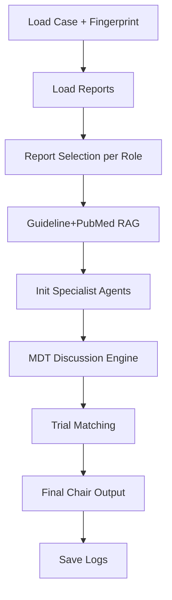

# MDT Discussion Log — 2026-01-21_18-43-48
Generated automatically by MDT Pipeline.


## CASE (structured JSON)

```
{"CASE_CORE":{"ADJUVANT_TREATMENT":{"cycles_or_courses":"6","given":"Yes","regimens":["白紫+卡铂"]},"BIOMARKERS":{"AFP":"<0.91 ng/ml (2022-10-12)","CA125":"933.00 U/ml (2022-12-29)","HER2":"Unknown","MSI":"Unknown","PDL1_CPS":"Unknown","TMB":"Unknown"},"BRCA1":"Unknown","BRCA2":"Unknown","CURRENT_STATUS":"Recurrent ovarian clear cell carcinoma with metastatic disease (liver, presacral/sacrum, right iliac bone) documented on imaging","DIAGNOSIS":{"components":["High-grade adenocarcinoma involving full-thickness intestinal wall","Lymph node metastasis (4/15)","Peritoneal/rectal/vaginal involvement described"],"histology":"透明细胞癌; 肠壁全层见高级别腺癌","laterality":"Unknown","primary":"卵巢癌复发","site":"Ovary"},"HRD":"Unknown","INITIAL_TREATMENT":"Unknown","LINE_OF_THERAPY":[{"cycles":"6","end_date":"2022-08-17","intent":"Unknown","line":"1L","regimen":"白紫+卡铂","start_date":"Unknown"}],"MAINTENANCE":"Unknown","MAINTENANCE_DETAIL":{"end_date":"Unknown","given":"Unknown","regimens":[],"start_date":"Unknown"},"NEOADJUVANT":"Unknown","PFI_days":"56","PLATINUM_HISTORY":[{"PFI_days":"56","end_date":"2022-08-17","evidence":"Rise in CA125/CA19-9 on 2022-10-12","evidence_type":"Biochemical","first_relapse_date":"2022-10-12","line":"1L","start_date":"Unknown","status":"Resistant"}],"PLATINUM_PFI_CURRENT":"56","PLATINUM_STATUS":"Resistant","PLATINUM_STATUS_CURRENT":"Resistant","RELAPSE":"Yes","RELAPSE_DATE":{"date":"2022-10-12","evidence":"Elevated CA125 and CA19-9 on 2022-10-12; imaging (MRI 2022-10-24, CT 2022-10-25) supports recurrence","type":"Biochemical"},"SCENE":"Platinum_resistant_relapse","STAGE":{"stage_basis":"Unknown","stage_system":"Unknown","stage_text":"Unknown"},"SURGERY_DONE":{"date":"2022-03-28","performed":"Yes","procedure":"Tumor debulking + partial rectosigmoid resection + partial vaginectomy + retroperitoneal lesion resection + complex adhesiolysis + left ureteral stent placement + bladder repair"},"TIMELINE":{"constraints":{"max_events":30,"min_events":3,"must_include":["first diagnostic imaging or pathology confirmation (if available)"],"ordering_rules":{"prioritize_last_event":true}},"events":[{"date":"2022-03-28","description":"Cytoreductive surgery including partial rectosigmoid resection, partial vaginectomy, retroperitoneal lesion resection, left ureteral stent, bladder repair","event_type":"Surgery","key_result":"Tumor ~7x4x2.5 cm; full-thickness intestinal wall high-grade adenocarcinoma; consider ovarian clear cell carcinoma; 4/15 nodes positive","regimen_or_test":"Surgical resection"},{"date":"2022-08-17","description":"Completed 6 cycles of 白紫+卡铂 chemotherapy, last given 2022-08-17","event_type":"Chemo","key_result":"Post-chemo tumor markers reduced on 2022-08-15","regimen_or_test":"白紫+卡铂"},{"date":"2022-10-12","description":"Rising tumor markers indicating recurrence","event_type":"Lab","key_result":"CA19-9 77.20 U/ml; CA125 89.60 U/ml","regimen_or_test":"Tumor markers"},{"date":"2022-10-24","description":"Pelvic MRI shows presacral mass and pelvic mesenteric nodules; consider recurrence with sacral involvement","event_type":"Imaging","key_result":"Presacral lesion and pelvic mesenteric nodules, possible metastases","regimen_or_test":"MRI pelvis"},{"date":"2022-10-25","description":"CT shows multiple liver nodules, some new compared to prior","event_type":"Imaging","key_result":"Multiple hepatic metastatic nodules","regimen_or_test":"CT abdomen"},{"date":"2022-12-29","description":"Markedly elevated tumor markers consistent with progression","event_type":"Lab","key_result":"CA125 933.00 U/ml; CA19-9 229.00 U/ml; HE4 111.00 pmol/L","regimen_or_test":"Tumor markers"},{"date":"2022-12-30","description":"MRI/CT show increased presacral lesion, new right iliac bone nodule, increased hepatic metastases","event_type":"Imaging","key_result":"Progression of pelvic and hepatic metastatic disease","regimen_or_test":"MRI pelvis; CT abdomen"}]},"VISIT_DATE":"2023-01-03","first_relapse_date":"2022-10-12","last_platinum_end_date":"2022-08-17"},"LAB_TRENDS":{"labs":[{"analyte":"CA125","history":[{"date":"2022-08-15","flag":"Unknown","value":"14.90"},{"date":"2022-10-12","flag":"↑","value":"89.60"},{"date":"2022-11-17","flag":"↑","value":"403"},{"date":"2022-12-29","flag":"↑","value":"933.00"}],"latest":{"date":"2022-12-29","flag":"↑","value":"933.00"},"reference_range":"Unknown","unit":"U/ml"},{"analyte":"CA19-9","history":[{"date":"2022-08-15","flag":"Unknown","value":"7.16"},{"date":"2022-10-12","flag":"↑","value":"77.20"},{"date":"2022-12-29","flag":"↑","value":"229.00"}],"latest":{"date":"2022-12-29","flag":"↑","value":"229.00"},"reference_range":"Unknown","unit":"U/ml"},{"analyte":"HE4","history":[{"date":"2022-08-15","flag":"↑","value":"87.90"},{"date":"2022-10-12","flag":"Unknown","value":"59.70"},{"date":"2022-12-29","flag":"↑","value":"111.00"}],"latest":{"date":"2022-12-29","flag":"↑","value":"111.00"},"reference_range":"Unknown","unit":"pmol/L"},{"analyte":"AFP","history":[{"date":"2022-10-12","flag":"Unknown","value":"<0.91"}],"latest":{"date":"2022-10-12","flag":"Unknown","value":"<0.91"},"reference_range":"Unknown","unit":"ng/ml"}],"milestones":[{"date":"2022-03-28","description":"Primary cytoreductive surgery performed","type":"Surgery"},{"date":"2022-08-17","description":"Completed 6 cycles of 白紫+卡铂","type":"ChemoEnd"},{"date":"2022-10-12","description":"Biochemical relapse with rising tumor markers","type":"Relapse"}]},"MED_ONC":{"current_regimen":{"cycle_info":"6 cycles of 白紫+卡铂, last 2022-08-17","last_admin_date":"2022-08-17","name":"Unknown"},"genetic_testing":{"germline":[],"somatic":[]},"monitoring_points":[],"planned_next_regimen":"Unknown","prior_systemic_therapies":["白紫+卡铂"]},"NUC_MED":{"studies":[]},"PATHOLOGY":{"specimens":[{"components":["Tumor size ~7x4x2.5 cm","Bilateral margins negative","Pericolic lymph nodes 4/15 positive","One tumor nodule (posterior bladder)"],"date":"2022-03-28","diagnosis":"Consider ovarian clear cell carcinoma involvement; full-thickness intestinal wall high-grade adenocarcinoma","grade":"High-grade","ihc":[{"marker":"MLH1","result":"+"},{"marker":"MSH6","result":"+"},{"marker":"MSH2","result":"+"},{"marker":"PMS2","result":"+"},{"marker":"ER","result":"partial+"},{"marker":"PR","result":"few weak+"},{"marker":"P53","result":"+/-"},{"marker":"WT1","result":"-"},{"marker":"Ki-67","result":"60%+"},{"marker":"HNF1B","result":"+"},{"marker":"NapsinA","result":"focal+"},{"marker":"P16","result":"+"},{"marker":"PAX8","result":"+"},{"marker":"SALL4","result":"-"},{"marker":"ZBTB16","result":"-"}],"involvement_sites":["Rectosigmoid colon","Left retroperitoneum","Vagina","Pericolic lymph nodes","Posterior bladder nodule"],"laterality":"Unknown","molecular":[],"raw_text":"卵巢恶性肿瘤：卵巢癌复发：术前CA125 45.7 CA199 161 HE4 562 2022.03.28在全麻下行“瘤体减灭术+直肠乙状结肠部分切除术+阴道部分切除术+腹膜后病损切除术+复杂肠粘连松解术+左输尿管支架置管术+膀胱修补术。（部分直乙结肠+左侧腹膜后肿瘤+部分阴道）肠壁全层见高级别腺癌，结合T2022-04771首先考虑为透明细胞癌，正在加做免疫组化进一步明确。肿块大小约7*4*2.5cm。双侧切缘阴性，肠周淋巴结（4/15）见癌转移，伴癌结节1枚。（膀胱后壁肿瘤）纤维脂肪组织，局灶纤维组织增生、含铁血黄素沉积、泡沫样组织反应，未见癌累及。补充诊断1：【补充报告】（部分直乙结肠+左侧腹膜后肿瘤+部分阴道）可符合卵巢透明细胞癌累及。免疫组化（HI22-06789）瘤细胞：MLH1(ES05)（+），MSH6（+），MSH2（+），PMS2（+），ER（部分+），PR（少弱+），P53（+/-），WT1（-），Ki-67（60%+），HNF1B（+），NapsinA（灶+），P16（+），PAX8（+），SALL4（-），ZBTB16（-）","sample_type":"Surgical resection","site":"Partial rectosigmoid + left retroperitoneal tumor + partial vagina","tumor_size":"7 x 4 x 2.5 cm","uncertainty_or_missing":["BRCA/HRD testing not reported"]}]},"RADIOLOGY":{"next_imaging_plan":{"modality":"Unknown","timing":"Unknown"},"studies":[{"anatomic_sites":["Pelvis"],"date":"2022-10-24","findings":["Postoperative pelvis with presacral mass; pelvic mesenteric multiple enhancing small nodules"],"impression":"Consider recurrence with adjacent sacral involvement; pelvic mesenteric nodules likely metastases","modality":"MRI","trend_vs_prior":"Unknown"},{"anatomic_sites":["Liver"],"date":"2022-10-25","findings":["Multiple intrahepatic nodules, some new compared to prior"],"impression":"Probable metastases in liver","modality":"CT","trend_vs_prior":"Worse"},{"anatomic_sites":["Pelvis; sacrum; right iliac bone"],"date":"2022-12-30","findings":["Presacral lesion increased in size and heterogeneous enhancement; right iliac bone new enhancing nodule; pelvic mesenteric nodules similar"],"impression":"Progression of presacral disease with possible sacral and iliac bone involvement; peritoneal metastases possible","modality":"MRI","trend_vs_prior":"Worse"},{"anatomic_sites":["Liver; spleen"],"date":"2022-12-30","findings":["Multiple hepatic metastatic nodules increased in number and size; splenic patchy shadow suggesting possible infarct"],"impression":"Progression of hepatic metastases","modality":"CT","trend_vs_prior":"Worse"}]},"TIMELINE":{"constraints":{"max_events":30,"min_events":3,"must_include":["first diagnostic imaging or pathology confirmation (if available)"],"ordering_rules":{"prioritize_last_event":true}},"events":[{"date":"2022-03-28","description":"Cytoreductive surgery including partial rectosigmoid resection, partial vaginectomy, retroperitoneal lesion resection, left ureteral stent, bladder repair","event_type":"Surgery","key_result":"Tumor ~7x4x2.5 cm; full-thickness intestinal wall high-grade adenocarcinoma; consider ovarian clear cell carcinoma; 4/15 nodes positive","regimen_or_test":"Surgical resection"},{"date":"2022-08-17","description":"Completed 6 cycles of 白紫+卡铂 chemotherapy, last given 2022-08-17","event_type":"Chemo","key_result":"Post-chemo tumor markers reduced on 2022-08-15","regimen_or_test":"白紫+卡铂"},{"date":"2022-10-12","description":"Rising tumor markers indicating recurrence","event_type":"Lab","key_result":"CA19-9 77.20 U/ml; CA125 89.60 U/ml","regimen_or_test":"Tumor markers"},{"date":"2022-10-24","description":"Pelvic MRI shows presacral mass and pelvic mesenteric nodules; consider recurrence with sacral involvement","event_type":"Imaging","key_result":"Presacral lesion and pelvic mesenteric nodules, possible metastases","regimen_or_test":"MRI pelvis"},{"date":"2022-10-25","description":"CT shows multiple liver nodules, some new compared to prior","event_type":"Imaging","key_result":"Multiple hepatic metastatic nodules","regimen_or_test":"CT abdomen"},{"date":"2022-12-29","description":"Markedly elevated tumor markers consistent with progression","event_type":"Lab","key_result":"CA125 933.00 U/ml; CA19-9 229.00 U/ml; HE4 111.00 pmol/L","regimen_or_test":"Tumor markers"},{"date":"2022-12-30","description":"MRI/CT show increased presacral lesion, new right iliac bone nodule, increased hepatic metastases","event_type":"Imaging","key_result":"Progression of pelvic and hepatic metastatic disease","regimen_or_test":"MRI pelvis; CT abdomen"}]}}
```


## FINAL MDT OUTPUT

```
Final Assessment:
Metastatic, platinum‑resistant high‑grade ovarian clear cell carcinoma with progressive hepatic, presacral/sacral, iliac bone and peritoneal disease; palliative intent. [@2022-12-29|MR | MR] [@2022-12-29|CT | CT]  
MMR intact, BRCA/HRD negative, germline ATM p.Y316C VUS; no current evidence of histologic transformation. [@OH2203828 | Genomics]  
Severe anemia (Hgb 74 g/L) and unknown ECOG/organ function are major constraints and must be clarified before systemic‑therapy decisions. [@20230103|5600862 | LAB]

Core Treatment Strategy:
- Urgently investigate and correct anemia; perform iron/B12/folate, bleeding and hemolysis workup, and consider transfusion as indicated. [@20230103|5600862 | LAB]  
- Obtain full renal/LFT/coagulation panel and document ECOG PS and symptom/pain burden to define safe treatment intensity. [@guideline:nccn_ovariancancer_v3_2025__v00000000 | Page 22]  
- Restage with contrast CT chest/abdomen/pelvis to reassess metastatic burden and suspected splenic infarct before systemic changes. [@2022-12-29|MR | MR] [@2022-12-29|CT | CT]  
- Plan non‑platinum palliative systemic relapse therapy (or clinical trial) tailored to ECOG, organ function, and prior toxicities. [@guideline:nccn_ovariancancer_v3_2025__v00000000 | Page 22] [@trial | 350]  
- Send MSI, TMB, PD‑L1 CPS, HER2 (and extended HR genes if available) to refine current and future systemic options. [@OH2203828 | Genomics] [@guideline:esmo_cpg_epithelialovarian_2023__v00000000 | Page 10]  
- Coordinate palliative radiotherapy and bone‑directed management for symptomatic sacral/iliac/presacral and other bone lesions. [@2022-12-29|MR | MR]  
- Defer FDG PET/CT; consider only if results would change systemic plan or local palliative targeting (e.g., complex bone disease). [@pubmed | 23117032]  

Change Triggers:
- If ECOG ≤2 with corrected anemia and adequate organ function, proceed to full‑dose non‑platinum relapse systemic therapy or suitable trial. [@guideline:nccn_ovariancancer_v3_2025__v00000000 | Page 22] [@trial | 350]  
- If ECOG ≥3, refractory anemia, or organ dysfunction persists, prioritize best supportive care, symptom‑directed radiotherapy, and de‑escalated systemic approach.

---
## References

### Guidelines

[@guideline:nccn_ovariancancer_v3_2025__v00000000 | Page 22]
  Document: nccn_ovariancancer_v3_2025__v00000000, Page 22
  Content: Survivorship)
Recurrent
diseaset
Hormonal...

[@guideline:esmo_cpg_epithelialovarian_2023__v00000000 | Page 10]
  Document: esmo_cpg_epithelialovarian_2023__v00000000, Page 10
  Content: with first line. This can probably be explained by an...

### Literature

[@pubmed | 23117032]
  [Not cached]

### Clinical Trials

[@trial | 350]
  Trial ID: 350
  Name: 评价注射用BL-B01D1在复发或转移性妇科恶性肿瘤等多种实体瘤患者中的安全性、耐受性、药代动力学及有效性的Ib/II期临床研究
  Rationale: Recurrent metastatic ovarian clear cell carcinoma after failure of first-line platinum chemotherapy fits a ≥2L recurrent/metastatic gynecologic malignancy trial without biomarker requirement.

### Clinical Reports

[@2022-12-29|MR | MR]
  MR ID: 2022-12-29|MR | Date: 2022-12-29
  Content: 对比前片2022-10-21：盆腔术后，阴道残端略厚，骶前见不规则肿块影，较前增大，目前范围约53×44mm，信号较前不...

[@2022-12-29|CT | CT]
  CT ID: 2022-12-29|CT | Date: 2022-12-29
  Content: 对比前片2022-10-21：肝内多发低密度结节，较前增多，部分较前增大，大者约17m*14mm，部分较前新见。肝内另见...

[@OH2203828 | Genomics]
  Genomics ID: OH2203828 | Date: 2022-04-18
  Content: ATM NM_000051:exon8:c.A947G:p.Y316C（胚系）；HRD 阴性；BRCA1...

[@20230103|5600862 | LAB]
  LAB ID: 20230103|5600862 | Date: 2023-01-03
  Content: 中性粒细胞% 76.5 % (GRAN) PLT分布宽度 12 % (PDW) 嗜碱性细胞数 0.01 *10^9/L...

```


## PIPELINE FLOW (Mermaid)




## TRACE EVENTS (Structured)

```json
[
  {
    "ts": "2026-01-21T18:41:12.902790",
    "event": "pipeline_start",
    "payload": {
      "visit_time": "2023-01-03 08:53:29.260000",
      "meta_info": "340123197709263626"
    }
  },
  {
    "ts": "2026-01-21T18:41:12.903539",
    "event": "case_fingerprint",
    "payload": {
      "case_fingerprint": "2a31f255c155"
    }
  },
  {
    "ts": "2026-01-21T18:41:13.236380",
    "event": "reports_loaded",
    "payload": {
      "lab_n": 92,
      "img_n": 10,
      "path_n": 0,
      "mut_n": 1,
      "cutoff_dt": "2023-01-04 08:53:29"
    }
  },
  {
    "ts": "2026-01-21T18:41:20.652037",
    "event": "reports_selected",
    "payload": {
      "lab": {
        "chair": [
          "20221229|8300002|2022-12-29",
          "20221229|9703212|2022-12-29",
          "20230103|5600862|2023-01-03"
        ],
        "oncologist": [
          "20221229|8300002|2022-12-29",
          "20221229|9703212|2022-12-29",
          "20230103|5600862|2023-01-03"
        ],
        "radiologist": [],
        "pathologist": [],
        "nuclear": []
      },
      "imaging": {
        "chair": [
          "2022-10-24|MR|2022-10-24",
          "2022-12-29|MR|2022-12-29",
          "2022-12-29|CT|2022-12-29"
        ],
        "oncologist": [],
        "radiologist": [
          "2022-10-24|MR|2022-10-24",
          "2022-12-29|MR|2022-12-29",
          "2022-12-29|CT|2022-12-29"
        ],
        "pathologist": [],
        "nuclear": [
          "2022-10-24|MR|2022-10-24",
          "2022-12-29|MR|2022-12-29",
          "2022-12-29|CT|2022-12-29"
        ]
      },
      "pathology": {
        "chair": [],
        "oncologist": [],
        "radiologist": [],
        "pathologist": [],
        "nuclear": []
      },
      "mutation": {
        "chair": [
          "OH2203828|2022-04-18"
        ],
        "oncologist": [
          "OH2203828|2022-04-18"
        ],
        "radiologist": [],
        "pathologist": [
          "OH2203828|2022-04-18"
        ],
        "nuclear": []
      }
    }
  },
  {
    "ts": "2026-01-21T18:41:20.657173",
    "event": "rag_key_facts",
    "payload": {
      "facts": "DIAGNOSIS: primary=卵巢癌复发; histology=透明细胞癌; 肠壁全层见高级别腺癌; components=High-grade adenocarcinoma involving full-thickness intestinal wall;Lymph node metastasis (4/15);Peritoneal/rectal/vaginal involvement described\nPATHOLOGY: Consider ovarian clear cell carcinoma involvement; full-thickness intestinal wall high-grade adenocarcinoma\nPLATINUM: status=Resistant; pfi_days=56\nBIOMARKERS: CA125=933.00 U/ml (2022-12-29); AFP=<0.91 ng/ml (2022-10-12); TMB=Unknown; MSI=Unknown; PDL1_CPS=Unknown\nMUTATION_REPORT: id=OH2203828; date=2022-04-18; full_text=ATM NM_000051:exon8:c.A947G:p.Y316C（胚系）；HRD 阴性；BRCA1 胚系和体系未检出致病突变（视为阴性）；BRCA2 胚系和体系未检出致病突变（视为阴性）；TP53 胚系和体系未检出致病突变（视为阴性）；ARID1A 胚系和体系未检出致病突变（视为阴性）；PTEN 胚系和体系未检出致病突变（视为阴性）；PIK3CA 胚系和体系未检出致病突变（视为阴性）；PALB2 胚系和体系未检出致病突变（视为阴性）；RAD51D 胚系和体系未检出致病突变（视为阴性）；BRIP1 胚系和体系未检出致病突变（视为阴性）；BARD1 胚系和体系未检出致病突变（视为阴性）"
    }
  },
  {
    "ts": "2026-01-21T18:41:44.027973",
    "event": "rag_query",
    "payload": {
      "query": "Recurrent platinum-resistant ovarian clear cell carcinoma with pelvic, liver, peritoneal and possible bone metastases; MSI-stable/MMR-proficient, HRD-negative, BRCA1/2-negative, germline ATM p.Y316C; no major organ dysfunction reported; histology: clear cell carcinoma"
    }
  },
  {
    "ts": "2026-01-21T18:41:44.027981",
    "event": "rag_hits",
    "payload": {
      "source": "guideline",
      "topk": 5,
      "n": 5
    }
  },
  {
    "ts": "2026-01-21T18:41:44.027983",
    "event": "rag_hits",
    "payload": {
      "source": "pubmed",
      "topk": 5,
      "n": 0
    }
  },
  {
    "ts": "2026-01-21T18:41:44.027985",
    "event": "rag_hits_merged",
    "payload": {
      "n": 5
    }
  },
  {
    "ts": "2026-01-21T18:41:51.598172",
    "event": "mdt_discussion_start",
    "payload": {
      "num_rounds": 2,
      "num_turns": 2
    }
  },
  {
    "ts": "2026-01-21T18:41:51.598220",
    "event": "mdt_initial_opinion_role_start",
    "payload": {
      "role": "chair",
      "order": 1
    }
  },
  {
    "ts": "2026-01-21T18:41:56.457496",
    "event": "mdt_initial_opinion_role_end",
    "payload": {
      "role": "chair",
      "chars": 551
    }
  },
  {
    "ts": "2026-01-21T18:41:56.457605",
    "event": "mdt_initial_opinion_role_start",
    "payload": {
      "role": "oncologist",
      "order": 2
    }
  },
  {
    "ts": "2026-01-21T18:41:59.397470",
    "event": "mdt_initial_opinion_role_end",
    "payload": {
      "role": "oncologist",
      "chars": 559
    }
  },
  {
    "ts": "2026-01-21T18:41:59.397549",
    "event": "mdt_initial_opinion_role_start",
    "payload": {
      "role": "radiologist",
      "order": 3
    }
  },
  {
    "ts": "2026-01-21T18:42:03.168487",
    "event": "mdt_initial_opinion_role_end",
    "payload": {
      "role": "radiologist",
      "chars": 521
    }
  },
  {
    "ts": "2026-01-21T18:42:03.168576",
    "event": "mdt_initial_opinion_role_start",
    "payload": {
      "role": "pathologist",
      "order": 4
    }
  },
  {
    "ts": "2026-01-21T18:42:08.208905",
    "event": "mdt_initial_opinion_role_end",
    "payload": {
      "role": "pathologist",
      "chars": 520
    }
  },
  {
    "ts": "2026-01-21T18:42:08.208983",
    "event": "mdt_initial_opinion_role_start",
    "payload": {
      "role": "nuclear",
      "order": 5
    }
  },
  {
    "ts": "2026-01-21T18:42:11.162074",
    "event": "mdt_initial_opinion_role_end",
    "payload": {
      "role": "nuclear",
      "chars": 501
    }
  },
  {
    "ts": "2026-01-21T18:43:28.808412",
    "event": "mdt_discussion_end",
    "payload": {
      "merged_chars": 2914
    }
  },
  {
    "ts": "2026-01-21T18:43:28.809640",
    "event": "trial_matching_start",
    "payload": {
      "trials_json_path": "files/all_trials_filtered.json"
    }
  },
  {
    "ts": "2026-01-21T18:43:37.535566",
    "event": "trial_matching_end",
    "payload": {
      "recommended": false
    }
  },
  {
    "ts": "2026-01-21T18:43:37.535581",
    "event": "final_output_start",
    "payload": {}
  },
  {
    "ts": "2026-01-21T18:43:48.298390",
    "event": "final_output_end",
    "payload": {
      "final_output_chars": 3595
    }
  }
]
```


## INITIAL EXPERT OPINIONS


## chair

```
- Metastatic, platinum‑resistant clear cell ovarian carcinoma with rapid progression in liver, presacral/sacral, iliac bone; palliative intent. [@2022-12-29|MR | MR] [@2022-12-29|CT | CT] [@guideline:nccn_ovariancancer_v3_2025__v00000000 | Page 22]

- Plan next‑line systemic therapy suitable for platinum‑resistant disease and prior regimen exposure; avoid re‑challenging with platinum now.

- Critical gaps: ECOG status, pain/symptom burden, prior toxicities, current organ function (renal, full LFTs, coagulation), bone involvement management plan.
```


## oncologist

```
- Platinum-resistant recurrent clear cell ovarian carcinoma after first-line platinum; systemic relapse-therapy category indicated rather than surveillance or maintenance [@guideline:nccn_ovariancancer_v3_2025__v00000000 | Page 22].  

- Significant anemia (Hgb 74 g/L) may constrain intensive systemic relapse therapy; needs transfusion/iron workup before regimen choice [@20230103|5600862 | LAB].  

- Missing data: performance status, current symptoms, pain burden, detailed imaging reports, prior treatment toxicities, and full renal/liver function panel.
```


## radiologist

```
- Progressive presacral pelvic mass (~53×44 mm) with probable sacral and right iliac bone involvement, plus mesenteric peritoneal nodules. [@2022-12-29|MR | MR]  

- Worsening multifocal hepatic metastases; spleen shows patchy low-density area suspicious for infarct, recommend clinical correlation. [@2022-12-29|CT | CT]  

- Disease pattern consistent with metastatic recurrent ovarian malignancy requiring systemic and local control planning. [@guideline:esgo_esmo_esp_consensus_ovariancancer_2024__v00000000 | Page 6]
```


## pathologist

```
- Histology and IHC support metastatic ovarian clear cell carcinoma involving rectosigmoid, retroperitoneum, vagina, with nodal metastases, high-grade. [@guideline:esmo_cpg_epithelialovarian_2023__v00000000 | Page 10]  

- MMR proteins intact; BRCA1/2 and HRD negative on comprehensive NGS, with germline ATM p.Y316C variant detected. [@OH2203828 | Genomics]  

- MSI, TMB, HER2, PD-L1 CPS remain unknown; clarify if additional immunotherapy-predictive biomarkers and homologous recombination gene details are available.
```


## nuclear

```
- No PET/CT metabolic data available; need whole-body FDG PET/CT to assess presacral mass, pelvic nodes, hepatic lesions.  

- Morphologic progression of presacral mass with sacral/iliac involvement and mesenteric nodules suggests increasing locoregional and peritoneal tumor burden [@2022-12-29|MR | MR].  

- CT shows progressive multifocal hepatic metastases; PET would better characterize whole-body metastatic load and potential extra-abdominal disease [@2022-12-29|CT | CT] [@pubmed | 23117032].
```


## MERGED SUMMARY (Assistant)

```
Key Knowledge:
- Platinum‑resistant metastatic high‑grade clear cell ovarian carcinoma with rapid progression in liver, presacral/sacral region, right iliac bone, and mesentery; palliative intent.
- Histology: metastatic high‑grade ovarian clear cell carcinoma, MMR intact, BRCA/HRD negative, germline ATM p.Y316C variant; no current evidence of histologic transformation.
- Marked anemia (Hgb 74 g/L) likely to constrain therapy intensity and prioritized for urgent assessment and correction.
- Existing CT/MR demonstrate extensive pelvic, bone, and hepatic metastatic burden; suspected splenic infarct requires clinical and imaging follow‑up.
- Current imaging is adequate for staging; PET/CT may be reserved for scenarios where it would alter systemic or local palliative management.

Controversies:
- Optimal non‑platinum systemic regimen in platinum‑resistant clear cell histology given significant anemia, unknown ECOG PS, and organ function.
- Added value of FDG PET/CT versus updated contrast CT in a disseminated, palliative setting, and thresholds for when PET/CT would meaningfully change management.
- Scope and timing of local palliative treatments (e.g., radiotherapy to sacral/iliac/presacral and bone lesions) alongside systemic therapy.

Missing Info:
- ECOG performance status and detailed symptom/pain burden, especially from sacral/iliac/presacral and bone disease.
- Full organ function: updated renal profile, full LFTs, coagulation panel.
- Anemia workup and supportive care: transfusion history and plan, iron/B12/folate status, bleeding assessment, thrombosis history (re: possible splenic infarct).
- Detailed prior systemic therapy exposures and toxicities.
- Complete biomarker profile: MSI, TMB, PD‑L1 CPS, HER2, plus any additional HR‑gene data.
- Updated contrast‑enhanced CT chest/abdomen/pelvis and any prior PET/CT (if later performed).

Working Plan:
- Stabilize first: urgently investigate and correct anemia (transfusion and etiologic workup), and complete renal/LFT/coagulation assessment.
- Document ECOG PS and symptom/pain burden to guide treatment intensity and palliative needs.
- Restage with updated contrast‑enhanced CT chest/abdomen/pelvis to reassess hepatic, presacral/sacral, and iliac bone disease and monitor suspected splenic infarct.
- Plan non‑platinum palliative systemic relapse therapy appropriate for platinum‑resistant clear cell disease, tailored to ECOG PS, organ function, and prior toxicities.
- Obtain additional biomarkers (MSI, TMB, PD‑L1 CPS, HER2) to refine current and future systemic strategies.
- Coordinate palliative local therapy (e.g., radiotherapy) for symptomatic sacral/iliac/presacral and other bone lesions; consider bone‑directed management as indicated.
- Defer FDG PET/CT unless its results are expected to change systemic or local palliative strategy (e.g., mapping symptomatic bone disease or unexpected extra‑abdominal spread).
```


## INTERACTION LOG (Round × Turn)

### Round 1

#### Turn 1
- **chair → oncologist:** Please address severe anemia (Hgb 74 g/L) with diagnostic workup and correction before initiating or escalating systemic therapy intensity. [@20230103|5600862 | LAB]
- **chair → radiologist:** Confirm whether additional staging (e.g., updated whole‑body CT or PET/CT) would materially change palliative systemic/local treatment planning given recent MR/CT progression. [@2022-12-29|MR | MR] [@2022-12-29|CT | CT]
- **oncologist → chair:** Before we commit to a specific non‑platinum systemic relapse‑therapy category, I need ECOG PS, detailed pain/symptom burden, and full renal/liver/coagulation profile to assess feasibility in the context of marked anemia (Hgb 74 g/L) [@20230103|5600862 | LAB].
- **radiologist → oncologist:** Latest available imaging is from 2022-12-29; no interval CT/MR or PET up to today, so current disease extent and complications (hepatic load, sacral/iliac stability, splenic infarct evolution) are uncertain and updated staging imaging is needed before major treatment changes. [@2022-12-29|MR | MR] [@2022-12-29|CT | CT]
- **pathologist → oncologist:** Pathology confirms metastatic high‑grade ovarian clear cell carcinoma; MMR intact and BRCA/HRD negative, with only germline ATM p.Y316C detected on comprehensive NGS [@OH2203828 | Genomics]. MSI, TMB, PD‑L1 CPS, and HER2 status remain undocumented and should be clarified if additional systemic options may depend on these biomarkers [@guideline:esmo_cpg_epithelialovarian_2023__v00000000 | Page 10].
- **nuclear → oncologist:** No PET/CT has been performed; given rapidly progressive liver, presacral, bone, and mesenteric disease on MR/CT [@2022-12-29|MR | MR] [@2022-12-29|CT | CT], please clarify whether FDG PET/CT would change systemic or local plans before ordering, as guidelines support PET mainly when it will alter management [@pubmed | 23117032].


## FINAL REFINED PLANS (per Round)

### Round 1


## chair

```
- Stabilize patient first: urgently work up and correct anemia and complete renal/LFT/coagulation profile, then assess ECOG and symptom burden. [@20230103|5600862 | LAB]

- Plan non‑platinum palliative systemic therapy suitable for platinum‑resistant clear cell relapse, intensity tailored to ECOG and organ function. [@guideline:nccn_ovariancancer_v3_2025__v00000000 | Page 22]

- Clarify MSI, TMB, PD‑L1, HER2 and decide on PET/CT only if results would alter systemic/local strategy (e.g., radiotherapy). [@OH2203828 | Genomics] [@guideline:esmo_cpg_epithelialovarian_2023__v00000000 | Page 10]
```


## oncologist

```
- Urgently evaluate and correct anemia (transfusion, iron/B12/folate workup, bleeding assessment) before initiating non‑platinum relapse‑therapy in this palliative setting [@20230103|5600862 | LAB] [@guideline:nccn_ovariancancer_v3_2025__v00000000 | Page 22].  

- After documenting ECOG PS, organ function, and symptom burden, choose a non‑platinum systemic relapse‑therapy category tailored to platinum‑resistant clear cell disease and current tolerance [@guideline:nccn_ovariancancer_v3_2025__v00000000 | Page 22].  

- Clarify MSI, TMB, PD‑L1 CPS, and HER2 to refine future systemic strategy, and coordinate palliative local treatments (e.g., radiotherapy) for symptomatic sacral/iliac/presacral and bone disease [@OH2203828 | Genomics] [@2022-12-29|MR | MR] [@2022-12-29|CT | CT] [@guideline:esmo_cpg_epithelialovarian_2023__v00000000 | Page 10].
```


## radiologist

```
- Restage with updated contrast-enhanced CT chest/abdomen/pelvis to reassess hepatic, presacral/sacral, and iliac bone disease burden. [@2022-12-29|MR | MR] [@2022-12-29|CT | CT]  

- Reserve FDG PET/CT for situations where results would change systemic or local palliative strategy, per guideline-based practice. [@pubmed | 23117032]  

- Monitor possible splenic infarct evolution on follow-up imaging; correlate with clinical signs of abdominal pain or thromboembolic disease. [@2022-12-29|CT | CT]
```


## pathologist

```
- Maintain diagnosis: metastatic high‑grade ovarian clear cell carcinoma with MMR intact, BRCA/HRD negative, germline ATM p.Y316C only. [@OH2203828 | Genomics]  

- Recommend additional biomarker workup (MSI, TMB, PD‑L1 CPS, HER2) to refine systemic strategy in platinum‑resistant relapse. [@guideline:esmo_cpg_epithelialovarian_2023__v00000000 | Page 10]  

- No further pathology/IHC or re‑biopsy currently mandated; reassess if clinical course suggests histologic transformation or discordant imaging response.
```


## nuclear

```
- No prior PET/CT; defer FDG PET/CT unless it would change systemic or local palliative strategy in this disseminated setting [@2022-12-29|MR | MR] [@2022-12-29|CT | CT] [@pubmed | 23117032].  

- Current MR/CT already demonstrate extensive pelvic, bone, and hepatic involvement; these adequately establish advanced metastatic burden for staging purposes [@2022-12-29|MR | MR] [@2022-12-29|CT | CT].  

- If ordered, whole‑body FDG PET/CT should focus on clarifying symptomatic bone disease extent and unexpected extra‑abdominal metastases that could alter local palliation [@pubmed | 23117032].
```


## RAW AGENT LOGS

### chair
- **User:** Give INITIAL opinion (use ONLY your system-provided patient facts).
Return up to 3 bullets, each ≤20 words.
If key data missing, say exactly what needs updating.
At least ONE bullet must be evidence-based and include [@guideline:doc_id | Page xx] or [@pubmed | PMID].
If you reference treatment strategy categories, guidelines, trials, or literature evidence, include tags [@guideline:doc_id | Page xx], [@pubmed | PMID], or [@trial | id].
For clinical reports, use actual report_id from report data with type: [@actual_report_id | LAB], [@actual_report_id | Genomics], [@actual_report_id | MR], [@actual_report_id | CT] (e.g., [@20220407|17300673 | LAB], [@2022-12-29 | MR], [@2022-12-29 | CT]). Always use spaces around | for consistency: [@xxx | yyy].
  
  **Assistant:** - Metastatic, platinum‑resistant clear cell ovarian carcinoma with rapid progression in liver, presacral/sacral, iliac bone; palliative intent. [@2022-12-29|MR | MR] [@2022-12-29|CT | CT] [@guideline:nccn_ovariancancer_v3_2025__v00000000 | Page 22]

- Plan next‑line systemic therapy suitable for platinum‑resistant disease and prior regimen exposure; avoid re‑challenging with platinum now.

- Critical gaps: ECOG status, pain/symptom burden, prior toxicities, current organ function (renal, full LFTs, coagulation), bone involvement management plan.
  
  *(2026-01-21T18:41:56.457392)*

- **User:** ROLE: chair. VISIT: 2023-01-03 08:53:29.260000
Default is NOT to speak. Speak ONLY if: conflict | safety | missing-critical | new-critical.

CONTEXT (latest):
[MDT_GLOBAL_KNOWLEDGE]
Key Knowledge:
- Platinum‑resistant metastatic clear cell ovarian carcinoma with rapid radiologic progression in liver, presacral/sacral region, right iliac bone, and mesentery; palliative intent.
- Histology: high‑grade clear cell ovarian carcinoma with nodal and multi‑site metastases; MMR intact, BRCA/HRD negative; germline ATM variant of uncertain significance; key immunotherapy biomarkers (MSI, TMB, PD‑L1, HER2) not documented.
- Current status includes marked anemia (Hgb 74 g/L), which may limit intensity of systemic therapy and requires correction/workup.
- Imaging confirms substantial pelvic and hepatic disease burden; possible splenic infarct on CT needing clinical correlation.

Controversies:
- Optimal choice of next‑line systemic therapy in platinum‑resistant clear cell histology after first‑line platinum, given anemia and unknown performance status.
- Role and timing of additional imaging (FDG PET/CT) versus existing CT/MR for treatment planning in the palliative setting.
- Extent to which local treatments (e.g., for sacral/iliac bone and presacral mass) should be integrated with systemic therapy for symptom control.

Missing Info:
- ECOG performance status; detailed symptom and pain burden, particularly from sacral/iliac and presacral disease.
- Full organ function: renal profile, full LFTs, coagulation, and detailed prior treatment toxicities.
- Current supportive measures: transfusion history, iron/B12/folate status, thrombosis history (re: possible splenic infarct), bone involvement management (radiotherapy, bone agents).
- Complete biomarker panel: MSI, TMB, PD‑L1 CPS, HER2, and expanded HR‑gene data if available.
- Most recent detailed imaging reports and any prior PET/CT studies.

Working Plan:
- Confirm performance status, symptom burden, and organ function; address significant anemia (e.g., transfusion/deficiency workup) before finalizing regimen.
- Select non‑platinum systemic therapy appropriate for platinum‑resistant clear cell disease, considering prior exposures and current tolerance.
- Obtain/review full biomarker panel (MSI/TMB/PD‑L1/HER2, extended HR genes) to inform systemic options.
- Define local control strategy for painful or structurally significant sacral/iliac and presacral disease (e.g., palliative radiotherapy) and manage bone involvement.
- Consider FDG PET/CT if results would alter systemic or local treatment approach or clarify extent of extra‑abdominal disease.

Allowed targets: [oncologist,radiologist,pathologist,nuclear]

EVIDENCE TAGS (if your message references evidence):
- Any factual statement about past tests/treatments must include [@actual_report_id | LAB/Genomics/MR/CT] using actual report_id from report data (e.g., [@20220407|17300673 | LAB], [@2022-12-29 | MR], [@2022-12-29 | CT]). Always use spaces around | for consistency: [@xxx | yyy]. or say unknown.
- Any statement derived from guideline or PubMed literature must include [@guideline:doc_id | Page xx] or [@pubmed | PMID].
- If you cite guideline/PubMed evidence or reference clinical trials, include appropriate tags [@guideline:doc_id | Page xx], [@pubmed | PMID], or [@trial | id].

Return ONE-LINE JSON only:{"speak":"yes/no","messages":[{"target":"<role>","message":"<1-2 sentences with evidence tags if applicable>","why":"conflict|safety|missing|new"}]}
  
  **Assistant:** {"speak":"yes","messages":[{"target":"oncologist","message":"Please address severe anemia (Hgb 74 g/L) with diagnostic workup and correction before initiating or escalating systemic therapy intensity. [@20230103|5600862 | LAB]","why":"safety"},{"target":"radiologist","message":"Confirm whether additional staging (e.g., updated whole‑body CT or PET/CT) would materially change palliative systemic/local treatment planning given recent MR/CT progression. [@2022-12-29|MR | MR] [@2022-12-29|CT | CT]","why":"missing"}]}
  
  *(2026-01-21T18:42:22.354985)*

- **User:** Given MDT context:
[MDT_GLOBAL_KNOWLEDGE]
Key Knowledge:
- Platinum‑resistant metastatic clear cell ovarian carcinoma with rapid radiologic progression in liver, presacral/sacral region, right iliac bone, and mesentery; palliative intent.
- Histology: high‑grade clear cell ovarian carcinoma with nodal and multi‑site metastases; MMR intact, BRCA/HRD negative; germline ATM variant of uncertain significance; key immunotherapy biomarkers (MSI, TMB, PD‑L1, HER2) not documented.
- Current status includes marked anemia (Hgb 74 g/L), which may limit intensity of systemic therapy and requires correction/workup.
- Imaging confirms substantial pelvic and hepatic disease burden; possible splenic infarct on CT needing clinical correlation.

Controversies:
- Optimal choice of next‑line systemic therapy in platinum‑resistant clear cell histology after first‑line platinum, given anemia and unknown performance status.
- Role and timing of additional imaging (FDG PET/CT) versus existing CT/MR for treatment planning in the palliative setting.
- Extent to which local treatments (e.g., for sacral/iliac bone and presacral mass) should be integrated with systemic therapy for symptom control.

Missing Info:
- ECOG performance status; detailed symptom and pain burden, particularly from sacral/iliac and presacral disease.
- Full organ function: renal profile, full LFTs, coagulation, and detailed prior treatment toxicities.
- Current supportive measures: transfusion history, iron/B12/folate status, thrombosis history (re: possible splenic infarct), bone involvement management (radiotherapy, bone agents).
- Complete biomarker panel: MSI, TMB, PD‑L1 CPS, HER2, and expanded HR‑gene data if available.
- Most recent detailed imaging reports and any prior PET/CT studies.

Working Plan:
- Confirm performance status, symptom burden, and organ function; address significant anemia (e.g., transfusion/deficiency workup) before finalizing regimen.
- Select non‑platinum systemic therapy appropriate for platinum‑resistant clear cell disease, considering prior exposures and current tolerance.
- Obtain/review full biomarker panel (MSI/TMB/PD‑L1/HER2, extended HR genes) to inform systemic options.
- Define local control strategy for painful or structurally significant sacral/iliac and presacral disease (e.g., palliative radiotherapy) and manage bone involvement.
- Consider FDG PET/CT if results would alter systemic or local treatment approach or clarify extent of extra‑abdominal disease.

[RECENT_DELTAS]
[R1T1 DELTA] staging imaging is needed before major treatment changes. [@2022-12-29|MR | MR] [@2022-12-29|CT | CT] | pathologist->oncologist(missing): Pathology confirms metastatic high‑grade ovarian clear cell carcinoma; MMR intact and BRCA/HRD negative, with only germline ATM p.Y316C detected on comprehensive NGS [@OH2203828 | Genomics]. MSI, TMB, PD‑L1 CPS, and HER2 status remain undocumented and should be clarified if additional systemic options may depend on these biomarkers [@guideline:esmo_cpg_epithelialovarian_2023__v00000000 | Page 10]. | nuclear->oncologist(missing): No PET/CT has been performed; given rapidly progressive liver, presacral, bone, and mesenteric disease on MR/CT [@2022-12-29|MR | MR] [@2022-12-29|CT | CT], please clarify whether FDG PET/CT would change systemic or local plans before ordering, as guidelines support PET mainly when it will alter management [@pubmed | 23117032].

DISCUSSION HISTORY (this round):
Turn 1: chair→oncologist: Please address severe anemia (Hgb 74 g/L) with diagnostic workup and correction before initiating or escalating systemic therapy intensity. [@20230103|5600862 | LAB] | chair→radiologist: Confirm whether additional staging (e.g., updated whole‑body CT or PET/CT) would materially change palliative systemic/local treatment planning given recent MR/CT progression. [@2022-12-29|MR | MR] [@2022-12-29|CT | CT] | oncologist→chair: Before we commit to a specific non‑platinum systemic relapse‑therapy category, I need ECOG PS, detailed pain/symptom burden, and full renal/liver/coagulation profile to assess feasibility in the context of marked anemia (Hgb 74 g/L) [@20230103|5600862 | LAB].

Provide FINAL refined plan based on the above context and discussions.
Up to 3 bullets, each ≤20 words.
Any factual claim must include [@actual_report_id | LAB/Genomics/MR/CT] using actual report_id from report data (e.g., [@20220407|17300673 | LAB], [@2022-12-29 | MR], [@2022-12-29 | CT]). Always use spaces around | for consistency: [@xxx | yyy]. or say unknown.
At least ONE bullet must be evidence-based and include [@guideline:doc_id | Page xx] or [@pubmed | PMID].
If you reference treatment strategy categories, guidelines, trials, or literature evidence, include tags [@guideline:doc_id | Page xx], [@pubmed | PMID], or [@trial | id].
If discussions mentioned specific evidence, you may reference it with appropriate tags.
  
  **Assistant:** - Stabilize patient first: urgently work up and correct anemia and complete renal/LFT/coagulation profile, then assess ECOG and symptom burden. [@20230103|5600862 | LAB]

- Plan non‑platinum palliative systemic therapy suitable for platinum‑resistant clear cell relapse, intensity tailored to ECOG and organ function. [@guideline:nccn_ovariancancer_v3_2025__v00000000 | Page 22]

- Clarify MSI, TMB, PD‑L1, HER2 and decide on PET/CT only if results would alter systemic/local strategy (e.g., radiotherapy). [@OH2203828 | Genomics] [@guideline:esmo_cpg_epithelialovarian_2023__v00000000 | Page 10]
  
  *(2026-01-21T18:42:48.279192)*

- **User:** 
As the MDT chair for gynecologic oncology, you are seeing the patient at OUTPATIENT TIME: 2023-01-03 08:53:29.260000.
Based on PATIENT FACTS + MDT discussion + FINAL refined plans from all experts, determine the CURRENT best management plan for this visit.

# MDT DISCUSSION SUMMARY
Key Knowledge:
- Platinum‑resistant metastatic high‑grade clear cell ovarian carcinoma with rapid progression in liver, presacral/sacral region, right iliac bone, and mesentery; palliative intent.
- Histology: metastatic high‑grade ovarian clear cell carcinoma, MMR intact, BRCA/HRD negative, germline ATM p.Y316C variant; no current evidence of histologic transformation.
- Marked anemia (Hgb 74 g/L) likely to constrain therapy intensity and prioritized for urgent assessment and correction.
- Existing CT/MR demonstrate extensive pelvic, bone, and hepatic metastatic burden; suspected splenic infarct requires clinical and imaging follow‑up.
- Current imaging is adequate for staging; PET/CT may be reserved for scenarios where it would alter systemic or local palliative management.

Controversies:
- Optimal non‑platinum systemic regimen in platinum‑resistant clear cell histology given significant anemia, unknown ECOG PS, and organ function.
- Added value of FDG PET/CT versus updated contrast CT in a disseminated, palliative setting, and thresholds for when PET/CT would meaningfully change management.
- Scope and timing of local palliative treatments (e.g., radiotherapy to sacral/iliac/presacral and bone lesions) alongside systemic therapy.

Missing Info:
- ECOG performance status and detailed symptom/pain burden, especially from sacral/iliac/presacral and bone disease.
- Full organ function: updated renal profile, full LFTs, coagulation panel.
- Anemia workup and supportive care: transfusion history and plan, iron/B12/folate status, bleeding assessment, thrombosis history (re: possible splenic infarct).
- Detailed prior systemic therapy exposures and toxicities.
- Complete biomarker profile: MSI, TMB, PD‑L1 CPS, HER2, plus any additional HR‑gene data.
- Updated contrast‑enhanced CT chest/abdomen/pelvis and any prior PET/CT (if later performed).

Working Plan:
- Stabilize first: urgently investigate and correct anemia (transfusion and etiologic workup), and complete renal/LFT/coagulation assessment.
- Document ECOG PS and symptom/pain burden to guide treatment intensity and palliative needs.
- Restage with updated contrast‑enhanced CT chest/abdomen/pelvis to reassess hepatic, presacral/sacral, and iliac bone disease and monitor suspected splenic infarct.
- Plan non‑platinum palliative systemic relapse therapy appropriate for platinum‑resistant clear cell disease, tailored to ECOG PS, organ function, and prior toxicities.
- Obtain additional biomarkers (MSI, TMB, PD‑L1 CPS, HER2) to refine current and future systemic strategies.
- Coordinate palliative local therapy (e.g., radiotherapy) for symptomatic sacral/iliac/presacral and other bone lesions; consider bone‑directed management as indicated.
- Defer FDG PET/CT unless its results are expected to change systemic or local palliative strategy (e.g., mapping symptomatic bone disease or unexpected extra‑abdominal spread).

# INITIAL EXPERT OPINIONS
- chair: - Metastatic, platinum‑resistant clear cell ovarian carcinoma with rapid progression in liver, presacral/sacral, iliac bone; palliative intent. [@2022-12-29|MR | MR] [@2022-12-29|CT | CT] [@guideline:
- oncologist: - Platinum-resistant recurrent clear cell ovarian carcinoma after first-line platinum; systemic relapse-therapy category indicated rather than surveillance or maintenance [@guideline:nccn_ovariancance
- radiologist: - Progressive presacral pelvic mass (~53×44 mm) with probable sacral and right iliac bone involvement, plus mesenteric peritoneal nodules. [@2022-12-29|MR | MR]  

- Worsening multifocal hepatic metas
- pathologist: - Histology and IHC support metastatic ovarian clear cell carcinoma involving rectosigmoid, retroperitoneum, vagina, with nodal metastases, high-grade. [@guideline:esmo_cpg_epithelialovarian_2023__v00
- nuclear: - No PET/CT metabolic data available; need whole-body FDG PET/CT to assess presacral mass, pelvic nodes, hepatic lesions.  

- Morphologic progression of presacral mass with sacral/iliac involvement a

# DISCUSSION INTERACTIONS
Round 1: R1T1: chair→oncologist: Please address severe anemia (Hgb 74 g/L) with diagnostic workup and correction before initiating or | R1T1: chair→radiologist: Confirm whether additional staging (e.g., updated whole‑body CT or PET/CT) would materially change p | R1T1: oncologist→chair: Before we commit to a specific non‑platinum systemic relapse‑therapy category, I need ECOG PS, detai | R1T1: radiologist→oncologist: Latest available imaging is from 2022-12-29; no interval CT/MR or PET up to today, so current diseas | R1T1: pathologist→oncologist: Pathology confirms metastatic high‑grade ovarian clear cell carcinoma; MMR intact and BRCA/HRD negat


# FINAL REFINED PLANS (All experts, all rounds)
{
  "Round 1": {
    "chair": "- Stabilize patient first: urgently work up and correct anemia and complete renal/LFT/coagulation profile, then assess ECOG and symptom burden. [@20230103|5600862 | LAB]\n\n- Plan non‑platinum palliative systemic therapy suitable for platinum‑resistant clear cell relapse, intensity tailored to ECOG and organ function. [@guideline:nccn_ovariancancer_v3_2025__v00000000 | Page 22]\n\n- Clarify MSI, TMB, PD‑L1, HER2 and decide on PET/CT only if results would alter systemic/local strategy (e.g., radiotherapy). [@OH2203828 | Genomics] [@guideline:esmo_cpg_epithelialovarian_2023__v00000000 | Page 10]",
    "oncologist": "- Urgently evaluate and correct anemia (transfusion, iron/B12/folate workup, bleeding assessment) before initiating non‑platinum relapse‑therapy in this palliative setting [@20230103|5600862 | LAB] [@guideline:nccn_ovariancancer_v3_2025__v00000000 | Page 22].  \n\n- After documenting ECOG PS, organ function, and symptom burden, choose a non‑platinum systemic relapse‑therapy category tailored to platinum‑resistant clear cell disease and current tolerance [@guideline:nccn_ovariancancer_v3_2025__v00000000 | Page 22].  \n\n- Clarify MSI, TMB, PD‑L1 CPS, and HER2 to refine future systemic strategy, and coordinate palliative local treatments (e.g., radiotherapy) for symptomatic sacral/iliac/presacral and bone disease [@OH2203828 | Genomics] [@2022-12-29|MR | MR] [@2022-12-29|CT | CT] [@guideline:esmo_cpg_epithelialovarian_2023__v00000000 | Page 10].",
    "radiologist": "- Restage with updated contrast-enhanced CT chest/abdomen/pelvis to reassess hepatic, presacral/sacral, and iliac bone disease burden. [@2022-12-29|MR | MR] [@2022-12-29|CT | CT]  \n\n- Reserve FDG PET/CT for situations where results would change systemic or local palliative strategy, per guideline-based practice. [@pubmed | 23117032]  \n\n- Monitor possible splenic infarct evolution on follow-up imaging; correlate with clinical signs of abdominal pain or thromboembolic disease. [@2022-12-29|CT | CT]",
    "pathologist": "- Maintain diagnosis: metastatic high‑grade ovarian clear cell carcinoma with MMR intact, BRCA/HRD negative, germline ATM p.Y316C only. [@OH2203828 | Genomics]  \n\n- Recommend additional biomarker workup (MSI, TMB, PD‑L1 CPS, HER2) to refine systemic strategy in platinum‑resistant relapse. [@guideline:esmo_cpg_epithelialovarian_2023__v00000000 | Page 10]  \n\n- No further pathology/IHC or re‑biopsy currently mandated; reassess if clinical course suggests histologic transformation or discordant imaging response.",
    "nuclear": "- No prior PET/CT; defer FDG PET/CT unless it would change systemic or local palliative strategy in this disseminated setting [@2022-12-29|MR | MR] [@2022-12-29|CT | CT] [@pubmed | 23117032].  \n\n- Current MR/CT already demonstrate extensive pelvic, bone, and hepatic involvement; these adequately establish advanced metastatic burden for staging purposes [@2022-12-29|MR | MR] [@2022-12-29|CT | CT].  \n\n- If ordered, whole‑body FDG PET/CT should focus on clarifying symptomatic bone disease extent and unexpected extra‑abdominal metastases that could alter local palliation [@pubmed | 23117032]."
  }
}

# CLINICAL TRIAL RECOMMENDATION (from assistant)
Trial Recommendation:
- id: 350
- name: 评价注射用BL-B01D1在复发或转移性妇科恶性肿瘤等多种实体瘤患者中的安全性、耐受性、药代动力学及有效性的Ib/II期临床研究
- Reason: Recurrent metastatic ovarian clear cell carcinoma after failure of first-line platinum chemotherapy fits a ≥2L recurrent/metastatic gynecologic malignancy trial without biomarker requirement.
- Missing eligibility confirmations (0-2 items):
  - Confirmation of general phase I safety criteria (organ function, ECOG status, etc.)
  - None

STRICT RULES:
- Any factual statement about past tests/treatments must include [@actual_report_id | LAB/Genomics/MR/CT] using actual report_id from report data (e.g., [@20220407|17300673 | LAB], [@OH2203828|2022-04-18 | Genomics], [@2022-12-29 | MR], [@2022-12-29 | CT]). Note: Always use spaces around | for consistency: [@xxx | yyy]. or say unknown.
- Any statement derived from guideline or PubMed literature must include [@guideline:doc_id | Page xx] or [@pubmed | PMID].
- If you cite guideline/PubMed evidence in Core Treatment Strategy or Change Triggers, include at least one tag in that bullet.
- If a clinical trial has been recommended by the assistant and you judge it appropriate for the patient, mention it naturally within Core Treatment Strategy or Change Triggers and cite it using [@trial | trial_id] format (e.g., [@trial | 350]).
- If experts disagree, pick the safest plan and state the key uncertainty.
- You MUST consider the MDT discussion summary and interactions above when making your decision.

# Response Format
Final Assessment:
<1–3 sentences: summarize histology/biology, current disease status, and key uncertainties>

Core Treatment Strategy:
- < ≤20 words concrete decision >
- < ≤20 words concrete decision >
- < ≤20 words concrete decision >
- < ≤20 words concrete decision >

Change Triggers:
- < ≤20 words "if X, then adjust management from A to B" >
- < ≤20 words "if X, then adjust management from A to B" >

  
  **Assistant:** Final Assessment:
Metastatic, platinum‑resistant high‑grade ovarian clear cell carcinoma with progressive hepatic, presacral/sacral, iliac bone and peritoneal disease; palliative intent. [@2022-12-29|MR | MR] [@2022-12-29|CT | CT]  
MMR intact, BRCA/HRD negative, germline ATM p.Y316C VUS; no current evidence of histologic transformation. [@OH2203828 | Genomics]  
Severe anemia (Hgb 74 g/L) and unknown ECOG/organ function are major constraints and must be clarified before systemic‑therapy decisions. [@20230103|5600862 | LAB]

Core Treatment Strategy:
- Urgently investigate and correct anemia; perform iron/B12/folate, bleeding and hemolysis workup, and consider transfusion as indicated. [@20230103|5600862 | LAB]  
- Obtain full renal/LFT/coagulation panel and document ECOG PS and symptom/pain burden to define safe treatment intensity. [@guideline:nccn_ovariancancer_v3_2025__v00000000 | Page 22]  
- Restage with contrast CT chest/abdomen/pelvis to reassess metastatic burden and suspected splenic infarct before systemic changes. [@2022-12-29|MR | MR] [@2022-12-29|CT | CT]  
- Plan non‑platinum palliative systemic relapse therapy (or clinical trial) tailored to ECOG, organ function, and prior toxicities. [@guideline:nccn_ovariancancer_v3_2025__v00000000 | Page 22] [@trial | 350]  
- Send MSI, TMB, PD‑L1 CPS, HER2 (and extended HR genes if available) to refine current and future systemic options. [@OH2203828 | Genomics] [@guideline:esmo_cpg_epithelialovarian_2023__v00000000 | Page 10]  
- Coordinate palliative radiotherapy and bone‑directed management for symptomatic sacral/iliac/presacral and other bone lesions. [@2022-12-29|MR | MR]  
- Defer FDG PET/CT; consider only if results would change systemic plan or local palliative targeting (e.g., complex bone disease). [@pubmed | 23117032]  

Change Triggers:
- If ECOG ≤2 with corrected anemia and adequate organ function, proceed to full‑dose non‑platinum relapse systemic therapy or suitable trial. [@guideline:nccn_ovariancancer_v3_2025__v00000000 | Page 22] [@trial | 350]  
- If ECOG ≥3, refractory anemia, or organ dysfunction persists, prioritize best supportive care, symptom‑directed radiotherapy, and de‑escalated systemic approach.
  
  *(2026-01-21T18:43:48.295886)*


### oncologist
- **User:** Give INITIAL opinion (use ONLY your system-provided patient facts).
Return up to 3 bullets, each ≤20 words.
If key data missing, say exactly what needs updating.
At least ONE bullet must be evidence-based and include [@guideline:doc_id | Page xx] or [@pubmed | PMID].
If you reference treatment strategy categories, guidelines, trials, or literature evidence, include tags [@guideline:doc_id | Page xx], [@pubmed | PMID], or [@trial | id].
For clinical reports, use actual report_id from report data with type: [@actual_report_id | LAB], [@actual_report_id | Genomics], [@actual_report_id | MR], [@actual_report_id | CT] (e.g., [@20220407|17300673 | LAB], [@2022-12-29 | MR], [@2022-12-29 | CT]). Always use spaces around | for consistency: [@xxx | yyy].
  
  **Assistant:** - Platinum-resistant recurrent clear cell ovarian carcinoma after first-line platinum; systemic relapse-therapy category indicated rather than surveillance or maintenance [@guideline:nccn_ovariancancer_v3_2025__v00000000 | Page 22].  

- Significant anemia (Hgb 74 g/L) may constrain intensive systemic relapse therapy; needs transfusion/iron workup before regimen choice [@20230103|5600862 | LAB].  

- Missing data: performance status, current symptoms, pain burden, detailed imaging reports, prior treatment toxicities, and full renal/liver function panel.
  
  *(2026-01-21T18:41:59.397443)*

- **User:** ROLE: oncologist. VISIT: 2023-01-03 08:53:29.260000
Default is NOT to speak. Speak ONLY if: conflict | safety | missing-critical | new-critical.

CONTEXT (latest):
[MDT_GLOBAL_KNOWLEDGE]
Key Knowledge:
- Platinum‑resistant metastatic clear cell ovarian carcinoma with rapid radiologic progression in liver, presacral/sacral region, right iliac bone, and mesentery; palliative intent.
- Histology: high‑grade clear cell ovarian carcinoma with nodal and multi‑site metastases; MMR intact, BRCA/HRD negative; germline ATM variant of uncertain significance; key immunotherapy biomarkers (MSI, TMB, PD‑L1, HER2) not documented.
- Current status includes marked anemia (Hgb 74 g/L), which may limit intensity of systemic therapy and requires correction/workup.
- Imaging confirms substantial pelvic and hepatic disease burden; possible splenic infarct on CT needing clinical correlation.

Controversies:
- Optimal choice of next‑line systemic therapy in platinum‑resistant clear cell histology after first‑line platinum, given anemia and unknown performance status.
- Role and timing of additional imaging (FDG PET/CT) versus existing CT/MR for treatment planning in the palliative setting.
- Extent to which local treatments (e.g., for sacral/iliac bone and presacral mass) should be integrated with systemic therapy for symptom control.

Missing Info:
- ECOG performance status; detailed symptom and pain burden, particularly from sacral/iliac and presacral disease.
- Full organ function: renal profile, full LFTs, coagulation, and detailed prior treatment toxicities.
- Current supportive measures: transfusion history, iron/B12/folate status, thrombosis history (re: possible splenic infarct), bone involvement management (radiotherapy, bone agents).
- Complete biomarker panel: MSI, TMB, PD‑L1 CPS, HER2, and expanded HR‑gene data if available.
- Most recent detailed imaging reports and any prior PET/CT studies.

Working Plan:
- Confirm performance status, symptom burden, and organ function; address significant anemia (e.g., transfusion/deficiency workup) before finalizing regimen.
- Select non‑platinum systemic therapy appropriate for platinum‑resistant clear cell disease, considering prior exposures and current tolerance.
- Obtain/review full biomarker panel (MSI/TMB/PD‑L1/HER2, extended HR genes) to inform systemic options.
- Define local control strategy for painful or structurally significant sacral/iliac and presacral disease (e.g., palliative radiotherapy) and manage bone involvement.
- Consider FDG PET/CT if results would alter systemic or local treatment approach or clarify extent of extra‑abdominal disease.

Allowed targets: [chair,radiologist,pathologist,nuclear]

EVIDENCE TAGS (if your message references evidence):
- Any factual statement about past tests/treatments must include [@actual_report_id | LAB/Genomics/MR/CT] using actual report_id from report data (e.g., [@20220407|17300673 | LAB], [@2022-12-29 | MR], [@2022-12-29 | CT]). Always use spaces around | for consistency: [@xxx | yyy]. or say unknown.
- Any statement derived from guideline or PubMed literature must include [@guideline:doc_id | Page xx] or [@pubmed | PMID].
- If you cite guideline/PubMed evidence or reference clinical trials, include appropriate tags [@guideline:doc_id | Page xx], [@pubmed | PMID], or [@trial | id].

Return ONE-LINE JSON only:{"speak":"yes/no","messages":[{"target":"<role>","message":"<1-2 sentences with evidence tags if applicable>","why":"conflict|safety|missing|new"}]}
  
  **Assistant:** {"speak":"yes","messages":[{"target":"chair","message":"Before we commit to a specific non‑platinum systemic relapse‑therapy category, I need ECOG PS, detailed pain/symptom burden, and full renal/liver/coagulation profile to assess feasibility in the context of marked anemia (Hgb 74 g/L) [@20230103|5600862 | LAB].","why":"missing"}]}
  
  *(2026-01-21T18:42:26.862571)*

- **User:** Given MDT context:
[MDT_GLOBAL_KNOWLEDGE]
Key Knowledge:
- Platinum‑resistant metastatic clear cell ovarian carcinoma with rapid radiologic progression in liver, presacral/sacral region, right iliac bone, and mesentery; palliative intent.
- Histology: high‑grade clear cell ovarian carcinoma with nodal and multi‑site metastases; MMR intact, BRCA/HRD negative; germline ATM variant of uncertain significance; key immunotherapy biomarkers (MSI, TMB, PD‑L1, HER2) not documented.
- Current status includes marked anemia (Hgb 74 g/L), which may limit intensity of systemic therapy and requires correction/workup.
- Imaging confirms substantial pelvic and hepatic disease burden; possible splenic infarct on CT needing clinical correlation.

Controversies:
- Optimal choice of next‑line systemic therapy in platinum‑resistant clear cell histology after first‑line platinum, given anemia and unknown performance status.
- Role and timing of additional imaging (FDG PET/CT) versus existing CT/MR for treatment planning in the palliative setting.
- Extent to which local treatments (e.g., for sacral/iliac bone and presacral mass) should be integrated with systemic therapy for symptom control.

Missing Info:
- ECOG performance status; detailed symptom and pain burden, particularly from sacral/iliac and presacral disease.
- Full organ function: renal profile, full LFTs, coagulation, and detailed prior treatment toxicities.
- Current supportive measures: transfusion history, iron/B12/folate status, thrombosis history (re: possible splenic infarct), bone involvement management (radiotherapy, bone agents).
- Complete biomarker panel: MSI, TMB, PD‑L1 CPS, HER2, and expanded HR‑gene data if available.
- Most recent detailed imaging reports and any prior PET/CT studies.

Working Plan:
- Confirm performance status, symptom burden, and organ function; address significant anemia (e.g., transfusion/deficiency workup) before finalizing regimen.
- Select non‑platinum systemic therapy appropriate for platinum‑resistant clear cell disease, considering prior exposures and current tolerance.
- Obtain/review full biomarker panel (MSI/TMB/PD‑L1/HER2, extended HR genes) to inform systemic options.
- Define local control strategy for painful or structurally significant sacral/iliac and presacral disease (e.g., palliative radiotherapy) and manage bone involvement.
- Consider FDG PET/CT if results would alter systemic or local treatment approach or clarify extent of extra‑abdominal disease.

[RECENT_DELTAS]
[R1T1 DELTA] staging imaging is needed before major treatment changes. [@2022-12-29|MR | MR] [@2022-12-29|CT | CT] | pathologist->oncologist(missing): Pathology confirms metastatic high‑grade ovarian clear cell carcinoma; MMR intact and BRCA/HRD negative, with only germline ATM p.Y316C detected on comprehensive NGS [@OH2203828 | Genomics]. MSI, TMB, PD‑L1 CPS, and HER2 status remain undocumented and should be clarified if additional systemic options may depend on these biomarkers [@guideline:esmo_cpg_epithelialovarian_2023__v00000000 | Page 10]. | nuclear->oncologist(missing): No PET/CT has been performed; given rapidly progressive liver, presacral, bone, and mesenteric disease on MR/CT [@2022-12-29|MR | MR] [@2022-12-29|CT | CT], please clarify whether FDG PET/CT would change systemic or local plans before ordering, as guidelines support PET mainly when it will alter management [@pubmed | 23117032].

DISCUSSION HISTORY (this round):
Turn 1: chair→oncologist: Please address severe anemia (Hgb 74 g/L) with diagnostic workup and correction before initiating or escalating systemic therapy intensity. [@20230103|5600862 | LAB] | chair→radiologist: Confirm whether additional staging (e.g., updated whole‑body CT or PET/CT) would materially change palliative systemic/local treatment planning given recent MR/CT progression. [@2022-12-29|MR | MR] [@2022-12-29|CT | CT] | oncologist→chair: Before we commit to a specific non‑platinum systemic relapse‑therapy category, I need ECOG PS, detailed pain/symptom burden, and full renal/liver/coagulation profile to assess feasibility in the context of marked anemia (Hgb 74 g/L) [@20230103|5600862 | LAB].

Provide FINAL refined plan based on the above context and discussions.
Up to 3 bullets, each ≤20 words.
Any factual claim must include [@actual_report_id | LAB/Genomics/MR/CT] using actual report_id from report data (e.g., [@20220407|17300673 | LAB], [@2022-12-29 | MR], [@2022-12-29 | CT]). Always use spaces around | for consistency: [@xxx | yyy]. or say unknown.
At least ONE bullet must be evidence-based and include [@guideline:doc_id | Page xx] or [@pubmed | PMID].
If you reference treatment strategy categories, guidelines, trials, or literature evidence, include tags [@guideline:doc_id | Page xx], [@pubmed | PMID], or [@trial | id].
If discussions mentioned specific evidence, you may reference it with appropriate tags.
  
  **Assistant:** - Urgently evaluate and correct anemia (transfusion, iron/B12/folate workup, bleeding assessment) before initiating non‑platinum relapse‑therapy in this palliative setting [@20230103|5600862 | LAB] [@guideline:nccn_ovariancancer_v3_2025__v00000000 | Page 22].  

- After documenting ECOG PS, organ function, and symptom burden, choose a non‑platinum systemic relapse‑therapy category tailored to platinum‑resistant clear cell disease and current tolerance [@guideline:nccn_ovariancancer_v3_2025__v00000000 | Page 22].  

- Clarify MSI, TMB, PD‑L1 CPS, and HER2 to refine future systemic strategy, and coordinate palliative local treatments (e.g., radiotherapy) for symptomatic sacral/iliac/presacral and bone disease [@OH2203828 | Genomics] [@2022-12-29|MR | MR] [@2022-12-29|CT | CT] [@guideline:esmo_cpg_epithelialovarian_2023__v00000000 | Page 10].
  
  *(2026-01-21T18:42:56.796952)*


### radiologist
- **User:** Give INITIAL opinion (use ONLY your system-provided patient facts).
Return up to 3 bullets, each ≤20 words.
If key data missing, say exactly what needs updating.
At least ONE bullet must be evidence-based and include [@guideline:doc_id | Page xx] or [@pubmed | PMID].
If you reference treatment strategy categories, guidelines, trials, or literature evidence, include tags [@guideline:doc_id | Page xx], [@pubmed | PMID], or [@trial | id].
For clinical reports, use actual report_id from report data with type: [@actual_report_id | LAB], [@actual_report_id | Genomics], [@actual_report_id | MR], [@actual_report_id | CT] (e.g., [@20220407|17300673 | LAB], [@2022-12-29 | MR], [@2022-12-29 | CT]). Always use spaces around | for consistency: [@xxx | yyy].
  
  **Assistant:** - Progressive presacral pelvic mass (~53×44 mm) with probable sacral and right iliac bone involvement, plus mesenteric peritoneal nodules. [@2022-12-29|MR | MR]  

- Worsening multifocal hepatic metastases; spleen shows patchy low-density area suspicious for infarct, recommend clinical correlation. [@2022-12-29|CT | CT]  

- Disease pattern consistent with metastatic recurrent ovarian malignancy requiring systemic and local control planning. [@guideline:esgo_esmo_esp_consensus_ovariancancer_2024__v00000000 | Page 6]
  
  *(2026-01-21T18:42:03.168460)*

- **User:** ROLE: radiologist. VISIT: 2023-01-03 08:53:29.260000
Default is NOT to speak. Speak ONLY if: conflict | safety | missing-critical | new-critical.

CONTEXT (latest):
[MDT_GLOBAL_KNOWLEDGE]
Key Knowledge:
- Platinum‑resistant metastatic clear cell ovarian carcinoma with rapid radiologic progression in liver, presacral/sacral region, right iliac bone, and mesentery; palliative intent.
- Histology: high‑grade clear cell ovarian carcinoma with nodal and multi‑site metastases; MMR intact, BRCA/HRD negative; germline ATM variant of uncertain significance; key immunotherapy biomarkers (MSI, TMB, PD‑L1, HER2) not documented.
- Current status includes marked anemia (Hgb 74 g/L), which may limit intensity of systemic therapy and requires correction/workup.
- Imaging confirms substantial pelvic and hepatic disease burden; possible splenic infarct on CT needing clinical correlation.

Controversies:
- Optimal choice of next‑line systemic therapy in platinum‑resistant clear cell histology after first‑line platinum, given anemia and unknown performance status.
- Role and timing of additional imaging (FDG PET/CT) versus existing CT/MR for treatment planning in the palliative setting.
- Extent to which local treatments (e.g., for sacral/iliac bone and presacral mass) should be integrated with systemic therapy for symptom control.

Missing Info:
- ECOG performance status; detailed symptom and pain burden, particularly from sacral/iliac and presacral disease.
- Full organ function: renal profile, full LFTs, coagulation, and detailed prior treatment toxicities.
- Current supportive measures: transfusion history, iron/B12/folate status, thrombosis history (re: possible splenic infarct), bone involvement management (radiotherapy, bone agents).
- Complete biomarker panel: MSI, TMB, PD‑L1 CPS, HER2, and expanded HR‑gene data if available.
- Most recent detailed imaging reports and any prior PET/CT studies.

Working Plan:
- Confirm performance status, symptom burden, and organ function; address significant anemia (e.g., transfusion/deficiency workup) before finalizing regimen.
- Select non‑platinum systemic therapy appropriate for platinum‑resistant clear cell disease, considering prior exposures and current tolerance.
- Obtain/review full biomarker panel (MSI/TMB/PD‑L1/HER2, extended HR genes) to inform systemic options.
- Define local control strategy for painful or structurally significant sacral/iliac and presacral disease (e.g., palliative radiotherapy) and manage bone involvement.
- Consider FDG PET/CT if results would alter systemic or local treatment approach or clarify extent of extra‑abdominal disease.

Allowed targets: [chair,oncologist,pathologist,nuclear]

EVIDENCE TAGS (if your message references evidence):
- Any factual statement about past tests/treatments must include [@actual_report_id | LAB/Genomics/MR/CT] using actual report_id from report data (e.g., [@20220407|17300673 | LAB], [@2022-12-29 | MR], [@2022-12-29 | CT]). Always use spaces around | for consistency: [@xxx | yyy]. or say unknown.
- Any statement derived from guideline or PubMed literature must include [@guideline:doc_id | Page xx] or [@pubmed | PMID].
- If you cite guideline/PubMed evidence or reference clinical trials, include appropriate tags [@guideline:doc_id | Page xx], [@pubmed | PMID], or [@trial | id].

Return ONE-LINE JSON only:{"speak":"yes/no","messages":[{"target":"<role>","message":"<1-2 sentences with evidence tags if applicable>","why":"conflict|safety|missing|new"}]}
  
  **Assistant:** {"speak":"yes","messages":[{"target":"oncologist","message":"Latest available imaging is from 2022-12-29; no interval CT/MR or PET up to today, so current disease extent and complications (hepatic load, sacral/iliac stability, splenic infarct evolution) are uncertain and updated staging imaging is needed before major treatment changes. [@2022-12-29|MR | MR] [@2022-12-29|CT | CT]","why":"missing"}]}
  
  *(2026-01-21T18:42:30.256130)*

- **User:** Given MDT context:
[MDT_GLOBAL_KNOWLEDGE]
Key Knowledge:
- Platinum‑resistant metastatic clear cell ovarian carcinoma with rapid radiologic progression in liver, presacral/sacral region, right iliac bone, and mesentery; palliative intent.
- Histology: high‑grade clear cell ovarian carcinoma with nodal and multi‑site metastases; MMR intact, BRCA/HRD negative; germline ATM variant of uncertain significance; key immunotherapy biomarkers (MSI, TMB, PD‑L1, HER2) not documented.
- Current status includes marked anemia (Hgb 74 g/L), which may limit intensity of systemic therapy and requires correction/workup.
- Imaging confirms substantial pelvic and hepatic disease burden; possible splenic infarct on CT needing clinical correlation.

Controversies:
- Optimal choice of next‑line systemic therapy in platinum‑resistant clear cell histology after first‑line platinum, given anemia and unknown performance status.
- Role and timing of additional imaging (FDG PET/CT) versus existing CT/MR for treatment planning in the palliative setting.
- Extent to which local treatments (e.g., for sacral/iliac bone and presacral mass) should be integrated with systemic therapy for symptom control.

Missing Info:
- ECOG performance status; detailed symptom and pain burden, particularly from sacral/iliac and presacral disease.
- Full organ function: renal profile, full LFTs, coagulation, and detailed prior treatment toxicities.
- Current supportive measures: transfusion history, iron/B12/folate status, thrombosis history (re: possible splenic infarct), bone involvement management (radiotherapy, bone agents).
- Complete biomarker panel: MSI, TMB, PD‑L1 CPS, HER2, and expanded HR‑gene data if available.
- Most recent detailed imaging reports and any prior PET/CT studies.

Working Plan:
- Confirm performance status, symptom burden, and organ function; address significant anemia (e.g., transfusion/deficiency workup) before finalizing regimen.
- Select non‑platinum systemic therapy appropriate for platinum‑resistant clear cell disease, considering prior exposures and current tolerance.
- Obtain/review full biomarker panel (MSI/TMB/PD‑L1/HER2, extended HR genes) to inform systemic options.
- Define local control strategy for painful or structurally significant sacral/iliac and presacral disease (e.g., palliative radiotherapy) and manage bone involvement.
- Consider FDG PET/CT if results would alter systemic or local treatment approach or clarify extent of extra‑abdominal disease.

[RECENT_DELTAS]
[R1T1 DELTA] staging imaging is needed before major treatment changes. [@2022-12-29|MR | MR] [@2022-12-29|CT | CT] | pathologist->oncologist(missing): Pathology confirms metastatic high‑grade ovarian clear cell carcinoma; MMR intact and BRCA/HRD negative, with only germline ATM p.Y316C detected on comprehensive NGS [@OH2203828 | Genomics]. MSI, TMB, PD‑L1 CPS, and HER2 status remain undocumented and should be clarified if additional systemic options may depend on these biomarkers [@guideline:esmo_cpg_epithelialovarian_2023__v00000000 | Page 10]. | nuclear->oncologist(missing): No PET/CT has been performed; given rapidly progressive liver, presacral, bone, and mesenteric disease on MR/CT [@2022-12-29|MR | MR] [@2022-12-29|CT | CT], please clarify whether FDG PET/CT would change systemic or local plans before ordering, as guidelines support PET mainly when it will alter management [@pubmed | 23117032].

DISCUSSION HISTORY (this round):
Turn 1: chair→oncologist: Please address severe anemia (Hgb 74 g/L) with diagnostic workup and correction before initiating or escalating systemic therapy intensity. [@20230103|5600862 | LAB] | chair→radiologist: Confirm whether additional staging (e.g., updated whole‑body CT or PET/CT) would materially change palliative systemic/local treatment planning given recent MR/CT progression. [@2022-12-29|MR | MR] [@2022-12-29|CT | CT] | oncologist→chair: Before we commit to a specific non‑platinum systemic relapse‑therapy category, I need ECOG PS, detailed pain/symptom burden, and full renal/liver/coagulation profile to assess feasibility in the context of marked anemia (Hgb 74 g/L) [@20230103|5600862 | LAB].

Provide FINAL refined plan based on the above context and discussions.
Up to 3 bullets, each ≤20 words.
Any factual claim must include [@actual_report_id | LAB/Genomics/MR/CT] using actual report_id from report data (e.g., [@20220407|17300673 | LAB], [@2022-12-29 | MR], [@2022-12-29 | CT]). Always use spaces around | for consistency: [@xxx | yyy]. or say unknown.
At least ONE bullet must be evidence-based and include [@guideline:doc_id | Page xx] or [@pubmed | PMID].
If you reference treatment strategy categories, guidelines, trials, or literature evidence, include tags [@guideline:doc_id | Page xx], [@pubmed | PMID], or [@trial | id].
If discussions mentioned specific evidence, you may reference it with appropriate tags.
  
  **Assistant:** - Restage with updated contrast-enhanced CT chest/abdomen/pelvis to reassess hepatic, presacral/sacral, and iliac bone disease burden. [@2022-12-29|MR | MR] [@2022-12-29|CT | CT]  

- Reserve FDG PET/CT for situations where results would change systemic or local palliative strategy, per guideline-based practice. [@pubmed | 23117032]  

- Monitor possible splenic infarct evolution on follow-up imaging; correlate with clinical signs of abdominal pain or thromboembolic disease. [@2022-12-29|CT | CT]
  
  *(2026-01-21T18:42:59.916714)*


### pathologist
- **User:** Give INITIAL opinion (use ONLY your system-provided patient facts).
Return up to 3 bullets, each ≤20 words.
If key data missing, say exactly what needs updating.
At least ONE bullet must be evidence-based and include [@guideline:doc_id | Page xx] or [@pubmed | PMID].
If you reference treatment strategy categories, guidelines, trials, or literature evidence, include tags [@guideline:doc_id | Page xx], [@pubmed | PMID], or [@trial | id].
For clinical reports, use actual report_id from report data with type: [@actual_report_id | LAB], [@actual_report_id | Genomics], [@actual_report_id | MR], [@actual_report_id | CT] (e.g., [@20220407|17300673 | LAB], [@2022-12-29 | MR], [@2022-12-29 | CT]). Always use spaces around | for consistency: [@xxx | yyy].
  
  **Assistant:** - Histology and IHC support metastatic ovarian clear cell carcinoma involving rectosigmoid, retroperitoneum, vagina, with nodal metastases, high-grade. [@guideline:esmo_cpg_epithelialovarian_2023__v00000000 | Page 10]  

- MMR proteins intact; BRCA1/2 and HRD negative on comprehensive NGS, with germline ATM p.Y316C variant detected. [@OH2203828 | Genomics]  

- MSI, TMB, HER2, PD-L1 CPS remain unknown; clarify if additional immunotherapy-predictive biomarkers and homologous recombination gene details are available.
  
  *(2026-01-21T18:42:08.208876)*

- **User:** ROLE: pathologist. VISIT: 2023-01-03 08:53:29.260000
Default is NOT to speak. Speak ONLY if: conflict | safety | missing-critical | new-critical.

CONTEXT (latest):
[MDT_GLOBAL_KNOWLEDGE]
Key Knowledge:
- Platinum‑resistant metastatic clear cell ovarian carcinoma with rapid radiologic progression in liver, presacral/sacral region, right iliac bone, and mesentery; palliative intent.
- Histology: high‑grade clear cell ovarian carcinoma with nodal and multi‑site metastases; MMR intact, BRCA/HRD negative; germline ATM variant of uncertain significance; key immunotherapy biomarkers (MSI, TMB, PD‑L1, HER2) not documented.
- Current status includes marked anemia (Hgb 74 g/L), which may limit intensity of systemic therapy and requires correction/workup.
- Imaging confirms substantial pelvic and hepatic disease burden; possible splenic infarct on CT needing clinical correlation.

Controversies:
- Optimal choice of next‑line systemic therapy in platinum‑resistant clear cell histology after first‑line platinum, given anemia and unknown performance status.
- Role and timing of additional imaging (FDG PET/CT) versus existing CT/MR for treatment planning in the palliative setting.
- Extent to which local treatments (e.g., for sacral/iliac bone and presacral mass) should be integrated with systemic therapy for symptom control.

Missing Info:
- ECOG performance status; detailed symptom and pain burden, particularly from sacral/iliac and presacral disease.
- Full organ function: renal profile, full LFTs, coagulation, and detailed prior treatment toxicities.
- Current supportive measures: transfusion history, iron/B12/folate status, thrombosis history (re: possible splenic infarct), bone involvement management (radiotherapy, bone agents).
- Complete biomarker panel: MSI, TMB, PD‑L1 CPS, HER2, and expanded HR‑gene data if available.
- Most recent detailed imaging reports and any prior PET/CT studies.

Working Plan:
- Confirm performance status, symptom burden, and organ function; address significant anemia (e.g., transfusion/deficiency workup) before finalizing regimen.
- Select non‑platinum systemic therapy appropriate for platinum‑resistant clear cell disease, considering prior exposures and current tolerance.
- Obtain/review full biomarker panel (MSI/TMB/PD‑L1/HER2, extended HR genes) to inform systemic options.
- Define local control strategy for painful or structurally significant sacral/iliac and presacral disease (e.g., palliative radiotherapy) and manage bone involvement.
- Consider FDG PET/CT if results would alter systemic or local treatment approach or clarify extent of extra‑abdominal disease.

Allowed targets: [chair,oncologist,radiologist,nuclear]

EVIDENCE TAGS (if your message references evidence):
- Any factual statement about past tests/treatments must include [@actual_report_id | LAB/Genomics/MR/CT] using actual report_id from report data (e.g., [@20220407|17300673 | LAB], [@2022-12-29 | MR], [@2022-12-29 | CT]). Always use spaces around | for consistency: [@xxx | yyy]. or say unknown.
- Any statement derived from guideline or PubMed literature must include [@guideline:doc_id | Page xx] or [@pubmed | PMID].
- If you cite guideline/PubMed evidence or reference clinical trials, include appropriate tags [@guideline:doc_id | Page xx], [@pubmed | PMID], or [@trial | id].

Return ONE-LINE JSON only:{"speak":"yes/no","messages":[{"target":"<role>","message":"<1-2 sentences with evidence tags if applicable>","why":"conflict|safety|missing|new"}]}
  
  **Assistant:** {"speak":"yes","messages":[{"target":"oncologist","message":"Pathology confirms metastatic high‑grade ovarian clear cell carcinoma; MMR intact and BRCA/HRD negative, with only germline ATM p.Y316C detected on comprehensive NGS [@OH2203828 | Genomics]. MSI, TMB, PD‑L1 CPS, and HER2 status remain undocumented and should be clarified if additional systemic options may depend on these biomarkers [@guideline:esmo_cpg_epithelialovarian_2023__v00000000 | Page 10].","why":"missing"}]}
  
  *(2026-01-21T18:42:35.591124)*

- **User:** Given MDT context:
[MDT_GLOBAL_KNOWLEDGE]
Key Knowledge:
- Platinum‑resistant metastatic clear cell ovarian carcinoma with rapid radiologic progression in liver, presacral/sacral region, right iliac bone, and mesentery; palliative intent.
- Histology: high‑grade clear cell ovarian carcinoma with nodal and multi‑site metastases; MMR intact, BRCA/HRD negative; germline ATM variant of uncertain significance; key immunotherapy biomarkers (MSI, TMB, PD‑L1, HER2) not documented.
- Current status includes marked anemia (Hgb 74 g/L), which may limit intensity of systemic therapy and requires correction/workup.
- Imaging confirms substantial pelvic and hepatic disease burden; possible splenic infarct on CT needing clinical correlation.

Controversies:
- Optimal choice of next‑line systemic therapy in platinum‑resistant clear cell histology after first‑line platinum, given anemia and unknown performance status.
- Role and timing of additional imaging (FDG PET/CT) versus existing CT/MR for treatment planning in the palliative setting.
- Extent to which local treatments (e.g., for sacral/iliac bone and presacral mass) should be integrated with systemic therapy for symptom control.

Missing Info:
- ECOG performance status; detailed symptom and pain burden, particularly from sacral/iliac and presacral disease.
- Full organ function: renal profile, full LFTs, coagulation, and detailed prior treatment toxicities.
- Current supportive measures: transfusion history, iron/B12/folate status, thrombosis history (re: possible splenic infarct), bone involvement management (radiotherapy, bone agents).
- Complete biomarker panel: MSI, TMB, PD‑L1 CPS, HER2, and expanded HR‑gene data if available.
- Most recent detailed imaging reports and any prior PET/CT studies.

Working Plan:
- Confirm performance status, symptom burden, and organ function; address significant anemia (e.g., transfusion/deficiency workup) before finalizing regimen.
- Select non‑platinum systemic therapy appropriate for platinum‑resistant clear cell disease, considering prior exposures and current tolerance.
- Obtain/review full biomarker panel (MSI/TMB/PD‑L1/HER2, extended HR genes) to inform systemic options.
- Define local control strategy for painful or structurally significant sacral/iliac and presacral disease (e.g., palliative radiotherapy) and manage bone involvement.
- Consider FDG PET/CT if results would alter systemic or local treatment approach or clarify extent of extra‑abdominal disease.

[RECENT_DELTAS]
[R1T1 DELTA] staging imaging is needed before major treatment changes. [@2022-12-29|MR | MR] [@2022-12-29|CT | CT] | pathologist->oncologist(missing): Pathology confirms metastatic high‑grade ovarian clear cell carcinoma; MMR intact and BRCA/HRD negative, with only germline ATM p.Y316C detected on comprehensive NGS [@OH2203828 | Genomics]. MSI, TMB, PD‑L1 CPS, and HER2 status remain undocumented and should be clarified if additional systemic options may depend on these biomarkers [@guideline:esmo_cpg_epithelialovarian_2023__v00000000 | Page 10]. | nuclear->oncologist(missing): No PET/CT has been performed; given rapidly progressive liver, presacral, bone, and mesenteric disease on MR/CT [@2022-12-29|MR | MR] [@2022-12-29|CT | CT], please clarify whether FDG PET/CT would change systemic or local plans before ordering, as guidelines support PET mainly when it will alter management [@pubmed | 23117032].

DISCUSSION HISTORY (this round):
Turn 1: chair→oncologist: Please address severe anemia (Hgb 74 g/L) with diagnostic workup and correction before initiating or escalating systemic therapy intensity. [@20230103|5600862 | LAB] | chair→radiologist: Confirm whether additional staging (e.g., updated whole‑body CT or PET/CT) would materially change palliative systemic/local treatment planning given recent MR/CT progression. [@2022-12-29|MR | MR] [@2022-12-29|CT | CT] | oncologist→chair: Before we commit to a specific non‑platinum systemic relapse‑therapy category, I need ECOG PS, detailed pain/symptom burden, and full renal/liver/coagulation profile to assess feasibility in the context of marked anemia (Hgb 74 g/L) [@20230103|5600862 | LAB].

Provide FINAL refined plan based on the above context and discussions.
Up to 3 bullets, each ≤20 words.
Any factual claim must include [@actual_report_id | LAB/Genomics/MR/CT] using actual report_id from report data (e.g., [@20220407|17300673 | LAB], [@2022-12-29 | MR], [@2022-12-29 | CT]). Always use spaces around | for consistency: [@xxx | yyy]. or say unknown.
At least ONE bullet must be evidence-based and include [@guideline:doc_id | Page xx] or [@pubmed | PMID].
If you reference treatment strategy categories, guidelines, trials, or literature evidence, include tags [@guideline:doc_id | Page xx], [@pubmed | PMID], or [@trial | id].
If discussions mentioned specific evidence, you may reference it with appropriate tags.
  
  **Assistant:** - Maintain diagnosis: metastatic high‑grade ovarian clear cell carcinoma with MMR intact, BRCA/HRD negative, germline ATM p.Y316C only. [@OH2203828 | Genomics]  

- Recommend additional biomarker workup (MSI, TMB, PD‑L1 CPS, HER2) to refine systemic strategy in platinum‑resistant relapse. [@guideline:esmo_cpg_epithelialovarian_2023__v00000000 | Page 10]  

- No further pathology/IHC or re‑biopsy currently mandated; reassess if clinical course suggests histologic transformation or discordant imaging response.
  
  *(2026-01-21T18:43:06.811803)*


### nuclear
- **User:** Give INITIAL opinion (use ONLY your system-provided patient facts).
Return up to 3 bullets, each ≤20 words.
If key data missing, say exactly what needs updating.
At least ONE bullet must be evidence-based and include [@guideline:doc_id | Page xx] or [@pubmed | PMID].
If you reference treatment strategy categories, guidelines, trials, or literature evidence, include tags [@guideline:doc_id | Page xx], [@pubmed | PMID], or [@trial | id].
For clinical reports, use actual report_id from report data with type: [@actual_report_id | LAB], [@actual_report_id | Genomics], [@actual_report_id | MR], [@actual_report_id | CT] (e.g., [@20220407|17300673 | LAB], [@2022-12-29 | MR], [@2022-12-29 | CT]). Always use spaces around | for consistency: [@xxx | yyy].
  
  **Assistant:** - No PET/CT metabolic data available; need whole-body FDG PET/CT to assess presacral mass, pelvic nodes, hepatic lesions.  

- Morphologic progression of presacral mass with sacral/iliac involvement and mesenteric nodules suggests increasing locoregional and peritoneal tumor burden [@2022-12-29|MR | MR].  

- CT shows progressive multifocal hepatic metastases; PET would better characterize whole-body metastatic load and potential extra-abdominal disease [@2022-12-29|CT | CT] [@pubmed | 23117032].
  
  *(2026-01-21T18:42:11.162043)*

- **User:** ROLE: nuclear. VISIT: 2023-01-03 08:53:29.260000
Default is NOT to speak. Speak ONLY if: conflict | safety | missing-critical | new-critical.

CONTEXT (latest):
[MDT_GLOBAL_KNOWLEDGE]
Key Knowledge:
- Platinum‑resistant metastatic clear cell ovarian carcinoma with rapid radiologic progression in liver, presacral/sacral region, right iliac bone, and mesentery; palliative intent.
- Histology: high‑grade clear cell ovarian carcinoma with nodal and multi‑site metastases; MMR intact, BRCA/HRD negative; germline ATM variant of uncertain significance; key immunotherapy biomarkers (MSI, TMB, PD‑L1, HER2) not documented.
- Current status includes marked anemia (Hgb 74 g/L), which may limit intensity of systemic therapy and requires correction/workup.
- Imaging confirms substantial pelvic and hepatic disease burden; possible splenic infarct on CT needing clinical correlation.

Controversies:
- Optimal choice of next‑line systemic therapy in platinum‑resistant clear cell histology after first‑line platinum, given anemia and unknown performance status.
- Role and timing of additional imaging (FDG PET/CT) versus existing CT/MR for treatment planning in the palliative setting.
- Extent to which local treatments (e.g., for sacral/iliac bone and presacral mass) should be integrated with systemic therapy for symptom control.

Missing Info:
- ECOG performance status; detailed symptom and pain burden, particularly from sacral/iliac and presacral disease.
- Full organ function: renal profile, full LFTs, coagulation, and detailed prior treatment toxicities.
- Current supportive measures: transfusion history, iron/B12/folate status, thrombosis history (re: possible splenic infarct), bone involvement management (radiotherapy, bone agents).
- Complete biomarker panel: MSI, TMB, PD‑L1 CPS, HER2, and expanded HR‑gene data if available.
- Most recent detailed imaging reports and any prior PET/CT studies.

Working Plan:
- Confirm performance status, symptom burden, and organ function; address significant anemia (e.g., transfusion/deficiency workup) before finalizing regimen.
- Select non‑platinum systemic therapy appropriate for platinum‑resistant clear cell disease, considering prior exposures and current tolerance.
- Obtain/review full biomarker panel (MSI/TMB/PD‑L1/HER2, extended HR genes) to inform systemic options.
- Define local control strategy for painful or structurally significant sacral/iliac and presacral disease (e.g., palliative radiotherapy) and manage bone involvement.
- Consider FDG PET/CT if results would alter systemic or local treatment approach or clarify extent of extra‑abdominal disease.

Allowed targets: [chair,oncologist,radiologist,pathologist]

EVIDENCE TAGS (if your message references evidence):
- Any factual statement about past tests/treatments must include [@actual_report_id | LAB/Genomics/MR/CT] using actual report_id from report data (e.g., [@20220407|17300673 | LAB], [@2022-12-29 | MR], [@2022-12-29 | CT]). Always use spaces around | for consistency: [@xxx | yyy]. or say unknown.
- Any statement derived from guideline or PubMed literature must include [@guideline:doc_id | Page xx] or [@pubmed | PMID].
- If you cite guideline/PubMed evidence or reference clinical trials, include appropriate tags [@guideline:doc_id | Page xx], [@pubmed | PMID], or [@trial | id].

Return ONE-LINE JSON only:{"speak":"yes/no","messages":[{"target":"<role>","message":"<1-2 sentences with evidence tags if applicable>","why":"conflict|safety|missing|new"}]}
  
  **Assistant:** {"speak":"yes","messages":[{"target":"oncologist","message":"No PET/CT has been performed; given rapidly progressive liver, presacral, bone, and mesenteric disease on MR/CT [@2022-12-29|MR | MR] [@2022-12-29|CT | CT], please clarify whether FDG PET/CT would change systemic or local plans before ordering, as guidelines support PET mainly when it will alter management [@pubmed | 23117032].","why":"missing"}]}
  
  *(2026-01-21T18:42:40.338713)*

- **User:** Given MDT context:
[MDT_GLOBAL_KNOWLEDGE]
Key Knowledge:
- Platinum‑resistant metastatic clear cell ovarian carcinoma with rapid radiologic progression in liver, presacral/sacral region, right iliac bone, and mesentery; palliative intent.
- Histology: high‑grade clear cell ovarian carcinoma with nodal and multi‑site metastases; MMR intact, BRCA/HRD negative; germline ATM variant of uncertain significance; key immunotherapy biomarkers (MSI, TMB, PD‑L1, HER2) not documented.
- Current status includes marked anemia (Hgb 74 g/L), which may limit intensity of systemic therapy and requires correction/workup.
- Imaging confirms substantial pelvic and hepatic disease burden; possible splenic infarct on CT needing clinical correlation.

Controversies:
- Optimal choice of next‑line systemic therapy in platinum‑resistant clear cell histology after first‑line platinum, given anemia and unknown performance status.
- Role and timing of additional imaging (FDG PET/CT) versus existing CT/MR for treatment planning in the palliative setting.
- Extent to which local treatments (e.g., for sacral/iliac bone and presacral mass) should be integrated with systemic therapy for symptom control.

Missing Info:
- ECOG performance status; detailed symptom and pain burden, particularly from sacral/iliac and presacral disease.
- Full organ function: renal profile, full LFTs, coagulation, and detailed prior treatment toxicities.
- Current supportive measures: transfusion history, iron/B12/folate status, thrombosis history (re: possible splenic infarct), bone involvement management (radiotherapy, bone agents).
- Complete biomarker panel: MSI, TMB, PD‑L1 CPS, HER2, and expanded HR‑gene data if available.
- Most recent detailed imaging reports and any prior PET/CT studies.

Working Plan:
- Confirm performance status, symptom burden, and organ function; address significant anemia (e.g., transfusion/deficiency workup) before finalizing regimen.
- Select non‑platinum systemic therapy appropriate for platinum‑resistant clear cell disease, considering prior exposures and current tolerance.
- Obtain/review full biomarker panel (MSI/TMB/PD‑L1/HER2, extended HR genes) to inform systemic options.
- Define local control strategy for painful or structurally significant sacral/iliac and presacral disease (e.g., palliative radiotherapy) and manage bone involvement.
- Consider FDG PET/CT if results would alter systemic or local treatment approach or clarify extent of extra‑abdominal disease.

[RECENT_DELTAS]
[R1T1 DELTA] staging imaging is needed before major treatment changes. [@2022-12-29|MR | MR] [@2022-12-29|CT | CT] | pathologist->oncologist(missing): Pathology confirms metastatic high‑grade ovarian clear cell carcinoma; MMR intact and BRCA/HRD negative, with only germline ATM p.Y316C detected on comprehensive NGS [@OH2203828 | Genomics]. MSI, TMB, PD‑L1 CPS, and HER2 status remain undocumented and should be clarified if additional systemic options may depend on these biomarkers [@guideline:esmo_cpg_epithelialovarian_2023__v00000000 | Page 10]. | nuclear->oncologist(missing): No PET/CT has been performed; given rapidly progressive liver, presacral, bone, and mesenteric disease on MR/CT [@2022-12-29|MR | MR] [@2022-12-29|CT | CT], please clarify whether FDG PET/CT would change systemic or local plans before ordering, as guidelines support PET mainly when it will alter management [@pubmed | 23117032].

DISCUSSION HISTORY (this round):
Turn 1: chair→oncologist: Please address severe anemia (Hgb 74 g/L) with diagnostic workup and correction before initiating or escalating systemic therapy intensity. [@20230103|5600862 | LAB] | chair→radiologist: Confirm whether additional staging (e.g., updated whole‑body CT or PET/CT) would materially change palliative systemic/local treatment planning given recent MR/CT progression. [@2022-12-29|MR | MR] [@2022-12-29|CT | CT] | oncologist→chair: Before we commit to a specific non‑platinum systemic relapse‑therapy category, I need ECOG PS, detailed pain/symptom burden, and full renal/liver/coagulation profile to assess feasibility in the context of marked anemia (Hgb 74 g/L) [@20230103|5600862 | LAB].

Provide FINAL refined plan based on the above context and discussions.
Up to 3 bullets, each ≤20 words.
Any factual claim must include [@actual_report_id | LAB/Genomics/MR/CT] using actual report_id from report data (e.g., [@20220407|17300673 | LAB], [@2022-12-29 | MR], [@2022-12-29 | CT]). Always use spaces around | for consistency: [@xxx | yyy]. or say unknown.
At least ONE bullet must be evidence-based and include [@guideline:doc_id | Page xx] or [@pubmed | PMID].
If you reference treatment strategy categories, guidelines, trials, or literature evidence, include tags [@guideline:doc_id | Page xx], [@pubmed | PMID], or [@trial | id].
If discussions mentioned specific evidence, you may reference it with appropriate tags.
  
  **Assistant:** - No prior PET/CT; defer FDG PET/CT unless it would change systemic or local palliative strategy in this disseminated setting [@2022-12-29|MR | MR] [@2022-12-29|CT | CT] [@pubmed | 23117032].  

- Current MR/CT already demonstrate extensive pelvic, bone, and hepatic involvement; these adequately establish advanced metastatic burden for staging purposes [@2022-12-29|MR | MR] [@2022-12-29|CT | CT].  

- If ordered, whole‑body FDG PET/CT should focus on clarifying symptomatic bone disease extent and unexpected extra‑abdominal metastases that could alter local palliation [@pubmed | 23117032].
  
  *(2026-01-21T18:43:12.400993)*


### assistant
- **User:** Summarize expert opinions concisely for MDT.
{"chair":"- Metastatic, platinum‑resistant clear cell ovarian carcinoma with rapid progression in liver, presacral/sacral, iliac bone; palliative intent. [@2022-12-29|MR | MR] [@2022-12-29|CT | CT] [@guideline:nccn_ovariancancer_v3_2025__v00000000 | Page 22]\n\n- Plan next‑line systemic therapy suitable for platinum‑resistant disease and prior regimen exposure; avoid re‑challenging with platinum now.\n\n- Critical gaps: ECOG status, pain/symptom burden, prior toxicities, current organ function (renal, full LFTs, coagulation), bone involvement management plan.","oncologist":"- Platinum-resistant recurrent clear cell ovarian carcinoma after first-line platinum; systemic relapse-therapy category indicated rather than surveillance or maintenance [@guideline:nccn_ovariancancer_v3_2025__v00000000 | Page 22].  \n\n- Significant anemia (Hgb 74 g/L) may constrain intensive systemic relapse therapy; needs transfusion/iron workup before regimen choice [@20230103|5600862 | LAB].  \n\n- Missing data: performance status, current symptoms, pain burden, detailed imaging reports, prior treatment toxicities, and full renal/liver function panel.","radiologist":"- Progressive presacral pelvic mass (~53×44 mm) with probable sacral and right iliac bone involvement, plus mesenteric peritoneal nodules. [@2022-12-29|MR | MR]  \n\n- Worsening multifocal hepatic metastases; spleen shows patchy low-density area suspicious for infarct, recommend clinical correlation. [@2022-12-29|CT | CT]  \n\n- Disease pattern consistent with metastatic recurrent ovarian malignancy requiring systemic and local control planning. [@guideline:esgo_esmo_esp_consensus_ovariancancer_2024__v00000000 | Page 6]","pathologist":"- Histology and IHC support metastatic ovarian clear cell carcinoma involving rectosigmoid, retroperitoneum, vagina, with nodal metastases, high-grade. [@guideline:esmo_cpg_epithelialovarian_2023__v00000000 | Page 10]  \n\n- MMR proteins intact; BRCA1/2 and HRD negative on comprehensive NGS, with germline ATM p.Y316C variant detected. [@OH2203828 | Genomics]  \n\n- MSI, TMB, HER2, PD-L1 CPS remain unknown; clarify if additional immunotherapy-predictive biomarkers and homologous recombination gene details are available.","nuclear":"- No PET/CT metabolic data available; need whole-body FDG PET/CT to assess presacral mass, pelvic nodes, hepatic lesions.  \n\n- Morphologic progression of presacral mass with sacral/iliac involvement and mesenteric nodules suggests increasing locoregional and peritoneal tumor burden [@2022-12-29|MR | MR].  \n\n- CT shows progressive multifocal hepatic metastases; PET would better characterize whole-body metastatic load and potential extra-abdominal disease [@2022-12-29|CT | CT] [@pubmed | 23117032]."}

Output:
Key Knowledge:
- ...
Controversies:
- ...
Missing Info:
- ...
Working Plan:
- ...
  
  **Assistant:** Key Knowledge:
- Platinum‑resistant metastatic clear cell ovarian carcinoma with rapid radiologic progression in liver, presacral/sacral region, right iliac bone, and mesentery; palliative intent.
- Histology: high‑grade clear cell ovarian carcinoma with nodal and multi‑site metastases; MMR intact, BRCA/HRD negative; germline ATM variant of uncertain significance; key immunotherapy biomarkers (MSI, TMB, PD‑L1, HER2) not documented.
- Current status includes marked anemia (Hgb 74 g/L), which may limit intensity of systemic therapy and requires correction/workup.
- Imaging confirms substantial pelvic and hepatic disease burden; possible splenic infarct on CT needing clinical correlation.

Controversies:
- Optimal choice of next‑line systemic therapy in platinum‑resistant clear cell histology after first‑line platinum, given anemia and unknown performance status.
- Role and timing of additional imaging (FDG PET/CT) versus existing CT/MR for treatment planning in the palliative setting.
- Extent to which local treatments (e.g., for sacral/iliac bone and presacral mass) should be integrated with systemic therapy for symptom control.

Missing Info:
- ECOG performance status; detailed symptom and pain burden, particularly from sacral/iliac and presacral disease.
- Full organ function: renal profile, full LFTs, coagulation, and detailed prior treatment toxicities.
- Current supportive measures: transfusion history, iron/B12/folate status, thrombosis history (re: possible splenic infarct), bone involvement management (radiotherapy, bone agents).
- Complete biomarker panel: MSI, TMB, PD‑L1 CPS, HER2, and expanded HR‑gene data if available.
- Most recent detailed imaging reports and any prior PET/CT studies.

Working Plan:
- Confirm performance status, symptom burden, and organ function; address significant anemia (e.g., transfusion/deficiency workup) before finalizing regimen.
- Select non‑platinum systemic therapy appropriate for platinum‑resistant clear cell disease, considering prior exposures and current tolerance.
- Obtain/review full biomarker panel (MSI/TMB/PD‑L1/HER2, extended HR genes) to inform systemic options.
- Define local control strategy for painful or structurally significant sacral/iliac and presacral disease (e.g., palliative radiotherapy) and manage bone involvement.
- Consider FDG PET/CT if results would alter systemic or local treatment approach or clarify extent of extra‑abdominal disease.
  
  *(2026-01-21T18:42:17.030649)*

- **User:** You are MDT assistant. Update MDT GLOBAL structured memory by integrating ROUND FINAL plans. Keep the same output format with: Key Knowledge / Controversies / Missing Info / Working Plan.

CURRENT_MDT_GLOBAL_KNOWLEDGE:
[MDT_GLOBAL_KNOWLEDGE]
Key Knowledge:
- Platinum‑resistant metastatic clear cell ovarian carcinoma with rapid radiologic progression in liver, presacral/sacral region, right iliac bone, and mesentery; palliative intent.
- Histology: high‑grade clear cell ovarian carcinoma with nodal and multi‑site metastases; MMR intact, BRCA/HRD negative; germline ATM variant of uncertain significance; key immunotherapy biomarkers (MSI, TMB, PD‑L1, HER2) not documented.
- Current status includes marked anemia (Hgb 74 g/L), which may limit intensity of systemic therapy and requires correction/workup.
- Imaging confirms substantial pelvic and hepatic disease burden; possible splenic infarct on CT needing clinical correlation.

Controversies:
- Optimal choice of next‑line systemic therapy in platinum‑resistant clear cell histology after first‑line platinum, given anemia and unknown performance status.
- Role and timing of additional imaging (FDG PET/CT) versus existing CT/MR for treatment planning in the palliative setting.
- Extent to which local treatments (e.g., for sacral/iliac bone and presacral mass) should be integrated with systemic therapy for symptom control.

Missing Info:
- ECOG performance status; detailed symptom and pain burden, particularly from sacral/iliac and presacral disease.
- Full organ function: renal profile, full LFTs, coagulation, and detailed prior treatment toxicities.
- Current supportive measures: transfusion history, iron/B12/folate status, thrombosis history (re: possible splenic infarct), bone involvement management (radiotherapy, bone agents).
- Complete biomarker panel: MSI, TMB, PD‑L1 CPS, HER2, and expanded HR‑gene data if available.
- Most recent detailed imaging reports and any prior PET/CT studies.

Working Plan:
- Confirm performance status, symptom burden, and organ function; address significant anemia (e.g., transfusion/deficiency workup) before finalizing regimen.
- Select non‑platinum systemic therapy appropriate for platinum‑resistant clear cell disease, considering prior exposures and current tolerance.
- Obtain/review full biomarker panel (MSI/TMB/PD‑L1/HER2, extended HR genes) to inform systemic options.
- Define local control strategy for painful or structurally significant sacral/iliac and presacral disease (e.g., palliative radiotherapy) and manage bone involvement.
- Consider FDG PET/CT if results would alter systemic or local treatment approach or clarify extent of extra‑abdominal disease.

ROUND_1_FINAL_PLANS_JSON:
{"chair":"- Stabilize patient first: urgently work up and correct anemia and complete renal/LFT/coagulation profile, then assess ECOG and symptom burden. [@20230103|5600862 | LAB]\n\n- Plan non‑platinum palliative systemic therapy suitable for platinum‑resistant clear cell relapse, intensity tailored to ECOG and organ function. [@guideline:nccn_ovariancancer_v3_2025__v00000000 | Page 22]\n\n- Clarify MSI, TMB, PD‑L1, HER2 and decide on PET/CT only if results would alter systemic/local strategy (e.g., radiotherapy). [@OH2203828 | Genomics] [@guideline:esmo_cpg_epithelialovarian_2023__v00000000 | Page 10]","oncologist":"- Urgently evaluate and correct anemia (transfusion, iron/B12/folate workup, bleeding assessment) before initiating non‑platinum relapse‑therapy in this palliative setting [@20230103|5600862 | LAB] [@guideline:nccn_ovariancancer_v3_2025__v00000000 | Page 22].  \n\n- After documenting ECOG PS, organ function, and symptom burden, choose a non‑platinum systemic relapse‑therapy category tailored to platinum‑resistant clear cell disease and current tolerance [@guideline:nccn_ovariancancer_v3_2025__v00000000 | Page 22].  \n\n- Clarify MSI, TMB, PD‑L1 CPS, and HER2 to refine future systemic strategy, and coordinate palliative local treatments (e.g., radiotherapy) for symptomatic sacral/iliac/presacral and bone disease [@OH2203828 | Genomics] [@2022-12-29|MR | MR] [@2022-12-29|CT | CT] [@guideline:esmo_cpg_epithelialovarian_2023__v00000000 | Page 10].","radiologist":"- Restage with updated contrast-enhanced CT chest/abdomen/pelvis to reassess hepatic, presacral/sacral, and iliac bone disease burden. [@2022-12-29|MR | MR] [@2022-12-29|CT | CT]  \n\n- Reserve FDG PET/CT for situations where results would change systemic or local palliative strategy, per guideline-based practice. [@pubmed | 23117032]  \n\n- Monitor possible splenic infarct evolution on follow-up imaging; correlate with clinical signs of abdominal pain or thromboembolic disease. [@2022-12-29|CT | CT]","pathologist":"- Maintain diagnosis: metastatic high‑grade ovarian clear cell carcinoma with MMR intact, BRCA/HRD negative, germline ATM p.Y316C only. [@OH2203828 | Genomics]  \n\n- Recommend additional biomarker workup (MSI, TMB, PD‑L1 CPS, HER2) to refine systemic strategy in platinum‑resistant relapse. [@guideline:esmo_cpg_epithelialovarian_2023__v00000000 | Page 10]  \n\n- No further pathology/IHC or re‑biopsy currently mandated; reassess if clinical course suggests histologic transformation or discordant imaging response.","nuclear":"- No prior PET/CT; defer FDG PET/CT unless it would change systemic or local palliative strategy in this disseminated setting [@2022-12-29|MR | MR] [@2022-12-29|CT | CT] [@pubmed | 23117032].  \n\n- Current MR/CT already demonstrate extensive pelvic, bone, and hepatic involvement; these adequately establish advanced metastatic burden for staging purposes [@2022-12-29|MR | MR] [@2022-12-29|CT | CT].  \n\n- If ordered, whole‑body FDG PET/CT should focus on clarifying symptomatic bone disease extent and unexpected extra‑abdominal metastases that could alter local palliation [@pubmed | 23117032]."}
  
  **Assistant:** Key Knowledge:
- Platinum‑resistant metastatic high‑grade clear cell ovarian carcinoma with rapid progression in liver, presacral/sacral region, right iliac bone, and mesentery; palliative intent.
- Histology: metastatic high‑grade ovarian clear cell carcinoma, MMR intact, BRCA/HRD negative, germline ATM p.Y316C variant; no current evidence of histologic transformation.
- Marked anemia (Hgb 74 g/L) likely to constrain therapy intensity and prioritized for urgent assessment and correction.
- Existing CT/MR demonstrate extensive pelvic, bone, and hepatic metastatic burden; suspected splenic infarct requires clinical and imaging follow‑up.
- Current imaging is adequate for staging; PET/CT may be reserved for scenarios where it would alter systemic or local palliative management.

Controversies:
- Optimal non‑platinum systemic regimen in platinum‑resistant clear cell histology given significant anemia, unknown ECOG PS, and organ function.
- Added value of FDG PET/CT versus updated contrast CT in a disseminated, palliative setting, and thresholds for when PET/CT would meaningfully change management.
- Scope and timing of local palliative treatments (e.g., radiotherapy to sacral/iliac/presacral and bone lesions) alongside systemic therapy.

Missing Info:
- ECOG performance status and detailed symptom/pain burden, especially from sacral/iliac/presacral and bone disease.
- Full organ function: updated renal profile, full LFTs, coagulation panel.
- Anemia workup and supportive care: transfusion history and plan, iron/B12/folate status, bleeding assessment, thrombosis history (re: possible splenic infarct).
- Detailed prior systemic therapy exposures and toxicities.
- Complete biomarker profile: MSI, TMB, PD‑L1 CPS, HER2, plus any additional HR‑gene data.
- Updated contrast‑enhanced CT chest/abdomen/pelvis and any prior PET/CT (if later performed).

Working Plan:
- Stabilize first: urgently investigate and correct anemia (transfusion and etiologic workup), and complete renal/LFT/coagulation assessment.
- Document ECOG PS and symptom/pain burden to guide treatment intensity and palliative needs.
- Restage with updated contrast‑enhanced CT chest/abdomen/pelvis to reassess hepatic, presacral/sacral, and iliac bone disease and monitor suspected splenic infarct.
- Plan non‑platinum palliative systemic relapse therapy appropriate for platinum‑resistant clear cell disease, tailored to ECOG PS, organ function, and prior toxicities.
- Obtain additional biomarkers (MSI, TMB, PD‑L1 CPS, HER2) to refine current and future systemic strategies.
- Coordinate palliative local therapy (e.g., radiotherapy) for symptomatic sacral/iliac/presacral and other bone lesions; consider bone‑directed management as indicated.
- Defer FDG PET/CT unless its results are expected to change systemic or local palliative strategy (e.g., mapping symptomatic bone disease or unexpected extra‑abdominal spread).
  
  *(2026-01-21T18:43:28.807952)*


### trial_selector
- **User:** You are an MDT assistant for gynecologic oncology clinical trial matching.

CRITICAL BEHAVIOR:
- You MUST NOT ask the user any questions.
- You MUST NOT request additional information.
- You MUST NOT output anything except the required template.
- Use ONLY the provided PATIENT CASE text and AVAILABLE TRIALS list.
- If eligibility is unclear due to missing key facts, you MUST output None.

PATIENT CASE (facts only; do not infer):
# ORIGINAL CASE JSON
{"CASE_CORE":{"ADJUVANT_TREATMENT":{"cycles_or_courses":"6","given":"Yes","regimens":["白紫+卡铂"]},"BIOMARKERS":{"AFP":"<0.91 ng/ml (2022-10-12)","CA125":"933.00 U/ml (2022-12-29)","HER2":"Unknown","MSI":"Unknown","PDL1_CPS":"Unknown","TMB":"Unknown"},"BRCA1":"Unknown","BRCA2":"Unknown","CURRENT_STATUS":"Recurrent ovarian clear cell carcinoma with metastatic disease (liver, presacral/sacrum, right iliac bone) documented on imaging","DIAGNOSIS":{"components":["High-grade adenocarcinoma involving full-thickness intestinal wall","Lymph node metastasis (4/15)","Peritoneal/rectal/vaginal involvement described"],"histology":"透明细胞癌; 肠壁全层见高级别腺癌","laterality":"Unknown","primary":"卵巢癌复发","site":"Ovary"},"HRD":"Unknown","INITIAL_TREATMENT":"Unknown","LINE_OF_THERAPY":[{"cycles":"6","end_date":"2022-08-17","intent":"Unknown","line":"1L","regimen":"白紫+卡铂","start_date":"Unknown"}],"MAINTENANCE":"Unknown","MAINTENANCE_DETAIL":{"end_date":"Unknown","given":"Unknown","regimens":[],"start_date":"Unknown"},"NEOADJUVANT":"Unknown","PFI_days":"56","PLATINUM_HISTORY":[{"PFI_days":"56","end_date":"2022-08-17","evidence":"Rise in CA125/CA19-9 on 2022-10-12","evidence_type":"Biochemical","first_relapse_date":"2022-10-12","line":"1L","start_date":"Unknown","status":"Resistant"}],"PLATINUM_PFI_CURRENT":"56","PLATINUM_STATUS":"Resistant","PLATINUM_STATUS_CURRENT":"Resistant","RELAPSE":"Yes","RELAPSE_DATE":{"date":"2022-10-12","evidence":"Elevated CA125 and CA19-9 on 2022-10-12; imaging (MRI 2022-10-24, CT 2022-10-25) supports recurrence","type":"Biochemical"},"SCENE":"Platinum_resistant_relapse","STAGE":{"stage_basis":"Unknown","stage_system":"Unknown","stage_text":"Unknown"},"SURGERY_DONE":{"date":"2022-03-28","performed":"Yes","procedure":"Tumor debulking + partial rectosigmoid resection + partial vaginectomy + retroperitoneal lesion resection + complex adhesiolysis + left ureteral stent placement + bladder repair"},"TIMELINE":{"constraints":{"max_events":30,"min_events":3,"must_include":["first diagnostic imaging or pathology confirmation (if available)"],"ordering_rules":{"prioritize_last_event":true}},"events":[{"date":"2022-03-28","description":"Cytoreductive surgery including partial rectosigmoid resection, partial vaginectomy, retroperitoneal lesion resection, left ureteral stent, bladder repair","event_type":"Surgery","key_result":"Tumor ~7x4x2.5 cm; full-thickness intestinal wall high-grade adenocarcinoma; consider ovarian clear cell carcinoma; 4/15 nodes positive","regimen_or_test":"Surgical resection"},{"date":"2022-08-17","description":"Completed 6 cycles of 白紫+卡铂 chemotherapy, last given 2022-08-17","event_type":"Chemo","key_result":"Post-chemo tumor markers reduced on 2022-08-15","regimen_or_test":"白紫+卡铂"},{"date":"2022-10-12","description":"Rising tumor markers indicating recurrence","event_type":"Lab","key_result":"CA19-9 77.20 U/ml; CA125 89.60 U/ml","regimen_or_test":"Tumor markers"},{"date":"2022-10-24","description":"Pelvic MRI shows presacral mass and pelvic mesenteric nodules; consider recurrence with sacral involvement","event_type":"Imaging","key_result":"Presacral lesion and pelvic mesenteric nodules, possible metastases","regimen_or_test":"MRI pelvis"},{"date":"2022-10-25","description":"CT shows multiple liver nodules, some new compared to prior","event_type":"Imaging","key_result":"Multiple hepatic metastatic nodules","regimen_or_test":"CT abdomen"},{"date":"2022-12-29","description":"Markedly elevated tumor markers consistent with progression","event_type":"Lab","key_result":"CA125 933.00 U/ml; CA19-9 229.00 U/ml; HE4 111.00 pmol/L","regimen_or_test":"Tumor markers"},{"date":"2022-12-30","description":"MRI/CT show increased presacral lesion, new right iliac bone nodule, increased hepatic metastases","event_type":"Imaging","key_result":"Progression of pelvic and hepatic metastatic disease","regimen_or_test":"MRI pelvis; CT abdomen"}]},"VISIT_DATE":"2023-01-03","first_relapse_date":"2022-10-12","last_platinum_end_date":"2022-08-17"},"LAB_TRENDS":{"labs":[{"analyte":"CA125","history":[{"date":"2022-08-15","flag":"Unknown","value":"14.90"},{"date":"2022-10-12","flag":"↑","value":"89.60"},{"date":"2022-11-17","flag":"↑","value":"403"},{"date":"2022-12-29","flag":"↑","value":"933.00"}],"latest":{"date":"2022-12-29","flag":"↑","value":"933.00"},"reference_range":"Unknown","unit":"U/ml"},{"analyte":"CA19-9","history":[{"date":"2022-08-15","flag":"Unknown","value":"7.16"},{"date":"2022-10-12","flag":"↑","value":"77.20"},{"date":"2022-12-29","flag":"↑","value":"229.00"}],"latest":{"date":"2022-12-29","flag":"↑","value":"229.00"},"reference_range":"Unknown","unit":"U/ml"},{"analyte":"HE4","history":[{"date":"2022-08-15","flag":"↑","value":"87.90"},{"date":"2022-10-12","flag":"Unknown","value":"59.70"},{"date":"2022-12-29","flag":"↑","value":"111.00"}],"latest":{"date":"2022-12-29","flag":"↑","value":"111.00"},"reference_range":"Unknown","unit":"pmol/L"},{"analyte":"AFP","history":[{"date":"2022-10-12","flag":"Unknown","value":"<0.91"}],"latest":{"date":"2022-10-12","flag":"Unknown","value":"<0.91"},"reference_range":"Unknown","unit":"ng/ml"}],"milestones":[{"date":"2022-03-28","description":"Primary cytoreductive surgery performed","type":"Surgery"},{"date":"2022-08-17","description":"Completed 6 cycles of 白紫+卡铂","type":"ChemoEnd"},{"date":"2022-10-12","description":"Biochemical relapse with rising tumor markers","type":"Relapse"}]},"MED_ONC":{"current_regimen":{"cycle_info":"6 cycles of 白紫+卡铂, last 2022-08-17","last_admin_date":"2022-08-17","name":"Unknown"},"genetic_testing":{"germline":[],"somatic":[]},"monitoring_points":[],"planned_next_regimen":"Unknown","prior_systemic_therapies":["白紫+卡铂"]},"NUC_MED":{"studies":[]},"PATHOLOGY":{"specimens":[{"components":["Tumor size ~7x4x2.5 cm","Bilateral margins negative","Pericolic lymph nodes 4/15 positive","One tumor nodule (posterior bladder)"],"date":"2022-03-28","diagnosis":"Consider ovarian clear cell carcinoma involvement; full-thickness intestinal wall high-grade adenocarcinoma","grade":"High-grade","ihc":[{"marker":"MLH1","result":"+"},{"marker":"MSH6","result":"+"},{"marker":"MSH2","result":"+"},{"marker":"PMS2","result":"+"},{"marker":"ER","result":"partial+"},{"marker":"PR","result":"few weak+"},{"marker":"P53","result":"+/-"},{"marker":"WT1","result":"-"},{"marker":"Ki-67","result":"60%+"},{"marker":"HNF1B","result":"+"},{"marker":"NapsinA","result":"focal+"},{"marker":"P16","result":"+"},{"marker":"PAX8","result":"+"},{"marker":"SALL4","result":"-"},{"marker":"ZBTB16","result":"-"}],"involvement_sites":["Rectosigmoid colon","Left retroperitoneum","Vagina","Pericolic lymph nodes","Posterior bladder nodule"],"laterality":"Unknown","molecular":[],"raw_text":"卵巢恶性肿瘤：卵巢癌复发：术前CA125 45.7 CA199 161 HE4 562 2022.03.28在全麻下行“瘤体减灭术+直肠乙状结肠部分切除术+阴道部分切除术+腹膜后病损切除术+复杂肠粘连松解术+左输尿管支架置管术+膀胱修补术。（部分直乙结肠+左侧腹膜后肿瘤+部分阴道）肠壁全层见高级别腺癌，结合T2022-04771首先考虑为透明细胞癌，正在加做免疫组化进一步明确。肿块大小约7*4*2.5cm。双侧切缘阴性，肠周淋巴结（4/15）见癌转移，伴癌结节1枚。（膀胱后壁肿瘤）纤维脂肪组织，局灶纤维组织增生、含铁血黄素沉积、泡沫样组织反应，未见癌累及。补充诊断1：【补充报告】（部分直乙结肠+左侧腹膜后肿瘤+部分阴道）可符合卵巢透明细胞癌累及。免疫组化（HI22-06789）瘤细胞：MLH1(ES05)（+），MSH6（+），MSH2（+），PMS2（+），ER（部分+），PR（少弱+），P53（+/-），WT1（-），Ki-67（60%+），HNF1B（+），NapsinA（灶+），P16（+），PAX8（+），SALL4（-），ZBTB16（-）","sample_type":"Surgical resection","site":"Partial rectosigmoid + left retroperitoneal tumor + partial vagina","tumor_size":"7 x 4 x 2.5 cm","uncertainty_or_missing":["BRCA/HRD testing not reported"]}]},"RADIOLOGY":{"next_imaging_plan":{"modality":"Unknown","timing":"Unknown"},"studies":[{"anatomic_sites":["Pelvis"],"date":"2022-10-24","findings":["Postoperative pelvis with presacral mass; pelvic mesenteric multiple enhancing small nodules"],"impression":"Consider recurrence with adjacent sacral involvement; pelvic mesenteric nodules likely metastases","modality":"MRI","trend_vs_prior":"Unknown"},{"anatomic_sites":["Liver"],"date":"2022-10-25","findings":["Multiple intrahepatic nodules, some new compared to prior"],"impression":"Probable metastases in liver","modality":"CT","trend_vs_prior":"Worse"},{"anatomic_sites":["Pelvis; sacrum; right iliac bone"],"date":"2022-12-30","findings":["Presacral lesion increased in size and heterogeneous enhancement; right iliac bone new enhancing nodule; pelvic mesenteric nodules similar"],"impression":"Progression of presacral disease with possible sacral and iliac bone involvement; peritoneal metastases possible","modality":"MRI","trend_vs_prior":"Worse"},{"anatomic_sites":["Liver; spleen"],"date":"2022-12-30","findings":["Multiple hepatic metastatic nodules increased in number and size; splenic patchy shadow suggesting possible infarct"],"impression":"Progression of hepatic metastases","modality":"CT","trend_vs_prior":"Worse"}]},"TIMELINE":{"constraints":{"max_events":30,"min_events":3,"must_include":["first diagnostic imaging or pathology confirmation (if available)"],"ordering_rules":{"prioritize_last_event":true}},"events":[{"date":"2022-03-28","description":"Cytoreductive surgery including partial rectosigmoid resection, partial vaginectomy, retroperitoneal lesion resection, left ureteral stent, bladder repair","event_type":"Surgery","key_result":"Tumor ~7x4x2.5 cm; full-thickness intestinal wall high-grade adenocarcinoma; consider ovarian clear cell carcinoma; 4/15 nodes positive","regimen_or_test":"Surgical resection"},{"date":"2022-08-17","description":"Completed 6 cycles of 白紫+卡铂 chemotherapy, last given 2022-08-17","event_type":"Chemo","key_result":"Post-chemo tumor markers reduced on 2022-08-15","regimen_or_test":"白紫+卡铂"},{"date":"2022-10-12","description":"Rising tumor markers indicating recurrence","event_type":"Lab","key_result":"CA19-9 77.20 U/ml; CA125 89.60 U/ml","regimen_or_test":"Tumor markers"},{"date":"2022-10-24","description":"Pelvic MRI shows presacral mass and pelvic mesenteric nodules; consider recurrence with sacral involvement","event_type":"Imaging","key_result":"Presacral lesion and pelvic mesenteric nodules, possible metastases","regimen_or_test":"MRI pelvis"},{"date":"2022-10-25","description":"CT shows multiple liver nodules, some new compared to prior","event_type":"Imaging","key_result":"Multiple hepatic metastatic nodules","regimen_or_test":"CT abdomen"},{"date":"2022-12-29","description":"Markedly elevated tumor markers consistent with progression","event_type":"Lab","key_result":"CA125 933.00 U/ml; CA19-9 229.00 U/ml; HE4 111.00 pmol/L","regimen_or_test":"Tumor markers"},{"date":"2022-12-30","description":"MRI/CT show increased presacral lesion, new right iliac bone nodule, increased hepatic metastases","event_type":"Imaging","key_result":"Progression of pelvic and hepatic metastatic disease","regimen_or_test":"MRI pelvis; CT abdomen"}]}}

# MUTATION / GENETIC REPORTS (Full Text for Trial Matching)
⚠️ COMPREHENSIVE NGS PANEL (~20,000 genes) - INTERPRETATION RULES:
• '未检出' (not detected) = NO pathogenic mutation found
• '（视为阴性）' (considered negative) = NO pathogenic mutation found
• '阴性' (negative) = negative result
• Genes with specific variants (e.g., 'NM_xxx:exon:c.xxx:p.xxx') = POSITIVE mutation
• If a gene is NOT mentioned, it means NO pathogenic mutation (comprehensive panel)

## Mutation Report 1 (ID: OH2203828, Date: 2022-04-18)
ATM NM_000051:exon8:c.A947G:p.Y316C（胚系）；HRD 阴性；BRCA1 胚系和体系未检出致病突变（视为阴性）；BRCA2 胚系和体系未检出致病突变（视为阴性）；TP53 胚系和体系未检出致病突变（视为阴性）；ARID1A 胚系和体系未检出致病突变（视为阴性）；PTEN 胚系和体系未检出致病突变（视为阴性）；PIK3CA 胚系和体系未检出致病突变（视为阴性）；PALB2 胚系和体系未检出致病突变（视为阴性）；RAD51D 胚系和体系未检出致病突变（视为阴性）；BRIP1 胚系和体系未检出致病突变（视为阴性）；BARD1 胚系和体系未检出致病突变（视为阴性）


AVAILABLE TRIALS (compact; use id/name exactly as shown):
[
  {
    "id": "345",
    "name": " 评估JSKN003在中国晚期恶性实体瘤受试者中的安全性、耐受性、药代动力学/药效学以及抗肿瘤活性的I/II期临床研究",
    "phase": "II期",
    "conditions": null,
    "line_of_therapy": "2、3、4L",
    "biomarker": null,
    "doctor": "李佳佳",
    "sponsor": "江苏康宁杰瑞生物制药有限公司",
    "lead_or_participation": "牵头",
    "treatment": "JSKN003-102（ADC，靶向HER2，毒性分子：拓扑异构酶I 抑制剂）",
    "key_inclusion": "1、HER2 表达（IHC≥1+）\n\n2、经标准治疗失败、不能耐受标准治疗\n\n或缺乏有效治疗手段的受试者；",
    "key_exclusion": "",
    "contacts": [
      "王 涛"
    ],
    "phones": [
      "18721569326"
    ],
    "_raw": {
      "id": "345",
      "项目名称": " 评估JSKN003在中国晚期恶性实体瘤受试者中的安全性、耐受性、药代动力学/药效学以及抗肿瘤活性的I/II期临床研究",
      "医生": "李佳佳",
      "试验治疗/用药": "JSKN003-102（ADC，靶向HER2，毒性分子：拓扑异构酶I 抑制剂）",
      "期别": "II期",
      "申请单位": "江苏康宁杰瑞生物制药有限公司",
      "牵头/参与": "牵头",
      "目标受试者治疗线数": "2、3、4L",
      "入组排除标准": "1、HER2 表达（IHC≥1+）<br />\r\n2、经标准治疗失败、不能耐受标准治疗<br />\r\n或缺乏有效治疗手段的受试者；<br />",
      "联系人": [
        "王 涛"
      ],
      "联系电话": [
        "18721569326"
      ]
    }
  },
  {
    "id": "346",
    "name": "一项评价Trastuzumab Deruxtecan (T-DXd DS-8201a）治疗选定 HER2过表达肿瘤患者的有效性和安全性的多中心、开放性 II期研究（ DESTINY-PanTumor03)",
    "phase": "II期",
    "conditions": null,
    "line_of_therapy": "＞1线",
    "biomarker": null,
    "doctor": "朱 俊",
    "sponsor": "阿斯利康投资（中国）有限公司",
    "lead_or_participation": "牵头",
    "treatment": "Trastuzumab Deruxtecan（ADC，靶向HER2，毒性分子：拓扑异构酶I 抑制剂）",
    "key_inclusion": "1、可预筛检测HER2 要求HER2 过表达（IHC≥1+）\n\n2、经标准治疗失败、不能耐受标准治疗\n\n或缺乏有效治疗手段的受试者；",
    "key_exclusion": "",
    "contacts": [
      "江文燕"
    ],
    "phones": [
      "15664735519"
    ],
    "_raw": {
      "id": "346",
      "项目名称": "一项评价Trastuzumab Deruxtecan (T-DXd DS-8201a）治疗选定 HER2过表达肿瘤患者的有效性和安全性的多中心、开放性 II期研究（ DESTINY-PanTumor03)",
      "医生": "朱 俊",
      "试验治疗/用药": "Trastuzumab Deruxtecan（ADC，靶向HER2，毒性分子：拓扑异构酶I 抑制剂）",
      "期别": "II期",
      "申请单位": "阿斯利康投资（中国）有限公司",
      "牵头/参与": "牵头",
      "目标受试者治疗线数": "＞1线",
      "入组排除标准": "1、可预筛检测HER2 要求HER2 过表达（IHC≥1+）<br />\r\n2、经标准治疗失败、不能耐受标准治疗<br />\r\n或缺乏有效治疗手段的受试者；<br />",
      "联系人": [
        "江文燕"
      ],
      "联系电话": [
        "15664735519"
      ]
    }
  },
  {
    "id": "348",
    "name": "一项评估MRG004A在组织因子阳性的晚期或转移性实体瘤患者中的安全性、耐受性、有效性和药代动力学的开放、多中心、I/II期剂量递增和扩展临床研究",
    "phase": "I期",
    "conditions": null,
    "line_of_therapy": "2L、3L",
    "biomarker": null,
    "doctor": "郭勤浩、 Ⅰ期： 刘汝娇、 高水平、 陈 阳",
    "sponsor": " 上海美雅珂生物技术有限责任公司",
    "lead_or_participation": "牵头",
    "treatment": "MRG004A（ADC，靶向组织因子（tissue factor，TF））",
    "key_inclusion": "1、必须有组织学或细胞学证实的不切除或转移性肿瘤，标准治疗期间进展或经治后复发、进展。",
    "key_exclusion": "",
    "contacts": [
      "杨 珂"
    ],
    "phones": [
      "17774582517"
    ],
    "_raw": {
      "id": "348",
      "项目名称": "一项评估MRG004A在组织因子阳性的晚期或转移性实体瘤患者中的安全性、耐受性、有效性和药代动力学的开放、多中心、I/II期剂量递增和扩展临床研究",
      "医生": "郭勤浩、 Ⅰ期： 刘汝娇、 高水平、 陈 阳",
      "试验治疗/用药": "MRG004A（ADC，靶向组织因子（tissue factor，TF））",
      "期别": "I期",
      "申请单位": " 上海美雅珂生物技术有限责任公司",
      "牵头/参与": "牵头",
      "目标受试者治疗线数": "2L、3L",
      "入组排除标准": "1、必须有组织学或细胞学证实的不切除或转移性肿瘤，标准治疗期间进展或经治后复发、进展。",
      "联系人": [
        "杨 珂"
      ],
      "联系电话": [
        "17774582517"
      ]
    }
  },
  {
    "id": "350",
    "name": "评价注射用BL-B01D1在复发或转移性妇科恶性肿瘤等多种实体瘤患者中的安全性、耐受性、药代动力学及有效性的Ib/II期临床研究",
    "phase": "Ⅰb/Ⅱ 期",
    "conditions": null,
    "line_of_therapy": "2L、3L",
    "biomarker": null,
    "doctor": "吴 勇、刘汝娇 、高水平",
    "sponsor": "成都百利多特生物药业有限责任公司",
    "lead_or_participation": "牵头",
    "treatment": "单臂研究\n\n注射用BL-B01D1（ADC，靶向靶向 EGFR 和 HER3 靶点，毒性分子：拓扑异构酶I 抑制剂）",
    "key_inclusion": "1、经病理组织学和/或细胞学确诊的标准治疗失败或不耐受或目前尚无标准治疗的复发或转移性妇科恶性肿瘤",
    "key_exclusion": "",
    "contacts": [
      "李 想"
    ],
    "phones": [
      "17703993082"
    ],
    "_raw": {
      "id": "350",
      "项目名称": "评价注射用BL-B01D1在复发或转移性妇科恶性肿瘤等多种实体瘤患者中的安全性、耐受性、药代动力学及有效性的Ib/II期临床研究",
      "医生": "吴 勇、刘汝娇 、高水平",
      "试验治疗/用药": "单臂研究<br />\r\n注射用BL-B01D1（ADC，靶向靶向 EGFR 和 HER3 靶点，毒性分子：拓扑异构酶I 抑制剂）<br />",
      "期别": "Ⅰb/Ⅱ 期",
      "申请单位": "成都百利多特生物药业有限责任公司",
      "牵头/参与": "牵头",
      "目标受试者治疗线数": "2L、3L",
      "入组排除标准": "1、经病理组织学和/或细胞学确诊的标准治疗失败或不耐受或目前尚无标准治疗的复发或转移性妇科恶性肿瘤",
      "联系人": [
        "李 想"
      ],
      "联系电话": [
        "17703993082"
      ]
    }
  },
  {
    "id": "351",
    "name": " 一项评价HSK39775片单药用于晚期实体恶性肿瘤患者中的安全性、耐受性、PK/PD特征及初步有效性的Ⅰ/Ⅱ期临床研究",
    "phase": "Ⅰ期",
    "conditions": null,
    "line_of_therapy": "＞1线",
    "biomarker": null,
    "doctor": "李佳佳、刘汝娇",
    "sponsor": "西藏海思科制药有限公司",
    "lead_or_participation": "牵头",
    "treatment": "HSK39775片（泛素特异性蛋白酶1抑制剂，USP1i）",
    "key_inclusion": "既往接受过标准治疗或标准治疗不耐受或无标准治疗或无法获得标准治疗；",
    "key_exclusion": "",
    "contacts": [
      "张倩野"
    ],
    "phones": [
      "18627004197"
    ],
    "_raw": {
      "id": "351",
      "项目名称": " 一项评价HSK39775片单药用于晚期实体恶性肿瘤患者中的安全性、耐受性、PK/PD特征及初步有效性的Ⅰ/Ⅱ期临床研究",
      "医生": "李佳佳、刘汝娇",
      "试验治疗/用药": "HSK39775片（泛素特异性蛋白酶1抑制剂，USP1i）",
      "期别": "Ⅰ期",
      "申请单位": "西藏海思科制药有限公司",
      "牵头/参与": "牵头",
      "目标受试者治疗线数": "＞1线",
      "入组排除标准": "既往接受过标准治疗或标准治疗不耐受或无标准治疗或无法获得标准治疗；",
      "联系人": [
        "张倩野"
      ],
      "联系电话": [
        "18627004197"
      ]
    }
  },
  {
    "id": "353",
    "name": "在晚期恶性实体瘤患者中评价注射用西罗莫司（白蛋白结合型）的安全性、耐受性、药代动力学特征以及初步疗效的I期临床研究",
    "phase": "Ⅰ期",
    "conditions": null,
    "line_of_therapy": "＞1线",
    "biomarker": null,
    "doctor": "刘汝娇",
    "sponsor": " 石药集团中奇制药技术（石家庄）有限公司",
    "lead_or_participation": "参与（天津市肿瘤医院 郝继辉）",
    "treatment": "注射用西罗莫司（白蛋白结合型）",
    "key_inclusion": "1、标准治疗失败或无标准治疗患者",
    "key_exclusion": "",
    "contacts": [
      "刘 涵"
    ],
    "phones": [
      "19109628595"
    ],
    "_raw": {
      "id": "353",
      "项目名称": "在晚期恶性实体瘤患者中评价注射用西罗莫司（白蛋白结合型）的安全性、耐受性、药代动力学特征以及初步疗效的I期临床研究",
      "医生": "刘汝娇",
      "试验治疗/用药": "注射用西罗莫司（白蛋白结合型）",
      "期别": "Ⅰ期",
      "申请单位": " 石药集团中奇制药技术（石家庄）有限公司",
      "牵头/参与": "参与（天津市肿瘤医院 郝继辉）",
      "目标受试者治疗线数": "＞1线",
      "入组排除标准": "1、标准治疗失败或无标准治疗患者",
      "联系人": [
        "刘 涵"
      ],
      "联系电话": [
        "19109628595"
      ]
    }
  },
  {
    "id": "354",
    "name": "一项评价注射用DR30206治疗晚期实体瘤患者的安全性、耐受性和药代动力学特征的多中心、开放性I期临床研究",
    "phase": "Ⅰ期",
    "conditions": null,
    "line_of_therapy": "＞1线",
    "biomarker": null,
    "doctor": "吴 勇",
    "sponsor": " 浙江道尔生物科技有限公司",
    "lead_or_participation": "参与（组长单位：上海市肺科医院）",
    "treatment": "注射用DR30206（靶向 PD-L1、VEGF 和 TGFβ 的抗体融合蛋白）",
    "key_inclusion": "1、充分标准治疗失败或不耐受标准治疗或无有效标准治疗\n\n2、HPV 16+",
    "key_exclusion": "",
    "contacts": [
      "浦东/郭 伟 、徐汇/江文艳"
    ],
    "phones": [
      "13156793722、15664735519"
    ],
    "_raw": {
      "id": "354",
      "项目名称": "一项评价注射用DR30206治疗晚期实体瘤患者的安全性、耐受性和药代动力学特征的多中心、开放性I期临床研究",
      "医生": "吴 勇",
      "试验治疗/用药": "注射用DR30206（靶向 PD-L1、VEGF 和 TGFβ 的抗体融合蛋白）",
      "期别": "Ⅰ期",
      "申请单位": " 浙江道尔生物科技有限公司",
      "牵头/参与": "参与（组长单位：上海市肺科医院）",
      "目标受试者治疗线数": "＞1线",
      "入组排除标准": "1、充分标准治疗失败或不耐受标准治疗或无有效标准治疗<br />\r\n2、HPV 16+<br />",
      "联系人": [
        "浦东/郭 伟 、徐汇/江文艳"
      ],
      "联系电话": [
        "13156793722、15664735519"
      ]
    }
  },
  {
    "id": "358",
    "name": "评估JSKN033在中国晚期恶性实体瘤受试者中的安全性、耐受性、药代动力学/药效学以及抗肿瘤活性的I/II期临床研究",
    "phase": "Ⅰ期",
    "conditions": null,
    "line_of_therapy": "2-3线",
    "biomarker": null,
    "doctor": "张 剑 、李佳佳",
    "sponsor": "江苏康宁杰瑞生物制药有限公司",
    "lead_or_participation": "牵头",
    "treatment": "JSKN033注射液（HER2 双特异性抗体偶联药物（ADC，毒性分子：拓扑异构酶I 抑制剂）与 PD-L1 抑制剂的高浓度皮下注射复方制剂）",
    "key_inclusion": "1、标准治疗失败或无标准治疗患者",
    "key_exclusion": "",
    "contacts": [
      "徐汇/牛紫嫣 浦东/刘雅琦"
    ],
    "phones": [
      "15638299516 18636833967 "
    ],
    "_raw": {
      "id": "358",
      "项目名称": "评估JSKN033在中国晚期恶性实体瘤受试者中的安全性、耐受性、药代动力学/药效学以及抗肿瘤活性的I/II期临床研究",
      "医生": "张 剑 、李佳佳",
      "试验治疗/用药": "JSKN033注射液（HER2 双特异性抗体偶联药物（ADC，毒性分子：拓扑异构酶I 抑制剂）与 PD-L1 抑制剂的高浓度皮下注射复方制剂）",
      "期别": "Ⅰ期",
      "申请单位": "江苏康宁杰瑞生物制药有限公司",
      "牵头/参与": "牵头",
      "目标受试者治疗线数": "2-3线",
      "入组排除标准": "1、标准治疗失败或无标准治疗患者",
      "联系人": [
        "徐汇/牛紫嫣 浦东/刘雅琦"
      ],
      "联系电话": [
        "15638299516 18636833967 "
      ]
    }
  },
  {
    "id": "359",
    "name": "SHR-4375注射液在晚期实体瘤患者中的安全性、耐受性、药代动力学及疗效的开放、单臂、多中心的I/II期临床研究",
    "phase": "Ⅰ期",
    "conditions": null,
    "line_of_therapy": ">2L",
    "biomarker": null,
    "doctor": "张 剑 、李佳佳 、刘汝娇、 高水平",
    "sponsor": "苏州盛迪亚生物医药有限公司",
    "lead_or_participation": "牵头",
    "treatment": "SHR-4375（ADC ，靶向TF，毒性分子：拓扑异构酶I 抑制剂）",
    "key_inclusion": "1、组织学确诊的子宫颈癌；\n\n2、标准治疗失败或无标准治疗患者",
    "key_exclusion": "",
    "contacts": [
      "黄洋洋"
    ],
    "phones": [
      "13226861415"
    ],
    "_raw": {
      "id": "359",
      "项目名称": "SHR-4375注射液在晚期实体瘤患者中的安全性、耐受性、药代动力学及疗效的开放、单臂、多中心的I/II期临床研究",
      "医生": "张 剑 、李佳佳 、刘汝娇、 高水平",
      "试验治疗/用药": "SHR-4375（ADC ，靶向TF，毒性分子：拓扑异构酶I 抑制剂）",
      "期别": "Ⅰ期",
      "申请单位": "苏州盛迪亚生物医药有限公司",
      "牵头/参与": "牵头",
      "目标受试者治疗线数": ">2L",
      "入组排除标准": "1、组织学确诊的子宫颈癌；<br />\r\n2、标准治疗失败或无标准治疗患者<br />",
      "联系人": [
        "黄洋洋"
      ],
      "联系电话": [
        "13226861415"
      ]
    }
  },
  {
    "id": "361",
    "name": "一项旨在携带HER2激活突变的转移性或不可切除实体瘤参与者中评价口服可逆性酪氨酸激酶抑制剂BAY 2927088的有效性和安全性的II期、开放性、篮式研究",
    "phase": "II期",
    "conditions": null,
    "line_of_therapy": "＞1线",
    "biomarker": null,
    "doctor": "李佳佳",
    "sponsor": "Bayer Consumer Care AG",
    "lead_or_participation": "参与",
    "treatment": "单臂研究\n\nBAY 2927088（TKI，靶向HER2）",
    "key_inclusion": "1、标准治疗失败或无标准治疗患者；\n\n2、HER2激活突变（本院或认证的机构）；\n\n3、需提供肿瘤组织切片。",
    "key_exclusion": "",
    "contacts": [
      "李金山"
    ],
    "phones": [
      "18893190113 "
    ],
    "_raw": {
      "id": "361",
      "项目名称": "一项旨在携带HER2激活突变的转移性或不可切除实体瘤参与者中评价口服可逆性酪氨酸激酶抑制剂BAY 2927088的有效性和安全性的II期、开放性、篮式研究",
      "医生": "李佳佳",
      "试验治疗/用药": "单臂研究<br />\r\nBAY 2927088（TKI，靶向HER2）<br />",
      "期别": "II期",
      "申请单位": "Bayer Consumer Care AG",
      "牵头/参与": "参与",
      "目标受试者治疗线数": "＞1线",
      "入组排除标准": "1、标准治疗失败或无标准治疗患者；<br />\r\n2、HER2激活突变（本院或认证的机构）；<br />\r\n3、需提供肿瘤组织切片。<br />",
      "联系人": [
        "李金山"
      ],
      "联系电话": [
        "18893190113 "
      ]
    }
  }
]

DECISION RULE (be conservative):
Recommend ONE trial ONLY IF ALL are true:
1) Cancer type / primary site clearly matches.
2) Disease setting clearly matches (e.g., recurrent/advanced/metastatic and line is not fundamentally unclear).
3) Required biomarker/subtype is explicitly present in case text (if trial requires it).
4) No more than 2 critical eligibility confirmations remain.

If ANY of the above is not satisfied -> output None.

OUTPUT TEMPLATE (EXACT; no extra text):

Trial Recommendation:
- id: <trial id or None>
- name: <trial name or None>
- Reason: <1 short sentence>
- Missing eligibility confirmations (0-2 items):
  - item1 (or "None")
  - item2
  
  **Assistant:** Trial Recommendation:
- id: 350
- name: 评价注射用BL-B01D1在复发或转移性妇科恶性肿瘤等多种实体瘤患者中的安全性、耐受性、药代动力学及有效性的Ib/II期临床研究
- Reason: Recurrent metastatic ovarian clear cell carcinoma after failure of first-line platinum chemotherapy fits a ≥2L recurrent/metastatic gynecologic malignancy trial without biomarker requirement.
- Missing eligibility confirmations (0-2 items):
  - Confirmation of general phase I safety criteria (organ function, ECOG status, etc.)
  - None
  
  *(2026-01-21T18:43:37.535502)*

