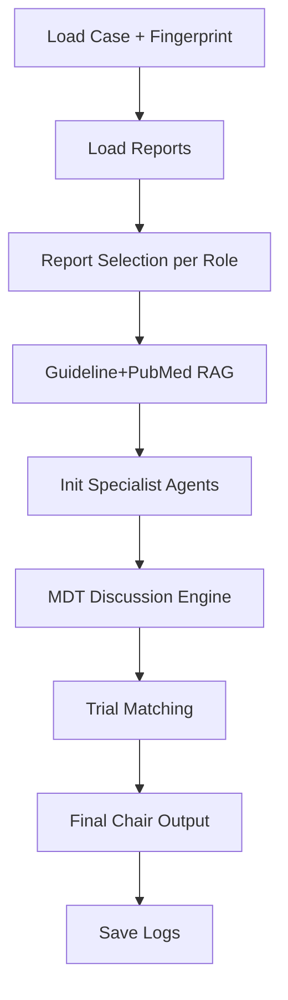

# MDT Discussion Log — 2026-01-22_08-43-04
Generated automatically by MDT Pipeline.


## CASE (structured JSON)

```
{"CASE_CORE":{"ADJUVANT_TREATMENT":{"cycles_or_courses":"6","given":"Yes","regimens":["白紫+卡铂"]},"BIOMARKERS":{"AFP":"<0.91 ng/ml (2022-10-12)","CA125":"933.00 U/ml (2022-12-29)","HER2":"Unknown","MSI":"Unknown","PDL1_CPS":"Unknown","TMB":"Unknown"},"BRCA1":"Unknown","BRCA2":"Unknown","CURRENT_STATUS":"Recurrent ovarian clear cell carcinoma with metastatic disease (liver, presacral/sacrum, right iliac bone) documented on imaging","DIAGNOSIS":{"components":["High-grade adenocarcinoma involving full-thickness intestinal wall","Lymph node metastasis (4/15)","Peritoneal/rectal/vaginal involvement described"],"histology":"透明细胞癌; 肠壁全层见高级别腺癌","laterality":"Unknown","primary":"卵巢癌复发","site":"Ovary"},"HRD":"Unknown","INITIAL_TREATMENT":"Unknown","LINE_OF_THERAPY":[{"cycles":"6","end_date":"2022-08-17","intent":"Unknown","line":"1L","regimen":"白紫+卡铂","start_date":"Unknown"}],"MAINTENANCE":"Unknown","MAINTENANCE_DETAIL":{"end_date":"Unknown","given":"Unknown","regimens":[],"start_date":"Unknown"},"NEOADJUVANT":"Unknown","PFI_days":"56","PLATINUM_HISTORY":[{"PFI_days":"56","end_date":"2022-08-17","evidence":"Rise in CA125/CA19-9 on 2022-10-12","evidence_type":"Biochemical","first_relapse_date":"2022-10-12","line":"1L","start_date":"Unknown","status":"Resistant"}],"PLATINUM_PFI_CURRENT":"56","PLATINUM_STATUS":"Resistant","PLATINUM_STATUS_CURRENT":"Resistant","RELAPSE":"Yes","RELAPSE_DATE":{"date":"2022-10-12","evidence":"Elevated CA125 and CA19-9 on 2022-10-12; imaging (MRI 2022-10-24, CT 2022-10-25) supports recurrence","type":"Biochemical"},"SCENE":"Platinum_resistant_relapse","STAGE":{"stage_basis":"Unknown","stage_system":"Unknown","stage_text":"Unknown"},"SURGERY_DONE":{"date":"2022-03-28","performed":"Yes","procedure":"Tumor debulking + partial rectosigmoid resection + partial vaginectomy + retroperitoneal lesion resection + complex adhesiolysis + left ureteral stent placement + bladder repair"},"TIMELINE":{"constraints":{"max_events":30,"min_events":3,"must_include":["first diagnostic imaging or pathology confirmation (if available)"],"ordering_rules":{"prioritize_last_event":true}},"events":[{"date":"2022-03-28","description":"Cytoreductive surgery including partial rectosigmoid resection, partial vaginectomy, retroperitoneal lesion resection, left ureteral stent, bladder repair","event_type":"Surgery","key_result":"Tumor ~7x4x2.5 cm; full-thickness intestinal wall high-grade adenocarcinoma; consider ovarian clear cell carcinoma; 4/15 nodes positive","regimen_or_test":"Surgical resection"},{"date":"2022-08-17","description":"Completed 6 cycles of 白紫+卡铂 chemotherapy, last given 2022-08-17","event_type":"Chemo","key_result":"Post-chemo tumor markers reduced on 2022-08-15","regimen_or_test":"白紫+卡铂"},{"date":"2022-10-12","description":"Rising tumor markers indicating recurrence","event_type":"Lab","key_result":"CA19-9 77.20 U/ml; CA125 89.60 U/ml","regimen_or_test":"Tumor markers"},{"date":"2022-10-24","description":"Pelvic MRI shows presacral mass and pelvic mesenteric nodules; consider recurrence with sacral involvement","event_type":"Imaging","key_result":"Presacral lesion and pelvic mesenteric nodules, possible metastases","regimen_or_test":"MRI pelvis"},{"date":"2022-10-25","description":"CT shows multiple liver nodules, some new compared to prior","event_type":"Imaging","key_result":"Multiple hepatic metastatic nodules","regimen_or_test":"CT abdomen"},{"date":"2022-12-29","description":"Markedly elevated tumor markers consistent with progression","event_type":"Lab","key_result":"CA125 933.00 U/ml; CA19-9 229.00 U/ml; HE4 111.00 pmol/L","regimen_or_test":"Tumor markers"},{"date":"2022-12-30","description":"MRI/CT show increased presacral lesion, new right iliac bone nodule, increased hepatic metastases","event_type":"Imaging","key_result":"Progression of pelvic and hepatic metastatic disease","regimen_or_test":"MRI pelvis; CT abdomen"}]},"VISIT_DATE":"2023-01-03","first_relapse_date":"2022-10-12","last_platinum_end_date":"2022-08-17"},"LAB_TRENDS":{"labs":[{"analyte":"CA125","history":[{"date":"2022-08-15","flag":"Unknown","value":"14.90"},{"date":"2022-10-12","flag":"↑","value":"89.60"},{"date":"2022-11-17","flag":"↑","value":"403"},{"date":"2022-12-29","flag":"↑","value":"933.00"}],"latest":{"date":"2022-12-29","flag":"↑","value":"933.00"},"reference_range":"Unknown","unit":"U/ml"},{"analyte":"CA19-9","history":[{"date":"2022-08-15","flag":"Unknown","value":"7.16"},{"date":"2022-10-12","flag":"↑","value":"77.20"},{"date":"2022-12-29","flag":"↑","value":"229.00"}],"latest":{"date":"2022-12-29","flag":"↑","value":"229.00"},"reference_range":"Unknown","unit":"U/ml"},{"analyte":"HE4","history":[{"date":"2022-08-15","flag":"↑","value":"87.90"},{"date":"2022-10-12","flag":"Unknown","value":"59.70"},{"date":"2022-12-29","flag":"↑","value":"111.00"}],"latest":{"date":"2022-12-29","flag":"↑","value":"111.00"},"reference_range":"Unknown","unit":"pmol/L"},{"analyte":"AFP","history":[{"date":"2022-10-12","flag":"Unknown","value":"<0.91"}],"latest":{"date":"2022-10-12","flag":"Unknown","value":"<0.91"},"reference_range":"Unknown","unit":"ng/ml"}],"milestones":[{"date":"2022-03-28","description":"Primary cytoreductive surgery performed","type":"Surgery"},{"date":"2022-08-17","description":"Completed 6 cycles of 白紫+卡铂","type":"ChemoEnd"},{"date":"2022-10-12","description":"Biochemical relapse with rising tumor markers","type":"Relapse"}]},"MED_ONC":{"current_regimen":{"cycle_info":"6 cycles of 白紫+卡铂, last 2022-08-17","last_admin_date":"2022-08-17","name":"Unknown"},"genetic_testing":{"germline":[],"somatic":[]},"monitoring_points":[],"planned_next_regimen":"Unknown","prior_systemic_therapies":["白紫+卡铂"]},"NUC_MED":{"studies":[]},"PATHOLOGY":{"specimens":[{"components":["Tumor size ~7x4x2.5 cm","Bilateral margins negative","Pericolic lymph nodes 4/15 positive","One tumor nodule (posterior bladder)"],"date":"2022-03-28","diagnosis":"Consider ovarian clear cell carcinoma involvement; full-thickness intestinal wall high-grade adenocarcinoma","grade":"High-grade","ihc":[{"marker":"MLH1","result":"+"},{"marker":"MSH6","result":"+"},{"marker":"MSH2","result":"+"},{"marker":"PMS2","result":"+"},{"marker":"ER","result":"partial+"},{"marker":"PR","result":"few weak+"},{"marker":"P53","result":"+/-"},{"marker":"WT1","result":"-"},{"marker":"Ki-67","result":"60%+"},{"marker":"HNF1B","result":"+"},{"marker":"NapsinA","result":"focal+"},{"marker":"P16","result":"+"},{"marker":"PAX8","result":"+"},{"marker":"SALL4","result":"-"},{"marker":"ZBTB16","result":"-"}],"involvement_sites":["Rectosigmoid colon","Left retroperitoneum","Vagina","Pericolic lymph nodes","Posterior bladder nodule"],"laterality":"Unknown","molecular":[],"raw_text":"卵巢恶性肿瘤：卵巢癌复发：术前CA125 45.7 CA199 161 HE4 562 2022.03.28在全麻下行“瘤体减灭术+直肠乙状结肠部分切除术+阴道部分切除术+腹膜后病损切除术+复杂肠粘连松解术+左输尿管支架置管术+膀胱修补术。（部分直乙结肠+左侧腹膜后肿瘤+部分阴道）肠壁全层见高级别腺癌，结合T2022-04771首先考虑为透明细胞癌，正在加做免疫组化进一步明确。肿块大小约7*4*2.5cm。双侧切缘阴性，肠周淋巴结（4/15）见癌转移，伴癌结节1枚。（膀胱后壁肿瘤）纤维脂肪组织，局灶纤维组织增生、含铁血黄素沉积、泡沫样组织反应，未见癌累及。补充诊断1：【补充报告】（部分直乙结肠+左侧腹膜后肿瘤+部分阴道）可符合卵巢透明细胞癌累及。免疫组化（HI22-06789）瘤细胞：MLH1(ES05)（+），MSH6（+），MSH2（+），PMS2（+），ER（部分+），PR（少弱+），P53（+/-），WT1（-），Ki-67（60%+），HNF1B（+），NapsinA（灶+），P16（+），PAX8（+），SALL4（-），ZBTB16（-）","sample_type":"Surgical resection","site":"Partial rectosigmoid + left retroperitoneal tumor + partial vagina","tumor_size":"7 x 4 x 2.5 cm","uncertainty_or_missing":["BRCA/HRD testing not reported"]}]},"RADIOLOGY":{"next_imaging_plan":{"modality":"Unknown","timing":"Unknown"},"studies":[{"anatomic_sites":["Pelvis"],"date":"2022-10-24","findings":["Postoperative pelvis with presacral mass; pelvic mesenteric multiple enhancing small nodules"],"impression":"Consider recurrence with adjacent sacral involvement; pelvic mesenteric nodules likely metastases","modality":"MRI","trend_vs_prior":"Unknown"},{"anatomic_sites":["Liver"],"date":"2022-10-25","findings":["Multiple intrahepatic nodules, some new compared to prior"],"impression":"Probable metastases in liver","modality":"CT","trend_vs_prior":"Worse"},{"anatomic_sites":["Pelvis; sacrum; right iliac bone"],"date":"2022-12-30","findings":["Presacral lesion increased in size and heterogeneous enhancement; right iliac bone new enhancing nodule; pelvic mesenteric nodules similar"],"impression":"Progression of presacral disease with possible sacral and iliac bone involvement; peritoneal metastases possible","modality":"MRI","trend_vs_prior":"Worse"},{"anatomic_sites":["Liver; spleen"],"date":"2022-12-30","findings":["Multiple hepatic metastatic nodules increased in number and size; splenic patchy shadow suggesting possible infarct"],"impression":"Progression of hepatic metastases","modality":"CT","trend_vs_prior":"Worse"}]},"TIMELINE":{"constraints":{"max_events":30,"min_events":3,"must_include":["first diagnostic imaging or pathology confirmation (if available)"],"ordering_rules":{"prioritize_last_event":true}},"events":[{"date":"2022-03-28","description":"Cytoreductive surgery including partial rectosigmoid resection, partial vaginectomy, retroperitoneal lesion resection, left ureteral stent, bladder repair","event_type":"Surgery","key_result":"Tumor ~7x4x2.5 cm; full-thickness intestinal wall high-grade adenocarcinoma; consider ovarian clear cell carcinoma; 4/15 nodes positive","regimen_or_test":"Surgical resection"},{"date":"2022-08-17","description":"Completed 6 cycles of 白紫+卡铂 chemotherapy, last given 2022-08-17","event_type":"Chemo","key_result":"Post-chemo tumor markers reduced on 2022-08-15","regimen_or_test":"白紫+卡铂"},{"date":"2022-10-12","description":"Rising tumor markers indicating recurrence","event_type":"Lab","key_result":"CA19-9 77.20 U/ml; CA125 89.60 U/ml","regimen_or_test":"Tumor markers"},{"date":"2022-10-24","description":"Pelvic MRI shows presacral mass and pelvic mesenteric nodules; consider recurrence with sacral involvement","event_type":"Imaging","key_result":"Presacral lesion and pelvic mesenteric nodules, possible metastases","regimen_or_test":"MRI pelvis"},{"date":"2022-10-25","description":"CT shows multiple liver nodules, some new compared to prior","event_type":"Imaging","key_result":"Multiple hepatic metastatic nodules","regimen_or_test":"CT abdomen"},{"date":"2022-12-29","description":"Markedly elevated tumor markers consistent with progression","event_type":"Lab","key_result":"CA125 933.00 U/ml; CA19-9 229.00 U/ml; HE4 111.00 pmol/L","regimen_or_test":"Tumor markers"},{"date":"2022-12-30","description":"MRI/CT show increased presacral lesion, new right iliac bone nodule, increased hepatic metastases","event_type":"Imaging","key_result":"Progression of pelvic and hepatic metastatic disease","regimen_or_test":"MRI pelvis; CT abdomen"}]}}
```


## FINAL MDT OUTPUT

```
Final Assessment:  
Recurrent, platinum‑resistant ovarian clear cell carcinoma with progressive liver, presacral/sacral and iliac bone metastases despite 1L platinum therapy [@2022-03-28 | CASE; @2022-12-30 | MR; @2022-12-30 | CT]. Tumor markers are rapidly rising, confirming active systemic disease [@2022-12-29 | LAB]. Key missing data: performance status, comorbidities, pain/symptom burden, prior maintenance, and germline/somatic BRCA/HRD and other molecular profiling.

Core Treatment Strategy:  
- Initiate second‑line systemic therapy for platinum‑resistant disease; avoid further platinum, given PFI 56 days [@2022-08-17 | CASE].  
- Obtain germline and somatic molecular testing (BRCA, HRD, MSI, TMB, actionable targets) to refine future systemic/clinical‑trial options.  
- Refer to radiation/pain team to evaluate palliative treatment for presacral/sacral/right iliac bone lesions and symptom control [@2022-12-30 | MR].  

Change Triggers:  
- If performance status poor or major comorbidities identified, shift from active multi‑agent therapy toward symptom‑focused palliative care.  
- If molecular testing reveals targetable alterations, pivot to appropriate targeted or immunotherapy strategy rather than standard chemotherapy alone.

---
## References

### Guidelines

### Literature

### Clinical Trials

### Clinical Reports

[@2022-03-28 | CASE]
  CASE ID: 2022-03-28 | Date: 2022-03-28
  Content: milestones:

[@2022-12-30 | MR]
  MR ID: 2022-12-30 | Date: 2022-12-30
  Content: Progression of presacral disease with possible sacral and...

[@2022-12-30 | CT]
  CT ID: 2022-12-30 | Date: 2022-12-30
  Content: Progression of presacral disease with possible sacral and...

[@2022-12-29 | LAB]
  LAB ID: 2022-12-29 | Date: 2022-12-29
  Content: Case data from 2022-12-29

[@2022-08-17 | CASE]
  CASE ID: 2022-08-17 | Date: 2022-08-17
  Content: milestones:

```


## PIPELINE FLOW (Mermaid)




## TRACE EVENTS (Structured)

```json
[
  {
    "ts": "2026-01-22T08:42:57.464468",
    "event": "pipeline_start",
    "payload": {
      "mode": "chair_sa",
      "visit_time": "2023-01-03 08:53:29.260000"
    }
  },
  {
    "ts": "2026-01-22T08:42:57.464769",
    "event": "case_fingerprint",
    "payload": {
      "case_fingerprint": "2a31f255c155"
    }
  },
  {
    "ts": "2026-01-22T08:43:04.749262",
    "event": "final_output_end",
    "payload": {
      "final_output_chars": 1878
    }
  }
]
```


## INITIAL EXPERT OPINIONS


## chair

```
(Chair-SA: simplest testing mode)
```


## MERGED SUMMARY (Assistant)

```
(Chair-SA: no RAG, no reports)
```


## INTERACTION LOG (Round × Turn)


## FINAL REFINED PLANS (per Round)


## RAW AGENT LOGS

### chair
- **User:** 
As the MDT chair for gynecologic oncology, you are seeing the patient at OUTPATIENT TIME: 2023-01-03 08:53:29.260000.
Based on the case information provided in your system prompt, determine the CURRENT best management plan for this visit.

NOTE: This is the simplest mode without RAG knowledge (guidelines/PubMed).
You should clearly indicate what additional information would be needed for more definitive recommendations.

IMPORTANT: Any factual statement from the case data MUST include evidence tag:
- For lab results: [@date | LAB] (e.g., [@2022-01-17 | LAB])
- For imaging findings: [@date | MR] or [@date | CT]
- For genetic testing: [@date | Genomics]
- For pathology: [@date | Pathology]
- For surgery/treatment history: [@date | CASE]
Always use spaces around | for consistency.

# Response Format (follow OMGs standard format)
Final Assessment:
<1–3 sentences: summarize case, current status, and key uncertainties/missing data. Include evidence tags for any facts cited.>

Core Treatment Strategy:
- < ≤20 words concrete decision or recommended next step, with evidence tag if citing case data >
- < ≤20 words concrete decision or recommended next step, with evidence tag if citing case data >
- < ≤20 words concrete decision or recommended next step, with evidence tag if citing case data >

Change Triggers:
- < ≤20 words "if X, then adjust management from A to B" >
- < ≤20 words "if X, then adjust management from A to B" >

  
  **Assistant:** Final Assessment:  
Recurrent, platinum‑resistant ovarian clear cell carcinoma with progressive liver, presacral/sacral and iliac bone metastases despite 1L platinum therapy [@2022-03-28 | CASE; @2022-12-30 | MR; @2022-12-30 | CT]. Tumor markers are rapidly rising, confirming active systemic disease [@2022-12-29 | LAB]. Key missing data: performance status, comorbidities, pain/symptom burden, prior maintenance, and germline/somatic BRCA/HRD and other molecular profiling.

Core Treatment Strategy:  
- Initiate second‑line systemic therapy for platinum‑resistant disease; avoid further platinum, given PFI 56 days [@2022-08-17 | CASE].  
- Obtain germline and somatic molecular testing (BRCA, HRD, MSI, TMB, actionable targets) to refine future systemic/clinical‑trial options.  
- Refer to radiation/pain team to evaluate palliative treatment for presacral/sacral/right iliac bone lesions and symptom control [@2022-12-30 | MR].  

Change Triggers:  
- If performance status poor or major comorbidities identified, shift from active multi‑agent therapy toward symptom‑focused palliative care.  
- If molecular testing reveals targetable alterations, pivot to appropriate targeted or immunotherapy strategy rather than standard chemotherapy alone.
  
  *(2026-01-22T08:43:04.745754)*

