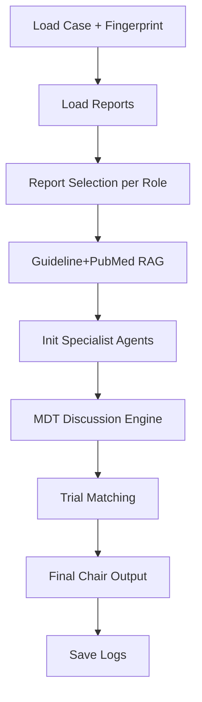

# MDT Discussion Log — 2026-01-22_18-32-19
Generated automatically by MDT Pipeline.


## CASE (structured JSON)

```
{"CASE_CORE":{"ADJUVANT_TREATMENT":{"cycles_or_courses":"6","given":"Yes","regimens":["TP"]},"BIOMARKERS":{"AFP":"Unknown","CA125":"Unknown","HER2":"Unknown","MSI":"Unknown","PDL1_CPS":"Unknown","TMB":"Unknown"},"BRCA1":"Unknown","BRCA2":"Unknown","CURRENT_STATUS":"On maintenance niraparib; ECOG 1; recent imaging without pelvic recurrence.","DIAGNOSIS":{"components":["Adenocarcinoma","High-grade serous carcinoma"],"histology":"High-grade serous carcinoma","laterality":"Bilateral","primary":"Ovarian cancer","site":"Ovary"},"ECOG":"1","GENOMICS":{"HRD_STATUS":{"method":"Unknown","result":"Positive","score":"Unknown"},"alterations":[],"testing_date":"Unknown","testing_performed":"Yes","testing_platform":"Unknown"},"HRD":"Positive","INITIAL_TREATMENT":"Yes","LINE_OF_THERAPY":[{"concurrent_bevacizumab":"No","cycles_completed":"1","cycles_planned":"Unknown","discontinuation":{"detail":"Switched to TP chemotherapy","reason":"Other"},"end_date":"2021-09-07","in_clinical_trial":"No","intent":"First_line","line":"1L","pfs_days":"41","regimen":"顺铂50mg腹腔化疗","response_assessment":{"best_response":"Unknown","ca125_response":"Unknown","response_criteria":"Unknown","response_date":"Unknown"},"start_date":"2021-09-06"},{"concurrent_bevacizumab":"No","cycles_completed":"6","cycles_planned":"6","discontinuation":{"detail":"Completed 6 cycles","reason":"Completed"},"end_date":"2022-03-22","in_clinical_trial":"No","intent":"First_line","line":"1L","pfs_days":"Unknown","regimen":"TP","response_assessment":{"best_response":"Unknown","ca125_response":"Unknown","response_criteria":"Unknown","response_date":"Unknown"},"start_date":"2021-10-18"},{"concurrent_bevacizumab":"No","cycles_completed":"Unknown","cycles_planned":"Unknown","discontinuation":{"detail":"Temporarily stopped due to adverse reactions and low platelets; restarted 2022-05-23; held 3 weeks around hernia repair; currently continuing","reason":"Other"},"end_date":"Unknown","in_clinical_trial":"No","intent":"Maintenance","line":"1L","pfs_days":"Unknown","regimen":"尼拉帕利","response_assessment":{"best_response":"Unknown","ca125_response":"Unknown","response_criteria":"Unknown","response_date":"Unknown"},"start_date":"2022-04-Unknown"}],"MAINTENANCE":"Yes","MAINTENANCE_DETAIL":{"end_date":"Unknown","given":"Yes","regimens":["尼拉帕利"],"start_date":"2022-04-Unknown"},"NEOADJUVANT":"Unknown","PFI_days":"Unknown","PLATINUM_HISTORY":[{"PFI_days":"Unknown","end_date":"2022-03-22","evidence":"TP chemotherapy 6 cycles after primary surgery; no explicit relapse documented.","evidence_type":"Unknown","first_relapse_date":"Unknown","line":"1L","start_date":"2021-10-18","status":"Unknown"}],"PLATINUM_PFI_CURRENT":"Unknown","PLATINUM_STATUS":"Unknown","PLATINUM_STATUS_CURRENT":"Unknown","RELAPSE":"No","RELAPSE_DATE":{"date":"Unknown","evidence":"No relapse; pelvic MRI 2022-10-25 showed no abnormal soft tissue in pelvis.","type":"Unknown"},"SCENE":"Maintenance_surveillance_followup","STAGE":{"stage_basis":"Unknown","stage_system":"Unknown","stage_text":"Unknown"},"SURGERY_DONE":{"date":"2021-08-26","performed":"Yes","procedure":"Radical hysterectomy with bilateral salpingo-oophorectomy, pelvic mass resection, partial rectosigmoid resection, sigmoid colostomy, omentectomy, pelvic lymphadenectomy, appendectomy, paraaortic lymphadenectomy"},"TIMELINE":{"constraints":{"max_events":30,"min_events":3,"must_include":["first diagnostic imaging or pathology confirmation (if available)"],"ordering_rules":{"prioritize_last_event":true}},"events":[{"date":"2021-08-26","description":"Primary cytoreductive surgery including radical hysterectomy, bilateral salpingo-oophorectomy, bowel resection, omentectomy, lymphadenectomy, colostomy, appendectomy","event_type":"Surgery","key_result":"Multiple peritoneal sites and 6/24 lymph nodes positive for carcinoma","regimen_or_test":"Surgery"},{"date":"2021-08-26","description":"Pathology confirmed high-grade serous carcinoma of bilateral ovaries with widespread peritoneal involvement and nodal metastases","event_type":"Diagnosis","key_result":"High-grade serous carcinoma, bilateral ovaries; 6/24 lymph nodes positive","regimen_or_test":"Pathology"},{"date":"2021-09-06","description":"Intraperitoneal chemotherapy with cisplatin 50mg","event_type":"Chemo","key_result":"Completed over 2021-09-06 and 2021-09-07","regimen_or_test":"顺铂50mg腹腔化疗"},{"date":"2021-10-18","description":"Started TP chemotherapy, planned 6 cycles","event_type":"Chemo","key_result":"Completed 6 cycles, last on 2022-03-22","regimen_or_test":"TP"},{"date":"2022-03-22","description":"Last cycle of TP chemotherapy","event_type":"Chemo","key_result":"Adjuvant chemotherapy completed","regimen_or_test":"TP"},{"date":"2022-04-18","description":"Complete blood count showing thrombocytopenia","event_type":"Lab","key_result":"PLT:33","regimen_or_test":"Blood routine"},{"date":"2022-04-26","description":"Stopped niraparib due to strong adverse reactions","event_type":"Other","key_result":"Maintenance paused","regimen_or_test":"尼拉帕利"},{"date":"2022-05-23","description":"Restarted niraparib 1# qd","event_type":"Chemo","key_result":"Maintenance resumed","regimen_or_test":"尼拉帕利"},{"date":"2022-06-24","description":"Abdominal wall hernia repair at Zhongshan Hospital","event_type":"Surgery","key_result":"Niraparib held for 3 weeks around surgery","regimen_or_test":"Surgery"},{"date":"2022-09-27","description":"CT chest/abdomen showing small bilateral pleural effusions improved; pulmonary AV fistula and nodules similar to prior","event_type":"Imaging","key_result":"No new malignant findings reported; abdominal details deferred","regimen_or_test":"CT"},{"date":"2022-10-08","description":"CT showing liver segment VII hemangioma and left renal cyst, stable","event_type":"Imaging","key_result":"No new findings; chest to correlate with other exams","regimen_or_test":"CT"},{"date":"2022-10-25","description":"Pelvic MRI after ovarian cancer surgery","event_type":"Imaging","key_result":"No abnormal soft tissue in pelvis; follow-up recommended","regimen_or_test":"MR"},{"date":"2022-12-30","description":"Zhongshan Hospital evaluation: incisional hernia, low-density lesion in right liver lobe","event_type":"Imaging","key_result":"Blood count and liver/kidney function generally acceptable","regimen_or_test":"Imaging"},{"date":"2023-01-09","description":"Recent blood routine showed platelet count 34 (year not fully specified)","event_type":"Lab","key_result":"PLT:34 (interpreted from 'PLT:342022.5.23起恢复', year unclear)","regimen_or_test":"Blood routine"}]},"VISIT_DATE":"2023-01-09","first_relapse_date":"Unknown","last_platinum_end_date":"2022-03-22"},"CLINICAL_TRIALS":[],"LAB_TRENDS":{"labs":[{"analyte":"Other","history":[{"date":"2022-04-18","flag":"↓","value":"PLT:33"}],"latest":{"date":"2022-04-18","flag":"↓","value":"PLT:33"},"reference_range":"Unknown","unit":"Unknown"}],"milestones":[{"date":"2021-08-26","description":"Primary debulking surgery for ovarian cancer","type":"Surgery"},{"date":"2021-10-18","description":"Started TP chemotherapy","type":"ChemoStart"},{"date":"2022-03-22","description":"Completed TP chemotherapy","type":"ChemoEnd"},{"date":"2022-04-18","description":"Thrombocytopenia (PLT 33) on blood routine","type":"Other"}]},"MED_ONC":{"current_regimen":{"cycle_info":"Continuous oral maintenance; temporarily stopped 2022-04-26 and around 2022-06-24 surgery; currently continuing","last_admin_date":"Unknown","name":"尼拉帕利"},"genetic_testing":{"germline":[],"somatic":["HRD"]},"monitoring_points":[{"drug_or_class":"尼拉帕利","monitoring":["Monitor platelet count due to prior thrombocytopenia"]}],"planned_next_regimen":"Unknown","prior_systemic_therapies":["顺铂50mg腹腔化疗","TP"]},"NUC_MED":{"studies":[]},"PATHOLOGY":{"specimens":[{"components":["High-grade serous carcinoma","Myometrial leiomyomas","Chronic cervicitis"],"date":"2021-08-26","diagnosis":"Adenocarcinoma consistent with high-grade serous carcinoma","grade":"High-grade","ihc":[],"involvement_sites":["Left ovary","Right ovary","Left fallopian tube","Right fallopian tube","Uterine myometrium","Pelvic and abdominal peritoneum","Partial rectosigmoid colon from serosa to superficial muscle","Omentum","Left paracolic gutter peritoneum","Small bowel mesentery","Sigmoid mesentery","Appendiceal serosa","Pelvic lymph nodes","Para-aortic and mesenteric lymph nodes (some positive)"],"laterality":"Bilateral ovarian involvement","molecular":[{"result":"Positive","test":"HRD"}],"raw_text":"术后病理：标本类型:扩大子宫+双附件+巨大盆块+部分直乙结肠+盆腹腔多病灶肿瘤大小:左侧：3.5×2×1.5cm；右侧：6×5.5×4.5cm肿瘤侧别:双侧病理类型:腺癌，结合免疫组化结果（I2021-07819），符合高级别浆液性癌。其他部位情况:左输卵管:见癌累及右输卵管:见癌累及子宫内膜:萎缩改变宫颈:慢性炎子宫肌层:见癌累及；肌壁间平滑肌瘤（多枚，直径0.5-2cm）盆腹腔多部位病灶:（部分直乙结肠）见癌累及，自浆膜层浸润至浅肌层，肠管两切缘未见癌累及。（大网膜、大网膜及盆腔肿块、左侧结肠旁沟腹膜、小肠系膜肿瘤、乙状结肠系膜肿瘤）见癌累及.（阑尾及周围肿块） 浆膜层见癌累及。其他:送检淋巴结（6/24）见癌转移，其中：左盆腔淋巴结（1/4）；右盆腔淋巴结（3/8）；腹主肠系膜下方淋巴结（1/4）； 肠系膜下动脉上方淋巴结（1/2）；腹主动脉旁淋巴结（0/6）。","sample_type":"Surgical resection","site":"Uterus, bilateral adnexa, pelvic mass, rectosigmoid colon, peritoneum, omentum, appendix, lymph nodes","tumor_size":"Left ovary 3.5×2×1.5cm; right ovary 6×5.5×4.5cm","uncertainty_or_missing":["FIGO stage not provided","IHC panel details not provided"]}]},"RADIOLOGY":{"next_imaging_plan":{"modality":"Unknown","timing":"Unknown"},"studies":[{"anatomic_sites":["Lung","Pleura","Chest"],"date":"2022-09-27","findings":["Right upper lung arteriovenous fistula similar to prior","Right upper lung apical segment small nodule similar to prior","Left upper lung scattered tiny nodules","Small bilateral pleural effusions decreased compared with prior","Scattered chronic inflammatory and fibrotic changes in lungs","Atelectasis improved","Nodule at right cardiophrenic angle less apparent"],"impression":"Pulmonary AV fistula and nodules unchanged; pleural effusions and atelectasis improved","modality":"CT","trend_vs_prior":"Improved"},{"anatomic_sites":["Liver","Kidney","Spine"],"date":"2022-10-08","findings":["Hemangioma in liver right lobe segment VII similar to prior","Left renal cyst similar to prior","Localized uneven sclerotic change in lumbar vertebrae similar to prior"],"impression":"Stable hemangioma and renal cyst; spinal sclerosis unchanged; chest findings to correlate with other exams","modality":"CT","trend_vs_prior":"Stable"},{"anatomic_sites":["Pelvis"],"date":"2022-10-25","findings":["Postoperative changes after ovarian cancer surgery","No abnormal soft tissue mass in pelvis"],"impression":"No pelvic recurrence; follow-up recommended","modality":"MRI","trend_vs_prior":"Stable"}]},"TIMELINE":{"constraints":{"max_events":30,"min_events":3,"must_include":["first diagnostic imaging or pathology confirmation (if available)"],"ordering_rules":{"prioritize_last_event":true}},"events":[{"date":"2021-08-26","description":"Primary cytoreductive surgery including radical hysterectomy, bilateral salpingo-oophorectomy, bowel resection, omentectomy, lymphadenectomy, colostomy, appendectomy","event_type":"Surgery","key_result":"Multiple peritoneal sites and 6/24 lymph nodes positive for carcinoma","regimen_or_test":"Surgery"},{"date":"2021-08-26","description":"Pathology confirmed high-grade serous carcinoma of bilateral ovaries with widespread peritoneal involvement and nodal metastases","event_type":"Diagnosis","key_result":"High-grade serous carcinoma, bilateral ovaries; 6/24 lymph nodes positive","regimen_or_test":"Pathology"},{"date":"2021-09-06","description":"Intraperitoneal chemotherapy with cisplatin 50mg","event_type":"Chemo","key_result":"Completed over 2021-09-06 and 2021-09-07","regimen_or_test":"顺铂50mg腹腔化疗"},{"date":"2021-10-18","description":"Started TP chemotherapy, planned 6 cycles","event_type":"Chemo","key_result":"Completed 6 cycles, last on 2022-03-22","regimen_or_test":"TP"},{"date":"2022-03-22","description":"Last cycle of TP chemotherapy","event_type":"Chemo","key_result":"Adjuvant chemotherapy completed","regimen_or_test":"TP"},{"date":"2022-04-18","description":"Complete blood count showing thrombocytopenia","event_type":"Lab","key_result":"PLT:33","regimen_or_test":"Blood routine"},{"date":"2022-04-26","description":"Stopped niraparib due to strong adverse reactions","event_type":"Other","key_result":"Maintenance paused","regimen_or_test":"尼拉帕利"},{"date":"2022-05-23","description":"Restarted niraparib 1# qd","event_type":"Chemo","key_result":"Maintenance resumed","regimen_or_test":"尼拉帕利"},{"date":"2022-06-24","description":"Abdominal wall hernia repair at Zhongshan Hospital","event_type":"Surgery","key_result":"Niraparib held for 3 weeks around surgery","regimen_or_test":"Surgery"},{"date":"2022-09-27","description":"CT chest/abdomen showing small bilateral pleural effusions improved; pulmonary AV fistula and nodules similar to prior","event_type":"Imaging","key_result":"No new malignant findings reported; abdominal details deferred","regimen_or_test":"CT"},{"date":"2022-10-08","description":"CT showing liver segment VII hemangioma and left renal cyst, stable","event_type":"Imaging","key_result":"No new findings; chest to correlate with other exams","regimen_or_test":"CT"},{"date":"2022-10-25","description":"Pelvic MRI after ovarian cancer surgery","event_type":"Imaging","key_result":"No abnormal soft tissue in pelvis; follow-up recommended","regimen_or_test":"MR"},{"date":"2022-12-30","description":"Zhongshan Hospital evaluation: incisional hernia, low-density lesion in right liver lobe","event_type":"Imaging","key_result":"Blood count and liver/kidney function generally acceptable","regimen_or_test":"Imaging"},{"date":"2023-01-09","description":"Recent blood routine showed platelet count 34 (year not fully specified)","event_type":"Lab","key_result":"PLT:34 (interpreted from 'PLT:342022.5.23起恢复', year unclear)","regimen_or_test":"Blood routine"}]},"TOXICITIES":[{"attribution":"Probable","dose_modification":"Yes","onset_date":"2022-04-18","outcome":"Resolved","related_line":"1L","related_regimen":"尼拉帕利","severity":"Severe","toxicity":"Strong adverse reaction to niraparib with thrombocytopenia (PLT 33)"}]}
```


## FINAL MDT OUTPUT

```
Final Assessment:
Post–primary debulking high‑grade serous ovarian carcinoma with nodal/peritoneal spread on 1L PARP maintenance, no radiologic recurrence, ECOG 1, but significant thrombocytopenia (PLT 33–34) temporally related to PARP therapy [@2021-08-26 | Pathology; @2022-04-18 | LAB; @2023-01-09 | LAB; @2022-05-23 | CASE]. HRD is positive but germline BRCA, CA‑125 trend, exact current PARP dose, full CBC/differential, and liver/renal function today are undocumented, limiting firm long‑term decisions. Imaging up to 2022‑10 shows no pelvic recurrence and stable extra‑pelvic findings [@2022-10-25 | MR; @2022-09-27 | CT; @2022-10-08 | CT].

Core Treatment Strategy:
- Continue PARP maintenance only if today’s platelets and counts meet safe thresholds; otherwise hold and modify dose/schedule [@2022-04-18 | LAB].  
- Repeat full CBC, coagulation, liver/renal tests and CA‑125 today to guide toxicity management and surveillance intensity [@2023-01-09 | LAB].  
- Plan cross‑sectional imaging (CT or MRI abdomen/pelvis ± chest) within ~3–6 months, or sooner if CA‑125/symptoms change [@2022-10-25 | MR].  

Change Triggers:
- If platelets remain < safe maintenance threshold or bleeding occurs, stop PARP and consider alternative maintenance/surveillance approach.  
- If imaging or CA‑125 suggests recurrence, re‑stage and switch from maintenance to systemic relapse therapy planning, including platinum sensitivity assessment.

---
## References

### Guidelines

### Literature

### Clinical Trials

### Clinical Reports

[@2021-08-26 | Pathology]
  Pathology ID: 2021-08-26 | Date: 2021-08-26
  Content: milestones:

[@2022-04-18 | LAB]
  LAB ID: 2022-04-18 | Date: 2022-04-18
  Content: milestones:

[@2023-01-09 | LAB]
  LAB ID: 2023-01-09 | Date: 2023-01-09
  Content: Case data from 2023-01-09

[@2022-05-23 | CASE]
  CASE ID: 2022-05-23 | Date: 2022-05-23
  Content: Case data from 2022-05-23

[@2022-10-25 | MR]
  MR ID: 2022-10-25 | Date: 2022-10-25
  Content: No pelvic recurrence; follow-up recommended

[@2022-09-27 | CT]
  CT ID: 2022-09-27 | Date: 2022-09-27
  Content: Pulmonary AV fistula and nodules unchanged; pleural...

[@2022-10-08 | CT]
  CT ID: 2022-10-08 | Date: 2022-10-08
  Content: Stable hemangioma and renal cyst; spinal sclerosis...

```


## PIPELINE FLOW (Mermaid)




## TRACE EVENTS (Structured)

```json
[
  {
    "ts": "2026-01-22T18:32:12.051018",
    "event": "pipeline_start",
    "payload": {
      "mode": "chair_sa",
      "visit_time": "2023-01-09 09:23:13.113000"
    }
  },
  {
    "ts": "2026-01-22T18:32:12.051579",
    "event": "case_fingerprint",
    "payload": {
      "case_fingerprint": "fa2f34f1e565"
    }
  },
  {
    "ts": "2026-01-22T18:32:19.627572",
    "event": "final_output_end",
    "payload": {
      "final_output_chars": 2272
    }
  }
]
```


## INITIAL EXPERT OPINIONS


## chair

```
(Chair-SA: simplest testing mode)
```


## MERGED SUMMARY (Assistant)

```
(Chair-SA: no RAG, no reports)
```


## INTERACTION LOG (Round × Turn)


## FINAL REFINED PLANS (per Round)


## RAW AGENT LOGS

### chair
- **User:** 
As the MDT chair for gynecologic oncology, you are seeing the patient at OUTPATIENT TIME: 2023-01-09 09:23:13.113000.
Based on the case information provided in your system prompt, determine the CURRENT best management plan for this visit.

NOTE: This is the simplest mode without RAG knowledge (guidelines/PubMed).
You should clearly indicate what additional information would be needed for more definitive recommendations.

IMPORTANT: Any factual statement from the case data MUST include evidence tag:
- For lab results: [@date | LAB] (e.g., [@2022-01-17 | LAB])
- For imaging findings: [@date | MR] or [@date | CT]
- For genetic testing: [@date | Genomics]
- For pathology: [@date | Pathology]
- For surgery/treatment history: [@date | CASE]
Always use spaces around | for consistency.

# Response Format (follow OMGs standard format)
Final Assessment:
<1–3 sentences: summarize case, current status, and key uncertainties/missing data. Include evidence tags for any facts cited.>

Core Treatment Strategy:
- < ≤20 words concrete decision or recommended next step, with evidence tag if citing case data >
- < ≤20 words concrete decision or recommended next step, with evidence tag if citing case data >
- < ≤20 words concrete decision or recommended next step, with evidence tag if citing case data >

Change Triggers:
- < ≤20 words "if X, then adjust management from A to B" >
- < ≤20 words "if X, then adjust management from A to B" >

  
  **Assistant:** Final Assessment:
Post–primary debulking high‑grade serous ovarian carcinoma with nodal/peritoneal spread on 1L PARP maintenance, no radiologic recurrence, ECOG 1, but significant thrombocytopenia (PLT 33–34) temporally related to PARP therapy [@2021-08-26 | Pathology; @2022-04-18 | LAB; @2023-01-09 | LAB; @2022-05-23 | CASE]. HRD is positive but germline BRCA, CA‑125 trend, exact current PARP dose, full CBC/differential, and liver/renal function today are undocumented, limiting firm long‑term decisions. Imaging up to 2022‑10 shows no pelvic recurrence and stable extra‑pelvic findings [@2022-10-25 | MR; @2022-09-27 | CT; @2022-10-08 | CT].

Core Treatment Strategy:
- Continue PARP maintenance only if today’s platelets and counts meet safe thresholds; otherwise hold and modify dose/schedule [@2022-04-18 | LAB].  
- Repeat full CBC, coagulation, liver/renal tests and CA‑125 today to guide toxicity management and surveillance intensity [@2023-01-09 | LAB].  
- Plan cross‑sectional imaging (CT or MRI abdomen/pelvis ± chest) within ~3–6 months, or sooner if CA‑125/symptoms change [@2022-10-25 | MR].  

Change Triggers:
- If platelets remain < safe maintenance threshold or bleeding occurs, stop PARP and consider alternative maintenance/surveillance approach.  
- If imaging or CA‑125 suggests recurrence, re‑stage and switch from maintenance to systemic relapse therapy planning, including platinum sensitivity assessment.
  
  *(2026-01-22T18:32:19.621329)*

