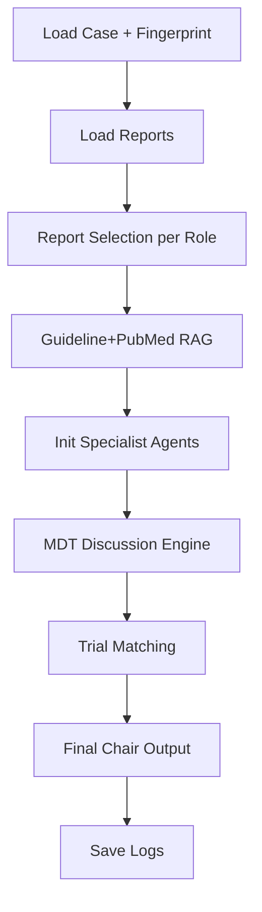

# MDT Discussion Log — 2026-01-22_18-33-38
Generated automatically by MDT Pipeline.


## CASE (structured JSON)

```
{"CASE_CORE":{"ADJUVANT_TREATMENT":{"cycles_or_courses":"6","given":"Yes","regimens":["TP"]},"BIOMARKERS":{"AFP":"Unknown","CA125":"Unknown","HER2":"Unknown","MSI":"Unknown","PDL1_CPS":"Unknown","TMB":"Unknown"},"BRCA1":"Unknown","BRCA2":"Unknown","CURRENT_STATUS":"On maintenance niraparib; ECOG 1; recent imaging without pelvic recurrence.","DIAGNOSIS":{"components":["Adenocarcinoma","High-grade serous carcinoma"],"histology":"High-grade serous carcinoma","laterality":"Bilateral","primary":"Ovarian cancer","site":"Ovary"},"ECOG":"1","GENOMICS":{"HRD_STATUS":{"method":"Unknown","result":"Positive","score":"Unknown"},"alterations":[],"testing_date":"Unknown","testing_performed":"Yes","testing_platform":"Unknown"},"HRD":"Positive","INITIAL_TREATMENT":"Yes","LINE_OF_THERAPY":[{"concurrent_bevacizumab":"No","cycles_completed":"1","cycles_planned":"Unknown","discontinuation":{"detail":"Switched to TP chemotherapy","reason":"Other"},"end_date":"2021-09-07","in_clinical_trial":"No","intent":"First_line","line":"1L","pfs_days":"41","regimen":"顺铂50mg腹腔化疗","response_assessment":{"best_response":"Unknown","ca125_response":"Unknown","response_criteria":"Unknown","response_date":"Unknown"},"start_date":"2021-09-06"},{"concurrent_bevacizumab":"No","cycles_completed":"6","cycles_planned":"6","discontinuation":{"detail":"Completed 6 cycles","reason":"Completed"},"end_date":"2022-03-22","in_clinical_trial":"No","intent":"First_line","line":"1L","pfs_days":"Unknown","regimen":"TP","response_assessment":{"best_response":"Unknown","ca125_response":"Unknown","response_criteria":"Unknown","response_date":"Unknown"},"start_date":"2021-10-18"},{"concurrent_bevacizumab":"No","cycles_completed":"Unknown","cycles_planned":"Unknown","discontinuation":{"detail":"Temporarily stopped due to adverse reactions and low platelets; restarted 2022-05-23; held 3 weeks around hernia repair; currently continuing","reason":"Other"},"end_date":"Unknown","in_clinical_trial":"No","intent":"Maintenance","line":"1L","pfs_days":"Unknown","regimen":"尼拉帕利","response_assessment":{"best_response":"Unknown","ca125_response":"Unknown","response_criteria":"Unknown","response_date":"Unknown"},"start_date":"2022-04-Unknown"}],"MAINTENANCE":"Yes","MAINTENANCE_DETAIL":{"end_date":"Unknown","given":"Yes","regimens":["尼拉帕利"],"start_date":"2022-04-Unknown"},"NEOADJUVANT":"Unknown","PFI_days":"Unknown","PLATINUM_HISTORY":[{"PFI_days":"Unknown","end_date":"2022-03-22","evidence":"TP chemotherapy 6 cycles after primary surgery; no explicit relapse documented.","evidence_type":"Unknown","first_relapse_date":"Unknown","line":"1L","start_date":"2021-10-18","status":"Unknown"}],"PLATINUM_PFI_CURRENT":"Unknown","PLATINUM_STATUS":"Unknown","PLATINUM_STATUS_CURRENT":"Unknown","RELAPSE":"No","RELAPSE_DATE":{"date":"Unknown","evidence":"No relapse; pelvic MRI 2022-10-25 showed no abnormal soft tissue in pelvis.","type":"Unknown"},"SCENE":"Maintenance_surveillance_followup","STAGE":{"stage_basis":"Unknown","stage_system":"Unknown","stage_text":"Unknown"},"SURGERY_DONE":{"date":"2021-08-26","performed":"Yes","procedure":"Radical hysterectomy with bilateral salpingo-oophorectomy, pelvic mass resection, partial rectosigmoid resection, sigmoid colostomy, omentectomy, pelvic lymphadenectomy, appendectomy, paraaortic lymphadenectomy"},"TIMELINE":{"constraints":{"max_events":30,"min_events":3,"must_include":["first diagnostic imaging or pathology confirmation (if available)"],"ordering_rules":{"prioritize_last_event":true}},"events":[{"date":"2021-08-26","description":"Primary cytoreductive surgery including radical hysterectomy, bilateral salpingo-oophorectomy, bowel resection, omentectomy, lymphadenectomy, colostomy, appendectomy","event_type":"Surgery","key_result":"Multiple peritoneal sites and 6/24 lymph nodes positive for carcinoma","regimen_or_test":"Surgery"},{"date":"2021-08-26","description":"Pathology confirmed high-grade serous carcinoma of bilateral ovaries with widespread peritoneal involvement and nodal metastases","event_type":"Diagnosis","key_result":"High-grade serous carcinoma, bilateral ovaries; 6/24 lymph nodes positive","regimen_or_test":"Pathology"},{"date":"2021-09-06","description":"Intraperitoneal chemotherapy with cisplatin 50mg","event_type":"Chemo","key_result":"Completed over 2021-09-06 and 2021-09-07","regimen_or_test":"顺铂50mg腹腔化疗"},{"date":"2021-10-18","description":"Started TP chemotherapy, planned 6 cycles","event_type":"Chemo","key_result":"Completed 6 cycles, last on 2022-03-22","regimen_or_test":"TP"},{"date":"2022-03-22","description":"Last cycle of TP chemotherapy","event_type":"Chemo","key_result":"Adjuvant chemotherapy completed","regimen_or_test":"TP"},{"date":"2022-04-18","description":"Complete blood count showing thrombocytopenia","event_type":"Lab","key_result":"PLT:33","regimen_or_test":"Blood routine"},{"date":"2022-04-26","description":"Stopped niraparib due to strong adverse reactions","event_type":"Other","key_result":"Maintenance paused","regimen_or_test":"尼拉帕利"},{"date":"2022-05-23","description":"Restarted niraparib 1# qd","event_type":"Chemo","key_result":"Maintenance resumed","regimen_or_test":"尼拉帕利"},{"date":"2022-06-24","description":"Abdominal wall hernia repair at Zhongshan Hospital","event_type":"Surgery","key_result":"Niraparib held for 3 weeks around surgery","regimen_or_test":"Surgery"},{"date":"2022-09-27","description":"CT chest/abdomen showing small bilateral pleural effusions improved; pulmonary AV fistula and nodules similar to prior","event_type":"Imaging","key_result":"No new malignant findings reported; abdominal details deferred","regimen_or_test":"CT"},{"date":"2022-10-08","description":"CT showing liver segment VII hemangioma and left renal cyst, stable","event_type":"Imaging","key_result":"No new findings; chest to correlate with other exams","regimen_or_test":"CT"},{"date":"2022-10-25","description":"Pelvic MRI after ovarian cancer surgery","event_type":"Imaging","key_result":"No abnormal soft tissue in pelvis; follow-up recommended","regimen_or_test":"MR"},{"date":"2022-12-30","description":"Zhongshan Hospital evaluation: incisional hernia, low-density lesion in right liver lobe","event_type":"Imaging","key_result":"Blood count and liver/kidney function generally acceptable","regimen_or_test":"Imaging"},{"date":"2023-01-09","description":"Recent blood routine showed platelet count 34 (year not fully specified)","event_type":"Lab","key_result":"PLT:34 (interpreted from 'PLT:342022.5.23起恢复', year unclear)","regimen_or_test":"Blood routine"}]},"VISIT_DATE":"2023-01-09","first_relapse_date":"Unknown","last_platinum_end_date":"2022-03-22"},"CLINICAL_TRIALS":[],"LAB_TRENDS":{"labs":[{"analyte":"Other","history":[{"date":"2022-04-18","flag":"↓","value":"PLT:33"}],"latest":{"date":"2022-04-18","flag":"↓","value":"PLT:33"},"reference_range":"Unknown","unit":"Unknown"}],"milestones":[{"date":"2021-08-26","description":"Primary debulking surgery for ovarian cancer","type":"Surgery"},{"date":"2021-10-18","description":"Started TP chemotherapy","type":"ChemoStart"},{"date":"2022-03-22","description":"Completed TP chemotherapy","type":"ChemoEnd"},{"date":"2022-04-18","description":"Thrombocytopenia (PLT 33) on blood routine","type":"Other"}]},"MED_ONC":{"current_regimen":{"cycle_info":"Continuous oral maintenance; temporarily stopped 2022-04-26 and around 2022-06-24 surgery; currently continuing","last_admin_date":"Unknown","name":"尼拉帕利"},"genetic_testing":{"germline":[],"somatic":["HRD"]},"monitoring_points":[{"drug_or_class":"尼拉帕利","monitoring":["Monitor platelet count due to prior thrombocytopenia"]}],"planned_next_regimen":"Unknown","prior_systemic_therapies":["顺铂50mg腹腔化疗","TP"]},"NUC_MED":{"studies":[]},"PATHOLOGY":{"specimens":[{"components":["High-grade serous carcinoma","Myometrial leiomyomas","Chronic cervicitis"],"date":"2021-08-26","diagnosis":"Adenocarcinoma consistent with high-grade serous carcinoma","grade":"High-grade","ihc":[],"involvement_sites":["Left ovary","Right ovary","Left fallopian tube","Right fallopian tube","Uterine myometrium","Pelvic and abdominal peritoneum","Partial rectosigmoid colon from serosa to superficial muscle","Omentum","Left paracolic gutter peritoneum","Small bowel mesentery","Sigmoid mesentery","Appendiceal serosa","Pelvic lymph nodes","Para-aortic and mesenteric lymph nodes (some positive)"],"laterality":"Bilateral ovarian involvement","molecular":[{"result":"Positive","test":"HRD"}],"raw_text":"术后病理：标本类型:扩大子宫+双附件+巨大盆块+部分直乙结肠+盆腹腔多病灶肿瘤大小:左侧：3.5×2×1.5cm；右侧：6×5.5×4.5cm肿瘤侧别:双侧病理类型:腺癌，结合免疫组化结果（I2021-07819），符合高级别浆液性癌。其他部位情况:左输卵管:见癌累及右输卵管:见癌累及子宫内膜:萎缩改变宫颈:慢性炎子宫肌层:见癌累及；肌壁间平滑肌瘤（多枚，直径0.5-2cm）盆腹腔多部位病灶:（部分直乙结肠）见癌累及，自浆膜层浸润至浅肌层，肠管两切缘未见癌累及。（大网膜、大网膜及盆腔肿块、左侧结肠旁沟腹膜、小肠系膜肿瘤、乙状结肠系膜肿瘤）见癌累及.（阑尾及周围肿块） 浆膜层见癌累及。其他:送检淋巴结（6/24）见癌转移，其中：左盆腔淋巴结（1/4）；右盆腔淋巴结（3/8）；腹主肠系膜下方淋巴结（1/4）； 肠系膜下动脉上方淋巴结（1/2）；腹主动脉旁淋巴结（0/6）。","sample_type":"Surgical resection","site":"Uterus, bilateral adnexa, pelvic mass, rectosigmoid colon, peritoneum, omentum, appendix, lymph nodes","tumor_size":"Left ovary 3.5×2×1.5cm; right ovary 6×5.5×4.5cm","uncertainty_or_missing":["FIGO stage not provided","IHC panel details not provided"]}]},"RADIOLOGY":{"next_imaging_plan":{"modality":"Unknown","timing":"Unknown"},"studies":[{"anatomic_sites":["Lung","Pleura","Chest"],"date":"2022-09-27","findings":["Right upper lung arteriovenous fistula similar to prior","Right upper lung apical segment small nodule similar to prior","Left upper lung scattered tiny nodules","Small bilateral pleural effusions decreased compared with prior","Scattered chronic inflammatory and fibrotic changes in lungs","Atelectasis improved","Nodule at right cardiophrenic angle less apparent"],"impression":"Pulmonary AV fistula and nodules unchanged; pleural effusions and atelectasis improved","modality":"CT","trend_vs_prior":"Improved"},{"anatomic_sites":["Liver","Kidney","Spine"],"date":"2022-10-08","findings":["Hemangioma in liver right lobe segment VII similar to prior","Left renal cyst similar to prior","Localized uneven sclerotic change in lumbar vertebrae similar to prior"],"impression":"Stable hemangioma and renal cyst; spinal sclerosis unchanged; chest findings to correlate with other exams","modality":"CT","trend_vs_prior":"Stable"},{"anatomic_sites":["Pelvis"],"date":"2022-10-25","findings":["Postoperative changes after ovarian cancer surgery","No abnormal soft tissue mass in pelvis"],"impression":"No pelvic recurrence; follow-up recommended","modality":"MRI","trend_vs_prior":"Stable"}]},"TIMELINE":{"constraints":{"max_events":30,"min_events":3,"must_include":["first diagnostic imaging or pathology confirmation (if available)"],"ordering_rules":{"prioritize_last_event":true}},"events":[{"date":"2021-08-26","description":"Primary cytoreductive surgery including radical hysterectomy, bilateral salpingo-oophorectomy, bowel resection, omentectomy, lymphadenectomy, colostomy, appendectomy","event_type":"Surgery","key_result":"Multiple peritoneal sites and 6/24 lymph nodes positive for carcinoma","regimen_or_test":"Surgery"},{"date":"2021-08-26","description":"Pathology confirmed high-grade serous carcinoma of bilateral ovaries with widespread peritoneal involvement and nodal metastases","event_type":"Diagnosis","key_result":"High-grade serous carcinoma, bilateral ovaries; 6/24 lymph nodes positive","regimen_or_test":"Pathology"},{"date":"2021-09-06","description":"Intraperitoneal chemotherapy with cisplatin 50mg","event_type":"Chemo","key_result":"Completed over 2021-09-06 and 2021-09-07","regimen_or_test":"顺铂50mg腹腔化疗"},{"date":"2021-10-18","description":"Started TP chemotherapy, planned 6 cycles","event_type":"Chemo","key_result":"Completed 6 cycles, last on 2022-03-22","regimen_or_test":"TP"},{"date":"2022-03-22","description":"Last cycle of TP chemotherapy","event_type":"Chemo","key_result":"Adjuvant chemotherapy completed","regimen_or_test":"TP"},{"date":"2022-04-18","description":"Complete blood count showing thrombocytopenia","event_type":"Lab","key_result":"PLT:33","regimen_or_test":"Blood routine"},{"date":"2022-04-26","description":"Stopped niraparib due to strong adverse reactions","event_type":"Other","key_result":"Maintenance paused","regimen_or_test":"尼拉帕利"},{"date":"2022-05-23","description":"Restarted niraparib 1# qd","event_type":"Chemo","key_result":"Maintenance resumed","regimen_or_test":"尼拉帕利"},{"date":"2022-06-24","description":"Abdominal wall hernia repair at Zhongshan Hospital","event_type":"Surgery","key_result":"Niraparib held for 3 weeks around surgery","regimen_or_test":"Surgery"},{"date":"2022-09-27","description":"CT chest/abdomen showing small bilateral pleural effusions improved; pulmonary AV fistula and nodules similar to prior","event_type":"Imaging","key_result":"No new malignant findings reported; abdominal details deferred","regimen_or_test":"CT"},{"date":"2022-10-08","description":"CT showing liver segment VII hemangioma and left renal cyst, stable","event_type":"Imaging","key_result":"No new findings; chest to correlate with other exams","regimen_or_test":"CT"},{"date":"2022-10-25","description":"Pelvic MRI after ovarian cancer surgery","event_type":"Imaging","key_result":"No abnormal soft tissue in pelvis; follow-up recommended","regimen_or_test":"MR"},{"date":"2022-12-30","description":"Zhongshan Hospital evaluation: incisional hernia, low-density lesion in right liver lobe","event_type":"Imaging","key_result":"Blood count and liver/kidney function generally acceptable","regimen_or_test":"Imaging"},{"date":"2023-01-09","description":"Recent blood routine showed platelet count 34 (year not fully specified)","event_type":"Lab","key_result":"PLT:34 (interpreted from 'PLT:342022.5.23起恢复', year unclear)","regimen_or_test":"Blood routine"}]},"TOXICITIES":[{"attribution":"Probable","dose_modification":"Yes","onset_date":"2022-04-18","outcome":"Resolved","related_line":"1L","related_regimen":"尼拉帕利","severity":"Severe","toxicity":"Strong adverse reaction to niraparib with thrombocytopenia (PLT 33)"}]}
```


## FINAL MDT OUTPUT

```
Final Assessment:
High‑grade serous ovarian carcinoma, HRD‑positive, BRCA‑wild type, post‑primary surgery and 1L platinum, currently NED on PARP maintenance.[@2022-10-25|MR][@2022-09-29|CT][@OH2201222|2022-01-24 | Genomics] Hematologic and organ function are now acceptable; prior severe thrombocytopenia on PARP has resolved.[@20230109|5600622 | LAB][@2022-04-18|Blood routine | LAB] Key uncertainties: exact current PARP dose/schedule, cumulative duration of maintenance, and formal FIGO stage.

Core Treatment Strategy:
- Continue PARP maintenance with individualized dose, given HRD+ status and no radiologic recurrence or biomarker progression.[@guideline:esmo_cpg_epithelialovarian_2023__v00000000 | Page 8][@2022-10-25|MR]
- Intensify CBC monitoring (e.g., monthly initially) and adjust/interrupt PARP promptly for recurrent thrombocytopenia or cytopenias.[@pubmed | 40687421][@20230109|5600622 | LAB]
- Maintain surveillance with 3–6‑monthly CA125/HE4 and cross‑sectional imaging; document formal stage and prior response status.[@20230109|9701878 | LAB][@guideline:nccn_ovariancancer_v3_2025__v00000000 | Page 12]
- Clarify germline counseling history; if not done, refer for genetic counseling despite negative panel, to address familial risk.[@OH2201222|2022-01-24 | Genomics]

Change Triggers:
- If platelets fall <100×10⁹/L or symptomatic bleeding, stepwise PARP dose reduction or temporary discontinuation, consider alternative maintenance.
- If imaging/markers show recurrence, re‑stage, biopsy if feasible, and pivot to platinum‑based systemic therapy ± surgery.[@guideline:nccn_ovariancancer_v3_2025__v00000000 | Page 15]
- If cumulative PARP duration reaches locally recommended limit (e.g., 2–3 years), reassess risk–benefit and consider elective discontinuation.[@guideline:esmo_cpg_epithelialovarian_2023__v00000000 | Page 8]

---
## References

### Guidelines

[@guideline:esmo_cpg_epithelialovarian_2023__v00000000 | Page 8]
  Document: esmo_cpg_epithelialovarian_2023__v00000000, Page 8
  Content: MCBS v1.1 score: 4; ESMO Scale for Clinical Actionabil-
ity...

[@guideline:nccn_ovariancancer_v3_2025__v00000000 | Page 12]
  Document: nccn_ovariancancer_v3_2025__v00000000, Page 12
  Content: Version 3.2025, 07/16/25 © 2025 National Comprehensive...

[@guideline:nccn_ovariancancer_v3_2025__v00000000 | Page 15]
  Document: nccn_ovariancancer_v3_2025__v00000000, Page 15
  Content: based chemotherapy,n
preferred for first
recurrence...

### Literature

[@pubmed | 40687421]
  PMID: 40687421 | Front Oncol | 2025-01-01
  Title: Severe thrombocytopenia induced by niraparib in ovarian cancer patients: a case report and literature review.
  DOI: 10.3389/fonc.2025.1542646

### Clinical Trials

### Clinical Reports

[@OH2201222|2022-01-24 | Genomics]
  Genomics ID: OH2201222|2022-01-24

[@20230109|5600622 | LAB]
  LAB ID: 20230109|5600622 | Date: 2023-01-09
  Content: 中性粒细胞% 62.0 % (GRAN) PLT分布宽度 10 % (PDW) 嗜碱性细胞数 0.06 *10^9/L...

[@20230109|9701878 | LAB]
  LAB ID: 20230109|9701878 | Date: 2023-01-09
  Content: 糖链抗原125 6.45 U/ml (CA125) 人附睾蛋白4 78.30 pmol/L (HE4)...

[@2022-10-25|MR]
  Report ID: 2022-10-25 | Date: MR

[@2022-09-29|CT]
  Report ID: 2022-09-29 | Date: CT

[@2022-04-18|Blood routine | LAB]
  LAB ID: 2022-04-18|Blood routine

```


## PIPELINE FLOW (Mermaid)




## TRACE EVENTS (Structured)

```json
[
  {
    "ts": "2026-01-22T18:33:01.462498",
    "event": "pipeline_start",
    "payload": {
      "mode": "chair_sa_kep",
      "visit_time": "2023-01-09 09:23:13.113000"
    }
  },
  {
    "ts": "2026-01-22T18:33:01.462989",
    "event": "case_fingerprint",
    "payload": {
      "case_fingerprint": "fa2f34f1e565"
    }
  },
  {
    "ts": "2026-01-22T18:33:01.986586",
    "event": "reports_loaded",
    "payload": {
      "lab_n": 152,
      "img_n": 24,
      "path_n": 0,
      "mut_n": 1
    }
  },
  {
    "ts": "2026-01-22T18:33:06.383946",
    "event": "reports_selected",
    "payload": {
      "lab": 3,
      "imaging": 3,
      "pathology": 0,
      "mutation": 1
    }
  },
  {
    "ts": "2026-01-22T18:33:06.386035",
    "event": "rag_key_facts",
    "payload": {
      "facts": "DIAGNOSIS: primary=Ovarian cancer; histology=High-grade serous carcinoma; components=Adenocarcinoma;High-grade serous carcinoma\nPATHOLOGY: Adenocarcinoma consistent with high-grade serous carcinoma\nPLATINUM: status=Unknown; pfi_days=Unknown\nBIOMARKERS: CA125=Unknown; AFP=Unknown; TMB=Unknown; MSI=Unknown; PDL1_CPS=Unknown\nMUTATION_REPORT: id=OH2201222; date=2022-01-24; full_text=HRD 阳性；BRCA1 胚系和体系未检出致病突变（视为阴性）；BRCA2 胚系和体系未检出致病突变（视为阴性）；TP53 胚系和体系未检出致病突变（视为阴性）；ARID1A 胚系和体系未检出致病突变（视为阴性）；PTEN 胚系和体系未检出致病突变（视为阴性）；PIK3CA 胚系和体系未检出致病突变（视为阴性）；PALB2 胚系和体系未检出致病突变（视为阴性）；RAD51D 胚系和体系未检出致病突变（视为阴性）；BRIP1 胚系和体系未检出致病突变（视为阴性）；BARD1 胚系和体系未检出致病突变（视为阴性）"
    }
  },
  {
    "ts": "2026-01-22T18:33:22.355452",
    "event": "rag_query",
    "payload": {
      "query": "HRD‑positive, BRCA1/2‑negative high‑grade serous ovarian carcinoma, post–primary debulking and first‑line platinum chemotherapy (platinum‑sensitive), with prior extensive peritoneal and nodal metastases; history of severe niraparib‑induced thrombocytopenia but organ function otherwise acceptable; histology: High-grade serous carcinoma"
    }
  },
  {
    "ts": "2026-01-22T18:33:22.355461",
    "event": "rag_hits_merged",
    "payload": {
      "n": 10
    }
  },
  {
    "ts": "2026-01-22T18:33:30.556152",
    "event": "trial_matching_start",
    "payload": {
      "trials_json_path": "files/all_trials_filtered.json"
    }
  },
  {
    "ts": "2026-01-22T18:33:32.945671",
    "event": "trial_matching_end",
    "payload": {
      "recommended": false
    }
  }
]
```


## INITIAL EXPERT OPINIONS


## chair

```
(Single agent mode with Evidence Pack)
```


## MERGED SUMMARY (Assistant)

```
(Chair-SA(K+EP): Knowledge + Evidence Pack mode)
```


## INTERACTION LOG (Round × Turn)


## FINAL REFINED PLANS (per Round)


## RAW AGENT LOGS

### chair
- **User:** 
As the MDT chair for gynecologic oncology, you are seeing the patient at OUTPATIENT TIME: 2023-01-09 09:23:13.113000.
Based on the case information, Evidence Pack (clinical reports), and Knowledge (guidelines) provided, determine the CURRENT best management plan for this visit.

# CLINICAL TRIAL RECOMMENDATION (from assistant)
Trial Recommendation:
- id: None
- name: None
- Reason: Disease is not clearly recurrent/advanced for 2L+ and required biomarkers (e.g., HER2, TF, HPV16, HER2 activating mutation) are not documented.
- Missing eligibility confirmations (0-2 items):
  - HER2 / TF / HPV16 / HER2 activating mutation status
  - Clear documentation of recurrent, unresectable, or metastatic disease after standard treatment failure

STRICT RULES:
- Any factual statement about past tests/treatments must include [@actual_report_id | LAB/Genomics/MR/CT] using actual report_id from report data (e.g., [@20220407|17300673 | LAB], [@2022-12-29 | MR]).
- Any statement derived from guideline or PubMed must include [@guideline:doc_id | Page xx] or [@pubmed | PMID].
- If a clinical trial has been recommended and you judge it appropriate, cite it using [@trial | trial_id] format.
- Consider all available evidence systematically.

# Response Format
Final Assessment:
<1–3 sentences: summarize histology/biology, current disease status, and key uncertainties>

Core Treatment Strategy:
- < ≤20 words concrete decision >
- < ≤20 words concrete decision >
- < ≤20 words concrete decision >
- < ≤20 words concrete decision >

Change Triggers:
- < ≤20 words "if X, then adjust management from A to B" >
- < ≤20 words "if X, then adjust management from A to B" >

  
  **Assistant:** Final Assessment:
High‑grade serous ovarian carcinoma, HRD‑positive, BRCA‑wild type, post‑primary surgery and 1L platinum, currently NED on PARP maintenance.[@2022-10-25|MR][@2022-09-29|CT][@OH2201222|2022-01-24 | Genomics] Hematologic and organ function are now acceptable; prior severe thrombocytopenia on PARP has resolved.[@20230109|5600622 | LAB][@2022-04-18|Blood routine | LAB] Key uncertainties: exact current PARP dose/schedule, cumulative duration of maintenance, and formal FIGO stage.

Core Treatment Strategy:
- Continue PARP maintenance with individualized dose, given HRD+ status and no radiologic recurrence or biomarker progression.[@guideline:esmo_cpg_epithelialovarian_2023__v00000000 | Page 8][@2022-10-25|MR]
- Intensify CBC monitoring (e.g., monthly initially) and adjust/interrupt PARP promptly for recurrent thrombocytopenia or cytopenias.[@pubmed | 40687421][@20230109|5600622 | LAB]
- Maintain surveillance with 3–6‑monthly CA125/HE4 and cross‑sectional imaging; document formal stage and prior response status.[@20230109|9701878 | LAB][@guideline:nccn_ovariancancer_v3_2025__v00000000 | Page 12]
- Clarify germline counseling history; if not done, refer for genetic counseling despite negative panel, to address familial risk.[@OH2201222|2022-01-24 | Genomics]

Change Triggers:
- If platelets fall <100×10⁹/L or symptomatic bleeding, stepwise PARP dose reduction or temporary discontinuation, consider alternative maintenance.
- If imaging/markers show recurrence, re‑stage, biopsy if feasible, and pivot to platinum‑based systemic therapy ± surgery.[@guideline:nccn_ovariancancer_v3_2025__v00000000 | Page 15]
- If cumulative PARP duration reaches locally recommended limit (e.g., 2–3 years), reassess risk–benefit and consider elective discontinuation.[@guideline:esmo_cpg_epithelialovarian_2023__v00000000 | Page 8]
  
  *(2026-01-22T18:33:38.623135)*


### trial_selector
- **User:** You are an MDT assistant for gynecologic oncology clinical trial matching.

CRITICAL BEHAVIOR:
- You MUST NOT ask the user any questions.
- You MUST NOT request additional information.
- You MUST NOT output anything except the required template.
- Use ONLY the provided PATIENT CASE text and AVAILABLE TRIALS list.
- If eligibility is unclear due to missing key facts, you MUST output None.

PATIENT CASE (facts only; do not infer):
# ORIGINAL CASE JSON
{"CASE_CORE":{"ADJUVANT_TREATMENT":{"cycles_or_courses":"6","given":"Yes","regimens":["TP"]},"BIOMARKERS":{"AFP":"Unknown","CA125":"Unknown","HER2":"Unknown","MSI":"Unknown","PDL1_CPS":"Unknown","TMB":"Unknown"},"BRCA1":"Unknown","BRCA2":"Unknown","CURRENT_STATUS":"On maintenance niraparib; ECOG 1; recent imaging without pelvic recurrence.","DIAGNOSIS":{"components":["Adenocarcinoma","High-grade serous carcinoma"],"histology":"High-grade serous carcinoma","laterality":"Bilateral","primary":"Ovarian cancer","site":"Ovary"},"ECOG":"1","GENOMICS":{"HRD_STATUS":{"method":"Unknown","result":"Positive","score":"Unknown"},"alterations":[],"testing_date":"Unknown","testing_performed":"Yes","testing_platform":"Unknown"},"HRD":"Positive","INITIAL_TREATMENT":"Yes","LINE_OF_THERAPY":[{"concurrent_bevacizumab":"No","cycles_completed":"1","cycles_planned":"Unknown","discontinuation":{"detail":"Switched to TP chemotherapy","reason":"Other"},"end_date":"2021-09-07","in_clinical_trial":"No","intent":"First_line","line":"1L","pfs_days":"41","regimen":"顺铂50mg腹腔化疗","response_assessment":{"best_response":"Unknown","ca125_response":"Unknown","response_criteria":"Unknown","response_date":"Unknown"},"start_date":"2021-09-06"},{"concurrent_bevacizumab":"No","cycles_completed":"6","cycles_planned":"6","discontinuation":{"detail":"Completed 6 cycles","reason":"Completed"},"end_date":"2022-03-22","in_clinical_trial":"No","intent":"First_line","line":"1L","pfs_days":"Unknown","regimen":"TP","response_assessment":{"best_response":"Unknown","ca125_response":"Unknown","response_criteria":"Unknown","response_date":"Unknown"},"start_date":"2021-10-18"},{"concurrent_bevacizumab":"No","cycles_completed":"Unknown","cycles_planned":"Unknown","discontinuation":{"detail":"Temporarily stopped due to adverse reactions and low platelets; restarted 2022-05-23; held 3 weeks around hernia repair; currently continuing","reason":"Other"},"end_date":"Unknown","in_clinical_trial":"No","intent":"Maintenance","line":"1L","pfs_days":"Unknown","regimen":"尼拉帕利","response_assessment":{"best_response":"Unknown","ca125_response":"Unknown","response_criteria":"Unknown","response_date":"Unknown"},"start_date":"2022-04-Unknown"}],"MAINTENANCE":"Yes","MAINTENANCE_DETAIL":{"end_date":"Unknown","given":"Yes","regimens":["尼拉帕利"],"start_date":"2022-04-Unknown"},"NEOADJUVANT":"Unknown","PFI_days":"Unknown","PLATINUM_HISTORY":[{"PFI_days":"Unknown","end_date":"2022-03-22","evidence":"TP chemotherapy 6 cycles after primary surgery; no explicit relapse documented.","evidence_type":"Unknown","first_relapse_date":"Unknown","line":"1L","start_date":"2021-10-18","status":"Unknown"}],"PLATINUM_PFI_CURRENT":"Unknown","PLATINUM_STATUS":"Unknown","PLATINUM_STATUS_CURRENT":"Unknown","RELAPSE":"No","RELAPSE_DATE":{"date":"Unknown","evidence":"No relapse; pelvic MRI 2022-10-25 showed no abnormal soft tissue in pelvis.","type":"Unknown"},"SCENE":"Maintenance_surveillance_followup","STAGE":{"stage_basis":"Unknown","stage_system":"Unknown","stage_text":"Unknown"},"SURGERY_DONE":{"date":"2021-08-26","performed":"Yes","procedure":"Radical hysterectomy with bilateral salpingo-oophorectomy, pelvic mass resection, partial rectosigmoid resection, sigmoid colostomy, omentectomy, pelvic lymphadenectomy, appendectomy, paraaortic lymphadenectomy"},"TIMELINE":{"constraints":{"max_events":30,"min_events":3,"must_include":["first diagnostic imaging or pathology confirmation (if available)"],"ordering_rules":{"prioritize_last_event":true}},"events":[{"date":"2021-08-26","description":"Primary cytoreductive surgery including radical hysterectomy, bilateral salpingo-oophorectomy, bowel resection, omentectomy, lymphadenectomy, colostomy, appendectomy","event_type":"Surgery","key_result":"Multiple peritoneal sites and 6/24 lymph nodes positive for carcinoma","regimen_or_test":"Surgery"},{"date":"2021-08-26","description":"Pathology confirmed high-grade serous carcinoma of bilateral ovaries with widespread peritoneal involvement and nodal metastases","event_type":"Diagnosis","key_result":"High-grade serous carcinoma, bilateral ovaries; 6/24 lymph nodes positive","regimen_or_test":"Pathology"},{"date":"2021-09-06","description":"Intraperitoneal chemotherapy with cisplatin 50mg","event_type":"Chemo","key_result":"Completed over 2021-09-06 and 2021-09-07","regimen_or_test":"顺铂50mg腹腔化疗"},{"date":"2021-10-18","description":"Started TP chemotherapy, planned 6 cycles","event_type":"Chemo","key_result":"Completed 6 cycles, last on 2022-03-22","regimen_or_test":"TP"},{"date":"2022-03-22","description":"Last cycle of TP chemotherapy","event_type":"Chemo","key_result":"Adjuvant chemotherapy completed","regimen_or_test":"TP"},{"date":"2022-04-18","description":"Complete blood count showing thrombocytopenia","event_type":"Lab","key_result":"PLT:33","regimen_or_test":"Blood routine"},{"date":"2022-04-26","description":"Stopped niraparib due to strong adverse reactions","event_type":"Other","key_result":"Maintenance paused","regimen_or_test":"尼拉帕利"},{"date":"2022-05-23","description":"Restarted niraparib 1# qd","event_type":"Chemo","key_result":"Maintenance resumed","regimen_or_test":"尼拉帕利"},{"date":"2022-06-24","description":"Abdominal wall hernia repair at Zhongshan Hospital","event_type":"Surgery","key_result":"Niraparib held for 3 weeks around surgery","regimen_or_test":"Surgery"},{"date":"2022-09-27","description":"CT chest/abdomen showing small bilateral pleural effusions improved; pulmonary AV fistula and nodules similar to prior","event_type":"Imaging","key_result":"No new malignant findings reported; abdominal details deferred","regimen_or_test":"CT"},{"date":"2022-10-08","description":"CT showing liver segment VII hemangioma and left renal cyst, stable","event_type":"Imaging","key_result":"No new findings; chest to correlate with other exams","regimen_or_test":"CT"},{"date":"2022-10-25","description":"Pelvic MRI after ovarian cancer surgery","event_type":"Imaging","key_result":"No abnormal soft tissue in pelvis; follow-up recommended","regimen_or_test":"MR"},{"date":"2022-12-30","description":"Zhongshan Hospital evaluation: incisional hernia, low-density lesion in right liver lobe","event_type":"Imaging","key_result":"Blood count and liver/kidney function generally acceptable","regimen_or_test":"Imaging"},{"date":"2023-01-09","description":"Recent blood routine showed platelet count 34 (year not fully specified)","event_type":"Lab","key_result":"PLT:34 (interpreted from 'PLT:342022.5.23起恢复', year unclear)","regimen_or_test":"Blood routine"}]},"VISIT_DATE":"2023-01-09","first_relapse_date":"Unknown","last_platinum_end_date":"2022-03-22"},"CLINICAL_TRIALS":[],"LAB_TRENDS":{"labs":[{"analyte":"Other","history":[{"date":"2022-04-18","flag":"↓","value":"PLT:33"}],"latest":{"date":"2022-04-18","flag":"↓","value":"PLT:33"},"reference_range":"Unknown","unit":"Unknown"}],"milestones":[{"date":"2021-08-26","description":"Primary debulking surgery for ovarian cancer","type":"Surgery"},{"date":"2021-10-18","description":"Started TP chemotherapy","type":"ChemoStart"},{"date":"2022-03-22","description":"Completed TP chemotherapy","type":"ChemoEnd"},{"date":"2022-04-18","description":"Thrombocytopenia (PLT 33) on blood routine","type":"Other"}]},"MED_ONC":{"current_regimen":{"cycle_info":"Continuous oral maintenance; temporarily stopped 2022-04-26 and around 2022-06-24 surgery; currently continuing","last_admin_date":"Unknown","name":"尼拉帕利"},"genetic_testing":{"germline":[],"somatic":["HRD"]},"monitoring_points":[{"drug_or_class":"尼拉帕利","monitoring":["Monitor platelet count due to prior thrombocytopenia"]}],"planned_next_regimen":"Unknown","prior_systemic_therapies":["顺铂50mg腹腔化疗","TP"]},"NUC_MED":{"studies":[]},"PATHOLOGY":{"specimens":[{"components":["High-grade serous carcinoma","Myometrial leiomyomas","Chronic cervicitis"],"date":"2021-08-26","diagnosis":"Adenocarcinoma consistent with high-grade serous carcinoma","grade":"High-grade","ihc":[],"involvement_sites":["Left ovary","Right ovary","Left fallopian tube","Right fallopian tube","Uterine myometrium","Pelvic and abdominal peritoneum","Partial rectosigmoid colon from serosa to superficial muscle","Omentum","Left paracolic gutter peritoneum","Small bowel mesentery","Sigmoid mesentery","Appendiceal serosa","Pelvic lymph nodes","Para-aortic and mesenteric lymph nodes (some positive)"],"laterality":"Bilateral ovarian involvement","molecular":[{"result":"Positive","test":"HRD"}],"raw_text":"术后病理：标本类型:扩大子宫+双附件+巨大盆块+部分直乙结肠+盆腹腔多病灶肿瘤大小:左侧：3.5×2×1.5cm；右侧：6×5.5×4.5cm肿瘤侧别:双侧病理类型:腺癌，结合免疫组化结果（I2021-07819），符合高级别浆液性癌。其他部位情况:左输卵管:见癌累及右输卵管:见癌累及子宫内膜:萎缩改变宫颈:慢性炎子宫肌层:见癌累及；肌壁间平滑肌瘤（多枚，直径0.5-2cm）盆腹腔多部位病灶:（部分直乙结肠）见癌累及，自浆膜层浸润至浅肌层，肠管两切缘未见癌累及。（大网膜、大网膜及盆腔肿块、左侧结肠旁沟腹膜、小肠系膜肿瘤、乙状结肠系膜肿瘤）见癌累及.（阑尾及周围肿块） 浆膜层见癌累及。其他:送检淋巴结（6/24）见癌转移，其中：左盆腔淋巴结（1/4）；右盆腔淋巴结（3/8）；腹主肠系膜下方淋巴结（1/4）； 肠系膜下动脉上方淋巴结（1/2）；腹主动脉旁淋巴结（0/6）。","sample_type":"Surgical resection","site":"Uterus, bilateral adnexa, pelvic mass, rectosigmoid colon, peritoneum, omentum, appendix, lymph nodes","tumor_size":"Left ovary 3.5×2×1.5cm; right ovary 6×5.5×4.5cm","uncertainty_or_missing":["FIGO stage not provided","IHC panel details not provided"]}]},"RADIOLOGY":{"next_imaging_plan":{"modality":"Unknown","timing":"Unknown"},"studies":[{"anatomic_sites":["Lung","Pleura","Chest"],"date":"2022-09-27","findings":["Right upper lung arteriovenous fistula similar to prior","Right upper lung apical segment small nodule similar to prior","Left upper lung scattered tiny nodules","Small bilateral pleural effusions decreased compared with prior","Scattered chronic inflammatory and fibrotic changes in lungs","Atelectasis improved","Nodule at right cardiophrenic angle less apparent"],"impression":"Pulmonary AV fistula and nodules unchanged; pleural effusions and atelectasis improved","modality":"CT","trend_vs_prior":"Improved"},{"anatomic_sites":["Liver","Kidney","Spine"],"date":"2022-10-08","findings":["Hemangioma in liver right lobe segment VII similar to prior","Left renal cyst similar to prior","Localized uneven sclerotic change in lumbar vertebrae similar to prior"],"impression":"Stable hemangioma and renal cyst; spinal sclerosis unchanged; chest findings to correlate with other exams","modality":"CT","trend_vs_prior":"Stable"},{"anatomic_sites":["Pelvis"],"date":"2022-10-25","findings":["Postoperative changes after ovarian cancer surgery","No abnormal soft tissue mass in pelvis"],"impression":"No pelvic recurrence; follow-up recommended","modality":"MRI","trend_vs_prior":"Stable"}]},"TIMELINE":{"constraints":{"max_events":30,"min_events":3,"must_include":["first diagnostic imaging or pathology confirmation (if available)"],"ordering_rules":{"prioritize_last_event":true}},"events":[{"date":"2021-08-26","description":"Primary cytoreductive surgery including radical hysterectomy, bilateral salpingo-oophorectomy, bowel resection, omentectomy, lymphadenectomy, colostomy, appendectomy","event_type":"Surgery","key_result":"Multiple peritoneal sites and 6/24 lymph nodes positive for carcinoma","regimen_or_test":"Surgery"},{"date":"2021-08-26","description":"Pathology confirmed high-grade serous carcinoma of bilateral ovaries with widespread peritoneal involvement and nodal metastases","event_type":"Diagnosis","key_result":"High-grade serous carcinoma, bilateral ovaries; 6/24 lymph nodes positive","regimen_or_test":"Pathology"},{"date":"2021-09-06","description":"Intraperitoneal chemotherapy with cisplatin 50mg","event_type":"Chemo","key_result":"Completed over 2021-09-06 and 2021-09-07","regimen_or_test":"顺铂50mg腹腔化疗"},{"date":"2021-10-18","description":"Started TP chemotherapy, planned 6 cycles","event_type":"Chemo","key_result":"Completed 6 cycles, last on 2022-03-22","regimen_or_test":"TP"},{"date":"2022-03-22","description":"Last cycle of TP chemotherapy","event_type":"Chemo","key_result":"Adjuvant chemotherapy completed","regimen_or_test":"TP"},{"date":"2022-04-18","description":"Complete blood count showing thrombocytopenia","event_type":"Lab","key_result":"PLT:33","regimen_or_test":"Blood routine"},{"date":"2022-04-26","description":"Stopped niraparib due to strong adverse reactions","event_type":"Other","key_result":"Maintenance paused","regimen_or_test":"尼拉帕利"},{"date":"2022-05-23","description":"Restarted niraparib 1# qd","event_type":"Chemo","key_result":"Maintenance resumed","regimen_or_test":"尼拉帕利"},{"date":"2022-06-24","description":"Abdominal wall hernia repair at Zhongshan Hospital","event_type":"Surgery","key_result":"Niraparib held for 3 weeks around surgery","regimen_or_test":"Surgery"},{"date":"2022-09-27","description":"CT chest/abdomen showing small bilateral pleural effusions improved; pulmonary AV fistula and nodules similar to prior","event_type":"Imaging","key_result":"No new malignant findings reported; abdominal details deferred","regimen_or_test":"CT"},{"date":"2022-10-08","description":"CT showing liver segment VII hemangioma and left renal cyst, stable","event_type":"Imaging","key_result":"No new findings; chest to correlate with other exams","regimen_or_test":"CT"},{"date":"2022-10-25","description":"Pelvic MRI after ovarian cancer surgery","event_type":"Imaging","key_result":"No abnormal soft tissue in pelvis; follow-up recommended","regimen_or_test":"MR"},{"date":"2022-12-30","description":"Zhongshan Hospital evaluation: incisional hernia, low-density lesion in right liver lobe","event_type":"Imaging","key_result":"Blood count and liver/kidney function generally acceptable","regimen_or_test":"Imaging"},{"date":"2023-01-09","description":"Recent blood routine showed platelet count 34 (year not fully specified)","event_type":"Lab","key_result":"PLT:34 (interpreted from 'PLT:342022.5.23起恢复', year unclear)","regimen_or_test":"Blood routine"}]},"TOXICITIES":[{"attribution":"Probable","dose_modification":"Yes","onset_date":"2022-04-18","outcome":"Resolved","related_line":"1L","related_regimen":"尼拉帕利","severity":"Severe","toxicity":"Strong adverse reaction to niraparib with thrombocytopenia (PLT 33)"}]}

# MUTATION / GENETIC REPORTS (Full Text for Trial Matching)
⚠️ COMPREHENSIVE NGS PANEL (~20,000 genes) - INTERPRETATION RULES:
• '未检出' (not detected) = NO pathogenic mutation found
• '（视为阴性）' (considered negative) = NO pathogenic mutation found
• '阴性' (negative) = negative result
• Genes with specific variants (e.g., 'NM_xxx:exon:c.xxx:p.xxx') = POSITIVE mutation
• If a gene is NOT mentioned, it means NO pathogenic mutation (comprehensive panel)

## Mutation Report 1 (ID: OH2201222, Date: 2022-01-24)
HRD 阳性；BRCA1 胚系和体系未检出致病突变（视为阴性）；BRCA2 胚系和体系未检出致病突变（视为阴性）；TP53 胚系和体系未检出致病突变（视为阴性）；ARID1A 胚系和体系未检出致病突变（视为阴性）；PTEN 胚系和体系未检出致病突变（视为阴性）；PIK3CA 胚系和体系未检出致病突变（视为阴性）；PALB2 胚系和体系未检出致病突变（视为阴性）；RAD51D 胚系和体系未检出致病突变（视为阴性）；BRIP1 胚系和体系未检出致病突变（视为阴性）；BARD1 胚系和体系未检出致病突变（视为阴性）


AVAILABLE TRIALS (compact; use id/name exactly as shown):
[
  {
    "id": "345",
    "name": " 评估JSKN003在中国晚期恶性实体瘤受试者中的安全性、耐受性、药代动力学/药效学以及抗肿瘤活性的I/II期临床研究",
    "phase": "II期",
    "conditions": null,
    "line_of_therapy": "2、3、4L",
    "biomarker": null,
    "doctor": "李佳佳",
    "sponsor": "江苏康宁杰瑞生物制药有限公司",
    "lead_or_participation": "牵头",
    "treatment": "JSKN003-102（ADC，靶向HER2，毒性分子：拓扑异构酶I 抑制剂）",
    "key_inclusion": "1、HER2 表达（IHC≥1+）\n\n2、经标准治疗失败、不能耐受标准治疗\n\n或缺乏有效治疗手段的受试者；",
    "key_exclusion": "",
    "contacts": [
      "王 涛"
    ],
    "phones": [
      "18721569326"
    ],
    "_raw": {
      "id": "345",
      "项目名称": " 评估JSKN003在中国晚期恶性实体瘤受试者中的安全性、耐受性、药代动力学/药效学以及抗肿瘤活性的I/II期临床研究",
      "医生": "李佳佳",
      "试验治疗/用药": "JSKN003-102（ADC，靶向HER2，毒性分子：拓扑异构酶I 抑制剂）",
      "期别": "II期",
      "申请单位": "江苏康宁杰瑞生物制药有限公司",
      "牵头/参与": "牵头",
      "目标受试者治疗线数": "2、3、4L",
      "入组排除标准": "1、HER2 表达（IHC≥1+）<br />\r\n2、经标准治疗失败、不能耐受标准治疗<br />\r\n或缺乏有效治疗手段的受试者；<br />",
      "联系人": [
        "王 涛"
      ],
      "联系电话": [
        "18721569326"
      ]
    }
  },
  {
    "id": "346",
    "name": "一项评价Trastuzumab Deruxtecan (T-DXd DS-8201a）治疗选定 HER2过表达肿瘤患者的有效性和安全性的多中心、开放性 II期研究（ DESTINY-PanTumor03)",
    "phase": "II期",
    "conditions": null,
    "line_of_therapy": "＞1线",
    "biomarker": null,
    "doctor": "朱 俊",
    "sponsor": "阿斯利康投资（中国）有限公司",
    "lead_or_participation": "牵头",
    "treatment": "Trastuzumab Deruxtecan（ADC，靶向HER2，毒性分子：拓扑异构酶I 抑制剂）",
    "key_inclusion": "1、可预筛检测HER2 要求HER2 过表达（IHC≥1+）\n\n2、经标准治疗失败、不能耐受标准治疗\n\n或缺乏有效治疗手段的受试者；",
    "key_exclusion": "",
    "contacts": [
      "江文燕"
    ],
    "phones": [
      "15664735519"
    ],
    "_raw": {
      "id": "346",
      "项目名称": "一项评价Trastuzumab Deruxtecan (T-DXd DS-8201a）治疗选定 HER2过表达肿瘤患者的有效性和安全性的多中心、开放性 II期研究（ DESTINY-PanTumor03)",
      "医生": "朱 俊",
      "试验治疗/用药": "Trastuzumab Deruxtecan（ADC，靶向HER2，毒性分子：拓扑异构酶I 抑制剂）",
      "期别": "II期",
      "申请单位": "阿斯利康投资（中国）有限公司",
      "牵头/参与": "牵头",
      "目标受试者治疗线数": "＞1线",
      "入组排除标准": "1、可预筛检测HER2 要求HER2 过表达（IHC≥1+）<br />\r\n2、经标准治疗失败、不能耐受标准治疗<br />\r\n或缺乏有效治疗手段的受试者；<br />",
      "联系人": [
        "江文燕"
      ],
      "联系电话": [
        "15664735519"
      ]
    }
  },
  {
    "id": "348",
    "name": "一项评估MRG004A在组织因子阳性的晚期或转移性实体瘤患者中的安全性、耐受性、有效性和药代动力学的开放、多中心、I/II期剂量递增和扩展临床研究",
    "phase": "I期",
    "conditions": null,
    "line_of_therapy": "2L、3L",
    "biomarker": null,
    "doctor": "郭勤浩、 Ⅰ期： 刘汝娇、 高水平、 陈 阳",
    "sponsor": " 上海美雅珂生物技术有限责任公司",
    "lead_or_participation": "牵头",
    "treatment": "MRG004A（ADC，靶向组织因子（tissue factor，TF））",
    "key_inclusion": "1、必须有组织学或细胞学证实的不切除或转移性肿瘤，标准治疗期间进展或经治后复发、进展。",
    "key_exclusion": "",
    "contacts": [
      "杨 珂"
    ],
    "phones": [
      "17774582517"
    ],
    "_raw": {
      "id": "348",
      "项目名称": "一项评估MRG004A在组织因子阳性的晚期或转移性实体瘤患者中的安全性、耐受性、有效性和药代动力学的开放、多中心、I/II期剂量递增和扩展临床研究",
      "医生": "郭勤浩、 Ⅰ期： 刘汝娇、 高水平、 陈 阳",
      "试验治疗/用药": "MRG004A（ADC，靶向组织因子（tissue factor，TF））",
      "期别": "I期",
      "申请单位": " 上海美雅珂生物技术有限责任公司",
      "牵头/参与": "牵头",
      "目标受试者治疗线数": "2L、3L",
      "入组排除标准": "1、必须有组织学或细胞学证实的不切除或转移性肿瘤，标准治疗期间进展或经治后复发、进展。",
      "联系人": [
        "杨 珂"
      ],
      "联系电话": [
        "17774582517"
      ]
    }
  },
  {
    "id": "350",
    "name": "评价注射用BL-B01D1在复发或转移性妇科恶性肿瘤等多种实体瘤患者中的安全性、耐受性、药代动力学及有效性的Ib/II期临床研究",
    "phase": "Ⅰb/Ⅱ 期",
    "conditions": null,
    "line_of_therapy": "2L、3L",
    "biomarker": null,
    "doctor": "吴 勇、刘汝娇 、高水平",
    "sponsor": "成都百利多特生物药业有限责任公司",
    "lead_or_participation": "牵头",
    "treatment": "单臂研究\n\n注射用BL-B01D1（ADC，靶向靶向 EGFR 和 HER3 靶点，毒性分子：拓扑异构酶I 抑制剂）",
    "key_inclusion": "1、经病理组织学和/或细胞学确诊的标准治疗失败或不耐受或目前尚无标准治疗的复发或转移性妇科恶性肿瘤",
    "key_exclusion": "",
    "contacts": [
      "李 想"
    ],
    "phones": [
      "17703993082"
    ],
    "_raw": {
      "id": "350",
      "项目名称": "评价注射用BL-B01D1在复发或转移性妇科恶性肿瘤等多种实体瘤患者中的安全性、耐受性、药代动力学及有效性的Ib/II期临床研究",
      "医生": "吴 勇、刘汝娇 、高水平",
      "试验治疗/用药": "单臂研究<br />\r\n注射用BL-B01D1（ADC，靶向靶向 EGFR 和 HER3 靶点，毒性分子：拓扑异构酶I 抑制剂）<br />",
      "期别": "Ⅰb/Ⅱ 期",
      "申请单位": "成都百利多特生物药业有限责任公司",
      "牵头/参与": "牵头",
      "目标受试者治疗线数": "2L、3L",
      "入组排除标准": "1、经病理组织学和/或细胞学确诊的标准治疗失败或不耐受或目前尚无标准治疗的复发或转移性妇科恶性肿瘤",
      "联系人": [
        "李 想"
      ],
      "联系电话": [
        "17703993082"
      ]
    }
  },
  {
    "id": "351",
    "name": " 一项评价HSK39775片单药用于晚期实体恶性肿瘤患者中的安全性、耐受性、PK/PD特征及初步有效性的Ⅰ/Ⅱ期临床研究",
    "phase": "Ⅰ期",
    "conditions": null,
    "line_of_therapy": "＞1线",
    "biomarker": null,
    "doctor": "李佳佳、刘汝娇",
    "sponsor": "西藏海思科制药有限公司",
    "lead_or_participation": "牵头",
    "treatment": "HSK39775片（泛素特异性蛋白酶1抑制剂，USP1i）",
    "key_inclusion": "既往接受过标准治疗或标准治疗不耐受或无标准治疗或无法获得标准治疗；",
    "key_exclusion": "",
    "contacts": [
      "张倩野"
    ],
    "phones": [
      "18627004197"
    ],
    "_raw": {
      "id": "351",
      "项目名称": " 一项评价HSK39775片单药用于晚期实体恶性肿瘤患者中的安全性、耐受性、PK/PD特征及初步有效性的Ⅰ/Ⅱ期临床研究",
      "医生": "李佳佳、刘汝娇",
      "试验治疗/用药": "HSK39775片（泛素特异性蛋白酶1抑制剂，USP1i）",
      "期别": "Ⅰ期",
      "申请单位": "西藏海思科制药有限公司",
      "牵头/参与": "牵头",
      "目标受试者治疗线数": "＞1线",
      "入组排除标准": "既往接受过标准治疗或标准治疗不耐受或无标准治疗或无法获得标准治疗；",
      "联系人": [
        "张倩野"
      ],
      "联系电话": [
        "18627004197"
      ]
    }
  },
  {
    "id": "353",
    "name": "在晚期恶性实体瘤患者中评价注射用西罗莫司（白蛋白结合型）的安全性、耐受性、药代动力学特征以及初步疗效的I期临床研究",
    "phase": "Ⅰ期",
    "conditions": null,
    "line_of_therapy": "＞1线",
    "biomarker": null,
    "doctor": "刘汝娇",
    "sponsor": " 石药集团中奇制药技术（石家庄）有限公司",
    "lead_or_participation": "参与（天津市肿瘤医院 郝继辉）",
    "treatment": "注射用西罗莫司（白蛋白结合型）",
    "key_inclusion": "1、标准治疗失败或无标准治疗患者",
    "key_exclusion": "",
    "contacts": [
      "刘 涵"
    ],
    "phones": [
      "19109628595"
    ],
    "_raw": {
      "id": "353",
      "项目名称": "在晚期恶性实体瘤患者中评价注射用西罗莫司（白蛋白结合型）的安全性、耐受性、药代动力学特征以及初步疗效的I期临床研究",
      "医生": "刘汝娇",
      "试验治疗/用药": "注射用西罗莫司（白蛋白结合型）",
      "期别": "Ⅰ期",
      "申请单位": " 石药集团中奇制药技术（石家庄）有限公司",
      "牵头/参与": "参与（天津市肿瘤医院 郝继辉）",
      "目标受试者治疗线数": "＞1线",
      "入组排除标准": "1、标准治疗失败或无标准治疗患者",
      "联系人": [
        "刘 涵"
      ],
      "联系电话": [
        "19109628595"
      ]
    }
  },
  {
    "id": "354",
    "name": "一项评价注射用DR30206治疗晚期实体瘤患者的安全性、耐受性和药代动力学特征的多中心、开放性I期临床研究",
    "phase": "Ⅰ期",
    "conditions": null,
    "line_of_therapy": "＞1线",
    "biomarker": null,
    "doctor": "吴 勇",
    "sponsor": " 浙江道尔生物科技有限公司",
    "lead_or_participation": "参与（组长单位：上海市肺科医院）",
    "treatment": "注射用DR30206（靶向 PD-L1、VEGF 和 TGFβ 的抗体融合蛋白）",
    "key_inclusion": "1、充分标准治疗失败或不耐受标准治疗或无有效标准治疗\n\n2、HPV 16+",
    "key_exclusion": "",
    "contacts": [
      "浦东/郭 伟 、徐汇/江文艳"
    ],
    "phones": [
      "13156793722、15664735519"
    ],
    "_raw": {
      "id": "354",
      "项目名称": "一项评价注射用DR30206治疗晚期实体瘤患者的安全性、耐受性和药代动力学特征的多中心、开放性I期临床研究",
      "医生": "吴 勇",
      "试验治疗/用药": "注射用DR30206（靶向 PD-L1、VEGF 和 TGFβ 的抗体融合蛋白）",
      "期别": "Ⅰ期",
      "申请单位": " 浙江道尔生物科技有限公司",
      "牵头/参与": "参与（组长单位：上海市肺科医院）",
      "目标受试者治疗线数": "＞1线",
      "入组排除标准": "1、充分标准治疗失败或不耐受标准治疗或无有效标准治疗<br />\r\n2、HPV 16+<br />",
      "联系人": [
        "浦东/郭 伟 、徐汇/江文艳"
      ],
      "联系电话": [
        "13156793722、15664735519"
      ]
    }
  },
  {
    "id": "358",
    "name": "评估JSKN033在中国晚期恶性实体瘤受试者中的安全性、耐受性、药代动力学/药效学以及抗肿瘤活性的I/II期临床研究",
    "phase": "Ⅰ期",
    "conditions": null,
    "line_of_therapy": "2-3线",
    "biomarker": null,
    "doctor": "张 剑 、李佳佳",
    "sponsor": "江苏康宁杰瑞生物制药有限公司",
    "lead_or_participation": "牵头",
    "treatment": "JSKN033注射液（HER2 双特异性抗体偶联药物（ADC，毒性分子：拓扑异构酶I 抑制剂）与 PD-L1 抑制剂的高浓度皮下注射复方制剂）",
    "key_inclusion": "1、标准治疗失败或无标准治疗患者",
    "key_exclusion": "",
    "contacts": [
      "徐汇/牛紫嫣 浦东/刘雅琦"
    ],
    "phones": [
      "15638299516 18636833967 "
    ],
    "_raw": {
      "id": "358",
      "项目名称": "评估JSKN033在中国晚期恶性实体瘤受试者中的安全性、耐受性、药代动力学/药效学以及抗肿瘤活性的I/II期临床研究",
      "医生": "张 剑 、李佳佳",
      "试验治疗/用药": "JSKN033注射液（HER2 双特异性抗体偶联药物（ADC，毒性分子：拓扑异构酶I 抑制剂）与 PD-L1 抑制剂的高浓度皮下注射复方制剂）",
      "期别": "Ⅰ期",
      "申请单位": "江苏康宁杰瑞生物制药有限公司",
      "牵头/参与": "牵头",
      "目标受试者治疗线数": "2-3线",
      "入组排除标准": "1、标准治疗失败或无标准治疗患者",
      "联系人": [
        "徐汇/牛紫嫣 浦东/刘雅琦"
      ],
      "联系电话": [
        "15638299516 18636833967 "
      ]
    }
  },
  {
    "id": "359",
    "name": "SHR-4375注射液在晚期实体瘤患者中的安全性、耐受性、药代动力学及疗效的开放、单臂、多中心的I/II期临床研究",
    "phase": "Ⅰ期",
    "conditions": null,
    "line_of_therapy": ">2L",
    "biomarker": null,
    "doctor": "张 剑 、李佳佳 、刘汝娇、 高水平",
    "sponsor": "苏州盛迪亚生物医药有限公司",
    "lead_or_participation": "牵头",
    "treatment": "SHR-4375（ADC ，靶向TF，毒性分子：拓扑异构酶I 抑制剂）",
    "key_inclusion": "1、组织学确诊的子宫颈癌；\n\n2、标准治疗失败或无标准治疗患者",
    "key_exclusion": "",
    "contacts": [
      "黄洋洋"
    ],
    "phones": [
      "13226861415"
    ],
    "_raw": {
      "id": "359",
      "项目名称": "SHR-4375注射液在晚期实体瘤患者中的安全性、耐受性、药代动力学及疗效的开放、单臂、多中心的I/II期临床研究",
      "医生": "张 剑 、李佳佳 、刘汝娇、 高水平",
      "试验治疗/用药": "SHR-4375（ADC ，靶向TF，毒性分子：拓扑异构酶I 抑制剂）",
      "期别": "Ⅰ期",
      "申请单位": "苏州盛迪亚生物医药有限公司",
      "牵头/参与": "牵头",
      "目标受试者治疗线数": ">2L",
      "入组排除标准": "1、组织学确诊的子宫颈癌；<br />\r\n2、标准治疗失败或无标准治疗患者<br />",
      "联系人": [
        "黄洋洋"
      ],
      "联系电话": [
        "13226861415"
      ]
    }
  },
  {
    "id": "361",
    "name": "一项旨在携带HER2激活突变的转移性或不可切除实体瘤参与者中评价口服可逆性酪氨酸激酶抑制剂BAY 2927088的有效性和安全性的II期、开放性、篮式研究",
    "phase": "II期",
    "conditions": null,
    "line_of_therapy": "＞1线",
    "biomarker": null,
    "doctor": "李佳佳",
    "sponsor": "Bayer Consumer Care AG",
    "lead_or_participation": "参与",
    "treatment": "单臂研究\n\nBAY 2927088（TKI，靶向HER2）",
    "key_inclusion": "1、标准治疗失败或无标准治疗患者；\n\n2、HER2激活突变（本院或认证的机构）；\n\n3、需提供肿瘤组织切片。",
    "key_exclusion": "",
    "contacts": [
      "李金山"
    ],
    "phones": [
      "18893190113 "
    ],
    "_raw": {
      "id": "361",
      "项目名称": "一项旨在携带HER2激活突变的转移性或不可切除实体瘤参与者中评价口服可逆性酪氨酸激酶抑制剂BAY 2927088的有效性和安全性的II期、开放性、篮式研究",
      "医生": "李佳佳",
      "试验治疗/用药": "单臂研究<br />\r\nBAY 2927088（TKI，靶向HER2）<br />",
      "期别": "II期",
      "申请单位": "Bayer Consumer Care AG",
      "牵头/参与": "参与",
      "目标受试者治疗线数": "＞1线",
      "入组排除标准": "1、标准治疗失败或无标准治疗患者；<br />\r\n2、HER2激活突变（本院或认证的机构）；<br />\r\n3、需提供肿瘤组织切片。<br />",
      "联系人": [
        "李金山"
      ],
      "联系电话": [
        "18893190113 "
      ]
    }
  }
]

DECISION RULE (be conservative):
Recommend ONE trial ONLY IF ALL are true:
1) Cancer type / primary site clearly matches.
2) Disease setting clearly matches (e.g., recurrent/advanced/metastatic and line is not fundamentally unclear).
3) Required biomarker/subtype is explicitly present in case text (if trial requires it).
4) No more than 2 critical eligibility confirmations remain.

If ANY of the above is not satisfied -> output None.

OUTPUT TEMPLATE (EXACT; no extra text):

Trial Recommendation:
- id: <trial id or None>
- name: <trial name or None>
- Reason: <1 short sentence>
- Missing eligibility confirmations (0-2 items):
  - item1 (or "None")
  - item2
  
  **Assistant:** Trial Recommendation:
- id: None
- name: None
- Reason: Disease is not clearly recurrent/advanced for 2L+ and required biomarkers (e.g., HER2, TF, HPV16, HER2 activating mutation) are not documented.
- Missing eligibility confirmations (0-2 items):
  - HER2 / TF / HPV16 / HER2 activating mutation status
  - Clear documentation of recurrent, unresectable, or metastatic disease after standard treatment failure
  
  *(2026-01-22T18:33:32.945586)*

