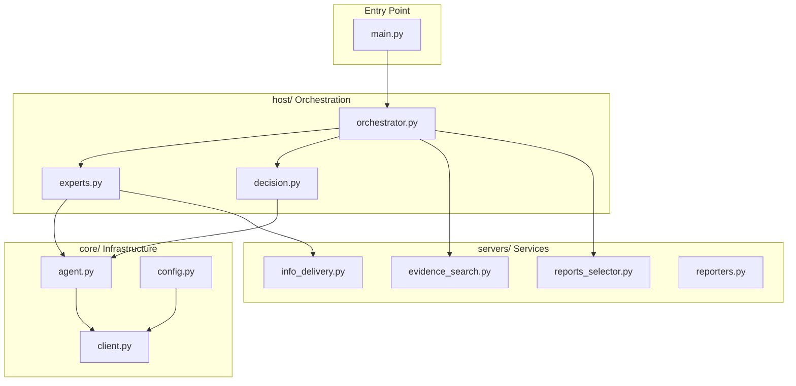

# OMGs Development & Operations Skill

## Architecture Overview

## Key Entry Points

| Task | Entry | Key Function |
|------|-------|--------------|
| Run MDT pipeline | `main.py` | CLI entry, calls `process_omgs_multi_expert_query()` |
| MDT discussion engine | `host/orchestrator.py` | `run_mdt_discussion()` - 2 rounds × 2 turns |
| Expert agent init | `host/experts.py` | `init_expert_agent()`, `ROLES`, `ROLE_PERMISSIONS` |
| Final synthesis | `host/decision.py` | `generate_final_output()`, `append_references_to_output()` |
| RAG retrieval | `servers/evidence_search.py` | `get_global_guideline_rag()`, `pubmed_search_pack()` |
| Report selection | `servers/reports_selector.py` | `select_reports_for_roles()` |

## Expert Roles Quick Reference

5 roles: `chair`, `oncologist`, `radiologist`, `pathologist`, `nuclear`

| Role | Lab | Imaging | Pathology | Mutation |
|------|:---:|:-------:|:---------:|:--------:|
| chair | Y | Y | - | Y |
| oncologist | Y | - | - | Y |
| radiologist | - | Y | - | - |
| pathologist | - | - | Y | Y |
| nuclear | - | Y | - | - |

## MDT Discussion Flow

1. **Initial Opinions** - Each expert gives 3 bullets from their case view
2. **Round N, Turn M** - Experts speak only on: conflict / safety / missing / new
3. **Round Final Plans** - Each expert refines their plan
4. **Chair Synthesis** - Final assessment with evidence tags

## Evidence Tag System

- `[@guideline:doc_id|page]` - Guideline reference
- `[@pubmed:PMID]` - PubMed literature
- `[@trial:id]` - Clinical trial
- `[@report_id|date]` - Clinical report (lab/imaging/pathology)

## Configuration Files

- `config/paths.json` - Data paths, RAG store, output dirs
- `config/mdt_prompts.json` - Discussion prompts, RAG prompts, agent prompts

## Reference Guides

- **Architecture details**: See [references/architecture.md](references/architecture.md)
- **Expert roles & permissions**: See [references/expert-roles.md](references/expert-roles.md)
- **Extension development**: See [references/extension-guide.md](references/extension-guide.md)
- **Pipeline operations**: See [references/pipeline-ops.md](references/pipeline-ops.md)
