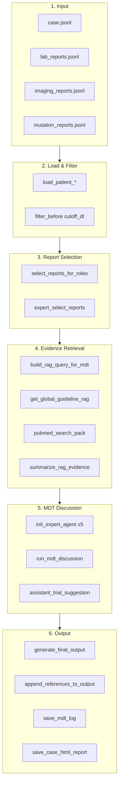

# OMGs Architecture Reference

## Table of Contents

1. [Three-Layer Architecture](#three-layer-architecture)
2. [Module Responsibilities](#module-responsibilities)
3. [Data Flow](#data-flow)
4. [Key Classes & Functions](#key-classes--functions)

---

## Three-Layer Architecture

```
OMGs/
├── host/           # Orchestration Layer - MDT discussion coordination
├── servers/        # Service Layer - Data retrieval & processing
├── core/           # Infrastructure Layer - LLM client & config
└── utils/          # Pure utilities (no business logic)
```

---

## Module Responsibilities

### host/ - Orchestration Layer

| File | Responsibility |
|------|----------------|
| `orchestrator.py` | MDT pipeline entry, discussion engine, interaction matrix |
| `experts.py` | Role definitions, permissions, prompts, agent initialization |
| `decision.py` | Final output generation, reference appending, trial matching |

### servers/ - Service Layer

| File | Responsibility |
|------|----------------|
| `evidence_search.py` | RAG retrieval (ChromaDB), PubMed search, evidence summarization |
| `reports_selector.py` | Load clinical reports, role-based filtering, expert selection |
| `info_delivery.py` | Build role-specific case views from normalized JSON |
| `reporters.py` | Save MDT logs (JSONL/MD), generate HTML reports |
| `trace.py` | TraceLogger, VisualConfig, observability utilities |
| `case_parser.py` | EHR extraction (used by `ehr_structurer.py`) |

### core/ - Infrastructure Layer

| File | Responsibility |
|------|----------------|
| `agent.py` | Stateful `Agent` class wrapping Azure OpenAI chat |
| `client.py` | `init_client()` - Azure OpenAI client initialization |
| `config.py` | `load_paths_config()`, `load_mdt_prompts()`, `create_question()` |

### utils/ - Pure Utilities

| File | Responsibility |
|------|----------------|
| `console_utils.py` | `Color`, `preview_text()`, `safe_parse_json_block()` |
| `time_utils.py` | `parse_dt()`, `make_cutoff()`, `filter_before()`, timeline builders |
| `reference_cache.py` | `ReferenceCache`, evidence tag extraction & formatting |

---

## Data Flow



---

## Key Classes & Functions

### Agent (core/agent.py)

```python
class Agent:
    def __init__(self, instruction, role, model_info, client, max_tokens, max_prompt_tokens):
        ...
    def chat(self, user_msg: str) -> str:
        # Stateful conversation with token budget management
    def inject_assistant(self, msg: str):
        # Insert assistant message without API call
```

### run_mdt_discussion (host/orchestrator.py)

```python
def run_mdt_discussion(
    agents: Dict[str, Agent],
    assistant: Agent,
    num_rounds: int = 2,
    num_turns: int = 2,
    ...
) -> Tuple[Dict[str, str], str, Dict, Dict]:
    # Returns: (initial_ops, merged_context, final_round_ops, interaction_log)
```

Discussion structure:
1. Initial opinions from all experts
2. For each round:
   - For each turn: experts speak on conflict/safety/missing/new
   - Round final plans from all experts
   - Update structured memory
3. Return aggregated results

### process_omgs_multi_expert_query (host/orchestrator.py)

Main pipeline entry point:

```python
def process_omgs_multi_expert_query(
    question: Any,
    question_raw: Optional[str],
    model: str,
    args: Any,
    time: Optional[str] = None,
    meta_info: Optional[str] = None,
    # Optional overrides for data paths
    labs_json: Optional[str] = None,
    imaging_json: Optional[str] = None,
    ...
) -> str:
```

Pipeline steps:
1. Load & filter clinical reports by visit time
2. Select reports per role via `select_reports_for_roles()`
3. Build RAG query and retrieve guideline + PubMed evidence
4. Initialize 5 expert agents + assistant
5. Run MDT discussion engine
6. Optional: clinical trial matching
7. Generate final chair output with references
8. Save logs (JSONL, MD, HTML)
